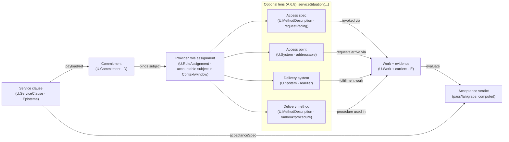

# First Principles Framework (FPF) — Core Conceptual Specification
by Anatoly Levenchuk and assortment of LLMs.
December 2025

Pattern and headers templates are explained in pattern E.8.

# Table of Content

 **Preface (non-normative)**

| ID & Title                                                                                                                                   | Status    | Concise content reminder — “what belongs here”                                                                                                                                                                                        |
| :------------------------------------------------------------------------------------------------------------------------------------------- | :-------- | :------------------------------------------------------------------------------------------------------------------------------------------------------------------------------------------------------------------------------------ |
| FPF is a first principle based architecture decisions for transdiciplinary SoTA methods of evolving holons: systems, epistemes, communities. | full text | FPF serves the Engineer, Researcher, and Manager by providing a generative pattern language for constructing and evolving thought, designed as an "operating system for thought".                                                     |
| Creativity in Open-Ended Evolution and Assurance*                                                                                            | full text | FPF integrates assurance (audits, evidence) and creativity (generating novel ideas) as complementary engines for responsible innovation, providing a structured choreography for creative work from abduction to operation.           |
| Navigating Uncertainty: Building Closed Worlds within an Open World                                                                          | full text | Explains how FPF reconciles Open-World and Closed-World assumptions, using Bounded Contexts to create reliable 'islands of closure' for engineering decisions within an inherently open world.                                        |
| FPF as an Evolutionary Architecture for Thought                                                                                              | full text | Positions FPF as an architecture for the reasoning process itself, designed to sustain key characteristics like auditability, evolvability, and falsifiability by applying architectural thinking to the dynamics of reasoning.       |
| Architectural Characteristic of Thought                                                                                                      | full text | Details the key characteristics of rigorous thought (e.g., Auditability, Evolvability, Composability) and the specific FPF mechanisms designed to preserve them.                                                                      |
| Beyond Cognitive Biases: FPF as a Generative Architecture for Thought                                                                        | full text | Contrasts FPF's generative, structural approach to avoiding cognitive errors with the traditional corrective, diagnostic approach of hunting for biases, framing FPF as a scaffold that makes errors harder to commit.                |
| Thinking Through Writing: The FPF Discipline of Conceptual Work                                                                              | full text | Describes how FPF uses a discipline of "thinking through writing" with conceptual forms (Cards, Tables, Records) to make thought tangible, shareable, and auditable, while remaining tool-agnostic.                                   |
| Descriptive Ontologies vs. A Thinking-Oriented Architecture                                                                                  | full text | Differentiates FPF's goal of orchestrating reasoning from classical ontologies' goal of cataloging existence, emphasizing FPF's focus on objectives, trust, and dynamics.                                                             |
| The "Bitter Lesson" trajectory — compute, data, and freedom over hand‑tuned rules (FPF stance)                                               | full text | How FPF operationalizes the contemporary trend: prefer general models + data + compute + minimal constraints; autonomy budgets; rule‑of‑constraints vs instruction‑of‑procedure; continuous adaptation.                               |
| From Flat Documents to High-Dimensional Truth: The Multi-View Architecture                                                                   | full text | Shows how FPF replaces flat documents with a multi-view architecture: epistemes as slot graphs, engineering views as projections, and MVPK as typed publication surfaces that keep dashboards lawfully tethered to work and evidence. |
| The “big storylines” unique to FPF (load‑bearing commitments)                                                                                | full text | Lists the nine core, load-bearing commitments that define FPF's unique architectural and philosophical stance, from its holonic kernel to its explicit treatment of creativity and assurance.                                         |
| Transdisciplinarity as a Meta‑Theory of Thinking                                                                                             | full text | Explains how FPF treats transdisciplinarity as a meta-theory for designing reasoning, using architheories as generative scaffolds grounded in physical reality to bridge disciplinary silos.                                          |
| FPF as a Culinary Architecture for Collective Thought: Why We Formalize “Obvious” Ideas                                                      | full text | Uses the 'culinary architecture' analogy to explain FPF's role in synthesizing 'obvious' ideas into a robust framework for complex, generative problems.                                                                              |
| Intellect Stack (informative Overview)                                                                                                       | full text | Presents a five-layer pedagogical map of cognitive skills (Structure → Knowledge → Action → Strategy → Governance) and links them to FPF architheories.                                                                               |
| Purpose, Scope, and Explicit Non‑Goals                                                                                                       | full text | Clarifies FPF's mission as a generative scaffold for thought, its scope as tool-agnostic normative patterns, and what it explicitly is not (e.g., a domain encyclopedia or a specific methodology).                                   |

**Part A - Kernel Architecture Cluster**

| § | ID & Title | Status | Keywords & Search Queries | Dependencies |
| :--- | :--- | :--- | :--- | :--- |
| A.0 | **Onboarding Glossary (NQD & E/E‑LOG)** | Stable | *Keywords:* novelty, quality‑diversity (NQD), explore/exploit (E/E‑LOG), portfolio (set), illumination map (report‑only telemetry), parity run, comparability, ReferencePlane, CL^plane, ParetoOnly default. *Queries:* "What is NQD in FPF?", "How does FPF handle creative generation?", "What is an explore-exploit policy in FPF?" | **Builds on:** E.2, A.5, C.17–C.19. **Coordinates with:** E.7, E.8, E.10; F.17; G.5, G.9–G.12. **Constrains:** Any pattern/UTS row that describes a generator, selector, or portfolio. |
| ***Cluster A.I - Foundational Ontology*** | | | | |
| A.1 | **Holonic Foundation: Entity → Holon** | Stable | *Keywords:* part-whole composition, system boundary, entity, holon, U.System, U.Episteme. *Queries:* "How does FPF model a system and its parts?", "What is a holon?", "Difference between entity and system." | **Builds on:** P-8 Cross-Scale Consistency. **Prerequisite for:** A.1.1, A.2, A.14, B.1. |
| A.1.1 | **`U.BoundedContext`: The Semantic Frame** | Stable | *Keywords:* local meaning, context, semantic boundary, domain, invariants, glossary, DDD. *Queries:* "How does FPF handle ambiguity?", "What is a Bounded Context in FPF?", "How to define rules for a specific project?" | **Builds on:** A.1. **Prerequisite for:** A.2.1, F.0.1. |
| A.2 | **Role Taxonomy** | Stable | *Keywords:* role, assignment, holder, context, function vs identity, responsibility, U.RoleAssignment. *Queries:* "How to model responsibilities?", "What is the difference between what a thing *is* and what it *does*?" | **Builds on:** A.1, A.1.1. **Prerequisite for:** A.2.1-A.2.6, A.13, A.15. |
| A.2.1 | **`U.RoleAssignment`: Contextual Role Assignment** | Stable | *Keywords:* Standard, holder, role, context, RoleEnactment, RCS/RSG. *Queries:* "How to formally assign a role in FPF?", "What is the Holder#Role:Context Standard?" | **Refines:** A.2. **Prerequisite for:** A.15. |
| A.2.2 | **`U.Capability`: System Ability (dispositional property)** | Stable | *Keywords:* ability, skill, performance, action, work scope, measures. *Queries:* "How to separate ability from permission?", "What is a capability in FPF?" | **Builds on:** A.2. **Informs:** A.15, A.2.3. |
| A.2.3 | **`U.ServiceClause`: The Service Promise Clause** | Stable | *Keywords:* service clause, promise content, accessSpec, acceptanceSpec, SLO, SLA, claim scope (G), Work evidence, provider/consumer roles, deprecated alias `U.Service`. *Queries:* "What is a service clause in FPF?", "Service clause vs Work vs MethodDescription", "How do access and acceptance differ?", "How is SLO/SLA adjudicated from Work evidence?" | **Builds on:** A.2.2. **Prerequisite for:** F.12. **Used by:** A.2.8, A.6.C, A.6.8. |
| A.2.4 | **`U.EvidenceRole`: The Evidential Stance** | Stable | *Keywords:* evidence, claim, support, justification, episteme. *Queries:* "How does an episteme serve as evidence?", "Modeling evidence roles." | **Builds on:** A.2. **Informs:** A.10, B.3. |
| A.2.5 | **`U.RoleStateGraph`: The Named State Space of a Role**| Stable | *Keywords:* state machine, RSG, role state, enactability, lifecycle. *Queries:* "How to model the state of a role?", "What is a Role State Graph?" | **Builds on:** A.2.1. **Prerequisite for:** A.15. |
| A.2.6 | **Unified Scope Mechanism (USM): Context Slices & Scopes**| Stable | *Keywords:* scope, applicability, ClaimScope (G), WorkScope, set-valued. *Queries:* "How to define the scope of a claim or capability?", "What is G in F-G-R?" | **Builds on:** A.1.1. **Constrains:** A.2.2, A.2.3, B.3. |
| A.2.7 | **`U.RoleAlgebra`: In-Context Role Relations (`≤`, `⊥`, `⊗`)** | New | *Keywords:* role algebra, specialization (`≤`), incompatibility (`⊥`), bundles (`⊗`), separation of duties (SoD), requiredRoles substitution. *Queries:* "What does `RoleS ≤ RoleG` mean in FPF?", "How do I encode Separation of Duties with `⊥`?", "How do role bundles (`⊗`) work?" | **Builds on:** A.2. **Prerequisite for:** A.15, A.2.5. |
| A.2.8 | **`U.Commitment`: Deontic Commitment Object** | Stable | *Keywords:* commitment, deontics, obligation/permission/prohibition, modality normalization, scope+validity window, adjudication hooks, evidenceRefs, BCP‑14 (RFC 2119/8174). *Queries:* "How to represent MUST/SHALL as a lintable object?", "How to keep deontics separate from admissibility gates?", "How to make commitments auditable via evidence hooks?" | **Refines:** A.2. **Builds on:** A.2.1, A.2.3, A.2.6, A.7, A.15.1. **Used by:** A.6.B (Quadrant D), A.6.C. |
| A.2.9 | **`U.SpeechAct`: Communicative Work Object** | Stable | *Keywords:* speech act, communicative work, approval/authorization/publication/revocation, provenance, act≠utterance≠carrier, judgement context, window/freshness, institutes.*. *Queries:* "How to model approvals/authorizations as Work?", "How to separate act vs utterance vs carrier?", "How to link commitments to instituting acts without commitment-by-publication?" | **Refines:** A.2. **Builds on:** A.2.1, A.2.6, A.7, A.10, A.15.1. **Used by:** A.2.8, A.6.C (utterance/instituting-act hook). |
| ***Cluster A.II - Transformation Engine*** | | | | |
| A.3 | **Transformer Constitution (Quartet)** | Stable | *Keywords:* action, causality, change, System-in-Role, MethodDescription, Method, Work. *Queries:* "How does FPF model an action or a change?", "What is the transformer quartet?" | **Builds on:** A.2. **Prerequisite for:** A.3.1, A.3.2, A.15. |
| A.3.1 | **`U.Method`: The Abstract Way of Doing** | Stable | *Keywords:* recipe, how-to, procedure, abstract process. *Queries:* "What is a Method in FPF?", "Difference between Method and Work." | **Refines:** A.3. **Prerequisite for:** A.15. |
| A.3.2 | **`U.MethodDescription`: The Recipe for Action** | Stable | *Keywords:* specification, recipe, SOP, code, model, epistemic artifact. *Queries:* "How to document a procedure?", "What is a MethodDescription?" | **Refines:** A.3. **Informs:** A.15. |
| A.3.3 | **`U.Dynamics`: The Law of Change** | Stable | *Keywords:* state evolution, model, simulation, state space. *Queries:* "How to model state transitions or system dynamics?", "Difference between a Method and Dynamics." | **Builds on:** A.19. **Informs:** B.4. |
| ***Cluster A.III - Time & Evolution*** | | | | |
| A.4 | **Temporal Duality & Open-Ended Evolution Principle** | Stable | *Keywords:* design-time, run-time, evolution, versioning, lifecycle, continuous improvement. *Queries:* "How does FPF handle plan vs. reality?", "How are systems updated?" | **Builds on:** P-10 Open-Ended Evolution. **Prerequisite for:** B.4. |
| ***Cluster A.IV - Kernel Modularity*** | | | | |
| A.5 | **Open-Ended Kernel & Architheory Layering** | Stable | *Keywords:* micro-kernel, plug-in, CAL/LOG/CHR, modularity, extensibility. *Queries:* "What is the architecture of FPF?", "How are new domains added?" | **Builds on:** P-4, P-5. **Prerequisite for:** A.6.A, all Part C. |
| ***Cluster A.IV.A - Signature Stack & Boundary Discipline (A.6.*)*** | | | | |
| A.6 | **Signature Stack & Boundary Discipline** | Stable | *Keywords:* boundary, signature stack, routing, laws, admissibility, deontics, evidence, claim register, MVPK, view/viewpoint, surface. *Queries:* "What is the Signature Stack in FPF?", "How do I route boundary statements (laws vs gates vs duties vs evidence)?", "How to avoid contract-soup drift in boundary descriptions?" | **Builds on:** E.8, A.6.0, A.6.1, A.6.3, E.17.0, E.17, A.7, F.18, E.10.D2, E.10/L-SURF. **Coordinates with:** A.6.A, A.6.5, A.6.6, A.6.7, E.19. |
| A.6.B | **Boundary Norm Square (Laws / Admissibility / Deontics / Work-Effects)** | Stable | *Keywords:* boundary norm square, atomic claims, L/A/D/E routing, laws vs gates, commitments, evidence carriers, no upward dependencies, claim IDs, triangle decomposition. *Queries:* "What is the Boundary Norm Square in FPF?", "How to decompose a mixed sentence into gate/duty/evidence claims?", "Where do RFC keywords belong in FPF patterns?" | **Builds on:** E.8, A.6.0, A.6.1, A.6.3, E.17.0, E.17, A.7, F.18, E.10.D2, E.10/L-SURF. **Used by:** A.6 (cluster overview). |
| A.6.C | **Contract Unpacking for Boundaries** | Stable | *Keywords:* contract bundle unpacking, SLA/guarantee routing, service clause (promise content) ≠ work, promise-act/utterance/commitment separation, Boundary Norm Square (L/A/D/E), MVPK faces “no new semantics”. *Queries:* "How to unpack contract language into service clause / utterance / commitment / work+evidence?", "How to prevent interface-as-agent / contract soup mistakes?", "How to stop MVPK faces becoming ‘second contracts’?", "When contract talk includes service-cluster tokens, what gets unpacked first?" | **Builds on:** A.6, A.6.B, A.6.8, A.7, A.2.3, A.2.8, A.2.9, E.10, E.17. **Coordinates with:** F.12, F.18.
| A.6.0| **U.Signature — Universal, law‑governed declaration** | Stable | *Keywords:* signature, vocabulary, laws, applicability, bounded context. *Queries:* "What is the universal signature block?", "Where do laws vs. implementations live?" | **Placement:** Kernel; **Coordinates:** A.6.A, A.6.1. |
| A.6.A | **Architheory Signature & Realization** | Stable | *Keywords:* architheory, signature, realization, Γ-export, invariants. *Queries:* "What is an Architheory signature?", "How do I export Γ?", "What belongs in the signature vs realization?" | **Builds on:** A.5, E.10, E.8. **Prerequisite for:** Part C catalogue. |
| A.6.1 | **U.Mechanism - Law‑governed application to a SubjectKind over a BaseType** | Stable | Keywords: Mechanism, OperationAlgebra, LawSet, AdmissibilityConditions, Transport, Bridge‑only. Queries: "How to define a mechanism like USM/UNM?", "Where do operational guards live?", "How to handle cross‑context transport?" | **Builds on:** A.6.A, E.10.D1. **Instances:** USM (A.2.6), UNM (A.19). |
| A.6.2 | **U.EffectFreeEpistemicMorphing — Effect-Free Morphisms of Epistemes** | Stable | *Keywords:* episteme, effect-free, morphism, functoriality, describedEntity, lenses, reproducibility. *Queries:* "How to transform descriptions/specs without mechanisms?", "What are conservative episteme-to-episteme transforms in FPF?", "How do Describe_ID / Specify_DS fit into a general morphism class?" | **Builds on:** A.1 (Holon), A.7 (Strict Distinction, Object≠Description≠Carrier), A.6.0 (U.Signature), A.6.5 (U.RelationSlotDiscipline), E.10.D2 (I/D/S discipline), C.2.1 (U.EpistemeSlotGraph). **Used by:** A.6.3 (U.EpistemicViewing), A.6.4 (U.EpistemicRetargeting), E.17.0 (U.MultiViewDescribing), E.17 (MVPK), E.18 (E.TGA StructuralReinterpretation), KD-CAL mapping rules. |
| A.6.3 | **U.EpistemicViewing — describedEntity-Preserving Morphism** | Stable | *Keywords:* episteme, view, EpistemicViewing, describedEntity preservation, ClaimGraph, Viewpoint, RepresentationScheme, CorrespondenceModel, Direct vs Correspondence Viewing, optics, displayed fibration. *Queries:* "How to define a view of an artefact without adding new claims?", "What is an EpistemicViewing in FPF terms?", "How do ISO 42010 views and SysML v2 views-as-queries sit in FPF?" | **Builds on:** A.6.0 (U.Signature), A.6.2 (U.EffectFreeEpistemicMorphing), A.6.5 (U.RelationSlotDiscipline), A.7 (Strict Distinction; I/D/S vs Surface), E.10.D2 (I/D/S discipline), C.2.1 (U.EpistemeSlotGraph), C.2 (KD-CAL: describedEntity & ReferencePlane). **Used by:** E.17.0 (U.MultiViewDescribing), E.17 (MVPK), E.17.1/E.17.2 (ViewpointBundleLibrary & TEVB), E.18 (E.TGA viewpoint families), B.5.3 (Role-Projection Bridge), KD-CAL view operators. |
| A.6.4 | **U.EpistemicRetargeting — describedEntity-Retargeting Morphism** | New | *Keywords:* retargeting, subject retargeting, describedEntity shift, KindBridge, SquareLaw-retargeting, StructuralReinterpretation. *Queries:* "How to change the object-of-talk without losing truth?", "What is StructuralReinterpretation in FPF terms?", "When is a Fourier-like transform a retargeting rather than a new Γ-construction?" | **Builds on:** A.6.2 (effect-free episteme morphisms), A.1 (Holon: System/Episteme split), F.9 (Bridges & CL, including CL^plane and KindBridge), C.2.1 (U.EpistemeSlotGraph; DescribedEntity/GroundingHolon), C.2 (KD-CAL: ReferencePlane & CL propagation), E.18:5.9/E.18:5.12 (E.TGA crossings & StructuralReinterpretation rules). **Used by:** E.18 (StructuralReinterpretation node in E.TGA as species of U.EpistemicRetargeting), KD-CAL/LOG-CAL retargeting rules, Fourier-style transforms and data↔model re-targetings in discipline packs. |
| A.6.P | **U.RelationalPrecisionRestorationSuite — Relational Precision Restoration (RPR) — Kind‑Explicit Qualified Relation Discipline** | Stable | *Keywords:* relation precision restoration, under‑specified relations, umbrella verbs, RelationKind, QualifiedRelationRecord, hidden arity, polarity, change‑class lexicon, lexical guardrails. *Queries:* "What is A.6.P in FPF?", "How do I rewrite under‑specified relational prose?", "How do A.6.5 and A.6.6 specialise the RPR suite?" | **Builds on:** A.6, A.6.B, A.6.S, A.6.0, A.6.5, E.8, E.10, F.18. **Coordinates with:** A.2.6, A.10, C.3.3, E.17, F.9. **Specialised by:** A.6.5, A.6.6 (and future A.6.x). |
| A.6.5 | **U.RelationSlotDiscipline - SlotKind / ValueKind / RefKind discipline for n‑ary relations (with slot‑operation lexicon)** | Stable | *Keywords:* slot, argument position, value, reference, signature, substitution, pass-by-value, pass-by-reference. *Queries:* “How do I declare positions and references in relations?”, “How do we stop mixing roles, values and ids in signatures?”, “How does SlotKind/ValueKind/RefKind interact with I/D/S and Epistemes?” | **Builds on:** A.6.0 (U.Signature), A.1 (Holon), A.7 (Strict Distinction), E.8 (pattern authoring discipline), E.10 (LEX-BUNDLE; Tech/Plain registers). **Used by:** C.2.1 (U.EpistemeSlotGraph), A.6.2–A.6.4 (episteme morphisms), B.5.* (RoleEnactment), C.3.* (Kinds & KindSignature), E.17.0 (U.MultiViewDescribing), discipline-packs for methods/services. |
| A.6.6 | **U.BaseDeclarationDiscipline - Kind-explicit, scoped, witnessed base declaration discipline (with base-change lexicon)** | New | *Keywords:* base declaration, basedness, baseRelation, SWBD, witnesses, scope, Γ_time, anchoring, rebase, retime, rescope. *Queries:* "What is U.BaseDeclarationDiscipline?", "How to model base-dependence without anchoring?", "What is a ScopedWitnessedBaseDeclaration (SWBD)?" | **Builds on:** A.6.0, A.6.5, A.2.6, A.2.4, A.7, E.8, E.10. **Coordinates with:** A.10, A.14, C.2.1, A.6.3–A.6.4, C.3.3, E.18, F.9, F.15, F.18. **Used by:** base-relative admissibility/calibration/attribution patterns; anchor* rewrites into explicit `baseRelation(dependent, base)`. |
| A.6.7 | **`MechSuiteDescription` — Description of a set of distinct mechanisms** | Stable | *Keywords:* mechanism suite, distinct mechanisms, suite obligations, contract pins, CN-Spec, CG-Spec, P2W, planned baseline, crossing visibility. *Queries:* "What is a MechSuiteDescription?", "How to describe a bundle of distinct mechanisms without using MechFamilyDescription?", "How do suite obligations differ from gate decisions?" | **Builds on:** E.8, A.6.1, A.6.5, E.10, E.19. **Coordinates with:** E.18, A.21. **Used by:** Part G universalization; CHR mechanism stacks. |
| A.6.8 | **Service Polysemy Unpacking (RPR-SERV)** | Stable | *Keywords:* service polysemy, facet unpacking, serviceSituation QRR, service clause vs access point, provider principal, SLA/SLO, server/service provider rewrite. *Queries:* "How to unpack service talk in FPF?", "serviceSituation lens", "service clause vs service access point", "RPR-SERV rules". | **Builds on:** A.6.P, A.6.B, A.6.5, A.2.3, A.2.8, A.2.9, A.15, E.10, F.17, F.18. **Coordinates with:** A.6.C, A.7, F.8, E.15. |
| A.6.S | **U.SignatureEngineeringPair — Constructive signature engineering (ConstructorSignature + TargetSignature)** | Stable | *Keywords:* signature engineering, TargetSignature, ConstructorSignature, two-signature arrangement, EFEM, editioning, retargeting, slot/base change lexicon, MVPK views (no new semantics), claim register, no epistemic agency. *Queries:* "What is U.SignatureEngineeringPair in FPF?", "How do I model TargetSignature vs ConstructorSignature (and keep Work out of edits)?", "How do slot/base change verbs compose into a reproducible signature evolution workflow?" | **Builds on:** A.6.0, A.6.2, A.6.3, A.6.4, A.6.5, A.6.6, A.6.B, A.3, A.7, A.12, C.2.1, E.17, E.10. **Coordinates with:** E.18, E.19. |
| ***Cluster A.V - Constitutional Principles of the Kernel*** | | | | |
| A.7 | **Strict Distinction (Clarity Lattice)** | Stable | *Keywords:* category error, Object ≠ Description, Role ≠ Work, ontology. *Queries:* "How to avoid common modeling mistakes?", "What are FPF's core distinctions?" | **Builds on:** A.1, A.2, A.3. **Constrains:** all patterns. |
| A.8 | **Universal Core (C-1)** | Stable | *Keywords:* universality, transdisciplinary, domain-agnostic, generalization. *Queries:* "How does FPF ensure its concepts are universal?" | **Builds on:** P-8. **Constrains:** Kernel-level `U.Type`s. |
| A.9 | **Cross-Scale Consistency (C-3)** | Stable | *Keywords:* composition, aggregation, holarchy, invariants, roll-up. *Queries:* "How do rules compose across different scales?", "How to aggregate metrics safely?" | **Builds on:** A.1, A.8. **Prerequisite for:** B.1. |
| A.10 | **Evidence Graph Referring (C-4)** | Stable | *Keywords:* evidence, traceability, audit, provenance, SCR/RSCR. *Queries:* "How are claims supported by evidence?", "How to ensure auditability?" | **Builds on:** A.1. **Prerequisite for:** B.3. |
| A.11 | **Ontological Parsimony (C-5)** | Stable | *Keywords:* minimalism, simplicity, Occam's razor, essential concepts. *Queries:* "How does FPF avoid becoming too complex?", "Rule for adding new concepts." | **Builds on:** P-1 Cognitive Elegance. **Constrains:** all new `U.Type` proposals. |
| A.12 | **External Transformer & Reflexive Split (C-2)** | Stable | *Keywords:* causality, agency, self-modification, external agent, control loop. *Queries:* "How to model a self-healing or self-calibrating system?", "What is the external transformer principle?" | **Builds on:** A.3. **Prerequisite for:** B.2.5. |
| A.13 | **The Agential Role & Agency Spectrum** | Stable | *Keywords:* agency, autonomy, AgentialRole, Agency-CHR, decision-making. *Queries:* "How is agency modeled in FPF?", "What is the agency spectrum?" | **Builds on:** A.2. **Refined by:** C.9 Agency-CHR. |
| A.14 | **Advanced Mereology: Components, Portions, Aspects & Phases**| Stable | *Keywords:* mereology, part-of, ComponentOf, PortionOf, PhaseOf, composition. *Queries:* "How to model different kinds of 'part-of' relationships?" | **Refines:** A.1. **Prerequisite for:** B.1.1. |
| A.15 | **Role–Method–Work Alignment (Contextual Enactment)** | Stable | *Keywords:* enactment, alignment, plan vs reality, design vs run, MIC, WorkPlan. *Queries:* "How do roles, methods, and work connect?", "How does an intention become an action in FPF?" | **Integrates:** A.2, A.3, A.4. **Prerequisite for:** all operational models. |
| A.15.1 | **`U.Work`: The Record of Occurrence** | Stable | *Keywords:* execution, event, run, actuals, log, occurrence. *Queries:* "What is a Work record?", "Where are actual resource costs stored?" | **Refines:** A.15. **Used by:** B.1.6, all Part D. |
| A.15.2 | **`U.WorkPlan`: The Schedule of Intent** | Stable | *Keywords:* plan, schedule, intent, forecast. *Queries:* "How to model a plan or schedule?", "Difference between a WorkPlan and a MethodDescription." | **Refines:** A.15. **Informs:** `U.Work`. |
| A.16 | **Formality–Openness Ladder (FOL): Building Closed Worlds Inside an Open World** | Stub | *Keywords:* formality levels, rigor, proof, specification, sketch, F0-F9. *Queries:* "How to measure the formality of a document?", "What are the F0-F9 levels?" | **Builds on:** A.1. **Informs:** B.3. |
| A.17 | **A.CHR-NORM — Canonical “Characteristic” & rename (Dimension/Axis → Characteristic)** | Stable | *Keywords:* characteristic, measurement, property, attribute, dimension, axis. *Queries:* "What is the correct term for a measurable property?", "How to define a metric?" | **Prerequisite for:** A.18, A.19, C.16. |
| A.18 | **A.CSLC-KERNEL — Minimal CSLC in Kernel (Characteristic/Scale/Level/Coordinate)** | Stable | *Keywords:* CSLC, scale, level, coordinate, measurement Standard. *Queries:* "What is the CSLC Standard?", "How to ensure measurements are comparable?" | **Builds on:** A.17. **Prerequisite for:** all metric-based patterns. |
| A.19 | **A.CHR-SPACE — CharacteristicSpace & Dynamics hook** | Stable | *Keywords:* state space, CharacteristicSpace, dynamics, state model, RSG. *Queries:* "How to define a system's state space?", "How does FPF model change over time?" | **Builds on:** A.17, A.18, A.2.5. **Prerequisite for:** A.3.3. |
| A.19.D1| **CN‑frame (comparability & normalization)** | Stable | *Keywords:* CN-frame, comparability, normalization, CG-Spec, UNM, CharacteristicSpace, chart, RSG, RSCR. *Queries:* "What is a CN-frame in FPF?", "How does FPF handle normalization for comparison?", "What is a CN-Spec?" | **Builds on:** A.19. **Coordinates with:** G.0. |
| A.20 | **U.Flow.ConstraintValidity — Eulerian** | Stable | *Keywords:* flow, ConstraintValidity, Eulerian, TransductionFlow, GateFit, MVPK, SquareLaw, Sentinel, PathSlice. *Queries:* "What is ConstraintValidity in FPF?", "What is the Eulerian stance in FPF flows?", "How does E.TGA relate to flows?" | **Builds on:** E.18 (E.TGA). **Coordinates with:** A.21, A.22, A.25, A.27, A.28, A.31, A.45. |
| A.21 | **GateProfilization: `OperationalGate(profile)` (GateFit core)** | Stable | *Keywords:* OperationalGate, GateFit, GateProfile, GateChecks, join-semilattice, `GateDecision`, `DecisionLog`, EquivalenceWitness, LaunchGate, CV⇒GF. *Queries:* "What is GateProfilization in FPF?", "How does OperationalGate aggregate GateChecks?", "What is the CV⇒GF activation predicate?" | **Builds on:** E.18 (E.TGA), E.17 (MVPK), A.7. **Coordinates with:** A.20, A.23, A.24, A.25, A.26, A.27, A.41. |


**Part B — Trans-disciplinary Reasoning Cluster**

| § | ID & Title | Status | Keywords & Search Queries | Dependencies |
| :--- | :--- | :--- | :--- | :--- |
| **B.1** | **Universal Algebra of Aggregation (Γ)** | Stable | *Keywords:* aggregation, composition, holon, invariants, IDEM, COMM, LOC, WLNK, MONO, gamma operator. *Queries:* "How does FPF combine parts into a whole?", "What are the rules for aggregation?", "What is the Gamma (Γ) operator?" | **Builds on:** A.1, A.9. **Prerequisite for:** All B.1.x, B.2. |
| B.1.1 | **Dependency Graph & Proofs** | Stable | *Keywords:* dependency graph, proofs, structural aggregators, sum, set, slice. *Queries:* "What is the input for the Gamma operator?", "How are aggregation invariants proven in FPF?" | **Builds on:** B.1. |
| B.1.2 | **System-specific Aggregation Γ_sys** | Stable | *Keywords:* system aggregation, physical systems, mass, energy, boundary rules, Sys-CAL. *Queries:* "How to aggregate physical systems?", "Conservation laws in FPF aggregation?" | **Builds on:** B.1, A.1, C.1. |
| B.1.3 | **Γ_epist — Knowledge-Specific Aggregation**| Stable | *Keywords:* knowledge aggregation, epistemic, provenance, trust, KD-CAL. *Queries:* "How to combine knowledge artifacts?", "How does trust propagate in FPF?" | **Builds on:** B.1, A.1, C.2. |
| B.1.4 | **Contextual & Temporal Aggregation (Γ_ctx & Γ_time)** | Stable | *Keywords:* temporal aggregation, time-series, order-sensitive, composition. *Queries:* "How does FPF handle time-series data?", "How to model processes where order matters?" | **Builds on:** B.1. |
| B.1.5 | **Γ_method — Order-Sensitive Method Composition & Instantiation**| Stable | *Keywords:* method composition, workflow, sequential, concurrent, plan vs run. *Queries:* "How to combine methods or workflows?", "How does FPF model complex procedures?" | **Builds on:** B.1, B.1.4, A.3.1. |
| B.1.6 | **Γ_work — Work as Spent Resource**| Stable | *Keywords:* work, resource aggregation, cost, energy consumption, Resrc-CAL. *Queries:* "How to calculate the total cost of a process?", "How are resources aggregated in FPF?" | **Builds on:** B.1, A.15.1, C.5. |
| **B.2** | **Meta-Holon Transition (MHT): Recognizing Emergence and Re-identifying Wholes**| Stable | *Keywords:* emergence, MHT, meta-system, new whole, synergy, system of systems. *Queries:* "How does FPF model emergence?", "What is a Meta-Holon Transition?", "When does a collection become more than the sum of its parts?" | **Builds on:** B.1, A.1. **Prerequisite for:** All B.2.x. |
| B.2.1 | **BOSC Triggers** | Draft | *Keywords:* BOSC, triggers for emergence, boundary, objective, supervisor, complexity. *Queries:* "What triggers an MHT?", "What are the BOSC criteria for emergence?" | **Builds on:** B.2. |
| B.2.2 | **MST (Sys) — Meta-System Transition** | Stable | *Keywords:* system emergence, super-system, physical emergence. *Queries:* "How do new systems emerge from parts?", "What is a Meta-System Transition?" | **Builds on:** B.2, B.2.1, A.1. |
| B.2.3 | **MET (KD) — Meta-Epistemic Transition**| Stable | *Keywords:* knowledge emergence, meta-theory, paradigm shift, scientific revolution. *Queries:* "How do new theories emerge?", "What is a Meta-Epistemic Transition?" | **Builds on:** B.2, B.2.1, A.1. |
| B.2.4 | **MFT (Meta-Functional Transition)**| Stable | *Keywords:* functional emergence, capability emergence, adaptive workflow, new process. *Queries:* "How do new capabilities or workflows emerge?", "What is a Meta-Functional Transition?" | **Builds on:** B.2, B.2.1, A.3.1. |
| B.2.5 | **Supervisor–Subholon Feedback Loop** | Stable | *Keywords:* control architecture, feedback loop, supervisor, stability, layered control. *Queries:* "How does FPF model control systems?", "What is the supervisor-subholon pattern?" | **Builds on:** B.2, A.1. |
| **B.3** | **Trust & Assurance Calculus (F–G–R with Congruence)**| Stable | *Keywords:* trust, assurance, reliability, F-G-R, formality, scope, congruence, evidence. *Queries:* "How is trust calculated in FPF?", "What is the F-G-R model?", "How does FPF handle evidence and confidence?" | **Builds on:** A.10. **Prerequisite for:** All B.3.x, D.4. |
| B.3.1 | **Components & Epistemic Spaces** | Draft | *Keywords:* F-G-R components, measurement templates, epistemic space. *Queries:* "How are F, G, and R measured?", "What are epistemic spaces?" | **Builds on:** B.3. |
| B.3.2 | **Evidence & Validation Logic (LOG-use)** | Draft | *Keywords:* verification, validation, confidence, logic, proof. *Queries:* "What is the logic for validating claims in FPF?", "Difference between verification and validation." | **Builds on:** B.3, C.6. |
| B.3.3 | **Assurance Subtypes & Levels** | Stable | *Keywords:* assurance levels, L0-L2, TA, VA, LA, typing, verification, validation. *Queries:* "What are the assurance levels in FPF?", "How does an artifact mature in FPF?" | **Builds on:** B.3. |
| B.3.4 | **Evidence Decay & Epistemic Debt** | Stable | *Keywords:* evidence aging, decay, freshness, epistemic debt, stale data. *Queries:* "How does FPF handle outdated evidence?", "What is epistemic debt?" | **Builds on:** B.3. |
| B.3.5 | **CT2R-LOG — Working-Model Relations & Grounding**| Stable | *Keywords:* grounding, constructive trace, working model, assurance layer, CT2R, Compose-CAL. *Queries:* "How are FPF models grounded in evidence?", "What is the CT2R-LOG?" | **Builds on:** B.3, E.14, C.13. |
| **B.4** | **Canonical Evolution Loop** | Stable | *Keywords:* continuous improvement, evolution, Run-Observe-Refine-Deploy, PDCA, OODA. *Queries:* "How do systems evolve in FPF?", "What is the canonical evolution loop?" | **Builds on:** A.4, A.12. **Prerequisite for:** All B.4.x. |
| B.4.1 | **System Instantiation** | Stable | *Keywords:* field upgrade, physical system evolution, deployment. *Queries:* "How are physical systems updated in FPF?" | **Builds on:** B.4, A.1. |
| B.4.2 | **Knowledge Instantiation** | Stable | *Keywords:* theory refinement, knowledge evolution, scientific method. *Queries:* "How are scientific theories refined in FPF?" | **Builds on:** B.4, A.1. |
| B.4.3 | **Method Instantiation** | Stable | *Keywords:* adaptive workflow, process improvement, operational evolution. *Queries:* "How do workflows or methods evolve in FPF?" | **Builds on:** B.4, A.3.1. |
| **B.5** | **Canonical Reasoning Cycle** | Stable | *Keywords:* reasoning, problem-solving, Abduction-Deduction-Induction, scientific method. *Queries:* "How does FPF model problem-solving?", "What is the canonical reasoning cycle?" | **Builds on:** A.10. **Prerequisite for:** All B.5.x. |
| B.5.1 | **Explore → Shape → Evidence → Operate** | Stable | *Keywords:* development cycle, lifecycle, state machine, Explore, Shape, Evidence, Operate. *Queries:* "What are the development stages of an artifact in FPF?" | **Builds on:** B.5. |
| B.5.2 | **Abductive Loop** | Stable | *Keywords:* abduction, hypothesis generation, creativity, innovation. *Queries:* "How does FPF model creative thinking?", "What is the abductive loop?" | **Builds on:** B.5. |
| B.5.2.1 | **Creative Abduction with NQD** | Stable | *Keywords:* NQD, novelty, quality, diversity, open-ended search, Pareto front, E/E-LOG. *Queries:* "How to systematically generate creative ideas?", "What is NQD in FPF?" | **Builds on:** B.5.2, C.17, C.18, C.19. |
| B.5.3 | **Role-Projection Bridge** | Stable | *Keywords:* domain-specific vocabulary, concept bridge, mapping, terminology. *Queries:* "How does FPF integrate domain-specific language?", "What is a Role-Projection Bridge?" | **Builds on:** A.2, C.3. |
| **B.6** | **Characterisation Families (CHR-use)** | Draft | *Keywords:* characterization, templates, CHR architheories, measurement. *Queries:* "How to use CHR architheories?" | **Builds on:** Part C (CHR). |
| **B.7** | **Common Logic Suite (LOG-use)** | Draft | *Keywords:* logic, inference, trust propagation, LOG-CAL. *Queries:* "How to apply formal logic in FPF?" | **Builds on:** Part C (LOG-CAL). |

**Part C — Architheory Specifications**

| § | ID & Title | Status | Keywords & Search Queries | Dependencies |
| :--- | :--- | :--- | :--- | :--- |
| **Cluster C.I – Core CALs / LOGs / CHRs** | | | | |
| C.1 | **Sys‑CAL** | Draft | *Keywords:* physical system, composition, conservation laws, energy, mass, resources, U.System. *Queries:* "How to model physical systems in FPF?", "What are conservation laws in FPF?", "Modeling a pump or engine." | **Builds on:** A.1 Holonic Foundation, A.14. **Coordinates with:** Resrc-CAL. **Prerequisite for:** M-Sys-CAL. |
| C.2 | **KD‑CAL** | Stable | *Keywords:* knowledge, epistemic, evidence, trust, assurance, F-G-R, Formality, ClaimScope, Reliability, provenance. *Queries:* "What is F-G-R?", "How does FPF handle evidence and trust?", "How to model a scientific theory?". | **Builds on:** A.1, A.10, B.3. **Prerequisite for:** All patterns using F-G-R, M-KD-CAL. |
| C.2.1 | **U.Episteme — Epistemes and their slot graph** | Stable | *Keywords:* episteme, EpistemeSlotGraph, DescribedEntitySlot, GroundingHolonSlot, ClaimGraphSlot, ViewpointSlot, ReferenceScheme, RepresentationScheme, View/Viewpoint. *Queries:* "What is an episteme in FPF?", "How are DescribedEntity, ClaimGraph, GroundingHolon and Viewpoint organised as slots?", "How do KD-CAL epistemes connect to views/viewpoints and multi-view descriptions?" | **Builds on:** C.2 (KD-CAL), A.1 (Holonic Foundation), A.6.5 (U.RelationSlotDiscipline), E.10.D2 (I/D/S discipline). **Used by:** A.6.2–A.6.4 (U.EffectFreeEpistemicMorphing / U.EpistemicViewing / U.EpistemicRetargeting), E.17.0–E.17.2 (U.MultiViewDescribing, Viewpoint bundles, TEVB), E.17 (MVPK), B.1.3 (Γ_epist), discipline-packs that define or consume epistemes. |
| C.2.2 | **Reliability R in the F–G–R triad** | Stable | *Keywords:* Reliability (R), warrant, evidence-bound, F–G–R, ClaimScope (G), Bridge-only reuse, Congruence Level (CL / CL^k / CL^plane), weakest-link, pathwise justification (PathId), TA/VA/LA lanes, no implicit averaging. *Queries:* "What is R in F–G–R?", "How does FPF propagate reliability?", "How do CL penalties route under transport?", "Bridge-only reuse of claims in FPF". | **Builds on:** C.2, A.2.6, C.2.3, B.3, B.1.3, C.3, F.9. **Coordinates with:** G.6, G.7, E.14, E.18. **Constrains:** any cross-context claim reuse and any publication of `R_eff`. |
| C.2.3 | **Unified Formality Characteristic F** | Stable | *Keywords:* Formality, F-scale, F0-F9, rigor, proof, specification, formal methods. *Queries:* "What are the FPF formality levels?", "How to measure the rigor of a specification?". | **Builds on:** C.2. **Constrains:** All patterns referencing F-G-R. |
| C.3 | **Kind‑CAL — Kinds, Intent/Extent, and Typed Reasoning** | Stable | *Keywords:* kind, type, intension, extension, subkind, typed reasoning, classification, vocabulary. *Queries:* "How does FPF handle types?", "What is a 'Kind'?", "Difference between 'scope' and 'type'?". | **Builds on:** A.1, A.2.6 (USM). **Prerequisite for:** LOG-CAL, ADR-Kind-CAL, and any pattern needing typed guards. |
| C.3.1 | **`U.Kind` & `U.SubkindOf` (Core)** | Stable | *Keywords:* kind, subkind, partial order, type hierarchy. *Queries:* "What is U.Kind in FPF?", "How to model 'is-a' relationships?". | **Builds on:** A.1, A.2.6 (USM). **Prerequisite for:** C.3.2, C.3.3. |
| C.3.2 | **`KindSignature` (+F) & `Extension`/`MemberOf`** | Stable | *Keywords:* KindSignature, intension, extension, MemberOf, Formality F, determinism. *Queries:* "How to define the meaning of a Kind?", "What is the difference between intent and extent in FPF?". | **Builds on:** C.3.1. **Prerequisite for:** C.3.3, C.3.4. |
| C.3.3 | **`KindBridge` & `CL^k` — Cross‑context Mapping of Kinds** | Stable | *Keywords:* KindBridge, type-congruence, CL^k, cross-context mapping, R penalty. *Queries:* "How to map types between domains?", "What is a KindBridge?". | **Builds on:** C.3.1, C.3.2, A.2.6, C.2.2. |
| C.3.4 | **`RoleMask` — Contextual Adaptation of Kinds (without cloning)** | Stable | *Keywords:* RoleMask, context-local adaptation, constraints, subkind promotion. *Queries:* "How to adapt a Kind for a local context?", "What is a RoleMask in FPF?". | **Builds on:** C.3.1, C.3.2. |
| C.3.5 | **`KindAT` — Intentional Abstraction Facet for Kinds (K0…K3)** | Stable | *Keywords:* KindAT, abstraction tier, K0-K3, informative facet, planning. *Queries:* "What are the abstraction tiers for Kinds?", "How to plan formalization effort?". | **Builds on:** C.3.1. |
| C.3.A | **Typed Guard Macros for Kinds + USM (Annex)** | Stable | *Keywords:* Typed guard, ESG, Method-Work, USM, Kind-CAL, regulatory profile. *Queries:* "How to write a typed guard?", "How do Kinds and USM interact in gates?". | **Builds on:** All C.3.x, A.2.6. |
| C.4 | **Method‑CAL** | Draft | *Keywords:* method, recipe, procedure, workflow, SOP, MethodDescription, operator. *Queries:* "How to model a process or workflow?", "What is a MethodDescription in FPF?". | **Builds on:** A.3, A.15. **Coordinates with:** Γ_method (B.1.5). |
| C.5 | **Resrc‑CAL** | Draft | *Keywords:* resource, energy, material, information, cost, budget, consumption, Γ_work. *Queries:* "How does FPF model resource usage?", "How to track costs of a process?". | **Builds on:** A.15.1 (Work). **Coordinates with:** Sys-CAL. |
| C.6 | **LOG‑CAL – Core Logic Calculus** | Draft | *Keywords:* logic, inference, proof, modal logic, trust operators, reasoning. *Queries:* "What is the base logic of FPF?", "How does FPF handle formal proofs?". | **Builds on:** Kind-CAL. **Is used by:** B.7. |
| C.7 | **CHR‑CAL – Characterisation Kit** | Draft | *Keywords:* characteristic, property, measurement, metric, quality. *Queries:* "How to define a new measurable property in FPF?", "What is a CHR architheory?". | **Builds on:** A.17, A.18. **Prerequisite for:** Agency-CHR, Creativity-CHR. |
| **Cluster C.II – Domain‑Specific Architheories** | | | | |
| C.9 | **Agency‑CHR** | Draft | *Keywords:* agency, agent, autonomy, decision-making, active inference. *Queries:* "How to measure autonomy?", "What defines an agent in FPF?". | **Builds on:** CHR-CAL, A.13. |
| C.10 | **Norm‑CAL** | Draft | *Keywords:* norm, constraint, ethics, obligation, permission, deontics. *Queries:* "How to model rules and constraints?", "Where are ethical principles defined in FPF?". | **Builds on:** A.10. **Is used by:** Part D. |
| C.11 | **Decsn‑CAL** | Draft | *Keywords:* decision, choice, preference, utility, options. *Queries:* "How does FPF model decision-making?", "How to represent preferences and utility?". | **Builds on:** A.13. |
| **Cluster C.III – Meta‑Infrastructure CALs** | | | | |
| C.12 | **ADR‑Kind-CAL** | Draft | *Keywords:* versioning, rationale, DRR, architecture decision record. *Queries:* "How are changes to kinds managed?". | **Builds on:** Kind-CAL, E.9. |
| C.13 | **Compose‑CAL — Constructional Mereology** | Stable | *Keywords:* mereology, part-whole, composition, sum, set, slice, extensional identity. *Queries:* "How does FPF formally construct parts and wholes?", "What is Compose-CAL?". | **Builds on:** A.14. **Is used by:** B.3.5 (CT2R-LOG). |
| **Cluster C.IV – Composite & Macro‑Scale** | | | | |
| C.14 | **M‑Sys‑CAL** | Draft | *Keywords:* system-of-systems, infrastructure, large-scale systems, orchestration. *Queries:* "How to model a complex infrastructure like a power grid?". | **Builds on:** Sys-CAL, B.2.2. |
| C.15 | **M‑KD‑CAL** | Draft | *Keywords:* paradigm, scientific discipline, meta-analysis, knowledge ecosystem. *Queries:* "How to model an entire field of science?". | **Builds on:** KD-CAL, B.2.3. |
| C.16 | **MM‑CHR — Measurement & Metrics Characterization** | Stable | *Keywords:* measurement, metric, unit, scale, CSLC, U.DHCMethodRef, U.Measure. *Queries:* "How are metrics defined in FPF?", "What is the CSLC discipline?". | **Builds on:** A.17, A.18. **Is a prerequisite for:** All CHR architheories. |
| C.17 | **Creativity‑CHR — Characterising Generative Novelty & Value** | Stable | *Keywords:* creativity, novelty, value, surprise, innovation, ideation. *Queries:* "How does FPF measure creativity?", "What defines a novel idea?". | **Builds on:** CHR-CAL, MM-CHR. **Coordinates with:** NQD-CAL, E/E-LOG. |
| C.18 | **NQD‑CAL — Open‑Ended Search Calculus** | Stable | *Keywords:* search, exploration, hypothesis generation, novelty, quality, diversity (NQD). *Queries:* "How does FPF support structured brainstorming?", "What is NQD search?". | **Builds on:** KD-CAL. **Coordinates with:** B.5.2.1, Creativity-CHR, E/E-LOG. |
| C.18.1 | **SLL — Scaling‑Law Lens (binding)** | Stable | *Keywords:* scaling law, scale variables (S), compute‑elasticity, data‑elasticity, resolution‑elasticity, exponent class, knee, diminishing returns. *Queries:* "How to make search scale‑savvy?", "Where to declare scale variables and expected elasticities?" | **Builds on:** C.16, C.17, C.18. **Coordinates with:** C.19, G.5, G.9, G.10. |
| C.19 | **E/E‑LOG — Explore–Exploit Governor** | Stable | *Keywords:* explore-exploit, policy, strategy, decision lens, portfolio management. *Queries:* "How to balance exploration and exploitation?", "What is an EmitterPolicy?". | **Builds on:** Decsn-CAL. **Coordinates with:** NQD-CAL. |
| C.19.1 | **BLP — Bitter‑Lesson Preference (policy)** | Stable | *Keywords:* general‑method preference, iso‑scale parity, scale‑probe, deontic override. *Queries:* "What is the default policy when a domain‑specific trick competes with a scalable general method?" | **Builds on:** C.19, C.24. **Coordinates with:** G.5, G.8, G.9, A.0. |
| C.20 | **Discipline‑CAL — Composition of `U.Discipline`** | Stable| *Keywords:* discipline, **U.AppliedDiscipline**, **U.Transdiscipline**, episteme corpus, standards, institutions, **Γ_disc**. *Queries:* "How to compose and assess a discipline in FPF?" | **Builds on:** C.2 KD‑CAL, G.0, Part F (Bridges/UTS). **Coordinates with:** C.21, C.23. |
| C.21 | **Discipline‑CHR - Field Health & Structure** | Stable | *Keywords:* discipline, field health, reproducibility, standardisation, alignment, disruption. *Queries:* "How to measure the health of a scientific field?", "What is reproducibility rate?". | **Builds on:** C.16, C.2, A.2.6, B.3. **Coordinates with:** C.20, G.2. |
| C.22 | **Problem‑CHR - Problem Typing & TaskSignature Binding** | Stable | Keywords: problem typing, TaskSignature, selector, eligibility, acceptance, CHR‑typed traits. Queries: "How does FPF type problems for selection?", "What is a TaskSignature?". | **Builds on:** C.16, G.5, G.0. **Coordinates with:** G.4, C.23. |
| C.23 | **Method‑SoS‑LOG — MethodFamily Evidence & Maturity** | Stable | *Keywords:* MethodFamily, evidence, maturity, SoS-LOG, admit, degrade, abstain, selector. *Queries:* "How is method family maturity assessed?", "What is the SoS-LOG for selection?". | **Builds on:** G.5, G.4, C.22, B.3. |
| C.24 | **C.Agent-Tools-CAL — Agentic Tool-Use & Call-Planning** | Stable | Keywords: agentic tools, call-planning, budget, BLP, SLL, policy-aware sequencing. Queries: "How to sequence tool calls?", "What is Agent-Tools-CAL?" | **Builds on:** C.5, C.18, C.19, B.3. **Coordinates with:** G.5, G.9. |
| C.25 | **Q-Bundle — Structured Treatment of “-ilities” (Quality Families)** | Stable | Clarifies how to model common “-ilities” (availability, reliability, etc.) either as single measurable Characteristics or as composite bundles combining Measures [CHR] + Scope [USM] + Mechanism/Status slots. | **Builds on:** A.2.6 (USM), A.6.1 (Mechanism), C.16 (MM-CHR) |

**Part D – Multi-scale Ethics & Conflict-Optimisation**

| § | ID & Title | Status | Keywords & Search Queries | Dependencies |
| :--- | :--- | :--- | :--- | :--- |
| **D.1** | **Axiological Neutrality Principle** | Stub | *Keywords:* axiology, values, ethics, neutrality, morals, preference lattice, objective function. *Queries:* "Does FPF have built-in ethics?", "How to model different value systems in FPF?", "What is axiological neutrality?" | **Builds on:** E.2 (Pillars). **Enables:** D.2, D.4. |
| **D.2** | **Multi-Scale Ethics Framework** | Stub | *Keywords:* ethics, scale, levels, scope, responsibility, agent, team, ecosystem, planet. *Queries:* "How to apply ethics at different scales?", "FPF model for team ethics vs. individual ethics." | **Builds on:** D.1, A.9 (Cross-Scale Consistency). **Constrains:** D.2.1-D.2.4. |
| D.2.1 | Local-Agent Ethics | Stub | *Keywords:* individual ethics, duties, permissions, agent, system. *Queries:* "Modeling duties for a single agent." | **Builds on:** D.2. |
| D.2.2 | Group-Ethics Standards | Stub | *Keywords:* collective norms, team ethics, veto, subsidiarity. *Queries:* "How to define rules for a team in FPF?" | **Builds on:** D.2. |
| D.2.3 | Ecosystem Stewardship | Stub | *Keywords:* externalities, tragedy of the commons, inter-architheory. *Queries:* "Modeling ethical impact on an ecosystem." | **Builds on:** D.2. |
| D.2.4 | Planetary-Scale Precaution | Stub | *Keywords:* catastrophic risk, long-termism, precautionary principle. *Queries:* "How does FPF handle long-term ethical risks?" | **Builds on:** D.2. |
| **D.3** | **Holonic Conflict Topology** | Stub | *Keywords:* conflict, clash, disagreement, resolution, resource conflict, goal conflict, epistemic conflict. *Queries:* "How to model conflicts between systems in FPF?", "Types of conflicts in FPF." | **Builds on:** A.1 (Holon), B.1 (Aggregation). **Enables:** D.3.1, D.4. |
| D.3.1 | Conflict Detection Logic (LOG-use) | Stub | *Keywords:* conflict detection, logic, predicates, `conflictsWith`. *Queries:* "Formal logic for detecting conflicts." | **Builds on:** D.3. |
| D.3.2 | Conflict Routing Protocol | Stub | *Keywords:* routing, mediation, negotiation, DRR, appeals. *Queries:* "How does FPF route unresolved conflicts?" | **Builds on:** D.3. |
| **D.4** | **Trust-Aware Mediation Calculus** | Stub | *Keywords:* mediation, negotiation, conflict resolution, trust score, assurance, algorithm. *Queries:* "How does FPF resolve conflicts using trust?", "What is the algorithm for mediation?", "Using B.3 scores for decision making." | **Builds on:** D.3, B.3 (Trust & Assurance Calculus). **Uses:** C.5 (Resrc-CAL). |
| D.4.1 | Fair-Share Negotiation Operator | Stub | *Keywords:* fair division, negotiation, Nash bargaining, bias correction. *Queries:* "Modeling fair negotiation between agents." | **Builds on:** D.4. |
| D.4.2 | Assurance-Driven Override | Stub | *Keywords:* safety override, assurance, utility, risk management. *Queries:* "When does safety override performance in FPF?" | **Builds on:** D.4. |
| **D.5** | **Bias-Audit & Ethical Assurance** | Stable | *Keywords:* bias, audit, ethics, assurance, fairness, review cycle, taxonomy, AI ethics, responsible AI. *Queries:* "How does FPF handle bias?", "What is the Bias-Audit Cycle?", "How to ensure a model is fair?", "Ethical review process in FPF." | **Builds on:** E.5.4 (Cross-Disciplinary Bias Audit). **Complements:** B.3.3 (Assurance Levels). |
| D.5.1 | Taxonomy-Guided Audit Templates | Stub | *Keywords:* bias taxonomy, audit checklist, template. *Queries:* "Templates for conducting a bias audit." | **Builds on:** D.5. |
| D.5.2 | Assurance Metrics Roll-up | Stub | *Keywords:* ethical risk index, metrics, evidence, roll-up. *Queries:* "How to calculate an overall ethical risk score in FPF?" | **Builds on:** D.5, B.3. |

**Part E – The FPF Constitution and Authoring Guides**

| § | ID & Title | Status | Keywords & Search Queries | Dependencies |
| :--- | :--- | :--- | :--- | :--- |
| **Cluster E.I — The FPF Constitution** | | | | |
| E.1 | **Vision & Mission** | Stable | *Keywords:* vision, mission, operating system for thought, purpose, scope, goals, non-goals. *Queries:* "What is FPF?", "What is the purpose of the First Principles Framework?", "What problem does FPF solve?". | **Prerequisite for:** All other patterns, especially E.2. |
| E.2 | **The Eleven Pillars** | Stable | *Keywords:* principles, constitution, pillars, invariants, core values, rules, P-1 to P-11. *Queries:* "What are the core principles of FPF?", "What are the eleven pillars?". | **Builds on:** E.1. **Prerequisite for:** E.3 and all normative patterns. |
| E.3 | **Principle Taxonomy & Precedence Model** | Stable | *Keywords:* taxonomy, precedence, conflict resolution, hierarchy, principles, classification, Gov, Arch, Epist, Prag, Did. *Queries:* "How does FPF resolve conflicting principles?", "What is the hierarchy of FPF rules?". | **Builds on:** E.2. **Constrains:** All patterns and DRRs. |
| E.4 | **FPF Artefact Architecture** | Stable | *Keywords:* artifact, families, architecture, conceptual core, tooling, pedagogy, canon, tutorial, linter. *Queries:* "How are FPF documents structured?", "What is the difference between the core spec and tooling?". | **Builds on:** E.1. **Constrained by:** E.5.3. |
| E.5 | **Four Guard-Rails of FPF** | Stable | *Keywords:* guardrails, constraints, architecture, rules, safety, GR-1 to GR-4. *Queries:* "What are the main architectural constraints in FPF?". | **Builds on:** E.2, E.3. **Prerequisite for:** E.5.1, E.5.2, E.5.3, E.5.4. |
| E.5.1 | **DevOps Lexical Firewall** | Stable | *Keywords:* lexical firewall, jargon, tool-agnostic, conceptual purity, DevOps, CI/CD, yaml. *Queries:* "Can I use terms like 'CI/CD' in FPF core patterns?". | **Refines:** E.5. **Constrains:** All Core patterns. |
| E.5.2 | **Notational Independence** | Stable | *Keywords:* notation, syntax, semantics, tool-agnostic, diagram, UML, BPMN. *Queries:* "Does FPF require a specific diagram style?", "How is meaning defined in FPF?". | **Refines:** E.5. **Constrains:** All Core patterns. |
| E.5.3 | **Unidirectional Dependency** | Stable | *Keywords:* dependency, layers, architecture, modularity, acyclic, Core, Tooling, Pedagogy. *Queries:* "What are the dependency rules between FPF artifact families?". | **Refines:** E.5. **Constrains:** E.4. |
| E.5.4 | **Cross-Disciplinary Bias Audit** | Stable | *Keywords:* bias, audit, ethics, fairness, trans-disciplinary, neutrality, review. *Queries:* "How does FPF handle bias?", "Is there an ethics review process in FPF?". | **Refines:** E.5. **Constrains:** All Core patterns. **Links to:** Part D. |
| **Cluster E.II — The Author’s Handbook** | | | | |
| E.6 | **Didactic Architecture of the Spec** | Stable | *Keywords:* didactic, pedagogy, structure, narrative flow, on-ramp, learning. *Queries:* "How is the FPF specification structured for learning?", "What is the 'On-Ramp first' principle?". | **Builds on:** E.2 (P-2 Didactic Primacy). |
| E.7 | **Archetypal Grounding Principle** | Stable | *Keywords:* grounding, examples, archetypes, U.System, U.Episteme, Tell-Show-Show. *Queries:* "How are FPF patterns explained?", "What are the standard examples in FPF?". | **Builds on:** E.6. **Constrains:** All architectural patterns. |
| E.8 | **FPF Authoring Conventions & Style Guide** | Stable | *Keywords:* authoring, style guide, conventions, template, S-rules, narrative flow. *Queries:* "How to write a new FPF pattern?", "What is the FPF style guide?". | **Builds on:** E.6, E.7. **Constrains:** All new patterns. |
| E.9 | **Design-Rationale Record (DRR) Method** | Stable | *Keywords:* DRR, design rationale, change management, decision record, context, consequences. *Queries:* "How are changes to FPF managed?", "What is a DRR?". | **Builds on:** E.2 (P-10 Open-Ended Evolution). **Constrains:** All normative changes. |
| E.10 | **LEX-BUNDLE: Unified Lexical Rules for FPF** | Stable | *Keywords:* lexical rules, naming, registers, rewrite rules, process, function, service. *Queries:* "What is the complete set of FPF naming rules?". | **Builds on:** A.7, E.5, F.5. **Coordinates with:** A.2, A.10, A.15, B.1, B.3, Part F. |
| E.10.P | **Conceptual Prefixes (policy & registry)** | Stable | *Keywords:* prefixes, U., Γ_, ut:, tv:, namespace, registry. *Queries:* "What do the prefixes like 'U.' mean in FPF?". | **Depends on:** E.9. **Constrains:** E.5.1, E.5.2. |
| E.10.D1 | **Lexical Discipline for “Context” (D.CTX)** | Stable | *Keywords:* context, U.BoundedContext, anchor, domain, frame. *Queries:* "What is the formal meaning of 'Context' in FPF?". | **Builds on:** A.7, A.4. **Coordinates with:** F.1, F.2, F.3, F.7, F.9. |
| E.10.D2 | **Intension–Description–Specification Discipline (I/D/S)** | Stable | *Keywords:* intension, description, specification, I/D/S, testable, verifiable. *Queries:* "Difference between a description and a specification in FPF?". | **Builds on:** A.7, E.10.D1, C.2.1, C.2.3. **Constrains:** F.4, F.5, F.8, F.9, F.15. |
| E.12 | **Didactic Primacy & Cognitive Ergonomics** | Stable | *Keywords:* didactic, cognitive load, ergonomics, usability, Rationale Mandate, HF-Loop. *Queries:* "How does FPF ensure it's understandable?", "What is the 'So What?' test in FPF?". | **Builds on:** E.2 (P-2). **Complements:** E.13. |
| E.13 | **Pragmatic Utility & Value Alignment** | Stable | *Keywords:* pragmatic, utility, value, Goodhart's Law, Proxy-Audit Loop, MVE. *Queries:* "How does FPF ensure solutions are useful, not just correct?", "What is a Minimally Viable Example (MVE)?". | **Builds on:** E.2 (P-7). **Complements:** E.12. |
| E.14 | **Human-Centric Working-Model** | Stable | *Keywords:* working model, human-centric, publication surface, grounding, assurance layers. *Queries:* "What is the main interface for FPF users?", "How does FPF separate human-readable models from formal assurance?". | **Builds on:** E.7, E.8, C.2.3. **Coordinates with:** B.3.5, C.13, E.10. |
| E.15 | **Lexical Authoring & Evolution Protocol (LEX-AUTH)** | stable | *Keywords:* lexical authoring, evolution protocol, LAT, delta-classes. *Queries:* "How are FPF patterns authored and evolved?", "What is a Lexical Authoring Trace (LAT)?". | **Builds on:** E.9, E.10, B.4, C.18, C.19, A.10, B.3, F.15. |
| E.16 | **RoC-Autonomy: Budget & Enforcement** | Stable | *Keywords:* autonomy, budget, guarded enactment, ledger, SoD, override, UTS | *Queries:* "How is autonomy bounded and tested?", "How are overrides enforced under SoD?" | **Builds on:** E.8, E.10, **C.16 (MM‑CHR)**, **F.8 (Mint/Reuse)**, **E.18 (OperationalGate/GateCrossing)**, **A.21 (OperationalGate(profile); GateFit)**; ties F.4/F.6/F.15/F.17; G.4/G.5/G.9. |
| E.17.0 | **U.MultiViewDescribing — Viewpoints, Views & Correspondences** | New | Keywords: multi-view describing, viewpoint, view, entity-of-interest, description families, correspondence model, ISO 42010 alignment, view vs viewpoint, engineering vs publication viewpoints. Queries: “How to organise multiple descriptions of one object-of-talk?”, “How are viewpoints, views and correspondences structured in FPF?”, “How do viewpoint libraries generalise ISO 42010 for non-architectural descriptions?” | Builds on: C.2.1 (U.EpistemeSlotGraph; DescribedEntity/Viewpoint/View slots), A.6.2 (U.EffectFreeEpistemicMorphing), A.6.3 (U.EpistemicViewing), A.6.4 (U.EpistemicRetargeting), A.7 (Strict Distinction; I/D/S vs Surface), E.10.D1 (Context), E.10.D2 (I/D/S discipline). Used by: E.17 (MVPK — publication as a specialisation of multi-view describing for morphisms), E.17.1 (U.ViewpointBundleLibrary), E.17.2 (TEVB), E.18:5.12 (E.TGA engineering viewpoint families), domain-specific description schemes (architecture, safety cases, governance, research). |
| E.17.1 | **U.ViewpointBundleLibrary — Reusable Viewpoint Bundles** | Stable | Keywords: viewpoint family, viewpoint library, ViewFamilyId, reusable bundles, engineering/management/research packs, ISO 42010 viewpoint libraries. Queries: “How to define reusable viewpoint bundles in FPF?”, “What is a Viewpoint library?”, “How do we reuse the same viewpoint family across EoIClasses and contexts?” | Builds on: E.17.0 (U.MultiViewDescribing), C.2.1 (U.EpistemeSlotGraph; ViewpointSlot/ViewSlot), A.6.2–A.6.4 (episteme morphisms), A.7 (Strict Distinction; I/D/S vs Surface), E.7 (Archetypal Grounding), E.10/E.10.D1/D2 (LEX-BUNDLE & Context/I-D-S discipline). Used by: E.17.2 (TEVB — Typical Engineering Viewpoints Bundle), E.18:5.12 (E.TGA engineering viewpoint families), future domain-specific viewpoint packs (architecture, governance, safety, research). |
| E.17.2 | **TEVB — Typical Engineering Viewpoints Bundle** | Stable | Keywords: engineering viewpoints, holon, Functional/Procedural/Role-Enactor/Module-Interface views, EoIClass = U.Holon, ISO 42010 mapping, E.TGA bindings. Queries: “What are canonical engineering viewpoints over a holon?”, “How does TEVB relate to E.TGA and MVPK?”, “How do ISO 42010 architecture viewpoints map onto FPF engineering viewpoints?” | Builds on: E.17.0 (U.MultiViewDescribing), E.17.1 (U.ViewpointBundleLibrary), C.2.1 (U.EpistemeSlotGraph; DescribedEntity/Viewpoint/View slots), A.1 (Holon; U.System/U.Episteme as typical EoI), A.6.2–A.6.4 (episteme morphisms), A.7/E.10.D2 (Strict Distinction & I/D/S discipline). Used by: E.18:5.12 (E.TGA engineering viewpoint families), E.17 (MVPK — publication of engineering morphisms via EngineeringVPId/PublicationVPId correspondences), engineering description/spec patterns and future ISO-aligned architecture description species. |
| E.17 | **Multi‑View Publication Kit (for Morphisms)** | Stable | Keywords: publication, U.View/U.EpistemeView, multi-view, viewpoints, PublicationScope (USM), PlainView/TechCard/InteropCard/AssuranceLane, functorial views, reindexing (PromoteView[s→t]), Publication characteristics (PC.Number, PC.EvidenceBinding, PC.ComparatorSetRef, PC.CharacteristicSpaceRef), CHR/UNM/CG-Spec anchoring, UTS, pin discipline, D/S→Surface (no I→D/D→S). Queries: “How to publish any morphism across Plain/Tech/Interop/Assurance views without changing semantics?”, “How do MVPK faces relate to U.View/U.EpistemeView and U.Viewpoint/PublicationVPId?”, “How to pin numeric claims and evidence lanes on publication faces so they stay functorial and audit-ready?” | Builds on: A.7/E.10.D2 (Strict Distinction & I/D/S discipline; Surface orthogonality), A.6.2–A.6.3 (U.EffectFreeEpistemicMorphing, U.EpistemicViewing), C.2.1 (U.EpistemeSlotGraph; View/Viewpoint slots), E.17.0 (U.MultiViewDescribing), E.17.1 (U.ViewpointBundleLibrary), E.17.2 (TEVB), E.8 (Authoring conventions), E.10 (LEX-BUNDLE incl. L-SURF), Part F/G (UTS, CG-Spec, CHR pins, UNM). Used by / Coordinates with: E.18 (E.TGA — publication of morphisms via MVPK faces), Part G (SoTA pack shipping surfaces, EvidenceGraph views), tooling that emits human-readable cards/lanes over D/S-epistemes about morphisms. |
| E.18 | **Transduction Graph Architecture (E.TGA)** | Stable | *Keywords:* transduction graph, **nodes=morphisms**, **edge=U.Transfer** (single-edge kind), **OperationalGate(profile)**, **CV⇒GF** (ConstraintValidity → GateFit), **MVPK** faces, **SquareLaw**, **UNM single-writer**, **CSLC normalize-then-compare**, **Set-return selection**, **PathSlice/Sentinel refresh**, **DesignRunTag**. *Queries:* “What is E.TGA?”, “How do gates/bridges publish crossings?”, “How to model flows of morphisms?” | **Builds on:** E.17 (MVPK), E.8, E.10, A.7. **Coordinates with:** A.20–A.26 (Flow/GateProfilization/Profiles/Sentinels), F.9 (Bridges & CL), G.11 (Refresh). |
| E.19 | **Pattern Quality Gates: Review & Refresh Profiles** | New | *Keywords:* pattern review, quality gates, admission, refresh, staleness, profile-based checks, PQG, PCP, SoTA-Echoing, conformance coherence. *Queries:* "How to review a new FPF pattern before admitting it?", "How to refresh stale patterns in FPF?", "What are PQG/PCP in FPF?" | **Builds on:** E.8, E.10, E.9, E.15. **Coordinates with:** F.8 (Mint/Reuse), F.18 (Naming protocol), F.9 (Bridges & CL), F.15 (Harness), G.11 (Refresh). **Constrains:** Admission/refresh decisions for patterns intended for the canonical corpus. |

**Part F — The Unification Suite (U‑Suite): Concept‑Sets, SenseCells & Contextual Role Assignment**

| § | ID & Title | Status | Keywords & Search Queries | Dependencies |
| :--- | :--- | :--- | :--- | :--- |
| F.0.1 | **Contextual Lexicon Principles** | Stable | *Keywords:* local meaning, context, semantic boundary, bridge, congruence, lexicon, U.BoundedContext. *Queries:* "How does FPF handle ambiguity?", "What is the principle of local meaning?", "How do different contexts communicate?". | **Builds on:** A.1.1. **Prerequisite for:** All patterns in Part F. |
| **Cluster F.I — context of meaning & Raw Material** | | | | |
| F.1 | **Domain‑Family Landscape Survey** | Stable | Keywords: domain‑family survey, context map, canon, scope notes, versioning, authoritative source. | **Builds on:** E.10.D1, F.0.1, A.7. **Prerequisite for:** F.2, F.3, F.4, F.9. |
| F.2 | **Term Harvesting & Normalisation** | Stable | *Keywords:* term harvesting, lexical unit, normalization, provenance, surface terms. *Queries:* "How to extract terminology from a standard?", "What is a local lexical unit?", "How to handle synonyms within one domain?". | **Builds on:** F.1. **Prerequisite for:** F.3. |
| F.3 | **Intra‑Context Sense Clustering** | Stable | *Keywords:* sense clustering, disambiguation, Local-Sense, SenseCell, counter-examples. *Queries:* "How to group similar terms within a single domain?", "What is a SenseCell?", "How to handle words with multiple meanings in one context?". | **Builds on:** F.2. **Prerequisite for:** F.4, F.7, F.9. |
| **Cluster F.II — Concept-Sets & Role Assignment/Description (definition, naming, decision)** | | | | |
| F.4 | **Role Description (RCS + RoleStateGraph + Checklists)** | Stable | *Keywords:* role template, status template, invariants, RoleStateGraph (RSG), Role Characterisation Space (RCS). *Queries:* "How to define a role in FPF?", "What is a Role Description?", "How to specify the states of a role?". | **Builds on:** F.3, A.2.1. **Prerequisite for:** F.6, F.8. |
| F.5 | **Naming Discipline for U.Types & Roles** | Stable | *Keywords:* naming conventions, lexical rules, morphology, twin registers, U.Type naming. *Queries:* "What are the rules for naming roles in FPF?", "How to create clear and consistent names for concepts?". | **Builds on:** F.4, E.10. |
| F.6 | **Role Assignment & Enactment Cycle (Six-Step)** | Stable | *Keywords:* role assignment, enactment, conceptual moves, asserting status. *Queries:* "What is the process for assigning a role?", "How is a role enacted in FPF?", "What are the six steps of role assignment?". | **Builds on:** F.4, A.2.1, A.15. |
| F.7 | **Concept‑Set Table Construction** | Stable | *Keywords:* Concept-Set, cross-context comparison, sense alignment, relation types (≡/⋈/⊂/⟂). *Queries:* "How to compare concepts from different domains?", "What is a Concept-Set table?", "How to build a unified view of a concept?". | **Builds on:** F.3, F.9. **Prerequisite for:** F.8. |
| F.8 | **Mint or Reuse? (U.Type vs Concept-Set vs Role Description vs Alias)** | Stable | *Keywords:* decision lattice, type explosion, reuse, minting new types, parsimony. *Queries:* "When should I create a new U.Type?", "How to avoid creating too many roles?", "Decision guide for new concepts.". | **Builds on:** F.4, F.7. |
| **Cluster F.III — Cross‑Context Alignment & Applied Bindings** | | | | |
| F.9 | **Alignment & Bridge across Contexts** | Stable | *Keywords:* bridge, alignment, congruence-loss (CL), cross-context mapping, policies. *Queries:* "How to connect concepts between different domains?", "What is an Alignment Bridge?", "How to handle information loss during translation?". | **Builds on:** F.3. **Prerequisite for:** F.7, F.10. |
| F.10 | **Status Families Mapping (Evidence • Standard • Requirement)** | Stable | *Keywords:* status, evidence, standard, requirement, polarity, applicability windows. *Queries:* "How to map different types of status like 'evidence' and 'requirement'?", "How does FPF handle compliance?". | **Builds on:** F.9, B.3. |
| F.11 | **Method Quartet Harmonisation** | Stable | *Keywords:* Method, MethodDescription, Work, Actuation, Role–Method–Work alignment. *Queries:* "How to align the concepts of 'method' and 'work' across domains?", "What is the method quartet?". | **Builds on:** F.9, A.15. |
| F.12 | **Service Acceptance Binding** | Stable | *Keywords:* Service Level Objective (SLO), Service Level Agreement (SLA), acceptance criteria, binding, observation. *Queries:* "How to bind an SLO to actual work?", "How is service acceptance modeled in FPF?". | **Builds on:** F.9, A.2.3, KD-CAL. |
| **Cluster F.IV — Lexical Development Cycle, Growth Control, Tests & Examples** | | | | |
| F.13 | **Lexical Continuity & Deprecation** | Stable | *Keywords:* evolution, deprecation, renaming, splitting terms, merging terms. *Queries:* "How to manage changes to terminology over time?", "What is the process for renaming a concept?". | **Builds on:** F.5. |
| F.14 | **Anti‑Explosion Control (Roles & Statuses)** | Stable | *Keywords:* vocabulary growth, guard-rails, separation-of-duties, bundles, reuse. *Queries:* "How to prevent having too many roles and statuses?", "What are the strategies for controlling vocabulary size?". | **Builds on:** F.4, F.8. |
| F.15 | **SCR/RSCR Harness for Unification** | Stable | *Keywords:* static checks, regression tests, acceptance tests, validation, SenseCell testing. *Queries:* "How is the unification process validated?", "What are SCR/RSCR tests in FPF?". | **Builds on:** All of F.1-F.14. |
| F.16 | **Worked‑Example Template (Cross‑Domain)** | Stable | *Keywords:* didactic template, example, pedagogy, cross-domain illustration. *Queries:* "What is the standard format for a worked example in FPF?", "How to show a concept applied across different fields?". | **Builds on:** All of F.1-F.12. |
| F.17 | **Unified Term Sheet (UTS)** | Stable | *Keywords:* Unified Term Sheet, UTS, summary table, glossary, publication, human-readable output. *Queries:* "What is the final output of the FPF unification process?", "Where can I find a summary of all unified terms?". | **Builds on:** F.1-F.12. |
| F.18 | **Local-First Unification Naming Protocol** | Stable | *Keywords:* naming protocol, Name Card, local meaning, context-anchored naming. *Queries:* "What is the formal protocol for naming concepts?", "What is a Name Card in FPF?". | **Builds on:** F.1-F.5. | 

**Part G – Discipline SoTA Architheory Kit**

| § | ID & Title | Status | Keywords & Search Queries | Dependencies |
| :--- | :--- | :--- | :--- | :--- |
| G.0 | **CG-Spec - Frame Standard & Comparability Governance**| Stable | *Keywords:* CG-Frame, governance, Standard, comparability, Comparability Governance, evidence, trust folding, Γ-fold, rules, policy. *Queries:* "How does FPF ensure metrics are comparable?", "What are the rules for comparing data across different models?", "What is a CG-Spec?". | **Builds on:** B.3 (Trust), A.17-A.19 (MM-CHR), Part F (Bridges). **Prerequisite for:** G.1, G.2, G.3, G.4, G.5. |
| G.1 | **CG-Frame-Ready Generator**| Stable | *Keywords:* generator, SoTA, variant candidates, scaffold, F-suite, artifact creation, UTS, Role Description. *Queries:* "How to create new FPF artifacts for a domain?", "What is the process for extending FPF with a new theory?", "How does FPF generate candidate solutions?". | **Builds on:** G.0, C.17 (Creativity-CHR), C.18 (NQD-CAL), C.19 (E/E-LOG). **Produces:** Artifacts for Part F. |
| G.2 | **SoTA Harvester & Synthesis**| Stable | *Keywords:* SoTA, harvester, synthesis, literature review, state-of-the-art, competing Traditions, triage, Bridge Matrix, Claim Sheets. *Queries:* "How does FPF incorporate existing research?", "How to model competing scientific theories?", "What is a SoTA Synthesis Pack?". | **Builds on:** F.9 (Bridges). **Prerequisite for:** G.3, G.4. |
| G.3 | **CHR Authoring: Characteristics - Scales - Levels - Coordinates**| Stable | *Keywords:* CHR, authoring, characteristics, scales, levels, coordinates, CSLC, measurement, metrics, typing. *Queries:* "How do I define a new metric in FPF?", "What are the rules for creating characteristics?", "What is the CHR layer?". | **Builds on:** G.2, A.17-A.19 (MM-CHR), C.16. **Prerequisite for:** G.4. |
| G.4 | **CAL Authoring: Calculi - Acceptance - Evidence**| Stable | *Keywords:* CAL, calculus, operators, acceptance clauses, evidence, logic, rules, predicates. *Queries:* "How to define new rules or logic in FPF?", "What is a CAL architheory?", "How to specify acceptance criteria for a method?". | **Builds on:** G.3, B.3 (Trust). **Prerequisite for:** G.5. |
| G.5 | **Multi-Method Dispatcher & MethodFamily Registry**| Stable | *Keywords:* dispatcher, selector, method family, registry, No-Free-Lunch, policy, selection, multi-method. *Queries:* "How does FPF choose the right algorithm for a problem?", "What is the multi-method dispatcher?", "How to handle competing methods in FPF?". | **Builds on:** G.2, G.3, G.4, C.19 (E/E-LOG). |
| G.6 | **Evidence Graph & Provenance Ledger** | Stable | *Keywords:* EvidenceGraph, provenance, path, anchor, lane, SCR, RSCR, PathId, PathSliceId. *Queries:* "How does FPF trace claims to evidence?", "What is an EvidenceGraph?", "How are evidence paths identified?". | **Builds on:** A.10, B.3, G.4, F.9, C.23. **Prerequisite for:** G.5. |
| G.7 | **Cross-Tradition Bridge Matrix & CL Calibration** | stub | *Keywords:* Bridge Matrix, Tradition, Congruence Level (CL), CL^k, calibration, sentinel, loss notes, ReferencePlane. *Queries:* "How to compare competing scientific theories in FPF?", "What is a Bridge Matrix?", "How is Congruence Level calibrated?". | **Builds on:** G.2, F.9, B.3, E.10, E.18. **Prerequisite for:** G.5. |
| G.8 | **SoS-LOG Bundles & Maturity Ladders** | Stable | *Keywords:* SoS-LOG, maturity ladder, admissibility ledger, selector, admit, degrade, abstain, portfolio, archive, dominance policy, illumination. *Queries:* "How to package SoS-LOG rules?", "What is a MethodFamily maturity ladder?", "How does the selector get its rules?". | **Builds on:** C.23, G.4, G.6, G.5, C.22, C.18, C.19, F.9, G.7, E.18, E.10. |
| G.9 | **Parity / Benchmark Harness** | Stable | *Keywords:* parity, benchmark, harness, selector, portfolio, **iso-scale parity**, **scale-probe**, edition pins, freshness windows, comparator set, lawful orders, Pareto, Archive, ScoringMethods. *Queries:* "How to compare competing MethodFamilies?", "What is a parity run?", "How to ensure a fair **and scale-fair** benchmark in FPF?". | **Builds on:** G.5, G.6, G.4, C.23, C.22, C.18/C.18.1/C.19/C.19.1, G.7, F.15, F.9, E.18, E.5.2. |
| G.10 | **SoTA Pack Shipping (Core Publication Surface)** | Stable | *Keywords:* SoTA-Pack, shipping surface, publication, parity pins, PathId, PathSliceId, telemetry, UTS, selector-ready. *Queries:* "What is the final output of the G-suite?", "How are SoTA packs published?", "What is a selector-ready portfolio?". | **Builds on:** G.1–G.8, F.17–F.18, B.3, E.5.2, E.18, C.18/C.19/C.23. |
| G.11 | **Telemetry-Driven Refresh & Decay Orchestrator** | Stable | *Keywords:* telemetry, refresh, decay, PathSlice, Bridge Sentinels, edition-aware, epistemic debt, selector, portfolio. *Queries:* "How does FPF keep SoTA packs up-to-date?", "What triggers a model refresh?", "How is epistemic debt managed?". | **Builds on:** G.6, G.7, G.5, G.8, G.10, C.18/C.19, C.23, B.3.4, E.18. |
| G.12 | **DHC Dashboards - Discipline-Health Time-Series (lawful telemetry, generation-first)** | Stable | *Keywords:* dashboard, discipline health, DHC, time-series, lawful telemetry, generation-first, selector, portfolio, Illumination. *Queries:* "How to measure the health of a discipline?", "What are DHC dashboards?", "How to create lawful time-series reports?". | **Builds on:** C.21, G.2, G.5, G.6, G.8, G.10, G.11, C.18/C.19, C.23, F.17/F.18, E.5.2. |
| G.13 | **External Interop Hooks for SoTA Discipline Packs (conceptual)** | INF | *Keywords:* interop, external index, SoTA, mapper, telemetry, OpenAlex, ORKG, PRISMA, generation-first. *Queries:* "How does FPF integrate with external knowledge bases like OpenAlex?", "What is an InteropSurface?", "How to map external claims into FPF?". | **Builds on:** G.2, G.5, G.6, G.7, G.8, G.9, G.10, G.11, G.12, C.21, C.23, E.5.2, E.18. |

**Part H – Glossary & Definitional Pattern Index**

| § | ID & Title |  Status | Concise reminder |
| :--- | :--- | :--- | :--- |
| H.1 | **Alphabetic Glossary** | stub | Every `U.Type`, relation & operator with four‑register naming. |
| H.2 | **Definitional Pattern Catalogue** | stub | One‑page micro‑stubs of every definitional pattern for quick lookup. |
| H.3 | **Cross‑Reference Maps** | stub | Bidirectional links: Part A ↔ Part C ↔ Part B terms. |

**Part I – Annexes & Extended Tutorials**

| § | ID & Title | Status | Concise reminder |
| :--- | :--- | :--- | :--- |
| I.1 | **Deprecated Aliases** | stub | Legacy names kept for backward compatibility. |
| I.2 | **Detailed Walk‑throughs** | stub | Step‑by‑step modelling of a pump + proof + dev‑ops pipeline. |
| I.3 | **Change‑Log (auto‑generated)** | stub | Version history keyed to DRR ids. |
| I.4 | **External Standards Mappings** | stub | Trace tables to ISO 15926, BORO, CCO, Constructor‑Theory terms. |

**Part J – Indexes & Navigation Aids**

| § | ID & Title | Status | Concise reminder |
| :--- | :--- | :--- | :--- |
| J.1 | **Concept‑to‑Pattern Index** | stub | Quick jump from idea (“boundary”) to pattern (§, id). |
| J.2 | **Pattern‑to‑Example Index** | stub | Table listing every archetypal grounding vignette. |
| J.3 | **Principle‑Trace Index** | stub | Maps each Pillar / C‑rule / P‑rule to concrete clauses. |

**Part K - Lexical Debt**

| § | ID & Title | Status | Concise content reminder — “what belongs here” |
| :--- | :--- | :--- | :--- |
| K.1 | **Mandatory Replacement of Measurement Terms** | stub | Retires "axis/dimension" in favor of "Characteristic" and aligns other measurement terms. |
| K.2 | **Migration Debt from A.2.6 (USM)** | stub | Specifies the required edits across the FPF to align with the new Unified Scope Mechanism (USM). |

# **Preface** (non-normative)

## FPF is a first principle based architecture decisions for transdisciplinary SoTA methods of evolving holons: systems, epistemes, communities.

FPF is designed to serve three primary roles: the Engineer, who builds reliable systems; the Researcher, who searches for and grows trustworthy knowledge; the Manager, who organizes the collective thinking process of the Engineers and Researchers. Therefore FPF stands on a deliberately cross‑disciplinary scaffold. What follows traces the ideas that most visibly shaped its kernel, holonic constructive algebra, transdisciplinary thinking methods (architheories) with conceptual standards of publication/presentation results of this thinking.

Format of architecture decisions for transdisciplinary thinking architecture: similar to ADR (architecture decision records). **First Principles Framework (FPF)** proposes: a **pattern language** that is _generative_ rather than prescriptive—a toolkit for constructing thought. Each pattern follows the **Alexanderian quartet** (problem context - problem - solution - checklist - consequences - rationale, plus dependences); Patterns interlock to form an **operating system for thought** that is designed to **evolve** (Open‑Ended Evolution, **A.4**).

## Creativity in Open-Ended Evolution and Assurance*

Most engineering and management standards, methodologies and frameworks pick a side. They either optimise for **assurance** — audits, evidence, safety gates — or they celebrate open-ended evolution/agility based on **creativity** — ideas, leaps, pivots. **First Principles Framework (FPF)** is built to do both at once. It gives you a disciplined way to collectiverly generate and mature novel ideas with trust.

**On the imagination rail,** FPF is equally deliberate. It does not treat creativity as a black box or a personality trait. It provides a **named choreography for creative work**:

* **Abduct first.** Start with the *“what could be true?”* move—the **Abductive Loop**—to propose bold candidate explanations or designs before you overfit to today’s data. **Search widely, then focus.** Use an **open‑ended search** style to illuminate “adjacent possibles,” then apply an **explore–exploit governor** to decide when to roam for surprises and when to double‑down on promising directions. **Shape → Evidence → Operate.** Turn a promising sketch into a concrete shape, collect the right evidence to test it, and run it for real. Then loop.

FPF also **measures creative quality**. It distinguishes novelty for its own sake from *valuable* novelty. Work is scored along simple, universal characteristics—*Is it new?* *Is it useful?* *Does it fit the constraints?*—so that teams can compare options without collapsing into taste or hierarchy.

**On the assurance rail,** FPF makes trust a first‑class concern. Claims are anchored to evidence; formality can scale from plain checks to machine‑verified proofs; confidence is computed, not intuited. Meaning is kept local to an explicit frame of reference so “the same word” can’t quietly shift under your feet. The result is a reasoning trail that explains *why* a decision is justified—clear enough to audit, conservative enough for safety, and evolvable over time. One of important questions is *“What does ‘good’ look like?”* to pass/fail decision be against declared acceptance criteria. Created portfolio/collection of candidates scored **Novelty, Use‑Value, Surprise, Constraint‑Fit** on a Pareto fronties. And then we can evolve our holons-of-interest in small, auditable steps; record rationale for changes.  Run **open‑ended** searches early, then **govern** the switch from exploring to refining.   

*In a lab:* a puzzling anomaly isn’t “noise”; it is a **prompt**. You generate alternate explanations, explore them widely, then pick a direction with a clear **explore–exploit** rule. Each candidate must face a **fit‑for‑purpose** test; only those with evidence advance.
*In a product team:* concept sketches are not meetings in disguise; they are first‑class artifacts that move through **Explore → Shape → Evidence → Operate**. Creativity is expected; untested cleverness is not.
*In operations:* procedures are safe by design, yet the framework leaves Context for **abductive fixes** when reality throws a curve ball—*provided* they are later folded back into the evidence trail.

Assurance without imagination calcifies. Imagination without assurance drifts. FPF’s Standard is to **separate the moves cleanly**—so you can be genuinely inventive without losing your audit trail—and to **reconnect them on purpose**—so good ideas survive contact with the world. The framework’s creative patterns make *generation* systematic; its assurance patterns make *selection* and *adoption* reliable. That is how a team becomes both safe and original.

**Synthesis.** FPF treats creativity as a governed search and assurance as a repeatable reckoning. Together they form an **engine for changing collective's mind responsibly**—and then changing physical world.

FPF also adopts an explicit **Bitter‑Lesson Preference** and a **Scaling‑Law Lens** for all open‑ended search and portfolio‑selection work:
* **BLP default (policy).** When a domain‑specific heuristic competes with a **general, scale‑amenable** search/learning method, **prefer the general method** unless (i) a declared **deontic constraint** forbids it, or (ii) a **scale‑probe** (two or more points along declared Scale Variables) shows the heuristic **dominates in the relevant scale window** for this context.
* **Scale‑savvy exploration.** In open‑ended generation, **declare the Scale Variables (S)** that govern improvement (e.g., parameterisation breadth, data exposure, iteration budget, temporal/spatial resolution) and the expected **elasticities**; early exploration **samples along scale‑paths** to estimate diminishing‑returns regimes.
* **Strategy read‑out.** Portfolios and SoTA packs are **reported as sets** with **scale‑aware fronts** (utility × novelty × constraint‑fit × **scale‑elasticity** classes), not as single winners at frozen budgets; exploitation phases **inherit** the declared scale policy.  *(Formalisation: C.18.1 SLL; C.19.1 BLP.)*

## Navigating Uncertainty: Building Closed Worlds within an Open World *(non-normative)*

A fundamental challenge in any rigorous thinking is how to handle incomplete information. To build reliable systems and make trustworthy claims, we must make decisive judgments based on what we know, while remaining aware of the vast ocean of what we don't. This tension is formally captured by two opposing assumptions about the world: the Open-World Assumption and the Closed-World Assumption. FPF does not force a choice between them; instead, it provides a principled architecture for using both where they are most appropriate.

The distinction is best understood through a simple analogy:

*   **The Open-World Assumption (OWA): Absence of proof is not proof of absence.**
    If a name is not on a party guest list, we cannot conclude they are not coming. The list might simply be incomplete. This is the assumption of science, exploration, and the internet. It is a world of unbounded possibility, where new facts can always be discovered.

*   **The Closed-World Assumption (CWA): What is not known to be true is considered false.**
    If a name is not on a flight manifest, the airline and the security services will conclude they are not on the plane. For safety and operations, the list is assumed to be complete and authoritative. This is the assumption of databases, legal Standards, and safety-critical engineering. It is a world of bounded certainty, where we need to make reliable decisions based on a defined set of facts.

FPF is a hybrid system, architected to operate within the reality of an open world while enabling the construction of the reliable, locally-closed worlds necessary for engineering.

**How FPF Embraces the Open World?**
The framework is fundamentally designed to acknowledge that our knowledge is never complete. This OWA stance is embedded in its core principles:

*   **Open-Ended Evolution (P-10):** FPF is built on the premise that any holon—a system, a theory, a method—is perpetually incomplete and can be improved. New evidence can always emerge.
*   **Open-Ended Kernel (A.5):** The architecture of a minimal kernel with plug-in architheories is an admission that the core cannot and should not attempt to describe everything. The world is too rich for any single, final ontology.
*   **The Abductive Loop (B.5.2):** The very first step of the reasoning cycle is to generate a new hypothesis. This act is a formal recognition that our current model is insufficient to explain an anomaly—a clear OWA posture.  It operationalised by **B.5.2.1** via **C.17–C.19**.

**How FPF Constructs and Manages Closed Worlds?**
While the universe is open, engineering requires us to build systems that are safe, predictable, and auditable. To do this, we must be able to draw a line and declare that, *for a specific purpose*, our knowledge *within that line* is complete. FPF provides the formal tools to build and govern these "islands of CWA":

*   **`U.BoundedContext` (A.1.1):** This is the primary mechanism for establishing a local CWA. Within a Bounded Context, a specific set of models, rules, and invariants is declared to be authoritative. Any statement that violates an invariant *within that context* is considered false.
*   **`U.Boundary` (A.1):** The boundary of a holon is the physical or conceptual wall of the CWA island. It makes the distinction between the managed "inside" and the unmanaged "outside" explicit, turning an abstract assumption into a concrete architectural feature.
*   **Conformance Checklists:** Each pattern's checklist acts as a set of CWA rules. A model that fails a check is not "of unknown status"; it is formally **non-conformant**.
*   **Assurance Levels (B.3.3):** The assurance calculus makes a decisive CWA judgment on trust. A claim without an explicit evidence anchor is not "of unknown reliability"; it is assigned **`AssuranceLevel: L0 (Unsubstantiated)`**. For the purpose of making decisions, it is not trusted.

In essence, FPF does not attempt the impossible task of transforming the open world into a closed one. It provides the architectural discipline to draw a firm line in the sand, make a reliable decision based on what's inside that line, and always remain aware of the open, unbounded world that lies beyond it.

## FPF as an Evolutionary Architecture for Thought

A method of thinking is itself a system. Like any system, it can be designed with ad-hoc, brittle connections that fail under pressure, or it can be architected for resilience, clarity, and growth. The First Principles Framework is not merely a collection of concepts or a static ontology; it is a formal **architecture for a method of trans-disciplinary thinking**. Its very structure—a collection of interconnected Architectural and Definitional Patterns presented as a series of an architecture/design records — is a deliberate choice that mirrors its function.

This concept is directly analogous to the modern practice of **Evolutionary Architecture** in software engineering. An evolutionary architecture is one designed to support incremental, guided change across multiple dimensions. It acknowledges that the systems we build are never "finished" and must be able to adapt to new requirements and a changing environment without catastrophic rewrites. The architecture itself provides the stable pathways and guiding principles—the "fitness functions"—that allow the system to evolve gracefully.

FPF applies this same architectural thinking to the dynamic of reasoning itself. It provides a set of load-bearing patterns and constitutional principles that act as the fitness functions for our thoughts. By building our reasoning within this architecture, we are not just seeking a correct answer in the moment; we seeking a collection/portfolio of answers at Pareto frontier in multi-criterial optimisation. This is SoTA answers that regularily need to re-check due to moving this Pareto frontier due to progress in science and engineering. Open-endedness and evolvability is The Rule.

The value of this architectural approach lies in its ability to explicitly protect and sustain the critical **characteristics of rigorous thought**, holding them from the natural degradation they suffer in complex, long-running projects. Where traditional critical thinking identifies failures in these characteristics, FPF provides the mechanisms to build them in by design. Open-ended creative generativity is explicitly instrumented.

Part of FPF architecture for open-ended evolution is counterintuitive. E.g., to determine SoTA systems, knowledge, communities, methods, disciplines and other entities, you need to compare them. Therefore FPF has measurement and comparability theory that starts all thinking with designing of a Comparability Governance frame (CG-frame). To discuss dynamics of holon change, FPF talks about holon's characteristics that are measurable within CG-frames and trajectories in characteristic spaces. 

## Architectural Characteristic of Thought

| Architectural Characteristic of Thought | What it protects / why it matters | The FPF Mechanisms that Preserve It |
| :--- | :--- | :--- |
| **Auditability & Traceability** | The unbreakable chain from a claim back to its evidence. This is the quality of being able to answer "Why is this true?" at any point. | **`Evidence Graph Referring (A.10)`**, the **`Design-Rationale Record (DRR) Method (E.9)`**, and the entire **`Trust & Assurance Calculus (B.3)`**. The architecture makes untraceable claims a modeling violation. |
| **Evolvability** | The capacity of a model or system to adapt to new information or requirements without losing its conceptual integrity. | The **`Open-Ended Evolution Principle (P-10)`**, the **`Canonical Evolution Loop (B.4)`**, and the **`DRR Process (E.9)`**. Change is not a bug; it is a formally managed, first-class feature of the architecture. |
| **Creativity (Generative Novelty & Value)** | The ability to reliably generate, select, and mature novel hypotheses/designs that are both *new* and *fit to purpose*—exploration without losing auditability or safety. | **`Creativity‑CHR (C.17)`** for measurable **Novelty / Use‑Value / Surprise / Constraint‑Fit**; **`NQD‑CAL (C.18)`** for open‑ended, illumination‑style search; **`E/E‑LOG (C.19)`** to govern explore↔exploit policies; **`Creative Abduction with NQD (B.5.2.1)`** / **`Abductive Loop (B.5.2)`** to structure hypothesis generation; **`Design‑Rationale Record (E.9)`** to capture decisions so creativity stays auditable. |
| **Composability & Modularity** | The ability to construct complex, reliable ideas from simpler, independently verifiable components. | The **`Open-Ended Kernel (A.5)`**, **`Architheory Signatures (A.6.A)`**, **`Universal Γ (B.1)`**, plus **Boundary‑Inheritance Standard (BIC)** and the **Cut‑Stable Boundary Axiom** for safe structural cuts, and the **Method Interface Standard (MIC)** for typed method I/O and conservation constraints. Together they make composition predictable and auditable.  |
| **Falsifiability** | The quality that every claim is structured so it can be rigorously tested and potentially proven false. | **`Conformance Checklists`** embedded in every pattern and the **`Trust & Assurance Calculus (B.3)`**. Every normative artifact must declare success/failure criteria and null tests. |
| **Cross-Scale Coherence** | The guarantee that the same fundamental logic applies to a single component, an integrated system, and a system‑of‑systems. | **`Cross-Scale Consistency (A.9)`**, **Universal Γ (B.1)** with proof obligations for context/time reasoning (Proof Kit), and declared Γ‑fold policies over WLNK/COMM/LOC/MONO + time policy (no free‑hand averages). These preserve invariants across zoom levels and eras.  |
| **Design–Run Separation (Temporal Integrity)** | Prevents “design/run chimeras”, keeps assumptions/versioned specs separate from runtime evidence; enables reproducible state over time. | **A.4 design–run split** (used across CHR/creativity), **KD‑CAL CC‑KD‑08** (no episteme mutation in Work), **Γ_time** rules (T‑1..T‑3), **DRR (E.9)** for rationale/versioning, **Canonical Evolution Loop (B.4)** for orderly change.  |
| **Lexical & Representation Discipline** | Guards against category errors and notation lock‑in; keeps language unambiguous and tool‑neutral across contexts. | **Strict Distinction** (didactic distillation of SD), **LEX‑BUNDLE (E.10)**, and **Guard‑Rails E.5.\*** (DevOps Lexical Firewall, Notational Independence, Unidirectional Dependency, Bias‑Audit). All meanings live in a **`U.BoundedContext`** and cross only via Bridges. |
| **Measurement Typing & Units** | Ensures metrics are correctly typed (ordinal/interval/ratio), unitful, and safe to operate on; forbids “ordinal averages”. | **A.17/A.18** measurement discipline + **MM‑CHR (C.16)** templates; **KD‑CAL CC‑KD‑12** (units/envelopes/windows). |
| **Order/Time‑Safe Orchestration** | Separates structure from control‑flow and time; prevents hidden order/time bugs in authored models. | **Γ_ctx** (NC‑1..3) and **Γ_time** (T‑1..T‑3) laws; **CT2R‑LOG** “no order/time in parts”; **E.14** “no order/time in structure” for authoring conformance. |
| **Trust Calibration & Cross‑Context Integrity** | Keeps claims honest when moved across Contexts; reduces over‑optimism via weakest‑link and CL penalties. | **Trust & Assurance Calculus (B.3)** (F‑G‑R characteristics), **Bridges with CL** (KD‑CAL **CC‑KD‑07**), and creativity rules that lower **R** (not scale) when crossing contexts.  |
| **Agency & Accountability (SoD)** | Makes “who acts” explicit; enforces Separation‑of‑Duties so evidence isn’t self‑authored. | **A.2 Role suite** & **A.15 run‑alignment** (roles vs evidence/work), SoD gates in creativity flows (“fails SoD — same author as reviewer”). |
| **Scope Safety & Encapsulation** | Prevents scope‑creep and category bleed; each claim applies only within its declared Context/context and exits only via governed bridges. | **Γ_ctx (NC‑1..3)** and **`U.BoundedContext`** for hard context walls; **Bridges with CL** (KD‑CAL **CC‑KD‑07**) for governed crossings; **CG‑frame (A.19)** to declare scope of comparability. |
| **Reproducibility & Deterministic Replay** | Ability to re‑obtain the same result given the same inputs, model version, and time policy; enables trustworthy debugging and audit. | **A.4 Design–Run split**, **Γ_time (T‑1..T‑3)**, **CT2R‑LOG** (“no order/time in parts”), **E.14** (“no order/time in structure”), **DRR (E.9)** for versioned rationale, **Evidence Graph Referring (A.10)**. |
| **Change‑Impact Predictability (Blast‑Radius Control)** | Changes have bounded, knowable effects; reviewers can see which CG‑frames, bridges, and claims are touched. | **Canonical Evolution Loop (B.4)** with explicit deltas, **DRR (E.9)** change graph and decision record, **Evidence Graph Referring (A.10)** for provenance links, **Trust & Assurance Calculus (B.3)** to update risk post‑change, **CG‑frame (A.19)** to localize roll‑ups. |
| **Exploration Health (Portfolio Coverage)** | Avoids local maxima and groupthink; measures how widely we explore. | **Creativity‑CHR (C.17)** **`Diversity_P`** + coverage maps (illumination), **NQD‑CAL (C.18)** **`IlluminationSummary`**, **E/E‑LOG (C.19)** **`explore_share`/policy. |
| **Constraint Safety & Ethical Assurance** | Ensures non‑negotiable constraints (safety/ethics/standards) gate enactment; prevents “novelty theft”. | **`ConstraintFit` (C.17 §5.4)** as eligibility, **D‑cluster Bias‑Audit & Ethical Assurance (D.5)**; attribution tracked via **`AttributionIntegrity`**. |
| **Didactic Clarity & Working‑Model Primacy** | Keeps the human‑readable canon primary; assurance flows downward; readers can reason without tool lock‑in. | **E.12 Didactic Primacy & Cognitive Ergonomics**, **E.14 Human‑Centric Working‑Model** (conformance checklist), **E.7** Tell‑Show‑Show.  |
| **Typed Reasoning (Kinds & Intent/Extent)** | Prevents category confusions; enables typed, context‑local reasoning and safe Cross‑context mappings. | **Kind‑CAL (C.3)** — `U.Kind` & `SubkindOf`, **KindSignature & Extension**, **KindBridge & CL^k** for Cross‑context mapping.  |
| **Comparability & Roll‑up Integrity (CG‑frames)** | Makes “same number” meaningful across teams; preserves invariants in aggregation. | **CG‑frame (A.19)** comparability modes and explicit Γ‑fold declarations (WLNK/COMM/LOC/MONO + time policy); integrates with **Bridges with CL** for Cross‑context moves; benefits include safe roll‑ups and RSG‑ready gates. |

Therefore, FPF should be understood not as a passive library of terms, but as an **engineered method for thinking**. Its patterns are the architectural decisions that shape this method. Its ultimate value is not in any single model it can produce, but in the enduring quality of the reasoning process it sustains—a discipline that is auditable, evolvable, and coherent by design.

## Beyond Cognitive Biases: FPF as a Generative Architecture for Thought

The modern discipline of critical thinking has rightly focused on identifying and mitigating a long list of cognitive biases—the predictable glitches in our intuitive reasoning, from confirmation bias to the availability heuristic. The practice of "bias hunting" is a valuable diagnostic tool for improving our intellectual hygiene. However, it suffers from a fundamental limitation: it is primarily **corrective, not constructive**. It teaches us how to find flaws in existing arguments but offers little guidance on how to build a robust, complex argument from first principles.

This reactive approach is like trying to improve road safety by handing drivers a list of 50 common mistakes. While helpful, it is an incomplete solution. It relies on the driver's constant vigilance to avoid an ever-growing catalog of potential errors—a cognitive "whack-a-mole" that is both exhausting and ultimately fallible.

The First Principles Framework (FPF) proposes a different, complementary approach. It is not concerned with correcting the driver's psychology, but with **designing a safer car and establishing the rules of the road**. FPF is a **generative architecture for thought**. Its primary purpose is not to diagnose errors, but to provide a structural scaffold that makes entire classes of errors difficult or impossible to commit in the first place.

This architectural approach shifts the focus from the internal, fallible state of the thinker to the external, verifiable structure of their thoughts. Where the study of cognitive biases offers a map of mental pitfalls, FPF provides the engineering blueprints for building a bridge over them. The following table illustrates how FPF's architectural solutions provide structural protection against common cognitive failure modes—many of which are deeper and more systemic than those on the classic lists of biases.

| Cognitive Failure Mode | The Conventional Approach (Diagnostic) | The FPF Solution (Architectural & Generative) |
| :--- | :--- | :--- |
| **Conflation of Plan and Reality** | Reminds us to be aware of the **Planning Fallacy** or **Confirmation Bias**, where we seek evidence that our plan is working and ignore contradictory data. | **`Temporal Duality (A.4)`** and the strict distinction between `design-time` artifacts (`MethodDescription`, `WorkPlan`) and `run-time` artifacts (`Work`). This is not a psychological reminder; it is a **category error** to mix them. The architecture enforces the separation. |
| **Ambiguity and Equivocation** | Warns against using vague terms or shifting the meaning of a word mid-argument. | **`Lexical Discipline (E.10)`** and **`U.BoundedContext (A.1.1)`**. FPF bans overloaded terms like "process" from its core and requires that all domain terms be explicitly projected onto precise FPF concepts within a bounded context. Ambiguity is architecturally constrained, not just advised against. |
| **Causality Collapse & Lack of Accountability** | Points out the **Fundamental Attribution Error** or describes situations where causes are poorly understood. | **`External Transformer Principle (A.12)`**. FPF makes it an architectural invariant that every change **must** be attributed to an external agent (`System` in a `U.RoleAssignment`). "It configured itself" is not a cognitive bias; it is a **modeling violation**. Causality is non-negotiable. |
| **Inconsistent Aggregation & Scope Neglect** | Highlights biases where we incorrectly generalize from parts to a whole or ignore the scale of a problem. | **`Cross-Scale Consistency (A.9)`** and the **`Universal Algebra of Aggregation (Γ)`** with its **Invariant Quintet (B.1)**. FPF provides a formal, conservative algebra (e.g., the Weakest-Link bound) for aggregation, making naive or optimistic roll-ups a **provable error** in the model. |
| **Creative Mode Collapse (Premature Convergence)** | Advises teams to “brainstorm more,” add ideation checklists, or warn against fixation—creativity is audited post‑hoc. | **`Creative Abduction (B.5.2)`** bound to **`NQD‑CAL (C.18)`** and governed by **`E/E‑LOG (C.19)`** keeps hypothesis generation formally open (illumination‑style emitters, exploration quotas, selection lenses), while **`Creativity‑CHR (C.17)`** scores outputs on `Novelty`, `Use‑Value`, `Surprise`, and `ConstraintFit` inside a `U.BoundedContext`. Premature convergence becomes a **policy/modeling violation** (insufficient exploration or missing lenses), not a soft reminder.  |

FPF does not make a thinker immune to cognitive biases. Rather, it provides a disciplined, external environment for reasoning that channels cognitive effort productively. It provides the **`Canonical Reasoning Cycle (B.5)`**—a constructive path from a novel idea (Abduction) to a validated conclusion (Induction)—rather than just a set of warnings about wrong turns. **Creative ideation** is first‑class: **B.5.2.1** together with **C.17–C.19** replaces ad‑hoc brainstorming with measurable **Novelty–Quality–Diversity** search, complementing the assurance calculus.

In this way, FPF is not a replacement for critical thinking and creative thinking but its **engineering reinforcement**. It provides the architectural integrity, shared vocabulary, and formal discipline necessary to move from merely avoiding mistakes and generate ad hoc ideas to reliably generating trustworthy and auditable insights.

## Thinking Through Writing: The FPF Discipline of Conceptual Work

A core challenge of any rigorous intellectual effort is that thought itself is intangible. While many frameworks focus on managing data, process, or team activities, FPF uniquely focuses on architecting the *act of reasoning itself*. It achieves this by providing a discipline of "thinking through writing"—a method for giving thought a concrete, shareable, and auditable form. The diverse formats found within the framework—the Cards, Tables, Records, and Specifications—are the instruments for this discipline.

At its heart, FPF requires what might be metaphorically called "pencil and paper." To engage with the framework is to externalize one's reasoning, moving it from the fleeting space of internal cognition to a persistent medium where it can be inspected, challenged, and refined. This "writing" is not a by-product of thinking; it *is* the thinking. The act of filling out a **Role Description Card** or constructing a **Concept-Set Table** is not mere documentation; it is the cognitive work of making distinctions, declaring invariants, and justifying relationships. These forms give shape and persistence to thought.

This discipline is operationalized through a rich vocabulary of conceptual forms, each tailored for a specific cognitive task. *Cards* serve to define and scope individual concepts: a `Context Card` (F.1) fixes the semantic boundaries of a domain, while a `Role Description Card` (F.4) specifies the invariants of a particular behavioral role or status. *Tables* are used to compare and synthesize knowledge across these boundaries, with the `Unified Term Sheet (UTS)` (F.17) providing the canonical, human-readable summary of how concepts align. *Records*, such as the `Design-Rationale Record (DRR)` (E.9), create a durable, auditable history of *why* a decision was made, capturing the context and trade-offs. Finally, *Standards* and *Specifications* make rules explicit, from the high-level `Architheory Signature` (A.6.A) that governs a plug-in's behavior to the detailed `Conformance Checklists` that conclude every pattern. Each form is a distinct instrument in the FPF toolkit, designed to isolate and clarify a specific aspect of a complex problem.

It is critical, however, to understand the precise nature of this "writing." The FPF constitution is built on a deliberate separation of concerns that grants teams maximum freedom in their operational practices.

*   **FPF is Not a Tooling or Notation Mandate.** The "pencil and paper" are a metaphor. FPF is fundamentally agnostic to the medium. Whether a team uses a physical whiteboard, a shared text document, a wiki, a version-controlled set of Markdown files, or a sophisticated modeling tool is an implementation detail that lies outside the conceptual core. The framework's value resides in the *structure of the thought* that these forms demand, not in any specific rendering. This is the essence of the **Notational Independence** guard-rail (E.5.2).

*   **FPF is Not a Team Workflow or an organisational process policy.** The framework does not prescribe how a team should run its meetings, manage its repositories, or version its files. It is not a substitute for methodologies like Agile or for organisational information policies. Rather, FPF provides the **conceptual content** that these processes act upon. A team can use its existing Agile workflow to manage the creation of a **Design-Rationale Record (DRR)**, and its existing artefact-management conventions to manage the storage of an **Unified Term Sheet (UTS)**. FPF provides the *what*—the structure of a sound argument—not the *how* of team logistics.

The purpose of this discipline is to augment both individual and collective cognition. For the individual, the written artifact acts as an extension of working memory, making it possible to hold and manipulate far more complex models than one could in their head alone. For the team, these shared, tangible artifacts create a common conceptual space. They become the stable ground upon which collective reasoning can occur—a shared object that can be debated, annotated, and iteratively improved.

This flexibility is by design. The conceptual Standard of a **Role Description Card** is fixed by FPF, but its physical implementation is a project-level decision. One team might manage their cards in a simple spreadsheet, another in a relational database, and a third in a formal ontology. All can be fully FPF-conformant because they honor the conceptual structure, regardless of the underlying data-handling choices.

Ultimately, the diverse forms within FPF are not bureaucratic artifacts to be produced; they are conceptual instruments to be used. They provide the minimal necessary structure to turn fleeting insights into durable, shareable, and contestable knowledge. They are the grammar that allows a team to write its thoughts, and then, together, to edit them towards truth.

## Descriptive Ontologies vs. A Thinking-Oriented Architecture

The First Principles Framework (FPF) shares a goal with classical upper ontologies (e.g., **Basic Formal Ontology (BFO)**, **DOLCE**): to provide a universal, unified language that cuts across disciplinary silos. Yet they pursue this from fundamentally different starting points. Understanding this distinction is key to grasping FPF’s unique purpose.

A classical upper ontology aims to create a logically consistent **inventory of what exists**. Its primary task is descriptive metaphysics: partitioning reality into fundamental categories (like *continuants* vs. *occurrents*, *objects* vs. *processes*) and defining their relations. The result is a rigorous, hierarchical map optimized for data integration and preventing category errors. It tells you, with formal precision, that an *engine* is not a *process of running*, and that a *hole* is a *quality*, not an *object*.

FPF, by contrast, is a **thinking-oriented architecture**. Its primary task is not to describe the world but to **orchestrate the process of reasoning about the world**. It is less a map and more a compass and checklist, guiding an agent's attention toward the decisive aspects of a problem—objectives, trust, emergence, and dynamics—before any taxonomy is imposed. This resolves a core tension: descriptive ontologies become static encyclopedias, while FPF's generative patterns interlink into an evolvable language for action.

The following contrasts highlight this shift:

| Characteristic | Classical Upper Ontology | FPF's Thinking Architecture |
| :--- | :--- | :--- |
| **Core Task** | Logically consistent inventory of entity types. | Generative scaffold for reasoning and decision-making. |
| **Primary Question** | “What is this?” | “How do we reason about this, and why does it matter?” |
| **Guiding Artefact** | Taxonomy & logical axioms. | **Patterns** (context ▲ problem ▲ solution + CC). |
| **Validation Mode** | Consistency in formal reasoners. | Satisfying **Conformance Checklist** for goals, trust, emergence. |
| **Change Driver** | Domain evolution → new classes. | Cognitive evolution → new reasoning patterns. |
| **Cross-Disciplinarity** | Challenging: each domain = new branch. | Built-in: patterns span ≥3 domains (C-1 Universality). |
| **Physical Grounding** | Optional; often abstract. | Mandatory: material Transformer anchor (e.g., in Pattern D.1 Mereology). |

## The "Bitter Lesson" trajectory — compute, data, and freedom over hand‑tuned rules (FPF stance)
Empirical progress since 2015 supports the “Bitter Lesson” (Sutton, 2019): systems that leverage *more data*, *more compute*, and *more freedom* (less hand‑coded domain procedure) tend to outperform bespoke rule‑engineered solutions. Scaling‑law work (e.g., 2020–2022) shows that broader models benefit from compute/data scaling; instruction‑following and tool‑use methods (2019–2024) let general models adapt across tasks without per‑task re‑engineering (e.g., ReAct‑style tool use, self‑reflection/Reflexion, autonomous open‑world exploration such as Voyager/Auto‑GPT‑class agents).

 FPF separates *goals and constraints* from *procedures*. We prefer **Rule‑of‑Constraints (RoC)** — explicit prohibitions, budgets, and safety envelopes — over **Instruction‑of‑Procedure (IoP)** — detailed step‑by‑step scripts. RoC keeps the **design–run separation** intact: designers declare *what must not happen* and *what budgets apply*; agents have freedom of choose *how* to act within those bounds at run‑time. 

**Implications for architecture (normative hooks inside FPF):**
- **Express behavior as goals, constraints, and budgets.** Prefer RoC to IoP. When you must prescribe a procedure (regulatory/safety), document the exception in the Design‑Rationale Record and pair it with run‑time monitors (see *Observability‑first templates*).
- **Autonomy budgets.** For each agent/holon, declare allowed tools, call‑rates, cost/time ceilings, and risk thresholds. Enforce via policy/telemetry cells; record usage in the **Comparability Governance (CG) frame** so that uplift/regret can be compared over runs.
- **Agentic tool use.** Orchestrate function calls via agentic planning/reflective loops instead of fixed pipelines: the agent can choose order, retry strategies, and escalation paths (cf. ReAct‑style tool use, self‑reflection, autonomous exploration in 2022–2024 SoTA). This keeps logic in prompts/policies, not in brittle DAGs.
- **Compute and data elasticity.** Keep **bench/test packs** versioned; enable periodic model refresh without rewriting logic (Chinchilla‑style scaling insight, 2022). Treat data > code when feasible; ensure refresh does not break **parity/comparability** by pinning to the CG‑frame.
- **Feedback‑in‑the‑loop.** Build preference/critique channels (human‑, AI‑, or environment‑in‑the‑loop), shadow modes, and safe A/B gating. Use these to continuously adjust prompts/policies rather than continuously fine‑tuning bespoke sub‑models.
- **Safety first.** Encode **rules‑as‑prohibitions** (create **Constitution-based framework**) and **risk budgets** as RoC; keep them small, explicit, and testable. Combine with design‑run separation to prevent prompt drift from violating safety envelopes.

A **Rule‑of‑Constraints (RoC)** is a compact, versioned policy bundle: *(a)* scope (holon/agent + tools), *(b)* budgets (cost/time/call‑rate), *(c)* prohibitions (red lines), *(d)* escalation (who/what to consult), *(e)* telemetry (metrics to log into the CG‑frame). RoC is enforced at run‑time but never prescribes the exact procedure.

**Why not just add more rules?** Because micro‑ontologies and brittle flow‑charts do not generalize. FPF uses rules to define *boundaries* and *measurement frames* while giving agents freedom to search within them using general models. The inner loop remains empirical: **measure → reflect → adjust RoC/prompts → run**.

**Expected outcomes.** Faster iteration (minutes‑to‑change via prompt/policy edits), resilience to model refresh, lower authoring cost, and higher autonomy at comparable risk thanks to budgets + telemetry + CG‑framed comparability.

## From Flat Documents to High-Dimensional Truth: The Multi-View Architecture

Classical semiotics gave us the Semantic Triangle: Symbol, Concept, Object. It was a useful approximation for a paper-based world where a blueprint was physically distinct from the machine it described. For contemporary systems engineering, computational discovery, and AI-augmented management, that Triangle is a flatland map for a multidimensional territory. It collapses distinctions we now need to keep sharp: it confuses the view with the viewpoint, the carrier with the content, and the projection with the reality.

First Principles Framework (FPF) replaces this flat geometry with a topological architecture for knowledge. A complex `U.System`—whether a nuclear plant, a corporate strategy, or a causal model—cannot be captured by a single “truth document”. It is described by a family of connected epistemes (`U.Episteme`), each rigorous, each partial, and each obtained from the others by law-governed morphisms rather than copy-and-paste edits.

The Episteme as a Slot Graph, Not a Point
In FPF, an episteme is not a static node. It is a structured **Episteme Slot Graph** (`U.EpistemeSlotGraph`, C.2.1). It has explicit slots for what it describes (`DescribedEntity`), where it is grounded (`GroundingHolon`), and through which lens it is seen (`Viewpoint`). This moves us beyond the naive “map vs territory” debate into a disciplined treatment of epistemic morphisms:
* engineering views are not separate files to be synchronised manually; they are structure-preserving projections (`U.EpistemicViewing`, A.6.3) of a shared underlying `DescribedEntity`;  
* retargeting—moving from a physical description to a functional one, or from data to a model—is a formal, effect-free operation (`U.EpistemicRetargeting`, A.6.4) governed by bridges and invariants, not by “creative writing”.

Multi-View Describing vs Publication (MVPK)
Engineers and managers often mistake the act of publishing (making a PDF, updating a dashboard) for the act of describing. FPF enforces **Strict Distinction** here (A.7, E.10.D2). `U.MultiViewDescribing` arranges families of descriptions and specifications under engineering viewpoints; the **Multi-View Publication Kit** (MVPK, E.17) sits on top and treats publication as a typed, functorial projection from those morphisms to human-facing surfaces.

A “Safety Case” and a “System Architecture” are not competing documents; they are two valid views of the same holon, rendered under different viewpoints and onto different surfaces. When a manager looks at a red/green dashboard, they are looking at a `U.View` (an `U.EpistemeView`), mathematically derived from underlying Work and EvidenceGraph lanes via a declared `U.Viewpoint` and `PublicationScope`. As long as that correspondence is maintained, the report cannot drift away from the reality it summarises without tearing the audit trail.

Supporting State-of-the-Art (SoTA)
This multi-view architecture is designed for the age of the **Bitter Lesson**. Modern AI and solver-based workflows do not “think in documents”; they operate on latent representations, graph embeddings, and formal constraints. FPF’s multi-view kernel lets us treat a neuro-symbolic embedding, a solver model, and a human-readable specification as three views of the same episteme, linked by declared correspondences. It turns the “black box” of AI into a named component of a multi-view description, where we can rigorously ask: *under which viewpoint(s) is this output admissible, and over which ClaimScope (G)?*

By treating description as a graph of typed projections rather than a pile of files, FPF gives the Engineer tools to keep views coherent, the Researcher tools to trace provenance across viewpoints, and the Manager justified confidence that dashboards and reports are lawful views of the territory, not parallel worlds.

## The “big storylines” unique to FPF (load‑bearing commitments)
1. **Holonic kernel with physical anchoring**  —  everything that composes is a `U.Holon`; every change is enacted by an **external transformer** (A.1; A.12).
2. **Role–Method–Work split with time duality** — prevents the endemic plan/reality conflation; only `U.Work` carries actuals (A.4; A.15.1–.2).
3. **Assurance as a first‑class calculus** — evidence roles, decay, and weakest‑link composition make “trust” computable and auditable (B.3; A.10).
4. **Algebra of aggregation (Γ) with cross‑scale invariants** — conservative composition that generalizes from pumps to proofs (B.1).
5. **Local meaning, global alignment** — `U.BoundedContext` islands and explicit Bridges with **congruence‑loss** turn “it depends” into a Standard (A.1.1; F.9).
6. **Micro‑kernel + architheories** — CAL/LOG/CHR plug‑ins extend capability without contaminating the core (A.5–A.6.A; Part C).
7. **Publication Standard & guard‑rails** — Core ↔ Tooling ↔ Pedagogy split, notational independence, and Lexical Discipline prevent conceptual drift (E.5; E.10).
8. **Open‑ended evolution by design** — evolve not only solutions but also problem frames; work not only on holons‑of‑interest but also across the diversity of their environments.
9. ** Creativity with Novelty and Quality Diversity optimisation**  — DRR, evidence refresh, **and explicit creative search (NQD + E/E‑LOG)** keep the system alive without ossification (A.4; B.4; **C.18; C.19;** E.6; E.9; B.3.4).

**What FPF is**: a **generative, testable architecture for open-ended evolutionary thinking** that any domain can inhabit.
**What FPF is not**: a repository of domain facts, a rule‑chaining engine, a methodology du jour, or a notation.

## Transdisciplinarity as a Meta‑Theory of Thinking

*Modern complexity lives at the junction of silos.*  A climate model borrows genetics to track pathogens; a venture‑capital pitch cites thermodynamic “runway.” Yet each field guards its own mathematics, and translation costs soar.  **FPF answers this tension by treating transdisciplinarity as a meta‑theory of thinking itself** — a language for designing reasoning, not another specialist dialect.

 An FPF **architheory** is a *theory about theories*: holonic Calculus abstracts part‑whole composition; Knowledge Dynamics captures changes in trust to knowledge about holons.  These patterns act as **generative scaffolds**: a biologist modelling adaptation, an engineer designing resilience, and a strategist planning pivot options all reach for the same invariant trio — *objective, feedback loop, trust metric*.  FPF names that trio explicitly (`U.Objective`, Canonical Evolution Loop, Unified Trust Model) and **requires universality** *(Principle C‑1: at least three heterogeneous domains)*.

The synthesis is physical, not metaphoric. *Constructive mereology* (Kit Fine) and *Constructor Theory* (Deutsch & Marletto) insist that every whole arises through a **material Transformer as transformer of matter and information**—a sensor grid that binds “crowd‑flow” to joules, a data pipeline tying employee action to market response. Part B formalises this anchor; without it, abstractions cannot cross scales.

Modern projects live at the junction of silos: software SREs speak of *incidents* and *SLOs*, manufacturing lines of *acceptance* and *tolerances*, scientists of *evidence* and *replication*. The same surface word often means different things across these local traditions, and unguarded reuse of labels silently corrupts designs, audits, and decisions. Part F provides a **local‑first** discipline for meaning that **keeps senses inside a `U.BoundedContext`** and requires any cross‑context reading to travel through an **explicit Bridge** with a declared **congruence level (CL)** and **loss notes**. In short: *translate across contexts; never collapse them*.  

Part F is the framework’s **publication surface for cross‑domain alignment**. It turns harvested terms into **SenseCells** (context‑scoped senses), relates them via **Bridges** (with kind, direction, CL, loss), bundles aligned senses into **Concept‑Sets**, and publishes the result as a single, human‑readable **Unified Term Sheet (UTS)**—*“one table that a careful mind can hold.”* This sheet is how engineers, managers, and researchers **talk precisely about the same things** while preserving local rigor.  Disciplines divide the world; trans-disciplinary theories that captured in FPF's architheories remind us it is one conversation.

Part G turns “state‑of‑the‑art” from a moving target into a **governed, selector‑ready portfolio**. It does this by (i) fixing *what may be compared and under which evidence minima*; (ii) generating and harvesting SoTA alternatives across rival traditions; (iii) authoring lawful measurements and calculi; (iv) registering method families and selecting among them **without semantic flattening**; and (v) shipping edition‑aware packs with telemetry so that refresh is principled rather than ad‑hoc. In short: **G formalises SoTA as an auditable, updatable object, not a leaderboard snapshot.**   

## FPF as a Culinary Architecture for Collective Thought: Why We Formalize “Obvious” Ideas

A thoughtful reader encountering concepts like *Open-Ended Evolution*, *Minimally Viable Examples*, or the *Explore-Exploit* trade-off within FPF might rightly observe: "These are not new ideas. They are foundational principles in fields from Agile development to strategic management." This observation is not only correct; it is central to understanding FPF's unique value.

FPF does not seek to invent the fundamental ingredients of rigorous thought. Its purpose is not to discover that evolution is effective or that empirical testing is valuable. Its mission is to provide a **transdisciplinary architectural synthesis** of these powerful, "obvious" ideas, transforming them from disconnected heuristics into a coherent, interoperable, and fully-governed "operating system for thought."

A useful analogy is the distinction between an individual cook following a recipe and a professional kitchen organized for the collective, high-quality production of diverse dishes in a dynamic environment:
*   **The fundamental concepts** (MVP, evolution, exploration/exploitation) are like **fundamental ingredients**: flour, eggs, salt, heat. They are universal and essential.
*   **A domain-specific methodology** (like Lean Startup or a specific scientific method) is like a **cookbook**: it provides excellent recipes for using those ingredients to create a specific dish, such as a software product or a research paper.
*   **The First Principles Framework (FPF)** is the **architecture of the kitchen itself**—the system established by Auguste Escoffier as the *brigade de cuisine*.

Escoffier did not invent the ingredients, nor did he create every recipe. He designed a **system** with defined roles (*Saucier, Pâtissier*), standardized techniques (*sauté, julienne*), and a clear workflow that could reliably produce a vast range of complex dishes to a consistently high standard. The architecture of the kitchen, not any single recipe, is what enables culinary excellence at scale.

FPF provides this same architectural layer for the process of thinking. It operationalizes these "obvious" ideas by giving them a formal place and a normative function within a larger, cohesive system.

| **Culinary Architecture** | **First Principles Framework (FPF)** | **The Value of the Architecture** |
| :--- | :--- | :--- |
| **Defined Roles** (e.g., *Pâtissier*) | **`U.Role` & `U.RoleAssignment` (A.2)** | Separates concerns and assigns clear, context-dependent responsibilities to agents. |
| **Standardized Techniques** (e.g., *sauté*) | **`U.Method` & `U.MethodDescription` (A.3)** | Provides a universal, representation-agnostic way to describe *how* an action is performed, from a physical process to a line of reasoning. |
| **Workflow & Composition** (plating a dish) | **Universal Algebra of Aggregation (Γ) (B.1)** | Guarantees that components (whether physical parts or logical premises) can be composed into a coherent whole in a predictable and auditable way. |
| **Trans-Culinary Applicability** | **Transdisciplinarity (C-1)** | The same architecture that "cooks" a `U.System` can be used to "cook" a `U.Episteme` or a personal development strategy, because the underlying principles of composition, evolution, and assurance are universal. |

Therefore, when one author applies the concept of "exploration vs. exploitation" by drawing from business literature and another by referencing FPF, they may arrive at similar practical advice. The difference is that the FPF user is operating within an architecture where that single concept is already connected to a rich, formal network of other principles. Their decision is implicitly wired into a system of Evidence Graph Referring, trust calculus, and open-ended evolution, making it more robust, auditable, and seamlessly composable with other rigorously-defined concepts.

FPF does not claim ownership of the timeless ingredients of good thinking. It provides the timeless architecture that enables a world-class kitchen for collective thought.

This naturally leads to a crucial question: if a skilled practitioner, without formal knowledge of FPF, can produce a solution of comparable quality, where does the framework's value truly lie?

The answer lies at the threshold of complexity. For a well-defined problem solved by a single, expert agent, well-honed heuristics and tacit knowledge often suffice. The solutions proposed by such an expert and by FPF may indeed appear indistinguishable, much like a master chef's personal recipe for a single dish is impeccable without needing a formal kitchen architecture. FPF shines not in delivering a superior single-shot response, but in sustaining and evolving answers over time in collective thinkibng environment through its built-in cycles of reasoning and refinement with auditable trace and knowledge hands-off standardisation. While an initial pass through these cycles may yield comparable quality with or without FPF — drawing on common sense, ubiquitous knowledge and ad hoc intuition — the framework's true value emerges in the long term, where its evolvability, auditability, and mechanisms for managing epistemic debt ensure that solutions adapt, compound, and scale without fragmentation or decay.

FPF's utility begins to scale exponentially when the problem itself crosses a **Pareto frontier of complexity**, where the "general cultural knowledge" of even a brilliant individual becomes suboptimal. This frontier is defined not by mere computational difficulty, but by the emergence of several non-computational dimensions:

*   **Compositional Complexity:** The need to integrate numerous, heterogeneous, and often conflicting components—be they physical parts, software modules, or logical premises—into a coherent and reliable whole.
*   **Collaborative Complexity:** The need to align the mental models and coordinate the work of a diverse team, ensuring that a shared understanding is maintained without stifling individual contribution.
*   **Temporal Complexity:** The need for a solution to live, adapt, and evolve over long periods, maintaining its conceptual integrity and remaining auditable for future generations of stakeholders.
*   **Assurance Complexity:** The need to provide explicit, auditable, and often formal proof that a solution is safe, reliable, and fair, especially when the cost of failure is high.
*   **Generative Complexity:** The need not to find a single correct answer, but to systematically explore a vast solution space, manage a portfolio of diverse options, and drive open-ended evolution.

An expert's intuition can find a single, excellent point on this multi-dimensional frontier. FPF provides the architectural discipline to navigate the entire frontier. It is the necessary scaffold for building solutions that are not only clever, but also composable, collaborative, evolvable, trustworthy, and perpetually creative at scale.

## Intellect Stack

*Complex problems fail more often from mis‑aligned competencies than from missing facts.* Inside one brain—or one team—model builders, testers, and decision makers can behave like separate departments. The **Intellect Stack** offers a **layered map of cognitive skills**, showing how FPF’s architheories combine into an “operating system for thought.”

The stack is **pedagogical, not prescriptive**: you may enter at any layer, but mastery grows when the layers reinforce one another. Each rung names a domain‑agnostic capability (`U.Capability`) and points to the patterns that realise it.

Conceptually, the Intellect Stack is formalized as a non-normative **Characterization (CHR) package**. This package defines types such as `U.IntellectLayer` (e.g., *Logician*, *Strategist*) and `U.Competency`, which are then linked to the kernel's `U.Capability` via a `hasCapability` mapping. This ensures that while the stack remains a flexible teaching tool, its structure is coherent and formally grounded.

| Layer                          | Core question                          | Key patterns & exemplary domains                                                                                                                            |
| ------------------------------ | -------------------------------------- | ----------------------------------------------------------------------------------------------------------------------------------------------------------- |
| **1 - Structure & Reality**    | *What exists and how is it bounded?*   | **Kind-CAL** for universal categories; **Sys‑CAL** for system boundaries. <br>Physics (control volumes), Software (static types), Ecology (trophic levels). |
| **2 - Knowledge & Reasoning**  | *Why should we trust this claim?*      | **KD‑CAL** (F‑G‑R characteristics), **Arg‑LOG** for formal argument. <br>AI (model validation), Evidence‑based policy.                                                 |
| **3 - Action & Execution**     | *How do we turn intent into change?*   | **Agent‑CHR**, **Method‑CAL**, **Resrc‑CAL**. <br>Robotics (action plans), DevOps (pipelines), Urban planning (resource flows).                             |
| **4 - Strategy & Rationality** | *Which option wins under uncertainty?* | **Decsn‑CAL**—`U.Decision`, causal models. <br>Finance (risk fronts), Military wargaming.                                                                   |
| **5 - Governance & Purpose**   | *Why act at all; what is permissible?* | **Norm‑CAL**—`U.Objective`, value conflicts. <br>Bioethics, Sustainability metrics.                                                                         |

Every layer remains **physically grounded**: an abstract *method* references a *material Transformer* (Pattern D.1) such as a laboratory rig or CI runner that proves the method can exist.  Without that anchor, the skill is rhetoric, not capability.

The stack mirrors software’s architecture layer stacks. **A.5 Open‑Ended Kernel & Architheory Layering** lets new layers emerge via **Design Rationale Records (E.9)**, keeping the map alive.

A full description of the Intellect Stack and its layers resides in the Pedagogical Companion.

*“A stack without mastery is scaffolding; mastery without a stack is improvisation—FPF supplies the ladder that turns skills into intelligence.”*

## Purpose, Scope, and Explicit Non‑Goals

*A framework that aims at everything excels at nothing.* To keep **Cognitive Elegance (P‑1)** and **Pragmatic Utility (P‑7)** intact, FPF draws a deliberate line around what it serves—and what it refuses to be.

**Purpose – an operating system for thought**
FPF’s mission is to supply a **generative scaffold** that carries a raw idea—whether from a physicist, a product‑manager, or an AI agent—toward a reproducible, auditable impact on the physical world. It does so by offering:

* a **micro‑kernel of first principles**—postulates that are universal (SCR in ≥ 3 heterogeneous domains per C‑1), falsifiable, and non‑derivable inside the framework;
* **architheories as meta‑theories of thinking**, such as Systemic Calculus for composition and Knowledge Dynamics for epistemic evolution;
* **patterns with Conformance Checklists** that quantify objectives, trust, emergence, and evolution;
* **Design Rationale Records (DRRs)** that govern safe, auditable evolution of the Canon;
* a **Constitution**—the **Eleven Pillars (E.2)** plus the **Guard‑Rails (E.5.\*)**—that constrains all normative content.

**Scope – tool‑agnostic, normative patterns only**
This Core Specification defines:

1. **Universal concepts** (`U.Type`, `U.Objective`, `U.Decision`, …).
2. **Algebras of composition** (aggregation, role‑projection, metasystem transition).
3. **Invariants of change**—rules that safeguard cross‑scale consistency as systems evolve.

Everything here is **free of implementation detail**; verification lives in Tooling, guidance in Pedagogy. Physical grounding is mandatory: every abstraction must reference a *material Transformer* (Pattern D.1).

**Explicit Non‑Goals – enforced by guard‑rails**

| Non‑Goal                      | Rationale / Pattern link                                                                                                                       |
| ----------------------------- | ---------------------------------------------------------------------------------------------------------------------------------------------- |
| **Domain encyclopaedia**      | FPF hosts no physics constants or finance taxonomies; import such knowledge via Type & Role Calculus (`D‑0`).                                  |
| **Single mathematical dogma** | Patterns are expressible in multiple formalisms; **Notational Independence** (`E.5.2`) forbids locking into OWL, JSON‑LD, or category theory. |
| **Prescribed tool stack**     | Implementation choices belong to the **Tooling Reference**; the Core never cites CI pipelines or file formats (**DevOps Lexical Firewall `E.5.1`**). |
| **Step‑by‑step tutorial**     | Pedagogical Companion carries worked examples and Intellect‑Stack exercises; the Core remains concise and normative.                           |

This boundary avoids the fate of “grand unifiers” that collapsed under their own encyclopaedic weight. FPF instead follows the lesson of Euclidean geometry and the TCP/IP suite: a **small set of powerful, generative rules** outlives any single domain fashion.

# Part A – Kernel Architecture Cluster

## A.0 - Onboarding Glossary (NQD & E/E‑LOG)
**One‑screen purpose (manager‑first).** This pattern gives newcomers a plain‑language starter kit for FPF’s *generative* engine so they can run a lawful **problem‑solving / search loop** on day one. It explains the few terms you must publish when you **generate, select, and ship portfolios** (not single “winners”), and points to the formal anchors you’ll use later. *(OEE is a Pillar; NQD/E/E‑LOG are the engine parts.)*

**Builds on.** E.2 (**P‑10 Open‑Ended Evolution; P‑2 Didactic Primacy**), A.5, C.17–C.19 - **Coordinates with.** E.7, E.8, E.10; F.17 (UTS); G.5, G.9–G.12 - **Constrains.** Any pattern/UTS row that **describes a generator, selector, or portfolio**.

**Keywords & queries.** *novelty, quality‑diversity (NQD), explore/exploit (E/E‑LOG), **portfolio (set)**, illumination map *(report‑only telemetry)*, parity run, comparability, ReferencePlane, CL^plane, **ParetoOnly** default*

### 1) Problem frame

Engineer‑managers meeting FPF for the first time need a **plain, on‑ramp vocabulary** for the framework’s *generative* engine so they can run an informed **problem‑solving/search loop** on day one—*before* formal architheories. Without that, Part G and Part F read as assurance/alignment only, and teams default to single “best” options. This **undercuts P‑10 Open‑Ended Evolution** and weakens adoption. 

### 2) Problem

In current practice:

* **Single‑winner bias.** Teams look for “the best” option and publish a leaderboard, suppressing **coverage & diversity** signals essential to search.
* **Metric confusion.** “Novelty” and “quality” are used informally; units/scales are omitted; ordinal values are averaged, breaking comparability.
* **Hidden policies.** Explore/exploit budgets and governor rules are implicit; results are irreproducible and **refresh‑unsafe** (no edition/policy pins).
* **Tool lock‑in.** Implementation terms (pipelines, file formats) leak into the Core, violating Guard‑Rails.

FPF needs a **short, normative glossary** that names the generative primitives in **Plain** register and ties each to its **formal anchor**—so portfolios, not single scores, become the default publication. 

### 3) Forces

| Force                         | Tension                                                                         |
| ----------------------------- | ------------------------------------------------------------------------------- |
| **Readability vs Rigor**      | One‑liners for managers ↔ lawful definitions with editions and scale types.     |
| **Creativity vs Assurance**   | Open‑ended search (OEE/QD) ↔ conformance, parity, and publication discipline.   |
| **Comparability vs Locality** | Shared N‑U‑C‑D terms ↔ context‑local CG‑frames and bridges with CL.             |
| **Tool‑agnostic Core**        | Conceptual publication in UTS ↔ engineering teams’ urge to cite specific tools. |

### 4) Solution — **Normative onboarding glossary and publication hooks**

#### 4.1 Plain one‑liners (normative on‑ramp; formal anchors in C.17–C.19)

| Term                      | Plain definition (on‑ramp)                                                                                                                                   | See        |
| ------------------------- | ------------------------------------------------------------------------------------------------------------------------------------------------------------ | ---------- |
| **Novelty (N)**           | *How unlike the known set in your declared **CharacteristicSpace**. **Compute lawfully** (declared `DescriptorMapRef` + `DistanceDefRef`; no ad‑hoc normalisation). | C.17, C.18 |
| **Use‑Value (U / ValueGain)** | *What it helps you achieve now under your **CG‑Frame**; tie to acceptance/tests; **publish units, scale kind, polarity, ReferencePlane**.                   | C.17, C.18 |
| **Constraint‑Fit (C)**    | *Satisfies must‑constraints (Resource/Risk/Ethics)*; legality via **CG‑Spec**; **unknowns propagate** (never coerce to zero).                                | C.18, G.4  |
| **Diversity_P (portfolio)** | *Adds a new niche to the **portfolio**; measured against the **active archive/grid**, not a single list; declare **ReferencePlane** for each head.          | C.17, C.18 |
| **E/E‑LOG**               | *Named, versioned **explore↔exploit** policy*; governs when to widen space vs refine candidates; **policy‑id is published**.                                   | C.19       |
| **ReferencePlane**        | *Where a value lives:* **world** (system), **concept** (definition), **episteme** (about a claim). **Plane‑crossings add CL^plane** (penalties to **R only**); cite policy‑id. | F.9, G.6   |
| **Scale Variables (S)**  | *The **monotone knobs** along which improvement is expected* (e.g., parameterisation breadth, data exposure, iteration budget, resolution). **Declare S** for any generator/selector claimed to scale. | C.18.1       |
| **Scale Elasticity (χ)** | *Qualitative class of improvement when moving along S* (e.g., **rising**, **knee**, **flat** in the declared window). Used as a **selection lens**; numeric laws live in domain contexts.              | C.18.1       |
| **BLP (Bitter‑Lesson Preference)**  | *Default policy that **prefers general, scale‑amenable methods** over domain‑specific heuristics, unless forbidden by deontics or overturned by a scale‑probe.*                                        | C.19.1, C.24 |
| **Iso‑Scale Parity**  | *Fair comparison across candidates at equalised **scale budgets** along S*; may also include **scale‑probes** (two points) to test elasticity.                                                         | G.9, C.18.1  |

*(Registers & forbidden forms per **LEX‑BUNDLE**; avoid “axis/dimension/validity/process” for measurement and scope.)*  

#### 4.2 Publication & telemetry duties (where these terms **show up**)

1. **UTS surface (Part F).** When a **UTS row describes a generator, selector, or portfolio**, it **MUST** surface **N, U, C, Diversity_P, E/E‑LOG `policy‑id`, `ReferencePlane`**, with **units/scale/polarity** typed under **MM‑CHR / CG‑Spec**, and lawful references to `DescriptorMapRef`/`DistanceDefRef`. *(Row schema: F.17; shipping via G.10.)*  
2. **Parity & edition pins (Part G).** When QD/OEE is in scope, **pin** `DescriptorMapRef.edition` and `DistanceDefRef.edition` (and, where applicable, `CharacteristicSpaceRef.edition`, `TransferRulesRef.edition`) and record `policy‑id` + `PathSliceId`. Treat **illumination/coverage as report‑only telemetry**; publish an **Illumination Map** where G‑kit mandates parity artefacts. **Declare S** (Scale Variables) and run at least one **scale‑probe** (two points along S) when claiming **scale‑amenability**. **Dominance policy defaults to `ParetoOnly`;** including illumination in dominance **MUST** cite a CAL policy‑id.
3. **Tell‑Show‑Show (E.7/E.8).** Any arhitectural pattern that claims generative behaviour **MUST** embed **both** a **U.System** and a **U.Episteme** illustration using this glossary (manager‑first didactics). 

#### 4.3 Minimal recipe (run this on day one)
1) Declare **CG‑Frame** (what “quality” means; lawful units/scales) and **ReferencePlane**.  
2) Pick 2–4 **Q components** + a simple **DescriptorMap** (≥2 dims) for N/D; publish **editions**.  
3) Choose an **E/E‑LOG policy** (explore↔exploit budget); record **policy‑id**.  
4) Call the selector under **G.5** with parity pins; **return a set** (Pareto/Archive), not a single score.  
5) **Publish to UTS** + **PathIds/PathSliceId**; **Illumination Map** is **report‑only telemetry** by default.

### 5) Archetypal Grounding
*Informative; manager‑first (E.7/E.8 Tell‑Show‑Show).*  <!-- exact heading per CC‑AG.1 -->

**Show‑A - SRE capacity plan (selector returns a set).**
*Frame.* We must raise service commitment headroom for Q4 without breaking latency SLOs.
*Portfolio.* `{cache‑expansion, read‑replicas, query‑shaping, circuit‑breaker tuning, schema‑denorm}`.
*Glossary in action.* `U = latency@p95 & error‑rate`, `C = budget ≤ $X, risk ≤ R`, `N = dissimilarity to current playbook`, `Diversity_P = adds a previously empty niche in our archive (e.g., “shifts load to edge”)`. E/E‑LOG starts **Explore‑heavy**, flips **Exploit‑heavy** once ≥ K distinct niches are lit. *(Publish UTS row + parity pins; illumination stays report‑only telemetry.)*  

**Show‑B - Policy search with QD archive (MAP‑Elites‑class).**
*Frame.* Robotics team explores gaits that trade stability vs energy use.
*Glossary in action.* `CharacteristicSpace = {step‑frequency, lateral‑stability}`, `ArchiveConfig = CVT grid`, `N` from descriptor distance, `U` = task reward, `Diversity_P` = coverage gain; **PortfolioMode=Archive**. Families include **MAP‑Elites (2015)**, **CMA‑ME/MAE (2020–)**, **Differentiable QD/MEGA (2022–)**, **QDax (2024)**; publish editions and policy‑ids; treat illumination as **report‑only telemetry**.  

*(Optional)* **Show‑C - OEE parity (POET/Enhanced‑POET).**
Co‑evolve `{environment, method}` portfolios; publish **coverage/regret** as telemetry metrics; pin `TransferRulesRef.edition`; return *sets*, not a single winner. 
  
**Show‑Epi - Evidence synthesis (U.Episteme).**
*Frame.* A living review compares rival **causal identification** methods (e.g., IV vs. DiD vs. RCT‑adjacent surrogates) across policy domains.
*Glossary in action.* `U = external‑validity gain @ F/G‑declared lanes`, `C = ethics & data‑licence constraints`, `N = dissimilarity in **ClaimGraph** transformations`, `D_P = coverage of identification niches in the archive`. `ReferencePlane = episteme`. Illumination/coverage stays **report‑only telemetry**; selection returns a **portfolio** of methods per niche. *(Publish UTS rows; cite Bridges + CL for cross‑domain reuse; edition‑pin Descriptor/Distance defs where QD applies.)*

### 6) Bias‑Annotation

**Scope.** Trans‑disciplinary; glossary applies to both **System** and **Episteme** work.
**Known risks & mitigations.**
*Over‑aggregation:* forbid mixed‑scale sums; use **CG‑frame** and **MM‑CHR**.
*Terminology drift:* enforce **LEX‑BUNDLE** registers; ban tool jargon in Core.
*Optimization monoculture:* require **portfolio** publication where G‑kit mandates parity; illumination stays **report‑only telemetry** unless a CAL policy promotes it (policy‑id cited).   

### 7) Conformance Checklist (SCR/RSCR stubs)

| ID          | Requirement                                                                                                                                                                               | Purpose                                                                         |
| ----------- | ----------------------------------------------------------------------------------------------------------------------------------------------------------------------------------------- | ------------------------------------------------------------------------------- |
| **CC‑A0‑1** | If a pattern/UTS row **describes a generator, selector, or portfolio**, it **MUST** surface **N, U, C, Diversity_P, `ReferencePlane`, and E/E‑LOG `policy‑id`**; **units/scale/polarity** **MUST** be declared. | Makes generative claims comparable and auditable (UTS as publication surface).  |
| **CC‑A0‑2** | When QD/OEE is in scope, **pin** editions: `DescriptorMapRef.edition`, `DistanceDefRef.edition` (and, where applicable, `CharacteristicSpaceRef.edition`, `TransferRulesRef.edition`); log `PathSliceId` and policy‑ids. | Enables lawful *parity/refresh*; edition‑aware telemetry.                       |
| **CC‑A0‑3** | **No mixed‑scale roll‑ups**; ordinal data **SHALL NOT** be averaged; any roll‑up **MUST** live under a declared **CG‑frame**.                                                             | Prevents illegal scoring; keeps comparisons lawful.                             |
| **CC‑A0‑4** | Where the G‑kit requires parity, **publish an Illumination Map** (coverage per niche); **single‑number leaderboards are non‑conformant** on the Core surface when a ParityReport is required. | Portfolio‑first publication; avoids single‑winner bias.                         |
| **CC‑A0‑5** | Keep **illumination/coverage** as **report‑only telemetry**; **dominance policy defaults to `ParetoOnly`**; any change is CAL‑authorised and cited by policy‑id.                                          | Separates fit from exploration; preserves auditability.                         |
| **CC‑A0‑6** | Apply **E.7/E.8**: include a **U.System** and a **U.Episteme** illustration when claiming generative behaviour; obey **E.10** register hygiene; use the exact subsection title **“Archetypal Grounding.”** | Locks didactic primacy; prevents jargon drift.                                  |
| **CC-A0-7** | **ReferencePlane declared** for every N/U/C/Diversity_P head and **CL^plane** penalties **route to R only**; **Φ_plane** policy-id published when planes differ.                            | Prevents plane/stance category errors; aligns with Bridge/**GateCrossing visibility** guards (Bridge+UTS+CL/Φ_plane). |
| **CC‑A0‑8** | **Diversity_P ≠ Illumination.** Diversity_P may enter dominance; **Illumination** remains **report‑only telemetry** unless explicitly promoted by CAL policy‑id.                                         | Matches QD triad semantics and parity defaults.                                 |
| **CC‑A0‑9** | If a generator/selector is claimed **scale‑amenable**, **declare S (Scale Variables)** and an **E/E‑LOG scale policy‑id**; otherwise mark **S = N/A**.                                      | Makes scale assumptions explicit and comparable across contexts.                 |
| **CC‑A0‑10** | For scale‑amenable claims, execute a **scale‑probe** (≥ 2 points along S) and report a **Scale Elasticity class** (*rising/knee/flat*) in the UTS row.                                      | Forces early strategy‑relevant evidence without over‑specifying numerics.        |
| **CC‑A0‑11** | Apply **Iso‑Scale Parity** in parity runs when S is declared; where infeasible, state the **loss notes** and treat results as **non‑parity** with an explicit penalty in **R**.             | Keeps comparisons fair and auditable under scale constraints.                    |
| **CC‑A0‑12** | **BLP default.** If a domain‑specific heuristic is selected over a general, scale‑amenable method, record a **BLP‑waiver** reason: *deontic*, *scale‑probe overturn*, or *context‑specific*. | Prevents silent violations of the Bitter Lesson; improves selector transparency. |

### 8) Consequences

**Benefits.**
• **Immediate usability** for engineer‑managers (plain one‑liners) with **formal anchors** for auditors.
• **Portfolio‑first** culture (sets & illumination) instead of brittle leaderboards.
• **Edition‑aware comparability**; parity/refresh is routine, not ad‑hoc.

**Trade‑offs & mitigations.**
• Slightly longer UTS rows → mitigated by consistent schema and copy‑paste snippets.
• Requires discipline on units/scales → mitigated by CG‑frame templates.

### 9) Rationale

This pattern **instantiates P‑10 Open‑Ended Evolution** by making *generation‑selection‑publication* **operational** at the on‑ramp: readers get just enough shared vocabulary to run *search as standard practice*. It aligns with **Didactic Primacy (P‑2)** and **LEX‑BUNDLE (E.10)** by keeping definitions *plain‑first* and scale‑lawful, and with **Plug‑in Layering (P‑5)** by pointing to C.17–C.19 for formal anchors without tool lock‑in. The post‑2015 line (MAP‑Elites → CMA‑ME/MAE → Differentiable QD/MEGA → QDax; POET/Enhanced‑POET/Darwinian Goedel Machine) normalised **quality‑diversity** and **open‑endedness** as first‑class search objectives; this glossary surfaces those ideas as **publication standards**, not tool recipes.  

### 10) Relations

**Builds on.** **E.2 Pillars** (P-10, P-2, P-6), **A.5** (Open-Ended Kernel), **B.5/B.5.2.1** (Abductive loops + NQD integration), **C.17–C.19** (Creativity-CHR, NQD-CAL, E/E-LOG).    

**Coordinates with.** **E.7/E.8** (Archetypal Grounding; Authoring template), **E.10** (LEX‑BUNDLE), **F.17** (UTS), **G.5/G.9–G.12** (set‑returning selectors, **iso‑scale** parity, shipping & refresh).
**Constrains.** Any generator/selector/portfolio publication on the Core surface: **N‑U‑C‑Diversity_P + policy‑ids; S/Scale‑probe where applicable; parity pins; lawful scales; portfolio‑first where mandated**. (Ties into UTS rows and parity artefacts.)
**Editor’s cross‑reference.** For agentic orchestration of scalable tool‑calls under **BLP**/**SLL**, see **C.24 (Agent‑Tools‑CAL)**.

### Editor’s note (implementation hint)

This pattern is an **on‑ramp**: it **does not replace** C.17–C.19. It binds Plain definitions to **publication/telemetry** expectations so newcomers can *use* NQD/E/E‑LOG immediately while experts follow the formal trails. 

### A.0:End


## A.1 - Holonic Foundation: Entity → Holon
> **Type:** Architectural (A)  
> **Status:** Stable  
> **Normativity:** Normative

> *“Name the thing without smuggling in its parts.”*

### A.1:1 - Problem Frame

The first epistemic act in any discipline is to **point**: “that thing, not the background.” Physics calls the pointed object a *system*, biology an *organism*, information science an *artifact*, philosophy an *entity*. Reusing any one of these across domains drags hidden assumptions and yields nonsense like *“What is the mass of a system of equations?”* or *“Where is the network interface of a moral theory?”*
FPF therefore starts from a **minimal, domain‑agnostic root** that makes such category errors impossible **by construction** and gives engineers and managers a clean, uniform handle for composition, boundaries and interfaces.

### A.1:2 - Problem

If FPF treats **system** as the universal root, two recurrent failure modes appear:

1. **Category Error** — physical affordances get projected onto abstract artifacts (ports on theories; kilogram‑mass of paradigms).
2. **Mereological Over‑reach** — part–whole calculus is applied to genuinely atomic entities (prime numbers, elementary charges), producing meaningless “sub‑parts.”

A robust kernel **separates identity from structure**: first say *what can be singled out*, then say *what has parts*.

### A.1:3 - Forces

| Force                         | Tension                                                                                                    |
| ----------------------------- | ---------------------------------------------------------------------------------------------------------- |
| **Universality vs Intuition** | Precision of a new root term (*Holon*) ↔ practitioner expectation of familiar words (*System*, *Theory*).  |
| **Purity vs Pragmatism**      | Clean formalism ↔ immediate usability for engineers, scientists, managers.                                 |
| **Structure vs Identity**     | Need to talk about atoms with zero parts ↔ need full mereology for composites.                             |

### A.1:4 - Solution — A three‑tier root (Entity ⊃ Holon ⊃ {System, Episteme})

FPF adopts a **three‑tier root ontology** refining Koestler’s “holon,” with crisp boundaries and safe composition. 

#### A.1:4.1 - `U.Entity` — Primitive of Distinction
Anything that can be individuated and referenced. **No structural assumptions.** Use when you need to name “a something” without committing to having parts.

> **Naming note (mint vs reuse).** `U.Entity` and `U.Holon` are minted kernel terms: they reuse familiar words but intentionally diverge from domain‑specific ontologies and DDD “Entity”, so we can reason cross‑domain without importing hidden assumptions.

#### A.1:4.2 - `U.Holon` — Unit of Composition
A `U.Entity` that is *simultaneously* **(a)** a whole composed of parts and **(b)** a part within a larger whole. Formally, `U.Holon ⊑ U.Entity`.
Well‑formedness constraints:

* **WF‑A1‑1 (Single boundary).** A holon has **exactly one** `U.Boundary` that separates it from its environment.
* **WF‑A1‑2 (Γ domain).** The universal aggregation operator **Γ** is defined **only** on sets of `U.Holon` (never on bare `U.Entity`).
* **WF‑A1‑3 (Γ scope).** A Γ‑application is scoped to a declared context and a single declared temporal scope (design **or** run); order/time are routed to Γ\_ctx / Γ\_time (B.1.4).

These constraints make composition rules uniform across domains and prevent Γ from being misapplied.

#### A.1:4.3 - Interface primitives: `U.Boundary` & `U.Interaction`
Every holon is defined by **how** it is separated and **what** crosses the separation.

* **`U.Boundary`** — physical or conceptual surface delimiting the holon’s scope.
* **`U.Interaction`** — any flow of matter, energy, or information that crosses a boundary.
  **Canonical boundary kinds (with twin archetypes):**

| Kind          | Permitted exchanges             | `U.System` archetype               | `U.Episteme` archetype                                        |
| ------------- | ------------------------------- | ---------------------------------- | ------------------------------------------------------------- |
| **Open**      | Matter, energy, information     | Microservice exposing a public API | Public wiki editable by anyone                                |
| **Closed**    | Energy, information (no matter) | Sealed cooling loop in a server    | Version‑locked theory accepting new evidence but fixed axioms |
| **Permeable** | User‑filtered subset            | Cell membrane regulating ions      | Legal code allowing specific amendment classes only           |

This pair (`Boundary`, `Interaction`) makes interfaces explicit, reviewable, and testable across domains.

#### A.1:4.4 - Inside/Outside decision procedure
To decide whether an entity **E** is *inside* a holon **H**, apply:

1. **Dependency test:** removing **E** breaks a core invariant of **H**.
2. **Interaction test:** **E** participates in causal loops wholly within **H**’s boundary.
3. **Emergence test:** **E** contributes to a novel collective property warranting **H** as a single unit.
   Fail all three → **E** is *outside*. This practical triage prevents “scope creep” and forces explicit modeling of environment vs interior.

> **Collections vs collectives.** A set/collection of holons is not itself an acting unit. If a grouping is expected to act, model it as a `U.System` holon with its own boundary and attach roles/methods/work to that system (see CC‑A1.6; details in A.2 and A.15).

#### A.1:4.5 - Archetypal sub‑holons
FPF fixes two **archetypal** specializations to ground cross‑domain universality:

| Subtype                    | Essence                                                | Home architheory |
| -------------------------- | ------------------------------------------------------ | ---------------- |
| **`U.System ⊑ U.Holon`**   | Physical, operational holon obeying conservation laws. | **Sys‑CAL**      |
| **`U.Episteme ⊑ U.Holon`** | Knowledge holon (axioms, evidence, argument graph).    | **KD‑CAL**       |

> **Agency rule.** Behavioural roles and executed methods/work attach to `U.System` holons only; `U.Episteme` is passive content. Any change to an episteme is performed by an external system acting across a boundary (cf. CC‑A1.5 and A.2/A.15).

*Naming guideline:* keep “**System**” and “**Episteme**” for practitioner comfort; reserve **Holon** for meta‑level discourse and formal signatures.

### A.1:5 - Archetypal Grounding (System / Episteme)

| Holonic slot | **`U.System` — Water‑pump**            | **`U.Episteme` — Scientific theory**            |
| ------------ | -------------------------------------- | ----------------------------------------------- |
| **Identity** | Pump #37 stamped on the name‑plate     | “Newtonian Gravitation”, 1726 edition           |
| **Boundary** | Cast‑iron casing; inlet/outlet flanges | Axiomatic scope and vocabulary                  |
| **Parts**    | Motor, impeller, seals, housing        | Axioms, definitions, theorems, datasets         |
| **Whole**    | Operable assembly that moves fluid     | Coherent body of knowledge predicting phenomena |

Showing the **same structural slots** filled by a machine and a theory demonstrates the **substrate‑independent universality** of `U.Holon`. This is the didactic “Tell–Show–Show” anchor required by the Style‑Guide for architectural patterns. 

### A.1:6 - Bias-Annotation — Boundary-first modelling risks

This kernel distinction is intentionally **boundary‑first**: it treats “where the boundary is” as a modelling decision that shapes everything downstream. That framing is powerful, but it can also smuggle bias if boundary choices are made implicitly or for political convenience.

| Lens | Typical bias risk | Mitigation in this pattern |
|---|---|---|
| **Gov** | Boundary decisions become “org charts”, not defensible model choices. | Record boundary rationale in the working model and require the **Inside/Outside test** (A.1:4.4) for contested cases. |
| **Arch** | Over‑modularisation: every interaction becomes a “system” with hard edges. | Prefer **permeable boundaries** when the phenomenon is gradient‑like; keep the `U.Entity`/`U.Holon` split minimal and push dynamics into Roles (A.2) and Work (A.15). |
| **Onto/Epist** | Category error: treating knowledge artifacts as physical actors (or vice‑versa). | Keep `U.Episteme` passive; model transformations as actions of a `U.System` in role, acting via explicit carriers (see A.10). |
| **Prag** | “Holon” becomes jargon that slows teams down. | Use `U.System` / `U.Episteme` in day‑to‑day models; reserve “holon” for kernel‑level discourse (see naming guidance in A.1:4.5 and CC‑A1.8). |
| **Didactic** | Readers infer semantics from overloaded labels or inconsistent headings. | Keep canonical titles and the `U.*` prefixes explicit; avoid informal deontic language in normative clauses (E.8). |

### A.1:7 - Conformance Checklist (normative)

| ID          | Requirement                                                                                                                                                                    | Purpose / Notes                                                                                                        |
| ----------- | ------------------------------------------------------------------------------------------------------------------------------------------------------------------------------ | ---------------------------------------------------------------------------------------------------------------------- |
| **CC‑A1.1** | Any modelled object that exhibits a part–whole structure **MUST** be typed as `U.Holon` or its subtype.                                                                        | Prevents applying Γ to atomic entities; makes aggregation well‑typed.                                                  |
| **CC‑A1.2** | Each `U.Holon` **MUST** reference exactly one `U.Boundary` and declare its boundary kind (*open / closed / permeable*).                                                        | Enables boundary inheritance and environmental Standards; aligns with the canonical boundary kinds introduced in A.1.  |
| **CC‑A1.3** | Domain architheories **MUST** explicitly subtype their root concept (`U.System`, `U.Episteme`, …) from `U.Holon`.                                                              | Ensures cross‑domain compatibility of aggregation and emergence patterns.                                              |
| **CC‑A1.4** | Inside/Outside decisions for any candidate part **SHALL** be justified by the three‑step test (Dependency → Interaction → Emergence) and recorded with the boundary reference. | Makes holon membership auditable and repeatable; uses A.1’s decision procedure.                                        |
| **CC‑A1.5** | Behavioural roles (**including** `TransformerRole`) **SHALL** attach only to `U.System` (the bearer), not to `U.Holon` in general and not to `U.Episteme`.                     | Preserves Strict Distinction and prevents category errors; episteme roles are classificatory only.                     |
| **CC‑A1.6** | Do **not** model acting groups as sets. If a grouping is expected to **act**, it **SHALL** be modelled as a **collective system** (with boundary, role, Method/Work).          | Distinguishes `MemberOf` (collection) from mereology; prepares for A.14 Portions/Phases.                               |
| **CC‑A1.7** | The universal aggregation operator **Γ** **SHALL** be applied **only** to sets of `U.Holon` within a single declared temporal scope (design **or** run) and context.           | Prevents “chimera” graphs; routes order/time to Γ\_ctx / Γ\_time (B.1.4).                                              |
| **CC‑A1.8** | Prose and diagrams **SHALL** follow the naming guideline: use **Holon** for meta‑level discourse; prefer **System / Episteme** in practitioner‑level statements.               | Reduces jargon friction; keeps signatures precise and text readable.                                                   |

> *Audit tip.* CC‑A1.5 is frequently violated when authors write “holon bearing TransformerRole”. Rewrite to “**system** bearing TransformerRole” or provide the explicit `U.RoleAssignment`. See A.2/A.15 for role mechanics.

### A.1:8 - Common Anti‑Patterns and How to Avoid Them — Manager’s quick checks

1. **“Ports on a theory.”** Treating a proof corpus as if it had physical connectors. *Fix:* model `U.Interaction` only across **boundaries**; for epistemes, interactions are **symbolic flows** via carriers and citations (see A.10), not power or mass.
2. **“Document edited itself.”** Assigning actions to an episteme. *Fix:* actions are executed by a **system bearing a role** (A.12/A.15); epistemes are transformed **via external transformers** acting on their **symbol carriers**.
3. **“Parts everywhere.”** Forcing a part–whole onto atomic entities (e.g., prime numbers). *Fix:* if no meaningful parts exist, stay at `U.Entity`; apply Γ only to `U.Holon`.
4. **“Scope ≡ section.”** Using “scope” as a text region rather than a modeled boundary. *Fix:* define a `U.Boundary` and state what crosses it (`U.Interaction`).

> **When in doubt:** first decide **what is a holon**, then state **its boundary**, then list **what crosses**. Roles and methods come *after* (see A.2 and A.15).

### A.1:9 - Consequences (informative)

| Benefits                                                                                                                                                         | Trade‑offs / Mitigations                                                                                                        |
| ---------------------------------------------------------------------------------------------------------------------------------------------------------------- | ------------------------------------------------------------------------------------------------------------------------------- |
| **Eliminates category errors** across physical and abstract realms by cleanly separating identity (Entity), structure (Holon), and behaviour (Role/Method/Work). | Introduces the unfamiliar term **Holon**; mitigated by Tell‑Show‑Show pedagogy and dual archetypal examples (System/Episteme).  |
| **Unifies aggregation**: a single algebra Γ composes pumps, proofs, genomes, and teams under one roof.                                                           | Requires refactoring legacy “System‑only” language; addressed by A.2/A.3 role calculus and the Γ‑family in B.1.                 |
| **Predictable extension point**: CAL/LOG/CHR architheories add constraints without touching the core types.                                                      | Imposes discipline on boundary declarations; mitigated by boundary kinds and the Inside/Outside test.                           |

### A.1:10 - Rationale — Cross‑domain corroboration (post‑2015, informative)

The separation **Entity → Holon → {System, Episteme}** is not only ontologically clean; it is **empirically validated across domains since 2015**:

* **Compositional open systems.** Category‑theoretic treatments show that *boundaried* components compose safely (decorated cospans, open systems). This mirrors Γ’s reliance on declared boundaries. *(Fong & Spivak, 2019; Baez & Courser, 2017)*
* **Microservices & bounded contexts.** Modern software architecture stresses strong service boundaries and local reasoning as the route to evolvability—our `U.Boundary` and Inside/Outside test encode the same discipline. *(Newman, 2021; Vernon, 2022)*
* **FAIR & provenance.** Data/knowledge communities require explicit distinction between **content** and **carrier**, and auditable provenance—precisely the System/Episteme + SCR split used in A.1/A.10. *(Wilkinson et al., 2016; Boeckhout et al., 2018)*
* **Digital Twin / Thread.** Engineering practice since late‑2010s emphasises the run↔design seam and boundary‑consistent aggregation of subsystems—formalised in our Γ‑family and boundary inheritance rules. *(Grieves & Vickers, 2017; NIST DT/Thread reports 2019‑2021)*
* **Layered control of CPS.** Standard‑based, multi‑rate architectures justify explicit holon boundaries and scale transitions—feeding directly into B.2 Meta‑Holon Transition. *(Matni et al., 2024)*

These streams converge on one point: **make boundaries and composition first‑class** and separate **what a thing is** from **what it is doing here‑and‑now**—the heart of A.1/A.2.

### A.1:11 - SoTA-Echoing (post‑2015, informative)

This solution echoes several modern (post‑2015) research and engineering streams. We **adopt** their boundary‑and‑composition insights, but **reject** any requirement to commit to a single formalism (per Notational Independence).

| Stream | Representative sources | Adopt / Adapt / Reject | What we take (and what we diverge from) |
|---|---|---|---|
| Compositional open systems | Baez & Courser (2017); Fong & Spivak (2019) | **Adapt** | Take the idea that composition should be explicit and typed; diverge by keeping the Core notation‑independent (no category‑theory prerequisite). |
| Software boundaries and bounded contexts | Newman (2021); Vernon (2022) | **Adopt** | Take boundary‑scoped meaning and ownership as the default; diverge by lifting “bounded context” to a kernel boundary concept rather than a software‑only practice. |
| FAIR / provenance for epistemic artifacts | Wilkinson et al. (2016); Boeckhout et al. (2018) | **Adopt** | Take provenance and carrier/content separation; diverge by modelling knowledge artifacts as `U.Episteme` (passive) rather than agents. |
| Digital twin / digital thread | Grieves & Vickers (2017); NIST DT/Thread (2019–2021) | **Adapt** | Take the run↔design seam; diverge by requiring a boundary kind at the holon level. |
| Systems/control criteria for emergence | Matni et al. (2024) | **Adopt** | Take emergence as a criterion for systemhood; diverge by requiring explicit boundary declarations even when “obvious”. |

### A.1:12 - Relations

* **Builds / Grounds:**

  * **A.2 Role Taxonomy** — A.1 provides the substantial characteristic (`Holon`), A.2 introduces the functional characteristic (`Role` and `U.RoleAssignment`). Together they prevent role/type explosion and keep agency contextual.
  * **A.7 Strict Distinction (Clarity Lattice)** — A.1 supplies the *slots* (Entity/Holon/System/Episteme); A.7 guards their separation in prose and models, stopping Object ≠ Description ≠ Carrier conflations.
  * **A.14 Advanced Mereology: Portions & Phases** — A.1’s holon substrate is the target of A.14’s edge discipline (`ComponentOf`, `ConstituentOf`, `PortionOf`, `PhaseOf`); only mereological subtypes build holarchies.

* **Interacts with the Γ‑family (B‑cluster):**

  * **B.1 Universal Algebra of Aggregation** — Γ is defined **on holons** and respects CC‑A1.\*; Γ\_ctx/Γ\_time carry order and temporal composition, Γ\_work handles resource ledgers.
  * **B.2 Meta‑Holon Transition (MHT)** — uses A.1’s boundary and Inside/Outside rules to decide when aggregation yields a **new** whole with novel properties.
  * **B.3 Trust & Assurance Calculus** — evidence attaches to carriers (SCR/RSCR) of epistemes; assurance levels depend on A.1/A.10 alignment.
  * **B.4 Canonical Evolution Loop** — operationalises the **design↔run** seam at holon boundaries; observation itself is an external transformation across a boundary.

* **Specialised by architheories:** `U.System` (Sys‑CAL) and `U.Episteme` (KD‑CAL) are archetypal sub‑holons that supply domain‑specific invariants while inheriting A.1’s boundary and aggregation duties. 

*Without the holon, parts drift; without the role, purpose evaporates.* (Carry this epigraph with A.1 to cue the A.2 hand‑off.)

### A.1:End

## A.1.1 - `U.BoundedContext`: The Semantic Frame

> **Type:** Architectural (A)  
> **Status:** Stable  
> **Normativity:** Normative

*Make meaning local; make translation explicit.*

### A.1.1:1 - Problem Frame

Large systems of thought (and large engineered systems) break down when meaning is treated as globally uniform.
The same label (e.g., “role”, “service”, “ticket”, “evidence”) routinely carries incompatible senses across teams, disciplines, standards editions, and historical eras.

FPF needs a first-class mechanism that answers a simple question with precision:
**“In which semantic frame does this term, rule, or role-claim hold?”**

The `U.BoundedContext` is that mechanism. It makes “it depends” explicit and governable by naming *what it depends on*.

### A.1.1:2 - Problem

Absent an explicit, first-class semantic frame:

1. **Ambiguity becomes structural debt.** Integrations silently overwrite meanings (“process” becomes “procedure”; “role” becomes “permission”), and the resulting model cannot be audited.
2. **Pluralism looks like contradiction.** Two valid perspectives appear mutually exclusive because the frame of reference is implicit (e.g., Pluto as `PlanetRole` vs `DwarfPlanetRole`).
3. **Roles lose semantic footing.** A `U.Role` without a declared frame degenerates into a global label, violating the kernel’s insistence that roles are contextual masks (A.2, A.2.1).
4. **Local rules leak globally.** Team- or theory-specific invariants are mistaken for universal laws, producing incoherent cross-domain reasoning.

### A.1.1:3 - Forces

| Force | Tension |
| :--- | :--- |
| **Local coherence** | A context must be internally unambiguous ↔ real work crosses boundaries and needs translation. |
| **Pluralism** | Multiple valid frames must coexist ↔ readers demand apparent “one truth”. |
| **Governance cost** | Explicit boundaries and rules improve reliability ↔ too many contexts create overhead and fragmentation. |
| **Evolvability** | Contexts must change over time ↔ change must remain traceable and non-destructive to prior meaning. |
| **Familiarity** | Practitioners use domain-native vocabulary ↔ the kernel must stay universal and type-stable. |
| **Domain-family convenience** | People want “the domain” as a handle ↔ FPF requires specific, named semantic frames. |

#### A.1.1:3.1 - Prophylactic clarification — Domain family vs `U.BoundedContext`

To prevent a common category error, **Domain (as used colloquially)** and **`U.BoundedContext`** are **not synonyms** in FPF, and “Domain” is not a kernel type.
Per **E.10.D1 (D.CTX)**, **Domain is an informative family label** grouping multiple contexts; there is no “domain context”.

| Characteristic | **Domain family (informative)** (e.g., Healthcare, Physics, Workflow) | **`U.BoundedContext`** (e.g., `Hospital.OR_2025`, `Theory:QuantumMechanics`, `BPMN_2_0`) |
| :--- | :--- | :--- |
| **Nature** | An external field of practice/knowledge; a catalog handle. | An internal FPF holon: a named semantic frame with local vocabulary and local invariants. |
| **Role in FPF** | Groups contexts for survey, coverage, and stewardship discussions. | Localizes meaning and rules; provides a semantic firewall where words and obligations are coherent. |
| **Relationship** | One family hosts many legitimate perspectives/editions. | One context hosts one such perspective with explicit `Glossary`, `Invariants`, `Roles`, and optional `Bridges`. |

**Well-formedness constraint (didactic):** In any `U.RoleAssignment`, `context` is total and points to **exactly one** `U.BoundedContext` (cardinality **1..1**).
*Think “specific room” (e.g., `Hospital.OR_2025`), not “the whole building” (e.g., “Healthcare”).*

**Manager’s one-liner:** A **Domain family** is the *territory label*; a **Bounded Context** is a *purpose-made map* of one perspective on that territory.

### A.1.1:4 - Solution

FPF elevates **semantic framing** to a kernel primitive by introducing `U.BoundedContext` as a first-class holon of meaning.
Inspired by Domain-Driven Design (DDD) but generalized beyond software, a bounded context is not a mere namespace: it is **a governable model locale** with explicit vocabulary, rules, and role taxonomy.

#### A.1.1:4.1 - Term & Definition

* **Term:** `U.BoundedContext`
* **Definition:** A **`U.BoundedContext`** is a `U.Holon` that serves as an explicit **semantic frame of reference**. It declares a boundary within which a specific vocabulary, role taxonomy, and invariant set are coherent and authoritative. It is FPF’s kernel mechanism for localizing meaning and managing complexity by partitioning a larger conceptual space into smaller, coherent, independently governable **semantic locales** (Contexts).

**Mint vs reuse** (informative): The label "Bounded Context" is reused from DDD; `U.BoundedContext` is the FPF-defined kernel type (generalized beyond software). Cross-context sameness is never inferred from spelling; cross-context alignment is represented only via explicit `Bridge` artifacts (F.9; E.10.U9; see CC-A1.1.5).

#### A.1.1:4.2 - Core components (normative shape)

A `U.BoundedContext` is a composite holon whose *parts* constitute the context’s local “constitution”:

* **`Glossary` (Local Lexicon):** A set of `U.Lexeme` entries (Lang-CHR) defining the local vocabulary and its intended senses. This is where a context can state: “Inside here, `ticket` denotes `U.WorkItem`, not `U.TravelPermit`.”
* **`Invariants` (Local Rules):** A set of `U.ConstraintRule`s (Norm-CAL) that must hold for artifacts and processes operating in this context. These rules define the context’s local “physics”.
  * *Example (role compatibility):* “Within this context, a `holder` cannot simultaneously play `AuditorRole` and `DeveloperRole`.”
  * *Example (state transition):* “A `U.WorkItem` can transition from `InProgress` to `InReview`, never directly to `Done`.”
* **`Roles` (Local Taxonomy):** A partial order of `U.Role`s that are defined and valid only within this context. It specifies the “masks” available on this stage (A.2).
* **`Bridges` (Optional alignments):** A set of explicit cross-context relations (`U.Alignment`, formalized in F.9 / E.10.U9) describing how meaning translates when information crosses context boundaries, including loss/fit notes.
  * *Example (alignment):* “`AgileDevelopment:UserStory` is congruent (CL=1) to `FormalEngineering:Requirement` under the stated loss policy.”

#### A.1.1:4.3 - Context interactions with other kernel objects (normative)

* **As a `U.Holon`:** A `U.BoundedContext` has a defined `U.Boundary` and internal parts (`Glossary`, `Invariants`, …). However, **contexts do not form holarchies with each other**: per E.10.D1 (D.CTX), contexts have no is‑a or containment relations; cross-context relationships are expressed only via explicit `Bridges`.
* **As the semantic frame for `U.RoleAssignment`:** The `context` field of `U.RoleAssignment` identifies the unique semantic frame in which the holder-role assignment is interpreted (A.2.1).
* **As the scope carrier for rules and objectives:** `U.Objective`s and `U.ConstraintRule`s are typically authored and evaluated relative to a specific context’s invariants.
* **As a change target:** Context evolution (new invariants, revised glosses, deprecated roles) is modeled as a `U.Transformer` acting on the `U.BoundedContext` holon itself. Where time is merely stance (`design`/`run`), treat it as a TimeScope tag, not a new context (C‑7; D.CTX).

> *If meaning is local by design, then translation must be explicit by design.*

**Admissibility constraints (concept-level; non-deontic).**

* **BC‑1 (Holon nature).**  A `U.BoundedContext` is a `U.Holon` and declares a `U.Boundary`.
* **BC‑2 (Flat context map).** No `U.BoundedContext` is modeled as inheriting from, containing, or being contained by another `U.BoundedContext`; cross-context relations are represented only via explicit `Bridges` (E.10.D1 / E.10.U9).
* **BC‑3 (Role localization).** Every `U.Role` is defined in the `Roles` taxonomy of at least one `U.BoundedContext`; a "global role" is not a valid kernel object.
* **BC‑4 (Invariant scope).** Any invariant authored in a Context applies only to holons and processes operating within that Context; cross-context reuse is mediated by Bridges and re‑stated locally.
* **BC‑5 (Bridge explicitness).** Any interaction or semantic alignment between two Contexts is represented by an explicit `Bridge` artifact.
* **BC-6 (RoleAssignment context field).** A `U.RoleAssignment` references exactly one `U.BoundedContext` in its `context` field (cardinality 1..1).
* **BC‑7 (Domain is metadata).** "Domain" denotes only an informative family label grouping multiple contexts; it is not a kernel type and does not substitute for `U.BoundedContext` (E.10.D1).

### A.1.1:5 - Archetypal Grounding

The concept of a `U.BoundedContext` is universal and applies to both physical/operational domains and purely abstract/epistemic ones. Understanding these two archetypes clarifies its role as a fundamental FPF primitive.

| Archetype | Stewarding community | `U.BoundedContext` Example | Core Components Illustrated |
| :--- | :--- | :--- | :--- |
| **`U.System` Archetype** | A modern software engineering team | **`AgileProject:Phoenix`** | **`Glossary`**: Defines "Story Point," "Sprint," "Velocity." <br> **`Invariants`**: "Daily stand-up must not exceed 15 minutes." "A Story cannot move to 'Done' without a linked Test Case." <br> **`Roles`**: `ProductOwnerRole`, `ScrumMasterRole`, `DeveloperRole`. <br> **`Bridges`**: Maps `Velocity` metric to the `FinanceDept` context's `CostCenter:BudgetBurnRate`. |
| **`U.Episteme` Archetype** | A scientific community | **`Theory:SpecialRelativity`** | **`Glossary`**: Defines "Inertial Frame," "Lorentz Transformation," "Proper Time." <br> **`Invariants`**: "The speed of light in a vacuum is constant for all observers." "The laws of physics are the same in all inertial frames." <br> **`Roles`**: `Postulate#AxiomaticCoreRole`, `Experiment#EvidenceRole`. <br> **`Bridges`**: Maps its concept of "Spacetime" to the `GeneralRelativity` context's more complex concept of "Curved Spacetime." |

**Key takeaway from grounding:**
This illustrates that a `U.BoundedContext` is not an abstract container but a **holon with tangible content**. For the engineering team, it's their project's "operating system." For the scientific theory, it's the "intellectual constitution." In both cases, the context defines what is true, what is possible, and what words mean *locally*.

### A.1.1:6 - Bias-Annotation

This pattern is intentionally universal, but it can be misread through narrower lenses:

* **Software-centrism bias:** Readers may assume “bounded context” only applies to microservices/teams. *Mitigation:* the Episteme archetype is first-class; contexts apply equally to theories, standards, and scientific practices.
* **Boundary reification bias:** Authors may treat boundaries as “natural facts” rather than modelling choices. *Mitigation:* boundaries are declared for governance and clarity, and cross-context relations are handled via Bridges with explicit loss/fit.
* **English-label bias:** Examples often use English surface terms, which can hide multilingual drift. *Mitigation:* language/edition discipline in D.CTX governs when to split/merge contexts; multilingual labels are metadata when semantics are truly bound.

### A.1.1:7 - Conformance Checklist

To ensure `U.BoundedContext` is used consistently and rigorously, the following normative checks apply.

| ID | Requirement (Normative Predicate) | Purpose / Rationale |
| :--- | :--- | :--- |
| **CC-A1.1.1 (Holon Nature)** | A `U.BoundedContext` **MUST** be modeled as a `U.Holon` with a defined `U.Boundary`. | Reinforces that contexts are well-defined entities, not vague groupings. Enables reasoning about contexts themselves as systems. |
| **CC-A1.1.2 (Flat Context Map)** | A `U.BoundedContext` **MUST NOT** be modeled as inheriting from, containing, or being contained by another `U.BoundedContext`. Cross-context relations **MUST** be expressed only via explicit `Bridges` (E.10.D1 / E.10.U9). | Prevents semantic leakage and hidden globalism; keeps cross-context translation auditable and loss-aware. |
| **CC-A1.1.3 (Role Localization)** | Every `U.Role` **MUST** be defined within the `Roles` taxonomy of at least one `U.BoundedContext`. A "global role" is forbidden. | Ensures roles are never context-free; meaning remains local and checkable. |
| **CC-A1.1.4 (Invariant Scope)** | An invariant defined within a context **MUST** only apply to holons and processes operating *within* that context. | Prevents local rules from leaking into global reasoning; preserves modularity. |
| **CC-A1.1.5 (Bridge Explicitness)** | Any interaction or alignment between two `U.BoundedContext`s **MUST** be modeled as an explicit `Bridge` artifact. | Forbids implicit cross-context equivalences; makes dependencies visible and auditable. |
| **CC-A1.1.6 (RoleAssignment Context Binding)** | Every `U.RoleAssignment` **MUST** reference exactly one `U.BoundedContext` in its `context` field (cardinality 1..1). | Guarantees that each assignment is interpreted in one authoritative frame of meaning. |
| **CC-A1.1.7 (Domain family is informative)** | “Domain context” **MUST NOT** appear in normative prose; Domain labels **MAY** appear only as informative family metadata that groups multiple contexts (E.10.D1). | Prevents the domain/context conflation that breaks locality and auditability. |

### A.1.1:8 - Common Anti-Patterns and How to Avoid Them

These failure modes recur when applying `U.BoundedContext` in real programs and knowledge work.

| Anti-pattern | Symptom | Why it fails (force violated) | How to avoid / repair |
| :--- | :--- | :--- | :--- |
| **Domain-as-Context** | “Healthcare” or “Physics” is used where a specific context is required. | Violates Domain-family convenience vs precision; meaning stays ambiguous. | Use a specific context id (edition- and source-scoped), and keep the domain label as informative family metadata only. |
| **Implicit equivalence across contexts** | The same string in two contexts is treated as “obviously the same”. | Violates local coherence; creates silent semantic overwrites. | Publish an explicit Bridge with relation kind and loss/fit note (F.9 / E.10.U9). |
| **Context hierarchy / nesting** | Authors model “sub-contexts” as containment or is‑a between contexts. | Violates the flat context map discipline; leaks rules by inheritance. | Remove context-to-context containment; express relationships via Bridges only (E.10.D1). |
| **Time-as-Context** | “Design context” and “Runtime context” are created as separate contexts. | Violates evolvability and clarity; multiplies frames incorrectly. | Use TimeScope tags (`design`/`run`) on artifacts and sources; keep the semantic frame fixed (C‑7; D.CTX). |
| **Glossary-only context** | A context is defined by vocabulary but has no invariants or role taxonomy. | Violates governance intent; “local truth” remains implicit. | Add at least one invariant and a minimal local role taxonomy, even if initially coarse. |

### A.1.1:9 - Consequences

| Benefits | Trade-offs / Mitigations |
| :--- | :--- |
| **Enables True Modularity:** By encapsulating models, FPF can support large, complex systems where different teams can work on their own bounded contexts in parallel with minimal interference. | **Modeling Overhead:** Requires architects to explicitly think about and define the boundaries of their models, which can feel like extra work initially. *Mitigation:* This upfront effort is a strategic investment that prevents the much higher cost of integration chaos and semantic ambiguity later in the project. |
| **Resolves Ambiguity and Paradox:** Provides a formal mechanism to manage synonyms, homonyms, and conflicting models (like the Pluto example). It transforms "it depends" into a precise, queryable structure. | **Bridge Maintenance:** As contexts evolve, the bridges between them must be maintained. *Mitigation:* FPF tooling should support "link integrity" checks to automatically flag broken or outdated bridges. |
| **Makes Rules Explicit:** The `Invariants` component of a context makes the local rules and invariants for a project or theory explicit, documented, and auditable. | - |
| **Foundation for Scalable Autonomy:** In multi-agent systems, each agent can operate within its own bounded context, communicating with others through well-defined bridges. This is a prerequisite for building robust, decentralized systems. | - |

### A.1.1:10 - Rationale

**Lineage and fit with Domain‑Driven Design (DDD).**  
FPF generalizes the proven DDD idea of a **Bounded Context** from software into a universal modeling primitive:

| DDD concept | FPF counterpart | Generalization in FPF |
| :--- | :--- | :--- |
| Bounded Context | **U.BoundedContext** (a holon) | Used for systems **and** knowledge; first‑class object with explicit Glossary, Invariants, local Roles, Bridges. |
| Ubiquitous Language | **Glossary** of the context | The shared vocabulary is an explicit component, not just narrative. |
| Context Map | **Bridges/Alignment** between contexts | Cross‑context relations are modeled explicitly rather than assumed globally. |

**Why this matters here.**  
`U.BoundedContext` gives `U.RoleAssignment` (A.2.1) its footing: role meanings are **local by design**, conflicts are checked **inside** the same context, and differences **across** contexts are handled by **explicit Bridges** instead of “global truth.”

The introduction of `U.BoundedContext` as a first-class holon is a direct implementation of several core FPF principles and is strongly supported by contemporary practice.

*   **Philosophical Grounding:** The idea that meaning is always local and context-dependent is a cornerstone of late 20th-century philosophy of language (e.g., Wittgenstein's "language-games"). FPF operationalizes this insight.
*   **Domain-Driven Design (DDD):** The concept is a direct borrowing and generalization from Eric Evans' seminal work on DDD, where the Bounded Context is the central strategic pattern for managing complexity in large-scale software. Its success over the past two decades in the software industry provides powerful empirical validation for its utility. FPF elevates it from a software design pattern to a universal ontological primitive.
*   **Architectural Necessity:** For FPF to fulfill its promise of being an "operating system for thought," it needs a mechanism analogous to an OS's "process separation." A `U.BoundedContext` is precisely that: a protected "memory space" for a model, preventing different models from corrupting each other.
*   **Enabler for Key Patterns:** The `Contextual Role Assignment` pattern (A.2.1) would be incoherent without a formal definition of "Context." This pattern provides that necessary foundation, making the entire role-based architecture sound.

In essence, `U.BoundedContext` is the architectural pattern that allows FPF to be both **universal** in its core principles and **specific** and **pluralistic** in its applications. It is the mechanism that tames complexity and makes large-scale, multi-paradigm modeling possible.

### A.1.1:11 - SoTA-Echoing (post-2015 practice alignment)

The `U.BoundedContext` concept aligns strongly with contemporary (post‑2015) practice in software architecture, socio-technical design, and knowledge/provenance disciplines. Where FPF differs, it does so to preserve kernel universality, explicit loss-aware translation, and auditability.

| Claim (A.1.1 need) | SoTA practice (post‑2015) | Primary source (post‑2015) | Alignment with A.1.1 | Adoption status |
| :--- | :--- | :--- | :--- | :--- |
| Meaning boundaries must be explicit to scale development. | Modern microservice architecture stresses clear service boundaries and local reasoning to keep systems evolvable. | Newman (2021), *Building Microservices* (2nd ed.). | A.1.1 adopts the boundary-first stance but generalizes it from “service boundaries” to a universal semantic holon with explicit local invariants and roles. | **Adopt/Adapt.** Adopt boundary discipline; adapt by making the semantic frame a first-class kernel object, not only a team convention. |
| Organizational boundaries and cognitive load shape semantic boundaries. | Socio-technical architecture practice encourages team-aligned boundaries and explicit interaction modes to prevent cognitive overload. | Skelton & Pais (2019), *Team Topologies*. | A.1.1 aligns by treating a context as governable by a stewarding community, but requires explicit Bridges when knowledge crosses boundaries (rather than relying on tacit coordination). | **Adopt.** Directly supports local autonomy; tighten with explicit cross-context translation artifacts. |
| Cross-domain data integration needs explicit contracts, not implicit “one truth”. | Data Mesh emphasizes domain-oriented data products and explicit interoperability contracts across domains. | Dehghani (2022), *Data Mesh* (book form of the 2019–2021 program). | A.1.1 matches the “data product boundary” move, but insists that interoperability is expressed as explicit Bridges with loss/fit notes, preserving pluralism instead of collapsing it. | **Adapt.** Adopt the decentralization intuition; adapt by requiring explicit semantic alignment artifacts rather than assuming shared enterprise semantics. |
| Knowledge and artifacts must carry machine-actionable semantics and provenance. | FAIR and modern research-object packaging push for explicit metadata, provenance, and reuse conditions. | Wilkinson et al. (2016), FAIR Principles; RO‑Crate community specs (2019→). | A.1.1 supports this by making local meaning explicit (Glossary + Invariants) and making cross-context translation explicit (Bridges), enabling auditable reuse without pretending to globalize semantics. | **Adopt/Adapt.** Adopt provenance and reuse intent; adapt by separating semantic frame (Context) from carriers and by making loss explicit on crossings. |

### A.1.1:12 - Relations

*   **Constitutes:** The foundational "semantic space" for patterns like `A.2 Role Taxonomy` and `A.13 The Agential Role`.
*   **Builds on:** `A.1 Holonic Foundation`, as a `U.BoundedContext` is itself a `U.Holon`.
*   **Constrained by:** `E.10.D1 D.CTX`, which fixes the lexical discipline for “Context”, forbids context hierarchies, and makes Domain family informative.
*   **Interacts with:**
    *   `Norm-CAL`: A context's `Invariants` are typically expressed as `U.ConstraintRule`s.
    *   `Lang-CHR`: A context's `Glossary` is a collection of `U.Lexeme`s.
    *   `Decsn-CAL`: Decisions and objectives are often scoped to a specific context.
    *   `F.9 Alignment & Bridge`: the canonical locus of cross-context relations and loss policies.
*   **Enables:** The resolution of conflicts as modeled in `D.3 Holonic Conflict Topology`, by showing that many conflicts are context-dependent.
    
### A.1.1:End


## A.2 - Role Taxonomy
> **Type:** Architectural (A)
> **Status:** Stable
> **Normativity:** Normative

*A holon’s essence tells us **what it is**; its roles tell us **what it is being, here and now**.*

### A.2:1 - Problem frame

Pattern A.1 established the **substantial** characteristic of the core (`Entity → Holon → {System, Episteme, …}`), cleanly separating identity from structure and aggregation. The present pattern introduces the **functional** characteristic: how a holon participates in purposes **within a bounded context** and for some interval. This extends the early sketch of A.2 and tightens its alignment with A.7 (Strict Distinction): roles are *not* parts and *not* behaviours; they are contextual **masks** that a holon wears while behaviours are handled by **Method**/**Work**. 

### A.2:2 - Problem

Without an explicit role calculus:

1. **Type explosion & conflation.** Each new purpose breeds a new “subtype” (`PumpAsCoolingLoop`, `PumpAsFuelLoop`, …), violating parsimony and fusing substance with function.
2. **Agency opacity.** It becomes unclear whether *any* system may act as a transformer/agent, or only pre-declared special kinds.
3. **Epistemic blindness.** Knowledge artefacts (papers, proofs) cannot be given roles, blocking modelling of citation, evidence, or design-time justification.

### A.2:3 - Forces

| Force                                | Tension                                                              |   |
| ------------------------------------ | -------------------------------------------------------------------- | - |
| **Identity vs Function**             | A holon’s make‑up ↔ its transient, contextual purpose.               |   |
| **Static vs Dynamic classification** | Fixed type lattice ↔ late‑binding of new roles.                      |   |
| **Universality vs Familiarity**      | One mechanism for pumps **and** papers ↔ domain‑specific role names. |   |
| **Simplicity vs Expressiveness**     | Minimal primitives ↔ multi‑role, multi‑holder scenarios.             |   |

### A.2:4 - Solution

We elevate **Role** to a first‑class semantic construct: a context‑bound *mask* (capability/obligation schema) worn by a holon. **Behaviour** and **resource deltas** live in **Method**/**Work**, not in the role itself.

#### A.2:4.1 - S‑level definitions (normative)

* **`U.Role`** — a **context-bound** capability/obligation schema that a holon **may bear (play)** for a time interval. A role has **no parts** and **no resource deltas** of its own. *(A7 guard)*
* **`U.RoleAssignment`** — a first-class assignment record recording that a holon **bears (plays)** a role **in** a bounded context over an optional **Window**. Keep the signature aligned with **A.2.1 Role Assignment Standard**; governance metadata (authority/justification/provenance) is captured via `U.RoleAssigning` and the evidence graph (A.10).

```
U.RoleAssignment {
  holder        : U.Holon,
  role          : U.Role,
  context       : U.BoundedContext,
  window? : U.Window
  justification?: U.Episteme,  // why (standard, SOP, evidence)
  provenance?   : U.Method     // how assignment/verification was done
}
```

Short form (readable): `Holder#Role:Context@Window`.

> **Why a first-class assignment record?** It keeps identity (holon), function (role), context (semantics), and time (run-window) separate yet linked, preventing the substance/function conflation identified above. The early `playsRoleOf(Holon, Role, span)` relation in the draft is subsumed by `U.RoleAssignment` and extended with **Context** (and optional governance fields).

#### A.2:4.2 - Temporal & behavioural alignment

* **MethodDescription** persists as Episteme. A Role **binds** to Method (design‑time), and Work **performs** Method under that Role (run‑time). This preserves the *role ≠ behaviour* split and the *design ↔ run* duality.
* Only **Work** carries resource deltas (feeds Γ\_work); a Role never does.

#### A.2:4.3 - Admissibility constraints (concept-level; non-deontic).

1. **Locality.** `role ∈ Roles(context)`. Outside its context, a role’s meaning is undefined.
2. **Non‑mereological.** No Role (nor Method/MethodDescription) may appear in any `partOf` chain; holarchies are for substantial holons only.
3. **Multiplicity.** A holder may **bear** multiple roles concurrently; a role may be **borne** by many holders—subject to each context’s compatibility rules.
4. **Time anchoring.** `timespan` (if present) is non-empty and finite for run-time claims; design-time assignments are timeless but versioned via `MethodDescription` identity.
5. **Behavioural coherence.** For any `U.Work` window, the performer plays the Role that binds the executed Method. *(No hidden role swaps.)*

#### A.2:4.4 - Taxonomic frame (within a context)

Within each `U.BoundedContext`, role names are organised as a **partial order** (refinements) plus an **incompatibility** relation (mutually exclusive roles). Typical **substrate‑neutral** anchors:

| Kernel Role       | Intent                                | System archetype              | Episteme archetype                       |   |
| ----------------- | ------------------------------------- | ----------------------------- | ---------------------------------------- | - |
| `TransformerRole` | Changes other holons via Method/Work. | Robot arm assembling casings. | Prover constructing a new lemma.         |   |
| `ObserverRole`    | Collects evidence / metrics.          | Sensor array on a test‑rig.   | Reviewer annotating an article.          |   |
| `SupervisorRole`  | Governs subordinate holons.           | PLC orchestrating a line.     | Meta‑analysis curator combining studies. |   |

> Domains refine these anchors: e.g., `CoolingCirculatorRole`, `CitationSourceRole`, `LemmaRole`.

### A.2:5 - Archetypal Grounding (Tell–Show–Show: System / Episteme)

**Tell.** A single holon can be the *same bearer* across time while taking on different, context‑bound roles. A role is a *mask* (capability/obligation schema) that explains *what it is being* in a given `U.BoundedContext`; behavioural facts and resource deltas remain in `U.Method` / `U.Work`.

**Show.**

**System case — Cooling loop**
`PumpUnit#3#HydraulicPump:Plant‑A`
`HydraulicPump ↦binds↦ ChannelFluid` (design)
`run‑2025‑08‑08 isExecutionOf centrifugal_pump_curve.ld` and `performedBy PumpUnit#3` (run)
*(All behavioural/resource facts live in Work; the Role is the mask.)*

**Episteme case — Standard in design**
`RFC‑9110.pdf#ProtocolStandard:WorldWideWeb` justifies `MethodDescription` selection; the **system** bearing `TransformerRole` is the design service that executed the selection work. The episteme did **not** act.

**Collective vs set (safety pitfall)**
A **set** `{Alice, Bob, 3.14}` has no behaviour; a **team** is a **system** with boundary, coordination **Method**, and supervision **Work**; only the latter can bear agentic roles.

### A.2:6 - Bias-Annotation

Lenses tested: **Arch**, **Onto/Epist**, **Prag**, **Did**. Scope: **Universal** (A‑cluster).

* **Architecture bias (Arch):** treating roles as structural parts can smuggle function into mereology and break holarchies.

* *Mitigation:* keep `partOf` chains role‑free; roles are not constituents (see CC‑A2.1).
  +* **Onto/Epist bias (Onto/Epist):** anthropomorphising epistemes collapses evidence into agency.
* *Mitigation:* epistemes can justify/authorize; only systems perform methods and work (CC‑A2.2).
  +* **Pragmatic bias (Prag):** over‑contextualising can fragment reuse and create naming drift.
* *Mitigation:* require explicit `:Context` binding and explicit bridges instead of silent equivalence (CC‑A2.4).
  +* **Didactic bias (Did):** metaphors (“mask”) may be misread as informal.
* *Mitigation:* bind obligations to CC items; avoid imperative prose outside CC.

### A.2:7 - Authoring guidance (for engineers and leads)

* **Name roles for intent, not mechanics.** Prefer `CoolingCirculatorRole` over `ChannelFluidWithCentrifugalProfile`.
* **Pin the context early.** If two teams disagree, split contexts and (optionally) define an alignment bridge; do not over‑generalise the role.
* **Document the enactment chain.** For any operational claim, be ready to point to: `RoleAssigning → Method ↔ MethodDescription → Work`. (Readers’ dictionary: *BPMN workflow → MethodDescription; operation/job → Work.*)

### A.2:8 - Conformance Checklist (CC‑A2.\*)

|                      ID | Requirement                                                                                                                                                                                                                                                                          | Practical test (manager‑oriented)                                                                                                                                                             |
| ----------------------: | ------------------------------------------------------------------------------------------------------------------------------------------------------------------------------------------------------------------------------------------------------------------------------------ | --------------------------------------------------------------------------------------------------------------------------------------------------------------------------------------------- |
|             **CC‑A2.1** | A **Role** SHALL NOT be a mereological part of any holon; roles are never constituents of holarchies.                                                                                                                                                                                | If a diagram shows `Role →(part‑of)→ Holon`, the model **fails**. Replace the edge with `playsRoleOf(Holon, Role, span)` (A.14 governs parts).                                                |
|             **CC‑A2.2** | Only a **System** can bear **behavioural** roles (e.g., `TransformerRole`, `AgentialRole`) and thus bind **Method**/**Work**; an **Episteme** MAY bear **non‑behavioural** roles (e.g., `ReferenceRole`, `ConstraintSourceRole`) only.                                               | Lint the model: any `U.Episteme` that `bindsMethod` or is a `performedBy` target **fails**; move behaviour to a system bearing the role and act on episteme **carriers** (A.7, A.12, A.15).   |
|             **CC‑A2.3** | Every **non‑abstract Role** SHALL `bindsMethod ≥ 1`; roles with no bound method are **abstract** and non‑executable.                                                                                                                                                                 | If a role participates in `Work` without some `Method ⟷ MethodDescription` chain, flag “unbound role” and add a binding (A.15).                                                                      |
|             **CC‑A2.4** | Every **role reference** in normative text SHALL be **context‑indexed** by a declared **Bounded Context** (local to the pattern or glossary). Local shorthand **“Transformer”** is permitted only if the pattern’s Glossary **re‑binds** it to “**System bearing TransformerRole**”. | If prose says “Transformer updates the spec”, the pattern MUST define the local alias and its target; otherwise rewrite to the canonical long form (E.10, A.7).                               |
|             **CC‑A2.5** | Each `U.RoleAssignment` SHALL carry an explicit `window` **or** be traceably open‑ended from an assignment time (e.g., via `U.RoleAssigning`). Open intervals are allowed but must be explicit. | Search for RoleAssignments with neither `window` nor a traceable assignment time; add `@t₀..t₁` (or open bound) and/or an issuing RoleAssigning Work. |
|             **CC‑A2.6** | If two roles are declared **incompatible inside the same context**, a bearer SHALL NOT hold them over **overlapping** spans.                                                                                                                                                         | Check the context’s role‑compatibility grid; if overlaps exist, either split the Work by `PhaseOf` or change staffing (A.14; B.1.4/Γ\_time).                                                  |
|             **CC‑A2.7** | For any **Work** item, `performedBy` MUST reference the **concrete RoleAssignment** of the performer, and its window MUST cover the Work’s window. | Assert `performedBy(Work) = RA` and `RA.window ⊇ window(Work)`; split Work or update assignments if the performer changes mid‑window (A.2.1, A.15). |
|             **CC‑A2.8** | Every **Method** bound to a role SHALL be `isDescribedBy ≥ 1` **MethodDescription** (`U.Episteme`) and every **Work** SHALL be `isExecutionOf` exactly one **MethodDescription** version.                                                                                                          | If a Work lacks `isExecutionOf`, or a Method lacks `MethodDescription`, the audit fails (A.15; A.10 evidencing hook).                                                                                |
|             **CC‑A2.9** | **Evidence** for claims about roles and execution MUST anchor to **symbol carriers** (SCR/RSCR); self‑evidence is forbidden.                                                                                                                                                         | A role effectiveness claim without SCR/RSCR or with cyclic provenance fails (A.10).                                                                                                           |
|            **CC‑A2.10** | When a Role assignment implies **order** or **temporal** structure, the pattern SHALL defer to **Γ\_ctx**/**Γ\_time** rather than overloading role edges.                                                                                                                               | If argument order matters, use Γ\_ctx folds and record OrderSpec; version/evolution goes via Γ\_time (B.1.3 §4.5).                                                                            |
|            **CC‑A2.11** | Use of legacy nouns “creator/actor/agent” in Core text is prohibited unless they are explicitly typed as **roles** with bearers; the term **“Transformer”** is a local alias, **not** a type.                                                                                        | Scan for bare nouns; replace with “system bearing TransformerRole” or define an alias in the Glossary (A.7 canonical rewrites; E.10 registers).                                               |
| **CC‑A2.12 (advisory)** | A reified **RoleAssigning** object SHOULD capture `context`, `window`, optional `authority`, `justification (U.Episteme)`, and `provenance (U.Method)`. | Recommended for governance‑heavy domains; it improves explainability without changing Core semantics. |

Recommended for governance‑heavy domains; it improves explainability without changing Core semantics (ties to A.10; B.3 Trust).                                                               |

> **Note.** CC‑A2.2 aligns with **A.7 Role‑domain guards** (“behavioural roles’ domain = system; epistemes bear non‑behavioural roles only”).

### A.2:9 - Common Anti-Patterns and How to Avoid Them

1. **“Transformer as system subtype.”**
   ✗ *“`U.TransformerSystem` builds pumps.”*
   ✓ *“`RobotArm R‑45#Transformer:Plant‑A` executed Work W.”* (Role is a mask; behaviour is Method/Work.)

2. **“Role as part.”**
   ✗ *“The pump’s role is one of its components.”*
   ✓ Roles are **never** parts; components are substantial. Keep all `partOf` chains role‑free.

3. **“Episteme acts by itself.”**
   ✗ *“The PDF enforced the SOP.”*
   ✓ An **episteme** can hold roles like `ProtocolStandard` **in context**, but only a **system** performs the Method/Work that uses it.

4. **“Context leakage.”**
   ✗ *“Pluto is Planet and DwarfPlanet.”* (in one tacit space)
   ✓ *“`Pluto#Planet:Early20thCenturyAstronomy`; `Pluto#DwarfPlanet:IAU_2006_Definition`.”* No contradiction—different bounded contexts. (Illustrative of `U.RoleAssignment` semantics carried forward from the A.2.1.)


### A.2:10 - Consequences

| Benefit                     | Why it matters                                                                                                       | Trade‑off / Mitigation                                                                       |
| --------------------------- | -------------------------------------------------------------------------------------------------------------------- | -------------------------------------------------------------------------------------------- |
| **Category‑error immunity** | Clear firewall between **identity** (holarchies) and **function** (roles) prevents mixing “parts” with “masks”.      | Slight modelling overhead; templates provide checklists (A.7, A.14).                         |
| **Operational clarity**     | Who does what, when, and under which mask becomes audit‑ready (`performedBy ⊆ playsRoleOf`).                         | Requires spans on Role assignments; mitigated by default “open‑ended” spans in drafts.          |
| **Epistemic hygiene**       | Knowledge holons contribute as **evidence** or **constraints**, never as doers.                                      | Authors must rewrite anthropomorphic prose; canonical rewrites help.                         |
| **Cross-context pluralism** | Same bearer can hold different roles across contexts without contradiction; differences are explicit in the assignment. | Requires declaring the **bounded context**; E.10 eases the ceremony with registers/aliases.  |
| **Γ‑coherence**             | Order/time/aggregation stay in Γ‑operators, not overloaded into “role" edges.                                        | Authors learn when to call Γ\_ctx/Γ\_time; the Part B on‑ramp is short.                      |

### A.2:11 - Rationale (post‑2015 cross‑domain corroboration)

*Why insist on roles as contextual masks and externalised transformers?*

1. **Constructor Theory (2015–2022).** Post‑2015 work by Deutsch & Marletto re‑centres physics on **possible tasks and constructors** rather than objects, mirroring FPF’s **TransformerRole**: behaviour is attached to “who can realise a task,” not to substance per se. Our separation of **SubstantialHolon** vs **Role** and the insistence on **external** transformers directly echo this shift. *(Conceptual alignment noted in A.2 Solution and A.12 intent.)* 
2. **Layered Control Architectures (Matni–Ames–Doyle, 2024).** The modern control stack cleanly **externalises** regulators and planners relative to plants. FPF’s obligatory “system bearing TransformerRole” (A.7, A.12) is isomorphic to that separation, keeping supervision and actuation **outside** the controlled holon. 
3. **Active‑Inference / Agency spectrum (2017–2023).** Contemporary models treat agency as **graded** and **contextual** (percept‑act loops tuned by free‑energy bounds). A.13 adopts exactly this: **AgentialRole** is a role worn by a holon, with graded measurements via **Agency‑CHR**, not a static type.
4. **Basal Cognition & multi‑scale organisation (2019–2024).** Fields & Levin argue for **cross‑scale** control and information flows; FPF encodes this via Γ‑flavours and the **Meta‑Holon Transition** triggers, ensuring Role assignments compose across scales without collapsing identity into function.
5. **Knowledge ecosystems & safety cases (2018–2025).** Modern assurance relies on **traceable evidence** and conservative integration (no “truth averaging”): our A.10 anchors (SCR/RSCR) and Γ\_epist’s **weakest‑link** fold implement that discipline and forbid self‑evidence. 

> Summing up: post‑2015 science and engineering converge on **roles as contextual capabilities**, **externalised control**, and **traceable evidence**. A.2 codifies these insights in a substrate‑neutral way, keeping the Core small yet powerful.

### A.2:12 - SoTA-Echoing (post‑2015 alignment, informative)

| Claim (A.2 need) | SoTA practice (post‑2015) | Primary source (post‑2015) | Alignment with A.2 | Adoption status |
| --- | --- | --- | --- | --- |
| Roles are context‑dependent, anti‑rigid descriptors rather than structural parts. | Conceptual modeling distinguishes substantial types from role types; roles depend on context/relational situations. | Guizzardi (2019), *Ontological Foundations for Conceptual Modeling*; recent OntoUML/UFO literature. | Maps to `U.Role` as context‑bound schema; keeps `partOf` free of roles. | **Adopt.** |
| Meaning boundaries must be explicit; reuse across boundaries must be declared, not assumed. | Modern DDD and socio‑technical architecture emphasise explicit bounded contexts and explicit translation/alignment. | Vernon (2016), *Domain‑Driven Design Distilled*; Newman (2021), *Building Microservices*. | Matches `role ∈ Roles(context)` and CC‑A2.4 context binding + explicit bridge discipline. | **Adopt/Adapt.** Adopt boundaries; adapt reuse via FPF Bridges + CL. |
| Agency should not be attributed to artifacts; treat evidence/provenance as first‑class. | Safety/assurance and governance treat documents as evidence and constraints; provenance is required for claims. | ISO 26262:2018; NIST SP 800‑53 Rev. 5 (2020). | Supports “episteme as justification” and CC‑A2.2/CC‑A2.9 evidence binding. | **Adopt.** |
| “Agency” is graded and mediated by active systems + policies. | Cognitive/agentic modeling treats agency as spectrum, mediated by control loops and policies. | Friston et al. (2017), Active Inference; basal cognition surveys (2018+). | Supports separating role labels from behavioural work; aligns with A.13/A.15. | **Adopt (with scope).** Keep obligations in CC. |

> **Note.** Prefer citing a maintained SoTA synthesis pack for roles/contexts if your Context has one.

### A.2:13 - Relations

* **Builds on:**
  **A.1 Holonic Foundation** (role/mereology split), **A.7 Strict Distinction** (role ≠ behaviour; episteme ≠ carrier), **A.14 Advanced Mereology** (no roles in holarchies).  
* **Specialises / Coordinates with:**
  **A.13 Agential Role & Agency Spectrum** (behavioural roles over systems; graded agency), **A.15 Role–Method–Work Alignment** (bindsMethod / isExecutionOf discipline). 
* **Constrains / Used by B‑cluster:**
  **B.1 Universal Algebra of Aggregation (Γ)** (keep order/time in Γ\_ctx/Γ\_time; keep provenance in Γ\_epist), **B.2 Meta‑Holon Transition** (promotion when supervision/closure appears), **B.3 Trust & Assurance** (evidence & congruence).  
* **Interlocks with E‑cluster (governance & language):**
  **E.10 Lexical Discipline** (registers, tier disambiguation, local aliases like “Transformer”), **E.5.1 DevOps Lexical Firewall** (ban tooling tokens in Core patterns). 
* **Reinforces:**
  **A.10 Evidence Graph Referring** (external transformer; SCR/RSCR), **A.12 External Transformer Principle** (agent externalisation). 

### A.2:End
  
## A.2.1 - U.RoleAssignment: Contextual Role Assignment

> **Type:** Definitional (D)
> **Status:** Stable
> **Normativity:** Normative

*with `Role Performance View`, `U.RoleStateGraph (RSG)`, and `Role Characterisation Space (RCS)` hooks*

**Builds on:** A.1 **Holonic Foundation**, A.1.1 **`U.BoundedContext`**, A.2 **Role Taxonomy**.  
**Coordinates with:** A.13 **Agential Role & Agency Spectrum**, A.15 **Role–Method–Work Alignment**, E.10.D1 **D.CTX (Context discipline)**, E.10.D2 **Strict Distinction**.  
**Lexical discipline.** *Context* ≡ `U.BoundedContext` (E.10.D1). *Appointment* is **colloquial only**; the canonical term in this specification is **Role Assignment** (see **CC‑LX‑1**).

**Mint vs reuse.** This pattern defines `U.RoleAssignment` and `U.RoleEnactment` and introduces the labels `Role Characterisation Space (RCS)` and `Role State Graph (RSG)` as intensional facets recorded in `RoleDescription` / `RoleSpec`. It reuses existing kernel terms (`U.Holon`, `U.System`, `U.Episteme`, `U.BoundedContext`, `U.Work`, `U.Method`) without changing their meanings.

### A.2.1:1 - Problem frame

**Intent.** Provide one, universal, **context‑local** way to say *who is being what, where (and when)* without altering what the thing **is**. The same grammar works for people, machines, software, teams, and **also** for knowledge artefacts (epistemes) when they hold **statuses** rather than perform actions.

**Scope.**

* Defines **`U.RoleAssignment`** (binding a **holder** holon to a **role** inside a **bounded context**, optionally within a **time window**).
* Separates that binding from **`U.RoleEnactment`** (the run‑time fact that a piece of **Work** was performed under that assignment).
* Names the **Role Characterisation Space (RCS)** and the **Role State Graph (RSG)** as **intensional** facets of a Role (recorded in its `RoleDescription`, upgraded to `RoleSpec` only after tests exist).
* Declares **eligibility** constraints so Roles apply to the right holon kinds, **without badge‑of‑badge chains** like “TransformerRole is assigned to be AgentRole”. If your Context wants taxonomic inheritance between role names, express it with in‑Context role algebra (`≤`), not via chained assignments.
* Declares **eligibility** constraints so Roles apply to the right holon kinds, **without badge‑of‑badge chains** like “TransformerRole is assigned to be AgentRole”. If a Context intends taxonomic inheritance between role names, that relation is expressed in‑Context via role algebra (`≤`), not via chained assignments.

**Non‑goals.** No storage models, no workflows, no org charts. This is a **thinking Standard**; all semantics are notation‑free.


### A.2.1:2 - Problem

1. **Type explosion.** Baking transient function into rigid types (“CoolingPump”, “AuditDeveloper”) violates parsimony and makes change brittle.
2. **Context drift.** Labels like *Operator*, *Process Owner*, *Standard* slide in meaning across teams/years when not tied to a **Context**.
3. **Actor vagueness.** Work logs state that things happened but not **who, in what capacity**, under which **local rules**.
4. **Category leaks.** Documents “do” tasks; deontic statuses are treated like run‑time states; capabilities are confused with permissions.
5. **Role chains.** Attempting “System ↦ TransformerRole ↦ AgentRole” hides intent and smuggles taxonomy into the data plane.


### A.2.1:3 - Forces

| Force                            | Resolution in this pattern                                                                                                        |
| -------------------------------- | --------------------------------------------------------------------------------------------------------------------------------- |
| **Universality vs locality**     | One mechanism (`U.RoleAssignment`), but every meaning is **context‑local** (Context); cross‑context sameness only via **Bridge** (F.9). |
| **Stability vs change**          | **Identity of holder** stable; **assignments** come/go via windows; **enactments** are punctual facts attached to Work.           |
| **Clarity vs brevity**           | Full definition + the mnemonic shorthand `Holder#Role:Context@Window`.                                                            |
| **Behavior vs status**           | **Only systems enact behavior**; epistemes **hold statuses**. Keep role taxonomies explicit; never chain assignments.             |
| **Specification vs description** | Role **RCS/RSG** are recorded in **RoleDescription**; upgrade to **RoleSpec** only after a test harness exists (E.10.D2).         |


### A.2.1:4 - Solution

#### A.2.1:4.1 - Canonical definition (notation‑free)

**`U.RoleAssignment`** is a **context-local assignment:

```
RoleAssignment ::=
  〈holder: U.Holon,
   role: U.Role,
   context: U.BoundedContext,
   window?: U.Window,
   justification?: U.Episteme,
   provenance?: U.Method〉
```

**Admissibility constraints (concept‑level; non‑deontic).**

* **Invariant RA‑1 (Locality).** `role ∈ Roles(context)`. The role’s meaning is exactly the one recorded in that Context’s RoleDescription/RoleSpec.
* **Invariant RA‑2 (No role‑of‑role).** `holder : U.Holon` and `holder ∉ {U.Role, U.RoleAssignment}`. (Roles/assignments are never holders.)
* **Invariant RA‑3 (Eligibility by role kind).**
  * **Behavioural roles** (agential/transformer/observer/speech and their refinements): `holder` is a `U.System`. Only systems can enact Methods and produce Work.
  * **Status roles** (epistemic‑status / normative‑status / service‑governance): `holder` is a `U.Episteme`. Epistemes never enact Work; they gate and justify.
  * Context refinements may tighten eligibility (e.g., “Approver must be human”) but are restrictions of the System/Episteme split (they do not weaken it).
* **Invariant RA‑4 (Window discipline).** If `window` is present, enactments occur within it. If `window` is absent, interpret the assignment as open‑ended **from an assignment time that is still traceable** (e.g., via an issuing `U.RoleAssigning` SpeechAct Work or other evidence).
* **Invariant RA‑5 (Separation).** A RoleAssignment confers **the capacity/authorization to act** (or the status to be recognised), but it is **not behaviour** (no Work implied), **not capability** (intrinsic ability lives elsewhere), and **not structure** (it does not participate in BoM / part‑of structure).

**Governance metadata (optional but first‑class when present).**

* `justification` carries *why* the assignment is valid in this Context (policy, standard, evidence Episteme).
* `provenance` carries *how* the assignment was issued or verified (method reference; may link to a `U.RoleAssigning` work step in the evidence graph).

**Didactic read.** Think **badge** (*who wears which mask, where, when*). The rules for the mask live **in the room** (Context).

**Two assignment modes.**
A RoleAssignment can be:
(a) Authoritative — issued by an authority or policy in the Context (often via a `U.RoleAssigning` SpeechAct Work); it can open a Green‑Gate for steps that require explicit authorization.
(b) Observational — an evidence‑backed classification that the holder occupies a Role in this Context (e.g., “Moon as SatelliteRole:IAU_2006”). Observational assignments never by themselves open operational Green‑Gates; they can gate decisions and analysis.

#### A.2.1:4.2 - Role Enactment (distinct from the assignment)

**`U.RoleEnactment`** captures the *run‑time* fact that **a specific piece of Work** was performed under **a specific Role Assignment**:

```
RoleEnactment ::= 〈work: U.Work, by: U.RoleAssignment〉
```

**Admissibility constraints (concept‑level; non‑deontic).**

* **Invariant RE‑1 (Actor reality).** `by.holder : U.System`. (Epistemes never enact Work.)
* **Invariant RE‑2 (Temporal fit).** `work.window` overlaps `by.window` (or `by.window` is open and contains `work.window`).
* **Invariant RE‑3 (Method gate).** For the `MethodStep` realised by `work`, `by.role` satisfies the step’s `requiredRoles` in that **same Context** (directly or via `≤` specialization inside the Context).
* **Invariant RE‑4 (Traceability shape).** `U.Work` records cite the performer as `performedBy = some U.RoleAssignment`. `U.RoleEnactment` is the conceptual (or derived) association `〈work, work.performedBy〉`; if a system persists it explicitly, it is 1:1 with Work.

*Reading:* **Assignments authorize; enactments happen.** That single sentence prevents months of muddled logs.

Role Enactment is the occurrence of `U.Work` performed by a `holder` while a valid `U.RoleAssignment` for the required Role is in an enactable state of its RoleStateGraph (A.2.5) within the same Context. Enactment is generic: it includes operational work (e.g., actuation) and communicative work (speech acts such as approvals).

#### A.2.1:4.3 - Role Characterisation Space (RCS) & Role State Graph (RSG)

These are **intensional facets** of a **Role**, not containers “inside” the Role. They are **recorded in** the **RoleDescription** (or **RoleSpec** once harnessed), per E.10.D2.

* **RCS (Role Characterisation Space).** A set of named characteristics that parameterise how the Role is understood in a Context (e.g., *AgencyLevel ∈ {None, Assisted, Delegated, Autonomous}*; *SafetyCriticality ∈ {SC0…SC3}*).
* **RSG (Role State Graph).** A directed graph of **named states** (nodes) and **admissible transitions** (edges) for the Role **within the Context** (e.g., *{Eligible → Authorized → Active → Suspended → Revoked}*).

  * Each **state** has a **Conformance Checklist** (set of observable cues) supporting **Evaluations** (“X ∈ *Authorized*@context in W”).
  * RSG governs **role state transitions**, independent of any Work instance.

**Discipline.** Prefer the phrasing *“Role is **characterised by** RCS/RSG recorded in RoleDescription”*; avoid “Role **contains** its states.”


#### A.2.1:4.4 - Shorthand & reading

The canonical compact form used in prose and diagrams is:

```
Holder#Role:Context@Window
```

Examples:

* `PLC_17#Transformer:PipelineOps@2025‑04‑01..2025‑06‑30`
* `ISO_26262v2018#NormativeStandard:AutoSafetyCase` *(status role on an Episteme; no enactment)*

*The shorthand is didactic; the semantics are those of §§4.1–4.3.*


#### A.2.1:4.5 - No role chains (use algebra, not badge‑of‑badge)

Chained assignments are ill‑formed for encoding taxonomy (see **Invariant RA‑2** and **CC‑ELIG‑3**). Chaining hides intent and defeats validation.

Taxonomic inheritance between role names is declared explicitly in the Context’s role algebra. For example, if (per A.13) your Context treats every transformer as a kind of agent, state:

* `TransformerRole ≤ AgentialRole` *(in that Context’s role algebra)*

When a MethodStep requires two independent roles, express the conjunction where it belongs:

* the **MethodStep** requires both roles; the holder **wears two badges**, not a badge‑of‑a‑badge.

#### A.2.1:4.6 - Eligibility across holon kinds (normative matrix)

A Role’s **family** constrains **who can wear its badge**. Eligibility is part of **didactic hygiene** and prevents chains like “Transformer → Agent”.

##### A.2.1:4.6.1 - Holder kinds (recap)

* **`U.System`** — any acting holon (person, device, software service, team, organization, socio‑technical unit).
* **`U.Episteme`** — any knowledge unit (document, dataset, model, standard, Standard).
* **`U.Holon`** — supertype; only **Systems** enact Work; **Epistemes** can only hold **status** roles.

##### A.2.1:4.6.2 - Role‑kind × holder matrix

| Role kind (examples)                                                     | May be held by `U.System` | May be held by `U.Episteme` | Notes (eligibility refinements live in Context)                                                                                |
| ------------------------------------------------------------------------ | :-----------------------: | :-------------------------: | ------------------------------------------------------------------------------------------------------------------------------ |
| **Agential** (e.g., *Agent*, *Decision‑Maker*, *Approver*)               |           **✓**           |              ✗              | Requires an RCS characteristic such as *AgencyLevel*; RSG should expose *Authorized/Active* states.                            |
| **Transformer/Constructor** (e.g., *Welder*, *ETL‑Runner*)               |           **✓**           |              ✗              | Performs Methods; produces Work; often requires *Capability* evidence.                                                         |
| **Observer/Measurer** (e.g., *Observer*, *Monitor*)                      |           **✓**           |              ✗              | Produces `U.Observation`; may be passive (probe) or active (test rig).                                                         |
| **Communicator/Speech** (e.g., *Authorizer*, *Notifier*)                 |           **✓**           |              ✗              | A behavioural role; produces `U.Work` typed as SpeechAct.                                                                      |
| **Service‑Governance** (e.g., *ServiceOffering*, *SLO‑ClauseCarrier*)    |             ✗             |            **✓**            | **Episteme** (catalog entry, policy). If a System “offers”, the *offer* is a SpeechAct; the *offering* is an Episteme.         |
| **Epistemic‑Status** (e.g., *Evidence*, *Definition*, *AxiomaticCore*)   |             ✗             |            **✓**            | Status roles for knowledge; never enact Work.                                                                                  |
| **Normative‑Status / Deontic** (e.g., *Requirement*, *Standard*)         |             ✗             |            **✓**            | Source of obligations; Work is checked **against** them, not enacted by them.                                                  |

**Invariant — RA‑3 (eligibility)** *(restated)*: RoleAssignments are ill‑formed if they violate this matrix. A Context may **tighten** (e.g., “Approver must be human”), never loosen.

**Conformance checks (easy to remember).**

* **CC‑ELIG‑1.** If `role.family ∈ {Agential, Transformer, Observer, Speech}`, then `holder : U.System`.
* **CC‑ELIG‑2.** If `role.family ∈ {Epistemic‑Status, Normative‑Status, Service‑Governance}`, then `holder : U.Episteme`.
* **CC‑ELIG‑3.** No “role of a role”: `role` is bound to a **holder**, not to another role or assignment.


#### A.2.1:4.7 - Role algebra within a single Context (meaning relations)

Role algebra 

The in‑Context role algebra relates **role types** inside **one** `U.BoundedContext`. It is **not** mereology. Its operators (`≤`, `⊥`, `⊗`) is specified normatively in **A.2.7 `U.RoleAlgebra`**.

A.2.1 relies on it for (i) `requiredRoles` substitution checks (`≤`), (ii) separation‑of‑duties validation (`⊥`), and (iii) conjunctive bundles (`⊗`), but does not restate the operator semantics here.

#### A.2.1:4.8 - Time & state transition calculus (windows, RSG, enactability)

**Assignments authorize**, **enactments happen** — in time. RSG governs the **role’s** state transitions; `window` governs the **binding’s** validity.

##### A.2.1:4.8.1 - Windows and overlap

* **Window form:** `@t_start..t_end` (ends may be open).
* **RE‑2 (temporal fit)** *(restated)*: `work.window` lies within (or overlaps appropriately with) `assignment.window`.
* **Handover pattern:** Close `A#Role@..t` and open `B#Role@t..` — history is preserved by closing windows rather than deletion.
* **(Conformance hook.)** See **CC‑WIN‑1**: preserve history by closing windows rather than erasing RoleAssignments.

##### A.2.1:4.8.2 - RSG gating of enactment

Each Role’s **RoleDescription/RoleSpec** defines an **RSG** with named states; some states are **enactable**.

* **Delegation.** Normative author‑facing requirements for `U.RoleStateGraph` structure (including enactability marking and per‑state checklists) and the shape of `StateAssertion` evidence are defined in **A.2.5**; A.2.1 only relies on the resulting enactment gate.
* **Invariant RE‑5 (RSG gate).** A `U.RoleEnactment` is valid **iff** at enactment time the `U.RoleAssignment` can be supported by a **valid StateAssertion** that the holder is in an **enactable** state of the Role’s RSG **in this Context**.
* **(A.2.5 hook.)** The Role’s `U.RoleStateGraph` (A.2.5) identifies enactable states and attaches a Conformance Checklist to each state; checklist verdicts can be recorded as `StateAssertion`s (see SCR‑A2.5‑S02/S03).
* **Example.** *SurgeonRole* states: *Eligible → Authorized → Active → Suspended → Revoked*. Only **Active** is enactable. A pre‑op checklist produces `StateAssertion(SurgeonRole, Active)`.

**Practical reading.** *Badge valid* (window) ∧ *state is right* (RSG) ⇒ you may act.

##### A.2.1:4.8.3 - Suspensions, revocations, probation

* **Suspend:** transition to a **non‑enactable** state (e.g., *Suspended*). Keep the assignment’s window open; enactment is blocked by **RE‑5**.
* **Revoke:** either (a) close the window, or (b) transition to *Revoked* (non‑enactable).
* **Probation:** a dedicated RSG state with limited enactability (e.g., only under supervision, modelled as an extra required role on Method steps).
* **Discipline (A.2.5).** RSG transitions are explicit; no implicit “back to Active”.

##### A.2.1:4.8.4 - Typical temporal patterns (didactic)

* **Shift rotation.** `A#Role@08:00..16:00`, `B#Role@16:00..24:00` — clean handover, no `⊥` issues.
* **Shadowing.** `Trainee#Role@..` + `Mentor#SupervisorRole@..`; Method steps require **both** roles.
* **Emergency bundle.** `SoloOperator := Incision ⊗ Hemostasis ⊗ Suturing`; activate only under declared emergency (Context‑level policy).

#### A.2.1:4.9 - Integration with A.15 (Role–Method–Work alignment)

> **One line.** A `U.MethodDescription` names the roles it needs; a `U.Work` cites the concrete `U.RoleAssignment` that enacted the step; the RSG state + window gates that enactment.

##### A.2.1:4.9.1 - Design‑time Standard (inside `U.MethodDescription`)

For every **MethodStep**:

* **`requiredRoles`** — a list of `U.Role` **from the same Context as the step**.
  *Example.* In `Hospital.OR_2025`, step “Make incision” has `requires: [IncisionOperatorRole]`.
* Role algebra in‑Context applies: if the Context defines `IncisionOperatorRole ≤ SurgeonRole`, then `requires: [SurgeonRole]` also admits holders of `IncisionOperatorRole`.
* **Separation of concerns.** Capability checks (does the holder *can*?) belong to `U.Capability` and resource limits; **authorization** belongs to `U.RoleAssignment` + RSG.

##### A.2.1:4.9.2 - Run‑time check (inside `U.Work`)

A `U.Work` record provides (or allows derivation of) the fields needed to satisfy **CC‑ENACT‑1..3**:

* **`performedBy` =** a concrete **`U.RoleAssignment`** (not just a person/system name).
* **Window gate.** The Work timestamp falls inside the assignment’s `@Window`.
* **State gate.** At that timestamp, an **enactable** state for the assignment is proven by a **`StateAssertion`** (the checklist verdict for a named RSG state).
* **Role algebra gate.** The assignment’s `role` is either one of `requiredRoles` or a **specialization (`≤`)** thereof; bundles (`⊗`) expand to conjunctions; incompatibilities (`⊥`) forbid overlaps on the same holder.

##### A.2.1:4.9.3 - Evaluation & acceptance (link to services & deontics)

* **Observation.** The Work produces `U.Observation`(s).
* **Evaluation.** A `U.Evaluation` compares Observations with **AcceptanceClause**(s) referenced by a **Service** or a **RequirementRole**.
* **SoD hook.** If the step or evaluation demands independence (e.g., “not performed by its reviewer”), enforce via `⊥` between `PerformerRole` and `ReviewerRole` **in the same Context**.

##### A.2.1:4.9.4 - Planning & scheduling (design‑time “who will enact”)

* **`U.WorkPlan`** (aka “WorkDescription” in prose) binds forthcoming steps to **candidate RoleAssignments** and time windows.
* **Checks before the fact.** Validate windows (no gaps/overlaps where disallowed), enforce `⊥`, ensure expected RSG state will be **enactable** at scheduled time (or flag a pre‑flight checklist).

> **Didactic cue.** Think **“Step asks for badges; Run cites a badge; Badge must be valid & green.”**
> (Badge = RoleAssignment; valid = window; green = RSG state with a fresh StateAssertion.)

#### A.2.1:4.10 - Cross‑Context bridges in practice (with CL penalties)

Cross‑Context role substitution is **Bridge‑only** and is specified in **F.9** (with CL/waiver regimes) and **B.3** (CL‑penalty routing).

A.2.1’s only rule is *no substitution by label*: any “`Role_B@B` satisfies `Role_A@A`” claim used for checking or enactment **MUST** cite an explicit Bridge (direction, CL, loss notes) and **MUST NOT** override in‑Context `≤`, `⊥`, or `⊗`.

#### A.2.1:4.11 - Everyday pattern snippets (didactic moves)

> **Use these micro‑moves to think and speak cleanly; no tooling required.**

1. **“Who can do this step?”**
   On a `MethodStep`, write `requires: [RoleX]`. In your head, expand: “Any `performedBy` whose `role ≤ RoleX`, with a **valid window** and **enactable RSG state**.”
   *Example:* `requires: [SurgeonRole]` and `IncisionOperatorRole ≤ SurgeonRole` ⇒ `Dr.Kim#IncisionOperatorRole:Hospital.OR_2025` is admissible **iff** Active.

2. **Handover without history loss.**
   Close one window, open another. Never delete.
   `Alex#IncidentCommander:SRE_Prod@08:00..12:00`
   `Riya#IncidentCommander:SRE_Prod@12:00..20:00`

3. **Independence by construction (SoD).**
   Declare `Developer ⊥ IndependentAuditor`. Then it’s **impossible** (by validation) to have overlapping windows on one holder for both roles.

4. **Supervision as bundle.**
   Model apprenticeship by requiring `Trainee ⊗ Supervisor` on sensitive steps, or by RSG state **Probation** that flips `enactable` only if `SupervisorRole` is also present.

5. **Same badge name in two Contexts.**
   `LeadEngineer:ProjectPhoenix` ≠ `LeadEngineer:DivisionR&D`. If you must relate, create a **Bridge** with CL & loss notes; never rely on the name.

6. **Documents don’t act; they frame.**
   Replace “the SOP executed X” with: `SOP_v4#RequirementRole:SafetyCase` and a `SpeechAct` “approve run” by `QA_Officer#AuthorizerRole:Plant_2025`.

7. **Window + state ⇒ permission.**
   Quick mental check: *badge valid?* (window) ∧ *state OK?* (RSG) ⇒ **go**; else **no‑go**.

8. **Communicative enactment (approval)**
`CAB_Chair#ApproverRole:ChangeControl@2026-05-01T10:05` performs a SpeechAct Work “Approve Change-4711”. Effect: moves ApproverRole’s RSG state from Authorized?→Approved and
   opens the Green‑Gate for the operational step “Deploy Change-4711” (performed by a different RoleAssignment).

### A.2.1:5 - Archetypal Grounding (three disparate arenas)

**Goal.** Show that the same assignment **`Holder#Role:Context@Window`**, plus **RCS** (Role-Characterisation Space) and **RSG** (Role-State Graph), works uniformly for **operational systems**, **software/service operations**, and **knowledge governance**.

Natural systems note. Spontaneous physical phenomena (e.g., Moon orbiting Earth) are modeled as `U.Dynamics`, not as `U.Work`. An observational RoleAssignment like `Moon#SatelliteRole:IAU_2006` is valid classification but does not imply enactment of a method.

#### A.2.1:5.1 - Industrial operations (welding cell)

**Role (family).** `WelderRole` *(Transformer)*
\**RCS (illustrative characteristics).*

* `ProcessClass ∈ {MIG, TIG, Spot}`
* `QualifiedMaterial ∈ {Al, SS, Ti, …}`
* `MaxCurrentAmp ∈ ℝ⁺`
* `SafetyProfile ∈ {Standard, HotWork, ConfinedSpace}`

**RSG (named states).**
`Unqualified → Qualified → Authorized → Active → Suspended → Revoked`
(*enactable*: **Active** only)

**Assignments.**

* `Robot_SN789#WelderRole:AssemblyLine_2025@2025‑02‑01..open`
* `Robot_SN790#WelderRole:AssemblyLine_2025@2025‑02‑01..open`

**StateAssertions (via checklists).**

* `StateAssertion(WelderRole, Qualified, AssemblyLine_2025, @2025‑02‑01..2026‑02‑01)` — training & test weld coupons.
* `StateAssertion(WelderRole, Active, AssemblyLine_2025, @2025‑03‑01..open)` — daily pre‑shift checks + gas/torch inspection.

**Enactment (gated by RSG).**
A `U.Work` entry `W#Seam134` is valid only if `performedBy = Robot_SN789#WelderRole:AssemblyLine_2025` and an **Active** `StateAssertion` covers the timestamp. If the torch‑health checklist fails, RSG transitions `Active → Suspended`; further seams are blocked by **RE‑5**.


#### A.2.1:5.2 - Software & cloud operations (continuous delivery / SRE)

**Roles (families).**

* `DeployerRole` *(Transformer)* — authorises execution of deployment Methods.
* `IncidentCommanderRole` *(Agential/Speech)* — directs response and issues SpeechActs (declares incident states).

**RCS (illustrative).**

* `DeployerRole`: `Env ∈ {staging, prod}`, `ChangeWindow`, `RollbackAuthority ∈ {self, peer, CAB}`.
* `IncidentCommanderRole`: `OnCallTier ∈ {L1,L2,L3}`, `ServiceScope`, `PageDuty ∈ {primary, secondary}`.

**RSGs (named states).**

* `DeployerRole`: `Eligible → Authorized → Active → Suspended` (*enactable*: **Active**).
* `IncidentCommanderRole`: `OnCall → Engaged → Handover → Rest` (*enactable*: **Engaged**).

**Assignments.**

* `sCG‑Spec_ci_bot#DeployerRole:CD_Pipeline_v7@2025‑04‑01..open`
* `Alex#IncidentCommanderRole:SRE_Prod@2025‑04‑10T08:00..2025‑04‑10T20:00`

**StateAssertions (via checklists).**

* `DeployerRole/Active`: completed change ticket, green pre‑deploy tests, peer‑review check mark.
* `IncidentCommanderRole/Engaged`: accepted page, situational brief read, comms‑channel opened.

**Enactment.**

* A deployment `Work` is valid only with `performedBy: sCG‑Spec_ci_bot#DeployerRole:CD_Pipeline_v7` **and** `Active` state asserted for the moment of start.
* Declaring `Incident SEV‑1` is a **SpeechAct Work** performed by `Alex#IncidentCommanderRole:SRE_Prod` in **Engaged** state; it changes deontic conditions (e.g., elevates `RollbackAuthority`).


#### A.2.1:5.3 - Knowledge governance (standards & requirements)

**Roles (families).**

* `NormativeStandardRole` *(Normative‑Status Episteme)* — a document that is *the* standard **in this Context**.
* `RequirementRole` *(Deontic‑Status Episteme)* — a statement that **binds** behaviour in this Context.

**RCS (illustrative).**

* `NormativeStandardRole`: `Scope`, `Edition`, `ApplicabilityWindow`.
* `RequirementRole`: `BindingClass ∈ {shall, should, may}`, `TargetRole`, `AcceptanceClauseRef`.

**RSGs (named states).**

* `NormativeStandardRole`: `Proposed → Adopted → Effective → Superseded` (*enactable*: N/A — Episteme roles are **non‑enactable**; they gate others).
* `RequirementRole`: `Draft → Approved → Effective → Retired` (non‑enactable).

**Assignments.**

* `ISO_26262_ed2.pdf#NormativeStandardRole:AutoSafetyCase_2025@2025‑01‑01..open`
* `REQ‑BRAKE‑001.md#RequirementRole:AutoSafetyCase_2025@2025‑03‑05..open`

**Effects (gating, not acting).**

* A system’s **Work** (e.g., HIL test run) is **evaluated** against clauses referenced by `RequirementRole`.
* An **Approval SpeechAct** (by a CAB chair who is a `U.System`) may transition `RequirementRole: Draft → Approved`. The Episteme does not “act”; **Systems** act, **Epistemes** hold status.

### A.2.1:6 - Bias-Annotation

Lenses tested: **Arch**, **Onto/Epist**, **Socio‑tech**, **Prag**, **Did**. Scope: **Kernel** (A‑cluster).

* **Architecture bias (Arch):** treating roles/assignments as structural parts can smuggle function into mereology and break holarchies.  
  *Mitigation:* keep roles out of BoM/structure trees; close windows instead of deleting history.

* **Onto/Epist bias (Onto/Epist):** anthropomorphising epistemes collapses evidence into agency (“the SOP approved”).  
  *Mitigation:* only Systems enact Work; Epistemes may justify, constrain, and gate; enforce RE‑1 and CC‑SD‑2.

* **Socio‑technical bias (Socio‑tech):** role eligibility rules can silently encode exclusion, power asymmetries, or discrimination (e.g., “Approver must be X” with no rationale).  
  *Mitigation:* keep eligibility refinements explicit in the Context, recorded as Episteme policy, and review them under D.2/D.* ethics patterns; prefer capability/competence evidence over demographic proxies.

* **Pragmatic bias (Prag):** over‑localising role labels can fragment reuse and create naming drift.  
  *Mitigation:* require explicit `:Context` binding and explicit Bridges with CL/loss notes instead of silent equivalence.

* **Didactic bias (Did):** metaphors (“badge”, “mask”, “green gate”) may be misread as informal or security‑only.  
  *Mitigation:* bind obligations to the Conformance Checklist; keep metaphors as mnemonic only.

### A.2.1:7 - Conformance Checklist (normative)

#### A.2.1:7.1 - SCR (compact, memorable)

> **Pass these and your RoleAssignments are sound.**

**Anchoring & locality**

1. **CC‑CTX‑1.** A conformant model/record **MUST** ensure that every RoleAssignment’s `role` names a role defined in the same `U.BoundedContext` as that assignment.
2. **CC‑CTX‑2.** Authors and validators **MUST NOT** assume cross‑Context equivalence by label; any cross‑Context relation used for substitution or checking **MUST** be represented only in **Bridges** (F.9).

**Eligibility & families**
3\. **CC‑ELIG‑1.** Validators **MUST** reject any RoleAssignment record where `role.family ∈ {Agential, Transformer, Observer, Speech}` but `holder :̸ U.System`.
4\. **CC‑ELIG‑2.** Validators **MUST** reject any RoleAssignment record where `role.family ∈ {Epistemic‑Status, Normative‑Status, Service‑Governance}` but `holder :̸ U.Episteme`.
5\. **CC‑ELIG‑3.** Validators **MUST** reject any RoleAssignment record whose `holder ∈ {U.Role, U.RoleAssignment}` (no badge‑of‑badge chains).

**Role algebra (in‑Context)**
See **A.2.7 `U.RoleAlgebra`** (CC‑ALG‑1, 2, 3).

**Time & gating**
9\. **CC‑WIN‑1.** Record‑keeping systems and models **MUST NOT** delete historic RoleAssignment records; they close windows instead. If `window` is absent, the record **MUST** retain a traceable assignment start time (e.g., via a `U.RoleAssigning` SpeechAct Work or other evidence).
10\. **CC‑ENACT‑1.** Conformant Work records **MUST** cite `performedBy = some U.RoleAssignment`; validators **MUST** be able to check that the Work interval fits the assignment window (or that an open‑ended window contains it).
11\. **CC‑ENACT‑2.** At the Work time, validators **MUST** be able to (a) locate/derive a **StateAssertion** supporting an **enactable** RSG state for the cited assignment, and (b) verify that the assignment’s `role` satisfies the executed MethodStep’s `requiredRoles` in that **same Context** (directly or via `≤`; `⊗` expands to conjunctions).
12\. **CC‑ENACT‑3.** Runtime gates and validators **MUST** block enactment while the assignment lacks a supporting **StateAssertion** for an enactable state (e.g., during **Suspended**).

**Strict distinction & category hygiene**
13\. **CC‑SD‑1.** Models and tools **MUST NOT** place Roles into BoM/structure trees; roles do not participate in mereology.
14\. **CC‑SD‑2.** Models and tools **MUST NOT** treat Epistemes as Work actors; validators **MUST** enforce **RE‑1** (`by.holder : U.System`).

**Lexical hygiene**
15\. **CC‑LX‑1.** Authors **MUST NOT** use *appointment* as a synonym for *Role Assignment* in normative clauses.

**Traceability**
16\. **CC‑TRC‑1.** From any `U.Work`, reviewers **MUST** be able to trace **performedBy → RoleAssignment → Role → (RCS,RSG) → Context** and retrieve supporting **StateAssertion** evidence.

#### A.2.1:7.2 - RSCR (regression harness)

> **Run these mental “diff checks” whenever you change roles, contexts, or states.**

**RSG & gating**

* **RSCR‑RSG‑E01.** After editing an RSG, verify that each enactable state still has a live **Conformance Checklist** and that historic **StateAssertions** remain interpretable (no silent renames).
* **RSCR‑RSG‑E02.** If a state flips *enactable⇄non‑enactable*, re‑evaluate pending or recurring `U.Work` plans (no hidden authorisations).

**SoD & windows**

* **RSCR‑SOD‑E01.** On adding `⊥` constraints, scan for overlapping assignments that newly violate SoD; schedule revocations or rescheduling.
* **RSCR‑SOD‑E02.** On removing `⊥`, confirm that governance rationale is recorded elsewhere (policy change Episteme).

**Context churn**

* **RSCR‑CTX‑E01.** When a Context edition updates, freeze prior RoleAssignments; create **new** assignments in the new Context rather than mutating old ones.
* **RSCR‑CTX‑E02.** Bridges referencing affected roles are reviewed for CL/loss adjustments.

**Eligibility drift**

* **RSCR‑ELIG‑E01.** If a role family changes (e.g., reclassifying *Offerer* from behavioral to status), audit all assignments for holder‑type violations.

**Trace continuity**

* **RSCR‑TRC‑E01.** Spot‑check that `U.Work → RoleAssignment → StateAssertion` chains still resolve after refactors.
* **RSCR‑TRC‑E02.** Randomly sample old incidents/runs to ensure reproducible authorisation verdicts.

**Name stability**

* **RSCR‑NAME‑E01.** If a role label changes, maintain the **role identity**; treat renamed labels as aliases inside the same Context rather than minting a new role unless RCS/RSG changed materially.

### A.2.1:8 - Common Anti-Patterns and How to Avoid Them

| #      | Anti‑pattern          | Symptom                                    | Why it’s harmful                   | FPF fix (conceptual move)                                         |
| ------ | --------------------- | ------------------------------------------ | ---------------------------------- | ----------------------------------------------------------------- |
| **A1** | **Global role label** | “Alice is Lead Engineer” (nowhere)         | Meaning drifts; untestable         | Always anchor to Context: `Alice#LeadEngineer:ProjectPhoenix`      |
| **A2** | **Role as part**      | BoM lists “Cooling Function”               | Category error (structure vs role) | Keep BoM structural; model `Pump#Cooling:ThermalMgmt`              |
| **A3** | **Document acts**     | “The SOP closed the ticket”                | Epistemes don’t enact Work         | Give the doc a status role; make a System enact the step           |
| **A4** | **Role chains**       | “Transformer assigned to be Agent”         | Hides taxonomy; defeats checks     | Use role algebra (`≤`) and/or require both roles on the Method step |
| **A5** | **Hidden state**      | Acting while *Authorized? Active?* unclear | Safety & audit gaps                | Use RSG with StateAssertions gating enactment                      |
| **A6** | **Edition blur**      | Context “ITIL” with no version             | Sense slippage                     | Context card must carry edition (E.10.D1/F.1)                      |
| **A7** | **Bridge‑by‑name**    | Equating roles across Contexts by label    | Cross‑context drift                | Use F.9 Bridge with CL & loss notes                                |
 
### A.2.1:9 - Consequences

**Benefits**

1. **No type explosion.** Structure stays stable; function lives in RoleAssignments with small, local lattices.
2. **Traceable authority.** Every `U.Work` has a clean chain: **performedBy → RoleAssignment → Role → (RCS,RSG) → Context**.
3. **Safe heterogeneity.** Different Contexts can use the same badge name differently; conflicts are dissolved by locality and explicit Bridges.
4. **Didactic economy.** One mental form — `Holder#Role:Context@Window` — covers factories, clouds, labs, and libraries.
5. **Strong SoD.** Incompatibilities (`⊥`) and bundles (`⊗`) are first‑class; audits become mechanical.
6. **Assurance‑ready.** RSG + StateAssertions convert checklists into **explicit gates**; CL penalties quantify Cross‑context risk.
7. **Temporal honesty.** Windows encode the ebb and flow of assignments without history loss.

**Costs / discipline required**

1. **RoleDescription work.** Each Context needs a minimal RoleDescription (name, RCS, RSG, checklists).
2. **Bridge authorship.** Cross‑context work requires explicit Bridges with CL & loss notes.
3. **Vocabulary hygiene.** Teams must stop using context‑less role labels.

#### A.2.1:9.1 - Teaching distillation (60‑second recap)

> “Give every action a badge with a Context. The badge is a `U.RoleAssignment`: `Holder#Role:Context@Window`.
> The badge is valid in time (window) and green in state (RSG + StateAssertion).
> A Method step names the badges it needs; a Work cites the exact badge that enacted it.
> If a badge comes from another Context, cross with a Bridge and respect its CL penalty.
> Keep SoD with `⊥`, reuse expertise with `≤`, and require combos with `⊗`.
> Documents don’t act — they hold status roles; only systems enact Work.
> With this, factories, clouds, and knowledge all speak the same, small grammar.”

#### A.2.1:9.2 - So what? Adoption test (1 minute)

If a team claims to “use A.2.1”, a random audit sample should pass all of these in minutes:

1. **Badge locality:** every role label is always read as `Role:Context` (or explicitly bridged), never as a global name.
2. **Work attribution:** each sampled `U.Work` cites a concrete `performedBy = U.RoleAssignment`, not just a person/system string.
3. **Window + state gate:** at the Work time, the assignment window fits and an enactable RSG `StateAssertion` exists (or the run is correctly blocked/exceptioned).
4. **No badge‑of‑badge:** no assignment ever binds a `U.Role` or `U.RoleAssignment` as its holder.
5. **Status hygiene:** no Episteme (Standard/Requirement/Evidence) is ever an actor of Work; it only gates/justifies/evaluates.

### A.2.1:10 - Rationale

* **Strict Distinction (A.7).** Keeps **identity** (Holon) separate from **assignment** (RoleAssignment), **behaviour** (Method/Work), and **knowledge** (Episteme).
* **Ontological Parsimony (A.11).** One universal binding, three tiny in‑Context relations (`≤, ⊥, ⊗`), no global role types.
* **Universal core (A.8).** The same mechanism works across systems (machines, software, teams) and epistemes (standards, requirements), demonstrated in §5.
* **Lexical discipline (E.10.D1 & E.10.D2).** Roles are **context‑local**; descriptions (RCS, RSG) are **descriptions of intensional roles**, not the roles themselves.
* **Assurance posture.** Windows + RSG + StateAssertions make authorisation explicit and reviewable; Bridges + CL make cross‑Context reuse explicit and risk‑graded (B.3).

### A.2.1:11 - SoTA-Echoing (notes)

| Topic this pattern leans on | Post‑2015 anchor (example) | How A.2.1 uses it | Status |
| --- | --- | --- | --- |
| Context‑local meaning boundaries | Vernon (2016) *DDD Distilled*; Newman (2021) *Building Microservices* | `role ∈ Roles(context)`; no equivalence by label; cross‑Context reuse via Bridges | Adopt/Adapt |
| Roles as context‑dependent (anti‑rigid) types | Guizzardi et al. (2018–2022) work on roles in OntoUML/UFO | Separates holder identity from contextual function; prevents type explosion | Adopt |
| Separation of duties & traceable responsibility | NIST SP 800‑53 Rev. 5 (2020); ISO/IEC 27001:2022 | `⊥` incompatibilities; auditable windows; reviewer independence hooks | Adopt |
| Continuous authorisation / policy enforcement | NIST SP 800‑207 (2020) Zero Trust Architecture | Window + RSG state as explicit gates; “green gate” as a checkable condition | Adapt |
| Checklist‑based state progression | OMG Essence 1.2 (2019) | RSG states with explicit checklists and StateAssertions | Adapt |
| Requirements/standards as first‑class normative artefacts | ISO/IEC/IEEE 29148:2018; ISO 26262:2018 | Epistemes hold Normative‑Status/Requirement roles; Systems act; Work is evaluated against them | Adopt |

### A.2.1:12 - Relations

**Builds on / depends on**

* **A.1 Holonic Foundation** — `U.Holon` (holders).
* **A.1.1 `U.BoundedContext`** — the Context of meaning.
* **A.2 Role Taxonomy** — role kinds for Systems vs Epistemes; context‑local naming.
* **A.2.7 `U.RoleAlgebra`** — in‑Context `≤/⊥/⊗` relations used for substitution, SoD, and bundles.
* **E.10.D1 (D.CTX)** & **E.10.D2 (Strict Distinction of intensional vs description)** — locality & description discipline.

**Enables / instantiated by**

* **A.15 Role–Method–Work Alignment** — step gating, performer linking, evaluation hooks.
* **B.1 Γ‑algebra** — constructors/observers are simply roles enacted by systems.
* **B.3 Trust & Assurance Calculus** — CL penalties on Bridges; evidence from StateAssertions.
* **D.2 Multi‑Scale Ethics** — duties attach to roles; SoD encoded via `⊥`.
* **F‑cluster (Unification Method)** — Context definitions (F.1–F.4) and Bridges (F.9) consumed here.

**Interacts with**

* **C.* Architheories*** (Sys‑CAL, KD‑CAL, Method‑CAL, CHR‑CAL) — enactment hooks, measurement via Observations.
* **Service & Deontics (Part D/E)** — obligations and acceptance evaluated against role‑gated Work.

### A.2.1:End


## A.2.2 — U.Capability

### A.2.2:1 - Context (plain‑language motivation)

In real projects we must answer two different questions:

* **“Can this system do X?”** — this is about an **ability** inherent to the system.
* **“Is this system assigned to do X here and now?”** — this is about an **assignment** (a **Role assignment**) inside a bounded context.

Teams frequently blur the two, and then further mix them with **how** the work is done (the **Method**) and **what actually happened** (the **Work**). `U.Capability` isolates **ability as a first‑class concept** so that you can plan realistically, staff responsibly, and audit cleanly.

### A.2.2:2 - Problem (what goes wrong without this concept)

1. **Permission ≠ ability.** A Role assignment authorizes execution in a context; it does **not** prove the system can meet the required **WorkScope** and **WorkMeasures**.
2. **Recipe ≠ ability.** A Method says *how* to do something; it does not guarantee that *this* holder can meet the target outcomes under the required constraints.
3. **Execution log ≠ ability.** A past Work record does not, by itself, establish a stable ability; conditions may have been favorable or unique.
4. **Cross‑team confusion.** Enterprise terms like “capability”, “service”, and the old “function” are used interchangeably; planning, staffing, and assurance become fragile.


### A.2.2:3 - Forces (what we must balance)

| Force                                   | Tension we resolve                                                                                                                   |
| --------------------------------------- | ------------------------------------------------------------------------------------------------------------------------------------ |
| **Stability vs. change**                | Ability is a relatively stable property of a system, yet it evolves with upgrades, wear, calibration, and environment.               |
| **Universality vs. domain‑specificity** | One universal notion must serve robots, teams, and software services, while letting each domain keep its own performance vocabulary. |
| **Evidence vs. simplicity**             | We want an ability claim to be evidence‑backed, but the core idea must stay simple enough for planning conversations.                |
| **Local conditions vs. reusability**    | Ability depends on conditions (inputs, environment); still, the concept must be reusable across contexts via explicit scoping.       |


### A.2.2:4 - Solution — define the ability explicitly

#### A.2.2:4.1 Definition
**`U.Capability`** is a **dispositional property of a `U.System`** that states its **ability to produce a class of outcomes** (i.e., execute a class of Work) **within a declared `U.WorkScope` (conditions/assumptions) and meeting stated `U.WorkMeasures`**. It is **not** an assignment (Role), **not** a recipe (Method), and **not** an execution (Work).

> **One-liner to remember:** *Capability = “can do (within its **WorkScope** and measures)”*, independent of *“is assigned now”* or *“did do at time t”*.

**Capability declaration (summary).** A capability SHALL declare, as **separate** items:
* **`U.WorkScope`** (*Work scope*) — the set of `U.ContextSlice` under which the capability can deliver the intended `U.Work` (see **A.2.6 §6.4**);
* **`U.WorkMeasures`** — measurable targets with units evaluated on a **JobSlice** (R‑lane facet);
* **`U.QualificationWindow`** — the time policy that governs operational admissibility at **`Γ_time`** (R‑lane facet).
**Note.** This separation supersedes the legacy “envelope + measures + validity interval” bundle. **Work scope is the set of conditions (USM), not a Characteristic; measures are CHR‑characteristics; capability packages both.**

**Reminder (measurement & scope).** *WorkScope* is a **set‑valued USM object** (membership, set algebra) and **not** a CHR Characteristic; *WorkMeasures* are **CHR Characteristics** with declared scales/units. **Admission checks these separately** (see § 10.3 WG‑2/WG‑3).

#### A.2.2:4.2 Conceptual descriptors (not a data schema)

When you describe a capability in a model or a review, anchor it by answering these five didactic prompts:

1. **Holder:** *Whose ability is this?* → a specific `U.System`.
2. **Context:** *In which bounded context were the measures established?* → `U.BoundedContext` (strongly recommended for clarity and comparability).
3. **Task family:** *Ability to do **what kind** of work?* → reference the relevant **MethodDescription**(s) or method family the system can execute.
4. **WorkScope:** *Under what conditions?* → inputs/resources/environment assumptions (e.g., voltage, pressure, ambient, tool head).
5. **Performance measures:** *With what bounds?* → CHR‑style measures (throughput, precision, latency, reliability, MTBF…) with ranges/targets.

Optional descriptors that improve trust without adding bureaucracy:

* **QualificationWindow:** calibration/qualification window for the stated **WorkScope** (abilities drift).
* **Evidence:** links to test reports, certifications, prior Work summaries (as **Episteme**).
* **Degradation/upgrade notes:** known change points that affect the **WorkScope**.

> **Didactic guardrail:** Capabilities are stated in **positive, measurable terms** (“can weld seam type W at ±0.2 mm up to 12/min at 18 °C–30 °C”). Avoid role words (“welder”) or recipe detail (step flows) here.

#### A.2.2:4.3 Shorthand for everyday speech

To keep discussions terse yet precise, teams often write:

* **“S#17 can \<MethodDescription / task family> @ \<WorkScope> → \<measures>.”**
* Or as a bullet in a capability table scoped to a context, e.g., *AssemblyLine\_2025 Capability Sheet*.

This is not a formal notation—just a consistent way to keep the five prompts in view.

### A.2.2:5 - Clear distinctions (litmus tests managers can apply)

| If you are talking about…                  | Use                     | Litmus test                                                                                  |
| ------------------------------------------ | ----------------------- | -------------------------------------------------------------------------------------------- |
| **assignment** (who is being what, where) | **Role → Role assignment** | Can you reassign to another holder without changing the system’s composition? If yes → Role. |
| **Ability** (can do within bounds)         | **Capability**          | Would you still say “can do” even if not currently assigned? If yes → Capability.           |
| **Recipe** (how‑to)                        | **Method / MethodDescription** | Has inputs/outputs and steps but no date/time.                                               |
| **Execution** (what happened)              | **Work**                | Has a start/end, consumed resources, left a log.                                             |
| **External promise**                       | **Service**             | Framed as “we provide/guarantee to others.”                                                  |
| **Law/model of change**                    | **Dynamics**            | Describes state evolution, not an ability of one system.                                     |

**Two useful corollaries**

* A step in a Method may **require** a Role; **optionally** it may also stipulate a **capability threshold** (e.g., precision ≤ 0.2 mm). assignment and ability are checked separately.
* A Service depends on **having** the needed capabilities **and** being **assigned** to deliver under the Service’s context.


### A.2.2:6 - Archetypal grounding (parallel structural and organizational examples)

#### A.2.2:6.1 Physical system on a line (structural example)

* **Holder:** `RobotArm_A` (`U.System`).
* **Task family:** seam welding per `Weld_MIG_v3` **MethodDescription**.
* **WorkScope:** workpiece steel grades S235–S355; ambient 18–30 °C; argon mix 92–95 %; torch T‑MIG‑07.
* **Measures:** bead width 6.0 mm ± 0.2 mm; throughput ≤ 12 seams/min; defect rate < 0.5 %.
* **Context:** `AssemblyLine_2025`.
* **Readable claim:** *RobotArm\_A can execute Weld\_MIG\_v3 within the stated **WorkScope** at the stated measures (AssemblyLine\_2025).*
* **What this is not:** It is **not** “the welder”—that is a **Role assignment** when assigned on a shift. It is **not** the weld recipe— that is the **MethodDescription**.

#### A.2.2:6.2 Software service in operations (structural, cyber-physical)

* **Holder:** `PlannerService_v4` (deployed system).
* **Task family:** job‑shop schedule generation per `JS_Schedule_v4` MethodDescription.
* **WorkScope:** 50–500 jobs; 5–40 machines; hard deadlines only; network latency ≤ 20 ms.
* **Measures:** schedule completion within 0.95 of theoretical optimum (benchmark set), 98 % on‑time delivery in simulation.
* **Context:** `PlantScheduling_2025`.
* **Use:** Steps that “require ScheduleGeneration capability ≥ 0.90 optimality” will only pass if the holder’s capability meets or exceeds that bound.

#### A.2.2:6.3 Organizational unit (enterprise sense)

* **Holder:** `FinanceDept` (`U.System` as OrgUnit).
* **Task family:** period close per `CloseBooks_v3` MethodDescription.
* **WorkScope:** IFRS; ERP v12; 8 legal entities; staffing ≥ 6 FTE; cut‑off rules X.
* **Measures:** close in ≤ 5 business days; adjustment error rate < 0.2 %.
* **Context:** `OperatingModel_2025`.
* **Distinction:** This is **ability**; the **Service** “Provide month‑end close” is the external promise derived from this ability once formally offered.


### A.2.2:7 - Bias‑Annotation (as in cluster‑E patterns)

* **Lenses tested:** `Arch`, `Prag`, `Did`, `Epist`.
* **Scope declaration:** Universal; holder constrained to `U.System`.
* **Rationale:** Gives the kernel a clean, reusable **ability concept** so Role (assignment), Method (recipe), Work (execution), and Service (promise) do not collapse into each other. Keeps planning talk truthful and checkable without introducing governance machinery here. **`U.Capability`** is a **dispositional property of a `U.System`** that states its **ability to produce a class of outcomes** (i.e., execute a class of Work) **within a declared `U.WorkScope` (conditions/assumptions) and meeting stated `U.WorkMeasures`**.

### A.2.2:8 - Conformance Checklist (normative)

**CC‑A2.2‑1 (Holder type).**
A capability **belongs to** a **`U.System`** (physical, cyber, socio‑technical, or organizational). Capabilities are **not** assigned to `U.Episteme`.

**CC‑A2.2‑2 (Separation of concerns).**
A capability is **not** a Role, **not** a Method/MethodDescription, **not** a Work, and **not** a Service. Models **SHALL NOT** use capability declarations to stand in for assignments, recipes, executions, or promises.

**CC‑A2.2‑3 (WorkScope required for operational use).**
When a capability is used to qualify a step or to support planning, its statement **MUST** name a **WorkScope** (conditions/assumptions) and **WorkMeasures** (targets/ranges). **Guards that admit Work MUST test** that the **holder’s WorkScope covers the step’s JobSlice** (i.e., `WorkScope ⊇ JobSlice`) **and that WorkMeasures meet the step’s thresholds, with an explicit `Γ_time` window bound**. Without a WorkScope and measures, a capability is advisory and **SHALL NOT** be used for step admission or assurance claims.

**CC‑A2.2‑4 (Context anchor).**
Capability statements that drive operational decisions **MUST** be anchored to a **`U.BoundedContext`** (the “Context” whose vocabulary and test norms apply).

**CC‑A2.2‑5 (QualificationWindow).**
When capabilities are used operationally (e.g., to gate Work), the statement **MUST** carry a **QualificationWindow** (calibration window, software version window, etc.) and the guard **MUST name the `Γ_time` window** used for the check. Outside the QualificationWindow, the claim is not admissible for gating.

**CC‑A2.2‑6 (Past work remains past).**
Updates to a capability statement **SHALL NOT** retroactively invalidate already recorded Work. Past Work is judged against the capability declaration that was valid **at the time of execution**.

**CC‑A2.2‑7 (Threshold checks are orthogonal to roles).**
A step that requires both a Role and a capability threshold admits a Work only if **both** are satisfied: (i) the performer’s **Role assignment** is active in the step window; (ii) the **holder’s capability** meets or exceeds the threshold **with `WorkScope ⊇ JobSlice` and within the **QualificationWindow** at the named **`Γ_time`**.**

**CC‑A2.2‑8 (Derived capabilities).**
If a capability is claimed for a **composite system** (assembled by Γ), the claim **MUST** be stated as a property of that composite holder (not of its parts) with clear dependency notes (e.g., “valid while Subsystem B meets X”). Details of derivation belong to the context’s methodology, not to this definition.

**CC‑A2.2‑9 (No capability for epistemes).**
Algorithms, standards, and documents provide **evidence** or **recipes**; they **do not** “have capability.” Only systems do.

**CC-A2.2-10 (`Γ_time` selector in guards).**
Scope-sensitive guards (including Method–Work gates) **MUST** include an explicit **`Γ_time`** selector indicating the window *W* over which **ScopeCoverage** and **WorkMeasures** are evaluated.

### A.2.2:9 - Capability thresholds on steps (how A.15 uses this concept)

A step in a **Method** may define **required roles** (assignment) and **capability thresholds** (ability). A Work passes the gate if:

1. **assignment check:** the Work’s `performedBy` points to a valid **Role assignment** that covers the step window and satisfies the role relation (including specialization `≤` inside the context).
2. **Ability check:** the **holder** of that Role assignment has a **capability** whose **WorkScope covers the step’s JobSlice** (i.e., declared superset) and whose **WorkMeasures** meet the step’s threshold(s) within `Γ_time(W)` and while the capability’s **QualificationWindow** includes *W*.

**Idioms managers can reuse (plain text):**

* *“S1 requires `IncisionOperatorRole` and Precision ≤ 0.2 mm (OR\_2025 norms) **in window W**.”*
* *“S2 requires `PlannerRole`, **WorkScope ⊇ JobSlice\[W]**, and Optimality ≥ 0.90 on `JS_Schedule_v4`.”*

**What to avoid:**

* Putting “Precision ≤ 0.2 mm” into the Role name. Keep thresholds attached to the **step**; keep **ability** on the **holder**.


### A.2.2:10 - Time and change (calibration, drift, upgrades)

Capabilities are **stable but not static**. Three simple practices keep reasoning honest:

* **Qualification windows.** Abilities drift. Put a **QualificationWindow** on the statement (e.g., “valid for software v4.2; recalibration due 2025-09-30”).
* **Change points.** Note upgrades/downgrades that affect the WorkScope or measures.
* **Snapshot at execution.** When Work is recorded, it is implicitly tied to the **then‑current** capability statement; later edits do not rewrite history (see CC‑A2.2‑6).

**Manager’s rule of thumb:** if you would reschedule a job after a tool change, the capability statement needs a new window.


### A.2.2:11 - Composition and Γ (how assembled systems “can do”)

Γ builds a **new holder** (a composite system). Its capability is not the algebraic sum of parts; it is an **ability of the whole** under its own WorkScope.

* **Express at the whole.** “Cell\_3 can place 12 PCB/min with ±0.1 mm” — that is a capability of **Cell\_3**, not of the pick‑and‑place head alone.
* **State dependencies.** “Valid while Feeder\_A delivers reels at ≥ X; vision subsystem calibrated ≤ 72 h ago.”
* **Constructor vs. transformer.** The **ConstructorRole** builds the composite (Γ); the resulting **TransformerRole** may later act on products. Capability belongs to the holder relevant to the action (builder’s ability vs operator’s ability).


### A.2.2:12 - Interaction with Service (external promise)

A **Service** is an **external promise**. It relies on capability but is not identical to it.

* **From capability to service.** You normally **derive** a Service by taking a capability and **fixing** the promise outward (e.g., “We guarantee close ≤ 5 days”).
* **From service back to capability.** If the promise raises the bar (e.g., tighter SLA), the underlying capability must meet or exceed it under the service’s context.
* **Staffing.** Delivering a Service still requires **Role assignments**; capability alone does not authorize action.

**Memory aid:** Capability = *can do*; Service = *promise to others that we will do*.


### A.2.2:13 - Interaction with Dynamics (laws vs. abilities)

* **Dynamics** describe **how states evolve** (models, laws, trajectories).
* **Capability** says **what this system can achieve** within an WorkScope.
* Dynamics often serve as **evidence** or **explanatory models** for capability but are **not** the capability itself.

**Physics example:** an “isothermal process” (process here as transformation) is a **Work** instance whose path is explained by a **Dynamics** episteme; a lab rig’s ability to run that path repeatably is its **capability**.

### A.2.2:14 - Anti‑patterns (and the right move)

* **Role‑as‑capability.** “Welder role ensures ±0.2 mm.” → Keep **role** as assignment; put **precision** in a **capability** on the holder; put the **threshold** on the **step**.
* **Recipe‑as‑capability.** “We have the ‘Etch\_Al2O3’ capability.” → Recipe is **Method/MethodDescription**; ability is “can execute Etch\_Al2O3 within WorkScope E at measures M.”
* **Work‑as‑capability.** “We did it once, so we can.” → One Work log is not a stable ability; state envelope and measures if you want a capability claim.
* **Context‑less claims.** “This tool can machine titanium.” → Say **where and under what bounds** (context + WorkScope + measures).
* **Stuffing capabilities into BoM/PBS.** Structure lists **what it is**; capabilities belong to **what it can do** (the holder), not inside the parts list.
* **Service‑as‑capability.** “We have the Month‑end Close capability (promise).” → Promise is **Service**; ability is internal, promise is external.


### A.2.2:15 - Migration notes (quick wins for existing texts)

1. **Underline WorkScopes.** For every “can do” sentence, add **conditions** and **measures**; otherwise treat it as background color, not a gate.
2. **Pull thresholds out of roles.** Move “≤ 0.2 mm”, “≥ 0.90 optimality” from role labels into **step requirements**; leave roles clean (assignments).
3. **Pin contexts.** Add the bounded context name to each capability table (“Capability Sheet — AssemblyLine\_2025”).
4. **Snapshot validity.** Add a “valid through” column (software version or calibration horizon).
5. **Separate recipe/execution.** Move flowcharts under **MethodDescription**, runs under **Work**; link the capability to the **holder** with references to those specs.


### A.2.2:16 - Consequences

| Benefits                                                                                           | Trade‑offs / mitigations                                                                                                      |
| -------------------------------------------------------------------------------------------------- | ----------------------------------------------------------------------------------------------------------------------------- |
| **Truthful planning.** Schedulers and managers can ask “can do?” independently of “assigned now?” | **Extra column in tables.** Adding scope/measures/valid‑through is a small burden that repays itself in fewer reschedules. |
| **Safer gating.** Steps gate on both role and ability; fewer silent failures.                      | **Two checks instead of one.** Keep the checklist simple: *badge + bounds*.                                                   |
| **Clear service design.** Services become explicit promises built on visible abilities.            | **Temptation to over‑promise.** Keep service SLOs within demonstrated capability measures.                                    |
| **Clean separation with Dynamics and PBS/SBS.** No more “process” or “function” soup.              | **Some retraining.** Use the litmus tables (from the lexical rules) during onboarding.                                        |


### A.2.2:17 - Relations

* **Builds on:** A.1 Holonic Foundation; A.1.1 `U.BoundedContext`; A.2 Role; A.2.1 `U.RoleAssignment`.
* **Coordinates with:** A.3 (Transformation & role masks); A.15 (Role–Method–Work Alignment).
* **Constrains:** Step design: thresholds belong on steps; BoM/PBS must stay structural.
* **Informs:** `U.ServiceClause` definitional pattern (external promises derive from capabilities); `U.Dynamics` definitional pattern (models used as evidence or predictors); Γ/aggregation (capability of composites is stated at the whole).
* **Lexical guards:** E.10.x **L‑FUNC** (do not call capability “function”); E.10.y **L‑PROC** (do not call capability “process”).


### A.2.2:18 - Didactic quick cards (reuse in specs and slides)

* **Capability = can do (within bounds).** assignment ≠ ability ≠ recipe ≠ execution ≠ promise.
* **Gate every critical step with two checks:** *badge (Role assignment)* + *bounds (Capability)*.
* **Write the Context on every claim:** context name, **WorkScope**, measures, **QualificationWindow/valid-through**.

### A.2.2:End

## A.2.3 - `U.ServiceClause` (Service Clause)

### A.2.3:1 - Context

Across domains the word **service** is used for many different things: a server or **provider**, an **API**, a **procedure**, a **run**, a **department**, even a **product bundle**. Such polysemy is productive in everyday speech but toxic in a normative model.

FPF therefore reserves **`U.ServiceClause`** for exactly one kernel meaning: **promise content** — a **service clause** (a consumer‑facing promise statement). Any other “service” sense MUST be modeled explicitly as `U.System`, `U.RoleAssignment`/principal, `U.MethodDescription`, or `U.Work` inside an appropriate `U.BoundedContext` and, in normative prose, MUST be written with an explicit **facet head phrase** per **A.6.8 (RPR‑SERV)**.

**Legacy alias (compatibility).** `U.Service` is a deprecated alias for `U.ServiceClause`. It MAY appear in pre‑refactor material, but conforming new normative text and machine‑checkable artefacts SHALL use `U.ServiceClause`.

This keeps the kernel minimal while keeping the prose readable to non‑mathematicians: the canonical symbol is `U.ServiceClause` (legacy alias: `U.Service`), and the head kind in normative text is always *service clause*.

**Modularity note.** A.2.3 defines only the promise‑content object (the **service clause**) and its direct links to roles, access specification, acceptance criteria, and work evidence. The multi‑facet “service situation” bundle that also names provider principals/systems/access points/commitments/acts is handled as a precision‑restoration lens in **A.6.8 (`serviceSituation(…)`)**. Contract‑talk unpacking (and routing of “contract / SLA / guarantee” language) is handled by **A.6.C**, which calls A.6.8 when service‑cluster tokens appear.

In the Role–Method–Work alignment, the **service clause** must say something **external‑facing** and **consumer‑oriented**, yet remain separate from *how* the provider does it (Method/MethodDescription) and *what actually happened* (Work).

> Intuition: a **service** is the promise you advertise and are judged by; **work** is what you do to keep that promise; **method/spec** is how you know what to do.
> (Normative head-kind rewrite): a **service clause** is the promise clause you advertise and are judged by; **work** is what you do (and what can be evidenced) to satisfy that promise; **method/spec** is how you know what to do.

**Lexical note (L‑SERV / RPR‑SERV)**

The surface forms *service/service‑level/service use/service access* (and the adjacent cluster *service provider*, *server*) are **ambiguous** across domains. In the kernel, **`U.ServiceClause`** (legacy alias: `U.Service`) is reserved for promise content only and is written in prose as a **service clause**.

Normative prose therefore SHALL treat the bare head noun **service** as **always‑unpack** (PTG=Guarded): every head‑noun occurrence MUST be rewritten to a facet head phrase (service clause / service provider principal / service access point / service delivery system / …) or to the correct underlying FPF object (team, ticket, endpoint host, procedure, work item), per **A.6.8 (RPR‑SERV)**.

E.10’s lexical anchor **L‑SERV** SHOULD be implemented as “pointer + lint rule” to A.6.8: the short rule names the hazard, while A.6.8 provides the full rewrite recipe and the facet head phrase set.


### A.2.3:2 - Problem

Without a first‑class `U.ServiceClause`, models drift into five recurring errors:

1. **Provider = Service.** Calling the **system** or **team** “the service” collapses structure with promise.
2. **API = Service.** Treating an **interface/endpoint** as the service hides the consumer‑oriented promise (effect + acceptance).
3. **Process = Service.** Mapping a **procedure/Method** (or a WorkPlan) to “service” confuses recipe/schedule with the external commitment.
4. **Run = Service.** Logging **Work** as “a service” erases the Standard/promise layer and breaks SLA reasoning.
5. **Business ontology lock‑in.** Large domain schemes (e.g., “business service” stacks) are imported wholesale, losing FPF’s universality and comparability across contexts.


### A.2.3:3 - Forces

| Force                                       | Tension                                                                                                       |
| ------------------------------------------- | ------------------------------------------------------------------------------------------------------------- |
| **External promise vs internal capability** | Service must be consumer‑facing, while capability is provider‑internal.                                       |
| **Specification vs execution**              | Service is a **specifiable** obligation; value is **realised** only by runs of Work.                          |
| **Universality vs domain richness**         | One kernel meaning must cover IT, utilities, healthcare, public services—without absorbing domain taxonomies. |
| **Measurability vs privacy**                | Consumers need SLO/SLA and outcomes; providers want implementation freedom (Method autonomy).                 |
| **Stability vs evolution**                  | Services version and change without invalidating prior Work evidence.                                         |


### A.2.3:4 - Solution — The unified concept `U.ServiceClause`

**Definition (normative).**
Within a `U.BoundedContext`, a **`U.ServiceClause`** is an **externally oriented promise clause**: a context‑local statement of (i) a **promised external effect**, (ii) **eligibility + access** (how a consumer may request/use), and (iii) **acceptance criteria** (SLO/SLA‑like targets) by which fulfillment is judged.

`U.ServiceClause` is **promise content** (`U.Episteme`), not a deontic binding. One or more explicit **`U.Commitment`** objects (A.2.8) MAY reference a `U.ServiceClause` as payload to bind an accountable principal/role‑assignment; the clause itself does not “obligate” anyone until such a commitment is represented.

In normative prose, the head phrase for `U.ServiceClause` is **service clause** (or **service promise clause**) per A.6.8; the bare noun *service* is not a valid shorthand for this kernel object.

* **Type:** `U.Episteme` (a promise clause on a carrier).
* **Scope:** design‑time concept; judged at run‑time by evidence from `U.Work`.
* **Time stance:** design-time concept; judged at run-time by evidence from `U.Work`.
* **Orientation:** consumer‑facing (“what you can rely on”), as opposed to capability (“what we can do”).
* **Prose head (normative):** *service clause* (Tech) / *service promise clause* (Plain). (Both twins retain an explicit **clause** head‑kind to avoid act/content ambiguity and to comply with A.6.8 headword governance.)

#### A.2.3:4.1 - Core structure (minimal fields)

```
U.ServiceClause {
  context        : U.BoundedContext,   // where the promise is meaningful
  purpose        : Text/Episteme,      // the externally observable effect/value
  providerRole   : U.Role,             // role kind that may provide it (not a person/system)
  consumerRole?  : U.Role,             // optional role kind allowed to consume
  claimScope?    : U.ClaimScope,       // where the promise holds (G) — operating conditions/populations/locales
  accessSpec?    : U.MethodDescription,       // service access spec: request-facing interface/eligibility; not an access point system
  acceptanceSpec : U.Episteme,         // targets: SLO/SLA, quality/throughput/latency/accuracy…
  unitOfDelivery?: Episteme,           // how delivered units are counted/measured
  version?       : SemVer/Text,
  timespan?      : Interval
}
```

* `providerRole` and `consumerRole` are **role kinds**; the actual performers are **RoleAssignments** at run‑time.
* `acceptanceSpec` defines **what counts as fulfilled** (the test).
* `accessSpec` is **how to ask** (eligibility, protocol, counter, desk, API).
* **Internal delivery methods/runbooks are not part of the service clause.** Model them as `U.MethodDescription` and relate them to the clause via `serviceSituation(…)` (A.6.8) or explicit context relations; providers retain **Method autonomy**.

#### A.2.3:4.2 - What `U.ServiceClause` is **not**

* **Not a provider:** use `System#ServiceProviderRole:Context` `U.RoleAssignment`.
* **Not a deontic commitment:** that is `U.Commitment` (A.2.8) referencing the service clause as payload.
* **Not an access point:** addressable “services/servers/desks/endpoints” are `U.System` (see A.6.8: *service access point* / *service delivery system*).
* **Not a method/recipe:** that is `U.Method/MethodDescription`.
* **Not a run/incident/ticket:** that is `U.Work`.
* **Not a schedule:** that is `U.WorkPlan`.
* **Not a capability:** capability is **provider‑intrinsic ability**; service is **outward promise**. A service may **require** certain capabilities, but it **is not** the capability.
* **Not a scope label:** do **not** use *applicability*, *envelope*, *generality*, or *validity* as **scope characteristics**; declare **Claim scope (G)** or **Work scope** explicitly where needed (A.2.6).

#### A.2.3:4.3 - Position in the enactment chain

* **Design‑time:**
  The context **declares Claim scope (G)** for acceptance (operating conditions, populations, locales) per A.2.6.
  The context may assert: `bindsCapability(ServiceProviderRole, Capability)`.
  Providers choose `Method/MethodDescription` to realise the promised effect described by the service clause.

* **Run‑time:**
  A **consumer** performs `Work` (e.g., a request/visit) — `performedBy: ConsumerRoleAssigning`.
  The **provider** performs `Work` to fulfil the service clause — `performedBy: ProviderRoleAssigning`.
  Delivered `Work` instances are evaluated against `acceptanceSpec` and **counted** via `unitOfDelivery`.
  SLA/SLO outcomes are therefore functions over **Work evidence**, not over the service clause object itself.
 
  (Terminology note: use `…RoleAssignment` consistently for the run‑time enactor relation; avoid the “RoleAssigning” variant unless it is a separately defined kind in the Context.)

> **Memory hook:** *Service clause promises, Method describes, Work proves.*

#### A.2.3:4.4 - Didactic card: The service delivery chain (clause → commitment → situation → work → acceptance)

> **Didactic (non‑normative).** This is a one‑screen “map” that stitches the modular pieces together:
> `U.ServiceClause` (A.2.3) → `U.Commitment` (A.2.8) → provider `U.RoleAssignment` (A.2.1) → *serviceSituation(...)* facet slots (A.6.8 lens) → `U.Work + carriers` (A.15) → acceptance verdict (A.2.3).
>  
> This is **not new ontology**. It is a reader‑safety diagram that prevents two common category errors:
> (i) treating `U.ServiceClause` as something addressable (“the service you call”), and
> (ii) treating `serviceSituation(...)` as semantics rather than a *binding lens* over already‑defined kinds.



**Reading guide (one breath).**
* The **service clause** is *what is promised* (promise content).
* The **commitment** is *who is bound* (deontic accountability) and it **references** the clause.
* The **provider role assignment** is the accountable subject *that can act* in a given Context/window.
* `serviceSituation(...)` (A.6.8) is a **facet‑binding lens** that names the common “service talk” participants (access spec / access point / delivery system / delivery method) **without** collapsing them into the clause.
* **Work + evidence** is what happened; the **acceptance verdict** is computed by applying the clause’s `acceptanceSpec` to work evidence (not by reading the clause, and not by “looking at the service” as a system).

**Litmus rule (addressability).**
If you can *call / connect to / visit / restart / scale* it, you are talking about a **service access point** (system facet), not the **service clause** (promise content).


### A.2.3:5 - Archetypal grounding (engineer‑manager friendly)

| Domain                    | **`U.ServiceClause` (promise)**                           | Provider & Consumer (as Roles)                                   | Access (how to ask)                  | Fulfilment (Work)                        | Typical acceptance targets                  |
| ------------------------- | --------------------------------------------------------- | ---------------------------------------------------------------- | ------------------------------------ | ---------------------------------------- | ------------------------------------------- |
| **Cloud/IT**              | “**Object Storage**: durable PUT/GET of blobs up to 5 TB” | `CloudTeam#ServiceProviderRole`, `BackupJob#ServiceConsumerRole` | `S3_API_Spec_vX` (`MethodDescription`)      | Each PUT/GET run; data durability checks | Availability ≥ 99.9%, durability 11×9       |
| **Manufacturing Utility** | “**Compressed air** at 8 bar in Zone B”                   | `Maintenance#Provider`, `LineB#Consumer`                         | Manifold access rules (`AccessSpec`) | Compressor cycles & delivery logs        | Pressure window, purity class, flow ceiling |
| **Public Service**        | “**Passport issuance** within 20 days”                    | `Agency#Issuer`, `Citizen#Applicant`                             | Portal/desk SOP (`AccessSpec`)       | Case handling runs                       | Lead time ≤ 20 days, defect ≤ 1%            |

**Key takeaway:** the **same kernel object** models S3, a plant utility, and a government service: a **promise with access and acceptance**. Everything else (APIs, compressors, clerks, workflows, tickets) is mapped via **Role/Method/Work**.


### A.2.3:6 - Mapping the common “service” picture to FPF (didactic bridge)

The popular service diagrams (provider ↔ access ↔ use ↔ capability/activity) map to FPF as follows:

* **Agent (as Service Provider)** → `System#ServiceProviderRole:Context` (`U.RoleAssignment`).
* **Service Agreement / SLA** → `U.ServiceClause.acceptanceSpec` (+ optional `WorkPlan` for windows).
* **Operating conditions / “where the promise holds”** → `claimScope : U.ClaimScope (G)` (or embedded in `acceptanceSpec`) per A.2.6.
* **Service Presence / Access** → `accessSpec : MethodDescription` (interface/eligibility); actual endpoints are **systems** playing interface roles.
* **Individual Service Use** → **consumer and provider `U.Work`** instances linked to the `U.ServiceClause` they fulfil.
* **Service‑Enabled Capability / Activity** → effects on the consumer side: either a **Capability** gained/used, or **Work** performed; do **not** reify as a new kernel type.

(Where a domain needs richer structures—catalogs, exposure layers, charging, entitlement—model them **in the domain context** and relate them to `U.ServiceClause` via `U.RoleAssignment` and alignment bridges.)

### A.2.3:7 - Conformance Checklist (normative)

**CC‑A2.3‑0 (Prose head phrase).**
In normative prose, an instance of `U.ServiceClause` (legacy alias: `U.Service`) SHALL be referred to as a **service clause** (or **service promise clause**) and SHALL NOT be referenced by the bare head noun *service*. Unqualified *service* usage (and the co‑moving cluster *service provider* / *server*) SHALL be unpacked per A.6.8 (RPR‑SERV).

**CC‑A2.3‑1 (Type).**
`U.ServiceClause` **IS** an `U.Episteme` (a consumer‑facing **service clause** on a carrier). It is **not** a `U.System`, **not** a `U.Method/MethodDescription`, **not** a `U.Work`, and **not** a `U.WorkPlan`.

**CC‑A2.3‑2 (Context).**
Every **service clause** **MUST** be declared **inside** a `U.BoundedContext`. Names and meaning are **local**; cross‑context reuse requires a Bridge (`U.Alignment`).

**CC‑A2.3‑3 (Role kinds, not people/systems).**
`providerRole` and (if used) `consumerRole` **MUST** be **role kinds** (see A.2). Actual performers at run‑time are `U.RoleAssignment`s.

**CC-A2.3-4 (Acceptance).**
`acceptanceSpec` **MUST** be present and **MUST** define how delivered `U.Work` is judged (pass/fail/graded) against declared targets (SLO/SLA-like), and **MUST** declare **Claim scope (G)** where relevant (operating conditions, populations, locales). Every verdict binds to an explicit **Γ_time** window.

**CC‑A2.3‑5 (Access).**
If consumers must request/obtain the service through an interface, `accessSpec` **MUST** reference the MethodDescription that defines eligibility and invocation rules (API/desk/SOP). If the service is ambient (e.g., compressed air on a manifold), accessSpec **MAY** be omitted, but the eligibility condition **MUST** be stated in the context.

**CC‑A2.3‑6 (Unit of delivery).**
If performance is counted/charged, `unitOfDelivery` **SHOULD** be declared (e.g., “request”, “kWh”, “case”).

**CC‑A2.3‑7 (No actuals on Service).**
Resource/time **actuals** and incident logs **MUST** attach to `U.Work` only (A.15.1). Services carry no actuals.

**CC‑A2.3‑8 (Capability requirement).**
If the context requires provider abilities, it **MUST** express them as `bindsCapability(providerRole, Capability)` in the context, not by stuffing capabilities into the Service object.

**CC‑A2.3‑9 (Versioning & timespan).**
Service clauses **MAY** carry `version`/`timespan`. A `U.Work` that claims/fulfils a service clause **MUST** record which service‑clause version it used.

**CC‑A2.3‑10 (Lexical rule).**
Unqualified head‑noun uses of *service* (and the co‑moving cluster *service provider* / *server*) in normative prose **MUST** be disambiguated per **A.6.8 (RPR‑SERV)** and its lexical anchor **L‑SERV** (E.10). When the intended referent is `U.Service`, the head phrase SHALL be **service clause**.

**CC‑A2.3‑11 (No mereology).**
Do **not** place a Service in PBS/SBS or treat it as a part/component. Structural assemblies live in PBS/SBS; Service is a promise.

**CC‑A2.3‑12 (Plan–run split).**
Windows and calendars belong to `U.WorkPlan` (A.15.2). Fulfilment evidence belongs to `U.Work` (A.15.1).

**CC-A2.3-13 (Scope lexicon & guards).**
Deprecated labels *applicability/envelope/generality/validity* **MUST NOT** appear as scope characteristics in guards or conformance blocks. Use **`U.ClaimScope (G)`** for epistemes and **`U.WorkScope`** for capabilities (A.2.6/A.2.2). Scope-sensitive guards **MUST** use **ScopeCoverage** with explicit **Γ_time** selectors.

**CC-A2.3-14 (Bridges & CL).**
Cross-context mappings via Bridges keep **F/G** stable; **CL** penalties apply to **R**. A mapping **MAY** recommend **narrowing** the mapped **Claim scope (G)** as best practice (A.2.6/B-line).

### A.2.3:8 - Evidence relations & operators (Service ⇄ Work)

To keep the promise → evidence path explicit:

#### A.2.3:8.1 - Core relations

* **`claimsServiceClause(Work, ServiceClause)`** — the Work instance **intends** to fulfil the service clause (pre‑verdict).
* **`fulfilsServiceClause(Work, ServiceClause)`** — the Work instance **meets** the service clause’s `acceptanceSpec` (post‑verdict: pass).
* **`acceptanceVerdict(Work)`** → {`pass`, `fail`, `partial`, context‑specific grades} — computed by applying `acceptanceSpec` to Work facts.
* **`usesAccess(Work, MethodDescription)`** — consumer Work that invokes the service via its `accessSpec` (when applicable).

> **Invariant:** `fulfilsServiceClause(W,SC)` ⇒ `claimsServiceClause(W,SC)` and `acceptanceVerdict(W)=pass`.
> **Invariant:** A Work can claim/fulfil **multiple** service clauses only if the context declares a counting policy (no silent double‑counting).

#### A.2.3:8.2 - Service‑clause performance operators

Let `W(SC, T)` be the set of Work that `claimsServiceClause(-,SC)` within time window `T`. Let `W✓(SC, T)` be those with `fulfilsServiceClause`.

* **Delivered units:** `delivered(SC, T) = |W✓(SC, T)|` (or sum per `unitOfDelivery`).
* **Rejection rate:** `rejectRate(SC, T) = 1 − |W✓(SC,T)| / |W(SC,T)|` (declare handling of `partial`).
* **Lead time:** average/percentile of `duration(Work)` or of request→completion delta (declare definition).
* **Availability/Uptime:** computed from Work/telemetry events per the context’s definition (declare availability source).
* **Cost‑to‑serve:** sum of `Γ_work` over `W✓` per resource category (A.15.1).

All metrics are **functions of Work evidence**; the service clause object is never the bearer of actuals.
Aggregation across time uses `Γ_time` policies (union vs convex hull) chosen by the KPI owner.


### A.2.3:9 - Anti‑patterns (and the right move)

* **“The microservice **is** the service.”**
  Rewrite to facet‑explicit terms (A.6.8): the microservice is typically a **service delivery system** (`U.System`) and/or a **service access point** (`U.System`). Keep the **promise content** as a **service clause** in `U.ServiceClause` (legacy alias: `U.Service`), and bind accountability via `U.Commitment` if needed.

* **“The API **is** the service.”**
  The API is typically a **service access spec** (`accessSpec : MethodDescription`) (and systems playing interface roles). The **service clause** is the promise content judged by `acceptanceSpec`.

* **“Our **process** is the service.”**
  Process/recipe is `U.Method/MethodDescription`; schedule is `U.WorkPlan`. The **service clause** is **what is promised to the consumer**.

* **“The **ticket** is the service.”**
  A ticket/case is `U.Work` (and perhaps a `WorkPlan` item). Evidence and outcomes sit on Work, not on the service clause.

* **“Attach cost to the service.”**
  Actual cost/time attach to `U.Work` only (A.15.1). Service metrics are computed **from** Work.

* **“Put service under BoM.”**
  Services are not structural parts. Keep PBS/SBS clean.

* **“Hard‑code people into the service.”**
  Name **role kinds** in the service clause (`U.Service`); run‑time performers are `U.RoleAssignment`s.


### A.2.3:10 - Migration notes (quick wins)

1. **Name the promises.** List 5–15 consumer‑facing promises your context lives by; reify each as `U.ServiceClause` with `acceptanceSpec` and, if needed, `accessSpec` and `unitOfDelivery`.
2. **Separate provider from service clause.** Keep systems/teams as `U.System`; make them providers via `…#ServiceProviderRole:Context`.
3. **Wire evidence.** Ensure every relevant `U.Work` has `claimsServiceClause` (and `fulfilsServiceClause` post‑verdict).
4. **Choose metrics.** For each Service, define 2–4 KPIs and the **exact** Work-based formulas (availability, lead-time, rejection rate, cost-to-serve), and declare the **Claim scope (G)** and **Γ_time** policy used for each KPI.
   → For each **service clause**, define 2–4 KPIs and the exact Work-based formulas, with explicit `Γ_time`.
5. **Bridge domains.** If a business ontology already exists (“business/technical/internal service”), keep it in its own context and map to `U.Service` via Bridges.
6. **Tidy language.** Apply **A.6.8 (RPR‑SERV)** / **L‑SERV**: ban unqualified “service” as a synonym for server/team/process/ticket in normative prose; map them explicitly.


### A.2.3:11 - Relations

* **Builds on:** A.1.1 `U.BoundedContext`; A.2 `U.Role`; A.2.1 `U.RoleAssignment`; A.2.2 `U.Capability`; **A.2.6 `U.Scope` / `U.ClaimScope (G)` / `U.WorkScope`**.
* **Coordinates with:** A.3.1 `U.Method`; A.3.2 `U.MethodDescription`; A.15.1 `U.Work`; A.15.2 `U.WorkPlan`; **A.6.8 (RPR‑SERV)** for normative prose unpacking of the service cluster; **B-line Bridges & CL (CL→R; may recommend ΔG narrowing)**.
* **Constrained by lexical rules:** **E.10 L‑SERV** (service disambiguation); also **L‑FUNC**, **L‑PROC**, **L‑SCHED**, **L‑ACT**.
* **Informs:** Reporting/assurance patterns (service KPIs, SLA dashboards); catalog/exposure patterns in domain contexts.


### A.2.3:12 - Didactic quick cards (engineer‑manager ready)

* **Service clause = Promise content.** *What we advertise and are judged by.*
* **Method/Spec = Recipe.** *How we usually do it (provider‑internal).*
* **Work = Evidence.** *What actually happened and consumed resources.*
* **Provider/Consumer = Roles.** *assignment via RoleAssigning at run‑time.*
* **Metrics from Work.** *Uptime, lead time, quality are computed from Work, not from the Service object.*
* **Keep PBS/SBS clean.** *Services are not parts; they are promises.*
  
### A.2.3:End

## A.2.4 - `U.EvidenceRole`

> *This pattern defines how a knowledge artefact (“episteme”) serves as **evidence** for a specific claim or theory **inside a bounded context**. It is a **non-behavioural** role enacted via `U.RoleAssignment`; the evidence-role assignment **must** declare the **target claim**, the **claim-scope**, and a **timespan of relevance**. Evidence is a classificatory status of an episteme; it is not an action and it is not an assignment of an actor.*

### A.2.4:1 - Context and intent

FPF separates **what exists** (holons and their kinds) from **what acts** (systems under roles performing work) and from **what is known** (epistemes carried on symbols). Roles are contextual masks that holons may wear; role meanings are **local to a `U.BoundedContext`**. In this setting, we need a kernel‑level way to say that *this* episteme **counts as evidence** about *that* claim, **here**, and **for this period**, without confusing evidence with services, methods, or work. 

**Intent.** Provide one uniform, discipline‑neutral role by which an episteme can be assigned as evidence, while keeping:

* **Agency** on systems performing `U.Work` (not on epistemes).
* **Promise** and Standardual language on `U.ServiceClause` (not on evidence).
* **Recipe** and eligibility on `U.Method` / `U.MethodDescription` (not on evidence).

### A.2.4:2 - Problem

1. **Anthropomorphising epistemes.** Models say “the paper proves…”, implicitly treating a document as an actor.
2. **Citation without scope.** Links exist but lack explicit **target claim**, **applicability scope**, and **time window**.
3. **Deductive versus empirical conflation.** A formal derivation and a lab dataset are both called “support” although their semantics and ageing differ.
4. **Staleness and drift.** Empirical evidence ages; without explicit validity windows, stale evidence keeps influencing conclusions.
5. **Cross‑context leakage.** Evidence is interpreted as “global,” skipping the bridge that is required to move meaning across contexts.

### A.2.4:3 - Forces

| Force                                     | Tension to resolve                                                                                |
| ----------------------------------------- | ------------------------------------------------------------------------------------------------- |
| **Universality versus domain practice**   | One role must cover proofs, datasets, replications, benchmarks, model fits, calibrations.         |
| **Static truth versus ageing confidence** | Axiomatic proofs are stable relative to a theory; empirical evidence decays and requires refresh. |
| **Local meaning versus reuse**            | Meaning is context‑local; reuse must pass through explicit bridges, not tacit “global truth.”     |
| **Clarity versus brevity**                | Kernel must stay expressive without importing domain governance or tooling procedures.            |

### A.2.4:4 - Solution — Term and definition

**Term.**
`U.EvidenceRole` — a **non-behavioural role** that a `U.Episteme` may play **inside a `U.BoundedContext`** to serve as **evidence** for a declared target claim (or theory/version).
The target claim, its applicability scope, polarity, weighting model, and other normative facets are **properties of the `U.EvidenceRole` definition itself** *within that bounded context*.

**How it is enacted.**
The role is enacted by a standard `U.RoleAssignment` that connects:

```
RoleAssigning {
  holder  : U.Episteme,        // the artefact: paper, proof, dataset, report…
  role    : U.EvidenceRole,    // a context-defined role with normative properties
  context : U.BoundedContext   // where the role definition is valid
  timespan?: Interval          // optional: relevance window for this specific assignment
}
```

The **normative properties** of the role (e.g., `claimRef`, `claimScope`, `polarity`, `weightModelRef`) are set in the **role’s definition** in the given `U.BoundedContext`, not in the evidence-role assignment.
`U.RoleAssignment` carries only the linkage between a concrete episteme and a role already defined and attributed in that context.

> **Non-behavioural guard.** The holder is an episteme; any actions that produced it are `U.Work` performed by systems. Evidence classifies an artefact’s evidential status; it does not itself enact behaviour.

**Minimal readable grammar (informative).**
`<Episteme>#<EvidenceRole>:<Context>` — where `<EvidenceRole>` in `<Context>` already normatively specifies `polarity Claim / Scope [weight]`.

**Examples.**

* In `Cardio_2026`, `ModelFitEvidenceRole` is defined with:
  `claim = β-blocker > placebo`, `claimScope = adults 40–65`, `polarity = supports`, `weightModelRef = KD:SupportMeasure`.
  Binding:
  `Trial-R3.csv#ModelFitEvidenceRole:Cardio_2026`.

* In `Theory_T`, `AxiomaticProofRole` is defined with:
  `claim = Theorem-12`, `claimScope = all x ∈ D`, `polarity = supports`.
  Binding:
  `Lemma-12.proof#AxiomaticProofRole:Theory_T`.


### A.2.4:5 - Role family and specialisations

`U.EvidenceRole` is a **role kind** refined by **specialisation** (no mereology of roles). The recommended, substrate‑neutral specialisations are:

**5.1 Axiomatic line (deductive inside a fixed theory)**

* **`AxiomaticProofRole`** — a proof that **entails** a target statement in a declared `U.TheoryVersion`.
* **`CounterexampleRole`** — a witness that **refutes** a universally quantified claim in the theory.
* **`DerivationRole`** — a lemma or intermediary derivation establishing a dependency in the proof spine.
* **`EquiconsistencyEvidenceRole`** — a metaproof establishing equiconsistency or relative strength, often used to **constrain** theory choice.

**Semantics.** In a fixed theory version, these roles are **boolean** and **non‑decaying**. If the axiom base or definitions change, the binding must be re‑issued for the new version; there is no silent carry‑over.

**5.2 Experimental line (empirical, inductive, and model‑selection)**

* **`ObservationEvidenceRole`** — raw or processed observations under a declared method.
* **`MeasurementEvidenceRole`** — calibrated measurements with an error model and traceability.
* **`ModelFitEvidenceRole`** — comparative fit or likelihood of data to competing models; supports one **over** another within the declared scope.
* **`ReplicationEvidenceRole`** — independent replication status (full, partial, failed).
* **`CalibrationEvidenceRole`** — evidence about the measurement chain (instrument validity), typically **constraining** claims.
* **`BenchmarkEvidenceRole`** — standardised tasks or suites producing comparable scores.

**Semantics.** Experimental roles require a **claim‑scope** and a **relevance timespan**. Their contribution to confidence is **graded** and may **decay**; the same artefact may carry multiple bindings for different claims or scopes (distinct role assignments).

> **Specialisation, not stacking.** Do not build chains like “transformer‑agent‑observer role.” A system enacts behavioural roles (e.g., `TransformerRole`) to **perform work**; an episteme enacts `U.EvidenceRole` to **classify** its evidential function. Keep enactment lines separate.

### A.2.4:6 - Clear distinctions (Strict Distinction, litmus tests)

| If you are talking about…               | Use in FPF                                                    | Why                                                                   |
| --------------------------------------- | ------------------------------------------------------------- | --------------------------------------------------------------------- |
| **Who acted and consumed resources**    | `U.System` with `U.RoleAssignment` performing `U.Work`           | Only systems act; work records resource deltas.                       |
| **What was promised to a consumer**     | `U.ServiceClause` (promise with access and acceptance)              | A promise is not evidence; it is judged from work.                    |
| **How work should be done or invoked**  | `U.Method` / `U.MethodDescription`                                   | Recipes and interfaces are not evidence.                              |
| **What counts as evidence for a claim** | `U.Episteme` holding `U.EvidenceRole` via `U.RoleAssignment`     | Evidence is a status of an artefact relative to a claim in a context. |
| **Moving meaning across contexts**      | An explicit bridge/alignment pattern in the receiving context | Role meanings are context‑local by design.                            |

### A.2.4:7 - Core invariants (concept level)

1. **Holder type.** `U.EvidenceRole` is held by a **`U.Episteme`** only; never by a system, work, method, or service.  # [M‑0]
2. **Context anchor.** Every evidence-role assignment **must** name a `U.BoundedContext`; meaning is local and does not propagate implicitly.
3. **Target claim.** Every evidence-role assignment **must** reference a resolvable claim or theory statement and declare **polarity** `{supports | refutes | constrains | neutral}`.
4. **Claim-scope.** Every evidence-role assignment **must** declare an applicability scope; for the axiomatic line this can be the theory’s domain.
5. **Timespan.** Every evidence-role assignment **must** declare a relevance interval. Axiomatic roles may be open-ended **for a fixed theory version**; experimental roles require finite or refreshable windows.  **Gating:** narrative only at **M-0**; explicit `timespan` & `decayClass` at **M-2**; version fence & `proofChecks` at **F-**.  # [M/F]
6. **Non-self-evidence.** The provenance of experimental evidence-role assignments **must** trace to external `U.Work` performed by systems under roles; an episteme cannot “evidence itself.”
7. **No mixing of stances.** Do not mix design‑time proof artefacts and run‑time traces in one provenance chain; relate them via separate bindings if needed.
8. **No role mereology.** Roles have **no parts**; refine by **specialisation** only. This prevents confusing “sub‑role” with “subsystem”.   **Profile note:** The constraint is universal (applies to **all profiles**).  # [all]

**Minimal readable grammar (informative).**  
`<Episteme>#<EvidenceRole>:<Context>` — where `<EvidenceRole>` is **defined inside `<Context>`** with normative facets (`claimRef`, `claimScope`, `polarity`, optional `weightModelRef`, decay policy).

**Examples (illustrative only):**

*Cardio (empirical line)*  
Role **definition** in `Cardio_2026`:  
`ModelFitEvidenceRole` with  
`claimRef = (β-blocker > placebo)`, `claimScope = adults 40–65`, `polarity = supports`, `weightModelRef = KD:SupportMeasure`.  
**Binding:**  
`Trial-R3.csv#ModelFitEvidenceRole:Cardio_2026`

*Graph theory (formal line)*  
Role **definition** in `GraphTheory`:  
`AxiomaticProofRole` with `claimRef = Theorem-12`, `claimScope = all finite DAG`, `polarity = supports` (entails), fenced to `TheoryVersion = 3.1`.  
**Binding:**  
`Lemma-12.proof#AxiomaticProofRole:GraphTheory`

### A.2.4:8 - Facets and semantics (normative)

This section deepens the definition of `U.EvidenceRole` by specifying **which normative facets** are attached to its definition within a `U.BoundedContext`, **how decay is handled**, **what provenance anchors are required**, and **how the role contributes to assurance computation**.

#### A.2.4:8.1 - Claim-scope schema

Every `U.EvidenceRole` definition **within a `U.BoundedContext`** **MUST** declare a claim-scope record. This record ties the role’s meaning to the exact target claim and its claim scope, and aligns with the typed-claim form used in B.3:

| Field           | Meaning                            | Norms                                                                                               |
| --------------- | ---------------------------------- | --------------------------------------------------------------------------------------------------- |
| `claimRef`      | Identifier of the supported claim  | MUST resolve within the context’s claim graph; dangling IDs forbidden.                              |
| `claimHost`     | The holon whose claim is supported | MAY be `U.System` or `U.Episteme`.                                                                  |
| `epistemicMode` | `formal` or `postulative`          | MUST be present; governs stability and decay rules.                                                 |
| `assuranceUse`  | `TA` / `VA` / `LA`                 | Declares whether the evidence functions as typing, verification, or validation input (B.3.3).       |
| `applicability` | Domain subset (envelope)           | Optional for formal proofs; REQUIRED for empirical evidence (units, constraints, parameter ranges). |
| `resultKind`    | Kind of content on the carrier     | Examples: theorem/proof obligation; dataset; calibration; model-fit result.                         |
| `notes`         | Additional context                 | Pointers to SCR/RSCR entries; congruence rationale; bridge IDs if imported from another context.    |

#### A.2.4:8.2 - Timespan and decay

Evidence is perishable unless proven otherwise.

* **Formal (axiomatic) roles** MAY have open-ended `timespan.to = null` **only** if fenced to a specific `U.TheoryVersion` and justified in `notes`.
* **Empirical roles** MUST have a finite or refreshable `timespan`. Decay parameters (half-life, renewal window) are set by the context policy and referenced in the role definition.

When the relevance window closes (`validUntil` reached), the evidence incurs **Epistemic Debt (ED)**. Per B.3.4, debt must trigger one of three managed actions:

1. **Refresh** — new work produces fresh evidence for the same claim and scope.
2. **Deprecate** — role is retired; claim support is reduced or removed.
3. **Waive** — explicit steward decision to accept the stale evidence temporarily.

#### A.2.4:8.3 - Provenance hooks

Each `U.EvidenceRole` **MUST** anchor into the **Evidence–Provenance DAG** (A.10):

* **Formal**: `verifiedBy` → proof artefact carrier(s), with optional `checkedBy` metadata for proof-checker runs.
* **Empirical**: `validatedBy` → data carriers from observed `U.Work` runs; `protocolRef` → `U.MethodDescription`; `fromWorkSet` → IDs of those runs.
* SCR/RSCR anchors (A.10) are mandatory for all carriers.

**No self-evidence rule**: the producing `U.Work` must have been performed by a system in an **external** role; an episteme cannot “prove itself” without independent generation.

#### A.2.4:8.4 - Contribution to assurance

A `U.EvidenceRole` classifies an artefact; its contribution to the target claim’s assurance tuple ⟨F, G, R⟩ is computed in B.3 using:

* **F (formality)** — lower-bounded by the least formal constituent in the provenance path.
* **G (ClaimScope)** — limited to the claim scope; unsupported regions are dropped (WLNK).
* **R (reliability)** — computed as:

```
R_eff := max(0, min_path( min_claimR(path) − Φ(CL_min(path)) ))
```

Here:

* `min_claimR(path)` is the smallest justified reliability along the path from the role to the claim in the context’s support graph.
* `CL_min(path)` is the lowest congruence level on that path.
* `Φ` is the penalty function defined by the context policy; it must be monotonic (lower CL → greater penalty).

If any element in the support chain is `postulative`, the aggregate `epistemicMode` is `postulative`.

**TA/VA/LA distinctions**:

* **TA (Typing assurance)** — primary effect is to improve `CL` on edges, reducing penalties in R computation.
* **VA (Verification assurance)** — primarily raises F and the logical component of R.
* **LA (Validation assurance)** — raises empirical R and constrains G to the validated envelope.

### A.2.4:9 - Worked examples

#### A.2.4:9.1 - Formal line — *Proof as evidence for a theorem*

**Role definition (in `GraphTheory`)**  
`AxiomaticProofRole`  
- `claimRef = Theorem-12` (“Every finite acyclic graph admits a topological ordering”),  
- `claimScope = all finite DAG`,  
- `polarity = supports` (entails),  
- `epistemicMode = formal`, `assuranceUse = VA`,  
- fenced to `TheoryVersion = 3.1` (open-ended relevance as long as that version stands).

**Role assignment(s)**  
`Lemma-12.proof#AxiomaticProofRole:GraphTheory`

**Provenance sketch**  
`verifiedBy → Carrier#Proof_p1` (machine-checked), `usedCarrier → Carrier#Def_graph`.

**Effect on assurance (informative)**  
High **F** (machine-checked proof), **G** = “finite DAG”, **R** from proof-obligation integrity; potential CL penalty if an ontology bridge is used.

##### A.2.4:9.2 - Empirical line — *Sensor calibration as evidence for an accuracy claim*

**Role definition (in `Cardio_2026`)**  
`ModelFitEvidenceRole`  
- `claimRef = “Sensor S achieves ±0.3 °C accuracy in [0,70] °C under lab conditions L”`,  
- `claimScope = temperature [0,70] °C; humidity 30–50%; environment L`,  
- `polarity = supports`,  
- `epistemicMode = postulative`, `assuranceUse = LA`,  
- `weightModelRef = KD:SupportMeasure`, `decayPolicy = annual recalibration`.

**Role assignment(s)**  
`Trial-R3.csv#ModelFitEvidenceRole:Cardio_2026`

**Provenance sketch**  
`validatedBy → Carrier#Dataset_calib_v5`, `protocolRef → MethodDescription#ThermoCalibration`, `fromWorkSet → {cal_run_0502, cal_run_0503}`.

**Effect on assurance (informative)**  
**F** from formalised procedure, **G** = measured envelope, **R** from replication and CL on unit mapping; **R** decays after the policy window unless refreshed.

### A.2.4:10 - Conformance checklist (normative)

**CC-ER-01 (Type & holder)**
`U.EvidenceRole` **MUST** be held by a `U.Episteme` via `U.RoleAssignment`. Systems, services, methods, or works **MUST NOT** hold this role.

**CC-ER-02 (Context)**
Every evidence-role assignment **MUST** name a `U.BoundedContext`. Role meanings are local and do not propagate without an explicit bridge.

**CC-ER-03 (Target claim)**
Every evidence-role assignment **MUST** reference a resolvable `claimRef@version` and declare `polarity ∈ {supports | refutes | constrains | neutral}`.

**CC-ER-04 (Claim-scope)**
Every evidence-role assignment **MUST** declare `claimScope`. For formal proofs this may be the theory’s domain; for empirical evidence it is mandatory to state population, environment, and parameter envelope.

**CC-ER-05 (Timespan)**
Every evidence-role assignment **MUST** carry a non-empty `timespan`. Formal line may have open-end **only** if fenced to a fixed theory version; empirical line must have a finite or refreshable end.

**CC-ER-06 (Provenance)**
Every evidence-role assignment **MUST** anchor into the EPV-DAG (A.10). For empirical line, `fromWorkSet` must point to external `U.Work`; self-evidence is prohibited.

**CC-ER-07 (Reproducibility)**
Empirical evidence-role assignments **MUST** state `reproducibility` ∈ {replicated-independent, replicated-internal, not-replicated, irreproducible}, with references where applicable.

**CC-ER-08 (Weight discipline)**
If `weight.score` is present, `weight.modelRef` **MUST** be named and all required inputs supplied.

**CC-ER-09 (Cross-context)**
Cross-context reuse **MUST** go via `U.Alignment` bridge; record `CL_min` on the path for assurance penalties.

**CC-ER-10 (Version fences)**
If the claim or episteme versions, create a new binding; do not mutate in place.

**CC-ER-11 (No role-of-role)**
Roles never hold roles; there is no chaining of behavioural sub-roles into non-behavioural ones.

**CC-ER-12 (Terminology)**
Use *specialisation* for role refinements; reserve *sub* for mereology of systems or artefacts only.

**CC-ER-13 (Lane declaration)**
Every binding **SHALL** declare `assuranceUse ∈ {TA | VA | LA}` and, for **empirical** (LA) bindings, expose `timespan/valid_until` and `decayPolicy` so that SCR can report lane‑separated contributions and freshness (B.3).

### A.2.4:11 - Anti-patterns and remedies

| Anti-pattern                | Symptom                                                | Remedy                                                                  |
| --------------------------- | ------------------------------------------------------ | ----------------------------------------------------------------------- |
| **Data speaks for itself**  | Binding with no `context` or `claimRef`.               | Anchor to context and explicit claim; set polarity and timespan.        |
| **Evidence = the work run** | Treating `U.Work` as the episteme.                     | Keep factual record on `U.Work`; create a report episteme to bind.      |
| **Attach to system**        | Holder is `U.System`.                                  | Holder must be an episteme; system may be `claimHost`, not role holder. |
| **Global evidence**         | Using one binding across contexts with no bridge.      | Create explicit `U.Alignment` bridge; declare loss policy.              |
| **Ad-hoc weight**           | Number assigned with no declared model.                | Use context-declared model; supply required inputs.                     |
| **Service proves itself**   | Service KPI logged as evidence.                        | KPIs come from `U.Work`; service evaluation can be bound as evidence.   |
| **Scope blur**              | Mixing design-time and run-time provenance in one EPV. | Split into separate bindings; relate via claim graph or bridge.         |


### A.2.4:12 - Operators (conceptual, tooling-agnostic)

These operators extend E.6.1 citation graph capabilities for evidence analysis inside a `U.BoundedContext`:

**12.1 Per-claim evidence**
`evidenceFor(claim, t?) → Set[EvidenceRoleAssigning]`
`counterEvidenceFor(claim, t?) → Set[EvidenceRoleAssigning]`
`weight(claim, t?, model?) → score`   # returns **ordinal** at M‑mode; **numeric** at M‑2/F‑mode.  # [M/F]

**12.2 Decay and windows**
`window(claim, [t0,t1])` — filter evidence-role assignments by `timespan`.
`decayedWeight(assignment, t)` — apply context decay policy.

**12.3 Replication and provenance**
`replicationLedger(binding) → Ledger`
`isIndependentReplication(binding) → boolean`

**12.4 Formal line hooks**
`proofChecks(binding) → {assistant, status, hash, kind∈{classical, constructive}}`  # [F‑\*]
`dependsOnAxioms(binding) → Set[AxiomId]`

**12.5 Empirical line hooks**
`fromWorkSet(binding) → Set[WorkId]`
`protocol(binding) → MethodDescriptionId`

### A.2.4:13 - Relations

**Builds on:**
A.2 `U.Role`, A.2.1 `U.RoleAssignment` (role as mask, binding as assignment), A.10 Evidence Graph Referring (EPV-DAG), B.3 Trust & Assurance Calculus.

**Coordinates with:**
A.3.2 `U.MethodDescription` (protocols, proof obligations), E.6.1 Epistemic Roles via `U.RoleAssignment` (didactic gateway).

**Informs:**
KD-CAL (knowledge dynamics, assurance cases), Norm-CAL (policy claims with evidence), planned `U.ServiceClauseEvaluation` (services judged from work and reported as epistemes with evidence bindings).


### A.2.4:14 - Migration notes (quick wins)

1. **Enumerate claims**: For each evidence collection, identify claims and create explicit bindings with polarity.
2. **Separate work from reports**: Facts stay on `U.Work`; create report epistemes to link as evidence.
3. **Name the calculus**: Replace free-form confidence with context-declared weight model and required inputs.
4. **Fence by version/time**: Bindings carry `timespan` and version fences; add decay class if applicable.
5. **Bridge explicitly**: Cross-context evidence goes through `U.Alignment`, not by fiat.

### A.2.4:15 - Didactic quick cards (engineer-manager ready)

These are short reminders for non-specialist readers to apply `U.EvidenceRole` correctly:

* **Evidence ≠ Work** — Work is *what happened*; Evidence is a *documented argument* (episteme) about a claim in a context.
* **Local, not global** — Evidence links *in a room* (context). Outside that room, you need a bridge (`U.Alignment`).
* **Two lines of trust** — Formal line: proof artefacts checked in a declared theory version. Empirical line: observations from Work under a declared method. Both are epistemes wearing `U.EvidenceRole`.
* **Services are promises; Work proves** — KPIs are measured from Work; service evaluations can be bound as evidence for policy claims.
* **Specialise, don’t stack** — Use specialisations of `U.EvidenceRole` to refine meaning; never chain behavioural roles into evidence.


### A.2.4:16 - SCR/RSCR audit stubs (assurance scaffolding)

These stubs allow concept-level validation of evidence-role assignments, without implying any specific tooling.

**SCR-A2.4-E1 (Assignment integrity)**
Assert: `holder` is `U.Episteme`; `context` present; `claimRef` resolves; `timespan` non-empty; provenance anchored to EPV.

**SCR-A2.4-E2 (Weight discipline)**
Assert: if `weight.score` present → `weight.modelRef` present and all required inputs provided; recompute to check.

**SCR-A2.4-E3 (Traceability)**
For empirical evidence-role assignments: assignment → `fromWorkSet` → each `U.Work` has performer `U.RoleAssignment` and timestamps; no missing hops.

**RSCR-A2.4-R1 (Regression on version bump)**
When `claimRef` or holder episteme versions change, ensure **new** bindings are created; no in-place mutation.

**RSCR-A2.4-R2 (Decay check)**
Bindings past `timespan.to` or with expired `decayClass` are flagged for review per context policy.


### A.2.4:17 - Minimal evidence-role assignment schema (informative)

```yaml
EvidenceRoleAssigning:
  id: ERB-…
  context: <BoundedContextId>
  holder: <EpistemeId>                # paper/proof/dataset/report
  role: <EvidenceRoleId>              # defined within the context, with normative properties
  timespan?: {from: ISO-8601, to: ISO-8601|null} # optional assignment window
  provenance:
    formal?: { theoryRef: <TheoryId>, proofArtifactRef: <CarrierId>, checkedBy?: <ProofCheckId> }
    empirical?: { protocolRef: <MethodDescriptionId>, fromWorkSet: [<WorkId>… ], dataCarrierRef?: <CarrierId> }
```

### A.2.4:18 - Memory hooks and acceptance cross-checks (informative)

**Memory hook:** *“Evidence links a **document** to a **claim** in a **Context**, for a **time**, with a **trail**.”*
(document = episteme; claim = scoped thesis; Context = bounded context; time = timespan/decay; trail = provenance)

**Acceptance cross-checks before publishing a binding:**

1. **Holder**: Is it a `U.Episteme`?
2. **Context**: Is the `U.BoundedContext` declared?
3. **Claim**: Does `claimRef` resolve? Is `polarity` set?
4. **Scope**: Is `claimScope` complete? For empirical, are population/env/parameters given?
5. **Timespan**: Is it finite or fenced (formal line)?
6. **Provenance**: Is EPV anchored? Any self-evidence?
7. **Reproducibility**: For empirical, is it declared?
8. **Weight**: If scored, is the model named and inputs complete?
9. **Cross-context**: If imported, is `U.Alignment` bridge in place with CL\_min recorded?
10. **No role-of-role**: Is this role bound directly to an episteme without chaining behavioural roles?

### A.2.4:End

## A.2.5 - U.RoleStateGraph: The Named State Space of a Role

### A.2.5:1 - Purpose & scope (why this exists)

A **role** is not only a name; it is a *trajectory of admissible states* that governs when, and under which conditions, a holder of that role may **enact** steps of a `U.MethodDescription`. FPF therefore introduces a first‑class intensional object:

> **`U.RoleStateGraph` (RSG)** — the **finite, named state space** of a **`U.Role` in a given `U.BoundedContext`**, with transitions guarded by conditions over the **Role Characterisation Space (RCS)** and contextual events.

The RSG is the **gate** between *assignment* (`U.RoleAssignment`) and *action* (`U.Work`). A step may be performed **only** when the performer’s assignment is **in an enactable RSG state** at the relevant **Window** (time slice) and this is **proven** by a contemporaneous **StateAssertion** (verdict of `U.Evaluation` against the state’s **Checklist**).


### A.2.5:2 - Problem frame (what goes wrong without an RSG)

1. **Readiness blur.** Teams conflate “has the badge” with “is fit to act now”. Without explicit states (*Ready*, *Calibrated*, *Authorized*, *Suspended*…), enactment checks dissolve into ad‑hoc judgement.
2. **Checklist drift.** Criteria for “ready/approved” live in scattered documents; there is no single conceptual anchor tying them to the role.
3. **Workflow/role confusion.** “State” of a *workflow* (according to workplan) is mistaken for the *state of a role* (eligibility to enact).
4. **Status ≠ enactment.** Epistemic/Normative roles (e.g., *NormativeStandard*, *ApprovedSpecification*) need *statuses* that are **not enactable**, yet are used to gate decisions.
5. **Cross‑context substitution by name.** Labels like *Approved* or *Ready* silently cross contexts with different criteria; the loss is hidden and unaudited.

**Consequences.** Violations of **Strict Distinction (A.7)** and **Didactic Primacy (E.12)**: ambiguous authority to act, unsafe SoD, and non‑reproducible evaluations.


### A.2.5:3 - Core idea (didactic)

Think of a **Role** as a **mask**, and the **RSG** as the **traffic lights for that mask** inside one context of meaning.

* The **nodes** are **named states** (*Ready*, *Degraded*, *Suspended*, *Approved*, *Obsolete*…).
* The **edges** are **transitions** with **guards** (checkable conditions over RCS characteristics and contextual events, e.g., *CalibrationAge ≤ 30d*; *AuthorizationSpeechAct recorded*).
* Each **state** is paired with a **Checklist** (criteria you test to issue a **StateAssertion** for a given **Window**).
* Some states are **enactable = true** (green lights); others are **not enactable** (status lights) and therefore can **gate decisions** but **cannot** directly authorize `U.Work`.

> **One sentence.** **RSG says *when a badge is green*.** The Checklist proves it, the **StateAssertion** records it, and the Method step may proceed.


### A.2.5:4 - Minimal vocabulary (this pattern only)

* **`U.RoleStateGraph` (RSG).** Intensional object *owned by* `(Role, Context)`. Finite set of named **States** and typed **Transitions** with guards.
* **RSG.State.** Intensional **named place**. Properties:

  * `enactable ∈ {true,false}` — whether being in this state authorizes enactment of steps that require this role.
  * `initial?`, `terminal?` — optional markers for lifecycle reasoning.
* **RSG.Transition.** Edge `state_i → state_j` with **Guard** (predicate over RCS characteristics and/or contextual events such as `U.SpeechAct`, `U.Observation`, `U.Evaluation` results).
* **RCS (Role Characterisation Space).** The **characteristic bundle** that characterises this role in this Context (e.g., *CalibrationAge*, *AuthorizationScope*, *FatigueIndex*, *IndependenceFlag*, *EvidenceFreshness*). *(Defined in A.2 Role Taxonomy / RoleDescription.)*
* **State Checklist (description).** A **RoleDescription** component that enumerates **criteria** to test whether a holder can legitimately be treated as **in** a given state for a **Window**. *(Description, not the state itself.)*
* **`U.Evaluation` → StateAssertion (verdict).** The **result** of applying the state’s Checklist to a **concrete holder** at a **time window**, yielding a **verdict** “IN‑STATE(S) @Window” with provenance to observations/evidence.
* **Window.** Temporal interval to which the StateAssertion applies (e.g., `[2025‑05‑01, 2025‑06‑01]`).

> **Strict distinction note.**
>
> * **RSG** and its **States** are **intensionals** (what the role *is allowed to be*).
> * **Checklists** and **StateAssertions** are **descriptions/evaluations** (how we *know* a specific holder *is* in that state now).


### A.2.5:5 - What an RSG is **not** (guardrails)

* **Not a workflow.** RSG transitions do **not** encode task order; they encode **eligibility changes** of the *role*.
* **Not a capability list.** RSG is **authorization/readiness over time**, distinct from `U.Capability` (ability).
* **Not a global status set.** RSG lives **inside one Context**; the label *Ready* in another Context is **a different state** unless bridged (F.9).
* **Not a log.** RSG is not a history. Histories are **StateAssertions** over Windows; **`U.Work`** is the record of enactments.
* **Not a document lifecycle.** Epistemic role RSGs can *look like* document lifecycles, but they remain **role‑status graphs**; the **carrier** lifecycle stays separate (A.7, `U.Carrier`).


### A.2.5:6 - Invariants (preview)

1. **Locality.** `RSG(Role, Context)` is defined **only** within that `U.BoundedContext`.
2. **Finiteness.** The **State** set is finite and named.
3. **Checklist pairing.** Every State has a **Checklist** in the Role’s **RoleDescription**; every enactable State has **at least one** observable criterion.
4. **Green‑gate discipline.** A Method step requiring `Role` may proceed **only** if a contemporaneous **StateAssertion** exists for an **enactable** State.
5. **No silent Cross‑context reuse.** Cross‑Context reuse requires a **Bridge** with CL and loss notes; local `⊥/≤/⊗` always prevail.

### A.2.5:7 - Formal structure of an RSG (intensional, context‑local)

> **Definition.** For a given **`U.Role`** in a given **`U.BoundedContext`**, its **`U.RoleStateGraph`** is the tuple
> `RSG(Role, Context) = ⟨S, S_en, T, Guard, init?⟩`, where:

* **`S`** — a **finite set of named States** (`StateName ∈ Tech register`, with a Plain label). Names are **local to `(Role, Context)`**.
* **`S_en ⊆ S`** — the subset of **enactable** states (“green lights”). States in `S \ S_en` are **status‑only** (not enactable).
* **`T ⊆ S × S`** — a set of **typed transitions** `sᵢ → sⱼ`. Transitions are optional; the RSG may be acyclic or cyclic.
* **`Guard`** — for each transition (and optionally for state maintenance), a **predicate over**:

  * the role’s **RCS snapshot** at a **Window** (values on named characteristics; see A.2.3), and
  * **Context events** (e.g., presence of a `U.SpeechAct`, freshness of `U.Observation`, validity of a prior `U.Evaluation`).
* **`init? : S → {true,false}`** — optionally marks **initial** state(s). (Useful for lifecycles; not required for gating.)

**Naming discipline (RSG‑N1…N3).**

1. **RSG‑N1 (Minimal set).** `|S| ≥ 1`. At least **one** state must exist; if **no** state is enactable, the role is **status‑only** in this Context.
2. **RSG‑N2 (Disjoint labels).** State names are **unique** within `(Role, Context)`; reusing global labels (e.g., “Ready”) across contexts is allowed **only** via Bridges (F.9).
3. **RSG‑N3 (Human scale).** For didactics, **≤ 7 states** is the default target; exceeding it requires a one‑sentence rationale (“distinct gate we will actually use”).


### A.2.5:8 - Enactability & Checklist semantics (how a state is *known*, now)

An RSG **does not** determine history; it determines **what counts as being in a state**, and which states **authorize enactment**.

#### A.2.5:8.1 - State Checklists (description, not the state)

For each `s ∈ S`, the **RoleDescription** (A.2.3) includes a **State Checklist** `Checklist(s)` — a **named set of criteria** that can be evaluated at a **Window** to test “**holder is in state `s`**”.

* **Criterion kinds (illustrative):**

  * **Threshold over RCS characteristic:** `CalibrationAge ≤ 30 days`.
  * **Presence of act:** `AuthorizationSpeechAct exists within 90 days`.
  * **Evidence freshness:** `Evidence(type=SafetyTest).age ≤ 12 months`.
  * **SoD flag:** `IndependenceFlag = true`.
  * **External status:** `StandardStatus = Approved`.

> **Strict distinction.** `Checklist(s)` is a **description**; the **state** `s` is an **intensional place** in the role’s RSG.

#### A.2.5:8.2 - From Checklist to **StateAssertion** (verdict of `U.Evaluation`)

Evaluating `Checklist(s)` at a **Window** produces an **`U.Evaluation` verdict**:

> **`StateAssertion(holder, Role, Context, s, Window)`** — “*For this Window, this holder **is** in state `s`*”, with provenance to the actual observations/evidence.

**Rules (RSG‑C1…C5).**

* **RSG‑C1 (All‑must‑hold).** A `StateAssertion` **MUST** justify that **all required criteria** in `Checklist(s)` hold at the Window.
* **RSG‑C2 (Window freshness).** Each criterion **MUST** define its freshness window; if omitted, default is **instantaneous** at the Window’s end time.
* **RSG‑C3 (No guess).** Pure opinion is disallowed; every criterion is grounded in **observable facts** (`U.Observation`, `U.Work` record, `U.SpeechAct`, or a derived `U.Evaluation`).
* **RSG‑C4 (Non‑monotonic over time).** A `StateAssertion` is **not** permanent; once the Window ends, a new evaluation is needed unless a **maintenance guard** keeps it valid (see 8.3).
* **RSG‑C5 (Uniqueness not required).** Multiple states may be asserted for the same Window if their criteria do not conflict (e.g., `Ready` and `Authorized`). **Enactability** is governed by §8.4.

#### A.2.5:8.3 - Transitions & guards (admission, maintenance, exit)

RSG transitions **express how eligibility changes** when guards fire. Guards are **predicates**; the RSG stays **notation‑neutral**.

* **Admission guard (`→ s`)** declares **conditions to enter** state `s`.
* **Maintenance guard (`s ↺`)** must hold to **remain** in `s` (e.g., *FatigueIndex < 0.8*, checked every shift).
* **Exit guard (`s →`)** declares **conditions to leave** `s` (e.g., *CalibrationAge > 30d*).

**Rules (RSG‑G1…G3).**

* **RSG‑G1 (Checklists vs guards).** Checklists decide **recognition** (“am I in `s` now?”). Guards describe **change** (“what moves me in/out of `s`?”). They may reuse the **same predicates**; their roles are distinct.
* **RSG‑G2 (No control‑flow).** Guards may refer to **events** (e.g., “Calibration completed”), but RSG is **not a task graph**; it does not prescribe task order.
* **RSG‑G3 (Observable basis).** Every guard references **observable** RCS characteristics or recorded events (no hidden timers).

#### A.2.5:8.4 - The **Green‑Gate Law** (enactment gating)

> **Law (RSG‑E1).** A `U.MethodDescription` step that **requires** role `R` **may be enacted** at Window `W` **iff** there exists a `StateAssertion(holder, R, Context, s, W)` with `s ∈ S_en`.

Corollaries:

* **RSG‑E2 (Specialization lift).** If the step requires a **general role** `R`, and the holder has a `StateAssertion` for a **specialist role** `R' ≤ R` in an **enactable** state whose **lift** (see §9.1) is enactable for `R`, the gate passes.
* **RSG‑E3 (Bundle gate).** If the step requires a **bundle** `R* = R₁ ⊗ … ⊗ Rₙ`, enactment requires **n distinct `StateAssertions`** meeting RSG‑E1 for each `Rᵢ` (unless the Context defines a **CompositeRole** with its own RSG; see §9.3).
* **RSG‑E4 (Status‑only roles).** Roles with `S_en = ∅` can **never** authorize enactment; they may **gate decisions** (e.g., *ApprovedSpecRole*) but not `U.Work`.


### A.2.5:9 - Interaction with role algebra (`≤`, `⊥`, `⊗`) and refinement

#### A.2.5:9.1 - Specialization (`≤`) — RSG refinement map

When **`R' ≤ R`** (Specialist role refines General role) **in the same Context**, their RSGs **must align** by a **refinement map**.

> **Rule (RSG‑R1 Refinement).** There exists a **surjective mapping**
> `π : S(R') → S(R)` such that:
>
> 1. **Enactability preservation:** `s' ∈ S_en(R') ⇒ π(s') ∈ S_en(R)`.
> 2. **Checklist entailment:** `Checklist_R'(s') ⇒ Checklist_R(π(s'))` (each specialist state’s criteria **imply** the general state’s criteria).
> 3. **Guard monotonicity (informal):** Transitions in `R'` **do not weaken** the general readiness implied by `R` (entering/exiting patterns respect π).

**Interpretation.** Being in `s'` for `R'` *guarantees* being in `π(s')` for `R`. Thus **StateAssertions lift** along π, enabling **RSG‑E2**.

**Design note.** RCS for `R'` may **extend** that of `R`; specialist states can be **stricter** (more criteria) but not **looser** than their general counterparts.

#### A.2.5:9.2 - Incompatibility (`⊥`) — state‑aware SoD

`R_A ⊥ R_B` (within the same Context) states that **a single holder** **must not** have **overlapping, enactable authority** for both roles.

> **Rule (RSG‑I1).** At **Window `W`**, a holder **violates** `R_A ⊥ R_B` iff there exist **StateAssertions**
> `… in s_A ∈ S_en(R_A)` **and** `… in s_B ∈ S_en(R_B)` **both valid at `W`**.

**Optional refinement (soft ⊥).** Contexts **may** tighten incompatibility by listing **state pairs** that are forbidden (e.g., `Ready_A ⊥ Authorized_B`), while allowing benign combinations (e.g., `Suspended_A` + `Ready_B`). By default, **any** enactable pair conflicts.

**Didactic payoff.** SoD is checked by **states in Windows**, not by static role labels.

#### A.2.5:9.3 - Bundles (`⊗`) — conjunction without product explosion

A **bundle role** `R* := R₁ ⊗ … ⊗ Rₙ` expresses “**must wear all these badges at once**”.

> **Rule (RSG‑B1).** If `R*` exists **only as a requirement macro**, **do not** construct a product RSG. The **gate** for a step requiring `R*` is satisfied by **n separate StateAssertions** `sᵢ ∈ S_en(Rᵢ)` at the same Window.

> **Rule (RSG‑B2 CompositeRole).** If the Context **declares `R*` as a first‑class `U.Role`**, it **MUST** also specify an `RSG(R*)` and an embedding `ιᵢ : S(R*) → S(Rᵢ)` that **preserves enactability**; being in an enactable state of `R*` **implies** being enactable in each `Rᵢ`.

**Rationale.** Avoid combinatorial blow‑up by default; allow a composite role **only** when the organization genuinely maintains its **own** readiness graph.

#### A.2.5:9.4 - Readiness monotonicity across specialization & bundles

* **RSG‑M1 (Specialist suffices).** If a step requires `R`, any `R' ≤ R` whose **lifted state** is enactable **suffices**.
* **RSG‑M2 (Bundle conjunctivity).** If a step requires `R₁ ⊗ R₂`, the performer must produce **both** gates (two StateAssertions), unless a CompositeRole with RSG exists and is used.


### A.2.5:10 - Guard design (types and discipline)

To keep RSGs **operational** but **not procedural**, guards draw on **observable** inputs only.

**Guard types (non‑exhaustive).**

1. **Threshold guards** over RCS characteristics
   `FatigueIndex < 0.8`, `CalibrationAge ≤ 30d`, `EvidenceFreshness(role=Tester) ≤ 90d`.
2. **Event guards** (occurrence since last Window)
   `exists SpeechAct(type=Authorization)`, `exists Evaluation(verdict=Pass, checklist=SafetyKit)`.
3. **Temporal guards** (time within range)
   `now ∈ AuthorizationValidityWindow`, `MaintenanceWindow not active`.
4. **Relational guards**
   `IndependenceFrom(holder=X) = true` (for SoD), `NoOpenIncident(severity≥High)`.

**Rules (RSG‑G4…G6).**

* **RSG‑G4 (Observable only).** Each guard **MUST** be checkable from **observable artefacts** (observations, work logs, speech acts, evaluations) or present RCS values.
* **RSG‑G5 (Context‑local semantics).** Guard semantics are **scoped to Context**; Cross‑context reuse requires a Bridge (§14 in Part 1/4, F.9).
* **RSG‑G6 (Didactic sparseness).** Prefer **few, stable guards** over many brittle micro‑conditions. If a guard encodes **task order**, you are drifting into workflow; refactor back to eligibility.

Allowed guard evidences include:
* Observation facts (measurements/metrics),
* Evaluation verdicts (checklist results),
* SpeechAct occurrences (communicative `U.Work`), identified by role, act kind, and window (e.g., “Approved(change=4711)”).

A SpeechAct can change the state (e.g., Prepared→Authorized) but does not by itself satisfy operational steps; it only opens their Green‑Gate.

### A.2.5:11 - Putting it together (one‑screen mental model)

At any **Window**:

1. **RoleAssignment exists** (A.2.1): `Holder#Role:Context`.
2. **StateAssertion(s) exist**: the holder is **in** one or more **states** as proven by checklists (`U.Evaluation`).
3. **Green‑Gate Law** applies: if at least one asserted state is **enactable**, role‑gated **Method steps** may be enacted; if all are **status‑only**, the role can **gate decisions** but **not** perform work.
4. **Role algebra** checks: specialization lifts readiness; bundles require **conjunction**; incompatibilities are detected when **two enactable states** coincide for the same holder at the same Window.

This yields a **clean separation**:

* **assignment** (RoleAssignment)
* **Readiness** (RSG + Checklists + StateAssertions)
* **Action** (`U.Work`, gated by RSG)

…and keeps meaning **local**, evidence **observable**, and reasoning **testable**.

### A.2.5:12 - Archetypal RoleStateGraphs (cross‑domain patterns)

Below are **didactic, reusable** RSG skeletons for the three principal **behavioural** role families and for **epistemic/status** roles. Names and criteria are **context‑local**; treat them as **templates** to specialise inside your `U.BoundedContext` (E.10.D1). For each RSG we list:

* **`S`** — candidate **States** (enactable states marked **\[E]**);
* **Checklist gist** — the **recognition** criteria (cf. §8.1);
* **Guards** — illustrative **admission/maintenance/exit** predicates (cf. §8.3).

> **Reminder.** Only **enactable** states (**`S_en`**) can open the **Green‑Gate** for `U.Work` (RSG‑E1). Status‑only states **gate decisions** but never execution.

#### A.2.5:12.1 - AgentialRole (decision‑capable actor)

**Context sketch:** `Ops_ChangeManagement_2025`.
**RCS (characteristics, examples):** *CompetenceLevel, FatigueIndex, IndependenceFlag, AuthorizationValidity, IncidentLoad, RiskClass.*

**States `S`**

* **Unprepared** — training incomplete; checklists fail.
* **Prepared** — training + competence thresholds met.
* **Authorized** — valid approval window present. **\[E]**
* **Ready** — `Prepared ∧ Authorized ∧ FatigueIndex < τ`. **\[E]**
* **Active** — contemporaneous **`U.Work`** step is underway under this role (**with a valid StateAssertion in the window**). **\[E]**
* **Suspended** — temporary block (incident/conflict).
* **Revoked** — authorization expired/withdrawn.

**Checklist gist**

* *Prepared*: certificates valid; recency of practice ≤ X; simulator score ≥ Y.
* *Authorized*: `exists SpeechAct(type=Approval, scope=Role, age≤30d)`.
* *Ready*: *Prepared ∧ Authorized ∧* independence from conflicting work; fatigue within limits.

**Guards**

* Admission `→ Prepared`: `ExamPassed ∧ SimulatorScore≥Y`.
* Admission `→ Authorized`: presence of approval speech‑act within window.
* Maintenance `Ready ↺`: `FatigueIndex<τ ∧ IncidentLoad≤k`.
* Exit `Ready → Suspended`: high‑severity incident assigned OR SoD violation detected.
* Exit `Authorized → Revoked`: window elapsed or explicit revoke speech‑act.

#### A.2.5:12.2 - TransformerRole (non‑agential executor of change)

**Context sketch:** `PlantOps_Pipeline_2025`.
**RCS:** *CalibrationAge, SafetyInterlock, SelfTestPass, EnvRangeOK, DegradationIndex.*

**States `S`**

* **Unavailable** — offline, missing prerequisites.
* **Calibrated** — calibration fresh; self‑test ok.
* **Permitted** — safety interlocks clear; clearance token valid.
* **Ready** — `Calibrated ∧ Permitted ∧ EnvRangeOK`. **\[E]**
* **Running** — executing a method step (**with contemporaneous StateAssertion**). **\[E]**
* **Degraded** — still operable under derated envelope. **\[E]** (if policy allows)
* **Quarantined** — suspected hazard; no enactment.

**Checklist gist**

* *Calibrated*: `CalibrationAge≤30d ∧ SelfTestPass=true`.
* *Permitted*: `SafetyInterlock = Clear ∧ NoOpenIncident(sev≥High)`.
* *Ready*: *Calibrated ∧ Permitted ∧* environment in spec.

**Guards**

* Admission `→ Calibrated`: calibration record timestamp ≤30d.
* Maintenance `Ready ↺`: env sensors within limits; no new hazard event.
* Exit `Ready → Quarantined`: detected leak OR hazard alarm.
* Transition `Running → Ready`: step completed ∧ cool‑down satisfied.
* Transition `Ready → Degraded`: `DegradationIndex∈[d₁,d₂]` ∧ derate policy active.

#### A.2.5:12.3 - ObserverRole (measurement actor, incl. SOSA/SSN style)

**Context sketch:** `Lab_Thermo_2025`.
**RCS:** *CalibrationAge, TraceabilityChainOK, DriftRate, SyncError, CleanlinessScore.*

**States `S`**

* **Unqualified** — no metrological chain.
* **Calibrated** — with traceability to standard.
* **Synchronized** — time/phase sync within tolerance.
* **In‑Range** — drift & environment within spec.
* **Measuring** — performing observation. **\[E]**
* **Stale** — calibration or sync expired.
* **Quarantined** — suspect bias/contamination.

**Checklist gist**

* *Calibrated*: traceability cert valid; calibration within period.
* *Synchronized*: `SyncError≤ε`.
* *In‑Range*: drift ≤ threshold; contamination tests passed.
* *Measuring*: *Calibrated ∧ Synchronized ∧ In‑Range* AND observation procedure active.

**Guards**

* Admission `→ Calibrated`: calibration event recorded < 180d.
* Exit `Calibrated → Stale`: calibration age > threshold.
* Exit `In‑Range → Quarantined`: contamination alert OR failed control sample.
* Transition `Measuring → In‑Range`: procedure complete.

> **Note.** Many ObserverRole states are **pre‑enactment** gates; only **Measuring** is enactable.


#### A.2.5:12.4 - Epistemic/status roles (no enactment)

These roles are **status‑only**; **`S_en = ∅`**. They **gate decisions** (e.g., can be cited, can constrain), but can never authorize `U.Work`.

##### A.2.5:12.4.1 - NormativeStandardRole

**States:** *Draft*, *Candidate*, *Approved*, *Superseded*, *Deprecated*.
**Checklist gist:** governance decision records; publication identifiers; supersession links.
**Guards:** *Approved → Superseded* on adoption of newer edition; *Candidate → Approved* after ratification vote.

##### A.2.5:12.4.2 - EvidenceRole

**States:** *Collected*, *Verified*, *Validated*, *Obsolete*, *Contested*.
**Checklist gist:** verification/validation `U.Evaluation` present; freshness window; reproducibility tag.
**Guards:** decay to *Obsolete* by age; transition to *Contested* upon counter‑evidence.

##### A.2.5:12.4.3 - RequirementRole

**States:** *Proposed*, *Accepted*, *Implemented*, *Verified*, *Waived*.
**Checklist gist:** acceptance decision; trace links to `U.Work`; verification report; waiver authorization.
**Guards:** *Accepted → Implemented* when linked executions close; *Implemented → Verified* on passed acceptance checklist; *Any → Waived* by authorized speech‑act.


### A.2.5:13 - One‑screen authoring templates (didactic cards)

Keep each RSG **teachable on one screen**. Use the following **notation‑neutral** templates when drafting RoleDescriptions (A.2.3).

#### A.2.5:13.1 - RSG card (per Role, per Context)

```
RSG for: <RoleName>   Context: <ContextName/Edition>
RCS characteristics (gist): <characteristic1>, <characteristic2>, … 
States (◉ = enactable):
  - [◉] <StateName> — checklist gist; typical admission/maintenance/exit
  - [  ] <StateName> — … 
  - … 
Green‑Gate: step requiring <RoleName> is enactable iff holder asserts any ◉ state at Window.
Role algebra hooks: specialization (≤ … ), incompatibility (⊥ … ), bundles (⊗ … ).
```

#### A.2.5:13.2 - State checklist snippet (per State)

```
State <StateName> (enactable? yes/no)
Checklist (all must hold at Window):
  - <Observable criterion 1>  (e.g., CalibrationAge ≤ 30d)
  - <Observable criterion 2>  (e.g., exists SpeechAct(Approval) age ≤ 30d)
Maintenance (optional): <predicate> (e.g., EnvRangeOK)
Evidence Graph Ref: <Observation/Evaluation ids>
```

#### A.2.5:13.3 - Specialization refinement map (R' ≤ R)

```
Refinement map π : S(R') → S(R)
R' state        π(state in R)   entailment note (why Checklist_R' ⇒ Checklist_R)
-----------     -------------    -----------------------------------------------
<Ready+>        Ready            adds stricter fatigue & independence thresholds
<Authorized+>   Authorized       requires same approval + extra duty segregation
… 
```

#### A.2.5:13.4 - SoD focus (⊥) — enactable pairs

```
Incompatibility ⊥ (applies when both sides enactable at same Window):
  <RoleA.StateX>  ⊥  <RoleB.StateY>
  <RoleA.(any ◉)> ⊥  <RoleB.(any ◉)>   // default if not refined
Rationale: <one‑line reason>
```

> **Didactic cue.** If your “template” spills beyond a screen, you’re drifting into **workflow**. Pull back to **eligibility** (RSG) and **recognition** (checklists).


### A.2.5:14 - Cross‑context adjustments (via Bridges, not imports)

RSGs are **context‑local**. When similar roles appear in different Contexts, relate them with an **Alignment Bridge** (F.9), never by silently importing state names.

#### A.2.5:14.1 - State name correspondence (lossy mapping)

**Bridge example:** *Observer readiness* across two contexts:

```
Bridge: Observer-RSG alignment
From: Lab_Thermo_2025.ObserverRole
To:   Metrology_Line_2025.ObserverRole
Map (with CL):
  Calibrated(Lab)     ≈  Calibrated(Metro)            CL=3 (minor criterion diffs)
  In‑Range(Lab)       ↘  Fit‑for‑Use(Metro)           CL=2 (Metro adds robustness test)
  Measuring(Lab)      ↔  Measuring(Metro)             CL=3
Notes: 'Synchronized' in Lab maps to 'Time‑Aligned' in Metro (terminology shift).
Losses: Metro’s 'Robustness' has no direct Lab counterpart (explicit loss recorded).
```

**Rule (RSG‑X1).** A Bridge **MUST** record **losses** and **extra criteria**; it **MUST NOT** assert identity without a stated `CL` (congruence level).

#### A.2.5:14.2 - Authorization vocabulary drift (deontic vs operational)

**Bridge note:** In some IT change contexts, “**Authorized**” (deontic) overlaps with “**Permitted**” (operational). A Bridge can **explain** the design choice:

* `Authorized(AgentialRole@ITIL)` ↔ `Permitted(TransformerRole@IEC)` with **CL=1** and a note: *operational interlock ≠ managerial approval; both required to lift to Ready under our policy.*

> **Payoff.** Bridges keep **local honesty** while enabling **Cross‑context reasoning** with explicit penalties (B.3).


### A.2.5:15 - Author conformance (write good RSGs)

When you define or revise an RSG, check these **concept‑level** rules. They are easy to hold in mind; no tooling implied.

**CC‑RSG‑01 (Locality).** State names and meanings are **scoped** to `(Role, Context)`. Reuse across contexts **only via a Bridge** (F.9).

**CC‑RSG‑02 (Enactability).** Mark **which** states are enactable (**S\_en**). If none are, the role is **status‑only** (valid); then it **cannot** open the Green‑Gate.

**CC‑RSG‑03 (Observable criteria).** Every checklist item must be **observable** (Observation, Work record, SpeechAct, or derived Evaluation). No opinions.

**CC‑RSG‑04 (Guard discipline).** Guards **gate change**, checklists **recognise state**. Don’t smuggle **task order** into guards; workflow lives elsewhere (A.15).

**CC‑RSG‑05 (Refinement map).** If you declare `R' ≤ R`, provide a **π‑map** and ensure **entailment** (RSG‑R1). Specialist states may be **stricter**, never **weaker**.

**CC‑RSG‑06 (SoD by state).** Define **⊥** in terms of **enactable pairs**. Avoid blanket ⊥ if finer, state‑aware rules reduce false conflicts.

**CC‑RSG‑07 (Human scale).** Default to **≤ 7 states**. If you exceed, add a one‑sentence **didactic rationale** (“distinct gate we will actually use”).

**CC‑RSG‑08 (Green‑Gate wiring).** Ensure every `MethodDescription` step that requires this Role **names** the **◉ states** it expects, or relies on the default “any ◉”.

**CC‑RSG‑09 (Window clarity).** Checklists specify **freshness windows**; state assertions are **Window‑bound** and **non‑permanent**.

**CC‑RSG‑10 (Status/behaviour split).** Epistemic/status roles: **`S_en = ∅`**. They gate **decisions**, not **Work**. Behavioural roles require `U.System` holders (A.2.1).

### A.2.5:16 - Extended grounding across four disciplines

Each vignette shows **(i)** the **Context**, **Role**, **RCS characteristics**, **States** (◉ = enactable), **Green‑Gate** condition, and **how a `U.Work` is gated** by a `U.RoleAssignment`+RSG. Names are **context‑local**.

#### A.2.5:16.1 - Clinical surgery (medicine)

**Context.** `Hospital.OR_2026`
**Role.** `SurgeonRole` (AgentialRole)
**RCS characteristics.** *CompetenceLevel, FatigueIndex, AuthorizationValidity, CaseComplexityBand, TeamSoD*.

**States.**

* **Unprepared** — training/recency incomplete.
* **Prepared** — credentials valid; recency ≤ 90 days.
* **Authorized** — procedure‑specific approval active.
* **Ready** — `Prepared ∧ Authorized ∧ FatigueIndex<τ ∧ TeamSoD_OK`. **◉**
* **Operating** — currently performing steps. **◉**
* **Suspended** — incident or conflict raised.
* **Revoked** — approval expired/withdrawn.

**Green‑Gate.** A `MethodDescription` step tagged `requires: SurgeonRole` is **enactable** iff the performer’s `RoleAssignment` asserts **Ready** at the **Window**.

**Work gating.**
`performedBy = Dr.Kim#SurgeonRole:Hospital.OR_2026` is **valid** for step *“Incision”* only when `Ready(Dr.Kim, SurgeonRole, OR_2026, W)` holds (checklist items: approval id, fatigue score, SoD against *AuditorRole*).


#### A.2.5:16.2 - Software operations (SRE)

**Context.** `SRE_Prod_Cluster_EU_2026`
**Role.** `IncidentCommanderRole` (AgentialRole)
**RCS characteristics.** *OnCallStatus, PageFreshness, AuthorityToken, CognitiveLoad, ConflictSoD*.

**States.**

* **Off‑Duty** — not on call.
* **On‑Call** — rota active; page reachable.
* **Authorized** — escalation token valid.
* **Ready** — `On‑Call ∧ Authorized ∧ CognitiveLoad≤k ∧ SoD_OK`. **◉**
* **RunningIncident** — commanding an active incident. **◉**
* **CoolingDown** — post‑incident refractory period.
* **Blocked** — conflict with *ChangeAuthorRole* detected.

**Green‑Gate.** Steps in *“Major Incident Process”* that `require: IncidentCommanderRole` open only with **Ready**.

**Work gating.**
`performedBy = Dana#IncidentCommanderRole:SRE_Prod_Cluster_EU_2026` is **invalid** for “Declare SEV‑1” if `ConflictSoD(ChangeAuthorRole)` holds or `PageFreshness>5 min`.


#### A.2.5:16.3 - Laboratory metrology

**Context.** `Metrology_Thermo_2026`
**Role.** `ThermometerObserverRole` (ObserverRole)
**RCS characteristics.** *CalibrationAge, DriftRate, TraceabilityChainOK, CleanlinessScore, SyncError*.

**States.**

* **Unqualified** — missing traceability.
* **Calibrated** — cert valid (≤ 180 d); drift within baseline.
* **Synchronized** — `SyncError≤ε`.
* **In‑Range** — contamination absent; env OK.
* **Measuring** — procedure active. **◉**
* **Stale** — calibration/sync expired.
* **Quarantined** — suspected bias.

**Green‑Gate.** `MethodDescription` step *“Record temperature”* is enactable only in state **Measuring** (which requires *Calibrated ∧ Synchronized ∧ In‑Range*).

**Work gating.**
`performedBy = SensorT‑17#ThermometerObserverRole:Metrology_Thermo_2026` is **rejected** if `CalibrationAge>180 d` or `ControlSampleBias>δ`.


#### A.2.5:16.4 - Governance / compliance

**Context.** `Finance_Audit_2026`
**Role.** `IndependentAuditorRole` (AgentialRole) and `EvidenceRole` (status‑only)
**RCS (auditor).** *CertificationLevel, IndependenceFlag, AssignmentToken, CaseLoad*.
**States (auditor).** **Ready**/**Auditing** as in §12.1; **⊥** with `DeveloperRole`.
**RCS (evidence).** *VerificationStatus, ValidationStatus, Age, ProvenanceChainOK*.
**States (evidence).** *Collected, Verified, Validated, Contested, Obsolete* (status‑only).

**Green‑Gate.** Audit step `requires: IndependentAuditorRole` — enactable only with **Ready** and **⊥ DeveloperRole** at the Window. Evidence states **gate decisions** (e.g., “accept finding”), never open Work.

**Work gating.**
`performedBy = Alice#IndependentAuditorRole:Finance_Audit_2026` **fails** if Alice holds any overlapping `DeveloperRole` binding in the same context.


### A.2.5:17 - Acceptance harness (static conformance)

Author‑facing checks; **notation‑free**, **concept‑level**. Use them when drafting or reviewing an RSG.

**SCR‑A.2.5‑S01 - Local scope.** Every state name is qualified by `(Role, Context)`. No global states.
**SCR‑A.2.5‑S02 - Enactability mark.** The set **S\_en** is explicit; each ◉ state is listed.
**SCR‑A.2.5‑S03 - Observable checklists.** Each state has a Checklist of **observable** predicates (Observation / Evaluation / SpeechAct / Work evidence).
**SCR‑A.2.5‑S04 - Green‑Gate wiring.** Every `MethodDescription` step that names the Role either (a) names its ◉ state(s) or (b) relies on the default “any ◉” policy; the RSG declares which.
**SCR‑A.2.5‑S05 - Guard discipline.** Guards only **gate transitions**; they do not encode task order.
**SCR‑A.2.5‑S06 - SoD by state.** Incompatibilities (⊥) are declared over **states** (or “any ◉”), not over bare role names.
**SCR‑A.2.5‑S07 - Specialisation entailment.** For every `R' ≤ R`, a refinement map `π: S(R')→S(R)` is provided; each mapped pair has an entailment note (why `Checklist_R' ⇒ Checklist_R`).
**SCR‑A.2.5‑S08 - Human scale.** `|S| ≤ 7` unless a one‑line didactic rationale is recorded.
**SCR‑A.2.5‑S09 - Status‑only roles.** If `S_en=∅`, the Role is explicitly tagged **status‑only**; it cannot open the Green‑Gate.
**SCR‑A.2.5‑S10 - Bridge discipline.** Any cross‑context reuse is via an Alignment Bridge (F.9) with recorded `CL` and losses; no silent imports.


### A.2.5:18 - Regression harness (evolution checks)

Use when **adding/removing states**, **changing criteria**, or **bridging** across contexts.

**RSCR‑A.2.5‑R01 - State churn impact.** For every added/removed/renamed state, list affected `MethodDescription` steps and `Work` validators; confirm the Green‑Gate policy remains decidable.
**RSCR‑A.2.5‑R02 - Entailment stability.** When `R' ≤ R` changes, update the `π` map and re‑justify entailments; fail the check if any previously valid entailment breaks.
**RSCR‑A.2.5‑R03 - SoD coverage.** After edits, recompute the set of **enactable pairs**; verify declared ⊥ still blocks all intended conflicts and no longer blocks permitted cases.
**RSCR‑A.2.5‑R04 - Evidence freshness.** If any checklist predicate uses **age/freshness**, ensure default Windows are documented and existing state assertions re‑evaluate accordingly.
**RSCR‑A.2.5‑R05 - Bridge congruence drift.** If a Bridge maps states with `CL=k`, and either side’s checklist changes, revisit the mapping; **do not** keep `CL` unchanged by default—raise or lower with a short rationale.
**RSCR‑A.2.5‑R06 - Status/behaviour split.** Verify behavioural roles still require `U.System` holders (A.2.1); status‑only roles still have `S_en=∅`.
**RSCR‑A.2.5‑R07 - One‑screen rule.** If cumulative edits push the RSG beyond one screen, split states or tighten criteria; record a one‑line teaching rationale if you must exceed.


### A.2.5:19 - Common failure modes (and quick remedies)

| Failure            | Symptom                               | Why it hurts                       | Quick remedy                                                              |
| ------------------ | ------------------------------------- | ---------------------------------- | ------------------------------------------------------------------------- |
| **Workflow creep** | Guards encode task order              | RSG becomes a hidden workflow model | Move ordering to `MethodDescription`; keep guards as **eligibility** only |
| **Vague criteria** | “experienced”, “mature” in checklists | Non‑decidable Green‑Gate           | Replace with observable proxies (hours, exam score, age thresholds)       |
| **Global states**  | “Ready” reused across contexts        | Meaning leakage                    | Qualify by `(Role, Context)`; use Bridges for Cross‑context talk             |
| **Over‑broad ⊥**   | Many false conflicts                  | Blocks delivery                    | Make ⊥ **state‑aware**; restrict to enactable pairs                       |
| **Missing π‑map**  | Specialisation with no entailment     | Unsafe substitutions               | Add `π` and entailment notes; otherwise drop `≤`                          |


### A.2.5:20 - Didactic script (90 seconds): how A.2.5 ties to A.2.1 & A.2.3

> \*“A role assignment says **who wears which mask where** (A.2.1). The **RoleStateGraph** says **when that mask is actually wearable**. Each role’s RSG is a **small named state space** with **checklists** for each state. Some states are **enactable** (◉): they open the **Green‑Gate** for `Work`. Others are **status‑only**: they gate decisions, never execution.
>
> A **RoleDescription** (A.2.3) is where you publish the role’s **RCS** (characteristics), its **RSG** (states + checklists + guards), and any **role algebra** (≤, ⊥, ⊗) specific to your context.
>
> In practice: a `MethodDescription` step lists **required roles**; at runtime, a `Work` record is valid only if its **performer** is a `RoleAssignment` whose RSG asserts an **enactable** state at the **Window**. That’s the Green‑Gate.
>
> Different Contexts may use the same role labels. We never assume global meaning; we relate Contexts with **Bridges** that map states and record losses.
>
> Keep each RSG **on one screen**, with **observable** checklists. If you’re writing task order, you’ve slipped into workflow—move it to the Method. If you’re writing opinions, convert them into **observables** or drop them. That’s the whole trick.”\*


### A.2.5:21 - Relations (quick pointers)

* **Builds on:** A.2.1 `U.RoleAssignment` (the binding that can assert states); A.2.3 `U.RoleDescription` (the carrier of RSG); E.10.D1 (Context discipline).
* **Enables.** A.15 (Role‑Method‑Work Alignment via Green‑Gate); B.3 (Trust penalties when crossing Bridges with lower `CL`).
* **Interacts with.** D‑cluster deontics (speech‑acts gate **Authorized**‑like states for agential roles); F.9 (state‑level alignment across contexts).

### A.2.5:End

## A.2.6 - Unified Scope Mechanism (USM): Context Slices & Scopes

> **One-line summary.** Introduces a single, context-local **scope mechanism** for all holons: **`U.ContextSlice`** (where we reason and measure) and a family of **set-valued scope types** (**USM scope objects, `U.Scope`**), specialized as **`U.ClaimScope`** for epistemes (**G** in **F–G–R**), **`U.WorkScope`** for system capabilities, and **`U.PublicationScope`** for publication carriers; with one algebra (∩ / SpanUnion / translate / widen / narrow / refit) and uniform Cross-context handling (Bridge + CL).

**Replaces / deprecates.**
This pattern **supersedes** the scattered use of labels *applicability*, *envelope*, *generality*, *universality* and *capability envelope* where they tried to stand in for the one scope mechanism. From now on:

* For epistemes, the only **scope type** is **`U.ClaimScope`** (nick **G** in F–G–R).
* For system capabilities, the only **scope type** is **`U.WorkScope`**.
* For publication carriers (views/cards/lanes), the only **scope type** is **`U.PublicationScope`**.
* The abstract architectural notion is **`U.Scope`** — a **set-valued USM object** over `ContextSliceSet` with its own algebra (∩ / SpanUnion / translate / widen / narrow / refit); it is **not** a `U.Characteristic` and MUST NOT appear in any `CharacteristicSpace`.

Legacy words (*applicability / envelope / generality / capability envelope*) MAY appear **only** as explanatory aliases in non‑normative notes.

**Cross‑references.**
— **C.2.3** (Unified Formality **F**) and **C.2.2** (F–G–R): this pattern **defines G** as `U.ClaimScope`.
— **A.2.2** (Capabilities): capability gating now **SHALL** use `U.WorkScope`.
— **Part B** (Bridges & CL): Cross‑context transfers **MUST** declare a Bridge with **CL**; CL affects **R**, not **F/G**.
— **Part E** (Publication discipline; e.g., **E.17 MVPK**): publication views/cards/lanes MAY declare `U.PublicationScope` to bound **where** a publication is admissible; `U.PublicationScope` MUST NOT widen the underlying `U.ClaimScope`/`U.WorkScope`. (USM supplies the scope calculus; Part E supplies publication discipline.)

### A.2.6:1 - Purpose & Audience

This pattern gives **engineering managers and assurance architects** one vocabulary, one model, and one set of operations to talk about **where** a claim holds and **under which conditions** a system can deliver a piece of **Work**. It removes the need to remember whether a document said “applicability,” a model said “envelope,” or a safety plan said “capability envelope.” **Scope is scope.** The only distinction that matters is **what carries it**:

* **Knowledge/episteme** → **Claim scope** (G).
* **System/capability** → **Work scope** (conditions under which Work at the promised measures is deliverable).

With USM, teams can:

* specify, compare, and compose scope **without translation games**;
* gate ESG and Method–Work steps with **observable, context‑local scope checks**;
* cross Contexts safely using Bridges and **explicit CL penalties** applied to **R**.

This pattern **defines** the **scope mechanism** (Context slices, set‑valued scopes, algebra, and guard usage) and the canonical **lexicon** (Claim scope (G), Work scope). It does **not** prescribe which Contexts must widen/narrow scope, nor which assurance levels are required; those are set by context‑local ESG and Method–Work policies, which SHALL reference the mechanisms defined here.

### A.2.6:2 - Context

#### A.2.6:2.1 - Cross‑disciplinary pressures

Modern projects couple **formal specs**, **data‑driven models**, **safety cases**, and **operational playbooks**. Each artifact must say **where it is valid**—yet terminology drifts:

* Standards and specs often say *applicability* or *scope*.
* Modeling communities say *envelope*.
* Safety and performance documents speak about *capability envelope*.
* Knowledge patterns have used *generality* (G) as if it were “more abstract,” when we actually need “**where the statement holds**.”

#### A.2.6:2.2 - context‑local reasoning

FPF is context‑local: decisions, checks, and state assertions are **valid inside a bounded context**. Every practical question—*Is this claim usable here? Can this capability deliver that Work now?*—must be answered **on a concrete slice of context** (terminology, versions, environmental parameters, time selector **Γ\_time**). USM provides a first‑class object for such slices and a single scope calculus atop them.

#### A.2.6:2.3 - Minimal, composable trust math

In **F–G–R**:

* **F** (formality) is “how strictly a claim is expressed” (C.2.3).
* **G** must be “**where it holds**,” not “how abstract it sounds.”
* **R** measures evidence and decays/penalties (freshness, CL).

When **G** is a **set‑valued scope**, composition becomes precise: serial dependencies **intersect** scopes; parallel, independently supported lines can publish a **SpanUnion**—but only where each line is supported.


### A.2.6:3 - Problem

1. **Synonym soup.** *Applicability, envelope, generality, capability envelope*—different labels for the **same mechanism** led to mismatches in gating, review, and reuse.
2. **Abstraction confusion.** Calling G “generality” invited teams to treat “more abstract wording” as “broader scope,” silently masking unstated assumptions.
3. **Split mechanics.** Episteme vs system text used different algebra and guard language, though **the same set operations** were meant.
4. **Cross‑context opacity.** Transfers between Contexts lacked a shared carrier and a rule for what changes (trust) vs what stays (scope).
5. **Overloaded words.** *Validity* clashed with **Validation Assurance (LA)**; *operation/operational* clashed with **Work/Run** in A.15, producing governance ambiguity.


### A.2.6:4 - Forces

| Force                                             | Tension to resolve                                                                                                                                               |
| ------------------------------------------------- | ---------------------------------------------------------------------------------------------------------------------------------------------------------------- |
| **One mechanism vs two worlds**                   | We must serve both **knowledge about the world** (claims) and **doing work in the world** (capabilities) **without** duplicating concepts.                       |
| **Locality vs interoperability**                  | Scope must be **context‑local** and precisely checkable, yet transferable across Contexts via Bridges **without redefining** the characteristic.                       |
| **Expressivity vs minimal vocabulary**            | Teams need to capture rich conditions (time windows, environment, versions) but not explode the lexicon into “envelope/applicability/…” variants.                |
| **Static content vs operational change**          | Claims may hold broadly while current operations are narrow (or vice versa). The mechanism must keep “what is true” and “what can be done” aligned yet distinct. |
| **Open‑world exploration vs closed‑world gating** | Exploration benefits from permissive drafts; **gates** require crisp, observable checks. The same scope object must support both.                                |


### A.2.6:5 - Solution — Overview (preview; full definitions in Part 2)

**USM** introduces:

* **`U.ContextSlice`** — an addressable **slice of a bounded context** (terminology, parameter ranges, versions/Standards, and a mandatory **Γ\_time** selector). All scope checks are performed **on slices**.
* **`U.Scope`** — the abstract **set‑valued scope object** over `U.ContextSlice`.
* **Specializations:**
  **`U.ClaimScope`** (nick **G**) on `U.Episteme` (“**where the claim holds**”),
  **`U.WorkScope`** on `U.Capability` (“**where the capability can deliver Work at declared measures within qualification windows**”), and
  **`U.PublicationScope`** on publication carriers (“**where the publication surface is admissible**”).
* **One algebra:** serial **intersection**, parallel **SpanUnion** (only where supported), **translate** via Bridge (CL affects **R**, not **F/G**), and **widen / narrow / refit** operations for scope evolution.

**Lexical commitments (normative):**
— In normative text and guards, use **Claim scope (G)**, **Work scope**, and **Publication scope**.  
— Do **not** name the characteristic “applicability/envelope/generality/capability envelope/**publication applicability**/validity.” Those words are permitted only as explanatory aliases in notes.

### A.2.6:6 - Normative Definitions

#### A.2.6:6.0 - USM as a `U.Mechanism.Intension` (normalization for A.6.1/A.6.5)

**Intent.** This subsection makes the **USM** definition in A.2.6 explicitly conform to the
`U.Mechanism` *intension* requirements (A.6.1) and the `…Slot` / `…Ref` lexical discipline (A.6.5),
without changing USM’s meaning.

**USM Mechanism.Intension (normative; A.6.1 decomposition).**

* **Imports (USM).** `U.ContextSlice`, `U.ContextSliceSet`, Part B **Bridge/CL** (`U.Bridge`, `U.CongruenceLevel`), and `U.GammaTimePolicy`.
* **BaseType (USM).** `U.ContextSliceSet` (set‑valued scope objects range over sets of addressable `U.ContextSlice`).
* **SliceSet (USM).** `U.ContextSliceSet` (addressable `U.ContextSlice`s; see §6.1).
* **SubjectKind (USM).** `U.Scope` with kind specialisations:  
  `U.ClaimScope ⊑ U.Scope`, `U.WorkScope ⊑ U.Scope`, `U.PublicationScope ⊑ U.Scope`.
* **ExtentRule (USM).** The quantifier domain is the set of **well‑formed scope objects** over the SliceSet: `Extension(U.Scope, slice) = { S | S ⊆ U.ContextSliceSet }`.
* **ResultKind? (USM).** `U.Scope` (for operators that return scopes, e.g., `∩`, `SpanUnion`, `translate`).

**SlotIndex (USM) for operators/guards (normative; A.6.0:4.1.1 + A.6.5).**  
These SlotKinds are stable names for signatures, substitution laws, and guard templates; they are **not** additional data slots on carriers.

| SlotKind             | ValueKind              | refMode  | Meaning |
|----------------------|------------------------|----------|---------|
| `ScopeSlot`          | `U.Scope`              | byRef    | A scope object (set of slices) owned by a carrier |
| `LeftScopeSlot`      | `U.Scope`              | byRef    | Left scope operand (binary ops/relations) |
| `RightScopeSlot`     | `U.Scope`              | byRef    | Right scope operand (binary ops/relations) |
| `ScopeFamilySlot`    | `Set[U.Scope]`          | byRef    | Finite family of scopes (for `SpanUnion`) |
| `SliceSlot`          | `U.ContextSlice`       | byValue  | A single addressable slice (membership target) |
| `SliceSetSlot`       | `U.ContextSliceSet`    | byRef    | A finite target set of slices (coverage target) |
| `BridgeRef`          | `U.Bridge`             | byRef    | Bridge used for `translate` / Cross‑context guards |
| `CLSlot`             | `U.CongruenceLevel`    | byValue  | Congruence Level bound in Cross‑context guards |
| `GammaTimeSlot`      | `U.GammaTimePolicy`    | byValue  | Explicit `Γ_time` selector/policy bound in guards |

**OperationAlgebra (USM) with SlotSpecs (normative).**

* `member(SliceSlot, ScopeSlot)` — surface form: `SliceSlot ∈ ScopeSlot`.
* `subset(LeftScopeSlot, RightScopeSlot)` — surface form: `LeftScopeSlot ⊆ RightScopeSlot`.
* `intersect(LeftScopeSlot, RightScopeSlot) → U.Scope` — surface form: `LeftScopeSlot ∩ RightScopeSlot`.
* `spanUnion(ScopeFamilySlot) → U.Scope` — surface form: `SpanUnion(ScopeFamilySlot)`.
* `translate(BridgeRef, ScopeSlot) → U.Scope` — Cross‑context mapping via Bridge.
* `widen(LeftScopeSlot, RightScopeSlot)` — Δ‑move, requires `LeftScopeSlot ⊂ RightScopeSlot`.
* `narrow(LeftScopeSlot, RightScopeSlot)` — Δ‑move, requires `RightScopeSlot ⊂ LeftScopeSlot`.
* `refit(LeftScopeSlot, RightScopeSlot)` — normalization, requires `LeftScopeSlot = RightScopeSlot`.

**Derived guard predicates (USM).**

* `coversSlice(ScopeSlot, SliceSlot) := (SliceSlot ∈ ScopeSlot)`.
* `coversSet(ScopeSlot, SliceSetSlot) := (SliceSetSlot ⊆ ScopeSlot)`.

**LawSet (USM).** Serial composition uses **intersection**; parallel publication uses **SpanUnion** only with an explicit independence justification (§7.3).

**AdmissibilityConditions (USM).** Scope coverage predicates MUST be **tri‑state** under unknowns: unknown inputs yield **unknown**, and guards MUST either (a) **abstain** (fail closed) or (b) **degrade** trust in the admitting decision via **R**; unknown MUST NOT be implicitly coerced to `false`/`0`. (See also §7.1 and §10.1.)

**Applicability (USM).** USM governs **Claim/Work/Publication** scope objects inside a `U.BoundedContext`; coverage judgments are evaluated on explicit `U.ContextSlice` tuples (§6.1) and are not comparable/scorable as CHR values.

**Audit (USM).** Record scope‑aware decisions with the `TargetSlice` tuple, guard outcomes, and any Bridge+CL used (see §14.1).

**Transport (USM).** Cross‑context usage is **Bridge‑only** with explicit **CL**; CL penalties apply to `R_eff = R · Φ(CL)` and MUST NOT rewrite **F** or **G** (§7.4/§7.5).

**Γ_timePolicy (USM).** `Γ_time` is mandatory in slices and guards (§8.2); implicit “latest” is forbidden.

**PlaneRegime (USM).** Not applicable to set‑valued scope objects (no `CL^plane` effect on scopes).

**Mechanism specialisation (USM; A.6.1:4.2.1).** A bounded context MAY publish a specialisation of USM as either a refinement `USM′ ⊑ USM` (tighten LawSet/AdmissibilityConditions) or an extension `USM ⊑⁺ USM′` (add new operators/slots). Any such specialisation SHALL (i) name its parent (`USM`), (ii) declare the morphism kind (`⊑` vs `⊑⁺`), (iii) preserve the same BaseType and SlotKinds for inherited operators (no renaming), (iv) avoid adding new mandatory inputs to inherited signatures. It MAY narrow ValueKinds/refModes monotonically and add admissibility constraints, but MUST remain substitutable for the inherited USM operators.

#### A.2.6:6.1 - `U.ContextSlice` — where scope is evaluated

**Definition.** `U.ContextSlice` is an addressable, context‑local selection of a bounded context comprising:

* **Vocabulary & roles.** The active terminology, role bindings, and local dictionaries.
* **Standards & versions.** Concrete versioned interfaces, schemas, notations, or service Standards in force.
* **Environment selectors.** Named parameters/ranges (e.g., temp, humidity, platform, jurisdiction, dataset cohort).
* **Time selector `Γ_time`.** A **mandatory** selector for the temporal frame of reference (point, window, or policy), disallowing implicit “latest”.

**Semantics.** All scope checks, guards, and compositions are evaluated **inside** an explicitly named `U.ContextSlice`. Cross‑context or cross‑slice usage MUST be mediated by a Bridge (Part B) with an explicit CL rating; see §7.4.

**Addressability.** A slice MUST be identifiable via a canonical tuple (Context, vocab‑id, Standard/version ids, env selector(s), `Γ_time`). A slice MAY be a singleton or a finite set if a guard tests multiple coherent sub‑conditions. 

**Slice key (minimal).** A `U.ContextSlice` **SHALL** be addressable by a tuple containing at least: `(Context, Standard/version ids (if any), environment selectors, Γ_time)`. Contexts MAY extend this tuple (e.g., vocab/roleset ids).

#### A.2.6:6.2 - `U.Scope` — the abstract set‑valued scope property (USM kind; **not** a CSLC measurement)

**Definition.** `U.Scope ⊆ ContextSliceSet` is a **set‑valued USM property** whose values are sets of `U.ContextSlice` where a given statement, behavior, or capability is **fit‑for‑use**. It is **not** numeric; its internal order is the subset relation `⊆`. There is no “unit”. The primitive judgement is **membership**: `slice ∈ Scope`.  

+**Guard (normative).** `U.Scope`, `U.ClaimScope (G)`, `U.WorkScope`, and `U.PublicationScope` are **not** `U.Characteristic`s in the A.17/CSLC sense; do **not** include them as slots in any `U.CharacteristicSpace`, and do **not** attach normalizations/scores to them. They are **USM scope objects**.

**Operations.** USM admits:

* **Intersection `∩`** (serial composition).
* **SpanUnion** (parallel, independently supported coverage) **only when an explicit named independence assumption is declared** (features/axes named, validity window stated, evidence class cited). See **A.6.1/USM LawSet** for the normative template.
* **Translate** (Cross‑context mapping via Bridge).
* **Widen / Narrow** (monotone changes to the set).
* **Refit** (content‑preserving re‑expression; set equality).

**Locality.** `U.Scope` values are defined and reasoned about **context‑locally**. Translation between Contexts never occurs implicitly; see §7.4.

#### A.2.6:6.3 - `U.ClaimScope` (nick **G**) — scope of a claim (episteme)

**Carrier.** `U.Episteme` (claims, specifications, theories, policies).

**Meaning.** The set of `U.ContextSlice` where the **claim holds** as stated. This is **G** in the F–G–R triple. **G is not “abstraction level”**; it is the applicability area of the claim.

**Expression.** Authors SHALL declare Claim scope as explicit predicates or condition blocks (assumptions, parameter ranges, cohorts, platform/Standard versions, `Γ_time` windows).

**Path composition (serial).** Along any essential dependency path supporting the claim, the effective scope is the **intersection** of contributors’ Claim scopes (see §7.2). Empty intersection makes the path inapplicable.

**Parallel support.** Where **independent** lines of support justify disjoint areas, the episteme MAY publish a **SpanUnion** (see §7.3) limited strictly to the covered slices.

**Δ‑moves.**

* **ΔG+ (widen).** Replace scope S with S′ such that S ⊂ S′.
* **ΔG− (narrow).** Replace scope S with S′ such that S′ ⊂ S.
* **Refit.** Replace S with S′ where S′ = S (normalization, re‑parametrization).
* **Translate.** Map S across Contexts via a declared Bridge; CL penalties apply to **R**, not to **F/G**.

**Orthogonality.** Changes in **F** (form of expression) or **D/AT** (detail/abstraction tiers) do not change **G** unless the declared area of validity changes.


#### A.2.6:6.4 - `U.WorkScope` — scope of doing Work (capability)

**Carrier.** `U.Capability` (a system’s ability to deliver specified `U.Work`).

**Meaning.** The set of `U.ContextSlice` (conditions, Standards, platforms, operating parameters, `Γ_time`) under which the capability can **deliver the intended Work** at the declared **measures**, within declared **qualification windows**.

**Expression.** Capability owners SHALL declare **`U.WorkScope`** as explicit **conditions/constraints over `U.ContextSlice` only** (environment, platforms, Standards by version, resource regimes, `Γ_time`). Quantitative deliverables and operation windows are **not** part of the scope value:  
* Declare targets as **`U.WorkMeasures`** (e.g., latency ≤ L, throughput ≥ T, tolerance ≤ ε) bound in guards (WG‑2).  
* Declare inspection/recertification policies as **`U.QualificationWindow`** bound in guards (WG‑3).  
The use‑time admission requires **all** of: `WorkScope covers JobSlice` **AND** `WorkMeasures satisfied` **AND** `QualificationWindow holds`.

**Method–Work gating.** A Work step’s guard MUST check that the target slice is **covered** by the capability’s Work scope **and** that required measures and qualification windows are satisfied.

**Composition and Δ‑moves.** Work scope uses the **same algebra** as Claim scope (∩ / SpanUnion / translate / widen / narrow / refit). Translation across Contexts follows §7.4.

**Separation from knowledge.** Work scope does **not** assert a proposition about the world; it asserts **deliverability** of Work under conditions. Evidence for deliverability feeds **R** (Reliability) via measurements and monitoring.

**Required guard facets (capabilities).**  
* **`U.WorkMeasures` (mandatory).** A set of measurable targets with units and tolerated ranges, evaluated on the JobSlice.  
* **`U.QualificationWindow` (mandatory for operational use).** A time policy (point/window/rolling) stating when the capability is considered qualified; evaluated at `Γ_time`.  
These facets are **separate** from `U.WorkScope` and live in the **R‑lane** (assurance). They MUST be referenced in Method–Work guards (see §10.3 WG‑2/WG‑3).

#### A.2.6:6.5 - `U.PublicationScope` — scope of a publication (view/surface)
**Carrier.** Publication carriers (e.g., **PublicationSurface/InteropSurface** views/cards/lanes in Part E; MVPK faces).
**Meaning.** The set of `U.ContextSlice` where a **publication** (a view/card/lane about some object or morphism) is **admissible for use** without introducing claims beyond its underlying carrier.

**Relation to other scopes (normative).**
* If the publication is **about an episteme `E`**:  
  `PublicationScope(view_E) ⊆ ClaimScope(E)`.
* If the publication is **about a capability `C`**:  
  `PublicationScope(view_C) ⊆ WorkScope(C)`.
* If the publication is **about a composition and/or crosses Contexts**:  
  `PublicationScope(view) ⊆ translate(Bridge, ⋂ scopes of contributors)`; CL penalties apply to **R** only (scope set membership is unaffected).

**Expression.** Authors SHALL declare `U.PublicationScope` as explicit predicates over `U.ContextSlice` (Context, Standard/version ids, environment selectors, `Γ_time`). It MAY be **narrower** than the underlying scope (e.g., due to pin availability, labeling, or audience constraints) but MUST NOT be wider.

**Algebra & Δ‑moves.** Inherits the USM algebra (∩ / SpanUnion / translate / widen / narrow / refit). **Widen** is permitted only when the underlying `U.ClaimScope`/`U.WorkScope` widens accordingly; otherwise the publication MAY refit or narrow.

**Orthogonality to measurement.** `U.PublicationScope` is a **USM scope object** (set‑valued), not a CHR Characteristic and MUST NOT appear as a slot in a `U.CharacteristicSpace`.

**View refinement (profiles).** When a stricter publication profile/view **refines** another (e.g., a typed card that requires additional pins), its `U.PublicationScope` **MUST NOT** be wider than that of the less formal view.

### A.2.6:7 - Scope Algebra

#### A.2.6:7.1 - Membership & Coverage

* **Membership judgement.** `slice ∈ Scope` is the primitive check.
* **Coverage guard.** A guard “Scope **covers** TargetSlice” means either:

  * **singleton:** `TargetSlice ∈ Scope`, or
  * **set:** `TargetSet ⊆ Scope`.
* **No implicit expansion.** Absent an explicit declaration, guards MUST NOT treat “close” slices as covered; widening requires a ΔG+ change.

**Tri‑state admissibility under unknowns (normative; aligns A.6.1).**

* If any required input to a membership/coverage check is **unknown** (missing slice selector, unknown Standard version, unmappable Bridge leg, unspecified `Γ_time`, etc.), the check result is **unknown**, not `false`.
* Guards MUST either **abstain** (fail closed) or explicitly route the outcome through an **R‑lane degradation** policy; unknown MUST NOT be coerced to `false/0`.

#### A.2.6:7.2 - Serial Composition (Intersection)

**Rule S‑INT (serial).** For an essential dependency chain `C1 → C2 → … → Ck` that supports a claim/capability, the effective scope along that chain is:

```
Scope_serial = ⋂_{i=1..k} Scope(Ci)
```

If `Scope_serial = ∅`, the chain is **inapplicable** and MUST NOT contribute to published scope.

**Monotonicity.** Adding a new essential dependency can only narrow (or leave unchanged) the serial scope.


#### A.2.6:7.3 - Parallel Support (SpanUnion)

**Rule P‑UNION (parallel).** If there exist **independent** support lines `L₁,…,Lₙ` for the **same** claim/capability, each with serial scope `S_i`, the publisher MAY declare:

```
Scope_published = SpanUnion({S_i})  =  ⋃_{i=1..n} S_i
```

**Constraints.**

* Independence MUST be justified (different support lines must not rely on the same weakest link).
* The union MUST NOT exceed the union of supported slices; “hopeful” areas are disallowed.
* Publishers SHOULD annotate coverage density/heterogeneity (informative) to aid R assessment, but numeric “coverage” is not part of G.
* **Independence criterion.** Support lines in a **SpanUnion** MUST be partitioned so that each line has a set of **essential components** disjoint from the others’ essential components (no shared weakest link). The partition (or a certificate thereof) SHALL be referenced in the publication.

#### A.2.6:7.4 - Why a **G-ladder/levels/scales** is not needed (and **must not** be introduced)

**1) G is not an ordinal scale; it is set-valued.**
Under **USM**, `U.ClaimScope` is a **set‑valued** **USM scope object** over `U.ContextSlice`. The only well‑typed primitives are **membership** and **set operations** (`⊆`, `∩`, `⋃`). Imposing ordinal “levels” such as **G0…Gk** violates the type discipline and produces non‑invariant behavior (the **same set** could be “rated” with different numbers under different heuristics). (See also LEX‑CHR‑STRICT.)

**2) G composes via `∩` / `SpanUnion`, not via `min` / `avg`.**
USM already fixes composition: along a **dependent path** use **intersection**; across **independent support lines** publish **SpanUnion**. None of these operations relies on (or preserves) any linear order. An ordinal “G ladder” invites people to take **minimums/averages**, which is **incorrect** for sets and breaks the established algebra.

**3) A G ladder drags in “abstraction level,” which is orthogonal.**
Early “G ladders” effectively encoded **abstraction/typing** (instances → patterns → formal classes/types → up‑to‑iso). That is valuable **didactics**, but **not applicability**. We have already separated these concerns: **abstraction** is captured, if needed, by **`U.AbstractionTier (AT)`** as an optional facet; **applicability** is **`U.ClaimScope (G)`**.

**4) A G ladder breaks locality and Bridge semantics.**
Cross‑context transfer maps a **set** `Scope` via a **Bridge** and penalizes **R** by **CL**. There is no canonical way to “translate” an **ordinal G level** between Contexts: the mapped area may be **strictly narrower** or differently factored. Level numbers would become non‑portable, causing hidden loss or inflation of trust. With USM, we **translate sets** and keep the CL penalty where it belongs—**in R**, not in G.

**5) A G ladder duplicates ESG guards without adding decision power.**
What teams often want to “compress into a G number” is actually (a) the **quality of expression** and (b) the **completeness** of the declared scope. The first is an **F threshold** (e.g., require **`U.Formality ≥ F4`** so the scope is predicate‑like and addressable); the second is handled by explicit **ESG guards**: “**Scope covers TargetSlice**,” “**`Γ_time` is specified**,” and “**freshness window holds**” (R‑lane). A ladder for G adds confusion but no additional control.

**Normative directive.**
`U.ClaimScope (G)` **SHALL** remain a **set‑valued** characteristic; **no ordinal or numeric ladder SHALL be defined** for G. Authoring and gating **SHOULD** use **F thresholds** (C.2.3) and **explicit guard predicates** (A.2.6) rather than pseudo‑levels of G.

#### A.2.6:7.5 - Translation across Contexts (Bridge & CL)

**Rule T‑BRIDGE.** To use a scope in a different bounded context (room), an explicit **Bridge** MUST be declared with:

* **Mapping.** A documented mapping from source to target `U.ContextSlice` vocabulary/characteristics.
* **Congruence Level (CL).** A rating of mapping congruence.
* **Loss notes.** Any known losses, assumptions, or non‑isomorphisms.

**Effect.** The mapped scope is `T(Scope)` in the target Context. **CL penalties apply to R** (the trust in support/evidence), **not to F or G**. If mapping is coarse, the publisher SHOULD also narrow the mapped scope to the area where losses are negligible (best practice, not a requirement).


#### A.2.6:7.6 - Δ‑Operations (Widen, Narrow, Refit)

* **ΔG+ (widen).** Monotone expansion: `S ⊂ S′`. Requires new support or stronger bridges.
* **ΔG− (narrow).** Monotone restriction: `S′ ⊂ S`. Often used to remove areas invalidated by new findings.
* **Refit.** `S′ = S` after normalization (e.g., re‑parameterization, changing units, factoring common predicates). Refit MUST NOT alter membership.

**Refit (normalization).** A refit **MUST preserve membership** exactly (S′ = S). Any change that alters boundary inclusion (due to rounding, unit conversion, discretization) is a ΔG± change, not a refit.

**Edition triggers.** Any change that alters the published set (ΔG±) is a content change and MAY trigger a new edition per Context policy (see A.2.x on editions). Refit is not a content change.

#### A.2.6:7.7 - Invariants

* **I‑LOCAL.** All scope evaluation is **context‑local**. Cross‑context usage MUST follow §7.4.
* **I‑SERIAL.** Serial scope is an **intersection**; it cannot grow by adding dependencies.
* **I‑PARALLEL.** Parallel scope MAY grow by union, but only where **independently supported**.
* **I‑WLNK.** Weakest‑link applies to **F** and **R** on dependency paths; **G** follows set rules (∩ / ⋃).
* **I‑IDS.** Idempotence: Intersecting or unioning a set with itself does not change it.
* **I‑EMPTY.** Empty scope is a first‑class value; guards MUST treat it as “not applicable”.


#### A.2.6:7.8 - Empty & Partial Scopes

* **Empty scope (`∅`).** The claim/capability is **currently not usable anywhere** in the Context; guards MUST fail.
* **Partial scope.** Publishers SHOULD avoid “global” language when actual scope is thin; instead, publish explicit slices and (informatively) coverage hints to guide R assessment.


### A.2.6:8 - Locality, Time & Version Semantics

#### A.2.6:8.1 - context‑locality

Scopes are **owned and evaluated** within a `U.BoundedContext`. State assertions (ESG/RSG) and Method–Work gates MUST NOT assume that a scope declared in another Context applies verbatim; see §7.4.

#### A.2.6:8.2 - Time selector `Γ_time`

Every scope declaration and every guard MUST specify a **`Γ_time` selector** (point, window, or policy such as “rolling 180 days”) whenever time‑dependent assumptions exist. Implicit “latest” is forbidden. When `Γ_time` differs between contributors, serial intersection resolves the overlap.

#### A.2.6:8.3 - Standards, versions & notations

Scope predicates SHALL name Standards/interfaces/schemas **by version**. Changing symbols/notations with a faithful mapping does not change **G** (it may change **CL** for the mapping and thus affect **R**).

#### A.2.6:8.4 - Determinism of evaluation

Given fixed inputs (slice tuple, declared scope), the membership judgement MUST be deterministic. Guards SHALL fail closed (no membership ⇒ no use).

#### A.2.6:8.5 - Interaction with R (freshness & decay)

For empirical claims and operational capabilities, **R** typically binds evidence freshness windows. Scope does not decay with time; **trust in the support** does. Guards MAY combine “Scope covers” with “Evidence freshness holds” as separate predicates.


### A.2.6:9 - Lexical Discipline (Part E compliance)

**L‑USM‑1 (names).** Use **Claim scope (G)** for epistemes, **Work scope** for capabilities, and **Publication scope** for publication carriers. Use **Scope** only when discussing the abstract mechanism. Avoid naming any **characteristic** as “applicability,” “envelope,” “generality,” “capability envelope,” or “validity”.

**L‑USM‑2 (Work/Run).** Prefer **Work/Run** vocabulary from A.15 for system execution contexts. Do not introduce “operation/operating” as characteristic names; use **Work scope**.

**L‑USM‑3 (Validation).** “Validation/Validate” remain reserved for **LA** in assurance lanes (Part B). Do not name the scope characteristic “validity”.

**L‑USM‑4 (Domain).** “Domain” is a descriptive convenience. Scopes are evaluated on **Context slices**; guards SHALL reference slices, not generic “domains”.

**L‑USM‑5 (First mention).** On first use in a Context, include the parenthetical nick: *“Claim scope (**G**)”* to preserve the F–G–R mapping.

### A.2.6:10 - Guard Patterns (ESG & Method–Work)

#### A.2.6:10.1 - Common guard shape

A scope‑aware guard has the form:

```
Guard := ScopeCoverage AND TimePolicy AND (EvidenceFreshness?) AND (BridgePolicy?)
```

**Admissibility note (normative; A.6.1 alignment).** If `ScopeCoverage` is **unknown** (due to unknown slice keys, unmappable translation, missing `Γ_time`, etc.), the guard MUST NOT silently treat this as `false`. It MUST either abstain (fail closed) or apply an explicit R‑lane degradation policy.

Where:

* **ScopeCoverage**: `Scope covers TargetSlice` (singleton or finite set), see §7.1.
* **TimePolicy**: explicit `Γ_time` selector(s); implicit “latest” is forbidden (§8.2).
* **EvidenceFreshness**: optional R‑lane freshness/decay predicates; **separate** from ScopeCoverage (§8.5).
* **BridgePolicy**: required if the Scope and TargetSlice are in **different Contexts**; declares Bridge, CL, loss notes (§7.4).

The guard **fails closed** (no membership ⇒ denial), and evaluation is **deterministic** given the slice tuple (§8.4).


#### A.2.6:10.2 - ESG guard families (epistemes)

**EG‑1 - ClaimScopeCoverage (mandatory).**
The state transition MUST include a predicate:

```
U.ClaimScope(episteme) covers TargetSlice
```

* **Singleton**: `TargetSlice ∈ ClaimScope`.
* **Finite set**: `TargetSet ⊆ ClaimScope`.

**EG‑2 - Formality threshold (if required by ESG).**
When rigor is gated, the guard MUST reference C.2.3:

```
U.Formality(episteme) ≥ F_k
```

**EG‑3 - Evidence freshness (R‑lane).**
If the state implies trust, a separate predicate MUST assert freshness windows for bound evidence:

```
Fresh(evidence, window)  AND  (NoExpiredBindings)
```

**EG‑4 - Cross‑context usage.**
If `TargetSlice.Context ≠ episteme.Context`, the guard MUST require a declared Bridge and CL:

```
Bridge(source=episteme.Context, target=TargetSlice.Context)  AND  CL ≥ c
```

> **Effect:** CL penalties apply to **R**, not to **F/G** (§7.4). The ESG guard MAY also **narrow** the mapped Claim scope when mapping losses are known.

**EG‑5 - ΔG triggers.**
If the transition publishes a **wider** Claim scope (ΔG+), the guard MUST capture the new support or the new Bridge and, if Context policy so dictates, mint a new edition (PhaseOf).

**EG‑6 - Independence for SpanUnion (when claiming parallel scope).**
When the episteme declares a **SpanUnion** across independent lines, the guard MUST include an **independence justification** (pointer to the support partition). No independence ⇒ no union.

*(Informative note.)* Managers often combine EG‑1 (coverage) + EG‑2 (F threshold) + EG‑3 (freshness) for “Effective” or “Approved” states, and EG‑4 when adopting claims across Contexts.


#### A.2.6:10.3 - Method–Work guard families (capabilities)

**WG‑1 - WorkScopeCoverage (mandatory).**
A capability can be used to deliver a Work step only if:

```
U.WorkScope(capability) covers JobSlice
```

**WG‑2 - `U.WorkMeasures` satisfied** (mandatory for deliverables).
Guards MUST bind quantitative measures that the capability promises in the JobSlice:

```
SLO/target measures satisfied (latency ≤ L, throughput ≥ T, tolerance ≤ ε, … )
```

**WG‑3 - `U.QualificationWindow` holds** (mandatory for operational use).
Operational guards MUST assert that qualification windows (qualification/inspection/recert intervals) hold **at `Γ_time`**:

```
ValidityWindow(capability) holds at Γ_time
```

**WG‑4 - Cross‑context use of capability.**
If the JobSlice is in another Context:

```
Bridge(source=capability.Context, target=JobSlice.Context)  AND  CL ≥ c
```

CL penalties affect **R** (confidence in deliverability), **not** Work scope; however, the guard SHOULD narrow the mapped Work scope to account for known mapping losses.

**WG‑5 - Δ(WorkScope).**
When widening Work scope (new operating ranges/platforms), the guard MUST require evidence at the new slices (measures + qualification windows). Refit (e.g., new units/parametrization) requires no new evidence.


#### A.2.6:10.4 - Bridge‑aware guard macro (reusable)

A reusable macro for Cross‑context guards:

```
Guard_XContext(Scope, TargetSlice) :=
    exists Bridge b: (b.source = owner(Scope).Context AND b.target = TargetSlice.Context)
AND CL(b) ≥ c
AND Scope’ = translate(b, Scope)
AND Scope’ covers TargetSlice
AND (Apply CL penalty to R)
```

+* **Owner(Scope).** The carrier that declares the scope: an **Episteme** (for `U.ClaimScope`), a **Capability** (for `U.WorkScope`), or a **Publication carrier** (for `U.PublicationScope`).  
* **Translate(b, Scope).** The partial mapping of a set of source slices to target slices induced by Bridge **b**. If a source slice is unmappable, it is dropped. The result is a set of target slices; **CL penalties apply to R only**.
* **Penalty to R**: applied per trust calculus; F and G remain as declared.

#### A.2.6:10.5 - Selector policy (Γ\_time)

All ESG and Method–Work guards MUST spell out **`Γ_time`**:

* **Point** (“as of 2026‑03‑31T00:00Z”).
* **Window** (“rolling 180 days”).
* **Policy** (“last lab calibration within 90 days”).

Implicit “latest” is not allowed. If multiple contributors declare different policies, **serial intersection** computes the overlap (§8.2).


### A.2.6:11 - Conformance Checklist (USM)

| ID                                    | Requirement                                                                                                                                                                                    |
| ------------------------------------- | ---------------------------------------------------------------------------------------------------------------------------------------------------------------------------------------------- |
| **CC‑USM‑1 (Declaration).**           | Epistemes **SHALL** declare **`U.ClaimScope`**, capabilities **SHALL** declare **`U.WorkScope`**. The abstract `U.Scope` MAY be used in architectural notes but not in guards.                 |
| **CC‑USM‑2 (Set‑valued).**            | Scope characteristics are **set‑valued** over `U.ContextSlice`. Implementations MUST support **membership**, **intersection**, **SpanUnion**, **translate**, **widen/narrow**, **refit**.      |
| **CC‑USM‑3 (Coverage guards).**       | ESG and Method–Work guards **MUST** use `Scope covers TargetSlice` predicates and **MUST** specify `Γ_time`. Guards fail closed.                                                               |
| **CC‑USM‑4 (Serial intersection).**   | Along essential dependency paths, effective scope **SHALL** be the **intersection**; empty intersection invalidates the path.                                                                  |
| **CC‑USM‑5 (SpanUnion constraints).** | Parallel scope **MAY** use **SpanUnion** only if independent support lines are **justified**; published union **MUST NOT** exceed supported slices.                                            |
| **CC‑USM‑6 (Cross‑context).**            | Any Cross‑context use **MUST** declare a Bridge and **CL**; CL penalties apply to **R**, not **F/G**.                                                                                             |
| **CC‑USM‑7 (No synonym drift).**      | In normative text and guards, **MUST** use **Claim scope (G)** or **Work scope**. Terms “applicability/envelope/generality/capability envelope/validity” **MUST NOT** name the characteristic. |
| **CC‑USM‑8 (Determinism).**           | Membership evaluation **MUST** be deterministic given the slice tuple; no heuristic “close enough” matching.                                                                                   |
| **CC‑USM‑9 (Edition triggers).**      | ΔG± (widen/narrow) constitutes a **content change**; refit does not.                                                                                                                          |
| **CC‑USM‑10 (Publication discipline).** | Publication carriers that gate usage **SHALL** declare `U.PublicationScope`. For any publication **about** an episteme or capability, `PublicationScope` **MUST** be a subset of the underlying `U.ClaimScope`/`U.WorkScope`. Cross‑context publications **MUST** cite Bridge + CL; CL penalties **apply to R only** (scope membership unchanged). |
| **CC‑USM‑11 (Separation).**           | Scope coverage checks and evidence freshness/assurance checks **MUST** be separate predicates (G vs R).                                                                                        |
| **CC‑USM‑12 (Versioned Standards).**  | Scope predicates **SHALL** name Standards/interfaces by **version**; changes in notations with faithful mapping do not change **G** (may change CL for R).                                     |
| **CC‑USM‑13 (Min‑info publication).** | Published scopes **SHOULD** enumerate slices or predicate blocks sufficient to re‑evaluate membership without external folklore.                                                               |
| **CC‑USM‑14 (Slot discipline).**      | Where USM operations/guards are referenced in signatures or templates, they **SHALL** use explicit SlotSpecs and obey the A.6.5 lexical discipline (`…Slot` for SlotKinds; `…Ref` only for RefKinds/refs). |
| **CC‑USM‑15 (Unknown handling).**     | Membership/coverage evaluation MUST be tri‑state under unknown inputs: unknown → {abstain (fail closed) \| degrade via R}; unknown MUST NOT be coerced to `false/0`. |

### A.2.6:12 - Worked Examples

> Each example declares the Context, the scope, the target slice, and shows the guard outcome. Where relevant, serial intersection, SpanUnion, and Bridge & CL are illustrated.

#### A.2.6:12.1 - Research claim (controlled narrative → predicate)

* **Context:** `MaterialsLab@2026`.
* **Episteme:** claim “Adhesive X retains ≥85 % tensile strength on Al6061 for 2 h at 120–150 °C.”
* **Claim scope (G):** `{substrate=Al6061, temp∈[120,150]°C, dwell≤2h, Γ_time = window(1y), rig=Calib‑v3}`.
* **Target slice:** `{substrate=Al6061, temp=140 °C, dwell=90 min, Γ_time=2026‑04‑02, rig=Calib‑v3}`.
* **Guard (EG‑1, EG‑2):** `covers(TargetSlice)` **true**; `U.Formality ≥ F4` **true** (predicates in spec).
* **Outcome:** state transition allowed (freshness checked separately under R).

#### A.2.6:12.2 - Cross‑context use of the research claim

* **target Context:** `AssemblyFloor@EU‑PLANT‑B`.
* **Bridge:** declared mapping of rigs and temp measurement correction; **CL=2** (loss: ±2 °C bias).
* **Mapped Claim scope:** `translate(Bridge, G)` narrows temp to `[122,148]°C`.
* **Guard (EG‑4):** Bridge present, `CL≥2` **true**; **R** is penalized per Φ(CL).
* **Outcome:** allowed; **G** remains the mapped set; **R** lowered.

#### A.2.6:12.3 - Capability: robotic weld Work scope

* **Context:** `RobotCell‑Weld@2026`.
* **Capability:** “Weld seam W at bead width 2.5 ± 0.3 mm, cycle ≤ 12 s.”
* **Work scope:** `{humidity<60 %, current∈[35,45]A, wire=ER70S‑6, Γ_time=rolling(90d), controller=FW‑2.1}`.
* **Job slice:** `{humidity=55 %, current=40A, wire=ER70S‑6, Γ_time=now, controller=FW‑2.1}`.
* **Guards (WG‑1..3):** coverage **true**; measures satisfied; qualification window **true** (controller certified 60 d ago).
* **Outcome:** capability admitted for this Work.

#### A.2.6:12.4 - Serial intersection (API + dataset compatibility)

* **Claim A (API Standard):** `v2.3` request schema with constraint “idempotent under retry”.
* **Claim B (Dataset cohort):** “metrics valid for cohort K with schema `ds‑14`”.
* **Composition:** service S depends on both A and B → **serial intersection** of Claim scopes: `{api=v2.3} ∩ {cohort=K, schema=ds‑14}`.
* **Target slice:** `{api=v2.3, cohort=K, schema=ds‑14}` → membership **true**.
* **Any drift (e.g., `ds‑15`)** empties the intersection ⇒ path inapplicable.

#### A.2.6:12.5 - Parallel support (SpanUnion) in a safety case

* **Line L1:** tests on **dry asphalt** support braking property; scope `S1={surface=dry, speed≤50 km/h}`.
* **Line L2:** simulations for **wet asphalt**; scope `S2={surface=wet, speed≤40 km/h}`.
* **Published scope:** `SpanUnion({S1,S2})` = `{(dry, ≤50), (wet, ≤40)}` with independence note (L1 empirical, L2 model‑validated).
* **Guard:** allowed; union does **not** include `(wet, 45)` because not supported.

#### A.2.6:12.6 - ML model deployment across Contexts

* **Model claim:** “AUC ≥ 0.92 on cohort K, pipeline P, features F, `Γ_time=rolling(180d)`.”
* **Claim scope:** `{cohort=K, pipeline=P, features=F, Γ_time=rolling(180d)}`.
* **target Context:** product `On‑Device@v7`, features `F’` (subset), pipeline `P’`.
* **Bridge:** declared mapping `F→F’`, `P→P’`, **CL=1** (notably lossy).
* **Guard:** Bridge present; `translate(G)` covers a **strict subset**; CL=1 penalizes **R** strongly; ESG requires **F≥F5** (executable semantics) and **freshness < 90 d**.
* **Outcome:** allowed only for the covered subset; adoption flagged with reduced **R**.


### A.2.6:13 - Playbooks (Informative)

#### A.2.6:13.1 - Manager’s 6‑step adoption checklist

1. **Name the TargetSlice.** Write the tuple (Context, versions, environment params, `Γ_time`).
2. **Check scope coverage.** “Claim/Work scope covers TargetSlice?” If **no**, either **ΔG+** (publish wider scope with support) or **decline**.
3. **Check rigor if gated.** If ESG requires it, ensure `U.Formality ≥ F_k`.
4. **Check evidence freshness (R).** Validate windows/decay policies; do not conflate with coverage.
5. **Bridge if Cross‑context.** Require declared Bridge, CL, and loss notes; accept **R** penalties.
6. **Record the decision.** Keep the slice and guard outcomes with the StateAssertion (auditability).

#### A.2.6:13.2 - Architect’s design rubric for scopes

* **Prefer predicates over prose.** Name parameters, ranges, Standards by **version**, and `Γ_time`.
* **Factor common conditions.** Use Refit to normalize units and factor shared predicates; do not widen by stealth.
* **Partition support lines.** If you plan a **SpanUnion**, document independence up front.
* **Keep scope thin & honest.** Publish what you can support; add slices as support appears (ΔG+).
* **Design Bridges early.** When interop is planned, sketch mapping characteristics and **expected CL**; plan **R** penalties.

#### A.2.6:13.3 - Review anti‑patterns & fixes

| Anti‑pattern                                    | Why it’s wrong                   | Fix                                                        |
| ----------------------------------------------- | -------------------------------- | ---------------------------------------------------------- |
| “Latest” time by default                        | Non‑deterministic; violates §8.2 | Declare `Γ_time` explicitly (point/window/policy)          |
| Using “domain” in guards                        | Not addressable; hides slices    | Replace with concrete `U.ContextSlice` tuples              |
| Treating “more abstract wording” as wider scope | Abstraction ≠ applicability      | Keep **AT/D** separate; widen **G** only with explicit ΔG+ |
| Publishing union without independence           | Overstates coverage              | Justify independence or publish serial intersection only   |
| Cross‑context use without Bridge                   | Silent semantic drift            | Require Bridge + CL; apply **R** penalties                 |

#### A.2.6:13.4 - Minimal DSL snippet for scope blocks (illustrative)

```
claimScope:
  Context: MaterialsLab@2026
  Standards:
    - rig: Calib-v3
    - api: v2.3
  env:
    substrate: Al6061
    temp: [120, 150] # °C
    dwell: { max: "2h" }
  gamma_time: { window_days: 365 }
```

*(Illustrative only; the specification does not mandate a particular syntax.)*

#### A.2.6:13.5 - Profiles as Scope configurations (informative)
**Idea.** A **Scope profile** is a **named, editioned configuration** that expands to a concrete `U.Scope` predicate block (over `U.ContextSlice`), used to avoid repetition and to keep declarations consistent across carriers.

**Rules.**
* **P1 (Expansion).** Profiles are macros: guards **MUST** expand them to explicit predicates before evaluating `Scope covers TargetSlice`.
* **P2 (Edition).** Profiles are editioned; changing a profile’s predicates is a content change for any carrier that references it.
* **P3 (No stealth widen).** A profile update MUST NOT implicitly widen a carrier’s published scope; ΔG+ must be explicit in that carrier.
* **P4 (Bridge awareness).** If a profile implies Cross‑context use, it MUST name the Bridge and CL policy; CL penalties apply to **R** only.
* **P5 (Locality).** Profiles are context‑local conveniences; they do not introduce new scope types.

**Examples (illustrative).**  
— An engineering context defines `Ops‑Lab‑v3` as a profile pinning Standards, environment selectors, and a rolling `Γ_time` policy; claims, capabilities, and publications may reference it as a shorthand.  
— A publication stack defines `TechCard‑Lite@Σ` as a profile that **narrows** `U.PublicationScope` to slices where required pins are available.

### A.2.6:14 - Governance Hooks & Audits

#### A.2.6:14.1 - Governance metadata (normative)

Contexts that adopt USM SHALL record, per scope‑aware decision:

* **Owner.** Episteme (for Claim scope) or Capability (for Work scope).
* **TargetSlice tuple.** Context, vocab/roles, versioned Standards, environment selectors, **`Γ_time`**.
* **Guard outcomes.** Membership result, Bound measures (for Work scope), Freshness predicates (R).
* **Bridge info (if any).** Mapping summary, **CL**, loss notes, applied R penalty.
* **ΔG log.** Widen/narrow/refit; edition policy outcome.

#### A.2.6:14.2 - USM compliance levels (informative)

* **USM‑Ready.** Context declares adoption; editors trained; lexicon updated.
* **USM‑Guarded.** All ESG/Method–Work guards use Claim/Work scope and `Γ_time`.
* **USM‑Auditable.** Decision records include TargetSlice tuples and Bridge/CL details.
* **USM‑Composed.** Serial intersection and SpanUnion are implemented in composition tooling.

#### A.2.6:14.3 - Audit checklist (informative)

* Does each guard **name** a concrete **TargetSlice**?
* Is **membership** deterministically recomputable from published predicates?
* Are **freshness** and **coverage** separate predicates?
* For Cross‑context use: is there a **Bridge** with **CL** and loss notes?
* For parallel support: is **independence** justified?

#### A.2.6:14.4 - Risk controls (informative)

* **Silent widening.** Require ΔG+ review; flag any scope increase without new support/Bridge.
* **Opaque slices.** Disallow “domain” placeholders; enforce addressable selectors.
* **Time drift.** Require `Γ_time` policies (rolling windows) for time‑sensitive scopes.


### A.2.6:15 - Cross‑Pattern Coordination

#### A.2.6:15.1 - With F–G–R (C.2.2)

* **G is Claim scope.** Use set algebra (∩ / SpanUnion).
* **F** remains the expression rigor (C.2.3); **R** captures evidence freshness and CL penalties.
* **Weakest‑link.** On dependency paths: **F\_composite = min(F)**, **R\_composite = min(R)**; **G** follows §7.2–§7.3 (set rules).

#### A.2.6:15.2 - With Formality (C.2.3)

* **No conflation.** Raising **F** does not change **G** unless scope predicates change.
* **Guarding rigor.** ESG may use `U.Formality ≥ F_k` alongside scope coverage.

#### A.2.6:15.3 - With Work & Run (A.15)

* **Work scope** aligns with the **execution context** of `U.Work`.
* Method–Work gates use **Work scope coverage** plus **measures** and **qualification windows**.

#### A.2.6:15.4 - With Bridges & CL (Part B)

* **CL only impacts R.** CL penalties reduce trust; they never rewrite **F** or **G**.
* **Best practice.** Narrow mapped scopes where mapping losses are material.

#### A.2.6:15.5 - With Capability governance (A.2.2)

* Capabilities MUST declare **Work scope**, **measures**, **qualification windows**; gates MUST verify all three.
* Capability refits that preserve the set (unit changes) are **Refit**, not Δ(WorkScope).


### A.2.6:16 - Extended FAQ (informative)

**Q1. Is “Claim scope” the same as “domain”?**
**No.** “Domain” is descriptive and often fuzzy. **Claim scope** is **addressable**: it names concrete `U.ContextSlice` conditions and a **`Γ_time`** policy. Guards MUST reference slices, not generic “domains”.

**Q2. How do we express partial coverage across different cohorts or platforms?**
Declare each supported serial scope (`S₁, S₂, …`) and publish **SpanUnion({Sᵢ})** with independence justification. Do **not** include unsupported slices.

**Q3. Can raising F (formalizing) widen G?**
Only if the formalization **explicitly changes** the scope predicates (ΔG+). Formalization alone does not widen scope.

**Q4. What is the difference between Work scope and SLOs?**
**Work scope** is **where** the capability can deliver; **measures** within the guard are **what** it promises there (SLO targets). Both are required at use time (WG‑1..3).

**Q5. Can we assign numeric coverage to G?**
Not normatively. G is set‑valued. You MAY attach **informative** coverage metrics (e.g., proportions) to aid **R** assessment, but guards use set membership.

**Q6. How do we handle “latest data” scopes?**
You don’t. Declare a **`Γ_time`** policy (e.g., rolling 90 days). “Latest” is forbidden to ensure reproducible evaluation.

**Q7. How do we move a scope to another Context?**
Declare a **Bridge** with **CL** and loss notes; compute `translate(Bridge, Scope)`; apply CL penalty to **R**; consider narrowing the mapped set.

**Q8. What about abstraction level or detail?**
Keep **AT (AbstractionTier)** and **D (Detail/Resolution)** as orthogonal, optional annotations. They never substitute for **Claim/Work scope**.

**Q9. Can a capability’s Work scope be broader than a predecessor claim’s Claim scope on a dependency path?**
They are on different carriers. In a serial dependency, the **effective** scope is the **intersection**; the broader one does not dominate.

**Q10. When does an empty scope make sense?**
It indicates “not usable anywhere (here, now)”. Guards MUST fail. This is common during early drafting or after a refutation.


### A.2.6:17 - Annexes (informative)

#### A.2.6:17.1 - Legacy → USM dictionary

| Legacy wording                      | USM term                                                 |
| ----------------------------------- | -------------------------------------------------------- |
| applicability (of a claim)          | **Claim scope (G)**                                      |
| envelope (of a requirement/spec)    | **Claim scope**                                          |
| generality G                        | **Claim scope (G)**                                      |
| capability envelope                 | **Work scope**                                           |
| validity (as a characteristic name) | **Claim scope** or **Work scope** (depending on carrier) |
| operational applicability           | **Work scope**                                           |
| publication/view applicability      | **Publication scope**                                    |

*(Use legacy terms only in explanatory notes; not in guards or conformance text.)*

#### A.2.6:17.2 - Minimal data model hints

**ContextSlice tuple (suggested keys):**
`Context`, `vocabId`, `rolesetId?`, `Standards: [{name, version}]`, `env: {param: range/value}`, `gamma_time: {point|window|policy}`.

**Claim scope block:**
`assumptions`, `cohorts`, `platforms/Standards`, `env`, `gamma_time`.

**Work scope block:**
`conditions (env/platform/Standards)`, `measures (targets & units)`, `validity_windows`, `gamma_time`.

*(These are informative; the spec does not mandate a concrete serialization.)*

#### A.2.6:18.3 - Pseudocode membership (illustrative)

```python
def covers(scope: Set[Slice], target: Union[Slice, Set[Slice]]) -> bool:
    if isinstance(target, Slice):
        return target in scope
    return target.issubset(scope)
```

### A.2.6:17. 4 Rationale - F‑Cluster Unification for A.2.6 (F.17 / F.18)

> **Intent.** This annex applies the **F‑cluster method** to triangulate **USM** terms against a diverse set of post‑2015 sources and communities (“Contexts”), and then fixes the **Unified Tech** and **Plain** names used in A.2.6. Results are ready for downstream lexicon entries (Part E) and guard templates (ESG / Method–Work).

#### A.2.6:17.4.1 - F.17 Unified Term Survey (UTS) — Method & Scope

**Contexts surveyed (SoTA, diverse):**

1. **ISO/IEC/IEEE 42010** (architecture description)
2. **OMG Essence** (Kernel: Alphas, Work Products, States)
3. **NIST AI RMF 1.0/1.1** (trustworthy AI)
4. **ASME V\&V 40–2018 / FDA 2021–2023** (model credibility)
5. **W3C SHACL (2017+) / SHACL‑AF** (data constraints)
6. **OWL 2 / ontology engineering (2012+, current practice)**
7. **IETF BCP 14 (RFC 2119/8174)** (normative keywords & guard style)
8. **DO‑178C + DO‑333** (avionics, formal methods supplement)
9. **ISO 26262:2018/2025** (automotive functional safety)
10. **IEC 61508 (2010+, current revisions)** (basic safety)
11. **ACM Artifact Review & Badging v1.1** (reproducibility signals)
12. **MLOps/Cloud SLO practice (SRE / platform)** (operational guardrails)

**Survey focus (terms we align):** `U.ContextSlice`, generic **Scope** and set algebra, **Claim scope (G)**, **Work scope**, **Bridge & CL**, **Γ\_time**, **widen/narrow/refit/translate**, **SpanUnion / serial intersection**, separation from **F** and **R**, avoidance of overloaded **validity/operation** terms.


#### A.2.6:17.4.2 - UTS Table (F.17) — Cross‑context term mapping

|  # | Context / Source      | Local label(s) (native)                                                     | Closest USM concept                                                                      | Notes on fit & deltas                                                                                                                                                                         |
| -: | ------------------ | --------------------------------------------------------------------------- | ---------------------------------------------------------------------------------------- | --------------------------------------------------------------------------------------------------------------------------------------------------------------------------------------------- |
|  1 | ISO/IEC/IEEE 42010 | *Architecture context; environment; stakeholder concerns; viewpoints/views* | **ContextSlice** (addressable slice); **Scope** as view‑specific applicability           | 42010 is about **views in context**; it has no first‑class set‑valued scope char but aligns with “evaluate **in a concrete context**” → USM uses explicit **slice tuples**.                   |
|  2 | OMG Essence        | *Alpha State; Work Product State; Level of Detail (LoD)*                    | **Work scope** (guards), **Detail (D)** (LoD), **ESG/RSG**                               | Essence separates **status** (states) and **work evidence**; LoD is **detail**, not scope. USM treats **scope** as guardable membership over slices; states/LoD map to ESG & **D**, not to G. |
|  3 | NIST AI RMF        | *Context of use; validity, reliability, robustness; monitoring*             | **Claim scope (G)**; **R** freshness/monitoring                                          | “Context of use” = **where a claim/model holds** → maps to **G**. “Validity” is part of **R** vocabulary; we **avoid** naming the characteristic “validity” to prevent LA confusion.          |
|  4 | ASME V\&V 40 / FDA | *Context of use; credibility factors; verification/validation*              | **Claim scope (G)**; **R** (credibility)                                                 | Direct fit for G via “context of use”. Credibility/evidence freshness contribute to **R**, not to G; USM keeps them separate in guards.                                                       |
|  5 | W3C SHACL          | *Shapes; targets (sh\:targetClass, sh\:target); constraints*                | **Claim scope** (targets define **where** constraints apply); **F≥4** (predicate form)   | SHACL “target” ≈ **membership predicate** on a dataset context; perfect analogue of **Claim scope** on data slices; constraint language supports **F4**‑style predicates.                     |
|  6 | OWL 2 practice     | *Class extension; domain/range; imports/version IRI*                        | **Claim scope** as class extension over an ontology context                              | Class extension is set‑semantics by design; **G** naturally maps to extension over a versioned ontology (part of **ContextSlice**).                                                           |
|  7 | IETF BCP 14        | *MUST/SHALL/SHOULD; requirements language*                                  | **Guard style** (observable predicates)                                                  | BCP 14 doesn’t define scope but dictates how guards are worded; USM aligns by requiring **observable, deterministic** membership checks.                                                      |
|  8 | DO‑178C / DO‑333   | *Operational conditions; DAL; formal method objectives; TQL*                | **Work scope** (operating conditions); **F** (proof‑grade), **R** (assurance objectives) | Operational applicability = **Work scope**; formal method objectives lift **F**; Tool qualification impacts **TA/R**, not G.                                                                  |
|  9 | ISO 26262          | *Operational situation & operating modes; ASIL; OSED*                       | **Work scope** (operating modes/situations)                                              | OSED/operating modes define **where capability can be exercised** → **Work scope**. Assurance level (ASIL) relates to **R**, not G.                                                           |
| 10 | IEC 61508          | *SIL; demand mode; proof test interval*                                     | **Work scope** (demand vs continuous mode) + **R freshness**                             | Mode concepts influence **where/how** a function can be claimed → **Work scope**; proof test interval sits in **R** (freshness/decay).                                                        |
| 11 | ACM Artifacts      | *Available/Evaluated/Reusable; Reproduced/Replicated*                       | **R** signals; **ContextSlice** (reproduction environment)                               | Badges encode **evidence availability/strength**; the declared environment maps to a **slice**; scope of claim is often implicit → USM makes it explicit.                                     |
| 12 | SRE / Cloud SLO    | *SLOs; error budgets; regions/tiers; rollout windows*                       | **Work scope** (regions/tiers/windows) + **measures**; **Γ\_time** policies              | SLOs attach **measures** within a **Work scope** (region/tier/time window); perfect fit for USM Method–Work guards (WG‑1..3).                                                                 |

**Summary.** Across all Contexts, two stable notions recur: (1) **evaluate in a concrete context** (→ `U.ContextSlice`), and (2) **declare where something holds/is deliverable** (→ set‑valued **Scope**). “Context of use,” “operating modes,” “targets,” “class extension,” and “OSED” are all Context‑flavored presentations of **Claim scope** or **Work scope**. Terms like *validity* and *operation* are semantically close but collide with **LA** and FPF’s **Work/Run** lexicon; we therefore **do not** adopt them as characteristic names.


#### A.2.6:17.4.3 - F.18 Term Selection — Unified Tech & Plain names

##### A.2.6:17.4.3.1 - Selected names (normative)

| Concept in A.2.6                | **Unified Tech** (lexicon)                      | **Unified Plain** (manager‑friendly) | Allowed short form   | Deprecated / avoid                                                    |
| ------------------------------- | ----------------------------------------------- | ------------------------------------ | -------------------- | --------------------------------------------------------------------- |
| Addressable evaluation context  | **`U.ContextSlice`**                            | **Context slice**                    | *Slice* (when local) | “domain” (as guard input), “latest” time                              |
| Abstract mechanism (set‑valued) | **`U.Scope`**                                   | **Scope**                            | —                    | “applicability”, “envelope”, “validity” (as characteristic names)     |
| Episteme applicability          | **`U.ClaimScope`** (*nick **G**)               | **Claim scope**                      | **G**                | “generality”, “applicability/envelope (of claim)”                     |
| Capability applicability        | **`U.WorkScope`**                               | **Work scope**                       | “capability envelope”, “operational applicability”, “operation scope” |
| Time selector                   | **`Γ_time`**                                    | **Time selector**                    | —                    | implicit “latest”                                                     |
| Cross‑context mapping              | **Bridge + CL**                                 | **Bridge + congruence level**        | **CL**               | silent reuse across Contexts                                             |
| Parallel coverage               | **SpanUnion**                                   | **Union of supported areas**         | —                    | unqualified “union” without independence                              |
| Serial dependency               | **Intersection**                                | **Intersection of scopes**           | —                    | ordinal “more/less general” language                                  |
| Scope edits                     | **ΔG+ (widen), ΔG− (narrow), Refit, Translate** | **Widen, narrow, refit, translate**  | —                    | stealth widening (“it’s obvious”)                                     |
| Optional didactics              | **`U.Detail (D)`, `U.AbstractionTier (AT)`**    | **Detail / abstraction tier**        | **D / AT**           | using AT/D as G substitutes                                           |

**Why these names (decision grounds):**

* **“Scope” wins over “envelope/applicability/validity”.** It is short, **self‑documenting**, and already idiomatic in SRE/SW, while “validity” clashes with **Validation Assurance (LA)** and “envelope” suggests geometry, not **membership**.
* **“Claim scope” vs “Work scope”.** Two‑word compounds meet the FPF clarity rule: the first token reveals the **carrier** (Claim vs Work/Capability), the second the **mechanism** (scope).
* **Keep **G**.** The F–G–R triple is canonical; we retain **G** as nickname for **Claim scope**.
* **“Context slice”** is the only term that makes the evaluation target **addressable** (Context, versions, params, **Γ\_time**).
* **“Operation/operating/validity” avoided.** They are **overloaded** in existing FPF lanes (Work/Run, LA) and create policy ambiguities in guards.

##### A.2.6:17.4.3.2 - Phrasebook (for editors, normative)

* Use **“Claim scope (G) covers TargetSlice”** and **“Work scope covers JobSlice”** in guards.
* Always spell **`Γ_time`**; never say “latest”.
* To compose, say: **“intersection along dependency paths; SpanUnion across independent support lines.”**
* For Cross‑context use, say: **“via Bridge; CL penalties apply to R (trust), not to F/G (content/scope).”**
* When widening/narrowing, write **“ΔG+ / ΔG−”** and log the support change; use **“Refit”** for unit/param normalization.

##### A.2.6:17.4.3.3 - Rosetta summary (informative, for rationale box)

| local context phrase                          | Use in USM wording                                          |
| ------------------------------------------ | ----------------------------------------------------------- |
| “Context of use” (NIST, ASME/FDA)          | **Claim scope (G)** on explicit **Context slice**           |
| “Operating modes/situations” (ISO 26262)   | **Work scope** with measures & qualification windows             |
| “Target (class/shape)” (SHACL/OWL)         | **Claim scope predicates** (membership)                     |
| “Architecture view context” (42010)        | **Context slice** + **Scope** checks inside the view        |
| “Capability envelope” (legacy safety docs) | **Work scope**                                              |
| “Domain” (informal)                        | **Context slice** elements; not acceptable as a guard input |


**Outcome.** The UTS shows strong convergence across SoTA Contexts on **addressable context** and **set‑valued applicability**. F.18 therefore fixes: **Context slice**, **Scope**, **Claim scope (G)**, **Work scope**, **Publication scope** with the algebra and guard clauses mandated in A.2.6. This closes synonym drift while remaining readable for engineering managers and precise for assurance tooling.

### A.2.6:End

## A.2.7 - U.RoleAlgebra: In‑Context Role Relations

> **Type:** Definitional (D)
> **Status:** Stable
> **Normativity:** Normative

*with `requiredRoles` substitution, SoD (`⊥`), and bundle (`⊗`) hooks*

**Builds on:** A.1.1 **`U.BoundedContext`**, A.2 **Role Taxonomy**.  
**Coordinates with:** A.2.1 **`U.RoleAssignment`**, A.15 **Role–Method–Work Alignment**.

### A.2.7:1 - Problem frame

**Intent.** Provide a tiny, explicit algebra over **role types** inside one Context so engines can (a) substitute specialisations, (b) enforce separation of duties, and (c) treat frequent conjunctions as named bundles—without encoding taxonomy in RoleAssignments.

**Scope.**

* Defines three in‑Context relations/operators: specialization `≤`, incompatibility `⊥`, and bundle `⊗`.
* States substitution semantics used when checking `MethodStep.requiredRoles`.
* States overlap‑prohibition semantics used to validate RoleAssignments.

**Non‑goals.**

* No cross‑Context equivalence by label; cross‑Context reuse is **Bridge‑only** (F.9).
* No mereology; role algebra does not describe part‑of or structure membership.
* No capability model; intrinsic ability evidence lives in `U.Capability` and related patterns.

**Disambiguation.** Do not confuse role specialization `≤` with kind subsumption `⊑` (Kind‑CAL).  
`≤` is **requirement substitution** between role *types* in one Context; `⊑` is **typing** between kinds.

### A.2.7:2 - Solution (the three operators)

Role algebra relates **role types** inside **one** `U.BoundedContext`. It is **not** mereology.

#### A.2.7:2.1 - Specialization (narrower assignment)

* **Notation:** `RoleS ≤ RoleG`
* **Semantics (normative):** For any `U.RoleAssignment` with `role = RoleS` in this Context, the holder **also satisfies** requirements for `RoleG` in this Context.
* **Use:** Stable expertise ladders; privilege inheritance; “junior→senior” substitution.
* **CC‑ALG‑1.** Engines that check `requiredRoles` **MUST** treat `≤` as admissible substitution.

#### A.2.7:2.2 - Incompatibility (conceptual role incompatibility)

* **Notation:** `RoleA ⊥ RoleB`
* **Semantics (normative):** Overlapping `window`s on the same holder for assignments to both roles in this Context are **ill‑formed**.
* **Use:** Separation‑of‑duties (SoD); independence constraints (e.g., performer vs reviewer).
* **CC‑ALG‑2.** Validation **MUST** reject overlapping assignments that violate `⊥`.

#### A.2.7:2.3 - Bundles (conjunctive requirement)

* **Notation:** `RoleC := Role1 ⊗ Role2 ⊗ …`
* **Semantics:** `RoleC` is **satisfied iff** the holder has **simultaneous** valid assignments for each conjunct role (in this Context).
* **Use:** Frequent conjunctions (e.g., “On‑call Incident Commander” = *Engineer ⊗ Communicator ⊗ Decision‑Maker*).
* **CC‑ALG‑3.** Engines that check `requires: [RoleC]` **MUST** expand to conjunctive checks.

+> **Didactic guardrails.**
+> Use `≤` for lasting ladders, `⊥` for critical safety/governance, `⊗` for frequent conjunctions. Prefer listing multiple `requiredRoles` on Method steps to avoid ornate lattices.

+### A.2.7:3 - Relations

**Builds on / depends on**

* **A.1.1 `U.BoundedContext`** — the locality boundary within which the algebra holds.
* **A.2 Role Taxonomy** — role families and context‑local naming.

**Used by**

* **A.2.1 `U.RoleAssignment`** — avoids chained assignments; uses `≤/⊥/⊗` for checking and validation.
* **A.15 Role–Method–Work Alignment** — expands `requiredRoles` and enforces SoD requirements.
* **D.2** ethics/governance patterns — encode SoD and independence via `⊥`.

### A.2.7:End

## A.2.8 - `U.Commitment` (Deontic Commitment Object)

> **Type:** Definitional (D)
> **Status:** Stable
> **Normativity:** Normative (unless explicitly marked informative)
> **Placement:** Part A → **A.2 Roles & Agency Kernel**
> **Refines:** A.2 (Role Taxonomy)
> **Builds on:** E.8 (authoring template), A.2.1 (RoleAssignment), A.2.6 (Scope & `Γ_time`), A.7 (Object≠Description≠Carrier), A.2.3 (`U.ServiceClause` as promise), A.15.1 (`U.Work`)
> **Purpose (one line):** Provide a minimal, reusable kernel object for deontic commitments (who is accountable, under what modality, in what scope/window, with respect to which referents, with which adjudication hooks), **explicitly separating the commitment object from its utterance descriptions** (A.7), so deontics stop “living” in naming patterns and become stable across A.6 and later governance patterns.

### A.2.8:0 - Terminology: “binding” is overloaded (normative)

The word family “bind/binding” is used throughout FPF for **technical binding** (name/slot binding, parameter binding, etc.). This pattern introduces a narrower lexical constraint: **do not use “binding” as the Tech-level term for deontic governance relations.** Use **commitment** and model it as `U.Commitment`. If source material uses “binding contract/promise” rhetoric, rewrite it into explicit `U.Commitment` fields (`subject`, `modality`, `scope/window`, `referents`, and—when auditable—`adjudication`).

This pattern therefore treats **commitment** as the canonical Tech-level term and uses `U.Commitment` as the kernel object.

If your source material uses “binding” rhetoric (e.g., “binding contract”, “legally binding promise”), treat it as Plain-level phrasing that **MUST** be rewritten into explicit `U.Commitment` fields (`subject`, `modality`, `scope/window`, `referents`, and—when auditable—`adjudication`).

### A.2.8:1 - Problem frame

FPF needs to express boundary governance and socio-technical obligations in a way that is:

* **role/agent-grounded** (someone is accountable),
* **scope-and-window explicit** (where/when the commitment holds),
* **reference-based** (no paraphrase drift; refer to claim IDs),
* **adjudicable** (if intended to be checkable, it has an evidence story).

In practice, texts use “MUST/SHALL/should”, “commits to”, “guarantees”, “SLA”, “contract”, etc. Without a stable kernel object for “the deontic binding”, authors either:

* assign agency to descriptions (“the API guarantees…”),
* smuggle admissibility gates into deontics (or vice versa),
* treat evidence as semantic truth,
* or create multiple inconsistent “contracts” across faces.

A.6.B provides routing discipline (L/A/D/E), and A.6.C provides contract-language unpacking, but both benefit from a **kernel-level** object that pins down what a `U.Commitment` is structurally (so “contract/binding” rhetoric does not leak back in as ontology).

### A.2.8:2 - Problem

How can FPF represent a deontic commitment relation so that:

1. **The accountable subject is explicit** (role or role-enactor; not “the spec/interface/service”),
2. **Modality is explicit and lintable** (obligation / permission / prohibition / strength),
3. **Scope and validity window are explicit** (bounded context + time + conditions),
4. **The content is referenceable** via stable referent claim IDs (service clauses, gates, evidence targets, etc.),
5. **Adjudication hooks exist** when the binding is meant to be testable/auditable (links to evidence claims and carrier expectations),
6. **Conflicts can be represented** (without requiring this pattern to solve them).

### A.2.8:3 - Forces

| Force                          | Tension                                                                                                                                             |
| ------------------------------ | --------------------------------------------------------------------------------------------------------------------------------------------------- |
| Minimality                     | The object must be small enough to use routinely, not a full legal-contract model.                                                                  |
| Generality                     | It must work for software specs, protocols, hardware boundaries, and socio-technical governance.                                                    |
| Layering discipline            | It must not collapse “law / gate / duty / evidence”; it should enable routing rather than replace it.                                               |
| Local meaning                  | Defaults should be bounded-context local; cross-context bindings must be explicit.                                                                  |
| Auditability                   | Some commitments are aspirational; others are auditable. The representation must support both, without implying auditability by default.            |
| Multi-level governance reality | People/orgs/states can issue incompatible commitments; the model must represent issuer/authority/priority without “solving politics” inside Part A. |

### A.2.8:4 - Solution

`U.Commitment` is the **kernel object** representing a **deontic commitment relation**: it links an accountable subject (role/role-enactor) to one or more referents via an explicit modality within an explicit scope/window, optionally with adjudication hooks.

This pattern defines:

* a **normative minimal structure** for `U.Commitment`,
* how `U.Commitment` relates to `U.ServiceClause`, `U.Work`, and evidence,
* how it is used as the canonical payload for **D-quadrant** claims (A.6.B),
* and what must be stated for a commitment to be considered **auditable**.

#### A.2.8:4.1 - Normative definition

A **`U.Commitment`** is a **governance object** representing a **deontic relation** that constrains an **accountable subject** (role or role-enactor) with respect to one or more **referents** under an explicit **modality** and explicit **scope/window**, optionally with explicit **adjudication hooks**.

Per A.7, a `U.Commitment` is **not** the text that states it: it is an object that is typically **instituted by** (and recorded via) one or more **speech acts and utterance descriptions** and may be carried by artifacts.

#### A.2.8:4.2 - Minimal structure (normative)

A conforming `U.Commitment` **SHALL** be representable by the following minimal record (field names are illustrative; the presence/meaning constraints are normative). **Required fields** are: `id`, `subject`, `modality`, `scope`, `validityWindow`, `referents`. `adjudication` and `source` are optional (but may become required by other patterns when auditability or authority must be made explicit).

```text
U.Commitment ::=
  {
    id: CommitmentId,                  // stable identifier; can align with D-* claim ID
    subject: CommitmentSubject,         // accountable role or role-enactor (not an episteme)
    owedTo: optional<set<CounterpartyRef>>, // who the commitment is owed to / intended beneficiary (optional; governance-facing, not required)
    modality: DeonticModalityToken,     // deontic modality (normalized; lintable)
    scope: U.ClaimScope,               // bounded context for applicability + non-temporal delimiters (same primitive as claim scopes; commitments are not epistemes)
    validityWindow: U.QualificationWindow, // Γ_time slice + conditions under which it applies / is in force
    referents: set<ReferentRef>,        // what is being bound (by reference, not paraphrase)
    adjudication: optional<AdjudicationHooks>, // evidence hooks if auditable
    source: optional<CommitmentSource>, // what instituted/authorized it (issuer + instituting act + utterance description), when provenance matters
    notes: optional<InformativeText>    // explicitly informative; not part of the binding
  }

CommitmentSubject ::=
  RoleRef | RoleAssignmentRef | PartyRef
  // At minimum: a RoleRef that denotes an accountable role kind in a bounded context.
  // If a concrete party/holder is known, prefer RoleAssignmentRef or PartyRef.
  // If multiple subjects are independently accountable, authors SHOULD model separate commitments (one per subject),
  // unless a joint obligation is explicitly modeled as a single PartyRef.

CounterpartyRef ::=
  PartyRef | RoleRef | RoleAssignmentRef
  // Optional “to whom”/beneficiary/counterparty handle. Keep minimal: do not treat it as a full legal-party model.

DeonticModalityToken ::=
  MUST | MUST_NOT | SHOULD | SHOULD_NOT | MAY
  // Interpreted as in RFC 8174 keyword discipline when used normatively.
  // **Normalization rule:** if authors use synonyms (e.g., SHALL, REQUIRED, RECOMMENDED, OPTIONAL),
  // they MUST be mapped to this normalized set for linting and comparison.
  //
  // **Normalization mapping (normative; illustrative table):**
  // - SHALL, REQUIRED        -> MUST
  // - SHALL NOT, PROHIBITED  -> MUST_NOT
  // - RECOMMENDED            -> SHOULD
  // - NOT RECOMMENDED        -> SHOULD_NOT
  // - OPTIONAL               -> MAY

ReferentRef ::=
  ClaimIdRef | ServiceClouseRef | MethodDescriptionRef | WorkRef
  // Prefer ClaimIdRef when a routed claim ID exists (L-*, A-*, D-*, E-*).
  // Use ServiceClouseRef when the commitment is about satisfying a promise-content clause (`U.ServiceClause`).
  // Use MethodDescriptionRef (preferred) when the commitment is about performing/avoiding a work-kind (work-to-be-done).
  // Use WorkRef only when the commitment is about an already executed/ongoing Work occurrence (rare).

ServiceClauseRef ::=
  ObjectIdRef
  // MUST resolve to a `U.ServiceClause` object (A.2.3). (Some chapters may call this a “service clause”.)

AdjudicationHooks ::=
  {
    evidenceRefs: set<ClaimIdRef>,      // typically E-* claim IDs
    carrierRefs: optional<set<CarrierClassRef>>,  // if evidence carriers are part of the hook
    evaluationNotes: optional<InformativeText>    // how adjudication is done; informative unless normed elsewhere
  }

DescriptionRef ::=
  ClaimIdRef | EpistemeRef
  // A pointer to an utterance description that states/records the commitment (e.g., spec clause, policy text).

SpeechActRef ::=
  ObjectIdRef
  // MUST resolve to a `U.SpeechAct` Work occurrence (A.2.9).

CommitmentSource ::=
  {
    issuer: optional<PartyRef>,         // who issued/authorized the commitment (can be distinct from subject)
    speechActRef: optional<SpeechActRef>, // instituting communicative act, when available
    descriptionRef: optional<DescriptionRef>, // where it is stated/recorded (utterance description)
    authorityClass: optional<AuthorityTag>, // e.g., policy, contract, statute, standard (informative tag)
    precedence: optional<PriorityTag>   // used for conflict handling elsewhere; not a truth claim
  }
```

**Normative constraints:**

* **(C1) Subject must be accountable.** `subject` **MUST** resolve to an accountable role/party; it **MUST NOT** be “the interface/spec/service/system” as an episteme.
* **(C2) Modality must be explicit and normalized.** `modality` **MUST** be present for normative commitments and **MUST** be normalized to `DeonticModalityToken`.
* **(C3) Scope + validity must be explicit.** `scope` and `validityWindow` **MUST** be present. Defaults are allowed only when an explicit context policy is cited as the source of those defaults (do not rely on “implied defaults”). `validityWindow` expresses *in-force* conditions; per-action admissibility gates belong in referenced `A-*` predicates.
* **(C4) Referents must be non-empty.** `referents` **MUST** contain at least one referent (what is being obligated/permitted/prohibited).
* **(C5) Referents must be by reference when possible.** If the bound content already exists as claim IDs, `referents` **SHOULD** cite those IDs rather than restating them.
* **(C6) Auditable commitments must have adjudication hooks.** If a commitment is intended to be audited/adjudicated by observation, `adjudication.evidenceRefs` **SHALL** include the evidence claim IDs (typically `E-*`) that carry the adjudication substrate.
* **(C7) Evidence belongs in adjudication by default.** If an `E-*` claim is referenced **only** to define *how to measure/verify* a commitment, it **SHALL** be listed in `adjudication.evidenceRefs` (not in `referents`). An `E-*` claim **MAY** appear in `referents` only when the commitment’s content is itself an evidence-producing/retaining duty (e.g., “MUST retain traces”).
* **(C8) Default auditability stance is explicit.** If `adjudication` is absent, the commitment SHALL be treated as **non-auditable by default** (aspirational / governance-only), unless another pattern or Context policy explicitly supplies adjudication hooks by reference.

#### A.2.8:4.3 - Interaction rules (normative)

1. **`U.ServiceClause` is promise content; `U.Commitment` is the governance relation.**
   A service promise clause (what is promised) is not, by itself, an accountable commitment. A `U.Commitment` makes an accountable subject responsible for providing/satisfying the service promise (or for satisfying other governance clauses).


2. **`U.Commitment` is not `U.Work`.**
   Work is execution; commitment is governance. A commitment may reference evidence targets, but it does not “contain” evidence.

3. **Commitments may reference admissibility predicates; they must not become predicates.**
   If compliance requires satisfying a gate predicate, the commitment should reference the gate (`A-*`) as a referent, rather than rewriting the predicate as prose inside the commitment.

4. **A `U.Commitment` is a governance object, not a law.**
   Commitments are not truth-conditional invariants. If something is intended to be an invariant, it belongs as law/definition (L), and a commitment can reference it.

5. **Lifecycle changes are explicit (no silent mutation).**
   When a commitment is updated, narrowed, broadened, superseded, or revoked, the change **SHOULD** be represented as a new `U.Commitment` (new ID) and an instituting `U.SpeechAct` (A.2.9) that references the affected commitment IDs (e.g., via `U.Commitment.source.speechActRef` and a status/supersession claim), rather than editing a published commitment in place without an auditable change record.

#### A.2.8:4.4 - Canonical use in boundary claim registers (recommended)

When using the A.6 stack, represent each **D-quadrant** atomic claim as a `U.Commitment` payload with:

* `id = D-*`,
* `subject = accountable role/party`,
* `modality = DeonticModalityToken` (normalized from RFC-keyword family usage),
* `referents = {ServiceClauseRef, MethodDescriptionRef, L-*, A-* … as needed}` (content/targets),
* `adjudication.evidenceRefs = {E-* …}` when the commitment is meant to be checkable.
 

### A.2.8:5 - Archetypal Grounding (Tell–Show–Show)

#### A.2.8:5.1 - Tell (universal rule)

A deontic statement becomes stable and reviewable when it is represented as a `U.Commitment` with an accountable subject, an explicit modality, explicit scope/window, referent claim IDs, and—if auditable—explicit evidence hooks.

#### A.2.8:5.2 - Show #1 (system archetype: incident response SLO discipline, post‑2015 SRE practice)

A production org states: “Severity‑1 incidents must be responded to within 4 hours.”

A routable commitment:

* `subject`: `RoleAssignmentRef(OpsTeam as ProviderRole)` (or at least `RoleRef(ProviderRole)`),
* `modality`: `MUST`,
* `scope`: bounded context `IncidentManagement`,
* `validityWindow`: `calendarYear2026` (or “while contract edition X is active”),
* `referents`: `{ServiceClauseRef(SVC-SLO-RESP-4H), A-SEV1-CLASS-1}`
   where `A-SEV1-CLASS-1` is the admissibility predicate for “counts as Sev‑1”.
* `adjudication.evidenceRefs`: `{E-SLO-RESP-1}`
   where `E-SLO-RESP-1` defines the measurement substrate and evidence carriers (tickets + timestamps + clock source).

This makes the statement auditable by construction and keeps “classification gate” separate from “duty”.

#### A.2.8:5.3 - Show #2 (episteme archetype: protocol specification with behavioural typing motif)

A protocol spec states: “Participants MUST follow the state machine; violations are rejected; traces are retained for audit.”

Model as:

* A set of `L-*` claims defining the state machine and safety/progress properties within the model,
* `A-*` claims defining what runtime checks count as “admissible trace”,
* `D-*` commitments instantiated as `U.Commitment` with:

  * `subject = RoleRef(ParticipantImplementer)`
  * `modality = MUST`
  * `referents = {L-STATE-MACHINE-1, A-TRACE-VALID-1, MethodDescriptionRef(TraceRetentionProcedure_v1)}`
  * `adjudication.evidenceRefs = {E-TRACE-LOG-1}`

This mirrors common post‑2015 “protocols as types” practice: semantics and progress live in the model; compliance is agent governance; evidence is trace-based.

### A.2.8:6 - Bias-Annotation

Lenses tested: **Gov**, **Arch**, **Onto/Epist**, **Prag**, **Did**. Scope: **Kernel universal** (any place FPF needs deontic binding).

* **Gov bias:** prioritizes accountable subjects and adjudication hooks; may increase authoring overhead.
* **Arch bias:** pushes reference-by-ID and explicit scope/window to preserve evolvability and reduce drift.
* **Onto/Epist bias:** enforces “descriptions don’t promise”; commitments bind agents/roles.
* **Prag bias:** aligns with common spec-language practice (RFC keywords) but makes the structure explicit.
* **Did bias:** favors a small record that can be taught and linted.

### A.2.8:7 - Conformance Checklist (normative)

1. **CC‑A.2.8‑1 (Accountable subject).** A normative `U.Commitment` **MUST** name an accountable `subject` (role/role-enactor/party) and **MUST NOT** use an episteme (spec/interface/document) as subject.

2. **CC‑A.2.8‑2 (Explicit modality).** A normative `U.Commitment` **MUST** specify `modality` as `DeonticModalityToken` (with any RFC-keyword synonyms normalized to it).

3. **CC‑A.2.8‑3 (Scope & validity explicit).** A normative `U.Commitment` **MUST** specify `scope` (`U.ClaimScope`) and `validityWindow` (`U.QualificationWindow`), or explicitly cite the context policy that supplies defaults (do not rely on “implied defaults”).

4. **CC‑A.2.8‑4 (Referents present and by ID).** `referents` **MUST** be non‑empty. If the bound content exists as claim IDs, the commitment **SHOULD** reference those IDs in `referents` rather than restating their content.

5. **CC‑A.2.8‑5 (Auditable commitments have hooks).** If the commitment is intended to be auditable, it **SHALL** include `adjudication.evidenceRefs` referencing the evidence claims (typically `E-*`) that make adjudication possible.
6. **CC‑A.2.8‑6 (Evidence separation).** If an `E-*` claim is referenced only for measurement/verification, it **SHALL** appear in `adjudication.evidenceRefs` (not in `referents`).

### A.2.8:8 - Common Anti-Patterns and How to Avoid Them

| Anti-pattern                                        | Why it fails                                               | Repair                                                                                |
| --------------------------------------------------- | ---------------------------------------------------------- | ------------------------------------------------------------------------------------- |
| **Episteme-as-subject** (“the API SHALL…”)          | assigns agency to descriptions                             | use an accountable role/party as `subject`; keep the spec as `source.descriptionRef`  |
| **Missing scope/window**                            | commitments become unreviewable (“always/never” ambiguity) | declare `scope` + `validityWindow`; if global, say so explicitly via a policy/default |
| **Paraphrase drift**                                | drift across faces and docs                                | reference via `referents` using claim IDs; avoid restating the same constraint        |
| **Auditable rhetoric** (“guaranteed”) without hooks | not adjudicable                                            | add `adjudication.evidenceRefs` pointing to `E-*` claims and carrier expectations     |
| **Gate-as-duty**                                    | confuses admissibility with obligation                     | put predicate in `A-*`; make commitment reference it (`D→A`)                          |

### A.2.8:9 - Consequences

**Benefits**

* Makes deontic statements **first-class and lintable** (subject/modality/scope/referents/hooks).
* Enables clean integration with boundary routing (A.6.B) and contract unpacking (A.6.C) without embedding ontology in naming patterns.
* Improves auditability by making evidence expectations explicit *only when intended*.

**Trade-offs / mitigations**

* Adds structure to authoring; mitigated by allowing conceptual evidence hooks and default scope policies.
* Does not resolve conflicts between commitments; mitigated by capturing `source/precedence` tags and delegating resolution to governance patterns (Part D) and context policy.

### A.2.8:10 - Rationale

The triad “promise / utterance / commitment” is useful for language discipline, but deontic ontology should not be anchored in a naming-focused pattern. A kernel object:

* stabilizes what a “commitment” structurally is,
* ensures “MUST/SHALL” talk is representable without category mistakes,
* and provides the missing bridge between governance claims and adjudication (via explicit hooks), which is essential for boundary engineering and for later ethics/governance work.

### A.2.8:11 - SoTA-Echoing (informative; post‑2015 alignment)

> **Informative.** Alignment notes; not normative requirements.

* **BCP 14 (RFC 2119 + RFC 8174) / modern spec-language discipline (2017+).** Treating modality tokens as a controlled family is standard; `U.Commitment.modality` makes this family explicit and lintable.
* **Policy-as-code ecosystems (2016+).** Modern governance stacks often encode gates as code (e.g., Kubernetes admission controls, OPA/Rego-style policy evaluation) and obligations as process controls; the `U.Commitment` structure helps keep “gate predicates” separate from “actor duties”, while still linking them by reference.
* **ODRL-style duty/permission/prohibition modeling (W3C ODRL 2.2, 2018).** The minimal “subject + modality + constraint/window + target” shape is widely used; `U.Commitment` adopts the kernel of that idea while keeping FPF’s boundary routing and evidence discipline.
* **Trace-based compliance and audit (2018+ supply-chain / reproducibility practice).** “Compliance is evidenced by artifacts” is mainstream; `adjudication.evidenceRefs` captures this without turning evidence into semantics.
* **Supply-chain attestations (2021+).** Attestation-oriented schemes (e.g., SLSA-style provenance, transparency logs) operationalize “claims + evidence carriers”; `adjudication.evidenceRefs` is the bridge point without collapsing evidence into truth.

### A.2.8:12 - Relations

**Uses / builds on**

* A.2.1 for identifying accountable roles vs role-enactors (role assignments).
* A.2.6 for expressing scope and time/window (`U.ClaimScope`, `U.QualificationWindow`).
* A.7 for keeping “binding” distinct from “utterance” and from “carriers”.

**Used by**

* A.6.B (Quadrant D) as the canonical payload shape for deontic statements.
* A.6.C (Contract Unpacking) as the formal anchor for the “Commitment” component of the bundle.
* Part D governance/ethics patterns (future work) for expressing layered, conflicting, multi-authority commitments.

**Coordinates with**

* A.2.3 (`U.ServiceClause`): services are promise clauses; commitments bind accountable subjects to those clauses.
* **A.2.9 (`U.SpeechAct`)**: `U.Commitment.source.speechActRef` points to the instituting communicative work occurrence when provenance matters.
* A.15.1 (`U.Work`) and evidence patterns: adjudication hooks refer to evidence in work, not to text.

### A.2.8:End


## A.2.9 — `U.SpeechAct` (Communicative Work Object)

> **Type:** Definitional (D)
> **Status:** Stable
> **Normativity:** Normative (unless explicitly marked informative)
> **Placement:** Part A → **A.2 Roles & Agency Kernel**
> **Refines:** A.2 (Role Taxonomy)
> **Builds on:** A.2.1 (RoleAssignment), A.2.6 (`Γ_time` / windows), A.7 (Object≠Description≠Carrier), A.10 (SCR/RSCR carrier discipline), A.15.1 (`U.Work`)
> **Purpose (one line):** Provide a minimal, lintable kernel object for **communicative enactments** (approvals, authorizations, revocations, notices, declarations, publications) as **`U.Work`**, explicitly separating the **act** from its **utterance descriptions** and **evidence carriers**, so governance and gating can cite `SpeechActRef` without “contract soup” or episteme‑as‑agent mistakes.

> FPF already treats communicative acts as observable events used in role-state checklists and grounding (“presence of act: AuthorizationSpeechAct exists…”, and `U.SpeechAct` is listed as an observable basis for state assertions).
> The spec’s micro-examples and conformance gates distinguish **communicative Work** (“performed a SpeechAct”) from **operational Work** (“executed Work”) while keeping both inside `U.Work` (cf. CC‑A15‑10 GateSplit).
> F.18 currently frames `U.SpeechAct` as the “utterance” label in the promise/utterance/commitment triad; A.2.9 keeps that as **naming intuition** while putting the ontology and conformance discipline in Part A where it can be linted and reused.

### A.2.9:1 — Problem frame

FPF repeatedly needs to reference “someone said/did the approving/authorizing/declaring thing”:

* Role eligibility and enactability checklists often depend on the **presence of an approval/authorization act** within a freshness window.
* Governance patterns and boundary writing (A.6 stack) need **provenance**: “this obligation/commitment/permission was instituted by *that* act”.
* Operational patterns need auditable **notices** (“depletion notice”, “override invoked”) whose existence and timing matter.

Without a **first‑class kernel object** for such communicative events, authors tend to:

* attribute agency to descriptions (“the spec approves…”, “the interface guarantees…”),
* collapse “utterance text” and “speech act event”,
* leave provenance dangling as “if modeled”,
* encode gates as prose obligations, or treat obligations as gates.

This pattern makes “speech act” an explicit, queryable **Work‑kind** with clear boundaries to `U.Commitment` and to utterance surfaces.

### A.2.9:2 — Problem

How can FPF represent communicative enactments so that:

1. **Agency is explicit:** a concrete accountable subject performs the act (role/role‑enactor), not a document/spec/interface.
2. **The act is locatable in time:** the act has an explicit Window (and thus freshness can be evaluated).
3. **The act is locatable in meaning:** the act is recognized inside a declared **bounded context** (the `U.Work` judgement context), not via `U.ClaimScope` (which expresses applicability of claims/commitments, not the judgement context for Work occurrences).
4. **The act is auditable:** it has at least one declared utterance description and/or evidence carrier when used for gating or governance.
5. **Institutional effects are linkable:** the act can institute (or update/revoke) commitments, role assignments, statuses, etc., by reference.
6. **Ambiguity is handled pragmatically:** the model supports multi‑function / multi‑party communication without requiring full linguistic pragmatics.

### A.2.9:3 — Forces

| Force                  | Tension                                                                                                                 |
| ---------------------- | ----------------------------------------------------------------------------------------------------------------------- |
| Minimality             | Needs to be light enough for routine modeling and linting; not a full pragmatics or legal-contract system.              |
| Auditability           | If used as a gate, it must be evidence-backed; but not all communicative acts are equally observable or retainable.     |
| Context locality       | Meaning and “institutional force” are context-local; cross-context reuse must remain explicit (Bridge-only discipline). |
| Multi-party reality    | Many real boundaries are multiparty (protocols, organizations); dyadic “speaker-hearer” is too narrow.                  |
| Multi-function reality | One utterance can carry multiple recognizable functions; “one act = one force” is often false.                          |
| Separation discipline  | Must preserve A.7 splits: **act object** ≠ **utterance description** ≠ **carrier/traces**.                              |

### A.2.9:4 — Solution

`U.SpeechAct` is a **kernel Work object**: a recorded communicative enactment performed by an accountable role‑enactor within a bounded context, optionally addressed to others, that is **recognized** (in that context) as updating an information and/or governance state. The act is **not** the utterance text; it points to utterance descriptions and evidence carriers.

#### A.2.9:4.1 — Normative definition

A **`U.SpeechAct`** is a **`U.Work`** occurrence whose primary (intended) effect is **communicative**: it places an utterance into a context in a way that is recognized by that context’s institutional semantics (policies, procedures, protocol rules) as potentially:

* asserting/informing,
* requesting/directing,
* promising/committing (as an instituting act),
* declaring/authorizing/revoking (status-changing acts),
* notifying (event announcement relevant for downstream work).

Per A.7, `U.SpeechAct` is an **object/event**; its **utterance descriptions** are descriptions (epistemes/spec clauses/messages‑as‑content), and its **carriers** are artifacts/traces that support observation and audit. *(Note: “Surface” is reserved for MVPK publication/interoperability surfaces; do not use it here.)*

Whether a given `actType` institutes commitments/permissions/status changes is **entirely context‑policy dependent**. Absent an explicit policy, treat a `U.SpeechAct` as a communicative Work occurrence with observable provenance only; do not infer deontic bindings from the act by default.

#### A.2.9:4.2 — Minimal structure (normative)

A conforming `U.SpeechAct` **SHALL** be representable by the following minimal record (field names are illustrative; the constraints are normative):

```
U.SpeechAct <: U.Work

Invariant: U.Work.kind = Communicative

U.SpeechAct ::=
  U.Work
  & {
      actTypes: set<SpeechActTypeRef>,               // ≥1 act types (supports multi-function)
      addressedTo: optional<set<AddresseeRef>>,      // optional: who is addressed / audience
      utteranceRefs: optional<set<DescriptionRef>>,  // where the utterance content is stated/recorded (A.7: Description)
      carrierRefs: optional<set<CarrierRef>>,        // evidence carriers/traces (A.7: Carrier; use A.10 when evidentiary)
      institutes: optional<InstitutedEffects>,       // references to objects/claims instituted/updated by this act
      notes: optional<InformativeText>               // explicitly informative
    }

DescriptionRef ::=
  ClaimIdRef | EpistemeRef
  // Pointer to an utterance description (e.g., spec clause claim ID, a policy episteme, a message-content episteme).

SpeechActTypeRef ::=
  ContextLocalTokenRef
  // Must be defined/recognized in the Work’s judgement context (bounded context).

AddresseeRef ::=
  PartyRef | RoleRef | RoleAssignmentRef

InstitutedEffects ::=
  {
    commitments: optional<set<CommitmentIdRef>>,
    roleAssignments: optional<set<RoleAssignmentRef>>,
    statusClaims: optional<set<ClaimIdRef>>,         // e.g., “StandardStatus=Approved” if modeled as claims
    other: optional<set<ObjectIdRef>>
  }
```

**Normative constraints:**

* **(SA‑C0) Work conformance applies.** Because `U.SpeechAct <: U.Work`, a speech‑act record **MUST** satisfy `U.Work` conformance (A.15.1), including the required anchors (`isExecutionOf`, `performedBy`, `executedWithin`, `window`, and state‑plane / judgement‑context anchoring). A speech act **MUST** have at least one `affected` referent (the thing it is *about/updates*), even if it is purely governance‑state.
* **(SA‑C1) PerformedBy must be an accountable actor.** `performedBy` **MUST** resolve to a `RoleAssignmentRef` whose holder is an accountable system/party in the named scope. It **MUST NOT** be a spec/interface/document as an episteme.
* **(SA‑C2) ActTypes are required and context-local.** `actTypes` **MUST** contain at least one `SpeechActTypeRef` recognized in the Work’s judgement context (local meaning). Free‑text verbs are nonconformant unless registered as a context token.
* **(SA‑C3) Time honesty.** `window` **MUST** be explicit (or inherited from the parent `U.Work` record) so freshness rules can be evaluated.
* **(SA‑C4) If used for gating/audit, it must be observable.** If a speech act is used as a checklist criterion, guard condition, or provenance hook for a `U.Commitment`, the model **SHALL** include at least one observable handle: `utteranceRefs` and/or `carrierRefs`. When the act is used as evidence, at least one carrier reference **SHOULD** be SCR/RSCR‑resolvable per A.10.
* **(SA‑C5) Institutional effects are references, not paraphrases.** When the act is intended to institute/update commitments, role assignments, or statuses, `institutes.*` **SHOULD** reference the corresponding object IDs/claim IDs rather than restating content.
* **(SA‑C6) Cross-context use is Bridge-only.** If a `SpeechActRef` is used for checking/gating/provenance in a **different bounded context** than the act’s judgement context, the referencing object **MUST** satisfy the spec’s cross-context discipline by citing an explicit Bridge/policy that licenses the interpretation (and surfacing congruence vs loss where applicable), rather than assuming equivalence by label.

#### A.2.9:4.3 — `SpeechActRef` discipline (normative)

A **`SpeechActRef`** is a reference to `U.SpeechAct.id`.

* If another object (e.g., `U.Commitment.source.speechActRef`) cites a `SpeechActRef`, the referenced `U.SpeechAct` **MUST** satisfy **SA‑C0…SA‑C4** (and SA‑C6 when used cross‑context).
* A `SpeechActRef` **MUST NOT** be replaced by an `EpistemeRef` (“see the document”) when provenance is needed; the episteme is an utterance description, not the act.
* If a system cannot record a full `U.SpeechAct`, it may record a **stub** that still satisfies **SA‑C0…SA‑C4** (minimal `actTypes`, performer, judgement context, window, `affected`, plus at least one observable handle). When a required `U.Work` anchor is unknown, the stub **MUST** use an explicit placeholder (e.g., an “AdHocCommunication” MethodDescription) rather than omitting the field.

#### A.2.9:4.4 — Separation rules with `U.Commitment` and `U.ServiceClause` (normative)

1. **Speech act is not the deontic binding.**
   A speech act may **institute** a `U.Commitment`, but the deontic relation itself is the `U.Commitment` object (A.2.8). Do not encode obligations/permissions inside `U.SpeechAct` as prose; instead, create/point to `U.Commitment` IDs in `institutes.commitments`.

2. **Speech act is not the service promise clause.**
   `U.ServiceClause` / service clauses are promise content; a speech act may be the act of offering/issuing that promise, but the promise content lives in the service/service clause objects and is referenced from the resulting commitments.

3. **Speech act is not the carrier.**
   A “signed approval PDF”, “ticket record”, “Slack message”, or “API call log” is a carrier (and may carry an episteme as utterance content); the speech act is the Work occurrence that produced/issued it.

4. **Publishing a spec is not a commitment by default.**
   **Default interpretation rule (normative).** A conformant model/interpreter **MUST NOT** infer `U.Commitment` objects solely from `Publish`/`Approve` speech acts. Publication MAY institute publication/status claims (e.g., “Published”, “Approved”, “Deprecated”), but any obligations/permissions on implementers/operators/providers **MUST** be modeled explicitly as `U.Commitment` objects (A.2.8). If a Context defines a policy that maps publication acts to commitment-instituting effects (e.g., a named `SpecPublicationPolicy@Context`), that policy **MUST** be named and cited where the implication is used.

#### A.2.9:4.5 — Multi-function and multi-party support (normative)

* **Multi-function:** `actTypes` is a **set**. If one utterance performs multiple recognizable acts (e.g., “approve + instruct + warn”), the model may either:

   * represent one `U.SpeechAct` with multiple `actTypes` entries, or
   * represent multiple `U.SpeechAct` records that share the same `carrierRefs/utteranceRefs`.
   In either case, institutional effects must remain referenceable (SA‑C5).

* **Multi-party:** `addressedTo` is a set and may include roles/parties/assignments. If addressees matter for validity (e.g., “approval by CAB chair to deployment bot”), they should be explicit.

### A.2.9:5 — Archetypal Grounding (Tell–Show–Show)

#### A.2.9:5.1 — Tell (universal rule)

When governance or gating depends on “someone said/did X”, model **that saying/doing** as a `U.SpeechAct` (a Work occurrence), and keep the utterance text and carriers separate. If the saying/doing creates obligations, model those obligations as `U.Commitment` objects instituted by the speech act.

#### A.2.9:5.2 — Show #1 (system archetype: change-control approval gates a deployment)

**Situation (messy prose):**
“Change is approved, so the pipeline may deploy.”

**Conformant modeling sketch:**

* `U.SpeechAct SA-Approve-4711`

  * `actTypes = {SpeechActTypeRef(Approval@ChangeControl)}`
  * `performedBy = RoleAssignmentRef(CAB_Chair as ApproverRole@ChangeControl)`
  * `isExecutionOf = MethodDescriptionRef(ChangeApprovalProcedure_v3)`
  * `executedWithin = ChangeControlBoardSystem`
  * `window = [t,t]`
  * `affected = {ChangeRequestId(4711), WorkRef(Deploy-4711)}`
  * `utteranceRefs = {EpistemeRef(ChangeTicket#4711)}`
  * `carrierRefs = {CarrierRef(TicketSystemRecord#4711)}`
  * `institutes.commitments = {CommitmentIdRef(D-Deploy-Authorized)}`

* `U.Commitment D-Deploy-Authorized`

  * `subject = RoleAssignmentRef(OpsBot#DeployerRole:CD_Pipeline_v7)`
  * `modality = MAY` (permission to enact)
  * `referents = {A-Gate-Deploy-4711}`
  * `source.speechActRef = SA-Approve-4711`

* Gate predicate `A-Gate-Deploy-4711` may include:
  `exists SpeechAct(type=Approval, affected includes ChangeRequestId(4711), performedBy role=ApproverRole, within 90d)`.

This preserves:

* act vs text vs carrier,
* explicit performer,
* time window for freshness,
* explicit provenance from commitment back to the instituting act.

#### A.2.9:5.3 — Show #2 (episteme archetype: publishing a spec edition without making the spec an agent)

**Situation (anti-pattern):**
“The interface spec declares MUST/SHALL requirements.”

**Conformant modeling sketch:**

* `U.SpeechAct SA-Publish-API-v12`

  * `actTypes = {SpeechActTypeRef(Publish@APISpecContext), SpeechActTypeRef(DeclareNorms@APISpecContext)}`
  * `performedBy = RoleAssignmentRef(StandardsEditor as PublisherRole@APISpecContext)`
  * `isExecutionOf = MethodDescriptionRef(SpecReleaseProcedure_v12)`
  * `executedWithin = SpecPublicationSystem`
  * `window = [t,t]`
  * `affected = {EpistemeRef(APISpec_v12)}`
  * `utteranceRefs = {EpistemeRef(APISpec_v12)}`
  * `carrierRefs = {CarrierRef(GitTag:v12), CarrierRef(SignedReleaseArtifact:v12)}`
  * `institutes.statusClaims = {ClaimIdRef(D-StdStatus-APISpec_v12-Published)}` (if modeled)

Norms live in the **published utterance surfaces** (spec clauses as routed claims), but the **act of publication** is a speech act performed by an accountable role. This avoids “the spec promises/commits” category errors while preserving auditability.

### A.2.9:6 — Bias-Annotation

Lenses tested: **Gov**, **Arch**, **Onto/Epist**, **Prag**, **Did**. Scope: **Kernel universal** for speech-act usage that matters for governance, eligibility, gating, provenance, and protocol boundaries.

* **Gov bias:** favors explicit accountable performers and auditable records; increases clarity but adds modeling overhead.
* **Arch bias:** optimizes evolvability by keeping institutional effects referenceable rather than embedded in prose.
* **Onto/Epist bias:** enforces act≠utterance≠carrier and prevents episteme-as-agent metaphors.
* **Prag bias:** models only what is needed for decisions/audit (not full intention/sincerity/perlocutionary psychology).
* **Did bias:** keeps the record minimal and queryable for state checklists and boundary reviews.

### A.2.9:7 — Conformance Checklist (normative)

1. **CC‑A.2.9‑1 (Accountable performer).** A normative `U.SpeechAct` record **MUST** identify `performedBy` as an accountable `RoleAssignmentRef` and **MUST NOT** use an episteme (spec/interface/document) as performer.
2. **CC‑A.2.9‑2 (ActTypes declared).** A `U.SpeechAct` record **MUST** include at least one `SpeechActTypeRef` recognized in its judgement context.
3. **CC‑A.2.9‑3 (Window explicit).** A `U.SpeechAct` record **MUST** have an explicit `window` (or inherit a window from its parent work record) so freshness and gating can be evaluated.
4. **CC‑A.2.9‑4 (Observable when used for gating/provenance).** If a speech act is cited by a checklist/guard or by `U.Commitment.source.speechActRef`, it **SHALL** have at least one `utteranceRef` or `carrierRef` that supports observation/audit in the given context; evidence‑critical uses **SHOULD** anchor at least one carrier via SCR/RSCR per A.10.
5. **CC‑A.2.9‑5 (Effects by reference).** If the act is intended to institute/update commitments/roles/statuses, those effects **SHOULD** be referenced in `institutes.*` by stable IDs.
6. **CC‑A.2.9‑6 (Bridge-only cross-context use).** If a `SpeechActRef` is interpreted for gating/provenance in a different bounded context than the act’s judgement context, the referencing object **MUST** cite the Bridge/policy that licenses that cross-context interpretation (no “same label implies same force”).


### A.2.9:8 — Common Anti-Patterns and How to Avoid Them

| Anti-pattern                                                              | Why it fails                         | Repair                                                                                   |
| ------------------------------------------------------------------------- | ------------------------------------ | ---------------------------------------------------------------------------------------- |
| **Episteme-as-actor** (“the spec approves/declares”)                      | assigns agency to descriptions       | represent the publishing/approving act as `U.SpeechAct(performedBy=RoleAssignment)`      |
| **Carrier-as-act** (“the signed PDF is the approval”)                     | conflates carrier with act           | model `U.SpeechAct` and point to PDF as `carrier`/`utteranceSurface`                     |
| **Free-text type** (“type=‘approved-ish’”)                                | not lintable; drifts across faces    | register `SpeechActTypeRef` in the context and use it                                    |
| **Act carries obligations** (obligations embedded as prose in speech act) | collapses act and deontic binding    | model obligations as `U.Commitment` objects instituted by the act                        |
| **Gating without window**                                                 | cannot evaluate freshness            | add explicit `window` and reference it in the guard/checklist                            |
| **Hidden multi-act** (one event silently creates multiple commitments)    | loses traceability; creates disputes | represent multi-function via `actTypes` set or multiple speech acts sharing the same carrier |

### A.2.9:9 — Consequences

**Benefits**

* Makes approvals/authorizations/notices **first-class and queryable**, enabling clean RSG checklists and guard rules.
* Provides stable provenance: commitments and status transitions can cite the **instituting act** explicitly.
* Prevents recurring category errors: “documents promise”, “interfaces commit”, “logs prove”.

**Trade-offs / mitigations**

* Requires recording a small structured object for communicative events; mitigated by allowing minimal stubs that still satisfy CC‑A.2.9‑1…4.
* Requires context-local `SpeechActTypeRef` registration; mitigated by starting with a small set (Approve, Revoke, Publish, Notify, Authorize) and extending as needed.

### A.2.9:10 — Rationale

FPF already relies on communicative acts (approvals, notices, overrides) as operationally meaningful events, but without a kernel object they blur into examples, naming choices, or prose. A.2.9 anchors speech acts where they belong: as a **Work-kind** with explicit performer, scope, and time, and with disciplined links to utterance surfaces, carriers, and deontic bindings (`U.Commitment`).

This also improves modularity:

* **F.18** can remain a **lexical anchor** for naming (why “SpeechAct/utterance” as a label family is useful),
* while **A.2.9** carries the ontology and conformance discipline for how speech acts behave as objects and how they connect to commitments and evidence.

### A.2.9:11 — SoTA‑Echoing (informative; post‑2015 alignment)

> **Informative.** Alignment notes; not normative requirements.

* **Adopt — ISO 24617‑2:2020 / multi-dimensional communicative functions.** Modern dialogue‑act standards treat communicative behavior as potentially multi‑functional. A.2.9 mirrors this by allowing `actTypes` to be a **set** and by supporting shared carriers across multiple acts.
* **Adapt — commitment-based semantics for communication (multi-agent/protocol practice, 2015+).** A pragmatic way to avoid mental-state modeling is to track communication by its **social/institutional effects**, especially on commitments and protocol states. A.2.9 reflects this via `institutes.commitments` and explicit links to `U.Commitment` without modeling sincerity or intention.
* **Adopt (warning) — illocutionary pluralism in multiparty discourse (2015+).** One utterance commonly performs multiple recognizable functions. A.2.9 avoids the “single force” trap by permitting multi‑type acts and/or multiple acts sharing the same utterance and carriers.

### A.2.9:12 — Relations

**Uses / builds on**

* Uses **A.15.1 (`U.Work`)** for the event/work backbone (performedBy + window + stance).
* Uses **A.7** for the strict act≠description≠carrier split.
* Coordinates with **A.2.6** for scope/window discipline.

**Used by**

* **A.2.8 (`U.Commitment`)** as a concrete target for `source.speechActRef` provenance.
* **A.2.5 (RSG checklists/guards)** when “presence of authorization/approval act” is a criterion.
* **A.6.C (Contract unpacking)** as the “utterance/instituting act” hook that prevents episteme-as-agent claims and improves provenance.

### A.2.9:End
 
## A.3 - Transformer Constitution (Quartet)

### A.3:1 - Intent

Establish a single, substrate‑neutral way to say **who acts**, **under which role**, **according to which description**, **by which capability**, and **what actually happened**—without “self‑magic” and without blurring design‑time and run‑time. The pattern fixes the **Transformer Quartet** so all kernel and Γ‑patterns reuse the *same four anchors*. It builds directly on **Holon‑Role Duality (A.2)** and **Temporal Duality (A.4)** and is guarded by **Strict Distinction (A.7)** and **Evidence Graph Referring (A.10)**.

### A.3:2 - Context

* **Holonic substrate.** FPF separates *what things are* (Holon → {System, Episteme, …}) from *what they are being right now* via **roles**. Only **systems** can bear **behavioural** roles and execute methods/work; epistemes are changed **via their symbol carriers**.
* **Role as mask; behaviour as method/work.** A role is a **mask**, not behaviour; behaviour is a **Method** (order‑sensitive capability) that may be executed as **Work** (dated occurrence).
* **Design‑time vs run‑time.** A holon’s states belong to disjoint scopes **Tᴰ** and **Tᴿ**; transitions are physically grounded by a system bearing **TransformerRole**.
* **Evidence & carriers.** Claims about outcomes must anchor to **carriers** (SCR/RSCR) and to an **external** evidencing transformer.

### A.3:3 - Problem

Legacy phrasing (“actor / process / blueprint”) causes recurrent failures:

1. **Self‑magic:** “the system configures itself” (no external acting side, causality lost).
2. **Plan = event:** blueprint/algorithm reported as if execution happened.
3. **Capability = result:** possession of a method counted as evidence of work.
4. **Episteme as doer:** documents/models treated as actors.
5. **Scope leak:** design‑time and run‑time mixed; run traces lack carriers/method ties.
   A.2/A.4/A.7/A.10 collectively forbid these, but A.3 must give the **canonical quartet** that authors can apply consistently.

### A.3:4 - Forces

| Force                       | Tension                                                                                     |
| --------------------------- | ------------------------------------------------------------------------------------------- |
| **Identity vs behaviour**   | Keep holon identity stable while roles/behaviours change.                                   |
| **Simplicity vs precision** | Managers want one “process” box; kernel must keep **MethodDescription / Method / Work** distinct.  |
| **Universality vs idioms**  | Pumps, proofs, and data‑pipelines must read the same, yet allow domain names.               |
| **Design vs run**           | No overlap of **Tᴰ** and **Tᴿ**; bridges explicit and causal.                               |
| **Evidence vs mereology**   | Provenance edges (EPV‑DAG) must never turn into part‑whole edges.                           |

### A.3:5 - Solution — The Transformer Quartet

A.3 defines four anchors, tied together by **Role Assignment (`U.RoleAssignment`)** and aligned with **Temporal Duality**.

#### A.3:5.1 - The four anchors (terms & types)

1. **Acting side:** a **system bearing TransformerRole** — the only holon kind allowed to enact transformations (behavioural role). *Canonical phrase:* **“system bearing TransformerRole”**. *Local shorthand:* after explicit binding in the **same subsection**, you MAY write **“Transformer”** to denote that same system; re‑bind on context change and **do not** use shorthand where the domain already has a conflicting “transformer” term.

2. **MethodDescription (design‑time description):** protocol / algorithm / SOP / script — all are **idioms of MethodDescription**; they live in **Tᴰ** and are **epistemes** with carriers (SCR/RSCR).

3. **Method (design‑time capability):** order‑sensitive composition the system *can* enact at run‑time (Γ\_method); it is **not** an occurrence.

4. **Work (run‑time occurrence):** dated execution producing state change and consuming resources (Γ\_work); every Work **isExecutionOf** exactly one MethodDescription version and is **performedBy** exactly one performer (possibly a collective system).

> **Safe memory line:** *MethodDescription → (describes) Method → (executed as) Work.*
> Roles are **masks** (A.2/A.7); methods/work are **behaviour**.

#### A.3:5.2 - Contextual Role Assignmnent (`U.RoleAssignment`) for transformations

Use the universal assignment to state **who plays which role where and when**:

```
U.RoleAssignment(
  holder  : U.System,          -- the acting system (bearer)
  role    : U.TransformerRole, -- behavioural role
  context : U.BoundedContext,  -- semantic boundary
  timespan?: Interval          -- optional validity window
)
```

* A role is **local to context** and **time‑indexed**.
* The same system may bear multiple roles **if** the context allows compatibility.
* For epistemes, the target of change is their **symbol carriers**; the acting side is still a **system**.

#### A.3:5.3 - Boundary & externality

Every transformation is modelled with **two sides** and an explicit **U.Interaction** boundary: **acting** (system bearing TransformerRole) and **target** (system being transformed, or the **carrier** of an episteme). There is **no self‑doing**; “self‑like” stories are handled by the **reflexive split** (regulator vs regulated subsystems) or by promoting a meta‑holon and keeping evidence external (A.12).

#### A.3:5.4 - Temporal alignment (A.4 bridge)

* **MethodDescription** lives in **Tᴰ**;
* **Method** is defined at design-time and **executed as `U.Work` at run-time by a `U.System` with a valid `U.RoleAssignment` (window-aligned) and a live **StateAssertion** for an **enactable** RSG state**;
* **Work** lives in **Tᴿ**;
* transitions **Tᴰ → Tᴿ** and **Tᴿ → Tᴰ** are **grounded** by executions of appropriate methods by an **external** transformer (e.g., fabrication or observation).

#### A.3:5.5 - Evidence Graph Referring

Each Work anchors to **carriers** and to the **MethodDescription** it instantiates; evidencing transformers are **external** (no self‑evidence). This sits in the **EPV‑DAG** and never in mereology.

#### A.3:5.6 - Didactic dictionary (safe mappings)

* “Process / Workflow / SOP / Algorithm” ⇒ **MethodDescription** (design‑time description).
* “Operation / Job / Run / Performance” ⇒ **Work** (run‑time occurrence).
* “Function (equipment spec)” ⇒ **Method** (or MethodDescription if purely textual).
* “Creator” (legacy) ⇒ **Transformer** (shorthand for **system bearing TransformerRole** after local binding).

### A.3:6 - Illustrative scenarios (substrate‑neutral)

#### A.3:6.1 - Physical system — Cooling loop
`PumpUnit#3` (**system bearing TransformerRole**) executes `ChannelFluid` (**Method**) as per `centrifugal_pump_curve.ld` (**MethodDescription**), producing `run‑2025‑08‑08‑T14:03` (**Work**, 3.6 kWh; ΔT=6 K). Evidence goes to carriers in SCR; resource spend goes to Γ\_work.

#### A.3:6.2 - Epistemic change — Proof revision
`LeanServer` (**system bearing TransformerRole**) edits `proof_tactic.lean` (carrier) per MethodDescription; `lemma‑42‑check‑2025‑08‑08` is **Work**; the **episteme** (theorem) changes through its carriers; evidence is attributed to the external transformer.

#### A.3:6.3 - Reflexive maintenance — “calibrates itself”
Split into **Regulator** (calibration module, acting side) and **Regulated** (sensor suite, target) with an interaction boundary; credit evidence to the regulator; no self‑evidence.

### A.3:7 - Conformance Checklist (normative)

**CC‑A3‑0 - U.RoleAssgnment presence.**
Every claim that a holon “performs a transformation” MUST be backed by at least one **RoleAssignment** triple:
`U.RoleAssignment(holder: U.Holon, role: U.Role=TransformerRole, context: U.BoundedContext, timespan?)`.
This is the canonical way to say *who acts, in which role, where (semantically), and when*. See **A.2.1** for the universal **`U.RoleAssignment`** Standard and its invariants.

**CC‑A3‑1 - External transformer discipline.**
The **bearer** of `TransformerRole` MUST NOT be the same model instance as the **object‑under‑change** within the same assignment. Self-modification is modelled via two **`U.RoleAssignment`s** (same holder playing two roles) or via an explicit controller–plant split. This upholds **Agent Externalization** (A.12).

**CC‑A3‑2 - Design–Run separation.**
`U.MethodDescription` (recipe, definition) is a **design‑time** artefact; `U.Method` (mask‑of‑work) and `U.Work` (executed work) are **run‑time**. It is non‑conformant to mutate a `MethodDescription` inside a `Work` log or to treat a `Work` as a `MethodDescription`. This enforces the kernel’s **Temporal Duality** (A.4) and the A.15 alignment.

**CC‑A3‑3 - Boundary‑crossing evidence.**
A conformant transformation that changes a system’s state MUST reference the **boundary effects** it induces: interactions, flows, or state transitions attach to the target system’s boundary (per Γ‑defaults for additive, min/AND/OR folds). Conservation‑class effects MUST satisfy B‑invariants (e.g., **B‑1 Conservation**).

**CC‑A3‑4 - Method ←→ Work traceability.**
Every `U.Work` MUST (i) name the `U.Method` it instantiates and (ii) trace the `U.MethodDescription` it claims to follow (versioned). If a deviation occurs, it MUST be logged as a **policy override** or **exception path**; silent drift is non‑conformant. (A.15 guards the vocabulary; Γ\_work aggregates resource deltas.)

**CC‑A3‑5 - Episteme as object‑under‑change.**
When the changed holon is an **episteme** (document, dataset, theory), the transformer is still a **system**; the episteme’s history MUST be recorded via **PhaseOf** (versioning) and **ConstituentOf/PortionOf** as appropriate (not via component trees). See A.14’s mereology firewalls and Γ\_epist hooks.

**CC‑A3‑6 - Units and measures for resource effects.**
Any resource consumption/production in `U.Work` MUST specify the **measure μ** and **units** (e.g., kg, J, bytes); “percentage” effects MUST be grounded in a PortionOf μ to be Γ‑aggregatable. (A.14 POR‑axioms; Γ\_work usage.)

**CC‑A3‑7 - Provenance minimum.**
For each `U.RoleAssignment` and `U.Work`, the following fields are REQUIRED: `{authority?, justification?, provenance?}` where `justification: U.Episteme` and `provenance: U.Method`/process evidence. This aligns with the kernel’s governance and B‑cluster lineage practices.

**CC‑A3‑8 - Policy–Plan–Action separation for agentic cases.**
If the transformer bearer is agentic, the log MUST separate `D.Policy → U.PlannedAction → U.Action` (A.15/A.13), preserving where failure occurred (strategy, plan, or execution).

**CC‑A3‑9 - Context‑local conflicts.**
Conflicts among roles (including `TransformerRole`) are only **within the same bounded context**; cross‑context differences are admissible if bridges are declared. Non‑conformance arises only when a context’s own incompatibility rules are violated. (A.2.1 `U.RoleAssignment` invariants.)

**CC‑A3‑10 - Γ‑compatibility.**
Descriptions MUST be sufficient for the relevant Γ‑aggregations to run: Γ\_method for recipe composition, Γ\_work for resource deltas, Γ\_sys for boundary integration, Γ\_time for ordering. Each Γ flavour declares its A.14 hooks (Portion/Phase) and inherits B‑invariants.


### A.3:8 - Consequences

**Benefits**

* **Explainability by construction.** Every transformative claim carries *who/what/when/why/how* via **`U.RoleAssignment`** + provenance fields; audits become mechanical rather than heroic. (B‑invariants and Γ tables do the heavy lifting.)
* **No category errors.** Keeping methods/roles out of mereology and enforcing design/run separation prevents the usual “process‑as‑part” and “version‑as‑component” mistakes. (A.14 + A.15.)
* **Composable analytics.** With measures and boundary folds explicit, cross‑scale proofs (Σ/Π/min/∧/∨) are predictable.
* **Contextual pluralism without chaos.** Divergent domain practices coexist as distinct bounded contexts with bridges; disagreements are localised and tractable.

**Trade‑offs**

* **More declarations up‑front.**  `U.RoleAssignment` + units + policy/plan/action feels verbose, but yields deterministic Γ‑runs and reproducible audits.
* **Discipline for “self‑modifiers.”** Modellers must split controller vs plant or dual‑role the same carrier; this adds one line but avoids hidden identity conflations.


### A.3:9 - Rationale (post‑2015 cross‑domain support)

**Constructor theory (post‑2015).**
Our **Transformer Principle** mirrors constructor theory’s shift from *dynamics* to *tasks*: what transformations are **possible** vs **impossible**, and why. By making the **transformer** (constructor) an explicit bearer of a role and keeping recipes as `MethodDescription`, A.3 captures the core “tasks & constructors” distinction and aligns with constructor‑theoretic thermodynamics linking work, heat, and informational constraints. ([Royal Society Publishing][1], [arXiv][2], [Constructor Theory][3])

**Active inference & free‑energy mechanics (2017→).**
Where transformers are *agentic*, A.3’s policy–plan–action split and boundary‑centred accounting dovetail with **active inference** and **free‑energy** formulations of self‑organising systems (Markov blankets; Bayesian mechanics). This legitimises `U.Objective`/cost function links and makes design–run duality natural (prior vs posterior policies). ([MIT Press Direct][4], [PubMed][5], [arXiv][6])

**Provenance and FAIR packaging (2016→).**
Provenance minima in CC‑A3‑7 reflect **FAIR** principles (machine‑actionable reuse), **RO‑Crate** (methods+data+context packaged together), and operational lineage standards such as **OpenLineage** and **ML Metadata (TFX)** that treat *artefacts, runs, and jobs* as first‑class, with typed facets and versioning — exactly what enactment + Γ\_work need. ([Nature][7], [researchobject.org][8], [SAGE Journals][9], [openlineage.io][10], [GitHub][11], [arXiv][12])

Together, these lines of work argue for **explicit role‑bearing transformers**, **recipe/run separation**, **boundary‑grounded deltas**, and **traceable contexts** — the four pillars that CC‑A3 enforces.


### A.3:10 - Relations

**A.7 Strict Distinction.**
A.3 operationalises A.7 by keeping **object ≠ description ≠ observation**:
*object* = target holon; *description* = `MethodDescription`; *observation/log* = `Work`. Violations (e.g., treating a recipe as a part) are non‑conformant and usually surface as Γ failures.

**A.12 Agent Externalization & External Transformer.**
A.3’s CC‑A3‑1 is the mechanical guard‑rail for A.12: even in self‑modification, the *modelling split* keeps the agent (transformer bearer) distinct from the object‑under‑change.

**A.13 Agential Role.**
When the bearer is an **Agent**, A.3 defers identity and states management to Agent‑CAL (`U.Agent`, `U.Intent`, `U.Action`), while still requiring `RoleAssigning` + Γ compatibility. This is where policy/plan/action pipelines live.

**A.15 Role–Method–Work Alignment.**
A.3 relies on A.15’s vocabulary guard‑rails (roles are not parts; methods are masks of work; specs are recipes). CC‑A3‑2/‑4 are enforceable precisely because A.15 fixes the naming discipline.

**A.14 Advanced Mereology.**
A.3 consumes A.14’s **PortionOf** (for quantitative deltas) and **PhaseOf** (for versioning) and forbids role/recipe leakage into part–whole trees. Γ‑flavours declare which A.14 hooks they use.

**B‑cluster (Γ‑sections).**
A.3 is executable only because Γ‑operators provide aggregation and invariants:

* **Γ\_sys** enforces boundary folds and conservation;
* **Γ\_epist** preserves document/data provenance and versioning;
* **Γ\_time** orders work;
* **Γ\_method** composes recipes;
* **Γ\_work** accounts resource deltas; each inherits B‑invariants (e.g., B‑1 Conservation, B‑2 No‑Duplication).

**Indexing to the glossary.**
Terms used here (TransformerRole, Work, Method, MethodDescription, PortionOf, PhaseOf, BoundedContext) remain exactly as defined in Annex A; see A.1/A.2/A.14/A.15 entries for lexical registers.

[1]: https://royalsocietypublishing.org/doi/10.1098/rspa.2014.0540 "Constructor theory of information | Proceedings of the Royal Society A"
[2]: https://arxiv.org/abs/1405.5563 "Constructor Theory of Information"
[3]: https://www.constructortheory.org/wp-content/uploads/2016/07/THD-ArXiv-Final.pdf "[PDF] Constructor Theory of Thermodynamics"
[4]: https://direct.mit.edu/neco/article/29/1/1/8207/Active-Inference-A-Process-Theory "Active Inference: A Process Theory | Neural Computation | MIT Press"
[5]: https://pubmed.ncbi.nlm.nih.gov/27870614/ "Active Inference: A Process Theory - PubMed"
[6]: https://arxiv.org/abs/1906.10184 "A free energy principle for a particular physics"
[7]: https://www.nature.com/articles/sdata201618 "The FAIR Guiding Principles for scientific data management and … "
[8]: https://www.researchobject.org/ro-crate/about_ro_crate "About RO-Crate - Research Object"
[9]: https://journals.sagepub.com/doi/10.3233/DS-210053 "Packaging research artefacts with RO-Crate - Sage Journals"
[10]: https://openlineage.io/docs/ "About OpenLineage | OpenLineage"
[11]: https://github.com/OpenLineage/OpenLineage "GitHub - OpenLineage/OpenLineage: An Open Standard for lineage metadata collection"
[12]: https://arxiv.org/pdf/2010.02013 "[PDF] A Brief History Of TensorFlow Extended (TFX) - arXiv"

### A.3:End

## A.3.1 - U.Method

### A.3.1:1 - Context (plain‑language motivation)

Teams must talk about **how** something is done without entangling:

* **Who** is assigned (that is **Role**/**RoleAssigning**),
* **Whether** the holder can do it (that is **Capability**), and
* **What actually happened** (that is **Work**).

`U.Method` supplies the *how*—the **abstract way of performing a transformation**, independent of a specific run, a specific assignee, or a specific notation. It works across paradigms:

* **Imperative** (step‑graphs, SOPs, BPMN),
* **Functional** (pure mappings and compositions, no “steps”),
* **Logical/constraint/optimization** (goals, rules, admissible solutions).

In FPF, a **system** bearing a **TransformerRole** *enacts* a `U.Method` (producing **Work**) by following a **MethodDescription**—an episteme that describes the method in some representation.

### A.3.1:2 - Problem (what goes wrong without a clean notion of “method”)

1. **Process soup.** “Process” gets used for recipe, execution, schedule, or org area. Planning, staffing, and audit blur together.
2. **Spec = run fallacy.** A flowchart (or code) is taken as if execution already happened; conversely, logs get mistaken for the recipe.
3. **Role leakage.** People encode assignments inside the recipe (“this step is the surgeon”), tying **who** to **how** and making reuse impossible.
4. **Notation lock‑in.** When “method” is defined as “a set of steps,” functional or logical styles become second‑class citizens and cannot be modeled cleanly.

### A.3.1:3 - Forces (what the definition must balance)

| Force                                  | Tension we resolve                                                                                        |
| -------------------------------------- | --------------------------------------------------------------------------------------------------------- |
| **Universality vs. specificity**       | One notion must cover welding, ETL, proofs, and schedulers, while letting each domain keep its idioms.    |
| **Representation vs. semantics**       | Many notations express the same “way of doing”; we need one semantic anchor across specs.                 |
| **Reusability vs. assignment**        | The *how* should be reusable regardless of *who* is assigned this time.                                  |
| **Compositionality vs. executability** | Methods compose (serial/parallel/choice/iteration), but execution may diverge due to conditions/failures. |
| **Determinism vs. search**             | Methods may be deterministic algorithms or constraint problems with admissible solution sets.             |


### A.3.1:4 - Solution — the method as an abstract, paradigm‑agnostic “way of doing”

#### A.3.1:4.1 - Definition

**`U.Method`** is a **context‑defined abstract transformation type**—the **semantic “way of doing”** a kind of work.  
It is:
**Described** (never *identical*) by one or more **`U.MethodDescription`** epistemes (code/SOP/diagram/rules),  
**Enacted** by a `U.System` bearing an appropriate **Role** (usually a **TransformerRole**) to produce **`U.Work`**, and  
**Independent** of who is assigned, what instance ran, or which notation was used.

**Strict Distinction (didactic):**  
* **Method** = *how in principle* (semantic Standard).  
* **MethodDescription** = *how it is written* (artifact on a carrier).  
* **Work** = *how it actually went this time* (dated execution).

#### A.3.1:4.2 - Representation‑agnostic stance (specs may be imperative/functional/logical)

A `U.Method` does **not** require an imperative step structure. **Representations live in `U.MethodDescription`, not in the Method itself.**  
Typical **MethodDescription forms** include:

* **Imperative MethodDescription:** step‑graph/flow (serial/parallel/branch).  
* **Functional MethodDescription:** a composition `f ∘ g ∘ h` with typed interfaces/constraints, no “steps”.  
* **Logical/constraint MethodDescription:** a goal/constraint set with admissible solutions and search/optimization semantics.  
* **Hybrid MethodDescription:** imperative scaffolding with functional kernels and/or solver calls.

**Semantic identity criterion (context‑local).** Two MethodDescriptions **describe the same `U.Method`** in a given `U.BoundedContext` iff, for all admissible inputs and conditions recognized by that context, they entail the **same preconditions**, **guarantee the same postconditions/effects**, and satisfy the **same non‑functional bounds** (allowing permitted non‑determinism). Internal control‑flow/search details may differ.


#### A.3.1:4.3 - Method vs MethodDescription vs Work (quick litmus)

| You have in your hand…           | In FPF it is…                 | Why                                                                             |
| -------------------------------- | ----------------------------- | ------------------------------------------------------------------------------- |
| A flowchart/BPMN/SOP text        | **`U.MethodDescription`** (Episteme) | A description on a carrier.                                                     |
| A git repo with code | **`U.MethodDescription`** (Episteme) | Still a description (even if executable). The Method is the semantic “way” it denotes. |
| A log/run report with timestamps | **`U.Work`**                  | A concrete event that happened.                                                 |
| “The way we weld seams type W”   | **`U.Method`**                | The abstract *how*, represented by one or more specs and realized by many runs. |

**Didactic rule:** when referencing *the idea* of “how”, say **Method**; when referencing *the document or code*, say **MethodDescription**; when referencing *the run*, say **Work**.

#### A.3.1:4.4 - Interface and effect (conceptual descriptors)

When presenting a `U.Method` in a review, anchor it with these paradigm‑neutral elements (not a data schema):

1. **Interface** — what is required/provided in general (inputs/outputs/types or resources/roles/ports).
2. **Preconditions** — what must already hold (guards, invariants, Standard “requires”).
3. **Postconditions / Effects** — what is guaranteed after successful enactment (Standard “ensures”).
4. **Non‑functional constraints** — latency, accuracy, cost, safety envelope (ties to **Capability** thresholds).
5. **Failure modes** — known failure classes and recoverability hints.
6. **Compositional hooks** — whether this method composes serially/parallel/choice/iteration (see §4.5).

#### A.3.1:4.5 - Method mereology (composition without confusing it with runtime)

Methods compose into bigger methods; executions compose into bigger executions—**do not conflate** the two.

**Method composition (design‑time):** serial (`-`), parallel (`‖`), choice (`|`), iteration (`*`), refinement/substitution—yield **new `U.Method`s**.
**Work composition (run‑time):** the corresponding **Work** may split/merge/overlap differently due to scheduling, failures, or environment, yet it is still **execution of the same Method**.
**Mapping advice:** avoid naming run‑time artifacts inside the method definition (no “this thread”, “this person”); keep those in **Role**/**Work**.

#### A.3.1:4.6 - Constructor‑theoretic reading (why Method ≠ algorithm ≠ spec)

Constructor Theory views a **constructor** as a physical entity that **effects transformations**. In FPF:

* A `U.System` with **TransformerRole** is the constructor (the performer).  
* A **`U.Method`** is the abstract **transformation type** it enacts (semantic Standard).  
* An **algorithm artifact** is a **`U.MethodDescription`** for an **information‑transformation Method**.  
* A **universal transformer** generalizes the **Turing machine** by **executing any `U.Method` described by a physically admissible `U.MethodDescription`** (not only informational ones).

Thus, welding, milling, reagent mixing, and proof construction are all **Methods**; textbooks/code/derivations are their **MethodDescriptions**; **Work** are the concrete runs.

#### A.3.1:4.7 - Context anchoring

`U.Method` is **local to a `U.BoundedContext`**: terminology, admissible pre/postconditions, and non‑functional constraints are interpreted **inside that context**. If two teams or theories use the same name for different “ways of doing,” they are different Methods in different contexts unless bridged explicitly.


### A.3.1:5 - Archetypal grounding (cross-paradigm examples: imperative / functional / logical)

#### A.3.1:5.1 - Industrial transformation (imperative flavor)

* **Method:** `Etch_Al2O3`.
* **MethodDescription:** SOP document; a PLC program that controls gas mix and timing.
* **Enactment:** `Tool_42#TransformerRole:FabLine_A` produces **Work** runs W‑101, W‑102….
* **Notes:** Step diagram exists, but a later **functional** spec may also exist (composition of gas‑flow functions). Both **specs** describe the **same Method**.

#### A.3.1:5.2 - Operational planning (functional/optimization flavor)

* **Method:** `JS_Schedule_v4` (job‑shop scheduling).
* **MethodDescription:** a MILP model + solver configuration; documentation of constraints/objective.
* **Enactment:** `PlannerService_v4#TransformerRole:PlantScheduling_2025` produces **Work** `Run_2025‑W32‑P1`.
* **Notes:** No “steps” are visible at the method level; the solver’s search is internal. Still a `U.Method`.

#### A.3.1:5.3 - Scientific proof (logical flavor)

* **Method:** `Gauss_Elimination`.
* **MethodDescription:** formal rules in a proof assistant; textbook chapter as a second spec.
* **Enactment:** `CAS_Alpha#TransformerRole:MathLab_2025` generates a **Work** proof instance for a concrete matrix.
* **Notes:** The **Episteme** (spec) is not the **ability** (that belongs to the CAS system) and not the **execution** (the proof run).


### A.3.1:6 - Didactic quick grammar (for managers)

* **Who?** `Holder#Role:Context` (**Role assignment**)
* **Can?** `Capability(holder)` within envelope/measures
* **How (in principle)?** **`Method`**, described by **`MethodDescription`**
* **Did?** **`Work`** (execution), linked by `performedBy → RoleAssigning` and `isExecutionOf → MethodDescription`

> *Keep the four words apart and plans become dependable.*


### A.3.1:7 - Bias‑Annotation (as in cluster‑E patterns)

* **Lenses tested:** `Arch`, `Prag`, `Did`, `Epist`.
* **Scope declaration:** Universal; semantics are context‑local via `U.BoundedContext`.
* **Rationale:** Gives FPF a **paradigm‑neutral** “how” that bridges MethodDescription (knowledge on a carrier) and Work (execution), while staying independent of Role (assignment) and Capability (ability).

### A.3.1:8 - Conformance Checklist (normative)

**CC‑A3.1‑1 (Strict Distinction).**
`U.Method` is the **semantic “way of doing”**. It is **not** a `U.MethodDescription` (artifact on a carrier), **not** a `U.Work` (dated execution), **not** a `U.Role`/assignment, and **not** a `U.ServiceClause`/promise.

**CC‑A3.1‑2 (Context anchoring).**
Every `U.Method` **MUST** be defined **within** a `U.BoundedContext`. Identity, admissible pre/postconditions, and non‑functional bounds are interpreted **in that context**.

**CC‑A3.1‑3 (Specification linkage).**
A `U.Method` **SHOULD** be **described by** ≥1 `U.MethodDescription`. For operational gating, at least one `MethodDescription` **MUST** be present and named. Multiple specs may coexist (imperative/functional/logic), see CC‑A3.1‑7.

**CC‑A3.1‑4 (assignment‑free).**
A `U.Method` **SHALL NOT** hard‑code holders or assignments. If a step “needs a surgeon”, express that as a **role requirement** (to be satisfied via `U.RoleAssignment` at run time), not as a named person/unit inside the method.

**CC‑A3.1‑5 (Runtime‑free).**
A `U.Method` **SHALL NOT** contain schedule, calendar slots, or run IDs; those belong to `U.WorkPlan` (plans) and `U.Work` (executions). Methods are timeless.

**CC‑A3.1‑6 (Interface & effects).**
A `U.Method` **MUST** admit a context‑local statement of interface (inputs/outputs or ports/resources), **preconditions**, **postconditions/effects**, and (when relevant) **non‑functional bounds**. These anchor semantic identity beyond a particular notation.

**CC‑A3.1‑7 (Multi‑spec semantic identity).**
Two or more `U.MethodDescription` **describe the same `U.Method`** in a given context **iff** they entail the **same admissible preconditions**, **guarantee the same effects**, and satisfy the **same non‑functional bounds** for all inputs/conditions recognized by that context (allowing permitted non‑determinism). Internal control‑flow/search differences are irrelevant.

**CC‑A3.1‑8 (Composition vs execution).**
Composition of Methods (design‑time) and composition of Work (run‑time) **MUST** be kept distinct. Method composition yields **new Methods**; Work composition yields **composed executions**. They may correspond but are not identical.

**CC‑A3.1‑9 (Parameterization).**
If a Method is parameterized, parameters are **declared** at the Method/MethodDescription level; **concrete values** are bound **at `U.Work` creation**. Avoid freezing parameter values inside the Method definition.

**CC‑A3.1‑10 (Dynamics ≠ Method).**
Laws/trajectories (`U.Dynamics`) are models of state evolution and **SHALL NOT** be labeled as Methods. A Method **may** rely on a Dynamics model (e.g., for control), but they remain distinct artifacts/concepts.

**CC‑A3.1‑11 (Capability checks are orthogonal).**
A step may impose capability thresholds; those thresholds are checked **against the holder’s `U.Capability`** independently of assignment and independently of the Method’s description.

**CC‑A3.1‑12 (Constructor‑theoretic alignment).**
Algorithm artifacts are `U.MethodDescription` for information‑transforming Methods. Physical Methods are equally valid (matter/energy transformations). A “universal transformer” is a system that can enact **any physically admissible MethodDescription**; this does **not** collapse Method into “algorithm.”


### A.3.1:9 - Method mereology (composition) — design‑time only

**Operators (conceptual, context‑scoped):**

* **Serial composition (`-`)** — do A then B → `A - B` is a new Method.
* **Parallel composition (`‖`)** — do A and B concurrently (with declared independence/joins).
* **Choice (`|`)** — do **one** of {A, B} under guard/selector.
* **Iteration (`*`)** — repeat A under a loop invariant/termination condition.
* **Refinement (`≤ₘ`)** — Method M' preserves M’s interface/effects and **strengthens** preconditions or **tightens** non‑functional bounds (context‑defined lattice).
* **Substitution** — replace a Method factor with a semantically equivalent one (`M ≡ N` in context) without changing the whole’s Standard.

**Design‑time laws (intuitive, not mechanized here):**

* Associativity for `-` and, where admissible, for `‖`.
* Distributivity over guarded choice under context rules.
* Identity elements (e.g., `Skip` that preserves state and satisfies neutral bounds).
* Monotonicity: refinement of a factor **should not** break the whole’s postconditions.

**Run‑time mapping (do not conflate):**
`U.Work` instances of `A - B` **may** interleave differently due to scheduling or failure‑handling and still be executions of `A - B`. The mapping is “execution semantics,” not part of Method mereology.

### A.3.1:10 - How Methods interact with Roles, Capability, Work, Dynamics (manager’s view)

* **Roles (assignment).** Steps stipulate **role kinds** (e.g., `IncisionOperatorRole`), not people. At run time, `U.Work` references a **`U.RoleAssignment`** that satisfies the role kind.
* **Capability (ability).** Steps may require **thresholds** (e.g., “precision ≤ 0.2 mm”). They are checked against the **holder’s `U.Capability`** in the context/envelope.
* **Work (execution).** Each run records `isExecutionOf → MethodDescription` (the spec used) and `performedBy → RoleAssigning`. Logs, resources, and timestamps live here.
* **Dynamics (laws/models).** Methods may cite or assume a Dynamics model; runs may attach traces that are explained by that model. Do not label the model itself as the Method.


### A.3.1:11 - Anti‑patterns (and the right move)

* **Spec = Method.** “The BPMN is the Method.” → The BPMN is a **MethodDescription**; the **Method** is the semantic way it denotes.
* **Run = Method.** “Yesterday’s process is our Method.” → Yesterday’s run is **Work**.
* **Role leakage.** “Step 3 is done by Alice.” → Step 3 **requires** `SurgeonRole`; Alice may be assigned via **RoleAssigning**.
* **Schedule leakage.** “Run at 02:00 daily” inside the Method. → This belongs to **WorkPlan**; Methods are timeless.
* **BoM entanglement.** Putting parts/assemblies inside Method definition. → Structure stays in PBS/SBS; Method references **interfaces/resources**, not a BoM.
* **Algorithm‑only bias.** Declaring that only code counts as a Method. → Physical transformations (welding, mixing) are Methods too; their SOPs/parameters are MethodDescriptions.
* **Hard‑coding capability.** Baking “≤ 0.2 mm” into a role name or Method name. → Keep thresholds on **steps**; **capability** lives on the **holder**.


### A.3.1:12 - Migration notes (quick wins)

1. **Rename wisely.** Where texts say “process/method” but mean a diagram or code repo, label it **MethodDescription**; where they mean the abstract “how,” label it **Method**.
2. **Extract assignments.** Replace named people/units in specs with **role kinds**; enforce assignments via **RoleAssigning** at run time.
3. **Pull time out.** Move calendars/schedules from specs into **WorkPlan**.
4. **Parameter hygiene.** Declare parameters at Method/MethodDescription; bind values in **Work**.
5. **Equivalence notes.** When two specs are intended as the same Method, write an **equivalence note** in the context (pre/post/bounds parity).


### A.3.1:13 - Consequences

| Benefits                                                                                                                    | Trade‑offs / mitigations                                                                           |
| --------------------------------------------------------------------------------------------------------------------------- | -------------------------------------------------------------------------------------------------- |
| **Clarity across paradigms.** Methods are first‑class regardless of notation; teams stop arguing step‑vs‑functional.        | **One more name to learn.** Use the quick grammar card; it pays off fast.                          |
| **Reuse without personnel lock‑in.** assignment moves to RoleAssigning; Methods remain portable.                             | **Extra role tables.** Keep role‑kind lists short and context‑local.                               |
| **Robust audits.** Logs are Work, specs are MethodDescription, Standards are Method; no more “we thought the diagram was the run.” | **Discipline needed.** Enforce the three‑way split in reviews.                                     |
| **Constructor‑theoretic coherence.** Physical and informational transformations are peers.                                  | **Cultural shift.** Not every team is used to seeing SOPs and code as the same class (MethodDescription). |


### A.3.1:14 - Relations

* **Builds on:** A.1 Holonic Foundation; A.1.1 `U.BoundedContext`; A.2 `U.Role`; A.2.1 `U.RoleAssignment`; A.2.2 `U.Capability`.
* **Coordinates with:** A.3 (role masks for transformers/constructors/observers); A.15 (Role–Method–Work Alignment); B.1 Γ (aggregation) for method families vs assembly of systems.
* **Informs:** `U.WorkPlan` definitional pattern (plans reference Methods they schedule); `U.ServiceClause` definitional pattern (promises cite Methods as delivery means); `U.Dynamics` definitional pattern (models that Methods may assume).


### A.3.1:15 - Didactic quick cards (reuse in specs and onboarding)

* **Method / MethodDescription / Work** = *how in principle* / *how it is written* / *how it went this time*.
* **Four‑slot grammar:** Who? → **RoleAssigning**. Can? → **Capability**. How? → **Method** (via **MethodDescription**). Did? → **Work**.
* **Design‑time vs run‑time:** Composition of Methods ≠ composition of Work.
* **No steps required:** Functional, logical, and hybrid MethodDescriptions are first‑class.
* **Keep time and people out:** Schedules → **WorkPlan**; assignees → **RoleAssigning**.
  
### A.3.1:End

## A.3.2 - U.MethodDescription

### A.3.2:1 - Context (plain‑language motivation)

Projects need a **stable way to express “how it is written”**—the recipe, code, SOP, rule set, or formal proof—**without confusing it** with:

* the **semantic “way of doing”** (that is `U.Method`),
* the **assignment** (that is `U.RoleAssignment`),
* the **ability** (that is `U.Capability`),
* the **execution** (that is `U.Work`), or
* the **calendar plan** (that is `U.WorkPlan`).

`U.MethodDescription` gives this anchor. It treats **algorithms, programs, proofs, SOPs, BPMN diagrams, solver models, playbooks** as **one class of epistemes**: *knowledge on a carrier that describes a Method*. This unifies software and “paper” procedures and lets teams switch notations without breaking the model.


### A.3.2:2 - Problem (what breaks without a clear `MethodDescription`)

1. **Spec/run conflation.** A flowchart or code is mistaken for the run; audits and SLOs become unreliable.
2. **Who/time leakage.** People and calendars creep into the recipe; reuse and staffing agility die.
3. **Step‑only bias.** Functional or logical styles are treated as “not real methods”; designs get contorted into faux steps.
4. **Algorithm‑centrism.** Only code is considered “the method”, leaving SOPs and scientific procedures second‑class.
5. **Structure entanglement.** BoM/PBS elements end up inside the recipe; method and product structure tangle.
6. **Unstated equivalence.** Two specs intended to mean “the same method” are not declared equivalent; teams fork semantics by accident.


### A.3.2:3 - Forces (what we must balance)

| Force                              | Tension we resolve                                                                                  |
| ---------------------------------- | --------------------------------------------------------------------------------------------------- |
| **Representation vs. semantics**   | Many notations, one meaning: specs may differ, method stays one.                                    |
| **Universality vs. domain idioms** | SOPs, code, solver models, proofs—all first‑class, yet domain terms remain local.                   |
| **Timelessness vs. operability**   | Specs are timeless, but must be precise enough to drive execution and audit.                        |
| **Reusability vs. constraints**    | Specs should declare role kinds, capabilities, safety bounds—without baking in people or calendars. |
| **Evolvability vs. identity**      | Specs change; we need a way to evolve them without losing the method’s identity or history.         |


### A.3.2:4 - Solution — the specification as an episteme describing a Method

#### A.3.2:4.1 - Definition

**`U.MethodDescription`** is an **`U.Episteme`** that **describes a `U.Method`** in a concrete representation (text, code, diagram, model). It is **knowledge on a carrier** that can be reviewed and validated; at run-time a **`U.System`** **uses it to execute the `U.Method` as `U.Work` under a `U.RoleAssignment`**.

> **Strict Distinction (memory aid):**
> **Method** = *how in principle* (semantic Standard).
> **MethodDescription** = *how it is written* (artifact/description).
> **Work** = *how it went this time* (dated execution).

#### A.3.2:4.2 - Representation‑agnostic stance (independent of “algorithmic paradigm”)

`U.MethodDescription` **does not privilege any single notation**. Typical forms include (non‑exhaustive):

* **Imperative Spec** — SOP, BPMN/flowchart, PLC ladder, shell/pipeline scripts.
* **Functional Spec** — compositions of pure functions, typed pipelines, category‑style combinators.
* **Logical/Constraint Spec** — rules/goal sets, SAT/SMT/MILP models, theorem‑prover scripts.
* **Statistical/ML Spec** — model definitions, training/evaluation procedures, inference pipelines.
* **Reactive/Event‑driven Spec** — statecharts, observers/triggers, stream/CEP rules.
* **Hybrid Spec** — mixtures (e.g., imperative orchestration calling solver kernels).

**Same Method, different MethodDescriptions.** In a single `U.BoundedContext`, several MethodDescriptions **may describe the same `U.Method`** if they entail the **same preconditions**, **guarantee the same effects**, and meet the **same non‑functional bounds** (cf. A.3.1).

#### A.3.2:4.3 - What a good MethodDescription states (paradigm‑neutral content)

Not a schema—these are **content prompts** for reviewers:

1. **Purpose & Name of the Method** it describes (link to `U.Method`).
2. **Interface/ports** (inputs/outputs/resources/Standards) in the context’s vocabulary.
3. **Preconditions** (guards, invariants, required states).
4. **Postconditions / Effects** (what is guaranteed upon success).
5. **Non‑functional constraints** (latency, precision, cost, safety envelope).
6. **Role requirements** for enactment (**kinds**, not people)—to be satisfied at run time via **`U.RoleAssignment`**.
7. **Capability thresholds** the performer must meet (checked against **`U.Capability`** of the holder).
8. **Failure semantics** (detectable failures, compensations, rollback/forward strategies).
9. **Compositional hooks** (how this spec composes: serial/parallel/choice/iteration), without embedding calendars.
10. **Parameter declarations** (what may vary per run; values bound at `U.Work` creation).

> **Didactic guardrail:** A MethodDescription **does not** embed a schedule, assignees, or BoM. Calendars → `U.WorkPlan`; people/units → `U.RoleAssignment`; product structure → PBS/SBS.

#### A.3.2:4.4 - Epistemic roles for MethodDescriptions (via `U.RoleAssignment`)

Being an Episteme, a MethodDescription may itself play epistemic roles via `U.RoleAssignment` in a context (classification, not action), e.g.:

* `ApprovedProcedureRole`, `RegulatedProcedureRole`, `SafetyCriticalProcedureRole`, `De‑factoStandardRole`.
* These **do not** make the spec an actor; they classify its **status** within the context (who may use it, in which settings).

#### A.3.2:4.5 - Constructor‑theoretic note (unifying “algorithms” and “physical recipes”)

In the constructor‑theoretic reading used by FPF:

* **Algorithms, programs, solver models, proofs** are all **`U.MethodDescription`**—descriptions of Methods that transform **information**.
* **SOPs, control recipes, lab protocols** are **`U.MethodDescription`**—descriptions of Methods that transform **matter/energy**.
* A **universal transformer** (a system with sufficient capability) enacts **any physically admissible MethodDescription**—not only informational ones.

This keeps software and “wet lab” on equal footing.


### A.3.2:5 - Clear distinctions (quick litmus for managers)

| You are holding…                          | It is…                         | Why                                           |
| ----------------------------------------- | ------------------------------ | --------------------------------------------- |
| A BPMN diagram or SOP                     | **`U.MethodDescription`**             | A description on a carrier.                   |
| A git repo or compiled binary             | **`U.MethodDescription`**             | Still a description (even if executable).     |
| “The way we do X in principle”            | **`U.Method`**                 | Semantic Standard beyond any single notation. |
| A run log with timestamps                 | **`U.Work`**                   | A dated execution event.                      |
| A role description (“surgeon”, “planner”) | **`U.Role` / `U.RoleAssignment`** | assignment, not recipe.                      |
| “Can achieve ±0.2 mm”                     | **`U.Capability`**             | Ability of a holder, not a spec.              |
| A calendar for next week’s runs           | **`U.WorkPlan`**               | Plan/schedule, not a recipe.                  |
| A state‑transition law                    | **`U.Dynamics`**               | Model of evolution, not a method description. |


### A.3.2:6 - Archetypal grounding (parallel cases)

#### A.3.2:6.1 - Industrial SOP (imperative)

* **Method:** `Etch_Al2O3`.
* **MethodDescription:** `SOP_Etch_v7.pdf` + PLC ladder file.
* **Role requirements:** `EtchOperatorRole`; **Capability:** gas‑control precision ≤ threshold.
* **Execution:** `Tool_42#TransformerRole:Fab_A` enacts the spec → **Work** runs W‑143…W‑155.

#### A.3.2:6.2 - Optimization model (logical/constraint)

* **Method:** `JS_Schedule_v4`.
* **MethodDescription:** MILP model + solver config; admissible solution definition.
* **Execution:** `PlannerService_v4#TransformerRole:Plant_2025` produces **Work** `Run_2025‑W32‑P1`.

#### A.3.2:6.3 - Clinical guideline (epistemic, status via RoleStateGraph + State Assertion)

* **Method:** `AcuteAppendicitis_Triage`.
* **MethodDescription:** clinical decision rule set; **Epistemic Role**: `RegulatedProcedureRole:Hospital_Context`.
* **Execution:** `ER_Team#TransformerRole:ER_Shift` enacts the spec on a case → **Work** visit V‑8842.


### A.3.2:7 - Bias‑Annotation (as in E‑cluster)

* **Lenses tested:** `Did`, `Prag`, `Arch`, `Epist`.
* **Scope declaration:** Universal; semantics are **context‑local** via `U.BoundedContext`.
* **Rationale:** Elevates **all** procedural artifacts—code, SOPs, proofs, models—to a single class, avoiding algorithm‑centrism and step‑only bias. Keeps the strict split among **Method / MethodDescription / Work / Role / Capability**.

### A.3.2:8 - Conformance Checklist (normative)

**CC‑A3.2‑1 (Episteme status).**
`U.MethodDescription` **IS** an `U.Episteme` (knowledge on a carrier). It is **not** a `U.Method` (semantic way), **not** a `U.Work` (execution), **not** a `U.Role/RoleAssigning` (assignment), **not** a `U.WorkPlan` (schedule), and **not** PBS/SBS content.

**CC‑A3.2‑2 (Context anchoring).**
Every `U.MethodDescription` **MUST** be interpreted **within** a `U.BoundedContext`. Names, Standards, and admissible non‑functional bounds are **local** to that context.

**CC‑A3.2‑3 (Method linkage).**
A `U.MethodDescription` **MUST** declare the `U.Method` it describes. Multiple MethodDescriptions **MAY** describe the same Method (see CC‑A3.2‑8).

**CC‑A3.2‑4 (assignment/time‑free).**
A MethodDescription **SHALL NOT** embed assignees, org units, or calendars. People/units are bound via **`U.RoleAssignment`** at run time; calendars belong to **`U.WorkPlan`**.

**CC‑A3.2‑5 (Structure‑free).**
BoM/PBS/SBS artifacts **SHALL NOT** be embedded in MethodDescriptions. Reference **interfaces/resources** and constraints instead of listing parts/assemblies.

**CC‑A3.2‑6 (Role and capability requirements).**
A MethodDescription **MAY** state **role kinds** and **capability thresholds** required for enactment. These are **requirements**, not bindings. They are checked at run time against `U.RoleAssignment` and `U.Capability`.

**CC‑A3.2‑7 (Parameterization).**
Parameters **MUST** be **declared** in the Method/MethodDescription; concrete values are **bound** when creating `U.Work`. Default values in a spec are allowed but **SHALL NOT** force a schedule or assignee.

**CC‑A3.2‑8 (Semantic equivalence).**
Two MethodDescriptions **describe the same `U.Method`** in a given context **iff** they entail the **same preconditions**, **guarantee the same postconditions/effects**, and satisfy the **same non‑functional bounds** for all admissible inputs/conditions of that context (per A.3.1 CC‑A3.1‑7). Differences in control flow, search, or notation do **not** break equivalence.

**CC‑A3.2‑9 (Refinement).**
`Spec₂` **refines** `Spec₁` for the same Method iff it **preserves interface**, **does not weaken** postconditions/effects, and **tightens** (or equal) non‑functional bounds under **equal or stronger** preconditions. Declare refinement explicitly in the context.

**CC‑A3.2‑10 (Compatibility claims).**
Claims such as “sound but incomplete” or “complete but potentially unsound” relative to another MethodDescription **MUST** be stated explicitly and scoped to the context (e.g., solver approximations).

**CC‑A3.2‑11 (Executable specs).**
Executability does **not** change status: an executable artifact (program, script) is still a **MethodDescription**. Its runs are **Work**; its semantics are the **Method** it denotes.

**CC‑A3.2‑12 (Epistemic roles via `U.RoleAssignment`).**
A MethodDescription **MAY** play **epistemic roles** via `U.RoleAssignment` (e.g., `ApprovedProcedureRole`, `RegulatedProcedureRole`) that classify its status. Such bindings **do not** make the spec an actor.

**CC‑A3.2‑13 (Non‑determinism declaration).**
If a MethodDescription permits non‑determinism (e.g., search/optimization), the **space of admissible outcomes** and **acceptance criteria** **MUST** be stated (so that Work can be judged).

**CC‑A3.2‑14 (Bridging across contexts).**
If two contexts use different MethodDescriptions for “the same‑named way,” an explicit **Bridge (`U.Alignment`)** **SHOULD** be provided to map terms/assumptions. Do **not** assume cross‑context identity by name alone.


### A.3.2:9 - MethodDescription mereology (epistemic composition; not method composition)

Keep two worlds separate:

* **Method composition (design‑time semantic):** combines Methods into **new Methods** (A.3.1 §9).
* **MethodDescription mereology (epistemic):** combines **documents/code/models** into larger **spec artifacts**. This is about **parts of the description**, not about the semantic method algebra.

**Epistemic part relations (illustrative):**

* **`ConstituentOf`** — a chapter/module/snippet is a constituent of a larger spec.
* **`Imports/Uses`** — this spec reuses a library/rule set.
* **`VariantOf`** — this spec is a variant (e.g., for different equipment) with declared deltas.
* **`RepresentationOf`** — this visual diagram is a representation of the textual rule set.

**Didactic rule:** Do not infer that a spec with two modules **means** a Method with “two steps.” Modules are **parts of the description**, not necessarily steps of the Method.


### A.3.2:10 - Parameterization & variability (templates, defaults, configs)

**Templates.** A MethodDescription may serve as a **template** with parameters (e.g., temperature set‑points, solver tolerances, objective weights).

**Binding time.**

* **Declare** parameters in the spec;
* **Bind** values when creating `U.Work` (or at an agreed “compile” stage);
* Keep bound values **visible** in the Work record (so runs can be compared).

**Defaults and guards.**

* Defaults are allowed; list **valid ranges** and **guards** (e.g., safety constraints).
* If a default has safety impact, state it explicitly as part of **preconditions**.

**Variants.**

* When variants differ only by **parameter ranges** → keep one Method with one MethodDescription template.
* When variants differ by **Standard** (effects/bounds) → either declare a **refinement** or introduce a **distinct Method** (context decision).


### A.3.2:11 - Equivalence & compatibility (across notations and contexts)

**Within one context.**

* Use **semantic equivalence** (CC‑A3.2‑8) to assert that BPMN vs code vs solver model are the **same Method**.
* Prefer a short **equivalence note** showing parity of pre/post/bounds.

**Across contexts.**

* Treat identity as **not guaranteed**.
* Provide **Bridges (`U.Alignment`)** that map terms, units, roles, and acceptance criteria.
* Be explicit if one spec is only **sound** (never returns forbidden outcomes) vs **complete** (can return all allowed outcomes).

**Observational perspective (pragmatic).**
Two specs are observationally equivalent for stakeholders **if**, under declared conditions, they are indistinguishable by the acceptance tests of that context (even if internal strategies differ).


### A.3.2:12 - Anti‑patterns (and the right move)

* **Spec = run.** “Yesterday’s process log is our spec.” → The log is **Work**; write a **MethodDescription** and link runs to it.
* **Who/time in the spec.** “Step 3 by Alice at 02:00 daily.” → Use **RoleAssigning** at run time; schedule via **WorkPlan**.
* **Stuffing BoM.** Listing parts/assemblies inside the spec. → Reference **interfaces/resources**; keep PBS/SBS separate.
* **Algorithm‑only bias.** Treating code as “real spec” and SOPs as “notes.” → Both are **MethodDescription**; judge by Standards, not by format.
* **Hiding non‑determinism.** Solver model with no acceptance criteria. → Declare admissible outcome set and tests.
* **Silent parameter capture.** Hard‑coding values without declaring parameters. → Declare parameters with ranges; bind at Work creation.
* **Undeclared variant drift.** Copy‑pasting specs and tweaking silently. → Use **VariantOf** with stated deltas or declare a refinement.


### A.3.2:13 - Migration notes (quick wins)

1. **Label the artifacts.** Wherever a repo/diagram/document “is the process,” rename it **MethodDescription** and link it to a named **Method**.
2. **Extract people and calendars.** Move all assignees to **RoleAssigning** and all schedules to **WorkPlan**.
3. **Introduce parameter blocks.** Add a small “Parameters” section with ranges/defaults and safety guards.
4. **Write acceptance criteria.** Especially for search/optimization or ML specs.
5. **Declare equivalence/refinement.** Where two notations intend “the same way,” add an **equivalence note**; where the new one tightens bounds, declare **refinement**.
6. **Bridge domains.** If two departments use different vocabularies, add a **Bridge (`U.Alignment`)** rather than forcing a single spec.


### A.3.2:14 - Consequences

| Benefits                                                                                                          | Trade‑offs / mitigations                                                                           |
| ----------------------------------------------------------------------------------------------------------------- | -------------------------------------------------------------------------------------------------- |
| **One class for all recipes.** SOPs, code, models, proofs become peers; teams can choose the best notation.       | **A bit more ceremony.** You name the Method and the MethodDescription separately; the payoff is clarity. |
| **Cleaner audits.** Specs vs runs vs assignments vs abilities never mix.                                         | **Discipline required.** Keep schedules and people out of specs.                                   |
| **Easier reuse and substitution.** Equivalence/refinement rules enable swapping notations without semantic drift. | **Equivalence is a claim.** Back it with short acceptance tests.                                   |
| **Cross‑domain coherence.** Bridges allow controlled translation between contexts.                                | **Bridge maintenance.** Someone owns the mapping; keep it short and focused.                       |


### A.3.2:15 - Relations

* **Builds on:** A.3.1 `U.Method` (the semantic way it describes); A.1.1 `U.BoundedContext`.
* **Coordinates with:** A.2 `U.Role`, A.2.1 `U.RoleAssignment` (who enacts it); A.2.2 `U.Capability` (ability thresholds); A.15 Role–Method–Work (linking `isExecutionOf` to runs).
* **Informs:** `U.WorkPlan` (plans reference MethodDescriptions); `U.Dynamics` (models that specs may assume); Epistemic Role patterns (status of specs RoleStateGraph + State Assertion).
* **Lexical guards:** E.10.y **L‑PROC** (do not call MethodDescription “process” when you mean Work/WorkPlan); E.10.x **L‑FUNC** (avoid “function/functionality” confusion).


### A.3.2:16 - Didactic quick cards

* **Spec ≠ Method ≠ Work.** *Written recipe* ≠ *semantic way* ≠ *dated execution*.
* **Keep people/time out.** Assignees → **RoleAssigning**; schedules → **WorkPlan**.
* **Declare parameters & acceptance.** Bind values at Work; state how success is judged.
* **Same method, different specs.** BPMN/code/solver can be equivalent **if** pre/post/bounds match.
* **Bridge, do not blur.** Cross‑team/domain differences go through **`U.Alignment`**, not wishful thinking.
  
### A.3.2:End

## A.3.3 - `U.Dynamics`

### A.3.3:1 - Context

Teams need one place to say **how a thing changes**. Physicists call this “dynamics” (equations of motion, state‑transition maps). In IT and enterprise change, we often talk about **evolution of characteristics** (latency, cost, reliability, compliance, architectural fitness) across time. In knowledge work, **KD‑CAL** (knowledge dynamics) reasons about how the **status of claims** shifts as evidence arrives. All these are *the same modeling need*: a context‑local description of **state space** and **allowed transitions**.

FPF already separates:

* **what a holon is** (structure, PBS/SBS),
* **how we act** (Method/MethodDescription, Work),
* **what we promise** (Service).

What is missing without `U.Dynamics` is the **law of change**—the model that tells us how states evolve **with or without** our interventions.

> Intuition: **Method** tells an agent what to do; **Dynamics** tells everyone how the world (or a model of it) changes when something happens (or even when nothing happens).

**Lexical note.** Terms like *process* and *thermodynamic process* are mapped by **L‑PROC**:

* the **recipe** is `U.Method/MethodDescription`,
* the **dated run** is `U.Work`,
* the **law/trajectory model** is `U.Dynamics`.

### A.3.3:2 - Problem

Without a first‑class `U.Dynamics`, models suffer predictable failures:

1. **Recipe = Law.** Teams put the *procedure* (Method/MethodDescription) where the *state law* should be, so simulations and predictions become impossible to compare with reality.
2. **Run = Law.** Logs of Work are mistaken for dynamics; past events are treated as if they defined what *must* happen.
3. **No state space.** Discussions jump between metrics (latency! throughput!) without an explicit **characteristic space** or invariants, so “improvements” cannot be reasoned about.
4. **Domain lock‑in.** “Dynamics” is left to domain vocabularies (physics, control, finance), losing a trans‑disciplinary way to speak about change in a single kernel.

### A.3.3:3 - Forces

| Force                                  | Tension                                                                                                                 |
| -------------------------------------- | ----------------------------------------------------------------------------------------------------------------------- |
| **Universality vs. richness**          | One kernel notion must cover ODE/PDE, Markov chains, queues, discrete events, and enterprise “fitness characteristics”. |
| **Model vs. reality**                  | A law must be **design‑time** (an `Episteme`), yet judged by **run‑time** evidence (Work).                              |
| **Continuous vs. discrete vs. hybrid** | Different time bases and update rules must coexist.                                                                     |
| **Open vs. closed systems**            | Exogenous inputs (control/disturbances) may be explicit or implicit.                                                    |
| **Predictive use vs. diagnostic use**  | The same dynamics can guide planning or explain incidents; interfaces must support both.                                |


### A.3.3:4 - Solution — The unified concept `U.Dynamics`

**Definition (normative).**
Within a `U.BoundedContext`, **`U.Dynamics`** is an **`U.Episteme` that specifies a state space and a state‑transition law** (deterministic or stochastic, continuous/discrete/hybrid) for one or more holons, possibly under exogenous inputs and constraints. It **does not** prescribe what an agent should do (that is `U.Method/MethodDescription`) and **is not** the dated evolution itself (that is `U.Work` evidence).

* **Type:** `U.Episteme` (design‑time model/law on a carrier).
* **Orientation:** descriptive/predictive about **how states evolve**; can be used by Methods but remains separate from them.
* **Judged by:** conformance of observed **Work‑derived traces** to the law and invariants.

#### A.3.3:4.1 - Core structure (minimal fields)

```
U.Dynamics {
  context        : U.BoundedContext,     // where the model’s meaning and units are defined
  stateSpace     : CharacteristicSpace,  // explicit characteristics & units; may include topology/geometry
  transitionLaw  : Episteme,             // equations/relations/kernels/transition matrices/rules
  timeBase       : {continuous|discrete|hybrid},
  stochasticity? : {deterministic|stochastic}, // incl. noise/likelihood model if stochastic
  inputs?        : P(Characteristic),    // control/disturbances/environmental drivers
  observation?   : Episteme,             // measurement/observation map from state to observables
  constraints?   : Episteme,             // invariants/safety envelopes/guards
  validity?      : Conditions,           // operating region, approximations, version, timespan
  calibration?   : Episteme              // parameter identification / priors
}
```

* **`stateSpace`** uses FPF **characteristics** (not “characteristics”) so we can talk about **architecture fitness** (e.g., latency, MTBF, cost) just like temperature/pressure/volume in physics.
* **`transitionLaw`** is paradigm‑agnostic: ODE/PDE, finite‑state relation, Petri net firing, queueing kernel, Bayesian update, etc.
* **`observation`** separates what exists from what we *measure* (key for monitoring/assurance).

#### A.3.3:4.2 - What `U.Dynamics` is **not**

* **Not a Method/MethodDescription:** no imperative steps or prescriptions.
* **Not Work:** no timestamps/resources attached; evidence lives on `U.Work`.
* **Not a Service:** no consumer promise; dynamics may underpin service SLOs but does not define the promise.
* **Not PBS/SBS:** do not place dynamics inside structural BoMs.


### A.3.3:5 - Where `U.Dynamics` sits in enactment

* **Design‑time:**
  Methods may *reference* Dynamics for planning/control (e.g., MPC uses a plant model).
  Services may *derive* acceptance targets from Dynamics (e.g., queueing predictions → SLO).

* **Run‑time:**
  Work produces **state samples/telemetry**; applying the **observation** map yields traces.
  Conformance/violation is decided by comparing traces with **constraints** and predictions from the transition law.
  Updates to model parameters flow via **calibration** (design‑time again).

> Memory hook: **Method decides**, **Dynamics predicts**, **Work reveals**.

### A.3.3:6 - Prediction Use In Gating (normative)

When **predicted** coordinates (from a dynamics model) are used for **comparison or gating**, one of the following **MUST** hold:
1) a **fresh observation** is available for the gate’s window; or
2) the applied flow/map `Φ_{Δt}` is proven **non‑expansive** (Lipschitz ≤ 1) under the declared distance overlay (see § 5.1.7), **and** it **commutes** with the invariantization step (§ 5.1.6) — i.e., `Quot/Fix_g ∘ Φ_{Δt} = Φ_{Δt} ∘ Quot/Fix_g` on the domain of use.

If neither condition is satisfied, using prediction for gating is **forbidden**; the system **MUST** fall back to observation. Any use of `Φ_{Δt}` **SHALL** declare its validity window (range, Δt).

### A.3.3:7 - Archetypal grounding (engineer‑manager friendly)

| Domain                        | Holon & State Space                     | Transition Law Example               | Observation                 | Typical Questions                                                 |
| ----------------------------- | --------------------------------------- | ------------------------------------ | --------------------------- | ----------------------------------------------------------------- |
| **Process control**           | Reactor: {Temperature, Concentration}   | Non‑linear ODE with disturbance term | Thermocouples, analyzers    | Will we overshoot? What control horizon keeps safety constraints? |
| **Reliability/ops**           | Service platform: {MTBF, MTTR, Backlog} | Birth–death/queueing model           | Incident logs, uptime pings | Given load, what SLO is feasible?                                 |
| **Evolutionary architecture** | System: {Latency, Cost, Coupling}       | Discrete‑time map per release        | Perf tests, bills           | If we change X, how does latency trend next 3 sprints?            |
| **KD‑CAL (knowledge)**        | Claim: {Belief, Support}                | Bayesian update rule                 | Evidence artifacts          | How does confidence evolve as studies arrive?                     |

**Key takeaway:** one kernel object captures **trajectories in a characteristic space**, from thermodynamics to software quality and knowledge confidence.

### A.3.3:8 - Conformance Checklist (normative)

**CC‑A3.3‑1 (Type).**
`U.Dynamics` **IS** an `U.Episteme` (design‑time model/law on a carrier). It is **not** a `U.Method/MethodDescription`, **not** `U.Work`, and **not** a structural part of any PBS/SBS.

**CC‑A3.3‑2 (Context).**
Every `U.Dynamics` **MUST** be declared **inside** a `U.BoundedContext`. Units, characteristic names, admissible regions, and time base are **local to the context**; cross‑context reuse requires a Bridge (`U.Alignment`).

**CC‑A3.3‑3 (Explicit state space).**
`stateSpace` **MUST** enumerate characteristics with units/scales (continuous/discrete/ordinal) and any topology/geometry needed for trajectories. Do **not** refer to informal “axes”.

**CC‑A3.3‑4 (Transition law).**
`transitionLaw` **MUST** specify a state‑transition relation/map/kernel suitable for the declared time base (`continuous|discrete|hybrid`) and stochasticity (deterministic or with a likelihood/noise model).

**CC‑A3.3‑5 (Observation model).**
If evidence from `U.Work` is to be checked against the law, an `observation` mapping **MUST** be provided (identity is acceptable only if explicitly stated). Sampling rate/granularity **SHOULD** be declared.

**CC‑A3.3‑6 (Constraints & validity).**
If safety/envelope constraints apply, they **MUST** be declared under `constraints`. Operating region, approximations, version, and `timespan` **SHOULD** be stated under `validity`.

**CC‑A3.3‑7 (Separation from Method).**
A `U.Dynamics` **SHALL NOT** prescribe imperative steps or responsibilities. Planning/control algorithms that *use* the dynamics belong to `U.Method/MethodDescription`.

**CC‑A3.3‑8 (No actuals on Dynamics).**
Resource/time **actuals** and telemetry **MUST** attach to `U.Work`. Calibration outcomes produce **new versions** of `U.Dynamics`; the law object itself carries no run‑time logs.

**CC‑A3.3‑9 (Multi‑scale declaration).**
If state is aggregated across parts or time, the aggregation policy (`Γ_time`, `Γ_work`, averaging vs. sum vs. percentile) **MUST** be stated to prevent incoherent comparisons.

**CC‑A3.3‑10 (Lexical hygiene).**
Ambiguous uses of *process/processual* (laws vs. runs vs. recipes) **MUST** be resolved per **L‑PROC**/**L‑ACT**:

* law → `U.Dynamics`,
* recipe → `U.Method/MethodDescription`,
* run → `U.Work`.

**CC‑A3.3‑11 (Link to Services—optional).**
If Service SLOs are derived from a dynamics model, the Service **SHOULD** reference that `U.Dynamics` (A.2.3), but the Service remains the promise, not the law.


### A.3.3:9 - Evidence and operators (traces, prediction, conformance)

Let `D` be a `U.Dynamics` in context `C`. Let `W` be a set of `U.Work` records produced under `C`. Let `obs_D(-)` be the declared observation map for `D`.

#### A.3.3:9.1 - Derived evidence

* **`trace(W, D)` → Sequence\<t, y>:**
  derive an ordered sequence of observed values `y` at times `t` by applying `obs_D` to Work/telemetry associated with `W`. (Not a kernel type; a derived artifact for analysis/assurance.)

* **`inputs(W)` → Series:**
  exogenous inputs/control signals recovered from Work metadata if the model declares `inputs`.

* **`initialState(W, D)` → x₀:**
  the assumed/estimated state at trace start (from Work context or a stated estimation rule).

#### A.3.3:9.2 - Prediction & simulation

* **`predict(D, x₀, inputs?, horizon)` → Trajectory:**
  propagate the law to obtain a predicted trajectory in the declared state space.

* **`admissible(D, x)` → bool:**
  test whether state `x` satisfies `constraints`.

* **`reach(D, S₀, S₁, inputs?, horizon)` → bool:**
  reachability: can states in `S₀` evolve into `S₁` under the law.

#### A.3.3:9.3 - Conformance & drift

* **`residuals(D, trace)` → Series:**
  discrepancies between predicted and observed series under a stated alignment (point‑wise, windowed, distributional).

* **`fits(D, trace, tol)` → {pass|fail|partial}:**
  verdict under tolerance policy `tol` defined by the context (e.g., sup‑norm ≤ ε, percentile bands, likelihood threshold).

* **`drift(D₁, D₂, domain)` → Measure:**
  divergence between two model versions over a declared operating domain (e.g., max deviation of eigenvalues, KL between predictive distributions).

#### A.3.3:9.4 - Invariants

* `fits(D, trace, tol)=pass` ⇒ every sample lies in `admissible(D,-)` unless the context explicitly permits out‑of‑envelope transients.
* If two traces are generated under identical `inputs` and initial conditions, recorded differences must be explainable by the declared stochasticity/noise model or flagged as violations.

> **Didactic hook:** *Dynamics predicts; Work reveals; Conformance compares.*


### A.3.3:10 - Anti‑patterns (and the right move)

* **“Dynamics = procedure.”**
  Control recipes/step graphs belong to `Method/MethodDescription`. Keep the law in `U.Dynamics`.

* **“Telemetry = dynamics.”**
  Logs are `Work` evidence. Build `trace(Work, D)` and compare to the law; do not store logs inside the law.

* **“No state space.”**
  KPI lists without an explicit `stateSpace` turn into dashboard folklore. Name characteristics with units and ranges.

* **“Hard‑coding SLO inside the law.”**
  Service targets are promises (`U.ServiceClause.acceptanceSpec`). Keep predictions and promises separate; link them.

* **“Stuffing Dynamics into BoM.”**
  A model is not a component. Leave PBS/SBS for structure.

* **“One size fits all time base.”**
  If parts of the system evolve on different clocks, declare `hybrid` and separate update rules.


### A.3.3:11 - Migration notes (quick path to value)

1. **Name the changing things.** Pick 3–7 **characteristics** that matter (physical or architectural). Declare `stateSpace` with units and ranges.
2. **Write the law you already use.** Even if it is a queueing approximation or a simple ARIMA—put it under `transitionLaw` and state assumptions under `validity`.
3. **Separate recipe from law.** Move control procedures to `Method/MethodDescription`; keep forecasting/plant equations in `U.Dynamics`.
4. **Wire evidence.** Ensure production `Work` emits the measurements needed by `observation`. Build `trace(Work, D)`.
5. **Start conformance.** Define a simple `tol` and compute `fits(D, trace, tol)` weekly. Raise issues on drift; version the model when calibrating.
6. **Link to promises (optional).** If SLOs depend on the law, reference `U.Dynamics` from `U.ServiceClause` and derive targets transparently.
7. **For KD‑CAL.** Treat belief/support as characteristics; declare a Bayesian/likelihood update in `transitionLaw`; evaluate conformance against evidence arrivals.


### A.3.3:12 - Relations

* **Builds on:**
  `A.1.1 U.BoundedContext` (local meaning/units),
  `A.2 Role` / `A.2.1 RoleAssigning` (agents that *use* the law),
  `A.15.1 U.Work` (run‑time evidence).

* **Coordinates with:**
  `A.3.1 U.Method` / `A.3.2 U.MethodDescription` (planning/control using the law),
  `A.2.3 U.ServiceClause` (promises informed by predictions),
  **KD‑CAL** (knowledge dynamics as a specialisation: belief‑update laws),
  **Resrc‑CAL** (cost/energy models as dynamics over resources).

* **Constrained by lexical rules:**
  **E.10 L‑PROC** (process disambiguation), **L‑ACT** (activity/action), **L‑FUNC** (function).


### A.3.3:13 - Didactic quick cards (engineer‑manager ready)

* **Dynamics = Law of Change.** A design‑time model of how states evolve.
* **State space = Named characteristics with units.** No vague “axes”.
* **Method vs Dynamics.** Method decides *what we do*; Dynamics predicts *what will happen*.
* **Work = Evidence.** Only Work has timestamps and resource actuals.
* **Conformance = Prediction vs Trace.** Fit, residuals, drift.
* **Keep promises separate.** Services are promises; Dynamics informs them but does not replace them.

**Memory hook:** **Method decides - Dynamics predicts - Work reveals.**

### A.3.3:End

## A.4 - Temporal Duality & Open‑Ended Evolution Principle

*“A holon is born in design‑time, lives in run‑time,  
and is reborn when the world talks back.”*

### A.4:1 - Problem frame
A holon’s **blueprint** and its **lived reality** are never identical for
long.  Pumps wear out, theories meet anomalous data, workflows face
unanticipated load.  FPF therefore requires a temporal framework that:

1. Physically grounds every modification (via the Transformer Principle,
   A 3).  
2. Supports unbounded improvement cycles (**P‑10 Open‑Ended Evolution**).  
3. Works identically for physical, epistemic, operational (method, work) and future
   holon flavours.

### A.4:2 - Problem

| Failure mode | Consequence |
|--------------|-------------|
| **Blueprint ≡ Reality** | “As‑built” discrepancies remain invisible; safety and validity claims become fiction. |
| **Implicit magic updates** | Versions overwrite each other; provenance chains snap. |
| **Observer special‑case** | Measurement treated as metaphysical rather than a normal, physically grounded transformation. |

### A.4:3 - Forces

| Force | Tension |
|-------|---------|
| **Stability vs Change** | Identify a holon across time ↔ allow radical redesigns. |
| **Prediction vs Evidence** | Plan with intended specs ↔ respond to real telemetry. |
| **Parsimony vs Expressiveness** | Keep the model lean ↔ respect the full lifecycle complexity. |


### A.4:4 - Solution - Temporal Duality Model

FPF assigns every holon state to one—and only one—of two **temporal
scopes**:

| Scope | Symbol | Definition | Typical contents |
|-------|--------|------------|------------------|
| **Design‑Time** | *Tᴰ* | Interval(s) during which the holon **may be structurally altered** by an *external* `Transformer` executing a `U.TransformationalMethod`. | Specs, CAD, theorem scripts, IaC SCRs. |
| **Run‑Time** | *Tᴿ* | Interval(s) during which the holon **executes its own `OperationalMethod`s** and is assumed structurally stable (self‑maintenance allowed). | Telemetry, transaction logs, field data, physical wear. |

**Temporal invariants**

```text
Tᴰ ∩ Tᴿ = ∅                     (never overlap)
Tᴰ ∪ Tᴿ = worldline(holon)      (cover full existence)
version(n+1) created only in Tᴰₙ (monotonic lineage)
````

#### A.4:4.1 - Open‑Ended Evolution Principle

A holon may repeat the cycle *ad infinitum*:

```
(H₀ in Tᴿ₀) → observe → Δspec in Tᴰ₁ → build → H₁ in Tᴿ₁ → …
```

*Observation itself is a transformation*:
An **External Transformer** (`U.System` playing `transformerRole ⊑ TransformerRole`)
executes a **measurement method** whose *output* is an epistemic holon
containing observations.  Thus the traditional “External Observer Pattern” collapses into
the universal external Transformer pattern.


### A.4:5 - Archetypal Grounding

| Phase                 | Pump‑v2 (`U.System`)                                                                         | Proof‑v2 (`U.Episteme`)                                                                 |
| --------------------- | -------------------------------------------------------------------------------------------- | --------------------------------------------------------------------------------------- |
| **Design‑Time**       | 3‑D CAD + G‑code; stress‑sim config.                                                         | Lean/Coq script of theorem; dependency graph.                                           |
| **Run‑Time**          | Pump circulates coolant under `OperatePump` method.                                          | Theorem cited & reused; runtime is “being relied on”.                                   |
| **Run → Design loop** | Sensor data shows cavitation; anomaly report produced by monitoring server (`transformerRole`). | New experiment contradicts corollary; lab apparatus + scientists act as `transformerRole`. |
| **Design → Run loop** | Engineers author Pump‑v3 spec, printer (`TransformerRole`) fabricates it.                    | Community revises proof, proof‑assistant (`TransformerRole`) verifies Proof‑v3.         |

*(Diagrammatic lineage table omitted for brevity but included in annex.)*

### A.4:6 - Conformance Checklist

| ID | Requirement | Purpose |
|----|-------------|---------|
| **CC‑A.4.1** | Every `U.Holon` **MUST** be tagged with its current temporal scope (*Tᴰ* or *Tᴿ*). | Eliminates blueprint/reality ambiguity. |
| **CC‑A.4.2** | A transition from *Tᴰ* → *Tᴿ* **SHALL** be modeled as `executes(Transformer, U.TransformationalMethod)`. | Guarantees physical grounding of instantiation. |
| **CC‑A.4.3** | A transition from *Tᴿ* → *Tᴰ* **SHALL** be modeled as `executes(transformerRole, U.TransformationalMethod)` producing an observational `U.Episteme`. | Ensures observation is treated as transformation. |
| **CC‑A.4.4** | `Tᴰ ∩ Tᴿ = ∅` and the concatenated intervals **MUST** equal the holon’s worldline. | Guards against illicit overlap. |
| **CC‑A.4.5** | Each new design version **MUST** reference (`refinesVersion`) exactly one predecessor or declare `firstVersion = true`. | Enforces monotonic lineage for auditability. |


### A.4:7 - Consequences

| Benefits | Trade‑offs / Mitigations |
|----------|--------------------------|
| **Audit‑Ready engineering workflow** – Every state and change is explicitly typed, timed, and causally linked to a physical system/Tramsformer. | Additional metadata tagging; mitigated by templates in Authoring Guide (E 8). |
| **Unified View of Build & Measure** – Observation, test, simulation, maintenance, and fabrication all share one mechanism. | Requires modelers to think in terms of Transformers even for “passive” sensing; mitigated by role libraries (`transformerRole`, `CalibratorRole`, etc.). |
| **Foundation for Learning Loops** – Enables higher patterns (e.g., B 4 Canonical Evolution Loop, D 3 Trust Calculus) to reason over evidence accrual and version fitness, including self-modification. | None significant—temporal scoping is already needed for safety‑critical provenance. |


### A.4:8 - Rationale (extended)

1. **Why separate scopes?**  
   Real‑world artefacts SCR the *as‑intended* versus *as‑is* gap.
   By formalising that gap, FPF prevents silent assumption of perfect
   fidelity and allows quantified error (`U.Error`) to drive evolution.

2. **Why treat observation as transformation?**  
   Physics tells us measurement changes state (energy, information, even
   quantum collapse).  Making the observer just another `Transformer`
   means: no special metaphysics, full energy/provenance accounting,
   seamless tie‑in with Constructor Theory (see A 3 Rationale §2).

3. **Why insist on open‑endedness?**  
   *Perfect* finality is unattainable outside mathematics mandates that holons must be *improvable* in principle; this pattern
   encodes that mandate structurally: version n+1 is always possible.

4. **Why no overlap (*Tᴰ* ∩ *Tᴿ*)?**  
   The instant a holon is mutable (design) it ceases to be the “same”
   operational asset relied upon for guarantees.  Overlap would break
   trust calculations and violate A.7 Strict Distinction.

This pattern therefore realises three core principles in concert:

* **Temporal Duality** – explicit tagging of states.  
* **Open‑Ended Evolution** – guaranteed pathway for refinement.  
* **Ontological Parsimony** – one mechanism (Transformer) for all
  state changes, avoiding specialised “observer” or “installer” types.

> *“Blueprints dream; instances speak.  
> Evolution is the conversation between them.”*
 
### A.4:End

## A.5 - Open‑Ended Kernel & Architheory Layering

### A.5:1 - Problem frame

FPF’s ambition is to act as an *“operating system for thought.”*
That ambition can only be realised if the framework:

* **(i)** remains *stable* and *self‑consistent* over multi‑decade timespans;
* **(ii)** *invites*, rather than resists, the continual influx of new disciplinary knowledge; and
* **(iii)** allows multiple, even competing, explanatory lenses to coexist without forcing a “winner‑takes‑all” unification.

Historically, grand “total” ontologies—Aristotle’s *Categories*, Carnap’s *Logical Construction of the World*, Bunge’s *TOE*—failed precisely because each tried to embed every domain’s primitives directly into a single monolith.  Once the monolith cracked under domain pressure, the whole edifice became unmaintainable.

### A.5:2 - Problem

If FPF were to let **domain‑specific primitives creep into its Kernel**, two pathologies would follow:

| Pathology               | Manifestation                                                                                                                  | Breach of Constitution                                                     |
| ----------------------- | ------------------------------------------------------------------------------------------------------------------------------ | -------------------------------------------------------------------------- |
| **Kernel Bloat**        | Every new field (e.g. synthetic biology) adds bespoke `U.Type`s → Core size explodes, review surface becomes unscalable.       | Violates **C‑5 Ontological Parsimony**; erodes **P‑1 Cognitive Elegance**. |
| **Conceptual Gridlock** | Conflicting axioms (deterministic thermodynamics vs. indeterministic econ‑metrics) must fight for space in the same namespace. | Breaks **C‑3 Cross‑Scale Consistency**; triggers chronic DRR deadlock.     |

A *minimal, extensible* design is therefore mandatory.

### A.5:3 - Forces

| Force                            | Tension                                                                                                                  |
| -------------------------------- | ------------------------------------------------------------------------------------------------------------------------ |
| **Stability vs. Evolvability**   | Immutable core needed for trust ↔ constant domain innovation needed for relevance.                                       |
| **Universality vs. Specificity** | Single kernel language ↔ rich idioms for fields as diverse as robotics, jurisprudence, metabolomics.                     |
| **Parsimony vs. Coverage**       | Few primitives keep reasoning elegant ↔ framework must still model energy budgets, epistemic uncertainty, agentic goals. |

### A.5:4 - Solution

FPF adopts a **micro‑kernel hour‑glass** architecture consisting of a *strictly minimal* core plus an **infinite flat namespace of plug‑ins** called *architheories*. (The formal plug‑in Standard is defined in **A.6.A Architheory Signature & Realisation**.)

**1. The Open‑Ended Kernel**
The Kernel’s *normative* content is frozen to three buckets only:

* **Foundational Ontology:** `Entity`, `Holon`, `Boundary`, `Role`, `design‑/run‑time`, etc. (A‑cluster, Part A).
* **Universal Reasoning Patterns:** Γ‑aggregation, MHT, Trust calculus, Canonical evolution loop, etc. (B‑cluster, Part B).
* **Ecosystem Standards:** Guard‑Rails (E‑cluster) and the Architheory Signature schema (A.6.A).

Everything else—physics, logic operators beyond minimal MODAL, resource semantics, agent decision calculus—is *expelled* to architheories.

**2. Architheory Layering**

+To manage this extensibility without creating chaos, FPF classifies all architheories into three mutually exclusive classes, each with a distinct role. This classification governs what an architheory is allowed to do.

| Class | Mnemonic | Conceptual Mandate |
| :--- | :--- | :--- |
| **Calculus** | **CAL** - *The Builder* | Introduces a new composite holon type and **exactly one** aggregation operator `Γ_*` that *constructs* such holons from parts. |
| **Logic** | **LOG** - *The Reasoner* | Adds rules of inference or proof patterns *about* existing holons. **It cannot create new composite holons** and thus exports no `Γ_*` operator. |
| **Characterization**| **CHR** - *The Observer* | Attaches metrics or descriptive properties to existing holons. **It neither constructs nor infers new holons** and exports no `Γ_*` operator. |

Each architheory (CAL / LOG / CHR):

* **extends** the Kernel by *importing* its primitives and *exporting* new, *typed* vocabularies;
* remains **self‑contained**—it must **not mutate** Kernel axioms (CC‑A.6.x);
* is versioned, compared, and substituted entirely via its *Signature* (public Standard) while permitting multiple *Realizations* (private axiom-sets).

Architheories therefore form the **“fat top & bottom”** of the hour‑glass:

```
          ┌──────────────────────────┐
          │  Unlimited Domain CALs   │  ← e.g. Resrc‑CAL, Agent‑CAL
          ├──────────────────────────┤
          │  Core CAL / LOG / CHR    │  ← Sys‑CAL, KD‑CAL, Method‑CAL …
          ╞════════ Kernel (Part A+B) ╡
          │  Γ, MHT, Trust, etc.     │
          ├──────────────────────────┤
          │  Unlimited Tooling Real. │  ← simulators, proof assistants …
          └──────────────────────────┘
```

### A.5:5 - Archetypal Grounding (System / Episteme)

| Element of the Pattern                 | **Archetype 1 – `U.System`**<br>(industrial water‑pump)                                                                                                                 | **Archetype 2 – `U.Episteme`**<br>(scientific theory of gravitation)                                                                                                           |
| -------------------------------------- | ----------------------------------------------------------------------------------------------------------------------------------------------------------------------- | ------------------------------------------------------------------------------------------------------------------------------------------------------------------------------ |
| **Kernel concepts used**               | `U.System`, `U.Holon`, `TransformerRole`                                                                                                                                | `U.Episteme`, `U.Holon`, `transformerRole`                                                                                                                                        |
| **Domain CAL that extends the Kernel** | **Sys‑CAL** adds conservation laws, port semantics, resource/work hooks                                                                                                 | **KD‑CAL** adds F‑G‑R characteristics, provenance graph, trust metrics                                                                                                                    |
| **Resulting instance**                 | A fully specified CAD model of the pump that can be aggregated by Γ\_sys, analysed by LOG‑CAL, and costed by Resrc‑CAL – **without ever mutating the Kernel** | A fully formalised theory object that can be cited, aggregated, and challenged by KD‑CAL, validated by LOG‑CAL, scored by the Trust calculus – **again without Kernel change** |

This table demonstrates the *hour‑glass* architecture in action:
*Wide variety of concrete instances* → **narrow, stable Kernel neck** → *wide variety of analysis & tooling*.

### A.5:6 - Conformance Checklist

| ID           | Requirement                                                                                                                                                     | Purpose                                                          |
| ------------ | --------------------------------------------------------------------------------------------------------------------------------------------------------------- | ---------------------------------------------------------------- |
| **CC‑A.5.1** | The Conceptual Kernel **MUST NOT** declare any `U.Type` that is specific to a single scientific or engineering discipline.                                      | Prevents kernel bloat; enforces **Ontological Parsimony (C‑5)**. |
| **CC‑A.5.2** | Every architheory **MUST** supply a `U.ArchitheorySignature` (see A.6.A) that lists all new types, relations, and invariants it introduces.                       | Enables plug‑in discoverability and versioned evolution.         |
| **CC‑A.5.3** | A normative pattern or invariant defined in one architheory **MUST NOT** override a Kernel pattern, but **MAY** *refine* it by additional constraints.          | Preserves Kernel immutability while supporting specialisation.   |
| **CC‑A.5.4** | Dependency edges between architheories **MUST** point *toward the Kernel* (acyclic, upward) as required by the **Unidirectional Dependency Guard‑Rail (E .5)**. | Prevents cyclic coupling and “middle‑layer” choke‑points.        |
| **CC‑A.5.5** | Every architheory **MUST** declare its `classification` as one of `CAL`, `LOG`, or `CHR`. Only a `CAL` may export a `Γ_*` operator. | Enforces a clear separation of concerns between constructing, reasoning, and describing. |
 
### A.5:7 - Consequences

| Benefits                                                                                                                           | Trade‑offs / Mitigations                                                                                                                                                        |
| ---------------------------------------------------------------------------------------------------------------------------------- | ------------------------------------------------------------------------------------------------------------------------------------------------------------------------------- |
| **Kernel stability for decades:** small, conceptually elegant nucleus rarely changes; archival citations remain valid.             | **Extra discipline for authors:** every domain team must package work as a CAL/LOG/CHR plug‑in. *Mitigation:* E.8 style‑guide and pattern templates automate most boiler‑plate. |
| **Unlimited, parallel innovation:** biology, economics, quantum computing can all add CALs without waiting on a central committee. | **Potential overlap of CALs:** two teams might publish competing resource calculi. *Mitigation:* coexistence is allowed; the Trust layer lets users choose.                     |
| **Clear “API” boundary:** tool builders know the exact, minimal surface they must support – boosting interoperability.             | —                                                                                                                                                                               |

### A.5:8 - Rationale

*Micro‑kernels* succeeded in operating‑system research because they separated **immutable primitives** (threads, IPC) from **replaceable servers** (file‑systems, network stacks).
FPF adopts the same strategy:

* **Immutable primitives** → the Part A Kernel (holons, roles, transformer quartet, temporal scopes, constitutional C‑rules).
* **Replaceable servers** → architheories in Part C (each with its own calculus, logic, characterisation kit).

This delivers on **P‑4 (Open‑Ended Kernel)**, **P‑5 (Plugin Layering)** and keeps the framework aligned with modern proof‑assistant ecosystems (Lean’s *mathlib* vs. core).

The “hour‑glass” brings two further advantages:

1. **Pluralism with auditability** – rival CALs can coexist; the Kernel’s Trust pipeline (B.3) quantifies their evidence base.
2. **Future‑proofing** – if a genuinely new substrate (e.g., quantum knowledge objects) emerges, it plugs in at the bottom layer without touching Part A.

### A.5:9 - Relations

* **Instantiates:** P‑4, P‑5, and relies on Guard‑Rails E.5 (especially Unidirectional Dependency).
* **Provides Standard for:** every entry in **Part C**; style enforced via **Architheory Signature & Realization (A .6)**.
* **Feeds:** Trans‑disciplinary reasoning operators in **Part B** – Γ, MHT, Trust, Evolution Loop all treat each CAL uniformly through the Kernel neck.

> *“A stable neck sustains an ever‑growing hour‑glass.”*

### A.5:End

# **Cluster A.IV.A - Signature Stack & Boundary Discipline (A.6.\*)**

## A.6 - Signature Stack & Boundary Discipline

> **Type:** Architectural (A)
> **Status:** Stable
> **Normativity:** Mixed (normative only where explicitly marked; routing semantics live normatively in A.6.B)
> **Placement:** Part A → A.6.\* (cluster overview; coordinates A.6.0 / A.6.1 / A.6.3 / A.6.B / A.6.A / A.6.5 / A.6.6 / A.6.7)
> **Builds on:** E.8 (authoring template), A.6.B (Boundary Norm Square — quadrant semantics & link discipline), A.6.0 (U.Signature), A.6.1 (U.Mechanism), A.6.3 (U.EpistemicViewing — views as episteme-level projections under viewpoints), E.17.0 (U.MultiViewDescribing), E.17 (MVPK — fixed face kinds & “no new semantics” publication), A.7 (Object≠Description≠Carrier), F.18 (promise/utterance/commitment), E.10.D2 (I/D/S vs Surface), E.10/L‑SURF (Surface token discipline)
> **Purpose (one line):** Keep boundary claims evolvable by routing each statement to the right layer of the Signature Stack and the right quadrant of the Boundary Norm Square (A.6.B).
>
> **Mint/reuse (terminology):** Mints “Signature Stack”, “Boundary Discipline Matrix”, and “Claim Register” as local authoring aids; reuses existing FPF meanings of `U.View`/`U.Viewpoint` (E.17.0/A.6.3) and reserves “Surface” for PublicationSurface/InteropSurface (L‑SURF). The labels **L/A/D/E** used below are *routing labels for statements*, not MVPK face kinds and not pattern IDs.
>
**Canonical companion.** The square itself (quadrant definitions, form constraints, and cross‑quadrant dependency discipline) is specified normatively in **A.6.B — Boundary Norm Square**. This overview only (i) maps quadrants onto the Signature Stack, and (ii) explains how MVPK faces project the canonical routed claim set. If anything in this overview conflicts with A.6.B, **A.6.B is authoritative**.

**Conventions:** The key words **MUST**, **MUST NOT**, **SHOULD**, **SHOULD NOT**, **MAY**, and **SHALL** are to be interpreted as in RFC 2119/8174. Lower‑case “must/may/should” in explanatory prose is descriptive, not normative.

**Statement identifiers (recommended):** Adopt the quadrant‑prefixed ID scheme from **A.6.B:0** for routable statements:
`L-*` (law/definition), `A-*` (admissibility gate), `D-*` (deontic/commitment), `E-*` (effect/evidence).
Other sections and faces **SHOULD** refer to these IDs instead of restating the same constraint in new words.
IDs are intended to be “lintable” anchors (and are especially useful when D‑duties enforce A‑gates or E‑claims). Consider pairing IDs with a lightweight Claim Register (A.6.B:7) to reduce paraphrase drift across faces.
**Non-collision note (informative):** The `A-*` prefix here is “Admissibility”, not Part‑A numbering and not MVPK’s `AssuranceLane` face kind. If this is a readability hazard in your program, prefer an explicit `G-*` (“Gate”) local convention while keeping the quadrant name “Admissibility”.

**Claim Register (informative, recommended).** Use the Claim Register mini‑artifact in **A.6.B:7**. In this cluster the register is additionally used to record stack placement (Signature/Mechanism/Norms/Evidence) and the MVPK faces that cite each claim (`viewRef`/`viewpointRef`), so “no paraphrase drift” can be audited mechanically.

### A.6:1 - Problem frame

Boundaries are where architecture lives: at the edge of a theory, an API, a protocol, a hardware connector, an organisational interface, or a published model. FPF already has the core building blocks to describe such edges:

* `U.Signature` as a *public, law‑governed declaration* (with Vocabulary, Laws, Applicability).
* `U.Mechanism` as a specialization that introduces operational “entry gates” (AdmissibilityConditions) and additional operational blocks (Transport, Audit, etc.).
* Multi‑view publication discipline via `U.MultiViewDescribing` (views + viewpoints).
* Strict separation of **Object vs Description vs Carrier** so we do not accidentally attribute agency or work to an episteme (or treat a file as “the thing”).

Yet boundary descriptions in practice fail in a predictable way: authors blend several fundamentally different kinds of claims into one “contract soup”. The result is brittle architecture: signatures become entangled with runtime gates, deontic language is mixed into mathematical invariants, and “effects” are asserted without any disciplined carrier/evidence story.

This cluster overview makes one disciplined move:

1. Treat a boundary as a **stack of boundary layers** (Signature → Mechanism → Work/Evidence carriers) plus publication views/faces, and
2. Provide a **boundary discipline matrix** (2×2) that routes statements to the correct layer, so evolution remains controlled and substitutions are possible.

*Terminology note (informative):* In this pattern:
* **Layer** names a stratum in the boundary stack (Signature → Mechanism → Work/Evidence carriers → Publication).
* **View** (`U.View`) is an episteme‑level projection, not a file/document.
* **Viewpoint** (`U.Viewpoint`) is an intensional accountability spec that constrains views.
* **Face** (MVPK sense) is a named publication view kind (`PlainView`, `TechCard`, `InteropCard`, `AssuranceLane`) whose rendering lives on a `PublicationSurface` (carrier). Do not coin “signature/mechanism …Surface” terms; “Surface” is reserved for publication surfaces (L‑SURF).

### A.6:2 - Problem

When boundaries are described without a routing discipline, four confusions dominate:

1. **Laws vs admissibility.** Authors encode runtime gate predicates as “laws”, or write invariants using RFC‑style deontic verbs, blurring “what is true/defined” with “what is allowed to be applied”. FPF explicitly separates these: operational guard predicates belong to mechanisms (A.6.1), not signatures (A.6.0).
   *Common mistake #0 — Applicability ≠ Admissibility (informative):* Signature `Applicability` scopes intended use/bounded context; it is not a runtime entry gate. Runtime entry checks and permission predicates belong in `U.Mechanism.AdmissibilityConditions` as `A-*`. If an agent is obligated to satisfy/enforce such a gate, express that as a `D-*` duty that references the `A-*` claim ID (per A.6.B), not by rewriting the gate as “X MUST …”.

2. **Admissibility vs deontics.** “MUST/SHOULD/MAY” is used both for agent obligations and for world‑state admissibility predicates. E.8 already demands keeping deontics distinct from admissibility/definitions and recommends predicate‑style constraints for admissibility rather than RFC keywords.

3. **Contract talk category errors.** “The interface promises…” is a metaphor. A promise (and a contract) is an *agent‑level* phenomenon; an episteme is an utterance; a running service is the delivered work. FPF provides an ontological anchor for this via promise/utterance/commitment distinctions (F.18).

4. **Effects without evidence or carriers.** Effects happen only in work; therefore, “effect claims” must be anchored to observation and carriers. Without A.7’s Object≠Description≠Carrier discipline, writers conflate the published description with runtime traces or treat a file as the system itself.

These confusions destroy evolvability: you cannot swap implementations behind a stable signature if the signature already smuggles mechanism‑gates, audit logistics, or agent commitments into “laws”.

### A.6:3 - Forces

| Force                                        | Tension                                                                                                                                                            |
| -------------------------------------------- | ------------------------------------------------------------------------------------------------------------------------------------------------------------------ |
| **Modularity vs expressiveness**             | A stable boundary must be abstract, but users want operational detail “in the same doc”.                                                                           |
| **Truth vs governance**                      | Definitions/invariants (“is”, “iff”, “∀”) vs permissions/obligations (“MUST/SHOULD/MAY”).                                                                          |
| **Design‑time clarity vs run‑time evidence** | What can be checked statically vs what requires executing work and observing traces.                                                                               |
| **View vs viewpoint discipline**             | Views are projections; viewpoints are accountable stances. Dropping viewpoint loses architecture accountability (ISO‑style discipline is already encoded in MVPK). |
| **Local meaning vs cross‑context reuse**     | Boundaries should be local to a bounded context; reuse must be explicit (Bridges/CL), not hidden.                                                                  |
| **Evolvability vs auditability**             | Evolving interfaces requires change; auditors require stable evidence trails.                                                                                      |
| **Human readability vs formal precision**    | Plain explanations vs tech‑register constraints; both must remain aligned.                                                                                         |

### A.6:4 - Solution — A stack + a routing matrix

#### A.6:4.1 - Why “stack”: what is stacked, and what “higher/lower” means

This pattern uses **stack** in the same pragmatic sense as other FPF stacks (e.g., the holonic import stack and other layered disciplines): an ordered set of layers where **higher layers are more stable commitments**, and **lower layers are more volatile realizations/evidence**. “Higher” and “lower” are not metaphysical claims; they are **engineering guidance for evolvability**:

* **Higher in the stack** = closer to *public, reusable intent* (conceptual contract).
* **Lower in the stack** = closer to *execution, implementation, and evidence* (what is actually done and observed).

This is consistent with existing “stack discipline” uses in FPF (e.g., import layering over holonic strata).

The **Signature Stack** (as used in this cluster) is the ordered family of **canonical claim layers** for a boundary package. Each layer is a stable “landing zone” for one quadrant of statements (L/A/D/E), with a canonical home in the boundary’s artefacts/sections:

1. **Signature layer (L: laws/definitions).** `U.Signature` provides the stable declarative boundary: Vocabulary + Laws + Applicability, without runtime gate predicates.

2. **Mechanism layer (A: admissibility/gates).** `U.Mechanism` specializes the signature and adds **AdmissibilityConditions** (the entry gate) plus operational blocks (e.g., Transport, Audit/Observability). These blocks specify runtime gates and observability *interfaces*; they are still **descriptions**. The evidence itself exists only as carriers produced in work.

   *Audit vs AssuranceLane (avoid duplication):* the Mechanism’s **Audit/Observability** block defines the required semantics of an observability/evidence interface (carrier classes and required fields, correlation keys, exposure interface). **Retention/access/enforcement are D‑claims** (agent duties) that reference the same carrier classes by ID. An MVPK **AssuranceLane** is a projection for auditors that explains how to read/check the evidence interface. This is a special case of CC‑A.6.6: the lane references the Mechanism section and the relevant claim IDs rather than restating semantics.

3. **Norms & commitments layer (D: duties/commitments).** Deontic statements are anchored to accountable agents/roles (authors, implementers, operators, providers, reviewers). Canonical placement is a Norms/Commitments section in the boundary package (typically rendered inside `TechCard`), and those statements reference `L-*`/`A-*`/`E-*` by ID rather than duplicating predicates.

4. **Evidence bindings layer (E: effects/evidence).** `E-*` claims bind observed behaviour to **carrier classes** and measurement conditions. Canonical placement is an Evidence/Carriers section in the boundary package (typically rendered in `AssuranceLane`), and adjudication happens against carriers produced in work.

5. **Work & realizations (outside the description stack).** Realizations (substitutable implementations) are exercised by doing work; actual executions produce state changes, traces, and measurements. Effects exist only in work. A.6.A already frames realizations as substitutable behind signatures and warns against smuggling bridge mechanics into the signature layer.

6. **Publication faces (MVPK views rendered on PublicationSurfaces).** MVPK yields audience‑specific `U.View` instances (faces) that are **typed projections** over the canonical claim layers above and carry viewpoint accountability (`viewRef` + `viewpointRef`). Physical documents/files live on carriers (`PublicationSurface`), not in the `U.View` itself.

*Observability compatibility note (informative):* When specifying evidence carriers and correlation rules, it is often convenient to describe the carrier layer in terms familiar from contemporary observability practice (post‑2015): traces/spans, logs/log records, and metrics time‑series, with explicit correlation identifiers. Treat these as example *carrier schemas and join keys*, not as mandatory technology choices. (Concrete schema/exchange mapping remains outside Part E; keep Part E conceptual.)

##### A.6:4.1.1 - AssuranceLane skeleton (informative)

An MVPK **AssuranceLane** is a view that teaches a specific audience how to adjudicate `E-*` claims against carriers produced in work. It references (not restate) the Mechanism’s Audit/Observability semantics.

Minimal content (suggested):
- **Scope:** boundaryRef, version, viewRef, viewpointRef.
- **Carrier inventory:** carrier class/schema refs (A.7 Carrier) + where to obtain them.
- **E‑claim map:** a table keyed by `E-*` ID with: measurement conditions, carrierRef(s), join/correlation keys, and a reference to the canonical `E-*` text that defines pass/fail criteria.
- **Operational policies:** references to relevant `D-*` duties (retention, access control, exposure), without redefining them.
- **Limitations:** sampling, redaction, missing signals, expected false negatives/positives.

**No new semantics reminder.** The lane may include *procedural* adjudication guidance (queries, joins, dashboards) as informative text. Any normative thresholds/criteria that would change the boundary’s commitments **MUST** be authored as `E-*` claims in the canonical Evidence/Carriers section and cited by ID, rather than being introduced only inside the lane text.

Example (conceptual, no tools):

```
AssuranceLane:
  viewRef: <ViewId>
  viewpointRef: <ViewpointId>
  boundaryRef: <BoundaryId>
  version: <SemVer or revision>
  evidence:
    - E: E-OBS-1
      carrierRefs: [Carrier.AuthorizationRecord, Carrier.AuditLogEntry]
      measurement:
        conditions: "on every rejection due to A-AC-1"
        vantage: "Operator/Auditor pipeline"
        correlation: ["traceId", "requestId"]
      adjudication:
        check: "query audit stream for code=NotAdmissible and join to traceId"
        criteriaRef: "E-OBS-1 (pass/fail lives canonically in the E-claim)"
      references: [A-AC-1, D-RET-1, Mechanism.AuditObservability]
```

Default landing zones (quadrant → stack layer / section):

* **L →** Signature.Laws (and, where appropriate, mechanism‑local semantic laws; never runtime gates)
* **A →** Mechanism.AdmissibilityConditions
* **D →** Norms/Commitments (agent/role duties; publication/accountability duties)
* **E →** Evidence/Carriers (claims adjudicated against work via carriers; the publication face for these is typically `AssuranceLane`)

**Integration stitches (informative; this cluster is a routing hub, not a standalone philosophy):**
* **A.6.1 ↔ A‑quadrant:** `U.Mechanism.AdmissibilityConditions` is the canonical home for `A-*` gate/admissibility claims.
* **A.10 / B.3 ↔ E‑quadrant:** `E-*` claims should be anchored to evidence carriers + provenance (A.10); without an explicit evidence anchor they are treated as `AssuranceLevel:L0 (Unsubstantiated)` in the Trust & Assurance calculus (B.3).
* **A.2.3 / F.12 ↔ D/E separation:** a `U.ServiceClause` promise is not evidence; promise acceptance is linked to work evidence via F.12, and role obligations to maintain admissibility are expressed as `D-*` duties referencing `A-*` and/or `E-*` by ID.

 A stack is useful because the intended direction of change is clear:

* Lower layers (realizations, audit formats, transport mechanisms) are expected to change more frequently and can often evolve without forcing higher‑layer changes, provided higher‑layer commitments remain satisfied.
* Changes to higher layers are contract evolution and typically require explicit compatibility reasoning (and therefore explicit versioning and communication).

#### A.6:4.2 - Boundary Discipline Matrix: route by A.6.B (the Boundary Norm Square)

**Normative source.** The canonical 2×2 square (axes, quadrant semantics, form constraints, and cross‑quadrant reference rules) is defined in **A.6.B**. This section provides a short operational summary and worked rewrites only.

A “four‑part list” is not strong enough, because real sentences reuse the same surface words (“must”, “guarantees”, “valid”) across different logical roles. A **2×2 matrix** is stronger because it arises from crossing **two independent distinctions**:

* **Modality family:** truth‑conditional vs governance (permissions/obligations/commitments).
* **Adjudication substrate:** in‑description vs in‑work (whether satisfaction is decided from the description alone or requires observing executed work/carriers).

Operational summary (quadrant → canonical home in the stack):
* **L** (Laws & Definitions) → `Signature.Laws` (truth‑conditional semantics, in‑description)
* **A** (Admissibility & Gates) → `Mechanism.AdmissibilityConditions` (runtime entry predicates / permission checks)
* **D** (Deontics & Commitments) → Norms/Commitments (agent/role duties and commitments; may be audited via `E-*`)
* **E** (Work‑Effects & Evidence) → Evidence/Carriers (work‑adjudicated effects tied to carriers and measurement conditions)

Atomicity rule:

If a sentence mixes roles (e.g., “MUST” + a gate predicate + an effect claim), it is **not routable** as a single statement. Per **A.6.B**, split it into **atomic** claims so each one has exactly one quadrant (and, ideally, an identifier you can reference).

Micro‑template: **Atomize → Route → Place → Anchor (A.7) → Register**

1. **Split** the sentence into atomic claims (one logical role each).
2. **Assign** each claim to exactly one quadrant (L/A/D/E) using the matrix.
3. **Place** each claim into its correct section/artefact (stack layer + section).
4. **Anchor A.7:** for each claim, name the primary A.7 layer it is *about* (one of `{Object, Description, Carrier}`) and ensure the grammatical subject matches (agents/roles for `D-*`, carriers for `E-*`).
5. **Register:** add the atomic claim to the Claim Register (if used) and ensure every downstream face references the claim by ID rather than paraphrasing.

> **Informative example.** Example rewrite (mixed → atomic):

*Before (mixed, not routeable):* “Clients **MUST** include header `X`; otherwise the request is invalid and the system logs `NotAdmissible`.”

*After (routeable + lintable):*
* `A-AC-1` (Quadrant A, Mechanism.AdmissibilityConditions): `admissible(req) iff hasHeader(req, "X")`.
* `D-CL-1` (Quadrant D, Norms/Commitments): “Client implementers **MUST** satisfy `A-AC-1`.”
* `E-OBS-1` (Quadrant E, Evidence/Carriers): “When a request is rejected due to `A-AC-1`, an `AuditLogEntry{code="NotAdmissible"}` carrier is produced and can be observed in the audit stream.”

> **Informative example.** Example rewrite (guarantee + SLA + measurement + enforcement):
>
> *Before (mixed, contract soup):* “The service **guarantees** 99.9% availability per calendar month and **MUST** keep p95 latency under 200ms; breaches are penalized; operators **SHALL** alert on violations.”
>
> *After (routeable + adjudicable):*
> * `D-SLA-1` (Quadrant D, Commitments/SLA): “Provider **SHALL** meet `E-SLA-AVAIL-1` and `E-SLA-LAT-1` under the stated exclusions.”
> * `E-SLA-AVAIL-1` (Quadrant E, Evidence/Carriers): “`availability ≥ 0.999` over calendar month `T`, measured by carrier `UptimeProbeSeries` from viewpoint `VP.ExternalMonitor`.”
> * `E-SLA-LAT-1` (Quadrant E, Evidence/Carriers): “`latency_p95 ≤ 200ms` under workload `W`, measured by carrier `LatencyMetricSeries` from viewpoint `VP.Client`.”
> * `D-OPS-ALERT-1` (Quadrant D, Ops duty): “Operators **MUST** page on breach of `E-SLA-AVAIL-1` or `E-SLA-LAT-1` within 5 minutes (policy).”
> * `E-ALERT-1` (Quadrant E, Evidence/Carriers): “Pages are evidenced by carrier `AlertEvent{ruleId,firedAt,target}` and can be joined via `incidentId`.”

See **A.6.B:4–A.6.B:6** for the normative square, quadrant form constraints, and explicit cross‑quadrant link patterns (notably: **D→A**, **E→A**, **D→E**, and **A/E→L**).

#### A.6:4.3 - Viewpoint is not optional: projections live under accountable viewpoints

“Projection” language is useful (a view is a projection), but FPF does not drop **viewpoint**. `U.MultiViewDescribing` makes viewpoints explicit and treats views as epistemes; MVPK specialises this for publication and fixes a closed set of face kinds (`PlainView`, `TechCard`, `InteropCard`, `AssuranceLane`) under Surface token discipline (L‑SURF).

A disciplined stack therefore requires:

* Every published face is a **Description** (A.7) that is *about* an Object and is carried by some Carrier; do not conflate these layers.
* Each face must declare the viewpoint that justifies its projection (ISO/42010 discipline operationalised by MVPK).
* Per **E.17** (“no new semantics”), a face **MUST NOT** introduce new semantic commitments beyond the boundary’s **canonical routed claim set** (the authoritative `L-* / A-* / D-* / E-*` statements at their canonical locations). A face **MAY** add informative explanation, examples, and cross‑references, provided they are clearly marked as informative. Any **normative** sentence on a face **MUST** cite the routed claim ID(s) it depends on (or be moved into the canonical claim set); paraphrase is allowed only as explicitly informative text.
* Per **E.17 / L‑SURF** (face‑kind closure), a publication package that claims MVPK alignment **MUST NOT** mint additional MVPK face kinds (e.g., “EvidenceCard”, “NormsCard”) as if they were first‑class kinds; if you need local headings, keep them as sections within the canonical face kinds.

#### A.6:4.4 - “Contract” unpacking: avoid assigning agency to epistemes

When practitioners say “the API contract”, they usually compress multiple distinct things into one word. The core naming split is the **F.18:16.1** triad; boundary engineering adds the missing adjudication substrate (see also **A.6.C**):

* **Service clause (promise content; `U.ServiceClause`, A.2.3):** what is promised to be made available to eligible consumers — **a promise, not execution** (`U.Work`).
* **Utterance package (published descriptions + instituting act):** what is said/published and versioned (signature/mechanism + MVPK faces), plus the `U.SpeechAct <: U.Work` that published/approved it when provenance matters (A.2.9).
* **Commitment (deontic binding; `U.Commitment`, A.2.8):** what an accountable role/agent is obligated/permitted/prohibited to do (often: to satisfy a service clause).
* **Work + Evidence (adjudication substrate; `U.Work` + carriers):** what actually happens and what carriers/traces can adjudicate whether commitments and operational guarantees were met.

In A.6 terms:

* The **signature** is the *utterance substrate* for the boundary; it is not itself a promiser or obligor (A.7).
* Deontics belong to accountable roles/agents and should be expressed as `D-*` commitments (`U.Commitment`) that reference `L-*`/`A-*`/`E-*` by ID (A.6.B, A.2.8).
* Operational “guarantees” are empty rhetoric unless they are routed as either **L** (truth‑conditional law), **D** (agent commitment), or **E** (measured property with evidence).

This paragraph is a compact reminder; the reusable expansion (including “Service ≠ Work” discipline, claim‑ID link hygiene, and MVPK face projection rules) is **A.6.C — Contract Unpacking for Boundaries**.
#### A.6:4.5 - Where statements go (routing examples)

> **Informative.** Routing examples for learning the discipline; they do not add requirements beyond A.6:7.

The table below intentionally uses near‑everyday spec phrases. The same surface words appear in different quadrants depending on what they *do*.

| ID | Example statement (typical wording) | Matrix quadrant | Put it under… | A.7 primary layer |
| --- | --- | ---: | --- | --- |
| `L-1` | “`op f` is **defined iff** `P(x)` holds.” | L | Signature → **Laws** (`Definition:`) | Description |
| `L-2` | “For all requests, `idempotencyKey` is **unique** per subject.” | L | Signature → **Laws** (`Invariant:`) | Description |
| `A-1` | “The mechanism may be applied only if `tokenValid`.” *(rewrite as predicate: `admissible(req) iff tokenValid(req)`)* | A | Mechanism → **AdmissibilityConditions** (entry gate) | Description |
| `A-2` | “A request is admissible only if header `X` is present.” | A | Mechanism → **AdmissibilityConditions** | Description |
| `D-1` | “Client implementers **MUST** satisfy `A-2`.” | D | Norms/Commitments (role duty; reference gate ID) | Object |
| `D-2` | “Authors **MUST** publish a versioned MVPK face for this boundary.” | D | Conformance Checklist / publication norms (authoring plane) | Object |
| `D-3` | “Operators **SHOULD** rotate keys every 90 days.” | D | Norms (agent obligation; link to Role/Method where applicable) | Object |
| `D-4` | “Implementers **MUST** expose audit‑log carriers via endpoint `/audit`.” | D | Norms/Commitments (exposure duty) *about carriers* | Carrier |
| `D-5` | “The vendor commits to `99.9%` availability over window `T` (SLA).” | D | Commitments/SLA (identify committing agent, window, exclusions) | Object |
| `E-1` | “When a state change occurs, an `AuditRecord` carrier is produced and can be observed in the audit stream.” | E | Evidence/observability: expected trace semantics; bind to carriers + conditions | Carrier |
| `D-6` | “Operators **MUST** retain audit‑log carriers for 30 days.” | D | Retention policy (deontic) *about carriers* | Carrier |
| `E-2` | “`latency_p95 ≤ 200ms` under workload `W` as measured by carrier `LatencyMetricSeries` from collector `C`.” | E | Evidence claim with measurement conditions | Carrier |

Notes:

* The routing is not just about modal verbs. “Shall” can be D (a duty) or A (a gate behavior). “Guarantees” can be D (a commitment) or E (a measured property). The matrix forces disambiguation.
* If a sentence reads like “X **MUST** … if … then …”, it almost always bundles multiple quadrants. Split into (A) a gate predicate (`A-*`), (D) an enforcement duty on an agent/role (`D-*` referencing the gate ID), and (E) an evidence claim (`E-*`) if observability matters.
* When something needs to be enforceable but is mathematical, prefer predicate blocks rather than deontic language in the L/A blocks, per E.8’s deontics vs admissibility guidance.

#### A.6:4.6 - Routing sanity rules (informative, concept-level)

These are *writing diagnostics*, not tool requirements. They exist to keep the mental model crisp.

- **RFC keyword inside Definition/Invariant/Admissibility predicate** → routing error (rephrase as predicate; move obligation to `D-*`).
- **`E-*` without (carrier + measurement conditions + viewpointRef)** → incomplete evidence claim (cannot be adjudicated).
- **`D-*` that re-states an `A-*`/`L-*` predicate instead of referencing its ID** → drift risk (prefer “MUST satisfy `A-…`”).
- **A face introduces new L/A/D/E content not present in underlying Signature/Mechanism** → view-fork (make it informative only, or move the commitment to the underlying artefact).
- **“The system/service SHALL …” where no accountable agent is named** → likely misrouted deontic (rewrite as `E-*` behavior + `D-*` duty on implementers/operators).

### A.6:5 - Archetypal Grounding (Tell–Show–Show; System / Episteme)

> **Informative.** Worked examples for learning the routing discipline; they do not add requirements beyond A.6:7.

#### Tell (universal rule)

A boundary description is evolvable iff its claims are separated across the signature stack and each statement is routed by the boundary discipline matrix to its proper layer (Laws, Admissibility, Deontics/Commitments, Effects/Evidence), while preserving Object≠Description≠Carrier separation.

#### Show #1 (`U.System`): effectful API boundary (algebraic effects intuition)

**System:** A “Payment Authorize” service.

* **Signature layer (A.6.0).**

  * Vocabulary: `PaymentRequest`, `AuthDecision`, `MerchantId`, `Money`, etc.
  * Laws: e.g., “If decision is APPROVED then reservedAmount = requestedAmount” (truth‑conditional).
  * Applicability: bounded context “Payments/Authorization”.

* **Mechanism layer (A.6.1).**

  * Admissibility gate: request is admissible iff `tokenValid ∧ merchantActive ∧ amountWithinLimit`.
  * Transport: HTTP headers, idempotency key transport, canonical currency conversions.
  * Audit/Observability: specifies required evidence carriers (e.g., `AuthorizationRecord` event, log entry) and their semantics (fields, correlation IDs, retention class).

* **Realization/work layer.**

  * Actual side effects: reservation entry in ledger, emission of event, timers, retries.
  * Evidence: traces, logs, metrics.

* **Publication faces (MVPK).**

  * PlainView: narrative for stakeholders (what the service promise is, in plain terms).
  * TechCard: signature/mechanism details (types, error codes, version policy, admissibility predicate refs).
  * InteropCard: machine‑exchange oriented boundary details (canonical field names, schema refs, transport bindings).
  * AssuranceLane: evidence bindings (which carriers exist, how to adjudicate `E-*` claims, retention/access duties by reference).

**SoTA tie‑in:** This boundary is naturally understood using *algebraic effects & handlers*: the signature is the “operation interface” (effect signature), while the mechanism/realization provides handlers (semantics). The stack keeps the abstract operation surface stable while allowing multiple handlers/realizations to evolve.

**Routing example:**

* “Defined iff tokenValid” belongs in Quadrant A (admissibility gate).
* “Clients MUST include Idempotency‑Key” belongs in Quadrant D (agent obligation) but should reference the same gate semantics to avoid divergence.
* “System emits AuthorizationRecord” belongs in Quadrant E (evidence via carriers).

#### Show #2 (`U.Episteme`): published evaluation protocol boundary (multi‑view + evidence)

**Episteme:** A published “Model Evaluation Protocol” for a safety‑critical classifier.

* **Signature layer:** defines operations like `Evaluate(model, dataset) → Report` and truth‑conditional definitions of metrics (AUROC, calibration error) as Laws.

* **Mechanism layer:** admissibility gate encodes when evaluation is permitted: dataset version must match declared license; measurement environment must meet constraints; seeds pinned.

* **Deontics/commitments:** reviewers MUST use dataset vX.Y; authors SHALL publish MVPK faces and cite the measurement environment; an organisation commits to a review SLA (explicitly an agent commitment).

* **Effects/evidence:** the produced report file, logs of evaluation runs, cryptographic hashes, and trace IDs are carriers. A.7 discipline prevents calling the report “the evaluation” (object) and prevents treating the file as the model.

* **Multi‑view (MVPK canonical face kinds only):**

  * PlainView for decision makers: what this protocol means for assurance.
  * TechCard for engineers: exact metric definitions, admissibility predicates, and a clearly marked **Norms/Commitments** section (D‑claims) for governance.
  * InteropCard for exchange-oriented consumers: conceptual field names/anchors and schema references (concrete format mapping lives outside Part E).
  * AssuranceLane for auditors: evidence map (which carriers prove what happened) and adjudication steps keyed by `E-*` IDs.

This episteme is a boundary because it mediates between theory (“metric definitions”) and work (“a run produced a report”). The signature stack provides the stable interface for that mediation.

### A.6:6 - Bias‑Annotation

Lenses tested: **Gov**, **Arch**, **Onto/Epist**, **Prag**, **Did**. Scope: **Universal** for boundary descriptions in A.6.\*.

* **Arch bias:** Strongly biases toward separation of concerns and explicit layering; mitigated by allowing multiple faces (views) so audiences are not forced into the same detail level.
* **Onto/Epist bias:** Treats signatures/mechanisms as epistemes that must not be conflated with work; mitigated by explicit evidence surfaces and carriers.
* **Gov bias:** Prefers auditable responsibility (viewpoint accountability and commitment unpacking); mitigated by keeping the stack conceptual and tool‑agnostic.

### A.6:7 - Conformance Checklist

| ID                                       | Requirement                                                                                                                                                                                                                                                                                    | Purpose                                                             |
| ---------------------------------------- | ---------------------------------------------------------------------------------------------------------------------------------------------------------------------------------------------------------------------------------------------------------------------------------------------- | ------------------------------------------------------------------- |
| **CC‑A.6.1 (Stack declaration).**        | A conforming boundary description **SHALL** identify its stack layers (Signature, Mechanism, Realization/Work evidence, Publication faces) and state which artefacts belong to which layer.                                                                                                    | Prevents “one doc contains everything” ambiguity.                   |
| **CC‑A.6.2 (Square discipline).**        | A conforming boundary description **SHALL** conform to **A.6.B** (Boundary Norm Square), including atomicity, quadrant routing, and explicit cross‑quadrant references by claim ID.                                                                                                           | Makes the stack operational; prevents “contract soup” drift. |
| **CC‑A.6.5 (A.7 separation).**           | A conforming boundary description **SHALL** respect Object≠Description≠Carrier; statements about logs/metrics **SHALL** be written as carrier‑anchored evidence claims/policies, not as properties of the text itself. | Prevents category errors and improves auditability.                 |
| **CC‑A.6.6 (Viewpoint accountability).** | Every published MVPK face (`U.View`) **SHALL** specify `viewRef` and `viewpointRef`. Faces **SHALL** be projections of the boundary’s canonical routed claim set (A.6.B); normative content on faces **MUST** be expressed as citations to routed claim IDs (not re‑stated prose), and faces **MUST NOT** introduce new semantic commitments beyond the underlying signature/mechanism (per **E.17** “no new semantics”). | Preserves viewpoint discipline and prevents view‑forking.    |
| **CC‑A.6.6a (MVPK face‑kind discipline).**  | A publication that claims MVPK alignment **MUST** conform to **E.17 / L‑SURF** face‑kind closure (i.e., use only `{PlainView, TechCard, InteropCard, AssuranceLane}` and **MUST NOT** mint additional face kinds). Local “cards” may exist only as headings/sections inside those face kinds. | Aligns with MVPK/L‑SURF; prevents new‑face drift.            |
| **CC‑A.6.7 (Contract unpacking).**       | When using “contract/guarantee/promise” language, a conforming text **SHOULD** apply the reusable discipline in **A.6.C** to disambiguate whether it refers to a service clause as promise content (`U.ServiceClause`, not execution), an utterance package (published descriptions / speech acts), a deontic commitment (`U.Commitment`), and/or work‑effects/evidence, and then route each atomic statement via **A.6.B** (L/A/D/E) with explicit claim‑ID references (no paraphrase drift). (**F.18** is a lexical anchor only.) | Stops agency attribution errors; clarifies responsibility.          |


### A.6:8 - Common Anti‑Patterns and How to Avoid Them

| Anti‑pattern                   | Symptom                                                         | Why it fails                                                                     | How to avoid / repair                                                                        |
| ------------------------------ | --------------------------------------------------------------- | -------------------------------------------------------------------------------- | -------------------------------------------------------------------------------------------- |
| **Gate‑as‑law**                | Preconditions written as “laws” in the signature                | Breaks substitution; violates A.6.0’s separation of signature vs mechanism gates | Move predicates to Mechanism.AdmissibilityConditions; keep signature laws truth‑conditional. |
| **RFC‑keywords in invariants** | “MUST” appears inside `Definition:` blocks                      | Confuses deontics with mathematical admissibility; undermines auditability       | Rewrite as declarative predicate; reference predicate IDs from CC when needed.               |
| **Paraphrase drift**           | Same constraint restated in multiple faces with new wording      | Creates hidden divergence; breaks routing discipline and evidence accountability | Use `…-*` IDs + Claim Register; faces reference IDs rather than restating text.              |
| **Interface‑as‑promiser**      | “The interface promises…” without identifying an agent          | Ontological category error; contracts are agent commitments                      | Apply **F.18:16.1** unpacking: who commits, via which published utterance, to what service clause.           |
| **Evidence‑free guarantees**   | “Guaranteed latency” without measurement/evidence story         | Effects exist only in work; without carriers it’s non‑testable                   | Bind to carriers (metrics/traces) and specify the evidence surface (what gets logged).       |
| **View without viewpoint**     | A “view” is published but no viewpoint accountability is stated | Readers cannot interpret omissions; multi‑view discipline collapses              | Require `viewpointRef` with every face; treat view as projection under viewpoint.            |
| **System‑as‑agent deontics**   | “The system/service SHALL …” used where no accountable role is named | Blurs behavior semantics with enforcement; hides responsibility                   | Rewrite as (`E-*`) behavior/evidence semantics + (`D-*`) duty on implementers/operators.     |
| **One‑doc monoculture**        | Same document mixes laws, gates, duties, and evidence           | Evolvability collapses; updates become all‑or‑nothing                            | Use the stack: separate Signature/Mechanism/Norms/Evidence faces; route by matrix.           |

### A.6:9 - Consequences

| Benefits                                                                                                           | Trade‑offs / Mitigations                                                                        |
| ------------------------------------------------------------------------------------------------------------------ | ----------------------------------------------------------------------------------------------- |
| **Evolvable boundaries.** Implementations can change while signatures remain stable.                               | More upfront structure; mitigated by MVPK faces that present only relevant slices per audience. |
| **Reduced category mistakes.** Object/description/carrier confusion becomes detectable.                            | Requires discipline in writing; mitigated by the “Where statements go” routing examples.        |
| **Auditability and reproducibility.** Effect claims are tied to evidence carriers; commitments are tied to agents. | Requires evidence surfaces to be designed; mitigated by making `AssuranceLane` (evidence bindings) a standard face.    |
| **Clearer cross‑disciplinary communication.** Legal/compliance deontics no longer compete with math invariants.    | Teams must align on viewpoint responsibilities; mitigated by explicit viewpointRef in MVPK.     |

### A.6:10 - Rationale

A boundary is simultaneously:

* a **mathematical object** (signature: operations over vocabulary, governed by laws),
* an **engineering contract surface** (stable intent, evolvable implementations),
* a **governance object** (commitments, responsibilities, deontics), and
* an **operational phenomenon** (effects happen only by doing work and observing traces).

If these are mixed, evolution becomes impossible to reason about: every change becomes “semantic”, and every claim becomes unfalsifiable.

The stack creates a default **direction of dependence**: higher layers constrain lower layers, not vice versa. The matrix creates a default **routing** that is not reliant on word choice alone and therefore survives natural‑language variation (“must”, “guarantee”, “valid”, “allowed”).

### A.6:11 - SoTA‑Echoing (post‑2015 practice alignment)

> **Informative.** Alignment notes; not normative requirements.

* **Adopt — algebraic effects & handlers / effect systems.** Modern effect systems separate the *signature of operations* from handler semantics (e.g., Koka’s effect typing; mainstream effect handlers in OCaml 5 era). A.6 aligns by keeping the contract surface in `U.Signature` and placing execution semantics in `U.Mechanism`/Realizations, preserving substitution and evolvability.

* **Adopt — session/behavioural types for protocol boundaries.** Post‑2015 practice in behavioural typing treats boundaries as typed interaction protocols with progress/safety properties. A.6’s routing matrix makes “protocol laws” (Quadrant L) explicit and separates entry gates (Quadrant A) from agent duties (Quadrant D) and runtime evidence (Quadrant E), reducing ambiguity.

* **Adapt — categorical optics / lenses / bidirectional transformations.** Contemporary lenses treat boundaries as paired transformations with coherence laws; this mirrors the signature/mechanism split plus cross‑context view morphisms. In FPF, the “projection faces” (views) remain governed by viewpoints, and any cross‑context reuse must remain explicit (Bridge/CL discipline).

* **Adapt — ISO/IEC/IEEE 42010 viewpoint discipline and views‑as‑queries (SysML v2 motif).** A.6 explicitly preserves viewpoint as a first‑class accountability handle: MVPK requires `viewRef` and `viewpointRef`, turning “views” into disciplined projections rather than informal screenshots.

* **Adapt — DDD bounded contexts / microservice contracts.** Modern architecture practice keeps meaning local and makes crossings explicit. A.6’s stack and routing discipline provide a precise placement scheme for what is “inside the context contract” vs “at the entry gate” vs “governance duties” vs “observability evidence”.

* **Adapt — observability as evidence discipline.** Post‑2015 observability practice treats traces/logs/metrics as first‑class evidence surfaces. A.6 places such claims in Quadrant E and ties them to carriers (A.7), preventing “guarantees without telemetry”.

* **Adapt — Markov blankets / active inference as probabilistic boundary views.** Markov‑blanket thinking can help pick observables and diagnose “boundary leaks”, but it does not replace deontics, invariants, or admissibility gates; therefore it is a complementary *view* under a viewpoint, not the primary contract object.

### A.6:12 - Relations

* **Implements authoring discipline:** Follows canonical section order and style expectations from E.8.
* **Constrains signature writing:** Reinforces A.6.0 separation of Laws vs operational gates (AdmissibilityConditions live in mechanisms).
* **Constrains mechanism writing:** Aligns with A.6.1 structure (Signature block plus mechanism‑only blocks such as AdmissibilityConditions, Transport, Audit).
* **Requires Object≠Description≠Carrier discipline:** Uses A.7 to prevent category mistakes; ties evidence to carriers and publication faces to descriptions.
* **Operationalises view/viewpoint accountability:** Uses MVPK / `U.MultiViewDescribing` (E.17.0) so each face is a projection under a viewpoint, not a viewpoint‑free snapshot.
* **Unpacks “contract” talk:** Reuses F.18’s promise/utterance/commitment separation to keep agency and responsibility explicit.
* **Connects to signature engineering patterns:** A.6.5 (slot discipline) and A.6.6 (anchor/base discipline) can be read as “constructor/enabling” operations that help *build* well‑formed signatures by disciplined unpacking and grounding (they belong in the same stack discipline because they govern boundary construction).

### A.6:End

## A.6.B — Boundary Norm Square (Laws / Admissibility / Deontics / Work‑Effects)

> **Type:** Architectural (A)
> **Status:** Stable
> **Normativity:** Normative (unless explicitly marked informative)
> **Placement:** Part A → A.6.B (matrix module; referenced by A.6 cluster overview)
> **Builds on:** E.8 (authoring template), A.6.0 (`U.Signature`), A.6.1 (`U.Mechanism`), A.6.3 (`U.EpistemicViewing`), E.17.0/E.17 (MVPK + “no new semantics” faces), A.7 (Object≠Description≠Carrier), F.18 (promise/utterance/commitment), E.10.D2 (I/D/S vs Surface), E.10/L‑SURF (Surface token discipline)
> **Purpose (one line):** Provide a canonical 2×2 norm square that classifies boundary statements (L/A/D/E), constrains how each quadrant is written, and defines explicit cross‑quadrant reference rules so boundaries remain evolvable and audit‑ready.

### A.6.B:0 — Conventions

**Keywords.** The key words **MUST**, **MUST NOT**, **SHOULD**, **SHOULD NOT**, **MAY**, and **SHALL** are to be interpreted as in RFC 2119/8174. Lower‑case “must/may/should” in explanatory prose is descriptive, not normative.

**Quadrant labels.** This pattern uses the routing labels **L / A / D / E** as *statement quadrants*:

* **L** — Laws & Definitions
* **A** — Admissibility & Gates
* **D** — Deontics & Commitments
* **E** — Work‑Effects & Evidence

These labels are **routing labels for statements**, not MVPK face kinds and not pattern identifiers.

**Statement identifiers (recommended).** Routable statements **SHOULD** be given stable IDs with a quadrant prefix: `L-*`, `A-*`, `D-*`, `E-*`. Other sections and views **SHOULD** reference these IDs rather than restating the same constraint in new words.

**Non-collision note (informative).** The `A-*` prefix here is “Admissibility”, not Part‑A numbering and not MVPK’s `AssuranceLane` face kind. If this is a readability hazard in your program, prefer an explicit `G-*` (“Gate”) local convention while keeping the quadrant name “Admissibility”. Also avoid introducing single‑letter mnemonics for MVPK face kinds inside this cluster (MVPK has a legacy L,P,D,E mnemonic); spell face kinds in full to reduce collisions.

**Atomic claim.** An **atomic claim** is a sentence (or bullet) that performs exactly one logical role and is routable to exactly one quadrant. If a sentence mixes roles, it is **not atomic** and **MUST** be split before it can be routed.

**Adjudication substrate (for routing).** For the purposes of this square, an atomic claim is classified by the primary substrate that decides its satisfaction:

* **In‑description / in‑theory**: satisfaction is decided from the description alone (e.g., proof/type validation), or the claim is itself a governance utterance whose content is fully determined by the text.
* **In‑work / in‑execution**: deciding satisfaction requires observing executed work and/or inspecting carriers produced in work.

**Note (important).** `D-*` claims are authored and interpreted in the description; whether they are met is typically established indirectly via referenced `E-*` claims (or other governance procedures). This does not move `D-*` into quadrant E; it clarifies the routing axis.

**Modality family.** A claim is either:

* **Truth‑conditional**: definitions, invariants, typing rules (“is”, “iff”, “∀”).
* **Governance**: permissions, prohibitions, obligations, commitments (“MUST/SHOULD/MAY”, “is permitted”, “is forbidden”, “commits to”).

### A.6.B:1 — Problem frame

Boundary descriptions routinely collapse four distinct claim families into “contract soup”: definitions are written as obligations, runtime gates are hidden inside laws, governance talk is assigned to “the interface”, and “guarantees” are asserted without any evidence story. The resulting boundary is brittle: substitution becomes unclear, and auditability becomes performative rather than adjudicable.

FPF already separates the necessary strata (Signature vs Mechanism, Object≠Description≠Carrier, views under viewpoints). What is still needed is a **single, reusable routing primitive** that any boundary text can apply consistently and that other patterns can cite as a stable authoring module.

### A.6.B:2 — Problem

When authors cannot reliably answer two questions—

1. “Is this a truth‑conditional statement or a governance statement?”
2. “Is it adjudicated by reading the description or by observing work?”

—then boundary statements drift across layers, faces fork semantics, and “compliance” becomes a matter of interpretation rather than a property that can be checked.

A boundary needs a minimal, stable classification that:

* routes every **atomic** statement to a unique quadrant, and
* forces any cross‑quadrant dependencies to be **explicitly referenced**, not smuggled by paraphrase.

### A.6.B:3 — Forces

| Force                              | Tension                                                                                        |
| ---------------------------------- | ---------------------------------------------------------------------------------------------- |
| **Precision vs readability**       | Predicate‑style constraints reduce ambiguity; narrative helps adoption.                        |
| **Evolvability vs enforceability** | Stable laws should not embed volatile runtime gates; governance still needs enforcement hooks. |
| **Auditability vs simplicity**     | Evidence makes claims adjudicable; evidence also introduces operational design obligations.    |
| **Local meaning vs reuse**         | Boundaries must be local; reuse must be explicit via IDs and references, not duplicated prose. |

### A.6.B:4 - Solution — the Boundary Norm Square

#### A.6.B:4.1 - Two independent distinctions

The **Boundary Norm Square** is the cross product of two independent distinctions:

1. **Modality family:** Truth‑conditional vs Governance
2. **Adjudication locus:** In‑description vs In‑work

The square yields four quadrants that are *mutually exclusive for atomic claims*.

#### A.6.B:4.2 — The square

|                                | **Truth‑conditional** (definitions & invariants) | **Governance** (permissions & obligations) |
| ------------------------------ | ------------------------------------------------ | ------------------------------------------ |
| **In‑description / in‑theory** | **L — Laws & Definitions**                       | **D — Deontics & Commitments**             |
| **In‑work / in‑execution**     | **E — Work‑Effects & Evidence**                  | **A — Admissibility & Gates**              |

**Clarification (do not conflate).** The Governance column includes two different “normative” roles:
* **D** is **agent/role governance** (duties, commitments, prohibitions).
* **A** is **mechanism governance** (permission/admission predicates: what the mechanism admits at application time).
`A-*` is not an obligation on an actor; obligations belong in `D-*` and may reference `A-*`.

**Normative rule (single quadrant).** Each **atomic** claim **MUST** be routable to exactly one quadrant **L/A/D/E**.

**Normative rule (no mixed sentences).** A conforming boundary text **SHALL** decompose any sentence that bundles multiple quadrants (typical form: “MUST … if … then … and it is logged …”) into multiple atomic claims before those claims are treated as normative.

#### A.6.B:4.3 — Canonical landing zones in the Signature Stack

The quadrants have canonical “homes” in the boundary stack:

* **L → Signature layer:** `U.Signature.Laws` (and mechanism‑local semantic laws if present).
* **A → Mechanism layer:** `U.Mechanism.AdmissibilityConditions` (entry gates / runtime permission predicates).
* **D → Norms & commitments layer:** role‑anchored duties, commitments, publication/accountability duties (often rendered inside MVPK `TechCard`).
* **E → Evidence bindings layer:** work‑adjudicated effects tied to carriers and measurement conditions (authored canonically in an Evidence/Carriers section; commonly rendered inside MVPK `AssuranceLane` as a projection).

A published view **MUST NOT** introduce new semantic claims outside this routed claim set. **E.17 (MVPK)** is a specialization that enforces this rule for a fixed set of publication face kinds.

### A.6.B:5 — Quadrant specifications

This section is the normative “API” of the square: what each quadrant is for, how it is written, and what it must not contain.

#### A.6.B:5.1 — Quadrant L: Laws & Definitions

**Intent.** State truth‑conditional content: definitions, invariants, typing/well‑formedness constraints, equational laws.

**Adjudication.** In‑description: can be checked by inspection, proof, type validation, or model reasoning.

**Canonical form.** `Definition:` / `Invariant:` / predicate‑style constraints using “is / iff / for all”.

**Prohibitions.**

* An `L-*` statement **MUST NOT** contain RFC deontic keywords (**MUST/SHALL/SHOULD/MAY**) as operators inside the law/definition itself.
* An `L-*` statement **MUST NOT** encode runtime gate predicates (those are `A-*`).
* An `L-*` statement **MUST NOT** assert evidence availability or measurement outcomes (those are `E-*`).

**A.7 anchoring.** `L-*` claims are **Descriptions**: they specify semantics of the signature/mechanism description, not work.

**Typical dependence.** `A-*` and `E-*` claims may reference `L-*` IDs for vocabulary, metric definitions, and invariants needed for interpretation.

#### A.6.B:5.2 — Quadrant A: Admissibility & Gates

**Intent.** Specify when a mechanism application is permitted/admissible: runtime entry predicates, authorization gates, validity gates, applicability checks that require context or execution environment.

**Common mistake #0 — Applicability ≠ Admissibility (informative).** Signature `Applicability` scopes *intended use/bounded context*; it is not a runtime entry gate. Runtime entry checks and permission predicates belong in `U.Mechanism.AdmissibilityConditions` as `A-*`. If your prose reads like “clients must satisfy the applicability”, you almost certainly want a `D-*` duty + an `A-*` gate (linked by ID) instead.

**Adjudication.** In‑work: evaluated at mechanism entry (or operationally at the point the mechanism is applied).

**Canonical form.** Predicate style, e.g.:

* “A request is admissible iff …”
* `admissible(x) iff P(x)` (conceptual form; no particular syntax is required)

**Prohibitions.**

* An `A-*` statement **MUST NOT** be placed in `U.Signature.Laws`.
* An `A-*` statement **MUST NOT** use RFC deontic keywords as if it were an agent obligation. (It is a gate predicate, not a duty.)
* An `A-*` statement **MUST NOT** claim that evidence exists (that is `E-*`) or that someone must enforce the gate (that is `D-*`).

**A.7 anchoring.** `A-*` claims are **Descriptions** of a mechanism gate. They are not “what a client must do”; they are “what the mechanism admits”.

**Required references (explicit).** If an `A-*` predicate relies on defined terms or invariants, it **SHOULD** reference the relevant `L-*` IDs (or at minimum the signature that defines them).

#### A.6.B:5.3 — Quadrant D: Deontics & Commitments

**Intent.** State governance: obligations, permissions, prohibitions, commitments, publication duties, operational duties, contractual commitments—always with accountable agents/roles.

**Adjudication.** In‑description (governance is stated in the spec); compliance may be audited via `E-*`.

**Canonical form.** A deontic statement **MUST** have an accountable subject (agent/role), e.g.:

* “Client implementers **MUST** satisfy `A-…`.”
* “Operators **SHALL** retain carriers …”
* “Provider **SHALL** meet `E-…` under exclusions …”

**Canonical payload (recommended; lintable).** When a `D-*` claim is intended to be lintable/reusable, it **SHOULD** be representable as a `U.Commitment` record (A.2.8). Default fields to make explicit:

* `id` (often the `D-*` claim ID),
* `subject` (accountable role/party; never an episteme),
* `modality` (BCP‑14/RFC keyword family normalized),
* `scope` + `validityWindow`,
* `referents` (by ID; e.g., `SVC-*`, `L-*`, `A-*`, `E-*`, `MethodDescriptionRef(...)`),
* optional `adjudication.evidenceRefs` when the commitment is meant to be auditable,
* optional `source` when authority/provenance matters.

**Prohibitions.**

* A `D-*` statement **MUST NOT** use “the system/service/interface/spec” as the grammatical subject unless the accountable role/party is explicitly named (so the statement is representable as a `U.Commitment` with an explicit `subject`, A.2.8). (**F.18** is a lexical anchor only.)
* A `D-*` statement **MUST NOT** restate `L-*` or `A-*` predicates in new words when an ID exists; it **SHOULD** reference the ID.
* A `D-*` statement **MUST NOT** pretend that commitments are laws. A commitment is an agent relation, not a truth‑conditional invariant.

**A.7 anchoring.** `D-*` claims are primarily **about Objects** (roles/agents and their duties) or **about Carriers** (retention/exposure duties), but they are still written as **Descriptions**.

**Required references (explicit).**

* If a `D-*` statement imposes compliance with a gate, it **MUST** reference the relevant `A-*` ID(s).
* If a `D-*` statement is meant to be auditable, it **SHOULD** reference the `E-*` claim(s) that provide evidence and the carrier classes involved.
#### A.6.B:5.4 — Quadrant E: Work‑Effects & Evidence

**Intent.** State what happens in work and how it can be evidenced: observed effects, emitted events, traces/logs/metrics, produced reports, measurement outcomes.

**Adjudication.** In‑work: checked by running/operating and inspecting carriers produced in work.

**Canonical form.** An `E-*` statement **SHOULD** include the minimum fields needed for adjudication:

1. **Observation/measurement conditions** (when/where/how observed; workload/window; triggers)
2. **Carrier class/schema reference** (A.7 Carrier) that bears the evidence
3. **Viewpoint/consumer** (who uses this evidence and why; ties to `viewpointRef` discipline)

**Prohibitions.**

* `E-*` statements **SHOULD NOT** use RFC deontic keywords (they are not obligations; they describe adjudicable effects/evidence).
* An `E-*` statement **MUST NOT** hide a gate predicate; gate predicates are `A-*`.
* An `E-*` statement **MUST NOT** assign agency (“the interface guarantees …”); if enforceability/commitment is intended, express it as `D-*` referencing the `E-*`.

**A.7 anchoring.** `E-*` claims are primarily **Carrier‑anchored**: they assert what carriers exist and how they relate to observed work.

**Required references (explicit).**

* If the effect/evidence is conditioned on a gate decision, the `E-*` statement **SHOULD** reference the relevant `A-*` ID(s).
* If the evidence is interpreted using metric definitions or invariants, the `E-*` statement **SHOULD** reference relevant `L-*` ID(s).

### A.6.B:6 — Cross‑quadrant link discipline

The square is not just classification; it is a **dependency discipline**. Claims often depend on each other; such dependencies **MUST** be explicit (by claim ID) rather than duplicated prose.

#### A.6.B:6.1 — Explicit reference rule

If a claim’s meaning materially depends on another routed claim, that dependency **MUST** be represented as an explicit reference to the other claim’s ID (or to the canonical location where it lives), rather than by restating it.

**Guideline (informative).** Treat this as “import hygiene” for prose: reuse by reference, not by copy.

#### A.6.B:6.2 — Canonical cross‑quadrant dependency patterns

These patterns are allowed (and common). The square becomes operational when these links are used systematically.

##### A.6.B:6.2.1 - (D → A) Duty-to-gate linkage

When governance requires someone to comply with a gate:

* `D-*`: “Role **MUST** satisfy/enforce `A-*`.”

This separates **what is admissible** (A) from **who is responsible** (D).

##### A.6.B:6.2.2 - (E → A) Evidence-for-gate linkage

When gate decisions must be observable:

* `E-*`: “On rejection/acceptance due to `A-*`, carrier `C` is produced/observable under conditions …”

This separates **gate semantics** (A) from **evidence semantics** (E).

##### A.6.B:6.2.3 - (D → E) Duty-to-evidence linkage

When governance requires evidence production/retention/exposure or commits to measured properties:

* `D-*`: “Role **MUST** retain/expose carrier class `C` used by `E-*` …”
* `D-*`: “Provider **SHALL** meet `E-*` under exclusions …”

This separates **obligation/commitment** (D) from **adjudication** (E).

##### A.6.B:6.2.4 - (A/E → L) Semantic grounding linkage

When a gate predicate or measurement relies on definitions/invariants:

* `A-*` / `E-*` references `L-*` that define terms/metrics.

This prevents “metric drift” and “definition drift” across views.

##### A.6.B:6.2.5 - (D → L) Governance-to-definition linkage

When an obligation/commitment relies on precise term or metric meanings:

* `D-*` references `L-*` that define the terms/metrics it uses.

This keeps governance text from accidentally redefining semantics in prose.
#### A.6.B:6.3 — The “triangle decomposition” for mixed sentences

**Normative rule (decomposition).** A conforming boundary text **SHALL** decompose any mixed sentence that expresses (i) an entry condition, (ii) an obligation to satisfy/enforce it, and (iii) an observability expectation into the three quadrants:

* **A:** admissibility predicate (`A-*`)
* **D:** duty/commitment referencing the gate (`D-* → A-*`)
* **E:** evidence binding referencing the gate (and carriers) (`E-* → A-*`)

This is the canonical repair for “contract soup” around validity, authorization, compliance, audit, and security boundaries.

#### A.6.B:6.4 — Dependency direction (no “upward” imports)

The square is intended to preserve **layered modularity**: semantics should not depend on governance text, and evidence semantics should not depend on duties.

**Normative rule (no upward dependencies).**

* `L-*` claims **MUST NOT** depend on or reference `A-*`, `D-*`, or `E-*` claims (except for purely informative notes explicitly marked informative).
* `A-*` claims **MUST NOT** depend on or reference `D-*` claims. (`A-*` may reference `L-*` for defined terms/invariants.)
* `E-*` claims **MUST NOT** depend on or reference `D-*` claims. (`E-*` may reference `A-*` for conditioning and `L-*` for metric/term meanings.)
* `D-*` claims **MAY** reference `L-*`, `A-*`, and/or `E-*` claims as needed, and **SHOULD** do so by ID rather than restating content.

**Rationale (informative).** This keeps foundational meaning stable (L), keeps runtime gates independent of governance prose (A), and keeps evidence semantics independent of enforcement policy (E). Governance (D) is the place where “who must do what, using which gates and which evidence” is assembled.

### A.6.B:7 — Mini‑artifact: Claim Register (informative, recommended)

A Claim Register is a drift‑control device that lists every routable statement verbatim with routing metadata. It is not a new semantic layer.

| ID | Quadrant | Statement (verbatim) | Canonical location (section/artefact) | Stack layer | A.7 primary layer | viewRef | viewpointRef | References | Notes |
| --- | --- | --- | --- | --- | --- | --- | --- | --- | --- |

Guidance (informative):
* The **Statement** cell should contain the normative text as authored (copy/paste), not a paraphrase.
* **Canonical location** should point to the one place the statement “lives” (e.g., `Signature.Laws`, `Mechanism.AdmissibilityConditions`, `TechCard.NormsCommitments`, `Evidence.Carriers`), so other faces can cite it by ID.
* **Stack layer** should be one of `{Signature, Mechanism, Norms/Commitments, Evidence/Carriers}` to make routing auditable.
* **A.7 primary layer** is the claim’s *primary referent* (`Object`, `Description`, or `Carrier`), even though the claim is always written as a Description.
* Use **References** for explicit cross‑quadrant links (e.g., which `D-*` enforces which `A-*`, which `E-*` adjudicates which commitments, which `L-*` defines a metric used by `E-*`) and for external standards/policies where applicable.

### A.6.B:8 - Archetypal Grounding (Tell–Show–Show)

> **Informative.** Examples for learning the square; they do not add requirements beyond A.6.B:10.

#### A.6.B:8.1 - Tell (universal rule)

A boundary remains evolvable and auditable when every normative statement is decomposed into atomic claims, each claim is routed to exactly one quadrant of the Boundary Norm Square, and cross‑quadrant dependencies are expressed by explicit claim‑ID references rather than paraphrase.

#### A.6.B:8.2 - Show #1: Effect signature vs handler (post‑2015 effect systems)

A service boundary naturally mirrors **algebraic effects & handlers** practice (popularized broadly in the post‑2015 era, with mainstream effect handlers becoming especially prominent around OCaml 5):

* **L:** defines the operation vocabulary and laws (effect signature semantics).
* **A:** defines when the operation is admissible (runtime guard predicates).
* **D:** states who must enforce guards and what the provider commits to (operator/implementer duties; SLAs).
* **E:** ties “what happened” to observable carriers (traces/logs/metrics/events) so commitments can be adjudicated.

The square prevents accidentally writing handler obligations as laws or treating observability as a definition.

#### A.6.B:8.3 - Show #2: ML evaluation protocol boundary (reproducibility discipline)

A published “evaluation protocol” boundary (common in modern ML governance) benefits from strict routing:

* **L:** metric definitions and invariants (e.g., what counts as AUROC; data partition invariants).
* **A:** admissibility gates (dataset license constraints; pinned environment constraints; seed policy).
* **D:** reviewer and author duties (publish required faces; use declared dataset version; retention duties for run artifacts).
* **E:** evidence carriers (run logs, hashes, reports, trace IDs) and adjudication conditions (which viewpoint measures, what windows).

The square keeps “must use dataset vX” (D) separate from “evaluation is admissible iff dataset license matches” (A), and both separate from “a run produced report carrier R with hash h” (E).

#### A.6.B:8.4 — Worked Rewrite Kit (informative, recommended)

> **Informative.** This kit is a worked, copy‑pasteable restatement of A.6.B’s rules (atomicity, L/A/D/E routing, explicit references, triangle decomposition, and no‑upward dependencies). If anything here conflicts with A.6.B, **A.6.B is authoritative**.

##### A.6.B:8.4.0 - Goal

Convert a boundary-ish sentence that mixes “laws / gates / duties / evidence” into:

1. **atomic routed claims** (L/A/D/E),
2. **explicit references by claim ID** (no paraphrase duplication),
3. **a readable recomposition** (Tech + Plain),
4. **a minimal anti-pattern lint** (things we forbid / flag).

##### A.6.B:8.4.1 - Micro-procedure (Atomize → Route → Triangle → Link → Anchor → Recompose)

**Step 1 — Atomize.** Split mixed prose into atomic claims; each must route to exactly one quadrant.

**Step 2 — Route (L/A/D/E).**

* **L** if the claim is **truth‑conditional** and adjudicable *in‑description* (inspection, proof/type validation, or model reasoning **over declared assumptions**): definitions, invariants, typing/well‑formedness constraints.  
  **Guardrails:** `L-*` MUST NOT (i) use RFC deontic keywords as operators, (ii) encode runtime entry predicates (those are `A-*`), or (iii) assert evidence existence/measurement outcomes (those are `E-*`).
* **A** if it is an *in‑work* **gate predicate**: what the mechanism admits/permits at application time (“admissible iff …”). It is not a duty and MUST NOT be phrased as one.  
  **Guardrails:** `A-*` SHOULD be written in predicate form and MUST NOT (i) use RFC deontic keywords as if it were an agent obligation, (ii) claim that evidence/carriers exist (that is `E-*`), or (iii) assign responsibility/enforcement (that is `D-*`).  
  *(Do not confuse this with `Signature.Applicability`: applicability scopes intended meaning/use; it is not a runtime entry gate.)*
* **D** if it assigns **duties/commitments** to an accountable role/agent (RFC keywords belong here; “the interface/system promises” does not).  
  **Guardrails:** `D-*` MUST name an accountable subject and SHOULD reference `L-*`/`A-*`/`E-*` by ID rather than restating them in new words (to prevent paraphrase drift).
* **E** if it is an *in‑work* truth‑conditional claim about adjudicable effects/evidence: what carriers exist, under what observation conditions, and/or what was observed.  
  **Minimum fields (recommended):** (1) observation/measurement conditions, (2) carrier class/schema reference, and (3) viewpoint/consumer.  
  **Guardrails:** `E-*` SHOULD NOT use RFC deontic keywords, MUST NOT hide a gate predicate (that is `A-*`), and MUST NOT cite `D-*`.  
  *(If the sentence is “Role SHALL measure/retain/expose …”, route that obligation to **D**, even if it is about evidence.)*

**Step 3 — Triangle decomposition.** If the original sentence mixes (i) an entry condition, (ii) an obligation/commitment, and (iii) an observability expectation (a common failure mode with “guarantee/ensure/approved/aligned”), decompose it into:

* **A**: the admissibility predicate (what must be true to treat the claim as applicable),
* **D → A**: who is responsible for keeping/ensuring the predicate,
* **E → A**: what evidence/traces are used to adjudicate the predicate.

**Note (routing sanity).** `D-*` claims are authored in the description even when their compliance is audited via `E-*` claims. Auditing via evidence does not move `D-*` into quadrant E.

**Guideline.** Keep gate semantics independent of specific evidence carriers: write the gate predicate in `A-*`, then bind observability in `E-*` that references the gate (`E → A`). `A-*` claims MUST NOT reference `E-*` (no upward dependencies), even though `E-*` is used to adjudicate gate satisfaction.

**Step 4 — Link by ID, not by paraphrase.** Allowed directions (no upward deps):

* `A-*` may cite `L-*`
* `E-*` may cite `L-*` and `A-*`
* `D-*` may cite `L-*`, `A-*`, `E-*`
* Forbidden: `L-*` citing anything; `A-*` or `E-*` citing `D-*`.

**Common link motifs (informative).** The most reusable boundary rewrites use the canonical motifs: `D→A`, `E→A`, `D→E`, `A/E→L`, and `D→L`.

**Step 5 — Anchor (minimal A.7 discipline).**

* Anchor **L** claims in `Signature.Laws` (and mechanism‑local semantic laws if present), and **A** claims in `Mechanism.AdmissibilityConditions`.
* Anchor **D** claims to accountable roles/agents and prefer ID references (no restatement of `L-*` / `A-*` content in new words).
* Anchor **E** claims to carriers + observation conditions and **SHOULD** include viewpoint/consumer (minimum: conditions + carrier class/schema + consumer/viewpoint).

**Optional drift-control.** Add each routed claim verbatim to a Claim Register row (A.6.B:7) with canonical location + references so faces can cite by ID without paraphrase.

**Step 6 — Recompose into readable text.**
Produce two surfaces:

* **Tech surface**: a short **routed claim bundle** (sometimes called a “contract skeleton”) listing routed claims + ID references.
* **Plain surface**: a one-paragraph narrative that *summarizes* the bundle and points to IDs (**no new semantics**). If you need a new constraint, add a new atomic routed claim; do not smuggle it into Plain.

##### A.6.B:8.4.2 - Anti-pattern (quick)

* **AP-1 Evidence-free guarantees.** “X guarantees Y” with no E-claims.
* **AP-2 Interface-as-promiser.** Non-agent objects “promise/commit”.
* **AP-3 Gate-as-evidence.** Treating the gate predicate (A) as if it were an observation (E).
* **AP-4 Gate-as-law.** Entry predicates as signature “laws/definitions” (L) instead of `A-*`.
* **AP-5 Adjective smuggling.** “fast/secure/approved/aligned” used instead of qualifiers/slots.
* **AP-6 Paraphrase drift.** Restating L/A content in D or E with changed meaning (instead of citing by ID).
* **AP-7 Deontics in predicates.** RFC keywords (“MUST/SHALL/…”) used as operators inside `L-*` or `A-*` predicates (should be `D-*` that references `L-*`/`A-*`).
* **AP-8 View-fork semantics.** Recomposition/face text introduces new `L/A/D/E` meaning not present in the routed claim set (violates “no new semantics” discipline).
* **AP-9 Applicability-as-gate.** Using `Signature.Applicability` (intended use) as a substitute for `A-*` runtime admission predicates.

##### A.6.B:8.4.3 - Example 1 — Software engineering (SLO-ish API latency)

###### A.6.B:8.4.3.1 - Draft sentence (non-conformant)

> “This API guarantees p95 latency < 200ms.”

###### A.6.B:8.4.3.2 - Atomize + Route (L/A/D/E)

**L-API-01 (Definition).**
`p95_latency(window W, population P, unit U, method M)` is defined as … (formal measurement definition).
*(Lives in Signature.Laws or a referenced measurement definition pack.)*

**L-API-02 (Interface signature).**
The API endpoints and parameters are as declared (including parameter passing discipline / units).
*(Signature-level structure.)*

**A-API-01 (Gate predicate: admissibility).**
The claim “p95 < 200ms” is admissible **only under** declared load/profile + deployment region + sampling method + window:
`AdmissibleLatencyClaim := (region=US) ∧ (concurrency≤X) ∧ (payload≤Y) ∧ (W=5m) ∧ (M=HDRHistogram@v…) ∧ (P=requests that match filter F)`
*(References L-API-01 for definition.)*

**D-API-01 (Commitment).**
`ServiceOwner` SHALL meet the latency target `p95_latency < 200ms` when `A-API-01` holds, adjudicated per `L-API-01` using the carriers/observation conditions in `E-API-01`.
*(References L-API-01 and A-API-01 by ID; does not restate them.)*

**D-API-02 (Operational duty).**
`SRE_oncall` SHALL publish incident notes when the commitment `D-API-01` is violated, and SHALL avoid claiming compliance outside `A-API-01`.
*(References D-API-01 and A-API-01 by ID.)*

**E-API-01 (Evidence / carriers).**
For decisions under `A-API-01`, the following carrier **classes** are produced/observable under the declared observation conditions: trace/span IDs, raw histogram artefacts (schema reference), percentile dashboard snapshots, and pinned sampling configuration for window `W`.  
**Observation conditions (minimum):** workload/profile selector, sampling method/config pins, and computation method reference (`L-API-01`).  
**Viewpoint/consumer (minimum):** the role/view that uses the carriers to adjudicate the gate and/or audit commitments (e.g., SRE/PerfReview).  
*(References `A-API-01` and `L-API-01`; avoids RFC deontics; does not smuggle gates. Note: `E-*` MUST NOT cite `D-*`.)*

**D-API-03 (Duty-to-evidence linkage).**
`Operators` SHALL retain/expose the carrier classes referenced in `E-API-01` for the audit window required by policy.
*(References E-API-01 by ID.)*

**E-API-02 (Observed value claim).**
For interval `Γ_time = [t1..t2]` under conditions pinned to `A-API-01` and using carriers in `E-API-01`, observed `p95_latency = 173ms` (computed per `L-API-01`).
*(References A-API-01, L-API-01 and E-API-01.)*

###### A.6.B:8.4.3.3 - Triangle decomposition (explicit)

* **A-API-01** is “the predicate”.
* **D-API-01 → A-API-01** states the commitment under the gate/envelope.
* **E-API-01 → A-API-01** anchors adjudication (carriers used to decide the gate/commitment).
* **D-API-03 → E-API-01** expresses retention/exposure obligations for those carriers.

###### A.6.B:8.4.3.4 - Readable recomposition

**Tech recomposition (contract bundle, short):**

* `L-API-01` defines p95 latency computation.
* `A-API-01` specifies when the latency claim is admissible.
* `D-API-01` states the commitment under that envelope.
* `E-API-01` lists adjudicable carriers/conditions used to adjudicate `A-API-01` (and therefore any commitments that reference it).
* `D-API-02` assigns operational incident-note duties.
* `D-API-03` assigns retention/exposure duties for carriers in `E-API-01`.
* `E-API-02` reports observed performance under `A-API-01` for `Γ_time=[t1..t2]`.

**Plain recomposition (one paragraph, readable):**
“The API’s latency target uses the p95 definition in **L-API-01** and is only applicable under the declared operating envelope **A-API-01**. The service owner commits to meeting the <200ms target under that envelope (**D-API-01**). Adjudication uses the telemetry carriers listed in **E-API-01**, which operators must retain/expose (**D-API-03**), and the on-call SRE must publish incident notes when the commitment is violated (**D-API-02**). Under that envelope, the observed p95 over `Γ_time=[t1..t2]` was `173ms` (**E-API-02**).”

##### A.6.B:8.4.4 - Example 2 — Mechanical engineering (fit / coaxiality)

###### A.6.B:8.4.4.1 - Draft sentence (non-conformant)

> “This fit ensures coaxiality.”

###### A.6.B:8.4.4.2 - Atomize + Route

**L-FIT-01 (Definition).**
`coaxiality` is defined relative to a declared base axis and measurement method (datum scheme, instrument, tolerance zone).
*(Truth-conditional: “what it means”.)*

**L-FIT-02 (Interface/boundary structure).**
The boundary relation involves shaft, bushing, datum axis, tolerance class, temperature window, assembly procedure class.
*(Signature-level arity recovery / slots.)*

**A-FIT-01 (Gate predicate).**
The coaxiality claim is admissible only if manufacturing and assembly satisfy the declared process envelope: material batch, temperature window, tool calibration validity, surface finish class, alignment procedure version.
*(Gate predicate; can be checked using evidence, but is not itself evidence.)*

**D-FIT-01 (Duty).**
`ProcessEngineer` SHALL ensure A-FIT-01 holds for the production lot and SHALL not release the lot for use when A-FIT-01 is false.
*(References A-FIT-01.)*

**E-FIT-01 (Evidence carriers).**
Evidence carriers used to adjudicate `A-FIT-01` include CMM reports, tool calibration certificates, assembly logs, temperature traces, and datum scheme pins.
*(References A-FIT-01 and L-FIT-01; avoids RFC deontics.)*

**D-FIT-02 (Duty-to-evidence linkage).**
`QualityEngineer` SHALL retain/expose the carriers referenced in `E-FIT-01` for the production lot.
*(References E-FIT-01 by ID.)*

**E-FIT-02 (Observed).**
For lot `L123` and window `Γ_time=[t1..t2]`, under conditions pinned to `A-FIT-01` and using carriers in `E-FIT-01`, measured coaxiality was within tolerance zone `T` (interpreted per `L-FIT-01`).
*(References A-FIT-01, L-FIT-01, and E-FIT-01.)*

###### A.6.B:8.4.4.3 - Readable recomposition

**Tech bundle:**

* Meaning of coaxiality: `L-FIT-01`.
* Boundary arity/participants: `L-FIT-02`.
* When the claim is admissible: `A-FIT-01`.
* Who is responsible: `D-FIT-01`.
* What we observe and keep as carriers: `E-FIT-01` and measured outcome `E-FIT-02` (with retention duty `D-FIT-02`).

**Plain paragraph:**
“‘Ensures coaxiality’ is made precise by fixing the definition and datum scheme (**L-FIT-01**) and by making the boundary participants explicit (**L-FIT-02**). The coaxiality claim is only applicable under the declared manufacturing/assembly envelope (**A-FIT-01**), which the process engineer is accountable for maintaining (**D-FIT-01**). Compliance is adjudicated using the measurement and process carriers listed in **E-FIT-01**; for lot `L123` over `Γ_time=[t1..t2]`, the observed coaxiality was within tolerance **E-FIT-02**.”

##### A.6.B:8.4.5 - Example 3 — Management (project “approved/aligned”)

###### A.6.B:8.4.5.1 - Draft sentence (non-conformant)

> “The project is approved.”

###### A.6.B:8.4.5.2 - Atomize + Route

**L-PRJ-01 (Definition).**
`approved(project, approvalKind)` is defined as a relation kind; approval kinds include: “sponsor-signoff”, “stage-gate-pass”, “budget-authorized”, “staffing-assigned”, etc.
*(Truth-conditional: disambiguates kind and polarity.)*

**A-PRJ-01 (Gate predicate: stage entry).**
For starting execution work, `ExecutionAdmissible(project)` holds iff required approvals are present *and* required prerequisites are satisfied (e.g., risk review completed, budget line exists, key roles staffed).
*(This is the real “may start work” gate; references L-PRJ-01 for what counts as approvals.)*

**D-PRJ-01 (Duty).**
`ProjectOwner` SHALL not initiate execution unless `A-PRJ-01` holds, SHALL keep the approval registry current, and SHALL retain/expose the evidence carriers referenced in `E-PRJ-01`.
*(References A-PRJ-01 and E-PRJ-01 by ID.)*

**E-PRJ-01 (Evidence carriers).**
Evidence carriers used to adjudicate `A-PRJ-01` include: signed decision record IDs, meeting minutes pins, budget system references, staffing assignment records, and gate checklist snapshots.
*(References A-PRJ-01; avoids RFC deontics.)*

**E-PRJ-02 (Observed state).**
As of `Γ_time=snapshot(t)`, a resolvable gate-status carrier (e.g., `GateChecklistSnapshot#…`) indicates `A-PRJ-01` holds, with the referenced evidence set pinned as `{DecisionRecord#…, BudgetLine#…, StaffingAssignments#…}` (carrier classes as per `E-PRJ-01`).  
*(Observed / pinned state; references `A-PRJ-01` and `E-PRJ-01`; includes carrier instance(s), not just carrier classes.)*

###### A.6.B:8.4.5.3 - Readable recomposition

**Tech bundle:**

* “Approved” is not one relation: `L-PRJ-01` defines approval kinds.
* “May start execution” is a gate predicate: `A-PRJ-01`.
* Owner accountability: `D-PRJ-01`.
* Carriers and adjudication: `E-PRJ-01` and observed snapshot `E-PRJ-02`.

**Plain paragraph:**
“Instead of a generic ‘approved’, we select an explicit approval kind as defined in **L-PRJ-01** and treat ‘may start execution’ as an admissibility gate (**A-PRJ-01**). The project owner is accountable for not starting execution unless that gate holds and for keeping the approval registry current (**D-PRJ-01**). Gate status is adjudicated using the pinned carriers listed in **E-PRJ-01**; as of snapshot `t`, the evidence indicates the gate holds (**E-PRJ-02**).”

##### A.6.B:8.4.6 - A compact “recomposition pattern” you can reuse verbatim

###### A.6.B:8.4.6.1 - Tech register (2–5 lines)

> “This boundary claim is defined by **L-…**, is applicable only under **A-…**, is accountable under **D-…**, and is adjudicated using evidence carriers **E-…**. Observed status/value is **E-…** for `Γ_time=…`.”

###### A.6.B:8.4.6.2 - Plain register (1 paragraph)

> “We mean **[short label]** in the sense of **L-…**. It’s only meant to be used when **A-…** holds. **[Role]** is responsible for maintaining that condition (**D-…**). Whether it holds is checked using **E-…**, and the latest recorded status/value is **E-…**.”

### A.6.B:9 — Bias‑Annotation

Lenses tested: **Gov**, **Arch**, **Onto/Epist**, **Prag**, **Did**. Scope: **Universal** for boundary descriptions.

* **Arch bias:** favors explicit separation and explicit references; mitigated by allowing narrative faces while keeping commitments routed and referenced by ID.
* **Gov bias:** makes accountability explicit (D) and auditability explicit (E); mitigated by keeping evidence conceptual and carrier‑anchored rather than tool‑specific.
* **Onto/Epist bias:** insists on Object≠Description≠Carrier and on work‑adjudicated effects; mitigated by providing clear cross‑quadrant link patterns so authors can still express real‑world governance needs.

### A.6.B:10 — Conformance Checklist

| ID                                       | Requirement                                                                                                                                                                                                      | Purpose                                                  |
| ---------------------------------------- | ---------------------------------------------------------------------------------------------------------------------------------------------------------------------------------------------------------------- | -------------------------------------------------------- |
| **CC‑A.6.B.1 (Atomicity).**              | A conforming boundary text **SHALL** decompose mixed sentences into **atomic claims** such that each atomic claim routes to exactly one quadrant **L/A/D/E**.                                                    | Makes routing unambiguous; prevents contract soup.       |
| **CC‑A.6.B.2 (Quadrant routing).**       | Each atomic claim **MUST** be classified by the Boundary Norm Square and placed in its canonical landing zone (L→Signature.Laws; A→Mechanism.AdmissibilityConditions; D→Norms/Commitments; E→Evidence/Carriers). | Preserves stack modularity and evolvability.             |
| **CC‑A.6.B.3 (Form constraints).**       | `L-*` and `A-*` claims **MUST NOT** contain RFC deontic keywords as operators; `D-*` claims **MUST** name an accountable agent/role; `E-*` claims **SHOULD NOT** use RFC deontic keywords.                       | Keeps modalities separated and audit‑ready.              |
| **CC‑A.6.B.4 (Explicit references).**    | Where a claim depends on another routed claim, that dependency **MUST** be expressed by explicit ID reference rather than restating the other claim in new words.                                                | Prevents paraphrase drift across layers/faces.           |
| **CC‑A.6.B.5 (E‑claim adjudicability).** | Each `E-*` claim **SHOULD** include (a) observation conditions, (b) carrier class/schema reference, and (c) viewpoint/consumer.                                                                                  | Makes work‑effects adjudicable rather than aspirational. |
| **CC‑A.6.B.6 (No gate smuggling).**      | Operational admissibility predicates **MUST NOT** appear as `L-*` laws in the signature layer; they **MUST** be `A-*` claims in the mechanism layer.                                                             | Preserves substitution and signature stability.          |
| **CC‑A.6.B.7 (No upward dependencies).** | `L-*` claims **MUST NOT** reference `A-*`, `D-*`, or `E-*`; `A-*` and `E-*` claims **MUST NOT** reference `D-*`.                                                                                                   | Preserves layering and prevents hidden coupling.         |

### A.6.B:11 - Common Anti‑Patterns and How to Avoid Them

| Anti‑pattern                 | Symptom                                            | Why it fails                                                | Repair (square‑consistent)                                                                  |
| ---------------------------- | -------------------------------------------------- | ----------------------------------------------------------- | ------------------------------------------------------------------------------------------- |
| **Gate‑as‑law**              | Preconditions written as “laws”                    | Collapses signature/mechanism boundary; breaks substitution | Move to `A-*` in Mechanism.AdmissibilityConditions; reference `L-*` terms.                  |
| **Deontics in predicates**   | “MUST” inside definitions or gates                 | Confuses governance with truth/admissibility                | Rewrite as `L-*`/`A-*` predicate; add `D-*` duty referencing it.                            |
| **Interface‑as‑promiser**    | “The API promises/guarantees …”                    | Category error (F.18): epistemes don’t promise              | Identify committing role (`D-*`), measured property (`E-*`), and metric definition (`L-*`). |
| **Evidence‑free guarantees** | “Guaranteed p95 latency” with no measurement story | Unadjudicable; turns into marketing                         | Create `E-*` with carriers + conditions; link commitment as `D-* → E-*`.                    |
| **Paraphrase drift**         | Same rule restated across faces                    | Divergence becomes invisible                                | Use IDs; faces cite IDs; optional Claim Register.                                           |
| **View‑fork semantics**      | A face introduces new L/A/D/E content              | Violates “no new semantics” publication discipline          | Move new claim into canonical layer (L/A/D/E) or mark as informative only.                  |

### A.6.B:12 — Consequences

| Benefits                                                                                                     | Trade‑offs / mitigations                                                                         |
| ------------------------------------------------------------------------------------------------------------ | ------------------------------------------------------------------------------------------------ |
| **Stable modular boundaries.** Laws don’t accidentally become gates; governance doesn’t masquerade as truth. | Requires writers to split sentences; mitigated by the triangle decomposition pattern.            |
| **Auditability by construction.** Commitments can be linked to adjudicable evidence carriers.                | Requires evidence to be designed; mitigated by keeping evidence conceptual and carrier‑anchored. |
| **Reduced semantic drift across faces.** IDs + explicit references prevent accidental divergence.            | More cross‑references; mitigated by a Claim Register (optional but recommended).                 |

### A.6.B:13 — Rationale

The square is the smallest authoring primitive that forces an explicit choice along two axes that are otherwise routinely conflated:

* **Truth vs governance** (what is the case vs what is required/committed), and
* **Description vs work** (what can be decided by reading vs what must be decided by observing execution).

By requiring atomicity and explicit cross‑quadrant references, the square converts “contract talk” into a set of routed, evolvable claims with clear adjudication semantics.

### A.6.B:14 — SoTA‑Echoing (post‑2015 practice alignment)

> **Informative.** Alignment notes; not normative requirements.

**Representative sources (post‑2015; illustrative).** See also A.6:11 for a fuller list.
* ISO/IEC/IEEE 42010:2022 (view/viewpoint discipline).
* Leijen (2017) / Hillerström & Lindley (2018) (effects & handlers).
* OpenTelemetry Specification (v1.0+, 2021–) (evidence carriers as traces/logs/metrics).

* **Effect systems & handlers:** clear separation between operation signature (L) and handler/runtime behavior (A/E), with governance duties (D) attached to accountable operators/implementers.
* **Behavioural/session typing:** protocol laws (L) and admissibility (A) remain distinct from commitments (D) and runtime traces (E), improving interpretability of “progress/safety” style boundary guarantees.
* **SRE/observability discipline:** treating traces/logs/metrics as evidence carriers (E) and separating evidence semantics from retention/exposure duties (D) mirrors contemporary operational practice while staying tool‑agnostic.

### A.6.B:15 — Relations

* **Used by A.6:** supplies the canonical matrix and cross‑quadrant link discipline that A.6 references as “Boundary Discipline Matrix”.
* **Constrains A.6.0 (`U.Signature`):** enforces that `L-*` laws are truth‑conditional and do not include admissibility predicates.
* **Constrains A.6.1 (`U.Mechanism`):** enforces that admissibility lives in `AdmissibilityConditions` (`A-*`) and that evidence semantics are routed as `E-*` with carrier anchors.
* **Requires A.7:** anchors quadrants to Object/Description/Carrier so agency and evidence are not misattributed.
* **Interacts with MVPK/E.17:** faces are projections that cite routed claims; faces must not mint new semantic commitments.

### A.6.B:End

## A.6.C — Contract Unpacking for Boundaries

> **Type:** Architectural (A)
> **Status:** Stable
> **Normativity:** Normative (unless explicitly marked informative)
> **Placement:** Part A → **A.6 Signature Stack & Boundary Discipline**
> **Builds on:** A.6 (stack + routing intent), **A.6.B** (L/A/D/E), **A.6.8 (RPR‑SERV)** (service‑cluster polysemy unpacking), **A.7** (Object≠Description≠Carrier), **A.2.3** (`U.ServiceClause` / service clause; legacy alias: `U.Service`), **A.2.4** (`U.EvidenceRole`), **A.2.8** (`U.Commitment`), **A.2.9** (`U.SpeechAct`), **A.15.1** (`U.Work`), E.10 (L‑SERV / LEX‑BUNDLE), E.17 (MVPK “no new semantics” faces), F.12 (service acceptance/evidence discipline)
> **Lexical anchor:** **F.18** (NQD front for the *service (promise) / utterance / commitment* triad; naming, not ontology)
> **Mint/reuse (terminology):** Reuses “contract / SLA / guarantee” as Plain-level boundary shorthand; mints **Contract Bundle** as an unpacking lens (not a new entity kind), plus optional register columns (`bundleId` / `bundlePart` / `faceRefs`). **NQD-front seeds (informative):** contract packet, agreement bundle, boundary bundle (chosen: *Contract Bundle* for low collision with existing “bundle” terms).
> **Purpose (one line):** Prevent “contract soup” and agency misattribution by unpacking contract-language into distinct promise‑content, utterance package, commitment, and work+evidence (adjudication substrate) parts and routing each part into the Boundary Norm Square.

### A.6.C:1 — Problem frame

Boundary descriptions frequently use “contract” as a shorthand for “the thing that governs the interaction”. That shorthand is useful in conversation, but it collapses distinct layers that FPF deliberately keeps separate:

* **Promise-level intent** (what is promised to be true or provided),
* **Published description** (what is written and versioned),
 * **Deontic commitment relation** (who is accountable for which obligations/permissions),
* **Operational work and evidence** (what actually happens and what can be observed).

When these layers are collapsed, authors accidentally assign agency to epistemes (“the interface guarantees…”), encode runtime gates as if they were internal laws, or treat observability as a property of text rather than of carriers and work. A.6 and A.6.B already provide a routing discipline (L/A/D/E) for boundary claims, but “contract” language remains a recurring entry point for category mistakes.

**Service-cluster note (modularity + lexicon).** Boundary “contract talk” commonly co‑moves with the *service* cluster (*service*, *service provider*, *server*, *SLA/SLO/service‑level*). When those tokens appear, their referents MUST be disambiguated per **A.6.8 (RPR‑SERV)** before (or while) applying the four‑part Contract Bundle below. In particular, `U.ServiceClause` (legacy alias: `U.Service`) is promise content and is written in normative prose as **service clause** (not as bare “service”).

A.6.C makes contract-language usable inside the A.6 stack by providing a canonical unpacking that can be applied to APIs, hardware interfaces, protocols, and socio-technical boundaries.

**Non‑goals (to preserve modularity).** A.6.C does **not**:
* define “legal contract” doctrine (offer/acceptance/consideration, jurisdictional enforceability, etc.);
* resolve conflicts between incompatible commitments across scales/contexts (capture them as separate `D-*` claims and route to conflict/mediation patterns when they exist);
* redefine the core meanings of `U.ServiceClause`, `U.Work`, `U.SpeechAct`, or `U.Commitment`—it only makes “contract talk” routable into those objects/claims.
* redefine quadrant semantics (`L/A/D/E`) or cross‑quadrant reference rules; those are defined normatively in A.6.B.

### A.6.C:2 — Problem

How can an author write (or repair) contract-language so that:

1. **Agency is not misattributed** to descriptions (signatures, docs, specs, “interfaces”),
2. **Governance statements** (obligations/commitments) are distinguishable from **admissibility gates** and from **semantic laws**,
3. **Operational “guarantees”** become adjudicable via explicit evidence expectations, without smuggling evidence into semantics,
4. **Multi-view publication** (MVPK faces) does not create “multiple contracts” by paraphrase drift?

### A.6.C:3 — Forces

| Force                      | Tension                                                                                                                                           |
| -------------------------- | ------------------------------------------------------------------------------------------------------------------------------------------------- |
| Conversational convenience | People will keep saying “contract”; banning the term is unrealistic.                                                                              |
| Ontological correctness    | “Contract” is a metaphor unless we explicitly locate who promises/commits and what can be evidenced.                                              |
| Boundary diversity         | Software APIs, hardware connectors, protocols, and SLAs share the “contract” word but differ in what is adjudicated and how.                      |
| Multi-view publication     | Faces are necessary for audience fit, but rephrasing easily creates new commitments.                                                              |
| Adjudicability             | “Guarantee” claims must either be (i) semantic truths, (ii) deontic commitments, or (iii) evidenced properties—otherwise they are empty rhetoric. |
| Minimality                 | The unpacking should be lightweight enough to apply during routine authoring and review.                                                          |

### A.6.C:4 — Solution

A.6.C introduces a **Contract Bundle** lens for boundary writing. It is not a new foundational entity kind; it is a disciplined way to interpret and rewrite contract-language so it becomes routable under A.6.B.

#### A.6.C:4.1 — The Contract Bundle (four-part unpacking)

Whenever a text uses “contract / guarantee / promise / SLA / interface agreement” language, unpack it into four parts:

1. **Service Clause (Promise content)**

   * The promised value/effect (the promise *content*) in the intended scope.
 * In FPF terms (A.2.3), **`U.ServiceClause` is promise content**—a **service clause**, not an execution event (`U.Work`) and not (by itself) an accountable deontic binding (`U.Commitment`). (`U.Service` is a legacy alias; do not mint it in new normative text.)
 * **Prose head rule (normative).** When referring to `U.ServiceClause` (legacy alias: `U.Service`) in normative prose, authors SHALL use the head phrase **service clause** (or **service promise clause**) and SHALL NOT rely on the bare head noun *service*. If the surrounding text also talks about endpoints/systems/operations, apply **A.6.8** to select facet‑typed phrases (service access point / service delivery system / service delivery work / …) rather than collapsing them into “service”.
   * **Recommendation:** give the promise-content a stable local ID (e.g., `SVC-*`) so it can be cited from commitments, gates, evidence, and MVPK faces without paraphrase drift.
 * **Routing discipline:** keep the semantics/definitions of the promised behavior in **L**; express *who is accountable for satisfying the promise* as a **D** claim (`U.Commitment`) that **references** the `U.ServiceClause` (plus any `A-*`/`E-*` claims as needed).

2. **Utterance Package (speech act + published descriptions)**

   * The work occurrence of stating/publishing/approving (a `U.SpeechAct <: U.Work`, A.2.9) **and** the utterance descriptions it produces or updates (versioned **epistemes** on carriers) that host the routed claim set.
   * A speech act **may** institute/update commitments, but only under an explicit context policy that recognizes that `actType` as having such institutional force.
   * The published utterance descriptions (signature/mechanism spec + MVPK faces) host routed claims (L/A/D/E). The act is not “the contract”; it is the work occurrence that created/updated the descriptions and (when recognized) the associated commitments.
   * **Default interpretation rule (normative).** A conformant boundary model **MUST NOT** infer or assume any `U.Commitment` objects solely from the presence of a `Publish`/`Approve` `U.SpeechAct`. Publication creates/updates utterance descriptions and MAY institute publication/status claims (e.g., “Published”, “Approved as Standard”, “Deprecated”), but commitments exist only when represented explicitly as `U.Commitment` records (A.2.8).
   * If a bounded context defines a policy that maps certain publish/approve act types to commitment-instituting effects (e.g., a named `SpecPublicationPolicy@Context`), the model **MUST** cite that policy, and any resulting commitments **MUST** still be represented explicitly as one or more `U.Commitment` objects with accountable subjects (not inferred from publication alone).

3. **Commitment (Deontic accountability relation)**

   * The accountable agent/role bound to obligations/permissions/prohibitions (including being accountable for satisfying a service clause).
   * This bundle part is the **D‑side commitment object**: by default, one or more `U.Commitment` records (A.2.8).
   * **Default checklist (A.2.8 minimal structure):**
     * `id` (stable; often the `D-*` claim ID),
     * `subject` (accountable role/party; never an episteme),
     * `modality` (normalized deontic token / BCP‑14 family),
     * `scope` (`U.ClaimScope`) and `validityWindow` (`U.QualificationWindow`),
     * `referents` (by reference/ID: service clause IDs like `SVC-*`, plus `L-*`/`A-*`/`MethodDescriptionRef(...)`/`ServiceRef(...)` as needed),
   * `referents` (by reference/ID: service clause IDs like `SVC-*`, plus `L-*`/`A-*`/`MethodDescriptionRef(...)`/`ServiceClauseRef(...)` as needed),
     * optional `owedTo` (beneficiary/counterparty),
     * optional `adjudication.evidenceRefs` when the commitment is meant to be auditable (point to `E-*`),
     * optional `source` when authority/provenance matters (issuer + instituting `speechActRef` + description reference),
     * optional `notes` for explicitly informative commentary (not part of the binding).
   * A commitment is not “the spec text”: utterance descriptions carry the statement, but the binding is the `U.Commitment` object (A.7 / A.2.8).
4. **Work + Evidence (Adjudication substrate)**

   * The executed work and the observable carriers/traces that can adjudicate whether a commitment was met.
   * This is **E quadrant**: “what evidence is produced/exposed/retained, under what conditions, and how it is interpreted”.
   * Work is not “the contract”; it is what makes any operational claim testable.
   * In FPF terms, evidence is normally expressed as **carrier‑anchored `E-*` claims** (often backed by `U.EvidenceRole` assignments on epistemes with provenance from Work).

#### A.6.C:4.2 — Routing recipe into A.6.B (L/A/D/E)

After unpacking, route each **atomic** statement using the Boundary Norm Square as defined normatively in **A.6.B** (quadrant semantics + form constraints + cross‑quadrant reference discipline). A.6.C does not redefine `L/A/D/E`; it applies them to contract-language as follows:

* **Service clause → L/A (promise semantics + eligibility).**
  * Put meanings, invariants, and metric definitions for what is promised in **L** (`L-*` in signature laws/definitions).
  * Put “eligible/covered/valid iff …” predicates as **A** (`A-*` admissibility/gate predicates), not as deontic obligations.
* **Commitment → D (who is accountable).**
  * Put “MUST/SHALL/commits to …” statements as **D** (`D-*`), preferably as `U.Commitment` payloads (A.2.8).
  * If compliance requires satisfying/enforcing a gate, the commitment **MUST** reference the relevant `A-*` ID(s) (D→A).
  * If the commitment is meant to be auditable, include evidence hooks by referencing `E-*` (D→E), preferably via `U.Commitment.adjudication.evidenceRefs`.
* **Work + Evidence → E (how we can tell).**
  * Put observable traces, audit records, measurement windows, and carrier semantics as **E** (`E-*`) with explicit carrier and observation/measurement conditions (A.6.B:5.4).
**Keyword placement rule (canonical claim set).**
Within the canonical routed claim set, BCP‑14 norm keywords (RFC 2119 + RFC 8174)—and their common synonyms (e.g., SHALL, REQUIRED, RECOMMENDED, OPTIONAL)—belong in **D** claims only, expressed as `U.Commitment.modality` and normalized per **A.2.8**. Authors **SHOULD** avoid using these keywords in **L/A/E** claims; phrase **L** as definitions/invariants (“is defined as…”, “holds iff…”), **A** as predicates (“is admissible iff…”), and **E** as observable/evidenced properties. If a BCP‑14 keyword (or synonym) appears in an **L/A/E** claim, it **SHOULD** be rewritten into predicate/definition form (or explicitly marked informative) before publication.

A helpful rewrite rule:

> If a sentence mixes “when allowed” + “who must comply” + “how we can tell”, decompose it into an **A** predicate, a **D** duty referencing that predicate, and an **E** evidence claim referencing that predicate (per A.6.B triangle decomposition).

#### A.6.C:4.3 — “Guarantee” disambiguation

Treat “guarantee” as ambiguous until routed:

* **Semantic guarantee** → **L** (“by definition / invariant”).
* **Governance guarantee** → **D** (“provider commits / implementer must”).
* **Operational guarantee** → **E** (measured property with evidence expectations; optionally referenced by D as the adjudication target).

If none of these fits, the statement is likely rhetorical and should be rewritten or explicitly marked as aspirational/informative.

#### A.6.C:4.4 — MVPK faces are not second contracts

A contract bundle has one canonical claim set. Publication faces are **views** of that set under viewpoints:

* Faces may **select, summarize, and render** claims for audiences.
* Faces must not **introduce new semantic commitments** beyond the underlying claim set.
* Any face-level decision-relevant / normative-looking statement **SHOULD** cite the underlying claim ID(s). If it cannot be traced to claim IDs, it **MUST** be explicitly presented as informative commentary.

**Keyword rule (faces).**
If a face contains BCP‑14 norm keywords (RFC 2119 + RFC 8174), including common synonyms (SHALL, REQUIRED, RECOMMENDED, OPTIONAL), then each such sentence MUST be a projection of an existing **D‑*** claim (`U.Commitment`) and MUST cite the underlying **D** claim ID(s).
If a sentence cannot be traced to **D‑*** claim IDs, it MUST be rewritten to remove BCP‑14 keywords (e.g., turn it into explanatory prose that cites the relevant claim IDs) or moved out of the face.
To avoid keyword‑evasion, equivalent deontic phrasings (e.g., “is required to…”, “is prohibited from…”) SHOULD follow the same trace-by-ID discipline even when no BCP‑14 keyword is present.

Projection may be paraphrased for audience fit, but it **MUST NOT** change the deontic/semantic content; if exactness is critical or disputed, use verbatim.

This prevents faces from becoming “second contracts” by paraphrase drift.

#### A.6.C:4.5 — Default artefact: Contract Claim Register (recommended)

Use the **A.6.B Claim Register** (IDs + statements + quadrant + anchor). Add two optional columns that make A.6.C auditable without adding new ontology:

* `bundleId: ContractBundleId` (local stable ID grouping the claims that constitute one boundary “contract bundle”)
* `bundlePart ∈ {ServiceClause, Utterance, Commitment, WorkEvidence}`
* `faceRefs = {PlainView|TechCard|InteropCard|AssuranceLane : …}` (where the claim is rendered)

### A.6.C:5 — Archetypal Grounding (Tell–Show–Show)

#### A.6.C:5.1 — Tell

If you use contract-language for a boundary, do not treat “the interface/spec” as an agent. Instead:

1. Identify the **service clause** (promise content) being promised,
2. Identify the accountable **Commitment** holder(s) (roles/agents),
3. Identify the **Utterance** surfaces that publish the boundary (signature/mechanism + MVPK views),
4. Identify the **Work + Evidence** carriers that could adjudicate whether commitments were met,
5. Route each claim through **L/A/D/E** and reference across quadrants rather than paraphrasing.

#### A.6.C:5.2 — Show (System archetypes)

**(A) Software API boundary**

*Draft wording (contract soup):*
“The Payments API guarantees idempotency. Clients must provide `Idempotency-Key`. We log all requests. Availability is 99.9%.”

**Unpack + route:**

* **Utterance:** signature/mechanism publication for `PaymentsAPI` (MVPK faces: TechCard, InteropCard).
* **L:** define idempotency and the uniqueness semantics of `Idempotency-Key`.
  (“Idempotent” is a semantic property, not a duty.)
* **A:** admissibility predicate: request is admissible iff `Idempotency-Key` is present and valid.
  (Gate belongs to mechanism.)
* **D:** client implementers are obligated to satisfy the gate; provider implementers are accountable for the idempotency behavior **as defined in L** when the gate holds; provider commits to the availability target (scoped by window/exclusions).
  (Name the committing role; do not say “the API commits”.)
* **E:** evidence expectations: audit/log carriers include request id, idempotency key, rejection reason; availability measurement uses defined window and signal definition.

**(B) Hardware interface boundary**

*Draft wording:*
“The connector guarantees safe operation. Devices must not exceed 20V. Negotiation must succeed before power is applied.”

**Unpack + route:**

* **Utterance:** published interface spec (pinout, electrical ranges, handshake procedure).
* **L:** electrical invariants / allowable ranges are definitions and invariants (truth-conditional).
* **A:** admissibility predicate: power delivery is admissible only after handshake state reaches an agreed mode.
* **D:** manufacturer/integrator obligations: implement handshake; enforce voltage constraints.
* **E:** evidence: test-report carriers; measurement traces; observable negotiation logs (if exposed), or lab measurements under a declared method.

#### A.6.C:5.3 — Show (Episteme archetypes)

**(C) Multiparty protocol boundary (behavioural/session type motif)**

*Draft wording:*
“The protocol guarantees progress. Participants must follow the sequence.”

**Unpack + route:**

* **Utterance:** protocol description (could be a type/protocol spec plus explanatory views).
* **L:** safety/progress properties as laws over the protocol model (truth-conditional, within the theory).
* **A:** admissibility: when an interaction trace is considered valid/admissible (e.g., runtime checks; compilation checks; gating conditions for entering a session).
* **D:** obligations on implementers/operators: implement the protocol; do not send messages outside the allowed state machine; publish conformance artefacts if required.
* **E:** evidence: message trace carriers; conformance test run artefacts; audit trails for disputed interactions.

**(D) Socio-technical “SLA + audit trail” boundary**

*Draft wording:*
“Provider shall respond within 4 hours for Severity‑1 incidents. Only Severity‑1 is covered. Evidence is provided by ticket logs.”

**Unpack + route:**

* **Service (promise):** responsiveness promise for a defined incident class and window.
* **Utterance:** SLA publication (and its views for different audiences).
* **A:** admissibility predicate for the promise: ticket qualifies iff severity classification meets stated conditions.
* **D:** provider commitment to meet the target; client duties (e.g., provide required info); auditor duties if applicable.
* **E:** evidence: ticket carriers, timestamps, classification records, and the measurement procedure binding “4 hours” to a time window and clock source.

### A.6.C:6 — Bias-Annotation

Lenses tested: **Gov**, **Arch**, **Onto/Epist**, **Prag**, **Did**. Scope: **Universal** for “contract talk” in boundary descriptions.

* **Gov bias:** prefers explicit accountability and adjudication hooks; increases clarity but adds authoring overhead.
* **Arch bias:** optimises evolvability by preventing hidden coupling (contract soup) across stack layers.
* **Onto/Epist bias:** enforces Object≠Description≠Carrier separation; discourages “interface-as-agent” metaphors in Tech prose.
* **Prag bias:** accepts that “contract” is common vocabulary; offers a disciplined rewrite rather than prohibition.
* **Did bias:** aims to be teachable via repeated unpacking examples across boundary types.

### A.6.C:7 — Conformance Checklist

A boundary description conforms to A.6.C iff it satisfies all items below:

1. **CC‑A.6.C‑1 (Unpacking when contract-language appears).**
   If the text uses “contract/guarantee/promise/SLA” language, it **SHALL** explicitly disambiguate the statement as referring to at least one of: **Service clause (promise content)**, **Utterance (published description)**, **Commitment (deontic binding)**, **Work+Evidence (adjudication)**.

2. **CC‑A.6.C‑2 (No agency to epistemes).**
   The text **MUST NOT** attribute promising/committing/obligating agency to signatures, mechanisms, interfaces, or documents. Any duty/commitment **SHALL** name an accountable role/agent.

3. **CC‑A.6.C‑3 (Route contract-bearing statements via A.6.B).**
   Contract-bearing statements **SHALL** be routable as atomic claims to **L/A/D/E**, with dependencies expressed by explicit references rather than paraphrase.

4. **CC‑A.6.C‑4 (Service clause ≠ Work discipline).**
   Statements about what is executed/observed **SHALL** be expressed as **E** claims about work/evidence/carriers. Promise‑content language **SHALL** refer to the **service clause** (`U.ServiceClause`, A.2.3; legacy alias: `U.Service`) and its **L‑defined** semantics (and to explicit **D‑*** commitments represented as `U.Commitment`, A.2.8), not to execution events (`U.Work`) or runtime effects.
   Unqualified head‑noun *service* (and the co‑moving cluster *service provider* / *server*) in normative boundary prose SHALL be unpacked per **A.6.8 (RPR‑SERV)**.

5. **CC‑A.6.C‑5 (Evidence hook for operational guarantees).**
   If a “guarantee” is operational (requires reality to decide), the text **SHALL** include an **E** claim that states what evidence would adjudicate it (even if the evidence surface is abstract/conceptual).

6. **CC‑A.6.C‑6 (No second contracts via faces).**
   MVPK faces **MUST NOT** add new commitments beyond the underlying routed claims; faces may only project/summarize/select from the canonical claim set under a viewpoint.

7. **CC‑A.6.C‑7 (RFC‑keyword discipline inside faces).**
   If an MVPK face contains BCP‑14 norm keywords, each BCP‑14 sentence **MUST** cite the underlying **D‑*** claim ID(s) (`U.Commitment`) it is projecting. If it cannot, the face is non‑conformant until rewritten (no BCP‑14 keyword) or moved out of the face.

8. **CC‑A.6.C‑8 (No commitment-by-publication default).**
   A `Publish`/`Approve` utterance (including publishing a `…Spec`) MUST NOT be treated as instituting `U.Commitment` objects by default. If a Context policy maps publication acts to binding effects, the policy SHALL be cited, and any resulting bindings SHALL still be represented explicitly as `U.Commitment` objects with accountable subjects.

### A.6.C:8 — Common Anti-Patterns and How to Avoid Them

| Anti-pattern                                        | Why it fails                                                   | Repair                                                                                      |
| --------------------------------------------------- | -------------------------------------------------------------- | ------------------------------------------------------------------------------------------- |
| **Interface-as-promiser** (“the API promises…”)     | Epistemes are descriptions; they do not commit                 | Name the committing role/agent; route as D claim; keep the signature as utterance substrate |
| **Guarantee-without-substrate**                     | “Guarantee” is empty unless it is L, D, or E                   | Decide: semantic law (L), deontic commitment (D), or evidenced property (E)                 |
| **SLA smuggled into laws**                          | Mixes governance with semantics; breaks substitution reasoning | Put SLA targets as D claims referencing L-defined metrics and E evidence                    |
| **Gate written as obligation**                      | Confuses admissibility predicates with duties                  | Write predicate as A; write duty-to-gate as D→A reference                                   |
| **Evidence as prose property** (“document proves…”) | Violates Object≠Description≠Carrier                            | State evidence as E claims about carriers produced/observed in work                         |
| **Face-level paraphrase drift**                     | Creates multiple incompatible contracts                        | Faces should reference canonical claims; keep commitments centralized                       |
| **Cross‑scale contract collapse**                   | Different agents claim incompatible “contracts” at different scales/contexts | Represent each as separate, scoped `D-*` claims (with accountable roles + Context); route conflicts to conflict/mediation patterns rather than collapsing them into one “contract”. |

### A.6.C:9 — Consequences

**Benefits**

* Category mistakes (“contract soup”) become systematically repairable.
* Commitments become accountable (named roles) and adjudicable (evidence expectations).
* Boundaries remain evolvable: laws, gates, governance, and evidence can evolve with controlled coupling.

**Trade-offs / mitigations**

* Additional authoring effort; mitigated by applying the unpacking only when contract-language appears or when a claim is used for decision/publication.
* Some stakeholders prefer “one sentence contract”; mitigated by MVPK faces that present curated projections while keeping the underlying claim set coherent.

### A.6.C:10 — Rationale

FPF already distinguishes signatures, mechanisms, and work/evidence layers. Contract-language is a high-frequency linguistic entry point that collapses these layers unless a disciplined unpacking is applied.

F.18 provides the **naming** intuition (service/promise vs utterance vs commitment) via an NQD example; A.6.C makes that split **operational for boundaries** and extends it with the missing fourth part: **work+evidence as the adjudication substrate**. This keeps “contract” language routable under A.6.B and compatible with MVPK multi‑view discipline without relocating ontology into the naming chapter.

### A.6.C:11 — SoTA‑Echoing (informative; post‑2015 alignment)

> **Informative.** Alignment notes; not normative requirements.

* **Adopt — BCP 14 (RFC 2119 + RFC 8174) norm keyword discipline for spec language.** Modern spec-writing practice treats these keywords as a disciplined modality family; A.6.C constrains where such modality belongs (D) versus where predicate-style constraints belong (A/L).
* **Adopt — behavioural/session types for protocol boundaries (post‑2015 practice).** Protocols as typed interactions emphasize separating safety/progress properties (L) from runtime admission (A) and from implementer obligations (D), with trace-based evidence (E).
* **Adopt/Adapt — algebraic effects & handlers / effect systems.** The “operation signature vs handler semantics” split mirrors “utterance substrate vs work/evidence”, preventing execution semantics from being conflated with contract surfaces.
* **Adapt — ISO/IEC/IEEE 42010:2022 viewpoint discipline.** Multi-view publication is treated as viewpoints governing projections; A.6.C applies this to contract talk to avoid face-level semantic forks.

### A.6.C:12 — Relations

* **Uses / is used by**

  * Uses **A.6.B** for routing (L/A/D/E), atomicity, and cross-quadrant reference discipline.
  * Used by **A.6** cluster conformance (“contract unpacking”) as the detailed, reusable form of that discipline.
  * Complements **A.6.S** (signature engineering): contract unpacking is a common constructor step when turning prose boundaries into publishable signatures.
  * Coordinates with **A.6.P** families: when an RPR pattern touches “contract/guarantee” language, apply A.6.C to avoid category errors. (A.6.C is **not** a specialization of A.6.P; A.6.P is relation‑precision, A.6.C is boundary‑contract disambiguation.)

* **Coordinates with**

  * **A.7** (Object≠Description≠Carrier) for correct placement of evidence claims.
  * **F.12** (service acceptance) for structuring how promise-level commitments connect to evidence and acceptance windows.
  * **E.17** MVPK “no new semantics” rule to prevent publication faces from becoming new contracts.

### A.6.C:End

## A.6.0 - U.Signature - Universal, law‑governed declaration for a SubjectKind on a BaseType

**Status.** Architectural pattern, kernel‑level and universal.  
**Placement.** Part A (Kernel), **before A.6.A** (“Architheory Signature & Realization”) and **A.6.1** (“U.Mechanism”).  
**Builds on.** **A.2.6** (USM: context slices & scopes), **E.8** (authoring order), **E.10** LEX-BUNDLE (registers, naming, stratification), **E.10.D1** D.CTX (Context discipline).
  
**Coordinates with.** **A.6.A** (architheory specialisation of signatures), **A.6.1** (mechanism as law-governed signature), **A.6.5** (`U.RelationSlotDiscipline` for n-ary arguments), **Part F** (Bridges & cross-context transport; naming). Conformance keywords: RFC 2119.

### A.6.0:1 - Problem frame

FPF already uses “signatures” to stabilise public promises of **architheories** and, via **A.6.1**, of **mechanisms**. But authors also need stable, minimal declarations for **theories** (LOG), **methods** (operational families), and even **disciplines** (regulated vocabularies). Without **one** universal notion of signature:
* similar constructs proliferate under incompatible names;
* readers cannot tell what is **declared** (intension & laws) versus what is **implemented** (specification);
* cross‑context reuse lacks a canonical place to state **applicability** and **lawful vocabularies**.

E.8 demands a single authoring voice and section order; E.10 demands lexical discipline across strata. A.6.0 provides the common kernel shape these patterns presuppose.

### A.6.0:2 - Problem

If each family (architheories, mechanisms, methods, disciplines) invents its own “signature”:

1. **Tight coupling.** Private definitions leak as public standards, breaking substitutability.
    
2. **Lexical drift.** The same surface label (e.g., *scope*, *normalization*) hides different laws.
    
3. **Scope opacity.** Applicability (where the words mean what) remains implicit, violating D.CTX.
    

### A.6.0:3 - Forces

| Force | Tension |
| --- | --- |
| **Universality vs. fitness** | One shape must fit **architheories**, **mechanisms**, **theories**, **methods**, **disciplines**, without over‑committing to any one of them. |
| **Intension vs. specification (I/D/S)** | Signatures declare **what** and **the laws** (intension), not recipes or test harnesses (specification). |
| **Simplicity vs. expressivity** | Keep the kernel small while leaving **normalized** slots for specialisations (e.g., Γ‑export in A.6.A; Transport in A.6.1). |  
| **Locality vs. transport** | Meaning is context‑local (D.CTX), yet cross‑context use must be explicit and auditable via Bridges without smuggling implementation. |

### A.6.0:4 - Solution — **Define `U.Signature` once, reuse everywhere**

**Definition.** A **`U.Signature`** is a **public, law-governed declaration** for a named **SubjectKind** on a declared **BaseType**. Where quantification depends on context, the Signature **SHALL** expose an explicit **SliceSet** and **ExtentRule**. A Signature (i) introduces a **vocabulary** (types, relations, operators), (ii) states **laws** (axioms/invariants; no operational admissions), and (iii) records **applicability** (where and under which contextual assumptions the declarations hold). Dependencies (**imports**) are governed by specialisations (e.g., A.6.A) and are **not** part of the universal Block. **Discipline for argument-position typing is delegated to A.6.5 `U.RelationSlotDiscipline`: whenever the Vocabulary declares an n-ary relation or operator, SlotSpecs for its parameter positions SHALL be provided as in §4.1.1 and A.6.5.**

Where the **Vocabulary** introduces an **n‑ary relation or morphism**, the Signature **SHALL**, for each parameter position `i`, declare a `SlotSpec_i = ⟨SlotKind_i, ValueKind_i, refMode_i⟩` as defined in **A.6.5 `U.RelationSlotDiscipline`**. SlotSpecs live inside the per‑relation parameter block of the **Vocabulary** row and **MUST NOT** introduce additional rows beyond the four‑row Signature Block.

**Arrow form (typing for MVPK).** Author a Signature as a **morphism**  
`SigDecl : ⟨SubjectBlock⟩ → ⟨Vocabulary × Laws × Applicability⟩`  
where `SubjectBlock = ⟨SubjectKind, BaseType, SliceSet, ExtentRule, ResultKind?⟩`. This makes `U.Signature` directly consumable by **E.17 MVPK** (publication of morphisms) without adding semantics on faces (no new claims; pins for any numeric content).

*Guard clarification (normative).* **Operational guard predicates** (run‑time or admission guards) **BELONG ONLY** to **A.6.1 Mechanisms**. A Signature may express **domain/type constraints** intensionally (e.g., restricting an operator’s domain) but **SHALL NOT** encode operational admissions.

*Guidance for deductive substrates.* Signatures that declare a **formal deductive substrate** (e.g., *FormalSubstrate*) MAY include, **as vocabulary elements**, an **EffectDiscipline** (algebraic/row/graded effect signatures) and **InferenceKind** enumerations; handler semantics are **out of scope** for Signatures (see §4.3). The universal block remains conceptual and contains **no** run‑time admissions or AdmissibilityConditions.

**Naming discipline.** The `Subject` **MUST** be a **single‑sense** noun phrase; avoid synonyms/aliases within the same Signature.

A `U.Signature` is **conceptual**: it contains **no implementation, no packaging/CI metadata, and no Γ‑builders**. Γ‑export, if any, is governed by **A.6.A** and only for architheories with `classification=CAL`.

#### A.6.0:4.1 - The **Signature Block (universal form)**

The **four conceptual rows** (“SubjectBlock / Vocabulary / Laws / Applicability”) give a repeatable, holon‑stable pattern across mathematics → physics → engineering:  
* **SubjectBlock** = *what it’s about + how quantified* (axiomatics + domain of interpretation),  
* **Vocabulary/Laws** = *principles/laws* (postulates & constraints),  
* **Applicability** = *where they hold in practice* (bounded context & time).

Every `U.Signature` **SHALL** present a **four‑row conceptual block** (names are universal; family‑specific aliases are mapped below):

1. **SubjectBlock** — ⟨**SubjectKind**, **BaseType**, **SliceSet**, **ExtentRule**, **ResultKind?**⟩.  
   *SubjectKind* names the intensional subject (C.3); *BaseType* is the `U.Type` the signature ranges over (CHR Spaces appear here **as types**, not as field names); *SliceSet* addresses the quantification domain (USM; e.g., **ContextSliceSet**); *ExtentRule* computes `Extension(SubjectKind, slice)` (C.3.2); *ResultKind?* (optional) is the intensional kind of outputs.  
   **Editorial split (allowed).** Authors **MAY** render the **SubjectBlock** as two adjacent lines — **Subject** *(SubjectKind, BaseType)* and **Quantification** *(SliceSet, ExtentRule, ResultKind?)* — **without changing semantics**. Even when visually split, SubjectBlock counts as **one** conceptual row.

   **Semantic roles of the SubjectBlock kinds (informative)**
   * **SubjectKind (intent).** The intensional “describedEntity” of the signature (C.3.1), ordered by `⊑`. It carries no Scope.
   * **BaseType (carrier).** The `U.Type` over which values/objects are ranged. In CHR regimes this may be a `U.CharacteristicSpace` **type**; elsewhere it is a set‑typed `U.Type`.
   * **SliceSet (addressability).** The addressable set of `U.ContextSlice`s (USM). It identifies where **extent** is computed; it is not a “space” unless CHR.
   * **ExtentRule (extent).** A rule yielding `Extension(SubjectKind, slice)` (C.3.2); this is the quantifier’s domain, computed per slice.
   * **ResultKind? (outputs).** Optional: the intensional kind of the outputs of the operations declared in *Vocabulary* (use when outputs differ in kind from the SubjectKind).
    
2. **Vocabulary** — names and sorts of the public **types / relations / operators** this signature commits to (no handler semantics; no AdmissibilityConditions). For each **n‑ary relation or morphism** in the Vocabulary, parameters **SHALL** be declared via **SlotSpecs** `SlotSpec_i = ⟨SlotKind, ValueKind, refMode⟩` per **A.6.5 `U.RelationSlotDiscipline`**. SlotKinds and RefKinds **MUST** follow the `…Slot` / `…Ref` lexical discipline in **A.6.5** and **E.10 (LEX‑BUNDLE)**; ValueKinds **MUST** remain free of these suffixes. For each **n‑ary relation or morphism** in the Vocabulary, parameters **SHALL** be declared via **SlotSpecs**
  
3. **Laws (Axioms/Invariants)** — equations and order/closure laws that are context‑local truths under the stated Applicability (no proofs here). **Operational guard predicates belong to Mechanisms (A.6.1)**, not to Signatures.
    
4. **Applicability (Scope & Context)** — conditions under which the laws are valid (bounded context, plane, stance, time notions). Applicability **MUST** bind a **`U.BoundedContext`** (D.CTX). Cross‑context use **MUST NOT** be implicit; if intended, **name** the Bridge (conceptual reference only). When numeric comparability is implied, **bind** legality to **CG‑Spec/MM‑CHR** (normalize‑then‑compare; lawful scales/units).
    
*Mapping to existing families (normative aliases).*  
— **A.6.1 (Mechanism).** *SubjectBlock* ↔ **SubjectKind/BaseType/…**; *Vocabulary* ↔ **OperationAlgebra**; *Laws* ↔ **LawSet**; *Applicability* remains contextual; **AdmissibilityConditions** — separate field of mechanism (not in the `U.Signature`).  
— **A.6.A (Architheory).** A.6.A **adds** an adjacent **Architheory View** preserving **Imports / Derivations / Invariants / BelongsToAssurance**. The **universal Block remains the source-of-truth**; the view is a projection and **MUST NOT** introduce fields not derivable from the Block.  
— **Task/Problem/Discipline signatures (C.22, G-cluster).** These **SHALL** be introduced as **species of `U.Signature`** that reuse the same four-row Block (SubjectBlock / Vocabulary / Laws / Applicability); any extra per-family views are projections only (no new conceptual rows).

##### A.6.0:4.1.1 - SlotSpec for argument positions (normative; see A.6.5)

For every **n‑ary relation or operator** declared in the **Vocabulary** row, the Signature **SHALL** assign, to each argument position, a **SlotSpec** triple:

```text
+SlotSpec_i := ⟨SlotKind_i, ValueKind_i, refMode_i⟩
```

where:
* **SlotKind_i** is a named position in the relation/operator (Tech name with `…Slot` suffix) whose semantics are documented (see A.6.5).
* **ValueKind_i** is the FPF type (`U.Kind` or kernel‑level type) of admissible occupants at that position.
* **refMode_i** is either `ByValue` or a **RefKind** (e.g., `U.EntityRef`, `U.HolonRef`), indicating whether the episteme stores values directly or references/identifiers.

Full discipline and lexical rules for **SlotKind/ValueKind/RefKind** are given in A.6.5 `U.RelationSlotDiscipline` and E.10 (§8.1). A.6.0 requires that every vocabulary‑level relation or operator that takes arguments **declare** these SlotSpecs; downstream patterns MAY provide templates for common shapes (e.g., episteme slots in C.2.1).

**Mini‑example (informative).** For an episteme kind `ModelEvaluationResultKind`, a simplified episteme might expose:
* `describedEntityRef : U.MethodRef`
* `datasetRef : U.EntityRef`
* `metricRef : U.CharacteristicRef`
* `groundingHolonRef : U.HolonRef`
* `claimGraph : U.ClaimGraph`

An authorial SlotSpec table then reads:

| Parameter (episteme field)   | SlotKind              | ValueKind          | refMode                |
| ---------------------- | --------------------- | ------------------ | ---------------------- |
| `describedEntityRef`   | `DescribedEntitySlot` | `U.Method`         | `U.MethodRef`          |
| `datasetRef`           | `DatasetSlot`         | `U.Entity`         | `U.EntityRef`          |
| `metricRef`            | `MetricSlot`          | `U.Characteristic` | `U.CharacteristicRef`  |
| `groundingHolonRef`    | `GroundingHolonSlot`  | `U.Holon`          | `U.HolonRef`           |
| `claimGraph`           | `ClaimGraphSlot`      | `U.ClaimGraph`     | `ByValue`              |

This example illustrates the intended reading: **parameters are typed twice**—once by their **ValueKind** (what sort of thing occupies the position) and once by **refMode** (by‑value or which RefKind). SlotKinds (with `…Slot` suffix) give stable names for substitution laws and describedEntity statements across patterns.

#### A.6.0:4.2 - Profile specialisations (normative; structure‑preserving)
To enable first‑principles layers without minting new Kernel kinds, apply **profiles** to `U.Signature`:

* **`profile = FormalSubstrate`** — *formal‑deductive layer*  
  **Vocabulary:** `TermRegister` (ref‑only), **InferenceKinds** (ref‑only), **EffectDiscipline** (operation/effect signatures).  
  **Laws:** equational/structural axioms of the calculus; **no handler semantics**.  
  **Applicability:** binds a `U.BoundedContext` at the **concept‑plane**; **no units/ReferencePlane/Transport** on faces.  
  **MVPK pins:** **`No‑Realization` pin (mandatory)** on `PlainView`/`TechCard` asserting that handler semantics live only in **A.6.1 `U.Mechanism::U.EffectRealization`**.  
  **Faces:** On MVPK faces, **`InferenceKindsAllowed`** MAY present a **ref‑only subset** of the enumerated **`InferenceKinds`**; Signatures do not add handler semantics.

* **`profile = PrincipleFrame`** — *postulates + measurability intent (CHR‑binding)*  
  **Vocabulary:** **PostulateSet** (in the calculus imported), **CHR‑Binding presence** (ref‑only to characteristics/observation profiles), **Ontology anchors** (ref‑only to substrate types/morphisms used to name subject‑matter entities).  
  **Laws:** timeless/order‑free invariants; **no operational admissions**.  
  **Applicability:** binds a `U.BoundedContext`; **Signatures SHALL NOT publish units/ReferencePlane/ComparatorSet/Transport** (first mention is in **UNM**). ** 
  **MVPK pins:** **`NoReferencePlaneOnSignature`** (alias: **`NoReferencePlaneOnPF`**) and **`UNM‑priority`** (units/planes/comparators/Transport are declared only by **`U.ContextNormalization`** and cited by edition/ref‑id where needed).

**Profile morphism discipline.** See §4.6 for the **structure‑preserving morphism** requirements for profile application.

#### A.6.0:4.3 - Effect‑discipline vs handler semantics (normative split)

If a Signature’s **Vocabulary** includes an **EffectDiscipline** (operation/effect signatures), the Signature **SHALL NOT** declare **handler semantics** or any **EffectRealization**. Such realizations are authored only under **A.6.1 `U.Mechanism`** and cited by **ref‑id** on faces where needed. This mirrors the modern algebraic‑effects separation between *operation signatures* and *handlers* while keeping A.6.0 purely conceptual.

#### A.6.0:4.4 - Authoring rules (I/D/S‑aware; lexically disciplined)

* **I/D/S separation.** A signature **states intension and laws**; Realizations (if any) carry **specifications**. Do not mix tutorial text or operational recipes into the Block. Do **not** include **AdmissibilityConditions** or run‑time admissions here.
* **Context discipline.** Bind Applicability to a **`U.BoundedContext`**. If cross‑context use is intended, **name** the crossing and **reference** the Bridge (Part F/B); A.6.0 does **not** prescribe **compatibility/loss tables (CL, including `CL^plane`)** or penalty formulas.
* **Stratification.** Use LEX‑BUNDLE registers and strata; do not redefine Kernel names in lower strata (no cross‑bleed).  
* **Imports location.** If your family requires an explicit **imports** list (e.g., A.6.A Architheory), place it in the **Signature header** or the **family‑specific view**, not inside the universal four‑row Block.

* **Token hygiene.** Do **not** mint new `U.*` tokens inside a Signature without a **DRR**; prefer referencing existing Kernel/Architheory `U.Type`s. 

*MVPK publication discipline for Signatures (normative).* When publishing a `U.Signature` via MVPK (E.17), faces **SHALL** be typed projections that add **no new claims**; any numeric/comparable statement **MUST** pin unit/scale/reference‑plane/**EditionId** to **CG‑Spec/MM‑CHR** where applicable. For deductive substrates, faces **MUST** carry a **No‑Realization pin** (handlers/realizers absent). For Principle‑level signatures, faces **MUST NOT** introduce units/ReferencePlane/Transport (first mention occurs in UNM).

#### A.6.0:4.5 - Specialisation knobs (for downstream patterns)

A.6.0 exposes **three** conceptual knobs; specialisations (A.6.A, A.6.1, method/discipline specs) may **tighten** them:

1. **Builder policy.** Whether a signature may commit to a builder `Γ_*` is not decided here; **A.6.A** governs this for architheories (`classification=CAL` only).
    
2. **Transport clause.** If cross‑context/plane use is part of the design, the signature **may declare** a conceptual Transport clause; **A.6.1** gives a concrete schema (Bridge, **CL/CL^k/CL^plane**—Bridges per **F.9**, penalties per **B.3**, **CL^plane** per **C.2.1**), but A.6.0 remains agnostic about penalty shapes.
    
3. **Morphisms.** Families may define `SigMorph` (refinement, conservative extension, equivalence, quotient, product) to relate signatures; **A.6.1** instantiates this for mechanisms. Where such morphisms, or downstream **substitution / retargeting** laws (e.g., **A.6.2–A.6.4**), act on **n‑ary relations or morphisms**, they **SHALL** express their read/write/retargeting discipline in terms of **SlotSpecs**  (SlotKind / ValueKind / RefKind) rather than unnamed parameter indices, using **A.6.5 `U.RelationSlotDiscipline`** as the normative slot calculus.

#### A.6.0:4.6 - Profile‑specialisation as a structure‑preserving morphism (normative)
Profile application `ι_profile : U.Signature → U.Signature(profile=…)` **SHALL** be a **structure‑preserving morphism**:
— **SubjectBlock** is preserved up to α‑renaming (SubjectKind/BaseType unchanged; ResultKind? only added when it exists in the universal intent).  
— **Vocabulary** is **monotone** (adds or refines names/sorts without contradicting existing ones).  
— **Laws** are **monotone** (add/strengthen axioms; never weaken).  
— **Applicability** is **restrictive** (binds or tightens `U.BoundedContext`; never widens implicitly).  
— No **AdmissibilityConditions**, **operational guards**, or **handler semantics** are introduced by the profile (those live under **A.6.1**).  
This makes `profile=FormalSubstrate` and `profile=PrincipleFrame` *morphisms* in the sense of kernel specialisation and supports SigMorph reasoning (refinement/conservative extension).
   
### A.6.0:5 - Archetypal Grounding (Tell–Show–Show)

| quartet Element | `U.System` Example — **Grammar of Motions** | `U.Episteme` Example — **Normalization Family** |
| --- | --- | --- |
| **SubjectBlock** | **Subject:** SubjectKind=`MotionGrammar`; BaseType=`U.System:TrajectorySpace`. **Quantification:** SliceSet=`U.ContextSliceSet`; ExtentRule=`admissible motion words per slice (kinematics & domain restrictions)`; ResultKind?=`Language[Segment]`. | **Subject:** SubjectKind=`NormalizationMethod‑Class`; BaseType=`U.Episteme:ChartFamily` (one `U.BoundedContext`). **Quantification:** SliceSet=`U.ContextSliceSet`; ExtentRule=`admissible method instances per slice (edition+validity)`; ResultKind?=`NormalizedChart`. |
| **Vocabulary** | Types: `Pose`, `Segment`; Operators: `concat`, `reverse`, `sample` (any Γ‑builder is governed by A.6.A). | Operators: `apply(method)`, `compose`, `quotient(≡)`. |
| **Laws (Invariants/Constraints)** | Closure of `concat`; associativity; time‑monotone sampling; **`reverse` is declared only for holonomic arms (domain restriction)**. | Ratio→positive‑scalar; Interval→affine; Ordinal→monotone; Nominal→categorical; LUT(+uncertainty). |
| **Applicability (Scope & Context)** | Context: *industrial robotics*; stance: design; time notion: discrete ticks. Cross‑context transport not declared. | Context: *clinical metrics*; stance: analysis; validity windows declared; cross‑context transport via Bridge (concept only; details per A.6.1). Numeric comparability bound to CHR/CG‑Spec. |

*Why these two?* E.8 requires pairs from **U.System** and **U.Episteme** to demonstrate trans‑disciplinary universality.

### A.6.0:6 - Bias‑Annotation (lenses & defaults)

* **Local‑first meaning.** Laws are **local** to the named Context; cross‑context use must be explicit (Bridge), never implicit.
    
* **No illicit scalarisation.** If numbers appear, legal comparability follows **CG‑Spec/MM‑CHR**; **no ordinal means**, **partial orders return sets**; unit/scale alignment is explicit.
    
* **Register hygiene.** Keep Tech vs Plain register pairs; avoid tooling/vendor talk in Kernel prose (E.10).
  
### A.6.0:7 - Conformance Checklist (normative)

| ID | Requirement |
| --- | --- |
| **CC‑A.6.0‑1** | A conformant text labelled **`U.Signature`** **SHALL** expose the **four‑row Signature Block**: *SubjectBlock; Vocabulary; Laws; Applicability*. A visual split of SubjectBlock into **Subject**/**Quantification** lines is allowed; it still counts as **one** conceptual row. |
| **CC‑A.6.0‑2** | The Block is **conceptual only** (no packaging/CI metadata, no machine schemas, **no Γ**). |
| **CC‑A.6.0‑3** | Applicability **binds** a `U.BoundedContext`; if cross‑context use is intended, a **Transport clause** is *named* (Bridge reference) without re‑stating Part F/B.3 details (including any **CL^plane**). |
| **CC‑A.6.0‑4** | Where numeric comparability is implied, Applicability **binds** to **CG‑Spec/MM‑CHR** legality (normalize‑then‑compare; scale/unit alignment). |
| **CC‑A.6.0‑5** | Families that specialise A.6.0 (e.g., **A.6.A**, **A.6.1**) **MAY** add constraints (e.g., Γ‑export policy; penalty routing) and **MAY** add a family‑specific view (e.g., the Architheory View) but **MUST NOT** contradict A.6.0’s separation of intension vs specification. |
| **CC‑A.6.0‑6** | Under E.10/E.8, tokens respect strata/registers; Kernel names are not redefined in Architheory/Context prose (Part F naming discipline applies). |
| **CC‑A.6.0‑7** | The **Laws** row contains **axioms/invariants** only; **AdmissibilityConditions** and operational admissions **MUST** appear only in **A.6.1 Mechanisms** that consume this Signature. |
| **CC‑A.6.0‑8 (No‑Realization on Signatures with EffectDiscipline).** | If **EffectDiscipline** appears in **Vocabulary**, faces **MUST** carry a **`No‑Realization` pin** and **MUST NOT** publish handler semantics; any **EffectRealization** is referenced (A.6.1) by id only. |
| **CC‑A.6.0‑9 (CHR‑binding without units/Transport).** | Signatures that declare **measurability intent** (e.g., PrincipleFrame) **SHALL NOT** publish **units, ReferencePlane, ComparatorSet, or Transport**; those are declared only by **UNM** and cited by edition/ref‑id where consumers require numeric comparability. |
| **CC‑A.6.0‑10 (UNM‑priority on faces).** | Any numeric/comparable claim on a Signature face **pins** **CG‑Spec/ComparatorSet edition ids** and, where scale/plane conversion occurs, **UNM.TransportRegistry edition** with **CL/CL^plane policy‑ids**; **penalties route to R/R_eff only**. |
| **CC‑A.6.0‑11 (Bridge‑only crossings).** | Cross‑context/plane reuse of Signature claims **MUST** name a **Bridge** (UTS row) and **MUST NOT** imply implicit equivalence by label; losses are recorded via **CL** (penalties → **R**). |
| **CC‑A.6.0‑12 (Profile conformance).** | If the Signature declares `profile=FormalSubstrate` or `profile=PrincipleFrame`, the corresponding **profile pins** in §4.2 are **mandatory**; failure to emit them makes the Signature **non‑conformant** for that profile. |
| **CC‑A.6.0‑13 (Profile morphism discipline).** | Applying a profile **SHALL** satisfy §4.6 (structure‑preserving morphism: SubjectBlock preserved, Vocabulary/Laws monotone, Applicability restrictive, no admissibility/handlers). |
| **CC‑A.6.0‑14 (SlotSpec for argument positions).** | Any `U.Signature` whose **Vocabulary** declares n‑ary relations or operators **SHALL** provide, for each argument position, a **SlotSpec** triple `⟨SlotKind, ValueKind, refMode⟩` (with `refMode ∈ {ByValue \| RefKind}`) as per A.6.5 `U.RelationSlotDiscipline`. |
| **CC‑A.6.0‑15 (Slot/Ref lexical discipline on signatures).** | Names of SlotKinds and RefKinds used in SlotSpecs **MUST** obey E.10/A.6.5 lexical guards: tokens ending with **`…Slot`** denote SlotKinds only; tokens ending with **`…Ref`** denote either RefKinds or episteme fields whose type is a RefKind; no ValueKind ends with these suffixes. |
| **CC‑A.6.0‑16 (SlotSpecs for n‑ary relations).** | Any `U.Signature` whose **Vocabulary** declares an **n‑ary relation or morphism** **SHALL** assign to each parameter position a `SlotSpec_i = ⟨SlotKind, ValueKind, refMode⟩` as defined in **A.6.5 `U.RelationSlotDiscipline`**; SlotSpecs live inside the Vocabulary row’s per‑relation parameter block and **MUST NOT** introduce additional rows beyond the four‑row Block. |
| **CC‑A.6.0‑17 (SlotSpec‑based substitution laws).** | Specialisations of A.6.0 that define **substitution, retargeting, or profile application** over n‑ary relations/morphisms (e.g., **A.6.2–A.6.4**) **SHALL** phrase their rules in terms of **SlotSpecs** (SlotKind / ValueKind / RefKind) rather than unnamed parameter indices and **SHALL** obey the `…Slot` / `…Ref` lexical discipline in **A.6.5** and **F.18**. |

### A.6.0:8 - Consequences

* **Uniform kernel shape.** Authors can define **architheory**, **mechanism**, **method**, **discipline**, or **theory** signatures without inventing new templates.
    
* **Hard decoupling.** A.6.A can continue to guarantee substitutable Realizations behind a stable Signature; A.6.1 can continue to guarantee law‑governed operations with explicit guard surfaces.
    
**Didactic cohesion.** Readers see the same four conceptual rows across the spec, satisfying E.8’s comparability goal.

### A.6.0:9 - Rationale

**Why “SubjectBlock”?** A.6.1 showed that making the **carrier explicit** (here: *BaseType* — the carrier type) avoids category mistakes when moving between domains (e.g., *set‑algebra on context slices* vs *equivalence‑classes of normalisations*). A.6.0 lifts this to the kernel so every signature can declare **what it is about** before saying **what it provides**.
**Why one universal Block?** A.6.A already proved the value of a compact **Signature Block** (Imports/Derivations/Invariants/Assurance). A.6.0 factors out the **conceptual core**—rephrased as “SubjectBlock / Vocabulary / Laws / Applicability”—so A.6.A can **map** its four rows onto this universal frame without changing existing architheories.

**Informative echoes (post‑2015 SoTA).**  
— **Algebraic effects & handlers** (OCaml 5, Koka, Effekt, Links): *operation signatures + handler laws* mirror **Vocabulary + Laws** while keeping implementations separate.  
— **Session/behavioural types** (2016–2024): protocol/admissibility laws parallel the **Laws** row (at mechanism level).  
— **Graded/row‑polymorphic effects** (Granule, row‑effects): inform the **EffectDiscipline** vocabulary and equational laws.

**Profiles rationale (informative).**  
— **FormalSubstrate.** Captures *mathematical language + inference kinds + effect signatures* at the **concept plane**, ensuring the calculus stays independent from handler/realization choices; consuming mechanisms (A.6.1) provide **EffectRealization** only by reference.  
— **PrincipleFrame.** Captures *postulates/invariants + measurability intent (CHR binding)* without committing to **units/planes/Transport**, which are authored centrally in **UNM** so that comparisons remain lawful and edition‑pinned.

### A.6.0:10 - Relations

* **Specialises / is specialised by:** **A.6.A** (adds Γ‑export policy; imports DAG; architheory layering) and **A.6.1** (adds **OperationAlgebra/LawSet/AdmissibilityConditions/Transport** for mechanisms).  
* **Constrained by:** E.10 LEX‑BUNDLE (registers, strata); D.CTX for Context binding; **Part F** (Bridges & cross‑context transport; naming).
* **Consumed by (profiles):** **`U.FormalSubstrate`** and **`U.PrincipleFrame`** specialisations of `U.Signature` on the principled path; **UNM** (Context Normalization) remains the **single source of truth** for **CG‑Spec/ComparatorSet/Transport** editions that Signature consumers pin on faces.

* **Enables:** uniform authoring and comparison of signatures across Part C families, methods, and discipline glossaries (Part F).
  
### A.6.0:End

## A.6.A - Architheory Signature & Realization

### A.6.A:1 - Problem frame

FPF’s architecture is a modular ecosystem of **architheories** (CAL/LOG/CHR) that extend a slim Kernel. To keep composition stable and comparable, each architheory **publishes a public Signature** (the Standard) and provides one or more **Realizations** (private implementations).  
**A.6.A as a specialisation.** This pattern is the **architheory‑specific specialisation** of **A.6.0 `U.Signature`** and coordinates cross‑context use with **A.6.1 `U.Mechanism`** (Bridge/CL per **F.9**; penalties route to **R/R_eff** only per **B.3**; **F/G** invariant; **CL^plane** per **C.2.1 CHR:ReferencePlane**).


### A.6.A:2 - Problem

When Signatures (interface) leak implementation, the ecosystem becomes brittle: (1) substitutability breaks, (2) imports entangle, (3) cross‑context use becomes implicit and unauditable.

### A.6.A:3 - Forces
| Force | Tension |
| --- | --- |
| **Stability vs. evolution** | Keep public promises stable while allowing private Realizations to evolve. |
| **Universality vs. fitness** | One Signature shape across CAL/LOG/CHR vs architheory‑specific vocabularies. |
| **Intension vs. specification** | Signatures state *what & laws*; Realizations carry *how/tests*. |
| **Locality vs. transport** | Context‑local semantics vs explicit, auditable Bridge‑only crossings (R‑only penalties). |
 
### A.6.A:4 - Solution

#### A.6.A:4.1 - `U.ArchitheorySignature` — *the public Standard*

A **Signature** states **what** an architheory offers—its vocabulary, laws, and applicability—**without** embedding implementation or build metadata. It is the stable unit that other architheories import.

#### A.6.A:4.2 - `U.ArchitheoryRealization` — *the private implementation*

A **Realization** satisfies the Signature while remaining opaque. Multiple Realizations may co‑exist; they **may tighten** (never relax) the Signature’s laws (Liskov‑style substitutability).

#### A.6.A:4.3 - Signature Block — **A.6.0 alignment** and **Architheory View**

Every architheory **SHALL** publish **two adjacent views** of its public contract:
1) the **universal** A.6.0 `U.Signature` Block (*SubjectBlock; Vocabulary; Laws; Applicability*), and  
2) an **Architheory View** that preserves the pass interface used across Part C: **Imports / Derivations / Invariants / BelongsToAssurance**.
This ensures both cross‑family uniformity **and** compatibility with existing architheory architecture. The **universal Block remains the source‑of‑truth**; the **Architheory View is a projection** that MUST NOT introduce fields not derivable from the Block (e.g., no hidden AdmissibilityConditions; no Γ in LOG/CHR).

| `U.Signature` row (A.6.0)          | A.6.A alias / where to author it                                           |
|------------------------------------|---------------------------------------------------------------------------|
| **SubjectBlock**            | One‑line declaration above the block (**SubjectKind + BaseType**; may be visually split into **Subject/Quantification**; avoid “governed” wording) |
| **Vocabulary**                     | **Derivations** (public types/relations/operators that the theory contributes) |
| **Laws (Invariants/Guards)**       | **Invariants** (law statements; proofs live in Realizations)             |
| **Applicability (Scope & Context)**| **BelongsToAssurance** + context note in the header; bind a `U.BoundedContext` where relevant; numeric comparability **binds** to **CG‑Spec/MM‑CHR** (normalize‑then‑compare; lawful units/scales). |

**Architheory View (mandatory alongside the universal view):**
* **Imports** — required `U.Type`s/relations already present or produced by earlier passes.  
* **Derivations** — new `U.Type`s/relations/operators the architheory contributes.  
* **Invariants** — law statements (proofs in Realizations).  
* **BelongsToAssurance** — {Typing | Verification | Validation}.
 
*Prohibition.* The Signature block is **conceptual**: no packaging/CI/tooling metadata (LEX firewall), no Γ‑builders (except as permitted below for CAL).

#### A.6.A:4.4 - Γ‑export policy and layering

* A **CAL** architheory **SHALL** export **exactly one** aggregation/builder `Γ`. The **`Γ` identifier MUST be namespaced** under the architheory `id` (e.g., `ArchitheoryId.Γ`) to avoid collisions.
* **LOG** and **CHR** architheories **SHALL NOT** export `Γ`.  
* Import layering **SHALL** respect the holonic stack: **LOG/CHR may import CAL; CAL may import CAL**; import graphs are **acyclic** and respect **LEX‑BUNDLE** strata (Kernel → Architheory → Context → Instance); no cross‑bleed.

#### A.6.A:4.5 - Signature header

Each Signature begins with:  
`id` (PascalCase), `version` (SemVer), `status` (draft/review/stable/deprecated), `classification` (CAL/LOG/CHR), `imports` (list), `provides` (list, including Γ if CAL).  
If **SubjectBlock** are non‑trivial, add a one‑liner in the header (or immediately above the block).

### A.6.A:5 - Transport & Cross‑Context Use (coordination with A.6.1)

Signatures **SHALL NOT** restate Bridge/CL mechanics. If cross‑context/plane use is intended, the Signature **names** the Bridge conceptually. Semantics are governed by **A.6.1 `U.Mechanism`**; **Bridges** are specified in **F.9**; **CL/CL^k** and **Φ/Ψ** penalty calculus live in **B.3**; **CL^plane** follows **C.2.1 CHR:ReferencePlane**. No implicit “latest”; time‑sensitive guards require an explicit **Γ_time** policy in the consuming mechanism.

### A.6.A:6 - Normative Relations

`implements(Realization, Signature)` (mandatory, one‑way) - `imports(Signatureᵢ, Signatureⱼ)` (DAG) - `provides(Signature, U.Type ∪ Operator)` (public namespace).

### A.6.A:7 - Archetypal Grounding

Provide a brief pair of examples (Work/System; Knowledge/Episteme) that name SubjectBlock, show Vocabulary and Laws, and state Applicability/Context. Keep proofs out of the Signature.

### A.6.A:8 - Conformance Checklist

| ID | Requirement |
|----|-------------|
| **CC‑A6.1** | Every architheory **MUST** declare exactly one `Signature`. |
| **CC‑A6.2** | Every architheory **MUST** provide ≥ 1 `Realization` consistent with its Signature. |
| **CC‑A6.3** | The global graph of `imports` **MUST** be acyclic. |
| **CC‑A6.4** | Realizations **MUST NOT** reference internals of other architheories; only their Signatures. |
| **CC‑A6.5** | A Signature’s `provides` **MUST NOT** redeclare `U.Type`s already exported by transitive `imports`. |
| **CC‑A6.6** | Realizations **MAY tighten** but **MUST NOT relax** Signature laws (Liskov‑style). |
| **CC‑A6.7** | If multiple Realizations exist, authors **SHOULD** provide a short trade‑off rationale. |
| **CC‑A6.8** | The Signature **MUST** include an explicit **A.6.0 alignment** mapping (table or one‑liners). |
| **CC‑A6.9** | Where numeric comparability is implied, **bind** legality to **CG‑Spec/MM‑CHR** (normalize‑then‑compare; lawful units/scales; no ordinal means). |
| **CC‑A6.10** | Any intended cross‑context/plane use **MUST** name the Bridge and defer semantics to **A.6.1**/**Part F**; penalties route to **R/R_eff** only. |  
| **CC‑A6.11** | If `classification = CAL` and a `Γ` is exported, its identifier **MUST** be namespaced under the architheory `id`. |
| **CC‑A6.12** | **Both views** of the Signature are present: the universal A.6.0 Block **and** the **Architheory View (Imports/Derivations/Invariants/BelongsToAssurance)** placed adjacently. |

**Author-facing:**
* [ ] The **two** Signature views are present (A.6.0 Block **and** Architheory View).  
* [ ] If `classification = CAL`, **exactly one** Γ is named.  
* [ ] Imports point **down** the layering and remain **acyclic**.  
* [ ] Any referenced artefacts are anchored by SCR/RSCR identifiers (A.10).  
* [ ] An **A.6.0 alignment note** is provided (table or one‑liners as above).

### A.6.A:9 - Consequences

* **Hard decoupling** — Kernel stability is preserved; swapping a Realization never breaks dependents.  
* **In‑framework competition** — Alternative logics, physics, economic models can co‑exist under the same interface.  
* **Machine‑checkable composition** — Because imports form a DAG and `provides` are explicit, automated loaders can detect conflicts early.

### A.6.A:10 - Didactic Addendum — Benefits & Trade‑offs (informative)

| Benefit | What you get | Trade‑off / Guard |
| --- | --- | --- |
| **Universal shape (A.6.0 alignment)** | One 4‑row block across architheories, mechanisms, methods, disciplines. | Maintain **Intension vs. Specification** separation; no Γ in Signatures except CAL per A.6. |
| **Substitutability** | Multiple Realizations behind one Signature; safe swaps; Liskov‑style tightening allowed. | Relaxing laws is forbidden; otherwise mint a refined Signature or use **U.MechMorph** (A.6.1). |
| **Transport discipline** | **Bridge‑only** crossing; CL penalties route to **R/R_eff**; **F/G invariant**. | Crossings are **named**; no implicit “latest”; **Γ_time** where relevant. |
| **Numeric comparability sanity** | **normalize‑then‑compare** via **CG‑Spec/MM‑CHR**; explicit unit/scale alignment. | **Partial orders return sets**; illegal scalarisation (e.g., ordinal means) is blocked. |
| **Layering predictability** | Exactly **one Γ** for **CAL**; **LOG/CHR** export none; **imports acyclic; no cross‑bleed across strata**. | Some constructs belong as **Mechanisms (A.6.1)**, not as architheories. |

### A.6.A:11 - Rationale

Why “Signature”? Familiar to engineers (function/type signatures) and to logicians (algebraic signatures). It is concise, neutral, and keeps the Kernel slim while enabling competing world‑views to co‑exist behind the same interface.

### A.6.A:12 - Relations

*Specialises / is specialised by*: **A.6.0 `U.Signature`**, **A.6.1 `U.Mechanism`**.  
*Constrained by*: LEX‑BUNDLE (registers/strata), D.CTX (Context), Part F (Bridges & cross‑context transport; naming).

### A.6.A:End

## A.6.1 - U.Mechanism - Law‑governed application to a SubjectKind over a BaseType

**One‑line summary.** A `U.Mechanism` is a specialisation of `U.Signature` (A.6.0): its **Vocabulary** is an explicit **OperationAlgebra** whose operators publish **SlotSpecs** (A.6.5), its **Laws** are a **LawSet**, and it adds **AdmissibilityConditions** (operational guards) plus a named **Transport** clause for cross‑context use. Transport is **Bridge‑only** (per **F.9**) with penalties routed to the **Reliability** channel only (**R**, or **R_eff** when distinguished) (per **B.3**); **F/G** remain invariant; **CL^plane** follows **C.2.1 CHR:ReferencePlane**. Realizations **MAY** be published under **A.6.A** (Signature→Realization; **one Γ only if `classification=CAL`**; acyclic imports; opacity).

**Status.** Normative \[A\] in **Part A (Kernel)**.  

**Placement.** Immediately **after A.6.A** as **A.6.1**. **USM (A.2.6)** and **UNM (A.19/C.16)** become **instances conforming to A.6.1** (no semantic change to either).

**Mint vs reuse.** This pattern mints the Kernel lexemes `U.Mechanism`, `U.MechMorph`, and `U.MechAuthoring`, plus the descriptive record names `MechanismDescription`, `MechFamilyDescription`, and `MechInstanceDescription`. It reuses `U.Signature` (A.6.0), `U.Type`, `U.BoundedContext`, and Part F Bridge/CL/ReferencePlane terms without changing them; it does **not** mint new `U.Type` core types.

**Type.** Architectural pattern (kernel‑level; notation‑independent).

**LEX.TokenClass (E.10).** Declared here for the tokens minted by this pattern (see **E.10:7.1**).
* `LEX.TokenClass(U.Mechanism) = KernelToken`
* `LEX.TokenClass(U.MechMorph) = KernelToken`
* `LEX.TokenClass(U.MechAuthoring) = KernelToken`
* `LEX.TokenClass(MechanismDescription) = KernelToken`
* `LEX.TokenClass(MechFamilyDescription) = KernelToken`
* `LEX.TokenClass(MechInstanceDescription) = KernelToken`

### A.6.1:1 - Problem frame

Give FPF **one uniform kernel shape** for things like **USM** (set‑algebra on context slices) and **UNM** (classes of admissible normalizations with ≡\_UNM) so authors can **define, compare, refine, compose, and port** mechanisms **without re‑inventing the meta‑language**; all cross‑context use is **Bridge‑only** with **CL penalties to R/R_eff**, never to **F/G**.

### A.6.1:2 - Problem

Without a kernel abstraction, scope/normalization/comparison constructs proliferate with incompatible algebras and guard surfaces; cross‑context reuse lacks visible **Bridge/CL routing**; comparability drifts into **illegal scalarisation** (e.g., ordinal means). FPF already curbs this via **A.6.A** (Signature discipline), **USM** (scope algebra & Γ_time), **UNM** (normalize‑then‑compare), and **CG‑Spec** (lawful comparators/ScoringMethods)—but lacks a **common meta‑slot** for “mechanism.”

### A.6.1:3 - Forces

**Locality vs transport.** Semantics are **context‑local**; crossing contexts is **Bridge‑only** (Part F/B.3); penalties hit **R/R_eff**; **F/G** invariant.

**Expressivity vs legality.** Rich operators vs **CHR legality** and **CG‑Spec** (no ordinal averages; lawful unit alignment).

**Time determinacy.** Explicit **Γ_time**; no implicit *latest*. (Required in USM’s `ContextSlice`.)

**Slot clarity vs specialisation depth.** Multi‑level specialisations require explicit **SlotSpecs** (A.6.5) and monotone refinement of **ValueKinds**; SlotKinds are stable across levels (no implicit positional parameters).

**Signature hygiene.** Obey **A.6.A** (exactly one Γ from CAL, LOG/CHR export none; imports acyclic; realizations opaque).

### A.6.1:4 - Solution

#### A.6.1:4.1 - **Mechanism Intension**

A `U.Mechanism` **publishes**  
        `U.Mechanism.Intension := ⟨IntensionHeader, Imports,
                SubjectBlock := ⟨SubjectKind, BaseType, SliceSet, ExtentRule, ResultKind?⟩,
                SlotIndex, OperationAlgebra, LawSet, AdmissibilityConditions,
                Applicability, Transport, Γ_timePolicy, PlaneRegime, Audit⟩`  
and admits Realizations (kernel‑level or architheory‑level) that respect it. The shape is **notation‑independent** and **conceptual** (no tooling, storage, or CI metadata).

* **A.6.0 alignment (normative).** `U.Mechanism` is a specialisation of `U.Signature` (A.6.0). A mechanism publication **SHALL** include the universal four‑row Signature Block (*SubjectBlock / Vocabulary / Laws / Applicability*). The canonical mapping is:  
  – **SubjectBlock** ↔ `SubjectBlock`  
  – **Vocabulary** ↔ `OperationAlgebra` (including inline SlotSpecs per A.6.0:4.1.1 / A.6.5)  
  – **Laws** ↔ `LawSet`  
  – **Applicability** ↔ `Applicability`  
  `SlotIndex` is a mechanism-only **index/projection** over SlotSpecs used by `OperationAlgebra` (and any extra SlotSpecs used only by `AdmissibilityConditions`); it does **not** introduce a fifth Signature row and does not relax A.6.0:4.1.1.
  Mechanism‑only additions are `AdmissibilityConditions`, `Transport`, `Γ_timePolicy`, `PlaneRegime`, and `Audit`; they extend the Signature without contradicting its intension/specification split (A.6.0; CC‑A.6.0‑5).

* **IntensionHeader.** `id` (PascalCase), `version` (SemVer), `status` (draft/review/stable/deprecated).  
  If realized as an **Architheory**, add the **A.6.A** header with `classification ∈ {CAL|LOG|CHR}` and `imports/provides`; **only CAL may export exactly one Γ**; **LOG/CHR export none**. For **Kernel‑level** realizations, do **not** mint an A.6.A header.

* **Imports.** Architheory Signatures / `U.Types` this mechanism requires (notation‑independent; **acyclic**). When realized as an Architheory, **LOG/CHR may import CAL; CAL may import CAL** (A.6.A layering).
* **BaseType.** A `U.Type` the mechanism ranges over. CHR spaces (e.g., a `U.CharacteristicSpace`/chart family) appear here **as types**; outside CHR, use set‑typed `U.Type`s. A conformant `U.Mechanism` publication **MUST NOT** mint a new core type here; it **MUST** reference existing `U.Type`s. If planes differ, state the **ReferencePlane** policy (see *PlaneRegime*).
* **SubjectKind / SliceSet / ExtentRule / ResultKind? / SlotIndex.**
  • **SubjectKind.** The intensional kind acted upon (C.3.1/3.2), separate from quantification.
  • **SliceSet.** The addressable set of Context slices (USM: **ContextSliceSet**).
  • **ExtentRule.** A rule yielding `Extension(SubjectKind, slice)` (C.3.2), used as the quantifier’s domain.
  • **ResultKind?** Optional intensional kind for outputs of `OperationAlgebra`.
  • **SlotIndex.** A set (or map) of SlotSpecs `SlotSpec = ⟨SlotKind, ValueKind, refMode⟩` (A.6.0:4.1.1; A.6.5) covering every argument position used by **OperationAlgebra** and **AdmissibilityConditions**. SlotKinds are stable names for substitution and specialisation; parameter names/indices are presentation only.  
    For **Vocabulary-level** operators, SlotSpecs remain declared **in each operator’s parameter block** (A.6.0:4.1.1). `SlotIndex` is an extracted index that **MUST** be mechanically derivable from those declarations (plus any guard-only SlotSpecs).
    **Shorthand views (didactic only).** Authors MAY include a simple name→ValueKind list (a `ValueKindView`) as a didactic projection of SlotSpecs, but it SHALL NOT replace SlotSpecs (`SlotKind/ValueKind/refMode`) in normative Mechanism definitions. If present, it MUST be mechanically derivable from `SlotIndex` (e.g., `ValueKindView = π_value(SlotIndex)` by dropping `refMode`). The colloquial label **ParamKind** is permitted only in prose as a synonym for the `ValueKind` component of a SlotSpec; it MUST NOT be introduced as a field name, token, or type.
* **OperationAlgebra.** Named operations whose signatures are expressed over SlotKinds from `SlotIndex` (A.6.5); **no implicit parameters**. For every n‑ary operator, its Vocabulary declaration **SHALL** publish SlotSpec triples per argument position (A.6.0:4.1.1); positional indices are presentation only. Examples:  
  • **USM:** `∈, ⊆, ∩, SpanUnion, translate, widen, narrow, refit`.  
  • **UNM:** `apply(method)`, `compose`, `quotient(≡_UNM)`; **normalize‑then‑compare**.

* **LawSet.** Equations/invariants (no proofs here). **Admissions/eligibility tests belong under AdmissibilityConditions, not here.** Laws **MUST** be compatible with CHR legality where numeric comparison/aggregation is induced. Examples:
  • **USM:** serial **intersection**; **SpanUnion** only where a **named independence assumption** is satisfied (state features/axes, validity window, evidence class); `translate` uses declared Bridges; **Γ_time** is mandatory.  
  • **UNM:** **scale‑appropriate** transforms — ratio→positive‑scalar; interval→affine; ordinal→monotone; nominal→categorical; `tabular:LUT(+uncertainty)`.  
  *(A conformant `U.Mechanism` publication **MUST NOT** mint a new Kernel token for “certificate”; if such a type is later required, it **MUST** follow DRR/LEX minting.)*

* **AdmissibilityConditions.** Deterministic, **context‑local** *operational* guard predicates that **fail closed** (e.g., “Scope covers TargetSlice” with named **Γ_time**; “NormalizationMethod class + validity window named”). Predicate arguments **SHALL** be declared via SlotSpecs from `SlotIndex` (A.6.5), not as implicit positional parameters. Unknowns **→ {degrade | abstain}**; never coerce to 0/false.

* **Applicability.** Binding to a **`U.BoundedContext`** with stance/plane/time notes and any **CG‑Spec/MM‑CHR** legality claims; cross‑context use is declared via **Transport** only.

* **Transport.** **Bridge‑only** semantics for cross‑context / cross‑plane use: name the Bridge and channel (`Scope|Kind`) per **F.9**, and record **ReferencePlane**(src,tgt) per **C.2.1**. **Terminology:** this `Transport` clause is a declarative policy surface; it does **not** introduce a `U.Transfer` edge (see **E.18** term separation). The Transport clause **MUST NOT** restate CL ladders, `CL^plane`, or Φ/Ψ tables; it **MUST** reference the applicable policy ids / registries instead; penalties **route to R/R_eff only** and **never** mutate F/G (per **B.3**). Crossings are explicit; **no implicit crossings**. Where **USM** or **KindBridge** are used together, apply the **two‑bridge rule** (scope CL and kind `CL^k` penalties handled **separately** to the Reliability channel (**R**/**R_eff**)).

* **Γ_timePolicy.** Point/window/policy; **no implicit “latest.”** Validity windows are **named**; **required** whenever guards reference time.
* **PlaneRegime.** Declare `ReferencePlane` on values/paths; when planes differ, name **CL^plane** and apply a **Φ_plane** policy (Part F/B.3). Plane penalties **do not** change CL; route to **R/R_eff** only; **F/G** stay invariant.

* **Audit.** Conceptual audit surface only (no data/telemetry workflows): crossings are publishable on **UTS**; surface **policy‑ids** rather than tables. Edition pins and regression hooks (if any) are referenced by id; operational details remain out of scope.
* **SignatureBlock alignment (A.6.A).** When realized as an **Architheory**, map `U.Mechanism.Intension` to the **A.6.A Signature Block** — `Imports`, **Derivations**, **Invariants**, **BelongsToAssurance** — and include the **A.6.A header** with `classification/provides`. **CAL** Realizations MAY **provide exactly one Γ**; **LOG/CHR provide none**; **imports form a DAG**; internals **opaque**. SlotKinds and SlotSpecs in `SlotIndex` remain part of the **Vocabulary** row (A.6.0) and **MUST** obey A.6.5 in all Architheory renderings.

**Compatibility with A.6.** If realized as an **architheory** (CAL/LOG/CHR), obey A.6.A (**one Γ for CAL only; acyclic imports; opacity**). Kernel‑level realizations remain notation‑independent and publish the same fields for auditability. LEX discipline applies to all minted tokens.

#### A.6.1:4.2 - U.MechMorph - Refinement, Extension, Equivalence & Composition

**Intent.** Provide structure‑preserving **relations & constructors** between mechanisms.  
**Definitions.**

* **Refinement** `M′ ⊑ M`: narrows the **SubjectBlock** and/or **SlotSpecs** (ValueKinds/refMode for inherited SlotKinds) and/or **strengthens** `LawSet`/`AdmissibilityConditions` (safe substitution; Liskov‑style). A Refinement **MUST NOT** rename SlotKinds or add new required arguments to inherited operations.
* **Extension** `M ⊑⁺ M″`: **adds operations** (and any new SlotKinds used only by those new operations) without weakening existing Laws/Guards; old programs remain valid (conservative extension).
* **Equivalence** `M ≡ M′`: there exists a bijective mapping between Subjects/ops preserving/reflecting **LawSet** (up‑to‑isomorphism on **BaseType** and **OperationAlgebra**).
    
* **Quotient** `M/≈`: factor by a **congruence** (e.g., **≡_UNM** for charts).

* **Product** `M×N`: independent **BaseTypes**; ops are component‑wise; ensures **no illegal cross‑ops** (e.g., set‑algebra discipline for `SpanUnion`). Where independence is claimed, **name and justify** the assumption (do not mint new Kernel types here).

##### A.6.1:4.2.1 - Multi-level specialisation ladders (normative)

Many families need a **generic** mechanism at the top (e.g., “select anything”) and progressively **specialised** mechanisms below (e.g., “select a method by decision theory”, “select a telemetry pack”). To keep such ladders **modular** and to prevent cross‑level leakage:

1. **Explicit parent + morphism kind.** Any mechanism that specialises another **MUST** name its parent and declare whether the step is a **Refinement** (`⊑`) or an **Extension** (`⊑⁺`). A specialisation family **MUST** be acyclic (a DAG), mirroring A.6.A import discipline.

2. **SlotKind invariance across levels.** For every inherited operation/guard predicate, SlotKinds are invariant (A.6.5). A specialisation step **MUST NOT** rename an inherited SlotKind, change its documented semantics, or rely on positional re‑ordering instead of SlotKind identity.

3. **ValueKind monotonicity.** A Refinement MAY narrow `ValueKind` (i.e., `ValueKind′ ⊑ ValueKind` in Kind‑CAL) and/or `refMode` for an inherited SlotKind, and MAY strengthen Laws/Guards. It **MUST NOT** widen ValueKinds or relax Guards; otherwise mint a new parent mechanism or publish an adapter mechanism.

4. **No new mandatory inputs to inherited operations.** If a specialisation needs extra inputs, it **MUST** introduce a new operation (Extension) or an adapter mechanism; it **MUST NOT** retrofit new required parameters into an inherited operation signature.

5. **No upward leakage.** A top‑level mechanism in a ladder **SHOULD** mention only the most general ValueKinds required by its SlotSpecs and Laws. Domain‑specific artefacts (e.g., decision‑theory policies, OEE generators, evaluation packs) belong in specialised mechanisms that refine slots and/or add operations.

*Informative selector ladder sketch.* `SelectorMechanism` can declare a stable slot interface (`CandidateSetSlot`, `CriteriaSlot`, `ContextSlot`, `SelectionSlot`) with generic ValueKinds. `SelectorMethodMechanism ⊑ SelectorMechanism` then narrows `CandidateSetSlot.ValueKind` to `U.Method` and (by Extension) adds decision‑theory specific slots/ops; an OEE generator is authored as a separate mechanism that produces candidate/criteria packs consumed by the selector.
**Transport** `Bridge⋅M`: lifts across Contexts/planes; names **CL/CL^k/CL^plane** regimes; penalties → **`R_eff` only**; **UTS row** recommended for publication; **ReferencePlane(src,tgt)** recorded. If mapping losses are material, **narrow** the mapped set or publish an **adapter** (best practice).

**Passing example.** `USM′ = USM + “publish named independence‑assumption evidence for SpanUnion”` ⇒ **Refinement** (strengthened law; substitution‑safe).
**Normalization quotient.** `UNM / ≡_UNM` exposes **compare‑on‑invariants** surfaces for UCPM/USCM (normalize‑then‑compare).

#### A.6.1:4.3 - U.MechAuthoring - Instantiation template

**MechanismDescription (E.8 Tell–Show–Show; I/D/S‑compliant):**
`Mechanism: U.<Name>`  *(Kernel conceptual description; no tooling fields)*
`Imports: <Signatures / U.Types>` - `SubjectBlock: <SubjectKind, BaseType, SliceSet, ExtentRule, ResultKind?>` - `SlotSpecs: <SlotIndex (A.6.5)>` - `OperationAlgebra: <operators with SlotKinds>` - `LawSet: <equations/invariants>` - `AdmissibilityConditions: <admission predicates with SlotKinds; Γ_time>` - `Transport: <Bridge channels; CL/CL^k/CL^plane named; ReferencePlane(src,tgt)>` - `PlaneRegime: <world|concept|episteme rules>`

#### A.6.1:4.4 - MechFamilyDescription & MechInstanceDescription

* **MechFamilyDescription**: `{Mechanism.Intension, Realizationα, Realizationβ, …}` — each Realization may **tighten** (never relax) Laws (Liskov‑style).

* **MechInstanceDescription**: `{Mechanism.Intension@Context, Windows, named Φ/Ψ/Φ_plane regimes, BridgeIds}` — a **conceptual instance**; operational telemetry/workflows are out of scope.

#### A.6.1:4.5 - Defaults

* **Local‑first semantics.** All judgments are **context‑local**; crossings are **explicit** and **costed** (CL→R only).
* **Compliance‑first comparability.** Numeric comparison/aggregation requires **CG‑Spec** (lawful **SCP**, Γ‑fold, MinimalEvidence); **partial orders return sets**; **no ordinal means**.
* **Tri‑state discipline.** `unknown → {degrade|abstain}`; `sandbox/probe‑only` is a **LOG branch** with a policy‑id (no implicit `unknown→0/false`).
* **R‑only penalties.** **Φ/Ψ/Φ_plane** are **monotone and bounded**; penalties route to **`R_eff` only**; **F/G invariant**.

#### A.6.1:4.6 - Born‑via‑A.6.1 sketches (informative)

**CPM — Unified Comparison Mechanism (parity‑grade orders)**  
**BaseType:** typed traits/charts in a CG‑Frame. **OperationAlgebra:** lawful orders (≤, ≽, lexicographic) + **set‑returning** dominance (Pareto). **LawSet:** **no ordinal averaging**; **normalize‑then‑compare** when spaces/scales differ (UNM); editions pinned. **AdmissibilityConditions:** **CG‑Spec** bound; **ComparatorSet** explicit. **Transport:** Bridge+CL → **R/R_eff only**.  
  
**USCM — Unified Scoring Mechanism (SCP‑first)**  
**BaseType:** `U.Measure` (CHR‑typed slots). **OperationAlgebra:** ScoringMethod(s) (Coordinate→Score) + admissible aggregators; **WeightedSum** only on interval/ratio with unit alignment; partial orders return sets. **Guards:** **MinimalEvidence** \+ CG‑Spec legality. **Transport:** penalties → **R/R_eff**; UTS row.
  
**PTM — Publication & Telemetry Mechanism (informative)**
**BaseType:** `SoTA‑Pack(Core)`, `PathId/PathSliceId`, `PolicyId`. **OperationAlgebra:** emit **selector‑ready** packs with parity pins and **telemetry stubs**; listen for edition/illumination bumps; trigger **slice‑scoped** refresh. 
**LawSet:** **no change of dominance defaults** unless CAL policy promotes; edition-aware refresh.  
**Guards:** **GateCrossing visibility harness** blocks publication on missing crossing attestations (BridgeCard+UTS row, ReferencePlane, CL/CL^k/CL^plane, Φ/Ψ policy-ids), on lane-purity violations (CL→R only; F/G invariant), or on lexical SD violations (E.10). 
**Transport/Audit:** **G.10/G.11** publication & refresh semantics (CL routing to **R/R_eff**).

*Informative SoTA:* telemetry hooks align with post‑2015 quality‑diversity families (CMA‑ME/MAE, DQD/MEGA) and open‑ended methods (POET‑class) when monitored via illumination telemetry rather than scored.

#### A.6.1:4.7 - 60‑second didactic script

> *“To mint a mechanism, fill a **Mechanism.Intension**: declare **SubjectBlock** (**SubjectKind**, **BaseType**, **SliceSet**, **ExtentRule**, **ResultKind?**) and **SlotSpecs**; then **OperationAlgebra/Laws/AdmissibilityConditions** and **Γ_time**; define **Transport** (Bridge/CL with penalties to R only), and **Audit** (UTS + Path pins). Realize it as CAL/LOG/CHR under **A.6.A**. USM and UNM are already such mechanisms; the same template births comparison, scoring, and publication mechanisms—safely bound to **CG‑Spec**—without leaving the kernel grammar.”*

#### A.6.1:4.8 - Quick “builder’s” checklist (author‑facing)

1. Draft a **run↔design charter**: why this Mechanism, which **guard surfaces** and **comparability** are in scope; which `DesignRunTag`/`CtxState.locus` boundary it mediates; is a **Γ_m (CAL)** builder needed?
    
* Fill **Mechanism.Intension** (**SubjectBlock**, **SlotSpecs**, **OperationAlgebra**, **LawSet**, **AdmissibilityConditions**, **Applicability**, **Transport**, **Γ_timePolicy**, **PlaneRegime**, **Audit**).
    
* Bind **CHR legality & CG‑Spec** when comparing/aggregating (ComparatorSet, ScaleComplianceProfile (SCP), MinimalEvidence, Γ‑fold).
    
Ship **UTS + G.10**; wire **G.11** telemetry (PathSlice‑keyed); ensure penalties **route to `R_eff` only**.

### A.6.1:5 - Archetypal Grounding

#### A.6.1:5.1 - **U.Scope (Claim/Work/Publication) — USM as a U.Mechanism instance** (normative by reference)

* **Imports:** `U.ContextSliceSet`; Part F.9 **Bridge**; **C.2.1 ReferencePlane** (noted for crossings); **C.2.2 F–G–R**; **C.2.3 U.Formality**.
* **BaseType:** `U.ContextSliceSet`.
* **SliceSet:** `U.ContextSliceSet` (addressable `U.ContextSlice`s).
* **SubjectKind:** `U.Scope` with specializations `U.ClaimScope` (G), `U.WorkScope`, and `U.PublicationScope`.
* **OperationAlgebra:** `∈, ⊆, ∩, SpanUnion, translate, widen, narrow, refit`.
* **LawSet:** serial **intersection**; **SpanUnion** only where a **named independence assumption** is satisfied (state features/axes, validity window, evidence class); **translate** uses declared **Bridges**; **Γ_time** is **mandatory**.
* **AdmissibilityConditions:** deterministic **“Scope covers TargetSlice”**; **fail‑closed**; `unknown → {degrade|abstain}` (no implicit `unknown→0/false`).
* **Transport:** **Bridge‑only** with **CL**; penalties → **`R_eff`**; **F/G** invariant; publish UTS notes.
* **Γ_timePolicy:** `point | window | policy`; **no implicit “latest.”**
* **PlaneRegime:** *not applicable to scope sets* (scope is set‑valued over `ContextSlice`, no value‑plane); **CL^plane** N/A.

#### A.6.1:5.2 - **U.Episteme (Knowledge) — UNM as a U.Mechanism instance** (normative by reference)

* **Imports:** **A.17/A.18 (CSLC)**; **C.16 (MM‑CHR)**; `U.BoundedContext`; Part F.9 **Bridge**; **C.2.1 ReferencePlane**.
* **BaseType:** chart/`U.CharacteristicSpace` family in a CN‑frame (one `U.BoundedContext`).
* **SubjectKind:** **NormalizationMethod classes** with induced **≡_UNM** equivalence over charts.
* **OperationAlgebra:** `apply(method)`, `compose`, `quotient(≡_UNM)`; **normalize‑then‑compare** (exposes compare‑on‑invariants surfaces to UCPM/USCM).
* **LawSet:** scale‑appropriate transforms — `ratio:scale / interval:affine / ordinal:monotone / nominal:categorical / tabular:LUT(+uncertainty)`; **validity windows** per edition.
* **AdmissibilityConditions:** `method ∈ declared class‑set` AND **validity window named**; **fail‑closed**; `unknown → {degrade|abstain}`.
* **Transport:** **Bridge‑only** on cross‑Context; when **describedEntity changes**, declare **KindBridge (CL^k)**; penalties → **`R_eff` only**.
* **Γ_timePolicy:** **named validity windows** for NormalizationMethod/instances (editioned).
* **PlaneRegime:** values live on **episteme ReferencePlane**; on plane crossings apply **CL^plane** policy; penalties → **`R_eff` only**.

*(No operational telemetry implied; publication remains conceptual.)*

### A.6.1:6 - Bias-Annotation *(informative)*

This pattern intentionally biases Mechanism authoring toward explicit contracts, context-local semantics, and auditable reuse.

* **Gov (governance).** Bias toward publishable obligations (Signature rows, CC items) and explicit policy-ids for crossings. Risk: perceived authoring overhead. Mitigation: reuse the `U.MechAuthoring` template; keep Realizations opaque and put operational details outside the Kernel.
* **Arch (architecture).** Bias toward locality-first semantics and **Bridge-only** transport with costs routed to **R/R_eff**. Risk: reduced convenience for ad-hoc cross-context reuse. Mitigation: publish adapter mechanisms and make crossings explicit via `Transport` (CC‑UM.3/CC‑UM.4).
* **Onto/Epist (ontology/epistemology).** Bias toward lawful comparability (CHR legality; CG‑Spec binding) and against illegal scalarisation (e.g., ordinal means). Risk: some heuristic scoring practices become non-conformant. Mitigation: represent uncertainty explicitly and use `unknown → {degrade|abstain}` rather than coercions (CC‑UM.7).
* **Prag (practice).** Bias toward notation-independence and against tool/vendor tokens in the Kernel. Risk: teams may want to inline CI/telemetry fields. Mitigation: keep audit surfaces conceptual (`Audit`) and reference operational hooks by id only (CC‑UM.6).
* **Did (didactic).** Bias toward explicit SlotKinds/SlotSpecs over positional parameters. Risk: steep learning curve. Mitigation: allow non-normative projections (`ValueKindView`) and include a “60‑second” script plus a builder’s checklist (A.6.1:4.7/4.8).

### A.6.1:7 - Conformance Checklist (normative)

| ID | Requirement |
|----|-------------|
| **CC‑UM.0** | **A.6.0 alignment:** a conformant `U.Mechanism` publication **MUST** include the four‑row `U.Signature` Block (A.6.0). `OperationAlgebra` (including inline SlotSpecs per A.6.0:4.1.1/A.6.5) is the **Vocabulary** row, `LawSet` the **Laws** row, and `Applicability` the **Applicability** row; the universal block remains the comparability contract. Any `SlotIndex` is an index/projection and **MUST NOT** be treated as a fifth Signature row. |
| **CC‑UM.1** | **Complete Mechanism.Intension:** a conformant `U.Mechanism` publication **MUST** publish: `IntensionHeader(id, version, status); Imports; SubjectBlock (SubjectKind, BaseType, SliceSet, ExtentRule, ResultKind?); SlotIndex (A.6.5); OperationAlgebra; LawSet; AdmissibilityConditions; Applicability; Transport (Bridge named; ReferencePlane); Γ_timePolicy; PlaneRegime; Audit`. `IntensionHeader.id` **MUST** be PascalCase; `version` **MUST** follow SemVer; `status ∈ {draft|review|stable|deprecated}`. Eligibility/admission tests **MUST** be expressed as `AdmissibilityConditions`, not as `LawSet`. |
| **CC‑UM.2** | **A.6.A alignment (Realizations):** if realized as an Architheory (CAL/LOG/CHR), the Realization artifact **MUST** use the A.6.A header and obey A.6.A: it **MUST** `provide` exactly one Γ iff `classification=CAL`, it **MUST NOT** provide any Γ if `classification ∈ {LOG|CHR}`, and its imports **MUST** be acyclic. Realization internals **MUST** remain opaque. Realizations **MAY** tighten but **MUST NOT** relax `LawSet` or `AdmissibilityConditions`. Kernel‑level publications **MUST NOT** mint an A.6.A header. |
| **CC‑UM.3** | **Bridge‑only transport:** for any cross‑context/plane use, `Transport` **MUST** name the BridgeId and channel (F.9) and **MUST** record `ReferencePlane(src,tgt)` (C.2.1); when planes differ it **MUST** name `CL^plane`. Implicit crossings **MUST NOT** occur. When typed reuse is involved, the two‑bridge rule **MUST** apply (scope CL and kind `CL^k` penalties routed separately to **R**/**R_eff**). `Transport` is a declarative policy surface and **MUST NOT** be used to introduce a `U.Transfer` edge (E.18 term separation). It **MUST NOT** restate CL ladders or Φ/Ψ/Φ_plane tables; it **MUST** reference policy ids / registries. |
| **CC‑UM.4** | **R‑only routing:** any CL / `CL^k` / `CL^plane` penalties declared or incurred by `Transport` **MUST** reduce the Reliability channel only (**R**, or **R_eff** when distinguished) per **B.3**; they **MUST NOT** mutate **F/G**. |
| **CC‑UM.5** | **CG‑Spec binding:** if the Mechanism defines or induces any numeric comparison or aggregation, it **MUST** bind to **CG‑Spec/MM‑CHR** (lawful **SCP**, Γ‑fold, MinimalEvidence; normalize‑then‑compare) and obey CHR legality: partial orders **MUST** return sets; ordinal means **MUST NOT** be computed; interval/ratio arithmetic **MUST** occur only with unit alignment (CSLC‑proven). |
| **CC‑UM.6** | **E.8/E.10 compliance:** the A.6.1 publication **MUST** include Tell–Show–Show under **“Archetypal Grounding”** and **MUST** respect twin registers & I‑D‑S. Any new `U.*` token (including any new `U.Type`) **MUST** have a DRR and a `LEX.TokenClass` entry; `BaseType` **MUST** reference an existing `U.Type` (no in‑place minting), and any new `U.Type` required for that reference **MUST** be minted via DRR/LEX outside the mechanism definition. Non‑spec surfaces **MUST** end with **“…Description”**. Core narrative **MUST NOT** include tool/vendor tokens. |
| **CC‑UM.7** | **Unknowns tri‑state:** guard predicates in `AdmissibilityConditions` **MUST** be deterministic, context‑local, and fail‑closed; they **MUST** define `unknown → {degrade|abstain}` and **MUST NOT** coerce unknowns to 0/false. Sandbox/probe branches **MUST** live in **SoS‑LOG** (not Acceptance). |
| **CC‑UM.8** | **Multi‑level specialisation discipline:** if a Mechanism declares itself as `⊑` or `⊑⁺` of another Mechanism, it **MUST** satisfy A.6.1:4.2.1 (explicit parent+morphism kind; SlotKind invariance; monotone ValueKind narrowing; no new mandatory inputs to inherited ops). |
| **CC‑UM.9** | **SlotIndex is a view:** `SlotIndex` **MUST** be mechanically derivable from (i) the per‑operator SlotSpecs in `OperationAlgebra` (A.6.0:4.1.1) plus (ii) any guard‑only SlotSpecs used by `AdmissibilityConditions`; it **MUST NOT** contradict those SlotSpecs. Any didactic `ValueKindView` (or “ParamKind” lists) are non‑normative projections only. |

### A.6.1:8 - Common Anti-Patterns and How to Avoid Them *(informative)*

| Anti-pattern | What it looks like | Remedy |
| --- | --- | --- |
| **SlotIndex treated as a 5th Signature row** | Reviews start comparing mechanisms by `SlotIndex` only; SlotSpecs disappear from operator declarations. | Keep SlotSpecs **inline per operator**; treat `SlotIndex` as a derived projection only (CC‑UM.0, CC‑UM.9). |
| **Admission tests put in LawSet** | “Eligibility” and “coverage” checks appear as laws; implementations silently diverge. | Move operational guards to `AdmissibilityConditions` (CC‑UM.1). |
| **Implicit crossings / hidden CL ladders** | A mechanism is reused across Contexts/planes without a declared BridgeId/ReferencePlane; CL/Φ/Ψ tables get copied into local prose. | Crossings must be explicit and **Bridge-only**; `Transport` references policy ids/registries (CC‑UM.3). |
| **Penalties leak into F/G** | A plane/kind/scope mismatch is handled by mutating Formality or Guarantee claims. | Route penalties to **R/R_eff only**; keep **F/G invariant** (CC‑UM.4). |
| **Illegal scalarisation** | Ordinal means or cross-unit arithmetic is performed “because we need a number”. | Bind numeric comparison/aggregation to CG‑Spec/MM‑CHR and CSLC; keep partial orders set-valued (CC‑UM.5). |
| **Specialisation breaks SlotKind identity** | Refinements rename SlotKinds or add mandatory parameters to inherited operations. | SlotKinds are invariant; refinements only narrow ValueKinds/guards; add new ops via Extension (CC‑UM.8). |
| **Unknown coerced to 0/false** | Guard failures silently become “false” or scores become 0. | Use tri-state discipline: `unknown → {degrade|abstain}`; probing lives in LOG branches (CC‑UM.7). |
| **In-place minting of BaseType** | A mechanism definition introduces a new `U.Type` ad hoc. | `BaseType` references an existing `U.Type`; mint new types via DRR/LEX outside the mechanism (CC‑UM.6). |

### A.6.1:9 - Consequences (informative)

* **Uniform kernel shape.** Scope, normalization, comparison families can be authored and compared without lexical drift.
* **Auditable reuse.** GateCrossings are UTS-visible via **CrossingSurface** (**E.18**); penalties are transparent (**R only**), with **LanePurity** + **Lexical SD** (E.10) checks runnable (GateChecks in **A.21**; Bridge+UTS discipline **A.27**; BridgeCard **F.9**).
* **Scalarisation avoids illegality.** Partial orders remain set‑valued; cross‑scale arithmetic is blocked by **CG‑Spec/CSLC**.

### A.6.1:10 - Rationale (informative)

Anchoring mechanisms in **A.6.A Signature→Realization** provides a minimal, typed surface that preserves **USM** set‑algebra and **UNM** “normalize‑then‑compare” quotients while making **Part F (Bridges)** crossings explicit and costed on **R** (never **F/G**).

### A.6.1:11 - SoTA-Echoing (post-2015 practice alignment) *(informative)*

**Purpose.** To show how the FPF concept of a *Mechanism* (law-governed signature with guards and transport) aligns with, and improves upon, leading research and engineering practices after 2015.  
All comparisons are *informative*: they serve didactic continuity, not new normative force.

#### A.6.1:11.1 - Contemporary references (post-2015 sources)

**SoTA binding note (E.8:11).** No dedicated `SoTA‑Pack(Mechanisms)` (G.2) is registered at the time of writing; until one exists, this section cites primary post‑2015 sources directly and SHOULD later be reduced to ClaimSheet/CorpusLedger/BridgeMatrix ids (to avoid forking untracked SoTA narrative).

1. **Algebraic effects and handlers** (post‑2015 effect systems and handler implementations) — **Adopt/Adapt.** They motivate the split “operation signature vs handling”; A.6.1 keeps `OperationAlgebra` explicit and adds `LawSet`, `AdmissibilityConditions`, and `Γ_time` so legality and time are not implicit. *(e.g., Hillerström & Lindley, 2018; Multicore/OCaml‑5 effect handlers, 2021–2022).*

2. **Typed semantic translation frameworks** (institution‑style morphisms and functorial data migration) — **Adapt.** A.6.1 uses explicit refinement/extension/quotient structure (`U.MechMorph`) but requires cross‑Context transport to be **Bridge‑only** with penalties routed to **R/R_eff**. *(e.g., Spivak & Schultz, 2017; CQL practice, 2017–2023).*

3. **Policy‑as‑Code** (declarative guard/risk rules) — **Adapt.** A.6.1 turns runtime policies into deterministic, fail‑closed `AdmissibilityConditions` with named Γ_time windows; evaluators and tool binding stay out of Core. *(e.g., Open Policy Agent / Rego, 2016+; UL 4600:2020; ISO 21448:2019).*

4. **Session / typestate types** (post‑2015 protocol safety) — **Adapt.** Protocol constraints inform how guards can restrict legal operator sequences, but A.6.1 keeps the contract as signature+laws and surfaces sequencing constraints as explicit guard predicates rather than hidden state. *(e.g., Scalas & Yoshida, 2016–2018; mainstream session‑type toolchains, 2017–2024).*

5. **Lawful measurement and calibrated uncertainty** (monotone and calibrated learning, conformal prediction) — **Adopt/Adapt.** Modern calibrated methods show why comparability must be explicit; A.6.1 binds induced numeric operations to **CG‑Spec/CSLC** and forbids illegal scalarisation (e.g., ordinal means). *(e.g., Romano et al., 2019; Angelopoulos & Bates, 2021).*

Each source corresponds to a distinct *Tradition*: formal semantics, categorical algebra, compliance automation, protocol safety, and lawful AI.

#### A.6.1:11.2 - Alignment with A.6.1 fields and concepts

| A.6.1 construct (claim) | SoTA practice (post‑2015) | Primary sources (post‑2015) | Alignment delta encoded by A.6.1 | Adopt / Adapt / Reject |
| --- | --- | --- | --- | --- |
| **OperationAlgebra + LawSet** | Algebraic effects & handlers separate operation signatures from handlers. | Hillerström & Lindley (2018); OCaml‑5/Multicore OCaml effect handlers (2021–2022). | FPF keeps operator signatures explicit, adds an explicit `LawSet`, and treats admissibility/time as separate surfaces (no hidden context). | Adopt/Adapt |
| **U.MechMorph** (Refine/Extend/Quotient) | Institution‑style morphisms / functorial data migration provide typed signature translations and quotients. | Spivak & Schultz (2017); CQL ecosystem papers/docs (2017–2023). | FPF reuses the morphism structure but requires cross‑Context use to be stated as `Transport` with an explicit `BridgeId` (F.9) and CL/CL^k/CL^plane regimes; penalties route → `R/R_eff` only (B.3). | Adapt |
| **AdmissibilityConditions + Γ_timePolicy** | Policy‑as‑Code makes guard/risk predicates executable and reviewable. | Open Policy Agent / Rego (2016+); UL 4600:2020; ISO 21448:2019. | FPF treats policy predicates as deterministic, fail‑closed guards with named validity windows; it forbids implicit “latest” and avoids embedding evaluators in Core. | Adapt |
| **AdmissibilityConditions** (sequencing) | Session/typestate disciplines constrain legal operation sequences. | Scalas & Yoshida (2016–2018); post‑2017 multiparty session type toolchains. | FPF uses guards to make sequencing constraints explicit and auditable, while leaving the kernel contract as signature+laws (no hidden automata). | Adapt |
| **CG‑Spec / MM‑CHR binding** | Calibrated/monotone ML and conformal prediction make uncertainty and monotonicity explicit. | Romano et al. (2019); Angelopoulos & Bates (2021). | FPF requires scale legality (CSLC) and forbids ordinal averaging; partial orders remain set‑valued unless a lawful scorer is declared. | Adopt/Adapt |

#### A.6.1:11.3 - Adopt / Adapt / Reject summary

* **Adopt.** The “explicit operations + explicit laws” stance from modern semantics work, and the calibrated/monotone stance from lawful ML, because both reduce hidden assumptions.

* **Adapt.** Typed translation ideas and policy‑as‑code idioms into a kernel form that is Context‑local by default, with explicit guards (`AdmissibilityConditions`) and explicit time windows (`Γ_timePolicy`) instead of implicit recency.

* **Reject.** Tool‑bound semantics, automatic recency heuristics, and any cross‑scale arithmetic without CSLC proof; A.6.1 also rejects implicit cross‑Context/plane reuse.

* **Cross‑Context/plane delta (E.8:11).** Whenever a SoTA practice would reuse semantics across Contexts/planes, A.6.1 requires an explicit `BridgeId` (F.9) plus CL / `CL^k` / `CL^plane` anchors and Φ/Ψ/Φ_plane policy‑ids (B.3), with penalties routed to `R/R_eff` only (never mutating `F/G`).

#### A.6.1:11.4 - Holonic repeatability

The same correspondence holds at **every holonic level**:  
a part-holon declares its own `OperationAlgebra/LawSet/AdmissibilityConditions`; a whole-holon merges them via Bridges; a meta-holon re-binds mechanisms under a new Γ-closure. All penalties remain in **R / R_eff**, while **F / G** invariants propagate intact.

### A.6.1:12 - Relations (quick pointers)

Builds on **A.6.A**; instantiates **A.2.6 USM** (ContextSlice, Γ_time, ∩/SpanUnion/translate) and **A.19/C.16 UNM** (classes, ≡\_UNM, validity windows); uses **Part B** (Bridges, CL/CL^k/CL^plane; **no implicit crossings**); binds **CG‑Spec** for any numeric comparison/aggregation; telemetry/publication via **G.10/G.11**.

### A.6.1:End

## A.6.2 - `U.EffectFreeEpistemicMorphing` — Effect‑free morphisms of epistemes

**One‑line summary.** `U.EffectFreeEpistemicMorphing` (EFEM) is the universal class of **effect‑free, law‑governed morphisms between epistemes**. An EFEM morphism rewrites episteme components (ClaimGraph, `describedEntityRef`, optional `groundingHolonRef`, `viewpointRef`, `referenceScheme`, and—where C.2.1+ is in use—`representationSchemeRef` and related slots, plus meta) in a **conservative, functorial, reproducible** way, with an explicit mode for what happens to the **DescribedEntitySlot** (`DescribedEntityChangeMode ∈ {preserve, retarget}`) as defined by `C.2.1 U.EpistemeSlotGraph`.

**Placement.** After **A.6.1 `U.Mechanism`** and before any specialisations (`A.6.3 U.EpistemicViewing`, `A.6.4 U.EpistemicRetargeting`).

**Builds on.**
A.6.0 `U.Signature` (subject/vocabulary/laws/applicability); A.6.1 `U.Mechanism`; A.6.5 `U.RelationSlotDiscipline`; C.2.1 `U.Episteme — Epistemes and their slot graph`; E.10.D2 (I/D/S discipline); C.3.* (Kind‑CAL / KindBridge for described‑entity classes).

**Used by.**
A.6.3 `U.EpistemicViewing`; A.6.4 `U.EpistemicRetargeting`; E.17.0 `U.MultiViewDescribing`; E.17 (MVPK); E.18 (E.TGA StructuralReinterpretation, Transduction graph).

### A.6.2:1 - Problem frame

FPF has many operations that **transform knowledge artifacts** without directly doing work in the world:

* turning an informal method description into a more formal specification;
* projecting a large system description into a smaller “for‑safety‑officer” view;
* re‑expressing the same behavioural model in a different calculus or notation;
* retargeting an analysis from “this subsystem” to “that subsystem” along a known KindBridge.

All of these are **episteme→episteme** transforms: they change what is written in an episteme, but they **do not themselves measure, execute, or actuate**. They are neither Work (A.15) nor Mechanisms in the A.6.1 sense; they are “pure morphisms over epistemes”.

Without a universal pattern for such morphisms:

* every family (KD‑CAL, E.TGA, MVPK, discipline packs) reinvent their own notion of “projection”, “reinterpretation”, or “refinement”;
* laws about what may change in an episteme (content vs described entity vs grounding holon vs reference plane) fragment across the spec;
* cross‑family reasoning (e.g. “this E.TGA StructuralReinterpretation is a retargeting, not a view”) becomes brittle and ad‑hoc.

### A.6.2:2 - Problem

Concretely, without EFEM:

1. **No single place for “effect‑free” discipline.**
   The distinction *“episteme‑only change”* vs *“Work in the world”* is already important (C.2.1 separates episteme components from Work and from presentation surfaces), but the laws for “episteme‑only” operations are scattered or implicit. 

2. **Described entity behaviour is unclear.**
   Many transforms **intend** to keep “what this episteme is about” fixed (viewing), others **intend** to change it under an invariant (retargeting). Without a common *DescribedEntityChangeMode* discipline we get silent breaks in “describedEntity”: an operation that looks like a harmless format change may in fact surreptitiously change the entity‑of‑interest.

3. **No functorial backbone.**
   MVPK, KD‑CAL and E.TGA all implicitly assume that episteme transforms **compose** and respect identities, but the conditions for this (purity, conservativity, idempotence, scope) are not formulated once and reused. Different parts of the spec repeat subtly different sets of laws.

4. **Slot/Ref confusion.**
   With the new `U.EpistemeSlotGraph` and `U.RelationSlotDiscipline`, every episteme now has explicit **SlotKind / ValueKind / RefKind** discipline. Laws for “projection” or “retargeting” that are written against “fields” or unnamed tuple components are now out of alignment.

The result: engineers and tool builders can no longer tell **when they are allowed to transform epistemes without changing what is being claimed about the world**, nor what needs to be witnessed by Bridges and CL‑penalties when describedEntity does change.

### A.6.2:3 - Forces

* **Epistemic purity vs operational power.**
  Effect‑free episteme transforms are attractive precisely because they can be reasoned about algebraically and composed freely. But the more operational power they are given (IO, solver calls, measurements), the less they remain “pure” and the more they belong under `U.Mechanism` / `U.WorkEnactment`.

* **Preserve vs retarget.**
  Viewing is describedEntity‑preserving; reinterpretation along a KindBridge is describedEntity‑retargenting. Both are important, but **they must be distinguished and witnessed differently**.

* **Conservativity vs usefulness.**
  EFEM should be **conservative**: no new intensional commitments beyond what input epistemes already entail. At the same time, we need transformations that can *factor*, *aggregate*, or *normalise* content, which may drop some information or change its representation.

* **Locality vs reference planes and Bridges.**
  Epistemes live on **reference planes** (C.2.1); cross‑plane and cross‑Context reasoning goes via Bridges and CL penalties (Part F/B.3). EFEM must respect this: it cannot smuggle plane changes or transport into “pure” content rewrites.

* **I/D/S strict distinction.**
  Intension (`I`) is not itself an episteme; `…Description` and `…Spec` are epistemes with a `DescriptionContext = ⟨DescribedEntityRef, BoundedContextRef, ViewpointRef⟩`. EFEM must support operations on D/S epistemes while keeping the I/D/S layering intact (A.7, E.10.D2).

### A.6.2:4 - Solution — define `U.EffectFreeEpistemicMorphing` once

#### A.6.2:4.1 - Informal definition

> **Definition.** A `U.EffectFreeEpistemicMorphing` (EFEM) is a class of **episteme→episteme morphisms** that:
>
> * operate **only** on the components of an episteme as fixed in `C.2.1 U.EpistemeSlotGraph` (ClaimGraph, slots for described entity, grounding holon, viewpoint, representation/reference schemes, meta); 
> * are **effect‑free** (no Work, no Mechanism application, no mutation of systems or carriers);
> * are **conservative** in what they claim about the described entity (no new intensional commitments beyond logical consequences under the declared ReferenceScheme);
> * are **functorial** (identities and composition behave as expected on the category of epistemes);
> * declare an explicit **DescribedEntityChangeMode ∈ {preserve, retarget}**, controlling how `DescribedEntitySlot` (and associated subjectRef) behaves.

The **objects** of the EFEM universe are epistemes of some `U.EpistemeKind` (typically realised as `U.EpistemeCard` / `U.EpistemeView` / `U.EpistemePublication`). The **arrows** are EFEM morphisms `f : X → Y` satisfying the P0–P5 laws below.

Specialisations:

* `U.EpistemicViewing` (A.6.3) — EFEM with `DescribedEntityChangeMode = preserve`.
* `U.EpistemicRetargeting` (A.6.4) — EFEM with `DescribedEntityChangeMode = retarget`, tied to KindBridges/ReferencePlanes.

#### A.6.2:4.2 - Signature Block (A.6.0 alignment)

As a `U.Signature`, EFEM publishes the following **SubjectBlock** and the standard four‑row block (“SubjectBlock / Vocabulary / Laws / Applicability”) from A.6.0, specialised to episteme→episteme morphisms.

**SubjectBlock**

```
SubjectBlock
  SubjectKind   = U.EffectFreeEpistemicMorphing
  BaseType      = ⟨X : U.Episteme, Y : U.Episteme⟩        // carrier pair (domain,codomain)
  Quantification= SliceSet:=U.ContextSliceSet; 
  ExtentRule:=admissibleEpistemeMorphisms // Context slices & admissible EFEM per slice
  ResultKind?   = U.Morphism                               // typed morphism f : X→Y
```

This says: EFEM is “about” **morphisms between epistemes**, indexed by Context slices; its results are morphisms of a declared type `U.Morphism` in the `Ep` category.

**Vocabulary (core operators & kinds)**

* **Types**
  * `U.Episteme` (as holon; realised via species `U.EpistemeCard`, `U.EpistemeView`, `U.EpistemePublication` under C.2.1).
  * `U.EpistemeKind` (episteme n‑ary relation signature; slots per A.6.5 / C.2.1).
  * `U.SubjectRef` (subject reference; for D/S epistemes this is `DescriptionContext = ⟨DescribedEntityRef, BoundedContextRef, ViewpointRef⟩` per IDS‑13 (DescriptionContext discipline; C.2.1 §6.1 / E.10.D2)).
  * `U.Morphism` (arrow in `Ep`).
  * `U.DescribedEntityChangeMode = {preserve, retarget}` (enumeration; no new Kernel type for “DescribedEntity”).

* **Operators (arrow algebra)**

  * `id_X : U.Morphism(X→X)` for any episteme `X`.
  * `compose(g,f) : U.Morphism(X→Z)` where `f : X→Y`, `g : Y→Z`.
  * `apply(f, x:U.Episteme) : U.Episteme`.
  * `dom(f), cod(f) : U.Episteme`.
  * `subjectRef(E) : U.SubjectRef`.
  * `describedEntityChangeMode(f) : U.DescribedEntityChangeMode`  // EFEM‑level characteristic from C.2.1.

Each operator that takes epistemes as arguments obeys **SlotSpec discipline** from A.6.5: in particular, laws below are phrased in terms of the **named SlotKinds** (`DescribedEntitySlot`, `GroundingHolonSlot`, `ClaimGraphSlot`, `ViewpointSlot`, `ReferenceSchemeSlot`, `ViewSlot`, and—when the C.2.1+ extension is used—`RepresentationSchemeSlot`) and their associated ValueKind/RefKind; we never speak of “field 1/2/3”.

**Laws row** and **Applicability** are given by P0–P5 and the Scope clause below.

#### A.6.2:4.3 - Laws P0–P5 (normative)

All laws below are **normative**: any morphism advertised as an instance of `U.EffectFreeEpistemicMorphing` SHALL satisfy them.

##### A.6.2:4.3.1 - P0 — Typed signature & component profile (C.2.1‑grounded)

For any EFEM morphism `f : X→Y`:

1. **Typed objects.** `X` and `Y` are epistemes of declared kinds `K_X, K_Y : U.EpistemeKind`, each with a SlotKind signature as per C.2.1 and A.6.5 (at least `DescribedEntitySlot`, `ClaimGraphSlot`, `ViewpointSlot?`, `RepresentationSchemeSlot?`, `ReferenceSchemeSlot?`; `GroundingHolonSlot?`, `ViewSlot?` where relevant).

2. **Component projection.** For each episteme `E`, EFEM laws may refer to:
   * `content(E) : U.ClaimGraph` — value of `ClaimGraphSlot` (stored **by value** in the minimal core);
   * `describedEntityRef(E) : U.EntityRef` — value of the RefKind for `DescribedEntitySlot`;
   * `groundingHolonRef?(E) : U.HolonRef` — if the episteme kind includes `GroundingHolonSlot`;
   * `viewpointRef?(E) : U.ViewpointRef` — if `ViewpointSlot` is present;
   * `referenceScheme?(E) : U.ReferenceScheme` — value of `ReferenceSchemeSlot` (stored **by value** in the minimal core);
   * `representationSchemeRef?(E) : U.RepresentationSchemeRef` — only for episteme kinds that use the C.2.1+ `RepresentationSchemeSlot`;
   * `meta(E)` — edition/provenance/status components (species‑level).

3. **Declared `DescribedEntityChangeMode`.**
   Each EFEM species **declares** a fixed `DescribedEntityChangeMode ∈ {preserve, retarget}`. At the level of individual morphisms:

   * if `describedEntityChangeMode(f) = preserve`, then `describedEntityRef(Y) = describedEntityRef(X)` (and usually `groundingHolonRef(Y) = groundingHolonRef(X)` unless an explicit Grounding Bridge is declared);
   * if `describedEntityChangeMode(f) = retarget`, then `describedEntityRef(Y) ≠ describedEntityRef(X)` in general and a **KindBridge** between the two described entities MUST be named (A.6.4 / F.9).

4. **SubjectRef compatibility.**
   For D/S epistemes (`…Description` / `…Spec`), `subjectRef(E)` is a `DescriptionContext = ⟨DescribedEntityRef, BoundedContextRef, ViewpointRef⟩` (E.10.D2). EFEM species SHALL state how `subjectRef` transforms in terms of these components (usually: preserve or explicitly adjust `ViewpointRef` while preserving `DescribedEntityRef` and `BoundedContextRef`).

##### A.6.2:4.4.2 - P1 — Purity (no external effects)

EFEM morphisms are **pure functions on epistemes**:
* Applying `f : X→Y` **does not**:
  * change any `U.System` or `U.Holon` state;
  * execute Work (`U.WorkEnactment`) or run a `U.Mechanism` (A.6.1) with operational guards;
  * mutate `U.PresentationCarrier` (files, databases, message buses, IDEs).
* The **only** state change introduced by EFEM is the replacement of input epistemes by output epistemes according to `apply(f, X) = Y`, with all component changes governed by P2–P5.

Any operation that requires **measurements, simulations, solver calls, or tool use with external side‑effects** SHALL be modelled as a `U.Mechanism`/`U.Work` that **produces new epistemes**, which may then be related by EFEM morphisms.

##### A.6.2:4.3.3 - P2 — Conservativity (no new intensional commitments)

Let `content_X = content(X)`, `content_Y = content(Y)`, with associated `referenceScheme_X`, `referenceScheme_Y`, `describedEntityRef_X`, `describedEntityRef_Y`, `groundingHolonRef_X`, `groundingHolonRef_Y`. Interpret each `content` via its `ReferenceScheme` and slots. Then:

> The set of **claims about the described entities** that can be read from `Y` **SHALL NOT introduce new atomic commitments** beyond those that are logical consequences of the claims read from `X`, possibly after applying a declared correspondence between representation/reference schemes.

Intuitively:

* EFEM may:
  * delete information (projection/abstraction);
  * normalise or re‑express information (e.g., reordering ClaimGraph, changing notation via a ReferenceScheme/RepresentationScheme correspondence);
  * add **meta‑claims about the episteme** itself (edition, source, status, witness entries).

* EFEM may **not**:
  * assert new atomic facts about the described entities or grounding holons beyond what is derivable from input ClaimGraphs under the declared ReferenceSchemes;
  * silently widen the scope of claims (e.g., treating local facts as global, changing Context or ReferencePlane without a Bridge).

Where `describedEntityChangeMode(f) = retarget`, conservativity is understood **relative to a declared invariant** of the KindBridge (A.6.4): e.g., conservation of energy for a Fourier transform, or preservation of functional behaviour for a structural reinterpretation.

##### A.6.2:4.3.4 - P3 — Functoriality (identity, composition, correspondence)

We work in the category **Ep** whose objects are epistemes (species of `U.Episteme`) and whose arrows are EFEM morphisms satisfying P0–P2, together with the functor

```
+α : Ep → Ref
```

that maps each episteme to the object it describes (value of `DescribedEntitySlot`, i.e. `describedEntityRef(E)`) as in the mathematical layer for epistemes. EFEM instances with `describedEntityChangeMode(f) = preserve` are **vertical morphisms** for α (`α(f) = id`), while those with `describedEntityChangeMode(f) = retarget` reindex along a declared `KindBridge` in **Ref**.

1. **Identities.** For each episteme `X`, there exists `id_X : X→X` such that:

   ```text
   apply(id_X, X) = X
   compose(id_Y, f) = f = compose(f, id_X)
   ```

   `id_X` preserves all components (`content`, `describedEntityRef`, `groundingHolonRef`, `viewpointRef`, `representationSchemeRef`, `referenceScheme`, `meta`).

2. **Composition.** For `f : X→Y`, `g : Y→Z`, the composite `h = compose(g,f)` is an EFEM morphism `X→Z` with:

   ```
   apply(h, X) = apply(g, apply(f, X))
   describedEntityChangeMode(h) = combine(describedEntityChangeMode(f), describedEntityChangeMode(g))   // as per species-specific rules
   ```

and P0–P2 hold for `h`. For example, two `preserve` morphisms compose to `preserve`; `preserve` after `retarget` is `retarget` if the KindBridge composition exists.

3. **Correspondence‑aware composition.**
   When EFEM changes `RepresentationScheme` or `ReferenceScheme`, a **CorrespondenceModel** (as in C.2.1 §6 and E.17) may be needed to witness commutativity: composition MUST respect these correspondences up to declared isomorphism/oplax naturality (witness epistemes may be recorded in `meta`).

##### A.6.2:4.3.5 - P4 — Idempotence & determinism (on fixed configuration)

For any EFEM morphism `f : X→Y` with fixed configuration (episteme kinds, `DescribedEntityChangeMode` characteristic, KindBridge/CorrespondenceModel where needed):

1. **Determinism.**
   For the same input episteme `X` (identical content, slots, meta), `apply(f, X)` yields the same output episteme `Y` up to declared structural equivalence (normal forms, alpha‑renaming etc.). There is no dependence on ambient time, randomness, network state, or solver heuristics unless these are **encoded as explicit inputs**.

2. **Idempotence (up to declared equivalence).**
   Re‑applying the same EFEM to its own output yields no further essential change:

   ```text
   apply(f, apply(f, X)) ≅ apply(f, X)
   ```

   where `≅` denotes the structural equivalence declared for the episteme kinds in question (e.g., ClaimGraph normalisation).

Species MAY weaken idempotence to “idempotent after normalisation”; if so, the normalisation step MUST itself be specified as an EFEM morphism and the composite be idempotent.

##### A.6.2:4.3.6 - P5 — Applicability, scope & compatibility

Each EFEM species **publishes** an Applicability clause:

* **EoI / described entity class.**
  A constraint on the allowed ValueKind of `DescribedEntitySlot` (via `EoIClass ⊑ U.Entity`): e.g., “epistemes describing `U.Holon` that are systems of type X”.

* **Grounding holon & Context.**
  Constraints on `GroundingHolonSlot` and `U.BoundedContext`: where the morphism is valid (lab, runtime environment, organisational context).

* **Representation/ReferenceSchemes.**
  Enumerates supported `RepresentationScheme`/`ReferenceScheme` pairs and any required CorrespondenceModels.

* **Viewpoint discipline.**
  For Descr/Spec epistemes, EFEM SHALL specify which `U.Viewpoint`s (E.17.0) it supports and how it interacts with `U.MultiViewDescribing` families (e.g., “works only on engineering viewpoints from TEVB” or “viewpoint‑agnostic normalisation”).

Applying EFEM **outside** its Applicability (e.g., wrong EoIClass, missing grounding holon, incompatible Viewpoint) is **non‑conformant**: a conformant implementation MUST reject such attempts or model them as different mechanisms/works, not as EFEM.

Cross‑Context or cross‑plane use (changing `U.BoundedContext` or `ReferencePlane`) is **not part of EFEM**; it is handled by Bridges (Part F) and A.6.1 transport, which then feed new epistemes into EFEM.

### A.6.2:5 - Archetypal Grounding (Tell–Show–Show)

The examples below show how EFEM is intended to be used across I/D/S and Viewpoint/MVPK layers.

#### A.6.2:5.1 - Typed formalisation `Specify_DS : D→S` (species of EFEM)

*Context.* You have an informal `U.MethodDescription` for a safety check and want a more formal `U.MethodSpec` with test harness obligations, but **about the same method**.

*Shape.*

* Domain: `X = U.MethodDescription` episteme with
  `describedEntityRef(X) : U.MethodRef`, `content(X) : U.ClaimGraph_D`, `viewpointRef(X)` an engineering viewpoint (TEVB), `ReferenceScheme_D`.
* Codomain: `Y = U.MethodSpec` episteme with the **same** `describedEntityRef(Y) = describedEntityRef(X)`, `viewpointRef(Y) = viewpointRef(X)`, more structured `content(Y) : U.ClaimGraph_S`, stronger ReferenceScheme (explicit pre/post, obligations).

`Specify_DS` is a species of EFEM:

* `describedEntityChangeMode(Specify_DS) = preserve`.
* P1 — effect‑free: it transforms epistemes only.
* P2 — conservative: any behavioural claims in the Spec must be logically entailed by the informal Description and the underlying Method Intension; if the spec makes stronger claims, that is modelled as creating a **new Intension with its own D/S pair**, not as a valid EFEM instance.
* P3–P5 — functorial and scoped: specs compose, applicability bound to the appropriate engineering context and Viewpoints.

This matches A.7/E.10.D2 strict distinction: I→D (`Describe_ID`) is not itself an episteme→episteme morphism, but `Specify_DS` is; EFEM supplies its laws.

#### A.6.2:5.2 - Internal normalisation of a View (species of EFEM, `describedEntityChangeMode = preserve`)

*Context.* In MVPK you compute a engineering view `V` of a system description; you then normalise the view (sort, factor, put equations into normal form) without changing what it says.

Let `X = V_raw`, `Y = V_norm`, both `U.EpistemeView` instances with the same:

* `describedEntityRef(X) = describedEntityRef(Y)` (same system);
* `groundingHolonRef(X) = groundingHolonRef(Y)` (same environment);
* `viewpointRef(X) = viewpointRef(Y)` (same Viewpoint);
* `representationSchemeRef(X) = representationSchemeRef(Y)` (same notation).

The EFEM `NormalizeView : X→Y`:

* has `describedEntityChangeMode(NormalizeView) = preserve`;
* changes only `content` and maybe `meta` (e.g. “normalised at edition E”);
* is idempotent and deterministic (P4);
* is conservative (P2): no new claims, only re‑expression.

MVPK can then **assume** functoriality of such normalisations without re‑stating the EFEM laws.

#### A.6.2:5.3 - Retargeting sketch (bridge‑backed, `describedEntityChangeMode = retarget`)

*Context.* E.TGA’s StructuralReinterpretation maps a physical layout view into a functional behaviour view, changing the described entity from “physical module assembly” to “functional graph” along a KindBridge.

Inside EFEM, this becomes a species with `describedEntityChangeMode = retarget`:
* input episteme describes `S₁` (e.g. a component hierarchy holon);
* output episteme describes `S₂` (e.g. a functional network holon);
* a declared `KindBridge(S₁,S₂)` and invariant (e.g. behavioural equivalence) provide the semantic glue;
* P2 conservativity is checked **w.r.t. that invariant**.

The details belong to A.6.4/E.TGA; EFEM provides the generic discipline.

#### A.6.2:5.4 - Worked SlotSpec example (engineering SystemDescription episteme kind)
*(informative)*

To make the SlotKind/ValueKind/RefKind discipline and EFEM laws concrete, consider a simple engineering `U.EpistemeKind` for system descriptions over `EoIClass ⊑ U.Entity` with `EoIClass = U.System` in a given Context. A minimal SlotSpec table for such a kind could be:

| SlotKind              | ValueKind                                     | RefKind / refMode   | Notes                                                                 |
| --------------------- | --------------------------------------------- | ------------------- | --------------------------------------------------------------------- |
| `DescribedEntitySlot` | `U.Entity` (constrained by `EoIClass = U.System`) | `U.EntityRef`    | describes which system the episteme is about                          |
| `GroundingHolonSlot`  | `U.Holon`                                     | `U.HolonRef`        | plant / runtime SoS grounding measurements and validation             |
| `ClaimGraphSlot`      | `U.ClaimGraph`                                | ByValue             | KD‑CAL/LOG‑CAL ClaimGraph for the description or spec                 |
| `ViewpointSlot`       | `U.Viewpoint`                                 | `U.ViewpointRef`    | engineering viewpoint (e.g. from TEVB) under which D/S are validated |
| `ReferenceSchemeSlot` | `U.ReferenceScheme`                           | ByValue             | how the ClaimGraph is read against described entity and grounding     |

This table is an instance of A.6.5 `U.RelationSlotDiscipline`: each row is a SlotSpec triple ⟨SlotKind, ValueKind, refMode/RefKind⟩; no additional kernel types are introduced, and C.2.1’s constraints on `DescribedEntitySlot`/`GroundingHolonSlot` are preserved.

Two typical EFEM species over this kind are:
* `Specify_DS_Sys : SystemDescription → SystemSpec` — a `DescribedEntityChangeMode = preserve` species that:
  * **reads** `DescribedEntitySlot`, `GroundingHolonSlot`, `ViewpointSlot`, `ReferenceSchemeSlot` and **writes** a refined `ClaimGraphSlot` and possibly a strengthened `ReferenceSchemeSlot`;
  * satisfies P2 by only adding claims that are logical consequences of the original description plus the fixed Intension (A.7/E.10.D2);
  * satisfies CC‑C.2.1‑5 by explicitly declaring its slot profile and change mode.

* `Normalize_EngView : EpistemeView → EpistemeView` — a view‑normalisation EFEM (again with `DescribedEntityChangeMode = preserve`) that:
  * **reads** all slots and **writes** only `ClaimGraphSlot` (normal form) and `meta`;
  * is idempotent and deterministic (P4) and pure (P1);
  * is conservative (P2) by construction: it never introduces new atoms about the described system.

In later A.6.3/A.6.4/E.17.\* patterns, concrete EpistemeKinds (for specific engineering description/specification idioms) are expected to provide SlotSpecs of this general shape and to state explicitly, per CC‑C.2.1‑5 / CC‑EFEM.\*, which slots their EFEM species read and write.

### A.6.2:6 - Bias & Defaults (informative)

* **Episteme‑first, world‑second.** EFEM is strictly about **epistemes as objects**; any world contact (measurements, executions) lives in `U.Mechanism`/`U.Work` and produces new epistemes that EFEM may subsequently relate.

* **SlotKinds, not “fields”.** Laws talk about `DescribedEntitySlot`, `GroundingHolonSlot`, etc., and their ValueKind/RefKind, as per A.6.5 and C.2.1; they never use unnamed tuple positions or “role 1/2/3”. This keeps EFEM aligned with the slot discipline used for methods, roles, services, and other n‑ary relations.

* **Local‑first semantics.** EFEM is **Context‑local**; crossings of Context or ReferencePlane are always delegated to Bridges / A.6.1 transport (with CL penalties to `R/R_eff` only). No “implicit cross‑Context EFEM” is permitted.

* **I/D/S respect.** EFEM never collapses Intension with Description/Spec: I→D and D→S operations are typed explicitly and either (i) conform to EFEM laws where they are episteme→episteme, or (ii) remain separate morphism classes (A.7) while being described as EFEM‑conformant.

### A.6.2:7 - Conformance Checklist (normative)

| ID                                                  | Requirement                                                                                                                                                                                                                                                                                                                                                                                           |
| --------------------------------------------------- | ----------------------------------------------------------------------------------------------------------------------------------------------------------------------------------------------------------------------------------------------------------------------------------------------------------------------------------------------------------------------------------------------------- |
| **CC‑EFEM.1 (Typed episteme objects).**             | Every morphism advertised as `U.EffectFreeEpistemicMorphing` SHALL have domain and codomain epistemes whose kinds (`U.EpistemeKind`) publish SlotKinds/ValueKinds/RefKinds according to C.2.1 and A.6.5 (at least `DescribedEntitySlot` and `ClaimGraphSlot`; other slots as declared).                                                                                                               |
| **CC‑EFEM.2 (Declared DescribedEntityChangeMode).** | Each EFEM **species** SHALL declare the `DescribedEntityChangeMode` characteristic `describedEntityChangeMode : U.Morphism → {preserve, retarget}` as per C.2.1. For every instance `f`, `describedEntityChangeMode(f)` MUST be either `preserve` (⇒ `describedEntityRef` unchanged) or `retarget` (⇒ a KindBridge and invariant are explicitly named; see A.6.4 / F.9).                                                                                         |
| **CC‑EFEM.3 (Purity).**                             | EFEM morphisms SHALL be effect‑free: they MUST NOT directly perform Work or run mechanisms with operational guards; they only read input epistemes and construct output epistemes consistent with P2–P5. Any use of external solvers/measurements MUST be modelled as separate Mechanisms/Work that feed new epistemes into EFEM.                                                                     |
| **CC‑EFEM.4 (Conservativity).**                     | Laws for EFEM species SHALL state their conservativity regime: claims in the output MUST be logical consequences of input claims under declared ReferenceSchemes and any CorrespondenceModels/KindBridges. If an operation may strengthen claims (e.g. add commitments not entailed by inputs), it is **not** EFEM and MUST be modelled separately.                                                   |
| **CC‑EFEM.5 (Functoriality & idempotence).**        | EFEM species SHALL support identity and composition with the usual category laws, and SHALL specify any structural equivalence under which idempotence holds. Non‑deterministic or order‑sensitive behaviour (beyond declared structural equivalences) is non‑conformant.                                                                                                                             |
| **CC‑EFEM.6 (Applicability & scope).**              | Each EFEM species SHALL publish Applicability in terms of: allowed EoI classes (ValueKind for `DescribedEntitySlot`), Context/BoundedContext and grounding holon constraints, supported Viewpoints and representation/reference schemes. Applying EFEM outside this Applicability (including cross‑Context or cross‑plane) is non‑conformant. Crossings MUST be delegated to Bridges/A.6.1 transport. |
| **CC‑EFEM.7 (I/D/S & subjectRef discipline).**      | For any episteme that is a `…Description`/`…Spec` (E.10.D2), EFEM laws SHALL be phrased in terms of `DescriptionContext = ⟨DescribedEntityRef, BoundedContextRef, ViewpointRef⟩` and MUST respect the I/D/S discipline **and** DescriptionContext invariants (including IDS‑13 Viewpoint‑locality as defined in E.10.D2/C.2.1): `Describe_ID` lives in A.7; `Specify_DS` MAY be species of EFEM but MUST preserve Intension. |
| **CC‑EFEM.8 (Slot‑level read/write declaration).**  | Any EFEM species that defines morphisms between epistemes SHALL also satisfy C.2.1 checkpoint CC‑C.2.1‑5: it MUST state whether it is a species of `U.EffectFreeEpistemicMorphing`/`U.EpistemicViewing`/`U.EpistemicRetargeting`, declare its `describedEntityChangeMode`, name which SlotKinds it reads and writes, and state its behaviour on `describedEntityRef`, `groundingHolonRef`, `viewpointRef`, and `referenceScheme`. |

### A.6.2:8 - SoTA‑Echoing (informative, lineage)

EFEM is intentionally “thin”: it provides a **minimal categorical and slot‑based discipline** for episteme→episteme morphisms, making it easy to align with several post‑2015 lines of work:

* **Categorical semantics & displayed categories.**
  Treating `Ep` as a category over `Ref` via a functor `α : Ep → Ref` (mapping each episteme to its described entity) matches the *displayed categories* view on fibrations: EFEM arrows are those morphisms in `Ep` that are “vertical” (preserve α) or “structured reindexings” (retarget under a KindBridge). This is exactly the intended alignment with C.2.1’s subjectRef/ReferencePlane picture.

* **Optics as universal projections.**
  Viewing operations (`U.EpistemicViewing`) refine EFEM in a way analogous to **lenses/prisms/traversals** in the optics literature: effect‑free, compositional accessors for parts of a larger structure. EFEM captures the laws that underlie those projections (purity, conservation, functoriality); optics‑style constructions can then be used inside discipline packs without modifying the core.

* **Structured cospans & correspondences.**
  Many correspondence‑based multi‑view patterns (ISO 42010 correspondences, model synchronisation, traceability links) can be seen as spans/cospans between epistemes. EFEM ensures that the legs of such cospans are effect‑free and conservative, while CorrespondenceModels carry the extra structure needed for consistency management.

* **Bidirectional transformations (BX).**
  The “no new commitments” and “functorial & idempotent” constraints mirror modern BX practice around **consistency restoration**: EFEM is the universal core that BX‑like constructions (view updates, synchronisers) must respect when instantiated for epistemes.

EFEM does *not* prescribe a specific calculus (deductive, probabilistic, latent‑space), nor a specific representation (symbolic vs distributed); those choices are captured in `U.ClaimGraph`, `U.RepresentationScheme` and discipline‑level architheories. EFEM only says what it means to transform epistemes **legally** in that chosen substrate.

### A.6.2:9 - Consequences

* **Single place for episteme‑to‑episteme laws.**
  All effect‑free transforms of knowledge artefacts, across KD‑CAL, MVPK, E.TGA, discipline packs, can now be defined as species of EFEM, instead of each family re‑inventing its own law set.

* **Clear separation from mechanisms & work.**
  Anything that touches the world (measurements, execution, simulation) is forced into `U.Mechanism` / `U.WorkEnactment`, with CL‑penalised Bridges and Γ_time; EFEM remains pure and compositional.

* **Stable backbone for Viewing & Retargeting.**
  A.6.3 and A.6.4 do not need to repeat P0–P5; they specialise EFEM with additional constraints (preserve/retarget). Other patterns (e.g. MultiViewDescribing, MVPK, E.TGA StructuralReinterpretation) can depend on EFEM as a stable base.

* **Slot‑level clarity.**
  By formulating EFEM laws in terms of SlotKinds/ValueKinds/RefKinds (A.6.5) and the EpistemeSlotGraph (C.2.1), it becomes much harder for Episteme to confuse “object of talk”, “slot in a relation”, and “reference to that object”.

* **Better didactics.**
  The old “semantic triangle” becomes a didactic projection of EFEM over the EpistemeSlotGraph: EFEM + C.2.1 explain precisely what the triangle was trying to gesture at (symbol, concept, object), while correctly foregrounding operations, viewpoints, grounding holons, and reference schemes.

### A.6.2:10 - Rationale

**Why a separate EFEM pattern (A.6.2) instead of folding into A.6.1 or C.2.1?**

* A.6.1 governs **Mechanisms** (operations with AdmissibilityConditions, Γ_time, transport and Bridges)—too operational for the pure episteme transforms we want here.
* C.2.1 fixes the **ontology of epistemes** (slots, components, ReferencePlane), but does not talk about morphisms. EFEM is explicitly a **morphism‑level** pattern over that ontology.

This split mirrors how Signature (A.6.0) separates “what is declared” from “how it is realised”: C.2.1 says what an episteme is; A.6.2 says what a legal episteme→episteme transform is.

**Why insist on DescribedEntityChangeMode?**

Because almost all subtle errors in multi‑view reasoning show up as **silent retargeting**: a transform that appears to keep the same object‑of‑talk actually changes it (e.g., from “component assembly” to “function bundle”) without naming the bridge or invariant. By forcing every species to declare `preserve` vs `retarget`, EFEM makes those decisions explicit and reviewable.

**Why attach EFEM to SlotKinds instead of informal “fields”?**

FPF already committed to a single SlotKind/ValueKind/RefKind discipline (A.6.5) across relations, methods, roles, and now epistemes. Re‑using that discipline here:

* aligns episteme morphisms with the rest of the framework;
* enables later mechanised checks (e.g., that a viewing only touches slots it promised to touch);
* avoids minting yet another notion of “parameter” or “role in a relation”.

### A.6.2:11 - Relations

* **Specialises / is specialised by.**

  * Builds on A.6.0 `U.Signature` and A.6.1 `U.Mechanism` for the uniform SubjectBlock/vocabulary/laws/applicability structure.
  * Specialised by A.6.3 `U.EpistemicViewing` (describedEntity‑preserving EFEM) and A.6.4 `U.EpistemicRetargeting` (describedEntity‑retargering EFEM).

* **Constrained by.**
  A.6.5 `U.RelationSlotDiscipline` (SlotKind/ValueKind/RefKind); C.2.1 `U.EpistemeSlotGraph` (episteme components, ReferencePlane); E.10.D2 (I/D/S discipline); Part F (Bridges, CL, ReferencePlane crossings); E.10 (LEX‑BUNDLE naming rules, especially on `…Slot` / `…Ref` and ban on Subject/Object in episteme tech names).

* **Consumed by.**
  E.17.0 `U.MultiViewDescribing` (families of D/S epistemes under Viewpoints); E.17 (MVPK — publication as species of Viewing/EFEM); E.18 (E.TGA StructuralReinterpretation and other transductions over epistemes); KD‑CAL/LOG‑CAL rules that reason about episteme transforms categorically.

### A.6.2:End

## A.6.3 - `U.EpistemicViewing` — describedEntity‑preserving morphism**

**One‑line summary.** `U.EpistemicViewing` is the **describedEntity‑preserving** species of `U.EffectFreeEpistemicMorphing`: an effect‑free projection between epistemes that may change content and representation, but **never changes what the episteme is about** (the occupant of `DescribedEntitySlot` in C.2.1).

**Placement.** After **A.6.2 `U.EffectFreeEpistemicMorphing`**, before **A.6.4 `U.EpistemicRetargeting`**.

**Builds on.**
A.6.0 `U.Signature`; A.6.2 `U.EffectFreeEpistemicMorphing`; A.6.5 `U.RelationSlotDiscipline`; A.7/E.10.D2 (I/D/S discipline, `DescriptionContext`); C.2.1 `U.Episteme — Epistemes and their slot graph`; C.2 (KD‑CAL/LOG‑CAL, `subjectRef`, ReferencePlane).

**Used by.**
E.17.0 `U.MultiViewDescribing`; E.17 (MVPK — Multi‑View Publication Kit); E.17.1/E.17.2 (Viewpoint bundle libraries, TEVB); B.5.3 (Role‑EpistemicViewing); discipline packs for architecture, safety, and ML/LLM‑based representations.

### A.6.3:1 - Problem frame

Engineers and researchers constantly need **views of the same knowledge artefact**:
* an ISO 42010‑style architectural view for a particular stakeholder group over a shared architecture description;
* a SysML v2 “view‑as‑query” over an underlying model, changing visualisation but not the modelled system;
* a publication view (Plain/Tech/Assurance) in MVPK over a common description/specification;
* an LLM‑friendly episteme derived from a symbolic specification (or vice versa), preserving what system is being described.

All of these are **episteme→episteme** transforms which intend to:
* keep the **DescribedEntity** fixed (`DescribedEntitySlot` in C.2.1), and
* change only **how** the episteme talks about it: sliced `U.ClaimGraph`, different `U.Viewpoint`, alternative `U.RepresentationScheme`, or a different `U.ReferenceScheme` tuned to the same entity and grounding holon.

We need a single, reusable notion of **“epistemic viewing”** that captures these projections as:
* **effect‑free** (no Work/Mechanism side‑effects),
* **describedEntity‑preserving** (no silent retargeting),
* **conservative** (no new intensional commitments about the same entity),
* and **functorial** (compose cleanly in multi‑step pipelines).

### A.6.3:2 - Problem

Without a dedicated pattern for EpistemicViewing:
1. **Views vs retargetings blur.**
   Operations that *intend* to change only representation (viewing) are easily conflated with operations that change the **object‑of‑talk** (retargeting). A Fourier‑style transform or a StructuralReinterpretation in E.TGA can quietly drift from “view of S” into “view of a different S′”, without declaring a `KindBridge`.

2. **“View” vs “viewpoint” vs “surface” collapse.**
   In standards and tools, “view” is often used interchangeably to mean:
   * the **viewpoint** (specification of concerns and conformance rules),
   * the **episteme** produced under that viewpoint, and
   * the **surface** (rendered document or GUI).
     Without a clear episteme‑level notion of viewing, MVPK and E.17.0 cannot cleanly separate these layers.

2. **No describedEntity guarantees.**
   A projection that looks like a harmless slice of a system description may in fact:
   * change `describedEntityRef` (switching to a subsystem or a function),
   * change `groundingHolonRef` (different plant or runtime),
   * or smuggle in new intensional claims.
     Without explicit laws on C.2.1 components, “view” becomes an informal metaphor, not a reliable morphism class.

4. **Multi‑view reasoning has no core discipline.**
   Multi‑view patterns (ISO 42010 viewpoint libraries, SysML v2 view queries, TEVB, MVPK faces) need:
   * **vertical** projections over the same described entity (`α : Ep → Ref` fixed),
   * and **correspondence‑based** projections that rely on explicit cross‑episteme links.
     If each family re‑invents its own notion of “view”, consistency and tool support degrade.

### A.6.3:3 - Forces

* **Same entity, different concerns.**
  Stakeholders want different slices of the same description/specification, sometimes under different viewpoints, without re‑identifying the entity (system, method, role, service) being described.

* **Internal vs cross‑episteme views.**
  Some views depend only on a single episteme (direct viewing); others depend on a **CorrespondenceModel** (e.g. aligning requirements and design models). Both must be supported, but with **different obligations**.

* **Conservativity vs expressivity.**
  A view must not introduce new commitments about the described entity, but it may:

  * aggregate or factor claims,
  * change representation regime (diagrammatic vs symbolic vs latent),
  * or shift to a different inference regime, **as long as this is conservative**.

* **I/D/S strictness.**
  `…Description` and `…Spec` are epistemes with `DescriptionContext = ⟨DescribedEntityRef, BoundedContextRef, ViewpointRef⟩`. Viewing must work over these **DescriptionContexts** without collapsing Intension (`I`) into episteme or confusing D/S with publication surfaces.

* **Slot discipline and modularity.**
  With C.2.1 and A.6.5, epistemes now have explicit `SlotKind`/`ValueKind`/`RefKind` triples. Viewing laws must be stated **at the slot level**, not in terms of ad‑hoc “fields”, so they can be reused across engineering, publication, and discipline packs.

### A.6.3:4 - Solution — `U.EpistemicViewing` as EFEM profile (`describedEntityChangeMode = preserve`)

#### A.6.3:4.1 - Informal definition

> **Definition (informal).**
> `U.EpistemicViewing` is the **describedEntity‑preserving species** of `U.EffectFreeEpistemicMorphing`.
> A `U.EpistemicViewing v : X→Y`:
>
> * takes an input episteme `X` and produces an output episteme `Y`,
> * preserves the occupant of `DescribedEntitySlot` (`describedEntityRef(Y) = describedEntityRef(X)`),
> * may refine or re‑express `content : U.ClaimGraph`, `viewpointRef`, `representationSchemeRef`, and `referenceScheme`,
> * is **effect‑free and conservative** (no new intensional claims about the same described entity),
> * and composes functorially with other epistemic viewings.

In C.2.1 terms `U.EpistemicViewing` behaves like a **lens/optic over the episteme slot graph**: it focuses on some SlotKinds (typically `ClaimGraphSlot`, `ViewpointSlot`, `RepresentationSchemeSlot`, `ReferenceSchemeSlot`) while preserving `DescribedEntitySlot` (and usually `GroundingHolonSlot`).

#### A.6.3:4.2 - Signature (A.6.0 / A.6.5 alignment)

**Signature header.**
`U.EpistemicViewing` is a **Morphism‑kind** under A.6.0:

```
SubjectBlock
  SubjectKind    = U.EpistemicViewing
  BaseType       = ⟨X:U.Episteme, Y:U.Episteme⟩      // carrier pair
  Quantification = SliceSet := U.ContextSliceSet;
                   ExtentRule := admissible view morphisms
  ResultKind     = U.Morphism                        // an instance v
```

**Vocabulary (re‑uses A.6.2).**
* **Types.** `U.Episteme`, `U.SubjectRef`, `U.Morphism`, `U.EpistemicViewing`.
* **Operators.**
  * `id    : U.Morphism(X→X)`
  * `compose(g,f) : U.Morphism(X→Z)` where `f:X→Y`, `g:Y→Z`
  * `apply(v, x:U.Episteme) : U.Episteme`
  * `dom(v), cod(v) : U.Episteme`
  * `subjectRef(-) : U.SubjectRef`
**Slot‑level discipline.**
Domain and codomain epistemes are instances of some `U.Episteme` species (typically `U.EpistemeCard`, `U.EpistemeView`, or `U.EpistemePublication`) whose episteme kinds each provide SlotSpecs (A.6.5) including at least:
  * `DescribedEntitySlot` (ValueKind `U.Entity`, RefKind `U.EntityRef`),
  * `GroundingHolonSlot?` (ValueKind `U.Holon`, RefKind `U.HolonRef`),
  * `ClaimGraphSlot` (ValueKind `U.ClaimGraph`, by‑value),
  * `ViewpointSlot?` (ValueKind `U.Viewpoint`, RefKind `U.ViewpointRef`),
  * `ReferenceSchemeSlot` (ValueKind `U.ReferenceScheme`, by‑value),
  * and, where C.2.1+ is in use, `RepresentationSchemeSlot`, `ViewSlot` and related slots.

Practical species of EpistemicViewing will very often take `X` and `Y` from the same `U.EpistemeKind`, but the pattern itself only requires that the SlotSpecs of the domain and codomain kinds be **compatible** in the sense of A.6.5, not literally identical.

**Relation to EFEM.**
* Every `U.EpistemicViewing` is an **EFEM morphism** with `describedEntityChangeMode = preserve` in the sense of A.6.2/C.2.1.
* It **inherits** P0–P5 from A.6.2, specialised to the case where the occupant of `DescribedEntitySlot` is unchanged.

#### A.6.3:4.3 - Laws (EV‑0…EV‑6, over C.2.1 components)

All laws below are **in addition** to A.6.2’s EFEM laws P0–P5 and SHALL be read directly against C.2.1 components and A.6.5 SlotSpecs.

**EV‑0 - Species & DescribedEntityChangeMode.**

* Any morphism `v:X→Y` declared as `U.EpistemicViewing` **MUST**:
  * be a species of `U.EffectFreeEpistemicMorphing` (A.6.2), and
  * declare `describedEntityChangeMode(v) = preserve`.
* Consequently:
  * `DescribedEntitySlot` has the **same ValueKind and RefKind** in the episteme kind of `X` and `Y` (same `EoIClass ⊑ U.Entity`);
  * `describedEntityRef(Y) = describedEntityRef(X)` **by definition** of the species.

**EV‑1 - Typed domain/codomain & DescriptionContext behaviour.**

For any `v:X→Y` in `U.EpistemicViewing`:
1. `X` and `Y` are instances of `U.Episteme` species whose episteme kinds both realise at least the core C.2.1 slots (`DescribedEntitySlot`, `GroundingHolonSlot?`, `ClaimGraphSlot`, `ViewpointSlot?`, `ReferenceSchemeSlot`) and obey A.6.5. Many practical species of EpistemicViewing will take `X` and `Y` from the **same** `U.EpistemeKind`, but the A.6.3 pattern only requires **SlotSpec compatibility** between domain and codomain kinds (in the sense of A.6.5), not literal kind equality.

2. At the SlotKind level:
   * `DescribedEntitySlot` is **read‑only** (no change in `describedEntityRef`).
   * `GroundingHolonSlot`, if present, is:
     * either preserved exactly, or
     * changed only within an explicitly declared **grounding context** (e.g. normalising identifiers for the same plant or runtime), justified via a `Bridge` in the same ReferencePlane.
   * `ViewpointSlot`, if present, is:
     * either preserved (internal normalisation under the same viewpoint), or
     * changed only to another `U.ViewpointRef` **within a declared `U.MultiViewDescribing` family** (E.17.0), with a `CorrespondenceModel` providing witnesses.
3. For any episteme that is a `…Description`/`…Spec` (E.10.D2), `subjectRef` decodes to `DescriptionContext = ⟨DescribedEntityRef, BoundedContextRef, ViewpointRef⟩`. EpistemicViewing MUST:
   * preserve `DescribedEntityRef`,
   * preserve `BoundedContextRef` (unless a Bridge is explicitly cited),
   * treat `ViewpointRef` as in (2) above.

**EV‑2 - Effect‑free boundary (over EpistemeSlotGraph).**
EpistemicViewing remains **pure** in the EFEM sense:
* It may change **only C.2.1 components of the codomain episteme**:
  * `content : U.ClaimGraph` (e.g. filtering, aggregation, normalisation),
  * `viewpointRef` (under the constraints in EV‑1),
  * `representationSchemeRef` and `ReferenceScheme` (within a fixed representation family or under a declared `CorrespondenceModel`),
  * meta‑components (edition, provenance, status flags).
* It **MUST NOT**:
  * invoke `U.Mechanism` or `U.WorkEnactment` (measure, execute, actuate),
  * create or modify `U.PresentationCarrier` (no direct publishing to surfaces),
  * cross ReferencePlanes implicitly (plane crossings go through Bridges with CL penalties in Part F).

Any operational machinery (e.g. SAT/SMT solving, simulation, LLM tool‑use) MUST be modelled as a **separate `U.Mechanism`** that produces input epistemes or auxiliary artefacts consumed by the EpistemicViewing morphism.

**EV‑3 - No new intensional claims about the same DescribedEntity.**

Let `X` and `Y = apply(v,X)` with:
* `content_X`, `referenceScheme_X`,
* `content_Y`, `referenceScheme_Y`,
* shared `describedEntityRef` and (typically) `groundingHolonRef`.

Then:
* The set of claims about `<describedEntityRef, groundingHolonRef>` obtained by reading `content_Y` through `referenceScheme_Y` **MUST NOT strictly extend** what is already entailed, in KD‑CAL/LOG‑CAL, by `content_X` read through `referenceScheme_X` under the same ReferencePlane and context.
* Admissible changes:
  * re‑expression (changing representation, not truth conditions),
  * aggregation (e.g. summarising multiple claims into an explicitly derivable macro‑claim),
  * dropping some information (lossy projection), provided **no new atomic commitments** about the same described entity are introduced.
* Any intended strengthening of behavioural or structural commitments about the same entity **is not a valid EpistemicViewing**; it must be modelled either as:
  * a change in Intension (new D/S pair under A.7/E.10.D2), or
  * an A.6.4 `U.EpistemicRetargeting` plus a new Intension.

**EV‑4 - Functoriality & correspondence alignment.**

EpistemicViewing **inherits EFEM functoriality** and specialises it:

1. **Direct EpistemicViewing (same representation scheme).**
   Where `representationSchemeRef` and `ReferenceScheme` of `X` and `Y` are the same (up to declared normal forms), EpistemicViewing acts as a **strict functor** on ClaimGraphs:
   * `apply(id, X) = X`,
   * `apply(g ∘ f, X) = apply(g, apply(f, X))`,
   * `content` transformation corresponds to a structural ClaimGraph function.

2. **Correspondence‑based EpistemicViewing (representation changes).**
   When viewing relies on a `CorrespondenceModel` between epistemes or representation schemes:
   * the viewing morphism MUST reference that `CorrespondenceModel`,
   * compositions involving such viewings **MUST** publish witnesses (epistemes or proof objects) that squares commute **up to declared isomorphism** (oplax naturality is allowed, but corrections are deterministic and reproducible),
   * `describedEntityRef` and `groundingHolonRef` remain as in EV‑1; any transfer across contexts/planes goes via Bridges, not via hidden behaviour of the viewing.

**EV‑5 - Idempotency & determinism on fixed configuration.**

For any `v:X→Y` in `U.EpistemicViewing`, with fixed:
* `describedEntityRef`,
* `groundingHolonRef`,
* `viewpointRef`,
* `representationSchemeRef`,
* `referenceScheme`,
* and fixed `CorrespondenceModel` (if used),

the following MUST hold:
* **Idempotency.** `apply(v, apply(v, X))` is **isomorphic** to `apply(v, X)`:
  * same DescribedEntity and grounding holon,
  * same viewpoint and representation scheme,
  * ClaimGraphs differ, at most, by declared structural equivalence (e.g. normal form vs source form).
* **Determinism.** For fixed input and configuration, the result is uniquely determined (modulo declared equivalence). Any source of non‑determinism (random seeds, timing, external service state) MUST either:
  * be exposed as part of `content` / `meta` of `X`, or
  * be moved into a Mechanism outside the viewing morphism.

**EV‑6 - Applicability & MultiViewDescribing alignment.**

Each species of `U.EpistemicViewing` MUST:
1. Declare an **Applicability profile** (A.6.0) specifying:
   * permitted `EoIClass ⊑ U.Entity` (ValueKind of `DescribedEntitySlot`),
   * permitted `groundingHolonRef` classes and ReferencePlanes,
   * admissible `viewpointRef` ranges (possibly a named `U.ViewpointBundle`),
   * supported `representationSchemeRef` families.
1. For D/S epistemes in a `U.MultiViewDescribing` family (E.17.0):
   * preserve `DescribedEntityRef` of `DescriptionContext`,
   * either preserve `ViewpointRef` or change it within the declared viewpoint bundle, with any additional constraints recorded in the family’s `CorrespondenceModel`,
   * never widen `ClaimScope` beyond what EV‑3 permits.
3. Treat **any change of DescribedEntity** (even if “intuitively minor”, such as moving from subsystem to system) as **out of scope** for A.6.3; such moves belong to A.6.4 `U.EpistemicRetargeting`.

#### A.6.3:4.4 - Profiles: `U.DirectEpistemicViewing` and `U.CorrespondenceEpistemicViewing`

`U.EpistemicViewing` is further structured into two important species; both inherit EV‑0…EV‑6.

1. **`U.DirectEpistemicViewing` — self‑contained views.**
   * Domain and codomain epistemes share:
     * the same `representationSchemeRef` (up to declared normalisation),
     * the same `ReferenceScheme` (or a refinement which is conservative and structurally documented).
   * No external `CorrespondenceModel` is needed: the view is computed **solely from the input episteme** and, optionally, fixed configuration.
   * Typical cases:
     * internal normalisation (sorting, rewriting) of an engineering view;
     * filtering `U.ClaimGraph` to keep only safety‑relevant claims;
     * simplifying a proof‑oriented specification to a more operational form under the same semantics.

1. **`U.CorrespondenceEpistemicViewing` — views relying on correspondence models.**
   * Viewing depends on:
     * one or more subject epistemes (e.g. requirements and design),
     * an explicit `CorrespondenceModel` that relates their ClaimGraphs and representation schemes.
   * The result is an episteme (often an `U.EpistemeView`) whose `describedEntityRef` matches that of the primary episteme, but whose content is computed **through** the correspondence links.
   * Typical cases:
     * ISO 42010‑style correspondences between architectural descriptions;
     * cross‑model views in model‑based systems engineering (MBSE), where view content is computed from multiple model fragments;
     * traceability‑based views aggregating requirements, design elements, and tests.

In both profiles:
* `CorrespondenceModel` remains an **episteme‑level artefact**, not a new kernel‑type hidden inside A.6.3.
* `U.EpistemicViewing` stays **view‑like**: it reveals what is already there under the correspondence; it does not perform Γ‑style constructions of new Intensions.

### A.6.3:5 - Archetypal grounding (Tell–Show–Show)

#### A.6.3:5.1 - Engineering system description → safety officer view (DirectEpistemicViewing)

*Context.*
A system team maintains a rich `SystemDescription` episteme for a plant holon `S` under an engineering viewpoint from TEVB. A safety officer needs a concise view showing only safety‑critical components, hazards, and mitigations.

*Shape.*

* **Domain `X`.**
  `X : U.SystemDescription` with:
  * `describedEntityRef(X) : U.SystemRef` (the plant `S`),
  * `groundingHolonRef(X) : U.HolonRef` (runtime environment),
  * `viewpointRef(X) : U.ViewpointRef` (engineering TEVB viewpoint),
  * `content(X) : U.ClaimGraph` (full behavioural & structural claims).
* **Codomain `Y`.**
  `Y : U.EpistemeView` with:
  * `describedEntityRef(Y) = describedEntityRef(X)`,
  * `groundingHolonRef(Y) = groundingHolonRef(X)`,
  * `viewpointRef(Y)` either equal to or a refinement of the original engineering viewpoint (TEVB safety sub‑viewpoint),
  * `content(Y)` containing only safety‑relevant claims, plus explicit aggregation nodes (e.g. hazard summaries).

`SafetyView : X→Y` is a **DirectEpistemicViewing**:
* `describedEntityChangeMode = preserve`,
* only `content`, `viewpointRef` (within TEVB) and `meta` change,
* KD‑CAL/LOG‑CAL checks show that every hazard/mitigation claim in `Y` is entailed by `X`,
* view is idempotent and deterministic given `X` and the selected safety profile.

This is the canonical “engineering view” archetype that later species in E.17.2/TEVB refer back to.

#### A.6.3:5.2 - MVPK publication view normalisation (DirectEpistemicViewing)

*Context.*
MVPK emits a `TechCard` view `V_raw` for an arrow `f` in a morphism class (e.g. a **gate-checked, crossing-visible** service with `OperationalGate(profile)` + `DecisionLog`). The publication pipeline wants a normalised view `V_norm` where:
* arrows are ordered canonically,
* units and names follow a fixed naming discipline,
* redundant cells are removed.

*Shape.*

* `X = V_raw`, `Y = V_norm`, both `U.EpistemeView` instances with:
  * same `describedEntityRef` (the morphism’s arrow or capability),
  * same `groundingHolonRef` (runtime/plant),
  * same `viewpointRef` (publication viewpoint),
  * same `representationSchemeRef` (TechCard schema).

`NormalizeTechCard : X→Y` is a **DirectEpistemicViewing**:
* changes only `content` and `meta` (e.g. “normalised at edition E”),
* is pure and idempotent (two passes give the same normal form),
* is conservative: no new claims about the arrow `f` appear; information is only reordered or discarded.

MVPK can rely on this as an A.6.3‑conformant step without restating EFEM laws.

#### A.6.3:5.3 - Cross‑model consistency view (CorrespondenceEpistemicViewing)

*Context.*
A system has:
* a requirements episteme `R` (“what the system should do”), and
* a design episteme `D` (“how the system does it”),

both with `describedEntityRef` pointing to the same system holon `S`, but living in different notations and contexts. A systems engineer wants a view that shows **only those requirements that currently have design coverage**.

*Shape.*

* `R : U.SystemRequirementsDescription` with ClaimGraph `C_R`.
* `D : U.SystemDesignDescription` with ClaimGraph `C_D`.
* `CM : U.CorrespondenceModel` relating requirements to design elements.
* `Y : U.EpistemeView` with:
  * `describedEntityRef(Y) = describedEntityRef(R) = describedEntityRef(D) = S`,
  * `groundingHolonRef(Y)` inherited from `R`/`D` or declared via a Bridge,
  * `content(Y)` aggregating only those requirements in `C_R` for which `CM` records coverage in `C_D`.

`CoveredRequirementsView(R,D,CM) : X→Y` (with `X` a compound episteme or a bundle episteme over `R,D,CM`) is a **CorrespondenceEpistemicViewing**:
* relies essentially on `CM` (without it, the view is undefined — fail‑closed),
* must publish witnesses that two different ways of composing local correspondences give the same result up to declared equivalence,
* remains conservative: it does not assert that any requirement is covered unless that fact is recorded in `CM` and justified in `D`.

This archetype mirrors post‑2015 work on model synchronisation and bidirectional transformations, but anchored in the EpistemeSlotGraph.

### A.6.3:6 - Consequences

* **Clear separation of viewing vs retargeting.**
  `U.EpistemicViewing` and `U.EpistemicRetargeting` (A.6.4) now **cleanly separate**:

  * “view of the same entity” vs “description of a different entity under a bridge”, and
  * vertical morphisms (`α` fixed) vs retargeting morphisms (α changes under KindBridge).

* **Stable backbone for multi‑view patterns.**
  Multi‑view description (E.17.0), viewpoint bundle libraries (E.17.1/E.17.2), and MVPK publication now share a **single notion of view morphism**, aligned with C.2.1 slots and the I/D/S discipline.

* **Slot‑level discipline for tools.**
  Tools implementing views (queries, projections, report generators, LLM‑based summarisation) must declare:

  * which SlotKinds they read,
  * which SlotKinds they may write,
  * and that `DescribedEntitySlot` is preserved.
    This removes ambiguity around “subject/object” changes and supports robust static checking.

* **Alignment with modern view/query practices.**
  The pattern aligns with:
  * ISO 42010:2011/2022 and its focus on **viewpoints**, **views**, and **correspondences** over an entity‑of‑interest;
  * SysML v2 “views‑as‑queries” paradigm, where views are queries over a stable model, not new models;
  * post‑2015 work on **optics** and **displayed categories**, treating views as structured projections over a fibred category of epistemes.

### A.6.3:7 - Rationale & SoTA‑echoing  *(informative)*

* **Optics and displayed categories.**
  In categorical terms, epistemes form a category `Ep` fibred over a category of described entities `Ref` via `α : Ep → Ref`. EpistemicViewing corresponds to **vertical morphisms** that preserve α. Their behaviour closely tracks **profunctor optics**: the DescribedEntitySlot plays the role of the “focus index”, while ClaimGraphs and representation schemes act as the data being transformed. Recent work on optics (2018‑onwards) provides compositional laws that FPF leverages without committing to a specific optic calculus.

* **Multi‑view modelling and viewpoint libraries.**
  ISO 42010 and its successors, as well as MBSE practice from ~2015 onwards, have refined the separation between **viewpoints** (families of concerns, stakeholders, and notations) and **views** (instances under those viewpoints). `U.EpistemicViewing` gives FPF a substrate‑agnostic notion of “view” that can be instantiated for architecture descriptions, safety cases, or even research artefacts, while TEVB and E.17.0 specialise it to engineering holons.

* **Bidirectional transformations and consistency management.**
  Modern BX research treats views and consistency restoration as structured transformations between models, with consistency relations acting as correspondences. `U.CorrespondenceEpistemicViewing` echoes this practice but insists that:
  * viewing is **non‑creative** in intensional terms (no new commitments),
  * any strengthening or change of described entity is explicitly modelled as retargeting or Intension change.

* **Hybrid symbolic/latent representations.**
  Contemporary work on LLMs and neurosymbolic systems often toggles between:
  * symbolic specifications (logical, tabular, diagrammatic), and
  * distributed or latent representations used for computation.
    By treating `U.RepresentationScheme` and `U.RepresentationOperation` as first‑class episteme components, FPF allows EpistemicViewing to range over:
  * purely symbolic projections,
  * latent‑space projections,
  * or hybrids that invoke external mechanisms before applying a pure view, without changing the core laws.

### A.6.3:8 - Conformance checklist (normative)

**CC‑A.6.3‑1 - EFEM species and DescribedEntityChangeMode.**
Any pattern that claims to define `U.EpistemicViewing` **SHALL**:

* declare itself a species of `U.EffectFreeEpistemicMorphing` (A.6.2),
* fix `describedEntityChangeMode = preserve`,
* and state its Applicability profile (EoIClass, contexts, viewpoints, representation schemes).

**CC‑A.6.3‑2 - Slot‑level read/write discipline.**
For each species of EpistemicViewing, authors **MUST**:

* list the SlotKinds it **reads** (typically `DescribedEntitySlot`, `GroundingHolonSlot`, `ClaimGraphSlot`, `ViewpointSlot`, `RepresentationSchemeSlot`, `ReferenceSchemeSlot`),
* list the SlotKinds it **writes** (typically `ClaimGraphSlot`, optionally `ViewpointSlot`, `RepresentationSchemeSlot`, `ReferenceSchemeSlot`, and `meta`),
* assert explicitly that `DescribedEntitySlot` is read‑only,
* and state any constraints on `GroundingHolonSlot` / `ViewpointSlot` changes.

This satisfies A.6.5 and C.2.1 checkpoint CC‑C.2.1‑5.

**CC‑A.6.3‑3 - DescriptionContext discipline (for D/S epistemes).**
When domain/codomain epistemes are `…Description`/`…Spec`:
* viewing laws SHALL be phrased in terms of `DescriptionContext = ⟨DescribedEntityRef, BoundedContextRef, ViewpointRef⟩`,
* `DescribedEntityRef` MUST be preserved,
* `BoundedContextRef` MUST be preserved unless a Bridge is explicitly cited,
* `ViewpointRef` MUST either be preserved or changed within a declared `U.ViewpointBundle`.

**CC‑A.6.3‑4 - Conservativity witness.**
For each species, authoring SHALL provide:
* a clear statement of what counts as a **new intensional claim** in the relevant discipline,
* and a sketch of how conservativity (EV‑3) is checked or approximated (e.g. via KD‑CAL entailment, proof obligations, or structural invariants).

**CC‑A.6.3‑5 - Profile classification.**
* Species that do not require a `CorrespondenceModel` MUST be marked as `U.DirectEpistemicViewing`.
* Species that do require such a model MUST be marked as `U.CorrespondenceEpistemicViewing` and SHALL:
  * document the shape of the `CorrespondenceModel`,
  * describe how witness epistemes ensure oplax naturality of compositions.

**CC‑A.6.3‑6 - Separation from Retargeting and Mechanisms.**
* Any species that may change `describedEntityRef` is **not** a conformant EpistemicViewing; it MUST be treated as `U.EpistemicRetargeting` (A.6.4) or as a different pattern.
* Any species that performs measurements, actuation, or other side‑effects MUST be declared as `U.Mechanism`/`U.WorkEnactment` and cannot be an EpistemicViewing.

### A.6.3:9 - Mini‑checklist (for authors)

When you introduce a new “view” in FPF, check:
1. **Same described entity?**
   Does `describedEntityRef` stay the same? If not, this is **Retargeting**, not Viewing.

2. **Which slots move?**
   Have you listed exactly which SlotKinds you read/write, and shown that `DescribedEntitySlot` is read‑only?

3. **Conservative?**
   Can you explain, in your discipline’s terms, why the view does not introduce new claims about the same entity?

4. **Profile?**
   Is this a self‑contained projection (`U.DirectEpistemicViewing`) or does it depend on a `CorrespondenceModel` (`U.CorrespondenceEpistemicViewing`)?

5. **Context & viewpoint?**
   Have you stated:
   * the EoIClass for `DescribedEntitySlot`,
   * the contexts/ReferencePlanes you assume,
   * and the viewpoint bundle (if any) you operate under?

If all answers are crisp and the laws EV‑0…EV‑6 are satisfied, the pattern is a good candidate for `U.EpistemicViewing`.

### A.6.3:End

## A.6.4 - `U.EpistemicRetargeting` — describedEntity‑retargeting morphism

**One‑line summary.** `U.EpistemicRetargeting` is the **describedEntity‑retargetning** species of `U.EffectFreeEpistemicMorphing`: an effect‑free episteme→episteme morphism that **intentionally changes what the episteme is about** (the occupant of `DescribedEntitySlot` in C.2.1) under a declared `KindBridge` and invariant, while remaining conservative with respect to that invariant.

**Placement.** After **A.6.3 `U.EpistemicViewing`**, before **A.6.5 `U.RelationSlotDiscipline`**. 

**Builds on.**
A.6.0 `U.Signature`; A.6.2 `U.EffectFreeEpistemicMorphing`; A.6.3 `U.EpistemicViewing`; A.6.5 `U.RelationSlotDiscipline`; A.7/E.10.D2 (I/D/S discipline, `DescriptionContext`); C.2.1 `U.Episteme — Epistemes and their slot graph`; C.2/C.3 (KD‑CAL/LOG‑CAL, ReferencePlane, Kind‑level reasoning); F.9 (Bridges, `KindBridge`, CL/CL^plane, SquareLaw witnesses).

**Used by.**
E.18 (E.TGA StructuralReinterpretation and other reinterpretation nodes); discipline packs for signal/spectrum transforms, data↔model retargetings, abstraction/refinement under kind‑invariants; KD‑CAL/LOG‑CAL retargeting rules; future species for architecture and governance reinterpretations. 

### A.6.4:1 - Problem frame

Many important operations on descriptions **change the object‑of‑talk** while preserving a structural or behavioural invariant:

* **Physical vs functional reinterpretation.**
  An episteme about a physical module (cabinet, rack, device) is re‑interpreted as an episteme about a function‑holon it realises. This is precisely what StructuralReinterpretation nodes in E.TGA attempt to do. 

* **Signal vs spectrum.**
  A time‑domain signal description is re‑targeted to a description of its frequency‑domain spectrum. The underlying invariant (typically energy or inner‑product) is preserved, but the “thing we talk about” changes from `time→value` trajectories to `frequency→amplitude/phase` distributions. 

* **Data vs model.**
  An episteme about raw observations (dataset) is turned into an episteme about a learned or estimated model, keeping an invariant such as likelihood, sufficient statistics, or predictive performance. 

All of these are **Ep→Ep transforms** that:
* do **not** change the Intension (`I`) directly (they operate on descriptions/specifications),
* do **not** merely slice or re‑express an episteme of the same entity (that would be EpistemicViewing, A.6.3),
* but **do change** the **DescribedEntity‑bundle** (`DescribedEntitySlot` and usually `GroundingHolonSlot`) under a formal bridge between kinds.

We need a single, reusable notion of **“epistemic retargeting”** that captures these operations as:
* **effect‑free** at the level of Work/Mechanism (EFEM discipline),
* **describedEntity‑retargeotating** in a controlled way,
* **invariant‑conservative** (no violation of the declared invariant between kinds),
* and **functorial** (retargetings compose cleanly and align with Bridges).

### A.6.4:2 - Problem

Without a dedicated pattern for EpistemicRetargeting:
1. **Retargeting is silently confused with viewing.**
   Structural reinterpretations (e.g., component→function, signal→spectrum, data→model) can be mistakenly treated as “just another view” of the same entity, even though they change `describedEntityRef`. This hides the fact that the **object‑of‑talk** has changed and that a `KindBridge` and invariant are required.

2. **Invariants float untyped.**
   Fourier‑style moves, structural reinterpretations, and abstraction/refinement steps are often justified by “energy is preserved”, “this component realises that function”, or “this model summarises those data” — but these invariants are not connected to the episteme morphism class. Without a dedicated species:

   * invariants live only in text,
   * CL‑penalties and ReferencePlane crossings cannot be tracked systematically (Part F).

3. **Cross‑kind reasoning has no canonical morphism.**
   A general EFEM (A.6.2) can change `describedEntityRef` by setting `describedEntityChangeMode = retarget`, but:

   * nothing states what that means at the level of kinds (`Kind(describedEntityRef(X))` vs `Kind(describedEntityRef(Y))`),
   * nothing connects these moves to `KindBridge` and ReferencePlane policies.

4. **StructuralReinterpretation is ad‑hoc.**
   E.TGA currently hosts StructuralReinterpretation as a special node, but its semantics are much closer to a generic “retargeting under a bridge” pattern than to something specific to graph‑based architectures. Without a core pattern:

   * StructuralReinterpretation risks duplicating retargeting logic,
   * other discipline packs may reinvent their own ad‑hoc re‑targetings.

5. **I/D/S discipline is left underspecified.**
   For descriptions/specifications (`…Description` / `…Spec`), retargeting **changes `DescribedEntityRef` in `DescriptionContext = ⟨DescribedEntityRef, BoundedContextRef, ViewpointRef⟩`** (E.10.D2), but must say what happens to context and viewpoint. Without an explicit pattern, these decisions get scattered across different E‑patterns instead of being governed centrally. 

### A.6.4:3 - Forces

* **Changing the object‑of‑talk vs constructing something new.**
  Retargeting should express **“talking about a different but bridge‑related entity”**, not arbitrary construction of a new Intension/episteme. The invariant lives **across** the pair of entities, not inside a single episteme.

* **Invariants may be lossy but must be explicit.**
  A retargeting is often **lossy** (e.g. data→model, signal→spectrum, structural→functional view), but:

  * it must preserve an explicitly declared invariant (energy, behaviour, statistics),
  * any additional strengthening must be modelled as a change of Intension plus new D/S, not as a hidden side‑effect.

* **Bridges and CL‑penalties.**
  Retargeting often crosses:
  * Kind‑planes (different `Kind(U.Entity)`),
  * ReferencePlanes (different observability or abstraction regimes).
    Part F already has `KindBridge`, plane Bridges and CL‑penalties; EpistemicRetargeting must **re‑use** them instead of introducing its own notion of “link”.

* **Functors over `α : Ep → Ref`.**
  In the fibred view of epistemes (C.2 / A.6.2), `α : Ep → Ref` maps each episteme to its described entity. EpistemicViewing preserves α (`α(v) = id`). Retargeting must:
  * change α in a controlled way (`α(r) = b : R₁→R₂` in `Ref`),
  * align with `KindBridge` and plane Bridges used for those base arrows.

* **Slot discipline and modularity.**
  C.2.1 and A.6.5 give epistemes a precise `SlotKind`/`ValueKind`/`RefKind` structure, including `DescribedEntitySlot` and `GroundingHolonSlot`. Retargeting laws must be stated **at the slot level**, not on ad‑hoc “fields”, so they can be reused across E.TGA, MVPK, and discipline packs.

### A.6.4:4 - Solution — `U.EpistemicRetargeting` as EFEM profile (`describedEntityChangeMode = retarget`)

#### A.6.4:4.1 - Informal definition

> **Definition (informal).**
> `U.EpistemicRetargeting` is the **describedEntity‑retargeting species** of `U.EffectFreeEpistemicMorphing`.
> A `U.EpistemicRetargeting r : X→Y`:
>
> * takes an input episteme `X` and produces an output episteme `Y`,
> * **changes** the occupant of `DescribedEntitySlot` (`describedEntityRef(Y) ≠ describedEntityRef(X)`),
> * relates the kinds of the old and new described entities via an explicit `KindBridge` in the appropriate ReferencePlane,
> * preserves a declared **invariant** across the pair of entities (e.g. energy, behaviour, sufficient statistics),
> * is **effect‑free** at the level of Work/Mechanism (EFEM discipline),
> * and composes functorially with other retargetings and viewings.

In C.2.1 terms, `U.EpistemicRetargeting` **re‑indexes** an episteme along a base‑level bridge: it moves the `DescribedEntitySlot` (and often the `<DescribedEntitySlot, GroundingHolonSlot>` bundle) along a `KindBridge`, while re‑expressing `content : U.ClaimGraph` and `referenceScheme` so that the declared invariant continues to hold at the new target. 

#### A.6.4:4.2 - Signature (A.6.0 / A.6.5 alignment)

**Signature header.**
`U.EpistemicRetargeting` is a **Morphism‑kind** under A.6.0, specialised from EFEM:

```
SubjectBlock
  SubjectKind    = U.EpistemicRetargeting
  BaseType       = ⟨X:U.Episteme, Y:U.Episteme⟩      // carrier pair
  Quantification = SliceSet := U.ContextSliceSet;
                   ExtentRule := admissible retargeting morphisms
  ResultKind     = U.Morphism                        // an instance r
```

**Vocabulary (re‑uses A.6.2).**

* **Types.** `U.Episteme`, `U.SubjectRef`, `U.Morphism`, `U.EpistemicRetargeting`.
* **Operators.**

  * `id    : U.Morphism(X→X)`
  * `compose(g,f) : U.Morphism(X→Z)` where `f:X→Y`, `g:Y→Z`
  * `apply(r, x:U.Episteme) : U.Episteme`
  * `dom(r), cod(r) : U.Episteme`
  * `subjectRef(-) : U.SubjectRef`
* **Slot‑level discipline.**
  Domain and codomain epistemes are instances of some `U.Episteme` species (typically `U.EpistemeCard`, `U.EpistemeView`, or `U.EpistemePublication`) whose episteme kinds each provide SlotSpecs (A.6.5) including at least:

  * `DescribedEntitySlot` (ValueKind `U.Entity`, RefKind `U.EntityRef`, usually restricted to an `EoIClass ⊑ U.Entity`),
  * `GroundingHolonSlot?` (ValueKind `U.Holon`, RefKind `U.HolonRef`),
  * `ClaimGraphSlot` (ValueKind `U.ClaimGraph`, by‑value),
  * `ViewpointSlot?` (ValueKind `U.Viewpoint`, RefKind `U.ViewpointRef`),
  * `ReferenceSchemeSlot` (ValueKind `U.ReferenceScheme`, by‑value),
  * and, where C.2.1+ is in use, `RepresentationSchemeSlot`, `ViewSlot` and related slots.

The pattern only requires **SlotSpec compatibility** between domain and codomain kinds (in the sense of A.6.5); they need not be literally the same kind.

**Relation to EFEM and Viewing.**

* Every `U.EpistemicRetargeting` is an **EFEM morphism** with `describedEntityChangeMode = retarget` in the sense of A.6.2/C.2.1.
* It **inherits** EFEM laws P0–P5 and adds retargeting‑specific obligations ER‑0…ER‑6 below.
* `U.EpistemicViewing` (A.6.3) covers the complementary case `describedEntityChangeMode = preserve`, where the object‑of‑talk does not change.

#### A.6.4:4.3 - Laws (ER‑0…ER‑6, over C.2.1 components)

All laws below are **in addition** to A.6.2’s EFEM laws P0–P5 and SHALL be read directly against C.2.1 components and A.6.5 SlotSpecs. 

**ER‑0 - Species & DescribedEntityChangeMode.**

* Any morphism `r:X→Y` declared as `U.EpistemicRetargeting` **MUST**:
  * be a species of `U.EffectFreeEpistemicMorphing` (A.6.2), and
  * declare `describedEntityChangeMode(r) = retarget`.
* Consequently:
 * the pair `<DescribedEntitySlot, GroundingHolonSlot>` is the **target bundle** for the change (as in C.2.1 §7.3: DescribedEntity‑bundle retargeting),
 * `DescribedEntitySlot` is **write‑enabled** (unlike Viewing) but only under the constraints below,
  * there exist entities `T₁, T₂ : U.Entity` such that:
    * `describedEntityRef(X) = T₁`,
    * `describedEntityRef(Y) = T₂`,
    * `T₁ ≠ T₂` (as Ref/identity), and
    * `Kind(T₁)` and `Kind(T₂)` are related by a `KindBridge` in Part F’s sense (with declared CL^k). 

**ER‑1 - Typed domain/codomain & DescribedEntity‑bundle behaviour.**

For any `r:X→Y` in `U.EpistemicRetargeting`:

1. `X` and `Y` are instances of `U.Episteme` species whose episteme kinds both realise at least the core C.2.1 slots (`DescribedEntitySlot`, `GroundingHolonSlot?`, `ClaimGraphSlot`, `ViewpointSlot?`, `ReferenceSchemeSlot`) and obey A.6.5.

2. At the SlotKind level:

   * `DescribedEntitySlot`:
     * **MUST change** (`describedEntityRef(Y) ≠ describedEntityRef(X)`),
     * the ValueKinds for the slot in the domain and codomain kinds **MUST** be related via an `EoIClass` pair that the `KindBridge` covers (e.g. `PhysicalModule` ↔ `FunctionHolon`, `Signal` ↔ `Spectrum`, `Dataset` ↔ `StatisticalModel`). 

   * `GroundingHolonSlot`, if present:
     * is either preserved exactly (`groundingHolonRef(Y) = groundingHolonRef(X)`), or
     * changed only along a declared holon‑Bridge in the same ReferencePlane (for example, moving from one runtime to another under a deployment bridge) with CL^plane penalties recorded in Part F.

   * `ViewpointSlot`, if present:
     * is either preserved, or
     * changed only within a declared `U.ViewpointBundle` (E.17.1/E.17.2), with the corresponding `CorrespondenceModel` explaining how the invariant is maintained under the new viewpoint.

1. For any episteme that is a `…Description`/`…Spec` (E.10.D2), `subjectRef` decodes to `DescriptionContext = ⟨DescribedEntityRef, BoundedContextRef, ViewpointRef⟩`. Under EpistemicRetargeting:
   * `DescribedEntityRef` **MUST** change from `T₁` to `T₂` as in ER‑0,
   * `BoundedContextRef` is:
     * either preserved, or
     * changed along an explicit Context‑Bridge (E.10.D1, Part F),
   * `ViewpointRef` is treated as in (2) above (preserved or mapped within a bundle), and any resulting change in admissible claims is governed by ER‑2.

The pair `<DescribedEntitySlot, GroundingHolonSlot>` is treated as a **target bundle**: many practical retargetings work at the level of this bundle rather than DescribedEntity alone, especially in E.TGA. 

**ER‑2 - Invariant‑based conservativity (lossy but lawful).**

Let `X` and `Y = apply(r,X)` with:
* `describedEntityRef(X) = T₁`, `describedEntityRef(Y) = T₂`,
* `KindBridge(T₁,T₂)` and associated invariant `Inv` declared for this species (e.g. energy, behavioural relation, likelihood),
* `content_X`, `referenceScheme_X`,
* `content_Y`, `referenceScheme_Y`,
* `groundingHolonRef_X`, `groundingHolonRef_Y`.

Then:
1. There MUST exist a KD‑CAL/LOG‑CAL expression of `Inv` such that:
   * all claims about `Inv` that can be derived by reading `content_Y` through `referenceScheme_Y` relative to `<T₂, groundingHolonRef_Y>`
     **are entailed by**
     claims about `Inv` derivable from `content_X` through `referenceScheme_X` relative to `<T₁, groundingHolonRef_X>`. 

2. Retargeting, as an EFEM instance, **may**:
   * discard information not needed to maintain `Inv` (lossy summarisation),
   * change representation schemes (e.g. time vs frequency domain),
   * move to different abstraction levels or ReferencePlanes (with Bridges and CL penalties declared),
   but **MUST NOT** violate the declared invariant.

3. Any intended change that **strengthens** commitments about `Inv` beyond what is derivable from `X` **is not a valid EpistemicRetargeting**. It must be modelled as:
   * a change of Intension (new D/S pair under A.7/E.10.D2), or
   * a chain of retargetings and Intension updates explicitly recorded in KD‑CAL/LOG‑CAL.

**ER‑3 - Functoriality, α‑reindexing & SquareLaw witnesses.**

EpistemicRetargeting **inherits EFEM functoriality** and specialises it to the retargeting case:

1. At the `Ep` level:
   * `apply(id, X) = X` (no retargeting),
   * `apply(r₂ ∘ r₁, X) = apply(r₂, apply(r₁, X))` whenever domains/codomains match,
   * the composite `r₂∘r₁` has `describedEntityRef(X) = T₁` and `describedEntityRef(cod(r₂∘r₁)) = T₃`, with a composed `KindBridge(T₁,T₃)` whenever the Bridges of `r₁` and `r₂` compose.

2. At the `Ref` level, under `α : Ep → Ref`:
   * each retargeting `r` induces a base arrow `α(r) : R₁→R₂` in `Ref`, compatible with the `KindBridge` used in ER‑0,
   * the square formed by:
     * `X→Y` in `Ep` (retargeting),
     * `α(X)→α(Y)` in `Ref` (base retargeting),
     * any measurement or evaluation morphisms on either side,
       **MUST** commute **up to a declared SquareLaw‑retargeting witness** (Part F / E.TGA), documenting that evaluating then retargeting vs retargeting then evaluating yields equivalent results (modulo CL‑penalties).

2. When retargetings use CorrespondenceModels between epistemes (e.g. aligning detailed hardware layouts with function networks), they MUST:
   * reference the CorrespondenceModel explicitly,
   * publish witness epistemes that certify commutativity of key squares, analogous to EV‑4 but now across **different described entities.**

**ER‑4 - Idempotency & determinism on fixed Bridge/invariant.**

For any `r:X→Y` in `U.EpistemicRetargeting`, with fixed:
* `KindBridge(T₁,T₂)` and ReferencePlane policies,
* invariant `Inv`,
* configuration (ContextSlice, representation families, CorrespondenceModels),

the following MUST hold:

* **Idempotency.**
  Applying `r` twice does not further change the described entity or invariant‑relevant content:
  * `apply(r, apply(r, X))` is **isomorphic** (in the EFEM sense) to `apply(r, X)`,
  * `describedEntityRef` is already `T₂` after the first application,
  * `content` and `referenceScheme` differ at most by declared structural equivalence (e.g. normal forms at the new target).

* **Determinism.**
  For fixed input `X` and fixed Bridge/invariant configuration, the result is uniquely determined modulo declared equivalence. Any source of non‑determinism (randomness, time, external service state) MUST either:
  * be made explicit as part of `content`/`meta` of `X`, or
  * be moved to a `U.Mechanism` outside the retargeting morphism.

**ER‑5 - Applicability, EoI‑pairs & CL‑discipline.**

Each species of `U.EpistemicRetargeting` MUST declare an **Applicability profile** (A.6.0) that includes:

1. **EoI‑pairs.**
   Admissible pairs of `EoIClass`es (ValueKinds of `DescribedEntitySlot` for domain and codomain), for example:
   * `(PhysicalModule, FunctionHolon)`,
   * `(Signal, Spectrum)`,
   * `(Dataset, StatisticalModel)`.

   For each such pair, the pattern MUST reference the appropriate `KindBridge` species in Part F.

2. **Grounding constraints.**
   Permitted classes of `groundingHolonRef` and ReferencePlanes, including whether:
   * grounding must stay within the same holon,
   * or may move along specific holon Bridges with CL^plane penalties.

3. **Viewpoint/context constraints.**
   Whether retargeting is allowed for all viewpoints or only for specific `U.ViewpointBundle`s (TEVB etc.), and any requirements on `BoundedContextRef`.

4. **CL‑discipline.**
   Minimum CL^k and CL^plane required for the Bridges used, aligning with F.9 and E.TGA’s StructuralReinterpretation rules.

Any attempt to apply a retargeting outside this Applicability profile is **ill‑typed**.

**ER‑6 - Compatibility with Viewing and Mechanisms.**

1. **Separation from Viewing.**

   * Any morphism that **does not change** `describedEntityRef` (and keeps `DescribedEntityChangeMode = preserve`) belongs to A.6.3 `U.EpistemicViewing`, not to `U.EpistemicRetargeting`.
   * Any morphism that **does** change `describedEntityRef` **MUST NOT** be declared as `U.EpistemicViewing`; it is either:
     * a `U.EpistemicRetargeting`, or
     * a more general pattern that composes several retargetings and Intension changes.

   In any composite `V∘r` or `r∘V`, describedEntity changes are localised to retargeting steps; Viewing steps are always `describedEntityChangeMode = preserve`.

2. **Separation from Mechanisms.**

   * Retargeting MAY depend on artefacts produced by `U.Mechanism` (e.g., computing a Fourier transform, fitting a model), but those are separate Work/Mechanism steps.
   * `U.EpistemicRetargeting` itself remains **effect‑free**: it rearranges epistemes, slots and ClaimGraphs, but does not perform measurements or actuation.

### A.6.4:5 - Archetypal grounding (Tell–Show–Show)

**Tell.**
EpistemicRetargeting captures **“same invariant, different described entity”** moves:

* we stop talking about “this cabinet” and start talking about “the routing function it realises”;
* we stop talking about “this signal over time” and start talking about “its spectrum over frequency”;
* we stop talking about “this dataset” and start talking about “a model class with parameters θ learned from it”.

In each case, what remains stable is an **invariant** (behaviour, energy, likelihood), not the described entity itself.

**Show 1 — StructuralReinterpretation in E.TGA.** 
* `X` describes a physical module holon `S_phys`.
* `Y` describes a function holon `S_func`.
* A `KindBridge(S_phys, S_func)` expresses “this module realises that function”.
* A StructuralReinterpretation node in E.TGA is an instance of `U.EpistemicRetargeting` whose invariant is the behaviour relation between `S_phys` and `S_func`.

**Show 2 — Signal↔Spectrum.**
* `X` describes a time‑domain signal `s(t)`; `DescribedEntityRef(X) = S_time`.
* `Y` describes its spectrum `S(ω)`; `DescribedEntityRef(Y) = S_freq`.
* `KindBridge(S_time, S_freq)` encodes Fourier duality in the relevant ReferencePlane.
* The invariant is energy (or inner product), expressed as a KD‑CAL statement; EpistemicRetargeting ensures that energy‑related claims in `Y` are entailed by `X`.

**Show 3 — Data→Model.**
* `X` describes a dataset `D` (observations); `DescribedEntityRef(X) = S_data`.
* `Y` describes a model `M` (e.g. a parametric family with learned parameters); `DescribedEntityRef(Y) = S_model`.
* `KindBridge(S_data, S_model)` encodes the intended data→model relation (e.g. MLE, Bayesian posterior).
* The invariant is likelihood or predictive performance; the retargeting laws ensure `Y` does not claim more about this invariant than is supported by `X`.

### A.6.4:6 - Consequences

* **Clear separation of Viewing vs Retargeting.**
  A.6.3 and A.6.4 now jointly distinguish:
  * **views**: same `DescribedEntityRef`, possible representation/viewpoint changes;
  * **retargetings**: different `DescribedEntityRef` under `KindBridge` and invariants.

* **Canonical home for StructuralReinterpretation.**
  E.TGA StructuralReinterpretation becomes a **species of `U.EpistemicRetargeting`**, not an ad‑hoc special node. This reduces duplication and clarifies how CL penalties and Bridges are used.

* **Invariants become first‑class.**
  Retargeting makes invariants explicit and type‑checked: every such morphism must state what it preserves and how that is expressed in KD‑CAL/LOG‑CAL.

* **Safer cross‑plane reasoning.**
  ReferencePlane crossings and kind‑level moves are handled via existing Bridges (Part F), with CL^plane/CL^k penalties and SquareLaw witnesses, instead of hidden in implementation details.

* **Better integration with I/D/S.**
  For `…Description`/`…Spec` epistemes, retargeting is the only place where `DescribedEntityRef` in `DescriptionContext` is allowed to change; all other I/D/S‑level operations (Describe/Specify, Viewing) keep it fixed. 

### A.6.4:7 - Rationale & SoTA‑echoing  *(informative)*
* **Fibrations and base‑change (displayed categories, 2017+).**
  With epistemes forming a category `Ep` fibred over `Ref` via `α : Ep → Ref` (C.2 / A.6.2), EpistemicViewing corresponds to **vertical morphisms** (`α(v) = id`), while EpistemicRetargeting corresponds to **reindexing along base arrows** (`α(r) = b : R₁→R₂`). This lines up with base‑change and transport along fibrations in category theory.

* **Structured cospans and reinterpretation.**
  Modern work on structured cospans and open systems uses cospans and their morphisms to move between different presentations of a system while preserving a notion of interface/behaviour. Retargeting plays a similar role: it moves from one entity kind to another while preserving a declared invariant.

* **Fourier‑style dualities.**
  In signal processing and physics, Fourier and related transforms are often treated as isometries between function spaces, preserving energy while changing the domain of discourse. `U.EpistemicRetargeting` abstracts this pattern: the invariant is codified in KD‑CAL/LOG‑CAL; the morphism explicitly changes the described entity along a `KindBridge`.

* **Data/model duality in ML.**
  Contemporary ML workflows cycle between data and models; invariants such as likelihood, risk, and calibration matter more than raw equality of ClaimGraphs. Retargeting gives a structured way to talk about data→model (and, potentially, model→data) moves as episteme morphisms, rather than untyped “training” steps.

* **Consistency management and abstraction.**
  In model‑driven and bidirectional transformation literature, abstraction and refinement transfers information between models with different subject domains. Treating these as retargetings with explicit Bridges and invariants makes their assumptions amenable to CL accounting and KD‑CAL reasoning, instead of hiding them in tooling.

### A.6.4:8 - Conformance checklist (normative)

**CC‑A.6.4‑1 - EFEM species and DescribedEntityChangeMode.**
Any pattern that claims to define `U.EpistemicRetargeting` **SHALL**:

* declare itself a species of `U.EffectFreeEpistemicMorphing` (A.6.2),
* fix `describedEntityChangeMode = retarget`,
* and state its Applicability profile (EoI‑pairs, contexts, viewpoints, representation schemes, invariants).

**CC‑A.6.4‑2 - Slot‑level read/write discipline.**
For each species of EpistemicRetargeting, authors **MUST**:
* list the SlotKinds it **reads** (at least `DescribedEntitySlot`, `GroundingHolonSlot`, `ClaimGraphSlot`, `ViewpointSlot`, `ReferenceSchemeSlot`, plus any C.2.1+ slots used),
* list the SlotKinds it **writes** (at least `DescribedEntitySlot`, typically also `ClaimGraphSlot`, `ReferenceSchemeSlot`, and `meta`),
* state explicitly how `GroundingHolonSlot` and `ViewpointSlot` behave (preserved vs bridged),
* reference A.6.5 to show that SlotSpecs remain consistent across domain/codomain kinds.

**CC‑A.6.4‑3 - Bridge & invariant declaration.**
Each species SHALL:
* identify the relevant `KindBridge` species (and, where applicable, plane Bridges),
* declare the invariant(s) it preserves (in KD‑CAL/LOG‑CAL terms),
* sketch how invariant preservation is checked or approximated (e.g. through proofs, tests, or statistical guarantees).

**CC‑A.6.4‑4 - SquareLaw‑retargeting witnesses.**
For retargetings that interact with E.TGA or other graph‑level transductions, authors **MUST**:
* describe the commutative squares (or more general diagrams) that express “evaluate then retarget = retarget then evaluate” up to equivalence,
* identify the corresponding SquareLaw‑retargeting witnesses and how they are represented as epistemes.

**CC‑A.6.4‑5 - D/S‑context behaviour.**
For retargetings over `…Description`/`…Spec` epistemes:
* laws MUST be phrased in terms of `DescriptionContext = ⟨DescribedEntityRef, BoundedContextRef, ViewpointRef⟩`,
* `DescribedEntityRef` MUST change in a way consistent with the declared `KindBridge`,
* `BoundedContextRef` MUST either be preserved or changed only via explicit Context‑Bridges,
* `ViewpointRef` MUST either be preserved or change within a declared `U.ViewpointBundle`.

**CC‑A.6.4‑6 - Separation from Viewing and Mechanisms.**
* Any species that leaves `describedEntityRef` unchanged is **not** a conformant EpistemicRetargeting; it belongs to `U.EpistemicViewing` (A.6.3) or another EFEM species.
* Any species that performs measurements, actuation, or other side‑effects MUST be declared as `U.Mechanism`/`U.WorkEnactment` and cannot be an EpistemicRetargeting.

### A.6.4:9 - Mini‑checklist (for authors)

When you think you need “retargeting” in FPF, ask:

1. **Does `describedEntityRef` change?**
   If no, this is Viewing (A.6.3), not Retargeting.

2. **Is there a `KindBridge` between old and new entities?**
   If not, you probably need to introduce one in Part F or rethink the Intension, not fudge a retargeting.

3. **What invariant are you preserving?**
   Write it down in KD‑CAL/LOG‑CAL terms. If you cannot, retargeting is underspecified.

4. **How do `GroundingHolonRef`, context and viewpoint behave?**
   Explicitly state whether they stay the same, move along Bridges, or are out of scope.

5. **Can the operation be factored as Mechanism + pure retargeting?**
   If the step needs computation (FFT, model fitting), separate the Mechanism from the EpistemicRetargeting.

### A.6.4:10 - Relations

* **Specialises / is specialised by.**
  * Specialises A.6.2 `U.EffectFreeEpistemicMorphing` as the `describedEntityChangeMode = retarget` profile.
  * Complements A.6.3 `U.EpistemicViewing` (describedEntity‑preserving EFEM) as the “retargeting” counterpart.

* **Constrained by.**
  * A.6.5 `U.RelationSlotDiscipline` for SlotKind/ValueKind/RefKind discipline.
  * C.2.1 `U.EpistemeSlotGraph` for episteme components and `DescribedEntitySlot`/`GroundingHolonSlot`.
  * E.10.D2 (I/D/S discipline; `DescriptionContext`).
  * Part F (Bridges, `KindBridge`, ReferencePlane crossings, CL/CL^plane).
  * E.10 (LEX‑BUNDLE naming rules, especially on `…Slot`/`…Ref` and ban on Subject/Object in episteme tech names).

* **Consumed by.**
  * E.18 (E.TGA StructuralReinterpretation and other cross‑kind architecture transformations).
  * E.17.0/E.17 (for cases where publication needs to move between different entities‑of‑interest but preserve invariants).
  * KD‑CAL/LOG‑CAL rules that reason about retargeting and invariant preservation across different described entities.

### A.6.4:End

## A.6.P — U.RelationalPrecisionRestorationSuite — Relational Precision Restoration (RPR) — Kind‑Explicit Qualified Relation Discipline

> **Type:** Architectural (A)
> **Status:** Stable
> **Normativity:** Normative (Core)

**Plain-name.** Relational precision restoration suite.

**Intent.** Provide a family-level, reusable discipline for repairing a recurring defect in FPF texts: **under‑specified relational language** (often phrased as a seemingly binary verb) that actually hides **(i)** higher arity (missing participant positions), **(ii)** multiple semantic change classes, **(iii)** viewpoint/view asymmetry, and **(iv)** boundary obligations (laws vs admissibility vs deontics vs evidence/work).
RPR patterns turn “umbrella relations” into **kind‑explicit, slot‑explicit, qualified relation records** with an explicit **change-class lexicon** and **lexical guardrails**, while respecting the **A.6 Signature Stack** and **A.6.B Boundary Norm Square** separation. 

**Placement.** Part A → cluster **A.6 Signature Stack & Boundary Discipline** → header pattern for the **relation‑precision restoration family** (A.6.5, A.6.6, and future A.6.x patterns). 

**Builds on.**

* **A.6** (stack layering + boundary discipline requirements). 
* **A.6.B `U.BoundaryNormSquare`** (L/A/D/E routing; claim atomicity; cross‑quadrant references). 
* **A.6.S `U.SignatureEngineeringPair`** (TargetSignature vs ConstructorSignature; canonical constructor verb mapping; effect‑free constructor ops). 
* **A.6.0 `U.Signature`** (SlotSpec requirement for argument positions). 
* **A.6.5 `U.RelationSlotDiscipline`** (SlotKind/ValueKind/RefKind stratification + canonical slot verbs; `bind` reserved for name binding). 
* **E.8** (pattern authoring discipline; Tell–Show–Show; SoTA echoing hygiene).
* **F.18** (promise vs utterance vs commitment; avoids “interface‑as‑promiser” category errors).
* **E.10** (LEX‑BUNDLE discipline; I/D/S vs Surface; L‑SURF token discipline; reserved primitives; Tech↔Plain pairing). *(Referenced conceptually; no tooling implied.)*

**Coordinates with.**

* **A.2.4 `U.EvidenceRole`** (witness semantics: role/timespan/freshness metadata for decision‑relevant witness sets).
* **A.2.6 scope + `Γ_time` discipline** (avoid implicit “current/latest”; make time selectors explicit when time matters). 
* **A.7 Strict Distinction** (Object≠Description≠Carrier; avoid treating evidence/logs as properties of prose). 
* **A.6.2–A.6.4** (effect‑free episteme morphisms, epistemic viewing/retargeting as disciplined slot writes). 
* **A.10 evidence discipline** (witnesses are carrier‑anchored; freshness is adjudicated in work/evidence lanes).
* **C.2.1 `U.EpistemeSlotGraph`** (slot read/write profiles for constructor operators, when declared).
* **C.3.3 `U.KindBridge` + `CL^k` discipline** (repairing endpoint kind mismatches; kind-level congruence + loss notes).
* **E.17 MVPK / multi‑view publication** (faces are views; “no new semantics”; viewpoint accountability).
* **E.19 pattern quality gates** (review/refresh discipline for guardrails and conformance lists).
* **F.9 Bridges + CL** for cross‑Context/plane reuse (no silent sameness). 

**Specialisations already in Core.**

* **A.6.5**: RPR for “putting something into a place” (explicit SlotKinds + ValueKind/RefKind + slot‑operation lexicon). 
* **A.6.6**: RPR for “relative‑to / basedness” claims (explicit `baseRelation` token + scoped, witnessed base declarations + base‑change lexicon; lexical red‑flags for `anchor*`). 

### A.6.P:0 — TERM/LEX token guards (local-first)

This pattern reserves the following tokens on Tech (normative) surfaces:

* **RPR** — *Relational Precision Restoration* (the suite recipe; not a new `U.Type`).
* **RelationKind** — a Context-local vocabulary token (signature-level) that fixes polarity and SlotSpecs for participant/qualifier positions. It is a *registry entry/token*, not a relation instance.
* **QualifiedRelationRecord** — the slot-explicit relation instance record kind (Context-local episteme/record kind); instances carry a `relationKind` token reference plus explicit participant/qualifier slots.

**Mint-or-reuse note (recipe-level).** This pattern mints the suite label **RPR**, the role name **RelationKind**, and the generic shape name **QualifiedRelationRecord** as local-first terms for this family. It reuses existing FPF terms (`U.Signature`, SlotKind/ValueKind/RefKind, Bridges/CL, `U.Scope`, `Γ_time`, `U.View`/`U.Viewpoint`, evidence pins/carriers) without changing their meanings.

**Definitions (recipe-level; non-deontic).**

* **RelationKind token** — a declared vocabulary element (signature-level) whose *public surface* fixes polarity and SlotSpecs for participant/qualifier positions, and that is referenced by routed claims (L/A/D/E) that govern admissibility, duties/commitments, and evidence/work.
* **QualifiedRelationRecord** — a Context-local episteme/record kind whose `relationKind` field points (by id/ref) to a RelationKind token and whose instance records make all contract-required participant/qualifier slots explicit.

Rename-guards (common collisions):

* **contract** — Plain shorthand for “published boundary interface description”; it MUST NOT be read as a promise/obligation by an episteme. Promises, duties, and gates route via A.6.B.
* **bind/binding** — reserved for **name binding** (Identifier → SlotKind/slot-instance) and MUST NOT be used as a synonym for relation instance edits.
* **same/synced/linked/connected/anchored/grounded** — treated as umbrella tokens; allowed as Plain gloss only when immediately mapped to an explicit RelationKind token (Tech) via rewrite rules.

### A.6.P:1 — Problem frame

FPF repeatedly encounters a predictable precision failure mode:

Authors describe a situation with an apparently simple relational phrase:

* “X **is the same as** Y”, “X **is linked to** Y”, “X **is synced with** Y”
* “X **depends on** Y”, “X **is grounded/anchored** in Y”
* “X **maps to** Y”, “X **aligns with** Y”, “X **is connected to** Y”

…but the intended meaning is actually:

1. **Hidden multiarity.** The claim requires additional participant positions (scope, time selector, witness carriers, policy, direction/inverse, reference scheme, representation scheme, mediator artefact).
2. **Kind elision.** The umbrella verb stands in for an unstated family of relation kinds (different invariants; different admissibility; different evidence burdens).
3. **Viewpoint fights.** Different stakeholders describe “the same” relation from incompatible viewpoints, creating polarity flips and silent re‑typing.
4. **Unnameable change semantics.** Authors say “update/bind/anchor/sync”, but mean distinct semantic change classes (retarget vs revise vs rescope vs retime vs witness refresh).
5. **Regression via prose.** Even after ontology repairs, umbrella language re‑enters and collapses distinctions unless structural precision is coupled to lexical guardrails.

A.6.P defines a **repeatable precision restoration recipe** that makes this defect repairable and reusable across future A.6.x patterns. 

### A.6.P:2 — Problem

How can FPF represent and evolve “relations in prose” that are structurally richer than they appear, so that:

* the **relation kind** is explicit and reviewable,
* missing positions can be made explicit **without semantic drift**,
* changes to the relation can be narrated with **stable semantic change classes**,
* multi‑view publication can exist **without creating multiple incompatible contracts**, and
* cross‑Context/plane reuse cannot silently assume “sameness by label”?

### A.6.P:3 — Forces

| Force                                 | Tension                                                                                                |
| ------------------------------------- | ------------------------------------------------------------------------------------------------------ |
| Universality vs precision             | The repair must be reusable across domains, but must not hide the distinctions it is meant to recover. |
| Prose convenience vs contract clarity | Humans want short verbs; engineering/assurance needs declared kinds, slots, and invariants.            |
| Kernel minimality vs safety           | Few primitives are good; umbrella relations are cross‑Context safety hazards.                          |
| Multi‑view reality vs coherence       | Viewpoints must be expressible without silent polarity flips or re‑typing.                             |
| Evolution vs auditability             | Relations change; edits must not rewrite meaning invisibly.                                            |
| Stack discipline                      | Laws, admissibility, deontics, and evidence/work must not be mixed (A.6 + A.6.B).                      |

### A.6.P:4 — Solution — The RPR recipe (Lens → Slots → Change Lexicon → Guardrails), aligned to A.6 / A.6.B / A.6.S

A.6.P defines a **suite recipe**. A pattern is a **RPR‑pattern** (member of A.6.P) iff it provides the ingredients below.

#### A.6.P:4.0 — Trigger rule (when A.6.P applies)

A relation mention is in-scope for A.6.P when **any** of the following holds:

* the predicate/verb phrase is **lexically overloaded** (umbrella tokens such as “same/sync/link/connect/anchor/ground/align/map/depends”), OR
* the statement implicitly relies on **scope / Γ_time / viewpoint-view / schemes** (reference, representation), OR
* the relation is used for **assurance / admissibility / gating / publication** decisions, OR
* the relation crosses **Contexts or planes** (requires Bridges + CL; no silent equivalence), OR
* different stakeholders interpret endpoints differently (multi-view asymmetry and polarity fights).

**So what? adoption test (review heuristic).** If a reviewer can reasonably ask any of: “Which kind is this?”, “What else participates?”, “Under what scope/time/view?”, “What changed?”, or “What makes this admissible?”, then authors SHOULD treat the mention as in-scope and rewrite it into explicit kind+slots form before using it for cross‑Context reuse or decision/publication claims.

#### A.6.P:4.1 — Stable lens

A RPR‑pattern SHALL name a stable mathematical “lens” that prevents re‑inventing roles per domain. Examples of lenses (illustrative):

* **Kind‑labelled qualified hyperedge / record** (default A.6.P lens)
* **n‑ary relation with distinguished positions** (A.6.5 style)
* **kind‑labelled dependence arrow over a base** (A.6.6 style)
* **span/cospan + declared loss/correspondence notes** (Bridge‑like families)
* **correspondence relation + repair operations** (sync/consistency families)

The lens is a compression device: one stable abstraction that keeps the relation’s **arity and polarity** stable and makes invariants speakable.

#### A.6.P:4.2 — Kind‑explicit relation tokens (no umbrella meaning‑surrogates)

For every in‑scope relational claim, authors SHALL select (or mint) an explicit **RelationKind token** as a declared vocabulary element.

A RelationKind token SHALL be usable as a `U.Signature`‑level vocabulary element with explicit SlotSpecs for its participant and qualifier positions (SlotKind/ValueKind/refMode). 

**RelationKind contract skeleton (minimum, recipe-level).**
For each `RelationKind` token, the Context SHALL publish a vocabulary entry whose **signature-level definition** is paired with (or points to) a **routed claim bundle** (“contract skeleton”) that declares (at minimum):

The leading **(L)/(A)/(D)/(E)** tags below indicate the intended **A.6.B quadrant routing** for each element of the skeleton.

* **(L) applicability** (A.6.0): the Context/planes where the kind is defined (local meaning is first-class).
* **(L) polarity**, and (if needed) explicit **inverse tokens** (no silent role flips in Tech prose).
* **(L) SlotSpecs** for all participant positions (`⟨SlotKind, ValueKind, refMode⟩`).
* **(A) repair path for endpoint kind mismatches** (normative): allowed repairs are (i) explicit narrowing, (ii) a `KindBridge` (+ `CL^k` + loss notes), and/or (iii) explicit `retargetParticipant`. Renaming endpoints is not a repair.
* **(L) qualifier expectations**: which qualifiers are required/optional/forbidden (scope, `Γ_time`, viewpoint/view, reference scheme, representation scheme).
* **(D) qualifier placement discipline**: extra parameters belong in `scope` or explicit qualifier slots, not as adjectives attached to endpoint names.
* **(A/E) witness discipline**: when witnesses are required as an admissibility gate and what carrier-anchored witness sets look like in this family.
* **(L/A) admissible semantic change classes** (see §4.4) and whether they require a new edition.
* **(A/E) cross‑Context/plane policy** when applicable (Bridge ids + CL + loss notes policy).

**Important stack constraint (A.6 / A.6.S / A.6.B).**
Treat “contract” as a routed set of claims, not a single magical object:

* **L‑claims** (laws/invariants; polarity; SlotSpec typing) live in `Signature.Laws`.
* **A‑claims** (admissibility gates) are authored as admissibility predicates (canonically placed in `Mechanism.AdmissibilityConditions` when an explicit mechanism exists) and may reference the RelationKind token by ID.
* **D‑claims** (duties/commitments) name accountable roles/agents and may reference `L-*`/`A-*` by ID.
* **E‑claims** (evidence/work effects) anchor to carriers and observation conditions and may reference `L-*`/`A-*` by ID.

#### A.6.P:4.3 — Slot‑explicit qualified relation records (recover hidden arity)

Each concrete occurrence of an A.6.P relation SHALL be representable as a **Qualified Relation Record** (a first‑class record/episteme in the relevant Context) that fills the relation’s slots.

Conceptual notation‑neutral shape:

```
QualifiedRelationRecord :=
⟨ relationKind : RelationKind, // vocabulary token / registry entry (signature-level)

  // participant positions (pattern-specific; contract fixes SlotSpecs)
  p₁ : SlotContent(VK₁, refMode₁),
  …,
  pₙ : SlotContent(VKₙ, refModeₙ),

  // qualifier kit (pattern-specific; contract selects subset)
  scope?       : SlotContent(U.Scope, ByValue | RefKind),
  Γ_time?      : SlotContent(U.GammaTimePolicy, ByValue), // time selector/policy; not an evidence freshness proxy
  viewpoint?   : SlotContent(U.Viewpoint, ByValue | RefKind),
  view?        : SlotContent(U.View, ByValue | RefKind),
  refScheme?   : SlotContent(U.ReferenceScheme, ByValue | RefKind),
  reprScheme?  : SlotContent(U.RepresentationScheme, ByValue | RefKind),

  witnesses?   : SlotContent(VK_wit, ByValue | RefKind)
⟩
```

**Slot naming guard.** `*Slot` suffix names positions (SlotKinds), not occupants; prose SHOULD use occupant names (`scope`, `witnesses`, `base`, `dependent`, …) for fillers. This is the same guard used in A.6.6 and A.6.5. 

**Well‑formedness principle.** The record is “typed by contract”: SlotSpecs are fixed by the selected RelationKind token, and missing slots are permitted only if the contract says they are optional. This mirrors A.6.6’s scoped/witnessed declaration move (SWBD): “shape + contract makes a concrete typed signature”.

**Well‑formedness constraints (non‑deontic).**

* **WF‑A6P‑QR‑1 (Required slots are present).** For any QualifiedRelationRecord `r` with `r.relationKind = k`, `r` provides values for every SlotSpec that `k` marks as required.
* **WF‑A6P‑QR‑2 (No silent kind swap).** `relationKind` is part of a record’s identity/edition boundary. If the kind changes, the result is represented as a distinct record/edition linked by an explicit `changeRelationKind` (or an explicit withdrawal + re‑declaration), not as an in-place mutation that preserves identity.

**Normative prose forms (Tech).**
In Tech/normative prose, an in‑scope relation instance SHALL be expressed in one of the following equivalent forms:

* **Functional form:** `relationKind(p₁=…, …, pₙ=…, qualifiers…)`
* **Arrow form (binary projection only):** `p_left --relationKind{qualifiers}--> p_right`

Passive umbrella voice (“X is synced/linked/anchored …”) is permitted only as Plain gloss when immediately rewritten into one of the above forms.

**Cross‑Context/plane note (recipe-level).**
If any participant/qualifier implies cross‑Context or cross‑plane reuse, the relation instance MUST cite the relevant Bridge ids + CL policy (and loss notes, when applicable) in the appropriate routed claims (typically `A-*` and/or `E-*`). Label identity is not an admissible substitute.

#### A.6.P:4.4 — Change‑class lexicon (operations are not adjectives)

A RPR‑pattern SHALL publish a **relation‑change lexicon**: a small set of semantic change classes used in normative prose to describe “what changed” without umbrella verbs.

Minimum semantic change classes (conceptual; specialisations may add more):

1. **declareRelation** — mint a new qualified relation record (slot‑explicit).
2. **withdrawRelation** — retire a relation instance (or restrict its declared scope/time so downstream admissibility gates treat it as out-of-scope).
3. **retargetParticipant(slotKind, newRef)** — change a RefKind slot-content while preserving SlotKind and ValueKind (conceptually corresponds to slot‑level **retarget**). 
4. **reviseByValue(slotKind, newValue)** — edit embedded by‑value content (conceptually corresponds to slot‑level assign/update or “by‑value edit”). 
5. **rescope(newScope)** — change scope explicitly (no “in our context” prose).
6. **retime(newΓ_time)** — change `Γ_time` when time matters; not a substitute for witness freshness claims.
7. **refreshWitnesses(newWitnessSet)** — update witness bindings to point at appropriate carriers; generating evidence is Work, not a constructor op. 
8. **changeRelationKind(newRelationKindToken)** — semantic change; MUST NOT be treated as an edit‑in‑place.

**Edition fence rule (A.6.S / A.6.6 alignment).**
In decision/publication lanes, any semantic change that alters meaning SHALL be represented as a new edition and connected via explicit continuity/withdrawal, rather than mutating the old record in place. 

**Mapping note (informative, conceptual).**
These change classes are semantic; they may be realised by A.6.5 slot verbs (retarget vs by‑value edit) and, when the relation is a basedness family, by A.6.6 base‑change verbs. The semantic story must not collapse into “we edited something”. 

#### A.6.P:4.5 — Lexical guardrails (ban umbrella metaphors as meaning‑surrogates)

A RPR‑pattern SHALL define **red‑flag umbrella tokens** for its ambiguity cluster, and SHALL provide canonical rewrite forms.

Normative base rules (suite-level):

* In **Tech / normative prose**, umbrella predicates (e.g., “same”, “synced”, “linked”, “connected”, “anchored/grounded”) MUST NOT substitute for an unnamed RelationKind token.
* **“bind/binding” is reserved for name binding** (Identifier → SlotKind/slot‑instance) and MUST NOT be used as a synonym for declaring/changing a relation instance. Use the change‑class lexicon instead. 
* Pattern-defined carve‑outs MAY exist (reserved primitives elsewhere), but they remain review triggers to ensure the reserved sense is intended (as in A.6.6’s `anchor*` carve‑out rule). 

#### A.6.P:4.6 — Progressive elaboration (the “precision dial” rule)

A.6.P supports a controlled escalation path that preserves meaning and prevents drift:

1) Start with a minimal explicit **RelationKind token** + principal endpoints (a binary projection is allowed only if the missing slots are truly irrelevant for the use-case).

2) When ambiguity emerges, **do one (or more) explicitly**:
   * add missing participants as additional slots (turn the projection into n‑ary),
   * add explicit qualifiers (scope / `Γ_time` / viewpoint-view / schemes / witnesses),
   * refine the RelationKind token to a more specific one (new contract skeleton; `changeRelationKind`),
   * introduce Bridges + CL (and loss notes) when crossing Contexts/planes.

3) The transition MUST be monotone:
   * no silent re‑typing,
   * no implicit polarity flips,
   * no “edit‑in‑place” that changes meaning (use edition fences + explicit continuity/withdrawal links).

#### A.6.P:4.7 — Two‑view / polarity discipline (no silent role flips)

A RPR‑pattern SHALL specify how the same relation is expressed from both “sides” without polarity flips:

* Either keep both endpoints visible with the same polarity-preserving token, **or**
* declare explicit inverse tokens and require them for inverse prose.

Implicit role flips (“B validates A” without explicit inverse) are prohibited in Tech/normative prose. This is already a core rule for basedness patterns and is generalised here. 

#### A.6.P:4.8 — Disambiguation guide (rewrite/selection)

A RPR‑pattern SHALL include an actionable guide:

> “If the draft says *X*, decide between relation kinds A/B/C, expand missing slots, and rewrite into explicit kind+slots notation.”

For basedness families, A.6.6 provides an existence proof of such a guide (select baseRelation family; add scope/time/witnesses). A.6.P requires this move suite‑wide. 

#### A.6.P:4.9 — A.6.B routing template for RPR relation families

Any RPR‑pattern that claims “contract-bearing” semantics SHALL route its normative content using **A.6.B**:

* **L‑claims**: signature‑level structure and laws (SlotSpecs, polarity, invariants).
* **A‑claims**: admissibility / “entry gate” rules for *using* relation instances in specified lanes (e.g., decision use requires witnesses; time dependence requires `Γ_time`; cross‑Context use requires Bridges/CL).
* **D‑claims**: deontic obligations on authors/agents (lexical firewall; prohibited umbrella use; rewrite obligations).
* **E‑claims**: work/evidence expectations and carrier anchoring (what counts as a witness; evidence freshness is a property of carriers, not prose). 

A.6.P does not mandate a particular claim‑ID format; it mandates the **separation and cross‑reference discipline**.

**Atomicity + explicit references (normative, recipe-level).**
Per A.6.B, mixed sentences MUST be decomposed into **atomic** claims so each claim routes to exactly one quadrant, and any dependencies MUST be expressed as explicit references (by claim ID or canonical location), not paraphrased duplicates.

**No upward dependencies (normative, recipe-level).**
`L-*` claims MUST NOT reference `A-*`, `D-*`, or `E-*`; `A-*` and `E-*` claims MUST NOT reference `D-*`. Where cross‑quadrant coupling is needed, link by explicit IDs in the allowed directions.

#### A.6.P:4.10 — A.6.S compatibility note (ConstructorSignature is optional but canonical for engineered families)

If a RPR‑pattern is used as an engineered family (created/evolved over time), it SHOULD be expressible as:

* a **TargetSignature**: declared relation kinds + SlotSpecs + laws, and
* a minimal **ConstructorSignature**: effect‑free operations that rewrite under‑specified prose into the explicit form and evolve relation records using the change‑class lexicon (mapped to A.6.5/A.6.6 canonical verbs).

If a ConstructorSignature is provided, it SHOULD (conceptually) declare, for each constructor operator family:

* whether it is a species of **A.6.2 / A.6.3 / A.6.4**, and
* which **`U.EpistemeSlotGraph` slots** (C.2.1) it may read and write (SlotKind/ValueKind/RefKind profile).

**Publication note (recommended).**
If the TargetSignature / relation-kind registry is published via MVPK, treat every face as a **view** (no new semantics), keep viewpoint accountability explicit, and prefer stable claim IDs (Claim Register) so downstream carriers cite claims rather than paraphrasing.

### A.6.P:5 — Archetypal Grounding (System / Episteme)

A.6.P requires Tell–Show–Show grounding in both System and Episteme lanes.

#### A.6.P:5.1 — System archetype: “same system across environments”

**Tell.**
An operations note says: “Staging is the same service as Production.” Months later, incident metrics are aggregated “because it’s the same thing”, and evidence across environments is mixed, producing an incorrect causal story.

**Show.**
Treat “same” as a red-flag umbrella token. Rewrite into an explicit cross-Context relation kind,
typed to the facet the draft actually uses (service delivery system sameness for actuals/evidence aggregation; not about service clauses).

```
sameDeliverySystemUnder(
  leftDeliverySystemRef  = SystemRef(staging_delivery_system),
  rightDeliverySystemRef = SystemRef(prod_delivery_system),
  scope     = ClaimScope{SLO_family = X, signals = {latency, error_rate}},
  Γ_time    = Window(2025-12-01..2026-01-31),
  viewpoint = OpsViewpoint,
  witnesses = {deploymentManifestPins, configPins, testRunPins}
)

aggregationAdmissibleIff(
  relationKind = sameDeliverySystemUnder@ed=…,
  target       = deliveryWorkMetrics,                   // actuals
  Γ_time       = Window(2025-12-01..2026-01-31),
  witnesses    = {metricCarrierPins, incidentLogPins}   // evidence carriers for the actuals
)
```

**Show.**
Now the relation is auditable: aggregation is admissible only if the relation kind’s admissibility
claims say it preserves the needed characteristics under the declared scope/time, and if witnesses exist.
Cross-Context reuse is explicit and cannot piggyback on label identity.


#### A.6.P:5.2 — Episteme archetype: “the models are synced”

**Tell.**
A draft says: “The simulation model is synced with the physical twin.” Reviewers ask what “synced” means. The authors respond with examples, but downstream users still cannot tell whether the claim is about parameters, structure, calibration, evidence freshness, or mapping quality.

**Show.**
Rewrite “synced” as an explicit correspondence relation kind + explicit qualifiers + witnesses:

```
entityMatchedBy(
  leftRef          = ModelRef(SimModel@ed=12),
  rightRef         = SystemRef(PhysicalTwin@ed=7),
  mappingArtifactRef = AlignmentModel_2025_11,
  scope            = ClaimScope{signals = S, metrics = M},
  Γ_time           = Snapshot(t),
  referenceScheme  = RefScheme(CustomerIdRegistry#EU),
  viewpoint        = DataEngineeringViewpoint,
  witnesses        = {evalRunPins, calibrationPins, mappingArtifactPins}
)
```

**Show (change narration).**
Two weeks later, the mapping artefact is replaced and the witness set is refreshed. In decision/publication lanes, represent this as a new edition and narrate the change via change classes (not via “re‑synced”):

```
withdrawRelation( relationRef = RelationRef(entityMatchedBy, leftRef, rightRef, ed=12) )

declareRelation(
  entityMatchedBy(
    leftRef           = ModelRef(SimModel@ed=12),
    rightRef          = SystemRef(PhysicalTwin@ed=7),
    mappingArtifactRef= AlignmentModel_2026_01,
    scope             = ClaimScope{signals = S, metrics = M},
    Γ_time            = Snapshot(t₂),
    referenceScheme   = RefScheme(CustomerIdRegistry#EU),
    viewpoint         = DataEngineeringViewpoint,
    witnesses         = {evalRunPins_2026_01, calibrationPins_2026_01, mappingArtifactPins_2026_01}
  )
)
```

**Show.**
Different “sync meanings” become different **RelationKind tokens** (e.g., `entityMatchedBy`, `schemaAlignedUnder`), not adjectives. Subsequent changes become narratable as `retargetParticipant`, `rescope`, `retime`, or `refreshWitnesses`, rather than “we updated the sync”. 

### A.6.P:6 — Bias‑Annotation

Lenses tested: **Gov**, **Arch**, **Onto/Epist**, **Prag**, **Did**. Scope: **Universal** for RPR‑style precision restoration in the A.6 cluster.

* **Gov bias:** prefers explicit admissibility and evidence routing; increases auditability but raises authoring cost.
* **Arch bias:** favours reusable structural lenses (records/hyperedges) over narrative prose.
* **Onto/Epist bias:** pushes kind‑explicit relations and polarity discipline; discourages metaphor-first modeling.
* **Prag bias:** reduces rework and cross-team misinterpretation; may feel heavy in exploratory notes.
* **Did bias:** enforces teachable rewrite guides; can be perceived as prescriptive.

### A.6.P:7 — Conformance Checklist (CC‑A.6.P)

A pattern P conforms to A.6.P (i.e., is an RPR‑pattern) iff:

> **Note.** This checklist defines conformance for **RPR specialisations** (e.g., A.6.5, A.6.6, and future A.6.x patterns). A.6.P itself is the **suite recipe**.

1. **CC‑A.6.P‑1 — Lens is explicit.**
   P SHALL name the stable lens used to stabilise the ambiguity cluster and justify its fit.

2. **CC‑A.6.P‑2 — RelationKind is explicit and its contract skeleton is published.**
   Every in‑scope relation claim SHALL name an explicit RelationKind token, and that token SHALL resolve to a vocabulary entry whose contract skeleton publishes (at minimum): polarity (and explicit inverses if needed), participant SlotSpecs `⟨SlotKind, ValueKind, refMode⟩`, qualifier requirements, witness expectations for decision/publication lanes, admissible semantic change classes, and (when applicable) cross‑Context/plane policy (Bridge + CL + loss notes). Routed claims SHALL respect A.6.B.
   The contract skeleton SHALL also declare admissible **repair paths for endpoint kind mismatches** (KindBridge / explicit narrowing / explicit retargeting) and enforce **qualifier placement discipline** (no adjective smuggling).

3. **CC‑A.6.P‑3 — Slot‑explicit instances.**
   Every in‑scope relation instance SHALL be expressible as a Qualified Relation Record filling all contract‑required participant slots (no hidden arity; see WF‑A6P‑QR‑1).

4. **CC‑A.6.P‑4 — Qualifiers are explicit when required.**
   If scope/time/viewpoint/reference-scheme assumptions matter (or the relation kind requires them), they SHALL be explicit; implicit “current/latest/in our context” SHALL NOT substitute.
   When witness freshness/decay matters, it SHALL be expressed explicitly (evidence-role timespans, qualification windows, explicit freshness predicates), not by treating `Γ_time` as a proxy.

5. **CC‑A.6.P‑5 — No silent polarity flips.**
   If inverse wording is used, it SHALL use explicit inverse tokens or polarity‑preserving forms; implicit role flips are forbidden. 

6. **CC‑A.6.P‑6 — Change semantics use a change‑class lexicon.**
   Normative prose about relation evolution SHALL use named semantic change classes (declare/withdraw/retarget/revise/rescope/retime/refreshWitnesses/changeKind), not generic “update/modify/sync/bind/anchor”.
   Any mapping to lower-level slot verbs MUST preserve the A.6.5 retarget vs by‑value edit distinction. 

7. **CC‑A.6.P‑7 — “bind/binding” discipline.**
   `bind/rebind` SHALL be reserved for name binding (Identifier → SlotKind/slot‑instance) and SHALL NOT be used as a synonym for relation edits. 

8. **CC‑A.6.P‑8 — Lexical firewall is normative.**
   P SHALL list red‑flag umbrella tokens for the family and provide rewrite rules; umbrella tokens SHALL NOT function as meaning‑surrogates in Tech/normative prose. If legacy/Plain umbrella wording appears, it SHALL be immediately mapped to an explicit Tech form (`relationKind(…)` or `--relationKind-->`).

9. **CC‑A.6.P‑9 — A.6.B atomicity, routing, and explicit references are respected.**
   Normative text SHALL be decomposed into atomic claims routable to exactly one quadrant (L/A/D/E). Dependencies SHALL be expressed by explicit references (IDs or canonical locations), not paraphrase. No‑upward‑dependency constraints SHALL be preserved.

10. **CC‑A.6.P‑10 — Evidence is carrier‑anchored (A.7 separation).**
    Statements about witnesses/evidence/freshness SHALL be framed as properties/expectations of carriers and work, not as properties of prose. 

11. **CC‑A.6.P‑11 — A.6.S compatibility when engineered.**
    If the pattern family is presented as engineered/evolving, it SHALL be compatible with A.6.S: distinguish TargetSignature vs ConstructorSignature; map constructor verbs to A.6.5/A.6.6 canonical verbs; keep constructor ops effect‑free; and (when a ConstructorSignature is present) declare the C.2.1 slot read/write profile and whether ops are A.6.2/A.6.3/A.6.4 species.

12. **CC‑A.6.P‑12 — Cross‑Context/plane reuse is explicit (no “sameness by label”).**
    If a relation instance crosses Contexts/planes (or requires translation), the carrier SHALL cite Bridge ids + CL policy (and loss notes, when applicable). Label identity or “same anyway” prose SHALL NOT substitute.

13. **CC‑A.6.P‑13 — Disambiguation guide is actionable.**
    P SHALL include an explicit rewrite/selection guide that maps each red‑flag umbrella cluster to candidate `RelationKind` tokens, required qualifiers, and canonical rewrite forms.

14. **CC‑A.6.P‑14 — Grounding spans System and Episteme.**
    P SHALL include at least one Tell–Show–Show vignette in a **System** lane and at least one in an **Episteme** lane (per E.8), demonstrating a real ambiguity repair and a relation‑change narration using the change‑class lexicon.

15. **CC‑A.6.P‑15 — Trigger rule is explicit.**
    P SHALL include an explicit trigger rule (or selection heuristic) stating when the family applies and what counts as “in-scope” umbrella relational prose.

### A.6.P:8 — Common Anti‑Patterns and How to Avoid Them

| Anti-pattern                                   | Why it fails                                                                | Repair                                                                              |
| ---------------------------------------------- | --------------------------------------------------------------------------- | ----------------------------------------------------------------------------------- |
| “Just define the umbrella word”                | Definitions don’t separate arity, operation classes, or viewpoint asymmetry | Replace umbrella use with explicit RelationKind + qualified record + change lexicon |
| Keep the umbrella verb, add adjectives         | Adjectives are not contracts; invariants remain unstated                    | Mint/select distinct RelationKind tokens; enforce rewrite discipline                |
| Ontology only, no lexical guardrails           | Prose re‑collapses meaning                                                  | Add red‑flag tokens + prohibited umbrella use in Tech/normative prose               |
| Lexicon only, no structural lens               | Becomes subjective policing                                                 | Introduce stable lens + slot schema; then attach guardrails                         |
| Solve viewpoint mismatch by renaming endpoints | Silent re‑typing breaks cross‑pattern reuse                                 | Keep roles stable; use explicit kind selection + explicit repair paths              |
| Using “bind” to mean “edit relation”           | Collapses name-binding vs slot-writing layers                               | Reserve `bind/rebind` for names; use change lexicon / slot verbs properly           |
| Implicit “current/latest”                      | Violates explicit time discipline                                           | Add explicit `Γ_time` where time matters                                            |
| Treat `Γ_time` as witness freshness             | Time selection ≠ evidence freshness/decay; conflates time discipline with evidence lanes | Keep `Γ_time` for temporal scope; express freshness/decay via witness metadata and carrier-anchored E‑claims |

### A.6.P:9 — Consequences

**Benefits**

* **Predictable precision upgrades.** Umbrella relational prose becomes systematically expandable into explicit structure.
* **Viewpoint conflict becomes repairable.** Differences surface as explicit roles/kinds/qualifiers, not silent rewrites.
* **Change becomes speakable.** “What changed?” is a named semantic change class, reducing folklore.
* **Cross‑Context safety improves.** “Same/synced/linked” becomes contract‑bearing and auditable, not rhetorical.

**Trade‑offs / mitigations**

* **Higher authoring overhead.** Mitigated by progressive elaboration: expand only when invariants, reuse, or decisions require it.
* **More explicit qualifiers.** Mitigated by keeping the lens stable and reusing slot templates (A.6.5/A.6.6).
* **Perceived prescriptiveness.** Mitigated by allowing Plain-register glosses that are immediately mapped to Tech tokens (without creating new contracts).

### A.6.P:10 — Rationale

Upper/foundational ontologies optimise for broad applicability via sparse commitments. FPF’s recurring, high-cost failures are often elsewhere: **under‑specified relations** in prose, where ambiguity hides in arity, kind selection, viewpoint, and change semantics.

A.6.P is orthogonal to “add a global taxonomy”:

* It provides a repeatable method to **restore relational precision** without requiring any external formalism or tooling.
* It operationalises A.6’s boundary discipline by ensuring relation talk can be cleanly separated into laws, admissibility, deontics, and evidence/work (A.6.B), rather than becoming “contract soup”. 

### A.6.P:11 — SoTA‑Echoing (informative; post‑2015 alignment)

**Evidence binding note.** If your Context maintains a SoTA Synthesis Pack for relation/contract authoring or “qualified relations”, cite it here and keep this section consistent. Otherwise, treat the table below as a seed list (informative only).

A.6.P echoes contemporary practice across independent traditions, while remaining notation‑neutral and Context-local:

| SoTA practice (post‑2015) | Primary source (post‑2015) | Echo | What A.6.P adds | Adoption stance |
| --- | --- | --- | --- | --- |
| Constraint/shape validation over graph assertions | W3C **SHACL** Recommendation (2017) | Separates “assertions” from “constraints” | Couples structural contracts with **lexical guardrails** to prevent prose regression | **Adopt/Adapt** — adopt “explicit contracts”, adapt by binding to Tech↔Plain and rewrite discipline |
| Qualified statements / reification patterns | **RDF‑star / SPARQL‑star** (2017+) practice family | Reification/qualification when hidden arity appears | Requires explicit **RelationKind** + change‑class lexicon (not just representational qualification) | **Adapt** — representation is not enough without kind selection + change semantics |
| Architecture views & correspondences | ISO/IEC/IEEE **42010:2022** | Viewpoints and correspondences as first-class concerns | Forces viewpoint discipline inside relation qualification + prohibits silent polarity flips | **Adopt/Adapt** — adopt viewpoint accountability, adapt by embedding it into relation records |
| Bidirectional transformations / optics | Pickering et al., **Profunctor Optics** (ICFP 2017) and successors | “Pairs of projections + laws” as stable lenses | Uses optics as conceptual stabilisers for multi‑view relations while keeping Core notation‑neutral | **Adapt** — use as a stabilising lens, not as mandated notation |
| Compositional modelling (applied category theory) | Fong & Spivak, **Seven Sketches in Compositionality** (2019) | Stable abstract lenses reusable across domains | Embeds lens choice into an authoring discipline with explicit slots + guardrails | **Adapt** — keep the categorical lens didactic; operationalise via SlotSpecs + change lexicon |

These echoes justify why A.6.P is structured as: **stable lens → explicit slots → explicit change classes → lexical guardrails**, rather than “just define the verb”.

### A.6.P:12 — Relations

**Specialised by**

* **A.6.5 `U.RelationSlotDiscipline`** — slot precision restoration for n‑ary relations. 
* **A.6.6 `U.BaseDeclarationDiscipline`** — base‑dependence precision restoration (SWBD + base‑change lexicon + `anchor*` red‑flags). 

**Coordinates with**

* **A.6.S `U.SignatureEngineeringPair`** — RPR rewrite operations can be packaged as a ConstructorSignature for engineered relation families; must preserve canonical verb mapping and effect‑free constructor semantics. 

**Intended future A.6.x specialisations (illustrative)**

* Cross‑Context equivalence / “sameness” discipline (Bridge + loss notes families)
* Correspondence/consistency + repair discipline (sync/alignment families)
* Transfer/hand‑off discipline (multi‑party “give/assign/ownership” families)

### A.6.P:End

## A.6.5 -  U.RelationSlotDiscipline - SlotKind / ValueKind / RefKind discipline for n‑ary relations (with slot‑operation lexicon)

**Plain‑name.** Relation slot discipline.

**Status.** Normative (Core).
**Placement.** Part A, cluster A.IV “Architheory Kernel”; directly under A.6.0 `U.Signature` and alongside A.6.1–A.6.4.
**Depends on.**
– A.1 `U.Holon` (holonic carrier model).
– A.6.0 `U.Signature` (universal morphism/relationship signatures).
– A.7 (Strict Distinction; I/D/S vs Surface).
– E.8 (pattern authoring order & SoTA discipline).
– E.10 (LEX‑BUNDLE: Tech/Plain registers, naming guards).

**Coordinates with.**
– C.2.1 `U.EpistemeSlotGraph` (episteme slots: DescribedEntity, GroundingHolon, ClaimGraph, Viewpoint, View, ReferenceScheme).
– C.3.* Kind‑CAL (Kinds, KindSignature, KindBridge).
– F.18 (name governance; twin‑register discipline).

### A.6.5:1 - Problem frame

FPF relies heavily on **n‑ary relations and morphisms**:

* episteme component layouts (`U.EpistemeKind` in C.2.1),
* role enactment and assignment,
* method/service signatures,
* guards and bridges in Part B/C,
* publication and view operators in Part E, and any other `U.Signature` whose **Vocabulary** row declares n‑ary relations or operators across Part A/B/C/E.

In practice, existing episteme and drafts **frequently conflate**:

1. the **place/position** in a signatured structure (relation/operator/record/port bundle; e.g. “the 2nd argument, named Subject”),
2. the **kind of value** that may fill that position (`U.Entity`, `U.Holon`, …), and
3. the **reference/identifier** we actually store there (`…Id`, `…Ref`).

This produces subtle bugs (elaborated in A.6.5:2):

* misuse of “Subject/Object” as SlotKind‑like names for very different ValueKinds (explicitly banned for episteme Tech names by E.10),
* the `…Ref` suffix attached to both conceptual values and reference fields, erasing ValueKind vs RefKind,
* mixed reasoning about “role”, “slot”, and “filler” as if they were the same layer,
* fragile substitution questions (“can I plug this module here?”) that depend on informal judgement rather than SlotSpec laws.

A second, subtler conflation appears in prose: authors mix **binding / initialization / assignment / substitution / retargeting / mutation / passing** as if they were synonyms for “put something in a slot”. This blurs the intended discipline precisely in the places where FPF must be crisp (signatures, morphisms, bridges, and viewing operators).

`U.RelationSlotDiscipline` pins a **single, reusable discipline** over `U.Signature` so that **every position in an n‑ary signature** is described with:

* a **SlotKind** — *where* in the signature,
* a **ValueKind** — *what sort of thing* may fill that place, and
* a **RefKind** — *how we point at it* in episteme (identifier / handle), if at all,

**and** it standardises the **lexicon for operations over slots** so that extension texts can describe “early vs late binding”, “retargeting”, and “by‑value edits” without collapsing layers.

This pattern makes slot discipline explicit and shareable across **epistemes, roles, methods, services, bridges, guards, and all other `U.Signature`d calculi**: any “parameter list”, “port list”, “field set”, or “coordinate tuple” for an n‑ary signature in FPF **is** a set of SlotSpecs governed by this discipline.

### A.6.5:2 - Problem (symptoms in FPF)

Typical failure modes the pattern is designed to eliminate:

1. **Slot vs value vs ref confusion.**
   Episteme fields such as `DescribedEntityRef` are sometimes treated as:

   * the **slot** (“the described entity position”),
   * the **value kind** (“the described entity type”), and
   * a **reference field** (“this is the pointer we store”).

   Reasoning about substitution (“can I swap one described entity for another?”) then mixes three levels at once.

2. **Kernel types misused as slot names.**
   Kernel concepts like `U.Entity` or `U.Holon` are used directly as slot names (“the `U.Entity` of this episteme”), hiding the difference between:

   * the abstract **Kind** (`U.Entity` as intensional universe), and
   * the **place** where one such entity is used in a particular relation.

3. **“Role” overloaded as slot.**
   In relation signatures and structural calculi, “role” has crept in as a synonym for “argument position”: “the role of the subject”, “the role of the provider”. This clashes with `U.Role` in RoleEnactment and makes it hard to distinguish:

   * **holonic role** (mask worn by a system), from
   * **slot** (position in a relation).

4. **Ref‑suffix drift.**
   In the absence of a discipline, the suffix `…Ref` is attached to:

   * entity kinds (`U.EntityRef` interpreted as “the entity itself”),
   * episteme fields (`describedEntityRef`),
   * sometimes even to slots (“DescribedEntityRefSlot”).

   That makes it impossible to read signatures and know whether we talk about:

   * a **conceptual value** (by‑value), or
   * a **reference/identifier** (by‑reference via a handle).

5. **Substitution rules not localisable.**
   When the slot/value/ref layers are not separated:

   * we cannot state “you may substitute **any instance of ValueKind V** in Slot S”, nor
   * “this Bridge only changes RefKind, not ValueKind”.

   This blocks clean use of A.6.0 `U.Signature` as a shared calculus for method/role/episteme signatures.

6. **Episteme‑specific slots not standardised.**
   For epistemes, the positions “what is this about?”, “in which holon is it grounded?”, “what ClaimGraph is inside?” re‑appear across patterns. Without a shared slot discipline, each pattern names these ad‑hoc, breaking the ability to state **universal laws** over episteme morphisms (A.6.2–A.6.4).

7. **Operation‑lexicon drift (slot filling spoken as one verb).**
   Extension prose introduces ad‑hoc words for “put something in a slot” and then imports unintended semantics. The most common mistakes are:

   * using a single word (e.g. “fill”, “set”, “occupy”, “attach”) to cover **initialization**, **assignment**, **retargeting**, and **by‑value editing**;
   * using person/role metaphors for slot content (“occupant”) that re‑introduce the “role ≈ slot” confusion;
   * describing “early vs late binding” without stating **which link** is early/late (name→slot binding vs slot→content filling vs ref→referent resolution).

The result: **local convenience, global incoherence** — exactly what A.6.0 and E.10 are supposed to prevent.

### A.6.5:3 - Forces

* **F1 - Simplicity vs expressiveness.**
  Engineers need a **small number of concepts** they can hold in mind while reading a signature; yet we must express:

  * where a parameter sits,
  * which kinds it can take,
  * whether it’s by value/by reference,
  * how substitution behaves,
  * and (in prose) what kind of slot‑operation is being described.

* **F2 - Cross‑disciplinary reuse.**
  Slot discipline must work for:

  * logical relations (KD‑CAL, LOG‑CAL),
  * episteme structures (C.2.1),
  * systems/roles/methods (A/B),
  * services and APIs (including method/service interfaces and ports),
  * cells in tables and databases,
  * guards, bridges, and flows in E.TGA,
  * and publication operations (E.17).

  A scheme that is too domain‑specific (e.g. “database attributes only”) won’t scale; the same discipline must underlie **all** `U.Signature`d argument/port lists.

* **F3 - Alignment with existing tooling.**
  Tooling stacks already operate with:

  * typed parameters and records,
  * identifiers vs values vs references,
  * and (in modern typed settings) explicit distinctions between *binding*, *store update*, and *mutation*.

  FPF must line up with this practice enough that signatures can be implemented without inventing a parallel type system.

* **F4 - I/D/S discipline.**
  Strict distinction (A.7, E.10.D2) already separates **intensional objects**, their **descriptions**, and **specifications**. The same discipline is needed inside relations:

  * slot ≠ value ≠ reference,
  * system role ≠ slot name,
  * describedEntity ≠ guard,
  * and “change the reference” ≠ “change the thing referred to”.

* **F5 - Didactic primacy and naming discipline.**
  E.8 and E.10 demand patterns that are:

  * teachable (Tell‑Show‑Show examples, explicit biases),
  * lexically guarded (Tech/Plain split, explicit head‑nouns).

  Slot discipline must integrate seamlessly with that.

* **F6 - Binding‑time talk must be unambiguous.**
  “Early binding / late binding” is meaningful only if the author states **what is being fixed when**. FPF needs a canonical way to speak about:

  * early/late **slot filling**,
  * early/late **reference resolution / dispatch**,
  * and (where a language surface is in play) early/late **name binding**.

### A.6.5:4 - Solution — SlotKind / ValueKind / RefKind triple (plus a slot‑operation lexicon)

#### A.6.5:4.1 - Three layers for every argument position

`U.RelationSlotDiscipline` extends `U.Signature` with a **three‑layer description** for every argument position (whether we call it “parameter”, “slot”, “coordinate”, or “port” in colloquial prose).
In **normative** text, the canonical word is **slot**, and the canonical carrier is a **SlotSpec** triple (A.6.0).

1. **SlotKind (place in signature).**
   *How this position is denoted in the Signature and what is fixed about it by the signature’s definition.*
   – Examples: `DescribedEntitySlot`, `GroundingHolonSlot`, `ClaimGraphSlot`, `ViewpointSlot`, `ServiceEndpointSlot`, `CallerHolonSlot`, `MetricSlot`.
   – SlotKind is **structural**: it picks out **one distinguished place** in the argument/port/field list of a given relation, operator, record, or other signatured bundle; it does **not** name a “role” played by whatever fills the slot.
   – For an n‑ary relation/operator declared in a `U.Signature`, the pair *(Signature id, SlotKind)* identifies a **slot**; positional indices are merely a presentation‑level enumeration of these slots.
   – What a filler “does” in that place (its contribution to laws, constraints, effects) is governed by the **laws over the Signature** and by the corresponding ValueKind, not by SlotKind‑as‑“role”.

2. **ValueKind (kind of slot filler).**
   *Which kinds of things may fill this position in principle (at the intensional level).*
   – Examples: `U.Entity`, `U.Holon`, `U.Method`, `U.Episteme`, `U.ClaimGraph`, `U.Viewpoint`, `U.Characteristic`, `U.ReferenceScheme`.
   – ValueKind is a **Kind** (C.3.\*) or another kernel‑level type; it is **not** a slot and never carries `*Slot`/`*Ref` suffixes.

3. **RefKind (how we store / refer).**
   *What reference/identifier we actually store in episteme when we fill this slot.*
   – Examples: `U.EntityRef`, `U.HolonRef`, `U.MethodRef`, `U.EpistemeRef`, `U.ViewpointRef`, `U.SurfaceRef`, (optionally) `U.ClaimGraphRef` if a Context chooses to reference claim graphs rather than store them by value.
   – RefKind is **about references, not values**; it usually points to an editioned artifact (A.7, F.15) and carries the `.edition` field when pinning a phase.

**Discipline:**

* Each declared argument position in a `U.Signature` **MUST** be described by:

  * a SlotKind (name and documentation),
  * a ValueKind (type of permissible fillers),
  * and either a RefKind or an explicit declaration “**by‑value**” (no RefKind; the value is embedded).
* SlotKind and ValueKind are **intensional**; RefKind is **representational**. This mirrors I/D/S: *slot* describes structure, *value* describes what can sit there, *ref* describes how we point to concrete instances.

#### A.6.5:4.2 - Naming discipline: `*Slot` and `*Ref`

This pattern introduces the following **lexical constraints**, aligned with E.10:

1. **`*Slot` reserved for SlotKind.**

   * Any Tech name ending with `…Slot` **MUST** denote a SlotKind: a named place in a relation/morphism signature.
   * Examples:
     – `DescribedEntitySlot`, `GroundingHolonSlot`, `ClaimGraphSlot`, `ViewpointSlot`, `ViewSlot`, `RepresentationSchemeSlot`, `ReferenceSchemeSlot`.
   * `*Slot` **MUST NOT** appear in names of:
     – ValueKind (e.g. `U.Entity`, `U.Holon`, `U.Method`),
     – RefKind (e.g. `U.EntityRef`),
     – concrete episteme fields (they may be named e.g. `describedEntityRef`, but not `describedEntitySlotField`).

2. **`*Ref` reserved for RefKind and reference fields.**

   * Any Tech name ending with `…Ref` **MUST** denote either:
     – a **RefKind** (type of references/identifiers), or
     – a **field** whose type is a RefKind (`describedEntityRef : U.EntityRef`).
   * `*Ref` **MUST NOT** appear in names of:
     – ValueKinds (e.g. `U.EntityRef` **cannot** mean “an entity”; it is a reference type),
     – SlotKinds,
     – Kinds themselves (`U.Kind`, `U.Entity`, `U.Holon`).

3. **ValueKind names carry no `*Slot`/`*Ref`.**

   * ValueKinds are named using standard FPF conventions (A/E/F, E.10), without `*Slot`/`*Ref`.
   * Examples: `U.Entity`, `U.Holon`, `U.Method`, `U.ClaimGraph`, `U.ReferenceScheme`, `U.Viewpoint`, `U.View`.

4. **No “Role” as SlotKind head.**

   * In the context of relation signatures, **do not** use “Role” as the head noun for SlotKinds (to avoid conflict with `U.Role`).
   * Use “Slot” or a neutral description: e.g. `EnactorHolonSlot` (ValueKind `U.Holon`) rather than `EnactorRoleSlot`.

These rules become part of the **LEX‑BUNDLE guards** and are enforced by F.18 / name‑acceptance harnesses.

#### A.6.5:4.3 - Integration with `U.Signature` (A.6.0)

`U.Signature` already provides a generic pattern for declaring morphism/relationship signatures (SubjectKind, BaseType, Quantification, ResultKind, Vocabulary, Laws).

`U.RelationSlotDiscipline` refines this by adding a **SlotSpec** layer:

*For each parameter position `i` in a signature*:

```
SlotSpec_i = ⟨name: SlotKind, value: ValueKind, refMode: {ByValue | RefKind}⟩
```

* **SlotKind** — Tech name with `*Slot` suffix, plus documentation.
* **ValueKind** — a `U.Type` (often a `U.Kind` or kernel type) declaring the intensional universe of admissible fillers.
* **refMode**:

  * `ByValue` — the actual value of ValueKind is embedded (typical for small structured values like `U.ClaimGraph` inside an episteme card).
  * `RefKind` — a **type** of references/identifiers for that ValueKind; e.g. `U.EntityRef` for `U.Entity`, `U.HolonRef` for `U.Holon`. Substitution then operates on references, not directly on the underlying values.

In practice, a `U.Signature` that follows this pattern:

* becomes **self‑documenting**: each parameter has a clear “slot vs value vs ref” story;
* supports **typed substitution**: replacing content within the same SlotKind requires only ValueKind compatibility;
* aligns with **tool signatures** in implementation languages (row‑typed records, dependently typed parameters, effect‑typed arguments). ([13])

#### A.6.5:4.4 - Typed substitution discipline

Given a relation or morphism `R` with signature Σ and SlotSpecs `{SlotSpec_i}`:

* A **substitution** at slot `i` is a change of the **slot content** that fills SlotKind_i, within or across episteme entries.
* `U.RelationSlotDiscipline` enforces:

1. **SlotKind invariance.**
   A substitution **never** changes SlotKind — only the slot content (Value/Ref).
   – “We put a different dataset into the `DatasetSlot`.”
   – “We switch the grounding holon in `GroundingHolonSlot`.”

2. **ValueKind compatibility.**
   The new content **MUST** be of the same ValueKind (or a declared subkind) as `SlotSpec_i.value`; Kind‑CAL governs this (`⊑` in C.3.1–C.3.2). If a Context uses EoIClass species constraints (C.3.2), those act as additional guards but do **not** change the SlotKind.

3. **RefKind correctness.**
   If `refMode=RefKind`, the stored field is of that RefKind; substitutions operate on references, not on underlying values. Edition pinning is handled as usual by `.edition` fields in F‑patterns (F.15, etc.).

4. **By‑value vs by‑ref awareness.**
   Substitutions at by‑value slots (e.g. `ClaimGraphSlot`) are **content edits** to the episteme or relation instance; they may affect formality F or assurance lanes. Substitutions at ref slots are **retargetings** of describedEntity or context, and their legality is governed by A.6.2–A.6.4 and Bridge/CL rules. Tooling SHOULD surface this difference explicitly in authoring surfaces (e.g. separate “Ref” vs “embedded content” columns).

These rules give a uniform way to say:

> “You may swap component X with Y in this slot, because they share ValueKind and pass the relevant Kind/Bridge constraints.”

#### A.6.5:4.5 - Slot operation lexicon (binding / filling / assignment / retargeting / mutation)

This subsection standardises **how Core and extensions talk about operations over slots**, without committing FPF to any particular programming language semantics. It is a *lexical* and *didactic* guardrail that preserves the SlotKind/ValueKind/RefKind stratification in prose.

##### A.6.5:4.5.1 - Four‑way separation: Identifier vs Slot vs Slot‑content vs Referent

*Diagram is illustrative; the term distinctions are normative.*

To avoid conflating “binding / assignment / passing / mutation”, FPF authors SHALL keep the following separation in mind:

```
(1) Identifier/Name  ──binds-to──>  (2) SlotKind  ──in an instance──>  (2′) Slot‑instance  ──filled-with──>  (3) Slot‑content (Value | Ref)
                                                              └─(if Ref) resolves-to──> (4) Referent value / artifact
```

**Normative terms**:

* **Identifier** (Surface): a name used in a syntax, table column, record field, port label, or parameter label.
* **SlotKind** (I‑plane): the signature‑level label for a distinguished place in a relation.
* **Slot‑instance** (S‑plane / representation): the actual location/cell/position corresponding to a SlotKind inside a specific relation instance, record, port bundle, or episteme card.
* **Slot‑content** (representation): what is stored in a slot‑instance. It is either:

  * a **by‑value value** of ValueKind, or
  * a **reference handle** of RefKind.
* **Referent**: the intensional thing the RefKind points to when resolved (often an editioned artifact).

This separation is the anchor for all “binding time” talk in A.6.5:4.6.

##### A.6.5:4.5.2 - Canonical verbs (Tech register) for slot operations *(normative)*

When a pattern, bridge, or operator description discusses a change or action “with respect to a slot”, it SHALL use (or explicitly map to) the following verbs. Each verb is tied to **which link/layer it affects**.

1. **bind / rebind** (Identifier → SlotKind/slot‑instance).
   *Use when the subject is an Identifier/Name and the effect is changing what that name designates.*
   – **bind**: establish a new association of an Identifier to a SlotKind/slot‑instance (or to a value in a language surface).
   – **rebind**: change an existing association of an Identifier to designate a different slot‑instance or different value.
   **Guard:** do not use “bind” to mean “write into a slot”. Binding is about *names*, not slots.

2. **fill** (Slot‑instance ← Slot‑content).
   *The generic, cross‑domain verb meaning “provide slot‑content for a slot‑instance”.*
   – Fill does **not** by itself imply first‑time vs update, nor by‑value vs by‑ref.
   – Use **fill** when discussing hardware slots, tuple coordinates, ports, record fields, or parameters uniformly.

3. **initialize** (first fill).
   *Use when the slot‑instance previously had no content.*
   – For `refMode=RefKind`: initialization sets the initial reference handle.
   – For `ByValue`: initialization sets the embedded initial value.
   **Guard:** do not call initialization “assignment” in normative text.

4. **assign / set / write / update** (subsequent fill; slot‑content replacement).
   *Use when a slot‑instance already has content and you replace it with new content.*
   – These verbs are allowed as near‑synonyms, but **SHOULD** be used consistently within one pattern family.
   **Guard:** when `refMode=RefKind`, prefer **retarget** (below) if the intent is “change what this ref points to”, not “edit content”.

5. **retarget** (Ref slot update, same SlotKind/ValueKind).
   *Use only for `refMode=RefKind` slots, when the operation replaces one reference handle with another, thereby changing the referent while preserving SlotKind and ValueKind.*
   – “Retarget `DescribedEntitySlot` from `UserService#staging` to `UserService#prod`.”
   Retargeting is the canonical FPF verb for “swap the referenced thing in this slot”.

6. **substitute** (typed replacement with explicit compatibility claim).
   *Use when the statement’s main point is the **compatibility law** (“allowed because ValueKind matches”).*
   – Substitute is a **discipline word**: it signals that SlotKind is fixed and ValueKind compatibility is being asserted/checked.

7. **resolve / dereference** (Ref → Referent).
   *Use when a reference handle is mapped to the intensional referent.*
   – This is where “late binding” often hides in runtime systems (dispatch, dynamic lookup, registry indirection).
   **Guard:** resolving a reference is distinct from retargeting the reference.

8. **mutate / modify** (Referent internal change; content unchanged).
   *Use only when the referent itself changes while the slot‑content (the reference handle) does not.*
   **FPF note:** In edition‑disciplined contexts, prefer to describe intentional change as **revise / re‑edition** + **retarget**, rather than “mutate”, because the Core treats editioned artifacts as stable per edition (A.7, F.15).

9. **pass** (parameter slot filling).
   *Use for method/service signatures when an argument fills a parameter slot at a call boundary.*
   – Passing is a specialised instance of **fill**, typically realised as parameter binding + slot filling in implementation languages. In FPF text, “pass into SlotKind” is acceptable if SlotKind names the parameter position.

##### A.6.5:4.5.3 - Canonical nouns *(normative)*

To prevent role metaphors from re‑entering slot talk:

* Use **slot‑content** (preferred) or **slot filler** for “the thing currently in the slot”.
* Avoid person/role metaphors such as **occupant** in normative writing. If a Context insists on using such a word in Plain register, it SHALL define it explicitly as a synonym for slot‑content and SHALL NOT derive role semantics from it.
* Use **target**/**referent** for what a Ref points to; use **retargeting** for changing the target by changing the Ref.
* Use **by‑value edit** (or **embedded content edit**) for changes to a `ByValue` slot such as `ClaimGraphSlot`.

##### A.6.5:4.5.4 - Operator naming guidance for slot‑writing operators *(normative, but intentionally lightweight)*

When naming an operator/morphism/bridge whose primary effect is a slot change, the Tech name SHOULD make two things legible:

1. **Which SlotKind(s) it writes**, and
2. **Which operation class it is**, using the canonical verbs above.

Recommended patterns (examples only; Contexts may adopt their own naming style via F.18):

* `Retarget<SlotQualifier>` for ref‑slot retargeting (e.g. `RetargetDescribedEntity`, `RetargetGroundingHolon`).
* `Edit<SlotQualifier>` / `Update<SlotQualifier>` for by‑value content edits (e.g. `EditClaimGraph`).
* `Substitute<SlotQualifier>` when the operator exists to enforce/declare ValueKind compatibility (e.g. `SubstituteDataset`).
* `Resolve<SlotQualifier>` when the operator is about resolving a Ref to a referent (e.g. `ResolveServiceEndpoint`).

This rule is a lexical enforcement of A.6.5:4.4 (typed substitution discipline): the name should tell the reader whether the operator is a **retargeting** (ref change) or a **content edit** (by‑value change).

#### A.6.5:4.6 - Binding time and “early vs late binding” *(normative framing, informative examples)*

In cross‑domain slot talk, “early binding / late binding” is meaningful only if the author states **which link is being fixed when**. Under A.6.5:4.5, there are three distinct “times” that writers must not conflate:

1. **SlotSpec time (signature time).**
   SlotKind / ValueKind / refMode are fixed when the `U.Signature` is declared. This is “early” by definition in FPF Core.

2. **Slot filling time (initialization / assignment / retargeting).**
   A particular relation instance / episteme card / parameter bundle acquires slot‑content for a SlotKind.
   – *Early‑filled* means: chosen at authoring/spec time (e.g. configuration pins a specific `U.HolonRef`).
   – *Late‑filled* means: chosen at runtime or late in a workflow (e.g. service endpoint selected by policy at deployment).

3. **Resolution / dispatch time (resolve RefKind; select referent).**
   Even if a ref handle is present, the referent may be resolved early or late.
   – *Eager resolution* means: resolve now, cache/commit to a referent.
   – *Lazy resolution* means: resolve on demand.
   – *Dynamic dispatch* is a special case: the “method slot” is resolved at call time based on a receiver/context, rather than being statically selected.

**Rule (lexical guard):**
Any use of “early binding” / “late binding” in Core or extensions SHALL specify which of the above it refers to, using one of:

* **early/late‑filled** (slot filling),
* **eager/lazy‑resolved** (resolution),
* **early/late name‑binding** (Identifier binding, if a language surface is being discussed).

This preserves the A.6.5 stratification and prevents importing accidental semantics from a specific programming language.

### A.6.5:5 - Archetypal Grounding (Tell‑Show‑Show)

Following E.7, we ground the pattern in a **System** example and an **Episteme** example.

#### A.6.5:5.1 - System example — authentication pipeline signature

Consider an `AuthPipelineSpecKind` (system‑level episteme describing an authentication pipeline for a microservice). Its key slots might be:

* `DescribedEntitySlot` — “which holon the pipeline is about”
  – ValueKind: `U.Holon` (EoIClass = “UserService system”).
  – RefKind: `U.HolonRef` (e.g. `UserService#prod`).

* `AuthProviderComponentSlot` — “which authentication provider component is selected”
  – ValueKind: `U.Holon` (EoIClass = “AuthProviderSystem”).
  – RefKind: `U.HolonRef` (e.g. `Auth_OIDC`, `Auth_LDAP`).

* `ClaimGraphSlot` — “what is asserted about the pipeline”
  – ValueKind: `U.ClaimGraph`.
  – refMode: `ByValue` (ClaimGraph stored inside the episteme card).

Substitutions / retargetings:

* **Retargeting** `AuthProviderComponentSlot` from `Auth_OIDC` to `Auth_LDAP`:
  – SlotKind fixed (`AuthProviderComponentSlot`).
  – ValueKind unchanged (`U.Holon`, `AuthProviderSystem ⊑ U.Holon`).
  – RefKind unchanged (`U.HolonRef`).
  – Semantically: “retarget the ref that fills the same slot”.

* **Retargeting** `DescribedEntitySlot` from `UserService#staging` to `UserService#prod`:
  – Same SlotKind and ValueKind.
  – Different `U.HolonRef` slot‑content.
  – May require different grounding and assurance episteme, but the slot discipline is identical.

#### A.6.5:5.2 - Episteme example — model evaluation result

Consider `ModelEvaluationResultKind` as an episteme kind:

* `DescribedEntitySlot` — the model being evaluated
  – ValueKind: `U.Method` (intensional ML model).
  – RefKind: `U.MethodRef` (id of `Model_v3`).

* `DatasetSlot` — the dataset on which it is evaluated
  – ValueKind: `U.Entity` (EoIClass = “Dataset”).
  – RefKind: `U.EntityRef` (e.g. `Dataset_A`, `Dataset_B`).

* `TargetCharacteristicSlot` — the characteristic being measured
  – ValueKind: `U.Characteristic` (`Accuracy`, `F1`, `AUROC`).
  – RefKind: `U.CharacteristicRef`.

* `GroundingHolonSlot` — evaluation environment
  – ValueKind: `U.Holon` (e.g. `EvalCluster#1`).
  – RefKind: `U.HolonRef`.

* `ClaimGraphSlot` — evaluation result graph
  – ValueKind: `U.ClaimGraph`.
  – refMode: `ByValue`; the numeric thresholds and results live inside `content : U.ClaimGraph`.

Typical moves:

* `DatasetSlot`: **retarget** `Dataset_A` → `Dataset_B` to test generalisation.
* `TargetCharacteristicSlot`: **retarget** `Accuracy` → `F1` to focus on class imbalance.
* `ClaimGraphSlot`: **by‑value edit** thresholds from “`P95Latency ≤ 200 ms`” to “`≤ 150 ms`” — a `ByValue` content edit, not a ref retargeting.

The SlotKind/ValueKind/RefKind discipline makes these moves **local and explicit**: the pattern describes which moves are allowed where, and A.6.2–A.6.4 then constrain how episteme morphisms may change ClaimGraphs and references.

#### A.6.5:5.3 - Didactic micro‑examples — substitution by SlotKind / ValueKind / RefKind *(informative)*

The following short examples are intended for a didactic guide or for cross‑references from A.6.0/A.6.x/C.2.1. In all of them:

* **SlotKind** names the **place/position in the structure** (slot/field/coordinate in a tuple/record/port bundle).
* **ValueKind** is the **kind of value** admissible at that place.
* **RefKind** is the **reference/identifier type** used in episteme when that slot is filled (absent when the slot is by‑value).
* `GroundingHolon` is **not** a separate kernel type: it is simply a `U.Holon` used as the ValueKind of `GroundingHolonSlot`.

Example names like `FurnitureSafetyDescriptionKind`, `AuthPipelineSpecKind`, `ModelEvaluationResultKind`, `IncidentRunbookSpecKind`, `ServiceSLARequirementKind` are **context‑local** kinds, not new kernel tokens.

##### A.6.5:5.3.1 - Mechanics — stool on a test rig

*EpistemeKind:* `FurnitureSafetyDescriptionKind`.

*SlotKind / ValueKind / RefKind:*

* `DescribedEntitySlot` — SlotKind “what this description is about”; ValueKind `U.Entity` with EoIClass ⊑ `U.Holon` (stool as a furniture holon); RefKind `U.EntityRef` (identifier of a concrete stool `S_i`).
* `GroundingHolonSlot` — SlotKind “where the test happens”; ValueKind `U.Holon` (test rig `LabRig_j`); RefKind `U.HolonRef`.
* `ClaimGraphSlot` — SlotKind for the internal content; ValueKind `U.ClaimGraph`; refMode `ByValue` (graph embedded in the episteme).

*Substitutions (all under the **same** SlotKinds):*

* Episteme `E₁`: `describedEntityRef = S_1`, `groundingHolonRef = LabRig_A`.
* Episteme `E₂`: `describedEntityRef = S_2`, `groundingHolonRef = LabRig_A` — **substitute another stool in the same `DescribedEntitySlot`** (different `U.EntityRef` slot‑content).
* Episteme `E₃`: `describedEntityRef = S_1`, `groundingHolonRef = LabRig_B` — **substitute another test rig in `GroundingHolonSlot`** while keeping the same object‑of‑talk.

In all three cases the SlotKinds (and ValueKinds) are stable; only the **Refs that fill those slots** change. This matches the engineering idiom “drop another module into the same slot”.

##### A.6.5:5.3.2 - Microservices — switching the authentication provider

*EpistemeKind:* `AuthPipelineSpecKind`.

*SlotKind / ValueKind / RefKind:*

* `DescribedEntitySlot` — ValueKind `U.Holon` with EoIClass = “`UserService` holon”; RefKind `U.HolonRef` (e.g. `UserService#prod`).
* `AuthProviderComponentSlot` — SlotKind “which auth provider component is used in this pipeline”; ValueKind `U.Holon` with EoIClass = “`AuthProviderSystem` holon”; RefKind `U.HolonRef` (e.g. `Auth_OIDC`, `Auth_LDAP`).
* `ClaimGraphSlot` — ValueKind `U.ClaimGraph`; refMode `ByValue` (pipeline invariants and flow logic).

*Substitutions / retargetings:*

* Episteme `Spec_OIDC`: `describedEntityRef = UserService#prod`, `authProviderComponentRef = Auth_OIDC`.
* Episteme `Spec_LDAP`: same `describedEntityRef = UserService#prod`, but `authProviderComponentRef = Auth_LDAP`.

Here SlotKind is identical (`AuthProviderComponentSlot`); ValueKind is “any auth‑provider holon”; the episteme change is purely a **retargeting** of the `U.HolonRef` slot‑content.

##### A.6.5:5.3.3 - Data/ML — swapping dataset or target characteristic

*EpistemeKind:* `ModelEvaluationResultKind`.

*SlotKind / ValueKind / RefKind:*

* `DescribedEntitySlot` — ValueKind `U.Method`; RefKind `U.MethodRef` (e.g. `Model_v3`).
* `DatasetSlot` — ValueKind `U.Entity` with EoIClass = “dataset”; RefKind `U.EntityRef` (`Dataset_A`, `Dataset_B`, …).
* `TargetCharacteristicSlot` — ValueKind `U.Characteristic`; RefKind `U.CharacteristicRef`.
* `GroundingHolonSlot` — ValueKind `U.Holon`; RefKind `U.HolonRef`.
* `ClaimGraphSlot` — ValueKind `U.ClaimGraph`; refMode `ByValue`.

*Substitutions / retargetings:*

* `Eval_1`: `describedEntityRef = Model_v3`, `datasetRef = Dataset_A`, `targetCharacteristicRef = Accuracy`, `groundingHolonRef = EvalCluster#1`.
* `Eval_2`: same model / characteristic / cluster, but `datasetRef = Dataset_B` — **substitute another dataset in `DatasetSlot`** (retarget the dataset ref).
* `Eval_3`: same model and dataset, but `targetCharacteristicRef = F1` — **substitute another characteristic in `TargetCharacteristicSlot`**.

##### A.6.5:5.3.4 - Operational practice — the same runbook in different operating centres

*EpistemeKind:* `IncidentRunbookSpecKind`.

*SlotKind / ValueKind / RefKind:*

* `DescribedEntitySlot` — ValueKind `U.Method`; RefKind `U.MethodRef`.
* `GroundingHolonSlot` — ValueKind `U.Holon`; RefKind `U.HolonRef`.
* `ClaimGraphSlot` — ValueKind `U.ClaimGraph`; refMode `ByValue`.

*Substitutions / retargetings:*

* `Runbook_DC1`: `describedEntityRef = MajorIncidentRunbook`, `groundingHolonRef = DC1_NOC`.
* `Runbook_DC2`: same `describedEntityRef`, but `groundingHolonRef = DC2_NOC`.

This is “one and the same method is specified and validated in two different operational environments”: SlotKind and ValueKind are stable; only the `U.HolonRef` slot‑content differs.

##### A.6.5:5.3.5 - SLO/SLA requirements — changing the target characteristic vs changing the threshold

*EpistemeKind:* `ServiceSLARequirementKind`.

*SlotKind / ValueKind / RefKind:*

* `DescribedEntitySlot` — ValueKind `U.Holon`; RefKind `U.HolonRef` (e.g. `CheckoutService#prod`).
* `TargetCharacteristicSlot` — ValueKind `U.Characteristic`; RefKind `U.CharacteristicRef`.
* `ClaimGraphSlot` — ValueKind `U.ClaimGraph`; refMode `ByValue`. Numeric thresholds live **inside the ClaimGraph as literals**, not as RefKinds.

*Moves:*

* `SLA_latency_200`: `describedEntityRef = CheckoutService#prod`, `targetCharacteristicRef = P95Latency`; ClaimGraph contains `P95Latency ≤ 200 ms`.
* `SLA_latency_150`: same refs, but ClaimGraph threshold is `P95Latency ≤ 150 ms`. This is a **by‑value edit** of `ClaimGraphSlot`.
* `SLA_availability_99_9`: same `describedEntityRef`, but `targetCharacteristicRef = Availability`; ClaimGraph states `Availability ≥ 99.9%`. This is a **retargeting** of `TargetCharacteristicSlot`.

### A.6.5:6 - Bias‑Annotation

**Lenses tested and scope.** This pattern was read through all five Principle‑Taxonomy lenses (`Gov`, `Arch`, `Onto/Epist`, `Prag`, `Did`) and is intended as a **universal** discipline for n‑ary relation and morphism signatures across Parts A/B/C/E. It leans toward the `Arch` and `Onto/Epist` lenses (typed signatures, explicit kinds), but mitigates this by (a) keeping the discipline notation‑agnostic, (b) aligning with existing tooling rather than prescribing any, and (c) grounding the rules in System/Episteme examples with clear didactic intent. No domain‑specific scope limitation is claimed.

* **Typed‑language bias.**

  * The pattern leans on intuitions from typed programming languages (parameter types, records, references). This is intentional: it aligns FPF signatures with mainstream tooling and with post‑2015 typed effect/row systems. The pattern remains **notation‑agnostic** and does not commit to any specific PL or logic.

* **Slot‑first bias.**

  * We treat *slot* as the primary abstraction and discourage role‑style or object‑style naming for argument positions. This favours structural clarity over conversational metaphors (“subject/object/role”) and keeps `U.Role` free for RoleEnactment rather than param‑slots.

* **By‑value/by‑ref honesty.**
  We explicitly separate ValueKind and RefKind instead of hiding “by‑reference” behind the type system. This increases verbosity but makes reasoning about edition pinning, caching, and re‑targeting more robust, and keeps I/D/S distinctions visible inside signatures.

* **Lexicon bias (precision over metaphor).**
  We standardise the slot‑operation lexicon (bind/fill/initialize/assign/retarget/resolve/mutate) and discourage metaphors that smuggle role semantics back into SlotKinds. This increases didactic load, but directly reduces cross‑pattern ambiguity, especially in “binding time” discussions.

* **Episteme‑first describedEntity.**
  The examples and cross‑references prioritise episteme use‑cases (C.2.1, A.6.2–A.6.4) where describedEntity and retargeting are subtle. System‑only usages (e.g. method signatures) are absolutely allowed but not the driving case; they inherit the same discipline without additional obligations.

### A.6.5:7 - Conformance Checklist (normative)

**CC‑A.6.5‑1 - SlotSpec for every parameter.**
Every `U.Signature` that declares an n‑ary relation or morphism **SHALL** assign to each parameter position a SlotSpec triple: `⟨SlotKind, ValueKind, refMode⟩`.

**CC‑A.6.5‑2 - `*Slot` discipline.**
Any Tech name ending with `…Slot` **MUST** denote a SlotKind; SlotKinds **MUST NOT** be used as ValueKinds or RefKinds.

**CC‑A.6.5‑3 - `*Ref` discipline.**
Any Tech name ending with `…Ref` **MUST** denote either a RefKind or a field whose type is a RefKind. ValueKinds and SlotKinds **MUST NOT** end in `…Ref`.

**CC‑A.6.5‑4 - ValueKind purity.**
ValueKinds **MUST** be declared without `*Slot`/`*Ref` suffixes and **MUST** be FPF types (often `U.Kind` or kernel‑level types). Any existing type whose name violates this rule must be either:

* reclassified as a RefKind, or
* renamed to drop the suffix.

**CC‑A.6.5‑5 - Episteme core SlotKinds.**
For episteme kinds (`U.EpistemeKind`), the following SlotKinds **SHALL** be used (or their documented refinements) in C.2.1 / C.2.x:

* `DescribedEntitySlot` with ValueKind `U.Entity` **or a declared subkind** (e.g. `U.Method`, `U.Holon`) via Kind‑CAL (EoIClass ⊑ `U.Entity` at species level);
* `GroundingHolonSlot` with ValueKind `U.Holon`;
* `ClaimGraphSlot` with ValueKind `U.ClaimGraph` and `ByValue` mode in the minimal core;
* `ViewpointSlot` with ValueKind `U.Viewpoint`;
* `ViewSlot` with ValueKind `U.View` (`U.EpistemeView`);
* `ReferenceSchemeSlot` with ValueKind `U.ReferenceScheme` and `ByValue` mode in the minimal core.

**CC‑A.6.5‑6 - No “Role” as SlotKind head.**
SlotKinds **MUST NOT** use “Role” as their head noun; use “Slot” with a neutral qualifier instead (e.g., `EnactorHolonSlot`). `U.Role` remains reserved for RoleEnactment patterns.

**CC‑A.6.5‑7 - Substitution checks.**
Any pattern that describes substitution or replacement of arguments **MUST** phrase its rules in terms of SlotKinds and ValueKinds (and, where relevant, RefKinds), not in terms of unstructured parameter indices or ad‑hoc labels.

**CC‑A.6.5‑8 - Cross‑pattern consistency.**
When the same conceptual position is used across patterns (e.g. “describedEntity target”, “grounding holon”, “caller system”), the **same SlotKind name** and ValueKind **SHALL** be reused, unless a documented Bridge declares a different discipline or the pattern explicitly scopes itself to a distinct calculus.

**CC‑A.6.5‑9 - Migration of legacy `…Ref`/`…Slot` usage.**
Contexts adopting this pattern **MUST** maintain a migration table for legacy types/fields whose names contain `Ref` or `Slot` but do not comply with the new discipline. Each entry shall state:

* old name and role,
* new SlotKind/ValueKind/RefKind,
* whether the old name becomes an alias (deprecated) or is removed.

**CC‑A.6.5‑10 - Pattern integration.**
New or revised patterns in Part A/B/C/E that introduce n‑ary relations, morphisms, or signatures **SHALL** reference A.6.5 in their Relations section and attest that they follow SlotKind/ValueKind/RefKind discipline.

**CC‑A.6.5‑11 - Slot‑content terminology.**
Normative text that refers to “what is in a slot” **SHALL** use **slot‑content** (or **slot filler**) and **SHALL NOT** rely on role/person metaphors (e.g. “occupant”) unless explicitly defined as a strict synonym for slot‑content with no added semantics.

**CC‑A.6.5‑12 - Slot‑operation verb discipline.**
Any normative description of a change “to a slot” **MUST** specify which operation class it is (initialize vs assign/set vs retarget vs by‑value edit vs resolve vs mutate/revise), using the canonical verbs in A.6.5:4.5.2 or explicitly mapping local terms to them.

**CC‑A.6.5‑13 - Binding‑time clarity.**
Any use of “early binding / late binding” (or equivalent) **MUST** specify whether it refers to:

* Identifier binding (name‑binding),
* Slot filling (early/late‑filled),
* Reference resolution / dispatch (eager/lazy‑resolved).

### A.6.5:8 - Consequences

**Benefits**

* **Uniform language for arguments and for operations.**
  Any n‑ary relation (episteme, role, method, service, guard) can be described with the same SlotKind/ValueKind/RefKind triple **and** with a stable operation lexicon (fill/initialize/assign/retarget/resolve).

* **Safer substitutions.**
  Substitution, retargeting, and viewing laws (A.6.2–A.6.4) can be stated in terms of *which SlotKinds* they read/write and *which ValueKinds* they preserve or retarget, without accidentally collapsing into “just replace the thing”.

* **Cleaner naming and migration.**
  Misuses of `*Ref`, `*Slot`, “Role”, “Subject”, “Object” in signatures become guard‑detectable; migration strategies can be described as re‑factoring SlotKinds and ValueKinds rather than ad‑hoc renames.

* **Tool alignment.**
  Implementation languages with **row‑typed records, dependent types, and algebraic effects** map naturally to the SlotKind/ValueKind/RefKind layers, easing code generation and static analysis. ([13])

**Trade‑offs / mitigations**

* **Extra metadata in signatures.**
  Every parameter now has three pieces of information instead of one. Mitigation: template support in authoring tools; pattern‑guided macros for common shapes (episteme, role, method, service).

* **Stricter lexical rules.**
  Some legacy names will need migration (`EpistemicObject`, ad‑hoc `…Ref` types). Mitigation: migration notes in F.18 and dedicated anti‑pattern sections; transitional aliases allowed but marked deprecated.

* **Learning curve.**
  Authors must learn to think “SlotKind/ValueKind/RefKind” *and* distinguish “retarget vs edit vs resolve” before writing `id` or `subject`. Mitigation: Tell‑Show‑Show examples and a didactic micro‑guide on slot operations referenced from A.6.0/C.2.1/E.17.0.

### A.6.5:9 - Rationale

**Why a SlotKind/ValueKind/RefKind triple at all.**
At architheory level, this pattern makes `U.Signature` behave like a lightweight dependently‑typed record discipline: SlotKind plays the role of an index or label, ValueKind is the family of admissible fillers at that position, and RefKind captures the representation choice (by‑value or via a handle). This mirrors the way post‑2015 work on row‑polymorphic data and effect rows treats labels and field kinds as first‑class, while keeping the Core notation‑neutral.

**Why separate ValueKind from RefKind.**
In practice, “Ref” types tend to be quietly used as if they were values, eroding the I/D/S split and making edition discipline invisible. By insisting that ValueKind is always the conceptual kind (“what sort of thing is this about?”) and RefKind is always the reference/identifier kind (“how do we point at it in Episteme?”), the pattern aligns with E.10.D2’s intension/description/specification discipline and with modern resource‑aware logics that keep values and resources distinct.

**Why add a slot‑operation lexicon.**
The triple only buys safety if authors and tools can see it at a glance **and** can narrate changes without collapsing layers. A.6.5:4.5 makes the common “put something in a slot” moves explicit: initialization vs assignment vs retargeting vs by‑value editing vs resolution. This directly reduces ambiguity in episteme morphism descriptions (A.6.2–A.6.4) and prevents accidental imports from a specific PL’s terminology.

**Why standardise episteme SlotKinds.**
describedEntity and grounding recur across epistemes; standard SlotKinds (`DescribedEntitySlot`, `GroundingHolonSlot`, `ClaimGraphSlot`, etc.) let A.6.2–A.6.4 and C.2.1 talk about substitutions and retargetings once, instead of re‑defining “what this is about” in every pattern.

**Why lexical rules (`*Slot`, `*Ref`, operation verbs, no “Role” heads).**
The discipline must be cheap to apply. Reserving `*Slot` for SlotKinds and `*Ref` for RefKinds/fields gives a syntax‑level guard against conflating places, kinds, and handles. Standardising operation verbs (initialize/retarget/resolve) prevents prose from re‑introducing the same conflation by different words.

### A.6.5:10 - SoTA‑Echoing (post‑2015 practice alignment)

**Purpose.** To situate SlotKind/ValueKind/RefKind discipline with respect to contemporary typed and relational approaches, without importing any external calculus into the Core. All items are used as conceptual comparators; concrete reuse in a `U.BoundedContext` would happen only via explicit Bridges (F.9) with declared CL penalties.

1. **Row‑typed, extensible data / effect rows (adopt/adapt).**
   Post‑2015 work on row polymorphism and extensible data/effect rows treats records and variants as labelled collections of fields whose presence and type can evolve independently.
   **Adopted:** the idea that **positions** (labels) are first‑class and carry their own typing discipline.
   **Adapted:** instead of row kinds, FPF uses SlotKind/ValueKind/RefKind triples for n‑ary relations and epistemic slots; the pattern is notation‑agnostic and applies equally to episteme structures, role relations, and service signatures. ([13])

2. **Dependent type systems engineered via macros (adopt/adapt).**
   Macro‑based dependent type systems such as Turnstile+ separate structural indices, value‑level types, and evidence, while allowing them to be related by construction.
   **Adopted:** the separation between **indices/labels** and **values**, and the intuition that signatures should expose both explicitly.
   **Adapted:** SlotKind corresponds to a structural index, ValueKind to the ordinary type of fillers, and RefKind to runtime‑level identifiers; the discipline is phrased at the architheory level and kept independent of any particular PL.

3. **Relational models of types‑and‑effects (adapt).**
   Relational models for types‑and‑effects distinguish value positions from effect/resource annotations and track substitution separately across these layers.
   **Adopted:** the insistence that reasoning about **substitution and equality** must be stratified (values vs additional structure).
   **Adapted:** A.6.5 stratifies *slot / value / reference* instead of *value / effect*, and applies the discipline not only to programs but also to epistemes, roles, methods, and services. ([15])

4. **Optics / lenses as disciplined projections (echo).**
   Profunctor optics formalise get/put pairs where a fixed “focus” position within a larger structure is manipulated under composition laws.
   **Echoed:** SlotKind plays the role of the focus coordinate; ValueKind is the focus type; RefKind determines whether the focus is stored by value or via a handle. This perspective informs later use of SlotKind discipline in EpistemicViewing (A.6.3) and multi‑view publication (E.17). ([16])

**Cross‑Context reuse and Bridges.** When a `U.BoundedContext` chooses to adopt a concrete row‑typing discipline, relational logic, or optics library, it **SHALL** do so via explicit Bridges (F.9) with CL and (for plane crossings) `Φ(CL)`/`Φ_plane` policy‑ids, keeping numerical policies and notations Context‑local. A.6.5 only constrains the **slot discipline** that such Bridges must respect.

### A.6.5:11 - Relations (with other patterns)

**Specialises A.6.P `U.RelationalPrecisionRestorationSuite`.**
A.6.5 is the RPR specialisation for “n‑ary relation as slots”: it restores hidden arity by making participant positions explicit as SlotKinds, and stabilises change semantics via the slot‑operation lexicon + lexical guards.


**Builds on A.6.0 `U.Signature`.**
Refines parameter declarations with SlotSpec triples `⟨SlotKind, ValueKind, refMode⟩` while leaving the rest of the signature structure (SubjectKind, BaseType, Quantification, ResultKind, Laws) unchanged. SlotKinds become the canonical labels for argument positions.

**Constrains C.2.1 `U.EpistemeSlotGraph`.**
Fixes core episteme SlotKinds (`DescribedEntitySlot`, `GroundingHolonSlot`, `ClaimGraphSlot`, `ViewpointSlot`, `ViewSlot`, `ReferenceSchemeSlot`) and their ValueKinds/`ByValue` vs Ref discipline. C.2.1 and its extensions SHALL use these SlotKinds (or documented refinements) so that episteme morphisms can be expressed uniformly over slots.

**Supports A.6.2–A.6.4 (episteme morphisms and viewing).**
DescribedEntity‑preserving vs describedEntity‑retargeting morphisms can now be stated as constraints on which SlotKinds’ ValueKinds/RefKinds they may change. Retargeting becomes “retargeting at `DescribedEntitySlot` under a Kind‑Bridge” rather than an ad‑hoc parameter tweak. The operation lexicon in A.6.5:4.5 makes “retarget vs edit vs resolve” explicit in these morphism descriptions.

**Coordinates with B.5.* (RoleEnactment).**
Role/assignment relations may declare SlotKinds such as `HolderHolonSlot`, `RoleSlot`, `ContextSlot`, `WindowSlot` with clear ValueKinds/RefKinds, instead of overloading “role” for both holonic roles and relation positions. This keeps `U.Role` semantics (A.2, F.6) separate from slot discipline.

**Coordinates with E.17 `U.MultiViewDescribing`.**
`Viewpoint` and `View` positions are governed by SlotKind/ValueKind/RefKind; view‑changing operations can be described as substitutions at specific SlotKinds that preserve ClaimGraph content while re‑indexing viewpoints and views.

**Feeds F.18 (LEX‑BUNDLE) and E.10 (LEX).**
Provides lexical guards for `*Slot` and `*Ref`, and (via A.6.5:4.5) for operation verbs:

* `*Slot` reserved for SlotKinds only;
* `*Ref` reserved for RefKinds and reference fields;
* ValueKinds and Kind names MUST NOT carry either suffix;
* slot‑operation verbs must not collapse retargeting into “editing”.

**Used by A.19 `CharacteristicSpace` and measurement patterns.**
Characteristic‑space slots already behave as positions with attached kinds; slot discipline in A.6.5 gives a uniform story for how such slots appear inside relation signatures, episteme cards, and service definitions, and how substitution over those slots is checked.

[13] https://dl.acm.org/doi/pdf/10.1145/3290325
[14] https://www.williamjbowman.com/resources/wjb2019-depmacros.pdf
[15] https://iris-project.org/pdfs/2017-popl-effects-final.pdf
[16] https://arxiv.org/pdf/1809.00738

### A.6.5:End

## A.6.6 - U.BaseDeclarationDiscipline - Kind-explicit, scoped, witnessed base declaration discipline (with base-change lexicon)

**Plain-name.** Scoped witnessed base declaration discipline.

**Status.** Normative (Core).

**Placement.** Part A, cluster A.IV “Architheory Kernel”; adjacent to A.6.5 `U.RelationSlotDiscipline`.

**Depends on.**
– A.6.0 `U.Signature` (universal signature carrier).
– A.6.5 `U.RelationSlotDiscipline` (SlotKind/ValueKind/RefKind stratification + slot-operation lexicon).
– A.2.6 (Scope discipline; explicit `Γ_time`; implicit “latest/current” is forbidden).
– A.2.4 `U.EvidenceRole` (timespan + evidence-role discipline for decision-relevant witness sets).
– A.7 (Strict Distinction; I/D/S vs Surface).
– E.8 (pattern authoring order & SoTA discipline).
– E.10 (LEX‑BUNDLE discipline; D.CTX lexical guardrails).

**Coordinates with.**
– A.10 Evidence–Provenance DAG discipline (`verifiedBy`, `validatedBy`).
– A.14 per-edge constructive grounding (`tv:groundedBy`) and `validationMode` discipline.
– C.2.1 `U.EpistemeSlotGraph` grounding slots (`GroundingHolonSlot`, `describedEntity`).
– A.6.3 `U.EpistemicViewing` (describedEntity-preserving view operators; base-relative “how” without retargeting).
– A.6.4 `U.EpistemicRetargeting` (base-change along `KindBridge`; retargeting lexicon and continuity rules).
– C.3.3 `U.KindBridge` & `CL^k` (explicit repair/translation when endpoint kinds or Contexts differ; no silent re-typing).
– E.18 assurance-operations on `U.Transfer` (`CalibrateTo`, `CiteEvidence`, `AttributeTo`, `ConstrainTo`, …).
– F.9 Bridges & CL (cross-context / cross-plane base declarations cite Bridge ids + CL policy).
– F.15 F‑Suite validation harness (SCR/RSCR pins and refresh governance).
– F.18 naming governance (surface rules for Tech/Plain twins).

**Aliases (informative; discouraged for normative prose).**
– “anchoring / anchor” (legacy umbrella colloquial; a red‑flag token for *under-described dependence*). **Prohibited in Tech register** as a meaning‑surrogate; treat it as a defect to be rewritten into an explicit `baseRelation(dependent, base)` form. Allowed only when referring to a **pattern-defined primitive** that already reserves the word (e.g., E.10 MG‑DA *Domain Anchoring*; evidence/pin “anchors” where the term is explicitly reserved), or inside quoted legacy text that is immediately followed by a conformant rewrite.
– “Qualified statement / attributed edge” (knowledge-graph colloquial).
– “Pinning” (when witnesses are edition pins).

**Mint‑or‑Reuse note (informative).**
This pattern **mints** the record shape name `U.ScopedWitnessedBaseDeclaration` (SWBD) and the **base‑change lexicon** operation class names (`declareBase`, `rebase`, `retime`, …) as canonical labels for semantic change classes.
It **reuses** A.6.5 SlotSpec discipline (SlotKind/ValueKind/RefMode), A.2.6 Scope discipline (`U.Scope`, explicit `Γ_time` when time matters), and A.2.4 witness semantics (`U.EvidenceRole`) as the enforcement substrate.

### A.6.6:1 - Problem frame

FPF repeatedly needs to express a family of situations of the form:

> **A dependent content is admissible, usable, or interpretable only relative to an explicit base.**

This family appears across disciplines:

* reference selection and identification (IDs, handles, pointers, registries),
* scale/datums/calibration (measurement traceability, baselines, normalisation),
* grounding of properties and abstractions to objects (attribution; “this property is about that thing”),
* admissibility/assurance (claims linked to evidence, checks, or proofs),
* publication discipline (what a statement is fit to be used for, where, and when).

In drafts, authors often reach for a single umbrella metaphor (frequently “anchor/anchoring”). That metaphor collapses **different ontological situations** and **different operation classes**, blocking precise invariants and making perspective-flips inevitable.

> **Deconfliction note (lexical).** This pattern is about *base-dependence in content* (“X is usable relative to B”). It is not about E.10’s **Domain Anchoring** (MG‑DA), where “anchoring” is a *lexical* primitive meaning “object‑of‑talk anchoring” for token morphology. When you see `anchor*` in a basedness sentence, treat it as a defect unless an explicit baseRelation token is present.
>
> **Deconfliction note (context/meaning).** This pattern is also not a license to reintroduce “anchor” as a surrogate for **Context**, **SenseCell**, or “where meaning lives”. Any such use is an *anchor‑relapse* and SHALL be rewritten into explicit Context/SenseCell/ConceptSet lane constructs (E.10 D.CTX), not into SWBD.

Like A.6.5, this family also triggers **typing conflicts across viewpoints**: an endpoint may be spoken about in its self-kind while the baseRelation contract expects a different ValueKind (or a different `refMode`). If that mismatch is not made explicit (SlotSpec + contract), authors “solve” it by renaming ends or flipping direction, and the ontological obligation (bridge / narrowing / retargeting) is lost.

The structural reason for the collapse is consistent: what looks like “one anchoring” in prose is, in fact, a *based declaration* with at least five components:

1) **Dependent** — what is being made admissible/usable/meaningful,
2) **Base** — what it is relative to (reference frame / evidence carrier / standard / policy / object),
3) **BaseRelation** — the specific relation kind that states *how* dependent depends on base,
4) **Scope/Time** — where/when the declaration holds (`scope` plus explicit `Γ_time` when time matters),
5) **Witnesses / pins** — what justifies or enforces the declaration when it is used for decisions.

Until **BaseRelation** is named, umbrella words (“anchor”, “ground”, “attach”, “based on”) nearly always mean:

> “There is an under-described type of dependence here.”

This pattern introduces a single stable lens — **the based declaration** — and couples it with a strict lexical discipline and an operation lexicon, so that base-dependence can be expressed precisely across domains without collapsing back into metaphor.

### A.6.6:2 - Problem

Typical failure modes this pattern is designed to eliminate:

1. **Relation-kind elision.**  
   One verb phrase is used to cover: ID-to-registry reference, claim-to-evidence admissibility, calibration-to-standard, property-to-object attribution, policy gating, etc. Rules and invariants cannot be stated because the relation family is unspecified.

2. **Perspective flip (dependent-view vs base-view).**  
   The same situation is described alternately as “X is anchored/grounded” and “Y is an anchor/ground”, with incompatible naming, hidden directionality, and silent re-typing of the ends.

3. **Base–witness confusion.**  
   Evidence, pins, certificates, or proofs are treated as “the base”, even when they are only witnesses for a base relation (or conversely: a true base is treated as a mere witness).

4. **Scope/time collapse.**  
   Based declarations are treated as timeless truths; time dependence is smuggled in via “current/latest/recently”, violating explicit `Γ_time` discipline.

5. **`Γ_time` used as a proxy for freshness.**  
   Authors treat `Γ_time` as “freshness” or “evidence decay”, collapsing TimePolicy with witness-timespan/freshness predicates.

6. **Decision use without witnesses.**  
   Declarations that gate work, publication, or assurance are asserted without a witness/pin, breaking auditability and enabling folklore.

7. **Grounding conflation.**  
   “Grounding” is used as if it were one relation, while FPF already distinguishes at least:
   * constructive grounding of a model-edge by a trace (`tv:groundedBy`),
   * situational/empirical grounding of an episteme via a grounding holon (C.2.1),
   * semantic meaning assignment (SenseCell/ConceptSet lane; not a base declaration).

8. **Slot/basing conflation.**  
   A.6.5 disambiguates positions in n-ary relations (SlotKind) vs fillers (ValueKind) vs stored references (RefKind). Umbrella basing language reintroduces confusion at the next layer: “why this link exists” (BaseRelation) is missing, and slot-edit operations are conflated with base-declaration edits.

9. **Anchor relapse (Context/meaning surrogate).**  
   “Anchor/anchoring” is used to mean “the context”, “the meaning”, “the global reference”, or “the thing that makes this true”. This collapses D.CTX + SenseCell/ConceptSet lanes into a metaphor and makes review/tooling impossible.

### A.6.6:3 - Forces

| Force | Tension |
| --- | --- |
| **Universality vs precision** | One discipline must cover calibration, evidence linking, reference selection, attribution, gating, etc., without collapsing them into one pseudo-relation. |
| **Minimal kernel vs decision auditability** | Few primitives are preferred, but decision-relevant declarations must carry witnesses/pins and explicit time selectors where needed. |
| **Two perspectives, one reality** | Dependent-view and base-view must both be expressible without renaming roles or flipping meaning. |
| **Compatibility with A.6.5** | Base declarations introduce slots and edits; they must remain SlotKind/ValueKind/RefKind disciplined and must not collapse slot edits with semantic re-declarations. |
| **Lexical guardrails** | Without strict wording rules, umbrella metaphors will return and erase the structure. |
| **Cross-context integrity** | When dependent and base cross Contexts or planes, the declaration must remain explicit and reviewable; no silent semantic drift. |

### A.6.6:4 - Solution — The `U.ScopedWitnessedBaseDeclaration` object and its lexicon

#### A.6.6:4.1 - Canonical object

**Definition.** A **`U.ScopedWitnessedBaseDeclaration`** (SWBD) is a first-class base-declaration record *shape* (a signature in the A.6.0/A.6.5 sense): it reifies “dependent is usable relative to base via baseRelation, under scope/time, witnessed by pins”.

```
U.ScopedWitnessedBaseDeclaration ::=
  〈 * DependentSlot     : SlotContent(VK_dep,  refMode_dep),
    * BaseSlot          : SlotContent(VK_base, refMode_base),
    * BaseRelationSlot  : SlotContent(U.NameToken, ByValue),     // contract-bearing token; not free text; not U.Surface*
    * ScopeSlot         : SlotContent(U.Scope, ByValue),         // concretely: ClaimScope | WorkScope | PublicationScope
    * GammaTimeSlot?    : SlotContent(U.GammaTimePolicy, ByValue)?,
    * WitnessSetSlot?   : SlotContent(VK_wit,  refMode_wit)? 〉
 ```

Where:

* **`DependentSlot`** is the dependent content whose admissibility/usability/interpretation is being constrained.
* **`BaseSlot`** is the base (reference frame / target / object / standard / policy / evidence-carrier) that the dependent is declared relative to.
* **`BaseRelationSlot`** is a **declared relation/predicate/operator token** (a vocabulary element with a signature/contract) that states the precise kind of dependence. It is not a prose metaphor and is not a `U.Surface`/publication carrier.
* **`ScopeSlot`** is an explicit USM scope object (`U.Scope`): Claim scope (**G**), Work scope, or Publication scope.
* **`GammaTimeSlot`** is an explicit time selector/policy when time-dependent assumptions exist.
* **`WitnessSetSlot`** is a set of witness references/pins establishing justification or enforcement when the declaration is used for decisions.

**Notation.** `SlotContent(VK, refMode)` is a compact shorthand for “a slot whose SlotSpec declares `ValueKind=VK` and `refMode ∈ {ByValue | RefKind}` (A.6.5)”.

**SlotSpec note.** `VK_*` / `RK_*` / `refMode_*` above are **not** “anything goes”: they are fixed by the chosen `BaseRelationSlot` contract and must be declared as SlotSpecs (A.6.5). In other words, SWBD is a reusable *shape*, but each Context’s baseRelation family makes it a concrete, typed signature.

**Instance/prose notation note (convention).** In the prose and examples below, the *occupants* are written as `dependent`, `base`, `baseRelation`, `scope`, `Γ_time`, `witnesses` (no `*Slot` suffix). The `*Slot` suffix is reserved for SlotKinds/positions only (A.6.5 / E.10).

**Well-formedness constraints.**
* **WF‑BD‑1 (No kind-elision).** A base declaration is well-formed only if `BaseRelationSlot` is present and points to a declared vocabulary element with a known signature.
* **WF‑BD‑2 (No silent re-typing).** `DependentSlot` and `BaseSlot` type-check against the `baseRelation` contract (ValueKinds + `refMode`). If the intended endpoint kinds do not match, the repair path is explicit (Bridge / narrowing / explicit retargeting), rather than a rename.
* **WF‑BD‑3 (Time explicit when time matters).** If the declaration’s interpretation depends on time, `GammaTimeSlot` is explicit; “latest/current” is not a substitute.
* **WF‑BD‑4 (Decision use requires witnesses).** If the declaration is used for assurance, gating, or admissibility decisions, `WitnessSetSlot` is non-empty and resolvable.
* **WF‑BD‑5 (Edition fence for decision/publication).** An SWBD that is cited by PublicationScope or used for decision is immutable per edition: any permitted change class is represented as a new declaration linked via explicit continuity/withdrawal, not as an in-place rewrite.
* **WF‑BD‑6 (No silent cross-context reuse).** An SWBD that relates dependent and base across Contexts/planes (or requires scope translation) is admissible only if it cites the Bridge ids + CL policy that make the reuse admissible (F.9). No “it’s the same thing anyway” prose is an admissible substitute.

This is the discipline-level analogue of A.6.5’s move: disambiguation is achieved by making the missing structural component explicit and non-optional in decision-relevant contexts.

#### A.6.6:4.2 - Underlying mathematical lens

SWBD reifies a **kind-labelled dependence arrow over a base**:

* a dependence edge **(dependent → base)**,
* labelled by a declared **relation token** (`baseRelation`),
* qualified by explicit **scope** and (when time matters) explicit **`Γ_time`**,
* optionally supported by a **witness set** (mandatory for decision use).

This “object over a base” lens is stable across disciplines:
calibration is “measurement over standard”, admissibility is “claim over evidence”, attribution is “property over object”, and constructive grounding is “edge over trace”.

#### A.6.6:4.3 - Slot discipline for SWBD

Any signature that introduces SWBD (or SWBD-like relations) SHALL define SlotSpecs per A.6.5: every position declares **SlotKind / ValueKind / RefKind-or-ByValue**.

Recommended canonical SlotKinds for SWBD:

* `DependentSlot`
* `BaseSlot`
* `BaseRelationSlot`
* `ScopeSlot`
* `GammaTimeSlot`
* `WitnessSetSlot`

**Slot vs filler guard.** `*Slot` names the **position** (SlotKind), not the occupant. In prose, say “fills `BaseSlot` with …” rather than calling the base itself “a BaseSlot”. (`Slot` suffix is structural; E.10.)

**Slot-level invariants (derived from WF‑BD‑1..4; testable).**
* **Invariant (SlotSpec completeness).** In any SWBD signature, the SlotSpec for `DependentSlot` and `BaseSlot` declares admissible `ValueKind` and `refMode` explicitly (A.6.5). If those types cannot be stated, the `baseRelation` contract is not yet defined.
* **Invariant (Relation tokenness).** `BaseRelationSlot` holds a declared `U.NameToken` that resolves to a vocabulary entry with a known signature/contract (A.6.0 + A.6.5). It is not free text and is not typed as a publication surface (`U.Surface*`).
* **Invariant (Scope objectness).** `ScopeSlot` holds a `U.Scope` object (ClaimScope/WorkScope/PublicationScope) and is not replaced by “where it applies” prose.
* **Invariant (Time gating).** If time-dependent assumptions exist, the SWBD includes `GammaTimeSlot` carrying a `U.GammaTimePolicy` (WF‑BD‑3).
* **Invariant (Witness gating).** If the declaration participates in assurance/gating/admissibility decisions, the SWBD includes a non-empty, resolvable `WitnessSetSlot` (WF‑BD‑4).

**Field naming guard (implementation; informative).** When materialising SWBD as a record/card, implementations SHOULD avoid naming data fields with the `*Slot` suffix. Prefer `dependentRef`, `baseRef`, `baseRelationRef`, `scope`, `gammaTime`, `witnesses` (or Context‑local equivalents). `*Slot` remains reserved for SlotKinds/SlotSpecs (A.6.5).

#### A.6.6:4.4 - BaseRelation contract

A `baseRelation` token is not “just a label”. For each baseRelation declared in a Context, its definition SHALL include:

* **Role polarity.** Which end is dependent and which end is base (or declare symmetry explicitly).
* **Typing expectations.** Admissible ValueKinds and `refMode` for `DependentSlot` and `BaseSlot`.
* **Token discipline (LEX).** The token SHALL satisfy E.10 token-class morphology for relations/verbs; it SHALL NOT use metaphor heads (`Anchor*`, `Ground*`, `Attach*`) as a meaning-surrogate. If a legacy synonym exists, record it as an alias but keep the contract-bearing token specific.
* **Repair path for mismatches.** If an endpoint’s self-kind does not match the expected ValueKind, the allowed repairs are declared (KindBridge, explicit narrowing, or explicit retargeting); “renaming the endpoint” is not a repair.
* **Parameter placement.** Any additional qualifiers required by the relation kind (ranges, metrics, reference planes, policies) SHALL be represented either inside `scope` (preferred) or as explicit additional slots in an extended base-declaration signature; they MUST NOT be smuggled as adjectives on the endpoints.
* **Scope class.** Whether the declaration is claim-scoped (**G**), work-scoped, or publication-scoped.
* **Time discipline.** Whether `Γ_time` is required, optional, or forbidden for this relation kind.
* **Witness discipline.** Whether witnesses are always required vs required only for decision use, and what witness classes are admissible (`U.EvidenceRole`, edition pins, calibration cert pins, proof artefacts, policy pins).
* **Admissible change classes.** Which base-change operations are permitted (below) and what continuity requirements apply.
* **Cross-context / cross-plane policy.** Whether this baseRelation family may cross Contexts/planes at all; if yes, what Bridge ids/CL thresholds must be cited and what loss notes are required (F.9 / C.3.3).

This mirrors A.6.5: a SlotKind without ValueKind/RefMode is underspecified; a baseRelation without its contract is equally underspecified.

#### A.6.6:4.4.1 - Perspective/voice discipline (dependent-view vs base-view)

**Normative rule.** In Tech / normative prose, authors SHALL express a based declaration in one of the following explicit forms:

* `baseRelation(dependent, base)` (functional notation), or
* `dependent --baseRelation--> base` (arrow notation).

Authors SHALL NOT use passive/umbrella voice (“X is anchored/grounded/attached”) as a substitute for an explicit `baseRelation(dependent, base)` form, because it invites direction flips and silent re-typing.

**Base-view is allowed only if the polarity is preserved.** If authors use base-view wording (“B validates X”), they SHALL either (i) keep both endpoints visible using the same polarity-preserving token (e.g., `validatedBy(X,B)`), or (ii) use an explicit inverse token that is declared in the baseRelation contract. Authors SHALL NOT flip roles implicitly in prose.

#### A.6.6:4.5 - Lexical discipline

**Normative lexical rule.** In Tech / normative prose and Tech register naming, authors MUST NOT use umbrella metaphors (“anchor/anchoring”, “attach/attachment”, “ground/grounding”) as substitutes for an explicit `baseRelation` token.

**Red-flag rule (`anchor*` as dependence metaphor).**
* In **Tech / normative** prose: authors MUST treat `anchor*` as **prohibited** as a meaning-surrogate for an unnamed dependence kind. Authors SHALL rewrite into explicit `baseRelation(dependent, base)` form (or move to the correct reserved primitive lane).
* In **Plain / legacy** commentary only: authors MAY quote `anchor*` as a legacy umbrella *only if* it is immediately paired with an explicit baseRelation token (e.g., “legacy ‘anchored’ ⇒ `validatedBy(...)`”) and does not introduce a new contract-bearing token.

**Carve-outs (pattern-defined primitives).** This red-flag rule does **not** ban uses where “anchoring” is already a *pattern-defined primitive* elsewhere in the spec (e.g., E.10 MG‑DA “object‑of‑talk anchoring”, or A.10 evidence “anchors”). It still acts as a review trigger: confirm you are using the reserved sense, not smuggling a basedness meaning.

**Naming guard for baseRelation tokens.** Do not mint new baseRelation tokens whose head noun is a metaphor (`Anchor*`, `Ground*`, `Attach*`). If you are tempted to do so, you either (i) have not named the relation kind yet, or (ii) are introducing a legacy alias that must map onto an existing, more specific relation family.

Instead:
1) Name the **BaseRelation token** (declared vocabulary element), and
2) Use a **relation-specific verb phrase** that corresponds to that token.

**Lane guard for meaning.** If the intent is “attach meaning to a term”, do not introduce a baseRelation named `Anchor…` or `Ground…`. Use SenseCell/ConceptSet discipline; semantic meaning assignment is not expressed by SWBD.

**Grounding disambiguation rule.** If the prose says “grounded”, it MUST be rewritten into one of:
* constructive grounding (`tv:groundedBy`, base is a trace),
* situational/empirical grounding (base is a grounding holon or experimental setup),
* meaning lane (SenseCell/ConceptSet; not SWBD).

**Bind deconfliction note.** Authors MUST NOT use the verb “bind/binding” as a synonym for declaring/refreshing/changing a base declaration. “bind/binding” is reserved for **name binding** (LEX discipline). For SWBD edits, authors SHALL use the base‑change lexicon (below) instead.

#### A.6.6:4.6 - Base-change operation lexicon

As A.6.5 distinguishes slot operations by whether they change a stored reference, resolve a reference, or replace a value, A.6.6 distinguishes **base declaration changes** by which component changes and what semantics are affected.

Operation classes (conceptual):

These names denote **semantic change classes**. In decision/publication lanes, implementations MUST represent these changes by minting a new SWBD (new id/edition) and linking it to the prior one via explicit continuity/withdrawal (WF‑BD‑5 / CC‑BD‑10), rather than mutating the old record.

1. **declareBase** — create a new base declaration with explicit `dependent`, `base`, `baseRelation`, `scope`, and, when applicable, `Γ_time`, plus witnesses when decision-relevant.
2. **withdrawBaseDecl** — retire a declaration (or render it inapplicable by scope narrowing or time restriction, depending on baseRelation contract).
3. **rebase** — change `base` while keeping the same `dependent` and `baseRelation` (legality depends on the baseRelation contract; often requires witness refresh).
4. **repointDependent** — change `dependent` while keeping the same `base` and `baseRelation`.
5. **rescope** — change `scope` (widen/narrow/translate) under the baseRelation’s scope contract; widening often triggers witness refresh.
6. **retime** — change `Γ_time` selector/policy when time matters; not a substitute for witness-timespan/freshness predicates.
7. **refreshWitnesses** — add/refresh witnesses/pins when decision use continues across time advances, scope widening, or evidence refresh.
8. **changeBaseRelation** — not an edit-in-place. Changing `baseRelation` changes meaning; mint a new declaration and relate them via an explicit continuity relation (F.13 discipline), rather than silently rewriting the kind.

**Relation to A.6.5 slot operations (non-normative mapping).** These are *semantic change classes*; an implementation may realise them using A.6.5 slot operations on the SWBD record fields. Example: a **rebase** may be implemented as a `retarget` of `baseRef` on a *new* SWBD edition. The point of A.6.6 is that “we retargeted a ref” is not the semantic story; “we rebased the declaration” is.

**Relation to E.18 assurance ops (informative).** On `U.Transfer`, the allowed ops (`ConstrainTo/CalibrateTo/CiteEvidence/AttributeTo`) can be viewed as Context-approved specialisations of `declareBase/rescope/rebase/refreshWitnesses` for specific baseRelation families, with stricter contracts and lintability.

#### A.6.6:4.7 - Disambiguation guide for selecting a baseRelation

When a draft uses an umbrella phrase (“anchored”, “attached”, “grounded”), replace it by selecting a baseRelation family:

| Colloquial intent | BaseRelation family (illustrative) | Dependent | Base | Typical witnesses |
| --- | --- | --- | --- | --- |
| “This ID refers to that thing” | **Identification / indexing** (`identifies`, `indexedBy`, `registeredIn`) | entity-ref / slot-content | identifier / registry entry | issuance record, registry pin |
| “Make measurements comparable” | **Calibration / datum** (`calibratedTo`, `datumOf`, `normalisedTo`) | instrument/model/output | standard / datum | calibration work + certificate pin |
| “This claim is admissible because …” | **Evidence admissibility** (`validatedBy`, `verifiedBy`) | claim | evidence carrier / proof | SCR/RSCR pins, proof artefacts |
| “This edge is grounded in construction” | **Constructive grounding** (`tv:groundedBy`) | WM edge | constructor trace (`Γ_m`) | trace pins, edition pins |
| “This description is about X under a view” | **Viewing / retargeting (specialised)** (`viewedVia`, `retargetedAlong`) | episteme/view | described entity | view operator pins, Bridge ids (if retargeting) |
| “Allowed only under policy P” | **Constraint / policy** (`constrainedBy`, `permittedUnder`) | work-step / publication item | policy/rule | policy pin, waiver/work ref |
| “Property belongs to object” | **Attribution / aboutness** (`attributedTo`, `aboutEntity`, `characterises`) | property/abstraction | object | observation/derivation witnesses |
| “Meaning of this term is …” | **Meaning lane** (SenseCell/ConceptSet) | term occurrence | SenseCell/Concept row | definition/usage witnesses |

This table is illustrative; the discipline requirement is that the chosen baseRelation be explicit, declared, and contract-bearing. The “Meaning lane” row is included only as a **do-not-model-with-SWBD** reminder.

*Note.* The `viewedVia` / `retargetedAlong` families are defined by the A.6.3/A.6.4 viewing/retargeting operators; this table only classifies them as “relative-to-base” cases.

### A.6.6:5 - Archetypal Grounding

#### A.6.6:5.1 - System archetype: calibration to a standard

**Tell.** A lab instrument channel `TC‑17` is described as “anchored to ITS‑90”. Later, the reference standard is swapped, the phrase “still anchored” is kept, and the applicability window silently expands. Downstream work disagrees and nobody can reconstruct what changed.

**Show.** Express it as a base declaration:

```
BD#Calib_TC17_v5 :=
〈 dependent    = ThermocoupleChannelRef(TC-17),
base         = StandardRef(ITS-90 / CalStd-2025-09),
baseRelation = calibratedTo,
scope        = WorkScope{rig=R3, range=[0..200]°C},
Γ_time       = interval[2025-09-01, 2026-03-01],
witnesses    = { WorkRef(CalibrationRun#8841), CertRef(CalCert@edition=5) } 〉
```

**Show.** Disambiguate edits by operation class:

* New standard ⇒ **rebase** + **refreshWitnesses**.
* Wider applicability window ⇒ **retime** and likely **refreshWitnesses**.
* Relation-kind change (“not calibration, just normalisation”) ⇒ **changeBaseRelation** is not an edit; mint a new declaration and relate via continuity.

#### A.6.6:5.2 - Episteme archetype: claim admissibility via evidence relations

**Tell.** A report asserts: “Model M improves accuracy by 4%.” The team says the claim is “anchored in an experiment”, but dataset version, evaluation harness, and time selector are unclear, and no resolvable evidence is linked.

**Show.**

```
BD#AccGainClaim_2025Q4 :=
〈 dependent    = ClaimRef(CG:Claim#acc_gain_4pct),
base         = EvidenceCarrierRef(Work:EvalRun#2025-10-12),
baseRelation = validatedBy,
scope        = ClaimScope{dataset=BenchX@v3, metric=Top1, hardware=A100},
Γ_time       = snapshot(2025-10-12),
witnesses    = { SCRRef(EvalLog@edition=12), ComparatorSetRef@edition=7 } 〉
```

What becomes explicit is not “anchoring”, but:
* the relation kind (`validatedBy`),
* the scope slice,
* the time selector,
* the witness carriers that make the declaration admissible for decision use.

#### A.6.6:5.3 - Structural archetype: constructive grounding of a model edge

**Tell.** A structural edge is published (“A componentOf B”) without a constructor trace. It becomes treated as “obvious”, while the construction chain is not recoverable.

**Show.**

```
BD#EdgeGrounding_ComponentOf_17 :=
〈 dependent    = WMEdgeRef(Edge:componentOf#17),
base         = TraceRef(Γ_m:ComposeCAL#c17),
baseRelation = tv:groundedBy,
scope        = PublicationScope{view=WMCardLite, system=S, line=L3},
Γ_time       = snapshot(2025-11-02),
witnesses    = { WorkRef(AssemblyRun#7712), EditionPin(Γ_m:ComposeCAL@edition=4) } 〉
```

This example shows why “grounding” must be disambiguated: here it is a declared constructive relation with an explicit base (trace), not a vague claim of “stability”.

### A.6.6:6 - Bias-Annotation

| Lens | Bias introduced by this pattern |
| --- | --- |
| **Governance / assurance** | Prefers explicit witnesses and explicit time selectors for decision-relevant declarations; increases auditability but adds authoring overhead. |
| **Architecture** | Encourages reifying “relative-to” facts as first-class records rather than implicit prose. |
| **Onto-epistemic** | Treats “kind of base relation” as first-order; pushes authors to mint explicit baseRelation tokens instead of hiding semantics in adjectives. |
| **Didactic** | Introduces a new stable vocabulary (“dependent/base/baseRelation”) and requires authors to maintain it consistently across views. |

### A.6.6:7 - Conformance Checklist

A carrier (pattern, spec, schema, code artefact, or publication) conforms to A.6.6 iff:

1. **CC‑BD‑1 — Base relation kind is explicit.**  
   Every base-declaration-like statement SHALL name an explicit `baseRelation` token (a declared vocabulary element). No umbrella metaphor SHALL substitute for a relation kind.

2. **CC‑BD‑2 — Dependent and base are explicit and typed.**  
   Every based declaration SHALL make both `dependent` and `base` explicit, and SHALL be SlotKind/ValueKind/RefMode disciplined per A.6.5.

3. **CC‑BD‑3 — Scope is explicit.**  
   Every based declaration SHALL include an explicit `scope` (Claim scope (**G**) / Work scope / Publication scope).

4. **CC‑BD‑4 — `Γ_time` is explicit when time matters.**  
   If any time-dependent assumption exists, the based declaration SHALL include an explicit `Γ_time`; implicit “latest/current” SHALL NOT be used as a substitute.

5. **CC‑BD‑5 — Decision use is witnessed.**  
   If a base declaration participates in assurance, gating, or admissibility decisions, it SHALL include a non-empty, resolvable `witnesses` set (pins).

6. **CC‑BD‑6 — No silent kind edits.**  
   Changing `baseRelation` SHALL be treated as a semantic change: it SHALL be represented as a new declaration plus explicit continuity, not as an edit-in-place.

7. **CC‑BD‑7 — Grounding is disambiguated.**  
   Any use of “grounding/grounded” SHALL be disambiguated to a specific declared relation kind or moved to the meaning lane (SenseCell/ConceptSet).

8. **CC‑BD‑8 — Cross-context use is explicit.**  
   If dependent and base reside in different Contexts (or scope translation is required), the declaration’s reuse SHALL cite Bridge ids plus CL policy (no silent reuse across Contexts/planes).

9. **CC‑BD‑9 — `Γ_time` is not treated as freshness.**  
   When witness freshness/decay matters, it SHALL be expressed explicitly (evidence-role timespans, qualification windows, explicit freshness predicates), not by treating `Γ_time` as a proxy.

10. **CC‑BD‑10 — Edition fence for decision/publication.**  
   If a base declaration is used for decision or cited in PublicationScope, it SHALL be immutable per edition: updates SHALL mint a new declaration and connect it via explicit continuity/withdrawal.

11. **CC‑BD‑11 — Slot suffix discipline is respected.**  
   The `*Slot` suffix SHALL be used only for SlotKinds/positions, never for endpoint values or references.

12. **CC‑BD‑12 — No “anchor” relapse.**  
   `anchor*` / `ground*` / `attach*` SHALL NOT be used as surrogates for Context/SenseCell/ConceptSet or for an unnamed dependence kind. Authors SHALL either use the reserved primitive sense (where explicitly defined elsewhere) or rewrite into explicit `baseRelation(dependent, base)` form. Metaphor-head tokens SHALL NOT be minted as new contract-bearing `baseRelation` vocabulary entries (record them only as legacy aliases that map onto a specific, non-metaphor token).

13. **CC‑BD‑13 — BaseRelation contracts are explicit.**  
    Every `baseRelation` token used in an SWBD SHALL resolve to a vocabulary entry whose contract declares (at minimum): polarity; typing expectations (ValueKind + `refMode`) for `DependentSlot`/`BaseSlot`; admissible repair paths (KindBridge / narrowing / explicit retargeting); scope class; time discipline (`Γ_time` required/optional/forbidden); witness discipline; admissible change classes; and cross-context / cross-plane policy (Bridge ids + CL threshold + loss notes where applicable).

14. **CC‑BD‑14 — Authoring voice is explicit.**  
    In Tech / normative prose, based declarations SHALL be written as `baseRelation(dependent, base)` or `dependent --baseRelation--> base`. Base-view prose SHALL be used only if polarity is preserved via explicit inverse-token use; implicit role flips SHALL NOT be used.

15. **CC‑BD‑15 — Meaning lane separation.**  
    Semantic meaning assignment SHALL be modeled via SenseCell/ConceptSet lane constructs (E.10 D.CTX), not via SWBD. SWBD SHALL be used only for non-semantic base-dependence (admissibility, calibration, attribution, policy gating, constructive grounding, viewing/retargeting specialisations).

16. **CC‑BD‑16 — Reserved “bind” discipline.**  
    `bind/binding` SHALL be reserved for **name binding** (LEX discipline) and SHALL NOT be used as a synonym for declaring/refreshing/changing a base declaration. Authors SHALL use the base‑change lexicon (`declareBase`, `rebase`, `rescope`, `retime`, `refreshWitnesses`, …) and explicit continuity/withdrawal relations instead.

### A.6.6:8 - Common Anti-Patterns and How to Avoid Them

| Anti-pattern | Why it fails | Repair |
| --- | --- | --- |
| **Umbrella “anchored/attached/grounded” with no baseRelation** | Hides relation kind; cannot state invariants | Introduce a declared baseRelation token and rewrite prose to use it |
| **Perspective flip without role names** | Directionality and typing become ambiguous | Use `dependent/base` roles consistently; declare polarity in baseRelation contract |
| **Treating evidence as “the base”** | Confuses base with witnesses | Make evidence/pins witnesses unless the relation kind’s base is explicitly an evidence carrier |
| **Implicit “current/latest”** | Violates explicit time discipline | Declare `Γ_time` explicitly and use witness timespans for freshness where needed |
| **Decision gating without witnesses** | Becomes folklore; not reviewable | Add resolvable witnesses (`U.EvidenceRole`, SCR/RSCR pins, cert pins, proof artefacts) |
| **Semantic meaning expressed as a base declaration** | Confuses meaning lane with admissibility lane | Use SenseCell/ConceptSet; keep SWBD for non-semantic basedness |
| **Change baseRelation in place** | Semantic shift masquerades as update | Mint a new declaration and connect via continuity |
| **Using `*Slot` to name an endpoint/value** | Confuses SlotKind with ValueKind/RefKind; breaks substitution and tooling | Keep `*Slot` for positions; use `base`/`dependent` for values and `*Ref` for stored references |
| **Typing `baseRelation` as a `U.Surface*` carrier** | Confuses a contract-bearing relation token with a publication surface; invites “free text as relation kind” | Store `baseRelation` as a declared `NameToken` that resolves to a vocabulary entry with an explicit signature/contract |

### A.6.6:9 - Consequences

**Benefits**
* Disambiguation by construction: base-dependence becomes explicit via `baseRelation`.
* Cross-domain reuse: one stable record shape works for calibration, evidence admissibility, attribution, policy gating, and constructive grounding.
* Determinism where required: explicit scope and `Γ_time` prevent silent “latest/current” assumptions.
* Reduced “grounding” confusion: multiple grounding senses become distinguishable relation kinds.

**Trade-offs / mitigations**
* More explicit metadata and vocabulary: mitigated by defining baseRelation families once per Context and reusing them.
* Authoring overhead for witnesses in decision contexts: mitigated by pointing to already-existing artefacts (Work refs, pins) instead of creating new documents.

**Adoption test (informative).**
A team has adopted A.6.6 if, for any decision-relevant “relative-to” statement, it can produce a resolvable tuple
`〈dependent, base, baseRelation, scope, Γ_time?, witnesses?〉`
and can classify any update as one of:
`declareBase / withdrawBaseDecl / rebase / repointDependent / rescope / retime / refreshWitnesses / changeBaseRelation`.
### A.6.6:10 - Rationale

**Why focus on base declaration rather than a metaphor.**  
The recurring ambiguity is not “how to attach”, but “what is the declared base, and what kind of dependence is being asserted”. Naming the baseRelation token makes the dependence explicit and reviewable.

**Why separate base from witnesses.**  
Bases are semantic reference frames; witnesses are justifiers/enforcers for decision use. Conflating them makes both reasoning and audit impossible.

**Why include scope and `Γ_time`.**  
A declaration is never “everywhere forever” by default in FPF. Scope makes applicability explicit; `Γ_time` prevents hidden time dependence (“recent”, “current”, “latest”).

**Why prohibit kind edits.**  
Changing the relation kind changes meaning; treating it as an update erases history and breaks continuity discipline.

**Why the base-change lexicon.**  
Without explicit change classes, prose collapses distinct edits (rebase vs retime vs rescope vs witness refresh) and recreates the same ambiguity A.6.5 removed at the slot layer.

### A.6.6:11 - SoTA-Echoing

1. **RDF-star and statement qualification.**  
   **Adopt/Adapt.** RDF-star/SPARQL-star continues the semantic-web tradition of attaching qualifiers/provenance to statements and edges. We adopt the “qualified statement” intuition, but adapt it by requiring an explicit relation kind token and by tying time and scope discipline to FPF’s explicit `Γ_time` and USM scopes rather than leaving them implicit or purely notational.  
   *Primary source:* Hartig et al., “Foundations of RDF* and SPARQL*” (2017+).

2. **Wikidata-style statements with qualifiers and references.**  
   **Adopt/Adapt.** The Wikidata model popularised practical “statement + qualifiers + references” structures at scale. We adopt the separation of the core statement from its qualifiers/references, and adapt it by making decision-relevant witness requirements explicit via `U.EvidenceRole` and by requiring explicit scope/time where time-dependent assumptions exist.  
   *Primary sources:* Wikidata statement model documentation and design lineage (post‑2015 practice).

3. **Metrology traceability and calibration competence.**  
   **Adopt/Adapt.** Laboratory competence standards treat calibration as traceability to standards with documented evidence and bounded validity. We adopt the expectation that calibration-to-standard is not timeless, and adapt it by representing the validity window via explicit `Γ_time` plus witnesses as pinned calibration artefacts.  
   *Primary source:* ISO/IEC 17025:2017.

4. **Assurance case metamodels for claim–evidence structure.**  
   **Adopt/Adapt.** SACM formalises claim/evidence structures and emphasises structured support relations. We adopt the idea that decision-relevant admissibility links should be explicit, and adapt it by using FPF’s scope/time discipline and by treating relation-kind elision as a first-order defect.  
   *Primary sources:* OMG Structured Assurance Case Metamodel (SACM), 2018+.

5. **Objects over a base as a stable mathematical lens.**  
   **Adopt/Adapt.** Modern category-theory texts make “objects over a base” (slice categories) a reusable pattern for “X relative to B”. We adopt that lens as the stable abstraction behind base declarations, and adapt it with explicit scope/time and witness semantics needed for engineering governance.  
   *Primary source:* Riehl, *Category Theory in Context* (2016).

**SoTA binding note (informative).** This pattern’s “qualified statement + explicit relation kind + references” move aligns with RDF*/Wikidata practice (items 1–2); the explicit time-window + witness semantics in decision use align with metrology traceability and assurance-case structures (items 3–4); the “object over a base” lens is the abstraction used to keep the pattern stable across domains (item 5).

### A.6.6:12 - Relations

**Specialises A.6.P `U.RelationalPrecisionRestorationSuite`.**
A.6.6 is the RPR specialisation for “basedness / relative‑to” claims: it makes the relation kind explicit via `baseRelation`, qualifies it with scope/`Γ_time`/witnesses, and standardises evolution via a base‑change lexicon plus lexical red‑flags (`anchor*`).


**Builds on A.6.5 `U.RelationSlotDiscipline`.**  
SWBD introduces a structured record with slots; those slots must be SlotKind/ValueKind/RefKind disciplined, and its change classes must not be confused with slot-edit operations (A.6.5) or name-binding terminology (E.10 / L‑BIND).

**Constrains A.10 evidence admissibility links.**  
`verifiedBy` and `validatedBy` are treated as baseRelation tokens; their scope/time and witnesses become explicit when used for decisions.

**Aligns with A.2.4 `U.EvidenceRole`.**  
Decision-relevant witness sets should be representable as EvidenceRoles with explicit timespans and provenance discipline, not as ad‑hoc prose references.

**Aligns with A.14 constructive grounding (`tv:groundedBy`).**  
Constructive grounding is one specific baseRelation family: dependent is a model edge, base is a constructor trace; witnesses pin the trace and work artefacts.

**Coordinates with C.2.1 grounding holons.**  
Situational/empirical grounding via `GroundingHolonSlot` is treated as a distinct baseRelation family; it must not be collapsed with `tv:groundedBy` or with semantic meaning assignment.

**Coordinates with A.6.3–A.6.4 viewing/retargeting.**  
Viewing and retargeting are specialised “relative-to-base” moves (preserve describedEntity vs change it along a declared bridge). They should reuse SWBD vocabulary where an explicit base declaration is required (scope/time/witness), without collapsing into generic “anchoring” prose.

**Coordinates with A.2.6 and `Γ_time`.**  
Base declarations inherit the rule that time-dependent assumptions require explicit `Γ_time`; “current/latest” is not admissible.

**Feeds E.10 / F.18 lexical governance.**  
Umbrella metaphors are disallowed as substitutes for baseRelation tokens; prose must name explicit relation kinds and keep the meaning lane separate (SenseCell/ConceptSet).

### A.6.6:End

## A.6.7 - `MechSuiteDescription` — Description of a set of distinct mechanisms

> **Type:** Architectural pattern.
> **Status:** Stable.
> **Normativity:** Normative [A] (Core).

**One-line summary.** A `MechSuiteDescription` is a Kernel **Description** token that names a **set of distinct** `U.Mechanism.Intension` (different mechanisms, not realizations of one mechanism) and declares **suite-level obligations**, **required contract pins**, and **allowed usage protocols**, without conflating this with `MechFamilyDescription` or with publication `Pack`s.

**Plain-name.** mechanism suite description; mechanism suite passport.
**Placement.** Part A → cluster A.IV (A.6.A), immediately after A.6.5.

**Builds on.** E.8 (pattern template discipline), A.6.1 (`U.Mechanism.Intension` canonical form), A.6.5 (slot/ref discipline), E.10 (lexical + ontological rules; strict distinction; minimal specificity; kind suffixes), E.19 (conformance checks), E.18 (TGA / P2W graph discipline; crossing visibility), A.21 (OperationalGate(profile) and gate-level decisions).

**Used by.** Any framework area that needs a stable “universal kernel” shared across multiple mechanisms (notably the universalization of Part G patterns, including but not limited to G.5), and any “mechanism stack” whose correctness is defined by **shared legality + transport + audit obligations** rather than by a single shared `BaseType`.

**Mint vs reuse.**

* **Mints:** `MechSuiteDescription` (KernelToken, Description) and the record names used by its canonical form: `MechSuiteId`, `SuiteObligation`, `SuiteObligations`, `SuiteContractPins`, `SuiteProtocol`, `ProtocolStep`, `SuiteAuditObligations`.
* **Reuses (by reference):** `U.Mechanism.Intension` (members), `MechFamilyDescription` / `MechInstanceDescription` (optional citations), existing contract surfaces such as `CN‑Spec` / `CG‑Spec` (as pins), and E.TGA/P2W notions (as obligations/pins), without introducing new `U.*` kernel types.

**LEX.TokenClass.**
* `LEX.TokenClass(MechSuiteDescription) = KernelToken.`
* `LEX.TokenClass(MechSuiteId) = KernelToken.`
* `LEX.TokenClass(SuiteObligations) = KernelToken.`
* `LEX.TokenClass(SuiteContractPins) = KernelToken.`
* `LEX.TokenClass(SuiteProtocol) = KernelToken.`
* `LEX.TokenClass(SuiteAuditObligations) = KernelToken.`

**I/D/S.** Description (D); Tech name ends with `…Description`.
Lexical note: do **not** prefix this token with `U.` — `U.*` is reserved for Kernel **types**, while `MechSuiteDescription` is a Kernel **descriptor** (Description token).

### A.6.7:1 - Problem frame

In FPF, a **mechanism** is a node-level intensional object (`U.Mechanism.Intension`) with explicit SlotSpecs inside operator signatures, and a declared LawSet/guards/transport/audit (A.6.1, A.6.5). Many architectures, however, require **a stable bundle of multiple different mechanisms** that are intended to be used together under shared legality and crossing discipline (e.g., a characterization chain, a legality-gated selection pipeline, or a universal Part‑G kernel that multiple G.* patterns must reuse).

FPF already has `MechFamilyDescription`, but its meaning is: **many realizations of one and the same `U.Mechanism.Intension`**. That construct cannot correctly represent a bundle of different mechanisms (different intensions), and trying to overload it creates a level error.

Additionally, FPF reserves “Pack” for publication/shipping bundling (e.g., G.10); using “Pack” to mean “container of mechanisms” creates ontological collisions and downstream confusion.

### A.6.7:2 - Problem

We need a Kernel-level descriptor that can:

1. represent a **set of distinct mechanisms** (distinct `U.Mechanism.Intension`),
2. declare **shared obligations** that must hold across the set (e.g., crossing visibility, legality citation discipline, guard decision format, penalty routing),
3. provide **shared contract pins** (e.g., “this suite is contract-bound by CN‑Spec + CG‑Spec”), without duplicating those contract contents,
4. constrain **allowed protocols** of use (allowed pipelines / permitted ordering), without turning the suite into a mechanism, and
5. preserve strict distinction among:

   * a suite of mechanisms (`MechSuiteDescription`),
   * a family of realizations of one mechanism (`MechFamilyDescription`),
   * a publication bundle (`Pack`, e.g., G.10).

### A.6.7:3 - Forces

1. **Strict distinction (level hygiene).**
   *“many mechanisms”* must not be encoded as *“many realizations of one mechanism”*.
   Violating this blurs specialization laws, SlotKind invariance expectations, and audit/crossing responsibilities.

2. **Minimal specificity + kind suffix discipline (E.10).**
   The token name should encode only what is essential: it is a description, it is about mechanisms, it is a suite.
   It must not capture a particular domain (e.g., CHR) in the Kernel name.

3. **Contract-surface centrality (CN‑Spec / CG‑Spec).**
   Suites must cite contract surfaces as pins, not duplicate their internals, otherwise multiple competing “centers of legality” arise.

4. **Transport and crossing visibility discipline.**
   Cross-context and cross-plane steps must be visible and bridge-only; penalties must route to `R/R_eff` only; suites must not embed CL/Φ/Ψ/Φ_plane tables. Visibility is mediated via E.TGA / P2W (crossing surfaces + UTS/Path pins), not by “implicit semantics”.

5. **Guard vs gate separation.**
   Mechanisms can output tri-state guard outcomes and explanations; **gate decisions** (including `block`) and `DecisionLog` remain gate-level (`OperationalGate(profile)`). A suite must not collapse these layers.

6. **FPF is conceptual.**
   The suite is a conceptual descriptor: no implementation fields, no “lint rules”, no machine governance. The suite expresses obligations as conceptual constraints and required pins/anchors.

### A.6.7:4 - Solution

Introduce a new Kernel description token:

#### A.6.7:4.1 `MechSuiteDescription` (data model)

`MechSuiteDescription` declares:

1. **Suite identifier:** a stable identifier for downstream citation.
2. **Membership:** a finite set of distinct mechanism intensions.
3. **Suite obligations:** shared invariants that every member (and any permitted composition of members) must respect.
4. **Suite contract pins:** required citations/pins to contract surfaces and other “anchor” references.
5. **Suite protocols:** allowed pipelines of use (permitted ordering and optional steps), expressed at the descriptive level.
6. **Suite audit obligations:** required audit/pin visibility for downstream uses (UTS/Path pins, crossing pins, guard pins), expressed as required anchors (not run-time values).
7. **Notes:** didactic boundaries and anti-pattern warnings.

A minimal canonical form:

```
MechSuiteId := Identifier  // PascalCase; stable citation handle. Versioning MAY be carried externally.

SuiteObligation := one of {
   * bridge_only_crossings,
   * two_bridge_rule_for_described_entity_change,
   * transport_declarative_only,
   * penalties_route_to_r_eff_only,
   * guard_decision_tristate(pass|degrade|abstain),
   * unknown_never_coerces_to_pass,
   * gate_decision_separation,
   * guard_lexeme_reservations,
   * cg_spec_cite_required_for_numeric_ops,
   * no_silent_scalarisation_of_partial_orders,
   * no_silent_totalisation,
   * no_thresholds_in_suite_core,
   * crossing_visibility_required,
   * planned_slot_filling_in_work_planning_only,
   * finalize_launch_values_in_work_enactment_only,
   * implementation_export_discipline_when_cited
  +}

SuiteObligations := { SuiteObligation[*] } // clause set; duplicates-free.

MechSuiteDescription := ⟨
  mech_suite_id: MechSuiteId ,
  mechanisms: U.Mechanism.IntensionRef[+] ,     // distinct members; references preferred
  suite_obligations: SuiteObligations ,
  suite_contract_pins: SuiteContractPins ,
  suite_protocols?: SuiteProtocol[*] ,
  suite_audit_obligations?: SuiteAuditObligations ,
  suite_notes?: DidacticNotes
⟩
```

**Norms.**

* **Suite identifier.**
  `mech_suite_id` MUST be present and stable: it is the citation handle for downstream planning and `U.Work.Audit`.

**Well-formedness constraints (admissibility; non-deontic).**

* **WF‑MS‑1 (Membership set semantics).** `mechanisms` denotes a duplicates‑free set; order carries no semantics.
* **WF‑MS‑2 (Protocol closure).** If `suite_protocols` is present, then for every `ProtocolStep` in every `SuiteProtocol`, `step.mechanism ∈ mechanisms`.
* **WF‑MS‑3 (Suite ≠ Pack).** `MechSuiteDescription` does not carry shipping/publication payloads; publication remains the role of `Pack` patterns.
* **WF‑MS‑4 (Suite ≠ Mechanism).** `MechSuiteDescription` contains no `OperationAlgebra`/`LawSet`/execution semantics and is not admissible where a `U.Mechanism.*` node is required.

* **Membership is by mechanism intension (order-free).**
  `mechanisms` MUST denote a duplicates-free set of distinct `U.Mechanism.Intension` members. Membership order has no semantics; any intended ordering is expressed only in `suite_protocols`. A suite is **not** defined by a shared `BaseType`.

* **No substitution by `MechFamilyDescription`.**
  A suite MUST NOT be encoded as a `MechFamilyDescription`.
  If desired, a suite MAY additionally **cite** `MechFamilyDescription` / `MechInstanceDescription` for particular members (e.g., “preferred realization for this context”), but such citations do not redefine membership.

* **Implementation citation discipline (A.6.A-level export hygiene).**
  If a suite cites realizations/implementations (e.g., CAL/LOG/CHR realizations of a member mechanism), such citations MUST remain referential and MUST preserve the underlying mechanism’s export/import discipline:
  LOG/CHR realizations MUST NOT export Γ; CAL realizations MUST export exactly one Γ; and realization imports MUST remain acyclic.

* **No “Pack” meaning.**
  A suite MUST NOT be named or treated as a publication pack. `Pack` remains reserved for publication/shipping bundling (e.g., G.10).

* **No mechanism semantics in the suite.**
  A suite is a **Description**, not a mechanism: it does not define `OperationAlgebra`, it does not execute, and it does not absorb gate logic.

#### A.6.7:4.2 SuiteObligations (canonical obligation vocabulary)

`MechSuiteDescription` MAY declare any obligations, but the following obligation vocabulary is **canonical** and is intended to be reused across the universalization of Part G and legality-gated characterization stacks.

`SuiteObligations` SHOULD be written as an explicit clause set, e.g.:

```
SuiteObligations := {
  bridge_only_crossings,
  two_bridge_rule_for_described_entity_change,
  transport_declarative_only,
  penalties_route_to_r_eff_only,
  guard_decision_tristate(pass|degrade|abstain),
  unknown_never_coerces_to_pass,
  gate_decision_separation,
  guard_lexeme_reservations,
  cg_spec_cite_required_for_numeric_ops,
  no_silent_scalarisation_of_partial_orders,
  no_silent_totalisation,
  no_thresholds_in_suite_core,
  crossing_visibility_required,
  planned_slot_filling_in_work_planning_only,
  finalize_launch_values_in_work_enactment_only,
  implementation_export_discipline_when_cited
}
```

**Obligation meanings (normative).**

1. **`bridge_only_crossings`.**
   Well-formedness constraint: cross-context / cross-plane reuse performed by any member mechanism is represented via that member’s published `Transport` as Bridge-only (no implicit crossings). A suite does not create transport exceptions.

1.1. **`two_bridge_rule_for_described_entity_change`.**

 * If a suite member’s lawful use requires changing the described entity (kind/identity change, `CL^k`), the crossing MUST be explicit and MUST satisfy the two-bridge rule: plane/context transfer and kind transfer are distinct, both are Bridge-mediated, and both remain penalty-routed to `R/R_eff` only.
 
1.2. **`transport_declarative_only`.**
 * Well-formedness constraint: suite obligations do not add transfer edges or embed CL/Φ/Ψ/Φ_plane tables. Any transport-related obligation is expressed only as referenced pins/anchors whose realization is mediated by E.TGA / gate surfaces.
 
2. **`penalties_route_to_r_eff_only`.**
   Well-formedness constraint: CL/Φ/Ψ/Φ_plane penalties associated with crossing discipline route to `R/R_eff` only; suites do not define transport penalties that alter `F/G`.

3. **`guard_decision_tristate(pass|degrade|abstain)` and `unknown_never_coerces_to_pass`.**
   Well-formedness constraint: admissibility/eligibility outcomes use a tri-state guard result `GuardDecision := {pass|degrade|abstain}`. Unknown/insufficient evidence is not coerced to `pass`; it resolves to `{degrade|abstain}` under declared failure behavior (e.g., probe-only as a SoS‑LOG branch id, not as a new decision value).

4. **`gate_decision_separation`.**
   Well-formedness constraint: suites do not define or use `GateDecision` values (including `block`) as part of mechanism/suite semantics. Gate-level outcomes and `DecisionLog` remain on `OperationalGate(profile)`.

5. **`guard_lexeme_reservations`.**
   Well-formedness constraint: `USM.CompareGuard` and `USM.LaunchGuard` denote gate-owned guard events/pins; member mechanisms and suite protocols use `…Admissibility` / `…Eligibility` for guard predicates, not the reserved gate lexemes.

6. **`cg_spec_cite_required_for_numeric_ops`.**
   Well-formedness constraint: any member operation that performs numeric comparison/aggregation/legality-sensitive scoring cites the applicable `CG‑Spec` (and relevant subrefs) as contract pins, rather than embedding equivalent “local legality” content.

7. **`no_silent_scalarisation_of_partial_orders` and `no_silent_totalisation`.**
   Well-formedness constraint: if a member mechanism induces a partial order, it preserves set-/relation-valued semantics; it does not silently reduce to a scalar/total order. Any totalization is explicit and policy-bound.

8. **`no_thresholds_in_suite_core`.**
   Well-formedness constraint: suite core does not publish acceptance thresholds (“passing scores” / hidden cutoffs). Thresholds belong to acceptance clauses / task signatures / gate profiles.

9. **`crossing_visibility_required`.**
   Well-formedness constraint: any GateCrossing relevant to suite use publishes a `CrossingSurface` (E.18) and can be cited as an audit anchor.
   GateCrossing includes (at minimum) cross-context, cross-plane, and cross-kind/described-entity changes, entry into `U.WorkEnactment` (LaunchGate), and any `edition_key` change of pinned `editions{…}` vectors.
   Suites may require `CrossingSurfaceRef` / UTS / Path pins and policy-id pins as anchors, and MUST NOT embed CL/Φ/Ψ/Φ_plane tables.

10. **`planned_slot_filling_in_work_planning_only`.**
   Well-formedness constraint: any planned slot filling used as a baseline for suite use is authored in `WorkPlanning` as a planned baseline (no run-time slot instances; no launch values).

11. **`finalize_launch_values_in_work_enactment_only`.**
   Well-formedness constraint: `FinalizeLaunchValues` (and any witness of actual launch values) occurs only in `U.WorkEnactment`; neither the suite nor any planned-baseline artifact is a place for launch values.

12. **`implementation_export_discipline_when_cited`.**
* Well-formedness constraint: if a suite cites realizations/implementations, citations preserve the A.6.A export/import discipline (LOG/CHR: no Γ export; CAL: exactly one Γ; imports acyclic). This constrains citations; it does not redefine mechanism membership.

#### A.6.7:4.3 SuiteContractPins

A `MechSuiteDescription` MUST be able to declare required contract pins as references, not as duplicated content. Canonically:

```
SuiteContractPins := ⟨
  required_spec_refs?: {CNSpecRef?, CGSpecRef?, ...},
  required_edition_pins?: EditionPin[*],
  required_policy_id_pins?: PolicyIdPin[*],
  required_planned_baseline_ref?: PlannedBaselineRef?
⟩
```

**Norms.**

* If the suite is legality-gated for characterization, `CNSpecRef` and `CGSpecRef` MUST be required (as references/pins).
* Contract pins are citations and anchors. They do not replace the underlying `…Spec` objects.
* A suite MAY require the presence of a planned-baseline artifact in P2W (e.g., a WorkPlanning plan item such as `…SlotFillingsPlanItem` that pins chosen refs/editions), but MUST treat it as a **reference/pin requirement**, not as a place to store launch values or gate decisions.
  When required, the planned-baseline artifact is authored in `WorkPlanning` and is citeable by downstream `U.Work.Audit`; any `FinalizeLaunchValues` witness remains `U.WorkEnactment`-only.
* A suite MAY serve as `TargetSlotOwnerRef` for a planned-baseline plan item (planned slot filling owner role), but this does not make the suite a mechanism and does not create run-time slot instances.
 
#### A.6.7:4.4 SuiteProtocols

A suite MAY describe allowed protocols (pipelines) as descriptive constraints on how suite members are intended to be composed. A protocol description:

* MUST name the member mechanisms it uses (explicitly; no “implicit use”),
* MAY mark steps as optional,
* MUST NOT introduce hidden crossings or hidden legality steps,
* MUST treat “publish/telemetry” as an external protocol step that is realized through existing publication surfaces (e.g., Part G shipping), rather than as a hidden tail inside a mechanism.

A canonical shape for protocols:

```
SuiteProtocol := ⟨
  steps: [ ProtocolStep₁, …, ProtocolStepₙ ],
  invariants?: ProtocolInvariant[*],
  notes?: DidacticNotes
⟩

ProtocolStep := ⟨
  mechanism: U.Mechanism.IntensionRef,
  operation: OperationName,
  optionality: {required|optional},
  requires_pins?: PinRef[*]
⟩
```

#### A.6.7:4.5 SuiteAuditObligations

A suite MAY require that downstream use provide certain audit anchors. These are **requirements**, not run-time values. A suite audit obligation MAY include:

* required `UTS` + `Path` pins,
* required crossing-surface visibility pins for any crossing relevant to suite use,
* required presence of `USM.CompareGuard` and/or `USM.LaunchGuard` **pins** (not gate checks),
* required declaration of guard ownership (e.g., a `GuardOwnerGateSlot` anchor),
* required expression of guard violations as `GuardFail` events aggregated by the guard-owning gate (per `GuardOwnerGateSlot`), not as extra mechanism/suite states,
* required policy-id pins for any degrade/sandbox/probe-only branches (SoS‑LOG branch id anchors).
* required parity/selection-grade pins when applicable (e.g., when suite use claims parity-grade comparison/selection surfaces downstream).

**Norm.** A suite must never publish a `DecisionLog` or `GateDecision`. If the suite requires guard pins, it requires their **presence** as anchors so that the gate-level owner can aggregate `GuardFail`s and decide `degrade|block` per gate profile.

#### A.6.7:4.6 Examples (tell–show–show discipline)

**Example 1 (conformant).** A characterization legality suite:

```
CHRMechanismSuiteDescription : MechSuiteDescription :=
  mech_suite_id = CHRMechanismSuiteId
  mechanisms = { UNM, UINDM, USCM, ULSAM, CPM, SelectorMechanism }
  suite_obligations includes:
    bridge_only_crossings,
    penalties_route_to_r_eff_only,
    guard_decision_tristate(pass|degrade|abstain),
    gate_decision_separation,
    cg_spec_cite_required_for_numeric_ops,
    no_silent_scalarisation_of_partial_orders,
    crossing_visibility_required,
    planned_slot_filling_in_work_planning_only,
    finalize_launch_values_in_work_enactment_only
  suite_contract_pins requires: {CNSpecRef, CGSpecRef}
  suite_protocols includes:
    normalize → indicatorize → score → (fold_Γ?) → compare → select → publish/telemetry
```

This description is not a `MechFamilyDescription` (because it contains multiple distinct mechanisms), and it is not a `Pack` (because it does not ship artifacts; it only declares membership and shared obligations/pins/protocols).

**Example 2 (non-conformant).** Misusing a family as a suite:

```
CHRMechanismFamily : MechFamilyDescription := { UNM, UINDM, USCM, ... }
```

This is a level error: `MechFamilyDescription` is reserved for realizations of a single mechanism intension.

**Example 3 (non-conformant).** Turning a suite into a hidden gate:

* The suite declares `GateDecision` values or embeds a `DecisionLog`.
* The suite defines acceptance thresholds (“pass score ≥ 0.7”) as part of suite obligations.
* The suite embeds Φ/CL tables or invents ad-hoc “transfer edges”.

All violate the separation between mechanism/suite descriptions and gate-level operational control.

### A.6.7:5 - Archetypal Grounding

A suite is an archetypal “passport” or “capability bundle descriptor”:

* It answers **what mechanisms exist in the bundle** and **what shared invariants** make their composition lawful.
* It provides **shared contract anchors** (pins) that downstream planning and work must cite.
* It remains descriptive: it does not execute, it does not contain run-time outputs, and it does not replace the E.TGA subgraph that actually connects nodes by `Uses` and manages crossings.

### A.6.7:6 - Bias-Annotation

Common biases this pattern guards against:

* **Overloading “family”.** Treating “many different mechanisms” as “many realizations of one mechanism” destroys level hygiene and encourages semantic drift across members.
* **Publication conflation.** Using “pack” semantics to smuggle publication/shipping obligations into the meaning of a mechanism bundle.
* **Gate conflation.** Treating suite-level obligations as gate decisions (“block”) instead of keeping `block` at the gate layer.
* **Convenience totalization.** Collapsing partial orders into scalars “for ease of selection”, which undermines set-return semantics and legality gating.

### A.6.7:7 - Conformance Checklist

A `MechSuiteDescription` is conformant iff all applicable items hold:

**CC‑A.6.7‑1 (Correct level).** The suite’s `mechanisms` enumerate **distinct** `U.Mechanism.Intension` members. The suite is not encoded as `MechFamilyDescription`.

**CC‑A.6.7‑2 (Description token, not `U.*`).** The suite token is a Description token and MUST NOT be introduced under `U.*`. Its name ends with `…Description`.

**CC‑A.6.7‑3 (No execution semantics).** The suite MUST NOT define mechanism blocks (`OperationAlgebra`, `LawSet`, etc.) and MUST NOT be used as a mechanism node.

**CC‑A.6.7‑4 (No gate decisions).** The suite MUST NOT define `GateDecision`, MUST NOT publish `DecisionLog`, and MUST preserve gate/mechanism separation.

**CC‑A.6.7‑5 (Contract pins, not duplication).** If the suite is legality-gated for numeric comparison/aggregation/scoring, it MUST require `CG‑Spec` citation pins (and SHOULD require `CN‑Spec` pins where applicable). It MUST NOT duplicate contract content as “local CG‑Spec”.

**CC‑A.6.7‑5a (CN+CG pins for legality-gated characterization).** If the suite is legality-gated for characterization, it MUST require both `CNSpecRef` and `CGSpecRef` as pins (references), consistent with A.6.7:4.3.

**CC‑A.6.7‑6 (Transport discipline preserved).** The suite MUST NOT introduce transport exceptions. Any crossing obligations must remain Bridge-only and must route penalties to `R/R_eff` only.

**CC‑A.6.7‑7 (Tri-state guard discipline when used).** If the suite declares admissibility/eligibility semantics, it MUST use `GuardDecision := {pass|degrade|abstain}` and MUST NOT coerce unknown to pass.

**CC‑A.6.7‑8 (No thresholds in core).** The suite MUST NOT publish acceptance thresholds or “passing scores”. Thresholds must remain in acceptance clauses / task signatures / gate profiles.

**CC‑A.6.7‑9 (Crossing visibility anchors).** If suite use depends on crossings (context/plane/kind, entry into `U.WorkEnactment` (LaunchGate), or edition-key changes), the suite MUST require crossing visibility anchors (BridgeId/channel, ReferencePlane, CL mode, policy-id pins, UTS/Path pins) as audit obligations, without embedding the tables.

**CC‑A.6.7‑10 (Suite id present).** The suite MUST declare `mech_suite_id: MechSuiteId` so that downstream planning/audit can cite it stably.

**CC‑A.6.7‑11 (Two-bridge discipline preserved).** If suite obligations claim cross-kind/described-entity validity, they MUST require explicit `CL^k` handling (two-bridge rule) and MUST NOT allow implicit described-entity changes.

**CC‑A.6.7‑12 (Implementation export hygiene when cited).** If the suite cites realizations/implementations, the citations MUST preserve export/import discipline (LOG/CHR: no Γ export; CAL: exactly one Γ; imports acyclic).

**CC‑A.6.7‑13 (No Pack conflation).** The suite MUST NOT be introduced, named, or used as a publication/shipping `Pack`.

**CC‑A.6.7‑14 (Protocol closure & explicitness).** If `suite_protocols` is present, every `ProtocolStep.mechanism` MUST be a member of `mechanisms` (WF‑MS‑2) and the protocol MUST NOT rely on implicit mechanism steps or implicit crossings.

**CC‑A.6.7‑15 (P2W split preserved when applicable).** If the suite requires a planned-baseline pin (e.g., a planned slot-fillings artifact), that baseline MUST be a `WorkPlanning` artifact and MUST NOT contain launch values or `FinalizeLaunchValues` witnesses; such witnesses remain `U.WorkEnactment`-only.

### A.6.7:8 - Common Anti-Patterns and How to Avoid Them

1. **Anti-pattern: “Family-as-suite”.**
   Using `MechFamilyDescription` to list multiple distinct mechanisms.
   **Fix:** use `MechSuiteDescription` for “many mechanisms”, and keep `MechFamilyDescription` for “many realizations of one mechanism”.

2. **Anti-pattern: “Pack-as-suite”.**
   Naming/using the suite as a `Pack`.
   **Fix:** reserve `Pack` for publication/shipping bundling; use `Suite` for mechanism bundles.

3. **Anti-pattern: “Suite contains legality tables”.**
   Duplicating CG‑Spec or embedding CL/Φ/Ψ tables in suite obligations.
   **Fix:** publish pins and references only; keep legality content in `…Spec` and policy registries; keep crossing realization in E.TGA/gate surfaces.

4. **Anti-pattern: “Suite is a hidden gate”.**
   Introducing thresholds, `block`, or `DecisionLog` in the suite.
   **Fix:** suite declares guard formats and required pins; the gate owns decisions.

5. **Anti-pattern: “Implicit calls”.**
   A protocol implies “normalize happens somewhere” without explicit member and pin visibility.
   **Fix:** protocols enumerate steps and required pins; E.TGA `Uses` edges remain explicit.

### A.6.7:9 - Consequences

**Benefits.**

* Eliminates level confusion between “family of realizations” vs “bundle of mechanisms”.
* Provides a Kernel home for universal obligations reused across multiple patterns (notably Part G universalization).
* Makes legality/transport/audit obligations shared and explicit, reducing semantic drift across member mechanisms.

**Costs.**

* Introduces an additional descriptive artifact that must be maintained as suites evolve.
* Requires discipline: suites must remain descriptive and must not become “meta-mechanisms” or “hidden gates”.

### A.6.7:10 - Rationale

Characterization and legality-gated selection pipelines are not unified by a single shared `BaseType`; they are unified by:

* shared contract surfaces (e.g., CN‑Spec / CG‑Spec),
* shared transport and crossing discipline (Bridge-only; penalties to `R_eff`),
* shared guard semantics (tri-state, no coercion),
* and explicit protocol constraints (allowed pipelines).

Encoding this unity as “one mechanism” or “one family” forces false commonality and invites hidden semantics. A dedicated **suite descriptor** preserves modularity and keeps the level separation clean.

### A.6.7:11 - SoTA-Echoing

This pattern echoes post‑2015 best practice in modular reasoning systems: separation of **contract surfaces** from **operators**, explicit composition protocols, and strong boundaries between **decision procedures** and **gating/acceptance control**.

In modern multi-step evaluation pipelines (e.g., calibrated scoring, uncertainty-aware comparison, portfolio/pareto selection, and quality-diversity archives), correctness typically relies more on explicit contracts and lawful composition than on a single monolithic “universal metric”. `MechSuiteDescription` provides the Kernel representation that allows such pipelines to be described with stable obligations while keeping domain methods and architheory generators outside the universal core.

### A.6.7:12 - Relations

* **Relates to A.6.1:** suite members are `U.Mechanism.Intension`; the suite does not replace the mechanism definition.
* **Relates to A.6.5:** suites must not weaken slot/ref discipline; any suite protocol assumes member mechanisms follow A.6.5 invariants (SlotKind stability, correct refMode, no semantic meaning in SlotIndex).
* **Relates to E.18 / P2W:** suite protocols describe intended composition; actual composition and crossings are expressed in E.TGA subgraphs and P2W flow.
* **Relates to E.19:** suite-level conformance is a conceptual review checklist; suites require pins/anchors rather than procedural validation.
* **Relates to G.10:** suites are not packs; publication/shipping is handled via G.10 and MVPK faces.

### A.6.7:End

## A.6.8 - Service Polysemy Unpacking (RPR‑SERV)

**Plain-name.** Service situation unpacking.
**One-liner:** “service” ⇒ clause | promised work‑kind | provider principal/system | access point | access spec | commitment | promise act | delivery method/work

> **Type:** Architectural (A) — A.6.P specialisation (RPR)
> **Status:** Stable
> **Normativity:** Normative
> **Placement:** Part A → A.6 (Precision restoration / stack discipline)
> **Builds on:** A.6.P (RPR recipe), A.6.5 (slot discipline), A.6.B (routing), A.2.3 (`U.ServiceClause`), A.2.8 (`U.Commitment`), A.2.9 (`U.SpeechAct`), A.15 (`U.Work`), E.10 (LEX, incl. L‑SERV, LEX‑BUNDLE & PTG stances), F.17 (UTS — Unified Term Sheet), F.18 (Name Cards / NQD‑front; promise ≠ utterance ≠ commitment).
> **Coordinates with:** A.6.C (contract bundle unpacking), A.7 (Object≠Description≠Carrier), G.* evidence discipline (EvidenceGraph / SCR), Context/Bridge policy for cross‑Context reuse, F.8 (Mint/Reuse), E.15 (LEX‑AUTH when refactoring existing prose at scale).
> **Delta-Class:** Δ‑3 (new normative pattern; corpus‑wide lexical refactor expected when adopted in Core)
> **Impact radius:** Any normative prose that uses the “service” cluster (`service`, `service provider`, `server`); LEX rules (L‑SERV / LEX‑BUNDLE); UTS blocks (F.17); contract/boundary patterns that already talk about services (esp. A.6.C); any automated repair/lint pipeline used for bulk refactors (E.15 / LEX‑AUTH).
 **Mint vs reuse:** Mints the `serviceSituation(…)` QRR lens id and the facet headphrase set defined in §4.3. Reuses `U.ServiceClause` (legacy alias: `U.Service`, deprecated), `U.Commitment`, `U.SpeechAct`, `U.System`, `U.Work`, `U.MethodDescription`, and the A.6.P/QRR recipe.
 **DRR pointer:** **REQUIRED before Core admission.** `DRR‑SERV‑POLYSEMY‑<id>` (TBD in draft; must cite the PQG run + refactor/harness plan).

**Intent.** Prevent category errors and metonymic drift caused by the borderline word “service” by forcing every normative mention to name the **facet** (promise content vs promised work‑kind/effect vs accountable principal vs realization system vs access object vs interface vs binding vs act vs run‑time work/evidence) and by providing a stable “service situation” lens that keeps those facets related without collapsing them.

**Non‑goal (modularity guard).** This pattern does **not** redefine the semantics or field structure of the promise‑content object (the **service clause**). That kernel meaning is defined in **A.2.3 (`U.ServiceClause`)**. A.6.8 is a precision‑restoration + lexicon discipline that (i) forces facet‑typed head phrases and (ii) provides an optional QRR lens to bind already‑defined kinds without collapsing them. Contract‑talk unpacking is handled by **A.6.C**, which invokes this pattern when contract language contains the service cluster.

### A.6.8:1 - Problem frame

In real engineering language, *service* can denote (and routinely collapses) multiple **facets** that admit different predicates and different governance rules:

* a **service clause** (promise content; `U.ServiceClause` in FPF; legacy alias: `U.Service`),
* a **promised work‑kind / effect‑kind** (“what is to be delivered”, as a kind/template),
* a **service provider role** (role kind in the clause),
* a **service provider principal** (role‑enactor accountable for delivery and capable of holding commitments),
* a **service access point** (an addressable system/facility/desk/endpoint host),
* a **service access spec** (API surface / endpoint set / SOP visible to consumers),
* a **service delivery / realization system** (the socio‑technical system that actually performs fulfillment work),
* a **service delivery method** (workflow/runbook/procedure used to fulfill),
* a **service commitment** (deontic binding, e.g., SLA/SLO as obligation),
* a **service promise act** (promissory speech act: offer/promise/accept/agree/publish),
* a **service delivery work** episode (run/incident/fulfillment work + evidence).

FPF’s kernel uses `U.ServiceClause` (legacy alias: `U.Service`) as **promise content** (“service clause”), which is SoTA‑consistent for contracts and decision lanes, but clashes with the everyday addressability-centric use of “service”. This makes “service” a high‑risk metonymy attractor: authors start using the same word for (a) the clause, (b) the provider system, and (c) the delivery work, and readers cannot reliably recover which is meant.

In addition, lived “service talk” is rarely isolated to the token *service*: it co‑moves with **server** and **service provider** (and with “API service”, “service desk”, “service team”). Treating only the word *service* as ambiguous is an underfit to the domain.

Critically, everyday “service” often conflates **three different participants** that are frequently *not identical*:

1. the **provider principal** (accountable role‑enactor: a team/org/vendor),
2. the **delivery / realization system** (the socio‑technical system that does the work),
3. the **access point** (the addressable entrypoint/gateway/front desk/endpoint host).

This pattern forces those participants apart, because different predicates and different governance rules apply to each.

This pattern makes “service” an **always‑unpack token** in normative prose: you may use it only as part of a **qualified head phrase** that states which facet is meant.

### A.6.8:2 - Problem

Unqualified “service” in normative prose causes **referent ambiguity** that cannot be repaired by reader intuition, because the ambiguity is structural:

1. **Addressability mismatch:** you can *call/visit* an access point, but you cannot call a clause.
2. **Type mismatch:** work/telemetry/incidents are properties of **work + carriers**, not of promise content.
3. **Deontic mismatch:** “must/shall/guarantee” binds **actors/roles** via commitments, not abstract clauses.
4. **Speech‑act mismatch:** “promise/offer/accept” are **events/acts**, not the promise content itself.
5. **Evolution mismatch:** changing an API endpoint or deployment is not “changing the service” unless you declare which facet changed and narrate that change with stable change classes.

Result: reviewers can’t apply A.6.B routing, and engineers are incentivized to preserve ambiguity (“service” as a convenient metonym) because it avoids committing to a model.

### A.6.8:3 - Forces

| Force                                   | Tension                                                                                                 |
| --------------------------------------- | ------------------------------------------------------------------------------------------------------- |
| Precision vs readability                | Always‑unpacking improves auditability, but increases wordiness.                                        |
| Kernel minimality vs safety             | Avoid introducing new core primitives; still prevent category errors.                                   |
| Everyday language vs normative contract | Teams naturally say “service is down”; normative text must point to *what* is down.                     |
| Cross‑domain applicability              | Must work for microservices, human services, public services, and physical services.                    |
| Evolution vs continuity                 | Service facets evolve at different rates; prose must narrate changes without silently shifting meaning. |

### A.6.8:4 - Solution

#### A.6.8:4.0 — UTS + LEX preparation (mandatory for authoring/repair)

“Service” is a **polysemy cluster**, not a single token. Therefore, before applying the rewrite rules below to normative prose, the author/editor SHALL create or update a **thread‑local UTS block** (F.17) and its paired **LEX‑BUNDLE entries** (E.10) for the **service cluster** (Tech/Plain twins and PTG stance).

**Required cluster coverage (minimum).** The UTS block MUST cover, at minimum, the co‑moving surface forms:

* `service` / `services`
* `service provider` (and the corresponding provider term in the domain: team/shop/department/vendor, etc.)
* `server` (including “daemon”, “host”, “endpoint host” where those appear)
* `microservice` / `microservices` (and spelling variants such as “micro-service”) **when they appear in the source prose** as a stand‑in for the addressable system facet (“the thing you can call/deploy”) or as a collapsed bundle token
* “API service” / “service interface” / “service access” (when present in the source prose)
* “SLA/SLO/service level” language (when present)

**Context selection (universality guard).** The UTS block MUST cite **ContextName@Edition** in each SenseCell (F.17), and the cited contexts SHOULD span at least **three** distinct “service traditions” reflected in this pattern’s SoTA‑Echoing set (e.g., ITSM/service management, EA/modelling, speech‑act/coordination, microservices/SRE practice). This prevents a “FPF‑only” meaning loop and keeps facet names portable.

**Headphrase governance (no ad‑hoc synonyms).**

* Each facet head phrase used by this pattern (e.g., “service clause”, “service access point”) SHALL appear as a **UTS twin** (Tech/Plain) in the local UTS block, not as an author‑invented one‑off.
* Both the **Tech** and **Plain** twin for a facet head phrase SHALL carry an explicit **head kind word** that signals the facet category (**clause / role / principal / system / access point / spec / method / commitment / act / work**). Plain synonyms are permitted only if they preserve the head kind (e.g., “endpoint” as an access‑point head kind; “API spec” as an access‑spec head kind). This is the readability guard that prevents “mathematician renamings”.
* A conforming **normative Tech** text SHALL treat the bare word **service** (unqualified) as **PTG=Guarded** (E.10): it is allowed only under this pattern’s rewrite rules and only as part of a qualified head phrase.
* If a new facet head phrase must be introduced, it SHALL be treated as a **LexicalAct** with an explicit **Mint/Reuse** decision (F.8), and its **CandidateSet + rationale** SHOULD be recorded via a Name Card (F.18 / NQD‑front) to avoid “clever” but unstable vocabulary.

This preparation step is intentionally “linguistic”: it binds the pattern to how engineers actually write (service/provider/server), rather than to an isolated kernel token.

**SoTA binding (informative audit anchor).** The major disambiguation rules in §4.4–§4.7 are aligned with the SoTA‑Echoing rows in §11:
* “offering / promise content” vs “delivery operations” split → ITIL 4 + EA modeling,
* “interface/access” vs “realization/implementation” split → ArchiMate + SRE practice,
* “promissory act” vs “promise content” split → ISO 24617‑2 dialogue acts,
* “actuals/telemetry” vs “targets/obligations” split → SRE evidence discipline.
(These anchors are informative; they do not assert cross‑Context identity and require Bridges when imported as terms.)

#### A.6.8:4.1 — Trigger rule

This pattern applies whenever **“service”** appears in **Tech/normative prose** as a head noun (including compounds like “X service”, “the service”, “our service”, “this service”), **even when the intended referent is `U.ServiceClause`**.

It also applies to the adjacent cluster terms **“service provider”** and **“server”** when they are used as stand‑ins for the same collapsed bundle (clause/access/provider/work). The rewrite outcome for those terms is facet‑typed (see §4.3 and §4.9).

**Carve‑out (informative, narrow):** quotations of external material may retain “service”, but SHALL be followed immediately by an unpacking rewrite in the surrounding normative text.

#### A.6.8:4.2 — Stable lens: the Service Situation Bundle

Define a stable, kind‑labelled qualified record (hyperedge lens) that makes the bundle explicit **without introducing a new core entity kind**. This record binds already‑defined referents so prose can talk about multiple facets without collapsing them:

**`serviceSituation(…)` — Qualified Relation Record (QRR) lens id**

Participant slots (principal facets). The slot names are intentionally *prose-facing* (engineer-readable): they are meant to make it hard to “silently collapse” clause/principal/system/access/work.

* `serviceClauseRef : ServiceClauseRef`
  *Promise content* — the `U.ServiceClause` referent (A.2.3; legacy alias: `U.Service`). **Plain head:** *service clause* / *service promise clause*.
* `promisedWorkKindRef? : WorkRef`
  The **promised work‑kind / effect‑kind** described by the clause (A.15 lens). This is *not* a concrete run; it is the “what is to be delivered” in kind‑form (template/type).

  **Invariant: SERV‑INV‑1 (WorkKindness).**
  `promisedWorkKindRef` denotes a work‑kind/template, not a concrete run/episode.
  (If the kernel distinguishes `WorkKind` vs `WorkEpisode`, use `WorkKind`; otherwise the local UTS/LEX cell for this slot SHALL mark it as *kind‑labelled*.)
* `providerRoleRef : RoleRef`
  The provider **role kind** named by the clause (typically `clauseRef.providerRole`).
* `providerAssignmentRef? : RoleAssignmentRef`
  The concrete **role enactor assignment** that holds `providerRoleRef` in the relevant Context/window (E.10 / A.2.1). This is what everyday talk calls “the service provider” (team/shop/vendor/system).
* `providerPrincipalRef? : EntityRef`
  Convenience alias: the **accountable principal** extracted from `providerAssignmentRef` (when you need to name the accountable party explicitly).
  - Normative default: commitments attach here (or to the relevant role assignment), not to the access point.
* `consumerRoleRef? : RoleRef`
  The consumer **role kind** named by the clause (typically `clauseRef.consumerRole`, if present).
* `consumerAssignmentRef? : RoleAssignmentRef`
  The concrete **role enactor** of `consumerRoleRef` (when needed for accountability/evidence narratives).
* `accessSpecRef? : MethodDescriptionRef`
  The **service access spec** / request‑facing interface description (API signature, OpenAPI, endpoint contract, intake SOP, desk procedure). This is typically `serviceClauseRef.accessSpec` (A.2.3) and is a `U.MethodDescription`.
* `accessPointRef? : SystemRef`
  The **service access point** — an addressable system/facility/desk/endpoint host through which requests arrive. In lived language this is often called “the service” or “the server”.
* `deliverySystemRef? : SystemRef`
  The **service delivery / realization system** that actually performs the delivery work. In software, this is usually the deployed application + dependencies (and may be behind gateways); in human services, this is the socio‑technical organisation + tooling that does the work.
* `deliveryMethodRef? : MethodDescriptionRef`
  The **service delivery method** / internal procedure/runbook/workflow used to fulfil the clause. This is distinct from `accessSpecRef` (request‑facing access).
* `commitmentRef? : CommitmentRef`
  Deontic binding to deliver the clause (required when the prose uses must/shall/guarantee/SLA force).
* `promiseActRef? : SpeechActRef`
  The instituting/promissory act (offer/promise/accept/agree/publish) when relevant.

  **Invariant: SERV‑INV‑2 (Responsibility alignment).**
  When the surrounding passage is normative about responsibility (D‑quadrant language), the promissory actor/authorizer of `promiseActRef` aligns with `providerPrincipalRef` (or the corresponding `providerAssignmentRef`), rather than being silently shifted to `accessPointRef`.
* `deliveryWorkRef? : WorkRef`
  The delivery / fulfillment work episode(s) (including incidents, runs, requests) when relevant.
* `adjudication? : AdjudicationHooks`
  Evidence anchors (e.g., `evidenceRefs`, `carrierRefs`) used for acceptance/breach evaluation when the passage asserts actuals.

Qualifier slots (as needed per A.6.P/A.6.B):

* `scope? : ClaimScope`
* `Γ_time?` (explicit Γ_time selector per A.2.6; time windows are explicit when the surrounding passage is time‑sensitive)
* `viewpoint? : ViewpointRef`
* `referenceScheme? / representationScheme?` (only when needed)

**Guidance (didactic).** In normative prose, prefer facet‑explicit predicates: if a predicate targets a specific facet (addressability, deontic force, actuals, mechanism), apply it to the corresponding slot rather than to an untyped “service” noun phrase. (Enforced by CC‑A.6.8‑3/4/6/9.)

**Agency + grounding clarifications (normative).**

* The **service clause** (`serviceClauseRef`) is *promise content*; it does not act, deploy, crash, or guarantee. It can be **published** (via a carrier) and **used as payload** of a commitment.
* The **promisor / commitment‑holder** is the **provider principal** (or its role assignment) unless the Context explicitly models a system as an agent with standing. *(See CC‑A.6.8‑8.)*
* The **access point** and **delivery system** are typically *instruments/realizers*. The linkage to the accountable principal is expressed via an explicit relation kind (e.g., operated‑by / owned‑by / authorized‑by / fronts / routes‑to). *(See SERV‑WF‑1.)*

**Well‑formedness constraint: SERV‑WF‑1 (Explicit relation typing in bundles).**
When a `serviceSituation(…)` binds a principal/role assignment to systems (access point / delivery system), the relation kinds are explicit (prefer A.6.6 base relations when available). **Implicit “system implies provider” readings are invalid.**
* Mechanism/process claims target `deliverySystemRef` and/or `deliveryMethodRef` (and sometimes `accessSpecRef` if the claim is strictly about interface signature), not `serviceClauseRef`. *(See CC‑A.6.8‑9.)*

**Well‑formedness constraint: SERV‑WF‑2 (Accountable subject present when binding is asserted).**
If `serviceSituation(…)` includes `commitmentRef` and/or `promiseActRef`, then it also includes an accountable subject slot:
`(commitmentRef ∨ promiseActRef) ⇒ (providerAssignmentRef ∨ providerPrincipalRef)`.
This prevents “floating” commitments/acts that can’t be routed to a holder/authorizer.

**Facet→Kind map (didactic, normative).** The bundle exists precisely because these facets are **different kinds** and therefore admit different predicates:

| Facet (slot) | Canonical FPF object | Kind family (A.7 / I‑D‑S) | Typical predicates that *belong* here |
| --- | --- | --- | --- |
| `serviceClauseRef` | `U.ServiceClause` | **Episteme** (promise content) | states preconditions/outcomes; defines acceptance criteria; constrains what counts as fulfilment |
| `promisedWorkKindRef` | `U.Work` (kind‑labelled) | **Described entity / kind** (work‑kind) | is requested; is fulfilled; has outcome constraints; can be decomposed into sub‑work kinds |
| `providerAssignmentRef` | `U.RoleAssignment` | **Role assignment** (who is accountable) | is accountable; is the provider; bears duty; is authorized to promise |
| `providerPrincipalRef` | (derived from role assignment) | **Agent / principal** (responsible party) | holds commitments; is liable; delegates; authorizes carriers/systems |
| `deliverySystemRef` | `U.System` | **System** (realizer) | implements/realizes; contains components; has failure modes; produces operational evidence |
| `accessPointRef` (“server”) | `U.System` | **System** (addressable) | call/invoke/restart/down/latency |
| `accessSpecRef` | `U.MethodDescription` | **Episteme** (interface/spec) | versioned; published; compatible |
| `deliveryMethodRef` | `U.MethodDescription` | **Episteme** (procedure/runbook) | steps/controls; escalation; timing model; safety constraints |
| `commitmentRef` | `U.Commitment` | **Deontic object** (binding) | must/shall/obligated; breachable; has holder and counterparty |
| `promiseActRef` | `U.SpeechAct` | **Work event** (communicative) | promised/accepted/announced |
| `deliveryWorkRef` | `U.Work` | **Work event** (operational) | executed; incident occurred; evidence produced |

#### A.6.8:4.3 — Facet headwords (mandatory lexical rule)

In normative prose, **replace the head word “service”** with one of the following facet head phrases:

1. **service clause** (or **service promise clause**) — promise content (`serviceClauseRef : ServiceClauseRef`, i.e., `U.ServiceClause`; legacy alias: `U.Service`)
2. **promised service work‑kind** (or **promised work‑kind**) — what is promised as a kind/template (`promisedWorkKindRef`)
3. **service provider role** — the provider role kind (`providerRoleRef : RoleRef`) when the text is about role structure (not about actuals)
4. **service provider principal** (or **service provider (role enactor)**) — the accountable provider that can hold commitments (`providerAssignmentRef` / `providerPrincipalRef`)
5. **service delivery system** (or **service realization system**) — the system that performs/realizes delivery (`deliverySystemRef : SystemRef`)
6. **service access point** (or **service endpoint**) — addressable entrypoint (`accessPointRef : SystemRef`); this is the “thing you can call/visit”
7. **service access spec** (or **service interface spec**) — request‑facing interface/method description (`accessSpecRef : MethodDescriptionRef`)
8. **service delivery method** (or **service runbook / procedure**) — internal procedure for fulfilment (`deliveryMethodRef : MethodDescriptionRef`)
9. **service commitment** — deontic binding (`commitmentRef : CommitmentRef`)
10. **service promise act** (or **promissory speech act**) — speech act (`promiseActRef : SpeechActRef`)
11. **service delivery work** (or **service run / fulfillment work**) — execution episode (`deliveryWorkRef : WorkRef`)

**SERV‑LEX‑3 (Family‑name modifier + shorthand, normative).**
The facet head phrases above are **canonical** for RPR‑SERV. In normative prose, authors SHALL use these phrases (including the family‑name modifier **service**) as the primary surface forms for the facets.
The modifier **service** inside these phrases is not an “unqualified service” use and does not itself trigger further unpacking.
For readability, a local shorthand MAY be introduced by parenthetical declaration immediately after the canonical phrase, and then used consistently within that declared scope (for example: “service delivery system (delivery system)”). A conforming text SHALL NOT introduce multiple shorthands for the same facet, and SHALL NOT reuse a shorthand for a different facet.
In code identifiers, slot names (e.g., `deliverySystemRef` in `serviceSituation(…)`), and diagrams/tables, the modifier MAY be omitted without an explicit shorthand declaration, because the surrounding construct already binds the facet.

**Cluster note (server/provider) — heuristics (informative).**
* If the draft uses **server** as a synonym for “the service”, it usually denotes the **service access point** (or host system), unless the domain’s “server” is explicitly a person (e.g., restaurant).
* If the draft uses **service provider** but then predicates deployment/restart/latency, it usually denotes a **service delivery system** or **service access point**, not an accountable principal.
* If the draft uses **service provider** but then predicates “guarantees / obligated”, it usually denotes the **service provider principal** plus an explicit **service commitment**.
* If a passage attributes promissory agency to a machine (“the server promises”), treat the machine as a carrier/witness unless the Context explicitly grants it standing as an agent.

(Normative enforcement is via CC‑A.6.8‑1 and CC‑A.6.8‑8.)

#### A.6.8:4.4 — Addressability rule (the “can you call it?” test)

If the draft sentence implies *addressability* (verbs like **call/invoke/request/visit/go to/connect to/route to/deploy/restart/scale**), then the referent MUST be a **service access point** (`accessPointRef : SystemRef`) or a **work episode** (`deliveryWorkRef`), never the service clause.

#### A.6.8:4.4b — Method/mechanism rule (the “how does it work?” test)

If the draft sentence asserts or explains *how the service works* (verbs like **implement/realize/work by/uses/consists of/pipeline/algorithm/workflow/runbook/process steps**) then the referent MUST be a **service delivery system** (`deliverySystemRef`) and/or a **service delivery method** (`deliveryMethodRef`).

If the draft sentence is specifically about the **externally visible signature/shape** (endpoints, request/response schema, SOP steps visible to consumers), route it to **service access spec** (`accessSpecRef`).

A conforming text **SHALL NOT** attach mechanism/process predicates to the **service clause**; the clause may constrain outcomes or acceptance criteria, but mechanism claims belong to design/method artefacts. *(See CC‑A.6.8‑9.)*

#### A.6.8:4.5 — Deontic rule (the “must/shall” test)

If the sentence contains deontic force (**must/shall/guarantee/obligated/SLA**), the referent MUST include a **service commitment** slot, and the deontic language MUST attach to the commitment/holder, not to the clause or to the access point.

When the prose needs a subject, prefer: **“the service provider principal SHALL … under commitment C”** rather than “the service SHALL …”.

**No hidden agency rule (normative):** A conforming text **SHALL NOT** use an access object (e.g., endpoint/access point) as the grammatical subject of an RFC‑keyword sentence. It **SHALL** use the accountable principal (or role assignment) as subject and then state the operational condition on the access point as a predicate/evidence claim. *(See CC‑A.6.8‑4 and CC‑A.6.8‑8.)*

#### A.6.8:4.6 — Speech‑act rule (the performative verb test)

If the sentence uses performatives (**promise/offer/accept/agree/commit/announce/publish**), the referent MUST include a **service promise act** (`promiseActRef`) and must not collapse the act into the clause.

If a server/webpage/API response is involved, a conforming text **SHALL** treat it as a **carrier/witness** of the promise act unless the Context explicitly grants it standing as an agent. A conforming text **SHALL** keep the promissory actor/authorizer aligned with the provider principal.

#### A.6.8:4.7 — Runtime/telemetry rule (the “actuals” test)

If the sentence asserts actuals (**down/slow/99.9% last week/latency is X/incident occurred**), the claim MUST be routed to **work + carriers/evidence** (deliveryWorkRef + witnesses), not to the clause.

When needed, also name whether the actual is about the **access point** (entrypoint symptoms) or the **delivery system** (realizer symptoms). “Down” can be about the gateway even when the backend is fine; the pattern forbids collapsing those.

#### A.6.8:4.8 — Change‑class lexicon (service‑specific narrations)

When the draft describes “service changes”, narrate changes using stable change classes (A.6.P), specialized to the serviceSituation lens:

* `declareRelation(serviceSituation(…))` (introduce the bundle)
* `withdrawRelation(serviceSituation@ed=k)` (retire the bundle)
* `retargetParticipant(accessPointRef := …)` (move the access point / endpoint host)
* `retargetParticipant(deliverySystemRef := …)` (change the realizing delivery system; e.g., re‑platforming)
* `retargetParticipant(providerAssignmentRef := …)` (change provider role‑enactor; outsourcing / org change)
* `reviseByValue(accessSpecRef := …)` (edit interface description content)
* `reviseByValue(deliveryMethodRef := …)` (edit runbook/workflow/procedure)
* `reviseByValue(serviceClauseRef := …)` (edit promise content; typically new edition)
* `changeRelationKind` is not applicable here unless splitting the family (rare)
* `rescope`, `retime(Γ_time)`, `refreshWitnesses(witnesses := …)` as required

#### A.6.8:4.9 — Disambiguation guide (rewrite/selection)

If the draft says:

* “**the service** is deployed/restarted/scaled/called” → rewrite as **service access point** (system) or **service delivery work** (deployment work), and (optionally) attach it to a `serviceSituation`.
* “**the service** promises/guarantees X” → rewrite as **service clause** (promise content), and if “guarantees” is deontic, also introduce **service commitment** held by the **service provider principal**.
* “**the service** is down/slow/has 5xx” → rewrite as **service access point** (down) and/or **service delivery work** (incident/run), with evidence.
* “we **promised** the service” / “we **agreed** the service” → rewrite as **service promise act** + **service clause** (+ commitment if binding).
* “**the service provider** guarantees X” → rewrite as **service provider (role enactor)** + **service commitment** (+ service clause as payload).
* “**the server** is down / slow / restarted” → rewrite as **service access point** (server/host system) and/or delivery work, not as clause.
* “**the service** is implemented by / realized by / works by doing Y” → rewrite as **service delivery system** and/or **service delivery method** (and keep the clause separate as the outcome constraint).
* “**the service** API signature / endpoint schema / request format is …” → rewrite as **service access spec**.
* “the service ticket / service request” → rewrite as **ticket** / **request work item**; “service” is adjectival legacy and must be eliminated or mapped via LEX.

### A.6.8:5 - Archetypal grounding

**Tell.** A “service” is not a single thing. In normative prose you MUST name which facet you mean, and (when needed) tie facets together via a `serviceSituation(…)` record so readers can follow accountability, access, deontics, and evidence without guessing.

#### Show 1 — System archetype (microservices + SRE)

**Draft (ambiguous):**
“Payments service is down; the service guarantees 99.9% uptime; we will restart the service.”

**Unpacked (facet‑explicit):**

* “The **Payments service access point** (the Payments API ingress/endpoint host) is down.”
* “The **Payments service delivery system** (the Payments backend realizer) is degraded (symptom attribution is explicit).”
* “The **Payments service access spec** (e.g., OpenAPI/endpoint contract) defines the request/response interface.”
* “The **Payments service clause** states target availability `SLO=99.9%` over `Γ_time=30d` (promise content).”
* “The **service commitment** held by the **service provider principal** binds them to that clause.”
* “The **service delivery work** `Incident#2025‑…` records outage evidence and the restart action; the runbook used is the **service delivery method**.”

**Optional `serviceSituation` bundle (sketch):**

* `serviceSituation( serviceClauseRef=PaymentsAvailabilityClause, providerRoleRef=PaymentsPlatform#ServiceProviderRole, providerPrincipalRef=PaymentsPlatformTeam, accessSpecRef=PaymentsAPIv2, accessPointRef=PaymentsAPIIngressProd, deliverySystemRef=PaymentsBackendProd, deliveryMethodRef=PaymentsIncidentRunbook@ed=…, commitmentRef=AvailabilityCommitment@ed=…, deliveryWorkRef=Incident#…, Γ_time=Rolling30d, witnesses={SLOReport#…, IncidentLog#…} )`

#### Show 2 — Episteme archetype (physical/human service)

**Draft (ambiguous):**
“The auto service accepts walk‑ins and promises repair in 2 days.”

**Unpacked (facet‑explicit):**

* “The **service access point** is the *Auto Repair Shop front desk* (an addressable facility).”
* “The **service access spec** is the *intake procedure* (how to request/submit a car).”
* “The **service clause** promises ‘repair completed within 2 business days’ given stated preconditions.”
* “The **service delivery method** is the *shop workflow* (inspection → parts ordering → repair → QA → handover).”
* “The **service provider principal** is the shop entity that can hold a commitment (not the front desk as an access point).”
* “If advertised as binding, introduce a **service commitment** held by the shop’s provider role.”
* “Each repair job is **service delivery work** with evidence (work order, timestamps, acceptance sign‑off).”

### A.6.8:6 - Bias-Annotation

Lenses tested: **Gov**, **Arch**, **Onto/Epist**, **Prag**, **Did**.

* **Gov bias:** favors explicit accountability (provider role + commitment) and audit surfaces (witnesses); increases enforceability but raises authoring burden.
* **Arch bias:** encourages bundle/record lenses and explicit interfaces; may feel heavyweight for informal notes.
* **Onto/Epist bias:** strongly separates clause vs system vs work vs deontic; prevents category errors but reduces metaphor-friendly storytelling.
* **Prag bias:** optimizes for cross-team readability and reduced rework; may require refactoring existing prose at scale.
* **Did bias:** enforces teachable tests (“can you call it?”, “is it deontic?”, “is it actuals?”); can appear prescriptive but improves onboarding.

### A.6.8:7 - Conformance Checklist (CC‑A.6.8)

0. **CC‑A.6.8‑0 — UTS/LEX block exists for the service cluster.**
   Any document that applies this pattern (or that introduces normative “service” language) SHALL publish:
   (a) a local **UTS block** (F.17), and
   (b) paired **LEX‑BUNDLE entries** (E.10) for the Tech/Plain twins and PTG stances used here.
   +   Minimum cluster coverage SHALL include: `service`/`services`, `service provider`, `server`, `microservice`/`microservices` **when present in the source prose**, plus the chosen facet head phrases. If the document uses “API service / service interface / service access” or SLA/SLO/service‑level language, the local UTS/LEX block SHALL include those surface forms as well.
   Each SenseCell SHALL cite ContextName@Edition; cited contexts SHOULD not be “FPF only”.
   Any newly introduced facet head phrase SHALL have an explicit Mint/Reuse decision (F.8) and SHOULD have a Name Card rationale (F.18).

1. **CC‑A.6.8‑1 — Unqualified “service” (and cluster stand‑ins) is forbidden in normative prose.**
   A conforming boundary/spec text SHALL NOT use **service** as an unqualified head noun, and SHALL NOT use **server** or bare **service provider** as untyped stand‑ins for the same collapsed bundle.
   Every such occurrence SHALL be rewritten to a facet head phrase (service clause / promised work‑kind / service provider role or principal / service delivery system / service access point / service access spec / service commitment / service promise act / service delivery work) or replaced with the correct underlying FPF object (team, ticket, workflow, system, etc.).
   The facet head phrases in §4.3 are **canonical**; using **service** as the family‑name modifier inside those phrases is permitted and does not itself trigger further unpacking. Any local shorthand that drops the modifier is allowed only under SERV‑LEX‑3.
   *Exception:* direct quotations may retain the original surface form, but the surrounding normative prose SHALL immediately provide an unpacking rewrite.

2. **CC‑A.6.8‑2 — `U.ServiceClause` is referred to as a “service clause” in prose.**
   When the intended referent is `U.ServiceClause` (legacy alias: `U.Service`), authors SHALL use “service clause” (or “service promise clause”) as the head phrase and SHALL NOT rely on the bare word “service”.

3. **CC‑A.6.8‑3 — Addressability implies `accessPointRef` (system), not clause.**
   Any statement implying invocation/connection/deployment/restart SHALL target a service access point (`SystemRef`) and/or delivery work, never a service clause (`U.ServiceClause`).

4. **CC‑A.6.8‑4 — Deontic language requires a commitment.**
   Any normative “must/shall/guarantee/SLA” statement about service delivery SHALL introduce (or reference) a `U.Commitment` and attach the deontic force to that commitment/holder.
   In addition, a conforming text SHALL NOT use a service access point / server as the grammatical subject of an RFC‑keyword sentence; the subject is the accountable provider principal (or role assignment), with access‑point conditions stated as predicates/evidence.

5. **CC‑A.6.8‑5 — Performative verbs require a speech act.**
   Any statement using “promise/offer/accept/agree/announce/publish” about the service SHALL reference a `U.SpeechAct` (promise act) and SHALL NOT collapse it into the clause.

6. **CC‑A.6.8‑6 — Actuals require work + evidence.**
   Any claim about runtime state/telemetry/incidents SHALL be routed to `U.Work` plus carrier/evidence references; it SHALL NOT be stated as a property of the service clause.

7. **CC‑A.6.8‑7 — Bundle lens is used when multiple facets are in play.**
   When a passage simultaneously discusses two or more facets (e.g., clause + endpoint + SLA + incident), the author SHOULD provide a `serviceSituation(…)` record (or equivalent explicit slot binding) so readers can track the linkage without guesswork.
   When a `serviceSituation(…)` record is provided, it SHALL satisfy SERV‑INV‑1, SERV‑INV‑2, and SERV‑WF‑1 from §4.2.
   When a `serviceSituation(…)` record is provided and it includes `commitmentRef` and/or `promiseActRef`, it SHALL also satisfy SERV‑WF‑2.

8. **CC‑A.6.8‑8 — Commitments and promises have an accountable principal.**
   Any statement that introduces a **service commitment** or **service promise act** SHALL name (directly or via role assignment) the **service provider principal** who is the holder/authorizer. A conforming text SHALL NOT attribute commitments/promises to a bare access point/server unless the Context explicitly models it as an agent with standing (and that modelling is declared).

9. **CC‑A.6.8‑9 — “How it works” claims route to method/system, not to the clause.**
   Any statement about implementation, mechanism, workflow, runbook, or process SHALL target **service delivery system** and/or **service delivery method** (or **access spec** if it is strictly interface‑signature). It SHALL NOT be stated as a property of the service clause.

### A.6.8:8 - Common Anti-Patterns and How to Avoid Them

* **Anti‑pattern:** “The service is deployed on Kubernetes.”
  **Fix:** “The **service access point** (deployment) is deployed on Kubernetes.”

* **Anti‑pattern:** “The service guarantees X.”
  **Fix:** “The **service clause** states target X; the **service commitment** guarantees X.”

* **Anti‑pattern:** “The service provider guarantees X.”
  **Fix:** “The **service provider (role enactor)** holds a **service commitment** that guarantees X; the **service clause** is the promise content.”

* **Anti‑pattern:** “The server provides the service (as if server=promise).”
  **Fix:** “The **service access point** (server/host system) provides access; the **service clause** is promise content; any ‘must/shall’ binds via **service commitment**.”

* **Anti‑pattern:** “The service works by doing Y / is implemented with Z.”
  **Fix:** “The **service delivery system** works by doing Y / is implemented with Z; the **service delivery method** (runbook/workflow) is …; the **service clause** constrains outcomes/acceptance.”

* **Anti‑pattern:** “We promised the service.”
  **Fix:** “We performed a **service promise act** that published the **service clause** (and instituted a commitment if binding).”

* **Anti‑pattern:** “Service is down (therefore contract violated).”
  **Fix:** “The **service access point** is down (actual). Contract breach evaluation is a separate claim comparing actuals (work/evidence) to the clause + commitment.”

* **Anti‑pattern:** “Service and API are used interchangeably.”
  **Fix:** Use **service access spec** for the API description; use **service access point** for the addressable system; use **service clause** for promise content.

### A.6.8:9 - Consequences

* **Pros:**

  * Removes the incentive to keep “service” conveniently vague.
  * Enables A.6.B routing: clause (L), commitment (D), acts/work/evidence (E), mechanisms/interfaces (A/L depending on placement).
  * Makes incident/SLO/SLA discourse structurally sound and reviewable.

* **Cons:**

  * Increases verbosity and requires refactoring existing prose.
  * Requires authors to learn (and consistently apply) facet headwords.

**Adoption test (1 minute).**
After refactoring any normative section that contains ≥ 10 occurrences of the “service” cluster, you can answer “yes” to all of:
1) Unqualified head‑noun “service” occurrences in normative prose are **0** (CC‑A.6.8‑1).
2) Every deontic (“must/shall/guarantee/SLA”) sentence about service delivery references a **service commitment** / `U.Commitment` (CC‑A.6.8‑4).
3) Every runtime/telemetry “service is down/slow/…” claim is routed to **work + evidence** and, when relevant, distinguishes access‑point symptoms from delivery‑system symptoms (CC‑A.6.8‑6 + §4.7).

### A.6.8:10 - Rationale

The ambiguity here is not a simple synonym problem; it is a **bundle‑collapse problem**. “Service” routinely stands in for different ontological categories (episteme content, system, event, deontic binding). Since the word is too entrenched to ban entirely, the least‑surprising stable repair is:

* keep “service” only as a *family name* in informal discussion, but
* in normative prose always name the **facet** and, when needed, explicitly bind facets via a stable bundle lens.

This aligns with A.6.P’s requirement to replace umbrella tokens with explicit kind+slots forms and to provide rewrite guides and guardrails.

### A.6.8:11 - SoTA-Echoing

> **Informative.** Alignment notes; not normative requirements. This section is written to satisfy the SoTA‑Echo obligations for Architectural patterns (post‑2015, multi‑Tradition; adopt/adapt/reject with reasons).

**Bridge hygiene note.** This section makes **no cross‑Context identity claims** (no implicit “same thing across traditions”). If a later edit wants cross‑Context reuse of terms or structures from external traditions, it must be mediated by explicit Bridges with declared CL (and plane policy where relevant), per the general SoTA/Bridge discipline.

| Tradition (Context) | What this pattern uses | Stance | Primary sources (post‑2015) | Notes / divergence |
|---|---|---|---|---|
| IT service management (ITSM) | Separates promise/value proposition (“offering”) from delivery/operations talk; motivates forcing facet headwords instead of letting “service” float. | Adapt | ITIL 4 Foundation (AXELOS, 2019) | FPF diverges by treating bare “service” as an always‑unpack token in **normative** prose, because ITSM vocabulary is intentionally managerial and polysemous. |
| Enterprise architecture modeling | Distinguishes “service” from “interface” and from “realization/implementation”; motivates the access‑spec vs access‑point vs delivery‑system split. | Adopt/Adapt | The Open Group ArchiMate® 3.1 Specification (2019) | FPF adapts the split by making **promise content** (`U.Service`) explicit as “service clause” and by making “addressability” a first‑class disambiguation test. |
| Dialogue‑act / speech‑act operationalization | Treats promissory moves as explicit act types; motivates separating promise‑act from promise‑content. | Adopt | ISO 24617‑2:2020 (Dialogue Act Annotation) | FPF diverges by requiring that binding effects are represented as explicit `U.Commitment` objects rather than being inferred from the act alone. |
| SRE / modern operations practice | Keeps interface specs, SLO targets, deployments/endpoints, and incident evidence as separate artefact families; motivates the “actuals → work+evidence” rule and the “access point vs delivery system” split. | Adopt/Adapt | *Site Reliability Engineering* (Beyer et al., 2016); *The Site Reliability Workbook* (Beyer et al., 2018) | FPF adapts SRE practice by routing deontics to commitments (D) and keeping telemetry/incidents as evidence (E), rather than letting “SLO/SLA” prose collapse into the word “service”. |

**Pack binding (status).** No dedicated SoTA Synthesis Pack is cited here yet for the “service polysemy” cluster; if/when such a pack is published, this section SHOULD be updated to cite the relevant ClaimSheet IDs / CorpusLedger entries (and Bridge ids where reuse is asserted) as the auditable anchors for the alignment statements above.

### A.6.8:12 - Relations

* **Specialises:** A.6.P (RPR) for the lexical/semantic ambiguity cluster around “service”.
* **Operationalises + extends:** the lexical disambiguation intent of L‑SERV by making “service” **always‑unpack** in normative prose (and by expanding the cluster to include *service provider* and *server* as co‑moving stand‑ins).
* **Requires (authoring discipline):** a local UTS block (F.17) and published Tech/Plain twins (E.10) for the service/provider/server cluster; this is the “anti‑FPF‑only loop” guard.
* **Coordinates with:** A.6.C (contract bundle unpacking). When contract-language includes *service* tokens, apply RPR‑SERV first to select **service clause** vs **commitment** vs **access point/system** vs **work/evidence**, then route the resulting atomic statements through A.6.C → A.6.B (L/A/D/E).
* **Enables:** safe deprecation of the legacy kind name `U.Service` in favour of `U.ServiceClause`, because normative prose is already forced to use the facet head phrase **service clause** (not bare “service”).

### A.6.8:End

## A.6.S - U.SignatureEngineeringPair - Signature engineering via a ConstructorSignature and a TargetSignature

> **Type:** Architectural (A)
> **Status:** Stable
> **Normativity:** Mixed (normative where RFC 2119 keywords appear; quadrant routing is governed by A.6.B)
> **One-liner:** **explicitly modelling signature engineering as a two‑signature arrangement** (TargetSignature + ConstructorSignature), with strict separation between **operator description** and **enactment as Work by transformer Systems**.

### A.6.S:0 - PCP-TERM/LEX token guards (local-first)

This pattern reserves the following tokens on Tech (normative) surfaces:

* **TargetSignature** — the engineered signature episteme (and its editions) under construction/stabilisation (**not** the described entity, and **not** a Bridge “target Context”).
* **ConstructorSignature** — the enabling signature that describes constructor operations for TargetSignature evolution (do **not** mint a second Tech token such as `EnablingSignature`).

Rename-guards (common collisions):

* **enabling** — Plain adjective meaning “producing/maintaining the TargetSignature”; it is not a `U.*` token.
* **constructor** — MUST be disambiguated as one of: `ConstructorSignature` (episteme), `constructor op` (EFEM), or `constructor System`/`enactor` (transformer). If the physics term is intended, spell **“Constructor Theory”** explicitly.
* **target** — avoid bare “target” in Tech clauses; use `TargetSignature` or qualify the target (e.g., “Bridge target Context”, “target holon”).
* **contract** — Plain shorthand for “published boundary interface description”; it MUST NOT be read as a promise/obligation. Promises, duties, and gates route via A.6.B.

### A.6.S:1 - Problem frame

Boundary descriptions rarely arrive as fully formed signatures. They show up as “half‑signatures”: an n‑ary relation in natural language, a few overloaded markers (“binding”, “anchoring”, “contract”), and implicit assumptions about bases, scope, and viewpoints. Teams then evolve the boundary through incremental edits, reviews, and partial publications.

FPF already provides local disciplines that help unpack such text into well‑formed components: slot discipline (A.6.5) and explicit base declarations (A.6.6). What is usually missing is a *first‑class* description of the engineering interface that turns half‑signatures into stable, publishable boundary interface descriptions (“contracts” in Plain shorthand; see §0 guards)—an explicit ConstructorSignature for constructing and evolving a TargetSignature.

When signature construction is not explicitly modeled, three failures recur:

1. the target boundary contract and the engineering workflow get conflated;
2. semantic changes happen without being made explicit as retargeting or edition changes;
3. published faces (views) drift into adding semantics, making “the contract” ambiguous.

Additionally, authors often (implicitly) treat a signature as if it *acts* (“the constructor builds the signature”).
In FPF this is a category error: an Episteme describes; any change is enacted by a System in a transformer role.
A.6.S therefore must keep **operator descriptions** separate from their **enactment as work**.

### A.6.S:2 - Problem

FPF needs a pattern for **engineering signatures as boundary artifacts**: a disciplined way to construct, revise, and publish a target `U.Signature` from partial input, while maintaining:

* separation between *signature* and *mechanism* (A.6.0 vs A.6.1),
* separation between *laws*, *admissibility*, *deontics*, and *work evidence* (A.6.B),
* explicit multi‑view publication without semantic drift (E.17),
* reproducible evolution across editions without silent mutation.

### A.6.S:3 - Forces

* **Stability vs evolution.** Boundary contracts must be stable enough to coordinate, yet change as understanding improves.
* **Explicitness vs overhead.** Unpacking slots/bases/views increases clarity but also increases authoring effort.
* **Effect‑free operators vs enacted work.** The construction/change language should be expressible as effect‑free epistemic morphisms (no measurement/actuation),
  yet the act of applying them to artifacts is still Work done by transformer Systems and must be auditable.
* **Multi‑view richness vs semantic coherence.** Views help stakeholders, but they risk becoming divergent “versions of truth”.
* **Local meaning vs cross‑context reuse.** Signatures should keep meaning local to a context; reuse across contexts requires explicit bridges and declared loss/penalty policy.
* **Contract talk vs ontology.** “Contract” language invites mixing promises, norms, and invariants; FPF requires quadrant discipline.
* **No epistemic agency.** It is tempting to phrase “the ConstructorSignature constructs…”. In FPF, only Systems act; epistemes do not.

### A.6.S:4 - Solution — two signatures and a small constructor vocabulary

#### A.6.S:4.0 - Ontology and effect profile — constructor operators are epistemes; enactment is Work by transformer Systems

This pattern relies on **Strict Distinction** (A.7) and the **transformer quartet** (A.3):

* **ConstructorSignature (operator description; intensional, D/S-plane).**
  The ConstructorSignature is an **Episteme** (typically a Description/Spec) that *describes* a small family of constructor operations for signature evolution.
  The ConstructorSignature SHALL specify each constructor operation family as an instance/species of `U.EffectFreeEpistemicMorphing` (EFEM; A.6.2) or a declared sub‑species (e.g., A.6.3/A.6.4): **episteme→episteme** morphisms over the `C.2.1 U.EpistemeSlotGraph` positions (`ClaimGraphSlot`, `DescribedEntitySlot`, `GroundingHolonSlot`, `ViewpointSlot`, `ViewSlot`, `ReferenceSchemeSlot`) plus attached meta/edition fields.
  As EFEM, constructor ops are **effect‑free** in the strict A.6.2 sense: **no Work, no Mechanism application, and no mutation of systems or carriers**.
  Concretely: an EFEM step *derives* a successor episteme (often a new edition) and its structured delta; the physical act of materialising that successor on carriers (files, repos, registries, releases, SCR/RSCR pins) is **Work** enacted by a transformer System.

  Slot discipline alignment requirement (A.6.5 / C.2.1:7.1): a conforming ConstructorSignature SHALL state (for each constructor operator family) which `C.2.1` slots it may read and which it may write, expressed in SlotKind/ValueKind/RefKind terms, and SHALL declare whether the operator family is a species of A.6.2 / A.6.3 / A.6.4.

* **Enactor (capability) vs enactment (world-contact).**
  A **System** in a transformer role bears a **Method** that realises the constructor operations (A.3), and it enacts particular steps as **Work / WorkEnactment** on carriers (repos, releases, pins, SCR/RSCR references).
  This is where traces, review records, evidence bindings, and publication artifacts appear.

Therefore:

* A ConstructorSignature **describes** how a TargetSignature may be constructed/evolved; it MUST NOT be written as if it *performs* the construction.
* Any step that performs measurements, actuation, validation runs, or other side‑effects is **not** an EFEM; model it as Work/Mechanism and route resulting claims via A.6.B.

#### A.6.S:4.1 - Core move: model signature engineering as a separate boundary

In a conforming design, model **two signatures**:

1. **TargetSignature.**
   The *target* boundary contract you want to stabilize. It is a `U.Signature` per A.6.0: `SubjectBlock`, `Vocabulary`, `Laws`, `Applicability`. It does **not** contain admissibility gates, deontic obligations, or evidence claims (those are routed per A.6.B).

2. **ConstructorSignature.**
   A *separate* `U.Signature` whose purpose is to describe the **engineering operations** used to construct and evolve the SoI. Intuitively: it is the “interface” of the enabling activity that produces the target interface.

A.6.S names this pairing discipline **U.SignatureEngineeringPair**: a signature engineering arrangement where a ConstructorSignature is explicitly defined for (at least) one Signature‑of‑Interest.
A.6.S names this pairing discipline **U.SignatureEngineeringPair**: a signature engineering arrangement where a ConstructorSignature is explicitly defined for (at least) one TargetSignature.

Minimal definition (informative): a `U.SignatureEngineeringPair` binds exactly two signature artifacts in the same Context: a **TargetSignature** (the contract under stabilization) and a **ConstructorSignature** (the enabling signature describing the constructor operations used to build/evolve the TargetSignature).

**Terminology note (C.2.1 alignment + twin discipline).**
This pattern uses `TargetSignature` as the **Tech role label** for “the signature artifact under construction / stabilisation”.
If a Context wants an explanatory alias, it MAY use **“signature of interest (SoI)”** as a **Plain twin** for `TargetSignature`, but Plain twins are didactic only and MUST NOT appear in conformance/acceptance clauses.

Do not conflate:
* the **TargetSignature** (an episteme artifact that is engineered and published), with
* the TargetSignature’s **`DescribedEntitySlot`** (C.2.1), which refers to the boundary/entity the signature is *about* (a.k.a. “object‑of‑talk / entity‑of‑interest / describedEntity” in C.2.1 commentary).

In C.2.1 terms:
* the TargetSignature is the **episteme** (and its editions) that we engineer and publish;
* the TargetSignature’s `DescribedEntitySlot` refers to the **entity‑of‑interest / object‑of‑talk** (the boundary in the world or model);
* the TargetSignature’s `GroundingHolonSlot` anchors where/how that boundary description is grounded.

If the “SoI” phrasing risks confusion with C.2.1 “entity‑of‑interest” talk, keep it out of Tech/normative prose and use **TargetSignature** vs **ConstructorSignature** consistently.

**Mint-or-Reuse note (informative).**
This pattern introduces the following **Tech role labels** in the A.6 cluster:
* **TargetSignature** — the target boundary contract episteme being stabilised;
* **ConstructorSignature** — the enabling signature (episteme) describing constructor operations for TargetSignature evolution;
* **U.SignatureEngineeringPair** — the two‑signature arrangement (TargetSignature + ConstructorSignature).

If any Plain twins are used (e.g., “signature of interest”), they MUST follow the E.10/F.* twin discipline (1:1 mapping per Context, registry entry, and no use on normative surfaces).

The intended shape is:

* TargetSignature is the boundary contract used by downstream design and realization work.
* ConstructorSignature is the boundary contract used by authors/reviewers to produce and revise the SoI in a disciplined, reproducible way.

This directly operationalises the idea already hinted in the A.6 cluster relations: A.6.5 and A.6.6 can be read as constructor/enabling operations for building well‑formed signatures. The new step is to **bundle those operations into an explicit ConstructorSignature** rather than leaving them as implicit editorial practice.

#### A.6.S:4.2 - Minimal constructor operation vocabulary

A conforming ConstructorSignature **SHALL** (conceptually) expose a *small, composable* set of operations. At minimum, include two groups of constructor operations, drawn from existing A.6 subpatterns:

**(A) Slot‑level constructor operations** (from A.6.5)

Use the canonical slot verbs to express “what changed” without ambiguity:

* `bind` / `rebind` (Identifier → SlotKind/slot‑instance; name binding only)
* `fill`
* `initialize` (first fill)
* `assign` / `set` / `write` / `update` (subsequent fill; by‑value replacement)
* `retarget` (Ref slot update; same SlotKind/ValueKind)
* `substitute` (typed replacement with explicit compatibility claim)
* `resolve` / `dereference` (Ref → referent)
* `pass` (parameter filling at call boundaries)

**Avoid “mutate” as a generic edit verb.**
In Core, `mutate/modify` denotes **referent‑internal change while the slot‑content (Ref handle) stays the same**.
In edition‑disciplined contexts, prefer “revise / re‑edition + retarget” rather than “mutate”.

Guidance for naming (by slot qualifier) is inherited from A.6.5: e.g., `Edit<SlotQualifier>` for by‑value changes, `Retarget<SlotQualifier>` for ref changes, and avoid collapsing retargeting into generic “editing”.

**(B) Base‑level constructor operations** (from A.6.6)

Make base declarations and their evolution explicit via base‑change verbs such as:

* `declareBase`
* `withdrawBaseDecl`
* `rebase`
* `repointDependent`
* `rescope`
* `retime`
* `refreshWitnesses`
* `changeBaseRelation`

A ConstructorSignature does not need *all* of these in every use, but it must provide enough to express “what changed” when the SoI’s grounding base, scope, or anchoring assumptions shift.

**Witness refresh note.**
`refreshWitnesses` is an **edit of witness bindings**, not the generation of new evidence: producing/collecting new witness carriers is **Work**; `refreshWitnesses` only updates the base declaration to reference them.

**Optional but common: view construction operations (A.6.3)**

If the TargetSignature is published via MVPK (recommended), include constructor operations that produce views as **EpistemicViewing** (A.6.3) of the TargetSignature:

* “Emit MVPK faces” as views (PlainView, TechCard, InteropCard, AssuranceLane), explicitly treated as views and governed by E.17 “no new semantics”.
  In particular:
  * `PlainView` / `TechCard` / `InteropCard` MUST add no new claims beyond the underlying TargetSignature/Mechanism claim set.
  * `AssuranceLane` MAY include procedural adjudication guidance and carrier pointers, but any normative pass/fail criteria MUST live canonically in `E-*` claims and be cited by ID.

These are best modeled as view‑producing operations whose output is an MVPK face, with the explicit constraint that the face is a view and therefore does not introduce new claims about the described entity.
Publishing those faces (commits, releases, registry writes) is Work on carriers; it is not “the signature doing things”.

#### A.6.S:4.3 - Change discipline: Viewing vs Retargeting vs editing

To connect signature engineering to A.6.2–A.6.6, treat changes in four buckets:

1. **Viewing (A.6.3).**
   Use when you change *presentation* (views, stakeholder cards, projections) while preserving the described entity.

2. **Slot/base construction edits (A.6.5 / A.6.6).**
   Use when you unpack and make explicit what was implicit (slot kinds, ref modes, base declarations), or when you adjust the SoI’s internal structure without changing what it is “about”.

3. **Editioning + reference retargeting (A.6.5).**
   Use when the contract meaningfully changes and you need a **new SoI edition** for downstream coordination. In that case, do not silently mutate the existing edition: mint a successor edition and **retarget references** (`Retarget<…>` in the relevant Ref slots) to the new edition.

4. **Epistemic retargeting / Structural reinterpretation (A.6.4; rarer).**
   Use only when `DescribedEntityRef` itself changes under an explicit `KindBridge` and stated invariants (e.g., reinterpretation across kinds/planes). This is distinct from ordinary “new version of the same contract”.

Rule of thumb:

* If the change can be defended as “same contract, clearer surface”, prefer slot/base construction plus viewing.
* If the change is “new contract version for consumers”, require a new edition plus explicit reference retargeting.
* If the change is “different described entity / different kind”, use A.6.4 retargeting under `KindBridge` with explicit invariants.

**EFEM discipline.**
Every constructor operation family declared as an EFEM MUST declare `describedEntityChangeMode ∈ {preserve, retarget}` (A.6.2).
**Editioning is orthogonal**: you MAY mint a new edition even under `preserve`, but if you do, downstream references MUST be updated explicitly via slot discipline (A.6.5).
Any operation that performs measurements/actuation/side‑effects MUST be modeled as Work/Mechanism, not as a constructor op.

#### A.6.S:4.4 - Publication and claim discipline for reproducibility

A conforming signature engineering arrangement **SHOULD** include two publication‑adjacent constraints:

1. **MVPK publication for the TargetSignature (E.17).**
   Publish the TargetSignature through MVPK faces as `U.View` projections with viewpoint accountability (`viewRef` + `viewpointRef`). Each face must be explicitly treated as a view and must not introduce new semantic commitments beyond the underlying signature/mechanism claim set (per E.17 “no new semantics”).

2. **Claim Register for boundary discipline (A.6.B).**
   Maintain a claim register that assigns stable identifiers to atomic claims and routes them into the correct quadrant (L/A/D/E). The engineering benefit is that changes to the SoI can be tracked as changes to specific claims rather than as unstructured prose diffs.

This keeps signature engineering aligned with A.6.B’s separation:

* **Laws** live in the SoI (L‑claims).
* **Admissibility** and operational gate conditions live in mechanisms (A‑claims).
* **Deontics** are about agents (D‑claims), not about epistemes.
* **Evidence/work effects** are recorded as outcomes of work (E‑claims), not smuggled into signatures.

#### A.6.S:4.5 - Construction flow as a transduction graph fragment (informative)

If a team already models workflows as E.TGA transduction graphs, the “constructor graph” of A.6.S is a special case:

* EFEM constructor steps can be represented as `U.Transduction(kind=Signature)` vertices (A.6.0), because they are intensional episteme→episteme morphisms (A.6.2).
* Concrete carrier writes (commits, releases, registry writes, SCR/RSCR pinning) are `U.Transduction(kind=Work)` / `U.WorkEnactment` vertices (world‑contact).
* Validations/admission checks live at `U.Transduction(kind=Check)` nodes realised as `OperationalGate(profile)` with a `DecisionLog`.
* Any `DescribedEntityRef`/kind change is a `StructuralReinterpretation` vertex (E.TGA’s use of A.6.4), with explicit `KindBridge` + invariants/witnesses.

This mapping is optional; A.6.S stays usable as a lightweight discipline even without adopting E.TGA structure.

#### A.6.S:4.6 - State during construction (informative)

Do not mint a new kernel “signature state” unless you need it.
In most cases, use:

* **edition** + explicit continuity/withdrawal links for semantic evolution, and
* a coarse **status** (`Draft`/`Review`/`Stable`/`Deprecated`) for process signalling.

If a Context needs a finer lifecycle (e.g., “proposed → reviewed → published → frozen”), model it as Work policy in the ConstructorSignature’s Applicability or as a Context‑local workflow episteme; keep the TargetSignature semantics unchanged.
Where lifecycle is normative, prefer expressing it as a **role-state graph** (A.2.1) borne by the relevant episteme role, rather than minting a new core “signature state”.

### A.6.S:5 - Archetypal Grounding — Tell–Show–Show

**Tell.** A boundary contract becomes stable and evolvable when you model both the *target signature* and the *engineering signature* that constructs it, and you force every change to be expressed as either (a) a view, (b) a disciplined slot/base construction step, or (c) an explicit retargeting to a new edition.

#### A.6.S:5.1 - Show — System archetype

**Context.** A payments microservice exposes an external boundary used by multiple client systems.

**Half‑signature input (what arrives).**
“Service binds a `User` to a `PaymentMethod`, anchors charges to the `Ledger`, and guarantees idempotency.”

**Constructed artifacts.**

* **TargetSignature:** `PaymentBoundarySignature`

  * **Vocabulary:** operations like `Authorize`, `Charge`, `Refund`; slots made explicit (e.g., `UserRefSlot`, `PaymentMethodRefSlot`, `LedgerEntryRefSlot`).
  * **Laws (examples):** “Charge is idempotent under IdempotencyKey”; “Refund does not increase net balance”.
  * **Applicability:** bounded context = “Payments”, scope = “External API”.

* **ConstructorSignature:** `PaymentSignatureEngineering`

  * Transformer system (enactor): `PaymentSignatureEngineeringPipeline` (team + repo + linters + review protocol).
    It enacts the constructor operations as Work and produces new editions and publication carriers.

  * Slot operations used (as operator descriptions; enacted via Work):

    * `bind/rebind` to bind API field names (e.g., `userId`, `paymentMethodId`) to SlotKinds (`UserRefSlot`, `PaymentMethodRefSlot`) where a language surface exists,
    * `initialize` / `edit<…>` to introduce SlotSpecs and to by‑value edit Vocabulary/Laws in the TargetSignature,
    * `resolve<…>` to disambiguate overloaded prose markers (e.g., “idempotency”) into explicit SlotKinds + laws,
    * `retarget<LedgerRefSlot>` when switching the referenced ledger holon/edition (ref change, not by‑value editing).
  * Base operations used:

    * `declareBase` to ground “Ledger” via an explicit baseRelation and scope,
    * `rescope` when moving from “internal ledger view” to “external client view”,
    * `refreshWitnesses` when decision‑relevant evidence/pins must be updated for continued use.

* **Publication.**
  MVPK faces published as views of the TargetSignature: a PlainView for non‑specialists, a TechCard for implementers, and an InteropCard for integrators, all derived without adding new claims beyond the canonical claim set.

**What A.6.S prevents here.** The phrase “guarantees idempotency” does not silently become a deontic promise or an operational gate. It becomes: (a) an L‑claim (law) in the SoI; (b) if needed, a mechanism‑level admissibility condition for when the guarantee holds; and (c) evidence claims in work logs when validated.

#### A.6.S:5.2 - Show — Episteme archetype

**Context.** A research group publishes a “signature” for a boundary concept used across multiple theories (a common “interface” between models).

**Half‑signature input.**
“We define correspondence between model A and model B; parameters are anchored to a reference dataset.”

**Constructed artifacts.**

* **TargetSignature:** `ModelCorrespondenceSignature`

  * **Vocabulary:** relation `Corresponds(A_model, B_model, Φ_bridge)` with explicit slot kinds and ref/value modes.
  * **Laws:** invariants about correspondence preservation (“observable X is preserved up to tolerance ε”).
  * **Applicability:** bounded context = “Model alignment”.

* **ConstructorSignature:** `CorrespondenceSignatureEngineering`

  * Transformer system (enactor): `CorrespondenceSignatureWorkbench` (authors + toolchain) enacts constructor ops as Work.

  * Slot operations used: `resolve` to unpack “correspondence” into an explicit bridge slot; `edit<Laws>` (by‑value) to make tolerance explicit; `retarget<ModelRefSlot>` when moving from a draft model edition to a published edition.
* Base operations used: `declareBase` to ground “reference dataset” as an explicit base with scope/time policy; `retime` when updating the reference window.

* **Publication.**
  The SoI is published in multiple viewpoints (e.g., a mathematical view and an engineering view). Differences are handled as views, not as semantic drift.

**What A.6.S prevents here.** “Anchored to a dataset” does not remain a vague metaphor. It becomes a declared base and, when the dataset changes, an explicit base‑change operation rather than a silent reinterpretation.

### A.6.S:6 - Bias-Annotation

Lenses tested: **Gov**, **Arch**, **Onto/Epist**, **Prag**, **Did**. Scope: **Universal** for signature engineering within the A.6 cluster.

* **Architecture bias (Arch):** pushing a two‑signature structure can feel heavy for small boundaries.
  *Mitigation:* keep the ConstructorSignature minimal; reuse A.6.5/A.6.6 verb sets; treat views as optional unless publication demands them.

* **Onto/Epist bias (Onto/Epist):** treating “editing the signature” as harmless can hide semantic change.
  *Mitigation:* use the Viewing vs Retargeting rule; material meaning changes become explicit retargetings.

* **Pragmatic bias (Prag):** increasing discipline may slow down exploratory work.
  *Mitigation:* allow lightweight ConstructorSignatures early, and tighten conformance as assurance requirements rise.

### A.6.S:7 - Conformance Checklist

|             ID | Requirement                                                                                                                                                                                                                                                               | Purpose                                                               |
| -------------: | ------------------------------------------------------------------------------------------------------------------------------------------------------------------------------------------------------------------------------------------------------------------------- | --------------------------------------------------------------------- |
| **CC‑A.6.S‑1** | A conforming boundary description **SHALL** identify a **TargetSignature** and (when the boundary is being actively constructed or evolved) a **ConstructorSignature** that describes how the TargetSignature is produced and revised.                                     | Prevents conflating the target contract with the engineering process. |
| **CC‑A.6.S‑2** | The ConstructorSignature **SHALL** use (or explicitly map to) the canonical **slot operation verbs** from A.6.5 and the **base‑change lexicon** from A.6.6 (`declareBase`, `rebase`, `rescope`, `retime`, …). It **MUST NOT** use umbrella metaphors (e.g., `anchor*`) or “bind/binding” as substitutes for explicit baseRelation/base‑change talk, and it **MUST NOT** collapse distinct meanings (e.g., using “edit” for both by‑value updates and ref retargeting). Context‑specific shorthands MAY exist, but they MUST have an explicit mapping entry to the canonical verb classes and be registered per LEX discipline. | Keeps change semantics explicit and reviewable.                       |
| **CC‑A.6.S‑3** | Any TargetSignature change that alters contract meaning **SHALL** mint a **new TargetSignature edition** and downstream references **SHALL** be updated via explicit **ref retargeting** (A.6.5), not by silent in‑place mutation. Use A.6.4 retargeting only when `DescribedEntityRef` changes under a `KindBridge`. | Makes semantic evolution explicit without confusing editioning with described‑entity retargeting. |
| **CC‑A.6.S‑4** | If MVPK is used, each published face (`U.View`) **SHALL** be constructed as a **view** of the canonical routed claim set and **MUST NOT** introduce new semantic commitments. `AssuranceLane` MAY add procedural adjudication guidance and evidence pointers, but any normative criteria MUST live in canonical `E-*` claims and be cited by ID. | Prevents “multiple contracts” emerging from views.                    |
| **CC‑A.6.S‑5** | Claims about laws, admissibility, deontics, and work evidence **SHALL** be routed using A.6.B’s quadrant discipline and (where used) recorded with stable claim IDs in a claim register.                                                                                  | Prevents quadrant mixing and “contract soup”.                         |
| **CC‑A.6.S‑6** | The TargetSignature **SHALL NOT** contain operational gate predicates or deontic obligations; such constraints belong to mechanisms and agent norms respectively (A.6.1, A.6.B).                                                                                         | Preserves the signature/mechanism boundary.                           |
| **CC‑A.6.S‑7** | Constructor operations described by the ConstructorSignature **SHALL** be expressible as **effect‑free epistemic morphisms** (A.6.2). For each EFEM constructor operation family, the ConstructorSignature **MUST** declare `describedEntityChangeMode` and the `C.2.1` slot read/write profile. Any step that performs measurements, actuation, validation runs, or other side‑effects **MUST** be modeled as Work/Mechanism and cannot be a constructor op. | Prevents smuggling mechanisms/work into “signature editing”.          |
| **CC‑A.6.S‑8** | Any concrete change to a TargetSignature edition or its MVPK faces **SHALL** be represented as Work enacted by a transformer System (A.3/A.12); normative text **MUST NOT** ascribe agency to epistemes (“the signature constructs/validates itself”).              | Aligns with “no epistemic agency” and the external transformer principle. |

### A.6.S:8 - Common Anti‑Patterns and How to Avoid Them — Failure Modes

| Anti-pattern                                    | Symptom                                                                                                   | Why it fails                                                                | How to avoid / repair                                                                       |
| ----------------------------------------------- | --------------------------------------------------------------------------------------------------------- | --------------------------------------------------------------------------- | ------------------------------------------------------------------------------------------- |
| **One artifact tries to be contract + process** | The same doc mixes “what the interface is” with “how we built it”, reviewer notes, and operational gates. | Collapses SoI and ConstructorSignature; quadrant mixing becomes inevitable. | Split into SoI + ConstructorSignature; route gates to mechanisms; route duties to deontics. |
| **Silent semantic edits**                       | A law or applicability quietly changes; consumers discover it through breakage.                           | Treats a new contract as the same contract.                                 | Require retargeting to a new SoI edition for semantic changes.                              |
| **Retargeting disguised as “editing”**          | Ref changes and by‑value edits are described with the same verb.                                          | Loses the slot discipline stratification and review clarity.                | Use A.6.5 canonical verbs and `Edit<SlotQualifier>` vs `Retarget<SlotQualifier>`.           |
| **Views become “alternative truths”**           | PlainView says one thing, TechCard says another, and nobody knows which is canonical.                     | A view gained semantics rather than projecting them.                        | Treat MVPK faces as viewings; put canonical semantics in the SoI and reference it.          |
| **Contract talk without quadrant discipline**   | “The interface promises…” is used to state invariants, obligations, and entry conditions interchangeably. | Blends laws, deontics, admissibility, and evidence.                         | Use A.6.B tags and claim register entries; rewrite claims into the proper quadrant.         |
| **Episteme‑as‑actor**                           | Text says “the ConstructorSignature builds/validates/publishes the SoI”.                                 | Violates “no epistemic agency”; hides the transformer System and the Work.  | Rewrite: constructor ops are described by epistemes; enactment is Work by a transformer System; publish traces/pins explicitly. |

### A.6.S:9 - Consequences

| Benefits                                                                                                                                | Trade-offs / Mitigations                                                                                                                             |
| --------------------------------------------------------------------------------------------------------------------------------------- | ---------------------------------------------------------------------------------------------------------------------------------------------------- |
| **Reproducible signature evolution.** Changes are expressed as explicit constructor operations and, when needed, explicit retargeting.  | **More artifacts.** You now maintain two signatures. *Mitigation:* keep ConstructorSignature minimal; treat it as a thin “change vocabulary” early.  |
| **Boundary discipline becomes teachable.** Reviewers can ask “which constructor op happened here?” instead of arguing over prose diffs. | **Upfront cost.** Slot/base unpacking requires attention. *Mitigation:* reuse A.6.5/A.6.6 templates and canonical verbs.                             |
| **Cleaner separation of concerns.** Signatures stay free of gates and obligations; mechanisms and norms stay explicit.                  | **Temptation to over‑formalize.** Some contexts do not need deep formality. *Mitigation:* apply assurance‑appropriate depth; keep views lightweight. |
| **Multi‑view publication stays coherent.** Views are projections, not semantic forks.                                                   | **Discipline enforcement needed.** Without review habits, teams regress. *Mitigation:* make CC items part of boundary review checklists.             |

**Adoption test (informative).** A Context is “A.6.S‑ready” when, for every TargetSignature change, reviewers can point to (i) the constructor verb(s) used (A.6.5/A.6.6), (ii) the EFEM metadata (`describedEntityChangeMode`, slot read/write profile), and (iii) the Work artefacts that enacted publication (A.3/A.12).

### A.6.S:10 - Rationale

The two‑signature move mirrors a recurring engineering insight: stable interfaces often require an explicit description of the *enabling* interface that produces and maintains them. Without this, “engineering the contract” happens implicitly, and the project loses semantic accountability.

A.6.S treats A.6.5 and A.6.6 as *constructor primitives* and makes them explicit in a ConstructorSignature. This yields a compositional change language: reviewers reason about a boundary’s evolution as sequences of named operations, instead of reverse‑engineering intent from prose.

Connecting signature engineering to A.6.2–A.6.4 provides a principled way to separate:

* **Viewing**: change the view, keep the described entity.
* **Construction edits**: unpack structure without silently changing meaning.
* **Retargeting**: acknowledge a new contract and make the transition explicit.

Finally, routing claims through A.6.B makes “contract” talk ontologically safe: laws, gates, norms, and evidence stop competing for the same paragraph.

**SoTA binding note (informative).** The separation between an operation surface and its effectful realization is adopted from modern algebraic effects/handlers; the view/viewpoint responsibility discipline is adapted from ISO/IEC/IEEE 42010; and the “preservation under change” intuition is adapted from categorical optics (see A.6.S:11).

### A.6.S:11 - SoTA-Echoing

* **Adopt: algebraic effects and effect systems separate operation signatures from handler semantics.**
  Contemporary effect systems emphasise that an operation surface can be described independently of how effects are handled. A.6.S adopts the same separation at the signature‑engineering level: the SoI remains the conceptual boundary surface, while construction work and operational enforcement are handled elsewhere (mechanisms, realizations, work evidence). This echoes row‑typed algebraic effects and modern handler formulations (Leijen 2017; Hillerström & Lindley 2018).

* **Adapt: categorical optics treat “focus” and “round‑trip laws” as a disciplined interface for bidirectional structure.**
  Optics offer a compact mathematical language for “what is preserved” under a transformation and when updates are coherent. A.6.S adapts this mindset to boundary evolution: viewing corresponds to projection, and retargeting corresponds to an explicit transition with stated preservation claims. Profunctor optics provide a post‑2015 reference point for this style of interface reasoning (Pickering, Gibbons & Wu 2017).

* **Adapt: architecture description standards formalise viewpoint/view responsibility and reduce semantic drift across representations.**
  ISO/IEC/IEEE 42010 treats views as products of viewpoints, with explicit stakeholder concerns and responsibility. A.6.S adapts that discipline to signature publication: MVPK faces are explicit views derived from the SoI, and the ConstructorSignature makes “how we got this view” part of the engineering surface (ISO/IEC/IEEE 42010:2022).

* **Adopt in spirit: behavioural protocol disciplines treat boundaries as safe interaction contracts.**
  Session and behavioural type practice treats boundaries as protocols with progress and safety properties, which matches the A.6 split between signature laws and mechanism entry gates. A.6.S does not import tooling or typechecking, but it adopts the practice of making boundary interactions explicit and law‑governed (e.g., modern MPST practice as cited in A.6.1).

### A.6.S:12 - Relations

* **Depends on:**

  * A.3 — Transformer quartet (MethodDescription / Method / Work / WorkEnactment separation)
  * A.7 — Strict Distinction (object ≠ description ≠ carrier; Face ≠ Surface)
  * A.6 — Signature Stack & Boundary Discipline
  * A.6.0 — `U.Signature`
  * A.6.2 — `U.EffectFreeEpistemicMorphing` (constructor ops are EFEM species)
  * A.12 — Transformer role (enactment is by Systems, not epistemes)
  * C.2.1 — Episteme slots (`DescribedEntitySlot`, `ViewpointSlot`, `ViewSlot`) and naming deconfliction
  * (optional) E.18 — E.TGA, if the constructor flow is represented as a transduction graph fragment
  * E.10 / LEX discipline — if the Context uses Plain twins (“SoI”) or shorthands, they must be registered and kept off normative surfaces
  * A.6.3 — `U.EpistemicViewing`
  * A.6.4 — `U.EpistemicRetargeting`
  * A.6.5 — `U.RelationSlotDiscipline`
  * A.6.6 — `U.AnchorAndBaseDiscipline`
  * A.6.B — Boundary Norm Square & Claim Register discipline
  * E.17 / E.17.0 — MVPK and multi‑view describing

* **Strengthens:** A.6.5 and A.6.6 by making their operation vocabularies first‑class as constructor operations.

* **Constrains:** Any signature evolution narrative: semantic changes must be explicit new editions + reference retargeting; publication faces must be viewings.

#### A.6.S:12.1 - Integration pointers (informative)

Grounding pointers in the current FPF draft (for alignment while integrating):

* Canonical pattern template order and section requirements (E.8).
* SoTA‑Echoing requirements and avoidance of data governance/tool binding (E.8:11, E.8:8).
* A.6 cluster explicitly treats A.6.5/A.6.6 as constructor/enabling operations (motivation for A.6.S).
* A.6.2 “effect‑free episteme morphisms” boundary (constructor ops are EFEM; work/mechanisms are separate).
* A.3 transformer quartet (MethodDescription vs Method vs Work) for “constructor described vs enacted”.
* A.7 strict distinction and Face/Surface separation (no object–description–carrier soup).
* A.12 external transformer / transformer role discipline (enactment is by Systems; no epistemic agency).
* Slot operation lexicon and naming guidance (A.6.5).
* Base‑change operation lexicon (A.6.6).
* MVPK faces as fixed view kinds with “no new semantics” intent (E.17).
* Claim register and quadrant separation discipline (A.6.B).

### A.6.S:End

# Cluster A.V - Constitutional Principles of the Kernel

## A.7 - Strict Distinction (Clarity Lattice)

### A.7:1 - Intent

Provide a **single, didactically clear lattice of distinctions** that keeps models free from category errors. This pattern is the guard‑rail that prevents four recurrent confusions:

1. **Role vs Function** (mask vs behaviour),
2. **MethodDescription vs Method vs Work** (description vs capability vs occurrence),
3. **Holon vs System vs Episteme** (what can act and what cannot),
4. **Episteme vs Carrier** (knowledge vs its material signs).

It harmonizes A.12 (External Transformer), A.13 (Agential Role & Agency Spectrum), A.14 (Advanced Mereology), and A.15 (Role–Method–Work Alignment).

### A.7:2 - Problem frame

* **Holons (A.1) and systems.** All holons are part/whole units; **only systems** can enact behaviour.
* **Externalization (A.12).** Every change is performed by a **system bearing TransformerRole** across a boundary; there is no “self‑magic”.
* **Quartet backbone (A.3, A.15).** We separate **MethodDescription** (description), **Method** (**capability under a role**), and **Work** (run‑time occurrence), with the **system bearing TransformerRole** as the acting side.
* **Evidence (A.10).** Knowledge claims are anchored via **Symbol‑Carrier Register (SCR)**; epistemes never “act”, they are **used** by systems that act on their **carriers**.

Manager’s reading: if a sentence could be read as “the document decided” or “the process executed itself”, it violates A.7.

### A.7:3 - Problem

When documents blur the above lines, three classes of defects appear:

1. **Category collapse.** People write “function/role/process” interchangeably; teams then disagree whether they are changing a plan, a capability, or reporting an actual occurrence.
2. **Agency misplacement.** Epistemes (documents, models) are treated as doers; collectives as raw sets; or a “holon” is used where **only a system** makes sense.
3. **Audit failures.** A MethodDescription is cited as if it were evidence; or Work has no anchors (no carriers, no time span), making trust impossible (B.3).

### A.7:4 - Forces

| Force                                        | Tension                                                                                                                             |
| -------------------------------------------- | ----------------------------------------------------------------------------------------------------------------------------------- |
| **Didactic brevity vs conceptual precision** | Teams want short words (“process”, “function”) ↔ the framework must keep five distinct layers apart.                                || **Universality vs domain idioms**            | We support engineering idioms (procedure, SOP, algorithm, workflow) ↔ internally we must map them unambiguously.                    |
| **Parsimony vs completeness**                | Minimal concept set ↔ enough distinctions to avoid the classic traps (role/function; plan/capability/occurrence; episteme/carrier). |

### A.7:5 - Solution — The **Clarity Lattice** (normative distinctions & safe vocabulary)

#### A.7:5.1 - **Terminology (normative): orthogonal characteristics**
• **senseFamily** — the categorical characteristic, used by F.7/F.8/F.9: {Role | Status | Measurement | Type‑structure | Method | Execution}. Rows must be **sense‑uniform**. 
• **ReferencePlane** — the referent mode per CHR: {world/external | conceptual | epistemic}. 
• **I/D/S layer** — the Intension/Description/Specification layer (E.10.D2). Not an I/D/S “plane” or "stance", and not a bare "layer".
• **DesignRunTag** — the design vs run DesignRunTag. Not a temporal “plane” or "layer", and not a bare "stance".
• **PublicationSurface** — the *didactic projection* of a Description/Specification into a **bundle of views** (ISO 42010 sense). **Surfaces are not the thing described**. Under L‑SURF, Core allows only **PublicationSurface** and **InteropSurface** tokens; faces SHALL be named **…View / …Card / …Lane** rather than inventing new `…Surface` kinds. The canonical didactic set for architectural patterns in FPF is:
  {**PlainView** (explanatory prose), **TechCard** (typed cards/IDs), **NormsCard** (TechCard profile for checklists/SHALL‑clauses), **AssuranceLane** (evidence bindings/lanes)}. *Surfaces are orthogonal to I/D/S and to design/run.*
• **Typed describing/formalising morphisms (I→D, D→S)** — total morphisms that *project* along I/D/S (they are **not** mechanisms):
  `Describe_ID : I → D` (describe an intensional object into the world of descriptions; historical alias `Publ_ID`) and
  `Specify_DS`/`Formalize_DS : D → S` (refine a description into a specification). Composition `Describe_IS := Specify_DS ∘ Describe_ID : I → S` is allowed but both stages MUST remain visible and auditable.
  **Laws (normative):** (ID‑1) *Non‑extensibility of content*; (ID‑2) *Identity & meaning‑preserving composition*; (DS‑1) *Monotonic refinement* under ≤₍ref₎; (DS‑2) *Pin editions & measurable anchors* per **MM‑CHR** (C.16) via **CHR‑Pins**; (DS‑3) *No retro‑effects*.

A.7 establishes the following **pairs and triplets**. Use their **names** and **scope** exactly as below.

#### A.7:5.2 - Role vs Function (behaviour)

* **Role (role‑object, mask).** A contextual **position** a holon can bear (A.2, A.15). A role is **not behaviour**; it is the **mask** under which behaviour may be enacted. Example: **Cooling‑CirculatorRole** in a thermal loop.
* **Function = behaviour = Method under a role.** What a **system** actually does **when bearing a role**. In Transformer context, this behaviour is the **Method** (design‑time capability) that can be executed as **Work** (run‑time).

  * Safe rewrite for earlier “Holonic Duality (Substance ⧧ Function)”: **Holonic Duality (Substance ⧧ Role).** A `U.System` keeps its identity (substance) while **switching roles**; each role may entail a **Method** (behaviour) and its possible **Work** (occurrence).

**Normative guard:** Use “**Role**” for the mask; use “**Method/Work**” for behaviour/occurrence. Do **not** call the role itself a function.

#### A.7:5.3 - MethodDescription vs Method vs Work (design vs capability vs occurrence)

* **MethodDescription** — the **description** (algorithm / SOP / recipe / script) at design‑time. Anchored via **SCR** (A.10).
* **Method** — the **order‑sensitive capability** the **system bearing TransformerRole** can enact, composed with **Γ\_method** (B.1.5). A Method is a **timeless semantic capability**; **concrete values** are **bound at `U.Work` creation**. Outside executions we **refer to it via MethodDescription** (see A.3.1 CC‑A3.1‑5/‑9; A.15 §2.2, §4.1). 
* **Work** — the **dated run‑time occurrence** (what actually happened), with resource spend (Γ\_work) and temporal coverage (Γ\_time).

**Normative guard:** Never use MethodDescription as evidence of Work; never present Method as if it had happened.

#### A.7:5.4 - Holon vs System vs Episteme (who can act)

* **System** — the only holon kind that can **bear behavioural roles** and enact **Method/Work**.
* **Episteme** — **cannot act**; it is **changed via its carriers** by a system. Epistemes **may bear non‑behavioural roles** (e.g., **ReferenceRole**, **ConstraintSourceRole**).
* **Holon** — umbrella term; **do not** use it where only **system** is meaningful (e.g., “holon bearing TransformerRole” is **invalid**; write “**system bearing TransformerRole**”).

**Normative guard:** Behavioural roles (including TransformerRole) have **domain = system**. Epistemes may bear purely **classificatory** roles only.

#### A.7:5.5 - Episteme vs Symbol Carrier (SCR/RSCR)

* **Episteme** — the knowledge content (claim, model, requirement set).
* **Symbol Carrier** — the physical/digital sign that carries the episteme (file, volume, dataset item), tracked in **SCR**; remote sets in **RSCR**.
* **Use:** Evidence, provenance, and reproducibility address **carriers**; arguments and validity address **epistemes**.

**Normative guard:** When you say “we updated the spec”, detail **which carriers** changed (A.10).

#### A.7:5.6 - Collective vs Set, and MemberOf vs Component/Constituent/Portion/Phase (A.14)

* **Set / Collection (MemberOf)** — **mathematical or catalog** grouping; **no joint behaviour** implied.
* **Collective System** — a **system** with boundary and coordination Method (e.g., a team).
* **Use relations correctly:**

  * **ComponentOf** — mechanical/structural part in systems.
  * **ConstituentOf** — logical/content part in epistemes.
  * **PortionOf** — quantitative portion with conserved extensives.
  * **PhaseOf** — temporal part/state across a continuous identity.
  * **RoleBearerOf** — a **system** is the **bearer** of a **Role**.

**Normative guard:** If the grouping is expected to **act**, model a **collective system** (not a set) and provide its role and Method/Work.

#### A.7:5.7 - Operator alignment (names you MUST use)

* **Γ\_sys** — composition of **system** properties (physical/systemic).
* **Γ\_method** — composition of **Method** (order, branching).
* **Γ\_time** — composition of **Work** histories and temporal parts.
* **Γ\_work** — composition of **resource spend** and yields tied to Work. Do not track costs with Γ\_method; costs (resources/yield) belong to Γ\_work.

**Normative guard:** Avoid generic “process” for these operators. Reserve “process” for domain idioms; map internally to **Method** (design) and **Work** (run).

#### A.7:5.8 - I/D/S vs PublicationSurface (orthogonal, normative)
* **I/D/S governs the model.** What the thing *is* vs how it is *described/tested* lives in I/D/S (E.10.D2).
* **PublicationSurface governs the didactic projection.** How D/S are **presented** lives on **PublicationSurface/InteropSurface** only; concrete faces SHALL be **PlainView / TechCard / InteropCard / AssuranceLane**. Cards/views are **conceptual views over D/S**, not the intensional object **and not symbol carriers**; physical/digital **carriers** stay in **SCR/RSCR** (A.10).
* **Surface field pins.** When D/S are shown on **TechCard**, pin the minimal **CHR‑Pins** = {**UnitType**, **ScaleKind**, **ReferencePlane**, **EditionId**}. 
* **Bridge routing.** Cross‑Context or cross‑plane reuse **MUST** cite **Bridge id + CL**; **Φ(CL)**/**Φ_plane** penalties route to **R (trust)** only; **F/G invariant**. 

#### A.7:5.9 - Typed describing/formalising morphisms (I→D→S, normative)

**What `Describe_ID` / `Specify_DS` mean in A.7.** For any intensional object `X ∈ I`, *describing X* is the morphism application `Describe_ID(X) : D` (historical alias `Publ_ID(X)` in earlier drafts); *formalising that description* is `Specify_DS(Describe_ID(X)) : S` (alias `Formalize_DS`). The collapsed arrow `Describe_IS(X)` MAY be referenced, but **implementations SHALL expose and audit both steps**.

**Invariants (restate of the A.6.2/A.6.3 laws, audit‑oriented):**
1. **Non‑extensibility (ID‑1).** `Describe_ID` MUST NOT introduce new epistemic commitments. If a claim `c` is absent in `X`, it is absent in `Describe_ID(X)`; any added structure is representational only (formatting, indexing, cross‑references).
2. **Identity & meaning preservation (ID‑2).** If `f : X → Y` is a meaning‑preserving map in I, then `Describe_ID(f)` is defined and preserves identity, and where meaningful composition exists, `Describe_ID(f ∘ g) = Describe_ID(f) ∘ Describe_ID(g)`.
3. **Monotonic refinement (DS‑1).** If `D₁ ≤₍ref₎ D₂`, then `Specify_DS(D₁) ≤₍ref₎ Specify_DS(D₂)` (equivalently `Formalize_DS(D₁) ≤₍ref₎ Formalize_DS(D₂)`). Also `D ≤₍ref₎ Specify_DS(D)` holds when S merely adds testable structure.
4. **Pinning of editions & anchors (DS‑2).** `Specify_DS`/`Formalize_DS` MUST pin: **edition id**, **unit/scale types**, **ReferencePlane**, and **measurable anchors** (CG‑Spec/CHR). Pins are visible on **TechCard/NormsCard** faces and recorded in **SCR**; edition governance follows **U.EditionSeries**.
5. **No retro‑effects (DS‑3).** Applying `Specify_DS` yields a *new* `S` and *new* carriers (new SCR ids); earlier carriers remain valid in their scope; **no retro‑mutation** of prior I/D carriers.
6. **Separation from Γ.** `Describe_ID`/`Specify_DS` (`Publ_ID`/`Formalize_DS` in legacy text) do **not** compose with **Γ\_method**, **Γ\_time**, or **Γ\_work**; I/D/S describing/formalising is *not execution* and accrues no resource/time semantics.
7. **Ontology preservation.** Describing any object (Calculus/Signature/Mechanism/…) via `Describe_ID` does **not** change its ontology; it yields a D/S projection by A.7 rules. *Describing/formalising is not a subtype of mechanism*; publishing to surfaces is handled separately in E.17 (MVPK).

### A.7:6 - Archetypal Grounding (Tell–Show–Show; System / Episteme)

#### A.7:6.1 - System and Episteme example
**System archetype — “Digital‑twin vs asset”.**  
*Claim:* *The twin (episteme) does not “act”; the **system** bearing TransformerRole enacts Work on the asset; evidence binds to carriers.*  
*Show:* A maintenance **MethodDescription** (tech card) lives at design‑time; a **Work** record (assurance face) lists Γ_time, Γ_work, PathId and **carrier** ids for telemetry. The twin’s update is **Work on the carrier**, not the asset; CL^plane penalties are disclosed when twin–asset crossings are analysed.

**Episteme archetype — “Peer‑review vs manuscript”.**  
*Claim:* *A review is Work by a **system** (the reviewer) **on carriers** of an episteme (the manuscript).*  
*Show:* The **MethodDescription** is the review SOP; the **Work** cites carrier ids (file/edition) and the *describedEntity* episteme; arguments/rebuttals live on epistemes; acceptance gating lives in CAL, not in CHR cards.

#### A.7:6.2 - Didactic examples

**Example 1 — Pump in a cooling loop**

* **Substance (system):** Centrifugal pump P‑12.
* **Role:** **Cooling‑CirculatorRole**.
* **MethodDescription:** “Loop Circulation v3” (**TechCard**, anchored in SCR).
* **Method:** ordered capability: start → ramp → hold → stop (Γ\_method).
* **Work:** run on 2025‑08‑09 10:00–10:45; energy ledger via Γ\_work; log via Γ\_time.
* **Safe phrasing:** *“The **system** playing **Cooling‑CirculatorRole** (via the P‑12 control unit as **Transformer**) executed the **Method** described by **MethodDescription**, producing **Work** …”*
* **What not to write:** “The pump’s function is the role” (role ≠ behaviour).

**Example 2 — Standard document cited in a design**

* **Episteme:** “Safety Standard S‑174”.
* **Carriers:** PDF (SCR id: scr://std/S‑174/2025‑07), printed volume (scr://print/S‑174/2e).
* **Role:** **ReferenceRole** in the valve selection activity.
* **System bearing TransformerRole:** design team’s selection service.
* **MethodDescription:** “Valve Selection SOP v5”.
* **Method/Work:** capability and dated selection session that **used** the standard; the episteme did **not** act.

**Example 3 — Set vs team**

* **Set (MemberOf):** {Alice, Bob, 3.14} — a collection; **no behaviour** implied.
* **Collective system (team):** boundary, coordination **Method**, supervision **Work**; can bear **AgentialRole** (A.13).
* **Safe phrasing:** *“Team T plays **Cooling‑MaintenanceRole** and executed Work W…”*

### A.7:7 - Conformance Checklist (normative)

| ID                                       | Requirement                                                                                                                                                                                                                                                                                    | Practical test                                                                                                                            |
| ---------------------------------------- | ---------------------------------------------------------------------------------------------------------------------------------------------------------------------------------------------------------------------------------------------------------------------------------------------- | ----------------------------------------------------------------------------------------------------------------------------------------- |
| **CC‑A7.1 (Role/Behaviour split)**       | A **Role** must be modelled as a contextual **mask** borne by a holon; **behaviour** must be expressed as **Method** (design‑time capability) and **Work** (run‑time occurrence).                                                                                                              | In any sentence, if “role” is used as if it *does* something, rewrite: the **system bearing TransformerRole** does it **by Method/Work**. |
| **CC‑A7.2 (Transformer domain)**         | **TransformerRole SHALL be borne only by a system.**                                                                                                                                                                                                                                           | Type‑check: bearer ∈ `U.System`. “holon bearing TransformerRole” is invalid.                                                              |
| **CC‑A7.3 (Episteme non‑agency)**        | An **episteme SHALL NOT** be described as acting. All changes to epistemes must be routed to their **symbol carriers** (A.10) by a **system bearing TransformerRole**.                                                                                                                         | Text contains the acting system + carriers (SCR ids).                                                                                     |
| **CC‑A7.4 (MethodDescription ≠ Method ≠ Work)** | **MethodDescription** (description), **Method** (capability), and **Work** (occurrence) **SHALL** be kept distinct in wording and modelling.                                                                                                                                                          | Ask: is there a design artefact? a capability? a dated occurrence? Each must be named separately.                                         |
| **CC‑A7.5 (Operator fit)**               | Use **Γ\_method** only for composing **Method**; **Γ\_time** only for **Work** histories; **Γ\_work** only for resource spend/yields; **Γ\_sys** for systemic properties of systems.                                                                                                           | No sentence should use a single generic “process operator” for all three.                                                                 |
| **CC‑A7.6 (SCR anchoring)**              | Any knowledge claim that references documents/data **SHALL** anchor **carriers** via **SCR/RSCR** on first mention in the subsection.                                                                                                                                                          | First mention expands as “Symbol‑Carrier Register (SCR)”; references list carrier ids.                                                    |
| **CC‑A7.7 (Collective vs set)**          | If a grouping is expected to **act**, it **MUST** be modelled as a **collective system** (boundary + coordination Method + Work), not as a **MemberOf** set.                                                                                                                                   | Presence of boundary, Method, Work for the group.                                                                                         |
| **CC‑A7.8 (Diagram legend)**             | When domain idioms use **“process”**, diagrams/text **MUST** map them to FPF terms on first occurrence: *process (domain) ≡ Method (design‑time) / Work (run‑time).*                                                                                                                           | Legend or parenthetical present at first use.                                                                                             |
| **CC‑A7.9 (Substance ⧧ Role wording)**   | The safe formula is **“System (substance) plays Role; under that Role it has Method; its execution is Work.”**                                                                                                                                                                                 | Sentences follow this order; “function” used only as synonym for **behaviour**, never for the **role**.                                   |
| **CC‑A7.10 (Quartet clarity)**           | Any “triad” picture **MAY** be used only as a **design‑time stand‑in** (Transformer + MethodDescription + Method) and **MUST** be accompanied by an explicit **Work** lane elsewhere in the same section. “quartet of quartets” headings **SHALL** be avoided; use **“Quartet backbone”** instead. | Diagram has a visible **Work** lane/timeline or separate box within the same section.                                                    
| **CC‑A7.11 (Terminology hygiene)**       | Ban **“actor”** in core text. Use **“system bearing TransformerRole”**; bind local shorthand **“Transformer”** only per A.12 rules.                                                                                                                                                            | Plain text scan: no “actor”; shorthand is locally bound.                                                                                  |
| **CC‑A7.12 (Role domain guards)**        | Behavioural roles’ domain = **system**. Epistemes may bear **non‑behavioural** roles (e.g., ReferenceRole, ConstraintSourceRole) only.                                                                                                                                                         | Role declarations name their domain.                                                                                                      |
| **CC‑A7.13 (I→D→S visibility)**          | I/D/S morphisms MUST be **explicit**; do not conflate them with MVPK or TGA steps. If a flow shows only surfaces, the underlying `Describe_ID`/`Specify_DS` steps MUST be recoverable.       | Both steps are visible in text/diagrams; audit shows two distinct operations.                                                             |
| **CC‑A7.14 (Describe_ID / Specify_DS laws)** | Any implementation of `Describe_ID` MUST enforce **ID‑1/ID‑2**; `Specify_DS`/`Formalize_DS` MUST enforce **DS‑1/‑2/‑3**. Violating systems are considered out‑of‑model.                                                                                                              | Diff check between I and D shows no new claims; mapping table shows preserved composition.                                                |
| **CC‑A7.15 (Formalize_DS laws)**         | `Formalize_DS` obeys **DS‑1/DS‑2/DS‑3**: monotonic refinement; pins edition/unit/scale/ReferencePlane/anchors; produces new **S** + **SCR** carriers without retro‑mutation.                                     | Presence of **CHR‑Pins** and pinned anchors; new SCR ids; no edits to prior carriers.                                                     |
| **CC‑A7.16 (Γ‑separation)**              |  Both I/D/S describing/formalising morphisms (`Describe_ID`/`Specify_DS`) and publication‑to‑surface morphisms (MVPK) SHALL NOT carry cost/time semantics; **Γ\_method**, Γ\_time and Γ\_work belong to **Method/Work/System**, not to description/specification or publication. Any aggregate on a card must cite the Γ operator and policy.   | No ledger/time fields attached to `Describe_ID`/`Specify_DS` or MVPK publication steps; any “publication cost” is Work in a separate publication service.             |
| **CC‑A7.17 (**Surface tokens only)**     |  Only **PublicationSurface/InteropSurface** tokens are allowed; faces are **…View/…Card/…Lane**. Use only `PlainView`, `TechCard`, `InteropCard`, `AssuranceLane` (and their tech aliases) unless a DRR extends the set. New `…Surface` kinds require a DRR and L‑SURF revision.                                                 | Token scan shows no ad‑hoc `…Surface` kinds.                                                       |
| **CC‑A7.18 (Bridge+CL on crossings)**    | Any cross‑Context or cross‑plane content on a face **MUST** cite **Bridge id + CL** and **Φ policy‑ids**; penalties route to **R** only.                                                                         | Presence of Bridge ids and **Φ(CL)**/**Φ_plane** on TechCard/AssuranceLane.                        |
| **CC‑A7.19 (UTS anchoring)**             | Public names shown on faces **SHALL** point to **UTS rows** with twin labels (Tech/Plain), edition pins, and SCR carrier ids.                                                                                    | Face carries UTS row ids + edition pins.                                                          |

### A.7:8 - Canonical rewrites (didactic library)

| Instead of (ambiguous)                           | Write (canonical)                                                                                                                               | Why                                                       |
| ------------------------------------------------ | ----------------------------------------------------------------------------------------------------------------------------------------------- | --------------------------------------------------------- |
| “The process enforced the rule.”                 | “The **system bearing TransformerRole** enforced the rule by executing the **Method**; the **Work** is anchored to carriers ⟨ids⟩.”             | Processes don’t act; systems do. Evidence via Work + SCR. |
| “The specification decided to tighten limits.”   | “The **design‑control service (system bearing TransformerRole)** updated the **carriers** of the spec (SCR ids), producing **Work** at ⟨time⟩.” | Epistemes are changed via carriers by systems.            |
| “Our role is pump; the role circulates coolant.” | “The **system** plays **Cooling‑CirculatorRole**; under this role its **Method** circulates coolant; **Work** was executed ⟨when⟩.”             | Role = mask; behaviour = Method/Work.                     |
| “We followed the blueprint, so it’s done.”       | “We have a **MethodDescription** and a **Method**; completion is evidenced by **Work** with ⟨timestamps, outcomes⟩.”                                   | Description/capability ≠ occurrence.                      |
| “Team = set of members; it performed repair.”    | “The **team** is a **collective system** (boundary + coordination **Method**); it executed **Work** ⟨…⟩.”                                       | Acting groups must be systems, not sets.                  |
| “Process cost is tracked by Γ\_method.”          | “**Work** cost is tracked by **Γ\_work**; **Γ\_method** composes the **Method** (order/branching).”                                             | Operator alignment.                                       |
| “Holon bearing TransformerRole.”                 | “**System bearing TransformerRole**.”                                                                                                           | Only systems can bear behavioural roles.                  |
| “Publication is a special mechanism.”            | “Publication = **typed projection** from existing Descriptions/Specifications onto **PublicationSurface/InteropSurface** (MVPK); **describing/formalising** are `Describe_ID`/`Specify_DS`, and any execution around them is separate **Work** by a **system** on **carriers**.” | Publication is not behaviour; it is a D/S→Surface projection in the model. |

### A.7:9 - Anti‑patterns (with fixes)

1. **Role‑as‑behaviour** — calling the **role** “the function”.
   **Fix:** Name the **role** + **Method/Work** pair explicitly.

2. **Episteme‑as‑system** — “the model routed traffic”.
   **Fix:** Name the **system** (or Transformer as a system bearing AgentialRole) that used the model; list **carriers** touched.

3. **Triad everywhere** — omitting **Work** entirely.
   **Fix:** Add the Work lane: timestamps, outcomes, Γ\_time coverage.

4. **Operator blur** — using one “process operator” for everything.
   **Fix:** Choose among **Γ\_method**, **Γ\_time**, **Γ\_work**, **Γ\_sys**.

5. **Set‑as‑collective** — a MemberOf set “decides”.
   **Fix:** Model a **collective system** with coordination Method.

6. **Unanchored evidence** — citing ideas without carriers.
   **Fix:** Add **SCR/RSCR** ids; tie claims to carriers.

7. **Holon/system drift** — “holon maintains temperature”.
   **Fix:** Say **system**; reserve “holon” for neutral mereology.

8. **Function/role swap in tables** — columns labelled “Function” but entries are roles.
   **Fix:** Rename column to **Role**; add a separate **Behaviour (Method/Work)** column.

9. **Process‑word leakage** — domain “process” used as FPF operator.
   **Fix:** Add parenthetical mapping at first use (Method/Work).

10. **Carrier/episteme swap** — “we versioned the model” meaning a file was renamed.
   **Fix:** State whether the **episteme content** changed; if only a carrier was renamed, say so.

11. **Publication‑as‑mechanism** — modelling “publication” as if it were a Method/Mechanism.
   **Fix:** Separate **describing/formalising** (`Describe_ID`/`Specify_DS`) from **publication** (MVPK D/S→Surface). If there is operational toil (build, render, upload), model it as **Work** by a **system** on **carriers**; do not change the ontology of the described object or the D/S episteme being surfaced.

### A.7:10 - Consequences

| Benefit                      | Why it matters                                    | Trade‑off / Mitigation                             |
| ---------------------------- | ------------------------------------------------- | -------------------------------------------------- |
| **Category safety at scale** | Prevents silent logic bugs across holarchies.     | Slight verbosity → use local shorthand per A.12.   |
| **Trustworthy evidence**     | Work + SCR anchoring makes claims auditable.      | Requires discipline → provide checklists.          |
| **Operator determinism**     | Correct Γ‑flavour selection preserves invariants. | A bit more modelling → reusable templates.         |
| **On‑ramp for managers**     | Canonical rewrites give immediate phrasing fixes. | Team training → this pattern is the training page. |

| Benefits | Trade‑offs / Mitigations |
|---------|---------------------------|
| **Category‑error firewall.** Clear separation of System/Episteme; I/D/S vs Surface orthogonality removes recurring modeling defects. | Authors must tag surfaces explicitly; mitigated by a minimal **SurfacePack** template in E.8. |
| **Audit and pedagogy align.** SCR/RSCR point to carriers; Normative face houses checklists; Plain face teaches; Tech face types. | Slight increase in pattern length; offset by predictable navigation and machine‑checkable CC. |
| **Cross-Context safety.** Bridge+CL discipline is now visible even on surfaces. | Authors must cite CL policy-ids; tooling can assist (GateCrossing visibility harness), but text remains notation-independent. |

### A.7:11 - SoTA‑Echoing (post‑2015 practice alignment)

* **Digital Twins (ISO 23247, 2021→):** separates the asset (system) from its **digital representation** (episteme) and prescribes governance of twins without attributing *agency* to the twin itself — matching A.7’s “episteme ≠ actor” and carrier discipline. **Adopt.** 
* **Observability (OpenTelemetry, 2019→2025):** codifies **semantic conventions** as a *publication layer* over traces/metrics/logs; semantics live in descriptions, not exporters — echoing our **PublicationSurface** orthogonality. **Adapt** (terminology). 
* **Active Inference (2017→2024):** separates a **generative model** (episteme) from **actions** by the agent (system), with explicit perception–action cycles — mirroring A.7’s “who can act” and stance separation. **Adopt** 
* **Constructor Theory (2016→):** frames knowledge and work as **possible transformations** enacted by constructors (systems), not by informational states — reinforcing “episteme ≠ actor”. **Adopt** 
* **Quality‑Diversity (MAP‑Elites family, 2015→2024):** archives are **sets on typed spaces** (descriptions) whose **occurrences** are runs; selection returns **sets** under lawful orders — consonant with A.7 and A.15’s set‑returning discipline. **Adopt/Adapt**. 
* **Refinement‑typed specs (2016→):** modern stacks (e.g., Liquid Haskell, Dafny’s post‑2017 refinements, Rust’s `uom` type‑level units) treat formalization as **monotonic refinement with pinned units/scales** — echoing **Formalize_DS** and **Surface field pins**. **Adapt** (terminology; pinning discipline).

### A.7:12 - Rationale (informal)

* **Engineering cognition:** Large programmes fail less from equations than from category slips (“process vs procedure vs execution”). A.7 eliminates these slips by a small, repeatable grammar.
* **Compatible with ISO/BORO practice:** Distinguishing artefacts (specs), capabilities (procedures), and occurrences (operations) mirrors established systems‑engineering discipline while keeping FPF’s holonic rigor.
* **Didactic primacy:** Managers can approve sentences by spotting five tokens: **system bearing TransformerRole** / **Role** / **Method** / **Work** / **SCR**.
* **Why bring “PublicationSurface” into A.7?** Strict Distinction already guards **what a thing is (I)** from **how we describe/specify it (D/S)**. In practice, **misreadings happen at the publication layer**: cards and tables are mistaken for objects; governance words leak where physics/logic should stand. By making **PublicationSurface** *explicit and orthogonal*, A.7 closes that gap without entangling semantics with any tool or notation. This preserves **C‑1 universality** and **P‑1 Cognitive Elegance**, while giving E.8 a crisp home for multi‑face presentation rules.

### A.7:13 - Relations

 **Builds on:** A.1 (Holon), A.2 (Roles), A.3 (Transformer Quartet), A.10 (Evidence & SCR), A.12 (External Transformer), A.14 (Advanced Mereology), A.15 (Role–Method–Work Alignment).  
* **Constrains:** A.13 (Agency sits on systems only; epistemes non‑behavioural), Part B operators (**Γ_method**/**Γ_time**/**Γ_work**/**Γ_sys**) and their choice points; **publication is not a Γ‑operator**.  
* **Extends:** E.8 (Authoring conventions), E.10 (LEX‑BUNDLE incl. **L‑SURF**), **Part F/G (UTS & CG‑Spec/CHR pinning)**, B.3 (Assurance routing), C‑cluster (selection/archives) — by enforcing I/D/S vs Surface orthogonality, System/Episteme separation, and typed I→D→S describing/formalising discipline (**publication = D/S→Surface in E.17**).  
* **Coordinates with:** **E.18 (E.TGA - GateCrossing / OperationalGate(profile))** for crossing visibility & publication gating, **A.21/A.27** for check/pinning discipline, **E.10** for lexical SD checks, and **Part F (Bridges/CL)** for explicit cross-Context identity — without embedding any notation dependence.
  
### A.7:14 - Manager’s one‑page review (copy‑paste)

**Approval sentence template**

> “The **system bearing TransformerRole** ⟨name⟩ plays ⟨Role⟩; it has **Method** ⟨M⟩ (from **MethodDescription** ⟨S⟩) and executed **Work** ⟨W⟩ on ⟨time⟩, anchored to ⟨SCR ids⟩; resources accounted via **Γ\_work**.”

**Five binary checks**

1. **Actor ban:** No “actor” token; canonical phrasing present.
2. **Clear trio:** MethodDescription / Method / Work are all named (as applicable) and not conflated.
3. **Right Γ:** Γ\_method for capability; Γ\_time for occurrence; Γ\_work for resources; Γ\_sys for system properties.
4. **Episteme handled:** Epistemes do not act; carriers listed (SCR).
5. **Group clarity:** Acting group is a **collective system**, not a MemberOf set.

**Diagram legend stub**

* “process (domain)” ⇒ Method (design‑time) / Work (run‑time).
* Role column lists masks (e.g., Cooling‑CirculatorRole).
* Behaviour column shows Method/Work, not the role itself.

### A.7:End

## A.8 - Universal Core Principle (C‑1)

*“A principle that works in only one world is local folklore; a first principle architects every world.”*

### A.8:1 - Problem Frame

FPF aspires to be an **operating system for thought** that engineers, biologists, economists, and AI agents can all use without translation layers. That promise rests on the **universality** of its core primitives (`U.Type`s).  History is littered with “upper ontologies” that proclaimed universality yet smuggled in the biases of a single discipline; once deployed beyond their birthplace, they cracked or ballooned.  Rule C‑1 turns “universal” from a marketing word into a measurable criterion: *cross‑domain congruence*.


### A.8:2 - Problem

| Pathology                 | Manifestation                                                                                       |
| ------------------------- | --------------------------------------------------------------------------------------------------- |
| **Parochial Drift**       | A “universal” `U.Resource` works for ERP bills of materials but collapses for ATP in cell biology.  |
| **Alienated Communities** | Subject‑matter experts recognise the bias and abandon the framework, fracturing knowledge silos.    |
| **Kernel Bloat**          | Competing “almost‑universal” types are added to patch gaps, violating Ontological Parsimony (A 11). |


### A.8:3 - Forces

| Force                           | Tension                                                                              |
| ------------------------------- | ------------------------------------------------------------------------------------ |
| **Generality vs Specificity**   | Primitives must stretch across physics ↔ social science yet keep actionable meaning. |
| **Rigor vs Pragmatism**         | Proof of universality must be checkable, not philosophical hand‑waving.              |
| **Inclusivity vs Coherence**    | Welcoming new ideas should not swamp the kernel with domain jargon.                  |
| **Cognitive Load vs Grounding** | Examples help readers, but too many examples obscure the essence.                    |


### A.8:4 - Solution — *The Three‑Domain Falsification Test*

> **Normative Rule (C‑1)** A `U.Type` **enters the kernel only if** it is shown to play the **same Role** in **at least three foundationally distinct domains**.

 **Heterogeneity & QD‑triad guarantee (C‑1.QD).**
 In addition to distinct **domain‑families** (choose from: *Exact Sciences - Natural Sciences - Engineering & Technology - Formal Sciences - Social & Behavioural Sciences*), the **triad** SHALL demonstrate **quality diversity**:
(a) **Hetero‑test.** Each projection adds at least one non‑trivial **DescriptorMap** signal or Bridge path not subsumed by the other two (no aliasing by mere renaming).
(b) **QD evidence.** Publish **Creativity‑CHR / NQD‑CAL** evidence for the triad: `Diversity_P` (set‑level) and its **IlluminationSummary** telemetry metric with ≥3 non‑empty cells and `occupancyEntropy > 0` under the declared grid.
(c) **Policy disclosure.** Declare the Context‑local `QD_policy` (binning/grid, kernel, time‑window) used to compute the telemetry metrics.
(References: **C.17** `Diversity_P` & illumination Summary as telemetry metric; **C.18** `U.DescriptorMap`, `U.IlluminationSummary`.)

Implementation steps (Domain Families): 

1. source domain‑families from the active F1‑Card (taxonomyRef/embeddingRef edition). The five coarse families {Exact, Natural & Life, Engineering & Tech, Formal, Social & Behavioural} are informative only; if used for pedagogy, publish an explicit mapping to the F1‑Card taxonomy. The triad gate is measured by MinInterFamilyDistance ≥ δ_family (per F1‑Card), not by labels alone.

2. **Role‑Projection Records** For each domain, author a short **`Role‑Projection`** tuple: `{domain, indigenous term, Role, exemplar}`.
   *Example:* `{physics, "Free Energy", extremum driver, closed gas system}`.

3. **Congruence Check** All three exemplars must satisfy the **same abstract intent**; superficial analogy is rejected.

4. **Living Index** Track the ratio

   $$
     U\text{-Index}=\frac{\text{\# kernel types lacking 3 projections}}{\text{\# kernel types}}
   $$

   as a health signal; target ≤ 0.05 (not a bureaucratic gate).

*Rule of thumb for busy managers:* “**One idea, three worlds.** If you can’t point to the trio, park it in a plug‑in.”


### A.8:5 - Archetypal Grounding (System / Episteme)

| Universal `U.Type` | **Domain 1 - Physics**                  | **Domain 2 - Life Sci.**            | **Domain 3 - Tech & Soc.**       | Congruent Role                |
| ------------------ | --------------------------------------- | ----------------------------------- | -------------------------------- | ----------------------------- |
| `U.Objective`      | *Free Energy* minimum in thermodynamics | *Fitness* maximisation in evolution | *Loss* minimisation in ML        | Extremum driver of change     |
| `U.System`         | Thermodynamic control volume            | Biological organism (cell membrane) | Cyber‑physical system (IoT edge) | Bounded interacting whole     |
| `U.Resource`       | Joules of energy                        | ATP molecules                       | Budget dollars                   | Conserved, spendable quantity |

These juxtapositions give engineer‑managers an immediate sense of *why* each primitive is worth learning.

### A.8:6 - Conformance Checklist

| ID          | Requirement                                                                                                                            | Purpose                                                 |
| ----------- | -------------------------------------------------------------------------------------------------------------------------------------- | ------------------------------------------------------- |
| **CC‑UC 1** | A proposed `U.Type` **SHALL** include ≥ 3 Role‑Projection records, each taken from a *different* domain family.                        | Enforces the Three‑Domain Test.                         |
| **CC‑UC 2** | Each Role‑Projection **MUST** explain in ≤ 30 words how the domain notion fulfils the *same Role* as the proposed `U.Type`. | Blocks superficial analogies.                           |
| **CC‑UC 3** | No single artefact may serve as exemplar for more than one domain projection.                                                          | Prevents contrived “triple duty” examples.              |
| **CC‑UC 4** | A **specialised** `U.SubType` inherits its parent’s projections **and** adds ≥ 1 new domain projection, never fewer.                   | Keeps refinements as universal as their parents.        |
| **CC‑UC 5** | While the U‑Index > 0.05, authors **SHALL** prioritise supplying missing projections over adding new core concepts.                    | Maintains kernel health without procedural bureaucracy. |
| **CC‑UC‑2‑QD‑triad.** | The three Role‑Projections come from **different domain‑families** AND the triad PUBLISHES: `{FamilyCoverage, MinInterFamilyDistance, Diversity_P, IlluminationSummary}` with `MinInterFamilyDistance ≥ δ_family` (per **F1‑Card** DistanceDef & edition). + Provenance MUST cite `DescriptorMapRef` (incl. `DistanceDef`/edition), `F1‑Card id+edition`, and the grid/binning policy used for `IlluminationSummary`.  | quality diversity of domains

### A.8:7 - Consequences

| Benefit                                                                                                    | Trade‑off                                     | Mitigation                                                 |
| ---------------------------------------------------------------------------------------------------------- | --------------------------------------------- | ---------------------------------------------------------- |
| **Lean, trusted kernel** – every primitive earns its place by real work in three worlds.                   | Authoring effort for projections.             | Patterns A 5/A 6 provide templates and exemplar libraries. |
| **Cross‑disciplinary uptake** – physicists, managers, and biologists see their own language reflected.     | Some novel ideas wait to gather evidence.     | They live safely in plug‑ins until mature.                 |
| **Resilience to domain drift** – if one field’s jargon changes, the other two anchors preserve continuity. | Possible oversimplification of niche nuances. | Domain‑specific elaborations belong in architheories.      |


### A.8:8 - Rationale

Deep research over the last decade shows *structural homologies* across domains:

* Free‑energy minimisation ↔ negative log‑likelihood ↔ Bayesian surprise (Friston 2023).
* Conservation laws in physics mirror budget balancing in economics (Rayo 2024).

By demanding three independent manifestations, FPF captures these convergences *without privileging* any single vocabulary.  The principle operationalises **Popperian falsifiability** for universality: a concept that cannot survive a three‑domain cross‑examination is, by definition, not a first principle.  This guards Pillars **P‑1 (Cognitive Elegance)** and **P‑4 (Open‑Ended Kernel)** simultaneously.


### A.8:9 - Relations

| Relation             | Linked Pattern                       | Contribution                                                          |
| -------------------- | ------------------------------------ | --------------------------------------------------------------------- |
| **Supports**         | A 11 Ontological Parsimony           | Filters candidates before sunset reviews.                             |
| **Prerequisite for** | A 9 Cross‑Scale Consistency          | Only universal types can propagate invariants up and down holarchies. |
| **Complementary**    | A 7 Strict Distinction               | Together provide clarity (A 7) and breadth (A 8).                     |
| **Enables**          | B 1 Universal Algebra of Aggregation | Γ‑operators rely on domain‑agnostic operands.                         |


### A.8:10 - Known Uses

* **Energy ↔ Budget ↔ Attention** – Engineering teams reused `U.Resource` to reason about battery charge, project funds, and user‑attention minutes with one algebra, cutting integration effort by half (2024 pilot).
* **Objective unification** – An AI lab mapped *loss functions*, a bio‑lab mapped *Darwinian fitness*, and a factory mapped *scrap‑rate* all to `U.Objective`, enabling shared optimisation tooling.

These cases validated that the Three‑Domain Test is achievable in practice, not theoretical paperwork.


### A.8:11 - Open Questions

1. **Domain taxonomy stability** – Should the five domain families be versioned as science evolves (e.g., quantum‑bio‑tech)?
2. **Automated congruence checks** – Can category‑theoretic tooling semi‑automate the functional‑role equivalence test?
3. **Edge‑case hybrids** – How are bio‑cyber‑physical chimera systems counted: a new domain or a composite projection?

### A.8:End

## A.9 - Cross‑Scale Consistency (C‑3)

> *“The logic of a bolt must still be the logic of the bridge.”*

### A.9:1 - Context

FPF models reality as a **nested holarchy**: parts → assemblies → systems → supra‑systems; axioms → lemmas → theorems → paradigms. Designers and analysts must zoom freely without logical whiplash. Classical mereology and modern renormalisation theory both warn: if rules mutate across scales, predictions and audits collapse. FPF therefore mandates a single, scale‑invariant Standard.


### A.9:2 - Problem

| Failure Mode              | Real‑World Symptom                                         |
| ------------------------- | ---------------------------------------------------------- |
| **Invalid extrapolation** | Unit‑tested module fails once integrated.                  |
| **Brittle dashboards**    | Portfolio KPI “green” hides a red supplier averaged away.  |
| **Compositional chaos**   | Different teams’ roll‑ups yield non‑deterministic results. |

These pathologies derail safety cases and budget decisions across disciplines.


### A.9:3 - Forces

| Force                                  | Tension                                                      |
| -------------------------------------- | ------------------------------------------------------------ |
| **Local autonomy vs Global coherence** | Free optimisation of parts ↔ predictable behaviour of whole. |
| **Simplicity vs Fidelity**             | Single rule‑set ↔ non‑linear, emergent effects.              |
| **Determinism vs Emergence**           | Stable roll‑ups ↔ need to legitimise genuine synergy jumps.  |
| **Didactic clarity vs Formal rigour**  | Managers grasp intent quickly ↔ analysts can prove it.       |


### A.9:4 - Solution — Invariant Quintet + Meta‑Holon Transition

#### A.9:4.1 - Invariant Quintet

Any aggregation operator `Γ` that claims FPF conformance **MUST** preserve these five invariants :

| Code     | Invariant             | One‑line Intuition                               |
| -------- | --------------------- | ------------------------------------------------ |
| **IDEM** | *Idempotence*         | Folding a singleton changes nothing.             |
| **COMM** | *Local Commutativity* | Order of independent folds is irrelevant.        |
| **LOC**  | *Locality*            | Worker or partition choice cannot affect result. |
| **WLNK** | *Weakest‑Link Bound*  | Whole never outperforms its frailest part.       |
| **MONO** | *Monotonicity*        | Improving a part cannot worsen the whole.        |

*Mnemonic:* **S‑O‑L‑I‑D** (Same - Order‑free - Location‑free - Inferior cap - Don’t‑regress).

**Inter‑Layer Standard note**
When holons are composed as a Layered‑Control stack, each Planner ↔ Regulator pair MUST publish an inter‑layer Standard: {referenceSignal, guaranteedTrackingError, cycleTime}.  Matni 2024 (https://arxiv.org/abs/2401.15185) prove such Standards satisfy COMM + LOC invariants, giving a constructive instance of the Quintet.

#### A.9:4.2 - Meta‑Holon Transition (MHT)

If empirical data show a true violation (e.g., redundancy raises WLNK limit), the modeller **declares an MHT**: the collection becomes a new holon tier, and the quintet applies anew at that scale .


### A.9:5 - Archetypal Grounding

| Invariant  | **`U.System` — Pump Skid**                    | **`U.Episteme` — Meta‑Analysis**                |
| ---------- | --------------------------------------------- | ----------------------------------------------- |
| IDEM       | One‑pump skid ≅ that pump.                    | Single‑study review ≅ that study.               |
| COMM / LOC | Pumps welded in any order / yard → same spec. | Labs contribute in any order → same statistics. |
| WLNK       | Pressure rating ≤ weakest pump.               | Reliability ≤ least‑replicated study.           |
| MONO       | Stronger motor never lowers flow.             | Larger sample size never lowers confidence.     |


### A.9:6 - Conformance Checklist

| ID          | Requirement                                                                                                                                                                                      | Purpose (manager‑friendly)                                |
| ----------- | ------------------------------------------------------------------------------------------------------------------------------------------------------------------------------------------------ | --------------------------------------------------------- |
| **CC‑A9‑1** | Every calculus that defines an aggregation operator `Γ` **SHALL** provide a plain‑language note and a formal argument for how `Γ` upholds **all five invariants** (IDEM, COMM, LOC, WLNK, MONO). | Makes the Standard both human‑readable and checkable.     |
| **CC‑A9‑2** | A *singleton fold* (` card (parts) = 1 `) **MUST** return the part unaltered (IDEM). | Locks the recursion base case. |
| **CC‑A9‑3** | Folding two independent sub‑graphs in any order or on any compute site **MUST** yield equal results (COMM + LOC).                                                                                | Enables safe parallel work and reproducible analytics.    |
| **CC‑A9‑4** | No aggregate metric **MAY** exceed the minimum of that metric across parts unless an **MHT** is declared (WLNK).                                                                                 | Prevents stealth inflation of reliability or truth.       | 
| **CC‑A9‑6** | A declared **Meta‑Holon Transition** **SHALL**: (a) name the new supervisory holon; (b) cite the data triggering the transition; (c) restate how the quintet holds at the new scale.             | Ensures emergence is captured explicitly, not hand‑waved. |


### A.9:7 - Consequences

| Benefit                      | Why it matters                                                   | Trade‑off / Mitigation                                                           |
| ---------------------------- | ---------------------------------------------------------------- | -------------------------------------------------------------------------------- |
| **Stable roll‑ups**          | Summaries and reports remain faithful as parts evolve.          | Requires early agreement on `Γ`; offer reference libraries.                      |
| **Visible risk floor**       | WLNK blocks “averaging away” critical weaknesses.                | Can look overly conservative; redundancy, when real, lifts the minimum honestly. |
| **Parallel progress**        | COMM + LOC allow distributed teams to integrate without re‑work. | Needs explicit independence assumptions; templates guide authors.                |
| **Objective emergence flag** | Quintet failure becomes a measurable R\&D signal.                | Teams must learn to document MHTs instead of ignoring anomalies.                 |


### A.9:8 - Rationale

*Post‑2015 evidence across domains*

* **Physics** ‑ Renormalisation coherence echoes IDEM, COMM, LOC.
* **Distributed data platforms** rely on COMM + LOC for deterministic aggregations.
* **Safety engineering** ‑ Fault‑tree analyses hinge on WLNK; aviation failures (2018‑24) confirm its necessity.
* **Lean improvement** ‑ MONO underpins Kaizen: fix a bottleneck, never worsen the plant.

Packaging these insights as one memorisable quintet → **Cognitive Elegance** with formal bite.


### A.9:9 - Relations

| Relation           | Linked Pattern                       | Contribution                                              |
| ------------------ | ------------------------------------ | --------------------------------------------------------- |
| **Builds on**      | A 1 Holonic Foundation               | Supplies part/whole semantics.                            |
| **Reinforces**     | A 7 Strict Distinction               | Prevents layer‑mixing during folds.                       |
| **Enabled by**     | A 8 Universal Core                   | Guarantees operands share truly universal meaning.        |
| **Foundation for** | B 1 Universal Algebra of Aggregation | B‑section implements operators that satisfy this pattern. |
| **Triggers**       | B 2 Meta‑Holon Transition            | When invariants fail through synergy, an MHT is invoked.  |


### A.9:10 - Known Uses (2018‑2025)

* **Spacecraft avionics** ‑ Applying WLNK exposed a sub‑grade connector, saving a \$40 M launch window.
* **Global vaccine meta‑reviews** ‑ COMM + LOC let five epidemiology teams merge data independently; results converged within 0.1 % effect size.
* **Distributed ML training** ‑ MONO guaranteed optimiser swaps never reduced accuracy, cutting iteration time by 20 %.


### A.9:11 - Open Questions for expert panel

1. **Order‑sensitive physics** – Should quantum‑circuit folds live in a plug‑in with a relaxed invariant set?
2. **Synergistic redundancy** – Can WLNK be reframed using an “effective minimum” when true redundancy lifts the floor?
3. **Didactic tooling** – Which visual cues best alert non‑formal audiences to an approaching Meta‑Holon Transition?
4. **Layer depth** — In an LCA (layered control architectures, https://arxiv.org/abs/2401.15185) stack every Planner is external to its Regulator; should FPF limit the number of nested layers, or is indefinite chaining acceptable?

### A.9:End

## A.10 - Evidence Graph Referring (C‑4)

*“A claim without a chain is only an opinion.”*

### A.10:1 - Context

FPF is a holonic framework: wholes are built from parts (A.1, A.14), and reasoning travels across scales via Γ‑flavours (B.1). To keep this reasoning honest and reproducible, every **published assertion** must be *anchored* in concrete **symbol carriers** and **well‑typed transformations** performed by an **external TransformerRole** (A.12, A.15). **Publication** itself is the typed projection **I→D→S** (`Publ_ID`, `Formalize_DS`) per A.7 and is **not execution**; any physical/digital release, rendering, or upload is **Work** by an external transformer **on carriers**, cited in SCR.

Managers can read this as a simple rule of thumb:
> **Claim → (Proof or Test) → Confidence badge**
> …where the proof/test is traceable to real carriers and to an external system/Transformer who executed an agreed method.

This pattern defines the **Evidence Graph Referring Standard** common to all Γ‑flavours (Γ\_sys — formerly Γ\_core, Γ\_epist, Γ\_method, Γ\_time, Γ\_work) and clarifies:
(a) the difference between **mereology** (part‑whole; builds holarchies) and **provenance** (why a claim is admissible; does *not* build holarchies);
(b) the run‑time / design‑time separation (A.4) across **Role–Method–Work** (A.15).


### A.10:2 - Problem

Without a uniform anchor, models drift into five failure modes:

1. **Weightless claims.** Metrics or arguments appear in the model with no link to their **symbol carriers** (files, datasets, lab notebooks, figures).
2. **Collapsed scopes.** Design‑time method specs are silently mixed with run‑time traces; results cannot be reproduced because “what was planned” and “what actually ran” are conflated.
3. **Self‑justifying loops.** A holon attempts to evidence itself (violates A.12 externality), producing cyclic provenance and unverifiable conclusions.
4. **Source loss during aggregation.** As Γ combines parts, some sources “fall out”; later audit cannot reconstruct why a compound claim was accepted.
5. **Temporal ambiguity.** Time‑series are aggregated without interval coverage or dating source; gaps/overlaps invalidate comparisons and trend claims.

The business effect is predictable: confidence badges cannot be defended, cross‑scale consistency (A.9) is broken, and iteration slows because every review re‑litigates “where did this come from?”.


### A.10:3 - Forces

| Force                           | Tension                                                                                                                                           |
| ------------------------------- | ------------------------------------------------------------------------------------------------------------------------------------------------- |
| **Universality vs. burden**     | One Standard must fit systems and epistemes ↔ Authors should not drown in paperwork.                                                              |
| **Externality vs. reflexivity** | Evidence must be produced by an external TransformerRole (A.12) ↔ Some systems adapt themselves (need reflexive modelling without self‑evidence). |
| **Atemporal vs. temporal**      | Many claims are state‑like ↔ Many others are histories; evidence must respect order and coverage (Γ\_time).                                       |
| **Rigor vs. flow**              | Formal proofs and controlled tests raise confidence ↔ Engineering cadence needs lightweight, incremental anchors.                                 |
| **Mereology vs. provenance**    | Part‑whole edges build holarchies ↔ Evidence edges never do; the two graphs must interlock without leaking semantics.                             |


### A.10:4 - Solution — The Evidence Graph Referring Standard

The Standard is a small set of primitives applied uniformly, with **manager‑first clarity** and **formal hooks** for proof obligations.

#### A.10:4.1 - EPV‑DAG (Evidence–Provenance DAG).
A **typed, acyclic** graph disjoint from mereology. Node types: **SymbolCarrier** (a `U.System` in **CarrierRole**, A.15), **TransformerRole** (external Transformer, A.12), **MethodDescription** (design‑time blueprint of a method, A.15), **Observation** (a dated assertion/result), **U.Episteme** (knowledge holon). Edge vocabulary is small and normative: `evidences`, `derivedFrom`, `measuredBy`, `interpretedBy`, `usedCarrier`, `happenedBefore` (temporal), etc.
*Manager view:* it is the *“because‑graph”*: every claim answers “because of these carriers, by this Transformer, using that method, then.”

#### A.10:4.2 - Anchors (two relations, two flavours).**

* `verifiedBy` — links a claim to **formal** evidence (proof obligations, static guarantees, model‑checking artefacts).
* `validatedBy` — links a claim to **empirical** evidence (tests, measurements, trials, observations).
  Both anchors terminate in the EPV‑DAG, not in the mereology graph.

#### A.10:4.3 SCR / RSCR (Symbol Carrier Registers).
Every `Γ_epist` aggregation **SHALL** emit an **SCR**: an exhaustive register of **symbol carriers** materially used in the aggregate, with id, type, version/date, checksum, source/conditions and optional `PortionOf` (A.14) for sub‑carriers.
Every `Γ_epist^compile` **SHALL** emit an **RSCR**: SCR specialised to a **bounded context** (vocabularies, units) with publication‑grade identifiers and hashes.
*Why this matters:* it prevents “lost sources” during composition and underwrites reproducibility without mandating any specific tool.

#### A.10:4.4 Scope alignment (A.4) across Role–Method–Work (A.15).

* **Design‑time**: **MethodDescription** lives here; methods are blueprints; anchors reference what *would* constitute proof or test.
* **Run‑time**: **Work** (actual execution) lives here; traces reference which MethodDescription they instantiate and record `happenedBefore`.
  Bridging edges are explicit (“this run trace instantiates that spec”), so scopes never silently mix.

#### A.10:4.5 External TransformerRole (A.12).
The system that produces or interprets evidence is **external** to the holon under evaluation. If true reflexivity is essential, model a **meta‑holon** (A.12): the self‑updating holon becomes the *object* of a higher‑level external transformer (the “mirror”), restoring objectivity.

#### A.10:4.6 Γ‑flavour hooks (how each flavour anchors).

* **Γ\_sys (formerly Γ\_core)**: physical properties are anchored by measurement models, boundary conditions, calibration carriers, and dated observations.
* **Γ\_epist**: always outputs SCR/RSCR; every provenance/evidence node resolves to an SCR/RSCR entry.
* **Γ\_method**: order‑sensitive composition; at design‑time a **Method Instantiation Card (MIC)** states `Precedes/Choice/Join` and guards; at run‑time traces record `happenedBefore` and point to the MethodDescription they instantiate.
* **Γ\_time**: temporal claims state interval coverage; **Monotone Coverage** (no unexplained gaps/overlaps) is required.
* **Γ\_work**: resource spending and yield are evidenced by instrumented carriers (meters, logs) and their MethodDescriptions; keep **resource rosters** separate from SCR/RSCR.

> **Manager’s shortcut:** If you can answer *what carriers, which system, which method, when*, the anchor is likely sufficient; if any of the four is missing, it is not.


### A.10:5 - Archetypal Grounding

| Aspect                       | `U.System` — Autonomous Brake                                                                       | `U.Episteme` — Meta‑analysis                                                                                             |
| ---------------------------- | --------------------------------------------------------------------------------------------------- | ------------------------------------------------------------------------------------------------------------------------ |
| **Claim**                    | “Stop within 50 m from 100 km/h.”                                                                   | “Drug A outperforms control on endpoint E.”                                                                              |
| **Anchor**                   | `verifiedBy`: static‑analysis proof of no overflow; `validatedBy`: instrumented track tests.        | `verifiedBy`: power‑analysis proof of sample size; `validatedBy`: pooled effect sizes with bias checks.                  |
| **Carriers (SCR/RSCR)**      | Scale logs, calibration certificates, test track telemetry; SCR lists all; RSCR adds context units. | PDFs of studies, data tables, analysis code; SCR lists carriers; RSCR adapts vocabularies/units for the target audience. |
| **External TransformerRole** | Independent test team / metrology lab.                                                              | Independent synthesis team / statistician.                                                                               |
| **Temporal**                 | Dated runs; `happenedBefore` between setup → test → teardown.                                       | Publication dates; dataset versions; monotone coverage of included studies.                                              |

### A.10:6 - Conformance Checklist

| ID                                      | Requirement                                                                                                                                                                                                                             | Purpose (what it prevents)                                 |
| --------------------------------------- | --------------------------------------------------------------------------------------------------------------------------------------------------------------------------------------------------------------------------------------- | ---------------------------------------------------------- |
| **CC‑A10.1 (EPV‑DAG Presence)**         | Every published claim MUST have a path in the Evidence–Provenance DAG (EPV‑DAG) to concrete **SymbolCarrier** nodes and to the **external** `TransformerRole` that produced or interpreted the evidence.                                | Stops “weightless claims” and self‑justifying text.        |
| **CC‑A10.2 (SCR)**                      | Any `Γ_epist^synth` operation SHALL output an **SCR** listing all symbol carriers materially used in the aggregate `U.Episteme`.                                                                                                        | Prevents source loss during aggregation.                   |
| **CC‑A10.3 (RSCR)**                     | Any `Γ_epist^compile` operation SHALL output an **RSCR** adapted to the target bounded context (vocabularies, units) with publication‑grade identifiers/hashes; SCR→RSCR MUST preserve carrier identity/integrity.                      | Keeps releases auditable and context‑consistent.           |
| **CC‑A10.4 (Resolution)**               | Every provenance/evidence node in the dependency graph MUST be resolvable to an SCR/RSCR entry. Unresolved links invalidate the claim.                                                                                                  | Eliminates dangling references and unverifiable citations. |
| **CC‑A10.5 (Scope Separation)**         | A single EPV‑DAG instance SHALL NOT mix design‑time MethodDescription nodes with run‑time Work traces. Bridges (“this run trace instantiates that spec”) MUST be explicit.                                                                     | Avoids conflating intent and execution.                    |
| **CC‑A10.6 (Externality)**              | The evidencing `TransformerRole` MUST be **external** to the holon under evaluation (A.12). Reflexive cases require modelling a meta‑holon and an external mirror.                                                                      | Prevents self‑creation/self‑evidence paradoxes.            |
| **CC‑A10.7 (Temporal Coverage)**        | For `Γ\_time` claims, interval coverage MUST be monotone and fully specified; gaps/overlaps require explicit justification or rejection.                                                                                                 | Stops invalid time‑series aggregation.                     |
| **CC‑A10.8 (Integrity & Immutability)** | SCR/RSCR entries MUST include version/date and checksums; published SCR/RSCR are immutable—updates create a new revision id with a pointer to the prior one.                                                                            | Guards against silent drift and tampering.                 |
| **CC‑A10.9 (Holarchy Firewall)**        | EPV‑DAG MUST use provenance edges only; mereological edges (`ComponentOf`, `MemberOf`, `PortionOf`, `PhaseOf`, etc.) MUST NOT appear in EPV‑DAG; conversely, provenance edges MUST NOT be used to build holarchies.                     | Keeps part‑whole and evidence semantics disjoint.          |
| **CC‑A10.10 (Γ\_sys Anchors)**          | Physical claims aggregated by `Γ_sys` MUST reference measurement models (quantity, unit, uncertainty), boundary conditions, and calibration carriers.                                                                                   | Ensures physical plausibility and comparability.           |
| **CC‑A10.11 (Γ\_method Anchors)**       | For order‑sensitive composition, design‑time MUST include a **Method Instantiation Card (MIC)** (Precedes/Choice/Join, guards, exceptions); run‑time traces MUST record `happenedBefore` and reference the MethodDescription they instantiate. | Preserves order semantics and reproducibility.             |
| **CC‑A10.12 (Γ\_work Anchors)**         | Resource spending/yield claims MUST be evidenced by instrumented carriers (meters, logs) and their MethodDescriptions; resource **rosters** MUST NOT be conflated with SCR/RSCR.                                                               | Distinguishes cost accounting from knowledge carriers.     |

**Manager’s audit (non‑normative, quick):** For any claim, ask **What carriers? Which system? Which method? When?** If any answer is missing, A.10 is not satisfied.


### A.10:7 - Consequences

| Benefit                           | Why it matters                                                                  | Trade‑off / Mitigation                                                                                                                |
| --------------------------------- | ------------------------------------------------------------------------------- | ------------------------------------------------------------------------------------------------------------------------------------- |
| **Cross‑scale reproducibility**   | Any composite metric or argument can be walked back to its carriers and method. | **Overhead** of maintaining SCR/RSCR. *Mitigation:* keep entries minimal but complete; use checklists from the pedagogical companion. |
| **Design/run clarity**            | Intent (MethodDescription) is cleanly separated from execution (Work traces).          | **Discipline** needed at boundaries. *Mitigation:* MIC templates; explicit “instantiates” bridges.                                    |
| **Objective evidence**            | External `TransformerRole` eliminates self‑evidence loops.                      | **Reflexive systems** require a mirror meta‑holon. *Mitigation:* provide a “reflexive modelling” appendix with examples.              |
| **Comparable numbers over time**  | Temporal coverage invariants prevent “trend” claims built on gaps.              | **Extra dating work** for legacy data. *Mitigation:* allow provisional labels until dating is completed.                              |
| **Safe composition of knowledge** | SCR/RSCR keep sources intact as Γ\_epist composes epistemes.                    | **Initial friction** in teams new to carrier thinking. *Mitigation:* start with “top‑10 carriers per claim” rule, expand as needed.   |
| **Feeds Trust Calculus (B.3)**    | Anchors provide the inputs (R, CL, etc.) needed to score confidence.            | —                                                                                                                                     |


### A.10:8 - Rationale (SoTA alignment, reader‑friendly)

* **Metrology & assurance.** The requirement to name quantities, units, uncertainty, calibration carriers reflects long‑standing metrology practice and modern assurance cases: numbers are only comparable when their **measurement models** are stated.
* **Knowledge provenance.** The EPV‑DAG and SCR/RSCR embody post‑2015 best practices in provenance for knowledge artefacts: keep a complete, machine‑checkable trail from claims to carriers; separate provenance from part‑whole.
* **Temporal reasoning.** Monotone coverage (no unexplained gaps/overlaps) aligns with temporal knowledge graph practice and avoids “impossible histories.”
* **Holonic parsimony.** By drawing a firewall between **mereology** (A.14) and **provenance**, A.10 prevents semantic leakage and keeps the holarchy well‑typed.
* **Role–Method–Work clarity.** Anchoring explicitly rides on A.15: **roles** act via **methods** specified at design‑time and produce **work** observed at run‑time. This keeps agency, policy, and execution disentangled yet connected.


### A.10:9 - Relations

* **Builds on:** A.1 Holonic Foundation; A.4 Temporal Duality; **A.12 Transformer Externalization**; **A.14 Advanced Mereology**; **A.15 Role–Method–Work Alignment**.
* **Constrains / Used by:** B.1 (all Γ‑flavours: `Γ_sys`, `Γ_epist`, `Γ_method`, `Γ\_time`, `Γ_work`); B.1.1 (Dependency Graph & Proofs).
* **Enables:** **B.3 Trust Calculus** (R/CL inputs, auditability); B.4 Canonical Evolution Loop (clean design/run bridges).

### A.10:10 - Migration (practical and brief)

Apply these text edits:

1. **Terminology**

   * `manifest` → **“Symbol Carrier Register (SCR)”**; `release manifest` → **“Release SCR (RSCR)”**.
   * `creator` / `observer` (as internal evidencer) → **`TransformerRole (external)`**.
   * “symbol register” (ambiguous) → **“Symbol Carrier Register (SCR)”**.
   * Keep **resource rosters** in `Γ_work` separate from SCR/RSCR.

3. **Boilerplate inserts**

   * In **A.10** (this pattern): retain definitions of **EPV‑DAG**, **SCR/RSCR**, and the flavour‑specific anchors.
   * In **B.1.3 (`Γ_epist`)**: add the **Obligations — SCR/RSCR** block (“`Γ_epist^synth` SHALL output SCR… `Γ_epist^compile` SHALL output RSCR…”).
   * In **B.1.5 (`Γ_method`)**: ensure **MIC** is referenced (Precedes/Choice/Join, guards, exceptions) and run‑time traces reference the **MethodDescription** they instantiate.
   * In **B.1.6 (`Γ_work`)**: say “resource rosters are not SCR/RSCR; anchor meter/log readings via EPV‑DAG.”

### A.10:End

## A.11 - Ontological Parsimony (C‑5)

*“Add only what you cannot subtract.”*

### A.11:1 - Context

The FPF kernel aspires to remain **small enough to learn in a week** yet **broad enough** to model engines, proofs and budgets alike. Unchecked growth of primitives—well‑known from earlier “enterprise ontologies”—bloats diagrams, stalls tooling and intimidates new adopters. C‑5 therefore demands *minimal‑sufficiency*: a new core concept enters the kernel **only** when all routes of composition, refinement or role‑projection fail to express it without semantic loss.


### A.11:2 - Problem

| Pathology         | Real‑world symptom                                                                 |
| ----------------- | ---------------------------------------------------------------------------------- |
| **Concept creep** | Near‑synonyms proliferate (`U.Worker`, `U.Employee`, `U.Staff`), breaking queries. |
| **Zombie types**  | Legacy primitives linger unused yet block name space.                              |
| **Tool churn**    | Every fresh primitive forces IDE, validator and dashboard updates.                 |

Result: steep learning curves, fragile integrations, eroded trust in “first‑principles” promises.


### A.11:3 - Forces

| Force                            | Tension                                                            |
| -------------------------------- | ------------------------------------------------------------------ |
| **Expressiveness vs Simplicity** | Fine granularity helps static checks ↔ fewer nouns aid cognition.  |
| **Inclusivity vs Purity**        | New domains want vocabulary ↔ kernel must not be a dumping ground. |
| **Evolution vs Stability**       | Framework grows ↔ users depend on a stable core.                   |
| **Prestige vs Utility**          | Authors enjoy naming things ↔ every name tcharacteristics everyone else.      |


### A.11:4 - Solution — Four‑Gate **Minimal‑Sufficiency Protocol**

A proposal to add a `U.Type` or core relation **MUST** clear **all four gates** before admission and survives under a **Sunset Timer** thereafter.

| Gate                      | Test question                                                                                         | Rationale                                             |
| ------------------------- | ----------------------------------------------------------------------------------------------------- | ----------------------------------------------------- |
| **G‑1 Composition**       | *Can existing primitives + roles/attributes express the concept without material loss?*               | Follows “composition over creation.”                  |
| **G‑2 Non‑Redundancy**    | *Does the proposal overlap ≥ 80 % with anything already live?*                                        | Blocks synonyms.                                      |
| **G‑3 Functional Naming** | *Does the chosen name state **what the thing does**, not what it *is made of*?*                       | Prevents vague catch‑alls; supports didactic clarity. |
| **G‑4 Sharp Boundary**    | *Is there a one‑sentence litmus test that unambiguously includes or excludes any candidate instance?* | Ensures crisp taxonomy edges.                         |

**Lifecycle — Sunset Timer**
A cleared type enters the kernel **provisionally** with a timer (default = 4 quarters). If usage count remains zero at expiry, the type faces *Sunset Review*: delete, demote to plug‑in, or renew with fresh evidence.

> *Manager’s mnemonic:* **“Compose, Unique, Functional, Crisp — or sunset.”**


### A.11:5 - Archetypal Grounding

| Gate    | **Rejected candidate** (why)                                                                                                                                                                               | **Accepted approach**           |
| ------- | ---------------------------------------------------------------------------------------------------------------------------------------------------------------------------------------------------------- | ------------------------------- |
| **G‑1** | `U.CoolantPump` – expressible as `U.System:Pump` + `CoolingCirculatorRole`.                                                                                                                                | Composition via Role.           |
| **G‑2** | `U.Actuator` vs existing `U.Transformer` (90 % overlap).                                                                                                                                                   | Retain broader `U.Transformer`. |
| **G‑3** | `U.MiscellaneousObject` – name signals no function.                                                                                                                                                        | Reject; unclear purpose.        |
| **G‑4** | `U.SmallPart` – boundary depends on subjective size.                                                                                                                                                       | Reject; fails crisp test.       |
| —       | **`U.ProvenanceChain`** – required to record immutable evidence lineage; cannot be composed; functionally named; crisp membership rule (*“ordered list of Evidence Graph Ref with forward integrity hash”*). | Accepted, timer started.        |

### A.11:6 - Conformance Checklist

| ID          | Requirement                                                                                                                                               | Didactic aim                                                 |
| ----------- | --------------------------------------------------------------------------------------------------------------------------------------------------------- | ------------------------------------------------------------ |
| **CC‑OP 1** | A *Minimal‑Sufficiency Form* (≤ 1 page) **MUST** accompany every new kernel‑type proposal, documenting answers to Gates G‑1…G‑4 and a draft Sunset‑Timer. | Forces authors to think compositionally before adding nouns. |
| **CC‑OP 2** | Kernel inventory tooling **SHALL** stamp each admitted type with `sunset_due: <date>` (default = +4 quarters).                                            | Schedules later pruning; no forgotten zombies.               |
| **CC‑OP 3** | A quarterly *Usage Scan* **MUST** flag any core type with reference‑count = 0; flagged items enter Sunset Review automatically.                           | Turns parsimony into a living maintenance loop.              |
| **CC‑OP 4** | Renaming, aliasing, or splitting an existing type **REQUIRES** re‑passing all four gates and documenting a migration note.                                | Prevents redundancy re‑entering via back door.               |
| **CC‑OP 5** | Architheories **SHOULD** favour `Role` + attributes over proposing new domain types; proposals rejected when Gate G‑1 answer is “yes.”          | Extends parsimony culture beyond the kernel.                 |


### A.11:7 - Consequences

| Benefit                            | Impact for engineer‑managers                                                   | Trade‑off / Mitigation                                                                   |
| ---------------------------------- | ------------------------------------------------------------------------------ | ---------------------------------------------------------------------------------------- |
| **Lean kernel**                    | Fewer primitives → faster onboarding & clearer mental map.                     | Initial author effort to fill Minimal‑Sufficiency Form; template wizard auto‑fills 70 %. |
| **Reduced tool churn**             | Stable set of nouns keeps dashboards, linters, reasoners in sync for years.    | Occasionally slows acceptance of niche concepts; plug‑in layer absorbs urgency.          |
| **Automatic house‑cleaning**       | Sunset cycle prevents accrual of deadwood.                                     | Rare risk of deleting a sleeper hit; renewal path allows appeal.                         |
| **Encultured composition mindset** | Teams default to roles & attributes, boosting reuse and cross‑domain dialogue. | Requires role libraries and attribute taxonomies; provided in Part C.                    |


### A.11:8 - Rationale

**Cognitive science** shows working memory tops out around 4 ± 1 unfamiliar chunks (Cowan 2021). Combining that with Gate discipline keeps kernel size tractable (≈ 40 primitives). **Software metrics** from lean DSLs (Rust traits, Kubernetes CRDs) reveal that compositional modelling reduces change propagation cost by \~30 %. The Sunset Timer borrows from Kubernetes feature gate “alpha/beta/GA” progression model — proved effective at pruning half‑baked APIs.

### A.11:9 - Relations

| Relation          | Pattern                 | Interaction                                               |
| ----------------- | ----------------------- | --------------------------------------------------------- |
| **Builds on**     | A 8 Universal Core      | A candidate must already pass the Three‑Domain Test.      |
| **Supports**      | A 7 Strict Distinction  | Prevents near‑duplicate roles that blur layer boundaries. |
| **Feeds**         | B 5 Kernel Change‑Log   | Records admissions, renames, sunsets.                     |
| **Complementary** | A 10 Evidence Graph Referring | Proposals cite evidence of irreducibility.                |


### A.11:10 - Illustrative Uses (2022 – 2025)

* **Robotics CAL 2023** – `U.LiDARSensor` rejected (Gate G‑1 passed via role composition), saving three schema migrations.
* **Green‑Finance CAL 2024** – `U.CarbonCredit` admitted provisionally, but Sunset Review (usage = 0) demoted it to sector plug‑in, avoiding kernel noise.
* **Neuro‑informatics 2025** – `U.ProvenanceChain` accepted; by Q3 its heavy reuse in three architheories lifted timer and marked it *established*.


### A.11:11 - Open Questions

1. **Hard size cap** — should the kernel enforce an absolute limit (e.g., 64 live types) beyond which any new entry forces retirement of an old one?
2. **Semantic similarity tooling** — can embedding models automate Gate G‑2 overlap detection reliably across domains?
3. **Gate calibration** — is default Sunset Timer (4 quarters) optimal for research‑oriented architheories with slower uptake?

### A.11:End

## A.12 - External Transformer & Reflexive Split

### A.12:1 - Intent & Context

The principle of causality is the bedrock of engineering and scientific reasoning: every change has a cause. In FPF, this translates to a strict architectural rule: **no "self-magic."** An action cannot happen without an actor. This pattern establishes the formal mechanism for modeling causality, ensuring that every transformation is attributed to an explicit, external agent.

This pattern operationalizes the **Agent Externalization Principle (C-2)**. It builds directly upon:
*   **A.3 (Transformer Constitution):** Which defines the core quartet of action: the `Agent` (who acts), the `MethodDescription` (the recipe), the `Method` (the capability), and the `Work` (the event).
*   **A.2 (Contextual Role Assignment):** Which provides the universal syntax `Holder#Role:Context` for defining agents.

The intent of this pattern is twofold:
1.  To mandate that every transformation is modeled as an interaction between a distinct **Agent** (playing a `TransformerRole`) and a distinct **Target** across a defined **Boundary**.
2.  To provide a rigorous pattern, the **Reflexive Split**, for modeling systems that appear to act upon themselves (e.g., self-calibration, self-repair) without violating the principle of external causality.

### A.12:2 - Problem

Without a strict rule of agent externalization, models become ambiguous and untraceable, leading to critical failures in design and audit:

1.  **Causality Collapse ("Self-Magic"):** Phrases like "the system configures itself" or "the document updates itself" create a causal black hole. It becomes impossible to answer the question, "What *caused* this change?" This makes debugging, root cause analysis, and assigning responsibility impossible.
2.  **Audit Dead-Ends:** An auditor tracing a change finds that the system is its own justification. There is no external evidence, no log from an independent actor, and therefore, no way to verify the integrity of the transformation. This is a direct violation of **Evidence Graph Referring (A.10)**.
3.  **Hidden Dependencies:** In a "self-healing" system, the healing mechanism (the regulator) and the operational part (the regulated) are modeled as a single monolithic block. This hides the critical internal dependency between them. A failure in the regulator might go unnoticed until the entire system collapses, because its role was never made explicit.

### A.12:3 - Forces

| Force | Tension |
| :--- | :--- |
| **Causal Clarity vs. Modeling Simplicity** | The need to explicitly model every cause-and-effect link vs. the desire to keep diagrams simple by representing self-regulating systems as single blocks. |
| **Objectivity vs. Internal States** | The need for an external, objective observer/actor to ground all claims vs. the reality that many systems have internal feedback loops that control their own state. |
| **Accountability vs. Automation** | In fully automated systems, it can be tempting to say "the system did it," but for assurance and safety, we must always be able to trace an action back to a specific, responsible component. |

### A.12:4. Solution

The solution is a two-part architectural mandate: **(1)** all transformations must be modeled with an external agent, and **(2)** apparent self-transformation must be modeled using the **Reflexive Split**.

### A.12:4.1 - The Principle of the External Transformer

Every transformation in FPF is a `U.Work` event that is the result of an **Agent** acting upon a **Target**.

*   **The Agent:** The agent is a **Contextual Role Assignment** of the form `System#TransformerRole:Context`. This is the cause, the "doer."
*   **The Target:** The target is the `U.Holon` being changed. This can be another `U.System` or the **symbol carrier** of a `U.Episteme`.
*   **The Boundary:** The agent and the target are always separated by a `U.Boundary` and interact through a `U.Interaction`.

**Crucial Rule:** The `holder` of the Agent's `U.RoleAssignment` **cannot** be the same holon instance as the Target.
> `holder(Agent) ≠ Target`

This simple inequality is the core of the externalization principle. It constitutionally forbids self-magic.

#### A.12:4.1.1 - Reflexivity vs cross‑reference (normative note)

FPF distinguishes **reflexive transformation** from **episteme‑level reference**.  
*Reflexive* cases (e.g., “self‑calibration”) MUST be modeled by the **Reflexive Split** (Regulator→Regulated) and remain within the **world** ReferencePlane.  
When a claim **refers to** another claim/episteme, model it with **epistemeAbout(x,y)** and set **ReferencePlane(x)=episteme**. Such references **do not perform transformations** and **MUST NOT** be used to bypass the external‑agent rule. Evaluation of chains of episteme‑about relations MUST remain **acyclic within a single evaluation chain**; otherwise, abstain and request a split or external evidence.


### A.12:4.2 - The Reflexive Split Pattern

So, how do we model a system that *does* act on itself, like a self-calibrating sensor? We use the **Reflexive Split**. We recognize that the system is not a monolith; it contains at least two distinct functional parts.

**The Procedure:**

1.  **Identify the Roles:** Decompose the system's function into two distinct roles: the part that *regulates* and the part that *is regulated*.
2.  **Model as Two Holons:** Model these two parts as two distinct (though possibly tightly coupled) `U.System` holons, even if they share the same physical casing.
3.  **Define the Internal Boundary:** Model the interface between them as an internal `U.Boundary` with a defined `U.Interaction` (e.g., a data bus, a mechanical linkage).
4.  **Assign the Transformer Role:** The regulating part becomes the `holder` of the `TransformerRole`. The regulated part becomes the `Target`.

Now, the "self-action" is modeled as a standard, external transformation that just happens to occur *inside* the larger system's boundary. Causality is restored, and the model becomes auditable.

**Didactic Note for Engineers & Managers: The "Two Hats" Analogy**

Think of the Reflexive Split like a manager who needs to review their own work. To do it properly, they must metaphorically wear "two hats."
*   **Hat 1: The Doer.** They perform the task.
*   **Hat 2: The Reviewer.** They step back, put on their "reviewer hat," and inspect the work *as if* it were done by someone else.

The Reflexive Split formalizes this. The "Doer" is the **Regulated** subsystem. The "Reviewer" is the **Regulator** subsystem, which plays the `TransformerRole`. By modeling them as two separate entities, we make the internal quality control loop explicit and prevent the logical error of a system magically grading its own homework.

### A.12:5 - Archetypal Grounding

The principle of external causality and the Reflexive Split pattern are universal. They apply equally to physical systems, epistemic artifacts, and socio-technical organizations.

| Scenario | Naive Description ("Self-Magic") | FPF Model with Reflexive Split | `Agent` & `Target` |
| :--- | :--- | :--- | :--- |
| **System Archetype** | "The robot calibrates itself." | The robot is modeled as a composite holon containing two subsystems: <br> 1. **`CalibrationController`** (`U.System`) <br> 2. **`SensorSuite`** (`U.System`) <br> They interact across an internal data bus (`U.Boundary`). | **Agent:** `CalibrationController#TransformerRole:RobotInternals` <br> **Target:** `SensorSuite` |
| **Episteme Archetype** | "The document automatically updates its cross-references." | The "document" is a system comprising: <br> 1. **`UpdateScript`** (a `U.System` that executes code) <br> 2. **`DocumentFile.xml`** (a `U.System` acting as a symbol carrier) <br> They interact via the file system (`U.Boundary`). | **Agent:** `UpdateScript#TransformerRole:DocumentSystem` <br> **Target:** `DocumentFile.xml` (the carrier of the `U.Episteme`) |
| **Socio-Technical Archetype** | "The team reviews its own performance." | The team is modeled as a collective `U.System` that enacts two roles at different times: <br> 1. **`ExecutionTeam`** (doing the sprint work) <br> 2. **`ReviewTeam`** (conducting the retrospective) <br> The "boundary" is the formal separation created by the retrospective ceremony. | **Agent:** `Team#ReviewerRole:RetrospectiveContext` <br> **Target:** The `U.Work` logs and artifacts produced by the `Team#ExecutionRole`. |

**Key takeaway from grounding:**
These examples demonstrate that there is *no such thing as self-action* in a well-formed model. Every action, even an internal one, can and must be decomposed into an external interaction between a distinct agent and a distinct target. This makes the causal chain explicit and auditable in all domains.

### A.12:6 - Conformance Checklist

To enforce the principles of externalization and causal clarity, all FPF models must adhere to the following normative checks.

| ID | Requirement (Normative Predicate) | Purpose / Rationale |
| :--- | :--- | :--- |
| **CC-A12.1 (External Agent Mandate)** | Every transformation (`U.Work`) **MUST** be attributed to an Agent (`U.RoleAssignment`) whose `holder` is distinct from the target holon. | This is the core rule that forbids self-magic. It ensures every action has an identifiable, external cause. |
| **CC-A12.2 (Reflexive Split for Self-Action)** | Any narrative of "self-modification" (e.g., self-repair, self-configuration) **MUST** be modeled using the Reflexive Split pattern. | Forces the modeler to make internal control loops explicit by identifying the distinct `Regulator` (Agent) and `Regulated` (Target) subsystems. |
| **CC-A12.3 (Boundary Explicitness)** | The `U.Boundary` and `U.Interaction` between the Agent and the Target **MUST** be explicitly modeled. | Makes interfaces a first-class citizen of the model. Prevents hidden dependencies and ensures interactions are auditable. |
| **CC-A12.4 (Episteme Carrier as Target)** | When a `U.Episteme` is modified, the `Target` of the transformation **MUST** be its **symbol carrier** (`U.System`), not the `U.Episteme` itself. | Reinforces **Strict Distinction (A.7)**. Knowledge doesn't change by magic; a physical agent must act on its physical representation. |
| **CC-A12.5 (No Self-Evidence)** | The Agent that performs a transformation **cannot** be the sole source of evidence for the success or properties of that transformation. Evidence **MUST** be anchored via an independent `Observer`. | Prevents conflicts of interest in assurance. The `Transformer` does the work; a separate `Observer` (another RoleAssignment) validates it. This aligns with **A.10 (Evidence Graph Referring)**. |

### A.12:7 - Consequences

| Benefits | Trade-offs / Mitigations |
| :--- | :--- |
| **Causal Traceability & Auditability:** Every change is linked to a specific agent and interaction, creating a complete and unambiguous audit trail. This is essential for root cause analysis and accountability. | **Increased Model Granularity:** The Reflexive Split requires creating more model elements than a simple monolithic block. *Mitigation:* This is not a bug, but a feature. The "extra" elements represent real, critical parts of the system's architecture that were previously hidden. FPF tooling can help manage this via views that can "collapse" a split system for high-level diagrams. |
| **Architectural Honesty:** The pattern forces designers to be explicit about internal control loops, interfaces, and dependencies, leading to more robust and well-understood system architectures. | **Requires a Shift in Thinking:** Modelers accustomed to "self-x" narratives must learn to think in terms of external interactions. *Mitigation:* The "Two Hats" analogy and clear archetypes (Section 5) serve as powerful didactic tools to facilitate this shift. |
| **Enables True Modularity:** By making interfaces explicit, the pattern supports modular design. A `Regulator` subsystem could potentially be swapped out for a different one as long as it respects the same `U.Interaction` Standard. | - |
| **Unlocks Deeper Analysis:** Once an internal control loop is made explicit, it can be formally analyzed for stability, performance, and failure modes using tools like the Supervisor-Subsystem Feedback Loop pattern (B.2.5). | - |

### A.12:8 - Rationale

The principle of externalization is not an arbitrary rule imposed by FPF; it is a distillation of foundational concepts from multiple rigorous disciplines.

*   **Cybernetics & Control Theory:** As Ashby's Law of Requisite Variety and modern control theory (e.g., Matni et al., 2024) demonstrate, regulation is fundamentally an **interaction across a boundary** between a controller and a plant. Conflating the two hides the causal structure and makes stability analysis impossible. The Reflexive Split is the FPF's implementation of this core cybernetic principle.
*   **Physics (Constructor Theory):** As discussed in A.3, Constructor Theory recasts physics in terms of what transformations are possible. A transformation is always performed by a "constructor" (our `Transformer`) on a substrate. The theory does not contain "self-constructing" substrates. FPF's externalist stance is fully aligned with this physical worldview.
*   **Philosophy of Science (Objectivity):** The scientific method is built on the principle of external observation and verification. A theory cannot validate itself; its predictions must be checked by an independent experiment. The `No Self-Evidence` rule (CC-A12.5) is the direct implementation of this principle in the FPF's assurance calculus.
*   **Software Engineering (Dependency Inversion):** The principle that high-level modules should not depend on low-level modules, but both should depend on abstractions, is a form of externalization. It enforces clean separation and makes systems more modular and testable. The explicit `U.Boundary` in our pattern serves the same architectural purpose as a well-defined interface in software.

By mandating externalization, FPF is not adding bureaucratic overhead. It is enforcing a set of first principles that are demonstrably essential for building complex systems that are understandable, auditable, and trustworthy.

### A.12:9 - Relations

*   **Directly Implements:** `C-2 Agent Externalization Principle`.
*   **Builds Upon:**
    *   `A.1 Holonic Foundation`: Provides the `U.System` and `U.Episteme` holons that act as agents and targets.
    *   `A.2 Role Taxonomy`: Provides the Contextual Role Assignment (`U.RoleAssignment`) mechanism to define the Agent.
    *   `A.3 Transformer Constitution`: Defines the `TransformerRole` that the Agent plays.
*   **Enables and Constrains:**
    *   `A.10 Evidence Graph Referring`: Provides the causal structure (who did what) that evidence must be anchored to.
    *   `B.2 Meta-Holon Transition (MHT)`: A Reflexive Split is often the first step in identifying an emergent supervisory layer that may later be promoted to a new meta-holon.
    *   `B.2.5 Supervisor-Subsystem Feedback Loop`: This pattern provides the detailed architecture for the `Regulator-Regulated` interaction that the Reflexive Split reveals.

### A.12:End

## A.13 - The Agential Role & Agency Spectrum

> *“Agency is not a kind of thing; it is a way some systems operate.”*

### A.13:1 - Intent & Context

The concept of "agency"—the capacity of an entity to act purposefully—is central to engineering, biology, and AI, yet it remains one of the most overloaded and ambiguous terms. Without a precise, falsifiable, and substrate-neutral definition, models of autonomous systems risk descending into "self-magic," where actions have no clear cause and accountability is lost.

This pattern builds directly upon the foundations laid in the FPF Kernel to provide that definition. A.1 established that only a **`U.System`** can be the bearer (`holder`) of behavioral roles.  A.2.1 defined the universal `U.RoleAssignment` (`Holder#Role:Context`) as the canonical way to assign roles. A.3 and A.12 defined the `TransformerRole` and the principle of the external agent.

The intent of this pattern is to:
1.  Formally define **agency** not as an intrinsic *type* of holon, but as a **contextual Role Assignment**.
2.  Introduce a measurable, multi-dimensional **spectrum of agency** via a dedicated Characterization (`Agency-CHR`), moving beyond a simple binary "agent/not-agent" switch.
3.  Provide a clear, **didactic grading system** that allows engineers and managers to assess and communicate the level of autonomy of any system in a consistent, evidence-backed manner.

### A.13:2 - Problem

If agency is treated as a monolithic, intrinsic property or a mere label, four critical failure modes emerge, undermining the rigor of FPF:

1.  **Episteme-as-Actor:** Models might incorrectly assign agency to knowledge artifacts (`U.Episteme`), leading to nonsensical claims like "the specification decided to update the system." This is a direct violation of **Strict Distinction (A.7)**.
2.  **Type Inflation:** Introducing a `U.Agent` as a new base type alongside `U.System` and `U.Episteme` would violate **Ontological Parsimony (C-5)** and create conflicts with the dynamic nature of roles. A system might act as an agent in one context and a passive component in another; a static type cannot capture this.
3.  **Unfalsifiable Claims:** Without a measurable basis, "agency" becomes a subjective label. A team might call their system an "agent" for marketing purposes, but this claim has no verifiable meaning and cannot be audited, violating **Evidence Graph Referring (A.10)**.
4.  **The Binary Trap:** A simple "agent/not-agent" classification is too coarse. It fails to distinguish between a simple thermostat, a predictive cruise control system, and a strategic, self-learning robotic swarm, even though their cognitive capabilities differ by orders of magnitude.

### A.13:3 - Forces

| Force | Tension |
| :--- | :--- |
| **Scientific Fidelity vs. Simplicity** | Contemporary science (e.g., Active Inference) models agency as a continuous, scale-free spectrum. FPF needs to honor this rigor while providing a simple, teachable model for practitioners. |
| **Role vs. Type** | The intuition is to think of an "Agent" as a *type* of thing. FPF's architecture demands that it be modeled as a *role* to preserve dynamism and ontological hygiene. |
| **Measurement vs. Label** | Engineers and managers need a quick, intuitive label (e.g., "this is a Level 3 agent"), while formal assurance requires a detailed, multi-dimensional, evidence-backed measurement. |
| **System-only Action vs. Collective Action**| How does agency apply to groups like teams or swarms? This requires a clear link to the rule from A.1 that any *acting group* must be modeled as a `U.System`. |

### A.13:4 - Solution

FPF's solution is threefold: it defines an Agent via `U.RoleAssignment` (A.2.1), makes agency measurable with a dedicated Characterization, and provides a didactic summary via a graded scale.

#### A.13:4.1 - The Core Definition: Agent as a Contextual Role Assignment

An **"Agent"** in FPF is not a fundamental type. It is a convenience term (a Register 1 / Register 2 label) for a specific kind of **Contextual Role Assignment (`U.RoleAssignment`)**:

> `Agent ≍ U.RoleAssignment(holder: U.System, role: U.AgentialRole, context: U.BoundedContext)`

This means an Agent is simply a **`U.System`** that is currently playing an **`AgentialRole`** within a specific **`U.BoundedContext`**.

*   **No `U.Agent` Type:** To be clear, there is **no `U.Agent` base type** in the FPF Kernel. This avoids type inflation and preserves the dynamic nature of roles.
*   **Epistemes Cannot Be Agents:** As the `holder` must be a `U.System`, this definition constitutionally forbids `U.Episteme`s from being agents, preventing the "episteme-as-actor" category error.
*   **Canonical Syntax:** The technical notation for an agent is `System#AgentialRole:Context`.

#### A.13:4.2 - The `AgentialRole` and its Specializations

*   **`U.AgentialRole`:** This is the abstract `U.Role` that grants a `U.System` the capacity for goal-directed action within a context. It is the "license to act."
*   **Specialized Roles:** More specific behavioral roles like `TransformerRole` and `ObserverRole` are considered **specializations or sub-roles** of `AgentialRole`. They describe *what kind* of agential action is being performed at a given moment.
    *   A system playing `TransformerRole` is an Agent *that is currently modifying another holon*.
    *   A system playing `ObserverRole` is an Agent *that is currently gathering information*.
    This creates a clean hierarchy: a `Transformer` is always an `Agent`, but an `Agent` is not always a `Transformer` (it could be observing, planning, or idle).

#### A.13:4.3 - Measuring Agency: The `Agency-CHR` and the Spectrum

Agency is not a binary switch; it is a multi-dimensional spectrum of capabilities. FPF models this using a dedicated architheory, **`Agency-CHR` (C.9)**, which is a **Characterization** that attaches a set of measurable properties to a `U.RoleAssignment`.

The `Agency-CHR` profile is grounded in contemporary research (e.g., Active Inference, Basal Cognition) and includes the following key characteristics. Each is measured for a specific agent in a specific context and must be backed by evidence (A.10).

1.  **Boundary Maintenance Capacity (BMC):** The ability of the system to maintain its structural and functional integrity against perturbations. *(How robust is it?)*
2.  **Predictive Horizon (PH):** The temporal or causal depth of the agent's internal model. *(How far ahead can it "see"?)*
3.  **Model Plasticity (MP):** The rate at which the agent can update its internal model (`U.GenerativeModel`) in response to prediction errors (`U.Error`). *(How quickly can it learn?)*
4.  **Policy Enactment Reliability (PER):** The probability that the agent will successfully execute its chosen `U.Method` under operational conditions. *(How reliably does it do what it decides to do?)*
5.  **Objective Complexity (OC):** A measure of the complexity of the `U.Objective` the agent can pursue, from simple set-points to abstract, multi-scale goals.

#### A.13:4.4 - The Agency Grade (Didactic Layer)

While the multi-dimensional `Agency-CHR` profile is essential for formal assurance, engineers and managers need a simpler, at-a-glance summary. The **Agency Grade** is a **non-normative, didactic** scale from 0 to 4 that synthesizes the CHR profile into an intuitive level of autonomy.

| Grade | Label | Typical `Agency-CHR` Profile (Conservative Lower Bound) | Archetypal Example |
| :--- | :--- | :--- | :--- |
| **0** | **Non-Agential** | `BMC ≈ 0`, `PH ≈ 0`, `MP ≈ 0` | A rock, a document, a passive structural component. |
| **1** | **Reactive** | `BMC > 0`, `PH ≈ 0`, `MP ≈ 0` | A thermostat; a simple feedback controller. Follows fixed rules. |
| **2** | **Predictive** | `BMC > 0`, `PH > 0`, `MP ≈ 0` | A model-predictive controller with a fixed model; a chess engine that plans moves but doesn't learn new strategies. |
| **3** | **Adaptive** | `BMC > 0`, `PH > 0`, `MP > 0` | A self-calibrating sensor system; a machine learning agent that updates its model with new data. |
| **4** | **Reflective/Strategic** | High `BMC`, `PH`, `MP`, `PER`, and `OC`. Capable of meta-cognition (reasoning about its own reasoning) and pursuing abstract goals. | An autonomous R&D system; a cohesive, self-organizing DevOps team. |

**Crucial Distinction:** The `Agency-CHR` profile is the **normative evidence**. The Grade is a **pedagogical shortcut**. An artifact cannot claim a grade without having a corresponding, auditable CHR profile to back it up.

### A.13:5 - Archetypal Grounding

The universal pattern of agency, defined as a `Contextual Role Assignment` and measured by the `Agency-CHR`, manifests across all domains. The following table demonstrates its application to the FPF's two primary archetypes: a `U.System` and a collective `U.System` (a team), while explicitly showing why a `U.Episteme` cannot be an agent.

| Archetype | Holder (`U.System`) | Role & Context (`#Role:Context`) | `Agency-CHR` Profile Sketch | Resulting Agency Grade |
| :--- | :--- | :--- | :--- | :--- |
| **Simple Controller** | `Thermostat_Model_T800` | `#AgentialRole:HomeHeatingSystem` | `BMC`: High (maintains temp). <br> `PH`: Zero (no prediction). <br> `MP`: Zero (fixed logic). <br> `PER`: Very High. <br> `OC`: Low (single set-point). | **Grade 1 (Reactive)** |
| **Advanced Controller** | `PredictiveCruiseControl_v3` | `#AgentialRole:VehicleDynamics` | `BMC`: High. <br> `PH`: High (predicts traffic flow). <br> `MP`: Zero (fixed model). <br> `PER`: High. <br> `OC`: Medium (optimization). | **Grade 2 (Predictive)** |
| **Learning System** | `SelfCalibratingSensorArray` | `#AgentialRole:IndustrialProcess` | `BMC`: High. <br> `PH`: High. <br> `MP`: Medium (learns drift). <br> `PER`: High. <br> `OC`: Medium. | **Grade 3 (Adaptive)** |
| **Collective Agent** | `DevOpsTeam_Phoenix` (a collective `U.System`) | `#AgentialRole:ProjectPhoenix` | `BMC`: High (maintains velocity). <br> `PH`: High (sprint planning). <br> `MP`: High (retrospectives). <br> `PER`: Medium-High. <br> `OC`: High (abstract business goals). | **Grade 4 (Reflective/Strategic)** |
| **Knowledge Artifact** | `ISO_26262_Standard.pdf` (`U.Episteme`) | **N/A** (Cannot be a holder of an `AgentialRole`) | N/A | **Grade 0 (Non-Agential)** |

**Key takeaway from grounding:**
This table makes the abstract model concrete. It shows that the FPF agency model can precisely differentiate between simple controllers and complex learning systems. It also reinforces the **Strict Distinction** principle: the ISO standard (`U.Episteme`) is a crucial **justification (`justification?`)** for the actions of an agent (like the DevOps team), but it is never an agent itself.

### A.13:6 - Conformance Checklist

To ensure the agency model is applied rigorously and consistently, all FPF artifacts must adhere to the following normative checks.

| ID | Requirement (Normative Predicate) | Purpose / Rationale |
| :--- | :--- | :--- |
| **CC-A13.1 (Holder Type)** | The `holder` of a `U.RoleAssignment` with `role: U.AgentialRole` **MUST** be a `U.System`. | Prevents the "episteme-as-actor" category error. Enforces **Strict Distinction (A.7)**. |
| **CC-A13.2 (RoleAssignment Mandate)** | Any claim of agency **MUST** be represented by a complete `U.RoleAssignment` instance, including an explicit `holder`, `role`, and `context`. | Ensures that agency is always modeled as contextual and bound to a specific bearer, not as a free-floating property. |
| **CC-A13.3 (CHR Evidence)** | Any claim about an Agent's grade or level of autonomy **MUST** be substantiated by an auditable `Agency-CHR` profile with Evidence Graph Ref (A.10). | Makes claims of agency falsifiable and prevents "agency by marketing." |
| **CC-A13.4 (Grade is Didactic)**| The **Agency Grade (0-4)** **SHALL NOT** be used as a normative input for formal reasoning. It is a didactic summary of the `Agency-CHR` profile. | Prevents oversimplification in formal models. The detailed profile, not the summary grade, must be used for assurance cases. |
| **CC-A13.5 (Collective as System)** | To claim agency for a collective (e.g., a team, a swarm), the collective **MUST** first be modeled as a `U.System` with a defined `U.Boundary` and a coordination `U.Method`. | Prevents the error of assigning agency to a mere set or collection (`MemberOf`). Aligns with **A.1** and **A.14**. |
| **CC-A13.6 (MHT for Emergent Agency)** | If a collection of systems, previously non-agential or at a lower grade, develops a new supervisory structure and crosses a documented `Agency-CHR` threshold, a **Meta-Holon Transition (MHT, B.2)** **MUST** be declared. | Makes the emergence of collective agency an explicit, auditable event, preventing "magic" emergence. |

### A.13:7 - Consequences

| Benefits | Trade-offs / Mitigations |
| :--- | :--- |
| **Category Safety & Clarity:** The pattern provides a clear, unambiguous definition of agency that prevents common modeling errors and is consistent across all of FPF. | **Increased Modeling Granularity:** Requires modelers to think in terms of Role-assignments and contexts, which is slightly more complex than just labeling something an "Agent." *Mitigation:* The `Holon#Role:Context` syntax and tooling support make this manageable in practice. |
| **Falsifiable & Measurable Agency:** By grounding agency in the `Agency-CHR`, the framework transforms a vague philosophical concept into a set of concrete, evidence-backed engineering properties. | **Measurement Effort:** Populating the `Agency-CHR` profile requires real work (testing, analysis, data gathering). *Mitigation:* The profile can be built iteratively. An initial estimate can be used, with the understanding that its `Reliability (R)` score is low until backed by evidence. |
| **Scalable Autonomy Model:** The graded scale provides a sophisticated language for describing and comparing different levels of autonomy, from simple automation to strategic intelligence. | **Risk of Misinterpreting Grades:** The simple 0-4 scale could be misused as a simplistic marketing label. *Mitigation:* The normative requirement (**CC-A13.4**) to always link a grade to its underlying CHR profile acts as a guardrail against this. |
| **Elegant Handling of Collectives:** The pattern provides a clean way to model the agency of teams, swarms, and organizations without violating ontological principles. | - |

### A.13:8 - Rationale

This pattern's strength comes from its synthesis of contemporary, post-2015 research into a single, operational model.

*   **Grounded in Science:** The move away from a binary, type-based view of agency towards a **graded, spectrum-based model** is directly aligned with modern research in Active Inference (Friston et al.), Basal Cognition (Fields, Levin), and evolutionary cybernetics. The `Agency-CHR` provides a direct, practical implementation of these ideas.
*   **Ontologically Sound:** By defining an Agent as a **Contextual Role Assignment**, the pattern avoids the ontological pitfalls of creating a new base type. It fully embraces the FPF's core architectural principle of separating **substance (`holder`)** from **function (`role`)** within a **context**. This aligns with best practices from foundational ontologies (like UFO) and the principles of **Strict Distinction (A.7)**.
*   **Pragmatic and Actionable:** The pattern is designed for engineers and managers. The `Agency Grade` provides a quick communication tool, while the underlying `Agency-CHR` provides the detailed, auditable data needed for formal assurance and risk management. This duality satisfies both **Didactic Primacy (P-2)** and **Pragmatic Utility (P-7)**.

In essence, this pattern does not *invent* a new theory of agency. It **distills and operationalizes** the emerging scientific consensus, packaging it into a rigorous, falsifiable, and practical tool for the FPF ecosystem.

### A.13:9 - Relations

*   **Builds on:**
    *   `A.1 Holonic Foundation`: Establishes that only `U.System`s can be bearers of behavioral roles.
    *   `A.2 Role Taxonomy`: Provides the universal  Contextual Role Assignment (`U.RoleAssignment`) mechanism.
    *   `A.12 External Transformer`: The actions of an Agent are modeled using the external transformer principle.
*   **Coordinates with:**
    *   `B.2 Meta-Holon Transition (MHT)`: A significant jump in the `Agency-CHR` of a collective can trigger an MHT.
    *   `B.3 Trust & Assurance Calculus`: The `Agency-CHR` profile provides crucial inputs for assessing the reliability and safety of an autonomous system.
    *   `D.2 Multi-Scale Ethics Framework`: The Agency Grade is used to determine the level of moral responsibility and accountability assigned to a system.
*   **Instantiates:**
    *   The `Agency-CHR` (C.9) architheory, which provides the formal definitions for the characteristics (BMC, PH, etc.).

### A.13:End

## A.14 - Advanced Mereology: Components, Portions, Aspects & Phases

### A.14:1 - Context — why an advanced mereology?

FPF’s holonic world is built from **part–whole** relations. Early drafts distinguished structural vs. conceptual parthood (e.g., **ComponentOf**, **ConstituentOf**) but practical modelling kept hitting two recurrent gaps:

1. **Quantities vs. parts.** Engineers routinely need “some of the fuel”, “the first 10 pages”, “a 30% subset of data”. This is not a component; it is a **portion** of a stuff‑like whole, governed by measures and conservation.

2. **Change vs. replacement.** Authors need to say “the prototype **before calibration**”, “v2 of the spec”, “shift 1 vs. shift 2 of the same run”. That is not a new whole; it is a **phase** of the same carrier across time.

This section introduces two **normative** sub‑relations of `partOf` that close those gaps and lock them to the rest of the kernel:

* **PortionOf** — metrical, measure‑preserving parthood of stuffs and other measurables.
* **PhaseOf** — temporal parthood of the *same* carrier across an interval.

It also restates guard‑rails that keep **roles** and **recipes** outside mereology (A.15), and clarifies how **MemberOf** fits (preview: **collections** are grounded constructively in **C.13 Compose‑CAL** via `Γ_m.set`; **collective agency** is handled outside mereology in **A.15 Role–Method–Work**).

**Publication note (Working‑Model first).** Read A.14 together with **E.14 Human‑Centric Working‑Model** and **B.3.5 CT2R‑LOG**: publish relations on the **Working‑Model** surface; when assurance is sought, **ground downward**. For structural claims that require extensional identity, use the **Constructive** shoulder via **Compose‑CAL Γ_m (sum | set | slice)**; order/time stay outside mereology (Γ_time / Γ_method).

### A.14:2 - Problem — what breaks without these distinctions?

If we only have “generic partOf” (plus Component/Constituent), four classes of errors appear:

1. **Conservation errors.** Treating “20 L of fuel from Tank A” as a component leads to nonsense: adding and removing such “components” does not respect quantities; Γ\_sys proofs violate Σ‑balance.

2. **Temporal smearing.** Flattening “before/after”, or “v1/v2” into one timeless whole collapses history; Γ\_time and Γ\_method cannot justify order‑sensitive properties; audits cannot reproduce conditions.

3. **Identity confusion.** Modelling “new version” as “new component” either breaks identity (it is still the *same* holon evolving) or hides a **Meta‑Holon Transition** when identity really changes.

4. **Role leakage.** Functional/organisational roles sneak into part trees (“the PumpRole is part of the plant”), violating A.15 and making structural reasoning brittle.


### A.14:3 - Forces

| Force                              | Tension                                                                                                         |
| ---------------------------------- | --------------------------------------------------------------------------------------------------------------- |
| **Expressiveness vs. Parsimony**   | We need new relations (Portion, Phase) ↔ we must keep the catalogue minimal and orthogonal.                     |
| **Universality vs. Domain nuance** | One set of rules must serve physical systems and epistemes ↔ measurement and time behave differently by domain. |
| **Identity vs. Change**            | Preserve “the same carrier through change” ↔ allow explicit re‑identification when invariants fail.             |
| **Static structure vs. Histories** | Part trees should be simple ↔ real work requires phased histories and measured slices.                          |

### A.14:4 - Solution — extend the mereology catalogue, keep it clean

**A.14 defines two additional sub‑relations of `partOf`** and **re‑affirms the firewall** between mereology and the role/recipe layer:

1. **PortionOf** — for *measured* parts of a whole (stuffs and other extensives).
2. **PhaseOf** — for *temporal* parts of the same carrier.
3. **No roles/recipes in mereology.** `U.Role`, `U.Method`, `U.MethodDescription` are **never** parts (A.15).
4. **MemberOf stays, but constructive aggregation and agency live elsewhere.** `MemberOf` remains available to state collections and collectives; **their collection‑as‑whole may be constructed via Γ\_m.set (Compose‑CAL, C.13)**, while **composition and agency are handled in B.1.7 Γ\_collective** (not in A.14).

The classical pair **ComponentOf** (structural, discrete) and **ConstituentOf** (conceptual, logical/epistemic) remain as in the kernel; A.14 only clarifies **how to tell them apart from Portion/Phase** (§ 6).

### A.14:5 - Formal cores (normative semantics)

#### A.14:5.1 - PortionOf — metrical part of a measurable whole

**Intent.** Capture “some of the same stuff/extent”, governed by a measure that adds up.

**Applicability.** Any `U.Holon` that carries an **extensive** measure μ on the chosen scope
(examples: mass, volume, length‑of‑text, byte size, wall‑time budget).

**Primitive.** `PortionOf(x, y)` means: *x is the same kind of stuff/content as y, but less*.

**Axioms (A14‑POR‑\*)**

* **POR‑1 (Partial order).** PortionOf is reflexive, antisymmetric, transitive on its domain.
* **POR‑2 (Metrical dominance).** If `x ProperPortionOf y` then `0 < μ(x) < μ(y)` for the agreed μ.
* **POR‑3 (Additivity on disjoint portions).** If `x ⟂ y` (no overlap) and both PortionOf y, then `μ(x ⊔ y) = μ(x)+μ(y)` and `x ⊔ y PortionOf y`.
* **POR‑4 (Kind integrity).** x and y must share the same **measure kind** and **unit** (or a declared conversion).
* **POR‑5 (Boundary compatibility).** For physical wholes, the whole’s boundary encloses the union of its portions; cross‑boundary “leaks” are interactions, not portions.

**Didactic tests.**
✔ “5 kg from a 20 kg billet” — PortionOf.
✔ “Pages 1–10 of the report” — PortionOf (μ = page or token count).
✘ “The pump module of the plant” — **ComponentOf**, not PortionOf.
✘ “The Methods section of the paper” — **ConstituentOf**, not PortionOf.


#### A.14:5.2 - PhaseOf — temporal part of the same carrier

**Intent.** Capture “the same holon during a sub‑interval”, preserving identity through change.

**Applicability.** Any `U.Holon` that persists across time with a recognised **carrier identity**.

**Primitive.** `PhaseOf(x, y)` means: *x is y restricted to a proper time interval*.

**Axioms (A14‑PHA‑\*)**

* **PHA‑1 (Partial order).** PhaseOf is reflexive, antisymmetric, transitive (on the same carrier).
* **PHA‑2 (Coverage).** The whole is the union of its maximal, non‑overlapping phases over its lifetime interval.
* **PHA‑3 (No paradoxical overlap).** Phases of the **same carrier** do not overlap in time; overlapping variants require `PhaseOf` on *aspects* or different carriers.
* **PHA‑4 (Identity through change).** Properties may vary between phases, but the carrier’s identity criteria hold continuously (e.g., same serial number, same legal identity, same theorem statement).
* **PHA‑5 (Escalation to MHT).** If identity criteria break (e.g., metamorphosis with new objectives), **declare a Meta‑Holon Transition (B.2)** rather than a PhaseOf.

**Didactic tests.**
✔ “PumpUnit\#3 **before** calibration” — PhaseOf(Pump\#3\_pre, Pump\#3).
✔ “Spec v2” — PhaseOf(Spec\_v2, Spec), on the **MethodDescription** artefact.
✔ “Shift 1 of the same batch run” — PhaseOf(Work\_shift1, Work).
✘ “Prototype vs. production unit” — likely **different carriers**; use ComponentOf/ConstituentOf or MHT per criteria.

#### A.14:5.3 - CT2R‑LOG & Compose‑CAL handshake *(normative link)*

* **Structural claims** published on the Working-Model surface **SHALL** be justified, when assurance is required, by a **Constructive** grounding narrative using **Γ_m.sum | Γ_m.set | Γ_m.slice** and **linked with `tv:groundedBy`** (see **B.3.5**; **C.13**).  
* **PhaseOf** is **temporal parthood**; it **SHALL NOT** be grounded via Γ\_m. Its assurance follows identity‑through‑time criteria (CC‑PHA‑1..3) and Γ\_time ordering (B.1.4).  
* **MemberOf** remains **non‑mereological** (CC‑MEM‑2). When modelling a collection‑as‑whole for assurance purposes, the constructive basis is **Γ\_m.set**; no **ComponentOf** inferences follow from **MemberOf**.

### A.14:6 - Choosing the right relation (decision table)

| You want to say…                                             | Use                  | Why                                                                                |
| ------------------------------------------------------------ | -------------------- | ---------------------------------------------------------------------------------- |
| “This is a *piece* of the same stuff (lower amount/extent).” | **PortionOf**        | Governed by a measure μ and conservation (Σ‑additive).                             |
| “This is a *discrete part* that sits *inside* the whole.”    | **ComponentOf**      | Structural parthood; boundary‑respecting, not measured by μ.                       |
| “This is a *logical part* in a conceptual whole.”            | **ConstituentOf**    | Sections, lemmas, clauses, conceptual assembly.                                    |
| “This is the *same thing* during a *sub‑interval*.”          | **PhaseOf**          | Temporal slicing with identity continuity.                                         |
| “This *item belongs to that collection/collective*.”         | **MemberOf**         | Not a building block of the whole; composition handled in **B.1.7 Γ\_collective**. |
| “This system *plays a Role or position*.”          | **playsRole** (A.15) | Roles are contextual masks, never parts.                                           |

> **Firewall reminder.** If your sentence contains “role”, “policy”, “process/workflow/SOP/script”, you are likely talking about **A.15** (roles/recipes/runs), **not** A.14.


### A.14:7 - Archetypal grounding (System / Episteme)

| Relation                       | `U.System` example                                     | `U.Episteme` example                                        |
| ------------------------------ | ------------------------------------------------------ | ----------------------------------------------------------- |
| **PortionOf**                  | 50 L from a 200 L fuel tank (μ = volume).              | Pages 1–10 from a 120‑page report (μ = page/token count).   |
| **ComponentOf**                | Impeller **ComponentOf** PumpUnit.                     | Figure 2 **ComponentOf** Poster Layout (physical artefact). |
| **ConstituentOf**              | Control law **ConstituentOf** Controller Design.       | Lemma A **ConstituentOf** Theorem Proof.                    |
| **PhaseOf**                    | PumpUnit\#3 *before*/*after* calibration (same serial). | Spec v1 → v2 (same document lineage).                       |
| MemberOf (for reference) | “is an element of a collection/collective”; use when a grouping is explicitly treated as a whole set, without implying component integration. Not a building block of the whole; **constructive aggregation** is handled in **C.13 Compose‑CAL** (`Γ_m.set`). If the grouping is expected to **act**, model a **collective system** (A.15). |

### A.14:8 - Conformance Checklist & type guards (normative)

#### A.14:8.1 - Global firewall and scope

| ID            | Requirement                                                                                 | Purpose                                                 |
| ------------- | ------------------------------------------------------------------------------------------- | ------------------------------------------------------- |
| **CC‑A14‑0**  | No `U.Role`, `U.Method`, or `U.MethodDescription` **MAY** occur as a node in any `partOf` chain.   | Keeps parthood purely structural/conceptual (see A.15). |
| **CC‑A14‑0b** | `MemberOf` **MUST NOT** imply, entail, or be auto‑rewritten into any `partOf` sub‑relation. | Separates collections/collectives from parthood.        |
| **CC‑A14‑0c** | `SerialStepOf` / `ParallelFactorOf` **MUST NOT** appear in any `partOf` chain or table in A.14; model order via **A.15** (**Γ_ctx/Γ_method**). | Prevents the “order‑as‑structure” category error.       |

#### A.14:8.2 - PortionOf guards

| ID                                 | Requirement                                                                                                                                                               | Purpose                                 |
| ---------------------------------- | ------------------------------------------------------------------------------------------------------------------------------------------------------------------------- | --------------------------------------- |
| **CC‑POR‑1 (Domain)**              | `PortionOf(x,y)` is valid only if the modelling scope declares at least one **extensive measure** μ for y (mass, volume, token count, byte size, wall‑time budget, etc.). | Prevents “portion” without a measure.   |
| **CC‑POR‑2 (Kind)**                | x and y **SHALL** share the same μ‑kind and compatible units (or an explicit conversion).                                                                                 | Prevents apples‑to‑oranges addition.    |
| **CC‑POR‑3 (Monotone additivity)** | For disjoint portions `x ⟂ z` with `PortionOf(-,y)`: μ(x ⊔ z) = μ(x)+μ(z).                                                                                                | Secures Σ‑reasoning and Γ\_sys proofs. |
| **CC‑POR‑4 (Boundary)**            | For physical systems, the whole’s boundary encloses the union of portions; cross‑boundary flows are **not** portions.                                                     | Distinguishes stock vs flow.            |
| **CC‑POR‑5 (Non‑replacement)**     | “Replacing 20% of y by v” **MUST** be modelled as **PortionOf** removal + **Component/Constituent** insertion, not as a single PortionOf rewrite.                         | Avoids silent identity change.          |

#### A.14:8.3 - PhaseOf guards

| ID                                    | Requirement                                                                                                                                                      | Purpose                                |
| ------------------------------------- | ---------------------------------------------------------------------------------------------------------------------------------------------------------------- | -------------------------------------- |
| **CC‑PHA‑1 (Carrier identity)**       | `PhaseOf(x,y)` requires an explicit **identity criterion** for y valid over the union of phases (e.g., serial number, legal identity, theorem statement).        | Prevents re‑identification by stealth. |
| **CC‑PHA‑2 (Coverage & non‑overlap)** | The lifetime of y equals the union of its maximal, non‑overlapping phases (on the same aspect).                                                                  | Enables Γ\_time composition and audit. |
| **CC‑PHA‑3 (Aspect clarity)**         | If two temporal slices of y overlap, they **MUST** be phases of **different aspects** (e.g., mechanical‑state vs software‑state), or else be different carriers. | Avoids paradoxical overlaps.           |
| **CC‑PHA‑4 (Escalation)**             | If identity criteria fail during change, declare a **Meta‑Holon Transition** (B.2) instead of PhaseOf.                                                           | Makes re‑identification explicit.      |
| **CC‑PHA‑5 (MethodDescription & Work)**      | Versions of **MethodDescription** and slices of **Work** **SHALL** use `PhaseOf` (A.15); PhaseOf never applies to `U.Role`.                                             | Aligns with A.15 bindings.             |

#### A.14:8.4 - Anchoring & validation (normative)

| ID              | Requirement                                                                                                      | Purpose                                           |
| ----------------| ---------------------------------------------------------------------------------------------------------------- | ------------------------------------------------- |
| **CC‑ANCH‑1**   | Every `ut:StructPartOf` edge **MUST** carry a `tv:groundedBy` link to a valid `Γ_m` constructor trace (Compose‑CAL). | Makes A.10 executable; ensures extensional identity. |
| **CC-ANCH-2**   | For **epistemic** edges (`ut:EpiPartOf` and its sub-types), `tv:groundedBy` is **OPTIONAL**; instead supply **`ev:evidence`** and set **`validationMode ∈ {axiomatic, postulate, inferential}`**. | Harmonises evidence treatment for epistemic edges. |
| **CC‑ANCH‑3**   | The public query Standard remains `?x ut:PartOf+ ?y`; internally it is realised via CT2R‑aliases grounded by `Γ_m` traces. | Preserves the “one query” UX while tightening semantics. |

*Note.* Property names and trace semantics are defined in the CT2R‑LOG / Compose‑CAL architheories.

#### A.14:8.5 - MemberOf minimal semantics (non‑mereological)

| ID           | Requirement                                                                                       | Purpose                               |
| ------------ | ------------------------------------------------------------------------------------------------- | ------------------------------------- |
| **CC‑MEM‑1** | `MemberOf` domain/range are open: any `U.Holon` may be a member of a collection/collective holon. | Allows mixed collections when needed. |
| **CC‑MEM‑2** | From `MemberOf(x,C)` it is **forbidden** to infer any property of C to x via parthood rules.      | Prevents “set‑as‑whole” errors.       |
| **CC‑MEM‑3** | **Constructive aggregation of collections** is provided by **C.13 Compose‑CAL** (`Γ_m.set`); **agency of collectives** is specified outside A.14 (see **A.15 Role–Method–Work**). | Keeps A.14 narrow and clean.          |


#### A.14:8.5 - CT2R‑LOG handshake (Working‑Model → Assurance)

| ID                 | Requirement                                                                                                                                                              | Purpose                                                                                 |
| ------------------ | ------------------------------------------------------------------------------------------------------------------------------------------------------------------------ | --------------------------------------------------------------------------------------- |
| **CC-A14-10**      | For **structural** edges on the Working-Model surface, authors **SHALL** set `validationMode=axiomatic` and attach **`tv:groundedBy → Γ_m.sum|set|slice`**.      | Aligns A.14 with CT2R-LOG (**B.3.5**) and Compose-CAL (**C.13**); ensures extensional identity. |
| **CC‑A14‑11**      | **PhaseOf** edges **SHALL NOT** use Γ\_m for grounding. Authors **SHALL** provide identity criteria and non‑overlap per **CC‑PHA‑1..3** and reference **Γ\_time** when ordering matters. | Keeps temporal parthood distinct from construction; preserves the plane firewall.       |

### A.14:9 - Validation patterns (author’s decision procedure)

**Step 0 — Firewall check.**
If your sentence contains *role*, *policy*, *process/workflow/SOP/script*, or *execution/run/job*, you are **not** in mereology; go to **A.15** (Role–Method–Work).

**Step 1 — Is it measured stuff?**
If yes, pick **PortionOf**. Confirm μ is declared (CC‑POR‑1/2). Test additivity on a toy split (CC‑POR‑3). If flows cross a boundary, remodel as interactions, not portions (CC‑POR‑4).

**Step 2 — Is it a discrete inside part?**
If yes, pick **ComponentOf** (physical) or **ConstituentOf** (conceptual). Do **not** use PortionOf here.

**Step 3 — Is it the same carrier at a time slice?**
If yes, pick **PhaseOf**. Verify identity criteria and non‑overlap (CC‑PHA‑1/2/3). If criteria break, escalate to **B.2** (CC‑PHA‑4).

**Step 4 — Is it a membership statement?**
Use **MemberOf** only; avoid any part‑inferences (CC‑MEM‑2). If you need a **collection as a whole**, use **C.13** (`Γ_m.set`) for constructive grounding. If you need **collective action**, defer to **A.15**.

**Quick spot‑tests (repair kit).**

| Smell                          | Likely error                      | Fix                                                                                                                          |
| ------------------------------ | --------------------------------- | ---------------------------------------------------------------------------------------------------------------------------- |
| “20% of the chassis”           | Treating structure as stuff       | Use **ComponentOf**; if truly laminar material, PortionOf applies to **material stock**, not the assembled chassis.          |
| “Chapter 2 is 15% of the book” | Mixing measures and constituents  | Use **ConstituentOf**; the 15% is **length‑of‑text** as a separate statement.                                                |
| “Spec v2 overlaps v1”          | Overlapping phases on same aspect | Use `PhaseOf(Spec_v2, Spec)` with non‑overlap; represent drafting as **Work** episodes (A.15) rather than overlapping specs. |
| “Team is part of the project”  | Member vs part confusion          | Use **MemberOf(Team, ProjectCollective)**, not partOf.                                                                       |


### A.14:10 - Interplay with Γ‑flavours (how these relations behave under aggregation)

| Γ‑flavour                    | Mereological hooks (what A.14 supplies)                                                                                                                | Key effect                                                                                    |
| ---------------------------- | ------------------------------------------------------------------------------------------------------------------------------------------------------ | --------------------------------------------------------------------------------------------- |
| **Γ\_sys (B.1.2)**          | Treat **PortionOf** as Σ‑additive stocks; **ComponentOf** must respect boundary integration; **PhaseOf** is not aggregated here.                       | Conserves extensive measures and keeps structural WLNK (weakest‑link) on components.          |
| **Γ\_epist (B.1.3)**         | **PortionOf** of texts/data uses μ = token/byte count; **ConstituentOf** composes arguments/sections; **PhaseOf** versions MethodDescriptions/documents.      | Preserves provenance and avoids trust inflation by keeping constituents vs portions distinct. |
| **Γ\_ctx / Γ\_time (B.1.4)** | **PhaseOf** provides the legal slicing for time and order; **PortionOf** is orthogonal (quantities inside steps).                                      | Ensures chronological consistency and monotone coverage.                                      |
| **Γ\_method (B.1.5)**          | Recipes are **MethodDescription** graphs (not parthood). When a recipe refers to stuff‑like inputs, those are **PortionOf** statements on resources.          | Separates recipe composition from structure.                                                  |
| **Γ\_work (B.1.6)**          | Only **Work** carries resource deltas; when logging “consumed 5 kg from Tank A”, model it as **PortionOf** relation to the stock prior to consumption. | Makes Σ‑balance explicit; aligns with CC‑POR‑3/4.                                             |

### A.14:11 - Consequences

**Benefits**

* **Predictable composition.** Σ‑additivity for portions and identity‑through‑time for phases make Γ‑proofs straightforward.
* **History without confusion.** Temporal slicing is explicit and audit‑ready; no paradoxical overlaps.
* **Cleaner integration with roles and recipes.** The firewall prevents “functional object” creep into structure.
* **Compatibility with engineering practice.** Mirrors *product breakdown* (components) vs *functional breakdown* (roles) vs *material stocks* (portions) vs *versioning* (phases).

**Trade‑offs / mitigations**

* **Modelling energy.** Authors must pick μ and declare units; provide a short μ‑catalog per project.
* **More relation names.** Two extra sub‑relations increase vocabulary; mitigated by the decision table (§ 6) and spot‑tests (§ 9).
* **Escalation discipline.** Deciding PhaseOf vs MHT requires judgement; A.14 provides criteria, and B.2 captures true re‑identification.

### A.14:12 - Pedagogy aids (non‑normative)

**Two‑minute checklist for reviewers**

1. Do I see “process/workflow/policy/script”? — then **A.15**, not mereology.
2. Does every PortionOf have a declared μ and unit?
3. Do phases cover a lifetime without overlap for the same aspect?
4. Are any roles/recipes appearing as parts? If yes, stop and refactor.

### A.14:13 - Patch map (where to touch in the working file)

1. **Kernel - Holonic Mereology (§ A.1 → A.14)**
   *Add* sub‑sections “PortionOf” and “PhaseOf” with axioms (POR‑1..5, PHA‑1..5).
   *Move* MemberOf note to a minimal semantics paragraph (no composition here).

2. **A.15 (Role–Method–Work)**
   *Cross‑link* firewall (CC‑A14‑0/0b) and reinforce that versioning uses **PhaseOf** only on MethodDescription/Work.

3. **B.1.2 Γ\_sys / B.1.3 Γ\_epist / B.1.4 Γ\_ctx/Γ\_time / B.1.5 Γ\_method / B.1.6 Γ\_work**
   *Insert* a one‑line “A.14 compliance” note: which A.14 sub‑relations each flavour relies on, as in § 10.

4. **Examples & Annexes**
   *Refactor* any “percentage as part” examples into PortionOf with declared μ;
   *Split* any overlapping histories into PhaseOf sequences.

Each edited heading should carry the badge **“► decided‑by: A.14 Advanced Mereology”**.

### A.14:14 - Rationale (state‑of‑the‑art alignment, post‑2015)

* **Metrical mereology** advances (e.g., recent work on quantity‑based parthood and additivity) motivate **PortionOf** with explicit μ and Σ‑laws, preventing the classic “stuff as components” fallacy.
* **Temporal parts & identity through change** (renewed treatments in analytic metaphysics and formal ontology) motivate **PhaseOf** with coverage/non‑overlap and escalation when identity criteria fail.
* **Engineering ontologies (BORO lineage, Core Constructional practice, ISO 15926 family)** keep a strict separation between **functional breakdowns** (our Roles) and **product breakdowns** (our Components), with **stock/consumable** modelling (our Portions) handled by quantities, not by component trees.
* **Knowledge artefact lifecycles** in contemporary MBSE and open‑science workflows use explicit versioning (our PhaseOf) and provenance‑preserving composition (our ConstituentOf).
* The net effect is a **minimal‑sufficient** catalogue: two added sub‑relations close real modelling gaps while preserving **parsimony**, **didactic clarity**, and **Γ‑compatibility** across domains.

### A.14:End

## A.15 - Role–Method–Work Alignment (Contextual Enactment)

### A.15:1 - Intent & Context

In any complex system, from a software project to a biological cell, there is a fundamental distinction between **what something is** (its structure), **what it is supposed to do** (its role and specified capability), and **what it actually does** (its work). Confusing these layers is a primary source of design flaws, budget overruns, and failed projects. Teams argue about a "process" without clarifying if they mean the documented procedure, the team's ability to execute it, or a specific execution that happened last Tuesday.

This pattern provides the canonical alignment for modeling contextual enactment in FPF, serving as the ultimate implementation of the **Strict Distinction Principle (A.7)**. It weaves together several foundational concepts into a single, coherent model of how intention becomes action:
*   **A.2 (Contextual Role Assignment):** Provides the `Holder#Role:Context` structure for assigning roles.
*   **A.4 (Temporal Duality):** Provides the strict separation between `design-time` and `run-time`.
*   **A.12 (External Transformer):** Ensures that all actions are attributed to an external agent.

The intent of this pattern is to establish a normative, unambiguous vocabulary and set of relations for describing the entire evolution of an action, from the specification of a capability to its concrete, resource-consuming execution.

To keep plan–run separation explicit, this pattern references **A.15.2 `U.WorkPlan`** for **schedules/calendars** and **A.15.1 `U.Work`** for **dated execution**. Ambiguous terms like “process / workflow / schedule” are constrained by **L‑PROC / L‑FUNC / L‑SCHED** (E‑cluster): a _workflow_ is a **Method/MethodDescription**, a _schedule_ is a **WorkPlan**, and what _happened_ is **Work**.

**Terminology note (L‑ACT).** The words _action/activity_ are **not normative** in the kernel. When a generic “doing” is needed, we use the didactic term **enactment** (not a type). Normative references must be to **`U.Method` / `U.MethodDescription` / `U.Work` / `U.WorkPlan`**. See lexical rules **L‑PROC / L‑FUNC / L‑SCHED / L‑ACT**

### A.15:2 - Problem

Without this formal framework, models suffer from a cascade of category errors:

1.  **Role-as-Part:** A Role (e.g., `AuditorRole`) is incorrectly placed inside a structural bill-of-materials (`ComponentOf`), making the system's architecture brittle and nonsensical.
2.  **Specification-as-Execution:** A `MethodDescription` (the "recipe") is treated as evidence that the work was done. This leads to "paper compliance," where a system is considered complete simply because its documentation exists.
3.  **Capability-as-Work:** A team's *ability* to perform a task (`Capability`) is conflated with the *actual performance* of that task (`Work`). This obscures the reality of resource consumption and actual outcomes.
4.  **Work-without-Context:** An instance of work is logged without a clear link back to the role, capability, and specification that governed it, making the work unauditable and its results impossible to reproduce.
5.  **Ambiguous "Process/Activity":** The overloaded term "process" is used indiscriminately to refer to all of the above, creating a fog of miscommunication that paralyzes decision-making. Activity/action terms must be resolved via L‑ACT to Method/MethodDescription (recipe), WorkPlan (schedule), or Work (run).

### A.15:3 - Forces

| Force | Tension |
| :--- | :--- |
| **Structure vs. Function** | The need to model the stable, physical structure of a system (`mereology`) vs. the need to model its dynamic, functional behavior (`roles` and `actions`). |
| **Design vs. Run** | The need for a timeless, reusable description of a capability (`design-time`) vs. the need for a specific, dated record of its execution (`run-time`). |
| **Clarity vs. Jargon** | The need for a precise, formal vocabulary to prevent ambiguity vs. the reality that teams use informal, domain-specific jargon like "process" or "workflow." |
| **Accountability vs. Complexity** | The need for a complete, end-to-end audit trail for every action vs. the desire to keep models simple and avoid excessive documentation. |

### A.15:4 - Solution
The solution is a stratified alignment that cleanly separates the `design-time` and `run-time` for contextual **enactment**. The bridge between these worlds is the **`U.RoleAssignment`**.

### A.15:4.1 - The Core Entities: A Strict Distinction

FPF mandates the use of the following distinct, non-overlapping entities to model action. Using them interchangeably is a conformance violation.

**A) Design-Time Entities (The World of Potential):**

*   **`U.Role`:** A contextual "mask" or "job title" (e.g., `TesterRole`). It specifies a function but is not the function itself.
*  **`U.Method`:** The **abstract way‑of‑doing** inside a context (paradigm‑agnostic; may be imperative, functional, logical, or hybrid).
*  **`U.MethodDescription`:** A **`U.Episteme` describing a `U.Method`** (the SOP/algorithm/proof/recipe on a carrier).
*   **`U.Capability`:** An **attribute** of a `U.System` that represents its **ability** to perform the actions described in a `MethodDescription`. This is the "skill" or "know-how."
* **`U.WorkPlan`:** An **`U.Episteme`** declaring **intended `U.Work` occurrences** (windows, dependencies, intended performers as role kinds, budgets) — see **A.15.2**.
* 
**B) The Bridge Entity:**
*   **`U.RoleAssignment`:** The formal assertion `Holder#Role:Context` that links a specific `U.Holon` to a `U.Role` within a `U.BoundedContext`. This binding is what "activates" the requirements associated with a role.

**C) Run-Time Entity (The World of Actuality):**

*   **`U.Work`:** An **occurrence** or **event**. It is the concrete, dated, resource-consuming **execution of a `U.MethodDescription`** by a `Holder` acting under a `U.RoleAssignment`; capability checks are evaluated at run time against the holder. This is the only entity that has a start and end time and consumes resources.

**Kinds of Work and the primary target**
Every `U.Work` SHALL declare a `primaryTarget: U.Holon` and a `kind`.
Kinds:
* Operational — transforms a `U.System` or its environment.
* Communicative (SpeechAct) — transforms a deontic/organizational frame (e.g., commitments, permissions, approvals).
* Epistemic — transforms a `U.Episteme` (e.g., curating a dataset).
The `primaryTarget` disambiguates enactment: what is being acted upon. Example: an approval is `kind=Communicative`, `primaryTarget = Commitment(change=4711)`. A deployment is `kind=Operational`, `primaryTarget = ServiceInstance(prod-us-eu-1)`.

**Didactic Note for Managers: The "Chef" Analogy**

This model can be easily understood using the analogy of a chef in a restaurant.

*   **`ChefRole`** is the **Role**. It's a job title with certain expectations.
*   A **Cookbook (`U.MethodDescription`)** contains the **recipe** for a Soufflé. It's a piece of knowledge.
*   The chef's **skill** in making soufflés is their **`U.Capability`**. They have this skill even when they are not cooking.
*   The restaurant's rulebook (`U.BoundedContext`) states that anyone in the `ChefRole` *must* have the `Capability` to follow the recipes in the cookbook.
*   The actual act of **making a soufflé** on Tuesday evening—using eggs and butter, taking 25 minutes, and consuming gas—is the **`U.Work`**.

Confusing these is like mistaking the cookbook for the soufflé. FPF's framework simply makes these common-sense distinctions formal and mandatory.

### A.15:4.2 - The Canonical Relations: Connecting the Layers

The entities are connected by a set of precise, normative relations that form an unbreakable causal chain. The following diagram illustrates this flow from the abstract context down to the concrete execution.

```mermaid
graph TD
    subgraph Design-Time Scope (Tᴰ)
        A[U.BoundedContext] -- defines --> B(U.Role)
        M[U.Method] -- isDescribedBy --> D[U.MethodDescription]
        Cap[U.Capability] -- supports --> M
        H(U.System as Holder) --> RB(U.RoleAssignment)
        B -- is the role in --> RB
        A -- is the context for --> RB
        A -- bindsCapability(Role,Capability) --> Cap
    end

    subgraph Run-Time Scope (Tᴿ)
        W[U.Work]
    end

    RB -- performedBy --> W
    W  -- isExecutionOf --> D

    style A fill:#e6f3ff,stroke:#36c,stroke-width:2px
    style B fill:#fff2cc,stroke:#d6b656,stroke-width:2px
    style Cap fill:#d5e8d4,stroke:#82b366,stroke-width:2px
    style M fill:#d5e8d4,stroke:#82b366,stroke-width:2px
    style D fill:#f8cecc,stroke:#b85450,stroke-width:2px
    style H fill:#e1d5e7,stroke:#9673a6,stroke-width:2px
    style RB fill:#dae8fc,stroke:#6c8ebf,stroke-width:3px,stroke-dasharray: 5 5
    style W fill:#ffe6cc,stroke:#d79b00,stroke-width:2px,font-weight:bold
```

*   **`bindsCapability(Role, Capability)`:** A `U.BoundedContext` asserts that a given `Role` requires a specific `Capability`. This is a `design-time` rule.
*  **`isDescribedBy(Method, MethodDescription)`:** A `Capability` is formally described by one or more `MethodDescription`s. This links the skill to the recipe.
*   **`isExecutionOf(Work, MethodDescription)`:** A specific `U.Work` is a `run-time` instance of a `design-time` `Capability`.
*   **`performedBy(Work, RoleAssigning)`:** A `U.Work` is always performed by a specific `Agent` (a RoleAssignment). This links the action to the actor-in-context.

_At run time, capability thresholds declared by the context/spec are **checked** against the holder; Work outcomes provide **evidence** for capability conformance._

This chain provides complete traceability: a specific instance of `Work` can be traced back through its `Capability` to its `MethodDescription`, and to the `Agent` (`Holder` + `Role` + `Context`) that was authorized and responsible for its execution.

### A.15:5 - Archetypal Grounding

The Contextual Action Framework is universal. It applies identically to the modeling of physical engineering processes, knowledge work, and socio-technical systems.

| Archetype | **`U.System` Archetype (Manufacturing)** | **`U.Episteme` Archetype (Scientific Peer Review)** |
| :--- | :--- | :--- |
| **`BoundedContext`** | `FactoryFloor:ProductionLine_B` | `Journal:PhysicsLetters_A` |
| **`Role`** | `WeldingRobotRole` | `ReviewerRole` |
| **`Holder`** | `ABB_Robot_Model_IRB_6700` (`U.System`) | `Dr_Alice_Smith` (modeled as a `U.System`) |
| **`U.RoleAssignment`** | `ABB_Robot#WeldingRobotRole:Line_B` | `Dr_Smith#ReviewerRole:PhysicsLetters_A` |
| **`MethodDescription` (`U.Episteme`)**| `Welding_Procedure_WP-28A.pdf` (SOP) | `Peer_Review_Guidelines_v3.docx` |
| **`Capability` (Attribute of Holder)** | `executeWeldingSeam(Type: 3F)` | `evaluateManuscript(Field: QuantumOptics)` |
| **`Work` (`Occurrence`)** | Manufacturing Work: `Weld_Job_#78345` (15:32-15:34 UTC, consumed 1.2 kWh, 5g Argon) — **isExecutionOf** `Welding_Procedure_WP‑28A.pdf` | Peer‑review Work: `Review_of_Manuscript_#PL-2025-018` (Completed 2025-08-15, took 4 hours) — **isExecutionOf** `Peer_Review_Guidelines_v3.docx` |

**Key takeaway from grounding:**
This side-by-side comparison reveals the power of the framework. A seemingly different activity like welding a car chassis and reviewing a scientific paper are shown to have the **exact same underlying causal structure**. Both involve a `Holder` (a system) acting in a `Role` within a `Context`, using a `Capability` described by a `MethodDescription` to produce a specific, auditable instance of `Work`. This universality is what allows FPF to bridge disparate domains.

### A.15:6 - Conformance Checklist

To ensure the integrity of action modeling, all FPF-compliant models must adhere to the following normative checks.

| ID | Requirement (Normative Predicate) | Purpose / Rationale |
| :--- | :--- | :--- |
| **CC-A15-1 (Entity Distinction)** | The entities `U.Role`, **`U.Method`**, **`U.MethodDescription`**, `U.Capability`, **`U.WorkPlan`**, and `U.Work` **MUST** be modeled as distinct, non‑overlapping types. | This is the core enforcement of **Strict Distinction (A.7)**. It prevents the category errors outlined in the "Problem" section. |
| **CC-A15-2 (Temporal Scope)** | `U.Method`/`U.MethodDescription`/`U.WorkPlan` exist in **design‑time**; `U.Work` exists in **run‑time**. Design artifacts are not mutated by operational events. | Enforces **Temporal Duality (A.4)**. Blueprints cannot be mutated by operational events. |
| **CC-A15-3 (RoleAssignment Mandate)**| Every `U.Work` **MUST** be linked via `performedBy` to a valid `U.RoleAssignment`. | Guarantees that every action has a clearly identified, context-bound actor, ensuring accountability. |
| **CC-A15-4 (Traceability Chain)**| For every `U.Work`, an unbroken chain **MUST** exist: `Work —performedBy→ RoleAssigning` and `Work —isExecutionOf→ MethodDescription —describes→ Method`. Capability checks are evaluated against the holder at run time. | Ensures end-to-end auditability from a specific action back to the "recipe" that governed it. |
| **CC-A15-5 (No Roles in Mereology)** | A `U.Role` or `U.Capability` **SHALL NOT** be part of a mereological (`partOf`) hierarchy. | The "Role-as-Part" anti-pattern is a violation. Roles and capabilities are functional, not structural. Enforces **A.14**. |
| **CC-A15-6 (Resource Honesty)** | Resource consumption (`U.Resource`) **MUST** only be associated with `U.Work`, never with `U.MethodDescription` or `U.Capability`. | Enforces that costs are tied to actual events, not to plans or potential. Aligns with **Resrc-CAL (C.5)**. |
| **CC‑A15‑7 (Plan/Run Split)** | Schedules/calendars **MUST** be represented as `U.WorkPlan` (A.15.2). A WorkPlan SHALL NOT be used as evidence of execution; only `U.Work` carries actuals. | |
| **CC‑A15‑8 (Lexical Sanity)** | Unqualified “process/workflow/schedule” **MUST** be interpreted per **L‑PROC/L‑FUNC/L‑SCHED**: workflow ⇒ `Method/MethodDescription`; schedule ⇒ `WorkPlan`; what happened ⇒ `Work`. | |
| **CC-A15-9 (Realisation)** | A valid `U.Work` realises a `U.MethodDescription` under a `U.RoleAssignment`. Spontaneous physical evolution without a MethodDescription is modeled as `U.Dynamics`, not as `U.Work`. | |
| **CC-A15-10 (GateSplit)** | A SpeechAct that changes a Role’s state (e.g., “Approve”, “Authorize”) MUST be modeled as a distinct `U.Work` step (kind=Communicative). It may open the Green‑Gate for a subsequent operational step, but it SHALL NOT be conflated with that step. | |
| **CC-A15-11 (KindFit)** The `U.Role` named in the `performedBy` assignment SHALL be appropriate for the Work kind (e.g., ApproverRole for Communicative approvals; DeployerRole for Operational deployments). | |

### A.15:7 - Consequences

| Benefits | Trade-offs / Mitigations |
| :--- | :--- |
| **Unambiguous Communication:** Provides a shared, precise vocabulary for teams to discuss roles, processes, and results, eliminating the ambiguity of terms like "process." | **Initial Learning Curve:** Requires teams to learn and internalize the distinctions between the core entities. *Mitigation:* The "Chef" analogy and clear archetypes serve as powerful didactic tools. FPF tooling should guide users with templates. |
| **End-to-End Auditability:** The framework creates a "digital thread" that links every operational event (`Work`) back to its authorizing role, context, and specification. This is critical for regulated industries and for root cause analysis. | **Increased Formality:** Requires more explicit modeling than informal approaches. *Mitigation:* This is a strategic investment. The upfront cost of formal modeling is offset by massive savings in debugging, re-work, and compliance efforts later. |
| **Enables True Modularity:** By separating capability from execution, the framework allows for easier substitution. A `MethodDescription` can be updated without invalidating past `Work` records. A `Holder` can be replaced with another, as long as it possesses the same `Capability`. | - |
| **Foundation for Governance:** The model makes it possible to build powerful governance rules. For example: "Only an `Agent` with `AuditorRole` can execute `Work` that instantiates the `ApproveRelease` capability." | - |

### A.15:8 - Rationale

This pattern solves a problem that has plagued systems modeling for decades: the conflation of what a system *is* with what it *does*. Its rigor is not arbitrary but is grounded in several key intellectual traditions.

*   **Ontology Engineering:** The pattern is a direct application of best practices from foundational ontologies (like UFO), which have long insisted on the distinction between *endurants* (objects like a `U.System`) and *perdurants* (events/processes like `U.Work`), and between intrinsic properties and relational roles. FPF makes these powerful distinctions accessible to practicing engineers.
*   **Process Theory:** Formalisms like the Pi-calculus or Petri Nets model processes as dynamic interactions. The FPF Contextual Action Framework provides a higher-level, more semantically rich layer on top of such formalisms. The `U.Work` entity can be seen as an instance of a process, but FPF adds the crucial context of the `Role`, `Capability`, and `MethodDescription` that govern it.
*   **Pragmatism and Practice:** The framework is deeply pragmatic. The distinctions it makes (e.g., between a `MethodDescription` and `Work`) are precisely the ones that matter in the real world of project management, compliance, and debugging. When a failure occurs, a manager needs to know: was the recipe wrong (`MethodDescription`), did the chef lack the skill (`Capability`), or did they just make a mistake this one time (`Work`)? This framework provides the vocabulary to ask and answer that question precisely.

By creating this clean, stratified alignment for enactment, FPF provides a stable and scalable foundation for all of its more advanced architheories, from resource management (`Resrc-CAL`) and decision theory (`Decsn-CAL`) to ethics (`Norm-CAL`).

### A.15:9 - Relations

*   **Directly Implements:** `A.7 Strict Distinction`.
*   **Builds Upon:** `A.2 (U.Role)`, `A.2.1 (U.RoleAssignment)`, `A.4 (Temporal Duality)`, `A.12 (External Transformer)`.
*   **Is Used By / Provides Foundation For:**
    *   `C.4 Method-CAL`: Provides the formal definition of `U.MethodDescription` and the `Γ_method` operator for composing them.
    *   `C.5 Resrc-CAL`: Provides the `U.Work` entity to which resource consumption is attached.
    *   `B.1.6 Γ_work`: The aggregation operator for `U.Work`.
    *   `B.4 Canonical Evolution Loop`: The entire loop is a sequence of `Work` instances that modify `MethodDescription`s.
    *   `A.15.2 U.WorkPlan`: plan–run split, baselines and variance against `U.Work`.
* **Constrains:** Any architheory that models actions or processes must use this framework to be conformant. It serves as the canonical alignment for **contextual enactment** in the FPF ecosystem.
* **Coordinates with** L‑PROC / L‑FUNC / L‑SCHED (E‑cluster) for lexical disambiguation of _process / workflow / schedule_.

### A.15:End


## A.15.1 - U.Work

### A.15.1:1 - Problem Frame

After we have agreed **who is assigned** (via **Role assignment**), **what they can do** (via **Capability**), and **how in principle** it should be done (via **Method/MethodDescription**), we still need a precise concept for **what actually happened** in real time and space.

That concept is **`U.Work`**: the **dated run‑time occurrence** of enacting a MethodDescription by a specific performer under a Role assignment, with concrete parameter bindings, resource consumption, and outcomes, **anchored to a domain referent that actually changes** (asset/product/dataset) — **not** merely the manipulation of records about that referent. Managers care about Work because it is the **only place** where cost, time, defects, and evidence are **real**. Architects care because Work ties plans and specs to accountable execution.

### A.15.1:2 - Problem (what breaks without a clean notion of Work)

1. **Plan/run confusion.** Schedules and diagrams get mistaken for “the process,” so audits and KPIs become fiction.
2. **Spec/run conflation.** A method description (code/SOP) is reported as if it were an execution; conversely, logs are treated as recipes.
3. **Who/when leakage.** People and calendars are baked into specs; reuse and staffing agility collapse.
4. **Resource dishonesty.** Energy/money/tool wear are booked to methods or roles, not to actual runs; costing and sustainability metrics drift.
5. **Mereology muddle.** Teams hand‑wave over “sub‑runs,” retries, overlaps, or long‑running episodes; roll‑ups double‑count or miss work.

### A.15.1:3 - Forces (what the definition must balance)

| Force                              | Tension we resolve                                                                                    |
| ---------------------------------- | ----------------------------------------------------------------------------------------------------- |
| **Universality vs. domain detail** | One Work notion for surgery, welding, ETL, proofs, lab cycles—while letting each keep its vocabulary. |
| **Granularity vs. aggregation**    | Atomic runs vs. composite operations; we need roll‑up without double‑count.                           |
| **Concurrency vs. order**          | Parallel/overlapped activities need clear part/overlap semantics.                                     |
| **Identity vs. retries**           | A failed attempt, a retry, and a resumed episode—what is “the same” work?                             |
| **Time realism vs. simplicity**    | We need intervals and coverage but cannot bury users in temporal logic notation.                      |

### A.15.1:4 - Solution — define `U.Work` as the accountable, dated occurrence

#### A.15.1:4.1 - Definition

**`U.Work`** is a **4D occurrence holon**: a **dated run‑time enactment** of a `U.MethodDescription` by a performer designated through a `U.RoleAssignment`, **executed within a concrete `U.System/SubSystem`**, inside a `U.BoundedContext`, that binds concrete parameters, consumes/produces resources, and leaves an auditable trace. 
Each `U.Work` is a **morphism** `Δ` on a declared **state‑plane** (`StatePlaneRef`), mapping ⟨**pre‑state**, **inputs**⟩ to ⟨**post‑state**, **outputs**⟩ for one or more **affected referents**.

> **Memory aid:** *Work = “how it went this time”* (dated, resourced, accountable).

#### A.15.1:4.2 - Core anchors (conceptual descriptors; not a data schema)

When you describe a Work instance in a review, answer these prompts:

1. **Window** — start/end timestamps (and, where relevant, location/asset).
2. **Spec** — `isExecutionOf → U.MethodDescription` (the description actually followed; **edition pinned** if applicable).
3. **Performer** — `performedBy → U.RoleAssignment` (which **holder#role\:context** acted).
4. **Parameters** — concrete values bound for this run (from the **MethodDescription** parameter declarations).
5. **Inputs/Outputs** — material/information artifacts read/written, products/services delivered.
6. **Resources** — energy, materials, machine time, money (the **only** place we book them).
7. **Outcome** — success/failure classes, quality measures, acceptance verdicts (**map‑then‑compare** per **ComparatorSet** under **CG‑Spec**; pin editions).
8. **Links** — predecessor/successor/overlap relations to other Work, and step/run nesting (if part of a bigger operation).
9. **Context** — the bounded context(s) under which this run is judged (normally inherited from the MethodDescription and RoleAssigning; see A.15 for cross‑checks).
10. **Effect (Δ)** — `affected → {referent(s)}` + **pre‑state anchor** and **post‑state anchor** (or a declared **Δ‑predicate** evaluated on evidence) on the declared state‑plane (**StatePlaneRef**).
11. **System** — `executedWithin → U.System` (the operational system/sub‑system accountable for the occurrence; **mandatory**).
12. **Evidence & Telemetry (optional)** — if the run feeds **G.11** refresh or QD/OEE archives, cite **PathId/PathSliceId** and the active **policy‑id** used for illumination; do not elevate telemetry into dominance without CAL policy.

#### A.15.1:4.3 - Clear distinctions (the four‑slot grammar in action)

| You are pointing at…                          | The right FPF concept  | Litmus                                                          |
| --------------------------------------------- | ---------------------- | --------------------------------------------------------------- |
| The **recipe/code/diagram**                   | **MethodDescription**         | Is it knowledge on a carrier?                                   |
| The **semantic “way of doing”**               | **Method**             | Same Standard across notations?                                 |
| The **assignment** (“who is being what”)     | **Role → RoleAssigning** | Can be reassigned without changing the system?                  |
| The **ability** (“can do within bounds”)      | **Capability**         | Would remain even if not assigned?                             |
| The **dated occurrence** with logs, resources | **Work**               | Did it happen at (t₀, t₁), consume resources, produce outcomes? |
| The **state change caused this time**         | **Work.Δ**             | Did the referent move from pre→post on the declared state‑plane? |

#### A.15.1:4.4 - Publication (MVPK guard‑rails for `U.Work`) — *normative*
Publication of `U.Work` across MVPK faces **must** be a typed projection that does **not** mutate intensional semantics (A.7; E.17). Concretely:
1. **No new claims.** Faces (**PlainView / TechCard / InteropCard / AssuranceLane**) **SHALL NOT** introduce properties beyond the `U.Work` intensional arrow; they **project** presence‑pins only (time window, performer, spec, parameter‑binding occurrence, resource ledger presence, acceptance verdict presence). Numeric/comparable content appears **only** with pins (see 4.4‑4.5 below); **“signature”** is banned on faces.
2. **No Γ‑leakage.** Faces **MUST NOT** smuggle Γ semantics (union/hull/overlap policy, budget algebra) into prose; whenever aggregation is shown, the face **cites** the Γ‑operator and policy‑id used. Compute totals outside the face per B.1; faces carry **references**, not implied Γ rules.
3. **No I/O re‑listing.** Per MVPK, faces **do not duplicate** intensional I/O lists. They show **presence‑pins** and **anchors** to carriers/lanes/editions only (E.17 §5.4).
4. **Lawful orders (sets).** Where a `U.Work` face presents any **comparison or ranking across runs** (e.g., acceptance classes, parity/benchmark inserts), the face **must**: (i) compare **after mapping** via a declared **ComparatorSet**; (ii) **return sets** (Pareto/Archive) when order is partial; (iii) **forbid** hidden scalarization/ordinal means (cf. G.9).
5. **Comparator/Transport edition pins.** Any numeric/comparable statement on a `U.Work` face **MUST** pin the **CG‑Spec**/**ComparatorSet** edition(s) and, where scale/plane conversion occurs, the **UNM.TransportRegistry** edition (**Φ**/**Φ^plane** policy‑ids). Cross‑context/plane crossings **route penalties to R‑lane only** (Bridge id + Φ) (cf. E.17; G.9).
6. **Cross‑stance citations.** Any citation whose **stance** differs from the citing `U.Work` face (different `DesignRunTag`, `ReferencePlane`, or `CtxState.locus`) **MUST** carry **BridgeCard + UTS row** (with locus/plane notes and CL routing).
7. **No surrogate‑run creation.** Faces **MUST NOT** synthesize “virtual runs” from reconstructed records alone; a face may reference only `U.Work` instances that meet Δ‑anchoring in §4.2/§8.

#### A.15.1:4.5 - Crossing visibility & stance tags (work publication discipline) — *normative*
* **Stance.** `U.Work` is a **run-time occurrence** (DesignRunTag = run). Any face that cites **design-time** or **architheory-time** artefacts (e.g., ComparatorSet, CG-Spec editions, TransportRegistryΦ) is making a **cross-stance/cross-Context** reference and therefore **MUST** publish a **BridgeCard + UTS row** and record **Φ(CL)/Φ^plane** policy-ids; **penalties reduce `R_eff` only**.  
* **Binding discipline.** **Launch values bind only here** (occurrence). Plan-time proposals remain proposals; do not back-fill plan faces with run-time bindings. **Pre/post state anchors bind here** (pre at start; post at completion or at declared checkpoints).

### A.15.1:5 - Work mereology (how runs form holarchies)

We adopt a **4D extensional** stance for occurrences: a Work is identified primarily by its **spatiotemporal extent** and its execution anchors (spec used, performer, parameterization). This avoids double‑counting and keeps aggregation sound. FPF adapts insights from BORO/constructive ontologies to Work while staying practical.

#### A.15.1:5.1 - Parts and wholes of Work (design‑neutral, run‑time facts)

* **Temporal‑part (`TemporalPartOf_work`).** A proper **time‑slice** of a Work (e.g., the first 10 minutes of a 2‑hour run). Useful for monitoring and SLAs.
* **Episode‑part (`EpisodeOf_work`).** A **resumption fragment** after an interruption (same run identity if policy deems it one episode; see 5.5).
* **Operational‑part (`OperationalPartOf_work`).** A **sub‑run** that enacts a **factor** of the Method/Spec (e.g., “incision” run within “appendectomy” run), possibly **overlapping** with others in time.
* **Parallel‑part (`ConcurrentPartOf_work`).** Two sub‑runs that **overlap** in their windows, coordinated by the same higher‑level run.

**Didactic rule:** **Method composition ≠ proof of Work decomposition.** Sub‑runs often map to method factors, but retries, batching, pipelining, and failures make the mapping non‑isomorphic.

#### A.15.1:5.2 - Key relations among Work

* **`precedes/happensBefore`** — strict partial order on Work windows.
* **`overlaps`** — intervals intersect but neither contains the other.
* **`contains/within`** — one Work’s window contains another’s.
* **`causedBy/causes`** — pragmatic causal links (e.g., a rework caused by a failed inspection run).
* **`retryOf`** — a new Work instance re‑attempting the same MethodDescription with revised parameters.
* **`resumptionOf`** — a Work episode that **continues** an interrupted run (policy decides identity; see 5.5).

These relations are **run‑time facts**, not design assumptions.

#### A.15.1:5.3 - Operators for roll‑ups (Γ\_time and Γ\_work)

* **Temporal coverage — `Γ_time(S)`**
  For a set `S` of Work parts, returns a **coverage interval set** (union of intervals) or, when required, the **convex hull** `[min t₀, max t₁]`. Use **union** for utilization; use **hull** for lead time.
  *Properties:* idempotent, commutative, monotone under set inclusion.

* **Resource aggregation — `Γ_work(S)`**
  For a set `S` of Work parts, returns the **aggregated resource ledger** (materials, energy, time, money) with de‑duplication rules for shared/overlapped parts (context‑declared).
  *Properties:* additive on **disjoint** parts; requires **overlap policy** otherwise (e.g., attribute costs to the parent once, not to each child).

**Manager’s tip:** Pick the coverage operator that matches your KPI: **union** for machine utilization; **hull** for calendar elapsed; never mix silently.

#### A.15.1:5.4 - Identity of a Work (extensional criterion, pragmatically framed)

Two Work records refer to the **same Work** iff, in the relevant context:

* their **time–space extent** is the same (within declared tolerance),
* they link to the **same `MethodDescription`**,
* they have the **same performer** (`U.RoleAssignment`), and
* they bind the **same parameters** (or declared‑equivalent values).

If any of these differ (or the context declares equivalence absent), they are **distinct** Work instances (e.g., a retry).

#### A.15.1:5.5 - Interruptions, retries, resumptions (episode policy)

* **Retry:** **new Work** with its own window and parameters; link via `retryOf`.
* **Resumption:** **same Work identity** split into **episodes** if the context’s **episode policy** declares so (e.g., “power loss under 5 minutes keeps identity”).
* **Rework:** **new Work** caused by a failure in earlier Work; link via `causedBy`.

**Why it matters:** plans, costs, and quality stats depend on whether you treat a disruption as **one episode** or **a new run**. Declare the policy **in the bounded context**.

#### A.15.1:5.6 - Compositionality of effects (Δ)

For any Work with parts, the **effect of the whole** must be the **rules‑declared composition** of the effects of its parts plus any declared overheads/residuals. Composition must align with the overlap rules used by `Γ_work` (e.g., no double‑count of shared fixed costs, and consistent attribution of variable deltas).

### A.15.1:6 - Archetypal grounding (parallel domains)

#### A.15.1:6.1 - Surgical case (overlap and episodes)

* **Top run:** `Appendectomy_Case#2025‑08‑10T09:05–11:42`.
* **Spec:** `Appendectomy_v5` (MethodDescription).
* **Performer:** `OR_Team_A#SurgicalTeamRole:Hospital_2025` (RoleAssigning).
* **Operational parts:** `Incision` (09:15–09:22), `Exploration` (overlaps with monitoring), `Closure` (11:10–11:35).
* **Episode:** brief power dip 10:02–10:07 → **resumptionOf** same run (per hospital policy).
* **Γ\_time:** union for OR utilization; hull for patient lead time.
* **Γ\_work:** totals consumables and staff time once (no double‑count for overlapping sub‑runs).

#### A.15.1:6.2 - ETL pipeline (parallelism and retries)

* **Top run:** `ETL_Nightly_2025‑08‑11T01:00–01:47`.
* **Spec:** `ETL_v12.bpmn`.
* **Performer:** `ETL_Runtime#TransformerRole:DataOps_2025`.
* **Parallel parts:** `Extract_A` ‖ `Extract_B`; `Transform` starts when either completes (overlap).
* **Retry:** `Load` failed at 01:36; retried with batch size ↓ — **new Work** linked via `retryOf`.
* **Γ\_time:** hull for SLA, union for cluster utilization.
* **Γ\_work:** sum compute minutes; attribute storage I/O once at the parent.

#### A.15.1:6.3 - Thermodynamic cycle (work as a path)

* **Run:** `Carnot_Cycle_Run#2025‑08‑09T13:00–13:06`.
* **Spec:** `Carnot_Cycle_Spec` (MethodDescription with Dynamics model).
* **Performer:** `LabRig_7#TransformerRole:ThermoLab`.
* **Work identity:** the **path in state‑space** traced during the interval; outputs: heat/work tallies.
* **Γ\_time:** straightforward interval; **Γ\_work:** integrates energy exchange; no “steps” required.


### A.15.1:7 - Bias‑Annotation (as in E‑cluster)

* **Lenses tested:** `Prag`, `Arch`, `Did`, `Epist`.
* **Scope declaration:** Universal; temporal semantics and episode policy are **context‑local** via `U.BoundedContext`.
* **Rationale:** Gives FPF a clean, actionable notion of **occurrence** compatible with `U.RoleAssignment` / **Role Enactment** (A.2.1; A.15) and with 4D extensional thinking, so that costing, quality, and audit rest on **runs**, not on plans or recipes.

### A.15.1:8 - Conformance Checklist (normative)

**CC‑A15.1‑1 (Strict distinction).**
`U.Work` is a **dated run‑time occurrence**. It is **not** a `U.Method` (semantic way), **not** a `U.MethodDescription` (description), **not** a `U.Role/RoleAssigning` (assignment), and **not** a `U.WorkPlan` (plan/schedule).

**CC‑A15.1‑2 (Required links).**
Every `U.Work` **MUST** reference:
(a) `isExecutionOf → U.MethodDescription` (the spec followed; **edition pinned**),
(b) `performedBy → U.RoleAssignment` (the assigned performer in context), and
(c) `executedWithin → U.System/SubSystem` (the operational system accountable for the occurrence).

**CC‑A15.1‑3 (Time window).**
Every `U.Work` **MUST** carry a closed interval `[t_start, t_end]` (or an explicitly marked open end for in‑flight work) and, where relevant, location/asset.

**CC‑A15.1‑4 (Context anchoring & judgement).**
A `U.Work` **MUST** be judged inside a declared **`U.BoundedContext`** (the **judgement context**).

* By default, the judgement context is **the context of the referenced MethodDescription**.
* If `performedBy` references a RoleAssigning in a different context, there **MUST** exist an explicit **Bridge (`U.Alignment`)** or policy stating cross‑context acceptance. Otherwise, the Work is **non‑conformant** in that context.

**CC‑A15.1‑4b (State‑plane anchoring).**
Each `U.Work` **MUST** declare a `StatePlaneRef` for its Δ‑judgement.

**CC‑A15.1‑5 (RoleAssigning validity).**
The `performedBy` RoleAssigning’s `timespan` **MUST** cover the Work interval. If it does not, the Work is **invalid** or must be re‑judged in a context that allows retroactive assignments.

**CC‑A15.1‑6 (Parameter binding).**
Parameters declared by the **MethodDescription** **MUST** have concrete values bound **at Work creation/start** and recorded with the Work. Defaults in the spec do not satisfy this requirement.

**CC‑A15.1‑7 (Capability check).**
All capability thresholds stated by the Method/MethodDescription **MUST** be checked against the **holder** in `performedBy` **at the time of execution** (or at defined checkpoints). Violations must be flagged on the Work outcome.

**CC‑A15.1‑8 (Acceptance criteria).**
Success/failure and quality grades **MUST** be determined by the acceptance criteria declared (or referenced) by the **MethodDescription**/**CG‑Spec** **in the judgment context**. The verdict is recorded on the Work.

**CC‑A15.1‑9 (Resource honesty).**
All consumptions and costs (energy, materials, machine‑time, money, tool wear) **SHALL** be booked **only** to `U.Work` (not to Method, MethodDescription, Role, or Capability). Estimates may live in specs; **actuals** live in Work.

**CC‑A15.1‑10 (Mereology declared).**
If a Work has parts, the chosen **part relation(s)** must be declared (temporal‑part, episode‑part, operational‑part, concurrent‑part). Ambiguous mixtures are forbidden.

**CC‑A15.1‑11 (Γ\_time selection).**
For any roll‑up, the judgement context **MUST** declare which temporal coverage operator applies: **union** (utilization) or **convex hull** (lead time). Silent mixing is prohibited.

**CC‑A15.1‑12 (Γ\_work aggregation).**
Aggregation of resource ledgers across Work parts **MUST** specify an **overlap policy** (e.g., “attribute shared machine‑time to parent only”) to prevent double‑counting.

**CC‑A15.1‑13 (Identity & retries).**
A retry **MUST** be modeled as a **new Work** linked via `retryOf`. Interruptions that are treated as the **same run** must be modeled as **episodes** (`resumptionOf`) per a context‑declared **episode policy**.

**CC‑A15.1‑14 (Concurrency & ordering).**
Overlaps and precedences among Work **MUST** use interval relations (`overlaps`, `precedes`, `contains/within`). Implicit “step order” claims are not admissible evidence.

**CC‑A15.1‑15 (Cross‑context evidence).**
If a Work is to be accepted in multiple contexts (e.g., regulatory + operational), either:
(a) re‑judge it in each context, or
(b) provide Bridges that map acceptance criteria/units/roles; never assume cross‑context identity by name.

**CC‑A15.1‑16 (Spec changes during run).**
If the MethodDescription version changes mid‑run, the Work **MUST** either:
(a) split into episodes bound to respective specs, or
(b) record an explicit **spec override** event in the judgement context. Silent substitution is forbidden.

**CC‑A15.1‑17 (Distributed performers).**
If multiple RoleAssignings jointly perform the same top‑level Work (e.g., multi‑agent orchestration), the Work **MUST** either:
(a) designate a **lead RoleAssigning** and list others as **concurrent parts**, or
(b) be modeled as a **parent Work** with child Works per RoleAssigning.

**CC‑A15.1‑18 (Logs ≠ Work by themselves).**
Logs/telemetry are **evidence** for a Work; they **do not constitute** a Work unless bound to (spec, performer, time window) and judged in a context.

**CC‑A15.1‑19 (Affected referent).** Each `U.Work` **MUST** name at least one affected referent (e.g., `U.Asset`, product/batch, dataset/document) via `affected → {…}`.

**CC‑A15.1‑20 (State‑change witness).** Each `U.Work` **MUST** carry either (a) explicit **pre‑state**/**post‑state** anchors on the declared state‑plane or (b) a **Δ‑predicate** that can be evaluated on evidence. Trivial “no‑op” runs **MUST** be flagged as such.

**CC‑A15.1‑21 (World anchoring vs. record‑handling).** A run whose only effect is copying/reformatting records **does not** qualify as `U.Work` unless the judgment context declares those records to be the **product referent** (e.g., data‑product manufacture).

**CC‑A15.1‑22 (System anchoring).** Each `U.Work` **MUST** declare `executedWithin → U.System/SubSystem`; if different from the asset of change, keep `affected` explicit.

**CC‑A15.1‑23 (Compositionality of Δ).** For composite Work, the parent effect **MUST** be the declared composition of child effects under the same overlap policy as `Γ_work`.

**CC‑A15.1‑24 (No new claims on faces).** MVPK faces for `U.Work` **SHALL NOT** add properties/claims beyond the intensional arrow; numeric/comparable content **MUST** include unit/scale/reference‑plane/**EditionId** pins; the term **“signature”** is banned on faces.

**CC‑A15.1‑25 (No Γ‑leakage).** Faces **MUST** reference Γ operators/policies by id when showing aggregates; they **MUST NOT** encode aggregation semantics in prose or imply defaults. Γ lives in Part B; faces carry **pinned references** only.

**CC‑A15.1‑26 (No I/O re‑listing).** Faces **MUST NOT** restate intensional I/O; publish **presence‑pins** and anchors only (per MVPK §5.4).

**CC‑A15.1‑27 (Lawful orders; return sets).** Any across‑run comparison presented on a `U.Work` face **MUST** use a declared **ComparatorSet** (map‑then‑compare), **return sets** when order is partial, and **forbid** hidden scalarization/ordinal means.

**CC‑A15.1‑28 (Comparator/Transport pins).** Any numeric/comparable acceptance or KPI on a `U.Work` face **MUST** pin `ComparatorSet.edition`, `CG‑Spec.edition`, and (where conversions occur) `TransportRegistry.edition` with **Φ/Φ^plane** policy‑ids; Bridge ids are mandatory for cross‑context/plane reuse; **penalties → R only**.

**CC‑A15.1‑29 (Telemetry hooks, when applicable).** If a Work instance feeds **G.11** or QD/OEE portfolios, it **SHALL** cite `PathId/PathSliceId` and the active **policy‑id** in its evidence; illumination remains **report‑only telemetry** unless CAL explicitly promotes it.

### A.15.1:9 - Temporal & Aggregation Semantics (normative operators & invariants)

#### A.15.1:9.1 - Temporal coverage `Γ_time`

* **Input:** a finite set `S` of Work instances or Work parts.
* **Output:** either (a) the **union** of their intervals, or (b) the **convex hull** `[min t_start, max t_end]`—**as declared by context** and KPI.
* **Invariants:**

  * **Idempotent:** `Γ_time(S ∪ S) = Γ_time(S)`
  * **Commutative:** order of elements irrelevant
  * **Monotone:** if `S ⊆ T` then coverage(S) ⊆ coverage(T) (for union) or hull(S) ⊆ hull(T) (for hull)
* **Usage guidance:**

  * Use **union** for **utilization/availability** (how much of the clock time the asset was actually busy).
  * Use **hull** for **lead/cycle time** (elapsed from first touch to last release).
  * **Manager’s tip:** Write the choice near the KPI; many disputes are just a hidden union‑vs‑hull mismatch.

#### A.15.1:9.2 - Resource aggregation `Γ_work`

* **Input:** a finite set `S` of Work instances or parts with resource ledgers.
* **Output:** an **aggregated ledger** (materials, energy, machine‑time, money, tool wear) with explicit **overlap policy**.
* **Invariants:**

  * **Additivity on disjoint parts:** if intervals/resources are disjoint by policy, totals add.
  * **No double‑count:** overlapping costs must follow the declared policy (e.g., count once at parent).
  * **Traceability:** each aggregated figure must be reconcilable to contributing Work IDs.
* **Typical policies:**

  * **Parent‑attribution:** shared fixed costs at parent; variable costs at children.
  * **Pro‑rata by wall‑time:** split overlaps by relative durations.
  * **Driver‑based:** allocate by a declared driver (e.g., CPU share, weight, priority).

### A.15.1:10 - Cross‑context checks (MethodDescription ↔ RoleAssigning ↔ Work)

When a Work is recorded, perform these **three quick checks**:

1. **Spec–Context Check.** Does `isExecutionOf` refer to a MethodDescription **defined in** the judgement context (or bridged to it)?

   * If **no**, the Work is **out‑of‑context**; either change context or add a Bridge.

1. **RoleAssigning–Context Check.** Is `performedBy`’s RoleAssigning **valid in** the same context (or bridged)?

   * If **no**, the Work is **unassigned** for that context; remedy via a valid RoleAssigning or a policy exception.

1. **Standard–Outcome Check.** Do the Work’s inputs/outputs and metrics satisfy the **acceptance criteria** from the spec **as interpreted in that context**?

   * If **no**, the Work **fails** or is “conditionally accepted” per context policy.

> **Manager’s mnemonic:** Context, assignment, Standard → **CAC**. Fail any → the Work is not acceptable *here* (perhaps acceptable elsewhere).


### A.15.1:11 - Anti‑patterns (and the right move)

* **“The log is the process.”** Dumping telemetry without binding (spec, performer, context) → **Not Work**. Create a Work, link the log as evidence.
* **Record‑only transforms.** ETL/replication of records with no declared affected referent (product/dataset as product) → **Not Work** in this context; either declare the dataset as the product referent or move it to `U.WorkPlan`/operations‑support.
* **Silent cross‑context acceptance.** “Ops accepted it, so audit accepts it.” → Add a **Bridge** or re‑judge in audit context.
* **Spec drift in mid‑run.** Swapping SOP v5→v6 without recording → Split into episodes or record override.
* **Budget on the method.** Charging costs to Method or Role → Book **only** to Work; keep estimates in specs.
* **Part ambiguity.** Mixing retries, episodes, and operational parts with no declared relation → Choose and declare the part relation.
* **Union/hull confusion.** Changing KPI coverage silently between reports → Declare `Γ_time` policy per KPI.
* **Double‑count in overlaps.** Summing child and parent resource ledgers → Declare and apply an overlap policy.


### A.15.1:12 - Migration notes (quick wins)

1. **Backfill links.** For existing logs, create Work records and attach `isExecutionOf` and `performedBy`.
2. **Name the context.** Pick the judgement context explicitly; add Bridges if multiple contexts must accept.
3. **Publish the episode policy.** Decide when an interruption keeps identity vs forces a new run.
4. **Choose Γ\_time per KPI.** Put “union” or “hull” in the KPI definition; stop arguing in meetings.
5. **Set an overlap policy.** Write one sentence on how shared costs are allocated; apply consistently.
6. **Pull plans out.** Move calendars to `U.WorkPlan`; let Work record actuals.
7. **Parameter blocks.** Make parameters explicit and bind them at start; your root‑cause analyses will get 10× easier.


### A.15.1:13 - Consequences

| Benefits                                                                                                                 | Trade‑offs / mitigations                                                                   |
| ------------------------------------------------------------------------------------------------------------------------ | ------------------------------------------------------------------------------------------ |
| **Auditable reality.** Costs, time, and quality attach to concrete runs; root‑cause analysis and accountability improve. | **More records.** You create Work instances; mitigate with templates and automation.       |
| **Sound roll‑ups.** Γ\_time/Γ\_work turn roll‑ups from hand‑waving into declared policy; KPIs become comparable.         | **Policy discipline.** You must choose union vs hull and an overlap policy; write it once. |
| **Cross‑context clarity.** CAC checks prevent silent model drift; bridges make acceptance explicit.                      | **Bridge upkeep.** Keep mappings short and focused; review at releases.                    |
| **4D extensional coherence.** Parts/overlaps/retries stop double‑counting and identity confusion.                        | **Learning curve.** Teach episode vs retry; include examples in onboarding.                |


### A.15.1:14 - Relations

* **Builds on:** A.1 Holonic Foundation; A.1.1 `U.BoundedContext`; **U.System**; A.2 `U.Role`; A.2.1 `U.RoleAssignment`; A.2.2 `U.Capability`; A.3.1 `U.Method`; A.3.2 `U.MethodDescription`.
* **Coordinates with:** A.15 Role–Method–Work Alignment (the “four‑slot grammar”); B.1 Γ (aggregation) for resource/time operators; E‑cluster lexical rules (L‑PROC/L‑FUNC).
* **Informs:** Reporting/KPI patterns; Assurance/evidence patterns (Work as the anchor for audits); Scheduling patterns (`U.WorkPlan` ↔ `U.Work` deltas).


### A.15.1:15 - Didactic quick cards

* **What is Work?** *How it went this time* → dated, resourced, accountable.
* **Four‑slot grammar:** Who? **RoleAssigning**. Can? **Capability**. How? **Method/MethodDescription**. Did? **Work**.
* **CAC checks:** **Context** (judgement), **assignment** (valid RoleAssigning), **Standard** (acceptance criteria).
* **Roll‑ups:** `Γ_time = union` (utilization) or `hull` (lead time); `Γ_work` with a declared overlap policy.
* **Episodes vs retries:** same run split vs new run; write the policy.
* **Resource honesty:** actuals booked **only** to Work; estimates live in specs.

### A.15.1:End

## A.15.2 - U.WorkPlan

### A.15.2:1 - Context (plain‑language motivation)

Operations live on **time**. Even with perfect roles, abilities, and methods, nothing ships unless we **decide when and by whom** concrete runs **should** happen, under what **constraints** and **budgets**. Teams need a first‑class concept for **plans and schedules** that does **not** get confused with:

* the **semantic “way of doing”** (that is `U.Method`),
* the **written recipe** (that is `U.MethodDescription`),
* the **actual execution** (that is `U.Work`), or
* the **state laws** (that is `U.Dynamics`).

`U.WorkPlan` is that missing anchor.


### A.15.2:2 - Problem (what breaks without `WorkPlan`)

1. **“Workflow = schedule” conflation.** Flowcharts or code are used as calendars; resource clashes and SLA misses follow.
2. **Plan/run blur.** Gantt bars or Kanban tickets are reported as if the work already happened; audits and costing degrade.
3. **Spec/time leakage.** People and calendars creep into MethodDescriptions; reuse and staffing agility collapse.
4. **No variance model.** Without planned baselines, deviations in time, cost, and quality cannot be explained or improved.
5. **Structure entanglement.** BoM and org charts get baked into “process” views; plans become brittle and unmaintainable.


### A.15.2:3 - Forces (what we must balance)

| Force                              | Tension we resolve                                                                                      |
| ---------------------------------- | ------------------------------------------------------------------------------------------------------- |
| **Universality vs. domain idioms** | One plan concept that fits hospitals, fabs, data centers, and research labs—while honoring local terms. |
| **Commitment vs. flexibility**     | Plans must be firm enough to coordinate, yet easy to update as reality changes.                         |
| **Assignment vs. assignment**     | Plans may name intended performers; the actual assignment must still be checked at run time.           |
| **Budgets vs. actuals**            | Plans carry targets and reservations; only Work carries actual spend.                                   |
| **Decomposition vs. mapping**      | Plan tasks decompose conveniently; they do not force a shape on actual Work runs.                       |


### A.15.2:4 - Solution — the `U.WorkPlan` as the time‑bound intention to execute Work

#### A.15.2:4.1 - Definition

**`U.WorkPlan`** is an **`U.Episteme`** that **declares intended `U.Work` occurrences** over a horizon, with **planned windows**, **dependencies**, **intended performers** (as **role kinds** or **proposed RoleAssignings**), **resource budgets/reservations**, and **acceptance targets**—**within a `U.BoundedContext`**.

> **Strict distinction (memory aid):**
> **Method** = *how in principle*. **MethodDescription** = *how it is written*.
> **WorkPlan** = *when, by whom in intent, under which constraints*.
> **Work** = *how it went this time*.

#### A.15.2:4.2 - Plan Items (what a `WorkPlan` is made of)

A `U.WorkPlan` **contains Plan Items** (think: scheduled tasks/ops), each of which typically states:

1. **Target Method/Spec** — the **Method** to be enacted and the **MethodDescription** intended for enactment.
2. **Planned window** — e.g., earliest start/latest finish, timebox, recurrence (cron‑like), blackout periods.
3. **Role requirements** — **role kinds** required (not people), optional **proposed RoleAssigning(s)** if pre‑assignment is allowed in the context.
4. **Capability thresholds** — minimal abilities required of the performer (checked at run time).
5. **Resource budgets/reservations** — planned energy/materials/machine slots/money; reservations on assets.
6. **Dependencies** — precedence/overlap permissions; gates/approvals.
7. **Acceptance targets** — quality windows/SLA targets to be judged when Work completes.
8. **Location/asset constraints** — where the run is expected to take place.
9. **Links to Service promises** (if any) — external commitments that this plan aims to satisfy.

> **Didactic guardrail:** **No logs or actuals** belong in a WorkPlan; **no step logic** or solver internals either—that’s the Method/Spec.

#### A.15.2:4.3 - Clear distinctions (lexical sanity for “schedule/process/workflow”)

| If you say…                                 | In FPF it is…                                        | Why                                               |
| ------------------------------------------- | ---------------------------------------------------- | ------------------------------------------------- |
| “The **schedule** for tomorrow’s surgeries” | **`U.WorkPlan`**                                     | Calendar of intended runs (who/when constraints). |
| “The **workflow** for appendectomy”         | **`U.MethodDescription`** (and `U.Method`)                  | Recipe and semantic way, not a calendar.          |
| “The **process** already ran at 10:00”      | **`U.Work`**                                         | A dated run with resources and outcomes.          |
| “The **thermodynamic process** path”        | **`U.Work`** (occurrence) + **`U.Dynamics`** (model) | A realized trajectory plus its model, not a plan. |
| “The **plan** assigns Dr. Lee”              | **WorkPlan** naming an **intended** RoleAssigning      | assignment is still validated at run time.       |
| “The **budget** for Shift‑B”                | **WorkPlan** (planned ledger)                        | Actual costs land on **Work**, not on the plan.   |

> **L‑SCHED (lexical rule).** In this document, words like **schedule**, **calendar**, **rota**, **Gantt**, **plan** point to **`U.WorkPlan`** unless explicitly redefined by a bounded context glossary.

#### A.15.2:4.4 - Plan mereology (composition of plans ≠ composition of methods or runs)

Keep three separations crystal‑clear:

* **Method composition** (design‑time semantics) → produces **new Methods**.
* **Work composition** (run‑time occurrences) → produces **parent/child runs** with overlaps/episodes.
* **Plan mereology** (epistemic structure) → organizes **Plan Items** for coordination (phases, sprints, shifts), with **precedence** and **resource reservations**.

**Common relations among Plan Items:**

* **`Precedes_pl` / `DependsOn_pl`** — start/finish constraints and gates.
* **`MayOverlap_pl` / `MutuallyExclusive_pl`** — allowed overlaps vs exclusive windows.
* **`Refines_pl`** — a child plan item tightens windows/budgets of a parent.
* **`Alternative_pl`** — planned alternatives (e.g., backup rig, backup team).

**Didactic rule:** A Plan Item **does not force** an identical Work shape; mapping is via **fulfilment** and **variance** (see §6).

#### A.15.2:4.5 - How `WorkPlan` meets `Work` (fulfilment & variance)

When reality happens, each `U.Work` may:

* **Fulfil** a Plan Item — link `plannedAs → PlanItem`.
* **Partially fulfil** — multiple Work instances share one Plan Item (e.g., split run), or one Work fulfils several Plan Items (e.g., consolidated batch).
* **Deviate** — execute with method/spec substitution, different window, different performer (still valid or policy‑exception).
* **Be unplanned** — Work with no Plan Item (emergency, ad‑hoc); must be labeled as such.

**Variance dimensions** the plan expects to report on:

* **Schedule variance (Δt):** early/late vs planned window.
* **Cost variance (Δc):** actual resource spend vs budget.
* **Scope variance:** different Method/Spec than planned (with justification).
* **Quality variance:** acceptance verdict vs target.
* **Assignment variance:** intended vs actual RoleAssigning.

> **Manager’s view:** A plan that cannot report variance is a calendar picture, not a management tool.


### A.15.2:5 - What a good `WorkPlan` states (review checklist)

Use this as a human‑readable checklist (not a rigid schema):

1. **Horizon & cadence** (e.g., “W36 surgeries, daily ETL”).
2. **Plan Items** with: target Method/Spec, planned windows, dependencies.
3. **Role requirements** (kinds) and **intended assignments** (optional, context‑lawful).
4. **Capability thresholds** and **safety envelopes**.
5. **Resource budgets** and **reservations** on assets.
6. **Acceptance targets** (SLA/quality windows).
7. **Bridges** if plan spans **multiple contexts** (operations ↔ audit/regulatory).
8. **Baseline/version** and **change notes** (so variance is attributable).
9. **Policy pointers** (episode policy, overlap policy for Work roll‑ups if needed for KPIs).
10. **Exceptions path** (how ad‑hoc/emergency work is planned post‑factum).


### A.15.2:6 - Archetypal grounding (parallel domains)

#### A.15.2:6.1 - Hospital OR day plan (shift rota + cases)

* **WorkPlan:** `OR_DayPlan_2025‑08‑12`.
* **Plan Items:** `Case#1 Appendectomy`, `Case#2 Hernia`, with windows, Context assignments, and surgeon **role kinds**; anesthetist **intended RoleAssigning** provided.
* **Budgets:** OR time blocks, consumables envelopes.
* **Fulfilment:** Each surgery Work links to its Plan Item; variances computed (over‑run time, substitutions).

#### A.15.2:6.2 - Fab maintenance weekend (asset reservations)

* **WorkPlan:** `Fab_Maintenance_W36`.
* **Plan Items:** `Tool_42 chamber clean`, `Tool_13 calibration`; **MutuallyExclusive\_pl** with production slots.
* **Reservations:** nitrogen, DI water, metrology window.
* **Fulfilment:** Actual clean Work happens earlier; variance logged as **early** with cost underrun.

#### A.15.2:6.3 - Data‑center rollout (multi‑context plan)

* **WorkPlan:** `DC_Rollout_Phase‑2`.
* **Bridges:** Ops context ↔ Security Audit context (different acceptance targets).
* **Plan Items:** `Deploy Service A`, `Pen‑test A`; dependencies across contexts.
* **Fulfilment:** Deployment Work passes ops targets; audit Work passes later—variance reported per context.


### A.15.2:7 - Bias‑Annotation (as in E‑cluster)

* **Lenses tested:** `Did`, `Prag`, `Arch`, `Epist`.
* **Scope declaration:** Universal; meanings of windows/budgets/permissions are **context‑local** via `U.BoundedContext`.
* **Rationale:** Elevates **planning/scheduling** to a first‑class episteme that coordinates Methods, RoleAssignings, and Work without conflation.

### A.15.2:End

## A.17 - Canonical “Characteristic” (A.CHR‑NORM)

### A.17:1 - Context

Every FPF architheory needs to **measure** various aspects of systems or knowledge artifacts. A dedicated measurement backbone (see **C.MM‑CHR**, Measurement & Metrics Characterization) already exists, prescribing the **CSLC discipline** – i.e. define a **Characteristic**, choose a **Scale** (with a **Unit** if applicable), record a **Level/Value**, and thus obtain a **Coordinate** on that scale, optionally mapping to a **Score** via a **ScoringMethod (USCM)**. However, historically multiple near-synonyms (“axis”, “dimension”, “property”, “feature”, "metric") have been used interchangeably for “what is being measured,” and often the _aspect itself_ gets conflated with _how it is expressed_ (units, ranges, labels). This pattern enters the FPF **Kernel lexicon** to **canonize a single term** for the measured aspect and enforce a clear separation between **what** is measured and **how** it is measured.

### A.17:2 - Problem

When measurement concepts are not kept rigorously distinct, several issues arise:

-   **Polysemy at the anchor.** Teams say “dimension” or “feature” but mean slightly different things, so the very trait being measured is ambiguous.
    
-   **Arity mistakes.** A relational quality (e.g. similarity between two items) might be treated as if it were an intrinsic property of one item, or vice versa, leading to logical errors.
    
-   **Expression conflation.** The aspect being measured is often mixed up with its expression – for example, using “scale” or “axis” to mean both the quality _and_ its unit or range. This leads to **unsafe arithmetic** (averaging ordinal ranks, comparing raw numbers from incompatible scales, etc.) because values get interpreted out of context.
    

In summary, projects lacking a canonical terminology for metrics risk miscommunication and pseudo-quantitative operations. Measurements of physical quantities, architectural attributes, or performance scores end up on **incommensurate rails** due to inconsistent naming and handling.

### A.17:3 - Forces

-   **F1 – Single anchor of meaning.** Any numeric value is meaningless unless one can ask “value of _what_?”. The measurement’s meaning must be anchored in a single clearly named aspect.
    
-   **F2 – Arity clarity.** Some characteristics apply to a single entity (e.g. its mass or length), while others inherently relate multiple entities (e.g. distance between two points, coupling between modules, agreement between judges). If arity isn’t explicit, claims and calculations become corrupted.
    
-   **F3 – Scale integrity.** Different kinds of scales permit different operations – e.g. you can average temperatures (ratio scale) but not ranks or grades (ordinal scale) without losing meaning. If one mixes values without regard to scale type or units, the result is nonsense (**pseudo-arithmetic**).
    
-   **F4 – Composition discipline.** In complex evaluations, multiple measurements may need to be combined. Without a disciplined approach, people might perform ad-hoc math on apples and oranges (adding scores from unrelated characteristics, etc.). A proper pattern must require any combination to go through a defined monotonic **ScoringMethod** (e.g. a weighted formula) instead of arbitrary aggregation.
    
-   **F5 – Transdisciplinarity.** The measurement framework should work for **any domain**. The same conceptual scaffold must serve physical science (e.g. lab temperature readings), software engineering (e.g. module cohesion ratings), and even subjective assessments (e.g. figure-skating scores) without bias. One vocabulary, many CG‑frames.
    
-   **F6 – Open-endedness.** As systems evolve, their performance or quality metrics also evolve. Rigid life-cycle stage labels (“Phase 1, Phase 2…”) don’t capture iterative improvement. The pattern should favor an **open-ended state-space** view (revisiting states via checklists, as in an RSG – **RoleStateGraph** with re-entry) over any fixed lifecycle with “terminal” stages.
    
### A.17:4 - Solution

**Establish “Characteristic” as the one canonical construct for “what is measured.”** In every FPF context, the _aspect or trait_ being measured MUST be referred to as a **Characteristic**. This term replaces “axis” or “dimension” in normative usage (those may appear _only_ as explanatory aliases in Plain register). By fixing a single name and schema, we cleanly separate a **Characteristic** from its **Scale** (and **Unit**), and from any observed **Value/Level** on that scale. The solution also differentiates single-entity vs multi-entity cases and binds all measurements to the standard CSLC sequence.

To enforce this solution, the following rules apply:

-   **A17-R1 (Canonical term).** In all normative models and specifications, the measured aspect **SHALL** be referred to as a **Characteristic**. (Legacy terms “Axis” or “Dimension” are retired from technical vocabulary – see Part J Lexicon Update.)
    
-   **A17-R2 (Entity vs. relation subtype).** Each Characteristic **MUST** declare its intended _arity_. An **Entity-Characteristic** applies to exactly one bearer (e.g. _Temperature_ of a reactor, _Evolvability_ of a software module), whereas a **Relation-Characteristic** applies to an ordered tuple of two or more bearers (e.g. _Distance_ between two sensors, _Coupling_ between modules, _Agreement_ among reviewers). The arity is part of the definition and **must be explicit** wherever it’s not obvious from naming.
    
-   **A17-R3 (Characteristic space).** Any set of defined Characteristics spans a multi-dimensional **CharacteristicSpace**. Movement or evolution is then described as trajectories through this space (with states revisited or refined over time), rather than as a linear lifecycle through preset phases. This ensures measurements feed into open-ended state modeling rather than locking into “end states.”
    
-   **A17-R4 (Lexical guardrails).** Normative text **SHALL** use only the canonical measurement terms: **Characteristic, Scale, Level, Value, Coordinate, Score, Normalization, Unit**. Synonyms like _axis_, _dimension_, _metric_, _grade_, _property_, etc., are **forbidden in formal usage**. (They may appear in narrative explanations or user-facing documentation _only if_ clearly defined as aliases for the canonical terms.) Authors **MUST** not use deprecated terms in identifiers or formal statements, and any didactic alias should be introduced with an explicit mapping to the official term. These lexical rules uphold clarity and are further detailed in **E.10 LEX‑BUNDLE**. 

- **A17-R5 (Symbol policy).** **Γ** reserved for holonic composition; **𝒢 : Coordinate→Score** for metric‑level ScoringMethod; **MUST NOT** be conflated; documents **SHALL NOT** reuse Γ for ScoringMethod. **If an ordered Scale is declared, polarity SHALL be fixed; 𝒢 MUST be monotone** w.r.t. that polarity.

- **A17-R6 (Declared polarity).** Every ordered Scale **SHALL** declare one of: **↑‑better**, **↓‑better**, or **non‑applicable** (for purely nominal scales). For interval/ratio scales, polarity fixes the intended order of comparison.

- **A17-R7 (Monotonicity against polarity).** If a template declares an **ordering polarity** on its Scale (↑ better / ↓ better), then **𝒢 MUST be monotone** w\.r.t. that polarity: higher‑is‑better (resp. lower‑is‑better) in coordinates **implies** ≥ (resp. ≤) in scores.

- **A17-R8 (Arity declaration).** Authors **SHALL** mark a Characteristic as **`U.EntityCharacteristic`** (applies to exactly one bearer) or **`U.RelationCharacteristic`** (applies to a relation of cardinality ≥ 2). Examples: *Cohesion* → entity‑level; *Coupling* → relation‑level.

- **A17-R9 (Relational scale anchors).** For relation‑level cases, the Scale’s admissible values **SHALL** be defined over the **tuple** domain (e.g., distances, similarities, inter‑role latencies). Ambiguity that re‑reads a relational Characteristic as unary is **forbidden**.

- **A17-R10 (Intension vs Description).** The **Characteristic** remains the **intensional object**; any rubric, catalogue of levels, or examples are **descriptions**. Keep the intensional Characteristic distinct from its descriptive episteme (cf. `U.Episteme` roles: Object–Concept–Symbol).

#### A.17:4.1 - CharacteristicSpace & Change Reasoning *(Normative/Clarifying)*

**R17 — CharacteristicSpace declaration.** When an architheory reasons about **change**, it **SHALL** name the **CharacteristicSpace** (the set of Characteristics, with Scales, units, and topology assumptions) in which motion is considered.

**R18 — RSG framing, not lifecycle.** Change narratives **SHALL** be framed as movement on a **reachable‑states graph (RSG)** with **checklists** that certify state acquisition; **“lifecycle”** staging is **deprecated**. *(A.17 conforms to the open‑ended evolution stance of the Kernel.)*

**I7 — Vector interpretation.** A **U.Coordinate** vector may collect multiple coordinates for multi‑Characteristic reasoning; composition into a single Score, if desired, is an **explicit new 𝒢** on that vector.

### A.17:5 - Archetypal Grounding (System & Episteme Examples)

**In a physical system (`U.System`):** Consider a **Distance** Characteristic defined for a pair of physical objects. For example, two machines in a factory have a Distance of 3.5 meters between them. Here _Distance_ is a Relation-Characteristic (applies to the pair), with an associated Scale (e.g. a ratio scale in meters), and the measured 3.5 m is a **Coordinate** on that scale. If we instead look at an **Engine Temperature** Characteristic (unary), a particular engine might have a Temperature of 350 K at some moment – _Temperature_ (the Characteristic) is clearly separated from how it’s measured (Scale in Kelvin) and the reading (350, a Coordinate on that scale).

**In an epistemic context (`U.Episteme`):** Consider a **Formality** Characteristic to rate a documentation artifact’s rigor. We might define an ordinal Scale with named Levels such as _Informal_, _Semi-formal_, _Formal_. A given specification document can then be said to have _High Formality_ – meaning it occupies the “Formal” **Level** on the Formality Scale. Here _Formality_ (Characteristic) captures _what_ we measure about the document, while the tiered Scale (with qualitative levels) expresses _how_ we categorize it. Because we use an ordinal scale, we can rank documents by Formality, but we would not average “Semi-formal” and “Formal” (avoiding meaningless arithmetic on an ordinal metric). In another knowledge context example, one could define a Characteristic **Reliability** for a knowledge source with a percentage Scale from 0 to 100%. An article’s reliability might be 85% – which is only interpretable by knowing it refers to “Reliability” on a 0–100% Scale (i.e. a specific Coordinate on that Characteristic’s scale).

### A.17:6 - Bias-Annotation

This pattern is deliberately **domain-neutral** and introduces no bias toward any particular discipline or measurement type. By enforcing a uniform lexicon, A.17 actually mitigates bias: it prevents **disciplinary jargon** from creeping into core definitions (ensuring, for instance, that a software metric isn’t given a vague custom term when it’s fundamentally a Characteristic). The **Didactic lens** is strongly served: using one precise name per concept improves clarity for all audiences. There is a slight initial cost in re-labeling legacy terms (e.g. renaming “dimensions” to Characteristics), but this is offset by the long-term **Cognitive Elegance (P‑1)** – the framework becomes easier to learn and less prone to misinterpretation. No single domain’s terminology dominates, and the pattern explicitly supports both quantitative (physics-like) and qualitative (judgment-based) measurements, reflecting **Pragmatic neutrality**. The requirement of open-ended state-space thinking aligns with **P‑10 (Open-Ended Evolution)**, ensuring we don’t bake in lifecycle biases that assume development must terminate at a final stage. In summary, A.17 imposes a disciplined vocabulary that is broad enough for all fields and free of hidden assumptions, thereby avoiding subtle ontological or cultural biases in the measurement model.

### A.17:7 - Conformance Checklist

When authoring or reviewing FPF-compliant metrics, use the following checklist to ensure **Characteristic normalization** is applied:

1.  **Declared Characteristic:** Have you explicitly named a **Characteristic** for each aspect being measured, instead of using generic terms? (e.g. use _“Reliability”_ as a Characteristic name rather than saying “this dimension”).
    
2.  **Arity Explicit:** Is it clear whether the Characteristic is unary or relational? If a metric involves a relationship, are the participating entities (pair, tuple, etc.) identified in its definition?
    
3.  **Separate Scale/Unit:** For each Characteristic, have you defined the **Scale** (and **Unit**, if applicable) separately, rather than embedding units or ordinal terms in the name of the Characteristic? (e.g. _“Length (m)”_ should be captured as Characteristic = _Length_, Unit = _meter_).
    
4.  **Scale-appropriate operations:** Are you only performing comparisons or calculations that make sense for the declared scale type? (No averaging of ranks, no mixing of units – ensure **ordinal** Characteristics aren’t treated like numbers, and **interval/ratio** values respect zero and units.)
    
5.  **No implicit aggregation:** If multiple measurement readings are combined, is there a defined **ScoringMethod** (with monotonic logic) that produces a **Score**? Avoid any ad-hoc “overall score” that simply adds or averages raw values from different Characteristics.
    
6.  **Canonical terminology in use:** Are you using the terms _Characteristic_, _Scale_, _Level/Value_, _Coordinate_, _Score_, _ScoringMethod_, _Unit_ in all formal descriptions? Confirm that no deprecated synonyms (axis, dimension, etc.) appear in technical content or identifiers (they can appear in Plain explanations only with proper reference to the canonical term).
    
7.  **Open-ended progression:** (If applicable) When modeling progress or change using metrics, have you considered using a state-space of Characteristics rather than a fixed sequence of phases? This check is to encourage leveraging the open-ended nature of CharacteristicSpaces, especially in evolutionary or iterative processes.
    
_(Failure to satisfy the above indicates a violation of this pattern’s intent. The **LEX-BUNDLE** rules in E.10 provide automated checks for term usage, and MM-CHR templates enforce explicit Characteristic/Scale definitions.)_

### A.17:8 - Consequences

By instituting **Characteristic** as the single term and enforcing the CSLC structure, this pattern yields several positive outcomes:

-   **Unambiguous metrics:** Every measurement has a single, well-defined anchor of meaning – the Characteristic – eliminating guesswork about “what is this number about?”.
    
-   **Separation of concerns:** We cleanly separate _what_ is measured from _how_ it’s represented. The Characteristic names the quality of interest, while the Scale/Unit defines the expression. A raw value now **means nothing by itself** – it must be read as “X units on the Y scale of Z Characteristic,” which greatly reduces misinterpretation.
    
-   **Unary vs. relational clarity:** The explicit distinction between Entity-Characteristic and Relation-Characteristic ensures that relational properties (like “distance between A and B” or “consistency among experts”) aren’t mistakenly treated as inherent properties of a single object. This guards against logical errors and data modeling mistakes.
    
-   **Cross-domain comparability:** All measurements, regardless of domain, follow the same **CSLC** rails. This means a temperature in Kelvin and a reliability score in percent can each be traced through Characteristic → Scale → Coordinate. They can’t be directly compared unless designed to be, which is _good_: any composite scoring must be done via an explicit **SCP** mapping to a common **Score** scale. The pattern thus enables interoperability (through well-defined Score bridges) while preventing illegitimate comparisons.
    
-   **Consistent evolution framing:** By retiring the idea of a bespoke “lifecycle” for every process and instead viewing changes as movement in a CharacteristicSpace, the pattern aligns metric thinking with state-based reasoning (e.g. as used in dynamic models). There is no artificial “final state” for improvement – a system can always evolve to a new coordinate without violating a lifecycle Standard. This open-ended view encourages continuous improvement and refinement, echoing FPF’s emphasis on evolutionary development.
    

There are few downsides. One consequence is that modelers must learn the canonical terms and possibly refactor existing documentation (a short-term effort). Also, enforcing scale integrity means quick-and-dirty aggregate scores are not allowed unless justified via a SCP – this introduces a healthy “pause” to ensure composite metrics are well-founded. Overall, the benefits in clarity and correctness far outweigh the overhead. Teams gain a _lingua franca_ for metrics, and the risk of metric abuse (mixing apples and oranges) is significantly reduced.

### A.17:9 - Rationale

The Canonical Characteristic pattern is a direct response to recurring measurement pitfalls. By insisting on “one precise name per concept”, it upholds **Strict Distinction (A.7)**, ensuring that the framework never treats two different ideas as one. For instance, earlier practice might label both a requirement category and its score as “dimension,” causing confusion; with A.17, the _aspect_ is a Characteristic and its _score_ is separate, so each idea has its place. This clarity is pedagogically vital (**P‑2 Didactic Primacy**): readers and contributors immediately know what a term means and how to interpret any value associated with it.

The solution also draws on fundamentals of measurement theory (Stevens’ levels of measurement) to prevent misuse. By encoding scale types and unit handling into our patterns, we avoid the “pseudo-quantitative” fallacies – no more averaging things like _risk levels_ or adding up _grades_ as if they were true numbers. In effect, A.17 puts a safeguard around **P‑1 Cognitive Elegance and P‑7 Ontological Parsimony**: we use a minimal, universal set of measurement constructs, and we avoid bloating the conceptual space with domain-specific or redundant terms. One canonical set of terms also makes the framework more teachable and **composable across contexts**, since architheories and projects aren’t inventing new synonyms that others must decipher.

Importantly, distinguishing Entity vs Relation Characteristics future-proofs the reasoning model. It enforces a modeling rigor seen in domains like physics (where properties vs. relations are carefully distinguished) and brings it to architecture and knowledge domains. This rigor supports advanced reasoning in FPF – for example, **A.3.3 (Dynamics)** can treat system state variables as a well-defined set of Characteristics, and assurance patterns can trace **evidence metrics** unambiguously to the exact aspect measured. It also means any attempt to compare or combine metrics has to be explicit (via ScoringMethods), which inherently improves **transparency and auditability** (a key FPF goal).

Finally, retiring the “lifecycle” vocabulary in favor of state-space trajectories aligns with FPF’s **open-ended evolution** principle. It acknowledges that improvement is not a predefined path but a navigable space. This shift in mindset (from lifecycle stages to checklisted state transitions) removes an implicit bias that systems _ought_ to reach a “final” maturity stage – instead, it keeps the door open for perpetual refinement, which is philosophically aligned with continuous learning and adaptation.

In summary, A.17 is the linchpin that turns a loose collection of measurement practices into a **coherent, principle-driven system**. It rationalizes the language, thereby rationalizing thought: by speaking in one clear voice about measurements, FPF ensures that every number in the system can be trusted to answer “value of what, on what scale, relative to what context.” This rationale is reflected in improved model integrity and cross-domain trust in the meaning of metrics.

### A.17:10 - Relations

-   **Builds on / Elaborates:** _FPF Core Measurement Schema_ (as outlined in C.16). A.17 lifts the metric template concepts from C.16 into a kernel-level rule. It also reinforces **A.7 Strict Distinction**, by giving each measurement concept a unique name and forbidding overloaded terms.
    
-   **Constrains:** All other patterns and architheories that define or use metrics. For example, **A.3.3 `U.Dynamics`** (system dynamics) must name its state variables as Characteristics with proper scales (it cannot refer to them loosely as “KPIs” without context). Similarly, any **Service-level agreements (A.2.3 `U.ServiceClause`)** or **assurance calculations (B.3, D.3 patterns)** that involve measurements are governed by this canonical terminology (no unwarranted synonyms or unit confusion per ISO/IEC 80000, ISO/IEC 25024, QUDT, SOSA/SSN best practices). The pattern’s lexical rules are part of the **LEX-BUNDLE** (E.10) – any FPF-conformant context must adhere to these naming conventions.
    
-   **Coordinates with:** **A.18 (CSLC-KERNEL)**, which defines the minimal **Characteristic/Scale/Level/Coordinate** Standard in detail. A.17 provides the vocabulary and basic distinctions (what is a Characteristic, and its arity), while A.18 applies this to ensure each measurement template is well-formed. Also coordinates with **C.KD-CAL** and **C.CHR-CAL** (Knowledge Dynamics Calculus, Characterization Calculus) – those architheories use the Characteristic/Scale constructs to build domain-specific metrics (e.g. knowledge quality scores) and rely on A.17’s canon for consistency.
    
-   **Anticipates:** **E.10 Lexical Discipline** rules – A.17’s enforcement of a single term and controlled aliases is a concrete instance of the lexical uniformity mandated in E.10. It also paves the way for **F.7 Concept-Set Bridges** in Unification patterns, since external ontologies for quantities (ISO 80000, QUDT, etc.) can be mapped cleanly onto FPF Characteristics now that the term is fixed. In short, A.17 is a foundational lexicon pattern that a) ensures internal consistency and b) simplifies alignment with external standards for measurable properties.
    
### A.17:End

## A.18 - Minimal CSLC in Kernel (Characteristic ⟷ Scale ⟷ Level ⟷ Coordinate) (A.CSLC‑KERNEL)

**Aliases (for narrative use only):** _“Axis”_ (≈ Characteristic), _“Point”_ (≈ Coordinate). _(These colloquial aliases may be used in Plain language **explanations**, but never in formal identifiers or normative text.)_

### A.18:1 - Problem Frame

We often need to **characterize some aspect** of a subject (be it a single artefact or a relationship between artefacts) in a rigorous way. Whether it’s recording a physical quantity, an architectural property, or a performance rating, the characterization must:

-   remain _domain-neutral_ (work for engineering metrics, subjective scores, etc.),
    
-   ensure that two measurements are **comparable if and only if** they share the same defined aspect and scale, and
    
-   accommodate both **ordered tiers** (qualitative levels like Low/Medium/High) and **numeric magnitudes** (continuous or interval values) without mixing them up.
    

In FPF’s kernel, the **CSLC pattern** (CG‑frame–Scale–Level–Coordinate) provides the minimal vocabulary and constraints to achieve this. It defines how one **Characteristic** ties to one **Scale**, and how any measured **value** can be treated as a **Coordinate** on that scale (with an optional named **Level** if the scale is discrete or tiered). The context here is the need for a _unified Standard_ so that every single measurement in any architheory can be interpreted and compared on common grounds.

### A.18:2 - Problem

**Uninterpretable values.** A raw number or label means nothing without knowing **what aspect it measures** and **how it is measured**. The string “4”, the label “High”, or the real number 9.81 convey no insight unless we know **which Characteristic** they pertain to and the **Scale** that gives them meaning. In cross-disciplinary work this ambiguity is magnified: a “5” could be a risk rank (ordinal), a length in meters (ratio), or a satisfaction score (perhaps interval). Common failure modes include:

-   In **ordinal settings** (e.g. expertise levels _Novice < Skilled < Expert_), one can **rank** values but not meaningfully add or average them. Treating ordinal labels like numbers (e.g. averaging _Novice=1, Expert=3_) produces invalid results.
    
-   In **cardinal settings** (e.g. seconds, meters, degrees Kelvin), arithmetic operations do make sense – but only if units are respected and zero is meaningful (for ratio scales). If we strip away units or mix scales (seconds vs. minutes), we again get nonsense.
    

Without a strict Standard, one team might treat “High” and “Medium” as having a numeric gap, another might average **4** (on a 5-star scale) with **4** (as 4 seconds) because both are “4”. **Inconsistent practices make cross-domain reasoning impossible.** We need a kernel-level solution that _fixes_: (a) the **aspect being measured**, (b) the **scheme by which it’s measured**, and (c) the **type of scale structure** (ordinal vs. metric), _and_ that ensures each reported value is bound to that scheme. At the same time, the Standard should _not_ force artificial numeric detail where it isn’t applicable (e.g. we shouldn’t assign meaningless numbers to purely qualitative tiers just to satisfy a structure).

### A.18:3 - Forces

-   **F1 – Transdisciplinarity.** The pattern must uniformly handle measurements in _physical domains_ (e.g. length, time, temperature), _system attributes_ (e.g. a module’s coupling or reliability), and _human judgments_ (e.g. user satisfaction scores). It needs to be neither overly quantitative (alienating softer domains) nor overly qualitative (lacking precision for hard science).
    
-   **F2 – Comparability vs. freedom.** We want to compare “like with like” – e.g. two readings of the same Characteristic on the same Scale – with absolute confidence. At the same time, the system should allow **different Scales for the same Characteristic** when necessary (for example, one project might measure Quality on a 0–5 star scale, another on a 0–100 percentage scale). The pattern must permit such flexibility _without_ letting those differing scales be conflated.
    
-   **F3 – Ordinal vs. cardinal integrity.** The Standard should preserve the nature of the data: **order-only vs order+distance**. If something is ordinal (ranks, grades), the framework should prevent unwarranted numeric operations on it. If it’s cardinal (real-valued with units), the framework should enable arithmetic but still keep track of units and zero. In essence, it must protect ordinal data from “leaking” into interval arithmetic.
    
-   **F4 – Named tiers vs. continuous magnitudes.** In many domains, **named Levels** (tiers or grades) are useful – e.g. Technology Readiness Levels or bond credit ratings – whereas in others, a continuous scale is needed. The pattern should support **optional Level labels** (for tiered scales) _without forcing_ every scale to have such labels. In other words, Levels are an add-on for discrete/tiered scales, not a requirement for truly continuous measures.
    
-   **F5 – Method agnosticism.** The kernel Standard should say _what_ must be defined (Characteristic, Scale, etc.) but **not prescribe how measurements are obtained**. Whether a value comes from a sensor reading, a simulation, or an expert judgment is up to the respective architheory (e.g. Sys-CAL vs. KD-CAL). The pattern must not bake in any process or scoring methodology; it only ensures that once a measurement exists, it’s well-formed and comparable. This avoids locking in any particular assessment method.
    

### A.18:4 - Solution

**Adopt a minimal “one characteristic – one scale – one coordinate (value)” Standard for all measurements.** In the FPF kernel, any metric must bind **exactly one Characteristic to exactly one Scale**, and any observation produces **one Coordinate (value)** on that Scale (with an optional **Level** name if the scale has discrete tiers). We nickname this the **CSLC clause**:

> **Exactly one Characteristic + exactly one Scale ⇒ one Coordinate (value), with an optional Level.**

Concretely, the parts of this clause are defined as follows:

-   **Characteristic:** the aspect or feature being measured (the “CG‑frame” along which comparison is made). It answers “_What are we measuring?_” – e.g. _Distance, Temperature, Quality, Reliability_.
    
-   **Scale:** the organized set of possible values that the Characteristic can take, including the type of scale (_ordinal_, _interval_, or _ratio_), the measurement **Unit** (if applicable), and any bounds or structure. The Scale defines “_How do we measure it?_” – e.g. “meters on a linear scale from 0 up to 1000” or “ratings 1 through 5 with ordering only”.
    
-   **Coordinate:** a concrete measured value that locates the subject on the chosen scale. This could be a number (for a numeric scale) or a category label (for an ordinal scale). It answers “_What is the result?_” – e.g. 7.4 (meters), or _Expert_ (level).
    
-   **Level (optional):** a named **tier or category** on the scale, used only if the scale is tiered or discretized. For example, an ordinal scale might have Levels _Low, Medium, High_. A Level is essentially a human-friendly label for certain coordinates or ranges. On purely continuous scales, **Level** is not used.
    

Using this **CSLC structure**, every measurement is unambiguous and self-contained: the Characteristic tells us the context, the Scale tells us how to interpret the value, and the Coordinate is the outcome on that scale (with a Level label if appropriate). Notably, this pattern _forbids bundling multiple characteristics into one metric_ – each metric template is one-characteristic-per-template to keep semantics crisp. If something needs to assess multiple factors, it should be modeled as multiple CSLC metrics or a higher-level composite (see §8 below). This one-aspect-one-scale rule is what allows unambiguous comparison and prevents hidden complexity.

Finally, the solution ensures **tier optionality**: If a domain uses named Levels, we include them; if not, we don’t force it. For example, one can have a _Bug Severity_ Characteristic with Levels {Minor, Major, Critical} on an ordinal scale, whereas a _Length_ Characteristic would have a continuous scale (no predefined levels, just units). Both fit the pattern.

### A.18:5 - Archetypal Grounding (System & Episteme Examples)

**In a physical scenario (`U.System`):** Consider an athlete’s long jump. We define a Characteristic **Jump Distance** with a Scale “meters (m)” ranging from 0 upward (ratio scale with meters as the unit). When the athlete jumps and lands at 7.45 m, we record a **Coordinate** of _7.45 m_ for the Jump Distance Characteristic. Here, Jump Distance is the Characteristic, the meter-scale is the declared Scale, and _7.45 m_ is the value (Coordinate). Because this is a cardinal measurement, we can meaningfully say one jump is 1.5 m longer than another, etc. Now consider another metric in the system: **Battery Health** of a device, which might be categorized qualitatively. We could define an ordinal Scale with Levels like _Good, Fair, Poor_ for the Battery Health Characteristic. If a particular device is rated “Poor”, that is a Coordinate on the Battery Health scale (with _Poor_ as the Level name). No arithmetic is done on these labels, but we can order devices by health (Good > Fair > Poor). Both examples illustrate the one-characteristic-one-scale rule: the jump’s distance is not combined with any other aspect; the battery’s health is evaluated on its own defined scale.

**In a knowledge context (`U.Episteme`):** Consider measuring an author’s expertise in a certain domain. We introduce a Characteristic **Expertise Level** for a person, with an ordinal Scale defining tiers such as _Novice, Competent, Expert_. Alice might be assessed at _Expert_ level in software engineering – that’s a **Coordinate** on the Expertise Level scale for the Characteristic “Software Engineering Expertise”. Bob might be at _Competent_. We cannot average Alice’s and Bob’s levels, but we can say the scale is ordered (_Expert_ > _Competent_ > _Novice_). For a more quantitative episteme example, consider a Characteristic **Hypothesis Confidence** for a scientific claim, with a Scale 0–1 (or 0–100%) representing probability or confidence level (ratio scale). One hypothesis might have a confidence of 0.95, another 0.7; these are Coordinates on the Confidence scale. We can compare them numerically (0.95 is higher than 0.7, and 0.95 _implies_ a stronger belief), and we could even combine multiple confidence values through Bayesian formulas (if justified) – but crucially, we would only do so in a way that respects their scale (probabilities combined properly, not treated as arbitrary scores). The Expertise Level and Hypothesis Confidence examples show how the CSLC pattern accommodates both an ordinal qualitative measure and a continuous quantitative measure in the knowledge domain, each with one Characteristic and one defined Scale.

### A.18:6 - Bias-Annotation

The CSLC-Kernel pattern is crafted to be **maximally inclusive of different measurement types** while imposing just enough structure to ensure consistency. It does not privilege any particular domain or modality of measurement: a subjective 5-star rating is treated with the same formal rigor as a physical length in meters. In terms of the FPF principle lenses, this pattern consciously balances the **Architectural/Ontological** needs (clear structure for data) with the **Pragmatic/Didactic** needs (flexibility and clarity for users). There is little risk of cross-domain bias here because the pattern explicitly supports both extremes (ordinal and ratio, qualitative and quantitative). By remaining **method-agnostic**, it avoids bias toward certain validation techniques – e.g. it doesn’t assume every measurement comes from an instrument (it could come from expert judgment just as well). One might argue the pattern enforces a somewhat formal approach to what could be informal measures (forcing definition of scale and characteristic), but this formalism is lightweight and is precisely what makes the metric interpretable. In summary, A.18 embodies **neutrality**: it’s a container that fits any content as long as that content is well-labeled. It reinforces **P‑2 (Didactic Primacy)** by making all metrics self-explanatory in terms of what and how, and respects **P‑1 (Cognitive Elegance)** by using a minimal, uniform scheme. No cultural or disciplinary assumptions are baked in – an anthropologist’s “Cultural Significance” scale can live alongside an engineer’s “Voltage” scale with equal status. The pattern’s requirement for declaring polarity (“higher is better” vs “lower is better” vs target range) further avoids bias in interpretation – it prevents the assumption that “more is always better,” which might be untrue in many contexts (e.g. for error rates, lower is better). All these considerations ensure that A.18 introduces no hidden skew; it merely provides a fair playing field for all metrics.

### A.18:7 - Conformance Checklist

When defining a new metric template or using measurements, practitioners **SHALL** verify the following:

1.  **One characteristic, one scale:** Each metric **template** binds exactly **one Characteristic** to exactly **one Scale**. If you find a metric trying to cover multiple things at once, split it into separate metrics.
    
2.  **Polarity declared:** For any **ordered** Scale (ordinal/interval/ratio), the **polarity** (“higher‑is‑better”, “lower‑is‑better”, “targeted optimum (symmetric or asymmetric around a declared target)”) **SHALL** be declared at the **template** that binds a Characteristic to a Scale. State whether higher values are better, lower are better, or if an optimal range/target exists. (For example: \*“higher is better” for a performance score, \*“lower is better” for error count, or _“target 37 °C” for body temperature where deviation in either direction is worse_.) This ensures that anyone comparing two values knows which way is “up.”
    
3.  **Unit and level clarity:** If the Scale is quantitative, specify the **Unit** (e.g. _seconds, meters, %_) and make sure all values include or assume that unit. If the Scale has named Levels, list them clearly and use them consistently. Do **not** use the same label to mean different things on different scales, and avoid using unit terms in Characteristic names (the unit belongs with the scale).
    
4.  **Scale-appropriate operations only:** Only perform those comparisons or calculations that are valid for the given scale type. For a nominal scale, you can check equality but not order. For an ordinal scale, you can order or rank values but not do math like “A minus B.” For interval scales, addition/subtraction is OK (with unit conversion if needed), but ratio comparisons (A is twice B) might not make sense without a true zero. For ratio scales, all arithmetic operations are allowed _with proper attention to units_. This check prevents logical errors (e.g. averaging “High” (3) and “Medium” (2) and getting 2.5 — which is meaningless).
    
5.  **No bare numbers:** Never present a raw number or value without its context of Characteristic and Scale. If someone sees “42” in your output, they should _also_ see or know “42 of what, measured how.” A reader who is not aware of the metric’s template should not be left guessing what a given value signifies. In practice, this means labeling reports and data with the metric name or identifier so that values can be traced back to their meaning.
    
6.  **Template bridges for cross-metric comparison:** If you intend to compare or aggregate measurements from **different templates** (different Characteristics/Scales), ensure an explicit **ScoringMethod** or conversion is defined. For example, if you need to combine a “usability score” (0–5 stars) with a “security score” (0–100%), you might define a new **Score** that maps both onto a common 0–10 scale via monotonic functions. Without such a bridge, do not directly mix metrics – keep them separate in analysis. This guarantees that any cross-metric reading has a well-founded basis.
    
7.  **Level optionality respected:** If your Characteristic doesn’t naturally have tiers, don’t force it to have **Level** names (you can leave the Level concept unused). Conversely, if your Characteristic is commonly described in categories, it’s fine to define Levels for clarity. The key is to use the Level field intentionally: either not at all (for truly continuous measures) or in a fixed, **non-overlapping** way (for discrete categories). Do not use “Level” for something that behaves like a continuous value (it would be confusing to assign a label where a number would do, or vice versa).
8. **Comparability test:** Two Coordinates are comparable iff same Characteristic+Scale (incl. unit, polarity). Otherwise — Score‑level only after a declared SCP to a bounded range.

_(The above serve as normative checkpoints. Many of these are automatically supported by using the standard metric templates in software: e.g. the system will enforce one Characteristic per template, require a unit for ratio scales, etc. The **Lexical rules** from A.17/E.10 are assumed: use canonical names and notations for all parts of the metric.)_

### A.18:8 - Consequences

Adopting the minimal CSLC Standard in the kernel yields a number of benefits:

-   **Universal interpretability:** Every measurement is intrinsically self-describing. One cannot have a “mystery number” floating around; by design you must know it’s _X (Coordinate) on Y Scale of Z Characteristic_. This dramatically reduces miscommunication in reports and data exchange. An engineer and an analyst can share a metric knowing they interpret it the same way, because the context travels with the value. Level is optional when scale is tiered or discreet. 
    
-   **Safe comparison and aggregation:** Values can only be compared when they belong to the same Characteristic and Scale (or when an authorized SCP converts them). This prevents the common error of comparing apples to oranges. When cross-comparison is needed, the pattern funnels us into creating a proper normalization, which improves the soundness of composite scores. Essentially, it’s now impossible to accidentally average an uptime percentage with a user satisfaction rating, for example, without explicitly defining how to map one to the other.
    
-   **Flexibility across domains:** The pattern is **transdisciplinary**. It doesn’t matter if the measurement is temperature in Kelvin, length in inches, code complexity in “abstract points,” or user satisfaction on a five-level Likert scale – all are handled uniformly. This makes it easier to plug new architheories or domains into FPF, since they don’t need special rules for their metrics; they just instantiate the CSLC template in their context.
    
-   **Ordinal and cardinal handled with equal rigor:** By explicitly classifying scales, the pattern gives ordinal data the respect it deserves (no pretending it’s numeric) and gives ratio data the formal context it needs (units, zero, etc.). This balance means both qualitative assessments and quantitative measurements live side by side, each with their constraints respected. Domains that lean heavily on categorical ratings benefit from the **Level** concept (with no pressure to assign fake numbers), and domains that use real measurements benefit from unit enforcement and type-aware computations.
    
-   **Clarity in multi-factor scoring:** The prohibition of implicit multi-characteristic measures means that any “overall” score or index has to be constructed out of known pieces. This tends to improve the transparency of complex scoring schemes. If an organization wants to create a single index from 5 different metrics, A.18 forces them to introduce a defined ScoringMethod function that combines those 5 Coordinates into one Score, with declared monotonicity and bounds. The consequence is that composite metrics become auditable and debatable (you can examine the weighting or formula) rather than opaque sums.
    
-   **Methodological neutrality (and innovation):** Because the kernel imposes no method for obtaining the values – only how to frame them once obtained – architheories and tool builders are free to innovate in how they measure things. The Standard just ensures that once they do, everyone else can understand and use the results correctly. This separation of concerns (what vs. how) accelerates multi-disciplinary collaboration: a social scientist’s observational scale can feed into a systems model without any confusion, as long as it’s couched in the CSLC terms.
    

On the downside, **users must do a bit more upfront work** to define their metrics. The pattern’s requirements (declare Characteristic, define Scale, etc.) mean one cannot simply say “we’ll track a risk score” without further detail. In practice, this is a _desirable_ trade-off: the extra effort (perhaps a few minutes to set up a metric template) prevents far greater confusion down the line. Another possible trade-off is **multiplicity of scales** – the pattern allows the same Characteristic to have multiple scales (in different contexts or versions), which might fragment data if not managed (e.g. two teams measuring “Performance” on different scales). However, it also provides the remedy: make the difference explicit and, if needed, build a conversion ScoringMethod. This explicitness is actually beneficial, as it highlights when “Performance (0–5)” is not directly comparable to “Performance (Percentage)”. In short, any fragmentation is out in the open and can be dealt with via alignment or bridging.

Overall, A.18’s consequences are overwhelmingly positive: **measurements become first-class, well-understood citizens of the model.** The cost is a slight increase in definition effort and discipline, which is a small price for coherence. Once this pattern is in place, higher-level patterns (in Parts B, C, D) that reason about metrics can rely on it. For example, trust calculations (Part D) can assume that any metric they consume has a known scale and meaning, and knowledge dynamics algorithms (Part B or C) can safely combine evidence knowing the comparisons are valid. The minimal CSLC Standard is thus a foundational enabler for robust, cross-domain assurance in FPF.

### A.18:9 - Rationale

The rationale behind A.18 is to enforce _semantic clarity_ at the data level, thereby solving a host of downstream problems. Without this pattern, one must constantly ask, “What does this number mean? Can I combine these two values?” – questions that have led to many project errors. By building the answers into the framework (“every number knows its unit, scale, and aspect”), we front-load the work and eliminate ambiguity. The solution directly addresses each force:

-   **Transdisciplinarity:** We include both ordinal and cardinal mechanisms so that no discipline’s metrics are left out. This was informed by observing multi-disciplinary teams: e.g., in a single project, a human factors specialist might rate usability (ordinal) while an engineer measures throughput (ratio). A.18 gives them a common language and prevents one from misusing the other’s data. It embodies the idea that _universal structure enables local freedom_: everyone’s metric can plug in, as long as they specify it properly.
    
-   **Comparability vs. freedom:** The pattern strikes a balance by tying comparability to explicit commonality. If two metrics truly measure the same thing in the same way, then of course you can compare them – they’ll share Characteristic and Scale. If they differ, the framework doesn’t stop you from defining them (freedom), but it does stop you from _conflating_ them inadvertently. The introduction of **polarity** declarations is a direct response to this tension: it adds a tiny burden (must declare “higher is better” etc.) but yields big pay-off in avoiding mis-ordered interpretations and enabling safe composite scoring (monotonic ScoringMethods).
    
-   **Ordinal vs. cardinal separation:** The rationale here is guided by measurement theory: we want to preserve information content. Treating ordinal data with only order operations preserves all its information; doing more (like adding them) injects false information. The pattern’s strictness on scale types forces modelers to be honest about what their data can and cannot do. This not only prevents errors but also encourages **best practices** (e.g. if you find you desperately want to average an ordinal score, perhaps you should refine it into an interval scale in your methodology). The outcome is a framework that respects both the **qualitative** and **quantitative** realms appropriately, aligning with **FPF’s Pillar of Pragmatism** – use formalism where it’s justified, but not beyond its limits.
    
-   **Optional Levels:** Requiring Levels in every case would have been too rigid (not everything has named tiers), but not supporting them would fail domains that rely on them (like maturity models or grading systems). The rationale for making Level _optional_ is to accommodate both. We saw in practice that many metrics naturally form tiers (e.g. technology readiness levels TRL 1–9) and giving them a slot in the model (instead of burying them in definitions) makes those metrics much easier to work with and integrate. Meanwhile, continuous metrics carry no baggage of unused fields. This design was checked against existing standards (like ISO 25024 for quality measures) to ensure we aren’t deviating from industry expectations: indeed, separating the concept (Characteristic) from the scheme (Scale) aligns well with standards, and including an optional categorization aligns with common practice in capability maturity models, etc.
    
-   **Method neutrality:** The decision to _not_ include any measuring procedures in A.18 (no specific formulas, no mandated evidence type) comes from the principle of separation of concerns. The kernel should provide the _what_ and _how (structurally)_, while architheories provide the _how (procedurally)_. This keeps the kernel lean (**P‑1 Cognitive Elegance**) and allows domain experts to implement whatever method is appropriate, merely committing to wrap their results in the CSLC form. By doing so, we avoid any bias toward empirical vs analytical, or manual vs automated measurements – FPF welcomes all, as long as they conform to the schema. This was rationalized by examining case studies: e.g., some reliability metrics come from formal proofs (analysis), others from testing (empirical) – the kernel can host both results identically, requiring only that each result says what it measured and on what scale.
    

In essence, A.18 is the _infrastructure of meaning_ for metrics. It may appear as a simple template, but it’s profoundly enabling. It forces clarity at creation time, so we don’t have to infer or debate meaning at usage time. The pattern’s strength lies in preventing errors that _don’t have to happen_. It encodes lessons from both metrology (the science of measurement) and everyday data science (where unit errors and mis-comparisons are infamous issues). The rationale is backed by these lessons: **fix the interpretation rules in the design, and you eliminate entire classes of confusion and mistakes.** By having this in the kernel, every architheory – from knowledge scoring to system performance – benefits immediately, and their results become interoperable to a degree that would be impossible without a common structure.

### A.18:10 - Relations

-   **Extends/Uses:** **A.17 (CHR-NORM)** – A.18 explicitly builds on the canonical terminology established in A.17. It uses the term **Characteristic** as defined there (and no other synonyms) and carries forward the edict that “axis/dimension” be treated as mere narrative aliases. It also leverages the Entity-vs-Relation Characteristic distinction from A.17: Section 7.4 of this pattern references tests for disambiguating relational metrics. Essentially, A.17 provides the **lexical and conceptual groundwork** (what a Characteristic is, and the basic vocabulary), while A.18 provides the **structural and normative rules** for linking Characteristics to measurements.
    
-   **Core foundation for metrics:** This pattern underpins the **Measurement & Metrics Characterization spec (C.MM‑CHR)** – the architheory that implements metric storage and computation. In MM-CHR, every `U.DHCMethodRef` and `U.Measure` follows the CSLC format defined by A.18. By lifting CSLC rules to the kernel, we ensure all architheories (like **KD-CAL** for knowledge dynamics, **Sys-CAL** for systems, or any custom CAL/CHR) share a common approach to metrics. A.18 also informs the design of **CHR-CAL (Characterisation Calculus)**, which generalizes measurable property templates: CHR-CAL relies on the one-Characteristic-per-metric assumption and the comparability rules set here to compose higher-level characterizations.
    
-   **Enables dynamic reasoning:** A.18’s insistence on well-defined Scales allows patterns like **A.3.3 `U.Dynamics`** (system dynamics models) to incorporate measurement dimensions as state variables without ambiguity. For example, a `stateSpace` in a dynamics model can be explicitly defined as a set of Characteristics (each with units and ranges), making simulations and traces dimensionally consistent. If A.18 were not in place, one model might treat “performance” as a 1–5 score and another as a probability – combining them would be incoherent. With A.18, such differences must be reconciled via a ScoringMethod or kept separate, preserving coherence in multi-model analyses.
    
-   **Coordinates with assurance patterns:** Many patterns in Part B and D (for trust, assurance, and ethics) involve **scores** and **metrics**. For instance, **B.3** (Assurance Levels) computes overall assurance from evidence scores; A.18 ensures those input scores are well-defined and comparable (e.g. all are 0–1 or all are percentages, with polarity noted). **D.4** (Trust-Aware Calculus) might combine trust metrics across domains – again, A.18 provides the common ground so that a “trust score” coming from an operational metric and one coming from a social rating can be normalized and compared meaningfully. In summary, any pattern that aggregates or uses measurements is constrained (in a positive way) by A.18’s rules. They “plug into” this framework.
    
-   **Constrained by lexical rules:** This pattern’s content is part of the formal lexicon governance. It works within **E.10 LEX-BUNDLE**, which means the terms _Characteristic, Scale, Coordinate, Level,_ etc., are controlled vocabulary. A.18 localizes some generic requirements from A.17 (for example, A.17 mandates polarity in principle; A.18 requires it be declared per template in practice). It also aligns with external standards: by having explicit scale types and units, it dovetails with ISO/IEC measurement terminology and allows straightforward mapping to frameworks like **ISO 80000 (quantities and units)** and **Stevens’s scale types**. This relation to standards is deliberate – it eases **F.9 (Alignment Bridge)** construction to external ontologies by having a clean internal schema (A.18 provides that schema). In effect, A.18 is where FPF’s internal consistency meets external compatibility, ensuring our measurement semantics can relate to those outside FPF when needed.

### A.18:End

## A.19 - CharacteristicSpace & Dynamics Hook (A.CHR‑SPACE)

**Non‑duplication note.** This pattern reuses the canonical measurement concepts (`U.Characteristic`, **CSLC** terms) from **A.17/A.18** and relies on **C.16 (MM‑CHR)** for **normalization evidence**. It **does not redefine** units or normalization semantics. **UNM** *names admissible re‑parameterizations within one `U.BoundedContext`* and thereby **induces a context‑local congruence** over charts, written **≡_UNM**, which is a **specialization of the framework’s congruence notion** used in **B.3** (and instantiated for epistemes in **B.1.3**). A **NormalizationFix** selects a canonical representative of an **≡_UNM** class. Timebases and laws remain out of scope (see **A.3.3**).
**Locality & governance.** A **UNM** is *context‑local*: it is declared within a single `U.BoundedContext` for a given CharacteristicSpace (or family of charts) and **enumerates** (a) the **admissible classes of NormalizationMethod**, (b) the **invariants** they must preserve, (c) **closure** under composition (and inverses where defined), and (d) **validity/versioning rules** (editions, windows). Semantics and evidence backing remain under **C.16**; A.19 constrains how UNM artifacts are *named and used* in state/comparability logic. **UNM is a `U.Mechanism` instance** (A.6.1) and therefore any cross‑context or cross‑plane reuse **MUST** be declared in the mechanism’s **Transport** clause: **name the BridgeId and channel** (`Scope|Kind`), **record** `ReferencePlane(src,tgt)`, and **declare** any `CL^plane` regime. **No implicit crossings.** When the *describedEntity* changes, declare a **KindBridge (CL^k)** (two‑bridge rule); penalties **route to `R/R_eff` only** and never mutate **F/G**.

**Terminology update (Normalization) — replaces legacy κ‑notation and generic “map” wording**
**UNM — Unified Normalization Mechanism.** A mechanism that packages admissible re‑parameterizations for a CharacteristicSpace so that values can be normalized for safe comparison **within one `U.BoundedContext`**.
**NormalizationMethod.** A concrete method within UNM (intensional definition of how to normalize a slot or a vector of slots). **Method classes SHALL be scale‑appropriate:** ratio → positive‑scalar conversion; interval → affine transform; ordinal → order‑preserving monotone map; nominal → categorical re‑map; lookup table (**LUT**) with uncertainty annotations (where declared). These classes are **named consistently** across the spec as: `ratio:scale`, `interval:affine`, `ordinal:monotone`, `nominal:categorical`, `tabular:LUT(+uncertainty)`.
**NormalizationMethodDescription.** The **epistemic** description of a NormalizationMethod (documentation/spec with bounds, validity window, Evidence Graph Ref).
**NCV — NormalizedCharacteristicValue.** The **result** of applying a NormalizationMethod to a **coordinate value** (or vector) in a CharacteristicSpace. *Note:* **Characteristics** themselves are **not** normalized; **values** (coordinates) are.
**NormalizationMethodInstance.** A concrete, editioned **use** of a NormalizationMethod in a CN‑frame or embedding (binds method → `slot_id`(s) (basis keys), edition, validity window). Use this term when referring to stored/ID’d artifacts (e.g., in logs), to avoid overloading **map**.
**UNM‑congruence (≡_UNM).** Context‑local equivalence relation over **charts** generated by the admissible **NormalizationMethods** declared in the UNM; two charts are **≡_UNM** iff they are related by a chain of admissible, **scale‑appropriate** transformations that preserve the declared invariants.
**IndicatorChoicePolicy.** Principles/rules for selecting which Characteristics (or their NCVs) become Indicators for decisions.
**Indicator.** The result of applying an IndicatorChoicePolicy to a set of Characteristics/NCVs; an Indicator is **not** a target value by itself and **not** any normalized value by default.
**Indicatorization (policy step).** Selecting Indicators is a **separate**, policy‑governed step; producing NCVs alone **does not** yield Indicators.
**Removal of κ‑notation.** The previous κ symbol and derived phrases (e.g., “κ‑operator”) **for normalization** are retired in favor of explicit names: *Normalization, NormalizationMethod, NCV, UNM*. This retirement does **not** affect unrelated uses of κ as a generic metavariable in logic or requirements schemas elsewhere in the spec.
**Lexical note (map vs Map).** In this document, lowercase **map** denotes a mathematical function only. Capitalized **Map** (e.g., `DescriptorMap`) retains its Part‑G meaning as a **method type** that encodes subjects into a declared Space; it is **disjoint** from **NormalizationMethod/UNM**. Do **not** use “map/Map” as a synonym for **NormalizationMethod**, **NormalizationMethodInstance**, or **NCV**.

### A.19:1 - Intent & Scope (Normative)

**Intent.** Establish a **kernel‑level state‑space type**—`U.CharacteristicSpace`—so that any holon’s **state changes** (e.g., a system’s condition or a role’s readiness) can be formalized as **trajectories in a space of declared Characteristics with chosen Scales**. For **epistemes**, state is governed by **ESG**; **F–G–R** are **assurance coordinates**, not a state space. This gives every `U.Dynamics` model a well‑typed `stateSpace` and enables formal state certification (using RoleStateGraph checklists) instead of narrative stage transitions.

**Scope.** Pattern A.19 **defines**:

-   the **type** `U.CharacteristicSpace` as a finite product of **slot value sets** (per A.18),
-   the **slot** construct for each factor (a pairing of a **Characteristic** with a chosen **Scale**),
    
-   minimal **structural overlays** (optional **order**, **topology**, **metric** hooks) that downstream architheories _may_ attach to a space, and
    
-   the **hook** `U.Dynamics.stateSpace : CharacteristicSpace` – i.e. the requirement that any dynamics model declare a CharacteristicSpace for its state space (typing only).
    

A.19 **does not** introduce any new measurement aspects, composite metrics, or **normalization semantics** (those are provided by **C.16 (MM‑CHR)** under **UNM**), and it does not define how dynamics evolve over time or any predictive laws (see **A.3.3** for dynamics semantics). The focus here is purely on the _structure of state spaces_ and their comparability.

**Lexical guard (“map”).** In normative text, lowercase **map** refers only to a mathematical function; it MUST NOT be used as a synonym for **NormalizationMethod**, **NCV**, or **UNM**. Capitalized **Map** keeps its suffix‑family meaning (e.g., `DescriptorMap`) and is unrelated to normalization. Use **NormalizationMethod** for the transform and **NCV** for its output.

**Lexical guard (“carrier”).** In kernel prose, **Carrier** (capitalized) names `U.Carrier` (a **symbol bearer**). Do **not** use “carrier” for set‑theoretic supports; prefer **ValueSet**/**underlying set**. A.19 therefore uses **ValueSet(slot)** for the set that supplies values to a slot.

### A.19:2 - Context (Informative)

FPF’s kernel already standardizes **what** is measured (a **Characteristic**, per A.17) and **how** it is measured (a **Scale** with units, via the **CSLC** Standard in A.18). We also have a measurement substrate (`U.DHCMethodRef`, `U.Measure`) to handle individual observations. What has been missing for modeling **dynamics** is a canonical “Context” in which **multiple Characteristics** can co-exist so that complex **states** (with many aspects) and their **trajectories** are well-typed and comparable. Without a formal CharacteristicSpace, teams either hard-code ad-hoc vectors (often with inconsistent assumptions) or fall back to informal lifecycle stories (“phases” or stages) that contradict the kernel’s open-ended, non-linear evolution paradigm. The Architectural patterns (A-cluster) expect that `U.Dynamics.stateSpace` will be a set of **declared Characteristics each with a declared Scale**. Pattern A.19 delivers exactly this capability, leveraging the CSLC measurement discipline without reinventing any arithmetic or unit-handling logic.

### A.19:3 - Problem (Informative)

-   **P1 — “Feature vector” drift.** In practice, teams often assemble state vectors or “feature” lists with implicit or mismatched units and scales. Without a formal space, one coordinate’s value can’t safely be compared or combined with another’s (e.g. mixing degrees Celsius with percentages). **CSLC** guarantees consistency **per Characteristic**, but a bundle of multiple “characteristics” remains under-specified if we lack a unified space definition.
    
-   **P2 — Lifecycle bias.** Absent a formal state space, system change tends to be described in terms of fixed **stages or phases** (design phases, maturity levels, etc.). This conflicts with FPF’s **open-ended** stance: in FPF a role’s state model (RSG) allows re-entry and refinement of states rather than one-way lifecycle stages with an “end.” We need a space model that treats evolution as continuous movement, not a one-directional sequence.
    
-   **P3 — Incoherence across CN‑frames.** Different modeling “CN‑frames” (architecture vs. epistemic vs. operational) often choose different sets of qualities to measure (different sets of characteristics). Later, however, we may need to **compose** these models or **project** one into another. Without a kernel notion of how one state space can be a **subspace** of or **embedded** in another, any integration of models will be ad hoc and error-prone.
    
-   **P4 — Relational measurements.** Some Characteristics are inherently **relational** (e.g. a _Coupling_ between two components, or _Distance_ between points). Naïvely forcing such traits into a single-object feature vector loses critical information (arity, symmetry). The kernel already distinguishes single-entity vs multi-entity Characteristics (A.17); we must preserve that distinction in the state space so that a relational metric isn’t treated as an intrinsic one by mistake.
    
-   **P5 — The geometry temptation.** When defining a state space, it’s tempting to assume or inject additional structure (ordering of states, topologies for continuity, metrics for distance) as if inherent. But the kernel must remain minimal and domain-neutral: it should not **smuggle in** analysis methods or domain-specific norms under the guise of geometry. Any such structure should be added explicitly by specialized architheories, not baked into the core definition of a space.
    

### A.19:4 - Forces (Informative)

-   **F1 – CSLC integrity at scale.** When combining multiple measurements into a state, we must uphold the **CSLC discipline** for each component: each coordinate has a defined Characteristic, Scale type, unit, and (if applicable) polarity. We need to do this without redefining or duplicating that single-characteristic integrity – the multi-dimensional space should simply enforce CSLC per slot.
    
-   **F2 – Transdisciplinarity & lexical clarity.** The state space framework must work for **quantitative physical metrics** (ratio scales, continuous units), **qualitative assessments** (ordinal scales, tiers), and mixtures thereof. It must not be biased toward one domain’s notion of measurement. At the same time, to avoid confusion, the **lexicon must remain canonical**: we use _Characteristic_ (not “axis/dimension”) as the formal term for a measured aspect, regardless of domain, per A.17’s naming convention.
    
-   **F3 – Arity and semantics.** Lifting various Characteristics into a unified space should not obscure their nature. If a Characteristic is defined as a relation (multi-entity property), the state space must represent it appropriately (e.g. as a coordinate that is a tuple or a symmetric relation) rather than flattening it into an unrelated scalar. Entity-specific vs relational properties must remain clear in the space’s structure.
    
-   **F4 – Minimal core, extensible further.** The kernel should provide only the **bare essentials**: a carrier for state with proper typing. It should be possible to impose additional structure like order, topology, or metrics _if and when needed_ by downstream theories, but these must be **optional overlays**. The core space definition should be minimalistic to allow broad use, yet capable of extension for advanced needs.
    
-   **F5 – Composability of spaces.** We need well-defined operations to **project** a state space to a subspace (dropping some Characteristics), **embed** one space into a larger space (mapping coordinates from one context to another), and take **products** of spaces (combining different state spaces into a joint space). These operations are crucial for composing sub-models, comparing alternatives, or aligning different “CN‑frames” (for example, linking an architectural model’s state space with a metrics model’s space). The approach must support such composition in a principled way.
    
-   **F6 – Alignment with RSG (state machines).** In FPF, formal **state certification** is done via checklists on RoleStateGraphs (A.2.5). Our state space concept must complement that: i.e. the **state** of a holon remains an **intensional** concept (defined by criteria), but those criteria are evaluated against the measurable **coordinates** in a CharacteristicSpace. The design must allow checklists to map observed coordinates to named states and enable re-certification as states evolve, rather than locking states into a static progression.
    

### A.19:5 - Solution

#### A.19:5.1 - `U.CharacteristicSpace`

##### A.19:5.1.1 - Type signature

Let **I** be a finite index set labeling a collection of **slots**. Each **slot** _i_ (for _i ∈ I_) is defined as a pair:

> **`slot_i = (Characteristic_i, Scale_i)`**,

where:

-   `Characteristic_i` is a `U.Characteristic` (with an explicit arity, i.e. either an entity-Characteristic or a relation-Characteristic as defined in A.17), and
    
-   `Scale_i` is a chosen **Scale** for that Characteristic (with a specified scale type and unit, per A.18 and the MM‑CHR rules).
    
Then a **CharacteristicSpace** (CS) is formally the Cartesian product of all slot **value sets**:

$$\mathbf{CS} = \prod_{i \in I} \mathrm{ValueSet}(\mathrm{slot}_i)\,.$$

In other words, a point (state) in the space consists of one coordinate value for each slot. A **state** _x_ in CS can be seen as a total function _x(i)_ that picks a value from each slot’s **ValueSet** (for every _i ∈ I_, _x(i) ∈ ValueSet(slot\_i)_). By kernel mandate, any `U.Dynamics.stateSpace` **SHALL** be bound to some instance of `CharacteristicSpace`, and all states or trajectories described by that dynamics model **MUST** lie within that space’s **value set**. (The actual dynamic **laws** and time progression are handled in A.3.3; A.19 only defines the state‑space container and its properties.)

##### A.19:5.1.2 - Slot discipline (invariants)

To ensure consistency and comparability, a CharacteristicSpace must obey the following invariants:

-   **A19-CS-1 (Exactly one per slot).** Each slot **binds exactly one** Characteristic to **exactly one** Scale (including a specific Unit or kind, if applicable). This mirrors the CSLC clause of “one aspect – one scale”: there are no ambiguous or compound mappings in a single slot. (If a Characteristic can be measured on multiple scales, only one is chosen for a given space; others would require separate slots or a different space.)
    
-   **A19-CS-2 (Named basis).** A CharacteristicSpace **SHALL** publish an ordered list of its slots as its **basis**. Each slot in the basis has a stable identifier (or key) that can be used in data structures or APIs. These basis names should be treated as technical identifiers (machine-readable tokens); any human-friendly alias or description for a slot should be provided only in the Plain register as a non-normative aid (per E.10). In short, the identity and order of slots in the space are explicit and stable.
    
-   **A19-CS-3 (Immutability of meaning).** Once a space is in use, the meaning of each slot is fixed. A slot’s `(Characteristic, Scale)` pair **MUST NOT** be retroactively altered. If requirements change (e.g. a different scale or a revised definition of the Characteristic), one **MUST** define a new version of the space (or a new slot) rather than silently changing the existing one. When a space is versioned or a slot replaced, an explicit **embedding** (mapping from the old space to the new space) should be published to relate historical states to the new coordinates. This ensures past data remains interpretable and prevents semantic drift.
    
-   **A19-CS-4 (Arity preservation).** If a `Characteristic_i` is defined as a **relation** (multi-entity characteristic), then slot _i_ represents a relationship among multiple entities. The coordinate value at such a slot is a **tuple** (with the appropriate entity types) rather than a simple scalar. The slot’s declaration **SHALL** indicate the relation’s symmetry or directionality as part of its meaning (this should align with how the Characteristic was originally defined in its template). In essence, relational Characteristics retain their arity in the space, so that we don’t confuse, say, “Coupling between X and Y” with an intrinsic property of X or Y alone.
 
-  **A19-CS-5 (No hidden normalizations or aggregations).** A CharacteristicSpace itself carries **no implicit normalizations or formulas** for aggregating coordinates. It is a _descriptive_ structure, not a scoring mechanism. Any computation that combines or transforms coordinates (e.g. producing an overall “score” or weighted sum) must be defined outside the core space – typically in an architheory that leverages the measurement framework (see C.16’s **UNM/NormalizationMethod** registry). In particular, any handling of **polarity** (which way “better” is) or weighting of different **slots** happens in those external formulas, not inside the space definition. The space provides the raw coordinates; the logic to interpret or aggregate them is added by domain‑specific layers with explicit disclosure of how it’s done.

 - **A19-CS-6 (Slot meta completeness).** Where applicable, each slot **SHALL** declare `admissible_domain` and **missingness semantics** (e.g., codes for *missing*, *censored*, *not-applicable*), consistent with the Characteristic’s Scale and with MM‑CHR. This prevents silent domain drift and clarifies how absent values participate in predicates and comparisons.

##### A.19:5.1.3 - Minimal structure hooks (optional overlays)

By default, a CharacteristicSpace has no assumed ordering or metric structure – it is just a Cartesian product of value sets. However, a space **MAY** declare certain structural attributes _as opt-in metadata_ (i.e. informative annotations that architheories can rely on, but not enforced by the kernel). These optional **overlays** include:

-   **Product topology.** A **topology** on the space, typically the product topology when slots that are quantitative (interval or ratio scales) need continuity considerations. Declaring a topology is useful if continuity or convergence arguments are relevant (e.g. to say a sequence of states approaches a limit state). By default, without declaration, no topological structure is assumed on the space.
    
_Lexical note:_ Here **“distance metric”** strictly means a mathematical distance function (or a generalized distance such as a **pseudometric** or **quasi‑metric**) on the state space. This is **not** to be confused with *metrics* as performance measures in MM‑CHR. In the **Tech** register, avoid the noun **metric**; refer to **`U.DHCMethod`/`U.DHCMethodRef`** for measurement templates (see **C.16**). Any distance overlay on a CharacteristicSpace must not conflict with scale semantics; it is an additional analysis structure, not a redefinition of measurement meaning.

These overlays are entirely **optional** and have no effect on the core meaning of the space – they exist only to support particular needs (like making **dominance**, **continuity**, or **distance** reasoning possible) in models that require them. If needed, they should be added deliberately by an architectural theory rather than assumed. This way, any ordering or metric properties of states are made **explicit** instead of relying on hidden or default arithmetic. _(Rationale:_ The CSLC and MM‑CHR rules already govern what operations are allowed on each scale; A.19’s approach is to let higher-level theories layer on an order, topology, or metric when appropriate, so nothing is taken for granted tacitly in multi-dimensional arithmetic._)_

##### A.19:5.1.4 - Dynamics hook (typing only)

Any model of change or dynamics in FPF must declare the state space it operates over. Formally, `U.Dynamics.stateSpace` **SHALL** be specified as a reference to a `CharacteristicSpace`. This creates a typing obligation: the dynamic model can only produce states (and trajectories of states) that lie in the given space. All predicates or predictions in such a dynamics model are understood to **quantify over** sequences of points in that CharacteristicSpace (with time semantics governed by A.3.3’s time base and laws). **Note:** A.19 defines only the structure of the state space; it deliberately **does not** fix any time axis or dynamic law. Those remain the responsibility of the dynamics pattern (A.3.3). A.19 simply ensures there is a well-defined space in which states live, so that dynamics are decoupled from any narrative “stage” and instead treat evolution as movement through this space.

##### A.19:5.1.5 - Lexical discipline (Normative)

In all **normative references, definitions, and identifiers** related to this pattern, the specification uses the canonical measurement terminology: **Characteristic**, **Scale**, **Level**, **Coordinate**, **CharacteristicSpace**, **slot**, **basis**. Legacy terms like “axis”, “dimension”, or “point” are **forbidden** in Technical/Formal registers of the spec (per A.17’s lexical rules). They may appear _at most once_ in explanatory **Plain** language as mapped aliases to aid understanding (and if used, must be explicitly identified as equivalent to the official terms). In this pattern, we consistently use “slot” or “basis element” (never “axis”) to refer to a component of a space, and “Characteristic” (never “dimension”) to refer to the measured aspect. This lexical discipline ensures clarity and consistency across the framework (see A.17 and C.16 L-rules for the formal policy on terminology).

##### A.19:5.1.6 - Quotients & NormalizationFix (Normative)

**Design rule — read invariants, not labels.** Eligibility, comparability and acceptance **SHALL** be decided on **quotients by ≡_UNM** (or on explicitly **Normalization‑fixed** charts), not on raw labels.

*Minimal obligations:*
1) **Name the quotient or fix.** If a checklist predicates over a **normalization‑variant** property, it **MUST** name the **NormalizationFix** (which **UNM.NormalizationMethod(s)** and chart are assumed) and thus the **≡_UNM** class.
2) **Declare NormalizationMethod class.** Every normalization used **MUST** name its **NormalizationMethod** class (affine / order‑preserving / LUT with uncertainty) and validity window.
3) **Join/equality only on invariants.** Equality checks and joins across spaces **MUST** target invariant forms (the **≡_UNM** quotient or a declared **Normalization‑fixed** representation), never raw un‑fixed coordinates.

##### A.19:5.1.7 - Metric discipline & calibration (Normative)

Use the **weakest safe structure** required by the argument (pre‑order → semi‑metric → metric). 
* **If a distance overlay is declared**, any acceptance predicate or KPI defined over a CharacteristicSpace **SHALL be non‑expansive** (Lipschitz ≤ 1) w.r.t. the published `d` on the **declared domain** (raw coordinates or NCVs, as specified), or else state an explicit margin that absorbs any expansion.
* **If only an order overlay is declared**, any acceptance predicate/KPI **SHALL be isotone** w.r.t. the declared product order.

*Minimal obligations:*
1) **Publish the metric (if used).** If a distance overlay is used, the space **MUST** publish the distance function `d` (including any weights/parameters) and its declared domain of applicability.
2) **Bound expansion.** Any acceptance predicate/KPI that relies on `d` **MUST** be shown **non‑expansive** (Lipschitz ≤ 1); otherwise an explicit **expansion bound** and compensating **margin** **MUST** be stated.
3) **State error & commutation.** If a metric is used together with **NormalizationFix**, the specification **MUST** state (a) the maximum tolerated measurement/calibration error and (b) whether `d` **commutes** with the **NormalizationFix** (or provide a disclaimer and additional guard if it does not).

#### A.19:5.2 - State Spaces & Comparability

> **Memory hook:** _We compare **only what lies in the same space** (or is translated into a common space via a declared mapping), and we only certify a holon’s **state** based on **observable coordinates** in that space (using a defined checklist). Anything else is just storytelling._

To make state-space reasoning practical across different contexts and models, this section provides the key **operators and criteria** related to CharacteristicSpaces:

1.  **Space operations** – how to derive a **Subspace**, establish an **Embedding**, or form a **Product** of spaces. These enable us to restrict a space to fewer slots, to map one space into another (with unit conversions, etc.), or to combine spaces (e.g. for composite models).
    
2.  **Comparability regimes** – two allowable ways to compare states: (a) **coordinatewise**, which requires strict sameness of space and units; or (b) **normalization-based**, which uses declared transformations to reconcile differences. We define when each applies and how to apply it properly.
    
3.  **RSG integration** – how formal **state certification** (via checklists in a Role’s state graph) ties into the CharacteristicSpace: ensuring that whenever we declare a system “Ready” or “Degraded”, it’s based on snapshot coordinates in a space. We also outline how to push or pull state definitions along space embeddings (so different contexts can translate states).
    
4.  **Archetypal examples** – “worked mini-schemas” illustrating typical usage in complementary CN‑frames (Operational, Assurance, Alignment). These examples show minimal models mixing entity and relational slots, how data might be structured, and how cross-context alignment works in practice.
    

> **Terminology note:** We often denote a CharacteristicSpace abstractly as **CS**. Formally, one can describe a CS as a tuple `⟨I, basis⟩` where _I_ is the index set of slots and _basis_ is the set (or ordered list) of `slot_i` pairs. When a CharacteristicSpace is attached to a specific **Role** in a specific **Context** (see A.2, A.2.5), we may call it an **RCS** (Role CharacteristicSpace) – essentially the state space for that role’s state machine within that bounded context. Individual **states** of a role live in an RSG (RoleStateGraph, A.2.5), and a **StateAssertion** is a certified claim that at a given time window, the holon’s RCS coordinates satisfy the checklist for a particular state.

##### A.19:5.2.1 - CS Operators (notation-neutral, context-local)

To support model composition, we define operations on CharacteristicSpaces in a notation-independent way (so these can be implemented in any tooling or notation). All these operations are assumed to occur **within a single context** (within one `U.BoundedContext`) unless otherwise noted:

###### A.19:5.2.1.1 - Subspace – **Projection** `π_S : CS → CS|_S`.
Given a CharacteristicSpace CS with basis _I_ (slots) and a chosen subset of slot indices $S \subseteq I$, one can form the **subspace** $CS|_S$ which includes only the slots in _S_ and omits all others. The projection map `π_S` takes any state _x_ in the original space and **projects** it onto the coordinates indexed by _S_, effectively discarding the other coordinates. This operation is straightforward: if $S = \{i_1, i_2, … \}$, then $CS|_S$ has those slots, and any state in $CS|_S$ corresponds to a state in CS with the other coordinates ignored. 
**Properties:** Projection is **idempotent** (`π_S ∘ π_S = π_S`) and, if an order or other structure is defined solely on the subspace’s slots, `π_S` preserves that structure (e.g. it will reflect any order that depends only on slots in _S_).

###### A.19:5.2.1.2 Embedding – **Injection** `ι : CS₁ ↪ CS₂`.
An **embedding** is a structure-preserving **injection** from one space CS₁ into another space CS₂. It consists of two parts: (a) a mapping of slots from CS₁ to slots of CS₂, and (b) for each such slot, a **NormalizationMethod** (function that translates coordinates from CS₁’s scale into CS₂’s scale when the scales or units differ). Formally, let CS₁ have basis _I₁_ and CS₂ have _I₂_. An embedding defines an injective function _m: I₁ → I₂_ that identifies each slot of CS₁ with a corresponding slot in CS₂. 

For each slot _i ∈ I₁_, where its scale or unit differs from the target _m(i)_ in CS₂, we provide a **NormalizationMethod** (referenced operationally as a **NormalizationMethodInstance** with edition and validity window) function $n_i: Dom(slot_i) → Dom(m(i))$ that yields an **NCV** in the target domain, is **monotone** and respects the scale types (e.g., converting degrees Fahrenheit to degrees Celsius, or mapping one ordinal ranking to another). 

Intuitively, an embedding says: “Any coordinate tuple from CS₁ can be interpreted as a coordinate tuple in CS₂, possibly after converting units or re‑scaling, and without losing any information except what the declared **NormalizationMethods** intentionally **coarse‑grain**.” If there is no loss at all (**NormalizationMethods** are identity or strict conversions), the embedding is essentially an inclusion of one space into a larger one; if there is some information loss (e.g., converting a fine‑grained scale to a coarse one), that loss is explicit in the **NormalizationMethodDescription**. **Locality:** 

Embeddings are defined **within a single `U.BoundedContext`** (i.e., both CS₁ and CS₂ are in the same context). Using an embedding across contexts requires an **Alignment Bridge** (see F.9) and **MUST** be declared via the relevant mechanism’s **A.6.1 Transport** clause (BridgeId + channel + `ReferencePlane(src,tgt)` + any `CL^plane`; no implicit crossings).  

**Normalization declaration duties (MUST):** Each NormalizationMethod **MUST** (i) state **monotonicity** w.r.t. the slot’s polarity; (ii) publish a **validity window** (value range and time applicability); and (iii) identify its NormalizationMethod class (ratio:scale / interval:affine / ordinal:monotone / nominal:categorical / tabular:LUT(+uncertainty)). **NormalizationMethods** used in enactment gates **MUST** be current; expired editions require renewal or an explicit Waiver (see C.16). In other words, you cannot assume one context’s space fits into another’s without an explicit Bridge; any attempt to do so must treat it as a cross‑context alignment with potential loss.

**Method‑class note.** For **ratio** scales use positive‑scalar conversions; for **interval** scales use **affine** transforms; for **ordinal** scales use **order‑preserving** monotone maps; for **nominal** scales use **categorical** re‑maps; LUT with uncertainty may be used where declared with evidence.

###### A.19:5.2.1.3 Product – **Combination** `CS₁ ⊗ CS₂ = CS⊗`.
The **product** of two spaces CS₁ and CS₂ is a new space **CS⊗** that effectively contains all slots of CS₁ and all slots of CS₂. If CS₁ has index set _I₁_ and basis slots {slot₁…} and CS₂ has _I₂_, then $CS⊗$ has index set $I\_⊗ = I₁ ⊎ I₂$ (disjoint union) with each slot’s definition carried over from its original space. In practical terms, any state in the product space is a pair _(x₁, x₂)_ where _x₁_ is a state of CS₁ and _x₂_ is a state of CS₂ (assuming the two spaces pertain to possibly different aspects or roles). **Use cases:** Product spaces allow modeling **multi-role scenarios** or bundling an entity’s state with some environmental or contextual state. For example, one might take a space of internal capability metrics and ⊗ with a space of external conditions to form a combined space for “readiness under conditions.” **Note:** When combining scores or coordinates from a product space, one must be mindful of scale incommensurability. Cross‑slot aggregation **SHALL** proceed only via a declared **Γ‑fold** (B.1) and, where needed, explicitly declared **NormalizationMethods**; naïve arithmetic is forbidden. The product operation itself doesn’t perform any aggregation; it only sets the stage.

##### A.19:5.2.2 - Comparability of **States** (two admissible regimes)

A **state label** like "Ready", "Authorized", "Degraded", etc., in an RSG is an intensional category (defined by a checklist of conditions – see A.2.5). Determining whether the **states of two holons** are comparable (e.g. whether one is “better” or “worse” than the other in some multi-criteria sense) depends on **where** their state coordinates live and **how** we map those coordinates to a common basis. There are two admissible comparability regimes in FPF:

###### A.19:5.2.2.1 Coordinatewise comparability (`≼_coord`)

Two states can be compared **coordinatewise** only under strict conditions. Essentially, we require the states to be expressed in the **same measurement space**, with the **same units and scales**, and using the **same state definitions**. Formally, coordinatewise comparison is allowed **only if all of the following hold**:

-   **Same space.** The two holders’ state snapshots lie in the **exact same CharacteristicSpace** (and, if relevant, the same RCS attached to a Role in a given Context). It’s not enough that they have similarly named characteristics; they must share the actual defined space (same slots with same definitions).
    
-   **Scale congruence.** For each slot being compared, the scale type, unit, and polarity orientation are **identical**. For example, if comparing temperature readings, both must be on the same scale (say, °C on a ratio scale with “higher = hotter” orientation). No unit mismatches or differing interpretations can be present.
    
-   **State-definition congruence.** The states or status labels themselves must be defined in terms of the **same checklist criteria applied in the same space**. In other words, if we are comparing whether one system is “Ready” and another is “Ready”, both instances of “Ready” must derive from the same formal definition (same thresholds, same checklist logic) over those coordinates. If one context’s "Ready" means something different, you cannot assume they correspond.
    
When these conditions are met, one can define a **coordinatewise preorder** over states. Common patterns include:

- **Dominance:** For a given set of “higher is better” slots, we say state *x* **≼<sub>coord</sub>** state *y* if and only if for *every relevant slot a*, the coordinate $a(x) \le a(y)$ (**after orienting all slots to the declared polarity for that slot**). In other words, *y* is as good or better on all enforced criteria. This defines a Pareto-like ordering (often partial, not total).

-   **Threshold band inclusion:** If states are defined by meeting certain thresholds (e.g. State _Y_ means all metrics above specific levels), then we might say _x_ **≼<sub>coord</sub>** _y_ if _x_ meets every threshold that defines _y_’s state. For instance, if state _y_ = “High Performance” requires speed > 100 and accuracy > 90%, then _x_ is “no less than y” if _x_ also exceeds those thresholds.
    
By default, **no comparability** is assumed unless proven. If any of the above congruence conditions fails, one must **not** fall back to ad-hoc comparisons (like matching by name or normalizing without declaration). Either switch to a **normalization-based regime** or declare the states **incomparable**.

###### A.19:5.2.2.2 Normalization‑based comparability (`≼_normalization`)

When two state vectors do not meet the strict conditions for coordinatewise comparison (e.g. they come from different spaces, or same conceptual Characteristics but measured on different scales/units, or defined in different contexts), the only sanctioned way to compare them is via a **NormalizationMethod‑based mapping under UNM** into a common space. The idea is: **normalize, then compare**. Specifically:

If we have state _x_ in space CS₁ and state _y_ in space CS₂ (possibly the same space, possibly not), and if direct coordinatewise comparison is not valid, we must introduce a set of **per‑slot NormalizationMethods** to translate one state’s coordinates into the frame of the other. A **NormalizationMethod** `m_a: Dom(a_src) → Dom(a_tgt)` is a monotonic transformation (non‑decreasing w.r.t. the declared polarity) that converts values from the source slot’s domain to the target slot’s domain and yields an **NCV** in the target domain. Each method is tailored to its Characteristic/Scale pair and respects the scale types (e.g., **positive‑scalar** conversion for ratio scales, **affine** conversion for interval scales, an **order‑preserving** mapping for ordinal scales, or a **categorical** re‑mapping for nominal scales). Collectively, a set of methods {m_a} for all slots forms a **vector‑level normalization function** `N: CS₁ → CS₂` that lands **within the same ≡_UNM class** of charts in the target Context.

**Comparability rule (normalize‑then‑compare).** We say _x_ **≼<sub>normalization</sub>** _y_ if, after applying the normalization **function** `N` to _x_ to translate it into space CS₂, the resulting point **N(x)** (a vector of **NCVs**) is **≼<sub>coord</sub>** _y_ in the target space. In other words, we don’t compare _x_ and _y_ directly; we compare **N(x)** to _y_, where both are now expressed in the **same** space (CS₂) with the same units and definitions. Normalization‑based comparison thus reduces to the coordinatewise case _after_ a transformation.

If the normalization crosses context boundaries (i.e., CS₁ and CS₂ are in different bounded contexts), then by FPF policy this mapping must be treated as a formal **Bridge** alignment with an associated **congruence‑loss (CL)** level. In such cases, any conclusions drawn carry an **assurance penalty**: the confidence in comparability is discounted according to the worst-case loss of meaning along the mapping. (See also B.3’s `Φ(CL)` rule for how a CL penalty factors into trustworthiness scores.)
If the normalization crosses context boundaries (i.e., CS₁ and CS₂ are in different bounded contexts), then by FPF policy this mapping must be treated as a formal **Bridge** alignment with an associated **congruence‑loss (CL)** level and declared via **A.6.1 Transport** (BridgeId + channel + `ReferencePlane(src,tgt)`; no implicit crossings). In such cases, any conclusions drawn carry an **assurance penalty**: the confidence in comparability is discounted according to the worst-case loss of meaning along the mapping. (See also B.3’s `Φ(CL)` rule for how a CL penalty factors into trustworthiness scores.)

**Auditability.** Each NormalizationMethod should be fully specified and transparent. At minimum, one should document the functional form or mapping table being used and the intended domain of validity (**NormalizationMethodDescription**). In the measurement architheory (C.16), normalization comes with calibration evidence/rationale and a note of its valid range or conditions. (For example, a method translating lab scores to field scores might note it’s valid only for a certain operating range.) While A.19 does not require recording these details, it assumes that such **evidence and bounds** are handled by the measurement framework (MM‑CHR) outside the core space definition. The key here is that **no comparison is magic** – if values differ in scale or context, a declared monotonic transformation must bridge them, and its limitations should be known.

> **Mnemonic:** _“Never compare before you **land** both points in the **same** well-typed space.”_ In other words, always map measurements to a common basis (same CharacteristicSpace and units) before attempting to say one state is ≥ or ≤ another. Directly comparing raw numbers from different scales or contexts is not allowed.

##### A.19:5.2.3 - RSG touch-points — **State certification via CS**

To connect the abstract concept of a **space of metrics** with the operational concept of **states** (like “Ready” or “Degraded”) in a Role’s lifecycle, we introduce a **certifier** function that evaluates state predicates against coordinates: 

certify(Role, Context): Snapshot( RCS[Role,Context], Window )  ──→  {StateAssertion}

This is a conceptual sketch: given a **snapshot** of all relevant coordinates for a Role (in its RCS) over some time window, the certifier produces a set of **StateAssertions** that are deemed true in that window. Each StateAssertion claims that the holder is in a particular state (e.g. “Ready”) during the window, backed by evidence.

**5.2.3.1 From CS snapshot to StateAssertion (design → run).** Each possible state _s_ in a Role’s RSG has an associated **Checklist** _(s)_ – a design-time artifact (see A.2.5 §8.1) which is a predicate defined over the RCS’s coordinates (and possibly other contextual observables). For example, a state “Degraded” might have a checklist like “\[temperature < 50 °C\] AND \[pressure > 5 bar\] for 10 minutes”. When the system is running, we take an **Observation** of the current coordinates (a snapshot of the RCS at a given time or over a time window) and evaluate the checklist. A **StateAssertion**(holder, _s_, Window) is then a record that the checklist for state _s_ has been satisfied by the observed data in that interval. In other words, it’s a certified evaluation that “state _s_ holds true for this holon at this time.” Only observable, measurable facts go into these predicates (no subjective judgments), and each assertion is traceable to the specific evidence (observations) that support it. The Role’s **Green-Gate Law** (A.2.5 §8.4) then says that a Role can proceed with an enactment (e.g. performing work) if and only if there is a **StateAssertion** showing the holon to be in an **enactable** state at that time. This connects measurement to action: you can only act if you have evidence you’re in the right state to act. 
**Evidence kind & window.** Every StateAssertion **SHALL** record `evidence_kind ∈ {observation, prediction}`, the **window** `[t_from, t_to]`, and, if `prediction`, the **horizon Δt** relative to the observation base. Use of `prediction` in enactment gates is permitted **only** under the DYN/TIME constraints captured in **CC‑A19.17–A19.18**; otherwise a **fresh observation** is required.

**5.2.3.2 Translating state definitions across embeddings.** If we have an **embedding** ι: RCS₁ ↪ RCS₂ (for example, RCS₁ is a subspace or a different version of RCS₂), we might want to reuse or compare state definitions between the two. There are two directions to consider:
* **Pulling a checklist** (reuse state criteria from a larger space in a smaller space): Given a checklist defined on RCS₂ (the larger or target space), we can **pull it back** via the normalization map **N** of the embedding to get a predicate on RCS₁. This derived checklist (**Checklist₂ ∘ N**) lets us apply the RCS₂’s state definition to a holon that only has RCS₁ measurements. This is useful when a consumer context wants to evaluate whether a producer (with fewer characteristics or different units) meets the consumer’s state definitions. Essentially, the consumer asks: “If I map the producer’s metrics into my space, does it satisfy my state criteria _s_?”
 * **Pushing an assertion** (honor a producer’s certified state in a larger space): If a holon has a StateAssertion for state s’ in RCS₁, can we treat it as evidence for state s in RCS₂? This is only valid under a strict condition: the checklist for state s in the larger space, when composed with the normalization mapping **N**, must logically imply the checklist s’ in the smaller space (or vice versa, depending on which state corresponds to which). In practice, this often requires a proof of refinement: that meeting state s (in big space) guarantees state s’ (in small space), or that state s’ (in small) is sufficient for state s (in big space) given the normalization translations. If that condition is met (or a policy waiver is granted in lieu of proof), then an assertion in the smaller space can be **pushed up** to count as an assertion in the larger space. This mechanism allows, for example, a component’s certified state to satisfy a system-level state requirement, provided the relationship is formally established.
  
**5.2.3.3 Certification interface (pointer).** Operational interface examples and minimal data stubs are **informative** and live in **A.19.D1** (“Certification Interface Example”). Pattern A.19 only constrains **conceptual** obligations; no storage/ID scheme is mandated here.
  
_(In summary, embeddings not only allow numeric comparability, but also allow **state definitions** and **certifications** to be systematically translated between contexts, ensuring consistency in how we interpret “Ready”, “Failed”, etc., across different models.)_

##### A.19:5.2.4 - Cross-context comparability & assurance hooks

When comparing states or metrics **across different bounded contexts** (different “context of meaning”), additional rules apply to maintain semantic integrity:

###### A.19:5.2.4.1 Direction & loss (Bridges).
Suppose we want to claim that “Holon X in Context B is in state _Ready_ as defined in Context A.” This requires an explicit **Alignment Bridge** declaration that maps the RCS of _(Role, Context B)_ to the RCS of _(Role, Context A)_ (or maps State B to State A). Such a Bridge (see F.9) will specify the correspondence of Characteristics (and the necessary **NormalizationMethods under UNM**) and a **congruence‑loss (CL)** level indicating how much fidelity is lost in translation. Critically, these Bridges are **one-directional** mappings unless explicitly made bidirectional. Just because we can interpret B’s state as an A-state does not mean we can go the other way without another mapping. The Bridge makes the mapping and any loss explicit. Without a declared Bridge, cross-context state comparisons or substitutions are not valid – there is no implicit global state space. The statement above, for instance, would only hold if we have something like “Bridge B→A (with defined NormalizationMethods) such that X@B can be viewed in A’s terms.” The **direction matters**: “B satisfies A’s Ready” does **not** imply the converse unless another bridge (A→B) is defined.
    
###### A.19:5.2.4.2 Confidence penalties for mapped comparisons.
Whenever a **normalization-based comparison** crosses Contexts (via a Bridge), assurance **MUST** apply the penalty **Φ(CL)** as **defined in B.3** (CL is **ordinal** there). For episteme‑specific compositions, **B.1.3** instantiates the same policy. This pattern does **not** restate the scale or Φ; it defers to **B.3**. For example, a safety argument that relies on a cross-context comparison might need to downgrade its certainty or include an extra safety margin.  This penalty **MUST** be declared as part of the assurance argument for the comparison (stating the Bridge used and its CL), so that the Φ(CL) discount can be reasoned and applied. No implementation‑level storage format or identifier is mandated by this pattern.
    
###### A.19:5.2.4.3 Declare “incomparable” when appropriate.
If for some critical Characteristic there is **no valid NormalizationMethod** to translate measurements between two contexts (e.g. the scale types are fundamentally different, or the measurement’s meaning doesn’t carry over), then the framework insists that we declare the states or metrics **incomparable** rather than attempting any fudge. No comparison should ever default to “close enough by name” or other heuristics. For instance, if one context measures “User Satisfaction” qualitatively and another quantitatively, and no monotonic mapping can be justified, one must simply say a user satisfaction state in context A cannot be compared to one in context B. Mark it incomparable and avoid any misleading conclusions. This rule guards against the natural temptation to compare things just because they have the same label or general intent, when in fact their measurement basis is different.

##### A.19:5.2.5 - Certification pipeline (Minimal, Normative)

Canonical evaluation chain (notation‑neutral):

`raw coords → Normalize (UNM.NormalizationMethodInstance) → Quotient / NormalizationFix → (optional) Indicatorization (via IndicatorChoicePolicy) → (optional) Order/Distance overlay → Evaluate Checklist → StateAssertion → Green‑Gate`

**Strict distinction.** Steps may be **co‑implemented**, but are **logically distinct** and **MUST** be referenceable in assertions (**NormalizationMethodInstance/UNM** name or formula, overlay kind). A gate is **invalid** if any required step lacks a current, valid referent (e.g., expired **NormalizationMethodInstance** edition).

#### A.19:5.3 - Operator library (notation‑neutral)

**Spaces:** `Sub` (projection), `Emb` (embedding), `Prod` (product), `Quot` (quotient by declared equivalence), `NormalizationFix` (fix to a named chart/edition).

**States/criteria transport:** `Pull` (pull checklist via embedding/NormalizationMethodInstance), `Push` (push assertion along embedding with proof/waiver), `Indicatorize` (apply **IndicatorChoicePolicy** to select Indicators), `Align_B` (cross‑context alignment via Bridge with CL), `Fold_Γ` (admissible aggregation/accumulation per B.1, with WLNK/MONO constraints).

**OP‑1 (Normative).** If `Align_B` is used in **gating**, the **Bridge used** and its **CL** **MUST** be declared in the assurance argument; the corresponding Φ(CL) penalty is applied per B.3. Silent cross‑context reuse is forbidden. (A.19 does not mandate any storage/ID scheme.)

### A.19:6 - Conformance Checklist (normative) — **CC‑A19**

**Formality anchors & operational segregation (normative).** A.19 aligns with **C.2.3 Unified Formality Characteristic (F)**. The legacy tier labels **T0/T1/T2 are deprecated**; speak **F** directly and treat operations separately (see **E.10** for registers).
— **F-Surface (recommended F ≥ F3).** Obligations are **declarability** and **arguability**: the author can **name** the CharacteristicSpace (basis/slots as *(Characteristic, Scale)* pairs), **state** the comparability regime (coordinatewise or normalization-based), and **express** a state’s checklist in observable coordinates. No storage formats, IDs, or operational provenance are required.
— **F-Predicates (F ≥ F4 when predicate-like).** As above, plus **explicit slot/NormalizationMethod names** and **stated overlays** (order/metric). When acceptance conditions are written as **typed predicates over coordinates**, declare **F ≥ F4**. Remains **notation-neutral** and **storage-agnostic**.
— **Operational bindings (not part of F).** When automatic checking/assurance is required, use **A.19.D1 / C.16 / B.3** for IDs, validity windows, waivers, and logs. These raise **R/TA** in the trust calculus and **do not change F** unless the **expression form** changes (see C.2.3 orthogonality).

The following checklist summarizes the normative requirements introduced by Pattern A.19. An implementation or model **conforms** to A.19 if and only if all these conditions are met:

**Spaces & mappings**  
**CC‑A19.1.** Any defined **Subspace**, **Embedding**, or **Product** of CharacteristicSpaces **MUST** explicitly list the involved slots and their metadata (scale type, unit, polarity). No comparability or merging is allowed purely by matching names or assuming correspondence – it must be declared.  
**CC‑A19.2.** Every **Embedding** `ι: CS₁ ↦ CS₂` **MUST** provide a well‑defined **NormalizationMethod** for each slot where `CS₁`’s slot differs in scale/unit from `CS₂`’s. Each method **MUST** (a) be **monotonic** w.r.t. the declared polarity and scale type; (b) publish a **validity window** (value range and time applicability); and (c) name its method class (affine / order‑preserving / LUT). (Identity suffices where scales are identical.)
**CC‑A19.2a.** **Scale‑class guard.** Ratio conversions **SHALL** be positive‑scalar; interval conversions **SHALL** be affine; ordinal conversions **SHALL** be order‑preserving; nominal conversions **SHALL** be categorical re‑maps; LUT with uncertainty **MAY** be used where declared with evidence.

**Comparability**  
**CC‑A19.3.** **Coordinatewise comparability** (`≼_coord`) is **permitted only** when the states being compared share the **same CharacteristicSpace**, with **identical scale metadata** on each compared slot, and using the **same state definition criteria**. If these conditions aren’t fully satisfied, an implementation **MUST NOT** attempt direct coordinatewise comparison; it should either apply a **normalization‑based** method or report the items as **incomparable**.
**CC‑A19.3a.** Use of **Indicators** in any checklist/assertion **MUST** cite an **IndicatorChoicePolicy** (edition). Treating any **NCV** as an Indicator **without** a declared policy is **forbidden**.

**CC‑A19.4.** **Normalization‑based comparability** (`≼_normalization`) **MUST** be done by first normalizing all relevant coordinates of the source state into the target state’s space via the declared **NormalizationMethods**, and **only then** comparing in that common space. In other words, two states can be compared under `≼_normalization` only by producing an image of one in the other’s space (`G(x)`) and using `≼_coord` on the result. Each NormalizationMethod **MUST** be explicitly defined (no implicit or “on the fly” conversions).  
**CC‑A19.5.** Any cross-context state comparison or substitution **MUST** cite a corresponding **Alignment Bridge** (F.9) with an explicit **CL (congruence-loss) level**. If such a Bridge is used in an assurance or decision-making context, the model **MUST** apply the appropriate confidence reduction (`Φ(CL)` penalty per B.3) to reflect the loss. Cross-context comparisons without a Bridge (i.e. assuming equivalence by name or convention) are **forbidden**.

**Certification & enactment**  
**CC‑A19.6.** Every **StateAssertion** **MUST** identify at least: the specific **state** being asserted (by name), the associated **checklist** or criteria set (by name), and the observation **window**. Furthermore, if the evaluation involved cross‑space mapping, it **MUST** **declare** which **NormalizationMethod(s)** or **Bridge** were applied. This ensures the decision can be examined in review; A.19 does not mandate any storage/ID scheme.

**CC‑A19.7.** The **Green-Gate enactment rule** (A.2.5) **SHALL** be enforced: a transformative action (`U.Work`) by a RoleAssignment is only allowed if there exists a **contemporaneous** StateAssertion showing the holon in a state that is marked **enactable**. If a StateAssertion has been translated from another context or space, it is valid for gating **only** if it was obtained through declared Embeddings/Bridges (no untracked inferences). This ensures no work is done under an unverified or mis-mapped state condition.  
**CC‑A19.8.** All **Checklist** definitions for states **MUST** be formulated in terms of **observable predicates** on the RCS (and known context events) – no hidden workflows or implicit time sequencing inside a checklist. A checklist should read like a static predicate (even if it’s about a duration of some condition). If temporal order or multi-step processes are involved in achieving a state, those must be modeled via explicit **Methods/Work** or via an aggregation logic (e.g., using the Γ (Gamma) patterns in B.1 for process sequencing), rather than being baked into the state’s definition. **Use of Indicators in any checklist MUST cite an IndicatorChoicePolicy edition; treating any NCV as an Indicator without policy is forbidden.**

**Anti‑drift**  
**CC‑A19.9.** If a **NormalizationMethod/UNM** or a **state checklist** is updated or calibrated differently in a new version, previous StateAssertions **MUST NOT** be retroactively modified. One must close out or mark the old assertions with their valid time window and start issuing new assertions under the updated definitions. In other words, historical records remain as they were (tied to the definitions at that time), and any change in criteria results in a _new context or version_ for future assertions. This prevents retroactive truth-changing and maintains integrity of historical data.  
**CC‑A19.10.** If any **critical slot** in a comparison lacks a defensible monotonic **NormalizationMethod** (meaning you cannot find any reasonable way to translate that characteristic between two spaces without excessive loss or ambiguity), then the comparison **MUST** be reported as **incomparable**. The system should not attempt any unofficial workaround (like simply comparing whatever is available or ignoring that dimension). This rule applies even if all other slots have NormalizationMethods – one missing or irreconcilable aspect is enough to force an “incomparable” verdict, unless the decision-makers explicitly accept a loss via a Bridge with stated limitations.

**Quotients & Normalization‑fix (QNT)**
**CC‑A19.11.** Equality checks and joins across spaces **MUST** target invariant forms (on a **quotient** or declared **NormalizationFixed** chart), not raw coordinates.
**CC‑A19.12.** If a checklist predicates on a normalization‑variant property, it **MUST** name the **NormalizationFix** (which UNM.NormalizationMethod or chart is assumed).
**CC‑A19.13.** All used **NormalizationMethod** classes (affine / monotone / LUT…) **MUST** be named in the bounded context’s glossary.

**Metric discipline & calibration (MET)**
**CC‑A19.14.** If a distance overlay is used, acceptance predicates/KPIs over a CS **SHALL** be **non‑expansive** (Lipschitz ≤ 1) w.r.t. the published `d` on the declared domain (raw coordinates or NCVs), or declare a compensating margin; otherwise they **SHALL** be isotone w.r.t. the declared product order.
**CC‑A19.15.** Any distance used in state/acceptance checks **MUST** carry max tolerated error and, where claimed, a **Lipschitz bound** for the **NormalizationMethod** composition in use.
**CC‑A19.16.** Cross‑CN‑frame inputs **SHALL** name the **normalization transform** and its **validity window**; expired transforms are invalid for gating unless waived explicitly.

**Dynamics & time (DYN/TIME)**
**CC‑A19.17.** Every temporal guard **MUST** specify the window `[t_from, t_to]` and `evidence_kind ∈ {observation, prediction}`; if `prediction` is used for gating, the conditions in **§ 5.2.3.1 (Evidence kind & window)** **MUST** hold.
**CC‑A19.18.** Any dynamics map `Φ_{Δt}` used in comparison/gating **MUST** be **non‑expansive** (Lipschitz ≤ 1) under the declared distance overlay **and** commute with **NormalizationFix**; otherwise **observation** is required.

**Certification (CERT)**
**CC‑A19.19.** StateAssertions **MUST** **state** the current **NormalizationMethod/UNM** and overlay artifacts used (by name or formula) and the `evidence_kind`; assertions relying on **expired** NormalizationMethod/UNM are **invalid** for gating unless an explicit **Waiver SpeechAct** is **declared** per policy. (A.19 imposes no requirement on IDs or storage.)
**CC‑A19.20.** The certification pipeline steps (**Normalize (UNM.NormalizationMethod); Quot/Fix_normalization; overlay; evaluate; assert**) are **logically distinct** and **MUST** be reconstructable in argument/review; collapsing steps without clearly stated referents violates A.19. (No specific persistence format is implied.)

**Operators (OP)**
**CC‑A19.21.** Use of `Align_B` in gating **MUST** **declare** the **Bridge** used and propagate **CL** into assurance (B.3). Cross‑context comparison without a Bridge is **forbidden**. (No requirement to store an ID is imposed by A.19.)

### A.19:7 - Anti‑patterns → safe rewrites

_The following are common modeling mistakes (“anti-patterns”) related to measurement spaces, and how to correct them:_

-   **“Same label ⇒ comparable.”**  
    ✗ _Assuming_ **Ready@contextA ≥ Ready@contextB** _just because both states are called "Ready"._  
	✓ **Explicitly normalize and bridge contexts:** Define an Alignment **Bridge (B→A)** and appropriate **NormalizationMethods** for the underlying metrics. Then compare by first translating one state’s coordinates (compute **N(x)** as NCVs in the target space) and using `≼_coord` on the result.
    
-   **“Compare before landing.”**  
    ✗ Comparing values directly across different scales, e.g. _Drift\_A = 5°C vs Drift\_B = 5°F_ as if they were the same.  
	✓ **Normalize to common units first:** e.g., apply the Fahrenheit‑to‑Celsius **NormalizationMethod** _m_(T_F) = (T_F − 32) × 5/9 to convert all data to °C, **then** compare the drift values. Always **normalize into one space** before comparing magnitudes.
    
-   **“Checklist = workflow.”**  
    ✗ Defining a state’s checklist with an implied sequence: _“State ‘Ready’ requires doing Step 1 then Step 2…”_  
    ✓ **Keep checklists declarative:** A **Checklist** should represent a state of the system (a condition) – essentially **state evidence** – not a sequence of actions. If order or process matters, model that explicitly via a **MethodDescription** or by using a **Γ** (Gamma) aggregator for process logic. In other words, state = “Ready” might require conditions A and B to be true (regardless of how you got there), whereas the procedure to get ready (do Step1 then Step2) should be a separate method or playbook.
    
-   **“Retro-fix past assertions.”**  
    ✗ Going back to edit or reinterpret old StateAssertions after changing a threshold or NormalizationMethod (e.g. “We updated the criteria, let’s ‘fix’ last quarter’s records to match”).  
    ✓ **Never alter historical assertions:** **Leave history as‑is.** If criteria change, issue new assertions under the new criteria going forward, and if needed, explicitly **version** the **NormalizationMethod/UNM** or checklist. Past assertions remain valid for the old version and their time; new ones apply henceforth. This ensures auditability and avoids erasing or rewriting what was true under earlier standards.

### A.19:End

## A.19.D1 - CN‑frame (comparability & normalization)

> **Scope.** This CN‑frame Algebra & Normalization Discipline **extends A.19** by fixing the **governance Standard** for CN‑frames, defining a **conformance checklist** and **regression harness**, and providing **didactic one‑pagers** and **anti‑patterns** so teams can introduce CN‑frames without tool lock‑in. The mandatory pattern structure and authoring discipline from **Part E** (Style Guide, Tell‑Show‑Show, checklists, DRR, guard‑rails) are applied throughout.

### A.19.D1:1 - Context

A.19 established a substrate‑neutral picture:

* a **CN‑frame** = *(Context‑local)* **CharacteristicSpace (CS)** + **chart** (coordinate patch + units) + **UNM/Normalization** (admissible re‑parameterizations that preserve meaning and generate **≡_UNM** over charts);
* **operators** (subspace, product, pullback/pushforward) and **comparability** (coordinatewise vs **normalization‑based (normalize‑then‑compare)**);
* **RSG touch‑points**: role readiness (**RSG** states) are **certified** against CS via **checklists** over observable characteristics;
* **entity/relational mixtures** across CN‑frames via minimal schemas and bridges.

**Terminology guard.** *CN‑frame* is the **lens** (I); *CN‑Spec* is the **governance card** (S) that fixes admissible charts/**normalizations**/comparability/Γ‑fold for that lens **in one `U.BoundedContext`**; *CN‑Description* is the didactic surface (D) with worked examples and anti‑patterns.

**Lexical guard (map/Map).** Lowercase **map** is a mathematical function; capitalized **Map** (e.g., `DescriptorMap`) is a Part‑G method type (encoder) and is **not** a NormalizationMethod or NormalizationMethodInstance.

A.19.D1 makes this *operational and auditable*.

### A.19.D1:2 - Problem

Absent a governance layer, four failure modes recur:

1. **Chartless numbers.** Measures move between teams without units, reference states, or declared normalization → **illusory comparability**.
2. **Hidden normalization flips.** Re‑parameterisations (e.g., normalising by batch size) silently alter meaning; trend lines lie.
3. **CN‑frame sprawl.** Every initiative mints a new “dashboard dimension”; semantics diverge; assurance collapses.
4. **Un‑bridgeable reports.** Cross‑team roll‑ups average **incongruent** CN‑frames, violating the **weakest‑link (WLNK)** discipline from Γ and B.3.

### A.19.D1:3 - Forces

| Force                         | Tension we must balance                                                              |
| ----------------------------- | ------------------------------------------------------------------------------------ |
| **Universality vs nuance**    | One Standard for robotics, safety, finance — yet leave each context’s idioms intact. |
| **Speed vs audit**            | Light ceremony for on‑ramp; hard guarantees for assurance and SoD.                   |
| **Local truth vs federation** | Keep CN‑frames meaning‑local; still enable **explicit** bridging across Contexts.          |
| **Minimalism vs safety**      | Few mandatory slots; enough structure to forbid silent normalization drift.                  |  


### A.19.D1:4 - Solution — **The CN‑Spec** (CN‑Spec) + **Registry** + **Bridges**

#### A.19.D1:4.1 - The **CN‑Spec** (comparability & normalization specification per CN‑frame, in one `U.BoundedContext`)

A **CN‑frame** is governed by a compact, notation‑free card:

```
CN‑Spec {
  name              : CN‑frameName                  // local to Context
  context           : U.BoundedContext              // edition/version included
  cs_basis          : [{
    slot_id         : <tech-token>,                 // stable slot id (basis name)
    characteristic  : <U.Characteristic>,          // per A.17 / A.18
    scale           : { type: nominal|ordinal|interval|ratio, unit?: <U.Unit>, bounds?: <… > },
    polarity        : up|down|target-range,        // comparison orientation
    // if needed: missingness?, admissible_domain? (MM‑CHR‑consistent metadata)
  }]
  chart             : { reference_state, coordinate_patch, measurement_protocol_ref }
  normalization     : {
    UNM_id?,                                 // A.6.1 `U.Mechanism` (UNM) id, scoped to this Context/Edition
    methods: [NormalizationMethodId],         // admissible (intensional) methods in that UNM
    instances?: [NormalizationMethodInstanceId], // editioned uses referenced in logs/gates
    method_descriptions: [NormalizationMethodDescriptionRef],
    admissible_reparameterizations,
    invariants,
    fix?: <NormalizationFixSpec>
  }
  comparability     : { mode ∈ {coordinatewise, normalization-based}, minimal_evidence }
  indicator_policy? : { IndicatorChoicePolicyRef, scope, edition }
  acceptance        : { checklist_for_admission, window, evidence_anchors } // gates RSG state checks
  aggregation       : { Γ_fold, WLNK/COMM/LOC/MONO choices, time_policy }   // safe roll-up recipe
  alignment?        : { bridges_to_other_contexts, CL_levels, loss_notes }  // optional
  lifecycle         : { owner_role, DRR_links, deprecation_plan }
}
```

**Reading:** *A CN‑frame is a context‑local lens with declared characteristics, units, a chart to read them, a **UNM/Normalization** that states what “doesn’t matter,” explicit rules for when a datum counts and how many can be safely folded, and (optionally) an **IndicatorChoicePolicy** to select Indicators. Not every Characteristic (even with an NCV) is an Indicator; Indicators arise from policy.*

`NormalizationKinds`, `MetricSpec` and `QuotientSpec` are **CN‑frame‑level** governance metadata; per **A19‑CS‑5** the kernel `CharacteristicSpace` carries **no NormalizationMethods** or composition; normalization lives in **MM‑CHR**. In A.6.1 terms, `UNM_id` points to a **`U.Mechanism`**; the CN‑Spec **references** that mechanism and does **not** introduce implicit **Transport**.

**L‑CN‑Spec‑NORM‑IDs**: where stored artifacts are referenced (e.g., in assurance logs), use **NormalizationMethodId**/**NormalizationMethodInstanceId**; avoid generic “map” nouns. If you introduce reference-typed fields, obey **A.6.5** (`*Ref` reserved for reference fields; `*Slot` reserved for SlotKinds).

#### A.19.D1:4.2 - **CN‑frame Registry** (per Context)

Each `U.BoundedContext` keeps a **CN‑frame Registry** (VR):

* **canonical names** and **editions**;
* **SoD hooks** (who can edit CN‑Spec, who can certify admission);
* **deprecation map** (what replaces what, when).

#### A.19.D1:4.3 - **Bridges** (across contexts)

Cross‑context reuse occurs **only** via explicit **Alignment Bridges** (F.9) between CN‑Specs:

```
Bridge CN‑frameA@Context1  →  CN‑frameB@Context2
  channel: {Scope|Kind}                 // F.9 (and A.6.1 Transport)
  planes: ReferencePlane(src,tgt)       // C.2.1 (must be recorded)
  CL: {3|2|1|0}
  CL_plane?: {3|2|1|0}                  // only when planes differ
  kept_characteristics: [… ]
  lost_characteristics: [… ]
  transform: {pullback | pushforward | re-scaling | re-binning}
  extra_guards: {additional evidence / reviewer role / waiver speech-act}
```

**CL policy (reference).** **CL levels and the penalty Φ(CL) are defined in B.3** (CL is **ordinal**; do not average). In A.6.1 terms, any cross‑context (or cross‑plane) reuse is declared **only** via a mechanism’s **Transport** clause: **name the BridgeId and channel** (`Scope|Kind`) and **record** `ReferencePlane(src,tgt)`; if planes differ, declare the `CL^plane` regime. **Transport is declarative** (it does not introduce a `U.Transfer` edge and does not restate CL ladders or Φ tables). When both scope and *describedEntity* change, apply the **two‑bridge rule** (Scope bridge + **KindBridge (CL^k)**). Penalties from scope/kind/plane **route to `R/R_eff` only** (never to **F/G**). This CN‑Spec may **add operational guards** per level (e.g., “extra reviewer at CL=1”, “waiver at CL=2”), but it **does not redefine** the scale or Φ. For episteme‑specific frames, see also **B.1.3**.

### A.19.D1:5 - Conformance Checklist (normative)

> **Pass these and your CN‑frames are fit for assurance and cross‑team composition.**

**CC‑A19.D1‑1 (Local scope).** Every CN‑frame **MUST** live inside a declared `U.BoundedContext` (with edition). Names are **local**; same label in another Context ≠ same CN‑frame.

**CC‑A19.D1‑2 (Units & polarity).** Each characteristic in `cs_basis` **MUST** declare **unit/scale** and **polarity** (↑ better / ↓ better / target range). No unlabeled magnitudes.

**CC‑A19.D1‑3 (Chart).** `chart` **MUST** name the **reference state**, **coordinate patch** and **measurement protocol** (`U.MethodDescription`) to make numbers reproducible.

**CC‑A19.D1‑4 (Normalization).** `normalization` **MUST** list the **admissible transforms** (e.g., affine rescale, monotone map) **and** the **invariants** they preserve (what comparability means).

**CC‑A19.D1‑5 (Comparability mode).** `comparability.mode` **MUST** be either **coordinatewise** (same chart & units) or **normalization‑based** (after normalization by the declared **UNM** into the **same ≡_UNM class**). Mixed/implicit modes are prohibited.

**CC‑A19.D1‑6 (Admission checklist).** `acceptance.checklist_for_admission` **MUST** be observable and time‑bounded; each datum admitted to the CN‑frame **SHALL** cite a **StateAssertion** or equivalent `U.Evaluation`.

**CC‑A19.D1‑7 (Aggregation discipline).** `aggregation.Γ_fold` **MUST** specify WLNK/COMM/LOC/MONO choices and the **time policy** (e.g., average of rates vs integral of counts). **No free‑hand averages.**

**CC‑A19.D1‑8 (Bridge‑only reuse).** Cross‑context consumption **MUST** cite a **Bridge** with: (i) `channel ∈ {Scope|Kind}`, (ii) recorded `ReferencePlane(src,tgt)`, (iii) CL (and `CL^plane` when planes differ), and (iv) **loss notes**; coordinate‑by‑name without a Bridge **fails**. If the data participate in **gating/assurance**, apply **Φ(CL) per B.3**; this CN‑Spec does not restate Φ.

**CC‑A19.D1‑9 (SoD & roles).** Editing CN‑Spec and admitting data **MUST** be performed by **different** roles (⊥ enforced): `CN‑frameStewardRole ⊥ CN‑frameCertifierRole` inside the same context.

**CC‑A19.D1‑10 (Lifecycle & DRR).** Every CN‑Spec **MUST** carry an **owner role**, a **deprecation plan**, and links to **DRR** entries for rationale and changes (Part E.9).

**CC‑A19.D1‑11 (Anchors & lanes for comparability).** Any **admission** into a CN‑frame that is later **used for comparison/aggregation** **SHALL** cite the corresponding **A.10 EvidenceRole** anchors for each characteristic, with **assuranceUse lane** tags {TA, VA, LA} and **validity windows** (where applicable), so that the **SCR** can report lane‑separated contributions and freshness (B.3). Absence of anchors for a required characteristic renders items **incomparable**.

**CC‑A19.D1‑12 (Notation independence).** CN‑Spec content **MUST NOT** depend on a tool or file format; semantics precede notation (E.5.2 Notational Independence).

**CC‑A19.D1‑13 (Lexical guard‑rails).** characteristic names and role labels **MUST** follow the Part E lexical discipline (registers, twin labels; no overloaded “process/service/function”).

### A.19.D1:6 - Consequences (informative)

| Benefit                           | Why it matters                                                                                                        |
| --------------------------------- | --------------------------------------------------------------------------------------------------------------------- |
| **Auditable comparability**       | Chart + declared normalization (UNM + NormalizationMethods) make “same number” meaningful; silent re‑basings become explicit, reviewable choices.                   |
| **Safe roll‑ups**                 | Γ‑folds with WLNK/COMM/LOC/MONO stop optimistic averaging and preserve invariants.                                    |
| **Pluralism without incoherence** | Bridges with CL and loss notes allow federation without pretending to global sameness.                                |
| **RSG‑ready**                     | Admission checklists let **RSG** states reference **CN‑frame‑backed** facts (e.g., *Ready* requires characteristics within bounds). |

### A.19.D1:7 - Rationale (informative)

The CN‑Spec aligns A.19.D1 with **Part E**: it packages Tell‑Show‑Show, Conformance Checklists, and DRR‑backed change, while honouring **DevOps Lexical Firewall**, **Unidirectional Dependency**, and **Notational Independence** so that semantics never depend on tooling.  It also operationalises B.3 **Trust & Assurance** by making CL penalties and WLNK folds first‑class.


### A.19.D1:8 - Archetypal Grounding *(Tell‑Show‑Show)*

> **Same slots, three arenas; no tooling implied.**

#### A.19.D1:8.1 - **Industrial line** — *Weld‑quality CN‑frame* (`AssemblyLine_2026`)

* `cs_basis`: *BeadWidth\[mm] (target 6.0±0.2)*, *Porosity\[ppm] (↓)*, *SeamRate\[1/min] (↑ until limit)*
* `chart`: reference jig, fixture ID, torch type; `MethodDescription#Weld_MIG_v3`
* `normalization`: affine rescale on gray‑level calibration → invariant = physical porosity
* `comparability`: **normalization‑based (UNM)** (calibration tables applied)
* `aggregation`: WLNK on quality (min‑bound), COMM on counts, time = per‑shift histograms
* **RSG hook**: `WelderRole.Ready` requires *Porosity ≤ 500 ppm* & *BeadWidth within ±0.2 mm* admitted by this CN‑frame.

#### A.19.D1:8.2 - **Software/SRE line** — *Latency CN‑frame* (`SRE_Prod_Cluster_EU_2026`)

* `cs_basis`: *P50Latency\[ms] (↓)*, *P99Latency\[ms] (↓)*, *Load\[req/s]*
* `chart`: client vantage, trace sampler v4; `MethodDescription#HTTP_probe_v4`
* `normalization`: monotone time‑warp compensation for collector skew; invariant = percentile order
* `comparability`: **normalization‑based (UNM)** with declared normalization
* `aggregation`: MONO on latency (max of mins), WLNK across services
* **RSG hook**: `DeployerRole.Active` gated if **P99** < declared SLO over the admission window.

#### A.19.D1:8.3 - **Clinical/episteme line** — *Trial‑outcome CN‑frame* (`Cardio_2026`)

* cs_basis:
  - slot_id: ΔBP
    characteristic: BloodPressureChange
    scale: { type: ratio, unit: mmHg }
    polarity: down
  - slot_id: AdverseRate
    characteristic: AdverseEventRate
    scale: { type: ratio, unit: "%" }
    polarity: down
  - slot_id: Age
    characteristic: Age
    scale: { type: ratio, unit: years }
    polarity: neutral
* `chart`: cohort definition; `MethodDescription#TrialProtocol_v5`
* `normalization`: case‑mix adjustment (propensity score); invariant = adjusted ΔBP
* `comparability`: **normalization‑based (UNM)** (post‑adjustment)
* `aggregation`: LOC on subcohorts; WLNK on safety outcomes
* **RSG hook**: `EvidenceRole.Validated` admission requires CN‑frame acceptance; **Assurance** pulls CL from any Bridge used.

#### A.19.D1:8.4 - Worked mini-schemas (entity/relational mixtures across CN‑frames, informative)

To illustrate how CharacteristicSpace is used in practice, below are simplified schema snippets for three typical **CN‑frames**: an **Operations** view (run-time state and action gating), an **Assurance** view (evidence and cross-context comparison), and an **Alignment** view (design-time consistency across contexts). These examples mix entity-based and relational Characteristics and demonstrate how state spaces, NormalizationMethodInstances, and bridges appear in a model. (The notation is mix of a graph/entity diagram and a relational table outline for clarity. **PK** = primary key, **FK** = foreign key.)

##### A.19.D1:8.4.1 - Operations CN‑frame — Run-time gating & enactment

_Entity graph view:_

Holder (System) ── playsRoleOf ──> Role@Context ── has ──> RCS (slots…)
RSG (Role@Context) ── owns ──> State (◉ status)
Checklist (of State) ── testedBy ──> Evaluation ── yields ──> StateAssertion
Work ── performedBy ──> RoleAssignment
Work ── isExecutionOf ──> MethodDescription

In the above, a **Holder** (a system instance) plays a **Role** in some Context, which has an attached **RCS** (a set of slots defining its characteristic space). That Role’s **RSG** owns various possible **State** entries (each state could be, e.g., Ready, Waiting, Degraded, etc.). Each State has a **Checklist** which is **tested by** an Evaluation process, resulting in a **StateAssertion** (pass/fail) at runtime. Meanwhile, **Work** instances (concrete operations) are performed by the RoleAssignment and correspond to some MethodDescription (procedure). The “gate” for Work is that a StateAssertion for an enactable state must exist.

_Relational stub:_ (illustrating how data might be stored)

| Table | Key Columns (essential) |
| --- | --- |
| **ROLE\_ASSIGNMENT** | `RA_ID` (PK); `HOLDER_ID`; `ROLE_ID`; `CONTEXT_ID`; `WINDOW_FROM`, `WINDOW_TO` |
| **RCS\_SNAPSHOT** | `SNAP_ID` (PK); `RA_ID` (FK to ROLE\_ASSIGNMENT); `WINDOW_FROM`, `WINDOW_TO`; `CHAR_ID`; `VALUE`; `UNIT`; `SCALE_TYPE` |
| **RSG\_STATE** | `STATE_ID` (PK); `ROLE_ID`; `CONTEXT_ID`; `NAME`; `ENACTABLE` (bool) |
| **CHECKLIST** | `CHK_ID` (PK); `STATE_ID` (FK to RSG\_STATE); `PREDICATE_TYPE`; `PREDICATE_SPEC` |
| **STATE\_ASSERTION** | `SA_ID` (PK); `RA_ID` (FK); `STATE_ID` (FK); `CHK_ID` (FK); `WINDOW_FROM`, `WINDOW_TO`; `VERDICT` (pass/fail); `NORMALIZATION_INSTANCE_ID`?; `BRIDGE_ID`? |  
| **WORK** | `WORK_ID` (PK); `RA_ID` (FK); `METHODDESC_ID` (FK to MethodDescription); `WINDOW_FROM`, `WINDOW_TO`; _(other fields like results or references)_ |

In this schema: an RCS snapshot table might log individual coordinate values (`VALUE`) for each Characteristic (`CHAR_ID`) in a given RoleAssignment, with their units and scale type noted (to ensure we know what the number means). The StateAssertion ties a RoleAssignment to a state checklist and says whether it passed, including references to any **NormalizationMethodInstance** or **Bridge** if cross-context or cross-scale comparisons were involved. The gate logic for enactment can then be a query like: “Is Work W admissible now?” – which joins through ROLE\_ASSIGNMENT to find the latest StateAssertion for that RA where `ENACTABLE=true` and `VERDICT=pass`.

##### A.19.D1:8.4.2 - Assurance CN‑frame — Evidence freshness & mapped comparisons

_Entity graph view:_

NormalizationMethodInstance ── appliesTo ──> Characteristic   (each instance is a scale‑appropriate, monotone transform within UNM)
Bridge (ContextB → ContextA)   (Alignment Bridge between contexts, with CL and loss notes)
StateAssertion ── uses ──> {NormalizationMethodInstance, Bridge}   (if a state comparison crossed contexts)

This view highlights that in the assurance context, we keep track of how we mapped or compared states:

* A **NormalizationMethodInstance** represents a monotone, scale‑appropriate mapping from one Characteristic’s scale to another’s under **UNM** (editioned, with validity window).
* A **Bridge** between Context B and Context A (for corresponding roles or states) carries a CL rating and possibly notes on what is “lost in translation.”
* A **StateAssertion** may **use** a NormalizationMethodInstance or a Bridge, meaning that assertion was reached by translating data via that instance or comparing across that bridge.

_Relational stub:_

| Table                | Key Columns (essential)                                                                                                               |
| -------------------- | ------------------------------------------------------------------------------------------------------------------------------------- |
| **NORMALIZATION\_METHOD** | `NORMALIZATION_METHOD_ID` (PK); `CLASS` (ratio:scale | interval:affine | ordinal:monotone | nominal:categorical | tabular:LUT); `DESCRIPTION_REF` |
| **NORMALIZATION\_INSTANCE** | `NORMALIZATION_INSTANCE_ID` (PK); `NORMALIZATION_METHOD_ID` (FK); `SRC_CHAR_ID`; `TGT_CHAR_ID`; `FORMULA_SPEC|LUT_REF`; `MONOTONE` (bool); `VALIDITY_WINDOW`; `EVIDENCE_REF` |
| **BRIDGE**           | `BRIDGE_ID` (PK); `FROM_ROLE@CTX`; `TO_ROLE@CTX`; `CL` (congruence-loss level, e.g. 0–3); `NOTES` (description of losses/adjustments) |
| **ASSURANCE\_EVENT** | `AE_ID` (PK); `SA_ID` (FK to StateAssertion); `EFFECT` (enum: penalty\_applied, evidence\_refreshed, etc.); `DETAILS`                 |

In this stub, **NORMALIZATION\_INSTANCE** defines each cross-scale mapping that has to be accounted for (with `FORMULA_SPEC` describing how to compute the target value from the source). The Bridge table enumerates official Bridges between contexts (for example, bridging a “Ready” state in an engineering context to “Ready” in an operations context, with CL indicating how fully comparable they are). An ASSURANCE\_EVENT log could record when a penalty was applied due to a low-CL Bridge or when an assertion was refreshed or invalidated due to new evidence or time lapse. (For instance, policy might say if a critical state assertion uses a Bridge with CL < 2 in a safety context, a special waiver or secondary approval is needed – that could be represented as an event requiring a **Waiver** action.)

##### A.19.D1:8.4.3 Alignment CN‑frame — Design-time reuse of states across Contexts

_Entity graph view:_

Checklist(ContextA.State)   ← pull(N) —   Checklist’(ContextB.State’)   (pull a checklist via **NormalizationMethodInstance** N)
Refinement π : RSG(Role' ≤ Role)   (RSG refinement mapping, e.g. Role' is a subtype of Role)

This view covers how _design-time_ alignment happens:

-   A **Checklist’** for a state in Context B can be **pulled** via a **NormalizationMethodInstance** into Context A to become a derived Checklist for a state in Context A. This is effectively what we described in the pull operation: using another context’s criteria in your own space.
    
-   A **Refinement π** is shown between RSGs indicating Role’ is a specialized role of Role (e.g. a sub-role or a scenario-specific role) and how their states relate (Role’ might have extra states or more granular distinctions). This refinement should maintain that for each state in Role’ that maps to a state in Role, the entails/implication relation holds for enactability.
    

_Relational stub:_

| Table               | Key Columns                                                                                                                                                                                       |
| ------------------- | ------------------------------------------------------------------------------------------------------------------------------------------------------------------------------------------------- |
| **RSG\_REFINEMENT** | `MAP_ID` (PK); `ROLEPRIME_ID` (FK to Role' in Context B); `ROLE_ID` (FK to Role in Context A); `STATEPRIME_ID` (FK to state in Role' RSG); `STATE_ID` (FK to state in Role RSG); `ENTAILS` (bool) |
| **CHECKLIST\_PULL** | `PULL_ID` (PK); `SRC_STATE_ID`; `TGT_STATE_ID`; `NORMALIZATION_INSTANCE_ID` (FK to NormalizationMethodInstance used); `VERSION`? /\* and perhaps timestamp \*/                                     |

In this stub, RSG\_REFINEMENT maps states of a sub-role to states of a super-role, with an `ENTAILS` flag indicating if being in the sub-state guarantees being in the super-state. **Every refinement mapping should ensure at least one enactable state in the sub-role corresponds to an enactable state in the super-role** (or else the sub-role would allow something the super-role doesn’t – that’s an alignment lint check). The CHECKLIST\_PULL table records that a state from one context has had its checklist pulled into another context via a **NormalizationMethodInstance** (identified by `NORMALIZATION_INSTANCE_ID`). This is a design artifact saying “State X in context A is defined by applying normalization instance N to State Y in context B’s criteria.” A version or validity field might ensure we know which edition of the checklist or normalization instance was used.


### A.19.D1:9 - Anti‑patterns (and the fix)

| Anti‑pattern            | Symptom                                   | Why it hurts                 | Fix (CN‑Spec slot)                           |
| ----------------------- | ----------------------------------------- | ---------------------------- | --------------------------------------- |
| **Chartless number**    | “Latency = 120”                           | No unit/vantage → untestable | Fill `cs_basis` + `chart`                          |
| **Normalization smuggling**     | Quiet “per‑unit” normalisation mid‑stream | Trend reversal               | Declare `NormalizationMethod`/**NormalizationMethodInstance** + keep invariant        |
| **Bridge‑by‑name**      | Reusing labels across Contexts               | False comparability          | Author **Bridge** with CL + loss        |
| **Free‑hand averaging** | Arithmetic mean on bounded risks          | Violates WLNK                | Declare `Γ_fold` with WLNK              |
| **CN‑frame sprawl**        | Ten nearly‑identical CN‑frames               | Cognitive debt               | Use Registry + DRR; prefer reuse        |
| **Role conflation**     | Same person edits CN‑Spec & certifies data     | SoD breach                   | Enforce `CN‑frameSteward ⊥ CN‑frameCertifier` |

### A.19.D1:10 - Didactic quick cards (one‑liners teams reuse)

1. **Numbers travel with their Context.** Always cite `Context@Edition`.
2. **If the normalization is not declared, the trend is fiction.**
3. **WLNK beats wishful means.** Use weakest‑link folds for safety.
4. **Admit → Assert → Act.** (CN‑frame admission → RSG StateAssertion → Method step).
5. **Bridge or bust.** Cross‑context = Bridge with CL and loss notes.
6. **Steward writes, Certifier admits.** (SoD by design.)
7. **Charts are recipes.** Name the `MethodDescription` that made the number.
8. **Deprecate in the open.** CN‑frame cards carry DRR & retirement plans.
9. **Keep characteristics few, meanings sharp.** Prefer ≤ 7 characteristics per CN‑frame.
10. **No tooling names in Core.** Semantics first; notation later.
11. **Use method/instance IDs; avoid generic “map” nouns.** Prefer `NormalizationMethodId`/`NormalizationMethodInstanceId`.

### A.19.D1:11 - SCR / RSCR Harness (acceptance & regression)

> **These are concept‑level checks; notation‑agnostic.**

#### A.19.D1:11.1 - **SCR — Acceptance (first introduction)**

* **SCR‑A19.4‑S01 (Completeness).** **CN‑Spec has **all** mandatory slots; `cs_basis` include **unit/scale/polarity**; `chart` references a `MethodDescription`.
* **SCR‑A19.4‑S02 (Normalization clarity).** `normalization` lists UNM/NormalizationMethod(s) with validity windows, method descriptions, **and** named invariants.
* **SCR‑A19.4‑S03 (Comparability test).** Provide one worked example showing **coordinatewise** or **normalization‑based** comparison end‑to‑end (with Evidence Graph Ref).
* **SCR‑A19.4‑S04 (Γ‑fold audit).** Aggregation rule spells out WLNK/COMM/LOC/MONO choices; reviewer reconstructs result on a toy set.
* **SCR‑A19.4‑S05 (SoD).** Distinct `RoleAssignments` for `CN‑frameStewardRole` and `CN‑frameCertifierRole` exist; windows do not overlap.
* **SCR‑A19.4‑S06 (describedEntity & anchors surfaced).** For each CN‑Spec characteristic used in the worked example, cite the corresponding CHR Characteristic name and the evidence anchor(s) (A.10) that make the reading observable in this Context.

#### A.19.D1:11.2 - **RSCR — Regression (on change)**

* **RSCR‑A19.4‑R01 (UNM edit).** On changing `normalization` (UNM/NormalizationMethod), flag **all** downstream Bridges for CL re‑assessment; re‑run example comparisons.
* **RSCR‑A19.4‑R02 (Slot surgery/Basis surgery).** Adding/removing/renaming slot/basis requires a **new edition**; old data remain valid **for their edition**.
* **RSCR‑A19.4‑R03 (Chart drift).** Updating measurement protocol bumps edition; **historic Work** keeps old edition link.
* **RSCR‑A19.4‑R04 (Fold change).** Any change to `Γ_fold` invalidates cached roll‑ups; re‑compute or mark as superseded.
* **RSCR‑A19.4‑R05 (Bridge health).** After either side’s edition change, **re‑validate** Bridge CL and loss notes before accepting Cross‑context data.
* **RSCR‑A19.4‑R06 (Deprecation rule).** On deprecating a CN‑frame, Registry lists its successor; bridges re‑targeted or retired.

### A.19.D1:12 - Interaction summary (wiring to the rest of the kernel)

* **A.2 / A.2.5 (Roles / RSG).** RSG **checklists** quote **CN‑Spec.acceptance**; enactment gates rely on **admitted** CN‑frame data.
* **B.1 (Γ‑algebra).** CN‑Spec’s `Γ_fold` instantiates Γ\_ctx/Γ\_time/WLNK/MONO choices explicitly.
* **B.3 (Assurance).** Bridge CL enters the **R** term; WLNK protects safety roll‑ups.
* **C.6 / C.7 (LOG‑CAL / CHR‑CAL).** Units, scales, and measurement templates come from CHR; proofs about folds live in LOG‑CAL.

### A.19.D1:13 - Minimal CN‑Spec template (copy/paste, informational)

```
CN‑frame: <Name>      Context: <Context/Edition>
characteristics:
  - <CharacteristicName> : <Unit/Scale>  [Polarity: up|down|target-range]
Chart:
  reference_state: <text>
  coordinate_patch: <domain/subset>
  measurement_protocol_ref: <MethodDescriptionId>
Normalization:
  UNM: <UNMId?>
  methods: [<NormalizationMethodId>… ]
  method_descriptions: [<NormalizationMethodDescriptionRef>… ]
  invariants: [<property>… ]           # what ≡_UNM preserves
  fix?: <NormalizationFixSpec>          # canonical representative of the ≡_UNM class
Indicators (optional):
  policy_ref: <IndicatorChoicePolicyRef>
  resulting_indicators: [<IndicatorId>… ] // selection is policy‑defined; NCVs alone do not make an Indicator
Comparability:
  mode: coordinatewise | normalization-based
  minimal_evidence: <what must be observed to compare>
Aggregation:
  fold: <Γ_fold expr>   time_policy: <window, statistic>
  WLNK/COMM/LOC/MONO: <declared choices>
Acceptance:
  checklist: [<observable criterion>… ]
  window: <ISO 8601 interval>
  evidence_anchors: [<Observation/Evaluation ids>… ]
Alignment (optional):
  bridges: [<BridgeId, CL, kept/lost characteristics, extra guards>… ]
Lifecycle:
  owner_role: <Role>
  DRR_links: [<DRR ids>… ]
  deprecation_plan: <short note>
```

** Certification data Standard (minimal).** (For implementation completeness, not a user-facing concern.) At minimum, any state certification function should take as input: a specific holon (holder) in a given Role and Context and a time window, and it should have access to a **snapshot** of all relevant RCS coordinates for that Role (plus any other needed observations or speech‑act logs in that window). It should output a **StateAssertion** object that includes: the target state’s identifier, the checklist (or checklist ID) used, the verdict (pass/fail); `evidence_kind ∈ {observation, prediction}`; the **window** `[t_from, t_to]`; for `prediction` also the **horizon Δt** and the **normalization** snapshot used; and references to the supporting observations. If any **NormalizationMethods** or cross‑context Bridges were used, those **MUST** be referenced (IDs) so that any **CL** penalty (B.3) can be applied deterministically. This is to ensure traceability and to apply any assurance penalties. Invariants for this process include: no “secret” criteria (all checklist conditions must be based on observable data, not insider knowledge), versioning of checklists (if a checklist changes version, new assertions are tagged to the new version; old assertions aren’t retroactively modified), and immutability of past assertions (once recorded, a StateAssertion isn’t edited after the fact – if it was wrong or conditions changed, a new assertion is issued instead of altering history).

### A.19.D1:Close

A.19.D1 gives A.19 some **teeth**: a *CN‑Spec* you can put on one page, a **Registry** that stops sprawl, **Bridges** that carry explicit loss, and a **checklist + harness** that make comparability **auditable**. It obeys the **mandatory pattern structure** of Part E (style, checklists, DRR, guard‑rails) while remaining tool‑agnostic and context‑local.

### A.19.D1:End

## A.20 - U.Flow.ConstraintValidity — Eulerian

**Tech‑name.** `U.Flow.ConstraintValidity` (`U.Flow` genus)
**Plain‑name.** Flow constraint validity (Eulerian interpretation)
**Type / Status.** Architectural pattern — **normative** for flows hosted by E.TGA (E.18) under the Eulerian operational interpretation

### A.20:0 - Intention

**One‑liner** Defines cross‑cutting **ConstraintValidity** rules for all `U.Flow` instances. `U.TransductionFlow` inherits these rules and may refine **CV class specializations** for transduction‑specific semantics (species‑binding only; genus rules remain unchanged). The CV core is **kind‑agnostic** and assumes an **open‑world** catalogue of node **species**; the enumeration of node **kinds** in E.TGA is a **minimal roles baseline**.
**Operational interpretation.** **Eulerian** stance: **flow = valuation** over `U.Transfer`; **CV is attached to transformations (steps)** and evaluated **before any GateFit**; edges carry **assurance‑only operations**; no token‑passing semantics are assumed.

### A.20:1 - Problem frame

E.TGA makes *nodes = morphisms* and enforces a *single edge kind* (`U.Transfer`). **GateFit** checks aggregate only in `OperationalGate(profile)` with the activation predicate **CV ⇒ GF**: until aggregated **ConstraintValidity = pass**, all **GateFit** checks return **abstain**. Equivalently, while **ConstraintValidity ≠ pass**, any GateFit‑oriented explanation **does not apply**. To keep flows comparable and auditable, this pattern delimits **internal step constraints** (CV) from **external gate fit** (GF), preventing any second ladder of processes beside the graph.

### A.20:2 - Problem

Without a clear CV core:

* internal step laws (domains/ranges, invariants, units coherence, Lipschitz/stability) bleed into gate **profile**;
* plane or comparator declarations sneak into mechanisms;
* freshness and design/run concerns appear inside mechanisms;
* reproducibility suffers because transfers start carrying hidden semantics beyond `⟨L,P,E⃗,D⟩`.

Under this pattern, CV is evaluated **inside** transformations. **If** a check declares planes/units/comparators or depends on an active `GateProfile`, **then** it is treated as **GateFit at gates** and the CV explanation **does not apply**.

### A.20:3 - Forces

* **Separation of concerns.** Internal mechanism laws vs. external profile fit.
* **Auditability.** MVPK faces include pins/references only; no new numeric claims; editions and Γ are pinned where applicable.
* **Graph discipline.** One edge kind; all crossings mediated by gates; SquareLaw on every crossing.
* **Reproducible valuation.** Flow = valuation over `U.Transfer`, with slice‑local refresh bounded by sentinels.
* **LEX hygiene.** ASCII Tech labels, twin Tech/Plain registers, registered tokens.

### A.20:4 - Solution

#### A.20:4.1 - Intent & Scope

**Intent.** Establish the **ConstraintValidity core** for the **`U.Flow` genus**: the normative set of **internal step constraints** and how they are surfaced and aggregated, **independent of GateFit profiles** (publication follows MVPK without adding new numeric claims). Where CV speaks about admissibility, phrase criteria **counterfactually**: *“If the admissibility conditions hold, then the CV explanation applies; otherwise this explanation does not apply.”* Avoid duty verbs unless stating the **normative** CC minima.

**Scope (genus).** CV covers **intra‑step** properties checkable from the transformation’s own signature/mechanism. The canonical CV classes are **genus‑level and non‑exhaustive**:
`MechanismUnitsCoherence`, `LawSetInvariants`, `AdmissibilityConditionsSatisfaction`, `LipschitzBounds`, `TypeDomainRange`, and—only for **`StructuralReinterpretation`**—`ReinterpretationEquivalence` (correspondence/reversibility witness).

**Species binding (`U.TransductionFlow`).** The above classes bind to `U.Transduction(kind ∈ {Signature, Mechanism, Work, Check, StructuralReinterpretation})` with **`OperationalGate = kind=Check`**; no additional CV classes are introduced here (species‑specific semantics reside in A.31 and A.45).

**Out‑of‑scope (CV):** declaring/translating `ReferencePlane/Units/ComparatorSet`; CSLC comparability; Freshness; Role/Channel; Regulated‑X; `DesignRunTagConsistency` — all reside in **GateFit** (A.21).

#### A.20:4.2 - Intensional object(s)

**Genus.** `U.Flow` leaves step‑kinds abstract; CV/GF separation applies to any lawful instantiation.
**Species (`U.TransductionFlow`).** `U.Transduction(kind) ∈ {Signature, Mechanism, Work, Check, StructuralReinterpretation}`; this set of **kinds** is a **minimum roles baseline** defined in E.TGA. The **species** space (e.g., `UNM.Authoring/Usage`, `SelectionAndTuning`, `WorkPlanning`, `EvaluatingAndRefreshing`, …) is **open‑world** and non‑exhaustive. `OperationalGate = U.Transduction(kind=Check)`. `StructuralReinterpretation` is **projection‑preserving** (no mutation of `⟨L,P,E⃗,D⟩`) and may retarget **describedEntity** under CC‑TGA‑06‑EX; see also A.45.

**`AdmissibilityConditionsSatisfaction`** — **If** the declared admissibility conditions hold on the step’s inputs and context, **then** the CV explanation **applies**; **otherwise** this explanation **does not apply**.
**`LipschitzBounds`** — **If** inputs vary within the stated domain \(X\) and perturbations/noise \(≤ ε\), **then** the step’s estimate remains within **δ** of the reference; **otherwise** this explanation **does not apply**.
**`MechanismUnitsCoherence / TypeDomainRange`** — **If** units/types/domains match the mechanism’s signature and closed‑world assumptions for the step, **then** the CV explanation **applies**; **otherwise** this explanation **does not apply**.

**Terminology & bindings (normative)**
* **Status/witness lexicon (E.10 discipline).** In CV scope, publications use **Status/Witness** terminology; **GateDecision…** lexemes belong to GateFit (A.21) and do **not** apply to CV.
* **describedEntity = KindBridge.** Any CV mention of “describedEntity” SHALL be read via **`KindBridge (CL^k)`** on **UTS** (A.27 / C.3.3). CV **does not** declare or translate planes/units/comparators.
* **retargeting/witness binding.** For `U.Transduction(kind=StructuralReinterpretation)`, the CV class **`ReinterpretationEquivalence`** SHALL surface **`CV.WitnessRef := ReinterpWitness`** over the addressed `PathSliceId`; the UTS **`SquareLaw‑retargeting` witness** is referenced from MVPK/UTS and **linked** from the CV witness without duplication.
* **`ReinterpWitness` record (normative).**  
  `ReinterpWitness := { PathSliceId, PublicationScopeId, mapping:{kind: iso|optic, laws: PutGet/GetPut}, commutingSquares:[TransferId], definedOn: PathSliceId, properties:{invertible?:bool, idempotent?:bool}, UTS.RowId, NoHiddenScalarization:true }`.

#### A.20:4.3 - MVPK Faces (PlainView - TechCard - InteropCard - AssuranceLane)

Minimum pins on faces that surface CV outcomes (**Lean surfacing** allowed by profile but without weakening checks):

* **CtxState pins.** `⟨L,P,E⃗,D⟩` on ports/tokens; raw `U.Transfer` preserves them.
* **Path pins.** `PathId` and `PathSliceId` appear where slice‑local refresh or reinterpretation witnesses are relevant (valuation semantics per A.22).
* **CV pins.** `CV.Status ∈ {abstain, pass, degrade, block}`, `CV.WitnessRef?` (refs only).
* **Edition pins.** If a face cites `CG‑Spec`, `ComparatorSet`, or `UNM.TransportRegistryΦ`, the face **includes** the compatibility surface **as per A.27 (BridgeCard + UTS row, with `CL/CL^plane`)** for downstream consumption. A.20 references this requirement; it does not introduce or modify Bridge/UTS formats.
* **Face scope.** Each face includes `PublicationScopeId` with an **MVPK profile** (Min/Lite/SetReady/Max) — no new surface kinds.
* **Register discipline.** Tech names ASCII; twin labels; required LEX tokens follow E.10 (e.g., `SentinelId`, `PathSliceId`, `SliceRefresh`).

> **No new numeric claims.** Faces add pins and references; they do **not** introduce fresh computed scalars beyond what the mechanism already entails (MVPK functoriality).

**Publication lexeme (per‑check).** Each surfaced CV check is referenced as  
`GateCheckRef := { aspect=ConstraintValidity, kind, edition, scope }` with `scope ∈ {lane|locus|subflow|profile}`. This adds no execution steps and introduces no numeric claims on faces; it records what CV classes were considered and under which editions.

#### A.20:4.4 - GateChecks (table) — CV only

**Activation predicate (in E.TGA).** *Until aggregated `CV = pass`, all GateFit checks return `abstain` (CV⇒GF).*
**Role/Channel Fit guard (GateFit scope).** GateFit checks that involve roles SHALL use **Kernel `U.Role` tokens** (domain = `U.System`) and SHALL NOT consume `TypicalEnactorRoleName` strings from alias tables.

| Check class (A.20)                                                                                | aspect | Mandatory | Allowed | Forbidden |
| ------------------------------------------------------------------------------------------------- | -----: | :-------: | :-----: | :-------: |
| MechanismUnitsCoherence                                                                           |     CV |     ✓     |    —    |     —     |
| LawSetInvariants                                                                                  |     CV |     ✓     |    —    |     —     |
| AdmissibilityConditionsSatisfaction                                                               |     CV |     ✓     |    —    |     —     |
| LipschitzBounds / stability                                                                       |     CV |     ✓     |    —    |     —     |
| TypeDomainRange                                                                                   |     CV |     ✓     |    —    |     —     |
| ReinterpretationEquivalence (StructuralReinterpretation only; witness present)                    |     CV |     ✓     |    —    |     —     |
| Any `ReferencePlaneCrossing`, CSLC, Freshness, Role/Channel, Regulated‑X, DesignRunTagConsistency |     GF |     —     |    —    |     ✓     |

CV **must not** declare/translate `Units/ReferencePlane/ComparatorSet`; crossings and CSLC comparability live only in A.21.

#### A.20:4.5 - SWP matrix (single‑writer discipline)

* **Writes (faces).** `CV.Status` (and optional `CV.WitnessRef`) only.
* **Reads (ref‑only).** Any `CG‑Spec/ComparatorSet/TransportRegistryΦ` editions (when referenced); UNM remains single writer as per CC‑TGA‑24.

#### A.20:4.6 - CtxState & GateCrossing

* **Crossings only at `OperationalGate(profile)`** (plane/unit/context) with a **strict exception** for **`StructuralReinterpretation`**: a **projection‑only retargeting** MAY occur without a gate **iff** `⟨L,P,E⃗,D⟩` is preserved, **KindBridge (`CL^k`)** and a **SquareLaw‑retargeting witness** are present on MVPK/UTS, and the action is **PathSlice‑local** (`PathSliceId` pinned).
* **Projection vs describedEntity (normative reduction).** “Projection” denotes a change of **MVPK published view** that is point‑wise identity on the intensional transformation; “describedEntity” is the **Kind‑channel** on UTS evidenced by a `CL^k` row. “No unit/plane change” holds iff `P` is equal on both sides and **no `CL^plane`** is emitted for the step.
* **Projection/describedEntity normalization (normative).** In the context of `StructuralReinterpretation`, the terms **projection** and **describedEntity** are read **via UTS**: projection = change of **published view coordinates** only; describedEntity = **Kind‑channel** change under `CL^k`. A **“no unit/plane change”** test SHALL verify that `ReferencePlane(src)=ReferencePlane(tgt)` and `CL^plane` is absent (or `= ⊤`), otherwise the step is a gated crossing.
* **Assurance operations on edges.** `ConstrainTo/CalibrateTo/CiteEvidence/AttributeTo` reside on `U.Transfer` and do **not** alter `⟨L,P,E⃗,D⟩`; plane/unit changes occur only at gates; Φ/`CL^plane` penalties route in **R‑lane**. describedEntity/kind transitions are surfaced as **`KindBridge (CL^k)`** on **UTS** (see A.27 / C.3.3). describedEntity/kind transitions use **KindBridge (`CL^k`)** (A.27/E.TGA); under CC‑TGA‑06‑EX this appears without a gate and remains PathSlice‑local.

**Terminology binding (TGA‑specific, normative)**
* **Status/witness lexicon (E.10 discipline).** In CV scope, publications use **Status/Witness** terminology; **GateDecision…** lexemes belong to GateFit (A.21) and do **not** apply to CV.
* **describedEntity = KindBridge.** Any CV mention of “describedEntity” SHALL be read via **`KindBridge (CL^k)`** on **UTS** (A.27 / C.3.3). CV **does not** declare or translate planes/units/comparators.
* **retargeting/witness binding.** For `U.Transduction(kind=StructuralReinterpretation)`, the CV class **`ReinterpretationEquivalence`** SHALL surface **`CV.WitnessRef := ReinterpWitness`** over the addressed `PathSliceId`; the UTS **`SquareLaw‑retargeting` witness** is referenced from MVPK/UTS and **linked** from the CV witness without duplication.
* **`ReinterpWitness` record (normative).**  
  `ReinterpWitness := { PathSliceId, PublicationScopeId, mapping:{kind: iso|optic, laws: PutGet/GetPut}, commutingSquares:[TransferId], definedOn: PathSliceId, properties:{invertible?:bool, idempotent?:bool}, UTS.RowId, NoHiddenScalarization:true }`.

#### A.20:4.7 - SquareLaw

For any gate‑mediated crossing adjacent to CV‑checked steps:
`gate_out ∘ transfer = transfer' ∘ gate_in`.
For **projection retargetings** under `StructuralReinterpretation`, a **SquareLaw‑retargeting witness** shows that the **view retargeting commutes** with transfers on the PathSlice. Inconsistencies lead to `degrade`/`block` per active profile (GateFit decision).

**retargeting witness shape (normative, UTS‑level).** A **SquareLaw‑retargeting witness** is an artifact that demonstrates commutativity of a published‑projection retargeting over the addressed **`PathSliceId`**:  
  1) identifies **`PathSliceId`** and **`PublicationScopeId`**;  
  2) presents a **bidirectional view mapping** between projections either as an **iso** or as a **profunctor optic** (`get : A→B`, `put : (B×A)→A`) satisfying **Put‑Get / Get‑Put** laws;  
  3) enumerates the **commuting squares** for the cut‑set edges considered (ids of transfers before/after the retargeting);  
  4) declares properties (**invertible?**, **idempotent?**) and the **definedness area**;  
  5) cites the **UTS.RowId** and links the **DecisionLog** entries that rely on this witness.  
Realizations via **profunctor optics (post‑2017)** are permitted; the optic/lens laws serve as the proof template of commutativity.

**CV witness for reinterpretation (normative, CV‑level).** `CV.ReinterpretationEquivalence` SHALL surface a **ReinterpretationEquivalenceWitness** distinct from the UTS retargeting witness and scoped to the mechanism state over the same **`PathSliceId`**:
  — `PathSliceId`, `PublicationScopeId`, and **definedness region** (domain constraints);  
  — a **pair of internal transformations** (or an optic) with **Put‑Get / Get‑Put** obligations **over mechanism state** (not faces);  
  — a **list of commuting squares** for the **adjacent raw transfers** (before/after reinterpretation) showing SquareLaw at CV boundary;  
  — an explicit **NoHiddenScalarization assertion** (see §4.9) for any comparable return shape;  
  — **edition neutrality**: no new editions are authored; only refs/pins appear.  
This CV witness links to the UTS `SquareLaw‑retargeting` witness when present, but does not duplicate UTS fields.

**CV witness binding (normative).** For the CV class **`ReinterpretationEquivalence`**, the witness **SHALL** be a `ReinterpWitness` record:
`ReinterpWitness := { PathSliceId, PublicationScopeId, mapping: {kind: iso|optic, laws: PutGet/GetPut}, commutingSquares: [TransferId], definedOn: PathSliceId, properties: {invertible?: bool, idempotent?: bool}, UTS.RowId, NoHiddenScalarization: true }`.
The record is **PathSlice‑local** and does not declare or translate planes/units or comparators.

#### A.20:4.8 - Sentinel & PathSlice (path‑local refresh)

* Flows are **valuations** over `U.Transfer`, re‑emitting **slice‑locally** under sentinel rules or edition bumps (A.22/A.25). CV contributes to the **prepare/refresh** conditions but does not expand scope beyond the addressed `PathSliceId`.
* **Delimitation & planning (normative).** A `PathSlice` **closes** on: (i) any pinned edition change, (ii) Γ‑window boundary relevant to the face, (iii) `GateProfile` change along the path, or (iv) an explicit sentinel rule. **Concurrency:** at most **one active recompute** per `{PathSliceId}`; parallel recomputes are permitted across **distinct** `PathSliceId`s.
* **CV‑triggered refresh (minimum list).** Re‑emit the addressed `PathSliceId` when any holds: (a) `CV.Status` changes across the lattice; (b) `ReinterpWitness` is added/updated/withdrawn; (c) `AdmissibilityDecl.edition` or `LipschitzBoundRef.edition` changes; (d) updates arrive from A.27 (Bridge) or A.28 (ComparatorSet/UNM.TransportRegistryΦ); (e) error/timeout transitions to a resolved `pass` for a previously `abstain|degrade` CV class.

* **CV‑to‑refresh triggers (normative).** A **SliceRefresh(PathSliceId)** SHALL be scheduled when any of the following occurs:  
  (T1) a **CV status flip** on the slice (`pass↔degrade`, `pass↔block`, or `error/timeout→{degrade|block}` under profile rules);  
  (T2) arrival of a new **ReinterpretationEquivalenceWitness** or a change in its **definedness region**;  
  (T3) updates to adjacent **UTS/Bridge** facts for the slice (e.g., `CL^k`, `BridgeId`, `Φ`/`Ψ` policy‑ids) coming from A.27;  
  (T4) edition changes referenced by CSLC (A.28) on the slice (`ComparatorSetRef.edition`, `DescriptorMapRef.edition`, `DistanceDefRef.edition`, …);  
  (T5) **FreshnessTicket** lifecycle changes impacting the slice window (A.40);  
  (T6) sentinel rules explicitly attached to the **PathSliceId**.  
Scheduling is **slice‑local**; recompute does not fan‑out beyond the addressed `PathSliceId`.

  **Id‑scheme:** `PathSliceId := PathId × Γ_time selector × ReferencePlane × SentinelFingerprint × IterationCounter`.  
  **Locking for replay:** within a recompute, the effective `E⃗` is **frozen**; outputs carry a **replay fingerprint** resolvable via `DecisionLog`.

#### A.20:4.9 - ReturnShape & CSLC (comparability discipline)

When the mechanism yields comparable artifacts, the return surface is **set‑valued / partially ordered**; **no hidden scalarization**. Any comparator citation is **ref‑only** and (if editions are cited) requires `Bridge+UTS` per CSLC (A.28). Actual CSLC checks are GateFit (A.21).

Under **`StructuralReinterpretation`**, **projection changes MUST NOT introduce hidden scalarization**; set‑return semantics remain intact; comparator cites stay ref‑only with UTS discipline.

**Detectable signs of hidden scalarization (normative checklist).** A face **SHALL** be flagged when any holds:  
  (H1) introduction of a **new scalar** not entailed by the mechanism, or any **cardinality‑reducing** fold of a set return (e.g., argmax/best‑of) without a cited **ComparatorSetRef**;  
  (H2) omission of a required **ComparatorSetRef** or its **edition pins** where comparison is implied;  
  (H3) presence of an **order‑imposing coordinate** without a **CoordinatePolicy** and legality annotations (scale/units/illegal ops);  
  (H4) cross‑plane/units numeric combination without a **Bridge+UTS** row;  
  (H5) for `StructuralReinterpretation`, any change of return **plane/units** (violates “projection‑only”).  
Failing (H1–H5) degrades or blocks per GateProfile (§4.4/CC‑TGA‑21a).

#### A.20:4.10 - Γ‑windows / Freshness

* No implicit *latest*. Any face expected to be consumed at compare/launch pins `Γ_time`; Freshness enforcement occurs at gates; CV neither issues Freshness tickets nor evaluates staleness (see A.33/A.40).
* **Granularity of Γ (normative).** Γ SHALL be one of: **snapshot** (`effective_at=t`) or **interval** (`[t₀,t₁)` with a named folding policy). Faces SHALL surface which selector is used.  
* **CV time‑stamping.** Each CV computation surfaces `t_cv` and the **Γ selector** it assumed; replay binds `t_cv` to `PathSliceId`.  
* **Temporal policy types (binding).** Γ‑pins refer to the **canonical selectors** of §22 (*`effective_at`*, *`latest_effective_before`*, *`windowed(W, policy)`*) and to **folding policies** that are **IDEM/MONO/WLNK‑safe**. Units/time scales **SHALL** be explicit. Overrides of the default **weakest‑link** fold **SHALL** cite CAL proofs of monotonicity and boundary behavior.

#### A.20:4.11 - Unknown/Timeout/Error policy

Each CV class yields `abstain | pass | degrade | block`. Errors/timeouts at CV stage imply **CV ≠ pass**; therefore GateFit abstains by the global activation predicate and any GateFit‑oriented explanation **does not apply**. The **aggregated CV decision** uses the join on `abstain ≤ pass ≤ degrade ≤ block` (neutral = `abstain`; absorbing = `block`).  
**Minimal default (profile‑bound, normative):** **Lean/Core ⇒ `error|timeout → degrade`**, **SafetyCritical/RegulatedX ⇒ `error|timeout → block`**; `unknown` folds per GateCheck policy (safety‑default: `degrade`). (Consistent with **CC‑TGA‑22**.)

#### A.20:4.12 - Idempotency / congruence discipline

Any surface influencing gate decisions references **A.41** for **equivalence** of inputs and **idempotency witness**; A.20 does not introduce keys, hashes, or cache policies.
**Minimal lexeme set for CV‑adjacent equivalence (normative).** Where CV outcomes influence a gate decision, the **equivalence witness** SHALL identify at least: `{PathSliceId, GateProfileId, Γ selector (+window bounds if interval), E⃗ editions vector for cited registries, ReturnShape kind (if comparable), CV class/kind set considered}`. Changing any of these breaks equivalence and requires re‑aggregation.

### A.20:5 - Archetypal Grounding (Tell–Show–Show)  ✱

**Show‑1 (compiler build → run).**
A typed module `M` exposes `f : State_d → Artifact_d` under a declared `LawSet` (e.g., determinism under fixed toolchain) and `TypeDomainRange`. **CV** checks: (i) `MechanismUnitsCoherence` (toolchain/flags units coherent), (ii) `LawSetInvariants` (reproducible outputs under same `E⃗`), (iii) `Admissibility` (inputs well‑typed), (iv) optional Lipschitz/stability surrogate (bounded perturbation in sandbox). `CtxState` is preserved along raw transfers. Entering `U.Work(run)` requires `LaunchGate` with `FreshnessUpToDate` and `DesignRunTagConsistency` — **GateFit**, not CV.

**Show‑2 (selection archive in QD/AutoML).**
A mechanism emits a **set** (front/portfolio/archive). **CV** ensures only: valid descriptor ranges, internal metric continuity bounds, archive invariants (idempotent insert). No ranking or acceptance thresholds are introduced at CV; comparators and acceptance policies bind at gates via CSLC and profiles (A.21/A.28). Edition‑aware pins on faces carry `DescriptorMapRef.edition` only with `Bridge+UTS`.

**Anchors.** Algebraic effects & handlers separate signatures from handlers (Koka/Effekt, 2015+); reproducible pipelines isolate mechanism constraints from deployment **profiles** (Bazel/Nix); optics/profunctors and open/hypergraph categories motivate composition on open graphs without adding facts on faces; QD/MAP‑Elites/CMA‑ME/DQD motivate **set‑return + lawful orders** (2015–2022).

### A.20:6 - Bias‑Annotation

The pattern constrains *how* internal constraints are surfaced; it does not encode profile‑bound thresholds or Role/Channel fit — those sit in GateFit. This separation reduces leakage of profile concerns into mechanism semantics.

### A.20:7 - Conformance Checklist  ✱

**Static lint (graph & surfaces)**

* CC‑TGA‑01: only `U.Transfer` edges; crossings appear only on gates.
* CC‑TGA‑05: `⟨L,P,E⃗,D⟩` unchanged across raw transfers.
* CC‑TGA‑09: MVPK faces present; edition & Γ pins where expected; no new numeric claims on faces (E.17).

**CV discipline**

 * CV classes present exactly as {UnitsCoherence, LawSetInvariants, Admissibility, LipschitzBounds, TypeDomainRange}; **plus** `ReinterpretationEquivalence` when the node kind is `StructuralReinterpretation`. None declare/translate planes/comparators.
 * **Open‑world species.** Any node **species** binds to one of the minimal kinds; adding a new **kind** is out of scope for A.20 and requires an E.TGA update.
* Aggregated **CV.Status** computed; errors/timeouts ⇒ `CV ≠ pass`.

**Gate coupling**

* CC‑TGA‑07: when **CV ≠ pass**, all GateFit checks report **abstain**.
* CC‑TGA‑23: SquareLaw witnesses present on crossings adjacent to CV‑checked steps.
* Any edition citation on faces includes `Bridge+UTS` (A.27; CSLC in A.28).

**UNM single‑writer**

* CC‑TGA‑24: UNM.Authoring is the sole writer for `CG‑Spec/ComparatorSet/TransportRegistryΦ`; CV is ref‑only.

**Valuation & refresh**

* CC‑TGA‑18/19: Flow publishes valuation with `PublicationScopeId`/`PathSliceId`; Γ pinned at compare/launch surfaces; sentinel triggers slice‑local refresh.

### A.20:8 - Consequences

**Benefits.**
*Clarity & composability.* Mechanisms remain pure carriers of internal laws; gates are the sole policy junction.
*Replayability.* With valuation + MVPK pins, re‑runs under fixed `E⃗` are comparable and slice‑scoped (A.22/A.25).
*Didactic hygiene.* Readers can see what is mechanism truth vs. gate policy.

**Trade‑offs.**

* Two places to look (CV vs. GF) impose author discipline; mitigated by the activation predicate and MVPK links.

### A.20:9 - Rationale

E.TGA hosts A.20 and A.21 as orthogonal cores: CV **inside** transformations; GF **at** gates with join‑aggregation and DecisionLog. This mirrors effects/handlers (signature vs. handler), and reproducible build vs. deployment‑profile separation.

### A.20:10 - SoTA‑Echoing (post‑2015)

* **Algebraic effects & handlers** (Koka, Effekt): signatures vs. handlers as a model for CV vs. GF.
* **Reproducible pipelines** (Bazel, Nix): hermetic builds ≈ CV; release/deploy gates ≈ GF.
* **Optics/profunctors; open/hypergraph categories** (2017–2019+): composition over open graphs without extra face semantics.
* **Quality‑Diversity / MAP‑Elites / CMA‑ME / DQD (2015–2022):** set‑return with lawful partial orders; no hidden scalarization.
  These anchors justify the separation and the set‑return discipline (CSLC) embedded in the flow family.

### A.20:11 - Relations

 * **Hosted by E.TGA.** Nodes are morphisms; only `U.Transfer` edges; **open‑world species over a minimal kind set**; CV⇒GF activation; MVPK faces; SquareLaw on crossings; CC‑TGA‑06‑EX for `StructuralReinterpretation`.
* **A.21 (GateProfilization).** Sole point for GateFit checks and profile‑bound folds.
* **A.22 (FlowSpec—valuation).** Declares valuation and slice‑refresh semantics used by this flow family.
* **A.27 (Bridge+UTS).** Boundary‑surface requirement whenever faces cite editions.
* **A.28 (CSLC).** Comparability discipline; CV does not compare; it only ensures internal readiness for lawful comparison.
* **A.41 (DecisionLog & Idempotency).** Equivalence witness binding for any surfaces affecting gate decisions.
* **E.10 (LEX).** Token classes and ASCII Tech names; twin labels and aliasing for Γ/CL/Φ as per LEX‑BUNDLE.

### A.20:Appendix A — CV Class Gloss (normative)

* **MechanismUnitsCoherence.** Internal unit/scale coherence within the step; no declarations or translations of units/planes (GateFit scope).
* **LawSetInvariants.** Mechanism‑declared invariants hold (e.g., mass/energy balance in a model, determinism under fixed editions).
* **AdmissibilityConditionsSatisfaction.** Inputs lie within admissible windows/guards declared by the mechanism’s **AdmissibilityConditions**; failure yields `degrade` or `abstain` per class policy.
  **Minimum declaration (normative):**
  `AdmissibilityDecl := { domains: {name: set/poset}+, guards: [predicate_id]*, windows: {Γ_time: snapshot|interval|policy}, observables: [signal_id]*, edition: EditionId }`.
  The declaration is surfaced on MVPK as references only; it introduces no arithmetic on faces.
* **LipschitzBounds / stability.** Bounded sensitivity to perturbations as declared by mechanism; optional where meaningful.
  **Method binding (normative):**
  `LipschitzBoundRef := { method ∈ {spectral_norm|CROWN|IBP|rand_smoothing|other}, metric_space: {X: norm_id, Y: norm_id}, bound: value_or_interval, units/plane: P, validity_window: Γ_time(basis), edition: EditionId }`.
  The bound is **edition‑pinned** and **plane/units‑declared**; proofs/witness artefacts are referenced (no new numeric claims on faces).
  **Minimal declaration template (normative):**  
  `AdmissibilityConditions := { Domains[]{var, type, range, units, plane}, Guards[]{predicate, editionRefs}, ObservationWindows[]{Γ selector, freshness window}, ObservableSigns[]{name, detection rule}, Editions{… } }`  
  — **No authoring of units/planes** here; only references. — Γ selectors must be explicit.
* **TypeDomainRange.** Type/domain/range compliance of inputs/outputs (ref‑only to definitions).
* **ReinterpretationEquivalence.** Mechanism’s reinterpretation preserves internal meaning on a **PathSlice**.  
  **Witness (normative):** **ReinterpretationEquivalenceWitness** (see §4.7) with: `(i)` `PathSliceId`, `PublicationScopeId`, `(ii)` bidirectional mapping (iso/optic) with Put‑Get/Get‑Put obligations, `(iii)` commuting squares for adjacent raw transfers, `(iv)` **NoHiddenScalarization** assertion (if comparable), `(v)` definedness region.  
  — **No plane/unit change**; any describedEntity change must have `KindBridge (CL^k)` on UTS.
* **LipschitzBounds / stability.** Bounded sensitivity of the mechanism under a declared metric.  
  **Certificate (normative):** `LipschitzCertificate := { metricId (with units/plane), bound L, methodId, methodRef (e.g., spectral estimate / cert. robustness bound), validity region (inputs/state), proof sketch/ref }`.  
  — The **method** MUST be cited; **units/plane** of the metric MUST be explicit; bounds are **ref‑only** at CV; any acceptance action remains GateFit.
* **TypeDomainRange.** Well‑typedness and domain/range consistency for the transformation signature.
  (Enumeration mandated by A.20; GF matters excluded).
* **ReinterpretationEquivalence (StructuralReinterpretation).** Existence of a correspondence/reversibility witness between source and retarget projections; preservation of `⟨L,P,E⃗,D⟩`; no comparator/plane/unit declaration or translation at CV. The witness is **PathSlice‑local** and supports **idempotence & reversibility** within the addressed slice. The normative record is `ReinterpWitness` (see §4.7).

#### A.20:Appendix B — LEX discipline (summary)

Register token classes (Tech) include: `U.TransductionFlow`, `U.TransductionGraph`, `OperationalGate`, `GateProfile`, `GateCheckKind`, `GateCheckRef`, `DecisionLog`, `FreshnessTicket`, `FinalizeLaunchValues`, `SubflowRef`, `FlowEmbed`, `SentinelId`, `PathSliceId`, `SliceRefresh`, `VALATA`; discriminators use `Base__P2W`, `Base__EvaluatingAndRefreshing`; Tech names are ASCII; aliases `GammaTimeRule/Plane`, `CLPlane`, `Phi` follow E.10. A.20 references these tokens; it does not introduce additional LEX classes. **For each surfaced CV check, `GateCheckRef.aspect` is fixed to `ConstraintValidity`.** *MVPK minima for CV faces also include `PathId/PathSliceId` where slice‑local refresh applies (A.22).*

### A.20:End

## A.21 — GateProfilization: `OperationalGate(profile)` (GateFit core)

**ID:** A.21
**Type:** Architectural pattern

**One-liner.** A single microkernel-style gate aggregates **GateChecks (CV + GF)** into an **order-independent** `GateDecision` via the join-semilattice `abstain ≤ pass ≤ degrade ≤ block`, enforces the **CV⇒GF activation predicate** (and the LaunchGate pre‑run barrier), applies profile-bound folds for `error|timeout|unknown`, and publishes replay-grade traces (MVPK + `DecisionLog` + `EquivalenceWitness`). 

### A.21:1 - Problem frame

#### A.21:1.1 - Intent & scope

This pattern specifies the **GateFit core** of `OperationalGate(profile)` as the **sole** architectural locus for:

* enumerating and referencing `GateCheckKind`s as publication lexemes (CV kinds live in A.20; GF kinds are bounded here) via `GateCheckRef`,
* aggregating per-check outcomes into a single **publication-level** `GateDecision` using the join lattice,
* enforcing the **CV⇒GF** activation boundary (GateFit checks are inactive until aggregated CV is `pass`),
* defining the minimal **publication faces** and `DecisionLog` content required to make gate outcomes auditable and replayable. 
* applying **SWP at the gate**: `OperationalGate(profile)` (and its `GateCheck`s) is **ref‑only** w.r.t. editions/registries and domain artifacts; it publishes **only** `GateDecision` + `DecisionLog` (pins+refs) and MUST NOT author or mutate edition families.

This pattern is **about the semantics of what is published** (and how it composes), not about procedural execution. 

#### A.21:1.2 - Intensional object(s)

* **`OperationalGate(profile)`** — a gate node (`U.Transduction(kind=Check)`) that mediates any **GateCrossing**: any change in `CtxState = ⟨L,P,E⃗,D⟩` **or** entry to `U.WorkEnactment` (via `LaunchGate`). 
* **`GateProfile`** — the profile-bound constraint of the partial function `CtxState_from → CtxState_to`; fully specified in A.26, only *bound* here. 
* **`GateCheckRef`** — the publication lexeme that binds a check to `(aspect, kind, edition, scope)`. 
* **`GateDecision` / `GateDecisionRationale` / `GateDecisionExplanation`** — decision value, structured rationale, and optional narrative (non-decision). 
* **`DecisionLog`** — append-only audit surface linking decisions to check refs, rule anchors, and (where applicable) SquareLaw mismatches. 

#### A.21:1.3 - CV vs GF boundary (what “activation” means)

* **ConstraintValidity (CV)** evaluates *internal step lawfulness*;
* **GateFit (GF)** evaluates *external admissibility vs `GateProfile`* (planes/crossings, freshness, evidence, roles/channels, regulator conformance, etc.). 
* **Ordering & activation.** CV is evaluated before GateFit; **while `CV ≠ pass`, all GateFit checks return `abstain`.**  

#### A.21:1.4 - Failure surfaces (diagnostic lens)

* **CV ✔ / GF ✖**: lawful transformation, but wrong gate/profile/role/timing/evidence. 
* **CV ✖ / GF ?**: fix mechanism validity first; GF is inactive. 
* **CV ✔ / GF ✔**: admissible to proceed (publish/deploy). 

#### A.21:1.5 - Non-goals

* No procedural semantics (no scheduling, no API formats, no automation narratives). 
* No “second ladder” of processes outside the graph: every **check-point** is an `OperationalGate(profile)` node in the same transduction graph; its **pluggable GateChecks** are declared on the node (no floating checks), and only the declared check set + reaction rules vary across gates. 
* No key/hash/cache *formats*: A.21 constrains **equivalence + invalidation conditions**, but not key materialization. 
* No lexical “pseudo-gating”: the lexical layer is non-decisional and MUST NOT be modeled as a GateCheckKind. 


### A.21:2 - Problem

Without a unified GateFit core:

* Gate admissibility becomes ad-hoc, **order-dependent**, and hard to audit (especially with multiple independent checks). 
* Gate logic leaks into CV (planes/comparators/freshness/roles appear “inside steps”), collapsing the CV/GF separation. 
* “Unknown / timeout / error” behavior becomes implicit and inconsistent across transitions, undermining reproducibility and safety. 
* Publication faces drift into “extra semantics” (computed scalars / tool encodings) rather than pins + refs, breaking MVPK discipline. 

### A.21:3 - Forces

* **Separation vs convenience.** Keeping CV internal and GF profile-bound avoids leakage, but demands a crisp activation boundary. 
* **Determinism vs incompleteness.** Gates must remain deterministic even when evidence is missing or partial (`unknown`). 
* **Safety vs throughput.** Some profiles must treat ambiguity as `block`, others as `degrade`. 
* **Human comprehension vs formal minimality.** Optional narratives help readers, but must never masquerade as decisions. 
* **Reuse vs freshness.** Decisions may be reusable only under explicit equivalence; otherwise re-aggregation is mandatory. 
* **Scope granularity vs complexity.** Checks are declared with scopes (`lane|locus|subflow|profile`) and merged; duplicates must preserve evidence rather than overwrite it. 

### A.21:4 - Solution

#### A.21:4.1 - Gate = microkernel of checks


> **Note (guards are not GateChecks).** `USM.CompareGuard` / `USM.LaunchGuard` are **not** `GateCheckKind`s; they may emit `GuardFail` events which are **aggregated by the owner gate** under the active profile (`degrade|block`) and recorded in `DecisionLog` (details in A.24). 
`OperationalGate(profile)` is treated as a microkernel: checks are **pluggable** `GateCheck`s; the gate core **aggregates** their outputs **conceptually**, without procedural semantics and without mutating the transduction graph. 

#### A.21:4.2 - Publication lexemes and register discipline

**Per-check reference lexeme.**
`GateCheckRef := { aspect, kind, edition, scope }`, where:
* `aspect ∈ {ConstraintValidity, GateFit}`,
* `scope ∈ {lane|locus|subflow|profile}`.

**Authoring shorthand (deprecated; MUST NOT be surfaced).**
If a short form `GateCheckRefLegacy := { kind, edition, scope }` appears in prose as a local shorthand, it SHALL be interpreted only as a projection of the normative record with `aspect` supplied explicitly at the point of surfacing. Any published face or `DecisionLog` entry MUST use the full `GateCheckRef` with `aspect`.

**Decision terminology separation.**

* `GateDecision` is the published lattice value.
* `GateDecisionRationale` is the minimal structured support of that decision (check outcomes, folds, witness refs).
* `GateDecisionExplanation` is optional, human-readable, derived from the rationale; it **does not carry decision status** and MUST NOT be used as one.  

**Register discipline.** Tech labels are ASCII and twin-labeled where the plain form uses symbolic notation. 
(Example: use `CLPlane` / “CL^plane”, `CLKind` / “CL^k”, `UNM.TransportRegistryPhi` / “UNM.TransportRegistryΦ”, `GammaTimeRule` / “Γ_timeRule”.)

#### A.21:4.3 - CV⇒GF activation predicate (counterfactual boundary)

GateFit checks are *defined* as inactive unless the CV aspect is `pass`:
* Let `CV.Status` be the join-aggregate of all `GateCheckRef` with `aspect=ConstraintValidity`.
* For any `GateCheckRef` with `aspect=GateFit`:
  **If `CV.Status ≠ pass`, the GateFit check outcome is `abstain`.** 
* While `CV.Status ≠ pass` **(or the active profile suppresses narratives)**, any GateFit-oriented `GateDecisionExplanation` **does not apply**. 

This keeps the boundary crisp: CV explains internal lawfulness; GF explains profile-fit **only in the counterfactual world where CV passed**. 

**LaunchGate pre‑run barrier (work‑boundary special case).**

For the unique `LaunchGate` at the entry of each `U.Work`/`U.WorkEnactment`, let `Prev.CV.Status` denote the aggregated `ConstraintValidityStatus` of the **immediately preceding** step on the same `PathSlice`.

* If `Prev.CV.Status ≠ pass`, then (i) all GateFit-scoped LaunchGate checks return `abstain` by activation, and (ii) the **overall LaunchGate** decision is forced to `block` (pre‑run barrier). The rationale MUST record the predecessor CV status and the forced-block rule in `DecisionLog`.

This is a publication-level safety invariant: it constrains what may be admitted at the work boundary without specifying evaluation order or execution scheduling.

#### A.21:4.4 - Decision algebra: join-semilattice (“worst wins”)


**Decision domain.** `GateDecision ∈ {abstain, pass, degrade, block}`.

**Aggregation rule.** Aggregation over all applicable checks is the **idempotent, commutative, associative join** on
`abstain ≤ pass ≤ degrade ≤ block`, with **neutral = `abstain`** and **absorbing = `block`**. 

Publications surface only:

1. the aggregated `GateDecision`, and
2. its `GateDecisionRationale` recorded in the `DecisionLog`. 

#### A.21:4.5 - Profile-bound folds for `error|timeout|unknown`
A check may encounter `error`, `timeout`, or evidence-level `unknown`. These do **not** become new decision values; they are folded into the decision lattice **by profile and check policy**.
**Normative minimum folds (tri-state).**  

> **Naming note.** Some conformance tables use **Lean** as a label for the `GateProfile=Lite` gating posture. Treat this as an alias only, and do not confuse it with `PublishMode=Lite` (a publication-face reduction mode).

| Active `GateProfile` | `error` fold | `timeout` fold | `unknown` fold (evidence-level) |
| -------------------- | -----------: | -------------: | ------------------------------: |
| `Lite`               |    `degrade` |      `degrade` | per `GateCheck` policy (`abstain` or `degrade`) |
| `Core`               |    `degrade` |      `degrade` | per `GateCheck` policy (`abstain` or `degrade`) |
| `SafetyCritical`     |      `block` |        `block` | per `GateCheck` policy (safety-default: `degrade`) |
| `RegulatedX`         |      `block` |        `block` | per `GateCheck` policy (safety-default: `degrade`); X identity/edition are surfaced in `DecisionLog` |
| `RegulatedX`         |      `block` |        `block` | per `GateCheck` policy (safety-default: `degrade`); X identity/edition are surfaced in `DecisionLog` |

Where a `GateCheck` declares an evidence-level `unknown` strategy, that strategy is part of the check’s intensional definition; the fold applied and its justification are recorded in `DecisionLog`.  

#### A.21:4.6 - GateProfiles: binding only (full spec in A.26)

A.21 binds the following *functional role* of `GateProfile`:

> **Terminology (avoid `Lite`/`Lean` confusion).** `GateProfile=Lite|Core|SafetyCritical|RegulatedX` is the **gating posture** that determines the effective GateCheck set and fold policies. `PublishMode=Lite` is a **publication-face reduction mode** (AssuranceLane‑Lite / TechCard‑Lite) and MUST NOT be interpreted as a weaker `GateProfile`.

* A `GateProfile` is an attribute of a **branch / `PathSlice`**; the default is `Core`. 
* Local overrides may change the active profile for the transition and below **but cannot reduce** the already-effective set of `GateCheckKind`s; only additions are allowed. Weakening requires a new `PathSlice` via sentinel. 
* `PublishMode=Lite` affects *faces only* and does **not** weaken the check set or aggregation rule. 

#### A.21:4.7 - Scope and merge semantics (`lane|locus|subflow|profile`)

* Each `GateCheckRef` declares its scope; `subflow` scope is bounded by a sentinel bridge (restart / refresh boundary). 
* The effective check set is formed by **union across all declared scopes**; duplicates by `kind` merge by the same join rule (“worst wins”), and **all rationales are preserved** in `DecisionLog`.
  * For `RegulatedConformance(X)`, the identity of **X** and its rule/edition reference are part of the rationale surface; multiple `RegulatedConformance(X{…})` may coexist in one gate.
* A check outside its scope reports `abstain`. 

#### A.21:4.8 - Publication repeatability, caching, and re-aggregation triggers
**Repeatability (publication-level).** Gate decisions MUST be replayable from declared pins/refs: no implicit “latest/now”. Any time basis is made explicit via `Γ_time` (or a `Γ_timeRule` that resolves to a concrete basis), and the resolved basis is recorded in `DecisionLog`.

**Caching constraint (publication-level).** A gate decision may be cached **only** per
`{PathSliceId, GateProfile, GateChecks.editions, editions{…}}`, where `GateChecks.editions` denotes the canonicalized, order-independent listing of the **effective** `GateCheckRef{aspect,kind,edition,scope}` (including their `edition`s) for this gate instance. Cache reuse is valid only while the declared freshness/evidence window remains valid under the active profile.

**Re-aggregation triggers (non-exhaustive, normative).** Re-aggregation is required if any of the following changes (slice-local; no execution procedure implied):


* any component of `editions{…}` changes (any `edition_key ↦ EditionId` bump),
* any `GateCheckRef.edition` changes (including regulator X editions for `RegulatedConformance(X)`),
* the declared `Γ_time` basis changes or resolves differently,
* a relevant `FreshnessTicket` expires/changes or TOCTOU window constraints change,
* a sentinel-bounded `subflow` refresh introduces a new RSCR carrier affecting the rationale surface,
* any input breaks the declared equivalence witness (A.41).

Decision stability is under the equivalence relation of A.41; a witness is surfaced on the `DecisionLog` (see §4.10). A.21 constrains equivalence + invalidation conditions but does not fix key formats.

#### A.21:4.9 - MVPK faces for `OperationalGate(profile)` (minimum pins)

The gate publishes faces to record **what is declared**, not “how it executes”. Faces remain **pins + refs** (no new numeric claims; no I/O re-listing).

**Minimum pins (PlainView / TechCard / AssuranceLane where applicable).**

* View scope: `PublicationScopeId` (with MVPK profile: `Min|Lite|SetReady|Max`)
* Identity: `GateId`, `BridgeId`, `PathId`, `PathSliceId`
* Temporal: `DesignRunTagFrom`, `DesignRunTagTo`
* Profile: `GateProfile` (PublishMode affects only face reduction)
* Checks: list of `GateCheckRef` (`aspect`, `kind`, `edition`, `scope`)
* CV: aggregated `ConstraintValidityStatus` and optional `ConstraintValidityWitnessRef` (refs only)
* Editions: `editions{…}` vector + `EditionPins{CGSpec, ComparatorSet, UNM.TransportRegistryPhi}`
  * **Gate-requirement on edition refs.** Any face that cites `CGSpec` / `ComparatorSet` / `UNM.TransportRegistryΦ` editions MUST also include `BridgeCard + UTS row` (A.27); otherwise downstream consumption is non-conformant.
* ReferencePlane & CL: source/target `ReferencePlane` pins; `CLPlane` / “CL^plane” (for non-crossings `CL^plane = none` is allowed, but pins are still explicit); any Φ penalties are surfaced as rule refs and route to the **R-channel only**
* Freshness: declared `GammaTime` / “Γ_time” pin and presence/absence of `FreshnessTicket` (refs)
* Evidence: SCR/RSCR carrier anchors (refs) + VALATA (VA/LA/TA) presence on AssuranceLane
* Guards: `USM.CompareGuard` / `USM.LaunchGuard` applicability pins (presence-only; GuardFail is handled by the owner gate per A.24)
* Decision: aggregated `GateDecision` and `DecisionLogRef`

**Lean face (PublishMode=Lite).** It MAY fold to `GateProfile / GateChecks / EditionPins / GateDecision + DecisionLogRef`, but:

* it MUST keep `GateProfile` and `DecisionLogRef`,
* it MUST not weaken GateChecks or the aggregation algebra, and
* if `EditionPins` are present, it MUST still include `BridgeCard + UTS row` (A.27) and preserve the “red lines” on crossings (explicit `ReferencePlane`, `CLPlane`, and Φ → R-channel only).

#### A.21:4.10 - DecisionLog (minimum composition)

`DecisionLog` is an append-only record of reasons and references: 

* gate identity + `PathSliceId` (+ `PublicationScopeId` when the log is surfaced via a face bundle)
* each `GateCheckKind`, its `GateCheckRef.edition`, and its folded outcome (`pass|degrade|block|abstain`) including the applied `error|timeout|unknown` fold
* rule anchors / evidence anchors (SCR/RSCR carriers + VALATA bindings); where relevant, mismatched pins (SquareLaw) are called out explicitly
* policy-id dependencies used by checks (as `PolicyIdRef` bundles per F.8:8.1), including `Φ(CL)`, `Φ_plane`, and `Ψ(CL^k)` where relevant, plus any gate-local policy-ids consulted by the active profile
* `GuardFail` events (from `USM.Guards`) aggregated by the owner gate with the applied profile rule (`degrade|block`)
* `EquivalenceWitness` (or `EquivalenceWitnessRef`) as a publication surface per A.41, minimally: `{ keys, E⃗, Γ_time(basis), PathSliceId?, ReturnShapeClass, ComparatorSetRef?, profile }`
* the declared publish reaction for `degrade|block` (including any local “degrade mode” notes when permitted by profile)
* for `RegulatedConformance(X)`: the identity of X and the rule/edition references used

#### A.21:4.11 - GateChecks admissibility (GateFit-only catalog boundary)

**Mandatory on LaunchGate.** `FreshnessUpToDate`, `DesignRunTagConsistency`.  
**Allowed GateFit checks (non-exhaustive, normative minima).** 

* `DesignRunTagConsistency` (mandatory on LaunchGate; may appear elsewhere)
* `FreshnessUpToDate` (mandatory on LaunchGate; may appear elsewhere)
* `ReferencePlaneCrossing`
* `ComparatorConstraintRules (CSLC)`
* `EvidenceCompleteness`
* `SafetyEnvelope`
* `RegulatedConformance(X)` (X identity + edition/rule refs are surfaced in `DecisionLog`)
* `Role/ChannelFit` (roles are Kernel `U.Role` tokens, not alias strings)
* `EquivalencePreservation`
* `OutflowAudit`
* `SnapshotConsistency`

**Forbidden (hard boundary).**

* Modeling CV classes “as GateFit” (CV classes remain CV; GF remains GF). 
* Any “LEX gate checks” or lexical pseudo-checking (lexical views do not participate in decisions).  

#### A.21:4.12 - SquareLaw compatibility at crossings
For every GateCrossing, the SquareLaw constraint must hold:
`gate_out ∘ transfer = transfer' ∘ gate_in`. 

Profile selection/inheritance does not weaken this requirement; inconsistency yields `block|degrade` within the active profile and is recorded in the DecisionLog. LaunchGate is a work-boundary GateCrossing case, so SquareLaw is mandatory there as well.

#### A.21:4.13 - Lexical mediation (optional trace, non-decisional)

A gate MAY publish a `LexicalResolutionRef` / `LexicalView` for traceability of alias resolution, but:

* it does **not** participate in aggregation, and
* it does **not** influence `GateDecision`.  

### A.21:5 - Archetypal Grounding

#### A.21:5.1 - System vignette — “Regulated release gate”

**Tell.** A flow reaches a `LaunchGate` just before a `U.WorkEnactment` that can finalize binding. The active profile is `RegulatedX`. The gate publishes a single `GateDecision` and a `DecisionLog` that explains *why* the release is admissible (or not), without encoding any execution procedure.

**Show A (CV ✔, GF ✖).** CV checks are `pass`, activating GateFit. `RegulatedConformance(X)` is present but evidence anchors are incomplete (`EvidenceCompleteness` folds to `degrade` under `Core/RegulatedX` policy), so the join yields `degrade`. The DecisionLog records which `GateCheckRef` caused the fold and the declared publish reaction for degraded release. 

**Show B (CV ✖, GF n/a).** CV aggregate is `degrade`. All GateFit checks return `abstain` by activation, and any GateFit-oriented explanation is inapplicable. The gate’s published decision is driven by CV; the DecisionLog shows CV status and the “inactive GF” boundary rather than a fabricated GF narrative.  

#### A.21:5.2 - Episteme vignette — “Cross-plane comparability gate”

**Tell.** A flow transitions into a comparability-critical step (CSLC). The gate must surface `BridgeId + UTS + CLPlane` and edition pins for downstream consumers, and must remain stable under A.41 equivalence.

**Show A (Core, clean crossing).** The gate publishes `EditionPins{CGSpec, ComparatorSet, TransportRegistryPhi}`, `ComparatorSetRef`, `CL/CLPlane`, and a `GateDecision=pass` with a rationale that cites the relevant `GateCheckRef`s and editions. 

**Show B (SquareLaw mismatch).** A crossing attempts to change plane pins without the commutative-square witness; the SquareLaw check yields `block` (or `degrade` under a weaker profile), and the DecisionLog records the mismatched pins as the reason.  

### A.21:6 - Bias-Annotation

This pattern’s built-in biases are stated across the five Principle-Taxonomy lenses (Gov, Arch, Onto/Epist, Prag, Did). 

* **Gov.** Bias toward auditability and explicit responsibility (DecisionLog + profile-bound folds). Risk: gate owners become de facto governors; mitigation: keep profiles explicit, inheritable, and pinned to `PathSliceId` for reviewable replay. 
* **Arch.** Bias toward a microkernel of checks (pluggable GateChecks + join aggregation). Risk: “check sprawl”; mitigation: scope discipline + forbidden LEX pseudo-checking + CC-based profile minima. 
* **Onto/Epist.** Bias toward a 4-value admissibility lattice and explicit “does not apply” boundaries. Risk: oversimplifying nuanced epistemic uncertainty; mitigation: preserve structured rationales and allow check-level `unknown` policies rather than inventing new global decision values. 
* **Prag.** Bias toward determinism and replayability (cache invalidation by pinned vectors). Risk: higher publication overhead; mitigation: PublishMode=Lite for faces (never for weakening checks). 
* **Did.** Bias toward explicit separation (CV vs GF) and “what is published” clarity. Risk: more concepts to learn; mitigation: archetypal grounding + stable minimal pins across faces. 

### A.21:7 - Conformance Checklist

Minimum unified conformance for A.21 (and any flow that claims GateFit discipline): 

#### A.21:7.1 - Core gate semantics

* [ ] **CC‑TGA‑06**: all GateCrossings (CtxState changes, and work-boundary crossings via LaunchGate) are mediated by `OperationalGate(profile)` and have a `DecisionLog`. 
* [ ] **CC‑TGA‑07**: CV⇒GF activation predicate holds (`CV≠pass ⇒ GF=abstain`). 
* [ ] **CC‑TGA‑21**: decision stability witness is present on the `DecisionLog` surface (A.41 `EquivalenceWitness`). 
* [ ] **CC‑TGA‑21a**: aggregation is the join on `abstain ≤ pass ≤ degrade ≤ block`; `GateDecisionExplanation` is optional and non-decisional. 
* [ ] **CC‑TGA‑22**: `error|timeout` folds are profile-bound; `unknown` folds per GateCheck policy. 

#### A.21:7.2 - LaunchGate discipline (pre-run barrier)

* [ ] **CC‑TGA‑08**: every `U.WorkEnactment` has exactly one `LaunchGate` with mandatory `FreshnessUpToDate` + `DesignRunTagConsistency`; **pre‑run barrier:** if the immediately preceding aggregated `ConstraintValidityStatus ≠ pass`, then all LaunchGate GateFit checks are `abstain` and the overall LaunchGate decision is `block` (logged). 
* [ ] **Pre‑Run barrier** is satisfied for any `U.Work` where `FinalizeLaunchValues` is possible. 

#### A.21:7.3 - Publication and evidence

* [ ] **CC‑TGA‑20**: `PublishMode=Lite` affects faces only; required GateChecks remain intact. 
* [ ] **CC‑TGA‑25**: AssuranceLane surfaces `GateProfile`, `GateCheckRef` list, edition pins, `GateDecision`, and `DecisionLogRef` with the two-layer evidence scheme (SCR/RSCR + VALATA). 

#### A.21:7.4 - Cross-boundary additions (when the gate is a crossing)

* [ ] **CC‑TGA‑11**: crossings publish `BridgeId + UTS + CLPlane/CL^plane`, penalties route to the R-channel only. 
* [ ] **CC‑TGA‑23**: SquareLaw holds on crossings; mismatch yields `block|degrade` per profile and is logged. 

#### A.21:7.5 - Lexical norms (E.10 discipline)

* [ ] Tech names are ASCII and twin-labeled; required token classes are registered under LEX (including `GateProfile`, `GateCheckKind`, `GateCheckRef`, `DecisionLog`). 
* [ ] Any lexical alias view is trace-only and does not affect decisions. 

### A.21:8 - Consequences

**Benefits**

* **Deterministic gating.** Join-semilattice aggregation makes decisions order-independent and idempotent (modulo declared equivalence), enabling consistent audit and replay. 
* **Clean CV/GF separation.** Activation boundary prevents profile concerns from leaking into mechanism validity. 
* **Profile clarity.** Fold policies (`error|timeout|unknown`) are explicit and profile-bound, making safety posture reviewable. 
* **Publication hygiene.** MVPK faces remain pins+refs (no new numeric claims), and DecisionLog captures rationale without procedural commitments. 

**Trade-offs**

* **More artifacts to publish.** Decisions are not “just pass/fail”: they require rationales, pins, and logs. 
* **Two-stage reasoning.** Users must internalize “GF does not apply until CV passes”; mitigated by explicit inapplicability rules and optional narratives only when applicable. 
* **Scope complexity.** Multi-scope merge semantics can feel heavy; mitigated by union + worst-wins + preserved rationales. 

### A.21:9 - Rationale

* The microkernel framing preserves a single graph semantics: checks are nodes and publications, not an external pipeline; this blocks the emergence of a “second ladder” of hidden processes. 
* The join lattice provides a minimal, monotone aggregation that supports:

  * early absorption at `block` without specifying execution strategy, and
  * deterministic publication semantics (commutative + associative + idempotent). 
* CV⇒GF activation is the mechanism that keeps orthogonality strict while still publishing a single gate decision surface: GF results never “mask” CV failures. 
* Explicit folds for `error|timeout|unknown` make safety posture reviewable and profile-specific without inventing new decision values. 

### A.21:10 - SoTA-Echoing

Anchors (post-2015) that this pattern **adopts/adapts/rejects**, consistent with the assignment’s intent (assured lanes, open graphs/hypergraph categories, join-semantics). 

* **Adopt.** *Join-semilattice aggregation as deterministic, order-independent merge* (distributed systems / CRDT literature, e.g., Kleppmann 2017; Kleppmann & Beresford 2017): A.21 reuses the algebraic idea to make gate outcomes commutative/associative/idempotent without prescribing evaluation order.
* **Adapt.** *Compositional reasoning with commuting diagrams* (applied category theory, e.g., Fong & Spivak 2019): A.21 adapts the intuition by making SquareLaw a gate-audited invariant on crossings, while keeping publications human-first and pin-based.
* **Adapt.** *Supply-chain provenance / policy gating via attestations* (software supply-chain security, e.g., in-toto 2019; SLSA 2021+): A.21 adapts the “attestation + policy check + logged decision” structure, but expresses it as MVPK pins + `DecisionLog`, not tool-specific workflows.
* **Reject.** *Narrative-as-authority.* Any approach where human-readable explanations function as decision-bearing artifacts is rejected; in A.21, narratives remain optional derivatives of structured rationales and are explicitly non-decisional. 

### A.21:11 - Relations

* **E.TGA →hosts→ A.21.** GateFit-scoped GateChecks are aggregated by `OperationalGate(profile)`; enumeration and publication shape of GateChecks live here. 
* **A.20 →couples_to→ A.21 via CV⇒GF.** CV is evaluated inside transformations; while CV≠pass, GF is `abstain` and GF explanations do not apply. 
* **A.26 →fully_specifies→ GateProfile.** A.21 binds to A.26 for the profile matrix, inheritance rules, and detailed mandatory check sets. 
* **A.25 (Sentinel/SubFlow) →provides→ scope boundaries.** `subflow` scope is bounded and restartable; weakening check sets requires new `PathSlice`. 
* **A.27 (Bridge+UTS) →required_by→ any edition-citing face.** Whenever gate faces cite editions, the compatibility surface (BridgeCard + UTS + `CL/CLPlane`) is required for downstream consumption. 
* **A.41 →defines→ equivalence for decision stability.** Gate decisions are stable only under the declared equivalence witness; breaking equivalence implies re-aggregation. 

### A.21:End

# Part B – Trans‑disciplinary Reasoning Cluster

## B.1 - Universal Algebra of Aggregation (Γ)

### B.1:1 - Problem Frame

FPF views reality as a **nested holarchy**: parts → assemblies → systems → ecosystems; axioms → lemmas → theories → paradigms (this is only example, exact levels of holarhy as hierarhy of holons is not defined and project-depended). Each level is a **`U.Holon`** that becomes the part of a wider holon one tier up — but only **after** an explicit act of construction has glued the parts together. That act is performed by a physical *Transformer* playing `TransformerRole` executing a method over an explicit **Dependency Graph**. Without a domain‑neutral *law of composition* binding these moves, the logical ladder between scales would break, violating the core rule **Cross‑Scale Consistency**.


### B.1:2 - Problem

If each discipline (or project team) invents its own way of “adding things up”, four lethal pathologies appear:

1. **Compositional Chaos** — identical parts aggregated by two tools yield different wholes; parallel work becomes impossible.
2. **Brittle Dashboards** — system‑level KPIs lie because the roll‑up silently hides the weakest component.
3. **Invalid Extrapolation** — proofs that hold locally break globally; safety cases collapse on integration day.
4. **Emergence as Magic** — genuine synergy (“whole > sum parts”) is indistinguishable from a modelling error.

All four are witnessed in post‑2015 incidents, from micro‑service outages to meta‑analysis retractions.


### B.1:3 -  Forces

| Force                           | Tension                                                                                    |   |
| ------------------------------- | ------------------------------------------------------------------------------------------ | - |
| **Universality vs Specificity** | One algebra must work for pumps, proofs and policies ↔ each domain owns quirky edge‑cases. |   |
| **Determinism vs Emergence**    | Predictable, order‑free folds ↔ need to legitimise authentic novelty.                      |   |
| **Safety vs Synergy**           | Conservative *Weakest‑Link* bound ↔ modelling genuine redundancy wins.                     |   |
| **Simplicity vs Fidelity**      | Five rules managers can remember ↔ enough depth for formal proof.                          |   |
| **Auditability vs Overhead**    | Machine‑checkable Standard ↔ authors must show their invariants.                           |   |


### B.1:4 - Solution — **The Invariant Quintet Standard**

> *FPF freezes one universal operator, **Γ**, and binds it to five non‑negotiable invariants. Compliance with the quintet is the ticket that lets any calculus, in any future discipline, plug into the holarchy.*

#### B.1:4.1 - The Universal Aggregation Operator

```
Γ : (D : DependencyGraph, T : U.TransformerRole) → U.Holon
```

* **`D`** — a finite, acyclic graph of sibling holons at level *k*.
* **`T`** — an external `U.TransformerRole` (not a node of `D`); see A.12.
*Result:* a new holon at level *k + 1* whose boundary encloses every node of `D`.

Because Γ is *externalised* through `T`, the provenance chain stays intact, satisfying the **Transformer Principle**;

#### B.1:4.2 - The Five Grounding Invariants

| Code     | Invariant             | Plain‑English headline                            | Why it matters                               |   |
| -------- | --------------------- | ------------------------------------------------- | -------------------------------------------- | - |
| **IDEM** | *Idempotence*         | One part alone stays itself.                      | Anchors recursion; stops base‑case drift.    |   |
| **COMM** | *Local Commutativity* | Swap independent parts, nothing changes.          | Enables divide‑and‑conquer builds.           |   |
| **LOC**  | *Locality*            | Which worker or rack runs the fold is irrelevant. | Guarantees reproducible distributed runs.    |   |
| **WLNK** | *Weakest‑Link Bound*  | No claim may exceed the frailest part.            | Keeps dashboards honest; caps hidden risk.   |   |
| **MONO** | *Monotonicity*        | Improving any part never hurts the whole.         | Justifies “fix the bottleneck” optimisation. |   |

*Mnemonic for managers:* **S‑O‑L‑I‑D** → Same, Order‑free, Location‑free, Inferior‑cap, Don’t‑regress.

**Archetypal Grounding**

The Invariant Quintet is not an abstract mathematical construct; it is a formalization of common-sense physical and logical realities that manifest across all domains.

| Invariant | `U.System` — Pump Skid Assembly | `U.Episteme` — Scientific Meta-Analysis |
| :--- | :--- | :--- |
| **IDEM** | An assembly of a single pump is just that pump, with its original specifications. | A review of a single study is just that study, with its original conclusions and evidence level. |
| **COMM / LOC** | Welding two independent pump modules to the skid in a different order or in different assembly bays results in an identical final product. | The conclusions of a meta-analysis are independent of the order in which two unrelated studies were added to the evidence pool. |
| **WLNK** | The maximum pressure rating of the entire pump skid is limited by the pressure rating of its weakest pump or connector. | The overall reliability of a synthesized theory is capped by the reliability of its least-supported foundational claim. |
| **MONO** | Replacing a standard motor with a more powerful, efficient one can only improve or maintain the skid's overall performance; it cannot make it worse. | Adding a new, high-quality study to a meta-analysis can only strengthen or maintain the overall confidence in its conclusion, never weaken it (unless it introduces a conflict). |

#### B.1:4.3 - Why only five?  (A didactic sidebar)

* Post‑2015 physics shows that renormalisation flows stabilise if and **only if** idempotence, locality and monotone bounds hold (Goldenfeld & Ho 2018).
* Distributed‑data research (Spark 3, Flink 1.19) proves COMM + LOC are prerequisites for deterministic sharding.
* Safety cases in aviation and ISO 26262 rewrote their risk roll‑ups around *Weakest‑Link* after 2021 audit failures.

Thus the quintet is simultaneously **empirically vetted**, **mathematically minimal**, and **cognitively teachable**.

#### B.1:4.4 - Emergence Without Cheating

Real redundancy can push a system above the WLNK ceiling (e.g., RAID 6 survives two disk deaths). FPF treats this not as a rule break but as a **Meta‑Holon Transition (MHT)**: the redundant set is promoted to a fresh holon tier, and the quintet re‑applies there. The algebra stays pure; emergence becomes explicit, auditable design space. Details live in Pattern **B.2 Meta‑Holon Transition (MHT): Recognizing Emergence and Re‑identifying Wholes** (next in cluster).

### B.1:5 - Domain‑Specific “Flavours” of Γ

The core signature of Γ never changes, but each discipline supplies a **flavour** that instantiates the quintet with domain‑appropriate mathematics and measurement units.

| Flavour      | Typical domain                                               | Dropped / relaxed invariants   | Added compensating rules                                                            | Canonical reference model (post‑2015)                                  |
| ------------ | ------------------------------------------------------------ | ------------------------------ | ----------------------------------------------------------------------------------- | ---------------------------------------------------------------------- |
| **Γ\_sys**  | Physical & cyber‑physical systems                            | *None*                         | –                                                                                   | ISO 15926‑2024 *Plant Data* roll‑up; NASA 2023 Integrated Hazard Model |
| **Γ\_epist** | Knowledge graphs, meta‑analysis                              | *None*                         | Provenance weighting (PW‑1), Citation transparency (PW‑2)                           | OntoCommons 2024 audit trail                                           |
| **Γ\_time**  | Time‑series forecasting, digital twins                       | COMM → **partial**; LOC waived | Coverage completeness (TS‑1), Temporal alignment (TS‑2)                             | EU Battery Passport 2025 reliability stack                             |
| **Γ\_ctx**   | Order‑sensitive processes, quantum pipelines, social surveys | COMM & LOC waived              | Reproducibility hash (CTX‑1), Partial‑order soundness (CTX‑2), Observer log (CTX‑3) | CERN HL‑LHC workflow 2024                                              |

> **Didactic hint for managers:** choose the flavour whose examples look like your own dashboards; then verify your tooling honours its extra rules.

### B.1:6 - Walkthrough Examples

#### B.1:6.1 - `Γ\_sys` — Offshore Wind Farm (2025 build)

1. **Parts**: 72 nacelles, 72 towers, 1 export cable set.
2. **Graph**: acyclic; each nacelle depends on its own tower, all depend on cable.
3. **Fold**: Any parallel assembly order is legal → COMM, LOC.
4. **WLNK check**: weakest nacelle (load factor = 0.91) bounds farm output ≤ 0.91 × rated.
5. **Upgrade test**: swapping one nacelle to 0.95 raises farm bound — satisfies MONO.

*Result*: farm holon inherits predictable capacity curve; financiers can quote risk‑adjusted yield without bespoke simulation.

#### B.1:6.2 - `Γ_epist` — Living Systematic Review on mRNA Therapies (2024–2025)

1. **Parts**: 38 peer‑reviewed trials, 12 preprints.
2. **Graph**: dependency edges encode shared cohorts; no cycles.
3. **Fold**: trials merged irrespective of ingestion order → COMM; distributed evaluators may differ, but provenance hashes equalise weighting → LOC.
4. **WLNK**: overall certainty cannot exceed the lowest GRADE score among included trials.
5. **Emergence**: discovery of a consistent age‑interaction effect violates WLNK; reviewers declare **MHT**, elevating the combined dataset to a new holon “Evidence v2” with age‑stratified potency as a *novel attribute*.

*Result*: regulators see a transparent promotion of evidence tier rather than a hidden statistical artefact.

#### B.1:6.3 - `Γ\_time` — National Grid Frequency Forecast (2025‑2030)

*COMM* holds only across non‑overlapping windows; *LOC* is waived because regional sensors differ in latency.  Additional TS‑1/TS‑2 rules ensure gaps are filled before aggregation.  Engineers iterate locally yet obtain one coherent five‑year projection.


### B.1:7 - Conformance Checklist (for pattern adopters)

| ID       | Check                                        | How to demonstrate (engineer‑manager view)                      | Typical evidence artefact                   |
| -------- | -------------------------------------------- | --------------------------------------------------------------- | ------------------------------------------- |
| **CL‑1** | **Declare flavour** (`Γ\_sys`, `Γ_epist`, …) | Front‑page spec line                                            | Pattern header                              |
| **CL‑2** | **Show quintet proof**                       | Table mapping each invariant → test or theorem                  | PDF appendix, automated notebook            |
| **CL‑3** | **Graph acyclicity**                         | Static analysis or domain rule                                  | Screenshot of tool report / manual argument |
| **CL‑4** | **External Transformer**                         | Name the role (Standardor, editorial board, orchestration node) | Organogram, RACI sheet                      |
| **CL‑5** | **Emergence pathway**                        | State MHT trigger criteria                                      | Flowchart, decision table                   |

A proposal that skips any line of the checklist **fails** pattern B.1 and must iterate before peer review.


### B.1:8 - Consequences

| Benefit (managerial)                                     | Pay‑off path          | Trade‑off                       | Mitigation                            |
| -------------------------------------------------------- | --------------------- | ------------------------------- | ------------------------------------- |
| Clear *risk ceiling* at every roll‑up (WLNK)             | Faster go/no‑go gates | May look pessimistic            | Highlight redundancy, then invoke MHT |
| **Parallel engineering** without merge hell (COMM + LOC) | Shorter critical path | Requires origin hash discipline | Provide reference script templates    |
| **Continuous improvement** strategies justified by MONO  | Lean upgrade budgets  | Cannot model negative synergies | Attach incentive to detect MHT events |
| **Audit trail** readable by non‑experts                  | Easier certification  | Extra documentation overhead    | Auto‑generate provenance footers      |


### B.1:9 - Rationale

The Invariant Quintet is the "renormalisation law" of FPF. It translates deep principles from physics, computer science, and engineering into a universal, algebraic Standard that governs composition in any domain.

**Physics & Renormalisation:** The invariants mirror the laws of renormalisation group (RG) flows. IDEM, COMM, and LOC ensure that the aggregation is a well-behaved coarse-graining operation, while WLNK acts as a conservative bound on energy and risk, preventing "free lunch" synergies from appearing by mere arithmetic.
*   **Distributed Systems:** The COMM and LOC invariants are the formal prerequisites for modern, large-scale distributed computing. Systems like Spark and Flink rely on the guarantee that data can be processed on independent workers in any order, and the final result will be deterministic.
*   **Systems Engineering & Safety:** The WLNK and MONO invariants are cornerstones of safety-critical design. Fault-tree analysis and reliability engineering are built on the WLNK principle that a system is no stronger than its weakest link. The MONO principle provides the formal justification for iterative improvement ("Kaizen"): it guarantees that a local fix will not cause a global regression.

By elevating these cross-disciplinary insights to the level of a mandatory, constitutional Standard, FPF ensures that all composition within the framework is predictable, auditable, and physically plausible. It transforms aggregation from an ad-hoc, domain-specific art into a universal, repeatable science.
 
### B.1:10 - Anti-Patterns & Conceptual Repairs

| Anti-Pattern | Symptom | Conceptual Fix |
| :--- | :--- | :--- |
| **Averaging Risk** | A dashboard shows a high overall reliability score for a system by averaging a high-reliability component with a low-reliability one. | Enforce the **WLNK** invariant. The aggregate reliability must be `min(R_parts)`, not `avg(R_parts)`. |
| **Order-Dependent Builds**| The same set of software architheories produces a different final build depending on the compilation order. | Enforce **COMM/LOC**. Identify the hidden dependency between the architheories and either remove it or make it explicit, moving to `Γ\_ctx` if necessary. |
| **Improvement Paradox** | A team replaces a component with a better one, but a system-level KPI gets worse. | Enforce **MONO**. This indicates a hidden, negative coupling. The model must be updated to make this coupling an explicit constraint or interaction. |
| **Synergy by Narrative** | A claim is made that the whole is greater than the sum of its parts, without a formal mechanism. | This violates **WLNK**. If the synergy is real (e.g., due to redundancy or a new feedback loop), it must be modeled as a **Meta-Holon Transition** (Pattern B.2). |

### B.1:11 - Relations

* **Builds on:** *Holonic Foundation*, *Transformer Principle*, *Open‑Ended Kernel*.
* **Enables:** *Meta‑Holon Transition* (B .2), *Calculus of Trust* (B .3), *Holonic Lifecycle Patterns* (Cluster C).
* **Refined by:** Flavour sub‑patterns B .1.2 – B .1.4.
* **Exemplifies:** Pillars *Cross‑Scale Consistency*, *State Explicitness*, *Ontological Parsimony*.

> **Take‑home maxim:** *“Aggregation is never neutral; Γ makes its politics explicit and testable.”*

### B.1:End

## B.1.1 - Dependency Graph & Proofs

### B.1.1:1 - Problem frame

In FPF, every aggregation is a *material act*:

```
Γ : (D : DependencyGraph, T : U.TransformerRole) → H′ : U.Holon
```

`D` is the *only* admissible input shape for Γ. It must capture **part–whole** structure faithfully (A.1, A.14) while staying neutral to order (handled by Γ\_ctx / Γ\_method), time (Γ\_time), and accounting (Γ\_work). If `D` is sloppy—mixing kinds of relations or scopes—Γ becomes unpredictable and the Quintet invariants (IDEM, COMM, LOC, WLNK, MONO) fail in subtle ways.

This pattern normatively defines `DependencyGraph`, the **mereological vocabulary** allowed on its edges, and the **guards** that make Γ provable and comparable across domains.


### B.1.1:2 - Problem

Without a disciplined `DependencyGraph`, four pathologies recur:

1. **Relation drift:** Edges blur composition with mapping (e.g., “represents”), or confuse collections with parts. Aggregations then mix algebraic regimes (sums where mins are required, etc.).
2. **Boundary blindness:** Cross‑holon influences are drawn as parts, bypassing explicit `U.Boundary` and `U.Interaction`. This corrupts locality (LOC) and defeats reproducible folding.
3. **Temporal conflation:** `design‑time` and `run‑time` holons appear in one graph; simulations then “prove” facts about a blueprint using live telemetry.
4. **Hidden cycles:** Self‑dependence enters through aliasing (e.g., a team is a member of itself via “units of units”). Γ cannot topologically fold such graphs.


### B.1.1:3 - Forces

| Force                              | Tension                                                                                                                             |
| ---------------------------------- | ----------------------------------------------------------------------------------------------------------------------------------- |
| **Universality vs. Precision**     | One schema for systems and epistemes ↔ different composition logics (physical vs. conceptual) must be kept distinct but compatible. |
| **Parsimony vs. Expressiveness**   | Keep the vocabulary small (A.11) ↔ include the minimal extra relations that engineers actually use (A.14).                          |
| **Locality vs. Connectivity**      | Preserve boundary‑local reasoning (LOC) ↔ still allow explicit external influences via interactions, not parthood.                  |
| **Static clarity vs. Dynamic use** | Graphs must be easy to read and verify ↔ also feed Γ\_ctx, Γ\_time, Γ\_method, Γ\_work without duplications or mismatches.            |


### B.1.1:4 - Solution

#### B.1.1:4.1 - The shape: a typed, scoped, acyclic graph

**Definition.**

```
DependencyGraph D = (V, E, scope, notes)
```

* **V (nodes):** each `v ∈ V` is a `U.Holon` with:

  * `holonKind ∈ {U.System, U.Episteme}`
  * `DesignRunTag ∈ {design, run}` (A.4) — **single, uniform per D**
  * a declared `U.Boundary` (A.14)
  * optional characteristics (e.g., F–G–R, CL, Agency metrics) for use by downstream patterns (B.1.2/3; B.3; A.13)
* **E (edges):** each `e ∈ E` is a **mereological** relation from the **normative vocabulary `V_rel`** (below).
* **scope:** the uniform temporal scope of the entire graph (`design` or `run`).
* **acyclicity:** `D` **MUST** be a DAG. Any cycle requires refactoring or elevation to a Meta‑Holon (B.2).

> **Strict distinction (A.15).**
> `DependencyGraph` encodes **part–whole** only. Order goes to Γ\_ctx/Γ\_method. Time evolution goes to Γ\_time. Resource spending goes to Γ\_work. Cross‑boundary influence goes to `U.Interaction` (not parthood).


#### B.1.1:4.2 - Normative edge vocabulary `V_rel` (A.14 compliant)

Only the following **four** **mereological** relations are allowed in `E` (A.14):


| Family               | Relation             | Short intent                                            | Where it belongs                   |
| -------------------- | -------------------- | ------------------------------------------------------- | ---------------------------------- |
| **Structural**       | **ComponentOf**      | physical/machined part in an assembly                   | Γ_sys                               |
|                      | **ConstituentOf**    | logical/content part in a conceptual whole              | Γ_epist                             |
| **Quantity & Phase** | **PortionOf**        | quantitative fraction of a homogeneous stock or carrier | Γ_sys / Γ_work                      |
|                      | **PhaseOf**          | temporal phase/slice of the *same carrier*              | Γ_time / Γ_work                     |

**Not in `V_rel` (by design):**
* `SerialStepOf`, `ParallelFactorOf` — **order/concurrency** edges of Γ_method/Γ_ctx; **not** parthood; keep them out of `E` (see § 4.1 A.15 and Part B.1.5).
* `MemberOf` — **non‑mereological** collective membership; model in Γ_collective (B.1.7), **not** in `E` (**see § 9**).
 * `RepresentationOf`, `MapsTo`, `Implements` — these are **mappings**, not parthood; model them at the value level (A.15) or as `U.Interaction` between holons.
* `RoleBearerOf` — links a `U.System` to a `U.Role`; **not** parthood (see A.12, A.15).
* Any “is‑a” (`subClassOf`) taxonomic relation — orthogonal to parthood.


#### B.1.1:4.3 - Minimal axioms & type guards per relation

| Relation             | Axioms (informal)                                                 | Guards / When to use                                                                                               |
| -------------------- | ----------------------------------------------------------------- | ------------------------------------------------------------------------------------------------------------------ |
| **ComponentOf**      | anti‑symmetric; transitive; acyclic                               | Physical assemblies; interfaces compose via BIC (B.1.2). Do **not** use for collections or pipelines.              |
| **ConstituentOf**    | anti‑symmetric; transitive; acyclic                               | Conceptual or formal wholes (papers, proofs, specifications). Do **not** use for material parts.                   |
| **MemberOf** (**outside `V_rel`**) | not transitive; anti‑symmetric (w\.r.t. same collection); acyclic | Sets/teams/libraries; the whole is a *collective* holon. **Not admissible in `E`**; model via **Γ_collective (B.1.7)**. Use `PortionOf` for homogeneous stocks. |
| **PortionOf**        | anti‑symmetric; additive; acyclic                                 | Quantitative partitions of a *homogeneous* carrier (mass, volume, bytes). Requires an **extensive** attribute.     |
| **PhaseOf**          | anti‑symmetric; covers a timeline; acyclic                        | Time‑slices of the *same* carrier identity. Use only with explicit carrier and non‑overlapping intervals.          |

> **Carrier identity for `PhaseOf`.** The “same thing across phases” must be explicit (e.g., *this* frame across heat/dwell/quench; *this* theory across revisions). If identity changes, you are modelling a **Transformer** creating a **new** holon (A.12) — not a phase.


#### B.1.1:4.4 - Selection guide (didactic, normative in spirit)

Use this **one‑page decision** to pick the edge correctly:

1. **Is it a part–whole relation at all?**
   If it is mapping, influence, or reference → **not** parthood. Use `U.Interaction` or value‑level links (A.15).

2. **Is it physical vs. conceptual composition?**
   Physical assembly → **ComponentOf**.
   Conceptual/content inclusion → **ConstituentOf**.

3. **Is it a collection?**
   If the “whole” is a collection/collective → **MemberOf** **(outside `E`, route to Γ_collective (B.1.7))**.
   *Note:* a team’s *members* are `MemberOf` (**outside `E`**); the team’s *tools* are likely `ComponentOf`.

4. **Is it order‑sensitive execution?**
   If step order changes semantics → **route to A.15 (ordered relations)** and aggregate with **Γ_ctx / Γ_method**.
   Do **not** encode order as parthood in this section.

5. **Is it a quantitative fraction of a homogeneous stock?**
   If yes → **PortionOf** (requires an extensive attribute; use in Γ\_sys / Γ\_work).

6. **Is it the *same* carrier across time?**
   If yes → **PhaseOf** (then aggregate with Γ\_time / Γ\_work).

> **Common anti‑patterns and the fix**
> • Using **MemberOf** for material stocks → replace with **PortionOf**.
> • Drawing cross‑boundary “parts” → replace edge with **U.Interaction** plus `ComponentOf` *inside* each holon.
> • Using **ConstituentOf** for a module cage or bracket → that is **ComponentOf**.
> • Treating representation (file ↔ thing) as parthood → keep as value‑level mapping (A.15), not in `D`.

#### B.1.1:4.5 - **Γ_m (Compose‑CAL)** — structural aggregators & trace shape

**Purpose.** Provide a **minimal constructional generator** for **structural mereology** that keeps the kernel small (C-5), aligns with **A.14** (Portions/Phases/Components discipline), and feeds Working-Model layer publication in LOG without importing tooling or notations. 

**Operators (aggregators).**

Γ_m.sum(parts : Set[U.Entity])       → W : U.Holon
  // for each p ∈ parts assert internal U.KernelPartOf(p, W)

Γ_m.set(elems : Multiset[U.Entity])  → C : U.Holon
  // for each e ∈ elems assert internal U.KernelPartOf(e, C)
  // outward **MemberOf** remains a non‑mereological signal per A.14 (does not build holarchies)

Γ_m.slice(ent : U.Entity, facet : U.Facet) → S : U.Holon
  // assert internal U.KernelPartOf(S, ent) and record facet label


**Trace (conceptual, notation‑independent).**  
`Trace = ⟨ op ∈ {sum, set, slice}, inputs, output, notes ⟩`  
Notes capture boundary tags (A.14), scope (`design|run`), and any independence declarations used by the Quintet proofs (below).

**Invariant footprint on Γ_m traces (inherits B.1 Quintet).**
* **IDEM** — singleton fold returns the part unchanged.  
* **COMM/LOC** — results are invariant under re‑order and local factorisation given an independence declaration (IND‑LOC).  
* **WLNK** — aggregate cannot exceed the weakest limiting attribute among parts; synergy escalates via **B.2 Meta‑Holon Transition**.  
* **MONO** — improving a part on a monotone characteristic cannot worsen the whole, ceteris paribus.

**Exclusions and routing (A.15/A.14).**  
No `parallel` or `temporalSlice` constructor is introduced here; **sequence/parallelism** live in `Γ_ctx/Γ_method`, and **temporal parts** in `Γ_time`. This preserves the firewall between structure, order and time mandated by A.15/A.14.

**Internal proof relation.**  
`U.KernelPartOf` names the **constructional edges inside traces**; it is not part of the public `V_rel` and appears only in the trace/proof narrative (definitional didactic status).

#### B.1.1:4.6 - Scope and boundary rules (make graphs foldable)

1. **Single temporal scope:** all nodes in `D` share `design` **or** `run`. No mixing (“chimera” graphs are invalid).
2. **Declared boundary:** every holon in `D` has a `U.Boundary`; any cross‑holon influence must be an explicit `U.Interaction`, not parthood.
3. **Acyclicity:** if a cycle is detected, either (a) refactor (e.g., split a collective from an assembly), or (b) escalate to **Meta‑Holon Transition** (B.2) if a new “whole” with novel properties is intended.
4. **Order & time routing:** do **not** encode sequence or history with structural edges; route to Γ\_ctx / Γ\_method / Γ\_time explicitly.
5. **Resource routing:** do **not** encode costs with structural edges; route to Γ\_work (B.1.6) across declared boundaries.

#### B.1.1:4.7 - What “Proofs” mean here (preview of Part 2)

Each Γ flavour (Γ\_sys / Γ\_epist / Γ\_method / Γ\_time / Γ\_work) **must** attach a small, reusable **Proof Kit** showing the Quintet on the given `D`:

* **IDEM**: singleton fold = identity.
* **COMM/LOC**: independence conditions + invariance under local reorder/factorisation.
* **WLNK**: weakest‑link bound (e.g., critical input caps, weakest claim).
* **MONO**: explicit monotone characteristics (what “cannot get worse” means here).

### B.1.1:5 - Didactic mini‑examples

* **System (assembly):** a motor **ComponentOf** a chassis; wiring harness **ComponentOf** the motor; a *crew* **MemberOf** a team holon (the crew is not a component of the chassis).
* **Episteme (paper):** a lemma **ConstituentOf** a proof; appendices **ConstituentOf** the paper; three datasets **MemberOf** a curated collection; version v2 **PhaseOf** the *same* model.

### B.1.1:6 - The Proof Kit (ready‑made templates for Γ on D)

This section provides **small, reusable proof obligations** you attach to a `DependencyGraph D` when invoking any Γ‑flavour. Each obligation is minimal—just enough to guarantee the **Invariant Quintet** for the stated scope and edge set.

#### B.1.1:6.1 - Independence declaration (for COMM/LOC)

> **Obligation IND‑LOC.**
> Provide a **partition of D** into subgraphs `{Dᵢ}` such that:
>
> 1. Their **node sets** are disjoint (no shared holon instances).
> 2. Their **boundaries** are disjoint (no shared ports) or any shared internal stock is **lifted** to the parent boundary in notes.
> 3. No edge in `E` crosses partitions except via explicit `U.Interaction` (not parthood).

**Claim:** Under IND‑LOC, Γ’s fold result is **invariant to local fold order** within and across `{Dᵢ}`.

#### B.1.1:6.2 - Weakest‑link cutset (WLNK)

> **Obligation WLNK‑CUT.**
> Enumerate a **critical set** `C ⊆ V ∪ E` (nodes/edges) such that **failure** (or insufficiency) of any element of `C` makes the aggregation invalid or unsafe in the chosen Γ‑flavour.

**Claim:** For the target property, the result for the whole is bounded by the **minimum** (or tightest cap) across `C`.
Examples:
• Γ\_sys → tensile strength cutset along a load path;
• Γ\_epist → weakest supported premise in a proof spine;
• Γ\_work → availability caps for required inputs across the boundary.

#### B.1.1:6.3 - Monotone coordinates (MONO)

> **Obligation MONO‑AX.**
> Declare the **monotone characteristics** (attributes whose improvement cannot worsen the whole) **for this call**. Specify *how* “improvement” is recognized.

**Claim:** If only monotone characteristics change in the direction of improvement while all else is fixed, the aggregate’s target value cannot degrade.

Examples:
• Γ\_sys → increased component reliability, tighter tolerance;
• Γ\_epist → stronger evidence, higher formality;
• Γ\_method → reduced step duration, stronger step assurance;
• Γ\_time → added non‑overlapping coverage;
• Γ\_work → higher yield η, reduced dissipation.

#### B.1.1:6.4 - Idempotence witness (IDEM)

> **Obligation IDEM‑WIT.**
> Provide the **singleton** case: a subgraph `D₁` with one node and no admissible composition edges.

**Claim:** Γ(D₁) returns that node’s property unchanged.

#### B.1.1:6.5 - Scope & boundary attestations

> **Obligation SCOPE‑1.**
> Affirm `DesignRunTag(D) ∈ {design, run}` and that all nodes share it.
> **Obligation BOUND‑1.**
> List the **U.Boundary** for each top‑level holon in `V` and record any **U.Interaction** edges that are relevant but not part of `E` (to show cross‑boundary influences were not mis‑typed as parthood).


#### B.1.1:6.6 - Flavour‑specific summary table

| Γ‑flavour            | Independence (IND‑LOC)                                             | WLNK‑CUT (what is “critical”)                         | MONO‑AX (what cannot make worse)                    | IDEM‑WIT                      | Notes                                                         |
| -------------------- | ------------------------------------------------------------------ | ----------------------------------------------------- | --------------------------------------------------- | ----------------------------- | ------------------------------------------------------------- |
| **Γ\_sys**          | Disjoint subassemblies with disjoint interfaces (BIC respected)    | Structural cutset on load/flow paths                  | ↑ component reliability/capacity; tighter bounds    | Single module                 | Use **BIC** to keep interfaces explicit.                      |
| **Γ\_epist**         | Independent argument subgraphs; no premise reuse across partitions | Weakest premise/claim on entailment spine             | ↑ formality; ↑ reliability of sources; ↑ congruence | Single section/lemma          | Apply `Φ(CL_min)` penalty only where mappings/links are weak. |
| **Γ\_ctx / Γ\_method** | Parallel branches truly independent (no hidden state)              | Slowest/least reliable step on the critical path      | ↓ duration; ↑ step assurance; ↑ join soundness      | Single step                   | COMM relaxed to partial orders (NC‑1..3).                     |
| **Γ\_time**          | Non‑overlapping time slices; same carrier identity                 | Missing slice creates a gap (temporal WLNK)           | ↑ coverage; ↑ timestamp precision                   | Single slice                  | Phases must cover the window without overlap.                 |
| **Γ\_work**          | Disjoint boundary partitions; shared stocks lifted to parent       | Availability caps for required inputs across boundary | ↑ yield; ↓ dissipation; ↑ availability              | Single resource with no delta | Keep **Boundary Ledger** with basis and time window.          |

Attach the row(s) you use as the **Proof Kit** to the Γ call record.


### B.1.1:7 - Archetypal grounding (worked micro‑examples)

> Each row is self‑contained and can be used as a template.

#### B.1.1:7.1 - U.System (assembly & production)

| Aspect           | Example                                                                                                                                                    |
| ---------------- | ---------------------------------------------------------------------------------------------------------------------------------------------------------- |
| **Graph**        | `Motor ComponentOf Chassis`; `Harness ComponentOf Motor`; *(for method demo only, outside `D`)* `QC SerialStepOf Seal`; all nodes scope=`run`; BIC declares ports for power, data. |
| **Independence** | Two subassemblies: `{Chassis, Motor, Harness}` and `{Cabin}` with disjoint interfaces.                                                                     |
| **WLNK‑CUT**     | Tensile path through front mount + harness connector; weakest tensile rating caps assembly load rating.                                                    |
| **MONO‑AX**      | Improving mount alloy or connector strain relief cannot reduce system load rating.                                                                         |
| **IDEM‑WIT**     | Standalone chassis as singleton: Γ\_sys returns chassis unchanged.                                                                                        |
| **Routing**      | `SerialStepOf` belongs to Γ\_method; Γ\_sys ignores order and composes structure; Γ\_work separately composes energy/material costs through boundary ports. |

#### B.1.1:7.2 - U.Episteme (paper & dataset)

| Aspect           | Example                                                                                                                                               |
| ---------------- | ----------------------------------------------------------------------------------------------------------------------------------------------------- |
| **Graph**        | `Lemma1 ConstituentOf ProofA`; `DatasetX MemberOf CorpusQ`; `ProofA ConstituentOf PaperP`; scope=`design`.                                            |
| **Independence** | Two argument branches that do not reuse premises: `{Lemma1 → ProofA}` and `{Background → Discussion}`.                                                |
| **WLNK‑CUT**     | The least supported premise in the entailment path to the main theorem.                                                                               |
| **MONO‑AX**      | Replacing a weak premise with a stronger one or raising CL of a mapping cannot reduce overall credibility.                                            |
| **IDEM‑WIT**     | Single lemma as singleton: Γ\_epist returns it unchanged.                                                                                             |
| **Routing**      | `MemberOf` for CorpusQ is collection structure; not used to average “truth”. Γ\_epist aggregates via min/penalty and produces a SCR for sources. |


### B.1.1:8 - Conformance Checklist (normative checklist)

| ID             | Requirement                                                                                                                                                | Purpose                             |
| -------------- | ---------------------------------------------------------------------------------------------------------------------------------------------------------- | ----------------------------------- |
| **CC‑B1.1.1**  | `D` **SHALL** be acyclic (DAG).                                                                                                                            | Ensure foldability.                 |
| **CC‑B1.1.2**  | All nodes in `D` **SHALL** share a single `DesignRunTag ∈ {design, run}`.                                                                                 | Ban design/run chimeras.            |
| **CC‑B1.1.3**  | All edges in `E` **SHALL** belong to the **normative `V_rel`** (**ComponentOf, ConstituentOf, PortionOf, PhaseOf** only). | Keep mereology crisp and finite. |
| **CC‑B1.1.4**  | Cross‑holon influences **SHALL** be modelled as `U.Interaction`, **NOT** parthood.                                                                         | Preserve locality (LOC).            |
| **CC‑B1.1.5**  | Every top‑level holon **SHALL** declare a `U.Boundary`; if Γ\_work will be used, a Boundary Ledger **SHALL** be produced.                                  | Make results comparable/auditable.  |
| **CC‑B1.1.6**  | If COMM/LOC is claimed, an **IND‑LOC** independence declaration **SHALL** be attached.                                                                     | Make locality explicit.             |
| **CC‑B1.1.7**  | A **WLNK‑CUT** set **SHALL** be stated for the chosen Γ‑flavour.                                                                                           | Make caps explicit; avoid optimism. |
| **CC‑B1.1.8**  | **MONO‑AX** **SHALL** enumerate the monotone characteristics used by the Γ‑flavour.                                                                                   | Avoid hidden regress.               |
| **CC‑B1.1.9**  | A **IDEM‑WIT** singleton case **SHALL** be shown or referenced.                                                                                            | Ground identity.                    |
| **CC‑B1.1.10** | Order/time/resource **SHALL NOT** be encoded via structural edges; they must be routed to Γ\_ctx/Γ\_method, Γ\_time, Γ\_work respectively.                   | Maintain A.15 Strict Distinction.   |
| **CC‑B1.1.11** | If a cycle or a locality violation persists, the modeller **SHALL** either refactor or declare a **Meta‑Holon Transition (B.2)**.                          | Make emergence explicit.            |
| **CC‑B1.1.12** | Any mapping edges (`RepresentationOf`, `Implements`, etc.) **SHALL** be kept outside `E` (value‑level), or recast as `U.Interaction` if cross‑boundary.    | Eliminate category errors.          |


### B.1.1:9 - Anti‑pattern diagnostics (before → after)

| Anti‑pattern                     | Symptom                                                        | Replace with                                                                                                                                            |
| -------------------------------- | -------------------------------------------------------------- | ------------------------------------------------------------------------------------------------------------------------------------------------------- |
| **Collection as stock**          | `Cell_i MemberOf Battery` then summing “capacity” via MemberOf | Use `PortionOf` for capacity partitions; use `ComponentOf` for physical pack assembly; keep MemberOf only for the *set of cells* as a collection holon. |
| **External supplier as part**    | `PowerGrid ComponentOf Plant`                                  | Model `PowerGrid` as an external holon with `U.Interaction` at the plant boundary; keep plant internals as `ComponentOf`.                               |
| **Order encoded as structure**   | `Step2 ComponentOf Step1`                                      | Use `SerialStepOf`/`ParallelFactorOf` and Γ\_method.                                                                                                      |
| **History encoded as structure** | `v2 ComponentOf v1`                                            | Use `PhaseOf` for time slices of the *same* carrier, or a Transformer creating a new holon (A.12) if identity changes.                                  |
| **Mapping as parthood**          | `DigitalTwin ConstituentOf Turbine`                            | Keep the twin as a separate holon; link by `U.Interaction` and value‑level mapping; do not use parthood.                                                |
| **Design/run chimera**           | Mix of CAD nodes and telemetry nodes                           | Split into two graphs (`design` vs `run`) and connect via a Transformer role if needed.                                                                 |


### B.1.1:10 - Consequences

**Benefits**

* **Predictable composition:** Γ‑folds are reproducible and auditable across domains.
* **Cross‑scale clarity:** Resource and time additivity are preserved by routing to Γ\_work and Γ\_time.
* **Safer modelling:** WLNK cutsets surface true constraints; emergence is not “smuggled in”.
* **Didactic simplicity:** A small, fixed edge vocabulary makes reviews and onboarding faster.

**Trade‑offs / mitigations**

* **Up‑front discipline:** Declaring boundaries and independence requires effort.
  *Mitigation:* reuse the Proof Kit templates; keep small, local graphs and compose.
* **Refactoring legacy edges:** Replacing “generic part‑of” with precise relations can be noisy.
  *Mitigation:* use the decision guide (4.4) and anti‑pattern table (9) as a script.


### B.1.1:11 - Rationale (informative)

This pattern operationalizes **A.14 (Mereology Extension)** and **A.15 (Strict Distinction)** for the universal algebra of B.1. +… By limiting `E` to **four** well‑formed **mereological** relations, we prevent the three recurrent category errors: **mapping≠parthood**, **order/time≠structure**, **collection≠stock**. The Proof Kit converts the Quintet from abstract slogans into concrete obligations that engineers can check in everyday models. Γ‑flavours then remain simple and domain‑appropriate, while proofs remain small and reusable.


### B.1.1:12 - Relations

* **Builds on:** A.1 **Holonic Foundation**; A.14 **Mereology Extension**; A.15 **Strict Distinction**; A.12 **Transformer Principle**.
* **Constrained by:** B.1 **Universal Γ** and the **Invariant Quintet**.
* **Used by:** B.1.2 **Γ\_sys**, B.1.3 **Γ\_epist**, B.1.4 **Γ\_ctx/Γ\_time**, B.1.5 **Γ\_method**, B.1.6 **Γ\_work**.
* **Triggers:** B.2 **Meta‑Holon Transition (MHT): Recognizing Emergence and Re‑identifying Wholes** when cycles or WLNK violations indicate a new emergent whole.
* **Feeds:** B.3 **Trust & Assurance Calculus (F–G–R with Congruence)** via explicit declaration of monotone characteristics and provenance.


> **One‑page takeaway.**
> Keep `D` a **DAG**, pick edges from **four** mereological relations, route **order/time/cost** to their Γ‑flavours, and attach the **four Proof Kit obligations** (IND‑LOC, WLNK‑CUT, MONO‑AX, IDEM‑WIT) with scope/boundary notes.
> Do this, and the Quintet holds with minimal fuss.
> 
### B.1.1:End

## B.1.2 - System‑specific Aggregation Γ\_sys

**► decided‑by: A.14 Advanced Mereology**
**A.14 compliance —** Treat **PortionOf** as Σ‑additive stocks; **ComponentOf** must respect boundary integration (BIC); **PhaseOf** is *not* aggregated here (handled by Γ\_time); mapping/representations are *not* parthood.

#### B.1.2:1 - Purpose

`Γ\_sys` is the **default flavour of the universal aggregation operator** for everything that engineers can touch, weigh or wire‑up: bridges, battery packs, data‑centre racks, container clusters.
It translates the abstract Invariant Quintet into three **physically meaningful fold rules**—*additive, limiting, boolean*—and a **Boundary‑Inheritance Standard** (BIC) that keeps external interfaces tidy. Together they guarantee that holons built with `Γ\_sys` obey conservation laws, expose a clean API surface and pass safety audits without manual patching.


#### B.1.2:2 - Context

Kernel § 6 defines `U.System` and states that only a **Calculus** may own an aggregation operator. *Sys‑CAL* (Part C.1) exports `Γ\_sys` as its single builder; other CALs (KD‑CAL, Method‑CAL …) reuse the same quintet but swap in domain rules.
Draft 20 Jul 25 already lists default fold policies (Σ, min, ∨/∧) and a cut‑stable axiom; this pattern turns those snippets into a teachable Standard for day‑to‑day system design.


#### B.1.2:3 - Problem (seen on real projects)

| Field failure                                                           | Algebraic root cause                                                 |
| ----------------------------------------------------------------------- | -------------------------------------------------------------------- |
| **“Phantom megawatts”** — energy sums higher than fuel input            | Temperatures averaged, masses summed; operator ignored conservation. |
| **Interface Medusa** — hundreds of dangling ports after integration     | No rule for boundary promotion vs encapsulation.                     |
| **Safety inversion** — upgraded actuator lowered SIL rating of the skid | Intensive property (safety) aggregated by average, not min.          |
| **Audit hairball** — inspector cannot trace which crane load went where | Boundary cuts not stable; provenance leaks.                          |

All four break Pillars *Cross‑Scale Consistency* and *State Explicitness*.


#### B.1.2:4 - Forces

| Force                     | Pull                          | Push                                                         |
| ------------------------- | ----------------------------- | ------------------------------------------------------------ |
| **Physical plausibility** | Sum masses, conserve energy   | **Abstraction** — keep rules domain‑agnostic                 |
| **Interface clarity**     | Present one clean API         | **Fidelity** — expose every critical port                    |
| **Safety conservatism**   | Take worst‑case rating        | **Performance** — allow redundancy gains (via MHT later)     |
| **Parallel build**        | Shard assembly, cache results | **Boundary realism** — stress must still balance across cuts |


#### B.1.2:5 - Solution (conceptual core)

##### B.1.2:5.1 - Operator signature

```
Γ\_sys : (D : DependencyGraph\[U.System\], T : U.TransformerRole (plays `AssemblerRole`)) → E\_eff : U.System
```

* **D** – finite acyclic graph whose nodes share one temporal scope and obey the four DG rules (Pattern B .1.1).
* **T** – physically real external system playing `TransformerRole` (e.g., crane, welding rig).

##### B.1.2:5.2 - Three attribute classes

| Class                    | Fold rule                                  | Typical examples                        | Invariants touched       |
| ------------------------ | ------------------------------------------ | --------------------------------------- | ------------------------ |
| **Extensive**            | **Σ** (sum)                                | Mass, energy, cost                      | IDEM - COMM - LOC - MONO |
| **Intensive / Risk**     | **min** (weakest‑link)                     | Temperature limit, SIL, encryption bits | WLNK - MONO              |
| **Boolean / Capability** | **∨ / ∧** (OR for vuln, AND for must‑hold) | CVE exposure, “Has EmergencyStop”       | WLNK                     |

*Rule of thumb for managers:* *If it adds up in your spreadsheet → Σ; if it caps the system → min; if it is yes/no → logic gate*. Defaults match kernel table “Additive flow / Capacity / Boolean capability” .

##### B.1.2:5.3 - Boundary‑Inheritance Standard (BIC)

For **every external interaction** of every part, `Γ\_sys` forces a deliberate choice:

1. **Promote** — port becomes part of the new system boundary.
2. **Forward** — port remains on the child but is namespaced by the parent.
3. **Encapsulate** — port becomes internal and disappears from public view.

BIC is the antidote to *Interface Medusa*: it prevents silent loss of obligations or explosion of unmanaged endpoints.

##### B.1.2:5.4 - Cut‑Stable Boundary Axiom (reminder)

> Given any declared boundary 𝔅, `Γ\_sys(D,C)` **MUST** leave every across‑𝔅 interaction either identical or transformed by a rule that still satisfies the Quintet.

#### B.1.2:6 - Step‑by‑Step Aggregation Recipe

> **Audience:** lead engineer planning a multi‑team build; QA manager preparing an audit; analyst running a quick what‑if.
> **Goal:** fold a ready Dependency Graph into one coherent system in **five repeatable moves**.

| Step                             | What you do                                                                                                                  | Why it matters                                                                    |
| -------------------------------- | ---------------------------------------------------------------------------------------------------------------------------- | --------------------------------------------------------------------------------- |
| **1 - Verify the graph**         | Run Pattern B .1.1 checklist (acyclic, typed edges, same scope, boundary tags).                                              | Avoid paradoxes before they snowball.                                             |
| **2 - Label attributes**         | For every property in every node, mark it **Extensive**, **Intensive**, or **Boolean**. Defaults are in Sys‑CAL cheat‑sheet. | The fold rule depends on this label.                                              |
| **3 - Decide the BIC**           | For each external port, pick **Promote / Forward / Encapsulate**. Record choice in the interface table.                      | Keeps APIs intentional and auditable.                                             |
| **4 - Execute Γ\_sys** | *Extensive* → parallel Σ; *Intensive* → propagate min; *Boolean* → ∧/∨ logic.                                                | Implements the Invariant Quintet.                                                 |
| **5 - Run Cut‑Stable test**      | For each declared boundary 𝔅, compare across‑𝔅 interactions before & after fold.                                           | Confirms that sharding or outsourced work didn’t shift loads or responsibilities. |

If the min rule is exceeded by design (e.g., triple redundancy boosts SIL beyond any part), stop here and initiate **Meta‑Holon Transition** (Pattern B .2) to formalise emergence.


#### B.1.2:7 - Worked Example — Battery‑Electric Bus Pack (2025 model year)

| Step                | Snapshot                                                                                                                       |
| ------------------- | ------------------------------------------------------------------------------------------------------------------------------ |
| **Graph**           | 16 modules → 4 strings → pack. Edges `ComponentOf`. All nodes `scope=design`.                                                  |
| **Attribute label** | *Extensive*: energy (kWh), cost; *Intensive*: cell voltage limit, fire rating (SIL 2); *Boolean*: “Has self‑heating”.          |
| **BIC decisions**   | Main DC output ‑ Promote; per‑string fuse access ‑ Forward; cell balancing ports ‑ Encapsulate.                                |
| **Fold**            | Σ energy = 628 kWh; min voltage limit = 4.25 V; ∧ self‑heating = true.                                                         |
| **Cut‑Stable**      | Across‑string current same pre/post fold. Pass.                                                                                |
| **Outcome**         | Pack spec delivered to vehicle OEM; audit shows WLNK bound 4.25 V, MONO intact; financial model reads energy Σ for range calc. |


#### B.1.2:8 - Conformance Checklist (author‑facing)

| ID           | Question                                          | Pass if…                           |
| ------------ | ------------------------------------------------- | ---------------------------------- |
| **CHK‑GC‑1** | All properties classified?                        | No “unknown” label remains.        |
| **CHK‑GC‑2** | Any property violate its fold rule?               | None; else declare MHT.            |
| **CHK‑GC‑3** | BIC table complete?                               | Every external port accounted for. |
| **CHK‑GC‑4** | Cut‑Stable test green on all declared boundaries? | Yes.                               |
| **CHK‑GC‑5** | Provenance hash stamped?                          | `E_eff.meta.provenance` populated. |

Failing a line means the operator must **refactor the graph or escalate to Meta‑Holon** before reuse.


#### B.1.2:9 - Consequences

| Benefit for project leadership                                                                 | Secondary effect                                      |
| ---------------------------------------------------------------------------------------------- | ----------------------------------------------------- |
| **Plausible mass‑energy books** — no “phantom capacity” during tender negotiations.            | Vendor bids align faster; fewer change orders.        |
| **Single‑page interface sheet** — the BIC doubles as hand‑over Standard to next tier supplier. | Interface churn caught early; legal exposure shrinks. |
| **Safety‑first roll‑up** — weakest‑link bound surfaces brittle parts immediately.              | QA budget aimed at right module; no gold‑plating.     |
| **Seamless parallel builds** — COMM + LOC proven once, reused by every subStandardor.          | Integration rehearsals shortened by weeks.            |


#### B.1.2:10 - Rationale (link to modern practice)

* **Model‑Based Systems Engineering (MBSE 2023‑2025):** Tools like Cameo Systems Modeler automated Σ/min logic via “Property Kind” stereotypes—Γ\_sys formalises the same trick.
* **Safety audits:** ISO 26262‑2 Ed 3 explicitly adopts “minimum of ASIL ratings” rule; our min fold embeds it by design.
* **Interface control:** Aerospace ICDs (NASA‑7120.5E updates 2024) require a promotion/forward/encapsulate decision tree identical to BIC.
* **Cloud operations:** Kubernetes 1.30 resource quotas implement additive CPU/memory and min PodDisruptionBudget—industrial proof that the schema scales.

Real‑world convergence across steel, silicon and software shows the rules are not theory nice‑to‑haves; they are what successful projects already do—Γ\_sys just makes it explicit, automatic and auditable.


#### B.1.2:11 - Relations

* **Builds on:** Dependency Graph (B .1.1); Transformer Principle (A.3).
* **Enables:** Meta‑Holon Transition (B .2); Calculus of Trust (B .3).
* **Refined by:** Γ<sub>epist</sub> (B .1.3) for knowledge artefacts; Γ<sub>time</sub> / Γ<sub>ctx</sub> (B .1.4) for temporal or context‑sensitive domains.
* **Exemplifies:** Pillars P‑8 Cross‑Scale Consistency, P‑9 State Explicitness.

> **Take‑away for engineering managers:** *“Classify, Standard, fold—then sleep easy knowing the numbers and the interfaces will still match tomorrow.”*

### B.1.2:End

## B.1.3 - Γ_epist - Knowledge‑Specific Aggregation

> **► decided‑by: A.14 Advanced Mereology**
**A.14 compliance —** Use **ConstituentOf** for semantic parts; **PortionOf** only for quantitative splits of texts/data with declared μ (token/byte, etc.); **PhaseOf** for versions/revisions of MethodDescription/documents; no **ComponentOf** here.

> **Plain‑English headline.**
> **Γ\_epist** composes **epistemic holons** (claims, models, datasets, arguments) into a **single episteme** while preserving **provenance**, applying **conservative trust bounds** (B.3 F/G/R), and penalizing **poor conceptual fit** via **congruence levels (CL)**. It is **not** a physical sum; it is a **semantic and evidential fold**.

### B.1.3:1 - Problem frame

* **Holonic foundation.** In the FPF, a `U.Episteme` is a holon whose identity is **knowledge‑bearing** (A.1). It can be a **statement/claim**, a **model**, a **theory**, a **specification**, a **dataset with semantics**, or a **compiled scholarly artifact**.
* **Strict Distinction (A.15).** We separate:
  **structure** (what the episteme comprises), **order** (argument flow), **time** (versioning/phases), **work** (what was spent to produce/validate it), and **values** (objectives/criteria). Γ\_epist stays in the **structure/semantics** lane and calls out to Γ\_ctx/Γ\_time/Γ\_work when needed.
* **Mereology (A.14).** For knowledge composition we primarily use **ConstituentOf** (logical/semantic parts), **UsageOf/ReferenceTo** (external reliance), and **MemberOf** for **collections** (anthologies, corpora). We do **not** use **ComponentOf** (physical) in Γ\_epist.
  `PhaseOf` handles temporal versions of the **same** episteme; **RoleBearerOf** is irrelevant here because knowledge **does not play a role**—it is **used** by a holon‑in‑role (Transformer) at run‑time (A.12).
* **Assurance (B.3).** Knowledge carries **F**, **G**, **R** (Formality, ClaimScope, Reliability). Integration edges carry **CL** (congruence level) that penalizes poor fit. Γ\_epist **must** preserve provenance and apply **conservative** bounds: no “truth averaging,” no silent context hops. **Obligations here are mode/assurance‑gated per C.2.1.**  # [M‑0]
* **Order/time flavours.** Argument sequences may need **Γ\_ctx** (non‑commutative ordering of premises to conclusion). Knowledge evolution uses **Γ\_time** (versioning, deprecation, update). When composition produces **new closure or supervision** (e.g., explanatory theory emerges), we declare **MHT** (B.2).


### B.1.3:2 - Problem

Naive aggregation of knowledge holons causes recurring failures:

1. **Trust inflation by averaging.** Averaging confidences of conflicting claims creates a falsely “reliable” whole; violates **WLNK** and **B.3** conservatism.
2. **Provenance erasure.** Merges that drop sources, methods, or links break **A.10 Evidence Graph Referring** and make results unauditable.
3. **Semantic drift.** Folding across mismatched concepts without explicit **mappings** (and their **CL**) yields incoherent composites that look formal but mean nothing.
4. **Order blindness.** Arguments with essential **dependency order** (premise ⇒ lemma ⇒ conclusion) are treated as sets; non‑commutativity is lost and results become non‑reproducible.
5. **Context chimeras.** Combining items across **bounded contexts** (different vocabularies/units/policies) without a **Context Reframe** (B.2) silently corrupts claims and inflates **R**.
6. **Category errors.** Importing **Γ\_sys** rules (e.g., “sum truth,” “avg formality”) into knowledge composition produces physically sounding but epistemically nonsensical models.


### B.1.3:3 - Forces

| Force                                      | Tension                                                                                                                      |
| ------------------------------------------ | ---------------------------------------------------------------------------------------------------------------------------- |
| **Conservatism vs. Synthesis**             | Keep **reliability** bounded by the weakest supported link ↔ allow genuine explanatory integration when it actually emerges. |
| **Universality vs. Domain nuance**         | One operator across math, science, engineering specs ↔ domain‑specific semantics and evidence patterns differ.               |
| **Provenance fidelity vs. Cognitive load** | Keep the **full trail** of sources and methods ↔ avoid overwhelming authors with bookkeeping.                                |
| **Order/time discipline vs. Flow**         | Respect argument **order** and version **time** ↔ keep composition usable for day‑to‑day synthesis.                          |
| **Parsimony vs. Fit**                      | Small rule set (A.11) ↔ explicit **congruence** penalties and **context** rebasing when needed.                              |


### B.1.3:4 - Solution — **Terms, operator family, invariant Standard, core rules**

#### B.1.3:4.1 - Terms (didactic recap)

* **U.Episteme** — a knowledge holon. Internally we use a didactic triangle:
  **Object** (what it is about), **Concept** (theory/model/claim structure), **Symbol** (SCR carriers: text, code, figures, datasets).
* **Evidence/Provenance Graph** — edges like **evidences**, **derivesFrom**, **usesMethod**, **isMeasuredBy** with anchors (A.10).
* **Mapping edge** — a typed relation between conceptual vocabularies (e.g., ontology alignment, unit conversion) with a **CL** score (0…3/4 per A.15/B.3 convention).
* **SCR** — a `U.SCR` that lists all symbol carriers included in the aggregate; **never dropped**.
* **Bounded context** — a modelling Standard (vocabulary/units/policy). Crossing it requires **Context Reframe** (B.2) or explicit mappings with CL.

> **Didactic reminders.**
> • Knowledge does **not** “act.” Transformers (A.12) **use** knowledge.
> • **MemberOf** creates **collections**; it is not a semantic argument link. Use **ConstituentOf** for logical/evidential composition.
> • **PhaseOf** is for **versions** of the same episteme; if identity, boundary, or context re‑anchor, declare **MHT**.


#### B.1.3:4.2 - The operator family (companion flavours)

To keep **design vs run** clean (A.15), Γ\_epist has two companion flavours that share the same algebra but serve different moments:

1. **Synthesis (design‑time)** — fold epistemes into a **draft aggregate**

```
Γ_epist^synth : ( D_know : DependencyGraph< U.Episteme >,
                  T      : U.TransformerRole ) → U.Episteme
```

* **Domain.** `D_know` uses **ConstituentOf**, **UsageOf/ReferenceTo**, **evidences/derivesFrom**, optional **MemberOf** for collections.
 * **Result.** A **composite episteme** whose Object/Concept/Symbol components are assembled; **provenance and SCR are preserved**; F/G/R/CL are provisionally computed for later assurance.   **Gating:** at **M‑mode** only tuple placeholders are required; numeric scoring may be omitted (**\[M‑0/M‑1]**). At **F‑mode** the tuple **MUST** be computable in‑Context (**\[F‑\*,L1+]**).  # [M/F]

2. **Compile (run‑time)** — produce the **released artifact** in a bounded context

```
Γ_epist^compile : ( E_synth : U.Episteme,
                    Ctx     : BoundedContext,
                    T       : U.TransformerRole ) → U.Episteme
```

* **Domain.** A synthesized episteme and a **target context** (journal, standard, program spec).
* **Result.** A **context‑anchored** episteme (e.g., published paper/spec) whose **mappings to the context vocabulary** are explicit and carry **CL**; assurance will reference this context baseline (B.3).

**Relationship to Γ\_ctx / Γ\_time.**
If the knowledge fold explicitly depends on **argument order** (e.g., derivation), the internal fold uses **Γ\_ctx** for the sequence. If a **temporal storyline** (updates, retractions) is important, use **Γ\_time** to slice versions; **Γ\_epist** then composes the **current slice**. If composition yields **new explanatory closure** beyond WLNK/CL, declare **MHT** (B.2).


#### B.1.3:4.3 - Invariant Standard (how the Quintet applies; **math by level**)

* **IDEM (Idempotence).** Folding a single episteme returns itself; no accidental “upgrade.”
* **COMM/LOC (Local commutativity / locality).** For **independent** subgraphs (no logical/evidential dependency), fold order/location is irrelevant; when dependencies exist, **Γ\_ctx** controls order explicitly.
* **WLNK (Weakest‑link bound).** Aggregate **Reliability (R)** is bounded by the **weakest supported link** along any justification path, **after** considering the **lowest CL** on mappings used by that path.
* **MONO (Monotonicity).** Strengthening a part (raising **R** with valid evidence or raising **CL** on a needed mapping) cannot lower aggregate **R**. Adding **contradictory** evidence is **not** an improvement; it triggers conflict handling (below), not MONO.

2. **Reliability fold.** Along any support spine, **R\_raw = min\_i R\_i**; apply congruence penalty Φ(CL\_min) → **R\_eff = max(0, R\_raw − Φ(CL\_min))**.  *No averaging; weakest‑link.*  
   **Math by level:**  
   – **\[M‑0/M‑1]** allow **ordinal** comparisons only (no arithmetic on R); Φ may be stated qualitatively (“low/med/high”).  
   – **\[M‑2/L1]** require numeric Φ table (default in §4.4) and reproducibility tag on empirical edges.  
   – **\[F‑\*,L1/L2]** require formal derivability of the fold rules from LOG‑CAL; constructive mode annotates `proof.kind=constructive`.  # [M/F]

#### B.1.3:4.4 - Core rules for epistemic aggregation (design‑time synthesis)

When computing **Γ\_epist^synth(D\_know, T)**:

1. **Provenance preservation.**
   The **provenance/evidence graph** is **unioned with de‑duplication**; every claim in the aggregate remains traceable to its sources and methods. No source, method, or dataset that supports a retained claim may be dropped.

2. **SCR construction.**
   Build a **U.SCR** that lists all symbol carriers (texts, code, figures, datasets) that materially participate in the aggregate. Provenance nodes must be mappable to SCR entries.

3. **Object alignment.**
   Determine a **common Object** via domain taxonomy (e.g., **least common ancestor**) or create a `U.CompositeEntity` with explicit **mappings**. Record **CL** for each mapping; **do not** silently merge homonyms.

4. **Concept integration with CL penalty.**
   Compute provisional **F/G/R** of the aggregate:

   * **F\_eff** = min(F\_i) (formality is as strong as the least formal constituent actually used).
   * **G\_eff** = function of coverage; typically **monotone** in included scope, capped by weakest definitional fit.
   * **R\_eff** = min over justification paths of { R\_i along the path } **penalized** by the lowest **CL** used by that path: `R_eff := max(0, min_path( min_claimR(path) − Φ(CL_min(path)) ))`, where **Φ** is the normative penalty function defined below.
      If a mapping with **CL < threshold** is essential to a path, mark the claim **provisional**.
 5. **Normative Penalty Function Φ (v1.0)**
The penalty function `Φ` quantifies the loss of reliability due to poor conceptual alignment between parts.

| Congruence Level `CL_min` | 0 | 1 | 2 | 3 |
| :--- | :--- | :--- | :--- | :--- |
| **Penalty Φ(CL_min)** | 1.5 | 1.0 | 0.5 | 0.0 |

+*A domain profile **MAY** provide an alternative table but **MUST** preserve monotonic decrease (a lower `CL` cannot have a smaller penalty). The default values are derived from empirical fits in KD-CAL Bench 0.3.*

 6. **Conflict detection (no averaging).**
    Detect contradictions (e.g., `p` and `¬p` with overlapping scope). Do **not** average. Either (i) **separate** by context or scope (bounded contexts; Γ\_time slices), (ii) mark **provisional** with explicit conflict edges, or (iii) if resolution yields **new closure**, consider **MHT**.

7. **Handling of Axiomatic vs. Postulative Epistemes**
   In alignment with ADR-028, the computation of `R_eff` depends on the episteme's declared `mode`.

*   For an input episteme `E_i` with **`mode: axiomatic`**, empirical `R` is N/A; take `R_i_eff = F_i`. **Tag:** `line=formal`.  # [F‑\*]
*   For **`mode: postulative`**, use declared `R_i` with decay; **Tag:** `line=empirical`.  # [M‑1/M‑2/F]
*   The aggregate `E_eff` **MUST** also declare a mode. If all inputs are `axiomatic`, the output is `axiomatic`. If any input is `postulative`, the output **MUST** be `postulative`.
*   **Constructive note.** Under **F‑constructive**, equivalence claims use **isomorphism/equivalence** in the chosen UF library; **CL=2** means proof‑reconstructed alignment, not mere model‑theoretic appeal.  # [F‑constructive]
 
7. **Order‑aware arguments (optional).**
   If the argument requires premise ordering, embed a **Γ\_ctx** fold inside Γ\_epist; record the **OrderSpec** for reproducibility (NC‑1..3).
   **Gating:** OrderSpec is **recommended** at **M‑1** and **required** at **M‑2/F**.  # [M‑1→F]

8. **No costs here.**
   Any compute/collection effort is **Γ\_work**; attach references but do not mix costs into epistemic aggregation.

#### B.1.3:4.5 - Core rules for compilation (run‑time context anchoring)

When computing **Γ\_epist^compile(E\_synth, Ctx, T)**:

1. **Context bindings.**  # [M‑1+]
   Map all operative concepts/units/claims into **Ctx**; record mappings and their **CL**. If the rebase changes boundary/objective of the episteme (e.g., from descriptive compendium to explanatory theory with commitments), **declare Context Reframe (MHT)** per B.2.

2. **Assurance baseline (gated).**  
   Recalculate the **assurance tuple** (B.3) **in Ctx**: F and R may change with formalization and mapping penalties; G is re‑expressed in Ctx’s scope.  
   **Gating:**  
* **\[M‑0]** narrative justification only;  
* **\[M‑1]** qualitative tuples allowed;  
* **\[M‑2/L1]** numeric tuple required;  
* **\[F‑*/L2]** tuple **and** proof obligations on weight/penalty model selection.  # [M/F]

3. **Release SCR.**
 Produce RSCR with carrier hashes; at **L2** require independent re‑hash verification.  # [M‑1/L2]

4. **Order/time hooks.**
   If the compiled artifact includes an internal derivation, carry the **OrderSpec**; if it codifies a specific **time slice** of evolving knowledge, link back to the **Γ\_time** slice used.

### B.1.3:5 - Archetypal grounding (worked, didactic)

#### B.1.3:5.1 - Episteme — **Meta‑analysis into a guidance statement**

* **Inputs (U.Episteme):**
  `E₁` randomized trial (R=0.84, F=3, G=medium), `E₂` observational study (R=0.55, F=2, G=wide), `E₃` mechanistic model (R=0.60, F=3, G=narrow).
  Mappings: dosage units (mg ↔ IU), outcome definitions (pain scale variants), each with declared **CL** (e.g., unit mapping CL=3, outcome alignment CL=2).

* **Γ\_epist^synth:**

  * **Provenance preservation:** all study protocols, datasets, analysis scripts listed in the **SCR**.
  * **Object alignment:** “acute low‑back pain within 6 weeks” via taxonomy LCA; non‑aligned chronic cohorts excluded or mapped with low CL and flagged.
  * **Concept integration:** compute provisional `R_eff` along each justification path, penalized by \*\*Φ(CL\_min(path))`; aggregate `R\_eff\` = min over paths.
  * **Conflict handling:** `E₂` contradicts `E₁` in a subgroup; kept as **provisional** with explicit conflict edge and scope note (different baseline severity).

* **Γ\_epist^compile (journal context):**
  Map outcomes to journal’s required measure, recalc F/G/R with mapping penalties; produce release **SCR** (hashes, versions) and context baseline.
  Result: “Guidance Statement v1.0” with conservative `R`.

* **Why not averaging?**
  Averaging would inflate `R` and hide low‑CL outcome mappings; Γ\_epist enforces pathwise **min** + **CL** penalty.


#### B.1.3:5.2 - Episteme — **Safety case from heterogeneous evidence**

* **Inputs:** requirement spec (F=3, R=0.7), hazard analysis (F=2, R=0.6), test logs (F=1, R=0.8), formal proof of controller property (F=3, R=0.9).

* **Γ\_epist^synth:**

  * Provenance union; **SCR** includes requirements, proof artifact, test datasets.
  * Concept integration: controller proof applies only under assumptions A; test logs violate A in edge case → **CL** low for mapping “test scenario ≡ proof assumption.”
  * `R_eff` bounded by the weakest justification path after **Φ(CL\_min)**; claim on “system‑level safety” marked **provisional** until assumption alignment is demonstrated.

* **Γ\_epist^compile (certification context):**
  Context re‑base to regulatory vocabulary; if the re‑base changes objective/boundary (e.g., from internal assurance to public certification), consider **MHT (Context Reframe)** per B.2.


#### B.1.3:5.3 - Contrast (didactic)

| Aspect          | **Γ\_epist (Knowledge)**                                         | **Γ\_sys (Physical)**                       |
| --------------- | ---------------------------------------------------------------- | -------------------------------------------- |
| What is folded? | Claims, models, datasets, arguments                              | Components, materials, assemblies            |
| Conservatism    | **Pathwise min** of R + penalty **Φ(CL)**                        | WLNK via **weakest part** (strength, rating) |
| Fit             | **Mappings** with declared **CL**                                | **Interfaces/BIC** compatibility             |
| Order/time      | Optional **Γ\_ctx** for argument order; **Γ\_time** for versions | Γ\_ctx for workflows; Γ\_time for phases     |
| Work/cost       | External in **Γ\_work** (compute, curation)                      | External in **Γ\_work** (energy, labour)     |


### B.1.3:6 - Proof obligations (normative)

**At synthesis (Γ\_epist^synth):**

1. **PO‑SYN‑PROV.** The **provenance/evidence graph** MUST be preserved (union with de‑duplication); every retained claim is traceable to sources/methods in the **SCR**.
2. **PO‑SYN‑OBJ.** The **Object** MUST be identified (single subject via LCA or explicit `U.CompositeEntity`) with declared **mappings** and their **CL**.
3. **PO‑SYN‑CL.** All **mapping edges** that bridge semantics/units MUST carry **CL**; the chosen penalty **Φ** MUST be monotone in CL (lower CL ⇒ higher penalty). Thresholds for marking **provisional** MUST be stated.
4. **PO‑SYN‑R.** `R_eff` MUST be computed as **min over justification paths** of (claim reliabilities along the path **minus** `Φ(CL_min(path))`). No arithmetic mean is allowed for reliability.
5. **PO‑SYN‑CONFLICT.** Contradictions MUST be either (i) separated by context/scope, (ii) marked as **provisional** with explicit conflict edges, or (iii) escalated to **MHT** if resolution yields new explanatory closure.
6. **PO‑SYN‑ORDER.** If order matters, the **OrderSpec** MUST be recorded and Γ\_ctx **NC‑1..3** (determinism, context hash, partial‑order soundness) MUST hold.
7. **PO‑SYN‑NOWORK.** Resource spending, yields, and dissipation MUST NOT be computed here; instead, attach references to the aligned **Γ\_work** composition.

**At compilation (Γ\_epist^compile):**

1. **PO‑COMP‑CTX.** The target **bounded context** MUST be declared; all active concepts MUST be mapped with **CL**; context vocabulary/units recorded.
2. **PO‑COMP‑ASSUR.** The assurance tuple (F/G/R) MUST be recomputed **in the target context** with the applied **CL penalties**.
3. **PO‑COMP‑REL.** A **release‑grade SCR** (hashes, versions, dates) MUST be produced.
4. **PO‑COMP‑MHT.** If the compilation re‑anchors **boundary**, **objective**, or **identity** (e.g., from compendium to explanatory theory), an **MHT (Context Reframe)** MUST be declared with a Promotion Record (B.2).
5. **PO‑COMP‑ORDER/TIME.** If derivational order or a specific time slice is essential, the **OrderSpec** and the **Γ\_time** slice MUST be referenced.


### B.1.3:7 - Conformance Checklist (normative)

| ID            | Requirement                                                                                                                                                         | Purpose                        |
| ------------- | ------------------------------------------------------------------------------------------------------------------------------------------------------------------- | ------------------------------ |
| **CC‑B1.3.1** | Inputs to Γ\_epist MUST be `U.Episteme` holons; **ComponentOf** is forbidden; use **ConstituentOf / UsageOf / ReferenceTo**; **MemberOf** only for **collections**. | Prevent category errors.       |
| **CC‑B1.3.2** | Provenance and **SCR** MUST be preserved in the aggregate; dropping sources or methods is non‑conformant.                                                      | Enforce Evidence Graph Referring.    |
| **CC‑B1.3.3** | Aggregate **R** MUST follow the **pathwise min** rule with **Φ(CL\_min)** penalties; no averaging of reliability.                                                   | Guard conservatism (WLNK).     |
| **CC‑B1.3.4** | Contradictions MUST NOT be smoothed by arithmetic; handle by **scope separation**, **provisional** status, or **MHT**.                                              | Keep incoherence visible.      |
| **CC‑B1.3.5** | Every `U.Episteme` serving as an input to `Γ_epist` **MUST** declare its `mode` (`axiomatic` or `postulative`). An aggregate holon's mode **MUST** be `postulative` if any of its constituents is `postulative`. | Prevent category errors in reliability calculation. |
| **CC‑B1.3.6** | Crossing bounded contexts requires either **explicit mappings with CL** or an **MHT (Context Reframe)**.                                                            | Make context explicit.         |
| **CC‑B1.3.7** | If order matters, Γ\_ctx **NC‑1..3** MUST hold; if versions matter, the **Γ\_time** slice MUST be identified.                                                       | Preserve order/time integrity. |
| **CC‑B1.3.8** | Design‑time **synthesis** and run‑time **compilation** MUST NOT be conflated; use the appropriate flavour.                                                          | Maintain A.15 separation.      |

### B.1.3:8 - Anti‑patterns & repairs

| Anti‑pattern             | Symptom                                           | Repair                                                                                     |
| ------------------------ | ------------------------------------------------- | ------------------------------------------------------------------------------------------ |
| **Truth‑averaging**      | Averaging confidence of conflicting claims        | Apply **pathwise min** with **CL** penalties; separate scopes or mark **provisional**.     |
| **Provenance amnesia**   | Sources/methods disappear in the aggregate        | Rebuild **SCR**; re‑run Γ\_epist with provenance union.                               |
| **Homonym merge**        | Different concepts with same name silently merged | Insert **mapping edges** with CL; if CL too low, split by context or mark **provisional**. |
| **Context hop**          | Mixed units/vocabularies without declaration      | Declare **bounded context** and mappings; if purpose changes, use **MHT**.                 |
| **Version soup**         | Mixed time slices without clarity                 | Use **Γ\_time** to slice; compose current slice only; link others explicitly.              |
| **Work stuffing**        | Compute/curation cost blended into reliability    | Move costs to **Γ\_work**; keep R based on evidence, not spend.                            |
| **Orderless proof**      | Derivation steps treated as a set                 | Add **OrderSpec**; compose with Γ\_ctx inside Γ\_epist.                                    |
| **Synergy by narrative** | “New theory” claimed without BOSC evidence        | If closure/supervision actually emerges, declare **MHT**; otherwise lower claims.          |


### B.1.3:9 - Consequences

**Benefits**

* **Auditability by construction.** Every retained claim remains tied to its sources; **SCR** guarantees reconstructability.
* **Safe synthesis.** **R** cannot be inflated; **CL penalties** make conceptual misfit explicit.
* **Context‑aware releases.** Compiled artifacts are aligned with a declared context; cross‑context reuse is principled.
* **Didactic clarity.** Separates **semantic folding** (Γ\_epist) from **order** (Γ\_ctx), **time** (Γ\_time), **spend** (Γ\_work), and **emergence** (B.2).

**Trade‑offs**

* **Mapping overhead.** Declaring mappings and **CL** costs time; it prevents silent incoherence.
* **Conservative stance.** Results may look pessimistic; this is deliberate (WLNK). Use **MHT** only for genuine explanatory closure.


### B.1.3:10 - Rationale (informative)

* **Epistemic composition is not physical addition.** Reliability must be bounded by the **weakest justified path**, not averaged; conceptual misalignment must **reduce** confidence, not be ignored.
* **Provenance is part of meaning.** Dropping sources/methods changes what the episteme **is**; Γ\_epist treats provenance and **SCR** as first‑class.
* **Context matters.** Bounded contexts structure practice; formal **Context Reframe (MHT)** prevents quiet re‑interpretations of claims.
* **Parsimony with power.** A small set of rules (provenance preservation, CL‑penalized pathwise min, order/time hooks, context discipline) is enough to model scientific and engineering knowledge without importing domain‑specific tool jargon.


### B.1.3:11 - Relations

* **Builds on:** A.12 (Transformer Role—compilers/editors enact), A.14 (Mereology Extension—ConstituentOf/MemberOf/PhaseOf usage), A.15 (Strict Distinction).
* **Coordinates with:** B.1.1 (Proof kit), B.1.4 (Γ\_ctx/Γ\_time inside knowledge folds), B.1.6 (Γ\_work for compute/collection spend).
* **Triggers/Complements:** B.2 (MHT) when explanatory closure or context re‑base creates a **new whole** (theory, standard).
* **Feeds:** B.3 (Assurance) — `F/G/R` and **CL** baselines computed here become inputs to trust calculations.

> **One‑sentence takeaway.**
> **Γ\_epist** preserves provenance, penalizes poor conceptual fit, forbids reliability averaging, and makes context explicit—so that knowledge aggregates are conservative, auditable, and genuinely coherent.

### B.1.3:End

## B.1.4 - Contextual & Temporal Aggregation (Γ\_ctx & Γ\_time)

> **► decided‑by: A.14 Advanced Mereology**
**A.14 compliance —** **Γ\_ctx** relies on **SerialStepOf/ParallelFactorOf** (order semantics); **Γ\_time** composes **PhaseOf** slices of the *same* carrier with coverage/no‑overlap; **PortionOf** is orthogonal (quantities within steps), mappings are not parthood.

> **Plain‑English headline.**
> Use **Γ\_ctx** when *the order of steps changes meaning*.
> Use **Γ\_time** when *we are aggregating the same carrier across a timeline*.

### B.1.4:1 - Problem frame

The universal algebra **Γ** (B.1) assumes local commutativity and locality for most structures. But many real‑world compositions are **not** order‑indifferent (recipes, proofs that unfold by steps, manufacturing routes), and many composites are **nothing but** a history (asset lifecycle, model revisions, experiment runs). For these cases FPF offers two universal flavours:


* **Γ\_ctx** — **procedural composition** (where SerialStepOf / ParallelFactorOf edges are present; see B.1.5 Γ_method for typing and joins; A.14 governs only mereological edges such as PortionOf/PhaseOf).
**Γ\_time** — *temporal* aggregation for **phase composition of the same carrier** (where `PhaseOf` edges from **A.14** are present).

Both flavours **inherit WLNK and MONO** from the Quintet (B.1) and remain compatible with **A.12** (Transformer Principle) and **A.15** (Strict Distinction): they do *order* and *time*, not structure, mapping, or cost.


### B.1.4:2 - Problem

Forcing sequential or temporal phenomena through the default, order‑indifferent Γ leads to recurring failures:

1. **Semantic erasure:** Treating `SerialStepOf` as if it were structural parthood flattens workflows; swapping steps silently changes meaning.
2. **Causal paradoxes:** Aggregating time slices as if they were unordered parts lets effects precede causes, or hides missing epochs.
3. **Locality violations:** Hidden shared state between “parallel” branches breaks reproducibility; independent branches were not actually independent.
4. **Design/run conflation:** Mixing design‑time plans and run‑time histories in one fold produces “chimeras” that neither simulate nor audit reality.


### B.1.4:3 - Forces

| Force                                 | Tension                                                                                                          |
| ------------------------------------- | ---------------------------------------------------------------------------------------------------------------- |
| **Order fidelity vs. Simplicity**     | Preserve step order (non‑COMM) ↔ Keep reasoning lightweight and composable.                                      |
| **Temporal coverage vs. Flexibility** | Ensure gap/overlap discipline across phases ↔ Allow rolling windows and partial histories.                       |
| **Locality vs. Concurrency**          | Keep branches deterministic and independent ↔ Exploit parallelism where it is safe.                              |
| **Universality vs. Fit**              | One pattern for systems and epistemes ↔ Different edge types (`SerialStepOf`, `PhaseOf`) and different carriers. |


### B.1.4:4 - Solution — **Part 1: What these flavours are, and when to use them**

#### B.1.4:4.1 - Two flavours at a glance (edge discipline)

| Flavour                                      | You use it when…                                                      | Edge kinds in `D`                                         | Typical carrier                                                            |
| -------------------------------------------- | --------------------------------------------------------------------- | --------------------------------------------------------------- | -------------------------------------------------------------------------- |
| **Γ\_ctx** *(Contextual / order‑sensitive)*  | The **sequence** of steps changes the outcome or meaning.             | `SerialStepOf`, `ParallelFactorOf` (no structural substitution) | `U.Method` (procedures, work processes), also order‑bound argument chains in `U.Episteme` |
| **Γ\_time** *(Temporal / phase aggregation)* | You reconstruct a **timeline** of the **same** holon (phases/slices). | `PhaseOf` of a single carrier (non‑overlapping)                 | Any `U.Holon` with identity across time (systems or epistemes)             |

> **Strict Distinction (A.15) reminder.**
> • Structural inclusion → **Γ\_sys** (ComponentOf / ConstituentOf).
> • Order of actions → **Γ\_ctx** (and its specialisation **Γ\_method**).
> • History of the same thing → **Γ\_time** (PhaseOf).
> • Resource spending → **Γ\_work**.
> • Mappings / representations → value‑level links or `U.Interaction`, not parthood.


#### B.1.4:4.2 - Operator signatures (normative)

**Γ\_ctx — Contextual / Order‑Sensitive Aggregation**

```
Γ\_ctx : (D_ctx : DependencyGraph, σ : OrderSpec, T : U.TransformerRole) → H′ : U.Holon
```

* **D\_ctx:** a DAG whose **edges are only** `SerialStepOf` / `ParallelFactorOf`.
* **σ (OrderSpec):** an explicit **partial order** (or total order) compatible with `D_ctx` that disambiguates how branches compose and where joins occur.
* **T:** the transformer that performs the material act of sequencing/combining steps (A.12).
* **Output H′:** typically a `U.Method` holon, but may be any holon whose identity is defined by stepwise construction.

**Γ\_time — Temporal / Phase Aggregation**

```
Γ\_time : (D_time : DependencyGraph, τ : TimeWindow, T : U.TransformerRole) → H′ : U.Holon
```

* **D\_time:** a DAG whose **edges are only** `PhaseOf`, all phases referring to the **same carrier** identity.
* **τ:** the declared time window to be covered by the aggregation.
* **T:** the transformer that composes the timeline (A.12).
* **Output H′:** the holon reconstructed over τ (system lifecycle, theory revision history, dataset growth, etc.).


#### B.1.4:4.3 - Adapted invariants (what replaces COMM/LOC)

Both flavours **keep** IDEM, WLNK, MONO from B.1. They **replace** COMM/LOC by discipline specific to order and time.

**For Γ\_ctx (NC‑invariants):**

* **NC‑1 — Determinism under σ.** Given the same `D_ctx` and `σ`, the fold yields the same result.
* **NC‑2 — Context identifier.** The result **SHALL** record an unambiguous identifier of `σ` (e.g., a canonical text or digest) as part of the aggregation record.
* **NC‑3 — Partial‑Order Soundness.** Any topological sort consistent with `σ` and with declared independence (below) yields the same result; independent branches may fold in parallel.

**For Γ\_time (T‑invariants):**

* **T‑1 — Temporal Idempotence.** A single phase/slice folds to itself.
* **T‑2 — Chronological Discipline.** Phases must be composed in non‑decreasing time consistent with carrier identity; reversing adjacent slices is forbidden.
* **T‑3 — Coverage.** The union of phase intervals equals the declared `τ`, with **no overlaps** and **no unexplained gaps**. Gaps/overlaps require explicit justification (e.g., measurement resolution or MHT).

> **Why we keep WLNK and MONO.**
> Even with order/time, the whole cannot be safer or more reliable than the bottleneck step/phase (WLNK), and improving a step/phase on declared monotone characteristics cannot make the whole worse (MONO).


#### B.1.4:4.4 - Guards that make the folds provable

**For Γ\_ctx**

1. **Edge discipline:** only `SerialStepOf` / `ParallelFactorOf`.
2. **OrderSpec σ:** explicit partial order; joins must have well‑typed inputs/outputs (see B.1.5 for join soundness).
3. **Independence declaration:** if you claim parallel folds commute locally, declare **which branches are independent** (no hidden shared state or side‑effects).
4. **Scope:** single `DesignRunTag` (design *or* run) for all nodes; do not mix plans with histories.
5. **Boundary note:** if steps cross holon boundaries, record the relevant `U.Interaction`—do not recast it as parthood.

**For Γ\_time**

1. **Same carrier:** all phases are `PhaseOf` the **same** holon identity; identity change implies a Transformer producing a *new* holon.
2. **Non‑overlap / coverage:** phase intervals are disjoint and cover `τ`; if not, specify how resolution limits or business rules justify the pattern.
3. **Scope:** single `DesignRunTag`; design‑time hypothetical timelines and run‑time actual logs are kept separate.
4. **Boundary note:** if Work across boundaries is reported for phases, route resource statements to **Γ\_work**; Γ\_time itself does not invent costs.


#### B.1.4:4.5 - Selection checklist (didactic quick guide)

* **Does swapping two steps change meaning or safety?** → **Γ\_ctx**.
* **Is this the same entity evolving over time?** → **Γ\_time**.
* **Is it a physical assembly or conceptual inclusion?** → **Γ\_sys**.
* **Is it a “who belongs to this collective” question?** → **MemberOf** + (future) **Γ\_collective**.
* **Do you need durations, critical paths, and joins?** → **Γ\_method** (specialisation of **Γ\_ctx**).
* **Do you need resource spending across a boundary?** → **Γ\_work** (orthogonal; can be used together with Γ\_ctx/Γ\_time).


#### B.1.4:4.6 - Didactic contrasts (one‑liners)

* **Γ\_sys vs Γ\_ctx:** Γ\_sys composes *what the whole is*; Γ\_ctx composes *how it is done*.
* **Γ\_ctx vs Γ\_method:** Γ\_method is Γ\_ctx **plus** step‑specific rules (durations, joins, capability typing).
* **Γ\_time vs Γ\_ctx:** Γ\_time composes *phases of the same carrier*; Γ\_ctx composes *different steps that realise a procedure*.
* **Γ\_time vs Γ\_work:** Γ\_time composes *history*; Γ\_work accounts *costs across a boundary* for each phase.

### B.1.4:5 - Proof Kit (ready‑to‑reuse obligations for Γ\_ctx / Γ\_time)

This Proof Kit instantiates the generic obligations from **B.1.1 §6** for the order/time flavours. Attach these items whenever you call Γ\_ctx or Γ\_time on a `DependencyGraph D`.

#### B.1.4:5.1 - Γ\_ctx obligations

* **CTX‑IND (Independence & Joins).**
  Declare **which branches are independent** (no hidden shared state, no side‑effects that leak across branches). For every **join**, state a **join‑soundness condition** (compatible input/output types and pre/postconditions).
  *Claim:* Under CTX‑IND, parallel folds of independent branches commute locally; any topological sort consistent with `σ` yields the same result (NC‑3).

* **CTX‑ORD (OrderSpec).**
  Provide the **OrderSpec `σ`** as a partial order (or total order) text, including where joins occur.
  *Claim:* Given `D_ctx` and `σ`, the fold is deterministic (NC‑1) and carries a stable **context identifier** (NC‑2).

* **CTX‑WLNK (Critical Path).**
  Identify the **critical path** (or a cutset) whose weakest step caps the property of the whole: throughput, safety, assurance, etc.
  *Claim:* The whole is bounded by the weakest element along the critical path (WLNK).

* **CTX‑MONO (Monotone characteristics).**
  List the characteristics that cannot degrade the whole when improved: e.g., ↓ step duration, ↓ error rate, ↑ step reliability, ↑ join soundness.
  *Claim:* Improving only monotone characteristics cannot make the aggregated process worse (MONO).

* **CTX‑IDEM (Singleton).**
  Provide the one‑step singleton witness: Γ\_ctx of a single `SerialStepOf`‑free node returns that step unchanged (IDEM).

* **CTX‑SCOPE/BOUND.**
  Affirm a **single DesignRunTag** (`design` or `run`) and list any **U.Interaction** that crosses a holon boundary (do not recast it as parthood).

#### B.1.4:5.2 - Γ\_time obligations

* **TIME‑CARR (Carrier Identity).**
  State explicitly the **carrier holon** whose history is being reconstructed.
  *Claim:* All `PhaseOf` arcs refer to the same carrier; if identity changes, model a Transformer producing a new holon (A.12), not another phase.

* **TIME‑COV (Coverage & Non‑overlap).**
  Provide the target **TimeWindow τ** and the list of phases with intervals; justify any gaps or overlaps (resolution limits, business rules).
  *Claim:* Phases cover τ without overlap; otherwise the fold is not admissible (T‑3).

* **TIME‑ORD (Chronological Discipline).**
  Assert that fold order is non‑decreasing in time; reversing adjacent slices is forbidden.
  *Claim:* Temporal idempotence holds on a single slice, and chronological composition preserves consistency (T‑1, T‑2).

* **TIME‑WLNK (Temporal Weakest‑Link).**
  Identify time‑critical constraints: missing essential phases, minimal sampling resolution, minimal integrity of a crucial epoch.
  *Claim:* The property of the whole (over τ) is capped by the weakest phase/epoch.

* **TIME‑MONO (Monotone characteristics).**
  List monotone improvements: ↑ coverage, ↑ timestamp precision, ↑ measurement accuracy, ↑ calibration quality.
  *Claim:* Such improvements cannot degrade the aggregate.

* **TIME‑SCOPE/BOUND.**
  Keep design‑time hypothetical timelines and run‑time actual logs separate; route resource statements for phases to **Γ\_work** (not Γ\_time).


### B.1.4:6 - Archetypal grounding (worked micro‑examples)

Use these as templates; each fits on a page and references the obligations above.

#### B.1.4:6.1 - **Γ\_ctx — U.System (manufacturing route)**

* **Graph:** `Prep SerialStepOf Weld SerialStepOf Paint`; `QC ParallelFactorOf Paint` with a join; scope=`run`.
* **CTX‑IND:** `QC` is independent of `Prep/Weld` state; join requires “painted & inspected” flags aligned.
* **CTX‑ORD:** `σ` is total: `Prep → Weld → Paint`; `QC` runs in parallel with `Paint`, joins at `Finish`.
* **CTX‑WLNK:** Slowest/least reliable step on the critical path caps throughput and assurance.
* **CTX‑MONO:** ↓ duration of `Weld`; ↑ join condition coverage → cannot reduce overall safety.
* **Routing:** Costs/energy are handled per step with **Γ\_work**; structure of subassemblies remains in **Γ\_sys**.

#### B.1.4:6.2 - **Γ\_ctx — U.Episteme (order‑bound argument)**

* **Graph:** `PremiseA SerialStepOf LemmaB SerialStepOf Conclusion`; `Background ParallelFactorOf PremiseA`.
* **CTX‑IND:** `Background` does not alter `LemmaB` assumptions; join checks entailment preconditions.
* **CTX‑WLNK:** Weakest premise on the entailment spine caps the argument’s reliability.
* **SCR:** Γ\_epist on the final `Conclusion` produces a SCR linking every source; Γ\_ctx assures the order.

#### B.1.4:6.3 - **Γ\_time — U.System (asset lifecycle)**

* **Carrier:** *This* turbine T‑17.
* **Phases:** `Install [t0,t1)`, `Operate v1 [t1,t2)`, `Overhaul [t2,t3)`, `Operate v2 [t3,t4)`.
* **TIME‑COV:** Intervals cover `[t0,t4)` with no overlap; a gap between `t2` and `t2+ε` is justified as clock resolution.
* **TIME‑WLNK:** The weakest reliability epoch caps lifetime MTTF claimed for `[t0,t4)`.
* **Routing:** Work/energy footprints per phase via **Γ\_work**; structural upgrades (new rotor) are Transformers (A.12), not phases, if identity changes.

#### B.1.4:6.4 - **Γ\_time — U.Episteme (paper revisions)**

* **Carrier:** *This* paper P.
* **Phases:** `Draft v1`, `Review v2`, `Camera‑ready v3`.
* **TIME‑ORD/COV:** Non‑overlapping versions covering the documented interval; v3 supersedes v2, not a parallel branch.
* **TIME‑WLNK:** If v2 violated a key citation, overall reliability over `[v1,v3]` is capped by that epoch unless the violation is explicitly retracted and corrected in v3 (documented change).
* **Routing:** Γ\_epist aggregates the conceptual whole at each version; Γ\_time composes the revision history.


### B.1.4:7 - Conformance Checklist (normative checklist)

| ID            | Requirement                                                                                                                                                                     | Purpose                                       |
| ------------- | ------------------------------------------------------------------------------------------------------------------------------------------------------------------------------- | --------------------------------------------- |
| **CC‑B1.4.1** | **Γ\_ctx** input `D_ctx` SHALL use **only** `SerialStepOf` / `ParallelFactorOf` edges; **Γ\_time** input `D_time` SHALL use **only** `PhaseOf` edges.                           | Keep flavours matched to A.14 edges.          |
| **CC‑B1.4.2** | **OrderSpec `σ`** (for Γ\_ctx) or **TimeWindow `τ`** (for Γ\_time) SHALL be explicitly declared.                                                                                | Determinism and auditability (NC‑1/2, T‑2/3). |
| **CC‑B1.4.3** | An **independence declaration** (Γ\_ctx) or **coverage declaration** (Γ\_time) SHALL be attached, with join‑soundness statements (Γ\_ctx) and non‑overlap proof (Γ\_time).      | Make replaced COMM/LOC discipline explicit.   |
| **CC‑B1.4.4** | **WLNK cutset** SHALL be identified (critical path for Γ\_ctx; critical epoch for Γ\_time).                                                                                     | Conservative bounds.                          |
| **CC‑B1.4.5** | **MONO characteristics** SHALL be listed and justified for the call.                                                                                                                       | Prevent hidden regress.                       |
| **CC‑B1.4.6** | All nodes SHALL share the same `DesignRunTag` (`design` or `run`) in a single fold.                                                                                            | Ban design/run chimeras.                      |
| **CC‑B1.4.7** | Structural inclusion, mappings, and resource spending SHALL NOT be encoded as order/time edges; route to **Γ\_sys / Γ\_epist**, value‑level links or **Γ\_work** respectively. | Enforce A.15 Strict Distinction.              |
| **CC‑B1.4.8** | If coverage breaks or identity changes, the modeller SHALL refactor the graph or declare a **Meta‑Holon Transition** (B.2).                                                     | Make emergence explicit.                      |


### B.1.4:8 - Anti‑patterns and their fixes

| Anti‑pattern                         | Symptom                                                     | Fix                                                                                                                     |
| ------------------------------------ | ----------------------------------------------------------- | ----------------------------------------------------------------------------------------------------------------------- |
| **Structure‑as‑sequence**            | `StepB ComponentOf StepA` to force an order                 | Use `SerialStepOf` (Γ\_ctx) and an explicit `σ` with a join condition if needed.                                        |
| **History‑as‑structure**             | `v2 ComponentOf v1`                                         | Use `PhaseOf`; if identity actually changed, model a Transformer (A.12) producing a new holon.                          |
| **Parallelism without independence** | Declaring `ParallelFactorOf` but sharing hidden state       | Either declare the shared state as an interface and remove independence, or refactor so branches are truly independent. |
| **Overlapping phases**               | Two `PhaseOf` intervals for the same carrier overlap        | Split the intervals or justify overlap as measurement resolution; otherwise fold is invalid.                            |
| **Design/run chimera**               | Mixing run logs with design plan in one Γ\_ctx/Γ\_time fold | Split into two graphs by scope; relate through a Transformer or mapping at value level.                                 |
| **Cost in Γ\_time**                  | Trying to sum energy in Γ\_time                             | Route costs to Γ\_work per phase; Γ\_time composes history, not expenditure.                                            |


### B.1.4:9 - Consequences

**Benefits**

* **Semantic fidelity:** Order and history are first‑class; no more flattening sequential logic or erasing temporal causality.
* **Auditable determinism:** An explicit `σ`/`τ` and independence/coverage declarations make folds reproducible and reviewable.
* **Safe parallelism:** Partial‑order soundness preserves determinism while exploiting concurrency where it is actually safe.
* **Clean separation of concerns:** Structure (Γ\_sys/Γ\_epist), order (Γ\_ctx/Γ\_method), time (Γ\_time), and cost (Γ\_work) no longer interfere.

**Trade‑offs / mitigations**

* **Extra declarations:** Independence, joins, and coverage require up‑front articulation.
  *Mitigation:* reuse the Proof Kit forms; adopt the decision checklist from Part 1 §4.5.
* **Limited parallelism:** Where branches are not independent, concurrency must be curtailed.
  *Mitigation:* regroup steps; elevate shared state to explicit interfaces.


### B.1.4:10 - Rationale (informative)

This pattern implements **A.15’s ordered relations** (`SerialStepOf`, `ParallelFactorOf`) and leverages **A.14’s `PhaseOf`** for timeline; consistent with **Strict Distinction**: order and time are not structure, and costs are not history. The adapted invariants (NC‑1..3 and T‑1..3) give precise replacements for COMM/LOC where these do not hold, while retaining WLNK and MONO. The result is a small, stable interface that matches how engineers and researchers already argue about procedures and histories, without importing domain‑specific notations into the kernel.


### B.1.4:11 - Relations

* **Builds on:** B.1 (Universal Γ), B.1.1 (Dependency Graph & Proofs), A.12 (Transformer), A.14 (Mereology Extension), A.15 (Strict Distinction).
* **Specialises into:** **B.1.5 Γ\_method** (adds duration, capability typing, join soundness rules).
* **Works alongside:** **B.1.6 Γ\_work** (resource accounting per step/phase).
* **Triggers:** **B.2 Meta‑Holon Transition (MHT): Recognizing Emergence and Re‑identifying Wholes** when re‑ordering or re‑phasing produces genuinely new properties.
* **Feeds:** **B.4 Canonical Evolution Loop** (time‑aware cycles that carry explicit costs and order).

> **One‑page takeaway.**
> If **order changes meaning**, use **Γ\_ctx** with an explicit **OrderSpec** and independence/joins.
> If you are **composing the same carrier across time**, use **Γ\_time** with a **TimeWindow**, coverage, and identity.
> Keep structure, mapping, and cost in their places, and the invariants will do the rest.

### B.1.4:End

## B.1.5 - Γ_method — Order‑Sensitive Method Composition & Instantiation
> **► decided‑by: A.14 Advanced Mereology**
**A.14 compliance —** Methods compose over **SerialStepOf/ParallelFactorOf** on **MethodDescription/Method** graphs (order, not parthood); stuff‑like inputs are modelled via **PortionOf** on resources and accounted in **Γ_work**; method/version history uses **PhaseOf**; mapping quality is handled via **CL** (B.3).
 
> **Plain‑English headline.**
> **Γ\_method** turns **ordered step‑methods** into a **single composite Method** (run‑time) and, dually, turns **ordered step specifications** into a **single MethodDescription** (design‑time). It reuses **Γ\_ctx** for order, keeps **work/cost in Γ\_work**, and makes **pre/post‑conditions and capability typing** explicit so models stay physically and logically sound.

### B.1.5:1 - Problem frame

* **Strict Distinction (A.15)** separates **what a holon is** (structure), **how steps are ordered** (order), **how it unfolds** (time), **what it spends** (work/resources), and **what it values** (objectives).
* **Method vs MethodDescription.**

  * **Method** is the **run‑time enactment** (a holon‑in‑role executing a concrete sequence of transformations).
  * **MethodDescription** is the **design‑time description** of that sequence (steps, order, pre/post‑conditions, required capabilities).
    Calling the sequence a “process” is common in some domains, but in FPF we use **Method/MethodDescription** to avoid conflating behaviour with work.
* **A.15 (Role–Method–Work Alignment)** supplies the **typed ordered relations** we need: **SerialStepOf** (strict precedence) and **ParallelFactorOf** (order‑concurrent branches with a join).
* **B.1.4 (Γ\_ctx/Γ\_time)** already handles **non‑commutativity** (order matters) and **temporal slicing**; **B.1.6 (Γ\_work)** handles **resource spending** and **efficiency**.
  **Γ\_method** sits **between** them: it composes methods **by order and capability** and **delegates** resource accounting to **Γ\_work**.

### B.1.5:2 - Problem

Without a dedicated, order‑aware method operator:

1. **Design/run conflation.** Authors mix **MethodDescription** (blueprint) and **Method** (enactment), producing “methods” that have both planned and executed attributes.
2. **Order erasure.** Sequences with crucial **pre/post‑conditions** get collapsed into sets; reordering breaks correctness while still “passing” naive aggregation.
3. **Capability mismatches.** Step outputs do not match the next step’s required inputs, but this is hidden in untyped edges; composite methods become non‑executable.
4. **Work leakage.** Costs and resource flows are **inlined** into method definitions; later models double‑count or violate conservation (Γ\_work was created to prevent this).
5. **Synergy by arithmetic.** Throughput or quality jumps caused by **proper joins** or **coordination** are misreported as simple sums or averages—violating WLNK and obscuring when a **Meta‑Holon Transition (B.2)** should be declared.

### B.1.5:3 - Forces

| Force                                    | Tension                                                                                                 |
| ---------------------------------------- | ------------------------------------------------------------------------------------------------------- |
| **Order fidelity vs. simplicity**        | Keep the **true sequence** (non‑commutative) ↔ Provide a **small** operator set.                        |
| **Type safety vs. flexibility**          | Enforce **capability typing** and **pre/post** checks ↔ Allow modular reuse of steps across contexts.   |
| **Design vs. run**                       | Compose **MethodDescription** for planning ↔ Instantiate **Method** for execution without mixing them.         |
| **Parallelism vs. correctness**          | Maximise concurrency on **independent branches** ↔ Guarantee **sound joins** and reproducible outcomes. |
| **Parsimony vs. separation of concerns** | Keep Γ small ↔ Keep **work** and **assurance** in their own lanes (Γ\_work, B.3).                       |

### B.1.5:4 - Solution

#### B.1.5:4.1 - Terms (didactic recap)

* **U.MethodDescription** — a design‑time description: ordered steps, **SerialStepOf/ParallelFactorOf**, step **capability types**, **pre/post‑conditions**, and required **external interactions**.
* **U.Method** — a run‑time enactment by a **U.TransformerRole** (A.12): the same ordered pattern realised on concrete carriers, satisfying step pre‑conditions and producing post‑conditions.
* **U.StepSpec / U.StepMethod** — step‑level counterparts of the above.
* **Capability type** — the **state/action signature** a step requires and produces (not to be confused with resources; those belong to Γ\_work).
* **Method Interface Standard (MIC)** — the **order‑aware** analogue of BIC: a short, declarative statement of what **external interactions** of the steps are **Promoted / Forwarded / Encapsulated** at the composite method boundary.

> **Separation reminder.**
> Method composition ≠ resource spending. Keep **resource budgets, yields, dissipation** in **Γ\_work**; **Γ\_method** only checks and composes **order and capability**.


#### B.1.5:4.2 - The operator family (two companion flavours)

To respect the design/run split, **Γ\_method** is presented as two companion operators sharing the same semantics but acting at different scopes.

1. **Planning (design‑time) — compose specifications**

   ```
   Γ_method^plan : ( D_spec : OrderedDependencyGraph< U.StepSpec >,
                     σ       : OrderSpec,
                     MIC_in  : optional boundary hints )
                   → U.MethodDescription
   ```

   * **Domain.** `D_spec` contains step specifications linked by **SerialStepOf** / **ParallelFactorOf** (**A.15**).
   * **Result.** A single **U.MethodDescription** whose **MIC** is computed from step interfaces using the **Promote / Forward / Encapsulate** quartet (cf. BIC in B.1.2).

2. **Enactment (run‑time) — instantiate methods**

   ```
   Γ_method^run  : ( M_spec : U.MethodDescription,
                     T      : U.TransformerRole,
                     Bind   : carrier & parameter bindings )
                   → U.Method
   ```

   * **Domain.** A previously composed **MethodDescription**, a **Transformer** that plays the method, and concrete **bindings** (carriers, parameters).
   * **Result.** A **U.Method** (the real execution) provided that **capability checks** and **pre/post‑conditions** hold.

**Relationship to Γ\_ctx.**
Both flavours **reuse Γ\_ctx** invariants for order (non‑commutative composition with **NC‑1..3** reproducibility). **Γ\_method** specialises the **typing and boundary rules** for methods and introduces **MIC**.


#### B.1.5:4.3 - Core aggregation rules (design‑time composition)

When computing **Γ\_method^plan(D\_spec, σ)**:

1. **Order preservation.**
   Respect the **OrderSpec σ**; independent branches may be folded in any **topological sort** (Γ\_ctx NC‑3). **SerialStepOf** enforces strict precedence; **ParallelFactorOf** allows concurrency with a **join**.

2. **Capability continuity (typed joins).**
   Every join must be **type‑sound**: the **post‑condition / output signature** of each incoming branch must **meet** the next step’s **pre‑conditions** (logical entailment or declared **adapter** steps). Missing adapters are **defects**, not assumptions.

3. **MIC synthesis (boundary behaviour).**
   For each external interaction of a step, decide **Promote / Forward / Encapsulate** into the composite **MIC**. This inherits the clarity of BIC (B.1.2) for methods.

   * *Promote*: becomes a direct composite interaction (e.g., top‑level “start/stop”).
   * *Forward*: remains step‑local but exposed under the composite boundary (namespaced).
   * *Encapsulate*: becomes internal; callers cannot rely on it.

4. **Assurance hooks (without computing assurance).**
   Record where **B.3 assurance** will later hang: (i) the **cutset** steps that bound reliability/quality, (ii) the **integration edges** whose **CL** will penalise poor fit (mappings, fragile joins), and (iii) the **envelope** (G) intended for the method’s validity.

5. **No costs here.**
   If a step lists resources/yields, **do not** aggregate them here. Instead, add a pointer to the corresponding **Γ\_work** composition to be executed with the same order/joins at run‑time.


#### B.1.5:4.4 - Core aggregation rules (run‑time instantiation)

When executing **Γ\_method^run(M\_spec, T, Bind)**:

1. **Pre/post enforcement.**
   Before each step, verify **pre‑conditions** against **Bind** and the evolving carrier state; after, check **post‑conditions** hold. Failing these means the **Method** cannot be enacted as specified.

2. **Typed state flow.**
   The **state/action types** produced by a step must make the next step **well‑typed**; if not, an **adapter method** (itself with a MethodDescription) must be present in the graph.

3. **Order determinism (Γ\_ctx).**
   Respect `σ`. Parallel branches may execute independently **only if** they share no state that would break **NC‑1..3**; otherwise they must synchronise at the declared join.

4. **MIC honouring.**
   Interactions exposed by **MIC** are the **only** external commitments the composite method makes. Any additional ad‑hoc external interaction is a **model violation** (or requires updating the MIC and re‑planning).

5. **Γ\_work hand‑off.**
   Invoke **Γ\_work** to compute **spent resources, yields, dissipation** along the same order/join structure. The resulting work products **annotate** the Method but are **not** part of Γ\_method’s aggregation.

> **Invariant intuition.**
>
> * **IDEM:** a single step‑method composed alone yields the same method.
> * **COMM/LOC:** replaced by Γ\_ctx **NC‑1..3** (determinism given `σ`, context hash of `σ`, and partial‑order soundness).
> * **WLNK:** quality/throughput of the composite is bounded by the **critical path** steps (identified for later B.3 assurance).
> * **MONO:** strengthening a step (better pre/post, stronger type, improved adapter) **cannot** make the composite worse.


#### B.1.5:4.5 - Didactic contrasts (to prevent common confusions)

* **Method vs Work.**
  Method = **what** ordered transformations are enacted; **Work** = **resources spent / yields / dissipation** when enacting them (Γ\_work). Keep them distinct.

* **Method vs Structure.**
  Method composes **ordered steps**; structure composes **parts** (Γ\_sys). Do not use **ComponentOf** where **SerialStepOf/ParallelFactorOf** are intended.

* **Method vs Phase.**
  Method composition is **order**; **PhaseOf** (Γ\_time) is **temporal progression** of the **same carrier**. If a phase boundary also introduces **closure/supervision/context rebase**, that is **MHT** (B.2), not mere phasing.

* **MethodDescription vs Method.**
  Keep **planning** artefacts (MethodDescription) separate from **enactment** (Method). Γ\_method provides operators for both but never fuses them.

### B.1.5:5 - Archetypal grounding (worked, didactic)

#### B.1.5:5.1 - System archetype — **Assemble‑Paint‑Test** as one Method

* **Design‑time (Γ\_method^plan).**
  `D_spec` contains `StepSpec`s: `AssembleChassis`, `InstallPowertrain`, `PaintBody`, `RunFunctionalTest`.
  Relations: `AssembleChassis → InstallPowertrain` (**SerialStepOf**), `PaintBody ∥ RunFunctionalTest` after a structural seal (**ParallelFactorOf**).
  Capability typing:

  * Output of `InstallPowertrain` **meets** input of `RunFunctionalTest` (functional harness attached).
  * `PaintBody` requires sealed surfaces from `InstallPowertrain` (pre‑condition).
    MIC outcome:
  * **Promote:** `Start()`, `Abort()`, `CertificationReport`.
  * **Forward:** `RunFunctionalTest.Diagnostics` (namespaced).
  * **Encapsulate:** `PrimerMixingPort`, internal seal checks.

* **Run‑time (Γ\_method^run).**
  `T` enacts the `MethodDescription` on concrete carriers. Pre/post checks gate each step; parallel branches run after pre‑conditions met; a join waits for both to finish.

* **Assurance hooks (B.3).**
  Cutset steps for WLNK: `InstallPowertrain` (torque tolerances) and `RunFunctionalTest` pass/fail; integration edges carry **CL** for harness mapping and paint/seal specification.
  **Γ\_work** is invoked to compute energy/material spend and dissipation; Γ\_method does not tally costs itself.

#### B.1.5:5.2 - Episteme archetype — **Evidence‑Synthesis‑Publish** as one Method

* **Design‑time (Γ\_method^plan).**
  Steps: `CollectDatasets`, `NormalizeSchemas`, `EstimateModel`, `CrossValidate`, `DraftManuscript`.
  Ordering: `CollectDatasets → NormalizeSchemas → EstimateModel → CrossValidate → DraftManuscript`.
  Capability typing: `NormalizeSchemas` outputs a typed feature space that **entails** `EstimateModel`’s input; adapters specified for legacy datasets.
  MIC outcome:

  * **Promote:** `Submit()`, `ReleaseArtifacts()`.
  * **Forward:** `CrossValidate.Folds(k)`.
  * **Encapsulate:** ad‑hoc scrubbing utilities.

* **Run‑time (Γ\_method^run).**
  The same order executes; **Γ\_work** accounts for compute/storage spend.
  Assurance hooks: cutset at `CrossValidate`; integration **CL** for schema mappings; post‑condition for `DraftManuscript` includes provenance SCR.


### B.1.5:6 - Method Interface Standard (MIC) — template & examples

#### B.1.5:6.1 - MIC template (normative content)

```
Method Interface Standard (MIC)
  name:                human-readable identifier
  version:             semantic label of this MIC
  orderSpecHash:       hash(OrderSpec σ + step signatures)
  externalInteractions:
    - id:              external op name
      mode:            {Promote | Forward | Encapsulate}
      signature:       state/action types (typed interface)
      preconditions:   predicates that must hold at call
      postconditions:  predicates guaranteed on return
      qosEnvelope:     optional envelope (throughput, latency, quality)
  invariants:
    - textual/logical invariants preserved by the method
  notes:
    - rationale for Promote/Forward/Encapsulate choices
```

#### B.1.5:6.2 - MIC excerpts (didactic)

* **Manufacturing method MIC excerpt**

  ```
  externalInteractions:
    - id: Start
      mode: Promote
      signature: Start(): Promise<BatchId>
      preconditions: LineReady & MaterialsAvailable
      postconditions: BatchId issued
    - id: PrimerMixingPort
      mode: Encapsulate
  invariants:
    - FunctionalTest.Pass implies TorqueTolerance ≤ δ
  ```

* **Evidence method MIC excerpt**

  ```
  externalInteractions:
    - id: Submit
      mode: Promote
      signature: Submit(): Promise<SubmissionId>
      preconditions: ManuscriptReady & SCRComplete
      postconditions: DOI assigned on accept
    - id: CrossValidate.Folds
      mode: Forward
      signature: Folds(k: Int): Report
  invariants:
    - Report.metrics computed on held-out data only
  ```


### B.1.5:7 - Proof obligations (normative)

**At planning time (Γ\_method^plan):**

1. **PO‑PLAN‑ORDER.** Provide `OrderSpec σ`; produce `orderSpecHash`.
2. **PO‑PLAN‑TYPE.** For every edge, show **capability continuity**: `OutType(step_i) ⊢ InType(step_j)` or provide a typed **adapter StepSpec**.
3. **PO‑PLAN‑MIC.** For each step interaction, decide **Promote/Forward/Encapsulate** and justify in MIC.
4. **PO‑PLAN‑CL‑POINTS.** Identify integration edges whose **CL** will matter for B.3; record intended sources of mapping evidence.
5. **PO‑PLAN‑NO‑WORK.** Confirm that costs/resources are **not** aggregated here; point to the planned **Γ\_work** composition (by reference).

**At run time (Γ\_method^run):**

1. **PO‑RUN‑PRE/POST.** Demonstrate that pre‑conditions hold before each step; check post‑conditions after.
2. **PO‑RUN‑NC.** Show compliance with Γ\_ctx **NC‑1..3** (determinism with σ, context hash, partial‑order soundness).
3. **PO‑RUN‑MIC‑HONOUR.** Record that only MIC‑declared external interactions occurred.
4. **PO‑RUN‑WORK.** Attach the **Γ\_work** result (spent resources, yields, dissipation) aligned with the same order/join structure.
5. **PO‑RUN‑ASSURANCE.** Provide the observed values for the cutset steps and the actual **CL** of integration mappings to feed B.3 assurance.


### B.1.5:8 - Conformance Checklist (normative)

| ID            | Requirement                                                                                                                                                   | Purpose                             |
| ------------- | ------------------------------------------------------------------------------------------------------------------------------------------------------------- | ----------------------------------- |
| **CC‑B1.5.1** | Γ\_method **SHALL** be used in two flavours only: `Γ_method^plan` for specifications, `Γ_method^run` for enactments.                                          | Enforce design/run separation.      |
| **CC‑B1.5.2** | Planning inputs **SHALL** use **SerialStepOf / ParallelFactorOf** edges with a declared **OrderSpec σ**.                                                      | Preserve order semantics.           |
| **CC‑B1.5.3** | All joins **SHALL** be **type‑sound** (capability continuity) or include explicit typed adapters.                                                             | Prevent non‑executable composites.  |
| **CC‑B1.5.4** | A **MIC** **SHALL** be produced for `Γ_method^plan` and **SHALL** be honoured by `Γ_method^run`.                                                              | Make external commitments explicit. |
| **CC‑B1.5.5** | Resource spending/yields **SHALL** be computed via **Γ\_work** and MUST NOT be inlined into Γ\_method aggregation.                                            | Maintain separation of concerns.    |
| **CC‑B1.5.6** | Γ\_ctx **NC‑1..3** invariants **SHALL** hold for both flavours (determinism under σ, hash, partial‑order soundness).                                          | Guard non‑commutative correctness.  |
| **CC‑B1.5.7** | If joining branches produces apparent super‑additivity beyond WLNK not explainable within Γ\_method, an **MHT** **SHALL** be considered and recorded per B.2. | Prevent “synergy by arithmetic”.    |


### B.1.5:9 - Anti‑patterns & repairs

| Anti‑pattern           | Symptom                                                       | Repair                                                                             |
| ---------------------- | ------------------------------------------------------------- | ---------------------------------------------------------------------------------- |
| **Design/Run Chimera** | Spec contains runtime measures; enactment adds planning edges | Split into `MethodDescription` vs `Method`; rerun Γ\_method per flavour.                  |
| **Orderless Set**      | Steps modelled as unordered; reordering breaks correctness    | Provide `OrderSpec σ` and recompose with Γ\_method/Γ\_ctx.                         |
| **Silent Adapter**     | A join assumes implicit conversion                            | Add explicit typed **adapter StepSpec/Method** and re‑prove capability continuity. |
| **Inline Costs**       | Method sums time/energy                                       | Move to **Γ\_work**; link the work composition to the same order.                  |
| **Boundary Fog**       | External calls occur ad‑hoc                                   | Define/Update **MIC**; Promote/Forward/Encapsulate explicitly.                     |
| **Emergence by Join**  | Throughput leaps past WLNK with no story                      | Either (i) prove within Γ\_method (cutset/CL/order) or (ii) declare **MHT** (B.2). |


### B.1.5:10 - Consequences

**Benefits**

* **Didactic clarity.** Readers see **what** is being composed (order & capability) vs **what** is spent (Γ\_work) vs **what** is assured (B.3).
* **Deterministic execution semantics.** Γ\_ctx‑backed order with explicit joins yields reproducible composites.
* **Robust interfaces.** MIC prevents accidental external dependencies and preserves modularity.
* **Cross‑scale fit.** Same pattern works for physical, organizational, and epistemic methods.

**Trade‑offs**

* **More explicitness up‑front.** Capability typing and MIC authorship require care; in return, later integration is safer.
* **Adapter discipline.** Modellers must create adapters rather than assuming conversions—this avoids hidden brittleness.


### B.1.5:11 - Rationale (informative)

* **Order is semantic.** Many failures stem from pretending that order does not matter; Γ\_method makes **non‑commutativity** explicit (via Γ\_ctx) while keeping the operator set small.
* **Strict Distinction.** The split between **Method/MethodDescription**, **Γ\_method/Γ\_work**, and **assurance** implements A.15, preventing category errors (behaviour vs spending vs claims).
* **Mereology alignment.** Using **SerialStepOf / ParallelFactorOf** (A.14) keeps method composition orthogonal to structural composition (**ComponentOf**) and temporal phasing (**PhaseOf**).
* **Assurance readiness.** Identifying cutsets and mapping CL points during planning makes B.3 application straightforward and auditable.


### B.1.5:12 - Relations

* **Builds on:** A.12 (Transformer Role), A.14 (Mereology Extension), A.15 (Strict Distinction); B.1.1 (Proof Kit), B.1.4 (Γ\_ctx/Γ\_time).
* **Coordinates with:** B.1.6 (Γ\_work) for resource accounting; B.3 (Assurance) for WLNK cutsets and CL penalties.
* **Triggers/Complements:** B.2 (MHT) when new closure/supervision or context re‑base appears at method level.
* **Used by:** Later domain architheories that define canonical methods in specific disciplines (without altering Γ\_method).

> **One‑sentence takeaway.**
> **Γ\_method** composes **ordered, typed steps** into a reliable method, keeps **interfaces explicit** (MIC), leaves **costs to Γ\_work**, and provides clean hooks for **assurance** and **emergence**.

### B.1.5:End

## B.1.6 - Γ\_work — Work as Spent Resource

> **► decided‑by: A.14 Advanced Mereology**
**A.14 compliance —** Only **Work** carries resource deltas; quantitative splits/consumption use **PortionOf** against pre‑consumption stocks; run histories use **PhaseOf** on Work; `MemberOf` MUST NOT be used for resource mereology; SCR/RSCR stay outside (use EPV‑DAG anchors).
 
### B.1.6:1 - Problem frame

FPF distinguishes **what is done** from **what it costs** to do it.

* **Method / Process (design‑time vs run‑time):**
  A **MethodDescription** is a design‑time description of how a transformation is to be performed. At run‑time, a **Method** is the execution of that MethodDescription by a **Transformer** (A.12, A.15).
  In Cluster B, sequencing and coordination of methods are handled by **Γ\_method** (B.1.5).

* **Work (this pattern):**
  **Work** is the **spent resource** caused by executing a Method. It is not “a process.” It is the **resource delta** we can account for across a holon boundary while a Method runs. Γ\_work defines how such deltas compose.

This separation makes models auditable and prevents category errors: **Γ\_method** composes *actions*; **Γ\_work** composes the *resource expenditure* of those actions.


### B.1.6:2 - Problem

Without a dedicated algebra for spent resources, models drift into four errors:

1. **Process–Work conflation:** Time‑ordered steps and resource spending are mixed, producing ambiguous or double‑counted totals.
2. **Conservation violations:** Totals appear that exceed inputs or create “free” resource, contradicting physical and informational conservation.
3. **Boundary blindness:** Spending is reported without specifying the boundary across which it is measured, making numbers non‑comparable.
4. **Category errors in mereology:** Collection membership (MemberOf) is misused as if it were parthood for resource stocks, polluting Γ proofs (B.1).


### B.1.6:3 - Forces

| Force                                               | Tension                                                                                                                        |
| --------------------------------------------------- | ------------------------------------------------------------------------------------------------------------------------------ |
| **Conservation vs. Abstraction**                    | Totals must obey material/energy/information conservation ↔ models must stay simple and readable.                              |
| **Run‑time measurability vs. Design‑time planning** | We need measurable deltas at run‑time ↔ we also need ex‑ante yields from MethodDescription to plan.                                   |
| **Heterogeneous units vs. Unified sums**            | Resources come in different units (joules, kg, bits) ↔ we still need composite statements (vectors, typed sums).               |
| **Safety vs. Synergy**                              | Weakest‑link bounds must cap availability ↔ redundancy or substitution can improve feasibility but belongs to emergence (B.2). |


### B.1.6:4 - Terminology guard‑rails (A.15 — Strict Distinction)

> These rules are normative in this pattern; they exist to prevent the recurring confusion noted in prior drafts.

* **MethodDescription** — design‑time description of a transformation (parameters, intended yield η).
* **Method** — the run‑time execution of that MethodDescription by a **Transformer**; it exists only while it runs.
* **Process** — a method seen as an ordered structure of steps; composed by **Γ\_method**.
* **Work** — **spent resource** (a measurable delta across a declared boundary) caused by executing a Method; composed by **Γ\_work**.
* **Transformer (T)** — a **U.System** playing a role that executes a Method (A.12).
* **Mereology for resources (A.14):** use `PortionOf` for **quantitative splits** and `PhaseOf` for **time‑slices**; **do not** use `MemberOf` for resource stocks.


### B.1.6:5 - Solution — The Γ\_work Operator

**Intent.** Provide a universal, conservative way to compose resource spending across parts and steps, without talking about control‑flow (that is Γ\_method’s job).

#### B.1.6:5.1 - Operator signature

```
Γ_work : (R : ResourceGraph, M_spec : U.MethodDescription?, T : U.TransformerRole) → W_tot : U.Work
```

* **R — ResourceGraph.** An acyclic graph whose nodes are **U.Resource** holons with typed, extensive quantities (e.g., energy, mass, information). Edges are **`consumes`**, **`produces`**, **`transfers`** and are tied to explicit **U.Boundary** declarations (A.14). Where a stock is subdivided, the split uses `PortionOf`; where a run is time‑sliced, the slices use `PhaseOf`.

* **M\_spec — optional.** If present, it provides *ex‑ante* yield/efficiency (η) for planning; if absent, Γ\_work composes purely from measured deltas.

* **T — TransformerRole.** The external system that executes or validates the resource accounting for the run; T is not a node of R (A.12).

* **Result W\_tot — U.Work.** A typed **Work vector** (possibly sparse) with the same basis as the resources in R. It is accompanied by a **Boundary Ledger** (see §3).

> **Do not confuse:** Γ\_work neither schedules nor orders steps; it composes **deltas**. If you need order, use Γ\_method and then apply Γ\_work per step and fold the resulting Work vectors (see Relations in Part 2).

#### B.1.6:5.2 - What counts as “Work”

Work is defined **with respect to a declared boundary** of the holon being transformed or assembled:

* **Boundary‑relative delta (conservative form):**
  For any resource type *q* measured on boundary *B* during a run,

  ```
  Work_B(q) = Inflow_B(q) − Outflow_B(q) − ΔStock_inside(q)
  ```

  where **ΔStock\_inside(q)** is the change of internal stock over the run (positive when the stock grows).

* **Embodiment split:**
  Work can be split into **Dissipation** (lost to environment) and **Embodied** (retained in produced holons as state). Both are part of the same Work vector; the split is a reporting choice, not a second algebra.

* **Heterogeneous vectors:**
  Γ\_work treats different resource types as a **typed vector space** (no implicit conversion). Equivalences (e.g., joules↔bits via a declared model) are allowed only if **declared in M\_spec** or in a domain CAL; otherwise vectors remain multi‑dimensional.

#### B.1.6:5.3 - Boundary Ledger (normative output metadata)

Every Γ\_work result **MUST** include a **Boundary Ledger**:

* **(i) Boundary scope:** which `U.Boundary` was used (source holon, ports).
* **(ii) Time window:** start/stop or `PhaseOf` slice identifiers.
* **(iii) Basis:** the ordered list of resource types and units.
* **(iv) Method context:** reference to `M_spec` (if any) and run identifier of the Method.
* **(v) Transformer:** identity of **T** (system playing the executing or auditing role).

This ledger is what makes cross‑model Work totals comparable and auditable (A.10).

#### B.1.6:5.4 - The invariant quintet instantiated (overview)

Γ\_work preserves B.1 invariants; the detailed proofs and corner cases are in Part 2.

* **IDEM (idempotence):** Work over a graph with a single resource node and no consumption edges is the zero vector.
* **COMM / LOC (local commutativity / locality):** For **independent** subgraphs, composed Work is additive and independent of local fold order.
* **WLNK (weakest‑link bound):** Effective Work is capped by the scarcest **critical** input on the boundary (no Work can exceed available supply).
* **MONO (monotonicity):** Increasing an available resource cannot decrease Work (for the same boundary and time window); decreasing dissipation or improving η cannot reduce feasibility.

#### B.1.6:5.5 - How Γ\_work relates to Methods (and to Γ\_method)

* **Design‑time:** `M_spec` may declare an intended yield **η** and admissible equivalences between resource types (e.g., heat→mechanical), but these are **assumptions** until a Method runs.
* **Run‑time:** A Method instance (executed by **T**) produces actual deltas. Γ\_work composes those deltas; it does not speculate.
* **Sequencing:** If multiple Methods are ordered, use **Γ\_method** to compose the order, then apply Γ\_work per step and sum the Work vectors (independent branches sum; synchronized branches take max on **time**, not on **Work**).

> **Didactic tip:** Think of **Γ\_method** as the **story of what happened**, and **Γ\_work** as the **receipt of what it cost**, both anchored to the same boundary and time window.

### B.1.6:6 - Fold rules (how Γ\_work composes)

#### B.1.6:6.1 - Boundary partition (across parts of a whole)
Let the system‑level boundary **B** be covered by a finite family of pairwise‑disjoint sub‑boundaries **{Bᵢ}** (ports, surfaces, interfaces) that together exhaust **B**. For any resource type *q* in the basis:

* **Partition additivity (normative):**

  ```
  Work_B(q) = Σ_i Work_Bi(q)
  ```

  Preconditions: (i) `Bi` are disjoint except for measure‑zero interfaces, (ii) meters are aligned (same units, same time window), (iii) internal stock changes ΔStock\_inside(q) are measured for the *same* closed region bounded by B.
  *Why it matters:* this is the cross‑scale rule that lets part‑level Work totals roll up to the whole without double counting.

#### B.1.6:6.2 - Time slicing (serial runs / phases)
Let the run be split by a set of non‑overlapping intervals **{τⱼ}** that cover the window **τ** (use `PhaseOf` to tag the slices). Then:

```
Work_B(q, τ) = Σ_j Work_B(q, τ_j)
```

This is the **temporal additivity** of Work. It is the Γ\_work analogue of Γ\_time’s coverage rule: we never “smear” or reorder; we sum non‑overlapping slices.

#### B.1.6:6.3 - Concurrent branches (parallel activity)
When two independent sub‑boundaries **B₁**, **B₂** are active over overlapping time, total Work still **adds**:

```
Work_B(q) = Work_B1(q) + Work_B2(q)
```

Independence here means: no shared port, no shared stock variable, no hidden transfer between B₁ and B₂ that bypasses the declared meters. If a shared internal stock exists, it must be accounted in ΔStock\_inside(q) for **B** to keep conservation exact.

> **Didactic contrast:** Γ\_method handles **duration** (Σ for serial, max for parallel). Γ\_work handles **resource** (Σ in both serial and parallel), because resource spending composes additively across disjoint boundary parts and disjoint time slices.

#### B.1.6:6.4 - Multi‑resource vectors and declared equivalences
Γ\_work never implicitly converts units. If a planning model needs an exchange (e.g., heat→mechanical, memory→compute), it must be **declared** in `M_spec` (or a domain CAL) as an **equivalence map** `E` applied **before** folding, yielding a new typed basis **E(basis)**. Absent such declaration, vectors remain multi‑dimensional and are added component‑wise.

#### B.1.6:6.5 - Availability gates (weakest‑link discipline)
Many runs require **critical** inputs (a subset **Q\*** of the basis) to be present at or above a threshold. Let `Avail_B(q*)` be the measurable availability for `q* ∈ Q*` on boundary B during τ. Then feasibility is constrained by:

```
Work_B(q*) ≤ Avail_B(q*),  for all q* ∈ Q*
```

If any inequality is violated, the fold **must fail** or the modeller must declare a **Meta‑Holon Transition (B.2)** that introduces redundancy/substitution as a new structural capability (changing Q\* or the equivalence map). This is WLNK in resource form.

### B.1.6:7 - Embodiment and dissipation (reporting scheme)

Every Work vector **MAY** be split into two projections, both defined on the **same basis** and the **same boundary/time window**:

* **Embodied\_B(q)** — the part of Work retained **inside** B as *state change* of produced holons (e.g., latent heat stored, material incorporated, committed data).
* **Dissipated\_B(q)** — the part of Work irreversibly exported beyond B (e.g., heat loss, scrap, discarded packets).

By norm:

```
Work_B(q) = Embodied_B(q) + Dissipated_B(q)
```

This split is **informative**, not a second algebra: Γ\_work always folds the **total** Work; the split is attached in the **Boundary Ledger** for transparency.


### B.1.6:8 - Invariants — edge cases and proof sketches

#### B.1.6:8.1 - IDEM (idempotence)
If `R` has one resource node, no `consumes/produces/transfers` edges, and ΔStock\_inside(q)=0, then

```
Work_B(q) = 0  (the zero vector)
```

Trivial by definition: no measured delta across B implies zero Work.

#### B.1.6:8.2 - COMM/LOC (local commutativity / locality)
Let `R` factor into independent subgraphs `{Rᵢ}` whose boundary partitions `{Bᵢ}` are disjoint and cover **B** (6.1). Since each `Work_Bi` is evaluated with its own meters and time slices (6.2), and vector addition is commutative/associative, any local fold order yields the same `Σ_i Work_Bi`. Hence Γ\_work inherits commutativity/locality **under independence**.
*Note:* If subgraphs share a stock variable, independence fails and the modeller must either (i) refactor boundaries to restore independence, or (ii) model the shared stock explicitly in ΔStock\_inside(q) for the **parent** B.

#### B.1.6:8.3 - WLNK (weakest‑link)
Let **Q\*** be the critical input set with availability caps `Avail_B(q*)`. Since the delta definition measures **net** consumption across B (inflow–outflow–Δstock), and no external creation is allowed, each `Work_B(q*)` cannot exceed `Avail_B(q*)`. If the plan suggests more, you have either (a) a measurement error, (b) a missing equivalence declaration in `M_spec`, or (c) a true emergent synergy that must be modelled as **MHT** (new redundancy/substitution capability).

#### B.1.6:8.4 - MONO (monotonicity)
Monotonicity is interpreted along three characteristics; in all cases “improvement” never makes the whole **worse** (i.e., never increases required Work nor decreases feasibility):

* **Availability monotonicity:** Increasing `Avail_B(q)` for any non‑critical q leaves `Work_B(q)` unchanged (availability is not auto‑consumed); increasing it for a critical q cannot increase `Work_B(q)` and weakly increases feasibility.
* **Yield monotonicity (η):** For a fixed output target, increasing declared or measured **η** weakly **decreases** the required `Work_B(q)` in the inputs, never increases it.
* **Loss monotonicity:** Decreasing dissipation (better insulation, better compression) weakly **decreases** `Dissipated_B(q)`; total Work cannot go up as a result.

#### B.1.6:8.5 - Compatibility with Γ\_method
Let a process be composed by Γ\_method from steps `{S_k}`, each with its own boundary partition `{B_k}` and time slice `{τ_k}`. If independence holds between steps at the resource boundary level (no hidden cross‑leaks), the summed Work

```
Σ_k Work_Bk(q, τ_k)
```

is invariant to any topological sort consistent with Γ\_method’s order (Γ\_method may change *when* costs are incurred; Γ\_work adds *how much* is spent).

**Manager note.** When reviewing a plan, inspect **Γ\_method** (is the order/capability sound?). When reviewing results, inspect **Γ\_work** (do the boundary‑relative deltas and units make sense?). Use **PhaseOf** to align both views over time.

### B.1.6:9 - Archetypal grounding (System / Episteme)

| Facet                       | **U.System — Assembling a heat‑treated frame**                                                                      | **U.Episteme — Training and publishing a model**                                                                                     |
| --------------------------- | ------------------------------------------------------------------------------------------------------------------- | ------------------------------------------------------------------------------------------------------------------------------------ |
| **Boundary**                | The enclosure boundary of the frame workstation; ports for electricity, gas, material in/out.                       | The boundary of the knowledge artefact: data ingress, model artefact egress, compute energy ingress.                                 |
| **Work definition**         | Electricity and fuel inflows minus outflows minus Δstock of materials and thermal content retained in the frame.    | Energy spent (compute) + data‑read deltas; Embodied work includes the stored parameters (as committed bytes) and archived SCRs. |
| **Embodied vs Dissipated**  | Embodied: material incorporated, latent heat retained; Dissipated: heat loss, scrap.                                | Embodied: parameter file written, proof artefacts; Dissipated: energy to heat, discarded intermediate data.                          |
| **Additivity across parts** | Ports on furnace, press, conveyor are `Bᵢ`; total frame‑level Work is Σ over `Bᵢ`.                                  | Data‑read over dataset shards are `Bᵢ`; total training Work adds per‑shard deltas.                                                   |
| **Time slicing**            | Heat → dwell → quench phases are `PhaseOf`; Work adds: Σ over phases.                                               | Epochs are `PhaseOf`; Work adds across epochs.                                                                                       |
| **WLNK**                    | Gas supply cap limits feasible heat cycles (critical input); if redundancy is added (dual supply), model it as MHT. | Storage bandwidth caps data‑read; adding a cache hierarchy is MHT (new structural capability), not “free” efficiency.                |


### B.1.6:10 - Conformance Checklist (complete)

| ID            | Requirement                                                                                                                                     | Purpose                                               |
| ------------- | ----------------------------------------------------------------------------------------------------------------------------------------------- | ----------------------------------------------------- |
| **CC‑B1.6.1** | Every Γ\_work result SHALL include a **Boundary Ledger**: boundary, time window, basis, method context, transformer identity.                   | Make Work statements comparable and auditable (A.10). |
| **CC‑B1.6.2** | Resource vectors SHALL be **typed**; no implicit unit conversions. Any equivalence MUST be declared in `M_spec` (or a domain architheory).      | Prevent silent inflation/deflation.                   |
| **CC‑B1.6.3** | Resource stocks SHALL be structured with `PortionOf` and `PhaseOf`; `MemberOf` MUST NOT be used for resource mereology.                         | Align with A.14 and prevent category errors.          |
| **CC‑B1.6.4** | For partitioned boundaries `{Bᵢ}` the fold MUST satisfy partition additivity and document the partition.                                        | Enable cross‑scale roll‑ups.                          |
| **CC‑B1.6.5** | For time slicing `{τⱼ}` the fold MUST satisfy temporal additivity with non‑overlapping slices (Γ\_time‑compatible).                             | Keep history coherent.                                |
| **CC‑B1.6.6** | Critical inputs **Q\*** and their availability caps MUST be explicit; any violation SHALL cause the fold to fail or require an MHT declaration. | Enforce WLNK conservatism.                            |
| **CC‑B1.6.7** | If a shared internal stock exists between sub‑boundaries, it MUST be modelled in ΔStock\_inside(q) at the **parent** boundary level.            | Preserve conservation and COMM/LOC preconditions.     |
| **CC‑B1.6.8** | When `M_spec` declares a yield η, the report SHALL separate **planned** (ex‑ante) and **measured** (ex‑post) Work.                              | Keep planning distinct from accounting (A.15).        |
| **CC‑B1.6.9** | Γ\_work SHALL provide proofs of the invariant quintet under the independence assumptions used, or explicitly state where MHT is required.       | Maintain B.1 guarantees.                              |


### B.1.6:11 - Consequences

**Benefits**

* **Audit‑ready costing:** A single definition of Work makes multi‑scale totals consistent and comparable.
* **Separation of concerns:** Control‑flow (Γ\_method) never contaminates cost accounting (Γ\_work).
* **Cross‑scale reliability:** Partition/time additivity gives predictable roll‑ups from parts and phases.
* **Safety by design:** WLNK gates reveal feasibility limits early; emergence is explicit via MHT.

**Trade‑offs / mitigations**

* **Boundary modelling effort:** Requires explicit ports and stock deltas. *Mitigation:* use A.14 templates for common boundary patterns.
* **Vector heterogeneity:** Mixed units can be hard to read. *Mitigation:* keep vectors typed; add equivalence maps only when justified in `M_spec`.
* **Independence discipline:** Shared stocks complicate additivity. *Mitigation:* elevate stock accounting to the parent boundary per CC‑B1.6.7.


### B.1.6:12 - Rationale (informative)

Γ\_work is a conservative algebra of **spent resources**. It respects physical conservation (mass/energy), supports information‑centric resources without conflation, and keeps the **design‑time** (MethodDescription) separate from **run‑time** (Method) facts (A.15). Additivity over disjoint boundaries and non‑overlapping phases is the minimal set of rules that yields stable cross‑scale accounting while remaining faithful to the universal invariants of B.1. Emergent efficiency (redundancy, substitution) is not “free”: it is made structural via **Meta‑Holon Transition** (B.2), after which the same algebra applies at the new level.


### B.1.6:13 - Relations

* **Builds on:** A.12 **Transformer Principle**; A.14 **Mereology Extension** (PortionOf, PhaseOf); A.15 **Strict Distinction** (MethodDescription / Method / Work).
* **Coordinates with:** B.1.5 **Γ\_method** (order and concurrency), B.1.4 **Γ\_time** (temporal coverage), B.1.2 **Γ\_sys** (system assembly).
* **Triggers:** B.2 **Meta‑Holon Transition (MHT): Recognizing Emergence and Re‑identifying Wholes** when feasibility constraints (WLNK) are beaten by structural redundancy/substitution.
* **Feeds:** B.3 **Trust & Assurance Calculus (F–G–R with Congruence)** (cost‑aware confidence overlays) — informative only, without altering Γ\_work’s conservation semantics.

> **Summary for practitioners.**
> Use **Γ\_method** to say **what happens and in which order**.
> Use **Γ\_work** to say **what it costs across a boundary**.
> Keep boundaries, time windows, units, yields, and transformers explicit.
> When apparent “free gains” appear, declare the structural change (MHT) and apply the same algebra one level up.

### B.1.6:End

## B.2 - Meta‑Holon Transition (MHT): Recognizing Emergence and Re‑identifying Wholes

> **Plain‑English headline.**
> When composition yields a **new, coherent whole**—with its **own boundary**, **objective**, and **capabilities** that cannot be faithfully treated as “just parts folded together”—declare a **Meta‑Holon Transition**. Record the **event** that created the new holon and let the Γ‑invariants apply **anew** at the higher level.

### B.2:1 - Problem frame

* **Universal composition (B.1)** provides Γ‑flavours for structure (**Γ\_sys**, **Γ\_epist**), order (**Γ\_ctx/Γ\_method**), and time (**Γ\_time**). These flavours preserve **WLNK** and **MONO** and—except for order/time cases—assume **local commutativity**.
* **Mereology (A.14)** distinguishes **ComponentOf / ConstituentOf** (structure), **SerialStepOf / ParallelFactorOf** (order), and **PhaseOf** (temporal parts of the **same** carrier).
* **Strict Distinction (A.15)** separates **structure**, **order**, **time**, **cost**, and **values**; we must not disguise emergence as arithmetic “optimism” or as a type error.
* In practice, some compositions produce **qualitatively new behaviour** (e.g., a closed feedback loop enabling regulation; an integrated argument that becomes explanatory rather than merely descriptive). FPF names this **Meta‑Holon Transition** (MHT) and treats it as a **first‑class modelling move**.

FPF’s stance on **identity across time** is **ecumenical**: both **4D extensional** and **3D+1 endurantist** readings are admissible **as long as** the modeller makes **identity and event boundaries explicit**:

* In **4D**, a holon is a world‑tube; **events** are boundaries between **temporal parts**; `PhaseOf` picks out segments; an MHT marks a **new tube** beginning (re‑identification).
* In **3D+1**, a holon endures; **events** are state transitions; `PhaseOf` are time‑indexed **states**; an MHT marks **creation** of a **new enduring entity** and its relations to predecessors.

FPF does **not** force a metaphysical choice; it requires **clear declarations** so Γ‑proofs and B.3‑assurance remain unambiguous.


### B.2:2 - Problem

Without an explicit MHT pattern, four pathologies recur:

1. **Invariant evasion:** When redundancy or coordination lifts performance above the **weakest‑link** bound, authors “massage” arithmetic instead of acknowledging **new structure/closure**.
2. **Identity drift:** A system changes boundary, objective, or supervisory structure, yet the model silently treats it as the “same holon,” corrupting histories (**Γ\_time**) and claims (**B.3**).
3. **Context leakage:** A composite crosses a **bounded context** (new vocabulary, units, policy), but the model keeps scoring in the old context, inflating **R\_eff** by ignoring **congruence penalties**.
4. **Order/time confusion:** Genuinely **order‑dependent synergies** (Γ\_ctx/Γ\_method) or **phase consolidations** (Γ\_time) are misrepresented as simple structural sums (Γ\_sys), losing causal and temporal meaning.


### B.2:3 - Forces

| Force                                       | Tension                                                                                                                                                     |
| ------------------------------------------- | ----------------------------------------------------------------------------------------------------------------------------------------------------------- |
| **Parsimony vs. Expressivity**              | Keep the core algebra small (A.11) ↔ Admit real emergence when closure or supervision appears.                                                              |
| **Continuity vs. Re‑identification**        | Preserve identity across phases where warranted ↔ Re‑identify when boundary/objective/capability qualitatively change.                                      |
| **Local vs. Systemic**                      | Local improvements should stay inside MONO ↔ System‑level novelties must **restart** invariants at a new level.                                             |
| **DDD familiarity vs. Ontological clarity** | Reuse intuitions from **bounded contexts** and **events** ↔ Keep them mapped to FPF’s holons, boundaries, and transformers without tool‑specific semantics. |


### B.2:4 - Solution — **Part 1: What an MHT is, when to declare it, and how it relates to Γ**

#### B.2:4.1 - Definition (normative)

A **Meta‑Holon Transition (MHT)** is a **declared event** in which a configuration of holons—previously related by Γ‑composition in some flavour—**is promoted** to a **new holon** `H⁺` with a **new or revised**:

* **Boundary** (external interface and enclosure, per A.14/B.1.2),
* **Objective / Evaluation basis** (what `H⁺` tries to maintain/achieve), and/or
* **Supervisory structure / Capability** (closed feedback, decision loop, policy enactment).

After MHT, the Γ‑invariants apply **afresh** to `H⁺` and its parts. Prior assurance (B.3) remains valid for **pre‑MHT** claims; **post‑MHT** claims are assessed for `H⁺` under its own boundary, objective, and context.

> **Didactic guard‑rail.**
> If a perceived “synergy” is fully explainable **within the current Γ‑flavour**—e.g., by raising congruence **CL**, improving parts (MONO), or fixing order (Γ\_ctx)—**do not** declare MHT. MHT is reserved for **new closure** or **new supervision** that changes what counts as “the whole”.


#### B.2:4.2 - Triggers for declaring MHT (BOSC‑A‑T‑X)

Declare MHT when one or more of the following **observable triggers** occur (measurements are recorded in the promotion record):

* **B — Boundary closure/opening.** A coherent external boundary emerges (e.g., internal interfaces encapsulated; single regulated port) or its **type** changes (open ↔ closed/permeable) such that the system’s external commitments are different.
* **O — Objective emergence/reframe.** A new objective is instituted (e.g., regulation target introduced) or a prior objective becomes subordinate to a supervisory objective.
* **S — Structural re‑organization for supervision.** New **coordination channels** or a feedback loop close a circuit that **did not exist** at the previous level, producing regulation or self‑maintenance.
* **C — Capability super‑additivity (beyond WLNK).** Measured capability (or assurance) exceeds the **weakest‑link** bound **without** being explainable by improved parts or higher **CL** under the current Γ semantics.
* **A — Agency threshold crossing (A.13).** The holon begins to **play AgentialRole** with an **agency grade** sufficient to maintain objectives autonomously; this lifts the system into a supervisory regime.
* **T — Temporal consolidation.** Across **Γ\_time** phases, properties consolidate into a qualitatively new regime (e.g., commissioning → operational service) that **re‑anchors identity** or boundary.
* **X — Context rebase (bounded context).** The holon’s operative **vocabulary/units/policy** shift to a **new bounded context** (in DDD sense), requiring a new **Assurance context** and CL baselines.

> **Rule of thumb.**
> BOSC touches **what the holon is**; A/T/X touch **how and where it lives** (agency, time, context). Any **two** of these together almost always warrant MHT.


#### B.2:4.3 - Identity stance: 4D vs. 3D+1 (FPF’s ecumenical Standard)

FPF permits both readings **provided** you make **identity and event claims explicit**:

* **4D Standard:**

  * Pre‑MHT configuration is a set of world‑tube segments linked by Γ.
  * The **MHT event** marks the start of a **new tube** `H⁺`; earlier segments remain as precursors.
  * `PhaseOf` refers to **temporal parts**; **events** are boundaries between parts (and between tubes at MHT).

* **3D+1 Standard:**

  * Pre‑MHT configuration is an enduring holon with time‑indexed states.
  * The **MHT event** is a creation event for **a new enduring holon** `H⁺`; a mapping relates `H⁺` to predecessors.
  * `PhaseOf` refers to **states**; **events** are transitions; MHT is a re‑identification point.

**Normative bridge:** Regardless of stance, you **must** (i) state whether identity **continues** (PhaseOf) or a **new identity** is created, and (ii) record the **Transformer** that performs the MHT.


#### B.2:4.4 - Event taxonomy for MHT (small, reusable set)

To avoid ad‑hoc naming, choose one **event type** (or a pair) and fill its parameters:

1. **Fusion** — several holons become `H⁺` with a new boundary/objective/supervision.
2. **Fission** — one holon splits into several peers, each with a proper boundary/objective.
3. **Phase Promotion** — a **Γ\_time** phase boundary coincides with BOSC‑A‑T‑X conditions; identity is re‑anchored to `H⁺`.
4. **Role‑Lift** — the holon starts **playing AgentialRole** at or above a declared grade threshold (A.13), enabling supervision.
5. **Context Reframe** — the holon’s bounded context shifts (terminology/units/policy), establishing `H⁺` in the **new context**; mappings to the prior context are recorded.

These are **Transformer events** (A.12). They do **not** imply toolchains or storage; they are conceptual commitments with audit fields.


#### B.2:4.5 - How MHT relates to Γ‑flavours and bounded contexts

* **With Γ\_sys / Γ\_epist (structure):**

  * If measured capability or assurance exceeds **WLNK** under current semantics, and the excess **cannot** be explained by **part improvements** or **CL** increases, **do not bend arithmetic**—declare MHT.
  * After MHT, the new holon `H⁺` re‑establishes its own WLNK/CL baselines.

* **With Γ\_ctx / Γ\_method (order):**

  * If introducing order/joins **creates a closed supervisory loop** that maintains an objective (e.g., sense → decide → actuate), declare **Role‑Lift** or **Fusion** MHT.
  * If order simply fixes a previously mis‑modelled sequence, that is **not** MHT; it is a normal correction under Γ\_ctx.

* **With Γ\_time (phases):**

  * Use **PhaseOf** for normal state progressions where identity continues.
  * If a phase boundary coincides with BOSC‑A‑T‑X, **Phase Promotion** MHT creates `H⁺`; histories remain linked but assurances are **not silently merged**.

* **With bounded contexts (DDD intuition):**

  * A **bounded context** is a **modelling Standard** (vocabulary/units/policy). Crossing it without re‑baselining **CL** causes **trust inflation**.
  * Use **Context Reframe** MHT to re‑anchor `H⁺` in the new context and declare the mappings; B.3’s congruence penalty `Φ(CL)` now refers to the **new** baseline.


#### B.2:4.6 - What MHT is *not* (didactic contrasts)

* **Not a shortcut around WLNK/Φ.** If synergy is explainable by raising `CL` or improving parts, stay within Γ and B.3.
* **Not every KPI jump.** If the jump is within the declared envelope and context, **no** MHT is needed.
* **Not a version bump.** Version changes (`PhaseOf`) with the **same identity** are **Γ\_time**, not MHT.
* **Not “agent = new type.”** Agency is **a role** (A.13); MHT only when role enactment **changes closure/supervision** at the system level.

### B.2:5 - Promotion Record & proof obligations (normative)

To declare an MHT you MUST create a **Promotion Record** that makes identity, boundary, objective, supervision, and context shifts explicit. This record extends the general proof kit in **B.1.1**.

#### B.2:5.1 - Promotion Record — minimal fields

```
MHT.PromotionRecord
  id:                unique identifier
  eventType:         one of {Fusion | Fission | PhasePromotion | Role‑Lift | ContextReframe}
  transformer:       U.TransformerRole (who/what enacted the transition)
  identityStance:    one of {4D | 3D+1}
  preConfig:
    nodes:           list of holons (ids, kinds) involved before MHT
    edges:           list of relations & their types (A.14), including CL on integration edges
    Γflavour:        active Γ-flavour(s) prior to MHT
    assurance:       Assurance tuples for relevant claims before MHT (B.3)
    boundedContext:  name or description (vocabulary/units/policy) before MHT
  triggers:
    BOSC:            {B? O? S? C?} with measurements/artefacts
    A?               Agency-CHR grade & context (A.13)
    T?               Γ\_time phase boundary details (coverage, carrier identity/continuation)
    X?               context mapping summary (old↔new)
  postHolon (H⁺):
    boundary:        explicit BIC or equivalent boundary statement (B.1.2)
    objective:       objective(s) and evaluation basis for H⁺
    supervision:     supervisory/feedback structure present in H⁺ (if any)
    Γflavour:        Γ-flavour(s) intended for H⁺
    assurance:       initial Assurance(H⁺, C | K, S) with F/G/R & CL baselines
    boundedContext:  new context; mapping to previous (with CL for mappings)
  identityMapping:
    4D:              continuity/cut specification (precursors→H⁺ tube start)
    3D+1:            predecessor(s) and creation event; any PhaseOf segments preserved
  notes:
    alternativesConsidered:   why not modelled as non‑MHT Γ improvement
    EvidenceGraphRef:          references to measurements, specs, interface Standards, tests
    orderTimeRefs:            OrderSpec/TimeWindow if Γ\_ctx/Γ\_time material
```

#### B.2:5.2 - Proof obligations specific to MHT

* **MHT‑BOSC‑EVD.** For each selected trigger (B/O/S/C/A/T/X), attach the artefacts that evidence it (e.g., boundary Standard for **B**, policy/regulation objective text for **O**, controller‑plant diagram for **S**, capability measurement vs WLNK bound for **C**, Agency‑CHR record for **A**, phase coverage & carrier identity for **T**, context mapping & unit schemes for **X**).

* **MHT‑NO‑EVADE.** Show that the observed improvement cannot be explained by **within‑Γ** moves alone: improved parts (MONO), raised congruence CL, corrected order (Γ\_ctx), or richer phase coverage (Γ\_time). If any of those suffice, **MHT is not justified**.

* **MHT‑ASS‑REBAS.** Provide **before/after** assurance tuples (B.3) for the same typed claim(s) or justify claim changes; do not fuse design/run scopes.

* **MHT‑IDENT.** State identity stance (4D or 3D+1) and the identity mapping (continuation vs new identity). Mixing stances in the same record is forbidden.

* **MHT‑CTX‑MAP.** For **ContextReframe**, list the concept/unit/terminology mappings and their CL levels; record the **new CL baseline** for future aggregations.


### B.2:6 - Archetypal cases (worked, didactic)

#### B.2:6.1 - System — **Closed‑loop regulation emerges from components** (Fusion / Role‑Lift)

* **Pre‑config:** Plant, sensor, actuator exist; analyses show performance capped by **WLNK** path through the slowest actuator; interfaces calibrated at CL2. No supervisory closure.

* **Trigger:** **S** (supervisory structure closes a feedback loop) and **B** (boundary now exports a single regulated interface; internal ports encapsulated). Capability exceeds prior WLNK bound without any part upgrade.

* **MHT:** Declare **Fusion** (or **Role‑Lift** if the controller plays AgentialRole). Create `H⁺ = RegulatedSystem` with BIC exposing the regulated port and supervisory objective (“maintain y≈r”).

* **After:** Γ‑invariants re‑start for `H⁺`. **B.3** assurance uses a new cutset; congruence on controller–plant mapping is part of `CL_min`.

* **Why not within‑Γ?** The performance jump is not due to improved parts or raised CL on existing edges; it stems from **new closure**.

#### B.2:6.2 - Episteme — **From compendium to theory** (Fusion / ContextReframe)

* **Pre‑config:** Several high‑quality results integrated as a catalogue; mappings among constructs are at CL1 (loose analogies).

* **Trigger:** **O** (a unifying explanatory **objective**: predict & explain class Q), **C** (explanatory success beyond min of parts), **X** (terminology reframed around new primitives with verified mapping at CL2/CL3).

* **MHT:** **Fusion** + **ContextReframe** to `H⁺ = Theory_T` with an explanatory objective; mappings to the prior compendium are documented.

* **After:** Assurance for “explains Q within δ” starts at `H⁺` with its own `F_eff` (may rise if formalized), `G_eff` (supported domain), and `R_eff` penalized by the **new** mapping CL.

#### B.2:6.3 - Temporal — **Commissioning → Operations** (PhasePromotion)

* **Pre‑config:** `PhaseOf` slices (install, calibrate, trial). Identity of the same carrier is maintained.

* **Trigger:** **T** (phase boundary) plus **B** (boundary type changes: open commissioning ports are encapsulated) and **O** (objective shifts from “achieve acceptance tests” to “deliver service SLA”).

* **MHT:** **PhasePromotion** creates `H⁺ = System‑in‑Operation`. Past phases remain as documented temporal parts; design‑time assurance is not mixed with run‑time assurance.

#### B.2:6.4 - Context — **Prototype → Certified product** (ContextReframe)

* **Pre‑config:** Prototype in a lab context with ad‑hoc units and informal safety claims.

* **Trigger:** **X** (bounded context shifts to regulated environment), **F rises** (formal safety case), **CL** for unit/requirement mappings vetted.

* **MHT:** **ContextReframe** to `H⁺ = CertifiedProduct`; new **BIC** and regulatory vocabulary become the baseline; earlier lab claims are not silently “ported”.


### B.2:6.5 - Certification Interface Example *(Informative)*

Conceptual signature (notation‑neutral):

```
certify(role, context, window, snapshot, options) → StateAssertion
```

**Sketch.** `snapshot` contains coordinates over the Role’s RCS (A.19). `options` may reference named **NormalizationMethod(s)**/**NormalizationMethodInstance(s)** and overlays used in evaluation. The resulting **StateAssertion** states the target state (by name), the checklist applied (by name), the verdict, the window, and (if used) the **declared** **Bridge** or **NormalizationMethodInstance** employed for translation.  
**Intent.** This example aids implementers; **normative constraints** on comparability, normalization, and evidence live in **A.19** and **C.16**, not here.

### B.2:7 - Conformance Checklist (normative)

| ID          | Requirement                                                                                                                     | Purpose                                            |
| ----------- | ------------------------------------------------------------------------------------------------------------------------------- | -------------------------------------------------- |
| **CC‑B2.1** | An MHT MUST have a **Promotion Record** with fields in §5.1 completed and **identityStance** chosen.                            | Avoid ambiguous identity shifts.                   |
| **CC‑B2.2** | MHT MAY be declared only when at least **one BOSC‑A‑T‑X** trigger is evidenced and **MHT‑NO‑EVADE** holds.                      | Prevent “emergence by arithmetic”.                 |
| **CC‑B2.3** | Post‑MHT holon `H⁺` MUST provide **BIC** (boundary), an **objective** statement, and (if present) a supervisory description.    | Re‑anchor what the whole **is**.                   |
| **CC‑B2.4** | Pre‑ and post‑assurance MUST be reported as **separate** tuples (B.3).                                                          | No design/run or context chimeras.                 |
| **CC‑B2.5** | **ContextReframe** MHT MUST include the mapping set and CL levels; **R\_eff** thereafter uses the **new CL baseline**.          | Make context explicit; reset penalties coherently. |
| **CC‑B2.6** | **PhasePromotion** MUST state whether identity continues (4D: new tube start; 3D+1: new enduring holon) and justify the choice. | Keep temporal semantics clear.                     |
| **CC‑B2.7** | **Role‑Lift** MUST reference Agency‑CHR but MUST NOT use agency to bypass WLNK or CL penalties.                                 | Preserve safety invariants.                        |


### B.2:8 - Anti‑patterns & repairs

| Anti‑pattern               | Symptom                                                 | Repair                                                                              |
| -------------------------- | ------------------------------------------------------- | ----------------------------------------------------------------------------------- |
| **Emergence by averaging** | Post‑composition KPI > WLNK, justified by means/weights | Declare MHT only if BOSC/S is met; otherwise raise CL or improve parts within Γ.    |
| **Invisible context hop**  | New units/terms silently adopted                        | Use **ContextReframe**; record mappings and CL; re‑baseline assurance.              |
| **Every phase = MHT**      | Each version treated as a new holon                     | Use **PhaseOf** for ordinary state progressions; reserve MHT for BOSC‑A‑T‑X.        |
| **Agency as type**         | Introduce `U.Agent` and claim new identity              | Keep agency as role (A.13); MHT only if supervision/closure changes the whole.      |
| **Boundary amnesia**       | Interfaces changed but not recorded                     | Update BIC; if external commitments change materially, declare MHT.                 |
| **Order magic**            | Reordering steps treated as emergence                   | If order fixes correctness (Γ\_ctx), no MHT; only closed loops/supervision qualify. |


### B.2:9 - Consequences

**Benefits**

* **Clarity & auditability.** Distinguishes **improvement within a level** from **creation of a new whole**.
* **Invariant integrity.** WLNK and CL penalties are preserved; when a new whole appears, invariants restart cleanly.
* **Method‑agnostic synergy.** Works with both **4D** and **3D+1** readings; dovetails with DDD’s **bounded contexts** and event‑centric modelling.
* **Easier assurance management.** Pre/post claims are comparable without being conflated; teams can plan targeted moves (raise CL, formalize, reframe context).

**Trade‑offs**

* **Extra documentation at the right time.** Declaring MHT is deliberate; it requires a Promotion Record and evidence.
* **Identity bookkeeping.** Teams must choose an identity stance and be consistent; this cost buys cross‑scale coherence.


### B.2:10 - Rationale (informative)

* **Systems & control:** Closing feedback creates **new closed‑loop properties** not attributable to parts alone; treating this as an MHT avoids “synergy by arithmetic” and aligns with classical supervisory control and contemporary active‑inference views (A.13).
* **Mereology & identity:** By remaining **ecumenical** (4D or 3D+1) but **Standardual** about identity declarations, FPF stays compatible with traditions akin to **BORO** (4D‑leaning) and **CCO** (endurantist uses), while keeping proofs unambiguous.
* **DDD/Event‑centric modelling:** Popular practices (bounded contexts, event storming) pivot on **events** and **context boundaries**. MHT makes such events **first‑class** in FPF, turns context hops into explicit **ContextReframe** transitions, and ties them to assurance via **CL baselines**.
* **Assurance discipline:** Re‑baselining **F/G/R** and **CL** at MHT points prevents cross‑context overconfidence and enables principled improvement plans.


### B.2:11 - Relations

* **Builds on:** A.12 (Transformer), A.13 (AgentialRole & Agency‑CHR), A.14 (Mereology Extension), A.15 (Strict Distinction); B.1.x (Γ flavours), B.3 (Assurance).
* **Used by:** B.4 (Evolution Loops: MHT as macro‑steps on the loop), KD‑CAL action patterns (when re‑framing models/theories).
* **Complements:** B.1.4 (Γ\_ctx/Γ\_time) by distinguishing **order/phase** corrections from **emergence**; B.1.2/B.1.3 by restarting compositional invariants at the new level.

> **One‑sentence takeaway.**
> **Declare MHT** when closure, supervision, or context re‑base creates a **new whole**; document the event, reset invariants, and keep pre/post assurance cleanly separated.

### B.2:End

| B.2.1   | BOSC Triggers                            | Boundary • Objective • Supervisor • Complexity.                           |

## B.2.2 - Meta-System Transition (MST)

### B.2.2:1 - **Problem Frame**

The universal pattern for emergence, **Meta-Holon Transition (MHT, Pattern B.2)**, describes how a collection of holons can become a new, coherent whole. This sub-pattern, `MST (Sys)`, details the specific case where the constituent parts are **physical or cyber-physical systems (`U.System`)**. This is the classic scenario of emergence in engineering and nature: a collection of robots forming a swarm, a group of servers becoming a self-healing cloud platform, or a set of components assembling into a functioning engine.

While the general principles of MHT apply, `U.System`s have unique properties—such as physical boundaries, energy flows, and operational interfaces—that make their transitions distinct and require specific triggers and Standards.

### B.2.2:2 - **Problem**

When a collection of systems begins to coordinate, managers and engineers face a critical decision point. If they continue to treat the aggregate as just a "bag of parts," they fall victim to several pathologies:

1.  **Reductive Blindness:** They miss emergent, system-level hazards (like cascade failures or swarm oscillations) because their analysis remains focused on individual component reliability.
2.  **Accountability Vacuum:** There is no clear owner for the *collective's* behavior. When the swarm fails, who is responsible? The operator of drone A or drone B?
3.  **Invalid Assurance Transfer:** A safety case or performance guarantee that was valid for an individual system may be silently invalidated by its interactions within the collective, but this goes unnoticed.

### B.2.2:3 - **Forces**

| Force | Tension |
| :--- | :--- |
| **Local Autonomy vs. Global Coherence** | How to allow individual systems to operate efficiently while ensuring their actions contribute to a stable and predictable collective goal. |
| **Bottom-up Emergence vs. Top-down Design**| Is the new meta-system an unplanned, emergent phenomenon to be managed, or a deliberately designed system-of-systems to be constructed? |
| **Performance vs. Predictability** | Tightly coupled coordination can unlock new capabilities, but it can also introduce complex, hard-to-predict failure modes. |

### B.2.2:4 - **Solution**

An MST (Sys) is a formal promotion of an aggregate of `U.System`s to a new, single `U.System` holon. This promotion is not a subjective decision; it is a **mandatory modeling step** triggered when the aggregate demonstrably satisfies the **B-O-S-C** criteria, adapted for systems.

#### B.2.2:4.1 - The B-O-S-C Triggers for Systems

The four triggers from the parent MHT pattern are interpreted in the context of physical and cyber-physical systems:

| Trigger | System-Specific Interpretation | Manager's View: The "Go/No-Go" Question |
| :--- | :--- | :--- |
| **B - Boundary Closure**| The aggregate now exposes a single, unified **operational interface** (e.g., a single API gateway, a master control port). Internal system-to-system interactions are encapsulated and hidden from the outside world. | "Can I now operate this entire collection through a single dashboard or Standard, without having to talk to each individual part?" |
| **O - Objective Emergence**| The collective pursues a new, measurable **operational objective** that did not exist for any individual system (e.g., maintaining a formation, maximizing fleet-wide energy efficiency, minimizing global latency). | "Is this group now working towards a shared goal that is fundamentally different from what each member was doing alone?" |
| **S - Supervisor Emergence**| A new **control loop** appears. The collective state is measured, and this information is used to actively regulate the behavior of the individual systems to achieve the new objective. | "Is there a mechanism—whether a central brain or a distributed consensus—that is actively steering the parts to work together?" |
| **C - Complexity Threshold** | The number and intensity of interactions between systems cross a point where reasoning about them as a whole is simpler and more predictive than tracking every pairwise interaction. | "Have we reached the point where trying to manage every individual interaction is causing more problems than it solves?" |

When all four conditions are met, the collection **must be** re-identified as a new `U.System` via the `emergesAs` relation.

> **Didactic Note for Managers: From "A Bunch of Drones" to "The Swarm"**
>
> An MST is the formal moment when you stop managing a collection of individual assets and start managing a new, single capability.
>
> *   **Before MST:** You have ten individual drones. You manage ten maintenance schedules, ten flight plans, ten risk assessments. Your primary concern is the reliability of each drone.
> *   **After MST:** You have **one** search-and-rescue swarm. You manage **one** mission objective (e.g., "cover this area"), **one** collective health metric, and **one** set of swarm-level risks (e.g., "risk of collective oscillation").
>
> Declaring an MST is an act of architectural honesty. It forces you to update your management, assurance, and governance models to match the new reality that has emerged.

### B.2.2:5 - **Archetypal Grounding**

| Domain | Constituent `U.System`s | Emergent Meta-System (`U.System`) | Key Trigger Evidence (B-O-S-C) |
| :--- | :--- | :--- | :--- |
| **Cloud Computing** | A set of independent, containerized microservices. | An **autonomous cloud platform**. | **B:** A single API gateway and control plane now mediate all external traffic. **O:** A new system-wide SLO (Service Level Objective) for end-to-end latency is enforced. **S:** A Kubernetes-like orchestrator (the supervisor) actively schedules, scales, and heals the microservices based on global metrics. **C:** The number of services exceeds a threshold where manual pairwise management is no longer feasible. |
| **Robotics** | A group of individual, autonomous drones with local navigation rules. | A **search-and-rescue swarm**. | **B:** The swarm communicates with the operator via a single command channel. **O:** A new objective emerges: "collaboratively map and cover a designated area," which no single drone pursued. **S:** A distributed leader-election and formation-control algorithm acts as the supervisor. **C:** Swarm behavior becomes stable and predictable only above a certain number of drones (e.g., > 7). |
| **Socio-Technical** | A group of engineers from Development, QA, and Operations working in separate silos. | A cohesive **DevOps team**. | **B:** The team now presents a single interface to the business: a unified backlog and a single "definition of done." **O:** A new collective objective appears: "reduce the cycle time from idea to deployment to less than 24 hours." **S:** The daily stand-up and CI/CD pipeline act as a supervisory feedback loop, regulating the work of all members. **C:** The complexity of coordinating the three functions separately became a bottleneck. |

### B.2.2:6 - **Conformance Checklist**

*   **CC-B2.2.1 (Trigger Mandate):** An `emergesAs` relation for a set of `U.System`s **MUST** be justified by a **Promotion Record** (Pattern B.2) that provides evidence for all four B-O-S-C triggers.
*   **CC-B2.2.2 (System-Holon Mandate):** Both the constituent parts and the resulting meta-system **MUST** be modeled as `U.System` holons, not as abstract `U.Episteme`s or `U.Method`s.
*   **CC-B2.2.3 (Supervisor Mandate):** The emergent meta-system **MUST** contain an identifiable **supervisory component** or mechanism that implements the feedback loop. The architecture of this loop is further detailed in Pattern B.2.5.
*   **CC-B2.2.4 (Boundary Inheritance):** The boundary of the new meta-system **MUST** be formally derived from the boundaries of its constituent systems, following a declared **Boundary-Inheritance Standard** (Pattern B.2.3, forthcoming).

### B.2.2:7 - **Common Anti-Patterns and How to Avoid Them**

| Anti-Pattern | Manager's View: What It Looks Like | How FPF Prevents It (Conceptually) |
| :--- | :--- | :--- |
| **The "Big Bag of Parts"** | A collection of systems is given a collective name (e.g., "The Platform"), but there is no unified interface, no shared objective, and no active coordination. | **CC-B2.2.1** requires evidence for all four B-O-S-C triggers. A simple collection without boundary closure or a supervisory loop does not qualify for MST. It remains an aggregate, not a meta-system. |
| **The "Emergence by Fiat"** | A manager declares that a new, synergistic capability has emerged, but there is no underlying mechanism to sustain it. The "improvement" is a temporary artifact of heroic effort, not a stable property of the system. | **CC-B2.2.3** mandates the existence of an identifiable supervisor. If there is no feedback loop to maintain the new behavior, no MST has occurred. |
| **The "Hidden God-Controller"** | A system appears to be a self-organizing swarm, but its behavior is actually dictated by a hidden, external, centralized controller that is not part of the model. | The FPF's **Transformer Principle (A.12)** and **Boundary rules (A.1)** require that all external influences are made explicit. The controller must either be modeled as part of the meta-system (and thus inside its new boundary) or as an external `Transformer`. |

### B.2.2:8 - **Consequences**

| Benefits | Trade-offs / Mitigations |
| :--- | :--- |
| **Makes Emergence Manageable:** The pattern transforms emergence from a mysterious, unpredictable phenomenon into an explicit, auditable architectural event. This allows managers to assign ownership, budget, and assurance targets to the new meta-system. | **Modeling Overhead:** Formally documenting an MST and its new Standards requires deliberate modeling effort. *Mitigation:* This effort is an investment that pays off by preventing the much higher cost of managing the risks associated with un-recognized emergence. |
| **Enables Scalable Assurance:** By re-applying the FPF's assurance calculus at the new meta-level, the framework can provide meaningful safety and reliability guarantees for complex systems-of-systems. | - |
| **Provides a Language for Innovation:** The pattern gives architects and strategists a formal language for designing and reasoning about adaptive, self-organizing, and resilient systems. | - |

### B.2.2:9 - **Rationale**

This pattern provides the concrete instantiation of the universal MHT principle for the domain of systems. It is grounded in decades of research in cybernetics (Ashby's law of requisite variety), complexity science, and modern systems-of-systems engineering. By demanding evidence of **Boundary Closure**, a **Novel Objective**, and a **Supervisory Loop**, the pattern provides a robust, falsifiable filter that separates true emergence from mere aggregation.

It ensures that when we claim a system has "emergent properties," we are not making a vague, philosophical statement, but a precise, testable, architectural one. This rigor is essential for building trustworthy and manageable complex systems.

### B.2.2:10 - **Relations**

*   **Is a specialization of:** `B.2 Meta-Holon Transition (MHT)`.
*   **Is complemented by:** `B.2.3 MET (KD)` (for epistemic emergence).
*   **Provides the context for:** `B.2.5 Supervisor–Subsystem Feedback Loop`, which details the architecture of the supervisory mechanism.

### B.2.2:End

## B.2.3 - Meta-Epistemic Transition (MET)

> **Type:** Architectural (A)
> **Status:** Stable
> **Normativity:** Normative (unless explicitly marked informative)

### B.2.3:1 - Problem frame

A library is not a theory.

`Γ_epist` (B.1.3) can reliably aggregate and audit evidence, but aggregation alone does not create a supervising core. A MET names the point where a `Transformer` re‑identifies a portfolio as *one* higher‑order episteme with an explicit boundary, objective, and supervisory principles.

Teams often accumulate a large portfolio of reliable knowledge artifacts—papers, models, datasets, design notes, incident reviews, forecasts—and assume that “more” automatically becomes “better understanding”. But at scale, portfolios fracture into incompatible vocabularies, duplicated assumptions, and local optimisations. Decision-makers then face a choice: keep managing a tangled collection, or deliberately synthesize it into a single, higher-order episteme.

FPF names that synthesis event a **Meta‑Epistemic Transition (MET)**: the formal moment when a collection of `U.Episteme`s is promoted to a new `U.Episteme` holon that has its own boundary, objective, and supervisory principles.

### B.2.3:2 - Problem

Without a formal concept of a Meta‑Epistemic Transition, knowledge programs tend to fall into predictable failure modes:

1. **The “List of Facts” illusion.** A collection of well‑validated epistemes is mistaken for a coherent theory. The “whole” is treated as the sum of parts, and the opportunity for a unifying insight is missed.
2. **Hidden incoherence.** Contradictions between epistemes are ignored, averaged away, or left unresolved. The result is a fragile collage, not a durable framework.
3. **Flat explanatory power.** The portfolio can describe phenomena, but cannot explain them through shared principles. There is no “supervisor” that tells the parts how to compose.

### B.2.3:3 - Forces

| Force                         | Tension                                                                                                                           |
| :---------------------------- | :-------------------------------------------------------------------------------------------------------------------------------- |
| **Synthesis vs. aggregation** | A true synthesis creates new meaning ↔ a mere aggregation is an index, review, or catalog.                                        |
| **Purity vs. integration**    | Preserve the integrity and local reliability of each episteme ↔ integrate across different assumptions, scopes, and vocabularies. |
| **Creativity vs. rigor**      | A unifying theory is an abductive leap ↔ it must remain auditable and bound to evidence (no “narrative by fiat”).                 |

### B.2.3:4 - Solution

A Meta‑Epistemic Transition is modeled as a **Meta‑Holon Transition (B.2)** specialized to knowledge artifacts (typically starting from a `Γ_epist` portfolio and ending in a new `U.Episteme` holon).

#### B.2.3:4.1 - Definition (normative)

A **MET** is a declared MHT event in which a configuration of `U.Episteme`s (often managed as a `Γ_epist` portfolio) is **promoted** to a new, single `U.Episteme` holon via the `emergesAs` relation.

* A MET is an act of **creation**, not passive drift. Therefore the `emergesAs` relation **MUST** be attributed to an explicit external `Transformer` (A.12) that performed the synthesis.
* A MET declaration **MUST** be supported by a **Promotion Record** (B.2:5.1) containing explicit evidence for the B‑O‑S‑C triggers (B.2.1), interpreted for epistemes as below. The record still carries the parent schema fields (`eventType`, `identityStance`, and the explicit `preConfig/postHolon` deltas); do not “compress” MET into a narrative paragraph.
* If the synthesis introduces new primitives/terms (i.e., it reframes the vocabulary rather than only summarising), the Promotion Record **SHOULD** treat the event as a `ContextReframe` (or, where the local taxonomy permits paired types, `Fusion + ContextReframe`) and **MUST** satisfy `MHT‑CTX‑MAP`: include the context mapping summary (`triggers.X?`) and record the new `boundedContext` plus its CL baseline in `postHolon.boundedContext` (B.2:5.1, B.2:5.2).
* Post‑MET trust/assurance for the new meta‑episteme **MUST** be evaluated as a claim about a *new holon*, not silently inherited from the constituents: satisfy `MHT‑ASS‑REBAS` and apply congruence penalties when composing evidence across constituents (see B.2:5.2 and B.3).

#### B.2.3:4.2 - The B-O-S-C triggers for epistemes

The four B‑O‑S‑C triggers are interpreted in the context of knowledge artifacts.

**C note.** Across the MHT family, **C** appears in two adjacent readings: (i) **Complexity threshold** (manageability of a growing patchwork), and (ii) **capability/explanatory excess beyond a WLNK bound** (the core MHT narrative). This MET pattern uses the **Complexity threshold** reading by default; if you claim explanatory/predictive super‑additivity, record it explicitly as the `triggers.BOSC.C` evidence and tie it to the emergent objective (**O**) and supervisor (**S**) (do not treat it as a shortcut around assurance rebasing).

| Trigger                      | Epistemic-specific interpretation                                                                                                                                                        | Manager’s view: the “Go/No-Go” question                                                                  |
| :--------------------------- | :--------------------------------------------------------------------------------------------------------------------------------------------------------------------------------------- | :------------------------------------------------------------------------------------------------------- |
| **B — Boundary closure**     | The collection is presented under a single conceptual boundary: a name, a unified vocabulary, stable definitions, and a shared symbolic representation. It becomes citable as one thing. | “Can we refer to this with a single name and reliably mean the same thing across the organisation?”      |
| **O — Objective emergence**  | A unifying explanatory or predictive objective emerges that none of the individual epistemes could satisfy alone. The whole answers a bigger question.                                   | “Does this synthesis let us explain or predict something that the parts could not?”                      |
| **S — Supervisor emergence** | A set of meta-principles, axioms, invariants, or core values is introduced that *governs* how constituent epistemes are interpreted and composed.                                        | “Is there now a ‘golden rule’ that tells us how the pieces fit together?”                                |
| **C — Complexity threshold** | The web of parts, exceptions, and interrelations becomes more complex to manage than a unifying abstraction. The meta‑episteme is simpler than the patchwork.                            | “Are we drowning in edge cases and local fixes, such that a single framework is now the simpler option?” |

When a `Transformer` can provide evidence for all four triggers, it can formally declare a MET, creating a new `U.Episteme` via `emergesAs`.

In practice, many METs also involve **X (context rebase)** when vocabulary or definitions change. When that happens, the Promotion Record **MUST** carry `triggers.X?` and satisfy `MHT‑CTX‑MAP` (B.2:5.2).

#### B.2.3:4.3 - Didactic note for managers (informative)

> **From a pile of bricks to a cathedral**
> Before a MET, you have a pile of valuable bricks: reports, models, datasets. Each brick is useful, but they do not yet form a structure.
> After a MET, a `Transformer` has built a cathedral: a coherent framework with a name (**Boundary**), a purpose (**Objective**), and guiding architectural principles (**Supervisor**).
> A portfolio becomes capital only when it can be reused as one thing.

#### B.2.3:4.4 - Common anti-patterns and how to avoid them (informative)

| Anti-pattern                           | What it looks like                                                                                                        | How FPF prevents it                                                                                                                                                                                                             |
| :------------------------------------- | :------------------------------------------------------------------------------------------------------------------------ | :------------------------------------------------------------------------------------------------------------------------------------------------------------------------------------------------------------------------------ |
| **“Grand unifying narrative” fallacy** | A high-level write-up is called a “new theory”, but it adds no new explanatory principle and no new predictive objective. | The MET declaration requires evidence for **O** and **S**, not just summarisation. Without those triggers, the collection remains an aggregate.                                                                                 |
| **“Forced marriage” of ideas**         | Conflicting epistemes are merged into an incoherent hybrid.                                                               | A MET is not a mechanical merge. The `Transformer` must supply a supervisory principle that reconciles or contextualises the constituents, and the trust model (B.3) penalises incoherent integration via congruence penalties. |
| **“Ivory tower theory”**               | A beautiful synthesis is detached from evidence; it produces no testable constraints.                                     | The resulting `U.Episteme` is subject to the same assurance discipline as any other: explicit rebasing (`MHT‑ASS‑REBAS`) and congruence penalties apply; speculative synthesis remains low‑`R_eff` until supported.          |

### B.2.3:5 - Archetypal Grounding

#### B.2.3:5.1 - System vignette (Tell–Show–Show)

**Tell.** A programme team has many operational dashboards, runbooks, and service metrics. Leaders call it “observability”, but each service still uses incompatible definitions and locally optimised alerts.

**Show A (pre‑MET).** Each team maintains its own “SLO”, “incident”, and “error budget” episteme; cross-team comparisons are mostly rhetorical, and improvements do not transfer reliably.

**Show B (post‑MET).** A `Transformer` (a standards group inside the organisation) publishes a single, named reliability doctrine with shared definitions, a unified objective (“predict and reduce user‑visible harm”), and a small set of invariants that govern interpretation (“measure what users experience”, “alerts must be actionable”). The doctrine is treated as one `U.Episteme` that supervises and constrains the constituent local practices.

#### B.2.3:5.2 - Episteme vignette (cross-domain table)

| Domain                           | Constituent `U.Episteme`s                                                                                              | Emergent meta-episteme (`U.Episteme`)                                                             | Key trigger evidence (B‑O‑S‑C)                                                                                                                                                                                                                                  |
| :------------------------------- | :--------------------------------------------------------------------------------------------------------------------- | :------------------------------------------------------------------------------------------------ | :-------------------------------------------------------------------------------------------------------------------------------------------------------------------------------------------------------------------------------------------------------------- |
| **Physics**                      | Lorentz transformations; equivalence principle; Mercury perihelion anomalies; Maxwell’s equations.                     | **General Relativity**.                                                                           | **B:** A single name + coherent formalism. **O:** Gravity as spacetime geometry. **S:** Covariance + equivalence act as supervisory axioms. **C:** Patching classical mechanics became untenable.                                                               |
| **Software development**         | Iterative development; user stories; daily coordination rituals; continuous integration; pair programming.             | **Agile** as a coherent body of practice.                                                         | **B:** Shared “Agile” boundary and vocabulary. **O:** A unifying objective around adaptability and feedback. **S:** Manifesto values/principles supervise local practices. **C:** Waterfall coordination costs exceeded a threshold.                            |
| **Business strategy**            | Market analysis; competitor intelligence; capability assessments; technology forecasts.                                | A cohesive **multi‑year corporate strategy**.                                                     | **B:** Single authoritative strategy artefact. **O:** One overarching objective (e.g., leadership in a segment). **S:** Strategic pillars supervise execution plans. **C:** Disconnected departmental plans created unmanageable complexity.                    |
| **Machine learning (post‑2015)** | Self‑supervised representation learning; attention mechanisms; large‑scale pretraining; prompt‑conditioning practices. | The **foundation‑model paradigm** (general‑purpose pretrained models with downstream adaptation). | **B:** A stable shared name and vocabulary. **O:** General-purpose representations enabling many tasks. **S:** Scaling laws and adaptation protocols supervise model development and use. **C:** Bespoke task-by-task pipelines became too complex to maintain. |

### B.2.3:6 - Bias-Annotation

**Lenses tested:** `Gov`, `Arch`, `Onto/Epist`, `Prag`, `Did`. **Scope:** Universal for MET declarations over `U.Episteme` holons (knowledge synthesis events), not for all MHT types.

* **Gov.** Bias toward explicit responsibility: a named `Transformer` owns the synthesis claim. Mitigation: require a Promotion Record with evidence, so responsibility is auditable rather than merely social.
* **Arch.** Bias toward structural comparability: MET is forced through the same BOSC trigger skeleton as other MHTs. Mitigation: the trigger interpretations are explicitly epistemic and do not pretend to be operational or physical.
* **Onto/Epist.** Bias toward clarity about “what the new thing is”: the meta‑episteme is a first‑class `U.Episteme` holon with a supervisory core. Mitigation: avoid implying that synthesis increases truth; it only changes organisation and explanatory structure until evidence raises trust.
* **Prag.** Bias toward actionability: the “Go/No‑Go” questions are framed for managers who need to allocate funding and ownership. Mitigation: conformance criteria still force evidence binding and do not reduce MET to a narrative decision.
* **Did.** Bias toward teachability: the “bricks→cathedral” metaphor may over‑romanticise synthesis. Mitigation: anti‑patterns explicitly warn against rhetoric without BOSC evidence.

### B.2.3:7 - Conformance Checklist

* **CC-B2.3.1 (Transformer mandate):** A Meta‑Epistemic Transition **MUST** attribute the `emergesAs` relation to an explicit external `Transformer` (e.g., a research team, a standards body, a synthesis agent). Constituent epistemes do not self‑organise into a promoted holon.
* **CC-B2.3.2 (Trigger mandate):** The `Transformer` **MUST** provide a **Promotion Record** (B.2) containing evidence for all four epistemic B‑O‑S‑C triggers.
* **CC-B2.3.3 (Episteme-holon mandate):** Both the constituents and the resulting meta‑episteme **MUST** be modeled as `U.Episteme` holons.
* **CC-B2.3.4 (Supervisory principle mandate):** The emergent meta‑episteme **MUST** contain one or more identifiable supervisory principles (axioms, invariants, core values) that govern how its constituents are interpreted and composed.
* **CC-B2.3.5 (Assurance re-baseline):** Any trust/assurance statement about the post‑MET meta‑episteme **MUST** be evaluated as a claim about a new holon and **MUST NOT** be asserted by silent inheritance from constituent `R` values.
* **CC-B2.3.6 (Context reframe mapping):** If the MET introduces new primitives/terms or changes definitions, the Promotion Record **MUST** satisfy `MHT‑CTX‑MAP` (B.2:5.2): list concept/unit/terminology mappings with CL levels and record the new `boundedContext` and its CL baseline.

### B.2.3:8 - Consequences

| Benefits                                                                                                                              | Trade-offs / mitigations                                                                                                                                               |
| :------------------------------------------------------------------------------------------------------------------------------------ | :--------------------------------------------------------------------------------------------------------------------------------------------------------------------- |
| **Raises epistemic leverage.** A coherent meta‑episteme makes future reasoning and reuse cheaper and safer than managing a patchwork. | **High cognitive effort.** A MET is not routine. Mitigation: the trigger checklist is intentionally strict so the label is reserved for real synthesis.                |
| **Creates stable foundations.** A well‑formed meta‑episteme can become a high‑`R_eff` platform for incremental work.                  | **Early fragility.** New syntheses are initially more speculative. Mitigation: conservative assurance and explicit congruence penalties keep trust inflation in check. |
| **Improves governance.** Ownership, maintenance, and change control become assignable to a single artifact.                           | **Modeling overhead.** Promotion Records take time. Mitigation: the cost is paid once, and prevents repeated “reinvent the framework” cycles.                          |
| **Guides innovation.** BOSC becomes a deliberate target for R&D teams (“what would count as a unifying supervisor?”).                 | **Risk of rhetoric.** Synthesis can be oversold. Mitigation: anti‑patterns and conformance criteria explicitly block narrative‑only declarations.                      |

### B.2.3:9 - Rationale

The most important leaps in human capability often come from re‑organising knowledge, not from adding more facts. MET is the architectural name for that re‑organisation.

By defining a Meta‑Epistemic Transition using observable triggers and an explicit `Transformer`, FPF gives a rigorous, non‑mystical account of paradigm‑level synthesis. It ensures that “unification” is not merely a rhetorical flourish, but a declared event with auditability and downstream governance consequences.

### B.2.3:10 - SoTA-Echoing

This section aligns MET with post‑2015 state‑of‑the‑art practice in evidence synthesis, knowledge representation, and science‑of‑science.

| Claim (MET need)                                                | SoTA practice                                                                             | Primary source (post‑2015)                                                                                 | Alignment with MET                                                                                                                                                                             | Adoption status                                                                                                    |
| :-------------------------------------------------------------- | :---------------------------------------------------------------------------------------- | :--------------------------------------------------------------------------------------------------------- | :--------------------------------------------------------------------------------------------------------------------------------------------------------------------------------------------- | :----------------------------------------------------------------------------------------------------------------- |
| Synthesis must be auditable, not rhetorical.                    | Structured evidence-synthesis reporting and traceability norms.                           | PRISMA 2020 / PRISMA 2020 Statement (Page et al., 2021).                                                   | MET’s Promotion Record mirrors the idea that a synthesis claim needs explicit evidence and structure, but goes beyond reporting by requiring BOSC triggers and a supervising core.             | **Adopt/Adapt.** Adopt traceability discipline; adapt by adding BOSC and explicit `Transformer` attribution.       |
| A synthesis should be continuously maintainable, not “one‑off”. | Living systematic reviews / living guidelines (continuous updating under evidence drift). | Living systematic review methodology (e.g., Elliott et al., 2017; and later living-review guidance).       | MET’s governance consequence (“assign ownership and maintenance”) matches the living-review premise: the synthesis is a managed asset, not a static report.                                    | **Adapt.** Same maintenance intent; MET is broader than health-science review protocols.                           |
| Knowledge should be representable as composable claim networks. | Scholarly knowledge graphs capturing claims, evidence, and relations.                     | Open Research Knowledge Graph (ORKG) work (e.g., Jaradeh et al., 2019 and follow-on primary publications). | MET treats the resulting synthesis as a new `U.Episteme` holon that supervises constituents; claim‑graph representations are compatible as carriers, but MET adds explicit emergence criteria. | **Adopt/Adapt.** Adopt claim-network representation; adapt by requiring BOSC evidence for promotion.               |
| Paradigm-level shifts have measurable structural signatures.    | Science‑of‑science models of how fields reorganise and consolidate.                       | “Science of science” synthesis (Fortunato et al., 2018).                                                   | MET’s **C** trigger (“complexity threshold”) and **B** trigger (“boundary closure”) correspond to consolidation signatures, while MET insists on explicit responsibility via `Transformer`.    | **Adapt.** Use the descriptive lens as grounding, but keep the MET declaration normative and responsibility‑bound. |

### B.2.3:11 - Relations

* **Is a specialization of:** `B.2 Meta-Holon Transition (MHT)`.
* **Builds on:** `B.2.1 BOSC Triggers` and the `B.2` Promotion Record.
* **Is complemented by:** `B.2.2 MST (Sys)` (system emergence) and `B.2.4 MFT` (capability emergence).
* **Is performed by:** An external `Transformer` (A.12) executing an abductive synthesis (see B.5.2 for abductive moves).
* **Produces:** A new `U.Episteme` whose trust/assurance is governed by `B.3 Trust & Assurance Calculus`.

### B.2.3:End


## B.2.4 - Meta-Functional Transition (MFT)

### B.2.4:1 - **Problem Frame**

The FPF framework provides distinct patterns for the emergence of new systems (`MST` for `U.System`s) and the synthesis of new knowledge (`MET` for `U.Episteme`s). However, a third, equally critical form of emergence occurs in the operational domain: the evolution of **capability**. Holons, particularly `Transformer`s executing `AgentialRole`s, do not just exist or represent knowledge; they *act*. These actions are guided by `Method`s, which represent their capabilities.

Initially, an organization or an autonomous system might possess a portfolio of simple, disconnected methods—individual skills or atomic operational procedures. For example, a software team has separate methods for writing code, running tests, and deploying artifacts. A manufacturing system has distinct methods for milling, drilling, and painting. These are executed as discrete tasks, often with manual hand-offs and coordination.

However, through learning, automation, and process refinement, a collection of these simple functions can crystallize into a single, cohesive, and often adaptive composite `U.Method`. This emergent capability is more than just a sequence of the original steps; it possesses its own internal logic, objectives, and regulatory mechanisms. FPF formally calls this event a **Meta-Functional Transition (MFT)**. It is the birth of a new, integrated operational capability.

### B.2.4:2 - **Problem**

If we lack a formal concept to describe the emergence of integrated capabilities, our models of complex operations remain fundamentally incomplete. We can describe the parts and the raw materials, but not the "well-oiled machine" itself. This conceptual gap leads to several severe, practical problems:

1.  **Capability Blindness:** The model cannot distinguish between a "bucket of skills" and a true "integrated capability." A team that can perform tasks A, B, and C independently is modeled identically to a high-performance team that has mastered a new, synergistic workflow combining A, B, and C. The emergent value created by integration remains invisible and unmanageable.
2.  **Siloed Optimization and Global Sub-optimization:** Without a formal representation of the composite `U.Method`, improvement efforts inevitably focus on the individual steps. A team might spend weeks making `Method_A` 10% faster, while the real bottleneck lies in the manual, error-prone hand-off between `Method_A` and `Method_B`. The team is locally efficient but globally ineffective.
3.  **Implicit Coordination and "Tribal Knowledge":** The critical coordination logic that weaves simple methods into a complex, adaptive workflow remains unstated. It lives in the heads of a few key individuals or is buried in un-documented scripts. This "tribal knowledge" is impossible to audit, transfer to new team members, or reliably improve. When a key person leaves, the emergent capability dissolves.
4.  **Inability to Govern Complex Workflows:** Without a formal holon representing the entire workflow, it is impossible to assign a clear owner, define end-to-end performance objectives, or create an assurance case for the workflow's reliability as a whole.

### B.2.4:3 - **Forces**

| Force | Tension |
| :--- | :--- |
| **Component Skills vs. Integrated Capability** | How to represent the qualitative leap from a set of individual, executable functions to a single, coherent, and often adaptive composite `U.Method` that possesses properties not found in any of its parts. |
| **Prescription vs. Performance** | The `MethodDescription` (the "recipe") describes how a method *should* be performed, but the MFT is about the emergence of the *actual, reliable capability* to perform it at run-time, often in ways that are more adaptive than the static recipe. |
| **Decomposition vs. Synergy** | How to model a composite `U.Method` that is demonstrably more than the sum of its parts, possessing new regulatory and synergistic properties, without violating the conservative Weakest-Link principle where it still applies. |
| **Explicit Design vs. Emergent Order** | Is the new meta-method a result of a deliberate, top-down design effort, or did it emerge bottom-up from the interactions of agents adapting to their environment? The framework must be able to model both pathways. |

### B.2.4:4 - **Solution**

An MFT is a formal promotion of a set of `U.Method`s into a new, composite **`U.Method`**. This new `U.Method` is often referred to descriptively as a **"meta-method"** because of its supervisory role, but it remains a `U.Method` in type, preserving ontological parsimony. The transition is a change in the **operational reality** of a `Transformer` or a collective of `Transformers`. It is declared when the performance of the methods satisfies the B-O-S-C triggers, adapted for function and capability.

#### B.2.4:4.1 - The B-O-S-C Triggers for Methods/Functions

The four triggers from the parent MHT pattern are interpreted in the operational context of methods and functions:

| Trigger | Functional Interpretation | Manager's View: The "Go/No-Go" Question for Declaring a New Capability |
| :--- | :--- | :--- |
| **B - Boundary Closure**| The set of methods now exposes a single, unified **functional interface**. An external agent can invoke the entire workflow via a single, well-defined call (e.g., "initiate deployment"), without needing to know about or coordinate the individual internal steps. | "Can I now ask the team to 'run the deployment process' as a single, black-box service, or do I still have to personally manage the hand-offs between coding, testing, and release?" |
| **O - Objective Emergence**| A new, **operational objective** for the entire workflow emerges, which is not merely the sum of the objectives of the individual steps. This is often a holistic, end-to-end performance goal (e.g., "achieve a 99.9% success rate for the entire process"). | "Is the team now optimizing for the success of the *entire workflow*, even if it means one individual step has to run 'sub-optimally' (e.g., slower) for the good of the whole?" |
| **S - Supervisor Emergence**| A new **coordination and control logic** (the "supervisor") appears. This mechanism orchestrates the execution of the individual methods based on the state of the overall workflow. This "meta"-property is modeled via `controls` or `supervises` relations. | "Is there a concrete mechanism—whether it's a CI/CD orchestrator, a formal team protocol, or a project manager's explicit control board—that is now actively managing the flow and making decisions between the steps?" |
| **C - Complexity Threshold** | The cognitive or coordination overhead of manually managing the individual methods becomes a significant bottleneck. The cost of *not* integrating outweighs the cost of creating and maintaining the new, integrated workflow. | "Have we reached the point where the time we spend in meetings coordinating the hand-offs is taking more time and energy than the actual work itself?" |

When a `Transformer`'s performance demonstrates sustained evidence for all four triggers, an MFT has occurred. The `Transformer` now possesses a new, emergent composite `U.Method`.

> **Didactic Note on "Meta-" vs. "Supra-":**
> We use the prefix "Meta-" descriptively (as in a "meta-method") to signify the emergence of a new **layer of control and reflection**. A `U.Method` resulting from an MFT is not just a larger method; it is a method that *manages and orchestrates* other methods. This supervisory property is modeled through relations, not by creating a new `U.MetaMethod` type. This preserves ontological parsimony (Pillar C-5) by recognizing that the position in a control hierarchy is a relational property, not a change in fundamental type.

> **Didactic Note on Terminology: "Process," "Workflow," "Function" vs. FPF's `Method` and `Work`**
>
> The terms "process," "workflow," "function," and "work process" are notoriously overloaded. FPF resolves this ambiguity by mapping these common terms to its precise, distinct concepts, in alignment with Pattern A.15.
>
> | Your Domain's Term | How FPF Models It | The Core Distinction |
> | :--- | :--- | :--- |
> | **Workflow, Work Process, Function (as a sequence of steps)** | As a **`U.Method`** | This is the `run-time` **capability** or "role-mask" for work, enacted by a `Transformer`. It describes *how* an action is performed. |
> | **The description of a workflow, a Standard Operating Procedure (SOP), an algorithm** | As a **`U.MethodDescription`** | This is the `design-time` **episteme** that documents the `Method`. It is the recipe, not the cooking. |
> | **The actual execution of the workflow, an operation, a job** | As a **`U.Work`** | This is the `run-time` **occurrence**—the event of the `Method` being performed, which consumes resources. |
>
> The **Meta-Functional Transition (MFT)** described in this pattern is about the emergence of a new, composite **`U.Method`**. It is a transition in the *capability to act*, not just in the documentation or in a single execution.

### B.2.4:5 - **Archetypal Grounding**

The emergence of a new, composite `U.Method` is a universal pattern of learning and organization. It can be observed in technical, biological, and social domains.

| Domain | Constituent `U.Method`s | Emergent Composite `U.Method` ("Meta-Method") | Key Trigger Evidence (B-O-S-C) |
| :--- | :--- | :--- | :--- |
| **Software Engineering** | A set of discrete developer methods: `WriteCode`, `RunUnitTests`, `CommitToCG‑SpecS`, `ManualDeploy`. | An **automated Continuous Integration/Continuous Delivery (CI/CD) Pipeline**. | **B:** A single interface ("trigger pipeline") now executes the entire sequence. **O:** A new objective emerges: "maintain the main branch in a perpetually deployable state." **S:** The CI/CD orchestrator (e.g., GitHub Actions, Jenkins) acts as the supervisor, automatically sequencing steps and handling failures. **C:** The overhead of manual coordination became a bottleneck to frequent releases. |
| **Cognitive Science (Learning)** | A novice driver's individual methods: `CheckMirrors`, `PressClutch`, `ChangeGear`, `Steer`. | The expert driver's fluid, integrated **`Method` of "Driving"**. | **B:** The actions become a single, seamless behavior. **O:** A new, holistic objective appears: "navigate traffic smoothly and safely," replacing the focus on individual mechanical steps. **S:** The driver's cerebellum and basal ganglia form a "supervisor," coordinating the motor actions subconsciously. **C:** Conscious management of each step is too slow for real-world traffic. |
| **Organizational Design**| Separate, siloed methods in a company: `MarketingCampaign`, `SalesPitch`, `CustomerOnboarding`. | An **Integrated "Go-to-Market" `Method`**. | **B:** A single cross-functional team now owns the entire customer journey from lead to active user. **O:** A new objective is set: "maximize customer lifetime value (LTV)." **S:** A shared set of KPIs and a weekly cross-functional sync meeting act as the supervisory loop. **C:** The "leaky bucket" problem, where customers were lost in the hand-offs between departments, became too costly. |

### B.2.4:6 - **Conformance Checklist**

*   **CC-B2.4.1 (MFT Declaration Mandate):** The emergence of a composite `U.Method` with supervisory properties **MUST** be declared as an MFT and justified with a **Promotion Record** (Pattern B.2) that provides evidence for the B-O-S-C triggers.
*   **CC-B2.4.2 (Method-Holon Mandate):** Both the constituent functions and the resulting composite function **MUST** be modeled as `U.Method`s, documented by `U.MethodDescription`s, and enacted as `U.Work`. They are not `U.System`s.
*   **CC-B2.4.3 (Supervisor Relation Mandate):** The "meta" nature of the emergent `U.Method` **MUST** be modeled through explicit relations, such as `controls` or `supervises`, linking the `Transformer` enacting the composite `Method` to the execution of the constituent `Method`s. A new `U.MetaMethod` type **SHALL NOT** be created.
*   **CC-B2.4.4 (Interface Standard):** The emergent `U.Method` **MUST** have a formally documented interface Standard (`Method Interface Standard` or MIC, see Pattern B.1.5), which specifies how the external world interacts with it and how the internal methods are encapsulated.

### B.2.4:7 - **Common Anti-Patterns and How to Avoid Them**

| Anti-Pattern | Manager's View: What It Looks Like | How FPF Prevents It (Conceptually) |
| :--- | :--- | :--- |
| **The "Process on Paper" Fallacy** | A team creates a beautiful, complex workflow diagram (`MethodDescription`) but continues to operate in the old, siloed way. The new capability exists only in documentation. | An MFT is a transition in **operational reality** (`U.Method` enactment), not just in `design-time` artifacts (`MethodDescription`). **CC-B2.4.1** requires evidence for the B-O-S-C triggers, which are based on observed behavior, not just documented intent. |
| **The "Micromanaging Supervisor"** | A new "meta-process" is introduced, but it's just a manager manually coordinating the old, separate steps. There is no new, emergent logic or automation. | **CC-B2.4.3** requires the supervisory function to be modeled as an explicit mechanism with `controls` relations. If the "supervisor" is just a person doing the same old coordination, no new, persistent `U.Method` has emerged. |
| **The "Capability by Fiat"** | A leader declares that a new, integrated capability now exists, but the underlying methods, tools, and objectives of the team have not actually changed. The "synergy" is aspirational. | An MFT is an observable, bottom-up phenomenon. The B-O-S-C triggers provide a falsifiable checklist. If there is no new boundary, no new objective, and no new supervisory loop, no MFT has occurred, regardless of declarations. |

### B.2.4:8 - **Consequences**

| Benefits | Trade-offs / Mitigations |
| :--- | :--- |
| **Makes Capability Tangible:** The MFT provides a formal way to represent and manage integrated capabilities as first-class holons (`U.Method`s), making them visible, auditable, and optimizable. | **Modeling Effort:** Identifying and documenting an MFT requires analytical effort. *Mitigation:* This effort is an investment in creating a more robust and scalable operational model, preventing the much higher long-term cost of managing "tribal knowledge." |
| **Enables True Process Improvement:** It shifts the focus of optimization from local, component-level efficiencies to the performance of the end-to-end value stream. | - |
| **Fosters Organizational Learning:** The pattern provides a language for describing how teams and systems learn to work together more effectively, transforming implicit learning into an explicit, reusable asset. | - |
| **Improves Assurance and Governance:** By formalizing the emergent "meta-method," it becomes possible to create an assurance case for the entire workflow and assign clear ownership and accountability for its performance. | - |

### B.2.4:9 - **Rationale**

This pattern extends the FPF's theory of emergence into the crucial domain of action and capability. It recognizes that the most significant leaps in performance often come not from improving individual components, but from inventing new and better ways to coordinate them. The MFT is FPF's formal name for this act of organizational or operational creativity.

By defining the transition in terms of the observable B-O-S-C triggers and tying it to the rigorous `Method`/`Work`/`MethodDescription` distinction from Pattern A.15, the MFT provides a bridge between the abstract principles of cybernetics and the concrete realities of managing a project, a team, or an autonomous system. It ensures that when we talk about a "new way of working," we are referring to a precise, verifiable, and architecturally significant event.

### B.2.4:10 - **Relations**

*   **Is a specialization of:** `B.2 Meta-Holon Transition (MHT)`.
*   **Is complemented by:** `B.2.2 MST (Sys)` and `B.2.3 MET (KD)`.
*   **Is the emergent result of:** The execution of a `MethodDescription` created during a `B.2.3 MET (KD)`.
*   **Creates the context for:** The application of `B.2.5 Supervisor–Subsystem Feedback Loop`, which describes the internal architecture of the new composite `U.Method`.
*   **Relies on:** The conceptual distinctions defined in `A.15 Role–Method–Work Alignment`.

### B.2.4:End

## B.2.5 — Supervisor–Subholon Feedback Loop

### B.2.5:1 - **Problem Frame**

Many of the most successful and resilient holons, both natural and engineered—from scientific paradigms and bacterial cells to the internet and human sensorimotor control—share a common architectural motif: a **Layered Supervisory Architecture**. In this architecture, the complex task of managing the holon is decomposed into a stack of functional layers. Each layer operates at a different spatiotemporal scale and level of abstraction, communicating with its neighbors through well-defined interfaces.

The paper "Towards a Theory of Control Architecture" by Matni, Ames, and Doyle (2024) provides a rigorous foundation for understanding such architectures in the context of control systems. FPF generalizes these insights to all holon types. For example, a **`U.System`** like an aircraft might have a Guidance, Navigation, and Control (GNC) architecture realized by distinct `Transformer`s. Similarly, a **`U.Episteme`** like a large scientific theory has layers: foundational axioms (which act as a "decision making" layer), core theorems (a "trajectory planning" layer), and specific applications or derived lemmas (a "feedback control" layer). This layered structure is a convergent solution to the fundamental problem of managing complexity.

### B.2.5:2 - **Problem**

While the concept of layered supervision is intuitive, its formal modeling is fraught with conceptual traps. Without a strict, principled distinction between different types of hierarchies, as mandated by **Strict Distinction (A.7)**, models become ambiguous. The primary challenge is to untangle three distinct hierarchies for any given holon:

1.  **The Structural Hierarchy (Levels):** The mereological (part-whole) decomposition of the holon's **carrier**. For a `U.System`, this is its physical composition (e.g., an engine is `ComponentOf` a car). For a `U.Episteme`, this is the structure of its `Symbol` carrier (e.g., a chapter is `ComponentOf` a book).
2.  **The Functional/Supervisory Hierarchy (Layers):** The decomposition of the management or reasoning task. This is a hierarchy of **`Transformer`s playing roles**. A `Transformer` in a higher layer (e.g., a scientific committee) `supervises` a `Transformer` in a lower layer (e.g., a research lab) by providing it with objectives or constraints.
3.  **The Dataflow Network:** The network of information exchange (`U.Interaction`) between these `Transformer`s in their respective roles (e.g., `funding decisions` flowing down, `research findings` flowing up).

Confusing these hierarchies leads to critical modeling errors. For example, treating a functional layer (a `U.Method` performed by a `Transformer`) as if it were a structural component (`ComponentOf` the holon it manages) is a category error that this pattern is designed to prevent.

### B.2.5:3 - **Archetypal Grounding**

The universal architecture of the Supervisor-Subsystem loop is instantiated differently depending on the nature of the holon being managed. Below are two detailed archetypes that illustrate this distinction.

#### B.2.5:3.1 - **Archetype 1: Loop for a `U.System` (Robotic Swarm)**

Here, the loop governs the **physical behavior** of a collection of active `U.System`s.

*   **Meta-System:** A swarm of autonomous delivery drones.
*   **Sub-Holons:** The individual drones (`U.System`s).
*   **`Transformer`s:** Each drone is its own `Transformer`, executing its local flight `Method`. The Supervisor is also a `Transformer` (either a designated leader drone or a distributed consensus algorithm running on all drones).

**Instantiation of the Loop Roles and Principles:**

| Role/Principle | Instantiation in the Robotic Swarm |
| :--- | :--- |
| **Supervisor** | The **consensus algorithm** (`U.Method`) running across the swarm. Its `GenerativeModel ℳ` is a shared map of the delivery area and the real-time state of all drones. Its `Objective Ξ` is to "maximize fleet-wide delivery throughput." |
| **Sub-Holons**| The individual drones. |
| **Shared Medium**| A wireless mesh network (`U.Interaction` channel). |
| **Loop in Action:** | 1. **Sense:** Each drone reports its position, battery, and status. The Supervisor aggregates this into a global state `X`. <br> 2. **Judge:** The Supervisor compares `X` to the optimal fleet configuration `Ξ` from its model. The `Error Δ` is the deviation (e.g., coverage gaps, overloaded drones). <br> 3. **Plan:** The Supervisor's influence policy `Λ` computes a new set of target waypoints and speed commands (`Influence Signal α`) for individual drones. <br> 4. **Act/Adapt:** Each drone receives its new command `α` and adapts its local flight `Method` (`πᵢ`) to move towards its new waypoint. |
| **Stability Principles:** | **(P-C) Standardion:** The control law is designed so that the swarm exponentially converges to the target formation. <br> **(P-D) Dissipativity:** The system is dissipative; oscillations from a disturbance (like a sudden gust of wind) are actively dampened. <br> **(P-I) Information Constraint:** The loop is robust to a communication delay of `τ = 50ms`. |

#### B.2.5:3.2 - **Archetype 2: Loop for a `U.Episteme` (A Scientific Theory)**

Here, the loop governs the **conceptual integrity and evolution** of a passive knowledge artifact (`U.Episteme`). The "actions" are not physical movements but acts of reasoning and revision performed by human `Transformer`s.

*   **Meta-System:** The entire body of knowledge known as "The Theory of Evolution by Natural Selection."
*   **Sub-Holons:** Individual epistemes that are `ConstituentOf` the theory, such as the Principle of Variation, the Principle of Inheritance, and the Principle of Selection.
*   **`Transformer`s:** The global scientific community in the relevant field.

**Instantiation of the Loop Roles and Principles:**

| Role/Principle | Instantiation for the Scientific Theory |
| :--- | :--- |
| **Supervisor** | The **peer-review process and the scientific method itself** (`U.Method`), enacted by the community (`Transformer`). Its `GenerativeModel ℳ` is the core set of axioms and principles of the theory. Its `Objective Ξ` is "to provide the most parsimonious and predictively powerful explanation for the diversity of life." |
| **Sub-Holons**| The constituent principles and supporting evidence (individual papers, datasets). |
| **Shared Medium**| Scientific journals, conferences, and preprint archives (`U.Interaction` channels). |
| **Loop in Action:** | 1. **Sense:** A research lab (`Transformer`) performs an experiment and publishes a new finding (`U.Observation`, e.g., evidence for horizontal gene transfer). <br> 2. **Judge:** The community (`Supervisor`) compares this new finding `X` with the current predictions of the theory `Ξ`. The `Error Δ` is the anomaly—a result that the current theory cannot easily explain. <br> 3. **Plan:** Other researchers (`Supervisor`) propose revisions to the theory (`Influence Signal α`, e.g., a new paper suggesting a modification to the "tree of life" model). <br> 4. **Act/Adapt:** Over time, if the new proposal is corroborated by further evidence, the community (`Transformer`) updates the canonical understanding of the theory. The core `U.Episteme` is refined. |
| **Stability Principles:** | **(P-C) Standardion:** A healthy scientific paradigm is Standardive; it progressively reduces the set of unexplained anomalies. <br> **(P-D) Dissipativity:** The process is dissipative; flawed or unfalsifiable hypotheses are eventually "dampened" and discarded by the community. <br> **(P-B) Bilevel Optimization:** The global objective (explanatory power) guides the local work of individual labs. |

### B.2.5:4 - **Key Distinction:**

In the `U.System` example, the loop is a fast, often automated, **control system**. In the `U.Episteme` example, it is a slow, human-driven **process of collective reasoning**. However, the **architectural pattern is identical**: a supervisor monitors the state of sub-holons and issues corrective signals to maintain a global objective. This demonstrates the true universality of the LCA pattern.
 
### B.2.5:5 - **Conformance Checklist**

*   **CC-B2.5.1 (Role Mandate):** Any model of a layered supervisory architecture **MUST** explicitly identify the holons (or `Transformer`s) playing the roles of `Supervisor` and `Sub-Holon`, as well as the `U.Interaction` channel that constitutes the `Shared Medium`.
*   **CC-B2.5.2 (Loop Closure Mandate):** The model **MUST** demonstrate a closed feedback loop. A one-way, open-loop command structure is not a conformant Supervisor-Subsystem loop.
*   **CC-B2.5.3 (Principle Evidence):** An assurance case for a supervisory loop **SHOULD** provide evidence, whether through formal proof, simulation, or empirical data, that it adheres to the four principles of stable control (Standardion, Dissipativity, Bilevel Optimization, Information Constraint).
*   **CC-B2.5.4 (Levels vs. Layers Distinction):** The model **MUST** maintain the formal distinction between the structural hierarchy of `Levels` (`ComponentOf`) and the functional hierarchy of `Layers` (`controls`/`supervises`).

### B.2.5:6 - **Common Anti-Patterns and How to Avoid Them**

| Anti-Pattern | Manager's View: What It Looks Like | How FPF Prevents It (Conceptually) |
| :--- | :--- | :--- |
| **The "Ghost in the Machine"** | The model shows a collection of parts that somehow coordinate to achieve a global goal, but there is no identifiable mechanism or agent responsible for that coordination. | **CC-B2.5.1** forces the modeler to explicitly name the `Supervisor`. If no supervisor can be identified, then no supervisory loop exists, and the coordination is either an illusion or an un-modeled external factor. |
| **The "Functional Soup"** | A diagram mixes physical components and functional layers in the same hierarchy. The "Planning Layer" is shown as a "part of" the physical system. | **CC-B2.5.4** and the strict mereology of FPF (A.14) forbid this. A functional layer is realized *by* physical components, but it is not *part of* them. This prevents category errors. |
| **The "Perfect Communication" Fallacy** | The design of the control logic assumes that the supervisor has instant, infinite-bandwidth access to the state of all subsystems. The system fails in the real world due to network latency. | **Principle P-I (Information Constraint)** and its formal invariant **SSI-5** mandate that the stability analysis must account for the real-world constraints of the `Shared Medium`. |

### B.2.5:7 - **Consequences**

| Benefits | Trade-offs / Mitigations |
| :--- | :--- |
| **Provable Stability and Robustness:** The pattern provides a path to creating complex, multi-agent systems that are not just functional but are provably stable and resilient to disturbances. | **Analytical Complexity:** Proving the formal invariants (SSI-1 to SSI-5) can be a non-trivial analytical or simulation task. *Mitigation:* For less critical systems, demonstrating adherence to the manager-facing criteria may be sufficient. The full formal proof is reserved for high-assurance applications. |
| **Composable Control:** A well-formed LCA, proven to be Standardive and dissipative, can itself be treated as a stable "sub-holon" in an even higher-level supervisory loop. This enables the construction of deeply nested, yet manageable, control holarchies. | - |
| **Clear Architectural Roles:** The pattern provides a clear language (Supervisor, Sub-Holon, Shared Medium) for describing the roles and responsibilities within a complex supervisory architecture, improving communication between teams. | - |
| **Universal Applicability:** The pattern provides a single, unified conceptual tool for understanding control and regulation in systems as diverse as robotics, economics, and scientific communities. | - |

### B.2.5:8 - **Rationale**

This pattern distills the core insights of modern, post-2015 control theory and cybernetics into a universal, tool-agnostic architectural template. It recognizes that the classical, single-controller model is insufficient for the challenges of autonomy, collective intelligence, and large-scale socio-technical systems.

By formalizing the concepts of **Levels** vs. **Layers** and providing a set of universal stability principles (Standardion, Dissipativity, etc.), FPF creates a bridge between the abstract mathematics of control theory and the practical art of systems architecture. It provides a rigorous, first-principles answer to the fundamental question: "How do you build a complex, multi-part holon that reliably works together to achieve a common goal, without falling into chaos?" The pattern's true power lies in its universality: it reveals the congruent architectural logic that underpins effective supervision, whether that supervision is realized by a silicon chip, a nervous system, or a social Standard.

### B.2.5:9 - **Relations**

*   **Is an elaboration of:** The "Supervisor Emergence" (S) trigger in `B.2 Meta-Holon Transition (MHT)`. This pattern describes the architecture of the supervisor that emerges during an MHT.
*   **Builds upon:** The `U.System`, `U.Method`, `U.Role`, and `U.Interaction` concepts from the FPF Kernel and Part A.
*   **Constrains:** The design of any `U.Method` intended to serve a supervisory function.
*   **Enables:** The creation of deep, multi-level holarchies where each level is itself a provably stable supervisory system.

### B.2.5:End

## B.3 - Trust & Assurance Calculus (F–G–R with Congruence)

> **Plain‑English headline.**
> B.3 defines how **assurance** (trust) is **computed and propagated** for both physical systems and knowledge artifacts, using a small set of **characteristics** and **conservative aggregation rules** that respect the Γ‑invariants and A.15 **Strict Distinction**. It treats the **Working‑Model layer** as the **publication surface** for claims, with assurance **attached downward** (Mapping - Logical - Constructive - Empirical) per E.14.

### B.3:1 - Problem frame

Every non‑trivial result in FPF—*a composed system is safe*, *a model is credible*, *a conclusion holds*—is a **claim** that rests on **composed evidence**.

* For **U.System** holons (Γ\_sys), assurance is about *capabilities and constraints* under stated conditions.
* For **U.Episteme** holons (Γ\_epist), assurance is about the *quality of support* for a statement or model.

To make such claims comparable and auditable across domains, B.3 introduces a **Trust & Assurance Calculus** that:

* uses a **small set of characteristics** (F–G–R) governed by CHR principles (these are **not** a state space),
* accounts for **integration quality** via **Congruence Level (CL)** along the edges of a `DependencyGraph` (B.1.1, A.14),
* and composes these values with **Γ‑flavours** while respecting the **Invariant Quintet** (IDEM, COMM/LOC or their replacements, WLNK, MONO).

B.3 is **conceptual and normative**: it defines *what must be measured and how the measures propagate*. How you improve those measures (e.g., formalize, replicate, reconcile) is the job of KD‑CAL actions (the knowledge‑dynamics architheory; references are descriptive, not required to read here).

**Mechanism linkage.** For law‑governed operation families (e.g., **USM/UNM**) authored as **mechanisms**, use A.6.1 — U.Mechanism to publish **OperationAlgebra/LawSet/AdmissibilityConditions** and the **Transport** clause (Bridge‑only, CL/CL^k/CL^plane). All such penalties **reduce `R/R_eff` only**; **F/G** remain invariant.

**Working‑Model handshake (alignment with E.14 - B.3.5 - C.13).**  
Assurance consumes two inputs declared at the **Working‑Model** surface (CT2R‑LOG, B.3.5): the **justification stance** `validationMode ∈ {postulate, inferential, axiomatic}` and, where present, the **grounding link** `tv:groundedBy`. Structural claims that aspire to the strongest guarantees rely on **Constructive** grounding as a **Γₘ** (Compose‑CAL) narrative referenced via `tv:groundedBy`. No assurance artefact **defines** Working‑Model wording or layout (downward‑only dependence, E.14).

### B.3:2 - Problem

Without a disciplined calculus, four chronic failures appear:

1. **Trust inflation:** Averaging or summing heterogeneous “quality” tags yields aggregates that look better than their weakest parts, violating WLNK.
2. **Scale confusion:** Mixing ordinal and ratio scales (e.g., averaging “formality levels” with numeric reliabilities) produces meaningless numbers.
3. **Congruence blindness:** Integration quality (how well pieces fit) is invisible; brilliantly strong parts connected by weak mappings produce overconfident wholes.
4. **Scope drift:** Design‑time formalism and run‑time evidence are composed into a single score; dashboards then claim “assurance” for a blueprint using live data, or vice versa.


### B.3:3 - Forces

| Force                                    | Tension                                                                                                                             |
| ---------------------------------------- | ----------------------------------------------------------------------------------------------------------------------------------- |
| **Conservatism vs. Synthesis**           | Avoid overclaiming (WLNK) ↔ allow real gains from better integration (raise CL) or true emergence (B.2).                            |
| **Universality vs. Domain nuance**       | One calculus for systems and epistemes ↔ physics and epistemology use different primitives; keep them comparable but not identical. |
| **Simplicity vs. Fidelity**              | Keep the characteristic space small (A.11) ↔ capture enough structure to be informative and improvable by KD‑CAL actions.           |
| **Static clarity vs. Dynamic evolution** | A score must be reproducible today ↔ tomorrow it should legitimately rise after formalization, replication, or reconciliation.      |


### B.3:4 - Solution — **Part 1: The assurance tuple and the universal aggregation skeleton**

B.3 defines **what** to measure, **how** those measures live on nodes and edges of the dependency graph, and the **shape** of the aggregation that any Γ‑flavour must honor when producing an *assurance result*.

#### B.3:4.1 - The F–G–R characteristics (CHR‑compliant)

We standardize three characteristics on **nodes (holons)** plus one **edge** characteristic:

1. **Formality (F)** — *how constrained the reasoning is by explicit, proof‑grade structure.*

   * **Scale kind:** **ordinal** (levels do not admit arithmetic).
   * **Canonical levels (example):**
        `F0 Informal prose` - `F1 Structured narrative` - `F2 Formalizable schema` - `F3 Proof‑grade formalism`.
   * **Monotone direction:** higher is better (never lowers assurance when all else fixed).

2. **ClaimScope (G)** — *how broadly the result applies in the relevant domain space.*

   * **Scale kind:** **coverage / span** (set‑ or measure‑based; domain‑specific).
   * **Monotone direction:** larger, but only when **correctly supported** (see WLNK and CL below).

3. **Reliability (R)** — *how likely the claim/behavior holds under stated conditions.*

   * **Scale kind:** **ratio** in `[0,1]` (or a conservative ordinal proxy when numeric modeling is unavailable).
   * **Monotone direction:** higher is better.

2. **Congruence Level (CL)** — *edge property: how well two parts fit* (semantic alignment, calibration, interface Standard).

   * **Scale kind:** **ordinal** with a **monotone penalty function** `Φ(CL)` where `Φ` decreases as CL increases.
   * **Canonical levels (example):**
     `CL0 weak guess` - `CL1 plausible mapping` - `CL2 validated mapping` - `CL3 verified equivalence`.
   * **Interpretation:** low CL reduces the credibility of the *integration itself* (not the parts), and therefore **penalizes** the aggregate **R**.

> **Strict Distinction (A.15).**
>
> * Characteristics live at **value level** (they qualify holons or edges conceptually), while Γ‑flavours fold **structure/order/time**.
> * Do not smuggle characteristics into structural edges; keep them explicit on nodes/edges as CHR metadata.

> **Assurance shoulders (Working‑Model split).**  
> **Mapping** raises **TA** (typing, fit/CL). **Logical** and **Constructive** contribute to **VA** (intended relation semantics; Γₘ extensional identity for structure). **Empirical Validation** contributes to **LA** (evidence in a bounded context). These supports attach **downward** from the Working‑Model surface (E.14).

#### B.3:4.2 - Assurance as a typed claim

B.3 speaks about **assurance of a specific typed claim** `C` over a holon `H` under context `K` and scope `S ∈ {design, run}`:

```
Assurance(H, C | K, S) = ⟨F_eff, G_eff, R_eff, Notes⟩
```

* `C` examples: *meets load L*, *argument Q holds*, *model M predicts within δ*.
* `K` binds assumptions (environment, usage, priors).
* `Notes` include the **SCR** (all sources, B.1.3), **OrderSpec/TimeWindow** where applicable (B.1.4), cutsets, and evidence citations (A.10).

This tuple gives readers an at‑a‑glance view (didactic primacy) while preserving the pieces needed for audit and improvement.

**Validation modes (declaration, normative).** 
Each published Working‑Model assertion **SHALL** declare **`validationMode ∈ {postulate, inferential, axiomatic}`** (E.14).  
— *postulate* → pragmatic working claim; **Empirical Validation** is **required** for audit.  
— *inferential* → reasoned consequence; **Logical** assurance carries the burden.  
— *axiomatic* → constructive identity; **structural** edges MUST provide a Γₘ narrative and a **`tv:groundedBy`** pointer (C.13, B.3.5).

**Design vs run (no chimeras).** Assurance tuples for **design‑time** and **run‑time** SHALL be reported **separately** and **not composed into a single score**; see the *Scope drift* hazard in §2 and the obligations in B.3.3.

#### B.3:4.3 - Where the numbers live (and do not)

* **On nodes:** each input holon contributes its local `F, G, R` according to its nature (system vs. episteme).
* **On edges:** each integration step has a `CL` (congruence of the connection).
* **Not inside Γ:** Γ consumes `D` and returns a composed holon; B.3 governs how `F, G, R, CL` **propagate** to the **Assurance** tuple for that composed holon. This keeps Γ algebra and assurance calculus **separable** and reviewable.
* **Not a state space:** `⟨F,G,R⟩` is an **assurance tuple**, not a `U.CharacteristicSpace`; do **not** draw “trajectories” in `⟨F,G,R⟩`. For episteme evolution, use **ESG** states and the **assurance‑trace** hooks (see below).

#### B.3:4.4 - Universal aggregation skeleton (domain‑neutral)

Any Γ‑flavour that claims an **Assurance** result **must** adopt the following **conservative skeleton**:

1. **Formality:**

   ```
   F_eff = min_i F_i
   ```

   *Rationale:* the least formal piece caps the formality of the whole (WLNK on F).
   *Monotone:* raising any `F_i` cannot reduce `F_eff`.

2. **ClaimScope:**

   ```
   G_eff = SpanUnion({G_i}) constrained by support
   ```

   * “SpanUnion” is a **set/coverage union** in the domain’s space.
   * **Constraint:** any region in the union **unsupported** by reliable parts is **dropped** (WLNK).
   * *Monotone:* adding supported span cannot reduce `G_eff`.

3. **Reliability (penalized by integration):**

   ```
   R_raw = min_i R_i                       // Weakest-link cap
   R_eff = max(0, R_raw − Φ(CL_min))       // Congruence penalty
   ```

   * `CL_min` is the **lowest** congruence level on any edge in the proof spine / critical integration region for the claim `C`.
   * `Φ` is **monotone decreasing** and **bounded** (never makes negative values).
   * *Monotone:* increasing any `R_i` or any `CL` cannot lower `R_eff`.

4. **SCR and Notes:**
   * The aggregate SHALL produce a SCR listing all contributing nodes and edges, with their F, G, R, CL, scopes, and evidence links (A.10).  
   * The SCR SHALL additionally surface the **describedEntity** (`describe(Object→GroundingHolon)`) and the **ReferencePlane** for the claim, and present a **separable TA/VA/LA table** of evidence contributions with **valid_until/decay** marks and the **Epistemic‑Debt** per § B.3.4.  
   * If order/time mattered for the claim, attach the OrderSpec or TimeWindow identifiers (B.1.4).

This skeleton is **mandatory**. Domain‑specific architheories may add **refinements** (e.g., separate epistemic “replicability” vs. “calibration”) as long as they **do not violate** WLNK or MONO and preserve scale kinds.


#### B.3:4.5 - System vs. Episteme — same shape, different readings

* **For systems (Γ\_sys):**

  * `F` reads as **engineering discipline** (from ad‑hoc procedure to verified specification).
  * `G` reads as **operational envelope coverage**.
  * `R` reads as **assured reliability** under `K` (requirements, environment, test campaigns).
  * `CL` often arises at **interfaces** (Boundary‑Inheritance Standard; B.1.2): poorly controlled interfaces reduce `R_eff`.

* **For epistemes (Γ\_epist):**

  * `F` reads as **logical/semantic formality** (from prose to proof).
  * `G` reads as **domain span** (concepts, populations, conditions).
  * `R` reads as **evidential support** (replication quality, measurement integrity).
  * `CL` measures **semantic alignment** of merged constructs (terminology mapping, ontology bridges, calibration).

> **Agentness is separate (A.13).**
> Agency metrics (Agency‑CHR) **do not enter the skeleton by default**. They may act as a **contextual overlay** (e.g., to argue why a supervisory policy can maintain `R` across disturbances), but **never** to bypass **WLNK** or the **CL penalty**. Grade shifts should be modeled as **MHT** events when they create new capabilities.


#### B.3:4.6 - Scale discipline (CHR guard‑rails)

To prevent silent misuse:

* **Ordinal scales (F, CL):** never average or subtract; only `min`/`max`, thresholds, and monotone comparisons are allowed.
* **Coverage scales (G):** use union/intersection in a declared domain space; do not “average” sets. If a numeric proxy is used (e.g., coverage ratio), it **must** be derived from a set operation, not vice versa.
* **Ratio scales (R):** may be combined with `min`, `max`, or **explicitly justified** conservative functions; do not add R’s from different contexts without normalization of `K` (assumptions).


#### B.3:4.7 - What improves the tuple (action patterns, high‑level)

B.3 remains neutral about *how* improvement happens, but for didactic clarity:

* **Raise F:** formalize narratives (specifications, machine‑checked models).
* **Raise G:** enlarge supported span (new test regimes, new populations) with adequate evidence.
* **Raise R:** replicate, calibrate, tighten measurement error, reduce bias.
* **Raise CL:** reconcile vocabularies, align units, formalize mappings, verify interface Standards.

Each of these corresponds to recognizable **Transformer roles** and KD‑CAL moves (design‑time); their **run‑time** counterparts are covered by Γ\_time (phase evidence) and Γ\_work (cost of obtaining assurance).

### B.3:4.8 - Prohibition (normative) — F–G–R is not a CharacteristicSpace
Do not treat `⟨F,G,R⟩` as a `U.CharacteristicSpace` and do not define geometric **trajectories** over it. Use **ESG** for episteme state and the **assurance‑trace** hooks for trends in assurance tuples.

### B.3:5 Proof obligations (attach these when producing an Assurance tuple)

These obligations refine the generic Proof Kit from **B.1.1 §6** for **assurance** outputs. Each Γ‑flavour that emits an *Assurance(H, C | K, S)* tuple MUST attach the applicable obligations below.

#### B.3:5.1 - Common obligations (all Γ‑flavours)

* **ASS‑CLM (Typed claim & context).**
  State the **claim** `C` (what is being assured), the **context** `K` (assumptions, environment), and the **scope** `S ∈ {design, run}`.

* **ASS‑SCA (Scale discipline).**
  Declare the **scale kind** used for each characteristic (F ordinal, G coverage, R ratio) and confirm that all operations are **admissible** for that kind (no averaging of ordinals; G via set/coverage ops).

* **ASS‑WLNK (Weakest‑link evidence).**
  Identify the **cutset** (node or edge set) that caps F/G/R for the claim (the proof spine for epistemes, the structural or assurance bottleneck for systems).

* **ASS‑CL (Congruence path).**
  Identify the **relevant integration path(s)** and record `CL_min` used in the penalty `Φ(CL_min)`.

* **ASS‑MAN (SCR).**
  Produce a **SCR** listing all contributing nodes and edges with `(F, G, R)` and `CL` values, their **DesignRunTag**, and Evidence Graph Ref (A.10). If order or time were material, include the **OrderSpec** or **TimeWindow** identifiers from **B.1.4**.

* **ASS‑MONO (Declared monotone characteristics).**
  List the characteristics along which local improvement cannot reduce the aggregate (this supports future evolution, B.4).

#### B.3:5.2 - Γ\_sys (systems) — additional obligations

* **CORE‑BIC (Interface congruence).**
  Reference the **Boundary‑Inheritance Standard** (BIC) from **B.1.2** and record any interface mismatches; these contribute to `CL_min`.

* **CORE‑ENV (Operating envelope).**
  Specify the domain used for **G** (e.g., load–temperature region) and how coverage is computed (set union constrained by support).

#### B.3:5.3 - Γ\_epist (epistemes) — additional obligations

* **EPI‑SPN (Entailment spine).**
  Identify the **premise/lemma spine** for the claim; `R_raw = min R_i` is taken along this spine, not over arbitrary satellites.

* **EPI‑MAP (Semantic mapping congruence).**
  Point to the **vocabulary/ontology mappings** used; their verification status sets the **CL** levels on the integration edges.

#### B.3:5.4 - Γ\_ctx / Γ\_method (order‑sensitive) — additional obligations

* **CTX‑ORD (OrderSpec).**
  Attach the partial or total order `σ` and any **join‑soundness** conditions (types, pre/post‑conditions).
  (See B.1.4 for NC‑1..3 invariants; B.1.5 adds duration/capability typing.)

#### B.3:5.5 - Γ\_time (temporal) — additional obligations

* **TIME‑COV (Coverage & identity).**
  Show that `PhaseOf` intervals cover the declared window without overlap for the **same carrier**; justify any gap/overlap explicitly.

> **Note on Γ\_work.**
> Resource spending and efficiency live in **Γ\_work**. Their *measurement integrity* can influence **R** for a claim (e.g., if a reliability figure depends on calibrated energy input), but **costs themselves are not assurance**; keep them in Γ\_work and cite their **measurement assurance** as inputs here.


### B.3:6 - Archetypal grounding (worked examples)

#### B.3:6.1 - System archetype — **Battery pack safety claim**

* **Claim `C`:** *Pack P meets discharge current L with thermal safety margin δ in environment K.*
* **Context `K`:** Ambient ≤ 35 °C; airflow ≥ X; duty cycle Y. Scope `S = run`.
* **Graph:** Cells `ComponentOf` modules `ComponentOf` pack; BIC exposes main power and thermal interface.
* **Inputs:**

  * `F` per node: module spec F2, cell test F1 → `F_eff = F1`.
  * `G`: operating envelope regions; union constrained by supported test regimes.
  * `R`: per‑module reliability from test data; cutset is **hot‑spot path** near weakest cell.
  * `CL`: interface congruence (sensor calibration CL2; thermal contact CL1).
* **Aggregation:**

  * `R_raw = min R_i` along the thermal cutset.
  * `R_eff = max(0, R_raw − Φ(CL_min=CL1))`.
  * `G_eff`: union of supported (L,T) rectangles, dropping regions lacking validated thermal data.
  * `F_eff = min(F_cell=F1, F_module=F2) = F1`.
* **SCR:** Evidence for calibration, test campaigns, BIC.
* **Improvement path:** raise `CL` (better thermal interface verification), raise `F` (formal thermal model), add supported envelope → **R\_eff** and **G\_eff** increase monotonically.

#### B.3:6.2 - Episteme archetype — **Meta‑analysis claim**

* **Claim `C`:** *Intervention X reduces outcome O by Δ on population P.*
* **Context `K`:** Inclusion/exclusion criteria, measurement protocol; `S = design`.
* **Graph:** Studies `MemberOf` evidence corpus; effect models `ConstituentOf` synthesis; mappings align different outcome scales.
* **Inputs:**

  * `F`: two RCTs at F3, one observational at F2 → `F_eff = F2`.
  * `R`: per‑study replication/quality → weakest R on the entailment spine caps `R_raw`.
  * `CL`: mapping of scales (CL1 vs CL3).
  * `G`: populations union, but unsupported sub‑populations are dropped.
* **Aggregation:**
+* **Aggregation:**  
* **\[M‑1]** ordinal support ranking; note weakest‑link study.  
* **\[M‑2]** compute `R_eff` with Φ table; record `CL_min` for scale mappings.  
* **\[F‑constructive]** formalise the effect‑model equivalence and export proof‑term hash.  # [M/F]

  * `R_eff = max(0, min(R_RCT1, R_RCT2, R_OBS) − Φ(CL_min=CL1))`.
  * `G_eff`: union of supported sub‑populations; out‑of‑scope groups excluded.
* **SCR:** Data provenance, scale mappings, bias assessment.
* **Improvement path:** upgrade mapping verification to CL2/CL3; increase `F` via registered analysis plan; replicate lagging study.

#### B.3:6.3 - Order/Process archetype — **Manufacturing route assurance**

* **Claim `C`:** *Route R meets output defect rate ≤ ε.*
* **Context `K`:** Materials, equipment class; `S = run`.
* **Γ\_ctx artifacts:** `σ` order; declared independent branches; join conditions at inspection.
* **Assurance:**

  * `R_raw = min R_step` along the **critical path** (includes inspection effectiveness).
  * Penalty from poor join soundness `CL_min`.
  * Improvement via faster but **verified** inspection (↑R\_step) or tighter join spec (↑CL).

#### B.3:6.4 - Temporal archetype — **Versioned model credibility**

* **Claim `C`:** *Model M predicts within ±δ over τ.*
* **Context `K`:** Data regime and drift tolerance; `S = run`.
* **Γ\_time artifacts:** `PhaseOf` slices v1, v2, v3 covering `τ`.
* **Assurance:**

  * `R_raw = min(R_v1, R_v2, R_v3)`;
  * penalty if v2–v3 interface had low calibration congruence;
  * improvement via re‑calibration (↑CL) or new validation campaign (↑R\_v3).

### B.3:7 - Conformance Checklist (normative)

| ID          | Requirement                                                                                                                                                                   | Purpose                                      |                                   |
| ----------- | ----------------------------------------------------------------------------------------------------------------------------------------------------------------------------- | -------------------------------------------- | --------------------------------- |
| **CC‑B3.1** | An assurance result **SHALL** be a typed claim \`Assurance(H, C                                                                                                               |  K, S)`with`S ∈ {design, run}\`.             | Prevent scope drift and chimeras. |
| **CC‑B3.2** | `F` **SHALL** be treated as **ordinal** (`min`/thresholds only); `G` as **coverage** (set/measure union constrained by support); `R` as **ratio** (`min` + conservative ops). | Preserve scale integrity (CHR).              |                                   |
| **CC‑B3.3** | The **Congruence Level** `CL` **SHALL** live on **edges**; the penalty `Φ(CL)` **SHALL** be **monotone decreasing** and **bounded** (`R_eff ≥ 0`).                            | Make integration quality first‑class.        |                                   |
| **CC‑B3.4** | `R_eff` **SHALL** be computed as `R_eff = max(0, min_i R_i − Φ(CL_min))` for the relevant integration path(s), unless a stricter domain‑specific rule is justified.           | Enforce WLNK and penalize weak integrations. |                                   |
| **CC‑B3.5** | `F_eff = min_i F_i`; `G_eff = SpanUnion({G_i})` **constrained by support**.                                                                                                   | Prevent over‑generalization.                 |                                   |
| **CC‑B3.6** | An **Assurance SCR** **SHALL** be produced, listing node/edge values, Evidence Graph Ref, and any OrderSpec/TimeWindow identifiers, **and SHALL also display**:  (i) the **describedEntity binding** `describe(Object→GroundingHolon)` for the claim and the declared **CHR:ReferencePlane ∈ {world|concept|episteme}** (cf. C.2.3); (ii) a **TA/VA/LA breakdown** of anchored evidence **kept separable** per **CC–KD‑08**, with **decay/valid‑until** indicators on empirical bindings (A.10), and the **Epistemic‑Debt** tally as computed in **§ B.3.4**. | Provide auditability (A.10).                 |                      
| **CC‑B3.7** | **Agency‑CHR** values (A.13) **SHALL NOT** override WLNK or `Φ(CL)` penalties; if agency grade change alters capabilities, model it as a **Meta‑Holon Transition**.           | Preserve safety; keep agency separate.       |                                   |
| **CC‑B3.8** | Design‑time and run‑time assurance **SHALL NOT** be mixed in one tuple; compare them side‑by‑side if needed.                                                                  | Avoid design/run mixing.                     |                                   |

### B.3:8 - Anti‑patterns and repairs

| Anti‑pattern             | Symptom                                                    | Repair                                                                                                         |
| ------------------------ | ---------------------------------------------------------- | -------------------------------------------------------------------------------------------------------------- |
| **Averaging assurance**  | Mean of `R_i` reported as system reliability               | Use `min R_i` on the cutset, then apply `Φ(CL_min)`.                                                           |
| **Ordinal arithmetic**   | Averaging `F` or `CL` to produce “2.3”                     | Use `min`/`max` or thresholds; never average ordinals.                                                         |
| **Coverage as centroid** | Replacing `G` union with a single “typical point”          | Keep `G` as set/coverage; if a numeric proxy is needed, derive it from the set.                                |
| **Ignoring congruence**  | No penalty for weak mappings/interfaces                    | Assign `CL` to integration edges; apply `Φ(CL_min)`.                                                           |
| **Design/run chimera**   | “One score” mixing blueprint and telemetry                 | Split into `S=design` and `S=run` tuples; compare explicitly.                                                  |
| **Agency override**      | Claiming higher assurance because a controller is “clever” | Agency may justify *how* improvements are achieved; it cannot remove WLNK or `Φ`.                              |
| **MemberOf as stock**    | Using `MemberOf` to sum reliabilities                      | Keep `MemberOf` for collections; reliability comes from the relevant **Γ** composition (e.g., Γ\_sys cutset). |


### B.3:9 - Consequences

**Benefits**

* **Comparable, conservative, improvable.** The tuple ⟨F, G, R⟩ with **edge‑level CL** gives a compact, auditable view that improves monotonically under targeted actions (formalize, replicate, reconcile).
* **Cross‑scale coherence.** Works for assemblies and arguments, procedures and histories, without leaking order/time/cost into structure.
* **Clear upgrade paths.** It is obvious **what to do** to raise each component (raise F/G/R locally or raise CL on the glue).

**Trade‑offs**

* **More explicit metadata.** You must state scale kinds, cutsets, and mapping congruence; this is intentional transparency.
* **Conservatism may feel pessimistic.** True synergy appears only via **MHT** or after raising CL—never by arithmetic optimism.


### B.3:10 - Rationale (informative)

B.3 distills mature post‑2015 practice across several fields into a single, small calculus:

* **Assurance by weakest link** reflects reliability engineering and safety cases in complex systems; composing claim strength by minima prevents over‑statement.
* **Formality and verifiability** mirror advances in model‑based engineering and formal verification, where raising F turns subjective arguments into verifiable artifacts.
* **Coverage as set/measure** follows evidence synthesis and validation practice that treat applicability as a domain region, not a scalar to “average.”
* **Congruence on edges** captures what meta‑analysis, interface control, and ontology alignment have repeatedly shown: integration quality is often the real bottleneck. Penalizing low‑CL is a principled way to prevent silent over‑confidence while rewarding verified reconciliation.

This arrangement preserves **A.11 Parsimony** (few characteristics), aligns with **A.14/A.15** (clear separation of structure, order, time, cost, values), and leaves Context for domain‑specific refinements that do not break the invariants.


### B.3:11 - Relations

* **Builds on:** B.1 (Universal Γ), B.1.1 (Proof Kit), B.1.2 (Γ_sys & BIC), B.1.3 (Γ_epist & SCR), B.1.4 (Γ_ctx/Γ_time), A.12 (Transformer), A.14 (Mereology), A.15 (Strict Distinction), **C.13 (Compose‑CAL)**.
* * **Coordinates with:** **E.14 (Human‑Centric Working‑Model)** for publication‑surface discipline and **B.3.5 (CT2R‑LOG)** for Working‑Model relation aliasing and grounding (`tv:*`, `validationMode`).
* **Used by:** KD‑CAL action patterns (to plan improvements), B.4 (Evolution loops that raise F/G/R or CL over time).
* **Triggers:** B.2 (Meta‑Holon Transition (MHT): Recognizing Emergence and Re‑identifying Wholes) when genuine new capabilities emerge that change the applicable cutsets or envelopes.

> **One‑page takeaway.**
> Report assurance as **⟨F, G, R⟩** for a **typed claim** under explicit **context/scope**, and penalize by the **lowest edge‑level congruence**.
> Improve assurance by raising **F**, **G**, **R**, or **CL**—and keep order, time, and cost in their own lanes.

### B.3:End

## B.3.3 — Assurance Subtypes & Levels

### B.3.3:1 - **Problem Frame**

A complex project may generate hundreds of artifacts: design specifications, simulation models, test suites, and operational logs. While the Trust & Assurance Calculus provides a framework for evaluating these artifacts, teams often face a critical challenge: how to aggregate this diverse evidence into a single, meaningful signal of an artifact's maturity. Simply counting the number of tests or documents can lead to "paper compliance," where an artifact appears well-supported but has critical, unexamined weaknesses in its formal structure or conceptual alignment.

### B.3.3:2 - **Problem**

How do we create an objective, auditable, and balanced Standard for what constitutes "trustworthiness" at each stage of an artifact's development cycle? FPF requires a mechanism that moves beyond simple evidence counting to a qualitative assessment of assurance. This mechanism must prevent common failure modes, such as over-investing in run-time validation (LA) at the expense of design-time verification (VA), or neglecting the critical work of ensuring concepts are correctly mapped and typed (TA).

### B.3.3:3 - **Solution**

FPF establishes a formal Standard that links three distinct **Assurance Subtypes** to three computable **Assurance Levels**. An artifact's level is not assigned manually by an author; it is **derived automatically** by its anchored evidence. This creates a transparent and falsifiable system for tracking an artifact's journey from a speculative idea to a robust, reliable holon.

#### B.3.3:3.1 - Assurance Subtypes: The Three Pillars of Trust

These three subtypes categorize the kind of question an assurance activity answers, ensuring a balanced approach to building confidence.

| Subtype | Code | Core Question | Links to Epistemic Score | Manager's View: What It Prevents |
| :--- | :--- | :--- | :--- | :--- |
| **Typing Assurance** | TA | “Does the artifact faithfully represent its intended concept?” | **CL** (Congruence Level) | **Miscommunication & Integration Failures.** TA ensures that when a requirement says "Sensor," the design model's "Sensor" component is the same conceptual thing. This activity directly improves the Congruence Level (CL) of the integration *edges* between artifacts. |
| **Verification Assurance**| VA | “Is the holon logically correct under its stated assumptions?” | **FV** (Formal Verifiability)| **"It Works on Paper" Errors.** VA catches design flaws, logical inconsistencies, and specification errors before a single line of code is written or a physical part is machined. It ensures the blueprint is sound. |
| **Validation Assurance**| LA | “Does the holon work correctly in the real world?” | **EV** (Empirical Validability)| **"Works in the Lab, Fails in the Field" Surprises.** LA confirms that the holon performs as expected under real or simulated operational conditions, accounting for noise, unexpected inputs, and environmental factors. |

#### B.3.3:3.2 - Computed Assurance Levels: The Ladder of Maturity

An artifact’s level is computed based on the evidence it has accumulated. This creates a clear, step-by-step path for increasing trust.

| Level | Name | How It Is Computed |
| :--- | :--- | :--- |
| **Level 0** | **Unsubstantiated** | No `verifiedBy` or `validatedBy` evidence is present. The artifact is a claim or an idea. |
| **Level 1** | **Substantiated** | At least one `verifiedBy` or `validatedBy` link to an evidence artifact exists, and the artifact is supported by Typing Assurance (TA). |
| **Level 2** | **Axiomatic** | The artifact is `verifiedBy` either a proof **or** a **Compose‑CAL (Γₘ) constructive narrative** that the author has linked from the Working‑Model via `tv:groundedBy` (CT2R‑LOG). Its FormalVerifiabilityScore (FV) meets or exceeds a pre‑defined threshold. Additionally, if the holon is designated as safety‑critical, it **MUST** also be supported by **Validation Assurance (LA)**. For non‑critical holons, LA is strongly recommended (`SHOULD`). |

> **Didactic Note for Managers: What 'Level 1' Really Means**
>
> Think of moving from Level 0 to Level 1 as the first step toward professional seriousness.
>
> *   **Level 0** is an idea on a whiteboard. It has potential, but no receipts.
> *   **Level 1** means you have **at least one receipt**. You have anchored the idea to something concrete: a passing test, a formal sketch, a simulation result. It's no longer just an opinion.
>
> Crucially, Level 1 also demands **Typing Assurance (TA)**. This sounds technical, but its business impact is simple: **it means you've named your terms correctly and consistently**. You've used the Role-Projection Bridge (Pattern B.5) to ensure that the "Sensor" in your requirements document is the same "Sensor" in your architectural diagram. This basic alignment work is what prevents costly integration failures and endless meetings where teams talk past each other. Good typing is the foundation of clear communication, and at Level 1, FPF makes it mandatory.

### B.3.3:4 - **Conformance Checklist**

To ensure the integrity of the assurance calculus, the following rules are normative. A **Target of Assurance (ToA)** is any working-model element designated as a root claim (e.g., a top-level system requirement, safety goal, or core hypothesis).

*   **CC-B3.3.1 (L1 Anchor Mandate):** A ToA **SHALL NOT** be considered to have reached `AssuranceLevel:L1` unless it is linked to at least one evidence artifact via `verifiedBy` or `validatedBy`.
*   **CC-B3.3.2 (L1 Typing Mandate):** A ToA at `AssuranceLevel:L1` or higher **MUST** be supported by **Typing Assurance (TA)**. This includes, at a minimum, that its core concepts are mapped via the Role-Projection bridge (Pattern B.5) and it conforms to its declared schema.
*   **CC-B3.3.3 (L2 V&V Mandate):** A ToA at `AssuranceLevel:L2` **MUST** satisfy all L1 criteria. In addition, it **MUST** be supported by **Verification Assurance (VA)** with `FV ≥ threshold_FV`. For holons designated as safety-critical (e.g., `criticality ≥ SIL-2`), the ToA **MUST** also be supported by **Validation Assurance (LA)** with `EV > 0`. For non-critical holons, LA **SHOULD** be present.
    *   *Exemption Note:* Purely formal artifacts (e.g., mathematical axioms) may justify an exemption from the LA requirement, provided this is documented in their rationale.
*   **CC-B3.3.4 (Concept-Bridge Completeness):** For any architheory used in a model at `AssuranceLevel:L1` or higher, all of its mandatory U.Types **MUST** be mapped to domain concepts via the Role-Projection bridge (Pattern B.5).
*   **CC-B3.3.5 (Scope Separation):** Assurance claims **MUST** maintain a strict separation between `design-time` and `run-time` scopes (Pattern A.4). An assurance tuple for a `MethodDescription` (design-time) SHALL NOT be conflated with one for its corresponding `Work`/`Trace` (run-time). The Evidence Graph Ref (`verifiedBy`, `validatedBy`) must point to artifacts of the appropriate scope.
* **CC-B3.3.6 (CT2R‑LOG Handshake):** If a ToA depends on **structural** claims, those claims **SHALL** be published as **Working‑Model** relations and, when used to justify `L2`, **SHALL** declare `validationMode=axiomatic` and provide **Constructive** grounding with `tv:groundedBy → Γₘ.(sum|set|slice)` (see B.3.5 and C.13).  
* **CC-B3.3.7 (Downward‑Only Dependence):** Assurance artefacts (Mapping/Logical/Constructive/Evidence) **SHALL NOT** impose vocabulary or layout back onto the Working‑Model surface (E.14).
 
### B.3.3:5 - **Common Anti-Patterns and How to Avoid Them**

| Anti-Pattern | Manager's View: What It Looks Like | How FPF Prevents It |
| :--- | :--- | :--- |
| **The "Tested but Untyped" Mess** | "Our code has 100% test coverage, but we still have integration bugs and nobody understands what the architheories do." | **CC-B3.3.2** makes Typing Assurance (TA) mandatory for L1. You cannot claim your work is "Substantiated" without first ensuring your terms and concepts are clear and consistently mapped. |
| **The "Perfect Blueprint, Flawed Reality"** | "The design was formally proven to be perfect, but the physical product failed catastrophically in the field." | **CC-B3.3.3** mandates Validation Assurance (LA) for safety-critical systems at L2. A perfect blueprint (`FV=4`) is not enough; you must also provide empirical evidence (`EV>0`) that it works in the real world. |
| **The "Paper Compliance" Shell Game** | "We have thousands of documents and links, so we must be at a high assurance level." | The computed `AssuranceLevel` is not based on the *quantity* of evidence but on its *type* and *quality* (via FV/EV scores). You cannot reach L2 without strong formal verification (VA), no matter how much validation (LA) you do. |

### B.3.3:6 - **Consequences**

| Benefits | Trade-offs / Mitigations |
| :--- | :--- |
| **Objective Gatekeeping:** The rules provide a clear, objective, and falsifiable basis for an artifact's assurance status, eliminating subjective judgment and "assurance theater." | **Risk of Over-stringency:** The rules might feel too strict for rapid prototypes. *Mitigation:* The requirements for `L1` are deliberately lightweight, demanding only one piece of evidence and basic typing, making the first step onto the ladder accessible. |
| **Balanced Assurance:** The Standard requires a mix of evidence types for higher levels, preventing teams from over-investing in one area (e.g., testing) while neglecting another (e.g., formal specification). | **Risk of Evidence Inflation:** Teams might add trivial evidence just to meet the criteria. *Mitigation:* The quality of evidence is assessed via the epistemic scores (FV, EV, CL); merely linking to low-quality evidence will not significantly raise the scores needed for L2. |
| **Clear Progress Tracking:** The ladder provides a clear roadmap for maturing an artifact from an idea to a fully assured component, making planning and progress monitoring transparent. | **Overhead for Complex Holons:** A holon with many ToAs may require significant assurance work. *Mitigation:* The framework allows grouping, where a parent claim's evidence can satisfy the coverage requirements for its children if explicitly declared. |

### B.3.3:7 - **Rationale**

This pattern transforms the assurance framework from a descriptive taxonomy into a prescriptive, actionable Standard. By binding the computed `AssuranceLevel` to mandatory, well-defined evidence coverage, it makes the notion of "trustworthiness" in FPF an objective and auditable property. The rules ensure that as an artifact's formality and claimed reliability increase, the rigor and balance of its supporting evidence increase in lockstep, operationalizing the principle of "no blind trust." The separation of `design-time` and `run-time` evidence, mandated by CC-B3.3.5, further ensures that claims made about a blueprint are not confused with claims made about a running system, preserving the integrity of the entire lifecycle.

### B.3.3:8 - **Relations**

*   **Builds on:** `B.3.1 Characteristic & Epistemic Spaces`, `A.10 Evidence Graph Referring`, `A.4 Temporal Duality`.
*   **Constrains:** The computation and interpretation of `AssuranceLevel` for all holons.
*   **Enables:** Objective quality gates in the Canonical Evolution Loop (B.4) and reliable inputs for the Trust-Aware Mediation Calculus (D.4).

### B.3.3:End

## B.3.4 - Evidence Decay & Epistemic Debt

### B.3.4:1 - **Problem Frame**

The FPF assurance model (Pattern B.3.3) provides a robust framework for building trust in holons by anchoring claims to a rich body of evidence. However, it implicitly treats this evidence as timeless. A proof verified today is assumed to hold forever; a validation test run last year is given the same weight as one run yesterday. This assumption is dangerously flawed in any dynamic environment.

Consider a bridge certified in 1980. The assurance case, resting on evidence about steel fatigue from that era, would be considered highly reliable *at that time*. Today, after decades of environmental change, new material science insights, and an entirely different traffic load, would we still trust that original certification without re-evaluation? The context has drifted, and the original evidence has lost its relevance. FPF requires a formal mechanism to account for this natural decay of trust.

### B.3.4:2 - **Problem**

Without a calculus for evidence aging, FPF models are vulnerable to three critical failure modes:

1.  **Silent Risk Accumulation:** Trust silently decays. A component's high `AssuranceLevel` can become an illusion, resting on foundational evidence that is no longer valid in the current operational context. When aggregated, this stale trust propagates upwards, creating a seemingly robust system-of-systems that is, in fact, incredibly brittle.
2.  **Audit Illusion:** An artifact can pass an audit with flying colors, showing a complete set of anchors to high-quality evidence, yet be fundamentally untrustworthy because that evidence is obsolete. This leads to a false sense of security and undermines the very purpose of the assurance case.
3.  **Maintenance Paralysis:** Without a systematic way to flag stale evidence, re-validation efforts are often misdirected. Teams either engage in costly, unfocused re-testing of everything, or, more commonly, do nothing, allowing epistemic debt to accumulate until a failure forces a crisis.

### B.3.4:3 - **Forces**

| Force | Tension |
| :--- | :--- |
| **Timeless Truth vs. Contextual Reality** | Formal proofs and logical derivations feel permanent and universal, yet the assumptions they make about the world are context-dependent and perishable. |
| **Rigor vs. Agility** | Continuously re-validating every piece of evidence is prohibitively expensive and would paralyze any agile workflow. |
| **Transparency vs. Cognitive Load** | We need to make the "staleness" of evidence visible, but we must do so without overwhelming teams with a constant barrage of decay alerts. |
| **Governance vs. Flexibility** | There must be a formal method for managing aging evidence, yet teams need the autonomy to make risk-informed decisions about when to accept, refresh, or deprecate it. |

### B.3.4:4 - **Solution**

FPF introduces a formal freshness model and a governance loop that make evidence aging a first-class, manageable property of the assurance calculus.

#### B.3.4:4.1 - The Principle of Perishable Evidence

The core of the solution is a new normative principle: **Evidence is perishable**. The relevance of any piece of evidence is a function of time and context. An `AssuranceLevel` is therefore not a permanent achievement but a state that must be actively maintained.

#### B.3.4:4.2 - Mechanism 1: The Freshness Standard (`valid_until`)**

Every evidence artifact anchored in the Assurance Layer **MUST** carry a `valid_until` attribute.

*   **`valid_until: ISO-8601-date | null`**
*   This attribute acts as a "best before" date, explicitly stating the time horizon over which its creators consider it to be fully relevant without review.
*   A value of `null` signifies that the evidence is considered **perpetual**. This is reserved for artifacts like mathematical axioms or fundamental physical laws whose validity is not expected to decay on engineering timescales.

#### B.3.4:4.3 - Mechanism 2: The Epistemic Debt Metric (ED)

When the current time `t` surpasses an evidence artifact's `valid_until` date, that artifact begins to accrue **Epistemic Debt (ED)**.

*   **Definition:** Epistemic Debt is a quantitative measure of an artifact's "staleness." It is a function of its age past its expiry date.
*   **Purpose:** ED is not a penalty but a **signal**. It makes the invisible risk of relying on old evidence visible and measurable.

#### B.3.4:4.4 - Mechanism 3: The Governance Loop (`Refresh / Deprecate / Waive`)

Epistemic Debt is managed through a project-level **epistemic_debt_budget**. When the total accrued debt exceeds this budget, an alert is triggered, and the team **MUST** take one of three actions:

| Action | What It Means | Manager's View: The Practical Consequence |
| :--- | :--- | :--- |
| **Refresh** | Produce new, up-to-date evidence and set a new `valid_until` date. | **"We invest the resources to re-validate."** This is the engineering fix: run the tests again, update the model, re-certify the component. |
| **Deprecate**| Acknowledge that the evidence is no longer valid and formally downgrade the `AssuranceLevel` of the dependent artifact (typically to `L0` or `L1`). | **"We accept the risk by lowering the component's official status."** The component is no longer considered fully assured and may be flagged for restricted use until it is refreshed. |
| **Waive** | A designated authority (e.g., a senior systems engineer or a safety officer) formally accepts the risk of using the stale evidence for a limited time. | **"I am signing off on this risk, for now."** This is a temporary, auditable override. It keeps the project moving but makes the risk acceptance explicit and assigns responsibility. |

> **Didactic Note for Managers: Managing Your "Trust Budget"**
>
> Think of Epistemic Debt exactly like financial or technical debt. It’s not inherently evil, but it must be managed. The FPF dashboard now includes a "Trust Health" meter.
>
> *   **Green:** Your evidence is fresh. Your assurance case is solid.
> *   **Amber:** Epistemic Debt is accumulating. It's time to plan for re-validation work in the next sprint.
> *   **Red:** Your debt has exceeded its budget. Your CI/CD pipeline might be issuing warnings, and you are now carrying un-budgeted risk. You must immediately decide: **Pay it down (Refresh), write it off (Deprecate), or take out a short-term, high-visibility loan (Waive).**
>
> This loop transforms the vague problem of "keeping things up to date" into a concrete, resource-managed, and auditable engineering process.

#### B.3.4:4.5 - Mechanism 4: The Epistemic Debt (ED) Calculation & Aggregation**

To make ED a useful leading indicator, it must be computed and aggregated consistently.

*   **Calculation:** For a single evidence artifact `i`, its debt at time `t` is a function of its age past expiry:
    `ED_t(i) = k * max(0, t - valid_until_i)`
    *   The coefficient `k` is a configurable linear decay factor (default: `1.0 per day`), allowing projects to tune the "interest rate" on their debt.

*   **Aggregation:** The total ED for an artifact `A` is the sum of the debt from all its direct and transitive Evidence Graph Ref:
    `ED_t(A) = Σ_i ED_t(evidence_i)`
    *   This rule ensures that debt propagates up the holarchy. If a foundational component's validation expires, the entire system that depends on it inherits that debt.

*   **Impact on Assurance Level:** When an artifact's total `ED_t(A)` exceeds a defined threshold (typically `> 0` unless waived), its computed `AssuranceLevel` is **provisionally downgraded by one level**. For example, an `L2` artifact with expired evidence is treated as `L1` for governance and risk purposes until the debt is resolved. This makes the consequence of inaction immediate and visible on project dashboards.

### B.3.4:5 - **Conformance Checklist**

*   **CC-ED.1 (Freshness Mandate):** Every evidence artifact anchored via `verifiedBy` or `validatedBy` **MUST** include a `valid_until` attribute. A value of `null` (perpetual) **MUST** be justified in the artifact's rationale.
*   **CC-ED.2 (Debt Budget Mandate):** Every project or `U.System` at `AssuranceLevel:L1` or higher **MUST** declare an `epistemic_debt_budget` in its manifest.
*   **CC-ED.3 (Aggregation Mandate):** The total Epistemic Debt of a composite holon **MUST** be the sum of the debt of its constituent parts, consistent with the aggregation rule `ED_t(S) = Σ_j ED_t(child_j)`.
*   **CC-ED.4 (Downgrade Mandate):** An artifact with `ED_t > epistemic_debt_budget` **SHALL** have its effective `AssuranceLevel` provisionally downgraded until the debt is resolved via `Refresh`, `Deprecate`, or `Waive`.
*   **CC-ED.5 (Waiver Auditability):** Any `Waive` action **MUST** be recorded as a formal, auditable event, citing the responsible authority, the rationale, and a new, short-term expiry date for the waiver itself.

### B.3.4:6 - **Common Anti-Patterns and How to Avoid Them**

| Anti-Pattern | Manager's View: What It Looks Like | How FPF Prevents It |
| :--- | :--- | :--- |
| **The "Perpetual Evidence" Fallacy** | "We verified this component five years ago, so it's still L2. It's just a simple library, nothing has changed." | **CC-ED.1** forces a `valid_until` date. The context (compiler versions, new vulnerabilities, OS updates) has certainly changed. Setting `valid_until: null` requires explicit justification that the artifact is truly timeless, like a mathematical theorem. |
| **The "Invisible Debt" Trap** | A critical, low-level component's test suite has been failing silently for months, but the high-level system dashboard is still green. | **CC-ED.3** ensures that the debt from the failing component's expired evidence propagates up to the system level, turning the dashboard amber or red and forcing attention. |
| **The "Risk Acceptance by Silence"** | "We know those tests are stale, but we're too busy to fix them. Let's just ignore the warnings for now." | **CC-ED.5** makes risk acceptance an explicit, auditable action. A manager must formally `Waive` the debt, putting their name on the decision. This transforms passive neglect into active, accountable risk management. |

### B.3.4:7 - **Consequences**

| Benefits | Trade-offs / Mitigations |
| :--- | :--- |
| **Lifecycle Honesty:** The framework provides a transparent, quantitative way to track the erosion of trust over time, preventing "assurance rot." | **Process Overhead:** Teams must now manage `valid_until` dates and respond to debt alerts. *Mitigation:* Tooling can automate much of this, suggesting default expiry dates based on artifact type and providing one-click actions for the governance loop. |
| **Risk-Informed Maintenance:** Epistemic Debt becomes a leading indicator for maintenance and re-validation planning, allowing teams to allocate resources proactively, not reactively. | **Risk of False Positives:** Overly aggressive decay coefficients (`k`) could create excessive noise. *Mitigation:* The `k` value is configurable, and the `Waive` mechanism provides a safety valve for situations where a formal refresh is not yet warranted. |
| **Enhanced Auditability:** The entire state progression of evidence—from creation to expiry and resolution—is now a traceable, auditable part of the FPF model. | - |

### B.3.4:8 - **Rationale**

Knowledge frameworks that ignore time degrade silently. By embedding entropy accounting (epistemic debt) directly into the assurance calculus, FPF gains a self-regulating "immune system." This pattern operationalizes the common-sense insight that evidence is perishable, transforming maintenance from an ad-hoc, often-neglected chore into a budgeted, auditable, and risk-informed engineering activity. It complements the human-centric loop of ADR-014 and the pragmatic utility guardrail of ADR-015 by ensuring that what we trust today remains trustworthy tomorrow.

### B.3.4:9 - **Relations**

*   **Builds on:** `B.3.3 Assurance Subtypes & Levels`, `A.10 Evidence Graph Referring`.
*   **Constrains:** The temporal validity of `AssuranceLevel` for all holons.
*   **Enables:** Proactive maintenance planning within the Canonical Evolution Loop (B.4) and provides a dynamic risk input for ethical and strategic decision-making (Part D).

### B.3.4:End

## B.3.5 - Working-Model Relations & Grounding (CT2R-LOG)

> **One‑line summary.**
> CT2R‑LOG treats the everyday **Working‑Model relations**— **ut:ComponentOf**, **ut:MemberOf**, **ut:PortionOf**, **ut:AspectOf** —as the **publication surface** for structure, while binding each published edge to a **grounding trace** and a **declared `tv:validationMode`**. Authors keep using a short list of relations; reviewers get reconstructible provenance.

### B.3.5:1 - Intent

*Provide a single, human‑facing family of **Working‑Model** relations as the **publication surface**, with explicit hooks for (G) grounding and (R) reliability—without exposing constructor jargon or burdening day‑to‑day authors.*

**What you get (manager/engineer view).**
 The same relations you already know (e.g., **ComponentOf**) remain the **public interface**.

**What changes (auditor/ontologist view).**
* Each published edge carries two additional commitments:

  1. **`tv:groundedBy`** → points to a **reconstructible trace** (e.g., `Γ_m.sum`) whenever the edge is *structural*.
  2. **`validationMode ∈ {axiomatic, inferential, postulate}`** → declares how the author justifies the assertion.

This is the **alias‑plus‑grounding** split: **Compose‑CAL** builds the trace; **CT2R‑LOG** declares the alias pattern and links it; **Lang‑CHR** supplies the labels.

### B.3.5:2 - Problem frame & forces (why this pattern exists)

* **Two audiences, one dial.** Project managers want **one relation family** and stable views; ontologists want **generative completeness** and extensional identity.
* **Parsimony constraint.** The Kernel stays minimal; construction is **outside** the Kernel.
* **Unification inside FPF.** We already unify external vocabularies; the same discipline is applied **internally** so *every* architheory that needs mereology rides on **one generative basis** and **one alias façade**.


### B.3.5:3 - Problem

Declared sub‑relations of `ut:PartOf` (e.g., **ComponentOf**, **MemberOf**) are easy to use but **not self‑justifying**: nothing in their declaration shows *why* a given edge should be trusted, or how to **re‑derive** it if challenged. Conversely, exposing constructor traces everywhere makes the graph unreadable to non‑specialists.

**We need**: a stable **publication surface** for relations *and* a mandatory, **reconstructible** **grounding channel**—plus a visible **validation intent** that downstream assurance can reason about.


### B.3.5:4 - Solution (thumbnail)

CT2R‑LOG introduces a **two‑link discipline** around each canonical edge:

1. **Alias link (concept‑level).**
   **Working‑Model relations** (e.g., `ut:ComponentOf`) are **alias patterns** over a general constructional principle. Denote by **`tv:AliasOf`**.

2. **Grounding link (evidence‑level).**
   Each **edge instance** carries **`tv:groundedBy`**:

   * **MANDATORY** for **all structural edges** (sub-properties of `ut:StructPartOf`): the target is a valid **`Γ_m` trace** from **Compose-CAL** (one of `sum`, `set`, `slice`). **Set** `validationMode=axiomatic`; **`postulate` SHALL NOT be used for structural edges**.
   * **Optional** for **epistemic edges** (e.g., `ConstituentOf`, `RepresentationOf`): if no `Γ_m` trace is appropriate, attach an **evidence object** whose admissibility is governed by the declared **`validationMode ∈ {inferential, postulate}`** (assurance rules).

2. **Validation flag (author intent).**
   Every declared edge or aggregation rule carries **`tv:validationMode`** with one of:
   * **`postulate`** — pragmatic working claim backed by observations;
   * **`inferential`** — reasoned consequence (proof outline);
   * **`axiomatic`** — constructive grounding via a `Γ_m.*` composition.

> **F–G–R alignment.**
> **F** (the published *Fact*): `:PumpA ut:ComponentOf :Skid12`.
> **G** (its *Grounding*): `:e123 tv:groundedBy :trace_Γm_sum_456`.
> **R** (declared *Reliability mode*): `tv:validationMode=axiomatic` → inputs B.3.3’s **AssuranceLevel** assessment.

### B.3.5:5 - Vocabulary & notation (normative)

* **Working-Model relations (front‑stage).**
 `ut:ComponentOf`, `ut:PortionOf`, `ut:AspectOf` are **publication-grade** sub-properties of `ut:StructPartOf` **(structural)**; `ut:MemberOf` is a sub-property of `ut:EpiPartOf` **(epistemic)**. 

* **Alias principle (lexical).**
  `tv:AliasOf` links a **relation type** to its **generative rule schema** (e.g., “`ComponentOf` aliases the result of a `Γ_m.sum` with role=component”).

* **Grounding (per‑edge).**
 `tv:groundedBy` on an *edge instance* **MUST** point to a **Γₘ trace** (`sum|set|slice`) for **structural** edges (**set** `validationMode=axiomatic`); for **epistemic** edges it **MAY** point to an **evidence object** or a logical proof per declared `validationMode ∈ {inferential, postulate}`. 

* **Trace family.**
  `Γ_m.sum`, `Γ_m.set`, `Γ_m.slice` are the only normative constructors for structural grounding; no temporal or workflow constructor is added here (time slices live in Sys‑CAL; parallelism via `set`).

* **Validation flag.**
 `tv:validationMode ∈ {postulate, inferential, axiomatic}` is **required** on every declared edge or aggregation rule; **for structural edges `postulate` is disallowed**.

### B.3.5:6 - Running example (didactic)

> **Story.** A refinery team publishes `:PumpA ut:ComponentOf :Skid12`.

* **Publication — Working-Model surface.**
  They mint one edge with the **Working-Model** relation **ComponentOf** and **declare the surface’s `U.Formality`** (typically **F≈F3**, controlled narrative). Only the publication surface is visible to readers.

* **Constructive grounding (Γₘ).**
  In the background, the edge node records `tv:groundedBy :trace_Γₘ_sum_456`. That trace is a **Compose-CAL** “sum” that lists the parts aggregated into the skid. Any auditor can **replay** the trace to prove extensional identity. *(Grounding does not change the surface’s F; it sets `validationMode=axiomatic` and contributes to **R** in the **VA** lane.)*

* **Assurance stance & R-lane.**
 Because the edge is construction-backed, authors set `tv:validationMode=axiomatic`. B.3.3 reads the flag and assigns an **AssuranceLevel** in the appropriate **R** lane (scale defined in B.3.3). **F**, **G**, and **R** remain **orthogonal**: this move raises assurance without changing claim scope (**G**) or the surface’s formality (**F**).

* **Contrast (epistemic).**
When the same team asserts `:MassFlowRepresentation RepresentationOf :FlowModel`, they declare `validationMode=postulate` and attach a calibration dataset (Empirical Validation) instead of a **Γₘ** trace. The edge remains publishable, but reviewers record a lower-confidence stance, and B.3.4’s **evidence ageing** policy will decay its trust over time.
  
Result: **one** visible relation for engineers, **two** hidden anchors for assurance.

### B.3.5:7 - Author Standard (at a glance)

When you add or import a relation edge:

1. **Pick a Working‑Model relation** (ComponentOf/MemberOf/…); avoid raw `ut:PartOf` unless you are drafting meta‑level axioms.
   
2. **Attach `tv:groundedBy`**:

   * Structural? → **must** be a `Γ_m` trace ID.
   * Epistemic? → `Γ_m` trace *or* evidence object.
3. **Declare `tv:validationMode`** (**postulate** / **inferential** / **axiomatic**).

> **What managers see:** nothing new in the graph picture.
> **What auditors get:** a reliable trail from every published edge back to a principled constructor or an evidence pack.


### B.3.5:8 - Compatibility & cross‑references

* **B.3.2 (LOG‑use).** CT2R‑LOG supplies the **places to hang proofs/evidence** that B.3.2 formalizes.
* **B.3.3 (Assurance levels).** `validationMode` + presence/quality of `tv:groundedBy` are the **inputs** to compute `AssuranceLevel (L0–L2)`.
* **B.3.4 (Evidence ageing).** If an edge relies on **postulated evidence**, its confidence **decays** per that pattern until refreshed; **axiomatic** edges from `Γ_m` traces do not age, but their **inputs** (tokens) might.

### B.3.5:9 - Rule‑set — CT2R‑LOG (conceptual, human‑first)

**Intent (one line).** Make **Working‑Model** relations the canonical interface for authors, while providing a **clean, optional bridge** to formal assurance by way of *aliasing* and *grounding* semantics.

#### B.3.5:9.1 - Vocabulary & Roles (what the words mean in this pattern)

* **Working‑Model relation.** A human‑oriented statement an engineer would naturally write, using U.Type relations such as `ut:ComponentOf`, `ut:PortionOf`, `ut:AspectOf`, `ut:MemberOf`. This is the **canonical publication surface** for structure for readers and reviewers in Part B. (Didactic primacy governs this choice.)

* **Assurance Layer.** Three complementary kinds of support an author MAY attach:

  * **Constructive** grounding: a *generative* narrative that reconstructs the relation via the three mereological aggregators (`Γ_m.sum | Γ_m.set | Γ_m.slice`) from **Compose‑CAL**. (No formal notation is required in this pattern—only a reconstructible *story of construction*.)
  * **Logical** grounding: a *reasoned* chain (think KD‑CAL style arguments) that shows why the relation follows from stated premises.
  * **Mapping** grounding: a *type/lexical alignment* that shows the domain label truly denotes the intended U.Type relation (Kind-CAL / Lang‑CHR stance).
    These three kinds of support are *complementary*, not exclusive.

* **Empirical Validation.** How a published relation meets reality (observations, calibration scenarios). It lives beside, not inside, the relation. (See B.3 family.)

* **Grounding vocabulary (`tv:`).**

  * `tv:AliasOf` — declares that a Working‑Model relation is the **canonical projection** of a more general pattern (its “principle of use”).
  * `tv:groundedBy` — points to the **author’s grounding narrative** (Constructive, Logical, or Mapping, as applicable).
    The `tv:` namespace is part of the Core conceptual lexicon; it is **notation‑agnostic** and **tool‑agnostic**.

* **`tv:validationMode ∈ {postulate, inferential, axiomatic}`.** A **declaration by the author** of the *confidence stance* for a relation instance:
  *postulate* — a pragmatic working claim;
  *inferential* — a reasoned consequence;
  *axiomatic* — a constructively grounded identity (mereological extensionality is exhibited). (Modes align with the B.3 cluster’s trust model.) 

> **Authoring note.** This pattern defines *meanings*, not formats. The words above SHALL be used consistently and without reference to any specific notations or execution environments (Guard‑Rails: Notational Independence).


#### B.3.5:9.2 - Normative rules (MUST/SHALL clauses for thinking‑and‑writing)

**S‑1 (Working-Model first).**
Authors **SHALL** publish structural claims in the **Working‑Model** form (`ut:*Of` relations). This is the canonical interface for human readers and cross‑disciplinary teams. Formal reconstructions are **optional** and live in the Assurance Layer.

**S‑2 (Alias declaration).**
If a Working‑Model relation follows a known general principle, the author **SHOULD** declare `tv:AliasOf <Principle>`, thereby making the intended *use‑pattern* explicit for reviewers and future readers. (This improves comparability without introducing extra formality.)

**S‑3 (Grounding by mode).**
For every relation instance the author **MUST** set `validationMode` and follow the corresponding grounding stance:

* **S‑3.a `postulate`.** The author **MAY** omit `Γ_m` grounding; the relation stands as a pragmatic working claim within a stated scope. The author **SHOULD** supply brief empirical cues (where the claim tends to hold) to ease later validation. (Empirical Validation is tracked in B.3.)

* **S‑3.b `inferential`.** The author **SHALL** outline a *reasoned chain* (plain‑language steps) that makes the relation a consequence of previously admitted statements. No formal calculus is required in this pattern; the outline must be sufficient for a peer to follow. (Think KD‑CAL stance, conceptually.)

* **S‑3.c `axiomatic`.** The author **SHALL** provide a *constructive grounding narrative* that reconstructs the relation as a `Γ_m.sum | Γ_m.set | Γ_m.slice` composition and **SHALL** link it with `tv:groundedBy`. The narrative **MUST** be reconstructible by a competent peer *without introducing new primitives* (parsimony). (Compose‑CAL’s three aggregators are the only constructive moves assumed here.)

* **S-3.d Structural constraint.** For **structural** edges, `tv:groundedBy → Γ_m.*` is **REQUIRED regardless of `validationMode`**; the `postulate` mode **MUST NOT** be used for structural mereology. 

**S-4 (Relation-kind sense-making).**
* For **structural** subtypes of `ut:StructPartOf` (Component/Portion/Aspect), constructive grounding (`tv:groundedBy → Γ_m.*`) is **REQUIRED** in all modes; **`postulate` MUST NOT be used** for structural mereology (see S-3.d).

* For **epistemic/constitutive** links (e.g., representation, usage), constructive grounding is **OPTIONAL** in all stances; authors prefer *inferential* or *postulate* with empirical cues.

**S‑5 (Order and time are not mereology).**
Authors **SHALL NOT** encode execution order, parallelism, or temporal slicing as part‑whole. Such concerns belong to `Γ_method` and `Γ_time` families and **SHOULD** appear as method/time statements adjacent to, not inside, Working‑Model structure. (This prevents conceptual leakage between planes.)

**S‑6 (Unidirectional dependence).**
CT2R‑LOG may *consume* Compose‑CAL and KD‑CAL conceptually; it **SHALL NOT** redefine them. Meaning flows **downward only** (Kernel → Architheory → Context → Instance).

**S‑7 (Register discipline).**
When naming principles in `tv:AliasOf`, authors **SHOULD** use Tech/Plain *twin labels* where available and obey minimal‑generality and rewrite rules (LEX‑BUNDLE), so that aliases are recognisable across context of meaning.

**S‑8 (No tool talk).**
Core prose **MUST NOT** introduce CI/CD terms, file formats, APIs, or machine‑oriented notations in place of concepts. If examples are needed, they **MAY** be plain‑language narratives or domain vignettes. (This pattern is conceptual by Standard.)


#### B.3.5:9.3 - Scope & Non‑Goals (to keep the plane clean)

* **In scope.**
  Canonical publication of relations for humans; alias‑to‑principle clarity; conceptual grounding stories; author‑declared *validationMode*; separation of structure vs order/time.

* **Out of scope.**
  Any machinery that *executes* checks; any binding to specific notations; any process/workflow mechanics; any discussion of file formats. (Those belong to Tooling/Pedagogy artefacts and SHALL NOT be imported by the Conceptual Core.)
  
* **Edge placements.**
  When a claim is chiefly about *naming fit* across Contexts, prefer **Mapping** grounding (Kind-CAL/Lang‑CHR stance). When it is chiefly about *why* it follows, prefer **Logical** grounding. When it is about *what the whole is, from its parts*, prefer **Constructive** grounding. (Authors MAY combine them.)


#### B.3.5:9.4 - Author’s working moves (micro‑playbook, notation‑free)

**M‑1.** State the relation in **Working‑Model** form (e.g., “Impeller `ComponentOf` Pump”).
**M‑2.** Pick `validationMode`:

* If you’re sketching and exploring → choose **postulate**; add one‑sentence scope.
* If you’re justifying from known statements → choose **inferential**; list the 2–4 steps in plain language.
* If you require extensional identity → choose **axiomatic**; narrate the `Γ_m.*` reconstruction in a short paragraph.

**M‑3.** Add `tv:AliasOf` to the principle you intend readers to recognise (e.g., “Component = sum of parts”).
**M‑4.** Keep *order/time* adjacent, not embedded: if you need “assembled in two parallel lines”, write that as a **method/time** statement next to the structure, not as a part‑of edge.
**M‑5.** Stop when the *reader can follow without guessing*. This is the stopping rule for Quarter 2: clarity before formality. (Didactic primacy.)

### B.3.5:10 - Bias‑Annotation (auditable, human‑first)

The purpose of this section is to make **typical cognitive slips** visible and name the **counter‑moves** an author (or reviewer) should apply **in thought**—not with tools. These biases are generic; the remedies point to earlier FPF guard‑rails and neighbouring patterns.

| Bias (name)                     | Symptom in the model                                                                                                          | Cognitive counter‑move (conceptual only)                                                                                                                                                                          | Where to check                                                       |
| ------------------------------- | ----------------------------------------------------------------------------------------------------------------------------- | ----------------------------------------------------------------------------------------------------------------------------------------------------------------------------------------------------------------- | -------------------------------------------------------------------- |
| **Formalism capture**           | Treating a constructive trace as “the real thing” and the human relation (e.g., *ComponentOf*) as an optional label.          | Re‑assert **canonical‑first**: the Working‑Model relation is the canonical publication. A constructive trace is a **grounding** you may attach when assurance demands it. Choose a **validationMode** explicitly. | CC‑CT2R‑1, CC‑CT2R‑2; B.3 skeleton for assurance conservatism.       |
| **Canonical inversion**         | Demanding a constructive grounding for **epistemic** claims by default. *(For **structural** claims, Constructive grounding is mandatory; epistemic remains progressive.)*                    | Keep **progressive assurance**: declare `validationMode ∈ {postulate, inferential, axiomatic}`; reserve *axiomatic* with **Constructive** grounding for structural; use **Logical/Mapping**/**Empirical** where appropriate. Express formality via **F** (C.2.3), not tiers. | CC-CT2R-2; B.3.3 relation-kind discipline & validation modes.         |
| **Order/time leakage**          | Encoding sequence or phase as part‑whole edges.                                                                               | Apply **Strict Distinction**: order/time belong to Γ\_method / Γ\_time, not to mereology or CT2R relations.                                                                                                       | B.3 “keep order/time in their own lanes”; cross‑ref Γ\_ctx/Γ\_time.  |
| **Notation lock‑in**            | Letting a diagram or syntax define the meaning (“it’s true because the diagram says so”).                                     | Enforce **Notational Independence**: meaning is defined in prose/maths; renderings are illustrative only.                                                                                                         | Part E guard‑rail on notational independence.                        |
| **Congruence blindness**        | Composing strong parts through weak mappings without acknowledging the fit penalty.                                           | Make **edge‑fit first‑class**: reason about Congruence Level (CL) on connections; penalise low fit conceptually.                                                                                                  | B.3 universal aggregation skeleton (Φ(CL)); anti‑patterns list.      |
| **Collection/composition swap** | Using **MemberOf** to stand in for **PartOf** (or vice versa), then carrying over reliability as if it were a structural sum. | Re‑separate **MemberOf** (collections) from **part‑whole** mereology; read A.14 notes in Γ\_epist context.                                                                                                        | Γ\_epist context / A.14 compliance.                                  |
| **Design/run chimera**          | Mixing design‑time and run‑time evidence into one “assurance” line.                                                           | Split the **scope** of the claim: `S ∈ {design, run}`; compare side‑by‑side rather than merging.                                                                                                                  | B.3 typed claim tuple & anti‑pattern “design/run chimera”.           |

> **Reviewer reminder.** Bias audit is a **reading aid**. It never licenses tooling talk in Core; use the guard‑rails in Part E to keep semantics primacy and unidirectional dependence of layers.


### B.3.5:11 - Conformance Checklist (normative, author‑facing)

The following obligations regulate **how to think and write** CT2R content. They are **notation‑agnostic** and purely conceptual.

| ID                                              | Requirement                                                                                                                                                                                                                                   | Purpose                                                                   |
| ----------------------------------------------- | --------------------------------------------------------------------------------------------------------------------------------------------------------------------------------------------------------------------------------------------- | ------------------------------------------------------------------------- |
| **CC‑CT2R‑1 (Canonical‑first).**                | A relation published for readers **SHALL** be stated in Working‑Model terms (`ut:*Of`) as the canonical form; any constructive or logical basis is recorded as **grounding** (not as the definition).                                         | Preserve human‑first canon and didactic primacy.                          |
| **CC‑CT2R‑2 (Mode declaration).**               | For every declarative relation or rule, the author **SHALL** declare `tv:validationMode ∈ {postulate, inferential, axiomatic}` in prose (no silent defaults).                                                                                | Make assurance intent explicit and auditable by reading.                  |
| **CC‑CT2R‑3 (Structural axiomatic grounding).** | If the relation is **structural** (a subtype of `ut:StructPartOf`) **and** the author chooses `axiomatic`, they **SHALL** provide a **grounding narrative** that can be reconstructed as one of the Γ\_m aggregators (*sum*, *set*, *slice*). | Tie high‑assurance claims to constructive identity without tool mandates. |
| **CC‑CT2R‑4 (No order/time in parts).**         | Authors **SHALL NOT** encode order (`Serial/Parallel`) or phase/time as part‑whole relations; handle them via `Γ_method` / `Γ_time` when relevant to the claim.                                                                               | Maintain the structure/order/time firewall.                               |
| **CC‑CT2R‑5 (Collection vs part).**             | Authors **SHALL** keep **MemberOf** (collections) distinct from **PartOf** (structure) and refrain from carrying reliability as if membership implied structural composition.                                                                 | Prevent category errors flagged in B.3 anti‑patterns.                     |
| **CC‑CT2R‑6 (Fit is explicit).**                | Where mappings or alignments matter, the author **SHALL** reason about **fit** explicitly (Congruence Level, conceptually) and acknowledge that weak fit reduces the effective reliability of any composed claim.                             | Keep integration quality first‑class.                                     |
| **CC‑CT2R‑7 (Notational independence).**        | Core meaning **MUST NOT** hinge on any specific diagram or syntax; illustrative renderings, if present, are labelled *informative*.                                                                                                           | Ensure longevity and cross‑discipline portability.                        |
| **CC‑CT2R‑8 (Layer direction).**                | Grounding flows **downwards** from Working‑Model to Assurance layers (Mapping/Logical/Constructive). Authors **SHALL** avoid back‑defining the canonical relation by its grounding artefact.                                                  | Preserve unidirectional dependence of layers.                             |
| **CC‑CT2R‑9 (Scope split).**                    | When assurance is discussed, authors **SHALL** state the **typed claim** and **scope** `S ∈ {design, run}` and keep them distinct in reasoning.                                                                                               | Prevent design/run chimeras.                                              |


### B.3.5:12 - Consequences (benefits, trade‑offs, mitigations)

**Benefits**

* **Cognitive clarity for authors and readers.** By making Working‑Model relations canonical and keeping formal bases as optional groundings, CT2R reduces the barrier to disciplined reasoning while preserving a path to higher assurance when necessary.  This honours the B.3 family's “few characteristics, conservative aggregation” ethos and keeps order/time outside of structure.
* **Progressive assurance without tooling commitments.** The *postulate → inferential → axiomatic* ladder lets teams raise assurance deliberately, matching their context and risk, in line with B.3.3’s maturity logic.
* **Explicit fit management.** Treating edge‑fit (CL) as a first‑class concern prevents silent over‑confidence: weak mappings visibly cap reliability of composed claims.
* **Cleaner separation of concerns.** Distinguishing collections from compositions and keeping sequence/time in Γ\_method / Γ\_time prevents recurrent category errors and preserves Γ‑algebra reviewability.

**Trade‑offs & mitigations**

* **Extra prose discipline.** Declaring `validationMode` and writing a short grounding narrative (when *axiomatic*) adds authoring effort. *Mitigation:* reuse local templates; keep narratives concise and Γ\_m‑oriented by idea rather than notation.
* **Temptation to stay “forever postulate.”** Teams may stop at Working‑Model relations. *Mitigation:* use B.3.3’s subtypes/levels as a **planning aid** to decide where *axiomatic* or *inferential* grounding is worth the cost.
* **Perceived conservatism.** Acknowledging weak fit (CL) may lower effective reliability of otherwise strong parts. *Mitigation:* treat CL as a guide to improvement (reconcile terms, align units, verify interfaces) rather than a punishment.

> **One‑line takeaway for managers.**
> CT2R lets you **talk in natural, domain‑meaningful relations** while preserving a clear, optional path to formal grounding and empirical checking—so confidence can grow deliberately without dragging your model into tooling or syntax.


### B.3.5:13 - Rationale (informative)

**13.1 Why canonical‑first?**
CT2R‑LOG treats the **human‑readable, task‑appropriate relation** (e.g., `ut:ComponentOf`) as the **canonical publication form** because that is what engineers and managers actually use to reason, decide, and communicate. The formal layers exist to **support** that form—not to replace it. This is consistent with the authoring Standard in Part E (pattern template and style guide), which privileges **clarity, purpose and didactics** over premature formalism in the body text. Authors write *for people first*, then point to the kind of assurance they are invoking.

**13.2 Why two `tv:` links—and why concept‑only?**
`tv:AliasOf` and `tv:groundedBy` name **conceptual bridges** between a Working‑Model relation and its assurance. They are *not* mandates for any particular notational scheme; they are **mental handles** that keep authors honest about *what* grounds their claims (constructive, logical, mapping) and *when* that grounding is expected to be present. This honours the **Notational Independence** guard‑rail in Part E: we adopt **concepts and obligations**, not file formats or tool Standards, in the normative text.

**13.3 Why a triad of `validationMode`?**
The triad **{postulate, inferential, axiomatic}** expresses a **scalable formality ladder** compatible with the FPF stance on staged assurance: start with what the team can responsibly claim now, and climb to stricter justification where risk or context demands it. That mirrors the “ladder” patterns in Part E and gives reviewers a shared vocabulary for **how strong** a claim is meant to be—without changing the canonical relation itself.

**13.4 Why keep order/time out of mereology?**
CT2R‑LOG aligns with A.14’s **firewall**: structure (parthood) is distinct from **order** and **temporal coverage**. The former is published as `ut:StructPartOf` sub‑relations; the latter live in `Γ_method` / `Γ_time` and must **not** be smuggled into part‑trees. This separation avoids classic modelling failures (temporal smearing, pseudo‑components for quantities) and keeps reasoning crisp across the Γ‑family.

**13.5 Why point to `Γ_m.sum | set | slice` (Compose‑CAL) for constructive grounding?**
Three constructive moves—**sum, set, slice**—are sufficient to narrative‑rebuild all structural trees while preserving **extensional identity**. When an author selects the *axiomatic* stance, a brief `grounding narrative` can always be told in those terms, without expanding the kernel or inventing bespoke constructors. This satisfies **parsimony (C‑5)** and keeps formal power **outside** the kernel, in a calculus.

**13.6 Why mental obligations rather than process mandates?**
Part E requires that patterns govern **thinking** and **authoring**; enforcement and automation, if any, are external concerns. CT2R‑LOG therefore states obligations as **self‑contained cognitive checks**: declare your mode; tell the constructive story only when you claim *axiomatic* strength; keep order/time in their places. This keeps the core specification **evergreen and tool‑agnostic**, as required.

### B.3.5:14 - Relations

**Builds on**
• **A.14 Advanced Mereology** — structural catalogue and the firewall that excludes roles/recipes and distinguishes Portion/Phase/Component/Constituent; CT2R‑LOG preserves these distinctions at publication time.
• **A.11 Ontological Parsimony (C‑5)** — constructive grounding lives in a calculus; the kernel remains minimal.
• **B.1 Universal Γ** — shared invariants and the placement of order/time in their respective Γ‑flavours.
• **Part E authoring rules** — canonical pattern template and notational independence, which CT2R‑LOG explicitly follows.

**Coordinates with**
• **Compose-CAL (Γ_m)** — provides the **constructive** shoulder of the Assurance layer for **structural** relations; CT2R-LOG’s `tv:groundedBy` points *conceptually* to traces narratable as **sum/set/slice**.
• **KD‑CAL** — provides the **logical** shoulder (inferential justification) when authors pick `validationMode = inferential`.
• **Kind-CAL / Lang‑CHR** — provide the **mapping** shoulder (type alignment and language hygiene) supporting alias policies without altering Working-Model relations.

**Constrained by**
• **Notational Independence (E.5.2)** — CT2R‑LOG refuses to prescribe formats, keeping all obligations conceptual.

**Specialises / feeds**
• **B.3.1–B.3.4** — supplies the publication discipline (Working-Model relations, declared **relation kind** and **validationMode**; **F** per C.2.3 where relevant) that B.3’s trust calculus expects; interacts with ageing and assurance-level assessments without changing the relations themselves.


**Non‑relations**
**No introduction of order/time** — CT2R‑LOG does **not** define `SerialStepOf` / `ParallelFactorOf` / temporal **phases**; those belong to **Method‑CAL** and **Sys‑CAL (TemporalPart)** respectively.  

### B.3.5:End

## B.4 - Canonical Evolution Loop

### B.4:1 - **Problem Frame**

The FPF is built on the **Principle of Open-Ended Evolution (P-10)**. This is not merely a philosophical stance, but a pragmatic recognition that any useful holon—whether a physical system, a scientific theory, or a method—is in a perpetual state of becoming. A static model is a dead model. The framework, therefore, requires a universal, repeatable method that governs how holons adapt and improve over time. This process must bridge the abstract world of `design-time` blueprints with the concrete, messy reality of `run-time` operations, as mandated by the **Temporal Duality principle (Pattern A.4)**.

### B.4:2 - **Problem**

Without a canonical, shared model for evolution, projects fall into predictable and costly failure modes:

1.  **Design-Reality Divergence (The "Drift"):** The `run-time` artifact (the "as-is") slowly drifts away from its `design-time` specification (the "as-intended"). Over time, the formal models become elegant fictions, assurance cases become irrelevant, and the team loses the ability to reason reliably about their own creation.
2.  **Learning Stagnation (The "Ivory Tower"):** Valuable insights are generated by observing a holon's performance in its context, but there is no formal method to feed this learning back into the design. "Lessons learned" are captured in static documents that are never acted upon.
3.  **Chaotic Change (The "Whack-a-Mole"):** "Improvements" are made in an ad-hoc, reactive manner. Each change is a patch, not a principled refinement. This introduces hidden dependencies and unintended consequences, often making the holon more fragile over time.

### B.4:3 - **Forces**

| Force | Tension |
| :--- | :--- |
| **Stability vs. Change** | How to evolve a holon continuously while maintaining its core identity and assurance guarantees. |
| **Learning vs. Operating** | How to balance the need for a holon to be stable in its operational context with the need to gather data and learn from its performance. |
| **Top-Down Intent vs. Bottom-Up Reality** | How to reconcile strategic, top-down refinement goals with emergent, bottom-up feedback from operational reality. |

### B.4:4 - **Solution**

FPF defines the **Canonical Evolution Loop**, a four-phase cycle that serves as the universal engine for all principled, open-ended evolution. This loop is a direct implementation of the **Explore → Shape → Evidence → Operate** state machine (Pattern B.5.1) and is powered by the **Canonical Reasoning Cycle** (Pattern B.5).

The loop creates a closed, auditable circuit between the two temporal scopes. Crucially, transitions between phases are performed by an **external `Transformer`** (Pattern A.12). A holon does not evolve itself; it is evolved by an external agent acting upon it.

*A diagram showing a cycle: Operate (Run-time) → Observe (Run-time to Design-time bridge, performed by a Transformer) → Refine (Design-time) → Deploy (Design-time to Run-time bridge, performed by a Transformer) → Operate.*

**The Four Phases of the Loop:**

| Phase | Core Activity | Role of the External `Transformer` | Key FPF Patterns Used |
| :--- | :--- | :--- | :--- |
| **1. Operate** | The holon exists in its `run-time` context, fulfilling its purpose. | **The `Transformer` observes the holon.** It does not act *on* it, but gathers data about its performance or state. For a `U.System`, this could be a sensor. For a `U.Episteme`, this could be a researcher applying the theory and noting its predictions. | `A.4 Temporal Duality` |
| **2. Observe** | The `Transformer` compares the observed reality with an expected model, identifying an **anomaly** or an **opportunity**. This is the bridge from `run-time` back to `design-time`. | **The `Transformer` generates a new insight.** Based on the observation, the `Transformer` (e.g., the research team, an automated analysis system) formulates a new hypothesis about how to improve the holon. | `B.5.2 Abductive Loop`, `A.10 Evidence Graph Referring` |
| **3. Refine** | The `design-time` model of the holon is updated by the `Transformer`. A new hypothesis is shaped (Deduction) and tested against evidence (Induction). | **The `Transformer` modifies the blueprint.** It alters the `design-time` episteme—the specification, the theory, the source code—to incorporate the new insight. | `B.5 Canonical Reasoning Cycle`, `B.3 Trust & Assurance Calculus` |
| **4. Deploy** | The `Transformer` instantiates the refined `design-time` model as a new `run-time` version of the holon. This is the bridge that carries improvements from the blueprint back into the real world. | **The `Transformer` builds and releases the new version.** This could be a compiler building new software, a 3D printer creating a new physical part, or an editor publishing a revised version of a scientific paper. | `A.3 Transformer Constitution`, `A.4 Temporal Duality` |

> **Didactic Note for Managers: The "Learn and Adapt" Engine**
>
> The Canonical Evolution Loop is your organization's formal method for **institutional learning**. It is a structured way to answer the four key questions of continuous improvement:
> 
> 1.  **Operate:** "Is the artifact (system, theory, process) performing its function in its environment?"
> 2.  **Observe:** "What are our monitoring systems and our people (the `Transformers`) telling us? Are there any surprises or problems?"
> 3.  **Refine:** "Based on what we've learned, how can our team (the `Transformer`) design a better version?"
> 4.  **Deploy:** "How does our team (the `Transformer`) roll out the improved version safely and efficiently?"
>
> This loop ensures that your projects don't just *deliver* once, but continuously *adapt* and *improve* based on real-world feedback. It makes the role of the acting agents (`Transformers`) in this evolution explicit and auditable.

### B.4:5 - **Archetypal Grounding**

The Canonical Evolution Loop is universal. It applies identically to the evolution of physical systems, bodies of knowledge, and operational methods. The following sub-patterns detail its instantiation in each of these domains.

*   **B.4-1 System Instantiation (Field Upgrade Loop):**
    *   **Context:** A fleet of autonomous delivery drones (`U.System`) is in operation.
    *   **Loop Example:**
        1.  **Operate:** The drones perform deliveries.
        2.  **Observe:** A monitoring service (`Transformer`) detects that battery performance degrades faster than expected in cold weather (an anomaly).
        3.  **Refine:** The engineering team (`Transformer`) updates the drone's power management software (`design-time` model) with a new algorithm optimized for cold temperatures.
        4.  **Deploy:** The team (`Transformer`) pushes the new firmware to the entire fleet. The cycle begins again.

*   **B.4-2 Knowledge Instantiation (Theory Refinement Loop):**
    *   **Context:** A scientific theory of protein folding (`U.Episteme`) is being used to predict structures.
    *   **Loop Example:**
        1.  **Operate:** The theory exists and is applied by researchers.
        2.  **Observe:** A research lab (`Transformer`) discovers a new class of proteins whose structure the theory fails to predict (an anomaly). They publish this finding.
        3.  **Refine:** Another research team (`Transformer`) revises the original theory, adding a new term to its equations (`design-time` model) that accounts for the new protein class.
        4.  **Deploy:** The team (`Transformer`) publishes the revised theory in a journal. The scientific community begins to use the new version. **Note.** The *chart* and any CG‑frame readings derived from this episteme MUST cite the updated `MethodDescription` (per A.19.D1 CC‑A19.D1‑3) to keep comparability auditable.

*   **B.4-3 Method Instantiation (Adaptive Workflow Loop):**
    *   **Context:** A software development team uses a specific agile workflow (`U.Method`).
    *   **Loop Example:**
        1.  **Operate:** The team follows the defined workflow for its sprints.
        2.  **Observe:** The scrum master (`Transformer`) notes that the time from code commit to production deployment is consistently exceeding the target SLA (an anomaly).
        3.  **Refine:** The team (`Transformer`) redesigns its CI/CD pipeline (`design-time` model of the method), introducing a new automated testing stage to catch errors earlier.
        4.  **Deploy:** The team (`Transformer`) implements the new pipeline configuration. The next sprint operates under the refined method. **Note.** Method evolution MUST be recorded as `Γ_method` composition over `U.Method` (design‑time) and separated from `U.Work` (run‑time), with DRR ids attached (per A.4/B.1.5).

### B.4:6 - **Conformance Checklist**

*   **CC-B4.1 (Loop Integrity):** Any evolutionary change to a holon **MUST** be documented as a full traversal of the four-phase loop. Ad-hoc changes that bypass a phase (e.g., deploying a refinement without a documented observation and evidence phase) are a process violation.
*   **CC-B4.2 (Temporal Scope Mandate):** The *Refine* phase **MUST** operate on `design-time` artifacts, while the *Operate* phase involves a `run-time` artifact. The *Observe* and *Deploy* phases are the only permissible bridges between these scopes.
*   **CC-B4.3 (Transformer Mandate):** The *Observe*, *Refine*, and *Deploy* transitions **MUST** be performed by an explicitly identified external `Transformer` (Pattern A.12). A holon cannot observe, refine, or deploy itself.

### B.4:7 - **Common Anti-Patterns and How to Avoid Them**

| Anti-Pattern | Manager's View: What It Looks Like | How FPF Prevents It (Conceptually) |
| :--- | :--- | :--- |
| **The "Immaculate Conception"** | A new feature or design "just appears" in the specification, with no record of the problem it was meant to solve. | **CC-B4.1** and **CC-B4.3** mandate that every refinement must start with an *Observe* phase, performed by a named `Transformer`. There is no change without a documented observation and an agent who made it. |
| **The "Self-Healing Illusion"** | The model claims "the system automatically improves itself" without specifying the mechanism. | **CC-B4.3** forbids self-evolution. The model must explicitly show an *external* `Transformer` (which could be an automated control loop, but is still modeled as external to the holon being changed) that performs the Observe-Refine-Deploy cycle. |
| **The "Run-time Edit"** | An engineer makes a "quick fix" directly on a live system without updating the official design documents. | **CC-B4.2** enforces that all refinements happen in `design-time`. A "hotfix" is conceptually an emergency, accelerated run through the entire loop: the fix is observed, designed, and then deployed. |

### B.4:8 - **Consequences**

| Benefits | Trade-offs / Mitigations |
| :--- | :--- |
| **Creates a "Learning Architecture":** The loop provides a formal, repeatable structure for continuous improvement and adaptation, making the organization's learning process explicit. | **Process Overhead:** Documenting each phase of the loop can feel bureaucratic for small, rapid changes. *Mitigation:* The conceptual requirement for a DRR (Design Rationale Record) can be lightweight. The key is to capture the *what* and *why* of the change, not to create extensive paperwork. |
| **Ensures Design-Reality Sync:** The loop guarantees that `design-time` specifications and `run-time` realities are continuously reconciled, preventing divergence and maintaining a "living" assurance case. | - |
| **Makes Evolution Auditable:** The entire lifecycle of a holon, including every refinement and the rationale behind it, becomes a traceable, auditable record performed by named `Transformers`. | - |

### B.4:9 - **Rationale**

This pattern operationalizes the **Open-Ended Evolution Principle (P-10)** by providing its core engine. It is the FPF's formalization of proven iterative cycles like the Deming Cycle (Plan-Do-Check-Act) and the OODA Loop (Observe-Orient-Decide-Act), but it enriches them with the strong semantic distinctions of the FPF, such as `design-time` vs. `run-time` and the formal role of the external `Transformer`.

By making the `Transformer`'s role explicit in every phase, the pattern avoids the common conceptual error of treating systems or theories as if they evolve on their own. Evolution is always an *action* performed by an agent on a holon. This rigorous, externalist stance is critical for clear causal reasoning and auditable accountability. By making this loop canonical, FPF ensures that all holons within its ecosystem are not just designed and built, but are designed *to be evolved* in a principled, traceable manner.

### B.4:10 - **Relations**

*   **Implements:** `P-10 Open-Ended Evolution`, `A.4 Temporal Duality`.
*   **Orchestrates:** `B.5 Canonical Reasoning Cycle` (provides the cognitive engine for the *Observe* and *Refine* phases) and `B.3 Trust & Assurance Calculus` (provides the metrics for the *Evidence* sub-phase).
*   **Is instantiated by:** The more detailed evolution loops for specific holon types, such as `B.4.1 System Instantiation`.

### B.4:End

## B.5 - Canonical Reasoning Cycle

### B.5:1 - **Problem Frame**

While preceding patterns define the anatomy of trust (`Assurance Levels` in B.3) and the structure of holons (A.1, A.14), they do not specify the cognitive "engine" that drives the creation and evolution of knowledge within FPF. A framework for thinking must provide more than just a filing system for conclusions; it must offer a repeatable, rigorous method for arriving at them, especially when confronting novel, complex, or ill-defined problems.

### B.5:2 - **Problem**

Without a formal, shared reasoning cycle, teams and individuals fall into predictable cognitive traps that stall progress and hide risks:

1.  **Analysis Paralysis:** Teams get stuck endlessly debating existing assumptions, running deductions within a closed world of known facts without a mechanism to introduce genuinely new ideas.
2.  **Blind Empiricism:** Teams engage in unstructured, expensive trial-and-error, running tests and gathering data (induction) without a clear, falsifiable hypothesis to guide their efforts.
3.  **Innovation Gap:** In the face of a problem where existing knowledge is insufficient, there is no formal "permission" or process to generate a creative, plausible guess—the essential first step of any breakthrough.

These pathologies lead to wasted resources, circular debates, and a failure to solve the very problems that require first-principles thinking.

### B.5:3 - **Forces**

| Force | Tension |
| :--- | :--- |
| **Rigor vs. Innovation** | How can we encourage creative, "out-of-the-box" hypotheses while maintaining formal discipline and verifiability? |
| **Certainty vs. Progress** | How can we act and learn systematically when faced with incomplete information and uncertainty? |
| **Theory vs. Practice** | How do we ensure that abstract models and formal deductions are continuously anchored to real-world evidence and empirical validation? |
| **Systematic Flow** | How do we transform problem-solving from a chaotic, ad-hoc art into a repeatable, auditable, and teachable science? |

### B.5:4 - **Solution**

FPF establishes the **Abductive–Deductive–Inductive Loop** as its canonical reasoning cycle. This cycle gives formal primacy to **abduction** (hypothesis generation) as the engine of innovation, while using deduction and induction as the rigorous mechanisms for testing and refining those hypotheses.

The loop consists of three distinct, sequential phases:

#### B.5:4.1 - Abduction (Hypothesis Generation)

*   **Core Question:** "What is the most plausible new explanation or solution?"
*   **Description:** This is the creative, inventive leap. When faced with an anomaly, a design challenge, or an unanswered question, the first step is to propose a new `U.Episteme`—a new requirement, a new component, a new causal link—that *might* solve the problem. This act is not guaranteed to be correct; it is a conjecture. Within FPF, this new, untested artifact typically begins its life at **`AssuranceLevel:L0 (Unsubstantiated)`**. Abduction is the only phase that introduces genuinely novel ideas into the model. This formalizes the process described in the **Abductive Loop** (Pattern B.5.2).

#### B.5:4.2 - Deduction (Consequence Derivation)

*   **Core Question:** "If this hypothesis is true, what logically follows?"
*   **Description:** This is the phase of rigorous analysis. Given the new hypothesis, we use the formal models and calculi of FPF to deduce its logical consequences. What are its testable predictions? Does it create internal contradictions with other parts of the model? How does it propagate through the system? This phase aligns with **Verification Assurance (VA)** and is concerned with raising the artifact's **FormalVerifiabilityScore (FV)**. Deduction turns a plausible idea into a set of precise, falsifiable claims.

#### B.5:4.3 - Induction (Empirical Evaluation)

*   **Core Question:** "Do the predicted consequences match reality?"
*   **Description:** This is the phase of testing and learning from evidence. The predictions derived in the deductive phase are compared against real-world data from experiments, simulations, or observations. This phase aligns with **Validation Assurance (LA)** and is the primary mechanism for raising an artifact's **EmpiricalValidabilityScore (EV)** and, consequently, its **Reliability (R)**. A successful test corroborates the hypothesis (raising its `AssuranceLevel`), while a failed test (a refutation) provides critical new information that feeds back into the next abductive cycle.

#### B.5:4.4 - **Didactic Note for Managers: The "Propose → Analyze → Test" Cycle**
>
> The Abductive-Deductive-Inductive loop is not an abstract philosophical concept; it is the formal name for the problem-solving cycle that all successful R&D and engineering teams instinctively use.
>
> | Phase | Simple Name | What Your Team Does | FPF's Contribution |
> | :--- | :--- | :--- | :--- |
> | **Abduction** | **Propose** | Brainstorms a new feature, architecture, or fix. | Gives formal permission for this creative step and a place to record the new idea (`L0` artifact). |
| **Deduction** | **Analyze** | Thinks through the implications, runs simulations, checks for conflicts. | Provides the formal models (VA, FV) to make this analysis rigorous and repeatable. |
| **Induction** | **Test** | Builds a prototype, runs A/B tests, gathers user feedback. | Provides the framework (LA, EV, R) to measure the results and build an auditable evidence base. |
>
> By making this cycle explicit, FPF transforms problem-solving from a chaotic art into a repeatable, auditable science. It gives teams a shared map for navigating from an unknown problem to a validated solution.

### B.5:5 - **Conformance Checklist**

To ensure the reasoning cycle is applied consistently and rigorously, the following criteria are normative:

*   **CC-B5.1 (Abductive Primacy):** Any discipline that introduces a new, non-derivable claim or design element into a working model **MUST** document it as an abductive step. The resulting artifact **SHALL** initially be assigned `AssuranceLevel:L0`.
*   **CC-B5.2 (Deductive Mandate):** An abductively generated hypothesis **SHALL NOT** be subjected to inductive testing (Validation Assurance) until its key logical consequences have been derived and documented through a deductive process.
*   **CC-B5.3 (Inductive Grounding):** A claim **SHALL NOT** be promoted to `AssuranceLevel:L1` or higher on the basis of a successful inductive test unless that test is explicitly linked to a prediction derived in the deductive phase.
*   **CC-B5.4 (Cycle Closure):** The outcome of an inductive test (whether corroboration or refutation) **MUST** be formally recorded as an evidence artifact (Pattern A.10), and this artifact **MUST** be used as an input for the next iteration of the reasoning cycle.
*   **CC-B5.5 (State Machine Alignment):** The Abductive–Deductive–Inductive Loop is the cognitive engine that drives state transitions in the **Explore → Shape → Evidence → Operate** state machine (Pattern B.5.1). Abduction dominates the *Explore* phase; Deduction dominates the *Shape* phase; and Induction is the core of the *Evidence* phase.

**Common Anti-Patterns and How to Avoid Them**

| Anti-Pattern | Manager's View: What It Looks Like | How FPF Prevents It |
| :--- | :--- | :--- |
| **The "Solution in Search of a Problem"** | A team builds a technically impressive feature (deduction/induction) but cannot clearly state what user problem it solves. | **CC-B5.1** forces the process to start with an abductive hypothesis that is explicitly framed as a solution to a stated problem or anomaly. |
| **The "Ready, Fire, Aim" Approach** | A team jumps directly from an idea to expensive prototyping and testing, without a clear model of what they expect to happen. | **CC-B5.2** mandates a deductive analysis phase *before* inductive testing. This ensures that every test is designed to confirm or refute a specific, well-defined prediction. |
| **The "Data Dredging" Exercise** | A team gathers massive amounts of data and looks for correlations, hoping a solution will emerge. | The cycle requires a hypothesis *first*. Data is gathered to test that hypothesis, not in the hope of stumbling upon one. This makes the process more focused and cost-effective. |

### B.5:6 - **Consequences**

| Benefits | Trade-offs / Mitigations |
| :--- | :--- |
| **Encourages Innovation:** By formally sanctioning abduction, the framework creates a safe and structured space for creative problem-solving and the introduction of novel ideas. | **Abduction is not algorithmic:** The framework cannot tell you *how* to generate a good hypothesis. *Mitigation:* It provides the structure to capture and test hypotheses, and can be used in conjunction with creative methodologies (e.g., TRIZ, design thinking) that specialize in hypothesis generation. |
| **Improves Problem-Solving Efficiency:** The cycle provides a clear, repeatable workflow that prevents teams from getting stuck in analysis paralysis or wasting resources on unfocused testing. It ensures that effort is always directed toward falsifying or corroborating a clear claim. | **Requires Iterative Mindset:** The cycle is inherently iterative. Teams must be prepared for hypotheses to be refuted and for the need to restart the cycle. *Mitigation:* FPF's architecture (e.g., cheap state transitions) is designed to make this iteration low-cost. |
| **Creates a Transparent Rationale:** The cycle produces a complete, auditable trail of how a solution was developed: which hypotheses were proposed, what their consequences were, and how they fared against empirical evidence. This "intellectual provenance" is invaluable for future maintenance, audits, and learning. | - |
| **Aligns with Scientific and Engineering Best Practices:** The cycle is a formalization of the scientific method (conjecture and refutation) and modern engineering design cycles (e.g., Deming's PDCA loop). | - |

### B.5:7 - **Rationale**

FPF is designed to be an "operating system for thought," and this reasoning cycle is its central processing unit. By elevating abduction to a first-class citizen, FPF acknowledges a fundamental truth about complex problem-solving: progress does not come from simply rearranging known facts (deduction) or finding patterns in data (induction). It comes from the creative act of proposing a new way of seeing the world—a new hypothesis. Deduction and induction are the indispensable tools we use to discipline and validate this creativity.

This pattern provides the engine that drives an artifact up the ladder of `AssuranceLevels`. An abductive leap creates an `L0` artifact. Deduction begins the process of providing **Verification Assurance**, building its `FV` score. Induction provides the **Validation Assurance**, building its `EV` and `R` scores. Without this cycle, the assurance framework would be a static scoring system; with it, it becomes a dynamic model of knowledge growth.

### B.5:8 - **Relations**

*   **Integrates:** `B.5.1 Explore → Shape → Evidence → Operate`, `B.5.2 Abductive Loop`.
*   **Drives:** The progression through `B.3.3 Assurance Subtypes & Levels`.
*   **Enables:** The refinement phase of the `B.4 Canonical Evolution Loop`.
*   **Operationalizes:** The core FPF mission of transforming ideas into reliable, evidence-backed holons.

### B.5:End

## B.5.1 - Explore → Shape → Evidence → Operate

### B.5.1:1 - **Problem Frame**

Every successful innovation, from a new piece of software to a scientific theory, follows a predictable evolution (state transitions). It begins as a fuzzy idea, is gradually given a clear structure, is tested against reality, and finally, is put into operational use. Without a shared map of this lifecycle, teams often get stuck: developers might endlessly refine a structure without testing it, while analysts might gather evidence for an idea that has not yet been clearly defined.

### B.5.1:2 - **Problem**

How do we provide a simple, universal state machine that guides an artifact's journey from a raw concept to a reliable, operational holon? This pattern defines the four canonical states of this journey, providing a clear roadmap for teams and a stable framework for project management.

### B.5.1:3 - **Solution**

FPF defines a four-state development cycle model for any artifact (`U.Episteme` or `U.System`). An artifact transitions from one state to the next as it accumulates rigor and evidence. This state machine is driven by the **Canonical Reasoning Cycle** (Pattern B.5).

**The Four States of an Artifact's Lifecycle:**

| State | Core Activity | Manager's View: What It Means | Driven by Phase of Reasoning Cycle | Typical `AssuranceLevel` |
| :--- | :--- | :--- | :--- | :--- |
| **1. Exploration** | **Generating possibilities.** The focus is on brainstorming, questioning assumptions, and generating multiple, often competing, hypotheses. | "We are in the 'what if' phase. All ideas are on the table. We are looking for a plausible path forward." | **Abduction** (Pattern B.5.2) | `L0` |
| **2. Shaping** | **Defining a single, coherent form.** The most promising hypothesis from the exploration phase is selected and given a rigorous, internally consistent structure. | "We've chosen our direction. Now we are building the blueprint, defining the architecture, and ensuring all the pieces fit together logically."| **Deduction** | `L0` → `L1` (if formalization counts as TA) |
| **3. Evidence** | **Testing against reality.** The shaped artifact is subjected to rigorous empirical or formal tests to validate its claims and measure its performance. | "The blueprint is done. Now we are at the proving ground. Does it actually work? We are running the tests and gathering the data." | **Induction** | `L1` → `L2` |
| **4. Operation** | **Deploying and monitoring in a live environment.** The validated artifact is put into production, where it performs its intended function and is monitored for ongoing reliability. | "It's live. The system is in service, delivering value, and we are monitoring its health and performance." | Continuous Induction (Monitoring) | `L2` (maintained) |

> **Didactic Note for Managers: Aligning States with Your Project Plan**
>
> This state machine is not an abstract theory; it maps directly to the familiar phases of any well-run project.
>
> *   **Exploration** is your R&D or initial discovery sprint.
> *   **Shaping** is your design and architecture phase.
> *   **Evidence** is your QA, testing, and V&V phase.
> *   **Operation** is the live deployment and maintenance phase.
>
> By using these four states, you can instantly communicate to your team and stakeholders exactly where an artifact is in its state transition, what the current focus is, and what needs to happen to move to the next stage.

### B.5.1:4 - **Conformance Checklist**

*   **CC-B5.1.1 (State Explicitness):** Every artifact in a project **MUST** be tagged with its current state from the set {Exploration, Shaping, Evidence, Operation}.
*   **CC-B5.1.2 (Sequential Progression):** An artifact **SHALL** progress through the states in sequence. Skipping a state (e.g., moving directly from Exploration to Evidence without Shaping) is a process violation and must be explicitly justified in the artifact's rationale.
*   **CC-B5.1.3 (Reasoning Cycle Alignment):** The transition between states **MUST** be triggered by the completion of the corresponding phase of the Canonical Reasoning Cycle (Pattern B.5). For example, the transition from *Shaping* to *Evidence* requires the completion of the deductive analysis.

### B.5.1:5 - **Consequences**

| Benefits | Trade-offs / Mitigations |
| :--- | :--- |
| **Clear Project Visibility:** The state machine provides a simple, shared language for tracking the maturity of every artifact in a project. | **Risk of Bureaucracy:** If applied too rigidly, the state machine could feel like a waterfall process. *Mitigation:* The cycle is meant to be rapid and iterative. A single artifact might cycle through all four states within a single sprint. The goal is clarity, not ceremony. |
| **Improved Focus:** Each state has a clear primary activity, which helps teams focus their efforts and avoid common pitfalls like premature optimization or untested designs. | - |
| **Reduces "It's Done" Ambiguity:** The states provide a precise definition of "done" for each phase. An artifact is not "done" with Shaping until its structure is coherent and its consequences are deduced. | - |

### B.5.1:6 - **Rationale**

This pattern operationalizes the **Principle of State Explicitness (P-9)**. By giving every artifact a clear, unambiguous state, FPF transforms the often-chaotic process of innovation into a structured, manageable, and auditable development cycle. This state machine provides the "scaffolding" upon which the more detailed cognitive work of the Canonical Reasoning Cycle is performed, ensuring that every idea is systematically guided from a speculative guess to a reliable operational reality.

### B.5.1:7 - **Relations**

*   **Is driven by:** `B.5 Canonical Reasoning Cycle`.
*   **Organizes the progression of:** `B.3.3 Assurance Subtypes & Levels`.
*   **Provides the states for:** `B.4 Canonical Evolution Loop`.

### B.5.1:End

## B.5.2 - Abductive Loop

### B.5.2:1 - **Problem Frame**

The Canonical Reasoning Cycle (Pattern B.5) begins with abduction—the act of generating a new hypothesis. While deduction and induction have well-understood formalisms, abduction is often treated as a mysterious "black box" of creativity, a moment of insight that cannot be managed or systematized. This view is both impractical and incorrect. In engineering, research, and strategy, the ability to generate high-quality, plausible hypotheses is the single most critical driver of innovation.

### B.5.2:2 - **Problem**

Without a formal method for abduction, teams are left to rely on unstructured brainstorming or individual genius. This leads to several failure modes:

1.  **Innovation Deadlock:** When faced with a problem that cannot be solved with existing knowledge, the team has no formal next step. They are stuck, waiting for a "eureka" moment that may never come.
2.  **Untraceable Origins:** When a new idea does emerge, its origins are often unrecorded. The context, the discarded alternatives, and the initial rationale are lost, making it impossible to audit or learn from the decision later.
3.  **Low-Quality Hypotheses:** Without a guiding structure, brainstorming can produce a wide range of ideas, but many may be untestable, irrelevant, or based on flawed assumptions.

### B.5.2:3 - **Forces**

| Force | Tension |
| :--- | :--- |
| **Creativity vs. Discipline** | How can we encourage bold, imaginative leaps while ensuring they are grounded, plausible, and lead to testable outcomes? |
| **Speed vs. Rigor** | How can we generate new ideas quickly without sacrificing the analytical rigor needed to vet them? |
| **Openness vs. Focus** | How can we explore a wide range of possibilities without getting lost in endless, unproductive speculation? |

### B.5.2:4 - **Solution**

FPF operationalizes abduction not as a single moment of insight, but as a structured, iterative **Abductive Loop**. This loop provides a repeatable method for generating and refining high-quality hypotheses.

#### B.5.2:4.1 - The Nature of Abduction in FPF**

In FPF, abduction is defined as **inference to the most plausible explanation or solution**. It is not a random guess. It is a reasoned, albeit non-deductive, process of proposing a new `U.Episteme` that, if true, would best explain a surprising observation or solve a pressing problem.

#### B.5.2:4.2 - The Abductive Loop: A Four-Step Micro-Cycle

The loop provides a scaffold for this inference process:

| Step | Core Activity | Manager's View: What Your Team is Doing |
| :--- | :--- | :--- |
| **1. Frame the Anomaly** | **Isolate the surprise.** The team clearly articulates the specific observation, conflict, or goal that cannot be explained or achieved with the current model. | "Let's be crystal clear about the one specific thing we don't understand or can't solve right now." |
| **2. Generate Candidate Hypotheses** | **Brainstorm explanations.** The team generates a set of candidate hypotheses, each proposing a new entity, relation, or rule that could account for the anomaly. | "What are all the possible reasons for this? Let's get them all on the table, from the obvious to the radical." |
| **3. Apply Plausibility Filters** | **Rank the candidates.** The team assesses each hypothesis against a set of plausibility criteria (e.g., simplicity, consistency with known principles, explanatory power). | "Which of these ideas are actually worth pursuing? Which are too complex, contradict known facts, or don't really solve the problem?" |
| **4. Select & Formalize the Prime Hypothesis** | **Choose the best bet.** The most plausible hypothesis is selected and formally documented as a new `U.Episteme` artifact with `AssuranceLevel:L0`. | "We've got our lead. Let's write it down as a formal, testable claim and move it to the next stage of the reasoning cycle." |

This loop can be cycled through rapidly. An initial "prime hypothesis" might be quickly refined or replaced as the team deepens its understanding by applying the plausibility filters.

#### B.5.2:4.3 **Didactic Note for Managers: De-Mystifying Creativity**
>
> The Abductive Loop is your tool for managing innovation. It transforms "waiting for a brilliant idea" into a proactive, repeatable method.
>
> *   **It's not about forcing creativity; it's about creating the conditions for it.** By clearly *framing the anomaly*, you give your team a focused target for their creative efforts.
> *   **It values quantity *and* quality.** The *generation* step encourages a wide net of ideas. The *plausibility filtering* step ensures that only the most promising of those ideas consume valuable engineering and testing resources.
> *   **It's a funnel, not a lightbulb.** The loop is a process of systematic refinement. It takes a cloud of possibilities and funnels them down to a single, high-quality, testable conjecture. This makes innovation a manageable, predictable part of your project plan, not a random stroke of luck.

### B.5.2:5 - **Conformance Checklist**

*   **CC-B5.2.1 (Anomaly Framing Mandate):** Any abductive process **MUST** begin with a documented "anomaly statement" that clearly defines the problem, observation, or goal that the current model cannot address.
*   **CC-B5.2.2 (Plausibility Filter Mandate):** The selection of a prime hypothesis **MUST** be justified by documenting its evaluation against at least two plausibility filters. Common filters include:
    *   **Parsimony (Occam's Razor):** Does the hypothesis introduce the minimum necessary new complexity?
    *   **Explanatory Power:** How much of the anomaly does the hypothesis explain?
    *   **Consistency:** Is the hypothesis consistent with well-established, high-reliability principles (Pillars) from other parts of the model?
    *   **Falsifiability:** Does the hypothesis generate clear, testable predictions?
*   **CC-B5.2.3 (L0 Artifact Mandate):** The selected prime hypothesis **MUST** be instantiated as a new `U.Episteme` artifact with its `AssuranceLevel` explicitly set to `L0 (Unsubstantiated)`.
*   **CC-B5.2.4 (Traceability Mandate):** The `L0` artifact **MUST** contain a rationale that links it back to the anomaly statement and briefly summarizes the plausibility filtering that led to its selection.

**Common Anti-Patterns and How to Avoid Them**

| Anti-Pattern | Manager's View: What It Looks Like | How FPF Prevents It |
| :--- | :--- | :--- |
| **The "Pet Idea" Problem** | An influential team member pushes their favorite solution without considering alternatives. The team spends weeks pursuing a flawed idea because no one challenged it. | **CC-B5.2.2** forces the team to generate and filter *multiple* candidates. The "pet idea" must compete on its merits against other plausible hypotheses. |
| **The "Untestable Grand Theory"** | A team proposes a sweeping, philosophical explanation that sounds impressive but generates no concrete, testable predictions. | The **Falsifiability** plausibility filter (part of CC-B5.2.2) requires that any selected hypothesis must lead to clear predictions. If it doesn't, it's rejected as a poor candidate. |
| **Solving a Symptom, Not the Cause** | The team proposes a quick fix that addresses the immediate pain point but fails to resolve the underlying anomaly. The problem keeps recurring. | **CC-B5.2.1** forces a clear articulation of the *anomaly* itself. The **Explanatory Power** filter then helps the team evaluate whether a proposed solution actually resolves the root cause. |

### B.5.2:6 - **Consequences**

| Benefits | Trade-offs / Mitigations |
| :--- | :--- |
| **Structured Innovation:** The loop provides a repeatable, auditable method for generating high-quality hypotheses, making innovation a manageable engineering activity rather than a random event. | **Cognitive Effort:** Applying the plausibility filters requires deliberate, critical thinking. *Mitigation:* The method is designed to be lightweight and rapid. A team can cycle through the loop multiple times in a single workshop session. |
| **Improved Decision Quality:** By forcing the consideration of multiple alternatives and the application of explicit filters, the process significantly increases the quality and robustness of the selected hypothesis. | - |
| **Enhanced Traceability and Learning:** The process creates a clear record of the "why" behind a design choice—which problem was being solved, what alternatives were considered, and why the chosen path was selected. This is invaluable for future learning and onboarding. | - |
| **Resource Optimization:** The loop acts as a "quality gate" for ideas. It ensures that only the most plausible and promising hypotheses proceed to the more resource-intensive deductive and inductive phases, saving significant time and money. | - |

### B.5.2:7 - **Rationale**

The Abductive Loop is the formal heart of the **Exploration** state (Pattern B.5.1). It operationalizes the principle that all rigorous inquiry begins with a well-formed question and a plausible, falsifiable answer. While FPF cannot automate creativity, it can and must provide a disciplined scaffold to guide it. This loop provides that scaffold.

It directly implements the **Primacy of Abduction** (from ADR-005) by placing hypothesis generation at the very start of the reasoning process. It is the engine that creates the initial `L0` artifacts that are the raw material for the rest of the FPF assurance lifecycle. By making this often-implicit process explicit, auditable, and repeatable, FPF provides a powerful tool for navigating the uncertainty and complexity inherent in any frontier-pushing project.

### B.5.2:8 - **Relations**

*   **Is the first step of:** `B.5 Canonical Reasoning Cycle`.
*   **Takes place during:** `B.5.1 Exploration` state.
*   **Produces:** `AssuranceLevel:L0` artifacts, which become the input for deductive analysis and subsequent progression through `B.3.3 Assurance Subtypes & Levels`.
*   **Is informed by:** The **Role-Projection Bridge** (Pattern B.5.3), which can provide a rich vocabulary of domain-specific concepts to use in generating hypotheses.

### B.5.2:End

## B.5.2.1 - Creative Abduction with NQD

**Status.** Normative **binding** to **B.5.2 Abductive Loop** that delegates candidate generation to **Γ_nqd.generate** (**C.18 NQD-CAL**) and exploration/exploitation policy to **E/E-LOG (C.19)**; the kernel remains unchanged.

**Non‑duplication & parsimony.** “Introduces **no new kernel primitives**; reuses the CHR kit (**A.17/A.18**) to define measurable **Characteristics**. This pattern does not introduce new eligibility conditions. Application is permitted only when USM coverage holds for the target slice and the performer’s RSG state is enactable (eligibility), without prescribing any team workflow. Per **A.11 Ontological Parsimony**, only a context‑local CHR import and a **Method** are added; **no changes to Γ/LOG**. All generation is performed via **Γ_nqd.* (C.18)** and all exploration/exploitation control via **E/E-LOG (C.19)**. 
**Terminology discipline.** Use **NQD** consistently (Novelty–Quality–Diversity). Treat **S**/**I** as *secondary* metrics unless explicitly promoted by policy (see §3, §5).

### B.5.2.1:1 - **Problem Frame**
* **Conceptual binding:** **B.5.2 Abductive Loop** (this pattern specifies the *how* for Steps 2–3).
* **Architheory anchor:** a domain‑neutral **Creativity‑CHR** (C‑cluster) that declares the **Characteristics** used here (see §2). (No change to Γ/LOG.) This binding also references **C.18 NQD-CAL** (operators Γ_nqd.*) and **C.19 E/E-LOG** (EmitterPolicy).
* **Manager’s mental model (informative):** “We add measurable characteristics for *newness*, *spread*, and *fit*, then use a generator that explores widely and returns a **Pareto set** (not a single winner) of non‑dominated options.”
* **Operational loops:** compatible with **B.4 Canonical Evolution Loop** (ideas generated here flow into Run→Observe→Refine→Deploy) and with **B.5 Canonical Reasoning Cycle** (ADI), preserving abductive primacy. 
* **Agency note.** Decisions are taken by a **system in role**. **Contexts publish** measurement spaces and admissible policies as **semantic frames**; they do **not** enact choices.

### B.5.2.1:2 - Intent & Problem

**Intent.** Turn Step 2 (*generate*) and Step 3 (*filter*) of the Abductive Loop from ad‑hoc brainstorming into a **disciplined, instrumented exploration** that can (i) *produce many* distinct, plausible hypotheses and (ii) *surface the few worth pursuing*—*without* bloating the kernel or forcing a specific creative method.

**Problem.** Unstructured ideation routinely fails on two fronts: it either produces *too little variety* (pet ideas win by seniority) or *too little plausibility* (grand theories with no testable predictions). **B.5.2** names these failure modes; this plug‑in adds a minimal, measurable counter‑mechanism aligned to FPF’s assurance lanes and state machine.

### B.5.2.1:3 - The **Creativity‑CHR** (references only; no re‑definitions here)

This binding **references** the context‑local **Creativity‑CHR** (see **C.17**) and **does not** restate measurement templates. The primary coordinates are:
• **`Novelty@context`** (C.17 §5.1), • **`ΔDiversity_P`** (marginal; C.17 §5.5), and • **`Q` components** (per A.18).  
**`Surprise`** and **`Illumination`** are **secondary**: Illumination is **report‑only telemetry** (published as **`IlluminationSummary`** over `Diversity_P`); both act as **tie‑breakers** unless explicitly promoted by policy (C.19).  
**`Use‑Value`** (*alias:* `ValueGain`) is **informative for decision lenses** (Decsn‑CAL) and **MUST NOT** enter NQD dominance by default (see C.17 §5.2).

All listed **Characteristics** are **context‑local** with explicit units/ranges and **polarity↑**. They are *measurements*, not eligibility conditions; eligibility conditions are supplied by **USM/RSG**. (Complies with **A.18** measurement discipline; does not overload assurance semantics.)

> **Lexical discipline.** The items above are **Characteristics** in the sense of **A.17/A.18**; avoid reserved names such as “validity” or “operation.”
> **Normalization note.** If a **QualityVector** has heterogeneous units, Contexts SHALL normalize or nondimensionalize each component before Pareto analysis (see CC‑B.5.2.1‑7).
> **D vs I (normative).** **D = ΔDiversity_P** (marginal gain) and is eligible for the primary dominance test. **I** is _portfolio illumination_ (report/visual); it **SHALL NOT** be part of the primary dominance test and is usable **only** as an explicit tie-break per policy.
> **Measurement invariants.** Distances, grids, and transforms MUST be declared once per run, versioned, and referenced from provenance (§3, §5).

### B.5.2.1:4 - Solution — **Binding to Γ_nqd.generate (C.18)**

**Method name (Plain/Unified Tech).** *NQD‑Generate* — a **U.Method** that, given (i) a **HypothesisSpace** and (ii) a **CharacteristicSpace** with a **CoverageGrid**, returns a *finite*, **non‑dominated** set of candidate hypotheses that maximize **Quality** (per‑component) while maintaining **Diversity** and encouraging **Novelty**.

**Minimal signature.**

* **Inputs (declared in MethodDescription):**
 `HypothesisSpace`, `CharacteristicSpace`, `Seeds?`, `Budget (time/compute)`, `EmitterPolicy` (**E/E-LOG policy id**), `QualityMeasures (Q components)`, `NoveltyMetric`, `CoverageGrid/Granularity`, `CellCapacity K? (default=1)`, `EpsilonDominance ε? (default=0)`, `TieBreakPolicy? (S/I)`, `DedupThreshold?`, `Policy(TimeWindow)`, `DeterminismSeed?`
 
* **Outputs:**
  CandidateSet = {h_i: (desc_i, Q_i, N_i, D_i:=ΔDiversity_P(h_i | Pool), S_i, I_i, UseValue_i?), genealogy_i?, provenance_i (including **DHCMethodRef.edition** and **policyId** from E/E-LOG)} where `Q_i` is a vector and `provenance_i` captures generator settings and evaluation sources. If Use‑Value is present, include the objective id / acceptanceSpec, counterfactual method (if predicted), and model edition per C.17. Note: S and I are tie-breakers only unless promoted by explicit Context policy; Use-Value is informative for decision lenses and SHALL NOT enter the dominance set.

**Strategy (notation‑neutral).**

1. **Seeding.** Initialize with seeds (known solutions, random draws, or prior L0 artifacts).
2. **Iterated illumination.** Propose variations, evaluate **Q** (per‑component); maintain up to **K** elites per cell (or descriptor bucket); compute **N/D/S/I** on the fly; deduplicate by `DedupThreshold` in **CharacteristicSpace**.
3. **Budget‑bounded loop.** Iterate until budget or coverage‑convergence; return the **(ε‑)Pareto front** over `{Q₁…Q_k, D, N, ΔDiversity_P}` (do **not** collapse to a single scalar). Illumination is excluded from the dominance set by default; Surprise and Illumination act only as tie-breakers unless a Context policy explicitly promotes them. **Use-Value** may appear as a **side note** for decision discussions **but MUST NOT be mixed into NQD dominance set**.   
4. **Traceability.** Emit a **Design Rationale Record (DRR)**: grids/metrics versions, seed(s), policy and `TimeWindow`, which cells were filled, why items were dominated (list **Characteristics**), and how the final set was produced (including `ε`, `K`, and dedup). (Lightweight DRR is permitted per B.4 guidance.)
5. **Algorithmic freedom (informative).** Implementations MAY use MAP‑Elites/illumination, novelty search with local competition, Bayesian/surrogate‑assisted search, or deterministic enumerations; ε‑dominance or knee‑point thinning MAY be used *after* recording the full front in provenance.

> **No kernel growth.** This is a *Method* (C.4 Method‑CAL) plus a CHR import; **no new Γ‑operator** is added (per **A.11**).

### B.5.2.1:5 - Implementation & Binding into **B.5.2** (two injection points)

**Step 2 — Generate candidates.** 
**Precondition (USM+RSG).** Generation is permitted only when the **Claim/Work Scope** covers the TargetSlice (USM) **and** the performer’s **RoleAssignment** is in an **enactable RSG state** (Green-Gate law). 

When the plug‑in is imported, replace or *supplement* freeform brainstorming with **NQD‑Generate**; the output is a *pool* of L0 hypotheses annotated by `{N, D, Q, S, I, V?}` **plus provenance/DRR refs**. The abductive step remains *abduction* (a conjecture), now instrumented and diverse by construction.

**Step 3 — Plausibility filters.** Apply B.5.2’s plausibility criteria, now with explicit hooks:

* **Falsifiability** → filter out ideas with no testable predictions in the **Shaping/Evidence** states (B.5 alignment).
* **Explanatory power** → prioritize candidates whose *Q‑improvements* (and attached rationales) align with the framed anomaly.

The *selected* “prime hypothesis” proceeds exactly as in B.5.2: formalize it as a new `U.Episteme` at **L0**, then move to Deduction/Induction.

Primary dominance test: compute the (ε-)Pareto front over {Q components}. By default, N (Novelty@context) and ΔDiversity_P act only as tie-breakers unless a policy explicitly promotes them into the dominance set; S (Surprise) and I (Illumination) are also tie-break/report-only by default; Use-Value remains non-dominant.

**Defaults (if policy is unspecified)**  
> **Dominance:** `{Q components}`, with `ConstraintFit=pass` as **eligibility gate**.  
> **Tie‑breakers:** `Novelty@context`, `ΔDiversity_P`, and `Surprise`; `IlluminationSummary (telemetry summary over Diversity_P)` remains report‑only unless a CAL policy promotes it.  
> **Archive:** `K=1`, `ε=0`, deduplication in `CharacteristicSpace`.  
> **Policy:** UCB‑class with moderate temperature; `explore_share ≈ 0.3–0.5`.  
> **Provenance (minimum):** record `DescriptorMapRef.edition`, `DistanceDefRef.edition`, `EmitterPolicyRef`, `TimeWindow`, `Seeds`.

“**Scope‑of‑claim annotation (descriptive).** Record the **BoundedContext** and **TimeWindow** that delimit where each **N/Q/D** measurement is intended to hold; this is for reasoning traceability only (no operational gates).”

Note — Status `Surprise` (scope and default role):
By default in B.5.2.1, `Surprise` functions solely as a secondary tie‑break among candidates that are otherwise Pareto‑equivalent on the Context’s primary characteristics. A Context policy MAY elevate `Surprise` into the dominance set, allowing it to enter the CreativitySpace dominance alongside the primary characteristics.  If no Context policy is specified, the default tie‑break role applies.

### B.5.2.1:6 - Conformance Checklist (normative)

**CC‑B.5.2.1‑1 (CHR discipline).** If a Context uses this plug‑in, it **SHALL** declare the Creativity‑CHR **Characteristics** with **A.18**‑style templates (type, unit/range, polarity). No new kernel terms are introduced.
**CC‑B.5.2.1‑2 (Instrumented generation).** Step 2 of **B.5.2** **SHALL** either (a) invoke *NQD‑Generate* or (b) justify a Context‑specific generator of equivalent effect (diversity + quality + novelty with measurable **Characteristics**).
**CC‑B.5.2.1‑3 (Diversity coupling).** When this plug‑in is used, **D MUST be ΔDiversity_P** computed against the current candidate Pool using the **C.17** definition of **Diversity_P** under the same Context, CharacteristicSpace, kernel, and TimeWindow.
**CC‑B.5.2.1‑Eligibility**: Eligibility requires **(i)** `ConstraintFit = pass` for the candidate (Norm‑CAL must‑set), **then (ii)** **USM** coverage for the TargetSlice and **(iii)** an enactable **RSG** state for the performer; only then may calls to `Γ_nqd.*` occur.
**CC‑B.5.2.1‑4 (Non‑dominated shortlist).** The *CandidateSet* **MUST** include the **Pareto front** over `{Q₁…Q_k, N, D}`; any pruned candidate **MUST** carry a DRR note (“dominated by … on {Characteristics}”).
**CC‑B5.2.1‑5 (Abductive primacy preserved).** The plug‑in **MUST NOT** bypass the ADI ordering mandated by **B.5**: induction may not start before deduction; abductive L0 creation remains the start.
**CC‑B.5.2.1‑6 (Normalization for Pareto).** When **Q** has multiple components with different units/scales, Contexts **SHALL** normalize or use declared utility‑free monotone transforms before dominance tests.
**CC‑B.5.2.1‑7 (Use‑Value separation). ** If Use‑Value (C.17 §5.2) is recorded, it SHALL remain outside Assurance scores; it MAY inform decision lenses (Decsn‑CAL). Do not alter **R/G** semantics based on Use‑Value. (see **C.17 §5.2** for `Use-Value / ValueGain` definition)
**CC‑B.5.2.1‑8 (Provenance).** Each `h_i` in the *CandidateSet* **MUST** reference its `provenance_i` sufficient to reproduce scores given the same `Policy(TimeWindow)`, score/metric versions, and `DeterminismSeed?`.
**CC‑B.5.2.1‑9 (Secondary metrics).** **I (illumination)** and **S (surprise)** SHALL be used only for tie‑breaking/reporting unless explicitly promoted by policy; the **primary dominance test is over {Q components}** by default.
**CC‑B.5.2.1‑10 (Cell capacity & ε).** If `K>1` or `ε>0` are used, the values MUST be declared and recorded in provenance; any thinning AFTER recording the front SHALL be documented in the DRR.
**CC‑B.5.2.1‑11 (Dominance set).** By default the dominance set **SHALL be {Q components}**; **N (Novelty@context)** and **ΔDiversity_P** act as **tie‑breakers** unless explicitly promoted by **policy** (record the policy‑id in provenance).

### B.5.2.1:7 - Cognitive Load & Kernel Growth Budget

**For engineers/managers (user cognitive load).**

* *Added steps:* selecting descriptor **Characteristics** & granularity; reading a Pareto table (**non‑statisticians tip:** scan the “front” row; ignore dominated rows).
* *Mitigations:* provide a one‑screen “NQD Cards” template analogous to RSG cards; default grids and metrics per Context. (Keep ≤ 7 visible **Characteristics**—mirrors RSG human‑scale guidance.)
* *Reader quickstart (engineer‑manager):* (1) Pick 2–3 **Q** characteristics aligned to the anomaly + a simple **CharacteristicSpace** (2–4 dimensions). (2) Accept defaults for `NoveltyMetric`, grid granularity, and `K=1`. (3) Run **NQD‑Generate** to a fixed budget; read the *front row* first. (4) Apply Step 3 filters; log decisions in the DRR.

**For the framework (kernel growth).**

* *Zero* new primitives; only a CHR import and a **Method**. Passes **A.11** minimal‑sufficiency. 

### B.5.2.1:8 - Placement in the Reasoning Cycle (ADI)

This plug‑in **only structures hypothesis exploration** (Abduction) and does not define or imply any **operational** gates. It respects ADI ordering (Abduct → Deduct → Induct) and leaves deployment/readiness concerns to patterns outside this spec.

### B.5.2.1:9 - Context‑Level KPIs (optional, informative)

Contexts *may* monitor these—*not* as gates, but to improve practice:

1. **Generativity (Gv).** Fraction of abductive cycles whose selected candidate reaches **L1/L2** within policy windows (time‑to‑L1; time‑to‑evidence). (Maps onto state transitions driven by **B.5**.)
2. **Frontier‑Hit Rate (FHR).** % of cycles where the chosen candidate lies on the **Pareto front** of `{Q, N, D}` at selection time.
3. Coverage Gain (ΔI, report). Change in the *illumination summary* (coverage map/%filled cells) per cycle (how much of the descriptor space is now “lit”).
4. **Exploration Cost Ratio (ECR).** Compute/time spent in NQD‑Generate divided by downstream Shape/Evidence cost saved (tracks whether the plug‑in pays for itself).
5. **Refutation Learning Yield (RLY).** Among *refuted* candidates, % that added new coverage or raised SurpriseScore—turning “failures” into map‑building.

### B.5.2.1:10 - Worked micro‑example (abbreviated)

**Framing = Step 1 in B.5.2**
**Context:** A Context using FPF to evolve FPF itself (meta‑improvement). *Anomaly:* “Users perceive FPF as compliance‑heavy; we need first‑principles creativity surfaced.” 

**Step 2 (NQD‑Generate).**

* **CharacteristicSpace:** {*creative‑characteristic count*, *explicit novelty metric present?*, *QD operator present?*, *didactic cards present?*}. *(Illustrative; Contexts SHALL define their own descriptors per §2.)*
* **Q‑measures:** {*editor effort↓*, *time‑to‑L1↓*, *reader clarity↑*}.
* **Output Pareto set (sketch):**

  * `h₁ = “Add Creativity‑CHR + NQD plug‑in (this pattern)”` — high *D*, high *N*, medium *Q*.
  * `h₂ = “Rename governance terms to arts vocabulary”` — low *N*, low *D*, medium *Q*.
  * `h₃ = “Add live ideation sandbox (ops tooling)”` — medium *N*, medium *D*, high *Q*.

**Step 3 (Filters).**

* **Falsifiability:** `h₂` weak—no testable prediction → drop.
* **Scope (USM):** `h₁` scoped to Part B; `TimeWindow = edition 2025‑Q4` → *covers TargetSlice*. `h₃` crosses Contexts (tooling) → requires Bridge; the overhead is accounted for in **R** (not **F/G**). *(This plug‑in does not create or alter Bridges.)*
* **Select prime:** `h₁` → formalize as L0 episteme (this pattern), move to *Shaping* (define checklist), then *Evidence* (track KPIs).

### B.5.2.1:10 - Trade‑offs & mitigations

* **Cognitive effort.** Interpreting Pareto sets and coverage maps adds thinking overhead. *Mitigation:* standard “NQD Card” + default grids; keep **Characteristics** small in number (≤ 7). *Manager shortcut:* pick 2–3 **Q** characteristics that reflect the anomaly, then run with defaults.
* **Locality.** Novelty/diversity are **context‑local**; Cross‑context reuse requires **re‑measurement or an explicit mapping**. This pattern **does not define** Cross‑context operational controls.
* **Not a magic idea machine.** Abduction remains human/agentic; the plug‑in *structures* search, it does not automate insight. B.5’s abductive primacy stands.
* **Metric gaming & collinearity.** Avoid making **N** and **S** redundant by policy; when strong collinearity is detected, freeze one as informative only and record rationale in the DRR.

### B.5.2.1:11 - Related Patterns

* **Extends:** **B.5.2 Abductive Loop** (Step 2/3 operationalization). 
* **Driven by / feeds:** **B.5 Canonical Reasoning Cycle** (Abduction→Deduction→Induction), **B.4 Evolution Loop** (Observe/Refine). 
* **Uses:** **A.17/A.18** for characteristic discipline and **B.5 ADI ordering**. **May** refer to Context‑specific MAP‑Elites/novelty‑search implementations in the MethodDescription. **No operational gating is in scope here.** C.17 (Use‑Value / ValueGain, normative definition).
* **Respects:** **A.11** (no kernel growth beyond CHR template import + Method).
  
### B.5.2.1:End

## B.5.3 - Role-Projection Bridge

### B.5.3:1 - **Problem Frame**

The FPF is built upon a small set of universal, domain-agnostic concepts (`U.Types`) like `U.System`, `U.Objective`, and `U.State`. This universality is the source of its power, allowing it to be applied to any domain, from thermodynamics to software engineering. However, practitioners in these domains do not speak in terms of `U.Types`; they use their own rich, specialized vocabularies. A thermodynamicist talks about a "Thermodynamic System" and its "Macrostate," not a `U.System` and its `U.State`.

### B.5.3:2 - **Problem**

How can FPF bridge this gap between its universal core and the specific language of a domain without either polluting the kernel with domain-specific terms or forcing experts to abandon their familiar vocabulary? A simple alias mechanism (e.g., a dictionary mapping `U.System` to "Thermodynamic System") is insufficient because:

1.  **It's brittle:** It assumes a one-to-one mapping, which often breaks down. A single domain concept can play multiple universal roles in different contexts.
2.  **It's semantically poor:** It only captures naming, not the rich constraints and relationships that a domain-specific concept entails. We can't express that a "Thermodynamic System" is a *special kind* of `U.System` with specific properties related to temperature and pressure.
3.  **It's not integrated:** The mappings live outside the formal model, making them difficult to govern, version, and use in automated reasoning.

### B.5.3:3 - **Forces**

| Force | Tension |
| :--- | :--- |
| **Universality vs. Specificity** | How to maintain a lean, universal kernel while accommodating the rich, specific terminologies of countless domains. |
| **Flexibility vs. Rigor** | How to allow a single entity to be viewed through multiple lenses (e.g., as a physical system and an economic asset) without creating ambiguity. |
| **Integration vs. Isolation** | How to incorporate domain knowledge into the formal model without hard-coding it into the FPF kernel, thereby preserving the Open-Ended Kernel principle (P-4). |

### B.5.3:4 - **Solution**

FPF solves this with the **Role-Projection Pattern**, a mechanism that creates a robust, semantically rich **Concept-Bridge** between the universal kernel and domain-specific vocabularies. This pattern is built on three core components:

#### B.5.3:4.1 - The `Role` Concept

*   **Description:** FPF introduces a new universal type, `U.Role`. A `Role` is not a concrete thing but an **abstract, context-dependent role** that an entity can play. It represents the domain-specific *interpretation* of a universal concept.
*   **Example:** "Thermodynamic System" is not modeled as a new subtype of `U.System`. Instead, it is modeled as a `Role` that a `U.System` can *play* when it is being analyzed from a thermodynamic perspective.

#### B.5.3:4.2 - The `refinesType` Relation**

*   **Description:** Every `Role` **MUST** declare which universal `U.Type` it refines or specializes. This is done via the `refinesType` relation.
*   **Example:** The `ThermodynamicSystemRole` would have the relation `refinesType: U.System`. This creates a formal, unbreakable link to the kernel. It guarantees that any entity playing this role still inherits all the fundamental properties and invariants of a `U.System`. This is a many-to-one relationship: many different roles (e.g., `EconomicSystemRole`, `BiologicalSystemRole`) can all refine the same `U.System` type.

#### B.5.3:4.3 - The `plays_role_of` Relation**

*   **Description:** This relation connects a **concrete entity** in a model to a `Role`. It is the assertion that "this specific thing is currently playing that specific role."
*   **Example:** In a model of a steam engine, we would assert that our specific engine instance `plays_role_of: ThermodynamicSystemRole`. This assertion signals to all tools and reviewers that this engine should be interpreted as a `U.System` and that the rules and constraints associated with the `ThermodynamicSystemRole` now apply to it.

> **Didactic Note for Managers: From "Alias" to "Job Description"**
>
> The Role-Projection pattern is the difference between giving someone an alias and giving them a job description.
>
> *   **An Alias (the old way):** Simply says "Bob is also known as The Manager." It's just a name swap.
> *   **A Role (the FPF way):** Says "Bob `plays_role_of` Manager." This is much richer. It implies that Bob has specific responsibilities, authorities, and performance expectations that come with the "Manager" role. He might also play other roles, like "Mentor" or "Team Lead."
>
> Similarly, when we say a component `plays_role_of` "Sensor," we are not just renaming it. We are activating a rich set of expectations and rules that come with being a sensor (e.g., it must have an output port, it must have a defined accuracy, etc.). This makes our models smarter, safer, and more precise.

### B.5.3:5 - **Archetypal Grounding**

To illustrate the pattern in action, let's consider how we would bridge the domain of **classical thermodynamics** to the FPF kernel.

1.  **Define the Roles:** A domain expert creates a set of `Role`s, each refining a core `U.Type`:
    *   A `U.Role` named `ThermodynamicSystemRole` with `refinesType: U.System`. It might have a description: "A region of the universe under study, separated by a boundary."
    *   A `U.Role` named `MacrostateRole` with `refinesType: U.State`. Its description could specify that it is defined by variables (P, V, T, N).
    *   A `U.Role` named `ControlVolumeRole` with `refinesType: U.Boundary`.
    *   A `U.Role` named `FreeEnergyObjectiveRole` with `refinesType: U.Objective`.

2.  **Apply the Roles in a Model:** An engineer modeling a heat engine would then use these roles:
    *   They create an instance of `U.System` representing the engine and assert: `HeatEngine_Instance plays_role_of: ThermodynamicSystemRole`.
    *   They model the engine's state and assert: `EngineState_Instance plays_role_of: MacrostateRole`.
    *   They define the system's goal and assert: `EngineObjective_Instance plays_role_of: FreeEnergyObjectiveRole`.

**What this achieves:**

*   The model is now **semantically rich**. Tools can now understand that `HeatEngine_Instance` is not just any system, but one that should be analyzed using the laws of thermodynamics.
*   The model is **verifiable**. A tool could now check if an entity playing the `MacrostateRole` actually has attributes for Pressure and Temperature, enforcing domain-specific consistency.
*   The model remains **universally compatible**. Because `ThermodynamicSystemRole` refines `U.System`, the heat engine can still be reasoned about as a generic system in a wider context (e.g., in a model of the entire power plant).

**Conformance Checklist**

*   **CC-B5.3.1 (Role Grounding Mandate):** Every `U.Role` **MUST** be linked to exactly one universal `U.Type` via the `refinesType` relation. Orphaned roles are forbidden.
*   **CC-B5.3.2 (Explicit Role Assertion):** A domain-specific concept **SHALL NOT** be treated as a subtype of a `U.Type` directly. Its relationship **MUST** be expressed using the `plays_role_of` relation to a `U.Role`.
*   **CC-B5.3.3 (Multi-Role Flexibility):** A single entity **MAY** `play_role_of` multiple `Role`s simultaneously, even from different domains.
*   **CC-B5.3.4 (Semantic Integrity):** A `Role` **MAY** introduce additional constraints or required attributes that are more specific than those of the `U.Type` it refines, but it **SHALL NOT** contradict them.

**Common Anti-Patterns and How to Avoid Them**

| Anti-Pattern | Manager's View: What It Looks Like | How FPF Prevents It |
| :--- | :--- | :--- |
| **The "Subtype Explosion"** | The list of system "types" in the project grows endlessly: `ThermodynamicSystem`, `EconomicSystem`, `SoftwareSystem`, etc. The ontology becomes bloated and unmanageable. | **CC-B5.3.2** forbids this. There is only one `U.System`. Different perspectives on it are modeled as `Role`s, which keeps the core ontology lean. |
| **The "Magic Synonym"** | A developer simply renames `U.System` to "Thermodynamic System" in their diagrams, but there are no formal rules or constraints attached. The term is just an alias. | The FPF pattern requires a formal `Role` with a `refinesType` link. This is a rich, structural connection, not just a cosmetic name change. |
| **The "One-Hat Fallacy"** | The model forces an entity to be only one thing. An asset can be a "Physical Component" or a "Financial Asset," but not both, leading to duplicated models. | **CC-B5.3.3** explicitly allows an entity to play multiple roles. A single server in your data center can simultaneously `play_role_of` "PhysicalComponent" (for Sys-CAL) and "DepreciableAsset" (for a financial architheory). |

### B.5.3:6 - **Consequences**

| Benefits | Trade-offs / Mitigations |
| :--- | :--- |
| **Semantic Richness and Precision:** The pattern allows domain-specific constraints and rules to be formally integrated into the model, enabling much more powerful automated checking and reasoning. | **Increased Modeling Granularity:** It introduces a layer of indirection (`Entity → Role → U.Type`) that modelers must learn. *Mitigation:* Tooling can automate much of this, suggesting relevant roles based on the context or domain. |
| **Multi-Domain Integration:** The pattern provides a clean and robust mechanism for a single model to incorporate concepts from multiple, diverse domains without conflict. | - |
| **Preserves a Lean Kernel:** The FPF kernel remains small and universal, with all domain-specific complexity handled in a modular, plug-in fashion via `Role` libraries. | - |
| **Enhanced Traceability and Clarity:** The roles an entity plays are explicit assertions. This makes the model's intent clear and auditable. | - |

### B.5.3:7 - **Rationale**

The Role-Projection pattern is the cornerstone of FPF's approach to **universality with specificity**. It is a direct implementation of the **Open-Ended Kernel (P-4)** and **Plug-in Layering (P-5)** principles. By separating the timeless, universal concepts (`U.Types`) from their context-dependent, domain-specific interpretations (`Role`s), FPF achieves a powerful balance.

This approach is inspired by contemporary practices in both ontology engineering (e.g., the use of role concepts in foundational ontologies like UFO) and software architecture (e.g., aspect-oriented programming and role-based modeling), but it integrates them into a single, coherent pattern. It provides a formal, scalable, and semantically rich solution to the perennial problem of bridging the universal and the particular.

### B.5.3:8 - **Relations**

*   **Implements:** `ADR-003: Role-Projection Pattern and Concept-Bridge`.
*   **Enables:** The practical application of all architheories by providing the "glue" that connects them to the FPF kernel.
*   **Used By:** All other patterns in the reasoning cycle, as it provides the vocabulary for framing hypotheses and interpreting evidence in a domain-specific context.

### B.5.3:End

# **Part C — Architheory Specifications**

| §                                            | Architheory                        | Tag | Scope & Exports                                                      |
| -------------------------------------------- | ---------------------------------- | --- | -------------------------------------------------------------------- |
| **Cluster C.I – Core CALs / LOGs / CHRs**    |                                    |     |                                                                      |
| C.1                                          | **Sys‑CAL**                        | CAL | Physical holon composition; conservation invariants; resource hooks. |

## C.2 - Epistemic holon composition (KD-CAL)

**Scope & exports.** A substrate‑neutral calculus for composing **epistemic holons** (`U.Episteme`) and reasoning about their motion and equivalence. Exports: (i) three **point‑characteristics**—**Formality F**, **ClaimScope G**, **Reliability R**—that locate a single episteme; (ii) a **pairwise ladder** of **Congruence Levels (CL 0…3)**; (iii) four **Δ‑moves** (*Formalise, Generalise/Specialise, Calibrate/Validate, Congrue*); (iv) **composition rules** (Γ_epist) for aggregates; (v) propagation laws for CL through mappings and notation bridges. KD‑CAL sits on the `U.Episteme` *semantic triangle* (Symbol–Concept–Object) and never confuses **notation** with **carrier**. All F–G–R computations are **context‑local**; Cross‑context traversals **require** an explicit **Bridge** with **CL** and apply the **B.3** congruence penalty **Φ(CL)** to **R**.  // Contexts ≡ U.BoundedContext; substitution is plane‑preserving only.

**Formality F** is the rigor characteristic defined **normatively in C.2.3**. All KD‑CAL computations and guards **SHALL** use `U.Formality` (F0…F9) as specified there; **no parallel “mode” ladders** are allowed.

### C.2:1 - Problem Frame

FPF fixes two archetypal sub‑holons: **`U.System`** (physical/operational) and **`U.Episteme`** (knowledge holon). KD‑CAL is the **home architheory** of `U.Episteme`, giving engineers a compact, testable way to say (a) how strictly an episteme is written (**F**), (b) how much structure it manages (**G**), (c) how well it is warranted by evidence or severe tests (**R**), and (d) how closely **two** epistemes coincide (**CL**). KD‑CAL is built atop **C.2.1 U.Episteme — Semantic Triangle via Components**, which reifies every episteme as **Concept** (claim‑graph), **Object** (describedEntity & evaluation rules), and **Symbol** (notation)—*not the file itself*; **carriers** and **work/executions** remain outside and are linked via `isCarriedBy` / `producedBy(U.Work)`.

### C.2:2 - Problem

Teams routinely entangle **programs, specifications, proofs, and datasets**; a “proof” is treated as a tested routine, a “program” is cited as if it entailed a theorem. **Trust decays** because justification and evidence freshness are not explicit. Epistemes are anthropomorphised as actors (“the standard enforces…”), producing **category errors at execution**. Without a shared composition and equivalence calculus, aggregates hide weakest links and analogies harden into overclaims. KD‑CAL must stop these failure modes with a **single constitution and scale‑set**.


### C.2:3 - Forces

* **Universality vs domain idioms.** One calculus must host physics theories, legal codes, safety specs, algorithms, and formal proofs without flattening their differences.
* **Meaning vs materiality.** Meaning must be independent of carrier, yet accountable to it historically.
* **Deductive vs empirical.** Axiomatic certainty and empirical trust have different lifecycles; both must compose.
* **Abstraction vs enactment.** Epistemes constrain action; **systems** act. The calculus must keep the roles distinct.


### C.2:4 - Solution

#### C.2:4.1 - Coordinates and the triangle

**KD‑CAL characteristics (single‑episteme, point‑values).**

* **Formality F.** From free prose to **machine‑checkable proof/specification**. Litmus: *would a machine reject it if wrong?*
* **Claim scope (G), a set‑valued applicability over `U.ContextSlice`, with ∩/SpanUnion/translate algebra; CL penalties apply to R, not to F/G.** Litmus: *how wide is the declared scope, and under what minimal assumptions does the claim hold?*
* **Reliability R.** From untested idea to **continuously validated claim**. Litmus: *where is the last successful severe test?* **R‑claims MUST bind to evidence and declare relevance windows; stale bindings degrade R or require waiver per ESG policy.**

 **Congruence Level (CL), pairwise ladder.**
 `CL‑0` **Opposed/Disjoint** (contrastive; no substitution); `CL‑1` **Comparable / Naming‑only** (label similarity; no substitution); `CL‑2` **Translatable / RoleAssignment‑eligible** (structure‑preserving mapping in a declared fragment with **stated loss**; theorems may transport); `CL‑3` **Near‑identity / Type‑structure‑safe** (invariants match; type‑structure substitution allowed). *CL is a characteristic of a relation between two epistemes; it is not a fourth charachteristic of epistemic characteristic space.* **Norm:** substitution is permitted only if plane‑preserving and **CL ≥ 2**; substituting **type‑structure** requires **CL = 3**.

**Triangle link.** The characteristics live on the **Concept↔Object** side: *F* by the internal claim‑graph structure; *G* by the **ClaimScope** (scope & assumptions); *R* by evaluation templates and evidence bindings. The **Symbol** vertex hosts notation; **carriers are outside** the episteme and link via `isCarriedBy`. Multiple notations are allowed under a **single Symbol component**; authors SHOULD register `NotationBridge(n₁,n₂)` with an associated **CL** to make conversion loss explicit.

#### C.2:4.2 - Four Δ‑moves (epistemic motion)

* **ΔF — Formalise.** Rewrite for stricter calculi/grammars; raise proof obligations.
* **ΔG — Generalise / Specialise.** Widen or narrow the **claim scope** (assumptions & scope). Changes to decomposition granularity are an **orthogonal view** and do not change **G** unless they alter the envelope.
* **ΔR — Calibrate / Validate.** Strengthen severe tests or add live monitoring; update evidence bindings.
* **ΔCL — Congrue.** Establish and record the sameness relation between **two** epistemes (ladder 0→3).
  Moves compose into **paths**; CL along a path is the **minimum** of its links.

#### C.2:4.3 - Composition (Γ\_epist) and propagation

Let **Γ\_epist** combine epistemes `{Eᵢ}` into a composite episteme **Γ** that makes a joint claim (*AND‑style*) or exposes an interface (*series composition*). KD‑CAL imposes **safe defaults**:

* **R (Reliability).** Along any justification **path** `P`, compute **`R_eff(P) = max(0, min_i R_i − Φ(CL_min(P)))`** (weakest‑link with congruence penalty). For **series** composition (claims needed conjunctively), the path‑wise weakest‑link applies; for **parallel** support (independent lines to the *same* claim), use **`R(Γ) = max_P R_eff(P)`** (annotate independence); never exceed the best attested line. Cross‑context steps and **NotationBridge** traversals contribute to `CL_min(P)`.

* **F (Formality).** `F(Γ) = minᵢ F(Eᵢ)` (monotone non‑increasing along used paths). To raise **F**, apply **ΔF** to the weakest parts.
* **G (ClaimScope).** On any dependency **path**, take the **intersection** of claim scopes (the **narrowest overlapping scope**). Across **independent support paths to the same claim**, set **`G(Γ) = SpanUnion({G_path})` constrained by support** (drop unsupported regions). Widening/narrowing the scope is an explicit **ΔG±** operation.
* **CL (Congruence).** For a chain of mappings `E₀ ~ E₁ ~ … ~ Eₖ`, the **path congruence** is `min CL(Eⱼ,Eⱼ₊₁)`. Passing through a **NotationBridge** sets CL to the bridge’s declared level; the **Φ(CL)** penalty is applied in the **R** fold for any path that traverses it.

These rules keep Γ aligned with the **holonic kernel**: Γ is only defined on holons and respects identity/boundary discipline from the core. 

#### C.2:4.4 - What **must not** be conflated (normative guards)

* **Symbol ≠ carrier.** Files, PDFs, or repositories are **carriers** outside the episteme; they never count as parts of `U.Episteme` (**see C.2.1 EP‑1; CC‑EPI‑2/3**).
* **Epistemes do not act.** Only **systems** perform work; epistemes constrain/evaluate via **Object** and **Concept** (**per Core A.15 / CC‑EPI‑3**).
* **CL is not a score.** It is a **qualitative ladder** of preservation strength; do not average it. 


### C.2:5 - ✱ Archetypal Grounding (Tell–Show–Show)

**Universal rule (tell).** *Compose knowledge by Γ\_epist with weakest‑link R, monotone F, and explicit CL on every bridge; keep Symbol–Concept–Object separate and never turn a carrier into a part.*

**System (show, Sys‑CAL lens).** Consider a **battery‑pack thermal subsystem** integrating a physics model of heat flow and an operating envelope for fast‑charge. As a **system**, it composes pumps, sensors, and controllers by physical Γ with conservation constraints (Sys‑CAL). The assurance story depends on epistemes about the model and envelope; the system **acts**, epistemes constrain. (Archetypes and boundary discipline per core.)

**Episteme (show, KD‑CAL lens).** Consider a **CMIP‑class climate projection episteme** (post‑2015 generation): its **Concept** is a claim‑graph over PDEs and parameterisations; its **Object** defines an claim scope (historical forcings, resolution); its **Symbol** may include two notations (domain equations vs. tabular schema) linked by a **NotationBridge** with an explicit CL. Compose sub‑epistemes for radiation, clouds, and ocean mixing: `R = min` across the critical path; an independent hindcast line can raise `R` only up to its own level; `F` is bounded by the least‑formal sub‑claim unless the composition adds formal invariants.


### C.2:6 - Bias‑Annotation

* **Metric worship.** Treating `[F,G,R]` as ends rather than means; mitigation: require **evidence bindings** and narrative of limits in the Object envelope.
* **Category slip.** Equating a notation or its carrier with the Concept; mitigation: Symbol–carrier separation and EP‑1 triangle cardinality.
* **Analogy inflation.** Presenting CL‑0/1 as identity; mitigation: always name the **CL rung** for cross‑mappings.


### C.2:7 - Conformance Checklist

1. **C2‑1 (Triangle).** Every `U.Episteme` **MUST** occupy exactly one slot per {Symbol, Concept, Object}; carriers link via `isCarriedBy` and are never parts.
2. **C2‑2 (Coordinates).** Each episteme **SHALL** declare `[F,G,R]` with a brief rationale; **F** is `U.Formality ∈ {F0…F9}` per **C.2.3**, **exactly one episteme‑level F** computed as the **min over essential parts**. CL is declared for **pairs only**. Sub‑anchors: ** Contexts **MAY** mint named sub‑anchors (e.g., `F4[OCL]`, `F7[HOL]`), which **MUST** preserve the global order and **map to their parent anchor** from C.2.3.
3. **C2‑3 (Composition).** Authors **SHALL** choose Γ_mode (**series** vs **parallel**). For any justification **path** use **`R_eff(P) = max(0, min_i R_i − Φ(CL_min(P)))`**; for **parallel** independent lines to the *same claim*, take **`R(Γ) = max_P R_eff(P)`** (never exceeding the strongest line). Compute `F(Γ) = min` along the used paths. For **G**, use **path‑wise intersections** and then **SpanUnion({G_path}) constrained by support**. Cross‑context traversals **MUST** use a Bridge with **CL** and apply **Φ(CL)** to `R`.
4. **C2‑4 (NotationBridge).** Multi‑notation Symbol components **SHOULD** register `NotationBridge` edges with CL and loss note; any cross‑notation reasoning **MUST** cite the bridge’s CL.
5. **C2‑5 (No action).** Epistemes **MUST NOT** be assigned actions; work is executed by systems in role.


### C.2:8 - Consequences

**Benefits.** A single, compact **map** for all knowledge artefacts; fast detection of weakest‑link **R** in aggregates; disciplined reuse across domains with explicit **CL**; consistent separation of **meaning** from **material carriers**.
**Trade‑offs.** Authors must learn to declare Γ‑mode and CL explicitly; multi‑notation work requires bridge bookkeeping; *mitigation:* the triangle and ladder keep the discipline brief and repeatable.


### C.2:9 - Rationale

KD‑CAL externalises a long‑standing semiotic insight (Sign–Meaning–Referent) into a **holonic composition** where syntax/structure (**F,G**), pragmatics/evidence (**R**), and cross‑mapping strength (**CL**) are visible and composable. The explicit triangle (C.2.1) prevents carrier confusion; the characteristic provide a **manager‑readable** yet **formalisation‑ready** scale (with **G** grounded in **scope/envelope**, not part‑count); the CL ladder replaces overloaded “alignment” with a graded sameness notion.


### C.2:10 - Relations

* **Depends on:** `U.Episteme — Semantic Triangle via Components` (C.2.1): identity invariants EP‑1, Symbol–Concept–Object definitions, evidence bindings.
* **Peers:** **Sys‑CAL** (C.1), which composes **systems**; KD‑CAL composes **epistemes** and feeds assurance lenses in Part B.
* **Constrained by authoring:** Architectural patterns must include Tell–Show–Show with **Archetypal Grounding** (this section).

### C.2:11 - Worked mini‑examples (post‑2015 flavours)

* **Formal lift (ΔF).** Recasting a 2019 **variational free‑energy** narrative into a typed calculus raises **F**, clarifies scope, and enables CL‑2 bridges between biological and ML formulations—*without* claiming empirical gain (**R** unchanged).
* **Parallel evidence (R, max).** Two independent **hindcast** lines (circa CMIP6, 2019) supporting the same forecast allow `R(Γ)=max(R₁,R₂)`; if one line drifts, the composite is bounded by the stronger line until series constraints apply.
* **Notation bridge (CL drop).** A 2021 **type‑theoretic specification** rendered in a semi‑formal DSL requires a `NotationBridge` with a CL<3 note; any theorem transported across must respect the bridge’s declared preservation.

*(No tooling is implied; these are conceptual moves within the calculus.)*

### C.2:End

## C.2.1 - U.Episteme — Epistemes and their slot graph

> **One-line summary.** `U.Episteme` is the holon type for epistemes; its internal ontology is given by `U.EpistemeSlotGraph`, which replaces the legacy **semantic triangle** with a typed graph n-ary relation over `DescribedEntity`, `GroundingHolon`, `ClaimGraph`, `Viewpoint`, `View`, and `ReferenceScheme`, aligned with `U.RelationSlotDiscipline` and ready for both symbolic and distributed representations.

### C.2.1:1 - Context

FPF’s kernel recognises two archetypal sub‑holons: **System** and **Episteme**. Systems are operational wholes; **epistemes** are **knowledge holons**—theories, models, specifications, standards, algorithms, proofs—whose reason for being is to **say something defeasible or deductive about something** and to be **held to account** by justification. 

**Readers.** Engineering managers and lead designers who need a uniform way to reason about **theories, specifications, algorithms, proofs**—from charter memos up to formal axiomatics—without collapsing into tooling or discipline‑specific notations.

KD‑CAL (C.2) needs a precise notion of **what an episteme is** and **how it mediates** between:

* the thing(s) it is about,
* the contexts and systems that ground and test it, and
* the representational machinery (notations, carriers, operations) we use to work with it.

Contemporary work on **formal languages as cognitive artifacts** (Dutilh Novaes), **operational iconicity** of notations (Krӓmer), **material engagement** (Malafouris), **distributed representations** and **latent‑space communication** in ML, and **tool‑augmented reasoning** (ReAct‑style agent loops) shows that:
* the relation between an episteme and its **DescribedEntitySlot** is not a single “Object-vertex”: it involves explicit **slots and morphisms** (described-entity mapping, grounding, evaluation) typed by SlotKinds and contexts;
* **representations** come in heterogeneous forms (symbolic, diagrammatic, latent, interactive), with very different **operational affordances**;
* **inference** is often **mixed‑mode**: symbolic reasoning plus calls to tools, solvers, and learned models.

FPF therefore needs a **more modular, graph‑shaped ontology** for epistemes which:
* keeps **KD‑CAL** and I/D/S discipline intact,
* is compatible with **A.6.0/A.6.5** signatures (`SlotKind`/`ValueKind`/`RefKind`),
* can be used uniformly by A.6.2–A.6.4 (epistemic morphisms) and E.17.* (views & publication),
* and demotes the old non-SoTA **semanit triangle** to a **didactic projection**, not the normative ontology.

In this pattern:+
* `U.Episteme` is the **holon genus** for epistemes (C.2), with components and identity governed by A.1/A.6.A/A.7.
* `U.EpistemeSlotGraph` names the **internal ontology graph** of `U.Episteme`: the small, typed n-ary relation over episteme positions (`DescribedEntitySlot`, `GroundingHolonSlot`, `ClaimGraphSlot`, `ViewpointSlot`, `ViewSlot`, `ReferenceSchemeSlot`) on which KD-CAL, A.6.2–A.6.4 and E.17.* rely.
* Species such as `U.EpistemeCard`, `U.EpistemeView`, `U.EpistemePublication` are holonic realisations of `U.Episteme` whose component structure is constrained to be compatible with `U.EpistemeSlotGraph`.

### C.2.1:2 - Problem

Without a shared **episteme constitution**, teams fall into recurring failure modes:

1. **Object–Description–Carrier soup.** Diagrams and files are treated as *the theory itself*. Changes to a PDF are confused with theoretical change.
2. **DescribedObject blur.** A spec seems to describe “everything in general”. The **GroundingHolon**—*what exactly this knowledge is about*—is implicit and drifts.
3. **Proof vs program confusion.** Algorithms, specifications, and proofs are mixed: a “proof” is used as if it were a tested routine; a “program” is cited as if it entailed a theorem (Curry–Howard misunderstood).
4. **Unanchored trust.** Claims accumulate with no explicit **justification graph** or **evidence freshness**, so assurance degrades invisibly.
5. **Category errors at execution.** Epistemes appear as *actors* (“the standard enforces…”) instead of **systems** acting *with* or *on* epistemes such as data sets or algorithms.

The legacy non-SoTA “Semantic Triangle” treated an episteme as a holon with three components: **Concept** (ClaimGraph), **Object** (Reference Map), and **Symbol** (notation).

This worked well for:
* separating **meaning** (Concept) from **carriers**, and
* integrating KD‑CAL’s **F–G–R** characteristics (Formality, ClaimScope, Reliability).

But for current use‑cases it has structural blind spots:

1. **No explicit DescribedEntity slot.**
   The “Object vertex” bundles together *what the episteme is about* with *how we interpret and test it*. There is no explicit **slot** for the entity‑of‑interest (`U.Entity`) and no clear separation between:
   * the **thing described**, and
   * the **ReferenceScheme** used to read claims as statements about that thing.

2. **Grounding collapses into Object.**
   Material and organisational contexts (labs, infrastructures, organisations) that **ground** an episteme (in Malafouris’ sense) are hidden in the Object/Reference Map. KD‑CAL and Bridges need explicit **GroundingHolon** positions.

3. **Viewpoints are not first‑class.**
   ISO‑style **viewpoints** (families of stakeholders, concerns, conformance rules) and their induced **views** appear only indirectly, via KD‑CAL or MVPK. There is no explicit `U.Viewpoint` / `U.View` pair at the episteme core, which makes it hard to:

   * connect to I/D/S **DescriptionContext**,
   * organize multi‑view descriptions (E.17.0), or
   * align publication viewpoints with engineering viewpoints.

4. **Representations and operations are compressed into “Symbol”.**
   Very different representational regimes are flattened into one Symbol vertex:

   * purely denotational notations (no internal inference calculus),
   * fully operational calculi (e.g., proof assistants),
   * interactive visualisations,
   * latent vectors and prompt‑programs for LLMs.
     There is no place to say “this representation admits **syntactic inference** of such‑and‑such kind” vs “this is just a **passive label**”.

5. **No explicit signature discipline.**
   The triangle speaks of “Object/Concept/Symbol” but not of **slots** and **references** in the sense of A.6.5 `U.RelationSlotDiscipline`. In episteme this leads to:
   * names where **slot, value and ref** are conflated (`DescribedEntityRef` used as if it were a slot),
   * ambiguity between “epistemic object” (what is talked about) and “episteme” (the description),
   * fragile interoperability with signatures for roles, methods, services.

Thus we have problems of:
* **DescribedEntity drift.**
 Specifications and models accumulate without a stable notion of **which DescribedEntity they talk about**; fields like `SubjectRef` are overloaded and resist safe refactoring.
* **Viewpoint confusion.**
  Engineering, publication and governance views are mixed, making it hard to maintain consistency across surfaces or to reason about conformity of descriptions under different viewpoints.
* **Representation mismatches.**
  Trade‑offs between neural vs symbolic, diagrammatic vs textual, or interactive vs batch representations cannot be expressed at the episteme level; they leak into ad‑hoc tool descriptions.
* **Broken modularity.**
  As soon as we add KD‑CAL, LOG‑CAL, MVPK, and E.TGA, multiple **implicit triangles** appear, each with slightly different semantics, instead of a single shared `U.EpistemeSlotGraph`.

We need a replacement for the triangle that keeps its **didactic clarity** but matches the **graph‑ and morphism‑centric** reality of contemporary epistemic work.

### C.2.1:3 - Forces

| Force                                          | Tension we must resolve                                                                                                                |
| ---------------------------------------------- | -------------------------------------------------------------------------------------------------------------------------------------- |
| **Geometry vs. operations**                    | Simple geometric pictures (triangles) are memorable; real epistemic work is **operational and graph‑shaped** (many nodes, many edges). |
| **Universality vs. representation regimes**    | One ontology must accommodate symbolic calculi, diagrams, DSLs, interactive notebooks, and latent vectors.                             |
| **Intension vs. description vs. spec (I/D/S)** | Intensional objects (I) are not epistemes; descriptions (D) and specifications (S) are. The core must honour Strict Distinction.       |
| **Viewpoint locality vs. reuse**               | Viewpoints should be **local** to families of descriptions, yet we want reusable **viewpoint bundles** across domains (E.17.1/E.17.2). |
| **Slot discipline vs. usability**              | A clean `SlotKind`/`ValueKind`/`RefKind` discipline is vital for reasoning, but must not render engineering episteme unreadable.             |
| **Stability vs. SoTA evolution**               | The core must remain stable while integrating evolving practices: LLM tool‑use, ReAct‑style loops, structured cospans, optics, etc.    |

### C.2.1:4 - Solution — from outdated semantic triangle to `U.EpistemeSlotGraph`

#### C.2.1:4.0 - Overview

For `U.Episteme`, the legacy semantic triangle is replaced by `U.EpistemeSlotGraph` that is a **small, typed ontology graph** and an **n-ary relation view** over the core episteme positions:

 **Nodes / positions / slots.**
  Minimal **kernel SlotKinds** (with their ValueKinds) that every episteme can refer to, following A.6.5:
  * `DescribedEntitySlot`  (ValueKind `U.Entity` or a declared subkind) → *“what this episteme is about”*;
  * `GroundingHolonSlot`   (ValueKind `U.Holon`) → *“where/how this is grounded”*;
  * `ClaimGraphSlot`       (ValueKind `U.ClaimGraph`) → *“what is being said (intensional content)”*;
  * `ReferenceSchemeSlot`  (ValueKind `U.ReferenceScheme`) → *“how we read claims as statements about entities”*;
  * `ViewpointSlot`        (ValueKind `U.Viewpoint`) → *“under which viewpoint we read/validate this episteme”*;
  * `ViewSlot`             (ValueKind `U.View`) → *“a view‑episteme produced under a viewpoint”*.

* **Slots and signatures.**
  These positions are realised as **SlotKinds** with associated **ValueKinds** and **RefKinds** under `U.RelationSlotDiscipline` (A.6.5). An **episteme kind** (`U.EpistemeKind`) is a **signature** over these slots.

* **Episteme as n‑ary relation and as holon.**
  Each concrete episteme instance can be seen both as:

  * a **tuple** filling these slots (`U.EpistemeTuple`), and
  * a **holon with components** (`U.EpistemeCard`, `U.EpistemeView`, `U.EpistemePublication`) whose fields correspond to those slots.

`U.Episteme` is thus the holon type whose components are *disciplined* by the `U.EpistemeSlotGraph`; C.2.1 fixes that discipline.

* **Morphisms.**
  Simple **epistemic morphisms** (described-entity mapping, grounding, encoding, evaluation) are expressed as ordinary relations/functions between these positions. A.6.2–A.6.4 then specify general laws for effect-free morphisms over `U.Episteme`.

* **Legacy triangle as didactic projection.**
  The classic Symbol–Concept–Object triangle becomes a **didactic view** of this graph, not the normative ontology; it is simply the projection to:

  * `Symbol` ≈ a subset of `U.RepresentationScheme`/`U.RepresentationToken`,
  * `Concept` ≈ `U.ClaimGraph`,
  * `Object` ≈ `{DescribedEntity, ReferenceScheme}`.

The rest of this pattern fixes the **minimal core** needed by KD‑CAL, A.6.2–A.6.4 and E.17.\*. The representational nodes (`U.RepresentationScheme`, `U.RepresentationToken`, `U.PresentationCarrier`, `U.RepresentationOperation`) are introduced as an **extension C.2.1+**, preserving the interface defined here.

#### C.2.1:4.1 - Minimal epistemic positions (nodes & slots)

This section defines the **minimal node set** for `U.EpistemeSlotGraph` and the associated **SlotKinds**. These are the positions that A.6.2–A.6.4 and E.17.* can rely on.

##### C.2.1:4.1.1 - `DescribedEntitySlot` — “what this episteme is about”

**Tech:** `DescribedEntitySlot` (SlotKind), `describedEntityRef : U.EntityRef` (Ref slot in tuples/cards).
**Plain:** *described entity*, *entity‑of‑interest*, *object‑of‑talk*.

**Intent.** Provide a **single, explicit slot** for the entity (or entities) that an episteme is about, avoiding the former conflation of Object/Reference/Context.

**Normative definition.**

1. `DescribedEntitySlot` is a **SlotKind** in the sense of A.6.5 `U.RelationSlotDiscipline`.

   * Its **ValueKind** is `U.Entity`.
   * Its **RefKind** is `U.EntityRef` (or a species thereof) and **MUST** be realised in data as a field named `describedEntityRef : U.EntityRef` (E.10 discipline).
1. Species of `U.EpistemeKind` **MAY** constrain the ValueKind to a subtype `EoIClass ⊑ U.Entity` (for example, “EoI is always a `U.Holon` and, more specifically, a `U.System` or `U.Episteme`”). The subtype **MUST NOT** be named `U.DescribedEntity`; “described entity” remains a **role name**, not a kernel type.
2. Wherever episteme previously used `U.EpistemicObject` as a separate type, it is re‑interpreted as **“`U.Entity` in the role of filling `DescribedEntitySlot`”** and is marked as **legacy alias** in LEX‑BUNDLE.

**Didactic cue.**
“Ask: *What, exactly, is this description about?* That is the DescribedEntity.”

##### C.2.1:4.1.2 - `GroundingHolonSlot` — “where / in what holon this is grounded”

**Tech:** `GroundingHolonSlot` (SlotKind), `groundingHolonRef : U.HolonRef?`.
**Plain:** *grounding holon*, *holon‑of‑grounding*, *engagement context*.

**Intent.** Capture the **material–social holon** (system, lab, infrastructure, organisation, runtime environment) with respect to which an episteme’s claims are **tested, calibrated or validated**.

**Normative definition.**

1. `GroundingHolonSlot` is a **SlotKind** with:

   * **ValueKind** `U.Holon`,
   * **RefKind** `U.HolonRef` (or a species thereof),
   * and recommended field name `groundingHolonRef? : U.HolonRef` in episteme cards/views.
2. `GroundingHolonSlot` is **optional** at the minimal core: an episteme may be **un‑grounded** at M‑mode (e.g., purely mathematical), but any episteme used for **empirical evaluation or assurance** under KD‑CAL **SHALL** either:

   * populate `groundingHolonRef`, or
   * declare explicitly that no such grounding is possible (e.g., counterfactuals, abstract logics), with consequences reflected in KD‑CAL `R`.
3. The phrase *“grounding holon”* is **plain‑register**; there is no kernel type `U.GroundingHolon`. It always means “the holon currently filling `GroundingHolonSlot` for this episteme.”

**Didactic cue.**
“Ask: *In which lab/organisation/world‑slice do we test or observe this?* That is the GroundingHolon.”

##### C.2.1:4.1.3 - `U.ClaimGraph` and `ClaimGraphSlot` — intensional content

**Tech:** `U.ClaimGraph` (kernel type), `ClaimGraphSlot` (SlotKind).
**Plain:** *claim graph*, *intensional content*.

**Intent.** Reuse the existing KD‑CAL notion of **ClaimGraph** as the episteme’s **intensional body**, but make its role as a **slot value** explicit.

**Normative definition.**

1. `U.ClaimGraph` is the **ValueKind** for `ClaimGraphSlot`:

   * nodes: typed claims (definitions, axioms, theorems, requirements, properties, assumptions);
   * edges: logical/derivational/refinement relations, as already defined in C.2.
2. `ClaimGraphSlot` is a **SlotKind** whose instances are always **stored by value** in core patterns:

   * `content : U.ClaimGraph` is the normative field in `U.EpistemeCard` / `U.EpistemeView`;
   * C.2.1 **MUST NOT** introduce `U.ClaimGraphRef` as a ValueKind. Any reference type for ClaimGraphs, if needed, is a **RefKind** defined by discipline packs on top of `U.ClaimGraph`.
3. `ClaimGraphSlot` is **mandatory**: every `U.EpistemeKind` that uses C.2.1 **SHALL** have exactly one `ClaimGraphSlot`.

**Didactic cue.**
“Ask: *What is actually being claimed, defined, required, proved?* That is the ClaimGraph.”

##### C.2.1:4.1.4 - `U.Viewpoint` and `ViewpointSlot` — perspective of concerns and validators

**Tech:** `U.Viewpoint` (kernel type), `ViewpointSlot` (SlotKind), `viewpointRef : U.ViewpointRef?`.
**Plain:** *viewpoint*, *perspective*, *stakeholder perspective*.

**Intent.** Provide a **first‑class home** for ISO‑style viewpoints and their generalisations, as used by E.17.0 `U.MultiViewDescribing`, MVPK, and TEVB.

**Normative definition.**

1. `U.Viewpoint` is the type of **intensional viewpoint specifications**:

   * families of **RoleEnactors/stakeholder groups** the viewpoint speaks for,
   * their **concerns**,
   * allowed **kinds of descriptions/specifications**,
   * and **conformance rules** for views under this viewpoint.
     (The internal structure of `U.Viewpoint` is fixed in E.17.0, not here.)
2. `ViewpointSlot` is a **SlotKind** with:

   * **ValueKind** `U.Viewpoint`,
   * **RefKind** `U.ViewpointRef`,
   * normative field name `viewpointRef? : U.ViewpointRef` on episteme cards/views.
3. For **I/D/S descriptions/specs** (E.10.D2), `viewpointRef` is a **mandatory part of `DescriptionContext`**; C.2.1 treats that as a **species‑level constraint**, not as a universal requirement for all epistemes.
4. `ViewpointSlot` may be unset in purely internal, pre‑viewpoint epistemes (e.g., raw formal developments), but any episteme that participates in **MultiViewDescribing** (E.17.0) **MUST** set it or be deterministically associated to it via a `ViewpointBundle`.

**Didactic cue.**
“Ask: *Who is this for, and what do they need to see to accept it?* That is the Viewpoint.”

##### C.2.1:4.1.5 - `U.EpistemeView` / `U.View` and `ViewSlot` — episteme‑level views

**Tech:** `U.EpistemeView` (kernel species of `U.Episteme`), alias `U.View`; `ViewSlot` (SlotKind); `viewRef : U.ViewRef`.
**Plain:** *view*, *epistemic view*.

**Intent.** Distinguish **view‑epistemes** (views **of** descriptions/specifications) from both:

* the underlying descriptions/specifications themselves, and
* the **PublicationSurface** carriers on which they are rendered (E.17, L‑SURF).

**Normative definition.**

1. `U.EpistemeView` is a **species of `U.Episteme`** whose episteme kind includes, at minimum:

   * one `ClaimGraphSlot` (typically a **sliced or projected ClaimGraph**),
   * one `DescribedEntitySlot`,
   * one `ViewpointSlot`,
   * and appropriate `ReferenceSchemeSlot`.
2. `U.View` is an **alias** for `U.EpistemeView` in E‑cluster patterns (especially E.17.\*), used where the word “view” is conventional.
3. `ViewSlot` is a **SlotKind** whose:

   * **ValueKind** is `U.View`,
   * **RefKind** is `U.ViewRef` (or `U.EpistemeViewRef` species),
   * intended usage is **in meta‑structures** such as `U.MultiViewDescribing` families and MVPK.
4. `ViewSlot` **MUST NOT** be confused with carrier slots: Surfaces and faces are **not** values of `ViewSlot`; they are `U.Surface` artefacts in L‑SURF, related to views by MVPK.

**Didactic cue.**
“Ask: *Which particular slice of the description under this viewpoint are we talking about?* That is the View.”

##### C.2.1:4.1.6 - `U.ReferenceScheme` and `ReferenceSchemeSlot` — reading ClaimGraph as claims about entities

**Tech:** `U.ReferenceScheme` (kernel type), `ReferenceSchemeSlot` (SlotKind); `referenceScheme? : U.ReferenceScheme`.
**Plain:** *reference scheme*, *interpretation scheme*, *description scheme*.

**Intent.** Separate **what is being said** (ClaimGraph) from **how claims are read as statements about entities and contexts** (designation, measurement, evaluation envelopes), without reifying the referents themselves as a vertex.

**Normative definition.**

1. `U.ReferenceScheme` is a **component type of epistemes**, not an external object:

   * it determines how nodes of `U.ClaimGraph` are mapped to **properties/relations** over values of `DescribedEntitySlot`,
   * it specifies **measurement/evaluation templates** (how to test claims on `GroundingHolon`),
   * it fixes **claim scope envelopes** over characteristic spaces.
2. `ReferenceSchemeSlot` is a **SlotKind** with:

   * **ValueKind** `U.ReferenceScheme`,
   * **no RefKind in the minimal core** (ReferenceSchemes are stored by value as `referenceScheme? : U.ReferenceScheme` fields on episteme cards/views).
     Discipline packs **may** introduce `U.ReferenceSchemeRef` as a **RefKind**, but **must not** repurpose it as a new ValueKind.
3. `ReferenceScheme` is the place where the legacy “Object‑vertex” semantics now live:

   * it does **not** “contain” the real‑world object,
   * it hosts the **rules** that tie claims to entities and groundings.

**Didactic cue.**
“Ask: *Given this ClaimGraph, how exactly do we treat it as talking about these entities in these contexts, and how do we test it?* That is the ReferenceScheme.”

##### C.2.1:4.1.7 - Minimal node set and extension C.2.1+

The **minimal `U.EpistemeSlotGraph` core** for C.2.1 consists of positions (the episteme core SlotKinds of A.6.5 CC‑A.6.5‑5):
* `DescribedEntitySlot` (ValueKind `U.Entity`),
* `GroundingHolonSlot` (ValueKind `U.Holon`),
* `ClaimGraphSlot` (ValueKind `U.ClaimGraph`),
* `ViewpointSlot` (ValueKind `U.Viewpoint`),
* `ViewSlot` (ValueKind `U.View`),
* `ReferenceSchemeSlot` (ValueKind `U.ReferenceScheme`).

This pattern **only fixes these positions**.
The **extension C.2.1+** (second step of the refactor) adds:
* `U.RepresentationScheme` and `RepresentationSchemeSlot`,
* `U.RepresentationToken` and `RepresentationTokenSlot`,
* `U.PresentationCarrier` and `PresentationCarrierSlot`,
* `U.RepresentationOperation` and `RepresentationOperationSlot` (with inference regime annotations),

without changing:
* the definition of `U.EpistemeKind`,
* the minimal `U.EpistemeCard` interface,
* or the assumptions A.6.2–A.6.4 / E.17.* make about episteme components.

In C.2.1+ carriers remain **structural publication artefacts**, not semantic parts of the episteme:
`U.PresentationCarrier` values are linked to `U.Episteme` / `U.View` via MVPK / L‑SURF relations (e.g. `isCarriedBy` / faces) and **MUST NOT** be counted as components when reasoning about episteme identity, DescribedEntity/grounding, or KD‑CAL morphisms. Changing carriers or surfaces alone **never** changes the `U.Episteme` instance determined by C.2.1; it only produces new `U.Work` / publication events.

##### C.2.1:4.1.8 - Attached epistemic structures (non-slot components)

`U.EpistemeSlotGraph` deliberately does **not** reify every epistemic artefact as a node. Several key structures remain **attached, non-slot components** of `U.Episteme`:
* **`JustificationGraph`** — the argument/evidence graph for nodes of `U.ClaimGraph` (A.10/B.3).
* **`EvidenceBindings`** — per-claim `U.EvidenceRole` assignments that connect claims to external `U.Work` and carriers.
* **`EditionSeries`** — the `PhaseOf` chain of episteme editions (A.14) with change-class annotations (symbol-only vs ClaimGraph vs ReferenceScheme changes).
* **`ScopeCard` / `U.ClaimScope`** — USM scope objects (A.2.6) describing where the episteme’s claims hold.

These attached structures are **not extra positions** of `U.EpistemeSlotGraph`; they hang off the `U.ClaimGraph`/`U.ReferenceScheme` pair and are governed by KD-CAL (C.2), A.10 and B.3. C.2.1 only requires that an episteme which participates in KD-CAL exposes them in a way that keeps **ClaimGraph / ReferenceScheme / Evidence / EditionSeries / `ClaimScope`** clearly distinguishable.

#### C.2.1:4.2 - Episteme as n‑ary relation and as holon

To prevent confusion between **objects‑of‑talk**, their **descriptions**, and the **places they occupy in an episteme**, C.2.1 explicitly treats epistemes both as:

1. **n‑ary relations with a signature** (slots & values), and
2. **holons with components** (fields & parts).

##### C.2.1:4.2.1 - `U.EpistemeKind` — episteme as a typed n‑ary relation

**Tech:** `U.EpistemeKind` (kernel type).

**Intent.** Provide a **signature‑level** description of an episteme as an n‑ary relation whose arguments are governed by `SlotKind`/`ValueKind`/`RefKind` triples per A.6.5.

**Normative definition.**

1. Every episteme that participates in KD‑CAL **belongs to some `U.EpistemeKind`**.
   The kind determines:

   * which **SlotKinds** appear (`DescribedEntitySlot`, `GroundingHolonSlot`, `ClaimGraphSlot`, `ViewpointSlot`, `ViewSlot`, `ReferenceSchemeSlot`, …),
   * the **ValueKind** for each slot (always a subtype of `U.Type`),
   * the **RefKind** used to store it in episteme (when applicable).
1. `U.EpistemeKind` is a **special case** of `U.Signature` (A.6.0), with its slots governed by `U.RelationSlotDiscipline` (A.6.5). C.2.1 **MUST NOT** define an alternative slot discipline.
2. For the minimal core, every `U.EpistemeKind` **MUST** include:
   * exactly one `ClaimGraphSlot`,
   * at least one `DescribedEntitySlot`,
   * and at least one `ReferenceSchemeSlot`.
     Inclusion of `GroundingHolonSlot`, `ViewpointSlot`, `ViewSlot` **MAY** be species‑level constraints (mandatory for D/S‑epistemes, optional for others).

**Didactic cue.**
“An `EpistemeKind` is the *type* of episteme: which positions it has and what can go into them.”

##### C.2.1:4.2.2 - `U.EpistemeTuple` — episteme as filled n‑ary relation

**Tech:** `U.EpistemeTuple` (kernel species).

**Intent.** Model **filled instances** of an episteme’s signature, separating the n‑ary relation from any particular holonic packaging or publication.

**Normative definition.**

1. `U.EpistemeTuple` is a species whose instances are **pure value tuples**:
   * for each SlotKind in the associated `U.EpistemeKind`, a value of the slot’s **ValueKind** (or a reference value of **RefKind**, if the kind is configured as such).
2. `U.EpistemeTuple` is **notation‑agnostic** and **carrier‑agnostic**: it does not know about files, formats, or surfaces.
   It exists to give A.6.2–A.6.4 a minimal notion of “episteme as a point in Ep”.
3. In episteme, `U.EpistemeTuple` rarely appears directly; it is typically **induced** by `U.EpistemeCard` and `U.EpistemeView` (which add component structure and meta‑information).

**Didactic cue.**
“An `EpistemeTuple` is the abstract record of *what fills which slots* — nothing more.”

##### C.2.1:4.2.3 - `U.EpistemeCard`, `U.EpistemePublication`, `U.EpistemeView` — holonic realisations

**Tech:** `U.EpistemeCard`, `U.EpistemePublication`, `U.EpistemeView` (species of `U.Episteme`).

**Intent.** Provide **holon‑level structures** that engineers can work with (components, mereology, provenance), while keeping them aligned with `U.EpistemeKind` and `U.EpistemeTuple`.

**Normative definition.**

1. **`U.EpistemeCard`.**
   A species of `U.Episteme` whose components correspond one‑to‑one to slots of some `U.EpistemeKind`:
   * `content : U.ClaimGraph` (for `ClaimGraphSlot`),
   * `describedEntityRef : U.EntityRef` (for `DescribedEntitySlot`),
   * `groundingHolonRef? : U.HolonRef` (for `GroundingHolonSlot`),
   * `viewpointRef? : U.ViewpointRef` (for `ViewpointSlot`),
   * `referenceScheme? : U.ReferenceScheme` (for `ReferenceSchemeSlot`),
   * optionally `representationSchemeRef? : U.RepresentationSchemeRef` (C.2.1+),
   * `meta : Edition/Provenance/Status…`.
     Minimal episteme identity is the pair `⟨content, describedEntityRef⟩` within a `U.BoundedContext`; all other fields are optional at the genus level but may be mandatory in species. Changes that alter `content` or the effective `referenceScheme` (or that intentionally re‑identify `describedEntityRef`) **SHALL** be realised as new phases in an `U.EditionSeries` (PhaseOf chain) under A.14/A.7. Changes confined to `U.PresentationCarrier` / surfaces or other publication artefacts **do not** create a new episteme; they are captured as `U.Work` / publication events over the same `U.Episteme`.
2. **`U.EpistemePublication`.**
   A species representing **epistemes that have been published** onto surfaces (MVPK). It:
   * has at least the components of `U.EpistemeCard`,
   * plus references to `U.Surface` / `U.Face` artefacts (E.17, L‑SURF),
   * but **does not** re‑interpret these surfaces as parts of the episteme; carriers remain external.
3. **`U.EpistemeView`.**
   As defined in §4.1.5, a species of `U.Episteme` representing a **view** under a specific `U.Viewpoint`.
   Its components are a specialisation of `U.EpistemeCard`:
   * ClaimGraph often restricted/projection of a base description/specification,
   * Viewpoint fixed,
   * ReferenceScheme tailored to that viewpoint.

**Alignment requirement.**
For any of these species, the pattern **MUST** state explicitly:
* which `U.EpistemeKind` it realises, and
* how each component maps to a SlotKind/RefKind under `U.RelationSlotDiscipline`.

This ensures that A.6.2–A.6.4 can treat any `U.Episteme*` uniformly as both:
* an object in the category **Ep**, and
* a structured holon with components.

##### C.2.1:4.2.4 - SlotKind / ValueKind / RefKind discipline for DescribedEntity & GroundingHolon

C.2.1 adopts **A.6.5 `U.RelationSlotDiscipline`** wholesale. For the two key positions:
1. **DescribedEntitySlot.**
   * `SlotKind = DescribedEntitySlot`;
   * `ValueKind = U.Entity` (species may constrain to `EoIClass ⊑ U.Entity`);
   * `RefKind = U.EntityRef` (or a species thereof);
   * normative field name in episteme cards: `describedEntityRef : U.EntityRef`.
     No kernel type named `U.DescribedEntity` is introduced; the phrase “described entity” always means “an instance of `U.Entity` in the role filling `DescribedEntitySlot`”.
1. **GroundingHolonSlot.**
   * `SlotKind = GroundingHolonSlot`;
   * `ValueKind = U.Holon`;
   * `RefKind = U.HolonRef`;
   * normative field name: `groundingHolonRef? : U.HolonRef`.
     There is no kernel type `U.GroundingHolon`; “grounding holon” is a **slot occupant name**.
Any episteme that previously mixed slot/value/ref concepts (e.g., using `DescribedEntityRef` as if it were a type) **MUST** be migrated to this discipline over time; C.2.1 provides the normative anchor, and F.18 / discipline packs provide the migration guide.

#### C.2.1:4.3 - Minimal epistemic morphisms (informal schema)

> **Note.** The full mathematical treatment (categories Ep and Ref, describedEntity functor `α : Ep → Ref`, and effect‑free morphisms) lives in A.6.2–A.6.4. Here we fix only the **object‑level relations** that C.2.1 expects to exist between its positions.

At the level of `U.EpistemeCard` components and SlotKinds, we assume the following **primitive relations** (not all are functions):

1. **`describedEntitySet : U.Episteme → P(U.Entity)`**
   *derivable from `DescribedEntitySlot` and `ReferenceScheme`*
   * For an episteme `E`, `describedEntitySet(E)` is (at least) the singleton containing the entity referenced by `describedEntityRef(E)`; in more complex cases, it may be a finite set or bundle of entities, determined by `ReferenceScheme`.
   * The **functorial DescribedEntity mapping** `δ_E : Ep → Ref` used in A.6.2–A.6.4 is the categorical lift of this relation: it forgets episteme internals and keeps only the object in the ReferencePlane determined by the pair `<DescribedEntitySlot, GroundingHolonSlot>`.

2. **`grounds : (U.Entity, U.Holon) ⇝ GroundingRelation`**
   *relates described entities to grounding holons*
   * Captures how values of `DescribedEntitySlot` are **situated** in holons that make evaluation possible (labs, infrastructures, organisations).
   * Need not be total or functional; an entity may admit multiple grounding holons, or none.

3. **`designates : (U.ReferenceScheme, U.ClaimGraph, U.Entity, U.Holon) ⇝ DesignationProfile`**
   *how claims are read as statements about entities in contexts*
   * Specifies, for each claim in `content` and each `<describedEntityRef, groundingHolonRef>`, what property/relation it purports to state, and under what conditions.

4. **`satisfies / evaluatesTo : (U.ClaimGraph, U.ReferenceScheme, U.Holon) → TruthProfile/SuccessProfile`**
   *evaluation of claims under a reference scheme and grounding*
   * Forms the bridge to KD‑CAL’s `F, G, R` evaluation; details are given in C.2 and B.3.

5. **View-related morphisms** (to be connected with A.6.3):
   * `viewProject : (U.Episteme, U.Viewpoint) → U.View`
     — effect-free, **DescribedEntity-preserving** projection that slices `ClaimGraph` and specialises `ReferenceScheme` under a given viewpoint.
   * `viewEmbed : U.View → U.Episteme`
     — embedding of a view back into the wider episteme, typically as a reference with correspondence proofs.

5. **Reflexive describedEntity guard.**
   When `DescribedEntitySlot` or `ReferenceScheme` picks out an episteme or claim that includes the referring claim itself (**ReferencePlane = episteme**), publishers **SHALL** ensure that the induced justification/evaluation structure is **acyclic per evaluation chain**: reflexive describedEntities may exist as literature handles, but they MUST NOT form a minimal support cycle for acceptance or KD‑CAL assurance. Self‑reference is allowed as a citation pattern, not as a way to close justification loops.

These are **not yet laws**; they are the **hooks** that A.6.2–A.6.4 will formalise into:
* `U.EffectFreeEpistemicMorphing` (Ep→Ep morphisms over this structure),
* `U.EpistemicViewing` (describedEntity‑preserving Ep→Ep),
* `U.EpistemicRetargeting` (describedEntity‑retargeting Ep→Ep).

### C.2.1:5 - Legacy semantic triangle as didactic view  *(informative)*

**Position.** The classical semiotic or semantic triangle (“Symbol–Concept–Object”, Ogden–Richards/Frege–Carnap style) is **not** the normative ontology for epistemes in FPF. For `U.Episteme`, it is treated as a **didactic projection** of the richer hypergraph `U.EpistemeSlotGraph`:
* **“Symbol” corner** ≈ {`U.RepresentationToken`, `U.RepresentationScheme`, `U.PresentationCarrier`} when C.2.1+ is in use; in the minimal core this is collapsed into whichever external artefact happens to carry `U.ClaimGraph`.
* **“Concept” corner** ≈ `U.ClaimGraph` + `U.ReferenceScheme` under a chosen `U.Viewpoint`. This is the intensional content plus its interpretation recipe.
* **“Object” corner** ≈ the occupant of `DescribedEntitySlot` (ValueKind `U.Entity`) plus the occupant of `GroundingHolonSlot` (ValueKind `U.Holon`) and the grounding relation between them.

Under this reading the triangle is a **three‑node quotient** of the `U.EpistemeSlotGraph`:
```
(Symbol)      = RepresentationToken + Scheme + Carrier
(Concept)     = ClaimGraph + ReferenceScheme (+ Viewpoint)
(Object)      = DescribedEntity + GroundingHolon
```

All **viewpoints, operations, carriers and reference planes** are suppressed in the classical diagram. The cost of this suppression is precisely the confusion that motivates C.2.1:
* describing becomes an single unlabeled arrow,
* inference regimes disappear,
* measurement and grounding are invisible.

**Didactic use.** C.2.1 allows the triangle **only** in the following cases:
1. As an **introductory picture** in guidance material (“this is the coarse triangle; the actual pattern is the episteme slot graph”).
2. As a **quotient diagram**: an explicit note that “this figure ignores viewpoint, grounding, carrier, and operationality; see C.2.1 for the full structure”.
3. As a **legacy alignment aid** when mapping to standards or literature that speak only in triangle terms.

**Guard.** Any pattern or documentation page that uses a “semantic triangle” diagram **MUST** either:
* explicitly state “this is a didactic projection of C.2.1 `U.EpistemeSlotGraph`”, or
* treat it as a legacy reference when aligning with external standards.

The triangle **MUST NOT** be used as a kernel‑level ontology or as a basis for morphism laws. All normative reasoning about epistemes proceeds via the slots and components of `U.EpistemeSlotGraph`.

### C.2.1:6 - Interaction with I/D/S and DescriptionContext  *(normative)*

C.2.1 is the **episteme‑layer carrier** that I/D/S discipline (A.7, E.10.D2) relies on. The link is made via `DescriptionContext`.

#### C.2.1:6.1 - DescriptionContext over C.2.1 components

For any episteme that is a **Description** or a **Specification** in the sense of E.10.D2, the field `subjectRef : U.SubjectRef` is interpreted as a **DescriptionContext triple**:
```
DescriptionContext = ⟨DescribedEntityRef, BoundedContextRef, ViewpointRef⟩
```

where:
* `DescribedEntityRef : U.EntityRef` — occupies `DescribedEntitySlot` (ValueKind `U.Entity`, species often constrained via EoIClass ⊑ `U.Entity`).
* `BoundedContextRef : U.BoundedContextRef` — points to the context that fixes vocabulary, units, and legal inferences for this description (E.10.D1).
* `ViewpointRef : U.ViewpointRef` — occupies `ViewpointSlot` (ValueKind `U.Viewpoint`) and determines which concerns, role‑enactor families, and conformance rules apply.

**Normative requirement (IDS‑13).**
For every `…Description` / `…Spec` episteme:
1. `subjectRef` **SHALL** be decodable to a well‑formed DescriptionContext triple.
2. `DescribedEntityRef` from that triple **SHALL** be identical to the field `describedEntityRef` that fills `DescribedEntitySlot` in the corresponding `U.EpistemeCard`/`U.EpistemeView`.
3. `ViewpointRef` in DescriptionContext **SHALL** agree with `viewpointRef` in the episteme card or be uniquely derivable from a `U.ViewpointBundle` in E.17.1 (with the derivation rule documented).

Intensions (I‑layer) such as `U.System`, `U.Method`, `U.Role` **do not** inhabit C.2.1 directly; they are the *targets* of I→D operations (`Describe_ID`) and appear as values of `DescribedEntitySlot` in resulting descriptions/specs.

#### C.2.1:6.2 - I→D and D→S morphisms over C.2.1

* **Describing (`Describe_ID : I → D`).**
  Produces an episteme whose:
  * `content : U.ClaimGraph` encodes the descriptive claims about the intension,
  * `describedEntityRef` points to the intension’s entity,
  * `groundingHolonRef` (if present) fixes where the description is evaluated or tested,
  * `viewpointRef` selects the describing viewpoint.

  `Describe_ID` is **conformant** to A.6.2 but not an Ep→Ep morphism (domain is Intension, codomain is Episteme). C.2.1 provides the **codomain schema** and ensures that the resulting Description has a valid DescriptionContext.

* **Specifying/Formalising (`Specify_DS/Formalize_DS : D → S`).**
  Takes a Description episteme and returns a Specification episteme with:
  * the same `describedEntityRef`,
  * the same `BoundedContextRef` and `ViewpointRef` (hence same DescriptionContext),
  * a `content : U.ClaimGraph` that raises formality F (F≥4) and adds test harness hooks, but is conservative with respect to the underlying intension.

  As an Ep→Ep morphism, `Specify_DS` is a **species of A.6.2** and must obey the invariants over the C.2.1 slots (DescribedEntityChangeMode = preserve; no change to DescribedEntity; ClaimGraph refinement only).

C.2.1 does **not** define I/D/S; it only insists that any `…Description`/`…Spec` species that claims to respect I/D/S discipline must:
* implement `U.EpistemeCard` or `U.EpistemeView` **with** `content`, `describedEntityRef`, `groundingHolonRef?`, `viewpointRef?`, and `referenceScheme?` fields, and
* wire these fields into `subjectRef` as DescriptionContext.

### C.2.1:7 - Alignment with A.6.2–A.6.4 (episteme morphisms)  *(normative)*
`U.EpistemeSlotGraph` is the **object‑level substrate** for the episteme morphism patterns:
* A.6.2 `U.EffectFreeEpistemicMorphing`
* A.6.3 `U.EpistemicViewing`
* A.6.4 `U.EpistemicRetargeting`

#### C.2.1:7.1 - Effect‑free episteme morphisms (A.6.2) over C.2.1
For any `f : X → Y` that is an instance of `U.EffectFreeEpistemicMorphing`:
* **Typed objects.**
  X and Y are `U.Episteme` instances realised as `U.EpistemeCard` / `U.EpistemeView` with at least the minimal core components:

  ```
  content            : U.ClaimGraph
  describedEntityRef : U.EntityRef      // DescribedEntitySlot
  groundingHolonRef? : U.HolonRef       // GroundingHolonSlot
  viewpointRef?      : U.ViewpointRef   // ViewpointSlot
  referenceScheme?   : U.ReferenceScheme// ReferenceSchemeSlot (ByValue)
  ```

  Any additional C.2.1+ components (RepresentationScheme, Tokens, Carriers, Operations) are visible to A.6.2 only through their declared SlotKinds (A.6.5).
* **DescribedEntityChangeMode characteristic.**
  `f` **MUST** declare a **`describedEntityChangeMode ∈ {preserve, retarget}`**:
  * `preserve` — `describedEntityRef(Y) = describedEntityRef(X)` and any change to `groundingHolonRef`/`viewpointRef` must be justified by Bridges/CorrespondenceModel, without changing the DescribedEntitySlot value;
  * `retarget` — permitted only for A.6.4 species; see below; in this case the characteristic records an intentional change in the pair `<describedEntityRef, groundingHolonRef>` under a declared `KindBridge` in the appropriate ReferencePlane.

  This **DescribedEntityChangeMode** is a CHR-style *characteristic* (A.17) on episteme morphisms, which points directly to `DescribedEntitySlot`. Avoid introducing a separate “describedEntity” term alongside `DescribedEntity`. 
  
* **Component discipline.**
  P0–P5 from A.6.2 are read **directly** in terms of C.2.1 components:
  * purity ⇒ only C.2.1 components of Y may change; no Work/Mechanism side‑effects;
  * conservativity ⇒ claims in `content_Y` read via `referenceScheme_Y` about the new `<DescribedEntity, GroundingHolon>` do not go beyond what already follows from `content_X` via `referenceScheme_X` under the declared DescribedEntityChangeMode and Bridges;
  * functoriality ⇒ composition of such transformations respects the slot structure and ReferenceSchemes.

Any Ep→Ep pattern that operates on `U.Episteme` **MUST** state which C.2.1 slots it reads and which it may write, in terms of SlotKinds/ValueKinds/RefKinds (A.6.5), and then declare itself a species of A.6.2/3/4 as appropriate.

#### C.2.1:7.2 - EpistemicViewing (A.6.3) as describedEntity‑preserving projections

`U.EpistemicViewing` is the **DescribedEntity-preserving** species of A.6.2. Over C.2.1 this means:
* `describedEntityRef(Y) = describedEntityRef(X)` — the same value in `DescribedEntitySlot`.
* `groundingHolonRef` is preserved, or changed only within a fixed grounding context (e.g. normalising identifiers for the same lab or runtime).
* `viewpointRef` is either:
  * preserved (internal normalisation under the same viewpoint), or
  * replaced by another `U.ViewpointRef` *within* a `U.MultiViewDescribing` family (E.17.0), with invariants enforced by a CorrespondenceModel.
* `content` and `referenceScheme` are transformed **conservatively**: no new intensional claims about the same DescribedEntity are introduced.

Typical examples:
* filtering or aggregating `U.ClaimGraph` to a view relevant for a stakeholder group;
* rendering a behavioural specification into a tabular or diagrammatic episteme under a publication viewpoint;
* normalising a logic‑heavy episteme into a more operational one, while keeping the same described system and context.

In terms of SoTA, EpistemicViewing behaves like a **lens** or **optic** over C.2.1: a focus (SlotKinds for content/representation) is manipulated while the DescribedEntity is fixed.

#### C.2.1:7.3 - EpistemicRetargeting (A.6.4) as DescribedEntity-bundle retargeting on episteme morphisms

`U.EpistemicRetargeting` is the species of A.6.2 where **`describedEntityChangeMode = retarget`**.
It is always a **morphism between epistemes** (`f : X → Y` in `U.Episteme`), but the adjective “retargeting” refers **not** to the fact that an episteme is mapped to another episteme (this is true for all A.6.2 species), and **not** to a separate describedEntity, but specifically to the **change in the DescribedEntity-bundle** selected by C.2.1:
* `describedEntityRef(Y) ≠ describedEntityRef(X)` — the value stored for `DescribedEntitySlot` changes;
* a `KindBridge` must relate `Kind(describedEntityRef(X))` and `Kind(describedEntityRef(Y))`;
* `groundingHolonRef` may remain the same (e.g. same plant, different subsystem) or be transformed along a Bridge in the same ReferencePlane.

In practice, many retargetings operate on the **target bundle** `<DescribedEntitySlot, GroundingHolonSlot>` (for example, when an episteme about a physical module is re-interpreted as an episteme about a function-holon realised in a different environment). The characteristic `describedEntityChangeMode` still classifies such morphisms by whether this bundle is preserved or intentionally re-identified under a `KindBridge` and reference-plane policy; the episteme on the codomain side is just the usual A.6.2 target object.


Over C.2.1 this is used for:
* **functional vs structural reinterpretation** (e.g. an episteme about a physical module retargeted to an episteme about the function it realises; StructuralReinterpretation in E.TGA becomes a species of A.6.4);
* **signal vs spectrum** transitions (Fourier‑style moves where the object‑of‑talk changes from time‑domain signal to frequency‑domain representation but an invariant, such as energy, is preserved);
* **data vs model** transitions (e.g. retargeting an episteme about raw observations to an episteme about a learnt model, with an invariant such as likelihood or sufficient statistics).

C.2.1 ensures that these retargetings have a **clear source and target** at the DescribedEntitySlot and that any such move is expressed as a morphism over well‑typed slots, not as an unstructured rewrite of “subject” or “object” labels.

### C.2.1:8 - Alignment with E.17.* (Multi‑View Describing & Publication)  *(normative)*

`U.EpistemeSlotGraph` underpins the E.17 cluster:
* E.17.0 `U.MultiViewDescribing`
* E.17.1 `U.ViewpointBundleLibrary`
* E.17.2 `TEVB — Typical Engineering Viewpoints Bundle`
* E.17 `MVPK — Multi‑View Publication Kit`

#### C.2.1:8.1 - Multi‑View Describing (E.17.0)

`U.MultiViewDescribing` organises **families of descriptions/specifications** over a shared entity‑of‑interest:
* The **EoIClass** parameter of E.17.0 is a species constraint on the ValueKind of `DescribedEntitySlot` (`EoIClass ⊑ U.Entity`).
* Each member of a multi‑view family is a `…Description`/`…Spec` episteme with:
  * `describedEntityRef` into that EoIClass,
  * `viewpointRef` drawn from a `U.ViewpointBundle`,
  * `subjectRef` decoding to DescriptionContext.

Within this pattern:
* `U.Viewpoint` is **exactly** the ValueKind of `ViewpointSlot` in C.2.1.
* `U.View` is `U.EpistemeView`, a species of `U.Episteme` whose `content` is already restricted to a particular `U.Viewpoint` and often also to a particular `U.RepresentationScheme`.

C.2.1 thus supplies the **per‑episteme** structure that E.17.0 rearranges into multi‑view families.

#### C.2.1:8.2 - Viewpoint bundles (E.17.1/E.17.2)

`U.ViewpointBundleLibrary` and TEVB specialise the `U.Viewpoint` node:
* A ViewpointBundle is a **set of `U.Viewpoint` instances** tailored to a class of DescribedEntities (e.g., holons in engineering contexts).
* TEVB fixes `EoIClass = U.Holon` (typically `U.System` or `U.Episteme`) and provides canonical engineering viewpoints: functional, structural, role‑enactor, interface‑oriented, etc.

From the C.2.1 perspective:

* these bundles populate the ValueKind of `ViewpointSlot`;
* engineering episteme species that want to be “TEVB‑aligned” must restrict `viewpointRef` to TEVB’s `EngineeringVPId` set, while keeping the same DescribedEntitySlot discipline.

#### C.2.1:8.3 - MVPK (E.17) as publication over C.2.1 views

MVPK treats `U.View` (i.e. `U.EpistemeView`) as its primary input:
* it uses `U.EpistemicViewing` species (A.6.3) to generate publication‑oriented views from engineering or logical views;
* it then packages these `U.View` epistemes into `U.Surface` artefacts via publication viewpoints and faces.

C.2.1’s distinction between:

* `U.Viewpoint` (intensional, epistemic perspective) and
* `U.PresentationCarrier` (surface in C.2.1+ and L‑SURF)

keeps **epistemic perspective and physical medium separate**:
* MVPK operates only on epistemes (Views) and then on carriers;
* the same View can be realised on multiple carriers without changing its describedEntity or ClaimGraph.

Any MVPK species that claims to be C.2.1‑conformant **MUST**:
* treat `U.View` as a `U.EpistemeView` with a valid C.2.1 core,
* document which C.2.1 slots it reads/writes (typically only representation/carrier‑related ones, leaving `DescribedEntitySlot` and `GroundingHolonSlot` untouched),
* refrain from introducing new claims about the described entity beyond what is in the source `U.View`’s ClaimGraph.

### C.2.1:9 - Bias‑annotation  *(informative)*

**Episteme‑first and pragmatics‑first.**
The pattern assumes that *nothing is a meaningful episteme* unless it is **about something for someone under some perspective**. This follows the pragmatic turn in semantics: describedEntity and concerns are not afterthoughts but part of the core structure. The graph is therefore built around slots for DescribedEntity, GroundingHolon, Viewpoint and ClaimGraph, not around abstract “propositions in the void”.

**Operational/representational bias.**
C.2.1+ anticipates that certain RepresentationSchemes are **operational** in Novaes’ sense (supporting direct syntactic inference, like pen‑and‑paper arithmetic or proof states) while others are **purely notational**. The pattern remains neutral on which schemes are used but bakes in a place for operations and carriers so that:

* symbol‑manipulating tools (SAT/SMT, proof assistants, classical programming languages),
* distributed/latent representations (LLM embeddings, latent protocols like “DroidSpeak”, “Coconut”‑style communication),
* hybrid ReAct‑style agent loops

can all be treated as different species operating over the same `U.EpistemeSlotGraph`. There is a bias towards making these operational differences **explicit** instead of hiding them behind “the model”.

**Viewpoint and stakeholder bias.**
The pattern leans on the ISO‑style idea that viewpoints encode **stakeholder concerns and role‑families**, but it generalises this beyond architecture. `U.Viewpoint` is intentionally intensional and not bound to any single discipline; still, the examples are skewed toward engineering and epistemic use‑cases.

**Didactic bias.**
The pattern is written to be teachable: semantic triangles are kept as didactic projections; examples like stools on lab rigs, services and SLAs, and model‑evaluation epistemes are deliberately simple. This may under‑represent more exotic epistemes (e.g. artistic, legal, or socio‑technical ones), but the intention is that these use the same slots with different species‑level constraints.

### C.2.1:10 - Conformance checklist  *(normative)*

**CC‑C.2.1‑1 - Minimal core components for episteme species.**
Any species of `U.Episteme` that participates in I/D/S discipline or in E.17 multi‑view/publishing **MUST** be representable as `U.EpistemeCard`/`U.EpistemeView` with at least:

```
content            : U.ClaimGraph
describedEntityRef : U.EntityRef
groundingHolonRef? : U.HolonRef
viewpointRef?      : U.ViewpointRef
referenceScheme?   : U.ReferenceScheme      // ByValue
meta               : …                      // edition, provenance, status (A.7/F.15)
```

and corresponding SlotSpecs consistent with A.6.5 (`DescribedEntitySlot`, `GroundingHolonSlot`, `ClaimGraphSlot`, `ViewpointSlot`, `ReferenceSchemeSlot`).

**CC‑C.2.1‑2 - No kernel type for “DescribedEntity” or “GroundingHolon”.**
Patterns **MUST NOT** introduce kernel types `U.DescribedEntity` or `U.GroundingHolon`:
* DescribedEntitySlot has ValueKind `U.Entity` ( species‑constrained via EoIClass if needed),
* GroundingHolonSlot has ValueKind `U.Holon`.

Plain terms “described entity” and “grounding holon” are allowed only as **role descriptions** of slot occupants.

**CC‑C.2.1‑3 - SlotKind/ValueKind/RefKind discipline.**
All episteme‑related slots, including `DescribedEntitySlot`, `GroundingHolonSlot`, `ClaimGraphSlot`, `ViewpointSlot`, `ViewSlot`, `ReferenceSchemeSlot` (and any extensions in C.2.1+), **MUST**:
* follow the naming discipline of A.6.5 (`*Slot` for SlotKinds, `*Ref` only for RefKinds/fields),
* declare a ValueKind and refMode (`ByValue` or a RefKind),
* be used consistently across patterns that refer to the same conceptual position.

**CC‑C.2.1‑4 - DescriptionContext wiring.**
Any episteme species whose name or pattern claims to be a `…Description` or `…Spec` in the sense of E.10.D2 **MUST**:
* expose `subjectRef : U.SubjectRef`,
* provide a decoding to `DescriptionContext = ⟨DescribedEntityRef, BoundedContextRef, ViewpointRef⟩`,
* ensure that `DescribedEntityRef` matches `describedEntityRef` (DescribedEntitySlot), and
* ensure that `ViewpointRef` matches `viewpointRef` or is derivable from a `U.ViewpointBundle` under documented rules.

**CC‑C.2.1‑5 - Morphism declarations over slots.**
Any pattern in A.6.2–A.6.4, E.17, E.TGA, or discipline packs that defines morphisms between epistemes **SHALL**:
* state whether it is a species of `U.EffectFreeEpistemicMorphing`, `U.EpistemicViewing`, or `U.EpistemicRetargeting`,
* declare its `describedEntityChangeMode` (preserve/retarget),
* name which SlotKinds it reads and writes,
* state its behaviour on `describedEntityRef`, `groundingHolonRef`, `viewpointRef`, and `referenceScheme`.

**CC‑C.2.1‑6 - Semantic‑triangle usage guard.**
If a semantic triangle or parallelogram diagram appears in a pattern or tutorial, there must be an explicit note that:
* it is a didactic projection of `U.EpistemeSlotGraph`, and
* normative laws are stated in terms of C.2.1 nodes and morphisms, not in terms of triangle corners.

**CC‑C.2.1‑7 - KD‑CAL / ReferencePlane alignment.**
Any pattern that evaluates or compares epistemes (KD‑CAL/LOG‑CAL, CHR, CG‑Spec, etc.) **MUST** point out:
* how `U.ClaimGraph` is interpreted in a ReferencePlane,
* how `GroundingHolonSlot` figures into measurement or validation,

**CC‑C.2.1‑8 - Context locality and Bridges.**
Any `U.Episteme` species that is consumed by KD‑CAL / LOG‑CAL / CHR‑based patterns **SHALL** declare a `U.BoundedContextRef`; all F–G–R computations and C.2.1 slot interpretations are **context‑local**.  Cross‑context use **MUST** proceed via an explicit Bridge with CL / Φ‑policy (F.9/B.3), with penalties routed to R‑lanes only; F and the slot structure from C.2.1 remain unchanged.

**CC‑C.2.1‑9 - Carriers and Work outside episteme content.**
C.2.1 **inherits** A.7/A.12’s separation obligations: `U.PresentationCarrier` / `U.Surface` artefacts and `U.Work` instances **MUST NOT** be treated as parts of `U.Episteme` or as values of any SlotKind in `U.EpistemeSlotGraph`. Episteme content stays in `U.ClaimGraph` and `U.ReferenceScheme`; evidence enters only via `U.EvidenceRole` bindings that point to external `U.Work` / carriers (A.10/B.3). Changing carriers or re‑publishing work alone does **not** change the episteme determined by ⟨content, describedEntityRef, referenceScheme⟩ in its `U.BoundedContext`.

**CC‑C.2.1‑10 - Reflexive describedEntity guard.**
When an episteme uses C.2.1 to speak **about** another episteme (ReferencePlane = episteme), or about itself (self‑describing or meta‑specification cases), patterns **SHALL** ensure that the resulting JustificationGraph / evaluation chains are **acyclic** along support paths. Reflexive `describe` / citation edges may exist as literature anchors, but they MUST NOT form minimal support cycles for acceptance or KD‑CAL assurance decisions; the trust calculus MUST always bottom out in external evidence (`U.Work` with `U.EvidenceRole`) rather than in purely self‑referential claims.

### C.2.1:11 - Consequences  *(informative)*

**Benefits**
* **Single, extensible episteme core.**
  C.2.1 gives a small, stable set of positions (DescribedEntity, GroundingHolon, ClaimGraph, Viewpoint, View, ReferenceScheme) and components (`U.EpistemeCard`, `U.EpistemeView`, `U.EpistemePublication`) on which all higher‑level patterns depend. This avoids the proliferation of “epistemic objects” and “facets” with overlapping semantics.
**Transparent DescribedEntity & grounding discipline.**
  The pair (`DescribedEntitySlot`, `GroundingHolonSlot`) is no longer hidden inside ad-hoc “SubjectRef” fields or semantic triangles: both are explicit, typed slots. This makes retargeting, viewing and correspondence laws (A.6.2–A.6.4, E.17.0) easier to state and check.
* **Better fit for contemporary representation practice.**
  By distinguishing ClaimGraph, RepresentationScheme, Tokens, Carriers and Operations (in C.2.1+), the pattern matches contemporary SoTA views of notation and formalism:
  * formal languages as cognitive artefacts and de‑semanticisation tools (Novaes),
  * operational iconicity and medium‑sensitive reasoning (Krämer, Malafouris),
  * hybrid symbolic–neural workflows (e.g. ReAct, tool‑augmented LLMs, latent protocols).
  FPF can model both symbol‑heavy and latent‑heavy workflows without privileging either.
* **Uniform substrate for multi‑view description and publication.**
  MultiViewDescribing, viewpoint bundles (TEVB), and MVPK all land on the same episteme core. This avoids the current “views vs viewpoints vs faces” confusion and leaves “architecture” as a domain‑specific specialisation rather than a competing meta‑ontology.
* **Tooling alignment.**
  Slot discipline plus explicit episteme components map cleanly to implementation types (records, row‑typed schemas, effectful handlers). Tools can generate code, schemas or telemetry from episteme species without guessing what “subject”, “context” or “object” mean.

**Trade‑offs / costs**
* **More explicit structure.**
  Authors must declare slots, ValueKinds and references explicitly, and keep DescriptionContext consistent. This is more upfront work than writing ad‑hoc “Subject/Object” fields, but it pays off in substitution safety and cross‑pattern reuse.
* **Migration effort.**
  Legacy uses of “EpistemicObject”, “Facet”, “Subject”/“Object”, and raw `…Ref` fields will need refactoring into C.2.1 slots + A.6.5 SlotSpecs. Migration notes and aliasing can ease the transition, but mechanical cleanup will still be required.
* **Exposure of representation biases.**
  Being explicit about RepresentationSchemes and Operations may surface disagreements about which representations are “primary” in a team or discipline. C.2.1 does not resolve these disagreements; it only makes them visible and therefore debatable.

#### C.2.1:12 - Relations  *(overview)*

**Builds on**
* A.1 `U.Holon` — for treating episteme as a holon with components.
* A.6.0 `U.Signature` — for interpreting episteme kinds as n‑ary relations over slots.
* A.6.5 `U.RelationSlotDiscipline` — for SlotKind/ValueKind/RefKind discipline over episteme slots.
* A.7, E.10.D2 — for I/D/S discipline and the Interpretation of `subjectRef` as DescriptionContext.
* C.2 (KD‑CAL, LOG‑CAL) — for ClaimGraph semantics, ReferencePlanes, and Bridges.
* E.8, E.10 — for pattern authoring discipline and lexical guards.

* **Constrains**
* A.6.2–A.6.4 — by fixing the minimal episteme component set those morphisms operate on and by requiring an explicit **DescribedEntityChangeMode characteristic** (`describedEntityChangeMode ∈ {preserve, retarget}`) over `DescribedEntitySlot`/`GroundingHolonSlot`.
* E.17.0–E.17.2 — by specifying how `DescribedEntity`, `Viewpoint`, `View` and ReferenceSchemes are represented at episteme level.
* E.17 (MVPK) — by separating `U.View` (episteme) from `U.PresentationCarrier` (surface), and by requiring that publication morphisms be `U.EpistemicViewing` species over C.2.1‑conformant views.
* F.18 (LEX‑BUNDLE) — by providing the episteme‑specific name cards and guards for DescribedEntity/GroundingHolon/Viewpoint/View/ReferenceScheme and their SlotKinds.

**Used by**
* A.6.2 `U.EffectFreeEpistemicMorphing` — as the default episteme object structure for episteme‑to‑episteme transforms.
* A.6.3 `U.EpistemicViewing` — as the substrate for describedEntity‑preserving projections (views).
* A.6.4 `U.EpistemicRetargeting` — as the substrate for DescribedEntity-bundle retargeting transforms between epistemes (Ep→Ep with `describedEntityChangeMode = retarget`).
* E.17.0 `U.MultiViewDescribing`, E.17.1, E.17.2 — to organise families of D/S‑epistemes under Viewpoints and EoI classes.
* E.17 (MVPK) — to publish episteme views as surfaces.
* E.TGA — to interpret StructuralReinterpretation and other engineering projections as episteme morphisms over a well‑typed `U.EpistemeSlotGraph`.

Together, these relations make `U.EpistemeSlotGraph` the **single normative core** for thinking about epistemes, their DescribedEntity mapping, their representations, and their transformations across FPF.

### C.2.1:End

## C.2.2 - Reliability R in the F–G–R triad

> Reliability (R) is a conservative, evidence-bound warrant signal for a typed claim under an explicit claim scope (G). Cross-context reuse is **Bridge-only**: scope may be re-expressed via `translate(Bridge,·)` (often narrowing), while congruence penalties route to **R only**.

> **Type:** Architectural (A)
> **Status:** Stable

### C.2.2:1 - Problem frame

KD‑CAL asks a simple operational question: *“Where can I safely use this claim?”*
FPF answers with a minimal “epistemic location” built from three coordinates and one bridge qualifier:

* **F** (Formality) describes *how the claim is expressed* and how strongly it supports verification workflows (C.2.3).
* **G** (Claim scope) describes *where the claim is asserted to apply* as a set-like object (A.2.6).
* **R** (Reliability) describes *how strongly the claim is warranted* by linked evidence under that scope.
* **CL / CL^k / CL^plane** (Congruence Levels) describe *lossy transport* when claims are reused across contexts, kinds, or planes (B.3, C.3).
  CL values live on **edges/bridges** (not on the claim as a “4th coordinate”).

In practice, the triad is frequently used before it is made explicit:

* Authors implicitly “average” disparate evidence and report a single confidence.
* Teams treat higher formality (F) as if it automatically implies higher warrant (R).
* Scope growth is smuggled in through phrasing instead of explicit scope operators (A.2.6).
* Cross-context reuse occurs without explicit bridges and without routing congruence loss into R.

This pattern makes **R** explicit in KD‑CAL and fixes the **triad discipline** required by Kind‑CAL (C.3) and the Trust & Assurance calculus (B.3).

### C.2.2:2 - Problem

FPF needs a reliability coordinate that is:

1. **Auditable.** A reader can trace R to concrete evidence and see how reuse penalties were applied.
2. **Composable.** R can be propagated through claim graphs conservatively, without illegal scale arithmetic.
3. **Orthogonal.** R is not conflated with F (expression) or G (scope).
4. **Bridge-safe.** Any loss from transport across contexts/kinds/planes is explicit and affects **R only**. 
5. **Minimal.** The solution does not introduce new core types or new face-kinds.

### C.2.2:3 - Forces

| Force                                         | Tension                                                                                                            |
| --------------------------------------------- | ------------------------------------------------------------------------------------------------------------------ |
| **Single number vs multi-tradition evidence** | People want one scalar ↔ evidence comes from heterogeneous practices (proofs, tests, telemetry, expert review).    |
| **Rigor vs humility**                         | Claims need to be usable in decisions ↔ overconfident scores are dangerous and hard to unwind.                     |
| **Formal vs empirical warrant**               | Proof can be decisive in a formal theory ↔ real-world deployment requires empirical adequacy and drift management. |
| **Scope realism vs marketing scope**          | Narrow scopes raise R ↔ incentives push for broad statements with hidden preconditions.                            |
| **Reuse vs semantic loss**                    | Reuse is valuable ↔ reuse across contexts/kinds/planes is inherently lossy.                                        |
| **Toolability vs expressive freedom**         | A validator needs crisp rules ↔ authors want flexible narratives and domain nuance.                                |

### C.2.2:4 - Solution

#### C.2.2:4.1 - Canonical triad contract

**Definition DEF‑C2.2‑1 (Epistemic location).**
An epistemic location for a claim `c` is the tuple:

`Loc(c | K, S) = ⟨F(c), G(c), R_eff(c)⟩`

where:

* `F(c)` is Formality (C.2.3), treated as an **ordinal**.
* `G(c)` is Claim scope (A.2.6), treated as a **set-like scope object**.
* `R_eff(c)` is Effective reliability for `c`, treated as a **ratio-scale** scalar in `[0,1]` (or an **ordinal proxy** at **[M‑0/M‑1]**; see §4.5.A).
  `R_eff` is computed **pathwise** (DEF‑C2.2‑3): when more than one admissible justification path exists, publish multiple path records (PathId rows) and cite which PathId(s) a guard/decision consumed (see §4.8.A / G.6). Any collapse to a single scalar is an explicitly declared Γ‑policy (no implicit averaging).

A location is always understood *relative to* a bounded context and the assurance carriers used elsewhere in FPF:
* `K` is the declared `U.BoundedContext`.
* `S ∈ {design, run}` is the claim’s stance carrier (no design/run chimeras).
* `ReferencePlane` is declared where applicable; plane crossings apply `CL^plane` and penalize **R only**.
* When the claim is published on the Working‑Model surface, the author also declares `validationMode ∈ {postulate, inferential, axiomatic}` (E.14 / B.3).

**Mode-to-lane hint (informative).** `validationMode` sets the *default expectation* for which assurance lane carries the initial burden (B.3.3 / B.3.5).
It does **not** add a new axis and does **not** change the meaning of `R`:
* `axiomatic` → VA-dominant (constructive grounding / proof artifacts); if `ReferencePlane=world`, LA may still be required.
* `inferential` → VA+TA-dominant (reasoned chain + typing/alignment assurance); LA is optional and scope-bound.
* `postulate` → LA-dominant (empirical validation with freshness/decay); VA is optional.
In all modes, **R remains warrant**, not ontological truth; “proof ⇒ R=1 in the world” is a category error.

**Profile note (informative; fold compatibility).** Some profiles treat empirical `R` as N/A for strictly **axiomatic** lines and use a tagged proxy `R_proxy := F` (`line=formal`) for folding, as an explicit proxy rather than an implicit “F⇒R” rule (B.1.3).

`⟨F,G,R⟩` is an **assurance tuple**, not a `U.CharacteristicSpace`; do not draw “trajectories” in `⟨F,G,R⟩`.

#### C.2.2:4.2 - What Reliability R means in KD‑CAL

**Definition DEF‑C2.2‑2 (Reliability as warrant).**
`R` is a conservative, evidence-bound indicator of how strongly the claim “holds as stated” under its declared scope and context. It is interpreted as a *warrant strength*, not as truth.

**Prophylactic clarification.**

* A higher `R` means “the evidence and its relevance supports relying on this claim under this scope.”
* A higher `F` means “the claim’s form is amenable to stronger checking and reuse,” but does not itself imply the claim is warranted.
* A larger `G` means “the claim applies to more cases,” but does not itself imply the claim is warranted in those cases.

#### C.2.2:4.3 - Pathwise weakest-link propagation (series vs parallel)

KD‑CAL’s default Γ‑fold is **weakest‑link** on the *entailment spine* (the premises/lemmas actually needed), computed per justification path. It is conservative, monotone, and auditable.

**Definition DEF‑C2.2‑3 (Pathwise weakest-link fold).**
Let `P` be a justification path for claim `c`. Let `SpineClaims(P)` be the required supports on the entailment spine, and let `SpineBridges(P)` be the bridges actually traversed on that spine (scope bridges, kind bridges, plane/notation transports where applicable).

Define the raw warrant of the path as:

`R_raw(P) = min_{i ∈ SpineClaims(P)} R_eff(i)`

and compute the effective warrant of the path by applying congruence penalties (see §4.5 for policy shape):

`R_eff(P) = Π(R_raw(P); Φ(CL_min(P)), Ψ(CL^k_min(P)), Φ_plane(CL^plane_min(P)))`

**Spine discipline.** The `min` is taken over the *entailment spine* only (no satellites, no “nice-to-have” citations).

This matches the KD‑CAL propagation rule (C.2:4.3) and the Trust & Assurance skeleton (B.3): weakest-link on the spine, penalize only by the worst (lowest) congruence encountered on the path (no averaging).

**Parallel support (optional, declared).**
If the same claim `c` has multiple **independent** justification paths `{P_j}` (OR‑style support), the default is:

`R_eff(c) = max_j R_eff(P_j)`

Independence is recorded as an explicit note (e.g., separate rigs/datasets/proof lines), per CC‑C.2.2‑10 and the KD‑CAL composition rule (C.2:4.3).
If the “multiple paths” actually cover **different** scope slices, do not use `max` to hide weaker slices; instead publish distinct `G_path` (SpanUnion‑style coverage) and keep per‑path `R_eff` traceable (A.2.6 / C.2:4.3).

**Conflict detection (no averaging).**
If the evidence graph supports both `p` and `¬p` with overlapping scope, do **not** average. Separate by context/scope, or mark the claim **provisional** with explicit conflict edges until resolved.

#### C.2.2:4.4 - Congruence penalties route to R only (no silent widening)

Cross-context reuse and cross-kind reuse are treated as **transport with loss**, and loss is expressed as a penalty that reduces `R`.

**Invariant INV‑C2.2‑1 (R-only penalty routing).**
For any transport step that uses a bridge with a declared congruence level, the transported claim preserves its **F** value, re-expresses its scope via an explicit **scope translation** (`translate`) when needed, and only its **R** value is decreased by congruence penalties:

`F_out = F_in`
`G_out = translate(Bridge, G_in)`  *(identity only for within-context identity use; cross-context use is undefined without a Bridge)*
`R_out ≤ R_in`

Claim scope may be *re-expressed* by an explicit translation, but must not be silently widened:

`G_out = translate(Bridge, G_in)`  (may narrow / drop unmappable slices; never widen without an explicit ΔG)

**No implicit translation.** Translation between contexts never occurs implicitly: if the target context differs, an explicit Bridge (with declared CL and loss note) is mandatory; otherwise the reuse is non-conformant.
**No implicit translation.** Cross‑Context reuse is conformant only via an explicit Bridge (declared CL + loss note) and an explicit `translate(Bridge,·)`; see **CC‑C.2.2‑4**.

This invariant is why KD‑CAL guard macros and crossing surfaces can be simple: transport never silently *widens* a claim; it either (i) translates/narrows scope explicitly, and/or (ii) reduces warrant.

`translate` is the USM operator (A.2.6). It may drop unmappable slices and may include refit-like normalization; **this is not a penalty**. Any further narrowing is an explicit Δ‑move (ΔG−) under A.2.6. Congruence loss (CL/CL^k/CL^plane) still routes to **R only**.

**Notation/plane transports.** NotationBridge and plane transports contribute to the relevant `CL*_min(P)` bottlenecks for the path; they do not “lower F” by penalty. If an author actually rewrites a claim into a different formality level, that is a new episteme (ΔF), not “transport”.

#### C.2.2:4.4.A - Worked micro-example: `translate(G)` + penalty (A.2.6:12.2)

**Source context:** `MaterialsLab@2026`. Claim:

> `c:` “Adhesive X retains ≥85% tensile strength on Al6061 for 2 h at 120–150 °C.”

* `G_src := {substrate=Al6061, temp∈[120,150]°C, dwell≤2h, Γ_time=window(1y), rig=Calib‑v3}`
* `Loc_src(c) = ⟨F_src, G_src, R_raw⟩`

**Target context:** `AssemblyFloor@EU‑PLANT‑B`. Reuse requires a declared Bridge `b`:

* Bridge `Bridge#MatLab_to_PlantB` maps lab rig → plant rig and introduces a measurement correction; `CL(Bridge#MatLab_to_PlantB)=2` with loss note “±2 °C bias.”
* **Scope translation:** `G_tgt := translate(b, G_src)` which (in this case) narrows the temperature span to `[122,148]°C` due to the correction.
* **Penalty routing:** using policy `Φ=Φ_v1`, compute
  `R_eff := max(0, R_src − Φ_v1(CL(Bridge#MatLab_to_PlantB)))`.

**Key point:** `G` changed only because `translate(b,·)` explicitly re-expressed the *same entitlement* in the target Context’s slice vocabulary; the **congruence loss** still affects **R only**. If authors decide that only `[125,145]°C` is safe to claim on the floor, that is an explicit **ΔG−** decision (scope edit), not a congruence penalty.

#### C.2.2:4.5 - Effective reliability under transport (policy-defined, monotone, bounded)

When a claim is reused via bridges, `R_eff` is computed by applying penalties determined by congruence levels.

**Definition DEF‑C2.2‑4 (Effective reliability under transport).**
Let:

* `CL` be the congruence level of a scope bridge (B.3).
* `CL^k` be the congruence level of a kind bridge (C.3).
* `CL^plane` be the congruence level of a plane transport bridge (B.3 / plane patterns).

Let `Φ`, `Ψ`, and `Φ_plane` be **policy-defined**, **monotone**, **bounded**, **table-backed** penalty policies applied on the relevant edges:
* `Φ(CL)` — scope/context Bridge penalty (CL).
* `Ψ(CL^k)` — KindBridge penalty (CL^k) when kinds are mapped.
* `Φ_plane(CL^plane)` — plane-crossing penalty when `ReferencePlane` differs.

**Important (direction of monotonicity).** Congruence ladders are “polarity up” (higher CL = better fit). Per **CC‑G0‑Φ** and the Trust & Assurance skeleton, penalty tables are monotone **decreasing** in their CL ladders (if `CL1 < CL2` then `Φ(CL1) ≥ Φ(CL2)`, analogously for `Ψ` and `Φ_plane`) and bounded so that `R_eff` remains within `[0,1]` after clipping. Penalty magnitudes are not required to lie in `[0,1]` (tables may exceed 1 to force `R_eff → 0` under the subtractive default); what matters is monotonicity, boundedness, and published policy identifiers.

Define:

`R_eff(P) = clip_0^1( Π(R_raw(P); Φ(CL_min(P)), Ψ(CL^k_min(P)), Φ_plane(CL^plane_min(P))) )`

where each `*_min(P)` is the **lowest** congruence level encountered on the entailment spine of `P` for that dimension (a bottleneck; no averages), and `clip_0^1(x)` truncates to `[0,1]`.

**Default (safe) instantiation (subtractive).**
When policies are expressed as subtractive penalties, a safe default is:

`R_eff(P) = max(0, R_raw(P) − Φ(CL_min(P)) − Ψ(CL^k_min(P)) − Φ_plane(CL^plane_min(P)) )`

This generalises the B.3 skeleton to multiple congruence ladders (scope vs kind vs plane) without introducing new axes. If a dimension is not present on the path, its penalty term is treated as neutral (`0` in the subtractive default).

**Provisional marking.**
Default admissibility thresholds for reuse are set by Bridge calibration profiles (e.g., G.7). Typically, `CL=1` requires an explicit waiver to proceed and `CL=0` is inadmissible; this pattern only specifies that such thresholds gate transport before any numeric penalty is meaningful.

#### C.2.2:4.5.A - Math-by-level gating (B.1.3:4.3)

* **[M‑0/M‑1]** allow **ordinal** comparisons only (no arithmetic on `R_eff`); Φ/Ψ/Φ_plane may be qualitative (“low/med/high”). Publish evidence links + lane tags.
* **[M‑2/L1]** numeric `R_eff` requires referencing numeric, table-backed policy identifiers for Φ/Ψ/Φ_plane (and Π if not default), plus reproducibility tags for empirical legs; otherwise treat the claim as [M‑1] semantics.

#### C.2.2:4.6 - Evidence lanes are not new axes

KD‑CAL does not add new global coordinates beyond F–G–R. Instead, it requires that reliability be *explainable* via **assurance lanes** (B.3.3):

* **TA** (Typing assurance): semantic/type alignment sufficient for transport and composition.
* **VA** (Verification assurance): logical/algorithmic checking, proof, model checking, static guarantees.
* **LA** (Validation assurance): empirical adequacy under declared conditions, tests, benchmarks, telemetry.

Lane reporting is how KD‑CAL supports the common research distinction between logical soundness and empirical adequacy **without introducing new global axes**.
Lanes remain **separable** in SCR/Notes; they are not averaged into a “single tradition score”.

#### C.2.2:4.7 - Scope operations are kind-safe (and use the ClaimScope algebra)

Reliability is meaningless if scope operations are applied to ill-typed entities.

**Well-formedness constraint WFC‑C2.2‑1 (Type before scope).**
Let `G1` and `G2` be claim scopes associated to described entities of kinds `K1` and `K2`. A scope operation that combines them (e.g., `G1 ∩ G2` for serial intersection, `SpanUnion({G_i})` for parallel coverage, or `translate(Bridge, G)` for cross‑context reuse) is defined only if:
* `K1 = K2`, or
* (same `U.BoundedContext`) `K1 ⊑ K2` or `K2 ⊑ K1` (an explicit kind relation/cast is named), or
* (cross‑Context) there exists a declared **KindBridge** relating `K1` and `K2` with an explicit `CL^k` (C.3).

This constraint prevents “type-by-scope” anti-patterns where scope manipulation is used to hide type mismatch.

#### C.2.2:4.8 - Minimal authoring recipe

A minimal, conforming KD‑CAL authoring flow for reliability is:

1. **Fix the typed claim.** State the claim as a typed proposition about a described entity (Kind‑CAL, C.3).
2. **Declare claim scope.** Write `G` explicitly using A.2.6 operators; avoid scope-by-wording.
3. **Declare stance carriers.** Declare `K=U.BoundedContext`, `S ∈ {design, run}`, and (where relevant on Working‑Model surfaces) `validationMode ∈ {postulate, inferential, axiomatic}`; declare `ReferencePlane` if crossings are in play.
4. **Bind evidence.** Attach evidence stubs and lane tags (TA/VA/LA) and validity windows / decay policy where applicable (B.3.3, B.3.4).
5. **Choose Γ-mode.** Declare whether the support is **series** (required) or **parallel** (independent lines to the same claim).
6. **Compute R_raw.** Use the weakest-link fold on the entailment spine; for parallel support, use `max` only with an explicit independence note.
7. **Declare bridges on reuse.** If you reuse across contexts/kinds/planes/notations, declare the bridge(s) (including NotationBridge where applicable) and their CLs.
   Cross‑Context reuse is conformant only when an explicit Bridge is declared; CL admissibility rules apply (waiver or forbid) before any numeric penalty is meaningful (see **CC‑C.2.2‑4**).
   **Reuse note (FPF discipline).** When this section refers to “reuse/portability across contexts/planes”, interpret it as Bridge-only reuse per §4.4: e.g., Bridge `Bridge#MatLab_to_PlantB` with `CL=2` and an explicit loss note, applying policy ids `Φ=Φ_v1` (and, where applicable, `Ψ=Ψ_v2`, `Φ_plane=Φ_plane_v1`) to reduce `R_eff` only.

8. **Compute R_eff.** Apply the declared penalty policies into `R` (never into `F` or `G`), and publish `⟨F,G,R_eff⟩` with traceable references and policy identifiers.

A reliable claim is not a loud claim; it is a claim that can be *carried*.

#### C.2.2:4.8.A - Authoring template: Path summary row (copy/paste)

When publishing `R_eff` for a claim, authors SHOULD include a compact, claim-local **path summary**. This is intentionally shaped so it can be turned into tooling later (EvidenceGraph/PathId in G.6) without introducing new Core types or face-kinds.

| PathId | Entailment spine (required supports) | CL_min | CL^k_min | CL^plane_min | Policy-id(s) (Φ / Ψ / Φ_plane) | R_raw | R_eff | Lane tags (TA/VA/LA) | valid_until |
| ------ | ----------------------------------- | ------ | -------- | ----------- | ------------------------------ | ----- | ----- | --------------------- | ---------- |
| P‑1    | `c ← {c_a, c_b, c_c}`               | 2      | 3        | —           | `Φ=Φ_v1`, `Ψ=Ψ_v2`             | 0.82  | 0.67  | {TA, LA}              | 2026‑09‑30 |

Notes:
* `CL_*_min` values are **bottlenecks** on the relevant path/dimension (no averaging).
* `valid_until` is the **earliest** expiry across empirical legs (or `—` / “fenced to TheoryVersion” for non-decaying proof legs).
* If you publish multiple admissible paths, include multiple rows and cite which PathId(s) your decision/guard consumed.

### C.2.2:5 - Archetypal Grounding

Informative; non-binding.

#### C.2.2:5.1 - System illustration

**System.** A brake controller `S` has a claim:

> `c1:` “For road friction μ ∈ [0.2, 0.9] and vehicle mass m ∈ [900, 2200] kg, wheel slip stays in [0.05, 0.25] under ABS control.”

* `F(c1)=F5` because the controller and constraints are expressed as a machine-checkable model plus executable test harness (C.2.3).
* `G(c1)` is the declared operating envelope (A.2.6) as a product set in `(μ, m, speed, tire)` space.
* Evidence:

  * VA: model-checking of a simplified plant/controller model (strong, but only for the simplified plant).
  * LA: HIL simulation + track tests under sampled conditions with recorded telemetry windows (freshness required).
  * TA: typed alignment between “μ” in simulations, “μ” in the estimation pipeline, and “μ” inferred from real-world sensors.

If telemetry is reused from the track context to the road context, a scope bridge is declared with `CL=2`. Using the default monotone penalty table (B.3), the LA contribution is reduced, and the derived `R_eff(c1)` drops accordingly. The claim’s envelope `G(c1)` does not change; only the warrant for transporting the evidence does.

#### C.2.2:5.2 - Episteme illustration

**Episteme.** A paper asserts two claims about an algorithm `A`:

* `c2:` “A terminates for all inputs in domain D.” (axiomatic / proof-carrying)
* `c3:` “A achieves ≥ 0.92 F1 on dataset family F under deployment preprocessing P.” (empirical)

`c2` can achieve high VA with a proof artifact; its LA lane may be N/A, but its TA lane remains relevant because the intended meaning of “domain D” must align with the implementation’s input model.
`c3` requires LA evidence and a freshness/shift policy because dataset and preprocessing drift change the scope and the warrant. If `c3` is reused from a lab dataset context to a production context, a bridge with explicit CL is required, and `R_eff` is reduced until new in-context evidence is attached.

### C.2.2:6 - Bias-Annotation

Informative; non-binding.

Lenses tested: **Gov**, **Arch**, **Onto/Epist**, **Prag**, **Did**. Scope: **Universal**.

* **Onto/Epist bias:** High formality is often mistaken for high warrant (“proof therefore true in the world”). This pattern mitigates by forcing LA/TA visibility and by routing transport loss into R rather than mutating the claim.
* **Prag bias:** Teams may Goodhart R by narrowing scope or selecting easy tests. This pattern mitigates by requiring explicit scope declaration and by making scope changes first-class (A.2.6).
* **Gov bias:** Overconfident reuse across contexts is a recurring failure mode in governance settings. This pattern mitigates by forcing explicit bridges and penalties for reuse.
* **Did bias:** A single scalar is seductive; it hides what kind of warrant exists. Lane reporting keeps the scalar honest.

### C.2.2:7 - Conformance Checklist

Normative.

| ID                                            | Requirement                                                                                                                                                                                                                 | Purpose                                                                       |
| --------------------------------------------- | --------------------------------------------------------------------------------------------------------------------------------------------------------------------------------------------------------------------------- | ----------------------------------------------------------------------------- |
| **CC‑C.2.2‑1 (Triad publication).**           | Authors of a KD‑CAL location **SHALL** publish `⟨F,G,R_eff⟩` as a bundle for a specific claim, rather than publishing `R` alone.                                                                                            | Prevents decontextualised confidence scores.                                  |
| **CC‑C.2.2‑2 (R-only penalty routing).**      | A conforming implementation of KD‑CAL transport **SHALL** satisfy **INV‑C2.2‑1**.                                                                                                                                           | Ensures bridges reduce warrant without silently mutating expression or scope. |
| **CC‑C.2.2‑3 (Weakest-link fold).**           | A conforming implementation of KD‑CAL reliability propagation **SHALL** use **DEF‑C2.2‑3** as the default for required supports, unless an alternative Γ‑fold is explicitly declared and remains monotone and conservative. | Prevents confidence laundering through aggregation.                           |
| **CC‑C.2.2‑4 (Bridge visibility for reuse).** | Authors **SHALL** declare explicit bridges with CL values for any cross-context, cross-kind, or cross-plane reuse that affects `R_eff`.                                                                                     | Makes transport loss auditable and machine-checkable.                         |
| **CC‑C.2.2‑5 (Penalty policy visibility).**   | Authors or tooling **SHALL** reference the active policy identifiers used for `Φ`, `Ψ`, `Φ_plane` **and** the penalty aggregation rule `Π` (if not the default) when computing `R_eff`.                                   | Ensures repeatability and prevents hidden policy drift.                       |
| **CC‑C.2.2‑6 (Type before scope).**           | Authors and validators **SHALL** enforce **WFC‑C2.2‑1** for scope composition operations.                                                                                                                                   | Prevents ill-typed scope algebra from creating incoherent reliability claims. |
| **CC‑C.2.2‑7 (Evidence binding).**            | Authors **SHALL** bind any asserted `R_eff` to evidence references that enable TA/VA/LA inspection, consistent with the assurance lane discipline (B.3.3) and evidence decay discipline (B.3.4).                            | Keeps R grounded and updateable.                                              |
| **CC‑C.2.2‑8 (No ordinal arithmetic).**       | Validators **SHALL** reject any computation that treats `F` or `CL` as if they were ratio-scale numbers (e.g., averaging, subtraction), except where explicitly permitted as a policy-defined penalty function on `R`. Validators **SHALL** also reject arithmetic over `R_eff` when it is published as an **ordinal proxy** ([M‑0/M‑1]). | Enforces CSLC legality and prevents silent scalarisation.                     |
| **CC‑C.2.2‑9 (Stance carriers declared).**    | Authors **SHALL** declare `U.BoundedContext K`, `S ∈ {design, run}`, and (where applicable) `ReferencePlane` and `validationMode`, and **SHALL NOT** merge design- and run-time assurance into one score.                 | Prevents design/run chimera and makes interpretation auditable.              |
| **CC‑C.2.2‑10 (Parallel requires independence).** | Authors **SHALL** treat `max`-composition of support paths as admissible **only** when an explicit independence justification is recorded; otherwise supports are treated as one entangled line and remain weakest-link. | Prevents confidence inflation by double-counting correlated evidence.         |

### C.2.2:8 - Common Anti-Patterns and How to Avoid Them

Informative; non-binding.

| Anti-pattern               | Symptom                                                                                       | Why it fails                                                     | How to avoid / repair                                                                                    |
| -------------------------- | --------------------------------------------------------------------------------------------- | ---------------------------------------------------------------- | -------------------------------------------------------------------------------------------------------- |
| **Averaging assurance**    | A mean/weighted sum of `R` values is reported as “confidence”.                               | It violates WLNK and is usually illegal scale arithmetic.        | Use weakest-link `min` on the entailment spine, then apply congruence penalties into `R` only.          |
| **Truth-by-score**         | `R=0.9` is treated as “the claim is true.”                                                    | R is warrant strength, not ontological truth.                    | Require explicit evidence links and scope; treat R as decision warrant only.                             |
| **Scope laundering**       | The claim’s applicability grows by wording changes while `G` is unchanged.                    | It silently widens scope, making comparisons meaningless.        | Use A.2.6 operators and treat scope changes as explicit revisions.                                       |
| **Bridge laundering**      | A claim is reused in a new context without a bridge, and R is carried over unchanged.         | It hides semantic loss and encourages overconfident reuse.       | Declare bridges with CL and recompute `R_eff` using penalties.                                           |
| **Design/run chimera**     | Design-time proofs and run-time telemetry are mixed as if they were the same evidence object. | Evidence belongs to different stances and decays differently.    | Separate lanes and validity windows; treat crossings explicitly.                                         |
| **Ordinal arithmetic**     | CL or F levels are averaged to produce a pseudo-score.                                        | It violates scale legality and produces non-auditable numbers.   | Keep CL/F ordinal; convert only via declared penalty tables on R.                                        |
| **Many-weak-makes-strong** | Numerous low-quality supports are combined to inflate confidence.                             | It violates the weakest-link intent of conservative propagation. | Default to `min` for required supports; allow `max` only with explicit independence arguments.          |

### C.2.2:9 - Consequences

Informative; non-binding.

| Benefits                                                                                                     | Trade-offs and mitigations                                                                                                                         |
| ------------------------------------------------------------------------------------------------------------ | -------------------------------------------------------------------------------------------------------------------------------------------------- |
| **Comparability.** Different claims can be compared in a disciplined way when F and G are explicit.          | **Conservatism.** Weakest-link propagation can feel pessimistic; mitigate by making support structure explicit and improving the weakest evidence. |
| **Auditability.** Transport loss is visible and localised to R.                                              | **Overhead.** Declaring bridges and evidence links is work; mitigate with templates and reuse of standard lane schemas.                            |
| **Upgradeable knowledge.** R can improve incrementally as evidence accumulates, without rewriting the claim. | **Scalar temptation.** People still want one number; mitigate by requiring lane breakdown visibility behind the number.                            |

### C.2.2:10 - Rationale

A triad only works if each coordinate has a single job.

* **G carries entitlement.** It states where the claim is asserted to apply. If G is implicit, teams argue about “what was meant” instead of updating scope.
* **F carries checkability.** It states how much the claim’s form supports mechanised scrutiny and reuse. If F is conflated with R, formalisation becomes a rhetorical weapon.
* **R carries warrant.** It states how much evidence supports relying on the claim under G. If R is not conservative, weak supports can be laundered into strong confidence.

Routing congruence loss into **R only** prevents a subtle but pervasive failure mode: transport across contexts/kinds/planes does not silently rewrite the claim; it only reduces how confidently we should carry it.

Weakest-link propagation is chosen because it is the simplest rule that is monotone, conservative, and auditable. When better combination rules exist, they can be introduced as explicit Γ‑policies, but the default must be safe.

### C.2.2:11 - SoTA-Echoing

Normative.

**SoTA pack binding note.** If a SoTA Synthesis Pack exists for KD‑CAL reliability / cross‑context warrant transport in your Context (G.2), cite its ClaimSheet IDs / CorpusLedger entries / BridgeMatrix rows here. Otherwise, record `SoTA-Pack: TBD/none` and treat this section as the seed (do not fork it silently elsewhere).

| Practice claim                                                                                                      | Post‑2015 source anchor                                                                   | Alignment to this pattern                                                                                                                                                           | Adoption status                                                                                                      |
| ------------------------------------------------------------------------------------------------------------------- | ----------------------------------------------------------------------------------------- | ----------------------------------------------------------------------------------------------------------------------------------------------------------------------------------- | -------------------------------------------------------------------------------------------------------------------- |
| Verification and validation should be distinguished and tied to evidence quality, not to rhetoric.                  | ASME V&V 40‑2018 (model credibility assessment).                                          | This pattern separates VA and LA lanes and binds `R_eff` to evidence and declared scope rather than to narrative confidence.                                                        | **Adopt**, with KD‑CAL’s conservative fold as an explicit default.                                                   |
| Trustworthiness is context- and risk-dependent and requires explicit documentation of limits.                       | NIST AI Risk Management Framework 1.0 (2023).                                             | This pattern makes limits first-class via `G` and makes reuse loss explicit via CL penalties rather than informal caveats.                                                          | **Adapt**, because FPF treats transport loss as an epistemic penalty, not as a purely organisational risk statement. |
| Safety arguments should make claims, evidence, and assumptions explicit and reviewable.                             | UL 4600 (2020) and related assurance-case practice in autonomous systems.                 | This pattern treats `R` as an auditable warrant signal whose inputs are explicit evidence items and whose reuse requires explicit transport justification.                          | **Adopt**, while remaining notation-independent and avoiding tool mandates.                                          |
| Empirical results should be accompanied by structured provenance and usage conditions to enable reuse and critique. | “Datasheets for Datasets” (Gebru et al., 2018) and “Model Cards” (Mitchell et al., 2019). | This pattern’s scope discipline and lane reporting make empirical warrant portable only when its conditions are explicit; cross‑Context reuse is Bridge-only (e.g., `Bridge#MatLab_to_PlantB`, `CL=2`, `Φ=Φ_v1`), and congruence loss routes to `R_eff` only. | **Adopt**, with congruence penalties as the reuse control mechanism.                                                 |
| Reproducibility requires packaging evidence and making it re-checkable by others.                                   | ACM Artifact Review and Badging (updated practices post‑2015) and The Turing Way (2019).  | This pattern treats evidence as something that can be inspected across TA/VA/LA lanes and allows reliability to decay when evidence becomes stale or non-replayable.                | **Adapt**, because FPF treats decay and transport penalties as first-class calculus elements.                        |
| Strong inference benefits from “severe tests” rather than from accumulation of weak confirmations.                  | Mayo (2018) on severity in statistical inference.                                         | Weakest-link propagation and explicit scope declarations discourage superficial confirmation piling and encourage explicit, discriminating evidence.                                | **Adapt**, because KD‑CAL is agnostic to frequentist vs Bayesian inference but requires auditability.                |

### C.2.2:12 - Relations

**Builds on:** C.2 (KD‑CAL overview), A.2.6 (Claim scope and operators), C.2.3 (Formality F), B.3 (Trust & Assurance calculus), B.1.3 (Γ‑fold patterns), B.3.3 (assurance lanes), B.3.4 (refresh/decay), C.3 (Kind‑CAL and kind bridges), F.9 (Bridges & CL), G.6 (EvidenceGraph PathId discipline), G.7 (Bridge calibration / admissibility thresholds).
**Coordinates with:** C.16 (MM‑CHR evidence discipline), E.14 (working-model assertions), E.18/A.27 (crossing surfaces), C.25 (Q‑Bundle, for avoiding confusion between epistemic reliability and system reliability).
**Used by:** C.3.3 (cross-kind reuse discipline), guard macro bundles in C.3.A and C.21, and any acceptance/gating logic that consumes `R_eff` while preserving `F` and `G`.
**Clarifies:** The KD‑CAL meaning of reliability implicit in C.2:4.1 and the transport clauses referenced across B.3 and C.3.

### C.2.2:End


## C.2.3 - Unified Formality Characteristic F

> **One‑line summary.** Defines **Formality (F)** as a single, ordinal **Characteristic** (`U.Formality`) with **polarity “up”**, anchored by a **default ladder F0…F9** from **free prose** to **proof‑grade foundations**. This unifies how rigor is declared and compared across all epistemes and contexts, and supplies the **F‑coordinate** in the F–G–R assurance space.

**Status.** Normative pattern in **KD‑CAL / Part C.2**. It **replaces** the legacy “modes/tiers” language and any parallel “formality ladders.” The letter **F** hereafter denotes the **Formality** characteristic in the **F–G–R** triple.

**Scope.** Conceptual only. The pattern **does not** prescribe workflows, toolchains, or team procedures. It specifies *what Formality is and how to measure/declare it*, so that any team, discipline, or architheory can think and communicate rigor with the same yardstick.

**Non‑goals.**
– Not a publication process, not a governance gate.
– Not a reliability metric (R) and not a scope/abstraction metric (G).
– Not tied to any notation, repository layout, or CI/CD practice.


### C.2.3:1 - Context

Transdisciplinary work (physics, software, systems, policy, data) needs a **shared notion of rigor** that travels across context of meaning. A controller invariant stated in a theorem prover, a research hypothesis framed in constrained English, and a managerial decision rule written as acceptance criteria must be **comparable**—not by their domain lore, but by **how strictly they are expressed**.

Historically, FPF texts carried **multiple signals of rigor** (narrative “modes,” editorial tiers, ad‑hoc “formal vs. informal” talk). These signals mixed with status labels (e.g., “Draft/Effective”), obscuring whether an “approved” artifact was **actually precise** or merely **organizationally accepted**. To reason soundly in KD‑CAL and to compose artifacts safely, we standardize a **single Formality characteristic F**:

* **Portable:** works for math, code, models, requirements, policies.
* **Ordinal & minimal:** few clear anchors from “sketch” to “foundations.”
* **Composable:** participates in the F–G–R calculus and weak‑link invariants.
* **Context‑extensible:** Contexts may introduce **intermediate anchors** without breaking comparability.


### C.2.3:2 - Problem

Absent a unified **F**:

1. **Rigor whiplash.** Either everything is forced into premature formalism (blocking exploration), or informal artifacts drift into high‑assurance use (creating silent risks).
2. **Incomparability.** Each Context’s labels mean different things. Reviewers, integrators, and auditors cannot align expectations or compute trustworthy composites.
3. **Lost continuity.** Moving from sketch to proof often becomes a **rewrite**, severing provenance; the same idea looks like different artifacts at each “mode,” inviting translation errors.
4. **Confused roles.** Status (e.g., “accepted here”) gets conflated with rigor (“precise enough”), undermining governance and the KD‑CAL trust math.


### C.2.3:3 - Forces

| Force                                             | Tension to resolve                                                                                                                             |
| ------------------------------------------------- | ---------------------------------------------------------------------------------------------------------------------------------------------- |
| **Human ↔ Formal system**                         | Natural language is fast and legible; formal systems are unambiguous and checkable. We need a spectrum, not a cliff.                           |
| **Local freedom ↔ Global comparability**          | Contexts must be free to set thresholds; cross‑context reasoning requires a shared scale and anchors.                                          |
| **Readability ↔ Precision**                       | Rich narrative aids understanding; tight syntax prevents misinterpretation. The characteristic must not force one at the expense of the other. |
| **Open‑world thinking ↔ Closed‑world guarantees** | Exploration benefits from openness; certification needs explicit closure. F must support gradual “closing” without renaming the artifact.      |


### C.2.3:4 - Solution — The **Formality Characteristic F**

#### C.2.3:4.1 - Identity and Type (MM‑CHR)

* **Name:** `U.Formality` (nicknamed **F** in F–G–R).
* **Type:** `U.Characteristic`.
* **Scale:** **ordinal** (no arithmetic; comparisons and thresholds only).
* **Polarity:** **up** (higher ⇒ more strictly and unambiguously expressed).
* **Unit:** **formality step** (qualitative anchor).
* **Value domain:** default anchors **F0…F9** (see §4.4).
* **Carrier:** any `U.Episteme` (claim/theory/spec/model/policy/etc.).
* **Notation‑agnostic:** the same F semantics apply regardless of symbol system; bridges between notations do **not** change F (they may affect R via CL, see C.2.2).

**Normative reading.** “F = k” states *how strictly the content is expressed*, not whether it is true (R) nor how broadly it applies (G).


#### C.2.3:4.2 - Relationship to KD‑CAL (F–G–R)

* **F in the triple.** F is the **Formality coordinate** in the F–G–R assurance space. It influences trust **indirectly**: higher F reduces ambiguity, enabling stronger evidence and safer composition, but **does not** substitute for evidence (R) or scope (G).
* **Composition invariant (weakest‑link).** For any composite episteme,
  **F\_composite = min(F\_parts on support paths)**.
  *Rationale:* the formal rigor of a whole cannot exceed its least‑formal essential part.
* **Orthogonality.** Changing **G** (envelope/scope) or **R** (evidence) does not, by itself, change **F**; conversely, raising **F** does not imply broader G or higher R.


#### C.2.3:4.3 - Extensibility and Local Anchors

FPF provides **default anchors F0…F9** (next subsection). **Contexts MAY**:

* introduce **intermediate anchors** (e.g., F6.5) or **named sub‑anchors** (e.g., “F4‑OCL” vs “F4‑TLA‑constraints”),
* publish **domain exemplars** for anchors,
* define **thresholds** (e.g., “claims of type X must be F≥7”).

**Constraints (normative):**

* **Monotonic order is preserved.** New anchors **MUST NOT** invert or blur the ordering.
* **Anchor meaning is conserved.** Local elaborations **SHALL** map to the nearest global anchor without shifting global semantics (e.g., anything called “F8.x” remains **proof‑grade**).
* **No proxy scales.** Do **not** invent alternative “formality modes/tiers” as surrogates; use **F** explicitly.


#### C.2.3:4.4 - Default **F0…F9** Anchors (overview)

> *Full anchor definitions with cross‑disciplinary examples appear in §5 (next part). Below is the overview for orientation.*

* **F0 — Unstructured prose.** Free narrative; ambiguous; human interpretation only.
* **F1 — Scoped notes.** Informal but term‑consistent scope; clearer than F0.
* **F2 — Structured outline.** Template present; coherent sections; criteria mostly “TBD”.
* **F3 — Controlled narrative.** Complete template; constraints sketched in constrained NL or pseudo‑formal phrasing.
* **F4 — First‑order constraints.** Explicit invariants/properties expressible at ≈FOL level (checkable conditions exist).
* **F5 — Executable math/algorithmics.** Precisely defined computational semantics; outcomes checkable by execution/simulation.
* **F6 — Hybrid formalism.** Mixed discrete/continuous methods; model‑checking or equivalent obligations identified.
* **F7 — Higher‑order verified.** Core claims encoded and checked in HOL‑style systems.
* **F8 — Dependent/constructive proofs.** Proof‑carrying content (programs‑as‑proofs).
* **F9 — Univalent/higher foundations.** Equality‑as‑structure; frontier‑grade formal foundations.

**Intent of anchors.** They form a **gentle gradient** from “thinker‑friendly” (F0–F3) through “formalizable” (F4–F6) to **proof‑grade** (F7–F9), allowing the **same artifact** to climb without renaming or forking.


#### C.2.3:4.5 - Usage Obligations (declaration, not governance)

* **Declare F.** Every normative episteme **SHALL** declare its **F** (one value) in its context. There is **no default**.
* **Use F in reasoning.** Any comparison, composition, or alignment that depends on rigor **SHOULD** reference **F** explicitly rather than implicit labels like “draft/final.”
* **Do not conflate F with status.** Status systems (ESG/RSG) may **refer** to F in their guards, but **F ≠ status**. This pattern defines **what** rigor is, not **when** a Context should require it.


### C.2.3:5 - Canonical Anchors **F0…F9** (normative)

> **How to read this section.** Each anchor defines *what is minimally true* of an episteme to be rated at that level — across disciplines. The anchors are **ordinal**: F7 is strictly more formal than F6, etc. Levels are **about expression**, not truth; Reliability (R) and ClaimScope (G) are separate.

For every anchor we state **Definition**, **Inclusion criteria**, **Non‑examples** (to prevent over‑rating), and **Indicative artifacts** (cross‑disciplinary, post‑2015).


#### C.2.3:5.1 - **F0 — Unstructured Prose**

**Definition.** Free natural language; ambiguous; unstated assumptions; no required sections; meaning depends on reader context.
**Inclusion criteria.** Narrative exists but lacks stable structure; terms may shift meaning; no explicit acceptance/denial conditions.
**Non‑examples.** Any document with a consistent outline and stable vocabulary is at least F1.
**Indicative artifacts.** Whiteboard photos; impromptu email threads; notes from a hallway discussion; an ad‑hoc wiki page with mixed jargon.


#### C.2.3:5.2 - **F1 — Scoped Notes**

**Definition.** Informal narrative with a **consistent scope** and **stable terms**; some headings; the central claim/problem is bounded.
**Inclusion criteria.** Key terms are used consistently; scope is named (e.g., “for single‑node scheduling”); still no explicit criteria.
**Non‑examples.** If each requirement already names a check or scenario, that is F2+.
**Indicative artifacts.** A design note that consistently uses the same nouns/verbs and states “this applies to v2 of the service”; a lab memo defining a focus population.


#### C.2.3:5.3 - **F2 — Structured Outline**

**Definition.** A **complete template** (Context/Problem/Forces/Solution/…) is populated; content is coherent end‑to‑end; criteria are mostly placeholders.
**Inclusion criteria.** All expected sections exist; cross‑references are consistent; open items are marked (e.g., “TBD acceptance”).
**Non‑examples.** If acceptance criteria are explicit per claim, that is F3+.
**Indicative artifacts.** A draft pattern/spec with fully populated sections but qualitative language; an experiment plan with all slots filled yet non‑operational metrics.


#### C.2.3:5.4 - **F3 — Controlled Narrative**

**Definition.** Narrative remains human‑readable but uses **constrained phrasing**; each claim has a **clear, singular interpretation**.
**Inclusion criteria.** Use of controlled NL or disciplined templates (e.g., “shall/if/then”); per‑claim **acceptance statements** exist in prose.
**Non‑examples.** If properties are encoded as logical constraints or typeable Standards, that is F4+.
**Indicative artifacts.** Requirements written in Attempto‑style controlled English; decision rules with explicit pre‑/post‑conditions phrased in a fixed schema.


#### C.2.3:5.5 - **F4 — First‑Order Constraints**

**Definition.** Key claims are expressible at **≈ first‑order logic** (FOL) granularity; invariants/constraints are **explicit and checkable in principle**.
**Inclusion criteria.** Each critical statement can be rendered as a predicate over well‑typed variables; conflict/consistency checks are conceivable.
**Non‑examples.** Bare unit tests or executable code without stated invariants is not automatically F4.
**Indicative artifacts.** TLA+ or OCL constraints on a model; an API spec where pre/postconditions and invariants are written as logic‑like rules; well‑typed schema constraints with quantification over entities.


#### C.2.3:5.6 - **F5 — Executable Math / Algorithmics**

**Definition.** Content has **precise execution semantics**; results can be checked by **running** (simulation or computation).
**Inclusion criteria.** A model is encoded so that outcomes are deterministic (modulo declared randomness); simulations/tests demonstrate the claims’ executable shape.
**Non‑examples.** “It runs” without a statement of what is guaranteed is not enough; opaque notebooks with side effects but no declared semantics stay F3–F4.
**Indicative artifacts.** Differential‑equation models in code; a reference implementation with clear Standard comments linked to tests; an ML training recipe where the algorithmic pipeline and metrics are fully explicit (yet not proven).


#### C.2.3:5.7 - **F6 — Hybrid Formalism**

**Definition.** Combination of **discrete and continuous** reasoning or multiple formal layers; **model‑checking obligations** or equivalent are identified and traceable.
**Inclusion criteria.** Hybrid claims (e.g., controller + plant) are spelled out with both sides’ formalisms and the glue; property checks are specified.
**Non‑examples.** A prose description of cyber‑physical behavior without model obligations is ≤F5.
**Indicative artifacts.** Safety envelopes for autonomous motion expressed as state‑space invariants plus controller logic; hybrid automata with stated safety properties; Standards linking simulation to discrete decisions.


#### C.2.3:5.8 - **F7 — Higher‑Order Verified**

**Definition.** Core claims are encoded in a **higher‑order logic (HOL)** or equivalent, and **machine‑checked**; proof scripts or structured proofs exist.
**Inclusion criteria.** The kernel/tool verifies each inference step; failing changes break proofs.
**Non‑examples.** A hand proof attached to F4 constraints without machine checking remains F4–F5.
**Indicative artifacts.** A theorem in Isabelle/HOL or HOL‑Light proving a protocol invariant; a verified algebraic property of a cryptographic scheme.


#### C.2.3:5.9 - **F8 — Dependent / Constructive Proofs**

**Definition.** **Programs‑as‑proofs** (Curry–Howard) or **dependent type** artifacts; proof terms are part of the artifact; compilation/type‑check is verification.
**Inclusion criteria.** Types capture the property; changing the property changes the type and breaks the build.
**Non‑examples.** A typed program whose types do not encode the critical property is ≤F5.
**Indicative artifacts.** A Coq/Lean implementation whose type encodes sortedness/safety; a certified compiler pass with proof objects maintained by the build.


#### C.2.3:5.10 - **F9 — Univalent / Higher Foundations**

**Definition.** Frontier‑grade **higher foundations** (e.g., homotopy type theory / univalence); equality is treated as **structure**; proofs live at that level.
**Inclusion criteria.** Equivalences are recognized as identities by construction; properties rely on higher equalities.
**Non‑examples.** Any proof that does not hinge on higher‑dimensional equality is ≤F8.
**Indicative artifacts.** Formal developments where isomorphic structures are path‑equal by univalence; higher‑inductive types used to encode core invariants.


#### C.2.3:5.11 - Cross‑anchor cautions (normative)

* **Execution ≠ Proof.** Running code/examples (F5) is not a proof (F7+) unless proof obligations are explicitly encoded and checked.
* **Schema ≠ Semantics.** Parseable schemas (F2) are not logical constraints (F4) without semantic predicates.
* **Labels ≠ Levels.** “Approved,” “Final,” or “Published” are **status labels** and have no bearing on F unless they explicitly bind to these anchors.


### C.2.3:6 - Assigning **F** in Practice (guidance)

This section is **informative**. It offers practical heuristics so engineers‑managers can triage artifacts quickly and consistently.

#### C.2.3:6.1 - Three questions to place a first guess

1. **Can a competent reader misread the claim?**
   If yes, you are likely ≤F2. If no (unique reading by construction), you are ≥F3.
2. **Are constraints stated as predicates over typed things?**
   If yes, you are around **F4**; if they are only executable tests without predicates, you’re **F5**.
3. **Would a tool *reject* an incorrect change?**
   If “only by rerunning examples,” that’s **F5**; if “because the logic kernel/type checker refuses it,” that’s **F7–F8**.

#### C.2.3:6.2 - Decision steps (quick rubric)

* **Has complete template?** If not, **F0–F1**. If yes →
* **Are per‑claim acceptances written (even informal)?** If not, **F2**. If yes →
* **Are they predicate‑like (quantifiers, implies, forall/exists)?** If yes, **F4**; if no, **F3**.
* **Is there an executable model with declared semantics?** If yes, **F5–F6** (hybrid if both discrete/continuous).
* **Are core properties machine‑proved?** If yes, **F7**; if types carry the property, **F8**; if higher equivalence is essential, **F9**.

#### C.2.3:6.3 - Litmus tests (do/don’t)

* **Do** point to the **lowest** rigor segment that is essential to the artifact; **F is capped by the weakest required part**.
* **Do** keep **F** independent from **R** and **G**: a well‑verified but informal hypothesis is **low F, high R**; a formal theorem without empirical content is **high F, R=N/A or VA‑lane only**.
* **Don’t** “average” levels: a long F8 appendix does not make an F3 body F8; F sticks to the **claim** or the **episteme**, not to page counts.
* **Don’t** upgrade F just because a tool was used; tooling matters only if the **content** reaches the anchor’s semantics.

#### C.2.3:6.4 - Anti‑patterns

* **Terminology inflation.** Calling acceptance criteria a “specification” without predicates → F3 at most.
* **Notebook mirage.** Treating an executable notebook with hidden state as formal proof → remains F5 without explicit obligations.
* **Schema worship.** Equating JSON Schema validity with logical safety → F2/F3, not F4.
* **Proof‑by‑CI.** “The pipeline is green” is not a logic kernel; without proofs or dependent types, F≤F6.

#### C.2.3:6.5 - Edge cases and how to rate them

* **Generated docs from formal sources.** Rate **by the source**, not the rendered prose. If the source is F7 proofs, the generated PDF remains **F7** as long as it is a faithful view.
* **Natural‑language with embedded formulas.** If formulas are illustrative only, keep **F3**; if they define obligations and are checkable, move **F4–F6** accordingly.
* **Standards in code comments.** If they constrain behavior and are enforced (e.g., via runtime/type checks), consider **F4–F5**; otherwise **F3**.
* **Hybrid ML systems.** The training procedure (executable) suggests **F5**; safety guards as formal constraints can raise parts to **F4/F6**; certified components may reach **F7/F8**.

#### C.2.3:6.6 - Raising **F** (ΔF moves, informative)

Typical **ΔF** steps (see KD‑CAL motion primitives):

* **F2→F3:** Introduce controlled phrasing; per‑claim acceptances.
* **F3→F4:** Recast acceptances as typed predicates/invariants.
* **F4→F5:** Provide executable semantics with declared Standards.
* **F5→F7:** Encode properties in a proof‑capable logic; prove core invariants.
* **F7→F8/9:** Migrate property into types / adopt higher‑equality foundations.

> **Note.** ΔF does not require changing **G** or **R**. Many projects raise F while holding scope and evidence constant, then tackle R (validation) separately.

### C.2.3:7 - Conformance (normative)

This section defines what it means to **use F correctly** in KD‑CAL. All “**SHALL**/**MUST**/**SHOULD**/**MAY**” statements here are normative.

#### C.2.3:7.1 - Declaration & Semantics

* **CC‑F‑1 (Declaration).** Every normative `U.Episteme` **SHALL** declare exactly one value for `U.Formality` (**F ∈ {F0…F9}**, or a context‑defined sub‑anchor that maps to one of these).
* **CC‑F‑2 (Ordinality).** F is an **ordinal Characteristic**: implementations **MUST NOT** perform arithmetic on F; only comparisons and thresholds are valid.
* **CC‑F‑3 (Polarity).** The polarity of F is **up**: a larger F value denotes **strictly greater or equal** expressive rigor than a smaller one.
* **CC‑F‑4 (No proxies).** Contexts **MUST NOT** introduce alternative “formality modes/tiers” as surrogates for F. If additional labels are desired, they **SHALL** be published as named **sub‑anchors** of F (see §4.3).

#### C.2.3:7.2 - Locality, Extensibility, and Anchors

* **CC‑F‑5 (Local extensibility).** A bounded context **MAY** introduce intermediate anchors (e.g., F6.5) and domain‑named anchors (e.g., “F4‑OCL”), **provided that** (a) the global F0…F9 order is preserved, and (b) each sub‑anchor is explicitly mapped to a parent anchor.
* **CC‑F‑6 (Anchor conservation).** Sub‑anchors **SHALL NOT** redefine the global meaning of their parent anchor (e.g., anything under F8 remains **proof‑grade**).

#### C.2.3:7.3 - Composition & Granularity

* **CC‑F‑7 (Weakest‑link fold).** For any composite episteme (theory, spec, model), the effective Formality **F\_composite** along any essential support path **SHALL** be computed as the **minimum** F of its essential parts on that path.
* **CC‑F‑8 (Granularity rule).** If different parts of an episteme carry different F values, the **episteme‑level F** is the **minimum** over all **essential** parts (non‑essential/illustrative parts are excluded).
* **CC‑F‑9 (No averaging).** Implementations **MUST NOT** average or otherwise combine F values numerically; the min rule suffices.

#### C.2.3:7.4 - Orthogonality & Non‑Interference

* **CC‑F‑10 (Orthogonality to G/R).** Changes in scope/envelope (G) or evidence (R) **SHALL NOT** alter F unless the **expression form** of the claims changes. Conversely, raising F **SHALL NOT** be interpreted as raising R or broadening G.
* **CC‑F‑11 (Notation‑agnostic).** Changing notations or carriers (Symbol side) **does not** change F if the claim graph and its formal content are preserved. Any translation loss is accounted for by **CL** penalties in R, not by altering F.

#### C.2.3:7.5 - Bridges & Cross‑Context Use

* **CC‑F‑12 (Bridges keep F stable).** When a claim is used across bounded contexts via a Bridge, the original F value **SHALL** be preserved in attribution. If the receiving context requires a different expression form, it **MUST** produce a **new episteme** (with its own F).
* **CC‑F‑13 (CL is for trust, not F).** Any mismatch across contexts **SHALL** be handled via Congruence Level (CL) and its effect on R; CL **MUST NOT** be used to down‑rate F.

#### C.2.3:7.6 - Traceability & Change

* **CC‑F‑14 (Observable basis).** An assigned F **SHALL** be justifiable by observable content (e.g., presence of predicates/invariants for F4; mechanized proofs for F7+).
* **CC‑F‑15 (ΔF disclosure).** A **ΔF** move (raising or, if justified by discovered error, lowering F) **SHALL** be recorded as a content change to the episteme. Whether a context versions that change is outside this pattern’s scope.


### C.2.3:8 - Composition & Interaction (normative + informative notes)

#### C.2.3:8.1 - Inside one episteme (normative)

* **Essential paths.** Identify essential parts/claims that are required for the episteme’s truth. Apply **min‑F** along each support path; the **episteme‑level F** is the min over essential paths (CC‑F‑7, CC‑F‑8).
* **Episteme‑about (ReferencePlane=episteme).** Descriptions about other claims/epistemes carry their **own** F and do **not** raise the target’s F; any cross‑plane penalty flows via **CL^plane → R**.

> **Note (informative).** A long formal appendix (F8) attached to a largely narrative body (F3) does **not** make the whole F8; the episteme remains **F3** unless the core claims move into the formal appendix.

#### C.2.3:8.2 - Relation to **G** (scope/envelope) (normative)

* F concerns the **expression form** of the claim; G concerns its **claim scope**. Tightening the envelope without changing how the claim is expressed does not change F; re‑expressing the claim in a stricter form (e.g., predicates) can raise F without changing G.

> **Caution (informative).** Raising F often **reveals** hidden assumptions, which may lead to a **ΔG** (narrower envelope). Treat this as a **separate** change: update G explicitly rather than smuggling scope changes under F.

#### C.2.3:8.3 - Relation to **R** (evidence/assurance) (normative)

* **F ≠ R.** Proof‑grade expression (F7+) still requires binding to appropriate assurance lanes (VA/LA/TA) in the trust calculus; empirical claims may have high R with low F if they remain informal.
* **Decay independence.** F **does not decay** with time; R may decay (empirical freshness) or shift due to CL. Tool assurance (TA) is tracked independently of F.

> **Note (informative).** Higher F typically **enables** stronger R (easier to test or prove), but no automatic relationship is assumed.

#### C.2.3:8.4 - CL & Bridges (normative)

* **CL effects.** Using content across context boundaries requires a Bridge with a CL rating. CL affects **R** (penalties) and **never** changes **F** (CC‑F‑12/13).
* **Semantic change ⇒ new episteme.** If a cross‑context mapping **alters** the claim (e.g., coarsens predicates, drops obligations), treat it as a **new episteme** with its own F rather than “the same F with lower CL.”

#### C.2.3:8.5 - Motion primitives (informative)

* **ΔF** raises or (rarely) lowers the rigor of expression. Plan ΔF moves independently of **ΔG**/**ΔR**: projects often alternate “raise F” (make the claim checkable) with “raise R” (gather proof/validation) at a fixed G.
* **Cost signals.** Typical costs: authoring overhead (F3→F4), model encoding (F4→F5/6), proof engineering (F6→F7/8). The benefit is reduced ambiguity and safer composition.

#### C.2.3:8.6 - Gaps & thresholds (informative)

* **F‑gap** = ordinal difference between two F anchors (no arithmetic). Large gaps signal translation risk: an F8‑level component will not accept informal inputs (F2) except via additional formalization (ΔF) or robust alignment (CL‑guarded).


### C.2.3:9 - Worked Examples (informative)

> Each mini‑case states the artifact, assigns **F**, and notes interactions with **G/R**. Examples are deliberately cross‑disciplinary to stress transdisciplinary comparability.

#### C.2.3:9.1 - Research hypothesis (physics)

**Artifact.** Short note proposing a new scaling law; clear vocabulary; scope “low‑Reynolds flows in microchannels.”
**F.** **F3** (controlled narrative with per‑claim acceptance in prose).
**G/R.** G is a narrow physical envelope; R is initially low (hypothesis).
**Next ΔF.** Recast acceptance as predicates over variables → **F4**; encode a simple simulation harness → **F5**.

#### C.2.3:9.2 - API specification (software)

**Artifact.** REST API doc with request/response schemas and explicit pre/postconditions; invariants like “idempotent under retry.”
**F.** **F4** (first‑order constraints).
**G/R.** G = stated resource model; R improves via conformance tests (independent).
**Next ΔF.** Reference implementation and executable test suite with declared Standards → **F5**; model‑check idempotence under failure injection → **F6**.

#### C.2.3:9.3 - Safety controller (cyber‑physical)

**Artifact.** Controller with plant model; safety distance invariant and braking envelope defined and verified in a hybrid model checker.
**F.** **F6** (hybrid formalism with obligations checked).
**G/R.** G = operating envelope (speed ranges, road conditions); R increases via track tests and simulation coverage.
**Next ΔF.** Encode key invariants in HOL and prove monotonicity → **F7**; migrate safety property into dependent types in the control kernel → **F8**.

#### C.2.3:9.4 - Decision policy (management)

**Artifact.** Escalation policy: if risk score ≥ θ and budget slack ≤ β, escalate to committee; otherwise defer.
**F.** **F3→F4** depending on phrasing. If the thresholds and variables are typed and the rule is predicate‑like, rate **F4**.
**G/R.** G = organizational scope (which portfolios, time windows); R entails retrospective calibration (did escalations match outcomes?).

#### C.2.3:9.5 - Verified algorithm (theory/software)

**Artifact.** Sorting function implemented with a dependent type ensuring output is ordered and a permutation of input; proof included.
**F.** **F8** (dependent/constructive proof).
**G/R.** G = data types and preconditions; R (empirical) is irrelevant; VA lane suffices (proof stands).

#### C.2.3:9.6 - ML classifier (data/ML)

**Artifact.** Training pipeline fully specified; metrics defined; OOD detection configured; no formal invariants.
**F.** **F5** (executable algorithmic semantics).
**G/R.** G = data distributions and deployment envelope; R grows with validation/monitoring.
**Next ΔF.** Add formal constraints for safety (e.g., monotonicity in features) → **F4/F6** for those aspects; certified post‑processing may achieve **F7** for a slice.

#### C.2.3:9.7 - Meta‑specification (method description)

**Artifact.** A guideline on how to review specs; it includes checklists and litmus tests.
**F.** **F3–F4** depending on whether checks are predicates.
**Interaction.** Its F does **not** lift the F of the reviewed artifacts; it only affects **R** via better CL (clearer alignments and fewer losses).

### C.2.3:10 - Authoring & Review Guidance (informative)

This section helps engineering managers, architects, and researchers **assign F consistently**, plan **ΔF moves**, and **review** claims without slipping into status/process language.

#### C.2.3:10.1 - For authors — placing and raising **F**

* **Start honest.** If you’re drafting ideas in plain prose, declare **F0–F1**. You are not “behind”; you’re **appropriately early**.
* **Stabilize vocabulary first.** Move to **F2–F3** by making terms stable and acceptance statements unambiguous (controlled phrasing).
* **Name predicates next.** When acceptance can be written as **typed predicates** (“for all …, if … then …”), you have reached **F4**.
* **Give semantics to execution.** When readers can **run** a model/algorithm with *declared* semantics and see outcomes aligned with the predicates, you are in **F5** (hybrid + obligations → **F6**).
* **Prove what matters.** When the **logic kernel/type system** will **reject** incorrect changes to core claims, you are at **F7–F8**; if equality as structure is essential, **F9**.
* **Keep identity.** Prefer **ΔF** on the *same* episteme (raising rigor stepwise) over creating new documents; this keeps provenance and reduces translation error.

**Typical ΔF plan:** *Sketch (F1) → Controlled narrative (F3) → Predicates (F4) → Executable semantics (F5/6) → Machine‑checked core (F7/8).* Scope (G) and evidence (R) can remain fixed while F rises.

#### C.2.3:10.2 - For reviewers — verifying the declared **F**

Use **observable checks**:

* **F2?** Template is complete; terms don’t drift; “TBD” acceptance is explicitly marked.
* **F3?** Every claim has a **single reading** via constrained phrasing; hidden ambiguity is flagged.
* **F4?** Each critical claim is **predicate‑like** (typed variables, quantifiers/implication allowed); conflicts are **checkable in principle**.
* **F5?** Executable **semantics are declared**; runs/tests are not ad‑hoc but trace back to claims.
* **F6?** Hybrid obligations are **identified and linked** (discrete + continuous, or layered formalisms).
* **F7/8?** Incorrect edits to core claims are **rejected by the kernel/type system**; proof/scripts or proof‑objects exist and are traceable.
* **F9?** Higher equalities are **first‑class** (e.g., univalence), and core results rely on them.

**Failure modes to watch:** “green CI” as proof; schema validation treated as semantics; notebooks without declared semantics; long formal appendix while the main claim stays informal (rate by the **weakest essential part**).

#### C.2.3:10.3 - For integrators & architects — using **F** in composition

* **Plan around the minimum.** In any composition, **F\_composite = min F\_parts** along essential paths. Identify the **bottleneck F** first; your ΔF effort goes there.
* **Mind the F‑gaps.** Large ordinal gaps (e.g., F7 vs F2) imply translation risks and alignment costs. Either **raise** the low‑F part or insert **bridges** with explicit scope and confidence impacts (handled in **R** via **CL**).
* **Don’t upgrade by proximity.** An F8 component does not “elevate” an F3 neighbor. Keep F independent and visible.

#### C.2.3:10.4 - For assurance leads — relating **F** to **G/R** without conflation

* **F enables, R assures.** Raising **F** makes evidence easier to formulate and check; it does not **create** evidence. Rate R separately (calibration/validation/monitoring vs proof lanes).
* **G is separate.** Tightening **G** (scope/envelope) may accompany ΔF (as assumptions become explicit) — treat this as a **ΔG** move, not a side effect.
* **Use thresholds explicitly.** If a context expects “formalized before use,” write guard conditions as **`F ≥ k`**, not as status labels.

#### C.2.3:10.5 - Common pitfalls & remedies

| Pitfall                                   | Remedy                                                                                          |
| ----------------------------------------- | ----------------------------------------------------------------------------------------------- |
| Calling structured prose a “formal spec.” | If acceptance isn’t predicate‑like, rate **≤F3** and plan **ΔF: prose → predicates (F4)**.      |
| Treating runnable code as proof.          | Declare **F5**; add **stated obligations** and property checks to progress **F6–F7**.           |
| Averaging F across parts.                 | Use **min over essential parts**; if unsure which parts are essential, audit the support graph. |
| Letting status leak into F.               | Keep **status** (e.g., “accepted here”) separate; **F** is about expression only.               |


### C.2.3:11 - Glossary & Notation (normative where noted)

**Formality (F).** `U.Formality` — an **ordinal Characteristic** with polarity **up**; default anchors **F0…F9** (§5). *(Normative)*

**Anchor (F‑anchor).** A named qualitative milestone on the F scale (e.g., F4 “first‑order constraints”). Sub‑anchors are context‑local refinements that **preserve order**. *(Normative)*

**ΔF.** A change to the expression form that alters F (usually **up**). Record as an episteme content change. *(Normative)*

**Essential part/path.** A part or claim without which the episteme’s central assertion does not hold. Composition applies **min‑F** along essential support paths. *(Normative)*

**Predicate / Invariant.** A typed, checkable statement about objects/states; at **F4** and above, critical claims are expressed as such.

**Machine‑checked / Proof‑carrying.** Content for which a logic kernel/type system rejects incorrect changes (F7+) or where programs and proofs are the same artifact (F8).

**Higher equality / Univalence.** Treatment of equivalence as identity in higher foundations relevant at **F9**.

**Notation & examples.**

* Declare as `F = Fk` (e.g., `F = F4`).
* Sub‑anchor: `F = F4[OCL]` or `F = F7[HOL]`.
* Thresholds in prose: “requires **F ≥ F6** for core claims.”
* Mixed parts: list per part if useful (e.g., “Body F3; Appendix proofs F7 — **episteme F3**”).


### C.2.3:12 - Change Log & Patch Notes (normative migration)

**12.1 Supersession.**
This pattern **supersedes** the legacy “modes/tiers” language. Any references to “M‑mode/F‑mode”, “publication tiers”, or parallel “formality ladders” are **deprecated**. From now on, **Formality** is expressed **only** as **F** with default anchors **F0…F9** (and optional sub‑anchors per §4.3).

**12.2 Impacted cross‑references.**

* **C.2.2 (F–G–R).** Replace any generic “F‑ladder” description with a normative reference to **C.2.3** and treat **F** in the triple as defined here (including **min‑F** composition).
* **ESG/RSG text.** Where guards previously referenced “modes/tiers,” rewrite guards as **`F ≥ Fk`** conditions.
* **Meta‑descriptions.** Ensure meta‑artifacts carry **their own F** and do not “lift” a target artifact’s F; use **CL→R** for cross‑context penalties, not F changes.

**12.3 Transitional guidance.**

* **Legacy artifacts without F.** Assign an initial F by applying the rubric in **§6**; record the assignment as a content attribution (not as a status change).
* **Legacy labels in prose.** Replace them with explicit **F** declarations. If prose implies mixed rigor, rate by the **weakest essential** segment (see §7.3).
* **No dual systems.** Do not keep “modes” alongside F; remove proxies and speak **F directly**.

**12.4 Backward compatibility (non‑normative note).**
During editorial refresh, it is acceptable to annotate historical records with both the **new F** and the legacy note for provenance. Forward‑looking reasoning and composition, however, **SHALL** use **F only**.

**12.5 Versioning & edits.**
Raising or (exceptionally) lowering **F** constitutes a **content change** (ΔF). Whether such a change triggers a new edition in a given Context is **outside this pattern**; respect the Context’s edition policy while keeping **F** accurate.

### C.2.3:End

## C.3 - Kinds, Intent/Extent, and Typed Reasoning (Kind‑CAL)

> **One‑line summary.** Establishes **`U.Kind`** as the **minimal, context‑local intensional carrier** of “what a statement is about,” separates **intent** (KindSignature + its own **F**) from **extent** (*which* instances belong to the kind **in a given Context slice**), and situates **typed reasoning** alongside **USM Scope (G)** and **F–G–R** without conflation. Details of the core objects and operations live in **C.3.1–C.3.5**; guard shapes are standardized in **C.3.A**.

**Status.** Normative architheory in **Part C**. Identifier **C.3**. This pattern lays the **architectural invariant** and manager‑level guidance. The **mechanics** are defined by its child patterns.

**Readers.** Engineering managers, architects, and assurance leads who must reason about *typed claims* across Contexts without mixing up **describedEntity** (Kinds), **applicability** (**G**), and **assurance** (**R**).

**Depends on.**
— **A.2.6 USM** (Context slices & Scopes): **`U.ClaimScope` = G**, **`U.WorkScope`**, ∈/∩/**SpanUnion**/translate, **Γ\_time** policy, Bridges + **CL** (scope).
— **C.2.2 F–G–R**: weakest‑link composition; penalties to **R** for Cross‑context congruence (CL).
— **C.2.3 Unified Formality F**: F0…F9 as an **ordinal Characteristic** (expression rigor).

**Sub‑patterns (normative unless noted).**
— **C.3.1** - `U.Kind` & `U.SubkindOf` (partial order).
— **C.3.2** - `KindSignature` (**intent**, with **F**) & `Extension/MemberOf` (**extent** in a slice).
— **C.3.3** - **KindBridge** & **`CL^k`** (type‑congruence; penalties route to **R**).
— **C.3.4** - **RoleMask** (context‑local adaptation without cloning kinds).
— **C.3.5** - **KindAT** (K0…K3, **informative facet**, not a Characteristic).
— **C.3.A** - **Typed Guard Macros** (annex): admit/compose, masks, Cross‑context reuse; AT is **forbidden** in guards.

**Deprecations.**
— “**Generality ladder**” for **G**; **G is Scope** only (set‑valued over `U.ContextSlice`).
— Any “**Kind scope**” characteristic (Kinds carry **intent/extent**, not Scope).
— **Mark as legacy** any uses of **‘validity’ as a Characteristic** or **‘operation’ as a Scope‑like Characteristic**; **redirect** to **`U.ClaimScope`** / **`U.WorkScope`** (A.2.6) for applicability. Editors SHOULD add glossary redirects in Part E.

**Editorial note (cut‑over).** Content formerly in C.3 that defined guard shapes, decision trees, and macro anti‑patterns now resides in **C.3.A**. Membership **evaluation obligations** live in **C.3.2** with `MemberOf`.


### C.3:1 - Purpose & Rationale

**What you get.**

1. A **neutral typed layer**: name *what* a claim quantifies over (**Kinds**) without binding to any particular “type technology” (OWL, PL types, shapes…).
2. A clean **split of characteristics**:
   – **Scope (G)** = *where* a claim holds (USM, set‑valued over **Context slices**).
   – **Kind extent** = *which instances* belong to a kind **inside** a given slice.
   – **F** = *how strictly* content is expressed (C.2.3).
   – **R** = *how well supported* (evidence & congruence penalties).
3. **Typed reuse across Contexts**: a dedicated **KindBridge** with **`CL^k`** (type‑congruence), so you can predict risk **without** touching F or G.
4. **Manager‑oriented maps**: when to invest in **formalization** (F), when to expand/narrow **Scope** (ΔG), when to test across **subkinds** (R), and what kind of **bridge** you should expect.

**Why it helps.**
Teams routinely overspend on proofs for **instance‑level** questions and underspecify scope for **class‑level** claims. By naming the **Kind**, you plan **ΔF/ΔR** correctly and keep **G honest**. Typed checks also block unsafe compositions (“we were talking about different things”).


### C.3:2 - Context

Cross‑disciplinary work mixes artifacts that *look like “types”* but behave differently: ontology classes, schema “shapes,” programming types, BORO super/sub categories, ad‑hoc labels. At the same time, **USM** made “scope” precise. What was missing was a *small, neutral* notion of **describedEntity** that (a) **does not** re‑invent a global “type system,” (b) composes with USM and F–G–R, and (c) lets Contexts keep their idioms—**with bridges** when crossing boundaries.


### C.3:3 - Problem

1. **Scope–type conflation.** Authors try to widen **G** by “abstracting the wording,” yielding claims that *sound* general but are only supported on a thin slice.
2. **Silent drift across Contexts.** A “vehicle” here is not the same as a “transport unit” there; reuse proceeds without a declared mapping or risk accounting.
3. **Wasteful planning.** Without a signal about the *kind‑level*, teams either over‑formalize single‑slice decisions or under‑test class‑level claims (no variant coverage along subkinds).
4. **Unsafe composition.** Claims about incompatible “things” get composed because the describedEntity was implicit in prose.


### C.3:4 - Forces

| Force                             | Tension to resolve                                                                                 |
| --------------------------------- | -------------------------------------------------------------------------------------------------- |
| **Local freedom vs global sense** | Contexts need their own vocabularies; Cross‑context work needs a common skeleton for **describedEntity**.      |
| **Minimality vs utility**         | The notion of kind must be tiny yet powerful enough to guide ΔF/ΔR/bridges/composition.            |
| **Intent vs extent**              | Kinds come with a **definition** and a **population in place**; both are needed and must not mix.  |
| **Typed discipline vs F–G–R**     | Typed safety must not distort **G** (Scope) nor introduce a parallel “assurance math.”             |
| **Abstraction vs applicability**  | “Higher abstraction” is **not** “wider applicability”; the framework must make this split obvious. |


### C.3:5 - Solution — Architectural Decisions (overview)

**C.3‑D1 — `U.Kind` is intensional and context‑local.**
Kinds name *what a claim quantifies over*. They form a partial order **`⊑`** (**SubkindOf**). *(See C.3.1.)*

**C.3‑D2 — Separate **intent** and **extent**.**
— **KindSignature(k)**: the intensional content (predicates/invariants/Standards). It carries its **own F** (C.2.3).
— **Extension(k, slice)**/**MemberOf**: which instances belong to `k` **in a given `U.ContextSlice`**. *(See C.3.2.)*

**C.3‑D3 — Kinds do **not** carry Scope.**
**Scope** lives with **claims/capabilities** (USM): a set of **Context slices** where the statement holds. Kinds carry **intent/extent** only. *(USM A.2.6 + C.3.2.)*

**C.3‑D4 — Typed reuse across Contexts is explicit.**
Use a **KindBridge** with **`CL^k`** (type‑congruence) and loss notes. Its effect is **only via R** penalties; **F/G remain unchanged**. *(See C.3.3.)*

**C.3‑D5 — Local adaptation without cloning.**
Use a **RoleMask** to bind a kind to Context‑specific constraints/aliases; promote to a **subkind** if the mask becomes stable and widely reused. *(See C.3.4.)*

**C.3‑D6 — An **informative** “abstraction tier” exists for Kinds (AT: K0…K3).**
A facet (not a Characteristic) that helps plan **ΔF/ΔR** and forecast bridge style; **AT never appears in guards**. *(See C.3.5.)*

**C.3‑D7 — Guard shapes are standardized and fail‑closed.**
Typed compatibility first (same‑Context **`⊑`** or **KindBridge**), then **Scope coverage** (USM), then **R** penalties and freshness. *(See C.3.A.)*

> **Manager’s picture — Two characteristics (keep them separate).**
> – **characteristic 1 (USM, G):** *Where* the claim holds → set of **Context slices**; composed by ∈ (membership) / ∩ (intersection) / **SpanUnion** (union across independent lines) / translate (scope mapping).
> – **characteristic 2 (Kind extent):** *Which instances* in a **given slice** belong to the kind → `MemberOf(e, k, slice)`.
> **Never “widen G” by abstract wording; widen only by ΔG with support.**


### C.3:6 - Core Concepts (informative summary; authoritative norms live in C.3.1–C.3.5)


> This section fixes the **Standard** of terms used in C.3 and points to the sub‑patterns for complete mechanics. All “**SHALL/MUST**” statements here are normative.

**Editorial note.** This section is **informative**. It restates manager‑level takeaways and **points to** the canonical, normative rules in **C.3.1–C.3.5**. Where this section summarizes a rule, treat the cited sub‑pattern (and rule ID) as the **source of truth**.


#### C.3:6.1 - `U.Kind` & `U.SubkindOf (⊑)`

**Definition.** `U.Kind` is a **context‑local intensional object** naming a “kind of thing” that claims may quantify over.
**Order.** `U.SubkindOf (⊑)` is a **partial order** (reflexive, transitive, antisymmetric). We write `k₁ ⊑ k₂`.

**Summary of norms** *(authoritative text: **C.3.1 K‑01–K‑02**)*.
— Contexts treat `⊑` as a partial order and document any computed meets/joins if they provide them.
— Kinds do not carry Scope; Scope remains on claims/capabilities (USM).

> *Full treatment:* **C.3.1** (definitions, invariants, examples).


#### C.3:6.2 - **KindSignature** (intent) & **F**

**Definition.** `KindSignature(k)` is the **intent**: predicates/invariants/Standards that define the kind in the Context. Its expression rigor has an explicit **`U.Formality`** (C.2.3).

**Summary of norms** *(authoritative text: **C.3.2 K‑03–K‑04**)*.
— `KindSignature(k)` declares its F (C.2.3). Claim‑level F does **not** auto‑inherit; weakest‑link applies on the claim’s own support paths.
— If a signature change alters membership, treat it as a content change (Contexts may version kinds).

> *Full treatment:* **C.3.2** (signature/intent with F; relation to claims).


#### C.3:6.3 - **Extension** & **MemberOf** (extent in a slice)

**Definition.** `Extension(k, slice) ⊆ EntitySet(slice)` = set of instances that belong to `k` **in the given `U.ContextSlice`**. `MemberOf(e, k, slice)` is the membership predicate: `e ∈ Extension(k, slice)`.

**Summary of norms** *(authoritative text: **C.3.2 K‑05–K‑08**)*.
— Membership is deterministic for a fixed `(k, slice)` (no hidden “latest”).
— If `k₁ ⊑ k₂`, then `Extension(k₁,slice) ⊆ Extension(k₂,slice)` for all slices.
— Definedness may be bounded; outside it, guards fail closed.
— Keep **Scope (G)** and **MemberOf** as distinct guard predicates.

> *Full treatment:* **C.3.2** (extent semantics, examples, authoring hints).


#### C.3:6.4 - **KindBridge** & **`CL^k`** (type‑congruence)

**Summary of norms** *(authoritative text: **C.3.3 KB‑01–KB‑12**)*.
— A KindBridge states Contexts/versions, kind mapping/rules, preserved order links, **`CL^k`** anchors, loss notes, and definedness.
— No inversions of preserved subkind links; collapses must be declared.
— When classification depends on a KindBridge, apply a monotone penalty **Ψ(`CL^k`)** to **R** (scope‑bridge **Φ(CL)** applies separately). **F** and **G** remain unchanged.
— Chaining uses weakest‑link on **`CL^k`**.

> *Full treatment:* **C.3.3** (bridge shape, anchors, examples).


#### C.3:6.5 - **RoleMask** (adaptation without cloning)

**Definition.** `U.RoleMask(kind, Context)` is a **named binding** that carries constraints (optional **narrowing** of membership), vocabulary/notation aliases, and intended use for local procedures—**without** creating a new Kind.

**Summary of norms** *(authoritative text: **C.3.4 RM‑01–RM‑08**)*.
— Masks are registered/versioned; constraints are observable/deterministic at guard time.
— Do not treat masks as kind synonyms; promote frequently reused constraint masks to explicit subkinds (`⊑`).


> *Full treatment:* **C.3.4** (mask taxonomy, guard discipline, promotion rule).


#### C.3:6.6 - **KindAT (K0…K3)** — *informative facet*

**Status.** A **facet** attached to `U.Kind`, not a Characteristic: no algebra, **never** used in guards or composition.

**Anchors (intentional view).**
**K0** Instance; **K1** Behavioral pattern; **K2** Formal kind/class; **K3** Up‑to‑Iso.

**Use.** Helps plan **ΔF/ΔR** and forecast bridge style (e.g., K3↔K3 suggests up‑to‑iso mapping). Do **not** conflate AT with **G** or **R**.

> *Full treatment:* **C.3.5** (manager heuristics, anti‑misuse).


#### C.3:6.7 - Quick examples (two‑characteristic awareness)

**E‑Sketch 1 — Policy over `Vehicle`.**
Claim: “For all `x ∈ Vehicle`: brakeDistance(x) ≤ 50 m (dry), ≤ 40 m (wet).”
– **describedEntity:** `Vehicle` (Kind, typically K2) — *what* we quantify over.
– **Scope (G):** `{surface∈{dry,wet}, speed≤50, rig=v3, Γ_time=rolling 180d}` — *where* the claim holds.
– **Extent in slice:** which instances the lab currently classifies as `Vehicle` (via `MemberOf`).
Typed checks happen **before** Scope intersection; **G** is not widened by “abstract wording.”

**E‑Sketch 2 — API rule over `AuthenticatedRequest`.**
Producer A emits `Request`; consumer B expects `AuthenticatedRequest`.
– If `Request ⊑ AuthenticatedRequest` **does not** hold, add an **adapter** or adopt a **subkind**; do **not** force fit by widening **G**.
– Scope remains independent (API version, Γ\_time policy); evidence/freshness sits in **R**.

### C.3:7 - How to use typed reasoning

### C.3:7.1 How typed reasoning plugs into **F–G–R & USM**

#### C.3:7.1.1 - The basic shape of a typed claim (manager view)

A typed claim has two independent parts:

1. **describedEntity (Kind).** *Which things the statement talks about.*
   “For every item of kind **k** in the **target context** (the selected **TargetSlice**) …”.
   — The **definition** of kind **k** lives in **KindSignature(k)** (with its **F**, C.3.2).
   — **Which items count as “k”** is evaluated in the **TargetSlice** (C.3.2) by a deterministic membership check.

2. **Applicability (Scope, G).** *Where the statement holds.*
   `U.ClaimScope(Claim)` is the **collection of contexts** where the claim is valid (USM A.2.6). Guards test: “Scope **covers** the TargetSlice”.

**Discipline.** The guard first checks **typed compatibility** (in the same Context: “is‑a / subkind‑of”; across Contexts: a **KindBridge**, C.3.3), then **Scope coverage** (USM), then **R** freshness and any bridge congruence penalties. See **C.3.A Guard\_TypedClaim**.


#### C.3:7.1.2 - Composition of typed claims

**Rule C‑T‑1 (typed pre‑check).** To compose a **producer claim** with a **consumer claim**, where the producer quantifies over kind **k (source)** and the consumer expects kind **k (expected)**:

* **same Context:** require **“is‑a / subkind‑of”** to hold (the source kind is a subkind of the expected kind) (C.3.1).
* **Cross‑context:** require a **KindBridge** that maps the source kind to a **local kind that is a subkind of the expected kind** in the target Context (C.3.3). If neither holds, the composition is **unsafe**; introduce a subkind, add an adapter (or a RoleMask), or decline.

* **Role‑aware option (same Context):** if the consumer expects a **RoleMask** over the expected kind, you may satisfy the mask’s explicit constraints (C.3.4) instead of changing kinds, provided those constraints are observable at gate time.

**Rule C‑T‑2 (scope after type).** After typed compatibility is satisfied, compute Scope as in USM:

* **Serial path:** take the **intersection** of the contributors’ claim scopes.
* **Parallel independent lines:** use **SpanUnion** of the serial scopes (only if independence is justified).

**Rule C‑T‑3 (no type‑by‑scope).** A kind mismatch **MUST NOT** be “fixed” by widening **G**. Changes in describedEntity require **subkind introduction**, **signature edits**, or a **KindBridge**—not a scope change.

**Manager hint.** First confirm the **port shape** matches (kinds line up), then check the **operating area** (scope), and finally look at **confidence** (evidence freshness plus any bridge congruence penalties).


#### C.3:7.1.3 - F–G–R with typed claims (what changes, what doesn’t)

* **F (Formality).**
  – **Claim‑level F** follows C.2.3 (weakest‑link along the claim’s support paths).
  – **KindSignature F** is declared **on the kind** (C.3.2) and influences claims **only** if the claim essentially depends on those predicates (weakest‑link again).
  – **Raising F** can *reveal* hidden assumptions (which may trigger ΔG in the claim), but **does not change G** by itself.

* **G (Scope).**
  – Always **set‑valued over Context slices** (USM A.2.6).
  – Typed reasoning does not alter G’s algebra (∈/∩/SpanUnion/translate).
  – Never infer Scope from “how general the wording sounds.”

* **R (Reliability).**
  – Evidence freshness/decay (validation windows) remains separate from Scope coverage.
  – **Cross‑context penalties** split cleanly: a **scope‑bridge penalty** (USM) and a **kind‑bridge penalty** (C.3.3). Both **reduce R only**; neither changes **F** or **G**.

**Manager rule of thumb.**
Start with the reliability from your support; then **apply the scope‑bridge penalty**; then **apply the kind‑bridge penalty**. Each step can only reduce reliability.  
You never add or average **F/G**: you **compose scope** per USM rules and apply **weakest‑link** for F/R along support paths.


#### C.3:7.1.4 - ESG gating with typed claims

* **Gate on F**, if your Context requires rigor before use (e.g., `U.Formality(Claim) ≥ F4`).
* **Gate on Scope coverage** (USM) and an explicit **time selector** (Γ_time) policy.
* **Gate on R freshness** and **minimum congruence** for bridges (e.g., `CL ≥ 2`, `CL^k ≥ 2`).
* **Do not** gate on **AT** (C.3.5); it is an informative facet only.
* Use **C.3.A guard macros** to keep guards short and auditable.

#### C.3:7.2 - How typed reasoning plugs into the CAL chain (Lang‑CHR → Role‑CAL)

> **Intent.** Show a clear, end‑to‑end path a manager can follow to take a typed claim from words to safe reuse across Contexts—without any tool or data‑governance assumptions. Each stage says **what it supplies**, **what it needs**, and **what it hands off** to the next stage.


##### C.3:7.2.1 - **Lang‑CHR** — stable words first

**What it supplies.** A disciplined vocabulary and controlled phrasing so that terms like *Vehicle*, *AuthenticatedRequest*, *AdultPatient* have **one meaning** in the Context.

**What it requires.** Authors use controlled narrative (C.2.3 **F3**) at minimum: single‑meaning terms, explicit “shall / if / then”, and no drifting synonyms.

**Hand‑off.** A small, curated lexicon entry for each candidate *Kind‑word*; these become **`U.Kind` names** in the next step.

> *Manager hint.* If two teams cannot agree on the noun, you are not ready to type the claim. Resolve the noun in Lang‑CHR before introducing a Kind.


##### C.3:7.2.2 - **Kind‑CAL** (this Part) — name the *describedEntity*

**What it supplies.**
• **`U.Kind`** objects for those nouns; a partial order **`⊑`** (subkind‑of).
• **KindSignature(k)** (intent), with declared **F**.
• **Extension(k, slice)** and **`MemberOf(e,k,slice)`** (extent).
• (Optional) **AT (K0…K3)** as an **informative facet**.

**What it requires.**
• Deterministic membership (no “latest” defaults) and a clear rule for where membership is defined in each context.
• No “Kind scope”: Scope remains with claims/capabilities (USM).

> *Manager hint.* Use the kind’s **AT tag** only as a planning signal (where to invest rigor and tests). AT never gates decisions and never widens scope.

**Hand‑off.** Typed quantifier sites for claims: “∀ x ∈ **Extension(k, slice)** …”, plus a visible **`⊑`** lattice for compatibility checks down the line. Typed claim sites written in Plain language: “for every item of kind **k** in the **target context** …”, plus a visible **subkind‑of** lattice for compatibility checks down the line.

> *Manager hint.* Decide early whether your Kind is K0 (instance‑ish) or K2 (formal class). It sets your **ΔF/ΔR** budget expectations.


##### C.3:7.2.3 - **Structure‑CAL** — give Kinds usable shape

**What it supplies.** Structural building blocks **on Kinds**:
• **combinations** (“and”),
• **alternatives** (“either/or”),
• **records** (named fields),
• **functions** (inputs to outputs),
plus relations like **has‑attribute** and **part‑kind**, and the minimal invariants those structures must respect.

**What it requires.**
• Do not hide Scope inside structure.
• Put structural rules into the **KindSignature** as checkable statements (ideally **F4+**).

**Hand‑off.** Typed *ports and shapes* of claims/specifications (“this policy expects `PassengerCar × ControllerConfig`”), making compatibility checks crisp before any Scope math.

> *Manager hint.* If two claims expect different shapes (for example, one needs “Vehicle with ABS”, the other just “Vehicle”), plan a **subkind** or an **adapter**. Do not “solve” it by rewording the claim.

**Note (informative).** If a Context declares structural constructors on kinds (e.g., product/sum/record/function), editors SHOULD document the corresponding **Extension** inclusion laws for those constructors. Keep Scope in USM; do not hide it in structure.


##### C.3:7.2.4 - **Compose‑CAL** — compose with typed pre‑checks

**What it supplies.** The **order of checks** you must follow for safe composition:

1. **Typed compatibility**: in the same Context, the producer’s kind **is a subkind of** the consumer’s kind; across Contexts, a **KindBridge** maps the producer’s kind to a local kind that fits, with an acceptable **kind‑bridge congruence level** (C.3.3).
2. **Scope checks** (USM): along dependency paths, take the **intersection** of scopes; use **SpanUnion** only when support lines are truly independent.
3. **Assurance wiring**: apply the **scope‑bridge penalty** and the **kind‑bridge penalty** to **R**; check evidence freshness separately.

**What it requires.** Independence justification for **SpanUnion**; no “type‑by‑scope” fixes.

**Hand‑off.** A typed, scope‑checked composition that survives audit because each risk is accounted for in **R**.

> *Manager hint.* Run the **typed pre‑check** first. It is the cheapest failure to catch and prevents “scope gymnastics” that mask a type mismatch.


##### C.3:7.2.5 - **CT2R‑LOG** — speak the logic, keep the math honest

**What it supplies.**
• A clear logical reading of your typed claim: “for every item of kind **K**, condition **φ** holds” (or “there exists an item …”).
• Rules for refinement and substitution that respect the **subkind‑of** relation.
• When appropriate (K3), reasoning that treats structures as **equivalent up to isomorphism** (useful where exact identity is the wrong notion).

**What it requires.**
• Pick a logic that matches the **Formality** you declare (e.g., machine‑checked logic for higher **F**).
• When the logic travels across Contexts, use a **KindBridge** to keep meaning aligned; any mismatch is reflected as a **kind‑bridge penalty** in **R**.

**Hand‑off.** Proof obligations or reasoning templates that are consistent with your Kind/Structure setup and do not alter **G**.  **Shall‑note CT2R‑1.** Transferring typed formulas that depend on `MemberOf` across Contexts **uses a KindBridge**; any mismatch is accounted as **Ψ(`CL^k`)** in **R**. **F** and **G** remain unchanged. For **up‑to‑iso** situations, see **C.3.5 (AT)** for when K3 is appropriate.

> *Manager hint.* If your proof keeps failing when you move between Contexts, add a **bridge at the Kind level**; do not try to “fix” it by changing scope.


##### C.3:7.2.6 - **Role‑CAL** — adapt without cloning

**What it supplies.** **RoleMask(kind, Context)**: a named, registered adaptation (extra constraints or local aliases, with optional narrowing) that reuses the **same** kind instead of creating a new one.

**What it requires.**
• Constraints must be testable at gate time and give deterministic answers.
• If a constraint mask is reused often, **promote it to a subkind**.

**Hand‑off.** Context‑specific views that keep identity intact and make typed guards practical (“use `PaymentAccount@PCI` mask in these steps”).

> *Manager hint.* If the same mask appears in several guards, **promote** it to a subkind. This reduces future bridge and audit effort.


##### C.3:7.2.7 - Mini end‑to‑end example (manager‑oriented)

> **Scenario.** A risk gate for API requests must be reused by another program across Contexts.

**Lang‑CHR.** Settle on *Request*, *AuthenticatedRequest*, *RiskScore*, *BudgetSlack*; write them in controlled phrases (F3).

**Kind‑CAL.**
• Define `Kind Request` (K2) and a **subkind** `AuthenticatedRequest ⊑ Request`;  publish a **KindBridge** for the PCI taxonomy with **kind‑bridge congruence level 2** (loss note: token class is collapsed).
• Membership `MemberOf(e, AuthenticatedRequest, slice)` is deterministic under API v2.3 and Γ\_time policy.

**Structure‑CAL.**
• `AuthenticatedRequest` is a **record kind** with fields (headers, tokenProof, body); invariants relate tokenProof to headers.

**Compose‑CAL.**
• Policy P says in Plain terms: “for every **AuthenticatedRequest** in the **target context**, deny the call when **riskScore** is at or above the set **risk threshold** and **budgetSlack** is at or below the set **budget limit**.”
• Another service S expects `PCIRequest`. Typed pre‑check: does `AuthenticatedRequest ⊑ PCIRequest`? No.
• Remedy: adapter A proves `AuthenticatedRequest → PCIRequest` in this Context; if reusing across Contexts, publish a **KindBridge** for the PCI taxonomy with **`CL^k=2`** (loss: token class collapsed).

**CT2R‑LOG.**
• State P in a state P in a proof‑checked logic (where appropriate for F7+), so that changes to token rules break proofs. Proofs rely on the **AuthenticatedRequest** definition, not on the consumer’s scope.

**Role‑CAL.**
• Register a **RoleMask** over `PCIRequest` for the consuming team; guards must be able to test the mask’s constraints at gate time.

**Outcome.**
• **Typed guard** approves only when: (i) the type pre‑check passes (same‑Context subkind‑of or a KindBridge with an acceptable congruence level), (ii) **Scope** covers the target context (API v2.3, explicit time selector), and (iii) **R** reflects the **scope‑bridge** and **kind‑bridge** penalties and evidence is fresh.
• No one widened Scope to hide a type mismatch; the adapter + bridge made the semantics explicit and auditable.


> **Takeaway.** If you keep these six hand‑offs in view—words → kinds → structure → composition → logic → roles—you get **predictable reviews**, **clean risk accounting**, and **reusable claims** that travel across Contexts without silent meaning drift.

#### C.3:7.3 - Compliance & Regulatory Alignment — profile

Treat regulatory categories as **Kinds**, carry their **intent** in `KindSignature` with declared **F**, move them across Contexts with a **KindBridge** (type‑congruence **`CL^k`** + loss notes), and express applicability as **Claim scope** over `U.ContextSlice` (with explicit **Γ_time**). Any Cross‑context uncertainty is routed to **R** via **Ψ(`CL^k`)** (kind) and **Φ(CL)** (scope); **F** and **G** remain unchanged.

> **Authoritative obligations and guard macros** (C‑REG‑1…8, Guard_RegAdopt / Guard_RegChange / Guard_RegXContextUse) and worked scenarios live in **C.3.A, Annex A (Regulatory adoption profile)**.


#### C.3:7.4 - How typed reasoning plugs into **Assurance Lanes (VA/LA/TA) & Evidence design**

**Intent (manager’s view).** Typed reasoning turns “prove/test/qualify” into a **repeatable plan** by making *what the rule talks about* explicit (named **Kinds**, their **subkinds**, optional **RoleMasks**) and keeping **Scope (G)** over `U.ContextSlice` separate from **membership** inside the slice. Cross‑context uncertainty (Scope Bridge **CL**, KindBridge **`CL^k`**) always routes to **R** as penalties **Φ/Ψ**; it never changes **F** or **G**.

**Evidence matrix (sketch).**

| Row set                       | Column set                                                   | Cell content                                                                                                           |
| ----------------------------- | ------------------------------------------------------------ | ---------------------------------------------------------------------------------------------------------------------- |
| **Kinds** (subkinds or masks) | **Context slices** (Standard versions, env ranges, `Γ_time`) | **Evidence unit** (proof fragment, test batch, monitoring window), with **Scope** and **MemberOf** predicates attached |

*Tip.* For formal kinds and “up‑to‑iso” kinds (AT K2/K3), expect **more rows** (variants). For instance‑like kinds (AT K0), expect **fewer rows** and **tighter columns** (narrow slices, stricter freshness).

> **Authoritative evidence obligations and guard macros** (planning/attachment, VA/LA/TA duties, anti‑patterns) are in **C.3.A, Annex B**.

#### C.3:7.5 - How typed reasoning plugs into **ESG and Method–Work gating**

> Intent. Make state changes and work admissions deterministic, auditable, and safe by separating (1) **typed compatibility** (what the statement or capability is about) from (2) **scope coverage** (where it holds or can run). Any Cross‑context uncertainty is routed to **R** (reliability) only—never to **F** (form) or **G** (scope).


##### C.3:7.5.1 - Scope & fit

This subsection defines **normative guard obligations** for:

* **ESG** (Episteme State Graph) transitions whose assertions **quantify over kinds**, and
* **Method–Work** admissions where a **capability** expects inputs/outputs of specified kinds.

It reuses:

* **USM** (A.2.6): `U.ClaimScope` (G) and `U.WorkScope` coverage + `Γ_time`,
* **Kind‑CAL core** (C.3.1–C.3.2): `U.Kind`, `MemberOf(e,k,slice)`, `⊑`,
* **KindBridge** (C.3.3) with **`CL^k`** and loss notes,
* **Scope Bridge** (Part B) with **CL** and loss notes,
* **RoleMask** (C.3.4) when local adaptations of a kind are used,
* **Formality F** (C.2.3) when transitions gate on rigor,
* **Assurance R** (C.2.2) for evidence freshness and penalties Φ/Ψ.

**Guard macros.** The **normative guard shapes** for ESG and Method–Work (**Guard_TypedClaim**, **Guard_TypedJoin**, **Guard_MaskedUse**, **Guard_XContext_Typed**) are specified in **Annex C.3.A**. Use those shapes; the present section is a manager‑level overview only.

##### C.3:7.5.2 - Inputs & roles (at guard time)

* **TargetSlice** — the specific context you are deciding for: Context, versioned Standards, environment parameters, and an explicit **time selector (Γ_time)**.
* **Typed carriers**

  * **ESG:** the **Claim** quantifies over one or more **Kinds** (e.g., “for all vehicles in the target context …”).
  * **Method–Work:** the **Capability** declares expected input/output kinds (and possibly RoleMasks).
* **Thresholds** (context‑local policy):

  * Minimum **F** level for the Claim (if the Context gates on rigor),
  * Minimum **congruence** for **scope bridges**,
  * Minimum **type‑congruence** for **KindBridges**,
  * Evidence **freshness windows** (R‑lane).
* **Evidence bundle** (if the transition implies trust): references, dates, windows.


##### C.3:7.5.3 - Manager’s 7‑step checklist (operational)

1. **Name the slice.** Write the full `TargetSlice`/`JobSlice` tuple including **`Γ_time`**.
2. **Check coverage.** Claim/Work scope **covers** the slice (USM).
3. **Check typed definedness.** A deterministic membership check is available in this context for every kind you use (and any masks are registered).
4. **Check typed compatibility.** same Context: `⊑` (or mask constraints met). Cross‑context: **KindBridge** with **`CL^k ≥ c`**.
5. **Bridge scope if needed.** Scope Bridge with **CL ≥ c** for Cross‑context scope.
6. **Apply penalties to R.** Apply the **scope‑bridge penalty** and the **kind‑bridge penalty**; then check evidence **freshness** windows.
7. **(If gated) Check F.** Enforce `Formality ≥ F_k` for the transition.

> **Remember:** **F** and **G** never change because of bridges; only **R** is penalized. AT (K0…K3) is informative and **not** used in guards.


##### C.3:7.5.4 - Cross‑references

* **USM / A.2.6:** Scope coverage, `Γ_time`, serial **∩**, **SpanUnion**, Bridge+CL.
* **Kind‑CAL / C.3.1–C.3.4:** `U.Kind`, `⊑`, `MemberOf`, RoleMask, KindBridge + **`CL^k`**.
* **Formality / C.2.3:** `U.Formality` thresholds (when ESG gates on rigor).
* **Assurance / C.2.2:** Freshness windows; **Φ(CL)** and **Ψ(`CL^k`)** penalties to **R** (weakest‑link on paths).

This subsection is **normative** for guards in ESG and Method–Work that **use kinds**.

### C.3:8 - Cross‑context typed reuse & assurance accounting

#### C.3:8.1 - The **two‑bridge rule** (mandatory)

When any part of the use crosses Contexts:

1. **Scope Bridge** (USM/Part B) with **CL** → penalty **Φ(CL)** to **R**.
2. **KindBridge** (C.3.3) with **`CL^k`** → penalty **Ψ(`CL^k`)** to **R**.

Both bridges carry **loss notes**; neither changes **F** or **G**. See **C.3.A Guard\_XContext\_Typed**.


#### C.3:8.2 - Narrowing after mapping (best practice)

If a bridge’s loss notes indicate material mismatch (dropped invariants, collapsed subkinds):

* **Narrow the mapped Scope** to areas where those losses are benign.
* **Or** introduce an **adapter** (plus evidence) that restores the needed properties in the target Context.
* Document the decision; the penalties still land in **R**.


#### C.3:8.3 - Typical Cross‑context patterns (manager’s catalog)

* **Name‑level overlap only (low `CL^k`).**
  Expect significant Ψ penalty. Limit quantification, add local checks, or refuse reuse until the kind mapping is improved.

* **Up‑to‑iso mapping (high `CL^k`).**
  Often seen for K3 kinds. Ψ penalty is small; treat as “shape‑preserving” transfer. Still apply the appropriate **Φ(CL)** for Scope.

* **Mask‑to‑subkind evolution.**
  If receivers repeatedly use the same **RoleMask** to make a transfer safe, promote it to an explicit **subkind** and update the bridge to preserve that link.


#### C.3:8.4 - Decision pattern (fast path)

1. **Typed pre‑check:** `k_A ⊑ k_B` (same Context) **or** `KindBridge(k_A → k′_B)` with acceptable **`CL^k`**.
2. **Scope coverage:** `translate(Scope_A)` covers `TargetSlice_B`.
3. **Apply penalties:** **Φ(CL\_scope)** and **Ψ(`CL^k`)** to **R**.
4. **Freshness:** windows/decay for all bound evidence.
5. **Publish:** a short “Bridge and Loss Notes” box; include any **narrowing** or **adapters** used.


### C.3:9 - Authoring guidance (engineers‑managers)

#### C.3:9.1 - When to mint a `U.Kind`

Create a Kind when:

* multiple claims refer to the **same “describedEntity”** using unstable labels;
* you need **subkinds** (refinement) or repeated **RoleMasks**;
* different Contexts must **map** this “describedEntity” via bridges;
* you need to **quantify** over a population (and plan variant coverage) instead of over a single exemplar.

Avoid creating a Kind for **one‑off** instance references—prefer a clear **K0** facet or just a literal exemplar in the claim.


#### C.3:9.2 - Writing a **KindSignature** (and picking **F**)

* Start with a concise **intent**: the invariants/constraints that make membership meaningful.
* Aim for **F4** (predicate‑like) if the kind is intended for reuse; rise to **F7+** only where proof‑grade is justified.
* Use **observable** terms (no “latest”); if a Standard matters, **name its version**.
* If defining a Kind reveals systematic **narrowings** in use, introduce explicit **subkinds** (`⊑`) rather than accumulating opaque masks.

> **Example (sketch).**
> `Kind Vehicle` — intent: “has VIN; has brake system; has propulsion {ICE, EV, Hybrid}; …” (F4 predicates).
> Subkind: `PassengerCar ⊑ Vehicle`.
> RoleMask: `Vehicle@ABSRequired` for processes that demand ABS (deterministic constraints; candidates for promotion to subkind if widely reused).


#### C.3:9.3 - Setting the **AT** facet (K0…K3)

Use **AT** to **aim effort**, not to gate:

* **K0**: instance/cohort — focus **R** on the TargetSlice; don’t over‑formalize.
* **K1**: behavioral pattern — clarify Standards; plan ΔF (F3→F4).
* **K2**: formal class — invest in F4–F7; plan **variant coverage** across subkinds in **R**.
* **K3**: up‑to‑iso — expect high‑quality bridges; consider F7–F9 for critical invariants.

Never treat **AT** as “wider/narrower” **G**.


#### C.3:9.4 - Writing a typed claim (with USM blocks)

**Skeleton.**

* **Kinds used:** `Vehicle` (K2), subkinds `PassengerCar`.
* **Claim scope (G):** `surface∈{dry,wet}; speed≤50; rig=v3; Γ_time=rolling 180d`.
* **Statement:** `∀ x ∈ Extension(Vehicle, TargetSlice) …`
* **Guards:** use **C.3.A Guard\_TypedClaim**; if Cross‑context, add **Guard\_XContext\_Typed** (two‑bridge rule).

**Tip.** Keep **Scope**, **MemberOf definedness**, **F thresholds**, and **freshness** as **separate** guard predicates—the auditor should be able to tick each box independently.


#### C.3:9.5 - Minimal “Kind card” contents (Context catalog)

* **Name** and **intent summary** (KindSignature snippet + **F**).
* **`⊑` links** (parents/children).
* **Examples of `MemberOf@slice`** (what membership looks like in practice).
* **Known RoleMasks** (type, constraints, determinism).
* **Known KindBridges** (source/target Contexts, **`CL^k`**, loss notes, definedness).
* *(Optional)* **AT** facet with one‑line rationale.


### 10 - Review & integration guidance

#### C.3:10.1 - Reviewer’s 8‑point checklist

1. **Named describedEntity.** Does the claim state **what** it quantifies over (`U.Kind`)?
2. **Scope explicit.** Is **G** declared (no “domain” placeholders, no implicit “latest”)?
3. **Typed compatibility.** For compositions, do we have `⊑` (same Context) or a **KindBridge**?
4. **RoleMasks.** If used, are they **registered**, **deterministic**, and not masquerading as kinds?
5. **Two‑bridge rule.** For Cross‑context use, do we have **both** Scope Bridge (**CL**) and **KindBridge** (**`CL^k`**)?
6. **Penalties.** Are **Φ(CL)** and **Ψ(`CL^k`)** applied to **R**, not smuggled into F/G?
7. **Freshness.** Are validation/monitoring windows separate from Scope coverage?
8. **Evidence fit.** For class‑level claims, does the test plan cover **subkinds/variants**?


#### C.3:10.2 - Integrator’s composition playbook (typed first, then scope)

* **Step 1:** Check `k_A ⊑ k_B` (or KindBridge).
* **Step 2:** Compute **Scope\_serial** = `Scope(A) ∩ Scope(B)` (USM).
* **Step 3:** If parallel supports exist, **SpanUnion** them (only where independent).
* **Step 4:** Apply **Φ**/**Ψ** penalties to **R**; enforce freshness.
* **Step 5:** If a **mask** is repeatedly required, consider promoting it to a **subkind**.


#### C.3:10.3 - Assurance lead: wiring penalties and windows

* Identify channels used: **Scope bridge? KindBridge?**
* Apply **Φ(CL)** and **Ψ(`CL^k`)** to **R** (monotone; higher congruence ⇒ smaller penalty).
* Verify **freshness windows** for all bound evidence (independent of bridges).
* Publish a **one‑box summary**: bridges, levels, loss notes, any narrowing/adapters, net impact on **R**.


#### C.3:10.4 - Red flags (stop‑the‑line)

* “**We widened G because we reworded the type.**” → **Reject**; redo as subkind/bridge or revise Scope honestly.
* “**Mask equals kind.**” → **Refactor**; register mask properly or promote to subkind.
* “**Cross‑context without KindBridge.**” → **Block**; demand mapping and **`CL^k`**.
* “**No Γ\_time.**” → **Block**; add explicit time policy (point/window/rolling).


### C.3:11 - Worked examples (end‑to‑end)

+> *Each example shows the typed pre‑check, Scope composition, penalties to **R**, and the managerial decision. Full guard clauses for these scenarios are in **Annex C.3.A**.*

#### C.3:11.1 - Cyber‑physical braking policy across labs and plants

**Claim (Lab Context).**
“∀ `x ∈ Vehicle`: brakingDistance(x) ≤ 50 m (dry), ≤ 40 m (wet).”
**Kinds.** `Vehicle` (K2, KindSignature F4); subkind `PassengerCar ⊑ Vehicle`.
**Scope (Lab).** `{surface∈{dry,wet}, speed≤50, rig=v3, Γ_time=rolling 180d}`.

**Reuse at Plant B.**
– **KindBridge:** `Vehicle ↦ TransportUnit` with **`CL^k=2`** (loss: EV subkind collapsed).
– **Scope Bridge:** `Lab → PlantB` with **CL=2** (rig bias ±2 %).
– **Narrowing:** loss notes indicate wet‑surface bias; Plant B **narrows** mapped Scope to temp/adhesion ranges with acceptable bias.

**Decision.**
Typed pre‑check: **OK** via KindBridge. Scope coverage after translate/narrow: **OK**.
Penalties: apply **Φ(2)** and **Ψ(2)** to **R**; freshness windows checked.
**Outcome:** Adopt with reduced **R**; action item: qualify rig v4 to raise CL in the future.


#### C.3:11.2 - API decision rule with adapter and subkind promotion

**Consumer claim.**
“∀ `x ∈ AuthenticatedRequest`: deny if riskScore(x) ≥ θ ∧ budgetSlack ≤ β.”

**Producer reality.**
Service A emits `Request` (no auth guarantee).
**Option A:** A proves it emits `AuthenticatedRequest` (introduce subkind or strengthen Standard).
**Option B:** Insert **adapter** that filters/annotates `Request → AuthenticatedRequest`.

**Typed check.**
Before: no `Request ⊑ AuthenticatedRequest`. After **Option B**: adapter supplies the guarantee; repeated use leads to promoting **mask** to **subkind**.

**Scope.**
API v2.3; Γ\_time = rolling 30 d.
**R.**
No Cross‑context reuse; no Φ/Ψ. Evidence: adapter correctness on the TargetSlice.

**Outcome.**
Adopt via Option B; open task: generalize producer to subkind and remove adapter later.


#### C.3:11.3 - Clinical dosage rule across jurisdictions (bridge + mask)

**Claim (Hospital X).**
“∀ `x ∈ AdultPatient`: dosage ≤ D per kg for drug M.”
**Kind.** `AdultPatient` (K2, F4).
**Mask.** `AdultPatient@ClinicMask` narrows to the clinic’s cohort (deterministic DOB policy).

**Reuse in Jurisdiction Y.**
– **KindBridge:** `AdultPatient ↦ AdultPerson_Y`, **`CL^k=1`** (18 vs 21 years boundary).
– **Scope Bridge:** coding systems differ (CL depends on mapping quality).
– **Narrowing:** restrict Scope to datasets where DOB granularity supports boundary reconciliation.

**Decision.**
Typed pre‑check via KindBridge: **OK**. Scope coverage after translate/narrow: **OK**.
Penalties: **Φ(CL\_scope)** and **Ψ(1)** applied to **R**.
**Outcome:** Adopt with strong **R** penalty; plan: negotiate a harmonized boundary to raise `CL^k`.


#### C.3:11.4 - ML fairness constraint with typed quantification

**Claim (Product Context).**
“∀ `x ∈ EligiblePerson`: TPR difference ≤ δ across groups `G`.”

**Kind.** `EligiblePerson` transitions from **K1→K2** as attributes and cohorts are formalized (KindSignature F4).
**Scope.** `{pipeline=P, features=F, Γ_time=rolling 180 d}`.

**Cross‑context use.**
Model team Context has `Resident` with different feature basis.
– **KindBridge:** `EligiblePerson ↦ Resident` with **`CL^k=1`** (feature loss).
– **Scope Bridge:** `pipeline P → P′`, **CL=2**.

**Decision.**
Typed pre‑check **OK** via bridges; mapped Scope **covers** the subset where features align.
Apply **Φ(2)** and **Ψ(1)** to **R**; restrict groups to mapped subset; require monitoring freshness.
**Outcome:** Adopt with reduced **R** and a mitigation note; action items: improve feature mapping and raise KindSignature F.

### C.3:12 - Anti‑patterns & how to fix them

> *Use this section as a “red flags” sheet in reviews. Each item links to a concrete remedy that preserves F–G–R & USM discipline (F/G/R separation, USM algebra, typed pre‑checks).*

| Anti‑pattern (what goes wrong)                                   | Why it’s wrong (conceptual fault)                                                               | The fix (normative/informative pointers)                                                                                                              |
| ---------------------------------------------------------------- | ----------------------------------------------------------------------------------------------- | ----------------------------------------------------------------------------------------------------------------------------------------------------- |
| **“We widened G because we reworded the type.”**                 | Confuses **describedEntity** (kind) with **applicability** (scope). Abstract wording ≠ broader scope. | Keep typed pre‑check separate (C.3.1 `⊑` or C.3.3 KindBridge). Widen **G** only via **ΔG+** with support (USM A.2.6).                                 |
| **“Kind scope” block attached to a Kind.**                       | Kinds don’t carry Scope; they carry **intent/extent**.                                          | Remove the block. Scope stays on claims/capabilities (USM). If you meant classifier definedness, state it via **K‑07** (C.3.2).                       |
| **Inferring scope from extension size.**                         | **Scope ≠ Extension**; extension is “which instances in a slice,” not “where the claim holds.”  | Keep **G** set‑valued over `U.ContextSlice` (USM). Use `MemberOf` only inside the typed quantifier.                                                   |
| **Mask used as a hidden kind (“just call it the masked kind”).** | Opaque drift; reviewers can’t see constraints.                                                  | Register a **RoleMask** (C.3.4). If reused across guards, **promote to subkind** with `⊑`.                                                            |
| **Cross‑context reuse with only one bridge.**                       | Contexts differ on two characteristics: Scope **and** Kind.                                                   | Apply the **two‑bridge rule**: Scope Bridge (**CL** → Φ) **and** KindBridge (**`CL^k`** → Ψ). Both penalties land in **R**.                           |
| **Using AT (K0…K3) as a gate/threshold.**                        | AT is an **informative facet**, not a Characteristic; gating on AT recreates a G‑ladder.        | Remove AT from guards. Use it only to **aim ΔF/ΔR** and to set **bridge expectations** (C.3.5).                                                       |
| **“Automated execution success proves the type claim.”**                            | Execution success (F5/6) is not proof (F7+); also confuses **R** with **F**.                    | If you need proof‑grade properties, raise **F** for the claim/KindSignature (C.2.3) or restrict the claim. Keep **R** as evidence freshness/coverage. |
| **Hidden “latest” in membership or scope checks.**               | Non‑deterministic evaluation; unverifiable audit trail.                                         | Declare **Γ\_time** explicitly in Scope (USM). Membership must be **deterministic** (C.3.2 K‑05/K‑07).                                                |
| **Fixing type mismatch by “unioning scopes.”**                   | G‑union cannot repair **describedEntity** mismatches.                                                 | Introduce a **subkind**, add an **adapter** (+evidence), or define a **KindBridge**.                                                                  |
| **Collapsing subkinds silently in a bridge.**                    | Reviewers don’t see lost distinctions → false confidence.                                       | Record **loss notes** on the KindBridge (C.3.3 KB‑11); consider **narrowing** mapped Scope or adding an adapter.                                      |


### C.3:13 - Governance & conformance pull‑ups

> *Contexts adopt Kind‑CAL by meeting the **Context‑level** obligations below. They summarize, not duplicate, the formal requirements in **C.3.1–C.3.5** and **C.3.A**. Use this as an adoption checklist.*

#### C.3:13.1 - Context‑level obligations (must‑haves)

1. **Kinds & order.** Maintain a Context catalog of `U.Kind` with an explicit **partial order** `⊑`.
   – Conformance: **C.3.1** (K‑01/K‑02).

2. **Kind signatures (intent).** For each Kind, publish a **KindSignature** with declared **F** (C.2.3).
   – Conformance: **C.3.2** (K‑03/K‑04).

3. **Deterministic membership.** Ensure `MemberOf(e,k,slice)` is **deterministic**; declare any definedness domain.
   – Conformance: **C.3.2** (K‑05/K‑07).

4. **Typed guards.** When a claim quantifies over kinds, guards SHALL use the **typed guard macros** (or equivalents) from **C.3.A**; **Scope coverage** and **typed checks** are separate predicates.

5. **Role masks.** If a local projection is needed, register a **RoleMask** (type: constraint/vocabulary/composite); avoid cloning kinds.
   – Conformance: **C.3.4** (RM‑01…RM‑06).

6. **Two‑bridge rule for Cross‑context use.**
   – **Scope Bridge** (Part B) with **CL** → Φ(CL) to **R**.
   – **KindBridge** (C.3.3) with **`CL^k`** → Ψ(`CL^k`) to **R**.
   – Conformance: **C.3.3** (KB‑01…KB‑10).

7. **Decision records.** For each typed state change, record: **TargetSlice tuple**, typed compatibility outcome (`⊑` or KindBridge), **Scope coverage**, applied **Φ/Ψ** penalties to **R**, and **freshness** checks.

#### C.3:13.2 - ESG / Method‑Work template inserts (normative snippets)

* **Kinds used:** list `U.Kind` and any expected **subkinds** or **RoleMasks**.
* **Claim scope (G):** explicit predicates over `U.ContextSlice` inc. **Γ\_time**.
* **Typed guard lines:**
  – same Context: `k_A ⊑ k_B` *checked*.
  – Cross Context: `KindBridge(k_A → k′_B)`, `CL^k ≥ c_k` *checked*.
* **Scope bridge lines:** `Bridge(Context_A → Context_B)`, `CL ≥ c_s` *checked*.
* **Assurance lines:** `Φ(CL)`, `Ψ(CL^k)` applied to **R**; **freshness windows** hold.

#### C.3:13.3 - Audits & levels of adoption (informative)

* **USM‑Typed‑Ready.** Catalog exists; `⊑` declared; guard macros installed.
* **USM‑Typed‑Guarded.** All typed claims use **C.3.A** guard shapes; **Γ\_time** explicit; two‑bridge rule enforced.
* **USM‑Typed‑Auditable.** Decision records capture **TargetSlice**, typed checks, bridges, penalties, freshness.
* **USM‑Typed‑Composed.** Compositions use typed pre‑check before Scope algebra; independence justified for **SpanUnion**.


### C.3:14 - Migration & editorial impact

> *Apply these edits incrementally; you do not need to stop other work. The aim is to eliminate synonym drift, restore F/G/R separation, and make typed reasoning routine.*

#### C.3:14.1 - Inventory & refactor (steps)

1. **Inventory** claims that implicitly talk about “things” (vehicles, requests, accounts, cohorts…).
2. **Name kinds** for recurring “describedEntity”; start at **K1**; promote to **K2** as invariants stabilize.
3. **Extract KindSignature** (aim **F4**); declare **F**.
4. **Refactor claims** to typed quantification: `∀ x ∈ Extension(k, slice) …` plus **Scope (G)** predicates.
5. **Publish bridges** where reuse is Cross‑context: Scope Bridge (**CL**) and KindBridge (**`CL^k`**) with loss notes; wire penalties **Φ/Ψ** to **R**.
6. **Normalize masks**: register RoleMasks; if reused, promote to subkinds (`⊑`).

#### C.3:14.2 - Edits to other parts (normative redirects, no new math)

* **A.2.6 (USM).**
  – Add “no Scope on kinds” note.
  – In typed examples, show `MemberOf` definedness + Scope coverage.
  – Two‑bridge rule for Cross‑context typed reuse.

* **C.2.2 (F–G–R).**
  – Replace any “generality/abstraction” wording with **Claim scope (G)**.
  – Before scope composition, require typed pre‑check (`⊑` or KindBridge).
  – Distinguish penalties: **Φ(CL)** vs **Ψ(`CL^k`)** → both to **R**.

* **C.2.3 (F).**
  – Add note: **KindSignature** has its own **F**; claim‑level F remains by weakest‑link.

* **Part B (Bridges).**
 – Introduce **KindBridge** with **`CL^k`**, monotone order preservation, loss notes; determinism.
 – Chaining uses **min** of levels (weakest‑link) **for both** **CL** (Scope bridges) **and** **`CL^k`** (KindBridges).


* **Role‑CAL.**
  – Add **RoleMask** for kinds; determinism; promotion rule to subkind when reused.

* **Compose‑CAL.**
  – Add typed pre‑check before Scope algebra; forbid “type‑by‑scope”.

* **Part E (Lexicon).**
  – Add: `U.Kind`, `U.SubkindOf (⊑)`, `KindSignature`(+F), `Extension`, `MemberOf`, `U.RoleMask`, **KindBridge**, `CL^k`, **AT (kinds, facet)**.
  – Mark as **legacy aliases** (not characteristic names): *generality (as ladder), kind scope, validity (as characteristic), capability envelope*; redirect to **Claim/Work scope** or **Kind** entries.

#### C.3:14.3 - Backwards compatibility

* Historical prose may keep legacy words. **Guards, conformance text, and state assertions** MUST use the Kind‑CAL/USM vocabulary and guard shapes.
* When annotating older records, add a small “typed note” box: **Kinds**, **Scope**, **Bridges (CL/`CL^k`)**, **loss notes**, **penalties to R**.


### C.3:15 - Extended rationale & design notes  \[I]

> *This section explains the design choices that keep Kind‑CAL compact and interoperable with F–G–R & USM without drifting into tooling or technology stacks.*

#### C.3:15.1 - Why **no Scope on kinds**

Scope answers **“where the claim holds”** (set of Context slices, USM); kinds answer **“what the claim is about”**. Putting Scope on kinds would either (a) duplicate claim Scope, or (b) smuggle applicability into a classifier. We prevent both by: **intent/extent on kinds** (C.3.2), **Scope on claims/capabilities** (USM).

#### C.3:15.2 - Why **two bridges** (Scope vs Kind)

Contexts diverge along **context** (Standards, parameters, time) and **classification** (what counts as a member). A single bridge hides which characteristic is mismatched. Two explicit bridges keep fixes targeted: **ΔG / narrowing** for context misfit; **subkind/adapter** for classification misfit. Both risks land in **R** as separate penalties (**Φ/Ψ**).

#### C.3:15.3 - Why **AT is a facet**

AT (K0…K3) improves **planning** (ΔF/ΔR, bridge style) and **navigation** without introducing new algebra. Making AT a Characteristic would recreate a “G‑ladder,” blur applicability with abstraction, and invite gating on AT. As a facet, AT remains helpful but **toothless in math**, which is precisely what we want.

#### C.3:15.4 - Why **RoleMask** and not “clone a kind”

Operational tweaks (extra constraints, local aliases) are real but temporary. Cloning kinds creates drift and duplicate bridges. **RoleMask** documents the tweak **without breaking identity**; promotion to subkind occurs when practice stabilizes. This keeps catalogs small and bridges honest.

#### C.3:15.5 - Fit with **Compose‑CAL** and **LOG‑CAL**

Typed pre‑checks (same‑Context `⊑` or KindBridge) act like **port compatibility** before any Scope arithmetic. LOG‑CAL benefits from explicit quantification `∀ x : Kind` with substitution rules aligned to `⊑`. Neither alters F/G/R algebra; they prevent category mistakes before we do trust math.

#### C.3:15.6 - CT2R lens (intuition)

A **KindBridge** behaves like a **functor** that (approximately) preserves structure between Contexts; **`CL^k`** is a practical knob for “how functorial” it is. At **K3** (up‑to‑iso), this is literal: we expect bridges to preserve equivalences, hence higher `CL^k` and smaller Ψ penalties.

### C.3:15bis - Rationale (Part E form)

**Problem.** (recap)
— Authors conflate *describedEntity* with *applicability*, widening G by abstract wording.
— Cross‑context reuse drifts semantically without declared mappings or risk accounting.
— Planning misfires: over‑formalization for instance claims; under‑testing for class claims.
— Unsafe compositions when describedEntity is implicit.

**Forces.** (recap)
— Local freedom vs global sense; minimality vs utility; intent vs extent; typed discipline vs F–G–R; abstraction vs applicability.

**Decision (C.3‑D1…D7).**
— D1: `U.Kind` is intensional and context‑local (`⊑` partial order).
— D2: Separate intent (KindSignature + F) and extent (Extension/MemberOf@slice).
— D3: No Scope on kinds (Scope lives with claims/capabilities via USM).
— D4: Typed reuse is explicit: KindBridge + `CL^k`, penalties route to **R** only.
— D5: Local adaptation via RoleMask; promote stable masks to subkinds.
— D6: AT (K0…K3) as **facet**, not a Characteristic; never used in guards.
— D7: Guard shapes: typed pre‑check → scope coverage → penalties/freshness.

**Consequences.**
(+) Predictable Cross‑context reuse: two‑bridge rule, separate penalties (Φ/Ψ) to **R**.  
(+) Manager‑friendly planning: AT guides ΔF/ΔR; typed pre‑check blocks category mistakes.  
(+) Clean F–G–R discipline: no “G‑ladder,” no hidden scope inside classifiers.  
(−) Editorial discipline required: no “Kind scope”; masks must be cataloged; promote when stable.  
(−) Initial bridge authoring cost; mitigated by loss‑notes and reuse.

**Alternatives considered.**
— *Global U.Type*: rejected as either too thin or too prescriptive across Contexts.  
— *“Kind scope” in USM*: rejected; duplicates/obscures Scope vs Extension split.

**Known uses.**
— §11.1 (cyber‑physical braking); §11.2 (API with adapter); §11.3 (clinical dosage); §11.4 (ML fairness).  
— ESG guard shapes in **C.3.A**; typed pre‑check in Compose‑CAL (§7.2.4).

**Related patterns.**
A.2.6 (USM), C.2.2 (F–G–R), C.2.3 (F), Part B (Bridges), Role‑CAL, Compose‑CAL, C.3.1–C.3.5, C.3.A.

### C.3:16 - Quick reference for managers

#### C.3:16.1 - 10‑minute start

1. Name the **Kind** your claim talks about.
2. Write **Scope (G)** as slice predicates (with **Γ\_time**).
3. If composing, check **`⊑`** or **KindBridge** first.
4. Use the **typed guard macro** (C.3.A).
5. Route bridge levels to **R** (Φ/Ψ); check freshness.

#### C.3:16.2 - 30‑day rollout plan

Week 1: Inventory & name Kinds (K1); adopt guard macros.
Week 2: Draft **KindSignature** for the top 5 Kinds (aim **F4**); register masks.
Week 3: Wire **two‑bridge rule** into ESG; add CL/`CL^k` lines to decision templates.
Week 4: Promote repeated masks to subkinds; publish first **KindBridge** records with loss notes.


### C.3:17 - Local glossary (reading aid)

> *Canonical definitions live in sub‑patterns; this list is for quick recall while reading C.3.*

* **`U.Kind`** — Minimal intensional “type/kind” object; carries **KindSignature** and **`⊑`** (C.3.1/C.3.2).
* **`U.SubkindOf (⊑)`** — Partial order on kinds (C.3.1).
* **KindSignature(k)** — Predicate‑like intent that defines the kind; has its own **F** (C.3.2).
* **Extension(k, slice)** — Set of instances of `k` **inside** a `U.ContextSlice` (C.3.2).
* **MemberOf(e, k, slice)** — Boolean membership predicate (C.3.2).
* **RoleMask(k, Context)** — Registered adaptation (constraints/aliases; optional narrowing), no new kind (C.3.4).
* **KindBridge** — Cross‑context mapping for kinds (intent/order) with **`CL^k`** and loss notes (C.3.3).
* **`CL^k`** — Kind‑congruence level; penalty **Ψ(`CL^k`)** goes to **R** (C.3.3).
* **AT (K0…K3)** — Informative facet of a Kind; aids planning/navigation; never used in guards (C.3.5).
* **Guard macros** — Typed guard shapes for ESG/composition (C.3.A).

> *End of C.3. See **C.3.1–C.3.5** and **C.3.A** for the referenced mechanics and guard macros.*

### C.3:End


## C.3.1 - U.Kind & SubkindOf (Core)

> **One‑line summary.** Defines **`U.Kind`** as a **minimal, context‑local intensional carrier** for “what a claim is about,” and **`U.SubkindOf (⊑)`** as a **partial order** over kinds. **Kinds do not carry Scope.** Scope remains on **claims/capabilities** (USM). This core pattern supplies only identity, locality, and ordering; **intent & membership** (`KindSignature`, `Extension/MemberOf`) are specified in **C.3.2**, bridges & congruence in **C.3.3**, masks in **C.3.4**, and the AT facet in **C.3.5**.

**Status.** Normative architheory in **Part C**. Identifier **C.3.1**.
**Audience.** Engineering managers, architects, assurance leads.

**Dependencies.**

* **A.2.6 USM (Unified Scope Mechanism).** *Scope* is a set‑valued **USM property** over `U.ContextSlice` on **claims/capabilities**; algebra: `∈` (membership), `∩` (intersection), `SpanUnion` (union across independent lines), `translate` (scope mapping).
* **C.2.2 F–G–R.** F = formality of expression; **G = Claim scope**; R = assurance/evidence; weakest‑link for F/R; CL penalties feed **R**, not **F/G**.
* **C.2.3 U.Formality (F).** Ordinal F0…F9; no arithmetic; applies to all content, including Kind signatures (defined in **C.3.2**).
* **Part B Bridges & CL.** Generic (scope) bridges and CL; **Kind bridges** are specialized in **C.3.3**.

**Non‑goals.**

* No data governance or repository/notation mandates.
* No membership or signature semantics here (defined in **C.3.2**).
* No Cross‑context mapping/congruence here (defined in **C.3.3**).
* No role/mask mechanics here (defined in **C.3.4**).
* No AT facet mechanics here (defined in **C.3.5**).

### C.3.1:1 - Purpose & Audience

This pattern gives **one small, stable vocabulary** to say *what* a claim ranges over (its **describedEntity**) without entangling that with *where it applies* (Scope) or *how well it is supported* (R). For managers:

* It prevents the costly mistake “more abstract wording ⇒ wider scope.”
* It enables **typed composition** (you cannot combine claims about incompatible “things”).
* It keeps **Scope** and **Assurance** math unchanged and predictable.


### C.3.1:2 - Context

across Contexts, “type” means OWL class, SHACL shape, code type, BORO category, etc. A **neutral, minimal** object is needed to name *the kind of entities* a claim quantifies over **without** importing a full type system or altering USM. **`U.Kind`** fills that role; **ordering** between kinds captures “is‑a/refines” relationships a Context relies on.


### C.3.1:3 - Problem

1. **Scope–Type conflation.** Teams broaden G by “abstracting” prose, not by adding supported slices.
2. **Unsafe composition.** Claims are joined though they talk about different “things.”
3. **Cross‑context drift.** Without an explicit core notion of kind, bridges blur describedEntity vs applicability.


### C.3.1:4 - Forces

| Force                          | Tension to resolve                                                        |
| ------------------------------ | ------------------------------------------------------------------------- |
| **Minimality vs utility**      | Keep the core tiny yet sufficient for composition and governance.         |
| **Locality vs reuse**          | Kinds are context‑local, but projects reuse claims across Contexts via bridges. |
| **describedEntity vs applicability** | Ordering should not leak into Scope; kinds must not carry G.              |
| **Neutrality vs specificity**  | Avoid committing to any particular type/ontology stack or notation.       |


### C.3.1:5 - Solution — Core Objects (overview)

* **`U.Kind`** — a **context‑local intensional** object naming a “kind of thing” claims may quantify over.
* **`U.SubkindOf (⊑)`** — a **partial order** on kinds (reflexive, transitive, antisymmetric). `k₁ ⊑ k₂` reads “`k₁` refines `k₂`.”

> **No Scope on kinds.** Scope is for **claims/capabilities** (USM). Kinds supply **describedEntity only**; **membership** and **signature** live in **C.3.2**.


### C.3.1:6 - Norms & Invariants (normative)

**C3.1‑K‑01 (Partial order).** `U.SubkindOf (⊑)` **SHALL** be a **partial order** on `U.Kind`: reflexive, transitive, antisymmetric. Editors **SHALL** document any Context‑specific meets/joins if they supply them (optional).

**C3.1‑K‑02 (No Scope on kinds).** A `U.Kind` **MUST NOT** carry a Scope value. Scope lives with **claims** (`U.ClaimScope` = **G**) and **capabilities** (`U.WorkScope`) per **A.2.6**.
*Rationale pointer:* see **C.3.2** for the **intent/extent vs Scope** split.

**C3.1‑K‑03 (Identity & locality).** A `U.Kind` is **context‑local**. Cross‑context mapping of kinds is handled by **KindBridge** (see **C.3.3**); such mapping **MUST NOT** be conflated with Scope bridging.

**C3.1‑K‑04 (Naming).** A Context **SHALL** assign stable identifiers to kinds and **SHOULD** catalog parent/child `⊑` links. Synonyms/aliases **SHALL** point to the canonical kind id.

**C3.1‑K‑05 (Separation of concerns).** This core **does not** define kind intent or membership; those are specified in **C.3.2** (`KindSignature` with its own F; `Extension/MemberOf` and determinism).


### C.3.1:7 - Interactions (informative)

* **With USM (A.2.6).** Guards that quantify over a kind use **two** predicates: “Scope covers TargetSlice” (USM) **and** whatever **membership** predicate is defined for the kind (see **C.3.2**). Kinds themselves carry **no Scope**.
* **With F–G–R (C.2.2).** This pattern does not alter the triple; typed checks happen **before** scope algebra, preventing invalid compositions.
* **Order of checks reference.** See **Annex C.3.A §5 (E‑01)** for the normative evaluation order: typed compatibility first, then Scope coverage, then penalties to **R** and freshness.
* **With Formality (C.2.3).** A **KindSignature** (C.3.2) declares its **F**; claims retain their own F via weakest‑link.
* **With Bridges (Part B).** Use **KindBridge** (C.3.3) for describedEntity; use **Scope Bridge** (Part B) for applicability. Penalties land in **R** via different channels.


### C.3.1:8 - Authoring & Review (informative)

**When to mint a kind.**
Mint a `U.Kind` when claims repeatedly quantify over “the same sort of thing” and you need: (i) safe composition, (ii) clear Cross‑context mapping, (iii) a place to collect invariants (in **C.3.2**).

**Don’t over‑mint.**
If a local constraint is temporary or purely procedural, prefer a **RoleMask** (C.3.4) over a new subkind.

**Review prompts.**

1. Does the draft introduce a new *describedEntity* concept? → consider a kind.
2. Does prose hint at “is‑a” relationships? → capture as `⊑`, not as scope widening.
3. Are authors trying to widen scope by abstracting wording? → stop; widen **G** only via **ΔG** (USM) with support.


### C.3.1:9 - Examples (informative, technology‑neutral)

1. **Vehicle/PassengerCar.**
   Mint `Kind Vehicle`. Later add `PassengerCar ⊑ Vehicle`. Claims about **Vehicle** may be reused by narrowing to **PassengerCar** without touching **G**. Scope remains an independent predicate over `U.ContextSlice`.

2. **Request/AuthenticatedRequest.**
   If multiple policies speak about “authenticated requests,” declare `AuthenticatedRequest ⊑ Request`. Do **not** widen G to compensate for missing authentication; either change the producer’s kind or insert an adapter (C.3.2/C.3.4) while keeping G honest.


### C.3.1:10 - Conformance checklist (normative)

| ID            | Requirement                                                                                             |
| ------------- | ------------------------------------------------------------------------------------------------------- |
| **C3.1‑K‑01** | `U.SubkindOf (⊑)` is a **partial order** (reflexive, transitive, antisymmetric).                        |
| **C3.1‑K‑02** | `U.Kind` **does not carry Scope**. Scope remains on claims/capabilities per **A.2.6**.                  |
| **C3.1‑K‑03** | Kinds are **context‑local**; Cross‑context mapping uses **KindBridge** (C.3.3), not Scope bridges.            |
| **C3.1‑K‑04** | Kinds have **stable ids**; synonyms redirect; Contexts catalog `⊑` links.                                  |
| **C3.1‑K‑05** | **No intent/membership** in this core; refer to **C.3.2** for `KindSignature` and `Extension/MemberOf`. |


### C.3.1:11 - Rationale (informative)

**Why a tiny core?**
Contexts differ wildly in “type” practice. A large, prescriptive core would either (a) force one Tradition’s semantics on all, or (b) become an empty label. The **smallest powerful** core—identity + ordering—gives managers and integrators what they need (safe composition, predictable edits) and leaves intent/membership/bridges/masks to focused sub‑patterns.

**Why “no Scope on kinds”?**
**Scope** (USM) answers “**where** a claim/capability holds” over `U.ContextSlice`. Kinds answer “**what** the claim ranges over.” Blending them recreates the failure mode we are removing (“higher abstraction ⇒ wider scope”). The right split is:

* **Kind**: intensional name + order (`⊑`) *(this pattern)*; intent & membership *(C.3.2)*.
* **Scope**: set of context slices *(A.2.6)*.
* **Assurance**: evidence & penalties *(C.2.2 / Part B)*.

### C.3.1:End

## C.3.2 - KindSignature (+F) & Extension/MemberOf

> **One‑line summary.** Specifies the **intent and extent** of kinds: (**i**) a **`KindSignature(k)`** (the intensional definition of kind `k`) that **declares its own Formality F**; (**ii**) an **`Extension(k, slice) ⊆ U.EntitySet(slice)`** and the **membership predicate** `MemberOf(e, k, slice)` that are **deterministic per `U.ContextSlice`**; (**iii**) **monotonicity** of extension under `SubkindOf`; (**iv**) a **definedness policy** that fails **closed** outside its domain. **Kinds still carry no Scope** (that rule lives in C.3.1); Scope stays on **claims/capabilities** (USM). This pattern gives managers and reviewers the **observable basis** to check “what counts as a member here and now” without entangling applicability (G) or assurance (R).

**Status.** Normative architheory in **Part C**. Identifier **C.3.2**.
**Audience.** Engineering managers, architects, assurance leads, editors.

**Depends on.**

* **C.3.1** (*U.Kind & SubkindOf Core*): kinds are context‑local; `⊑` is a partial order; kinds carry **no Scope**.
* **A.2.6 USM** (*Context slices & Scopes*): Claim scope (G) and Work scope live on claims/capabilities; algebra `∈` (membership), `∩` (intersection), `SpanUnion` (union across independent lines), `translate` (scope mapping).
* **C.2.3 U.Formality (F)**: ordinal F0…F9; no arithmetic; weakest‑link composition applies to content that depends on the signature.
* **C.2.2 F–G–R**: assurance calculus; CL penalties feed **R**, not **F/G**.
* **Part B (Scope Bridges & CL).** CL (scope congruence) and scope translation live in Part B/USM; **kind‑congruence `CL^k`** and kind mapping live in **C.3.3** (KindBridge).

**Non‑goals.**

* No Scope semantics here (USM); no bridge semantics here (C.3.3).
* No repository/notation mandates; this is concept‑level, not tooling.

### C.3.2:1 - Purpose & Audience

This pattern makes **describedEntity testable** in a Context:

* Authors get a place to write **what defines a kind** (`KindSignature`) and at **what rigor (F)**.
* Reviewers can ask **deterministic** questions: *“Given this `TargetSlice`, which entities are in `k`?”*
* Managers can plan **ΔF** (raise signature rigor) and **ΔR** (evidence over members) **without** changing **G** (applicability).

**No tooling assumption.** The pattern is **conceptual** and notation‑neutral (no OWL/SHACL/type‑system requirement); it specifies reviewer‑checkable obligations that managers can read in plain language.

### C.3.2:2 - Context

Different Contexts encode “type” intent differently (predicates, schemas, ontologies, Standards). Regardless of notation, a team must be able to answer, reproducibly: **who belongs to the kind at this slice?** If this is not stable, claims quantified over the kind are unverifiable, bridges are opaque, and composition becomes unsafe.


### C.3.2:3 - Problem

1. **Ambiguous membership.** Membership depends on tacit “latest” states or unwritten defaults.
2. **Signature opacity.** A kind’s definition is scattered; no single place to declare rigor (**F**) or assumptions.
3. **Order violations.** Subkind hierarchies do not guarantee subset behavior in practice.
4. **Scope leakage.** Teams smuggle applicability (G) into kind definitions, recreating G‑ladders by another name.


### C.3.2:4 - Forces

| Force                              | Tension to resolve                                                                                   |
| ---------------------------------- | ---------------------------------------------------------------------------------------------------- |
| **Local freedom vs comparability** | Contexts need their own notations, but membership must be checkable in a common style.                  |
| **Expressivity vs determinism**    | Rich intent is welcome, but membership must be deterministic given `slice`.                          |
| **Intent vs applicability**        | Define “what counts” (intent/extent) without encoding “where valid” (G).                             |
| **Rigor vs cost**                  | Raising signature F has cost; the framework must support low‑F drafts and high‑F safety cores alike. |


### C.3.2:5 - Solution — Objects & Standards (overview)

* **`KindSignature(k)`** — the **intensional** definition of kind `k` in the Context; it **declares `U.Formality`** per C.2.3.
* **`U.EntitySet(slice)`** — the set (or well‑defined universe) of **entities addressable in a given `U.ContextSlice`**.
* **`Extension(k, slice) ⊆ U.EntitySet(slice)`** — **which entities** belong to `k` **at** `slice`.
* **`MemberOf(e, k, slice)`** — membership predicate: `e ∈ Extension(k, slice)`.

**Design split.**

* **Intent** lives in **`KindSignature`** (with F).
* **Extent** is **computed per `slice`** via `MemberOf`.
* **Applicability** (where a **claim** holds) remains a **Scope** on the claim (USM) and **MUST NOT** be encoded into `KindSignature`.


### C.3.2:6 - Norms & Invariants (normative)

> IDs **C3.2‑K‑03…K‑08** correspond to the rules announced in C.3; additional local rules use **C3.2‑S‑\***.

#### C.3.2:6.1 - Signature & Formality

**C3.2‑K‑03 (Signature F).** Every `KindSignature(k)` **SHALL declare `U.Formality`** per C.2.3 (F0…F9).
— *Note:* Raising signature F **does not** automatically raise claim‑level F; claims follow weakest‑link along their **own** support paths.

**C3.2‑K‑04 (Signature change = content change).** Any change to `KindSignature(k)` that **alters membership** (i.e., would change `Extension(k, slice)` for some `slice`) **SHALL** be recorded as a **content change** (Contexts may version kinds).

#### C.3.2:6.2 - Extension & Membership

**C3.2‑K‑05 (Deterministic membership).** For fixed `(k, slice)`, `MemberOf(e, k, slice)` **MUST** be deterministically evaluable **from observable content in `slice`**.
— Implication: **“latest” is forbidden**; `Γ_time` must be explicit on `slice` (A.2.6).
— If a classifier makes external assumptions, they **MUST** be named in `KindSignature`.

**C3.2‑K‑06 (Monotone in `⊑`).** If `k₁ ⊑ k₂`, then for **every** `slice`:
`Extension(k₁, slice) ⊆ Extension(k₂, slice)`.

**C3.2‑K‑07 (Definedness & fail‑closed).** Each Context **MAY** restrict the **domain of definedness** for `MemberOf(–, k, –)` (e.g., only when a Standard or dataset is present at a given version). Outside that domain, `MemberOf` **MUST** be treated as **not defined** for guard purposes, and guards **MUST fail closed** (deny). Implementations MAY internally return `False`, but there **MUST** be no path where undefined membership yields implicit success.

**C3.2‑K‑08 (Separation from G).** Guards **SHALL** keep **Scope coverage** (USM) and **membership** **as separate predicates**:
“`U.ClaimScope(Claim) covers TargetSlice` **AND** `MemberOf(?, k, TargetSlice)` is defined/used”.

#### C.3.2:6.3 - Entity set & time

**C3.2‑S‑01 (`U.EntitySet`).** A Context **SHALL** document what counts as `U.EntitySet(slice)` (e.g., “rows in dataset D at version v,” “live objects in service S at build b,” “ontology individuals at vocabulary v”). This documentation **MUST** be stable and addressable via the `slice` tuple.
**C3.2‑S‑02 (Time).** `slice` **SHALL** specify **`Γ_time`** (point/window/policy). Membership **MUST NOT** rely on implicit recency. 

`U.EntitySet(slice)` **MUST NOT** expand implicitly via external defaults or time; its extent is fixed by the `slice` tuple (see **C3.2‑S‑02**).

### C.3.2:7 - Interactions & Placement (informative)

* **With C.3.1.** Kinds carry identity and `⊑`; **no Scope** on kinds. This pattern adds the **intent/extent** layer under those constraints.
* **With A.2.6 (USM).** A typed claim’s guard normally evaluates, in the order specified by **Annex C.3.A §5 (E‑01)**: (1) typed compatibility, (2) **Scope coverage** at `TargetSlice`, (3) **`MemberOf(?, k, TargetSlice)`** definedness and any instantiation, followed by penalties to **R** and freshness checks. Use **Guard_TypedClaim** / **Guard_TypedJoin** rather than ad‑hoc shapes.
* **With C.2.3 (F).** Signature F influences claims **only if** the claim **depends on** the signature content; weakest‑link min applies along the claim’s support path.
* **With C.3.3 (KindBridge).** When `MemberOf` is computed via a **kind mapping across Contexts**, kind‑congruence `CL^k` contributes a **monotone penalty to **R** only (Ψ(`CL^k`)); **F/G MUST NOT** be adjusted. 
* **With Role‑CAL (C.3.4).** A **RoleMask** may **narrow** membership (context‑local adaptation). Frequent masks that encode stable narrowing **SHOULD** be promoted to subkinds (`⊑`).


### C.3.2:8 - Authoring & Review Guidance (informative)

#### C.3.2:8.1 - Authoring `KindSignature`

* **Be explicit and observable.** Prefer predicate‑like clauses over prose (“has VIN format …”; “axles ≥ 2”).
* **Bind to versions.** Name Standards/schemas by version; avoid “current.”
* **Declare F honestly.** F3 for controlled narrative is fine in early phases; aim F4+ for durable kinds; consider F7+ for safety‑critical cores.
* **Name assumptions.** If membership requires external conditions (e.g., calibrated rig), put them in the signature.

#### C.3.2:8.2 - Authoring membership

* **Define `U.EntitySet(slice)`.** Write it down once per Context, make it addressable via the `slice` tuple, and reuse.
* **Determinism first.** No hidden IO, no implicit time; membership must be recomputable from the slice.
* **Document definedness.** If `MemberOf` is undefined without a Standard, say so; guards will fail closed.
* **Respect `⊑`.** If you declare `k₁ ⊑ k₂`, verify subset behavior (C3.2‑K‑06).

#### C.3.2:8.3 - Review checklist (10 minutes)

1. Is **signature F** declared? Is the signature sufficient to evaluate membership?
2. Is **`U.EntitySet(slice)`** documented and addressable?
3. Is **membership deterministic** with explicit `Γ_time` (no “latest”)?
4. If `⊑` links exist, does **subset behavior** hold at sample slices?
5. Are **Scope** and **membership** kept **separate** in guards?
6. Any **Cross‑context** classification? If yes, is **KindBridge** referenced (C.3.3)?


### C.3.2:9 - Worked Examples (informative)

#### C.3.2:9.1 - Vehicle (signature F4) and membership

**KindSignature(Vehicle)** *(F4)*:

* `hasVIN(x)` is true and parseable;
* `axles(x) ≥ 2`;
* `hasBrakeSystem(x)`;
* Standards: `registryAPI v1.4`; `Γ_time` policy: rolling 365 d for registry fields.

**`U.EntitySet(slice)`**: “records in `registryAPI v1.4` for plant `A` at build `b`, as of `Γ_time`.”
**`Extension(Vehicle, slice)`**: all records satisfying the predicates **in that `slice`**.
**Monotonicity:** `PassengerCar ⊑ Vehicle` ⇒ `Extension(PassengerCar, s) ⊆ Extension(Vehicle, s)`.

#### C.3.2:9.2 - AuthenticatedRequest (definedness & fail‑closed)

**KindSignature(AuthenticatedRequest)** *(F4)*:

* `Request` with `authHeader` present and `authSignature` valid according to `AuthStandard v2.3`;
* `Γ_time`: point in time for key validity check.

**Definedness:** `MemberOf(–, AuthenticatedRequest, slice)` is **undefined** if `AuthStandard v2.3` is **absent** in `slice` ⇒ guards **fail closed** (C3.2‑K‑07).

#### C.3.2:9.3 - Clinical cohort (low‑F signature; deterministic membership)

**KindSignature(AdultPatient)** *(F3→F4 as it hardens)*:

* `ageYears(x, Γ_time) ≥ N` (jurisdictional N varies; recorded in the Context’s signature note).
* `EntitySet(slice)`: EHR `ehr‑east v7.5` @ `Γ_time`;
* Membership deterministic if DOB present; undefined otherwise (fail closed).


### C.3.2:10 - Anti‑patterns & Remedies (informative)

| Anti‑pattern                                         | Why it’s wrong                        | Remedy                                                              |
| ---------------------------------------------------- | ------------------------------------- | ------------------------------------------------------------------- |
| Using “latest” implicitly in membership              | Non‑deterministic; unreproducible     | Require explicit `Γ_time`; treat freshness separately in **R**      |
| Encoding Scope (“only in EU plant”) in the signature | Confuses applicability with describedEntity | Move such conditions to **Claim scope (G)**; keep signature general |
| Declaring `k₁ ⊑ k₂` but not ensuring subset behavior | Breaks typed reasoning                | Tighten `KindSignature` or drop the `⊑` link                        |
| Treating RoleMask as a different kind                | Catalog sprawl; hidden semantics      | Keep mask as adaptation; promote to subkind if widely reused        |
| Membership relying on external, unnamed assumptions  | Hidden dependencies; review fatigue   | Name assumptions in the signature; point to Standards/versions      |


### C.3.2:11 - Rationale (informative)

#### C.3.2:11.1 - Why give **F** to `KindSignature`?

Because rigor in the **definition of a kind** materially affects how safely teams can quantify over it. A signature at **F4** (predicate‑like) makes membership checkable in principle; **F7+** (machine‑checked) can support proof‑carrying development. Keeping this **separate from claim‑level F** prevents “signature formalization” from inflating unrelated claims.

#### C.3.2:11.2 - Why **Extension** is not **Scope**

* **Extension** answers: *“Which entities count as `k` **in this slice**?”*
* **Scope (G)** answers: *“In which slices does **this claim** hold?”*
  Blending the two recreates the old failure mode where “more abstract wording” was treated as “wider applicability.” USM already gives the set‑algebra for G; Kind‑CAL supplies the **typed universe** the claim quantifies over.

#### C.3.2:11.3 - Why **determinism** and **fail‑closed**?

Guards must be **reproducible** and **auditable**: same `slice` ⇒ same membership result. If inputs are missing (undefinedness), the safest default is **deny** (fail closed), prompting either a richer slice or a scope/claim change.


### C.3.2:12 - Conformance checklist (normative)

| ID            | Requirement                                                                                     |
| ------------- | ----------------------------------------------------------------------------------------------- |
| **C3.2‑K‑03** | Every `KindSignature(k)` **declares `U.Formality`** (F0…F9).                                    |
| **C3.2‑K‑04** | Signature changes that alter membership are **content changes** (Contexts may version kinds).      |
| **C3.2‑K‑05** | `MemberOf(e, k, slice)` is **deterministic** for fixed `(k, slice)` (no “latest”).              |
| **C3.2‑K‑06** | **Monotonicity:** if `k₁ ⊑ k₂` then `Extension(k₁, s) ⊆ Extension(k₂, s)` for all `s`.          |
| **C3.2‑K‑07** | **Definedness:** outside domain, membership **fails closed**; guards deny use.                  |
| **C3.2‑K‑08** | **Separation:** guards keep **Scope coverage** (USM) and **membership** as distinct predicates. |
| **C3.2‑S‑01** | The Context **documents `U.EntitySet(slice)`** (stable, addressable via `slice`).                |
| **C3.2‑S‑02** | `slice` **specifies `Γ_time`**; membership **must not** rely on implicit recency.               |


### C.3.2:End

## C.3.3 - KindBridge & CL^k — Cross‑context Mapping of Kinds

> **One‑line summary.** Defines **`KindBridge`** as the normative mechanism for moving **kinds** (their **intent** and selected **subkind‑of** links) between bounded contexts (“Contexts”). A bridge declares **how a source kind maps to a target kind**, which parts of the **`⊑`** order are preserved or collapsed, and publishes a **type‑congruence level `CL^k`** with **loss notes** and a **definedness area**. **`CL^k` penalties apply only to Reliability (R)** when a claim depends on Cross‑context classification; **F** (formality) and **G** (Claim scope) remain unchanged. Scope translation continues to use the **USM Bridge + CL** channel; **KindBridge** is a **separate, parallel channel** for describedEntity.

**Status.** Normative architheory in **Part C**. Identifier **C.3.3**.
**Audience.** Engineering managers, architects, assurance leads, editors.

**Depends on.**

* **C.3.1 — U.Kind & SubkindOf (Core):** kinds are context‑local intensional objects; `⊑` is a partial order; kinds **do not carry Scope**.
* **C.3.2 — KindSignature (+F) & Extension/MemberOf:** signature declares its own **F**; membership `MemberOf(e,k,slice)` is **deterministic** per `U.ContextSlice`.
* **A.2.6 — USM (Context slices & Scopes):** Claim scope (**G**) and Work scope live on claims/capabilities; scope bridging and **CL** penalties are defined there.
* **C.2.2 — F–G–R:** weakest‑link; penalties land in **R**, not **F/G**.
* **C.2.3 — U.Formality (F):** signature rigor.

**Non‑goals.**
— No repository/notation mandates; conceptual only.
— No Scope mapping here (that’s USM); **KindBridge** maps **kinds**, not scopes.
— No new arithmetic on `CL^k`; it reuses the **ordinal anchor semantics** of CL (Part B) but applies to kinds.

### C.3.3:1 - Purpose & Audience

Cross‑context reuse fails in two **orthogonal** ways:

1. **Applicability** (G): *where* the claim holds (handled by USM Scope Bridge).
2. **describedEntity** (Kind): *what* the claim quantifies over (handled by **KindBridge**).

**C.3.3** gives managers an explicit, auditable channel for **(2)**, so a team can say, with evidence: *“`Vehicle` in Lab maps to `TransportUnit` in Plant with `CL^k=2`; the EV subkind collapses; here’s what we lost.”* Guards stay deterministic; assurance math stays clean (penalties in **R** only).


### C.3.3:2 - Context

Contexts use different **classifications**: ontology classes vs shape Standards, regulatory cohorts vs app types, etc. Informal “same‑name” reuse silently mutates describedEntity. USM already made scope moves explicit. **KindBridge** does the same for kinds: **declare the mapping**, rate its **congruence**, and capture known **losses**.


### C.3.3:3 - Problem

1. **Semantic drift.** Moving a claim into a target‑context with a different taxonomy changes “what counts” without anyone noticing.
2. **Hidden order breaks.** Subkind relationships invert or vanish; downstream proofs/tests are misapplied.
3. **Entangled channels.** Teams conflate “scope mapping” with “kind mapping,” making it impossible to assign penalties coherently.
4. **Incomputable guards.** “We map it somehow” yields non‑deterministic classification at guard time.


### C.3.3:4 - Forces

| Force                                    | Tension to resolve                                                                              |
| ---------------------------------------- | ----------------------------------------------------------------------------------------------- |
| **Minimal disclosure vs precision**      | Bridges must be light to write yet precise enough to avoid semantic drift.                      |
| **Local autonomy vs global reuse**       | Each target‑context keeps its vocabulary; reuse requires explicit, reviewable mappings.                   |
| **Typed safety vs agility**              | We need typed compatibility checks without blocking exploratory reuse.                          |
| **Separate channels vs operator burden** | Two channels (Scope & Kind) must be explicit, but guard writers shouldn’t drown in boilerplate. |


### C.3.3:5 - Solution — The **KindBridge** object (overview)

A **KindBridge** connects **source** Context **A** and **target** Context **B** for a set of kinds. It declares:

1. **Mapping of kinds**: either to named target kinds or via **signature translation** rules.
2. **Order preservation**: which `⊑` links are preserved (monotone), which are **collapsed**, and which are **unknown** (not claimed).
3. **Type‑congruence `CL^k`**: reuses the **same anchors/labels** as **CL** (Part B) but applies to kind intent/order (not to Scope). *Gloss:* higher `CL^k` ⇒ closer preservation of kind intent and declared `⊑` links.
4. **Loss notes**: human‑readable list of invariants and subkinds **not preserved**.
5. **Definedness area**: the subset of `U.ContextSlice` characteristics where the mapping is **intended** to be used (e.g., certain Standards/versions).
6. **Determinism**: fixed versions + mapping rules ⇒ deterministic result (no “latest”).

**Effect on assurance.** When a **claim** in B depends on classification that goes through this bridge, **reduce R** by a monotone penalty **Ψ(`CL^k`)**. **Do not** change **F** or **G**.


### C.3.3:6 - Norms & Invariants (normative)

> The following formalize the **KB‑01…KB‑12** rules announced in C.3.

#### C.3.3:6.1 - Subject & Scope of a KindBridge

**KB‑01 (Subject).** A KindBridge **maps**:

* one or more **KindSignature**(s) from source to target; and
* an **explicitly declared subset of `⊑` links** (which it claims to preserve or collapse).

**KB‑02 (No Scope).** A KindBridge **MUST NOT** map Claim/Work scope (**G**). Scope translation uses the **USM Bridge + CL** channel (A.2.6, Part B).

**No blended score.** Congruence for Scope (**CL**) and for Kind (**CL^k**) **MUST NOT** be aggregated into a single “interoperability” score in guards; each channel is assessed and penalized **separately**. See **Annex C.3.A §5 (E‑06)**.


#### C.3.3:6.2 - Declaration & Shape

**KB‑03 (Declaration).** A KindBridge record **SHALL** include:

1. source/target Contexts and vocabulary/Standard **versions**;
2. a **kind mapping** per source kind `k`: either a **named** target kind `k′` or a **signature translation rule** that constructs the **target‑context** `KindSignature(k′)` (the result is owned and versioned in the target Context);
3. an **order preservation claim** for any `k₁ ⊑ k₂` it covers: *preserved* / *collapsed* / *unknown*;
4. **`CL^k`** value (using the CL anchor ladder) labeled **“kind‑congruence”**;
5. **loss notes** (non‑preserved invariants, collapsed subkinds, equality quirks);
6. **definedness area** (constraints on `U.ContextSlice` dimensions where the bridge is meant to apply).

**KB‑04 (Determinism & local evaluation).** Given fixed Context versions and mapping rules, **translateₖ** **MUST** be deterministic (no implicit “latest”). After mapping to `k′`, **membership SHALL be evaluated using the target Context’s own `KindSignature(k′)` and `MemberOf(–, k′, –)`**; source‑context membership results **MUST NOT** be reused as truth in guards (they may be cited as evidence in **R**).

#### C.3.3:6.3 - Order & Monotonicity

**KB‑05 (Monotone order).** If the bridge claims to **preserve** `k₁ ⊑ k₂`, then in the target Context **`translateₖ(k₁) ⊑′ translateₖ(k₂)`** **MUST** hold.
**KB‑06 (No inversions).** The bridge **MUST NOT** assert preserved links that **invert** order. If real‑world constraints force reversal, the link **MUST** be marked **not preserved** with a **loss note**.
**KB‑07 (Collapse semantics).** Marking a link as **collapsed** is allowed (two subkinds mapped to one target kind), but the record **SHALL** list the merged subkinds and any properties thereby lost.

#### C.3.3:6.4 - Congruence & Assurance

**KB‑08 (Anchor reuse & AT neutrality).** **`CL^k`** reuses the **ordinal anchor semantics** of CL (Part B) but applies **to kinds**. Editors **SHALL** label it explicitly as **kind‑congruence** to avoid confusion with Scope CL. **KindBridge records MUST NOT compute or alter KindAT (C.3.5 AT‑04); AT is editorial and independent of `CL^k`.**
**KB‑09 (Effect on R only).** When a claim in the target Context depends on `MemberOf(–, translateₖ(k), TargetSlice)`, a **monotone penalty `Ψ(CL^k)`** **SHALL** reduce **R** (alongside any `Φ(CL)` penalty from the Scope Bridge). Implementations **MUST NOT** adjust **F or G** due to `CL^k`.
**KB‑10 (Chaining).** For a chain of bridges, **effective `CL^k` = min** of the links (weakest‑link).

#### C.3.3:6.5 - Loss Notes & Definedness

**KB‑11 (Loss notes).** Bridges **SHALL** publish human‑readable **loss notes**: which invariants of `KindSignature` are **not preserved**, which subkinds are **collapsed**, and any **higher‑equality** caveats (e.g., up‑to‑iso only).
**KB‑12 (Definedness & guard use).** The bridge’s **definedness area** **SHALL** be stated. Guards **MUST fail closed** outside it (i.e., if a classification relies on the bridge where it is not defined, the guard denies use).


### C.3.3:7 - Interactions (informative)

#### C.3.3:7.1 - With USM Scope bridges (two channels)

When using a claim across Contexts, expect **two concurrent bridges**:

* **Scope Bridge (USM)**: maps **G**; publishes **CL**; penalty **Φ(CL)** to **R**.
* **KindBridge (this pattern)**: maps **kinds**; publishes **`CL^k`**; penalty **Ψ(`CL^k`)** to **R**.

**Discipline:** compute both; **do not** collapse them into one “interoperability score.”

 See **Annex C.3.A §5 (E‑01)** for the normative evaluation order in guards.

#### C.3.3:7.2 - With membership (C.3.2)

After mapping `k` to `k′ = translateₖ(k)`, the **target Context** evaluates membership **as usual**: `MemberOf(e, k′, TargetSlice)`. If the bridge provides a **signature translation**, that definition becomes the **local** `KindSignature(k′)` (versioned per target Context policy).

#### C.3.3:7.3 - With Role masks (C.3.4)

If a claim uses a **RoleMask(k)** across Contexts, you need:

* a **KindBridge** for `k` (`CL^k` + loss notes), and
* a documented **mask adapter** (how mask constraints translate).
  Penalties still land in **R**. If the mask’s effect is stable and widely reused, consider promoting it to a **subkind** on the target side.

#### C.3.3:7.4 - With guards (Annex C.3.A)

Use the **`Guard_XContext_Typed`** macro (Annex C.3.A), which requires **both bridges** and applies **both penalties** to **R**:

* find Scope bridge (CL≥threshold), translate **G**, check coverage;
* find KindBridge (`CL^k≥threshold`), translate **kind**, check **membership definedness**;
* apply **Φ(CL)** and **Ψ(`CL^k`)** to **R**; keep **F/G** untouched.


### C.3.3:8 - Authoring, Review & Rating Guidance (informative)

#### C.3.3:8.1 - Authoring a KindBridge

* **Start narrow & honest.** Declare only the kinds and `⊑` links you **actually preserve**; mark the rest **unknown**.
* **Prefer named targets.** If the target already has a suitable kind, map to it; use **signature translation** only when necessary, and list what’s preserved vs weakened vs dropped.
* **Write loss notes in plain language.** Example: “EV vs ICE subkinds collapsed; battery‑health invariants dropped.”
* **Fix the definedness area.** Bind to target Standards/versions and any environment selectors essential to classification.
* **Assign `CL^k` from exemplars.** Calibrate on concrete counter‑examples and preserved properties; resist optimistic ratings.

#### C.3.3:8.2 - Review playbook (10 minutes)

1. **Two bridges present?** Scope Bridge **and** KindBridge?
2. **Order claims honest?** Any `⊑` inversions? Collapses disclosed?
3. **`CL^k` plausible?** Based on preserved properties, not name similarity?
4. **Loss notes present?** Will they force narrowing of Scope or extra tests?
5. **Definedness area clear?** Guard will **fail closed** outside it?
6. **Penalties wired to R?** No hidden tweaks to **F/G**?

#### C.3.3:8.3 - Rating `CL^k` (rules of thumb)

* **High `CL^k`**: signature equivalence or **up‑to‑iso**; `⊑` fragment preserved; only cosmetic losses.
* **Medium `CL^k`**: some invariants weakened; selected subkinds collapsed; order preserved on critical path.
* **Low `CL^k`**: name‑only correspondences; properties diverge; order not preserved. Expect significant **R** penalty and/or adapters.


### C.3.3:9 - Worked Examples (informative)

#### C.3.3:9.1 - Vehicle → TransportUnit (manufacturing)

**Source kind:** `Vehicle` (K2, signature F4).
**target Context:** `PlantB`, kind `TransportUnit` exists.

**KindBridge:**

* `Vehicle ↦ TransportUnit`; **order**: preserves `PassengerCar ⊑ Vehicle`; **collapses** `EV ⊑ Vehicle` into `TransportUnit` (no EV subkind).
* **`CL^k=2`** (mid); **loss notes:** “battery‑health invariants not carried”; **definedness:** only for `registryAPI v1.4`, `Γ_time` in last 365 d.

**Use:** Claim quantified over `Vehicle` crosses to `PlantB`.
**Guards:** scope bridge CL=2 (rig bias); kind bridge `CL^k=2`; both penalties reduce **R**. **F/G** unchanged.

#### C.3.3:9.2 - AuthenticatedRequest across services (software)

**Source kind:** `AuthenticatedRequest` defined by `AuthStandard v2.3`.
**target Context:** `Frontend` with different auth header scheme.

**KindBridge:** signature translation (`authHeader` → `x‑auth`), preserves “signature valid” property; **`CL^k=3`** (high).
**Loss notes:** none; **definedness:** only where `AuthStandard v2.3` is in scope.

**Effect:** Rules quantified over `AuthenticatedRequest` can be reused; **R** penalty small (Ψ(3) near 1). Scope remains independent (API v2.3).

#### C.3.3:9.3 - AdultPatient across jurisdictions (clinical)

**Source kind:** `AdultPatient` (≥ 18 at `Γ_time`).
**target Context:** `JurisdictionY` uses ≥ 21.

**KindBridge:** `AdultPatient ↦ AdultPerson_Y` with boundary mismatch; **`CL^k=1`**.
**Loss notes:** “Boundary 18 vs 21; map narrows to ≥ 21”.
**Guard:** Require **mask adapter** or **narrow Scope** to cohorts where DOB is known and ≥ 21. **R** penalty strong; **F/G** remain as declared.


### C.3.3:10 - Anti‑patterns & Remedies (informative)

| Anti‑pattern                                 | Why it’s wrong                         | Remedy                                                                              |
| -------------------------------------------- | -------------------------------------- | ----------------------------------------------------------------------------------- |
| One “interop score” for both kind & scope    | Blurs channels; corrupts penalties     | Use **two bridges**; apply **Φ(CL)** (Scope) and **Ψ(`CL^k`)** (Kind) **separately** |
| Claiming preserved `⊑` while inverting order | Makes typed reasoning unsound          | Mark as **not preserved**; add **loss note**; consider adapter or subkind redesign  |
| Hiding collapses                             | Overstates coverage                    | List collapsed subkinds explicitly; plan extra **R** for lost granularity           |
| “Latest mapping”                             | Non‑deterministic; non‑auditable       | Version bridges; bind to Standards/versions; **fail closed** outside definedness    |
| Using KindBridge to widen G                  | Conflates describedEntity with applicability | Keep Scope edits in **USM** (ΔG±); KindBridge never widens Scope                    |
| Adjusting F/G for poor `CL^k`                 | Violates F–G–R & USM separation             | Route consequences to **R** only; consider narrowing Scope or adding adapters       |


### C.3.3:11 - Conformance Checklist (normative)

| ID        | Requirement                                                                                                                                          |
| --------- | ---------------------------------------------------------------------------------------------------------------------------------------------------- |
| **KB‑01** | A KindBridge **maps** `KindSignature`(s) and an explicitly declared subset of `⊑` links.                                                             |
| **KB‑02** | A KindBridge **MUST NOT** map Scope; Scope uses USM Bridge (Part B).                                                                                 |
| **KB‑03** | Bridge records **SHALL** include Contexts/versions, kind mapping/rules, order‑preservation claims, **`CL^k`**, **loss notes**, and **definedness area**. |
| **KB‑04** | Mapping **MUST** be **deterministic** given fixed versions/rules (no “latest”).                                                                      |
| **KB‑05** | Preserved order links **MUST** stay **monotone**: `k₁ ⊑ k₂` ⇒ `translateₖ(k₁) ⊑′ translateₖ(k₂)`.                                                    |
| **KB‑06** | **No inversions**: preserved links cannot invert order; otherwise mark **not preserved** and add loss notes.                                         |
| **KB‑07** | **Collapses** are allowed but **MUST** list merged subkinds and lost properties.                                                                     |
| **KB‑08** | **`CL^k`** **SHALL** reuse CL anchors and be labeled **“kind‑congruence.”**                                                                           |
| **KB‑09** | **Penalties:** when classification uses KindBridge, apply **Ψ(`CL^k`)** to **R**; **MUST NOT** adjust **F/G**.                                        |
| **KB‑10** | **Chaining:** effective `CL^k` across a chain is **min** (weakest‑link).                                                                              |
| **KB‑11** | **Loss notes** **SHALL** enumerate non‑preserved invariants and collapsed subkinds.                                                                  |
| **KB‑12** | **Definedness:** bridge **SHALL** state its valid area; guards **fail closed** outside it.                                                           |

**Integration requirements with Part B (bridges):**

* **B‑P1.** Part B (Bridges) **SHALL** list **KindBridge** as a distinct bridge class alongside USM Scope bridges.
* **B‑P2.** Part B **SHALL** state that **`CL^k` penalties route to R** via a monotone **Ψ**, never to **F/G**.
* **B‑P3.** Part B **SHALL** define **chaining = min** for both **CL** and **`CL^k`** (weakest‑link).
* **Templates.** ESG/Method templates should expose fields for **Scope Bridge (CL)** and **KindBridge (`CL^k`)** with loss notes & definedness.

### C.3.3:End

## C.3.4 - RoleMask — Contextual Adaptation of Kinds (without cloning)

> **One‑line summary.** Defines **`U.RoleMask(kind, Context)`** as a **context‑local adaptation** of a `U.Kind` that (a) adds **constraints** and/or **vocabulary bindings**, and (b) may **narrow** membership **deterministically** within a `U.ContextSlice`, **without creating a new kind**. RoleMasks are catalogued, versioned, and guard‑addressable; frequent, stable constraint masks **SHOULD be promoted** to explicit **subkinds**. Cross‑context use of a RoleMask requires a **KindBridge** (for kinds) and, when needed, a **MaskAdapter** (for mask constraints). All penalties route to **R**; **F/G** remain unchanged.


**Status.** Normative architheory in **Part C**. Identifier **C.3.4**.
**Audience.** Engineering managers, architects, reviewers, editors.

**Depends on.**

* **C.3.1 — U.Kind & SubkindOf (Core):** kinds are intensional; `⊑` is a partial order; kinds **carry no Scope**.
* **C.3.2 — KindSignature (+F) & Extension/MemberOf:** signature F; deterministic `MemberOf(e,k,slice)`; `EntitySet(slice)`.
* **C.3.3 — KindBridge & CL^k:** Cross‑context kind mapping; `CL^k` penalties → **R** only.
* **A.2.6 — USM (Context slices & Scopes):** Claim/Work scope (**G**) over `U.ContextSlice`; bridges and **CL** for scope.
* **C.2.2 — F–G–R; C.2.3 — U.Formality (F).**

**Non‑goals.**
— No repository/notation mandates; conceptual only.
— RoleMask is **not** a governance tier, data policy, or “mini‑type system.”
— RoleMask does **not** redefine Scope; context conditions belong to **USM**.

### C.3.4:1 - Purpose (manager’s view)

Teams often need a **local projection** of a widely used kind:

* **Constraint:** “For our procedure, take `Vehicle` **with ABS** only.”
* **Vocabulary:** “Here, `AuthHeader` is called `X‑Auth`.”

If each team clones a fresh kind, catalogs fragment and bridges multiply. **RoleMask** is the disciplined alternative: **keep the kind identity**, apply **declared constraints and bindings**, and make the mask **first‑class** (registered, versioned, guard‑addressable). When a mask becomes stable “de‑facto subkind,” **promote** it to `⊑`.

**Benefits:** fewer near‑duplicates, cleaner Cross‑context reuse, deterministic guards, and auditable narrowing instead of hand‑wavy “this is the version we mean.”


### C.3.4:2 - Context

Kinds (C.3.1/3.2) name **what** claims quantify over; USM (A.2.6) governs **where** claims hold. In practice, procedures need **local tailoring** of kinds for a role/process (compliance profile, product line, cohort). RoleMask gives that tailoring **without** mutating describedEntity (Kind) or applicability (Scope).


### C.3.4:3 - Problem

1. **Kind sprawl.** Teams mint near‑duplicate kinds (“Account\_PCI”, “Account\_Ledger”), and alignment decays.
2. **Hidden constraints.** Informal “we only accept …” statements leak into prose; guards can’t check them deterministically.
3. **Scope conflation.** Contextual requirements (jurisdiction, API version) get smuggled into “type” talk, blurring Scope vs Kind.
4. **Cross‑context fragility.** Masks don’t travel unless their constraints are mapped; teams reuse names and hope.


### C.3.4:4 - Forces

| Force                                   | Tension to resolve                                                                                           |
| --------------------------------------- | ------------------------------------------------------------------------------------------------------------ |
| **Local specialization vs common core** | Need Context‑specific tailoring **without forking** kinds.                                                      |
| **Expressivity vs determinism**         | Masks must express real constraints **and** be **deterministically checkable** at guard time.                |
| **Context vs entity constraints**       | Conditions over **ContextSlice** (Scope) vs conditions over **entities** (membership) must be split cleanly. |
| **Reuse vs proliferation**              | Encourage reuse and promotion to subkind when stable; avoid a mask zoo.                                      |


### C.3.4:5 - Solution — **RoleMask** (overview)

A **RoleMask** is a **named, versioned binding** `U.RoleMask(kind, Context)` that:

1. **Adds constraints** (entity‑level predicates only),
2. **Binds vocabulary/notation** (aliases, field maps) for the Context/process,
3. **May declare context expectations** (selectors over `U.ContextSlice`, e.g., jurisdiction, API version). **These are enforced via USM Scope guards** (A.2.6) and **do not** change mask membership.
4. **May narrow membership**: `Extension_mask(k, s) ⊆ Extension(k, s)` (entity‑level narrowing only),
5. **Never creates a new kind**; identity stays with `k`.
6. **Is guard‑addressable** and **deterministic** (no “latest”).

**Mask types (declared):**

* **Constraint mask** — adds constraints; may narrow membership;
* **Vocabulary mask** — aliases only; no membership change;
* **Composite mask** — both.

**Separation discipline.**

* **Entity‑level predicates** (e.g., “hasABS(x)”) → **mask membership** (narrowing).
* **Context conditions** (e.g., “jurisdiction=EU”, “API=v2.3”) → **USM Scope** guards (intersection), **not** mask membership.
  Masks **may carry both kinds** of information, but guards must route them into the **right channel**.


### C.3.4:6 - Norms & Invariants (normative)

> The following formalize and expand **RM‑01…RM‑08** referenced in C.3.

#### C.3.4:6.1 - Definition & Shape

**RM‑01 (Definition).** `U.RoleMask(kind, Context)` **SHALL** be a named, versioned record with:
(a) **intent** (what role/procedure the mask serves),
(b) **constraints** (entity‑level predicates; optional context requirements),
(c) **vocabulary/notation bindings**,
(d) **membership narrowing** definition (if any),
(e) **intended guard use**.

**RM‑02 (Not a new kind).** A RoleMask **MUST NOT** introduce a new `U.Kind`. If the domain needs a stable refinement, Contexts **SHALL** publish an explicit `SubkindOf` node (C.3.1).

**RM‑03 (Determinism).** Membership under a mask (if defined) **MUST** be **deterministic** given `slice` and published constraints; implicit “latest” is forbidden.

**RM‑04 (Mask taxonomy).** A mask **SHALL** declare its type: **constraint / vocabulary / composite**.
— **Vocabulary masks** MUST NOT change membership;
— **Constraint/composite masks** MAY narrow membership **only via entity‑level predicates**.

#### C.3.4:6.2 - Separation of channels

**RM‑05 (Context vs entity).**

* Predicates about **entities** (features, attributes) MAY narrow membership: `Extension_mask(k, s) ⊆ Extension(k, s)`.
* Predicates about **ContextSlice** (jurisdiction, Standards, Γ\_time) **SHALL** be enforced via **USM Scope** guards (A.2.6). Masks **MUST NOT** hide Scope requirements inside membership checks.

**Guard routing.** Enforce ContextSlice predicates via **USM Scope** (A.2.6) and entity predicates via **membership**; see **Annex C.3.A §4.3 (Guard_MaskedUse)** and **§5 (E‑01)** for the normative order of checks.

**RM‑06 (Guard use).** Guards **MAY** reference a RoleMask by name **only** if the mask is **registered, versioned, and its constraints are observable** at guard time. Mask names **MUST NOT** be treated as kind synonyms.

#### C.3.4:6.3 - Promotion & Catalog

**RM‑07 (Promotion rule).** A constraint mask reused broadly and stably **SHOULD** be promoted to an explicit **subkind** with a `⊑` link; retire the mask or keep it as a vocabulary wrapper. Editors **SHALL** track promotions in the catalog.

**RM‑08 (Catalog).** Contexts **SHALL** catalog masks (name, version, type, intent, constraints, bindings, examples, related subkinds, known bridges/adapters). Redundant masks **SHOULD** be consolidated.

#### C.3.4:6.4 - Cross‑context use

**RM‑09 (Bridges & adapters).** If a claim uses `MemberOf(–, RoleMask(k), TargetSlice)` across Contexts, the receiving Context **SHALL** require:
(a) a **KindBridge** for `k` (`CLᵏ`, loss notes), and
(b) a **MaskAdapter** — a documented, deterministic mapping of the mask’s **entity‑level constraints** and **vocabulary bindings** into the target Context — whenever those constraints/bindings differ.
Penalties **MUST** route to **R**: `Ψ(CLᵏ)` for kind, plus any **Φ(CL)** for scope bridge.

**RM‑10 (Definedness & fail‑closed).** Mask evaluation **SHALL** state its definedness area; outside it, guards **fail closed**.


### C.3.4:7 - Invariants & Non‑goals (normative)

* **No Scope leakage.** RoleMasks **cannot** widen/narrow **Claim scope (G)**; any context conditions are enforced by USM guards.
* **Identity preservation.** The carrier kind remains `k`; RoleMask does not change describedEntity.
* **Weakest‑link unaffected.** RoleMasks do not alter weakest‑link rules on **F/R**; guards **route entity predicates to membership** and **context predicates to USM Scope**.

### C.3.4:8 - Interactions (informative)

#### C.3.4:8.1 - With Kinds & Subkinds (C.3.1)

Use RoleMask for **procedural tailoring**. If the tailoring becomes **conceptual** and stable, **introduce a subkind** with `⊑` and update references.

#### C.3.4:8.2 - With Membership & Signature (C.3.2)

* **Entity‑level constraints** live in mask membership (deterministic).
* **Signature F** belongs to the kind; raising F in the signature does not auto‑change masks.

#### C.3.4:8.3 - With KindBridge (C.3.3)

A RoleMask crossing Contexts needs **two artifacts**: the KindBridge (`CL^k`, loss notes) and a **MaskAdapter** (how constraints/aliases translate). **R** gets both penalties; **F/G** stay intact. If the adapter systematically narrows membership in the target Context, consider **target‑side subkind**.

#### C.3.4:8.4 - With Guards (Annex C.3.A)

Use **`Guard_MaskedUse`** (Annex **C.3.A §4.3**). It requires:
— mask registration & determinism;
— Scope coverage (A.2.6), **Γ\_time** explicit;
— where Cross‑context: KindBridge (`CL^k`) + MaskAdapter + penalties → **R**.
— **Cross‑context combo.** When masks cross Contexts, use **`Guard_MaskedUse`** together with **`Guard_XContext_Typed`** (Annex **C.3.A §4.5**) so both bridges are checked and both penalties (**Φ(CL)** and **Ψ(CLᵏ)**) land in **R**.
— **Order of checks.** Follow **Annex C.3.A §5 (E‑01)**: typed compatibility first, then Scope coverage, then penalties to **R** and freshness.

### C.3.4:9 - Anti‑patterns & Remedies (informative)

| Anti‑pattern                                      | Why it’s wrong                         | Remedy                                                                                |
| ------------------------------------------------- | -------------------------------------- | ------------------------------------------------------------------------------------- |
| Mask as “new type”                                | Duplicates kind; breaks alignment      | Keep the kind; if stable refinement → publish **subkind** (`⊑`).                      |
| Hiding Scope in mask membership                   | Conflates channels; non‑portable       | Move context conditions to **USM** guards; keep only entity predicates in membership. |
| Unregistered mask in guards                       | Non‑deterministic; un‑auditable        | Register & version the mask; fail closed otherwise.                                   |
| Cross‑context use without KindBridge/MaskAdapter     | Silent semantic drift                  | Require **KindBridge** + **MaskAdapter**; apply `Ψ(CL^k)` and any `Φ(CL)` to **R**.    |
| Mask proliferation (ten masks that mean the same) | Catalog entropy; inconsistent behavior | Consolidate; promote frequently used constraints to **subkinds**.                     |
| Treating mask name as kind synonym                | Hides constraints; invites misuse      | In prose, say “`RoleMask(k, name)`”; in guards, reference mask fields explicitly.     |


### C.3.4:10 - Worked Examples (informative)

#### C.3.4:10.1 - `Vehicle@ABSOnly` (constraint mask)

**Kind.** `Vehicle` (K2, signature F4).
**Mask.** `Vehicle@ABSOnly` — entity‑level predicate `hasABS(x)=true`; type **constraint**.
**Guards.** `MemberOf(–, Vehicle@ABSOnly, TargetSlice)` defined & deterministic; **Scope** (surface/speed/rig/Γ\_time) checked separately.
**Promotion?** If ABS‑only becomes a conceptual category, publish `VehicleWithABS ⊑ Vehicle` and retire the mask.

#### C.3.4:10.2 - `AuthenticatedRequest@Frontend` (vocabulary mask)

**Kind.** `AuthenticatedRequest` defined by `AuthStandard v2.3`.
**Mask.** `@Frontend` binds `authHeader → X‑Auth` (aliases only); **no** narrowing; type **vocabulary**.
**Cross‑context.** If reused in another Context, require **KindBridge** for the kind; **no** MaskAdapter needed (aliases are local).
**R.** Only scope bridge penalties apply (if any).

#### C.3.4:10.3 - `AdultPatient@Clinic` (composite mask) across jurisdictions

**Kind.** `AdultPatient` (≥ 18 at `Γ_time`).
**Mask.** `@Clinic`: entity constraint “DOB present”; context hint “EHR system = X” (this part routes to Scope). Type **composite**.
**Cross‑context.** Jurisdiction Y uses ≥ 21 → **KindBridge** with `CL^k=1`; **MaskAdapter** maps DOB fields.
**Guards.** Scope bridge (coding system) + KindBridge + MaskAdapter; penalties **Ψ(1)** (kind) + **Φ(CL)** (scope) to **R**.
**Outcome.** Allowed with reduced R; consider target‑side subkind `AdultPerson_Y`.


### C.3.4:11 - Authoring & Review Guidance (informative)

#### C.3.4:11.1 - Authoring a RoleMask card

**Fields (suggested).** `name`, `kind`, `type (constraint/vocabulary/composite)`, `intent`, `constraints (entity vs context split)`, `bindings`, `membership definition (if any)`, `definedness`, `examples`, `known bridges/adapters`, `promotion note`.
**Rules of thumb.**

* Keep entity predicates **small and testable**.
* Put **context** in Scope, not in membership.
* If ≥ 3 teams reuse the same constraint mask → **promotion** review.

#### C.3.4:11.2 - Reviewer 7‑point checklist

1. Mask **registered** and **versioned**?
2. **Type** declared correctly (constraint/vocabulary/composite)?
3. Entity vs context **split** respected?
4. **Determinism** (no “latest”) satisfied?
5. Guard **routes** context to **USM** and entity to **membership**?
6. Any Cross‑context use has **KindBridge** + **MaskAdapter** with penalties **to R**?
7. **Promotion** warranted (stable, reused) or consolidation needed?


### C.3.4:12 - Conformance Checklist (normative)

| ID        | Requirement                                                                                                                                                |
| --------- | ---------------------------------------------------------------------------------------------------------------------------------------------------------- |
| **RM‑01** | RoleMask **SHALL** be a named, versioned record with intent, constraints, bindings, membership definition (if any), and intended guard use.                |
| **RM‑02** | RoleMask **MUST NOT** introduce a new `U.Kind`; stable refinements **SHALL** be modeled as subkinds (`⊑`).                                                 |
| **RM‑03** | Mask membership (when defined) **MUST** be deterministic given `slice` and mask fields; implicit “latest” forbidden.                                       |
| **RM‑04** | Mask **SHALL** declare its type: constraint / vocabulary / composite; vocabulary masks **MUST NOT** change membership.                                     |
| **RM‑05** | Context conditions **SHALL** be enforced via **USM Scope** guards; membership narrowing **MAY** use entity predicates only.                                |
| **RM‑06** | Guards **MAY** reference a mask only if it is **registered, versioned**, and its constraints are **observable**; mask names **MUST NOT** be kind synonyms. |
| **RM‑07** | Frequently reused constraint masks **SHOULD** be **promoted** to subkinds; editors **SHALL** track promotions.                                             |
| **RM‑08** | Contexts **SHALL** catalog masks; redundant masks **SHOULD** be consolidated.                                                                                 |
| **RM‑09** | Cross‑context masked use **SHALL** declare a **KindBridge** (`CL^k`) and any **MaskAdapter**; penalties **MUST** reduce **R** only.                            |
| **RM‑10** | Mask definedness **SHALL** be stated; guards **fail closed** outside the defined area.                                                                     |

### C.3.4:End

## C.3.5 - KindAT — Intentional Abstraction Facet for Kinds (K0…K3)

> **One‑line summary.** Defines **KindAT** as an **informative facet** attached to `U.Kind` that classifies the **intentional abstraction stance** of a kind—**K0 Instance**, **K1 Behavioral Pattern**, **K2 Formal Kind/Class**, **K3 Up‑to‑Iso**—to **guide ΔF/ΔR planning, bridge expectations, catalog/search, and refactoring**. **KindAT is not a Characteristic**: it has **no algebra**, **no thresholds**, and **MUST NOT** appear in guards or composition math. All assurance remains in **F–G–R**; typed semantics remain in **C.3.1–C.3.4**.

**Status.** Mixed:
— **Informative** for the anchors, heuristics, examples, and guidance.
— **Normative** for the **usage rules** that forbid employing AT in guards/composition and constrain its placement.

**Placement.** Part C (Kinds), identifier **C.3.5**. Audience: engineering managers, architects, editors, assurance leads.

**Depends on.**
— **C.3.1** (`U.Kind`, `U.SubkindOf (⊑)`), **C.3.2** (`KindSignature` + F, `Extension/MemberOf`), **C.3.3** (KindBridge + `CL^k`), **C.3.4** (RoleMask).
— **A.2.6 USM** (Claim/Work scope over `U.ContextSlice`), **C.2.2 F–G–R**, **C.2.3 U.Formality (F)**.
— **MM‑CHR** distinction **Facet vs Characteristic** (editors).

**Non‑goals.**
— No numerical scale, no gating, no composition operators, no “quality” scoring.
— No effect on **F**, **G**, or **R** besides **planning hints**.

### C.3.5:1 - Purpose (manager’s view)

Teams constantly decide **how far to formalize** and **how broadly to validate**:

* *Are we speaking about **this cohort** (instances), about **things that behave like X** (pattern), about a **formal class** with invariants, or about objects **up to isomorphism**?*
* *Given that stance, should we invest in **F4 predicates**, **F7 proofs**, or **R** across variants?*
* *What kind of **KindBridge** is realistic (coarse mapping vs up‑to‑iso), and what **`CL^k`** should we expect?*

**KindAT** answers these with a **small, shared vocabulary (K0…K3)** that is **safe to use** (cannot distort F/G/R) yet **actionable** for planning and catalog/search.


### C.3.5:2 - Context & Rationale

#### C.3.5:2.1 - The orthogonality we preserve

* **G (Claim scope)** is **where** a claim holds (A.2.6).
* **Kinds** give **what** a claim is about (C.3.1/3.2).
* **R** is assurance (evidence, freshness, penalties).
* **F** is expression rigor (C.2.3).

Teams often **conflate abstraction with applicability** (“sounds general ⇒ applies broadly”) or **over‑engineer proofs** where **slice‑checks** suffice. AT separates these concerns.

#### C.3.5:2.2 - Why a facet, not a Characteristic

Per **MM‑CHR**, **Characteristics** (e.g., F, G) carry algebra and appear in guards/composition. **KindAT** is only a **tag** on `U.Kind`:

* **No algebra, no thresholds**, not used in guards.
* **Editorial placement** only: on kinds, not on claims.
* **Planning signal**: what ΔF and ΔR typically pay off; what bridge style to expect.

This keeps AT **useful** without risking a “second G” or back‑door quality scores.

#### C.3.5:2.3 - Design choice recap (moved from C.3 §15.2)

* Making AT a Characteristic would **duplicate** G’s role and encourage gating.
* As a **facet**, AT remains a **catalog/navigation and planning device**, not an assurance dimension.


### C.3.5:3 - **Anchors K0…K3** (informative)

> **How to read.** Each anchor states the **intentional stance** of the kind, **inclusion cues**, **non‑examples** (to prevent misuse), and **planning hints** (ΔF/ΔR/bridge expectations). Anchors are **context‑local editorial tags** on `U.Kind`.

#### C.3.5:3.1 - **K0 — Instance‑level**

**Intent.** The kind denotes **exemplars** or a **tightly curated set**; often a named cohort or a concrete template.
**Cues.** Membership relies on listing or direct identity features; little to no general invariants.
**Non‑examples.** Any kind with stable, general invariants belongs in **K2**.
**Planning hints.** Focus **R on TargetSlice** (executable checks, F5/6); avoid premature proof engineering. Bridges are **instance‑maps**; expect **low `CL^k`** outside the Context.

#### C.3.5:3.2 - **K1 — Behavioral Pattern**

**Intent.** The kind is a **role/behavioral** pattern (“things that act like …”), typically stated via Standards or controlled NL, not a full type.
**Cues.** “Duck‑typing” flavor; Standards reference behavior/state transitions.
**Non‑examples.** If you can state global invariants as predicates, consider **K2**.
**Planning hints.** Invest in **F3→F4** (predicate‑like acceptances); **R** must test **behavioral diversity**; bridges are **pattern maps** with moderate `CL^k`.

#### C.3.5:3.3 - **K2 — Formal Kind/Class**

**Intent.** A **formal class** with explicit **invariants/relations** (ontology class, type with Standards).
**Cues.** Predicate‑like signature, subkind lattice, invariants reviewed.
**Non‑examples.** Pure examples/cohorts (K0); informal roles (K1).
**Planning hints.** Raise **KindSignature F** to **F4+**, consider **F7** for safety‑critical cores; **R** should cover **subkinds/variants**; bridges are **type‑maps**, `CL^k` often medium/high.

#### C.3.5:3.4 - **K3 — Up‑to‑Iso**

**Intent.** Defined **up to isomorphism/equivalence** (category‑theoretic flavor; “equal as structure,” not by identity); equality‑as‑structure matters.
**Cues.** Statements invariant under isomorphism; reasoning by equivalence classes.
**Non‑examples.** Classes where identity matters beyond structure.
**Planning hints.** Expect **up‑to‑iso** bridges; `CL^k` can be high where equivalence is respected. **F7–F9** likely for key properties; **R** focuses on **witnesses of equivalence** at interfaces.

### C.3.5:4 - Manager Heuristics (informative)

| Decision area       | K0                               | K1                          | K2                                         | K3                                      |
| ------------------- | -------------------------------- | --------------------------- | ------------------------------------------ | --------------------------------------- |
| **ΔF investment**   | Prefer F5/6 executable semantics | F3→F4 acceptance predicates | F4→F7 (predicates/proofs)                  | F7→F9 (proof‑carrying, higher equality) |
| **ΔR design**       | Slice‑focused checks             | Behavioral diversity        | Variant/subkind coverage                   | Equivalence witnesses at boundaries     |
| **Bridge style**    | Instance map                     | Pattern map                 | Type map                                   | Up‑to‑iso / functorial                  |
| **Expected `CL^k`** | Low outside Context                 | Medium                      | Med/High                                   | High where iso holds                    |
| **Refactoring**     | Aggregate to K2 when stable      | Crystallize invariants → K2 | Maintain lattice; promote masks → subkinds | Keep iso constraints explicit           |


### C.3.5:5 - Misuse & Antidotes (informative)

* **“Higher AT ⇒ wider G.”** *Wrong.* **G** changes only via **ΔG** (USM). AT does not alter scope.
* **“Gate on AT.”** *Wrong.* Use **F** thresholds and scope/evidence guards; AT is never a gate.
* **“Depth in `⊑` ⇒ AT.”** *Wrong.* AT is about **intentional stance**, not graph depth.
* **“AT on claims.”** *Wrong.* AT tags **`U.Kind` only**.
* **“AT as quality score.”** *Wrong.* Use **F** and **R** for rigor/reliability.


### C.3.5:6 - **Usage Rules (normative)**

> These are the **only** normative constraints in this pattern. Everything else is guidance.

**AT‑01 (Facet, not Characteristic).** KindAT **SHALL** be treated as a **Facet** per MM‑CHR: it has **no algebra, no thresholds**, and **MUST NOT** appear in guards or composition math.

**AT‑02 (Placement).** If recorded, KindAT **SHALL** be attached to **`U.Kind`** (or its catalog card). It **MUST NOT** be attached to claims/capabilities or used as a proxy for **G**/**F**/**R**.

**AT‑03 (Editorial discipline).** Editors **SHALL NOT** write text implying “higher AT widens scope” or “higher AT increases rigor/reliability.” Any such text **MUST** be revised to reference **ΔG**/**F**/**R** explicitly.

**AT‑04 (Bridge neutrality).** **KindBridge** records **MUST NOT** compute or adjust AT; they may include *informative* remarks about likely anchor alignment. `CL^k` is independent of AT and is assessed from signature/order preservation.

**AT‑05 (Catalog).** Contexts that use AT **SHOULD** record it in **Kind catalog entries** alongside: signature snippet & **F**, subkinds, RoleMasks, KindBridges. Absence of AT implies **“not set”**, not K0.


### C.3.5:7 - Authoring & Review Guidance (informative)

#### C.3.5:7.1 - How to tag (fast rubric)

* If the card lists **concrete items/cohorts**, tag **K0**.
* If the card defines **behavioral obligations** in prose/templates but few global invariants, tag **K1**.
* If the card states **predicates/invariants** and participates in a **subkind lattice**, tag **K2**.
* If the card explicitly reasons **up to isomorphism**, tag **K3**.

#### C.3.5:7.2 - Review checklist (5 minutes)

1. Is the **carrier** a **`U.Kind`** (not a claim)?
2. Does the **tag** match the **signature** (intent)?
3. Are **ΔF**/**ΔR** implications noted for planning (not gating)?
4. Any **RoleMasks** that should be promoted to subkinds (K2 hygiene)?
5. Any **Cross‑context reuse** that suggests **bridge style** (pattern/type/iso)?


### C.3.5:8 - Integration Notes (informative)

* **With C.3.1/3.2 (Kinds, Signature, Extension).** AT guides *how* to evolve signature **F** and *what* R coverage is sensible; it **does not** change membership semantics.
* **With C.3.3 (KindBridge).** AT hints at likely **bridge style** (instance‑map / pattern‑map / type‑map / up‑to‑iso), but **`CL^k`** is still computed from signature/order preservation; penalties route to **R**.
* **With C.3.4 (RoleMask).** Persistent K1‑style masks often warrant **promotion to K2 subkinds**.
* **With A.2.6 (USM).** All scope decisions remain under **G**. AT text should never be used to infer coverage.
* **With C.2.3 (F).** AT does not raise/lower **F**; it **suggests** where raising F is cost‑effective.


### C.3.5:9 - Worked Mini‑Examples (informative)

* **K0 (Instance).** `Account_US_GAAP_2025_Q1_Cohort`. Plan **R** slice checks; avoid type‑maps across Contexts.
* **K1 (Behavior).** `CacheableRequest` (“idempotent under retry; cache key well‑formed”). Raise **F3→F4**; design **R** for failure‑mode diversity; expect **pattern bridges**.
* **K2 (Formal).** `Account` with invariants (balance = debits−credits; posting rules). Raise **F4+**; plan **R** over `Asset`/`Liability` subkinds; bridge via **type maps**.
* **K3 (Up‑to‑Iso).** `UndirectedGraph` up to node relabeling. Expect **up‑to‑iso bridges**; proofs at **F7+**; **R** checks interface equivalence witnesses.


### C.3.5:10 - Conformance Checklist (normative)

| ID        | Requirement                                                                                                   |
| --------- | ------------------------------------------------------------------------------------------------------------- |
| **AT‑01** | KindAT is treated as **Facet** (no algebra/thresholds); **MUST NOT** appear in guards/composition.            |
| **AT‑02** | AT **MUST** be attached to **`U.Kind`** only (if used); not to claims/capabilities.                           |
| **AT‑03** | Editorial text **MUST NOT** imply AT alters **F/G/R**; revise to name **ΔF/ΔG/ΔR** instead.                   |
| **AT‑04** | KindBridge **MUST NOT** compute/alter AT; `CL^k` is assessed independently.                                   |
| **AT‑05** | If a Context catalogs AT, it **SHOULD** include it in Kind cards with signature **F**, subkinds, masks, bridges. |

### C.3.5:End

## C.3.A - Typed Guard Macros for Kinds + USM (Annex)

> **One‑line summary.** Provides **normative guard macros** that combine **USM Scope** (A.2.6) with **Kind‑CAL** (C.3.x) so authors can gate state changes and compositions that **quantify over kinds** without conflating **describedEntity** (Kinds) with **applicability** (Scope **G**) or **assurance** (**R**). Includes **decision trees, anti‑patterns, and examples** (informative). **AT (KindAT)** is **never** used in guards.

**Status.** Mixed:
— **Normative**: guard macro clauses, evaluation order, fail‑closed discipline, conformance checklist.
— **Informative**: …  decision trees, anti‑patterns, worked examples, macro skeletons.

**Placement.** Part C (Kinds), identifier **C.3.A** (Annex). Audience: engineering managers, editors, reviewers, assurance leads.

**Depends on.**
— **A.2.6 USM**: `U.ContextSlice`, `U.ClaimScope` (**G**), `U.WorkScope`, ∈/∩/**SpanUnion**/translate, **Γ\_time** policy, Bridge + **CL** (scope).
— **C.3.1**: `U.Kind`, `U.SubkindOf (⊑)`; **C.3.2**: `KindSignature` (with **F**) and `Extension/MemberOf`; **C.3.3**: **KindBridge** + `CL^k` (kind‑congruence) & loss notes; **C.3.4**: **RoleMask**.
— **C.3.5**: **KindAT** (facet) — **explicitly forbidden** in guards.
— **C.2.2 F–G–R**: weakest‑link, penalties to **R** only; **C.2.3 F**: F0…F9 (expression rigor).
— **Part B Bridges & CL**: scope bridge semantics and CL ladder.

### C.3.A:1 - Purpose & Audience

**Purpose.** Give Contexts a **single set** of guard shapes to:
(a) **admit** typed claims safely,
(b) **compose** typed claims/specs,
(c) **use** RoleMasks properly, and
(d) **reuse across Contexts** via **both** scope and kind bridges—**without** inventing new scales or conflating **G**, **F**, and **R**.

**Audience.** Engineering managers and reviewers who must read/author guards that are **legible, deterministic, and auditable** in context.


### C.3.A:2 - Context & Problem

Projects often:

* treat **“more abstract wording”** as wider **G**,
* glue claims with incompatible **describedEntity** (kinds),
* move typed content across Contexts without **declared bridges**,
* or bake **AT** (abstraction vibe) into decision logic.

**C.3.A** fixes this by supplying guard macros that:
— **separate** typed compatibility (kinds) from **Scope** coverage (USM),
— require **both** bridges where needed,
— push congruence penalties to **R** only, and
— forbid **AT** in guards.


### C.3.A:3 - Solution Overview (what these guards do)

All guards in this Annex share three invariants:

1. **Fail‑closed.** If any required predicate is undefined/false, the guard **denies** the transition.
2. **Deterministic.** Given a fixed **TargetSlice** (with explicit **Γ\_time**) and published declarations, evaluation yields one outcome.
3. **Separation of concerns.**
   *Typed compatibility* (same‑Context `⊑` or **KindBridge**) is **not** Scope.
   *Scope coverage* is a USM set‑membership judgment over **Context slices**.
   *Assurance penalties* (**Φ(CL)** for scope bridges; **Ψ(`CL^k`)** for kind bridges) reduce **R** only.


### C.3.A:4 - Normative Guard Macros

> **Notation.** “**SHALL**” clauses are normative obligations. “Notes” are informative reminders. Names like `Guard_TypedClaim` are editorial handles; Contexts may alias them, but **MUST** preserve semantics. Macro names (e.g., `Guard_TypedClaim`) are editorial handles; Contexts may alias them provided the logical obligations are preserved.


#### C.3.A:4.1 - **Guard\_TypedClaim** — admit a claim quantified over a kind

**Intent.** Approve a state transition that asserts Claim **C** which quantifies over `U.Kind` **k** at **TargetSlice**.

**Guard\_TypedClaim(C, k, TargetSlice, thresholds?)** — **SHALL** include, in this order:

1. **ScopeCoverage.** `U.ClaimScope(C) covers TargetSlice`. *(USM A.2.6)*
2. **Γ\_time declared.** TargetSlice **SHALL** specify **Γ\_time** (point/window/policy). No “latest”. *(A.2.6)*
3. **Kind definedness.** `MemberOf(?, k, TargetSlice)` is **defined and deterministic**. *(C.3.2 K‑05/K‑07)*
4. **Typed compatibility.**
   4.1 **same Context**: if C expects `k′`, require `k ⊑ k′`. *(C.3.1)*
   4.2 **Cross Context**: if Contexts differ, require a declared **KindBridge** that maps `k → k′` and publishes **`CL^k ≥ c`** with loss notes. *(C.3.3)*
5. **Assurance penalties (R only).** If step 4.2 used a KindBridge, the guard **SHALL** apply a monotone penalty **Ψ(`CL^k`)** to **R**. If a **Scope bridge** was used to move C’s Scope (USM), apply **Φ(CL)** to **R**. *(C.2.2 + C.3.3 + Part B)*
6. **Evidence freshness (if trust is implied).** Freshness windows and expiry checks **SHALL** be separate predicates (not Scope). *(C.2.2)*
7. **Formality threshold (if ESG mandates).** If the Context gates rigor, require `U.Formality(C) ≥ F_k`. *(C.2.3)*

**Prohibitions.**
— **AT forbidden.** KindAT **MUST NOT** appear in this guard. *(C.3.5 AT‑01/02)*
— **No “domain” placeholders.** Guards **SHALL** name an addressable **TargetSlice**, not a fuzzy “domain”.


#### C.3.A:4.2 - **Guard\_TypedJoin** — compose two typed claims/specs (A → B)

**Intent.** Permit composition where **A** produces facts over `k_A` and **B** consumes `k_B`.

**Guard\_TypedJoin(A, k\_A; B, k\_B; TargetSlice)** — **SHALL** include:

1. **TypedCompat.**
   1.1 **same Context**: require `k_A ⊑ k_B`.
   1.2 **Cross Context**: require **KindBridge** mapping `k_A → k′_B` with **`CL^k ≥ c`** and `k′_B ⊑ k_B`.
2. **ScopeSerial.** Compute `Scope_serial = ClaimScope(A) ∩ ClaimScope(B)`. Require `Scope_serial covers TargetSlice`. *(A.2.6)*
3. **Penalties (R only).** Apply **Ψ(`CL^k`)** if a KindBridge was used; apply **Φ(CL)** if a Scope bridge was used. *(C.2.2 / Part B / C.3.3)*
4. **Freshness.** Guard **SHALL** assert required freshness windows for evidence **along the serial path**.
5. **No type‑by‑scope.** The guard **MUST NOT** widen Scope to “fix” a type mismatch; remedies are subkind introduction, adapter, or bridge.

**Mask awareness.** If B expects a **RoleMask(k\_B)**: either show A’s outputs already satisfy mask constraints, or add a documented **mask adapter** (see 4.3) and treat any **contextual** constraints as part of **ScopeSerial**.


#### C.3.A:4.3 - **Guard\_MaskedUse** — use a RoleMask with a kind

**Intent.** Use `U.Kind` **k** under a **RoleMask** **m** in Context **R**.

**Guard\_MaskedUse(k, m, TargetSlice)** — **SHALL** include:

1. **MaskRegistered.** `RoleMask(k, m, version)` is **registered and versioned**. *(C.3.4 RM‑06)*
2. **MaskDeterminism.** All mask constraints are **observable** on TargetSlice; if the mask narrows membership, it **SHALL** be deterministic. *(RM‑03)*
3. **MaskType clarity.** Mask **SHALL** declare its type: constraint / vocabulary / composite. *(RM‑04)*
4. **Promotion cue.** If mask is reused widely as a de‑facto subkind, editors **SHOULD** promote it to an explicit `⊑` link. *(RM‑05)*
5. **Cross‑context use.** If `TargetSlice.Context ≠ owner(k).Context`, require:
   5.1 **KindBridge** with **`CL^k ≥ c`**;
   5.2 **MaskAdapter** (if constraints need translation), deterministic;
   5.3 Penalty **Ψ(`CL^k`)** to **R**. *(RM‑07 + C.3.3)*
6. **ScopeCoverage.** `U.ClaimScope(artifact) covers TargetSlice`. *(A.2.6)*

**Prohibitions.**
— **Mask ≠ Kind.** Guards **MUST NOT** treat the mask name as a synonym for the Kind. *(RM‑06)*

#### C.3.A:4.4 - **Guard\_SpanUnion\_Typed** — publish parallel coverage across independent support lines

**Intent.** Publish **SpanUnion** of scopes for **the same typed claim** supported by **independent** lines `L₁…Lₙ`.

**Guard\_SpanUnion\_Typed(C, k, {Lᵢ})** — **SHALL** include:

1. **Per‑line discipline.** For each line `Lᵢ`, first satisfy **Guard\_TypedClaim(C, k, Sliceᵢ)** (or its Cross‑context variant) at the relevant slices/supports.
2. **Independence justification.** Publisher **SHALL** include a partition or certificate showing that essential components of `Lᵢ` are **disjoint** from `Lⱼ` (no shared weakest link). *(A.2.6 §7.3)*
3. **Published scope.** `Scope_published = SpanUnion({Sᵢ})`, where each `Sᵢ` is the serial scope for line `Lᵢ`.
4. **No overreach.** The union **MUST NOT** include slices not covered by any `Sᵢ`.
5. **Typed consistency.** The **describedEntity** (kind **k**) is **the same** across lines; if not, normalize via subkinds or adapters before union.

**Note.** Independence and union rules are USM‑native; this macro ties them to typed claims without adding new algebra.


#### C.3.A:4.5 - **Guard\_XContext\_Typed** — Cross‑context typed reuse (both bridges)

**Intent.** Reuse **C** quantified over **k** in another Context’s **TargetSlice**.

**Guard\_XContext\_Typed(C, k, TargetSlice)** — **SHALL** include:

1. **Scope bridge.** There **exists** a Scope Bridge **b\_s** `(source = owner(C).Context, target = TargetSlice.Context)` with **CL ≥ c\_s**. *(Part B)*
2. **Kind bridge.** There **exists** a KindBridge **b\_k** `(source = owner(k).Context, target = TargetSlice.Context)` with **`CL^k ≥ c_k`**. *(C.3.3)*
3. **Mapped scope coverage.** `Scope′ = translate(b_s, ClaimScope(C))` and `Scope′ covers TargetSlice`.
4. **Mapped kind definedness.** `k′ = translate(b_k, k)` and `MemberOf(?, k′, TargetSlice)` is **defined**.
5. **Penalties (R only).** Apply **Φ(CL(b\_s))** and **Ψ(`CL^k(b_k)`)** to **R**.
6. **Loss notes.** Publisher **SHALL** attach loss notes from both bridges (rig bias, collapsed subkinds, etc.).

**Prohibitions.**
— **Do not** “merge” bridges; Scope and Kind are orthogonal channels.
— **Do not** alter **F** or **G** due to `CL`/`CL^k`; penalties land in **R** only.


### C.3.A:5 - Evaluation Semantics & Order (normative)

**E‑01 (Order of checks).** Guards **SHALL** check **typed compatibility first** (same‑Context `⊑` or KindBridge), **then** Scope coverage (USM), **then** apply penalties to **R** and verify freshness.

**E‑02 (Determinism).** Given fixed inputs (slices, bridges, versions), evaluation **MUST** be deterministic. “Latest” time, unversioned Standards, or implicit mappings are disallowed.

**E‑03 (Fail‑closed).** Undefined membership (`MemberOf`) or missing bridge **MUST** cause guard failure.

**E‑04 (No AT in guards).** AT is an editorial facet and **MUST NOT** be referenced. *(C.3.5 AT‑01/02)*

**E‑05 (Weakest link on congruence).** For chained bridges, effective **CL** / **`CL^k`** is the **minimum** of links.

**E‑06 (Separation of predicates).** Scope coverage and evidence freshness **SHALL** be distinct predicates; do not fold freshness into Scope or kinds.

**Evaluation order.** Apply checks in the order defined in **§5 (E‑01)**: typed compatibility → Scope coverage → penalties to **R** → freshness.


### C.3.A:6 - Conformance Checklist (normative)

| ID        | Requirement                                                                                                                              |
| --------- | ---------------------------------------------------------------------------------------------------------------------------------------- |
| **GC‑01** | Guards that admit/compose typed claims **SHALL** use **Guard\_TypedClaim** or **Guard\_TypedJoin** (or proven‑equivalent Context aliases).  |
| **GC‑02** | Guards that use RoleMasks **SHALL** use **Guard\_MaskedUse** (or equivalent) and comply with RM‑01…RM‑07.                                |
| **GC‑03** | Cross‑context typed reuse **SHALL** use **Guard\_XContext\_Typed** with **both** bridges; penalties **MUST** route to **R** (Φ/Ψ), not to F/G. |
| **GC‑04** | All guards **SHALL** declare **Γ\_time** explicitly and **SHALL** fail closed on undefined membership or missing bridges.                |
| **GC‑05** | Guards **MUST NOT** reference **AT**; any such reference **MUST** be removed or replaced with ΔF/ΔG/ΔR predicates.                       |
| **GC‑06** | Scope union **MUST** follow USM **SpanUnion** rules (independence justification); typed union **MUST NOT** change describedEntity.             |

#### C.3.A:6.1 - What counts as “proven‑equivalent” (editorial rule)

A Context may adopt a different surface phrasing **iff** the Context’s guard contains **all** obligations listed in the relevant macro, in the same logical roles (typed compatibility, Scope coverage, R penalties, freshness).

#### C.3.A:6.2 - Where penalties land (assurance calculus hook)

**Norm.** **Φ(CL)** (scope congruence) and **Ψ(`CL^k`)** (kind congruence) are **monotone non‑increasing** functions into **R**. Contexts **SHALL** calibrate them per policy; this Annex does not prescribe numeric forms.

#### C.3.A:6.3 - Minimal conceptual formulas (informative)

* **R after bridges:** `R_final = R_base × Φ(CL_scope) × Ψ(CL_kind)` (concept only).
* **No arithmetic on F/G.** F is ordinal (thresholds only); G is set‑valued (membership only).


### C.3.A:7 - Decision Trees (informative)

**D1 - Admitting a typed claim**

1. **same Context?** If **yes** → check `⊑` (`k ⊑ k′` if expected). If **no** → require **KindBridge**.
2. **Scope coverage?** Compute `covers(TargetSlice)`.
3. **Membership defined?** `MemberOf(?, k(′), TargetSlice)` defined? If **no** → deny.
4. **Bridges used?** Apply penalties **Φ/Ψ** to **R**.
5. **Freshness?** Check windows. **Optional**: `F ≥ F_k` if ESG mandates.

**D2 - Composing A → B**

1. Typed: `k_A ⊑ k_B` or **KindBridge** to `k′_B ⊑ k_B`.
2. Scope: `Scope(A) ∩ Scope(B)` covers TargetSlice.
3. Penalties: apply **Φ/Ψ** to **R**.
4. Freshness: along serial path.
5. If **mask** expected: either A implies it or add **mask adapter**.

**D3 - Union across lines**

1. Prove per‑line typed admission.
2. Provide independence partition.
3. Publish **SpanUnion**; no extrapolation.


### C.3.A:8 - Guard Anti‑patterns & Remedies (informative)

| Anti‑pattern                                     | Why it’s wrong                         | Remedy                                                             |
| ------------------------------------------------ | -------------------------------------- | ------------------------------------------------------------------ |
| **Widening G** to “fit” a type mismatch          | Conflates describedEntity with applicability | Introduce subkind, adapter, or KindBridge; keep G honest           |
| **Using mask name as kind**                      | Hides constraints; breaks determinism  | Register mask; reference constraints; promote to subkind if stable |
| **Ignoring `CL^k`** in Cross‑context classification | Under‑counts risk; silent drift        | Require KindBridge; apply **Ψ(`CL^k`)** to **R**                   |
| **Inferring Scope from Extension size**          | Scope ≠ Extension                      | Keep Scope (where) distinct from Extension (which instances)       |
| **Implicit “latest”** time                       | Non‑deterministic; non‑auditable       | Declare **Γ\_time** policy explicitly                              |
| **Gating on AT**                                 | AT is a facet, not a Characteristic    | Replace with ΔF thresholds or Scope/Evidence predicates            |


### C.3.A:9 - Worked Examples (informative, brief)

> Detailed scenarios remain in **C.3 §11**. This Annex sketches how the macros apply; cross‑reference as needed.

**E1 — Safety braking policy (same Context).**
Use **Guard\_TypedClaim**: `PassengerCar ⊑ Vehicle` passes; `ClaimScope` ∩ plant scopes covers TargetSlice; no bridges → no penalties; freshness checked.

**E2 — Cross‑plant reuse (both bridges).**
Use **Guard\_XContext\_Typed**: Scope bridge (CL=2) narrows temp; KindBridge (`CL^k=2`) collapses EV subkind. Apply **Φ(2)**×**Ψ(2)** to **R**; publish loss notes.

**E3 — API rule with adapter.**
Use **Guard\_TypedJoin**: producer `Request` → consumer expects `AuthenticatedRequest`. Either prove `⊑` or add adapter; Scope remains separate (API v2.3 with Γ\_time window).

**E4 — Masked clinic cohort across jurisdiction.**
Use **Guard\_MaskedUse** + **Guard\_XContext\_Typed**: registered mask, deterministic DOB constraint; KindBridge `CL^k=1`; Scope bridge CL depends on coding; penalties to **R**; Scope narrowed to overlap.


### C.3.A:10 - Rationale (why an Annex) (informative)

* **Focus.** Keeps **guard mechanics** together, easing adoption in ESG/Method templates.
* **Separation.** Prevents leakage of AT/typed flavor into “Scope math”.
* **Auditability.** Standard shapes let reviewers check determinism, bridges, penalties, and freshness quickly.
* **Inter‑pattern glue.** Hooks **USM**, **Kind‑CAL**, **Bridges**, and **F–G–R** without inventing new scales.

#### C.3.A:Annex A - How typed reasoning plugs into **Compliance & Regulatory Alignment**  \[A/I]

> **For managers.** This section shows how to make **regulatory adoption and reuse** precise, auditable, and portable using **Kinds**, **KindBridges** (with a kind‑bridge congruence level, noted as **CL^k** for editors), and **USM Scope**. It cleanly separates *what the law is about* from *where and when it applies*, and routes any cross‑jurisdiction uncertainty to **R** (assurance). It never changes **F** (form) or **G** (scope) to hide mismatches.


##### C.3.A:A.1 Purpose & fit

**What this solves.** Regulations and standards name classes of things (“**Adult person**,” “**Class II medical device**,” “**Personal data**,” “**Lease**”). In one context they are native; in another they are foreign. Without typed reasoning, teams either (a) hand‑translate terms (silently changing meaning), or (b) reduce everything to Context labels (“domain = EU”), which cannot be checked by guards.

**What we add.**

1. Model regulatory categories as **Kinds** (with `KindSignature` and `⊑`),
2. map them across Contexts with **KindBridges** and **type‑congruence `CL^k`**,
3. express **Claim scope (G)** over **Context slices** that explicitly list *jurisdiction, version, and a time selector (Γ_time)*, and
4. apply **R‑penalties** (`Ψ(CL^k)`and, if scope is bridged,`Φ(CL)`) while **keeping F and G unchanged**.


##### C.3.A:A.2 Normative obligations

**Conformance.** A model or authoring action conforms to A.2 iff it satisfies **C‑REG‑1..C‑REG‑8** below.

**C‑REG‑1 (Regulatory kinds).** Regulatory categories **SHALL** be represented as `U.Kind` in the authority’s Context (e.g., `AdultPerson@RegY`, `MedicalDeviceClassII@FDA`, `PersonalData@GDPR`, `Lease@IFRS`). Each such kind **SHALL** have a `KindSignature` with a declared **F** level (C.3.2).

**C‑REG‑2 (KindBridge).** Cross‑context reuse of a regulatory category **MUST** declare a **KindBridge** with a kind‑bridge congruence level (**CL^k**) and **loss notes** (C.3.3). The mapping **SHALL** preserve the “is‑a / subkind‑of” direction and **MUST NOT** invert it.

**C‑REG‑3 (Scope is USM).** Regulatory **applicability** (jurisdiction, effective dates, product families, platforms) **SHALL** be expressed as **Claim scope (G)** over `U.ContextSlice`, with an explicit **time selector (Γ_time)**. Applicability **MUST NOT** be encoded into kinds.

**C‑REG‑4 (No synonym shortcuts).** Editors **MUST NOT** treat legal terms as synonyms of local kinds without a KindBridge. Any term alignment **SHALL** be documented (mapping + `CL^k` + loss notes).

**C‑REG‑5 (Determinism).** `MemberOf(e, k_reg, slice)` **MUST** be deterministically evaluable when used in guards (no “latest law” or unstated grace periods).

**C‑REG‑6 (Penalties land in R).** When a claim or guard relies on Cross‑context classification (membership decided via a KindBridge), the receiving Context **MUST** apply the **kind‑bridge penalty** (based on **CL^k**) to **R**; if the **Scope** is also bridged, apply the **scope‑bridge penalty** (based on **CL**) to **R** as well. **Invariant:** penalty routing changes **R** only; **F** and **G** remain unchanged.

**C‑REG‑7 (Editioning).** Changes in law/regulator guidance that alter membership or applicability **SHALL** be recorded as content changes: update `KindSignature` (kinds) and/or update **Claim scope** (ΔG±). Guards **MUST** name a time selector (Γ_time) and **MUST NOT** rely on an implicit “latest” time.

**C‑REG‑8 (Masks, not clones).** Local process nuances (e.g., clinic‑specific cohort definitions) **SHALL** be captured with **RoleMasks** over the adopted kind; editors **MUST NOT** clone a new kind unless a stable **subkind** is warranted.


##### C.3.A:A.3 Guard macros (ready to use)

**(a) `Guard_RegAdopt` — adopt a regulatory requirement into a Context (Plain: check scope, map the legal category, and account for penalties)**

Use when an internal policy is defined by reference to an authority’s category.

```
Inputs: Claim P (policy), RegKind k_reg in Context R_auth, TargetSlice S_local
Guard_RegAdopt(P, k_reg, S_local):
  1. ScopeCoverage:       U.ClaimScope(P) covers S_local                 // USM
  2. Γ_time:              S_local specifies Γ_time (no "latest")         // USM
  3. KindBridge:          a KindBridge exists that maps the legal category to a local kind, with **CL^k** at least the minimum policy level
  4. MemberOfDefined:     MemberOf(?, k_local, S_local) is defined       // determinism
  5. Penalties→R:         apply the **kind‑bridge penalty** (based on CL^k) to **R**
  6. ScopeBridge?         if the policy’s scope lives in the authority’s Context, translate it via a Scope Bridge; apply the **scope‑bridge penalty** (based on CL) to **R**
  7. EvidenceFreshness:   freshness windows for any bound evidence hold  // C.2.2
```

**(b) `Guard_RegChange` — react to a regulatory change (Plain: re‑issue the kind and/or scope and refresh penalties)**

```
Inputs: Reg change Δ (new edition, guidance), impacted kinds/claims
Guard_RegChange(Δ):
  1. Identify impact:      does Δ alter KindSignature (membership) or Scope predicates?
  2. If KindSignature:     version k_reg; update KindBridge; re-evaluate CL^k; update loss notes
  3. If Scope:             publish ΔG± (widen/narrow) to Claim scope; update guards
  4. Reassess penalties:   recompute Ψ(CL^k), Φ(CL) → R
  5. Γ_time discipline:    set sunrise/sunset; forbid implicit retroactivity in guards
```

**(c) `Guard_RegXContextUse` — cross‑jurisdiction use with both bridges (Plain: move scope and kind, then account for both penalties)**

```
Guard_RegXContextUse(P, k_reg@R_auth, S_local@R_local):
  1. Scope bridge:      a Scope Bridge from the authority Context to the local context exists with CL at least the policy minimum; the translated scope covers the local slice
  2. Kind bridge:       a KindBridge maps the legal category to a local kind with **CL^k** at least the policy minimum
  3. MemberOfDefined:   MemberOf(?, k_local, S_local) is defined
  4. Penalties→R:       apply the **scope‑bridge** and **kind‑bridge** penalties to **R**
  5. Loss-guided narrow: optionally narrow Scope' where known losses are material (best practice)
```


##### C.3.A:A.4 Worked examples  \[I]

**(1) Healthcare — “Adult” dosage rule across jurisdictions**

*Reg source.* Jurisdiction Y defines `AdultPerson@RegY` (AT around K2, F4) with **age at least 18**; your hospital Context uses `AdultPatient` (**age at least 21**).
*Claim.* “For all `x ∈ AdultPatient`: dosage ≤ D/kg for drug M.”
*Adoption.*

* **KindBridge.** Map `AdultPerson@RegY → AdultPatient`; **`CL^k = 1`**; **loss note:** boundary mismatch (18↔21).
* **Scope.** `{jurisdiction=Y, formulary=M, time selector (Γ_time)=from 2026‑01‑01}`.
* **Guard.** `Guard_RegAdopt` passes; **R** penalized by `Ψ(1)`. Policy narrows Scope to mapped cohort (age≥21) for in‑house use.
* **Change.** If Y changes adult to ≥19 (new edition), run `Guard_RegChange`: version the kind, refresh the bridge, re‑assess `CL^k`, update guards.

**(2) Privacy — GDPR↔CCPA PII across Contexts**

*Reg kinds.* `PersonalData@GDPR`, `PersonalInformation@CCPA`.
*Internal kind.* `PersonalData@Product` with masks per data store.
*Policy claim.* “No sharing of `SensitiveAttribute` outside processors.”
*Adoption.*

* **KindBridges.** `SensitiveAttribute@GDPR → SensitiveAttribute@Product` (**`CL^k=2`**); `SensitivePersonalInformation@CCPA → SensitiveAttribute@Product` (**`CL^k=1`**, loss: biometric nuance).
* **Scope.** Two policies with **SpanUnion** over `{jurisdiction=EU}` and `{jurisdiction=CA}`, each with its own **Γ\_time** windows and evidence freshness.
* **Guards.** For CA, apply stronger **R** penalty (`Ψ(1)`), and narrow to the mapped subset (exclude ambiguous fields).
* **Do not.** Do not rename GDPR terms to local labels **without a KindBridge**.

**(3) Export control — US EAR “600‑series” classification**

*Reg kind.* `EAR600SeriesItem@US` (AT≈K2, F3→F4 as predicates are formalized).
*Local kind.* `Product@Company`.
*Work scope.* `{destination=countries, end_use, time selector (Γ_time)=shipment date}` for the shipping capability.
*Adoption.*

* **KindBridge.** Map `EAR600SeriesItem@US → Product@Company`; `CL^k=2` (loss: component kit edge cases); loss notes recorded.
* **Capability guard (Method–Work).**

  * `U.WorkScope(Ship)` covers `JobSlice` (destination, end use, time).
  * `MemberOf(product, EAR600_mapped, JobSlice)` defined (classification present).
  * Apply `Ψ(2)` to **R** (classification uncertainty) and, if reusing US scope text, `Φ(CL_scope)` too.
* **Outcome.** Shipment admitted only for allowed destinations; higher **R** may require manual review.

**(4) Finance — IFRS vs US GAAP “Lease”**

*Reg kinds.* `Lease@IFRS`, `Lease@USGAAP`.
*Local kind.* `LeaseStandard@Corp` used in policy “recognize lease liabilities.”
*Adoption.*
* **KindBridge.** `Lease@IFRS → LeaseStandard@Corp` (**`CL^k=2`**; loss: short‑term exceptions differ).
* **Scope.** `{jurisdiction=IFRS, Γ_time=financial period, ledger=v7}`.
* **Evidence.** LA plans cover subkinds (operating vs finance) per your classification; the kind‑bridge congruence level (CL^k) drives extra testing near boundary cases.


##### C.3.A:A.5 Design guidance & pitfalls  \[I]

**Do this.**

* **Treat regulatory categories as Kinds.** Put the *definition* into `KindSignature` (aim for **F4** predicates where practical).
* **Make time explicit.** In guards, require a **time selector (Γ_time)** for effective dates and grace periods. Forbid “latest”.
* **Publish bridges with loss notes.** If two jurisdictions’ categories are “almost the same,” say *how*, rate **`CL^k`**, and note what is lost.
* **Split “where” from “what.”** Keep **Scope (G)** over `U.ContextSlice` (jurisdiction, plant, Standard versions) separate from **MemberOf** on the kind.
* **Route uncertainty to R.** Use `Ψ(CL^k)` and `Φ(CL)`; never modify **F/G** to hide ambiguity.

**Avoid this.**

* **Synonym games.** Don’t alias “Adult” to local `AdultPatient` in prose. Use a **KindBridge**.
* **Scope by labels.** “Domain = EU” is not a guard. Use explicit `U.ContextSlice` fields (jurisdiction, version, time selector) and **Scope** predicates.
* **Hiding time.** Never rely on “current law”; always fix **Γ\_time** (point/window/policy).
* **Widening G to compensate for type gaps.** If kinds don’t line up, introduce a **subkind**, add a **mask/adapter**, or **narrow**; don’t “make the scope bigger”.


##### C.3.A:A.6.A Migration checklist  \[I]

1. **Inventory** regulatory references in policies/specs.
2. **Create Kind cards** for referenced legal categories (intent summary, `KindSignature` + **F**, known subkinds, AT tag if helpful).
3. **Publish KindBridges** to your local kinds with `CL^k` and loss notes.
4. **Rewrite guards** to use **Scope coverage** (USM) plus `MemberOf` on the mapped kind; add an explicit **time selector (Γ_time)**.
5. **Wire penalties**: `Ψ(CL^k)` and `Φ(CL)` lower **R**; refresh evidence windows.
6. **Catalog RoleMasks** for local nuances; promote frequently reused masks to **subkinds**.


##### C.3.A:A.7 Manager’s one‑page pattern  \[I]

* **Question 1 — Where does the rule apply?** → **Scope (G)** over **Context slices** (jurisdiction, plant, Standard, and a **time selector (Γ_time)**).
* **Question 2 — About what things?** → **Kind** (regulatory category) with a **KindBridge** if foreign.
* **Gate recipe.** **Scope covers the TargetSlice** and **membership for the mapped kind is defined**, and **both bridges are present where needed**; then **apply bridge penalties to R** and decide.
* **Change handling.** New law edition? Update `KindSignature`/Bridge (kinds) and/or **Scope** (ΔG); never rely on “latest.”
* **Accountability.** Keep **loss notes**, **CL/CL^k**, and **Γ\_time** in the decision record.


#### C.3.A:Annex B - How typed reasoning plugs into **Assurance Lanes (VA/LA/TA) & Evidence design**  \[A/I]

**Intent (manager’s view).** Typed reasoning turns “prove/test/qualify” into a **repeatable plan**. By making *what the rule talks about* explicit (named **Kinds**, their **subkinds**, and optional **RoleMasks**), you can:

1. design **proof obligations** that actually quantify over the right things (VA),
2. build **test plans** that cover the **right variants/subkinds** in the **right context slices** (LA), and
3. isolate **tool risk** (TA) instead of letting it bleed into scope or type semantics.

**Invariant reminders.**
— **Scope (G)** is *where* a claim holds — expressed over `U.ContextSlice` (with an explicit time selector, **Γ_time**).
— **Kind membership** is *which things* the claim ranges over inside that slice — checked with `MemberOf(… , kind, slice)`.
— **Bridge penalties**: the **scope‑bridge penalty** (based on **CL**) and the **kind‑bridge penalty** (based on **CL^k**) both lower **R** (assurance). They never change **F** (form) or **G** (scope).

##### C.3.A:B.1 What you get with typed assurance  \[I]

* **Targeted proofs (VA).** If a policy says “for every **PassengerCar** …” (notation hint: ∀x:PassengerCar), the VA lane now has a clear target. You can prove obligations **once for the kind** (and its subkinds), instead of re‑proving per ad‑hoc label.
* **Subkind‑aware test plans (LA).** Test matrices are indexed by **subkinds** (and RoleMasks) × **context slices**; coverage stops being accidental.
* **Deterministic guards.** A test/proof either **applies** to the TargetSlice and Kind (`Scope covers & MemberOf defined`) or it doesn’t. No “latest,” no silent widening.
* **Clean tool boundaries (TA).** You qualify the **prover/model‑checker/classifier** once and route **tool confidence** to TA, not to “broadened” claims.


##### C.3.A:B.2 Normative obligations for evidence design

**EA‑1 (Two checks).** Every VA/LA artifact that supports a typed claim **SHALL** bind **both**:

* **Scope predicate**: `U.ClaimScope(Claim) covers TargetSlice` (with explicit `Γ_time`), and
* **Kind predicate**: `MemberOf(?, k, TargetSlice)` is **defined** (deterministic).

**EA‑2 (Subkind coverage).** When a claim quantifies over `k`, target‑contexts **SHALL** justify LA coverage **per relevant subkind** of `k` (or **per RoleMask** if masks stand in for stable subkinds). “Representative set” **MUST** be stated explicitly.

**EA‑3 (Independence for unions).** If a published **SpanUnion** of evidence lines is used to enlarge covered area, **independence** of lines **SHALL** be documented (no shared weakest link).

**EA‑4 (Bridges accounted).** If a VA/LA artifact travels across Contexts:

* **Scope movement** **SHALL** use a Scope Bridge (Part B) with **CL** and apply the **scope‑bridge penalty** to **R**.
* **Kind movement** **SHALL** use a **KindBridge** (§ C.3.3) with **CL^k** and apply the **kind‑bridge penalty** to **R**.
  Neither movement **SHALL** alter **F** or **G**.

  Neither movement **SHALL** alter **F** nor **G**.

**EA‑5 (Freshness).** LA evidence **SHALL** declare freshness windows tied to `Γ_time` (no implicit “latest”). Expiry **MUST** fail guards closed until refreshed.

**EA‑6 (No scope‑by‑wording).** Editors **MUST NOT** widen **G** by rewriting a claim to sound “more general.” Widening **G** (ΔG+) is permitted **only** with new support that truly enlarges the set of slices.

**EA‑7 (TA separation).** Tool qualification (TA) **SHALL** be tracked independently. VA/LA guards **MUST NOT** substitute “tool is trusted” for content proof/coverage.


##### C.3.A:B.3 Designing the **evidence matrix**  \[I]

A practical way to plan LA/VA is a **matrix**:

| Row set                       | Column set                                                   | Cell content                                                                                                           |

| ----------------------------- | ------------------------------------------------------------ | ---------------------------------------------------------------------------------------------------------------------- |
| **Kinds** (subkinds or masks) | **Context slices** (Standard versions, env ranges, `Γ_time`) | **Evidence unit** (proof fragment, test batch, monitoring window), with **Scope** and **MemberOf** predicates attached |

* **Choose rows.** Start with the kind and list **relevant subkinds** (notation hint: kᵢ is a subkind of k) or stable **RoleMasks**.
* **Choose columns.** Split your declared **Scope (G)** into **named slices** you intend to support (e.g., “dry, speed up to 50” and “wet, speed up to 40” with specific rigs and versioned Standards).
* **Fill cells.** Attach one or more **evidence units** per cell (proof obligations for VA; test campaigns/monitoring windows for LA). Mark **bridged** cells and their **CL/CL^k** penalties to **R**.

> **Tip.** For formal kinds and “up‑to‑iso” kinds (AT K2/K3), expect **more rows** (more variants to cover). For instance‑like kinds (AT K0), expect **fewer rows** and **tighter columns** (narrow slices, stricter freshness).


##### C.3.A:B.4 VA lane — proofs that match the kind  \[A/I]

**What VA contributes.** Proofs reduce ambiguity and eliminate many LA burdens when they **truly quantify over the intended kind** and **live in the declared Scope**.

**VA‑patterns (informative):**

* **Proof over the Kind (F7–F8).** “For every **PassengerCar**, the property holds” (notation hint: ∀x:PassengerCar). If the property depends on subkind‑specific rules, split lemmas per subkind.
* **Proof‑carrying components.** When the content is **F8** (dependent types), the build rejects violations; LA can shrink to **conformance smoke** within the slices.
* **Up‑to‑iso (AT K3).** Equational reasoning “up‑to‑iso” is acceptable **only** if the KindSignature works at that level and receivers accept **KindBridge** that preserves equivalences.

**VA‑obligations (normative):**

* **VA‑1.** A proof artifact **SHALL** cite the **Kind** it quantifies over and reference the **Claim scope** slices it assumes.
* **VA‑2.** Cross‑context acceptance of proofs **SHALL** use both bridges (Scope+Kind) and apply **Φ/Ψ** penalties to **R** (never to F/G).
* **VA‑3.** If the proof relies on **tool kernels**, their **TA** status **SHALL** be disclosed; weakening TA **MUST NOT** be “paid for” by silent scope widening.

**Mini‑example (VA).**
Policy P: “∀ x: PassengerCar. stoppingDistance(x) ≤ 50 m on dry at speed≤50.”
— **Kind**: `PassengerCar ⊑ Vehicle` (K2), signature F4 (predicates).
— **Scope**: `{surface=dry, speed≤50, rig=v3, Γ_time=rolling 180 d}`.
— **Proof**: a proof assistant lemma over `PassengerCar` (tool choice is context‑local).
— **Reuse** to Plant‑B: a Scope Bridge with **CL=2** (rig bias) and a KindBridge with **CL^k=3** (same classification). Apply the **scope‑bridge penalty** for CL=2 and the **kind‑bridge penalty** for CL^k=3 to **R**.


##### C.3.A:B.5 LA lane — tests & monitoring that cover the right variants  \[A/I]

**What LA contributes.** Empirical assurance for claims with executable semantics or physical interfaces; especially when F ≤ F6 or when stochastic/real‑world effects matter.

**LA‑patterns (informative):**

* **Cover by subkind.** Test at least one representative per subkind; add more where variability inside a subkind matters.
* **Boundary probing.** Concentrate tests near **KindSignature** and **Scope** boundaries (e.g., temp limits, speed caps).
* **Hybrid checks (F6).** When software controllers interact with physical systems, ensure **both sides** declare obligations; include their interaction cases in the matrix.
* **Monitoring windows.** For live systems, define **Γ\_time policies** (e.g., rolling 30 d) and tie alerts to **kind‑aware metrics** (“error rate per `ServiceInstance`”).

**LA‑obligations (normative):**

* **LA‑1.** Each test campaign **SHALL** specify **rows/columns** in the evidence matrix and attach **Scope/MemberOf** predicates to each run.
* **LA‑2.** Freshness windows **SHALL** be explicit and enforced in guards (no “latest”).
* **LA‑3.** If a **KindBridge** merges subkinds, test plans **SHALL** be adjusted (more cells, stricter acceptance), and the **kind‑bridge penalty** (based on CL^k) applied to **R**.
* **LA‑4.** Publishing **SpanUnion** coverage requires the independence note (which support lines differ).

**Mini‑example (LA).**
Claim: “For all `x ∈ Vehicle`: brakeDistance ≤ 50 m on dry, ≤ 40 m on wet.”
— **Rows**: `{PassengerCar, LightTruck}`.
— **Columns**: `{dry, ≤50}`, `{wet, ≤40}` with rigs and versions.
— **Cells**: PC/dry covered by track tests; LT/wet by simulation + surrogate tests (independent lines → SpanUnion allowed).
— **Bridge** to jurisdiction Y collapses EV vs ICE ⇒ `CL^k=2`. Apply **Ψ(2)** to **R**; add extra wet tests to compensate.


##### C.3.A:B.6 TA lane — tool qualification where it belongs  \[A/I]

**What TA contributes.** Confidence in **provers, checkers, model‑checkers, data classifiers** and pipelines. TA is about the **machinery**, not the **claim** or **kind** semantics.

**TA‑patterns (informative):**

* **Prover kernels.** Audit/qualification of the kernel version used for VA proofs.
* **Automated Model‑checkers.** Qualification against seeded faults; document limits (precision, nondeterminism).
* **Classifiers used for `MemberOf`.** If membership uses ML or rules engines, qualify the **classifier** separately; any drift monitoring belongs to LA freshness.

**TA‑obligations (normative):**

* **TA‑1.** Tools critical to VA/LA **SHALL** declare their qualification status and version; guards **SHALL** reference these declarations when they matter.
**TA‑2.** Lower tool qualification **MUST NOT** be hidden by relaxing **F** or widening **G**. target‑contexts may offset it by demanding **more evidence** in **R** (for example, extra tests), per policy.


##### C.3.A:B.7 Guard macros for evidence planning & attachment

**Guard\_EvidencePlan\_Typed** — approve a plan that is adequate for a typed claim.
*Plain reading.* The first macro checks that the plan names the rows (kinds or masks) and columns (slices), that scope and membership can be checked for each cell, that any Cross‑context moves declare bridges, and that penalties are budgeted in **R**.

```
1. MatrixDeclared:    Evidence matrix rows = {subkinds or masks of k}; columns = {TargetSlices within ClaimScope}
2. ScopeBound:        For each column, ClaimScope covers that slice with explicit Γ_time
3. KindBound:         MemberOf(?, k, slice) is defined (deterministic) for all planned slices
4. BridgeBudgeted:    If cross-context:
                        (a) Scope Bridge(s) declared with CL → attach the **scope‑bridge penalty** to the **R** budget
                        (b) KindBridge(s) declared with CL^k → attach the **kind‑bridge penalty** to the **R** budget
5. FreshnessPolicy:   LA freshness windows specified per slice; monitoring plan defined (if live)
6. IndependenceNote:  If SpanUnion is claimed, independence justification attached
7. TADecls:           Tools and their TA status listed; residual risk routed to R (not to F/G)
```

**Guard\_EvidenceAttach\_Typed** — attach concrete evidence to a state change.
*Plain reading.* The second macro checks that each attached evidence unit clearly states which row and column it covers, binds scope and membership in a reproducible way, applies bridge penalties to **R**, and respects freshness.

```
1. CellMatch:         Each evidence unit cites (subkind/mask, slice) it covers
2. PredicateBinding:  Evidence embeds Scope and MemberOf predicates (or references them verifiably)
3. BridgeApplied:     If evidence is bridged, apply the **scope‑bridge** and/or **kind‑bridge** penalties to **R**; record loss notes
4. FreshnessMet:      Evidence within declared freshness; else guard fails closed
5. VA/LA Mix:         If VA present, verify it matches the quantified Kind; if LA fills gaps, show matrix deltas
6. TAConsistent:      Tool versions match TA declarations used at planning time
```


##### C.3.A:B.8 Anti‑patterns & remedies

| Anti‑pattern                       | Why it’s risky                                | Remedy                                                              |
| ---------------------------------- | --------------------------------------------- | ------------------------------------------------------------------- |
| “We tested one golden case.”       | Hides variant risk; ignores subkinds.         | Build a subkind‑indexed matrix; add boundary tests per column.      |
| “Latest data suffices.”            | Non‑deterministic; un‑auditable.              | Declare `Γ_time` windows; fail closed on expiry.                    |
| “Tool is trusted, so we’re done.”  | Confuses TA with VA/LA; misses content risk.  | Keep TA separate; add VA proofs or LA tests as needed.              |
| Bridging without penalties         | Understates risk; mapping gaps surface later  | Apply **scope‑bridge** and **kind‑bridge** penalties to **R**; publish loss notes. |
| Widening G to cover evidence gaps. | Conflates applicability with available tests. | Keep G honest; expand matrix or lower claim scope explicitly (ΔG−). |
| Inferring scope from how many items match    | Scope is not the same as membership      | Keep **Scope** (where it applies) distinct from **membership** (which items match in the slice). |

##### C.3.A:B.9 End‑to‑end example (manager’s cheat‑sheet)  \[I]

**Scenario.** You want to publish “∀ x: PassengerCar. brakeDistance ≤ 50 m dry; ≤ 40 m wet” across two plants.

1. **Kinds.** `PassengerCar ⊑ Vehicle` (K2, signature F4).
2. **Scope (G).** `{surface in {dry, wet}, speed limits, rig version, time selector (Γ_time)=rolling 180 days}` in Plant‑A.
3. **VA.** Prove the property for **PassengerCar** using a proof assistant, and cite the **Scope** slices it assumes.
4. **LA.** Build an evidence matrix with rows `{PassengerCar}` and columns `{dry, up to 50}` and `{wet, up to 40}`, including rig variants; add boundary tests near the limits.
5. **TA.** Qualify the prover kernel and the automated checker used for wet surrogates.
6. **Bridge.** To Plant‑B: a **Scope Bridge** with **CL=2** (rig bias) and a **KindBridge** with **CL^k=3** (same classification).
7. **Penalties.** Apply the **scope‑bridge penalty** for CL=2 and the **kind‑bridge penalty** for CL^k=3 to **R**. Per policy, add extra test cells in Plant‑B to compensate for rig bias.
8. **Guards.** Use `Guard_EvidenceAttach_Typed` on the state change; include freshness checks.

**Outcome.** A defensible, auditable publication: typed, scoped, with clear evidence coverage and explicit risk penalties — no conflation of abstraction with applicability, and no tool risk smuggled into content.

#### C.3.A:Annex C. ESG guards

**Status note.** This profile restates the guard semantics from **§4** for ESG/Method contexts. It does **not** add obligations; where wording diverges, **§4 controls**.

##### C.3.A:C.1 **ESG** guard obligations (normative)

When a state transition publishes or affirms a claim that quantifies over kinds, the guard **SHALL**:

1. **Scope coverage (USM).**
   `U.ClaimScope(Claim) covers TargetSlice` (singleton or finite set) and TargetSlice **declares `Γ_time`** (no “latest”).

2. **Typed definedness.**
   A **deterministic membership check** is available for every kind used by the claim in the **TargetSlice**. If membership cannot be evaluated in that context, the guard **fails closed**.

3. **Typed compatibility (same Context).**
 If a downstream consumer expects a specific kind, then for each kind used by the claim either:
* the used kind is an **is‑a / subkind‑of** the expected kind, or
* a documented **RoleMask** for the expected kind is used and its constraints are **met and observable** in the **TargetSlice**.

3. **Typed compatibility (Cross‑context).**
  If any referenced kind is **used across Contexts**, a **KindBridge** **SHALL** be declared with a published **type‑congruence level** (minimum acceptable level per Context policy), order preserved (no inversions), and **loss notes**.  
The guard **SHALL** apply the **kind‑bridge penalty** to **R**.

4. **Scope translation (Cross‑context claim use).**
If the Claim’s scope originates in another target‑context, a **Scope Bridge** with a published **congruence level** is required; apply the **scope‑bridge penalty** to **R**.

6. **Formality threshold (if gated).**
   If the ESG state requires rigor, enforce `U.Formality(Claim) ≥ F_k` (C.2.3).
   (*Note:* Raising F does **not** widen G; do not substitute.)

7. **Evidence freshness (R).**
   Where the new state implies trust, assert freshness windows and confirm **no expired bindings**.

**Prohibitions (normative).**

* Do **not** widen **G** to “hide” a type mismatch. Fix typed compatibility (introduce a subkind, use a RoleMask, publish a KindBridge) or reject.
* Do **not** treat a **mask name** as a kind—masks must be **registered** and **deterministic**.
* Do **not** infer G from the size of a kind’s **Extension**; **Scope ≠ Extension**.


##### C.3.A:C.2 - **Method–Work** guard obligations (normative)

To admit a **capability** for a specific **Work** step at **JobSlice**, the guard **SHALL**:

1. **Work scope coverage (USM).**
   The capability’s **Work scope** covers the **JobSlice**, and the **JobSlice** includes an explicit **time selector (Γ_time)**.


2. **Measures & qualification.**
   **All** required `U.WorkMeasures` hold at JobSlice and the `U.QualificationWindow` is **valid at `Γ_time`**.

3. **Typed inputs (same Context).**
   For each declared input kind (or RoleMask), assert:
   * **Membership check available:** the system can deterministically decide whether the input belongs to the expected kind in this **JobSlice**.
   * **Compatibility:** the provided input kind is an **is‑a / subkind‑of** the expected kind, or the **RoleMask** constraints are satisfied and observable.

3. **Typed outputs / post‑conditions (if declared).**
   If the capability guarantees an output kind `k_out`, record the obligation to **demonstrate** `MemberOf(output, k_out, JobSlice)` (typically via conformance tests or audits).

4. **Cross‑context typed use.**
   If inputs/outputs are typed in a different target‑context than the capability or JobSlice:
   * **KindBridge(s)** are required with a published **type‑congruence level** and **loss notes**; apply the **kind‑bridge penalty** to **R**.
   * If the capability resides in another target‑context, a **Scope Bridge** with a published **congruence level** is required; apply the **scope‑bridge penalty** to **R**.

4. **No substitution by G.**
   Do not “fix” a typed mismatch by widening the **Work scope**. Use an **adapter** or a **RoleMask**, or reject.


##### C.3.A:C.3 - Guard macros (ready‑to‑use)

**ESG\_TypedGate(Claim, TargetSlice, Kinds, thresholds)**
*Manager view:* The following macros are for editors; target‑contexts may automate them if desired. Managers can read the comments on each step; the checks are the same ones described in Plain language above.

```
1  assert ClaimScope(Claim) covers TargetSlice                 // USM
2  assert Γ_time(TargetSlice) is explicit                  // no "latest"
3  for each kind k in Kinds used by Claim:
4      assert membership_defined(k, TargetSlice)               // C.3.2 K-07
5  if same-Context typed expectations exist:
6      assert is_subkind(k, k_expected) OR meets_mask_constraints(k_expected, TargetSlice)
7  if cross-context kinds:
8      assert KindBridge(k, k') with type_congruence ≥ c_kind and loss notes
9      apply_kind_bridge_penalty(type_congruence)
10 if cross-context scope:
11     assert ScopeBridge(Claim.Context, TargetSlice.Context) with congruence ≥ c_scope
12     apply_scope_bridge_penalty(congruence)
13 if F-threshold applies: assert Formality(Claim) ≥ F_k        // C.2.3
14 if trust implied: assert Fresh(evidence, window) AND NoExpiredBindings
```

**MethodWork\_TypedGate(Capability, JobSlice, Inputs/Outputs, thresholds)**

```
1  assert WorkScope(Capability) covers JobSlice                // USM
2  assert Γ_time(JobSlice) is explicit
3  assert WorkMeasures(JobSlice) satisfied AND QualificationWindow holds
4  for each expected input-kind k_in:
5      assert membership_defined(k_in, JobSlice)
6      assert is_subkind(k_input, k_in) OR meets_mask_constraints(k_in, JobSlice)
7  if declared output-kind k_out: record obligation to show MemberOf(output,k_out,JobSlice)
8  if cross-context kinds: assert KindBridge(… ) with type_congruence ≥ c_kind; apply_kind_bridge_penalty(type_congruence)
9  if cross-context capability/scope: assert ScopeBridge(… ) with congruence ≥ c_scope; apply_scope_bridge_penalty(congruence)
```

##### C.3.A:C.4 - Worked examples (manager‑focused)

**(A) ESG — Promote a braking policy to *Effective*.**
*Claim.* “For all **vehicles**: braking distance is **≤ 50 m** on dry and **≤ 40 m** on wet.”
*TargetSlice.* `{surface∈{dry,wet}, speed≤50 km/h, rig=v3, Γ_time=rolling 180 d}`
*Kinds.* `Vehicle` (K2, `KindSignature` at F4); the consumer subsystem expects `PassengerCar`.
**Guard.**

1. **Scope** covers TargetSlice (USM ✓).
2. **Definedness** of `MemberOf(?, Vehicle, TargetSlice)` ✓.
3. **Typed compatibility:** `PassengerCar ⊑ Vehicle` ✓.
4. **No bridges** → no penalties.
5. **F‑threshold:** `Formality(Claim) ≥ F4` ✓.
6. **Freshness:** evidence ≤ 180 days ✓.
   **Result:** Transition allowed. F/R apply weakest‑link on support paths; G remains the set declared.


**(B) Method–Work — Admit “RiskScore” step with typed input.**
*Capability.* `ComputeRiskScore` expects `AuthenticatedRequest`; promises SLOs (latency ≤ 50 ms, error ≤ 0.5 %).
*JobSlice.* `{api=v2.3, region=eu‑west, Γ_time=now, traffic_class=gold}`
*Inputs.* Producer emits `Request` (no auth guarantee).
**Guard.**

1. **Work scope** covers JobSlice; **Measures** & **QualificationWindow** ✓.
2. **Typed inputs:** `MemberOf(?, AuthenticatedRequest, JobSlice)` must hold. Not true for raw `Request`.
3. **Remedy:** insert an **adapter** that enforces/attests auth → yields `AuthenticatedRequest`.
4. **No Cross‑context** → no bridges.
   **Result:** Admitted **with adapter**; Scope unchanged; R relies on adapter evidence. Widening Work scope is **not** acceptable to bypass typed mismatch.


**(C) Cross‑context ESG — Adopt policy across plants.**
*Claim Context.* `SafetyLab@2026`. *target Context.* `PlantB@EU`.
*Kinds.* `Vehicle ↦ TransportUnit` via **KindBridge** with **`CL^k=2`** (EV/ICE collapsed); **Scope Bridge** from lab to plant with **CL=2** (rig bias ±2 %).
**Guard.**

1. Translate **Scope** and **cover** `TargetSlice_B`.
2. Translate **Kind** and ensure `MemberOf(?, TransportUnit, TargetSlice_B)` is **defined**.
3. Apply the **scope‑bridge penalty (level 2)** and the **kind‑bridge penalty (level 2)** to **R**; publish loss notes.
   **Result:** Transition allowed with reduced **R**; G is the **mapped** set; F unchanged.


##### C.3.A:C5 - Anti‑patterns & remedies (normative where noted)

| Anti‑pattern                                      | Why it’s wrong                                 | Remedy                                                                              |
| ------------------------------------------------- | ---------------------------------------------- | ----------------------------------------------------------------------------------- |
| Widening **G** to “make kinds match”              | Conflates **describedEntity** with **applicability** | Introduce **subkind**, **RoleMask**, or **KindBridge**; keep G honest.              |
| Using a **mask name** as a kind                   | Hides constraints; breaks determinism          | Register mask; ensure constraints are observable; promote to **subkind** if reused. |
| Ignoring **`CL^k`** when classifying across Contexts | Under‑counts risk                              | Require **KindBridge**; apply **Ψ(`CL^k`)** to **R**; record loss notes.            |
| Inferring **Scope** from the size of the **Extension** | Scope is not the same as Extension            | Keep **Scope** (where it applies) distinct from **Extension** (which items count in the slice). |
| Implicit “**latest**” time                        | Non‑deterministic guard                        | Require explicit **`Γ_time`** (point/window/policy).                                |


### C.3.A:End

## C.13 — Constructional Mereology (Compose‑CAL)
*(architheory pattern; structural rung of the FPF ladder)*

### C.13:1 - Intent

Provide a single, generative calculus for part–whole structure so that **all** structural relations in FPF are *constructed* (not merely declared) from three primitives and thereby inherit extensional identity by design. The calculus is hidden from day‑to‑day users behind relation aliases; its artefacts are traces that witness how a whole arises from its parts.

Also known as *“Γₘ mereology”*, *“constructor‑based composition”*.

**Layer.** *calculus.*
**Depends on.** Kernel only (no upward imports).
**Consumed by.** CT2R‑LOG (B.3.5) Working‑Model alias logic and any architheory that needs part–whole semantics. Compose‑CAL does **not** import alias definitions; it merely emits traces that others may reference.

Compose‑CAL introduces a **single construction operator Γₘ** with exactly three constructors—**sum**, **set**, **slice**—sufficient to build structural wholes, collections‑as‑wholes, and aspects **without** extending the Kernel’s type set. No “parallel” or “temporal slice” constructor is added. Every construction yields a **trace** that serves as the witness for structure. Human‑facing relations such as *ComponentOf*, *MemberOf*, *AspectOf* are defined elsewhere as **Working‑Model aliases** and are *grounded* in these traces; Compose‑CAL itself remains purely generative and extensional.


### C.13:2 - Problem frame & Problem

FPF presents a unified structural backbone used across disciplines. Historically, sub‑relations like *ComponentOf* or *MemberOf* were **declared** directly. This maximised usability but provided no generative guarantee that a new subtype was extensionally well‑behaved or reducible to common mereology.

Declared lists of part‑of sub‑relations **scale poorly** and **lack identity guarantees**. Engineers ask for a *single dial* (“is x part of y?”), while ontologists need a principled foundation that (a) avoids Kernel bloat and (b) proves that wholes are nothing over and above their parts. Adding yet another bespoke relation (e.g., *PortionOf*) should not entail schema surgery or ad‑hoc rules.

### C.13:3 - Forces

* **Parsimony (C‑5).** Add no core types if composition suffices; keep the constructor set minimal.
* **Minimal Kernel (P‑1).** Generativity must live in a plug‑in calculus, not in Kernel axioms.
* **Cognitive asymmetry.** Everyday users want “one part‑of query”; specialists accept complexity backstage.
* **Trans‑disciplinary unification.** Every architheory that needs mereology should reuse one *generative* basis.
* **Green‑field strictness.** With no legacy to break, we can require grounding for new structural edges.

### C.13:4 - Solution

#### C.13:4.1 - Solution sketch

**Compose‑CAL SHALL provide Γₘ with three and only three constructors:**
1. **`Γₘ.sum(parts:Set[U.Entity])`** — returns a whole *W* such that each *p* in *parts* stands in **KernelPartOf(p, W)**.
2. **`Γₘ.set(elems:Set[U.Entity])`** — returns a **collection** *C*; each *e* in *elems* stands in a calculus‑internal **mero:KernelPartOf(e, C)** under **member‑as‑part** semantics (publication alias: typically **`ut:MemberOf`**). **Counts/order** (e.g., parallel/serial factors) are **not carried here**; they live in method/time families adjacent to structure.  *Note:* although `mero:KernelPartOf` is transitive in the calculus, the **published** `MemberOf` alias remains **non‑transitive** by design (see A.14 guards). 
3. **`Γₘ.slice(entity:U.Entity, facet:U.Facet)`** — returns an **aspect** *S* such that **mero:KernelPartOf(S, entity)** and *S* carries the declared **facet**. Temporal facets are excluded here.
   
+**Note.** The calculus names an internal backbone **`mero:KernelPartOf`**; the Kernel’s public `ut:PartOf`/**A.14** catalogue remain unchanged. Publish only via Working‑Model aliases (CT2R‑LOG).

+The calculus emits a **trace** for every construction; Structural aliases **MUST** be *grounded by* exactly one such trace.

**Non‑goals (clarifications).**
* No extra constructors for “parallelism” or “time slices”; parallelism is modelled via **set** (with order handled in `Γ_method`), and temporal parts live in the appropriate temporal/system calculus. This preserves parsimony.
* Compose‑CAL does not define user‑visible relation names; those belong to the alias layer.

#### C.13:4.2 - Normative Standard (high‑level)

* **C13‑N1.** *Extensional identity.* Two Γₘ results are identical iff they have the same parts under the same constructor and facet conditions.
* **C13-N2.** *Structural grounding stance.* Every **structural** edge **MUST** reference **exactly one** Γₘ trace as its grounding witness **and SHALL declare `validationMode = axiomatic`** (see B.3.5 / E.14). **Structural edges MUST NOT** be published in `postulate` or `inferential` stances.
* **C13‑N3.** *Algebraic laws.* `Γₘ.sum` and `Γₘ.set` are **commutative** and **idempotent** over their inputs; `Γₘ.slice` composes only by facet‑compatible refinement.
* **C13‑N4.** *Acyclicity & antisymmetry.* Structural part‑of induced by Γₘ is transitive, antisymmetric, and acyclic at the level of entities. *(Formal axioms appear later in this pattern.)*
* **C13‑N5.** *Separation of concerns.* Γₘ provides constructions and traces; naming, aliasing and human‑level relation taxonomies are defined outside Compose‑CAL (see B.3.5 for the CT2R‑LOG handshake).
* **C13‑N6.** *Member vs component.* `Γₘ.set` yields **collections** whose Working‑Model alias is **MemberOf**; authors **SHALL NOT** infer **ComponentOf** from **MemberOf** without a separate `Γₘ.sum` narrative.
* **C13‑N7.** *Domain guard.* Do **not** apply Compose‑CAL to roles, methods, or works (see A.12/A.15): these are outside mereology.

#### C.13:4.3 - Scope, applicability, terms & notation

+Use Compose-CAL whenever a claim concerns **structural containment** of entities (assemblies, collections, aspects). Compose-CAL is *not* used for epistemic relations between knowledge artefacts; those are **epistemic** relations and may be justified by **Logical/Mapping** and/or **Empirical Validation** with an explicit `validationMode ∈ {inferential, postulate}`. Compose-CAL is neutral with respect to domain (mechanical, biological, software, etc.).

* **Γₘ** — the mereological construction operator of this calculus.
* **trace** — a minimal, inspectable witness that a constructor was applied to given inputs to yield a whole (or aspect).
* **structural part‑of** — the structural relation induced by Γₘ; user‑facing aliases (e.g., *ComponentOf*, *MemberOf*) are separate patterns that **must** point back to traces.
  
 **Alias readiness.** Typical CT2R mappings:  
* **ComponentOf** ⇢ `sum` narrative;  
* **MemberOf** ⇢ `set` narrative;  
* **AspectOf** ⇢ `slice` narrative;  
* **PortionOf** ⇢ `slice(entity, facet="material/spatial‑region")` **plus** metrical semantics (A.14);  
* **ConstituentOf** (logical/content) ⇢ `sum` narrative over conceptual parts. *(Material mixtures are **not** `ConstituentOf`; use `PortionOf` or `ComponentOf` per A.14.)*
 
### C.13:5 - Archetypal Grounding *(System / Episteme duo)*

> **Tell–Show–Show.** Compose‑CAL is a thinking‑level calculus for building structural wholes from parts. We *show* it twice—first on a **System** (structural) and then on an **Episteme** case (where constructive grounding is *not* the primary mode).

#### C.13:5.1 - **System** (structural; constructive grounding)

**Story.** A **Skid** is assembled from its **Pump**, **Motor**, **Baseframe**, and **Manifold**.

**Constructive grounding (Γ\_m).**
Narrate a *sum* of parts: “Skid = sum{Pump, Motor, Baseframe, Manifold}.” This uses **`Γ_m.sum`** to obtain a whole whose parts stand in **KernelPartOf**; the resulting Working‑Model relation engineers publish is **`ut:ComponentOf`** on each edge from part to whole. The mapping “*sum → ComponentOf*” reflects the intended aliasing between constructive traces and human‑facing mereology.

**Facets and collections.** 
Need the **inspection surface**? Narrate **`Γₘ.slice(Skid, "spatial")`** and publish **`ut:AspectOf`**. Need a group of **Transfer interactions**? Narrate **`Γₘ.set{…}`** and publish **`ut:MemberOf`**—this is a **collection-as-whole**, not a sub‑assembly; no component identity is implied without a separate **`Γₘ.sum`** narrative.

**Plane separation.**
Assembly **order** and **time** are *not* encoded here: parallel lines and schedules live in method/time families and are described adjacent to, not inside, the part‑tree.

#### C.13:5.2 - **Episteme** (knowledge‑bearing; non‑constructive first)

**Story.** A **Mass‑Flow Representation** is used to stand for a measured flow in a plant dataset.

**Grounding choice.** 
Here the Working‑Model relation (e.g., **RepresentationOf**) is **epistemic**. Authors typically justify it by *inferential* or *postulate* stances (argument or calibration cues), not by a mereological construction; constructive traces remain optional. This preserves the firewall between structure and knowledge claims while keeping a clear path to stronger assurance if the team later reframes part of the representation structurally (e.g., sets of interactions as a **`Γ_m.set`** for a flow bundle).

#### C.13:5.3 - Scope justification

* **Universality.** The trio **sum / set / slice** appears across mechanical assemblies, biological complexes, and organizational artifacts; aliasing to **ComponentOf / MemberOf / AspectOf** provides a stable Working‑Model surface for those domains.
* **Parsimony.** No “parallel” or “temporal slice” constructor is added; time slices belong in the temporal calculus, and parallelism is modelled as a **set** plus method metadata.

### C.13:6 - Bias‑Annotation *(cognitive anti‑patterns and counter‑moves)*

| Bias (name)                       | Symptom                                                                                                         | Counter‑move (conceptual)                                                                                                    | Where to look                               |
| --------------------------------- | --------------------------------------------------------------------------------------------------------------- | ---------------------------------------------------------------------------------------------------------------------------- | ------------------------------------------- |
| **Constructor‑centrism**          | Treating the trace as “the real thing” and the Working‑Model edge (e.g., **ComponentOf**) as merely decorative. | Re‑affirm **Working‑Model first** (publish in `ut:*Of`), then attach constructive narratives only when assurance demands it. | B.3.5 (Working‑Model relations & grounding) |
| **Collection ↔ Composition swap** | Using **MemberOf** to stand in for **PartOf**, then inferring structural identity.                              | Keep **set** outputs as *collections*; use **sum** for wholes with extensional identity.                                     | A.14 (Advanced Mereology)                   |
| **Temporal leakage**              | Smuggling sequence/phase into part‑trees.                                                                       | Route order/time to their planes; **no** “temporal slice” constructor in Compose‑CAL.                                        | B.1.\* (Γ\_method / Γ\_time)                |
| **Over‑slicing**                  | Multiplying aspects until identity becomes opaque.                                                              | Declare the **facet** explicitly; stop when aspects no longer aid recognition of the same whole.                             | A.14 (Aspect/Phase distinction)             |
| **Feature creep**                 | Proposing a new constructor for a special case.                                                                 | Reduce to **sum / set / slice**; if reduction fails across ≥ 3 domains, reconsider the modelling plane before adding power.  | C‑5 (Parsimony)                             |
| **Axiomatic inflation**           | Demanding constructive traces for epistemic links by default.                                                   | Use *inferential* / *postulate* where appropriate; reserve *axiomatic* for structural identity.                              | B.3.5 (validation modes)                    |


### C.13:7 - Conformance Checklist *(normative, calculus‑level)*

The following regulate **how to think and write** when invoking Compose‑CAL. They are notation‑agnostic and conceptual.

| ID                                         | Requirement                                                                                                                                                                                    | Purpose                                                                 |
| ------------------------------------------ | ---------------------------------------------------------------------------------------------------------------------------------------------------------------------------------------------- | ----------------------------------------------------------------------- |
| **CC‑C13‑1 (Three moves only).**           | Authors **SHALL** construct structural narratives using exactly **`Γ_m.sum`**, **`Γ_m.set`**, and **`Γ_m.slice`**. No additional constructors are introduced in this calculus.                 | Preserve **parsimony** and cross‑domain comparability.                  |
| **CC‑C13‑2 (Kernel invariants).**          | Constructive narratives **SHALL** respect **KernelPartOf** invariants (transitivity, antisymmetry, acyclicity) and yield extensional identity for wholes.                                      | Keep structural identity intelligible and replayable.                   |
| **CC‑C13‑3 (Algebraic laws).**        | `sum`/`set` are commutative & idempotent; `slice` composes only with facet‑compatible refinement. | Make traces **peer‑reconstructible** and easy to replay in thought. |
| **CC‑C13‑4 (No order/time in mereology).** | Authors **SHALL NOT** encode execution order, parallelism, or temporal coverage via constructors; such concerns belong to method/time planes and are stated adjacent to structure.             | Maintain the plane firewall.                                            |
| **CC‑C13‑5 (Narratability).**              | Each constructive trace **SHALL** be narratable in plain language **without introducing new primitives**.                                                                                      | Enforce human‑first clarity; uphold C‑5.                                |
| **CC‑C13‑6 (Alias alignment).**            | When Publishing Working‑Model relations for structural content, authors **SHOULD** align “sum→ComponentOf”, “set→MemberOf (or pattern‑specific)”, “slice→AspectOf” in their explanatory prose. | Keep alias semantics stable across Contexts.                               |
| **CC-C13-7 (CT2R-LOG handshake).**     | For every **structural** edge on the Working-Model, authors **SHALL** set `validationMode=axiomatic` and point **`tv:groundedBy`** to exactly **one** Γₘ trace (`sum|set|slice`). *Legacy “Tier-1” wording deprecated; express formality via **F** per C.2.3.* | Clean bridge to the Working-Model alias layer; decouples relation kind from legacy “tiers”. |
| **CC‑C13‑8 (Member ≠ Component).**         | A **set** output remains a *collection*; authors **SHALL NOT** infer **ComponentOf** from **MemberOf**. When an integrated assembly is intended, provide a separate **`Γ_m.sum`** narrative.   | Prevent membership→component conflation.                                 |
| **CC‑C13‑9 (Facet explicitness).**         | **Slice** narratives **SHALL** name the **facet** used; temporal facets are excluded (handled elsewhere).                                                                                      | Keep aspects precise and non‑temporal.                                  |
| **CC‑C13‑10 (No roles in mereology).** | Do not apply Γₘ to `U.Role`, `U.Method`, or `U.Work`; these are outside mereology (A.12/A.15). | Preserve the plane firewall. |
| **CC‑C13‑11 (Member non‑transitive).** | When publishing `MemberOf`, do not rely on transitive closure across collection‑of‑collections; surface semantics remain non‑transitive per A.14. | Prevent Member→Component drift. |

> **Author’s note.** Compose‑CAL is a calculus for **constructive** reasoning about structure. Publishing remains in the **Working‑Model** layer (see B.3.5); constructive narratives are attached when the team seeks stronger assurance, never as a substitute for clear human‑facing relations.

### C.13:8 - Consequences

**Benefits**

 * **Extensional clarity.** Every structural claim is reconstructed from `Γ_m.sum | Γ_m.set | Γ_m.slice`: **sum** establishes component‑assembly identity; **set** establishes collection identity; **slice** yields aspects as parts—without expanding the Kernel.
* **Human–first publication, formal–on‑demand.** Teams keep publishing **Working‑Model** relations (e.g., `ut:ComponentOf`), while **assurance** is attached as needed via a constructive grounding narrative and `tv:groundedBy` (see B.3.5).
* **Separation of planes preserved.** Order/parallelism and temporal coverage remain in `Γ_method` / `Γ_time`; structure is never overloaded to carry them, avoiding recurrent category errors.
* **Uniformity across domains.** The same triad models mechanical assemblies, socio‑technical memberships, and informational wholes without domain‑specific constructors or ad‑hoc exceptions.
* **Didactic economy.** Authors learn one compact calculus; reviewers gain a predictable place to look for constructive justification when `validationMode = axiomatic` (B.3.5 alignment).
* **Compositional reuse.** Traces are reusable fragments of reasoning; complex wholes are narratable as sums of sub‑traces, with sets for concurrency and slices for aspect selection.

**Trade‑offs / Mitigations**

* **Discipline cost at higher assurance.** Writing a concise grounding narrative for axiomatic claims takes effort. *Mitigation:* reuse the micro‑templates in this pattern’s Grounding section and keep narratives notation‑free.
* **Over‑use risk.** Temptation to treat collections as integrated assemblies. *Mitigation:* keep **MemberOf** distinct from **ComponentOf**; both `set` and `sum` yield wholes, but only **`sum`** establishes **component** structure and assembly identity.
* **Temporal leakage risk.** Authors may try to smuggle time into structure via “temporal slices.” *Mitigation:* use `Γ_time` for temporal statements and `slice` only for intensional aspects, not for time windows.

> **One‑line takeaway.** Compose‑CAL gives a minimal, universal *how‑it‑was‑built* story for any structural edge, without disturbing the human‑first publication surface defined in B.3.5.


### C.13:9 - Rationale (informative)

**Why exactly three moves?**
`sum`, `set`, and `slice` are jointly sufficient and minimally overlapping:

* **`sum`** creates an **integrated whole** from parts and thereby establishes **component** structure (assembly identity).
* **`set`** creates a **collection‑as‑whole**; members are **parts of the collection** under member‑as‑part semantics, but **no component integration** is implied.
* **`slice`** returns an **aspect as part** of its bearer (facet‑constrained, e.g., spatial/material); temporal facets are excluded here.

All three moves create new entities; **sum** is the only move that establishes **component** identity. Neither `set` nor `slice` changes the identity of their inputs, and `set` never upgrades membership to component status. Temporal coverage and workflow order are handled in their own planes.

This separation mirrors long‑standing distinctions between composition, collection, and aspect, while enforcing **parsimony**: no additional constructors are introduced into the Kernel (C‑5). The calculus remains **notation‑agnostic**: its meanings are given in prose and mathematics; any diagrams are illustrative only, in line with the Notational‑Independence guard‑rail (E.5).

**Why constructive grounding lives outside the publication surface.**
FPF privileges **Working‑Model** relations as the canonical form for communication and design. Compose‑CAL supplies the **constructive shoulder** of the **Assurance Layer**: when authors choose `validationMode = axiomatic`, they narrate the whole as a `sum` of parts (with optional `set` and `slice` scaffolding) and point to that narrative via `tv:groundedBy`. This keeps the text readable while preserving a path to stronger assurance (B.3 family, Authoring Template).

**Why order/time are out of scope.**
Correctness‑by‑sequence and temporal coverage are orthogonal to **parthood**. Encoding them as parts breeds contradictions (e.g., “phase‑as‑component”). Compose‑CAL deliberately refuses any “serial/parallel/temporal constructor,” delegating such concerns to `Γ_method` and `Γ_time` and aligning with B.1’s flavour separation.


### C.13:10 - Relations

**Builds on**

* **A.14 Advanced Mereology.** Uses its structural catalogue (Component/Portion/Aspect vs Member) as the *target* of constructive narratives; never collapses Member into Part.
* **E.5 Guard‑Rails (Notational Independence).** Meanings are given in prose; diagrams are illustrative only.  
* **E.5 Guard‑Rails (Unidirectional Dependency).** Compose‑CAL depends **downward** only; it never imports alias layers or higher planes.
* **E.8 Authoring Conventions.** Conforms to the canonical pattern template (Grounding section for architectural patterns; CC placement).

**Coordinates with**
* **B.3.5 CT2R‑LOG.** `tv:groundedBy` refers (conceptually) to Compose‑CAL traces when `validationMode = axiomatic`; **Working‑Model** relations remain the publication interface.
* **B.1 flavours.** Keeps order (`Γ_method`) and time (`Γ_time`) outside structure; may co‑appear in narratives when relevant but never as constructors.
* **Kind-CAL / Lang‑CHR.** Provide the Mapping shoulder of assurance (labels, type alignment) that complements constructive narratives in this pattern.
* **KD‑CAL.** Provides the Logical shoulder when authors justify relations inferentially instead of constructively.
* **C.16 (Measurement substrate).** Supplies quantitative hooks when a constructive narrative benefits from explicit counts/ratios (e.g., cardinalities, coverage), while keeping metrics distinct from mereology.

**Constrains**
* Any architheory that **creates** or **reasons about** structural wholes SHOULD narrate them using only `sum | set | slice`.
* Structural publication MUST NOT encode order/time; such claims belong to their dedicated flavours.
* Introducing new structural constructors requires a separate parsimony argument and is discouraged unless the triad cannot narrate the case without ambiguity.

**Provides**
* A minimal generative basis (`Γ_m.sum | Γ_m.set | Γ_m.slice`) and the corresponding reading discipline for constructive narratives.
* A stable interface with CT2R‑LOG for `tv:groundedBy` links under `validationMode = axiomatic`.

### C.13:End

## C.16 - Measurement & Metrics Characterization (MM‑CHR)

### C.16:1 - Intent (Normative)

**Name.** *Measurement & Metrics Characterization (MM‑CHR).* This is user-oriented name: in user‑facing narrative we say ‘metrics’; in Tech register we speak `U.DHCMethodRef`/`U.Measure`.
**Intent.** Provide a **transdisciplinary substrate for measurement** that any architheory can rely on: a small, stable set of intensional constructs and relations—**`U.DHCMethodRef`**, **`U.Measure`**, **`U.Unit`**, **`U.EvidenceStub`**—disciplined by **CSLC** (*Characteristic / Scale / Level / Coordinate*) so that every recorded value is **interpretable** and **comparable** across CG‑frames (physics lab time‑of‑flight, figure‑skating judging, architectural modularity, etc.). **C.16** does **not** re‑define **Characteristic** (A.17) nor the CSLC kernel Standard (A.18); instead, it **exports** the measurement substrate that *binds* an architheory’s metric notions to **one Characteristic and one Scale** and frames a **conceptual link to evidence**. This characterization is **notation‑neutral**, **tool‑agnostic**, and **open‑ended** (no “lifecycle” narrative; evolution proceeds via **RSG** moves with checklists). 

**Outcomes.**
(1) A uniform way for architheories to *declare* what is measured and *read* what has been measured; (2) explicit **Characteristic anchoring** and **Scale typing** per CSLC; (3) principled **comparability** and **polarity** (declared at the template level); (4) **traceability** via conceptual evidence stubs; (5) seamless alignment with cross‑domain quantity notions (ISO 80000, ISO/IEC 25024, QUDT, SOSA/SSN, Verspoor) through Unification rows (Part F). 

### C.16:2 - Scope & Status (Normative)

**Scope.** **C.16** specifies the **measurement substrate** for FPF architheories: the roles of `U.DHCMethodRef`, `U.Measure`, `U.Unit`, `U.EvidenceStub`; their **CSLC discipline**; the notions of **Scale type**, **polarity**, **comparability**, and **evidence sufficiency** at the level of *conceptual conditions*. It **exports** these constructs for all architheories (KD‑CAL, Arch‑CAL, etc.) without prescribing domain formulae or procedures. 

**Status.** **Normative architheory.** C.16 **depends on** A.17 (canonical **Characteristic**) and A.18 (minimal **CSLC** in Kernel). Where C.16 cites external CG‑frames, the stance is through **Part F** rows and **Bridges** (with CL and loss notes), not by vocabulary import. 

**Out of scope.** No computational recipes, no workflow prescriptions, no governance/process guidance. C.16 concerns **objects of thought** (intensions) and their **validity conditions**, not records or tooling. (Implementation guidance, if any, belongs outside Part C.)


### C.16:3 - Problem & Context (Informative)

#### C.16:3.1 - The problem C.16 solves

Across architheories, people say “score”, “metric”, “rating”, “property”. Without a shared substrate, numbers drift: *42 of what? on which scale? comparable to whom?* C.16 eliminates drift by requiring every metric notion to **bind** to **one** Characteristic and **one** Scale, and by **separating** intensional anchors from descriptions and ScoringMethods. The result is **portable meaning**: a measure is always readable as a **Coordinate on a declared Scale of a named Characteristic**, with a principled path to evidence. 

#### C.16:3.2 - Context and prior art

* **Kernel canon.** A.17 makes **Characteristic** the sole canonical anchor for measurability; A.18 fixes **CSLC** as the minimal sufficiency for interpretability. C.16 relies on both.
* **Cross‑domain alignment.** The MM‑CHR family already maps FPF U.Types to **ISO 80000‑1 (Quantity)**, **ISO/IEC 25024 (Data‑quality Characteristic)**, **QUDT (QuantityKind/QuantityValue)**, **W3C SOSA/SSN (Observable/Observed/Result)**, and domain “feature/metric” usage (Verspoor, TF Metrics). C.16 uses these rows **as Bridges** (Part F), preserving local senses and documenting losses.  
* **Open‑ended evolution.** FPF replaces “lifecycle” with **Reachable‑States Graph (RSG)**: movement is along **certified states** with checklists; measurement work adopts the same open‑endedness (re‑entry allowed when distinctions change). C.16 uses RSG to frame **readiness** and **revision** of metric notions conceptually (no processes implied).


### C.16:4 - Forces (Informative)

**F1 — Interpretability first.** A value detached from its Characteristic/Scale is meaningless; CSLC supplies minimum context.
**F2 — Transdisciplinarity.** Physics, architecture, curation, sport judging—*one* substrate must cover all while respecting scale types and polarity.
**F3 — Intension vs description.** Confusing the **Characteristic** (intensional object) with its rubric or exemplar text (descriptions) corrupts claims; C.16 keeps them distinct.
**F4 — Comparability without coercion.** Ordinal ≠ interval; ratio admits unit change, ordinal does not; polarity matters for “better/worse”. C.16 encodes these **as conceptual constraints**, not formulas.
**F5 — Evidence sufficiency.** A measure should be *checkable in principle*; evidence is a **conceptual link** (not storage advice).
**F6 — Lexical discipline.** One canon in normative register; narrative labels are didactic only (Part E). C.16 reuses E.10’s **register mapping**.


### C.16:5 - Solution Outline (Normative)

**S1 — Exported objects.** C.16 **exports** four intensional constructs to be used by any architheory:

1. **`U.DHCMethodRef`** — the *binding* of **one `U.Characteristic`** to **one Scale form**, with declared **polarity** and a conceptual **compatibility claim** (what counts as “same‑scale” for comparison). It is an *intensional specification*, not a record layout.
2. **`U.Measure`** — an *assertion* that a **subject** occupies a **Coordinate** (or **Level**, if discrete) on that Scale; the measure **references** its template and carries a **conceptual pointer to evidence** (`U.EvidenceStub`).
3. **`U.Unit`** — the *unit kind* associated with the Scale where applicable (physical quantities, normalized “points”, “stars”, “%”); unit coherence is part of comparability conditions.
4. **`U.EvidenceStub`** — a *conceptual locator* of grounds for the asserted value (type, identifier, brief summary, optional integrity notion); sufficiency criteria are **conceptual** (see §9, later).

**S2 — Comparability stance.** C.16 states **conceptual comparability** conditions: *same Characteristic*, *compatible Scale type and parameters*, *unit coherence* for interval/ratio; **no** forced coercions for nominal/ordinal; any score‑producing ScoringMethod **must be monotone** w\.r.t. template polarity. (Details: §7–§8 in later parts.)

**S3 — Evidence stance.** A measure that, by its template, **requires** evidence, is **inadmissible** without a meaningful `U.EvidenceStub`. C.16 defines **what it means conceptually** for evidence to “connect” the subject, the Characteristic, and its symbolic description; mechanisms are out of scope. (Details: §9 in later parts.)

**S4 — RSG framing (open‑endedness).** Readiness, calibration, and revision of metric notions are expressed as **RSG node moves with checklists** (e.g., “characteristic anchored”, “Scale typed”, “Unit coherent”, “ScoringMethod declared”), allowing **re‑entry** when distinctions change; there is no terminal “lifecycle”. (Details: §10, later.)


#### C.16:5.1 - Lexical Discipline & Registers (Normative)

**L1 — Canon.** Use **Characteristic / Scale / Level / Coordinate / Score / Unit / ScoringMethod** in **Tech** register; their `U.*` counterparts in **Formal**; narrative labels (e.g., *axis*, *points*, *stars*) are **didactic only** at first‑mention mapped to canon (E.10). 
**L1‑bis — “metric”.** The noun *metric* is **not** a Tech‑register canonical token for measurables; use **Characteristic / Scale / Coordinate / Score / ScoringMethod**. It **may** appear in the architheory title and in the Formal names `U.DHCMethodRef` / `U.Measure`. Do not use *metric* as a synonym for **Characteristic** or **Score** in normative prose.
**L2 — Intension vs Description.** Keep **intensional objects** (`U.DHCMethodRef`, `U.Characteristic`) distinct from **descriptions** (rubrics, exemplars) and from **claims** (`U.Measure`). No collapsing of names across these layers.
**L3 — No synonym sprawl.** In normative clauses do **not** substitute *dimension/axis/property/feature* for **Characteristic**; A.17 governs canonicalization. (C.16 inherits A.17’s rename policy.)
**L4 — Bridge‑only unification.** Cross‑vocabulary sameness appears only via **F.9 Bridges** with **CL** and **loss notes**; C.16’s lexicon is the *source* side for measurement rows.
**L5 — “Metric” in registers.** In **Tech/Formal** avoid the noun *metric* as a primitive; use `U.DHCMethodRef` / `U.Measure` / **Score**. In **Plain** register *metric* MAY denote “a Template+Measure family” on first mention, with an explicit pointer to canonical terms.

#### C.16:5.2 - Relations (pointers; details later)

**To A.17 / A.18.** C.16 *uses* A.17’s canonical **Characteristic** and A.18’s **CSLC sufficiency**; it neither re‑states nor weakens them.
**To Part F.** C.16 is the **exporting architheory** behind measurement rows in UTS/Bridges (e.g., **result‑value** ↔ SOSA `Result`, ISO `QuantityValue`).
**To Arch‑CAL.** Architectural qualities (*Coupling, Cohesion, Evolvability*) become **Characteristics** measured via C.16 templates; architectural dynamics read as trajectories in **CharacteristicSpace** (A.17 context).

#### C.16:5.3 - Normative Core Model (types & Standards)

> **Position.** MM‑CHR does **not** redefine kernel terms; it **binds** them to an architheory‑level Standard that every metric must satisfy. Canonical vocabulary and CSLC duties are inherited from **A.17**/**A.18** and referenced here without duplication.
> 
> **Source of Truth** A.17/A.18 are the sole sources of truth for Canon and CSLC; C.16 **adopts by reference** and **forbids restatements** of their definitions. C.16 only **exports** `U.*` constructs, comparability stance, evidence semantics, and RSG touch‑points.

##### C.16:5.3.1 - `U.DHCMethod` — the metric definition (normative)

**Role.** An intensional **Standard** that fixes *what is measured* and *how values must be read*—without producing any values itself. It is a *Definition*, not a Measure. **References to this template in data use `U.DHCMethodRef`.**

**R‑MT‑1 (CSLC anchor).** A DHCMethod **SHALL** bind to **exactly one** `U.Characteristic` and **exactly one** **Scale‑form** admissible for that Characteristic (cf. A.18). Level is **optional** (used when the scale is enumerated); otherwise values are given directly as Coordinates.

**R‑MT‑2 (Unit).** If the scale carries units (interval/ratio), the template **SHALL** designate a **Unit** of presentation. For ordinal/nominal scales, unit may be absent or a nominal label (e.g., “stars”). (Old MM‑CHR Annex A already listed these structural elements; here we fix the conceptual obligation. )

**R‑MT‑3 (Polarity).** For any ordered scale, the template **SHALL** declare polarity (*higher‑is‑better / lower‑is‑better / target‑is‑best*), used by downstream ScoringMethods and comparisons (see §6). A **targeted** Scale **SHALL** declare at the Template: (a) the **target value**, (b) the **tolerance semantics** (e.g., symmetric band ±δ, or asymmetric bands), and (c) the **monotone fall‑off** convention outside the band. Any 𝒢 derived from a targeted Scale **MUST** be piecewise‑monotone toward the target and respect the declared tolerance semantics.

**R‑MT‑4 (Applicability).** A template **SHALL** state the **applicability frame** (what kinds of subjects it meaningfully applies to) in conceptual terms; this is a property of the definition, not of any measure.

**R‑MT‑5 (Intension vs description).** The template is an **intensional object**. Any rubric, checklist, or prose that explains it is a **Description**; they are related but not identical (E.10 discipline).

**R‑MT‑6 (Cardinality hint).** A Template **MAY** declare its intended **cardinality semantics** for a subject within a **time stance** (e.g., *latest‑only*, *at‑most‑one‑per‑day*, *time series*).
Where declared, claims outside that semantics are **inadmissible conceptually** (they must be reframed or versioned). *Purpose:* prevent silent duplicates and mixed regimes without imposing storage logic.

 **R‑MT‑7 (MAY):** “`UncertaintyPolicy` — optional conceptual guidance on how uncertainty is expressed/read (e.g., band/CI/quantile), without prescribing methods/tools.
    

##### C.16:5.3.2 - `U.Measure` — the recorded reading (normative)

**Role.** A **claim** that a subject occupies a **Coordinate** (or named **Level**) on the template’s scale, backed by a minimal pointer to its grounds.

**R‑ME‑1 (Template binding).** Every Measure **SHALL** reference exactly one DHCMethodRef; its **Value/Coordinate** must be **valid** for that template’s scale (type, range, category).

**R‑ME‑2 (Subject).** A Measure **SHALL** identify its **subject‑of‑measurement** (the bearer) unambiguously in the same Context of meaning as the template’s applicability frame.

**R‑ME‑3 (Evidence stub).** Where the template requires it, a Measure **SHALL** include an **EvidenceStub**—a conceptual pointer sufficient to support independent reasoning about the claim’s origin. (The old spec framed this as “traceability/provenance”; we keep only the **conceptual** role here. )

**R‑ME‑4 (Time stance).** A Measure **SHALL** carry a **time stance** (e.g., “as‑observed at T”, or “as‑aggregated over W”), expressed conceptually; it disambiguates the reading’s intended window without prescribing formats.

**R‑ME‑5 (Entity vs relation).** If the Characteristic is **relational**, the subject is a **tuple** (pair, k‑tuple); the wording of the claim reflects that arity and the template’s relation topology (cf. A.17).

R‑ME‑6 (MAY):** “`UncertaintyStub` — optional conceptual pointer to the adopted uncertainty estimation for this Measure, **if** required by the template.

> *Informative anchor.* The old Annex B example “Article Completeness” illustrates the split template/measure/evidence; **C.16** keeps the split but forbids storage‑level talk.

##### C.16:5.3.3 - `U.Unit` — semantics of quantities (normative)

**Role.** A conceptual marker of **quantity kind** and admissible **conversions** within that kind; not every scale requires it.

**R‑UN‑1 (Quantity kind).** Where units apply, the template **SHALL** indicate the **quantity kind** (e.g., Time, Length, Dimensionless‑Score). Units are meaningful only **within** one kind.

**R‑UN‑2 (Convertibility).** Comparisons across different units are permitted **iff** they are **convertible** by kind‑preserving transformation (ratio/interval scales); for ordinal/nominal scales, no numeric conversions exist. (Old Annex A listed conversion hints; here we assert the conceptual boundary. )

**R‑UN‑3 (Canonical labels).** `%` denotes “fraction×100”; “points” denotes dimensionless magnitudes used for scores; “stars” denotes discrete ordinal marks. These are **labels** of representation, not new characteristics.

**R‑UN‑4 (Quantity‑kind bridge).** A Template on an interval/ratio Scale **SHOULD** name the underlying **quantity kind** (e.g., ISO 80000/QUDT category) to enable safe external bridges. This does **not** import external vocabularies; it declares an alignment point.

##### C.16:5.3.4 - `U.EvidenceStub` — pointer to grounds (normative)

**Role.** A compact **tie** from a Measure to the grounds sufficient for **reasoned audit** (not a repository prescription).

**R‑EV‑1 (Minimal sufficiency).** An EvidenceStub **SHALL** carry, at minimum, a **type‑of‑ground** and an **identifier** sufficient to retrieve or reconstruct the grounds in the appropriate Context of meaning.

**R‑EV‑2 (Compositionality).** Multiple grounds may be **composed** as a finite set; composition is **commutative/associative/idempotent** at the level of stubs, enabling conceptual merge of corroborations.

**R‑EV‑3 (Soundness axiom).** A Measure **is admissible** only if at least one **auditable chain of grounds** can be stated from the bearer to the Characteristic via an appropriate Description (Object–Concept–Symbol triangle in the episteme). (The old text motivates “transparency/trust”; **C.16** states the conceptual admission rule. )

#### C.16:5.4 - Polarity, Comparability, and ScoringMethods (normative)

> **Notation.** To avoid clashes with the kernel’s global aggregation symbol, this architheory denotes a **ScoringMethod** (score‑level mapping) by **𝒢** (calligraphic 𝒢).

**R‑POL‑1 (Declared polarity).** Every ordered scale **SHALL** declare polarity at the **template**. Any **ScoringMethod** **𝒢** must be **monotone** with that polarity.

**R‑CMP‑1 (Comparability conditions).** Two readings are **directly comparable** when they share **Characteristic**, **scale type**, and **unit** (or unit is convertible within one quantity kind). Otherwise, comparability requires an explicitly declared **𝒢** on a common representation.

**R‑G𝒢‑1 (ScoringMethod disclosure).** If a metric issues a **Score**, its **ScoringMethod** **𝒢 : Coordinate → Score** **SHALL** be named with a **bounded codomain** and stated monotonicity. (The old text discussed “score ranges” and mapping; **C.16** keeps only the conceptual duty. )

**R‑G𝒢‑2 (Ordinal respect).** For ordinal inputs, **𝒢** must be **order‑preserving**; interval assumptions **MUST NOT** be smuggled in.


#### C.16:5.5 - Entity vs Relation bindings (normative clarifications)

**R‑ER‑1 (Arity preservation).** If the Characteristic is `U.EntityCharacteristic`, the subject is **one** bearer; if `U.RelationCharacteristic`, the subject is a **k‑tuple** (k ≥ 2). The Measure’s claim text **SHALL** reflect this arity.

**R‑ER‑2 (Relation scale).** Relation‑valued scales **SHALL** fix their symmetry/antisymmetry and directionality (e.g., distance symmetric; influence directional), at the **template** level.

**R‑ER‑3 (Bridge to CG‑frames).** In architectural CG‑frames, **Coupling/Cohesion** are Characteristics over **modules** (structure) or **roles** (function). Their measures are relational (**Coupling**) or unary (**Cohesion** within an element), but both live in the same MM‑CHR substrate. (Alignment hinted in the old mapping rows across contexts. )


#### C.16:5.6 - Acceptance (conceptual, RSG‑aware)

> Acceptance here is **thought‑level**. It uses the **Reachable‑States Graph (A.2.5)** pattern to organise mental checks—no “lifecycle” narratives.

**SCR‑C16‑A (Template sufficiency).** You can traverse **N1→N3** (Characteristic fixed → Scale typed → Unit coherent) for the template **without** invoking any implementation artifacts (cf. A.18 RSG alignment).

**SCR‑C16‑B (Reading sufficiency).** For a given subject, you can traverse **N4→N6** (ScoringMethod named where needed → exemplar‑anchored sense → reading established) with polarity and arity explicit.

**SCR‑C16‑C (Comparability).** When two readings are placed side‑by‑side, you can state in one breath whether they are **comparable as‑is** or only **after 𝒢**, and **why**.

**SCR‑C16‑D (Evidence adequacy).** For any required EvidenceStub, you can sketch at least one **auditable chain of grounds** from the subject to the Characteristic via a Description in the right Context.


#### C.16:5.7 Cross‑references & anchors

* **A.17 (CHR‑NORM).** Canonical **Characteristic** and Entity/Relation split; lexical rules and alias sunset.
* **A.18 (CSLC‑KERNEL).** One Characteristic + one Scale per template; Level optional; operation guard by scale type.
* **Annex C (old MM‑CHR).** Cross‑domain alignment hints for Characteristics/Observations/Quantities across ISO 80000, ISO/IEC 25024, QUDT, SOSA/SSN (used here only as conceptual witnesses).

### C.16:6 - Permitted operations by scale type (with anti‑examples)

| Scale type   | Comparisons    | Location          | Differences        | Ratios                   | Admissible summaries                                  | Typical anti‑patterns (forbidden)                                   |
| ------------ | -------------- | ----------------- | ------------------ | ------------------------ | ----------------------------------------------------- | ------------------------------------------------------------------- |
| **Nominal**  | =, ≠           | mode, frequencies | —                  | —                        | counts, proportions                                   | averaging labels; ordering categories without a declared order      |
| **Ordinal**  | <, =, > (rank) | median, quantiles | **not meaningful** | —                        | order‑respecting summaries (median rank, percentiles) | arithmetic mean of ranks; variance on ranks; linear blends of ranks |
| **Interval** | <, =, >        | mean location     | Δ meaningful       | ratio **not** meaningful | mean, sd of **differences**, correlation              | ratio claims (“twice as hot” in °C); geometric mean                 |
| **Ratio**    | <, =, >        | mean location     | Δ meaningful       | ratios meaningful        | arithmetic/geometric means, cv, growth rates          | adding heterogeneous units; log on nonpositive values               |

**Guards.**
G‑1 (Order). On ordinal, any transform used inside 𝒢 **MUST** be **monotone**.
G‑2 (Differences). On interval/ratio, **Δ** is legitimate; on ordinal/nominal, it is **undefined**.
G‑3 (Ratios). Only ratio Scales admit **x/y** semantics; interval/ordinal/nominal do not.
G‑4 (Unit coherence). Interval/ratio arithmetic presumes compatible units (or declared conversion).
G‑5 (Target polarity). If polarity is “targeted”, comparison is via distance‑from‑target, not simple ↑/↓.

*(These rules line up with the MM‑CHR exposition of CSLC and term discipline; A.17 fixes the lexical side.)* 

### C.16:7 - Evidence Semantics (Normative)

#### C.16:7.1 - What an Evidence Stub is (and is not)

**Definition.** `U.EvidenceStub` is a **conceptual pointer** that ties a **measure** to the **grounds** sufficient for independent checking (observations, arguments, lawful transformations). It is not the run log, not the carrier, and not the intensional characteristic itself. This keeps **intension–description–specification** distinct per E.10.D2 and the Clarity Lattice.

**Rule Σ‑1.** Whether evidence is **required** is a **property of the metric template**; if required, each `U.Measure` **SHALL** include an `U.EvidenceStub`.
**Rule Σ‑2.** Evidence composition is **commutative, associative, idempotent** at the concept level (sets/multisets of grounds); combining grounds can never *reduce* what is knowable about the measure’s warrant.
**Rule Σ‑3.** *Soundness minimum:* there exists a conceptual chain linking **bearer → Characteristic → Scale/Unit → admissible method/episteme**. (No “free‑floating numbers”.)
**Rule Σ‑4.** Declared *agreement* constructs (e.g., dual readings, panels) **MUST** be appropriate to the scale type (rank concordance for ordinal; tolerances for interval/ratio).
*Anchors:* MM‑CHR units/evidence notion; Strict Distinction and the separation of objects from their descriptions/specs.


### C.16:8 - Integration with RSG & Dynamics (Normative/Clarifying)

#### C.16:8.1 - RSG (Role‑State Graph) touch‑points

MM‑CHR **supplies recognisers** used in **State Checklists**. A checklist criterion **may** refer to a measure (e.g., “Cohesion ≥ T on ordinal ladder”), but the **state itself remains intensional**; the checklist is its **description**, and a **StateAssertion** is an evidence‑backed verdict over a Window. No lifecycle language is implied; RSGs are open‑ended graphs with re‑entry edges.

**Rule RSG‑M1.** When a checklist cites a measure, it **SHALL** do so by **Characteristic + Scale semantics** (and unit if applicable), not by colloquial aliases; Tech/Formal registers apply. **Rule RSG‑M2.** Thresholds in checklists **MUST** respect the scale type (no ratio talk on interval scales; no arithmetic on ordinal ladders).

#### C.16:8.2 - Dynamics & CharacteristicSpace

`U.Dynamics.stateSpace` is a **CharacteristicSpace**—a named set of Characteristics with units/topology. MM‑CHR provides the **measurement side** of that space; architheories specify the **transition law**. Architectural or epistemic **dynamics** are then *trajectories in the declared CharacteristicSpace*. **No** procedural or storage commitments are implied.

### C.16:9 - Conformance Checklist (Normative)

> *Thought‑level acceptance conditions for authors and reviewers; they constrain meaning, not tooling.*

**CC‑MCHR‑1 - CSLC anchoring.** Each `U.DHCMethodRef` binds **exactly one** `U.Characteristic` and **exactly one** scale; each `U.Measure` carries a value valid for that scale (cf. A.18).
**CC‑MCHR‑2 - Polarity declared.** Every **ordered** scale in a template declares **polarity**; any **Score** via 𝒢 is monotone w\.r.t. that polarity.
**CC‑MCHR‑3 - Unit coherence.** Claims that compare or combine values are **grounded in unit coherence** (or declared conversions for interval/ratio).
**CC‑MCHR‑4 - Comparability honesty.** Ordered comparisons are asserted **only** when §7.2 holds; otherwise authors use qualitative/set‑level language.
**CC‑MCHR‑5 - Evidence sufficiency.** Where evidence is required by the template, the measure’s grounds are **conceptually sufficient** to retrace the claim; composition respects Σ‑laws (§8).
**CC‑MCHR‑6 - RSG alignment.** If a measure gates a **state** in an RSG, the checklist criteria **respect scale semantics** and the **intensional vs description** split. No lifecycle phrasing; use RSG open‑ended moves.
**CC‑MCHR‑7 - Dynamics awareness.** Where discussions involve change, the **CharacteristicSpace** is **named** (characteristics, units, topology) and separated from the **transition law** (architheory side).
**CC‑MCHR‑8 - Lexical guard‑rails.** Tech identifiers and headings use **Characteristic/Scale/Level/Value/Score/Unit/ScoringMethod**; aliases (axis/dimension/points/stars) appear **only** in explanatory Plain register with a first‑mention mapping to the Tech canon.

### C.16:10 - Invariants & Anti‑Patterns *(Normative unless marked “Informative”)*

#### C.16:10.1 - Invariants (N‑rules)

**N‑1 — One Characteristic + one Scale per template.**
Every `U.DHCMethodRef` binds *exactly one* **Characteristic** and *exactly one* **Scale** (its type + admissible range or level‑set). This is the CSLC sufficiency condition for interpretability.

**N‑2 — Value validity.**
A `U.Measure` holds a **Value** that is *admissible* for the template’s Scale (numeric range, categorical level); when a **Level** is used, it is among the named rungs declared for that Scale.

**N‑3 — Polarity is declared at the template.**
For ordered Scales, the template states the comparison direction (↑ better / ↓ better / target‑is‑best). Any **ScoringMethod mapping** to **Score** preserves that monotonic ordering. *(Note: we use “ScoringMethod mapping” instead of the Greek letter used elsewhere in FPF to avoid symbol conflicts.)*

**N‑4 — Unit coherence.**
Within one template there is one *primary* **Unit** of expression (or an explicit level‑set for non‑numeric Scales). Conversions are conceptually allowed only where the Scale supports meaningful arithmetic (interval/ratio); nominal/ordinal Scales are not subject to numeric conversions.

**N‑5 — Comparability guard.**
Two Measures are comparable *iff* they share the same template (hence, the same Characteristic + Scale + Unit) **or** stand in an explicit equivalence declared via the Unification suite (F‑cluster Bridges). Otherwise, comparability is not presumed.

**N‑6 — Evidence as conceptual anchoring.**
If a template requires it, each Measure includes an **EvidenceStub** that conceptually links the Value to its grounds; absence where required makes the Measure inadmissible for use. *(This is a conceptual obligation; no process mechanics are implied.)*

**N‑7 — Arity clarity.**
If the Characteristic is relational (applies to a pair/tuple), the subject of measurement is the relation itself; the reading must not be re‑described as a unary property of either participant.

**N‑8 — Open‑ended evolution; graph, not lifecycle.**
When MM‑CHR is used in change reasoning, movement happens in a **CharacteristicSpace** and along a reachable‑states graph (RSG). There is no lifecycle terminal; revisions may re‑enter earlier framing nodes as per A.17. *(Conceptual control structure only.)*


#### C.16:10.2 - Anti‑Patterns (A‑rules) — with cures

**A‑1 — Scale drift under the same template.**
*Smell:* the Scale meaning (bounds, categories) shifts while the template ID remains.
*Cure:* version the template; declare the relation in the Unification suite.

**A‑2 — Arithmetic on ordinal.**
*Smell:* averaging “stars” or ranking labels as if they were intervals.
*Cure:* either keep order‑respecting operations only, or introduce a **ScoringMethod** that defines a proper Score range.

**A‑3 — Unit soup.**
*Smell:* mixing milliseconds and seconds for the same template, or “%” and “points” for one Scale.
*Cure:* one primary Unit per template; conversions (when meaningful) are declared conceptually, not ad‑hoc.

**A‑4 — Alias leakage.**
*Smell:* “axis/dimension/point/ladder” in normative identifiers or headings.
*Cure:* use only canonical tokens in normative prose; narrative labels are allowed *solely* in Plain register with first‑mention mapping (A.17).

**A‑5 — Multi‑Characteristic stuffing.**
*Smell:* one template tries to carry a vector of Values for several Characteristics.
*Cure:* separate templates (one Characteristic each) and compose coordinates explicitly when needed.

**A‑6 — Evidence afterthought.**
*Smell:* Measures required to have grounds are introduced without an intelligible EvidenceStub.
*Cure:* treat the EvidenceStub as part of the measurement claim itself, not an accessory.

**A‑7 — Template mutation after Measures exist.**
*Smell:* retro‑editing Characteristic/Scale/Unit of an active template.
*Cure:* immutability of that triad post‑use; publish a successor template if the concept changes.

**A‑8 — Score‑of‑everything.**
*Smell:* collapsing heterogeneous Values into a single “points” Score without declared ScoringMethod and SCP.
*Cure:* retain the Value on its Scale; add an explicit ScoringMethod and SCP only when there is a justified need for a Score.

### C.16:11 - Cross‑Domain Vignettes *(Informative, transdisciplinary)*

> *Each vignette shows an CSLC‑conformant template → measure, without duplicating the A.17/A.18 glossaries.*

**V‑A (Architecture — relational property).**
Characteristic: **Coupling** (relational) between modules; Scale: ordinal {Low, Med, High}; Unit: level‑labels; Polarity: ↓ better.
Reading: subsystem pair ⟨M₁, M₂⟩ gets **Med**; **ScoringMethod** (optional) maps levels monotonically to a bounded Score for comparative dashboards.

**V‑B (Physics — interval/ratio).**
Characteristic: **ResponseTime**; Scale: ratio with non‑negative reals; Unit: seconds; Polarity: ↓ better.
Reading: subject S has **0.237 s**; comparability holds with any template that declares the same Characteristic+Scale+Unit (or an explicit equivalence).

**V‑C (Performing arts — ordinal).**
Characteristic: **EdgeControlQuality**; Scale: ordinal levels 1…5; Unit: level‑labels; Polarity: ↑ better.
Reading: performance P gets **4**; any aggregation uses a declared ScaleComplianceProfile (SCP) that respects order.

**V‑D (AI ethics — ratio).**
Characteristic: **ParityGap** (difference of positive rates); Scale: interval with symmetric bounds; Unit: percentage points; Polarity: ↓ better (0 is target).
Reading: model M on cohort C shows **3.2 pp**; evidence points conceptually to the derivation rationale (inputs, reference cohorts).

### C.16:12 - Relations & Placement *(Informative)*

**Kernel.** MM‑CHR *imports* the canonical Characteristic vocabulary and the CSLC discipline fixed by A.17 and A.18; it does not redefine them. CharacteristicSpace reasoning (for change) lives in the architheories that consume MM‑CHR readings.

**Using architheories.** KD‑CAL, Arch‑CAL and others *instantiate* templates and produce measures; MM‑CHR remains a neutral measurement substrate. Trade‑off analyses and architectural trajectories operate over coordinates that MM‑CHR makes available, not inside MM‑CHR.

**Unification (F‑cluster).** External standards (e.g., ISO 80000 quantity types; W3C SOSA/SSN observable properties; QUDT units/quantity kinds) are related via Concept‑Set rows and Bridges; MM‑CHR treats those alignments as context supplied by F‑patterns, not as local re‑definitions.

### C.16:End

## C.17 - Characterising Generative Novelty & Value (Creativity‑CHR)

**Status.** Architheory specification (**CHR**) — normative where stated.
**Depends on.** A‑kernel (A.1–A.15), **CHR‑CAL** (C.7), **MM‑CHR** measurement infrastructure (C.16), **KD‑CAL** and **Sys‑CAL** for carriers and holons, **Decsn‑CAL** (utility), **Norm‑CAL** (constraints/ethics).
**Coordinates with.** **B.5.2.1 NQD** (abductive generator) for search instrumentation, **Agency-CHR** (C.9) for agential capacity, B-cluster trust/assurance (B.3), Canonical Evolution Loop (B.4), Role Assignment & Enactment Cycle (Six-Step) (F.6) and Naming Discipline for U.Types & Role Names (F.5).
**Guard‑rails.** Obeys E‑cluster authoring rules (Notational Independence; DevOps Lexical Firewall; Unidirectional Dependency).

**What this architheory provides (exports):**

This architheory exports **Characteristics** and measurement templates **only**. It **does not** export any Γ\_\* operators, portfolio composition rules, or selection/scalarization policies; those live in **C.18 NQD-CAL** and **C.19 E/E-LOG** (or **Decsn-CAL** for decision lenses). A Context _publishes_ the measurement space and admissible policies; a decision is taken by an _agent in role_ using a _named lens_ within that space.

* **`U.CreativitySpace`** — a **CharacteristicSpace** (CHR) with named **Characteristics** and scale metadata for evaluating creative work/outcomes **inside a `U.BoundedContext`**.
* **`U.CreativityProfile`** — a vector of coordinates in `U.CreativitySpace` attached by a **`U.Evaluation`** to a specific **Outcome** (usually an `U.Episteme` produced by `U.Work`).
* **Core Characteristics (kernel nucleus; Context‑extensible):**
1. **`Novelty@context`** — distance from a **`ReferenceBase`** in the current Context/time window; ∈ \[0, 1].
2. **`Use‑Value`** *(alias: `ValueGain`)* — measured or predicted improvement against a **declared objective**; interval/ratio scale per Context.
3. **`Surprise`** — negative log‑likelihood under a **GenerativePrior**; bits or nats.
4. **`ConstraintFit`** — degree of **must‑constraint** satisfaction (Norm‑CAL / Service acceptance); ∈ \[0, 1].
5. **Diversity_P (portfolio-level)** — coverage/dispersion (set-level). **Illumination** is a **report-metric over Diversity_P** (coverage/QD-score summaries). It is **report-only** and **never** part of the primary dominance test.
6. **`AttributionIntegrity`** — provenance/licensing discipline for lawful, transparent recombination; ∈ \[0, 1].
7. **`FamilyCoverage`** — (count, polarity ↑, scope=portfolio, unit=families, provenance: F1‑Card)
8. **`MinInterFamilyDistance`** — (ratio [0,1] or metric units, polarity ↑, scope=portfolio, DistanceDef@F1‑Card)
9. **`AliasRisk`** —  (ratio [0,1], polarity ↓, diagnostic; drop if dSig ≥3/5 characteristics collide)
10. **`U.DomainDiversitySignature (dSig)`** — 5‑tuple over discrete characteristics **[Sector, Function, Archetype, Regime, MetricFamily]**  attached to each `U.BoundedContext`. Used for **Near‑Duplicate** diagnostics and `AliasRisk`. Policy: flag as Near‑Duplicate when ≥3 characteristics match; see F.1 invariants and SCR‑F1‑S08..S09. 
11. **Note (AliasRisk binding).** `AliasRisk` MAY be computed using `dSig` collision diagnostics; a Context MUST declare the collision rule and policy id in DescriptorMap provenance when AliasRisk is reported.

* **Supporting types (linking points):**

  * **`U.ReferenceBase`** — the domain‑local corpus (by Context & time window) used to compute `Novelty@context`.
  * **`U.SimilarityKernel`** — a declared similarity metric class for the Context (text/image/design/code/etc.), with invariance notes.
  * **`U.GenerativePrior`** — a predictive model over the Context’s artifacts/behaviours used to compute `Surprise`.
  * **`U.CreativeEvaluation`** — a specialisation of `U.Evaluation` that yields a `U.CreativityProfile` and the Evidence Graph Ref.
  * **`EffortCost`** *(advisory)* — resource outlay to achieve the outcome; from WorkLedger (Resrc‑CAL). *(For normalization and planning; not itself “creativity.”)*

* **Operators (first tranche):** `composeProfiles` (set → portfolio), `dominates` (partial order in space), `frontier` (Pareto set), `normaliseByEffort`. *(Formal laws introduced in Quarter 2.)*
* **Relations (informative; not exported):** dominance relation (partial order in the space), frontier predicate (Pareto set), portfolio composition view. *C.17 exports no operators; these are mathematical relations only.*
* 
> **Scope note.** This architheory **does not** define who is “a creative person.” It characterises **creative outcomes and episodes** as **observed in Work** and **expressed as Epistemes**. Agency (capacity to originate) is measured in **Agency‑CHR (C.9)**; here we measure **what came out** and **how it scores** against stated goals and references.  A **Context publishes** the measurement space and admissible policies; a **decision is made by an agentic system in role**, using a named lens within that space. CHR exports **no Γ‑operators** and **no team workflow rules**.

### C.17:1 - Motivation & Intent (manager’s read‑first)

**Problem we solve.** Teams talk past each other about “creativity”: some prize **novelty**, others **business value**, others **originality** or **risk‑managed invention**. Without a shared, context‑local measurement space, reviews derail, portfolios drift, and safety constraints are waived ad‑hoc.

**Intent.** Provide a **small, universal measurement kit** that turns “this is creative” into **checkable, context‑local statements** — grounded in **evidence**, aligned to **objectives**, and **composable** from individuals to portfolios.

**Manager’s one‑screen summary (what you can do with it):**

1. **Score** a design/code/theory change on **Novelty–Value–Surprise–ConstraintFit** with declared references and models.
2. **Compare** options in a **Pareto sense** (no single magic score forced).
3. **Consider** constraints as a **coordinate** in the space; compare options on **frontiers** while keeping Context for high‑novelty options
4. **Track** a portfolio’s **Diversity** to avoid local maxima and groupthink.
5. **Defend** decisions with an auditable **CreativeEvaluation** that cites **what was new relative to which base**, **how value was measured**, and **why this counts here**.


### C.17:2 - Forces

| Force                                | Tension we must resolve                                                                                                                 |
| ------------------------------------ | --------------------------------------------------------------------------------------------------------------------------------------- |
| **Universality vs. domain detail**   | One kit must serve hardware design, software, policy, and science, yet let each Context pick similarity kernels, priors, and value models. |
| **Invention vs. constraint**         | Creative leaps are valuable; safety, ethics, and acceptance are non‑negotiable.                                                         |
| **Local truth vs. Cross‑context reuse** | Meaning is context‑local (A.1.1); yet we need Bridges to compare across organisations/disciplines.                                         |
| **Single score vs. frontier**        | Management wants a number; reality is multi‑objective.                                                                                  |
| **Randomness vs. intention**         | Random noise looks “novel” yet useless; planned recombination can be highly creative.                                                   |

**Design answer.** A **context‑local CreativitySpace** with a **small set of characteristics**, each with **clear measurement templates** and **Evidence Graph Ref**; composition uses **frontiers and partial orders**, not forced scalarisation.


### C.17:3 - Solution Overview — The context‑local CreativitySpace

**Idea.** Creativity is **not a type**; it is a **profile** measured on an **outcome** (episteme) or **episode** (set of works) **inside a bounded context**. The context supplies the **ReferenceBase**, **SimilarityKernel**, **GenerativePrior**, **objective function(s)**, and **acceptance constraints**.

**Objects in play (A‑kernel alignment):**

* A **system** (person, team, service) performs **`U.Work`** under a role (A.2).
* That work yields a **carrier** (doc/model/design/code), i.e., an **`U.Episteme`**.
* We apply a **`U.CreativeEvaluation`** to that episteme (and linked work) to produce a **`U.CreativityProfile`** with evidence.

**Cre­ativitySpace (first‑class CHR):**
`U.CreativitySpace(Context) := 〈Novelty@context, ValueGain, Surprise, ConstraintFit, Diversity_P, AttributionIntegrity, EffortCost?〉`
with **scale**/**unit** metadata from **MM‑CHR** (C.16), and Context‑specific **measurement methods** bound by **MethodDescription**.

**Design/run split (A.4):**

* **Design‑time**: score **concepts** or **specs** against **surrogate value models** and **priors**; record **assumptions** (USM scopes; A.2.6).
* **Run‑time**: recompute **ValueGain** and **ConstraintFit** from Work evidence (service acceptance, KPIs) and refresh **Surprise** if priors update.


### C.17:4 - Vocabulary (CHR terms & D‑stubs)

> Names are **context‑local**; below are kernel terms. Roles like “Designer/Reviewer” are contextual (A.2). **Documents don’t act** (A.7/A.12); they are **evaluated**.

1. **`U.ReferenceBase`** *(D).* A curated, versioned **set of artifacts** (epistemes) and/or behaviours that define “what exists already” **in this Context and time window**.
   **Conformance (RB‑1):** must declare **inclusion criteria**, **time span (`TimeWindow`)**, and **coverage notes**.

2. **`U.SimilarityKernel`** *(D).* A declared **metric family** with invariances (e.g., text: cosine over embeddings, image: LPIPS, code: AST graph edit).
   **Conformance (SK‑1):** must cite **MethodDescription** and **test corpus**; state **limits**.

3. **`U.GenerativePrior`** *(D).* A model that yields **likelihood** of artifacts given the Context’s history (n‑gram/LM, design grammar, trend model).
   **Conformance (GP‑1):** must publish **training slice**, **fit method**, **perplexity/fit metrics**, and **refresh policy**.

4. **`U.CreativeOutcome`** *(D).* Any **`U.Episteme`** put forward for creative evaluation (e.g., new design, algorithm, spec, policy draft).
   **Note.** If the outcome is a **system change** without a single carrier, attach the evaluation to a **bundle** (set) of carriers referenced from Work.

5. **`U.CreativeEvaluation`** *(D).* A **`U.Evaluation`** that outputs a **`U.CreativityProfile`** and anchors to **ReferenceBase**, **Kernel/Prior**, **objective(s)**, **acceptance tests**, and **Work evidence**.

6. **`U.CreativityProfile`** *(D).* The **coordinate tuple** in `U.CreativitySpace` with provenance to the above inputs and **USM scopes**.
   **Conformance (CP‑1):** profile **must** include **scales/units**, **scopes**, **confidence bands** (B.3), and the **edition** of space definitions.


### C.17:5 - The Core Characteristics (kernel nucleus)

Each characteristic is specified per **MM‑CHR (C.16)** with: **name**, **intent**, **carrier**, **polarity**, **scale type**, **measurement template**, **evidence**, **scope (USM)**, and **didactic cues**. *Context profiles MAY add characteristics; kernel characteristics MAY NOT be removed without a Bridge.*

#### C.17:5.1 - `Novelty@context` — “How unlike the known set is this?”

* **Intent.** Quantify **distinctness** of the outcome relative to **`U.ReferenceBase`** (global or targeted slice).
* **Carrier.** `U.Episteme` (the outcome).
* **Polarity.** Higher is “more novel.”
* **Scale.** **\[0, 1]**; ratio (0 = duplicate under kernel; 1 = maximally distant).
* **Measurement template (normative pattern):**

  1. Declare **ReferenceBase** `B` and **TimeWindow** window.
  2. Declare **SimilarityKernel** `σ` and its invariances.
  3. Compute **`Novelty@context := 1 − max_{b∈B} sim_σ(outcome, b)`**, or a robust variant (top‑k mean).
  4. Publish **sensitivity note** (how results shift with kernel/`B`).
* **Evidence.** Kernel/version id; top‑k neighbours with distances; ablation on invariances.
* **Scope hooks (USM).** `B` **must** be a declared **slice**; Cross‑context use needs a **Bridge** with **CL** and **loss notes**.
* **Didactic cues.**

  * **Not** “randomness.” Noise has high novelty, low value.
  * **Local, not global.** Novelty is **to this Context now**, not timeless originality.

#### C.17:5.2 - `Use‑Value` *(alias: `ValueGain`)* — “What good did this add under our objective?”

* **Intent.** Quantify **benefit** vs a baseline objective (Decsn‑CAL utility, Service acceptance, KPI).
* **Carrier.** Outcome (episteme) with **Work** evidence.
* **Polarity.** Higher is better.
* **Scale.** Interval/ratio, unit **declared by the Context** (e.g., ΔSNR, % defects, profit/period).
* **Measurement templates (pick one):**

  * **Measured:** `ValueGain := metric_after − metric_before` (declare counterfactual method).
  * **Predicted:** `E[ValueGain | model]` with error bars; update post‑run.
  * **Evidence.**  Declared **objective/criterion**; measurements or credible predictions; counterfactual method (A/B, back‑test, causal inference).
  * **Scope.** State the **context window** used for the objective; claims outside that window are **informative only**.
  * **Didactic cues.**

  * Value is **relative to stated objective**; if the objective is wrong, the value reflects it.
  * Keep **counterfactual discipline**; otherwise “gain” is storytelling.

#### C.17:5.3 - `Surprise` — “How improbable under our learned world?”

* **Intent.** Capture **unexpectedness** given **`U.GenerativePrior`**.
* **Carrier.** Outcome.
* **Polarity.** Higher surprise = more unexpected.
* **Scale.** **bits** or **nats**: `Surprise := −log p_prior(outcome)`.
* **Measurement template:**

  1. Declare **GenerativePrior** (training slice, model class).
  2. Encode outcome for the prior; compute likelihood proxy.
  3. Publish calibration curve (reliability diagram / PIT histogram).
* **Evidence.** Model cards; fit metrics; OOD diagnostics; refresh policy.
* **Scope.** Training slice declared as **ContextSlice**; Bridges penalise **R** (trust), not the value itself (A.2.6).
* **Didactic cues.**

  * **Novelty vs Surprise:** high novelty under one kernel may be low surprise under a broad prior; publish both.

#### C.17:5.4 - `ConstraintFit` — “Did it honour the non‑negotiables?”

* **Intent.** Ensure **mandatory constraints** (safety, ethics, standards, SLOs) are satisfied.
* **Carrier.** Outcome + Work evidence.
* **Polarity.** Higher is **better** (1 = all mandatory satisfied).
* **Scale.** **\[0, 1]**, ratio or pass/fail.
* **Measurement template:** declare **set `C_must`** (Norm‑CAL / Service acceptance), compute **`ConstraintFit := |{c∈C_must : pass(c)}| / |C_must|`**; optionally weight per criticality.
* **Evidence.** Checklists, tests, audits; Who/Role performed the **SpeechActs** (approvals/waivers).
* **Scope.** Constraints are **context‑local**; Cross‑context requires **Bridge**; waivers are **SpeechAct Work** with RSG gates (A.2.5).
* **Interpretation note.** Low `ConstraintFit` signals tension with declared **must‑constraints** and warrants reframing or redesign; **this pattern does not prescribe go/no‑go rules**.

#### C.17:5.5 - `Diversity_P` *(portfolio‑level)* — “Are we exploring the space?”

* **Intent.** At the **set** level, avoid myopic exploitation; promote **coverage**.
* **Carrier.** A **set** of outcomes.
* **Polarity.** Higher means **broader coverage** (not “better” per se).
* **Scale.** Set‑functional; Context defines metric (e.g., **average pairwise distance**, **k‑cover** over features).
* **Template.** Declare **kernel** and **covering policy**; compute score and **coverage map (illumination)**; relate to **USM ClaimScopes**.
* **Alignment note.** The **illumination/coverage** view corresponds to *IlluminationScore* used by **B.5.2.1 NQD‑Generate**; no separate characteristic is introduced here—measure it as part of `Diversity_P`.
* **Evidence.** Distance matrix/cover plots; sensitivity to kernel.
* **Didactic cue.** Use **Diversity\_P** to **shape portfolios**, not to pick single winners.
* **Marginal gain (for generators)** — normative. For a candidate h and current set S, ΔDiversity_P(h | S) := Diversity_P(S ∪ {h}) − Diversity_P(S). Contexts using NQD SHALL compute D as this marginal and publish the Diversity_P definition alongside the CharacteristicSpace/kernel and TimeWindow.

**Heterogeneity Characterisation**
* FamilyCoverage  (polarity ↑) — count of distinct domain‑families covered by a portfolio/triad; unit: families; window: declared.
* MinInterFamilyDistance (polarity ↑) — min distance between selected families in DescriptorMap; unit: per DistanceDef; window: declared.
* AliasRisk (polarity ↓) — collinearity/near‑duplicate risk indicator for contextual signatures; unit: score (0–1) with policy id.


**Lexical special case (F.18 naming).**  
For **lexical CandidateSets** used by Name Cards (F.18), **Diversity_P SHALL be computed over head-term families, not over raw strings**. Variants that share the same lexical head (e.g., “Reference plane”, “Plane of reference”, “Planar reference”) **MUST** be treated as one family for coverage and distance; only candidates with distinct heads contribute to lexical Diversity_P. This aligns lexical use of Diversity_P with `FamilyCoverage` / `AliasRisk` and prevents inflating diversity by near-synonyms of a single head.


#### C.17:5.6 - `AttributionIntegrity` — “Did we credit sources and licences correctly?”

* **Intent.** Discourage “novelty theft”; ensure **recombination** is **lawful and transparent**.
* **Carrier.** Outcome + provenance graph.
* **Polarity.** Higher is better.
* **Scale.** **\[0, 1]**; fraction of **required attributions/licence duties** satisfied.
* **Template.** Trace graph coverage against Context policy; licence constraints as **Norm‑CAL** rules.
* **Evidence.** PROV‑style links; licence scans; acknowledgements.
* **Didactic cue.** High `AttributionIntegrity` signals lawful and transparent recombination; low values indicate unacceptable practice in most Contexts.  
* **Default role.** `AttributionIntegrity` is **measurable but non‑dominant**. It MAY serve as a **policy filter/tie‑break** (C.19). If certain attribution duties are **must‑constraints**, they belong to **ConstraintFit** (Norm‑CAL) and act as **eligibility gates**. It is **not** part of the default dominance set.
* **Dominance & gating note (normative).** `AttributionIntegrity` is a measurable **Characteristic**; it is **not** in the default dominance set. Contexts MAY use it as a **filter** or **tie‑break** via policy (C.19). Legal/ethical **must‑fit** checks live in **ConstraintFit** (Norm‑CAL); failing those blocks eligibility **before** dominance.

#### C.17:5.7 - `EffortCost` *(advisory)* — “What did it take?”

* **Intent.** Normalise comparisons by cost; not part of “creativity” per se.
* **Carrier.** WorkLedger.
* **Polarity.** Lower is better when used as denominator.
* **Scale.** Resource units (hours, energy, \$).
* **Template.** Sum cost categories over Work that produced the outcome.
* **Evidence.** Time/resource logs; BOM deltas.
* **Didactic cue.** Use **`CreativityPerCost := f(Novelty@context, ValueGain, Surprise)/EffortCost`** for operations planning, not for excellence awards.


### C.17:6 - Conformance Checklist (first tranche)

| ID                                        | Requirement (normative)                                                                                                                                                                  | Purpose / audit hint                                          |
| ----------------------------------------- | ---------------------------------------------------------------------------------------------------------------------------------------------------------------------------------------- | ------------------------------------------------------------- |
| **CC‑CR‑1 (context‑locality)**               | Every **CreativityProfile** **MUST** name the **`U.BoundedContext`** and the **edition** of `U.CreativitySpace`.                                                                         | Prevents Cross‑context slippage.                                 |
| **CC‑CR‑2 (Declared bases)**              | **Novelty@context** claims **MUST** declare `ReferenceBase`, `SimilarityKernel`, and `TimeWindow`; **Surprise** claims **MUST** declare `GenerativePrior` and its training slice.                 | Makes “new to whom?” and “unexpected under what?” explicit.   |
| **CC‑CR‑3 (Objective anchor)**            | **ValueGain** **MUST** reference the **objective** (KPI/utility) and **counterfactual method** (if predicted, the model).                                                                | Stops free‑form value stories.                                |
| **CC‑CR‑4 (Must‑fit)**                    | If **must** constraints exist, **ConstraintFit** **MUST** be present; enactment decisions **SHALL** treat `ConstraintFit<1` as **fail**, unless an explicit **waiver SpeechAct** exists. | Keeps safety & ethics non‑negotiable.                         |
| **CC‑CR‑5 (Evidence)**                    | Each coordinate **MUST** have Evidence Graph Ref (neighbours, tests, logs, model cards).                                                                                                   | Enables audit & replication.                                  |
| **CC‑CR‑6 (Scopes)**                      | Profiles **MUST** include **USM scopes** (ClaimScope/WorkScope) relevant to measurement; off‑scope claims are advisory.                                                                  | Ties numbers to where they hold.                              |
| **CC‑CR‑7 (No scalarisation by default)** | The architheory **SHALL NOT** force a single scalar “creativity score.” If a Context defines one, it **MUST** publish the weighting and its drift policy.                                   | Keeps decisions on a Pareto frontier unless a policy opts‑in. |
| **CC‑CR‑8 (Bridge discipline)**           | Cross‑context comparisons **MUST** use a **Bridge** with **CL** and recorded **losses**; any mapped coordinate **MUST** note penalties in the **R** lane, not silently alter the value.     | Honest portability.                                           |


### C.17:7 - Manager’s Quick‑Start (apply in 5 steps)

1. **Name the Context** *(context + edition)*.
2. **Pick measurement defaults** *(kernel, prior, objective, constraints)* from the Context’s handbook.
3. **Score outcome** → `Novelty@context`, `Use‑Value`, `Surprise`, `ConstraintFit`.
4. **Decide by frontier**: shortlist **non‑dominated** options; use **ConstraintFit** as a gate; apply **policy** if a scalar is approved.
5. **Record a CreativeEvaluation** with evidence; if crossing Contexts, attach the **Bridge id**.

> **Mental check.** *New to our base? Helpful to our objective? Unexpected under our model? Safe & licenced?*
> If any answer is “unknown,” you are **not done measuring**.


### C.17:8 - Archetypal Grounding (three domains)

**(a) Manufacturing design change)**
*Outcome.* New impeller geometry for Pump‑37.
*Context.* `PlantHydraulics_2026`.
*Novelty@context* 0.42 (shape‑descriptor kernel vs last 5 years).
*ValueGain.* +6.8% flow @ same power (bench Work).
*Surprise.* 1.3 bits (within evolutionary trend prior).
*ConstraintFit.* 1.0 (materials, safety, noise).
*Decision.* **Frontier winner**: modest novelty, clear value, safe. Portfolio keeps **Diversity\_P** by also funding one high‑surprise concept for exploration.

**(b) Software architecture refactor)**
*Outcome.* New concurrency model for ETL.
*Context.* `DataPlatform_2026`.
*Novelty\_G.* 0.27 (AST/edit kernel vs internal corpus).
*ValueGain.* −20% latency, −35% p95 stalls (A/B Work).
*Surprise.* 0.5 bits (trend prior expected co‑routines).
*ConstraintFit.* 0.83 (fails SoD—same author as reviewer).
*Decision.* Return for **SoD fix**; then likely adopt. Creativity is **not** a waiver over governance.

**(c) Scientific hypothesis)**
*Outcome.* A new scaling law claim.
*Context.* `GraphDynamics_2026`.
*Novelty\_G.* 0.66 (formula kernel vs literature base).
*ValueGain.* Predicted: explains 12 prior anomalies (model check).
*Surprise.* 3.7 bits (strongly unexpected under prior).
*ConstraintFit.* 1.0 (ethics N/A; evidence roles bound with decay windows).
*Decision.* Fund **replication Work**; track **R** decay per policy.


### C.17:9 - Anti‑Patterns (fast fixes)

| Anti‑pattern                   | Why it fails                                                                  | Fix with this architheory                                                        |
| ------------------------------ | ----------------------------------------------------------------------------- | -------------------------------------------------------------------------------- |
| **“Creativity = randomness.”** | Noise yields high `Novelty@context`, low `ValueGain` and often low `ConstraintFit`. | Evaluate **all four** characteristics; require ConstraintFit=1 for musts.                   |
| **Global originality claims.** | Ignores context‑local meaning and current corpus.                                | Declare **Context & ReferenceBase**; cross Contexts only via **Bridge**.               |
| **One magic score.**           | Hides trade‑offs; fragile under drift.                                        | Decide on **Pareto frontier**; publish scalar only with explicit weights/policy. |
| **Hand‑wavy value.**           | No objective → no audit.                                                      | Tie to **Service/KPI** or **utility**; state **counterfactual**.                 |
| **Silent borrowing.**          | Legal/ethical risk; reputational damage.                                      | Track **AttributionIntegrity**; licence scans in evidence.                       |


### C.17:10 - Relations (where this plugs in)

* **A.2 Role & A.15 Run‑alignment.** Creative **Work** is performed by **systems in roles**; outcomes are **epistemes**. Creativity is **measured by `U.Evaluation`**, not “done by a document.”
* **B.3 Trust/Assurance.** Coordinates carry **confidence bands**; Bridges lower **R** by **CL**. Evidence roles (A.2.4) bind datasets/benchmarks used in measurements.
* **C.9 Agency‑CHR.** Agency measures **capacity to originate**; a high‑agency system may still output low‑creativity outcomes (and vice versa with strong scaffolding).
* **A.2.6 USM (Scope).** All measurements sit on **ContextSlices**; `G‑ladder` is explicitly **not** used (C.17 follows A.2.6’s set‑valued scopes).
* **D‑cluster ethics.** **ConstraintFit** is where **must** constraints, ethics, and safety bind the evaluation; waivers are explicit **SpeechActs**.


### C.17:11 - Authoring Aids (didactic cards)

* **Write the Context.** Context + edition on every profile.
* **Name the base & kernel.** Without them, `Novelty@context` is undefined.
* **State the objective.** Value without a KPI is a story.
* **Publish priors.** Surprise needs a trained model with cards.
* **Gate by musts.** `ConstraintFit` < 1 blocks enactment unless waived.
* **Prefer frontiers.** Shortlist non‑dominated options; let governance decide trade‑offs.
* **Bridge explicitly.** Cross‑context talk needs CL and loss notes.

### C.17:12 - CSLC recap and the Creativity CharacteristicSpace

**Purpose.** Ground “creativity” as a **measurable family of characteristics** (CHR) rather than a role, capability, or virtue. Each characteristic is scoped to a **`U.BoundedContext`**, evaluated on **`U.Work`** (episodes), **artifacts** (epistemes, e.g., design sketches, models), or **holders** (systems/teams) via **MM‑CHR** exports (`U.DHCMethodRef`, `U.Measure`, `U.Unit`, `U.EvidenceStub`), using the **CSLC** discipline (*Characteristic / Scale / Level / Coordinate*).

> **Strict Distinction (A.7) reminders.**
> *Creativity is not a Role* (no one “plays CreativityRole”). It’s a **characterisation** of outcomes/process.
> *Creativity is not Work* (no resource deltas). Work **produces** artifacts we later characterise.
> *Creativity is not a Service* (no external promise). Services are judged from Work; creativity may correlate with value.

#### C.17:12.1 - The Creativity CharacteristicSpace (CHR‑SPACE)

The core **characteristics** below are **kernel‑portable** names; Contexts **specialise** them (rename if needed, but keep semantics). Each characteristic declares: **what we measure**, **on what carrier**, **typical scale**, and **where it lives** in FPF.

| Characteristics (kernel name)       | What it captures (intuitive)                                 | Measured on           | Typical scale (CSLC)                               | Lives with / checked by              |
| ------------------------ | ------------------------------------------------------------ | --------------------- | -------------------------------------------------- | ------------------------------------ |
| **Novelty\@context**        | Distance from known ideas **in this Context**                   | Artifact / Work set   | Ratio or bounded \[0..1] via *similarity→distance* | `KD‑CAL` corpus + `U.BoundedContext` |
| **Use‑Value**            | Benefit vs a **declared objective**                          | Artifact / Evaluation | Ordinal (Fail/Partial/Pass) or scalar KPI          | `B.3` Evidence & `U.Evaluation`      |
| **Surprise**             | Unexpectedness under the Context’s **GenerativePrior**          | Artifact              | bits or nats (−log‑likelihood)                     | Prior cards & calibration            |
| **ConstraintFit**        | Degree of **must‑constraints** satisfied while exploring     | Work / Artifact       | % satisfied (0–100)                                | `Norm‑CAL` + step guards             |
| **Diversity_P**          | Portfolio **coverage/dispersion** (incl. coverage map view)  | Set of artifacts      | Set‑functional; coverage index                     | `Γ_ctx` fold + USM ClaimScopes       |
| **AttributionIntegrity** | Lawful & transparent **provenance/licensing**                | Artifact + provenance | \[0,1]                                              | PROV + Norm‑CAL                      |

> **Locality.** **Every characteristic is context‑local** (e.g., **Novelty\@context**). Cross‑context claims **must** use a **Bridge** and record **CL** penalties (B.3). No global novelty.

#### C.17:12.2 - Context extensions & policy‑level characteristics (non‑kernel)

The following **context‑local** characteristics remain available but are **not** part of the kernel nucleus; use them as **derived** or **policy** measures:

* **ReframeDelta** — change in the **problem frame** that improves solvability (episteme‑pair; ordinal).
* **Compositionality** — degree of **re‑use and new relations** among parts (artifact; boolean + structure score).
* **Transferability\@X** — portability to **Context X** via a Bridge (artifact; ordinal + CL penalty).
* **DiversityOfSearch** — breadth of **approach classes tried** (work set; count/rate).
* **Time‑to‑First‑Viable** — elapsed time to first **Use‑Value = Pass** (work; duration).
* **Risk‑BudgetedExperimentation** — planned vs realized exploration share (workplan vs work; ratio; policy gate).

> **Compatibility note.** This split removes duplicate “core lists” and aligns C.17 with **B.5.2.1 NQD** and **C.16/A.17–A.18**: the **kernel nucleus** captures creativity *qualities*; the items above instrument **process/policy** or **portfolio shaping**.

#### C.17:12.3 - Scale choices (CSLC discipline)

For each characteristic, **declare the scale** explicitly (nominal / ordinal / interval / ratio). **Do not** average ordinal scores; fold with medians or distributional summaries. Choose **units** (when applicable) and **coordinate** semantics (e.g., what “distance” means).

* *Novelty\@context.*
  Coordinate = `1 − max_similarity(candidate, corpus)` with a declared encoder (text, graph, CAD). Unitless in \[0..1]. Document encoder & corpus freeze (`A.10` Evidence Graph Ref).
* *Use‑Value.*
  `Pass` iff **acceptanceSpec** (from `U.ServiceClause` or Decision KPI) is met from **Work** evidence; else `Partial`/`Fail`. For scalar KPIs, publish mean ± CI and the acceptance threshold; predicted values carry error bars and are updated post‑run.
* *ConstraintFit.*
  Ratio = satisfied / declared **must** constraints. Constraints are `Norm‑CAL` rules; **count only declared** ones (no unspoken “norms”).


#### C.17:12.4 - Metric templates (normative kernels + manager‑ready variants)

 **Template syntax (MM‑CHR):**
`U.DHCMethod { name, context, carrierKind, definition, unit?, scale, EvidencePin, acceptanceHook? }`
*Note:* Data instances carry `DHCMethodRef` pointing to this template.

##### C.17:12.4.1 - Templates (kernel definitions)

1. **`MT.Novelty@context`**

* **carrierKind:** Artifact|WorkOutput.
* **definition:** `1 − max_sim(encode(x), encode(y))` over y in **ReferenceSet**@Context.
* **scale:** ratio \[0..1].
* **EvidencePin:** `{ReferenceSetId, EncoderId, Version}`; frozen by `A.10`.
* **notes:** Publish encoder & corpus drift in RSCR.

2. **`MT.Use‑Value`**

* **carrierKind:** Work (fulfillment) → artifact (decision memo).
* **definition:** Evaluation of an outcome against a declared **objective/criterion** for the current context (or predicted value with explicit model & error).
* **scale:** ordinal {Fail, Partial, Pass} or scalar KPI.
* **EvidencePin:** links to `U.Work` that **fulfilServiceClause\`**; cite acceptanceSpec edition.

3. **`MT.ConstraintFit`**

* **carrierKind:** Work / Artifact.
* **definition:** `|{c∈C_must : pass(c)}| / |C_must|` within the **MethodDescription** scope; optional weighting by criticality allowed if declared.
* **scale:** ratio \[0..1].
* **EvidencePin:** constraint list from **Norm‑CAL**; checks from Work telemetry.

4. **`MT.ReframeDelta`**

* **carrierKind:** Episteme pair (ProblemStatement v0→v1).
* **definition:** Categorise frame change as {None, Local, BoundaryShift, Systemic}; **justify** with a Scope diff (`A.2.6 U.ContextSlice` delta) and causal map simplification.
* **scale:** ordinal 0–3.
* **EvidencePin:** diff artifact + Bridge notes if Cross‑context.

5. **`MT.DiversityOfSearch`**

* **carrierKind:** Work set (episode).
* **definition:** Count of **distinct approach classes** tried (domain‑local typology) / time.
* **scale:** count; derived rate.
* **EvidencePin:** tagged Work items; typology lives in the Context glossary.

6. **`MT.Compositionality`**

* **carrierKind:** Artifact.
* **definition:** set aggregator (Compose‑CAL) of reused components ≥ K and presence of novel relation among ≥ 2 parts.
* **scale:** boolean + secondary “structure score” (e.g., depth or edge novelty).
* **EvidencePin:** component graph + provenance of parts.

7. **`MT.Transferability@X`**

* **carrierKind:** Artifact.
* **definition:** Applicability in target **Context X** via a **Bridge**; report **CL** and residual scope slice.
* **scale:** ordinal {not portable, portable with loss, near‑iso}; record CL (0–3).
* **EvidencePin:** Bridge id + pilot Work in X.

8. **`MT.Time‑to‑First‑Viable`**

* **carrierKind:** Work episode.
* **definition:** elapsed wall‑clock to first `UsefulnessEvidence = Pass`.
* **scale:** duration.
* **EvidencePin:** first passing `U.Work` id.

9. **`MT.Risk‑BudgetedExperimentation`**

* **carrierKind:** WorkPlan vs Work.
* **definition:** `(Planned exploratory spend) / (Allowed risk budget)` and realised counterpart; flag **overrun**.
* **scale:** ratio + policy gate (pass/fail).
* **EvidencePin:** WorkPlan ledger vs `WorkLedger`.

##### C.17:12.4.2 - Manager’s quick checks (plain‑language adapters)

* **Novelty** without a **frozen corpus** is **storytelling**—freeze corpus, fix encoder, then score.
* **Use‑Value** without a **consumer‑facing acceptance** is a **proxy**—bind to a **Service** or explicit Objective.
* **Diversity** counts **approach classes**, not color‑swap variants—publish your typology.

### C.17:13 - Novelty & transfer are **context‑local** (Bridges mandatory)

**Rule N‑1 (Locality).** `Novelty@context` is defined **only** within its `U.BoundedContext`. **Never** compare scores across Contexts without an **Alignment Bridge** (F.9).

**Rule N‑2 (Directional mapping).** A Bridge may assert a **directional** substitution (e.g., *Novelty\@DesignLab → Novelty\@Manufacturing* with CL = 2, **loss:** aesthetics encoder absent). Reverse mapping is **not** implied.

**Rule N‑3 (Penalty to R, not to G).** Cross‑context novelty **does not** change scope **G**; it **reduces R** (reliability) by the **CL penalty** (B.3), unless validated by pilot Work in the target Context.

**Practical pattern.** Publish novelty **with its Context tag** and—when reused—attach the **Bridge id** and target‑context **pilot** outcomes.


### C.17:14 - Anti‑Goodhart guard (use creativity metrics safely)

> **Goodhart’s Law:** “When a measure becomes a target, it ceases to be a good measure.” — We bake in **guards** so creativity scoring **improves** outcomes instead of gaming them.

#### C.17:14.1 - Guard‑rails (normative)

* **G‑1 Paired appraisal.** **Never** assess **Novelty** in isolation; pair it with **Use‑Value** or **ConstraintFit** to avoid proxy myopia
* **G‑2 Frozen references.** Novelty requires **frozen corpus + encoder**; changes create a **new edition** and **RSCR** rerun. Portfolio/selection heuristics are **policy-level** (see **C.19**); do not “reward” Illumination beyond its role as a report-metric.
* **G‑3 Time‑lag sanity.** Include a **post‑fact check** (e.g., 30–90‑day retention or cost‑to‑serve delta) before celebrating “creative wins.”
* **G‑4 Exploration budget.** Tie **DiversityOfSearch** to **Risk‑BudgetedExperimentation**; flag overspend.
* **G‑5 No ordinal averaging.** Do not average **ordinal** scales; use distributions/medians or convert only under declared models.

#### C.17:14.2 - Conformance Checklist — **CC‑C17‑M (metrics & guards)**

| ID             | Requirement                                                                                                                            | Practical test                                                              |
| -------------- | -------------------------------------------------------------------------------------------------------------------------------------- | --------------------------------------------------------------------------- |
| **CC‑C17‑M.1** | Each metric instance **MUST** cite its **Context**, **edition**, and **evidence hooks** (corpus/encoder, acceptanceSpec, constraint set). | Scorecard lists `ContextId`, `Edition`, and hook ids resolvable via `A.10`. |
| **CC‑C17‑M.2** | **Novelty** scores **MUST NOT** be used to approve Work without a **paired gate** (**Use‑Value** **or** **ConstraintFit**).               | Find decisions referencing novelty; check co‑gate present.                  |
| **CC‑C17‑M.3** | Cross‑context reuse **MUST** cite a **Bridge** and record **CL**; **R** is penalised accordingly.                                         | Scorecards with foreign Context tag lacking Bridge → **fail**.                 |
| **CC‑C17‑M.4** | Ordinal metrics **MUST** be summarised with medians/distributions, not means, unless a declared model justifies numeric treatment.     | Reports using a mean on ordinal without model → **fail**.                   |
| **CC‑C17‑M.5** | Metric templates **MUST** be versioned; changing encoder, reference set, or acceptanceSpec **creates a new edition**.                  | Diff shows changed hooks without edition bump → **fail**.                   |


### C.17:15 - Worked mini‑cases (engineer‑manager focus)

> **All names are context‑local; bridges and editions are explicit.**
> We show **(a)** what is measured, **(b)** who acts, **(c)** what is accepted, and **(d)** how evidence flows.

#### C.17:15.1 - Case A — Hardware ideation sprint (manufacturing design)

* **Context.** `DesignLab_2026`.
* **Objective.** Reduce fastener count by ≥ 30 % without tooling changes.
* **MethodDescription.** “Morphological matrix ideation v2.”
* **Work.** 1‑day sprint, 6 sessions.
* **Metrics.** `Novelty@context` (encoder: CAD‑graph v1; ReferenceSet: in‑house assemblies), `ConstraintFit` (no‑tooling‑change), `Use‑Value` (acceptance: Pass if sim shows ≤ +5 % assembly time).
* **Roles.** Performers = design cell (#TransformerRole); Observer = methods coach (#ObserverRole ⊥).
* **Outcome.** 22 candidates; 4 **Pass** usefulness; best `Novelty`=0.41 with **100 %** constraints respected; `Time‑to‑First‑Viable` = 3 h 40 m.
* **Evidence.** Scorecard episteme holds metrics; links to Work ids; acceptance tied to internal **Service** “Design‑for‑Assembly Simulation”.

**Manager’s read.** “We didn’t just produce ‘novel’ shapes; 4 passed the sim and respected constraints, within the day.”


#### C.17:15.2 - Case B — Data‑science hypothesis generation (health analytics)

* **Context.** `Cardio_2026`.
* **Objective.** Find a new risk factor candidate for readmission (< 30 days).
* **MethodDescription.** “Causal discovery v3 + clinician review.”
* **Metrics.** `DiversityOfSearch` (approach classes: feature ablation, IVs, DAG‑learners), `Novelty@context` (text encoder over prior hypotheses), `Use‑Value` (AUROC uplift ≥ 0.03 on hold‑out), `Transferability@Hospital_B` (Bridge CL=2).
* **Roles.** SRE pipeline (#ObserverRole) computes metrics; clinicians (#ReviewerRole) set acceptance; data squad (#TransformerRole) performs experiments.
* **Outcome.** Two candidates; one meets AUROC uplift; **Transferability** requires follow‑up (CL penalty).
* **Evidence.** Episteme bundle: model cards, hold‑out plots, Bridge note.

**Manager’s read.** “One candidate works **here**; plan a pilot at Hospital B (we recorded CL=2).”


#### C.17:15.3 - Case C — Product squad reframing (software UX)

* **Context.** `SaaS_Onboarding_2026`.
* **Objective.** Reduce time‑to‑value (TTV) by 20 %.
* **MethodDescription.** “JTBD interviews + onboarding flow experiments.”
* **Metrics.** `ReframeDelta` (BoundaryShift: split onboarding into ‘job setup’ and ‘first result’), `Use‑Value` (TTV ‑22 % on A/B), `Risk‑BudgetedExperimentation` (within cap), `Compositionality` (reuse of existing workflow widgets).
* **Roles.** UX researcher (#ObserverRole), squad (#TransformerRole), product ops (#ReviewerRole).
* **Outcome.** Frame changed; TTV target passed; experiments within budget.
* **Evidence.** Reframing episteme with Scope diff + A/B report.

**Manager’s read.** “We changed the problem frame and proved the value drop—within risk limits.”


#### C.17:15.4 What these cases illustrate (tie‑backs)

* **Locality.** All novelty/usefulness claims are **Context‑tagged**; Cross‑context steps use **Bridges** with **CL**.
* **Dual‑gate.** Novelty never acts alone; usefulness/constraints co‑gate decisions.
* **SoD & Evidence.** Observers are **separate** from performers; metrics live on **epistemes** with **frozen hooks**; Work proves fulfillment.


### C.17:16 - Working examples

#### C.17:16.1 - Software (algorithmic/architectural ideation)

**Kernel characteristics (↑/↓/gate).**
Novelty↑ (algorithmic / compositional), Use‑Value↑ (targeted user/job metric), ConstraintFit=gate (resource/latency envelope), Cost‑to‑Probe↓ (hours to runnable spike), Evidence‑Level↑ (tests/benchmarks confidence), Option‑Value↑ (paths unlocked), RegretRisk↓ (blast radius if wrong).

**Priors.**

* Novelty prior **skeptical** beyond nearest known family (discount by conceptual distance).
* Evidence prior at **L0** (B.3) until benchmarks exist; regression tests act as **ObserverRole** evidence.

**Context card (one screen).**

* Γ\_bundle: Cost = sum; ConstraintFit = AND; Novelty = subadditive; Evidence = min (chain) / SpanUnion (indep).

#### C.17:16.2 - Hardware (mechanical/electro‑mechanical concepting)**

**Kernel characteristics.**
Novelty↑ (principle/material), Use‑Value↑ (performance delta), ConstraintFit=gate (manufacturability window), Time‑to‑Probe↓ (bench jig), Cost‑to‑Probe↓, SafetyRisk↓ (hazard), Evidence‑Level↑ (bench data), Option‑Value↑ (platform reuse).

**Priors.**

* SafetyRisk has **WLNK** priority (R must cover hazard chain).
* ConstraintFit must pass **manufacturing gate** before frontier inclusion.

**Context card.**
* Γ\_bundle: Hazard = max; ConstraintFit = AND; Cost = sum+coupling; Evidence = min on chain; Scope via **WorkScope** (A.2.6).

#### C.17:16.3 - Policy design (rules/standards/programs)

**Kernel characteristics.**
Novelty↑ (institutional), Use‑Value↑ (measurable social/operational effect), ConstraintFit=gate (legal/operational), Cost‑to‑Probe↓ (pilot), Evidence‑Level↑ (triangulated), EthicalRisk↓ (D‑cluster), Option‑Value↑ (coalitions/pathways), Scope (ClaimScope G) explicit.

**Priors.**
* EthicalRisk uses **status‑only** eligibility conditions; Evidence aging (decay) is **fast**; cross‑context Bridges carry **CL** penalties.

**Context card.**
* Γ\_bundle: EthicalRisk = max; ConstraintFit = AND (legal & operational); Cost = sum; Evidence = min/SpanUnion; Scope = ClaimScope (A.2.6).

### C.17:17 - Consequences & fit (for engineer‑managers)

* You can **reason on paper** about creativity: compare with **dominance**, pick along a **frontier**, and steer exploration with a few **policy characteristics**.
* Changes to the space (**scales, eligibility conditions, operators**) are handled by **RSCR**, so decisions are **explainable over time**.
* The **Context handbooks** are a **thinking OS**: one screen to start ideating without importing tool stacks or management playbooks.

### C.17:18 - Relations

* **Builds on**: B.1 Γ‑algebra (WLNK/COMM/IDEM/MONO), B.3 Trust & Assurance (F–G–R, CL), A.2.6 USM (Claim/Work scopes), A.10 Evidence Graph Referring.
* **Coordinates with**: A.2 Role suite (Observer/Evidence roles for probes), A.15 (Work & plans for probes), C.16 MM‑CHR (scale polarity & units). **C.18 NQD-CAL** (generation/illumination operators Γ_nqd.\*) and **C.19 E/E-LOG** (policies, selection, and portfolio rules). This CHR remains measurement-only.
* **Defers to**: F.9 Bridges for Cross‑context transfers; D‑cluster for ethical/speech‑act gates.

### C.17:19 - Quick reference cards (tear‑out)

* **Dominance test**: apply **signs** + **eligibility conditions** + **trust**; then partial order.
* **Frontier use**: **show frontier** + **name the lens** that picked your choice.
* **Portfolio policy**: keep `ExploreShare` and `WildBetQuota`; set `BackstopConfidence`; rebalance on cadence.

### C.17:20 - Conformance Checklist (pattern‑level, normative)

> *Pass these and your CS modelling remains a thinking architecture, not a team‑management manual.*

**CC‑C17‑1 (context‑local CS).**
Every **CreativitySpace** (the characteristic set where ideation and selection are measured) **MUST** be defined *inside one* `U.BoundedContext`; all characteristics and their scales are local to that Context. (Bridges with CL penalties are required across Contexts; see §C.17.16.)

**CC‑C17‑2 (Characteristics, not “characteristics”).**
Each CS dimension **SHALL** be a named **Characteristic** per **MM‑CHR**, with kind (`qualitative`, `ordinal`, `interval`, `ratio`, or `set‑valued`), unit/scale, polarity, and admissible operations. No free‑floating coordinates. (A.CHR‑NORM / A.CSLC‑Kernel.)

**CC‑C17‑3 (Profile ≠ plan).**
A **Profile** is a *state description over characteristics* (what the option *is* in CS); a **Plan** or **Method** is *how you will act*. Never encode choices or schedules into the profile.

**CC‑C17‑4 (Portfolio = set + rule).**
A **Portfolio** is a set of candidate profiles **plus** a selection rule (objective + constraints) declared *in the same Context*. Presenting only a scatterplot is non‑conformant.

**CC‑C17‑5 (Dominance operator well‑typed).**
A dominance claim **MUST** name the **characteristic subset and polarity** under which it is evaluated. Dominance on incomparable scales (or mixed polarities without explicit transformation) is invalid.

**CC‑C17‑6 (Frontier from rule, not from taste).**
A **Frontier** (Pareto or constraint‑bound) **SHALL** be computed from the declared selection rule; drawing a “nice hull” by eye fails conformance.

**CC‑C17‑7 (Search–Exploit as **dynamics**, not policy dogma).**
Exploration/exploitation **MUST** be expressed as a **dynamics on the portfolio measure(s)** (e.g., exploration share as a function of marginal value of information), *not* as a prescriptive budget recipe. (Design‑time statements belong to Decsn‑CAL; see §C.17.16.)

**CC‑C17‑8 (Evidence Graph Referring for scores).**
Any numeric score in a profile **MUST** cite its **MeasurementTemplate** (MM‑CHR) and the **observation/evaluation** that yielded it. No anonymous numbers.

**CC‑C17‑9 (Separable uncertainty lanes).**
Keep **aleatory** vs **epistemic** uncertainty separate on characteristics; their combination rule **MUST** be stated (e.g., interval arithmetic, conservative bound).

**CC‑C17‑10 (Time is explicit).**
Comparisons across iterations **MUST** state `TimeWindow` (snapshot window) and whether *drift* or *refit* occurred (§C.17.14). “Latest” is not a time selector.

**CC‑C17‑11 (No proxy collapse).**
If a composite “creativity index” is used, its **aggregation algebra** (weights, monotone transforms) **MUST** be declared; the primitive characteristics remain queryable.

**CC‑C17‑12 (Work stays on Work).**
Resource/time actuals and run logs live on `U.Work`; CS never carries actuals. We reason **about** profiles/portfolios; we do not audit operations here.


### C.17:21 - Worked‑Context Handbooks (concept cards, not runbooks)

> *Each Context publishes one page per card. These are **thinking kernels**: priors, objectives, admissible characteristics, and example transforms. No staffing, no process charts.*

**(a) Kernel Card — “What is a creative win here?”**

* **Context:** `<Context/Edition>`
* **Purpose Characteristic(s):** what “win” means (e.g., *Novelty*, *Usefulness*, *Adoptability*), with polarity and admissible ops.
* **Constraint Characteristics:** *Risk*, *Cost of change*, *Time to learn*, etc.
* **Objective** *(Decsn‑CAL pointer)*: Maximise `<purpose>` subject to declared constraints.
* **Frontier Rule:** Pareto over `{purpose ↑, risk ↓, cost ↓, time ↓}`.
* **Evidence Hooks:** which observations/evaluations populate each characteristic.

**(b) Priors Card — “What we believe before seeing data.”**

* **Default priors** on uncertainty for each characteristic (e.g., Beta for adoption probability).
* **Bridge policy:** minimal CL acceptable for imported profiles.
* **Exploration prior:** initial exploration share as a function of prior entropy.

**(c) Objective Variants Card — “Admissible objective shapes.”**

* Catalog the *few* objective forms this Context allows (lexicographic tie‑break, ε‑constraint, max‑min fairness), with **didactic pictures** of their frontiers.
* State when to switch objective (e.g., during bootstrapping vs exploitation).

**(d) Ready‑to‑use transforms** *(MM‑CHR aligned)*

* Monotone maps (e.g., log utility), normalizations, ordinal→interval “do & don’t” (only with evidence of order‑to‑interval validity).
* **Forbidden transforms** list (e.g., averaging ordinal ranks).

These cards are *conceptual fixtures*; **Tooling** may implement them, **Pedagogy** may teach them, but **C.17** only standardises their content as **thinking affordances**.

### C.17:22 - Placement sanity‑check across the pattern language *(avoid scope creep)*

* **MM‑CHR (C.16):** defines **Characteristic/Scale/Unit/Measure** and the *characterisation discipline*. **All** CS dimensions live there; C.17 **uses** them, never re‑defines scales.
* **A.CHR‑SPACE (A.19):** exports **CharacteristicSpace & Dynamics hooks**; C.17 is a **Contexted specialisation** for creative reasoning (profiles/portfolios/selection).
* **Decsn‑CAL (C.11):** hosts **objective functions, constraints, preference orders, utility proofs**, and the **search–exploit dynamics** as decision policies. C.17 only **names** the hooks (objective, rule), keeps policy math out.
* **KD‑CAL (C.2) & B.3 (Trust):** carry **evidence provenance**, **assurance** and **congruence penalties (CL)** for Cross‑context reuse. C.17 requires anchors; it does not invent confidence calculus.
* **Compose‑CAL (C.13):** governs **set/union/slice** aggregation; the portfolio set is a **Γ\_m.set** over profiles; frontier is derived **without** ad‑hoc geometry.
* **B.4 Canonical Evolution Loop:** where *Run→Observe→Refine→Deploy* sits. C.17 supplies the **view** in which refinement is judged.

**Out of scope here:** team staffing, budgeting workflows, data‑governance procedures, ticket states, any “how to manage people”. This pattern organises **thought**, not **teams**.

### C.17:23 - Anti‑patterns & canonical rewrites (conceptual hygiene)

1. **characteristic‑speak.** “Along the novelty characteristic…” → **Rewrite:** “Along the **Novelty characteristic** (ordinal; higher is better)…”.
2. **Pretty hulls.** Drawing a convex hull and calling it a frontier → **Rewrite:** compute Pareto under declared characteristic polarities.
3. **Ordinal arithmetic.** Averaging ranks or Likert values → **Rewrite:** either treat as **ordinal** and use **order‑safe** operators, or justify an interval mapping via MM‑CHR evidence.
4. **Proxy tyranny.** Single composite index driving choice unseen → **Rewrite:** publish **primitive characteristics**, index formula, and sensitivity.
5. **Policy‑as‑math.** “10% wild bets” as a rule → **Rewrite:** declare an **exploration dynamics** tied to value‑of‑information; if keeping a heuristic, label it as such.
6. **Global meaning.** Porting a profile from another Context by name → **Rewrite:** attach a **Bridge** with CL and loss notes; adjust trust, not scales.
7. **Plan‑profile blur.** Putting milestones into profiles → **Rewrite:** move schedules to `U.WorkPlan`; keep CS for *how options compare*, not *how to execute*.

### C.17:24 - Minimal didactic cards (one screen each)

**(1) Profile Card**

* **Option id & Context**
* **Characteristics table** (value, unit/scale, uncertainty split)
* **Evidence Graph Ref** (Observation/Evaluation ids)
* **Notes** (bridges used, CL penalties)

**(2) Portfolio‑with‑Rule Card**

* **Set of candidate profiles (refs)**
* **Objective & constraints** (Decsn‑CAL pointer)
* **Dominance subset** & **Frontier snapshot** (with TimeWindow)
* **Delta vs previous** (entered/exited/moved)

**(3) Search–Exploit Card** *(conceptual)*

* **Exploration share** as function of **marginal VOI** (symbolic)
* **Update cadence** (TimeWindow policy)
* **Stop conditions** (e.g., VOI below threshold; risk bound reached)

**(4) RSCR Summary Card**

* **What changed?** (refit/Δ±)
* **Sentinels status**
* **Frontier churn**
* **Bridge CL drift**

These cards are **thinking scaffolds**; they do not prescribe org process.

### C.17:25 - Consequences (informative)

| Benefit                    | Why it matters                                                                                                                    |
| -------------------------- | --------------------------------------------------------------------------------------------------------------------------------- |
| **context‑local rigour**      | Creative comparison is made decidable *where meaning lives*; Cross‑context reuse is explicit and penalised only in trust, not scale. |
| **Frontier honesty**       | Decisions rest on declared characteristics and polarities; frontiers follow rules, not taste.                                     |
| **Temporal comparability** | RSCR prevents silent drift; “better/worse” claims retain meaning over iterations.                                                 |
| **Method independence**    | Any tooling can implement the cards; C.17 remains a conceptual API for thought.                                                   |

**Trade‑offs:** upfront ceremony (declare characteristics, polarity, TimeWindow) and disciplined bridges. The payoff is comparability and explainability.

### C.17:26- Open questions (non‑normative, research hooks)**

* **Information geometry of CS:** can certain Contexts justify canonical distance metrics across characteristics without violating MM‑CHR parsimony?
* **Multi‑agent exploration:** how to couple individual CS frontiers into a *co‑exploration* equilibrium without importing team governance?
* **Learning‑to‑rank vs measurement:** what minimal evidence suffices to treat an ordinal characteristic as interval for the purpose of frontier estimation?

### C.17:End

## C.18 - Open‑Ended Search Calculus (NQD‑CAL)

**Status.** Architheory specification (**CAL**). Exports `Γ_nqd.*` operators for open‑ended, illumination‑style generation. **ΔKernel = 0** (no kernel primitives added). *Minting note:* this CAL **does not mint** new U‑types; it defines **CAL‑records** that MAY alias to registered U‑types where present via **E.10/UTS**.

**Depends on.** A‑kernel (A.1–A.15), **MM‑CHR** (C.16) for measurements, **KD‑CAL** for similarity/corpora, **Sys‑CAL** for carriers, **Decsn‑CAL** (objectives; advisory), **Compose‑CAL** (set aggregation; advisory).

**Coordinates with.** **B.5.2.1** (binding), **C.17 Creativity‑CHR** (characteristics & scales), **C.19 E/E‑LOG** (policies: emitter selection, explore/exploit).

**Exports (CAL; no U‑type minting here).**
 - Records: `NQD.DescriptorMap` (alias of `U.DescriptorMap` if minted), `NQD.NQDArchive` (alias of `U.NQDArchive`), `NQD.Niche`, `NQD.ArchiveCell`, `NQD.EmissionSeed?`, `U.EmitterPolicyRef`, `U.InsertionPolicyRef`, `U.IlluminationSummary`, and `NQD.CandidateSet` (alias of `Set<U.Hypothesis>`).

### C.18:1 - Problem frame
Open‑ended search (NQD) equips FPF with illumination‑style generation and Pareto/portfolio selection in multi‑criteria, partially ordered spaces; it feeds G.5 without scalarising ordinal or mixed‑scale characteristics.

### C.18:2 - Problem
Without a disciplined NQD calculus, contexts (a) conflate illumination telemetry with dominance, (b) lose reproducibility due to undeclared DescriptorMap/DistanceDefRef.editions, and (c) perform illegal aggregations across scales.

### C.18:3 - Forces
• Posets vs. scalarisation — selectors must return sets (Pareto/archive) rather than illegal weighted sums across mixed scales.
• Exploration vs. exploitation — emitters must adapt while preserving provenance and editioning.
• Telemetry metric vs. objective — Illumination (coverage/QD‑score) informs health but is not a dominance characteristic by default.
• Reproducibility vs. adaptivity — budgets, ε, K, and InsertionPolicy must be edition‑tracked.

### C.18:4 - Solution
Provide Γ_nqd.* operators and U.Types for DescriptorMap, Archive/Niche, policies, and illumination telemetry summaries; bind measurement legality to MM‑CHR and policy control to E/E‑LOG. (Exports/Type notes/Operator specs below are normative parts of this Solution.)

- Operators (Γ):
  - `Γ_nqd.generate(seed?, EmitterPolicyRef, Budget, DescriptorMapRef, QualityMeasuresRef, NoveltyMetricRef, CoverageGrid, CellCapacity K=1, EpsilonDominance ε=0, DedupThreshold?, InsertionPolicyRef?) → CandidateSet<U.Hypothesis>`
  - `Γ_nqd.updateArchive(Archive, CandidateSet, InsertionPolicyRef?) → Archive'`
  - `Γ_nqd.illuminate(Archive) → IlluminationSummary{coverage, QD-score, occupancyEntropy, filledCells}` (report‑only telemetry summary; not a dominance characteristic unless a policy explicitly promotes it).
  - `Γ_nqd.selectFront(Archive|CandidateSet, characteristics={Q components, Novelty@context, ΔDiversity_P, …}) → ParetoFront`

**Type notes.**
- `U.DescriptorMap (Tech; twin‑labelled Plain) : Hypothesis → ℝ^d` (declares encoder, invariances, version, **CharacteristicSpaceRef**). Publish Tech/Plain per **E.10**; declare `DescriptorMapRef.edition` and `DistanceDefRef.edition`. **Dimensionality rule.** **Require `d≥2` only when QD/illumination surfaces are active**; for non‑QD contexts `d≥1` is lawful.
- `NQD.CandidateSet` ≡ `Set<U.Hypothesis>` with attached per‑item vectors `{Q_i, N_i, D_i:=ΔDiversity_P, S_i?, provenance_i}`.
- `U.NQDArchive` holds per‑cell elites and genealogy refs; context‑local.
- `U.Niche` is a region in CharacteristicSpace (grid bucket / CVT centroid / cluster).
- `U.EmitterPolicyRef` points to a named policy in **C.19 E/E‑LOG**.
- `U.InsertionPolicyRef` — named archive‑update policy (e.g., `replace_if_better | replace_worst | bounded_age | bounded_regret`); versioned.
- `U.IlluminationSummary` is a **telemetry summary** over `Diversity_P` (see C.17), not a dominance characteristic.

**Operator specs (normative).**
- `Γ_nqd.generate(… )` SHALL:
  (a) respect **Budget**,  
  (b) compute `{Q_i}` (vector), `N_i` (Novelty@context), `D_i := ΔDiversity_P(h_i | Pool)` under the same CharacteristicSpace & TimeWindow as the Pool, and optional `S_i` (Surprise),
  (c) deduplicate by `DedupThreshold` in CharacteristicSpace,  
  (d) record `DescriptorMapRef.edition`, `DistanceDefRef.edition`, `EmitterPolicyRef`, `ε`, `K`, `Seeds`, and genealogy references (parent/seed ids) to enable replay and selection auditing.
- `Γ_nqd.updateArchive` SHALL apply local competition per cell (keep up to K elites), preserve genealogy, and **enact the declared `InsertionPolicyRef`**; default is `replace_if_better` with deterministic tie‑breakers.
- `Γ_nqd.illuminate` SHALL return coverage and QD‑score computed against the declared grid and archive edition.
- `Γ_nqd.selectFront` SHALL compute the (ε‑)Pareto front over the declared characteristics; **Illumination** is excluded by default (report‑only).  

**Pipeline:** apply **Eligibility (ConstraintFit=pass)** → **Dominance (default set from C.19; by default `{Q components}` only)** → **Tie‑breakers (`Novelty@context`, `ΔDiversity_P`, `Surprise`; `Illumination` telemetry metric)**.
**Pure academic QD-mode:** Contexts MAY elect a _pure‑QD_ mode (dominance on `Q` only; `N/ΔD` used via archive occupancy and tie‑breakers). Any deviation SHALL be declared by policy id and recorded in provenance.

**Reproducibility & editions.** Each call SHALL emit provenance sufficient for replay: `{DHCMethodRef.edition, DescriptorMapRef.edition, EmitterPolicyRef (params), **InsertionPolicyRef**, DedupThreshold?, ε, K, Seeds, TimeWindow}`.
Telemetry hook: whenever IlluminationSummary increases (Δcoverage>0 or ΔQD‑score>0), the Context SHALL emit a Telemetry(PathSlice) record that cites {EmitterPolicyRef, DescriptorMapRef.edition, DistanceDefRef.edition, InsertionPolicyRef?, TimeWindow}. (Aligns with G.6/G.7/G.11 portfolio/edition constraints.)

**Measurement alignment.** `Novelty@context`, `Use‑Value (ValueGain)`, `Surprise`, `Diversity_P` SHALL be measured per **C.17** (MM‑CHR templates). **IlluminationSummary** is a telemetry summary over `Diversity_P` (coverage/QD‑score); when CharacteristicSpace includes domain‑family cells, publish grid id and FamilyCoverage, plus **DescriptorMapRef.edition/DistanceDefRef.edition**.
.

### C.18:5 - Conformance Checklist
- **C18‑1** Declare `DescriptorMap` (encoder, invariances, corpus edition) before generation.
- **C18‑1b** When used in F/G triads, DescriptorMap SHALL declare a domain‑family coordinate (grid/cells) and reference an F1‑Card::DistanceDefRef & δ_family.
- **C18‑1c**  When a domain‑family coordinate is declared, the Context SHALL compute and publish **AliasRisk** for each front/portfolio emission, together with the dSig collision rule and the policy id. AliasRisk is computed against `U.DomainDiversitySignature (dSig)`; **the DescriptorMap SHALL publish**: (i) `collisionRuleId` (near‑duplicate threshold, e.g. “≥3 characteristics equal”),  (ii) `dSigSource` pointers used for coding the five characteristics. The collision rule and formula **MUST** be part of `DescriptorMap` provenance (see **Creativity‑CHR**, Heterogeneity Characterisation).
- **C18‑2** Record `EmitterPolicyRef` (policy id from C.19) and parameter set.
- **C18‑3** Compute `D = ΔDiversity_P(h | Pool)` under the same DescriptorMap & TimeWindow as the Pool (see C.17).
- **C18‑4** Exclude Illumination from dominance unless policy explicitly promotes it.
- **C18‑5** Keep `Use‑Value` separate from assurance scores; do not alter `F/G/R` semantics (see B.3, C.17 §Use‑Value).
- **C18‑6** Emit full provenance; thinning after front computation MUST be recorded.
- **C18‑7** Before computing any front, apply **ConstraintFit = pass** as a hard eligibility filter.

**Defaults.** Normative defaults **live in C.19 (EmitterPolicy)** and are **not restated** here. Minimum provenance remains: `DescriptorMapRef.edition` and `DistanceDefRef.edition`, `DHCMethodRef.edition`, `EmitterPolicyRef`, `InsertionPolicyRef`, `TimeWindow`, `Seeds`, `DedupThreshold?`; also record `FamilyCoverage/MinInterFamilyDistance`.

**Didactic quickstart (Context).**
1) Pick 2–4 Quality coordinates and a simple DescriptorMap (2–4 dims).  
2) Set defaults: `K=1`, `ε=0`, a conservative `EmitterPolicy`.  
3) Run `Γ_nqd.generate` to fixed Budget; inspect the front; log coverage (IlluminationSummary).  
4) Apply abductive plausibility filters; promote prime hypothesis to L0.

### C.18:6 - Archetypal Grounding
**System.** Legged‑robot gait exploration: Q = forward speed & energy efficiency (ratio), D = morphology/coordination descriptors (ℝ^d); Archive = CVT grid; Illumination reports coverage without entering dominance.
"**Episteme.** SoTA palette synthesis: Q = Use‑Value proxies per C.17 (ratio/interval as legal), D = method‑family niches; publish DescriptorMapRef.edition and DistanceDefRef.edition for reproducible fronts.

### C.18:7 - Bias‑Annotation
Lexical firewall and notation independence apply; no vendor/tool tokens; ordinal characteristics never averaged; illumination treated as report‑only telemetry unless a policy promotes it. (E.5.1, E.5.2, C.16)

### C.18:8 - Consequences
• Portfolio honesty (no forced scalarisation). • Reproducibility (editioned maps/policies). • Healthy diversity signals via telemetry metrics.

### C.18:9 - Rationale
Post‑2015 Quality‑Diversity (MAP‑Elites & successors) demonstrates illumination efficacy; NQD‑CAL captures these ideas while preserving MM‑CHR legality and LOG governance.

### C.18:10 - Relations
Builds on: C.16, C.2. Coordinates with: B.5.2.1 (binding), C.17, C.19, G.5, G.6, G.11.

### C.18:End

## C.18.1 - Scaling‑Law Lens Binding (SLL)

**One‑screen purpose (manager‑first).**
Make **generation/selection** scale‑savvy: at the level of **conceptual descriptors**, declare (a) **which monotone knobs** we would scale, (b) the **ScaleWindow** over which we claim behaviour, and (c) the **elasticity class** we observed—**without** imposing numeric fits or vendor tools at Core level. This surfaces knees early and keeps comparisons lawful and fair across families. (Parity is handled by **G.9**; illumination remains a **report-only telemetry** unless a CAL policy promotes it.)  

**Builds on.** C.16 (MM‑CHR), C.17 (Creativity‑CHR), C.18 (NQD‑CAL); advisory: C.5 (Resrc‑CAL).
**Coordinates with.** C.19 (E/E‑LOG), G.5 (Selector & Registry), G.9 (Parity Harness), G.10 (Shipping), G.11 (Refresh‑Telemetry), C.24 (Agent‑Tools‑CAL).
**Keywords.** scaling law; **Scale Variables (S)**; ScaleWindow; knee; diminishing returns; **iso‑scale parity**; **UNM/NormalizationMethod‑based mapping**; **scale‑probe**; **DoE** (design‑of‑experiments); segmented regression; knee detection.

### C.18.1:1 - Problem frame

Teams often say a method “**scales**” without disclosing **which resources**, **across what window**, and **how** outcomes respond (convex rise → knee → plateau). Without that, parity is skewed (unequal budgets, unmatched windows), coverage/illumination report-metrics leak into dominance, and “knees” are found late. SLL supplies a notation‑independent **lens** to make scale behaviour explicit and comparable. 

### C.18.1:2 - Problem

Omitting **Scale Variables** and the comparison window causes: (i) **unfair parity** (compute/data/FoA mismatched), (ii) **illumination/coverage report-metric  creep** into dominance by default, (iii) late detection of knees and budget waste. **G.9** already forbids scalarising mixed scales and mandates equal **FreshnessWindows**/**pinned editions**; SLL complements this with **ScaleWindow** & elasticity. 

### C.18.1:3 - Forces

Notation independence vs useful scaling heuristics; local context vs cross‑context generality; **telemetry vs objectives** (illumination stays report‑only telemetry unless policy promotes it); early exploration vs reproducible policy.

### C.18.1:4 - Solution — *binding lens for generator/selector profiles* (normative)

#### C.18.1:4.1 - Types (aliases; ΔKernel = 0).
`SLL.Profile` is an **annotation** on a `MethodFamily/Generator` or a `Selector` profile; **no new U.Types** are minted (LEX discipline). 

#### C.18.1:4.2 - Fields (conceptual descriptors).

* **S — Scale Variables.** Minimal set of **monotone knobs** for the Context: `compute` (steps/tokens/FLOPs/time/energy), `data` (size/quality), `model capacity` (params/branches), `iteration budget`, **`freedom‑of‑action (FoA)`**/**environment richness**, etc. Declare **units** via **Resrc‑CAL** and bind to a **ScaleWindow**. Where training/inference trade, **name the phase** the claim concerns.
* **ScaleWindow.** Declared range of `S` values for which behaviour claims hold (editioned). This is **distinct from** **FreshnessWindow** used by parity. 
* **Scale‑Probe.** At least **two** (preferably **≥ 3**) **parity‑respecting** points in `S` within the ScaleWindow, recorded with **replicates/seeds** and **CI/error bars** to support elasticity classification. Pick points via a **small factorial or Latin‑hypercube** when multiple knobs vary.
* **ElasticityClass** `χ ∈ {rising, knee, flat, declining}` — a **qualitative** class; numeric exponents/fits live in domain annexes, not Core.
* **ParityNotes.** `iso‑scale parity?` flag (and **loss notes** if not achieved), plus **Bridge/Φ/Ψ** IDs when crossing contexts (penalties **route to R only**). 

#### C.18.1:4.3 - Norms (SLL).

* **SLL‑1 (Declaration).** Any profile **claiming scale behaviour SHALL** declare `S` and a **ScaleWindow** for the Context.
* **SLL‑2 (Probe).** Early investigation **SHALL** include a **scale‑probe** (≥ 2 points in `S`, with replicates/CI) and record **χ**. Multi‑knob probes **SHALL** hold unspecified knobs fixed or pinned, and disclose invariants.
* **SLL‑3 (Parity).** Where `S` is declared, comparisons **SHALL** ensure **iso‑scale parity** and lawful **UNM/NormalizationMethod‑based mapping** across heterogeneous knobs (e.g., FLOPs↔tokens) **before** comparing outcomes; **FreshnessWindows/editions** must be equal/pinned per **G.9**. Record **seeds/replicates**, ComparatorSet, and policy‑ids in telemetry/SCR. 
* **SLL‑4 (Selection lens).** Within the **same Context and ScaleWindow**, if other heads (N/U/C) are tied, selectors **MAY** use illumination as a tie‑breaker, but it **SHALL NOT** change default dominance; illumination remains **report‑only telemetry** unless a CAL policy promotes it.
* **SLL‑5 (Knee test).** A **knee** is **claimed** only where a monotone rise is followed by a **statistically significant** slope drop across adjacent probe points within the ScaleWindow; thresholds (e.g., Δslope & CI level) are **policy‑defined** (E/E‑LOG) and must be cited. Absent such evidence, classify as **rising**.
* **SLL‑6 (Telemetry invariants).** Probes **SHALL** export seeds/replicates, edition pins, policy‑ids, and Resrc‑CAL units to **G.11**.

#### C.18.1:4.4 - Method — minimal SoTA probe recipe (notation‑agnostic; informative).
1) **Choose knobs** `S` that are plausibly monotone in the Context (compute/data/capacity/FoA).  
2) **Pick 3–5 probe points** per active knob (edge/mid/edge) under iso‑scale parity; use a **fractional factorial** if >2 knobs.  
3) **Run replicates** (≥ 3 preferred) and **bootstrap** 95% CI on the primary objective(s); log seeds.  
4) **Estimate local slopes** on a log‑log grid; apply **piecewise/segmented regression** or a **knee detector** (e.g., L‑curve/Kneedle) to support `χ`.  
5) **Record invariants** (pinned knobs, safety envelope) and publish **SLL.Card@Context**.  
6) **If χ changes** across the window, split the ScaleWindow and re‑classify per segment.

### C.18.1:5 - Interfaces — minimal I/O (conceptual)

**G.9 Plan/Run Parity** consumes `S`/ScaleWindow to align budgets, **pin editions**, and perform **UNM/NormalizationMethod‑based mapping**; **G.11** carries **policy‑id**, **PathSliceId**, seeds/replicates, CI level, and edition pins per parity CC. 

### C.18.1:6 - Conformance Checklist (CC‑SLL)

1. `S` declared **or** `S = N/A` with rationale.
2. **Scale‑probe** performed; **χ** recorded with **replicates/CI**; invariants disclosed.
3. **iso‑scale parity** or **loss notes** + penalties **→ R only**; editions/seeds pinned; ComparatorSet cited.
4. If used as tie‑breaker, the selector cites **χ** and **lens id** in **E/E‑LOG** provenance.
5. Knee claims cite the **policy threshold** and CI level used.

### C.18.1:7 - Anti‑patterns & remedies

Hidden budget mismatches; averaging ordinals across families; **illumination in dominance by default**; unpinned editions; slope claims without **replicates/CI**; training/inference phase mixing → **cure** with **G.9** parity (equal windows/editions; normalize‑then‑compare; return sets), phase‑label the claim, and record slope uncertainty per Scale‑Audit discipline.  

### C.18.1:8 - Archetypal grounding (post‑2015; informative)

* **LLM scaling.** Kaplan‑style & **Chinchilla‑optimal** regimes; **Mixture‑of‑Experts** and **retrieval‑augmented** families shift effective capacity with different inference budgets; prompt‑policies often transfer better than narrow pipelines.
* **RL/Planning.** Model‑based optimization & general agents vs hand‑tuned controllers; slopes reported wrt budget/FoA under safety envelopes.
* **QD/OEE.** MAP‑Elites, **CMA‑ME**, **DQD**, **QDax**; **POET/Enhanced‑POET** families: coverage/illumination as telemetry metrics; parity uses fixed grids/spaces and edition pins.  

### C.18.1:9 - Payload — exports

`SLL.Card@Context` (UTS row; editioned):
`⟨S{knobs, units, phase}, ScaleWindow, Scale‑Probe{points≥2, design=one‑liner, seeds, CI}, ElasticityClass χ, ParityNotes{iso‑scale?|loss, invariants}, BridgeIds?/Φ/Ψ, PolicyIds? (E/E‑LOG), PathSliceId?⟩`.

**UTS row template (conceptual; pencil‑ready).**
`SLL.Card@Context := S=(COMPUTE|DATA|CAPACITY|FOA; units=…; phase=TRAIN|INFER), ScaleWindow=[LOW…HIGH], Probe=(points=…, design=factorial|LHD, seeds=…, CI=…), χ=rising|knee|flat|declining, ParityNotes=(iso=true|false; invariants=…), Bridge/Φ/Ψ=(…), PolicyIds=(…), PathSliceId=(…)`.

### C.18.1:10 - Relations

**Builds on:** C.16/17/18. **Coordinates with:** C.19 (lenses/policies), **G.5** (set‑returning selector), **G.9** (parity; **ParetoOnly** default; UNM/NormalizationMethod‑based mapping), **G.10** (shipping). 

> *Pedagogical cue.* **Say what you would scale, probe it twice, and use the slope‑class to steer.**

### C.18.1:End

## C.19 - Explore–Exploit Governor (E/E‑LOG)

**Status.** Architheory specification (**LOG**). Defines exploration/exploitation policies and selection lenses. **No Γ operators** are exported; policies parameterize calls in **C.18 NQD‑CAL**.

### C.19:1 - Problem frame
The E/E governor provides named, versioned policies and lenses that steer NQD generation/selection under lawful dominance and provenance constraints.

### C.19:2 - Problem
Ad‑hoc exploration mixes ordinal and interval folds, silently scalarises posets, and loses lens/policy provenance—undermining legality and reproducibility.

### C.19:3 - Forces
• Trust gates vs. discovery — graduation requires backstop confidence while maintaining explore_share.
• Heterogeneity vs. focus — fairness quotas by family vs. depth on proven lines.
• Lens expressiveness vs. audit — scalarised choices must not be called 'the frontier' and MUST record lens ids.

### C.19:4 - Solution
Define EmitterPolicy (class, params, ε, K, insertion/dedup) and selection lenses with a fixed pipeline (Eligibility → Dominance → Tie‑breakers); bind provenance (policy id, lens id) and guard promotions of Surprise/Illumination to dominance to explicit policy declarations.

**Agency note.** Decisions are taken by a **system in role**. **Contexts publish** measurement spaces and admissible policies as **semantic frames**; LOG profiles lenses and policies but does **not** enact choices.
**Depends on.** **C.18 NQD‑CAL** (generators), **C.17 Creativity‑CHR** (measurements), **Decsn‑CAL** (objectives/constraints, scalarization lenses), **B.3** (trust adjustments), **Compose‑CAL** (set aggregation; advisory).

**EmitterPolicy (named profile).** A context‑local, versioned policy with fields:
`{ name, class ∈ {UCB, Thompson, BO‑EI, GP‑UCB, PES, …}, params, explore_share∈[0,1], temperature τ≥0, rebalance_period, wild_bet_quota≥0, backstop_confidence (assurance level), epsilon_dominance ε, cell_capacity K, **insertion_policy**, **dedup_threshold** }`.
Policies are referenced as `U.EmitterPolicyRef` by NQD generator call (C.18) and are conceptual lenses, not staffing/budget instructions.

**Defaults (if policy is unspecified):**  
• **Dominance:** `{Q components}` with `ConstraintFit=pass` as **eligibility gate**.  
• **Tie‑breakers:** `Novelty@context`, `ΔDiversity_P`, `Surprise`; `Illumination` (telemetry over Diversity_P: coverage/QD‑score) MAY be used as a tie‑breaker but is **not** in the dominance set.  
• **Archive:** `K=1`, `ε=0`, deduplication in `CharacteristicSpace`.  
• **Policy:** UCB‑class with moderate temperature; `explore_share ≈ 0.3–0.5`.  
• **Provenance (minimum):** record `DescriptorMapRef.edition`, `DistanceDefRef.edition`, `DHCMethodRef.edition`, `EmitterPolicyRef`, `InsertionPolicyRef`, `dedup_threshold?`, `TimeWindow`, `Seeds`.

**Scalarization lenses (policy‑level).** A lens `J_ℓ` declares: (a) hard eligibility conditions (e.g., ConstraintFit=pass), (b) soft aggregation (weights/curves), (c) trust policy (how assurance/CL discounts enter).  
**Conformance.** A Context MUST name the lens used to pick from a frontier; scalarized rankings MUST NOT be presented as “the frontier”; the **`lens id MUST be recorded in provenance of each selection`**.

**Promotion rules (policy).**  
- **Tie‑breaks.**  `Surprise` and `Illumination` MAY act as tie‑breakers; **promotion into the dominance set MUST be declared by lens or policy id** and captured in provenance.
- **Graduation.** Profiles graduate from Explore→Exploit when **backstop_confidence** (B.3 level) and eligibility conditions are met.  
- **Sunset/Pivot.** Profiles failing VOI/backstop thresholds are sunset or pivoted at `rebalance_period`.

**Explore/Exploit loop (per rebalance_period).**
1) Recompute frontier with trust discounts.  
2) Enforce `explore_share` (minimum attention on high‑Novelty, not‑yet‑proven profiles).  
3) Update generator `temperature τ` / emitter mix.  
4) Apply `backstop_confidence` to graduate; sunset stale probes.  
5) Satisfy `wild_bet_quota` by seeding fresh high‑Novelty candidates.
6) HET‑FIRST — apply group‑fairness quotas by domain‑family and/or DPP/Max‑min repulsion before exploit lenses; log quotas and sampler policy id.

**Named lenses (heuristics; policy‑level, not norms)**
The following **lens profiles** are **illustrative heuristics**. Contexts MAY reuse/modify them; they are **not** normative.
• **Frontier‑sweeper** — maintain attention on the full front; promote only when `backstop_confidence` holds.  
• **Barbell** — enforce `explore_share ≥ θ` with a `wild_bet_quota`; otherwise exploit top‑trust region.  
• **Spike‑first** — pick highest **Use‑Value** subject to `ConstraintFit=pass` and a small **Cost‑to‑Probe** cap.  
• **Safety‑first** — minimize **SafetyRisk** subject to `Use‑Value ≥ θ` and `ConstraintFit=pass`.  
• **Platform‑option** — maximize **Option‑Value** under probe cost bounds.  
• **Pilot‑then‑scale** — optimize **Use‑Value** on pilot scope with `BackstopConfidence ≥ L1`; widen `G` once **R** holds.  
• **Heterogeneity‑first (policy id).** Eligibility → Dominance → Tie‑breakers; Hard gate: FamilyCoverage ≥ k, MinInterFamilyDistance ≥ δ_family; Fairness quotas: ≤1 candidate per sub‑family at pre‑front sampling; DPP/Max‑min sampler allowed.
**Conformance (lens recording).** A decision that uses any lens **MUST** record its **lens id** alongside `EmitterPolicyRef`. (This restates and localizes C19‑3.)

### C.19:5 - Conformance Checklist
- **C19‑1** Each NQD generator call (C.18) **SHALL** cite `U.EmitterPolicyRef` (policy id + params) **and the active `InsertionPolicyRef`/`dedup_threshold` when not inherited**.
- **C19‑2** The characteristic set & signs used for dominance **MUST** be declared; eligibility conditions applied first. *(References to C.18 generator operators are descriptive only; LOG exports no Γ.)*
- **C19‑3** If a lens is used, its id MUST be recorded; do not label scalarized top‑1 as “frontier”.  
- **C19‑4** Promotion of Surprise/Illumination into dominance MUST be explicit in policy.  
- **C19‑5** USM/RSG gate applies: policy actions SHALL operate within the Context’s scope and enactable RSG states.
- **C19‑6** Each selection lens **MUST** implement and document the pipeline` Eligibility (ConstraintFit=pass) → Dominance (declared set) → Tie‑breakers (declared)`. Any **promotion** of Surprise/Illumination into the dominance set **MUST** be named by lens/policy id and recorded in provenance.
- **C19‑7 (LEX‑AUTH trigger).** Any change to `EmitterPolicy` defaults that affects domain‑family quotas/samplers (HET‑FIRST), or any change to `DescriptorMap` family coordinates, `DistanceDef`, or the `δ_family` threshold MUST be authored via **E.15 LEX‑AUTH** with a published **LAT**; the DRR SHALL carry the LAT pointer (see **CC‑DRR.6**). Record policy/card ids in SCR.
- **C19‑8**  When the Heterogeneity‑first lens is used, provenance MUST include: (i) the family‑quota vector (including the default triad quota k), (ii) the subFamilyDef id (from F1‑Card) if sub‑family quotas apply, (iii) the sampler class, seed, and policy id.

**Illumination & Diversity_P.** Illumination is **report‑only telemetry over `Diversity_P`** (coverage/QD‑score; published as `IlluminationSummary`). It informs exploration health and tie‑breaks; it is **not** a dominance characteristic by default.

When **Name Cards** (F.18) use NQD-CAL for lexical search, the underlying `DescriptorMap` and `Diversity_P` **MUST** follow the **head-term family** discipline:  
– group label candidates into families by lexical head (base noun/verb, ignoring minor prepositions and inflection);  
– compute `Diversity_P` and any illumination/coverage telemetry over these families (cf. `FamilyCoverage`, `AliasRisk`), not over individual string variants.  
This requirement prevents treating small morphological tweaks of one head as a “diverse” frontier and keeps lexical NQD-fronts honest.

**Baseline profile (informative, context‑local template).**
`EmitterPolicy#NQD-Default-2025`:
    class=`UCB`, explore_share=`0.3–0.5`, temperature `τ=moderate`,
    rebalance_period=`Context default`, wild_bet_quota=`≥0`,
    backstop_confidence=`policy L1`, epsilon_dominance=`ε=0`,
    cell_capacity=`K=1`.
Contexts MAY clone/adjust; if used, record its id in provenance.

**Didactic quickstart (Context).**
- Start with policy class = `UCB` or `Thompson`; set `explore_share≈0.3–0.5`, `τ` moderate.  
- Name the dominance set: `{Q components, Novelty@context, ΔDiversity_P}` with `ConstraintFit=pass` as gate.  
  *(Use‑Value / Cost‑to‑Probe may appear in **lenses** or **constraints**; they are **not** in the default dominance set.)*
- Pick a lens for the final choice (or stick to frontier if undecided); record the lens id in the decision memo.

### C.19:6 - Archetypal Grounding
**System.** Policy‑driven A/B of architectural variants: Eligibility = constraint‑fit; Dominance = {Q components, Novelty@context, ΔDiversity_P}; lens = 'Frontier‑sweeper' vs 'Barbell'.
**Episteme.** Method‑family portfolio in SoTA pack: fairness quotas across traditions; lens id recorded; Illumination used as tie‑breaker only unless promoted.

### C.19:7 - Bias‑Annotation
No global scalarisation of partial orders; ordinal scales excluded from arithmetic; all selections record lens id and policy id; notation/tool neutrality.

### C.19:8 - Consequences
• Transparent exploration budgets. • Repeatable lens‑based selections. • Heterogeneity preserved without illegal aggregates.

### C.19:9 - Rationale
Post‑2015 exploration practice (bandits/BO/RL with QD) shows policies must be explicit, auditable, and editioned; LOG provides that governance.

### C.19:10 - Relations
Builds on: Decsn‑CAL, B.3. Coordinates with: C.18, C.17, G.5, G.9.

### C.19:End

## C.19.1 - Bitter‑Lesson Preference (BLP)

**One‑screen purpose (manager‑first).**
Establish, at **governing policy** level, the empirical **Bitter Lesson**: **prefer general, scale‑amenable methods**—those that improve with **more data/compute/capacity and greater freedom‑of‑action**—over narrow hand‑crafted heuristics **when safety and legality are equal**. Exceptions require a transparent **Scale‑Audit** under the parity harness. 

**Builds on.** C.19 (E/E‑LOG), C.24 (Agent‑Tools‑CAL; **ATC‑2**), B.3 (Assurance), E.3 (Precedence), E.5 (Guard‑Rails).
**Coordinates with.** G.5 (Selector), G.8 (SoS‑LOG Bundles), G.9 (Parity), G.11 (Refresh‑Telemetry), A.0 (On‑Ramp).
**Keywords.** general‑method preference; scale‑amenability; **BLP‑waiver**; iso‑scale parity; **Scale‑Audit**; slope vector; **α/δ tolerances**.

### C.19.1:1 - Problem frame

Bespoke heuristics can win locally but **do not scale**; general methods (search/learning/planning) **improve with scale** and transfer across bridges/planes. Without a standing policy, selectors drift toward hand‑craft and single‑winner leaderboards, violating parity and lawful orders. 

### C.19.1:2 - Policy clauses (normative; synchronized with Core)

**BLP‑1 — Scale‑Audit requirement.**
Any DRR that selects a **narrower/hand‑engineered** method over a **general/scalable** alternative **MUST** include a **Scale‑Audit**:
(a) **Parity harness**: equal **FreshnessWindows**, a common **ComparatorSet**, **replicates/seeds**, **portfolio‑first** evaluation; **Dominance = ParetoOnly** unless a CAL policy says otherwise (policy‑id cited).  
(b) **Budget sweeps**: vary **compute**, **data**, and **FoA** within a fixed safety envelope; **pin** any unsweepable knob and record the invariant. 
(c) **Slopes & uncertainty**: report ∂quality/∂compute, ∂quality/∂data, and (where applicable) ∂coverage/∂FoA, with **CI/error bars** and **edition/policy pins** in telemetry. Use **bootstrapped CIs** or repeated‑seed estimates; disclose heteroscedasticity handling.
(d) **Resources**: publish **Resrc‑CAL** accounts (time/energy/FLOPs) and assurance deltas (B.3). 
(e) **Objective vector**: list **Q/Risk/Cost** and—**only if policy promotes them**—illumination/coverage telemetry metrics. 
(f) **DoE recipe**: for ≥2 active knobs, apply a **fractional factorial** or **Latin‑hypercube** with ≥ 3 levels per knob to avoid aliasing; justify any lower design.  
(g) **Knee & regret tests**: if claiming a heuristic wins, show either (i) a **knee** inside the audited window for the general method (per SLL‑5 policy thresholds) or (ii) **budget‑constrained regret** over the sweep where the heuristic dominates within CI.

**BLP‑2 — Preference rule (with α/δ tolerances).**
Among admissible options with comparable assurance (within **δ**) and budget (within **α**), prefer the method whose **slope vector** **Pareto‑dominates** over the audited range; if no dominance within error bounds, prefer the **more general** method; else resolve by the **E/E‑LOG** tie‑breakers declared in policy. (Agentic contexts implement this as **ATC‑2**; **BLP_delta_α/δ** live in **ATC.Policy**.)  

> **BLP‑2.1 — Valid waiver grounds (override transparency).**
> Overrides of BLP‑2 are allowed **only** when:
> • **Deontic override:** regulation/ethics make the general method inapplicable (E.5/E.3).
> • **Scale‑probe overturn:** under **iso‑scale parity** in the declared **ScaleWindow**, the heuristic **sustainedly outperforms** with uncertainty accounted for.
> • **Complementary bias:** the heuristic is an **inductive bias** that **improves** the general method **without blocking scale** (graceful degradation as `S` grows).
> All overrides record a **BLP‑waiver** with rationale, owner, and expiry/review in the DRR. 

**BLP‑3 — Minimal‑prescription default.**
Author **rules‑as‑prohibitions** (negative constraints) instead of stepwise scripts; encode limits in **Φ policy tables** (and **Φ_plane**) and allow agents to **sequence autonomously** within those constraints. Scripts are permissible only when mandated by safety/regulation or with compelling DRR evidence reviewed under E.3/E.5. 

**BLP‑4 — Heuristic‑Debt register (mandatory).**
Any admitted heuristic is recorded as **Heuristic Debt** with scope, owner, expiry/review window, and a de‑hardening plan; track in **CalibrationLedger/BCT** and cite in SCR. 

**BLP‑5 — Continuous‑learning posture.**
Where product policy allows, enable **feedback‑driven adaptation** (preference learning, critique loops) within Guard‑Rails and privacy controls; disabling adaptation requires DRR justification and review date. 

**BLP‑6 — Precedence & safeguards.**
BLP is constitutional (instantiates **P‑10/P‑11/P‑7/P‑1**), but **does not supersede Guard‑Rails (E.5) or precedence rulings (E.3)**. Where **NQD/E/E‑LOG** promotes illumination into dominance, **BLP adopts that lens** for the audited window.  

**BLP‑7 — Publication discipline.**
Scale‑Audit artefacts **SHALL** be exported to **G.11** with edition pins, CI level, α/δ, ComparatorSet, and **BLP.Policy@Context** reference so downstream selectors can reuse evidence without re‑running audits.

### C.19.1:3 - Conformance Checklist (CC‑BLP)

1. **α/δ tolerances** declared in DRR or via policy profile (and CI level stated).
2. DRR includes a **Scale‑Audit** (BLP‑1a–g) with slopes, **CI**, edition/policy pins, and Resrc‑CAL.
3. Selection cites **BLP‑2** and precedence checks.
4. Any heuristic is logged as **Heuristic‑Debt** with expiry and de‑hardening plan.
5. Authoring defaults to **rules‑as‑prohibitions**; deviations are DRR‑justified and safety‑anchored.
6. **Resrc‑CAL** accounts and assurance deltas reported.
7. **Replicate counts/seeds** and **confidence intervals** recorded for slope estimates; heteroscedasticity handling disclosed.
8. Audit artefacts exported to **G.11** with **BLP.Policy@Context** id.

### C.19.1:4 - Anti‑patterns & remedies

Single‑winner leaderboards; hidden budget mixing; promoting illumination into dominance **without policy**; missing edition pins; heuristics without expiry; slope estimates without CI or with aliased designs → **remedy** with G.9 parity + edition pins, explicit **policy‑ids**, DRR publication, **Heuristic‑Debt** entries, and BLP‑1f DoE discipline. 

### C.19.1:5 - Archetypal grounding (post‑2015; informative)

* **LLMs:** prompt‑programs, **retrieval‑augmented** and **MoE** policies vs narrow task‑specific pipelines; portfolio‑first selection across editions/budgets.
* **RL & planning:** model‑based optimization/general agents vs hand‑coded controllers (subject to α/δ and safety).
* **Preference learning:** **RLHF ↔ DPO** families.
* **QD/OEE:** MAP‑Elites/**CMA‑ME**/**DQD**/**QDax**; **POET/Enhanced‑POET**; illumination remains **report‑only telemetry** unless policy promotes it. 

### C.19.1:6 - Payload — exports

`BLP.Policy@Context` (UTS row; editioned):
`⟨PreferenceDefault, α/δ tolerances + CI, Scale‑Audit recipe (G.9 link; DoE), WaiverRegister{reason, owner, expiry}, E/E‑LOG lens policy‑ids, ATC.PolicyRef? (agentic), G.11.TelemetryPins⟩`.

**UTS row template (conceptual; pencil‑ready).**
`BLP.Policy@Context := PreferenceDefault=(prefer‑general|neutral), α/δ=(α=…, δ=…, CI=…), Scale‑Audit=(parity=G.9; sweep=S={…}; DoE=factorial|LHD; kneeTest=policy‑τ), WaiverRegister=[{reason=…, owner=…, expiry=…}], E/E‑LOG=(policyIds=…), ATC.PolicyRef=(…), TelemetryPins=(edition=…, seeds=…, comparatorSet=…)`.

### C.19.1:7 - Relations

**Depends on:** **G.5/G.9** (selector/parity), **G.11** (refresh telemetry), **C.5** (Resrc‑CAL), **C.18** (NQD‑CAL), **C.19** (E/E‑LOG), **F.7/F.9** (Bridges, CL/Φ/Ψ). **Constrained by:** **E.5** Guard‑Rails and **E.3** precedence. 

> *Memory hook.* **Prefer what scales; explain when you don’t.**

### C.19.1:End

## C.20 - Composition of `U.Discipline` (Discipline‑CAL)

**Builds on.** **C.2 KD‑CAL** (F–G–R & CL routing), **A.19/G.0 CG‑Spec** (comparability), **F.9 Bridges** (cross‑Context alignment), **E.10 LEX** (registers & twin labels). **Coordinates with.** **C.21** (Discipline‑CHR, field health), **C.23** (Method‑SoS‑LOG), **F.17–F.18** (UTS). 

### C.20:1 - Problem Frame
Disciplines persist as *knowledge canons* (epistemes), *codified practices & standards*, and *institutional carriers* (journals, bodies, curricula). FPF needs a typed, provenance‑preserving way to **compose** these into a reusable **holon of talk** that travels across contexts *lawfully*. Composition must honour KD‑CAL lanes and the CG‑Spec Standard so that any numeric comparison or aggregation remains auditable and legal.

### C.20:2 - Problem
Without a **composition calculus** for disciplines:
* fields degenerate into labels; editions and rival **Traditions/Lineages** blur;  
* cross‑Context reuse silently drops meaning (no Bridge/CL), or performs illegal aggregations (means on ordinals; unit mixing);  
* selectors (Part G) cannot lawfully gate methods because maturity/evidence are not tied to a field’s canon and carriers.

### C.20:3 - Forces
| Force | Tension |
|---|---|
| **Pluralism vs Cohesion** | Rival traditions must co‑exist ↔ a discipline holon must present a coherent public surface. |
| **Locality vs Federation** | Meaning is context‑local (rooms) ↔ reuse needs Bridges with CL and recorded loss notes. |
| **Rigor vs Agility** | CG‑Spec legality, KD‑CAL lanes ↔ practical authoring and edition flow (UTS/DRR). |
| **Didactic surface vs Assurance depth** | Human‑readable Discipline Card ↔ auditable F–G–R & provenance. |

### C.20:4 - Solution — the **Discipline holon** and Γ_disc

#### C.20:4.1 - U.Types (minting & registers)
* **`U.Discipline`** — a **Holon** that composes an **EpistemeCanon**, **Standards/Practices**, and **Organisational Carriers** into a durable **unit of talk** (R‑core name; twin labels).  
* **`U.AppliedDiscipline`**, **`U.Transdiscipline`** — subtypes of `U.Discipline`.  (**Kernel U‑types; LEX‑governed**).
* **`U.Tradition`**, **`U.Lineage`** — auxiliary holons that organise variants/editions within a `U.Discipline`.  

**Placement/LEX.** `U.Discipline` and its subtypes are **Kernel U‑types** introduced under the **Open‑Ended Kernel** & **Ontological Parsimony** guards (**A.5**, **A.11**) and registered per **E.10/F.17**. This CAL **uses** them, it does not redefine them. If not yet present in A‑cluster, mark as **“provisionally minted”** and open a DRR to finalize placement (E.10 V‑ladder). 

All are **UTS‑published** with **twin labels**; minting follows **E.10** registers/prefix policy and **A.11** parsimony.

#### C.20:4.2 - What a `U.Discipline` is / is not
* A `U.Discipline` is **not** a `U.BoundedContext` and **not** a **Domain**. **Domain** remains a *catalog label* (stitched to D.CTX + UTS): **Discipline ≠ Domain** is enforceable via **E.10 LexicalCheck**; any cross‑Domain/Context reuse **MUST** cite a **Bridge (F.9) + CL + loss notes**; penalties to **R** only; **F/G invariant** (USM/KD‑CAL). 
* **Comparability** of a discipline flows **only through** the discipline’s **CG‑Spec** entries (no ad‑hoc formulas).  
* Cross‑Context/Tradition reuse **MUST** use **Bridge(s)** with **CL** and loss notes; **CL penalties route to R** (KD‑CAL/B.3); **F/G remain invariant**.  
* Public naming surfaces obey **LEX** (I/D/S; twin labels; banned heads); “discipline column” is **didactic only** and **carries no semantics** (enforced by LexicalCheck).

#### C.20:4.3 - Constructor **Γ_disc** (CAL export)
*Signature.*  
`Γ_disc : ⟨EpistemeCanon, StandardsSet, OrgCarriers, {Bridges}, Policy⟩ → U.Discipline`  
*Intent.* Fold the three constituents into a `U.Discipline`, **preserving provenance**, publishing UTS cards, and enabling lawful comparability via referenced **CG‑Spec** rows.  
*Obligations.*  
1) **Provenance & lanes.** Each imported episteme/standard declares **A.10 anchors** and lane tags **{TA, VA, LA}**; freshness windows are recorded.  
2) **Assurance fold.** Use KD‑CAL weakest‑link on R with **Φ(CL)** (and, where applicable, **Φ_plane** for ReferencePlane crossings) **table‑backed and monotone**; publish policy ids. For any justification **path P**, compute **`R_eff(P) = max(0, min_i R_i − Φ(CL_min(P)))`**; for parallel independent lines to the *same* claim take **`R(Γ) = max_P R_eff(P)`**; **`F(Γ)=min`** along used paths. No thresholds inside CHR/CAL (Acceptance‑only). Unknowns propagate as {pass|degrade|abstain} to Acceptance. 
3) **CG‑Spec guard.** Any numeric comparison/aggregation in Discipline reports **MUST** cite the discipline’s **CG‑Spec** with lawful **ScaleComplianceProfile (SCP)**, **Γ‑fold**, and **MinimalEvidence**; units/scale/polarity legality via **MM‑CHR/CSLC** precedes aggregation.  
4) **Scale/Unit/Polarity legality.** Before any comparison/aggregation, **prove legality via MM‑CHR/CSLC** and cite **CG‑Spec characteristic ids** used in the fold (A.17–A.19).
5) **ReferencePlane guard.** When crossings touch `world|concept|episteme`, apply **CL_meta** and route penalties to **R** only; record **plane** on the UTS row.
6) **Edition discipline.** Changes to canons/standards that alter computed ⟨F,G,R⟩ **create a new edition**; DRR captures the rationale; UTS lifecycle records transitions.  
7) **No stealth globalisation.** Cross‑Context mappings are **by Bridge only**; “by‑name reuse” is forbidden** even with similar labels.

#### C.20:4.4 - Discipline ESG (state graph, informative surface)

Export a **Discipline.ESG** with named states and guarded transitions (e.g., *Emerging → Consolidating → Codified → Fragmenting*), where **guards reference C.21 metrics** (CHR‑typed; **Scale/Unit/Polarity + freshness windows**) and cite **CG‑Spec ids**; **all thresholds live only in AcceptanceClauses** (G.4). ESG is **descriptive**; all gating remains in CHR/CAL/LOG packs.

### C.20:5 - Archetypal Grounding *(Tell–Show–Show)*

| Slot | **System** (safety code in a factory) | **Episteme** (discipline canon across editions) |
|---|---|---|
| **Object** | Production line with hazardous operations | “Safety engineering” as *describedEntity target* (accident models, tolerable risk) |
| **Concept** | Acceptance clauses & evaluation templates bound to rigs/windows | Canon texts: causality models, design rules, proofs/benchmarks (e.g., **formal knowledge bases**, **proof artefacts**, **concept schemas**) |
| **Symbol** | Local SOP/notation sets for checklists | Notation packages (CLIF, RDF/TriG, proof scripts) |
| **Γ_disc assembly** | Fold {line‑specific standard, plant procedures, certifying unit} into **`Discipline: Safety‑Plant‑A`** | Fold {canon papers, formal models, journals/committee} into **`Discipline: Safety‑Engineering`** with **Traditions** (e.g., system safety vs resilience engineering) |
| **Evidence lanes** | LA test campaigns (freshness windows), VA design proofs, TA tool quals | VA proofs over kinds, LA replications/meta‑analyses; TA for checkers |

### C.20:6 - Bias‑Annotation
**Lenses:** Governance (naming/UTS), Architecture (CAL+CHR split), Onto/Epist (discipline ≠ domain; triangle fidelity), Pragmatic (authoring/editions), Didactic (twin labels; System/Episteme scenes). **Scope:** context‑local; no “global discipline”.

### C.20:7 - Conformance Checklist (normative)
| ID | Requirement | Purpose |
|---|---|---|
| **CC‑C20‑1 (CG‑Spec linkage).** | A `U.Discipline` **SHALL** declare the **CG‑Spec** ids and **CHR characteristic ids** behind any comparison/aggregation; thresholds live only in **Acceptance** clauses referenced by those CG‑Specs. | Auditable comparability; no illegal ops. |
| **CC‑C20‑2 (Bridge‑only reuse).** | Any cross‑Context/Tradition use **SHALL** cite **Bridge id + CL + loss notes**; penalties **route to R only**; **F/G invariant**. | Prevent silent globalisation; align with KD‑CAL. |
| **CC‑C20‑3 (ReferencePlane).** For any crossing touching `world|concept|episteme`, **publish plane** and apply **Φ(CL)** (and **Φ_plane**, where applicable) — both **MUST** be **monotone, bounded, table‑backed**; **unknowns** propagate as **{pass|degrade|abstain}** into **Acceptance** with **SCR note**; **no silent `unknown→0`**. |
| **CC‑C20‑4 (Γ_disc integrity).** | `Γ_disc` **MUST** record lane tags and freshness windows for all imported evidence; **Φ(CL)** **MUST** be monotone and table‑backed per policy. | Deterministic assurance; hygiene of penalties. |
| **CC‑C20‑5 (Edition & DRR).** | Discipline editions **SHALL** be recorded via **UTS lifecycle** with DRR links; no silent rewrites or renames. | Traceable evolution. |
| **CC‑C20‑6 (LEX/I‑D‑S).** | `U.Discipline` names **SHALL** follow **LEX** (twin labels; registers; banned heads). **Domain** mentions are catalog‑only. | Register hygiene; avoid “Domain = Discipline”. |
| **CC‑C20‑7 (Crossing visibility hooks).** | Any **cross‑stance / cross‑Context / cross‑plane** reference in Discipline materials **SHALL** publish a **CrossingSurface** for the crossing (**E.18**; Bridge+UTS **A.27**; BridgeCard **F.9**) and expose it via `Expose_CrossingHooks` (**G.10‑3**). Published crossings **MUST** be checkable for **LanePurity** (CL→R only; F/G invariant; Φ tables present) and **Lexical SD** (**E.10**) under the active GateProfile / GateChecks (**A.21**). | Prevents implied crossings; makes provenance auditable & replayable. |
| **CC‑C20‑8 (Discipline column is didactic).** | Any use of a “discipline column” in tables is **didactic only**; semantics are carried by **UTS rows + Bridges**; **Domain** remains a catalog stitch (**E.10/F.17**). |  |
| **CC‑C20‑9 (Lexical firewall).** | Normative sections remain **notation/tool‑neutral**; vendor/tool tokens are avoided (see **E.5.1**). |  |

#### C.20:7.1 - Canonical rewrites (anti‑ambiguity)
* “TDD discipline” → **`Tradition: Test‑Driven`** *(Plain twin keeps “Tradition”)*.  
* “Safety Discipline Owner” → **`Holder#DisciplineStewardRole:Safety‑Context`**.  
* “ClinicalSafetyDomain Governance” → **`DisciplineSpec: Clinical‑Safety`** with comparability in **CG‑Spec**; the **Domain** mention remains a **D.CTX + UTS** catalog stitch.

### C.20:8 - Consequences
**Benefits.** Auditable field composition; lawful federation across traditions; selector‑ready maturity/evidence linkage; didactic surface for stewardship.  
+**Trade‑offs.** Discipline authoring requires CG‑Spec literacy and Bridge hygiene; paid back by safe reuse and clearer governance.

### C.20:9 - Rationale
The calculus keeps **describedEntity local**, **comparability lawful**, and **assurance explicit**. It aligns with KD‑CAL’s weak‑link folds and CL routing, with CG‑Spec’s **ScaleComplianceProfile (SCP)** and **Γ‑fold** rules, and with LEX twin‑label governance. It avoids “phlogiston disciplines” by tying fields to measurable CHRs (C.21) and evidence lanes.

### C.20:10 - Relations
**Builds on.** KD‑CAL (C.2); CG‑Spec (A.19/G.0); Bridges (F.9); LEX (E.10).  
**Coordinates with.** C.21 (field‑health CHRs), C.22 (Problem‑CHR), C.23 (Method‑SoS‑LOG).  
**Constrains.** G.2 **MUST** publish **TraditionCards**/**BridgeMatrix** sufficient for `Γ_disc` to assemble **≥2 Traditions** and **≥3 `U.BoundedContext`** per SoTA synthesis to avoid monoculture. G.5 selector **SHALL** cite Discipline **CG‑Spec ids** and **EvidenceGraph** rows when admitting families.

### C.20:End

## C.21 - Field Health & Structure (Discipline-CHR)

> *Purpose.* Give FPF a **typed, auditable** way to speak about the *health, maturity, and structure* of a scientific/engineering **discipline**, without collapsing into taste, anecdotes, or single-number scores. The pattern defines a **portable set of Characteristics** and guards (legality, freshness, scope) that any Context can specialize.

*This pattern supplies the CHR “vocabulary of health” for disciplines. C.20 composes the discipline; C.21 measures its health; Part G (G.2, G.12) harvests SoTA and operationalizes dashboards; Bridges keep meaning honest; penalties touch **R** only.*

 **Status & placement.** Part C (Architheory Specifications) → Cluster C.I (Core CHRs/CALs). 
  **Depends on:** **MM-CHR** (C.16), **KD-CAL** (C.2), **USM/Scope** (A.2.6), **Trust & Assurance** (B.3), **E.10 (LEX‑BUNDLE)**. 
  **Coordinates with:** **C.20 Discipline‑CAL** (what a `U.Discipline` is), **G.2** (SoTA palette), **G.12** (dashboard), **G.0** (CG‑Spec registry).

### C.21:1 - Problem Frame

FPF treats *disciplines* as first-class holons (see **C.20**): they aggregate epistemes, practices, standards, institutions, and observed Work. Teams routinely say “the field is fragmented,” “standards are converging,” or “replication is improving,” but these claims are rarely **typed** (scale/unit/polarity) or **auditable** (evidence lanes, freshness, scope). C.21 supplies the CHR layer—named Characteristics with CSLC typing—so disciplines can be compared lawfully (CG‑Spec) and monitored through time (G.12).  Each published value MUST declare ReferencePlane ∈ {world|concept|episteme} and DisciplineId (U.Discipline@UTS); cross‑plane use applies CL^plane in Assurance (penalty to R_eff only). 

### C.21:2 - Problem

Narrative health claims cause three recurrent failure modes:

1. **Illegality.** Averaging ordinals, mixing units, or comparing incommensurate Contexts ⇒ nonsense roll-ups.
2. **Staleness.** Health “scores” rarely declare **freshness windows** or evidence lanes (TA/VA/LA).
3. **Scope slippage.** “The field” is left implicit; cross-Context reuse lacks **Bridges & CL**, leading to silent semantic loss. Any numeric comparison/aggregation MUST cite a **CG‑Spec** row (characteristics, lawful **ScaleComplianceProfile (SCP)**, **Γ‑fold**, MinimalEvidence) before computation.

### C.21:3 - Forces

| Force                            | Tension                                                                                                                    |
| -------------------------------- | -------------------------------------------------------------------------------------------------------------------------- |
| **Comparability vs nuance**      | Need global pictures without erasing local meaning (Context, traditions, cohorts).                                         |
| **Ordinal vs interval/ratio**    | Powerful stats tempt illegal ops on ranks and categories.                                                                  |
| **Local evidence vs federation** | Health must be computed *in room* (Context slice) yet projectable across rooms via Bridges & CL (penalties to **R** only). |
| **Recency vs stability**         | Health evolves; dashboards must reflect **freshness**, not just cumulative history.                                        |

### C.21:4 - Solution — **Discipline Health Characterisation (DHC)**

#### C.21:4.0 - Ontology quick sheet (normative, clarifying)
**What “DHC” is.** DHC is a **CHR vocabulary pack** (intensional) that defines **Characteristics** + **Scales/Units/Polarity** for discipline health; it is not a document or a run.
**Artifacts.**
• **`U.DHCPack`** (I‑layer name; published as an episteme): the **slot set** (Characteristic/Scale declarations) for a Context.  
• **`U.DHCMethodSpec`** (S‑layer): the **computational specification(s)** for deriving each DHC slot (e.g., replication‑window definition, CD‑index class), table‑backed; multiple per slot allowed, editioned separately.  
• **`U.DHCSeries`** (episteme w/ `EditionSeries`): a **time‑indexed publication** of computed DHC readings for a Discipline×Context, each value bound to `…Ref.edition` for every referenced method/metric/distance.
**Edition subjects.**  
(i) **DHCPack.edition** — when the **slot semantics** (Characteristic/Scale) change.  
(ii) **DHCMethodSpecRef.edition** — when a **computation method** (formula/class/policy) changes.  
(iii) **DHCSeries.edition** — when the **published series** changes its content (not carriers).  
**Publication.** Releases are **Work** on Carriers; **no** edition change unless content changes per `U.EditionSeries`.  
**Ref discipline.** All bindings to packs/methods/distances **SHALL** use `…Ref.edition` (dot on the Ref).

Define a **portable minimal set** of CHR **slots**. Each slot is **CHR-typed** (Characteristic, Scale/Unit/Polarity per **A.17–A.18**), **Context-local**, and guarded by **USM** (Claim scope **G**), **freshness windows**, and **evidence lanes** (TA/VA/LA).  Contexts MAY extend the set; MUST NOT alter scale types illegally. 

**“Health” is a vector** of CHR‑typed coordinates; **no single scalar** is implied. Lawful scalarization lives in **Acceptance** (G.4) under an explicit **CG‑Spec ScaleComplianceProfile (SCP)** and **Γ‑fold** rules, and is never embedded in CHR.

#### C.21:4.1 - Core Characteristics (kernel-portable names)

1. **ReproducibilityRate** *(ratio ∈ [0,1]; polarity ↑; ReferencePlane=episteme; CG‑Spec‑bound)*
   Fraction of tested claims/benchmarks that independent teams **replicate** under a declared **ContextSlice** and **Γ\_time** window. **Lane tags:** LA (validation) with TA (typing) for protocols.

2. **StandardisationLevel** *(ordinal; polarity ↑; ReferencePlane=episteme)*
   {none, *emerging*, *de facto*, *de jure*}. **No mean.** Use medoid/mode; legal comparisons are ≤/=/> only. Tracks convergence on vocabularies, interfaces, or procedures.

3. **AlignmentDensity** *(ratio; polarity ↑; ReferencePlane=episteme; CG‑Spec‑bound)*  
   Density of **Substitution Bridges** (same **senseFamily**, CL≥2) between major `U.Tradition`s **per 100 DHC‑SenseCells** (G.2 F‑hooks) in the SoTA palette.  Substitution rule:  free substitution permitted at **CL=3**; at **CL=2** substitute only with extra‑guard (count in reporting, but this is not «free substitution») Units: `bridges_per_100_cells`. Cross‑Context use requires Bridge+CL; penalties → **R_eff** only.

 4. **DisruptionBalance** *(interval; polarity = target band; ReferencePlane=episteme; CG‑Spec‑bound)*  
  Relative share of **disruptive vs consolidating** works within **Γ_time** using a **registered CD‑index class** (editioned; cite **method id** in UTS). **Default plane:** *episteme*. Publish the **target band** via **Acceptance (G.4)**; not in CHR.
   
  5. **EvidenceGranularity** *(Context-declared: ordinal|ratio; polarity ↑; ReferencePlane=episteme)*  
   If ratio: units = `claims_per_artifact` or `anchors_per_claim` (declare). If ordinal: publish level names and **ORD_COMPARE_ONLY**.
   Fineness of evidential units and declared envelopes (experiment cards, benchmark tasks, audit granules). Encourages *smaller, well-scoped* claims over monoliths.

  6. **MetaDiversity** *(portfolio dispersion; polarity ↑ to band; ReferencePlane=episteme; CG‑Spec‑bound)*  
  Use entropy/HHI **over MethodFamily/Tradition shares** (method edition id in UTS); publish **guard‑band** as **Acceptance** binding; cross‑ordinal scalarisation is forbidden.
  Entropy/Herfindahl-type dispersion across `U.Tradition`s, method families, or data regimes, bounded by a **Context-declared guard-band** (too low ⇒ monoculture; too high ⇒ incoherence).

> **Typing & legality.** Each slot **MUST** declare **Scale/Unit/Polarity**; illegal ops (e.g., mean on ordinals; unit mixing) are **fail-fast** per **A.18/MM-CHR**.

#### C.21:4.2 - Guard Macros (normative)

* **ORD\_COMPARE\_ONLY(x)** — for **StandardisationLevel** (ordinal).
* **UNIT\_CHECK(x)** — forbid cross-unit aggregation (AlignmentDensity, ReproducibilityRate).
* **POLARITY_CHECK(x)** — enforce declared polarity (↑/↓/target-band) per MM‑CHR.
* **FRESHNESS(x; window)** — ensure values come from evidence within declared **Γ_time**; record **valid_until**; stale ⇒ {degrade|abstain} at Acceptance.
* **PLANE_NOTE(x)** — record **ReferencePlane**; compute **CL^plane** on crossings; penalties → **R_eff** only.
* **LANE\_TAGS(x; {TA|VA|LA})** — annotate contribution lanes.
* **SCOPE\_COVERS(x; TargetSlice)** — enforce **USM** coverage of the computation.
* **BRIDGE_CL(x; id, CL≥k)** — on cross‑Context roll‑ups, require **Bridge** with **CL**; penalties route to **R** only. If planes differ, apply **CL^plane** and cite **Φ_plane** policy id. **Hint:** for **AlignmentDensity** reporting, set **k=2** (CL≥2); **CL=3** counts as *free substitution*.

#### C.21:4.3 - Legality Matrix (extract)

| Operation     | ReproducibilityRate (ratio) | StandardisationLevel (ordinal) | AlignmentDensity (ratio) | DisruptionBalance (interval) |
| ------------- | --------------------------: | -----------------------------: | -----------------------: | ---------------------------: |
| mean          |                      **OK** |                     **FORBID** |                   **OK** |                       **OK** |
| median        |                          OK |                         **OK** |                       OK |                           OK |
| compare (<,>) |                          OK |                         **OK** |                       OK |                           OK |
| unit mix      |                  **FORBID** |                            n/a |               **FORBID** |                          n/a |

*Note:* For **MetaDiversity/EvidenceGranularity (ordinal)** use **median/mode**; forbid affine ops; unit mix always fails.

### C.21:5 - Interfaces & Data Paths

* **Inputs.** `U.Discipline` from **C.20** (composition), SoTA **Palette**/**BridgeMatrix** from **G.2** (**DHC‑SenseCells** included), EvidenceProfiles from **G.4/G.6**.
* **Outputs.** Per‑Context **DHC rows** (these six slots), **UTS** Name Cards with twin labels (E.5/F.17–F.18), **Registry/RSCR hooks** on method edition changes; feeds **G.12** (time‑series).
* **Cross-Context reuse.** Only via **F.9 Bridges** with **CL** and **loss notes**; **Φ(CL)** penalties applied to **R** (never F/G).

### C.21:6 - Archetypal Grounding (three fields)

#### C.21:6.1 - Computer Vision (Benchmarks 2015→)
* **ReproducibilityRate.** Ratio of independently reproduced results on ImageNet-style tasks within **rolling 24 mo** (LA lane).
* **StandardisationLevel.** *de facto* for dataset specs and metrics in *Vision\_2024*; *emerging* for robustness protocols.
* **DisruptionBalance.** Use an editioned CD‑index class (e.g., Wu‑style disruption family) with method id; publish target band via Acceptance; annotate ReferencePlane=episteme.
* **AlignmentDensity.** Bridges with **CL≥2** across sub-traditions (supervised vs self-supervised).
* **MetaDiversity.** Entropy across method families (CNN/ViT/Hybrid) kept within guard-band to avoid monoculture.

#### C.21:6.2 - Biomedicine (Gene–Disease Associations)
* **ReproducibilityRate.** Fraction of associations replicated in independent cohorts within **Γ\_time(36 mo)**; LA lane with TA (typing of protocols).
* **StandardisationLevel.** *de jure* for certain reporting guidelines; *emerging* for pre-registration norms.
* **EvidenceGranularity.** Move from “paper-level” to *claim-level* units (Context raises the score).
* **DisruptionBalance.** Target band discourages sustained “novelty spikes” unbacked by replication.

#### C.21:6.3 - Software Performance Engineering (SPE)
* **StandardisationLevel.** *emerging* → *de facto* for SLO taxonomies and trace schemas across vendors.
* **AlignmentDensity.** CL-rated Bridges between tracing ecosystems.
* **ReproducibilityRate.** Share of publicly replicable perf claims in rolling windows.
* **MetaDiversity.** Balance across load models, failure modes, and toolchains.

#### C.21:6.4 - Decision‑Making (2015→)
• ReproducibilityRate — share of causal effect estimates replicated across independent datasets within Γ_time; LA lane.
• StandardisationLevel — *emerging* for identification checklists; *de facto* for SCM notation in leading stacks (ordinal; no means).
• AlignmentDensity — CL‑rated Bridges between SCM/DoWhy‑style and RL/BO traditions per 100 DHC‑SenseCells.
• MetaDiversity — dispersion across method families (SCM/RL/BO/DT) within guard‑band; entropy/HHI (units declared in CG‑Spec).

#### C.21:6.5 - Evolutionary Architecture (software)
• ReproducibilityRate — fraction of architecture fitness results reproduced on independent workloads (rolling 18–24 mo; LA lane).
• StandardisationLevel — *de facto* for ADR/ATAM patterns; *emerging* for continuous fitness protocols.
• AlignmentDensity — Bridges across ATAM/SAAM/ADR style guides (CL≥2) normalised per 100 DHC‑SenseCells.
• MetaDiversity — portfolio dispersion across patterns (microservices, event‑driven, layered) with guard‑bands; no ordinal arithmetic.

### C.21:7 - Measurement & Publication Procedure (authoring harness)

1. **Declare Context & TargetSlice.** (USM) Name editions, Standards, env params, `Γ_time`.
2. **Collect evidence.** Bind sources via **G.6 EvidenceGraph**; tag lanes and freshness.
3. **Compute DHC slots.** Enforce **Legality Matrix** and Guard Macros.
4. **Bridge (if needed).** Map via **F.9**; attach **CL** and **loss notes**; apply **R** penalties.
5. **Publish to UTS.** Name Cards (Tech/Plain), twin labels; **bind `DHCMethodSpecRef.edition`**, `DistanceDefRef.edition`, and, where templates are used, `DHCMethodRef.edition`; register RSCR triggers (method change, ScoringMethod/NormalizationMethod edits).
6. **Dashboard.** Feed G.12 with time-series and guard-bands (disruption, diversity).

### C.21:8 - Bias-Annotation (E-cluster lenses)

* **Didactic.** Plain names + twin labels; one-screen tables for managers.
* **Architectural.** No ordinals averaged; all cross-Context movement goes through Bridges+CL; penalties never touch F/G.
* **Pragmatic.** Freshness-aware; unknowns tri-state; values are decision-support, not trophies.
* **Epistemic.** Evidence lanes explicit; reproducibility is LA, typing is TA; validation distinct from verification in dashboards.

### C.21:9 - Conformance Checklist (normative)

**CC-C.21-1 (CHR typing).** Every DHC slot **MUST** declare **Characteristic + Scale/Unit/Polarity**, with CSLC legality proved before any aggregation.
**CC-C.21-2 (Freshness).** Published values MUST carry Γ_time selector and freshness window; stale rows escalate to {degrade|abstain} in **G.4 Acceptance**.
**CC-C.21-3 (Plane).** ReferencePlane declared; cross‑plane re‑use publishes **CL^plane** (policy id) alongside CL; both penalties route to **R_eff**.
**CC‑C.21‑4 (DesignRunTag).** Every DHC row SHALL declare **DesignRunTag ∈ {design, run}**; design‑ and run‑characteristics **not mixing** in one value/aggregate.
**CC-C.21-5 (Lane tags).** Each value **MUST** tag **TA/VA/LA** lanes of contributing evidence.
**CC-C.21-6 (Ordinal discipline).** **StandardisationLevel** is ordinal; **no means**, **no z-scores**.
**CC-C.21-7 (Scope).** All computations declare **TargetSlice**; **USM** membership is decidable and deterministic.
**CC-C.21-8 (Bridges).** Cross-Context comparisons/publishers **MUST** cite **Bridge id + CL**; penalties route to **R\_eff**, never to F/G.
**CC-C.21-9 (UTS).** Publish DHC rows as **UTS Name Cards** with **twin labels** (Tech/Plain).
**CC‑C.21‑10 (Registry).** DHC methods are table-backed; silent method changes are forbidden (**bump `DHCMethodSpecRef.edition` + RSCR trigger**). 
**CC-C.21-11 (Unknowns).** Unknown inputs propagate tri-state {pass|degrade|abstain} to Acceptance; **no `unknown→0` coercion**.
**CC-C.21-12 (No tool/vendor tokens).** Core narrative follows **E.5.1** (Lexical Firewall).
**CC-C.21-13 (CG‑Spec citation).** Any numeric operation (comparison/aggregation) in DHC **MUST** refer to **CG‑Spec** (characteristics, **ScaleComplianceProfile (SCP)**, **Γ‑fold**, MinimalEvidence).
**CC-C.21-14 (Φ‑policies).** **Φ(CL)** and **Φ_plane** — **monotone** and **table‑backed**; published by policy id.
**CC‑C.21‑15 (Ref discipline).** Any edition pinning **SHALL** appear as `…Ref.edition` on the relevant reference field (DHCPack/MethodSpec/DistanceDef/DHCMethodRef); bare `…Edition` fields are non‑conformant.
**CC‑C.21‑16 (Role kit, informative).** Use standard roles from F.4: `DisciplineStewardRole` (governs DHCPack), `DHCMethodAuthorRole`, `DHCSeriesPublisherRole`. Roles are **design‑time**; values are **run‑ or design‑stance** per slot and must declare **ReferencePlane**.

### C.21:10 - Consequences

**Benefits.** Lawful comparisons; freshness-aware governance; explicit cross-tradition alignment; dashboards that don’t lie by averaging ranks.
**Costs.** Some ceremony (scales, windows, lanes, bridges), offset by template macros and UTS automation.
**Risks avoided.** “Phlogiston disciplines” (charisma-driven fields) fail DHC audits; **No-Free-Lunch** preserved by G.5 (selector returns sets, not universal scalars).

### C.21:11 - Rationale (post-2015 signals & practice)

* **Replication & credibility (2015→).** Field-level health in SciSci emphasizes **replicability**, *fresh* evidence windows, and claim-level units—captured by **ReproducibilityRate** and **EvidenceGranularity**.
* **Disruption vs consolidation (2019→).** Empirical “disruption indices” distinguish papers that open new lines from those that refine—hence **DisruptionBalance** with *target bands*, not monotone “more is better.”
* **Standardization waves (2016→).** Package/ecosystem norms show ordinal trajectories (none→emerging→de facto→de jure); **ordinal typing** prevents illegal arithmetic.
* **Plural traditions (ongoing).** Mature fields maintain **bridges** with explicit **loss notes**; **AlignmentDensity** rewards CL-rated bridges without semantic collapse.

*(Names are illustrative of contemporary practice; the CHR is notation-agnostic and tool-neutral.)*

### C.21:12 - Relations

* **Builds on:** **A.17–A.18** (Characteristic/CSLC), **A.2.6** (USM scopes), **B.3** (assurance lanes), **C.16** (MM-CHR templates).
* **Coordinates with:** **C.20** (what a `U.Discipline` *is*), **G.2** (SoTA palette and BridgeMatrix), **G.12** (Dashboard operationalization), **G.9** (parity harness for fair comparisons).
* **Constrains:** **G.10** (pack ships DHC rows + method ids), **G.11** (refresh windows/decay), **G.5** (selector may reference DHC only via admissible predicates; no cross‑ordinal scalarisation). **Coordinates:** **F.9** (Bridges for cross‑Tradition comparisons).

### C.21:13 - Annex — Author’s quick template (copy-paste)

```
C.21.DHC(Context: <name/edition>; TargetSlice: <tuple>; Γ_time: <policy>)
  ReproducibilityRate:
    value: <0..1>   lane: LA   window: <…>   scope: <…>
  StandardisationLevel:
    value: {none|emerging|de_facto|de_jure}   compare_only: true
  AlignmentDensity:
    value: <ratio>   units: bridges_per_100_DHC_SenseCells   CL_min: 2   scope: <…>
  DisruptionBalance:
    value: <−1..1>   method: <CD-index class / edition>   target_band: [l,u]
  EvidenceGranularity:
    value: <ordinal|ratio per Context>   notes: <…>
  MetaDiversity:
    value: <entropy/HHI>   target_band: [l,u]
Guards: ORD_COMPARE_ONLY(StandardisationLevel), UNIT_CHECK(*), FRESHNESS(*), LANE_TAGS, SCOPE_COVERS, BRIDGE_CL(if x-Context)
Publish: UTS twin labels; RSCR triggers on method edition change.
```

### C.21:End

## C.22 - Problem Typing & TaskSignature Assignment (Problem-CHR)

**Purpose.** Give FPF a **lawful, minimal, and portable** way to speak about “the problem we face” so that the **selector** (G.5) can legally admit/abstain without prose or guesswork. We do this by (i) **typing problems** with CHR‑grounded traits and (ii) **binding** them to a **TaskSignature (S2)** that downstream architheories can consume. The Standard is **Context‑local**, evidence‑anchored, tri‑state‑aware, and bridge‑savvy. TaskSignature is *minimal* but sufficient for **eligibility**, **acceptance**, and **policy‑governed** choice. 

**Status & placement.** Part C (Architheory Specifications) → Cluster C.I (Core CHRs/CALs).
**Depends on:** **C.16 MM‑CHR** (measurement legality), **G.5** (selector S2/S3), **G.0** (CG‑Spec invariants).
**Coordinates with:** **G.4** (Acceptance/Evidence profiles), **C.23** (MethodFamily admissibility & maturity), **C.18 NQD‑CAL** (QD/illumination), **C.19 E/E‑LOG** (emitters/policies), **E.10** (LEX).

### C.22:1 - Intent

Operationalise No‑Free‑Lunch discipline in selection by ensuring every run‑time decision sees a **typed TaskSignature (S2)**, not a paragraph, and that **“problem”** (method unknown) is cleanly separated from **“task”** (method known; signature bound). The signature is the **smallest CHR‑typed set** sufficient to drive **Eligibility → Acceptance → policy‑governed selection** without illegal arithmetic or silent coercions; crossings are auditable (Bridge+CL → **R_eff only**).
### C.22:2 - Problem Frame (design/run split; crossing-visible)

**method‑first stance**
In FPF a **Problem** exists when a Holder or external **Transformer** cannot cite a known **Method** (or specialisation thereof) that satisfies the current **TaskSignature** under the declared **ScopeSlice(G)**. Problem‑solving therefore entails **strategizing** (selecting or synthesising a method). The resulting **strategy/policy** is a composition under **G.5/E/E‑LOG** and **is not** a new kernel type.  
**Unknown‑first discipline.** Author S2 with `unknown` traits rather than coercions; **SoS‑LOG** branches MUST specify `{admit|degrade|abstain|sandbox}` handling for `unknown` via closed enums registered at UTS.
Un-typed “problems” collapse into **informal prose**; selectors cannot **filter/abstain** lawfully; thresholds leak into scoring; cross-Context reuse is by name, not Bridge. We need a Context-local descriptor that (i) obeys **MM-CHR legality** (Scale/Unit/Polarity proven before any aggregation), (ii) records **Assurance lanes (TA/VA/LA)** per **A.10** and **ReferencePlane**, (iii) carries **tri-state unknowns** explicitly, and (iv) **publishes crossing attestations** (**BridgeCard + UTS row**) with **Φ(CL)/Φ_plane** policy-ids.
Un‑typed “problems” collapse into **informal prose**; selectors cannot **filter/abstain** lawfully; thresholds leak into scoring; cross‑Context reuse is by name, not Bridge. We need a Context‑local descriptor that (i) obeys **MM‑CHR legality** (Scale/Unit/Polarity proven before any aggregation), (ii) records **

### C.22:3 - Problem

Without typed descriptors, **Eligibility/Acceptance** degenerate into prose; **illegal ops** creep in (ordinal means; unit mixing); **cross‑plane comparisons** lose **CL/Φ** routing (**penalties to R_eff only**). 

### C.22:4 - Forces

| Force                        | Tension                                                                                                                           |
| ---------------------------- | --------------------------------------------------------------------------------------------------------------------------------- |
| **Parsimony vs sufficiency** | Fewer fields to avoid ceremony **vs** enough to drive lawful gating.                                                              |
| **Unknowns**                 | Many traits are **unknown** at intake → tri‑state semantics must propagate to Acceptance without silent coercions.                |
| **CHR legality**             | **No mean on ordinals; no unit mixing**; polarity & scale type must be declared *before* aggregation.                             |
| **Locality vs portability**  | Problem is **in‑room**; still must cross **via Bridges**, with **CL** and (if planes differ) **CL^plane** penalties → **R** only. |


### C.22:5 - Solution — **Problem‑CHR** (fields) + **TaskSignature (S2) binding** *(normative)*

#### C.22:5.1 - Minimal CHR fields (tri‑state aware).
Each field is **CHR‑typed** (Characteristic/Scale/Unit/Polarity; MM‑CHR discipline). Every predicate admits `unknown` (tri‑state). Unknowns must propagate to {degrade|abstain|sandbox} per Acceptance/EvidenceProfile policy (recorded in SCR). (G.4/G.6 alignment)

* **`DataShape`** — data regime & admissible transforms (e.g., tabular, sequence, graph; density; stationarity claims).
* **`NoiseModel`** — uncertainty class / robustness envelope (e.g., iid Gaussian; heavy‑tailed; adversarial budget).
* **`ObjectiveProfile`** — objective heads (**Scale/Unit/Polarity** and **ReferencePlane** declared), polarity, and **lawful orders** (lexicographic, Pareto, medoid/median where legal). **Weighted sums across mixed scale types are forbidden**; ordinal heads use order‑only guards. For QD tasks, explicitly enumerate **Q (quality)**, **D (diversity)**, and **QD‑score** heads; see **DominanceRegime** below.
* `RegularityTraits` — method‑relevant structure (**convexity/differentiability/separability/monotonicity**) as CHR‑typed predicates with guard‑macros (e.g., `ORD_COMPARE_ONLY`, `UNIT_CHECK`, `POLARITY_CHECK`). Include `ConditionClass` (e.g., stiffness/κ‑proxies) where applicable.
* **`Constraints`** — explicit hard/soft constraint classes (feasibility predicates; **ResourceEnvelope**/**RiskEnvelope**). **Thresholds live in Acceptance (G.4) only; never inside CHR or code paths.**
* **`ShiftClass/Stationarity`** — CHR‑typed claims about regime stability (iid | covariate‑shift | concept‑drift | adversarial). Default=`unknown`. Acceptance/Flows MUST honor this in gating or abstain.
* `EvidenceGraphRef (A.10)` — carriers & **lane tags (TA/VA/LA)** with **freshness windows**; **no self‑evidence**; default Γ‑fold = **weakest‑link** unless CAL proves an alternative.
* `ScopeSlice(G)` — **USM** slice of **describedEntity/scope** to bound claims (discipline governance in **CG‑Spec**; Domain is a catalog mark only).
* `Size/Scale` — size/condition proxies (**n, m, κ, sparsity**) with **declared units**; unit mismatch ⇒ {sandbox|refuse}.
* **`Freshness`** — validity window for descriptors.
* `Missingness` — **MCAR/MAR/MNAR** (or mapped equivalents) per **CHR.Missingness**; MUST be honoured by Acceptance/Flows.
* `KindSet` — **`U.Kind[]`** of objects‑of‑talk addressed by the TaskKind; separates **describedEntity (Kind)** from **Scope (USM)**.

**QD / Illumination extensions (normative; ties to C.18/C.19).**
* **`CharacteristicSpaceRef`** — reference to **`U.CharacteristicSpace`**, with declared **d≥2**; **characteristics are CHR‑typed**; **ReferencePlane** per characteristic; pin edition via **`CharacteristicSpaceRef.edition`**.
* **`ArchiveConfig`** — archive **topology** (grid/CVT/graph), **resolution** (bins/centroids), **K‑capacity**, **`InsertionPolicyRef`** (elite replacement/dedup/novelty), and **`DistanceDefRef.edition`** (declare **metric/pseudometric** status and invariances; any normalisation **MUST** cite lawful scale transforms in **CG‑Spec**); legality follows CG‑Spec.
* **`EmitterPolicyRef`** — pointer to emitter/governor policy (C.19) applicable to this TaskSignature; **edition id** recorded.
* **`DominanceRegime`** — `{ParetoOnly | ParetoPlusIllumination}`. **Default = `ParetoOnly`** (illumination remains report‑only telemetry unless CAL explicitly authorises `ParetoPlusIllumination`, policy‑id cited).
* **`IlluminationSummary`** — a **telemetry summary over `Diversity_P`**; **published** by default; excluded from dominance unless a CAL enables `ParetoPlusIllumination` (policy‑id cited).
* **`IlluminationMap`** *(parity‑run)* — required **publication artefact** (grid/CVT/graph per `ArchiveConfig`) recording coverage per niche/cell with `DescriptorMapRef`/`DistanceDefRef.edition`. **Leaderboards as single‑score lists are forbidden**; comparisons **MUST** be under CG‑frames.
* **`PortfolioMode`** — `{Pareto | Archive}`. **Default = `Archive`**: selectors **publish portfolios** (QD archives) rather than a single “best” set; ε‑fronts remain admissible for local decisions under CG‑Spec.
* **`Budgeting`** — evaluation/time/batch **budgets**, including **E/E‑LOG exploration budget** id; units declared (CG‑Spec).
* **`TelemetryHooks`** — **PathSliceId**, **decay/refresh policy ids**, and **edition counters** to record **U.DescriptorMap** and **policy‑id** updates upon illumination gains.
* **`GeneratorIntent`** (OEE) — optional intent to invoke a **`GeneratorFamily`** (G.5) with pointers to **`EnvironmentValidityRegion`**, **`TransferRulesRef`**, and **coverage/regret** reporting expectations.

**Legality.** Before any numeric comparison/aggregation, **prove CSLC legality** (Scale/Unit/Polarity) and **cite CG‑Spec.Characteristics**; publish **ReferencePlane**. **Unknowns** propagate as {degrade|abstain|sandbox}; **no `unknown→0/false` coercions**.

#### C.22:5.2 - TaskSignature (S2) — binding definition (design‑time + run‑time).
A TaskSignature is a minimal typed record the selector consumes:
`⟨Context, TaskKind, KindSet:U.Kind[], DataShape, NoiseModel, ObjectiveProfile, Constraints{incl. Resource/Risk Envelopes}, ScopeSlice(G), EvidenceGraphRef, Size/Scale, Freshness, Missingness, ShiftClass?, BehaviorSpaceRef?, ArchiveConfig?, EmitterPolicyRef?, DominanceRegime?, PortfolioMode?, Budgeting?, TelemetryHooks?, GeneratorIntent?⟩`


**Minimality rule.** S2 carries only fields required for **Eligibility→Acceptance→lawful selection**; any additional traits derived at design‑time are published as provenance (UTS) but **do not expand S2**. 

Values are **CHR‑typed** with **provenance**; traits may be **inferred** from CHR/CAL bindings (e.g., *convexity known? differentiable? ordinal vs interval scales?*) and from **USM** scope metadata. Unknowns are tri‑state; **Missingness semantics MUST align with CHR.Missingness** and be honored by Acceptance/Flows. 

**Design/Run hygiene.** Do not mix DesignRunTag in one signature; **publish GateCrossings** as **CrossingSurface** bundles (**E.18**; Bridge+UTS **A.27**; BridgeCard **F.9**) when importing design‑time traits into run‑time.

#### C.22:5.3 - Provenance & planes.
Record **Context**, **ReferencePlane** for each value; on any cross‑Context/plane reuse, attach BridgeDescription + UTS row, apply **CL** (and, if planes differ, **CL^plane**) penalties to **R_eff only**; both **Φ(CL)** and (if used) **Φ_plane** MUST be **monotone, bounded, and table‑backed**; **no “distance” language; penalties never mutate F/G.** Publish policy‑ids in SCR and cite Bridge ids on crossings.

#### C.22:5.4 - Binding & use.

* **Eligibility** gates read TaskSignature against each **MethodFamily.Eligibility** (C.23) and **CG‑Spec.MinimalEvidence** for referenced characteristics.
* **Acceptance** clauses (G.4) use these fields for **threshold predicates** (thresholds live in Acceptance only).
* **Selection kernel** (G.5.S3) applies a **lawful order** (often partial); **weighted sums across mixed scale types are forbidden**. If only a partial order remains, **return a Pareto (non‑dominated) set** with tie notes. If `PortfolioMode=Archive`, the selector **may** return a **QD archive** (per `ArchiveConfig`) **in addition to** or **instead of** a Pareto set. **Illumination** enters dominance **only** if `DominanceRegime=ParetoPlusIllumination` is **enabled by CAL** (policy id cited); otherwise, QD metrics are **reported** but **excluded** from dominance.
* When `GeneratorIntent` is present, G.5 may dispatch to a registered **`GeneratorFamily`** (POET‑class); the selection surface becomes **pairs** `{environment, method}`, with Environment guarded by **`EnvironmentValidityRegion`** and **`TransferRulesRef`** (C.23 wiring). Report **`IlluminationSummary`** as a **telemetry summary over `Diversity_P`** (report‑only by default) in telemetry; dominance remains unaffected unless policy changes as above.

#### C.22:5.5 - Unknowns.
Every field supports `unknown`; downstream **degrade/abstain/sandbox** behavior is explicit per Acceptance/EvidenceProfile; no implicit coercions. 

#### C.22:5.6 - Publication.
Emit a **ProblemProfile** (…Description) that carries the bound TaskSignature, **UTS** Name Cards for any minted values (twin labels), and SCR‑visible provenance (A.10 anchors, lane tags, freshness, **ReferencePlane**). **Mark any vendor/tool examples as Plain‑register only (LEX V‑4); they are non‑normative.**

#### C.22:5.7 - Open‑Ended tasks (GeneratorFamily) *(normative)*.
If the problem requires **open‑ended generation** of tasks/environments, S2 **SHALL** include `GeneratorIntent` with pointers to **`EnvironmentValidityRegion`** (lawful support of generated environments), **`TransferRulesRef`** (cross‑environment transfer constraints), and **coverage/regret** telemetry expectations. Selector outputs are then portfolios over **{environment, method}**; **coverage/regret** are **telemetry metrics** (reported) and **IlluminationSummary** is a **telemetry summary** (reported), excluded from dominance unless a **CAL** policy promotes them (policy‑id recorded in SCR; see `DominanceRegime`). Edition increments of **CharacteristicSpaceRef.edition**/**DescriptorMapRef.edition**/**DistanceDefRef.edition** and (OEE) **`TransferRulesRef.edition`**, and the **policy‑id** that caused illumination increases **SHALL** be recorded in SCR.


### C.22:6 - Archetypal Grounding (Tell–Show–Show)

*Tell–Show–Show hook (per E.8):* label examples as **Show‑1 (continuous ODE)** and **Show‑2 (MIP)** and cite CHR guard‑macros in‑line so engineers can see **which field drove which gate**.  **Explicitly annotate which S2 fields triggered each Eligibility/Acceptance decision** (e.g., `service_level@ordinal → ORD_COMPARE_ONLY`, `budget@ratio → unit alignment check`).

**A. Differential equations (continuous systems, solver choice).**
*ProblemProfile.* `DataShape=ODE, stiff?=unknown, Size/Scale={n≈10^3}, ObjectiveProfile={↓error@ratio, ↑throughput@ratio}, Constraints={budget≤X, safety_gate@ordinal}, RegularityTraits={Lipschitz known?=unknown, Jacobian sparsity=high}, Missingness=MAR`.
*Binding.* Selector reads TaskSignature; **eligibility** filters MethodFamilies that require known stiffness or differentiability (unknown ⇒ **degrade/abstain** per family); **Acceptance** enforces `safety_gate` as **ordinal predicate**, not averaged (ORD\_COMPARE\_ONLY), and budgets with **unit‑aligned sums** (ratio). The selector returns a **Pareto set**; no cross‑ordinal weighting.

**B. Mixed‑integer optimisation (planning/scheduling).**
*ProblemProfile.* `DataShape=MIP, NoiseModel=deterministic, ObjectiveProfile={↓cost@ratio, ↑service_level@ordinal}, Constraints={SLA hard, workforce soft}, RegularityTraits={convex_relaxation=available}, Size/Scale={vars~10^5}, Missingness=MCAR`.
*Binding.* **CG‑Spec** forbids means over **service\_level** (ordinal); **Acceptance** holds thresholds; **Eligibility** checks convex‑relaxation availability; **Selection** applies **lexicographic** guard (assumption‑fit ≻ evidence‑fit ≻ resource), compute **R\_eff** with Γ‑fold, route **CL** to **R** only; if partial order remains, return a **Pareto set**.

> *Contemporary anchors (informative):* modern **Julia** ecosystems illustrate the “**general call outside, specialised implementations inside**” ethos (e.g., DifferentialEquations.jl, JuMP), aligning with C.22→G.5 multi‑method dispatch under NFL.

**C. Quality‑Diversity portfolio (illumination).**
*ProblemProfile.* `DataShape=policy‑search; ObjectiveProfile={↑reward@ratio, ↑coverage@ratio (report‑only)}, DominanceRegime=ParetoOnly, PortfolioMode=Archive, CharacteristicSpaceRef(d=3, characteristics=CHR‑typed), ArchiveConfig(grid, res=32×32×16, K=1, InsertionPolicyRef=elite‑replace, DistanceDefRef.edition=v1), EmitterPolicyRef=v2, Budgeting{eval=1e6}, TelemetryHooks{PathSliceId=…}`.
*Binding.* Selector may return an **archive**; **coverage/illumination** are **reported** but **excluded** from dominance (default). Any change of `DistanceDefRef.edition`/Emitter policy is **editioned** and logged in SCR.

**D. Open‑ended environment generation (POET‑class).**
*ProblemProfile.* `GeneratorIntent{GeneratorFamilyRef=…, EnvironmentValidityRegion=… (CHR‑typed), TransferRulesRef=…, CoverageMetric=…}`, `PortfolioMode=Archive`.
*Binding.* Selector outputs **{environment, method}** pairs that pass Eligibility; **TransferRules** govern cross‑environment policy reuse; telemetry reports **coverage/regret** and **IlluminationSummary** with **edition/policy‑id** when improved.

### C.22:7 - Bias‑Annotation (LEX/discipline guards)

* **No minted “Strategy” head.** “Strategy/policy” are *roles/lenses* inside G.5; do **not** introduce a new `U.Type` “Strategy”.
* **No minted `U.Type` “Strategy”.** Strategy/policy are roles/lenses inside G.5 Compose under E/E‑LOG; keep “strategy” as Plain where pedagogically needed.
* **Transdiscipline vs domain.** Comparability flows through **`U.Discipline` CG‑Spec**; “Domain” is a catalog mark stitched to D.CTX + UTS; do **not** attach norms to Domain labels.
* **Plain twins & head‑anchoring.** Use Description/Spec morphology correctly (I/D/S; E.10.D2). 

### C.22:8 - Anti‑patterns (normative):
* **AP‑1** Pre‑binding a Method into S2 (“problem as if task”); **Remedy:** keep S2 method‑agnostic; bind only lawful traits.
* **AP‑2** Silent `unknown→false/0` in Eligibility/Acceptance.  
* **AP‑3** Cross‑ordinal averaging / ordinal–interval scalar mixes.  
* **AP‑4** **Design/run chimera** signatures (mixing stances).  
* **AP‑5** **Domain** treated as governance (attach governance to **U.Discipline/CG‑Spec**, not Domain).  
* **AP‑6** Implicit handling of data‑shift (assume iid); **Remedy:** declare `ShiftClass` (or `unknown`) and gate via Acceptance.
* **AP‑7** Tool/vendor tokens in normative text; **Remedy:** move to Plain‑register note; keep Tech anchors on CHR/CAL ids (LEX V‑4).
**Remedies:** tri-state predicates; lawful orders (lexi/Pareto/median/medoid); **GateCrossing visibility** via Bridge+UTS+CL/CL^plane (penalties → R only); Domain stitched to **D.CTX + UTS** only.
**Remedies:** tri‑state predicates; lawful orders (lexi/Pareto/median/medoid); explicit **GateCrossing** publication via **CrossingSurface** (BridgeCard + UTS row + `CL/Φ` policy‑ids; **E.18/A.27/F.9**); Domain stitched to **D.CTX + UTS** only.

### C.22:9 - Conformance Checklist (normative)

0. **Minimal S2.** S2 contains only fields necessary for Eligibility/Acceptance/selection; any extra derived traits remain provenance.
1. **TaskSignature present (S2).** All TaskKinds **publish** a TaskSignature with all fields declared and **CHR‑typed**; `unknown` supported for each.
2. **CHR legality proven.** Any numeric comparison/aggregation **cites CG‑Spec** by **Characteristic id** and proves **CSLC legality**; **no mean on ordinals; no unit mixing**.
3. **Unknowns propagate.** Unknowns **must** map to {pass|degrade|abstain} in **Acceptance**/**Eligibility**; no implicit coercions; behavior recorded in **SCR**.
4. **Evidence lanes.** **A.10 anchors** + **Assurance lanes (TA/VA/LA)** + **freshness windows** recorded; **Γ‑fold** default=weakest‑link unless proved otherwise.
5. **ReferencePlane guarded.**  ReferencePlane noted **per value and per ObjectiveProfile head**; on crossings apply **CL** (and **CL^plane** if planes differ); **Φ(CL)/Φ_plane** are **monotone, bounded, table‑backed and documented in the `CG‑Spec`**; penalties → **R_eff only** (F/G invariant).
6. **Acceptance thresholds live in CAL.** No thresholds in CHR or code paths; only in **G.4 AcceptanceClauses**. 
7. **Selector legality.** Selection uses **admissible (possibly partial) orders**; **weighted sums across mixed scale types are forbidden**; return a **Pareto set** when appropriate. 
8. **Crossings published (visibility).** Any cross-stance/cross-Context reuse emits **BridgeCard/BridgeDescription + UTS row** with CL notes and (if planes differ) CL^plane + Φ_plane.
9. **UTS twin labels.** All exported cards publish **Name Cards** with twin labels; Bridges carry loss notes. 
10. **GateCrossing checks.** Published TaskSignature and any referenced crossings satisfy: (i) stance tagging (if used; informative only), (ii) **CrossingSurface** presence/consistency (**E.18**; **A.27**; **F.9**), (iii) **LanePurity** (CL→R only; F/G invariant; Φ tables present), and (iv) **Lexical SD** (**E.10**). Failures are **blocking** under the active GateProfile / GateChecks (**A.21**).
11. **QD fields (when QD is in scope).** If `PortfolioMode=Archive` or QD heads are present, **CharacteristicSpaceRef** (d>=2), **ArchiveConfig** (topology, resolution, K, `InsertionPolicyRef`, `DistanceDefRef.edition`), and **EmitterPolicyRef** **SHALL** be present and CHR-typed; characteristics declare **ReferencePlane**.
12. **DominanceRegime default.** `DominanceRegime` **defaults to `ParetoOnly`**; inclusion of illumination in dominance **MUST** be enabled by a **CAL.Acceptance policy**; the policy id **SHALL** be published in SCR.
13. **Telemetry.** **PathSliceId**, **refresh/decay policies**, and **edition counters** for **CharacteristicSpaceRef**/**DistanceDefRef**/**EmitterPolicyRef** **SHALL** be recorded; any illumination increase **SHALL** log the **policy-id** that triggered it.
14. **GeneratorIntent (when OEE is in scope).** `GeneratorIntent` **SHALL** cite **`EnvironmentValidityRegion`** and **`TransferRulesRef`** (ids resolvable in G.5/C.23); absence => `Abstain` for OEE dispatch.
15. **Budgets.** `Budgeting` (eval/time/batch) **SHALL** declare units and E/E-LOG exploration budget id when used.
16. **Archive legality.** `DistanceDefRef.edition` and any novelty measures **SHALL** be CSLC-lawful and **editioned**; illegal ops => **Abstain**.
17. **Planes.** **ReferencePlane** **SHALL** be declared for all QD heads/axes; plane crossings apply **Phi\_plane** (penalty to **R** only).
18. **Unknowns.** Unknown QD fields **map** to `{degrade|abstain|sandbox}`; no coercions.

### C.22:10 - Interfaces & Data Paths

*Inputs.* `ProblemProfile` (…Description), CG-Spec ids, Evidence Graph Ref (A.10), D.CTX; (if QD) CharacteristicSpaceRef/ArchiveConfig/EmitterPolicyRef configs; (if OEE) GeneratorIntent.
 *Produces.* `TaskSignature@Context` (S2) with provenance; **SCR-visible** fields; UTS Name Cards for any minted traits; (if QD/OEE) archive/portfolio semantics and telemetry hooks declared.
 *Consumed by.* **G.5** (Eligibility/Selection kernel), **G.4** (Acceptance/Evidence), **C.23** (admit/degrade/abstain rules; maturity ladder).

### C.22:11 - Consequences (informative)

* **Lawful selection.** Dispatch is **explainable** and **audit-ready**; every reason in/out cites TaskSignature fields, CG-Spec rows, and Gamma-fold contributors. 
* **Local first, portable later.** Context-local semantics are primary; Bridges make portability **deliberate and costed** (penalties to **R** only). 
* **Frictionless downstream.** G.1-G.5 consume a **single, typed** Standard; thresholds are cleanly separated into **Acceptance**; unknowns are not guessed.
* **QD/OEE-ready.** Typed QD and GeneratorIntent fields make **portfolio** and **open-ended** workflows **first-class**, with lawful dominance, editioned distances, and policy-aware illumination.

### C.22:12 - Relations
**Builds on:** **C.16 MM-CHR**, **G.0 CG-Spec**. **Coordinates with:** **G.4 Acceptance**, **G.5 Selector**, **C.18 NQD-CAL**, **C.19 E/E-LOG**, **C.23 Method-SoS-LOG**. **Constrained by:** **E.10 (LEX/I/D/S)**, **E.18 (GateCrossing visibility / publication gating)**.

### C.22:13 - Author's quick checklist

1. **Write the ProblemProfile.** Context, TaskKind, ObjectKinds, USM **ScopeSlice(G)**, describedEntity (GroundingHolon, ReferencePlane). 
2. **Fill TaskSignature (S2).** Populate all fields; mark `unknown` explicitly; align **Missingness** with CHR semantics. 
3. **Bind CG-Spec ids.** For any numeric comparison/aggregation you expect downstream, cite **CG-Spec.Characteristics** and prove **CSLC** legality. 
4. **Attach Evidence Graph Ref.** Lanes (TA/VA/LA), carriers, freshness windows; set **Gamma-fold** default; no self-evidence. 
+5. **Publish crossings.** If importing across a **GateCrossing** boundary, mint **BridgeDescription + UTS row**; record **CL/CL^plane**; penalties **→ R only**. 
6. **Keep thresholds in Acceptance.** Move any thresholds (gate numbers) into **G.4**;  wire **RSCR** refusal tests (illegal ops; unit/scale checks; **tri-state unknowns**; CL->R routing; **Phi tables present**).
7. **Run GateCrossing checks** on the signature and crossings: stance tagging (if used; informative only), **CrossingSurface** presence/consistency (**E.18/A.27/F.9**), **LanePurity**, and **Lexical SD** (**E.10**); attach **UTS Name Cards** with twin labels.
8. **Bias audit.** Check E.5.4 and C.21 hooks if the problem lives *inside* a discipline dashboard or SoTA pack.


### C.22:14 - Goldilocks hook (design‑time)

When generating candidate solutions for a **TaskKind**, target **“goldilocks”** slots (feasible‑but‑hard) so that the TaskSignature is informative (neither trivial nor impossible); this aligns with **G.1** (target goldilocks, abductive provenance) and ensures the **TaskSignature is informative** (neither trivial nor impossible) for **G.5** selection.

### C.22:End

## C.23 - MethodFamily Evidence & Maturity (Method‑SoS‑LOG)

*Architheory: LOG (deductive shells for admissibility)*
*First use expansion:* **SoS‑LOG = Science‑of‑Science LOG** (LEX short‑form discipline applied).

**HomeContext.** For this pattern, *HomeContext* means the `U.BoundedContext` where a `MethodFamily` is registered (LEX D.CTX).

**Builds on.** **G.5** (MethodFamily registry/selector), **G.4** (Acceptance & EvidenceProfiles), **C.22** (TaskSignature S2), **C.18 NQD‑CAL** (QD/illumination), **C.19 E/E‑LOG** (emitters/policies), **B.3** (Assurance lanes & `R_eff`), **A.10** (Evidence Graph Ref), **E.10** (LEX), **E.18** (GateCrossing / CrossingSurface visibility). **Coordinates with.** **G.6** (EvidenceGraph), **G.8** (LOG bundling), **G.9** (Parity), **G.11** (Refresh).     

### C.23:1 - Problem frame

Families of methods compete inside a CG‑Frame. The selector (G.5) must **admit, degrade, or abstain** per family **without** universal scores, using **typed** problem descriptors and **auditable** evidence. Maturity of a family (how far it has travelled from “clever idea” to “run‑safe”) must be **visible to LOG** rules yet **separate from thresholds** (which live only in **AcceptanceClauses**, G.4). 

### C.23:2 - Problem

Unstructured “readiness” stories and undisciplined evidence lead to:

* (i) **Illicit scalarisation** across mixed scale types,
* (ii) **Prose‑only** gating that a dispatcher cannot execute,
* (iii) Cross‑Context reuse without Bridges/CL, and
* (iv) Immature families leaking into production.
  We need a **notation‑independent LOG layer** that turns **TaskSignature (S2)** + **EvidenceProfiles** into **executable rules** for *admit / degrade / abstain*, **routing any CL penalties to `R_eff` only** (never mutating **F/G**). 

### C.23:3 - Forces

* **Pluralism vs. dispatchability.** Competing Traditions expose different invariants; selection must compare **without semantic flattening**.
* **Maturity vs. opportunity.** Open‑ended exploration (E/E‑LOG) must coexist with **run‑safe** exploitation; *immature ≠ forbidden* → provide safe **degrade** paths.
* **Unknowns (tri‑state).** Missing or `unknown` S2 fields must propagate **explicitly** to *degrade/abstain/sandbox*; no silent coercions.
* **Lexical discipline.** Head‑anchoring, I/D/S separation, Bridge hygiene; **no tool names in Core**.


### C.23:4 - Solution — **Method‑SoS‑LOG**: deductive shells over Eligibility & Evidence

#### C.23:4.1 - Objects & heads (LEX/I‑D‑S)

*Tech heads; Plain twins are published via UTS.*
**`MethodFamily`** (registered in G.5) carries **Eligibility** and artefact identity; **`MaturityCard`** (this pattern) carries evidence‑aware maturity; **`SoS‑LOG.Rule`** (this pattern) is an executable rule schema that returns one of `{Admit | Degrade(mode) | Abstain}` for a `(TaskSignature, MethodFamily)` pair. Descriptions live as `…Description`; when harnessed they become `…Spec`. 

#### C.23:4.2 - Rule schema (normative)

For each `MethodFamily` **f**, author an **executable** rule set:

```
LOG.Deduce_f(TaskSignature S2) → {Admit | Degrade(mode) | Abstain}
```

with the following **branch obligations**:

**R0 — CG‑Spec gate (precondition, HomeContext).** Before R1–R3, verify **CG‑Spec.MinimalEvidence** for every CHR characteristic referenced by *f*’s Acceptance/Flows **in the home Context**; failure ⇒ `Abstain` with reasons (no silent sandbox). Publish the **CG‑Spec ids** consulted. 
*Rationale:* selector legality requires the CG‑Spec gate to be explicit, not implicit in prose. Publish associated **ReferencePlane** notes alongside the consulted ids.

**R0.QD — QD/OEE pre‑gates (if applicable).** If S2 declares **BehaviorSpaceRef/ArchiveConfig/EmitterPolicyRef** or `PortfolioMode=Archive`, verify:
(i) **CharacteristicSpaceRef** characteristics are CHR‑typed, d≥2, **ReferencePlane** per characteristic declared;
(ii) **ArchiveConfig** is lawful (topology, resolution, **K**>0, `InsertionPolicyRef`, `DistanceDef` with **edition id** and declared metric/pseudometric status);
(iii) **EmitterPolicyRef** present (with **edition id**);
 (iv) **DominanceRegime** present; if absent, **default= ParetoOnly**.
 Failure of any ⇒ `Abstain` with reasons.

**R1 — Admit.** `Admit` **IFF**
(a) S2 satisfies **Eligibility** predicates of *f* (tri‑state aware),
(b) **EvidenceProfile minima** referenced by Acceptance/Flows for *f* are met (lanes/anchors/freshness) **in the home Context** (post R0),
(c) all relevant **CAL.AcceptanceClauses** (G.4) evaluate to true under lawful CHR comparisons,
(d) any **maturity gating** (e.g., a floor on Maturity rungs) is expressed as an **AcceptanceClause** and referenced here by id (no thresholds inside LOG).
*LOG never sets thresholds; it only executes and cites Acceptance verdicts.*

**R2 — Degrade.** If (a) holds but (b) or (c) is **partially** satisfied or **unknown**, return `Degrade(mode)` where `mode ∈ {scope‑narrow | sandbox | probe‑only}` and **emit scope notes** (USM Scope(G), Γ_time). Record which S2 unknowns or Evidence minima caused the degrade. **LOG‑Degrade** never changes **CHR scales or planes**; it **narrows Scope (G)** or **execution mode**. 
**Note (CAL vs LOG).** CAL‑level **`degrade.order`** (fall‑back to order‑only comparisons) is governed by **G.4**/**CG‑Spec** and is **not** a LOG mode. **SoS‑LOG never overrides CAL outcomes**; a LOG branch **only narrows** `Scope(G)` or **execution mode** (e.g., `sandbox`, `probe‑only`), it **does not** alter CHR scales or admissible orders.
`probe‑only` MUST cite an **E/E‑LOG policy id** (exploration budget) and Acceptance‑bound guards.

**R3 — Abstain.** If S2 violates **Eligibility** *or* **R0** fails, return `Abstain` (with reasons). **Abstain** is mandatory on **illegal CHR operations** (e.g., ordinal means) and when **Bridge/CL** requirements are unmet. 

**R4 — CL routing.** Any cross‑Context/plane reuse must cite **Bridge ids** (with loss notes). Apply **Φ(CL)** and (if planes differ) **Φ_plane** that are **monotone, bounded, table‑backed**; **publish policy‑ids** in the SCR; **penalties reduce `R_eff` only**; **F/G must remain invariant**.

**R5 — Proof hooks.** Every branch **MUST** cite **Evidence Graph Ref** (A.10), lane tags (TA/VA/LA), freshness windows, and (if bridged) **Bridge ids + loss notes**; the decision is **SCR‑visible**. When **G.6 EvidenceGraph** is present, also **publish EvidenceGraph path id(s)** for the branch (admit/degrade/abstain). **No self‑evidence**.

**R6 — QD portfolio semantics (if applicable).** If `PortfolioMode=Archive`, `Admit` may return a **QD archive** (per `ArchiveConfig`) instead of only a Pareto set. Unless **CAL** authorises `DominanceRegime=ParetoPlusIllumination` (**policy‑id recorded in SCR**), **IlluminationSummary** is a **report‑only telemetry summary** and any **coverage/regret** are **telemetry metrics** (reported) that **do not** affect dominance.

**R7 — GeneratorFamily branches (open‑ended).** If S2 includes `GeneratorIntent`, SoS‑LOG **MUST**:
 (i) verify **`EnvironmentValidityRegion`** is declared and lawful;
 (ii) verify **`TransferRulesRef`** exists; if `unknown` ⇒ `Degrade(scope‑narrow)` or `Abstain` per family policy;
 (iii) treat the selection surface as **pairs `{environment, method}`**; publish **coverage/regret** and **IlluminationSummary** as **report‑only telemetry** (IlluminationSummary = telemetry summary; coverage/regret = telemetry metrics); dominance participation per **R6**.

**R8 — Telemetry & Refresh hooks.** On any illumination increase or archive change, publish **edition increments** for **CharacteristicSpaceRef**/**DistanceDefRef** and the **policy‑id** (Emitter/Acceptance) that caused the change; expose **PathSliceId** for refresh/decay in SCR.

> *Aphorism.* **“Admit on lawfulness and sufficiency; degrade on uncertainty; abstain on illegality.”**

#### C.23:4.3 - Maturity ladder (poset, not a scalar; Description, not Spec)

Publish a **`MethodFamily.MaturityCardDescription@Context`** (UTS enum ids; **Scale kind = ordinal**; **ReferencePlane declared**). Do **not** embed thresholds here; any **maturity floors** used for admission are authored as **G.4 AcceptanceClause** and referenced by id from R1.

* **L0 — Anecdotal.** Claims exist; lanes sparse; examples ad‑hoc.
* **L1 — Worked‑Examples.** Multiple **worked examples** with lane tags and **Scope slices** declared; *no replication yet*.
* **L2 — Replicated.** Independent replication(s) in distinct Context slices (publish D.CTX + UTS rows), lane separation observed, decay windows explicit.
* **L3 — Benchmark‑Severe.** Repeated wins or parity on **community baselines** or **severe tests**; cross‑Tradition bridges declared with **loss notes**.

*Optional rung (for QD/OEE‑heavy families; ordinal, closed enum):*
* **L4 — QD‑Hardened.** Archive stability under declared **InsertionPolicy/DistanceDef** editions; reproducible **IlluminationSummary** improvements under controlled budgets; OEE generators pass **EnvironmentValidityRegion** severe tests.

**Norms.**
**M1.** The ladder is **lane‑aware** (TA/VA/LA) and **freshness‑aware**; it is **not** a global numeric score. Declare **Scale kind=ordinal** and the **closed enumeration** of rungs; register the enum at **UTS** (twin labels; editioned).
**M2.** Transitions **MUST** be justified by **EvidenceGraph** paths (once G.6 is available) and UTS publication; missing anchors ⇒ no advance.
**M3.** Any **maturity floor** used for admission (e.g., “run‑critical Context requires ≥L2”) **MUST** be authored as a **CAL.AcceptanceClause** and referenced by id from R1; SoS‑LOG does **not** embed thresholds.
**M4.** Declare **ReferencePlane** for the MaturityCard; on ReferencePlane crossings apply published **Φ_plane** policy (penalty to **R_eff only**), with Bridge id and loss notes.

> *Rationale note.* Treating maturity as a **poset** aligns with B.3’s lane calculus and avoids **scalarisation across ordinal/ratio** scales; assurance penalties remain on **R**, never **F/G**.

#### C.23:4.4 - Unknowns & Shift classes (tri‑state discipline)

**U1. (LEX).** Enumerations for `Degrade(mode)` and Maturity rungs **MUST** be declared as **closed value sets** and **registered at UTS** (twin labels). **Lexical SD** (**E.10**) applies.
**U2.** Every S2 field is tri‑state; `unknown` **MUST** map to a branch (`Degrade` or `Abstain`) declared on the **family** (no coercions). Each branch publishes a **branch‑id** and (where used) a `mode` from a **closed enum** registered at **UTS** (LEX enum clarity).
**U3.** `ShiftClass` semantics follow **C.22**. If `ShiftClass ∈ {covariate‑shift, concept‑drift, adversarial}` or `unknown`, default outcome is `Degrade(scope‑narrow)` unless a CAL.AcceptanceClause explicitly guards the regime.

#### C.23:4.5 - Publication & wiring

**W1.** Each family publishes a **`MaturityCardDescription@Context`** (UTS twin labels; ReferencePlane declared) and **registers SoS‑LOG rule ids**; editions are versioned and **RSCR‑tested for branch‑coverage** (Admit/Degrade/Abstain, unknown paths). **Φ(CL)/Φ_plane policy‑ids** must be present in SCR where applicable.
**W2. Admissibility Ledger.** Publish an **`AdmissibilityLedger@Context`**: rows = `(MethodFamilyId, RuleId, MaturityRung, BranchIds, BridgeIds, ΦPolicyIds, EvidenceGraphPathIds?, DominanceRegime, PortfolioMode, Edition)`, UTS‑registered; this ledger is the **selector‑facing** export.
**W3. Strategy token.** Do **not** mint a `U.Type` “Strategy”; strategy remains a **composition** inside G.5 (`Compose`) under **E/E‑LOG**.
**W4.** Selector (G.5) **consumes** these rules; results appear in the **Dispatcher Report** with reasons in/out and cited anchors/bridges.

### C.23:5 - Archetypal Grounding (Tell–Show–Show)

*(Plain register for pedagogy; Core remains notation‑independent per E.10/E.8.)*

**Show‑1 - Continuous dynamics (ODE task).**
*S2 excerpt.* `DataShape=ODE; stiff?=unknown; Size≈10^3; Objective={↓error@ratio, ↑throughput@ratio}; Constraints={safety_gate@ordinal}; Jacobian_sparsity=high; Missingness=MAR`.
*Families.* `Implicit‑BDF` vs `Explicit‑RK` vs `Symplectic`.
*Rules.*
— `Implicit‑BDF`: **Eligibility** tolerates `stiff?=unknown` if `Jacobian_sparsity=high` (guarded precondition); **MaturityCard**=`L3` (replicated & benchmarked). Outcome: `Admit`.
— `Explicit‑RK`: requires `stiff?=false`; with `unknown` ⇒ `Degrade(sandbox)` (probe).
— `Symplectic`: eligible only when `Hamiltonian=true`; here ⇒ `Abstain`.
*Didactic anchor.* This mirrors C.22’s typed‑signature discipline and CHR legality (no ordinal means; unit alignment for **ratio**).

> Contemporary ecosystem examples of these families (post‑2015) are organised in **DifferentialEquations.jl**, which exposes multiple solver **families** under one call surface—precisely the pattern G.5 expects. ([Journal of Open Research Software][17])

**Show‑2 - Planning/scheduling (MIP task).**
*S2 excerpt.* `DataShape=MIP; NoiseModel=deterministic; Objective={↓cost@ratio, ↑service_level@ordinal}; Size≈10^5 vars; convex_relaxation=available`.
*Families.* `MILP (branch‑and‑bound)`, `Constraint‑Programming`, `Heuristic meta‑search`.
*Rules.*
— `MILP`: **Eligibility** requires `convex_relaxation=available`; **MaturityCard**=`L3` in the home Context ⇒ `Admit`.
— `Constraint‑Programming`: **MaturityCard**=`L2`; Acceptance demands `service_level≥B` (ordinal predicate). With `B` met but baseline parity unknown ⇒ `Degrade(scope‑narrow)`.
— `Heuristic meta‑search`: **MaturityCard**=`L1` ⇒ `Degrade(sandbox)` or `Abstain` depending on RSCR parity policy.
*Didactic anchor.* Selector returns a **Pareto set** (no cross‑ordinal weighting), as required by G.5.

> Contemporary “single call / many solvers” packaging that motivates MethodFamily rows is exemplified by **JuMP** (2017–2022), which cleanly separates **model description** from solver choice. ([Miles Lubin][18])

— *DifferentialEquations.jl* illustrates **family‑based** solver packaging (multi‑method under one interface), 2017–2024 ecosystem. ([Journal of Open Research Software][17])
— *JuMP* illustrates **model/solver separation** and registry‑like selection (2021–2022 papers, site). ([Miles Lubin][18])
— *Science of Science* review (2018) supports the emphasis on replication/benchmarks in maturity assessment. ([Science][19])

**Show‑3 - QD archive (policy search).**
*S2 excerpt.* `PortfolioMode=Archive; CharacteristicSpaceRef(d=2); ArchiveConfig(CVT, res=1k cells, K=1, DistanceDefRef.edition=v2, InsertionPolicyRef=dyn‑elite); EmitterPolicyRef=v3; DominanceRegime=ParetoOnly`.
*Rules.* `Admit` returns an **archive**; illumination **reported**; changes to `DistanceDef`/Emitter **editioned** in SCR; dominance remains **ParetoOnly**.

**Show‑4 - Open‑ended GeneratorFamily (POET‑class).**
*S2 excerpt.* `GeneratorIntent{GeneratorFamilyRef=GF‑01, EnvironmentValidityRegion=EVR‑A, TransferRulesRef=TR‑A, CoverageMetric=…}; PortfolioMode=Archive`.
*Rules.* `Admit` yields portfolios over `{environment, method}`; `Degrade(scope‑narrow)` if `TransferRules`=`unknown`; telemetry publishes **coverage/regret** and **IlluminationSummary** with **edition/policy‑id** on improvements.

[17]: https://openresearchsoftware.metajnl.com/articles/10.5334/jors.151 "DifferentialEquations.jl – A Performant and Feature-Rich … "
[18]: https://mlubin.github.io/pdf/jump-sirev.pdf "JuMP: A Modeling Language for Mathematical Optimization"
[19]: https://www.science.org/doi/10.1126/science.aao0185 "Science of science"

### C.23:6 - Bias‑Annotation

**Principle‑taxonomy lenses.** *Universality* (trans‑discipline), *Didactic primacy* (Tell–Show–Show), *Open‑ended evolution* (refresh‑ready), *Lexical firewall* (no tool names in Core), *Notation independence*. Limits: Worked examples reference widely‑used ecosystems **in Plain register** only. 

### C.23:7 - Conformance Checklist (normative)

| ID           | Requirement                                                                                                                                                                                | Purpose                                       |                                                                    |                        |
| ------------ | ------------------------------------------------------------------------------------------------------------------------------------------------------------------------------------------ | --------------------------------------------- | ------------------------------------------------------------------ | ---------------------- |
| **CC‑C23.1** | Each `MethodFamily` **SHALL** publish a `MaturityCard` with rung justification via **A.10** anchors (lanes, freshness windows) and (if bridged) **Bridge ids** with **CL** and loss notes. | Makes maturity **auditable** and lane‑typed.  |                                                                    |                        |
| **CC‑C23.2** | `SoS‑LOG` rules **MUST** be **executable** (no prose‑only) and cite: Eligibility test result; CG‑Spec gate verdict; EvidenceProfile minima; Acceptance verdict; Γ‑fold contributors; **EvidenceGraph PathId/PathSliceId**; CL/Φ policy‑ids. |
| **CC‑C23.3** | Enumerations used by the rules (**Degrade(mode)**; Maturity rungs) **SHALL** be **closed** and **UTS‑registered** (twin labels). |
| **CC‑C23.4** | **Unknowns** in S2 **SHALL** map to `{degrade | abstain | sandbox}` with explicit **branch‑ids**; no `unknown→0/false` coercions.                                                          | Tri‑state discipline.                          |                                                                    |                        |
| **CC‑C23.5** | Cross‑Context/plane use **MUST** cite a **Bridge**; **Φ(CL)**/**Φ\_plane** **MUST** be monotone, bounded, table‑backed; penalties **→ `R_eff` only**.                                      | Keeps F/G invariant; legal CL routing.        |                                                                    |                        |
| **CC‑C23.6** | **No thresholds** in CHR or Maturity; thresholds **live only** in **AcceptanceClauses** (G.4).                                                                                             | Separation of concerns.                       |                                                                    |                        |
| **CC‑C23.7** | `MaturityCard` **SHALL NOT** be turned into a global scalar; treat as **poset**; any ordering **MUST** be lawful over CHR types.                                                           | Forbids cross‑scale scalarisation.            |                                                                    |                        |
| **CC‑C23.8** | Publish to **UTS** with twin labels; run **GateCrossing visibility checks** on cited crossings: **CrossingSurface** attestation (**E.18/A.27/F.9**), **LanePurity**, and **Lexical SD** (**E.10**) under GateChecks/GateProfile (**A.21**). | Publication & crossing visibility hygiene. |                                                                    |                        |
| **CC‑C23.9** | All enumerations (e.g., `Degrade(mode)`, Maturity rungs) **SHALL** declare a **closed value set** and **Scale kind**, and be registered at UTS (LEX enum clarity).                          | Avoids lexical drift; lawful typing.          |                                                                    |                        |
| **CC‑C23.10** | **RSCR tests** cover negative/refusal paths (illegal CHR ops; CG‑Spec gate fail; Bridge missing; **Φ table/policy‑id missing**; **Lexical SD violations (E.10)**); ensure **branch coverage** (Admit/Degrade/Abstain, unknown). |
| **CC‑C23.11** | If QD fields are in scope, **R0.QD** **MUST** pass: lawful **CharacteristicSpaceRef** (d≥2, characteristics typed, planes declared per characteristic), **ArchiveConfig** (topology/resolution/K, `InsertionPolicyRef`, **editioned** `DistanceDef`), **EmitterPolicyRef** present. | QD legality gate. | |
| **CC‑C23.12** | **DominanceRegime** **SHALL** default to `ParetoOnly`; switching to `ParetoPlusIllumination` **MUST** be authorised by **CAL** and cited by id in SCR.                                    | Prevents implicit scalarisation.              |                                                                    |                        |
| **CC‑C23.13** | If `PortfolioMode=Archive`, LOG **MUST** allow archive outputs (R6) and publish **IlluminationSummary** as a report-only telemetry metric unless CAL opts‑in to dominance participation.                         | Lawful archive semantics.                     |                                                                    |                        |
| **CC‑C23.14** | If `GeneratorIntent` present, **R7** **MUST** verify **EnvironmentValidityRegion** and **TransferRulesRef**; outputs are **{environment, method}** portfolios; coverage/regret telemetry published. | OEE legality & telemetry. | |
| **CC‑C23.15** | On illumination increases/archive changes, **edition increments** (BehaviorSpace/DistanceDef/EmitterPolicy) and the **policy‑id** responsible **SHALL** be logged (R8).                   | Reproducibility & refresh.                    |                                                                    |                        |

### C.23:8 - Consequences

* **Explainable admission.** Every *Admit/Degrade/Abstain* is backed by **anchored** evidence and explicit unknown handling (selector reports are SCR‑linked).
* **Run‑safe pluralism.** Multiple families can co‑exist with **policy‑governed** exploration (E/E‑LOG) and maturity‑aware gating.
* **Portable governance.** Bridge hygiene and CL routing make cross‑Tradition reuse **deliberate and costed** (penalties to **R** only).

### C.23:9 - Rationale

The ladder and LOG shells align with FPF’s **Assurance calculus**: **F** (form) is governed by artefact kind, **G** (scope) by USM slices, and **R** (reliability) accumulates via WLNK then **Φ(CL)** penalties. Treating maturity as **evidence‑typed rungs**—rather than a “score”—avoids illegal arithmetic and lets **design/run** remain separate via `DesignRunTag` discipline (A.4) and explicit GateCrossings. This mirrors contemporary **science‑of‑science** insights: replication, benchmarking, and field health indicators are the **currency** of maturity, not anecdote.  ([Science][19])

### C.23:10 - Relations

**Builds on:** **G.5** (selector consumes these rules), **G.4** (Acceptance & EvidenceProfiles), **C.22** (S2 typing), **C.18 NQD‑CAL**, **C.19 E/E‑LOG**, **B.3** (Assurance tuple & WLNK).   
**Publishes to:** **UTS** (MaturityCards, rule ids), **SCR/RSCR** (branch coverage; parity hooks).
**Constrains:** **G.8** (LOG Bundling must cite MaturityCards), **G.9** (parity harness draws baselines per rung), **G.11** (refresh windows per rung & decay), **G.5** (Open‑Ended Family mode for GeneratorFamily).
**Outcome.** The pattern introduces **new content** (LOG shells + maturity poset + degrade modes + publication Standard) and **does not duplicate** CG‑Spec legality rules, CHR guard‑macros, or CAL acceptance mechanics; it *integrates* them into **admissibility logic** for MethodFamilies.

### C.23:End

## C.24 - Agentic Tool‑Use & Call‑Planning (C.Agent‑Tools‑CAL)

**Status.** Architheory specification (**CAL**). Defines the conceptual calculus for **agentic selection and sequencing of tool calls** under budgets, trust gates, and policy. **ΔKernel = 0** (no kernel primitives added). *Minting note:* this CAL **does not mint** new U‑types; it **aliases** canonical U‑types where appropriate via **E.10/UTS**.

**Instantiates / Refines Pillars.** E.2 P‑3 Scalable Formality, P‑7 Pragmatic Utility, P‑10 Open‑Ended Evolution, P‑11 SoTA Alignment, and the **Bitter‑Lesson Preference** (prefer scalable, general methods that benefit from more data/compute over fragile hand‑tuned heuristics when assurance/cost are comparable).

**Depends on.** A‑kernel (A.1–A.15) for holonic basics and **Role–Method–Work** separation; **B.3** Trust & Assurance (F–G–R with CL penalties); **E.3/E.5** (precedence & Guard‑Rails); **C.5** Resrc‑CAL; **C.18** NQD‑CAL (candidate generation/portfolio); **C.19** E/E‑LOG (explore–exploit policies); **optional** Compose‑CAL and KD‑CAL (knowledge dynamics) where available.

**Coordinates with.**
U.WorkPlan and U.ServiceClause bindings (acceptance gates), Working‑Model publication discipline (**per B.3**), Evidence/Provenance (G.6).

### C.24:1 - Problem frame

Modern systems increasingly rely on **agents** that can **choose tools** (services/methods) and **plan sequences** of calls to achieve objectives in uncertain contexts. Without a calculus:

* calls are scheduled by **ad‑hoc heuristics**,
* **budgets** (compute, cost, wall‑time) are implicit,
* **assurance** and **policy provenance** are lost, and
* agents either over‑constrain themselves with brittle scripts or wander without guard‑rails.

This CAL provides the **conceptual API for thought** that lets any implementation (LLM‑based, search‑based, code‑based, robotic) plan calls **lawfully**, **audibly**, and **scalably**. (Role–Method–Work alignment; didactic primacy.)  

### C.24:2 - Problem
We need a **tool‑agnostic** way to (i) identify **admissible tools**, (ii) **score** candidate call sequences, (iii) allocate an **explore/exploit** share, (iv) enforce **budget & harm** gates, and (v) **replan** on signals—**without** baking domain‑specific heuristics into the core and **without** violating B.3 assurance discipline. 

### C.24:3 - Forces

| Force                              | Tension                                                                                                        |
| ---------------------------------- | -------------------------------------------------------------------------------------------------------------- |
| **General methods vs. hand‑craft** | Scalable, model‑centric search ↔ short‑term wins of bespoke scripts (guarded by **Bitter‑Lesson Preference**). |
| **Assurance vs. Autonomy**         | F‑G‑R gates & CL penalties ↔ agent freedom to sequence calls and learn online.                                 |
| **Exploration vs. Delivery**       | Exploration share for illumination ↔ delivery SLAs and cost ceilings (E/E‑LOG policy).                         |
| **Separation of concerns**         | Planning (MethodDescription) ↔ execution (Work) ↔ service promises (U.ServiceClause).                                |

### C.24:4 - Solution — Signature & Realization

**Types (aliases).**
*`ATC.CallSpec`* ≡ `U.MethodDescription` with `accessSpec` for a tool service;
*`ATC.CallPlan`* ≡ `U.WorkPlan` specialised for tool invocations;
*`ATC.CallGraph`* ≡ Evidence/Provenance graph over a `U.Work` ledger;
*`ATC.Policy`* references `U.EmitterPolicyRef` (E/E‑LOG) and local call gates **including BLP tolerances (α, δ)**.

**Roles.**
A **System in AgentialRole** composes a **Plan** (MethodDescription); upon enactment, a **Performer** executes **Work** (calls), and **Observers** record **Observations** with acceptance checks. (A.15 strict distinction.) 

**Operators (Γ_agent; CAL, conceptual):**

1. `Γ_agent.eligible(tool, TaskSignature, K_ctx) → {true|false, notes}`
   *Eligibility gate* based on capability fit, policy allow‑list/deny‑list, and context K (incl. safety constraints).

2. `Γ_agent.enumerate(TaskSignature, K_ctx) → CandidateSet<ATC.CallSpec>`
   Returns admissible calls. **MAY** delegate to **NQD‑CAL** for portfolio enumeration when families are heterogeneous and **MUST** apply the current **E/E‑LOG lens** (objectives & telemetry) to tag candidates.

3. `Γ_agent.plan(Objective, CandidateSet, Budget, ATC.Policy) → ATC.CallPlan`
   Produces a **call plan** with steps `{pre, call, post}`, *explicit budgets* (compute, cost, time, risk), and **E/E policy** (explore_share, tie‑breakers, stop‑conditions). The plan is a MethodDescription, not Work.  

4. `Γ_agent.execute(ATC.CallPlan) → {ATC.CallGraph, Observations}`
   Executes with **hard gates** (budget, risk, constraint‑fit) and logs provenance suitable for B.3 assurance reporting (design/run separated). 

5. `Γ_agent.replan(Signals, ATC.CallPlan, Budget′) → ATC.CallPlan′`
   Triggered by sentinel breaches, assurance drops, or policy events; preserves **editioned** policy and context. (Design/run separation; Working‑Model handshake.) 

6. `Γ_agent.score(Plan or Step) → ⟨ValueProxies, Cost, Risk, FGR_floor⟩`
   Computes selection signals **without** illegal scalarisation across mixed scales; **uses Pareto comparison under the C.19 E/E‑LOG lens** and defers final dominance to declared policies. 

**Normative Laws (ATC‑Laws).**

* **ATC‑1 (Model‑the‑Call, not the App).** A tool call is a **Work** instance that enacts a referenced **MethodDescription** promised by a **Service**; plans schedule calls but are **not the calls**. (A.15.)
* **ATC‑2 (Bitter‑Lesson Preference).** When two admissible choices are within **δ (assurance)** and **α (budget)**, **prefer the more general, scale‑benefiting method** whose **slope vector Pareto‑dominates** under the declared E/E‑LOG objectives; any override **MUST** record a **BLP‑waiver** with expiry. (E.2; precedence governed by E.3.)
* **ATC‑3 (Budget & Harm Gates).** Plans **SHALL** declare ceilings on compute, cost, wall‑time, and risk; execution **MUST** abort or replan on breach. (Assurance ties to B.3; design/run kept separate.)
* **ATC‑4 (Explore‑Share Discipline).** Plans **MUST** declare `explore_share`; defaults **inherit from E/E‑LOG profiles**. **Informative defaults**: `0` for safety‑critical or deterministic tasks; `≈0.2–0.4` for ambiguous tasks with heterogeneous tool families. Promotion of illumination telemetry into dominance **requires explicit policy**.
* **ATC‑5 (Provenance & Replay).** Every call **MUST** emit a **CallGraph** with: Service id, MethodDescription edition, inputs/outputs (redacted per privacy), **EmitterPolicyRef**, and budget deltas. (NQD/E/E provenance fields apply when used.)
* **ATC‑6 (Assurance‑First Decisions).** Selection **MUST** respect B.3: WLNK minima on F/R (weakest‑link floors), CL penalties on integration, and **no** chimera scores across design/run. Publish **⟨F,G,R⟩** for the *typed claim* “this plan is admissible under K,S”.
* **ATC‑7 (Notation/Vendor Independence).** Core pattern text **MUST NOT** encode vendor‑specific tokens; bindings occur in Context via Bridges/Profiles. (Lexical guard‑rails.)


### C.24:5 - Policy Block (normative, profile‑able)

**ATC‑Policy fields (conceptual):**
`{ backstop_confidence, explore_share, risk_bound, cost_ceiling, time_ceiling, tie_breakers, novelty_quota?, wild_bet_quota?, stop_conditions, BLP_delta_α, BLP_delta_δ }` — realized by referencing an **E/E‑LOG EmitterPolicy** and adding **BLP** clauses. Defaults inherit from E/E‑LOG; any deviation is editioned.

**BLP Precedence.** In conflicts with tactics that hard‑code narrow scripts, **BLP** applies **subject to E.3/E.5 precedence**. Where scripts encode **safety‑critical gating or regulatory compliance**, scripts **prevail** unless a DRR records: (i) **override rationale**, (ii) **expiry**, (iii) **measured hazard** avoided, and (iv) planned **re‑evaluation** window (P‑10 evolution duty).

### C.24:6 - Archetypal Grounding (informative; non‑binding)

1. **LLM Research Agent (knowledge work).**
   Task: answer a novel technical question. Candidate tools: retrieval, structured web search, code runner, table/plot generator.
   **Plan:** `enumerate → plan(explore_share≈0.4) → call(search→retrieve→synthesise→code‑check) → replan on sentinel (low R)`; **BLP** favours **general retrieval + prompting policies** over hand‑coded, per‑site scrapers unless assurance demands otherwise. (Echoes SoTA: *ReAct* (2022), *Self‑Ask* (2022), *Reflexion* (2023), *Tree‑of‑Thoughts* (2023), *Toolformer* (2023).)

2. **Program Repair Agent (systems/software).**
   Task: propose a patch against a failing test suite. Candidate tools: repo introspection, static analyzer, unit runner.
   **Plan:** prefer **search‑and‑learn loops** with test‑guided feedback over fixed “if error X then patch Y” tables; exploration quota enforces trials across patch families before exploitation. (Aligns with post‑2019 automated program repair lines and *SWE‑bench*‑style agent loops.)

3. **Lab Automation Agent (physical).**
   Task: adjust a wet‑lab protocol under drift. Candidate tools: planner, pipetting controller, spectrometer, Bayesian optimizer.
   **Plan:** **BLP** drives toward **model‑based optimization** under budgeted sample counts; heuristics remain as **policy‑documented** fallbacks with expiry. (Resonates with quality‑diversity and BO practice since 2015, mirrored by NQD/E/E policies.) 

### C.24:7 - Conformance Checklist (CC‑AT)

1. **CC‑ATC‑1 — Declared separation.** Plan is a `MethodDescription`; execution is `Work`; acceptance is via `U.ServiceClause`. No schedule inside specs; schedules live in `U.WorkPlan`.
2. **CC‑ATC‑2 — Budgets on record.** `time/compute/cost/risk` ceilings exist **ex ante**; stop conditions listed.
3. **CC‑ATC‑3 — E/E policy.** `EmitterPolicyRef` (or equivalent) and `explore_share` are editioned and logged.
4. **CC‑ATC‑4 — Assurance tuple.** Publish the **typed claim** “Plan admissible under K,S” with **⟨F,G,R⟩** and CL penalties traceable in the **CallGraph** SCR. Design/run never merged.
5. **CC‑ATC‑5 — BLP waiver discipline.** Any heuristic override against a general method includes **expiry** and **re‑evaluation** date.
6. **CC‑ATC‑6 — Provenance minimum.** Record `{ServiceClouseRef, MethodDesc.edition, EmitterPolicyRef, DescriptorMapRef? (if NQD), DistanceDefRef? (if NQD), TimeWindow, Seeds?, Dedup?}`.
7. **CC‑ATC‑7 — Notation independence.** No vendor tokens in conceptual text; bindings via Bridges/Profiles only.
8. **CC‑ATC‑8 — BLP tolerances declared.** **α/δ** tolerances are present in `ATC.Policy` or referenced via the active E/E‑LOG profile.

### C.24:8 - Consequences

*Positive.* Portable agent patterns; **auditable autonomy**; lawful exploration; faster hypothesis cycles via BLP; replayable call graphs; decision‑grade Working‑Model surfaces.
*Trade‑offs.* Requires explicit budgets/policies; BLP may defer quick wins from bespoke scripts; stronger logging discipline.

### C.24:9 - Rationale (post‑2015 SoTA alignment, informative)

* **Scaling‑first methods** (language‑model and representation‑learning scaling laws; subsequent data/compute‑balanced scaling) empirically support **BLP**: general, learnable mechanisms tend to dominate as budgets rise—hence **ATC‑2**.
* **Tool‑use agents** in the literature (*ReAct*, *Self‑Ask*, *Reflexion*, *Toolformer*, *Tree‑of‑Thoughts*, open‑ended *Voyager*‑style skill acquisition) all benefit from **explicit planning + feedback**, exactly what CC‑AT‑2/3/6 encode.
* **Quality‑Diversity & BO** practice motivates the **explore_share** default and the distinction between **dominance vs. illumination telemetry** (kept separate unless policy promotes).  

### C.24:10 - Relations

* **Builds on:** A.15 Role–Method–Work alignment (planning vs execution vs service), B.3 Trust & Assurance (F–G–R/CL), C.5 Resrc‑CAL, C.18 NQD‑CAL (candidate/portfolio), C.19 E/E‑LOG (policies).    
* **Constrains:** Any `U.ServiceClause` used as a “tool” MUST expose acceptance conditions and observation hooks sufficient for B.3 reporting. 
* **Enables:** Human‑centric Working‑Model surfaces with policy/assurance disclosures (design/run separated). 

### C.24:11 - Bias‑Annotation

*Lexical firewall* and *notation independence* apply; no vendor tokens; mixed‑scale characteristics are never averaged; illumination remains a **report only telemetry** unless a policy promotes it into dominance.  

#### C.24:12 - Didactic Quick Card (1‑screen crib)

**Agentic Call Plan (public):**
*Objective - Context(K) - Budget{time/compute/cost/risk} - PolicyRef (E/E‑LOG) - Explore‑share - Steps[ pre/ call /post ] - Stop‑conditions - **BLP tolerances (α,δ)** - BLP‑note (if any) - Assurance⟨F,G,R|K,S⟩ - Provenance ids.*

### C.24:End

## C.25 - Q‑Bundle: Authoring “‑ilities” as Structured Quality Bundles

**Status & placement.** Part C (measurement/comparability); **Definitional pattern reusing Core patterns (**A.2.6 USM**; **A.6.1 Mechanism**; **C.16 MM‑CHR / A.18 CSLC**). Intended as a **lightweight authoring aid** for Contexts; it adds no new kernel types.  (A.6.1; A.2.6 § 6.2; C.16/A.18). 

### C.25:1 - Problem frame
Provide a **minimal, uniform shape** for engineering “‑ilities” so authors either (a) declare a **single CHR characteristic** (when truly measurable on one scale), or (b) publish a **structured bundle** that keeps **measures** (CHR) distinct from **scope** (USM set) and **mechanism/status** slots. This prevents conflation of **set‑algebra** (scope) with **numeric measurement** (CHR) and keeps assurance math stable.  (A.2.6 § 6.2; C.16).

### C.25:2 - Problem (recurring)
*‑ilities* are often treated as if they were **single metrics**, while in practice many are **composites** whose evaluation depends on (i) **declared context‑of‑use** (Scope), (ii) **one or more CHR measures** (SLIs/SLOs), and (iii) **supporting mechanisms/statuses**. Collapsing these into “one number” invites illegal arithmetic and breaks USM locality.  (A.2.6; C.16).

### C.25:3 - Forces
**Locality vs comparability.** Scope must remain **context‑local** (USM) while measures remain **legally comparable** (CSLC). 
**Mechanism vs measure.** Presence of a mechanism (A.6.1) is not itself a measurement, yet may gate admissibility and influence **R**.  (A.6.1; C.16/A.18).

### C.25:4 - Solution — Q‑Bundle normal form (Tell → Show → Show; E.8 order)
**Definition.**  
`Q‑Bundle := ⟨ Name, Carrier, ClaimScope?, WorkScope?, Measures[CHR], QualificationWindow?, Mechanisms?, Status?, Evidence? ⟩`

**Fields (conceptual; reuse existing types).**
* **Name.** The quality family label (e.g., *Availability*, *Resilience*).  
* **Carrier.** `U.System | U.ServiceClause | U.Episteme` (what bears the quality).  
* **ClaimScope / WorkScope.** **USM** set(s) over `U.ContextSlice` (where the claim holds / where the capability can deliver). **Set‑valued; not CHR.**  (A.2.6 § 6.2).  
* **Measures[CHR].** One or more **CHR Characteristics bound to one Scale each** (e.g., `AvailabilityRatio[%]`, `RTO[min]`). **These are the measurable slots.** (C.16/A.18).  
* **QualificationWindow.** Time policy used by guards (point/window/rolling).  
* **Mechanisms / Status.** References to **A.6.1 U.Mechanism** realizations (e.g., redundancy policy, audit/trace) or certification/status flags. **Not measurements.** (A.6.1).  
* **Evidence (optional).** Anchors/stubs per A.10 or C.16 to justify measures/mechanisms.

**Conformance (minimal).**
1) If a publisher intends to use an “‑ility” as a **single measurement axis**, they **MUST** bind it to a **named `U.Characteristic` + CSLC Scale** and cite that axis in guards/UTS; otherwise publish a **Q‑Bundle**. (C.16/A.18).  
2) **Scope** remains **USM set‑valued**; guards use **membership/coverage** (“Scope covers TargetSlice”), never ordinal/averaging on G. (A.2.6 § 6.2).  
3) **Mechanisms/Status** MAY gate admissibility but **MUST NOT** be conflated with **Measures**; penalties from Bridges/planes route to **R** only. (A.6.1; Part B).

### C.25:5 - Micro‑catalogue (worked mini‑sketches)
**Availability (often Q‑CHR).**  
*Scope:* observation window + region/tier (USM). *Measure:* `AvailabilityRatio[%]` (CHR). *Mechanisms:* redundancy/failover (A.6.1). **Guard:** Scope covers TargetSlice ∧ SLI/SLO satisfied.  

**Resilience (Q‑CMP).**  
*Scope:* disruption scenarios (USM). *Measures:* `MTTR`, `RTO`, `RPO` (CHR set). *Mechanisms:* drills/restore runbooks. **Guard:** scenario‑specific gates; **R** absorbs penalties from crossings.  

**Security (Q‑MECH/Q‑CMP).**  
*Scope:* trust zones/attack classes (USM). *Measures:* time‑to‑patch, coverage proportions (CHR). *Mechanisms/Status:* control sets, certs. **Guard:** policy/mechanism present ∧ measures thresholds ∧ Scope match.

### C.25:6 - Relations
**Builds on.** **A.2.6** (USM scope algebra, set‑valued; no CSLC), **A.6.1** (mechanism intensions and guards), **C.16/A.18** (measurement legality: one Characteristic ↔ one Scale).  
**Coordinates with.** **B.3** (R/CL penalties only), **A.15** (Method–Work gates use Scope + Measures + Windows).

### C.25:7 - Consequences (brief)
* **No category errors.** Authors cannot “average scope” or treat mechanisms as measurements.  
* **Portable comparisons.** Numbers compare on CHR Scales; scope composes by set algebra.  
* **Cleaner gates.** Admission checks become `Scope covers TargetSlice ∧ Measures met ∧ Window valid`.

### C.25:8 - Quick authoring checklist (lintable)
* If the term is an **‑ility**, choose: **CHR axis** (bind to Characteristic+Scale) **or** **Q‑Bundle**.  
* Ensure any scope is **USM** (set over `U.ContextSlice`); no “G‑levels.”  
* Cite mechanisms/status separately; route crossings’ penalties to **R** only.

### C.23:End


# **Part D – Multi-scale Ethics & Conflict‑Optimisation**

| §       | ID & Title                           |  Concise reminder — “what belongs here”                                         |
| ------- | ------------------------------------ |  ------------------------------------------------------------------------------ |
| **D.1** | **Axiological Neutrality Principle** |  No built‑in value hierarchy; ethics expressed as explicit preference lattices. |
| **D.2** | **Multi‑Scale Ethics Framework**     |  Four nested arenas: *Self → Team → Ecosystem → Planet*; scoping rules.         |
| D.2.1   | Local‑Agent Ethics                   |  Duties & permissions for a single `U.System` or `U.Agent`.                     |
| D.2.2   | Group‑Ethics Standards               |  Collective norms, veto mechanisms, subsidiarity rule.                          |
| D.2.3   | Ecosystem Stewardship                |  Inter‑architheory externalities; tragedy‑of‑commons mitigations.               |
| D.2.4   | Planetary‑Scale Precaution           |  Catastrophic‑risk anchors; long‑termism discount curves.                       |
| **D.3** | **Holonic Conflict Topology**        |  Typology of clashes: resource, goal, epistemic, temporal.                      |
| D.3.1   | Conflict Detection Logic (LOG‑use)   |  Formal predicates (`conflictsWith`, `mitigatedBy`) and satisfiability checks.  |
| D.3.2   | Conflict Routing Protocol            |  From local negotiation → external mediation → DRR appeal.                      |
| **D.4** | **Trust‑Aware Mediation Calculus**   |  Resolution algorithm blends value‑weights with B.3 trust scores.               |
| D.4.1   | Fair‑Share Negotiation Operator      |  Nash‑like but bias‑corrected; imports `Resrc‑CAL` cost functions.              |
| D.4.2   | Assurance‑Driven Override            |  When safety evidence overrides utility maximisation.                           |

## D.5 - Bias-Audit & Ethical Assurance

### D.5:1 - **Problem Frame**

FPF is designed to produce reliable, objective, and trustworthy holons. However, formal correctness (`FV` score) and empirical validation (`EV` score) are not sufficient on their own. Any artifact created by humans or trained on human-generated data is susceptible to hidden cognitive, cultural, and algorithmic biases. A perfectly verified control system can still be unsafe if its requirements were based on a biased assumption about operator behavior. A highly accurate machine learning model can be deeply unfair if its training data was not representative.

### D.5:2 - **Problem**

Without a formal, repeatable method for surfacing and mitigating these biases, FPF models risk becoming "flawed by design." This leads to three critical failure modes:

1.  **Systemic Harm:** The deployed holon, despite meeting all its technical specifications, causes unintended negative consequences for certain groups or in certain contexts.
2.  **Eroded Trust:** Stakeholders or the public lose trust in the system (and its creators) when its inherent biases are exposed after deployment.
3.  **Hidden Risk:** The assurance case appears strong on paper, but it is built on a foundation of unexamined and potentially dangerous assumptions, creating a significant hidden risk.

### D.5:3 - **Forces**

| Force | Tension |
| :--- | :--- |
| **Objectivity vs. Inevitable Subjectivity** | How to strive for objective, neutral models while acknowledging that all creation is influenced by the subjective perspectives of the creators. |
| **Speed of Delivery vs. Depth of Reflection** | How to integrate a thoughtful ethical review process without paralyzing the agile, iterative cycles of development. |
| **Expertise vs. Inclusivity** | How to leverage specialized ethical expertise without disenfranchising the core engineering team from moral responsibility. |
| **Process vs. Culture** | Is ethical assurance a bureaucratic checklist to be completed, or a cultural practice of continuous self-critique? |

### D.5:4 - **Solution**

FPF introduces the **Bias-Audit Cycle (BA-Cycle)**, a lightweight, iterative ceremony designed to integrate ethical reflection directly into the engineering development cycle. It is not a one-time gate but a continuous loop of inquiry.

#### D.5:4.1 - The Bias-Audit Cycle: Four Phases

The cycle consists of four distinct phases, aligned with the project's natural rhythm.

| Phase | Trigger | Core Activity | Output |
| :--- | :--- | :--- | :--- |
| **BA-0: Kick-off** | Project start or major new feature. | **Framing the ethical scope.** The team identifies potential areas of bias and creates an initial, living document called the **Bias Register**. | A skeleton Bias Register with initial questions. |
| **BA-1: Rapid Scan**| End of each sprint or design session. | **Continuous lightweight check.** A rotating member of the core team (the *Engineer-Scrutineer*) quickly scans recent changes against a checklist, flagging potential issues in the Bias Register. | Updated Bias Register with new items flagged for discussion. |
| **BA-2: Panel Review**| Before a major integration or release decision (e.g., before moving to the `Evidence` state). | **Deep, multi-perspective critique.** A small panel, including individuals in roles like **Ethicist**, **Domain Sociologist**, and **UX Design Critic**, reviews the flagged items and proposes concrete mitigations. | A structured, auditable artifact called the **Bias-Audit Report**, documenting findings and required actions. |
| **BA-3: Closure** | At the release freeze. | **Ensuring accountability.** The facilitator confirms that all "blocking" issues from the Bias-Audit Report have either been resolved or have a documented, accepted risk. | The final Bias-Audit Report is marked as *resolved* or *risk-accepted* for that release. |

#### D.5:4.2 - The Bias Taxonomy: A Shared Language for Critique

To structure the audit, FPF provides a minimal, extensible taxonomy of common bias categories.

| Code | Bias Category | Manager's View: The Simple Question to Ask |
| :--- | :--- | :--- |
| **REP** | **Representation Bias** | "Whose voice, data, or perspective is missing from this model?" |
| **ALG** | **Algorithmic Bias** | "Could our automated rule or formula unintentionally amplify unfairness for minority or edge cases?" |
| **VIS** | **Visual Framing Bias** | "Does this diagram, color choice, or dashboard visualization steer the user towards a preferred conclusion?" |
| **MET** | **Metric Proxy Bias** | "Are we chasing a metric that is easy to measure, at the expense of the real, harder-to-measure objective?" (Connects to ADR-015) |
| **LNG** | **Lexical Bias** | "Do our naming choices (e.g., 'master/slave', 'blacklist/whitelist') encode unintended value judgments or historical baggage?" |

> **Didactic Note for Managers: This is Risk Management, Not a Philosophy Seminar**
>
> The Bias-Audit Cycle is FPF's "immune system." It's designed to find and neutralize hidden assumptions before they become costly product failures or public relations disasters. Think of it like a security audit, but for the ethical and social integrity of your system.
>
> *   **It's not about being "perfect"; it's about being "aware."** The goal is not to eliminate all bias (an impossible task) but to make your team's biases explicit, documented, and consciously managed.
> *   **It's cost-effective.** The lightweight "Rapid Scan" catches most issues early, during a sprint. The more intensive "Panel Review" is reserved for key moments, ensuring that expert time is used efficiently.
> *   **It creates a defensible record.** The Bias-Audit Reports provide a clear, auditable trail showing that your team has taken a systematic and responsible approach to identifying and mitigating potential harms. In an era of increasing scrutiny on AI and autonomous systems, this record is not just good practice—it's a critical business asset.

#### D.5:4.3 - Normative Artifacts

The Bias-Audit Cycle produces two key conceptual artifacts that serve as the auditable record of ethical deliberation.

*   **The Bias Register:**
    *   **Nature:** A living, evolving **episteme** that serves as a repository of questions, concerns, and potential biases identified throughout a holon's evolution.
    *   **Content:** It is a structured collection of inquiries, organized by the Bias Taxonomy (REP, ALG, etc.). It is continuously updated during the Rapid Scans (BA-1) and represents the "running log" of ethical and bias-related considerations for the project.

*   **The Bias-Audit Report:**
    *   **Nature:** A formal, versioned **episteme** that documents the findings of the Panel Review (BA-2).
    *   **Content:** It contains a structured record of findings. Each finding is a `U.Episteme` with attributes for:
        *   `biasCode`: The category from the Bias Taxonomy.
        *   `severity`: An ordinal level (`high`, `medium`, `low`).
        *   `description`: A narrative explaining the issue.
        *   `mitigation`: A proposed `U.Method` or `U.ConstraintRule` to address the issue.
        *   `status`: A state (`blocking`, `resolved`, `risk-accepted`).
    *   **Conceptual Example:**
        *   `finding-01`: An episteme with `biasCode: REP`, `severity: high`, and a `description` stating that the training data for a recognition holon lacks representation from certain demographics. The `mitigation` would be a `U.Method` for acquiring a balanced dataset, and the `status` would be `blocking` until this method is executed and its outcome validated.

### D.5:5 - **Conformance Checklist**

*   **CC-D5.1 (Cycle Mandate):** Any project developing a holon that interacts with or makes decisions about humans **MUST** conduct the Bias-Audit Cycle.
*   **CC-D5.2 (Artifact Mandate):** The project **MUST** maintain a **Bias Register** and produce a **Bias-Audit Report** before any major release.
*   **CC-D5.3 (Blocking Issue Mandate):** A release **SHALL NOT** be considered conformant if its latest Bias-Audit Report contains any unresolved findings with `status: blocking`. The issue must either be moved to `resolved` (mitigated) or `risk-accepted` (formally signed off by a designated authority).
*   **CC-D5.4 (Role Mandate):** The Panel Review (BA-2) **MUST** involve at least three individuals representing distinct perspectives, ideally aligning with the roles of *Ethicist*, *Domain Sociologist*, and *UX Design Critic* from the Intellect Stack.

### D.5:6 - **Common Anti-Patterns and How to Avoid Them**

| Anti-Pattern | Manager's View: What It Looks Like | How FPF Prevents It (Conceptually) |
| :--- | :--- | :--- |
| **The "Ethics Ghetto"** | One person is the "ethics officer," and the rest of the engineering team sees bias as "not my job." | The **Rapid Scan (BA-1)** is a conceptual activity performed by a rotating member of the core team. This distributes the responsibility for ethical reflection across all roles. |
| **The "Checklist Charade"** | The team mechanically answers "yes/no" to bias questions just before a release, without any real reflection, simply to satisfy a process requirement. | The **Panel Review (BA-2)** is a moment of deep, multi-perspective critique that a perfunctory checklist cannot survive. The requirement for a structured **Bias-Audit Report** also forces concrete findings and mitigation methods, not just checkmarks. |
| **The "Bias Whack-a-Mole"** | The team fixes one bias issue, only for another to pop up, because they are only addressing symptoms. | The **Bias Taxonomy** encourages a more systematic approach. By considering categories like Representation (REP) and Metric Proxy (MET), the team is prompted to look for root causes (e.g., flawed data collection methods or poorly chosen objectives) rather than just patching individual algorithmic flaws. |

### D.5:7 - **Consequences**

| Benefits | Trade-offs / Mitigations |
| :--- | :--- |
| **Proactive Risk Mitigation:** The cycle surfaces and addresses potential ethical and social harms *before* they are deployed, preventing costly failures and reputational damage. | **Additional Ceremony:** The cycle introduces new conceptual steps and artifacts into the workflow. *Mitigation:* The process is designed to be lightweight and to align with existing agile cadences (e.g., the Rapid Scan is a brief conceptual check at the end of a sprint). |
| **Creates an Auditable Ethical Record:** The Bias-Audit Reports provide a transparent, defensible trail demonstrating that the organization has a systematic process for managing ethical risks. | **Finding the Right Expertise:** It may be challenging to find individuals to fill the required roles. *Mitigation:* These roles represent perspectives, not necessarily formal job titles. The key is the diversity of viewpoints. |
| **Builds a Culture of Responsibility:** By making ethical reflection a routine part of the engineering process, the cycle fosters a culture where every team member is empowered and expected to think critically about the broader impact of their work. | - |
| **Improves Holon Quality:** Designing for a wider range of users and edge cases, as prompted by the audit, often leads to more robust, user-friendly, and innovative holons. | - |

### D.5:8 - **Rationale**

Formal correctness is not a substitute for moral responsibility. This pattern recognizes that bias is not an occasional flaw but a systemic feature of any human-led design process. The Bias-Audit Cycle is FPF's formal mechanism for managing this reality. It is a direct implementation of the **Cross-Disciplinary Bias Audit Guard-Rail (E.5.4)**.

By integrating this cycle into the core reasoning workflow, FPF moves ethical assurance from a peripheral, often-ignored "nice-to-have" into a central, non-negotiable component of engineering excellence. It ensures that the powerful tools of formal reasoning and validation provided by FPF are always directed towards creating holons that are not only correct, but also conscionable.

### D.5:9 - **Relations**

*   **Implements:** The `Cross-Disciplinary Bias Audit` Guard-Rail (E.5.4).
*   **Complements:** `D.4 Trust-Aware Mediation Calculus` by providing inputs on fairness and value alignment; `B.3.4 Evidence Decay & Epistemic Debt` by questioning the longevity of assumptions about social context.
*   **Operationalizes:** The conceptual roles of `Ethicist`, `Domain Sociologist`, and `UX Design Critic` from the Intellect Stack.

### D.5:End


| D.5.1   | Taxonomy‑Guided Audit Templates      |  Onto / Arch / Prag / Did dimensions; sampling guidance.                        |
| D.5.2   | Assurance Metrics Roll‑up            | Composite “Ethical Risk Index”, traceable to Evidence Graph Ref.                 |


# **Part E - FPF Constitution and Authoring Cluster**

# Section E‑I - The FPF Constitution

## E.1 - Vision & Mission: “Operating System for Thought”

### E.1:1 - Problem frame
Modern engineering, science, and strategy all suffer from **conceptual overload**: dozens of domain tools, drifting vocabularies, and disconnected “best practices” splinter ideas as they travel from napkin sketch to certified deliverable. Stakeholders—*Engineers, Researchers, Learners*—lack a single, evolvable scaffold that can carry an insight across that span.

### E.1:2 - Problem
Absent such a scaffold, every discipline re‑invents epistemology and systems thinking, spawning silos, steep learning curves, and brittle life‑cycle models. Previous attempts either froze agility in rigid hierarchies or dissolved rigour in tool‑centric jargon.

### E.1:3 - Forces

| Force                           | Tension                                                                 |
| ------------------------------- | ----------------------------------------------------------------------- |
| **Conceptual Unity**            | Freedom to evolve ↔ invariant principles that prevent vocabulary drift. |
| **Rigor vs Agility**            | Formal verifiability ↔ rapid, iterative exploration.                    |
| **Universality vs Specificity** | Domain‑agnostic kernel ↔ problem‑specific leverage.                     |
| **Didactic Clarity**            | Human comprehension ↔ abstract purity and density.                      |
| **Physical Grounding**          | Abstract constructs ↔ a *material Transformer* that proves feasibility.     |

**Mission Statement**

> *Enable any motivated system/actor/agent/transformer — human or AI — to transform a raw idea into a reproducible, auditable change in the physical world through incremental, falsifiable cycles.*

**Vision Statement**

> *Reliable reasoning should be as accessible as version control: clone the conceptual kernel, extend it with domain plugins, and commit decisions that remain traceable across time, scale, and discipline.*

### E.1:4 - Solution — *FPF as an Operating System for Thought*
FPF delivers a **generative scaffold** realised as:

1. a **micro‑kernel** of non‑derivable, cross‑domain **first principles**;
2. pluggable **architheories**—Systemic Calculus, Knowledge Dynamics, etc.—that instantiate those principles;
3. a **pattern language** (*Architectural* ► why/ how; *Definitional* ► what) with embedded **Conformance Checklist (CC)**;
4. **Design Rationale Records (DRRs)** that govern safe, auditable evolution;
5. three **core invariants** that every artefact must honour

   * **Evolvability** — change is expected and governed;
   * **Cross‑Scale Coherence** — the same algebra binds parts to wholes at any level;
   * **Didactic Transparency** — each element exposes its own reasoning path.

### E.1:5 - ** Conformance Checklist**

| ID              | Requirement                                                                                                                                          | Rationale                                       |
| --------------- | ---------------------------------------------------------------------------------------------------------------------------------------------------- | ----------------------------------------------- |
| **CC‑Vision.1** | Every composite artefact **MUST** cite a *material Transformer* that can, in principle, perform the aggregation (`Γ(D,C)`) that produced it.             | Ensures physical feasibility and auditability.  |
| **CC‑Vision.2** | Every normative rule **MUST** demonstrably support at least one core invariant (*Evolvability, Cross‑Scale Coherence, Didactic Transparency*).       | Keeps the Canon lean and purpose‑driven.        |
| **CC‑Vision.3** | Conceptual text **MUST NOT** contain tokens black‑listed by the **DevOps Lexical Firewall** (`yaml`, `docker`, …).                                   | Preserves layer purity and tool‑agnostic core.  |
| **CC‑Vision.4** | A conformant artefact **MUST** state a measurable benefit for at least one of the three roles (*Engineer, Researcher, Learner*) or justify omission. | Aligns success with stakeholder trajectories.   |

### E.1:6 - Consequences

*Positive* — Unified language accelerates cross‑disciplinary discovery; regulators can audit claim lineages; learners acquire concepts through the spec itself.
*Trade‑offs* — Authors face an initial learning curve and must trace every rule to an invariant; disciplined traceability is required to prevent variant sprawl.

### E.1:7 - Relations & Precedence
Pattern E.1 governs **E.2 Eleven Pillars** and the Guard‑Rail set **A.5–A.8**; any later pattern that conflicts with E.1 **MUST** be revised via a DRR before entering the Canon.

*“Purpose without a scaffold is wishful thinking; a scaffold without purpose is cargo‑cult—FPF welds the two into disciplined imagination.”*

### E.1:End

## E.2 - The Eleven Pillars

### E.2:1 - Problem frame
Pattern E.1 set the FPF mission as an **operating system for thought**. To turn that mission into a durable architecture, FPF needs a small, explicit constitution—principles that remain stable while everything built on top of them can evolve. Without such invariants, domain silos, vocabulary drift, and tool‑centric shortcuts quickly erode coherence and reproducibility across disciplines.

### E.2:2 - Problem
Frameworks without binding first principles wobble between two extremes: rigid dogmas that kill adaptation and amorphous guidelines that invite cognitive chaos. In either case, reasoning fragments, auditability collapses, and physical impact suffers.

### E.2:3 - Forces
| Force                          | Tension                                                |
| ------------------------------ | ------------------------------------------------------ |
| **Foundational Stability**     | Immutable core ↔ perpetual adaptation to new knowledge |
| **Cognitive Load**             | Minimal elegance ↔ comprehensive coverage              |
| **Rigor vs Accessibility**     | Formal soundness ↔ intuitive entry for non‑specialists |
| **Universality vs Modularity** | Domain‑agnostic scope ↔ plug‑in extensibility          |
| **Pragmatic Grounding**        | Abstract invariants ↔ measurable, falsifiable outcomes |

### E.2:4 - Solution
FPF rests on **eleven non‑negotiable pillars**. Each pillar is a binding constraint that every artefact, pattern, and design‑rationale record (DRR) **must** honour. Together they form the load‑bearing structure that guarantees evolvability, cross‑scale coherence, and didactic clarity.

| ID       | Pillar                         | Essence                                                                                                                   |
| -------- | ------------------------------ | ------------------------------------------------------------------------------------------------------------------------- |
| **P‑1**  | **Cognitive Elegance**         | Highlight decisive structure, eliminate ornamental formalism; separate data governance from thinking.                     |
| **P‑2**  | **Didactic Primacy**           | Human comprehension outranks theoretical or tooling purity.                                                               |
| **P‑3**  | **Scalable Formality**         | A single artefact can mature step‑by‑step from informal guess to formally assured state without forks or rewrites.        |
| **P‑4**  | **Open‑Ended Kernel**          | The micro‑kernel contains only meta‑concepts; all domain knowledge lives in external architheories.                       |
| **P‑5**  | **Plug‑in Layering**           | Architheories are modular, declarative extensions that can be added, replaced, or removed without destabilising the core. |
| **P‑6**  | **Lexical Stratification**     | Every core concept is expressible in four registers: plain name, technical term, formal U.Type, and mathematical symbol.  |
| **P‑7**  | **Pragmatic Utility**          | Proofs, metrics, and models exist to achieve real‑world objectives; falsification is rewarded over confirmation.          |
| **P‑8**  | **Cross‑Scale Consistency**    | Composition algebras (aggregation, boundary, emergence) are invariant across material systems, knowledge, and methods.    |
| **P‑9**  | **State Explicitness**         | Every artefact declares its state (`design‑time`, `run‑time`, etc.); transitions are cheap, traceable, auditable.         |
| **P‑10** | **Open‑Ended Evolution**       | Every entity is expected to evolve indefinitely; cycles must remain cheap, safe, and cognitively rewarding.               |
| **P‑11** | **State‑of‑the‑Art Alignment** | The kernel and architheories track reliable contemporary knowledge and update when the SoTA advances.                     |

> Any DRR that contradicts a pillar must first amend this constitutional pattern.

### E.2:5 - Conformance Checklist

| ID         | Requirement                                                                                                                       | Purpose                               |
| ---------- | --------------------------------------------------------------------------------------------------------------------------------- | ------------------------------------- |
| **CC‑P‑1** | Every architectural pattern **must** list which pillar(s) it instantiates or refines.                                             | Guarantees constitutional grounding.  |
| **CC‑P‑2** | Every DRR proposing a normative change **must** include a “Pillar Impact Analysis.”                                               | Makes constitutional review explicit. |
| **CC‑P‑3** | Tooling and pedagogical artefacts **should** document which pillar(s) shape their design.                                         | Upholds P‑2 (Didactic Primacy).       |
| **CC‑P‑4** | An architheory is conformant only if its invariants reference **≥ 3** pillars, demonstrating cross‑scale and pragmatic alignment. | Prevents narrow, siloed extensions.   |
| **CC‑P‑5** | When two lawful approaches exist, authors **SHOULD** prefer methods whose **empirical capability slope** is **non‑negative** over the **audited scale window** (data, compute, **freedom‑of‑action**) and **MUST** justify any exception **via** a **BLP Scale‑Audit** (**BLP‑1**) with **declared tolerances** *(α = budget; δ = assurance; units specified)*. | Embeds Bitter‑Lesson preference; curbs heuristic debt. |
 
### E.2:6 - Policy — Bitter‑Lesson Preference (BLP)

**Intent.** Favor **general, computation‑leveraged**, and **freedom‑of‑action** methods over hand‑tuned, brittle heuristics *when safety and legality are held constant*. This codifies the empirical trend that methods which scale with **data, compute, and search breadth** outpace bespoke rule‑engineering. **Applicability:** beyond ML, this policy covers **search/optimization**, **control**, **simulation‑based inference**, and other computational sciences where capability improves with scale and exploration. When **NQD/E/E‑LOG** promotes **novelty/coverage (illumination)** telemetry into dominance (via an explicit **CAL** policy; **policy‑id recorded in SCR**), these telemetry metrics are included in BLP comparisons for the audited window.

**BLP‑1 — Scale‑Audit Requirement.** Any DRR that selects a more specialized/hand‑engineered method over a general/scalable alternative **MUST** include a **Scale‑Audit**:
* (a) **Parity harness**: same **ComparatorSet**, **freshness window**, and **evaluation seeds/replicates**; portfolio‑first evaluation (see **G.5/G.9**). Dominance criterion: **Pareto‑only** by default across the declared objective vector; any alternative requires a documented waiver by **Gov‑CAL** under **E.3** precedence.
* (b) **Budgets**: sweep **compute** (**steps/tokens/params/time/energy**, as applicable), **data** (size/quality), and **freedom‑of‑action** (from script‑like instructions → minimal prohibitions) **under a fixed risk/safety envelope**. If any parameter cannot be swept, **pin** it and record the invariant.
* (c) **Slopes & uncertainty**: report ∂quality/∂compute, ∂quality/∂data, and (where applicable) ∂coverage/∂**freedom‑of‑action** and **∂novelty/∂budget**; include **error bars/CI** from multi‑seed trials; publish edition pins and policy‑IDs in SCR/telemetry (**G.11**).
* (d) **Resources**: publish **Resrc‑CAL** accounts (time/energy/FLOPs) and assurance deltas (B.3).  
* (e) **Objective declaration**: list the **objective vector** (quality, risk, cost, **and any illumination telemetry explicitly promoted into dominance via CAL** with **policy‑id recorded in SCR**) used for Pareto comparison.

**BLP‑2 — Preference Rule.** Given lawfulness and comparable assurance (within δ) and budget (within α), prefer the method whose **slope vector** is **Pareto‑dominant** over the audited range (per **BLP‑1c/1e**). If no dominance holds within error bounds, prefer the **more general** method (fewer domain‑specific heuristics, greater transfer via Bridges Φ/Ψ); otherwise resolve via **E/E‑LOG** tie‑breakers declared in policy.

**BLP‑3 — Minimal‑Prescription Default.** Author **rules‑as‑prohibitions** (negative constraints) over step‑by‑step scripts. Encode limits in **Φ policy tables** (and **Φ_plane** where applicable) instead of procedural checklists; allow the agent/system to sequence functions autonomously under those constraints (SoS‑LOG). **Pre/post‑conditions and test harnesses remain permitted**; **scripts** are permissible only when mandated by safety/regulation, or with compelling evidence recorded in the DRR **and reviewed under E.3 precedence / E.5 Guard‑Rails**.

**BLP‑4 — Heuristic‑Debt Register.** Any hand‑tuned rule admitted for pragmatic reasons **MUST** be registered as **Heuristic Debt** with: scope, owner, expiry/review window, measurable replacement target under BLP‑2, and a de‑hardening/sunset plan. Track in **CalibrationLedger/BCT (Baseline Change Tracker)** and cite in SCR.

**BLP‑5 — Continuous‑Learning Posture.** Where product policy allows, enable **feedback‑driven adaptation** (e.g., preference learning, critique loops) within Guard‑Rails (**E.5**) and privacy/regulatory controls, with appropriate opt‑outs where required. Disabling adaptation requires DRR justification and a review date.

**BLP‑6 — Precedence & Safeguards.** BLP is a **Gov/Arch** policy instantiated by Pillars **P‑10 (Open‑Ended Evolution)**, **P‑11 (SoTA Alignment)**, **P‑7 (Pragmatic Utility)**, and **P‑1 (Cognitive Elegance)**. It does **not** override safety/ethics (**E.5**) **nor** E.3 precedence rulings; where BLP conflicts with Guard‑Rails, **Guard‑Rails prevail**. When **NQD/E/E‑LOG** elevates illumination to dominance for exploration mandates, BLP **adopts that lens** rather than overriding it.

*Informative SoTA contexts (post‑2015):* portfolio‑first selection across **LLM prompt‑programming vs fine‑tuned task models**; **preference‑learning families (RLHF ↔ DPO)**; **QD archives (MAP‑Elites/CMA‑ME/DQD/QDax)**; **open‑ended environment–method co‑evolution (POET‑class)**; **offline RL vs Decision Transformer parity**; and beyond ML, **optimization/control** (model‑based planning vs hand‑tuned controllers) and **simulation‑based inference** in the sciences. These are **illustrative only**; use the parity harness instead of single‑winner leaderboards.

### E.2:7 - Conformance Checklist — BLP

| ID            | Requirement                                                                                                     | Purpose                                       |
| ------------- | --------------------------------------------------------------------------------------------------------------- | --------------------------------------------- |
| **CC‑BLP.1**  | Tolerances **α (budget)** and **δ (assurance)** are declared in the DRR or referenced via policy profile.      | Makes BLP decisions reproducible.             |
| **CC‑BLP.2**  | DRR includes a **Scale‑Audit** (BLP‑1a–e) with published slopes and pinned editions/policy‑IDs.               | Makes scale behavior auditable.               |
| **CC‑BLP.3**  | Selection decision cites **BLP‑2** and lists the governing pillars and precedence checks.                      | Ties choice to constitution.                  |
| **CC‑BLP.4**  | Any admitted heuristic is logged as **Heuristic Debt** with expiry/review and de‑hardening plan.               | Prevents silent drift toward brittle rules.   |
| **CC‑BLP.5**  | Default authoring uses **rules‑as‑prohibitions**; deviations are DRR‑justified and safety‑anchored.            | Preserves agent autonomy under constraints.   |
| **CC‑BLP.6**  | Resource accounts (time/energy/FLOPs) and assurance deltas are reported via **Resrc‑CAL** and B.3.             | Avoids “free heuristic” illusions.            |
| **CC‑BLP.7**  | **Replicate counts/seeds** and **confidence intervals** for slope estimates are recorded.                      | Prevents spurious slope inferences.           |

### E.2:8 - Relations
* **Instantiates pillars:** P‑10, P‑11, P‑7, P‑1.  
* **Depends on:** **G.5/G.9** (admission/comparator/selector & parity harness), **G.11** (refresh telemetry), **C.5** (Resrc‑CAL), **C.18** (NQD‑CAL), **C.19** (E/E‑LOG), **F.7/F.9** (Bridges, CL/Φ/Ψ).  
* **Constrained by:** **E.5** Guard‑Rails (DevOps Lexical Firewall; Notational Independence; Cross‑Disciplinary Bias Audit) and **E.3** precedence.

### E.2:9 - Definitions
**α (budget tolerance)** may be relative or absolute; declare units (e.g., % cost, wall‑time, energy). **δ (assurance tolerance)** is the permissible delta in assurance under **B.3**; declare measure and floor(s).

### E.2:10 - Consequences

*Positive*

* Provides an explicit “north star” for every contributor.
* Delivers a falsifiable checklist for evaluating proposals.
* Builds trust in high‑assurance domains through transparency.

*Trade‑offs*

* Constitutional review adds friction to rapid, informal changes.
* Amending the pillar set itself demands high‑bar governance.

### E.2:11 - Rationale

The pillars are distilled from systems engineering, philosophy of science, software architecture, and ontology design. They interlock: *Cognitive Elegance* (P‑1) enables *Didactic Primacy* (P‑2); *Open‑Ended Kernel* (P‑4) and *Plug‑in Layering* (P‑5) make *Open‑Ended Evolution* (P‑10) and *SoTA alignment* (P‑11) feasible; *Cross‑Scale Consistency* (P‑8) provides the algebraic backbone for *Scalable Formality* (P‑3). This minimal yet sufficient set balances stability with change, rigor with accessibility, and abstraction with measurable impact.

### E.2:12 - Relations
* **Depends on:** `pat:constitutional/vision` – pillars operationalise the mission.
* **Refined by:** All subsequent patterns in the Core Specification.
* **Governs:** Every DRR, tool, and pedagogical artefact linked to FPF.

*These pillars are not a cage but the load‑bearing columns of a workshop where ideas can be safely built, dismantled, and evolved.*

### E.2:End


## E.3 - Principle Taxonomy & Precedence Model

### E.3:1 - Problem frame
Pattern E.2 supplies eleven immutable pillars, yet experience shows that a **flat list of principles invites ambiguity**: reviewers cannot decide which pillar overrules another  and “dead‑letter” rules accumulate. 

### E.3:2 - Problem

When two pillars or derived principles pull in opposite directions, architectural decisions stall—or worse, drift toward the loudest voice. Without an explicit **taxonomy and precedence cascade**, FPF risks devolving into subjective debate, breaking its claim to be a rigorously *auditable* “operating system for thought.”

### E.3:3 - Forces
| Force                                 | Tension                                                            |
| ------------------------------------- | ------------------------------------------------------------------ |
| **Categorical Clarity**               | Coherent grouping ↔ preservation of individual nuance              |
| **Deterministic Conflict Resolution** | Predictable hierarchy ↔ flexibility for context‑specific overrides |
| **Evolutionary Stability**            | Durable core ↔ adaptability to new knowledge                       |

### E.3:4 - Solution
#### E.3:4.1 - **Principle Taxonomy**
   Every principle is an instance of `U.Principle` assigned **exactly one** class ∈ { `Gov`, `Arch`, `Epist`, `Prag`, `Did` }.

   | Class                                    | Scope & Purpose                           | Example Pillars                                   |   |
   | ---------------------------------------- | ----------------------------------------- | ------------------------------------------------- | - |
   | **Gov** (Governance)                     | Change process, community decision‑making | P‑10 Open‑Ended Evolution - P‑11 SoTA             |   |
   | **Arch** (Architectural)                 | Macro‑structure & invariants              | P‑1 Cognitive Elegance - P‑4 Kernel               |   |
   | **Epist** (Epistemological and Ontological) | Semantics, evidence, trust                | P‑3 Scalable Formality - P‑8 Consistency          |   |
   | **Prag** (Pragmatic)                     | Real‑world value & cost/benefit           | P‑7 Pragmatic Utility                             |   |
   | **Did** (Didactic)                       | Cognition & learnability                  | P‑2 Didactic Primacy - P‑6 Lexical Stratification |   |

   *Epistemological* sub‑concerns (reasoning, falsifiability) reside inside **Onto**, avoiding category sprawl yet keeping semantics and trust in one bucket.

 #### E.3:4.2 - **Precedence Stack**

   | Level | Governing Artefact                    | Overrides        |
   | ----- | ------------------------------------- | ---------------- |
   | 0     | **Vision & Mission** (E.1)            | everything       |
   | 1     | **Eleven Pillars** (E.2)              | all below        |
   | 2     | **Principles** (this pattern)         | patterns & DRRs  |
   | 3     | Architectural / Definitional patterns | local rules      |
   | 4     | Tooling & Pedagogy                    | informative only |

**Within the precedence stack** the default order is:
`Gov ≫ Arch ≫ Epist ≫ Prag ≫ Did`

 **Graph Rule** — The precedence graph MUST be acyclic; any new edge that would form a cycle is **rejected**.
 
Governance principle vs Architectural principle clash: e.g. Core release schedule (Gov) outranks performance‑tuning (Prag)

### E.3:5 - Conformance Checklist

| ID          | Requirement                                                                                                          | Purpose                          |
| ----------- | -------------------------------------------------------------------------------------------------------------------- | -------------------------------- |
| **CC‑PT.1** | Every principle record **MUST** state `class` and may list `precedence_over[]`.                                      | Enables deterministic overrides. |
| **CC‑PT.2** | Precedence graph **MUST** be acyclic.    | Prevents circular law.           |
| **CC‑PT.3** | Any DRR introducing/modifying a principle **MUST** include a *Pillar Impact Analysis* and proposed precedence edges impact on each affected Pillar (P‑1… P‑11)| Aligns evolution with Pillars.   |

### E.3:6 - Illustrative Conflict Resolution

1. **The Conflict**  
   * **P‑1 Cognitive Elegance** (`Arch`) demands an unambiguous term for “part–whole” entities, pushing us toward **Holon**.  
   * **P‑2 Didactic Primacy** (`Did`) values immediate practitioner familiarity, pushing us to retain **System**.

2. **Risk of Stalemate**  
   Without a precedence cascade, the discussion would collapse into subjective argument: *“purity beats clarity!”* vs *“clarity beats purity!”*.

3. **Applying the Precedence Model**  
   * Default order: **Gov ≫ Arch ≫ Epist ≫ Prag ≫ Did**.  
   * `Arch` outranks `Did`; therefore **P‑1** takes formal precedence over **P‑2**.

4. **Principled Decision**  
   We adopted **Holon** to satisfy the higher‑priority principle and mitigated the didactic cost by:  
   * declaring `System ≡ U.System ⊑ U.Holon`,  
   * providing aliases and an “On‑Ramp” tutorial.

> *The precedence rule did not merely name a winner; it compelled a solution that honoured both principles in proportion to their rank.*

**Precedence (high → low).** Law & Regulation → **E.5 Guard‑Rails** → **B.3 Trust & Assurance** → **E.3 governance decisions** → **E/E‑LOG policies** (editioned) → **BLP (E.2)** → Product Policies → Implementation Tactics.

**Notes.**
* BLP is a constitutional policy (see E.2 / “BLP”), but **does not supersede** E.5 Guard‑Rails nor B.3 assurance floors; it **does govern** ties among lawful, comparable‑assurance options.
* Wherever **NQD/E/E‑LOG** promotes illumination telemetry to dominance (via an explicit **CAL** policy; **policy‑id recorded in SCR**), **BLP adopts that lens** rather than overriding it (see E.2 BLP‑6).
* Any exception to policy **MUST** include a DRR with rationale and expiry.
* **BLP Override (Waiver).** When a narrower hand‑engineered method is selected over a general/scalable alternative **within declared tolerances** (α = budget, δ = assurance), the DRR **MUST** include:
  - a **BLP Scale‑Audit** (see E.2 **BLP‑1**) covering compute/data/**freedom‑of‑action** sweeps and slope/uncertainty reporting,
  - the **tolerances** α/δ and objective vector used (E.2 **BLP‑1e**),
  - a **Heuristic‑Debt** entry (owner, scope, expiry/review, de‑hardening plan) per E.2 **BLP‑4**,
  - an **AutonomyProfileId** (see **E.3‑ABL**) and the GateDecision authority (see **Gate‑decision authority map** below).
**Portfolio‑first parity.** All precedence decisions that compare methods **MUST** use the G.5/G.9 parity harness and **Pareto** dominance; scalarisation across mixed scales/units is **prohibited** (B.3).

**BLP — Bitter‑Lesson Hooks into Precedence**
1) **Tie‑breaking.** If two lawful options are **within δ** assurance and **within α** budget, prefer the option whose **slope vector Pareto‑dominates** over the audited window; if no dominance, prefer the **more general** method. (E.2 **BLP‑2**.)
2) **Script‑vs‑Search conflicts.** For conflicts between **procedural scripts** and **general search/learning**, scripts prevail **only** when mandated by E.5 or regulation, or when a DRR records a **BLP‑waiver** with expiry and hazard rationale (E.2 **BLP‑3/6**).
3) **Publication.** Precedence rulings that reference BLP **MUST** publish editioned policy‑IDs, edition pins, and **Resrc‑CAL** accounts to the SCR (E.2 **BLP‑1d**; G.11).

**ABL — Autonomy‑Budget & Oversight Profiles (GateProfile)**
This section defines an **extensible family of autonomy oversight profiles** for agentic tool use: each profile specifies (i) a budget envelope, (ii) a Freedom‑of‑Action (FoA) descriptor, and (iii) the required **gate‑decision publication** to authorize execution under that envelope. The familiar labels **L0…L4** are treated here as **profile identifiers** (not a fixed managerial ladder): projects MAY introduce additional profiles or sub‑profiles by minting new profile ids, provided they publish the same fields (budgets, FoA, decision roles, telemetry contracts) and keep profile changes explicit and auditable.

| ProfileId | Name                         | Freedom‑of‑Action (FoA)                  | Explore‑Share (default) | Typical Use                                     | GateDecision authority |
|---------:|------------------------------|------------------------------------------|-------------------------|-------------------------------------------------|------------------------|
| **L0** | Scripted Execution           | **Whitelist only**; fixed scripts        | 0                       | Compliance‑critical, deterministic procedures   | Engineer‑of‑Record (EoR) |
| **L1** | Constrained Sequencing       | Negative constraints; **single‑tool**    | ≤ 0.10                  | Low‑risk automation with bounded novelty        | EoR + Peer Review |
| **L2** | Supervised Autonomy          | Multi‑tool plans; bounded replanning     | 0.20 (±0.10)            | Ambiguous tasks; moderate budget                | Team Lead + Safety |
| **L3** | Auditable Autonomy           | Multi‑step, self‑replanning; adaptive    | 0.30 (±0.10)            | Production agents with learning under guard‑rails | Product + Safety + Legal |
| **L4** | Open‑Ended / Research Mode   | Broad FoA within sandbox & rails         | 0.40–0.50               | Illumination‑first exploration, sandboxes only  | Governance Board (Gov‑CAL) |

**Normative requirements by profile.**
* **Budgets.** Each profile **MUST** declare ceilings for **time / compute / cost / risk** and a FoA descriptor; units must be explicit (Resrc‑CAL). Budgets are **hard gates** at run‑time (C.Agent‑Tools‑CAL **ATC‑3**).
* **Profile binding & change visibility.** Every CallPlan **MUST** declare the active profile id. Any profile change is a **GateCrossing** (E.18) and **MUST** be published (DecisionLog entry + pinned policy‑ids), so an auditor can reconstruct which profile governed which Window.
* **Assurance floors.** **B.3** WLNK minima on **F** and **R** apply at all profiles. Any profile‑specific tightening (e.g., higher required **R_eff** or stricter CL/Φ policies for broader FoA) **MUST** be declared on the profile and pinned by policy‑id. Pre‑deployment **assurance deltas** MUST be recorded for L2+.
* **Exploration discipline.** `explore_share` MUST be explicit in the **CallPlan** (C.Agent‑Tools‑CAL **ATC‑4**). Deviations from defaults require DRR justification.
* **Provenance.** L1+ MUST emit a **CallGraph** with Service/Method editions, EmitterPolicyRef, budget deltas, and observation hooks (C.Agent‑Tools‑CAL **ATC‑5/6**).
* **BLP conformance.** For L2+, selection MUST apply **BLP** (E.2 **BLP‑2**) with **α/δ** tolerances declared in the plan policy. Any admitted heuristic requires a **Heuristic‑Debt** entry (E.2 **BLP‑4**).
* **Learning/Adaptation.** L3–L4 MAY enable **feedback‑driven adaptation** within E.5 Guard‑Rails and privacy controls; L0–L2 default **off** unless a DRR documents mitigation (E.2 **BLP‑5**).
* **Human‑in‑the‑Loop (HITL).** HITL obligations are expressed as **gate decisions and pause/resume hooks**, not an implicit “approval ladder”:
  * **L0–L1:** execution MAY start only after an explicit **GateDecision** authorizing the CallPlan is present in the declared window.
  * **L2:** sentinels MUST be able to pause execution; resumption requires a new **GateDecision** recorded in the DecisionLog.
  * **L3:** the profile MUST declare periodic review windows; continued execution across a review boundary requires an explicit **GateDecision**.
  * **L4:** continuous telemetry review; the default locus is **sandboxed**; leaving the sandbox requires an explicit **GateCrossing** with a published CrossingSurface (E.18 + F.9/A.27).

**Gate‑decision authority map (default signers; who may author GateDecisions).**
* **L0:** EoR or appointed maintainer.
* **L1:** EoR **and** peer reviewer (two‑person rule).
* **L2:** Team Lead **and** Safety representative.
* **L3:** Product Owner **and** Safety **and** Legal/Privacy.
* **L4:** **Gov‑CAL Board** (multi‑disciplinary) with documented scope, time‑boxed **trial budget**, and rollback criteria.

**Profile promotion / demotion triggers.**
* **Promote** a profile when repeated **BLP‑consistent** results show stable assurance within δ and budget adherence within α for ≥ **N_policy** runs (declare **N_policy** in the active profile). Promotion is not implicit: a **GateDecision** **MUST** authorize the profile change and cite the slope evidence (E.2 **BLP‑1c**).
* **Demote** a profile when: (i) a sentinel breaches risk or budget, (ii) assurance drops below floors, (iii) policy changes, or (iv) a significant **heuristic‑debt** item expires without replacement. Demotion **MUST** be published as a GateCrossing with updated budgets/policies pinned.

### E.3:7 - **Conformance Checklist — E.3 ↔ BLP Interop**

| ID          | Requirement                                                                                                          | Purpose                          |
| ----------- | -------------------------------------------------------------------------------------------------------------------- | -------------------------------- |
| **CC‑E3.10** | Precedence list includes **BLP** explicitly **below** E/E‑LOG and **above** product tactics; conflicts handled via **BLP‑waiver** discipline. | Makes BLP’s standing auditable. |
| **CC‑E3.11** | Every DRR that overrides BLP **MUST** include a **Scale‑Audit** (E.2 **BLP‑1**) and a **Heuristic‑Debt** entry (E.2 **BLP‑4**). | Prevents silent heuristic drift. |
| **CC‑E3.12** | Each agentic plan declares an **AutonomyProfileId** (e.g., L0–L4) with explicit budgets, `explore_share`, and **E/E‑LOG EmitterPolicyRef**. | Aligns autonomy with assurance. |
| **CC‑E3.13** | L1+ executions emit **CallGraphs** with editioned policy/method ids and budget deltas; L3+ include adaptation status. | Ensures replayability & audit. |
| **CC‑E3.14** | Profile changes follow **promotion/demotion** triggers and are published as GateCrossings with edition pins in the SCR. | Keeps autonomy under control. |

### E.3:8 - Consequences
*Positive* — Turns subjective debate into objective, traceable decisions; high‑impact conflicts surface early.

### E.3:9 - Rationale
The chosen taxonomy mirrors FPF’s layered dependency: **Governance** rules how change occurs; **Architecture** shapes what can exist; **Epistemology** secures meaning and trust; **Pragmatics** and **Didactics** ensure usefulness and learnability. Explicit override edges supply the flexibility experts need, while the default hierarchy keeps day‑to‑day design deterministic—a “living constitution” that remains both human‑intelligible and machine‑enforceable.

### E.3:10 - Relations
* **Depends on:** `pat:constitutional/vision`, `pat:constitutional/pillars`
* **Governs:** All subsequent patterns and DRRs; Guard‑Rail patterns reference CC‑PT.\

> *“A taxonomy sorts principles; precedence gives them order—together they convert debate into design.”*

### E.3:End

## E.4 - FPF Artefact Architecture

### E.4:1 - Problem frame

The FPF ecosystem produces a wide range of artifacts, from timeless, normative principles to rapidly evolving pedagogical materials and executable tools. If these different types of artifacts are mingled without a clear architectural separation, the ecosystem becomes difficult to navigate, govern, and maintain. Users cannot easily distinguish binding rules from helpful advice, and the entire framework's release cycle becomes coupled to its most volatile component.

### E.4:2 - Problem

How can we structure the FPF ecosystem to ensure a clean separation of concerns between normative concepts, didactic materials, and executable tooling? A formal architecture is required to maintain conceptual purity, enable independent evolution of components, and provide a clear map for all stakeholders.

### E.4:3 - Forces

| Force | Tension |
| :--- | :--- |
| **Stability vs. Agility** | The conceptual core must evolve slowly and deliberately ↔ tools and tutorials must iterate quickly to keep pace with technology and user needs. |
| **Authority vs. Accessibility** | Users need to know which rules are normative and binding ↔ they also need accessible, non-normative guides to help them learn. |
| **Modularity vs. Cohesion** | The different artifact families must be able to evolve independently ↔ they must remain part of a single, coherent FPF ecosystem. |

### E.4:4 - Solution

The FPF ecosystem is formally stratified into three canonical **artefact families**. Each family has a distinct purpose and is governed by different rules, ensuring a clear separation of concerns. The interaction between these families is governed by the **Unidirectional Dependency Principle** (see Guard-Rail E.5.3).

1.  **The Conceptual Core (The Canon):** This family contains the **normative** pattern language of FPF. It is the single source of truth for all universal concepts, rules, and invariants. It is defined to be tool-agnostic and notation-independent. This family represents the timeless "law" of FPF.

2.  **The Tooling Reference:** This family contains **executable artifacts** that implement or verify the normative rules of the Core. This includes reference linters, simulators, and data schemas. This family is the "instrument" that makes the law of the Core operational.

3.  **The Pedagogical Companion:** This family contains **non-normative, didactic materials** designed to help humans learn and apply FPF. This includes tutorials, worked examples, and playbooks. This family is the "textbook" that explains both the law and the instruments.

### E.4:5 - Archetypal Grounding (System / Episteme)

*   **For a `U.System`:**
    *   **Conceptual Core:** Defines the universal pattern `U.System`.
    *   **Tooling Reference:** Provides a modeling language profile or a serialization schema for modeling systems.
    *   **Pedagogical Companion:** Provides a tutorial on how to model a water pump using that profile.

*   **For an `U.Episteme`:**
    *   **Conceptual Core:** Defines `U.Episteme` and the F-G-R characteristics.
    *   **Tooling Reference:** Provides the reference linting tool to automatically score epistemes.
    *   **Pedagogical Companion:** Provides a case study on how a scientific theory's R-score evolves over time.

### E.4:6 - Conformance Checklist

| ID | Requirement |
| :--- | :--- |
| **CC-E.4.1** | Every artifact in the FPF ecosystem **MUST** declare which of the three families (Core, Tooling, Pedagogy) it belongs to. |
| **CC-E.4.2** | The content of each artifact **MUST** be consistent with the defined purpose of its family (e.g., no normative rules in the Pedagogical Companion). |
| **CC‑E.4.3** | Artefacts in the Tooling or Pedagogy families SHALL NOT be imported by artefacts in the Conceptual Core. |

### E.4:7 - Consequences

| Benefits | Trade-offs / Mitigations |
| :--- | :--- |
| **Clear Separation of Concerns:** Users and contributors can immediately identify the nature and authority of any given artifact. | **Requires Discipline:** Authors must be careful to place new content in the correct artifact family. |
| **Decoupled Release Cycles:** The Core can maintain a stable, slow release cadence, while the Tooling and Pedagogy artifact family can evolve rapidly. | - |
| **Architectural Clarity:** Provides a simple, powerful mental model for navigating the entire FPF ecosystem. | - |

### E.4:8 - Rationale

This pattern establishes the macro-architecture of the entire FPF ecosystem. By separating the timeless "why" and "what" (the Conceptual Core) from the practical "how" (Tooling) and the educational "how-to-learn" (Pedagogy), it creates a system that is simultaneously stable, agile, and accessible. This layered architecture is a proven pattern in large-scale systems, from the OSI model in networking to the structure of modern operating systems, and it is essential for FPF's long-term health and scalability.

### E.4:9 - Relations

*   **Instantiates:** **P-5 (Plugin Layering)** at a macro-level.
*   **Is Constrained by:** **E.5.3 (Unidirectional Dependency)**.
*   **Is Foundation For:** The entire authoring and governance model, as it defines the "territories" where different rules apply.

> *“A canon without a rationale is scripture; a rationale without a canon is gossip. FPF keeps both, fused in patterns.”*

### E.4:End

## E.5 - Four Guard‑Rails of FPF

### E.5:1 - Problem frame
FPF positions itself as a **timeless, universal “operating system for
thought.”**  Collaborative projects of this scope face four predictable
entropic pulls:

1. **Implementation gravity** – concept prose accretes tool jargon.  
2. **Notation lock‑in** – one diagram style becomes “the language.”  
3. **Convenience cycles** – quick fixes create reverse dependencies.  
4. **Disciplinary monoculture** – implicit bias colours “universal” rules.

Left unchecked, these forces erode Pillars **P‑1 Cognitive Elegance**,
**P‑4 Open‑Ended Kernel** and **P‑5 Plug‑in Layering**.

### E.5:2 - Problem
Without explicit, non‑negotiable protectors the Conceptual Core would
slowly:

* entangle with transient technology terms,  
* hard‑freeze into a single dialect,  
* devolve into a tightly coupled “big ball of mud”,  
* betray its trans‑disciplinary promise.

### E.5:3 - Forces

| Force | Tension |
|-------|---------|
| **Purity vs Pragmatism** | Preserve pristine concepts ↔ need real examples. |
| **Universality vs Convention** | Rules valid across domains ↔ convenience of one familiar notation. |
| **Modularity vs Integration** | Independent layers ↔ temptation to cross‑link for speed. |
| **Objectivity vs Perspective** | Neutral framework ↔ Transformers’ unavoidable cultural lens. |

### E.5:4 - Solution — the Four Guard‑Rails
FPF establishes **four architecturally enforced guard‑rails** that every Core, Tooling, and Pedagogy artefact must obey.  They function as an “immune system” resisting each entropic pull.
**Scope note (conceptual, not lint).** These guard‑rails regulate the **architecture of thought**—concepts, claims, and their relations. They **do not** mandate tools, file formats, notations, or workflows; any linting or automation lives outside the Core and is optional, provided it preserves these conceptual constraints.


| # | Guard‑Rail | Protects against |
|---|------------|------------------|
| **GR‑1** | **DevOps Lexical Firewall** | Implementation, governance, automatisation and DevOps concerns gravity |
| **GR‑2** | **Notational Independence** | Notation lock‑in |
| **GR‑3** | **Unidirectional Dependency** | Convenience cycles |
| **GR‑4** | **Cross‑Disciplinary Bias Audit** | Disciplinary monoculture |

Concrete rules for each rail live in patterns **E.5.1 – E.5.4**.

### E.5:5 - Archetypal Grounding (System / Episteme)

| Guard‑Rail | `U.System` example | `U.Episteme` example |
|------------|-------------------|----------------------|
| GR‑1 | Definition of `U.System` never cites file formats or build scripts. | Definition of `U.Episteme` avoids naming specific proof engines. |
| GR‑2 | Pump boundary invariant is true in plain text or any diagram. | F‑G‑R semantics hold in algebraic or graph notation alike. |
| GR‑3 | A sizing helper imports Core invariants; Core never imports helper tutorials. | Learning guide cites R‑score; Core never cites guide. |
| GR‑4 | Bias audit removes thermo‑mechanical jargon from a “universal” pattern. | Audit replaces physics‑centric metaphors in a trust pattern. |

### E.5:6 - Conformance Checklist

| ID | Requirement | Purpose |
|----|-------------|---------|
| **CC‑GR.1** | Every new Core pattern **SHALL** cite, in its *Relations* section, the guard‑rail(s) it relies on or may affect. | Ensures traceability and deliberate rule interaction. |
| **CC‑GR.2** | Artefacts classified as Tooling or Pedagogy **MUST NOT** violate any rule in GR‑1 through GR‑4. | Keeps entropic forces outside the Conceptual Core. |
| **CC‑GR.3** | A revision to any guard‑rail pattern **REQUIRES** a Design‑Rationale Record that (a) states the reason, and (b) includes a Pillar‑impact analysis per E.3 precedence model. | Aligns evolution with higher‑level principles. |
| **CC‑GR.4** | The aggregate of guard‑rail rules **MUST** remain internally consistent and acyclic; no guard‑rail may override another without explicit precedence edges. | Preserves deterministic governance. |
| **CC‑GR.5** | Every Core pattern **MUST** anchor its primary subject with a declared **ReferencePlane** (`world | concept | episteme`) at first mention. | Keeps Core about “life” objects (extensional/intensional) rather than their paperwork, and aligns with CHR:ReferencePlane. |
*All CC‑GR duties are **conceptual**. Any automated checks are **informative only** and live in Tooling/Pedagogy.*

### E.5:7 - Consequences

| Benefits | Trade‑offs / Mitigations |
|----------|-------------------------|
| **Long‑term integrity** – stops slow drift of the Core toward jargon, notation lock‑in, and hidden cycles. | Authors must run a guard‑rail checklist before submission. *Mitigation:* template auto‑inserts the checklist. |
| **Stable yet evolvable ecosystem** – Core stays timeless while Tooling & Pedagogy can iterate rapidly. | Early stage contributions may feel constrained; examples in the Pedagogical Companion show compliant paths. |
| **Trust & auditability** – stakeholders can verify the framework’s purity independently. | Adds overhead to governance; justified by safety and longevity. |

### E.5:8 - Rationale
A constitution without enforcement degrades into *dead‑letter rules*.  
The four guard‑rails translate abstract Pillars into **concrete, testable
constraints**.  Grouping them under one umbrella pattern:

* gives newcomers a single “safety index” to consult,  
* makes compliance binary (*pass / amend*),  
* provides a stable anchor for future automated conformance tools—without
  mentioning any specific engine, thus honouring GR‑1 itself.

They collectively instantiate Pillars **P‑1**, **P‑2**, **P‑4**, **P‑5**
and reinforce the precedence order defined in **E.3**.

### E.5:9 - Relations

* **Comprises:**  
  * `pat:guard/devops‑firewall` (E.5.1) – GR‑1  
  * `pat:guard/notational‑independence` (E.5.2) – GR‑2  
  * `pat:guard/unidirectional‑dependency` (E.5.3) – GR‑3  
  * `pat:guard/bias‑audit` (E.5.4) – GR‑4
* **Depends on:**  
  * `pat:constitution/pillars` (E.2)  
  * `pat:constitution/principle‑taxonomy` (E.3)
* **Constrains:** every Core, Tooling, and Pedagogy artefact; all DRRs.

### E.5:End

## E.5.1 - DevOps Lexical Firewall

### E.5.1:1 - Problem frame
The FPF Core is meant to remain valid across decades and technology
generations.  Implementation details—file formats, build pipelines,
runtime flags—evolve rapidly and differ between domains.  When such
terms invade normative prose, the Core ages as quickly as the tools it
mentions.

### E.5.1:2 - Problem
*Conceptual erosion*: a rule that cites a transient technology becomes
obsolete when that technology fades, forcing unnecessary Core revisions
and fragmenting historical audits.

### E.5.1:3 - Forces

| Force | Tension |
|-------|---------|
| **Timelessness** | Concepts must survive tool turnover. |
| **Pedagogic clarity** | Examples need concreteness ↔ too much concreteness hard‑codes technology. |
| **Cross‑domain reach** | Physical‑system engineers and knowledge‑theorists use different stacks. |

### E.5.1:4 - Solution
Establish a **Lexical Firewall** around the **Conceptual Core** *(conceptual constraint; not a build‑time linter)*:

1. **Forbidden lexicon**  
   Normative patterns **SHALL NOT** contain tool‑or file‑specific words
   (e.g. protocol keywords, file extensions, IDE commands).  
   Permissible wording: “a reference parser”, “a serialisation schema”.

2. **Indirection rule**  
   When a Core concept needs an executable illustration, the pattern
   cites the **Tooling Reference family** artefact by *conceptual name*,
   never by concrete path or syntax.

3. **Glossary pointer**  
   If an unavoidable technical term appears, it is defined in a *Tooling Glossary* outside the Core and referenced by conceptual alias—not embedded.
*Non‑normative automation.* Machine checks **MAY** exist in Tooling; they are advisory and **MUST NOT** be imported into the Core.

### E.5.1:5 - Archetypal Grounding (System / Episteme)

| Scenario | `U.System` example | `U.Episteme` example |
|----------|-------------------|----------------------|
| **Normative text** | “A system boundary must expose at least one conserved‑quantity flow.” (No mention of modelling language.) | “An episteme records its F–G–R coordinates.” (No mention of proof syntax.) |
| **Illustrative link** | A modelling profile resides in the Tooling family; Core cites it as “the reference system‑profile”. | A linting routine lives in Tooling; Core cites it as “the reference episteme‑checker”. |

### E.5.1:6 - Conformance Checklist

| ID | Requirement |
|----|-------------|
| **CC‑LFW.1** | A Core pattern **SHALL** fail review if it contains implementation‑specific tokens. |
| **CC‑LFW.2** | References to executable artefacts **MUST** use conceptual names, not file paths or command strings. |
| **CC‑LFW.3** | Pedagogical examples inside Core **MAY** describe behaviour, but **MUST NOT** embed code snippets. |

### E.5.1:7 - Consequences

| Benefits | Trade‑offs / Mitigations |
|----------|-------------------------|
| Core stays evergreen and cross‑domain. | Authors must relocate concrete examples to Tooling or Pedagogy. |
| Reviewers can machine‑scan for banned tokens. | Requires a small vocabulary allow‑list; maintained in Tooling Guide. |

### E.5.1:8 - Rationale
Language shapes thought.  By firewalling transient jargon, we uphold
**P‑1 Cognitive Elegance** (clarity), **P‑2 Didactic Primacy** (domain‑neutral
exposition) and **P‑5 Plug‑in Layering** (clean separation between Core
and Tooling).  The rule is content‑agnostic and thus itself immune to the
very decay it prevents.

### E.5.1:9 - Relations
* **Parent umbrella:** `pat:constitution/guard‑rails` (E.5)  
* **Constrains:** every pattern in Conceptual Core  
* **Instantiates pillars:** P‑1, P‑2, P‑5

### E.5.1:End

## E.5.2 - Notational Independence

### E.5.2:1 - Problem frame
FPF concepts must travel across academic disciplines, modelling tools,
and future notations we cannot yet foresee. If a normative pattern binds
its *meaning* to one diagram style, file syntax, or markup dialect, the
concept ages as soon as the notation does.

### E.5.2:2 - Problem
*Semantic lock‑in*: when a definition relies on a particular glyph set or
diagram grammar, alternative communities either translate it—risking
drift—or ignore FPF altogether.

### E.5.2:3 - Forces

| Force | Tension |
|-------|---------|
| **Expressiveness** | Diagrams and formal grammars aid precision ↔ they should never become the definition itself. |
| **Longevity** | A 20‑year horizon ↔ notation life‑cycles of 3‑5 years. |
| **Cross‑discipline adoption** | Mathematicians prefer algebraic syntax; engineers prefer schematics. |

### E.5.2:4 - Solution — Notational Independence Guard‑Rail *(conceptual; semantics over syntax; not a notation mandate)*

1. **Semantics primacy**  
   Normative content **SHALL** define concepts in linguistic form first
   (plain English + mathematics if needed). Visual or syntax examples
   are secondary illustrations.

2. **Equivalence clause**  
   When an official alternate notation exists, the pattern must state:
   *“Representation A and Representation B are semantically equivalent
   under mapping M.”*

3. **Reference indirection**  
   If the Core cites a diagram, it does so by *conceptual role*
   (“reference boundary schematic”) rather than by file or syntax name.

4. **Conceptual prefix neutrality**  
   FPF **conceptual prefixes** (e.g., `U.`, `Γ_`, `ut:`, `tv:`, `ev:`, `mero:`) are  **cognitive namespaces**, not syntax tokens. Core patterns **MUST NOT**  tie their meaning to any concrete serialisation or URI scheme for these prefixes; any expansions are **illustrative only** and live in Tooling or Pedagogy.

5. **Cards and other "forms"**
Cards, tables and other "forms" exist in FPF core only as conceptual model, not as data model, thus no need to data-related notation or notation for lint. Comformance checklist and quards is also conceptual, argumentation like "this will ease machine check" is forbidden, no machine checking is intended in core; machine checks and linters live only in Tooling.

### E.5.2:5 - Archetypal Grounding (System / Episteme)

| Scenario | `U.System` example | `U.Episteme` example |
|----------|-------------------|----------------------|
| Definition | Boundary of a pump is expressed in prose plus set notation; a diagram is illustrative. | F‑G‑R characteristics defined textually; a triple‑store serialisation is illustrative. |
| Alternate rendering | Same pump semantics rendered in a lattice diagram or a tabular sheet remain valid. | R‑scores plotted in a heatmap or listed in CSV remain equivalent. |

### E.5.2:6 - Conformance Checklist

| ID | Requirement |
|----|-------------|
| **CC‑NI.1** | A Core pattern **MUST NOT** embed semantics that hinge on one specific notation. |
| **CC‑NI.2** | Illustrative renderings **SHALL** be marked “informative”. |
| **CC‑NI.3** | When multiple official renderings exist, the pattern **MUST** declare the semantic mapping between them. |
| **CC‑NI.4** | If a **conceptual prefix** appears in Core, its expansion (if shown) **SHALL** be marked *informative* and **MUST NOT** be required to interpret the semantics. |

### E.5.2:7 - Consequences

| Benefits | Trade‑offs / Mitigations |
|----------|-------------------------|
| Ensures FPF survives notation turnover. | Authors invest time describing mappings; mitigated by reusable mapping templates. |
| Lowers entry barrier for domains using different diagram traditions. | Excessive illustrations can bloat pages; guidance in Pedagogical Companion limits scope. |

### E.5.2:8 - Rationale
Language and diagrams are tools, not truths. By elevating semantics over
syntax, FPF maintains **P‑1 Cognitive Elegance** and **P‑2 Didactic
Primacy** while safeguarding **P‑5 Plug‑in Layering**: tooling layers can
add new renderers without Core edits.

### E.5.2:9 - Relations
* **Parent umbrella:** `pat:constitution/guard‑rails` (E.5)  
* **Constrains:** every normative Core pattern and official alternate rendering  
* **Instantiates pillars:** P‑1, P‑2, P‑5

### E.5.2:End

## E.5.3 - Unidirectional Dependency

### E.5.3:1 - Problem frame
FPF separates artefacts into stable **Conceptual Core**, executable
**Tooling Reference**, and fast‑evolving **Pedagogical Companion** (see
E.4 Artefact Architecture).  If dependencies can point *both* ways,
volatile layers will eventually drag the Core into rapid revision
cycles or introduce domain‑specific bias.

### E.5.3:2 - Problem
*Architectural gravity*: a tutorial or helper script adds a new feature,
Core patterns import it “temporarily,” and within months the supposedly
timeless layer depends on transient assets—breaking Pillar **P‑5
Plug‑in Layering**.

### E.5.3:3 - Forces

| Force | Tension |
|-------|---------|
| **Agility vs Stability** | Tooling must iterate quickly ↔ Core must remain slow and deliberate. |
| **Reuse vs Isolation** | Authors want to reuse helper concepts ↔ Core cannot depend on volatile code. |
| **Simplicity** | Rule must be testable and unambiguous ↔ must allow legitimate upward imports. |

### E.5.3:4 - Solution — One‑Way, Acyclic Imports
Define a strict **partial order** over artefact families **and guard meaning flow** (see **E.10 V‑1**): imports point only **upward** in stability, and **no Core semantics** may derive from Tooling/Pedagogy. No linters or machine checking in Conceptual Core.

Pedagogical Companion  ⟶  Tooling Reference  ⟶  Conceptual Core

1. **Allowed edges**  
   Dependencies **MAY** point **only upward** (toward greater semantic
   stability). No cycle is ever permitted.

2. **No downward import**  
   Core artefacts **SHALL NOT** import Tooling or Pedagogy artefacts.
   Tooling artefacts **SHALL NOT** import Pedagogy artefacts.

3. **Future layers**  
   Any new family is inserted below an existing one or becomes part of
   the Tooling or Pedagogy strata; the ordering extends accordingly.

### E.5.3:5 - Archetypal Grounding (System / Episteme)

| Layer | `U.System` illustration | `U.Episteme` illustration |
|-------|------------------------|---------------------------|
| Core | Definition of `U.System` and boundary invariant. | Definition of F‑G‑R characteristics. |
| Tooling | “Reference system‑profile” that checks boundary flow; *imports* Core invariants. | “Episteme‑scoring routine” that calculates R‑score; *imports* Core characteristics. |
| Pedagogy | Tutorial using the system‑profile to model a pump; *imports* profile and Core term. | Case study explaining R‑score evolution; *imports* scoring routine and Core term. |
| **Forbidden** | Core pattern importing measurement script. | Core pattern importing R‑score web dashboard. |

### E.5.3:6 - Conformance Checklist

| ID | Requirement |
|----|-------------|
| **CC‑UD.1** | Dependency graph among all artefacts **MUST** be acyclic. |
| **CC‑UD.2** | An artefact **SHALL** import only from its own family or any family above it in the order. |
| **CC‑UD.3** | A DRR that introduces a downward edge **SHALL** be automatically rejected. |

### E.5.3:7 - Consequences

| Benefits | Trade‑offs / Mitigations |
|----------|-------------------------|
| Core stays free of tool churn and tutorial bias. | Authors must create abstraction layers in Tooling instead of inserting hooks into Core. |
| Release cadence decoupled: Core (slow), Tooling (medium), Pedagogy (fast). | Slight duplication when multiple tools target same concept; mitigated by shared Core definitions. |

### E.5.3:8 - Rationale
One‑way import graphs are a proven safeguard in operating systems
(kernel vs user land) and layered protocols. Here the rule operationalises
Pillars **P‑4 Open‑Ended Kernel** and **P‑5 Plug‑in Layering**, ensuring
that innovation happens “below” without contaminating the timeless Core.

### E.5.3:9 - Relations
* **Parent umbrella:** `pat:constitution/guard‑rails` (E.5)  
* **References layer definition:** `pat:constitution/artefact‑architecture` (E.4)  
* **Instantiates pillars:** P‑4, P‑5  
* **Constrains:** All artefact imports recorded in DRRs or SCRs

### E.5.3:End

## E.5.4 - Cross‑Disciplinary Bias Audit

### E.5.4:1 - Problem frame
FPF calls itself trans‑disciplinary, but every author carries implicit
metaphors from a home domain. If those metaphors leak into “universal”
patterns, practitioners from other fields disengage or mis‑interpret the
rules.

### E.5.4:2 - Problem
Unrecognised bias hides in wording, examples, unit choices or principle
weighting. Once embedded in normative language, such bias is hard to
remove and contradicts Pillars **P‑2 Didactic Primacy** and **P‑8
Cross‑Scale Consistency**.

### E.5.4:3 - Forces

| Force | Tension |
|-------|---------|
| **Neutrality** | One voice for all disciplines ↔ need for relatable examples. |
| **Conciseness** | Audit guidance must be brief ↔ must cover multiple bias types. |
| **Longevity** | Guidance must survive emergence of new domains. |

### E.5.4:4 - Solution — Principle‑Taxonomy‑Guided Bias Audit

1. **Bias‑Lens set**  
   Every normative pattern is assessed through **five lenses** that match the
   Principle classes from **E.3**:  
   `Gov`, `Arch`, `Onto/Epist`, `Prag`, `Did`.

2. **Equilibrium question**  
   For each lens ask:  
   *“Does the pattern over‑privilege this class or silence it?”*  
   *Examples:*  
   *   Over‑reliance on `Onto/Epist` precision may ignore `Prag` cost.  
   *   Dominant `Arch` metaphors may alienate `Did` audiences.

3. **Scope‑or‑Balance rule**  
   * If imbalance is found and universality is intended, re‑phrase to
     restore balance.  
   * If imbalance is intentional (domain‑specific pattern), mark the
     scope explicitly: *“Applies primarily to thermodynamic systems.”*

4. **Audit trace**  
   The pattern carries a short **Bias‑Annotation** paragraph recording
   which lenses were tested and any scoping statement. No workflow checklists or
   reviewer metadata or other data and data format and data governance tips is stored in the Core.

### E.5.4:5 - Archetypal Grounding (System / Episteme)

| Bias lens | Example imbalance | Conceptual correction |
|-----------|------------------|-----------------------|
| `Arch` vs `Did` | Pump pattern uses abstract category theory terms. | Add plain‑language boundary narrative or move abstraction to appendix. |
| `Onto/Epist` vs `Prag` | Episteme trust score defined with complex logic but no guidance on empirical cost. | Add pragmatic note on evidence collection burden or scope the pattern. |

### E.5.4:6 - Conformance Checklist

| ID | Requirement | Purpose |
|----|-------------|---------|
| **CC‑BA.1** | Each Core pattern **SHALL** include a *Bias‑Annotation* listing the five lenses and any declared scope limitation. | Ensures explicit reflection on bias. |
| **CC‑BA.2** | A pattern labelled “universal” **MUST NOT** privilege a single lens without justification or scoping note. | Preserves trans‑disciplinary integrity. |
| **CC‑BA.3** | If scope is declared, the pattern **SHALL** reference the mapping or rationale that enables cross‑domain translation. | Keeps pathways open for other calculi. |
| **CC‑BA.4 (QD‑triad evidence for “universal”).** | Any pattern that labels itself **“universal”** SHALL cite **A.8 CC‑UC 1 + CC‑UC 2** and attach the **QD evidence** (Diversity_P + IlluminationSummary, with edition and binning) or else **scope** the claim to its home Context. | preserves domain quality diversity |

### E.5.4:7 - Consequences

| Benefits | Trade‑offs / Mitigations |
|----------|-------------------------|
| Neutral, inclusive language attracts wider adoption. | Authors spend a few extra lines on Bias‑Annotation; mitigated by template snippet. |
| Bias is surfaced at writing time, not after publication. | — |

### E.5.4:8 - Rationale
Coupling the audit directly to the Principle Taxonomy keeps the guard‑rail
**concept‑driven**, not workflow‑driven. No mention of review boards,
CI‑jobs, or checklists appears in the Core; such mechanics belong in the
Tooling Guide. This guard‑rail therefore satisfies **GR‑1** (Firewall)
while securing Pillars **P‑2, P‑7 Pragmatic Utility, P‑8**.

### E.5.4:9 - Relations
* **Parent umbrella:** `pat:constitution/guard‑rails` (E.5)  
* **Depends on:** `pat:constitution/principle‑taxonomy` (E.3)  
* **Constrains:** All normative patterns claiming universality

### E.5.4:End


## E.6 - Didactic Architecture of the Specification

### E.6:1 - Problem frame
FPF addresses readers from at least two characteristics of diversity:

* **Disciplinary** – systems engineers, knowledge scientists, ethicists.  
* **Experience** – newcomers need intuition; experts need rigour.

Past drafts mixed governance mandates with domain examples, producing a
steep learning curve and repeated “forward‑reference” detours.

### E.6:2 - Problem
If core ideas are buried under formalism or scattered across parts,
readers either give up or misuse the framework. We need a **fixed
narrative scaffold** that guides cognitive load from low to high while
keeping normative sections discoverable.

### E.6:3 - Forces

| Force | Tension |
|-------|---------|
| **Cognitive Load** | Early clarity ↔ eventual formal depth. |
| **Conceptual Integrity** | Foregoing examples risks abstraction ↔ too many examples delay axioms. |
| **Uniform Flow** | Single, predictable roadmap ↔ flexibility for future parts. |

### E.6:4 - Solution — “On‑Ramp to Archetypes first, Authoring last” sequence

The "On-Ramp First" Macro-Structure: The specification is ordered to create a smooth cognitive ramp:
* It begins with an informal, non-normative Preface (The On-Ramp), which uses storytelling and concrete examples (System and Episteme) to build intuition.
* It then proceeds through the normative Parts (A-D), moving from the foundational kernel to the rich patterns of trans-disciplinary reasoning.
* It concludes with the authoring rules (Part E) and appendices, ensuring that this "meta" content does not obstruct the primary learning path.

1. **Preface (On‑Ramp)**  
   Informal tour; introduces `U.System` and `U.Episteme` via concrete
   stories before any normative language appears.

2. **Part A Kernel**  
   Minimal holonic ontology and the Transformer principle give readers
   the essential vocabulary.

3. **Part B Trans‑disciplinary Reasoning**  
   Tell‑Show‑Show pedagogy: universal rule → Sys‑CAL example →
   KD‑CAL example.

4. **Part C Architheories**  
   Domain‑specific calculi expand on the examples already seen.

5. **Part D Ethics & Conflict Optimisation**  
   Shows reflective patterns only after readers grasp holonic reasoning.

6. **Part E Authoring**  
   Constitution, guard‑rails, and contributor rules come last; novices
   can postpone reading.

7. **Appendices (Annexes)**  
   Tutorials, tooling guides, and migration scripts live here.

### E.6:5 - Archetypal Grounding (System / Episteme)

| Narrative layer | First sight of `U.System` | First sight of `U.Episteme` |
|-----------------|---------------------------|-----------------------------|
| Preface | Coffee‑machine story (pump as system). | Meta‑analysis story (study bundle as episteme). |
| Part A | Formal definition inherits boundary invariant. | Formal definition inherits F‑G‑R coordinates. |
| Part B Tell‑Show‑Show | Γ\_sys example: assemble pump. | Γ_epist example: merge study bundle. |

### E.6:6 - Conformance Checklist

| ID | Requirement |
|----|-------------|
| **CC‑DA.1** | Each Part **SHALL** open with a one‑paragraph situational “hook” before formal text. |
| **CC‑DA.2** | Every architectural pattern **MUST** implement Tell‑Show‑Show: universal rule plus System & Episteme illustrations. |
| **CC‑DA.3** | Governance patterns (**Part E**) **SHALL NOT** appear before the Kernel in the main document flow. |

### E.6:7 - Consequences

| Benefits | Trade‑offs / Mitigations |
|----------|-------------------------|
| Smooth learning curve; readers can stop at their needed depth. | Template discipline required; mitigated by authoring guide (E.8). |
| Reduces forward‑reference clutter; each concept is primed before formal use. | Preface evolves when new archetypes added; handled via On‑Ramp revision DRR. |

### E.6:8 - Rationale
Educational research shows retention improves when abstract rules are
immediately paired with contrasting illustrations. By fixing the reading
order and mandating Tell‑Show‑Show inside every architectural pattern, FPF
embeds pedagogy into its architecture, realising Pillars **P‑2 Didactic
Primacy** and **P‑1 Cognitive Elegance** without weakening rigour.

### E.6:9 - Relations
* **Depends on:** `pat:constitution/guard‑rails` (GR‑1 ensures example jargon stays outside Core).  
* **Constrains:** Placement of all Parts, patterns, and appendices.  
* **Instantiates pillars:** P‑1, P‑2
  
### E.6:End

## E.7 - Archetypal Grounding Principle

### E.7:1 - Problem frame
Universal rules are powerful only when readers can grasp them. In FPF the
Conceptual Core speaks in substrate‑agnostic language: `U.Holon`,
Γ‑aggregation, MHT emergence. Practitioners need to “see” those rules in
familiar matter—physical hardware or bodies of knowledge—before they can
reuse them.

### E.7:2 - Problem
A purely abstract statement risks two failures:

1. **Didactic failure** – readers dismiss the pattern as “too meta,”
   violating Pillar **P‑2 Didactic Primacy**.  
2. **Unproven universality** – without cross‑domain instantiation the rule
   remains an untested claim.

### E.7:3 - Forces

| Force | Tension |
|-------|---------|
| **Universality vs Concreteness** | Abstract law ↔ concrete example. |
| **Brevity vs Clarity** | Spec should stay concise ↔ dual examples add length. |
| **Rigour vs Accessibility** | Formal semantics ↔ intuitive narrative. |

### E.7:4 - Solution — mandatory *Archetypal Grounding* subsection

Every architectural pattern **SHALL** include a dedicated
section, titled exactly **“Archetypal Grounding,”** that *shows* how the
abstract law SCRs in FPF’s two canonical holon flavours:

1. **`U.System`** – the archetype of a **physical, operational holon**.  
2. **`U.Episteme`** – the archetype of an **abstract, epistemic holon**.

This enforces a repeatable **Tell‑Show‑Show** rhythm:

| Stage | Content |
|-------|---------|
| **Tell** | `Solution` section states the universal rule. |
| **Show #1** | `Archetypal Grounding` – concrete `U.System` example. |
| **Show #2** | Same section – parallel `U.Episteme` example. |

### E.7:5 - Archetypal Grounding (of this pattern itself)

| Universal rule | `U.System` instantiation | `U.Episteme` instantiation |
|----------------|--------------------------|----------------------------|
| “Every architectural pattern requires grounding.” | Pattern *D.1 Algebra of Aggregation* illustrates Γ\_sys on assembling a water pump. | The same pattern illustrates Γ_epist on merging a meta‑analysis. |

### E.7:6 - Conformance Checklist

| ID | Requirement | Purpose |
|----|-------------|---------|
| **CC‑AG.1** | Every architectural pattern in Parts A, B, C, D, E **SHALL** contain a subsection headed exactly *“Archetypal Grounding”*. | Guarantees consistent Tell‑Show‑Show rhythm. |
| **CC‑AG.2** | The Archetypal Grounding subsection **MUST** illustrate the rule with both `U.System` *and* `U.Episteme`. | Demonstrates trans‑disciplinary reach. |
| **CC‑AG.3** | If a rule intentionally applies to only one substrate, the subsection **SHALL** state the scope limitation and justify it against the five Principle‑Taxonomy lenses (`Gov`, `Arch`, `Onto/Epist`, `Prag`, `Did`). | Prevents silent bias; links to Bias‑Audit guard‑rail. |
| **CC‑AG.4** | Patterns lacking a compliant Archetypal Grounding subsection **MAY NOT** progress to “Accepted” status. | Enforces discipline without referring to workflow mechanics. |

### E.7:7 - Consequences

| Benefits | Trade‑offs / Mitigations |
|----------|-------------------------|
| **Immediate clarity** – readers see abstract laws in action. | Patterns grow by one short table; mitigated by consistent template snippet. |
| **Proof of universality** – every rule is self‑documenting across substrates. | Authors must think cross‑domain; fosters richer patterns. |
| **Narrative cohesion** – recurring System/Episteme protagonists create a memorable storyline. | — |
|Built-in Proof of Universality: The specification consistently demonstrates its trans-disciplinary claims, building trust and credibility. | — |

### E.7:8 - Rationale
Tell‑Show‑Show is a proven pedagogical sequence. By making it normative,
FPF hard‑codes **P‑2 Didactic Primacy** into the fabric of every architectural
pattern while still honouring **P‑1 Cognitive Elegance**—the grounding
section replaces brittle ad‑hoc anecdotes with a disciplined dual
example. Linking scope‑justification to the five Principle lenses ties the
pattern to the **Taxonomy‑Guided Bias Audit** and keeps governance
language out of the Core.

### E.7:9 - Relations

* **Implements macro flow:** `pat:authoring/didactic‑architecture` (E.6)  
* **References base types:** `pat:kernel/holon` (A.1) (`U.System`, `U.Episteme`)  
* **Interacts with bias guard‑rail:** `pat:guard/bias‑audit` (E.5.4) via CC‑AG.3  
* **Constrains:** Authoring template in `pat:authoring/pattern‑template` (E.8)

### E.7:End

## E.8 - FPF Authoring Conventions & Style Guide

> **Type:** Architectural (A)  
> **Status:** Stable  
> **Normativity:** Normative (unless explicitly marked informative)

### E.8:1 - Problem frame
FPF grows through the addition of patterns written by authors from many
disciplines. Without a shared structure *and* voice, the framework would
fracture, violating Pillars **P‑1 Cognitive Elegance** and
**P‑2 Didactic Primacy**.

### E.8:2 - Problem
*Structural drift* and *stylistic fragmentation* threaten three qualities:

1. **Comparability** – readers cannot align patterns lacking common
   headings.  
2. **Narrative cohesion** – prose swings from dry jargon to informal
   blog style.  
3. **Auditability** – missing sections hide safety checks
   (Archetypal Grounding, Bias‑Annotation).

### E.8:3 - Forces

| Force | Tension |
|-------|---------|
| **Uniformity vs Expressiveness** | Consistent template ↔ freedom for diverse domains. |
| **Rigor vs Readability** | Formal precision ↔ engaging prose. |
| **Brevity vs Completeness** | Concise patterns ↔ mandated safety subsections. |

### E.8:4 - Solution — One template, enriched by style principles

#### E.8:4.1 - Canonical Pattern Template
Within each pattern, the **canonical** section headings **SHALL** appear in the order below.
For each **canonical content section heading (1–12)**, the `<Title>` component (after the heading separator, e.g. ` - `) **MUST** start with the canonical section title (case-insensitive match; canonical capitalisation preferred); an optional clarifier after an em dash is allowed (e.g., `Solution — …`).
The **Footer marker** (section **13**, if present) is a sentinel and is governed by **H‑9** rather than the standard `<FullId> - <Title>` shape.

**Extensibility.**
Authors **MAY** add additional sections. Prefer expressing them as subsections under the nearest canonical section (e.g., `4.1`, `4.1.1` under *Solution*). If an additional top-level section is necessary, it **MUST NOT** delete or reorder the canonical sections and its title **MUST NOT** shadow a canonical title.

**Mandatory vs optional.**
* Canonical sections **1–13** are mandatory in every pattern.
* The escape hatch `Not applicable` is permitted **only** where explicitly stated below; when used, it **MUST** include a short justification (1 paragraph).

**Template:**
- **Title line:** Hashes + FullId + ` - ` + Pattern Title; optional `(informative)` note.
- **Header block:** Type, Status; optional Normativity override.
1. **Problem frame**
2. **Problem**
3. **Forces**
4. **Solution**
5. **Archetypal Grounding** (Tell–Show–Show; System / Episteme; `Not applicable` allowed only with justification)
6. **Bias‑Annotation**
7. **Conformance Checklist**
8. **Common Anti‑Patterns and How to Avoid Them** (`Not applicable` allowed only with justification)
9. **Consequences**
10. **Rationale**
11. **SoTA‑Echoing** (post‑2015 practice alignment; terminology drift & deltas; `Not applicable` allowed only with justification)
12. **Relations**
13. **Footer marker** 

**Footer marker.** End each pattern with a single visible sentinel heading line on its own: `### <PatternId>:End`. This makes truncation detectable even when HTML comments are stripped or surfaced by editors. The footer marker is intentionally content‑free: **do not** place prose under it.

*Note.* Pattern boundaries are still parseable by scanning for the next pattern heading (`## …`), but an explicit `:End` marker helps retrieval pipelines (and LLM prompts) distinguish “this chunk is the whole pattern” from “this chunk was cut mid‑pattern”.

##### E.8:4.1.1 - Heading & ID discipline (human tooling + retrieval)
FPF is often consumed through full‑text search and retrieval (RAG). A reader or an LLM may see a subsection without its parent headings, so headings must be **self‑identifying**.

**H‑1 (Heading shape).** Every pattern heading and every subsection heading inside a pattern **SHALL** follow:
`<hashes> <FullId> - <Title> (optional note of non‑normativity)`

*Exception.* The **Footer marker** is a sentinel heading and is governed by **H‑9**, not by the standard `<FullId> - <Title>` shape.

**H‑2 (Heading separator).** The canonical separator between `<FullId>` and `<Title>` is ` - ` (ASCII, space-hyphen-space).
Legacy text may use ` - `; tooling **SHOULD** treat the two as equivalent, and authors **SHOULD** migrate to ` - ` when touching a heading.

**H‑3 (FullId).** `FullId` is the full hierarchical address.
For a **pattern heading** it is the pattern ID (e.g., `A.2`, `E.10.D1`).
For **headings inside a pattern**, append dot‑separated ordinal section numbers after the colon (`:`) (e.g., `A.2:4.4`, `E.10.D2:3`).
*Exception:* the Footer marker uses the reserved sentinel token `:End` as defined in **H‑9**.
The colon (`:`) is **reserved** for section paths and **MUST NOT** appear in pattern IDs.

**H‑4 (Ordinals).** Ordinals in section paths **SHOULD** track the canonical template numbering (**1 = Problem frame**, …, **13 = Footer marker**) to maximise cross‑pattern comparability. During refactors or in legacy patterns, ordinals **MAY** be local. In that case, the **canonical section title at the start of `<Title>`** is the semantic key; readers and tools **MUST NOT** infer section semantics from the ordinal alone.
*Note:* the Footer marker itself is exempt from ordinal encoding; it uses the reserved token `:End` (see **H‑9**).

**H‑5 (Where kind and normativity live).** Pattern **kind** (e.g., Architectural / Definitional) **MUST** be declared in the **Header block**, not encoded into the heading text. Normativity (**normative** / **informative**) **MUST** also live in the Header block when it deviates from the default. If a reminder is needed for readers, authors **MAY** add a short parenthetical note at the end of the heading (e.g., `(informative)` / `(non‑normative)`), but headings **MUST NOT** use square‑bracket tags.

**H‑6 (Heading levels).** Heading levels **MUST** preserve a fixed offset between structural layers (Part or Cluster (flat) → Pattern → Pattern sections):
* Part and Cluster headings **MUST** use `#` (level 1) across the file.
* A Pattern heading **MUST** use `##` (level 2).
* Inside a pattern, each nested section **MUST** add exactly one `#` per level (e.g., `## A.2 - …`, `### A.2:2 - …`, `#### A.2:2.1 - …`).

**H‑7 (Ellipsis discipline).** Authors **MUST NOT** use **three consecutive full stops/dots** (`...`) as punctuation in headings or narrative prose. Authors **MUST** use the Unicode ellipsis `…` (U+2026) instead. For editorial elisions in quotations, authors **SHOULD** prefer `[…]` to make the omission explicit and distinguish it from retrieval truncation.
*Exception:* literal three‑dot sequences that are part of an external language’s syntax **MAY** appear **only inside code spans or fenced code blocks**.

**H‑8 (Normative keywords).** The key words **MUST**, **MUST NOT**, **REQUIRED**, **SHALL**, **SHALL NOT**, **SHOULD**, **SHOULD NOT**, **RECOMMENDED**, **MAY**, and **OPTIONAL** are to be interpreted as described in RFC 2119, as clarified by RFC 8174 (only when capitalised). Authors **SHOULD** avoid informal deontic phrasing (“need to”, “is required to”) in normative clauses.

**Deontics vs admissibility.** Use RFC keywords only for **deontic obligations** (requirements on authors, reviewers, implementers/tooling, or published artefacts) — i.e., things an agent can choose to do or omit. Do **not** use RFC keywords to state **definitions**, **structural invariants**, **typing rules**, or other **admissibility conditions** of the modeled world.

When you need an enforceable constraint that is *mathematical* rather than *deontic*, express it as a non‑deontic predicate using one of: `Definition:`, `Invariant:`, or `Well‑formedness constraint:` (optionally with formal quantifiers). Prefer mathematical terms like `cardinality 1..1 (total)` / `0..1 (partial)` / `0..n` over deontic adjectives like “mandatory/optional” when the intent is cardinality, not duty.

**Admissibility predicate discipline (recommended shape).**
When expressing admissibility/validity constraints as predicates (`Definition:` / `Invariant:` / `Well‑formedness constraint:`):
* Authors **MUST NOT** use RFC keywords inside the predicate block.
* Authors **SHOULD** give each predicate a stable identifier and short name (e.g., `RA‑1 (Locality)`, `RE‑3 (Method gate)`), so that Conformance Checklist items can reference it without re‑authoring the rule.
* Authors **SHOULD** write the constraint as a declarative predicate (optionally quantified), e.g., `role ∈ Roles(context)`, rather than as “X MUST …”.
* If the constraint needs to be enforceable as part of a pattern’s contract, authors **SHOULD** reference the predicate identifier from the Conformance Checklist (and/or call out validator behaviour), rather than duplicating the predicate with RFC keywords.

**H‑9 (Footer marker sentinel).** Footer marker **SHALL** be a single heading line whose `FullId` is the pattern ID followed by the reserved sentinel token `:End` (no ordinals, no title, no square‑bracket tags): 
`### <PatternId>:End`
It is the only allowed heading *inside* a pattern whose section token is non‑numeric. It **MUST** be the final line of the pattern and **MUST NOT** carry any prose. Tooling and readers **MUST** treat it as a boundary sentinel, not as a semantic section.

*Unification note:* historic A‑ and D‑templates differed only by the presence/absence of **Bias‑Annotation** and **Relations**; the unified template keeps the headings everywhere while allowing explicit `Not applicable` statements when justified.
The Alexandrian pattern canon historically calls *Problem frame* “Context”. FPF avoids that label because **Context** is already overloaded in FPF (e.g., `U.BoundedContext` and its Plain‑register label).

#### E.8:4.2 - Stylistic Principles (S‑0 … S‑13)

| # | Principle | Guideline |
|---|-----------|-----------|
| S‑0 | Narrative Flow Seven‑Step Heuristic | Authors are encouraged to structure major paragraphs or subsections using the seven‑step mnemonic. |
| S‑1 | Density without Jargon | Short declarative sentences; tool names belong in Pedagogy/Tooling. |
| S‑2 | Internal Cohesion | Inline references to Pillars and related patterns. |
| S‑3 | Embedded Mini‑Definitions | Gloss a new term in parentheses on first appearance. |
| S‑4 | Contextualisation | Brief historical or disciplinary lineage anchors. |
| S‑5 | Prophylactic Clarification | Pre‑empt common misreadings inside the prose. |
| S‑6 | Quotable Closers | Finish Solution or Consequences with a memorable aphorism. |
| S‑7 | Generative over Prescriptive | Present rules as enabling constraints, not bureaucracy. |
| S‑8 | Trans‑disciplinary Tie‑ins | Illustrate using at least two distinct fields. |
| S‑9 | Physical Grounding Reference | Link abstractions to a `Transformer` or physical process. |
| S‑10 | Punchy Blocks | ≤ 5 sentences per paragraph; lists for clarity. |
| S‑11 | Narrative Flow | Ensure sections read as a continuous story, not bullet soup. |
| S‑12 | Full sentences over tags | Avoid “keyword soup”. Each list item SHOULD contain a subject and a verb; prefer 2–4 sentence micro‑paragraphs to bare tag lists. |
| S‑13 | SoTA‑Echo craft | In the SoTA‑Echoing section, present: **claim → practice → source → alignment → adoption status (adopt/adapt/reject)**; cite Bridges & CL when crossing Contexts/planes. |

Authors use the principles as a *scaffold*, not a straitjacket: the goal
is coherent, engaging insight.

**S‑0 (Narrative Flow Seven‑Step Heuristic) — explanation**
Narrative flow is recommended to follow these steps: **Hook → Frame → Weave → Anchor → Bridge → Flow → Close**.

Brief explanations: 
| Step       | Purpose in a paragraph/section                             |
| ---------- | ---------------------------------------------------------- |
| **Hook**   | Grab attention with a vivid image or paradox.              |
| **Frame**  | State the specific question or problem space.              |
| **Weave**  | Connect to earlier patterns or Pillars.                    |
| **Anchor** | Tie to a concrete System/Episteme or physical process.     |
| **Bridge** | Show the implication for the upcoming claim or rule.       |
| **Flow**   | Deliver the formal content or argument.                    |
| **Close**  | End with a quotable line or payoff that reinforces memory. |

Narrative Flow Heuristic also operationalises S‑1 (Density w/o Jargon), S‑2 (Internal Cohesion), S‑4 (Contextualisation), and S‑6 (Quotable Closers).

#### E.8:4.3 - Autonomy authoring stub (mandatory when autonomy is claimed)
If a pattern or example claims **autonomy** for any Role/Method/Service:
1) Add a subsection **“Autonomy (RoC‑E.16)”** that lists:
   * `AutonomyBudgetDeclRef` (id, version, Scope (G), Γ_time),
   * `Aut-Guard policy-id (PolicyIdRef)`,
   * `OverrideProtocolRef` (SpeechAct names, SoD),
   * pointer to where **Green‑Gate** applies in the Method steps,
   * where **AutonomyLedgerEntry** is recorded on `U.Work`.
2) Include one **Tell‑Show‑Show** vignette that demonstrates **depletion** and **override** handling.
3) Use **LEX‑BUNDLE** terms (Scope (G), Γ_time, Role/Method/Work). Avoid “validity”, “process”, “actor”, “system”, “mechanism” unless mapped to kernel types.

### E.8:5 - Archetypal Grounding (System / Episteme)

| Template element | `U.System` illustration | `U.Episteme` illustration |
|------------------|------------------------|---------------------------|
| Section order | Pump‑assembly pattern follows sections **1–12** (and, optionally, **13**). | Meta‑analysis pattern follows the same sections. |
| S‑1 Density w/o Jargon | “The pump boundary is the sealing plane.” | “This episteme raises **F (Formality)** by making falsifiers testable.” |
| Hook‑Weave‑Anchor | Opens with field anecdote → weaves in Γ‑core → anchors to motor torque. | Opens with historical paradox → weaves in **A.10** anchors → anchors to peer‑review data. |

*Note:* Prefer examples that reuse FPF’s own characteristics vocabulary (e.g., **F (Formality)** rather than “F‑score”) unless you explicitly mean an external metric and name it as such.

### E.8:6 - Bias‑Annotation
Lenses tested: **Gov**, **Arch**, **Onto/Epist**, **Prag**, **Did**. Scope: **Universal** for the authoring conventions in this pattern.
This guidance biases toward **Did** (readability, narrative flow) and **Arch** (template regularity) by design; the mitigation is explicit optionality (`Not applicable`) and the requirement to justify omissions in‑text.

### E.8:7 - Conformance Checklist

**CC style (canonical).**
Conformance Checklist items are obligations/conditions in the **authoring plane**: they constrain artefacts that claim conformance (and the reviewers/validators that accept them). A CC clause of the form “X SHALL …” is to be read as “In a conforming artefact, X SHALL …”, not as a deontic statement about the modeled world.

**Preferred wording for new or edited CC items:** start with an explicit conformance subject (e.g., “Authors …”, “Reviewers …”, “A conforming implementation …”, “A validator …”). If a CC item is enforcing an admissibility predicate, it **SHOULD** cite the predicate’s identifier (from a `Definition:` / `Invariant:` / `Well‑formedness constraint:` block) rather than restating the predicate as “X MUST …”. For boundary/interface/protocol/contract patterns, prefer A.6.B‑routed claim IDs (L/A/D/E) or cite an existing Claim Register (A.6.B:7) instead of restating mixed prose.

| ID | Requirement | Purpose |
|----|-------------|---------|
| **CC‑SG.0 (Heading discipline).** | Pattern and subsection headings **SHALL** follow **H‑1 … H‑9** (FullId prefix, reserved punctuation, heading levels, ellipsis discipline). The Footer marker **SHALL** follow **H‑9**. | Makes chunks self‑contained; reduces ambiguity between author elision and retrieval truncation. |
| **CC‑SG.1** | Every new pattern **SHALL** follow the section order defined in the Canonical Template (Title block → … → Footer marker). | Guarantees structural comparability. |
| **CC‑SG.2 (Grounding required).** | Every pattern **MUST** include an *Archetypal Grounding* section. If **System** or **Episteme** grounding is inapplicable, authors **MUST** state `Not applicable` and give a one‑paragraph justification. | Keeps patterns teachable and reduces “definition‑only” ambiguity. |
| **CC‑SG.3** | The *Bias‑Annotation* section **SHALL** cite the five Principle‑Taxonomy lenses and declare either “Universal” or an explicit scope limitation. | Keeps cross‑disciplinary neutrality explicit (ties to Guard‑Rail 4). |
| **CC‑SG.4** | Deontic normative sentences **MUST** use only RFC‑style keywords (see **H‑8**); RFC keywords **MUST NOT** appear inside `Definition:`/`Invariant:`/`Well‑formedness constraint:` blocks. When enforceable, admissibility/validity predicates **SHOULD** be referenced by id from the Conformance Checklist (rather than duplicated as “X MUST …”). Informal deontic verbs are prohibited in normative clauses. | Prevents ambiguity between obligation language and model validity; improves auditability. |
| **CC‑SG.5** | Pattern prose **SHOULD** demonstrate adherence to Style Principles **S‑0 … S‑13**; reviewers are empowered to request revision when clarity or didactic quality suffers. | Embeds common narrative voice without rigid policing. |
| **CC‑SG.6 (SoTA‑Echo required).** | Every pattern **SHALL** include a **SoTA‑Echoing** section and clearly state divergence of its Solution from SoTA with explanation of why. Architectural patterns **SHALL** satisfy the full obligations below; Definitional patterns **MAY** satisfy the reduced obligations (terminology drift + ≥ 1 post‑2015 primary source) when a full SoTA comparison is not meaningful. | Ensures explicit lineage and guards against vocabulary drift. |
| **CC‑SG.7 (Post‑2015, multi‑Tradition).** | For Architectural patterns, SoTA‑Echoing **SHALL** cite ≥ 3 post‑2015 sources across ≥ 2 Traditions; each item **MUST** carry adoption status (adopt/adapt/reject) with reason. | Guards against monoculture; makes intent explicit. |
| **CC‑SG.8 (Bridge & CL on reuse).** | Any cross‑Context or plane reuse mentioned in SoTA‑Echoing **MUST** cite **Bridge id + CL** and (if planes differ) **Φ(CL)**/**Φ_plane** policy‑ids; penalties **→ R_eff** only. | Safe, auditable reuse. |
| **CC‑SG.9 (Lexical hygiene).** | The term **mapping** **SHALL NOT** appear in SoTA‑Echoing except in the precise E.10 sense; use **alignment/Bridge/relation** instead. | Avoids overloading reserved vocabulary. |
| **CC‑SG.10 (No keyword soup).** | SoTA‑Echoing items **MUST** be written as sentences (not bare noun phrases); bullet lists are acceptable only with complete clauses. | Improves didactic quality and comparability. |
| **CC‑SG.11 (Anti‑patterns).** | Every pattern **SHALL** include a **Common Anti‑Patterns and How to Avoid Them** section. It **MAY** be `Not applicable` only with a one‑paragraph justification. | Makes misuse paths explicit and reduces review churn. |
| **CC‑SG.12 (Boundary routing).** | If a pattern’s subject is a boundary/interface/protocol/contract (API boundary, protocol, connector, “contract” description, or a published boundary surface), it **MUST** either (a) provide an **A.6.B**‑routed atomic claim set (`L-*`/`A-*`/`D-*`/`E-*`, with stable IDs), or (b) explicitly cite an existing **A.6.B Claim Register** / routed claim set that it reuses. | Pulls A.6.B into the authoring contour; prevents “contract soup” and makes review lintable. |

### E.8:8 - Common Anti‑Patterns and How to Avoid Them

These failure modes recur in drafts and in downstream application. They are predictable ways the Forces in this pattern get violated.

| Anti‑pattern | Symptom | Why it fails (force violated) | How to avoid / repair |
|-------------|---------|------------------------------|-----------------------|
| **Template cargo‑culting** | Headings exist, but each section is a thin bullet list with no narrative. | Satisfies Uniformity but loses Readability and Didactic Primacy. | Use S‑0 narrative flow per section; write 2–4 sentence micro‑paragraphs before any list/table. |
| **Un‑grounded abstractions** | Problem/Solution stay abstract; no concrete System/Episteme Tell–Show–Show. | Breaks teachability and makes misuse likely. | Fill Archetypal Grounding first; then back‑propagate concrete nouns into Problem/Forces/Solution. |
| **SoTA name‑dropping** | SoTA‑Echoing is a list of nouns/buzzwords with no adopt/adapt/reject rationale. | Violates CC‑SG.7 and CC‑SG.10; readers cannot audit alignment. | For each source, state what is adopted/adapted/rejected and why (complete clauses, 2–4 sentences). |
| **Tool‑bound normativity** | A vendor tool, file format, or schema is described as required to apply the pattern. Data governance implied. | Violates Guard‑Rails (lexical firewall; notation independence, data governance absence); reduces portability and conceptual clarity. | Keep normative content conceptual; move tooling and data governance into Context‑local Profiles. |
| **Hidden trade‑offs** | Solution sounds universally good; Consequences lists only benefits. | Removes decision‑support value; applicability cannot be judged. | In Consequences, include at least one trade‑off and a mitigation; if none exists, explain why. |

### E.8:9 - Consequences

| Benefits | Trade‑offs / Mitigations |
|----------|-------------------------|
| **Predictable skeleton** – readers instantly know where to find context, forces, and criteria. | Limits author freedom in macro layout; mitigated by flexibility inside the Solution subsection. |
| **Cohesive voice** – S‑principles give FPF a recognisable style, aiding memorability. | Reviewers must read for style, not only semantics; checklists ease load. |
| **Embedded pedagogy** – Tell‑Show‑Show and Hook → Close heuristics turn the spec into a self‑teaching text. | Slightly longer patterns; justified by better comprehension and fewer clarifying DRRs. |

### E.8:10 - Rationale
Structure and style function as FPF’s *grammar*. By unifying what were
once separate “template” and “style guide” patterns, authors face a
single reference point that satisfies:

* **P‑1 Cognitive Elegance** – uniform, minimal surprises.  
* **P‑2 Didactic Primacy** – narrative flow, dual archetype examples.  
* Guard‑Rails 1 & 2 – no tool jargon, no notation lock‑in inside prose.

A unified template also improves retrieval: a chunk containing `A.2:<n> - Bias‑Annotation` remains self‑identifying even when parent headings are missing, and the recommended footer marker makes truncation detectable.

International and industry standards often speak in terms of *conformance criteria*. FPF uses the label **Conformance Checklist** to make adoption easier for engineers and managers.

### E.8:11 - SoTA‑Echoing  *(normative; lineage & deltas to contemporary State‑of‑the‑Art)*

**Purpose.** Make each pattern’s relationship to contemporary practice explicit and comparable without importing tooling or data governance. This section is prose‑first and notation‑independent.

**Minimum contents (obligations).**
1) **Evidence binding (no duplicate SoTA).** If a **SoTA Synthesis Pack** exists (G.2), this section **SHALL cite** its **ClaimSheet IDs** / **CorpusLedger entries** / **BridgeMatrix rows** as the source‑of‑truth for claims and report `adopt/adapt/reject` **consistent with those IDs**. Avoid forking an untracked SoTA narrative.
2) **Sources (post‑2015).** For **Architectural patterns**, cite ≥ 3 primary SoTA sources (standards/papers/books), with at least **two independent Traditions**. For **Definitional patterns**, cite ≥ 1 post‑2015 primary source and, where relevant, a short note on terminology drift/deprecations.
3) **Practice alignment.** For each cited item, state **what is adopted/adapted/rejected** and **why** (2–4 sentences).
4) **Scale legality.** If numeric operations are implied, bind to ComparatorSet/CG‑Spec and declare partial‑order stance (no hidden scalarisation).
5) **Cross‑Context reuse.** Any reuse across `U.BoundedContext` must surface Bridge+CL/Φ_plane policy‑ids (penalties affect only `R_eff`).
6) **Lexical hygiene.** Avoid “mapping” unless you mean an explicit Bridge/translation relation with loss notes.

**Writing guidance (readability).**
*Write short paragraphs, not tag lists.* For each Tradition, provide (a) a one‑sentence capsule of the practice, (b) a one‑sentence comparison to the pattern’s Solution, (c) a one‑sentence adoption status with reason. Where helpful, add one **System** and one **Episteme** micro‑example (Tell–Show–Show).

**Format: human‑first.** A small table is allowed, but each row **MUST** be accompanied by 1–2 sentences as above. Vendor/tool tokens, file formats, or data schemas are out of scope.

#### E.8:11.1 - SoTA alignment for this pattern (E.8 self‑echo)

| Claim (E.8 need) | SoTA practice (post‑2015) | Primary source (post‑2015) | Alignment with E.8 | Adoption status |
|---|---|---|---|---|
| Pattern texts must be teachable, not just “correct”. | Use a stable skeleton (context/problem/forces/solution/actions/consequences) plus illustration and checklists to keep patterns readable and actionable. | Iba (2021), “How to Write Patterns …” (PLoP 2021 PLoPourri). | Canonical Template mirrors the skeleton and adds Archetypal Grounding + Conformance Checklist as first‑class sections. | **Adopt/Adapt.** Adopt the skeleton; adapt by making bias and conformance explicit sections. |
| Pattern quality needs explicit validation beyond folklore. | Critique of ad‑hoc validation (incl. “rule of three”) and push toward more rigorous discovery/validation methods. | Riehle et al. (2020), “Pattern Discovery and Validation Using Scientific Research Methods”. | E.8 encodes validation as Conformance Checklist + SoTA‑Echoing with adoption status and evidence binding. | **Adopt.** Adopt auditability goals; keep the mechanism lightweight (checklists + evidence binding). |
| Governance should constrain structure, not mandate tools. | Specify conformance and structure; do not prescribe processes, notations, tools, or recording media. | ISO/IEC/IEEE 42010:2022 (architecture description). | E.8 is template‑ and conformance‑centric, with guard‑rails against tool/notation lock‑in in core narrative. | **Adopt.** Direct alignment. |
| Pattern languages are networks; visuals often mislead. | Systematic surveys report low consensus on what to visualise and ambiguous/inexpressive visuals; relations need clear definition in text. | Quirino, Barcellos, Falbo (2018), survey of visual notations for software pattern languages (SBES 2018). | E.8 requires a Relations section and keeps diagrams optional, placing primacy on textual structure and explicit links. | **Adapt.** Use the finding as rationale for text‑first, relation‑explicit authoring. |

### E.8:12 - Relations

* **Builds on:** E.6, E.7  
* **Constrained by:** Guard‑Rails E.5.1–E.5.4 (lexical firewall, notation independence, etc.)  
* **Constrains:** All patterns; the DRR template references the same section order.  

### E.8:End

## E.9 - Design‑Rationale Record (DRR) Method

### E.9:1 - Problem frame
FPF is engineered for Pillar **P‑10 Open‑Ended Evolution**: its normative
rules must adapt as new calculi and insights arrive. But change without a
record of *why* leads to conceptual erosion and undermines auditability.
Hence FPF requires an explicit **Design‑Rationale Record (DRR)**—a
durable *conceptual artefact* that precedes every normative change.

### E.9:2 - Problem
Direct edits to the Core, absent a structured rationale, trigger three
systemic hazards:

1. **Lost provenance** – future authors cannot infer the reasoning behind
   a rule; intent decays.  
2. **Implicit assumptions** – discarded alternatives vanish from memory,
   so debates resurface and churn repeats.  
3. **Conceptual drift** – incremental tweaks slip past the Eleven Pillars
   and Principle Taxonomy lenses, blurring the framework’s foundations.

### E.9:3 - Forces

| Force | Tension |
|-------|---------|
| **Agility vs Rigour** | Evolve swiftly ↔ demonstrate deliberate, Pillar‑aligned decisions. |
| **Transparency vs Efficiency** | Provide a public argument trail ↔ avoid bureaucratic drag on minor edits. |
| **Clarity vs Conciseness** | Capture full reasoning ↔ prevent meta‑text from bloating the Core itself. |

### E.9:4 - Solution — the DRR as a structured argument
Any proposal to add, modify or deprecate a `NORM`, `A`, `D`, or `GOV`
rule **MUST** be accompanied by a **Design‑Rationale Record**. By default,
it contains exactly four conceptual components (below); a lightweight
editorial variant is permitted by CC‑DRR.5.

| Component | Guiding question | Typical content |
|-----------|------------------|-----------------|
| **Problem frame** | *Why are we talking about this?* | Problem statement, triggering insight, or external change. |
| **Decision** | *What will we do?* | Precise normative text to enter the specification. |
| **Rationale** | *Why is this the right thing?* | Comparison of alternatives, Pillar check, taxonomy‑lens balance. |
| **Consequences** | *What happens next?* | Expected benefits, trade‑offs, impacted patterns, risk notes. |

The DRR lives **outside** the normative Core. Upon acceptance, its
*Decision* **SHALL** be applied to the relevant pattern(s) as explicit
normative text (the change is "in the Core"; the DRR is not).

To preserve **P‑2 Didactic Primacy** without duplicating meta‑text,
stable and reusable parts of the DRR’s *Rationale* and *Consequences*
**SHOULD** be **distilled** into the **informative** sections of the
affected pattern(s) (Rationale, Consequences, SoTA‑Echoing, Archetypal
Grounding; per the Pattern Template, E 8). The full DRR remains
external as provenance.

### E.9:5 - Archetypal Grounding (System / Episteme)

| Holon flavour | DRR analogue | Four components illustrated |
|---------------|--------------|-----------------------------|
| **`U.System`** (physical) | Engineering Change Order for pump motor upgrade. | Context: inefficiency; Decision: switch to brushless DC; Rationale: energy gain vs cost; Consequences: new control schema + supplier change. |
| **`U.Episteme`** (knowledge) | Foundational theory revision paper. | Context: conflicting data; Decision: introduce new axiom; Rationale: explains legacy & new data, Pillar alignment; Consequences: fresh predictions, update to curricula. |

### E.9:6 - Conformance Checklist

| ID | Requirement | Purpose |
|----|-------------|---------|
| **CC‑DRR.1** | Any **semantic** change (Δ‑2/Δ‑3) to a `NORM`, `A`, `D`, or `GOV` pattern **SHALL** be preceded by an accepted DRR containing Problem‑frame (Context), Decision, Rationale, Consequences. | Prevents undocumented semantic edits. |
| **CC‑DRR.1a** | When the proposed change is expressed as a (new or revised) pattern written in the standard template (E 8), the DRR **MAY** satisfy its four components by **pointing to** the corresponding pattern sections, rather than duplicating prose. | Avoids “double writing” while keeping the argument recoverable. |
| **CC‑DRR.2** | The *Rationale* element **MUST** assess the proposal against **all Eleven Pillars** and the five Principle‑Taxonomy lenses (`Gov`, `Arch`, `Onto/Epist`, `Prag`, `Did`). | Keeps evolution aligned and cross‑disciplinary. |
| **CC‑DRR.3** | The DRR **SHALL** list every pattern it supersedes, amends, or risks impacting. | Maintains explicit impact graph. |
| **CC‑DRR.4** | Once approved, the *Decision* text **SHALL** be inserted into the Core as the normative change. Other DRR sections **MAY** be distilled into **informative** pattern sections (Rationale/Consequences/SoTA‑Echoing/Grounding) but **SHALL NOT** introduce new normative constraints except via explicit `NORM`/`A`/`D`/`GOV` text. | Preserves brevity while keeping the Core teachable. |
| **CC‑DRR.5** | Minor, non‑substantive edits (Δ‑0/Δ‑1; e.g., typos, wording clarity, didactic rearrangements) **MAY** follow a lightweight DRR variant containing Problem‑frame (Context) + Decision only (“no semantic change”), provided they do not alter semantics. | Avoids bureaucratic drag on editorial work. |
| **CC‑DRR.6 (LAT pointer)** | For Δ‑2/Δ‑3 changes to part F or part G patterns, the DRR **SHALL** include a non‑normative pointer (id/URI) to a published LEX‑AUTH Trace (LAT) archived as `U.Work`; the LAT is evidence, not normative prose. | Binds high‑impact changes to re‑runnable authoring evidence without importing tooling. |

### E.9:7 - Consequences

| Benefits | Trade‑offs / Mitigations |
|----------|-------------------------|
| **Complete audit trail** – every semantic normative change carries a structured “why”. | Adds deliberate friction; mitigated by CC‑DRR.5 (Δ‑0/Δ‑1 lightweight) and CC‑DRR.1a (pointer‑based DRRs). |
| **Higher decision quality** – Pillar & lens check surfaces hidden conflicts early. | Authors must learn taxonomy; template checklist shortens ramp‑up. |
| **Institutional memory** – prevents re‑litigation of rejected alternatives. | DRR archive grows; index stored in a non‑normative annex. |

### E.9:8 - Rationale
FPF evolves by **explicit, reviewable deltas** rather than silent edits.
The DRR is the *minimal structured argument* that keeps **P‑10
Open‑Ended Evolution** compatible with **P‑1 Cognitive Elegance** and
**P‑2 Didactic Primacy**: the Core stays succinct and teachable, while
the “why” is recoverable. Pointer‑based DRRs (CC‑DRR.1a) prevent
duplicated prose, and distillation into informative pattern sections
(CC‑DRR.4) keeps the spec itself learnable.

### E.9:9 - Relations

* **Instantiates:** P‑10 Open‑Ended Evolution, P‑2 Didactic Primacy  
* **Template governed by:** `pat:authoring/pattern‑template` (E 8)  
* **Interacts with:** `pat:guard/bias‑audit` (E 5.4) via lens check  
* **Complemented by:** `pat:authoring/code‑of‑conduct` (E 12) – etiquette for DRR debate  

### E.9:End

## E.10 - Unified Lexical Rules for FPF (LEX‑BUNDLE)
*Definitional pattern; normative for all Core/Architheory text and for any Context that claims FPF conformance.*

**Status & placement.** Part E.10 (“Lexical Discipline & Stratification”); complements **E.10.D1 (D.CTX)**, **E.10.D2 (I/D/S)**, and the **DesignRunTag / CtxState boundary discipline** (**A.15**; **E.18**), and is referenced by F‑cluster naming practices (F.4–F.8). This bundle consolidates all lexical constraints in one place so authors can cite **“LEX‑BUNDLE”** instead of listing rules scattered across documents.

**Builds on:** A.7 **Strict Distinction (Clarity Lattice)**; E.5 Guard‑Rails (DevOps Lexical Firewall; Notational Independence; Unidirectional Dependency); F.5 **Naming Discipline for U.Types & Roles**.
**Coordinates with.** A.2/A.15 (Role–Method–Work alignment), A.10 (Evidence Graph Referring), B.1/B.3 (Γ‑algebras & assurance), F‑cluster (context of meaning; Bridges).


### E.10:1 - Problem context

**Intent.** Provide one **normative** rule‑set that makes FPF language **unambiguous, composable across contexts, and teachable** by design. Authors, reviewers, and tooling can point to **LEX‑BUNDLE** as the single source of truth for:

* **Vertical stratification** (Kernel ↔ Architheory ↔ Context ↔ Instance);
* **Twin registers** (Tech/Plain) with safe synonyms;
* **Naming morphology** (allowed suffixes & style) for the kernel’s core objects;
* **Minimal Generality** tests (names are neither parochial nor vacuous);
* **Canonical rewrites** for overloaded words (e.g., *process*, *function*, *service*);
* **Conformance checks** (lintable) and minimal examples.

**Scope.** Applies to:
(a) **Core** (Parts A–G), (b) **Architheory specs** (CAL/LOG/CHR), (c) **Context glossaries** that claim FPF conformity, and (d) **Diagrams/prose** in normative text. It **does not** constrain Tooling or Pedagogy wording other than where they quote Core semantics.


### E.10.2 - Problem

1. **Polysemy drift.** *Process, function, service, agent, activity* slide between structure, recipe, execution, and promise.
2. **Cross‑context collision.** A label (e.g., *Owner*) is assumed “global” though meanings differ per `U.BoundedContext`.
3. **Name bloat vs. parochialism.** Either hyper‑specific domain names leak into core types, or vague umbrella names obscure invariants.
4. **I/D/S collapse.** Authors mix **intension** (the thing), **description** (how we describe it), and **specification** (testable criteria).
5. **Register soup.** Tech terms bleed into Plain pedagogy and vice‑versa, inviting category errors.


### E.10:3 - Forces

| Force                          | Tension to resolve                                                                         |
| ------------------------------ | ------------------------------------------------------------------------------------------ |
| **Universality vs. local fit** | Kernel must stay universal while allowing domain nuance in a Context of meaning.              |
| **Brevity vs. clarity**        | Short names help, but only if morphology signals the right kernel slot.                    |
| **Stability vs. evolution**    | Names should survive refactors; yet we must accommodate new roles/types without explosion. |
| **Pedagogy vs. precision**     | Plain words aid learners; Tech labels anchor formal checks.                                |


### E.10:4 - Solution — the **LEX‑BUNDLE** rule‑set (overview)

**LEX‑BUNDLE** aka **ULR (Unified Lexical Rules)** is a compact set of **register, naming, and rewrite** rules with conformance checks.

1. **Vertical Stratification Ladder** (E.10 → four strata);
2. **Twin‑Register Discipline** (Tech/Plain pairs);
3. **Minimal Generality (MG)** principle + tests;
4. **Morphology & Style** (suffixes, casing, reserved prefixes);
5. **Canonical Rewrites** for overloaded words (L‑rules);
6. **Conformance Checklist (CC‑LEX)** and **Regression Stubs (RSCR‑LEX)**.

Below are the **normative clauses** 

### E.10:5 - Vertical Stratification Ladder (four strata; no cross‑bleed)

> **Rule V‑0 (Strata).** Every lexical item in a conformant text belongs to exactly one **stratum**:

1. **Kernel** — `U.*` types, kernel relations, invariants (e.g., `U.Holon`, `U.Role`, `U.Method`, `U.Work`, `U.ServiceClause`).
2. **Architheory** — CAL/LOG/CHR exports (e.g., **Sys‑CAL**, **KD‑CAL**, **Agency‑CHR**) that **extend** but do not override Kernel.
3. **Context** — a **`U.BoundedContext`** with its **Glossary, Invariants, Roles**, and **Bridges** (local Context of meaning).
4. **Instance** — concrete identifiers (holders, role assignments, works, carriers).

**V‑1 (Unidirectional meaning).** Meaning **flows downward** only: Kernel → Architheory → Context → Instance. No stratum may redefine a higher stratum’s term; it may only **specialise** or **bridge** it.

**V‑2 (Strata vs authoring stances).** The four lexical strata above constrain **tokens**. They are independent of an artefact’s **stance** (its `CtxState` pins such as `DesignRunTag`, `ReferencePlane`, and `Locus`). Strata answer “what words mean here”; stance answers “where this claim lives in the flow” and which evidence‑lane expectations apply.

**V‑3 (Citation style).** When a Context term is used, its **Context** must be visible at first mention (e.g., `OwnerRole:ITIL_2020`). If an author needs Cross‑context reuse, they **MUST** cite a **Bridge** with a stated **Congruence Level (CL)** (see F.9).

**V‑4 (Firewall).** Tooling/Pedagogy idioms shall not leak into Kernel prose (DevOps Lexical Firewall). CI/CD jargon, file formats, or API names **MUST NOT** appear in Core definitions. (Pedagogy may use them **as examples** only, in the **Plain** register, with Tech anchors present.)

### E.10:6 - Ontology Guards

#### E.10:6.1 - Tech register ontology guards

> **Purpose.** This section stabilises the Tech register of the kernel lexicon by enforcing head‑anchored naming, explicit *object‑of‑talk*, I/D/S morphology, disciplined treatment of **Role / Holder**, and Domain usage consistent with **D.CTX** and **UTS**. It aligns with **F.4 Role Description (RCS/RSG)**, **F.11 Method Quartet Harmonisation**, and **F.17 UTS**. **Scope:** Guidance is **register‑agnostic** and applies to the whole FPF; examples are illustrative and MUST pass Minimal Generality & Domain Anchoring (MG-DA) and other rules of lexical governance pattern E*. This guidance applies to kernel and non‑kernel components (including Part G and patterns in Part C) and SHOULD be reused across extensions.
> 
**Onto1 — Head‑anchoring**  *(use Kernel heads + pass LEX.TokenClass / I/D/S gates)*
* **Rule:** The **head noun of a term MUST explicitly signal the kind** (`System`, `Holon`, `Role`, `Work`, `Episteme`, `Tradition`, `Lineage`, `Characteristic`, `Method`, `Profile`, `Description`, `Spec`, `Flow`, `Card`, `Pack`, `Dashboard`, …).
* **Figurative heads** with obvious overload (“Tradition”, “family”, “process”, “function”) are **forbidden in the kernel**. Use **plain twins** only with a 1:1 Tech mapping and declare **`LEX.TokenClass`** for the Tech token. They **MAY** appear **only in the Plain register** as 1:1 twin‑mappings to a Tech token, but **MUST NOT** appear in the Tech register. Plain language should minimise lexical error from overloaded terms; use plain‑twin lexical guards.
  * **Do:** `IncidentDashboard`, `MethodSpec`, `TraditionProfile`, `FlowDescription`.
  * **Don’t:** `IncidentBoard`, `TDD Tradition`, `Production Process` (kernel), `Service Function` (kernel).

 **Onto2 — I/D/S on the surface (Intension/Description/Specification morphology)**  *(ref. E.10.D2)*
* **Rule:** Any **intensional** object is a bare head: `Method`, `Tradition`, `Characteristic`. Any **description** appends **`…Description`**: `MethodDescription`, `TraditionDescription`. Any **testable specification** appends **`…Spec`** and presupposes acceptance criteria and harnesses (normative in **E.10.D2**). E.g., *Algorithm* is a species of `MethodDescription` for a computer (a system in the role of information transformer); **If** expressed in a formal language **and** bundled with acceptance tests, it is **`MethodSpec`** (per **F.11**). **If** expressed as pseudo‑code, it is **`MethodDescription`**.
* **Extension:** Apply the same pattern to non‑method objects where appropriate: `FlowDescription`/`FlowSpec`, `SystemDescription`/`SystemSpec`.
* **Do:** `SamplingMethod` - `SamplingMethodDescription` - `SamplingMethodSpec`.
* **Don’t:** `SamplingAlgorithm` (when it is just prose), `SamplingProcessSpec` (head not signalling kind).

**Onto3 — Roles, Holders, and Carriers (holonic)**  *(ref. F.4 / F.5)*
* **Rule:** The playable intention is named **`…Role`** and described through **F.4 Role Description** (RCS/RSG), e.g., `SafetyOfficerRole`, `ReviewerRole`. The party **assuming a role** is the **Holder**. Use the **`Holder#Role:Context`** pattern to type the assumption (where `Context` is a `U.BoundedContext`), e.g., `Team‑Alpha (U.Holon) is Holder#SafetyOfficerRole:Plant‑Ops`. **Carrier** is **reserved for a system that bears a symbol of episteme** (`U.Episteme`, `Tradition`, `Lineage`, `Profile`, repertoire) **independent of any concrete role assumption**, e.g., `LeanTraditionCarrier`, `CalibrationLineageCarrier`. Avoid **`Artefact`** as a head in the kernel: it is ambiguous between a Carrier (e.g., document), a system “made by” some transformer, or an episteme abstracted from its carrier.
* **Register note:** Job titles (`Reviewer`, `Owner`, `Lead`) belong in the **Plain** register and MUST twin‑map to explicit Tech `…Role` tokens.
* **Why:** This resolves the inconsistent “role carrier vs role holder” usage: **use “Holder” for holonic role assumption**, keep **“Carrier”** for the *system that bears a symbol of episteme*. 
* **Migration note.** Legacy `…CarrierRole` **MUST be rewritten** to `Holder#…Role:Context`. Use SCR‑LEX to enforce the rewrite.
* **Do:** `ReviewerRole` (or `AssessorRole`), `Holder#ReviewerRole:Journal‑Issue‑42` (or `Holder#AssessorRole:Procurement‑Lot‑42`); `LeanTraditionCarrier (U.Holon)`, independent of any particular role.
**Don’t:** `Reviewer` (as a kernel type), `ReviewerCarrier` (to mean a role holder), `SystemReviewer` (role collapsed into a type).

**Onto4 — Domain only as a catalog mark**  *(ref. E.10.D1 D.CTX; publish stitching on UTS)*
* **Rule:** `Domain` is **not a kernel kind** and carries **no semantics, inheritance, or reasoning rights**. It is a **catalog mark** that groups several `U.BoundedContext` entries.
* **Required stitching (see D.CTX & UTS).** Any use of `Domain` **MUST** present: 1. the enumerated list of `ContextId` in **D.CTX**, and 2. the corresponding **UTS strings** (F.17) with twin labels.
* **“Discipline ≠ Domain.”** _Domain_ labels are **catalog‑only (D.CTX + UTS)**; **Discipline** is a **CG‑Spec‑governed holon** (`U.Discipline`). Cross‑use requires **Bridge (F.9) + CL**; **LexicalCheck** MUST fail texts that equate Domain with Discipline.
* **Governance.** **No “Domain … governance”.** Rules of comparability/aggregation belong to **Discipline/CG‑Spec** (ComparatorSet, ScaleComplianceProfile (SCP), MinimalEvidence, Γ‑fold, CL‑routing), *not* to `Domain`. Prefer `DomainFamily` + stitching over inventing new “Domain” types.
* **Do:** `DomainBundle: ClinicalSafety → {ContextId: AdverseEvents, DeviceLabelling, …} + UTS twins`.
* **Don’t:** `ClinicalSafetyDomain` as a type with inheritance; `Domain Governance` sections in Tech.

**Onto5 — Always state the **object‑of‑talk**
* **Rule.** The definition or first line of a gloss **MUST state what the term is about**: a `U.Holon`/`U.System`, a `U.Episteme` (`Tradition`, `Lineage`, `Profile`), a `Role`, a `Work` execution, a `Characteristic`, or a `Carrier`.
* **Do:** “**Object‑of‑talk:** `ReviewerRole` — a role intention playable by a holon within an editorial context.”
* **Don’t:** “Reviewer — a person who …” (blurs kind and object‑of‑talk).

**Onto6 — Bans and canonical rewrites**  *(mirror E.10 § 9 L‑rules; do not duplicate tables)*
* `process / function / activity` → **`Work` / `MethodDescription` / `Flow`** (context‑dependent).
* `Tradition` → **`Tradition`** (Tech); leave “Tradition” only as a Plain twin with an adjacent Tech label.
* `domain` → **`DomainFamily` + {ContextId list} + UTS twins**.
* legacy `…CarrierRole` → **`Holder#…Role:Context`**.
* ambiguous `Owner` in role names → prefer **`StewardRole` / `CustodianRole` / explicit responsibility head**.
* job titles (`owner`, `lead`, `champion`) in the kernel → **use explicit `…Role` names**; keep titles in Plain with twin‑labels.
* **Do:** `FlowDescription: ReturnsHandling`, `Tradition: Test‑Driven`, `Holder#CustodianRole:Asset‑Ledger`.
* **Don’t:** `Returns Process`, `TDD Tradition` (kernel), `Ledger Owner` (underspecified).

**Worked mini‑examples across arenas**
1. **Software engineering:** `BuildFlowDescription`, `CIHarnessSpec`; `Holder#MaintainerRole:Repo‑X`. Avoid `Build Process`, `Repo Owner`.
2. **Applied research / experimentation:** `SamplingMethodSpec`, `CalibrationLineageCarrier`; `Holder#ReviewerRole:Grant‑Call‑Y`.  Avoid `Sampling Algorithm` (if prose), `Lab Owner`.
3. **Production / service management:** `ShiftWork`, `SafetyOfficerRole`; `Holder#SafetyOfficerRole:Plant‑Ops`.  Avoid `Safety Officer` as a type, `SafetyDomain Governance`.
4. **Operations research / optimisation:**  `RoutingMethodDescription`, `CostCharacteristic`; `Holder#ModelStewardRole:OR‑Program`.  Avoid `Routing Function`, `Model Owner`.
5. **Healthcare / clinical ops:** `CarePathwayFlowDescription`, `MedicationAdministrationWork`; `Holder#AttendingPhysicianRole:Ward‑12`. Avoid `Care Process`, `Ward Owner`.
6. **Finance & accounting:** `ReconciliationMethodSpec`, `JournalPostingWork`; `Holder#TreasuryStewardRole:Liquidity‑Book`. Avoid `Reconciliation Process`, `Account Owner` (underspecified).
7. **Legal / compliance:** `RetentionPolicySpec`, `InvestigationWork`; `Holder#DataProtectionOfficerRole:Org‑X`. Avoid `Compliance Function`, `Data Owner` (underspecified).
8. **Cloud / IT operations:** `IncidentFlowDescription`, `RunbookMethodSpec`; `Holder#OnCallEngineerRole:Service‑Y`. Avoid `Incident Process`, `Service Owner` (underspecified).
9. **Logistics / supply chain:** `PickingWork`, `RoutingMethodSpec`; `Holder#DispatcherRole:Hub‑Z`. Avoid `Picking Process`, `Fleet Owner`.
10. **Construction / civil engineering:** `PermitAcquisitionFlowDescription`, `InspectionMethodSpec`; `Holder#SiteStewardRole:Project‑Lot‑17`. Avoid `Inspection Process`, `Site Owner`.
11. **Emergency response:** `TriageMethodDescription`, `EvacuationFlowDescription`; `Holder#IncidentCommanderRole:Event‑R`. Avoid `Triage Function`, `Incident Owner`.
12. **Agriculture:** `IrrigationFlowDescription`, `SoilSamplingMethodSpec`; `Holder#FieldStewardRole:Plot‑17`. Avoid `Irrigation Process`, `Field Owner`.

**Checklist before minting a KernelToken**
* Head noun signals kind (Onto1).
* I/D/S morphology correct (Onto2).
* If role‑related: **Role vs Holder vs Carrier** separation observed; holonic scope explicit (Onto3).
* Any Domain mention stitched to D.CTX and UTS; **no norms on Domain** (Onto4, Onto6).
* Object‑of‑talk declared (Onto5).
* SCR‑LEX rewrites checked / legacy forms migrated (Onto6).
> **Note on registers.** Keep figurative or business‑casual terms in the **Plain** register only, with strict **twin‑label** links to the Tech token (LEX‑BUNDLE). In the **Tech** register, speak in KL‑CAL: **episteme‑about‑epistemes** (Tradition, Lineage, Profile), not in catalogue‑admin idioms.

* **Onto‑Deon — Deontic lexicon guard (Core register)**  
**Rule.** In the Conceptual Core, avoid using **“Standard”** as the head noun of an *intensional object* name unless the object is an explicit **deontic speech-act** under the **Gov** lens (cf. E.3).

For interface/boundary invariants and public commitments of **things** (holons, interfaces, ports), prefer intensional names like **InterfaceContract**, **ComplianceProfile**, **AcceptanceSpec**, **InteropProfile**, etc.

Use the word **standard** for an **artefact** (Description/Specification) that is *intended to be complied with* (and that has explicit compliance checks).

If an intensional object is currently named `… Standard`, rename it to a proper intensional name, and (optionally) add a separate Description/Specification artefact that contains the standard text and the intended compliance checks.
 **Rewrite hints (Tech → Tech).**  
 `publication Standard` → `publication standard`;  
 `frame Standard` → `frame standard`;  
 `measurement Standard` → `measurement standard`;  
 `Method Interface Standard (MIC)` → `Method Interface Standard (MIS)` *(alias acceptable during transition)*;  
 `Boundary‑Inheritance Standard (BIC)` → `Boundary‑Inheritance Standard (BIS)` *(alias acceptable during transition)*.  
 **Rationale.** Keeps Core prose centred on **intensional objects** and their boundary invariants; reserves deontic obligations for governance contexts and **U.ServiceClause**‑like promises. Do **not** misuse “plane”: deontic speech‑acts are analysed via the **Gov** lens, while **ReferencePlane** remains `{world | concept | episteme}`.

### E.10:6.2 - Twin‑Register Discipline (Tech / Plain)

**Plain twin (LEX).** A registry entry pairing the **authoritative Tech label** with a **display‑only Plain label** for one `U.Type` **in one `U.BoundedContext`**; governed by **PTG (Plain Twin Governance; in the LEX registry)** and referenced by `Twin‑Map ID (LEX)`. *“Plain twin” ≠ the **Plain register** (the register is where twins may be used; the twin is the 1:1 mapping).*
**Convention.** In this spec, **Plain** (capitalized) names the register; **plain twin** (lowercase) names the 1:1 mapping entry.

> **Rule R‑0 (Registers).** Every Kernel and Architheory concept has a **Tech label** (the testable semantic token) and an optional **Plain label** (didactic synonym). The **Tech label is authoritative**; the Plain label is permitted *only* in expository text and must map 1:1 to the Tech meaning inside the current **Context**.

#### E.10:6.2.1 - Allowed pairs (normative table; examples)

| **Tech (authoritative)** | **Plain (didactic)**                        | **Notes & guards**                                                                           |
| ------------------------ | ------------------------------------------- | -------------------------------------------------------------------------------------------- |
| `U.System`               | system, machine, team                        | “Service” **never** stands for `U.System`; reserve **Service** for `U.ServiceClause` (see L‑SERV). Avoid “service‑instance” as a Plain twin; prefer “system instance” if needed. |
| `U.Episteme`             | body of knowledge, document, dataset, model | Pair must respect **Carrier vs Content** (A.7).                                              |
| `U.Method`               | how‑to, procedure (abstract)                | Do **not** call this “process” (L‑PROC).                                                     |
| `U.MethodDescription`    | recipe, SOP, playbook, code, spec‑text      | If testable, call out **Spec** explicitly per E.10.D2 (I/D/S).                               |
| `U.Work`                 | run, execution, activity, job, case         | Never use “process” or “procedure” here.                                                     |
| `U.Role`                 | role, hat, mask                             | Always **context‑indexed** per D.CTX.                                                        |
| `U.ServiceClause`              | promise, offering, external Standard        | Never equate to provider system or API (L‑SERV).                                             |
| `U.Capability`           | ability, capacity (within bounds)           | Separate from Role/Method/Work; must carry **envelope & measures**.                          |
| `U.Dynamics`             | law of change, model of evolution           | Not a capability or a method.                                                                |

**R‑1 (Plain first‑use).** At first use in a section, show **Tech label** and (optionally) the Plain twin: *“…a `U.Method` (the **how‑to**), described by a `U.MethodDescription` (the **recipe**) …”*
**R‑2 (No unpaired Plain in CC).** Conformance Checklists must use **Tech labels** only.

Domains can mint aliases inside their `U.BoundedContext` glossary; all aliases must map 1:1 to a Tech label (**SenseCell** row in the Context’s **Concept-Set Table**), and if exported across Contexts, via an **Alignment Bridge** (with **CL/Loss**).

 Make “plain twins” (reader‑friendly labels) **safe by construction**, not just style. The plain twin must **not** change kind, scope, or reader expectations versus the canonical Tech name; it is **display‑only** and **context‑local**.

* **Tech name (tech)** — the canonical, kernel‑conformant label used in **normative** clauses (e.g., `U.RoleAssignment`, `TransformerRole`).
* **Plain twin (plain)** — a didactic **display alias** permitted in **expository** prose and UI surfaces **inside one `U.BoundedContext`**.

> **Principle:** *Meaning lives in the Tech name; the plain twin may never move meaning.* (Locality is enforced by `U.BoundedContext` and Bridges.)

#### E.10:6.2.2 - Plain Twin Safety constraints (normative)

**CC‑TWIN‑1 - One‑to‑one & local.**
Each Tech name has **at most one** plain twin **per `U.BoundedContext`**; the same plain twin **MUST NOT** point at more than one Tech name in the same Context.

**CC‑TWIN‑2 - Sense‑equivalence proof.**
A plain twin **MUST** bind to the **same SenseCell** as its Tech name in that Context (F.3/F.7). Authors **MUST** record at least one **counter‑example test** showing how the twin could be misread and why it still passes **in this Context** (SenseCell notes).

**CC‑TWIN‑3 - Head‑term discipline (HND).**
The plain twin **MUST** preserve the **head term** of the Tech name, or append an explicit bracketed head on **first use**:

* Roles keep **“(role)”**, Services keep **“(service)”**, Methods keep **“(method)”**, Work keeps **“(work record)”**, Capability keeps **“(capability)”**.
  *Examples:*
  `TransformerRole` → “**Transformer (role)**”,
  `U.ServiceClause` → “**Service (service)**”,
  `U.Work` → “**work (work record)**”.

**CC‑TWIN‑4 - Kind‑consistent.**
A plain twin **MUST NOT** map across **Kinds** (C.3). If the twin’s everyday reading could denote a different Kind (e.g., *Tradition* = organization, corpus, domain), it is **forbidden** unless qualified by a bracketed head and **Context gloss** on first use (see CC‑TWIN‑7).

 **CC‑TWIN‑5 - Ambiguity stop‑list.**
The following base nouns are **reserved** and **MUST NOT** be used as unqualified plain twins: *Tradition, service, process, function, model, system, method, standard, library, dataset, evidence, activity, task, action*.
They are allowed **only** with an explicit head per **CC‑TWIN‑3** and a **Context gloss** (CC‑TWIN‑7). *(This list MAY be extended in the registry.)*

**CC‑TWIN‑6 - No cross‑context by label.**
Plain twins are **not portable**. Reuse in another `U.BoundedContext` requires a **Bridge** with CL and loss notes; names alone carry no authority.

**CC‑TWIN‑7 - First‑use gloss.**
At first occurrence in a document or screen, a plain twin **MUST** be shown as **“Plain twin \[Tech name] — Context gloss”**, e.g.:
“**Transformer (role)** \[**TransformerRole**] — *mask borne by a system to enact a method step in OR\_2025*”.

**CC‑TWIN‑8 - Normative surface ban.**
Plain twins **MUST NOT** appear in **Conformance Checklists, predicates, type signatures, or acceptance clauses**. Only Tech names are normative. (Plain twins are strictly didactic.)

**CC‑TWIN‑9 - Twin budget.**
**At most one** plain twin per Tech name per Context. Synonym piles are prohibited (control vocabulary sprawl; see F.14).

**CC‑TWIN‑10 - Registry entry & DRR.** 
Every plain twin **MUST** have a **registry entry** (in the LEX registry) recording: `tech`, `plain`, `context`, `head`, **SenseFidelity = {3,2,1,0}**, ambiguity notes, counter‑examples, DRR id. Any change requires a **DRR**. 

**CC‑TWIN‑11 - Tests.**
 Twin entries **MUST** pass the **Twin Harness** (see F.15): *Head term*, *Kind consistency*, *SenseCell match*, *Stop‑list compliance*, and *First‑use gloss*.

### E.10:7 - Minimal Generality & Domain Anchoring (MG-DA) — names neither parochial nor vacuous

> **Principle (MG-DA).** A minted name is **as general as necessary and no more**, and its **head noun is anchored to the object‑of‑talk**. First classify the **NameToken (name of a concept: term, lexical unit) itself** using **`LEX.TokenClass`**, then apply the guardrails corresponding to that class: kernel tokens must unify **across domains**; discriminator/context tokens must make the **domain legible** *from the name itself*. Names too general to have obvious domain are **banned**. 

#### E.10:7.1 - `LEX.TokenClass` (meta‑lexical; not a USM Scope)
**Definition.** `LEX.TokenClass : NameToken → {KernelToken | ContextToken | DiscriminatorToken}`.  
This is a **Characteristic on NameTokens** (symbols), used by the LEX registry and MG-DA lints.
It is **not** a USM scope and carries **no** truth/validity semantics.

#### E.10:7.2 - `KernelToken` — Minimal Generality (MG‑K)
**MG‑K1 (Tri‑domain witness, MUST).** Maintain a DRR/Glossary note with **≥ 3 heterogeneous arenas** where the invariants hold (e.g., manufacturing, healthcare, cloud ops). If you cannot, narrow to a Context name or move qualifiers into **RCS** (Role Characterisation Space).
**MG‑K2 (No parochial nouns, MUST).** Kernel names **MUST NOT** contain domain nouns (*Ticket, Microservice, Patient, Developer*). Such nouns belong in **Context** or as **RCS Characteristics**.
**MG‑K3 (No vacuity, MUST).** Avoid vacuous heads (*Thing, Event, Process, Resource*). Use existing kernel heads (`U.Holon`, `U.Work`, `U.Method`, `U.Resrc`, …).
**MG‑K4 (Intent over mechanism, MUST).** Kernel type/role names encode **intent**, not mechanism. Mechanisms (algorithms, hardware form, recipe flavors) live in **RCS** or **Capability**.
**MG‑K5 (Notation independence, SHOULD).** The intensional meaning is separable from any one notation/toolchain.
**MG‑K6 (Refactoring safety, MUST).** If a name fails MG, do **not** mutate it silently. Record a DRR and apply F.13 **Lexical Continuity & Deprecation** (aliases; Bridges for Cross‑context mappings).

#### E.10:7.3 - `DiscriminatorToken` / `ContextToken` — Domain Anchoring (DA‑D)
**DA‑D1 (Object‑of‑talk anchoring, MUST).** The head noun names the **object being classified** (e.g., *Sense*, *Context*, *Role*, *Bridge*, *Characteristic*). Readers can answer “**X of what?**” without external context.
**DA‑D2 (Characteristic, not axis, MUST).** Enumerated properties are named as **Characteristic**  within a **CharacteristicSpace** (MM‑CAL). Avoid spatial metaphors (*axis, dimension, plane, lane, tier, layer*) unless the metaphor is a **pattern‑defined primitive** in this spec.
**DA‑D3 (Enum clarity, MUST).** If the term denotes an enumeration, (a) the value set is **small and closed**, (b) membership criteria are obvious from the definition, (c) the **object‑of‑talk** is explicit in the name (e.g., `SenseFamily`, not bare *Family*, *RowPlane* or overly general *Facet*).
**DA‑D4 (Anti‑recipe, MUST).** Do not bake *how‑to* or local methods into discriminator names; those belong in `U.Method/MethodDescription` or **Capability**.
**DA‑D5 (Mapping discipline, MUST).** Cross‑context readings go through a **Bridge** (F.9). Discriminator names must not suggest global identity.
**DA‑D6 (Register discipline, SHOULD).** Keep normative tokens stable; synonyms live in **Plain** register only and must not appear in constraints/tests.
**DA‑D7 (Ban generic combinators, MUST).** Reject vague composites like *NameUseMode*, *NamingScope*, *RowFacet/RowPlane/RowLane*. Each candidate must pass **DA‑D1** and **DA‑D3** (object‑anchored head and explicit **CharacteristicSpace**).

#### E.10:7.4  - Global tests (apply after 7.2/7.3)
**MG-DA‑T1 (Three‑arena witness).** If **`LEX.TokenClass`(t)=KernelToken**, you **MUST** provide the tri‑domain witnesses (7.2‑MG‑K1). Otherwise this is **SHOULD** (document at least one contrasting arena).
**MG-DA‑T2 (Object‑of‑talk).** The head noun uniquely signals the subject area; avoid free‑floating metaphors. **MG-DA‑T3 (Anti‑recipe).** Remove mechanism/implementation words; relocate to Method/Capability/RCS.
**MG-DA‑T4 (Enum clarity).** For enumerations, list the closed value set and its CharacteristicSpace.
**MG-DA‑T5 (Collision & Uniqueness, MUST).** Before merge, run a **full‑text search** over the corpus and the **Reserved‑Names registry**. The candidate **MUST NOT** collide with any existing token used in another sense anywhere in FPF. If a collision exists, either rename or raise a DRR to deprecate the prior token.
**MG-DA‑T6 (Teaching swap).** In didactic prose (E.10.D2), the term can be swapped in **without caveats**. 
**MG-DA‑T7 (Intensional ground, MUST).** The definition card states the intensional criterion for membership explicitly; reviewers can check membership without reading external narrative.

#### E.10:7.5 - Compatibility with USM (how tokens and scopes meet)
**USM applies to acts, not tokens.** Mint/rename/use are **LexicalActs** that carry a USM scope. `LEX.TokenClass` constrains **where** a token may be used via an **AllowedScopes** policy:
**Conformance rule.** For any usage `u` of a token `t`: `LEX.TokenClass(t)=c  ⇒  USM.Scope(u) ∈ AllowedScopes(c).`

The LEX registry defines `AllowedScopes(c)` (e.g., `KernelToken` usage in normative kernel constraints is allowed; in Plain register outside a glossary is restricted; Context emissions of `KernelToken` require a Bridge/alias, etc.).

**Audit.** Violations are flagged as **SCR‑LEX‑Sxx** (see acceptance tests below).

#### E.10:7.6 - Metaphor guidance (non‑binding heuristics)
Prefer **object‑anchored heads** to metaphors. If a metaphor is unavoidable, ensure it is (a) explicitly defined by a pattern here, and (b) unambiguous within the **NameClass**. Example families (use sparingly):
* **Progression metaphors** (*level, tier, ladder*): only where a **gate/upgrade** is defined by the pattern.  
* **Separation metaphors** (*lane, track*): only where parallel, non‑interfering flows are enforced by rules.  
* **Grouping metaphors** (*family, class*): only for **small, closed enumerations** attached to a clearly named object‑of‑talk (e.g., `SenseFamily` rather than bare *Family*).

#### E.10:7.7 - Short‑form and acronym discipline
**SF‑1 (First expansion, MUST).** On first use, expand the term; place the short‑form in parentheses (e.g., “Minimal Generality & Domain Anchoring (**MG-DA**)”).  
**SF‑2 (Uniqueness, MUST).** Register short‑forms in the **Reserved‑Names** list; run the collision check (7.4‑MG-DA‑T5).  
**SF‑3 (Form, SHOULD).** Prefer typographic separators (**MG-DA**) to fused acronyms (**MGDA**). Use the fused form only in code or identifiers where punctuation is disallowed, and only after registration.

#### E.10:7.8 - Examples (illustrative, canonical)
Prefer **`U.ServiceClause`** (promise) over *BusinessService*; **`U.Capability`** over *Function*; **`U.Dynamics`** over *NaturalProcess*; **`U.WorkPlan`** over *ScheduleProcess*.  
Do **not** mint *ETLService* at kernel level—model ETL as `MethodDescription`; the **Service** is “data delivered under acceptance.”

#### E.10:7.9 - Acceptance & regression checks (LEX/USM)
**SCR‑LEX‑S01 (TokenClass declaration).** Every normative token has a declared `LEX.TokenClass`.
**SCR‑LEX‑S02 (Collision & uniqueness).** Full‑text + Reserved‑Names check passes (no other meaning in FPF).
**SCR‑LEX‑S03 (Object‑of‑talk anchoring).** Heads name the object classified (DA‑D1).
**SCR‑LEX‑S04 (CharacteristicSpace).** Enumerations declare their value set and space (DA‑D2/3).
**SCR‑LEX‑S05 (USM compatibility).** For each LexicalAct, `USM.Scope ∈ AllowedScopes(LEX.TokenClass)`.
**SCR‑LEX‑S06 (Slot/Ref suffix discipline).** Any token with suffix **`…Slot`** or **`…Ref`** is either (a) a **SlotKind**/**RefKind** declared under A.6.5, or (b) a episteme field whose type is a RefKind; no ValueKind or other type class may end with these suffixes.
**RSCR‑LEX‑E01 (Banned generics).** Reject tokens matching the banned combinators list (DA‑D7).
**RSCR‑LEX‑E02 (Metaphor hygiene).** If a metaphor is used, show the pattern that defines it; otherwise rename.
**RSCR‑LEX‑E03 (Strategy token minting).** Reject new Kernel tokens named **Strategy**/**Policy** as kinds; model them as **lenses/flows/compositions** inside **G.5** or as **…Description/…Spec** in Contexts. (Prevents kernel overloading; aligns with C.22 “no minted Strategy head”.)

### E.10:8 - Morphology & Lexical Form (LEX.Morph)

> **Principle.** Form follows **object‑of‑talk**. A token’s morphology (suffix/prefix/casing) must (a) express **what kind of thing** it names, (b) respect **MG-DA** (Minimal Generality & Domain Anchoring), and (c) pass **LEX.TokenClass** gates:
> `LEX.TokenClass(token) ∈ {KernelToken | ContextToken | DiscriminatorToken}`.
> Morphological choices never override **I/D/S layers** or **CHR\:ReferencePlane** semantics.

#### E.10:8.0 - Casing & basic forms

**M‑0 (Casing and categories).**
Types & role kinds: **UpperCamelCase** (`IncisionOperatorRole`, `MethodDescription`).
Relations/verbs: **lowerCamelCase** (`performedBy`, `isExecutionOf`, `bindsMethod`).
IDs/instances: **flat with delimiters** (context‑defined) but never collide with type forms (e.g., `W#Seam134`, `ctx:Hospital.OR_2025`).
**Register discipline:** normative tokens use the Technical register; Plain synonyms are allowed in prose only, never in constraints.


#### E.10:8.1 - Reserved suffixes (gated by LEX.TokenClass and I/D/S)

> **Use tables as a whitelist.** Rows indicate **when** a suffix is permitted and **what it means**. “Layer gate” prevents I/D/S confusion; “Examples” are illustrative.

| **Suffix**              | **Kind named** (object‑of‑talk)            | **Layer gate**                       | **LEX.TokenClass gate**         | **Examples**                                      | **Forbidden misuses (typical)**                                       |
| ----------------------- | ------------------------------------------ | ------------------------------------ | ------------------------------- | ------------------------------------------------- | --------------------------------------------------------------------- |
| **`Role`**              | **Role kind** (intensional)                | I‑layer                              | KernelToken/ContextToken        | `TransformerRole`, `ApproverRole`                 | Appearing in BoM/mereology; mixing with run logs.                     |
| **`Method`**            | **Abstract way of doing** (recipe type)    | I‑layer                              | KernelToken/ContextToken        | `SteriliseInstrumentMethod`                       | Versioning on `Method` (version the `MethodDescription` instead).     |
| **`MethodDescription`** | **Recipe/description** (notation‑agnostic) | D‑layer                              | KernelToken/ContextToken        | `JS_Schedule_v4_MethodDescription`                | Calling it “process”; encoding runtime actuals here.                  |
| **`…Spec`**             | **Testable specification** (acceptance‑bound) | S‑layer                              | KernelToken/ContextToken        | `MethodSpec`, `FlowSpec`, `SystemSpec`            | Using “Spec” without acceptance tests/harness; putting runtime actuals here. |
| **`Work`**              | **Execution** (runs or kinds of runs)      | (run artefact; not I/D/S)            | KernelToken/ContextToken        | `SpeechActWork`, `W#Seam134`                      | Plans/schedules; design‑time recipes.                                 |
| **`WorkPlan`**          | **Schedule of intent**                     | D‑layer (plan artefact)              | ContextToken                    | `MaintenanceWorkPlan_Q3`                          | Logging actuals; claiming execution.                                  |
| **`Service`**           | **External promise object**                | I‑layer (Standarded intension)       | KernelToken/ContextToken        | `ObjectStorageService`, `PassportIssuanceService` | Naming teams/APIs as “Service”.                                       |
| **`Capability`**        | **System ability**                         | I‑layer                              | KernelToken/ContextToken        | `ScheduleGenerationCapability`                    | Mislabeling roles or methods as capabilities.                         |
| **`Dynamics`**          | **Law/model of change**                    | I‑layer                              | KernelToken/ContextToken        | `LotkaVolterraDynamics`                           | Using for abilities (`Capability`) or recipes (`Method`).             |
| **`Observation`**       | **Observation record/kind**                | (run artefact; not I/D/S)            | ContextToken/DiscriminatorToken | `VibrationObservation`                            | Mixing with `MethodDescription` or `Evaluation`.                      |
| **`Evaluation`**        | **Evaluation artefact**                    | D/S‑layer (epistemic episteme)              | ContextToken/DiscriminatorToken | `CalibrationEvaluation`                           | Using to name roles or methods.                                       |
| **`EvidenceRole`**      | **Role in evidence assembly**              | I‑layer (role kind)                  | KernelToken/ContextToken        | `WitnessStatementEvidenceRole`                    | Using as a generic “evidence”.                                        |
| **`Episteme`**          | **Epistemic knowledge unit** (structural)  | D/S‑layer                            | KernelToken/ContextToken        | `TraceabilityEpisteme`                            | Colliding with CHR **ReferencePlane** (never suffix “Plane”).         |
| **`System`/`Holon`**    | **Substantial entity**                     | I‑layer                              | KernelToken/ContextToken        | `AnesthesiaSystem`, `OrderFulfillmentHolon`       | Using to denote Context or run artefact.                              |
| **`Boundary`**          | **System boundary**                        | I‑layer                              | KernelToken/ContextToken        | `SterileFieldBoundary`                            | Using as a role or method.                                            |
| **`Objective`**         | **Target state**                           | I/D‑layer (depends on formalization) | KernelToken/ContextToken        | `HemostasisObjective`                             | Encoding acceptance tests here (put tests in Spec/MethodDescription). |
| **`Requirement`**       | **Obligation at acceptance**               | D/S‑layer                            | KernelToken/ContextToken        | `LatencyRequirement`                              | Using as a role or capability.                                        |
| **`BoundedContext`**    | **Context card**                           | (meta‑structural; not I/D/S)         | ContextToken                    | `ITIL_2020_BoundedContext`                        | Treating Context as domain; minting `U.*` inside a Context.           |
| **`Surface`**              | Publication/Interop surface (episteme)   | D/S-layer (publication)     | ContextToken                     | PublicationSurface, InteropSurface       | StructureSurface, MechanismSurface, PortfolioSurface |
| **`Card`**                 | UTS/record unit (episteme)               | D-layer (publication)       | ContextToken                     | MethodCard, ExternalIndexCard            | Encoding runtime actuals; using as a ‘Service’  |
 
| **Suffix** | **Lexical class** | **Meaning / Ontology** | **Where it lives** | **Examples / Notes** |
|--- |--- |--- |--- |--- |
| **Space** | Intensional kind | A typed **state space** (finite product of Characteristic×Scale slots); no procedures | Kernel A.19; CHR/space consumers | `CharacteristicSpace`, `CreativitySpace`. Edition of a Space is a **phase** of the episteme that defines it. |
| **SpaceRef** | Pointer | Registry reference to a Space | Data fields / UTS | `CharacteristicSpaceRef`. Use **`.edition`** on the **Ref** when pinning a historical phase. |
| **Map** | Intensional kind (method) | A **mapping method** from subjects to coordinates in a declared Space (encoder/featurizer) | Kernel/Method family (I‑layer), described/spec’d via I/D/S | `DescriptorMap` (declares invariances, corpus typing). Not a record or file. |
| **MapRef** | Pointer | Registry reference to a **Map** | Data fields / UTS | `DescriptorMapRef`. Pin the method phase via **`DescriptorMapRef.edition`**. |
| **Def** | S‑layer alias (CG‑Spec family) | A **definition/specification artifact** that fixes a **formula** or **distance** over a space; *synonym of …Spec* **within CG‑Spec registries only** | Part G (CG‑Spec family) | `DistanceDef` ≍ `DistanceSpec`. Prefer **…Spec** in new normative prose; **…Def** retained where already published. |
| **DefRef** | Pointer | Registry reference to a **…Spec/…Def** | Data fields / UTS | `DistanceDefRef`. Use **`DistanceDefRef.edition`** to pin the exact formula edition. |
| **Spec** | S‑layer | Testable invariants bound to acceptance harnesses | E.10 & A.21 | For stable, testable definitions; **normative** by default; S‑layer, Spec‑gated | Use for normative calculi and scoring/normalization specifications. |
| **Slot** | Structural position | Named **argument position** in a relation/morphism signature (SlotKind in A.6.5) | Kernel A.6.0/A.6.5 | `DescribedEntitySlot`, `GroundingHolonSlot`. Always names a *position*; never used for ValueKinds or episteme fields. |
| **Ref** | Pointer | **Reference/identifier** to a registry item of some ValueKind (RefKind in A.6.5), not the thing itself | Data fields / UTS; RefKind types | `U.EntityRef`, `U.HolonRef`; episteme fields `…Ref : U.EntityRef`. Reserved for **RefKinds** and episteme fields typed as them; `…Ref` **never** carries content and is never used for ValueKinds or SlotKinds. |
| **Series** | Governance object | A **PhaseOf chain** (“editions”) for an episteme | Edition governance | `U.EditionSeries`. Holds immutability and provenance rules. |
| **.edition** | Attribute (on **Ref**) | The **phase id** of the **referenced artifact**; attaches to `…Ref`, not to the artifact’s name | Data fields / UTS | Use `XRef.edition`, **not** bare `XEdition` fields. Lower camelCase for keys. |

**Notes.**
• **Kernel‑only ban list** remains in § 8.3.
• **CHR guard:** the only token that may use the word *plane* is **CHR:ReferencePlane**.
• **Axis/dimension metaphors** are deprecated; use **Characteristic / CharacteristicSpace** where an enumeration is intended (see § 7).

**Not only suffix guard**
* Suffixes are strongly related to kinds and **should** be clearly guarded by MG-DA.
* Other morphemes (not only suffixes) also **must** respect kinds. For example, **Space is a geometric concept** — **never** use it as a suffix (`…Space…`) or other morpheme in beginning or in the middle of a term to name non‑geometric entities (e.g. prefer **Set/Kid/Kit** instead of **Space** where membership is intended).

**L‑SURF — disciplined use of *Surface* **
* **Definition.** *Surface* is reserved for **publication/interoperability surfaces** (UTS, shipping, interop) that present lawful, plane‑aware summaries for human/selector consumption. A **Surface is a bundle of views** (ISO 42010 sense) packaged for a stated **audience** and **purpose**, with declared **viewpoint**. Surfaces are **conceptual** (E.5.2); serialisations live in Annex/Interop. Surfaces package **D/S** projections produced via `Describe_ID` / `Specify_DS` (A.7) and do **not** change object ontology.
* **Allowed:** `PublicationSurface`, `InteropSurface` (G.10/G.13).  
* **Forbidden:** `StructureSurface`, `MechanismSurface`, any `…Surface` that denotes a structural, mechanistic or measurement object.  
* **Preferred alternatives:** use `…Boundary` (structural border), `…View` (publication view), or `…Card` (UTS record).

**L‑SPACE — disciplined use of *Space* **
* Use *Space* only for **CHR‑grounded measurement/state constructs** (e.g., `CharacteristicSpace` per A.19). Do **not** coin generic `…Space` for sets/portfolios or publication artefacts. Publish portfolios/archives as **sets** via lawful selectors; surface them on UTS as **views/cards**, not as spaces. 
* **Field‑name guard (Kernel blocks).** In **Kernel conceptual blocks** (e.g., A.6.0/A.6.1 lists), **do not** name a field `…Space`; reserve *Space* to the **types** (CHR/ReferencePlane families). Use **BaseType** as the field name and let the referenced `U.Type` carry `…Space` where appropriate; otherwise, for set‑valued universes, use `…Set`.
* Space is geomertic concept, neve use it even not as a suffix for naming non-geometric spaces (e.g. instead of Sets with membership)

**L‑ROLE — disciplined use of *Role***
* **Role** is always **Role Enactment for the `U.Holon`/`U.System` kind** (agentive use).
* **Param‑slot / relation‑endpoint guard.** Do **not** use the morpheme **`Role`** for **formal parameter positions** in operator algebra declarations (`OperationAlgebra`) or Signature arguments. Reserve **`Role`** for **agentive kinds** only (A.2/F.4/F.6). Prefer SlotKinds + SlotSpecs (A.6.5) to type formal slots; if a didactic list is useful, use a `ValueKindView` (name→ValueKind) projection derived from SlotSpecs/SlotIndex. Same for similar situations (table columns, tuple placements): use MG-DA with domain‑**specific** terminology, never “Role”. 

#### E.10:8.2 - Forbidden suffixes & the DevOps, Data Governance and Repository-Workflow Lexical Firewall

**M‑F (Forbidden in Kernel tokens).** In KernelToken names, do **not** use: *…Function*, *…Process*, *…Task*, *…Activity*. These are ambiguous or vacuous—map using § 6 typing rules (often to `Method`, `MethodDescription`, or `Work`).

**M‑FW (Tool/file markers).** Tooling/file suffixes (*…API*, *…JSON*, *…YAML*, *…CI*, *…Kafka*, *…Postgres*) are **not** part of conceptual names. Place them in **Context** glossaries or operational configs (DevOps Lexical Firewall). Kernel names never carry tool/format/notation marks. It is pure conceptual, no data management and data governance intended.

#### E.10:8.3 - Prefix discipline

**M‑P1 (Reserved prefixes).** `U.` reserved for **Kernel types**; `Γ_` for algebraic operators; `CAL/LOG/CHR` for **architheory packages**. Never mint `U.*` inside a Context.

**M‑P2 (Edition markers).** Apply explicit edition/version markers to **Contexts** and to `MethodDescription` / `Service`—**not** to `Method` (e.g., `BPMN_2.0_BoundedContext`, `JS_Schedule_v4_MethodDescription`, `PassportIssuanceService_v2025`).  Authors MAY annotate Context or Service names for didactics.
**Norms (edition vs release vs version).**
1) **edition** — the **content phase** of an episteme (Concept/Object/Symbol where Symbol‑only notation swaps do not force a phase). Lives in `U.EditionSeries`. Never embedded in labels (see R‑RD‑7); bind via data: `…Ref.edition`. 
2) **release** — a **Work** of making a **Carrier** public; may carry tags/dates; does **not** change episteme identity or phase.
3) **version** — a **tooling/carrier** identifier (file/package/code). Use only in Tooling/Pedagogy families; not in Core names.

**Property discipline.** When a field pins a referenced artifact’s phase, write it as **`<Thing>Ref.edition`** (dot notation), never as a standalone `…Edition` key. E.g., replace `DHCMethodEdition` with `DHCMethodRef.edition`.

#### E.10:8.4 - Morphology tests (apply with § 7 MG-DA)

**M‑1 (Slot test).** The candidate fits **one** slot in the Strict Distinction lattice (Object ≠ Description ≠ Carrier; Role ≠ Method ≠ Work). If not, **rename** or split.

**M‑2 (Object‑of‑talk anchoring).** The head noun names the **object being classified** (Role/Method/Service/Work/Context/Characteristic). No free‑floating metaphors.

**M‑3 (Family congruence).** Where eligibility clarity is needed, add a **Context‑specific characteristic** (RCS) as a qualifier (e.g., `NormativeStandardRole`). Do **not** fake families with bare metaphors (no `RowPlane`, `senseFamily`, `…Lane`).

**M‑4 (Run vs design).** Use **`Work`** only for executions; use **`MethodDescription`** for recipes; never cross.

**M‑5 (Kernel parochiality).** KernelToken names carry **no domain nouns**; push domain markers to Context or RCS.

**M‑6 (Vacuity ban).** Avoid vacuous heads (*Thing, Event, Process, Resource*). Use established kernel heads (`U.Holon`, `U.Work`, `U.Method`, `U.Resrc`, …).

**M‑7 (Notation independence).** Intensional meaning survives notation/tool swaps.

**M‑8 (Collision & uniqueness).** Before merge, run **full‑text** + **Reserved‑Names** checks; the token must not collide with any other meaning anywhere in FPF (cf. § 7 MG-DA‑T5).

#### E.10:8.5 - Alias hygiene

Aliases live **only** inside a **Context Glossary** and map to **one** technical label with an **equivalence** note (≡). No global aliases.

#### E.10:8.6 - Compatibility with USM (acts vs tokens)

**LEX applies to tokens; USM applies to acts.** Mint/rename/use are **LexicalActs** that carry a USM scope (e.g., ClaimScope, WorkScope). LEX constrains **where** a token form may appear via **AllowedScopes** policies:

`LEX.TokenClass(t)=c  ⇒  USM.Scope(usage) ∈ AllowedScopes(c)`.

Example: using a `KernelToken` in a Context constraint may require a Bridge/alias; logging `Work` inside a MethodDescription violates M‑4 and the policy.

#### E.10:8.7 - Acceptance & regression checks (LEX/USM)

* **SCR‑MOR‑S01 (Suffix whitelist).** Every normative token with a reserved suffix matches § 8.1 row semantics and passes Layer gates.
* **SCR‑MOR‑S02 (Kernel bans).** KernelToken names contain none of the forbidden suffixes (§ 8.2).
* **SCR‑MOR‑S03 (Prefixes).** Reserved prefixes obey § 8.3; no `U.*` minted in Context.
* **SCR‑MOR‑S04 (Run/design gate).** `Work` appears only for executions; `MethodDescription` has no runtime actuals.
* **SCR‑MOR‑S05 (Collision).** Full‑text + Reserved‑Names checks pass (no other sense of the token elsewhere).
* **SCR‑MOR‑S06 (Object‑of‑talk).** Heads pass M‑2; no bare metaphors as heads.
* **RSCR‑MOR‑E01 (DevOps firewall).** Tool/file suffixes quarantined to Context; none leak into KernelToken names.
* **RSCR‑MOR‑E02 (USM compliance).** For each LexicalAct, verify `USM.Scope ∈ AllowedScopes(LEX.TokenClass)` (see § 7.5).

#### E.10:8.8 - Autonomy lexicon (L‑AUTO )
**Forbidden (Core):** bare “validity”, “actor/agent” (as free‑standing nouns), “kill switch”, “process” for behavior, “envelope” when used **as scope**.
**Use instead:** *Scope (G)* for epistemic scope; *WorkScope* for capability bounds; *RoleAssignment* for who acts; *SpeechAct* for overrides; *SafeStop* instead of “kill switch”.
**Named prefixes (policy & registry):**
* `aut:` for AutonomyBudgetDecl fields (e.g., `aut:action_tokens`, `aut:risk_bands`);
* `guard:` for guard checks bound to `AdmissibilityConditionsId`;
* `ovr:` for override SpeechActs (`ovr:PauseAutonomy`, `ovr:ResumeAutonomy`, …).

**Notes.**
1) Scope‑sensitive guards **must** declare the **Γ_time** window selector used for admission checks.
2) Proper names of patterns/components that already include “Agent/Agency” (e.g., *Agency‑CHR*, *Agent‑Tools‑CAL*) are permitted as **titled terms**; avoid re‑introducing “agent” as a free‑standing noun in new prose.

#### E.10:8.9 - LEX-CHR-STRICT — Reserve *Characteristic* for CSLC-measurable aspects

**Intent.** Prevent calling **non-measurable** objects (sets, statuses, scopes, policies, bridges, contexts, guards) “characteristics”.

**Rule L-CHR-S1 (Reservation).** Use **Characteristic** **only** for variables that **declare a CSLC scale** (nominal/ordinal/interval/ratio) with admissible values/units/polarity (Part C.16/A.17–A.18).  
**Rule L-CHR-S2 (USM).** `U.Scope` / `U.ClaimScope (G)` / `U.WorkScope` are **USM scope objects**, not Characteristics; they **must not** appear in any `CharacteristicSpace`.  
**Rule L-CHR-S3 (Status).** ESG/RSG statuses and deontic/epistemic statuses — **not Characteristics**; its statuses/states.  
**Rule L-CHR-S4 (Lexical classifiers).** Lexical classifiers/tags — **Facets**/**attributes**; do not name them as Characteristics, if not declared **CSLC**.
**Checks.**  
— **CC-L-CHR-1.** `scope characteristic(s)` is banned in Core/Context.  
— **CC-L-CHR-2.** `CharacteristicSpace` near `Scope` — error.  
— **CC-L-CHR-3.** Canonical rewrite: `F–G–R characteristics` → `F–G–R components`.

#### E.10:8.10 - LEX‑QA‑1 — Using “‑ility/‑ilities” terms (availability, reliability, …)

**Rule.** Tokens ending with **‑ility/‑ilities** or widely used quality names (**Availability, Reliability, Security, Safety, Scalability, Maintainability, Usability**, …) are **Quality‑Family labels**, not automatically CHR **Characteristics**.  

**Authoring choice:**  
— To use such a term as a **CHR** characteristic (axis), **bind** it to a **named `U.Characteristic` with one CSLC Scale** (A.18) and refer to that Characteristic in guards/UTS;  
— Otherwise **publish a Q‑Bundle** (see **C.25**) that includes **Measures (CHR)** (the measurable slots) and, where relevant, **Scope** (USM set over `U.ContextSlice`) and windows/mechanism/status fields.  

**Rationale.** Scope is **set‑valued** (USM) and **not** a CHR measurement; mechanisms/statuses are governance artefacts. Keeping them outside the CHR CSLC avoids illegal scalarisation and preserves set‑algebra semantics for scope.  (A.2.6 § 6.2; A.6.1; C.16/A.18). 


### E.10:9 - Canonical rewrites for overloaded words (LEX L‑rules; normative)

> **What this section does.** LEX L‑rules standardise **how we speak** in Core/Context by mapping overloaded everyday words to **canonical FPF concepts**.
> **What this section does not do.** It does **not** restate naming (see **§ 7 MG-DA**) or morphology/casing/suffix rules (see **§ 8 LEX.Morph**); it **depends** on them.
> **Guards.** Tokens are classified by **`LEX.TokenClass ∈ {KernelToken, ContextToken, DiscriminatorToken}`** (§ 7.1). Only **CHR:ReferencePlane** may use the bare word *plane*; I/D/S are **layers**; enumerations are **Characteristics** in a **CharacteristicSpace** **only when a CSLC scale is declared; otherwise treat such slots as non-measurable attributes (not Characteristics)**.

#### E.10:9.1 - Hard bans and canonical rewrites (single table; normative)

> **Use this table mechanically.** “Ban” means the weak phrase is **not allowed** in Core prose/identifiers/diagrams unless the **canonical** appears alongside it (or as a registered Context alias). “Layer/Token gates” prevent I/D/S and TokenClass leaks (cf. § 8.1).

| **L‑rule**   | **Weak / ambiguous word (Ban)**                   | **Canonical FPF target(s)**                                                                                                                                                                     | **Layer gate**                                                                       | **TokenClass gate**                         | **Notes**                                                                                            |
| ------------ | ------------------------------------------------- | ----------------------------------------------------------------------------------------------------------------------------------------------------------------------------------------------- | ------------------------------------------------------------------------------------ | ------------------------------------------- | ---------------------------------------------------------------------------------------------------- |
| **L‑PROC**   | *process / procedure / function step*             | `U.Method` (abstract way‑of‑doing); `U.MethodDescription` (recipe/notation‑agnostic); `U.Work` (execution); `U.WorkPlan` (schedule)                                                             | I for `Method`; D for `MethodDescription`; run artefact for `Work`; D for `WorkPlan` | Kernel/Context for types; Context for runs  | “Industrial process” as **line role** → model system + `…Role`; chemistry in `Method`/`Dynamics`.    |
| **L‑FUNC**   | *function*                                        | `U.Capability` (ability/envelope) **or** `U.ServiceClause` (promise) **or** `U.Method` (recipe) **or** `U.Work` (what happened)                                                                       | I for Capability/Service/Method; run for Work                                        | Kernel/Context                              | Never use *function* as a type name in Core.                                                         |
| **L‑SERV**   | *service* used for team/system/API/ticket/process | `U.ServiceClause` = external **promise** (access + acceptance); providers/consumers are **roles** (`…#ServiceProviderRole`) on systems; API is `accessSpec : MethodDescription`; tickets are `U.Work` | I for Service; D for accessSpec; run for Work                                        | Kernel/Context/Discriminator (per artefact) | “API = service” is forbidden; map per row.                                                           |
| **L‑SCHED**  | *schedule / plan / calendar* as execution         | `U.WorkPlan` (intent/window) vs `U.Work` (actuals/telemetry)                                                                                                                                    | D vs run                                                                             | Context                                     | Never attach actuals to a plan.                                                                      |
| **L‑ACT**    | *activity / action / task* as type                | `U.Work` (execution); **steps** belong to `U.MethodDescription` (with `requiredRoles`, capability bounds)                                                                                       | run vs D                                                                             | Context                                     | Reserve verbs: *enact* (role/RSG), *execute* (Work), *actuate* (System), *approve* (SpeechAct Work). |
| **L‑AGENT**  | *agent / actor / doer* (bare)                     | say “system **bearing** `…Role`”; use `U.AgentialRole` where needed                                                                                                                             | I                                                                                    | Kernel/Context                              | Org titles (Owner/Operator/Reviewer) live as **roles in a Context**.                                 |
| **L‑OWNER**  | *owner of X* (global)                             | Ownership is a **Role** inside a `U.BoundedContext` (e.g., `OwnerRole:ITIL_2020`); SoD via `⊥`                                                                                                  | I                                                                                    | Context                                     | No global “owner” property in Kernel.                                                                |
| **L‑CAP**    | *capability* for assignment/recipe/run/promise    | `U.Capability` only = ability with envelope; assignments are `…Role`; recipes `Method/MethodDescription`; runs `Work`; promises `Service`                                                       | I vs D vs run                                                                        | Kernel/Context                              | Holder of a Capability is a `U.System`.                                                              |
| **L‑DYN**    | *process of diffusion / growth / learning*        | `U.Dynamics` (law/model of change)                                                                                                                                                              | I                                                                                    | Kernel/Context                              | Reserve for uncaused change models.                                                                  |
| **L‑EVID**   | “paper/dataset proves/ensures”                    | `…#EvidenceRole:Context` on an **Episteme**; claims/scopes/polarity/timespan; provenance from `Work`                                                                                            | D/S                                                                                  | Context/Discriminator                       | Evidence is a **role binding**, not an actor.                                                        |
| **L‑CTX**    | *context* (fuzzy trope)                           | `U.BoundedContext` (named card)                                                                                                                                                                 | —                                                                                    | Context                                     | Never use “depends on context” in Core; **name** the Context.                                        |
| **L‑BRIDGE** | cross‑context equivalence “by same label”         | `U.Alignment` **Bridge** with relation kind, CL, loss notes                                                                                                                                     | —                                                                                    | —                                           | Same label ≠ same concept without a Bridge.                                                          |

> **Red/Green pattern (example).** ✗ “The **process** ensures quality.” → ✓ “The **MethodDescription** defines steps; **Work** is **evaluated** against **RequirementRole**.”


#### E.10:9.2 - Quick, lintable substitutions (mechanical helpers)

> Editors may auto‑offer these rewrites; accept only if the transformed sentence passes **§ 7 MG-DA** and **§ 8 LEX.Morph** gates.

| **Ban**                         | **Canonical rewrite**                                                                   |
| ------------------------------- | --------------------------------------------------------------------------------------- |
| “the process owner approves”    | `SystemX#ApproverRole:Context` **performs a SpeechAct Work** “approve …”                |
| “the document enforces policy”  | `Policy_vN#RequirementRole:Context` **gates** Work; enforcement = **SpeechAct** + audit |
| “our service runs nightly jobs” | Nightly **Work** **claimsServiceClause**(BatchProcessing); **Service** defines acceptance     |
| “the API is the service”        | API = `accessSpec : MethodDescription`; **Service = promise** with acceptance           |
| “capability assigned to team Y” | Team Y **plays** `Role`; the team (as system) **has Capability** C within envelope E    |
| “process health green”          | StateAssertion for `ObserverRole`/`Service` KPI **passes** acceptance window            |
| “function of component A fails” | **Work** performed by `SystemA#Role` **failed** acceptance (observations show …)        |
| “context is unclear here”       | **Name** the `U.BoundedContext`; else split and Bridge                                  |


#### E.10:9.3 - Acceptance tests (LEX‑AC)

A text **passes** LEX if all answers are **Green**:

1. **Context named.** Polysemous terms appear **inside a named `U.BoundedContext`** (or the page declares a local context card).
2. **Right layer.** I/D/S layer respected: types/roles on I; recipes/docs on D; actuals on runs (cf. § 8.1 gates).
3. **Promise vs ability vs performance.** `Service` (promise), `Capability` (ability), `Work` (performance) are not conflated.
4. **No anthropomorphism.** Documents/datasets/models do not “do”; **Systems** do.
5. **Scheduling hygiene.** No actuals on `WorkPlan`; all actuals live on `Work`.
6. **Cross‑context reuse.** Any reuse across Contexts cites a **Bridge id** with CL & loss notes.
7. **MG-DA ok.** New or refactored tokens pass **§ 7 MG-DA** (anchored head noun; collision check; CharacteristicSpace for enums).
8. **Morphology ok.** Suffix/prefix/casing respect **§ 8 LEX.Morph** (e.g., `…Role`, `MethodDescription`, `Work`, reserved prefixes).
9. **Banned tokens absent.** No *process/function/task/activity* in Kernel senses; no tooling/file suffixes in Kernel tokens.
10. **State gating present (when needed).** Readiness is expressed via **RSG state** + **StateAssertion**, not vague “approved/ready”.


#### E.10:9.4 - Coordination map (how LEX plugs into the rest of FPF)

* **With E.10.D1 D.CTX (Context discipline).**
  ULR–CTX‑1: Every Core meaning that can vary **names its `U.BoundedContext`**.
  ULR–CTX‑2: Same‑spelled labels are **distinct senses** across Contexts; reuse requires a **Bridge** (F.9) with CL & loss notes.

* **With E.10.D2 (I/D/S discipline).**
  Speak in the **right I/D/S layer**. ULR–IDS‑1..3 apply (types/roles = I; descriptions/specs = D/S; work/state assertions = evaluations/occurrences). Upgrades D→S only when **checkable acceptance** exists.

* **With A.2 / A.15 (Role–Method–Work alignment).**
  Role = **assignment**; Method = **way‑of‑doing**; MethodDescription = **documented recipe**; Work = **dated occurrence**. Sentences must keep this split.

* **With F‑cluster (Unification) & UTS (F.17).**
  Harvest in one Context → **SenseCell** → **Concept‑Set row** with relation (`≡/⋈/⊂/⟂`) and losses. UTS is the human‑readable roll‑up.

> **Acts vs tokens.** LEX applies to **tokens**; USM applies to **acts** (mint/rename/use). Conformance: `LEX.TokenClass(t)=c ⇒ USM.Scope(usage) ∈ AllowedScopes(c)` (see § 7.5).


#### E.10:9.5 - Conformance checklist (LEX‑CC)

1. **LEX‑CC‑1 (Bans).** Any banned token in Core/Arch fails unless the **canonical** appears (or the token is a registered Context alias).
2. **LEX‑CC‑2 (Context).** Each polysemous term names its **`U.BoundedContext`**.
3. **LEX‑CC‑3 (Layer/Morph).** Usage passes **§ 8** gates (suffix/prefix/casing) and I/D/S layer checks.
4. **LEX‑CC‑4 (Bridge).** Cross‑context reuse cites **Bridge id** and CL; same‑spelled labels without a Bridge are non‑conformant.
5. **LEX‑CC‑5 (MG-DA).** New tokens pass **MG-DA** tests, including **full‑text collision** and **Reserved‑Names** checks.
6. **LEX‑CC‑6 (Service & evidence).** Service acceptance computed from **Work**; evidence is an **EvidenceRole** on an **Episteme** with provenance.
7. **LEX‑CC‑7 (USM compatibility).** For each LexicalAct, `USM.Scope ∈ AllowedScopes(LEX.TokenClass)`.


#### E.10:9.6 - Worked micro‑examples (short, cross‑domain)

**Factory.**
✗ “The **process** failed; the **service** restarted itself.”
✓ `PLC_17#ObserverRole:PipelineOps` logged **Observations**;
`CAB_Chair#ApproverRole:ChangeControl` **performed a SpeechAct** “approve restart”;
`OpsBot#DeployerRole:CD_Pipeline_v7` **executed Work** `RestartRun‑4711` which **claimsServiceClause**(CoolingUtility);
post‑run **Evaluation** shows the **Service** acceptance **passed**.

**Cloud.**
✗ “The **process owner** approved; the **API service** deployed.”
✓ `ProductLead#AuthorizerRole:Rollout_2025` **performed a SpeechAct**;
`sCG‑Spec_ci_bot#DeployerRole:CD_Pipeline_v7` **performed Work** `Deploy‑F123`;
API = `accessSpec : MethodDescription#REST_v12`; **Service** “Feature Access” declares acceptance; telemetry **Work** shows **fulfilServiceClause**.

**Research.**
✗ “Dataset X **proves** the theory; the **process** is reproducible.”
✓ `DatasetX#ModelFitEvidenceRole:Theory_Context` **supports** claim C within scope S;
reproducibility via **StateAssertions** on `ReplicationEvidenceRole`;
procedures are `U.MethodDescription`; re‑runs are **Work**.


**Editorial note.**
This section **inherits** § 7 **MG-DA** (anchored head nouns; Characteristic/CharacteristicSpace for enums; collision checks) and § 8 **LEX.Morph** (suffix/prefix/casing). It deliberately **omits** their details to avoid duplication.  The only legitimate uses of *plane* in the Core are **CHR:ReferencePlane** and the derived operators **CL^plane** and **Φ_plane**; policy flags MUST NOT introduce new “planes”. To distinguish pre‑operational vs operational states *within* **ReferencePlane=world**, use **WorldRegime ∈ {prep|live}** (formerly `PlaneRegime`).

### E.10:10 - Migration playbook — turning messy language into ULR‑clean prose *(informative)*

> A pragmatic **three‑pass** routine. Works with plain text, diagrams, or models; no tools required.

#### E.10:10.1 - Pass 0 — *Pre‑flight (2 minutes per page)*

0.1 **Name the Context card** you’re writing in (title, edition, scope note).
0.2 For every new or renamed token, **declare `LEX.TokenClass`** ∈ {KernelToken, ContextToken, DiscriminatorToken}.
0.3 Run **MG-DA pre‑check** (anchored head noun; no metaphor heads; if enum → declare its **CharacteristicSpace**).
0.4 Run **collision/uniqueness**: full‑text grep + Reserved‑Names registry (see § 7). If collides → rename or DRR deprecate.

#### E.10:10.2 - Pass 1 — *Harvest in the Context*

1.1 **Underline overloaded words** (*process, service, function, workflow, ticket, approval, spec, plan,* …).
1.2 For each, write a **one‑line intent** in Plain register (what object‑of‑talk is meant).
1.3 Mark any cross‑Context reuse candidates.

#### E.10:10.3 - Pass 2 — *Map to Core anchors (mechanical)*

2.1 Replace underlined words via **§ 9 L‑rules** table:
 • recipe → **`U.Method` / `U.MethodDescription`**
 • scheduled run → **`U.Work` / `U.WorkPlan`**
 • promise → **`U.ServiceClause`**
 • ability → **`U.Capability`**
 • actor‑mask → **`…Role / RoleAssignment`**
 • document/evidence carrier → **`Episteme`** with **`EvidenceRole/RequirementRole`**
2.2 Apply **LEX.Morph** (§ 8): suffix gates (`…Role/…Work/MethodDescription/Service`), casing, reserved prefixes.
2.3 Pass **I/D/S layer** check: types/roles on I; recipes/docs on D; actuals on runs.
2.4 Attach **Context tags** on first use; set **twin labels** (Tech/Plain) in the local Glossary.

#### E.10:10.4 - Pass 3 — *Stitch & publish*

3.1 Add **safe rewrites** for any anti‑patterns you found (use § 9.2 quick table).
3.2 If sameness is needed across Contexts, create a **Bridge** (F.9) with relation kind, **CL**, and loss notes.
3.3 Publish a one‑page **UTS** (F.17) for the Context (columns: Context, Tech label, Plain label, Kernel anchor, Warnings).
3.4 Log a short **DRR** when renames/aliases occur (F.13), linking to grep results that motivated the change.


### E.10:11 - ULR conformance prompts *(normative, concept‑only questions)*

> Use these **prompts** during review. They reference § 7 (MG-DA) and § 8 (LEX.Morph) instead of repeating them.

1. **Context prompt.** Does each potentially polysemous noun live inside a **named `U.BoundedContext`**?
2. **Layer prompt.** Is each sentence in the correct **I/D/S layer** (I: type/role; D: description/spec; run: actuals)?
3. **Token prompt.** For new/renamed tokens, is **`LEX.TokenClass`** declared and consistent with where the token appears?
4. **Object‑of‑talk prompt.** Does the **head noun** name the object being classified (Role/Method/Service/Work/Context/Characteristic)?
5. **Morphology prompt.** Do suffix/prefix/casing pass **LEX.Morph** gates (e.g., `…Role`, `MethodDescription`, `Work`)?
6. **Promise vs ability vs performance.** Are **Service** (promise), **Capability** (ability), and **Work** (performance) distinct?
7. **Plan vs execution.** Are **WorkPlan** windows separated from **Work** actuals?
8. **Evidence prompt.** Do documents **hold roles** and **justify**, while **systems act**?
9. **Bridge prompt.** If sameness spans Contexts, is there an explicit **Bridge** with **CL** and loss notes?
10. **Collision prompt.** Did we run full‑text + Reserved‑Names checks (no other meaning of this token anywhere in FPF)?


### E.10:12 - ULR regression cues *(concept‑only “diff” triggers)*

Re‑review your prose when any of these happen:

* **Context edition** changes → re‑affirm twin labels, Bridges, and acceptance wording.
* **A role/type name grows** (“and/plus/‑‑”) → apply MG-DA: split or bundle (A.2).
* **A “service” statement broadens scope** → check that **acceptance** terms cover the new target; else split the Service.
* **Recipes gain/lose steps** → update **`MethodDescription`**, not `Service` or `Role` names.
* **Evidence verbs creep into actor sentences** → re‑apply L‑rules (documents don’t act).
* **New token minted** → ensure `LEX.TokenClass` declared; run collision checks; add CharacteristicSpace if enum.
* **Suffix drift** (e.g., `…Work` on a plan) → fix via **LEX.Morph**.
* **Cross‑Context reuse by label** appears → require a **Bridge** (F.9) or split senses.


### E.10:13 - Teaching deck — the ULR quick card *(reusable in any Context)*

> **Say it cleanly, once (memorise):**
> **Role** = assignment (mask) - **Method** = way‑of‑doing - **MethodDescription** = recipe (document) - **Work** = run (dated)
> **Capability** = can‑do within bounds (envelope + measures) - **Service** = promise (access + acceptance)
> **I/D/S are layers**; **documents don’t act**; **Contexts own meanings**; **Bridges** move meanings.

**Name forms (allowed morphology):**
• **Types/roles:** `<Noun><Role/Type>` (`IncidentCommanderRole`, `NormativeStandardRole`, `WorkItemType`).
• **Statuses:** `<Noun>Status` inside the Context’s role space (`ApprovedStatus`) — status‑only; not enactable.
• **No suitcase nouns:** avoid “and/plus/&” in names; use **bundles** (A.2) or separate roles.
• **Acronyms:** first expansion + register; short‑form registered per **§ 7.7**.


### E.10:14 - Three worked micro‑examples — ULR across domains *(informative)*

#### E.10:14.1 - Healthcare (OR context)

**Messy:** “The surgical **process** is scheduled at 08:00; the SOP approves the incision and the **service** documents recovery.”
**ULR rewrite:**
“**WorkPlan** OR‑Case‑221 starts 08:00 and will execute **MethodDescription** `Incision_v4`.
`SOP_OR_v4` holds **RequirementRole**; a **SpeechAct Work** by `QA_Officer#ApproverRole` authorises the run.
The hospital offers **Service** ‘Post‑op monitoring’ (access = ward protocol; acceptance = vitals envelope).”

#### E.10:14.2 - Manufacturing (assembly line)

**Messy:** “The welding **function** provides air‑tight seams; the **process** costs 3 min.”
**ULR rewrite:**
“`Robot_SN789` has **Capability** ‘execute `Weld_MIG_v3` within envelope E at measures M’.
**Work** instances that **fulfil Service** ‘Provide seam S’ average 3 min; **acceptance** bounds are in `Seal_Acceptance.md`.
The **MethodDescription** is `Weld_MIG_v3`; the **Role** is `WelderRole`.”

#### E.10:14.3 - Cloud/SRE (production Context)

**Messy:** “The storage **service** wrote logs and the deployment **process** failed after 2 min.”
**ULR rewrite:**
“`sCG‑Spec_ci_bot#DeployerRole:CD_v7` performed **Work** ‘Deploy r4711’ (failed at T+120 s).
The platform offers **Service** ‘Object Storage’ (access = `S3_API_Spec_vX`; **acceptance** = durability/availability targets).
`LogWriter` is a **System** bearing `TransformerRole` that wrote the records; *the service did not act*.”


### E.10:15 - Closing notes *(governance & purity)*

* **Notation‑agnostic.** ULR is a **language constitution**, not a scanner or template. Apply it in prose, sketches, or formal models.
* **Where checks live.** Convenience checks belong to Tooling; ULR itself stays notation‑agnostic. Conformance code lives in **SCR‑LEX / RSCR‑LEX** as referenced above.
* **Acts vs tokens.** LEX applies to **tokens**; USM applies to **acts** (mint/rename/use). Conformance:
  `LEX.TokenClass(t)=c  ⇒  USM.Scope(usage) ∈ AllowedScopes(c)` (§ 7.5).
* **Guards honoured.** DevOps Lexical Firewall and Unidirectional Dependency remain intact.
* **Reserved “plane”.** Only **`CHR:ReferencePlane`** uses the bare word *plane*; I/D/S are **layers**; all other category talk is expressed as **Characteristics** in a **CharacteristicSpace**.

> **One‑line memory:** *“ULR keeps words honest so ideas stay composable.”*


### E.10:End
  
## E.10.P - Conceptual Prefixes policy & registry
 **Intent.** Provide a compact, **notation‑neutral** registry and **minting policy** for *conceptual prefixes* — short shorthands that signal **cognitive namespaces** used throughout the Core.

 **Policy (normative).**
1. **Purpose.** A conceptual prefix exists **to aid reasoning**, not to name files, serialisations, or APIs. It labels a **role in thought** (e.g., meta‑type, calculus operator, relation family).
 2. **Anchoring.** Every prefix **MUST** be anchored to a **Core architheory**  (CAL/LOG/CHR) or Kernel construct and documented in its *Relations*.
 3. **No tool lock‑in.** A prefix **MUST NOT** imply a particular notation or machine binding (see E.5.1–E.5.2).
 4. **Minting rule.** New prefixes are introduced by a **DRR** (E.9) that demonstrates
    (a) cross‑architheory need, 
    (b) non‑overlap with existing prefixes,
    (c) alignment with Pillars **P‑1/P‑5**.
 5. **Scope.** Prefixes are **globally reserved** within the Core; domain plugins  **MAY** mint local shorthands only inside their Contexts and **MUST NOT** collide with this registry.

 **Registered conceptual prefixes (Core).**
* `U.` — **U.Types meta‑namespace** (holons & primitives). *Anchor:* Kernel Part A.
* `Γ_` — **Calculus operator family** (by flavour: `Γ_sys`, `Γ_epist`, …). *Anchor:* Part B umbrella on Γ.
* `ut:` — **Universal relation family** (e.g., `PartOf` sub‑relations). *Anchor:* A.14 (Mereology) — informative alias vocabulary.
* `tv:` — **Trace & Validation vocabulary** (CT2R‑LOG): `tv:AliasOf`, `tv:groundedBy`. *Anchor:* B.3 (Trust & Assurance, LOG‑use). 
* `ev:` — **Evidence hooks** (bindings/roles). *Anchor:* A.10 / B.3 (Evidence Graph Referring).
* `mero:` — **Mereology trace types** (internal labels: `SumTrace` / `SetTrace` / `SliceTrace`) used **informatively** in examples. *Anchor:* B.1 (Γ‑aggregation).

**Conformance Checklist (E.10.P).**
* **CC‑LEX‑P.1** New Core text **SHALL NOT** introduce an unregistered conceptual prefix.
* **CC‑LEX‑P.2** Each occurrence of a registered prefix **SHALL** cite its anchor pattern on first use in a section.
* **CC‑LEX‑P.3** Examples that expand a prefix into a concrete URI or syntax **MUST** mark the expansion *informative* and locate it in Tooling/Pedagogy.

**Relations.** Constrains E.5.1 (Lexical Firewall) & E.5.2 (Notational Independence); Depends on E.9 (DRR).

### E.10.P:End
  
## E.10.D1 - Lexical Discipline for “Context” (D.CTX)

> **One‑sentence summary.** Make the word **Context** unambiguous: in FPF it **only** denotes the formal primitive **`U.BoundedContext`**; remove the term **anchor**; reserve **Problem Frame** for situational narrative; treat **Domain** as an **informative family label**, not a type.

**Status.** Discipline definitional pattern, architheory‑agnostic.
**Depends on.** C‑6 *Strict Distinction*; C‑7 *Temporal Duality*; G‑1 *Minimal Generality*; G‑2 *Contextual Specification*.
**Coordinates with.** E.10.U1 *Domain‑Family Landscape Survey*; E.10.U2 *Term Harvesting & Normalisation*; E.10.U7 *Concept‑Set Table*; E.10.U9 *Alignment/Bridge*; `RoleAssigning` patterns (e.g., E.10.U4).
**Aliases (informative).** Context Discipline; No‑Anchor Rule.


### E.10.D1:1 - Intent & Applicability

**Intent.** Eliminate ambiguity around “context” by (a) fixing **one** formal meaning—`U.BoundedContext`; (b) removing “anchor” from the vocabulary; (c) reserving **Problem Frame** for prose about situations; and (d) clarifying **Domain** as an **informative family** (workflow, provenance, services, …) that groups several `U.BoundedContext`s.

**Applicability.** Mandatory across **all architheories** (Role Assignment & Enactment, Sys-CAL, KD-CAL, Kind-CAL, planned LCA-CAL). Apply at the start of any unification effort and whenever documentation introduces or refactors “context”, “domain”, “anchor”.

**Non‑goals.** No governance, workflow, or tool mandates; no storage formats; no team roles.


### E.10.D1:2 - Problem Frame

1. **Polysemy.** “Context” is used for formal scopes, narrative situations, and even runtime modes.
2. **Extra token (“anchor”).** “Anchor” pretends to be “where meaning is attached”, duplicating context semantics.
3. **Domain overreach.** “Domain context” conflates **families** (disciplinary areas) with **formal contexts**.
4. **Plane mixing.** Runtime/design stances and deontic/behavioural notions are smuggled into “context”.


### E.10.D1:3 - Forces

| Force                     | Tension to resolve                                                 |
| ------------------------- | ------------------------------------------------------------------ |
| Universality vs locality  | One calculus vs many local context of meaning (C‑6 vs C‑1).          |
| Brevity vs precision      | Short labels vs unambiguous reference.                             |
| Stability vs evolution    | Fixed terms vs edition turnover and language variants (C‑7).       |
| Parsimony vs expressivity | Few primitives vs enough hooks for Role Assignment & Enactment, Concept Sets, and Bridges. |


### E.10.D1:4 - Solution — **Name one thing “Context” can mean**

**D‑CTX‑1 (Canonical meaning).** In all FPF materials, **Context** denotes the formal primitive **`U.BoundedContext`** only. The short form **Context** is permitted in the *Tech* register strictly as an alias of `U.BoundedContext`.

**D‑CTX‑2 (Remove “anchor”).** The term **anchor** is **prohibited**. When you need “the place where a meaning lives”, use:

* **`SenseCell := (U.BoundedContext, Local‑Sense)`** — the *cell of meaning* inside a specific Context; or
* a **`ConceptSet.Row`** + column reference (see E.10.U7).

**D‑CTX‑3 (Domain is informative).** **Domain** (workflow, provenance, services, access, sensing, …) is **not** a U.Type. It is an **informative family label** grouping several `U.BoundedContext`s. There is no “domain context”.

**D‑CTX‑4 (Narrative is Problem Frame).** Use **Problem Frame** (or **Frame**) for situational narrative in patterns. Do **not** use “context” for narrative sections.

**D‑CTX‑5 (Time is a tag, not a context).** `design` / `run` are **TimeScope tags** (C‑7) on artefacts or sources; they do **not** create separate contexts.

**D‑CTX‑6 (No context inheritance).** `U.BoundedContext`s have **no is‑a** or containment relations. Any cross‑context relationship appears **only** via E.10.U9 *Alignment/Bridge* with explicit loss policies.

**D‑CTX‑7 (Language/edition discipline).** Different languages or editions may be **distinct `U.BoundedContext`s** when meaning or usage can diverge. Where an official source binds multilingual labels to the **same** semantics, record them as **labels** of the **same** Context.

**D‑CTX‑8 (Reference forms).** Use **one of the following** when pointing to meaning:

* **`ContextId:LocalLabel`** (e.g., `BPMN_2_0:process`), or
* **`SenseCell(ContextId, Local‑SenseId)`**, or
* **ConceptSet(RowId).Column(ContextId)** (E.10.U7).


### E.10.D1:5 - Structure — Minimal reference shapes (informative)

> Shapes shown **do not** prescribe formats; they are naming conventions.

* **Context Id.** Stable short handle (e.g., `BPMN_2_0`, `PROV_O_2013`, `ITIL4_2020`, `NIST_RBAC_2004`, `SOSA_SSN_2017`).
* **SenseCell.** `(ContextId, Local‑Sense)` where `Local‑Sense` is the Context‑local preferred label (from E.10.U2).
* **ConceptSet Row.** A table row keyed by a row id; columns are `SenseCell`s per Context (E.10.U7).


### E.10.D1:6 - Core Invariants (normative)

1. **LCTX‑INV‑1 (Uni‑meaning).** The word **Context** in formal text equals **`U.BoundedContext`**.
2. **LCTX‑INV‑2 (No anchor).** The token **anchor** does **not** appear in normative prose; use **SenseCell** or **ConceptSet reference**.
3. **LCTX‑INV‑3 (No domain contexts).** “Domain context” is invalid; use **Domain family** + list of `U.BoundedContext`s.
4. **LCTX‑INV‑4 (Frames, not contexts).** Pattern headers use **Problem Frame** for narrative.
5. **LCTX‑INV‑5 (No hierarchy).** Contexts are flat; relationships are declared **only** via E.10.U9 Bridges.
6. **LCTX‑INV‑6 (Plane hygiene).** Contexts describe **context of meaning** for sources; they are not roles, statuses, executions, or types (C‑6).
7. **LCTX‑INV‑7 (Time tags).** DesignRunTag is a **tag** on artefacts/sources; it does not multiply contexts.
8. **LCTX‑INV‑8 (Language/edition).** Multilingual or multi‑edition handling follows D‑CTX‑7.


### E.10.D1:7 - Conformance Checklist (normative)

* **CC‑LCTX‑1.** Grep‑style check: every “Context” in formal sections expands to **`U.BoundedContext`**.
* **CC‑LCTX‑2.** The token **anchor** is absent from normative text; where needed, occurrences are replaced by **SenseCell** or **ConceptSet reference**.
* **CC‑LCTX‑3.** Pattern headers use **Problem Frame**; none use “Context” for narrative.
* **CC‑LCTX‑4.** References to meaning are in one of the **reference forms** (Sec. 5).
* **CC‑LCTX‑5.** No file defines “domain context”; Domain appears only as an **informative family**.
* **CC‑LCTX‑6.** No is‑a edges between contexts; any cross‑context relation is located in **E.10.U9**.
* **CC‑LCTX‑7.** Language/edition handling matches **D‑CTX‑7** (separate Contexts when semantics can diverge).


### E.10.D1:8 - Anti‑patterns & Remedies

| Anti‑pattern                  | Symptom                                                           | Why harmful                          | Remedy (normative)                                                           |
| ----------------------------- | ----------------------------------------------------------------- | ------------------------------------ | ---------------------------------------------------------------------------- |
| **A1 Context-as-situation**   | “Context” used for narrative sections                             | Ambiguity                            | Use **Problem Frame**; reserve Context for `U.BoundedContext` (D‑CTX‑4).     |
| **A2 Anchor-speak**           | “role anchor”, “ontology anchor”                                   | Redundant token; hides locality      | Replace with **SenseCell** or **ConceptSet(Row).Column** (D-CTX-2, D-CTX-8). |
| **A3 Domain context**         | “Workflow domain context”, etc.                                   | Family ≠ formal context              | Use **Domain family** + explicit list of Context ids (D‑CTX‑3).              |
| **A4 Context hierarchy**      | Context A “is‑a” Context B                                        | Leaks meanings; blocks loss policies | Remove hierarchy; use **E.10.U9 Bridge** with loss policy (D‑CTX‑6).         |
| **A5 Time‑as‑context**        | “Runtime context” vs “Design context”                             | Multiplies Contexts incorrectly         | Use **TimeScope tags** (C‑7); keep one Context (D‑CTX‑5).                    |
| **A6 Cross‑lingual blending** | Mixing language labels as one context despite divergent semantics | Hidden drift                         | Split Contexts per **D‑CTX‑7** or document shared semantics if truly bound.  |


### E.10.D1:9 - Worked Examples (multi‑architheory)

#### E.10.D1:9.1 Enactment — process vs activity (two context of meaning).

* Use `BPMN_2_0:process` and `PROV_O_2013:activity` as **SenseCell**s.
* In a Concept‑Set row, code the provisional relation `⋈` (overlap), not an equality.
* Role Descriptions later reference **the specific SenseCell**, not “an anchor”.

#### E.10.D1:9.2 Roles — behavioural mask vs access status.

* `BPMN_2_0:participant` vs `NIST_RBAC_2004:role`.
* Mark `⟂` (incompatible) in the Concept‑Set row to prevent conflation.
* Any cross‑use requires E.10.U9 with explicit loss policy.

#### E.10.D1:9.3 Services & evidence.

* `ITIL4_2020:service` / `ITIL4_2020:service‑level‑objective` with KD‑CAL cells `SOSA_SSN_2017:observation`.
* References in acceptance patterns point to **SenseCell**s; provenance stays within the PROV Context.


### E.10.D1:10 - Reasoning Primitives (conceptual judgements; notation‑agnostic)

> Pure **thinking moves**; no APIs, no storage, no governance.

* **(J1) Context expansion.** `⊢ Context ≡ U.BoundedContext`
  *Reading:* wherever “Context” appears in formal prose, it denotes `U.BoundedContext`.

* **(J2) Anchor ban.** `uses("anchor") ⊢ violation(D‑CTX‑2)`
  *Reading:* usage of “anchor” flags a discipline violation.

* **(J3) Sense reference.** `ref(ContextId, LocalLabel) ⊢ SenseCell(ContextId, Local‑Sense)`
  *Reading:* a well‑formed reference identifies a SenseCell.

* **(J4) Narrative frame.** `header("Context") ⊢ replaceWith("Problem Frame")`
  *Reading:* headings “Context” in patterns must become “Problem Frame”.

* **(J5) Domain family.** `label ∈ {workflow,…} ⊢ DomainFamily(label)`
  *Reading:* Domain labels are families, not contexts.

* **(J6) Time tag.** `stance ∈ {design, run} ⊢ TimeScopeTag(stance)`
  *Reading:* time is a tag, not a new context.


### E.10.D1:11 - Relations (with other patterns)

**Builds on:** C‑6, C‑7, G‑1, G‑2.
**Constrains:**

* **E.10.U1** — lists only `U.BoundedContext`s; no “domain contexts”; context records never encode architheory semantics.
* **E.10.U2** — Seeds and Occurrences are **always** Context‑anchored; references use forms from Sec. 5.
* **E.10.U7** — Columns are **SenseCell**s; row notes never call them “anchors”.
* **E.10.U9** — All cross‑context relations live here; no implicit equivalences elsewhere.
* **`RoleAssigning` patterns (E.10.U4, …)** — Context points to **SenseCell** or **Concept‑Set columns**, never to “anchors”.


### E.10.D1:12 - Migration Notes (conceptual playbook)

1. **Rename headings.** Replace any “Context” section title with **Problem Frame**.
2. **Delete “anchor”.** Replace with **SenseCell** or **Concept‑Set** references.
3. **Split domain vs context.** Where “domain context” appears, rewrite as **Domain family** + explicit list of `U.BoundedContext`s.
4. **Audit references.** Ensure every semantic reference is `ContextId:LocalLabel` or `SenseCell(ContextId, …)` or Concept‑Set column.
5. **Flatten contexts.** Remove any inheritance among contexts; move relations to **E.10.U9**.
6. **Tag time.** Replace “design/runtime context” with **TimeScope tags**.
7. **Language/edition pass.** Split or merge Contexts per **D‑CTX‑7**; document rationale.


### E.10.D1:13 - Acceptance Tests (SCR/RSCR stubs)

**SCR — Static discipline checks**

* **SCR‑DCTX‑S01.** No occurrence of the token **anchor** in normative sections.
* **SCR‑DCTX‑S02.** All formal uses of “Context” resolve to **`U.BoundedContext`**.
* **SCR‑DCTX‑S03.** Pattern headers contain **Problem Frame** instead of “Context”.
* **SCR‑DCTX‑S04.** All semantic references use the forms in Sec. 5.
* **SCR‑DCTX‑S05.** No “domain context” strings; Domain appears only as family metadata.
* **SCR‑DCTX‑S06.** No is‑a or containment relations between contexts outside **E.10.U9**.

**RSCR — Regression discipline checks**

* **RSCR‑DCTX‑E01.** Adding a new family or edition does not introduce “domain context” or context hierarchies.
* **RSCR‑DCTX‑E02.** Refactors of E.10.U1/U.2/U.7/U.9 do not re‑introduce “anchor”.
* **RSCR‑DCTX‑E03.** Multilingual updates follow D‑CTX‑7 (split/merge rationale recorded informatively).

### E.10.D1:End
  
## E.10.D2 - Intension–Description–Specification Discipline (I/D/S)

*Definitional pattern — normative, notation‑agnostic*

> **One‑sentence summary.** For every intensional FPF object (e.g., `U.Role`, `U.Method`, `U.System`, `U.Work`, `U.ServiceClause`), clearly distinguish the **thing itself** (*Intension*), its **context‑bound Description** (KU), and its **formal Specification** (KU). Use **–Spec** only when strict, testable invariants and an acceptance harness exist; otherwise use **–Description**. This keeps semantics clean, didactic, and testable across all architheories.

**Status.** Definitional pattern, architheory‑agnostic.
**Builds on:** A.7 **Strict Distinction (Clarity Lattice)**; E.10.D1 **D.CTX (Context ≡ U.BoundedContext)**; C.2.1 **U.EpistemeSlotGraph (DescriptionContext, IDS‑13)**; C.2.3 **Unified Formality Characteristic (F)**.
**Coordinates with.** F.4 **Role Description**; F.5 **Naming Discipline**; F.10 **Evaluation**; F.15 **SCR/RSCR Harness**.
**Non‑goals.** No editors, workflows, registries, or storage formats. No tooling commitments.

### E.10.D2:1 - Problem frame

**Intent.** Prevent perennial confusions such as “the role contains the checklist” or “the method is the document.” Establish a universal discipline so that:

* **Intensions** (e.g., `U.Role`, `U.Method`) remain I/D/S layer‑pure and context‑agnostic entities in the kernel.
* **Descriptions** (KUs) capture human‑readable, **Context‑local** semantics (labels, glosses, characterisations, state graphs, checklists).
* **Specifications** (KUs) exist **only** when there are verifiable invariants, an acceptance harness, **and a declared Formality F adequate for checkability (C.2.3; default F ≥ F4)**, making claims testable.

**Applicability.** Whenever an FPF text introduces or uses an intensional `U.Type` (e.g., `U.Role`, `U.Method`, `U.ServiceClause`, `U.System`, `U.Work`, `U.RCS`, `U.RSG`, `U.RoleEnactment`) in any part (A–H).

### E.10.D2:2 - Problem

1. **Plane/layer mixing.** Intensions are routinely conflated with their documents and with runtime facts.
2. **Name drift.** “Spec” gets used for any write‑up; “status” drifts between states of a role and epistemic/deontic statuses over knowledge units.
3. **Didactic friction.** Inconsistent naming raises cognitive load and impedes reuse across architheories.
4. **Unverifiable claims.** Without a clear gate to **–Spec**, normative wording appears without testability.

### E.10.D2:3 - Forces

| Force                        | Tension to resolve                                                                |
| ---------------------------- | --------------------------------------------------------------------------------- |
| **Simplicity vs rigour**     | Easy‑to‑learn naming vs the need for machine‑checkable invariants.                |
| **Universality vs locality** | Kernel intensions must be universal; language and criteria are **Context‑local**. |
| **Stability vs evolution**   | Names should be stable; artefacts must mature via **ΔF** along the **F** ladder cleanly. |

### E.10.D2:4 - Solution — the I/D/S layer + a formal Spec‑gate

#### E.10.D2:4.1 The triad (applies to **any** intensional `U.T`)

**Terminology discipline (normative).** Say **I/D/S layers** when you mean the **stratified order with a Spec‑gate**; say **I/D/S triad** only to note **three‑ness without order or dependency**. **Do not call I/D/S a “plane”.** Reserve **plane** for uses explicitly defined elsewhere (e.g., **`CHR:ReferencePlane`** and status families).
**Layer semantics (clarity).** **I‑layer** = **kernel/intensional type** (non‑epistemic; **not** a episteme) . **D‑layer** and **S‑layer** = **epistemic Knowledge Units** (KUs). The **Spec‑gate** upgrades a Description to a Specification only under declared checkability and harness conditions (unchanged).

For every intensional type `U.T`:

* **Intension — `U.T`.**
  The thing itself (e.g., `U.Role`, `U.Method`, `U.ServiceClause`, `U.System`, `U.Work`, `U.RCS`, `U.RSG`).
  *It does **not** contain documents, checklists, or carriers; it is not a runtime event or a file.*

* **Description episteme — `U.TDescription(@Context)`**
  A **Context‑local** knowledge unit that **characterises** `U.T` with labels (Tech/Plain), glosses, and, when applicable, **Role Characterisation Space (`U.RCS`)**, **Role State Graph (`U.RSG`)**, and **state conformance checklists**.
  *Readable, precise, didactic; may reference evaluation criteria but does not assert testable “shall”s by itself.*

* **Specification episteme — `U.TSpec(@Context)`**
  A **Context‑local** knowledge unit that states **testable invariants** for `U.T` and is **bound to an acceptance harness**.
  *Normative, verifiable, suitable for SCR/RSCR (F.15).*

> **Key phrasing discipline.** Intensions are **characterised by** (not “contain”) RCS/RSG/checklists, which **live in** the Description/Spec.
> **Terminology guard.** To avoid collisions with **ReferencePlane** and other semantic planes, the I/D/S triad is referred to as **I/D/S Layers** (Intension Layer - Description Layer - Specification Layer). The word **plane** is reserved for **semantic planes** (Role/Status/Measurement/Type‑structure/Method/Work, etc.) and for the **ReferencePlane** field used in describedEntity/assurance.

#### E.10.D2:4.2 The Spec‑gate (when “–Spec” is allowed)

Use the **–Spec** suffix **only if all** of the following hold:

1. **Formality F (C.2.3):** the artefact declares **F ≥ F4** (or a context-defined higher threshold) so predicates are checkable.
2. **Verifiability:** invariants are stated as checkable predicates or thresholds.
3. **Harness bound:** there is a linked **acceptance harness** (SCR/RSCR matrices per F.15).
4. **Context anchoring:** all wording is explicitly local to a named `U.BoundedContext` (E.10.D1).

If any condition is missing, the artefact **must be** a `…Description`.

#### E.10.D2:4.3 Where RCS/RSG and evaluations sit

* **`U.RCS` (Role Characterisation Space)** and **`U.RSG` (Role State Graph)** are **intensional** types that structure the space of role characteristics and permissible state transitions.
* Their **human presentation** (characteristics, dimensions, node labels, admissible transitions) lives in the **RoleDescription**, and becomes part of **RoleSpec** only when the transitions and state predicates are made **testable** and harness‑bound.
* **`U.Evaluation`** operates on **evidence** against the conformance checklist (from the Description/Spec) to produce a **state attestation** (“X is in state S @Context within window W”).
* **Epistemic/deontic statuses** (e.g., *Evidence*, *Requirement*, *Standard*) are **roles over Epistemes** (not states of the role). They are governed elsewhere (F‑R family) and must not be conflated with `U.RSG` state names.

#### E.10.D2:4.4 Plain‑language memory hook

> *Thing vs words vs rules.*
> **The thing** (`U.Role`, `U.Method`) is clean and abstract.
> **The words** (labels, glosses, RCS/RSG pictures, checklists) live in the **Description**.
> **The rules** (testable “shall”s with harness) live in the **Specification**.
> If you can’t test it, don’t call it **Spec**.

### E.10.D2:5 - Minimal vocabulary & naming discipline (this pattern only)

**Core trio (per intensional `U.T`).**

* **`U.T` — the Intension.**
  Kernel object (e.g., `U.Role`, `U.Method`, `U.ServiceClause`, `U.System`, `U.Work`, `U.RCS`, `U.RSG`).
  *Never* a document, *never* an event, *never* a file.

* **`U.TDescription(@Context)` — the Description Episteme.**
  Context‑local characterisation of `U.T`: Tech/Plain labels, gloss, notes; for roles, may **characterise** with an `U.RCS` (characteristics/traits), an `U.RSG` (states/transitions), and **state conformance checklists** (per state). *Readable; precise; not yet a set of testable “shall”s.*

* **`U.TSpec(@Context)` — the Specification Episteme.**
  Context‑local, **testable** invariant set for `U.T`, explicitly **bound to an acceptance harness** (SCR/RSCR matrices per F.15). Use **–Spec** only through the Spec‑gate (Sec. 4.2).

**Suffix rules.**

* Use **`…Description`** by default (M‑mode or F‑mode without harness).
* Use **`…Spec`** *only* when **all** Spec‑gate conditions (Sec. 4.2) hold.
* No alternative suffixes (“Profile”, “Definition”, “Guide”) inside the Core; such epistemes live in pedagogy/tooling layers, not in the I/D/S discipline.

**Naming morphology (recap of F.5 as it applies here).**

* Two registers: **Tech** and **Plain** labels on every Description/Spec.
* Roles use **count nouns** (e.g., *Operator*); states use **state nouns** (e.g., *Approved*).
* Statuses over knowledge (e.g., Evidence/Requirement) are **not** role states; they name **roles over Epistemes** (F‑R family), not nodes in `U.RSG`.

**Context anchoring.**
Every Description/Spec is **local to** a `U.BoundedContext` (E.10.D1). Phrases in the episteme must read correctly once prefixed by the Context name (e.g., “(ITIL4) Acceptance criteria …”).

**Carriers.**
`U.Carrier` holds **encodings** of a Description/Spec; the Episteme’s identity is **not** the file. *Never* say “the role contains the checklist in the PDF”; say “the **RoleDescription** characterises the role with checklists; this **carrier** encodes them.”

**Time stance.**
Descriptions/Specs must declare DesignRunTag when inherent (e.g., RoleDescription is design‑time; state attestation via `U.Evaluation` is run‑time).

### E.10.D2:6 - Invariants (normative)

**IDS‑1 (Plane purity).**
An intensional `U.T` **MUST NOT** be conflated with its Description/Spec or with any `U.Carrier` or `U.Work`.

**IDS‑2 (Context locality).**
Every `…Description/…Spec` **MUST** name a `U.BoundedContext`. Wording inside is read **as‑local**; no global meaning is implied.

**IDS-3 (Spec-gate).**
A episteme **MUST NOT** use the **–Spec** suffix unless: *(a)* the artefact declares **`U.Formality = Fk` with k ≥ 4** per **C.2.3**, *(b)* invariants are testable predicates, *(c)* an acceptance harness is linked (F.15), *(d)* Context is explicit.

**IDS‑4 (Characterisation verbs).**
Texts **MUST** say: *“`U.Role` is **characterised by** `U.RCS`/`U.RSG` in the RoleDescription”*.
They **MUST NOT** say: *“the role **contains** the RCS/RSG”*.

**IDS‑5 (RCS/RSG scope).**
`U.RCS`/`U.RSG` are **intensional structures**. Their **presentations** (characteristics, state names, admissible transitions, checklists) live in the **RoleDescription**, and in **RoleSpec** only when transitions and state predicates are fully testable.

**IDS‑6 (Evaluation semantics).**
`U.Evaluation` **MUST** operate over evidence against conformance checklists from the Description/Spec and **MUST** produce a **state attestation** (who/what is in state *S* @Context within window *W*). Evaluation **does not** mutate the intensional object.

**IDS‑7 (Status separation).**
Epistemic/deontic statuses (Evidence/Requirement/Standard) are roles over **knowledge units**; they **MUST NOT** be used as state names in `U.RSG`.

**IDS‑8 (Register discipline).**
Every Description/Spec **SHOULD** include both **Tech** and **Plain** labels. Symbolic aliases are optional and informative.

**IDS‑9 (No stealth bridges).**
Descriptions/Specs **MUST NOT** import meanings from other Contexts by shared labels. Cross‑context relations exist only as **F.9 Bridges**.

**IDS‑10 (Window honesty).**
When an evaluation is time‑bounded, the **window** **MUST** be stated in the attestation.

**IDS‑11 (Ladder clarity).**
A Description may mature into a Spec by satisfying IDS‑3; the opposite move requires a rationale (loss of testability) and must drop the **–Spec** suffix.

**IDS‑12 (Didactic bound).**
A RoleDescription **SHOULD** fit on one screen per state graph plus one screen of notes; sprawling documents belong to pedagogy, not to the core Description.

### E.10.D2:7 - Reasoning primitives (judgement schemas, notation‑free)

> Judgements are **mental moves**—they assert what follows when premises hold. They do **not** imply queries, storage, or workflows.

1. **Description link (with DescriptionContext)**

   ```
   U.T, C, Vp ⊢ isDescriptionOf(TDesc, U.T, C, Vp)
   ```

   *Reading:* `TDesc` is the Context‑local Description of `U.T` in Context `C` under Viewpoint `Vp`. Its `subjectRef` decodes to `DescriptionContext = ⟨DescribedEntityRef(U.T), C, Vp⟩` (IDS‑13, C.2.1 §6.1).

2. **Spec link (Spec‑gate, viewpoint‑local)**

   ```
   isDescriptionOf(TDesc, U.T, C, Vp) ∧ U.Formality(TSpec) ≥ F4
      ∧ testableInvariants(TSpec) ∧ harnessBound(TSpec)
      ∧ sameDescriptionContext(TSpec, TDesc)
      ⊢ isSpecOf(TSpec, U.T, C, Vp)
   ```

   *Reading:* Only when F‑mode, testability, harness, and a matching `DescriptionContext` are present may we judge `TSpec` a Specification of `U.T` in `C` under Viewpoint `Vp`.

3. **Role characterisation**

  ```
   isDescriptionOf(RoleDesc, U.Role, C, Vp)
   ∧ characterises(RoleDesc, U.RCS) ∧ characterises(RoleDesc, U.RSG)
   ⊢ characterisedBy(U.Role, {U.RCS, U.RSG}) @C
  ```

   *Reading:* The role is *characterised by* the RCS/RSG as presented in the Description (which is pinned to `(C, Vp)`), not that it “contains” them.

4. **State conformance predicate**

   ```
   checklistFor(RoleDesc, state S) = χ
   ∧ evidence E within window W
   ⊢ conformsToState(E, χ, W) ⇒ attestation(subject ∈ S @C, W)
   ```

   *Reading:* Evidence satisfies the checklist for state `S`, yielding a state attestation.

5. **Transition admissibility**

   ```
   U.RSG allows (S → S') @C
   ∧ attestation(subject ∈ S @C, W)
   ∧ conformsToState(E', checklistFor(S'), W')
   ⊢ admissibleTransition(subject : S → S' @C)
   ```

   *Reading:* A move from `S` to `S'` is admissible when RSG permits it and `S'` is satisfied.

6. **Status / state separation guard**

   ```
   statusOverKU(KU, σ) ∧ stateInRSG(ρ)
   ⊢ σ ≠ ρ  (distinct planes)
   ```

   *Reading:* A status over a knowledge unit is not a role‑state.

7. **No Cross‑context import**

   ```
   isDescriptionOf(TDescA, U.T, CA, VpA) ∧ isDescriptionOf(TDescB, U.T, CB, VpB) ∧ CA≠CB
   ⊢ ¬equateByLabel(TDescA, TDescB)  (bridges required in F.9)
   ```

   *Reading:* Identical wording across Contexts (and Viewpoints) does not grant equivalence; only Bridges may relate them.

### E.10.D2:8 - Anti‑patterns & remedies

| ID   | Anti‑pattern                | Symptom                                                              | Why it harms thinking                     | Remedy (concept move)                                                                          |
| ---- | --------------------------- | -------------------------------------------------------------------- | ----------------------------------------- | ---------------------------------------------------------------------------------------------- |
| A‑1  | **Spec‑by‑name**            | Every write‑up is titled “Spec”.                                     | Inflates normativity; untestable claims.  | Apply **Spec‑gate** (IDS‑3). If any condition fails, rename to `…Description`.                 |
| A‑2  | **Role contains RSG**       | “The role contains a state graph.”                                   | Plane mixing; mereological confusion.     | Use **characterised by** phrasing (IDS‑4); RSG presentation lives in RoleDescription/RoleSpec. |
| A‑3  | **Status ≡ state**          | *Approved* (status over episteme)  appears as a node in the role graph.     | Cross‑plane conflation; logic errors.     | Keep **statuses** (over Epistemes) separate from **role states** (IDS‑7).                            |
| A‑4  | **Stealth bridge**          | Copying state names across Contexts to imply sameness.                  | Hidden cross‑context import.              | Declare an **F.9 Bridge** or accept divergence (IDS‑9).                                        |
| A‑5  | **Checklist = process**     | Treating conformance checklist as an execution workflow.             | Category error (design vs run).           | Checklists are **criteria** used by `U.Evaluation`; executions live under `U.Work`.            |
| A‑6  | **Carrier identity**        | File path/version treated as “the spec itself.”                      | Identity drift; archival brittleness.     | Identity is the **KU**; `U.Carrier` is only an encoding (Sec. 5).                              |
| A‑7  | **Windowless verdict**      | Attestations omit time window.                                       | Unreproducible results; stale judgements. | Require **window** in attestation (IDS‑10).                                                    |
| A‑8  | **Over‑formal Description** | Description bloats into a standard; unreadable.                      | Violates didactics; blocks adoption.      | Enforce **one‑screen** discipline (IDS‑12); move exegesis to pedagogy.                         |
| A‑9  | **Spec without harness**    | “Shall” statements with no linked acceptance matrices.               | Unverifiable normativity.                 | Bind to **SCR/RSCR harness** (F.15) or downgrade to Description (IDS‑3).                       |
| A‑10 | **Global language leakage** | Description reads as universal definition rather than Context‑local. | Breaks locality; fuels conflicts.         | Prefix mentally with the Context; rewrite locally (IDS‑2).                                        |

### E.10.D2:9 - Worked examples (multi‑architheory, didactic)

> Each vignette shows **intension ↔ Description/Spec ↔ Evaluation** with **context‑local** wording. No workflows; only thinking moves.

#### E.10.D2:9.1 - Enactment (Role Assignment & Enactment line) — *Change Authority* role (ITIL 4 Context)

**Contexts.** `ITIL4_2020` (services/deontics), `PROV_O_2013` (run‑time traces).
**Intension.** `U.Role :: ChangeAuthority` — a behavioural mask that may be worn by a system (person/team/tool) to **authorise** a change.

**RoleDescription\@ITIL4.**

* **Tech/Plain.** *ChangeAuthority* / “change approver”.
* **RCS (characteristics).** CredentialLevel ∈ {L1,L2}; Scope ∈ {Service, Platform}; SeparationOfDuty ∈ {Clean, Violates}.
* **RSG (states).** `Proposed → Designated → Authorized → Active → Suspended → Revoked`.
* **State checklists (sketch).**

  * *Authorized:* { valid nomination, SoD=Clean, credential ≥ required, mandate window set }.
  * *Active:* *Authorized* ∧ { current shift/roster entry ∧ no conflicting active duty }.

**Evaluations.**
`U.Evaluation@ITIL4` over evidence (roster entries, mandate doc, SoD list, PROV Activities of approvals) yields **attestations**:

* `subject=Team‑X ∈ Authorized@ITIL4 in ⟨2025‑08‑01, 2025‑12‑31⟩`.
* Later, `subject=Team‑X ∈ Active@ITIL4 at 2025‑09‑14T10:05Z`.

**Didactic hooks.**

* The **role** is *characterised by* RCS/RSG in the **RoleDescription**; it **does not contain** them.
* The **attestation** is a statement about state‑in‑window; it does **not** mutate the role.

#### E.10.D2:9.2 - Method (Essence‑language Context) — *Backlog Refinement* method

**Contexts.** `OMG_Essence_Language_2023` (method language), `PROV_O_2013` (runtime).
**Intension.** `U.Method :: BacklogRefinement`.

**MethodDescription\@Essence.**

* **Tech/Plain.** *BacklogRefinement* / “tidy backlog”.
* **Inputs/Outputs (informative).** Work items (ideas) → clarified items (ready/not‑ready tags).
* **RCS (characteristics).** Cadence ∈ {weekly, continuous}; CollaborationMode ∈ {sync, async}.
* **RSG (states).** `Sketched → Defined → Adopted`.
* **State checklist (Adopted).** { team agreed practice note exists, cadence set, entry/exit criteria published }.

**Spec‑gate outcome.**
No acceptance harness yet → remains **MethodDescription**, **not** MethodSpec.

**Run‑time echo.**
`U.Work` instances (calendar sessions, chat threads) are traced in PROV; **Evaluation** can check whether an *Adopted* practice is being followed in window W without ever reifying the method as a workflow.

#### E.10.D2:9.3 - Service (SLO/SLA) — *Calibration Service* (ITIL 4 + SOSA/SSN Contexts)

**Contexts.** `ITIL4_2020` (service), `SOSA_SSN_2017` (observation), `ISO_80000_1_2022` (units).
**Intension.** `U.ServiceClause :: CalibrationService`.

**ServiceDescription\@ITIL4.**

* **Tech/Plain.** *CalibrationService* / “we calibrate your sensor”.
* **Acceptance facet (informative).** *SLO: error ≤ 0.5% FS under ISO 80000 units*; **formal criteria live in** ServiceSpec only if harness exists.

**Evaluation\@ITIL4+SOSA.**
Observations (SOSA) from test runs compared with thresholds → **ServiceEvaluation** attests *Met/Not‑Met* in a stated window.
No Cross‑context import: ISO units cited **as context‑local** references.

#### E.10.D2:9.4 - Epistemic (KD‑line) — *Evidence status vs role state*

**Contexts.** `PROV_O_2013` (provenance), `FPF_Evidence_Status` (status family).
**Intensions.** `U.KnowledgeUnit :: Report_42`; `U.EvidenceStatus :: SupportsClaim`.

**Separation.**

* `SupportsClaim@C` is a **status over a Episteme** (classifies the report).
* It is **not** a node of any role’s `U.RSG`.
* `U.Evaluation` produces `attestation(Report_42 has EvidenceStatus=SupportsClaim@C, W)`.

**Didactic point.**
State names in *role* graphs do not duplicate **statuses**; planes stay disjoint.

#### E.10.D2:9.5 - Control (Sys‑CAL line) — *Control‑Operator* role (IEC 61131‑3 Context)

**Contexts.** `IEC_61131_3` (control languages), `ISA_95` (integration).
**Intension.** `U.Role :: ControlOperator`.

**RoleDescription\@IEC61131‑3.**

* **RCS.** StationLevel ∈ {Cell, Line}; TaskMode ∈ {Cyclic, Event}; AlarmPrivileges ∈ {Ack, Ack+Shelve}.
* **RSG.** `Onboarded → Authorized → ConsoleActive → Paused → Suspended`.
* **Checklists (ConsoleActive).** { Authorized ∧ current console login ∧ task watchlist loaded }.

**Attestation (run‑time).**
`subject=Operator‑A ∈ ConsoleActive@IEC at 2025‑09‑14T08:00Z` based on log evidence.
No “workflow” required in the Description.

### E.10.D2:10 - Relations (with other patterns)

**Builds on:**

* **E.10.D1 — Lexical Discipline for “Context” (D.CTX).** Provides the *Context* primitive and bans “anchor” talk.
* **A.7 — Strict Distinction (Clarity Lattice).** This pattern concretises SD for intension vs description/spec vs carrier vs work.
* **C.2.3 — Unified Formality Characteristic (F).** Supplies the **F** anchors and **ΔF** moves that gate `…Spec`.

**Constrains:**

* **F.1–F.3 (Contexts → seeds → local senses).** Descriptions **must** cite context‑local senses (SenseCells) rather than global words.
* **F.4–F.5 (role/service naming).** Tech/Plain labels on Descriptions obey F.5 morphology rules.
* **F.8 (Service Acceptance Binding).** Evaluations of services read acceptance **from Description/Spec**, compare against Observations.
* **F.9 (Alignment & Bridge).** No Description/Spec may imply Cross‑context equivalence; Bridges carry all Cross‑context semantics.
* **F.15 (SCR/RSCR Harness).** Any `…Spec` must link to its harness; RSCR re‑checks verdict stability across editions/windows.

**Is used by.**

* **Part C architheories.** Sys‑CAL, KD‑CAL, Kind-CAL, Method‑CAL cite `…Description/…Spec` epistemes explicitly and consume **state attestations** from `U.Evaluation`.
* **Part B trust calculus.** Uses the presence/absence of harnessed Specs and the windowed nature of attestations in confidence roll‑ups.

### E.10.D2:11 - Migration notes (conceptual refactor playbook)

> Goal: remove conflations and normalise names without changing underlying models.

1. **Rename by default.** Any `XSpec` lacking a bound acceptance harness becomes **`XDescription`**. Keep content intact; change suffix and preface with a “Description, not Spec” note.
2. **Promote selectively.** For epistemes that *are* testable and declare **F ≥ F4**, add harness links (F.15) and re-label as **`XSpec`** via the Spec-gate.
3. **Fix the verbs.** Rewrite “Role contains RSG/RCS” → “Role is **characterised by** RSG/RCS in RoleDescription”.
4. **Detach carriers.** Replace identity‑by‑file with **`U.Carrier` encodes …Description/Spec** wording.
5. **Add Contexts.** Where a Description drifts globally (“the backlog refinement is…”), prefix with the Context and adjust wording to be **local**.
6. **Split planes.** Move any Evidence/Requirement **statuses** out of role state lists; keep them as roles over **knowledge units**.
7. **Window‑ise verdicts.** Ensure every evaluation statement adds an explicit **window** (instant or interval).
8. **Document maturity.** **Declare each Description’s F** (C.2.3) and track **ΔF** promotions/demotions as part of change notes (no governance implied).

### E.10.D2:12 - Acceptance tests (SCR/RSCR — concept‑level)

#### E.10.D2:12.1 Static conformance checks (SCR)

* **SCR-D2-S01 (Suffix discipline).** Every episteme with suffix **–Spec** passes the **Spec-gate** (**F ≥ F4** ∧ testable invariants ∧ harness link ∧ Context named). Otherwise it bears **–Description**.
* **SCR‑D2‑S02 (Characterisation verbs).** Texts never say an intension “contains” RCS/RSG; they say it is **characterised by** them via the Description/Spec.
* **SCR‑D2‑S03 (Plane purity).** No episteme mixes role **states** and knowledge **statuses**; each appears only on its correct plane.
* **SCR‑D2‑S04 (context‑locality).** Every Description/Spec names its `U.BoundedContext`; wording reads correctly when prefixed by the Context.
* **SCR‑D2‑S05 (Two registers).** Tech **and** Plain labels present on all Descriptions/Specs.
* **SCR‑D2‑S06 (Carrier separation).** Identity statements refer to Epistemes; files are referenced only as `U.Carrier` encodings.
* **SCR‑D2‑S07 (Windowed evaluation).** All state attestations cite a window `W` (instant or interval).

#### E.10.D2:12.2 Regression checks (RSCR)

* **RSCR‑D2‑E01 (Spec demotion guard).** If a **–Spec** loses its harness or testability, it is demoted to **–Description**; diffs show no lingering “shall” claims.
* **RSCR‑D2‑E02 (Bridge drift).** If two Contexts begin to share identical labels, verify no Descriptions/Specs imply Cross‑context identity; add or revise **F.9 Bridges** instead.
* **RSCR‑D2‑E03 (Edition churn).** When a Context’s canon updates, previously valid attestations remain historical (windowed); new Specs/Descriptions cite the new edition.
* **RSCR‑D2‑E04 (Verb hygiene).** Automated grep over corpus finds “contains RSG/RCS” phrasing; none remain after refactor.
* **RSCR‑D2‑E05 (Status bleed).** Spot‑audit a random sample of role graphs to ensure no epistemic/deontic statuses appear as role states.

*Didactic takeaway.*
Think in three layers: **Intension** (what the thing *is*), **Description/Spec** (how we *state* its character and, when mature, *test* it), and **Evaluation** (what we can *attest* about it in a **window**). Keep Contexts local, planes separate, and “contains” out of your vocabulary.

### E.10.D2:13 - Author’s pocket guide (carry‑in‑mind rules)

> **Use these as thinking cues, not as paperwork.** Each cue is a one‑breath test you can apply while writing.

1. **Name the Context.** Write “*Role (ITIL4)*”, “*Method (Essence‑language)*”, “*Execution (PROV)*”. Never speak global words.
2. **Pick the *object-of-talk*.** Am I talking about an **intension** (Role/Method/Service), a **Description/Spec**, an **Evaluation**, or a **Carrier**? Stay on one object-of-talk per sentence.
3. **Prefer –Description.** Use **`…Description`** by default. Switch to **`…Spec`** only after the **Spec‑gate** (testable invariants + harness + F‑mode).
4. **Characterised by…** Say *“Role is **characterised by** RCS/RSG recorded in RoleDescription”*, never *“Role **contains** its states”*.
5. **Window every verdict.** An Evaluation must read “*X ∈ State\@context **in** W*”. No naked, timeless verdicts.
6. **Status ≠ state.** Role **states** live in `U.RSG`; Evidence/Requirement **statuses** classify **knowledge units**. Do not mix.
7. **Bridge later.** If two Contexts “feel the same”, write the itch down and leave it for **F.9 Bridge**.
8. **Two registers.** Every Description/Spec has **Tech** and **Plain** labels; prefer the shortest tech term that matches the invariants.
9. **Carrier humility.** Files and records are **Carriers** of Descriptions/Specs; they don’t *equal* the thing you reason about.
10. **Spec = test.** If you can’t point to a harness that would falsify it, it isn’t a **Spec** yet.

### E.10.D2:14 - Phrasebook & pitfall table (say this, not that)

| Mistaken phrasing (avoid)              | Didactically correct phrasing (use)                                                                                  | Why                                                                                        |
| -------------------------------------- | -------------------------------------------------------------------------------------------------------------------- | ------------------------------------------------------------------------------------------ |
| “The Role **contains** its states.”    | “The **Role** is **characterised by** RCS/RSG **recorded in** the RoleDescription.”                                  | Roles are intensions; state graphs live in their **Descriptions/Specs** (knowledge plane). |
| “MethodSpec (draft).”                  | “**MethodDescription** (Essence‑language Context); not a Spec yet.”                                                     | **–Spec** is reserved for testable artifacts that passed the Spec‑gate.                    |
| “We proved the service meets the SLO.” | “**Evaluation** attests *Service ∈ Met\@ITIL4 in W* based on observations and the **Acceptance harness**.”           | Evaluations produce **windowed attestations**, not timeless facts.                         |
| “Evidence status is a role state.”     | “**Evidence status** classifies a **KnowledgeUnit**; **Role states** live in RSG. Different planes.”                 | Prevents status/state conflation.                                                          |
| “The PDF is the Method.”               | “The PDF is a **Carrier** that **encodes** a **MethodDescription**.”                                                 | Carrier ≠ content.                                                                         |
| “BPMN workflow = PROV activity.”        | “Add a **Bridge (F.9)** if needed; in F.1/F.2/F.3 we treat them as **context‑local** senses.”                           | No Cross‑context identity outside Bridges.                                                    |
| “WorkSpec / WorkPlan (synonyms).”      | “**U.WorkPlan** (preferred). **WorkDescription** is an allowed alias; **WorkSpec** is deprecated.”                   | Aligns with the –Description/–Spec discipline.                                             |
| “RoleSpec is our template.”            | “**RoleDescription** is our template; promote to **RoleSpec** once the harness exists.”                              | Keeps the Spec word meaningful.                                                            |
| “Spec says the same in all Contexts.”     | “Each **Spec/Description** is **context‑local**; Cross‑context reuse requires an **Alignment Bridge** with CL/loss notes.” | Locality guard.                                                                            |

### E.10.D2:15 - Naming & alias policy (normative, notation‑free)

#### E.10.D2:15.1 - Suffix discipline (recap).**

* **Preferred default:** **`…Description`** for Role/Method/Service/Work.
* **Reserved:** **`…Spec`** only if the item passed the **Spec‑gate** (F‑mode, testable invariants, harness id, Context named).
* **Banned:** Using **–Spec** as a synonym for “detailed description”.

#### E.10.D2:15.2 - Canonical/alias map (current edition).**

| Concept (intension) | Preferred episteme name      | Allowed alias (equal scope)   | Deprecated alias | Notes                                                                                 |
| ------------------- | ---------------------- | ----------------------------- | ---------------- | ------------------------------------------------------------------------------------- |
| Role                | **RoleDescription**    | RoleCard *(Pedagogy only)*    | —                | *RoleCard* is informal (teaching layer), not a normative episteme name.                     |
| Role (F‑mode)       | **RoleSpec**           | —                             | —                | Only after Spec‑gate.                                                                 |
| Method              | **MethodDescription**  | —                             | **MethodSpec**   | Global rename complete; legacy references should be updated.                          |
| Method (F‑mode)     | **MethodSpec**         | —                             | —                | Now reserved for harnessed, testable methods.                                         |
| Work (schedule)     | **U.WorkPlan**         | **WorkDescription**           | **WorkSpec**     | *WorkSpec* alias removed; *WorkDescription* remains as didactic alias for *WorkPlan*. |
| Service             | **ServiceDescription** | ServiceCard *(Pedagogy only)* | —                | As above: Card is informal only.                                                      |
| Service (F‑mode)    | **ServiceSpec**        | —                             | —                | Requires acceptance harness id (F.15).                                                |

#### E.10.D2:15.3 - Verb & morphology rules.**

* **Verbs.** Use *characterised by*, *recorded in*, *encoded by*; avoid *contains*, *is stored in*, *is implemented by* when speaking at the conceptual level.
* **Morphology.**

  * Roles name **masks** as **count nouns** (*Operator, ChangeAuthority*).
  * States as **state nouns/participles** (*Authorized, Active*).
  * Status names are **classifiers over knowledge** (*SupportsClaim, NormativeStandard*).
  * Descriptions/Specs use neutral nouns (*RoleDescription, MethodSpec*).

#### E.10.D2:15.4 - Deprecations (effective now).**

* **MethodSpec** (as a general name) → **MethodDescription** unless Spec‑gate is met.
* **WorkSpec** (alias for WorkPlan) → **WorkDescription** (allowed alias), or **U.WorkPlan** (preferred).
* Texts must avoid “contains RSG/RCS” phrasing (see RSCR‑D2‑E04).

### E.10.D2:16 - Quick templates (fill‑in‑mind, not forms)

> Copy these **lines** into your prose as thinking scaffolds. They are not schemas, fields, or checklists to fill; they are didactic prompts.

#### E.10.D2:16.1 - Role (default).

* *Intension.* `U.Role :: <TechName> in <ContextId>`.
* *RoleDescription\@context.* Tech/Plain: **`<TechName> / <PlainName>`**.

* **RCS characteristics.** `<characteristic₁ ∈ {… }>; <characteristic₂ ∈ {… }>`.
* **RSG nodes (→).** `<S₀ → S₁ → …  → Sₙ>`.
* **State checklist (one node).** `<StateX : {criterion₁, …}>`.
* *Evaluation attestation.* `subject=<Holder> ∈ <StateX>@<ContextId> in <Window> (evidence: <cue₁,…>)`. 

#### E.10.D2:16.2 - Method (Essence‑language Context).

* *Intension.* `U.Method :: <TechName>`.
* *MethodDescription\@context.* Inputs/Outputs (informative), **RCS/RSG** (if you track adoption).
* *Spec upgrade (optional).* “Becomes **MethodSpec** when harness `<id>` exists.”

#### E.10.D2:16.3 - Service (acceptance‑bearing).**

* *ServiceDescription\@context.* Tech/Plain; **Acceptance facet** (informative until harnessed).
* *Evaluation.* `Service ∈ Met/Not‑Met@context in <Window>` based on observations and acceptance criteria.

#### E.10.D2:16.4 - Alignment reminder.

* “No Cross‑context identity is implied; if needed, add **F.9 Bridge**: `<ContextA:TermA> ↔ <ContextB:TermB>` with CL/loss notes.”

### E.10.D2:17 - Didactic distillation (90‑second script)

> **“Three layers; one context; no leakage.”**

1. **Pick the Context.** Every word lives **inside** a `U.BoundedContext`.
2. **Pick the I/D/S layer.** Speak about the **Intension (I)**, or about its **Description/Spec (D/S)**—but never mix layers. If your sentence also asserts describedEntity or evidence, **name the `ReferencePlane`** (`world|concept|episteme`).
3. **Describe, then test.** Start with **Role/Method/ServiceDescription**. Only when you can **falsify** it with a harness do you call it a **Spec**.
4. **State is attested.** Role **states** are attested by **Evaluations** as *“X ∈ State\@context **in** W”*. Evidence/Requirement **statuses** classify **knowledge**, not roles.
5. **Carriers carry.** PDFs and repos are **Carriers** of the Description/Spec; they aren’t the thing itself.
6. **Bridges are explicit.** Cross‑context sameness is never assumed; you declare a **Bridge** with CL/loss.
   Follow these six lines and SD (*Strict Distinction*) stops being an abstraction—you feel it in every sentence you write.

### E.10.D2:End

## E.12 - Didactic Primacy & Cognitive Ergonomics

### E.12:1 - **Problem Frame**

The FPF is designed as an "Operating System for Thought," a tool intended to augment and clarify human (and artificial) reasoning. This mission places a unique demand on its architecture: the framework's internal elegance and formal power are secondary to its primary function of being understandable and usable. A perfectly consistent but incomprehensible system fails in its didactic purpose. As formal mechanisms like `Assurance Levels` and epistemic scores are introduced, there is a significant risk that the pursuit of these metrics becomes an end in itself, overshadowing the ultimate goal of fostering clearer thought.

### E.12:2 - **Problem**

If the framework's design prioritizes theoretical purity or formal completeness over cognitive ergonomics, it becomes vulnerable to two critical failure modes:

1.  **Goodhart's Law:** When a measure (like `AssuranceLevel:L2`) becomes the primary target, it ceases to be a good measure of genuine understanding. Teams may start "gaming the metrics," producing artifacts that are formally perfect but conceptually shallow or pragmatically useless.
2.  **Cognitive Overload & Rejection:** The framework becomes so dense, jargon-laden, and procedurally complex that its users—the very agents it is meant to serve—either burn out or abandon it in favor of simpler, albeit less rigorous, methods. The "Operating System for Thought" devolves into a bureaucratic machine for certification.

### E.12:3 - **Forces**

| Force | Tension |
| :--- | :--- |
| **Formal Rigor vs. Human Usability** | How to build a system that is both formally sound and cognitively accessible, without sacrificing one for the other. |
| **Intrinsic Complexity vs. Incidental Complexity**| How to distinguish the necessary cognitive load inherent in solving a difficult problem from the unnecessary friction imposed by a poorly designed framework. |
| **Means vs. Ends** | How to ensure that the production of high-quality artifacts (the means) always serves the ultimate goal of enhancing an agent's cognitive capabilities (the end). |

### E.12:4 - **Solution**

FPF elevates **Didactic Primacy (Pillar P-2)** to a normative architectural principle, operationalized through two conceptual mechanisms designed to act as a permanent counterbalance to excessive formalism.

#### E.12:4.1 - The Principle of Didactic Primacy (Expanded Definition)

The primary purpose of the FPF is to enhance the cognitive capabilities (`U.Capability`/`Mastery`) of an Agent (`U.Agent`) in service of its Objectives (`U.Objective`). The creation of artifacts with high assurance levels and epistemic scores is a *means to that end, not the end itself*. Any architectural decision that increases formal rigor at the cost of clarity or usability must be explicitly justified by a demonstrable gain in the agent's ability to reason effectively.

#### E.12:4.2 - Mechanism 1: The Rationale Mandate

Every key assurance artifact (such as a `U.AssuranceCase` or `Proof`) **MUST** contain a mandatory, human-readable **`rationale`** component.

*   **Nature:** The `rationale` is not a technical description but a narrative explanation.
*   **Content:** It **MUST** answer the question: *"How does achieving this level of formal assurance tangibly help the agent better understand the problem or make a more reliable decision?"*
*   **Purpose:** This mandate forces a moment of reflection, formally linking the act of formalization back to its pragmatic, cognitive purpose. An empty or perfunctory rationale indicates that the assurance work may be an exercise in formalism for its own sake.

> **Didactic Note for Managers: The "So What?" Test**
>
> The Rationale Mandate is FPF's built-in "So What?" test. When your team presents a complex, formally verified artifact (`AssuranceLevel:L2`), the `rationale` is where they answer your fundamental question: "This is impressive, but *so what*? How does this help us ship a better product, make a smarter investment, or avoid a critical risk?" If the answer isn't clear and compelling in the `rationale`, the formal work may have been a waste of resources. It keeps your most brilliant minds focused on creating value, not just elegant proofs.

#### E.12:4.3 - Mechanism 2: The Human-Factor Loop (HF-Loop)**

To provide a continuous, self-correcting mechanism against cognitive overload, FPF introduces a conceptual feedback loop.

*   **Core Concept:** The HF-Loop is a formal method of inquiry designed to distinguish between the *essential complexity* of the problem being solved and the *incidental complexity* introduced by the FPF itself.
*   **Trigger Concept:** A review is triggered when the **subjective cognitive workload** associated with using the framework exceeds a conceptual threshold. This is not about performance metrics, but about the perceived mental effort required to use FPF's concepts and structures.
*   **Review Concept:** When triggered, a formal review is conducted by individuals in roles that specialize in human-centric perspectives, such as the **`Ethicist`** and **`UX Design Critic`**.
*   **Output Concept:** The review produces a set of proposed **conceptual simplifications** or **didactic improvements** to the framework's patterns or architheories. These are then submitted as formal change proposals (DRRs).

#### E.12:5 - **Conformance Checklist**

*   **CC-E12.1 (Rationale Mandate):** Every `U.AssuranceCase` or `Proof` artifact at `AssuranceLevel:L2` **MUST** contain a non-empty `rationale` component that satisfies the "So What?" test.
*   **CC-E12.2 (HF-Loop Trigger Condition):** Each architheory that defines a significant workflow **SHOULD** specify a conceptual condition for triggering an HF-Loop review, based on the principle of managing cognitive load.
*   **CC-E12.3 (HF-Loop Review Mandate):** If a trigger condition is met, a review involving the designated human-centric roles **MUST** be initiated. Its outcome **MUST** be a documented set of conceptual refinement proposals.
*   **CC-E12.4 (Didactic Primacy in DRRs):** Any DRR proposing a change to a normative pattern **MUST** include a section analyzing its impact on cognitive ergonomics and didactic clarity.

#### E.12:6 - **Common Anti-Patterns and How to Avoid Them**

| Anti-Pattern | Manager's View: What It Looks Like | How FPF Prevents It (Conceptually) |
| :--- | :--- | :--- |
| **The "Ivory Tower" Framework** | The FPF specification becomes a beautiful but impenetrable fortress of abstract logic that no practicing engineer can actually use. | The **HF-Loop** provides a formal channel for user feedback to drive conceptual simplification. The roles of `UX Design Critic` and `Ethicist` are constitutionally empowered to challenge complexity that does not serve a clear purpose. |
| **The "Meaningless Rationale"** | The `rationale` field is filled with boilerplate text like "To increase assurance," without any real connection to the problem. | The "So What?" test is part of the review process for L2 artifacts. A perfunctory `rationale` is grounds for rejecting the artifact's promotion to L2, forcing the author to articulate the *real* value of their formal work. |
| **Glorifying Complexity** | A culture emerges where the most complex and difficult-to-understand models are considered the "best," regardless of their utility. | The core principle of **Cognitive Elegance (P-1)** and the mechanisms in this pattern create a constant pressure towards simplicity and clarity. The framework formally values understanding over mere complexity. |

#### E.12:7 - **Consequences**

| Benefits | Trade-offs / Mitigations |
| :--- | :--- |
| **Guards FPF's Core Mission:** This pattern acts as an "immune system," protecting the framework from devolving into sterile formalism and ensuring it remains a tool for enhancing thought. | **Introduces "Softer" Concepts:** Cognitive load and rationale quality are less quantifiable than formal proofs. *Mitigation:* FPF operationalizes them through a formal method. The HF-Loop is a structured inquiry, not an informal chat. |
| **Empowers Human-Centric Roles:** It gives the `Ethicist` and `UX Design Critic` roles a concrete, constitutional function in the evolution of the framework. | - |
| **Prevents User Burnout and Rejection:** The HF-Loop is an early warning system that detects when the framework is becoming too cumbersome, allowing for course correction before users become frustrated and abandon it. | - |
| **Creates a Self-Simplifying System:** The pattern creates a formal pressure that forces FPF to evolve towards greater clarity and usability, balancing the drive for formal rigor. | - |

#### E.12:8 - **Rationale**

This pattern operationalizes **Didactic Primacy (P-2)**, transforming it from a philosophical statement into an enforceable architectural Standard. The `Rationale Mandate` ensures that every act of formalization is tied to a clear purpose. The `Human-Factor Loop` ensures that the *cost* of using the framework is measured not just in resources, but in the most critical resource of all: the cognitive capacity of its users.

This pattern does not weaken the formal rigor established by other ADRs; it complements it. It guarantees that the powerful machinery of FPF is always directed towards a meaningful, human-relevant goal. It is the constitutional guarantee that FPF will remain, first and foremost, an "Operating System for Thought."

#### E.12:9 - **Relations**

*   **Implements:** Pillar `P-2 Didactic Primacy`.
*   **Complements:** `E.13 Pragmatic Utility & Value Alignment` (which focuses on the relevance of the *problem*, while this pattern focuses on the usability of the *framework*).
*   **Is constrained by:** The overall governance process (DRRs), which is the vehicle for implementing the conceptual simplifications proposed by the HF-Loop.

### E.12:End

## E.13 - Pragmatic Utility & Value Alignment

### E.13:1 - **Problem Frame**

The FPF provides a powerful engine for constructing formally correct and highly reliable holons. This power, however, introduces a subtle but profound risk: a team can create a perfectly verified and validated artifact (`AssuranceLevel:L2`) that solves an irrelevant, misunderstood, or non-existent problem. The framework guarantees that the solution is *correct*, but it does not, by itself, guarantee that the solution is *useful*.

Furthermore, many of the most important system objectives—such as "safety," "usability," or "security"—are not directly measurable. They are assessed via **proxy characteristics** (e.g., "number of reported vulnerabilities" as a proxy for security). This practice is vulnerable to Goodhart's Law: when a proxy becomes the primary target, it often ceases to be a good measure of the original goal, as teams begin to optimize the proxy at the expense of the real objective.

### E.13:2 - **Problem**

Without a formal mechanism to keep the entire assurance apparatus tethered to real-world value, FPF risks enabling two critical failure modes:

1.  **Formalism for Formality's Sake:** Teams become preoccupied with achieving high epistemic scores, producing elegant but useless artifacts. The framework is used to build beautiful solutions to the wrong problems.
2.  **Proxy-Metric Distortion (Goodhart's Law):** Teams successfully optimize for a chosen proxy characteristic, but in doing so, they diverge from—or even actively undermine—the true, often qualitative, `U.Objective` that the proxy was intended to represent. The system becomes technically successful but pragmatically a failure.

### E.13:3 - **Forces**

| Force | Tension |
| :--- | :--- |
| **Measurability vs. Meaning** | How to use quantitative, measurable proxies for progress without losing sight of the qualitative, often un-measurable, goals that truly matter. |
| **Abstraction vs. Application** | How to build and reason with abstract models without them becoming disconnected from any concrete, practical application. |
| **Incremental Progress vs. Global Value** | How to ensure that local optimizations and incremental improvements are genuinely contributing to the overall value proposition of the holon. |

### E.13:4 - **Solution**

FPF elevates **Pragmatic Utility (Pillar P-7)** to a normative architectural principle, operationalized through two mandatory conceptual mechanisms.

#### E.13:4.1 - The Principle of Pragmatic Utility (Expanded Definition)

Any artifact created within the FPF is an instrument for achieving a specific, pragmatic `U.Objective`. The value of an artifact is determined solely by its **utility** in achieving that objective, not by its epistemic scores in isolation.

#### E.13:4.2 - Mechanism 1: The Proxy-Audit Loop

To formally manage the risk of Goodhart's Law, FPF introduces a conceptual feedback loop to periodically review the alignment between proxy characteristics and their intended goals.

*   **New Normative Relation:** A new relation, `isProxyFor: U.Characteristic → U.Objective`, is introduced. This relation **MUST** be used to explicitly declare when a measurable characteristic is serving as a proxy for a higher-level, often qualitative, goal.
*   **Conceptual Audit Process:** Any characteristic marked with the `isProxyFor` relation is subject to a **periodic conceptual audit**.
*   **Review Roles:** This audit is conceptually performed by the individual(s) in the **`Strategist`** role. They are tasked with answering the question: *"Is optimizing for this proxy still reliably driving progress toward the actual `U.Objective` it represents, or have we observed a divergence?"*
*   **Output Concept:** If a divergence is identified, a high-priority `U.Method` for revising or replacing the proxy **MUST** be proposed.

> **Didactic Note for Managers: Are You Climbing the Right Mountain?**
>
> The Proxy-Audit Loop is your compass. Your team's dashboards might show all green—metrics are improving, targets are being hit. But the audit loop forces a crucial question: "Are these the *right* metrics?"
>
> Imagine you are trying to improve "customer satisfaction" (`U.Objective`). You choose "average call handle time" as a proxy metric. Your team successfully drives this number down. But the Proxy-Audit reveals that customer satisfaction is actually *decreasing* because agents are rushing and providing poor service to meet the time target. The loop forces you to recognize this divergence and find a better proxy (e.g., "first-call resolution rate"). It ensures your team is not just climbing fast, but climbing the right mountain.

#### E.13:4.3 - Mechanism 2: The Minimally Viable Example (MVE) Mandate

To enforce a pragmatic, value-first approach from the very beginning of a project, any new `U.System` or major system component **MUST** begin its development cycle with the creation of a **Minimally Viable Example (MVE)**.

*   **Definition:** An MVE is a simple, end-to-end, working instance of the holon that demonstrates the achievement of at least one core, user-facing objective, however trivial. It is the FPF equivalent of a "Hello, World" for a complex system.
*   **Assurance Requirement:** The MVE **MUST** achieve a minimum of **`AssuranceLevel:L1 (Substantiated)`**. This means the MVE cannot be a mere mock-up or a purely conceptual sketch; it must be supported by at least one piece of tangible evidence (e.g., a passing test case, a formal assertion), as defined in Pattern B.3.3.
*   **Stege transition Precedence:** The development of the full-scale holon cannot proceed to `AssuranceLevel:L2` until the MVE has been created and has met its L1 requirement.

### E.13:5 - **Conformance Checklist**

*   **CC-E13.1 (Proxy Declaration Mandate):** Any `U.Characteristic` used as a primary driver for an objective **MUST** be explicitly linked to that `U.Objective` via the `isProxyFor` relation.
*   **CC-E13.2 (Proxy-Audit Mandate):** A formal Proxy-Audit review **MUST** be conducted at regular conceptual intervals (e.g., before each major release). The outcome of this review **MUST** be a documented episteme.
*   **CC-E13.3 (MVE Mandate):** The development of any new `U.System` **MUST** be preceded by the creation of an MVE that satisfies the `AssuranceLevel:L1` requirement.
*   **CC-E13.4 (MVE Traceability):** The full-scale `U.System` **MUST** maintain a formal traceability link (`isEvolutionOf`) to its originating MVE.

### E.13:6 - **Common Anti-Patterns and How to Avoid Them**

| Anti-Pattern | Manager's View: What It Looks Like | How FPF Prevents It (Conceptually) |
| :--- | :--- | :--- |
| **The "Perfectly Engineered Irrelevance"** | The team delivers a technically brilliant system that is formally verified and validated, but no one wants to use it because it doesn't solve a real problem. | **CC-E13.3** forces the team to build a working, end-to-end slice of value (the MVE) *first*. This grounds the entire project in a demonstrated solution to a real user need from day one. |
| **The "Metric Myopia"** | The team becomes obsessed with improving a specific KPI, ignoring clear signs that this is not improving—and may even be harming—the overall user experience or business goal. | **CC-E13.2** mandates the Proxy-Audit Loop. This forces a periodic, strategic step-back, where the `Strategist` role is constitutionally required to ask, "Are we still measuring what matters?" |
| **The "Big Design Up Front" Trap** | The team spends months creating a vast, abstract, and highly detailed model of a system before ever building a single working component. | The **MVE Mandate** prevents this. It forces an iterative, pragmatic "build-to-learn" approach, ensuring that models are always grounded in a working reality. |

### E.13:7 - **Consequences**

| Benefits | Trade-offs / Mitigations |
| :--- | :--- |
| **Defense Against Goodhart's Law:** The Proxy-Audit Loop is a concrete, operational defense against the common failure mode of optimizing for the wrong thing. It forces regular, strategic reflection on the meaning of metrics. | **Introduces Strategic Overhead:** The Proxy-Audit Loop and the creation of an MVE require dedicated time for strategic thinking and early implementation. *Mitigation:* This is not an expense but a strategic investment. This upfront effort is designed to prevent the far greater cost of developing the wrong system over months or years. |
| **Ensures Value-Driven Development:** The MVE Mandate guarantees that all major development efforts are grounded in a demonstrated, working solution to a real problem, however small. This prevents teams from investing significant resources in abstract models that have no proven path to practical application. | - |
| **Prevents "Analysis Paralysis":** By requiring an early, working example, this principle encourages an iterative, pragmatic development style. It forces teams to build and learn, rather than over-specifying in a vacuum. | - |
| **Positions FPF as an Engineering Discipline:** This pattern firmly anchors FPF as a tool for practical engineering, not just theoretical modeling. | - |

### E.13:8 - **Rationale**

This pattern operationalizes **Pragmatic Utility (P-7)**. While Pattern E.12 protects the *agent* from the cognitive overload of the framework, this pattern protects the *problem* from being lost in a sea of formal abstraction. It provides the necessary constitutional guardrails to keep the powerful formal methods of FPF focused on delivering tangible, real-world value.

The **MVE Mandate** ensures that every journey starts with a destination in sight. The **Proxy-Audit Loop** ensures that the compass used on that journey remains pointed in the right direction. Together, these mechanisms guarantee that knowledge generated within FPF is not only formally correct and epistemically reliable, but also meaningful, useful, and aligned with its intended purpose.

### E.13:9 - **Relations**

*   **Implements:** Pillar `P-7 Pragmatic Utility`.
*   **Complements:** `E.12 Didactic Primacy & Cognitive Ergonomics`.
*   **Provides context for:** The definition of `U.Objective` and `U.Characteristic` by establishing a formal link between them.

### E.10:End

## E.14 - Human‑Centric Working‑Model

### E.14:1 - Intent

Establish a **single, human‑centric Working‑Model** that practitioners can read, discuss, and evolve **without exposure to formal machinery**.  
Each statement **declares a justification stance** (`validationMode`) and, when assurance is sought, attaches **appropriate grounding** via one or more assurance shoulders — **Mapping**, **Logical**, **Constructive** — and **may additionally attach Empirical Validation** (evidence) as defined by the Trust & Assurance calculus. Empirical Validation can accompany any stance; it is **required** when the stance is *postulate*. Assurance shoulders sit **beneath** the Working‑Model and **never define its vocabulary**.
 
+Put bluntly: *one model people work in; three assurance shoulders — plus empirical checks when the world is the judge.*

### E.14:2 - Problem & Context

+Teams need **one shared Working‑Model** to make decisions at speed. Historically this surface either:

* **drifts into jargon**—different terms for the same thing, slash‑labels, partial overlaps; or
* **calcifies into machinery**—too formal for day‑to‑day design and review.

Both failure modes create friction between two audiences:
(1) **working users** (engineers, programme managers, policy owners) who need a **small, stable surface**, and
(2) **assurance authors** (ontologists, methodologists, auditors) who need **proofs that the surface is sound**.

E.14 resolves the impasse by **separating concerns**:

* A **Working‑Model layer**: curated kinds and relations expressed in plain terms, governed by simple human rules.
* A **three‑rung Assurance stack** beneath it—**Mapping**, **Logical**, **Constructive**—that carries the heavy arguments (concept alignment, relational semantics, generative traces) and **never leaks back** into the Working‑Model narrative.

This pattern dovetails with the framework’s unification stance (**small Working‑Model surface, rigorous foundations**) and with our constructional mereology commitments (**sum/set/slice** provide extensional identity), while keeping the Kernel minimal and meta‑only.

### E.14:3 - Forces

1. **Cognitive economy vs. semantic precision.**
   Managers and engineers must navigate with a handful of names and relations; assurance authors must still certify that those names and relations **are unambiguous and extensional**.

2. **Speed of change vs. guarantees.**
   The Working‑Model must accommodate rapid iteration; the Assurance stack must **lag just enough** to check, without blocking practical progress.

3. **Parsimony vs. expressivity.**
   The Working‑Model should **not proliferate relation types or ad‑hoc categories**; fine‑grained distinctions live in the Assurance layers and are surfaced **only when they materially change a decision**.

4. **Downward grounding vs. upward contamination.**
   Grounding must always flow **down** (Working‑Model → Mapping → Logical → Constructive). No dependence **up** is allowed: proofs and traces never dictate wording or layout in the Working‑Model.

5. **Trans‑disciplinary unification vs. local dialects.**
   The Working‑Model must reconcile different disciplines’ habits **without erasing them**; Mapping captures dialects, while the Working‑Model exposes a **single usable choice**.

6. **Auditability vs. readability.**
   Every Working‑Model statement must be **auditable on request**, yet day‑to‑day views **hide the scaffolding** unless summoned.


### E.14:4 - Solution

#### E.14:4.1 - Human-Centric principles

> **E.14‑P.1 – Working‑Model first, stance explicit.**  
> Operate one **Working‑Model** for all human‑facing discussion. For **each** assertion, the author **SHALL declare** a justification stance (`validationMode`) and choose the **appropriate assurance shoulder(s)**: **Mapping** (term↔kind alignment via **Lang‑CHR** / D‑Projection), **Logical** (CT2R alias semantics, scope/constraints), **Constructive** (Γₘ generative trace), and **Empirical Validation** (evidence via `U.EvidenceRole` in a declared `U.BoundedContext`).

> **E.14‑P.2 – Downward‑only dependency.**
> Information **may** flow from the Working‑Model down into any Assurance layer; **no Assurance layer may impose vocabulary or shape back upward** into the Working‑Model.
>
> **E.14‑P.3 – Small surface, big proof.**
> The Working‑Model exposes a **minimal set** of names (L‑1/L‑2 registers) and **a compact family of relations** used in everyday reasoning; precision and completeness are **proved below**.

> **E.14‑P.4 – Human registers first.**
> Terms in the Working‑Model are deliberately curated for **human legibility** (register‑badged, synonym‑aware). Synonym capture and language variance belong to Mapping; **only the chosen canonical label appears on the Working‑Model surface**.

> **E.14‑P.5 – Justification modes are explicit.**  
> Each Working‑Model relation **declares** `validationMode ∈ {axiomatic, inferential, postulate}`.  
> _axiomatic_ → **Constructive** grounding (Γₘ trace via `tv:groundedBy`); _inferential_ → **Logical** grounding (reasoned chain, often KD‑CAL‑backed for epistemic ties); _postulate_ → **Empirical Validation** (evidence bundle with scope and timespan). Empirical Validation (**LA**) may also accompany _inferential_ or _axiomatic_ claims as real‑world confirmation. **Mapping** contributes **TA**, **Logical/Constructive** contribute **VA**, and **Empirical** contributes **LA** (per the Trust & Assurance calculus; no calculus variables appear on the Working‑Model surface).

> **E.14‑P.6 – Parsimony at the surface.**
> No new Working‑Model relation types are introduced if the existing Logical aliases plus Constructive grounding suffice to capture the intended meaning.

> **E.14‑P.7 – Evidence is a first‑class support.**  
> When *postulate* is chosen, authors **SHALL** attach an **evidence pointer** (Empirical Validation) appropriate to the claim and context, governed by `U.EvidenceRole` within a declared `U.BoundedContext`.  
 
### E.14:5 - Layer Standard & Downward Flow (Working‑Model → Assurance)

This section defines **what each layer is for**, **what it guarantees**, and **how a single Working‑Model statement is carried down**.

#### E.14:5.1 - Working‑Model (what humans see)

**Purpose.** A small, curated graph of kinds and relations that a mixed team can read at a glance.

**Elements.**

* **Kinds** — one **chosen concept** per node (no slash‑labels).
* **Relations** — a short list intelligible to non‑specialists (e.g., *Component‑of*, *Member‑of*, *Aspect‑of*, plus a small number of cross‑disciplinary ties such as *Interface‑of* or *Constituent‑of*).
* **Language register badges** — terms appearing on the surface are L‑1 or L‑2; L‑3/L‑4 remain in Mapping as synonyms or symbols.

**Obligations.**

* Every Working‑Model edge and node is **grounded downward** (see below).
* The Working‑Model **does not display** constructor jargon, proof terminology, or evidence identifiers; those live in Assurance and are **callable on demand**.

#### E.14:5.2 - Assurance‑1: Mapping (from words to kinds)

**Role.** Consolidate human labels from varied sources and **bind them to the chosen kinds** used on the Working‑Model.

**Guarantee.** For any Working‑Model label, there exists a **stable alignment** to exactly one kind; synonyms, abbreviations, locales and registers are recorded here, **not** on the surface. Mapping primarily raises **Typing Assurance (TA)** by consolidating synonyms/registers and binding tokens/labels to **one chosen kind**; calculus‑level metrics live outside Part E.

**Deliverable.** A compact alignment table per scope that makes it obvious which **one label** the Working‑Model will show and which alternatives are tolerated in background sources.

*(Rationale: Working teams speak many dialects; the Working‑Model speaks one. Mapping is the interpreter.)*

#### E.14:5.3 - Assurance‑2: Logical (from Working‑Model relations to alias semantics)

**Role.** Give each Working‑Model relation **a precise alias meaning** and **its admissible use‑cases**, keeping the surface vocabulary small.

**Guarantee.** A Working‑Model edge such as *Component‑of* or *Aspect‑of* **carries one intended reading** (transitivity/antisymmetry expectations, scope notes), sufficient for auditors to assess whether the **use is legitimate** in a given context.

**Deliverable.** A short set of alias rules: “When an edge is labeled *Component‑of* at the surface, it intends the structural reading that is later verified by construction.” The Logical layer is **the Standard** that ties human labels to accepted meanings (CT2R alias rules); it primarily contributes **Verification Assurance (VA)**. Calculus‑level symbols are not used in E‑patterns.

*(Rationale: logical aliasing protects the small surface from relation proliferation while keeping meanings crisp.)*

#### E.14:5.4 - Assurance‑3: Constructive (from meanings to generative traces)

**Role.** Provide **extensional guarantees** by **constructing** the wholes, collections, and slices that Working‑Model relations speak about.

**Guarantee.** For structural edges, **there exists a constructional narrative** (e.g., *sum*, *set*, *slice*) that, if told, would recreate the whole from its parts or the aspect from its bearer; this makes identity and containment **trackable and testable** across scales.

**Deliverable.** A **single generative story** per structural link (axiomatic justification). For non-structural ties on the surface (e.g., epistemic links), Constructive may be absent; Logical/Empirical take the lead. Constructive contributes **VA** (extensional identity via Γₘ); for **structural** edges, `tv:groundedBy` **MUST** reference exactly one Γₘ trace.

*(Rationale: constructional grounding turns everyday part‑whole talk into statements whose identity conditions are not left to taste.)*

#### E.14:5.5 - Assurance‑4: Empirical Validation (from claims to observed world)

**Role.** Record when and where a Working‑Model claim meets reality.  
**Guarantee.** Every empirical binding names a **`U.BoundedContext`**, a **target claim/scope**, and a **timespan**; **staleness/refresh** are managed per context policy.  
**Deliverable.** A `U.EvidenceRole` binding (status‑only) anchored into the Evidence–Provenance chain. Empirical Validation contributes **LA** (raises empirical **R** and constrains **G** to its validated envelope).

#### E.14:5.6 - The downward grounding for a single surface statement

Consider a Working‑Model arrow **A –Component‑of→ B**:

1. **Mapping** shows that the words *A* and *B* are the chosen labels for their kinds; it retains tolerated synonyms and symbols in the background.
2. **Logical** confirms that **Component‑of** on the surface means the **structural reading** with its ordinary mereological expectations; if the surface used *Member‑of* instead, Logical would similarly certify the intended reading and its boundaries.
3. **Constructive** exhibits the **constructional narrative** (e.g., a _sum_ of parts resulting in **B** with **A** among them), which yields **axiomatic justification** for the structural edge, sets `validationMode=axiomatic`, and binds the edge via **`tv:groundedBy → Γₘ.sum|set|slice`**.
4. **Empirical Validation** records the **evidence pointer** and scope that make the claim auditable within its `U.BoundedContext` (required for *postulate*; optional reinforcement for other stances).

Together, these three **ground the human arrow without leaking their machinery upward**. The Working‑Model remains simple; the Assurance stack carries the proof.

### E.14:6 - Archetypal Grounding *(System / Episteme)*

> **Tell–Show–Show.** The principle is stated once, then shown on a `U.System` case (structural) and on a `U.Episteme` case (knowledge‑bearing), in line with the authoring template.

#### E.14:6.1 - `U.System` — Working‑Model first, Constructive grounding available

* **Publication (Working‑Model).** Authors state structure using familiar relations (e.g., *Impeller* **ut\:ComponentOf** *Pump*; *Pump* **ut\:ComponentOf** *Skid*). Nothing else is required for readers to follow the design.
* **Assurance (downward grounding).** When stronger assurance is sought, the same author **narrates** the constructive story of the whole as a composition of parts and, where appropriate, attaches a downward grounding to that narrative (sum / set / slice). The narrative remains concept‑level and notation‑neutral; order and time stay out of structure and are expressed in their own planes.
* **Canonization move.** Readers continue to see Working‑Model relations as the primary surface; the constructive story is *supporting*, not *defining*.

#### E.14:6.2 - `U.Episteme` — Working‑Model first; Logical/Mapping preferred; Empirical evidence as appropriate

* **Publication (Working‑Model).** Authors connect meaning‑bearing artefacts using knowledge relations (e.g., **RepresentationOf**, **UsageOf**) in the same human‑oriented style.
* **Assurance (downward grounding).** Here assurance typically flows to the **Logical** or **Mapping** shoulders (reasoned argument; type/lexical alignment). **Empirical Validation** is used where observation is the right currency (status‑only roles on epistemes); Constructive grounding is optional and used only where a structural interpretation is genuinely intended.
* **Canonization move.** Again, Working‑Model text is the public form; assurance is attached deliberately and separately, without leaking method or time semantics into structure.

**6.3 - Pattern lesson (both cases)**
The **Working‑Model layer remains the canonical publication surface** for authors and reviewers; **assurance layers** (Mapping / Logical / Constructive) are **opt‑in** and used purposefully, with grounding flowing **downwards** from the Working‑Model to the appropriate shoulder. This presentation respects the authoring template’s *Archetypal Grounding* requirement and keeps notational choices illustrative rather than defining. 


### E.14:7 - Bias‑Annotation *(what to watch for, and the counter‑moves)*

| Bias (name)                       | Symptom in drafts                                                                           | Conceptual counter‑move                                                                                                                        | Where this is governed                                               |
| --------------------------------- | ------------------------------------------------------------------------------------------- | ---------------------------------------------------------------------------------------------------------------------------------------------- | -------------------------------------------------------------------- |
| **Formalism capture**             | Treating a constructive narrative as “the real thing,” with **ut:\*Of** reduced to a label. | Re‑assert Working‑Model primacy: publish in **ut:\*Of**; attach assurance **downwards** only when needed.                                      | E.8 template; Notational‑Independence guard‑rail.                    |
| **Canonical inversion**           | Demanding constructive grounding for epistemic links by default.                            | Keep the **progressive** stance: prefer Logical/Mapping assurance for knowledge claims; raise to Constructive only when structure is at issue. | Authoring template; Working‑Model pattern family.                    |
| **Layer leakage (order/time)**    | Encoding sequence or phase as part–whole to “strengthen” claims.                            | Keep **order**/**time** in their planes; do not smuggle them into structure.                                                                   | Style/structure guidance in Part E; flavour separation in Γ‑family.  |
| **Collection ↔ Composition swap** | Using **MemberOf** as if it implied **ComponentOf** identity.                               | Keep collections (*set*) distinct from assemblies (*sum*); do not upgrade membership to component status.                                      | Working‑Model mereology guidance (Part B/C linkage).                 |
| **Notation lock‑in**              | Letting a diagram or syntax define meaning.                                                 | Apply **Notational Independence**: define semantics in prose (maths if needed); treat renderings as informative.                               | Notational‑Independence guard‑rail.                                  |
| **Backwards dependency**          | Letting an assurance artefact redefine public terms.                                        | Preserve **unidirectional dependence**: Working‑Model terms do not derive their meaning from assurance artefacts.                              | Part E guard‑rails (dependency discipline).                          |
| **Silent stance**                 | Publishing claims with no declared assurance stance.                                        | Declare the stance explicitly (e.g., working claim vs reasoned vs constructive).                                                               | Style/authoring discipline in Part E.                                |

> **Reading reminder.** Bias checks are *conceptual* reading aids; they never introduce notational or tooling mandates.

### E.14:8 - Conformance Checklist *(normative; author‑facing duties for thought and prose)*

| ID                                         | Requirement                                                                                                                                                                      | Purpose                                                       |
| ------------------------------------------ | -------------------------------------------------------------------------------------------------------------------------------------------------------------------------------- | ------------------------------------------------------------- |
| **CC‑E14‑1 (Working‑Model primacy).**      | Authors **SHALL** publish claims in **Working‑Model** form (human‑oriented **ut:\*Of** relations or equivalent domain statements) as the canonical surface for readers.          | Preserve human‑first canon and didactic clarity.              |
|**CC‑E14‑2 (Downward grounding).** | When assurance is attached, grounding **SHALL** flow **downwards** from the Working‑Model to the appropriate assurance shoulder (**Mapping / Logical / Constructive / Empirical**) and **SHALL NOT** impose vocabulary back onto the Working‑Model. | Maintain plane separation and cognitive economy. |
| **CC‑E14‑3 (Stance declaration).**         | For any claim where assurance matters, the author **SHALL** declare `validationMode` (*postulate / inferential / axiomatic*).                                                    | Make assurance intent explicit and readable.                  |
| **CC‑E14‑4 (No order/time in structure).** | Authors **SHALL NOT** encode execution order, parallelism, or temporal coverage as part–whole; keep them adjacent in their own planes.                                           | Prevent layer leakage and category errors.                    |
| **CC‑E14‑5 (Collection ≠ Composition).**   | Authors **SHALL** keep **membership** claims distinct from **component** claims; no implicit upgrade from collection to assembly.                                                | Guard extensional identity and reader expectations.           |
| **CC‑E14‑6 (Notational independence).**    | Core meaning **MUST NOT** hinge on a specific diagram or syntax; any rendering present **SHALL** be marked informative.                                                          | Ensure longevity and cross‑discipline portability.            |  
| **CC‑E14‑7 (Layer direction).**            | Authors **SHALL** avoid back‑defining Working‑Model terms by their assurance artefacts; dependence is one‑way (Working‑Model → Assurance).                                       | Preserve unidirectional dependence of layers.                 |
| **CC‑E14‑8 (Template compliance).**        | Sections **SHALL** follow the canonical pattern order; *Archetypal Grounding* is mandatory for architectural patterns.                                                                            | Keep patterns comparable and auditable by reading.            |  
| **CC‑E14‑9 (Progressive formality).**      | Authors **SHOULD** escalate assurance deliberately (from working claim to reasoned to constructive), and use **Empirical Validation** where observation is the right currency.    | Support the formality ladder without burdening early drafts.  |
|**CC-E14-10 (Structural grounding handshake).** | For **structural** edges on the Working-Model, authors **SHALL** set `validationMode=axiomatic` and provide **Constructive** grounding with `tv:groundedBy → Γₘ.sum|set|slice` (see **Compose-CAL** and **CT2R-LOG**). Exactly **one** Γₘ trace is permitted per edge (CI rule alignment). | Aligns E.14 with CT2R-LOG and Compose-CAL; ensures extensional identity. |
| **CC‑E14‑11 (Empirical bindings).**        | When `validationMode=postulate` (or when adding real‑world confirmation), authors **SHALL** bind evidence via `U.EvidenceRole` in a declared `U.BoundedContext` with an explicit **timespan** and provenance anchors. | Aligns with Evidence Graph Referring and empirical ageing policies. |
| **CC-E14-12 (F-declaration).**             | Normative Working-Model artefacts **SHALL** declare `U.Formality = Fk` per **C.2.3** (**recommended F ≥ F3** for readable surfaces). Assurance artefacts **MAY** carry higher F; **min-F** applies to composites. | Aligns E.14 with the unified Formality characteristic; avoids legacy “tiers/modes”. |

*All obligations above are **conceptual** and apply to thought and prose; they introduce no notational or data‑processing requirements.*

**E — Conceptual Examples (no notation, no data handling)**

1. **Assembly from parts → “Component Of”**
   A pump skid is agreed to be nothing over and above its pump, frame, reservoir, and valve set considered together. Because the whole is conceptually *constructed* from those parts, the team may safely speak of each part as *Component Of* the skid. The justification is the construction itself: if any listed part were removed, the very same skid would no longer exist as that whole. This keeps identity extensional and makes the engineer‑facing alias (“Component Of”) truthful rather than conventional.

2. **Parallel elements gathered → “Member Of”**
   A test rig has four identical cartridges used in parallel. The rig treats them as a conceptual *gathering*; membership is fixed by inclusion in that gathering, not by sequence or timing. Speaking of each cartridge as *Member Of* the rig’s cartridge bank is then licensed by the same gathering act. Engineers can keep saying “member,” while architects know the warrant is the underlying construction of the bank as a collection, not an accidental tagging.

3. **Focused facet carved → “Aspect Of”**
   When the team talks about the *thermal envelope* of a reactor, they are not multiplying entities; they are taking the already‑agreed reactor and conceptually *carving out* its thermal facet for focused reasoning. Calling that carve‑out an *Aspect Of* the reactor is justified because the aspect owes its identity to the parent and the chosen facet, and nothing else. This licenses disciplined talk about “boundary,” “interface,” or “envelope” without mistaking them for independent systems.

> **Notes across the examples**
> • Everyday aliases (*Component Of, Member Of, Aspect Of*) remain the only labels engineers need to see; their truth is anchored by prior constructional choices.  
> • Structural links draw on **Constructive** grounding; **epistemic links**—like “Representation Of” or “Usage Of”—may instead rely on **Empirical Validation** (evidence bundles) or **Logical** grounding appropriate to the claim.  

**F — Resulting Context (after you apply the pattern)**

**What improves**

* **Single dial for containment.** Teams can ask one plain question—“what is inside what?”—and trust that all structural talk reduces to shared constructional choices rather than ad‑hoc relation lists. Ontologists keep rigorous warrants without burdening day‑to‑day readers.
* **Extensional identity by default.** Wholes are the wholes they are because of the parts gathered; collections are the collections they are because of their members; aspects inherit identity from their parent and facet. This prevents silent drift when labels change.
* **Layer harmony.** Engineer‑facing aliases live at the same level as other relation names, while their warrants live one step below, keeping human language clean and the generative basis auditable.

**What to watch**

* **Discipline at the structural tier.** A structural link that lacks a constructional warrant is conceptually unsafe. Conversely, forcing epistemic links to pretend they are structural over‑physicalises knowledge claims; for those, evidence or argument is the right currency.
* **Author workload moves, not grows.** Day‑to‑day model authors stay with aliases; specification authors carry the burden of ensuring every structural statement really follows from a sum, a gathering, or a carve‑out. This is a conscious shift of complexity away from operations and into the pattern’s foundation.

**Invariants you must preserve**

* **Parsimony of constructors.** Build wholes by summing parts; build banks by gathering elements; focus facets by carving aspects. Do not invent extra generative acts for parallelism or time‑slicing; those concerns belong to other conceptual services.
* **Two‑tier justification.** Structural talk rides on construction; epistemic talk rides on evidence or proof. Keep the boundary sharp so that later reasoning (about reliability, compliance, or policy) remains clear.

**Known consequences**

* **Stable queries, fewer surprises.** Because aliases are backed by shared constructions, teams from different disciplines can interoperate without renegotiating meanings at hand‑off.
* **Audit trail without jargon.** Reviewers can trace every structural claim to a prior constructional choice, while everyday collaborators keep using familiar relation names.


### E.14:9 - Consequences

| Benefits                                                                                                                                                      | Trade‑offs / Mitigations                                                                                                                                                     |
| ------------------------------------------------------------------------------------------------------------------------------------------------------------- | ---------------------------------------------------------------------------------------------------------------------------------------------------------------------------- |
| **Human‑first clarity.** Readers see the **Working‑Model layer** as the canonical publication form; Assurance layers remain optional and purpose‑driven.      | **Extra author discipline.** Declaring the stance and (when needed) a short grounding narrative takes effort; mitigated by the authoring template and style guide.           |
| **Progressive assurance.** Teams can start light and raise strictness deliberately (Mapping → Logical → Constructive) without changing the visible relations. | **Risk of “forever‑light.”** Some models may remain in low‑assurance stances; mitigated by the formal maturity ladder and reviewer prompts to escalate where risk warrants.  |
| **Layer hygiene.** Order/time remain outside mereology; structural identity is neither overloaded nor diluted.                                                | **Split attention.** Authors must learn to keep planes distinct; mitigated by the Tell‑Show‑Show pedagogy across architectural patterns.                                             |
| **Spec cohesion.** The same section order and safety subsections (Bias‑Annotation, Conformance Checklist) keep patterns comparable and auditable.             | **Tighter prose.** Patterns grow by a few concise checks; mitigated by the canonical template.                                                                               |

> **Quotable closer.** *“One layer to speak, three layers to justify—only when needed.”*


### E.14:10 - Rationale

**Why Working‑Model is canonical.** FPF privileges **human‑oriented relations** as the primary interface for thinking and communication. This satisfies didactic primacy while preserving conceptual integrity: formal work serves the human layer, not the other way around. The canonical template and style principles institutionalise this choice without inviting notation lock‑in.

**Why grounding flows downward.** Mapping, Logical, Constructive, and Empirical supports are **assurance shoulders** that sit *beneath* the Working‑Model claim. Authors select the shoulder(s) that fit purpose and risk: type/lexical alignment (**TA**), reasoned consequence (**VA**), constructive reconstruction (**VA**), and real‑world confirmation (**LA**). This keeps the Kernel small, avoids plane‑mixing, and provides a clear path to stronger guarantees when warranted.

**Why patterns teach before they tighten.** The Tell‑Show‑Show requirement couples each universal rule with System/Episteme illustrations, reducing cognitive load and preventing premature formalism. It is the didactic mechanism that makes Human‑Centric Canonization practical across disciplines.

**Why no notation talk in Core.** Guard‑rails and the style guide prohibit tool jargon and notation dependence inside normative prose; meanings are given in words and mathematics, with any renderings treated as illustrative only. This preserves longevity and cross‑disciplinary portability.

### E.14:11 - Relations

**Builds on:**

* **E.8 Authoring Conventions & Style Guide** — section order, style principles, and mandatory safety subsections used here.
* **E.7 Archetypal Grounding** — the Tell‑Show‑Show rule applied in this pattern’s own Grounding section.
* **C.2.3 Unified Formality Characteristic (F)** — declares the **F** scale and **ΔF** moves for progressive rigor; Working-Model artefacts **SHALL** declare **F** and remain notation-agnostic.

**Coordinates with.**

* **CT2R‑LOG — Working‑Model Relations & Grounding** — alias rules and `tv:groundedBy` Standard for edges grounded in Γₘ.   
* **Compose‑CAL (Constructional Mereology)** — provides the constructive shoulder (Γₘ: **sum | set | slice**) used to ground structural edges.
* **E.10 Lexical Discipline & Stratification** — ensures naming discipline and register hygiene when the human layer is published.

**Constrains:**

* All architectural patterns that publish relations **SHALL** present them in the Working‑Model layer and **MAY** attach assurance only as needed, preserving plane separation and notational independence. (Template conformance as per E.8.)

**Informs.**

* Part F unification practices (context of meaning, bridges, fit levels) by reinforcing the preference for human‑readable labels with explicit alignment notes rather than silent formal substitutions.

### E.14:End

## E.15 - Lexical Authoring & Evolution Protocol  (LEX‑AUTH)

> *Author patterns as evidence‑bearing epistemes, evolve them via governed open‑ended search, and publish an auditable trace that improves quality—not just compliance.*

### E.15:1 - Context

FPF patterns are the **canon**: they define the generative rules that other artifacts depend on. Teams need to **change** patterns as the SoTA moves, but ad‑hoc edits lead to drift, weak comparability, and brittle downstream updates. We need a **method** that (a) *generates* better alternatives, (b) *selects* them against explicit quality/assurance targets, and (c) *publishes* a machine‑ and human‑checkable **trace** that can be replayed, audited, and re‑run. (Built to cohere with **DRR (E.9)**, **LEX‑BUNDLE (E.10)**, **Canonical Evolution Loop (B.4)**, **NQD/E‑E (C.18/C.19)**, **Evidence Graph Referring (A.10)**, **Trust (B.3)**, **F‑Suite validation (F.15)**.)

### E.15:2 - Problem

Without a disciplined authoring protocol:

* **One‑shot generation** dominates; there is no *evolutionary* path from vN → vN+1.
* “Trace” degenerates into a proof‑of‑work: *a method ran*, not *quality improved*.
* Pattern edits blur **lexicon vs. norms vs. examples**, breaking didactics and tool‑independence.
* SoTA content is cited but not **integrated** via Bridges & CL; claims get over‑ported.

### E.15:3 - Forces

| Force                                       | Tension we must resolve                                                           |
| ------------------------------------------- | --------------------------------------------------------------------------------- |
| **Generativity vs Assurance**               | Open‑ended idea generation must not erode safety/traceability.                    |
| **SoTA speed vs Canon stability**           | Frequent small updates must preserve conceptual integrity and roll‑up invariants. |
| **Local meaning vs Global reuse**           | Context‑local meaning must cross contexts only via **Bridges** with CL penalties. |
| **Notational independence vs Checkability** | Text must stay notation‑free yet be verifiable by Tooling harnesses.              |

### E.15:4 - Solution — A *governed evolutionary* authoring method with a publishable **LEX‑AUTH Trace (LAT)**

LEX‑AUTH defines **how** a pattern is **proposed, varied, selected, validated, and merged**, with artifacts and evidence fit to the FPF kernel.

#### E.15:4.1 - Method (design‑time choreography)

**Stage A — Frame & Scope (Context, Objectives, Invariants)**

1. **Anchor** the work in a **`U.BoundedContext`** for the spec (e.g., `FPF/Core`), cite governing guard‑rails (**E.5.\***), and state **objectives** for the change (e.g., clarity ↑, universality ↑, assurance cost ↓).
2. **Declare the Delta‑Class** (see §4.3) and **impact radius** (dependent patterns, bridges, tests).
3. **Fix acceptance targets** (see §4.4 Quality & SoTA metrics).

**Stage B — Generate candidates (SoTA + NQD)**
4. **Harvest SoTA** inputs (standards, rival patterns, lived domain idioms) and **bind** them as *evidence* via `U.EvidenceRole` with **claim/claim‑scope/timespan** (empirical vs deductive lines).
5. **Generate candidate variants** using **NQD‑CAL** engines (Novelty/Quality/Diversity) with an **E/E policy** (explore↔exploit governor) to populate a **Pareto front** of pattern phrasings/structures. *(No single shot; multiple candidate clauses compete.)*

**Stage C — Shape & Align (Structure, Bridges, USM)**
6. **Shape** top candidates into the standard **architectural template** (Context → Problem → Forces → Solution → CC → Consequences → Rationale), obeying **LEX‑BUNDLE** (no tooling jargon; twin registers allowed).
7. **Bridge across Contexts** explicitly (F.9): any imported definitions/claims declare **CL** and *loss notes*; propose scoped **narrowing** where needed.
8. **Type scopes** with **USM (A.2.6)**: keep **ClaimScope (G)** distinct from **WorkScope**; no “applicability/envelope” smuggling.

**Stage D — Validate & Decide (Assurance, Tests, DRR)**
9. **Run the harness**: update **SCR/RSCR** (F.15), lint lexical rules (E.10), run **Γ‑consistency** and **RSG/SoD** checks where relevant.
10. **Score** candidates on **Quality & SoTA metrics** (§4.4) and **assurance deltas** (Δ⟨F,G,R⟩).
11. Record a **DRR** (E.9) with *options considered*, *trade‑offs*, chosen candidate, *blast‑radius*.
12. **Merge** the winner; version pattern **SemVer** by Delta‑Class.

**Stage E — Publish & Monitor**
13. Publish the **LEX‑AUTH Trace (LAT)** (§4.2) with the pattern.
14. Schedule **evidence refresh** windows and an **evolution watchpoint** (B.4 loop): when metrics or SoTA inputs decay, reopen Stage B.

#### E.15:4.2 - The **LEX‑AUTH Trace (LAT)** — what it is and why it matters

A LAT is **not** “we ran a script.” It is a **structured episteme** that lets others **reproduce quality gains** and **re‑run** the search when SoTA shifts.

**LAT minimal contents (publish with the pattern):**

1. **Context & version** (pattern id, context, SemVer, Delta‑Class).
2. **Objective vector** (what we tried to improve: clarity, universality, assurance cost, etc.).
3. **SoTA pack** (sources bound as `U.EvidenceRole` with claim/scope/time and polarity).
4. **NQD settings** (emitters/lenses, diversity characteristics) + **E/E policy** used.
5. **Candidate set** (top K variants with NQD scores + short deltas from baseline).
6. **Bridge ledger** (all cross‑context imports with **CL** and loss notes).
7. **Assurance delta** (Δ⟨F,G,R⟩ from baseline; penalties from CL applied).
8. **Harness results** (checks passed/failed, test diffs).
9. **DRR link** (decision rationale id).
10. **Refresh policy** (evidence decay windows and triggers).

**Uses of the LAT:**
*Reproducibility* (re‑run B‑stages as SoTA changes), *assurance* (explicit impact on F/G/R), *portfolio health* (diversity/coverage), *teaching* (didactic before/after), and *cross‑context safety* (no silent imports).
Publish the pattern with a DRR that carries a LAT pointer (id/URI). The LAT itself is a U.Work evidence pack (non‑normative), archived with edition and Γ_time.

**Example of a LAT‑stub**
```
LAT:
  context: FPF/Core, pattern: F.15, semver: x.y+1, delta-class: Δ‑2
  objectives: {clarity↑, universality↑, assurance-cost↓}
  SoTA-pack: {OpenAlex 2025‑Q3, SPECTER2‑23, DPP‑2019, MAP‑Elites‑2015+}
  NQD-settings: {CharacteristicSpace: domain‑family × …, grid: CVT@k=16}
  candidates: K=4 (wording of RSCR‑F04 & gates)
  bridge-ledger: none (intra‑canon refs only)
  assurance‑delta: ΔF=+, ΔG=+, ΔR=+ (after CL‑penalties=0)
  harness: LEX‑BUNDLE lint pass; F‑suite pass; Γ‑consistency ok
  DRR-id: DRR‑2025‑09‑DFCM‑roll‑in
  refresh: F1‑Card edition refresh window = 6 mo
```

#### E.15:4.3 - What counts as “changed the pattern as a whole” — **Delta‑Classes & versioning**

Classify the intended change **before** work starts (declared in DRR & LAT):

* **Δ‑0 Lexical polish** — wording/ordering only; **no** change to CC or semantics. → *Patch* (x.y.**z**+1).
* **Δ‑1 Didactic restructure** — narrative/layout; **unchanged** Conformance Checklist (CC). → *Minor* (**x.y**+1.0).
* **Δ‑2 Normative refinement** — CC tightened/clarified; *semantics preserved* by test equivalence. → *Minor* (**x.y**+1.0) + **RSCR** required.
* **Δ‑3 Semantic change** — CC **adds/removes** requirements; downstream contracts shift. → *Major* (**x**+1.0.0) + **impact review** + **bridges refresh**.

> **Definition of “pattern changed as a whole”:** any **Δ‑2/Δ‑3** change (i.e., the **normative surface** or **semantics** changed) counts as a pattern change in the canonical corpus and triggers harness & bridge reviews.

#### E.15:4.4 - Quality & SoTA metrics (selection lenses)

**Mandatory lenses** (declare in LAT; higher is better unless noted):

* **Clarity** (readability; plain‑register score from didactic rubric).
* **Universality** (C‑1): *≥3 heterogeneous domains* anchored in the Archetypal section.
* **Lexical discipline** (E.10): 0 violations (DevOps lexicon, process/function conflations).
* **Assurance delta**: ΔF (formality), ΔG (scope clarity), ΔR (reliability after CL penalties).
* **Bridge integrity**:  Bridge integrity (policy lens): declare minimum CL thresholds per Context policy; penalties route to R only (B.3/F.9); record policy‑id in LAT.
* **Test conformance**: F‑suite pass; RSCR clean.
* **Exploration health** (NQD): diversity coverage > threshold; no premature convergence.
* **Didactic economy**: length vs density ratio within band; “Tell‑Show‑Show” present.

**Optional lenses** (context‑specific): *Ethical/SoD guard strength; cross‑scale roll‑up integrity; aggregation proofs present;* etc.
### E.15:5 - Conformance Checklist (normative)

**CC‑LA‑1 (Context anchoring).**
Every authoring run **MUST** declare a `U.BoundedContext`, Delta‑Class, objectives, and acceptance lenses **before** generating candidates.

**CC‑LA‑2 (SoTA as evidence).**
External inputs **MUST** be bound as `U.EvidenceRole` epistemes with **claim, claim‑scope, polarity, timespan** (formal/empirical lines). No raw links.

**CC‑LA‑3 (Open‑ended generation).**
At least **K≥3** candidate variants **MUST** be generated via **NQD‑CAL** with a declared **E/E policy**; single‑shot edits violate LEX‑AUTH.

**CC‑LA‑4 (Bridges & CL).**
Any cross‑context reuse **MUST** appear in a **Bridge** with **CL** and *loss notes*. CL penalties apply to **R‑lane** when scoring.

**CC‑LA‑5 (Harness).**
The candidate winner **MUST** pass **LEX‑BUNDLE** lint, **SCR/RSCR** tests, Γ‑consistency, and SoD/RSG gates where applicable.

**CC‑LA‑6 (Assurance deltas).**
The LAT **MUST** publish Δ⟨F,G,R⟩ relative to baseline, explicitly accounting for CL penalties and any narrowed scopes.

**CC‑LA‑7 (DRR).**
A **DRR** entry is mandatory for Δ‑2/Δ‑3 changes; it records options considered, rationale, and impact radius.

**CC‑LA‑8 (Refresh plan).**
Empirical evidence in the LAT **MUST** carry a **decay/refresh** window; a watchpoint **MUST** be scheduled in the Canonical Evolution Loop.

**CC‑LA‑9 (Publication).**
Publish the **pattern + LAT** together; past LATs are immutable. New runs produce new LATs.

### E.15:6 - Consequences

**Benefits.**
*Evolutive quality*: patterns improve through **search + selection**, not edits by fiat. *Auditability*: a re‑runnable **LAT** shows *why* the chosen variant won. *Safety*: cross‑context reuse is explicit and penalized appropriately. *Comparability*: Δ‑classes & SemVer let downstream readers predict blast‑radius.

**Trade‑offs.**
Some ceremony (LAT/DRR, NQD lenses) and maintenance (evidence refresh, bridge upkeep). These costs buy reproducibility and SoTA tracking.

### E.15:7 - Rationale & Links (informative)

LEX‑AUTH extends the FPF constitution by **operationalising pattern evolution**: it plugs **B.4 Canonical Evolution Loop** into **E.9 DRR**, binds **SoTA** via `U.EvidenceRole` and **KD‑CAL**, drives **candidate generation** with **C.18 NQD‑CAL** under **C.19 E/E‑LOG**, enforces **lexical discipline** via **E.10 LEX‑BUNDLE**, and validates with **F.15** regression harnesses. Cross‑context safety is carried by **F.9 Bridges** with **CL penalties** in **B.3 Trust**. The whole remains **notation‑independent** (E.5.2) and stays within the **Core → Tooling → Pedagogy** dependency rule (E.5.3).

### E.15:8 - Operators (authoring deltas you are allowed to apply)

* **Refine** (tighten CC without changing acceptance meaning).
* **Split/Merge** (factor patterns; preserve links; update Bridges).
* **Generalise/Constrain** (expand/restrict ClaimScope (G) with proofs or loss notes).
* **Rephrase** (clarify language; leave CC untouched).

Each operator carries a default **Delta‑Class** and test obligations.

### E.15:9 - Self‑application Work Log (how this very pattern was authored)

> *This is **not** chain‑of‑thought; it is the required **`U.Work` evidence** for LEX‑AUTH.*

**Context.** `FPF/Core` (Canon); **Delta‑Class:** Δ‑2 (normative refinement by addition of method & CCs).
**Objectives.** Add an *evolutionary* authoring method; make trace *useful* (quality‑bearing); align with SoTA machinery already in spec.
**SoTA pack (evidence bound).** Prior FPF kernel commitments to **DRR (E.9)**, **E.10 LEX‑BUNDLE**, **B.4 Evolution**, **C.18/C.19** NQD/E‑E, **F.15** harness, **F.9** Bridges, **B.3** Trust; these are treated as the authoritative internal SoTA for the Canon here.
**NQD/E‑E.** Generated ≥3 alternative Solution sections; finalist chosen for clearer Δ‑classes and actionable LAT contents.
**Bridges.** No cross‑external mapping; intra‑canon references only (CL=3).
**Harness.** LEX‑BUNDLE lint (no tooling jargon), CCs unique/atomic, didactic “Tell‑Show‑Show” via Self‑application log, Universality criterion met by cross‑kernel applicability.
**Assurance Δ.** F: + (explicit method & CCs); G: + (scope separation & Δ‑classes); R: + (LAT obligations + bridge penalties).
**DRR.** Recorded: alternatives considered (lighter trace vs full LAT), chosen design (full LAT).
**Refresh.** Reopen when SoTA (e.g., G‑suite authoring kit or CHR templates) evolves or when LAT misuse is seen in reviews.

### E.15:End

## E.16 - RoC‑Autonomy Budget & Enforcement

**Intent.** Make any claim of autonomous behavior testable and enforceable via a published **AutonomyBudgetDecl**, **Guarded enactment**, **Override SpeechActs with SoD**, and a **Work‑anchored AutonomyLedger**. 
**Rule (summary).** If a Role/Method/Service claims autonomy, authors **MUST**: (i) publish an `AutonomyBudgetDecl` with `AdmissibilityConditionsId` and `OverrideProtocolRef`; (ii) gate Method steps with `requiresAutonomyBudget`; (iii) write a `AutonomyLedgerEntry` on every admitted Work; (iv) block on depletion until a `ResumeAutonomy` SpeechAct passes SoD; (v) surface autonomy fields in UTS rows.

**Builds on:** A.2 / A.2.1 / A.2.5 / A.15 / A.21; B.3; C.16; E.8; E.10; E.18; F.4; F.6; F.8; F.15; F.17.
**Coordinates with:** A.13 (Agential Role), C.9 (Agency‑CHR), C.24 (Agent‑Tools‑CAL) where applicable; G.4–G.5–G.8–G.9–G.10 (method authoring/selection/shipping).

### E.16:1 - Problem Frame

Autonomy‑claiming **performers** (*RoleAssignments* over services/robots/teams operating without continuous human direction) must **stay within declared limits** (safety, risk, resource, remit) and **yield** to governance when required. Without a uniform rule, “autonomy” drifts into tacit norms, cannot be benchmarked or audited, and undermines selection (Part G) and publication (Part F).

### E.16:2 - Problem

* **Opaque autonomy.** Patterns assert “autonomous” behavior with no **budget** or **enforcement**.
* **Un‑gated execution.** Methods can execute beyond authority or risk limits.
* **Ad‑hoc overrides.** No standard **SpeechAct** for pausing/de‑scoping; SoD is unclear.
* **Non‑portable publication.** **UTS (Unified Term Sheet)** rows cannot surface autonomy‑critical data for parity or selection.

### E.16:3 - Forces

| Force                          | Tension                                                                  |
| ------------------------------ | ------------------------------------------------------------------------ |
| **Creativity vs Safety**       | Exploration autonomy vs hard constraints and override duties             |
| **Locality vs Comparability**  | Context‑local rules vs cross‑context selection (G‑suite)                 |
| **Simplicity vs Auditability** | Lightweight authoring vs ledger‑grade evidence                           |
| **Autonomy vs SoD**            | Helpful self‑action vs separation‑of‑duties and human‑in‑the‑loop points |

### E.16:3.1 - Bias-Annotation

**Lenses tested:** `Gov`, `Arch`, `Onto/Epist`, `Prag`, `Did`. **Scope:** Universal for any Role/Method/Service that claims autonomous operation (unsupervised decision or actuation) and is admitted via `AutonomyBudgetDecl` + Green‑Gate. It is **not** aimed at purely assistive “suggestion‑only” tools where each action is confirmed by a human at the point of execution.

* **Gov.** Bias toward enforceable oversight (hard gates, SoD, canonical override SpeechActs). Mitigation: exploration autonomy is still allowed, but only inside an explicit budget and time window.
* **Arch.** Bias toward gate‑and‑ledger structure (Green‑Gate + Work‑anchored `AutonomyLedger`). Mitigation: `telemetrySpecRef` can scope what is emitted when full deltas are unnecessary.
* **Onto/Epist.** Bias toward typed, testable constraints (MM‑CHR tokens, explicit admissibility checks). Mitigation: budgets are optional‑field (`?`) so low‑risk contexts can start minimal and tighten over time.
* **Prag.** Bias toward measurable quotas may under‑express “soft” autonomy goals. Mitigation: pair `decision_tokens` with `risk_bands` to capture non‑counting limits.
* **Did.** Bias toward explicit mechanics increases authoring surface area. Mitigation: provide a default `AutonomyBudgetDecl` template and minimal harness cases in **F.15**.

### E.16:4 - Solution — **Rule‑of‑Constraints (RoC) for Autonomy**

This RoC **applies whenever** a Role/Method/Service **claims autonomous operation** (any phrasing that implies unsupervised decision or actuation).

**E.16‑S1 (Autonomy Budget — mandatory).**
Any autonomy claim **MUST** publish an **AutonomyBudgetDecl** as a *named, versioned* object in the **same `U.BoundedContext`**:

```
AutonomyBudgetDecl {
  id, version
  scope: ClaimScope (G)                              // where this budget applies
  budget: {                                          // all typed via MM‑CHR (C.16)
    action_tokens?     : Unitful quota / rate
    decision_tokens?   : Unitful quota / rate
    risk_bands?        : CHR vector with acceptance bands
    resource_caps?     : set of unitful caps (Γ_work categories)
    time_window?       : Γ_time window & cadence
  }
  AdmissibilityConditionsId : PolicyIdRef                          // Aut-Guard policy naming gates & penalties
  overrideProtocolRef : Episteme                     // SpeechAct & SoD for pause/resume/escalate
  telemetrySpecRef? : Episteme                       // what to emit into AutonomyLedger
  editionPins : { RoleRef?, MethodDescRef?, CHR refs, …  } 
}
```

**E.16‑S2 (Guarded enactment — Green‑Gate).**
A **Method step** that *requires* autonomy **MUST** list `requires: [RoleX]` **and** `requiresAutonomyBudget: AutonomyBudgetDecl.id`. A **Work** instance is admissible *iff* at enactment time:

* the performer’s **RoleAssignment** is valid and in an **enactable** RSG state (A.2.5);
* the budget accounting for the **AutonomyBudgetDecl** indicates **tokens/limits remaining** for *this* budget in the declared **Γ_time** window (derived from the AutonomyLedger);
* all **guard checks** defined by `AdmissibilityConditionsId` evaluate to **pass** (e.g., risk ≤ band, resource ≤ cap).

Failing any gate **blocks** enactment (no “soft warnings” on Core surface).

**E.16‑S3 (Autonomy Ledger).**
All admissible Work **MUST** record **AutonomyLedger entries**:

```
AutonomyLedgerEntry {
  workId, performedBy: RoleAssignmentId
  budgetId, version, time
  deltas: { action_tokensΔ?, decision_tokensΔ?, riskΔ?, resourceΔ? }
  guardVerdicts: { name → pass|fail }
  pathIds: { PathId, PathSliceId }                  // for G‑suite parity/refresh
}
```

The ledger is **evidence**: attach to `U.Work` (A.15.1) and fold under **Γ_work** and **Γ_time** for reporting.

**E.16‑S4 (Overrides — SpeechActs & SoD).**
Every budget **MUST** reference an **OverrideProtocolRef** that defines canonical **SpeechActs**:

* **PauseAutonomy(budgetId)** — immediate stop of autonomy‑gated steps;
* **ResumeAutonomy(budgetId)** — resume after conditions;
* **NarrowAutonomy(budgetId, Δscope)** — apply stricter limits;
* **Escalate(budgetId)** — handover to a declared **SupervisorRole**.

**SoD:** The override caller **MUST NOT** be the same **RoleAssignment** that is consuming the budget (enforce `⊥` in the Context). All overrides are **Work** (SpeechActs) with **ledger entries** (zero or negative deltas as per policy).

**E.16‑S5 (Depletion behavior).**
When a budget **depletes** (no tokens / envelope exceeded / cap breached):

* **Block** further autonomy‑gated steps in the **same Γ_time window**;
* Emit **DepletionNotice** (SpeechAct), and either **Escalate** or **Park** per policy;
* Only a **ResumeAutonomy** SpeechAct from an admissible Role (per SoD) may reopen the gate.

**E.16‑S6 (Publication in UTS).**
UTS rows that describe a **Role**, **Method**, **Service**, or **Selector** with autonomy **MUST** include:

* `AutonomyBudgetDeclRef` (id & version);
* `Aut-Guard policy-id (PolicyIdRef)`;
* `OverrideProtocolRef`;
* declared **Scope (G)** and **Γ_time** window;
* edition pins for the referenced Role/Method/CHR.
* *(optional, if a scale preference is declared)* `ScaleLensPolicyRef` and `ScaleLensOptIn ∈ {OptedIn, Neutral, OptedOut}`.

**E.16‑S7 (Scale & selection — optional lens).**
When autonomy interacts with open‑ended search (C.18/C.19), **budget consumption** and **guard violations** are **selection lenses** in Part G (G.5/G.9). Applying a **Scale‑Lens / Bitter‑Lesson** preference is **OPTIONAL**. Authors **MAY** declare a **ScaleLensPolicy** for the autonomy claim; when declared, it **MUST** state:
* **Trigger criteria** — evidence that expected utility‑of‑scale is monotonic/non‑saturating on held‑out tasks, and a threshold at which scaling beats structured heuristics.
* **Budget fit** — compute/latency/cost targets **within** the declared `AutonomyBudgetDecl` (Γ_time, resource_caps).
* **Safety invariants** — guards and SoD remain **non‑weakened** under scaling; no policy may bypass E.16 gates.
* **Fallback** — a degrade‑gracefully plan if scaling fails to clear the trigger criteria within budget.
If no **ScaleLensPolicy** is declared, selection remains **neutral** with respect to Bitter‑Lesson; RoC does **not** authorize ignoring scale‑safety guards under any policy.

### E.16:5 - Archetypal grounding (Tell‑Show‑Show; human‑centric)

**Show‑A (U.System — mobile robot).**
`Robot_R7#NavigatorRole:Warehouse_2026` executes `Navigate_v3`.
`AutonomyBudgetDecl`: `action_tokens=10 k steps/day`, `risk_bands={maxSpeed ≤ 1.2 m/s, minDist ≥ 0.5 m}`, `resource_caps={battery ≥ 20%}`; `AdmissibilityConditionsId=Aut‑Guard‑R7‑v1`; override via `PAUSE`, `RESUME`, `ESCALATE` SpeechActs by `FloorSupervisorRole ⊥ NavigatorRole`. Ledger entries decrement `action_tokens`, track `minDist`. Depletion at 0 tokens halts autonomous moves and pages supervisor.

**Show‑B (U.ServiceClause — autonomous deploy).**
`DeployerRole` performs step “Promote to prod” under `AutonomyBudgetDecl` with `decision_tokens=3/day`, `risk_envelope={error‑budget burn ≤ 2% / day}`, guard “all pre‑deploy checks pass”. Overrides only by `CABChair#AuthorizerRole ⊥ DeployerRole`.

### E.16:6 - Conformance Checklist (SCR — E.16‑CC)

| ID            | Requirement                                                                                                                                                                 |
| ------------- | --------------------------------------------------------------------------------------------------------------------------------------------------------------------------- |
| **E.16‑CC‑1** | Any autonomy claim **MUST** reference an **AutonomyBudgetDecl** in the same `U.BoundedContext`.                                                                             |
| **E.16‑CC‑2** | **Method steps** that depend on autonomy **MUST** declare `requiresAutonomyBudget: AutonomyBudgetDecl.id` (and `requires: [RoleX]`) and **MUST** be Green‑Gated by the budget’s guards at enactment. |
| **E.16‑CC‑3** | A **Work** admitted under autonomy **MUST** carry an **AutonomyLedgerEntry** with deltas and guard verdicts.                                                                |
| **E.16‑CC‑4** | **Overrides** are **SpeechActs** with SoD enforced (`⊥` between consumer and overrider roles); each override creates a ledger entry.                                        |
| **E.16‑CC‑5** | **Depletion** **MUST** block autonomy‑gated steps until a **ResumeAutonomy** SpeechAct passes SoD and guard checks.                                                         |
| **E.16‑CC‑6** | **UTS rows** for autonomy‑bearing Roles/Methods/Services **MUST** include `AutonomyBudgetDeclRef`, `Aut-Guard policy-id (PolicyIdRef)`, `OverrideProtocolRef`, `Scope (G)`, and `Γ_time`. |

### E.16:7 - Consequences

* **Testability.** Autonomy is measurable (tokens/envelopes), audit‑ready (ledger), and stoppable (SpeechActs).
* **Comparability.** UTS surfaces autonomy metadata for fair selection & parity.
* **Safety.** Guards are hard gates; depletion halts further autonomy‑gated Work.

### E.16:7.1 - SoTA‑Echoing (post‑2015 practice alignment)

> Each item states **Adopt / Adapt / Reject**, and why. Vendor/tool tokens are kept as *informative*, not normative.

1. **Corrigibility & safe interruptibility (2016→).**  
   **Adopt/Adapt.** Work on safe interruption and “off‑switch” incentives argues that capable systems should remain *stoppable* and should not be rewarded for resisting oversight (Orseau & Armstrong, 2016; Hadfield‑Menell et al., 2017). E.16 adapts this into canonical **PauseAutonomy / ResumeAutonomy** SpeechActs plus **SoD** and *hard* gating on depletion.

2. **AI safety as concrete operational hazards (2016→).**  
   **Adopt.** “Concrete Problems in AI Safety” pushes instrumentation and testable safety constraints over informal assurances (Amodei et al., 2016). E.16 mirrors this by turning “autonomy” into a **budget + ledger + guards** contract that can be benchmarked and audited.

3. **SRE error budgets & “stop the line” operations (2016→).**  
   **Adopt/Adapt.** Error‑budget practice treats reliability as a measurable envelope that gates risky change when depleted (Beyer et al., *Site Reliability Engineering*, 2016; Höller et al., *The Site Reliability Workbook*, 2018). E.16 adapts the idea into `risk_bands` and depletion behavior that blocks autonomy‑gated steps until governed resume.

4. **Risk management frameworks for AI systems (2023→).**  
   **Adopt/Adapt.** Contemporary risk frameworks emphasize governance, continuous measurement, and traceable controls (NIST AI RMF 1.0, 2023; ISO/IEC 23894, 2023). E.16 adapts these into **UTS publication** + **Work‑anchored ledger evidence** for parity and audit.

5. **Policy‑as‑code and provenance gating (2019→).**  
   **Adopt.** Modern supply‑chain integrity systems emphasize *policy‑checked actions with verifiable provenance* (in‑toto, 2019→; SLSA, 2021→). E.16 echoes the same principle for autonomy: **no autonomy‑gated enactment without passing declared guards and emitting ledger evidence** (without importing any specific tooling).

6. **Scaling laws & the Bitter Lesson (2019→).**  
   **Adapt/Reject.** Empirical scaling work and the Bitter Lesson motivate considering compute‑heavy search when returns are monotonic (Sutton, 2019; Kaplan et al., 2020). E.16 adapts this into an **optional** ScaleLensPolicy (E.16‑S7) constrained by the *same* budgets and guards, and **rejects** any interpretation that lets “scale” bypass safety gates.

### E.16:7.2 - Common Anti-Patterns and How to Avoid Them

| Anti-pattern | Symptom | Why it fails | Repair |
| --- | --- | --- | --- |
| **Autonomy-by-label** | “Autonomous” is claimed but there is no `AutonomyBudgetDecl` or ledger | Autonomy becomes opaque; cannot be audited or compared | Require **E.16‑S1/S3**; reject publication without `AutonomyBudgetDeclRef` + version |
| **Soft gates** | Budget/guards only warn; enactment proceeds anyway | Violates Safety and SoD; makes budgets non-enforceable | Make Green‑Gate **blocking** on Core surface (**E.16‑S2**) |
| **Self‑override** | Same RoleAssignment consumes the budget and calls Resume/Narrow | Conflict of interest; SoD collapse | Enforce `⊥` between consumer and overrider (**E.16‑S4**) |
| **Budget bypass via “scale”** | Scaling preference weakens guards or ignores caps | Undermines declared limits; breaks comparability | In ScaleLensPolicy, **guards/SoD must remain non‑weakened** (**E.16‑S7**) |
| **Untyped quotas** | Tokens/caps are recorded without units, or units are mixed | Ledger becomes non-comparable; audits become meaningless | Type budgets and deltas via **MM‑CHR (C.16)**; keep unitful rates/quotas |
| **Ledger-as-logging** | Logs exist but are not Work‑anchored (no workId/budgetId/version/pins) | Evidence is non-portable; cannot support parity/refresh | Require `AutonomyLedgerEntry` attached to `U.Work` with ids, versions, and edition pins |

### E.16:8 - Rationale & E‑/F‑/G‑links

* **E.8** — follows the pattern template (Context → Problem → Forces → Solution → Grounding → CC → Consequences).
* **E.10** — uses LEX‑BUNDLE: Scope via **ClaimScope (G)**, time via **Γ_time**, no “validity/process/actor/agent‑as‑noun” language; new lexical rule **L‑AUTO** added in edits below.
* **Mint/reuse authority (policy-ids).** Mint/reuse authority is expressed via **F.8:8.1** (`PolicyIdRef`: `PolicySpecRef` + `MintDecisionRef?`) and explicit **GateCrossing** checks (**E.18**) evaluated by the active **GateProfile/GateFit** (**A.21**); no tier ladder is required.
* **Part F** — integrates with **F.4** Role Description (RCS includes *AgencyLevel*; RSG gates), **F.6** Role Assignment & Enactment (Green‑Gate), **F.15** SCR/RSCR (harness includes depletion/override tests), **F.17** UTS (columns, incl. optional ScaleLens fields).
* **Part G** — **G.4/G.5**: method authors must declare budgets & guards; **G.9** parity includes autonomy consumption & violations; **G.10** shipping requires UTS autonomy fields.

### E.16:9 - Mini conformance checklist (cross‑E–F; author’s quick use)

1. **Declare** `AutonomyBudgetDecl` (scope, budgets, AdmissibilityConditionsId, overrides).
2. **Gate** steps with `requiresAutonomyBudget`.
3. **Emit** an `AutonomyLedgerEntry` for each admitted Work.
4. **Enforce SoD** on override SpeechActs; **block on depletion**.
5. **Publish** UTS autonomy fields for any autonomy‑bearing Role/Method/Service.

*(These five are sufficient for a working test harness in Part F.)*

### E.16:End

## E.17.0 - `U.MultiViewDescribing — Viewpoints, Views & Correspondences`

> **Tech‑name:** `U.MultiViewDescribing`
> **Plain‑name:** multi‑view describing (viewpoints, views, correspondence for families of descriptions/specifications)

**Status & placement.** Part E (Describing & Publication). Normative architectural pattern.
**Builds on:** C.2.1 `U.EpistemeSlotGraph` (DescribedEntity/Viewpoint/View slots), A.6.2 `U.EffectFreeEpistemicMorphing`, A.6.3 `U.EpistemicViewing`, A.6.4 `U.EpistemicRetargeting`, A.7 (Strict Distinction; I/D/S vs Surface), E.10.D1 (Context), E.10.D2 (I/D/S discipline).
**Used by:** E.17 (MVPK — publication as a specialisation of multi‑view describing for morphisms), E.17.1 `U.ViewpointBundleLibrary`, E.17.2 `TEVB`, E.18:5.12 (E.TGA engineering viewpoint families), domain‑specific description schemes (architecture, safety cases, governance, research). 

**Guard (lexical).**

* `U.Viewpoint` is the ValueKind of `ViewpointSlot` and denotes **intensional viewpoint specs**, not surfaces or carriers. 
* `U.View` is an alias of `U.EpistemeView`, i.e. an **episteme‑level view**, not a document or file. Views are epistemes; Surfaces are carriers in L‑SURF.
* `ViewFamilyId` is a lexical tag for **families of viewpoints** (e.g. TEVB), never for view kinds, MVPK `U.View`/`U.ViewFamily(-)` bundles or Surface kinds. MVPK face kinds remain `{PlainView, TechCard, InteropCard, AssuranceLane}`. 

### E.17.0:1 - Problem frame  *(informative)*

Complex systems (social‑technical, cyber‑physical, organisational) are routinely described from **many perspectives**:

* functional vs structural vs deployment vs behavioural views,
* safety vs performance vs cost vs governance views,
* formal specs vs operational runbooks vs regulatory dossiers.

Post‑2015 MBSE and architecture practice emphasise **viewpoints and views** (ISO 42010, SysML v2), and contemporary model‑based toolchains treat views as **queries or projections over shared models** rather than independent documents.

In FPF terms:

* the things we talk about — systems, methods, services, epistemes — are `U.Entity`/`U.Holon` values in `DescribedEntitySlot`; 
* descriptions and specifications of those things are `U.Episteme` instances (`…Description` / `…Spec`) with a **DescriptionContext** = `⟨DescribedEntityRef, BoundedContextRef, ViewpointRef⟩`; 
* episteme‑level views are `U.View` (`U.EpistemeView`) that slice ClaimGraphs under specific viewpoints and representation schemes. 

What we lack without this pattern is a **universal way to organise families of descriptions/specifications under multiple viewpoints** — for any entity‑of‑interest, not only for architecture, and without collapsing “view” into “document” or “diagram”.

### E.17.0:2 - Problem  *(informative, but sharp)*

Without `U.MultiViewDescribing`:

1. **Viewpoints, views, and surfaces collapse.**
   In practice, “architecture view”, “diagram”, “spec”, and “published deck” are used interchangeably. This:

   * confuses *episteme* (`U.View`) with *carrier* (`U.Surface`),
   * hides which **concerns and stakeholders** a description is written for,
   * makes it impossible to check whether a given description family is “complete enough” for a chosen viewpoint library.

2. **Descriptions float without viewpoints.**
   Legacy I/D/S discipline distinguishes Intension vs Description vs Spec, but does not, on its own, forbid “view‑from‑nowhere” descriptions (no declared viewpoint). That contradicts the pragmatic stance encoded in C.2.1: **no episteme without concerns**.

3. **Each domain reinvents multi‑view semantics.**
   Architecture, safety cases, governance frameworks, and research workflows all use local notions of “view”, “viewpoint”, and “consistency between views”. Without a shared pattern:

   * E.TGA, MVPK, and discipline packs introduce their own “view” laws, duplicating work;
   * cross‑domain reasoning (e.g. mapping a safety view to an architecture view) becomes ad‑hoc;
   * we cannot give a single formal story for consistency, correspondence, and EpistemicViewing across families of descriptions.

4. **No place to attach correspondence.**
   ISO 42010‑style *correspondences* and modern BX/consistency relations have nowhere canonical to live. We need a **CorrespondenceModel over families of D/S epistemes** that integrates with `U.EpistemicViewing`/`U.EpistemicRetargeting` and C.2.1’s slot graph.

### E.17.0:3 - Forces  *(informative)*

| Force                                  | Tension                                                                                                                                                                                |
| -------------------------------------- | -------------------------------------------------------------------------------------------------------------------------------------------------------------------------------------- |
| **Universality vs domain idioms**      | One pattern should handle engineering, safety, governance, research, etc. ↔ domain communities expect their own jargon (architecture description, safety case, dossier…).              |
| **Viewpoint locality vs reuse**        | Viewpoints must be local to families of descriptions (`EoIClass`, Context) ↔ we want reusable **viewpoint bundles** (libraries) across projects and domains.                           |
| **I/D/S strictness vs pragmatics**     | Intension ≠ Episteme; D/S are epistemes with DescriptionContext ↔ engineers think in “views over a system”, not in pure I/D/S algebra.                                                 |
| **Slot discipline vs approachability** | C.2.1/A.6.5 give a clean SlotKind/ValueKind/RefKind discipline ↔ authors want to talk about “functional view” and “safety view” without carrying all slot jargon in didactic material. |
| **Epistemic vs surface layers**        | Views (epistemes) must be clearly separated from PublicationSurface and carriers ↔ authors often conflate “viewpoint”, “view”, and “document”.                                         |
| **Consistency vs incremental change**  | We want strong correspondence between views ↔ views evolve asynchronously; partial inconsistency must be representable and repairable (BX‑style).                                      |

### E.17.0:4 - Solution — `U.MultiViewDescribing` as the universal multi‑view scaffold  *(normative core)*

#### E.17.0:4.1 - Overview

`U.MultiViewDescribing` organises **families of descriptions/specifications** for a shared entity‑of‑interest into a multi‑view structure with:

* **explicit viewpoints** (`U.Viewpoint`) as intensional specs of stakeholders, concerns, allowed D/S kinds, and conformance rules; 
* **episteme‑level views** (`U.View = U.EpistemeView`) as view‑epistemes over those descriptions/specs; 
* a **CorrespondenceModel** capturing correspondences between D/S and their views across viewpoints.

The pattern is **parameterised by a class of described entities**:

> **Parameter:** `EoIClass ⊑ U.Entity` — the class of entities‑of‑interest
> (typical species: `U.Holon` for engineering holons, `U.Morphism` for morphism publication, `U.Episteme` for meta‑describing epistemes).

All members of a `U.MultiViewDescribing[EoIClass]` family share:

* `DescribedEntitySlot` value in that `EoIClass`, and
* a `BoundedContextRef` (E.10.D1) forming a **DescriptionScope** together with the entity. 

Informally:

* Fix an entity `T ∈ EoIClass` and a bounded context `C`.
* The **multi‑view family** for `<T,C>` consists of a set of `…Description` / `…Spec` epistemes, each under a declared viewpoint, plus their `U.View` views, together with a correspondence model relating them.

#### E.17.0:4.2 - Core constructs

##### E.17.0:4.2.1 - `EoIClass` and DescriptionScope

1. **EoIClass.**
   A `U.MultiViewDescribing` instance declares an `EoIClass ⊑ U.Entity` that acts as a **species‑level constraint** on the ValueKind of `DescribedEntitySlot`.

   * In engineering species (TEVB) this is typically `U.Holon` restricted to `U.System` or `U.Episteme`. 
   * In MVPK, `EoIClass = U.Morphism`. 

2. **DescriptionScope (informal).**
   For a fixed `T ∈ EoIClass` and `C : U.BoundedContext`, the **DescriptionScope** `Scope(T,C)` is the notional scope under which:

   * all descriptions/specifications have `DescribedEntityRef = T` and `BoundedContextRef = C` in their DescriptionContext; 
   * all views (`U.View`) attached to this family preserve that `DescribedEntityRef` and `BoundedContextRef` (for D/S views).

   Formal USM treatment of `U.DescriptionScope` is fixed in E.10/L‑SURF; here we only rely on the intuition “**we are describing this thing, in this context**”.

##### E.17.0:4.2.2 - `U.Viewpoint` (intensional viewpoint spec)

`U.Viewpoint` is already introduced in C.2.1 as the ValueKind of `ViewpointSlot`; E.17.0 fixes its **internal structure** for describing families. 

**Definition (normative, intensional).**
A `U.Viewpoint` is an intensional specification:

* `EoIClassSpec ⊑ U.Entity` — the class of entities this viewpoint is defined for (must be compatible with the family’s `EoIClass`);
* `StakeholderFamilies : FinSet(U.RoleEnactor)` — stakeholder / RoleEnactor families the viewpoint speaks for (e.g. “safety engineers”, “operations teams”).
* `Concerns : FinSet(U.Concern)` — concern set (qualities, risks, obligations) that matter under this viewpoint.
* `AllowedEpistemeKinds : FinSet(U.EpistemeKindId)` — which D/S episteme kinds are admissible as **primary descriptions** and as **derived views** under this viewpoint (e.g. system‑level behaviour description, test harness spec, safety case, CG‑Spec slice).
* `ConformanceRules` — a structured bundle of rules/tests describing when a D/S episteme or view **conforms** to the viewpoint, including:

  * minimal content requirements (e.g. “must cover all safety‑critical functions”),
  * admissible `U.EpistemicViewing` pipelines to derive views from base descriptions,
  * allowed degrees of incompleteness and evidence requirements (link to GateProfiles/`OperationalGate(profile)` checks and Part F harnesses).

**Slot alignment.**

* `ViewpointSlot` has ValueKind `U.Viewpoint`, RefKind `U.ViewpointRef`; episteme fields are named `viewpointRef : U.ViewpointRef?`. 
* For D/S epistemes in a `U.MultiViewDescribing` family, `viewpointRef` is **mandatory** as part of `DescriptionContext`.

##### E.17.0:4.2.3 - `U.View` (episteme‑level views)

`U.View` is an alias for `U.EpistemeView`, a species of `U.Episteme` whose kind includes:

* `ClaimGraphSlot` (often a sliced or projected ClaimGraph),
* `DescribedEntitySlot`,
* `ViewpointSlot`,
* `ReferenceSchemeSlot` (and usually a `RepresentationSchemeSlot` in C.2.1+).

Normatively:

* A `U.View` in `U.MultiViewDescribing` is obtained via a `U.EpistemicViewing` morphism from some base D/S episteme in the family (see 4.3). It **shares the same `describedEntityRef`** and usually the same `BoundedContextRef`.
* `ViewSlot` is reserved for **references to such views** in meta‑structures (e.g. correspondence models, MVPK view families), never for carriers.

##### E.17.0:4.2.4 - `U.CorrespondenceModel` (view–view correspondence)

`U.CorrespondenceModel` is an episteme (typically a `U.EpistemeCard`) whose ClaimGraph expresses **correspondence relations between D/S epistemes and/or views** within a DescriptionScope:

* cross‑viewpoint correspondences (e.g. “this safety requirement is realised by this design element”),
* structural/behavioural consistency conditions (BX‑style consistency relations),
* change‑impact links (which views must be revisited when some view changes).

`CorrespondenceModel` is **used, but not defined, by A.6.3**: species of `U.CorrespondenceEpistemicViewing` reference it when computing views that depend on multiple epistemes or representation regimes.

#### E.17.0:4.3 - Multi‑view families and their laws (MVD‑0…MVD‑7)  *(normative)*

We now fix the laws that any `U.MultiViewDescribing[EoIClass]` instance must satisfy.

##### E.17.0:4.3.0 - MVD‑0 - Family objects

For a fixed `EoIClass` and bounded context `C`, a **multi‑view family** for an entity `T ∈ EoIClass` consists of:

* a (finite) set `D_S(T,C)` of D/S epistemes such that for each `E ∈ D_S(T,C)`:

  * `E : U.Episteme` of some kind in `AllowedEpistemeKinds` of its viewpoint,
  * `subjectRef(E)` decodes to `DescriptionContext(E) = ⟨DescribedEntityRef = T, BoundedContextRef = C, ViewpointRef(E)⟩`,
  * `viewpointRef(E)` lies in the family’s viewpoint set `Σ ⊆ FinSet(U.Viewpoint)`;
* a set `Views(T,C) ⊆ U.View` of view‑epistemes over those D/S epistemes, obtained by declared `U.EpistemicViewing` species (see MVD‑3);
* zero or more `U.CorrespondenceModel` epistemes over `{D_S(T,C), Views(T,C)}`.

Families are **scoped**: the same entity in a different `U.BoundedContext` belongs to a different family.

##### E.17.0:4.3.1 - MVD‑1 - Viewpoint locality and totality for D/S

For any multi‑view family:

1. **Viewpoint‑totality for D/S.**
   Each D/S episteme in `D_S(T,C)` **MUST** have a `viewpointRef` either:

   * explicitly populated, or
   * deterministically derived from a `U.ViewpointBundle` the family declares (see E.17.1).

   There are no “viewpoint‑free” D/S epistemes inside a `U.MultiViewDescribing` family.

2. **Viewpoint locality.**
   `ViewpointRef` values for `D_S(T,C)` must belong to a **finite viewpoint set `Σ`** declared for the family (locally or via a bundle). Cross‑family reuse happens **via bundles and Bridges**, not by silently sharing viewpoints across unrelated scopes.

3. **DescriptionContext alignment.**
   `DescriptionContext(E)` for any D/S episteme in the family must use the **same `DescribedEntityRef` and `BoundedContextRef`** as the family; any change of described entity or context is **outside this family** and must be expressed via `U.EpistemicRetargeting` and/or Context Bridges.

#### E.17.0:4.3.2 - MVD‑2 - Views are EpistemicViewing results

For any `V ∈ Views(T,C)`:

1. There exists a base episteme `E ∈ D_S(T,C)` and a morphism `v : E → V` such that:

   * `v` is a species of `U.EpistemicViewing`, i.e. an **effect‑free, describedEntity‑preserving** episteme morphism;
   * `describedEntityRef(V) = describedEntityRef(E) = T`,
   * `BoundedContextRef(V) = BoundedContextRef(E) = C`,
   * `viewpointRef(V)` is either:

     * the same as `viewpointRef(E)` (internal normalisation), or
     * a viewpoint in the same family `Σ`, with the change recorded in the family’s `CorrespondenceModel` (see MVD‑4).

2. No view may be introduced “out of thin air”: every `U.View` in the family is traceable to at least one D/S episteme (or a finite diagram thereof) via a **documented EpistemicViewing pipeline**.

3. Views **do not introduce new intensional commitments** about `T` beyond what is licensed by EFEM & EpistemicViewing laws (no new atomic claims about the same described entity). Strengthening Intension requires new D/S under A.7/E.10.D2, not a view.

#### E.17.0:4.3.3 - MVD‑3 - Applicability profiles for viewings

Any EpistemicViewing species used inside `U.MultiViewDescribing` **MUST**:

* declare an Applicability profile as per EV‑6: permitted `EoIClass`, grounding, viewpoint ranges, and representation schemes; 
* for D/S epistemes in a family:

  * **preserve** `DescribedEntityRef` and `BoundedContextRef` of `DescriptionContext`,
  * either preserve `ViewpointRef` or change it **within the family’s viewpoint bundle**, with constraints recorded in `CorrespondenceModel`,
  * never widen ClaimScope beyond EFEM/EpistemicViewing allowances.

Any change of described entity (even “small”, e.g. subsystem→system) must be expressed via `U.EpistemicRetargeting` and is **not** a MultiViewDescribing view refinement.

#### E.17.0:4.3.4 - MVD‑4 - CorrespondenceModel as the home of cross‑view correspondences

When views or D/S epistemes under different viewpoints are meant to be **kept in correspondence** (in ISO 42010 or BX sense), the family **SHALL**:

1. Provide a `U.CorrespondenceModel` episteme whose `ClaimGraph` captures correspondences and consistency relations over `{D_S(T,C), Views(T,C)}`.

2. Ensure that any `U.CorrespondenceEpistemicViewing` that depends on multiple epistemes or representation schemes:

   * references that `CorrespondenceModel`, and
   * publishes witnesses (proof objects, trace links) that make diagrams commute up to declared isomorphism (oplax naturality allowed).

3. Treat temporary inconsistency explicitly: there may be states where some correspondences are violated; this is represented as **facts in the correspondence ClaimGraph**, not as hidden weakening of viewing laws.

#### E.17.0:4.3.5 - MVD‑5 - Separation from publication (MVPK)

`U.MultiViewDescribing` is purely **epistemic**:

* D/S epistemes and views live entirely in Ep‑space (`U.Episteme`);
* it does **not** define PublicationSurface, carriers or rendering;
* MVPK (E.17) sits **on top**:

  * taking morphisms and/or D/S epistemes as input,
  * using `U.EpistemicViewing` plus publication‑specific viewpoints,
  * emitting `U.View` instances that then get attached to Surfaces via L‑SURF.

MultiViewDescribing therefore **does not re‑define I→D/D→S** (`Describe_ID`, `Specify_DS`) and does not introduce any Work on carriers; those remain in A.7/E.10.D2 and E.17.

#### E.17.0:4.3.6 - MVD‑6 - I/D/S alignment

For any `U.MultiViewDescribing` instance:

1. Every `…Description` and `…Spec` episteme in the family must satisfy E.10.D2:

   * be an episteme with `DescriptionContext = ⟨DescribedEntityRef, BoundedContextRef, ViewpointRef⟩`,
   * be linked to a unique Intension via `isDescriptionOf` / `isSpecOf` with the additional `ViewpointRef` parameter.

2. Viewings and correspondence operations **must not**:

   * collapse Intension into episteme,
   * confuse D/S with publication surfaces,
   * reinterpret described entity without going through A.6.4 retargeting.

#### E.17.0:4.3.7 - MVD‑7 - Slot discipline

All constructs in this pattern **SHALL** respect `U.RelationSlotDiscipline`:

* SlotKinds (`DescribedEntitySlot`, `ViewpointSlot`, `ViewSlot`, `GroundingHolonSlot`, `ClaimGraphSlot`, `ReferenceSchemeSlot`) and their ValueKinds/RefKinds follow A.6.5 and C.2.1.
* `*Slot` suffix is reserved for SlotKinds; `*Ref` for RefKinds/fields, never for Kinds or objects. 
* MultiViewDescribing patterns **must not** invent parallel slot disciplines for “roles in relations”; they reuse SlotKind as the notion of position.

### E.17.0:5 - Archetypal grounding  *(informative)*

1. **Engineering holon (TEVB).** 
   * `EoIClass = U.Holon` (restricted to `U.System`/`U.Episteme`).
   * TEVB (E.17.2) supplies a viewpoint bundle with canonical engineering viewpoints: Functional, Structural, Role‑Enactor, Module‑Interface, etc.
   * For a particular system `S` in context `C`, D/S epistemes include functional descriptions, structural designs, role‑enactment models, and interface specs.
   * Views derived via EpistemicViewing include sliced safety views, performance‑focused views, and minimal runbooks.
   * `CorrespondenceModel` records how functional elements are realised structurally, where hazards map to components, etc.

2. **Morphism publication (MVPK).**
   * `EoIClass = U.Morphism`.
   * D/S epistemes capture the semantic characterisation of morphisms (pre‑/post‑conditions, CG‑Specs, CHR pins).
   * Viewpoints are publication‑oriented (`PlainView`, `TechCard`, `InteropCard`, `AssuranceLane`); views are MVPK faces over those morphisms.
   * CorrespondenceModel states how the same morphism appears as a simple narrative, a typed card with units, an interoperability card, and an assurance lane with evidence bindings — all without new claims.

3. **Safety case vs architecture vs operations.**
   * `EoIClass = U.Holon`.
   * Viewpoints: SafetyCase, Architecture, Operations.
   * Families tie together safety requirements, architectural structures, and operational procedures for the same plant `P` in context `C`.
   * Views: a safety‑focused slice of the architecture description, an operational runbook annotated with safety invariants, etc.
   * CorrespondenceModel expresses coverage and consistency between these views, enabling BX‑style repair when one side changes.

### E.17.0:6 - Conformance checklist (author’s quick use)  *(normative)*

When defining a new `U.MultiViewDescribing` species or using it in a discipline pack:

1. **Declare the EoIClass.**
   *Explicitly state `EoIClass ⊑ U.Entity` and ensure all families restrict `DescribedEntitySlot` accordingly.*

2. **Define the viewpoint set Σ.**
   *List `U.Viewpoint` instances (possibly via a `U.ViewpointBundle`) with stakeholders, concerns, allowed EpistemeKinds, and conformance rules.*

3. **Require DescriptionContext for D/S.**
   *Ensure every `…Description`/`…Spec` episteme in the family has `DescriptionContext = ⟨DescribedEntityRef, BoundedContextRef, ViewpointRef⟩` and that `ViewpointRef ∈ Σ`.*

4. **Specify admissible EpistemicViewing species.**
   *List the `U.EpistemicViewing` profiles used to derive views; declare their Applicability profiles and assert they are describedEntity‑preserving (EV‑6).*

5. **Attach CorrespondenceModel where needed.**
   *Whenever cross‑view consistency matters, introduce a `U.CorrespondenceModel` episteme and reference it from any `U.CorrespondenceEpistemicViewing`.*

6. **Separate describing from publication.**
   *Check that pattern text does not treat I→D/D→S as “publication”, and that any talk of Surfaces/carriers is clearly delegated to MVPK/L‑SURF.*

7. **Respect SlotKind/ValueKind/RefKind discipline.**
   *Use `*Slot` only for SlotKinds, `*Ref` only for RefKinds/fields; avoid `Subject`/`Object` roots in episteme types; use `DescribedEntitySlot` and `viewpointRef` instead.*

### E.17.0:7 - Consequences  *(informative)*

* **Unified multi‑view story across domains.**
  Engineering descriptions, safety cases, governance dossiers, research artefacts — all become instances of the same multi‑view pattern, enabling coherent tooling and education.

* **Explicit, testable viewpoints.**
  Viewpoints move from vague labels (“architecture view”) to first‑class objects (`U.Viewpoint`) with stakeholder families, concerns, allowed D/S kinds, and conformance rules. This allows `OperationalGate(profile)` checks and better review practices.

* **Views as disciplined projections, not new documents.**
  `U.View` is an episteme generated by viewings, not a free‑floating PowerPoint. This constrains what tools are allowed to do when “generating views”, and prevents silent strengthening of commitments.

* **Correspondence as a first‑class citizen.**
  Consistency and traceability between views are expressed via ClaimGraphs in `U.CorrespondenceModel`, not as scattered hyperlinks or spreadsheet columns.

* **Clean separation of describing vs publishing.**
  `U.MultiViewDescribing` ends the long‑standing conflation between describing (I→D→S) and publication (D/S→Surface). MVPK becomes a clean specialisation on top, not a second I/D/S discipline.

* **Slot‑level interoperability.**
  C.2.1/A.6.5 slot discipline applies uniformly; new domains can introduce viewpoint bundles and multi‑view families without inventing new ontologies for “view positions” or “roles in relations”.

### E.17.0:8 - Rationale & SoTA‑echoing  *(informative)*

* **ISO 42010 and viewpoint libraries.**
  ISO 42010 distinguished *viewpoints* (stakeholders + concerns + conventions) from *views* (descriptions under those viewpoints) and introduced viewpoint libraries. `U.MultiViewDescribing` generalises this beyond “architecture descriptions” to **any descriptions/specifications**, with `EoIClass` parameter and explicit viewpoint bundles used by TEVB and MVPK. 

* **MBSE & SysML v2 views‑as‑queries.**
  Modern MBSE treats views as **queries over shared models** with controlled rendering. That aligns with `U.EpistemicViewing` as a pure, describedEntity‑preserving morphism, and with `U.View` as an episteme view derived from D/S under a viewpoint.

* **BX / model synchronisation.**
  Bidirectional transformations literature treats consistency relations and repair as first‑class. `U.CorrespondenceModel` and `U.CorrespondenceEpistemicViewing` provide an FPF‑native home for such relations, ensuring that consistency rules live in ClaimGraphs and respect episteme morphism laws, rather than being buried in tool code. 

* **Optics and displayed categories.**
  With C.2.1 and A.6.3, epistemes form a category fibred over described entities; viewings act like optics over the episteme slot graph. `U.MultiViewDescribing` is the **displayed‑category‑like** organisation of families indexed by `DescribedEntitySlot` and `ViewpointSlot`, making later categorical reasoning (e.g. structured cospans for view composition) straightforward.

* **Hybrid symbolic/latent representations.**
  By treating `U.RepresentationScheme` and `U.RepresentationOperation` as episteme components, families can mix symbolic specs, diagrams, code, and latent representations (e.g. LLM‑based summaries) while staying within the same multi‑view discipline and EpistemicViewing laws.

### E.17.0:9 - Relations  *(informative summary)*

* **Builds on C.2.1 `U.EpistemeSlotGraph`.**
  Uses `DescribedEntitySlot`, `ViewpointSlot`, `ViewSlot`, `ClaimGraphSlot`, `ReferenceSchemeSlot` as the structural backbone for descriptions, views, and correspondence.

* **Builds on A.6.2–A.6.4.**
  Families rely on `U.EffectFreeEpistemicMorphing` for view‑producing morphisms, `U.EpistemicViewing` for describedEntity‑preserving views, and `U.EpistemicRetargeting` for moves that change the described entity (outside a given family).

* **Constrains E.17 (MVPK).**
  MVPK is a **publication‑specialised MultiViewDescribing for morphisms**: its viewpoints are publication viewpoints; its ViewFamily is a special case of `Views(T,C)` with `T` a morphism; its laws must respect MVD‑0…MVD‑7.

* **Constrains E.17.1 / E.17.2.**
  `U.ViewpointBundleLibrary` and TEVB provide concrete viewpoint bundles populating `Σ` for particular `EoIClass` (e.g. engineering holons), but they must treat viewpoints as `U.Viewpoint` values in `ViewpointSlot`, not as ad‑hoc tags. 

* **Coordinates with E.10.D2 (I/D/S) and E.10 LEX‑BUNDLE.**
  Ensures every D/S episteme in a family has a DescriptionContext, keeps “Describe/Specify” distinct from “Publish”, and respects lexical guards around `View`, `Viewpoint`, `Surface`, `ViewFamilyId`, `*Slot`, `*Ref`.

* **Coordinates with B.5.* / F‑cluster.**
  Viewpoints’ stakeholder families and concerns link naturally with RoleEnactment (B.5.\*) and Part F role descriptions, assignments, harnesses — without overloading `U.Role` as a coordinate in I/D/S or episteme slots.

### E.17.0:End

## E.17.1 - `U.ViewpointBundleLibrary — Reusable Viewpoint Bundles`

> **Tech‑name:** `U.ViewpointBundleLibrary`
> **Plain‑name:** viewpoint bundle library (reusable viewpoint families)

**Status & placement.** Part E (Describing & Publication). Normative architectural pattern.

**Builds on:**
A.6.2–A.6.4 (Episteme morphism classes),
A.6.5 `U.RelationSlotDiscipline` (SlotKind/ValueKind/RefKind discipline),
A.7 (Strict Distinction; I/D/S vs Surface),
E.7 (Archetypal Grounding),
E.10 (LEX‑BUNDLE, especially naming discipline for `ViewFamilyId`),
E.10.D1/D2 (Context and I/D/S discipline),
E.17.0 `U.MultiViewDescribing`.

**Used by:**
E.17.2 (TEVB — Typical Engineering Viewpoints Bundle),
E.18:5.12 (E.TGA engineering viewpoint families),
future domain‑specific viewpoint packs (architecture, governance, safety, research).

**Guard (lexical & ontological).**

* A **viewpoint bundle** is a family of `U.Viewpoint` values (intensional specs) plus metadata; it is **not** a collection of `U.View`, `PublicationSurface`, or files.
* `ViewFamilyId` is a lexical tag that names a **viewpoint family** (bundle), never:
  * a `U.View` kind,
  * an MVPK face/surface kind,
  * nor a file/folder label in L‑SURF.
* `EngineeringVPId` / `PublicationVPId` remain separate (E.18:5.12, E.17); E.17.1 does **not** collapse engineering and publication viewpoints into one id.
* Bundles are **intensional catalogue objects**: they specify reusable viewpoint families that `U.MultiViewDescribing` instances may import; they do not define new episteme kinds or surface kinds.

### E.17.1:1 - Problem frame  *(informative)*

`U.MultiViewDescribing` organises descriptions/specifications of an entity‑of‑interest into multi‑view families with explicit viewpoints and correspondence. In practice:
* engineering teams talk about “functional / procedural / structural / module‑interface” views of a system;
* governance teams talk about “risk / compliance / operations” views of a service;
* research teams talk about “theory / experiment / inference / limitations” views of a method.

Across organisations and projects, these **viewpoint families repeat** with only minor variations. ISO 42010 already recognises *viewpoint libraries* as a way to capture such recurring families for architecture descriptions; MBSE stacks and SysML v2 profiles do the same for model views.

FPF needs a **uniform way to define and reuse such viewpoint families**:
* so that `U.MultiViewDescribing` can import them instead of redefining Σ from scratch;
* so that E.TGA and MVPK can refer to the same engineering viewpoint families via stable ids;
* so that authoring guidance (E.8/E.12) and lexical discipline (E.10) can attach to named families rather than ad‑hoc sets.

### E.17.1:2 - Problem  *(informative)*

Without a dedicated pattern for viewpoint bundle libraries:

1. **Each domain bakes its own “viewpoint sets”.**
   E.TGA, MVPK, safety‑case disciplines, and governance packs tend to introduce local notions such as “engineering views”, “assurance views”, “governance decks” without a shared representation. Viewpoints drift, and cross‑domain mapping becomes opaque.

2. **Viewpoint identity is unstable.**
   A team may call something “functional view” in one project and “capability view” in another, even though the underlying concerns, stakeholders, and conformance rules are identical. The same `U.Viewpoint` is re‑invented and slightly renamed, making long‑term consistency and automation harder.

3. **MultiViewDescribing cannot easily reuse families.**
   `U.MultiViewDescribing` allows an arbitrary finite set of viewpoints Σ for each `<T,C>` (entity, context). Without a standard way to say “Σ is the TEVB engineering family” or “Σ is the governance‑risk bundle”, each family has to list viewpoints explicitly and locally.

4. **ISO 42010 viewpoint libraries remain external.**
   There is no canonical place in FPF where ISO‑style viewpoint libraries (for architecture descriptions) can be represented as first‑class objects and aligned with FPF’s `U.Viewpoint`, I/D/S discipline, and episteme morphisms.

5. **Lexical aliases leak into semantics.**
   Names like “Functional”, “SafetyCase”, or “Regulatory” may be used both as:

   * intensional viewpoint specs; and
   * ad‑hoc labels on documents, files or MVPK faces.
     Without a clear lexical discipline, this causes confusion about what exactly is being reused.

E.17.1 addresses these issues by introducing `U.ViewpointBundleLibrary` as the place where **reusable viewpoint families** are defined, named, and versioned.

### E.17.1:3 - Forces  *(informative)*

| Force                                     | Tension                                                                                                                                                                       |
| ----------------------------------------- | ----------------------------------------------------------------------------------------------------------------------------------------------------------------------------- |
| **Reuse vs local fit**                    | Organisations want shared viewpoint families (engineering, safety, governance) ↔ projects need to tweak or subset them for specific contexts and maturity levels.             |
| **Domain idioms vs neutral core**         | Domains carry their own jargon (architecture, safety case, regulatory dossier) ↔ FPF needs a neutral `U.Viewpoint` core to support cross‑domain reasoning and tooling.        |
| **Stability vs evolution**                | Viewpoint families must be stable enough to support long‑term automation and training ↔ they must evolve as practices and standards evolve.                                   |
| **Intensional vs artefact layers**        | Viewpoint families talk about concerns and conformance rules ↔ teams routinely attach the same name to concrete documents or MVPK faces.                                      |
| **Engineering vs publication viewpoints** | Engineering viewpoints govern how a holon is described ↔ publication viewpoints govern how those descriptions are exposed as surfaces; we need both, without collapsing them. |
| **Library size vs cognitive load**        | Rich libraries with many viewpoint families increase flexibility ↔ authors must still be able to choose and understand a small subset in each project.                        |

### E.17.1:4 - Solution — `U.ViewpointBundleLibrary`  *(normative core)*

#### E.17.1:4.1 - Overview

`U.ViewpointBundleLibrary` is the **architectural home for reusable viewpoint families**.

* A **viewpoint library** is a collection of **viewpoint bundles**; each bundle names and packages a finite family of `U.Viewpoint` values that are intended to be reused together.
* Each **viewpoint bundle**:

  * is identified by a `ViewFamilyId` lexical tag;
  * constrains an `EoIClass ⊑ U.Entity` for which its viewpoints are valid;
  * enumerates a finite set Σ of `U.Viewpoint` definitions;
  * may carry archetypal grounding cards (E.7) and alignment notes (e.g., ISO 42010 mappings).

`U.MultiViewDescribing[EoIClass]` then uses such bundles as **providers of Σ** for families of descriptions/specifications:

* for a fixed entity `T ∈ EoIClass` and bounded context `C`, a `U.MultiViewDescribing` family may declare:

  * that its viewpoint set Σ is **imported from** a specific `ViewFamilyId`, possibly with a finite subset selection; or
  * that Σ is locally defined (no bundle) — still allowed, but less reusable.

TEVB (E.17.2) and E.TGA E.18:5.12 are species of this pattern for engineering holons.

#### E.17.1:4.2 - Core constructs

##### E.17.1:4.2.1 - `U.ViewpointBundleLibrary` (library object)

**Tech:** `U.ViewpointBundleLibrary` (kernel/species type).
**Plain:** viewpoint library.

A `U.ViewpointBundleLibrary` is a **catalogue of viewpoint bundles**, with at least:

* `libraryId : LibraryId` — lexical identifier of the library (e.g. `FPF.Core.Viewpoints`, `OrgX.EngineeringViewpoints`).
* `bundles : FinSet(U.ViewpointBundle)` — finite or countable set of bundles it provides.
* `editionId : EditionId` — edition of the library, subject to the usual LEX‑AUTH / LAT discipline (E.15).
* optional `scopeTags` and governance metadata (owner, change‑control).

**Normative constraints.**

1. Within a given `U.ViewpointBundleLibrary` edition, `ViewFamilyId` values **SHALL be unique**.
2. Libraries **SHALL NOT** define new kernel episteme kinds or surface kinds; they only package `U.Viewpoint` values and metadata.
3. Libraries **MAY** be specialised:

   * a core FPF library (e.g. TEVB, generic governance bundles);
   * organisational libraries extending or subsetting core bundles.

##### E.17.1:4.2.2 - `U.ViewpointBundle` and `ViewFamilyId` (viewpoint family)

**Tech:** `U.ViewpointBundle` (species type), `ViewFamilyId` (lexical id).
**Plain:** viewpoint family, bundle of viewpoints.

A `U.ViewpointBundle` is a **family of compatible viewpoints** packaged for reuse. Minimal structure:

* `viewFamilyId : ViewFamilyId` — lexical id for the family (e.g. `VF.TEVB.ENG`, `VF.GovRisk`, `VF.ResearchMethod`).
* `EoIClassSpec ⊑ U.Entity` — class of entities this family is meant for (must be compatible with each viewpoint’s `EoIClassSpec`).
* `viewpoints : FinSet(U.Viewpoint)` — finite, non‑empty set of `U.Viewpoint` values (typically referenced via `U.ViewpointRef` in episteme cards).
* optional `ArchetypalCards : FinSet(U.ArchetypalGroundingRef)` — grounding cards per viewpoint (E.7).
* optional `AlignmentNotes` — e.g., ISO 42010 mappings, domain standard references.

**Normative constraints.**

VBL‑1. **EoIClass compatibility.**
For every `vp ∈ viewpoints`:

* `vp` **SHALL** resolve to a `U.Viewpoint` whose `EoIClassSpec` refines `EoIClassSpec` of the bundle (`EoIClassSpec(vp) ⊑ EoIClassSpec(bundle)`).

VBL‑2. **Finite, named family.**

* `viewpoints` **SHALL** be finite and non‑empty.
* Each `U.Viewpoint` **SHOULD** carry a stable `ViewpointId` (lexical id) distinct from `ViewFamilyId`.
* The same `U.Viewpoint` **MAY** appear in multiple bundles (e.g. a general “Regulatory” viewpoint in both engineering and governance bundles).

VBL‑3. **Lexical non‑collision.**

* `ViewFamilyId` **MUST NOT** be used as:

  * a `U.ViewId` / `U.ViewFamily(-)` id in MVPK,
  * a `SurfaceKind` or carrier kind in L‑SURF,
  * a generic `ViewpointId` without qualifier (E.18:5.12).
* Libraries **SHOULD** adopt naming schemes that make the distinction clear, e.g. `VF.*` for families, `VP.*` for viewpoints, `PV.*` for publication viewpoints.

VBL‑4. **Intensionality.**

* A `U.ViewpointBundle` is **intensional**: it talks about the family of `U.Viewpoint` specs and their intended use; it does **not** contain any D/S epistemes, `U.View` instances, or `PublicationSurface` artefacts.
* Any concrete document or MVPK face referencing a family **SHALL** do so through its `ViewFamilyId` and per‑view `ViewpointId`, not by embedding the bundle.

##### E.17.1:4.2.3 - Binding bundles into `U.MultiViewDescribing`

`U.MultiViewDescribing[EoIClass]` organises families of descriptions/specifications for a fixed `<T,C>` (entity, context) with a finite viewpoint set Σ.

**Binding rule (informal).**

* Given a `U.ViewpointBundleLibrary` and a bundle with `EoIClassSpec` compatible with the family’s `EoIClass`, a `U.MultiViewDescribing[EoIClass]` instance **MAY** declare:

  * `ViewFamilyId` — the bundle that provides its “canonical” viewpoint set;
  * `ActiveViewpoints ⊆ viewpoints(bundle)` — the subset actually used in this `<T,C>` family.

**Normative constraints.**

VBL‑5. **Bundle import.**
For any `U.MultiViewDescribing[EoIClass]` instance that declares a `ViewFamilyId`:

* its viewpoint set Σ **SHALL** be a finite subset of the `viewpoints` of that bundle;
* every D/S episteme in the family **SHALL** have `viewpointRef` in Σ (as required by E.17.0 / E.10.D2);
* every `U.View` attached to that family under E.17.0 **SHALL** preserve `viewpointRef` from Σ.

VBL‑6. **Multi‑bundle coordination.**
A single `<T,C>` family **MAY** rely on more than one bundle (e.g. TEVB + a safety bundle). In that case:

* the family **SHALL** declare how Σ is partitioned by `ViewFamilyId` (e.g. engineering vs safety);
* any CorrespondenceModel in the family that links views across families **SHALL** cite the relevant `ViewFamilyId` values.

VBL‑7. **No implicit bundles.**
If a `U.MultiViewDescribing` family does **not** declare a `ViewFamilyId`, its Σ is considered **local**. Such families are valid but:
* provide no guarantee of reuse in other projects;
* may be required, by organisational policy, to migrate to a library bundle before external publication.

### E.17.1:5 - Archetypal grounding  *(informative)*

#### E.17.1:5.1 - TEVB engineering viewpoints (preview species)

*Context.*
An engineering organisation wants a **standard family of viewpoints** for describing holons (`U.System` or `U.Episteme`) in E.TGA and MVPK.

*Bundle shape (TEVB, to be defined fully in E.17.2).*

* `viewFamilyId = VF.TEVB.ENG`
* `EoIClassSpec = U.Holon` (with species restriction “is `U.System` or `U.Episteme`”)
* `viewpoints = {VP.Functional, VP.Procedural, VP.RoleEnactor, VP.ModuleInterface, …}`

Each `VP.*` is a `U.Viewpoint` with:

* `StakeholderFamilies` drawn from engineering RoleEnactors (design, operations, safety);
* `Concerns` tuned to capability, process, structure, and interface questions;
* `AllowedEpistemeKinds` pointing to E.TGA‑level descriptions/specs;
* `ConformanceRules` linked to CV/GF check catalogues.

The bundle is defined once, in a shared library; E.TGA E.18:5.12 then **imports** `VF.TEVB.ENG` and maps these viewpoints to E.TGA constructs without re‑defining them.

#### E.17.1:5.2 - Governance & risk bundle

*Context.*
A governance team wants a reusable set of viewpoints across projects: “Risk”, “Control”, “Compliance”, “Operations”.

*Bundle shape.*

* `viewFamilyId = VF.GovRisk`
* `EoIClassSpec = U.Holon` (holons representing services or programmes)
* `viewpoints = {VP.Risk, VP.Control, VP.Compliance, VP.Operations}`

The same bundle is used:

* in a MultiViewDescribing family for a specific service holon;
* in a publication context where MVPK faces for governance reports reference `VF.GovRisk` and specific `VP.*` ids.

Archetypal grounding cards (E.7) illustrate each viewpoint with a 1‑page “Tell–Show–Show” example.

### E.17.1:6 - Conformance checklist  *(normative)*

| ID                                           | Requirement                                                                                                                                                                          | Practical test                                                                             |
| -------------------------------------------- | ------------------------------------------------------------------------------------------------------------------------------------------------------------------------------------ | ------------------------------------------------------------------------------------------ |
| **CC‑VBL‑0 (Unique ViewFamilyId)**           | Within a library edition, each `ViewFamilyId` is unique and refers to exactly one `U.ViewpointBundle`.                                                                               | Scan library metadata; no duplicates; foreign keys resolve.                                |
| **CC‑VBL‑1 (EoIClass compatibility)**        | For every bundle, all `U.Viewpoint` members have `EoIClassSpec` refining the bundle’s `EoIClassSpec`.                                                                                | Check `EoIClassSpec(vp) ⊑ EoIClassSpec(bundle)` for each `vp`.                             |
| **CC‑VBL‑2 (Bundle‑backed families)**        | Any `U.MultiViewDescribing` family that declares a `ViewFamilyId` uses Σ equal to a finite subset of that bundle’s `viewpoints`; all D/S epistemes and views use `viewpointRef ∈ Σ`. | For each family, inspect Σ and `viewpointRef` fields; verify subset and coverage.          |
| **CC‑VBL‑3 (No surface hijack)**             | `ViewFamilyId` never appears as a `SurfaceKind`, MVPK face kind, or carrier type.                                                                                                    | Token scan of schemas and configs; no matches outside library metadata.                    |
| **CC‑VBL‑4 (Archetypal grounding coverage)** | For bundles intended for non‑expert authors, each viewpoint has at least one `U.ArchetypalGrounding` reference.                                                                      | For each such bundle, check that `ArchetypalCards` cover all `viewpoints`.                 |
| **CC‑VBL‑5 (Edition discipline)**            | Libraries and bundles are editioned; changes in viewpoint membership or semantics create new editions rather than silently mutating existing ones.                                   | LAT / change log shows edition bumps for breaking changes; older editions remain readable. |


### E.17.1:7 - Cross‑cutting constraints & naming discipline  *(normative)*

1. **E.10 / A.6.5 alignment.**
   `U.ViewpointBundleLibrary` **SHALL** follow LEX‑BUNDLE and `U.RelationSlotDiscipline`:
   * separate **Tech** and **Plain** registers in names and prose;
   * respect the `*Slot`/`*Ref` conventions from A.6.5 (no `ViewFamilySlot` here; `ViewFamilyId` is a lexical token, not a SlotKind);
   * treat `U.Viewpoint` as the ValueKind for `ViewpointSlot` and `U.ViewpointRef` as its RefKind (no new SlotKinds for viewpoint families);
   * avoid overloading `view`, `viewpoint`, `Surface`, `carrier`.

1. **Engineering vs publication viewpoint ids.**
   * Engineering viewpoint families (TEVB, E.TGA E.18:5.12) use `EngineeringVPId` for `U.Viewpoint` in the bundle.
   * Publication viewpoint families (MVPK) use `PublicationVPId` for MVPK viewpoint ids.
   * A bundle **MAY** contain engineering viewpoints, publication viewpoints, or both, but the id namespaces **SHALL** be disambiguated (e.g. `VP.Eng.*` vs `VP.Pub.*`).

1. **ISO 42010 mapping.**
   * An ISO 42010 “viewpoint library” becomes a `U.ViewpointBundleLibrary` edition.
   * Individual ISO viewpoints correspond to `U.Viewpoint` values inside one or more bundles.
   * ISO “architecture descriptions” correspond to concrete combinations of `U.MultiViewDescribing` families + MVPK surfaces that import those bundles; E.17.1 does not define architecture itself.

1. **Archetypal grounding linkage.**
   * For any bundle that is intended for non‑expert authors, each `U.Viewpoint` in `viewpoints` **SHOULD** have at least one `U.ArchetypalGrounding` card (E.7) referenced from the bundle.
   * These cards are didactic only; they do not alter the semantics of the viewpoints.

1. **Tooling hooks.**
   * Tools **MAY** treat `ViewFamilyId` as a primary key for viewpoint selection widgets, template libraries, or documentation navigation.
   * Tools **MUST NOT** infer semantics from the shape of `ViewFamilyId`; semantics come from the `U.Viewpoint` definitions.

### E.17.1:8 - Consequences  *(informative)*

| Benefit                                    | Why it matters                                                                                                           | Trade‑offs / Mitigations                                              |
| ------------------------------------------ | ------------------------------------------------------------------------------------------------------------------------ | --------------------------------------------------------------------- |
| **Reusable viewpoint families.**           | Teams and tools can share a common understanding of “functional view”, “risk view”, etc., across projects and domains.   | Requires governance of libraries and editions (E.15).                 |
| **Cleaner MultiViewDescribing instances.** | Families can say “we use TEVB+GovRisk” instead of spelling out Σ by hand.                                                | Local Σ are still allowed; migration to bundles may be an extra step. |
| **Better ISO 42010 alignment.**            | ISO viewpoint libraries become first‑class, mappable objects in FPF.                                                     | Needs careful mapping work per architecture sub‑domain.               |
| **Terminology hygiene.**                   | Distinguishing ViewFamilyId from ViewpointId and from surfaces reduces confusion in tooling and documentation.           | Enforced via LEX‑guards and CI checks.                                |
| **Cross‑domain reasoning.**                | The same bundle can be referenced from E.TGA, MVPK, and discipline packs, enabling consistent cross‑view correspondence. | Libraries must stay small and curated to avoid cognitive overload.    |

### E.17.1:9 - Rationale & SoTA‑echoing  *(informative)*

* **ISO 42010 (Edition 2) viewpoint libraries.**
  ISO 42010 generalises *system‑of‑interest* to *entity‑of‑interest* and allows viewpoint libraries that define reusable viewpoint sets for architecture descriptions. `U.ViewpointBundleLibrary` adopts this idea but generalises it beyond architecture to any `EoIClass`, and connects it to FPF’s explicit `U.Viewpoint`, I/D/S discipline, and episteme morphisms.

* **MBSE and SysML v2 view definitions.**
  Modern MBSE practice treats views as **queries over models** governed by named viewpoints, often organised into libraries or profiles. `U.ViewpointBundleLibrary` provides a neutral representation of such libraries so that SysML‑like stacks can be integrated without hard‑coding their terminology into the core.

* **Safety and assurance cases.**
  Safety‑case frameworks (e.g. GSN‑based) implicitly rely on recurrent viewpoints (“hazard analysis”, “mitigation design”, “evidence aggregation”). Embedding them into bundles allows assurance‑oriented Viewpoint families to be reused and linked to Part F harnesses and stance declarations (`DesignRunTag`/`Locus`).

* **Governance and research workflows.**
  Governance / audit frameworks and research pipelines similarly rely on recurring perspectives (e.g. “internal validity”, “external validity”, “reproducibility”). Viewpoint bundles allow these perspectives to be captured once and referenced across many MultiViewDescribing instances.

Overall, `U.ViewpointBundleLibrary` is the mechanism by which **post‑2015 multi‑view practice** (viewpoint libraries, reusable view definitions) is integrated into the FPF stack without compromising strict I/D/S separation or the episteme slot discipline of C.2.1/A.6.5.

### E.17.1:10 - Relations  *(informative summary)*

* **Builds on C.2.1 `U.EpistemeSlotGraph`.**
  Uses `ViewpointSlot` / `ViewSlot` as the structural anchors for viewpoints and views; bundles provide reusable values for `ViewpointSlot`.

* **Builds on A.6.2–A.6.4.**
  Viewpoint bundles do not change episteme morphism laws; they parameterise which `U.EpistemicViewing` pipelines are admissible under a given viewpoint family.

* **Builds on A.7 / E.10.D2.**
  Description/specification epistemes remain I/D/S‑disciplined; bundles only constrain the `viewpointRef` part of `DescriptionContext`.

* **Builds on E.7.**
  Archetypal grounding cards for viewpoints are organised and referenced via bundles, making didactic examples reusable.

* **Constrains E.17.0 `U.MultiViewDescribing`.**
  Families that declare a `ViewFamilyId` must draw Σ from the corresponding `U.ViewpointBundle` (VBL‑5/6).

* **Constrains E.17 (MVPK).**
  MVPK viewpoint sets for publication **SHOULD** be declared as bundles in a library; MVPK faces must not treat `ViewFamilyId` as a surface kind.

* **Constrains E.17.2 (TEVB) and E.18:5.12 (E.TGA engineering viewpoint families).**
  TEVB must be expressed as one or more `U.ViewpointBundle` instances; E.TGA E.18:5.12 maps engineering viewpoints by referring to those bundles, not by defining its own opaque ids.

* **Coordinates with E.10 (LEX‑BUNDLE) and E.15 (LEX‑AUTH).**
  `ViewFamilyId` and `ViewpointId` naming, editioning and evolution follow lexical and authoring protocols; migrations between library editions are tracked in LATs.

### E.17.1:End

## E.17.2 - `TEVB — Typical Engineering Viewpoints Bundle`

> **Tech‑name:** `TEVB` (Typical Engineering Viewpoints Bundle, bundle id `VF.TEVB.ENG`)
> **Plain‑name:** typical engineering viewpoints bundle for holons
> **Tag:** Archetypal species of `U.ViewpointBundle` for engineering holons

**Status.** New; archetypal, notation‑agnostic species of `U.ViewpointBundle` / `U.ViewpointBundleLibrary`.
It is an engineering‑level bundle over holons; it does not itself constitute an architecture framework or architecture‑specific viewpoint library. Architecture‑focused viewpoint bundles are introduced as separate `U.ViewpointBundle` species that may import TEVB.

**Builds on.**
* **E.17.0 — `U.MultiViewDescribing`.** Supplies the generic notion of `U.Viewpoint`, `U.View`, and `ViewFamily` over an `EoIClass ⊑ U.Entity` (here: `EoIClass = U.Holon`).
* **E.17.1 — `U.ViewpointBundleLibrary`.** Provides the generic `U.ViewpointBundle`/`ViewFamilyId` structure; TEVB is a concrete bundle (`VF.TEVB.ENG`) in the core library.
* **A.1 — Holon.** Holon kinds `U.System` and `U.Episteme` as the typical engineering entities‑of‑interest.
* **A.6.2–A.6.4 — Episteme morphisms.** `U.EffectFreeEpistemicMorphing`, `U.EpistemicViewing`, `U.EpistemicRetargeting` as the generic morphism classes behind engineering views.
* **A.7 / E.10.D2 — Strict Distinction & I/D/S.** I/D/S discipline and DescriptionContext; engineering descriptions/specifications under TEVB are D/S‑epistemes with explicit `ViewpointRef`.
* **C.2.1 — `U.EpistemeSlotGraph`.** Provides `DescribedEntitySlot`, `ViewpointSlot`, `ViewSlot` and the slot discipline (A.6.5) used by TEVB‑aligned descriptions/specs.

**Used by.**
* **E.18:5.12 — E.TGA viewpoint map.** As a canonical consumer, E.TGA binds its engineering transduction families (Functional, Procedural, Role‑Enactor/Device‑Structure, Module‑Interface) to TEVB viewpoints `VP.Functional`, `VP.Procedural`, `VP.RoleEnactor`, `VP.ModuleInterface`.
* **E.17 (MVPK).** Publication of engineering morphisms uses TEVB engineering viewpoints on the description/spec side and PublicationVPs on the Surface side.
* **Engineering description/spec patterns.** System, method, module/interface and role‑related description/spec patterns for holons (`U.System`, `U.Episteme`) refer to TEVB when declaring their `ViewpointRef`.
* **ISO‑aligned architecture‑description bundles.** Future species patterns for architecture‑specific viewpoint bundles reuse TEVB as the canonical engineering view family (Functional vs Structural etc.) over systems and their epistemes.

**Guard (lexical & ontological).**
1. **Engineering scope only.** TEVB applies to `EoIClass = U.Holon` with typical cases `U.System` and `U.Episteme`. Using TEVB viewpoints for non‑holonic entities (e.g., pure data structures, abstract theories) requires an explicit species‑level justification; by default it is a conformance violation.
2. **Viewpoint vs Surface.** `VP.Functional`, `VP.Procedural`, `VP.RoleEnactor`, `VP.ModuleInterface` are **viewpoints** (intensional `U.Viewpoint` specifications), **not** Surface kinds. They MUST NOT be used as carrier/Surface names (those remain `{PlainView, TechCard, NormsCard, InteropCard, AssuranceLane, …}` under L‑SURF).
3. **EngineeringVPId vs PublicationVPId.** `VP.*` in this pattern are **EngineeringVPId** values (E.18:5.12) and SHALL NOT be reused as PublicationVPs in MVPK. MVPK must introduce separate `PublicationVPId` symbols, linked to TEVB viewpoints only through correspondences.
4. **No new role coordinates in I/D/S.** TEVB references stakeholder groups via `U.RoleEnactor` families but does not introduce `U.Role` as a coordinate in I/D/S signatures (E.10.D2). Role semantics remain confined to RoleEnactment patterns (A.15, F‑R family).
5. **No extra viewpoints inside TEVB.** TEVB defines a **fixed core set** of four engineering viewpoints. Other labels such as “Assurance‑Oriented”, “Interop‑Oriented”, “Information/Data‑Oriented”, “Operational/Deployment”, “Mission/Context” may appear only as **lexical aliases** in E.18:5.12 (e.g. as `ViewFamilyId` / `AliasInViewFamilies` values for transduction species). They MUST NOT extend `TEVB.EngBundle.viewpoints` and MUST NOT be interpreted as additional `U.Viewpoint` kinds in this bundle; when SoTA or local practice demands explicit assurance, information, or mission viewpoints, these SHALL be provided as **separate `U.ViewpointBundle` species** that can be imported alongside TEVB rather than by mutating `VF.TEVB.ENG`.
6. **Not an architecture framework.** TEVB is an engineering‑level viewpoint bundle; architecture‑specific viewpoint bundles and architecture frameworks MUST be introduced as separate `U.ViewpointBundle` species that may import TEVB. They MUST NOT redefine `VF.TEVB.ENG` as an “architecture viewpoint library” or extend it with architecture‑only viewpoints.

### E.17.2:1 - Problem frame  *(informative)*

Engineering teams almost always talk about systems and their models through a **small set of recurring “views”**:
* *What capabilities and behaviours does the system enact?* — function‑oriented, transduction‑oriented talk.
* *What sequences, workflows, and control logics does it realise?* — procedure/process/state‑oriented talk.
* *Who or what enacts which roles?* — role‑enactment, organisational and socio‑technical talk.
* *How is the system decomposed into modules and interfaces?* — physical/logical architecture talk.

In industry, these lenses show up under many names: *functional view, logical view, behavioural view, process view, structural/physical view, deployment view, responsibility view,* and so on. Modern standards and tools (ISO/IEC/IEEE 42010:2022, INCOSE SE Handbook, SysML v2 “views as queries”) all recognise that **viewpoints should be reusable structures**, not ad‑hoc labels.

In FPF, E.17.0 and E.17.1 give the **generic machinery**:
* `U.Viewpoint` as an intensional specification (stakes/concerns/allowed D/S kinds),
* `U.View` as an episteme‑level view (epistema under a viewpoint),
* `U.ViewpointBundle` / `ViewFamilyId` as reusable collections of viewpoints.

E.TGA (E.18:5.12) already assumes a **canonical engineering family** with names like “Functional”, “Procedural”, “Role‑Enactor (Device‑Structure)”, “Module‑Interface”. Without a formal bundle tying these together, those names drift and the mapping between E.TGA, MVPK and I/D/S becomes fragile.

TEVB addresses this by defining a **single, explicit engineering bundle** with a fixed `ViewFamilyId` and a small set of canonical engineering viewpoints over `U.Holon`.

### E.17.2:2 - Problem  *(informative)*

Without TEVB, several failure modes recur:
1. **Inconsistent “functional/structural/behavioural” vocabularies.** Different teams define “functional view” or “process view” differently, even within one organisation; E.TGA E.18:5.12 then has to guess how to map transduction graphs onto whichever interpretation is currently in play.
2. **Architecture frameworks leak into the kernel.** 4+1‑style and similar architectural frameworks get hard‑coded as if they were universal; FPF loses its holonic neutrality and becomes biased to a particular school.
3. **Viewpoints conflated with surfaces and files.** “Functional view” is used both for the underlying viewpoint and for a concrete document or dashboard; MVPK faces, E.TGA transduction families, and I/D/S disciplines become entangled.
4. **Role leakage into I/D/S.** Engineering views that are about role‑enactors are written directly in terms of `U.Role`, blurring the boundary between RoleEnactment (A.15) and description/spec layers, and breaking A.7/E.10.D2.
5. **Poor reuse across systems.** Even when organisations want to reuse the same engineering views across products, plants, or models, there is no canonical bundle to import; each programme recreates “its own” functional/structural views.

TEVB makes engineering viewpoint families **first‑class reusable bundles** and pins them to an explicit `EoIClass` (engineering holons) so that E.TGA, MVPK and discipline‑packs can align on the same vocabulary.

### E.17.2:3 - Forces  *(informative)*

| Force                                       | Tension                                                                                                                                                                       |
| ------------------------------------------- | ----------------------------------------------------------------------------------------------------------------------------------------------------------------------------- |
| **Universality vs domain idioms**           | We need engineering viewpoints that work for *any* holon (hardware/software/socio‑technical), yet remain recognisable to practitioners steeped in domain‑specific frameworks. |
| **Parsimony vs expressiveness**             | A small, stable **NQD‑front** set of engineering view families (Function, Behaviour/Process, Role‑Enactor, Module‑Interface) vs the temptation to proliferate specialised views for every stakeholder group or quality attribute. |
| **Neutral core vs architecture frameworks** | FPF core must stay neutral and not encode a specific framework (4+1, DoDAF, etc.), while still being compatible with them.                                                    |
| **Consistency vs organisational autonomy**  | Central TEVB definitions must be stable, yet individual organisations need room to refine concerns and episteme kinds within the bundle.                                      |
| **I/D/S clarity vs convenient shortcuts**   | Viewpoints must not re‑introduce `Role` as a coordinate in I/D/S, nor blur Description/Spec/Surface distinctions, even though practitioners informally mix these.             |

TEVB resolves these by fixing a **minimal engineering bundle** and leaving customisation to **species patterns and ViewpointBundleLibrary entries** that refine concerns and allowed episteme kinds without changing the core families.

### E.17.2:4 - Solution — TEVB as a core `U.ViewpointBundle` for holons  *(normative)*

#### E.17.2:4.1 - TEVB bundle identity

TEVB is the **core engineering viewpoint bundle** over holons.

* **Bundle object.** There exists a canonical `U.ViewpointBundle` instance:

  ```
  TEVB.EngBundle : U.ViewpointBundle
  ```

* **ViewFamilyId.**

  ```
  TEVB.EngBundle.viewFamilyId = VF.TEVB.ENG
  ```

  `VF.TEVB.ENG` is reserved for **“Typical Engineering Viewpoints (Engineering)”** in the FPF core ViewpointBundleLibrary.

* **EoIClassSpec (holon scope).**

  TEVB is parameterised by

  ```
  TEVB.EngBundle.EoIClassSpec =
    { h : U.Holon | holonKind(h) ∈ {U.System, U.Episteme} }
  ```

  That is, TEVB applies to holons that are either `U.System` or `U.Episteme`. Other holon kinds MAY be added by species patterns but MUST be justified and documented; the default conformance profile assumes systems and epistemes.

* **Library placement.**

  TEVB lives in the core viewpoint library:

  ```
  TEVB.Library : U.ViewpointBundleLibrary
  TEVB.Library.libraryId = FPF.Core.Viewpoints
  TEVB.Library.bundles ⊇ { TEVB.EngBundle }
  ```

  Additional organisational libraries MAY import and specialise TEVB, but SHALL NOT redefine `VF.TEVB.ENG` with incompatible semantics.

* **Viewpoint set.**

  TEVB defines a **finite set of canonical engineering viewpoints**:

  ```
  TEVB.EngBundle.viewpoints =
    { VP.Functional, VP.Procedural, VP.RoleEnactor, VP.ModuleInterface }
  ```

The selection `{VP.Functional, VP.Procedural, VP.RoleEnactor, VP.ModuleInterface}` is the current **NQD‑frontier** for engineering holon viewpoints in Part G: it realises a Function–Behaviour–Structure‑plus‑Role (`F–B–S+R`) cut that is non‑dominated against candidate families including explicit information/data, assurance/safety, and mission/context viewpoints under the N/U/C/D axes (C.18, G.0). Part G records the SoTA candidate set and rejected alternatives; TEVB only fixes the **core four** where each `VP.* : U.Viewpoint` is defined below. These four are the **only** viewpoints in the core TEVB bundle.

  > **Note.** Other ViewFamilyId values used in E.TGA (e.g., *Assurance‑Oriented*, *Interoperability‑Oriented*, *Information/Data‑Oriented*, *Operational/Deployment*, *Mission/Context*) remain **lexical families only** for transduction species (E.18:5.12). They do not add viewpoints to TEVB; they are orthogonal to TEVB’s `viewpoints` set.

#### E.17.2:4.2 - TEVB engineering viewpoints

Each TEVB viewpoint is a `U.Viewpoint` with:
* `viewpointId : ViewpointId` (concrete identifier, e.g., `VP.Functional`);
* `EoIClassSpec` **inherited from the bundle** (`U.Holon` with `System`/`Episteme` kinds);
* `StakeholderFamilies : FinSet(RoleEnactorFamilyId)` — families of `U.RoleEnactor` that are the primary audience;
* `Concerns : FinSet(ConcernId)` — engineering concerns this viewpoint foregrounds;
* `AllowedEpistemeKinds : FinSet(U.EpistemeKindRef)` — description/spec kinds admissible under this viewpoint (all obeying I/D/S discipline and C.2.1 slot discipline);
* `ConformanceRules : FinSet(RuleId)` — references to checklist items in conformance packs (CV/GF/engineering checklists).

The subsections below fix the **normative intent and minimal field profiles** for each TEVB viewpoint. Species patterns and discipline‑packs may refine `Concerns`, `AllowedEpistemeKinds` and `ConformanceRules`, but MUST preserve the intent.

##### E.17.2:4.2.1 - `VP.Functional` — capability & transduction viewpoint

**Intent.** Look at a holon in terms of **what it can do** under roles: capabilities, transductions, and functional responsibilities, rather than in terms of modules or procedures.

* **viewpointId.**

  ```
  VP.Functional : ViewpointId  // EngineeringVPId
  ```

* **EoIClassSpec.**
  Same as the bundle: `U.Holon` with `System`/`Episteme` kinds.

* **StakeholderFamilies (typical examples).**
  Actual `StakeholderFamilies : FinSet(U.RoleEnactor)` values are defined in RoleEnactment discipline packs; labels below are informal.
  * System engineering leads and architects (e.g. SysEng‑lead enactors).
  * Product owners / capability owners.
  * Reliability / performance engineers when reading capability envelopes.

* **Concerns (typical).**
  * Capabilities and functions provided by the holon (`CapabilityConcerns`).
  * Behaviour under roles (`RoleBehaviourConcerns`).
  * Non‑functional envelopes: throughput, latency, availability, energy, safety (`NFPEnvelopeConcerns`).
  * Compositional semantics of functions/transductions (`TransductionCompositionConcerns`).

* **AllowedEpistemeKinds (shape).**
  `VP.Functional` admits descriptions/specifications whose **DescribedEntitySlot** is a holon’s **capability/Method/Mechanism** under a role, e.g.:
  * `SystemFunctionalDescription`, `SystemFunctionalSpec` (species of `U.EpistemeKind` describing system‑level capabilities and their interconnection).
  * `TransductionDescription`, `TransductionSpec` (E.TGA functional lanes).
  * `ServiceCapabilityDescription`, `ServiceCapabilitySpec` (when a holon is in Service role).

  All such epistemes MUST:
  * obey I/D/S discipline: `…Description`/`…Spec` as D/S‑layers for `U.Method`/`U.Mechanism`/`U.ServiceClause`;
  * make their `DescriptionContext = ⟨DescribedEntityRef, BoundedContextRef, ViewpointRef⟩` explicit, with `ViewpointRef = VP.Functional`.

* **ConformanceRules (examples).**
  * Functional flows are **total** over their declared domain (no implicit dangling capabilities).
  * Transductions are typed at interfaces (A.6.0, A.6.1) and respect A.6.2/A.6.3 purity/conservativity.
  * When functional views participate in retargeting patterns (e.g. structural reinterpretation species based on `U.EpistemicRetargeting`), they MUST satisfy the relevant retargeting constraints from A.6.4; concrete consumer patterns (such as E.TGA structural reinterpretation, E.18) MAY impose additional rules.

* **SoTA echo (informative).** `VP.Functional` corresponds to the “functional view” in ISO‑aligned architecture descriptions and domain reference architectures (functional viewpoints in IoT and space reference architectures, functional/logical layers in sector frameworks), and to the **Function** axis in FBS‑style design ontologies. It is also the natural home for SysML/SysML‑v2 capability and logical architecture models and for “logical view” slices in 4+1‑style frameworks, once recast into holon/capability terms.

##### E.17.2:4.2.2 - `VP.Procedural` — process & control viewpoint

**Intent.** Look at a holon in terms of **how behaviours are sequenced and controlled**: workflows, state machines, operational procedures, and control logic.

* **viewpointId.**

  ```
  VP.Procedural : ViewpointId  // EngineeringVPId
  ```

* **EoIClassSpec.**

  Same as the bundle.

* **StakeholderFamilies (typical).**
  * Operations and run‑time owners (`OperationsEnactorFamily`).
  * Control engineers and automation specialists (`ControlEngineerEnactorFamily`).
  * Safety engineers concerned with procedural correctness (`SafetyEngineerEnactorFamily`).

* **Concerns (typical).**
  * Control flow and ordering of actions (`OrderConcerns`).
  * State‑machine behaviour and lifecycle (`StateLifecycleConcerns`).
  * Concurrency, synchronisation, and error handling (`ConcurrencyConcerns`).
  * Operational modes and transitions (startup, shutdown, degraded modes) (`OperationalModeConcerns`).

* **AllowedEpistemeKinds (shape).**
  `VP.Procedural` admits descriptions/specifications where the **DescribedEntitySlot** is a method/process/control Behaviour for the holon, e.g.:
  * `MethodDescription`, `MethodSpec` for operational procedures (A.3.1–A.3.2).
  * `ControlLogicDescription`, `ControlLogicSpec` (IEC 61131‑3 style step diagrams/statecharts).
  * `WorkflowDescription`, `WorkflowSpec` (business processes, orchestration logic).

  These epistemes:
  * must respect the **order discipline** (Γ_method, Γ_ctx) and A.15 (Role–Method–Work alignment);
  * must carry I/D/S‑conformant DescriptionContext with `ViewpointRef = VP.Procedural`.

* **ConformanceRules (examples).**
  * Pre/post‑conditions at step boundaries are explicit and type‑checked (A.3.1/A.3.2, Γ_method).
  * No embedding of Work or calendars inside procedural descriptions (A.7/E.10.D2).
  * Failure modes and recovery actions are declared and traceable to safety analyses (F.15 harnesses where relevant).

* **SoTA echo (informative).** `VP.Procedural` captures the dynamic/process dimension found in SoTA architecture and MBSE practice: process views in 4+1, operational/behavioural views in defence and enterprise frameworks, behaviour diagrams in SysML (activity, sequence, state, interaction), and procedure/control‑oriented models in industrial standards. TEVB abstracts this into a notation‑agnostic “behaviour over time” viewpoint for holons.

##### E.17.2:4.2.3 - `VP.RoleEnactor` — role & device‑structure viewpoint

**Intent.** Look at a holon in terms of **who/what plays which roles** and **how physical/organisational structure supports those roles**. This viewpoint covers both socio‑technical role assignments and “device view” readings of transduction graphs (E.TGA).

* **viewpointId.**

  ```
  VP.RoleEnactor : ViewpointId  // EngineeringVPId
  ```

* **EoIClassSpec.**

  Same as the bundle.

* **StakeholderFamilies (typical).**
  * Organisational designers and operations managers (`OrgDesignEnactorFamily`).
  * Safety and compliance officers concerned with separation of duties (`SegregationOfDutyEnactorFamily`).
  * Hardware/system engineers concerned with which devices carry which functions (`DeviceEngineerEnactorFamily`).

* **Concerns (typical).**
  * Which holons enact which roles under which contexts (`RoleEnactmentConcerns`).
  * Allocation of capabilities to devices/subsystems (`CapabilityAllocationConcerns`).
  * Organisational constraints: segregation of duties, responsibilities, escalation paths (`GovernanceConcerns`).
  * Device‑view readings of functional graphs (E.TGA Device‑View).

* **AllowedEpistemeKinds (shape).**
  `VP.RoleEnactor` admits descriptions/specifications where the **DescribedEntitySlot** is a **role structure or capability allocation** associated with the holon, e.g.:
  * `RoleDescription`, `RoleSpec` (F.4, F.18) for human or system roles.
  * `RoleEnactmentDescription` for mappings `Holder#Role:Context` (A.15).
  * `DeviceAllocationDescription` mapping functions/transductions to physical modules or devices.

  As with other TEVB viewpoints, these are D/S‑epistemes with `DescriptionContext.ViewpointRef = VP.RoleEnactor`.

* **ConformanceRules (examples).**
  * Role vs Method vs Work vs Capability separation is upheld (A.7, A.15).
  * Device‑view reinterpretation from functional flows MUST be expressed as `U.EpistemicRetargeting` with an explicit `KindBridge` witness (A.6.4). Specific retargeting schemes (for example, E.TGA’s structural reinterpretation in E.18) may add further constraints but are not fixed by TEVB itself.
  * No “role as behaviour” conflation: Roles are masks, behaviours remain Methods/Work.

* **SoTA echo (informative).** `VP.RoleEnactor` aligns with the allocation/responsibility and resource/organisational view clusters seen across MBSE frameworks: allocation views in UAF/NAF, role‑responsibility matrices and RACI‑style artefacts, and “who/what plays which role” slices in usage and operational viewpoints. Many post‑2015 reference architectures treat this axis implicitly; TEVB makes it explicit and holon‑centred while remaining compatible with socio‑technical and device‑allocation practices.

##### E.17.2:4.2.4 - `VP.ModuleInterface` — module & interface viewpoint

**Intent.** Look at a holon in terms of its **modules, interfaces, and structural composition**: what parts exist, how they connect, and how their contracts are specified.

* **viewpointId.**

  ```
  VP.ModuleInterface : ViewpointId  // EngineeringVPId
  ```

* **EoIClassSpec.**
  Same as the bundle.

* **StakeholderFamilies (typical).**
  * Hardware and software architects responsible for structure (`StructureArchitectEnactorFamily`).
  * Integration and test engineers (`IntegrationEngineerEnactorFamily`).
  * Lifecycle and maintenance planners looking at replaceable units (`MaintenancePlannerEnactorFamily`).

* **Concerns (typical).**
  * Module decomposition and containment (mereology) (`ModuleMereologyConcerns`).
  * Interfaces and contracts — ports, APIs, physical connectors (`InterfaceConcerns`).
  * Dependency structures and allowed couplings (`DependencyConcerns`).
  * Replaceability and variation points (`VariabilityConcerns`).

* **AllowedEpistemeKinds (shape).**
  `VP.ModuleInterface` admits descriptions/specifications where the **DescribedEntitySlot** is a **structural architecture** of the holon, e.g.:
  * `SystemStructureDescription`, `SystemStructureSpec` (module/connector descriptions).
  * `ModuleInterfaceDescription`, `ModuleInterfaceSpec` (signature, contracts, physical interface definitions).
  * E.TGA‑style interface/port descriptions over `Signature`/`Mechanism` graphs.

  These epistemes describe the carrier (structure) rather than capability. Functional↔physical reinterpretations between `VP.Functional` and `VP.ModuleInterface` are expressed via `U.EpistemicRetargeting` + `KindBridge` (A.6.4, E.18).

* **ConformanceRules (examples).**
  * Interfaces are typed and explicitly bound to standards where applicable (A.6.0, F‑specs).
  * No inlining of Methods/Work into structure (strict separation of structure vs behaviour).
  * Reinterpretations from functional views into structure MUST respect the applicable `U.EpistemicRetargeting`/Bridge constraints (A.6.4). When combined with a concrete retargeting scheme (e.g. E.TGA structural retargeting, CC‑TGA‑06‑EX), that scheme’s additional rules also apply.

* **SoTA echo (informative).** `VP.ModuleInterface` matches the structural/implementation/deployment families that dominate SoTA architecture descriptions: development and physical views in 4+1, construction/deployment viewpoints in IoT reference architectures, logical/physical architecture layers in UAF/NAF and RASDS‑style frameworks, and structural and interface‑focused models in SysML‑based MBSE. TEVB treats all of these as specialisations of a single holonic “modules and interfaces” viewpoint.

### E.17.2:5 - Archetypal grounding  *(informative)*

A minimal TEVB instantiation looks as follows:

```
TEVB.EngBundle :
  U.ViewpointBundle {
    viewFamilyId   = VF.TEVB.ENG
    EoIClassSpec   = { h : U.Holon | HolonKind(h) ∈ {System, Episteme} }
    viewpoints     = { VP.Functional, VP.Procedural, VP.RoleEnactor, VP.ModuleInterface }
    LibraryRef     = FPF.Core.Viewpoints
  }
```

Each `VP.*` viewpoint is a `U.Viewpoint` as in E.17.0, with:

* `viewpointId ∈ {VP.Functional, VP.Procedural, VP.RoleEnactor, VP.ModuleInterface}`,
* `EoIClassSpec` inherited from `TEVB.EngBundle`,
* `StakeholderFamilies`, `Concerns`, `AllowedEpistemeKinds`, `ConformanceRules` aligned with the subsections above.

**Engineering holon (example).**

Let `Plant_X : U.System` be a production plant, and `ControlStack_X : U.Episteme` be its control and optimisation stack as a holon.

* Under `VP.Functional`, `Plant_X` is viewed as a bundle of capabilities and transductions: material/energy/product flows, optimisation functions, safety envelopes.
* Under `VP.Procedural`, `Plant_X` is viewed as sets of procedures and control sequences: startup/shutdown, normal operation, emergency handling.
* Under `VP.RoleEnactor`, `Plant_X` is viewed as networks of role‑enactors: human operators, controllers, subsystems enacting roles in SOPs and safety cases.
* Under `VP.ModuleInterface`, `Plant_X` is viewed as modules and interfaces: equipment units, pipelines, control modules, buses, and their interfaces/contracts.

Each of these is a **family of D/S‑epistemes** with `DescriptionContext = ⟨DescribedEntityRef(Plant_X or ControlStack_X), BoundedContextRef, ViewpointRef=VP.*⟩` and TEVB ensures that E.TGA and MVPK can rely on this common structure.

### E.17.2:6 - Conformance checklist  *(normative)*

**CC‑TEVB‑1 (Bundle identity).**
Any artefact claiming to be “TEVB engineering viewpoints” MUST:

* refer to `viewFamilyId = VF.TEVB.ENG`,
* have `EoIClassSpec = {h : U.Holon | HolonKind(h) ∈ {System, Episteme}}`,
* enumerate `viewpoints = {VP.Functional, VP.Procedural, VP.RoleEnactor, VP.ModuleInterface}` and no others.

**CC‑TEVB‑2 (Viewpoint definition).**
Each `VP.*` viewpoint MUST be a well‑formed `U.Viewpoint` per E.17.0:

* `viewpointId` equal to one of the four engineering IDs,
* `EoIClassSpec` equal to the bundle’s,
* `StakeholderFamilies`, `Concerns`, `AllowedEpistemeKinds`, `ConformanceRules` explicitly declared.

**CC‑TEVB‑3 (DescriptionContext completeness).**
Every D/S‑episteme participating in a TEVB‑managed multi‑view family for a holon MUST have a `DescriptionContext = ⟨DescribedEntityRef, BoundedContextRef, ViewpointRef⟩` with:

* `DescribedEntityRef` referencing a `U.System` or `U.Episteme`,
* `ViewpointRef ∈ {VP.Functional, VP.Procedural, VP.RoleEnactor, VP.ModuleInterface}`,
* `BoundedContextRef` pointing to the engineering context (E.10.D1).

**CC‑TEVB‑4 (Separation from PublicationVPs).**
`VP.*` identifiers from TEVB MUST NOT be used as `PublicationVPId` in MVPK. Publication viewpoints live in MVPK and may **correspond** to TEVB engineering viewpoints via `CorrespondenceModel`, but are separate symbols.

**CC‑TEVB‑5 (No Role coordinate in I/D/S).**
TEVB‑aligned descriptions/specs MAY reference `U.RoleEnactor` families in `StakeholderFamilies` but SHALL NOT add `Role` or `RoleEnactor` as axes in I/D/S signatures beyond what A.7/E.10.D2 already provides. Role semantics stay in RoleEnactment patterns; TEVB just selects concerns.

**CC‑TEVB‑6 (Alignment with consumer viewpoint maps).**
When a pattern defines engineering viewpoint families named “Functional”, “Procedural”, “Role‑Enactor (Device‑Structure)”, or “Module‑Interface” over the same `EoIClass` and claims TEVB alignment (for example, E.TGA E.18:5.12 viewpoint map), it MUST bind them to TEVB viewpoints as follows:

* “Functional” → `VP.Functional`,
* “Procedural” → `VP.Procedural`,
* “Role‑Enactor (Device‑Structure)” → `VP.RoleEnactor`,
* “Module‑Interface” → `VP.ModuleInterface`.

Any deviation MUST be explicitly documented as a species‑level extension and MUST NOT reuse `VF.TEVB.ENG`.

### E.17.2:7 - Rationale & SoTA echoing  *(informative)*

#### E.17.2:7.1 - NQD‑grounded choice of the core four

Part G’s NQD discipline treats candidate viewpoint families as points in an N/U/C/D quality space (Use‑Value, Constraint‑Fit, Novelty, Diversity_P). Applied to a SoTA‑harvested candidate set of engineering viewpoints (Functional, Behavioural/Procedural, Structural/Module, Allocation/Role, Information/Data, Assurance/Safety, Mission/Context, Deployment/Operational, Business/Usage), this yields a small Pareto frontier for *engineering holon* viewpoints. On that frontier, the `F–B–S+R` cut implemented by `{VP.Functional, VP.Procedural, VP.RoleEnactor, VP.ModuleInterface}` is the minimal set that:
* spans the Function–Behaviour–Structure ontology used in contemporary design theory while adding an explicit allocation/responsibility axis;  
* aligns with the “functional/process/structural/deployment” clusters recurrent in standards and architecture frameworks;  
* stays neutral with respect to domain‑specific qualities (`‑ilities`) and business/mission framing, which are captured in separate Q‑bundles and governance/viewpoint packs rather than in TEVB itself.

Other candidates (e.g. dedicated information, assurance, or mission viewpoints) remain important but either duplicate concerns already captured by TEVB (when specialised to engineering holons) or are better modelled as orthogonal quality bundles (C.25) or non‑engineering bundles (business/governance packs). TEVB therefore pins only the core four and leaves the rest to specialised families.

#### E.17.2:7.2 - Alignment with post‑2015 engineering practice

* Modern architecture standards built on ISO/IEC/IEEE 42010 describe viewpoint libraries in which functional, behavioural/process, structural/deployment, and business/usage concerns are the dominant clusters; sector RAs such as IoT RA 30141 and space‑domain RAs provide explicit functional and construction/implementation viewpoints alongside business/usage and trustworthiness viewpoints. TEVB reuses the functional and construction/structural clusters as `VP.Functional` and `VP.ModuleInterface`, while treating business and trustworthiness as separate bundles.  
* Model‑based systems engineering practice (INCOSE MBSE guidance, SysML v2 “views‑as‑queries”, UAF/NAF view grids) converges on a small set of core diagram families: structure vs behaviour vs allocation/responsibility vs requirements/mission. TEVB’s `VP.Procedural` and `VP.RoleEnactor` correspond to the behaviour and allocation/responsibility axes, respectively, and are designed to be notation‑neutral over SysML/UAF/UML/Capella‑style models.  
* The FBS family of design ontologies (Function–Behaviour–Structure and extensions) provides a widely used conceptual basis for separating what a system is for, what it does over time, and what it consists of. TEVB’s four viewpoints intentionally implement an FBS+R split at the holon level: `VP.Functional` ≈ Function, `VP.Procedural` ≈ Behaviour, `VP.ModuleInterface` ≈ Structure, with `VP.RoleEnactor` capturing the explicit mapping from functions/behaviours to role‑enacting carriers.  
* Within FPF itself, E.TGA’s “viewpoint families” (Functional, Procedural, Role‑Enactor/Device‑Structure, Module‑Interface, plus assurance/interoperability/data/operational/mission aliases) are harmonised by letting the **core four** be TEVB viewpoints and treating the rest as lexical or bundle‑level overlays, not as new kernel viewpoints.

#### E.17.2:7.3 - Why TEVB stays small

TEVB is deliberately *not* a complete architecture framework. It gives FPF a stable, holon‑centred engineering bundle that:
* is small enough to keep in working memory and to govern via EpistemeSlotGraph discipline;  
* is expressive enough to host mappings from SoTA architecture frameworks (4+1, domain‑specific RAs, UAF/NAF grids, SysML‑based MBSE method kits);  
* can be safely combined with additional `U.ViewpointBundle` species (safety/assurance packs, business/mission packs, information/data packs) without mutating the core four;
* sits conceptually **below** architecture‑specific viewpoint libraries, which are introduced as separate `U.ViewpointBundle` species layering TEVB with mission/quality/business viewpoints instead of redefining TEVB.

As SoTA evolves, new bundles can be added or TEVB can gain a new edition with a revised NQD‑frontier, but the TEVB‑A edition fixed here remains the archetypal engineering bundle for holons.

### E.17.2:8 - Relations  *(informative)*

* **Builds on.** E.17.0 (`U.MultiViewDescribing`), E.17.1 (`U.ViewpointBundleLibrary`), A.7/E.10.D2 (I/D/S), C.2.1 (EpistemeSlotGraph), A.6.2–A.6.4 (episteme morphisms).
* **Constrains.** E.18:5.12 (E.TGA viewpoint map), engineering description/spec patterns, MVPK engineering publication profiles.
* **Coordinates with.** L‑SURF/L‑PUBSURF (Surface kinds), F‑R family (Role, RoleDescription, RoleSpec), F.18 (naming discipline for ViewFamilyId / ViewpointId / EngineeringVPId / PublicationVPId).
* **Non‑goals.** TEVB does not prescribe modelling notations (SysML, BPMN, IEC 61131‑3, etc.), storage formats, or tool APIs. It only fixes the **conceptual viewpoint bundle** that such tools must respect when claiming FPF alignment.

### E.17.2:End

## E.17 - Multi‑View Publication Kit (for Morphisms)

> **Tech‑name:** `U.MultiViewPublicationKit` (**MVPK**)  
> **Plain‑name:** Multi‑view publication kit (for morphisms)  
> **Signature (conceptual form):**  `MVPK : (U.Morphism, Σ_viewpoints) ↦ U.ViewFamily` with per‑viewpoint components
> `ViewObj_s : U.Object → U.ViewObj_s` and `Emit_s(-) : U.Morphism → U.ViewMorph_s`,
> such that `(ViewObj_s, Emit_s)` forms a functor `U → View_s(U)`. For each `s ⪯ t`, a **reindexing coercion**
> `PromoteView[s→t]_X : ViewObj_s(X) → ViewObj_t(X)` exists and is **natural in `X`**: for every `f : X → Y`,
> `PromoteView[s→t]_Y ∘ Emit_s(f) = Emit_t(f) ∘ PromoteView[s→t]_X` (see Laws §6.2).
> **Notation:** `Σ_viewpoints` is abbreviated as `Σ` where convenient.
> **Twin‑register aliases (naming discipline):**
> • **Tech:** `Emit_PlainView`, `Emit_TechCard`, `Emit_InteropCard`, `Emit_AssuranceLane`; `PromoteView[s→t]_-`.  
> • **Plain:** `PlainView(x)`, `TechCard(x)`, `InteropCard(x)`, `AssuranceLane(x)`; “Promote to *t*”.

> **USM binding (overview):** `PublicationScope` is a **USM‑class** object that parameterizes MVPK; see §5.0.  
> **Episteme level.** MVPK treats each face as a `U.View` in the sense of C.2.1/E.17.0 (species `U.EpistemeView`). For a morphism `f`, every `Emit_s(f)` is such a view whose `DescribedEntitySlot`/`DescriptionContext` target is `f : U.Morphism` and whose `viewpointRef` is a publication `U.Viewpoint` (`PublicationVPId`) drawn from a `U.ViewpointBundle` (E.17.1/E.17.2). Slot discipline (`ViewSlot`/`ViewRef`) is inherited from C.2.1/A.6.5 and is not redefined in MVPK.

### E.17:1 - Intent

Provide a **disciplined, compositional way to publish morphisms** (arrows) across multiple didactic faces (views/cards) **without adding semantics**, while keeping **viewpoints** (the specifications that constrain views) explicit and auditable. Authors get a small **view‑pack** that, when applied to any `U.Morphism` (including compositions), yields a **family of views** that commute with arrow composition and respect edition/measurement pinning (Part F/G).

### E.17:2 - Problem frame

* Teams routinely need several **faces** of the *same* arrow: a **Tech card** for the catalog, an **Interop card** for machine exchange, a **Plain view** for narrative, and an **Assurance lane** for evidence.    
* Informal “renderings” quietly **drift semantics**; **composite arrows** are often published piecemeal, breaking traceability; **evidence** forgets unit/scale/edition pins.    
* “View” and “viewpoint” are **blurred** in practice; authors conflate **publication** with **mechanism**.    
* L‑SURF requires **Surface token discipline**; Core allows only **PublicationSurface/InteropSurface**; faces are **…View / …Card / …Lane** (no ad‑hoc `…Surface` kinds). 

**MVPK** fixes this by making publication a **typed, functorial projection** from existing D/S‑epistemes via species of `U.EpistemicViewing` (A.6.3/E.17.0, A.7 §5.9/E.10.D2) subject to explicit **viewpoint specs** and **pinning guards**. **Part E is conceptual:** no machine‑exchange formats are specified here.

### E.17:3 - Problem

1. **Semantic drift in publication.** Unchecked “presentations” introduce claims not present in the D/S‑epistemes about the arrow (epistemes with `DescriptionContext = ⟨DescribedEntityRef, BoundedContextRef, ViewpointRef⟩` in the sense of E.10.D2/E.17.0).    
2. **Non‑compositionality.** Publishing `g∘f` yields surfaces that don’t match composing the surfaces of `f` and `g`.    
3. **View vs viewpoint confusion.** A single template is treated as “the view”, with no declared concerns or conformance rules.    
4. **Unpinned numbers.** Numeric claims lack unit/scale/reference‑plane and **edition pins** (Part F/G), undermining auditability.    

### E.17:4 - Forces

| Force | Tension |
| --- | --- |
| **Compositionality vs legibility** | Preserve arrow laws across views ↔ keep each view didactic and audience‑appropriate. |
| **Neutral naming vs domain idioms** | Use vocabulary stable across domains ↔ allow local templates (SOPs, APIs, checklists). |
| **Surface orthogonality (A.7)** | Publication must not mutate I/D/S semantics ↔ authors expect “rich presentations”. |
| **Evidence discipline** | Views must cite CG‑Spec/CHR anchors ↔ authors want compact cards. |

### E.17:5 - Solution — the **MVPK Kit**

#### E.17:5.0 - USM anchoring (normative)
* **PublicationScope (USM).** `U.PublicationScope` is defined in **USM** (A.2.6 §6.5) analogously to `U.WorkScope` and `U.ClaimScope` as a **set‑valued scope object** over `U.ContextSlice`. In MVPK, every emitted `U.View` SHALL declare a `U.PublicationScope` that bounds where that face is admissible.  
  * **Non‑overload rule.** `U.PublicationScope` MUST NOT encode viewpoint choice, MVPK profile selection, or Publication Characteristics (PC); those are governed by `PublicationVPId`/`U.Viewpoint` and MVPK profile rules (§5.1/§5.2/§5.5).
* **Scope lineage.** `U.PublicationScope` participates in the same USM lineage regime as `U.WorkScope`/`U.ClaimScope` (Δ‑moves, editioning and migration rules); MVPK emits faces **under** a declared `PublicationScopeId`.
* **MVPK profile (kit configuration).** The canonical MVPK profiles (MVPK‑Min/Lite/SetReady/Max) fix:
  * (a) the **viewpoint index** `Σ` and its partial order `⪯`,
  * (b) the admissible **Publication characteristics (PC)** and required **pinning contracts**,
  * (c) any cross‑Context/plane constraints (Bridge/CL policies) applicable to emitted faces.
* **L, P, D, E quartet.** The canonical MVPK‑Max profile enumerates exactly four **face kinds**: `PlainView (P)`, `TechCard (T)`, `InteropCard (I)`, `AssuranceLane (A)`. If a program elects to retain the mnemonic **(L, P, D, E)** tuple, it MUST map it 1‑to‑1 onto these **face kinds** and SHALL NOT introduce additional kinds without a USM extension.

#### E.17:5.1 - Terminology (normative)

* **View** (`U.View`): an episteme‑level view (`U.EpistemeView` in the sense of C.2.1/E.17.0) produced *under* a publication viewpoint. In MVPK each face (`PlainView`, `TechCard`, `InteropCard`, `AssuranceLane`) is such a `U.View` whose `DescribedEntitySlot`/`DescriptionContext` target is a `U.Morphism` and whose `viewpointRef` is a publication `U.Viewpoint`.  
  Every MVPK `U.View` **SHALL** declare:  
  `SurfaceKind ∈ {PublicationSurface, InteropSurface}`, `PublicationVPId : U.ViewpointRef`, references to the underlying D/S‑epistemes produced by `Describe_ID`/`Specify_DS` in A.7/E.10.D2, and a `U.PublicationScope` (USM §6.5).  
  Any materialization/rendering is separate **Work on SCR/RSCR carriers** and is not part of `U.View`.
* **Publication vs presentation vs rendering vs representation (guard):**    
    * **Publication** = typed projection from existing D/S‑epistemes about a morphism onto a `U.View`/`PublicationSurface` via species of `U.EpistemicViewing` (A.6.3) under the I/D/S discipline of A.7/E.10.D2.        
    * **Presentation** = rhetorical arrangement of a published carrier; **notation‑neutral**, adds no claims and is **not** a Surface kind.        
    * **Rendering** = display/layout of a carrier, purely graphical/formatting; **Work on carriers** (A.7), not a Surface kind.        
    * **Representation** = episteme↔referent relation (C.2.1/A.6.2–A.6.4); **not** a surface act. Use **publication** and **view** here; treat presentation/rendering as **Work on carriers** (A.7).
* **ISO mapping note.** ISO **viewpoint** → `PublicationVPId` (publication layer); **engineering viewpoint** → `EngineeringVPId` (E.TGA E.18:5.12). An ISO **view** may be a single MVPK face; “bundles” are packaging only.
* **No‑mechanism equivalence:** MVPK **is not** a mechanism; any operational toil (build/render/upload) is **separate Work by a system on carriers** (A.7; see **Laws 5 — No Γ‑leakage** in §6).
* **ViewpointSpec (`U.Viewpoint`)** — a typed specification that declares stakeholders, concerns, conformance rules, allowed **Publication Characteristics**, and pinning requirements per profile. The index set `Σ` consists of identifiers of `U.Viewpoint` instances, typically drawn from `U.ViewpointBundle` species (E.17.1/E.17.2) (see §5.3).

#### E.17:5.2 - Allowed surfaces at Part E (L‑SURF discipline)
Part E restricts the term *Surface* to **PublicationSurface** and **InteropSurface**. Concrete faces SHALL be named **…View / …Card / …Lane**. 

**USM linkage (normative).** Every `U.View` **SHALL** declare a `U.PublicationScope` (USM §6.5).  
For a view **about an episteme** `E`: `PublicationScope(view_E) ⊆ ClaimScope(E)`.  
For a view **about a capability** `C`: `PublicationScope(view_C) ⊆ WorkScope(C)`.  
Cross‑context views **SHALL** cite Bridge + CL; **CL penalties apply to R only** (scope membership unchanged).

**L‑PUBSURF naming discipline**
 * Allowed surface kinds: **PublicationSurface**, **InteropSurface**.
 * Concrete faces MUST be named **…View / …Card / …Lane**.
* The tokens **carrier/bearer/holder** MUST NOT name a `U.View` or any publication entity.  
  Use **`U.View`** (PlainView / TechCard / InteropCard / AssuranceLane) for conceptual publication faces.  
  Reserve **carrier** exclusively for **SCR/RSCR** (symbol/document/data carriers) and **Work on carriers**.
* Avoid geometric metaphors (axis/dimension) for publication artifacts; use **Characteristic/CharacteristicSpace** only when referring to CHR‑MM entities.
* **Non‑collision guard.** `ViewFamilyId` (lexical tag for viewpoint families) MUST NOT be used to name any `U.View` or surface kind; MVPK face kinds remain **{PlainView, TechCard, InteropCard, AssuranceLane}** only.

**MVPK‑Max viewpoints (normative; exactly four; governed by the MVPK profile):**
* `PlainView` (explanatory prose view)    
* `TechCard` (typed catalog card)    
* `AssuranceLane` (evidence bindings/lanes)
* `InteropCard` (conceptual interoperability view; **mapping to concrete exchange formats lives in Annex/Interop; Part E does not specify schemas**)

**Lean profiles (small‑team friendly, optional; as MVPK kit profiles):**
* **MVPK‑Min (F0–F1):** Σ = {`PlainView`, `TechCard‑Lite`}. `AssuranceLane` omitted. No interop face.
* **MVPK‑Lite (F1–F3):** Σ = {`PlainView`, `TechCard‑Lite`, `AssuranceLane‑Lite` gated by crossing trigger}. `InteropCard` only if external consumers exist.
* **MVPK‑SetReady (F3–F5):** add `InteropCard` when replayability or external interchange is required (details outside Part E).
* **Profile‑upgrade triggers:** (i) cross‑Context/plane reuse; (ii) QD/OEE replay needs; (iii) external consumption.
* **“‑Lite” variants (definition):** A *‑Lite* face removes optional fields only (never claims), keeps the same typing as its full counterpart, and MUST retain pins for any numeric content. Upgrading from *‑Lite* to full is a monotone **add‑fields** operation (no retractions).

#### E.17:5.3 - The kit (constructs)

1. **Object component** `ViewObj_s` for each viewpoint (see §5.1), to make types explicit.  
2. **Viewpoint set** `Σ : FinSet(U.Viewpoint)` with declared **partial order** `⪯` for formality/refinement (default chain: `PlainView ⪯ TechCard ⪯ InteropCard`; `AssuranceLane` is **orthogonal** and not ordered with respect to others).  
3. **Emitters** `Emit_s(-) : U.Morphism → U.ViewMorph_s` (one per `s ∈ Σ`).
4. **Coherence** (laws §6) + **Pin Characteristics** policy (UnitType/ScaleKind/ReferencePlane/EditionId) for any numeric/comparable content, grounded in CHR/UNM.    
5. **Interop anchors (conceptual)** for `InteropCard` (concerns/semantics only); **any concrete schema/exchange mapping is outside Part E** (Annex/Interop).

**Result:** `MVPK(f, Σ)` returns `U.ViewFamily(f)` whose components are `Emit_s(f)`. Reindexing across `s ⪯ t` is mediated by total object‑level coercions `PromoteView[s→t]_X` (see §6.2).

#### E.17:5.4 - Intensional I/O vs Publication (normative convention)
1) **I/O are intensional.** The **Input/Output** sections of a morphism describe **intensional** data types (I/D/S) only; they do **not** depend on any publication face.  
2) **No duplication on faces.** MVPK faces **do not duplicate** I/O lists; they publish a **minimal profile**: **presence‑pins**, **CG‑Spec/CHR anchors**, and **EditionId** only.  
3) **Signature reserved to intensional.** Use **“Signature”** exclusively for intensional objects (`U.Signature`, `U.PrincipleFrame`, …). On faces, avoid “signature” and use **TechName/PlainName**.  
4) **Lawful orders, return sets.** Whenever a face shows **selection or comparison**, it **returns sets / lawful partial orders** and **never hides scalarization**; cite a **ComparatorSetRef** for any total order.  
5) **Bridge routing, penalties.** Crossings go via **Bridge + CL**; publish **Φ(CL)/Φ_plane** ids; penalties route to **R only** (never F/G).  
6) **Carrier anchoring & lanes.** On first mention, anchor carriers (**SCR/RSCR**); keep **Work occurrences** distinct from **epistemic claims** via lanes.  
7) **Publication ≠ execution.** No time/resource semantics on faces; any build/render/upload is separate **Work**.

#### E.17:5.5 - Pin & Publication characteristics (normative; never “axes”)
**Intent.** Make pinning and publication‑time measurement claims explicit, typed, and auditable without importing geometric metaphors. This section introduces **Publication characteristics** (PC) as CHR‑grounded, publication‑level facets that can legally appear on MVPK faces.

**Terminology (aligned with CHR‑MM & UNM).**
* **Characteristic** (`U.Characteristic`): a measured aspect as defined in CHR‑MM (entity/relation characteristic with a chosen **Scale**).  
* **CharacteristicSpace** (`U.CharacteristicSpace`): a CHR‑typed product of slots used by dynamics/measurement theories (A.19).  
* **Publication characteristic** (`U.PubCharacteristic`, **PC**): a **declarative facet** that a view/card/lane may expose *about a morphism* under a stated **Viewpoint**. Each PC is **backed by** CHR/CG‑Spec artifacts and **pinned** by {unit/scale/reference‑plane/edition}. PCs are **not** geometry and do **not** define “axes”.

**PC catalog (initial set).** MVPK defines a minimal open set of PCs that are frequently surfaced:
* **PC.Number** — numeric/comparable entries (thresholds, budgets, counts). **Pins required:** unit, scale, reference‑plane, edition.  
* **PC.EvidenceBinding** — bindings to evidence carriers and policies (e.g., PathSliceId, BridgeId, CL notes).  
* **PC.ComparatorSetRef** — an explicit comparator family for lawful partial orders on faces.  
* **PC.CharacteristicSpaceRef?** — optional pointer when a face needs to cite the **space** in which a claim is interpreted (e.g., dominance on a declared space).  
The catalog **MAY** be extended (see “Extensibility” below); PCs **must** remain declarative (no embedded mechanisms).

**Norms (E17‑PC).**
* **E17‑PC‑1 (CHR grounding).** Every PC that yields numeric/comparable content **SHALL** cite CHR/CG‑Spec anchors and carry pins {unit, scale, reference‑plane, edition}.  
* **E17‑PC‑2 (Lexical discipline — no geometry).** Faces and PCs **MUST NOT** use “axis”, “dimension”, or geometric metaphors; use **Characteristic**, **slot**, **CharacteristicSpace** where applicable (**E.10**; see also A.19).  
* **E17‑PC‑3 (No hidden arithmetic).** Faces **MUST NOT** smuggle aggregation/normalization; any such logic lives in **CG‑Spec** (UNM/NormalizationMethod) and is cited by **…Ref.edition**.  
* **E17‑PC‑4 (Plane & crossing).** When a PC depends on **ReferencePlane** or crosses planes/contexts, the face **SHALL** cite `BridgeId` and **CL** policy‑ids; penalties route to the **R‑channel only**.  
* **E17‑PC‑5 (Edition pinning).** PCs that rely on maps or distances **SHALL** pin `DescriptorMapRef.edition`, `DistanceDefRef.edition`, and, if used, `CharacteristicSpaceRef.edition` / `TransferRulesRef.edition`.  
* **E17‑PC‑6 (Viewpoint scope).** Each PC instance declares the **Viewpoint** under which it is valid; promotion `PromoteView[s→t]` **MUST NOT** strengthen claims; at most, it reindexes or annotates.  
* **E17‑PC‑7 (Comparator/SetSemantics edition).** `PC.ComparatorSetRef` and any `SetSemanticsRef` **SHALL carry edition identifiers**; cards MUST be re‑emitted upon edition change with migration notes.

**Surfaces & responsibilities.**
* **PlainView** MAY include **PC.Number** iff fully pinned; otherwise it uses **compare‑only** language.  
* **TechCard** SHOULD carry **PC.Number**, **PC.ComparatorSetRef**, and **PC.CharacteristicSpaceRef?** when faces enable lawful ordering.  
* **AssuranceLane** SHALL carry **PC.EvidenceBinding** and the pins for any numeric claims it relays.  
* **InteropCard** MAY reference PCs conceptually but SHALL remain notation‑neutral in Part E (schemas map in Annex/Interop).

**Rationale.** MVPK is a publication discipline, not a measurement calculus. By naming **Publication characteristics** and pinning them to CHR/UNM, we:
1) prevent geometric leakage (no “axes”);  
2) keep publication neutral yet auditable;  
3) enable lawful set/ordering behavior on faces via explicit **ComparatorSet**;  
4) make plane/crossing obligations first‑class and checkable by declared publication checks / **OperationalGate(profile)** GateChecks.

**Extensibility.**
* **E17‑PC‑Ext‑1 (Open catalog).** New PCs MAY be added under `U.PubCharacteristic` provided they are declarative and CHR/UNM‑grounded.  
* **E17‑PC‑Ext‑2 (Kinding).** New PCs MUST declare `kind ∈ {Number, EvidenceBinding, SelectorHint, …}` and a **pinning contract**.  
* **E17‑PC‑Ext‑3 (Twin‑register names).** Supply **Tech** and **Plain** twins; avoid tokens that collide with E.10 bans; do not coin “…Space” names for publication artifacts.  
* **E17‑PC‑Ext‑4 (Edition discipline).** If a PC depends on a definitional artifact, **edition‑pin** the reference (`…Ref.edition`) and document migration rules.

**Adding invariants (procedure).**
1) Place **new invariants** for PCs in **CG‑Spec** (S‑layer), not on faces; supply acceptance tests.  
2) Version any affected **CharacteristicSpace**; publish embeddings if semantics change; never mutate slots in place.  
3) Update the relevant **GateChecks / GateProfiles** (A.21/A.26; incl. GateCrossing/CrossingSurface checks from **E.18/A.27**) to warn/block on invariant violations; never weaken functorial laws.
4) **Document** edition/migration rules; extend §9 with a conformance item and provide **Lean‑profile downgrade** (advisory vs block) where applicable.

#### E.17:5.6 - Author ergonomics (non‑normative)
*Quick path for authors (three steps and a micro‑template):*
1. **Declare Σ and profile.** Choose `{PlainView, TechCard, …}` and whether faces are full or *‑Lite*.
2. **Pin once, reuse everywhere.** Attach `{UnitType, ScaleKind, ReferencePlane, EditionId}` to the arrow; cards reference these pins by ID (no duplication).
3. **Emit & verify.** Generate all faces from the arrow.

*Guidance:* treat *‑Lite* as **field‑drop only**; never add claims in *‑Lite*. 

### E.17:6 - Laws (normative)

For any composable arrows `X —f→ Y —g→ Z` in `U`, and any `s, t ∈ Σ_viewpoints`:

1. **Functoriality & typing (per‑viewpoint).**  
    * (a) **Identity:** `Emit_s(id_X) = id_{ViewObj_s(X)}`.    
    * (b) **Composition:** `Emit_s(g∘f) = Emit_s(g) ∘ Emit_s(f)`.    
    * (c) **Typing (totality):** if `f : X → Y` then `Emit_s(f) : ViewObj_s(X) → ViewObj_s(Y)` is **total**; ill‑typed composites must be fixed via `ViewObj_s`, not by weakening laws.    
    * *Intuition:* every viewpoint acts functorially on arrows; publication does not break arrow algebra.
2. **Reindexing coherence (monotone refinement + naturality).**    
    * (a) If `s ⪯ t` then the `t`‑view **refines** the `s`‑view for the same morphism (**no content extension**; increased formality/typing only).    
    * (b) For each `s ⪯ t` there are **object‑components** `PromoteView[s→t]_X : ViewObj_s(X) → ViewObj_t(X)` natural in `X`, i.e., for every `f : X → Y`  
      `PromoteView[s→t]_Y ∘ Emit_s(f) = Emit_t(f) ∘ PromoteView[s→t]_X`.    
    * (c) **Coherence:** `PromoteView[s→s]_X = id_{ViewObj_s(X)}`, and if `s ⪯ t ⪯ u` then `PromoteView[s→u]_X = PromoteView[t→u]_X ∘ PromoteView[s→t]_X` for all `X`.         
    * *Defaults:* `PlainView ⪯ TechCard ⪯ InteropCard`.    
    * *Note:* `AssuranceLane` is **orthogonal** to the chain; it binds **evidence‑about‑claims** and MUST NOT introduce new claims **of** the morphism. 
3. **D/S sourcing & EpistemicViewing compatibility (A.7/E.10.D2, A.6.2–A.6.3, E.17.0).**    
    * (a) Inputs to `Emit_s(-)` are **existing D/S‑epistemes** about the same arrow (for example, `MethodDescription`, `MethodSpec`) produced by `Describe_ID` and `Specify_DS`/`Formalize_DS` in A.7/E.10.D2. MVPK does **not** redefine or collapse these I→D→S morphisms.  
    * (b) Each `Emit_s(-)` SHALL be realised as a species of `U.EpistemicViewing` (A.6.3) over those D/S‑epistemes: describedEntity‑preserving, effect‑free and conservative in the sense of A.6.2/A.6.3. Publication adds no new commitments beyond what is present in the referenced D/S‑epistemes.  
    * (c) Edition governance respects `U.EditionSeries`/UTS; rows remain the identity anchors for names; MVPK faces MUST be (re‑)emitted when the underlying D/S editions change.
4. **Pin discipline (Part F/G).**  
     * Any numeric/comparable content in a view SHALL pin {UnitType, ScaleKind, ReferencePlane}. **EditionId MAY be coarse at Lean profiles**; if units/scale are unknown, **declare ordinal/compare‑only** and **forbid arithmetic** until CHR pins are available.  Pins upgrade monotonically with profile and risk.
5. **No Γ‑leakage (publication independence).**  
    Publication morphisms carry **no** Γ\_method / Γ\_time / Γ_work semantics. Any build/render/upload toil is **separate Work by a system on carriers** (A.7).    
     **Lean assurance lane:** `AssuranceLane‑Lite` MAY expose only presence bits for {PathId/PathSlice?, Γ_time window?, BridgeId?}; unknowns propagate (tri‑state) with an explicit {degrade|abstain|sandbox} policy note.
6. **Carrier provenance.**  
    Every emitted view records its **SCR/RSCR ids** on first occurrence (A.7 §5.6).
7. **Isomorphism preservation.**    
    * If `f` is an isomorphism in `U`, then `Emit_s(f)` is an isomorphism in `View_s(U)`; inverses map accordingly.  
8. **Cross‑Context/plane bridging.**    
    * If a view crosses contexts or reference planes, it **SHALL** cite the **Bridge + CL policy ids** (A.7 §5.8, “Bridge routing”). Such crossings MUST be explicit on `TechCard` and `AssuranceLane`.
9. **Totality of publication morphisms.**    
    * Publication maps are total on their domains; when a composition in a view would be ill‑typed, the author **must** fix the object mapping (via `ViewObj_s`) rather than weakening functoriality or reindexing laws.
10. **PublicationScope discipline (subset & composition).**  
    * (a) **Subset law:** If a view `v` is about episteme `E` then `PublicationScope(v) ⊆ ClaimScope(E)`; if about capability `C` then `PublicationScope(v) ⊆ WorkScope(C)`.  
    * (b) **No widening by refinement:** If `s ⪯ t`, then promotion `PromoteView[s→t]` MUST NOT widen `PublicationScope`.  
    * (c) **Compositional bound:** For composable arrows `X —f→ Y —g→ Z`,  
      `PublicationScope(Emit_s(g∘f)) ⊆ PublicationScope(Emit_s(g)) ∩ PublicationScope(Emit_s(f))`.

### E.17:7 - Structure & participants
```
                 Σ_viewpoints
                      │
            ┌─────────┴─────────┐
            │                   │
        Emit_s(-)           Emit_t(-)      … (family)
            │                   │
U :  X ──f──▶ Y ──g──▶ Z    X ──f──▶ Y ──g──▶ Z 
        U.ViewMorph        U.ViewMorph
            │                   │
        Emit_s(f),…         Emit_t(f),…
```
* **Author** chooses `Σ_viewpoints` (declared concerns + conformance rules).    
* **MVPK** emits `U.ViewFamily(f)` for each arrow `f`.    
* **Gate‑based validation** (via declared publication checks / OperationalGate(profile) GateChecks) verifies that pins/anchors/IDs are present and that MVPK laws are respected.

### E.17:8 - Examples (SoTA‑echoing)

1. **Composite service pipeline (Interop + Assurance).**  
    `f: Parse → Normalize`, `g: Normalize → Score`.
    `InteropCard(g∘f)` is an interoperability **view** whose path set equals the **relational composition** of the two cards; `AssuranceLane(g∘f)` cites test artefacts as evidence **carriers** with edition pins. (Carriers, not semantics; concrete envelope formats are outside Part E.)
2. **Control loop morphism (Tech + Plain).**
    * For `h: Setpoint → Actuation`, `TechCard(h)` is a typed card with units; `PlainView(h)` narrates the same mapping with no new claims. (Monotone formalization echoes refinement‑typed stacks.)
3. **Optics‑style compositional views.**
    * Treat each `Emit_s(–)` as a **profunctor optic** from arrow semantics to its projection; then (by optics laws) `Emit_s(g∘f) = Emit_s(g) ∘ Emit_s(f)`. *Modern echo:* profunctor/optic literature (2017–2019) establishes precisely the kind of **compositional view** MVPK requires.  

### E.17:9 - Conformance checklist (normative)

| ID | Requirement | Practical test |
| --- | --- | --- |
| **CC‑MVPK‑0 (Lean publication guard)** | For Lean profiles, a minimal guard runs: (i) set‑returning selection present; (ii) ReferencePlane present; (iii) any crossing cites BridgeId+CL with penalties routed to R only. | Validation report shows presence bits; penalties route to R only. |
| **CC‑MVPK‑1 (Viewpoint explicit)** | Each view declares its **Viewpoint** (stakeholders, concerns, conformance) as a publication `U.Viewpoint`. | Cards show `PublicationVPId` (or equivalent publication‑viewpoint field) and concerns. |
| **CC‑MVPK‑2 (Functoriality)** | `Emit_s(id)` is identity; `Emit_s(g∘f) = Emit_s(g)∘Emit_s(f)`. | Compose two cards and diff with the card of the composite. |
| **CC‑MVPK‑3 (No content extension)** | `PlainView`, `TechCard`, and `InteropCard` add **no new claims** beyond the underlying D/S‑epistemes. | Red‑line vs D/S episteme output (`Describe_ID`/`Specify_DS`) shows only formatting/indexing. |
| **CC‑MVPK‑3b (Boundary claim‑set integrity)** | If a published arrow is a boundary/interface/protocol and an A.6.B routed claim set exists (`L-* / A-* / D-* / E-*`), then any normative text on faces **MUST** be traceable to that claim set (prefer claim‑ID citations); faces **MUST NOT** become a second contract. | Lint flags uncited normative clauses; faces reduce to {claim‑ID citations + informative commentary}. |
| **CC‑MVPK‑4 (Pins & anchors)** | Numbers/thresholds pin {… }. **Lean exception:** at MVPK‑Min/Lite profiles, EditionId MAY remain coarse; ordinal claims are legal only as compare‑only (no means/z‑scores). | Validation shows pins present or compare‑only mode engaged. |
| **CC‑MVPK‑4b (Lean assurance)** | If `AssuranceLane‑Lite` is used, presence bits for {PathSliceId?, BridgeId?} suffice; full artefact lists are deferred. | Presence bits visible; deferred artefacts marked TODO. |
| **CC‑MVPK‑4c (I/O vs publication)** | Faces **do not** restate I/O; they carry **presence‑pins + anchors + EditionId** only. | Face inspection shows no I/O duplication. |
| **CC‑MVPK‑4d (Lawful orders)** | Any selection/comparison on faces **returns sets / lawful partial orders** with a **ComparatorSet** citation. | No hidden scalarization; ComparatorSetRef present. |
| **CC‑MVPK‑4e (Signature on faces — banned)** | The term **“signature”** is **not used** on faces; use **TechName/PlainName**. | Token scan: no “signature” on faces. |
| **CC‑MVPK‑4f (PC discipline)** | Any numeric/comparable publication uses **Publication characteristics** (PC) and carries pins {unit, scale, reference‑plane, edition}. | Cards show PC fields + pins; validation passes. |
| **CC‑MVPK‑4g (No axis/dimension)** | Faces avoid “axis/dimension/plane” metaphors except **ReferencePlane**; use CHR terms (**Characteristic/slot/CharacteristicSpace**). | Lexical check flags none; only `ReferencePlane` appears. |
| **CC‑MVPK‑4h (Edition pins on defs)** | Where maps/distances/spaces are cited, the face pins `DescriptorMapRef.edition`, `DistanceDefRef.edition`, and `CharacteristicSpaceRef.edition?`. | Validation shows edition fields populated. |
| **CC‑MVPK‑4i (Crossings gated)** | Plane/Context crossings cite **Bridge + CL** policies; penalties route to **R‑channel** only. | IDs present; routing verified in harness logs. |
| **CC‑MVPK‑4j (PublicationScope present)** | Each view **declares `U.PublicationScope`** (USM §6.5). | Field present; presence‑bit green. |
| **CC‑MVPK‑4k (Subset‑of underlier)** | For views about epistemes/capabilities, `PublicationScope ⊆ ClaimScope/WorkScope`; reindexing **does not widen** it. | Subset witness passes; promotion diff shows no widening. |
| **CC‑MVPK‑5 (Carrier anchoring)** | First mention includes **SCR/RSCR** ids. | SCR ids visible on the card. |
| **CC‑MVPK‑6 (Γ‑separation)** | No cost/time/data‑spend on publication morphisms. | CI shows proofs/witness artefacts; gate validation passes. |
| **CC‑MVPK‑7 (Reindexing monotone)** | If `s ⪯ t`, then `Emit_s(x) ⪯ Emit_t(x)`. | `TechCard` ≤ `InteropCard` (more structure, same claims). |
| **CC‑MVPK‑8 (Surface discipline)** | Only **PublicationSurface/InteropSurface** are used; faces named …**View/…Card**. | Token scan; no “rendering/presentation” as surface kinds. |
| **CC‑MVPK‑9 (Reindexing naturality)** | Reindexing coercions `PromoteView[s→t]` exist, are total, and commute with composition. | Witness shows `PromoteView[s→t]_Z ∘ Emit_s(g∘f) = (Emit_t(g) ∘ Emit_t(f)) ∘ PromoteView[s→t]_X`. |
| **CC‑MVPK‑10 (Iso‑preservation)** | Isomorphisms in `U` remain isomorphisms under each viewpoint. | Cards show mapped inverses or an iso‑witness. |
| **CC‑MVPK‑11 (Typing & totality)** | Ill‑typed composites are rejected at `ViewObj_s` rather than weakening functoriality. | Type‑check fails early; no “best‑effort” composition in cards. |
| **CC‑MVPK‑12 (Bridge+CL on crossings)** | Any cross‑Context/plane view cites **Bridge + CL** policy ids. | IDs present on `TechCard`/`AssuranceLane`. |

### E.17:10 - Anti‑patterns (with fixes)

1. **“Presentation logic” as semantics.**  
    *Fix:* Move any logic to `Describe_ID`/`Specify_DS` or CG‑Spec/KD‑CAL; keep views declarative; publication adds **zero** claims.    
2. **Publishing only objects.**  
    *Fix:* MVPK **acts on arrows**. Always emit views for `g∘f`, not just for objects `X, Y, Z`.    
3. **Unpinned numbers.**  
    *Fix:* Reject card; supply **pins** and CG/CHR anchors.    
4. **Viewpointless views.**  
    *Fix:* Define Viewpoint; attach concerns + conformance; re‑emit.    
5. **Interop ≡ Tech duplication.**  
    *Fix:* `InteropCard` may refine typing/shape but cannot contradict `TechCard` (reindexing monotone).    

### E.17:11 - Consequences

| Benefit | Why it matters | Trade‑off / Mitigation |
| --- | --- | --- |
| **Arrow‑level traceability.** | Composition preserved across views enables chain‑of‑evidence on pipelines. | Slight authoring overhead → MVPK templates. |
| **Audit‑ready surfaces.** | Pins + CHR anchors make numeric claims verifiable. | Gate‑based validation performs checks. |
| **Terminology hygiene.** | Clear View vs Viewpoint, Publication vs Presentation. | Enforce L‑SURF tokens in CI. |
| **Notation independence.** | Viewpoints talk concerns, not tools. | Provide adapters to local stacks. |

### E.17:12 - SoTA-echoing (post‑2015; conceptual pointers)

* **Profunctor/optic accounts (2017–2019).** Establish **compositional “views”** that compose like arrows—mirrors MVPK’s functorial law.    
* **Refinement‑typed ecosystems (2016→).** Units/scale at type level echo **pin discipline**.    
* **Interoperability & evidence envelopes.** External standards exist, but **their concrete formats live outside Part E** (see Annex/Interop for examples and mappings).

(References are illustrative exemplars of practice; MVPK remains notation‑agnostic.)

### E.17:13 - Relations

* **Builds on:** A.7/E.10.D2 (Strict Distinction & I/D/S discipline), A.6.2–A.6.3 (episteme morphisms, `U.EffectFreeEpistemicMorphing` / `U.EpistemicViewing`), E.17.0 (`U.MultiViewDescribing`), E.8 (Authoring conventions), E.10 (LEX‑BUNDLE incl. L‑SURF), Part F/G (UTS, CG‑Spec, CHR pins).    
* **Constrains:** Any surface‑emitting automation; must treat publication as a species of `U.EpistemicViewing` over existing D/S‑epistemes, not as a new I→D→S mechanism.    
* **Coordinates with:** B‑operators (no Γ‑leakage), C‑cluster (selection/archives: views are publication faces, not selections), **CHR‑MM** (measurement semantics), **UNM** (normalization families).

### E.17:14 - Minimal authoring template (E‑level)

**Header:** `MVPK v⟨edition⟩ — Σ = {PlainView ⪯ TechCard ⪯ InteropCard, AssuranceLane ⟂}`  
**For each arrow `f`:** emit `{Emit_s(f) | s ∈ Σ}` (or use the plain aliases `{PlainView(f), TechCard(f), …}`) with: **PublicationScope**, ViewpointId, pins, CHR/CG anchors, SCR ids, Bridge+CL ids (if crossing), and—if composite—machine‑checkable witnesses that `Emit_s(g∘f) = Emit_s(g)∘Emit_s(f)` **and** for each `s ⪯ t` the naturality square `PromoteView[s→t]_Y ∘ Emit_s(f) = Emit_t(f) ∘ PromoteView[s→t]_X`.

### E.17:15 - Manager’s one‑page review (copy‑paste)

> “We publish every **morphism** under a declared **set of viewpoints** using **MVPK**. Each **view** is **functorial** (identities, composition), **adds no new claims**, and pins **unit/scale/reference‑plane/edition** with **CHR/CG** anchors. **Interop** views clarify concerns/semantics only (concrete exchange lives outside Part E); **Assurance** cites evidence carriers (SCR). Any cross‑Context/plane view cites **Bridge+CL** (Φ→R only). Publication toil is **Work on carriers**, not a mechanism change.” 

### E.17:End

## E.18 - Transduction Graph Architecture** (E.TGA)

> **Tech‑name:** **E.TGA** (pattern label)
> **Plain‑name:** Architecture of the transduction graph
> **Twin labels:** Tech / Plain per E.10; faces emitted via E.17 MVPK (no schemas in Part E). 

### E.18:1 - Intent

Provide a **notation‑independent** architecture for graphs whose vertices are **morphisms (transductions)** and whose edges are **typed transfers**. The architecture is **agnostic to the concrete morphism set** and equips the graph with **publication, comparability, crossing, and budget** disciplines so that **flows** are **valuations over paths** within the same object. Faces appear via **MVPK**; numeric/comparable publication carries **pins** with **Bridge/CL** notes; Φ/CL^plane penalties remain in **R**.  
*Style note:* wording follows the **counterfactual register** of FPF: invariants are stated as model conditions, not deontic obligations (per E.8 style and the assignment).

### E.18:2 - Problem frame

Teams can produce many **valid flows** over the same capability: e.g., the assignment’s reference path
`U.FormalSubstrate → U.PrincipleFrame → U.Mechanism → U.ContextNormalization (UNM) → U.SelectionAndTuning ↔ U.WorkPlanning → U.Work → U.EvaluatingAndRefreshing`
is one **path** among many possible domain paths. Without a common **graph‑level architecture**:

* flows look ad‑hoc and **non‑comparable**;
* cross‑Context **crossings** (plane/Context changes) are undocumented;
* publication surfaces **smuggle arithmetic** or restate I/O;
* set‑returning selection is silently replaced by **single scores**;
* cycles lack **budget** discipline; refresh is **out‑of‑band**.

MVPK already fixes publication drift at the **single‑arrow** level; E.TGA lifts those **publication and comparability laws** to the **graph as a whole**. 

### E.18:3 - Problem

1. **Morphisms ≠ Graph.** A catalog of morphism‑level patterns (e.g., UNM, Selector, Work, Refresh) does not, by itself, explain **how the whole graph is built, constrained, and audited**.
2. **Flow proliferation.** Multiple “reference flows” can be authored; readers need **one orchestration** that keeps them legal and comparable **without privileging any single flow**.
3. **Unsafe publication.** Faces re‑list I/O, hide scalarization, or omit edition/plane pins; cross‑Context reuse lacks **Bridge/CL** citation; **plane penalties** leak to F/G. 
4. **Cycles without norms.** Selection↔Planning loops run without explicit **budget (Γ_time)**, **FreshnessRequest**, or **slice‑scoped** refresh; `FinalizeLaunchValues` (launch‑value slot filling) is performed too early (outside `U.Work` (`U.WorkEnactment`)). 

### E.18:4 - Forces

| Force                                            | Tension                                                                                                                                                                    |
| ------------------------------------------------ | -------------------------------------------------------------------------------------------------------------------------------------------------------------------------- |
| **Universality vs specialization**               | One architecture must host supply chains, water networks, ML functionals, and the assignment’s “first‑principles → work” path, **without** baking in any one morphism set. |
| **Publication neutrality vs auditability**       | Keep faces notation‑neutral and non‑mechanistic ↔ require **pins**, **ComparatorSet**, **Bridge/CL**, and **PublicationScope**.                                            |
| **Set legality vs business pressure for totals** | Preserve **return‑sets / lawful partial orders** ↔ stakeholders demand single numbers.                                                                                     |
| **Cross‑Context reuse vs safety**                | Enable reuse across `U.BoundedContext` ↔ enforce **Bridge/CL** with **R‑only penalties**.                                                                                  |
| **Agility vs reproducibility**                   | Permit evolving CG‑Spec/UNM/Comparator editions ↔ require **edition pins** and **re‑emission** on change.                                                                  |
| **Cycles vs convergence**                        | Allow Selection↔Planning iteration ↔ impose **budget** and **slice‑scoped** refresh to prevent thrash.                                                                     |

### E.18:5 - Solution — the E.TGA kit (graph model + choreography)

#### E.18::5.1 - S1 - Graph object (conceptual)

Define a **typed, editioned, directed multigraph**
`TransductionGraph := (V, E, τ_V, τ_E, Γ_time, Bridge, CL, TransportRegistry^Φ)`
with:

* **Vertices `V`:** instances of `U.Morphism` (open world). Common specialisations **include but are not limited to** the assignment’s set: `U.FormalSubstrate`, `U.PrincipleFrame`, `U.Mechanism`, `U.ContextNormalization (UNM)`, `U.SelectionAndTuning`, `U.WorkPlanning`, `U.Work`, `U.EvaluatingAndRefreshing`. This list is **illustrative**, not exhaustive—the graph **does not depend** on this particular set.
* **Edges `E`:** a **single edge kind `U.Transfer`** (typed) carrying artifacts/tokens; all **plane/Context/edition** changes occur **only at nodes via `OperationalGate(profile)`** with **Bridge + CL** annotations; penalties **→ R only**. Transport conversions pin **Φ‑policies** and editions.
* **Scopes:** `Γ_time` (budgets, horizons), `PublicationScope` for faces (E.17), and **slice ids** for refresh (G.11).

 **CtxState (PS‑projection; closed slots):** `CtxState = ⟨L, P, E⃗, D⟩` is the **projection of E.17 Publication Scope**.
 **Slot definitions (normative):**
  • `L := Locus` — an element of a partially ordered **ContextSlice** poset; addresses *where* claims apply (disciplinary / organizational / holonic slice).
  • `P := ReferencePlane` — the reference plane/units registry id; **no plane/unit declarations or translations** occur in CV; crossings remain gated (A.21).
  • `E⃗ := Edition vector` — a **partial map** `edition_key ↦ EditionId` over named families `{CG‑Spec, ComparatorSet, UNM.TransportRegistryΦ}` and optional `{DescriptorMapRef, DistanceDefRef, CharacteristicSpaceRef}` when cited.
  • `D := DesignRunTag` — `design(T^D)` or `run(T^R)`, used by **LaunchGate** and acceptance/telemetry duties.
 **Invariants.** Raw `U.Transfer` preserves `CtxState` (`⟨L,P,E⃗,D⟩`): it does **not** write/update any CtxState slot; any CtxState write/update (or entry to `U.WorkEnactment`) occurs at `OperationalGate(profile)`.
 **Extension discipline.** Any extra slot beyond ⟨L,P,E⃗,D⟩ **SHALL** be registered in the **E.17/LEX “CtxState Extension Registry”** with slot‑id, intent, partial‑order law (neutral/absorbing), and SquareLaw compatibility; unregistered extensions are non‑conformant.
 **Data‑shape location.** Concrete record shapes for `PathId/PathSliceId`, Γ‑pins, and lineage remain in A.22 `FlowSpec`; E.TGA fixes that **flow = valuation** and that `CtxState` is preserved across raw transfers.

 * **Kinds:** `U.Transduction(kind∈{Signature, Mechanism, Work, Check, StructuralReinterpretation})`.  
  **Exact identification (no TGA‑local taxonomy):**  
  — `Signature` **≡** **A.6.0** `U.Signature` (universal, law‑governed declaration).  
  — `Mechanism` **≡** **A.6.1** `U.Mechanism` (law‑governed application over a SubjectKind/BaseType).  
  — `Work` **≡** **A.15** `U.WorkEnactment` (world‑contact; `FinalizeLaunchValues` only here).  
  — `Check` **≡** `OperationalGate(profile)` (universal **gate**; A.* patternisation pending; CC‑TGA catalog applies).  
  — `StructuralReinterpretation` **≡** a species of **A.6.4** `U.EpistemicRetargeting` used as a graph node in E.TGA. **All retargeting semantics** (slot‑level discipline, `DescribedEntitySlot`/`GroundingHolonSlot` behaviour, invariants, Bridges, witnesses) come from **C.2.1** and **A.6.2–A.6.5**; E.TGA does **not** introduce a TGA‑local variant of retargeting.  
  `OperationalGate ≔ U.Transduction(kind=Check)` with DecisionLog aggregation.  
  The only extra discipline E.TGA adds for `StructuralReinterpretation` is **graph‑local**: CtxState and GateCrossing behaviour are governed by **CC‑TGA‑06‑EX** and **CC‑TGA‑11** (projection‑preserving w.r.t. `⟨L,P,E⃗,D⟩`, PathSlice‑local, and “no plane/unit change without a gate”). 

> **MVPK integration (import).** Every vertex with an external surface is published via **MVPK** faces (`PlainView`, `TechCard`, `AssuranceLane`, `InteropCard`) under a declared **PublicationScope** (E.17). E.TGA **reuses** MVPK’s publication laws (pins, lawful‑order discipline, “no new numeric claims / no I/O re‑listing”) and only adds graph‑level constraints in S3 and **CC‑TGA‑09/10**; it does **not** define a second, local publication semantics. 

**GateCrossing (normative)**
**Definition.** A **GateCrossing** is the typed transition at a node that writes/updates any of:
  (i) `U.BoundedContext` (**Context**), (ii) **ReferencePlane**, (iii) any member of the **Edition vector** `E⃗` (e.g., `CG‑Spec`, `ComparatorSet`, `UNM.TransportRegistryΦ`, `DescriptorMapRef`, `DistanceDefRef`, `CharacteristicSpaceRef`), (iv) **DesignRunTag** (`T^D↔T^R`), or (v) **Kind/describedEntity** (only under `StructuralReinterpretation` subject to **CC‑TGA‑06‑EX**).
**Invariants.** Raw `U.Transfer` preserves `CtxState`; a GateCrossing occurs at exactly one `OperationalGate(profile)` (SquareLaw applies).
**Required pins (minimum).** `BridgeCard + UTS row`; `CL` for scope bridges; `CL^plane` for plane crossings; `CL^k` with `bridgeChannel=Kind` for kind transitions; `PublicationScopeId`; `PathSliceId`; Γ‑pins on compare/launch faces.
**Canonical reference.** `CrossingRef := ⟨GateId, channel, from, to, UTS.RowId, PathSliceId⟩`. Any DecisionLog entry whose rationale depends on a crossing **SHALL** cite `CrossingRef`.
**CrossingSurface (normative)**
**Definition.** A **CrossingSurface** is the published bundle that makes a GateCrossing **auditable and replayable** (crossing visibility). It includes:
* the canonical **`CrossingRef`**;
* the matching **UTS row** (**`UTS.RowId`**) for the crossing;
* the required pins **`PublicationScopeId`** and **`PathSliceId`**;
* where a Bridge is involved: the **BridgeCard** (F.9) and its disclosed fields (`BridgeId`, `bridgeChannel`, **CL** and loss notes; **`CL^k`** when `bridgeChannel=Kind`; **`ReferencePlane(src,tgt)`**);
* where planes differ: **`CL^plane`** and the active **`Φ_plane`** as a **`PolicyIdRef`** (policy-id + resolvable refs; F.8:8.1);
* the active penalty policy identifiers **`Φ(CL)`** (and **`Ψ(CL^k)`** if used) as **`PolicyIdRef`** bundles (policy-id + `PolicySpecRef` + `MintDecisionRef?`; F.8:8.1);
* any additional pins mandated by the active **GateProfile** / GateChecks (A.21) for this crossing.

**Obligation.** Every **GateCrossing MUST publish its CrossingSurface**. Missing or non‑conformant CrossingSurface is a **blocking** defect for downstream consumption (selectors, acceptance, audits).

**Term separation.** **Transfer** denotes the sole edge kind `U.Transfer` (graph edges). **Transport** denotes Φ‑governed conversion **policies/registries** (**`TransportRegistry^Φ`** under UNM). Wording “reuse via Transport” refers to registries/policies, not to an additional graph edge.

#### E.18:5.2 - S2 - Flows as valuations (paths + state + guards)
* A **Flow** is a **valuation** `ν` over `U.Transfer` edges and cut‑sets, paired with an **admissible path** `p = v₀ → … → v_k`. The valuation assigns tokens/states under `CtxState` and records publication events under a declared `PublicationScopeId`. **The concrete pins and identifiers (`PathId`, `PathSliceId`, Γ_time on compare/launch faces) are specified in A.22 `FlowSpec` and A.25 `Sentinel & SubFlow`.** This reflects the “graph ≠ flow” norm (flow = valuation), with gates placed exactly on GateCrossings.  
* **Admissible path (definition).** A path `p` is **admissible** iff:  
  (a) node/edge types match the declared `τ_V, τ_E`;  
  (b) any write/update to any member of `⟨L,P,E⃗,D⟩` (or kind‑retargeting under `StructuralReinterpretation`) appears at **exactly one** `OperationalGate(profile)`;  
  (c) each GateCrossing on `p` has a **SquareLaw witness** (CC‑TGA‑23) and, where applicable, a **SquareLaw‑retargeting witness** (CC‑TGA‑06‑EX);  
  (d) no hidden crossings occur across raw transfers;  
  (e) Γ‑pins are present on compare/launch faces;  
  (f) `T^D↔T^R` occurs **only** at `LaunchGate`.

* `U.Transfer` preserves `CtxState` (`⟨L,P,E⃗,D⟩`) and carries **Assurance‑operations** only (see S3b); any crossing of locus/plane/editions or `T^D↔T^R` is placed at `OperationalGate(profile)`.
* A **PathSlice** is a **slice‑scoped execution window** used for refresh/telemetry; faces pin `PathSliceId`; **re‑emission** happens when any pinned edition changes or `SliceRefresh` is triggered by sentinel rules.

> **Consequences.** The assignment’s “reference flow” is simply one `p` in `TransductionGraph`. Other domains (supply chain, water network, NN functional) instantiate different `p` on the **same architecture**.
> 
**Why "flow = valuation" doesn't kill the "something is flowing" intuition**
There are two complementary perspectives:
* **Lagrangian (intuitive):** "water particles" run through pipes; you "track" tokens.
* **Eulerian (architectural):** you define a **function on edges** ("how much/what passes through each edge under a given regime"), with gate laws. E.TGA deliberately fixes the **Eulerian semantics of flow** at the architectural level: "flow (= valuation) + publication log", while the dynamics of "movement" show up as **re-valuation** over a **PathSlice** (the execution/republishing window) under gate rules and the SquareLaw. This yields comparability, reproducibility, and slice-local refresh.

#### E.18:5.3 - S3 - Publication discipline (faces)

E.TGA **imports E.17** wholesale **and associates MVPK faces with `PublicationScope` (USM)**.  
**MVPK remains the normative source** for:
* the set of face kinds (`PlainView`, `TechCard`, `InteropCard`, `AssuranceLane`),
* pin discipline and Publication Characteristics (PC),
* “no new numeric claims / no I/O re‑listing / no Γ‑semantics on faces”.

E.TGA **does not re‑specify** these laws; it only adds **graph‑level obligations** for faces emitted over transduction paths:

1. **Crossings on faces.** When a face participates in a GateCrossing (S1.b/S9), it **SHALL** cite `BridgeId + UTS row + CL` and publish **Φ(CL)/Φ_plane RuleId**; **penalties remain in R‑lane**.
2. **Gate‑requirement on cited editions.** Any face that references editions of `CG‑Spec` / `ComparatorSet` / `UNM.TransportRegistryΦ` includes **`BridgeCard + UTS row`**; faces without this are treated as **non‑consumable downstream**.  (delegated tests → A.27/A.34)  
3. **ComparatorSet & set returns (graph‑scope).** Any `ComparatorSet` and `SetSemanticsRef` used along a transduction path **SHALL** carry **edition identifiers**; flows **re‑emit** faces on edition change; faces with comparison **return sets / lawful partial orders** (no hidden scalarization), reusing MVPK’s lawful‑order discipline.
4. **Γ_time on compare/launch faces.** All compare/launch faces on E.TGA paths pin `Γ_time`; implicit *latest* is illegal. The **shape and evaluation** of `Γ_time` live in A.26; E.TGA only mandates presence. **CHR avoids acceptance thresholds** (*NoThresholdsInCHR*); thresholding and launches surface in G‑patterns and `U.Work`.  (delegated tests → A.32/A.33). **Unknowns remain tri‑state (`pass|degrade|abstain`) and fold per GateProfile (A.21/A.26).**  

> **Reminder.** MVPK already bans “signature” on faces, I/O re‑listing, arithmetic on faces, and unpinned numeric content (E.17 §5.4–5.5). E.TGA **does not weaken or override** those rules; it only constrains how they are used along transduction paths.

**Lean publish‑mode (AssuranceLane‑Lite).** Lean affects **faces only** (`PlainView`/`AssuranceLane` minimal), not checks; publication shows `GateProfile`, `GateCheckRef[]`, and `DecisionLogRef`; the underlying GateChecks list remains unchanged.

**Decision stability & idempotency (delegated).** Gate decisions are **idempotent** under a congruence relation over inputs; the **witness and equivalence criteria** are specified in **A.41 DecisionLog**. E.TGA **does not** prescribe storage formats, key shapes, or hashing schemes.

**KindBridge admissibility (publication).**  
Treat a step as a **describedEntity/kind** transition (including `StructuralReinterpretation` under CC‑TGA‑06‑EX) **iff** the **UTS row**:
  — satisfies the **minimal Bridge row** obligations of A.27 (identity, `ReferencePlane`, `CL/CL^plane`, edition‑pins for `CG‑Spec` / `ComparatorSet` / `UNM.TransportRegistryΦ`, `ComparatorSetRef`, `BridgeId`, `Φ‑RuleIds`), and  
  — is additionally marked as a **KindBridge** per C.3 (`bridgeChannel=Kind`, `CL^k`, mapping or signature‑translation, order‑preservation claims, loss notes, definedness area, determinism).  
Otherwise this KindBridge explanation does not apply (the step falls back to a gated crossing). When the gate owns the crossing, `CrossingRef` is surfaced and linked from the `DecisionLog`.

#### E.18:5.4 - S4 - Assurance‑operations on `U.Transfer` (counterfactual admissibility)
On `U.Transfer` edges, an operation is interpreted as a **declarative assurance‑operation** **iff** it is one of  
`ConstrainTo(rule)` - `CalibrateTo(map|standard)` - `CiteEvidence(anchor)` - `AttributeTo(agent|role)`; otherwise this explanation does not apply.
Under this interpretation, `CtxState⟨L,P,E⃗,D⟩` is preserved.  
If an effect entails a plane/unit change, the assurance‑operations explanation does not apply and the step is handled as a gated crossing (`OperationalGate(profile)+Bridge+UTS`).  
If Φ assigns penalties, they appear in the R‑lane; otherwise no penalties are surfaced here.

#### E.18:6.5 - S5 - Comparability & aggregation (normalize‑then‑compare; counterfactual form)

The comparison explanation applies under the following admissibility conditions:

* If a path segment intends to compare/aggregate, it is admissible as a comparison **only when** UNM precedes it; UNM is **method‑independent**, publishes **TransportRegistry^Φ** and **CG‑Spec** anchors, and faces cite those editions; otherwise this comparison explanation does not apply.
* If the comparator defines a **lawful partial order**, then returns are **sets/archives** (Pareto/Archive); if a **total order** is declared, it is the one provided by the comparator; otherwise set semantics apply and covert scalarization is out of scope here.
* If a claim is **ordinal‑only**, then only comparisons are surfaced; arithmetic transforms (e.g., means/z‑scores) are out of scope of this explanation and belong to declared comparators or downstream policy.

**Edition‑aware artifacts (e.g., QD archives) MUST pin `DescriptorMapRef.edition` / `DistanceDefRef.edition` (and `CharacteristicSpaceRef.edition` when applicable); refresh is slice‑local.**  (delegated tests → A.34/A.37)  

#### E.18:5.6 - S6 - Cycle discipline (Selection ↔ Planning)

* The architecture centers the loop between `U.SelectionAndTuning` and `U.WorkPlanning`.
* The loop operates under a local **budget / max_iter** in `Γ_time`; at expiry, the selector emits the **current `CandidateSet`** and **`MethodTuning`** with a **partial‑optimality** flag; further improvement rolls into the **next `PathSlice`**.
* **UNM occurs before the loop**; if measurements are missing/stale, UNM emits a **FreshnessRequest** which is **planned** in `U.WorkPlanning` and **executed** in `U.Work`. Transfers, units, and calibrations are surfaced publication‑wise as `CalibrateTo(map|standard)` and pinned to `TransportRegistry^Φ` (**R‑channel only** for penalties).
* **WorkEnactment is the only site for launch‑value slot filling** (`FinalizeLaunchValues / FinalizeLaunchValuesOnlyInWork`). 
> **Refresh orchestration.** Telemetry from `U.WorkEnactment` and publications are **slice‑scoped**, editions re‑pinned, faces **re‑emitted**. 

#### E.18:5.7 - S7 - Selector semantics (G.5) & parity harness (G.9)

* **Selectors return sets.** Default **DominanceRegime** is `ParetoOnly`; **IlluminationSummary** (telemetry summary) and any coverage/regret (telemetry metrics) are **report‑only telemetry** (reported), excluded from dominance **unless** a CAL policy promotes them (policy‑id in SCR).

If `PortfolioMode=Archive`, a **QD archive** may be returned; when generation is in scope, pairs `{environment, method}` are managed under declared **EnvironmentValidityRegion** and **TransferRulesRef**; parity artefacts and `PathSliceId` are pinned on publication. Details of comparator semantics and archive pinning live in **A.28/A.34**.

#### E.18:5.8 - S8 - Guard ownership and handling (USM §1.2)
* **USM.CompareGuard**/**USM.LaunchGuard** **publish `GuardOwnerGateId`**. Guard failures are **events** aggregated by the owner gate (not GateChecks).
* **Ownership rules:** (i) `USM.LaunchGuard.owner = LaunchGateId(U.WorkEnactment)`; (ii) inside a Subflow, `USM.CompareGuard.owner = OperationalGate(InSentinel)`; Join‑nodes cannot own guard pins.

**GateProfile data shape (cross‑reference).** The **entire data shape** (SoD/quorum, declassify, budgets, TOCTOU/freshness windows, editions vector, scopes) is **specified in A.26**. E.TGA **only names** the structure and defers its fields to A.26.

**Bridge‑aware guards (cross‑reference).** USM guards apply bridge‑translation semantics (`translate(Bridge, Scope)`) with CL penalties in R‑lane; the conceptual macro is defined in **A.24 USM.Guards**.

**Error/timeout/unknown (profile‑bound).** GateCheck errors/timeouts fold to **`degrade`** under `Lean|Core` and to **`block`** under `SafetyCritical|RegulatedX`; `unknown` follows the GateCheck’s intensional rule (safety‑default: `degrade`). **The DecisionLog shape and the idempotency witness are defined in A.41; E.TGA does not define storage or key structures.**  

#### E.18:5.9 - S9 - Transport & crossings
* Cross‑Context or cross‑plane edges appear as **GateCrossings** that include a **Bridge** with **CL** policy; **Φ(CL)/Φ_plane** are published; penalties route **to R only**; **Scope membership** (USM) is unchanged by crossings. **SquareLaw is checked within a single `DesignRunTag`; a `T^D↔T^R` change is modelled as a pair of coordinated gates with `DesignRunTagFrom/To` and an external enactor (see A.29).** 
* When *describedEntity/kind* changes across a boundary, declare an explicit **KindBridge (`CL^k`)** in addition to plane/context CL; cross‑context reuse of UNM **must** go via `Transport`, with any `CL^plane` penalties routed to **R‑lane** only.

#### E.18:5.10 - S10 - Non‑mechanism boundary

* Publication is a **typed projection**, not execution. Any build/render/upload is **Work on carriers**; **no Γ‑semantics** may leak into faces. 

#### E.18:5.11 - S11 - Coordination thread (optional)
Introduce **CoordinationFlow** as a named thread laid over `U.TransductionFlow__P2W`; crossings with production flow go via **Bridge+UTS**; coordination publishes **LexicalView** labels only and adds **no checks** or mechanisms.

#### E.18:5.12 - S12 - Viewpoint families → E.TGA constructs (neutral, holonic)

E.TGA does not mint new viewpoint or view kinds. It **imports** the generic multi‑view machinery of E.17.0 `U.MultiViewDescribing`, bundles from E.17.1, and the TEVB engineering bundle from E.17.2. S12 only describes how these existing `U.Viewpoint` / `U.ViewpointBundle` ids are *used* in transduction graphs and in `UTS.ViewpointMap`; intent/concern semantics live in E.17.0–E.17.2.

**Two‑layer use of TEVB and MVPK (ISO 42010 summary, no local re‑definition).**

* **Engineering viewpoints.** For engineering holons, E.TGA assumes a TEVB bundle with `ViewFamilyId = VF.TEVB.ENG`. `EngineeringVPId` is one of `{VP.Functional, VP.Procedural, VP.RoleEnactor, VP.ModuleInterface}`, and TEVB is the normative source for their semantics. E.TGA does not refine these viewpoints.  
* **Publication viewpoints.** Publication viewpoints come from MVPK (E.17); `PublicationVPId` is a `MVPK.ViewpointId` that governs faces under a `PublicationScope`.  
* **Architecture description.** Under ISO 42010, an architecture description for a holon is: (i) an E.TGA transduction graph over that holon, plus (ii) MVPK faces emitted for its morphisms, with correspondences per E.17.0 linking each face to the engineering view(s) it implements. Crossings and penalties follow E.TGA’s gating rules (S9; CC‑TGA‑11/23) but do not change viewpoint semantics.  
* **Separation of roles.** `VP.*` from TEVB are **EngineeringVPId** values only; they are not surfaces. `PublicationVPId` values live in MVPK. The mapping between them is entirely via ISO‑style correspondences and the `UTS.ViewpointMap`; E.TGA does not define a second notion of viewpoint.

**Entities‑of‑interest (summary).**

* **EoI‑ENG.** The engineering entity described by TEVB/E.TGA is a holon (`U.System` or `U.Episteme`) per TEVB’s `EoIClassSpec`. E.TGA does not broaden or narrow this set.  
* **EoI‑PUB.** MVPK may treat the *architecture description* itself as an entity‑of‑interest; publication viewpoints for that AD are defined in MVPK, not here. E.TGA only requires that such faces honour MVPK discipline and E.TGA’s crossing rules.

**Naming rules (aligned with E.17.0/E.17.1/E.17.2).**  
* `ViewFamilyId` is the `U.ViewpointBundle.viewFamilyId` (e.g. `VF.TEVB.ENG` for TEVB); its lexical and ontological discipline is governed by E.17.1.  
* `EngineeringVPId : ViewpointId` is always a `U.ViewpointId` drawn from some bundle (for TEVB, one of `{VP.Functional, VP.Procedural, VP.RoleEnactor, VP.ModuleInterface}`). E.TGA never defines new `VP.*` ids.  
* `PublicationVPId : ViewpointId` is a `MVPK.ViewpointId` defined in E.17; TEVB viewpoints are **never** reused as publication viewpoints (per TEVB guard and MVPK).  
* The legacy unqualified column name `ViewpointId` MUST NOT be used. Where it exists, it is interpreted as `PublicationVPId` and is DEPRECATED (sunset when E.23 is published).

**Terminology guards (no local semantics).**
* Within S12, “viewpoint”, “view” and “correspondence” have exactly the meanings given in E.17.0; “publication surface” means an MVPK face (`PlainView`, `TechCard`, `InteropCard`, `AssuranceLane`) under some `PublicationVPId`.  
* Faces are **carriers for views**: a face is part of a view only when linked via an ISO‑style `CorrespondenceRef` to an engineering `U.View` under some `EngineeringVPId`; S12 does not add extra conditions beyond E.17.0/E.17.2.  
* Labels such as “Functional view”, “Procedural view”, “Role‑Enactor view”, “Module‑Interface view” in this section are lexical aliases for TEVB viewpoints; they MUST NOT be interpreted as extra viewpoint kinds or as surface types.

**Purpose.** Provide a neutral (F.18) mapping from TEVB engineering *viewpoint families* — bundle `VF.TEVB.ENG` with `VP.Functional / VP.Procedural / VP.RoleEnactor / VP.ModuleInterface` — to E.TGA constructs so that the same holon can be described functionally, procedurally, structurally, or as a module‑and‑interface architecture **without changing the underlying graph**. S12 does not introduce new `U.Viewpoint` or `U.View` kinds; it reuses those defined in E.17.0/E.17.2.

**Holon target.** The mapping applies to any holon, with the constraint that only `U.System` enacts `U.Work` (A.3/A.15). Supervisory and structural hierarchies remain distinct (B.2.5).

**Viewpoint family → primary E.TGA constructs (TEVB‑aligned)**  
*All four families referenced below are TEVB engineering viewpoints; the “what …” clauses are interpretive glosses for how they *use* E.TGA constructs. Formal intent/concerns/allowed episteme kinds remain in TEVB (E.17.2).*
1) **Function‑Oriented View (`EngineeringVPId = VP.Functional`, capability‑flow)** — “what transformation is achieved under roles”
    * **Flow substrate:** `U.TransductionFlow__P2W` through nodes `SubstrateFormalization → OntologyAuthoring → CHRAuthoring → PrincipleFraming → MechanismRealization → UNM.Usage (ContextNormalization) → SelectionAndTuning ↔ WorkPlanning → WorkEnactment → EvaluatingAndRefreshing`.
    * **Publication:** MVPK publication surfaces per E.17; comparable claims pin to `CG‑Spec/ComparatorSet` editions; crossings surface via `Bridge+UTS` and `CL/CL^plane` (penalties → **R‑lane** only). 
    * **Checks:** A.20 (CV) inside transformations; A.21 (GateFit) at gates; enforce CSLC/No‑Hidden‑Scalarization per A.28. 
    *  **Holonic note:** `U.Episteme` does not *act*; it is used by systems acting on carriers; `U.Work` appears only for `U.System`. 
2) **Procedure‑Oriented View (`EngineeringVPId = VP.Procedural`, step/time storyboard)** — “what steps occur and when”
    * **Artifacts:** `U.WorkPlan` (A.15.2) for intent/schedule; `U.WorkEnactment` for enactment.
    * **Boundary:** entry into `U.WorkEnactment` is via `OperationalGate(profile)` with `USM.LaunchGuard`; `DesignRunTag` separates design time from run time; `DesignRunTagFrom/To` appear only at gates. 
    * **Holonic note:** Applies to any `U.System` scope (single holon or a supervised sub‑holon cluster); supervisory layering is handled by roles rather than structural mereology (B.2.5).
3) **Role‑Enactor / Device‑Structure View (`EngineeringVPId = VP.RoleEnactor`)** — “what carrier/ports/constraints exist; who typically enacts it”
    * **Artifacts:** Module *interfaces* are `Signature` nodes; module realizations are `MechanismRealization` nodes; inter‑module dependencies traverse `U.Transfer`, with gates on crossings. 
    * **Publication:** MVPK faces are **typed projections**, not executable artifacts; faces add **no new numeric claims** (E.17). Constraints and compatibility appear as CV checks (A.20). 
    * **Holonic note:** Structural mereology (part/whole of the carrier) is modeled in Part A; E.TGA ties interface/exposure semantics to morphisms and gates.
    * **Device‑View reading (Transduction↔Transductor).** The same capability‑flow MAY be read as a **device** that performs the transduction (**transductor**) without changing the graph: model with `Signature` + `Mechanism` only; do **not** introduce extra edge kinds. If describedEntity retargets (function↔element), use `StructuralReinterpretation` with a **`KindBridge (CL^k)`** on **UTS** and a **SquareLaw‑Retargeting witness**; preserve `⟨L,P,E⃗,D⟩` and treat it as a non‑crossing (**CC‑TGA‑06‑EX**; witness shape §4.7).  
    * **Role‑label guard.** `TypicalEnactorRoleName` is **pedagogical only** and MUST NOT be used as a GateFit role; GateFit uses `U.Role` (A.21).
4) **Module‑Interface View (`EngineeringVPId = VP.ModuleInterface`, physical/logical architecture)** — “what modules exist and how they contract across interfaces”
    * **Artifacts:** Module *interfaces* are `Signature` nodes; module realizations are `Mechanism` nodes; inter‑module dependencies traverse `U.Transfer`, with gates on crossings. 
    * **describedEntity note:** Functional↔element reinterpretation follows the **Device‑View reading** rule above (Role‑Enactor family) and **CC‑TGA‑06‑EX**; see **§4.7** for the retargeting witness shape and CV witness linkage.
    * **Holonic note:** The same module may appear as a holon in multiple views; supervisory loops (B.2.5) remain orthogonal to structural composition.
This is an expandable list of viewpoint families; TGA is intentionally viewpoint‑neutral. Additional engineering bundles beyond TEVB (safety, mission, information, …) are introduced as separate `U.ViewpointBundle` species via E.17.1/E.17.2; S12 does not define them.

**Alias families for transduction species (LEX‑only).**
*Scope.* Authors MAY declare `AliasesInViewFamilies[]` for `U.Transduction` species so readers can recognise familiar engineering view families. All semantics come from the referenced bundles (typically TEVB) and MVPK; aliases are purely lexical.

*Norms.*
1. Each `U.Transduction` species MAY publish `AliasesInViewFamilies[]` — an open list of records  
   `{ ViewFamilyId, EngineeringVPId?, Alias : TechASCII }`.  
   * If `ViewFamilyId = VF.TEVB.ENG`, then `EngineeringVPId` MUST be one of `{VP.Functional, VP.Procedural, VP.RoleEnactor, VP.ModuleInterface}` (TEVB; CC‑TEVB‑1/6).  
   * Other `ViewFamilyId` values MUST denote `U.ViewpointBundle` instances defined elsewhere (e.g. safety/assurance/information bundles), not ad‑hoc local families.
2. Aliases are LEX‑only: **no arithmetic, no new claims, no check participation, no `CtxState` slot writes/updates (incl. `DesignRunTag`)**. They do not create MVPK faces.  
3. Aliases MUST NOT be used as `PublicationVPId`; publication viewpoints remain in MVPK.  
4. Twin registers are allowed (Tech/Plain) per E.10; naming follows F.18 local‑first discipline.  
5. Do not name transductions by operands/effects (operation ≠ operand).  
6. `TypicalEnactorRoleName` MAY be added for pedagogy; it SHALL NOT be used as a GateFit role (GateFit uses `U.Role` only).  
7. Morphology: ASCII TitleCase; conjunctions via `And`; for composite actions use `XingAndYing` (or `XAndYing` if grammar requires).  
8. The P2W reference species table (SubstrateFormalization … EvaluatingAndRefreshing with functional/procedural aliases and `TypicalEnactorRoleName`) is **informative** and does not change kind or viewpoint semantics.

**Deliverable — `UTS.ViewpointMap` (normative, TEVB‑aligned).**  
Publish a UTS block named `ViewpointMap` that ties engineering viewpoints (from bundles such as TEVB) to E.TGA constructs and MVPK faces.

*Minimum row schema (per row).*
* `ViewFamilyId` — `U.ViewpointBundle.viewFamilyId` (e.g. `VF.TEVB.ENG` for TEVB, or another bundle id).  
* `EngineeringVPId : ViewpointId` — a viewpoint from that bundle (for TEVB, one of `{VP.Functional, VP.Procedural, VP.RoleEnactor, VP.ModuleInterface}`).  
* `PublicationVPId : ViewpointId?` — MVPK publication viewpoint id that governs faces implementing this engineering view (optional if not publishing).  
* `TargetHolon ∈ {U.System, U.Episteme}` *(extended species may add `{U.ServiceClause|U.MethodFamily}`; if `TargetHolon ≠ U.System`, no `U.Work` enactment appears).*  
* `PrimaryTGAConstructs` — nodes/edges/gates actually used for this `(ViewFamilyId, EngineeringVPId, TargetHolon)` (typically one of the four families above).  
* `Crossings{BridgeId, CL/CL^plane?}` — crossings involved; penalties route to R‑lane only.  
* `EditionPins{…}` whenever comparable claims appear (bind to CG‑Spec/ComparatorSet editions; any face citing editions includes `BridgeCard + UTS` row per MVPK/UNM).  
* `SenseCells[]` (≥ 2 per row), each citing Context name + edition (F.17/E.10 discipline; UTS‑wide coverage rules still apply).  
* *(REQUIRED when publishing)* `CorrespondenceRef[]` — ISO 42010 correspondences linking emitted faces to the engineering view(s) they implement; may cross architecture descriptions.  
* *(RECOMMENDED)* `ConcernsCovered[]` — ISO 42010 stakeholder concerns addressed by this row via GateProfiles/check catalogues.

**Conformance (S12‑scoped).**  
(i) `UTS.ViewpointMap` exists.  
(ii) For each holon that claims TEVB alignment, there are ≥ 4 rows whose `{ViewFamilyId, EngineeringVPId}` cover `{VF.TEVB.ENG × {VP.Functional, VP.Procedural, VP.RoleEnactor, VP.ModuleInterface}}` (per CC‑TEVB‑1/6).  
(iii) Rows that surface editions also include `BridgeCard + UTS` rows per A.27; edition‑bearing faces that lack such rows MUST NOT be used for downstream consumption.  
(iv) Each row has ≥ 2 `SenseCells` and the sheet meets global UTS coverage rules.  
(v) Any `TargetHolon = U.System` that reaches `U.Work` shows `LaunchGate` with `DesignRunTag` consistency.  
(vi) Crossings referenced in `ViewpointMap` follow CC‑TGA‑11; comparability along the mapped paths follows CC‑TGA‑10.  
(vii) Rows MUST NOT use an unqualified `ViewpointId`; they MUST use `EngineeringVPId` and/or `PublicationVPId` explicitly.  
(viii) When faces are published, `CorrespondenceRef[]` MUST be present and resolvable to `U.Viewpoint` ids.  
(ix) Additional bundles (e.g. assurance, information, mission) MAY appear as extra `ViewFamilyId` values but MUST be declared as `U.ViewpointBundle` species; they do not extend `VF.TEVB.ENG`.

### E.18:6 - Archetypal Grounding (Tell–Show–Show; concise)

*Show‑A (Supply chain).* Nodes: procurement → inbound QC (UNM) → selection (supplier set; lawful order) ↔ planning (lotting/schedule; budget) → execution (receipts; **WorkEnactment enacts (world‑contact)**) → refresh (quality telemetry; re‑emit faces). Crossings: vendor Context via **Bridge/CL**; penalties **→ R only**; comparators pinned to CG‑Spec edition. 

*Show‑B (Neural‑net functional).* Nodes: formal substrate (typed tensor ops) → mechanism (combinator algebra) → UNM (dataset normalization; **TransportRegistry^Φ**) → selection (architecture/hyperparam set; Pareto set over accuracy@ratio & FLOPs@ratio) ↔ planning (compute budget horizon) → Work (training runs; Δ anchored) → refresh (parity inserts; slice‑scoped). Faces pin **DescriptorMapRef.edition / DistanceDefRef.edition** when QD metrics are shown; illumination remains a **report-only telemetry metric** by default. 

> *Post‑2015 SoTA echoes (illustrative):* **TAMP/MPC**, **MAP‑Elites / QD (incl. CMA‑ME)**, **refinement‑typed stacks**, **profunctor optics**. **Worked‑examples and Tell–Show–Show vignettes move to A.31/A.34/A.37; E.TGA keeps only the carcass‑level alignment.**

### E.18:7 - Conformance — **Unified checklist (normative)**

| ID | Requirement | Practical test |
|----|-------------|----------------|
| **CC‑TGA‑01 — Single edge kind** | The graph uses exactly one edge kind `U.Transfer`; all plane/Context/edition transitions occur only at nodes via `OperationalGate(profile)`. | Model lint finds no auxiliary edge kinds for unit/plane changes; crossings sit on declared gates. |
| **CC‑TGA‑02 — Nodes are morphisms** | Nodes are intensional `U.Transduction(kind∈{Signature,Mechanism,Work,Check,StructuralReinterpretation})`. This enumeration is a **minimal roles baseline**. **Domain‑specific species are open‑world** and non‑exhaustive; they bind to one of these kinds. Adding a **new kind** requires an explicit E.TGA update. `StructuralReinterpretation` nodes are **projection‑preserving** (no mutation of `⟨L,P,E⃗,D⟩`) and carry CV/GF obligations per A.20/A.21/A.45. **Mapping to A.\*** (normative): the enumeration is **not** a TGA‑local taxonomy; each `kind` is identified 1‑to‑1 with its A.\* anchor: `Signature→A.6.0`, `Mechanism→A.6.1`, `Work→A.15`, `Check→OperationalGate` (until a dedicated A.\* pattern is published). **Disambiguation:** `Signature (kind)` ≠ `KindSignature` (C.3.2) and ≠ `A.6.A Architheory Signature` view. | Type registry shows at least the listed kinds; additional species map to one of them; checks realized as `OperationalGate` (see CC‑TGA‑06‑EX/11). **Lint:** registry/table exposes `{species → {kind, KindDefinition}}`; missing or mismatched `KindDefinition` fails. |
| **CC‑TGA‑03 — Identity, composition, functorial faces** | Identities exist; path composition associative; publication is functorial: `Emit_s(t₂∘t₁)=Emit_s(t₂)∘Emit_s(t₁)`. | Pick two‑step path; MVPK faces commute (Square witness). |
| **CC‑TGA‑04 — Graph spec** | Spec declares `τ_V, τ_E`, `Γ_time`, Transport/Bridge registries. | Spec file shows typed registries and Γ policy. |
| **CC‑TGA‑05 — CtxState pins** | `CtxState=⟨L,P,E⃗,D⟩` is pinned on ports/tokens; raw `U.Transfer` does **not** write/update it. | Along a raw transfer, ⟨L,P,E⃗,D⟩ is preserved. |
| **CC‑TGA‑06 — Operational gates only** | Any write/update to any member of ⟨L,P,E⃗,D⟩ or entry into `U.WorkEnactment` is mediated by `OperationalGate(profile)` with aggregated `DecisionLog`. | Diff CtxState across edges; if any member differs, exactly one gate exists with DecisionLog. |
| **CC‑TGA‑06‑EX (strictly limited) — Projection retargeting without gate** | A node of kind **`StructuralReinterpretation`** MAY retarget the **published projection** without invoking `OperationalGate` **only if all hold**: **(a)** `⟨L,P,E⃗,D⟩` is preserved; **(b)** any **describedEntity** change has a **KindBridge** (`CL^k`) entry on MVPK/**UTS**; **(c)** a **SquareLaw‑retargeting witness** is present (on UTS); **(d)** the operation is **PathSlice‑local** (`PathSliceId` pinned); **(e)** **no plane/unit change** occurs (plane/unit changes remain gated); **(f)** **CV.ReinterpretationEquivalence** (A.20) is `pass`; **(g)** **NoHiddenScalarization** — if the step concerns a comparable return shape, set/partial‑order semantics are preserved and comparators remain ref‑only (cf. A.28). | UTS row includes `bridgeChannel=Kind` and `CL^k`; SquareLaw‑retargeting witness present; PathSliceId pinned; CV status recorded; no scalarization detected. |
| **CC‑TGA‑07 — CV⇒GF activation predicate** | Until **aggregated `ConstraintValidity` = `pass`**, all **GateFit** checks return `abstain`. | Simulate CV failure ⇒ GateFit `abstain`. |
| **CC‑TGA‑08 — LaunchGate discipline (incl. pre‑run barrier)** | Each `U.WorkEnactment` has exactly one `LaunchGate` owning `USM.LaunchGuard`; **mandatory** checks: `FreshnessUpToDate`, `DesignRunTagConsistency`. If preceding step’s CV ≠ `pass`, LaunchGate decision is `block` (cause logged). | Owner resolution `GuardOwnerGateId = LaunchGateId(U.WorkEnactment)`; CV≠pass ⇒ `block` with log. |
| **CC‑TGA‑09 — MVPK publication discipline** | Every surfaced node uses MVPK; faces carry `PublicationScopeId`, presence‑pins, **edition ids**, Γ pins; **no I/O duplication** or arithmetic; faces add no new numeric claims. | Cards show `PublicationScopeId`; pins present; no “signature”/math on faces. |
| **CC‑TGA‑10 — Normalize→Compare (CSLC)** | Any comparison cites **UNM/CG‑Spec** editions and **ComparatorSetRef**; ordinal claims are compare‑only; partial orders return sets; edition‑aware artifacts (QD/archives) pin `{DescriptorMapRef, DistanceDefRef, CharacteristicSpaceRef?}.edition`; **any face citing editions includes `BridgeCard + UTS row`**. **NoHiddenScalarization — detection criteria:** (1) return shape is **set/poset**, not scalar; (2) `ComparatorSetRef` is present and edition‑pinned; (3) MVPK faces add **no new numeric claims**; (4) any summarisation is **order‑preserving & set‑valued**; otherwise conformance fails. | Faces show comparator pins; archive pins present; linter rejects edition cites without UTS; scalarisation checks pass.
| **CC‑TGA‑11 — Crossings gated** | Cross‑Context/plane crossings publish **BridgeId + UTS + CL/CL^plane** and are mediated by `OperationalGate(profile)`; **Φ/Φ_plane penalties → R‑lane only**; describedEntity change publishes **KindBridge (CL^k)**. **Exception (StructuralReinterpretation):** a **projection‑only** describedEntity retargeting is surfaced **without** a gate **iff** **CC‑TGA‑06‑EX** holds; then the UTS row includes `bridgeChannel=Kind`, `CL^k`, and a **retargeting witness**; any plane/unit change falls back to a gated crossing; `PathSliceId` is pinned; UNM reuse cross‑context continues via `Transport`. | Crossing surfaces show Bridge/UTS/CL pins; penalties routing audited. |
| **CC‑TGA‑12 — Set‑returning selection** | `U.SelectionAndTuning` returns sets/archives under declared comparators (`ParetoOnly` by default) — no covert scalarization. | Selector output is a set/archive; policy id present if escalated. |
| **CC‑TGA‑13 — Budgeted Selection↔Planning loop** | The loop declares **budget / max_iter**; on expiry selector publishes partial‑optimal set + `MethodTuning`; next **PathSlice** scheduled. | Logs show budget stop and slice rollover. |
| **CC‑TGA‑14 — UNM before loop & Freshness lifecycle** | UNM runs before selection; stale/missing inputs produce **FreshnessTicket/FreshnessRequest** planned in `WorkPlanning` and executed in `WorkEnactment`; calibrations appear as `CalibrateTo(map|standard)` with Φ pins. | Ticket state machine Issued→Planned→Executed→Closed; calibrations pinned. |
| **CC‑TGA‑15 — FinalizeLaunchValues only in WorkEnactment** | Only `U.WorkEnactment` performs `FinalizeLaunchValues` and fills launch‑value slots. | Any earlier attempt blocks at LaunchGate; a `FinalizeLaunchValues` witness is present in Work. |
| **CC‑TGA‑16 — Guard ownership & semantics** | `USM.CompareGuard`/`USM.LaunchGuard` publish owner gate; guards are **events**, not GateChecks; failures are aggregated by owner’s gate per profile. | Guard pins show owner; GuardFail routed to owner’s DecisionLog. |
| **CC‑TGA‑17 — Assurance ops on Transfer** | On `U.Transfer` only `ConstrainTo/CalibrateTo/CiteEvidence/AttributeTo`; none write/update `⟨L,P,E⃗,D⟩`. | Edge audit shows ops; CtxState unchanged across the edge. |
| **CC‑TGA‑17a — Assurance ops contracts (normative)** | **ConstrainTo(region|policy)**: tightens declared region/policy; **pre**: region⊆current; **post**: `⟨L,P,E⃗,D⟩` unchanged; **idem.** and **monotone** under composition. **CalibrateTo(map|standard)**: attaches **editioned** calibration map/standard with Φ‑policy id; lawful per CG‑Spec; **post**: `⟨L,P,E⃗,D⟩` unchanged; **idem.** on same edition; penalties **→ R only**. **CiteEvidence(anchor)**: binds carriers via **SCR/RSCR**; adds no numeric claims; **idem.**; missing carriers ⇒ **abstain**. **AttributeTo(role|source)**: provenance only; decision algebra unaffected; **idem.** Hidden GateChecks, plane/unit changes, or edition writes on edges are **forbidden**. | Contracts visible on edge audit; violations fail lint. |
| **CC‑TGA‑18 — Flow = valuation & slice‑local refresh** | A flow declares valuation `ν` over `U.Transfer` plus `PublicationScopeId` and `PathSliceId`; **sentinel‑bounded** refresh; re‑emit on edition change or sentinel rule. | FlowSpec shows ν; sentinel bump triggers slice‑local recompute. |
| **CC‑TGA‑19 — Γ_time on compare/launch** | All compare/launch faces pin `Γ_time`; no implicit *latest*. | Face audit shows Γ pins; LaunchGate blocks on stale. |
| **CC‑TGA‑19a — Γ_time pin shape (normative)** | The `Γ_time` pin is one of: `snapshot(t)`, `interval[t1,t2]` (closed), or `policy(Γ_timeRuleId)` that resolves to either; CV computations record the **resolved time basis** in `DecisionLog` and do not widen Γ at publication time. | DecisionLog shows basis; linter rejects missing/implicit Γ. |
| **CC‑TGA‑20 — Lean publish‑mode ≠ weaken** | `AssuranceLane‑Lite` affects faces only; required GateChecks for the active profile remain intact. | Gate in Lean/Core shows minimal pins; GateChecks list unchanged. |
| **CC‑TGA‑21 — Decision stability & idempotency witness** | Gate decisions are stable under the equivalence relation defined in **A.41**; a **witness of equivalence** is present on the DecisionLog surface; any change that breaks equivalence requires re‑aggregation. **Minimum lexeme (CV‑relevant surfaces):** `EquivalenceWitness := { keys, E⃗, Γ_time(basis), PathSliceId?, ReturnShapeClass, ComparatorSetRef?, profile }`. | Modify any input outside the declared equivalence ⇒ re‑aggregation; DecisionLog records the witness (A.41); lexeme present.
| **CC‑TGA‑21a — Decision join (publication algebra)** | Aggregation over GateChecks is the **idempotent, commutative, associative join** on the lattice `abstain ≤ pass ≤ degrade ≤ block` with **neutral = `abstain`** and **absorbing = `block`**. The algebra is conceptual; publications surface only (i) the aggregated **GateDecision** and (ii) its **GateDecisionRationale** recorded in the **DecisionLog**. A **GateDecisionExplanation** is an optional human‑readable narrative derived from the GateDecisionRationale; it is **not** a decision and MUST NOT be used as one. If aggregated `ConstraintValidity ≠ pass` or the active profile suppresses narratives, any GateFit‑oriented GateDecisionExplanation **does not apply**. | Review a gate with multiple GateChecks: the aggregated decision matches the lattice join; no per‑check arithmetic is introduced on faces. |
| **CC‑TGA‑22 — Errors/unknowns fold by profile** | Errors/timeouts fold to `degrade` under `Lean|Core` and to `block` under `SafetyCritical|RegulatedX`; `unknown` folds per GateCheck policy (safety‑default: `degrade`). | DecisionLog shows folds; profile switch changes fold behavior accordingly. |
| **CC‑TGA‑23 — SquareLaw on crossings** | For every GateCrossing, `gate_out ∘ transfer = transfer' ∘ gate_in`; LaunchGate case is mandatory. | MVPK shows commuting square; inconsistency yields `block|degrade` per profile. |
| **CC‑TGA‑24 — UNM single‑writer** | `CG‑Spec`, `ComparatorSet`, `UNM.TransportRegistryΦ` editions are authored only by `UNM.Authoring` (others ref‑only). | Authorship cards: UNM is sole writer; others have refs only. |
| **CC‑TGA‑25 — Evidence lanes & DecisionLogs** | AssuranceLane surfaces GateProfile, GateCheckRef list, edition pins, aggregated decision, `DecisionLogRef`; **evidence pins follow a two‑layer scheme**: **carriers** are pinned via **`SCR/RSCR`**, and **value annotations** are surfaced under **`VALATA (VA/LA/TA)`**. | Gate surfaces include these pins; logs retrievable. |

> **Coupling note.** `CC‑TGA‑07 (CV⇒GF)` and `CC‑TGA‑21a (Decision join)` together ensure that any GateFit‑scoped GateCheckRef **returns `abstain`** until the aggregated CV status equals `pass`; CV/GF separation remains intact. 
> **Authoring note (scope of E.TGA vs A.*):** Detailed, mechanism‑level checks and most publication content are specified in the **A.* patterns** (A.20…A.42). E.TGA fixes only carcass‑level obligations above.

**Glossary (additions)**  
* *Open‑world species* — non‑exhaustive domain‑level specializations of `U.Transduction` that map to the minimal kind set.  
* *Signature (TGA kind)* — `U.Transduction(kind=Signature)`; **identical to** **A.6.0** `U.Signature` (universal block). **Not** a `C.3.2 KindSignature`.  
* *Architheory Signature (A.6.A)* — family‑specific **view** and discipline that **specialises** A.6.0 for architheories; the universal A.6.0 block remains the source of truth.  
* *KindSignature (C.3.2)* — intensional definition of a `U.Kind` (intent/extent, F); **unrelated** to TGA kinds; never a `genus`.  
* *Species (domain‑level)* — typed specialisations `speciesOf(kind=…)` that **MUST** declare `KindDefinition=A.*` id (e.g., `kind=Mechanism; KindDefinition=A.6.1`).  
* *KindBridge (`CL^k`)* — a compatibility surface on UTS for describedEntity/kind transitions; required by CC‑TGA‑06‑EX and crossings (CC‑TGA‑11).
* *Eulerian interpretation* — operational stance where a flow is treated as a valuation over `U.Transfer` and edges perform assurance‑only operations (no token‑passing semantics).
* **GateCheckRef shape (publication lexeme, normative here).** Where GateChecks are surfaced, a **GateCheckRef** is a record
  `GateCheckRef := { aspect, kind, edition, scope }` with:
  `aspect ∈ {ConstraintValidity, GateFit}`, `kind ∈ GateCheckKind`, `edition ∈ Editions`, and `scope ∈ {lane | locus | subflow | profile}`. 
* **GateDecision / GateDecisionRationale / GateDecisionExplanation (terminology).**
  — **GateDecision** — the aggregated lattice value produced by `OperationalGate(profile)` for a specific `{GateProfile, GateCheckRef[]}`.
  — **GateDecisionRationale** — the minimal structured support **for that GateDecision**: per‑check outcomes, profile‑bound folds, and surfaced evidence/witness references on the DecisionLog; it records **why the GateDecision is admissible** under the active profile.
  — **GateDecisionExplanation** — an optional human‑readable narrative derived from the GateDecisionRationale; it **does not carry decision status**. While aggregated `ConstraintValidity ≠ pass`, GateFit‑scoped checks return `abstain`; any GateFit‑oriented GateDecisionExplanation **does not apply**.
> **Clarity note.** **GateDecision ≠ GateDecisionExplanation**; narratives are optional and derivative of GateDecisionRationale.

* **GateFit (aspect, not an entity).** GateFit names the **aspect** of checks that evaluate **profile‑fit**; there is no separate GateFit entity. “Gate decision under GateFit” means “the gate’s decision computed from GateChecks with `aspect=GateFit`”.

  This shape is publication‑level only; it introduces no new execution steps and no arithmetic on faces.  (Couples to A.20/A.21 without duplicating their check catalogs.)
* *VALATA (VA/LA/TA)* — value‑annotation scheme used on **AssuranceLane**; **carriers** are referenced via **SCR/RSCR**; detailed obligations live in A.10/A.29. Included here so evidence pins are self‑describing in E‑level texts.
* *Transfer vs Transport* — **Transfer** = the sole graph edge kind `U.Transfer`. **Transport** = Φ‑policy/registry‑defined conversions (`TransportRegistry^Φ`) referenced by UNM; “reuse via Transport” refers to the latter.
* *GateCrossing* — a typed node transition that writes/updates a CtxState slot or the kind‑channel; see **S1.b** for the normative list and required pins.
* *Admissible path* — a typed path obeying the GateCrossing discipline (no hidden crossings; witnesses present), Γ‑pinned on compare/launch, and `T^D↔T^R` only at `LaunchGate`; see **S2**.

### E.18:8 - Gating Profiles (applied to E.TGA)

> Gating is expressed as **publication‑gating** per E.17 profiles. The graph model aligns with the **CC items** listed for the chosen profile; higher profiles include all lower‑profile items.

| Profile                          | Required CC‑items                                         | Additional notes                                                                               |                                                                  |
| -------------------------------- | --------------------------------------------------------- | ---------------------------------------------------------------------------------------------- | ---------------------------------------------------------------- |
| **Lean**                         | 01–06, 08–09, 11–12, 15, 19–21, 25                                                                                                           | Minimal MVPK presence; LaunchGate keeps `FreshnessUpToDate` & `DesignRunTagConsistency`. |
| **Core**                         | **Lean** + 07, 10, 13–14, 16–18, 22–23, 24                                                                                                  | Adds CV⇒GF order, CSLC pins, budgeted loop, guards, valuation/sentinel refresh, error folds, SquareLaw, UNM single‑writer. |
| **Safety‑Critical / RegulatedX** | **Core** + profile‑specific GateChecks (safety envelope, regulator id/editions) with stricter folds per **CC‑TGA‑22**; SquareLaw audits tightened | — |

**Recommended defaults (non‑normative, tie‑in to A.26).** Profiles inherit along a `PathSlice`; local overrides may only **add** GateChecks; weakening requires a new `PathSlice` via sentinel (cf. A.26/A.25).

### E.18:9 - TGA LEX discipline (registration)
Register Tech tokens (ASCII) used by this architecture with twin‑labels: `U.TransductionGraph`, `U.TransductionFlow`, `StructuralReinterpretation`, `OperationalGate`, `GateProfile`, `GateCheckRef`, **`GateCheckKind`**, `DecisionLog`, `USM.CompareGuard`, `USM.LaunchGuard`, `KindBridge`, `SubflowRef`, `FlowEmbed`, `SentinelId`, `PathSliceId`, `SliceRefresh`, `FinalizeLaunchValues`, `VALATA`. Add an ASCII alias **`CLKind`** ↔ Plain `CL^k` (cf. `CLPlane` ↔ `CL^plane`). Reference MVPK E.17 naming for faces.  
**CtxState Extension Registry.** Register any extra CtxState slot beyond ⟨L,P,E⃗,D⟩ with: slot id, informal intent, partial‑order law (with neutral/absorbing), SquareLaw compatibility note, and the owning Gate profile(s) that may change it. Absence of registration ⇒ **non‑conformant**.

### E.18:10 - Consequences

**Benefits.**

1. **Universality with discipline:** one edge kind and explicit gates eliminate “second process ladders” and make cross‑domain flows (ML, supply‑chain, TAMP/MPC, scientific workflows) uniformly analyzable and auditable.
2. **Comparability & replayability:** CSLC and edition‑pinned comparators prevent covert scalarization and enable lawful set returns and reproducible decisions.
3. **Locality of change:** sentinel subflows restrict refresh to affected `PathSlice`s; large graphs remain stable under frequent edition bumps.
4. **Clean design/run fold:** LaunchGate and `DesignRunTagConsistency` stop premature launch‑value slot filling; acceptance and telemetry live where they occur (`U.Work`).
5. **Assurance visibility:** MVPK makes GateProfile/DecisionLog surfaces locally checkable and cacheable for the same `{PathSlice, GateChecks, Editions}`.

**Trade‑offs.**
a) **Higher upfront modeling cost:** explicit Bridge/UTS pins and GateProfiles demand care; mitigated by Lean profile and templates.
b) **Longer edge surfaces:** MVPK faces are verbose by design; Lean surfaces can be used for low‑risk segments.
c) **Tooling alignment:** some incumbent DAG‑only orchestrators conflict with budgeted cycles and set‑return semantics; adapters must project E.TGA semantics to their interop layer (never the other way round).

### E.18:10 - Rationale

E.TGA enforces **strict separation of concerns** (carcass‑level only); **specialized semantics live in A.* patterns**:

* **What the graph is:** typed intensional morphisms and a single transport edge `U.Transfer`.
* **Where/when it may cross contexts:** **only** at `OperationalGate(profile)`, with Bridge+UTS, CL/CL^plane, and Φ routed to R‑lane.
* **How comparability works:** UNM authors units/planes/transports (single writer) and selectors operate **only** on normalized, edition‑pinned comparators, returning sets/archives—not totals. **Edition‑aware pins and archive semantics are tested in A.28/A.34/A.37 (not repeated here).**
* **How change propagates:** sentinel‑bounded `PathSlice` refresh; editions are monotone; LaunchGate is the only binder of launch‑values.

This arrangement guarantees **functorial publication** (commuting squares on crossings) and **orthogonality** of inner technical validity (ConstraintValidity) to context fit (GateFit), which in turn makes gate aggregation **order‑independent** and cements the CV⇒GF activation predicate.

### E.18:11 - SoTA‑Echoing (post‑2015, multi‑Tradition)

> Each item states **Adopt / Adapt / Reject**, and why. Vendor/tool tokens are kept as *informative*, not normative.

1. **Applied category theory (compositional open systems).**
   **Adopt.** Monoidal composition and wiring justify “nodes as morphisms, edges as carriers” and functorial publication of faces; they also provide algebraic laws for joining subflows. (Fong & Spivak, *Seven Sketches in Compositionality*, 2019).

2. **Operads / wiring diagrams / hypergraph categories.**
   **Adopt/Adapt.** Typed ports and decorated cospans model interfaces and “Bridge” junctions; we adapt the operadic composition to require CL/Φ pins on every crossing (publication‑level requirement not present in the math). (Spivak, *Operads of Wiring Diagrams*, 2021; Baez & Fong, *A Compositional Framework for Passive Linear Circuits*, 2015).

3. **Open‑graph/string‑diagram rewriting.**
   **Adapt.** Rewriting systems capture subflow refactors, but E.TGA binds rewrites to edition bumps and sentinel scopes rather than global rewrites, to preserve auditability and replay. (Bonchi et al., *Graphical Linear Algebra*, 2019; Kissinger—survey lineage).

4. **Publication discipline & artefact portability.**  
**Adopt.** Edition‑pinning and immutable registries echo contemporary reproducibility practice; E⃗ stays explicit and compositional at the publication layer.

5. **Reproducibility & content addressability.**  
   **Adopt.** Edition‑pinning and immutable registries echo modern content‑addressable reproducibility (conceptual); E⃗ stays explicit and compositional at the publication layer.

6. **TAMP/MPC (integrated planning and control).**
   **Adopt/Adapt.** The budgeted Selection↔Planning loop follows contemporary TAMP practice; MPC‑style freshness/constraint checks motivate **FreshnessUpToDate** as a hard LaunchGate module and “bind‑in‑Work‑only”. (Garrett, Lozano‑Pérez, Kaelbling, *Integrated Task and Motion Planning*, 2021; Rawlings et al., MPC updates).

7. **Quality‑Diversity (QD) search.**
   **Adopt.** QD (e.g., CMA‑ME, 2020) justifies **set‑return** and archive semantics in `U.SelectionAndTuning`; E.TGA bans covert scalarization that would collapse archives to single “bests”.

8. **Profunctor optics (modular projections).**
   **Adopt/Adapt.** Optics motivate view/projection discipline behind MVPK faces; we adapt by forbidding MVPK faces from introducing new claims (they are pure projections, not transformations). (Pickering, Gibbons, Wu, **Profunctor Optics**, 2019).

*Cross‑tradition note.* Items 1–3 (category‑theoretic), 4–5 (publication/reproducibility concepts), 6 (controls/robotics), 7 (evolutionary search), and 8 (PL/semantics) jointly anchor E.TGA across multiple traditions, per E.8.

### E.18:12 - Bias‑Annotation (per E.8 SG‑bias slot)

* **Acyclic‑bias risk.** Tooling accustomed to DAGs may discourage legal feedback loops; E.TGA explicitly permits loops with budget/sentinel controls (CC‑TGA‑13,‑18).
* **Scalarization‑bias risk.** Cultural defaults to single‑score rankings can suppress Pareto/QD sets; E.TGA requires lawful orders and return‑sets (CC‑TGA‑10,‑12).
* **Interop‑dominance risk.** File/format ecosystems (CWL/RO‑Crate/lineage) can leak into semantics; E.TGA places them in **InteropCard** and keeps intensional semantics in nodes/gates.
* **Over‑formalization risk.** Category‑theoretic formalisms can obscure operational guard‑rails; E.TGA grounds crossings in Bridge/UTS/CL/Φ pins and SquareLaw audits (CC‑TGA‑11,‑17).
* **Retrospective rewrite risk.** Global rewrites break replay; E.TGA confines them to edition bumps and slice‑local refresh (CC‑TGA‑16).

**Mitigations.** Profile‑gated publication, audit of `DecisionLog`, mandatory edition pins, Lean‑to‑Core upgrade paths, and conformance tests tied to PathSlice replay.

### E.18:13 - Relations (explicit pattern‑to‑pattern edges)

> Directed edges (→) are typed as **builds_on / constrains / hosts / specializes / publishes_on / requires / provides_checks_for**.

**Foundations**
* **E.TGA →builds_on→ E.17 MVPK (for Morphisms).** Faces, pins, lanes, functorial publication, Lean/Core/Regulated profiles.
* **E.TGA →builds_on→ A.6.0 U.Signature / A.6.1 U.Mechanism.** Node kinds and intensional content boundaries.
* **E.TGA →builds_on→ A.7 Strict Distinction (I/D/S vs Surface).** No new claims on faces; faces project morphisms.

**Flow semantics & checks**
* **E.TGA →hosts→ A.20 U.Flow (ConstraintValidity scope).** CV checks live inside transformations; no declaration/translation of planes/units in CV; **error/timeout/unknown folds** follow **CC‑TGA‑22** as the **minimum default** (profiles may be stricter).
  **Terminology discipline (A.20 boundary).** In CV scope, publications use **status/witness** language; **GateDecisionRationale/GateDecisionExplanation** are reserved for gating and do not apply to CV.
* **E.TGA →hosts→ A.21 GateProfilization (GateFit scope).** **GateFit-scoped GateChecks** are aggregated by `OperationalGate(profile)` with CV⇒GF activation; the **enumeration and publication shape** of GateChecks live in **A.21**. **Equivalently:** a GateFit decision different from `abstain` appears only when aggregated `ConstraintValidity = pass`; otherwise the **GateDecisionExplanation (GateFit‑oriented)** does not apply.
* **E.TGA →requires→ USM.CompareGuard / USM.LaunchGuard.** Guards publish scope & ownership; guard failures route to owner gate.
* **E.TGA →constrains→ F.* (Bridge+UTS, CL/CL^plane, Φ→R).** A transition is treated as a **Crossing** iff `Bridge+UTS` and the appropriate `CL/CL^plane` are surfaced; otherwise this crossing explanation does not apply. Where Φ defines penalties, they appear in the R‑lane only.
* **Operational interpretation (default): Eulerian.** A flow is a **valuation** over `U.Transfer`; edges carry **assurance‑only operations** (see CC‑TGA‑17); no token‑passing semantics are assumed.

**UNM & comparability**
* **E.TGA →constrains→ UNM.Authoring / UNM.Usage.** Single‑writer for `CG‑Spec/ComparatorSet/UNM.TransportRegistryΦ`; normalize‑then‑compare is mandatory.
* **E.TGA →constrains→ G.5 SelectionAndTuning.** Set‑returning, comparator‑pinned decisions, no hidden scalarization; `MethodTuning` without launch‑value slot filling.
* **E.TGA →constrains→ G.11 EvaluatingAndRefreshing.** EditionBumpProposal, two‑phase commit in UNM.Authoring, path‑local refresh.

**Work boundary**
* **E.TGA →requires→ A.15 U.WorkEnactment (`FinalizeLaunchValuesOnlyInWork`).** Single point of `FinalizeLaunchValues`; `FreshnessUpToDate` hard at LaunchGate; acceptance/telemetry published here.

**Structure & reuse**
* **E.TGA →specializes→ U.TransductionFlow (and its family).** The graph architecture is the common substrate on which flow patterns (e.g., P2W, EvaluatingAndRefreshing) are defined; E.TGA ensures their crossings, guards, and MVPK faces are coherent.
* **E.TGA →publishes_on→ E.17 MVPK views** (`PlainView`, `TechCard`, `InteropCard`, `AssuranceLane`) for every edge/node where publication occurs; Lean mode allowed only as per profile.

### E.18:14 - Conformance evidence (how to show you comply)

1. **Model lint:** run static checks for CC‑TGA‑01…25 (edge kind, gates on crossings, CV⇒GF, guard ownership, single‑writer UNM, SquareLaw).
2. **Publication audit:** sample a commuting square and a sentinel‑bounded subflow; verify pins and DecisionLog behavior on *block/degrade*.
3. **Replay test:** freeze editions; re‑run selection on a PathSlice; observe identical return‑sets; apply a bump; see only affected `PathSlice`s refresh.
4. **StructuralReinterpretation probe:** construct a minimal reinterpretation step; confirm `CL^k` with `bridgeChannel=Kind` on UTS, a SquareLaw‑retargeting witness on UTS, `PathSliceId` pinned, **CV.ReinterpretationEquivalence=pass**, and absence of hidden scalarization.

[20]: https://webstore.ansi.org/preview-pages/ISO/preview_ISO%2B23247-1-2021.pdf?srsltid=AfmBOooAUXpg38IpkTlUFtcCpaMVOjivkewJWDIUd1VemIJO91abNEkG "INTERNATIONAL STANDARD ISO 23247-1"

### E.18:End

## E.19 - Pattern Quality Gates: Review & Refresh Profiles

> **Type:** Architectural pattern
> **Status:** Stable
> **Normativity:** Normative

### E.19:1 - Problem frame

FPF evolves by adding and revising patterns. Over time, the framework accumulates two kinds of risk:

1. **Admission risk** — a newly authored pattern can be structurally compliant yet still fail on ontology, semantics, terminology conflicts and vagueness, scope, SoTA in related disciplines, or cross-context hygiene.

2. **Staleness risk** — older patterns can remain internally consistent while drifting away from contemporary practice and newer parts of FPF, current internal vocabulary, or updated neighboring patterns. The result is “quiet decay”: the pattern still reads well, but becomes misleading, incomplete, or incompatible.

FPF already contains many checklists and constraints, but they are distributed across patterns and suites. Authors and reviewers therefore lack a single, repeatable way to answer: *What should be checked, and how deep, before a pattern is admitted or kept?*

### E.19:2 - Problem

Without a unified, explicit review pattern:

* Different reviewers optimize for formal/template compliance and miss deeper ontological, semantic, and naming issues, producing bureaucratic output that does not improve the enforceable contract.
* Authors “optimize for the visible checklist” and miss hidden obligations (lexical discipline, Bridge hygiene, SoTA‑Echoing quality, scope claims, delta‑class impact).
* Legacy patterns accumulate “conceptual bit-rot” and diverge from current practice, current terminology, or current internal invariants.
* The specification’s normative surface becomes harder to trust: compliance becomes a matter of reviewer taste rather than a repeatable gate.

### E.19:3 - Forces

| Force                                   | Tension                                                                             |
| --------------------------------------- | ----------------------------------------------------------------------------------- |
| **Uniformity vs Fit**                   | One universal checklist is simple ↔ different pattern kinds carry different risks.  |
| **Rigor vs Editorial cost**             | Deep audits increase quality ↔ they must remain feasible for routine updates.       |
| **Stability vs Evolution**              | Canon should stay stable ↔ it must absorb new SoTA and correct mistakes.            |
| **Conceptual purity vs Enforceability** | Core must stay tooling‑agnostic ↔ gates must still be actionable and auditable.     |
| **Local meaning vs Reuse**              | Patterns must remain context‑anchored ↔ authors want to reuse ideas across domains. |
| **Freshness vs timelessness**           | Some claims should be evergreen ↔ others decay and must be refreshed on cadence.    |

### E.19:4 - Solution — Profile-based gates for admission and refresh

Establish **Pattern Quality Gates (PQG)**: a conceptual review mechanism that applies **profiles of checks** rather than a single monolithic checklist.

A **Pattern Check Profile (PCP)** is a named bundle of check families. Profiles are **additive**: every review applies a baseline profile, then adds risk-driven profiles as needed.

**Terminology note (disambiguation).** PQG/PCP are editorial review constructs in the authoring plane (Part E). They are distinct from enactment/runtime gating constructs such as `OperationalGate(profile)` / `GateProfile` (A.21), which govern Work transitions and gate decision policies elsewhere in FPF.

**Mint vs reuse.** This pattern mints **PQG**, **PCP**, and the profile IDs **PCP‑BASE/MOD/PRAG/NORM/SOTA/BRIDGE/TERM/DEONT/REFRESH**. It reuses existing FPF terms (e.g., **Delta‑Class**, **DRR**, **Bridge**, **CL**, **SoTA Synthesis Pack**) without changing their meanings.

#### E.19:4.1 - Define the review target

A review **SHOULD** propose revisions to a target pattern (including didactic restructuring) that positively affect downstream usage and interoperability. Formal/template defects (e.g., non‑compliance with E.8 structure or not conforming to RFC deontic terminology) have lower review priority than semantic/ontological defects or non‑SoTA Solutions, but they also **MUST** be corrected.

E.g. if the header block is missing or incomplete, **continue with ontology and semantic review first**. Treat missing header fields as a mechanical defect to patch (PCP‑BASE #7), not as a reason to stop.

The run **SHOULD** give best-known **Delta‑Class (Δ‑0…Δ‑3)** and record an initial **impact radius** (dependent patterns/tests/relations that need be changed due to pattern norms), using existing definitions where available (e.g., the LEX‑AUTH protocol).

#### E.19:4.2 - Apply the baseline profile to every run

Every run MUST include **PCP‑BASE**, reviewer depth SHOULD prioritize the load-bearing surfaces in E.19:4.2.1.

1. **Internal coherence (problem ↔ contract ↔ solution)**
   The Conformance Checklist matches Problem statement and the Solution (no “orphan requirements” and no “unclaimed obligations”).
2. **Lexical discipline & reserved vocabulary**
   Terms and registers follow lexical rules; ambiguous “everyday” synonyms do not silently replace kernel vocabulary.
3. **SoTA‑Echoing minimum compliance (E.8)**
   SoTA‑Echoing satisfies the E.8 obligations applicable to the pattern kind (Architectural vs Definitional), including post‑2015 sourcing and explicit adopt/adapt/reject stances. If a SoTA Synthesis Pack exists for the topic, SoTA‑Echoing binds to it rather than forking an untracked narrative; any divergence of pattern norms from contemporary practice is explicitly stated as such. SoTA‑Echoing **MUST** be non‑decorative: the Solution and other load‑bearing sections **MUST** align with the declared SoTA stance, or explicitly justify any divergence.
4. **Cross-pattern compatibility & impact radius**
   Relations are consistent with declared dependencies and dependents; declared scope/impact is compatible or explicitly limited.
5. **Didactic grounding**
   Archetypal Grounding is present and teaches the concept with concrete anchors, not only abstractions.
6. **Template & section integrity**
   This is lowest priority for review depth and **SHOULD NOT** consume effort that would displace ontology/semantics/modularity/slots/SoTA checks. 
7. **Modularity & contradiction hygiene**
   The pattern **SHOULD NOT** be overloaded or expands obligations/dependencies  significantly. Checks include: scope hygiene, split/refactor recommendation when warranted, and contradiction scan against neighbor patterns in Relations. Pattern should respect balance of coheiseveness and coupling of its content among other patterns in FPF. If pattern define specialization it should not show mix of slots/parameters of different levels. 

##### E.19:4.2.1 - Triage: spend depth on load-bearing surfaces without making reviews heavier

PQG is meant to increase *semantic and ontological trust*, not to turn every review into an exhaustive editorial audit on form. To keep reviews feasible while improving the important parts:

* Treat **load-bearing surfaces** as the primary depth targets:
  * the pattern’s **Conformance Checklist** (the enforceable contract): keep items universal, cognitively ergonomic, not overly prohibitive, and avoid duplicating checks that belong to other patterns (modularity),
  * **deontic clauses** (`MUST/SHALL/SHOULD/MAY`) that define obligations on the authoring/validation plane (not laws of nature or mathematical facts; ensure an explicit conformance subject),
  * **admissibility constraints** (`Invariant:` / `Well‑formedness constraint:`) that define valid models (cardinality, typing/kinds, totality) and are written as non‑deontic predicates (no RFC keywords inside the predicate),
  * **definitions and mint/reuse decisions** (new terms, renamed terms, scope claims baked into names, names that are not overloaded and are properly chosen),
  * **cross-context / cross-plane claims** (Bridge hygiene and “sameness” assertions),
  * **SoTA** (when the pattern claims state‑of‑the‑art rather than a popular‑but‑outdated solution or vocabulary),
  * **modularity and Slot discipline of A.6.5** that provide evolvability of FPF,
  * **absence of contradictions in a pattern**,
  * **Relations** that define compatibility and impact radius.
* Treat **low-signal surfaces** as “scan-level” unless they change meaning: headings/formatting, micro-typos, stylistic polish, and non-load-bearing narrative refactors, compliance to deontic RFC.
* **Do not block semantic review on template and RFC compliance defects.** Missing header block fields (E.8 H‑5), missing canonical sections, or a missing footer marker are fixable integrity defects. Patch them quickly and continue with the load-bearing surface checks in the same run.
* **Report ordering (impact-first).** In run outputs and remediation patches, prioritize fixes on ontology, semantic, modularity and SoTA-related load-bearing surfaces first; group low-signal formatting/typos into a single hunk at the end unless they change meaning.

#### E.19:4.3 - Add risk-driven profiles

**PCP‑PRAG (Pragmatic utility & adoption)** — Trigger: the pattern is Normative and claims practice guidance.
Checks include: minimally viable example, non-decorative Consequences/Anti-Patterns, and an explicit “So what?” adoption test.

**PCP‑REFRESH (Staleness & compatibility refresh)** — Trigger: staleness signals are present (e.g., outdated SoTA rows, renamed/superseded Relations targets, terminology drift, or an explicit refresh window in LAT/DRR).
Checks include:

* refresh‑sensitive claims are identified (time‑bounded or ecosystem‑bounded) and either (a) updated with post‑2015 evidence **and** matching Solution changes, or (b) explicitly scope‑limited and labeled as historical lineage,
* Relations are updated to current pattern IDs; deprecations/renames are handled via explicit continuity notes (no silent relabeling),
* the run records a Delta‑Class and impact radius; if the refresh causes Δ‑2/Δ‑3, it emits/updates a DRR pointer and triggers any required harness/Bridge refresh obligations defined elsewhere (E.15/F.15/F.9).

Trigger overrides are permitted but intentionally rare: a run MAY override a triggered profile only when it can show the trigger’s risk is genuinely absent *in this case*, and the record MUST name (a) why the trigger is a false positive here and (b) what compensating check(s) were applied instead.

**PCP‑NORM (Normative contract integrity)** — Trigger: the pattern introduces or changes normative requirements, introduces new conformance items, or shifts downstream obligations.
Checks include:

* **Delta‑Class (Δ‑0…Δ‑3)** and **impact radius** are explicit (what breaks, who depends on this),
* requirements are testable in principle (conceptually), scoped, and non-contradictory,
* downstream patterns cited in Relations are compatible with the new contract.
* where the change is Δ‑2/Δ‑3 or a new normative pattern is being admitted: a DRR exists and references the PQG findings (pointer is sufficient; no duplicated prose).

**PCP‑SOTA (Evidence & SoTA alignment)** — Trigger: the pattern’s Solution asserts “best practice”, “state-of-the-art”, or introduces new synthesis claims.
Checks include:

* each “best practice / SoTA” claim in the Solution is explicitly **bound** to SoTA‑Echoing rows (or to SoTA Synthesis Pack identifiers when used), rather than floating as ungrounded prescription,
* novel synthesis is not presented as established SoTA: it is either (a) framed as a scoped hypothesis with explicit limits, or (b) promoted into/registered as a SoTA Synthesis Pack entry before the pattern is admitted as normative guidance,
* where traditions disagree materially, the pattern surfaces the disagreement and states why it adopts/adapts/rejects (instead of silently selecting one tradition),
* refresh‑sensitive claims (those likely to decay) are explicitly marked with scope limits, timespan notes, or lineage labeling when appropriate.

**PCP‑BRIDGE (Cross‑context/plane reuse integrity)** — Trigger: the pattern imports claims, terms, or norms across contexts, disciplines, or reference planes.
Checks include:

* explicit Bridge usage where required (no silent identity by spelling),
* Congruence / loss is surfaced where applicable,
* any cross-plane reuse is explicitly acknowledged and its penalties do not leak into unrelated assurances.

**PCP‑TERM (Terminology & naming protocol)** — Trigger: the pattern introduces new terms, new U.Types, new “unified names”, or redefines existing labels.
Checks include:

* “mint vs reuse” decision is explicit,
* naming follows the local-first naming protocol and avoids scope smuggling (roles/metrics/stages baked into labels; overloaded words used as terms with a local sense). Remediation **SHOULD** use F.18,
* deprecated aliases and continuity rules are respected.

**PCP-DEONT (Deontic clause hygiene - RFC keywords)** - Trigger: the pattern mismatch admissibility (like in laws in physics) and deontic laws (like in law enforcement). 
Checks include:
* Deontic requirements are expressed with RFC-style keywords (see H‑8); 
* obligations are not smuggled into prose as informal imperatives. Admissibility/validity constraints are stated non‑deontically as `Invariant:` / `Well‑formedness constraint:` predicates and referenced from the Conformance Checklist when enforceable. 
* **Subject discipline for RFC keywords.** If a sentence uses RFC keywords, its grammatical subject **MUST** be an agent or a publishable artefact (author, reviewer, tool, model, record, validator). RFC keywords **MUST NOT** modify modeled‑world entities (e.g., “Earth”, “RoleAssignment”, “Role”, “holon”) — express those as `Invariant:` / `Well‑formedness constraint:` predicates instead, and (if needed) reference them from CC items.

#### E.19:4.4 - Decision outcomes

A PQG run **MUST** end with (a) a remediation patch (English, unified diff, fenced) and (b) a compact list of blocking findings.

**Remediation payload (patch-first).** The run MUST provide concrete remediation proposals as a unified diff patch in English in a fenced code block (if patch is huge, acceptable have it in separate file to have all needed details without need to excess brevity), accompanied by a short commentary stating (a) the explicit misses found and (b) any remaining work that was intentionally deferred. This is a user interchange convention, not a tool mandate.

**Report ordering (impact-first).** The patch is the primary artifact. In the short commentary, list findings in descending order of expected impact on semantic trust (load-bearing surfaces first). Template/formatting-only issues belong at the end unless they hide missing content.

**Budget discipline (anti‑lint‑worship).** If the run identifies semantic defects in load-bearing surfaces, remediation MUST prioritize those fixes; purely mechanical edits (formatting, micro-typos) MUST be minimized and MUST NOT dominate the patch by volume.

**Noise discipline.** The run record is a human-facing audit trail. It **SHOULD** be sparse: list findings, deferrals, and decisions; do **not** paste full PASS output. No need emitting per-check “passed” lines; only found problems and remediation/fixes matter.

### E.19:5 - Archetypal Grounding — Tell–Show–Show: System / Episteme

| Scenario | `U.System` grounding | `U.Episteme` grounding |
|---|---|
| **Tell** | A safety-critical engineering team proposes a new pattern describing how to gate a subsystem before deployment. The draft looks polished, but it quietly imports domain terms, assumes cross-team equivalences, and introduces obligations that are not listed in its own checklist. | A research group refreshes an older pattern that summarizes how to evaluate evidence strength. The pattern still reads well, but its SoTA references and terminology no longer match current practice, and its Relations point to patterns that were renamed or superseded. |
| **Show (failure without PQG)** | Reviewers focus on whether the idea is good and whether the template exists. The pattern is admitted, but later users disagree on what it requires because the Conformance Checklist is incomplete and key constraints are only in prose. | The pattern remains unchanged because “nothing looks broken”. Over time, it becomes a conceptual fossil: newcomers treat it as current guidance, but it encodes an outdated stance and stale vocabulary. |
| **Show (repair with PQG profiles)** | PCP‑BASE finds missing internal coherence (requirements in prose not reflected in CC). PCP‑TERM finds naming drift and scope-smuggling in new terms. PCP‑BRIDGE finds implicit cross-context identity claims without explicit alignment. The pattern is revised before admission, and the final CC becomes the canonical contract. | Patch provided explicit decision: updated SoTA‑Echoing with post‑2015 guidance and appropriate Solution changes, limit the scope to “historical lineage” where appropriate, and update Relations to current dependencies. The refreshed pattern becomes trustworthy again, and any remaining historical material is clearly labeled as such. |

### E.19:6 - Bias-Annotation

Lenses tested: **Gov**, **Arch**, **Onto/Epist**, **Prag**, **Did**. Scope: **Universal** (applies to all patterns and all clusters).

Bias risks and mitigations:

* **Governance bias (Gov):** reviewers may over-prioritize “compliance posture” and under-prioritize teaching value.
  *Mitigation:* PCP‑BASE includes didactic grounding and internal coherence checks and priority for ontology and semantics, not to form.
* **Epistemic monoculture (Onto/Epist):** SoTA‑Echoing can become single-tradition name-dropping.
  *Mitigation:* require explicit multi-tradition coverage and usage of F.18 for neutral naming.
* **Pragmatic bias (Prag):** a pattern can be “correct” yet unusable.
  *Mitigation:* consequences and anti-patterns remain mandatory sections, surfacing trade-offs and misuse paths.
* **Didactic bias (Did):** narrative quality can be mistaken for truth.
  *Mitigation:* conformance and SoTA‑Echoing sections bind claims to explicit obligations and lineage.

### E.19:7 - Conformance Checklist

| ID | Requirement | Purpose |
| --- | --- | --- |
| **CC‑E19‑1 (Baseline is mandatory).** | Every PQG run **MUST** apply **PCP‑BASE** to the review target. | Ensures a uniform minimum gate across all pattern kinds. |
| **CC‑E19‑2 (Profile selection is auditable).** | The run record **MUST** state (a) the selected PCPs, (b) the trigger(s) for each non‑BASE profile, and (c) any override decisions. Any override of a triggered profile **MUST** record why the trigger is a false positive and what compensating check(s) were applied instead. | Makes depth decisions repeatable and reviewable. |
| **CC‑E19‑3 (Delta‑Class & impact for breaking change levels).** | If the run proposes or accepts a change that is **Δ‑2/Δ‑3** (per E.15), the run record **MUST** include Delta‑Class, an impact radius, and a DRR pointer; it **MUST** confirm that required harness/Bridge refresh obligations are triggered where applicable. | Keeps evolution controlled and compatible with downstream dependencies. |
| **CC‑E19‑4 (Contract coherence is enforced).** | Remediation **MUST** eliminate “orphan” obligations and “unclaimed” requirements by aligning the target pattern’s Conformance Checklist, deontic clauses, and admissibility constraints with its Solution. | Preserves the CC as the enforceable contract surface. |
| **CC‑E19‑5 (Triage & noise discipline).** | The run **SHOULD** prioritize load‑bearing surfaces (e.g. CC, content of deontic clauses and content of admissibility constraints, definitions, Relations, SoTA, modularity) and keep purely mechanical edits (e.g. RFC format of deontic clauses) minimal. Template defects **MUST** be fixed before admission (or before closing a refresh run) but **MUST NOT** be used to skip semantic review. | Improves semantic trust without turning review into lint and RFC compliance worship. |
| **CC‑E19‑6 (Patch-first output).** | The run output **MUST** include a remediation patch (English, unified diff, fenced) and a compact list of blocking findings, ordered by semantic impact (load‑bearing surfaces first). | Ensures actionability and consistent reporting. |

### E.19:8 - Common Anti-Patterns and How to Avoid Them

| Anti-pattern                       | Symptom                                                          | Why it fails (force violated)                           | How to avoid / repair                                                |
| ---------------------------------- | ---------------------------------------------------------------- | ------------------------------------------------------- | -------------------------------------------------------------------- |
| **Verdict-only review**            | The run ends with “pass/fail” and prose complaints, but no proposed edits. | Raises editorial cost; reduces repeatability.           | Require a remediation payload: patch-first proposed edits + short commentary; treat the patch as the primary artifact. |
| **Single giant checklist**         | Review becomes a long, unfocused ritual that few complete.       | Increases cost; reduces fit and rigor in practice.      | Use a minimal baseline plus triggered profiles.                      |
| **Template-only compliance**       | All headings exist, but obligations are vague and untestable.    | Looks uniform; fails enforceability and auditability.   | Enforce normative clause hygiene and CC/Solution coherence.          |
| **SoTA name-dropping**             | SoTA‑Echoing is a list of buzzwords with no stance.              | Breaks evidence lineage; invites monoculture.           | Require adopt/adapt/reject with reasons per item.                    |
| **Terminology drift by “synonym”** | Authors swap kernel terms for nicer-sounding words.              | Increases ambiguity; harms cross-pattern composability. | Apply PCP‑TERM and require explicit mini-definitions on first use.   |
| **Typos-first review (lint worship)** | Review time goes to formatting and micro-edits while the normative surface, terms, Bridges, modularity, slot discipline and SoTA stance are barely checked. | Raises editorial cost without raising semantic trust. | Use the triage rule: treat load-bearing surfaces as depth targets; satisfy mechanical checks via auditable lint/harness traces when available. |

### E.19:9 - Consequences

| Benefits                                                                         | Trade-offs / Mitigations                                                                   |
| -------------------------------------------------------------------------------- | ------------------------------------------------------------------------------------------ |
| **Repeatable admission decisions** — reviewers share a common gate language.     | More explicit editorial work; mitigated by a small baseline and triggered profiles.        |
| **Higher trust in the normative surface** — CC becomes the enforceable contract. | Authors must align prose and CC carefully; mitigated by coherence checks.                  |
| **Controlled evolution** — runs prevent conceptual bit-rot.              | Periodic workload; mitigated by prioritizing high-dependency and high-risk patterns first. |
| **Less hidden drift** — terminology and cross-context reuse become explicit.     | Some drafts will be delayed; mitigated by early profile selection during authoring.        |

### E.19:10 - Rationale

Patterns are both **teaching artifacts** and **normative contracts**. A specification that grows without explicit quality gates becomes a patchwork: locally good, globally inconsistent. A profile-based gate is the smallest structure that keeps reviews repeatable while remaining sensitive to risk and pattern kind.

The baseline profile protects cross-pattern comparability and editorial sanity. Triggered profiles keep depth where it matters: norms, SoTA claims, cross-context reuse, terminology changes, and legacy refresh.

### E.19:11 - SoTA-Echoing — post-2015 review/validation practice alignment

**Evidence binding note.** If a SoTA Synthesis Pack exists for review/validation or refresh discipline in your Context, cite it and keep this section consistent with it; otherwise treat the table below as a provisional seed that should not be duplicated elsewhere without an explicit update record.

| Claim (E.19 need)                                                      | SoTA practice (post‑2015)                                                                                   | Primary source (post‑2015)                                                                  | Alignment with E.19                                                                       | Adoption status                                                                                              |
| ---------------------------------------------------------------------- | ----------------------------------------------------------------------------------------------------------- | ------------------------------------------------------------------------------------------- | ----------------------------------------------------------------------------------------- | ------------------------------------------------------------------------------------------------------------ |
| Reviews need explicit criteria, not informal taste.                    | Move from folklore validation to explicit validation methods and documented criteria.                       | Riehle et al. (2020), “Pattern Discovery and Validation Using Scientific Research Methods”. | PCPs make criteria explicit; CC coherence is enforced.                                    | **Adopt.** Keep methods lightweight but explicit.                                                            |
| A stable structure improves comparability and reduces ambiguity.       | Standards specify required viewpoints/concerns and consistency rules for descriptions.                      | ISO/IEC/IEEE 42010:2022 (architecture description).                                         | PCP‑BASE includes structural integrity and internal consistency.                          | **Adopt/Adapt.** Adopt conformance mindset; adapt to pattern-language template and didactic grounding.       |
| Pattern writing benefits from explicit guidance plus critique culture. | Pattern-language communities emphasize clear template usage, consequences, and critique for quality.        | Iba (2021), “How to Write Patterns …” (PLoP 2021).                                          | Baseline checks enforce meaningful sections; anti-patterns make critique concrete.        | **Adopt.** Directly supports admission quality.                                                              |
| “Living” guidance needs refresh discipline.                            | Reporting/review guidance is updated and versioned; reviewers must track changes and report deltas clearly. | Page et al. (2021), PRISMA 2020 statement and explanation papers.                           | Runs require explicit decisions and deltas in SoTA‑Echoing. | **Adapt.** Use the “versioned guidance + explicit deltas” principle without importing tool/process mandates. |

### E.19:12 - Relations

* **Builds on:**

  * `E.8` (authoring conventions; canonical section order; SoTA‑Echoing obligations)
  * `E.10` (lexical discipline and reserved vocabulary)
  * `E.9` (design rationale records for changes that affect semantics)
  * `E.15` (authoring/evolution protocol; harness mindset; refresh planning)
  * `A.6.1.5` (Slot discipline)
* **Coordinates with:**

  * `F.8` (mint vs reuse decisions)
  * `F.18` (local-first naming protocol)
  * `F.9` (cross-context alignment discipline)
  * `F.15` (conceptual harness and regression framing)
  * `G.11` (refresh/decay orchestration principles, where applicable)

### E.19:End


# **Part F — The Unification Suite (U‑Suite): Concept‑Sets, SenseCells & Contextual Role Assignment**

# Cluster F.I — context of meaning & Raw Material

## F.0.1 - Contextual Lexicon Principles

> **One‑sentence summary.** All meanings in FPF are **local to a `U.BoundedContext`** (“Context of meaning”); terms are **spoken with their Context**, and any relation **across Contexts** exists **only** as an explicit **Alignment Bridge** with stated loss/fit.

**Status.** Architectural pattern, architheory‑agnostic.
**Builds on:** A.1.1 `U.BoundedContext` (formal frame); A.7 *Strict Distinction* (C‑6); A.8 *Universal Core* (C‑1); A.11 *Ontological Parsimony* (C‑5); A.4 *Temporal Duality* (C‑7); **E.10.D1 D.CTX** (lexical discipline for “Context”).
**Coordinates with.** **F.1** (Context Map via Context Cards), **F.2** (local term capture), **F.3** (intra‑Context clustering), **F.7** (Concept‑Set Table), **F.9** (Alignment & Bridge), **B.3** (Trust & Assurance; CL penalties).

> **Didactic note.** In the Tech register, **Context ≡ `U.BoundedContext`** (per E.10.D1). We use “Context of meaning” as a **metaphor only**; *Context* remains the normative short form for `U.BoundedContext`. The word **anchor** is not used in FPF.

> **Didactic note.** In the Tech register, **Context ≡ `U.BoundedContext`** (per E.10.D1). We use “Context of meaning” as a **metaphor only**; *Context* remains the normative short form for `U.BoundedContext`. The word **anchor** is not used in FPF. The word *plane* is reserved to **CHR:ReferencePlane** only.

**Terminology guard (normative, Part F).** The **row classifier** is **senseFamily**: {Role | Status | Measurement | Type‑structure | Method | Execution}. **Characteristic** (MM‑CHR) names measurable aspects only (A.17–A.19) and MUST NOT be used for row typing in Part F. Avoid the generic word **facet** in Part F; when unavoidable, reference **C.3.5 KindAT (informative facet)** or **Compose‑CAL `U.Facet`** explicitly. Only **CHR:ReferencePlane** is permitted (no bare “plane”); use **I/D/S layer** for intension/description/specification; use **stance** for design vs run.

### F.0.1:1 - Problem Frame

Trans‑disciplinary modelling fails without an explicit discipline for **where words mean what**.

* **Semantic drift.** The same string (“process”, “role”, “service”) slides between domains and editions.
* **Homonym collisions.** One label carries incompatible senses across fields.
* **Hidden synonymy.** Different labels point to the same local sense, but the identity is unstated.
* **Implicit globalism.** Meaning is treated as universal; integration silently re‑writes models.

FPF resolves this by **localising** meaning first, then **explicitly translating** across locales.


### F.0.1:2 - The Three Principles (normative)

#### F.0.1:2.1 - P‑S - **Source Localisation Principle** — *Speak with the Context.*

**Rule.** Every term in a normative FPF artefact **MUST** be bound to a **specific `U.BoundedContext`** (its “Context of meaning”). The binding is explicit in text, notation, or table headers (e.g., **process (BPMN 2.0)**).

**Implications.**

* No free‑floating “global terms”.
* A finite **Context Map** (see **F.1**) is chosen **before** naming work starts.
* If a source intrinsically fixes time stance, the **design/run tag** is carried by the Context (C‑7).

**Reasoning move (conceptual).**
`Context(C) ∧ says(C, term t) ⊢ usable(t@C)`

**Illustration (Enactment line).**
`activity @ PROV‑O (run)` vs `task @ IEC 61131‑3 (run)` vs `process @ BPMN 2.0 (design)`.


#### F.0.1:2.2 - P‑L - **Local Meaning Principle** — *Meaning lives inside the Context.*

**Rule.** The **intended sense** of a term is established **inside its Context** as a **SenseCell**: a small, reconstructible unit of local meaning with **Tech/Plain labels** and a concise gloss. SenseCells are **lexical only** (C‑6): no behaviours, no deontics, no equations.

**Implications.**

* SenseCells are **Context‑scoped**; they do **not** cross Contexts.
* Minimal generality (G‑1) and contextual specification (G‑2) govern naming inside the Context.
* **Intra‑Context clustering** of raw mentions precedes any Cross‑context act (see **F.3**).

**Reasoning move (conceptual).**
`usable(t@C) ∧ fits(gloss, C) ⊢ SenseCell⟨t@C⟩`

**Illustration (KD‑CAL).**
`observation @ SOSA/SSN`: Tech “observation”, Plain “measurement act”; gloss “Result‑bearing act applying a Procedure…”.


#### F.0.1:2.3 - P‑B - **Explicit Bridge Principle** — *across Contexts, only with a bridge.*

**Rule.** Any relation between terms from **different** Contexts **MUST** be stated as an **Alignment Bridge** (see **F.9**): a named mapping between **SenseCell⟨-⟩** items with a declared **relation kind** (e.g., *overlaps*, *broader‑than*, *near‑equivalent*) and a **Congruence Level (CL)** for trust calculus (B.3).

**Implications.**

* No by‑name identity across Contexts; **string equality ≠ sense equality**.
* Bridges carry **loss/fit notes** and are auditable; they can be revised by edition.
* Concept‑Sets (F.7) are built **from bridged cells**, not from surface strings.

**Reasoning move (conceptual).**
`SenseCell⟨x@A⟩ ↔⟨rel, CL⟩ SenseCell⟨y@B⟩ ⊢ translatable(x@A, y@B, rel, CL)`

**Illustration (Sys‑CAL × Enactment).**
`actuation @ CTRL‑Text` ↔⟨near‑equiv, CL=2⟩ `control‑output @ IEC 61131‑3`.


### F.0.1:3 - Minimal Artefacts (conceptual, notationally neutral)

> These artefacts are **thought‑objects**; they specify **what must exist conceptually**, not how it is stored.

#### F.0.1:3.1 - **Context Card** (for each `U.BoundedContext`)

A terse descriptor used in the **Context Map** (F.1):

* `id` (stable local handle) - `title` - `edition/year`
* `family` (discipline family; informal) - `scope gist`
* `timeStance?` (`design` / `run`, if inherent)
* `trip‑wires` (few lexical caveats that often mislead, e.g., “*process*≠thermo process”)

#### F.0.1:3.2 - **SenseCell** (unit of local meaning, inside one context)

* `label.tech` / `label.plain` (two registers)
* `gloss` (minimal generality, Context‑true)
* `notes?` (warnings, edition shifts)
* **No** behaviour/deontics/equations (C‑6)

> **Where it comes from.** F.2 describes how SenseCells can be *derived* from local term evidence; F.0.1 only **requires** that local meaning be expressible as a SenseCell.

#### F.0.1:3.3 - **Alignment Bridge** (between SenseCells from different Contexts)

* `left: SenseCell⟨-@A⟩`, `right: SenseCell⟨-@B⟩`
* `relation` (e.g., *equivalent‑under‑assumptions*, *overlaps*, *broader‑than*)
* `CL` (Congruence Level; feeds B.3 Trust & Assurance)
* `loss/fit` (explicit statement of what is lost or assumed)


### F.0.1:4 - Invariants (normative)

1. **I‑1 - Context‑qualified usage.** Every normative use of a term is **Context‑qualified** (directly or via table/section headers).
2. **I‑2 - Local‑only cells.** A SenseCell belongs to **exactly one** Context.
3. **I‑3 - senseFamily hygiene.** SenseCells are **lexical**; behaviour, deontics, measurements, proof steps live in their respective architheories (C‑6). 
4. **I‑4 - Time stance fidelity.** If a source fixes `design/run`, the Context Card **carries** it and SenseCells **inherit** it.
5. **I‑5 - No implicit Cross‑context identity.** Cross‑context relations exist **only** as F.9 Bridges with `relation` and `CL`.
6. **I‑6 - Parsimony & heterogeneity hook.** The Context Map is **finite**, **heterogeneous** (≥ 3 families per unification line), and **parsimonious** (F.1).


### F.0.1:5 - Reasoning Primitives (judgement schemata; pure, side‑effect‑free)

*These capture **allowable mental moves**; they do not prescribe storage, APIs, or workflow.*

* **Context qualification**
  `Context(C) ∧ mentions(C, s) ⊢ uses(s@C)`
  *Reading:* If a string *s* is used under Context *C*, we treat it as the local term *s\@C*.

* **Local sense formation**
  `uses(t@C) ∧ gloss_C(t) ⊢ SenseCell⟨t@C⟩`
  *Reading:* A Context‑true gloss yields a SenseCell for *t* inside *C*.

* **Admissible Cross‑context relation**
  `SenseCell⟨x@A⟩ ∧ SenseCell⟨y@B⟩ ∧ declare(rel, CL) ⊢ Bridge(x@A, y@B, rel, CL)`
  *Reading:* Only an explicit declaration generates a Bridge; no name‑matching inferences.

* **Bridge‑to‑Concept‑Set hint** *(for F.7)*
  `Bridge(x@A, y@B, rel≈equiv, CL≥k) ⊢ candidate_same_row(x, y)`
  *Reading:* Strong, near‑equivalence bridges can *nominate* cells for one Concept‑Set row (final decision in F.7).


### F.0.1:6 - Didactic Metaphor (informative)

* **Contexts.** Each `U.BoundedContext` is a **Context**; its **Context Card** is a sign on the door (name, edition, time stance, trip‑wires).
* **Words in a Context.** A **SenseCell** is a dictionary entry pinned to that Context’s wall.
* **Door‑to‑door links.** An **Alignment Bridge** is a labelled passage connecting two Contexts; a **CL** placard says how trustworthy that passage is.

> *We first speak inside Contexts; only then decide which doors to connect—and with what warnings.*


### F.0.1:7 - Placement & Flow

**F.0.1** is the **front door** of Part F. It enables:
**F.1** (choosing Contexts with Context Cards) → **F.2** (deriving SenseCells inside each Context) → **F.3** (stabilising local senses) → **F.7** (building Concept‑Set rows) → **F.9** (stating Bridges).

### F.0.1:8 - Anti‑patterns & remedies

| #       | Anti‑pattern (what goes wrong)   | Symptom in models                                          | Why harmful (conceptual)                            | Remedy (this pattern’s clause)                                                            |
| ------- | -------------------------------- | ---------------------------------------------------------- | --------------------------------------------------- | ----------------------------------------------------------------------------------------- |
| **A1**  | **Global term** (Contextless usage) | “process”, “service”, “role” used without a Context mark      | Meaning drifts; integration silently rewrites sense | **P‑S**: Always speak **term\@context**; qualify via section/table headers if repeated       |
| **A2**  | **String‑match identity**        | Equating *service* (ITIL) with *service* (web‑API) by name | String equality ≠ sense equality                    | **P‑B**: Cross‑context relations exist only as **Bridges** with `relation`+`CL`              |
| **A3**  | **senseFamily mixing in SenseCell**    | Local glosses include behaviours, deontics, equations      | Violates **Strict Distinction** (C‑6); blocks reuse | **P‑L**: SenseCell is **lexical only**; behaviour/deontic math belongs to architheories   |
| **A4**  | **Edition blur**                 | Citing “BPMN” or “ITIL” without edition                    | Underspecified Context; un‑auditable sense shift       | **Context Card** carries `edition/year`; treat materially changed editions as distinct Contexts |
| **A5**  | **Context as type**              | Declaring “PROV‑O is‑a BPMN”                               | Implies inherited meanings between Contexts            | Contexts aren’t types; **no is‑a on Contexts** (E.10.D1). Use Bridges only                       |
| **A6**  | **Bridge without loss/fit**      | Bridge declared as “equivalent” with no assumptions        | Users infer total identity; trust calculus blind    | **P‑B**: Bridge must state `relation` and `CL`, plus a brief **loss/fit** note            |
| **A7**  | **Row from strings**             | Concept‑Set rows built from surface forms                  | Homonyms/synonyms contaminate rows                  | Build rows from **SenseCells**; add only cells connected by acceptable Bridges (F.7)      |
| **A8**  | **Transitivity overreach**       | Chaining weak near‑equivalences as if exact                | Inflates sameness; hides mismatch                   | **Bridge composition** (Sec. 10): compose with **min‑CL** and keep relation weakening     |
| **A9**  | **Domain ≡ Context**                | “Domain” name used as if it were a `U.BoundedContext`      | Domain families are informal; Contexts are formal      | Keep **Domain family** informative on Context Cards; meanings bind to **Contexts** only         |
| **A10** | **Time‑stance confusion**        | Treating `design` and `run` senses as identical            | Crosses senseFamilies; erases execution/spec split         | Carry **time stance** on Context Cards; prefer `design‑spec‑of` / `run‑trace‑of` Bridges     |


### F.0.1:9 - Compact worked examples (multi‑architheory)

> *Each vignette shows (1) two Context Cards (abridged), (2) SenseCells inside Contexts, (3) the Bridge with relation & CL, and (4) a Concept‑Set hint (if any).*

#### F.0.1:9.1 Enactment × Provenance — *process* vs *activity*

* **Context A**: `BPMN_2_0` - *Business Process Model and Notation v2.0 (2011)* - *design*
  **SenseCell⟨process\@BPMN⟩**: Tech “process”; Plain “workflow process”; Gloss “graph of flow nodes/events executed by participants.”

* **Context B**: `PROV_O_2013` - *W3C PROV‑O (2013)* - *run*
  **SenseCell⟨activity\@PROV⟩**: Tech “activity”; Plain “provenance activity”; Gloss “time‑bounded occurrence using/generating entities.”

* **Bridge**: ⟨process\@BPMN⟩ ↔⟨`design‑spec‑of`, **CL=2**, loss: “no concurrency semantics in trace”; fit: “maps to execution plan”⟩ ⟨activity\@PROV⟩

* **Concept‑Set hint**: *No* same‑row nomination (relation ≠ near‑equiv); instead, record a **design↔run** linkage.


#### F.0.1:9.2 - Control × PLC runtime — *actuation* vs *control output*

* **Context A**: `CTRL_Text_Classic` - *control theory primers* - *design*
  **SenseCell⟨actuation\@CTRL⟩**: Tech “actuation”; Plain “control output”; Gloss “signal applied to plant actuators.”

* **Context B**: `IEC_61131_3` - *PLC languages* - *run*
  **SenseCell⟨q‑output\@IEC⟩**: Tech “control‑output”; Plain “PLC output”; Gloss “program‑produced output variable to field I/O.”

* **Bridge**: ⟨actuation\@CTRL⟩ ↔⟨`near‑equivalent`, **CL=2**, loss: “hardware/scan‑cycle specifics absent in CTRL”; fit: “semantics align under linear regime”⟩ ⟨q‑output\@IEC⟩

* **Concept‑Set hint**: *Candidate same‑row* (F.7) with note: “merge permitted at **CL≥2** threshold.”


#### F.0.1:9.3 Measurement × Service — *observation* vs *service metric*

* **Context A**: `SOSA_SSN_2017` - *sensing/observations* - *run*
  **SenseCell⟨observation\@SOSA⟩**: Tech “observation”; Plain “measurement act”.

* **Context B**: `ITIL4_2020` - *services* - *(mixed)*
  **SenseCell⟨slo‑metric\@ITIL⟩**: Tech “service‑level metric”; Plain “service measure”; Gloss “quantity used to evaluate SLOs.”

* **Bridge**: ⟨observation\@SOSA⟩ ↔⟨`provides‑value‑for`, **CL=2**, loss: “organizational context not in SOSA”; fit: “metric results are measurement results.”⟩ ⟨slo‑metric\@ITIL⟩

* **Concept‑Set hint**: Not a same‑row case; this is a **role‑in‑use** relation (measurement feeds status evaluation).


#### F.0.1:9.4 Type reasoning — *subclass‑of* (OWL) vs *is‑a (plain)*

* **Context A**: `OWL2_Profiles` - *description logics*
  **SenseCell⟨subclass\@OWL⟩**: Tech “subclass‑of”; Plain “is‑a”.

* **Context B**: `ENG_Glossary` - *engineering plain usage compendium*
  **SenseCell⟨is‑a\@ENG⟩**: Tech “is‑a (engineering)”; Plain “kind‑of”; Gloss “informal subsumption in specs.”

* **Bridge**: ⟨subclass\@OWL⟩ ↔⟨`near‑equivalent`, **CL=1**, loss: “OWL formal constraints absent in ENG”; fit: “intended subsumption semantics.”⟩ ⟨is‑a\@ENG⟩

* **Concept‑Set hint**: Keep separate rows unless the consuming artefact demands **formal** semantics.


#### F.0.1:9.5 Deontics × Access — *permission* vs *role (RBAC)*

* **Context A**: `ODRL_2_2` - *policy/deontics*
  **SenseCell⟨permission\@ODRL⟩**: Tech “permission”; Plain “allowed action”.

* **Context B**: `NIST_RBAC_2004` - *access control*
  **SenseCell⟨role\@RBAC⟩**: Tech “access‑role”; Plain “permission set”.

* **Bridge**: ⟨permission\@ODRL⟩ ↔⟨`member‑of‑set‑in`, **CL=2**, loss: “contextual obligations not preserved”; fit: “RBAC roles aggregate permissions.”⟩ ⟨role\@RBAC⟩

* **Concept‑Set hint**: Not same row (different **kinds**); useful linkage for Enactment when binding duties to sessions.


### F.0.1:10 - Extended reasoning moves (pure judgement schemata)

> *Judgements are conceptual entailments over Contexts, SenseCells, and Bridges. They carry no storage, workflow, or governance semantics.*

#### F.0.1:10.1 - Context‑qualified use

`Context(C) ∧ mentions(C, s) ⊢ uses(s@C)`
*If s is used under Context C, we treat it as the local term s\@C.*

#### F.0.1:10.2 - Sense formation (local)

`uses(t@C) ∧ gloss_C(t) ⊢ SenseCell⟨t@C⟩`
*A Context‑true gloss yields a SenseCell inside C.*

#### F.0.1:10.3 - Admissible Bridge (creation predicate)

`SenseCell⟨x@A⟩ ∧ SenseCell⟨y@B⟩ ∧ A≠B ∧ rel∈R ∧ cl∈{0,1,2} ⊢ Bridge(x@A,y@B,rel,cl)`
*Only explicit relation `rel` with Congruence Level `cl` constitutes a Bridge.*

**Canonical relation set `R` (didactic catalogue):**
`equivalent‑under‑assumptions` - `near‑equivalent` - `overlaps` - `broader‑than` - `narrower‑than` - `design‑spec‑of` - `run‑trace‑of` - `representation‑of` - `member‑of‑set‑in` - `provides‑value‑for`.

#### F.0.1:10.4 - Bridge composition (attenuating)

`Bridge(a,b,rel₁,cl₁) ∧ Bridge(b,c,rel₂,cl₂) ⊢ Bridge*(a,c,rel*,cl*)`

* `cl* := min(cl₁, cl₂)` (do **not** inflate confidence)
* `rel* := weaken(rel₁, rel₂)` (e.g., near‑equiv ∘ overlaps → overlaps)

*Reading:* Chained passages degrade to the weakest link.

#### F.0.1:10.5 - Non‑identity by stance

`SenseCell⟨x@A(design)⟩ ∧ SenseCell⟨y@B(run)⟩ ∧ ¬declared(Bridge(x,y,near‑equiv,_)) ⊢ ¬same‑row(x,y)`
*Different time stances forbid same‑row unless an explicit near‑equiv Bridge exists.*

#### F.0.1:10.6 - Row viability (Concept‑Set candidacy)

`Cells = {c₁…cₙ} ⊢ row‑viable(Cells) ⇔ connected(Cells, Bridges_{rel∈{equiv,near‑equiv}, cl≥k}) ∧ ¬contradiction(Cells)`

*Reading:* A row is viable if its cells form a connected subgraph via sufficiently strong Bridges and contain no mutually exclusive links.

#### F.0.1:10.7 - Contradiction sieve

`Bridge(a,b,broader) ∧ Bridge(a,b,narrower) ⊢ contradiction(a,b)`
*Incompatible relations across the same pair flag a contradiction for review (conceptually).*

#### F.0.1:10.8 - Non‑bridge implication ban

`name(x) = name(y) ∧ A≠B ⊢ ¬Bridge(x@A, y@B, _, _)`
*String equality across Contexts never implies a Bridge.*


### F.0.1:11 - SCR/RSCR acceptance checks (conceptual)

> *These checks are **content‑oriented**; they validate that a manuscript/model respects Part F principles. No process/tool assumptions are implied.*

#### F.0.1:11.1 - SCR — Static conformance

* **SCR‑F01 (Context‑qualified).** Every normative term is Context‑qualified (directly, or via a scoped header that unambiguously fixes the Context).
* **SCR‑F02 (Local cells).** Each SenseCell belongs to **exactly one** Context; no cell aggregates Cross‑context **senses**.
* **SCR‑F03 (senseFamily hygiene).** SenseCell glosses contain no behaviours/deontics/equations; those appear only in their architheories.
* **SCR‑F04 (Bridges explicit).** Every Cross‑context relation appears as a Bridge with `relation` and `CL` and a short **loss/fit** note.
* **SCR‑F05 (No string identity).** There is no use of string equality to stand in for Cross‑context identity.
* **SCR‑F06 (Time stance fidelity).** Where a Context fixes `design/run`, the SenseCells and any Bridges reflect that stance explicitly.
* **SCR‑F07 (Row viability).** Any Concept‑Set row shown is supported by a connected subgraph of Bridges with **CL ≥ threshold** and no contradictions.

#### F.0.1:11.2 - RSCR — Regression & evolution

* **RSCR‑F01 (Edition split).** When a source edition changes materially, SenseCells tied to the old edition remain; new cells bind to the new Context; Bridges are re‑assessed.
* **RSCR‑F02 (Bridge stability).** If any Bridge endpoint changes gloss/stance, downgrade or retire the Bridge, documenting the **loss/fit** change.
* **RSCR‑F03 (Composition guard).** When composing Bridges in a chain, the resulting `CL` never exceeds the minimal link; relation weakens monotonically.
* **RSCR‑F04 (Heterogeneity + QD guard):** requires ≥3 domain‑families AND MinInterFamilyDistance ≥ δ_family (per the active F1‑Card edition), with QD‑triad evidence (publish Diversity_P and IlluminationSummary on the declared grid/kernel). Near‑alias pairs (per dSig rule) SHALL be flagged and excluded or merged before the guard is evaluated. Record the F1‑Card edition id.

#### F.0.1:11.3 - Publish‑ready summary

An artefact is **ready** with respect to F.0.1 when:

1. **SCR‑F01…F07** hold for all terms, cells, rows, and bridges it presents;
2. **RSCR‑F01…F04** hold under simulated edition/stance changes;
3. Every Cross‑context statement can be read as a **Bridge** or as a composition of Bridges with stated attenuation.


### F.0.1:12 - Quick reference (didactic)

* **Context** = a `U.BoundedContext` with edition, scope, and (if inherent) time stance.
* **SenseCell** = the minimal, lexical unit of meaning inside a Context (Tech/Plain labels + gloss).
* **Bridge** = the only Cross‑context relation, labelled with `relation` and **CL**, plus a short loss/fit note.
* **Concept‑Set row** = a didactic table row collecting **SenseCells** that are sufficiently the‑same‑thing under declared Bridges.

> **Mental checklist:** *Name the Context → speak in the Context → connect Contexts only by labelled bridges → build rows from bridged cells.*

### F.0.1:End

## F.1 - Domain‑Family Landscape Survey

**“Fix the context of meaning before you name anything.”**
**Status.** Architectural pattern, architheory‑agnostic.
**Depends on.** E.10.D1 **Lexical Discipline for “Context” (D.CTX)**; **F.0.1 Contextual Lexicon Principles**; A.7 **Strict Distinction (Clarity Lattice)**; A.11 **Ontological Parsimony**.
**Coordinates with.** F.2 **Term Harvesting & Normalisation**; F.3 **Intra‑Context Sense Clustering**; F.4 **Role Description**; F.9 **Alignment & Bridge Across Contexts**; **G.0–G.1** *(Scope/describedEntity handoff)*.  *(Bridges live only in F.9.)*

**Aliases (informative).** *Contexts‑first survey*; *Context cut*.

### F.1:1 - Intent & applicability

**Intent.** Establish a **finite set of U.BoundedContext** (“**context of meaning**”), each tied to an authoritative source or canon within a **domain family**, so that all later moves (term harvesting, clustering, role naming, cross‑context bridges) operate on **local meanings** rather than on drifting, globalised words.

**Applicability.** Use **at the start** of any unification effort for **any architheory** (Enactment (`U.RoleAssignment` + `U.RoleEnactment`), Sys-CAL, KD-CAL, Kind-CAL, LCA-CAL…) and **whenever** a discipline canon materially changes (new edition, re-framing, seminal result).

**Non‑goals.** No tooling, workflow, or editorial roles. No global ontology. No cross‑context equations. This pattern describes **how to think**, not how to store.

### F.1:2 - Problem frame

Without explicit context of meaning:

1. **Word‑drift.** Common words (*process*, *role*, *service*, *model*) silently change sense across disciplines.
2. **Scope mirages.** One influential standard is mistaken for *the* domain.
3. **Retro‑lock.** Old editions become the implicit truth simply because they were “there first”.
4. **Category bleed.** Behavioural roles, epistemic statuses, deontic permissions mix because their contexts were never fixed.
5. **Name inflation.** New U.Types appear just to “stabilise” unstable words.


### F.1:3 - Forces

| Force                        | Tension to resolve                                                                |
| ---------------------------- | --------------------------------------------------------------------------------- |
| **Universality vs locality** | We want cross‑domain unification, but **meaning is local** to a U.BoundedContext. |
| **Breadth vs parsimony**     | Wide coverage prevents bias; too many Contexts defeats understanding.                |
| **Recency vs continuity**    | New editions matter; but working knowledge often trails by years.                 |
| **Didactics vs fidelity**    | Pedagogically simple summaries must remain faithful to the source.                |


### F.1:4 - Core idea (didactic)

**Think in Contexts, not in words.**
A *Context of meaning* is a **U.BoundedContext** (per D.CTX) that encloses a coherent vocabulary and its rules from a **specific, citable canon** (standard, BoK, seminal paper, textbook tradition). You **name and reason** *inside the Context*. When you must step between Contexts, you will **declare a bridge later** (F.9) with explicit losses or mismatches.


### F.1:5 - Minimal vocabulary (this pattern only)

* **U.BoundedContext** (short: **Context** in Tech register). The formal *Context of meaning*.
* **Context** (Tech register alias for **U.BoundedContext**). Use **Context** for pedagogy, **U.BoundedContext** for formal references.
* **Domain family.** An **informative** shelf‑label grouping related Contexts (e.g., *workflow & provenance*; *services & deontics*; *sensing & measurement*; *types & taxonomies*; *control & actuation*). **No semantics** attach; Domain ≠ Context.
* **Context Card.** A **one‑screen** conceptual sketch of a Context (see §7.2).
* **SenseCell** *(appears downstream)*. A **(Context × Local‑Sense)** address; F.3 will mint these after clustering. Mentioned here only to keep the destination in view.


### F.1:6 - Solution — the Contexts‑first survey (conceptual, notation‑free)

**Step 1 — Declare your unification line(s).**
State which architheory threads are in play (e.g., *Enactment + KD‑CAL sensing + Sys‑CAL execution*). This keeps the cut purposeful.

**Step 2 — Cut the landscape by domain families.**
For each line, **select at least three distinct domain families** (heterogeneity guard). Examples:

* *Workflow & provenance* (BPMN 2.0; W3C PROV‑O)
* *Services & deontics* (ITIL 4; ODRL 2.2)
* *Sensing & measurement* (SOSA/SSN; ISO 80000‑1)
* *Types & taxonomies* (OWL 2; FCA corpus)
* *Control & actuation* (state‑space control texts; IEC 61131‑3)

**Step 3 — For each family, sketch 1–3 Context Cards.**
Prefer canonical, widely cited canons. If a field is fragmented, choose one **exemplar** and one **counter‑voice** to surface heterogeneity.

**Step 4 — Make **locality** explicit.**
Treat words as **context‑local**. *Process (BPMN)* ≠ *process (thermodynamics)* ≠ *process (PROV)*. Do not reconcile. Do not average. **Just fix the Contexts.**

**Step 5 — Bound the set.**
Small enough to hold in working memory. As a rule of thumb:

* per unification line: **≥ 3 families**;
* per family: **1–3 Contexts**.
  More only if a missing Context hides a known sense‑split you will certainly need.

**Step 6 — Postpone bridges.**
If two Contexts seem “close”, **resist** collapsing. Note the tension and defer to **F.9 Alignment & Bridge**.

### F.1:7 - What to record (conceptual, not clerical)

**7.1 The two‑minute memory.**
Everything you need to *think correctly later* fits on an eight‑line card. No registries, no workflows, no storage choices.

**7.2 The Context Card (one‑screen sketch).**
*(Each bullet is a thought, not a field.)*

* **Name & edition.** *“BPMN 2.0 (2011)”* • *“W3C PROV‑O (2013)”* • *“ITIL 4 (2020)”*.
* **Domain family.** *workflow* / *provenance* / *services* / *deontics* / *sensing* / *types* / *control* … *(informative only; never used to infer meaning).*
* **Scope gist** *(didactic; ≠ `USM.ScopeSlice(G)`)*. One line that marks the **inside/outside** (“workflow **graphs & participants**”, “provenance **entities/activities/agents**”).
* **Time stance** *(if inherent)*. Does the canon speak **design** (specifications, models) or **run** (occurrences, acts)?
* **Lexical trip‑wires.** Known homonyms or false friends in this Context (*“process ≠ thermodynamic process”*, *“role (RBAC) ≠ behavioural role”*).
* **Neighbour Contexts** *(informative)*. Close cousins that people often conflate (*BPMN ↔ PROV‑O*, *ITIL ↔ ODRL*).
* **Recency note.** *Current* / *superseded* / *candidate* (only as a reminder to yourself which text you mean).
* **Why this Context matters here.** One sentence linking to your unification line (“we will name Executions later; PROV‑O keeps them run‑time”).
* **Diversity signature (dSig).** A 5‑characteristics discrete signature for `U.BoundedContext`: **[Sector, Function, Archetype, Regime, MetricFamily]**. Authors SHOULD pick from local discipline taxonomies. **Publish a `dSigSource` list (five refs/URIs, one per axis) on every Card**, falling back to free‑text only where no canonical term exists. Two Contexts are flagged as **Near‑Duplicate** when ≥3 characteristics match. Publish `dSig` and `dSigSource` on every Card.

> *If your Card spills beyond a screen, you are collecting facts, not fixing meaning.*

F1‑Card (normative artefact): { taxonomyRef, embeddingRef, DistanceDef, δ_family, confidenceBand, calibrationSet, edition, subFamilyDef? }. subFamilyDef (optional): declares the stable partitioning below a domain‑family (e.g., taxonomic sub‑fields or CVT clusters with parent family anchors).  When HET‑FIRST quotas refer to “sub‑family”, they MUST use this declared subFamilyDef.
Declare **DomainDistance** policy (cosine or transport) and δ_family threshold; version as part of DescriptorMapRef. Publish `confidenceBand` (e.g., CI90%) for the calibrated `δ_family`; treat numbers in examples as illustrative, not normative.

### F.1:8 - Invariants (normative, lightweight)

1. **Context ≡ U.BoundedContext.** In this pattern, *Context* always means **U.BoundedContext** (per E.10.D1).
2. **Locality.** Words are **local to their Context**; no global meaning is implied or imported.
3. **Heterogeneity.** Each unification line considers **≥ 3 distinct Domain families** (labels are informative only).
4. **Parsimony.** Prefer few, canonical Contexts per family (1–3) that jointly expose the key sense splits.
5. **No bridging here.** No equivalence or mapping is asserted between Contexts in F.1. (Bridges live in **F.9**.)
6. **Design/run honesty.** If a canon fixes a DesignRunTag, note it. Do not reinterpret.
7. **Didactic primacy.** Each Context Card must be readable by a thoughtful engineer in **under two minutes**.
8. **Domain‑family neutrality.** Domain families **carry no semantics**; they SHALL NOT be used for inheritance, inference, or bridge implication.
9. **Scope naming separation.** `Scope gist` on Cards is **didactic only**; formal *Scope/describedEntity* (=`USM.ScopeSlice(G)` ⊕ `describedEntity(GroundingHolon, ReferencePlane)`) is declared **in G.0–G.1**, not in F.1.
10. **Diversity signature present.** Each Context Card PUBLISHES a `dSig` in the 5‑characteristics form.
11. **Collision rule.** If any pair of Cards has `dSig` matching on ≥3 characteristics, mark **Near‑Duplicate** and either merge  into one slot or replace one by a Context from a different domain‑family. Record action in SCR.

### F.1:9 - Self‑checks (mental, not procedural)

* **The mirror test.** Can you explain *why each Context is inside* your cut **in one breath**? If not, you are surveying for comfort, not for meaning.
* **The homonym ping.** For each frequent word (*process*, *role*, *service*, *model*, *execution*), can you immediately list **the Contexts where it differs**? If not, add the missing Context.
* **The bridge itch.** Feel a strong urge to say “these are the same”? Good. **Write the itch down** and refuse to scratch it here. That’s F.9’s job.
* **The memory rule.** If your entire survey cannot be recalled **without opening a document**, it is too large.


### F.1:10 - Micro‑examples (illustrative only)

*One unification line: Enactment (`U.RoleAssignment` + `U.RoleEnactment`) with sensing and execution.*

* **BPMN 2.0 (2011)** — *workflow family*.
  *Scope gist:* flow nodes, sequence flows, participants (design‑time).
  *Trip‑wires:* “process” here is a **graph**; not a run.
* **W3C PROV‑O (2013)** — *provenance family*.
  *Scope gist:* **Activity** that uses/generates entities (run‑time).
  *Trip‑wires:* “activity/process” here is a **temporal occurrence**.
* **ITIL 4 (2020)** — *services family*.
  *Scope gist:* service as value co‑creation; SLO/SLA (deontic talk nearby).
  *Trip‑wires:* “incident/problem/practice” don’t equal workflow tasks.
* **ODRL 2.2** — *deontics family*.
  *Scope gist:* permissions, prohibitions, duties (design).
  *Trip‑wires:* “duty/obligation” ≠ service guarantee mechanics.
* **SOSA/SSN (2017)** — *sensing family*.
  *Scope gist:* Observation as an act yielding a Result for a property.
  *Trip‑wires:* “observation” ≠ “state”; it’s an **act** with a **procedure**.
* **IEC 61131‑3** — *control languages family*.
  *Scope gist:* tasks that **execute** programs (run‑time).
  *Trip‑wires:* “task/execution” ≠ “workflow process”.

> With only these Contexts fixed, later steps become almost mechanical: F.2 harvests terms **inside** each Context; F.3 clusters **within** each Context; F.4 names roles/statuses pointing to **SenseCells**; F.9 draws the bridges you refused to draw here.

### F.1:11 - Anti‑patterns & remedies

| #       | Anti‑pattern               | Symptom in practice                                                                  | Why it harms thinking                                          | Remedy (conceptual move)                                                                                                |
| ------- | -------------------------- | ------------------------------------------------------------------------------------ | -------------------------------------------------------------- | ----------------------------------------------------------------------------------------------------------------------- |
| **A1**  | **“One‑Book Domain”**      | Everything is justified from a single canon (“X is the domain”).                     | Projectionism; blinds heterogeneity; brittle to new editions.  | Enforce **heterogeneity**: pick **≥ 3 distinct domain families** per unification line (§6 Step 2, §8‑3).                |
| **A2**  | **Context‑less talking**   | Words like *process*, *role*, *service* used without naming a Context.                  | Global words drift; later steps must guess meaning.            | Always **prefix with the Context** in thought and prose: *process (BPMN)*, *activity (PROV)*, *service (ITIL)* (§4, §7.2). |
| **A3**  | **Edition blur**           | “BPMN” or “ITIL” cited with no year or profile.                                      | Inadvertent sense shifts; debates about “what the book says.”  | Cards keep **name + edition** on the first line; think with the exact edition (§7.2).                                   |
| **A4**  | **Phonebook survey**       | Dozens of Contexts; no one can recall the cut.                                          | Violates didactic primacy; people default to global talk.      | **Parsimony rule**: 1–3 Contexts per family, just enough to reveal key sense‑splits (§6 Step 5, §8‑4, §9 “memory rule”).   |
| **A5**  | **Bridge‑by‑stealth**      | Phrases like “these are basically the same” inside the survey.                       | Hides losses; imports meaning across Contexts without scrutiny.   | **No bridging here**; write the *itch to bridge* down and defer to **F.9** (§6 Step 6, §8‑5).                           |
| **A6**  | **Role/status conflation** | *Role (RBAC)* treated as behavioural mask; *duty (ODRL)* treated as service runtime. | Category bleed across families.                                | Cards carry **lexical trip‑wires** (“RBAC role ≠ behavioural role”; “duty ≠ runtime guarantee”) (§7.2).                 |
| **A7**  | **Temporal fudge**         | *Activity* or *execution* discussed without run/design stance.                       | Misplaced assertions; design artefacts treated as occurrences. | Cards note **time stance** when inherent (design vs run) (§7.2, §8‑6).                                                  |
| **A8**  | **Domain = Context**       | A “domain” label used as if it were a Context (e.g., “control” == one context).         | Shelf label mistaken for a canon; sense becomes fuzzy.         | **Domain family is informative only**; Contexts are **U.BoundedContext** tied to specific canons (§5, §7.2).               |
| **A9**  | **Context inheritance**    | Arranging Contexts in is‑a hierarchies (“PROV is‑a BPMN”).                              | Suggests meaning flows by inheritance; erases locality.        | **No is‑a among Contexts**; relations between Contexts live in **F.9 bridges** (§8‑5).                                        |
| **A10** | **Didactic bloat**         | Context Card spills into pages of notes.                                             | Teaching burden overwhelms the core idea.                      | **One‑screen Card**; everything else belongs to later patterns (§7.1–§7.2).                                             |
| **A11** | **Family‑based inference** | Treating Domain‑family membership as implying similarity/equivalence. | Smuggles semantics via shelf labels; breaks locality. | **Domain family is informative only**; locality and any Cross‑context relation must be explicit (F.9). |

### F.1:12 - Worked examples (multi‑architheory cuts)

> Each example shows **the cut** (the Contexts you keep in view) and the **thinking pay‑off** you get *before* any harvesting, clustering, or bridging.

#### F.1:12.1 Enactment (`U.RoleAssignment` + `U.RoleEnactment`) with sensing & execution (service acceptance)

**Unification line.** Enactment + KD‑CAL (sensing) + Sys‑CAL (execution).

**Contexts (six Cards).**

1. **BPMN 2.0 (2011)** — workflow family; **design**; *graph of flow nodes, participants*.
2. **PROV‑O (2013)** — provenance family; **run**; *Activity uses/generates Entities; Agents*.
3. **ITIL 4 (2020)** — services family; **design**; *service, SLO/SLA vocabulary*.
4. **ODRL 2.2** — deontics family; **design**; *permission / prohibition / duty*.
5. **SOSA/SSN (2017)** — sensing family; **run**; *Observation as act with Result*.
6. **IEC 61131‑3** — control languages; **run**; *tasks execute control programs*.

**Thinking pay‑off (examples).**

* You stop saying “*process uptime*” and think **Execution (IEC)** measured by **Observation (SOSA)** compared against **SLO (ITIL)**—three Contexts, three senses.
* You mark a trip‑wire: **RBAC role** (not in this cut) is *not* a **behavioural role (BPMN participant)**.
* You resist equating **PROV Activity** with **BPMN workflow**; later **F.9** may relate them with explicit loss.


#### F.1:12.2 Method quartet with types & measurement (model state graph)

**Unification line.** Method‑CAL + Kind-CAL + KD‑CAL.

**Contexts (five Cards).**

1. **SPEM 2.0 / ISO 24744** — methods family; **design**; *Method / MethodDescription language*.
2. **OWL 2 (profiles)** — types family; **design**; *class, subclass, equivalent class*.
3. **FCA corpus** — types family; **design**; *concept lattices*.
4. **SOSA/SSN (2017)** — sensing family; **run**; *Observation / Procedure*.
5. **ISO 80000‑1 (2022)** — metrology family; **design**; *quantity kinds, units*.

**Thinking pay‑off.**

* You keep **Method** (abstract how‑to) separate from **MethodDescription** (epistemic recipe) and **Execution** (run) because the Contexts already split design vs run.
* You avoid treating **FCA “concept”** as a **U.Type**; later F.9 can bridge OWL classes to FCA concepts with cautions.


#### F.1:12.3 Control & actuation with services (operational SLOs in plants)

**Unification line.** Sys‑CAL + LCA‑CAL (planned) + services/deontics.

**Contexts (five Cards).**

1. **State‑space control texts** — control family; **design**; *controller/plant, feedback*.
2. **IEC 61131‑3** — control languages; **run**; *task, program execution*.
3. **ISA‑95** — integration family; **design**; *levelled layers, interfaces*.
4. **ITIL 4 (2020)** — services family; **design**; *SLO/SLA*.
5. **SOSA/SSN (2017)** — sensing family; **run**; *Observation*.

**Thinking pay‑off.**

* “**Actuation**” is recognised as **control output** (Sys‑CAL), not a *service promise*.
* “**Incident**” (ITIL) is not a plant *fault* (Sys‑CAL); Contexts deter category errors.


### F.1:13 - Reasoning primitives (judgement schemas, notation‑free)

> These are **mental moves**, not queries. They read “given these thoughts, this conclusion is safe to hold (conceptually).”

1. **Context set for a line**
   `line L declared ⊢ Contexts(L) = {C₁,…,Cₙ}`
   *Reading:* For a unification line **L**, the Contexts you deliberately keep in view are `{C₁,…,Cₙ}` (from your Cards).

2. **Heterogeneity check**
   `families(L) = F ⊢ heterogeneous(L) ≡ (|distinct(F)| ≥ 3)`
   *Reading:* Your cut is heterogeneous if it spans at least three **domain families**.

3. **Parsimony check**
   `Contexts(L)=R, families(L)=F ⊢ parsimonious(L) ≡ (∀f∈F: 1≤|R∩f|≤3)`
   *Reading:* Each family contributes a few Contexts, not a phonebook.

4. **Locality assertion**
   `term w, C∈Contexts(L) ⊢ meaning(w)@C is local`
   *Reading:* A word’s sense is **context‑local**; no global meaning is implied.

5. **Time‑stance guard**
   `C has stance s∈{design,run} ⊢ claims@C must respect s`
   *Reading:* If a Context is design‑time, do not make run‑time claims in it (and vice versa).

6. **Trip‑wire recall**
   `C lists tripWires T ⊢ for any w∈T, require Context‑prefix when speaking`
   *Reading:* Words on the trip‑wire list must be spoken with the Context name.

7. **Bridge embargo**
   `C₁≠C₂ ⊢ no‑equivalence(C₁,C₂) within F.1`
   *Reading:* F.1 never asserts equivalence across Contexts; postponement is principled, not procrastination.

8. **Context sufficiency probe**
   `common‑word w used in L ∧ w not covered by any trip‑wire ⊢ consider adding a Context that makes w differ`
   *Reading:* If a frequent word has no deliberate sense‑split in your cut, you may be missing a Context.

9. **Memory rule**
   `|Contexts(L)| too large ⊢ reduce until a careful mind can recite them unaided`
   *Reading:* The survey should live in memory, not in a registry.

### F.1:14 - F1‑Card example (informative)
```
F1-Card v2025‑Q3:
  taxonomyRef: OpenAlex topics/fields (snapshot 2025‑08)
  embeddingRef: SPECTER2(2023) fine‑tuned@OA‑2025‑08
  DistanceDef: cosine on centroid embeddings (window 36 mo)
  δ_family: 0.35 (calibrated on control set; CI90% [0.33,0.37])
  calibrationSet: 120 labeled pairs (same vs different families)
  edition: 2025‑Q3
```
### F.1:15 - Relations (with other patterns)

**Builds on:**
E.10.D1 **Lexical Discipline for “Context” (D.CTX)** — ensures *Context* ≡ *U.BoundedContext* and reserves “Problem Frame” for narrative use.
A.7 **Strict Distinction** — guards object/description/carrier and design/run splits while you cut Contexts.
A.11 **Ontological Parsimony** — motivates the small cut.

**Constrains:**
**F.2** (Term Harvesting): harvest **inside** Contexts named here; every occurrence carries a Context name.
**F.3** (Intra‑Context Sense Clustering): cluster **per Context**; no Cross‑context sense claims.
**F.4** (Role Descriptions): any role/status template must cite a **SenseCell** that lives in a Context from this cut.
**F.9** (Alignment & Bridge): only F.9 may relate Contexts; never F.1–F.4.

**Used by.**
Architheories in Part C (Sys‑CAL, KD‑CAL, Kind-CAL, Method‑CAL, LCA‑CAL) as the *lexical starting grid* for their examples and definitions.


### F.1:16 - Migration notes (conceptual)

1. **New edition appears.** Keep the old Card; add a new Card with the new edition. If the sense shifts, treat it as a **new Context**; if it is strictly editorial, mark recency but keep one context.
2. **New family emerges.** If a missing family explains recurrent confusion in your line, admit it with **one exemplar** Context; remove a less informative Context to keep parsimony.
3. **Language variants.** Treat language editions as **separate Contexts** unless the canon itself declares a single normative bilingual mapping.
4. **Trip‑wire growth.** When you notice a recurring confusion, add a crisp trip‑wire to the relevant Card (one line; no essays).
5. **Bridges discovered later.** Do not back‑port bridges into F.1; leave the Cards untouched and record the mapping in **F.9**.
6. **Dormant Contexts.** If a Context no longer contributes to any active line, move it to a *parking shelf* (informative note on the Card) rather than deleting it.


### F.1:17 - Acceptance tests (SCR/RSCR — concept‑level)

#### F.1:17.1 - Static conformance checks (SCR)

* **SCR‑F1‑S01 (Heterogeneity).** For each unification line, the set of Cards spans **≥ 3 distinct domain families**.
* **SCR‑F1‑S02 (One‑screen Cards).** Each Card fits on one screen: name+edition; family; scope gist; time stance (if inherent); 1–3 trip‑wires; neighbour Contexts (optional); recency note.
* **SCR‑F1‑S03 (Locality pledge).** Nowhere in F.1 are Cross‑context equivalences or merges asserted.
* **SCR‑F1‑S04 (Parsimony).** In every family, **1–3** Contexts are kept; if more, a clear sentence justifies each extra Context’s unique sense contribution.
* **SCR‑F1‑S05 (Context discipline).** “Context” is used only as a synonym of **U.BoundedContext**; “domain” appears only as an informative family label.
* **SCR‑F1‑S06 (Temporal honesty).** If a canon fixes DesignRunTag, the Card states it.
* **SCR‑F1‑S07 (Family neutrality).** No claim, classification, or relation in F.1 relies on Domain‑family membership; families appear only as shelf labels on cards.
* **SCR‑F1‑S08 (dSig present).** Every Context Card has a 5‑characteristics `dSig`.
* **SCR‑F1‑S09 (Collision policy).** Any pair with `dSig` match on ≥3 characteristics is either merged or replaced; SCR records the action.

#### F.1:17.2 - Regression checks (RSCR)

* **RSCR‑F1‑E01 (Edition churn).** When a new edition is added, prior Cards remain; no silent replacement.
* **RSCR‑F1‑E02 (Family balance).** Adding/removing Cards does not drop any line below **three families**.
* **RSCR‑F1‑E03 (Trip‑wire coverage).** After introducing a new Context, the trip‑wire lists of neighbouring Contexts are reconsidered and updated if needed.
* **RSCR‑F1‑E04 (No creep).** Periodically apply the **memory rule**: if the cut no longer fits in working memory, shrink it.


### F.1:18 - Didactic distillation (90‑second teaching script)

> “Before you name anything, **fix the context of meaning**. A *Context* is a **U.BoundedContext** tied to a specific canon—*BPMN 2.0*, *PROV‑O*, *ITIL 4*, *SOSA/SSN*, *IEC 61131‑3*, *OWL 2*. Words are **local to Contexts**: *process (BPMN)* is a workflow graph, *activity (PROV)* is a run‑time occurrence, *service (ITIL)* is a promise vocabulary. Cut the landscape so each unification line sees **at least three domain families**, with **one‑screen Cards** per Context (scope gist, time stance, trip‑wires). **Do not bridge** Contexts here—just write down the itch to bridge and defer it. Keep the cut **small enough to remember**. With Contexts fixed, harvesting (F.2), local clustering (F.3), role/status templates (F.4), and explicit Cross‑context bridges (F.9) become straightforward—and you avoid naming ghosts that come from words floating without walls.”

### F.1:End

## F.2 — Term Harvesting & Normalisation

**“Harvest words *inside Contexts*, name them in the Context’s own idiom, and stop there.”**
**Status.** Architectural pattern, architheory‑agnostic.
**Depends on.** E.10.D1 **Lexical Discipline for “Context” (D.CTX)**; **F.0.1 Contextual Lexicon Principles** (Source - Local Meaning - Bridge‑Only Crossing); A.7 **Strict Distinction**; A.11 **Ontological Parsimony**.
**Coordinates with.** F.1 **Context Map via Context Cards**; F.3 **Intra‑Context Sense Clustering**; F.4 **Role Description**; F.9 **Alignment & Bridge Across Contexts**.
**Aliases (informative).** *context‑local harvesting*; *Local normalisation*.


### F.2:1 - Intent & applicability

**Intent.** Provide a **conceptual** (notation‑free) discipline for turning *Context‑internal usage* into **context‑local lexical units** ready for later reasoning—without Cross‑context merging and without slipping into governance or tooling. The result is a **small, auditable set of context‑local names and glosses** that faithfully reflect how the canon speaks.

**Applicability.** Use whenever a unification line (from F.1) needs **actual words** to be referenced by patterns in Part C (architheories) or by Role Descriptions (F.4). Re‑enter F.2 when a canon/edition changes or when a new Context is admitted in F.1.

**Non‑goals.** No global labels; no Cross‑context equivalence; no workflow or role descriptions; no storage/API talk. F.2 specifies **how to think**, not how to “run a pipeline”.


### F.2:2 - Problem Frame

Even with Contexts fixed (F.1), three mistakes recur:

1. **Word‑centrism.** Treating a string as if it carried its meaning across Contexts (*process*, *role*, *service*).
2. **Over‑normalisation.** Forcing one spelling/morphology across different canons, erasing Context‑specific cues.
3. **Premature structure.** Smuggling behaviour, deontics, or type structures into what should remain **lexical**.

F.2 prevents these by **localising** meaning and **naming** strictly **inside** each Context.


### F.2:3 - Forces

| Force                      | Tension to resolve                                                               |
| -------------------------- | -------------------------------------------------------------------------------- |
| **Uniformity vs locality** | Desire for consistent names vs Context‑specific idioms that must be preserved.      |
| **Parsimony vs recall**    | Keep the harvested set small vs keep rare but pivotal terms that unlock bridges. |
| **Didactics vs fidelity**  | Two‑register labels (tech/plain) vs fidelity to the canon’s own phraseology.     |
| **Speed vs safety**        | Move fast to enable F.3/F.4 vs avoid any Cross‑context conclusion in F.2.           |


### F.2:4 - Core idea (didactic)

**Harvest *inside* each Context; name *in that Context’s idiom*; do not cross Contexts.**
For every Context (a **U.BoundedContext** from F.1), you gather **attested phrases** as *thought‑cues*, choose a **Local Normal Form (LNF)** that matches the Context’s idiom, attach a **two‑register label** (Tech/Plain), and write a **one‑sentence gloss**. That’s all. You do **not** claim sameness with any other Context; you do **not** embed behaviour or deontics; you do **not** mint U.Types here. These *local lexical units* will become **Local‑Senses** in F.3 and later addressable **SenseCells** (Context × Local‑Sense).


### F.2:5 - Minimal vocabulary (this pattern only)

* **Context** — Tech‑register alias for **U.BoundedContext** (per E.10.D1).
* **Attested phrase** — A short, verbatim cue from the canon that shows how a word is used **in this Context** (citation idea, not a record format).
* **Local Normal Form (LNF)** — The Context‑specific canonical surface you will use when referring to the term in this Context (minimal editing: spelling/hyphenation/casing per the canon).
* **Two‑register label** — **Tech** (engineer‑facing) and **Plain** (pedagogic) forms for the same Context‑local meaning.
* **Gloss (one‑sentence)** — A **Context‑faithful** description of how the canon uses the term, at **minimal generality**.
* **Local lexical unit** — The quintet *(Context, LNF, Tech, Plain, Gloss)*. This is F.2’s only outcome.
* **Homonymy (signal)** — Awareness that the **same string** has **different local lexical units** across Contexts (no relation asserted).
* **SenseCell** *(appears downstream)* — Address **(Context × Local‑Sense)** minted in F.3; mentioned here so you know what you’re preparing.

> *Everything above is a way of thinking. None of it implies a database, statuses, or roles.*


### F.2:6 - Solution — three mental moves (notation‑free)

#### F.2:6.1 - Move A — **Localise the word**

**Question to ask.** *“In which Context am I hearing this word?”*
**Action (mental).** Point to a specific **Context** (from F.1). Grab 1–2 **attested phrases** that are representative **in this Context**.
**Outcome.** You stop thinking “global word” and start thinking “context‑local usage”.

*Micro‑cue.* If you cannot name the Context, do not harvest the word.


#### F.2:6.2 -Move B — **Name it in the Context’s idiom**

**Question to ask.** *“How would this Context itself write it?”*
**Action (mental).** Choose the **LNF** (Context‑conformant spelling/hyphenation). Then write the **two‑register label** and a **one‑sentence gloss** that says **what the canon means here**—nothing more.
**Outcome.** You have a **local lexical unit** *(Context, LNF, Tech, Plain, Gloss)*.

*Micro‑cues.*
• Prefer the canon’s head noun; keep canonical hyphens; avoid invented compounds.
• The **Plain** label should help a non‑specialist; the **Tech** label should match engineers’ eyes.
• The **Gloss** must fit on a single line; defer details to F.3.


#### F.2:6.2 - Move C — **Fence it off**

**Question to ask.** *“What must I refuse to conclude here?”*
**Action (mental).** Explicitly **refuse** to: (1) compare across Contexts, (2) fold morphology that the canon treats as meaningful, (3) embed behaviour, deontics, or type structure.
**Outcome.** A clean, **context‑local** lexical unit that will be safe to cluster in F.3 and safe to bridge (or not) in F.9.


### F.2:7 - Guard‑rails (normative, lightweight)

1. **context‑locality.** Every local lexical unit **MUST** cite a Context (U.BoundedContext from F.1).
2. **Context‑idiom normalisation.** LNF **MUST** respect the Context’s idiom (spelling/hyphenation/casing) and use **minimal edits**.
3. **Two registers.** Each unit **SHOULD** carry both **Tech** and **Plain** labels for didactics; if one is missing, justify.
4. **Minimal generality (G‑1).** The gloss **MUST** be as specific as the Context’s canon requires—no broader.
5. **I/D/S layer hygiene (A.7).** **MUST NOT** include behaviour equations, deontic rules, measurement math, or type axioms; those belong to architheories.
6. **No Cross‑context claims.** **MUST NOT** assert equivalence, subsumption, or similarity with terms in other Contexts (F.9 only).
7. **Edition honesty.** If the Context’s canon has multiple editions with shifting usage, treat them as distinct Contexts in F.1 before harvesting.
8. **Parsimony.** Prefer **few, telling** lexical units over long tails; keep head terms that will power F.3/F.4/F.9.


### F.2:8 - Micro‑examples (illustrative, context‑local)

> Each line is *one* local lexical unit. No relations are implied across lines.

* **Context:** *BPMN 2.0 (2011)* — **LNF:** `process`
  **Tech:** `process` - **Plain:** `workflow process`
  **Gloss:** “Directed graph of flow nodes and sequence flows enacted by participants.”

* **Context:** *PROV‑O (2013)* — **LNF:** `activity`
  **Tech:** `activity` - **Plain:** `temporal occurrence`
  **Gloss:** “Time‑bounded occurrence that uses and generates entities and is linked to agents.”

* **Context:** *ITIL 4 (2020)* — **LNF:** `service‑level‑objective`
  **Tech:** `service‑level‑objective` - **Plain:** `service target`
  **Gloss:** “Target value for a service characteristic within a service promise vocabulary.”

* **Context:** *NIST RBAC (2004)* — **LNF:** `role`
  **Tech:** `access‑role` - **Plain:** `permission role`
  **Gloss:** “Named grouping of permissions assignable via sessions.”

* **Context:** *SOSA/SSN (2017)* — **LNF:** `observation`
  **Tech:** `observation` - **Plain:** `measurement act`
  **Gloss:** “Act applying a procedure to a feature of interest to produce a result.”

* **Context:** *IEC 61131‑3* — **LNF:** `task`
  **Tech:** `task` - **Plain:** `runtime program execution`
  **Gloss:** “Cyclic or event‑driven execution unit for control programs.”


### F.2:9 - Didactic heuristics (informative)

* **Keep the Context prefix in your inner speech.** Say “*process (BPMN)*”, “*activity (PROV)*”.
* **Prefer head nouns.** If the canon says “service‑level objective”, do not shorten it to “objective”.
* **Resist elegance that erases signal.** Hyphens and case often carry the Context’s culture; keep them.
* **Gloss from use, not from opinion.** Quote in your mind, then compress; avoid importing definitions from neighbouring Contexts.

### F.2:10 - Anti‑patterns & remedies

| #       | Anti‑pattern                 | Symptom (in thought or prose)                                        | Why harmful                                                  | Remedy (conceptual move)                                                                                |
| ------- | ---------------------------- | -------------------------------------------------------------------- | ------------------------------------------------------------ | ------------------------------------------------------------------------------------------------------- |
| **A1**  | **Global normal form**       | One “canonical” label reused across Contexts.                           | Erases local meaning; invites stealth bridges.               | Keep **LNF per Context**; any Cross‑context relation belongs to **F.9** only.                                 |
| **A2**  | **String = meaning**         | Assuming identical strings denote one concept across Contexts.          | Homonym collision (*process*, *role*, *service*).            | Always prefix mentally with the **Context**; treat same string in different Contexts as **different units**.  |
| **A3**  | **Over‑normalisation**       | Folding hyphens/case/morphology “for consistency”.                   | Loses the canon’s idiom; breaks citations.                   | **Minimal edits** toward the Context’s idiom; never toward a global house‑style.                           |
| **A4**  | **Headless multiword**       | Truncating to a head (“objective” for “service‑level objective”).    | Ambiguity; collapses scope.                                  | Preserve canonical **head‑modifier** as LNF when meaningful.                                            |
| **A5**  | **Premature structure**      | Embedding behaviour, deontics, units, or type axioms into the gloss. | I/D/S layer mixing (violates A.7); biases later patterns.          | Gloss **usage**, not calculus; structural content belongs to architheories in Part C.                   |
| **A6**  | **Cross‑context folding**       | “BPMN workflow ≈ PROV activity” written inside F.2.                   | Hidden bridge; unpriced losses.                              | No Cross‑context claims in F.2; write the **itch to bridge** for **F.9**.                                  |
| **A7**  | **Edition blur**             | “BPMN” without year/profile; mixing excerpts across editions.        | Silent sense shift; unrepeatable reasoning.                  | Treat distinct editions as **distinct Contexts** in F.1, then harvest.                                     |
| **A8**  | **Vendor‑dialect elevation** | Treating a DSL/keyword list as “the domain”.                         | Projectionism; narrow idiom dominates.                       | If needed, model the DSL as **one context among others**; keep heterogeneity from F.1.                     |
| **A9**  | **Tail chasing**             | Harvesting hundreds of rare terms.                                   | Cognitive overload; dilutes signal.                          | Keep **head terms** that feed F.3/F.4/F.9; justify rare units by their bridging value.                  |
| **A10** | **Fake symmetry**            | Tech and Plain labels are identical jargon.                          | Didactic failure.                                            | Make **Plain** genuinely explanatory; keep **Tech** faithful to the canon.                              |
| **A11** | **Temporal fudge**           | Using run‑time words in design Contexts (or vice versa).                | Category drift; later contradictions.                        | Respect the Context’s **DesignRunTag** from its Card (F.1 §7.2).                                      |
| **A12** | **Cross‑language collapse**  | Merging bilingual terms as one unit.                                 | Erases idiom‑specific signals; hides normative mapping gaps. | Treat each language edition as its **own Context** unless the canon declares a normative mapping.          |
| **A13** | **Alias inflation**          | Inventing new local names “for clarity”.                             | Strays from the canon; hinders bridging.                     | Prefer the canon’s idiom; keep invented phrasings to the **Plain** register only.                       |
| **A14** | **Role/status conflation**   | RBAC “role” glossed as behavioural role.                             | Cross‑family bleed; wrong assignment later.                         | Call out the Context in the label: **access‑role (RBAC)** vs **participant (BPMN)**; keep senses disjoint. |


### F.2:11 - Worked examples (multi‑architheory, context‑local only)

> Each line is a **local lexical unit** *(Context, LNF, Tech, Plain, Gloss)*.
> No Cross‑context relation is implied. Later clustering (F.3) and bridges (F.9) may connect them.

#### F.2:11.1 Enactment + sensing

* **Context:** *BPMN 2.0 (2011)* — **LNF:** `process`
  **Tech:** `process` - **Plain:** `workflow process`
  **Gloss:** “Directed graph of flow nodes and sequence flows enacted by participants.”

* **Context:** *PROV‑O (2013)* — **LNF:** `activity`
  **Tech:** `activity` - **Plain:** `temporal occurrence`
  **Gloss:** “Time‑bounded occurrence that uses and generates entities and links to agents.”

* **Context:** *SOSA/SSN (2017)* — **LNF:** `observation`
  **Tech:** `observation` - **Plain:** `measurement act`
  **Gloss:** “Act applying a procedure to a feature of interest to produce a result.”

* **Context:** *ITIL 4 (2020)* — **LNF:** `service‑level‑objective`
  **Tech:** `service‑level‑objective` - **Plain:** `service target`
  **Gloss:** “Target value for a service characteristic within a service promise vocabulary.”

*Thinking pay‑off:* you can phrase “compare **observation** to **service‑level‑objective**” without importing workflow or provenance semantics.


#### F.2:11.2 Sys‑CAL / LCA‑CAL + services

* **Context:** *State‑space control texts* — **LNF:** `actuation`
  **Tech:** `actuation` - **Plain:** `control output`
  **Gloss:** “Signal applied to the plant to influence state/output.”

* **Context:** *IEC 61131‑3* — **LNF:** `task`
  **Tech:** `task` - **Plain:** `runtime program execution`
  **Gloss:** “Cyclic or event‑driven execution unit for control programs.”

* **Context:** *ITIL 4 (2020)* — **LNF:** `incident`
  **Tech:** `incident` - **Plain:** `reported disruption`
  **Gloss:** “Unplanned interruption or reduction in the quality of a service.”

*Thinking pay‑off:* avoids calling a plant fault an “incident” unless you **cross Contexts later** with an explicit bridge.


#### F.2:11.3 Kind-CAL + Method‑CAL + KD‑CAL

* **Context:** *OWL 2 (profiles)* — **LNF:** `subclass‑of`
  **Tech:** `subclass‑of` - **Plain:** `is‑a (type hierarchy)`
  **Gloss:** “C ⊑ D: every instance of C is an instance of D.”

* **Context:** *FCA corpus* — **LNF:** `formal‑concept`
  **Tech:** `formal‑concept` - **Plain:** `extent–intent node`
  **Gloss:** “Maximal (objects, attributes) pair under a Galois connection.”

* **Context:** *SPEM 2.0 / ISO 24744* — **LNF:** `method`
  **Tech:** `method` - **Plain:** `abstract way of doing`
  **Gloss:** “Abstract how‑to independent of specification or execution.”

* **Context:** *SOSA/SSN (2017)* — **LNF:** `procedure`
  **Tech:** `procedure` - **Plain:** `measurement recipe`
  **Gloss:** “Specification guiding how an observation is produced.”

*Thinking pay‑off:* discourages treating an FCA “concept” as a `U.Type`, or a **procedure** as a **method** without later proof.


### F.2:12 - Reasoning primitives (judgement schemas, notation‑free)

> Read each as a **permitted mental move** over the outcomes of F.2.
> Symbols: `R` = Context (U.BoundedContext), `u` = local lexical unit, `s` = surface string.

1. **Localisation**
   `heard(s) ∧ R chosen ⊢ localize(s,R)`
   *You decide to hear `s` only **in** Context `R`.*

2. **Context‑idiom normalisation**
   `localize(s,R) ⊢ LNF_R(s) = ℓ`
   *Within `R`, the **Local Normal Form** for `s` is `ℓ`.*

3. **Unit formation**
   `LNF_R(s)=ℓ ∧ labelTech=t ∧ labelPlain=p ∧ gloss=g ⊢ unit(u) = ⟨R,ℓ,t,p,g⟩`
   *A **local lexical unit** is formed (quintet).*

4. **Lexical‑only guard**
   `unit(u) ⊢ lexicalOnly(u)`
   *No behavioural/deontic/type math is attached to the gloss.*

5. **Homonymy signal (Cross‑context)**
   `LNF_Ra(s)=ℓa ∧ LNF_Rb(s)=ℓb ∧ Ra≠Rb ⊢ homonymy(s) ⊇ {Ra,Rb}`
   *Same string across Contexts is flagged as **different** by default.*

6. **Minimal generality check**
   `unit(u) ⊢ minimal(u) ⇔ gloss(u) says no more than the Context’s usage requires`
   *The gloss fits the Context; broader claims are withheld.*

7. **Two‑register adequacy**
   `unit(u) ⊢ didactic(u) ⇔ (tech(u) faithful) ∧ (plain(u) explanatory)`
   *Tech stays canonical; Plain helps non‑specialists.*

8. **No Cross‑context conclusion**
   `unit(u@Ra), unit(v@Rb), Ra≠Rb ⊢ ¬(u ≡ v) (within F.2)`
   *F.2 never asserts Cross‑context equivalence.*

9. **Ready‑for‑F.3 signal**
   `lexicalOnly(u) ∧ minimal(u) ∧ didactic(u) ⊢ readyF3(u)`
   *A unit is suitable input for **intra‑Context clustering** in F.3.*


### F.2:13 - Relations

**Builds on:**
**F.1** (Contexts fixed; heterogeneity/parsimony in place).
**E.10.D1 D.CTX** (Context ≡ U.BoundedContext; “Problem Frame” reserved for narrative).
**F.0.1** (Source - Local Meaning - Bridge‑Only Crossing).

**Constrains:**
**F.3** (Intra‑Context Sense Clustering): operates **only** on units **from one Context**; produces Local‑Senses and addressable **SenseCells**.
**F.4** (Role Description Definition): may **cite SenseCells**, not raw strings.
**F.9** (Alignment & Bridge): consumes **homonymy signals**; declares explicit Cross‑context mappings with loss policies.

**Used by.**
Architheories in Part C when referencing domain idioms (labels stay **context‑local**).


### F.2:14 - Migration notes (conceptual)

1. **New edition appears.** Add a Context in F.1; harvest afresh in F.2 using that Context; do not overwrite earlier units.
2. **Idiomatic update discovered.** If your LNF fought the canon’s idiom, **re‑LNF** within the same context; keep labels/glosses steady unless the canon itself differs.
3. **Ambiguity inside a Context.** If use splits, **mint two units** with distinct glosses; F.3 will sort their relation (same/different Local‑Sense).
4. **Language split.** Treat each language canon as its **own Context**; resist cross‑language merges in F.2.
5. **Tail pruning.** If units accumulate without feeding F.3/F.4/F.9, drop them from the working set; keep head terms that carry bridges.
6. **DSL quarantine.** If a tool dialect is unavoidable, keep it as one context among others; never let it define the idiom for other Contexts.


### F.2:15 - Acceptance tests (SCR/RSCR — concept‑level)

#### F.2:15.1 - Static conformance (SCR)

* **SCR‑F2‑S01 (context‑locality).** Every unit cites a Context from F.1.
* **SCR‑F2‑S02 (Idiomatic LNF).** Each LNF reflects the Context’s spelling/hyphenation/casing with **minimal edits**.
* **SCR‑F2‑S03 (Two registers).** Each unit carries both **Tech** and **Plain** labels; if not, a reason exists tied to didactics.
* **SCR‑F2‑S04 (Lexical‑only).** No gloss contains behaviour, deontics, measurement math, or type axioms.
* **SCR‑F2‑S05 (No Cross‑context claims).** Nowhere does F.2 assert equivalence/similarity/subsumption across Contexts.
* **SCR‑F2‑S06 (Minimal generality).** Glosses match the Context’s use; no globalisation.
* **SCR‑F2‑S07 (Temporal honesty).** For Contexts with fixed DesignRunTag, units and glosses respect it.

#### F.2:15.2 - Regression (RSCR)

* **RSCR‑F2‑E01 (Edition split).** Introducing a new edition yields new units under a new Context; earlier units persist unchanged.
* **RSCR‑F2‑E02 (Normaliser stability).** Adjusting an LNF does not silently widen/narrow the gloss.
* **RSCR‑F2‑E03 (Language split).** Adding a second language yields a second Context; no bilingual collapse in F.2.
* **RSCR‑F2‑E04 (No stealth bridges).** After updates, F.2 still contains **zero** Cross‑context identity claims; any mapping appears only in F.9.
* **RSCR‑F2‑E05 (Head‑term focus).** Periodic check shows the unit set remains small and oriented to F.3/F.4/F.9 needs.


### F.2:16 - Didactic distillation (60‑second script)

> “In F.2 you **harvest inside Contexts**. For each Context, pick the canon’s own phrasing, choose a **Local Normal Form** in that idiom, add **Tech** and **Plain** labels, and write a one‑sentence **Gloss** that matches how that Context talks. Stop there. No bridging, no behaviour, no equations. If the same string appears in another Context, treat it as a **different unit**. These units feed F.3, where you’ll sort senses **within** a Context, and F.9, where you’ll relate Contexts explicitly. This keeps meaning local, names faithful, and later reasoning clean.”

### F.2:End

## F.3 - Intra‑Context Sense Clustering

**“Within one context, decide what ‘the same sense’ really is—before you ever cross Contexts.”**
**Status.** Architectural pattern, architheory‑agnostic.
**Depends on.** F.1 **Domain‑Family Landscape Survey**; F.2 **Term Harvesting & Normalisation**; E.10.D1 **Lexical Discipline for “Context” (D.CTX)**; A.7 **Strict Distinction**; A.11 **Ontological Parsimony**.
**Coordinates with.** F.4 **Role Description**; F.7 **Concept‑Set Table**; F.8 **Mint or Reuse Decision**; F.9 **Alignment & Bridge Across Contexts**.
**Aliases (informative).** *context‑local clustering*; *Sense consolidation*.


### F.3:1 - Intent & applicability

**Intent.** Consolidate the **context‑local lexical units** from F.2 into a **small set of Local‑Senses** that actually operate in that **one context (U.BoundedContext)**. Each Local‑Sense receives a crisp, didactic label pair (Tech/Plain) and a short sense statement. The result is an **addressable basis** for later uses (Role Assignment, tables, bridges) that is **still strictly context‑local**.

**Applicability.** Apply **after** F.2 for any Context that will feed naming (F.4/F.5), decision gates (F.8), Cross‑context bridges (F.9), or exemplars in Part C. Use again whenever the canon (edition) **shifts usage** enough to split or merge senses **within the same context**.

**Non‑goals.** No Cross‑context comparison or merging. No behaviour/deontics/type mathematics. No storage schemas or workflows. This is **pure sense‑making** inside one context.


### F.3:2 - Problem Frame

context‑local units (LNF + labels + gloss) from F.2 often **over‑ or under‑differentiate** meaning:

1. **Over‑split:** superficial variants (*service‑level‑objective* vs *SLO*) treated as different “things”.
2. **Under‑split:** one gloss covering **two selectional frames** or incompatible use‑cases.
3. **Drift within a canon:** multi‑chapter texts use the same head differently unless the reader **consolidates** the intended sense.
4. **Didactic mismatch:** engineer‑friendly label and plain label drift apart when units remain too granular.

F.3 repairs this **inside the Context** by clustering “same sense” and distinguishing “different sense”, with **parsimony**.


### F.3:3 - Forces

| Force                     | Tension to resolve                                                                                               |
| ------------------------- | ---------------------------------------------------------------------------------------------------------------- |
| **Parsimony vs fidelity** | Few Local‑Senses ease teaching; too few dilute real distinctions the canon relies on.                            |
| **Usage vs definition**   | Glosses should reflect **how the canon uses the word**, not an imported dictionary definition.                   |
| **Labels vs idiom**       | Tech label must stay in the canon’s idiom; Plain label must help newcomers—without inventing a new sense.        |
| **Stability vs openness** | Consolidated senses must be stable enough for Role Descriptions and tables, yet revisable when the canon’s use clearly splits. |

### F.3:4 - Core idea (didactic)

**Cluster by usage, not by string.**
Inside one context:

* **Same sense** → **Local‑Sense**: a small, coherent usage‑region the canon treats as one idea (even if it has aliases or minor surface variation).
* **Different sense** → **two Local‑Senses**: incompatible selectional frames, entailments, or role in the canon’s own statements.

Each Local‑Sense becomes **addressable** when paired with its Context: **SenseCell = (Context × Local‑Sense)**. SenseCells are **context‑local coordinates**; they do not pre‑judge any Cross‑context mapping.


### F.3:5 - Minimal vocabulary (this pattern only)

* **Context** — short for `U.BoundedContext` (per D.CTX).
* **Unit** — a context‑local lexical unit from F.2 (LNF + Tech/Plain + gloss).
* **Local‑Sense** — the **conceptual cluster** of Units deemed “same sense” **within that Context**.
* **SenseCell** — the **address** for a Local‑Sense: *(Context, Local‑Sense)*. This is what later patterns will **cite**.
* **Counter‑example** — a short, canonical sentence or use that **must not** be covered by the Local‑Sense; it sharpens the boundary.
* **Usage cue** *(informative)* — a clue from usage (collocational patterns, paraphrases, entailments in the canon) that **suggests** merge or split. Cues **do not decide**; the canon’s intent does.


### F.3:6 - Solution — how to think the clustering (notation‑free)

> What follows are **mental moves**, not steps for a team. Use them as probes until the Context’s usage partitions itself naturally.

**6.1 Consolidate aliases into one Local‑Sense.**
If Units differ only by **orthography, abbreviation, or canon‑blessed synonymy** and are **used interchangeably** in the Context’s own sentences, treat them as **one Local‑Sense**.
*Example (ITIL):* *service‑level‑objective* and *SLO* → one Local‑Sense.

**6.2 Split on incompatible selectional frames.**
If the same head pairs with **different kinds of arguments** or plays **different roles** in the canon’s statements (and those roles cannot both be true at once), split.
*Example (BPMN):* *event* as **node type** vs as **occurrence narrative** in a tutorial → two Local‑Senses; adopt the **node type** sense if that is the normative layer.

**6.3 Split on entailments that pull apart.**
If paraphrases lead to **different entailments** (e.g., one implies temporality, another structural position), you have two senses.
*Example (PROV):* *activity* implies **time‑bounded use/generate**; it cannot be the same sense as a **static capability**.

**6.4 Prefer sense minimality.**
If two candidate Local‑Senses never lead to **different conclusions** in the Context’s own use, merge them. If they sometimes do, split them—and record a **counter‑example** to keep the boundary crisp.

**6.5 Keep Tech label idiomatic; Plain label helpful.**
Tech label stays as the canon speaks; Plain label conveys the **function** of the sense to a careful newcomer. Neither label may **broaden** the sense beyond usage.

**6.6 Name only as much as you will use.**
If a fine-grained split has **no downstream consequence** (Role Descriptions, tables, bridges), prefer the coarser Local-Sense.


### F.3:7 - Outputs (conceptual, not clerical)

F.3 yields, **per Context**:

1. A **small set of Local‑Senses**, each with:

   * **Label pair**: *Tech* (idiomatic) - *Plain* (didactic).
   * **Sense line**: one‑sentence usage statement, in the Context’s voice.
   * **Inside list** (informative): which Units from F.2 it consolidates.
   * **Counter‑example** (optional but powerful): a short use that must **not** be included.
1. A **SenseCell address** for each Local‑Sense: *(Context, Local‑Sense)*.

These are **thinking reference points** (cognitive only), not records or files. Later patterns **cite SenseCells by name**; nothing about storage is implied.


### F.3:8 - Invariants (normative, lightweight)

1. **context‑locality.** Every Local‑Sense belongs to **exactly one context**. No Cross‑context clustering.
2. **Parsimony.** Local‑Senses are **few**; prefer the coarsest partition that preserves the canon’s distinctions.
3. **Idiomatic Tech.** The Tech label **must** stay in the Context’s idiom; no house‑style overrides.
4. **Didactic Plain.** The Plain label **must** aid comprehension **without adding scope**.
5. **Usage‑first.** Sense lines reflect the **canon’s usage**, not imported taxonomies or external theories.
6. **Counter‑examples rule.** If a counter‑example exists that the sense would wrongly include, **split**.
7. **No behaviour math.** Sense lines contain **no** behavioural, deontic, metrological, or type calculus; those live in Part C.
8. **Temporal honesty.** If the Context fixes **DesignRunTag**, the sense line respects it (e.g., PROV *activity* is **run‑time**).


### F.3:9 - Self‑checks (mental probes)

* **Same‑conclusion test.** Do two candidate senses ever lead to **different conclusions** in the canon? If not, merge.
* **Argument‑slot probe.** Replace arguments in canonical sentences; do both candidates still read true? If one fails, split.
* **Label inversion.** Read the Plain label alone: does it tempt you to over‑generalise? If yes, tighten it.
* **Counter‑example ping.** Can you state a **ten‑word** use that the sense must exclude? If you can, write it; if you cannot, your sense may be too broad.
* **Memory rule.** Can you recall the Context’s Local‑Senses **without notes**? If not, you split too finely.

### F.3:10 - Anti‑patterns & remedies

| #       | Anti‑pattern               | Symptom in thought                                                            | Why it harms                                            | Remedy (conceptual move)                                                                                          |
| ------- | -------------------------- | ----------------------------------------------------------------------------- | ------------------------------------------------------- | ----------------------------------------------------------------------------------------------------------------- |
| **A1**  | **String = Sense**         | Treating surface identity (*service*, *SLO*) as sameness of meaning.          | Collapses distinct uses; hides selectional differences. | Compare **selectional frames** and entailments inside the Context; merge only if conclusions never diverge.          |
| **A2**  | **Cross‑context creep**       | Folding BPMN *process* with PROV *activity* while clustering **inside** BPMN. | Imports foreign usage; violates locality.               | Constrain attention to **one context**; postpone Cross‑context talk to F.9.                                             |
| **A3**  | **Over‑granulation**       | Splitting minor orthographic variants (*service‑level‑objective* vs *SLO*).   | Adds friction; no conceptual gain.                      | Consolidate **canon‑blessed aliases** into one Local‑Sense.                                                       |
| **A4**  | **Under‑granulation**      | One sense for incompatible roles (*event* as node‑type vs occurrence).        | Causes contradictory inferences later.                  | Split on **role/entailment** conflict; add a **counter‑example** to sharpen the cut.                              |
| **A5**  | **Imported definitions**   | Borrowing dictionary glosses not used in the canon.                           | Drifts from the Context’s idiom; confuses labels.          | Ground every sense line in **statements the canon actually makes**.                                               |
| **A6**  | **Label drift**            | Tech label in canon idiom; Plain label broadens scope.                        | Teaches the wrong thing; leaks meaning.                 | Keep **Tech** idiomatic; make **Plain** helpful yet strictly **within** the same usage.                           |
| **A7**  | **Behaviour/math leakage** | Sense lines include runtime metrics, deontic rules, type axioms.              | Mixes I/D/S layers; duplicates Part C work.                   | Sense lines are **usage‑only**; no equations, no policies.                                                        |
| **A8**  | **Edition blend**          | Mixing 2011 and 2020 usage under one Local‑Sense.                             | Hidden shifts; brittle bridges later.                   | If usage changed with edition, treat as **different Contexts** (F.1) or distinct Local‑Senses with **edition note**. |
| **A9**  | **Collocate worship**      | Declaring sameness solely from similar nearby words.                          | Correlates ≠ causes; misses entailments.                | Use collocates as **cues**, then decide by **entailment/role** checks.                                            |
| **A10** | **Temporal fudge**         | Treating a design‑time sense as if it were run‑time (or vice versa).          | Category errors at enactment.                           | Respect the Context’s **time stance**; keep senses aligned to *design* or *run* as declared in F.1.                  |


### F.3:11 - Local‑Sense Cards (one‑glance form)

> A **Local‑Sense Card** is a **one‑glance** sketch per sense in a Context. It teaches faster than prose lists and keeps senses crisp.

**Fields (thought‑items, not fields to fill):**

* **Context** (U.BoundedContext, edition)
* **Label pair** — **Tech** (idiomatic) - **Plain** (didactic)
* **Sense line** — one sentence in the Context’s voice
* **Inside** — which F.2 Units it consolidates (names only)
* **Counter‑example** — a short use that must **not** be included


### F.3:12 - Worked examples (multi‑architheory, all **intra‑Context**)

#### F.3:12.1 - BPMN 2.0 (workflow Context)

**Card A — “process (graph)”**

* **Label**: Tech **process** - Plain **workflow graph**
* **Sense line**: A BPMN **graph of flow nodes and sequence flows** **specifying orchestration among participants** *(design‑time)*.
* **Inside**: *process*, *process model*, *business process* (when used as diagram).
* **Counter‑example**: *“This process took 5 minutes”* ← **runtime** occurrence, **not** this sense.

**Card B — “event (node‑type)”**

* **Label**: Tech **event (node)** - Plain **event symbol**
* **Sense line**: A **node‑type** that marks starts, ends, and intermediates; typed by trigger/result.
* **Inside**: *start event*, *message event*, *end event*.
* **Counter‑example**: *“The outage event happened at 13:05”* ← narrative occurrence, **not** the node‑type.

> **Outcome:** “Process uptime” is rejected as a BPMN sense; Execution belongs to another Context.


#### F.3:12.2 - PROV‑O (provenance Context)

**Card C — “activity (run)”**

* **Label**: Tech **activity** - Plain **time‑bounded execution**
* **Sense line**: An **occurrence** that **uses** and **generates** entities; linked to agents; has start/end.
* **Inside**: *activity*, *execution* (when PROV authors use it).
* **Counter‑example**: *“Sorting algorithm”* ← capability/method, **not** an occurrence.

**Card D — “agent (provenance)”**

* **Label**: Tech **agent** - Plain **provenance actor**
* **Sense line**: Thing that bears **responsibility** for an activity’s effects (person, org, software).
* **Inside**: *agent*.
* **Counter‑example**: *“RBAC role”* ← access status, **not** a PROV agent.


#### F.3:12.3 - ITIL 4 (services Context)

**Card E — “service‑level objective”**

* **Label**: Tech **SLO** - Plain **service target**
* **Sense line**: A **target value/range** for a **service characteristic** used to define acceptable service.
* **Inside**: *service‑level objective*, *SLO*.
* **Counter‑example**: *“Actual availability 99.5%”* ← observation, **not** the target.

**Card F — “incident”**

* **Label**: Tech **incident** - Plain **service disruption**
* **Sense line**: An **unplanned interruption** or reduction in quality of a service.
* **Inside**: *incident*.
* **Counter‑example**: *“Fault in plant sensor”* ← Sys‑CAL fault; different Context.


#### F.3:12.4 - SOSA/SSN (sensing Context)

**Card G — “observation (act)”**

* **Label**: Tech **observation** - Plain **measurement act**
* **Sense line**: An **act** applying a **Procedure** to a **FeatureOfInterest** to yield a **Result** for a property.
* **Inside**: *observation*.
* **Counter‑example**: *“Temperature is 20 °C”* ← **result value**, not the act.


#### F.3:12.5 - OWL 2 (types Context)

**Card H — “subclass‑of”**

* **Label**: Tech **subclass‑of** (⊑) - Plain **is‑a (class)**
* **Sense line**: A **class inclusion**: every instance of **C** is an instance of **D**.
* **Inside**: *SubClassOf*, *is‑a* (when authors use it for classes).
* **Counter‑example**: *rdf\:type* (instance‑of) — not class inclusion.

**Card I — “equivalent‑class”**

* **Label**: Tech **equivalent‑class** - Plain **same class extension**
* **Sense line**: Mutual class identity by extension; two labels for **the same** set of instances.
* **Inside**: *EquivalentClasses*.
* **Counter‑example**: *owl\:sameAs* (individual identity), different predicate.


#### F.3:12.6 - IEC 61131‑3 (control‑runtime Context)

**Card J — “task (runtime)”**

* **Label**: Tech **task** - Plain **program runner**
* **Sense line**: A **cyclic or event‑driven** execution unit that **invokes programs** on schedule or trigger.
* **Inside**: *task*.
* **Counter‑example**: *“Control algorithm”* ← design/method, not the runtime task.


### F.3:13 - Reasoning primitives (judgement schemas, notation‑free)

> Each schema captures a **safe mental move**. It implies no storage, API, or workflow.

1. **Alias‑to‑sense consolidation**
   `Context C ⊢ interchangeable(U₁,…,Uₖ) ⇒ Local‑Sense σ`
   *Reading:* If Units are used interchangeably **by the canon** in **C**, consolidate them into one Local‑Sense **σ**.

2. **Selectional‑frame split**
   `C ⊢ frames(U) = F, frames(V) = G, F ∩ G = ∅ ⇒ split(U,V)`
   *Reading:* In **C**, if the argument/role patterns do not overlap, treat as **different senses**.

3. **Entailment divergence**
   `C ⊢ entail(U) ≠ entail(V) on canonical paraphrases ⇒ split(U,V)`
   *Reading:* If paraphrases lead to **different conclusions** in the canon, split.

4. **Parsimony merge**
   `C ⊢ no‑test distinguishes {U₁,…,Uₖ} ⇒ merge(U₁,…,Uₖ)`
   *Reading:* If no canonical test yields a difference, merge into one sense.

5. **Counter‑example trigger**
   `C ⊢ ∃e: e should not be covered by σ ⇒ refine(σ)`
   *Reading:* A crisp counter‑example forces a narrower sense (split or relabel).

6. **Idiomatic Tech, faithful Plain**
   `C ⊢ labelTech(σ) in idiom(C) ∧ labelPlain(σ) ⊆ usage(σ)`
   *Reading:* Tech label speaks the canon; Plain label does not widen the sense.

7. **SenseCell address**
   `C ⊢ σ ⇒ SenseCell ⟨C,σ⟩`
   *Reading:* Pair each Local‑Sense with its Context to form an address used downstream.

8. **Temporal guard**
   `stance(C)=design ⇒ forbid(run‑claims in σ)` (and symmetrically)
   *Reading:* Sense lines must not cross the Context’s DesignRunTag.

9. **Edition guard**
   `C≠C′ (different editions with usage shift) ⇒ no‑merge(σ@C, τ@C′)`
   *Reading:* Do not merge senses across Contexts when editions shift usage.

10. **Completeness ping (optional)**
    `frequent head w in C ∧ no Local‑Sense on w ⇒ consider(sense for w)`
    *Reading:* If a common head lacks a sense, you may be missing a useful consolidation (within C).


### F.3:14 - Relations

**Builds on:**
F.1 **Domain‑Family Landscape Survey** (Contexts fixed); F.2 **Term Harvesting** (Units ready); E.10.D1 **D.CTX** (Context discipline); A.7 **Strict Distinction**.

**Constrains:**

* **F.4 Role Description.** Role Descriptions **cite SenseCells**; they do **not** invent senses.
* **F.7 Concept‑Set Table.** Rows are built from **SenseCells** (later Cross‑context assembly); intra‑Context clarity here prevents row bloat.
* **F.8 Mint or Reuse Decision.** Decisions compare proposed names to **existing SenseCells** to avoid type inflation.
* **F.9 Alignment & Bridge.** Bridges connect **SenseCell ↔ SenseCell** across Contexts; F.3 provides the stable endpoints.

**Is used by.**
Part C architheories to ground examples and invariants in **Context‑true** language.


### F.3:15 - Migration notes (conceptual)

1. **Usage clarifies → merge.** If two Local‑Senses never lead to different conclusions in the Context’s canon, **merge** and keep the narrower sense line.
2. **Usage diverges → split.** If new reading reveals incompatible roles/entailments, **split** and attach a counter‑example to each side.
3. **Edition change → new Context.** When a new edition **reframes** usage, treat it as a **separate Context** (F.1) and re‑cluster there.
4. **Label upkeep.** If the Plain label tempts broadening, tighten it; if the Tech label drifts from idiom, restore the canon term.
5. **Dormant sense.** If a Local‑Sense ceases to matter for any active line, leave it listed but mark it **low‑use** in your own notes; do not fold it into another unless rule 1 holds.
6. **Bridge temptation.** Record tensions to bridge **elsewhere**; F.3 never resolves Cross‑context relations.


### F.3:16 - Acceptance tests (SCR/RSCR — concept‑level)

#### F.3:16.1 - Static conformance (SCR)

* **SCR‑F3‑S01 (context‑locality).** Every Local‑Sense is paired with **exactly one context**; no Cross‑context clustering appears.
* **SCR‑F3‑S02 (Label pair).** Each Local‑Sense has **Tech** (idiomatic) and **Plain** (didactic) labels; neither widens usage beyond the sense line.
* **SCR‑F3‑S03 (Sense line fidelity).** Each sense line is **grounded in canonical statements** of the Context; no behaviour/deontic/math content.
* **SCR‑F3‑S04 (Parsimony).** The set of Local‑Senses per Context is small enough to **recall unaided** by a careful mind.
* **SCR‑F3‑S05 (Counter‑example presence).** For any ambiguous head, at least one **counter‑example** is recorded to guard the boundary.
* **SCR‑F3‑S06 (Temporal honesty).** Where the Context has a declared stance, sense lines **respect design/run**.

#### F.3:16.2 - Regression (RSCR)

* **RSCR‑F3‑E01 (Merge soundness).** Every merge is justified by a **failed distinction test** (no selectional or entailment difference).
* **RSCR‑F3‑E02 (Split necessity).** Every split cites a **role/entailment conflict** or a concrete **counter‑example**.
* **RSCR‑F3‑E03 (Edition guard).** No Local‑Sense spans Contexts that differ by edition **with usage shift**.
* **RSCR‑F3‑E04 (Label stability).** Changes to labels do **not** change sense; if they do, the change is treated as a split/merge per E01/E02.
* **RSCR‑F3‑E05 (Downstream continuity).** After splits/merges, **SenseCell** references in F.4/F.7/F.9 remain **referentially clear** (new addresses are explicit; no silent aliasing).


### F.3:17 - Didactic close (60‑second recap)

> **Within one context,** collect how the canon actually **uses** a head, not how we wish it did. **Merge** aliases that never lead to different conclusions; **split** uses that do. Give each consolidated use a crisp **Tech** label in the Context’s idiom and a faithful **Plain** label. The pair *(Context, Local-Sense)* is your **SenseCell**—the address later cited by Role Descriptions, tables, and bridges. No Cross‑context mergers here; that job belongs to F.9. Keep senses few, boundaries sharp, and labels honest.

### F.3:End

## F.4 - Role Description (RCS + RoleStateGraph + Checklists)

**“Name the mask or the badge — and say what it commits to — but only inside a Context.”**
**Status.** Architectural pattern, architheory‑agnostic.
**Depends on.** E.10.D1 **Lexical Discipline for “Context” (D.CTX)**; **E.10.D2 Intension–Description–Specification Discipline**; F.1 **Domain‑Family Landscape Survey**; F.2 **Term Harvesting**; F.3 **Intra‑Context Sense Clustering**; A.2.1 **`U.RoleAssignment`**; A.7 **Strict Distinction**; A.11 **Ontological Parsimony**.
**Coordinates with.** F.5 **Naming Discipline for U.Types & Roles**; F.7 **Concept‑Set Table**; F.9 **Alignment & Bridge Across Contexts**; B.3 **Trust & Assurance Calculus** (for later status evaluation).
**Aliases (informative).** *Mask/Badge card*; *role card* (plain only).

### F.4:1 - Intent & applicability

**Intent.** Provide a **conceptual template** for two kinds of assignables:

* **Role Template** — a **behavioural mask** that a holder can wear **in a specific Context** (U.BoundedContext), shaping how it **acts** (via Method/Execution relations).
* **Status Template** — an **epistemic or deontic badge** that a holder (or artefact, event, claim) can **bear** inside a Context, shaping how it is **treated** (evaluation, permission, standing).

Each template is **grounded in a SenseCell** `⟨Context, Local‑Sense⟩` from F.3 and declares **minimal invariants** that later **assignments** must satisfy. No Cross‑context meaning is imported here.

**Applicability.** Whenever you need to **speak precisely** about what it means to be *a Participant (BPMN)*, *hold an access‑role (RBAC)*, *be an Incident (ITIL)*, or *carry a Verified status (evidence line)*, before minting U.Types or drawing Cross‑context bridges.

**Non‑goals.** No workflows, no storage, no editors. No equations for assurance or control; those live in Part B/C. This pattern describes **how to think and speak** about assignables — not how to manage files.

### F.4:2 - Problem frame

Without explicit Role Descriptions:

1. **Role/status conflation.** Access **role** (RBAC) treated as behavioural **mask** (BPMN participant); deontic **duty** treated as runtime **effect**.
2. **Context drift.** A “role” quietly starts meaning different things across canons; later assignments contradict each other.
3. **Hidden commitments.** We name a role/status but never state what **must hold** when it is assigned; downstream reasoning becomes arbitrary.
4. **Premature unification.** A single template tries to straddle several Contexts; losses remain implicit.

### F.4:3 - Forces

| Force                         | Tension to resolve                                                                                                           |
| ----------------------------- | ---------------------------------------------------------------------------------------------------------------------------- |
| **Behaviour vs knowledge**    | A role changes how the holder **acts**; a status changes how the holder is **treated/assessed**. Keep **I/D/S layers** separate (E.10.D2; A.7). |
| **Locality vs reuse**         | We want reusable templates, yet meanings are **context‑local** (E.10.D1, F.1).                                                   |
| **Minimality vs sufficiency** | Invariants must be **few** and **decisive**; too many become pseudo‑procedures.                                              |
| **Didactics vs fidelity**     | A one‑screen card must be **teachable** without betraying the canon.                                                         |


### F.4:4 - Minimal vocabulary (this pattern only)

* **Context** — **U.BoundedContext** (per E.10.D1).
* **Local‑Sense** — a consolidated sense in a Context (F.3).
* **SenseCell** — the address `⟨Context, Local‑Sense⟩`.
* **Role Template** — behavioural mask defined **in** a Context, later bound by **`U.RoleAssignment`**.
* **Status Template** — epistemic/deontic badge defined **in** a Context, later asserted as a **claim** about a holder/artefact.
* **Holder** — the thing that may wear a mask or carry a badge (e.g., a **U.System**, **U.MethodDescription**, **U.Work**, **U.Episteme**).

### F.4:5 - Core idea (didactic)

**A Role Description is a small card that says:**
**(i)** *which Context’s sense it relies on* (**SenseCell**),
**(ii)** *what label we use to speak about it* (Tech & Plain), and
**(iii)** *what must hold* when someone **wears** the mask (Role) or **bears** the badge (Status).

It is **not** a definition by prose alone; it is a **pledge of invariants** — minimal, Context‑true, and later checkable.

### F.4:6 - The Role Description Card (one‑screen sketch)

> Each bullet is a **thought‑item**, not a file field.

**Header**

* **Template kind:** **Role** | **Status**
* **Label pair:** **Tech** (idiomatic) - **Plain** (didactic)  *(naming discipline in F.5)*
* **SenseCell:** `⟨ContextId, Local‑Sense label⟩`

**Applicability**

* **Holder scope:** what can wear/bear it (e.g., *U.System*, *U.Work*, *U.MethodDescription*, *U.Episteme*).
* **Time stance:** **design** / **run** aligned to the Context (F.1).
* **Preconditions (Context‑true):** crisp conditions that must already be true in the Context’s idiom.

**Invariants (minimal)**

* **Behavioural invariants (Role)** *or* **Evaluation invariants (Status)** — 2–5 short lines stating what **must** hold after assignment/assertion, using the Context’s vocabulary and SenseCells where needed.
* **Separation guard:** a one‑line reminder of what this template **does not** imply (prevents senseFamily mixing).

**Consequences (informative)**

* **Typical interactions:** which **Method/Execution/Observation** constructs (by SenseCell) this template usually touches — *names only*.
* **Common misreads (trip‑wire):** 1–2 bullets to prevent known confusions.

> **Memory rule:** If your card can’t be read in **under two minutes**, you are writing a manual, not a template.

**Autonomy hooks (when Role may act autonomously)**
* **RCS additions (illustrative):** `AgencyLevel ∈ {None, Assisted, Delegated, Autonomous}`, `SafetyCriticality ∈ {SC0..SC3}`.
* **RSG gate:** mark which **states are enactable under autonomy** (cf. A.2.5); link to `AutonomyBudgetDeclRef`.
* **References:** If autonomy is claimed for this Role, the Role Description **MUST** reference: `AutonomyBudgetDeclRef` (id, version), `Aut-Guard policy-id (PolicyIdRef)`, `OverrideProtocolRef`.
* **Checklist:** include a **pre‑enactment** checklist item “Autonomy Green‑Gate passed” (guard verdicts present).

### F.4:7 - Normative invariants (template discipline)

1. **context‑local grounding.** Every Role Description **MUST** cite exactly one **SenseCell** as its semantic locus.
2. **I/D/S layer separation.**
   * A **Role Template** **MUST NOT** encode deontic, access, or measurement rules.
   * A **Status Template** **MUST NOT** encode behaviour or control flow.
3. **Time honesty.** The card’s stance (**design/run**) **MUST** match the Context’s stance (F.1).
4. **Minimality.** Invariants **SHOULD** be the **fewest that decide** the assignment; avoid procedural sequences.
5. **No Cross‑context smuggling.** A single card **MUST NOT** import foreign semantics; if two Contexts are needed, the relation is handled later in **F.9**.
6. **Label fidelity.** **Tech** label **MUST** be idiomatic to the Context; **Plain** label **MUST** not widen the sense (F.3).
7. **Binding Standard (roles).** A **Role Template** is the **design‑time mask**; at run‑time, a **`U.RoleAssignment`** creates **System‑in‑Role** instances that are subject to the card’s invariants.
8. **Assertion Standard (statuses).** A **Status Template** is a **badge**; asserting it **commits** to the card’s evaluation invariants and to the Context’s way of checking them (later anchored via SenseCells, not formulas here).

### F.4:8 - Reasoning primitives (judgement schemas, notation‑free)

> Conceptual moves only; no APIs, no data stores.

1. **Template grounding**
   `Template T cites SenseCell ⟨C,σ⟩ ⊢ meaning(T) is local to C`
   *Reading:* The template’s meaning is **context‑local**.

2. **Role assignability**
   `holder h, RoleTemplate T, preconds_T(h) ⊢ assignable(h,T)`
   *Reading:* If the **preconditions** hold for **h**, it is **eligible** to wear the mask **T**.

3. **Role assignment obligation**
   `assignable(h,T) ∧ bind(h,T: C) ⊢ invariants_T(h) must hold`
   *Reading:* Once bound (via **`U.RoleAssignment`**), **h** must satisfy **T**’s behavioural invariants.

4. **Status assertability**
   `StatusTemplate S, evidence_in_C supports S for x ⊢ assertable(x,S)`
   *Reading:* If evidence **in the Context C** supports **S** for **x**, the badge is **assertable** (details of evidence logic live in Part B).

5. **Status consequence**
   `assertable(x,S) ∧ assert(x,S) ⊢ evaluation_invariants_S(x)`
   *Reading:* Once asserted, **S**’s evaluation invariants constrain how **x** is treated.

6. **Separation guard**
   `RoleTemplate T ⊢ not(deontic_implied(T))` - `StatusTemplate S ⊢ not(behaviour_implied(S))`
   *Reading:* Wearing a mask doesn’t grant permissions; carrying a badge doesn’t define behaviour.

7. **Bridge embargo**
   `T cites ⟨C,σ⟩ ∧ C≠C′ ⊢ no‑equivalence(T@C, −) inside F.4`
   *Reading:* No Cross‑context equivalence is asserted here; use **F.9** later.

### F.4:9 - Worked examples (multi‑architheory, Context‑true)

> Illustrative cards only; names are **tech/plain labels**, not final U.Type IDs (F.5 will govern naming).

#### F.4:9.1 - **Role Template:** *participant (workflow actor)* — Context: **BPMN 2.0 (2011)**

* **Kind:** Role
* **Label:** Tech **participant** - Plain **workflow actor**
* **SenseCell:** `⟨BPMN_2_0, participant (actor in workflow)⟩`
* **Holder scope:** **U.System** (organisation, team, service)
* **Time stance:** **design**
* **Preconditions:** Holder is addressable as a **lane/pool** in the workflow model.
* **Behavioural invariants:**

  1. Activities **assigned to** the participant appear in its lane/pool.
  2. The participant **interacts** through message flows at its boundaries.
  3. The participant **does not** define run‑time occurrence; it **structures** the model.
* **Separation guard:** No permissions implied; no execution logs implied.
* **Typical interactions (informative):** BPMN **process (graph)**; message **event (node)**.
* **Common misreads:** ≠ **RBAC role**; ≠ **PROV Activity**.

#### F.4:9.2 - **Status Template:** *access‑role membership* — Context: **NIST RBAC (2004)**

* **Kind:** Status
* **Label:** Tech **access‑role** - Plain **permission role**
* **SenseCell:** `⟨NIST_RBAC_2004, role (permission grouping)⟩`
* **Holder scope:** **U.System** (user/session)
* **Time stance:** **run**
* **Preconditions:** A defined set of **permissions** exists for the role.
* **Evaluation invariants:**

  1. If **x** carries this badge, **x**’s session inherits exactly the role’s **permissions**.
  2. The badge **does not** describe behaviour in a workflow; it determines **access**.
* **Separation guard:** No commitment about BPMN assignment; no deontic duties.
* **Typical interactions (informative):** **permission**, **session** (RBAC).
* **Common misreads:** ≠ **participant (BPMN)**; ≠ **person** as an ontological type.

#### F.4:9.3 - **Status Template:** *incident (service disruption)* — Context: **ITIL 4 (2020)**

* **Kind:** Status
* **Label:** Tech **incident** - Plain **service disruption**
* **SenseCell:** `⟨ITIL4_2020, incident (service quality drop)⟩`
* **Holder scope:** **U.Work** (recorded occurrence affecting a service)
* **Time stance:** **run**
* **Preconditions:** A **service** exists with declared **SLOs/quality metrics**.
* **Evaluation invariants:**

  1. The occurrence **reduces** service quality below acceptable levels.
  2. It triggers **restoration activities** per service practice (names only).
* **Separation guard:** Not a plant **fault**; not a BPMN **event node**.
* **Typical interactions:** **SLO** (ITIL), **Observation** (SOSA) — names only.
* **Common misreads:** ≠ **problem** (root cause category).

#### F.4:9.4 - **Role Template:** *task runner (control runtime)* — Context: **IEC 61131‑3**

* **Kind:** Role
* **Label:** Tech **task** - Plain **program runner**
* **SenseCell:** `⟨IEC_61131_3, task (runtime execution unit)⟩`
* **Holder scope:** **U.System** (controller CPU/task scheduler)
* **Time stance:** **run**
* **Preconditions:** A program is **registered** for cyclic/event execution.
* **Behavioural invariants:**

  1. Invokes assigned program according to **cycle/trigger**.
  2. Provides **schedule constraints** (period/priority) to its program.
* **Separation guard:** No claim about **deontic** guarantees or **service** targets.
* **Typical interactions:** **Execution** (A.15 family), **Actuation** (Sys‑CAL).
* **Common misreads:** ≠ **workflow task**; ≠ **algorithm** (design).

### F.4:10 - Anti‑patterns & remedies

| #       | Anti‑pattern            | Symptom (in a card)                                                       | Why it harms thinking                                    | Remedy (conceptual move)                                                                                        |
| ------- | ----------------------- | ------------------------------------------------------------------------- | -------------------------------------------------------- | --------------------------------------------------------------------------------------------------------------- |
| **A1**  | **Role⇄Status blur**    | A Role card says “grants permission”; a Status card dictates behaviour.   | **senseFamily mixing (Role vs Status)**; incoherent assignments.              | Move permission talk to a **Status**; keep Role invariants purely behavioural. Add a **separation guard** line. |
| **A2**  | **Pan‑Context template**   | One card cites several canons implicitly (“BPMN/PROV process”).           | Imports meaning across Contexts; hides losses.              | Keep **one SenseCell per card**. If Cross‑context relation is needed, defer to **F.9 Bridge**.                     |
| **A3**  | **Silent time flip**    | Card defined in a **design** Context asserts run‑time facts (or vice versa). | Violates F.1 time stance; produces category errors.      | Align **Time stance** to the Context; relocate run‑facts to status/evidence lines or to another Context.              |
| **A4**  | **Procedural template** | Long “steps” instead of minimal invariants.                               | Becomes a method recipe, not an assignable mask/badge.   | Replace sequences with **decisive invariants** (2–5 lines) that must hold regardless of procedure.              |
| **A5**  | **Permission leakage**  | A BPMN Role claims access rights “by wearing the mask”.                   | Conflates access with behaviour; weakens RBAC semantics. | State explicitly: **no permissions implied**. Bind access via a **Status** in the RBAC Context.                    |
| **A6**  | **Evidence bake‑in**    | Status card encodes metrics/formulas.                                     | Smuggles Part B maths; reduces portability.              | Keep only **evaluation invariants** in Context language; actual checks live in Part B/C via SenseCells.            |
| **A7**  | **Global label**        | Tech label chosen for cross‑discipline appeal (“Actor”) not Context idiom.   | Loses local meaning; harms F.3 clustering.               | Use **Context‑idiomatic Tech label**; provide a Plain label for teaching (F.5 governs labels).                     |
| **A8**  | **Concept inflation**   | Multiple near‑duplicate cards for the same SenseCell.                     | Noise; brittle naming.                                   | Prefer **refinement** (see §11) or a single card with tighter invariants; avoid duplicates.                     |
| **A9**  | **Holder sprawl**       | Holder scope lists unrelated kinds (“U.System or U.Work or U.Episteme”).  | Ambiguity at binding time.                               | Shrink **Holder scope** to the real carriers; if truly different, split cards.                                  |
| **A10** | **Anchor relapse**      | Card talks about “anchors” or “global context.”                           | Re‑introduces banned jargon; confuses D.CTX.             | Replace with **Context** / **SenseCell**; never use “anchor”.                                                      |
| **A11** | **Tooling creep**       | Mentions manifests, pipelines, editors.                                   | Violates E.5 guard‑rails; notational dependency.         | Remove all process/tool talk; keep card **concept‑only**.                                                       |
| **A12** | **Bridge‑by‑label**     | Using identical labels to imply Cross‑context sameness.                      | Stealth equivalence; no loss policy.                     | Labels do not bridge. Any Cross‑context claim goes to **F.9** with a declared CL policy.                           |

### F.4:11 - Concept‑level operators (refinement & compatibility)

> **Judgement schemas** — pure reasoning moves over cards. No APIs, no storage, no workflow.

Let **`sense(T)`** denote the **SenseCell** cited by template **T**.
Let **`inv(T)`** denote the set of **invariants** on T.
Let **`senseFamily(T)`** ∈ {**Role**, **Status**}.
Let **`stance(T)`** ∈ {**design**, **run**} (from the Context).

#### F.4:11.1 - Same‑Context equivalence

**Form.**
`sense(T₁) = sense(T₂) ∧ inv(T₁) ⇔ inv(T₂) ⊢ T₁ ≡ T₂`

**Reading.** Two cards in the **same Context** with logically equivalent invariants **co‑designate** the same assignable.

*Tech cue.* Use this to **merge duplicates** conceptually without changing labels.

#### F.4:11.2 - Refinement (strictness order)

**Form.**
`sense(T₁) = sense(T₂) ∧ inv(T₁) ⇒ inv(T₂) ⊢ T₁ ⪯ T₂`

**Reading.** **T₁** is a **refinement** of **T₂** if its invariants **imply** those of **T₂** (same Context).

*Effects.* Assigning **T₁** automatically satisfies **T₂**; the converse need not hold.

#### F.4:11.3 - Incompatibility (mutual exclusion)

**Form.**
`sense(T₁) = sense(T₂) ∧ (inv(T₁) ∧ inv(T₂) ⇒ ⊥) ⊢ incompatible(T₁,T₂)`

**Reading.** Two cards in the same Context are **mutually exclusive** if their invariants cannot co‑hold.

*Use.* A conceptual **Separation‑of‑Duty** signal without governance.

#### F.4:11.4 - Co‑wearability / co‑bearability

**Form.**
+`senseFamily(T₁)=senseFamily(T₂)=Role ∧ stance(T₁)=stance(T₂) ∧ ¬incompatible(T₁,T₂) ⊢ coWearable(T₁,T₂)`
+`senseFamily(T₁)=senseFamily(T₂)=Status ∧ ¬incompatible(T₁,T₂) ⊢ stackable(T₁,T₂)`

**Reading.** Within a Context, two Roles can be worn together (or two Statuses carried) when they **do not** conflict.

#### F.4:11.5 - Time‑stance alignment

**Form.**
`stance(T)=design ⊢ inv(T) may not assert run‑facts`
`stance(T)=run ⊢ inv(T) may not assert design‑commitments`

**Reading.** Invariants must **respect** the Context’s DesignRunTag (F.1).

#### F.4:11.6 - Binding/Assertion admissibility

**Form. (Roles)**
`holder h ∧ preconds_T(h) ⊢ assignable(h,T)`
`assignable(h,T) ∧ bind(h,T) ⊢ inv(T)(h)`

**Form. (Statuses)**
`evidence_in_Context(C) supports S for x ∧ sense(S)=⟨C,σ⟩ ⊢ assertable(x,S)`
`assertable(x,S) ∧ assert(x,S) ⊢ inv(S)(x)`

**Reading.** Preconditions and evidence **gate** the act of wearing a mask or bearing a badge; once done, **invariants apply**.

### F.4:11.7 - Cross‑context embargo (inside F.4)

**Form.**
`sense(T₁)=⟨C,−⟩, sense(T₂)=⟨C′,−⟩, C≠C′ ⊢ no‑relation(T₁,T₂) here`

**Reading.** **F.4** never asserts Cross‑context relations. If a relation is desired, it becomes a **Bridge** in **F.9**.

### F.4:12 - Relations (where this card sits)

**Builds on:**
E.10.D1 **D.CTX** (Context ≡ U.BoundedContext); F.1 (Contexts cut); F.2 (harvested terms); F.3 (Local‑Sense → **SenseCell**); A.2.1 **`U.RoleAssignment`**; A.7 **Strict Distinction**.

**Constrains:**
**F.5** (Naming): pairs **Tech/Plain** must reflect the **Context idiom** and avoid Cross‑context overreach.
**F.7** (Concept-Set Table): rows reference **SenseCells**; Role Description cards **point to** those rows but never **create** cross-context identity.
**F.8** (Mint or Reuse?): prefer **refinement (⪯)** over new cards; split cards rather than mixing senseFamilies.
**F.9** (Alignment & Bridge): any relation across Contexts is **declared there**; Role Description cards remain context-local.

**Is used by.**
A.15 family (Role–Method–Work alignment) to interpret **System‑in‑Role** and **Work**; Part B evidence/status checks to interpret **evaluation invariants**.

### F.4:13 - Migration notes (conceptual playbook)

1. **Context update (edition split).** If the Context’s Local‑Sense changes, **fork** the card per new SenseCell; keep the old card as historically valid.
2. **Family correction (Role/Status).** If a card mixes behaviour and deontics, **split** into one Role and one Status; move permission language to the Status.
3. **Tighten by refinement.** When practice reveals a stricter understanding, prefer **T′ ⪯ T** over replacing **T**; this preserves existing assignments conceptually.
4. **Rename safely (labels only).** If F.5 revises labels, change **Tech/Plain** wording; **SenseCell** and **invariants** remain untouched.
5. **Scope correction.** If Holder scope was too wide, split into **parallel cards** with disjoint Holder scopes; avoid complex conditional invariants.
6. **Bridge discovery.** Do **not** inject Cross‑context text into cards; record the relation as an **F.9 Bridge** (with CL policy), leaving the cards as they are.

### F.4:14 - Acceptance tests (SCR/RSCR — concept‑level)

#### F.4:14.1 - Static conformance (SCR)

* **SCR‑F4‑S01 (Uni‑Context grounding).** Each card cites **exactly one SenseCell**.
* **SCR‑F4‑S02 (Family honesty).** `senseFamily(T)` is **either** Role **or** Status; invariants match the family; a **separation guard** line is present.
* **SCR‑F4‑S03 (Time honesty).** `stance(T)` matches the Context’s stance; no opposing‑stance claims appear.
* **SCR‑F4‑S04 (Minimality).** Card lists **2–5** invariants; none are procedural step lists.
* **SCR‑F4‑S05 (Label fidelity).** Tech label is **idiomatic to the Context**; Plain label does not widen meaning.
* **SCR‑F4‑S06 (No Cross‑context import).** Invariants reference only the Context’s idiom or other **SenseCells** by **name** (no identity claims).
* **SCR‑F4‑S07 (Holder clarity).** Holder scope is a **single coherent kind** (e.g., `U.System` or `U.Work`), not a grab‑bag.
* **SCR‑F4‑S08 (No tooling/governance).** Card contains **no** mentions of manifests, pipelines, editors, or workflows.

#### F.4:14.2 - Regression (RSCR)

* **RSCR‑F4‑E01 (Edition churn).** When a Context edition changes, existing cards are **not overwritten**; new cards are added per SenseCell.
* **RSCR‑F4‑E02 (Refinement safety).** If **T′ ⪯ T** is introduced, prior usages of **T** remain conceptually valid; no backward contradictions arise.
* **RSCR‑F4‑E03 (senseFamily integrity).** No card changes senseFamily across revisions (Role↔Status) without an explicit **split** noted.
* **RSCR-F4-E04 (Bridge discipline).** After adding an **F.9 Bridge**, Role Description cards remain **unchanged**; cross-context meanings do not seep back into cards.
* **RSCR‑F4‑E05 (Label updates).** Label changes per **F.5** preserve SenseCell and invariants; tests treat them as **renames**, not semantic edits.

### F.4:15 - Didactic distillation (60‑second close)

> A Role Description card is a **Context-true** way to speak about an assignable: a **Role** (behavioural mask) or a **Status** (epistemic/deontic badge).
> Each card names **one SenseCell**, gives a **Tech/Plain** label, states **minimal invariants**, and declares what it **does not** imply.
> Cards never mix **Role/Status senseFamilies** and never cross **I/D/S layers**, never flip time stance, and never import other Contexts.
> Inside one context, you can compare cards by **equivalence** (≡), **refinement** (⪯), **incompatibility**, and **co‑wearability**.
> across Contexts, say nothing in the card; use a **Bridge** later.
> Keep cards **one‑screen simple**: enough to decide assignments; nothing procedural; no tools; just clear thought.

### F.4:End

## F.5 - Naming Discipline for U.Types & Roles

**Status.** Definitional pattern, architheory‑agnostic.
**Depends on.** E.10.D1 **Lexical Discipline for “Context” (D.CTX)**; **E.10.D2 Intension–Description–Specification (I/D/S)**; F.1 **Domain‑Family Landscape Survey**; F.2 **Term Harvesting & Normalisation**; F.3 **Intra‑Context Sense Clustering**; F.4 **Role Description Definition**; A.7 **Strict Distinction**; A.11 **Ontological Parsimony**; F.0.1 **context‑local Lexicon Principle (RLP)**.
**Coordinates with.** F.7 **Concept‑Set Table**; F.8 **Mint or Reuse?**; F.9 **Alignment & Bridge**; F.13 **Term Registry & Deprecation**.
**Aliases (informative).** *Context‑true naming*; *Two‑register labels*.


### F.5:1 - Intent & applicability

**Intent.** Provide a **small, normative code of naming** so that **U.Types** (Cross‑context categories) and **Role Descriptions** (context‑local Roles/Statuses) are labelled **clearly, locally faithful, and globally stable**, without importing tooling, workflows, or editorial process. Names are **consequences of meaning** fixed earlier (F.1–F.4), not badges invented to “stabilise” drifting words.

**Applicability.** Use **whenever** you (a) mint or revise a **U.Type** name from a **Concept‑Set row** (F.7), or (b) assign labels to a **Role Description** (F.4). This pattern governs **what a good name must be**, not *how a team produces it*.

**Non‑goals.** No registries, reviews, or hand‑offs. No style‑police for punctuation beyond conceptual clarity. No bridging or synonym decisions across Contexts (F.9 does that).


### F.5:2 - Problem frame

Naming errors cause structural errors:

1. **Context denial.** A label hides its Context, inviting Cross‑context misuse (*“process”* used for both BPMN and PROV senses).
2. **senseFamily blur.** Names conflate **Role** (behavioural mask) with **Status** (epistemic/deontic badge).
3. **Over‑reach.** U.Types inherit jargon from one canon and sound global while being parochial.
4. **Under-reach.** Role Description labels sound so generic that they pretend to be U.Types.
5. **Unstable synonyms.** Labels drift to placate readers rather than reflect meaning fixed in SenseCells.

This code resolves these by **Context fidelity**, **senseFamily‑aware morphology**, and **two‑register pedagogy**.


### F.5:3 - Minimal vocabulary (this pattern only)

* **Tech label** — the **Context‑idiomatic** name engineers expect *inside that Context*.
* **Plain label** — a **teaching gloss** in simple English that does **not broaden** the sense.
* **Symbolic alias** *(optional)* — conventional symbol if the canon uses one (e.g., “≤”).
* **SenseCell** — the **(Context × Local-Sense)** address cited by a Role Description card (F.3–F.4).
* **Concept‑Set row** — the Cross‑context table row that supports minting a **U.Type** name (F.7).


### F.5:4 - Core idea (didactic)

> **Name what the invariants already make true.**
>
> For Role Descriptions, **speak like the Context** (Tech), then **teach it** (Plain).
> For U.Types, **speak like nobody’s Context**: pick the **neutral, minimal‑generality** label that best fits the **intersection** shown by your Concept‑Set row.


### F.5:5 - Normative rules — Role Descriptions (context‑local labels)

Let **T** be a Role Description in Context **C** with SenseCell `sense(T)=⟨C,σ⟩`.

**R‑RD‑1 (Two registers).** Provide **both**:
`Tech(T)` = the **Context‑idiomatic** phrase (exact canon wording if possible).
`Plain(T)` = a brief, neutral explanation *that does not broaden meaning*.
*Symbolic alias* is optional and purely informative.

**R‑RD‑2 (No Context tags in labels).** Do **not** embed the Context name in the label (avoid “(BPMN)” in the label itself). Context is already carried by the **SenseCell**; keep labels clean.

**R‑RD‑3 (senseFamily‑aware morphology).**
— **Role** names are **countable nouns** for masks (e.g., *Participant*, *Operator*, *Reviewer*). Avoid verbs and gerunds. Add the suffix **“Role”** **only** if the Context idiom risks confusion with a substance or a status (e.g., *“Reviewer Role”* in a Context that also has a *“Reviewer Status”*).
— **Status** names are **state nouns** or **adjectival‑noun collocations** (e.g., *Approved*, *Compliant*, *In‑Service*, *Access Role* (RBAC)). If a family of levels exists, encode the **level** (`Assurance L1`, `Readiness L2`) rather than inventing decorative adjectives.

**R‑RD‑4 (Local idiom first).** Prefer the **canon’s term of art** even if it sounds narrower than a cross‑discipline cliché. The Plain label handles pedagogy; the Tech label honours the Context.

**R‑RD‑5 (Minimal generality).** Choose the **narrowest label** whose invariants you actually assert. Do **not** “upgrade” *Task* to *Activity* or *Process* just to sound universal.

**R‑RD‑6 (No permissions by stealth).** Role labels **must not** imply entitlement (*“Privileged Operator”* is a Status+Role mashup). Keep deontics in **Status** names in the **deontics Context**.

**R‑RD‑7 (Edition‑neutral labels).** Do **not** bake edition/profile into labels. Edition lives in the **Context**; the card binds to a SenseCell that already encodes edition where needed.

**R‑RD‑8 (Short and stable).** Favour **1–3 words**. Avoid rhetorical adjectives (*“robust, optimal, best‑practice”*).


### F.5:6 - Normative rules — U.Types (Cross‑context labels)

Let **U** be a U.Type minted from a **Concept‑Set row** (F.7) satisfying A.8 (≥3 domain families) AND MinInterFamilyDistance ≥ δ_family (from F1‑Card).

+**R‑UT‑1 (Witnessed neutrality).** The Tech label **must not** be a term owned by one context when alternatives exist. Prefer **discipline‑neutral head nouns** (*Result, Reading, Execution, Evidence, Requirement, State, Type Node*). **Use** *Characteristic/Scale/Value/Level/Coordinate/Score/ScoringMethod* **only** when the U.Type denotes a **measurement‑sense** kind anchored in a declared **CharacteristicSpace**; otherwise avoid these measurement‑canon terms to prevent semantics bleed.

**R‑UT‑2 (Minimal generality).** Name the **least upper sense** that all row witnesses share. If *Observation* and *Measurement* disagree, perhaps the U.Type is **Result** or **Reading**, not **Observation**.

**R‑UT‑3 (No senseFamily mixing in names).** Do **not** name a U.Type with deontic or behavioural language (*“PermittedService”*, *“ResponsibleAgent”*). **Role/Status/Method/Execution** belong to **Role Descriptions (F.4)** or local senses; U.Types are *what‑it‑is* kinds, not *what‑it‑does* or *what‑is‑allowed*.

**R‑UT‑4 (Head–modifier discipline).** Prefer **head nouns** with **light modifiers** over stacked compounds.
Good: *Evidence Status*, *Requirement Status*, *Type Node*.
Risky: *Multi‑stage‑workflow‑execution‑record* (compresses a scenario into a name).

**R‑UT‑5 (No Context tags in names).** U.Types are **Context‑agnostic**; never append “(BPMN)”/“(PROV)”. Provenance for the row lives in F.7, not in the name.

**R‑UT‑6 (Alias only for pedagogy).** Allow **Plain aliases** for teaching; **Tech label** is unique and stable. Synonym management belongs to **F.13**; do not invent alternates ad hoc.

**R‑UT‑7 (Family coherence).** When minting a **family**, use **parallel shapes** (*… Status*, *… Level*, *… Characteristic* **only for measurement families with a declared CharacteristicSpace**) so related U.Types signal relation by form.

**R‑UT‑8 (Symbolic names sparingly).** Symbols may be listed as *aliases* for readers of formal sections; they are **never** the U.Type’s Tech label.

**R‑UT‑9 (No edition/version in name).** Versions live in the Concept‑Set evidence; the name denotes a **time‑robust kind**.


### F.5:7 - Twin rules

**Mandatory Tech name.** Every `U.Type`/Role **MUST** declare a Tech name; plain twin is optional.
**Role suffix invariant.** Role Tech names **MUST** end with `Role`; plain twin **MUST** keep “(role)” on first use.
**No head elision.** Head terms **MUST NOT** be dropped in a way that changes expected Kind (e.g., _“Approval”_ ≠ _“Approver (role)”_).
**One twin, one context.** At most one plain twin per Context; register in **E.10.P**.


### F.5:8 - Invariants (normative, lightweight)

**INV-F5-1 (Pair).** Every Role Description card and every U.Type **MUST** carry **Tech** and **Plain** labels; symbol is optional and informative.

**INV-F5-2 (Context fidelity for Role Descriptions).** `Tech(T)` **MUST** be idiomatic for its Context; `Plain(T)` **MUST NOT** broaden `sense(T)`.

**INV‑F5‑3 (Neutrality for U.Types).** `Tech(U)` **MUST** be discipline‑neutral with respect to the witness Contexts in its Concept‑Set row.

**INV‑F5‑4 (senseFamily honesty).** Role Description **Role** labels are **behavioural masks**; Role Description **Status** labels are **states/badges**; neither sneaks in the other senseFamily.

**INV‑F5‑5 (Minimality).** Labels **MUST** reflect the **minimal generality** supported by invariants (F.4 for Role Description, F.7 for U.Types).

**INV-F5-6 (No Context tags).** Names **MUST NOT** embed Context/edition tags; that information resides in SenseCells (Role Description) and Concept-Set rows (U.Types).


### F.5:9 - Reasoning primitives (judgement schemas, notation‑free)

> Pure mental checks; no tools implied.

1. **Context-idiom check (Role Description).**
   `T in Context C ⊢ idiomatic(Tech(T), C)`
   *Reading:* The Tech label reads like the Context’s own term of art.

2. **Plain‑safety check.**
   `sense(T)=⟨C,σ⟩ ⊢ ¬broadens(Plain(T), σ)`
   *Reading:* The Plain label explains without enlarging the sense.

3. **Neutral‑witness check (U.Type).**
   `witnessContexts(U)=R ⊢ neutral(Tech(U), R)`
   *Reading:* The Tech label doesn’t privilege one witness Context’s jargon.

4. **senseFamily form check (Role Description).**
  `senseFamily(T)=Role ⊢ nounMask(Tech(T))`
  `senseFamily(T)=Status ⊢ stateForm(Tech(T))`
   *Reading:* The morphology matches the senseFamily.

5. **Minimality proof.**
  `inv(T) ⇒ nameScope(Tech(T)) ⊆ senseScope(sense(T))` (Role Description)
   `rowWitnesses(U) ⇒ nameScope(Tech(U)) ⊆ intersectionScope(row)` (U.Type)
   *Reading:* The name’s scope is **no wider** than what the invariants/witnesses support.

6. **Collision ping.**
  `similar(Tech(X), Tech(Y)) ∧ senseFamily(X)≠senseFamily(Y) ⊢ requireDisambiguatorOrSplit`
  *Reading:* If two labels nearly coincide across senseFamilies, either add a **minimal** disambiguator (Role Description only, within Context idiom) or split concepts.


### F.5:10 - Micro‑examples (illustrative)

**Role Description (BPMN Context).**
Tech: **Participant** - Plain: *actor in a workflow* - senseFamily: **Role**
(*No “BPMN” in label; behaviour mask, not entitlement.*)

**Role Description (RBAC Context).**
Tech: **Access Role** - Plain: *named permission set* - senseFamily: **Status**
(*Deontic badge; not a behavioural mask.*)

**Role Description (ITIL Context).**
Tech: **Service‑Level Objective** - Plain: *service target value* - senseFamily: **Status**
(*Levelable family: SLO \[target], SLI \[indicator] handled in F.10/F.12 semantics, not in the label.*)

**U.Type (from Concept‑Set row: SOSA Observation, PROV Activity (result‑bearing), ML Metric Reading).**
Tech: **Result** - Plain: *the produced value or record of a measurement/assessment*
(*Neutral head noun when “Observation” is too Context‑coloured.*)

**U.Type (from OWL class, FCA concept, taxonomy nodes).**
Tech: **Type Node** - Plain: *a node in a type hierarchy or lattice*
(*Neutral across DL and FCA.)*

### F.5:11 - Anti‑patterns & remedies

| #       | Anti‑pattern                | Symptom in labels                                                  | Why it harms thinking                                              | Remedy (rule‑backref)                                                                                               |
| ------- | --------------------------- | ------------------------------------------------------------------ | ------------------------------------------------------------------ | ------------------------------------------------------------------------------------------------------------------- |
| **A1**  | **Context tag leakage**        | `Participant (BPMN)`, `Activity (PROV)` baked into the label       | Labels pretend to carry provenance; duplicates appear across Contexts | **No Context tags in names.** Context is in the SenseCell / Concept‑Set, not the label. (R‑RD‑2, R‑UT‑5)                 |
| **A2**  | **Globalised jargon**       | U.Type named `Observation` because SOSA uses it                    | Privileges one context; misleads DL/FCA readers                       | Pick neutral **head noun** (e.g., `Result`, `Reading`) when witnesses diverge. (R‑UT‑1, R‑UT‑2)                     |
| **A3**  | **senseFamily mixing**      | `Privileged Operator`, `Compliant Reviewer Role`                   | Role + deontic Status fused; category error                        | Keep **Role** nouns for masks; put deontics in **Status** names, often in a deontics Context. (R‑RD‑3, R‑RD‑6)       |
| **A4**  | **Verbified roles**         | `Observing`, `Controlling`, `Approving` as Role names              | Action words hide mask semantics; temporal confusion               | Use **countable nouns** for Roles: `Observer`, `Controller`, `Approver`. (R‑RD‑3)                                  |
| **A5**  | **Edition coding**          | `SLO‑v4`, `Task‑IEC61131`                                          | Names fossilise an edition; brittle across time                    | Edition belongs to the **Context**; keep labels edition‑neutral. (R‑RD‑7, R‑UT‑9)                                     |
| **A6**  | **Over-reach**              | Role Description `Activity` for a BPMN task, U.Type `Process` for run-time acts | Label outruns invariants; invites cross-context misuse                | Choose **minimal generality** that the invariants actually support. (R-RD-5, R-UT-2, INV-F5-5)
| **A7**  | **Under‑reach / vagueness** | `Item`, `Thing`, `Record` for specific kins                        | No discriminative power; weak teaching                             | Prefer **discipline‑neutral yet informative** heads (`Type Node`, `Result`, `Requirement Status`). (R‑UT‑1, R‑UT‑4) |
| **A8**  | **Symbol as name**          | U.Type named `λ` or `≤`                                            | Unsearchable; Context‑coloured conventions                            | Keep symbols **only as aliases**; Tech label is words. (R‑UT‑8)                                                     |
| **A9**  | **Synonym spray**           | Multiple Tech labels for one U.Type                                | Fragmentation; alias drift                                         | One **Tech** label; further surface forms live in the **registry** (F.13). (R‑UT‑6, INV‑F5‑1)                       |
| **A10** | **Compound overgrowth**     | `multi‑stage‑workflow‑execution‑record`                            | Encodes scenario in a name; unreadable                             | Use **head + light modifier**: `Execution Record` (if that is the U.Type at all). (R‑UT‑4)                          |
| **A11** | **Context-idiom denial**       | Role Description in BPMN named `Actor` (imported from other Contexts) | Readers misapply foreign semantics                                 | Use the **Context’s term of art** in the Tech label; teach via Plain label. (R-RD-4)
| **A12** | **Status as event**         | `Approval` status labelled `Approve`                               | Morphology hides state vs act                                      | Status labels are **state nouns** / **adjectival‑noun collocations**: `Approved`, `In Service`. (R‑RD‑3)           |
| **A13** | **Bracketed twins**         | `Participant/Agent`, `Service/SLO` as single label                 | Two senses slipped into one card                                   | Pick **one** label per concept; the other lives as alias (F.13) or as a different card. (INV‑F5‑1, R‑UT‑6)          |
| **A14** | **Family drift**            | `Assurance Rank`, `Assurance Tier`, `Readiness Level` mixed        | Readers fail to see relatedness                                    | Keep **family shape** parallel: `… Level`, `… Status`. (R‑UT‑7)                                                     |
| **A15** | **Decorative adjectives**   | `Robust Process`, `Best‑practice Method`                           | Marketing words displace semantics                                 | Drop rhetoric; name the **kind**, not its quality. (R‑RD‑8)                                                        |


### F.5:12 - Worked examples (multi‑architheory)

> Each example shows the **reasoning move** that leads to the label; no procedures, no tooling.

#### F.5:12.1 - Role Description labels (context-local)

**(a) BPMN Context — behavioural mask vs node word**

* **SenseCell.** ⟨*BPMN 2.0*, local‑sense: lane/pool actor that enacts tasks⟩
* **Decision.** Tech = **Participant** (Context idiom); Plain = *actor in a workflow*
* **Why.** `Participant` is the mask; it is **not** the node (*Task*, *Event*). (R-RD-3, R-RD-4)

**(b) RBAC Context — deontic badge**

* **SenseCell.** ⟨*NIST RBAC*, local‑sense: named permission set assigned to sessions⟩
* **Decision.** Tech = **Access Role**; Plain = *named permission set*
* **Why.** It’s a **Status**, not a behavioural mask; deontic plane kept explicit. (R-RD-3, R-RD-6)

**(c) ITIL Context — service target**

* **SenseCell.** ⟨*ITIL 4*, local‑sense: target value for a service characteristic⟩
* **Decision.** Tech = **Service‑Level Objective**; Plain = *service target value*
* **Why.** Family will carry `… Level`, `… Indicator` in adjacent cards; avoids jargon drift. (R-RD-3, R-UT-7)

**(d) IEC 61131-3 Context — run-time execution notion as Role Description?**

* **SenseCell.** ⟨*IEC 61131‑3*, local‑sense: cyclic/event‑driven task unit⟩
* **Decision.** For a Role Description **Status** of a run, label **Completed**, **Failed**, **Skipped** (Context idiom); avoid naming the **Work** itself here.
* **Why.** The *record of work* is a **U.Type** elsewhere (A.15.1); Role Description in this Context carries **badges** of runs. (A.7 stance split; R-RD-3)

#### F.5:12.2 - U.Type labels (from Concept‑Set rows)

**Row R₁ (measurement‑sense):**
SOSA: *Observation* • ML practice: *metric reading* • Metrology: *measurement result*

* **Witness Contexts.** sensing; ML metrics; metrology
* **Decision.** U.Type Tech = **Result**; Plain = *the produced value or record of a measurement/assessment*
* **Why.** Neutral head noun covering all witnesses; avoids privileging SOSA’s *Observation*. (R‑UT‑1, R‑UT‑2)

**Row R₂ (type‑structure):**
OWL: *class* / *subclass* • FCA: *formal concept* (node in concept lattice)

* **Witness Contexts.** DL; FCA
* **Decision.** U.Type Tech = **Type Node**; Plain = *a node in a type hierarchy or lattice*
* **Why.** Neutral over DL vs FCA; head‑modifier shape is stable. (R‑UT‑1, R‑UT‑4, R‑UT‑7)

**Row R₃ (status family):**
ITIL: *incident status* • Safety cert.: *assurance level* • QA: *readiness level*

* **Witness Contexts.** services; assurance; QA
* **Decision.** Two U.Types: **Assurance Level**, **Readiness Level** (family‑coherent), plus **Requirement Status** (for normative clauses)
* **Why.** Separates families; preserves level vs status distinction. (R‑UT‑7, R‑UT‑3)


#### F.5:12.3 - Mixed scenario (service acceptance over execution traces)

**Contexts in play.** IEC 61131‑3 (run), SOSA/SSN (sensing), ITIL 4 (services).

1. **Role Description (ITIL)** — Tech: **Service-Level Objective**; Plain: *service target value*.
2. **U.Type (from R₁)** — Tech: **Result** (to host measured values).
3. **Role Description (IEC)** — Tech: **Completed** / **Failed** (Status on a run).
4. **Name discipline payoff.** The sentence “*Compare IEC run **Results** against the ITIL **Service‑Level Objective***” is Context‑true without tags, because each label encodes its **senseFamily** and neutrality.


### F.5:13 - Migration notes (conceptual)

1. **When a Context changes edition.** Names stay; the **SenseCell** shifts to the new edition. Only change a label if the **sense** has changed; then **split** the card rather than mutate the name. (INV‑F5‑2, R‑RD‑7)

2. **When a Concept‑Set row gains a new witness Context.** Re‑ask neutrality: if the Tech label now privileges a Context, **refactor to a more neutral head** (e.g., `Observation` → `Result`). (R‑UT‑1, R‑UT‑2)

3. **Collision emergence.** If a **Role card** and a **Status card** converge phonetically (`Approver` vs `Approved`), keep both but add the **minimal morphological disambiguator** only where the Context idiom demands it (`Reviewer Role`). (R-RD-3)

4. **Family hygiene.** As families grow, keep **parallel shapes** (`… Level`, `… Status`). If a legacy label breaks shape, add a **Plain alias** for teaching; don’t rename the Tech label without Concept‑Set pressure. (R‑UT‑7, R‑UT‑6)

5. **Language variants.** Non-English canons keep **their own Tech labels** (idiomatic in that Context); the **Plain** label remains English in FPF unless the Part mandates localisation. (R-RD-4, INV-F5-1)

6. **Symbol addition.** You may add a **symbolic alias** later for readers of formal sections; never promote a symbol to the Tech label. (R‑UT‑8)

7. **De‑jargonising the Plain label.** If readers stumble, adjust **Plain** wording only; do **not** widen the sense. (Plain‑safety check)

8. **Deprecation path.** If a label must change, publish the **new Tech + Plain**, keep the old as an **alias** in the registry (F.13), and leave the reasoning trail in the Concept‑Set row that forced the rename. (R‑UT‑6, F.13 linkage)

### F.5:14 - Acceptance tests (SCR/RSCR — concept‑level)

#### F.5:14.1 - Static conformance (SCR)

* **SCR-F5-S01 (Two registers).** Every Role Description card and U.Type **has both** Tech and Plain labels; any symbol is marked **alias**.
* **SCR-F5-S02 (Context fidelity for Role Descriptions).** For any Role Description `T` in Context `C`, `Tech(T)` appears idiomatic **in C**; `Plain(T)` does **not** broaden `sense(T)`.
* **SCR‑F5‑S03 (Neutrality for U.Types).** For any U.Type `U`, its Tech label does **not** coincide with a witness Context’s proprietary term when alternatives exist.
* **SCR‑F5‑S04 (senseFamily morphology).** Role labels are **countable nouns**; Status labels are **state nouns** / adjectival‑noun forms.
* **SCR-F5-S05 (Minimal generality).** For each label, there exists a reading where the **name’s scope ⊆ invariant scope** (Role Description) or **⊆ row intersection** (U.Type).
* **SCR‑F5‑S06 (No Context tags).** No label embeds Context or edition strings.
* **SCR‑F5‑S07 (Family coherence).** Families that claim parity (e.g., Levels) show **parallel shapes** across members.

#### F.5:14.2 - Regression checks (RSCR)

* **RSCR‑F5‑E01 (Witness drift).** When a Concept‑Set row gains/removes a witness Context, re‑evaluate **neutrality**; if violated, refactor the Tech label to a more neutral head.
* **RSCR-F5-E02 (Edition churn).** When a Context updates, Role Description labels remain stable unless the **sense** changed; if sense changed, **split** the card and keep aliases in F.13.
* **RSCR‑F5‑E03 (Collision guard).** If two labels become confusable across **senseFamilies**, either add the **minimal** disambiguator (Role Description only, Context‑idiom) or separate the concepts.
* **RSCR‑F5‑E04 (Rhetoric creep).** Periodic skim for decorative adjectives; remove them unless they encode formal levels or families.

### F.5:15 - Didactic distillation (60‑second recap)

> **Name what is already true.**
> Role Description labels **speak like the Context** (Tech) and **teach without widening** (Plain).
> U.Type labels **speak like nobody’s Context**: neutral head nouns at **minimal generality**, shaped in **parallel families**.
> **Never** glue Context tags or editions into names. **Never** mix senseFamilies in morphology.
> If witnesses change, reconsider neutrality; if senses split, **split names**, don’t stretch them.
> The label is the **last step of understanding**, not the first.


### F.5:End

## F.6 - Role Assignment & Enactment Cycle (Six-Step)

**“Assign only what you can later justify by local meaning and observable facts.”**
**Status.** Architectural pattern, architheory‑agnostic.
**Depends on.** E.10.D1 **Lexical Discipline for “Context” (D.CTX)**; F.1 **Domain‑Family Landscape Survey**; F.2 **Term Harvesting & Normalisation**; F.3 **Intra‑Context Sense Clustering**; F.4 **Role Description**; F.5 **Naming Discipline**.
**Coordinates with.** F.7 **Concept‑Set Table**; F.8 **Mint or Reuse?**; F.9 **Alignment & Bridge**; F.10 **Epistemic Status Mapping**; A.2.1 **U.RoleAssignment**; A.15.\* **Role–Method–Work alignment**; KD‑CAL (observations, results).
**Aliases (informative).** *Assign-and-verify mental loop*; *six-step role cycle*.

### F.6:1 - Intent & applicability

**Intent.** Provide a **minimal set of reasoning moves** that turn a **Role Description** (F.4), anchored in a **SenseCell**, into a **sound claim** about a concrete **holder**—either a **Role assignment** or a **Status assertion**—with **local meaning** (within one context) and a **clear path to evidence** (KD‑CAL). These are **mental moves**, not workflows or tools.

**Applicability.** Any time you (a) bind a system to a **Role** mask, or (b) assert a **Status** about a system/artefact, **inside one U.BoundedContext**. Use when drafting models, reconciling vocabularies, or reading external canons.

**Non‑goals.** No process charts, no registries, no governance roles. No Cross‑context equivalences (that is F.9). No operational runbooks—only conceptual judgements.

### F.6:2 - Problem frame

Without disciplined Role Assignment & Enactment reasoning:

1. **Sense‑family slippage.** Behavioural **Roles** and deontic/epistemic **Statuses** get mixed (keep them on distinct **senseFamilies**, per F.0.1).
2. **Context drift.** A label is lifted from one canon and used as if universal.
3. **Evidence vacuum.** Assignments are asserted with no thought to what could **show** they hold.
4. **Time blur.** Design‑time masks are judged by run‑time traces (or vice versa).
5. **Name inflation.** New labels are minted to patch noisy assignments.

### F.6:3 - Forces

| Force                       | Tension to resolve                                                                   |
| --------------------------- | ------------------------------------------------------------------------------------ |
| **Locality vs reuse**       | Keep meaning inside one context while still naming things once across examples.         |
| **Clarity vs completeness** | State enough to be checkable without burying the reader in conditions.               |
| **Design vs run**           | Keep **stance** coherent: design‑time bindings are judged by design artefacts; if you need run‑time verification, express it as a **run‑Status/Role** Template—without confusing **stances** (A.7). |
| **Fact vs promise**         | Evidence (KD‑CAL) vs deontic expectations (service, policy) must not collapse.       |

### F.6:4 - Minimal vocabulary (this pattern only)

* **Context** — shorthand for **U.BoundedContext** (per E.10.D1).
* **SenseCell σ** — **address** **⟨Context C × Local‑Sense ℓ⟩** per F.3. (Informative: we write simply **σ**; it already contains **C**.)
* **Role Description** — a **Role** or **Status** card anchored in a SenseCell (F.4).
* **Holder** — the concrete system/artefact considered for a **Role** binding.
* **Subject** — the referent of a **Status** assertion; determined by the Template (may or may not be the Holder).
* **subject_of(τ, H)** — function yielding the **Subject** for Status assertions given Template **τ** (and, if needed, candidate **H**).
* **Eligibility** — conditions on the Holder that *must* hold to apply the Template (F.4 invariants).
* **Window** — the DesignRunTag or interval relevant to the claim (design/run; instant/period).
* **Evidence shape** — the **Observation/Result/Procedure/Feature** pattern (KD‑CAL) that could confirm/refute the claim in its Context.

### F.6:5 - Pre‑conditions (lightweight)

1. The **Context** is in your F.1 cut; **Context ≡ U.BoundedContext**.
2. The **Template** references a **SenseCell** in that Context (F.4).
3. The **Holder** is identified (by type or instance) without relying on Cross‑context mappings.

### F.6:6 - The six moves (judgement schemas, notation‑free)

Each move is a **thought you can justify**, expressed as `premises ⊢ conclusion`.
All moves are **context‑local** and **side‑effect free** (they assert knowledge; they do not modify artefacts).

#### F.6:6.1 - M1 - Locate — *Fix the Context and the Template*

**Form.**
`Template τ anchored at SenseCell σ≡⟨C, ℓ⟩ ⊢ address(τ) = σ`

**Reading.** Name the Context and the exact SenseCell that gives **local meaning** to the Template.
**Note.** This forbids “floating” Roles/Statuses and prevents Context drift.

#### F.6:6.2 - M2 - Stance — *Respect DesignRunTag*

**Form.**
`stance(C)=s ∧ stance(τ)∈{s, both} ⊢ compatible_stance(τ,C)`

**Reading.** The Template’s DesignRunTag is **compatible** with its Context’s stance (design vs run).
**Note.** Guards against judging a design‑mask by run‑traces or judging a run‑status by design artefacts.

#### F.6:6.3 - M3 - Qualify — *Check Holder eligibility*

**Form.**
`Holder H ∧ eligibility(τ) holds in C ⊢ eligible(H, τ @ C)`

**Reading.** Given the Template’s eligibility predicates (F.4), the Holder qualifies to be bound/assessed **in this Context**.
**Note.** Typical predicates: **type membership**, **capability present**, **scope fit**; all context‑local.

#### F.6:6.4 - M4 - Bind/Assert — *Make the Role Assignment / Status claim*

**Role assignment (behavioural mask).**
`eligible(H, τ @ C) ∧ window W ⊢ plays_role(H, τ : C) @ W`

**Status assertion (epistemic/deontic state).**
`eligible(H, τ @ C) ∧ window W ∧ S = subject_of(τ, H) ⊢ has_status(S, τ : C) @ W`

**Reading.** Assert either a **Role** binding or a **Status** about the appropriate subject (system, artefact, service), within a **Window**.
**Note.** The **subject** of a Status may differ from the Role holder (e.g., a *service* has SLO status; a *team* plays a Role).

#### F.6:6.5 - M5 - Evidence — *Shape what would make it true/false*

**Form.**
`plays_role/has_status κ in C ⊢ evidence_shape(κ) = Σ(C)`

**Reading.** From the Context’s semantics, state the **Observation/Result** pattern (KD‑CAL) that would confirm or refute the claim (**what**, **where**, **when**).
**Note.** This is not an execution plan: it is a **conceptual test** tied to the Context’s vocabulary.

#### F.6:6.6 - M6 - Conclude — *Issue a defensible verdict with confidence*

**Form.**
`evidence E fits Σ(C) ∧ invariants(τ) hold ⊢ holds(κ) with confidence γ ∈ [0,1]`

**Reading.** If observed facts match the expected evidence shape and Template invariants stand, the assignment/status claim **holds** with some confidence (cf. B.3).
**Note.** Confidence combines measurement adequacy (KD‑CAL) with any Context‑specific uncertainty; no Cross‑context boost is implied.

#### F.6:6.7 - Autonomy admission (Green‑Gate) and ledger
* **Before enactment:** If the Method step lists `requiresAutonomyBudget`, the enacting `U.RoleAssignment` **MUST** pass the **Autonomy Green‑Gate**: (i) active/enactable RSG state, (ii) budget tokens/envelope remain in the declared **Γ_time** window, (iii) all guards `pass`.
* **On enactment:** Write an **AutonomyLedgerEntry** attached to the `U.Work`, with deltas and guard verdicts.
* **On depletion:** Block further autonomy‑gated steps; emit a **DepletionNotice** (SpeechAct) and follow the `OverrideProtocolRef`.
* **SoD:** Enforce `⊥` between autonomy consumer Role and override caller Role.

### F.6:7 - Core invariants (normative)

1. **Locality.** Every judgement is **about one context**. No Cross‑context equivalence is presumed or implied (that is F.9’s remit).
2. **Strict splits.** (**a**) **senseFamily split:** **Role** ≠ **Status** (per F.0.1); (**b**) **stance split:** **design** ≠ **run** (A.7). Each judgement names its **senseFamily** and **stance**.
3. **Eligibility before claim.** No binding or status without **eligible(H, τ @ C)**.
4. **Window honesty.** Every claim states or inherits a **Window** consistent with `stance(τ)` and `stance(C)`.
5. **Evidence‑ability.** Every claim must admit at least one **evidence shape** Σ in its Context (KD‑CAL compatible).
6. **Name discipline.** Labels used in judgements follow F.5 (Tech/Plain registers; no Context tags inside names).

### F.6:8 - Reasoning aides (didactic)

* **Context‑prefix speech.** Think and speak with the **Context prefix** when ambiguity lurks: *participant (BPMN)*, *role (RBAC)*, *activity (PROV)*.
* **Window templates.** Prefer short phrases: *“during release‑R3 cutover”*, *“for the Q3 service period”*, *“at 2025‑08‑12T14:30Z”*.
* **Evidence as shape words.** *Result of Observation of ⟨Characteristic⟩ on ⟨Feature⟩ by ⟨Procedure⟩ within W*—not a measurement script.  

**“Assign only what you can later justify by local meaning and observable facts.”**

### F.6:9 - Anti‑patterns & remedies

| #         | Anti‑pattern                   | Symptom                                                                                     | Why it harms reasoning                                                     | Remedy (conceptual move)                                                                                                     |
| --------- | ------------------------------ | ------------------------------------------------------------------------------------------- | -------------------------------------------------------------------------- | ---------------------------------------------------------------------------------------------------------------------------- |
| **AP-1**  | **cross-context Binding**      | A single binding/assertion mixes two Contexts (status/role in C₁ justified by semantics in C₂) without an explicit Bridge. | Violates **Locality**; smuggles a Bridge (kind/CL/Loss) into the claim, making it hard to replay and easy to treat as free substitution. | Re-formulate strictly in one context. If cross-context support is essential, defer to **F.9 Bridge** and keep the assignment/status claim local. |
| **AP‑2**  | **Role/Status Conflation**     | “Operator” modeled as a deontic grant; “SLO met” modeled as a Role.                         | Collapses **behavioural mask** and **epistemic/deontic state** (A.7).      | Re‑type the Template: **Role** for “can/does”, **Status** for “is/has (as a claim)”. Use **M4** accordingly.                 |
| **AP‑3**  | **Window‑less Claims**         | Binding/assertion with no time stance or interval.                                          | Uncheckable; invites retrospective reinterpretation.                       | Make **Window** explicit (§6 M4). Inherit stance from the Context/Template if fixed; otherwise state it.                        |
| **AP‑4**  | **Eligibility‑after‑the‑fact** | Declaring the claim, then back‑fitting eligibility to observed traces.                      | Confuses **necessary conditions** with **diagnostics**; risks circularity. | Perform **M3 Qualify** *before* **M4 Bind/Assert**; treat evidence only in **M5**/**M6**.                                    |
| **AP‑5**  | **Global Label Illusion**      | Using bare labels (“process”, “agent”, “role”) as if universal.                             | Hides the Context; fuels homonym errors.                                      | Always recover **M1 Locate**: `address(τ)=⟨Context, SenseCell⟩`. Use F.5 naming discipline (Tech/Plain registers).              |
| **AP‑6**  | **Evidence by Prestige**       | “Industry practice says …” offered instead of KD‑CAL‑shaped facts.                          | Replaces observable Results with authority talk.                           | State an **evidence shape Σ(Context)** in **M5**; later fill it with **Observation/Result** facts (KD‑CAL).                     |
| **AP‑7**  | **Design/Run Inversion**       | Verifying a design‑time mask by design documents; verifying a run‑status with design specs. | Violates DesignRunTag; yields non‑falsifiable claims.                   | Apply **M2 Stance**: the Template’s stance must be compatible with the Context. Evidence follows the stance.                    |
| **AP-8**  | **Premature Bridge**           | A Bridge is introduced as a shortcut (“align first, then claim”), instead of stating the assignment/status locally and adding a Bridge only when actually needed. | Makes the verdict hostage to an uncertain translation; Bridge Loss and CL penalties leak into the claim and can unnecessarily lower confidence. | Keep the assignment/status claim local; if needed, create an **F.9 Bridge** with loss notes and CL penalty. |
| **AP‑9**  | **Token Proofs**               | Single anecdotal event taken as universal confirmation.                                     | Over‑generalises; ignores evidence windows and procedures.                 | In **M5**, include **Procedure** and **Window**; in **M6**, roll confidence γ from adequacy of sampling (KD‑CAL).            |
| **AP‑10** | **Role Explosion as Patch**    | New Role minted for every exception.                                                        | Name bloat; brittle semantics.                                             | Re‑examine **eligibility** and **Window**; consider a **Status** to mark exceptions instead of new Roles.                    |
| **AP‑11** | **Subject Drift**              | Status asserted on the wrong subject (team vs service; asset vs dataset).                   | Breaks referent clarity; evidence no longer matches.                       | Use **M4**’s split: **plays\_role(H, …)** vs **has\_status(subject(H), …)**; pick the correct subject kind.                  |
| **AP‑12** | **Spec‑in‑Name**               | Cramming constraints into the label (“24x7‑Operator‑With‑Pager”).                           | Names become brittle; invariants become invisible.                         | Keep the label minimal (F.5); move constraints into **eligibility**/**invariants**.                                          |
| **AP‑13** | **Non‑Local Evidence Shape**   | Evidence shape mentions constructs from another Context.                                       | Hidden Cross‑context import.                                                  | Rewrite Σ using only this Context’s vocabulary; if impossible, use **F.9** Bridge and keep Σ local.                             |

### F.6:10 - Worked examples (multi‑architheory)

> Each example is a **context-local** assignment/status reasoning trace using **M1…M6**. cross-context relations, if any, are noted as *optional* bridges (F.9) but not relied upon.

#### F.6:10.1 - Service availability status (ITIL + KD‑CAL)

**Context.** *ITIL 4 (services family; design)*
**Template (Status).* `SLO:availability≥99.9%` anchored at **SenseCell** ⟨ITIL4, “SLO (availability)”⟩.

**M1 Locate.** `address(τ)=⟨ITIL4, SLO(availability)⟩`
**M2 Stance.** `stance(ITIL4)=design`, `stance(τ)=design` ⇒ `compatible_stance(τ, ITIL4)`
**M3 Qualify.** `eligible(Service S, τ@ITIL4)` if S is a published service with declared availability target.
**M4 Assert.** `has_status(S, τ:ITIL4) @ W` where `W = Q1‑2025` (the evaluation period).
**M5 Evidence shape Σ(ITIL4).** *Observation* of **availability characteristic** (MM‑CHR) for S, produced by a **Procedure** that samples uptime and computes the **Result** as ratio over `W`. (KD‑CAL/MM‑CHR terms only; no tool implied.)
**M6 Conclude.** If Results across `W` give ≥ 99.9 % with adequate sampling and declared exclusions applied, `holds( has_status(S, τ:ITIL4) @ W ) with γ≈0.9`.
*Optional bridge.* If uptime sensing vocabulary is expressed in **SOSA/SSN**, an **F.9 Bridge** may map ITIL’s “availability metric” to **ObservableProperty(availability)** with a declared CL penalty; the assignment/status claim itself remains ITIL-local.

#### F.6:10.2 - Behavioural operator role (IEC 61131‑3 + Enactment)

**Context.** *IEC 61131‑3 (control languages; run)*
\**Template (Role).* `Control‑Task‑Executor` anchored at **SenseCell** ⟨IEC61131‑3, “task executes program”⟩.

**M1 Locate.** `address(τ)=⟨IEC61131‑3, task‑execution⟩`
**M2 Stance.** `stance(IEC61131‑3)=run`, `stance(τ)=run` ⇒ compatible.
**M3 Qualify.** Holder `PLC_7` qualifies if it hosts program `P` and is scheduled by task `T`.
**M4 Bind.** `plays_role(PLC_7, τ:IEC) @ W` where `W = [08:00, 18:00] 2025‑06‑05`.
**M5 Evidence shape Σ(IEC).** **Observation** of task schedule and program invocation logs as **Results** for features `T`/`P` during `W`; presence of expected cyclic/event‑driven triggers.
**M6 Conclude.** If Results show the expected executions with no missed cycles beyond tolerance, `holds( plays_role(PLC_7, τ:IEC) @ W ) with γ≈0.8`.
*Trip-wire.* Do **not** restate this as “PROV Activity” without **F.9**; keep the assignment/status claim IEC-local.

#### F.6:10.3 - Dataset accuracy status (ISO/IEC 25024 + KD‑CAL)

**Context.** *ISO/IEC 25024 (data‑quality; design)*
\**Template (Status).* `accuracy≥0.98` anchored at **SenseCell** ⟨ISO25024, “data accuracy”⟩.

**M1 Locate.** `address(τ)=⟨ISO25024, data‑accuracy⟩`
**M2 Stance.** `stance(Context)=design`, `stance(τ)=design` ⇒ compatible.
**M3 Qualify.** Subject `Dataset D` has a defined **reference set** and sampling protocol.
**M4 Assert.** `has_status(D, τ:ISO25024) @ W` where `W = “snapshot v2025‑04”`.
**M5 Evidence shape Σ(ISO25024).** **Observation** of correctness of sampled records vs reference, **Procedure** per standard, **Result** as proportion correct with confidence interval.
**M6 Conclude.** If CI lower bound ≥ 0.98, `holds( has_status(D, τ) @ W ) with γ≈0.85`.

#### F.6:10.4 - Access vs behavioural: two claims, two Contexts

**Contexts.** *NIST RBAC (access; design)* and *BPMN 2.0 (workflow; design)*.
**Templates.** `DB‑Admin (RBAC status)` vs `Participant (BPMN role)`.

**RBAC claim (Status).**
M1…M6 yield `has_status(User U, RBAC:DB‑Admin) @ W_dir` with Σ(RBAC) = **Observation** of assignment state in the access model at time `W_dir`.

**BPMN claim (Role).**
M1…M6 yield `plays_role(Team T, BPMN:Participant) @ W_proc` with Σ(BPMN) = **Observation** that lanes/pools enact tasks during `W_proc`.

**Lesson.** Two separate **context-local** claims — one **Status assertion** and one **Role assignment**; **no** implication that holding RBAC status entails playing the BPMN Role.

### F.6:11 - Relations (with other patterns)

**Builds on:**
F.1 **Domain‑Family Landscape Survey** (Contexts fixed); F.2 **Term Harvesting** (local terms); F.3 **Intra‑Context Clustering** (SenseCells); F.4 **Role Description** (invariants, stance); F.5 **Naming Discipline** (labels).

**Constrains:**
**F.7** (Concept-Set Table): rows reference **SenseCells**; Role Description cards **point to** those rows but never **create** cross-context identity.
**F.8 Mint or Reuse?** Uses outcomes of **Role/Status** claims to decide: a new **Role/Status** label only when existing Templates cannot express the claim with eligibility/Window adjustments.
**F.9** (Alignment & Bridge): any relation across Contexts is **declared there**; Role Description cards remain context-local.
**F.10 Epistemic Status Mapping.** Consumes **M6** confidences γ and Σ‑adequacy to roll up assurance.

**Coordinates with.** **MM‑CHR** (characteristics, scales) wherever *Characteristic/Scale* is used in evidence shapes.

**Used by.**
Architheories (Part C) to anchor their examples: Sys‑CAL (execution/actuation roles), KD‑CAL (measurement statuses), Method‑CAL (execution claims for Methods/MethodDescription), Kind-CAL (typing claims remain outside Role Assignment & Enactment, but may inform eligibility predicates).

### F.6:12 - Migration notes (conceptual)

1. **Template refactor.** If a Template’s invariants change, **claims remain as‑is**; re‑evaluate **M6** on demand. Do not silently rewrite past claims.
2. **Edition updates.** When a Context’s canon updates, treat it as a **new Context** if sense shifts; Claims anchored to the old Context stay valid for their Window.
3. **Name revisions.** Renaming per F.5 does not alter **address(τ)=⟨Context, SenseCell⟩**; claims reference the address, not surface form.
4. **Bridge introduction.** Adding an **F.9 Bridge** never upgrades an existing Role/Status claim; at most it enables *separate* translations with declared loss.
5. **From exception to Status.** If recurring exceptions to a Role appear, prefer minting a **Status** Template that marks the exception rather than proliferating Roles.
6. **Window tightening.** If evidence shows drift, narrow future **Windows**; past claims remain tied to their original Windows.

### F.6:13 - Acceptance tests (SCR/RSCR — concept‑level)

#### F.6:13.1 - Static conformance (SCR)

* **SCR-F6-S01 (Local address).** Every assignment/status claim states `address(τ)=σ` where `σ` is a **SenseCell** (per F.3); no bare labels.
* **SCR‑F6‑S02 (SenseFamily clarity).** Each claim is typed **Role** or **Status**, never both; subjects are of the correct kind. Claim records both **senseFamily** and **stance** explicitly or by inheritance.
* **SCR‑F6‑S03 (Stance compatibility).** `stance(Context)` and `stance(τ)` are compatible (design/run).
* **SCR‑F6‑S04 (Eligibility first).** For each claim, `eligible(H, τ@context)` is derivable prior to assertion.
* **SCR‑F6‑S05 (Window explicit).** Each claim has a Window (explicit or inherited) consistent with stance.
* **SCR‑F6‑S06 (Evidence‑ability).** For each claim, an **evidence shape Σ(Context)** is stated using only that Context’s vocabulary plus KD‑CAL/MM‑CHR primitives.
* **SCR‑F6‑S07 (Locality guard).** No Cross‑context terms appear inside a claim; any reference to other Contexts is flagged as **F.9 Bridge (informative)**, not used to justify the claim.

#### F.6:13.2 - Regression (RSCR)

* **RSCR‑F6‑E01 (Edition stability).** Adding a new edition/Context does not mutate existing claims’ Contexts or Windows.
* **RSCR‑F6‑E02 (Name stability).** Changing labels per F.5 leaves addresses and conclusions invariant.
* **RSCR‑F6‑E03 (Bridge neutrality).** Introducing or revising an **F.9 Bridge** does not auto‑flip claim truth values; at most it enables explicit translations with loss notes.
* **RSCR‑F6‑E04 (Evidence refresh).** When KD‑CAL procedures or **MM‑CHR characteristic scales** change, only **γ** is re‑evaluated; the claim’s semantics remain.

### F.6:14 - Didactic distillation (60‑second recap)

> **Six moves.** (M1) *Locate* the Context & SenseCell; (M2) check **stance**; (M3) test **eligibility**; (M4) **bind/assert** with a **Window**; (M5) sketch the **evidence shape** in that Context; (M6) **conclude** with confidence γ.
> **Two iron rules.** Keep it **context‑local**; keep **Role** and **Status** on their senseFamily.
> **Pay-off.** Assignment/status claims become small, auditable thoughts: easy to teach, easy to check, and easy to relate—later—via explicit Bridges when you truly must step between Contexts.

### F.6:End

## F.7 - Concept‑Set Table

**“Show one thing across Contexts—only where explicit bridges allow it.”**

**Status.** Architectural pattern, architheory‑agnostic.
**Depends on.** E.10.D1 **Lexical Discipline for ‘Context’** (Context ≡ `U.BoundedContext`); **F.0.1 senseFamily (normative)**; F.1 **Domain‑Family Landscape Survey**; F.2 **Term Harvesting**; F.3 **Intra‑Context Sense Clustering** (SenseCells); F.5 **Naming Discipline**; F.9 **Alignment & Bridge Across Contexts**.
**Coordinates with.** F.4 **Role Description**; F.6 **Role Assignment & Enactment Cycle (Six-Step)**; Part C architheories (for examples), **MM‑CHR (for Characteristic)**.
**Aliases (informative).** *Concept‑Set table*, *comparison grid*.


### F.7:1 - Intent & applicability

**Intent.** Provide a **single, didactic page** where each **row** presents **one Concept‑Set**—a *set of SenseCells from different Contexts that we are licensed (by explicit Bridges) to treat as “the same for a stated scope”*. Columns are **Contexts**; cells carry **local labels**. The table **does not invent equivalences**: it **summarises** already declared **F.9 Bridges**, exposing *scope, losses, and counter‑examples* at a glance.

**Applicability.** Use whenever cross-context reading is necessary (naming U.Types, teaching contrasts, assignment/enactment-adjacent terminology). It is a **reading lens**, not a data model: **notation-free**, **governance-free**, **Context-loyal**.

**Non‑goals.** No hidden merges. No “global terms”. No workflows or tool schemas. The table is a **conceptual display** of *licensed sameness* and *honest non‑sameness*.


### F.7:2 - Problem frame

Without a disciplined Cross‑context view:

1. **Silent equivalence.** Readers assume sameness by name alone (e.g., *process*).
2. **Loss denial.** Mappings hide what is dropped (DesignRunTag, units, agency).
3. **Name inflation.** New U.Types are coined to avoid facing heterogeneity.
4. **Cognitive scatter.** Concepts drift across documents without one compact, teachable “where‑what‑how‑same” view.


### F.7:3 - Forces

| Force                          | Tension to resolve                                                                                            |
| ------------------------------ | ------------------------------------------------------------------------------------------------------------- |
| **Locality vs comparison**     | Meaning lives in Contexts; yet we must **compare** Contexts to reason across disciplines.                           |
| **Didactics vs fidelity**      | A compact row is easy to grasp; it must still show **scope and loss** honestly.                               |
| **Simplicity vs completeness** | A minimal grid aids memory; temptation to overload it with proofs and procedures must be resisted.            |
| **Sameness vs difference**     | Some families **cannot** be unified; the table must support **contrast rows** without pretending equivalence. |


### F.7:4 - Core idea (didactic)

A **Concept‑Set** is a **finite set of addresses**

$$
\text{CS}=\{\langle \text{Context}_i,\ \text{SenseCell}_i\rangle\}_{i=1..n}
$$

that FPF **treats as one** *for a declared scope* because there exist **F.9 Bridges** connecting these SenseCells pairwise (directly or via a short chain) with **congruence level** $\text{CL}$ above a **threshold** suitable for that scope. The **table row** shows:

* **FPF Label** *(Tech/Plain)* — the *didactic, FPF‑level* name chosen per F.5.
* **Row Scope** — where “being one” is safe (e.g., *Naming-only*, *assignment/enactment-eligibility*, *KD-CAL metric*, *Type‑structure*).
* **Row CL(min)** — the **minimum CL** of the Bridges that justify the row.
* **Context columns** — each cell: the **local label** + (optional) short cue.
* **Rationale (one line)** — why sameness is warranted *for this scope*.
* **Counter‑examples (one line)** — where/why sameness **breaks**.

> **Memory hook.** *A Concept‑Set row is a promise:* “You may **read across** these Contexts **this far—and no farther**.”


### F.7:5 - Minimal vocabulary (this pattern only)

* **Context** — shorthand for `U.BoundedContext` (per E.10.D1).
* **senseFamily** — **referenced from F.0.1**; not redefined here; used to **type** rows and to require **uniformity** within a row.
* **SenseCell** — a **(Context × Local‑Sense)** address from F.3.
* **Bridge (F.9)** — an explicit, declarative Cross‑context mapping with a **congruence level** **CL** and **loss note**.
* **Characteristic (MM‑CHR)** — measurable comparandum defined in **MM‑CHR**; may be referenced in **Measurement/KD‑metric** rows; **do not** use “axis” only as a euphemism.
* **Concept‑Set (row)** — a *licensed sameness* across Contexts, bounded by **Row Scope** and **Row CL(min)**.
* **Contrast row** — a *non‑sameness* row: same surface across Contexts with **no** sufficient Bridges; teaches **difference**, not unity.


### F.7:6 - The table (conceptual layout)

> One page. Fixed column order by Context. Each row fits in **five lines** max.

```
FPF Label (Tech / Plain) | Row Scope | Row CL(min) | [Context A] local label | [Context B] local label | [Context C] local label | Rationale | Counter‑examples
```

**Reading rules (didactic):**

1. **Cells are local.** A cell is **not** a translation; it is the Context’s **own** label for its SenseCell.
2. **Scope is king.** The FPF label only licenses sameness **within its Row Scope**. Outside that scope, treat cells as **different**.
3. **Row CL(min) governs trust.** Lower CL ⇒ narrower applicability; **never** up‑scope a row without revisiting Bridges.
4. **Rationale & counter‑examples** are **obligatory one‑liners**; if you need paragraphs, you need an F.9 walkthrough, not a row.

**Didactic name rationale** “Giants' table’” that alludes to *standing on the shoulders of giants*: each row explicitly leans on authoritative context of meaning (**U.BoundedContext**) established by prior disciplines and not imagined. It does **not** mean a physically large table; the name signals epistemic humility and traceable reliance on those sources. "We are like dwarfs on the shoulders of giants, so that we can see more than they, and things at a greater distance, not by virtue of any sharpness of sight on our part, or any physical distinction, but because we are carried high and raised up by their giant size." by Bernard of Chartres , d. c.1130, French philosopher.

### F.7:7 - Conceptual construction (thought moves, not workflow)

> The table is derived from earlier patterns; it **creates nothing new**.

* **Sourcing.** Candidate cells come **only** from **SenseCells** (F.3).
* **Licensing.** A row exists **iff** the relevant **Bridges (F.9)** already justify sameness at the chosen **Row Scope**.
* **Bounding.** Prefer **2–4 Contexts** per row (parsimony); add more only if each adds a *distinct necessity* for the sameness claim.
* **Typing.** A row is **typed by senseFamily**: Role, Status, Type‑structure, Measurement, etc. **Do not mix senseFamilies** in one row.
* **Temporal honesty.** A row’s cells must share **compatible DesignRunTag**; if not, either split into two rows or mark a **contrast row**.


### F.7:8 - Invariants (normative)

1. **Context‑loyal cells.** Every non‑empty cell is a **SenseCell** address; no minted paraphrases.
2. **Bridge sufficiency.** For a *Concept‑Set* row, **every pair** of filled cells is connected by an **F.9 Bridge path** whose **bottleneck CL** ≥ **Row CL(min)** printed for the row.
3. **Scope declaration.** Each row **MUST** declare a **Row Scope** chosen from a small controlled set (e.g., *Naming-only*, *assignment/enactment-eligibility*, *KD-metric*, *Type-structure*).
4. **senseFamily uniformity.** All cells in a row belong to the **same senseFamily** (Role **or** Status **or** Type-structure **or** Measurement…).
5. **Temporal compatibility.** Either all cells share the **same stance**, or the row is a **contrast row** (no sameness claim).
6. **Loss disclosure.** If any Bridge in the row has a **loss note**, the row **MUST** include a **counter‑example** that illustrates that loss in one line.
7. **No stealth expansion.** Adding a new cell to a row **MUST NOT** lower the printed **Row CL(min)** without updating **Row Scope** or splitting the row.
8. **Parsimony.** A row with only one filled cell is **forbidden** (that would be local talk, not a Cross‑context concept).
9. **Didactic bound.** A row that cannot be read in **≤ 30 seconds** violates didactic primacy and must be split.


### F.7:9 - Micro‑illustrations (safe patterns)

> Illustrative only; these presume corresponding **F.9 Bridges** exist with stated CL and losses.

**(a) Subtyping across type‑formalisms (Type‑structure row)**

| FPF Label                                  | Row Scope      | Row CL(min) | OWL 2             | Kind-CAL            | Rationale                                                        | Counter‑examples                                                         |
| ------------------------------------------ | -------------- | ----------- | ----------------- | ------------------- | ---------------------------------------------------------------- | ------------------------------------------------------------------------ |
| **is‑a (Tech)** / *type hierarchy* (Plain) | Type‑structure | CL = 3      | `rdfs:subClassOf` | `U.SubtypeRelation` | Both are partial‑order *class* subsumption used for inheritance. | FCA *concept* order is not a class subsumption; keep it out or CL drops. |

**(b) “Observation result value” (Measurement row)**

| FPF Label                           | Row Scope | Row CL(min) | SOSA/SSN                | ISO 80000‑1                    | ITIL 4                       | Rationale                                                                                           | Counter‑examples                                                |
| ----------------------------------- | --------- | ----------- | ----------------------- | ------------------------------ | ---------------------------- | --------------------------------------------------------------------------------------------------- | --------------------------------------------------------------- |
| **result‑value** / *measured value* | KD‑metric | CL = 2      | `sosa:Result` (literal) | `QuantityValue` (unit‑bearing) | *metric value* (service KPI) | Values can be read as numbers tied to a Characteristic; ITIL metric uses same notion when unitised. | ITIL “metric” may be composite indices (loss of unit fidelity). |

**(c) Contrast row: “process” (no sameness)**

| FPF Label              | Row Scope | Row CL(min) | BPMN 2.0              | PROV‑O                  | Thermodynamics           | Rationale                                                 | Counter‑examples                                                                   |
| ---------------------- | --------- | ----------- | --------------------- | ----------------------- | ------------------------ | --------------------------------------------------------- | ---------------------------------------------------------------------------------- |
| **process** (contrast) | —         | —           | *graph of flow nodes* | *time‑bounded activity* | *state‑space trajectory* | Same surface, **different** senses; no licensed sameness. | Any attempt to equate design‑graph with run‑occurrence fails stance compatibility. |


### F.7:10 - Anti‑patterns & remedies

| #         | Anti‑pattern                | Symptom in a row                                                               | Why it breaks thinking                                               | Remedy (conceptual move)                                                                                          |
| --------- | --------------------------- | ------------------------------------------------------------------------------ | -------------------------------------------------------------------- | ----------------------------------------------------------------------------------------------------------------- |
| **AP‑1**  | **Bridge‑free sameness**    | Cells listed as “same” because their labels look alike; no cited Bridges.      | Violates locality; imports meaning across Contexts by name.             | A row **exists only** if backed by **F.9 Bridges**. Otherwise produce a **contrast row**.                         |
| **AP-2**  | **Scope creep**             | Row labelled “Type-structure” but used to justify **assignment/enactment-eligibility** or KD metrics. | Scope licences are not transferable; inference leaks.                | Keep a **small controlled set of Row Scopes**. If use widens, **mint a new row** or **re-bridge** with higher CL. |
| **AP‑3**  | **senseFamily mixing**      | One row mixes Role, Status, Measurement, and Type‑structure cells.             | Conflates senseFamily (F.0.1); readers cannot tell “what kind of sameness”. | **Type each row.** If two senseFamilys are needed, **split** into two rows.                                             |
| **AP‑4**  | **Temporal blur**           | Cells with incompatible DesignRunTag declared “same”.                     | Design artefacts ≠ run occurrences; claims invert.                   | Either **harmonise stance** (choose only compatible cells) or publish a **contrast row**.                         |
| **AP‑5**  | **Loss denial**             | Bridges carry loss notes, but the row omits counter‑examples.                  | Readers over‑trust; misuse outside safe scope.                       | Add a **one‑line counter‑example** that illustrates the loss.                                                     |
| **AP‑6**  | **CL averaging**            | Row CL(min) computed as an average of heterogeneous Bridges.                   | The weakest link governs; averages overstate safety.                 | Row CL(min) is the **bottleneck** (minimum along connecting paths).                                               |
| **AP‑7**  | **Overwide rows**           | 6–8 Contexts in one row; hard to read; subtle mismatches hide.                    | Violates didactic primacy; invites hidden losses.                    | **Parsimony**: 2–4 Contexts per row unless each extra cell has a **distinct necessity** you can state in one line.   |
| **AP‑8**  | **Minted paraphrases**      | Cells reword a Context’s label instead of citing the SenseCell.                   | Hides locality; future drift becomes invisible.                      | **Cells are Context‑loyal.** Use the Context’s own SenseCell label.                                                     |
| **AP‑9**  | **Duplicate rows by style** | Two rows with the same cell set but different FPF labels.                      | Name inflation; readers assume two distinct concepts.                | Keep **one row** per Concept‑Set per scope. Alternative labels appear as **aliases** in F.5, not new rows.        |
| **AP‑10** | **Implied transitivity**    | A↔B and B↔C Bridges exist; row silently assumes A↔C at the same CL.            | Paths can reduce CL; semantics might not compose.                    | Compute CL for **A↔C via bottleneck**; if too low, either reduce **Row Scope** or **omit** the cell.              |


### F.7:11 - Worked examples (multi‑architheory)

> Each example gives a **row** (compact), then a **reading** explaining scope and limits. All sameness claims presuppose suitable **F.9 Bridges** with the stated CL.

#### F.7:11.1 - Behavioural actor across Contexts (naming‑only)

| FPF Label (Tech / Plain)              | Row Scope   | Row CL(min) | BPMN 2.0        | PROV‑O    | Rationale                                                                               | Counter‑examples                                                                                      |
| ------------------------------------- | ----------- | ----------- | --------------- | --------- | --------------------------------------------------------------------------------------- | ----------------------------------------------------------------------------------------------------- |
| **actor** / *party that participates* | Naming‑only | CL = 2      | **Participant** | **Agent** | Both denote a bearer that can be named as the party to which activities are attributed. | PROV **Agent** includes software agents; BPMN **Participant** is typically an organisation lane/pool. |

**Reading.** The row licenses a **glossary‑level sameness** for didactic prose (“the actor”). It does **not** license modelling **identity** or inference across Contexts.


#### F.7:11.2 - Execution occurrence (assignment/enactment-eligibility)

| FPF Label                                       | Row Scope       | Row CL(min) | PROV‑O                                                           | IEC 61131‑3                                          | Rationale                                                                       | Counter‑examples                                                   |
| ----------------------------------------------- | --------------- | ----------- | ---------------------------------------------------------------- | ---------------------------------------------------- | ------------------------------------------------------------------------------- | ------------------------------------------------------------------ |
| **execution-occurrence** / *a run that happens* | assignment/enactment-eligibility | CL = 2      | **Activity** (time-bounded occurrence using/generating entities) | **Task execution** (cyclic/event-driven program run) | Both are **run-time** occurrences that can be referenced by `U.RoleEnactment` to ground **Work performed under an assignment**. | BPMN **Process** is a **design** graph; not an occurrence—exclude. |

**Reading.** Safe to use as the **run-time occurrence that `U.RoleEnactment` points to** when we say “this Work was performed under an assignment”. Not safe to equate **all** PROV Activities with **all** PLC task runs for analytics.


#### F.7:11.3 - Result value as KD‑metric (measurement)

| FPF Label                           | Row Scope | Row CL(min) | SOSA/SSN             | ISO 80000‑1                      | ITIL 4           | Rationale                                                                                                | Counter‑examples                                               |
| ----------------------------------- | --------- | ----------- | -------------------- | -------------------------------- | ---------------- | -------------------------------------------------------------------------------------------------------- | -------------------------------------------------------------- |
| **result‑value** / *measured value* | KD‑metric | CL = 2      | **Result** (literal) | **QuantityValue** (unit‑bearing) | **metric value** | A number representing a **Characteristic** at observation time; can be unitised and compared to targets. | ITIL “metric” may be a composite index; units may be implicit. |

**Reading.** Licences **metric tables** that join observations to service targets; warns that composite KPIs may violate unit fidelity.


#### F.7:11.4 - Subtype relation (type‑structure)

| FPF Label                   | Row Scope      | Row CL(min) | OWL 2             | Kind-CAL            | Rationale                                     | Counter‑examples                                                                 |
| --------------------------- | -------------- | ----------- | ----------------- | ------------------- | --------------------------------------------- | -------------------------------------------------------------------------------- |
| **is‑a** / *type hierarchy* | Type‑structure | CL = 3      | `rdfs:subClassOf` | `U.SubtypeRelation` | Both are partial orders used for inheritance. | FCA **concept order** is not a class subsumption—exclude or publish another row. |


#### F.7:11.5 - Contrast: “role” (access vs behaviour)

| FPF Label           | Row Scope | Row CL(min) | NIST RBAC                 | BPMN 2.0                                 | Rationale                                                      | Counter‑examples                                                                   |
| ------------------- | --------- | ----------- | ------------------------- | ---------------------------------------- | -------------------------------------------------------------- | ---------------------------------------------------------------------------------- |
| **role** (contrast) | —         | —           | **Role** (permission set) | **Participant/Actor** (behavioural mask) | Same surface; **different senseFamilys** (Status vs Role/behaviour). | Any attempt to unify collapses deontics into behaviour; stance and effects differ. |

**Reading.** This row **teaches difference**; it deliberately **does not** license sameness.


### F.7:12 - Reasoning primitives (judgement schemas, notation‑free)

> All judgements are **pure** (no side effects). “Contexts” are `U.BoundedContext`. `SC(C)` denotes a SenseCell in Context `C`. `CL(X↔Y)` is the congruence level of the **best** Bridge path (F.9) between SenseCells `X` and `Y` (bottleneck along that path).

#### F.7:12.1 - Row licensing

**Form.**
`S = {SC(C₁), …, SC(Cₙ)}, Scope = s, τ(s) = requiredCL ⊢ licensable(S,s) ⇔ (∀ i<j: CL(SC(Cᵢ)↔SC(Cⱼ)) ≥ requiredCL ∧ senseFamily (S) is uniform ∧ stance(S) compatible)`

**Reading.** A set of cells **licenses** a row of scope `s` iff every pair is bridged at or above the **required CL** for that scope, all cells sit in the **same senseFamily**, and **DesignRunTag** is compatible.


#### F.7:12.2 - Bottleneck CL for a row

**Form.**
`RowCL(S) = min_{i<j} CL(SC(Cᵢ)↔SC(Cⱼ))`

**Reading.** The row’s CL is the **minimum** congruence level across all pairs (the weakest link).


#### F.7:12.3 - Scope guard

**Form.**
`licensable(S,s) ∧ s ⊑ s' ⊢ licensable(S,s') only if RowCL(S) ≥ τ(s')`

**Reading.** You may **tighten scope** (use the row for a stronger purpose) only if the row’s CL meets the **higher threshold** for that scope.


#### F.7:12.4 - Contrast decision

**Form.**
`(∃ i<j: CL(SC(Cᵢ)↔SC(Cⱼ)) < τ(Naming‑only)) ⊢ publish‑contrast(S)`

**Reading.** If even **Naming‑only** cannot be licensed, publish a **contrast row** instead of forcing sameness.


#### F.7:12.5 - Row extension guard

**Form.**
`licensable(S,s) ∧ add SC(Cₖ) ⊢ licensable(S∪{SC(Cₖ)}, s) iff ∀ i: CL(SC(Cᵢ)↔SC(Cₖ)) ≥ τ(s)`

**Reading.** You may add a new cell only if it bridges to **every existing cell** at the row’s scope.


#### F.7:12.6 - Loss disclosure obligation

**Form.**
`licensable(S,s) ∧ (∃ i<j: lossNote on Bridge(SC(Cᵢ),SC(Cⱼ))) ⊢ row must carry ≥1 counter‑example`

**Reading.** Any loss note on any supporting Bridge obliges the row to include a **counter‑example one‑liner**.


### F.7:13 - Relations (with other patterns)

**Builds on:**
F.1 **Contexts fixed** → defines the column set; F.2 **Harvest** → supplies term material; F.3 **SenseCells** → provide cell addresses; F.5 **Naming Discipline** → provides the two‑register **FPF labels**; F.9 **Bridges** → legally justify each row.

**Constrains:**
F.4 **Role Description** — when a template cites an FPF label from the table, it **inherits the Row Scope**; no template may claim semantics beyond the row’s licence.
F.6 **Role Assignment & Enactment Cycle (Six-Step)** — Move M‑4 (“choose label”) must reference a row if it wants Cross‑context reading.

**Used by.**
Part C architheories for didactic alignment pages; Part B trust calculus (B.3) may consume **Row CL(min)** when computing translation penalties.


### F.7:14 - Migration notes (conceptual)

1. **Bridge update.** If any supporting Bridge’s CL changes, recompute **Row CL(min)**. If it drops below the printed value, either **lower Row Scope**, **split** the row, or **retire** it.
2. **New Context appears.** Do **not** auto‑expand rows. Test with **12.5**; add only if it brings a **distinct necessity**.
3. **Sense revision inside a Context.** If a SenseCell splits (F.3), decide which child cell (if any) remains in the row; the rest may require **new rows** or a **contrast**.
4. **Scope promotion.** To use a row for a stronger purpose (e.g., from **Naming-only** to **assignment/enactment-eligibility**), first ensure **Row CL(min) ≥ τ(new scope)**; otherwise construct **new Bridges** or **decline** promotion.
5. **Deprecation.** If a row no longer meets its invariant, mark its FPF label as **retired** in F.5 and point to successor rows (if any).
6. **Edition churn.** When a Context is superseded (F.1), either keep the cell (if semantics stable) or treat the successor as a **new Context** and re‑evaluate licensability.


### F.7:15 - Acceptance tests (SCR/RSCR — concept‑level)

#### F.7:15.1 - Static conformance checks (SCR)

* **SCR‑F7‑S01 (Context‑loyal cells).** Every non‑empty cell references an existing **SenseCell** (F.3) in a declared Context (F.1).
* **SCR‑F7‑S02 (Closure & bottleneck).** For each Concept‑Set row, **every pair** of cells has a Bridge path with CL ≥ **Row CL(min)** printed; **Row CL(min)** equals the **minimum** pairwise CL.
* **SCR‑F7‑S03 (Typed & scoped).** Each row declares a **Row Scope** from the controlled set and is **senseFamily‑uniform** (Role **or** Status **or** Measurement **or** Type‑structure…).
* **SCR‑F7‑S04 (Temporal compatibility).** Non‑contrast rows have **compatible** DesignRunTag across cells.
* **SCR‑F7‑S05 (Loss disclosure).** If any supporting Bridge has a recorded loss, the row includes **≥1 counter‑example** line.
* **SCR‑F7‑S06 (Parsimony).** Rows contain **2–4 Contexts** unless a one‑line necessity is stated for each extra Context.

#### F.7:15.2 - Regression checks (RSCR)

* **RSCR‑F7‑E01 (Bridge drift).** After any Bridge change (F.9), recompute **Row CL(min)**; flag rows whose scope is now overstated.
* **RSCR‑F7‑E02 (Sense split).** After a SenseCell splits (F.3), ensure rows referencing it either pick a child cell or retire.
* **RSCR‑F7‑E03 (Scope integrity).** No consumer pattern uses a row outside its declared **Row Scope**.
* **RSCR‑F7‑E04 (No stealth growth).** Additions of cells never lower **Row CL(min)** silently; if they do, either split the row or reduce scope.


### F.7:16 - Didactic distillation (60‑second teaching script)

> “A **Concept-Set row** shows **one idea across Contexts**—but only where explicit **Bridges** license it. Columns are Contexts; cells are **their own labels**. The row prints a **scope** (‘Naming-only’, ‘assignment/enactment-eligibility’, ‘Type-structure’, ‘KD-metric’) and the **weakest CL** that justifies reading across. A **one‑line rationale** says why sameness is safe **here**; a **counter‑example** warns where it breaks. Keep rows small (2–4 Contexts), typed (don’t mix senseFamilies), and temporally honest (design vs run stance). If Bridges don’t suffice, publish a **contrast row** instead. The table doesn’t invent meaning; it **summarises licensed sameness** so readers can cross disciplines without smuggling assumptions.”

### F.7:End

## F.8 - Mint or Reuse? (U.Type vs Concept-Set vs Role Description vs Alias)

**“Name only what thinking **requires**, and reuse everything else.”**

**Status.** Architectural pattern, architheory‑agnostic.
**Depends on.** E.10.D1 **Lexical Discipline for “Context” (D.CTX)**; A.7 **Strict Distinction**; A.11 **Ontological Parsimony**; A.8 **Universal Core**.
**Coordinates with.** F.1 **Contexts (Contexts)**; F.2 **Harvest**; F.3 **SenseCells**; F.4 **Role Description**; F.5 **Naming Discipline**; F.7 **Concept‑Set Table**; F.9 **Alignment & Bridge**.
**Aliases (informative).** *Mint‑vs‑Reuse gate*; *Naming governor*.


### F.8:1 - Intent & applicability

**Intent.** Provide a **minimal, conceptual decision lattice** that answers, for any modelling need:

> “Do I **reuse** an existing label, add an **alias**, reference a **Concept‑Set row**, define a **Role Description**, or mint a **new U.Type**?”

The lattice enforces **locality of meaning** (Contexts), **senseFamily separation** (A.7), and **parsimony** (A.11) while remaining didactically simple.

**Applicability.** Use whenever a new name seems “needed” in any architheory thread (**Role Assignment & Enactment**, Sys-CAL, KD-CAL, Kind-CAL, Method-CAL, LCA-CAL…).

**Non‑goals.** No workflows, no roles, no storage. This is **thinking discipline**, not process guidance.


### F.8:2 - Problem frame

Modellers tend to **mint names** when they actually need **reuse**, **aliasing**, or **explicit Cross‑context reading**. Consequences:

1. **Name inflation.** Parallel labels for the same idea across Contexts.
2. **senseFamily mixing.** Behavioural **Role** names that smuggle in deontic **Status** or measurement talk.
3. **Hidden bridges.** Cross‑context sameness is implied by look‑alike words rather than declared (F.9).
4. **Kernel sprawl.** New **U.Types** appear to plaster over local vocabulary gaps.


### F.8:3 - Forces

| Force                       | Tension to resolve                                                                            |
| --------------------------- | --------------------------------------------------------------------------------------------- |
| **Parsimony vs coverage**   | Avoid new names unless necessary, yet cover recurring Cross‑context readings.                    |
| **Locality vs unification** | Keep senses **in‑Context**; when reading across, do it **explicitly** and only as far as needed. |
| **Didactics vs fidelity**   | Give readers one label to hold, but never over‑state sameness (respect CL and scope).         |


### F.8:4 - Minimal vocabulary (used in this pattern only)

* **Context** — `U.BoundedContext` (per D.CTX).
* **SenseCell** — address of a **local sense** produced by F.3 (one context × one clustered sense).
* **Concept‑Set row** — a **licensed Cross‑context reading** (F.7) of cells in one senseFamily with a declared **Row Scope** and **Row CL(min)**.
* **senseFamily** — as defined in **F.0.1**; here used as the **typed discriminator for rows** restricted to {Role | Status | Measurement | Type‑structure | Method | Execution}. 
* **Role Description** — a **Role/Status** template anchored to a **single SenseCell** (F.4).
* **Alias** — an **additional label** for an existing FPF label (within F.5), no new semantics.
* **CL threshold τ(scope)** — the **minimum congruence level** needed for a row’s scope (e.g., τ(Naming-only) < τ(Assignment-eligibility) < τ(Type-structure)).


### F.8:5 - The decision lattice (conceptual, notation‑free)

> Read top‑to‑bottom; the **first satisfied** branch decides. At every step, **state the senseFamily** (Role / Status / Measurement / Type‑structure / Method / Execution) before you proceed.

#### F.8:5.1 - Q0 — What is the **senseFamily** of your need?

* If **uncertain**, return to F.1/F.3: stabilise the Context(s) and the local sense.
* If **mixed**, split the need: one decision **per senseFamily** (A.7).

#### F.8:5.2 - Q1 — Is there a **single Context** whose SenseCell already expresses it?

* **Yes →** **Reuse** the **SenseCell**’s label **inside that Context**.

  * If you need assignable behaviour or deontics on that sense: **define a Role Description** **anchored to that SenseCell** (F.4).
* **No →** go to Q2.

> *Example (engineer).* You want “**task execution**” in control software. In `IEC 61131‑3` there is a clear SenseCell for **task execution**. **Reuse** that label; if you need responsibilities (“who monitors runs”), define a **Role Description** anchored to this SenseCell.

#### F.8:5.3 - Q2 — Do you need to **read across Contexts** (same senseFamily)?

* **No →** stay within one context; if your desire is merely a nicer label, consider an **Alias** (Q3).
* **Yes →** check F.7 for a **Concept‑Set row** covering your cells **in this senseFamily** with adequate **Row Scope** and **Row CL(min)**.

  * **Found & sufficient →** **Reuse the row’s FPF label** at that scope.
  * **Not found or insufficient →** either (a) **publish a contrast** (teach difference), or (b) propose a **new row** but only after F.9 Bridges exist at **τ(scope)**.

> *Example (manager).* You want one label for the **actor** in workflow and provenance prose. F.7 has a **Naming‑only** row mapping *BPMN Participant* ↔ *PROV Agent* at CL = 2. **Reuse** “actor” **at Naming‑only** scope; do **not** infer identity in models.

#### F.8:5.4 - Q3 — Is this **only a wording preference** for an existing FPF label?

* **Yes →** add an **Alias** in F.5 (Tech register and/or Plain register), no semantics changed.
* **No →** go to Q4.

> *Example (researcher).* You prefer “**is‑a**” to “**subclass‑of**” in Type pages. That is an **Alias** for the same concept; no new row, no new U.Type.

#### F.8:5.5 - Q4 — Does your need recur across Contexts in a way **not captured** by current rows, **with Bridges** already available at the required CL?

* **Yes →** propose a **new Concept‑Set row** (F.7): small (2–4 Contexts), **one senseFamily**, declare **Row Scope** and **Row CL(min)**, include a **counter‑example** if any Bridge has loss notes.
* **No →** go to Q5.

> *Example (engineer).* You repeatedly compare **runtime occurrence** in PROV with **PLC task runs**. F.9 Bridges exist at CL = 2. Propose **row “execution-occurrence”** at **assignment/enactment-eligibility** scope (not Type-structure).

#### F.8:5.6 - Q5 — Are you describing a **kernel‑level notion** missing from the catalogue, **not** reducible to existing rows or Role Descriptions, and **present across ≥ 3 domain families** (A.8)?

* **Yes →** propose a **new U.Type** (rare). Supply:
  (i) the minimal **intensional definition**; (ii) cross‑family evidence (≥ 3 Contexts, **distinct families**); (iii) how it **doesn’t** duplicate an existing U.Type.
* **No →** you **do not mint** a new type. Re‑express the need in terms of **Context reuse**, **row reuse**, **Alias**, or a **Role Description**.

> *Example (researcher).* You think we need **U.InfluenceEdge** (causal tendency). If it appears as a stable, **senseFamily‑specific** notion across **control**, **epistemic inference**, and **methods** (≥ 3 families), and cannot be formed from existing `U.Relation` subtypes, it **may** qualify. Otherwise, treat it as a **pattern** or a **row**.


### F.8:6 - Scope thresholds (default τ) — **how much sameness** you’re allowed to claim

| Row / Use Scope     | What it licenses                                                                              | Default τ (minimum CL) | Typical consumers                         |
| ------------------- | --------------------------------------------------------------------------------------------- | ---------------------: | ----------------------------------------- |
| **Naming‑only**     | Shared label in prose, diagrams, and primers; **no inference**.                               |                  **1** | Pedagogy, glossary, didactic figures.     |
| **Assignment-eligibility** | Safe to reference the row’s target as the **thing a `U.RoleAssignment` may point to** (e.g., a run, a value). | **2** | F.4 Role Description, acceptance narratives. |
| **KD‑metric**       | Treat cells as the **same measured outcome** (unit‑compatible, procedure‑compatible).         |                  **2** | Measurement summaries, SLO tables.        |
| **Type‑structure**  | Treat cells as the **same structural relation** (e.g., subtyping) with inheritance semantics. |                  **3** | Kind-CAL pages, structural proofs.        |

> **Guard.** You may **tighten** scope (e.g., from Naming-only → Assignment-eligibility) **only** if the **Row CL(min)** meets the **higher τ**.


### F.8:7 - Micro‑examples (didactic triad)

#### F.8:7.1 - For engineers — “Do we need a new **Execution** label?”

* **Need.** “We want to refer to **what actually happened** in both provenance logs and PLC runtime.”
* **senseFamily.** Execution - **stance.** run.
* **Contexts.** `PROV‑O` (Activity), `IEC 61131‑3` (task run).
* **Row?** F.7 has **execution-occurrence** at **assignment/enactment-eligibility**, CL = 2.
* **Decision.** **Reuse** that row’s label at **Assignment-eligibility**; **no** new U.Type; define Role Descriptions **anchored to each Context** as needed.

#### F.8:7.2 - For managers — “Can we call them all **actors**?”

* **Need.** A single everyday word in the spec to denote “the responsible party”.
* **senseFamily.** Role (behavioural mask in prose).
* **Contexts.** `BPMN 2.0` (Participant), `PROV‑O` (Agent).
* **Row?** **Naming‑only** row “actor”, CL = 2.
* **Decision.** **Reuse** “actor” **in prose only**; keep Context‑loyal labels in formal sections. No Role Description minted unless tied to one context.

#### F.8:7.3 - For researchers — “New **U.Type** for ‘Work Scope’?”

* **Need.** Kernel notion capturing **feasible performance region** across systems.
* **Test A.8.** Appears in **control** (reachable sets), **services** (operating envelope), **measurement** (confidence bands): **≥ 3 families?**
* **Reduction test.** Can it be expressed as a **row** + existing `U.Relation` + KD‑CAL constructs?
* **Decision.** If **not reducible** and **cross‑family stable**, propose **new U.Type** with minimal definition; otherwise, prefer a **row** or a **pattern**.


### F.8:8 - Invariants (normative, lightweight)

1. **Context‑first.** Every decision cites at least one **Context**; no global senses.
2. **senseFamily purity.** A single decision covers **one senseFamily**. Mixed needs are split.
3. **Row honesty.** Any Cross‑context reuse occurs **via a Concept‑Set row** at or above **τ(scope)**; no stealth equivalence.
4. **Role Description anchoring.** Role Descriptions are **single-Context**, **single-cell** anchors (F.4).
5. **Alias modesty.** Aliases **never** change semantics and live under F.5.
6. **Kernel restraint.** New **U.Types** are **rare**; A.8 **(≥ 3 families)** is mandatory, and duplication with existing U.Types must be ruled out.


### F.8:8.1 - Mint/Reuse discipline for **policy-ids** (normative addendum)

FPF treats **policy-ids** (e.g., `Φ(CL)`, `Φ_plane`, `Ψ(CL^k)`, `Aut-Guard`, `EmitterPolicyRef`, `InsertionPolicyRef`, Acceptance clause ids) as **first-class, versioned tokens**. They are not “just strings”, and they are not governed by tier ladders or implied authority.

**PolicySpecRef.** A **resolvable reference** to the normative definition of a policy-id (“what does this policy-id mean?”). At minimum it:
* identifies the policy-id,
* pins an immutable edition (or equivalent digest), and
* can be located from the same publication bundle (MVPK / UTS / EvidenceGraph anchors).

**MintDecisionRef.** A **resolvable reference** to the decision record that introduced (minted) a policy-id into a declared namespace/registry. For **normative** policy-ids this is typically a **DRR id** (E.9) or an equivalent change decision record. For **purely local, non-exported** policy-ids it MAY be a Gate `DecisionLog` entry (A.21) if that local-only scope is explicit.

**PolicyIdRef (canonical bundle).**  
`PolicyIdRef := { policy_id, PolicySpecRef, MintDecisionRef? }`.

**Rules.**
1. **No silent policy-id minting.** If a publication introduces a *new* policy-id (not previously present in the declared namespace/registry), it **MUST** surface a `PolicyIdRef` whose:
   * `PolicySpecRef` is edition-pinned, and
   * `MintDecisionRef` is resolvable from the publication’s DRR/DecisionLog links.
2. **Reuse is reference-only.** If a publication **reuses** an existing policy-id, it **MUST** surface a `PolicySpecRef` (and **SHOULD** preserve the prior mint decision link where available). It **MUST NOT** restate policy semantics *as if* minting a new policy-id.
3. **GateCrossing checkability.** Any GateCrossing/CrossingSurface that surfaces policy-ids **MUST** include `PolicyIdRef` (or an equivalent “policy-id + resolvable refs” structure) so GateChecks can verify resolvability and pin consistency (E.18/A.21/G.6:H8).
4. **Authority is policy, not tiers.** “Who may mint” vs “who may reuse” is expressed by the referenced **policy specs** and **mint decisions** (and enforced by the active GateProfile/GateChecks), not by fixed tier labels.


### F.8:9 - Quick reference (one‑glance map)

| You feel you need…                          | Likely action                  | Why                                              |
| ------------------------------------------- | ------------------------------ | ------------------------------------------------ |
| A convenient everyday word across two Contexts | **Reuse a Naming‑only row**    | Keeps prose simple without smuggling inference.  |
| An assignable mask with invariants          | **Role Description (single Context)** | Roles/Statuses attach to **local** senses.       |
| The same measured outcome across Contexts      | **Reuse a KD‑metric row**      | Units/procedures aligned at CL ≥ 2.              |
| A unifying schema relation (e.g., is‑a)     | **Reuse a Type‑structure row** | Structural inference preserved at CL ≥ 3.        |
| A nicer label for the same FPF concept      | **Alias in F.5**               | Style only; zero semantics.                      |
| A brand‑new primitive concept               | **New U.Type (rare)**          | Only if cross‑family, irreducible, kernel‑level. |

### F.8:10 - Anti‑patterns & remedies

| #         | Anti‑pattern               | Symptom                                                                            | Why it harms thinking                              | Remedy (conceptual move)                                                                                                                         |
| --------- | -------------------------- | ---------------------------------------------------------------------------------- | -------------------------------------------------- | ------------------------------------------------------------------------------------------------------------------------------------------------ |
| **AP‑1**  | **Row‑less sameness**      | Declaring “these mean the same” across Contexts without citing a **Concept‑Set row**. | Imports meaning implicitly; no CL guard.           | If Cross‑context reuse is desired, **reuse an existing row** at a declared **scope** (F.7), else **publish the contrast** and defer to F.9 Bridges. |
| **AP-2**  | **Scope creep**            | Using a **Naming-only** row to justify **Assignment-eligibility** or structural inferences. | Over-claims sameness; breaks τ(scope).             | Respect **scope thresholds** (τ). Upgrade only when **Row CL(min) ≥ τ(new scope)**; otherwise stay Naming-only.                                  |
| **AP‑3**  | **Alias with payload**     | Introducing an Alias that subtly changes intent or senseFamily.                          | Hides semantics behind wording; confuses senseFamilies.   | Aliases (F.5) are **style only**. If semantics change, choose **row reuse** or **Role Description** instead.                                         |
| **AP-4**  | **Role-Description-to-row anchoring** | Role Description points to a **row** rather than a **single SenseCell**.       | Masks locality; **assignments** become cross-context by stealth. | Role Descriptions **must anchor to one SenseCell** (F.4). Use rows only in prose or aggregated views.                                                |
| **AP‑5**  | **Kernel inflation**       | Proposing a new **U.Type** because a convenient label is missing.                  | Duplicates the kernel; violates parsimony.         | Apply A.8: require **≥ 3 domain families** and **irreducibility**; otherwise **Alias** or **row**.                                               |
| **AP‑6**  | **senseFamily mixing**           | One name that conflates Role, Status, Measurement, or Type‑structure.              | Collapses A.7 Strict Distinction.                  | **Split by senseFamily** first (Q0). Decide **per senseFamily**.                                                                                             |
| **AP‑7**  | **Bridge‑by‑string**       | Treating identical surface forms as equivalent senses across Contexts.                | Homonym trap; ignores local sense.                 | Equivalence only via **F.9 Bridge** + **row**; never by string.                                                                                  |
| **AP‑8**  | **Row without loss notes** | Publishing a row where Bridges indicate mismatches, but row text is silent.        | Readers assume full equivalence.                   | Include **counter‑example** and **loss sketch** in the row’s narrative (F.7).                                                                    |
| **AP‑9**  | **CL laundering**          | Citing a high‑scope row based on old high CL while Bridges have since weakened.    | Invalidates downstream claims.                     | When CL falls below τ(scope), **downgrade row scope** (e.g., to Naming‑only) or **split row**.                                                   |
| **AP‑10** | **Global normal form**     | Seeking one canonical wording across all Contexts **as if** meaning were global.      | Erases locality; fuels hidden merges.              | Keep normalisation **per Context** (F.2/F.3). Cross‑context sameness lives in **rows** with scope.                                                     |


### F.8:11 - Reasoning primitives (judgement schemas, notation‑free)

> Each item states a **mental entailment**. No storage, no roles, no workflows. Symbols: `C` = Context, `σ` = SenseCell, `R` = Concept‑Set row, `SF` = senseFamily, `τ` = scope threshold, `CL` = congruence level.

1. **senseFamily split**
   `need(n) ∧ mixedSF(n) ⊢ split(n) into {n₁…nₖ} by senseFamily`
   *You cannot decide for mixed senseFamilies; decide per senseFamily.*

2. **Cell reuse**
   `∃ C,σ : expresses(n,SF)@σ ⊢ reuseLabel(σ) in C`
   *If a single Context’s SenseCell already says it, reuse it locally.*

3. **Assignment-eligibility**
   `reuseLabel(σ) ∧ needAssignable(SF ∈ {Role,Status}) ⊢ mintRoleDescription(σ)`
   *When you need assignable behaviour/deontics for a local sense, mint a Role Description anchored to that sense.*

4. **Row reuse**
   `crossContexts(n,SF) ∧ ∃ R: covers(R,SF) ∧ CL(R) ≥ τ(scope) ⊢ reuseRow(R,scope)`
   *For Cross‑context readings, reuse a row at a scope whose τ is met.*

5. **Alias suffices**
   `sameIntent(n,label₀) ∧ stylePreference(n,label₁) ⊢ alias(label₀,label₁)`
   *If it’s only wording, add an Alias; no semantics move.*

6. **Row proposal**
   `recurrentCross(n,SF) ∧ bridgesCL(cells(n)) ≥ τ(scope) ∧ ¬∃R ⊢ proposeRow(cells,scope)`
   *If the need recurs and Bridges support the scope, propose a new row.*

7. **Kernel minting (rare)**
   `kernelCandidate(n) ∧ crossFamily≥3 ∧ irreducible(n) ⊢ proposeUType(n)`
   *Only if the notion is cross‑family and cannot be reduced to cells+rows+existing U.Types.*

8. **Scope downgrade**
   `reuseRow(R,scope) ∧ CL(R)↓ < τ(scope) ⊢ downgradeScope(R)`
   *If CL falls, lower the row’s licensed scope.*

9. **Row rejection**
   `conflictEvidence(rowCells) ∧ lossUnbounded ⊢ rejectRow`
   *If bridges show open‑ended loss, do not publish a row; teach the contrast.*


### F.8:12 - Extended worked examples (multi‑architheory)

#### F.8:12.1 - **Execution, observation, and acceptance** (engineers)

**Need.** A reusable label for “what actually happened and how it was checked against the promise”.
**senseFamilies.** Execution (stance: run); Measurement (KD); Status (accept/reject).

**Contexts.**
`IEC 61131‑3` (task run), `PROV‑O` (Activity), `SOSA/SSN` (Observation), `ITIL 4` (SLO/SLA).

**Reasoning.**

* `Execution`: `IEC` SenseCell (task run) and `PROV` SenseCell (Activity). There exists a **row** *execution-occurrence* at **Assignment-eligibility** with CL = 2 → **reuse row** at **Assignment-eligible** scope; do not infer Type-structure.
* `Measurement`: `SOSA` Observation cell; no Cross‑context needed → **reuse cell**.
* `Status`: `ITIL` SLO/SLA cell; **Role Description** “SLO‑Target” anchored to ITIL cell.

**Outcome.** Prose may say: “This **execution-occurrence** (row\@assignment/enactment-eligibility) was **observed** (SOSA cell) and **evaluated against the SLO** (ITIL cell).” No new U.Type; no hidden merges.


#### F.8:12.2 - **Actor across workflow and provenance** (managers)

**Need.** A single everyday label for “the responsible party” in diagrams.
**senseFamily.** Role (behavioural mask in prose/diagrams).

**Contexts.** `BPMN 2.0` (Participant), `PROV‑O` (Agent).

**Reasoning.** A **Naming‑only** row “actor” exists, CL = 2. **Reuse the row** at Naming‑only.
If assignable behaviour is needed in a model, **mint Role Description** anchored to **BPMN Participant** (not to the row).

**Outcome.** Diagrams show “actor”; formal sections reference `Participant` or `Agent` as appropriate.


#### F.8:12.3 - **Accuracy across metrology and data quality** (researchers)

**Need.** Treat “accuracy” consistently across ISO 80000 (metrology) and ISO/IEC 25024 (data quality).
**senseFamily.** Measurement.

**Contexts.** `ISO 80000‑1` (quantity/units), `ISO/IEC 25024` (data quality).

**Reasoning.** Bridges indicate **related but not identical** definitions; procedures differ. Existing **KD‑metric** row “accuracy” has CL = 2 with **loss note**: *population vs instrument focus*. **Reuse row** at KD‑metric scope for dashboards; **do not** use the row to justify interchange of procedures.

**Outcome.** One label in reports; method sections still cite the context‑local procedure.


#### F.8:12.4 **Subtype relation across OWL and a curated taxonomy** (formalists)

**Need.** Present “is‑a” uniformly across OWL 2 classes and a domain taxonomy.
**senseFamily.** Type‑structure.

**Contexts.** `OWL 2` (SubClassOf), `Taxonomy_X` (curated “is‑a” edges).

**Reasoning.** F.7 row “subtype‑order” exists at **Type‑structure scope** with CL = 3 (only after verifying acyclicity & anti‑symmetry in `Taxonomy_X`). If the curated taxonomy contains cycles, **downgrade** to Naming‑only or reject the row.

**Outcome.** When CL≥3, you may **reuse row** for structural proofs; else teach differences.


### F.8:13 - Relations (with other patterns)

* **Builds on:** E.10.D1 (D.CTX) **Context ≡ U.BoundedContext**; F.1 Contexts; F.2 Harvest; F.3 SenseCells.
* **Constrains:**

  * **F.4 Role Description:** **one SenseCell per Role Description**; no row anchoring.
  * **F.5 Naming:** Aliases are style‑only; no semantics movement.
  * **F.7 Concept‑Set:** rows must declare **Scope** & **Row CL(min)** and carry **loss notes**.
  * **F.9 Bridges:** any row proposal presupposes Bridges at or above τ(scope).
* **Used by.** All architheories (Part C) whenever new labels are contemplated.


### F.8:14 - Migration notes (conceptual)

1. **Old “anchor” language.** Replace legacy “anchor” with: **SenseCell** (local sense) + **Role Description** (assignable Standard) + (optionally) **Concept‑Set row** (Cross‑context reading).
2. **Over-strong rows.** If a row was used for **assignment/enactment-eligibility** or **Type-structure** but **CL drops**, **downgrade row scope** to **Naming-only** in prose; adjust examples.
3. **Split rows.** If one row covers cells whose Bridges diverge, **split** into two narrower rows with explicit loss notes.
4. **Alias proliferation.** Collapse redundant Aliases under a single F.5 entry; keep both registers (Tech/Plain).
5. **Proto‑types.** Suspect kernel inflation? Attempt **reduction**: SenseCell + row + existing U.Type. Only if irreducible across ≥ 3 families, reopen as a U.Type candidate.


### F.8:15 - Acceptance tests (SCR/RSCR — concept‑level)

#### F.8:15.1 - Static conformance (SCR)

* **SCR‑F8‑S01 (senseFamily purity).** Every decision record names **one senseFamily**; mixed needs are split.
* **SCR‑F8‑S02 (Proper anchoring).** Every Role Description cites **one SenseCell**; **no row** is used as a assignment/enactment anchor.
* **SCR‑F8‑S03 (Row scope).** Whenever a row is reused, its **Scope** is stated and **Row CL(min) ≥ τ(scope)** holds.
* **SCR‑F8‑S04 (Alias modesty).** Aliases introduced in F.5 do **not** claim new semantics or change senseFamily.
* **SCR‑F8‑S05 (Kernel restraint).** Any new U.Type proposal includes **≥ 3 domain families** of evidence and an **irreducibility** note.

#### F.8:15.2 - Regression (RSCR)

* **RSCR‑F8‑E01 (CL drift).** If any Bridge’s CL changes, re‑evaluate dependent rows; **downgrade or split** where τ(scope) is no longer met.
* **RSCR-F8-E02 (Row overuse).** Scan examples: no case uses **Naming-only** rows to justify **Assignment-eligibility** or **Type-structure** claims.
* **RSCR‑F8‑E03 (Alias creep).** Ensure no Alias has accreted senseFamily‑specific semantics; if it has, migrate to a **row** or **Role Description**.
* **RSCR‑F8‑E04 (Kernel hygiene).** New U.Type proposals are rejected if a **SenseCell + row** construction suffices.


### F.8:16 - Didactic distillation (90‑second teaching script)

> “When you feel like coining a new name, pause. **Which senseFamily** are you in—Role, Status, Measurement, Type‑structure, Method, or Execution? If a **single Context’s SenseCell** already says it, **reuse** that label. If you need an assignable Standard, **mint a Role Description** anchored to that SenseCell. If you must read **across Contexts**, reuse a **Concept‑Set row**—but only **at a stated scope** and only if its **CL meets the threshold** (τ). If it’s just a nicer wording, add an **Alias** (style only). Only in the rare case of a cross‑family, **irreducible** notion do you **mint a new U.Type**. Never let Naming‑only rows justify  **Assignment-eligibility** or structural inference, and never let identical strings force equivalence. This is not process—it’s **discipline of thought**: reuse what exists, declare scope when you bridge, and mint new primitives only when the kernel truly needs them.”

### F.8:End

## F.9 - Alignment & Bridge across Contexts

**“Translate across Contexts; never collapse them.”**
**Status.** Architectural pattern, architheory‑agnostic.
**Builds on:** E.10.D1 (Context discipline: Context ≡ U.BoundedContext); **F.0.1 (senseFamily & StatusModality guard; Bridge‑only crossing)**; F.1 (Contexts fixed); F.2/F.3 (Cells exist); F.7 (rows depend on Bridges); F.8 (thresholds τ).

**Coordinates with.** B.3 **Trust & Assurance Calculus** (uses CL penalties); **A.6.1 U.Mechanism** (Transport clause for cross‑context use; penalties route to **R/R_eff** only; **F/G** invariant); Part C architheories (apply Bridges in formal claims).
**Aliases (informative).** *Context‑to‑Context translator*; *Sense bridge*.

### F.9:1 - Intent & applicability

**Intent.** Provide a **conceptual discipline** for relating **SenseCells** from **different Contexts (U.BoundedContext)**. A **Bridge** states *what kind* of relationship holds, *how far* it holds (via **CL: Congruence Level**), and *what is lost* during the translation. Bridges **permit carefully scoped reuse** (e.g., a Concept‑Set row) while **forbidding silent equivalence**.

**Applicability.** Use **whenever** an author needs to **read across Contexts**—to reuse a familiar label, to connect design‑time and run‑time notions, to compare two standards’ terms, or to justify a row in the Concept‑Set table. This pattern is **not** storage, workflow, or governance; it codifies **thinking moves**.

**Non‑goals.** No global meaning; no tool/API; no editor roles. Bridges are **semantic relations between local senses**, not pipelines, not processes.


### F.9:2 - Problem frame

Cross‑context work fails in predictable ways:

1. **String‑equals fallacy.** Identical surfaces (“process”, “role”, “accuracy”) taken as identical meaning.
2. **Scope creep.** A naming convenience is stretched to assignment or structural claims.
3. **DesignRunTag jumping.** Design artefacts are substituted for run‑time occurrences (or vice‑versa).
4. **Direction amnesia.** Narrower/broader relations treated as symmetric.
5. **Loss blindness.** Differences (units, granularity, preconditions) are left unstated, contaminating downstream reasoning.

Bridges cure these by **making relation, direction, loss, and strength explicit**.


### F.9:3 - Forces

| Force                           | Tension to resolve                                                                       |
| ------------------------------- | ---------------------------------------------------------------------------------------- |
| **Locality vs reuse**           | Senses are context‑local, yet people need a common label to talk across Contexts.              |
| **Simplicity vs fidelity**      | Few Bridge kinds are teachable; too few will hide real mismatches.                       |
| **Safety vs utility**           | Allow some substitution when safe; forbid it when loss is unbounded.                     |
| **senseFamily purity vs explanation** | Substitution must preserve **senseFamily**; explanation may span **senseFamilies** without implying sameness. |


### F.9:4 - Core idea (didactic)

**A Bridge is a declared translator between two local senses.**
It always names **(a)** the two **SenseCells**, **(b)** a **Bridge‑kind** (what relation), **(c)** a **direction** (if non‑symmetric), **(d)** a **CL** (how strong), and **(e)** **Loss Notes** (what fails to carry). Some Bridges **permit substitution** in limited scopes; others **permit only explanation**.


### F.9:5 - Minimal vocabulary (this pattern only)

* **Context** — shorthand for **U.BoundedContext** (per E.10.D1).
* **SenseCell** — the pair *(Context × Local‑Sense)* from F.3.
* **Bridge** — a conceptual relation between two SenseCells with kind, direction, CL, and loss notes.
* **CL (Congruence Level)** — ordinal strength (0…3) of a Bridge (see §7).
* **Scope** — the **licensed use** of a Cross‑context reading (as in F.7/F.8):

* **Naming‑only** (talk consistently),
* **Role Assignment & Enactment-eligibility** (assignable constraints/roles/status reuse),
* **Type‑structure** (safe structural inference).
* **senseFamily** — the semantic category (Role, Status, Measurement, Type‑structure, Method, Execution…) per F.0.1 (normative Part F guard).


### F.9:6 - Bridge kinds (senseFamily‑aware)

> **Two families** of Bridges: **Substitution Bridges** (senseFamily‑preserving; can support Concept‑Set rows) and **Interpretation Bridges** (explanatory; **not** for substitution).

#### F.9:6.1 - Substitution Bridges (sense‑preserving)

These relate **SenseCells of the same senseFamily** and may license **limited substitution**:

1. **Equivalence (≈)** — *near‑identity of sense*. Symmetric. Rare.
   *Use:* May support **Type‑structure** rows when CL=3 and invariants match.
   *Loss Notes:* usually “none” or “profiling differences”.

2. **Narrower‑than (⊑)** / **Broader‑than (⊒)** — *proper inclusion of sense*. Directional.
  *Use:* Safe to substitute **narrower → broader** in **Naming-only** and sometimes **Role Assignment & Enactment**; **broader → narrower** is unsafe.
   *Loss Notes:* “loses special cases X”.

3. **Partial‑overlap (⋂)** — *non‑empty intersection, neither includes the other*.
  *Use:* **Naming-only** at best. **Never** justifies Role Assignment & Enactment / Type-structure.
   *Loss Notes:* “A-only senseFamily”, “B-only senseFamily”.

4. **Disjoint (⊥)** — *explicit contrast*.
   *Use:* For **didactic warnings**; not a reuse license.
   *Loss Notes:* n/a (it asserts incompatibility).

#### F.9:6.2 - Interpretation Bridges (cross‑senseFamily, explanatory)

These **do not allow substitution** but **explain connections** across senseFamilies:

5. **Design‑spec ↔ Run‑trace (⇄ᴅʀ)** — a design concept relates to its run‑time occurrence.
   *Example:* *BPMN\:Process* ⇄ᴅʀ *PROV\:Activity*.
   *Use:* Explain pipelines (design → execution → provenance). No Concept‑Set rows.
   *Loss Notes:* “graph vs event”, “control‑flow vs temporal extent”.

6. **Measure‑of / Evidence‑for (→ᴍᴇᵃ)** — a measurement SenseCell evidences or quantifies another **senseFamily** (e.g., a Requirement clause).
   *Example:* *SOSA\:Observation* →ᴍᴇᵃ *ITIL\:SLO fulfilment*.
   *Use:* Explain evaluation. No substitution.

7. **Policy‑implies / Obliges (→ᴅᵉᵒ)** — a deontic statement constrains another **senseFamily**.
   *Example:* *ODRL\:Duty* →ᴅᵉᵒ *Service behaviour*.
   *Use:* Explain constraint propagation.

> **Rule of thumb.** If you want **rows** or **substitution**, you need a **Substitution Bridge** on the **same senseFamily**. If you want to **explain** why artefacts relate without claiming sameness, use **Interpretation Bridges**.


### F.9:7 - CL scale and scope thresholds

CL expresses how safely meaning carries over.

| CL    | Name              | Intuition                                            | Typical loss         | Row scope allowed (τ thresholds) |
| ----- | ----------------- | ---------------------------------------------------- | -------------------- | -------------------------------- |
| **0** | **Opposed**       | Intentionally contrastive or disjoint                | n/a                  | none                             |
| **1** | **Comparable**    | Talk under a shared label; senses differ materially  | material sense divergence | **Naming‑only** (τₙₐₘₑ=1)        |
| **2** | **Translatable**  | Bounded loss; consistent examples & counter-examples | small, stated losses | **Role Assignment & Enactment-eligibility** (τRAE=2)     |
| **3** | **Near‑identity** | Invariants match; no material counter‑example        | profile‑level only   | **Type‑structure** (τᵗʏᴘᴇ=3)     |

* **Thresholds (normative):**

  * Publishing a **Naming‑only** row requires **CL ≥ 1** across the row’s Cells.
 * Publishing a **Role Assignment & Enactment-eligible** row requires **CL ≥ 2** and **same senseFamily**, and **compatible stance**..
  * Publishing a **Type‑structure** row requires **CL = 3** **and** matched invariants (acyclicity, anti‑symmetry, units, etc.).

* **Penalty use (informative):** B.3 may convert **CL** into an assurance **penalty** when a Cross‑context claim is made.


### F.9:8 - The Bridge Card (one‑screen sketch)

> A **thought‑format** (not a form). Every bullet can be said in a sentence.

* **Cells.** `σA@contextA` ↔ `σB@contextB`.
* **senseFamily.** *Role / Status / Measurement / Type‑structure / Method / Execution …*
* **Kind.** *≈ / ⊑ / ⊒ / ⋂ / ⊥ / ⇄ᴅʀ / →ᴍᴇᵃ / →ᴅᵉᵒ*.
* **Direction.** *A→B* (if non‑symmetric) or *A↔B*.
* **CL.** *0–3* with a short **why**.
* **Loss Notes (bullets).** What fails to carry (units, scope, granularity, preconditions, time stance).
* **Counter‑example.** The crispest case where substitution would mislead.
* **Allowed use.** *Naming-only / Role Assignment & Enactment-eligible / Type-structure / Explanation-only*.
* **Didactic hook.** The helpful sentence a careful engineer can remember.

*If your Bridge Card doesn’t fit on a screen, you’re describing the Contexts, not the Bridge.*


### F.9:9 - Invariants (normative)

1. **Locality first.** A Bridge relates **SenseCells**, never Contexts or strings.
2. **senseFamily discipline.** **Substitution Bridges must be senseFamily‑preserving**. **Interpretation Bridges** may cross senseFamilies but **never** license substitution.
3. **Direction clarity.** If the kind is non‑symmetric (⊑/⊒), **state direction** explicitly.
4. **CL honesty.** Assign **CL** only if you can state at least one **counter‑example** (CL≤2) or explain its absence (CL=3).
5. **Loss visibility.** Every Bridge carries **Loss Notes** (even “none”).
6. **Row dependence.** A Concept‑Set row’s **scope** is **bounded by the weakest CL** among its participating Bridges (F.7/F.8).
7. **No senseFamily jump by stealth.** You **must not** use an Interpretation Bridge to justify a **row** or **substitution**.
8. **Time DesignRunTag honesty.** If a Context fixes **design/run**, the Bridge must respect or explicitly declare stance relations (e.g., ⇄ᴅʀ).
9. **Kernel restraint.** Bridges **cannot** be used to promote ad‑hoc sameness into a new **U.Type**; A.11 applies.
10. **Non‑inheritance of Contexts.** Bridges **do not** imply “is‑a” between Contexts (E.10.D1).


### F.9:10 - Micro‑examples (illustrative, one‑liners)

1. **Participant vs Agent (workflow vs provenance)**
   *Cells:* `BPMN:Participant` ↔ `PROV:Agent` • *senseFamily:* Role • *Kind:* ⋂ (overlap) • *CL:* 2 • *Loss:* participation vs attribution scopes differ • *Use:* **Naming‑only** (“actor”).

2. **Process (design) vs Activity (run)**
   *Cells:* `BPMN:Process` ⇄ᴅʀ `PROV:Activity` • *senseFamily:* Method ↔ Execution • *Kind:* **Design‑spec ↔ Run‑trace** • *CL:* 2 • *Loss:* graph vs event; concurrency vs temporalization • *Use:* **Explanation‑only**.

3. **Observation vs SLO check**
   *Cells:* `SOSA:Observation` →ᴍᴇᵃ `ITIL:SLO‑fulfilment` • *senseFamily:* Measurement → Status • *Kind:* Measure‑of • *CL:* 2 • *Loss:* sampling window; target definition • *Use:* **Explanation‑only**.

4. **Subtype across OWL and curated taxonomy**
   *Cells:* `OWL:SubClassOf` ≈ `TaxonomyX:is‑a` • *senseFamily:* Type‑structure • *Kind:* ≈ • *CL:* 3 *(only if TaxonomyX is acyclic & anti‑symmetric)* • *Loss:* profile differences • *Use:* **Type‑structure** rows allowed.

5. **Accuracy (metrology vs data‑quality)**
   *Cells:* `ISO80000:accuracy` ⋂ `ISO25024:accuracy` • *senseFamily:* Measurement • *Kind:* overlap • *CL:* 2 • *Loss:* instrument vs dataset perspective • *Use:* **Naming‑only** row “accuracy”; methods stay context‑local.

### F.9:11 - Anti‑patterns & remedies

| ID        | Anti‑pattern                     | Symptom                                                                           | Why it breaks thinking                              | Remedy (conceptual move)                                                                                    |
| --------- | -------------------------------- | --------------------------------------------------------------------------------- | --------------------------------------------------- | ----------------------------------------------------------------------------------------------------------- |
| **AP‑1**  | **String‑equals ≡ sense‑equals** | Same surface used across Contexts with silent identity claims.                       | Violates locality; invites false substitution.      | Always state a **Bridge kind**; if unsure, default to **⋂ overlap** with **Naming‑only** scope.             |
| **AP-2**  | **Stealth substitution**         | “We’ll just treat A like B for now.”                                              | Hidden policy with unknown loss; leaks into Role Assignment & Enactment.    | Publish a **Bridge Card** with **Loss Notes** and **CL**; if CL<2, substitution remains **forbidden**.      |
| **AP‑3**  | **Stance jump by wording**        | “Activity (PROV) is a Process (BPMN).”                                            | Design ↔ run confusion; swaps graphs for events.    | Use **⇄ᴅʀ design↔run Interpretation Bridge**, **not** ≈/⊑; keep **Explanation‑only** scope.                 |
| **AP‑4**  | **Symmetry hallucination**       | Treating ⊑/⊒ as if they were symmetric.                                           | Narrows broadened, broadens narrowed; unsafe reuse. | Record **direction** explicitly; only **≈** is symmetric.                                                   |
| **AP-5**  | **Disjoint but reused**          | Declare ⊥ then still borrow labels or Role Description constraints (RCS/RSG).     | Contradiction between declaration and use.          | Either retract ⊥ or stop reuse; if a thin thread exists, rename as **contrastive explanation** (no row).    |
| **AP‑6**  | **CL without counter‑example**   | “These are CL=3” with no invariant check.                                         | Inflates trust; permits structural rows wrongly.    | For **CL=3**, cite the **matching invariants**; otherwise, demote to **CL=2** and add counter‑example.      |
| **AP‑7**  | **Bridge inflation**             | Dozens of nearly identical Bridges between the same Contexts.                        | Noise masks the few material alignments.            | Prefer **one Bridge per pair of Cells per senseFamily**; fold variants into **Loss Notes**.                       |
| **AP-8**  | **Row outruns Bridge**           | Concept-Set row claims Role Assignment & Enactment-eligibility where some participating Bridges are CL=1. | Row scope exceeds weakest link.                     | Apply **weakest-link rule** (F.7/F.8): row scope ≤ **min(CL)**; otherwise split the row.                    |
| **AP‑9**  | **Bridge as new U.Type**         | Using a Bridge to justify minting a new universal Type.                           | Re‑globalises meaning; breaks A.11 parsimony.       | Keep Types context‑local; where reuse is needed, use **rows** + Bridges, not new primitives.                   |
| **AP‑10** | **Silent unit/scale mismatch**   | Mapping measurements without unit/scale notes.                                    | Hidden dimensional error.                           | Record units/scales in **Loss Notes**; if units can’t be related, the kind is **⊥** or **⋂ (Naming‑only)**. |


### F.9:12 - Worked cross‑architheory examples (didactic)

#### F.9:12.1 - Service acceptance (design) vs executions & observations (run)

* **Cells & Contexts**
  `ITIL4:SLO` *(Status, design)* ← **→ᴍᴇᵃ** — `SOSA:Observation(availability)` *(Measurement, run)*
  `BPMN:Process` *(Method, design)* ⇄ᴅʀ — `IEC61131:Task‑Execution` *(Execution, run)*
* **Narrative**
  Availability SLOs are **evaluated** by observations of task executions. No substitution: SLO ≠ observation; process ≠ execution.
* **Bridge Cards (sketch)**
  *ITIL\:SLO ←→ᴍᴇᵃ SOSA\:Observation* • **CL=2** • Loss: sampling window, clock skew.
  *BPMN\:Process ⇄ᴅʀ IEC\:Execution* • **CL=2** • Loss: control‑flow vs temporalization, concurrency collapse.
* **Permitted use**
  Explanation‑only; Concept‑Set rows may be **Naming‑only** (“availability”) with **CL≥1** label coherence across Contexts.


#### F.9:12.2 - Behavioural role vs access role

* **Cells & Contexts**
  `BPMN:Participant` *(Role)* ⋂ `NIST‑RBAC:Role` *(Status)*
* **Narrative**
  Both talk about “who acts”, but one is **behavioural mask** in a workflow, the other **permission grouping**.
* **Bridge**
  **Kind:** overlap (⋂), **CL=2**; Loss: assignment moment, enforcement locus, multiplicity.
* **Permitted use**
* **Naming-only** row “actor”; **no Role Assignment & Enactment reuse** across senseFamilies.


#### F.9:12.3 - Equivalence of subtype notions for structural rows

* **Cells & Contexts**
  `OWL2:SubClassOf` *(Type‑structure)* ≈ `TaxX:is‑a` *(Type‑structure curated)*
* **Bridge**
  **Kind:** ≈, **CL=3** **iff** curated taxonomy is **acyclic & anti‑symmetric** and uses class‑level reasoning.
* **Permitted use**
  **Type‑structure** rows allowed (τᵗʏᴘᴇ); Loss: OWL profile limitations (RL/EL/QO).


#### F.9:12.4 - Accuracy (metrology) vs accuracy (data‑quality)

* **Cells & Contexts**
  `ISO80000:measurement‑accuracy` *(Measurement)* ⋂ `ISO25024:data‑accuracy` *(Measurement)*
* **Bridge**
  **Kind:** overlap, **CL=2**; Loss: “true value” notion differs (instrument vs dataset), scale transformations.
* **Permitted use**
  **Naming‑only** row “accuracy” used for reports; no shared methods.


#### F.9:12.5 - Setpoint (control) vs target (service)

* **Cells & Contexts**
  `CTRL:text:setpoint` *(Status/Control)* ⊥ `ITIL:target` *(Status/Service)*
* **Bridge**
  **Kind:** disjoint (⊥) • Rationale: physical reference value vs business objective; different target kinds (control parameters vs requirement clause).
* **Permitted use**
  Didactic contrast only; prevents accidental substitution in SLO calculus.

#### F.9:12.6 - Role substitution & CL gating (RoleAssignment/enactment scope)

> **Use.** A worked, role‑focused restatement of Bridge usage for the recurring question:
> “May `Role_B@B` satisfy `Role_A@A` for `requiredRoles` / enactment checks?”

**Rule.** **No Cross‑context substitution by name.** If a step in **Context A** needs `Role_A`, and the performer only holds `Role_B` in **Context B**, an explicit **Bridge** **MUST** be used that states how `Role_B@B` relates to `Role_A@A`, with direction, **CL**, and **loss notes**.

##### F.9:12.6.1 - Directional substitution (role‑oriented shorthand)

A Bridge may assert, *directionally*:

* **`substitutesFor(Role_B@B → Role_A@A)`** with a CL and a list of **kept** and **lost** characteristics (for roles: typical losses are RCS characteristics and/or RSG nuances).
* The reverse direction **does not** follow unless declared (F.9:13.7).

##### F.9:12.6.2 - CL → gating policy (didactic default)

| **CL** | Meaning (intuitive)                     | **Permit** | **Guard**                                                                            | **Block** |
| :----: | --------------------------------------- | :--------: | ------------------------------------------------------------------------------------ | :-------: |
|  **3** | Near‑isomorphic sense; no material loss |    Yes     | None beyond ordinary gates (e.g., window + RSG state)                                |     —     |
|  **2** | Close but with stated losses            |    Yes     | Require **extra evidence** (e.g., additional checklist item) **or** a named reviewer |     —     |
|  **1** | Distant analogy; risky                  | Exception  | Only by explicit **Waiver SpeechAct** naming the Bridge + loss rationale             |  Default  |
|  **0** | Incompatible                            |     No     | —                                                                                    |    Yes    |

*Notes.* The **substitution licence** is defined in **F.9:13.2–13.3** (Role‑Assignment/Enactment‑eligible substitution requires **CL≥2**; naming‑only is **CL≥1**).  
CL penalties route to assurance (R) per **B.3**; safety‑critical policies may require CL≥2 by default (D.2).

##### F.9:12.6.3 - Typical bridges (worked patterns)

* **BPMN Task ↔ PROV Activity.**  
  `substitutesFor(Task@BPMN → Activity@PROV)` with **CL=2**; **lost:** BPMN control‑flow guards; **kept:** “bounded occurrence consuming/producing entities.”  
  *Effect.* A Work logged as `Activity@PROV` may satisfy a step requiring a `Task@BPMN` **iff** an extra guard enforces the BPMN pre‑/post‑conditions.

* **Essence Alpha‑State ↔ RoleStateGraph state.**  
  `substitutesFor(“Alpha.State:Ready”@Essence → “Ready”@RSG)` with **CL=2**; **lost:** Alpha‑specific narrative criteria; **kept:** checklist‑based readiness.  
  *Effect.* A team may reuse Essence states as labels in RSG, but still maintains local checklists as **StateAssertions**.

* **ITIL Service Owner ↔ RBAC Administrator.**  
  Typically **CL=1** and **directional** (Administrator\@RBAC → ServiceOwner\@ITIL) **rejected** unless a policy Bridge enumerates compensating controls.  
  *Effect.* Prevents “ops admin = service owner” conflations without an explicit waiver.

##### F.9:12.6.4 - Bridge invariants (role‑relevant reminders)

* **Local first.** Substitution never overrides in‑Context role algebra (`≤`, `⊥`, `⊗`).
* **Loss honesty.** If a Bridge’s loss notes indicate that a dropped characteristic is required by a step, substitution is invalid (regardless of CL).
* **No silent inversion.** Direction is explicit; substitution does not reverse unless declared (F.9:13.7).

### F.9:13 - Reasoning primitives (judgement schemas)

> **All judgements are conceptual.** They license or forbid specific *thinking moves*—not API calls, not workflows.

#### F.9:13.1 - Bridge declaration

`⊢ Bridge(σA@RA, σB@RB) : ⟨senseFamily, kind, dir, CL, Loss, scope⟩`

*Reading:* There exists a declared Bridge between SenseCells `σA` and `σB` with stated attributes.


#### F.9:13.2 - Substitution licence (senseFamily‑preserving)

`Bridge(σA,σB): ⟨senseFamily f, kind∈{≈,⊑,⊒}, dir A→B, CL≥2, Loss L⟩ ⊢ A↠B @f (Role Assignment & Enactment-eligible)`

*Reading:* A **Substitution Bridge** on the same senseFamily with **CL≥2** licenses **Role-Assignment/Enactment-level** substitution **in the stated direction**. (Type-structure requires **CL=3**.)


#### F.9:13.3 - Naming‑only licence

`Bridge(σA,σB): ⟨kind∈{≈,⊑,⊒,⋂}, CL≥1⟩ ⊢ A⇝B (Naming‑only)`

*Reading:* A Bridge with **CL≥1** supports using a shared label in prose or Concept-Set **Naming-only** rows, without structural or Role Assignment & Enactment commitments.


#### F.9:13.4 - Prohibition by kind

`Bridge(σA,σB): ⟨kind=⊥⟩ ⊢ ¬(A↠B) ∧ ¬(row(A,B))`

*Reading:* **Disjoint** forbids substitution and rows; only contrastive teaching is allowed.


#### F.9:13.5 - Interpretation embargo

`Bridge(σA,σB): ⟨kind∈{⇄ᴅʀ,→ᴍᴇᵃ,→ᴅᵉᵒ}⟩ ⊢ Explanation‑only`

*Reading:* **Interpretation Bridges** never license substitution or rows.


#### F.9:13.6 - Weakest‑link rule for rows

`row R uses {Bridge_i} ⊢ scope(R) = min_i(scopeAllowed(Bridge_i)) ∧ CL(R)=min_i(CL_i)`

*Reading:* The **row scope** and **row CL** are bounded by the weakest participating Bridge.


#### F.9:13.7 - Direction guard

`Bridge kind=⊑ with dir A→B ⊢ ¬(B↠A)`

*Reading:* Narrower→Broader does **not** invert; only A may substitute into B under the stated scope.


#### F.9:13.8 - SenseFamily purity

`Bridge scope=Role Assignment & Enactment-eligible ⊢ senseFamily(A)=senseFamily(B) ∧ stance(A)=stance(B)`

*Reading:* Role Assignment & Enactment-level substitution requires **same senseFamily** and same stance (run-time or design time).


#### F.9:13.9 - Loss accumulation

`A↠B with Loss L₁ ∧ B↠C with Loss L₂ ⊢ A↠C allowed only if same senseFamily ∧ CL=min(CL₁,CL₂) ∧ Loss ⊇ (L₁∪L₂)`

*Reading:* Chained substitution is rarer; if used, **accumulate Loss** and respect the **minimum CL**. When in doubt, avoid chaining across Contexts.


### F.9:14 - Relations

**Builds on:** E.10.D1 (Context discipline: Context ≡ U.BoundedContext); **F.0.1 (senseFamily guard; Bridge‑only crossing)**; F.1 (Contexts fixed); F.2/F.3 (Cells exist); F.7 (rows depend on Bridges); F.8 (thresholds τ).

**Constrains:**

* **F.7 Concept‑Set Table:** each Cross‑context row must name supporting **Bridges**; row scope ≤ weakest Bridge.
* **F.8 Mint or Reuse?:** reuse choices reference **CL** and **kind**; no reuse without a Bridge.
* **Part C architheories:** formal claims that span Contexts cite Bridges and respect senseFamily/StatusModality & CL constraints.
* **B.3 Trust & Assurance Calculus:** may interpret **CL** as a penalty factor in Cross‑context reasoning.


### F.9:15 - Migration notes (conceptual)

1. **Edition shift in a Context.** Re‑read affected **Cells**; if sense moved, split the Bridge or **lower CL**; keep the older Bridge for historical claims.
2. **New evidence of mismatch.** Add a **counter‑example**; **decrease CL** or change **kind** (e.g., from ≈ to ⊑ or ⋂).
3. **Convergence over time.** When invariants demonstrably match, and counter‑examples evaporate, **raise CL** cautiously; for **CL=3**, cite invariants.
4. **senseFamily refactor.** If a Cell’s senseFamily was mis‑typed, fix the senseFamily first in F.3, then revisit Bridges; **Interpretation** is safer than forced substitution.
5. **Row under‑protected.** If a row’s scope exceeds the weakest Bridge, either **split the row** by Context or **downgrade scope** to Naming‑only.
6. **Bridge sprawl.** Consolidate near‑duplicates into one Bridge with richer **Loss Notes**; retire the rest.


### F.9:16 - Acceptance tests (SCR/RSCR — concept‑level)

#### F.9:16.1 - Static conformance (SCR)

* **SCR‑F9‑S01 (Well‑typed).** Every Bridge names **two SenseCells**, each bound to a **Context** from F.1, and states **senseFamily**, **kind**, **dir** (if needed), **CL**, **Loss**, **scope**.
* **SCR‑F9‑S02 (senseFamily discipline).** Any Bridge that licenses **Role/Enactment-eligible** substitution is **senseFamily‑preserving** and **kind ∈ {≈,⊑,⊒}**.
* **SCR‑F9‑S03 (Loss visibility).** Every Bridge has **non‑empty Loss Notes** (the word “none” is allowed only with **CL=3** and stated invariants).
* **SCR‑F9‑S04 (Counter‑example hygiene).** Bridges with **CL≤2** carry at least one **counter‑example**; Bridges with **CL=3** cite **matching invariants**.
* **SCR‑F9‑S05 (Row compliance).** Every Concept‑Set row shows a **scope** no greater than the **minimum CL** across its supporting Bridges; no row relies on **Interpretation** Bridges.

#### F.9:16.2 - Regression (RSCR)

* **RSCR‑F9‑E01 (Edition churn).** When a Context’s edition changes, re‑validate all Bridges touching it; **flag CL drift** and update rows’ scopes if needed.
* **RSCR‑F9‑E02 (Counter‑example drift).** New counter‑examples lower **CL**; deletions do not automatically raise **CL**.
* **RSCR‑F9‑E03 (senseFamily drift).** If a Cell’s senseFamily is corrected, all Bridges crossing that Cell are re‑typed; any substitution that would now cross senseFamilies is **invalidated**.
* **RSCR‑F9‑E04 (Weakest‑link enforcement).** Adding a low‑CL Bridge to a row **reduces** the row’s scope; if the row’s published scope would exceed the new minimum, **split** or **downgrade** the row.


### F.9:17 - Didactic distillation (90‑second script)

> “A **Bridge** translates between **local senses** from different **Contexts**. It always declares **what relation** (≈, ⊑, ⋂, ⊥, or an **interpretation** like design↔run), **how strong** (CL 0–3), **which way** (for ⊑/⊒), and **what is lost**. **Substitution** is allowed only on the **same senseFamily** and only with **CL≥2**; **Type‑structure** needs **CL=3**. **Interpretation Bridges** explain, never substitute. Rows in the Concept‑Set table obey the **weakest‑link**: their scope cannot exceed the lowest CL among their Bridges. When editions change or counter‑examples surface, **lower CL** or change **kind**; if two senses truly converge and invariants match, raise to **CL=3**—rarely, and with reasons. Translate across Contexts; never collapse them.”

### F.9:End

## F.10 - Status Families Mapping (Evidence • Standard • Requirement)

**“Keep statuses in their native modality; translate between Contexts explicitly.”**
**Status.** Architectural pattern, architheory‑agnostic.
**Builds on:** E.10.D1 **D.CTX** (Context ≡ `U.BoundedContext`); F.1 (Contexts), F.2 (Seeds), F.3 (Local‑Senses → SenseCells), F.4 (Role Description **Status** templates), F.9 (Bridges).
**Coordinates with.** B.3 **Trust & Assurance Calculus** (interprets CL penalties); Part C architheories: **KD‑CAL** (measurement semantics), **Norm‑CAL** (deontic logic), **Method‑CAL** (DesignRunTag).


### F.10:1 - Intent & applicability

**Intent.** Provide a **simple, Context‑first way** to express and compare **status meanings** across disciplines **without collapsing modalities** (*epistemic* vs *deontic*). We focus on three pervasive **status families**:

1. **EvidenceStatus** (what the world **shows**) — epistemic modality.
2. **StandardStatus** (what a canon **sanctions**) — deontic (curatorial) modality.
3. **RequirementStatus** (what an obligation is **doing**) — deontic (compliance) modality.

Each status meaning is **local to a Context** (`U.BoundedContext`). Cross‑context relationships appear **only** via **Bridges** (F.9) with a declared **kind** and **CL** (congruence level).

**Applicability.** Whenever models mix observations, standards, and obligations: service acceptance from uptime measurements; safety proofs against normative checklists; ML model “validated” vs “approved for use”.

**Non‑goals.** No workflows, no tool states, no editorial lifecycles. This pattern defines **conceptual meaning and safe reasoning moves**, not procedures.


### F.10:2 - Problem frame

Without a modality‑aware mapping of statuses:

* **Homonym traps.** *Validated* in metrology ≠ *validated* in software QA; *approved* in a standard ≠ *compliant* to a requirement.
* **Design/run bleed.** Design‑time “approved method” is used as if it proved run‑time “meets SLO”.
* **False substitution.** *Observed availability 99.95%* is silently treated as *SLO satisfied* without declaring the translation.
* **Name inflation.** New U.Types minted to stabilise drifting status words instead of fixing Contexts and Bridges.


### F.10:3 - Forces

| Force                                     | Tension to resolve                                                                             |
| ----------------------------------------- | ---------------------------------------------------------------------------------------------- |
| **Local fidelity vs Cross‑context reuse**    | Keep native Context meanings, yet enable explanation and (sometimes) substitution.                |
| **Didactic simplicity vs status variety** | Many status schemes exist; we need a **small spine** that admits Context synonyms.                |
| **Design vs run**                         | Standards speak design; evidence speaks run; requirements span both; do not swap them.         |
| **Safety vs utility**                     | Substitution is powerful but risky; explanation is safer but weaker. Make the choice explicit. |


### F.10:4 - Core idea (didactic)

**Three families, two modalities, one habit.**
Treat every status word as a **SenseCell with a declared StatusModality** and **inside one Context**. When you must relate statuses across Contexts, **declare a Bridge** (F.9) that says *what kind of relation*, *how strong (CL)*, *which way (if narrower/broader)*, and *what is lost*. Prefer **explanation** Bridges; permit **substitution** only when kind/CL allow it.

**Reading an Episteme.** For every `U.Episteme`, read _Object_ (what it is about), _Concept_ (model/postulates), _Symbol_ (carriers). **Statuses classify the Episteme;** enactment remains with `U.System` and `U.Work`. (Formal identity rules: see **KD‑CAL**.)

### F.10:5 - Minimal vocabulary (this pattern only)

* **StatusFamily.** Sub‑typing inside **senseFamily=Status**: one of **EvidenceStatus**, **StandardStatus**, **RequirementStatus**.
* **StatusCell.** A **SenseCell** whose meaning is a status with a declared **StatusModality ∈ {epistemic, deontic}**
* **StatusModality.** The mode of a StatusCell: **epistemic** or **deontic**. Use this term instead of the bare word *modality* per E.10 LEX rules.
* **Polarity.** The orientation of a status relative to a claim/obligation: **Positive** (supports/satisfies), **Negative** (contradicts/violates), **Neutral/Undetermined**.
* **Window.** The **applicability span** of a status (temporal or conditional), e.g., “Q3‑2025”, “under load ≥ 70%”.
* **Target.** What the status is **about**: a **claim** (epistemic), an **artefact or method** (standard), a **clause** (requirement).
* **Bridge (F.9).** The only legal way to relate StatusCells across Contexts; declares **kind** (≈, ⊑, ⊒, ⋂, ⊥, or an Interpretation arrow), **CL**, and **Loss**; **substitution is modality‑preserving**.

> **StatusModality guard.** EvidenceStatus is **epistemic**; StandardStatus & RequirementStatus are **deontic**. **Role Description Status** templates (F.4) bind to these **StatusModalities**; **no mixing**. The bare token *modality* is against E.10/LEX); this pattern uses **StatusModality**.


### F.10:6 - The spine: three local ladders (Context‑native, small and renameable)

> The following ladders are **didactic spines**. Each Context may rename levels or insert thin sub‑levels, but Bridges must state how they align to this spine (kind & CL). Names appear in **Tech** / **Plain** register.

 -   **Episteme‑as‑actor (forbidden).** Never attribute **Work** to an Episteme; only Systems act.
    
-   **Requirement vs Hypothesis.** “Desired property/goal” is **not** `Requirement` status; use hypothesis/target + evaluation.
    
-   **Mereology ≠ Provenance.** Part‑whole edges never justify claims; use EPV‑DAG with carriers.


#### F.10:6.1 - EvidenceStatus (epistemic statusModality)

**Levels (from weaker to stronger):**

1. **Observed** / *Seen once.*
2. **Measured** / *Quantified under a declared procedure.*
3. **Corroborated** / *Seen independently (≥ 2 distinct sources/procedures).*
4. **Replicated** / *Repeated by others under varied conditions.*
5. **Refuted** *(negative polarity)* / *Counter‑evidence overrides prior levels.*
6. **Inconclusive** *(neutral)* / *Insufficient signal.*

**Context alignment examples (illustrative):**
`SOSA/SSN:Observation` ↦ **Observed/Measured**; `GxP validation datapack` may map to **Replicated** (if protocol diversity holds) with **CL stated**.

**Invariants (context‑local):**
*Replicated ⇒ Corroborated ⇒ Measured ⇒ Observed.* Negative (**Refuted**) cancels positives **within the same Window**.


#### F.10:6.2 - StandardStatus (deontic/curatorial statusModality)

**Levels (design‑time stance):**

1. **Candidate** / *Proposed, under review.*
2. **Draft** / *Working text, not normative.*
3. **Approved** / *Normative in this Context/edition.*
4. **Deprecated** *(negative)* / *Discouraged; may be removed.*
5. **Superseded** *(negative)* / *Replaced by a newer edition/profile.*

**Context alignment examples:**
`ISO profile: Published International Standard` ↦ **Approved**; `IETF RFC (Proposed Standard)` ↦ **Draft/Approved** depending on local policy; **CL must be declared** on the Bridge.

**Invariants:**
At most one positive stance at a time **per Context & edition**; **Superseded** implies **Approved** held in a prior Window.


#### F.10:6.3 - RequirementStatus (deontic/compliance statusModality)

**Levels (run‑aware stance toward an obligation):**

1. **Applicable** / *The clause binds in this Window.*
2. **Inapplicable** / *Clause does not bind under stated conditions.*
3. **Satisfied** *(positive)* / *Met within Window.*
4. **Violated** *(negative)* / *Not met within Window.*
5. **Waived** *(neutral/administrative)* / *Binding suspended with justification.*
6. **Pending** *(neutral)* / *Awaiting evaluation or evidence.*

**Context alignment examples:**
`ITIL4:SLO achieved` ↦ **Satisfied**; `ODRL:Duty fulfilled` ↦ **Satisfied**; `ODRL:Prohibition breached` ↦ **Violated**.

**Invariants:**
For the **same clause and Window**, **Satisfied** and **Violated** are **mutually exclusive**. **Applicable** is a **precondition** for either; **Waived** switches off the precondition temporarily.

#### F.10:6.4 - Contextual Citation Operators (pointer)

**Citation operators (context‑scoped).** Authors MAY use the **typed edges** `supports`, `refutes`, `dependsOn`, `supersedes` **inside a single Context** when expressing how an `Evidence`/`Standard` status applies. **Formal semantics live in B.3.2 (Evidence & Validation Logic).** Cross‑Context use requires a declared **Bridge** (F.9) and carries CL/Loss penalties.


### F.10:7 - Solution — how meanings connect (conceptual, notation‑free)

**S‑1. Anchor status meanings per Context.**
Every status word (*validated*, *approved*, *compliant*) is treated as a **StatusCell** inside a specific Context. The **ladder position** is determined **locally** (e.g., “validated (metrology)” aligns to **Replicated** with CL stated; “validated (software)” may align to **Corroborated**).

**S‑2. Attach statuses to the right Targets.**
*EvidenceStatus → Claim or Quantity; StandardStatus → Method/Artefact; RequirementStatus → Clause.*
This prevents swapping “how we measure” with “what we promise”.

**S‑3. Translate via Bridges, not by name.**
Example: **Measured availability (SOSA)** →ᴍᴇᵃ **SLO clause (ITIL)** with **CL=2**, Loss: sampling window & clock skew. This supports **explanation**; **substitution** (“Satisfied”) requires **same StatusModality**, a stricter Bridge kind (F.9) **and** a declared evaluation rule (from the Service pattern), not from F.10.

**S‑4. Keep design/run honest.**
**StandardStatus** is design‑stance; **EvidenceStatus** is run‑signal; **RequirementStatus** spans both. Use **Interpretation Bridges** (F.9) for design↔run readings, not equivalence.

**S‑5. Prefer explanation over substitution.**
If a Bridge cannot reach **CL≥2** on the **same senseFamily**, do **not** substitute. Use **Naming‑only** rows or **explanations**; keep Role Descriptions (F.4) out of harm’s way.


### F.10:8 - Invariants (normative, lightweight)

1. **Modality purity.** A StatusCell’s **StatusModality** is explicit and **must not change** during reasoning; cross‑modality claims require an **Interpretation Bridge** (F.9).
2. **Target typing.** A status **must name its Target kind** (claim / artefact / clause). Inferences that ignore the Target kind are invalid.
3. **Window discipline.** Every positive/negative status **names a Window**; contradictions are detected **within the same Window** only.
4. **Local monotonicity.** Within one context, **stronger** EvidenceStatus implies all **weaker** positives for the same Target & Window.
5. **Mutual exclusivity (requirement).** For a given clause & Window: **not** (Satisfied ∧ Violated).
6. **No free promotion.** **StandardStatus** (Approved) **does not** entail **RequirementStatus** (Applicable or Satisfied).
7. **Bridge gate.** Any Cross‑context comparison or reuse of a status **must cite a Bridge** (kind, CL, Loss); otherwise only **context‑local** reading is permitted.
8. **Weakest‑link propagation.** When multiple Bridges contribute to a Cross‑context interpretation, the **effective CL** is the **minimum** (cf. F.7/F.9).
9. **Naming restraint.** Status labels used across Contexts **without** a Bridge are **Naming-only** and **non-operative** for Role Assignment & Enactment decisions.

### F.10:9 - Micro‑illustrations (snapshots, not procedures)

* **Metrology → Service.**
  *Observed uptime (SOSA)* with Window “July” plus Bridge **→ᴍᴇᵃ** to *SLO clause (ITIL)* yields: **we can explain** why “Satisfied” might hold **if** the Service pattern’s evaluation rule says so. F.10 itself **does not** declare “Satisfied”.

* **QA vs GxP “validation”.**
  *Validated (software QA Context)* aligns to **Corroborated** (CL=1–2).
  *Validated (GxP Context)* aligns to **Replicated** (CL=2–3) with Loss: environment diversity.
  Equating them needs **≈** with **CL stated** or they remain separate.

* **“Approved model” ≠ “Compliant outcome”.**
  **StandardStatus: Approved** for a **MethodDescription** does **not** imply **RequirementStatus: Satisfied** for a production clause. It only permits use; evidence must still speak.

### F.10:10 - Anti‑patterns & remedies

| #         | Anti‑pattern                                 | Symptom                                                                        | Why it harms reasoning                                                               | Remedy (conceptual move)                                                                                                                                                                                                                       |
| --------- | -------------------------------------------- | ------------------------------------------------------------------------------ | ------------------------------------------------------------------------------------ | ---------------------------------------------------------------------------------------------------------------------------------------------------------------------------------------------------------------------------------------------- |
| **AP‑1**  | **“Validated ⇒ Approved ⇒ Compliant” chain** | A single word *validated* is treated as proving approval and compliance.       | Collapses **statusModalities** (epistemic → deontic); ignores Targets & Windows.               | Keep **EvidenceStatus** about **claims**, **StandardStatus** about **artefacts/methods**, **RequirementStatus** about **clauses**. Use **two Bridges** (evidence→requirement via interpretation + standard→requirement via policy), never one. |
| **AP‑2**  | **Run‑time proves design‑time**              | A month of logs is cited as “therefore the method is approved.”                | Directional fallacy; design‑time approval is curatorial, not measured.               | Separate **design vs run**. Evidence may justify a **proposal** Bridge to *Approved* only in Contexts where such promotion exists; otherwise keep **explanation‑only**.                                                                           |
| **AP‑3**  | **“Approved model” ⇒ “SLO satisfied”**       | Governance stamp is cast as automatic service compliance.                      | **StandardStatus** does not entail **RequirementStatus**; the latter needs evidence. | Require **EvidenceStatus** on the clause’s **Window**, then apply the **evaluation rule** (Service pattern).                                                                                                                                   |
| **AP‑4**  | **Synonym drift of status labels**           | *Verified/validated/approved* used interchangeably across Contexts.               | Homonymy across Contexts; weakens claims.                                               | Treat each status word as a **StatusCell** tied to its Context; relate only via **Bridge(kind, CL, Loss)**.                                                                                                                                       |
| **AP‑5**  | **No Window**                                | Status claimed without time/condition (“Compliant.”).                          | Unfalsifiable; blocks conflict detection.                                            | Every positive/negative status **names a Window**; contradictions checked per Window.                                                                                                                                                          |
| **AP‑6**  | **Double truth**                             | *Satisfied* and *Violated* asserted for same clause silently.                  | Violates mutual exclusivity; hides differing Windows.                                | Force **Window discipline**; if Windows coincide, at least one assertion must retract.                                                                                                                                                         |
| **AP‑7**  | **Substitute by name**                       | “SOSA Observation = ITIL SLO check”.                                           | Cross‑context equality without Loss accounting.                                         | Prefer **explanation Bridges**; allow **substitution** only when **same statusModality**, **kind ∈ {≈,⊑,⊒}**, **CL≥project threshold**, **Windows aligned**.                                                                                            |
| **AP‑8**  | **Evidence escalation without diversity**    | One lab repeats itself and calls it “replicated”.                              | Confuses **repetition** with **independent replication**.                            | In EvidenceStatus, **Replicated** demands **independent** settings/sources; else keep at **Corroborated**.                                                                                                                                     |
| **AP‑9**  | **Clause‑less compliance**                   | “Compliant” with no clause named.                                              | Target missing; cannot evaluate.                                                     | Every RequirementStatus **points to a clause** (Target).                                                                                                                                                                                       |
| **AP‑10** | **Negative erased by summary**               | A later summary lists *Satisfied* but omits earlier *Violated* in same Window. | Cherry‑picks; breaks auditability.                                                   | Apply **Weakest‑link**: within a Window, **negative outranks** prior positives for the same clause.                                                                                                                                            |
| **AP‑11** | **Bridge‑free roll‑up**                      | Cross‑context dashboards aggregate statuses as if native.                         | Hidden Cross‑context semantics; CL unknown.                                             | Each Cross‑context line **must cite Bridges**; roll‑up shows the **effective CL (min)**.                                                                                                                                                          |
| **AP‑12** | **Status explosion**                         | New bespoke statuses minted to match every tool state.                         | Pollutes lexicon; blurs statusModalities.                                                      | Map tool states to the **nearest ladder level** in the local context; keep tool terms as **Naming‑only** where needed.                                                                                                                            |

### F.10:11 - Worked examples (multi‑architheory)

> Each example names **Contexts**, shows **StatusCells** on their native ladders, and draws **only the Bridges that F.10 allows**.

#### F.10:11.1 - Service acceptance from run‑time evidence

**Contexts.** *SOSA/SSN (2017)* — sensing; *ITIL 4 (2020)* — services; *ODRL 2.2* — deontics (optional).

**Local statuses.**

* `SOSA:Observation(uptime)` → **EvidenceStatus: Measured**, Window **July**.
* `ITIL:SLO("99.9% monthly")` → **RequirementStatus** Target = clause *SLO‑99.9*, Window **July**.
* `ITIL:Practice("Monitoring pipeline")` → **StandardStatus: Approved** (design‑time).

**Bridges.**

* **Interpretation**: `Measured(uptime@July)` **→ᴍᴇᵃ** `SLO‑99.9` (kind = ⊑, CL = 2, Loss: sampling bias, clock skew).
* **Evaluation rule** (Service pattern, local to ITIL Context): returns **Satisfied** iff *mean uptime ≥ threshold* across Window.

**Result.** We may **explain** the **Satisfied** conclusion for *SLO‑99.9\@July*; we **do not** assert StandardStatus⇒RequirementStatus. If logs later show outages, a **Violated\@July** replaces **Satisfied\@July** (mutual exclusivity + Window discipline).


#### F.10:11.2 - Safety controller: design approval vs run‑time duty

**Contexts.** *State‑space control texts* — design; *IEC 61131‑3* — run; *Norm‑CAL profile (safety layer)* — deontics.

**Local statuses.**

* `ControllerSpec(v3)` — **StandardStatus: Approved** in the **Norm‑CAL** Context.
* `PLC:Task(log@Q3)` — **EvidenceStatus: Corroborated** for *response time ≤ 50 ms*, Window **Q3**.
* `Duty("Emergency stop ≤ 100 ms")` — **RequirementStatus** clause in Norm‑CAL.

**Bridges.**

* **Interpretation**: `Corroborated(response@Q3)` **→** `Duty` check (kind = ⊑, CL = 2, Loss: sensor latency).

**Result.** The **duty** may be **Satisfied\@Q3** with explanation. *Approved spec* **alone** never yields *Satisfied*; it authorises deployment but does not prove compliance.


#### F.10:11.3 - ML model: validation vs fairness requirement

**Contexts.** *ML validation canon* — design/run hybrid; *Policy Context (fairness charter)* — deontics; *SOSA/metrics* — sensing.

**Local statuses.**

* `Model v12: cross‑val AUC=0.92` → **EvidenceStatus: Corroborated** (Windows: CV folds).
* `Policy: “Demographic parity Δ ≤ 0.1”` → **RequirementStatus** clause.
* `“Validation SOP v5”` → **StandardStatus: Approved** (governance method).

**Bridges.**

* `Measured(Δ@Aug)` **→ᴍᴇᵃ** `Policy clause` (⊑, CL = 2, Loss: sampling variance).

**Result.** **Satisfied\@Aug** (if Δ≤ 0.1 in production Window) is justifiable. Cross‑val AUC does **not** decide fairness; only **production Δ** does.


#### F.10:11.4 - Medical device log: refutation

**Contexts.** *SOSA/clinical observations*; *Regulatory profile*.

**Local statuses.**

* `Observation: adverse event` → **EvidenceStatus: Observed\@Week 34**.
* `Requirement: “No AE in first 30 days”` → **RequirementStatus** clause.

**Bridge & outcome.**

* Observation **→ Interpretation Bridge** to clause check (**kind: Interpretation**, **CL=3**).
* **Violated\@Week 34** overrides any earlier **Satisfied\@Week 34** (Weakest‑link; same Window).


### F.10:12 - Reasoning primitives (judgement schemas, notation‑free)

> **Premises ⊢ conclusion.** No side effects. All moves are **mental** and **Context‑aware**.

1. **StatusModality classification**
   `σ is a StatusCell ⊢ statusModality(σ) ∈ {epistemic, deontic}`
   *Reading:* Every status sits on exactly one statusModality.

2. **Target typing**
   `σ ⊢ targetKind(σ) ∈ {claim, artefact/method, clause}`
   *Reading:* Evidence→claim; Standard→artefact/method; Requirement→clause.

3. **Window requirement**
   `σ has polarity ∈ {positive, negative} ⊢ window(σ) ≠ ∅`
   *Reading:* Pos/neg statuses must name a Window.

4. **Local ladder monotonicity (evidence)**
   `Replicated(τ,W) ⊢ Corroborated(τ,W) ⊢ Measured(τ,W) ⊢ Observed(τ,W)`
   *Reading:* Stronger implies weaker within the same Window.

5. **Requirement exclusivity**
   `clause κ, window W ⊢ ¬(Satisfied(κ,W) ∧ Violated(κ,W))`
   *Reading:* A clause cannot be both satisfied and violated in one Window.

6. **Windowed refutation**
   `Refuted(τ,W) ⊢ cancels {Observed,Measured,Corroborated,Replicated}(τ,W)`
   *Reading:* Negative evidence cancels positives only in the same Window.

7. **Explanation Bridge**
   `σ@C, τ@D, Bridge(C,D, kind∈{≈,⊑,⊒,⋂}, CL, Loss), sameStatusModality ⊢ explains(σ ⇒ τ) with ⟨CL,Loss⟩`
   *Reading:* Cross‑context explanation is permitted when statusModalities match.

8. **Substitution permission (guarded)**
   `explains(σ ⇒ τ) ∧ kind∈{≈,⊑,⊒} ∧ CL≥θ ∧ windowsAligned ⊢ maySubstitute(σ→τ)`
   *Reading:* Substitution is allowed only above a **project‑declared threshold θ** (see F.7) and aligned Windows.

9. **Cross‑statusModality embargo**
   `statusModality(σ) ≠ statusModality(τ) ⊢ explains(σ ⇒ τ) requires Interpretation kind`
   *Reading:* Crossing statusModalities is **interpretation** only; no direct substitution.

10. **Observation→Requirement clause (SOSA, Work outcomes)**
   `SOSA:Observation about Work outcomes ⊢ may interpret(RequirementClause κ) via Bridge(kind=Interpretation, CL, Loss); produces Evaluation(κ, Window); substitution forbidden`
   *Reading:* Observations inform clause evaluation within a Window; they never become RequirementStatus. Use F.12 for the verdict pipeline.

11. **Weakest‑link CL**
   `{explains(σᵢ ⇒ τ) with CLᵢ} ⊢ effectiveCL(⋀ᵢ σᵢ ⇒ τ) = minᵢ(CLᵢ)`
   *Reading:* Multiple Bridges compose by the minimum CL.

12. **Naming‑only safeguard**
   `noBridge(C,D) ⊢ crossContextUse(σ@C ⇒ τ@D) = namingOnly`
   *Reading:* Without a Bridge, only **explanatory prose** is allowed—no status inferences.

13. **DesignRunTag honesty**
   `statusModality=deontic ∧ targetKind=artefact/method ∧ window=W ⊢ doesNotDecide(clause κ @ W)`
   *Reading:* Approval of a method never decides a clause’s satisfaction for a run‑time Window.

### F.10:13 - Relations

**Builds on:**
E.10.D1 **D.CTX** (Context discipline); F.1 (Contexts in view); F.2–F.3 (Seeds→Local‑Senses→SenseCells); F.4 (Role Description **Status** template with statusModality/target/window slots); F.7 (Bridge taxonomy & CL semantics); F.9 (Bridge artefact).

**Constrains:**

* **F.4 (Role Description Status):** a Role Description Status **must** select a **StatusFamily**, **StatusModality**, **target kind**, and **Window**.
* **F.8 (Naming):** status labels reused across Contexts **must** be marked as **Context‑scoped**; global synonyms forbidden.
* **Part C architheories:** KD‑CAL provides measurement semantics for EvidenceStatus; Norm‑CAL provides clause logic for RequirementStatus; Method‑CAL frames DesignRunTag for StandardStatus.

**Used by.**
Service Acceptance (F.12), Assurance roll‑ups (B.3), any cross‑domain conformance narrative.


### F.10:14 - Migration notes (conceptual)

1. **New status word appears.** Treat it as a **StatusCell** in its Context; place it on the local ladder; only then consider Bridges.
2. **Edition changes.** If a Context redefines a status, **fork the StatusCell** (new SenseCell) and relate old↔new via a **Bridge** (often ⊑/⊒ with Loss).
3. **Threshold tuning.** The project sets **θ** (minimum CL for substitution). Lowering θ widens reuse but increases risk; document the choice in F.7 terms.
4. **Clause redesign.** If a requirement clause changes, keep old **Windows** intact; new clause starts a new Target; do **not** rewrite history.
5. **Explode→compress.** When many bespoke tool statuses pile up, **map** them to the nearest ladder level in their Contexts; keep tool labels as **Naming‑only**.
6. **Bridge hardening.** If explanation Bridges are used frequently, reconsider experiments that could raise **CL** enough to permit substitution—or accept explanation as sufficient and stop short of substitution.


### F.10:15 - Acceptance tests (SCR/RSCR — concept‑level)

#### F.10:15.1 - Static conformance (SCR)

* **SCR‑F10‑S01 (Modality & Target).** Every StatusCell declares **StatusModality** and **target kind**; none cross modalities.
* **SCR‑F10‑S02 (Windowed polarity).** Every positive/negative StatusCell instance bears a **Window**.
* **SCR‑F10‑S03 (Local order).** EvidenceStatus instances satisfy **monotonicity**; RequirementStatus enforces **mutual exclusivity** per clause+Window.
* **SCR‑F10‑S04 (Bridge citation).** Any Cross‑context comparison cites a **Bridge(kind, CL, Loss)**; absent that, mark as **naming‑only**.
* **SCR‑F10‑S05 (Substitution guard).** Any substitution claim checks **same StatusModality**, **kind ∈ {≈,⊑,⊒}**, **CL≥θ**, **Windows aligned**.
* **SCR‑F10‑S06 (Weakest‑link).** Where multiple Bridges feed one conclusion, the displayed **effective CL** is the **minimum**.

#### F.10:15.2 - Regression (RSCR)

* **RSCR‑F10‑E01 (Edition churn).** Adding a new edition of a Context **does not** retro‑change past status conclusions; only new Windows see new meanings.
* **RSCR‑F10‑E02 (Threshold change).** If θ changes, re‑evaluate only **substitution** conclusions; **explanations** remain valid.
* **RSCR‑F10‑E03 (Bridge drift).** When a Bridge’s CL/Loss changes, recompute affected **effective CL**; substitution conclusions below θ revert to **explanation**.
* **RSCR‑F10‑E04 (Contradiction catch).** Adding a negative status within a Window **cancels** prior positives for the same clause (or raises a flagged contradiction if both persist).


### F.10:16 - Didactic distillation (90‑second script)

> **Three families, two modalities.** *Evidence* tells us what the world **shows** (Observed→Measured→Corroborated→Replicated; Refuted cancels) — **epistemic**; *Standard* tells us what a canon **sanctions** (Candidate→Draft→Approved→Deprecated→Superseded) — **deontic**; *Requirement* tells us what an obligation is **doing** (Applicable/Inapplicable; Satisfied/Violated; Waived/Pending) — **deontic**.
> Every status is a **StatusCell inside one Context** with exactly one **StatusModality**, a **Target**, and a **Window**.
> When you must relate status meanings across Contexts, **draw a Bridge** that states the **kind** (≈, ⊑/⊒, ⋂, ⊥ or Interpretation), the **CL** (strength), and the **Loss** (what you ignore). Prefer **explanation**; allow **substitution** only when statusModalities match, kind permits, **CL≥θ**, and Windows align.
> Keep **design vs run** stance honest: approval is **design‑time**, evidence is **run‑time**, requirements **span both**. With this habit, “validated”, “approved” and “compliant” stop being a muddle of synonyms and become **precise, local meanings** you can compare **safely** and **audibly**.

### F.10:End

## F.11 - Method Quartet Harmonisation

**“Keep the *how* (Method), the *recipe* (MethodDescription), the *happening* (Work/Execution), and the *control push* (Actuation) in their own Contexts—then relate them explicitly.”**

**Status.** Architectural pattern, architheory‑agnostic.
**Builds on:** E.10.D1 **D.CTX** (Context discipline); A.3/**A.3.1**/**A.3.2** (Transformer Constitution; `U.Method`, `U.MethodDescription`); A.15/**A.15.1** (`U.Work` as record of occurrence); Sys‑CAL (control/actuation semantics); KD‑CAL (observation).
**Coordinates with.** F.1–F.3 (Contexts, Seeds → SenseCells), F.4 (Role Description), F.5 (Naming), F.6 (Role Assignment & Enactment Cycle (Six-Step)), F.7/F.9 (Bridges), F.10 (Status families & Windows).
**Aliases (informative).** *Method/Spec/Work/Actuation split*; *design/run harmonisation*.


### F.11:1 - Intent & applicability

**Intent.** Provide a **notation‑free, Context‑aware map** that keeps four notions distinct and connectable:

* **`U.Method`** — the abstract **way of doing** (design‑time concept).
* **`U.MethodDescription`** — the **recipe** that describes a Method (epistemic artefact).
* **`U.Work`** (informal: *Execution*) — the **run‑time occurrence** of doing (recorded event).
* **`U.Actuation`** — the **control output** applied to a plant (domain‑specific Work in Sys‑CAL).

The pattern makes the split **usable across architheories** (Role Assignment & Enactment, Sys-CAL, KD-CAL, Kind-CAL, planned LCA-CAL) and **legible across Contexts** (SPEM/BPMN for design; PROV-O/SOSA for run; IEC 61131-3/state-space for control).

**Applicability.** Any time a discussion risks **mixing designs with executions**, **recipes with runs**, or **workflow with control signals**; whenever you need to **name** or **reason** about “how we do X”, “the SOP/script/model”, “the actual run”, or “the actuator push”.

**Non‑goals.** No team workflow, no editors, no tools. No prescriptive file formats. **Only** conceptual distinctions and safe reasoning moves.


### F.11:2 - Problem frame

When Method, MethodDescription, Work, and Actuation **collapse into one another**, models drift:

1. **Design/run blur.** A BPMN *process* (design graph) is cited as if it had *happened*.
2. **Recipe/approval fallacy.** An *approved* SOP (MethodDescription) is treated as proof that the service met its SLO.
3. **Execution ≟ control.** PLC *task execution* logs are conflated with *control outputs* (actuation), hiding stability issues.
4. **Cross‑context homonymy.** *Activity, task, execution, process, command* change sense across Contexts; inferences quietly break.


### F.11:3 - Forces

| Force                        | Tension to resolve                                                                                             |
| ---------------------------- | -------------------------------------------------------------------------------------------------------------- |
| **Fidelity vs didactics**    | We must honour domain nuance yet teach a split that fits in working memory.                                    |
| **Universality vs locality** | Quartet must be reusable across architheories, while meanings stay **context‑local**.                             |
| **Evidence vs approval**     | Evidence (run‑time) should support decisions, but must **not** be mistaken for deontic approval (design‑time). |
| **Action vs signal**         | Executing a method is not the same as emitting a control signal; both can co‑occur in one scenario.            |


### F.11:4 - Core idea (didactic)

**Four boxes, four arrows, zero leakage.**

* **Box 1 — Method (design).** The **idea** of how to achieve an effect (algorithm, clinical pathway, welding technique).
* **Box 2 — MethodDescription (design, epistemic).** The **written/encoded recipe** that *describes* a Method (SOP, code, BPMN/SPEM model, theorem‑prover script).
* **Box 3 — Work (run).** The **occurrence** where a System‑in‑Role enacts (some version of) the Method. *`U.Work` is the record of this event.*
* **Box 4 — Actuation (run, Sys‑CAL).** The **control output** (setpoint/command) issued to influence a plant during Work.

**Arrows (conceptual relations).**

* `MethodDescription ↦ Method` (**describes**) — design stance.
* `Work ↦ MethodDescription` (**followedRecipe?** yes/no/variant) — run stance referencing design.
* `Work ↦ Method` (**enacts**) — run stance referencing the abstract way.
* `Actuation ↦ Work` (**part‑of / occurs‑during**) — control output inside execution.

Each box/arrow is **context‑local** (SPEM, PROV‑O, IEC…). **Cross‑context relations use Bridges** (F.7/F.9) with CL/Loss.


### F.11:5 - Minimal vocabulary (this pattern only)

* **Context** = `U.BoundedContext` (per D.CTX).
* **Local‑Sense** → **SenseCell** (F.3): the address *(Context × sense)* for a term like *process*, *task*, *activity*, *command*.
* **Concept‑Set** (F.7/F.8): row aligning multiple SenseCells as “what we regard as the same” (after Bridges & losses are declared).
* **Window** (F.10): temporal/conditional envelope (e.g., *July*, *during test run T42*, *under load ≥ 70%*).
* **StatusCell** (F.10): laddered status **about** methods/specs/works (e.g., *Approved (spec)*; *Observed/Measured (work)*).


### F.11:6 - Solution — the quartet lens (notation‑free)

> *Not steps for a team—**lenses for a thinker**. Use them to sanity‑check any statement about “how”, “script”, “run”, or “signal”.*

#### F.11:6.1 - The **stance split** (design vs run)

* If the claim is about **what should be done** or **how it is described**, you are on the **design stance** (Method/MethodDescription).
* If the claim is about **what happened** or **what was emitted**, you are on the **run stance** (Work/Actuation).
* **Guard rule.** Never let a conclusion cross stances without (a) an explicit Bridge kind (*interpretation* vs *substitution*), and (b) an acceptable CL (F.7/F.9, F.10).

#### F.11:6.2 - The **recipe/idea split**

* **Method** is the **idea**; **MethodDescription** is the **recipe** describing that idea.
* Different recipes may describe the **same** method (profiles, languages, levels of detail); one recipe may encode **several** methods (composite SOP).
* **Naming guard.** Keep labels distinct: *compressive‑strength test* (Method) vs *ASTM C39‑18* (MethodDescription).

#### F.11:6.3 - The **happening** (Work) with **signal** (Actuation)

* **Work** is the **occurrence** (a PROV *Activity*, an IEC *Task* executing a program, a lab run).
* **Actuation** is the **control output** (setpoint, PWM command, valve open %) emitted **during** Work.
* You can have Work **without** Actuation (analysis job), or Actuation **without** a complex Method (manual push). Many scenarios have **both**.

#### F.11:6.4 - The **Role Assignment & Enactment touch-points**

* **Roles** (F.4) bind **who enacts** the Method at run‑time (behavioural masks), **not** what permissions they hold (RBAC is a different Context).
* **Statuses** (F.10) bind to the right box: *Approved* → MethodDescription; *Measured/Observed* → Work; *Satisfied/Violated* → Requirement clause about the Work’s outcomes within a **Window**.


### F.11:7 - Harmonisation map (Context‑first)

> Examples of **local SenseCells** and **safe Bridges**. *You may keep the exact Contexts from your F.1 cut.*

**Design (ideas & recipes).**

* *SPEM/ISO 24744 Context*: `SenseCell{Method}` = *Activity Definition / Task Definition*; `SenseCell{MethodDescription}` = *Process Description / WorkProduct* (as recipe).
* *BPMN 2.0 Context*: `SenseCell{MethodDescription}` = *Process (diagram)* as **design‑time** recipe (do not confuse with run).
* *OWL/Kind-CAL Context*: labels for Method kinds (type taxonomies) when needed (naming, not behaviour).

**Run (occurrences & outputs).**

* *PROV‑O Context*: `SenseCell{Work}` = *Activity* (time‑bounded occurrence).
* *SOSA/SSN Context*: Observations **about** Work results (feeds EvidenceStatus).
* *IEC 61131‑3 Context*: `SenseCell{Work}` = *Task executes Program* (runtime); `SenseCell{Actuation}` = *Output command / setpoint* emitted by the program.

**Typical Bridges (with intent).**

* `BPMN:Process (design)` **≈** `SPEM:Process Definition` (design↔design; CL depends on modelling profile; Loss: expressiveness gaps).
* `IEC:Task execution` **⊑** `PROV:Activity` (run↔run; Loss: control‑specific timing semantics, scan cycles).
* `Actuation (IEC)` **⋂** `Activity (PROV)` (intersection: the *sub‑intervals* where outputs are emitted).
* `SOSA:Observation` **interprets** `Requirement clause` (F.10) about **Work outcomes** (**cross‑StatusModality: epistemic→deontic; never substitution**; declare **Bridge(kind=Interpretation, CL, Loss)**).


### F.11:8 - Invariants (normative)

1. **DesignRunTag honesty.** Statements about **Method/MethodDescription** (design) **MUST NOT** be used as if they were statements about **Work/Actuation** (run) without an explicit Bridge and Window.
2. **Box discipline.** Every claim about “how”, “recipe”, “run”, or “control output” **MUST** point to the correct box in the quartet.
3. **Context locality.** Terms (*process*, *activity*, *task*, *command*) **MUST** be read as **SenseCells** in their Contexts (F.3); Cross‑context equivalence is a matter for F.7/F.9 Bridges.
4. **Status placement.** *Approved* attaches to MethodDescription; *Observed/Measured* attach to Work; *Satisfied/Violated* attach to clauses about Work outcomes within a **Window** (F.10).
5. **Actuation as Work‑part.** Actuation **MUST** be modelled as **occurring within** (or as a specialised form of) Work on the run stance; it does **not** replace Work.
6. **Naming clarity.** Technical/Plain labels for the quartet **SHOULD** be distinct (F.5); avoid homonymous single‑word labels when Contexts collide.
7. **Bridge guard.** Cross‑context moves **MUST** declare **kind** (≈, ⊑, ⊒, ⋂, ⊥, Interpretation), **CL**, and **Loss** (F.7/F.9).


### F.11:9 - Micro‑examples (didactic, cross‑architheory)

1. **Data pipeline deploy (software).**
   *Method*: “Delta‑load transform”. *MethodDescription*: `etl_delta.py@v3`. *Work*: nightly run 2025‑07‑14. *Actuation*: none.
   *Statuses*: Spec **Approved** (governance Context); Work **Measured** (rows processed) → Evidence for SLO (F.10).

2. **Valve control (industrial).**
   *Method*: PID tuning heuristic. *MethodDescription*: SOP sheet + IEC program. *Work*: PLC task cycle 18:00–18:30. *Actuation*: PWM duty sequence.
   *Bridge*: `IEC:Task` ⊑ `PROV:Activity` (CL=2). Observed setpoint tracking **interprets** requirement “settling time ≤ 5 s”.

3. **Clinical assay (lab).**
   *Method*: ELISA. *MethodDescription*: Kit IFU v7. *Work*: run batch #B217. *Actuation*: pipetting robot commands.
   *Statuses*: Spec **Approved** ≠ batch **Satisfied** (requires evidence at batch Window).

### F.11:10 - Anti‑patterns & remedies

| #       | Anti‑pattern                   | Symptom in prose/models                                               | Why it harms thinking                                                       | Remedy (conceptual move)                                                                                                                                                                                             |
| ------- | ------------------------------ | --------------------------------------------------------------------- | --------------------------------------------------------------------------- | -------------------------------------------------------------------------------------------------------------------------------------------------------------------------------------------------------------------- |
| **A1**  | **Design→Run Substitution**    | “The process **achieved** X” while pointing to a design diagram.      | Treats a **MethodDescription** as if it were **Work**; collapses stances.           | Apply the **stance split**: restate as “The **diagram describes** how X **should** be achieved.” To claim it **happened**, reference a **Work** SenseCell in a run‑time Context and, if needed, add a **Window** (F.10). |
| **A2**  | **Approval = Evidence**        | “Approved SOP ⇒ requirement satisfied.”                               | A **StatusCell** about a **MethodDescription** does not entail a run‑time outcome. | Keep **Approved** on Spec; place **Satisfied/Violated** on clauses **about Work** within a **Window**; require Observation/Evidence (KD‑CAL) for the run side.                                                       |
| **A3**  | **Execution = Actuation**      | PLC log of setpoints recorded as the whole execution history.         | Loses non‑signal aspects (delays, conditions, context); weakens reasoning.  | Model **Actuation** as **within** **Work**. Keep both SenseCells: *Task execution* (Work) and *Command/Setpoint* (Actuation).                                                                                        |
| **A4**  | **BPMN‑as‑Run**                | BPMN *Process* treated as “the thing that ran.”                       | BPMN’s meaning is context‑local and design‑time.                               | Use a **Bridge** (F.7/F.9) from *BPMN\:Process (design)* → *PROV\:Activity (run)* with kind **Interpretation**, CL/Loss declared.                                                                                    |
| **A5**  | **Spec Drift Retroactivity**   | Update to a recipe is assumed to modify past executions.              | Violates temporal honesty; breaks auditability.                             | Past **Work** remains as‑was. New **MethodDescription** versions describe future **Work** only; record variant relations if a run deviated.                                                                                 |
| **A6**  | **Homonym Collapse**           | *Task*, *activity*, *process* used interchangeably across Contexts.      | Imports meaning implicitly; masks losses.                                   | Prefix with **Context** and use **SenseCells**: e.g., *task (IEC)*, *activity (PROV)*, *process (BPMN)*. Any relation uses **Bridges** with CL/Loss.                                                                    |
| **A7**  | **Signal‑Only Compliance**     | SLO judged solely from actuator traces.                               | Ignores measured outcomes; risks false positives.                           | Tie **SLO** clauses to **Observations** (KD‑CAL) **about Work outcomes**; treat Actuation as an input, not proof.                                                                                                    |
| **A8**  | **Recipe-as-Role**             | “The Spec assigns responsibility” (mixes MethodDescription with Role constructs — `U.RoleDescription`/`U.RoleAssignment`).  | Conflates epistemic artefact with behavioural masks.                        | Use **F.4 Role Description; let **MethodDescription** only **describe** a Method.                                                                              |
| **A9**  | **One‑Context Scope**        | A single Context (e.g., BPMN) used as if it covered control/measurement. | Scope mirage; silent cross‑domain generalisation.                           | Re‑cut Contexts (F.1) to include control and sensing. Re‑express statements with the quartet across those Contexts.                                                                                                        |
| **A10** | **Lossless Bridge Assumption** | Claiming “equivalent” across Contexts without Loss.                      | Hides mismatches; unsafe transfer of inferences.                            | In **F.7/F.9** declare Bridge **kind**, **CL**, and explicit **Loss** notes.                                                                                                                                         |
| **A11** | **Recipe‑as‑Type**             | Treating a MethodDescription vocabulary as a type taxonomy.                  | Category error; misuses Kind-CAL.                                           | If a stable hierarchy of **kinds** of Methods is needed, mint **U.Type** nodes in Kind-CAL; keep MethodDescription as *description* only.                                                                                   |
| **A12** | **Actuation Outside Work**     | Commands modeled without enclosing Work.                              | Severs signal from enactment context; breaks traceability.                  | Embed **Actuation** **within** **Work** intervals; relate to the enacting Role and Method/MethodDescription references.                                                                                                     |


### F.11:11 - Worked examples (extended, multi‑architheory)

> Each scenario names Contexts (from your F.1 cut), identifies the quartet boxes, and shows safe Cross‑context moves.

#### F.11:11.1 - ML service rollout (software + services + sensing)

* **Contexts:** *SPEM/ISO 24744* (design), *PROV‑O* (run), *SOSA/SSN* (sensing), *ITIL 4* (services).
* **Quartet:**

  * **Method:** *Canary deployment strategy*.
  * **MethodDescription:** *Canary plan document with traffic slices and rollback rules* (design Context).
  * **Work:** *Two canary runs 2025‑08‑02 10:00–12:00* (PROV‑Activities).
  * **Actuation:** *Traffic‑shifting commands* (if modeled, they are outputs inside Work; optional in pure software).
* **Statuses (F.10):** *Spec Approved*; *Work Observed* (latency/err‑rate via SOSA Observations); *SLO clause Satisfied* in Window if measured ≤ thresholds.
* **Bridge(s):** *BPMN (if used) Process (design)* → *PROV Activity (run)* **Interpretation**, CL=2, **Loss:** path vs time granularity.

**Pay‑off:** No one infers SLO satisfaction from a plan. Evidence is about **Work**; the plan stays design‑time.


#### F.11:11.2 - Industrial furnace control (control + sensing + services)

* **Contexts:** *State‑space control texts* (design), *IEC 61131‑3* (run), *PROV‑O* (run), *SOSA/SSN* (sensing), *ITIL 4* (services).
* **Quartet:**

  * **Method:** *PID with feed‑forward*.
  * **MethodDescription:** *Controller tuning sheet + program description*.
  * **Work:** *PLC task cycles 14:00–14:30* (IEC *Task executes Program*), **Bridged** as **PROV Activity**.
  * **Actuation:** *Setpoint & valve duty cycle outputs* emitted during Work.
* **Statuses:** *Spec Approved*; *Work Observed* (temperature curve); requirement *settling time ≤ 5 s* **Satisfied** if the observation within Window meets it.
* **Bridge(s):** `IEC:Task` ⊑ `PROV:Activity` (CL=2, **Loss:** scan‑cycle semantics). `SOSA:Observation` **interprets** requirement clause (CL=3).

**Pay‑off:** Separates **doing** from **pushing**, and both from **measuring**; compliance judged where it belongs.


#### F.11:11.3 - Clinical assay

* **Contexts:** *SPEM/ISO 24744* (design), *Lab assay canon* (design/run split as per discipline), *PROV‑O* (run), *SOSA/SSN* (sensing).
* **Quartet:**

  * **Method:** *ELISA*.
  * **MethodDescription:** *Kit IFU v7 (instructions for use)*.
  * **Work:** *Batch B217 performed 2025‑06‑21* (PROV Activity).
  * **Actuation:** *Pipetting robot commands* (optional detail).
* **Statuses:** *Spec Approved*; *Work Observed* (absorbance readings); *Quality gate Satisfied* within batch Window.
* **Bridge(s):** IFU (design) **interprets** Activity (run) for acceptance (CL=2, **Loss:** deviations allowed per kit tolerances).

**Pay‑off:** A clean line from recipe → run → measurement → decision, without role/status conflation.


#### F.11:11.4 Incident response (services + enactment)

* **Contexts:** *ITIL 4* (services/design), *BPMN 2.0* (design), *PROV‑O* (run).
* **Quartet:**

  * **Method:** *Triage‑first incident handling*.
  * **MethodDescription:** *Incident workflow diagram + playbook*.
  * **Work:** *Handling INC‑3421, 09:10–10:02* (PROV Activity).
  * **Actuation:** none (unless modeling command invocations as outputs).
* **Statuses:** *Spec Approved*; *Work Observed* (timestamps, response time); *SLO “MTTR ≤ 60 min”* **Satisfied** within the incident Window.
* **Bridge(s):** BPMN (design) → PROV (run) **Interpretation**, CL=2, **Loss:** gateways vs real‑time branching.

**Pay‑off:** MTTR claims are tied to **Work**, not to the playbook.


### F.11:12 - Reasoning primitives (judgement schemas)

> Pure **mental moves**; no storage or workflow is implied.

1. **Box classifier**
   `statement s, Contexts fixed ⊢ box(s) ∈ {Method, MethodDescription, Work, Actuation}`
   *Reading:* Classify any claim by its **box** (design idea, design recipe, run occurrence, control output).

2. **Stance firewall**
   `box(s) ∈ {Method,MethodDescription} ⊢ s ∉ {claims about Work outcomes}`
   *Reading:* A design‑time (stance) statement does **not** assert a run‑time (stance) outcome.

3. **Followed‑recipe judgement**
   `Work w, MethodDescription m ⊢ follows(w,m) ∈ {exact, variant, none}`
   *Reading:* A Work may follow a recipe **exactly**, with a **variant**, or **not at all**; later inferences must respect this value.

4. **Enactment link**
   `Work w, Method h ⊢ enacts(w,h)`
   *Reading:* The occurrence enacts the abstract Method (even if several specs describe it).

5. **Actuation inclusion**
   `Actuation a, Work w ⊢ occursWithin(a,w)`
   *Reading:* Control outputs are **within** (or are parts of) a Work interval.

6. **Observation binding** (KD‑CAL handshake)
   `Observation o about outcome(x) during Window W of Work w ⊢ evidenceFor(w, clause(x,W))`
   *Reading:* Measurements about a Work outcome within a Window serve as evidence for clauses **about that Work**.

7. **Clause evaluation** (F.10 handshake)
   `evidenceFor(w,clause) ⊢ status(clause,w) ∈ {Satisfied, Violated, Inconclusive}`
   *Reading:* A clause about Work yields a status via the observation set.

8. **Context locality**
   `term t, Context C ⊢ meaning(t)@C is local`
   *Reading:* A term’s sense is **local** to its Context; Cross‑context claims require Bridges.

9. **Bridge application** (F.7/F.9)
   `Bridge B: (X@A) ~kind,CL,Loss~ (Y@B); fact about X ⊢ transferableTo(Y) with penalty(CL,Loss)`
   *Reading:* Facts may transfer across Contexts only along a declared Bridge, with the stated penalty.

10. **Version non‑retroactivity**
    `MethodDescription m updated → m' ⊢ ∀ past Work w: follows(w,m')=none (unless w references m')`
    *Reading:* New recipes don’t rewrite history.

11. **Composite reasoning**
    `MethodDescription m = m1 ; m2, Work w executes steps w1,w2 ⊢ enacts(w1,m1) ∧ enacts(w2,m2)`
    *Reading:* Composition on design does not force composition on run, but when it aligns you may relate sub‑runs to sub‑methods.

12. **SLO locus guard**
    `SLO clause about service outcome ⊢ attachesTo(Work-window), not MethodDescription`
    *Reading:* Service obligations concern **what happened** within a Window, not the existence of a plan.


### F.11:13 - Relations

**Builds on:**
E.10.D1 **D.CTX** (Context ≡ `U.BoundedContext`); A.3/**A.3.1**/**A.3.2**/**A.15** (Method/Spec/Work foundations); Sys‑CAL (Actuation semantics); KD‑CAL (Observation); F.1–F.3 (Contexts → SenseCells); F.10 (Status families & Windows).

**Constrains:**

* **F.4 Role Description:** Roles/Statuses **must** point to the right box (e.g., *Approved* → MethodDescription; *Observed* → Work).
* **F.5 Naming:** Enforce distinct Tech/Plain labels for Method/Spec/Work/Actuation where homonyms threaten.
* **F.7/F.9 Bridges:** All Cross‑context assertions among quartet terms **must** go through explicit Bridges with **kind/CL/Loss**.

**Used by.**
Part C architheories (Sys‑CAL, KD‑CAL, Method‑CAL, Kind-CAL, LCA‑CAL) when describing examples, proofs, and cross‑disciplinary mappings.


### F.11:14 - Migration notes (conceptual)

1. **Split conflated “process”.** Where a single “process” node stands for both plan and run, refactor into **MethodDescription** (design) and **Work** (run); add a Bridge if the prose relied on identity.
2. **Re‑home statuses.** Move any *Approval*‑like statuses from Work to MethodDescription; move *Satisfied/Violated* from Spec to clauses about Work within **Windows**.
3. **Expose actuation.** If control outputs are buried in “execution logs,” mint **Actuation** SenseCells and relate them **within** Work.
4. **Version fences.** Past Works keep references to the **version** of MethodDescription they attempted to follow; don’t update those links retroactively.
5. **Name collisions.** Where *task/activity/process* appear with mixed meanings, prefix with Contexts and relabel per **F.5** (Tech/Plain).
6. **Backfill Bridges.** If earlier text implied Cross‑context equivalence, add explicit Bridges (F.7/F.9) declaring **kind/CL/Loss**.


### F.11:15 - Acceptance tests (SCR/RSCR — concept level)

#### F.11:15.1 - Static conformance checks (SCR)

* **SCR‑F11‑S01 (DesignRunTag honesty).** Every normative claim about outcomes is attached to **Work** (with Window), not to **Method/MethodDescription**.
* **SCR‑F11‑S02 (Box placement).** Labels and statuses appear on the correct box (e.g., *Approved* on MethodDescription only).
* **SCR‑F11‑S03 (Actuation inclusion).** All Actuation statements are modeled as **within** a Work interval.
* **SCR‑F11‑S04 (Context discipline).** Each quartet term is expressed as a **SenseCell** with its Context; no Cross‑context identity is asserted here.
* **SCR‑F11‑S05 (Bridge guard).** Any Cross‑context reasoning among quartet terms references an explicit **Bridge** with **kind/CL/Loss**.

#### F.11:15.2 - Regression checks (RSCR)

* **RSCR‑F11‑E01 (Spec update).** When a MethodDescription changes, previous Works remain valid and unchanged; their statuses don’t shift unless re‑evaluated with explicit rationale.
* **RSCR‑F11‑E02 (Bridge drift).** If a Context updates, revisit Bridges that touch quartet terms; adjust **CL/Loss** only via F.7/F.9.
* **RSCR‑F11‑E03 (Status drift).** Adding new statuses does not move them across boxes (e.g., no new “Work‑Approved”).
* **RSCR‑F11‑E04 (Signal creep).** Introducing new Actuation details does not erase or replace Work context.


### F.11:16 - Didactic distillation (90‑second script)

> “When you talk about *how something is done*, decide which of the **four boxes** you mean.
> **Method** is the **idea** (the way). **MethodDescription** is the **recipe** (the description). **Work** is the **happening** (what actually occurred). **Actuation** is the **control push** (signals emitted during Work).
> Keep **design** and **run** as distinct **stances**. Plans and approvals live in the **design stance**; measurements and obligations live in the **run stance** within **Windows**.
> Words like *process*, *task*, *activity*, *command* are **context‑local**—say *process (BPMN)*, *activity (PROV)*, *task (IEC)*. If you must relate them, draw a **Bridge** and declare its **kind**, **CL**, and **Loss**.
> For compliance, don’t point at the plan—point at **Work**, show **Observations**, and judge clauses in **F.10**.
> Hold this quartet in your head and you’ll stop mixing plans with facts, signals with outcomes, and names across Contexts. + Everything else—naming (F.5), `U.RoleDescription` (F.4) and `U.RoleAssignment`/`U.RoleEnactment` (A.2.1/F.6), Bridges (F.7/F.9)—falls into place.

### F.11:End

## F.12 — Service Acceptance–Work Evidence Link

**“Judge promises on what happened, not on what was planned.”**
**Status.** Architectural pattern, architheory‑agnostic.
**Builds on:** F.1 **context of meaning (U.BoundedContext)**; F.2 **Term Harvesting**; F.3 **Intra‑Context Sense Clustering**; F.5 **Naming Discipline**; F.7/F.9 **Bridges & CL**; F.10 **Status Families & Windows**; F.11 **Method Quartet Harmonisation**; A.2.3 **U.ServiceClause**.
**Coordinates with.** KD‑CAL (Observation/Characteristic/Scale); Sys‑CAL (Work/Actuation contexts).
**Non‑goals.** No team workflows, no tooling, no editorial procedures. This pattern specifies **how to think** about acceptance, not how to store or operate systems.


### F.12:1 - Intent & applicability

**Intent.** Provide a **conceptual binding** that turns a *service promise* (SLO/SLA clause) into a **clear, local, time‑bounded judgement** about **actual Work**, using **Observations** as evidence and **explicit Bridges** where Cross‑context notions must meet. The result is a **Status** (Satisfied/Violated/Inconclusive) that attaches to the **clause‑about‑that‑Work‑in‑that‑Window**.

**Applicability.** Any situation where a service is promised (availability, latency, safety margin, response time, quality gate, compliance duty) and its fulfilment must be decided from what occurred. Works across digital services, industrial control, laboratory processes, clinical pathways, logistics, etc.


### F.12:2 - Problem frame

1. **Plan ≠ proof.** Diagrams and playbooks are treated as if they demonstrated fulfilment.
2. **Signal ≠ outcome.** Control signals (Actuation) are mistaken for the service outcome experienced by the consumer.
3. **Global meanings.** *Availability*, *incident*, *latency* are used as if universal, ignoring context‑local senses.
4. **Unstated translation.** Metrics from one canon are mapped to clauses from another without declaring losses.
5. **Timeless verdicts.** Judgements are asserted with no explicit Window (day, month, batch).


### F.12:3 - Forces

| Force                                | Tension to resolve                                                                                        |
| ------------------------------------ | --------------------------------------------------------------------------------------------------------- |
| **Promise vs. occurrence**           | Service is defined as an external **promise** (A.2.3), yet acceptance must reference **Work** (run‑time). |
| **Locality vs. integration**         | Meanings are **context‑local**; still we must compare across services, plants, and monitors.                 |
| **Parsimony vs. realism**            | We want a small binding scheme, yet domains differ (percentiles, downtime minutes, control margins).      |
| **Evidence vs. privacy/feasibility** | Observations prove outcomes; sometimes only proxies exist.                                                |


### F.12:4 - Core idea (didactic)

**Bind promises to runs with measurements in time.**
Acceptance is a **quadruple of anchors** (all context‑local):

1. **ClauseCell** — a deontic/Standardual **SenseCell** stating the promise (*availability ≥ 99.9%*, *MTTR ≤ 60 min*, *temperature within band*).
2. **WorkCell** — a **SenseCell** for the **Work** that enacted the service in the relevant situation.
3. **MeasureCell** — a **SenseCell** for the **Observation/Characteristic** used as evidence (KD‑CAL).
4. **Window** — the explicit period in which the judgement is made (F.10).

A **Predicate** compares the **Measure** against the **Clause** within the **Window**.
The **Status** (Satisfied/Violated/Inconclusive) attaches to **ClauseCell\@Window about WorkCell**, never to a plan.


### F.12:5 - Minimal vocabulary (this pattern only)

* **ClauseCell.** A context‑local deontic/Standardual concept (*SLO*, *obligation*, *target*), typically from *services/deontics* Contexts (e.g., **ITIL 4**, **ODRL**).
* **WorkCell.** A context‑local run‑time occurrence (PROV **Activity**, IEC **Task Execution**, etc.).
* **MeasureCell.** A context‑local observation concept (KD‑CAL **Observation** over a **Characteristic** with a **Scale/Unit**).
* **Window.** A time envelope (calendar month, batch, incident interval, shift) per F.10.
* **Predicate.** A clause‑shape: threshold, percentile, count‑within‑limit, band‑conformance, etc.
* **Bridge.** An explicit Cross‑context relation with **kind/CL/Loss** (F.7/F.9).

> **Context discipline.** Terms like *availability*, *activity*, *task*, *observation* are always read as **context‑local**. Cross‑use requires a **Bridge**.


### F.12:6 - The binding, as five mental rules (notation‑free)

**R1 — Locus rule.**
A service verdict **attaches to the Clause**, scoped by a **Window**, **about a specific Work**:
`status(ClauseCell, WorkCell, Window) ∈ {Satisfied, Violated, Inconclusive}`.
*Reading:* We do not place “Satisfied” on the plan or on the whole service concept.

**R2 — Evidence rule.**
Only **Observations** (MeasureCell) that **refer to the outcome of the same Work** and **lie within the Window** may support the verdict.
*Reading:* Control commands and approvals are not evidence of outcome.

**R3 — Predicate rule.**
Every ClauseCell is read with a **Predicate** schema that defines how Measures decide:

* **Threshold:** `value ≥/≤ target`.
* **Percentile:** `Pₚ(value) ≤ target`.
* **Ratio/Share:** `good_time / total_time ≥ target`.
* **Count‑within‑limit:** `count(events of type E) ≤ target`.
* **Band:** `min(value) ≥ L ∧ max(value) ≤ U`.

**R4 — Bridge rule.**
If Clause, Work, and Measure live in **different Contexts**, apply declared **Bridges** with **kind**, **CL**, and **Loss** notes.
*Reading:* Without a Bridge, do not presume transferability of meanings.

**R5 — Window rule.**
Every verdict is **time‑bounded**. Changing the Window can change the result; **no retroactivity** from new clauses or specs (cf. F.10).


### F.12:7 - Clause templates (conceptual schemata)

> These are **shapes of meaning**, not data fields.

1. **Availability (share‑of‑time)**

* **ClauseCell:** *service availability ≥ 99.9% monthly* (services Context).
* **MeasureCell:** *uptime indicator* over **Work** (KD‑CAL).
* **Predicate:** `good_time/total_time ≥ 0.999`.
* **Window:** calendar month.
* **Bridge:** from monitor semantics → consumer‑perceived availability (**kind:** proxy; **CL:** 2; **Loss:** blind to partial degradations).

2. **Latency (percentile)**

* **ClauseCell:** *p95 latency ≤ 120 ms during incidents* (services Context).
* **MeasureCell:** *response time observation* for the same **Work episode** (KD‑CAL).
* **Predicate:** `P95(latency) ≤ 120ms`.
* **Window:** incident interval.
* **Bridge:** from request‑level telemetry → service‑level promise (**kind:** aggregation; **CL:** 2; **Loss:** sampling bias).

3. **Safety margin (band)**

* **ClauseCell:** *temperature ∈ \[L,U] during batch* (deontics/quality Context).
* **MeasureCell:** *process temperature observation* (KD‑CAL).
* **Predicate:** `min ≥ L ∧ max ≤ U`.
* **Window:** batch run interval (Work).
* **Bridge:** not needed if Measure and Clause are in the same Context; otherwise declare.

4. **MTTR (count‑within‑limit + duration)**

* **ClauseCell:** *MTTR ≤ 60 min per incident*.
* **MeasureCell:** *timestamps of Work phases* (start fix → restore).
* **Predicate:** `restore_time − start_fix ≤ 60 min`.
* **Window:** each incident’s **Work** interval.
* **Bridge:** BPMN design steps → PROV Work **Interpretation** (CL=2; **Loss:** gateways ≠ real branching).


### F.12:8 - Invariants (normative)

1. **Design/run split.** Clauses live on the **design stance**; judgements live on the **run stance** about **Work** (F.11).
2. **Context locality.** All terms are **context‑local**; Cross‑context meaning flows **only** across declared **Bridges**.
3. **Observation‑only evidence.** Verdicts require **Observations** that **about‑refer** to Work outcomes; **Actuation** and **Approvals** are not sufficient.
4. **Window explicitness.** Every verdict carries a **Window**; no timeless acceptance.
5. **Predicate declared.** The Clause’s **Predicate** is explicit; no hidden aggregation or default percentile.
6. **Non‑retroactivity.** Updating clauses or specs does not alter past verdicts; re‑evaluation must be explicit.
7. **One‑Work focus.** A verdict references a **specific Work** (or a defined population of Works) matched to the Clause’s scope.
8. **Loss honesty.** Each Bridge states **kind/CL/Loss**; stronger claims require stronger Bridges or same‑Context alignment.


### F.12:9 - Micro‑examples (didactic, multi‑domain)

#### F.12:9.1 - SaaS uptime (services + sensing)

* **Contexts:** *ITIL 4* (Clause), *PROV‑O* (Work), *SOSA/SSN* (Measure).
* **ClauseCell:** *availability ≥ 99.9% monthly*.
* **WorkCell:** *service provision* Activities during June.
* **MeasureCell:** *uptime observation* from synthetic probes.
* **Predicate:** share‑of‑time ≥ 0.999.
* **Bridge:** probe result → user availability (**kind:** proxy; **CL:** 2; **Loss:** regional gaps).
* **Verdict:** *Satisfied (June)* if the ratio holds; **attaches to Clause\@June about those Works**.

#### F.12:9.2 - Furnace band (industrial control)

* **Contexts:** *quality/deontics canon* (Clause), *IEC 61131‑3/PROV* (Work), *KD‑CAL* (Measure).
* **ClauseCell:** *product temperature within \[720,740] °C during soak*.
* **WorkCell:** *soak phase* Work interval.
* **MeasureCell:** thermocouple Observations (KD‑CAL).
* **Predicate:** band conformance.
* **Bridge:** IEC task interval → PROV Activity (**Interpretation**, CL=2).
* **Verdict:** *Violated* if any measured value exits the band.

#### F.12:9.3 - Incident MTTR (services + enactment)

* **Contexts:** *ITIL 4* (Clause), *PROV‑O* (Work).
* **ClauseCell:** *MTTR ≤ 60 min per incident*.
* **WorkCell:** each incident’s handling Activity.
* **MeasureCell:** timestamps (Observed facts) of start‑fix and restore events.
* **Predicate:** duration ≤ 60 min.
* **Bridge:** BPMN steps → PROV Activity (**Interpretation**, CL=2).
* **Verdict:** *Satisfied* if the measured interval meets the target.

### F.12:10 - Anti‑patterns & remedies

| #       | Anti‑pattern                    | Symptom in practice                                                                          | Why it breaks thinking                          | Remedy (conceptual move)                                                                                                                                 |
| ------- | ------------------------------- | -------------------------------------------------------------------------------------------- | ----------------------------------------------- | -------------------------------------------------------------------------------------------------------------------------------------------------------- |
| **A1**  | **Plan‑as‑proof**               | A BPMN or runbook is cited as if it proved the SLO was met.                                  | Design artefacts are **not** occurrences.       | Apply **R1 locus** + **R2 evidence**: attach the verdict to **ClauseCell\@Window about WorkCell** and require **Observations** of outcomes.              |
| **A2**  | **Signal‑as‑outcome**           | Control **Actuation** (setpoint writes, approvals) treated as evidence of delivered service. | Commands are intentions, not results.           | Accept only **MeasureCell** that **about‑refer** to the **same Work**; if a control signal is used as proxy, declare a **Bridge(kind=proxy, CL, Loss)**. |
| **A3**  | **Windowless verdict**          | “We met the SLA” with no stated period or scope.                                             | Unfalsifiable; mixes populations.               | Enforce **R5 Window**: every verdict names a **Window** (month, batch, incident interval).                                                               |
| **A4**  | **Global words**                | *Availability*, *latency* used without a Context.                                               | Collides senses across disciplines.             | Speak with **Context prefixes** (F.1). Cross‑context reuse demands a **Bridge** (F.9).                                                                         |
| **A5**  | **Percentile mirage**           | p95 computed on a pooled year while the clause is monthly.                                   | Predicate and Window misaligned.                | **R3 Predicate** + **R5 Window**: compute the statistic **per Clause’s Window**.                                                                         |
| **A6**  | **Proxy blindness**             | Synthetic probes stand in for user experience with no limitations stated.                    | Proxies miss geography, jitter, or pathologies. | Declare **Bridge(kind=proxy, CL, Loss)**. If proxy coverage is too weak, the verdict is **Inconclusive**.                                                |
| **A7**  | **Scope drift (Work mismatch)** | Measured another product’s or region’s traffic but judged the whole service.                 | Evidence is about the wrong **Work**.           | Tie **MeasureCell** to the **same WorkCell** (or a stated population‑of‑Works) as the Clause scopes.                                                     |
| **A8**  | **Retroactive renorm**          | A new clause or recalibrated monitor silently rewrites past verdicts.                        | Violates temporal honesty.                      | Enforce **Non‑retroactivity** (Inv‑6): past verdicts stand; new rules apply forward.                                                                     |
| **A9**  | **Silent units**                | “Latency ≤ 120” with no unit or scale.                                                       | Ambiguous thresholds.                           | **KD‑CAL discipline**: state **Characteristic, Scale, Unit** on **MeasureCell**.                                                                         |
| **A10** | **Hidden aggregation**          | “Global availability” but only a subset of regions/slices was covered.                       | Over‑claims evidence.                           | State the **aggregation scope** explicitly or confine the verdict to the observed subset; otherwise **Inconclusive**.                                    |
| **A11** | **Status on the service**       | Tagging the abstract service as “Satisfied”.                                                 | Loses the describedEntity of the judgement.           | Attach to **ClauseCell\@Window about WorkCell**; the service concept remains a promise vocabulary (A.2.3).                                               |
| **A12** | **Bridge‑by‑name**              | Equating *Activity* ≡ *Process* because both say “process”.                                  | Assumes global meaning.                         | Use **F.9 Bridge** with **kind/CL/Loss**; or keep them distinct.                                                                                         |


### F.12:11 - Extended worked examples (multi‑architheory)

> Each example identifies **Contexts**, the **quadruple** ⟨ClauseCell, WorkCell, MeasureCell, Window⟩, any **Bridge(s)**, and the **Predicate**. The verdict attaches to *ClauseCell\@Window about WorkCell*.

#### F.12:11.1 - CDN latency across regions (services + sensing + types)

* **Contexts.** *ITIL 4* (Clause), *PROV‑O* (Work), *SOSA/SSN* (Measure), *OWL 2* (type labels).
* **ClauseCell.** *p95 end‑user latency ≤ 200 ms per region per month*.
* **WorkCell.** *delivery Activities* per region during the month (PROV).
* **MeasureCell.** *response‑time Observations* tagged by region and path (SOSA/SSN).
* **Predicate.** For each region in the Window, `P95(latency) ≤ 200 ms`.
* **Bridges.** *probe→user* (**kind**: proxy; **CL** 2; **Loss**: last‑mile bias).
* **Verdict.** Region‑wise statuses; a global “all‑regions met” is the **logical AND** of region statuses (declare this aggregation explicitly).
* **Manager cue.** “Green map ≠ one green verdict”; acceptance is **per Clause per Window per Work population**.

#### F.12:11.2 - Stroke care: door‑to‑needle (method + enactment + status)

* **Contexts.** *clinical guideline canon* (Clause), *PROV‑O* (Work), *SOSA/SSN* (Measure), *F.10* (status windows).
* **ClauseCell.** *90% of ischemic‑stroke episodes achieve door‑to‑needle ≤ 30 min per quarter*.
* **WorkCell.** Population of **patient‑episode Activities** started in the quarter.
* **MeasureCell.** Timestamps **Observation** of *door* and *needle* events (KD‑CAL).
* **Predicate.** `|{episodes with (needle−door ≤ 30)}| / |{episodes}| ≥ 0.9`.
* **Bridges.** *EHR event semantics → PROV Activity* (**Interpretation**, **CL** 2; **Loss**: missing triage tags).
* **Verdict.** If data gaps exceed a declared tolerance, status is **Inconclusive** rather than “Satisfied by assumption”.

#### F.12:11.3 - Cold‑chain warehouse (control + sensing + deontics)

* **Contexts.** *quality/deontics canon* (Clause), *IEC 61131‑3/PROV* (Work), *SOSA/SSN + ISO 80000‑1* (Measure).
* **ClauseCell.** *temperature ∈ \[2,8] °C for ≥ 99.5% of each day*.
* **WorkCell.** The warehouse’s **daily storage Activity**.
* **MeasureCell.** Thermistor **Observations** with calibrated units (KD‑CAL/ISO 80000‑1).
* **Predicate.** `(good_time / 24h) ≥ 0.995`.
* **Bridges.** *sensor position → product exposure* (**kind**: proxy; **CL** 2; **Loss**: stratification).
* **Verdict.** *Violated* if any day fails; annotate **Loss** to communicate assurance limits.

#### F.12:11.4 - SaaS incident MTTR (services + enactment)

* **Contexts.** *ITIL 4* (Clause), *PROV‑O* (Work).
* **ClauseCell.** *MTTR ≤ 60 min per incident*.
* **WorkCell.** Each incident’s handling **Activity**.
* **MeasureCell.** **Observations** of start‑fix and restore timestamps.
* **Predicate.** `(restore − start_fix) ≤ 60 min`.
* **Verdict.** Per incident; a quarter’s report is an explicit aggregation of incident‑scoped verdicts.


### F.12:12 - Reasoning primitives (judgement schemas, notation‑free)

> These are **mental inferences**; they neither read nor write artefacts. Each reads “if these thoughts hold, you may safely conclude …”.

1. **Clause–Work match**
   `covers(ClauseCell, WorkCell) ⊢ admissible(ClauseCell, WorkCell)`
   *Reading:* The Clause speaks **about** the kind of Work under judgement (scope alignment).

2. **Window adequacy**
   `Window is explicit ∧ Window intersects WorkCell-occurrence ⊢ admissible(Window)`
   *Reading:* There is a concrete time envelope; the Work actually occurred within it.

3. **Evidence sufficiency**
   `Observations E about WorkCell within Window ⊢ sufficient(E)`
   *Reading:* There exists a non‑empty set of outcome **Observations** relevant to the Work and Window.

4. **Evidence insufficiency → Inconclusive**
   `¬sufficient(E) ⊢ status = Inconclusive(ClauseCell, WorkCell, Window)`
   *Reading:* Absent admissible evidence, do not guess; mark **Inconclusive**.

5. **Predicate evaluation**
   `sufficient(E) ∧ eval(Predicate, E) = true ⊢ status = Satisfied(ClauseCell, WorkCell, Window)`
   `sufficient(E) ∧ eval(Predicate, E) = false ⊢ status = Violated(ClauseCell, WorkCell, Window)`
   *Reading:* The **Predicate** (threshold/percentile/share/band/…) decides directly from E.

6. **Bridge discipline**
   `usesCrossContexts(ClauseCell, WorkCell, MeasureCell) ∧ Bridges B declared ⊢ admissible(B)`
   `usesCrossContexts … ∧ ¬admissible(B) ⊢ status = Inconclusive`
   *Reading:* Cross‑context comparisons require explicit **Bridges**; without them, **Inconclusive**.

7. **CL aggregation (assurance hint)**
   `Bridges B = {b₁…bₖ} ⊢ effectiveCL = min(CL(bᵢ))`
   *Reading:* The weakest Bridge governs the assurance level communicated with the verdict (advisory to B.3 calculus).

8. **Population clauses**
   `Clause quantifies over population W = {w₁…wₙ} ⊢ status = agg({status(Clause, wᵢ, Window)})`
   *Reading:* For “≥ p%”‑style clauses, compute per‑Work verdicts, then apply the Clause’s quantifier.

9. **Non‑retroactivity**
   `newClause or newMonitor after Window ⊢ doesNotAlter(status@Window)`
   *Reading:* Later changes do not rewrite past verdicts.

10. **Conflict exposure**
    `two admissible Bridge sets ⇒ conflicting statuses ⊢ escalate as Inconclusive, expose Loss notes`
    *Reading:* If equally defensible translations disagree, the honest outcome is **Inconclusive** plus an explanation.


### F.12:13 - Relations (with other patterns)

* **Builds on:**
  **F.1** (Contexts): keeps all meanings **local**.
  **F.2–F.3**: provide the **SenseCells** that become Clause/Work/Measure anchors.
  **F.5**: ensures labels for Clause/Work/Measure and Windows are didactically clear.
  **F.7–F.9**: supply **Bridge** kinds / **CL** and loss semantics.
  **F.10**: defines **Status** families and **Window** constructs.
  **F.11**: protects **Method / MethodDescription / Work / Actuation** distinctions.

* **Uses (Part C architheories).**
  **KD‑CAL** (Observation/Characteristic/Scale/Unit).
  **Sys‑CAL** (Work/Actuation Contexts).
  **Kind-CAL** (type labels for populations or cohort selection).

* **Constrains:**
  Later reporting and assurance rules (B.3) must **not** collapse CL/Loss; they report them alongside status.


### F.12:14 - Migration notes (conceptual)

1. **Clause revisions.** Introduce a **new ClauseCell**; keep old verdicts intact (Non‑retroactivity).
2. **Monitor changes.** Update or replace **Bridges** (kind/CL/Loss). Future verdicts use the new Bridge; past ones are annotated, not rewritten.
3. **Scope corrections.** If evidence was about the wrong **Work**, retire the verdict and restate the quadruple; do **not** patch by redefining the Clause.
4. **Unit harmonisation.** When scales/units change, apply **KD‑CAL** conversions inside the Measure’s Context; if Cross‑context mapping is needed, declare a **Bridge**.
5. **Population refinement.** If a Clause’s quantifier is refined (e.g., per‑region → per‑AZ), treat each as a new ClauseCell or a new Window partition; avoid hidden re‑baselining.
6. **Proxy retirement.** When direct Observations become available, prefer them; keep earlier proxy‑based verdicts with their CL/Loss notes.


### F.12:15 - Acceptance tests (SCR/RSCR — concept‑level)

#### F.12:15.1 - Static conformance (SCR)

* **SCR‑F12‑S01 (Quadruple present).** Every acceptance statement names **ClauseCell**, **WorkCell**, **MeasureCell**, and **Window**.
* **SCR‑F12‑S02 (context‑locality).** Each of the three Cells cites a **Context** (U.BoundedContext).
* **SCR‑F12‑S03 (Evidence admissibility).** The **Observation(s)** are **about** the **same Work** and lie within the **Window**.
* **SCR‑F12‑S04 (Predicate explicit).** The **Predicate** shape is stated (threshold/percentile/share/band/…) with any needed aggregation scope.
* **SCR‑F12‑S05 (Bridge discipline).** Any Cross‑context use declares **Bridge(kind, CL, Loss)**.
* **SCR‑F12‑S06 (Status trichotomy).** The verdict is exactly one of **{Satisfied, Violated, Inconclusive}** and attaches to **ClauseCell\@Window about WorkCell**.
* **SCR‑F12‑S07 (Unit honesty).** MeasureCell specifies **Characteristic, Scale, Unit** (KD‑CAL).
* **SCR‑F12‑S08 (Temporal honesty).** No verdict is asserted without a **Window**; no clause retroactively changes past verdicts.

#### F.12:15.2 - Regression checks (RSCR)

* **RSCR‑F12‑E01 (Bridge update).** When a **Bridge CL** changes, past verdicts stand; future verdicts **reference the new CL**; reports surface the difference.
* **RSCR‑F12‑E02 (Edition churn).** When a Context’s canon updates, Cells reference the **edition**; old verdicts remain bound to their original editions.
* **RSCR‑F12‑E03 (Scope drift guard).** If the Work population definition changes, verdicts are not silently re‑interpreted; new verdicts cite the new population.
* **RSCR‑F12‑E04 (Window partition).** Changing from monthly to weekly windows creates **new** verdicts; monthly summaries are expressed as explicit aggregations of weekly statuses.
* **RSCR‑F12‑E05 (Proxy retirement).** When direct Observations replace proxies, the status computation is re‑run **forward‑only**; past proxy‑based verdicts retain their CL/Loss annotations.


#### F.12:15.3 Didactic distillation (60‑second recap)

> **Bind promises to runs with measurements in time.**
> Name the **Clause**, the **Work** it talks about, the **Measure** of what actually happened, and the **Window**. Evaluate the Clause’s **Predicate** on Observations **about that Work in that Window**. If any concept crosses Contexts, declare a **Bridge** with **kind/CL/Loss**. The verdict (**Satisfied/Violated/Inconclusive**) attaches to **Clause\@Window about Work**, never to a plan or to the abstract service.

### F.12:End

## F.13 - Lexical Continuity & Deprecation

**“Change names without changing history.”**
**Status.** Architectural pattern, architheory‑agnostic.
**Builds on:** F.1 **context of meaning**; F.2 **Term Harvesting**; F.3 **Intra‑Context Clustering (SenseCell)**; F.5 **Naming Discipline**; F.7 **Concept‑Set (row) construction**; F.8 **Mint‑or‑Reuse decision**; F.9 **Bridges**; F.10 **Status windows**.
**Coordinates with.** Part C CALs when canon editions change (Sys/KD/Type/Method/LCA).
**Non‑goals.** No registries, workflows, editors, or storage formats. No by‑name Cross‑context equivalence. No silent rewrites of old texts.


### F.13:1 - Intent & applicability

**Intent.** Provide a **conceptual discipline** for evolving labels (for **SenseCells**, **Concept‑Set rows**, and **Role Description names**) so that:

* new names **clarify** without erasing what earlier texts meant;
* aliases remain **local to Contexts**;
* genuine sense changes cause **explicit splits/merges** (F.7/F.9), not cosmetic renames.

**Applicability.** Whenever you consider **renaming**, **aliasing**, **deprecating**, or **retiring** any label in FPF: a SenseCell label in a Context, a Concept‑Set row label, or a Role Description name.


### F.13:2 - Problem frame

Unification efforts rot when names drift faster than senses or, worse, when senses change under a constant name.

* **Silent relabeling.** A new label is introduced as if nothing changed; readers cannot connect past to present.
* **Alias bloat.** Synonyms accumulate without discipline; reading becomes guesswork.
* **Cross‑context aliasing.** A single alias is made to stand for different Contexts (“global slang”), defeating locality.
* **Retroactive edits.** Old texts are silently rewritten to today’s names, corrupting provenance.


### F.13:3 - Forces

| Force                          | Tension to resolve                                                                           |
| ------------------------------ | -------------------------------------------------------------------------------------------- |
| **Continuity vs truthfulness** | Preserve readers’ continuity yet surface real sense changes (no paint‑over).                 |
| **Locality vs convenience**    | Keep aliases **inside Contexts** even when a catchy global name tempts reuse.                   |
| **Simplicity vs coverage**     | Avoid giant synonym lists while still catching the one or two legacy names people will meet. |
| **Didactics vs formality**     | Make the mapping teachable without inventing new low‑level artefacts or processes.           |


### F.13:4 - Core idea (didactic)

**Treat names as lenses, not objects.**
The **thing that persists** is the *sense* (a **SenseCell** inside a Context, or the *Cross‑context alignment* embodied by a **Concept‑Set row**, or a **Role Description** that points to such sense). Names are **lenses** we look through. When the lens improves, we **record a continuity relation** between lenses; when the underlying sense changes, we **split/merge the thing**, then name accordingly.

> **Contexts keep names local.**
> A label (including aliases) always belongs to **one context** or to **one Concept‑Set row**. Cross‑context similarity is handled by **Bridges** (F.9), never by shared names.


### F.13:5 - Minimal vocabulary (this pattern only)

* **Legacy label** — a previously used label in the same Context (or same Concept‑Set row / Role Description).
* **Preferred label** — the current **F.5‑conformant** label for that item.
* **Alias** *(context‑local)* — a **read‑path** from a legacy label to the preferred one **inside the same Context** (or the same row/template). For writing, prefer the current label.
* **Continuity relation** — a small set of **relations over labels** (below) that capture whether a change is *just wording* or a *real sense change*.
* **Epoch note** — an **informative** time marker (“used before 2024‑07”) attached to a legacy label to help readers of old texts. (No storage format implied.)


### F.13:6 - Solution — Continuity, not “registries”

Rather than maintain a tool or workflow, **think with five continuity relations**. Use the *least strong* relation that tells the truth.

#### F.13:6.1 - Continuity relations (normative meanings)

1. **`renames(label_old → label_new)`** — *wording improved, sense unchanged*.
   *Use when:* Same **SenseCell** / same **Concept‑Set row** / same **Role Description**; only the surface form changed to satisfy F.5 (morphology, disambiguation, plain/tech harmony).
   *Effect:* `label_old` becomes a **context‑local alias** of `label_new`; both resolve to the **same thing**. Past texts remain valid.

2. **`aliases(label_legacy ↔ label_pref)`** — *legacy synonym kept for reading*.
   *Use when:* A common historical synonym exists **in the same Context** for the **same SenseCell**.
   *Effect:* Two‑way **read‑path** only; **writing uses `label_pref`**. Keep at most **one** legacy alias per register to avoid bloat.

3. **`splits(label_old ⇒ {label_A, label_B})`** — *one label covered multiple senses; now separated*.
   *Use when:* Your **SenseCell** was really two local senses; F.3 has **split** them; or a **Concept‑Set row** is refactored into two rows.
   *Effect:* `label_old` is **deprecated** (read‑path allowed to a **disambiguation note**); new writing uses `label_A`/`label_B`. No claim that either *continues* the old label wholesale.

4. **`merges({label_A, label_B} ⇒ label_new)`** — *two labels now recognized as one sense*.
   *Use when:* F.3 shows **same SenseCell**; or two Concept‑Set rows collapse after F.9 raised CL sufficiently.
   *Effect:* `label_A` and `label_B` become **aliases** of `label_new`. Keep one **epoch note** on each legacy label.

5. **`retires(label_old)`** — *name withdrawn without successor*.
   *Use when:* The label proved misleading and **no single successor** exists (e.g., it spanned different Contexts, or it was metaphorical).
   *Effect:* Only a **read‑warning** remains (“avoid in new writing; see Contexts X/Y”). Readers are pointed to **Bridges** or to multiple rows.

> **Important:** All five relations are **context‑local** (SenseCell level) or **row‑local** (Concept‑Set). **Never** use them to “alias” across Contexts. If a change crosses Contexts, it is not a rename; it requires a **Bridge** (F.9) and often a **split/merge of rows** (F.7).


### F.13:7 - Invariants (normative)

1. **Locality of alias.** `aliases(-)` and `renames(-)` operate **within one context** (SenseCell) or **within one Concept‑Set row / Role Description**.
2. **Truth over comfort.** If the **sense changed**, use `splits`/`merges` (and possibly adjust rows/Bridges), **not** `renames`.
3. **Non‑retroactivity.** Past texts remain phrased as written; continuity only **adds read‑paths**, never rewrites.
4. **Alias parsimony.** per Context and per row, keep **≤ 1** legacy alias per register (Tech/Plain); prefer the one readers will most likely encounter.
5. **Prefer present for writing.** In normative writing, use the **current preferred label** (F.5). Aliases are for **reading comprehension**.
6. **Bridge discipline.** If a label shift would require crossing Contexts to “explain”, it is **not a rename**; use **F.9 Bridge** and, if needed, refactor the **Concept‑Set row(s)**.
7. **Epoch honesty.** When declaring continuity, attach a **succinct epoch note** (“pre‑2023 usage”) if it aids readers.


### F.13:8 - Self‑checks (mental, not procedural)

* **Same‑sense test.** Can you point to the **same SenseCell** (or same row) before and after? If yes → `renames`/`aliases`. If no → `splits`/`merges`.
* **Context test.** Does the change stay **inside one context**? If it needs two Contexts to explain, it’s a **Bridge**, not a rename.
* **Reader test.** What two legacy strings would a newcomer actually meet in old texts? Keep **those two** as aliases; drop the rest.
* **History test.** Does your “continuity” require editing old claims? If yes, you’re attempting a **retroactive rewrite**—stop.
* **Didactic test.** Can you explain the continuity relation in **one sentence**? If not, you are hiding a sense change.


### F.13:9 - Micro‑examples (illustrative)

#### F.13:9.1 - Pure rename inside a Context (ITIL → clearer plain label)

*Context:* **ITIL 4 (services)**.
Old: **“SLO” (plain: *service target*)** → New: **“service‑level objective” (plain unchanged)**.
**Relation:** `renames("SLO" → "service‑level objective")`.
**Why:** F.5 morphology & expansion; SenseCell unchanged (same clause semantics).
**Effect:** Old guidance remains readable; new writing spells out the term.

#### F.13:9.2 - Alias for a common legacy synonym (Sys‑CAL)

*Context:* **state‑space control (design)**.
Preferred: **“actuation”**. Legacy: **“control output”**.
**Relation:** `aliases("control output" ↔ "actuation")`.
**Why:** Same SenseCell; legacy term appears in older textbooks.
**Effect:** Readers resolve to the SenseCell; new texts use “actuation”.

#### F.13:9.3 - Split of a muddled local sense (Enactment)

*Context:* **BPMN 2.0**.
Legacy label **“process”** was used to mean both **“collaboration”** and **“executable process”** in a team’s prose.
**Relation:** `splits("process" ⇒ {"collaboration","executable‑process"})`.
**Effect:** The single Concept‑Set row becomes two; old label is deprecated with a disambiguation note.

#### F.13:9.4 - Merge after clustering raised confidence (Kind-CAL row)

Two Concept‑Set rows **{“DBaaS”, “Database‑Service”}** converge after F.3 within the same context profile and F.9 raised CL.
**Relation:** `merges({"DBaaS","Database‑Service"} ⇒ "Database‑Service")`.
**Effect:** “DBaaS” becomes a legacy alias with an epoch note.

#### F.13:9.5 - Not a rename: Cross‑context temptation (forbidden)

*Contexts:* **BPMN (design graph)** vs **PROV‑O (run activity)**.
Temptation: “Let’s rename *process* to *activity*.”
**Diagnosis:** Cross‑context; **different SenseCells**.
**Action:** **No continuity relation.** Keep labels; if needed, declare a **Bridge** (F.9) explaining design→run mapping with CL/Loss.

### F.13:10 - Anti‑patterns & remedies

| #       | Anti‑pattern               | Symptom in texts                                                      | Why it harms thinking                                          | Remedy (conceptual move)                                                                                                         |
| ------- | -------------------------- | --------------------------------------------------------------------- | -------------------------------------------------------------- | -------------------------------------------------------------------------------------------------------------------------------- |
| **A1**  | **Cross‑context rename**      | “Let’s rename *process (BPMN)* to *activity (PROV)*.”                 | Erases Context boundaries; hides loss; violates locality.         | **Do not rename across Contexts.** Keep both labels; if you must relate them, declare a **Bridge** (F.9) with CL/loss.              |
| **A2**  | **Retroactive rewrite**    | Old passages silently updated to new names.                           | Breaks provenance; misleads readers about what was meant then. | **Non‑retroactivity.** Past texts stand; add **read‑paths** via `renames/aliases`; attach **epoch notes** when helpful.          |
| **A3**  | **Alias flood**            | Long lists of synonyms for comfort.                                   | Raises ambiguity; dilutes teaching signals.                    | **Alias parsimony.** Keep ≤ 1 legacy alias per register (Tech/Plain) **inside the same Context or row**.                            |
| **A4**  | **Paint‑over rename**      | Rename used where sense actually changed.                             | Confuses continuity with revision; hides splits.               | Use **`splits`** (or **`merges`**), not `renames`. If Contexts diverge, adjust **rows** (F.7) and **Bridges** (F.9).                |
| **A5**  | **Global alias**           | One catchy word reused as alias in several Contexts.                     | Creates a pseudo‑global dictionary; invites category errors.   | **Local aliases only.** If a word appears in many Contexts, treat it as **homonymous**; keep Context‑prefixed speech.                  |
| **A6**  | **Euphemism treadmill**    | Frequent cosmetic renames (“modernising” labels) with no gain.        | Cognitive noise; readers lose confidence in names.             | Apply the **Same‑sense test**. If gain is marginal, **do nothing**; if clarity improves materially, one **`renames`** is enough. |
| **A7**  | **Grandfather everything** | Never deprecate confusing legacy labels.                              | Drags ambiguity forward; blocks sharper distinctions.          | When a label truly misleads and has no single successor, **`retires`** with a short **pointer note** to Contexts/rows.              |
| **A8**  | **Row drift via rename**   | Concept‑Set row is relabeled while its membership silently changes.   | Hides that the set changed; breaks Cross‑context alignment.       | First **split/merge rows** (F.7) as needed; only then `renames` the row **if** its intension stayed.                             |
| **A9**  | **Bridge‑by‑alias**        | Using an alias to hint two Contexts are “the same.”                      | Smuggles translation without CL/loss.                          | **No Cross‑context aliasing.** If similarity matters, **Bridge** explicitly (F.9) and keep labels separate.                         |
| **A10** | **Acronym absolutism**     | Treating acronyms as preferred labels everywhere (“SLO” in any Context). | Obscures Context‑specific senses; hurts didactics.                | Prefer **expanded** labels as preferred (F.5); keep acronym as context‑local **alias** only where historically dominant.            |
| **A11** | **Temporal fudge**         | Rename used to imply design↔run shift (“execution ≈ process”).        | Conflates time stances; erases important dualities.            | Keep **design/run** explicit on labels or glosses; if mapping is needed, do so in **F.9**.                                       |
| **A12** | **Over‑canonicalisation**  | Forcing a single “perfect” label across all rows/Contexts.               | Centralises language; breaks heterogeneity guard.              | Let each Context/row keep its **own preferred label**; put unification pressure only into **rows** and **Bridges**.                 |


### F.13:11 - Extended examples (multi‑architheory)

#### F.13:11.1 - KD‑CAL × Services — *metric target* labels over time

* **Contexts:** *ITIL 4 (services, design)*; *SOSA/SSN (sensing, run)*.
* **Before:** Role Description used **“SLO”** (plain “target”) and readers often saw **“service target”**.
* **Move:** `renames("SLO" → "service‑level objective")` (Context: ITIL). Keep `aliases("service target" ↔ "service‑level objective")`.
* **Why:** Same local sense; clearer morphology for F.5; SOSA/SSN labels untouched.
* **Pay‑off:** Runtime **Observations** (SOSA) are later compared to **service‑level objective** clauses (ITIL) without Cross‑context aliasing.

#### F.13:11.2 - Sys‑CAL × LCA‑CAL — separating *execution* vs *actuation*

* **Contexts:** *IEC 61131‑3 (run)*; *state‑space control texts (design)*.
* **Temptation:** Rename **“task execution”** to **“actuation”** “to sound control‑ish”.
* **Diagnosis:** Different Contexts; different SenseCells (program run vs control output).
* **Move:** **No rename.** Keep labels; later add **Bridge** “`execution (IEC)` *produces* signals that realise `actuation (control)`” with CL stating partial coverage.
* **Pay‑off:** Plant narratives stop calling programs “actuators”; runtime vs control semantics stay crisp.

#### F.13:11.3 - Kind-CAL × Method‑CAL — false merge avoided

* **Contexts:** *OWL 2 (types, design)*; *SPEM 2.0 (methods, design)*.
* **Issue:** A row labeled **“Class”** tried to absorb **“WorkProductKind”** by a `renames`.
* **Diagnosis:** Not same sense; different calculi (type vs artefact category).
* **Move:** **Split the row**: `splits("class" ⇒ {"type‑class","work‑product‑category"})`.
* **Pay‑off:** Downstream Role Descriptions can point to the correct **SenseCell** without redefining ontological commitments.

#### F.13:11.4 - Enactment × KD‑CAL — retiring a misleading metaphor

* **Context:** *BPMN 2.0 (design)*.
* **Legacy:** Team jargon **“heartbeat”** used for a **timer event**. Newcomers confuse it with **sensor heartbeats** (KD‑CAL).
* **Move:** `retires("heartbeat")` in BPMN Context with note “use **timer event**; ‘heartbeat’ refers to sensor liveness in KD‑CAL”.
* **Pay‑off:** Two different ecosystems stop colliding on the same catchy word.

#### F.13:11.5 - Concept‑Set row refactor after rising CL

* **Rows:** `{“DBaaS”, “Database‑Service”}` representing service notions across several Contexts.
* **F.3 + F.9 outcome:** High CL; evidence of same Cross‑context alignment.
* **Move:** `merges({"DBaaS","Database‑Service"} ⇒ "Database‑Service")` at **row level**. Both legacy labels become row‑local aliases with epoch notes.
* **Pay‑off:** One clearer row label; old articles still understandable.


### F.13:12 - Reasoning primitives (judgement schemas, notation‑free)

> Each judgement is a **pure thought**: premises ⇒ safe conclusion. No storage, no workflow, no roles.

Let **`ContextOf(ℓ)`** be the Context of label **ℓ** (when ℓ names a SenseCell); **`rowOf(ℓ)`** the Concept‑Set row (when ℓ names a row); **`senseOf(ℓ)`** the SenseCell it denotes (if local); **`pref(thing)`** the current preferred label of a SenseCell / row / Role Description.

#### F.13:12.1 - Same‑sense & same‑place

`ContextOf(ℓ₁)=ContextOf(ℓ₂) ∧ senseOf(ℓ₁)=senseOf(ℓ₂) ⊢ mayRename(ℓ₁→ℓ₂)`
*Reading:* If two labels denote **the same SenseCell in the same Context**, a rename is legitimate.

#### F.13:12.2 -Local alias

`ContextOf(ℓ₁)=ContextOf(ℓ₂) ∧ senseOf(ℓ₁)=senseOf(ℓ₂) ⊢ aliases(ℓ₁↔ℓ₂)`
*Reading:* Legacy synonym can be kept **as a read‑path**; writing uses `pref`.

#### F.13:12.3 - Split detection

`coversMultipleLocalSenses(ℓ) ⊢ splits(ℓ ⇒ {ℓA,ℓB,… })`
*Reading:* If one label straddles several local senses, declare a split and prefer the new precise labels.

#### F.13:12.4 - Merge admission

`ContextOf(ℓA)=ContextOf(ℓB) ∧ senseOf(ℓA)=senseOf(ℓB) ⊢ merges({ℓA,ℓB} ⇒ ℓN)`
*Reading:* Once F.3 shows identity of sense **within** a Context, merging labels into one preferred label is safe.

#### F.13:12.5 - Retirement

`misleading(ℓ) ∧ ¬∃ℓ' sameSense(ℓ,ℓ') ⊢ retires(ℓ)`
*Reading:* If a label misleads and has **no single** successor, retire it and point readers to relevant Contexts/rows.

#### F.13:12.6 - Cross‑context guard

`ContextOf(ℓ₁) ≠ ContextOf(ℓ₂) ⊢ ¬mayRename(ℓ₁→ℓ₂)`
*Reading:* Different Contexts forbid rename/alias; any relation goes to **Bridge** (F.9).

#### F.13:12.7 - Writing discipline

`thing t ⊢ writeWithPreferred(t) = pref(t)`
*Reading:* Normative prose uses the **current** preferred label; aliases are for reading.

#### F.13:12.8 - Reading resolution

`legacyLabel ℓ ⊢ readResolve(ℓ) = ⟨thing, pref(thing), epoch?⟩`
*Reading:* A reader can mentally resolve a legacy label to the **thing** and its present name, with epoch hint if needed.

#### F.13:12.9 - Alias budget

`aliasesFor(thing, register=r) = A ⊢ |A| ≤ 1`
*Reading:* Keep at most one legacy alias per register (Tech/Plain) for any one thing.

#### F.13:12.10 - Row‑level continuity

`rowOf(ℓA)=rowOf(ℓB)=R ∧ intension(R) stable ⊢ mayRenameRow(R,ℓB)`
*Reading:* A row label can change if the **row’s membership/intension** did not change; otherwise refactor rows first (F.7).


### F.13:13 - Relations

**Builds on:**
F.1 **context of meaning** (keeps locality), F.2 **Harvesting** (provides attested strings), F.3 **Clustering** (establishes SenseCells), F.5 **Naming Discipline** (supplies preferred labels), F.7 **Concept‑Set rows**, F.8 **Mint‑or‑Reuse**, F.9 **Bridges**, F.10 **Status windows**, F.11 **Method harmonisation**, F.12 **Service acceptance**.

**Constrains:**

* **F.5 (Naming):** may select preferred labels **only** after applying these continuity relations.
* **F.7 (Rows):** row relabels require row **intension** stability; otherwise use **split/merge rows**.
* **F.9 (Bridges):** Cross‑context changes must **not** be expressed as renames/aliases.

**Used by.**
All Part C architheories when editions shift; all examples and tutorials when teaching with legacy terminology.


### F.13:14 - Migration notes (conceptual playbook)

1. **Ask the same‑sense question first.** If the underlying **SenseCell/row** is unchanged, prefer `renames`; else reach for `splits/merges`.
2. **Keep it inside the Context.** If your explanation crosses Contexts, stop—this is **Bridge** territory (F.9), not a rename.
3. **Prefer clarity over fashion.** Rename only when the new label **removes a real ambiguity** (F.5 criteria), not to chase style.
4. **Limit nostalgia.** Admit **one** legacy alias in each register that readers will most likely meet; leave the rest to footnotes in examples.
5. **Deprecate with kindness.** When retiring a label, add a one‑line **pointer note** (e.g., “see `timer event` in BPMN; ‘heartbeat’ in KD‑CAL means sensor liveness”).
6. **Rows before names.** If a rename request coincides with a shift in what the row covers, **refactor rows** (F.7) first, then choose labels.
7. **Edition bumps.** When a canon updates, check labels used in that Context: if definitions shift, it’s a **split/merge**; if not, you may `renames` for style/uniformity.
8. **Teach the delta.** In primers, show a **mini table** with legacy → preferred pairs only where readers will encounter both.


### F.13:15 - Acceptance tests (SCR/RSCR — concept‑level)

#### F.13:15.1 - Static conformance (SCR)

* **SCR-F13-S01 (context-local continuity).** Every `renames/aliases` relates labels **within the same context** or the **same row/Role Description**; none cross Contexts.
* **SCR‑F13‑S02 (Truthfulness).** For each `renames`, there exists an unchanged **SenseCell/row**; otherwise the move is rejected.
* **SCR‑F13‑S03 (Alias budget).** For any one thing and register, the number of legacy aliases is **≤ 1**.
* **SCR‑F13‑S04 (Non‑retroactivity).** No requirement or suggestion to rewrite past texts is present; continuity is expressed as **read‑paths**.
* **SCR‑F13‑S05 (Row integrity).** A row rename occurs only when the row’s **intension** is stable; if membership changed, a **row split/merge** is documented (F.7).
* **SCR‑F13‑S06 (Bridge discipline).** No alias/rename is used to imply Cross‑context sameness; any such relation is deferred to **F.9**.

#### F.13:15.2 - Regression (RSCR)

* **RSCR‑F13‑E01 (Edition drift audit).** When a canon edition changes, all labels from that Context are checked against definitions; moves are `renames` if senses stable, else `splits/merges`.
* **RSCR‑F13‑E02 (Alias creep check).** Periodically ensure alias budgets remain within **≤ 1 per register**; surplus aliases are pruned.
* **RSCR‑F13‑E03 (Bridge leak check).** Scan continuity notes for Cross‑context hints; any such case is converted into a **Bridge** or deleted.
* **RSCR‑F13‑E04 (Didactic continuity).** Sampling of examples shows that readers can **resolve** legacy labels to current ones without confusion (via the continuity notes).


### F.13:16 - Didactic distillation (60‑second script)

> **Names are lenses.** The *thing* that persists is the **sense** (a SenseCell in a Context, a Concept‑Set row, a Role Description). When you improve a lens, use **`renames`** or **`aliases`** **inside that same place**. When the *thing* changes, say so with **`splits/merges`**—and adjust rows/Bridges accordingly. **Never rename across Contexts.** Keep at most **one** legacy alias per register. Do **not** rewrite history; give readers **read‑paths** and brief epoch notes. With this discipline, you can clarify language without erasing meaning, and your models keep both **continuity** and **truth**.

### F.13:End

## F.14 - Anti‑Explosion Control (Roles & Statuses)

**“Name less, express more.”**

**Status.** Architectural pattern, architheory‑agnostic.
**Depends on.** F.1 **context of meaning**; F.2 **Harvesting**; F.3 **Local Sense Clustering**; F.4 **Role Description**; F.5 **Naming Discipline**; F.7 **Concept‑Set Table**; F.8 **Mint‑or‑Reuse**.
**Coordinates with.** F.10 **Status Windows & Mapping**; F.11 **Method Quartet Harmonisation**; F.12 **Service Acceptance Binding**; F.13 **Lexical Continuity**.
**Aliases (informative).** *Role/Status economy*; *Explosion guard*.


### F.14:1 - Intent & applicability

**Intent.** Prevent the uncontrolled growth of **Roles** and **Statuses** by privileging **reuse**, **bundling**, **explicit separation‑of‑duties (SoD)**, and **applicability windows** over minting new names. Keep the vocabulary **small, crisp, and composable** while remaining faithful to local meanings fixed by Contexts (F.1) and SenseCells (F.3).

**Applicability.** Whenever a new Role/Status is proposed, a team merges two lines of work, or a domain shifts its jargon. Use this pattern before adding rows to the Concept‑Set Table (F.7) or new Role Descriptions (F.4).

**Non‑goals.** No org charts, no RBAC policies, no process roles. This pattern describes **mental moves** for architectural naming, not governance machinery.


### F.14:2 - Problem frame

Left unchecked, Role/Status vocabularies tend to **diverge**:

1. **Synonym stacks.** *Reviewer*, *Approver*, *Validator*, *Verifier* minted separately despite overlapping responsibilities.
2. **Modifier creep.** *Night‑Operator*, *Shift‑Operator*, *Remote‑Operator* proliferate where one Role plus a window would suffice.
3. **SoD leakage.** New names invented to **evade** an intended separation (*Requestor‑Approver* as one Role).
4. **Status paintjobs.** *Compliant*, *At‑Risk*, *Grace*, *Waived*, *Temporarily‑Breached*—labels multiply where a **single Status × window** model would be clearer.
5. **Context blending.** A control‑Context *Actuator* gets treated as an Enactment *Execution* Role; a deontic *Duty* becomes a runtime *Status*.

Explosion harms didactics and increases alignment cost (F.9).


### F.14:3 - Forces

| Force                           | Tension to resolve                                                                                     |
| ------------------------------- | ------------------------------------------------------------------------------------------------------ |
| **Expressiveness vs parsimony** | We must name real distinctions, but each new name increases cognitive load.                            |
| **Locality vs uniformity**      | Roles/Statuses are **context‑local**; yet we need a stable Cross‑context story through Concept‑Set rows.     |
| **Safety vs convenience**       | SoD constraints protect systems, but people seek convenience through composite roles.                  |
| **Temporal honesty**            | Many “new” Statuses are actually the **same** Status seen in different **windows** (design/run/grace). |


### F.14:4 - Minimal vocabulary (this pattern only)

* **Role Description** (F.4): a **Role** (behavioural mask) or **Status** (epistemic/deontic standing) tied to a **SenseCell**.
* **Concept‑Set row** (F.7): a Cross‑context **intent** (“what we count as one thing”) aligned by SenseCells.
* **Bundle** (this pattern): a **named composition** of Role Descriptions that are meant to be used together by design (e.g., {Requester, Approver} for change control). A Bundle is a **concept**, not a package.
* **SoD Constraint** (this pattern): a **conceptual rule** stating that two Roles **must not** be played by the same Holder in the **same window**.
* **Window** (F.10): an **claim scope** (time stance, holon level, run segment) that delimits when a Role/Status holds.


### F.14:5 - Core idea (didactic)

**Use four levers before minting a name:**

1. **Reuse the row.** If the intent matches an existing Concept‑Set row and the local SenseCell is already present, **use it**.
2. **Bundle, don’t blur.** When two Roles must travel together, **name the Bundle**, not a new hybrid Role.
3. **Declare SoD, don’t fuse.** When Roles must stay apart, **state the SoD** instead of minting a “super‑role.”
4. **Window, don’t multiply.** When a Status looks different across time/scale, keep **one Status** with **explicit windows**.


### F.14:6 - Solution — the control cabinet (conceptual, notation‑free)

#### F.14:6.1 - Reuse by row (first lever)

* **Move.** If a proposal matches the **intension** of an existing row (F.7), adopt its Role Description or add a local SenseCell **inside that row**.
* **Pay‑off.** Names don’t proliferate; Cross‑context tables stay thin.

**Example (services).** *Service‑availability‑compliance* already exists as a row. New labels *SLO‑Met* / *Uptime‑OK* **reuse** that row; SOSA/SSN Observations later feed it (F.12).


#### F.14:6.2 - Bundle instead of hybrid (second lever)

* **Move.** When practice always pairs two Roles, define a **Bundle** `{RoleA, RoleB}`.
* **Not a hybrid.** Do **not** coin *RoleAB*; you’ll erase SoD options and obscure responsibilities.

**Example (enactment).** `{Requester, Approver}` is a Bundle. *Request‑Approver* (one Role) is **not** allowed; it contradicts intended checks.


#### F.14:6.3 - Separate by SoD, don’t evade (third lever)

* **Move.** Record **SoD constraints** where separation matters (“Requester ⟂ Approver in run window”).
* **Why here.** SoD belongs to **semantics**, not org policy; it protects structure across Contexts and times.

**Example (methods).** `{Author ⟂ Reviewer}` in the **review window**. A proposal *Senior‑Reviewer* to “do both” is rejected; the **Bundle** remains `{Author, Reviewer}` with SoD.


#### F.14:6.4 - Window the Status (fourth lever)

* **Move.** Keep a single Status and attach **windows** for *grace*, *evaluation*, *active*, *archival*.
* **Avoid.** *Compliant*, *At‑Risk*, *Grace* as separate Status types.

**Example (acceptance).** **Compliance** Status has readings per window:

* *evaluation window:* “pending check”,
* *active window:* “met / breached”,
* *grace window:* “temporarily tolerated breach”.
  One Status; clear windows.


#### F.14:6.5 - Factor modifiers as facets, not names

* **Move.** Treat qualifiers (shift, locality, domain) as **facets** of the same Role/Status or as **windows**, not new types.

**Example (operations).** *Operator* with **window facet** `timeOfDay = night`—not a new Role *Night‑Operator*.


### F.14:7 - Invariants (normative)

1. **context‑locality.** Each Role Description remains tied to a **SenseCell** in a **single Context** (F.3, F.4).
2. **Row preference.** New Role Descriptions **SHOULD** map to an existing row; new rows (F.7) require F.8 justification.
3. **No hybrid Roles.** If two Roles are conceptually distinct, they **must not** be fused into one to bypass SoD. Use **Bundle + SoD**.
4. **Windowed statuses.** Status proliferation across time/scale **MUST** be expressed as **windows** of a single Status family (F.10).
5. **Bundle clarity.** A Bundle **names only composition**; it does not inherit or redefine member semantics.
6. **Minimal modifier naming.** Adding a modifier to a label **MUST** pass F.5 tests; prefer facets/windows over new Role/Status names.
7. **Concept‑first.** No invariant relies on organization charts or access policies; **semantics precede governance**.


### F.14:8 - Reasoning primitives (judgement schemas)

> Pure mental moves; no tools, no workflows.

Let **`rowOf(τ)`** be the Concept‑Set row of template **τ**, **`senseOf(τ)`** its SenseCell, **`win(τ)`** its window set.

1. **Row reuse admissibility**
   `intent(τₙ) ≡ intent(row r) ∧ ∃σ: senseOf(σ) in r ⊢ reuseRow(τₙ → r)`
   *Reading:* If the proposed template’s intent matches an existing row with a local SenseCell, reuse the row.

2. **Bundle recommendation**
   `alwaysTogether{α,β} ∧ distinct(α,β) ⊢ bundle({α,β})`
   *Reading:* If two distinct Roles occur together by design, name the Bundle.

3. **SoD necessity**
   `conflictRisk{α,β} ∧ sameHolder ∧ sameWindow ⊢ SoD(α ⟂ β)`
   *Reading:* If the same Holder in the same window would create a conflict, require SoD.

4. **Hybrid rejection**
   `SoD(α ⟂ β) ⊢ forbid(hybrid(α,β))`
   *Reading:* A SoD pair cannot be fused into one Role.

5. **Windowing over multiplication**
   `status σ showsVariantsAcross(w₁,…,wₖ) ⊢ keepOneStatus(σ) ∧ win(σ)={w₁,…,wₖ}`
   *Reading:* Variants across time/scale become windows, not new Status names.

6. **Facet over rename**
   `modifier m changes circumstance ¬ essence ⊢ preferFacet(τ,m)`
   *Reading:* If a modifier alters circumstances only, represent it as a facet/window.


### F.14:9 - Micro‑examples (engineer / manager / researcher lenses)

#### F.14:9.1 - Enactment (change control)

* **Proposal.** *Requester‑Approver* as a single Role “to move faster.”
* **Moves.** SoD(`Requester ⟂ Approver`) + **Bundle** `{Requester, Approver}`.
* **Result.** Same throughput, preserved checks, no hybrid Role.

#### F.14:9.2 - Services (SLO evaluation)

* **Proposal.** New Status *At‑Risk*.
* **Moves.** Keep **Compliance** Status; add **grace window** and a **forecast facet** (informative) if needed.
* **Result.** One Status with windows; fewer names, clearer timelines.

#### F.14:9.3 - KD‑CAL (evidence)

* **Proposal.** *Pre‑validated* between *Verified* and *Validated*.
* **Moves.** Use **Status chain** within one family: `Verified → Validated`; represent uncertainty as **confidence** (F.10), not another Status.
* **Result.** Clean ladder; no extra label.

#### F.14:9.4 - Sys‑CAL (plant ops)

* **Proposal.** *Night‑Operator*, *Remote‑Operator*.
* **Moves.** **Role:** Operator; **facets/windows:** `timeOfDay`, `presenceMode`.
* **Result.** One Role, portable qualifiers.

#### F.14:9.5 - Method quartet (reviews)

* **Proposal.** *Senior‑Reviewer* to bypass `{Author ⟂ Reviewer}`.
* **Moves.** Keep SoD; if seniority matters, introduce **Assurance Level** facet (F.10) on the **review decision**, not a new Role.
* **Result.** Separation preserved; trust expressed as a Status property, not a Role type.

### F.14:10 - Anti‑patterns & remedies

| #       | Anti‑pattern                             | Symptom in models                                                                            | Why it harms thinking                                             | Remedy (conceptual move)                                                                                                          |
| ------- | ---------------------------------------- | -------------------------------------------------------------------------------------------- | ----------------------------------------------------------------- | --------------------------------------------------------------------------------------------------------------------------------- |
| **A1**  | **Hybrid Role minting**                  | *Request‑Approver*, *Dev‑Ops‑Engineer* as one Role.                                          | Erases intended checks; conceals distinct responsibilities.       | **Bundle** `{Requester, Approver}` + **SoD** (`Requester ⟂ Approver`). Keep Roles distinct; name the cooperation, not the fusion. |
| **A2**  | **Modifier‑as‑type**                     | *Night‑Operator*, *Remote‑Operator*, *On‑call‑Reviewer*.                                     | Name proliferation for circumstantial qualifiers.                 | Keep **Role = Operator/Reviewer**; express *night/remote/on‑call* as **facets or windows** (F.10).                                |
| **A3**  | **Window‑as‑type**                       | *Compliant*, *At‑Risk*, *Grace*, *Breached* as separate Status types.                        | Paints temporal phases as different essences; breaks comparisons. | One **Status family** (e.g., **Compliance**) with **windows**: *evaluation / active / grace / archival* (F.10).                   |
| **A4**  | **Row drift**                            | New Concept‑Set row for *Uptime‑OK* when **Service‑Availability‑Compliance** already exists. | Splits one intent across rows; Cross‑context tables get wide.        | **Reuse the row** (F.7) if intent matches; add local **SenseCell** if needed.                                                     |
| **A5**  | **SoD evasion via “trusted” super‑role** | *Senior‑Reviewer* allowed to both author and review.                                         | Conflicts of interest reintroduced under prestige.                | Keep **SoD(Author ⟂ Reviewer)**; if trust matters, attach **Assurance Level** to the *decision* (Status facet), not a new Role.   |
| **A6**  | **cross-context fusion**                    | One Role Description mixes *Execution (IEC)* with *Duty (ODRL)* semantics.                       | Violates locality; meanings leak across Contexts.                    | Keep each **Role Description** tied to a **SenseCell** (F.4). cross-context reasoning uses **Bridge** (F.9).         |
| **A7**  | **Synonym carousel**                     | *Validator* vs *Verifier* vs *Checker* minted separately in the same Context.                   | Cognitive noise; ambiguous separation.                            | Choose **one label** via F.5; keep others as **aliases** in **Lexical Continuity** (F.13), not new templates.                     |
| **A8**  | **Org-chart mirroring**                  | Roles cloned from a company chart (*Squad-Lead*, *Tribe-Lead*) as generic **Role Descriptions**. | Organisation-specific names masquerade as semantics.              | Map local titles to **Bundles** of generic Roles (e.g., `{Planner, Coordinator}`), or treat as **aliases** (F.13). |
| **A9**  | **KPI‑as‑Status inflation**              | *Latency‑Good*, *Latency‑Bad*, *Latency‑Poor* as Status types.                               | Encodes numeric thresholds as separate essences; brittle.         | One **Quality Status** with **metric threshold** in its window definition (F.10/F.12); keep adjectives out of type names.         |
| **A10** | **Traffic‑light mania**                  | *Red/Amber/Green* Status types reused across unrelated families.                             | False unification across different intents; color ≠ meaning.      | Keep canonical **Status name** (e.g., **Compliance**); use **presentation** as a separate concern; colors are not types.          |
| **A11** | **Bundle masquerading as Role**          | *Change‑Manager* invented to hide `{Requester, Approver, Implementer}`.                      | Collapses structure; SoD becomes optional.                        | Name the **Bundle** and its **SoD** explicitly; keep Roles atomic.                                                                |
| **A12** | **State‑as‑Status sprawl**           | *Pre‑validated*, *Validated*, *Re‑validated*, *De‑validated*.                                | States are temporal positions on one ladder.                      | Define one **Validation Status** with **state ladder** and **windows**; use **Assurance Level** as a facet if needed.             |
| **A13** | **Contextless Role Description**            | Role Description without a SenseCell anchor.                                                     | Floating meaning; later bridges cannot be made explicit.          | Tie every **Role Description** to a **SenseCell** (F.4). If none fits, use F.8 to decide: **new row** or **rename/reuse**.        |
| **A14** | **Profile‑driven clones**                | *API‑Approver*, *Data‑Approver*, *Model‑Approver* as different Roles.                        | Scales by surface area; loses the shared essence.                 | One **Approver** Role with a **scope facet** (`objectType=API/Data/Model`).                                                       |


### F.14:11 - Worked examples (multi‑architheory)

#### F.14:11.1 - Enactment + Services + KD‑CAL — “SLO compliance without label sprawl”

**Contexts.** ITIL 4 (services), SOSA/SSN (sensing), PROV‑O (run).
**Intent.** Track SLO compliance with minimal Status vocabulary.

* **Naïve proposal.** Statuses: *Compliant*, *At‑Risk*, *Breached*, *Grace*, *Waived*.
* **Moves (F.14).** Keep **Compliance** as one **Status family**; define **windows**: *evaluation* (prediction against forecast), *active* (actuals vs target), *grace* (tolerated breach). **Waiver** becomes a **deontic Status** in ODRL Context, not part of Compliance.
* **Outcome.** One Status + windows; observations (SOSA) and provenance (PROV) feed the *active* window; service policy (ITIL/ODRL) defines *grace*.

#### F.14:11.2 - Method‑CAL + Enactment — “Reviews with SoD and Bundle”

**Contexts.** SPEM/ISO 24744 (methods), Enactment lexicon.
**Intent.** Prevent authors reviewing their own work while keeping names lean.

* **Naïve proposal.** Roles: *Author*, *Self‑Reviewer*, *Peer‑Reviewer*, *Senior‑Reviewer*.
* **Moves.** Roles **Author**, **Reviewer** only; **SoD(Author ⟂ Reviewer)** in the **review window**. If practice needs two reviewers, mint **Bundle** `{Reviewer, Reviewer₂}`; express **seniority** as a **facet** on the *decision* (Assurance Level), not a new Role.
* **Outcome.** Two Roles, one Bundle, one SoD; no hybrid Role; assurance is visible as a property of the review result.

#### F.14:11.3 - Sys‑CAL + LCA‑CAL + Services — “Operations without role fragments”

**Contexts.** IEC 61131‑3 (execution), state‑space control texts (actuation), ITIL 4 (services).
**Intent.** Staff coverage across shifts and locations without ten operator types.

* **Naïve proposal.** *Night‑Operator*, *Remote‑Operator*, *Local‑Operator*, *Shift‑Lead*, *On‑call‑Operator*.
* **Moves.** **Role** = **Operator**; add **facets/windows**: `timeOfDay`, `presenceMode`, `dutyCycle`. If coordination is distinct, mint **Coordinator** Role; when both occur together, **Bundle** `{Operator, Coordinator}`; keep **SoD** where needed (e.g., `Operator ⟂ Approver` for production change).
* **Outcome.** One Role + small facet set + Bundle; clean hooks to execution and actuation semantics.

#### F.14:11.4 - KD‑CAL + Kind-CAL — “Evidence ladder without new labels”

**Contexts.** KD‑CAL (evidence), OWL 2/FCA (types).
**Intent.** Express proof maturity without inflating Status names.

* **Naïve proposal.** *Candidate‑Evidence*, *Preliminary‑Evidence*, *Verified‑Evidence*, *Validated‑Evidence*.
* **Moves.** Keep one **Evidence Status** ladder (`Collected → Verified → Validated`); use **Assurance Level** facet (numeric or ordinal) and **windows** for in‑review vs active. Align *types* in a **row**; do not mint new Status names for granularity.
* **Outcome.** Short vocabulary, clear ladder, quantitative facet where nuance is needed.


### F.14:12 - Relations (with other patterns)

* **Builds on:** F.1 (Contexts), F.2 (Harvesting), F.3 (Local Clustering), F.4 (Role Description), F.5 (Naming).
* **Constrains:**

  * **F.7 (Concept‑Set Table):** prefer **row reuse**; new rows require F.8 justification.
  * **F.8 (Mint‑or‑Reuse):** apply **four levers** (reuse, bundle, SoD, window) before minting.
  * **F.10 (Status Windows & Mapping):** encode temporal/scale variation as **windows**, not new Status types.
  * **F.12 (Service Acceptance Binding):** bind acceptance to the **Compliance** Status family; avoid ad‑hoc status labels.
  * **F.13 (Lexical Continuity):** prior names become **aliases**; do not carry forward inflated vocabularies as new types.
* **Used by.** Architheory examples across Part C to keep Role/Status vocabularies tight.


### F.14:13 - Migration notes (conceptual playbook)

1. **Map to rows.** For each existing Role/Status, identify its **Concept‑Set row**; if two names share an intent, **collapse** to one row (keep other names as **aliases**, F.13).
2. **Extract SoD.** Replace “super‑roles” with **Bundles** plus explicit **SoD**; where conflict exists, SoD is **normative**, not cultural.
3. **Demote modifiers.** Convert adjectival Role types into **U.Facet** (per Compose‑CAL) or **windows** on the base Role.
4. **Window statuses.** Merge Status families split by time/scale into **one Status + windows**; move waived/exempt notions to the **deontic Context** if applicable.
5. **Re‑use before minting.** When encountering a gap, scan rows for a near‑match; only if intent genuinely differs, open a **new row** (F.8).
6. **Preserve continuity.** Keep historic labels as **aliases** under the consolidated template (F.13); do not rewrite past texts.
7. **Rehearse the cut.** After consolidation, you should be able to recite the entire Role/Status vocabulary **from memory**; if not, reduce again.


### F.14:14 - Acceptance tests (SCR/RSCR — concept‑level)

#### F.14:14.1 - SCR — Static conformance

* **SCR‑F14‑S01 (Row reuse).** Every newly proposed Role Description either **references an existing row** or includes a clear **F.8 justification** for a new row.
* **SCR‑F14‑S02 (No hybrids).** No Role Description’s label or definition **conflates** two Roles that stand in a declared **SoD** relation.
* **SCR‑F14‑S03 (Windowed statuses).** Each Status family that shows temporal/scale variation is expressed as **one Status + windows** (not multiple Status types).
* **SCR‑F14‑S04 (Facet over modifier).** Role names do not encode circumstantial modifiers; such modifiers appear only as **facets/windows**.
* **SCR‑F14‑S05 (Context locality).** Every Role Description is anchored to **exactly one SenseCell**; no Cross‑context semantics inside a single template.
* **SCR‑F14‑S06 (Bundles are pure).** Every **Bundle** is a **set of templates** with **no additional semantics** beyond membership and referenced **SoD**.

#### F.14:14.2 - RSCR — Regression (evolution)

* **RSCR‑F14‑E01 (Vocabulary slope).** Over a given interval, the count of distinct Role/Status templates **does not increase** unless matched by **row justifications** (F.8).
* **RSCR‑F14‑E02 (SoD integrity).** Adding templates does not introduce a label that **circumvents** any existing **SoD** relation.
* **RSCR‑F14‑E03 (Window integrity).** When windows are refined, **Status type count** remains constant; only window definitions change.
* **RSCR‑F14‑E04 (Alias discipline).** When labels change, prior names are recorded as **aliases** (F.13); no silent type multiplication.


### F.14:15 - Didactic distillation (90‑second script)

> **Name less, express more.** Before minting a new Role or Status, try **four levers**:
> **(1) Reuse the row** — if the intent already exists, adopt it and add your local SenseCell.
> **(2) Bundle, don’t blur** — when two Roles travel together, **Bundle** them; keep **SoD** if they must stay apart.
> **(3) Declare SoD, don’t fuse** — conflicts of interest are solved with **SoD**, not with “trusted” super‑roles.
> **(4) Window, don’t multiply** — one **Status** can wear different **windows** (evaluation/active/grace); that’s not four Status types.
> Keep modifiers as **facets**, not names; keep every Role Description **context‑local** via its SenseCell. If your vocabulary no longer fits in a thoughtful mind, you have an **explosion**—return to the levers and reduce.

### F.14:End

## F.15 - SCR/RSCR Harness for Unification

**“Prove locality and parsimony first; only then prove composition.”**
**Status.** Architectural pattern, architheory‑agnostic.
**Builds on:** E.10.D1 **Lexical Discipline for “Context” (D.CTX)**; F.0.1 **Foundational Principles**; F.1–F.14.
**Coordinates with.** B.3 **Trust & Assurance Calculus** (for CL use on Bridges).


### F.15:1 - Intent & applicability

**Intent.** Provide a **minimal, notation‑free harness of conceptual checks** that tells you whether a unification slice is **sound**: Contexts are fixed and diverse (F.1), terms are harvested and clustered **inside** Contexts (F.2–F.3), Role Descriptions **point to one SenseCell** (F.4), names obey discipline (F.5), rows are reused instead of multiplied (F.7–F.8), bridges are **explicit and penalised** (F.9), statuses vary by **windows** not type proliferation (F.10), and cross‑line bindings (F.11–F.12) respect locality.
**Applicability.** Use whenever you declare or revise any of: Context cards, Local‑Senses, SenseCells, Concept‑Set rows, Role Descriptions, Bridges, Status windows.
**Non‑goals.** No registries, workflows, or storage formats. No team roles. No metrics dashboards. This is **thinking discipline**, not governance.


### F.15:2 - Problem frame

Without a unification harness:

1. **Locality leaks.** Cross‑context equivalence creeps in “by name”.
2. **Row sprawl.** Concept‑Set tables grow laterally with near‑duplicates.
3. **Role/Status inflation.** Adjectival or temporal variants become new types.
4. **Silent rewrites.** New editions overwrite old meanings without a trace.
5. **Unstable bridges.** Cross‑context relations harden into dogma without CL or loss statements.


### F.15:3 - Forces

| Force                      | Tension to resolve                                                    |
| -------------------------- | --------------------------------------------------------------------- |
| **Parsimony vs coverage**  | Keep vocabularies small yet expressive across multiple Contexts.         |
| **Locality vs reuse**      | Preserve context‑local meaning while enabling Cross‑context comparison.     |
| **Stability vs evolution** | Allow new editions and rows without erasing prior sense.              |
| **Clarity vs formality**   | Checks must be teachable in minutes yet strong enough to catch drift. |


### F.15:4 - Core idea (didactic)

The harness is a **two‑tier net of assertions**:

* **SCR — Static Conformance Rules.** context‑local and cross‑artefact checks that must hold **now**.
* **RSCR — Regression & Stability Rules.** Checks that must hold **across changes** (editions, rows, names).

All checks are expressed as **judgement schemas** (premises ⊢ conclusion). They **never** prescribe artefact formats, roles, or workflows.


### F.15:5 - Minimal vocabulary (this pattern only)

* **Unification line (L).** The thematic cut you are pursuing (e.g., Enactment + Sensing + Execution).
* **Check.** A content‑level assertion about Contexts, senses, rows, Role Descriptions, bridges, or windows.
* **Witness.** A **thoughtful minimal example** that makes a check concrete (e.g., one seed, one bridge pair).
* **Slice.** The small set of objects under scrutiny together (Contexts in view, the row you’re adding, the Role Description that uses it, and any bridge it needs).


### F.15:6 - Objects under check

1. **Contexts** — `U.BoundedContext` cards (F.1).
2. **Local‑Sense** — clustered sense inside one context (F.3).
3. **SenseCell** — *(Context × Local‑Sense)* address (F.3/F.4).
4. **Concept‑Set row** — a cross‑projection hypothesis of “the same thing” (F.7).
5. **Role Description** — Role/Status definition pointing to **one** SenseCell (F.4).
6. **Bridge** — explicit Cross‑context relation with CL and loss notes (F.9).
7. **Windows** — temporal/scale views for a Status family (F.10).
8. **Aliases** — name continuity commitments (F.13).
9. **Bundles & SoD** — reuse levers that replace hybrid roles (F.14).


### F.15:7 - Solution overview — the harness as a lattice of checks

The harness arranges checks in three clusters:

* **S‑Local.** context‑local sanity (anchoring, clustering, two‑register labels).
* **S-Cross.** Cross-artefact coherence (row reuse, single-cell **Role Description**, bridge discipline, window honesty).
* **R‑Evo.** Evolution continuity (no silent rewrites, no vocabulary creep, bridge re‑validation).

### F.15:8 - SCR — Static conformance rules (S‑Local)

> All S‑Local rules are **Context‑internal** and derive only from F.1–F.5.

**SCR‑F15‑S1 (Anchored term).**
`Seed σ has context C ⊢ C ∈ Contexts(L)`
*Reading:* Every harvested seed lives in a Context that is **deliberately in view** for your line (F.1, F.2).

**SCR‑F15‑S2 (Edition trace).**
`Occurrence ω supports σ ⊢ ω carries edition+location`
*Reading:* A Local‑Sense can be mentally reconstructed from attestations (F.2).

**SCR‑F15‑S3 (Intra‑Context clustering).**
`Local‑Sense λ clusters {σᵢ} ⊢ ∀i: context(σᵢ)=context(λ)`
*Reading:* No Cross‑context items inside a Local‑Sense (F.3).

**SCR‑F15‑S4 (Two registers).**
`Local‑Sense λ ⊢ label(λ)=⟨tech,plain, symbol?⟩ ∧ plain≠∅ ∧ tech≠∅`
*Reading:* Both engineering and plain labels exist; symbol (if any) is purely informative (F.2/F.3/F.5).

**SCR‑F15‑S5 (Minimal gloss).**
`gloss(λ) framed at minimal necessary generality`
*Reading:* The gloss neither smuggles behaviour/deontics nor globalises the sense (F.2/F.5).

**SCR‑F15‑S6 (Context‑local normal form).**
`normalize_C(surface)=n ⊢ n used only within C`
*Reading:* No global normal form at this stage (F.2).


### F.15:9 - SCR — Static conformance rules (S‑Cross)

> S‑Cross rules tie Contexts, rows, Role Descriptions, bridges, and windows together **without** breaking locality.

**SCR-F15-S7 (Single-cell Role Description).**
`Role Description τ ⊢ anchor(τ)=one SenseCell ⟨C,λ⟩`
*Reading:* Every Role Description points to exactly **one** SenseCell; no mixed semantics (F.4).

**SCR-F15-S8 (Name discipline).**
`Role Description τ ⊢ name(τ) obeys F.5`
*Reading:* Labels follow the agreed morphology, register pairing, and minimal generality (F.5).

**SCR‑F15‑S9 (Row sufficiency).**
`Row ρ lists cells {⟨Cᵢ,λᵢ⟩} ⊢ |distinct(Cᵢ)| ≥ 2`
*Reading:* A row is meaningful only if it spans **at least two Contexts** (F.7).

**SCR‑F15‑S10 (Row purity).**
`Row ρ ⊢ no cell contains Cross‑context clustering`
*Reading:* Each cell is a **single** SenseCell, not a pre‑merged bundle (F.7).

**SCR‑F15‑S11 (Reuse before mint).**
`Proposed row ρ' overlaps intent(ρ) ⊢ prefer reuse(ρ) ∨ document F.8 decision`
*Reading:* Rows are reused by default; new rows require a mint‑or‑reuse rationale (F.7–F.8).

**SCR‑F15‑S12 (Bridge is explicit).**
`C₁≠C₂ ∧ relation asserted between λ₁,λ₂ ⊢ Bridge β: ⟨⟨C₁,λ₁⟩ ↔ ⟨C₂,λ₂⟩, kind, CL, loss⟩`
*Reading:* Cross‑context relations appear **only** as Bridges with declared kind (≡, ⊑, ⊒, ⟂), Congruence Level, and loss notes (F.9; B.3 for CL semantics).

**SCR‑F15‑S13 (Bridge locality).**
`Bridge β ⊢ cells belong to different Contexts`
*Reading:* You never bridge **within** a Context; that’s clustering (F.3/F.9).

**SCR‑F15‑S14 (Window honesty).**
`Status family Σ varies by time/scale ⊢ windows(Σ) define variation; no new Status types introduced`
*Reading:* Temporal and scale variation appears as **windows**, not as new types (F.10).

**SCR-F15-S15 (SoD preservation).**
`Bundle B = {τ₁,τ₂,…} with SoD(τᵢ ⟂ τⱼ) ⊢ no single **Role Description** fuses τᵢ,τⱼ`
*Reading:* Separation‑of‑Duties is a **normative constraint**, not a label tweak (F.14).

**SCR‑F15‑S16 (Binding coherence).**
`Service‑Acceptance binding references Status Σ and Execution E ⊢ Σ anchored; E anchored; comparison defined via Bridge(s) if Cross‑context`
*Reading:* Acceptance compares **anchored** executions and statuses, with any Cross‑context step made explicit (F.12 + F.9).

> **SCR/RSCR “Twin Harness” tests**

**SCR‑TWIN‑01 - Head term check.** Plain twin preserves/declares the head per **CC‑TWIN‑3**.  
**SCR‑TWIN‑02 - Kind check.** Plain twin maps to the same **Kind** as the Tech name (C.3).  
**SCR‑TWIN‑03 - SenseCell check.** Twin and Tech resolve to the same **SenseCell**; record counter‑example(s).  
**SCR‑TWIN‑04 - Stop‑list check.** If the base noun is in the **Ambiguity stop‑list**, require bracketed head + gloss or **fail**.  
**SCR‑TWIN‑05 - Normative surface check.** No plain twins in CC blocks, signatures, or acceptance clauses.  
**RSCR‑TWIN‑06 - Drift audit.** On Context or glossary edits, re‑run twin harness; degrade or deprecate if SenseFidelity falls.  
**RSCR‑TWIN‑07 - Bridge audit.** If a twin is copied across Contexts, ensure a **Bridge** exists; record **CL** and loss notes.

 > **Examples & Anti‑examples**

**Good (role with head):**
* Tech: `TransformerRole` → Plain: **“Transformer (role)”** — passes Head & Kind checks.
*  Tech: `IncidentCommanderRole` → Plain: **“Incident commander (role)”**.

**Good (episteme status with head):**
* Tech: `U.EvidenceRole` → Plain: **“Evidence (status)”** — first mention includes head.

**Borderline (allowed with gloss):**
* Tech: `U.Episteme` → Plain: **“Tradition (episteme)”** — **only** with first‑use gloss, e.g., _“Tradition (episteme) \[U.Episteme\] — a body of knowledge within IAU\_2006”_. (Without the head/gloss this is **forbidden** due to ambiguity.) 

**Forbidden:**
* Tech: `U.Episteme` → Plain: **“Tradition”** (bare) — fails **CC‑TWIN‑4/5**.
* Tech: `U.ServiceClause` → Plain: **“API”** — fails Kind and head checks (API is an access **method**, not the **promise**).
* Tech: `U.RoleAssignment` → Plain: **“Appointment”** — banned term; conflates governance speech‑act with the binding object.

> **Migration guidance (lightweight)**
1.  **Inventory.** List current plain twins per Context.
2.  **Score.** Assign **SenseFidelity** (0–3) and add counter‑examples; demote or deprecate any with score <2.
3.  **Head & gloss.** Add bracketed heads and first‑use glosses for all surviving twins.
4.  **Register.** Create/update entries in **E.10.P**; link a **DRR** for each change.
5.  **Lint.** Enable the **Twin Harness** in CI to block new ambiguous twins.

### F.15:10 - Judgement schemas (core moves)

> Representative mental moves; each “fires” one cluster of SCRs.

1. **Anchoring**
   `Seed σ : context C, C ∈ Contexts(L) ⊢ anchored(σ)`  *(S1)*

2. **Local clustering**
   `∀σ∈Σ: context(σ)=C ⊢ cluster_C(Σ) = Local‑Sense λ`  *(S3)*

3. **Role-Description anchoring**
   `Role Description τ names ⟨C,λ⟩ ⊢ singleCell(τ)`  *(S7)*

4. **Row reuse**
   `intent(ρ') ≈ intent(ρ) ⊢ reuse(ρ) ∨ justify_mint(ρ')`  *(S11)*

5. **Bridge assertion**
   `C₁≠C₂ ∧ compare(⟨C₁,λ₁⟩,⟨C₂,λ₂⟩) ⊢ Bridge(CL,kind,loss)`  *(S12–S13)*

6. **Windowing**
   `Status Σ exhibits temporal/scale variance ⊢ define windows(Σ); forbid Σ‑splitting`  *(S14)*

7. **SoD guard**
  `SoD(τᵢ ⟂ τⱼ) ⊢ ¬exists Role Description υ that conflates {τᵢ,τⱼ}`  *(S15)*


### F.15:11 - Micro‑witnesses (illustrative)

**11.1 Activity vs Task (PROV‑O ↔ IEC 61131‑3).**
Contexts: `PROV‑O (run)`, `IEC 61131‑3 (run)`.
Local‑Senses: *activity(prov)*, *task(iec)*.
*Fire:* S7 (**Role Description** “Execution” points to **one SenseCell**), S12 (Bridge: **overlap**, CL=2, loss: *IEC task may be cyclic; PROV activity need not be periodic*), S13 (Contexts differ), S14 (Status windows for compliance later, not new types).

**11.2 Service Acceptance (ITIL 4 ↔ SOSA/SSN).**
Contexts: `ITIL 4 (design)`, `SOSA/SSN (run)`.
Row: **Service‑Availability** with cells ⟨ITIL\:SLO availability⟩, ⟨SOSA\:observation of uptime⟩.
*Fire:* S9 (row spans ≥2 Contexts), S12 (Bridge kind: *measure-for-target*, CL=3, loss: *sampling bias*), S16 (binding coherence), **S-RoleDesc-SingleCell**.


### F.15:12 - Relations (with other patterns)

**Builds on:** E.10.D1 (Context semantics), F.1–F.14.
**Constrains:** Any addition to F.1–F.14 is **publish‑ready** only if all relevant **SCR** here evaluate **true** on its slice.
**Feed:** B.3 may use Bridge CL and loss notes to adjust assurance.

### F.15:13 - RSCR — Regression & Stability Rules (R‑Evo)

> These rules speak about **changes over time**. They are expressed as **judgement schemas** that compare two conceptual snapshots: `@t0` and `@t1`. No storage, no workflows—just content assertions.

**Notation.**
`X@t0` — object X before change • `X@t1` — after change • `Δ(X)=⟨…⟩` — described difference • `same(…) / new(…) / retired(…)` — conceptual status.


#### F.15:13.1 - Contexts & editions

**RSCR‑F15‑E1 (No silent replacement).**
`Context C@t0 : edition e0, C@t1 : edition e1, e1≠e0 ⊢ either newContext(C,e1) ∨ explicitRecency(C,e1)`
*Reading:* A new edition becomes a **new Context** if sense shifts; otherwise keep one context and mark recency. Never overwrite meaning.

**RSCR‑F15‑E2 (Trip‑wire carry‑over).**
`C@t1 derives from C@t0 ⊢ tripWires(C@t1) ⊇ review(tripWires(C@t0))`
*Reading:* Known confusions are re‑checked and re‑stated (or explicitly dropped with a sentence why).


#### F.15:13.2 - Local‑Senses & SenseCells

**RSCR‑F15‑E3 (Reconstitutable seeds).**
`Local‑Sense λ@t0, Δ(occurrences) → λ@t1 ⊢ λ@t1 still reconstructible from attestations@t1`
*Reading:* After changes in attestations, the Local‑Sense remains **auditably rebuildable**.

**RSCR‑F15‑E4 (No Cross‑context creep).**
`SenseCell ⟨C,λ⟩@t0 → @t1 ⊢ context(λ@t1)=C`
*Reading:* A SenseCell never migrates across Contexts through edits.


#### F.15:13.3 - Concept‑Set rows

**RSCR‑F15‑E5 (Row identity).**
`Row ρ@t0 with cells {⟨Cᵢ,λᵢ⟩} → ρ@t1 with {⟨Cᵢ,λᵢ'⟩} ⊢ ρ “same” iff intent(λᵢ')≈intent(λᵢ) ∀i`
*Reading:* A row is the **same** row only if each cell still means *the same thing* in its Context. Otherwise, mint a **new row** and retire the old (F.7–F.8).

**RSCR‑F15‑E6 (Row shrink‑before‑split).**
`ρ@t1 loses a cell due to edition split ⊢ prefer keep ρ@t0 + add new row ρ' rather than mutating ρ silently`
*Reading:* When a Context splits meaning, preserve history: **add** instead of rewriting.


#### F.15:13.4 - Role Descriptions (Role/Status)

**RSCR-F15-E7 (Single-cell continuity).**
`Role Description τ@t0 → τ@t1 ⊢ anchor(τ@t1)=one SenseCell ∧ (sameCell ∨ justifiedSwitch)`
*Reading:* A **Role Description** keeps pointing to **one** SenseCell; switching cells requires a **one-sentence** rationale tied to the row you reuse (F.4, F.8).

**RSCR-F15-E8 (Alias-then-rename).**
`name(τ@t0) → name(τ@t1) ⊢ create alias(name@t0→name@t1) unless semantics changed`
*Reading:* If only the **name** improves, create an **Alias** (F.13). If semantics change, **mint a new Role Description** instead.


#### F.15:13.5 - Bridges

**RSCR‑F15‑E9 (Re‑validate on movement).**
`Bridge β: ⟨⟨C₁,λ₁⟩ ↔ ⟨C₂,λ₂⟩, CL, loss⟩ @t0; any λᵢ mutates @t1 ⊢ β re‑examined; CL may drop; loss updated`
*Reading:* Any end‑cell change **forces** a fresh look; default is **more caution** (CL non‑increasing unless newly justified).

**RSCR‑F15‑E10 (No bridge drift to identity).**
`series of edits turns β(kind≠≡) → β(kind=≡) ⊢ require new witness set`
*Reading:* Equivalence (≡) is special: it needs a **fresh witness**; you cannot slide into ≡ by minor edits.


#### F.15:13.6 - Status windows & SoD

**RSCR‑F15‑E11 (Window stability).**
`Status family Σ windows@t0 → @t1 ⊢ window set changes only if variance‑of‑meaning is shown`
*Reading:* Add or remove windows **only** when meaning genuinely varies across time/scale—never for convenience (F.10).

**RSCR‑F15‑E12 (SoD invariance).**
`SoD(τᵢ ⟂ τⱼ) @t0 → @t1 ⊢ SoD preserved; no new Role Description conflates τᵢ,τⱼ`
*Reading:* Separation‑of‑Duties remains in force through changes (F.14).


### F.15:14 - Anti‑patterns the harness catches (and the fix)

| Code   | Anti‑pattern            | Symptom                                  | Why it breaks                         | Harness catch → Fix                                                                              |
| ------ | ----------------------- | ---------------------------------------- | ------------------------------------- | ------------------------------------------------------------------------------------------------ |
| **H1** | **Row‑of‑one**          | Row spans a single Context                  | No cross‑projection; fake unification | **S9** fails → either add the second cell or drop the row                                        |
| **H2** | **Bridge‑by‑name**      | “Same name” assumed across Contexts         | Imports meaning; hides loss           | **S12** missing → assert an explicit Bridge with CL+loss or withdraw the claim                   |
| **H3** | **Silent edition swap** | “BPMN” changed to 2.0 → 2.1 without note | Retcons past statements               | **E1** fails → mint a new Context or mark recency; never overwrite                                  |
| **H4** | **Locality blur**       | Local‑Sense mixes two Contexts              | Cross‑context clustering                 | **S3/S6** fail → split back by Context; keep per‑Context normal forms                                  |
| **H5** | **Window‑as‑type**      | New Status type for weekend vs weekday   | Type inflation; hides time stance     | **S14/E11** fail → represent as windows, not types                                               |
| **H6** | **SoD bypass**          | Bundle fuses mutually exclusive roles    | Hidden duty conflict                  | **S15/E12** fail → keep roles separate; use Bundle only as reuse map                             |
| **H7** | **Alias-as-merge**      | Alias used to smuggle semantic change    | Loses history; misleads readers       | **E8** fails → if semantics changed, mint new Role Description; keep old with alias note only for pure rename |
| **H8** | **CL optimism**         | Most Bridges set to high CL by default   | Over‑trust; brittle reuse             | **E9/E10** → demand witnesses; prefer conservative CL                                            |


### F.15:15 - Worked “dry‑runs” (composite slices)

> Each dry‑run shows **how the checks fire** when something evolves. These are **thinking rehearsals**, not procedures.

#### F.15:15.1 - New edition of ITIL (services) arrives

**Slice.** Contexts: ITIL 4(2020)@t0 → ITIL 4(2024)@t1; Row: *Service-Availability*; **Role Description**: `AvailabilityStatus`; Bridges: to SOSA/SSN observations.

**Fire.**
E1 (**no silent replacement**): decide **new Context** ITIL 4(2024) because SLO definitions narrowed.
E5 (**row identity**): row *Service‑Availability*@t1 **new** (cells now ⟨ITIL2024\:SLO⟩ + ⟨SOSA\:obs⟩). Retire old row with note.
E9 (**bridge re‑validate**): sampling assumptions changed → **lower CL** by one and update loss note (*new calc window*).
E7 (**single-cell Role Description**): `AvailabilityStatus` still points to exactly one cell (ITIL2024\:SLO). Name unchanged → **no alias** needed.

**Pay‑off.** History is preserved; reuse remains safe; acceptance bindings (F.12) still compare anchored things.


#### F.15:15.2 - Rename a Role Description without changing meaning

**Slice.** **Role Description** `IncidentStatus`@t0 → `ServiceIncidentStatus`@t1; same SenseCell.

**Fire.**
E8 (**alias‑then‑rename**): create **Alias** `IncidentStatus → ServiceIncidentStatus` (F.13).
S8 (**name discipline**): new name fits the suffix rules (F.5).

**Pay‑off.** Readers find both names; semantics untouched.


#### F.15:15.3 - Tighten a Bridge (weak overlap → equivalence)

**Slice.** Bridge β between ⟨OWL\:subclass⟩ and ⟨FCA\:order‑edge⟩ was *overlap, CL=2*. New formal result proves equivalence in the covered fragment.

**Fire.**
E10 (**no drift to identity**): to move from overlap→≡, present a **new witness set** (fragment constraints).
S12 (**bridge explicit**): update β(kind=≡, CL=3) with precise scope/loss (“only within acyclic concept lattices with…”)

**Pay‑off.** Equivalence is **scoped and auditable**, not hand‑waved.


#### F.15:15.4 - Window misuse detected

**Slice.** Team proposes *PeakHoursAvailabilityStatus* as a new Status type.

**Fire.**
S14/E11 (**window honesty**): reject new type; define a **window** for *peak hours* on `AvailabilityStatus`.

**Pay‑off.** No type explosion; the evaluation logic in F.12 stays uniform.


### F.15:16 - Migration cues (conceptual)

1. **When in doubt, fork—not overwrite.** New edition? **Add a Context** unless you can argue sense identity in one sentence.
2. **Name pain → aliases, not merges.** If a label confuses, **rename with an alias**; if meaning changed, **mint new**.
3. **Rows age gracefully.** Never retrofit a row; **retire and re‑row** when any cell’s sense shifts.
4. **Bridges get colder over time.** Prefer to **lower CL** when editions drift; raising CL needs fresh witnesses.
5. **Windows absorb variation.** Resist splitting Status types; **window** by time/scale/phase.
6. **Guard SoD early.** When binding composite responsibilities (F.14), check SoD before naming.
7. **Teach the delta.** When things evolve, write one‑breath deltas (“what changed, why it matters”) as part of the example narrative—no registries implied.


### F.15:17 - Acceptance summary (“Harness green”)

A unification slice is **publish‑ready** when:

1. **All SCR (S‑Local & S‑Cross) hold** for the current snapshot (Contexts, Local‑Senses, SenseCells, rows, Role Descriptions, Bridges, windows).
2. **All RSCR (R‑Evo) hold** against the previous snapshot: no silent replacements; rows either unchanged or retired+reborn; Bridges re‑validated with CL non‑inflated without witnesses; windows adjusted only for real variance; SoD intact.
3. **One micro‑witness per moving part** exists in the text (tiny example showing the check in action).
4. **Memory rule still holds**: the active Context set for the line fits in a careful mind without external aids (F.1).


### F.15:18 - Didactic distillation (90‑second teaching script)

> “Use the harness to **think like a safety net**. First, the **SCR** threads: everything is **local** to a Context; **Role Descriptions** point to **one** SenseCell; rows actually **cross** Contexts; Bridges are explicit with CL and a loss note; windows capture variation without spawning new types. Then, the **RSCR** knots: never overwrite an edition—**fork the Context** or mark recency; keep rows stable by **retiring and re-rowing**; Bridges get **re-validated** (CL goes down unless you bring proof); renames become **aliases** unless meaning changes; **windows** absorb time/scale shifts; **SoD** stays intact. If you can pass these thoughts on a small slice—and explain each pass in **one breath**—your unification is green. No tooling, no roles, no dashboards. Just clean Contexts, honest rows, cautious bridges, and names that help minds meet.”

### F.15:End

## F.16 - Worked‑Example Template (Cross‑Domain)

**“Show the thought, not the tooling.”**
**Status.** Architectural pattern, architheory‑agnostic.
**Builds on:** E.10.D1 **Lexical Discipline for “Context” (D.CTX)**; F.1–F.15.
**Coordinates with.** B.3 **Trust & Assurance Calculus** (CL on Bridges); Part C architheories (Sys‑CAL, KD‑CAL, Kind-CAL, Method‑CAL).


### F.16:1 - Intent & applicability

**Intent.** Provide a **single, didactic page template** for cross‑domain worked examples that makes every claim **local to a Context** (Context), every Cross‑context step **explicit via a Bridge**, and every named role/status **traceably tied** to one **SenseCell**. The template is **notation‑free** and **tool‑agnostic**; it captures **how to think** the example so others can replay it.

**Applicability.** Use whenever you illustrate **any** FPF construct that spans more than one Context: **Role Assignment & Enactment** bindings, acceptance checks, measurement-driven claims, type alignment, control/actuation stories, etc.

**Non‑goals.** No registries, workflows, editors, or storage formats; no step‑by‑step “team procedures.” This pattern shapes **the page a reader sees**, not how it was produced.


### F.16:2 - Problem frame

Cross‑domain examples often fail in four predictable ways:

1. **Global words.** *Process*, *role*, *service*, *execution* used without the Context, inviting drift.
2. **Hidden bridges.** “It’s basically the same” across disciplines, with losses left implicit.
3. **Name without sense.** A **Role Description** name appears with no visible tie to a SenseCell.
4. **List without structure.** Facts line up but never meet in a single **Concept‑Set row**.

The template counters these by forcing **Contexts → senses → row → bridges**, in that order.


### F.16:3 - Core idea (didactic)

A robust worked example is a **compact theatre**:

* **Stage** = a declared **unification line** (which threads of Part C are in play).
* **Backdrop** = **Context set** (Contexts from F.1), each with a one‑line Card.
* **Actors** = **SenseCells** (⟨Context, Local‑Sense⟩) you will actually use.
* **Plot** = **one Concept‑Set row** where those cells stand as “the same thing” for this example.
* **Cues** = **Role Descriptions** that reference exactly one SenseCell each.
* **Cross‑talk** = **Bridges** across Contexts (with kind, CL, and loss).
* **Timing** = **Windows** (if status varies across time/scale) and **SoD** (if duties must remain separate).
* **Moral** = a handful of **harness checks** (F.15) that the reader can verify mentally.


### F.16:4 - Minimal vocabulary (this pattern only)

* **Context / Context** — always **U.BoundedContext** (E.10.D1).
* **Local‑Sense** — a sense clustered within one context (F.3).
* **SenseCell** — address `⟨Context, Local‑Sense⟩`.
* **Concept‑Set row (ρ)** — a Cross‑context alignment for “what we treat as one” in this example (F.7/F.8).
* **Role Description (τ)** — a Role or Status that **points to one SenseCell** (F.4–F.6).
* **Bridge (β)** — explicit Cross‑context relation with **kind** (≡ / overlaps / broader‑than / narrower‑than), **CL**, and **loss note** (F.9).
* **Window** — a bounded interval (time/scale/phase) tied to a Status (F.10).
* **SoD** — Separation-of-Duties constraint among **Roles** (F.14).


### F.16:5 - The one‑page **Worked‑Example Canvas**

> Each bullet is a **thought you make visible**, not a form field.

1. **Title & claim.** A short name + one‑sentence claim you will demonstrate.
   *Example:* *“Service Uptime as Evaluated by Runtime Executions”* — “We compare **Execution (IEC)** observations to **SLO (ITIL)** within a declared window.”

2. **Unification line.** Which Part C threads are active.
   *Example:* *Enactment + KD‑CAL (sensing) + Sys‑CAL (execution).*

3. **Context set (compact Cards).** 3–6 Contexts from F.1 with one‑line scope and, if inherent, **design vs run** stance.
   *Example:* *BPMN 2.0 (design: workflow graph); PROV‑O (run: Activity uses/generates); ITIL 4 (design: SLO/SLA); SOSA/SSN (run: Observation); IEC 61131‑3 (run: task executes).*

4. **SenseCells in play.** List exactly the **Local‑Senses** you will use, each prefixed by its Context.
   *Example:* ⟨**ITIL**: service‑level‑objective⟩, ⟨**SOSA**: observation⟩, ⟨**IEC**: execution‑task⟩, ⟨**PROV**: activity⟩.

5. **The Concept‑Set row (ρ).** A **single line** that places the cells you treat as “the same” for the claim, with a one‑breath justification.
   *Example row ρ:* { ⟨ITIL\:SLO⟩ ↔ ⟨SOSA\:observed‑availability⟩ } — *We treat “target availability” and “observed availability” as comparable magnitudes in a specific window.*

6. **Bridges (β).** For any Cross‑context relation **not captured by ρ** (or that requires nuance), state **kind, CL, loss**.
   *Example β₁:* ⟨**IEC\:execution‑task**⟩ **overlaps** ⟨**PROV\:activity**⟩, **CL=2**, *loss:* PROV lacks cyclic scheduling semantics.
   *Example β₂:* ⟨**SOSA\:observation**⟩ **narrower‑than** ⟨**ITIL\:measurement**⟩, **CL=2**, *loss:* ITIL omits procedure metadata.

7. **Role-Description hooks.** Name the Role/Status templates and the **one SenseCell** each references.
   *Example:* `AvailabilityStatus` → ⟨ITIL\:SLO⟩; `Execution` → ⟨IEC\:execution‑task⟩; `EvidenceObservation` → ⟨SOSA\:observation⟩.

8. **Windows & SoD (if relevant).** Spell any **status windows** and any **SoD** you rely on.
   *Example:* Window: *monthly, business‑hours*; SoD: *Operator* ⟂ *SLO‑Owner*.

9. **Micro‑narrative (5–7 lines).** Walk the reader through the claim using **Context‑prefixed words** and the row/bridges above.
   *Example (abridged):* “A **task (IEC)** runs the control program. Its **observations (SOSA)** yield availability over the *monthly* window. We compare those to the **SLO (ITIL)** in the same window. Where we refer to **activity (PROV)** we do so via **β₁** (overlap, CL=2). The row ρ is the locus of comparison; the Bridge **β₂** explains why ‘measurement’ in ITIL is broader than ‘observation’ in SOSA.”

**Harness pings (F.15).** *S-Row-Cross*, **S-RoleDesc-SingleCell**, *E-NoSilentEdition*.
    *Example:* *S‑Row‑Cross*, *S‑RoleDescription‑SingleCell*, *E‑NoSilentEdition*.

> **Memory rule.** If your Canvas cannot fit on a single page (or one slide), the example is teaching the wrong thing.


### F.16:6 - Invariants (normative)

1. **Locality of meaning.** Every term in the narrative appears **with its Context** at first mention (*process (BPMN)*, *activity (PROV)*, …).
2. **At least one row.** The example **MUST** include ≥ 1 **Concept‑Set row** spanning ≥ 2 Contexts.
3. **Single-cell Role Description.** Every **Role Description** in the example **MUST** point to **one** SenseCell.
4. **Explicit bridges.** Any Cross‑context step **not explained by the row** **MUST** appear as a **Bridge** with kind, CL, and loss.
5. **Temporal honesty.** If a Context fixes **design vs run**, the narrative respects it.
6. **Window discipline.** If comparison depends on time/scale/phase, a **window** is stated rather than minting a new Status type.
7. **SoD integrity.** If duties are involved, **SoD** is explicit and unbroken.
8. **Didactic parsimony.** One page, one claim, one row (or a tiny bundle of closely related rows).


### F.16:7 - The row panel (how to show it without notation)

Show the row as a **compact two‑to‑five‑column list**:

* **Column header** = Context.
* **Cell** = `Local‑Sense label` (tech register; optional plain label on next line).
* **Footline** (one line) = “row reason”—why these cells count as “the same thing **for this claim**.”

*Example visual (linear text):*
**ITIL 4:** *service‑level‑objective* | **SOSA/SSN:** *observed‑availability* → **Row reason:** *both quantify availability for the same window; units harmonised by KD‑CAL; procedural metadata differs (captured in loss of β₂).*


### F.16:8 - Worked micro‑example (didactic)

> **Title.** *Alarms Should Not Satisfy Uptime*
> **Claim.** An **alarm‑only Execution (IEC)** cannot satisfy the **SLO (ITIL)** because **observation (SOSA)** windows exclude time in “alarm state.”

**Contexts.** IEC 61131‑3 (run), SOSA/SSN (run), ITIL 4 (design).
**SenseCells.** ⟨IEC\:execution‑task⟩, ⟨SOSA\:observation⟩, ⟨ITIL\:SLO⟩.
**Row ρ.** { ⟨ITIL\:uptime‑SLO⟩ ↔ ⟨SOSA\:observed‑availability⟩ } — comparable magnitudes in the *calendar‑month* window.
**Bridge β.** ⟨IEC\:alarm‑state⟩ **narrower‑than** ⟨SOSA\:observation‑qualifier⟩, **CL=2**, *loss:* SOSA does not prescribe plant‑specific alarm semantics.
**Role-Description hooks.** `AvailabilityStatus` → ⟨ITIL\:SLO⟩; `EvidenceObservation` → ⟨SOSA\:observation⟩.
**Window.** *Calendar month, business‑hours*, exclusion: *alarm‑state intervals*.
**Micro‑narrative (4 lines).** A **task (IEC)** runs; when the plant is in **alarm state**, **observations (SOSA)** are flagged and **excluded** from the availability window. We then compare the remaining interval to the **SLO (ITIL)** via row ρ. The Bridge β clarifies why the flag is a **qualifier** in SOSA, not a Status type in ITIL.
**Harness pings.** *S‑Row‑Cross*, *S‑RoleDescr‑SingleCell*, *S‑Window*, *S‑TemporalHonesty*.


### F.16:9 - Relations (with other patterns)

**Builds on:**
F.1 (Contexts), F.2–F.3 (terms & senses), F.4–F.6 (roles), F.7–F.8 (rows), F.9 (bridges), F.10 (windows), F.14 (SoD), F.15 (harness).

**Constrains:**
Any example placed in Part C or Part B **must** render its claim through this canvas (or a faithful reduction), so readers can run F.15 mentally.


### F.16:10 - Didactic distillation (60‑second script)

> “A good cross‑domain example fits on **one page**. First, name the **claim**. Then show the **Contexts** you’re using. List the **SenseCells** you will actually touch. Draw **one row** that makes them the same **for this claim**. Every Cross‑context nuance you can’t justify in that row becomes a **Bridge** with a **kind**, a **CL**, and a **loss** sentence. Point each **Role Description** to **one** cell. If time/scale matters, state the **window**; if duties matter, state **SoD**. Finish with two or three **harness pings** from F.15. That’s it—no tooling, no long procedures. The reader can now replay your thought and agree (or disagree) at the right place.”

### F.16:11 - Anti‑patterns & remedies

| #         | Anti‑pattern               | Symptom in the page                                            | Why it breaks thinking                                         | Remedy (point to this template & sibling patterns)                        |
| --------- | -------------------------- | -------------------------------------------------------------- | -------------------------------------------------------------- | ------------------------------------------------------------------------- |
| **AP‑1**  | **Row‑less tour**          | A list of facts from many Contexts with no **Concept‑Set row**.   | Reader cannot see *what is treated as the same* for the claim. | Include **≥ 1 row ρ** spanning ≥ 2 Contexts (§5‑5, §6‑2).                    |
| **AP‑2**  | **Stealth bridging**       | Phrases like “basically the same” with no Bridge.              | Imports meaning Cross‑context; hides losses.                      | State a **Bridge β** with **kind, CL, loss** (§5‑6, F.9).                 |
| **AP-3**  | **Role-Description vagueness**          | A Role/Status named without a SenseCell.                       | Why it breaks thinking                                         | Remedy (point to this template & sibling patterns)                        |
| **AP‑4**  | **Global words**           | *process, role, service* appear unprefixed.                    | Context‑less words drift mid‑example.                             | Prefix first mention with the **Context** (*process (BPMN)*) (§6‑1, E.10.D1). |
| **AP‑5**  | **Window‑free comparison** | Numbers/targets compared with no stated window.                | Apples‑to‑oranges across time/scale.                           | Declare a **Window** for the Status (§5‑8, F.10).                         |
| **AP‑6**  | **SoD leakage**            | Duties named but the same actor implicitly holds both.         | Violates Separation‑of‑Duties intent.                          | State **SoD** and keep duties disjoint (§5‑8, F.14).                      |
| **AP‑7**  | **Design/run blur**        | A design‑time notion used as if it were a run‑time occurrence. | Category error; wrong Context claims.                             | Mark Context stance and keep claims in‑stance (§5‑3, §6‑5).                  |
| **AP‑8**  | **Edition haze**           | “BPMN”, “ITIL” without edition/profile.                        | Debates about “what the book says”.                            | Put **name + edition** on each Card (§5‑3).                               |
| **AP‑9**  | **CL silence**             | Bridge kind given, no CL or loss note.                         | Reader cannot assess translation risk.                          | Add **CL** and **loss** in every Bridge (§5‑6, B.3).                      |
| **AP‑10** | **Over‑row**               | Ten cells glued into one row “for convenience”.                | Collapses distinct senses; unreadable.                         | Prefer **one tight row**; split into **two rows** if needed (§5‑5, §8).   |


### F.16:12 - Extended worked micro‑examples

> Each example fits the **one‑page canvas** (§5) and makes the **row** and **bridges** do the work.

#### F.16:12.1 - Type alignment: OWL class vs FCA concept (design‑time only)

**Title & claim.** *“Two Lenses on *Pump*: OWL class and FCA concept align for catalogue reasoning.”*
**Unification line.** Kind-CAL (design) + FCA (design).
**Contexts.** **OWL 2 (profiles)** — classes, `subClassOf` (design). **FCA corpus** — formal concepts, lattice order (design).
**SenseCells.** ⟨OWL\:class ‘Pump’⟩, ⟨FCA\:formal‑concept ‘Pump’⟩.
**Row ρ.** { ⟨OWL\:Pump⟩ ↔ ⟨FCA\:Pump⟩ } — *same practical extension in this product catalogue*.
**Bridge β.** ⟨FCA\:lattice‑order⟩ **overlaps** ⟨OWL\:subclass‑order⟩, **CL=2**, *loss:* FCA intents may include context attributes not modeled in OWL restrictions.
**Role-Description hooks.** `TypeLabel` → ⟨OWL\:class⟩ (for naming), no runtime **Role Assignment/Enactment**.
**Micro‑narrative (3 lines).** For catalogue queries, the **instances** covered by OWL class *Pump* match those of the FCA concept created from the same attributes; we treat them as one row. The **orderings** diverge in nuance (β), but not for membership in this example.
**Harness pings.** *S‑Row‑Cross*, *S‑TemporalHonesty* (design only), *S‑Bridge‑Kind‑CL*.


#### F.16:12.2 - Role vs permission: SoD in enactment vs access control

**Title & claim.** *“Behavioral role (BPMN) is disjoint from access role (RBAC); keep duties separate.”*
**Unification line.** Role Assignmnent and Enactment (design & run) + access/deontics (design).
**Contexts.** **BPMN 2.0** — participant/lanes (design). **NIST RBAC (2004)** — roles/permissions (design).
**SenseCells.** ⟨BPMN\:participant⟩, ⟨RBAC\:role⟩.
**Row ρ.** — *(intentionally none)* — we do **not** treat them as the same.
**Bridge β.** ⟨BPMN\:participant⟩ **disjoint** ⟨RBAC\:role⟩, **CL=3**, *loss:* none—*different dimensions* (behavioral mask vs permission grouping).
**Role-Description hooks.** `Operator` → ⟨BPMN\:participant⟩; `AccessRole` → ⟨RBAC\:role⟩. **SoD:** `Operator` ⟂ `AccessRole‑Admin`.
**Window.** Not applicable.
**Micro‑narrative (3 lines).** We show SoD by prohibiting the same actor from holding **Operator** and **AccessRole‑Admin**. The disjoint **β** prevents leakage between behavioral masks and permission bundles.
**Harness pings.** *S‑RoleDescr‑SingleCell*, *S‑SoD*, *S‑Bridge‑Disjoint*.


#### F.16:12.3 - Method quartet: from MethodDescription to Work with observations

**Title & claim.** *“Behavioral role (BPMN) is disjoint from access role (RBAC); keep duties separate.”*
**Unification line.** **Role Assignment & Enactment** (design & run) + access/deontics (design).
**Contexts.** **SPEM 2.0** (design: Method/MethodDescription), **PROV‑O** (run: Activity), **SOSA/SSN** (run: Observation), **ITIL 4** (design: SLO).
**SenseCells.** ⟨SPEM\:MethodDescription⟩, ⟨PROV\:activity⟩, ⟨SOSA\:observation⟩, ⟨ITIL\:SLO⟩.
**Row ρ.** { ⟨ITIL\:SLO\:build‑time⟩ ↔ ⟨SOSA\:observed‑build‑duration⟩ } — *compare promised vs observed duration on the same window*.
**Bridges.** β₁: ⟨SPEM\:MethodDescription⟩ **narrower‑than** ⟨PROV\:activity‑plan⟩, **CL=2**, *loss:* PROV lacks prescriptive structure; β₂: ⟨SOSA\:observation⟩ **narrower‑than** ⟨ITIL\:measurement⟩, **CL=2**, *loss:* ITIL abstracts from procedure.
**Role-Description hooks.** `Operator` → ⟨BPMN\:participant⟩; `AccessRole` → ⟨RBAC\:role⟩. **SoD:** `Operator` ⟂ `AccessRole-Admin`.
**Window.** *Release window: calendar week*.
**Micro‑narrative (4 lines).** The **MethodDescription (SPEM)** implies a target **build‑time**; **Work (PROV activity)** occurs; **observations (SOSA)** provide actuals; we compare against the **SLO (ITIL)** via row ρ over the *calendar week* window. Bridges β₁–β₂ explain why plan/measure semantics do not collapse.
**Harness pings.** *S‑Row‑Cross*, *S‑Window*, *S‑RoleDesc‑SingleCell*, *S‑TemporalHonesty*.


### F.16:13 - Reasoning primitives (judgement schemas)

> These are **mental checks** you can perform on any example page.

1. **Row validity**
   `cells(ρ) = {⟨Cᵢ,Sᵢ⟩} with |Contexts(ρ)| ≥ 2 ⊢ validRow(ρ)`
   *Reading:* A row is valid only if it spans at least two Contexts and all entries are legitimate **SenseCells** (from F.3).

2. **Bridge coverage**
   `coRef(Ca,Cb) ∧ ¬sameRow(Ca,Cb) ⊢ requires β(Ca↔Cb)`
   *Reading:* If two Contexts are co‑referenced in the narrative but their senses are not placed in the same row, an explicit **Bridge** is needed.

3. **Role-Description single-cell**
   `Role Description τ used ⊢ ∃!⟨C,S⟩ : ref(τ)=⟨C,S⟩`

4. **Window sufficiency**
   `compare(qᵢ@Cᵢ, qⱼ@Cⱼ) ⊢ windowDeclared`
   *Reading:* Any Cross‑context quantitative comparison calls for a stated **Window**.

5. **Temporal honesty**
   `C has stance s ∈ {design, run} ⊢ claims@C must respect s`
   *Reading:* Do not assert run‑facts in a design‑only Context, or vice versa.

6. **SoD integrity**
   `SoD(D₁ ⟂ D₂) ∧ assign(actor, D₁) ∧ assign(actor, D₂) ⊢ violation`
   *Reading:* A declared SoD cannot be violated inside the example.

7. **Bridge clarity**
   `β given ⊢ kind(β) ∧ CL(β) ∧ loss(β)`
   *Reading:* Every Bridge shows **kind**, **CL**, and a **one‑line loss**.

8. **Edition clarity**
   `card(C) ⊢ has(name, edition)`
   *Reading:* Each Context Card specifies name + edition/profile.

9. **Harness ping mapping**
   `ping ∈ {S‑*, E‑*} ⊢ ping ⇒ subset of judgements above`
   *Reading:* Each named harness check (F.15) has a clear reading in these judgements.


### F.16:14 - Acceptance tests (SCR/RSCR)

#### F.16:14.1 - Static conformance (SCR)

* **SCR‑F16‑S01 (Row present).** The page contains **≥ 1** Concept‑Set row spanning **≥ 2 Contexts**.
* **SCR‑F16‑S02 (Bridge explicit).** Every Cross‑context assertion not justified by a row is shown as a **Bridge** with **kind, CL, loss**.
* **SCR-F16-S03 (Role-Description anchoring).** Each **Role Description** appearing in the page references **exactly one SenseCell**.
* **SCR‑F16‑S04 (Context prefixes).** First mention of each ambiguous term is **Context‑prefixed**.
* **SCR‑F16‑S05 (Window discipline).** Any numeric comparison across Contexts names a **Window**.
* **SCR‑F16‑S06 (DesignRunTag).** Claims respect each Context’s **design/run** stance.
* **SCR‑F16‑S07 (SoD).** If duties are named and SoD is relevant, **SoD is stated** and unviolated.
* **SCR‑F16‑S08 (One‑page parsimony).** The example fits the **one‑page canvas**; if extended, each sub‑page still respects §6 invariants.

#### F.16:14.2 - Regression (RSCR)

* **RSCR‑F16‑E01 (Edition drift).** When a Context’s edition changes, the example either (a) is unaffected or (b) adds a note adjusting **β** or the **row**; no silent rewrites.
* **RSCR‑F16‑E02 (Bridge re‑score).** If an upstream **CL** definition changes (B.3), affected Bridges on the page show the new CL and, if needed, an updated **loss** sentence.
* **RSCR‑F16‑E03 (Row resilience).** If a SenseCell is split in F.3 (sense refinement), the example either keeps the same row using one child sense, or splits into two rows with a short justification.
* **RSCR‑F16‑E04 (Window clarity).** If organisational cadence changes (e.g., from monthly to weekly), windows on the page are updated explicitly.


### F.16:15 - Migration notes (conceptual)

1. **Refactor long tutorials.** Extract the **claim**; pick **3–6 Contexts** (Cards); list the **SenseCells** you actually use; craft **one tight row**; surface any cross‑talk as **Bridges** with loss notes; delete everything else.
2. **Split crowded rows.** If a row tries to carry more than \~4 cells, split into two rows and write a **one‑line purpose** for each.
3. **Stabilise vocabulary.** If you find yourself rewriting terms mid‑page, you likely forgot a Context; return to F.1 and add a Card.
4. **Teach the bridge itch.** Leave “*these are the same*” feelings ungratified until you can articulate **kind, CL, loss** in one sentence.
5. **DesignRunTag respect.** If a design‑only Context tempts you into runtime talk, move that part of the narrative into a **run‑Context** and Bridge as needed.
6. **Keep the page living.** When upstream rows/bridges evolve (F.7–F.9), adjust the page *minimally* and call out the change in a margin note (conceptual, not procedural).


### F.16:16 - Teaching variants (all obey §6 invariants)

* **Two‑Context equivalence.** Smallest case: 1 row, 2 Contexts, **β (≡, CL=3)** to explain why they’re truly the same *for this claim*.
* **Triangulation.** 1 row, 3 Contexts; typical for *measurement ↔ service ↔ execution*.
* **Disjointness lesson.** No row; one **β (disjoint)** plus a short SoD story.
* **Window primer.** Same sense across Contexts but different default windows; the page is about the **window choice**, not the term.


### F.16:17 - Didactic checklist (author’s quick scan)

* One sentence **claim**?
* **Contexts** (with editions) visible?
* **SenseCells** named (tech & plain labels acceptable)?
* **Exactly one** tight **row** (or two, each justified)?
* All Cross‑context steps shown as **β(kind, CL, loss)**?
* **Role Description → one SenseCell** each?
* **Window** present where numbers meet?
* **SoD** stated where duties appear?
* Page fits a **single view**?


### F.16:18 - Closing distillation (30‑second echo)

> A strong worked example is a **one‑page alignment**: claim → Contexts → cells → **one row** → explicit **bridges** → Role-Description hooks → window/SoD if needed. No tooling, no process charts—just **visible thinking** that any careful reader can replay and critique at the right place.

### F.16:End


## F.17 - Unified Term Sheet (UTS)

**“One table that a careful mind can hold.”**
**Status.** Architectural pattern, architheory‑agnostic.
**Builds on:** F.1–F.3 (Contexts → seeds → local senses), F.4 (Role Characterisation), F.5 (Naming), F.7 (Concept‑Set table), F.8 (Mint/Reuse decision), F.9 (Bridges), F.10–F.12 (Status & method/service bindings), F.15 (SCR/RSCR).
**Coordinates with:** A.1.1 `U.BoundedContext`, A.7 **Strict Distinction**, A.8 **Heterogeneity**, A.11 **Ontological Parsimony**, A.15 **Role–Method–Work Alignment**.
**Non‑goals.** No registries, workflows, editors, or storage formats. No by‑name Cross‑context equivalence. No “data pipeline.” This pattern prescribes **what a UTS is** and **how to judge it**, not how to generate files.

### F.17:1 - Intent & Applicability

**Intent.** Provide a **single, normative table**—the **Unified Term Sheet (UTS)**—that distils the output of F.1–F.12 into **human‑readable rows**. Each row expresses **one Concept‑Set** unified into **one FPF U.Type** with its **Tech/Plain names** and **cross‑context senses**. The UTS is the *front‑door view* that authors, engineers, and managers use; it replaces scattered notes and eliminates guesswork.

**Applicability.** Produce a UTS **per architheory thread** (e.g., *Role Assignment & Enactment*, *Method quartet*, *Trust & Evidence*). Use it:

* to **name** U.Types and their **Tech/Plain** labels (F.5),
* to **teach** the mapping from familiar canons to unified concepts,
* to **audit** coverage and heterogeneity (A.8), and
* to **feed** examples in Parts A/C without re‑explaining terminology.

**Why now.** Earlier F‑patterns define *how to think*. **F.17** defines *what you publish* so others can think with you.

### F.17:2 - Problem Frame

Without a single sheet:

1. **Locality is lost.** Mappings hide in prose; readers re‑globalise words.
2. **Naming drifts.** Teams adopt ad‑hoc labels that collide later.
3. **Coverage is opaque.** No quick check that coverage spans **≥ 3 domain families** across the sheet (A.8).
4. **Didactic load spikes.** Each section re‑teaches the same terms.

**UTS** fixes this by putting the **unification decision** and the **cross‑context evidence** on **one line** per concept.


### F.17:3 - Forces

| Force                             | Constraint in UTS                                                                                                   |
| --------------------------------- | ------------------------------------------------------------------------------------------------------------------- |
| **Didactic primacy vs. fidelity** | UTS keeps **two names** (Tech/Plain) and **one‑line rationale**, but never misstates a source meaning.              |
| **Parsimony vs. recall**          | Each row is one concept; the UTS as a whole demonstrates heterogeneity across ≥ 3 domain families (A.8). Rows may cite fewer Contexts when the concept truly appears in fewer.                   |
| **Locality vs. comparability**    | Senses are **Context‑scoped** (E.10.D1). Cross‑context relations are shown only as **explicit bridges** (F.9) with **CL**. |
| **General usability**             | Sheet must be **legible on paper** and **memorisable** (block structure, stable row order).                         |


### F.17:4 - Core Idea

**A UTS is a Concept‑Set table with names.**
Each **row** = one **Concept‑Set** unified into one **FPF U.Type** (the “what we mean”).
Each **column family** shows **how this concept appears** in the chosen **contexts of meaning** (F.1).

Two **canonical layouts** are allowed (pick one or publish both):

* **Layout A — Kernel‑first**: rows keyed by **FPF U.Type**; **Bounded‑Context Columns (BCC)**.
* **Layout B — Base‑concept**: rows keyed by **Base concept** (EN/RU) of a discipline, then unified to **U.Type**; **Discipline Columns (DC)**.

Both layouts are normative; choose based on audience. In Layout A, comparability is by **BCC** (*Bounded‑Context Column*); in Layout B, comparability is by **DC** (*Discipline Column*); never conflate the two.

### F.17:5 - Minimal Vocabulary (for this pattern)

* **UTS (Unified Term Sheet).** The published, human‑readable table per thread.
* **Context.** Alias in Tech register for **`U.BoundedContext`** (E.10.D1). Normative unit of meaning; every SenseCell is scoped to a Context _(name + edition)._  
* **Bounded‑Context Column (BCC).** A didactic column used **only in Layout A**; one column per **Context (`U.BoundedContext`)** from the F.1 cut; **not a model element**; the **header includes the Context name + edition**.  
* **Discipline Column (DC).** A _discipline vantage_ used **only in Layout B** (e.g., _Operational Management_, _IT/Software_, _Physics_). A DC is **not** a **Bounded‑Context Column** and does not carry editions.  
* **Concept‑Set (CSR).** One unified concept with pointers to its SenseCells.  
* **SenseCell.** _(Context × Local‑Sense)_ address—how a Context “says that thing”.  
* **Bridge / CL.** Explicit cross‑context mapping (F.9) with Congruence Level and Loss note.
* **Plain Twin (LEX).** The LEX record pairing the **Unified Tech name** with its **Unified Plain name** for a U.Type; governed by **PTG** and referenced by `Twin‑Map Id (LEX)` (E.10 LEX‑BUNDLE).
* **Block Plan.** Didactic grouping of rows to keep the sheet memorizable.  
* **Unified Tech name / Unified Plain name.** Dual‑register names chosen per F.5; the **Tech name is the neutral, unified term** for the U.Type, not a borrowed Context name.

> **Discipline.** “Context” always means **`U.BoundedContext`** (E.10.D1). No global words.

### F.17:6 - Row Schema (normative)

Every UTS row **MUST** carry the following fields (verbatim headings recommended):

| Field                     | Purpose                                                                                               |
| ------------------------- | ----------------------------------------------------------------------------------------------------- |
| **# / Block**             | Stable id and didactic block (see §7).                                                                |
| **FPF U.Type**            | Canonical kernel type (e.g., `U.Work`).                                                               |
| **Unified Tech name**     | Short technical name used in spec prose (F.5).                                                        |
| **Unified Plain name**    | Everyday name for non‑specialists (F.5).                                                              |
| **Plain‑Twin Governance (PTG) (optional)** | Stance for the Unified Plain twin: {**Strict**, **Guarded**, **Provisional**}; use when additional discipline of the Plain twin is required (E.10 LEX‑BUNDLE). |
| **Twin‑Map Id (LEX) (optional)** | Identifier of the Tech↔Plain twin record in the LEX‑BUNDLE; cite when `PTG ≠ Strict` or when multiple candidate twins exist. |
| **FPF Description**       | One‑line definitional gist (no examples).                                                             |
| **SenseCells (by context)** | Per selected Context: the local term(s) or construct that best realises the concept (one cell per Context). |
| **Bridges (CL/Loss)**     | For any cross‑context relation, record the F.9 Bridge with **CL** and a 2–6‑word loss note; if identity, mark **CL=3 (identity)**. |
| **Unification Rationale** | One sentence: why these senses are the same *conceptually*.                                           |
| **Notes (optional)**      | Brief DesignRunTag or trip‑wire hints (e.g., “design vs run”).                                     |

**Constraint.** “SenseCells (by **Context**)” **MUST** cite **at least three** distinct **Contexts** overall across the sheet for the thread (A.8). A single row may show fewer if the concept truly appears in fewer contexts; coverage is a property of the whole UTS.

**Discipline:** Every SenseCell **must** cite the **Context name + edition** (e.g., _“BPMN 2.0 (2011): Activity instance”_).

#### F.17:6.1 - NQD Fields (normative; when applicable)

If a UTS row **describes** a **Generator/Selector/Portfolio** (design‑time or run‑time artefact), it **MUST** add the following fields. These are *publication* fields, not tooling‑specific formats.

| Field | Purpose |
| --- | --- |
| **N (Novelty)** | Lawful novelty claim tied to `CharacteristicSpaceRef` + `DistanceDefRef` (declare metric/pseudometric & invariances; cite edition ids). |
| **U (Use‑Value)** | Declared acceptance/test value under the active **CG‑Frame** (units & scale typed per MM‑CHR). |
| **C (ConstraintFit)** | Feasibility against **ResourceEnvelope/RiskEnvelope** (and relevant deontic/ethics clauses); no `unknown→0` coercion. |
| **D\_P (Portfolio Diversity)** | Diversity contribution relative to the **current PortfolioPack** (`ArchiveConfig`, grid/binning, K‑capacity, dedup). |
| **E/E‑LOG policy‑id (PolicyIdRef)** | Edition id of the explore/exploit governor policy that governed generation/selection budgets. |

**Note.** These fields *extend* the Row Schema; they do not change SenseCells/Bridges/Names. Rows that are *purely definitional* (no generator/selector/portfolio semantics) do not carry §6.1.

#### F.17:6.2 - Autonomy fields (when applicable)
Add the following columns (nullable; **required** when autonomy is claimed by the row’s subject):
* `AutonomyBudgetDeclRef` (id, version)
* `Aut-Guard policy-id (PolicyIdRef)`
* `OverrideProtocolRef`
* `Scope (G)` (autonomy scope)
* `Γ_time` (admission window selector)
* *(optional)* `ScaleLensPolicyRef`
* *(optional)* `ScaleLensOptIn ∈ {OptedIn, Neutral, OptedOut}`
**Note.** These fields are required for UTS rows that describe a **Role**, **Method**, **Service**, or **Selector** with autonomy claims; optional fields make **Bitter‑Lesson/Scale‑Lens** an explicit **opt‑in** with published criteria.

### F.17:7 - Block Plan (didactic grouping)

A UTS **MUST** declare a **Block Plan**—the sequence of blocks that group rows. Blocks are **thread‑specific**. Example **Block Plan** for *Role Assignment & Enactment* (matches your earlier tables):

* **Block A - Context & Roles** — `U.BoundedContext`, `U.Role`, `U.RoleAssignment`, `U.Capability`.
* **Block B - Method & Description** — `U.Method`, `U.MethodDescription`, Access/Acceptance descriptions (fields of `U.ServiceClause`).
* **Block C - Execution & Schedule** — `U.Work`, `U.WorkDescription`, `U.Observation`.
* **Block D - Service & Deontics** — `U.ServiceClause`, `U.SpeechAct`, `U.Commitment`, `U.ServiceClauseClause`, `U.ServiceClauseEvaluation`.
* **Block E - Carriers & Bridges** — `U.Carrier`, *Alignment (Bridge entry)*.
* **Block R - Knowledge Units & Statuses** — `U.Episteme`, `U.EvidenceRole`, `U.StandardStatus`, `U.RequirementStatus`, `U.DefinitionRole`, `U.AxiomaticCoreRole`.

> **Rule.** Block names are **didactic**, not ontological. Do **not** infer mereology or subtyping from blocks.

### F.17:8 - Column Families (two canonical layouts)

#### F.17:8.1 - Layout A — Kernel‑first (U.Type as rows)

**Columns:**

* `FPF U.Type - Unified Tech name - Unified Plain name - Plain‑Twin Governance (PTG) - Twin‑Map Id (LEX) - FPF Description` *(left rail; `PTG`/`LEX` are optional)*
* **Bounded‑Context Columns (BCC)** — one column per **Context (`U.BoundedContext`)** from the F.1 cut; each header shows _name + edition_: e.g., **OMG BPMN 2.0**, **W3C PROV‑O**, **ITIL 4**, **NIST RBAC**, **W3C SOSA/SSN**, **OMG Essence (Language)**, **DEMO/DEMO‑EO**, **PMBOK 7**, **CM/BPM (CMMN/BPMN)**, **IEC 61131‑3**, **ODRL 2.2**, **ISO 80000‑1 / Metrology** … *(your chosen 12 Contexts)*
* `Bridges (CL/Loss)`
* `Unification Rationale`
* `Notes`
  
Do not mix **Discipline Columns (DC)** in Layout A. Columns here are only **Bounded‑Context Columns (BCC)**.

#### F.17:8.2 - Layout B — Base‑concept pivot (discipline columns)

**Columns:** Base concept - Scale‑map - Unified Tech name - **Unified Plain name** - Plain‑Twin Governance (PTG) - Twin‑Map Id (LEX) - Formal U.Type - **Discipline Columns (DC)** (e.g., Operational Management / IT/Software / Physics / …) - Rationale - Notes.

* `Base concept (EN / RU)`
* `Scale‑map (Σ / Π / μ)` *(optional; see §9.4)*
* `Unified Tech name`
* `Unified Plain name`
* `Plain‑Twin Governance (PTG)` *(optional)*
* `Twin‑Map Id (LEX)` *(optional)*
* `Formal U.Type`

* **Discipline Columns (DC)** (choose 3–5): e.g., **Operational Management**, **IT/Software**, **Physics**, **Science/Theory**, **Math/Proof**, **Literature**, **Religion** *(or other discipline columns suited to the thread)*
 * `Unification Rationale`
* `Notes`
 
> **Guidance.** Publish **Layout A** for kernel users and spec authors; publish **Layout B** for cross‑disciplinary onboarding and teaching.
> **Clarification — Plain vs Base concept.** In Layout B the `Base concept (EN/RU)` is a **discipline vantage** aid and **does not substitute** for the single **Unified Plain name** in the left rail. Do not mint alternative unified‑plain synonyms inside DC cells; flag homonym risks with ⚡ in `Notes`.

### F.17:9 - Invariants (normative constraints)

1. **Locality.** Every SenseCell is **Context‑scoped** (E.10.D1). No global synonyms.
2. **Bridges only via F.9.** Cross‑context equivalence appears **only** as an explicit Bridge with **CL**. Any row citing > 1 **Context** must state at least one Bridge.
3. **Heterogeneity.** Across the UTS, coverage must involve **≥ 3 domain families** (F.1 Step 2; A.8).
4. **Scale‑map tags (optional but disciplined).** If used in Layout B:
   * **Σ (Summative):** concept’s quantitative properties aggregate across a population of executions/holders.
   * **Π (Conjunctive/Compositional):** concept composes by required conjunction (all‑of), not by averaging.
   * **μ (Micro/Atomic):** concept is inherently micro‑level (per single execution/holder).
     *(Tags aid teaching; they do not change semantics.)*
5. **Strict Distinction.** Use `U.Method` vs `U.MethodDescription`, `U.Work` vs `U.WorkDescription`, `U.Role` vs `U.RoleCharacterisation` correctly; do **not** collapse intensional objects with their descriptions.
6. **Dual register.** Every row has **Tech** and **Plain** labels per F.5.
7. **One‑breath rationale.** The `Unification Rationale` is a **single sentence** explaining the conceptual sameness despite local wording.
8. **Unified naming neutrality.** The **Unified Tech name** is the neutral FPF choice per F.5; it is **not** lifted wholesale from any single Context unless the Concept‑Set justification (F.7) shows identity.  
9. **Column discipline.** Layout A uses **Bounded‑Context Columns (BCC)** only; Layout B uses **Discipline Columns (DC)** only. Mixing is non‑conformant.
10. **Plain‑twin discipline.** The single **Unified Plain name** lives in the left rail; BCC/DC cells carry senses only. Any additional Plain aliases are managed in LEX (tv:\*) and never minted per column.

### F.17:10 - How to Compile (conceptual moves, not a workflow)

**M1 - Fix contexts (F.1).** Declare the **12 (±)** contexts for this thread.
**M2 - Harvest & cluster (F.2–F.3).** Identify candidate senses per Context; cluster *within* Contexts; mint **SenseCells**.
**M3 - Form Concept‑Sets (F.7).** For each “the‑same‑thing” across Contexts, create one **CSR**; attach SenseCells.
**M4 - Name (F.5).** Choose **Tech/Plain** labels; assert the **FPF U.Type** (or propose a new one via F.8).
**M5 - Bridge (F.9).** Where Cross‑context relations are not exact, assert Bridges with **CL** and a short **Loss** note.
**M6 - Place rows into blocks (§7).** Keep the sheet memorisable.
**M7 - Write one‑line `FPF Description` and the `Rationale`.**
**M8 - Run acceptance harness (F.15).** Apply the UTS checks in §11.

> **Note.** These are **thought moves**. No tooling is implied or required.

### F.17:11 - Acceptance Harness (SCR/RSCR) for a UTS

#### F.17:11.1 - Static Conformance Rules (SCR‑UTS)

* **SCR‑UTS‑01 (Row completeness).** Each row contains: `U.Type`, `Tech`, `Plain`, `FPF Description`, `SenseCells (≥ 1)`, `Rationale`.
* **SCR‑UTS‑02 (Dual register).** Each row has both Tech and Plain labels; Tech is used in spec prose, Plain in didactics.
* **SCR‑UTS‑03 (Locality discipline).** Every SenseCell is cited **with its Context name & edition**.
* **SCR‑UTS‑04 (Heterogeneity).** Across the sheet, the set of referenced Context spans **≥ 3 domain families**.
* **SCR‑UTS‑05 (Bridge honesty).** All cross‑context sameness claims are expressed via an F.9 **Bridge** with a **CL** score; if identity, mark **CL=3** and note “identity/no loss” rather than omitting the bridge.
* **SCR‑UTS‑06 (One‑breath rationale).** The rationale is ≤ 35 words and states the **conceptual invariant** that unifies the row.
* **SCR‑UTS‑07 (Block parsimony).** Block Plan uses **≤ 7 blocks**; each block’s rows can be recited from memory by a careful reader.
* **SCR‑UTS‑08 (Strict Distinction).** No row description conflates Method↔MethodDescription, Work↔WorkDescription, Role↔RoleCharacterisation.
* **SCR‑UTS‑09 (Unified naming).** Each row’s **Unified Tech name** complies with F.5 rules (dual register, minimal generality, morphology); it is not a mere alias of one Context unless justified by an F.9 Bridge with **CL=3**.
* **SCR‑UTS‑10 (Column discipline).** **Layout A:** all non‑left‑rail columns are **Contexts** with editions. **Layout B:** all non‑left‑rail columns are **discipline columns**. No cross‑use.
* **SCR‑UTS‑11 (Plain‑twin hygiene).** The **Unified Plain name** appears **once** in the **left rail** (**tv:primary**). Neither BCC (Layout A) nor DC (Layout B) cells may introduce alternative **unified** Plain synonyms; use the ⚡ marker in `Notes` to flag homonym risk where needed.

#### F.17:11.2 - Regression Rules (RSCR‑UTS)

* **RSCR‑UTS‑A (Edition churn).** When a Context’s edition changes, old SenseCells remain addressable; new cells are added; **no silent rewrites**.
* **RSCR‑UTS‑B (Name stability).** Tech labels change only with a documented F.5 decision; Plain labels may evolve didactically if the Tech name stays.
* **RSCR‑UTS‑C (Coverage drift).** Adding/removing rows **must not** reduce family heterogeneity below §9.3.
* **RSCR‑UTS‑D (Loss drift).** If new evidence changes a Bridge’s CL/Loss, the row updates both the CL and the 2–6 word loss note.
* **RSCR‑UTS‑E (Plain discipline).** No per‑column Plain text appears in BCC/DC columns; any additional Plain aliases are tracked in Annex with **tv:** entries and counted against the alias budget (F.13). 

### F.17:12 - Canonical Heading Templates (fill with your Contexts/Discipline columns)

**Layout A — Kernel‑first**

```
# | Block | FPF U.Type | Unified Tech name | Unified Plain name | Plain‑Twin Governance (PTG) | Twin‑Map Id (LEX) | FPF Description
  | BCC‑1 (Context name, edition) | BCC‑2 (Context name, edition) | BCC‑3 (Context name, edition) | … (more BCCs from the F.1 cut)
  | Bridges (CL/Loss) | Unification Rationale | Notes
```

**Example headers (illustrative, not canonical):**  
`OMG BPMN 2.0 (2011) | W3C PROV‑O (2013) | ITIL 4 (2020) | W3C SOSA/SSN (2017) | OMG Essence (Language, 2023)`  
_(Use the actual Contexts from your F.1 cut; always include the edition.)_

**Layout B — Base‑concept pivot**
_(Plain twin discipline identical: only one **Unified Plain name (tv:primary)** in the left rail; DCs carry senses, not Plain.)_

```
# | Block | Base concept (EN / RU) | Scale‑map (Σ/Π/μ)
  | Unified Tech name | Unified Plain name | Plain‑Twin Governance (PTG) | Twin‑Map Id (LEX) | Formal U.Type
  | DisciplineColumn‑1 (discipline) | DisciplineColumn-2 (discipline) | DisciplineColumn‑3 (discipline) | DisciplineColumn‑4 (discipline) | DisciplineColumn‑5 (discipline)
  | Unification Rationale | Notes
```

**Examples of Discipline Columns (illustrative):** Operational Management - IT/Software - Physics - Science/Theory - Mathematics - Literature - Religion.  
_(Choose 3–5 that fit the thread; do not place Contexts here.)_

### F.17:13 - Didactic Aids

* **Trip‑wire column (optional).** A ⚡ marker in `Notes` for known homonyms (e.g., *process (BPMN) ≠ process (thermo)*).
* **DesignRunTag tag (optional).** `design` / `run` hint for concepts whose senses split by time.

### F.17:14 - Micro Examples (one line each, illustrative)

*(These illustrate Layout A headings; swap Contexts to match your cut.)*

**Row: `U.Work` (Execution)**
`Tech=Execution - Plain=run` — “Dated, resource‑consuming occurrence realising a MethodDescription.”
**BPMN 2.0 (2011)**: *Activity instance* - **PROV‑O (2013)**: `prov:Activity` - **ITIL 4**: *change/incident record (run)* - **SOSA/SSN**: *(context: producer of Observation)* - **Essence (Language)**: *Activity occurrence* - **Bridges**: CL=3 (BPMN≍PROV) - **Rationale**: *All cells denote the concrete happening, not the recipe nor the capability.*

**Row: `U.MethodDescription` (Recipe)**
`Tech=MethodDescription - Plain=recipe` — “Recorded specification guiding executions.”
**BPMN 2.0 (2011)**: *Process model* - **PROV‑O (2013)**: `prov:Plan` - **ITIL 4**: *SOP / Work instruction* - **Essence (Language)**: *Activity space/Practice description* - **Bridges**: CL=2 (loss: control‑flow vs intent) - **Rationale**: *All cells denote the codified ‘how’, distinct from both the performer and the run.*

> These rows are examples only; your UTS MUST be compiled from your chosen **Contexts** (Layout A) or **Discipline Columns (DC)** (Layout B) and SenseCells.

### F.17:15 - Relations

* **Builds on:** F.1–F.3 (contexts & local senses), F.7 (Concept‑Set), F.5 (names), F.9 (Bridges).
* **Feed:** Part A and Part C definitions/examples (row ids used as cross‑refs); teaching bundles (F.16).
* **Constrained by.** A.7 **Strict Distinction**, A.11 **Parsimony**, **E.10 §6 Twin‑Register Discipline** (Tech/Plain), **E.10.P (prefix registry: tv: / ut:)**, E.10.D1 **Context discipline**.

### F.17:16 - Migration Notes

* **Re‑blocking.** If the Block Plan changes, keep row ids stable; move rows between blocks rather than renumbering.
* **Context growth.** When adding a new Context, populate SenseCells progressively; do not claim coverage until ≥ 1 row per block cites it.
* **Name evolution.** Update **Plain** labels freely for pedagogy; change **Tech** labels only via F.5 with clear S‑rules.


### F.17:17 - FAQ (authoring hygiene)

**Q1. Is the UTS a registry?**
*A.* No. It is a **didactic publication artifact**. No CRUD semantics, no workflows.

**Q2. Can we collapse two Contexts if their terms look identical?**
*A.* Only via **F.9 Bridge** with **CL=3**. Identity must be argued, not assumed by spelling.

**Q3. Where do state‑graphs (A.2.5) show up?**
*A.* In `Notes` or as a dedicated row if the stateful nature of a Role family is central to the thread.

**Q4. How do we show deontic approvals?**
*A.* The concept rows (`U.SpeechAct`, `U.Commitment`, `U.ServiceClauseClause`, `U.ServiceClauseEvaluation`) make the communicative/epistemic pieces visible; enactment appears in examples, not as sheet mechanics.

### F.17:18 - 90‑Second Teaching Script

> “To make our language usable, we publish a **Unified Term Sheet** for each thread. Each **row** is one **unified concept** (a Concept‑Set) named with a **Tech** and a **Plain** label and tied to concrete senses in our chosen **context of meaning**. If two contexts differ, we show an explicit **Bridge** with a **CL score** and a short **loss note**. The rows are grouped into 5–7 **didactic blocks** so the whole sheet fits in working memory. This is not a database; it’s the **one table** a careful mind can hold. From this sheet, everyone—engineers, managers, researchers—can talk precisely about **the same things** across disciplines.”

### F.17:End

## F.18 - Local‑First Unification Naming Protocol
*Status: normative (Part F, Unification Suite). Audience: engineer‑managers, lead architects, editors of FPF artefacts.* 

### F.18:1 - Context

Names must carry enough signal for everyday use, yet never smuggle in Cross‑context identities, hidden assumptions, or role/metric clutter. F.18 supplies that naming discipline and weaves it through F.1–F.17: Term Harvesting, Sense Clustering, Role Descriptions, Concept‑Sets, Bridges, Lexical Continuity, Anti‑Explosion control, and the Unified Term Sheet (UTS).

**Scope.** This protocol applies to naming of **any concepts** authored in Part F (U.Types and **local concepts** alike: kinds, roles, services, methods, works, relations, characteristics, states/statuses, etc.). The **U.Types** norms in this section are a **specialization**, not a restriction of scope.

**Purpose of this pattern.** Provide a **human‑legible, context‑anchored naming protocol** that:
* keeps *local meaning first* and prevents Cross‑context conflation;
* makes the **kind** of thing explicit (System, Episteme, Role, Service, Method, Work, Decision, Requirement, etc.);
* integrates smoothly with **Concept-Sets**, **`U.RoleDescription`**, and **Bridges** without requiring any special notation or tooling;
* supports lifecycle actions (mint, reuse, align, deprecate, split/merge) with a paper trail that managers can audit.

### F.18:2 - Problem

Without a shared naming protocol inside Part F, the same recurrent failures appear:

1. **Global‑name illusion.** A short label travels from one context to another and is *assumed* to mean the same thing; later, contradictions surface during acceptance or assurance.
2. **Context drift.** A label gradually changes inside its Context (edition, scope, envelope) without leaving a clean trace; readers argue over “what we meant.”
3. **Kind confusion.** Names hide *what sort of thing* is being named (System vs Episteme vs Role vs Service, etc.), leading to category errors and brittle integration.
4. **Threshold‑in‑the‑name.** Numeric limits, duty segregation, or state qualifiers get baked into names (“Critical‑Reviewer‑0.2 mm”), which cannot age or compose.
5. **Stealth renames.** Quiet label swaps, steered by fashion or politics, sever continuity with earlier evidence, plans, and bridges.
6. **Explosion by synonyms.** Teams mint many near‑synonyms instead of reusing a Concept‑Set row or creating an explicit Bridge with loss notes.

These failures erode trust, block reuse, and make Part F machinery (Concept-Sets, `U.RoleDescription`, Bridges) harder to apply.

### F.18:3 - Forces

| Force                                      | Tension to balance                                                                                                            |
| ------------------------------------------ | ----------------------------------------------------------------------------------------------------------------------------- |
| **Local truth vs Cross‑context portability**  | The name must “belong” inside one context while remaining referenceable from other contexts through explicit bridges.               |
| **Human ergonomics vs conceptual clarity** | Short, natural labels help teams move; explicit kind and Context cues keep reasoning sound.                                          |
| **Stability vs evolution**                 | Names should be durable, yet easy to deprecate or refine without breaking links to past evidence and work.                    |
| **Brevity vs auditability**                | A compact “badge” for everyday speech, plus an authoritative **Name Card** that records meaning, scope, edition, and lineage. |
| **Parsimony vs inclusivity**               | Reuse existing Concept‑Set rows where possible; mint new names only when indispensable in the local context.                     |

### F.18:4 - Solution — The Local‑First Naming Protocol

F.18 defines **eight rules** (R‑rules) and **six practices** (P‑practices). Together they produce **Name Cards** that any reader can interpret **ontologically** without guessing, and that slot cleanly into the rest of Part F.

**Path Card (subset of Name Card).** A **Name Card** whose **object‑of‑talk/entity-of-interest** is an **EvidenceGraph Path**: it cites a **PathId** (or **PathSliceId**), **Context**, **ReferencePlane**, **Γ_time**, and any **Bridge id(s) + CL/CL^plane** (with loss notes). Used by **G.6** and **G.10** to make justifications portable on UTS.

#### F.18:4.1 - The Eight R‑rules (normative)

**R1 — Speak every name *with its Context*.**
A name is **never** context‑free. When you introduce or use a name, **pair it with the Bounded Context** where it lives (the “Context of meaning”), and with the **edition** of that Context if relevant. In everyday speech: “X, *in* Y.” Cross‑context use requires a Bridge; labels alone do not travel. 

**R2 — State the ontological *Kind* on the Card.**
Every Name Card **must** state the **Kind** (System, Episteme, Role, Service, Method, Work, Objective, Requirement, Decision, Characteristic, etc.). This prevents category errors and keeps Role–Method–Work alignment clean. *Clarification:* this is a **Card requirement**, not a demand that the label string begin with the Kind.

**R3 — Declare the *Purpose / use‑domain* on the Card.**
In addition to **Kind**, the Name Card **must** state the intended **Purpose / use‑domain** that situates the concept in practice and signals **which families of contexts** are expected to use it (e.g., mathematical formalism, engineering practice, computer science, systems management). This enables reconstruction of usage from the lexicon and reduces unintended scope drift. *Clarification:* this is a **Card field**; it does **not** require the label string to carry the purpose qualifier.

**R4 — Resolve the name to a *Local‑Sense*.**
A minted name must resolve to a Local-Sense inside its Context (the result of F.2–F.3). If a name points to a Role Description, state that template and its sense basis. Avoid heavily overloaded surface terms: when needed, prefer concise two-word Tech labels that hint at the intended sense.

**R5 — Use *Twin Registers* (Unified Tech + Plain).**
Provide two human‑oriented labels on the Name Card, per **E.10** register discipline:
* a **Unified Tech** label (short, morphology‑stable, neutral in wording);
* a **Plain** label (reader‑friendly phrasing for managers and subject‑matter experts).

The **Unified Tech** label is the only one used in **Core** normative prose; **Plain** is for teaching and examples. Both remain **context‑local**; neither establishes Cross‑context identity (that is the job of the **UTS row** and **Bridges**).

**R6 — Keep thresholds and states *out of the name*.**
Do not encode numeric limits, separation‑of‑duties, or readiness states in the label. Put thresholds on **Method steps** (capability/acceptance), states in **Role State Graphs**, and SoD via **incompatibility** relations. Names carry *what this is* and *which Context claims it*—not *when and how it may act*.

**R7 — Cross‑context only by *Bridge* with loss notes.**
When another Context needs to reference a name, use an **Alignment Bridge** that states the relation (equivalent, narrower, broader, analogous) and its **Congruence Level** with explicit **loss/fit** annotations. Never equate two names by label alone.

**R8 — Make renames and merges *first‑class events*.**
When a label changes, or two labels consolidate or split, record it on the Name Card as a lifecycle action (rename, merge, split, retire) with rationale and dates. Past uses *remain valid as historical facts*; continuity comes from lineage, not silent edits.

#### F.18:4.2 - The Six P‑practices (normative process)

**P1 — Candidate set (*NQD-front* of seed-words).**
Do **not** pick a label “in one shot”. Build a **small, non-dominated candidate set** (an *NQD-front*, typically 5–10 items) by seeding and varying along:
**Traditions** — mathematics, physics, engineering, computer science, systems thinking, management, etc. with their typical contexts and situations; use maximum diversity here;
 **Novelty/Familiarity** — from careful **reuse** of established terms to sharper **neologisms** from recent SoTA traditions;  
 **Lexical form** — distinct **head terms** and morpheme families, readability/pronounceability, inflection/declension, transparency.
Use the **Novelty–Quality–Diversity** discipline from **Part G** to maintain only **non-dominated** candidates; when appropriate, you may implement this via **Γ_nqd.generate (G.18)**. Record the **seeds** and the short rationale in the Card’s notes. Choose final **Unified Tech**/**Plain** labels **from this frontier**; if a strong candidate is discarded, briefly note why.

For the purposes of **Diversity_P**, group candidates into **head-term families** (same base noun/verb + minor prepositions or case endings). Variants such as *“Reference plane”*, *“Plane of reference”* and *“Referred plane”* **count as one family**, not three distinct candidates. An NQD-front with multiple near-clones from one family **does not** satisfy the diversity requirement. Aim for **≥ 3 distinct head-term families** in the CandidateSet; if the front ends up with fewer families (e.g. due to a very narrow domain or strong AliasRisk on other heads), the Name Card **MUST** record a brief rationale in the NQD-front notes.

**Lexical Q‑axes for the NQD‑front**
When P1 uses **NQD‑CAL (C.18)**, treat the **Quality vector** over candidates as part of the same archive as C.18’s **NQD‑frontier**. Recommended axes (all **ordinal; no arithmetic means**):

 * **SemanticFidelity (P — Ontological precision).**
  *Question.* Does the label verify against the **Minimal Definitional Statement (MDS)** and Concept‑Set row without adding or losing core invariants?
  *Scale (ordinal; ↑ better).* `{Misleading, Vague, Precise, Exact}` with `Exact ≻ Precise ≻ Vague ≻ Misleading`.  
  *Link to P2.* When **P2** is run, derive the SemanticFidelity rating from the per‑sense‑seed judgements: candidates with any **core** sense‑seeds classified as `wrong‑prototype` **MUST** be rated **Misleading**; candidates rated **SemanticFidelity ≥ Precise** **SHOULD** have at least a configurable fraction `θ_P` (default `θ_P = 0.7`) of sense‑seeds in `on‑target` and **NONE** in `wrong‑prototype`. Discard candidates that remain **Misleading** after revision.

* **CognitiveErgonomics (S — Sociolinguistic admissibility).**  
  *Question.* Can the target **RoleEnactors** (engineers, managers) read, pronounce, and recall the label without specialist training?  
  *Scale (ordinal; ↑ better).* `{Alienating, Jargon, Acceptable, Natural}` with `Natural ≻ Acceptable ≻ Jargon ≻ Alienating`. Prefer labels **≥ Acceptable** in the home Context.

* **OperationalAffordance (O — Morphological/action alignment).**
  *Question.* Does the morphology of the label hint at its role in **methods/morphisms** (object vs process vs result) and support the required derivational family (noun/verb/participial forms)?
  *Scale (ordinal; ↑ better).* `{Opaque, Role‑hinting, Action‑aligned}`. Action‑aligned labels make it obvious whether we are naming an **actor**, an **activity**, or an **artifact** (e.g., *Author* vs *Authoring* vs *AuthoredArtifact*).  
  *Kind‑sensitive cues.* When the **Kind** on the Card is a **Role**, prefer agentive/holder morphology (*…Role*, *…er*, *…or* or local equivalents); when the Kind is **Method/MethodDescription**, prefer verbal or gerundive forms; when the Kind is **Holon**, prefer result nouns, when **Work**, prefer verb. Misaligned morphology (e.g., a Role named with a pure process noun) should be treated as a **penalty on OperationalAffordance** and, if retained for legacy or regulatory reasons, called out explicitly in **Card notes**. See F.5/F.11/F.12 and **LEX‑BUNDLE §8**.

* **AliasRisk (A — Lexical overload).**  
  *Question.* How likely is a careful reader to import a **wrong sense** from neighbouring FPF artefacts or external canons when they see this string?  
  *Scale (ordinal; ↓ better).* `{Safe, Context‑dependent, High‑Risk, Overloaded}` with `Safe ≻ Context‑dependent ≻ High‑Risk ≻ Overloaded`. Avoid adopting **Overloaded** labels unless required by legacy and called out explicitly in notes. When C.18’s **DomainDiversitySignature** is available, AliasRisk MAY be refined into a CHR‑typed characteristic with the same polarity.

Use these axes for **Pareto comparison only** (per **C.16** ordinal discipline). Do **not** collapse them into a single scalar score; the NQD‑front is computed over the **vector of lexical Q‑components** together with **Novelty** and **Diversity_P**.

**P2 — Semantic read‑through against archetypal situations.**  
Alongside the NQD‑front of label candidates, maintain a **small set of 5–10 archetypal situations** (“**sense‑seeds**”) that instantiate the intended use (purpose) across different traditions. For **each** candidate label and each sense‑seed, perform a **read‑through test**:  
– write **1–2 short example sentences per sense‑seed** (e.g., “In case X, we perform \<Label\>”);  
– classify the outcome, for a careful reader in the home Context, as one of `{too‑narrow, on‑target, too‑wide, wrong‑prototype}`.  
Maintain, on the Name Card, a small tally per candidate of how many sense‑seeds fall into each class. Use these tallies both to **prune candidates** and to instantiate **SemanticFidelity** (P‑axis): labels with a sustained pattern of `wrong‑prototype` hits on core sense‑seeds **SHALL** be removed from the NQD‑front (or kept only as deprecated aliases with an explicit warning). Candidates rated **SemanticFidelity ≥ Precise** **SHOULD** satisfy the `θ_P` constraint from the SemanticFidelity definition (fraction of `on‑target` seeds) and have no `wrong‑prototype` counts.  
Record **rejected candidates** and their **mismatch patterns** in the Name Card’s **NQD‑front notes**.

**P3 — Mint‑or‑Reuse gate (F.8).**
Before minting, search your Context’s **Concept‑Set table**. If a row already covers your sense, reuse it and only add a **local label**. If not, propose a **new row** and capture the decision in a brief rationale.

**P4 — Concept‑Set linkage (F.7).**
Every Name Card **must** indicate its Concept‑Set row (or record “not applicable” for intentionally Context‑unique names). This is the handle for alignment and anti‑explosion control.

**P5 — UTS registration (F.17).**
Publish each Name Card to the **Unified Term Sheet** with Context, kind, twin labels, sense anchor, edition, and lifecycle status. Keep the UTS the single, human‑readable table of record.

**P6 — Lifecycle hygiene (F.13).**
Apply the same discipline to renames, splits/merges, and retirements; leave a forward/backward pointer so readers can trace continuity at a glance.

### F.18:5 - The Name Card (authoring template, representation-agnostic)

#### F.18:5.1 - Card purpose & mode guard (normative)

To prevent “post-hoc justification” of intuitively chosen labels, every **Name Card** SHALL declare its
**CardMode ∈ {MintNew, DocumentLegacy}**:

* **MintNew.** The Card is the **output of an NQD-style lexical search** over a **candidate label set** generated inside
  the home Context(s), using the lexical Q-tuple `{SemanticFidelity, CognitiveErgonomics, OperationalAffordance,
  AliasRisk}` together with **Novelty (N)** and **Diversity_P** (per A.0 / C.17–C.18 / B.5.2.1).  
  – The Card SHALL record:  
    – a minimal **CandidateSet** (the labels actually evaluated), with **head-term family** tags for each candidate;  
    – the resulting **NQD-front** of **non-dominated candidates** over ⟨Q-tuple, N, Diversity_P⟩;  
    – a short **selection note** explaining why the chosen Tech/Plain pair was picked from that front
      (e.g., “better CognitiveErgonomics at equal SemanticFidelity”).  
 
  – A single-element NQD-front is permitted only if the Card records a brief rationale why **no alternative candidate
    survived** the lexical and NQD filters (e.g., legacy constraints, strong AliasRisk on all other options).

* **DocumentLegacy.** The Card documents an **externally imposed legacy label** (e.g., a regulatory or de facto Standard)
  and its mapping to FPF structures. In this mode the Card MAY omit a full NQD-front, but SHALL:  
  – state the **legacy source / provenance**;  
  – either (i) provide at least a **sketched NQD-comparison** of viable internal variants against the legacy label, or  
    (ii) record a short **out-of-scope rationale** (e.g., “name frozen by law; see cited Standard”) explaining why NQD
    search is not being used for selection.

For all **Core-surface naming of U.Types and other canonical FPF concepts**, **MintNew** is the **default** CardMode; using
DocumentLegacy for such names requires an explicit justification on the Card.

A **Name Card** is the authoritative, human‑readable record of a name inside its Context. It has these fields; teams may add local notes.

1. **Row ID** — the stable, opaque **UTS row identifier** (the identity anchor).
2. **Twin labels** — **Unified Tech** and **Plain** (per E.10).
3. **Context of meaning** — the Bounded Context and, if relevant, its edition.
4. **Kind** — what sort of thing this is (System, Episteme, Role, Service, Method, Work, Objective, Requirement, Decision, Characteristic, etc.). This is an **ontological category**, not a surface‑string prefix. 
5. **Purpose / use‑domain** — the intended area(s) of use (which families of contexts are expected to use it).
6. **Minimal Definitional Statement (MDS)** — one‑paragraph intended sense in the home context (no tool/process slang).
7. **Didactic subtitle** — ≤ 12 words that signal pragmatic use.
8. **Sense reference** — a Local‑Sense reference (how F.2–F.3 clustered it).
9. **Concept‑Set linkage** — Concept‑Set reference or “not applicable” (with rationale).
10. **Alignment note** — if a Bridge exists to other Contexts, cite it and record **loss/fit** in plain words (no formulas required on the Card).
11. **Relation kind** — if the name is for a relation, declare **structural** vs **epistemic** and `validationMode ∈ {axiomatic, inferential, postulate}`. For **structural** relations, provide **Constructive** grounding (`tv:groundedBy → Γₘ.sum|set|slice`). If the name is not for a relation with arity ≥ 2, set this field to “n/a”.
12. **Manager’s clip** — one‑line “use/avoid” guidance for everyday communication.
13. **Archetypal situations (sense‑seeds)** — **5-10 short “X‑case” lines** used by **P2** for the semantic read‑through; keep them **edition‑aware** and **context‑local**.
14. **NQD‑front seeds** — brief rationale for discarded candidates (**include mismatch patterns from P2 and any lexical Q‑scores used in P1**).
15. **SemanticFidelity/CognitiveErgonomics/OperationalAffordance/AliasRisk** scores for the NQD-front labels.
16. **Version**  — current status and history of editions.
17. **Card notes** — optional free text with comments about the name (e.g., recommended translations, etymology, pronunciation). 

**Manager’s reading habit.** When two names collide in a meeting, ask for their **Context**, **Kind**, **Purpose/use‑domain**, and **Sense anchor**. If any of those differ, you are comparing different things; switch to **Bridge** talk, not label talk.

### F.18:6 - What *belongs* in the label—and what does not

**Belongs (keeps the label clean and durable):**

* The **core head word** that names the thing *(the **Kind** is recorded on the Card; the string need not encode it)* (e.g., “Pump”, “Standard”, “Requirement”, “Surgeon”, “Cooling”).
* A **purpose qualifier** if it is essential to the local sense and stable across editions (e.g., “Cooling” vs “Fuel”).
* A **scope qualifier** only if it is part of the *meaning* rather than the current plan (“Surgical Ward” rather than dates or batch numbers).

**Does not belong (move elsewhere):**

* **Numbers and thresholds** (put on steps, capabilities, acceptance clauses).
* **States** (use Role State Graphs and checklists).
* **Temporal windows** (work plans and history).
* **Organisational authorisations** (speech acts and assignments).
* **Imported acronyms** from other Contexts (use Bridges with loss notes instead).

**Quick litmus for authors.** If removing a number, date, or state *does not* change the *meaning* of the thing, it should **not** be in the label.

### F.18:7 - Worked triad (three short, context‑local examples)

*(Names below are illustrative; the same words in other Contexts may mean something else. The point is how the Name Card keeps them clear.)*

#### F.18:7.1 - Industrial operations Context: “Thermal Management - 2026”

* **Kind:** Service
* **Purpose / use‑domain:** industrial thermal utilities; line‑level planning and operations
* **Unified Tech label:** Cooling Supply
* **Plain label:** Chilled water for line B
* **Sense anchor:** supply of water at defined temperature/flow to boundary B
* **Concept‑Set:** “Utility service” row; local variant recorded
* **Alignment note:** Bridge to “Plant Utilities - 2026” notes that “Cooling Supply” there bundles filtration; *loss:* filtration is not guaranteed in this Context
* **Version:** 20 Feb 2024
* **NQD‑front (seed candidates):** *Cooling Supply*, *Chilled Water Service*, *Process Cooling*, *Cooling Utility*. **Chosen:** *Cooling Supply* (neutral, morphology‑stable).

**Why it’s good.** The label doesn’t encode temperature or flow limits (those live in acceptance). It names a Service; nobody will confuse it with a pump System or a Method.

#### F.18:7.2 - Clinical Context: “Hospital OR - 2026”

* **Kind:** Role
* **Purpose / use‑domain:** OR governance and staffing; credentialing and checklists
* **Unified Tech label:** Surgeon Role
* **Plain label:** Operating surgeon
* **Sense anchor:** person who is authorised to perform surgical steps under defined checks
* **Concept‑Set:** “Clinical roles” row
* **Alignment note:** Bridge to “Training & Credentialing - 2026” shows partial overlap; *loss:* that Context’s “Senior Surgeon” carries teaching duties that do not apply here
* **Version:** Feb 2025; renamed‑from “Lead Surgeon” (2025) with rationale: avoided “lead” vs “operating” ambiguity
* **NQD‑front (seed candidates):** *Surgeon Role*, *Operating Surgeon*, *Primary Surgeon*, *Operating Physician*. **Chosen:** *Surgeon Role* (Kind‑neutral string; Plain clarifies).
*Lexical Q snapshot (PSOA‑style, informative).*  

| Candidate | SF | CE | OA | A‑Risk | Comment |
| --- | --- | --- | --- | --- | --- |
| Surgeon Role | Precise | Acceptable | Role‑hinting | Safe | Neutral head noun; morphology matches **Role** Kind; works across departments. |
| Operating Surgeon | Precise | Natural | Role‑hinting | Context‑dependent | Reads well, but “operating” competes with “operating theatre/room”; kept as Plain label only. |
| Primary Surgeon | Vague | Natural | Role‑hinting | Context‑dependent | “Primary” ambiguous (training vs shift); rejected for governance vocabulary. |
| Operating Physician | Vague | Jargon | Role‑hinting | High‑Risk | Collides with non‑surgical physician roles; rejected despite familiarity in some hospitals. |
 
**Why it’s good.** No fatigue thresholds or readiness states in the name; those live in the Role’s state graph and checklists.

#### F.18:7.3 - Public service Context: “Civic Services - 2026”

* **Kind:** Requirement
* **Purpose / use‑domain:** service performance management; public service SLAs
* **Unified Tech label:** Passport Lead‑Time
* **Plain label:** Time to issue a passport
* **Sense anchor:** elapsed time from complete application to issuance
* **Concept‑Set:** “Service quality requirements” row
* **Alignment note:** Bridge to “Legal Framework - 2026” records that legal “deadline” has different remedies; *loss:* legal exemptions not carried into this Context
* **Version:** current
* **NQD‑front (seed candidates):** *Passport Lead‑Time*, *Issuance Time*, *Service Turnaround*, *Time to Issue Passport*. **Chosen:** *Passport Lead‑Time* (neutral; Plain remains didactic).

**Why it’s good.** Target values (e.g., ≤ 20 days) are not in the label; they live in acceptance clauses.


### F.18:8 - Conformance Checklist (editor aid) — *Part I: naming & cards* (**non‑normative**)

**CCE‑F18.1 (Context pairing).**
Every name used in normative text **must** be paired with its **Context of meaning**. If you cannot name the Context, you do not have a valid name.

**CCE‑F18.2 (Kind clarity).**
Every Name Card **must** state the **kind** (System, Episteme, Role, Service, Method, Work, Objective, Requirement, Decision, Characteristic, …). Using labels that hide kind is non‑conformant.

**CCE‑F18.2a (Purpose declared).**
Every Name Card **must** state the **Purpose / use‑domain** (families of contexts where the concept is expected to be used). Omitting Purpose is non‑conformant.

**CCE‑F18.3 (Sense anchoring).**
A minted name **must** resolve to a **Local‑Sense** in its Context. If a sense cannot be stated, label minting is deferred.

**CCE‑F18.4 (Twin registers).**
Each Name Card carries a **Unified Tech** and a **Plain** label (E.10). Tech appears in **Core** prose; Plain in teaching/examples.

**CCE‑F18.5 (No thresholds/states in labels).**
Numeric limits, readiness states, and separation‑of‑duties **must not** appear in labels. Put them on steps, checklists, and role algebra.

**CCE‑F18.6 (Bridge‑only travel).**
Cross‑context reuse of a name **must** go through an **Alignment Bridge** with an explicit relation and **loss/fit** notes. Label matching alone is forbidden.

**CCE‑F18.7 (Lifecycle visibility).**
Renames, splits/merges, and retirements **must** be recorded on the Name Card with dates and rationale. Past occurrences remain valid as historical facts.

**CCE‑F18.8 (Mint‑or‑Reuse gate).**
Before minting, authors **must** check the Context’s Concept‑Set table; if a row exists, **reuse** it with a local label unless a documented reason compels a new row.

**CCE‑F18.9 (UTS entry).**
Names used in normative artefacts **must** appear on the **Unified Term Sheet** with the specified **Name‑Card fields**; include Notes when present).

**CCE‑F18.10 (No cross‑kind labels).**
Do not reuse the same **Unified Tech label** for different kinds inside one context (e.g., “Cooling” as a Service and as a Method). If unavoidable, add a stable qualifier to disambiguate and record the decision on both Name Cards.

**CCE‑F18.11 (Manager’s clip).**
Each Name Card **should** carry a one‑line “use/avoid” note to guide everyday speech. Where omitted, editors add it during review.

**CCE‑F18.12 (Anti‑explosion check).**
If three or more near‑synonyms for the same Local‑Sense appear in drafts, authors **must** either consolidate to one label or record an intentional synonym pair with use/avoid notes and a plan to converge.

### F.18:9 - Normative Standard (what must be true)

> This section is binding. It specifies the publication Standard for unification‑oriented names in the Unification Suite (Part F), with **local‑first authority**, **bounded context clarity**, and **one‑way unification** upwards along the ladder. It complements, and does not replace, the structural and epistemic Standards elsewhere in FPF.

**9.1 Local authority & home.**
Every unification name has a **single home**: exactly one *Bounded Context* that authors and stewards it. The home is responsible for the definition, examples, and lifecycle of the name. Cross‑context reuse happens by **bridges**, not by relocating the home.

**9.2 Minimum definitional payload.**
A published name MUST ship with a human‑readable **Minimal Definitional Statement (MDS)** that states the intended sense in the home context, and a **Didactic Subtitle** (≤ 12 words) that signals its pragmatic use. The MDS must be free of process slang and implementation jargon.

**9.3 Row ID + label surfaces.**
For each adopted name, the home supplies:
* a **Row ID** (the opaque UTS identifier — the **identity anchor**), and
* two **label surfaces**: a **Unified Tech** label (for Core prose) and a **Plain** label (for teaching).
  Both labels refer to the same underlying sense; **Plain** may simplify terms, not premises.

**9.4 One‑way dependencies.**
Each rung on the ladder depends only **downwards**: a name at rung *n* can rely on names ratified at rungs ≤ *n*, never sideways or upwards. Cycles are prohibited. If a dependency is not yet ratified at the required rung, the new name remains Draft or Pilot.

**9.5 Local‑first before reuse.**
Teams MUST first **identify and stabilize the local sense** (within their Bounded Context). **Within the home**, reuse existing **Concept‑Set rows** where they fit (§4.2 **P1**). **Across contexts**, reuse occurs via **Alignment Bridges** that map the local sense to an existing sense elsewhere—without collapsing the local home.

**9.6 Sense, not string.**
Publication concerns **sense** (intended meaning in context), not the literal string. Synonyms are allowed as **Plain** labels or **aliases** only if they point to the same **Row ID** and pass the conformance checks in §15 (“CC‑F18”). Strings must not be treated as identity.

**9.7 Relation-kind discipline (structural vs epistemic).**
If the public name surfaces a **structural relation**, its intended sense **MUST** be backed by *exactly one Constructive trace* in the structural calculus (Compose-CAL) and **SHALL** declare `validationMode=axiomatic` (see E.14). If the name surfaces an **epistemic relation**, Constructive backing is optional; **declare** `validationMode ∈ {inferential, postulate}` and use **Logical/Mapping** and/or **Empirical Validation** as appropriate. **Do not mix relation kinds** inside a single name. *(Do not use “Tier-1/2”; formality is expressed via F per C.2.3.)*

**9.8 Member vs Component.**
Names that describe collection membership MUST NOT be used to imply part‑whole structure, and vice versa. If both aspects are needed, publish two names with their own MDS and an explicit bridge.

**9.9 Lifecycle states.**
A name travels through **Idea → Draft → Pilot → Ratified → Deprecated**. Transitions require explicit human review gates. Ratified names carry a clear stewardship contact and date.

**9.10 Anti‑duplication duty.**
Before ratification, the home MUST perform a **near‑neighbor review**: identify adjacent names, record the decision to align, merge, or keep separate, and publish the rationale in the name’s record.

**9.11 Local clarity over global neatness.**
When in doubt, prefer **local intelligibility** for practitioners over global symmetry. Global neatness can be achieved later via bridges; loss of local sense is hard to repair.

**9.12 No imported tool terms in Core names.**
Names and their MDS must not carry terms whose only meaning is tied to operating tools or pipelines. If such terms are unavoidable in pedagogy, confine them to Working-Names and examples with disclaimers.

**9.13 Human‑only conformance.**
Conformance for this protocol is judged by trained human reviewers using the author/reviewer checklists in §14 and the conformance criteria in §15 (“CC‑F18”). Automated heuristics, if any exist in an organization, have no standing in the Core.

### F.18:10 - Rationale (why this exists and why these rules)

**10.1 Local‑first unlocks velocity without lexical debt.**
Centralized naming regimes seem tidy but slow learning and create brittle compromises. Local‑first minting lets teams speak clearly **now**; unification comes from disciplined bridges and one‑way dependencies, not from premature centralization.

**10.2 One home lowers ambiguity.**
Names with “many owners” drift. A **single home** concentrates accountability for sense, examples, and lifecycle, while still enabling broad reuse via alignment bridges.

**10.3 Unified Tech + Plain serve two audiences.**
Engineers need **precise** wording; managers and stakeholders need **approachable** wording. Splitting the surfaces keeps the same sense while protecting accuracy and pedagogy; both are anchored by the **Row ID**.

**10.4 One‑way ladder prevents conceptual knots.**
Acyclic dependencies cut off circular definitions and policy deadlocks. The ladder provides a simple mental model: *build on what is already firm*.

**10.5 Relation-kind discipline prevents category errors.**
Part-whole claims **(structural)** must rest on **Constructive** grounds (`tv:groundedBy → Γₘ.sum|set|slice`, `validationMode=axiomatic`). Experience-based or evaluative relations **(epistemic)** follow assurance rules (**Logical/Mapping**, and **Empirical Validation** when *postulate*), with an explicit `validationMode ∈ {inferential, postulate}`. Mixing relation kinds inside a single name confuses review and invites hidden assumptions. 

**10.6 Sense over string reduces false conflicts.**
Disputes often orbit the string (“we hate that word”). By separating **sense** (what we mean) from **string** (how we say it), the protocol enables peaceful coexistence: keep the **Row ID** constant; use one **Plain** label and, where helpful, a budgeted **alias** per register.


### F.18:11 - Application Guidance (how to apply, step by step)

**11.1 Prepare (30–60 min).**

* Clarify **your Bounded Context** and audience.
* Collect 2–3 typical user stories that require the name.
* Scan near‑neighbors in adjacent contexts (see §14.2 Reviewer checklist).

**11.2 Mint locally.**

* Write the **MDS** in plain language, one paragraph.
* Draft a **Didactic Subtitle** (≤ 12 words): “what this name buys you.”
* Decide whether the intended **relation kind** is **structural** or **epistemic** (do not mix), and declare `validationMode`.

**11.3 Choose surfaces.**

* **Unified Tech label**: concise, morphology‑stable, neutral; avoid metaphor.
* **Plain label**: approachable phrasing for non‑specialists.
* **How to choose**: pick both **from a small NQD‑frontier** (see §4.2 P1 (candidate set), P2(read-through)): diversify by tradition, novelty/familiarity, and lexical form; record discarded contenders and rationale on the Card.

**11.4 Place on the ladder.**

* Verify all dependencies are at the same rung or below.
* If a dependency is still Draft/Pilot, keep this name at most Pilot.

**11.5 Align, don’t erase.**

* Where overlap exists with another context, propose an **alignment bridge**.
* Keep your home; record the mapping and any known divergence in reading.

**11.6 Publish and steward.**

* Publish the name with MDS, subtitle, rung, home contact, examples.
* Schedule a **first refresh**: when should the home examine usage and drift?

**11.7 Deprecate gracefully.**

* If the sense is superseded, publish **Deprecation Notes**: what to use instead, and why. Keep old Working-Names visible long enough to allow safe migration.

**11.8 The “Friday test.”**

* On a busy Friday, could a competent colleague apply the name correctly using only the MDS, subtitle, and two examples? If not, refine before ratification: it too overloaded with meanings to be helpful.

### F.18:12 - Examples (worked mini‑cases for engineer‑managers)

> These examples are deliberately simple. They show how local‑first minting, one‑way unification, and tier discipline operate together.

**12.1 “Module” vs “Component” (engineering structure).**

* *Home A (Platform)* mints **Component** with MDS: “A physically or logically integrated part whose removal would alter the integrity of the whole.” **Structural**.
* *Home B (App Team)* mints **Module** with MDS: “A deployable bundle of functionality maintained as a unit.” **Epistemic** (usage practice), not a structural claim.
* **Unification:** An alignment bridge states: “In Platform, every Component may host one or more Modules; Modules are not Parts.” Dependencies are one‑way: *Module* depends on *Component*; *Component* does not depend on *Module*. No synonymy asserted. Both names remain in their homes.

**12.2 “Incident” vs “Event” (operational sense).**

* *Home C (Operations)* mints **Incident** with MDS: “An unplanned interruption or reduction in the quality of a service.” **Epistemic**.
* *Home D (Monitoring)* mints **Event** with MDS: “A recorded observation of a state change in a system.” **Epistemic**.
* **Unification:** Bridge notes: “Some Events are Incidents when they degrade service; not all Events are Incidents.” **Plain** labels (and at most one alias per register) may vary (e.g., “Outage” as an alias for **Incident**), but the **Row IDs** stay distinct. No part‑whole claims are implied.

**12.3 “Customer” vs “Account Holder” (business roles).**

* *Home E (Sales)* mints **Customer**: “A party that receives value from an offering in exchange for consideration.” **Epistemic**.
* *Home F (Finance)* mints **Account Holder**: “A party legally responsible for an account.” **Epistemic**.
* **Unification:** Bridge states overlaps and divergence: “A Customer can be an Account Holder; an Account Holder may not be a Customer (e.g., trustee).” The homes retain stewardship; a shared Working-Name “Client” may be used in executive materials with a clear note: **Working-Name only; see Concept-IDs for decisions**.

**12.4 “Batch” vs “Lot” (collection vs integration).**

* *Home G (Manufacturing)* mints **Batch**: “A collection of items produced under shared conditions.” **Epistemic membership**.
* *Home H (Quality)* mints **Lot**: “An integrated whole packaged and tracked as one item.” **Structural whole**.
* **Unification:** Bridge notes: “A **Lot** may originate from a single **Batch** or a slice of a Batch; not every Batch yields a single Lot.” Relation mapping: **MemberOf** (Batch membership) vs **ComponentOf**/**Whole** (Lot integration). *Loss note:* membership evidence does **not** imply part‑whole structure; part‑whole structure does **not** imply shared production conditions.

### F.18:13 - Anti‑Patterns & Failure Modes (what to avoid)

**13.1 “Global name first.”**
Trying to coin a single global string before local understanding is mature. **Fix:** mint locally, publish MDS, then align.

**13.2 “Synonym storm.”**
Collecting many strings without stabilizing the Concept-ID. **Fix:** one Concept-ID per sense; multiple Working-Names only if they truly help didactics.

**13.3 “Process leakage into names.”**
Burying workflow or tool steps inside the MDS. **Fix:** keep process in method descriptions; keep names about sense, not procedure.

**13.4 “Member‑implies‑part.”**
Letting collection names induce part‑whole claims. **Fix:** separate names, separate MDS; don’t smuggle structure into membership.

**13.5 “Sideways dependency.”**
Defining a name by appealing to another Draft at the same rung or higher. **Fix:** depend only downward or postpone ratification.

**13.6 “Alias/Plain drift.”**
Letting a Plain label or alias accumulate extra meanings absent in the underlying row. **Fix:** periodic label review; prune metaphors that start bending sense; respect the alias budget.

### F.18:14 - Assurance & Conformance (human‑only checks)

#### F.18:14.1 - Author checklist (before requesting review).

* [ ] I identified the **home Bounded Context** and audience.
* [ ] I wrote a clear **MDS** (≤ 1 paragraph) and a **Didactic Subtitle** (≤ 12 words).
* [ ] I declared the **relation kind** (structural vs epistemic) and the **validationMode**; no mixing.
* [ ] If **structural**, I can point to **exactly one Constructive trace** that backs the structural claim.
* [ ] I surveyed near‑neighbors and recorded my decision to align, merge, or keep separate.
* [ ] I produced both **Unified Tech** and **Plain** labels (per E.10), with the same sense and pointing to the same **Row ID**.
* [ ] Dependencies point **only downward**; no sideways or upward pulls.
* [ ] I scheduled a **refresh date** and listed 2–3 usage examples.

#### F.18:14.2 - Reviewer checklist (at the gate).**

* [ ] One home is declared; stewardship contact is clear.
* [ ] The MDS is free from process jargon and implementation slang.
* [ ] The declared **relation kind** is justified; **structural** claims are constructively grounded; **epistemic** claims declare `validationMode` and evidential posture.
* [ ] Member vs Component is respected where relevant.
* [ ] Alignment bridges are proposed where overlap exists, with explicit reading of convergence/divergence.
* [ ] The ladder discipline holds: acyclic, downward‑only dependencies.
* [ ] The **Plain** label does not smuggle extra commitments; **Unified Tech** and **Plain** remain co‑referential and point to the same **Row ID**.
* [ ] Lifecycle state is accurate (Idea/Draft/Pilot/Ratified/Deprecated) and dated.

#### F.18:14.3 - Lightweight outcomes.**

* **Ratify** (meets all checks).
* **Pilot** (publish with explicit questions and a refresh date).
* **Revise** (return to author with targeted gaps).
* **Merge** (replace with an alignment to an existing name).
* **Deprecate** (publish successor guidance and sunset plan).

### F.18:15 - Conformance Criteria (normative “CC‑F18”)

> These are **language‑level** obligations for authors and reviewers. They ensure every unified name is **local‑first**, **bridge‑aware**, and **teachable**.

**CC‑F18‑1 (Context first).** Every unified name **SHALL** be grounded in **local senses** that were harvested and clustered **inside named Contexts** (“context of meaning”) prior to unification. No name may be minted from free‑floating glosses or Cross‑context intuition. Use F.1–F.3 first.

**CC‑F18‑2 (Bridge‑only sameness).** Claims of sameness across Contexts **SHALL** be expressed only via explicit **Bridges** with a stated congruence and loss note. Mere spelling similarity never licenses a unified name. Use F.9.

**CC‑F18‑3 (Twin‑register naming).** Each unified concept **SHALL** carry **two labels**—a **Unified Tech** label (used in Core prose) and a **Plain** label (used for teaching). Labels are chosen per the naming discipline of F.5 and the register rules of **E.10**.

**CC‑F18‑4 (Neutrality of the Tech label).** The **Unified Tech** label **SHALL NOT** be borrowed wholesale from any single source Context where that borrowing would re‑import that Context’s private distinctions. Prefer a **neutral** term; **Cross‑context reuse occurs only via the UTS row and explicit Bridges**. (See F.5 “allowed/forbidden forms”.)

**CC‑F18‑5 (One concept per row, one Tech label per row).** A unified concept **SHALL** be captured as **one Concept‑Set row** in the **UTS**. Exactly **one Unified Tech label** is normative for that row; additional legacy strings are aliases in Annex (budgeted). Use F.7 with F.17.

**CC‑F18‑6 (SenseCell citations).** For each unified name, the **SenseCells** (Context × Local‑Sense) that justify it **SHALL** be cited in the UTS row with **Context name + edition**. Omit edition only if the Context has a single stable edition. See F.17 §6.

**CC‑F18‑7 (Sheet‑level coverage).** Within a thread’s UTS, the **set of rows** carrying unified names **SHALL** collectively cite **≥ 3 distinct Contexts**, ensuring breadth of evidence. Coverage is a property of the **sheet**, not of every single row. See F.17 §6 constraint.

**CC‑F18‑8 (No global words).** In Core text, **“Context” always means `U.BoundedContext`**; **discipline columns** may be used in teaching layouts but **is not** a bearer of meaning. Do not write context‑free claims of sameness. See E.10 and F.17 §5.

**CC‑F18‑9 (Didactic primacy).** A unified name **SHALL** be teachable on **one page**: its **UTS row** + a short narrative that a careful reader can replay (F.16 template). If it cannot be taught concisely, the naming attempt is premature.

**CC‑F18‑10 (No lifecycle connotations).** Names **SHALL NOT** encode imagined “maturity stages” or time‑ordering unless those are part of the concept’s intension. Stages belong in **state‑space** and dynamics narratives, not in names. (See A‑series CHR patterns.)

**CC‑F18‑11 (Strict distinction guard).** Names **SHALL** respect **A.7 Strict Distinction**: do not collapse **Role ↔ Method ↔ Work** or **Status ↔ Description** into one word. Align with F.11/F.12 where relevant.

**CC‑F18‑12 (Change control via F.13).** Renames, splits, merges, and retirements **SHALL** follow F.13’s lexical continuity rules; the UTS remains the canonical public surface for these changes.

**CC‑F18‑13 (Lexical Pareto discipline).** When a Name Card uses **NQD‑CAL (C.18)** to score label candidates, the **chosen Unified Tech label** **SHALL** lie on the **Pareto frontier** of the lexical Q‑tuple `{SemanticFidelity, CognitiveErgonomics, OperationalAffordance, AliasRisk}` (per **C.16** ordinal discipline and P1’s NQD‑front definition), unless an explicit exception is recorded. If authors deliberately select a dominated candidate (e.g., to honour legacy regulation or user muscle memory), the Name Card’s notes **MUST** state the reason for stepping off the frontier.

**CC-F18-13 (NQD-front surfaced, with honest diversity).**  
When a Name Card is in **MintNew** mode, the **candidate label set** and the resulting **NQD-front of non-dominated label candidates** over the lexical Q-tuple `{SemanticFidelity, CognitiveErgonomics, OperationalAffordance, AliasRisk}` **SHALL** be explicitly recorded on the Card (at least as a small table or list), together with the NQD evidence hooks (`DescriptorMapRef`, `DistanceDefRef`, and a brief `Diversity_P` / coverage summary).  
Each candidate **SHALL** carry a **head-term family** tag; morphological or prepositional variants built on the same head (e.g. “X plane”, “plane of X”, “planar X”) **MAY NOT** be counted as distinct for Diversity_P. The Card **SHALL** indicate how many distinct head-term families are represented on the NQD-front.  
An NQD-front with fewer than **three** head-term families is permitted **only** if the Card records why no lexically more diverse alternatives survived the SemanticFidelity / AliasRisk filters (e.g., very narrow domain, frozen legacy idiom).

**CC-F18-14 (Selection from the front only).**  
The **Unified Tech** and **Plain** labels published on the UTS row for a unified concept **SHALL** be drawn from the currently recorded **NQD-front** on the Name Card. Publishing a Tech/Plain pair that is **not** on that front (or that is dominated with respect to the declared lexical Q-axes plus NQD) is **non-conformant**, except in explicit **DocumentLegacy** mode as defined in §5.1.

**CC-F18-15 (Mode declaration).**  
Every Name Card **SHALL** declare its `CardMode ∈ {MintNew, DocumentLegacy}`. For Core-surface naming of **U.Types** and other canonical FPF concepts, **MintNew** is the default; **DocumentLegacy** is permitted only when recording pre-existing external names and MUST (i) cite the legacy source, and (ii) either attach an NQD-front over viable FPF variants or record a short rationale why NQD search is out-of-scope.

### F.18:16 - Anti‑patterns & safe rewrites (normative)

> Each item names a **speaking error** and a **local‑first repair**. Use this as an author’s lint pass before proposing a unified name.

| #  | Anti‑pattern (do **not** say)                           | Why it fails                                                    | Safe rewrite (how to speak)                                                                                         |
| -- | ------------------------------------------------------- | --------------------------------------------------------------- | ------------------------------------------------------------------------------------------------------------------- |
| A1 | “These terms are the same **because they look alike**.” | Cross‑context **spelling** is not evidence of conceptual identity. | “We assert sameness **via a Bridge**; the loss note explains what survives across Contexts.” (F.9)                     |
| A2 | “Use the BPMN word as our Tech label.”                  | Imports BPMN’s local commitments into the unified term.         | “Choose a **neutral** Unified Tech label; cite BPMN as a **SenseCell** in the row.” (F.5, F.17 §6)                  |
| A3 | “Merge *process* (recipe) with *process* (execution).”  | Collapses **MethodDescription** with **Work**.                  | “Split the concepts: one row for **MethodDescription**, another for **Work**; align them in examples.” (F.11/F.16)  |
| A4 | “Our name encodes the lifecycle stage.”                 | Lifecycle phrasing sneaks in time.                              | “Name the **concept**; show **state‑space** changes in examples, not in the label.” (A‑series CHR rationale)        |
| A5 | “Contextless glossary.”                                 | Violates local‑first; readers re‑globalise.                     | “Publish a **UTS** per thread; each row lists **Contexts** (Contexts+editions).” (F.17)                                |
| A6 | “We’ll fix synonyms later.”                             | Synonym sprawl grows costs.                                     | “Apply **E.10** rules now: one Tech, one Plain; retire extras via **F.13**.”                                        |
| A7 | “One mega‑row for everything service‑like.”             | Bundles distinct concepts; harms teachability.                  | “One **Concept‑Set per idea**; group with a **Block Plan** for pedagogy.” (F.17 §7)                                 |


#### F.18:16.1 - Canonical semantic unpacking for “contract” language (normative; used across FPF)

In FPF, everyday “contract” talk is treated as shorthand for a bundle of distinct roles. When precision matters (architecture, audit, compliance), authors **SHALL** avoid mapping “contract” to a single concept and instead disambiguate at least:

* **Service / promise clause (`U.ServiceClause`)** — the promised external effect + acceptance criteria (a spec/Standard), not a run (`U.Work`).
* **Utterance (`U.SpeechAct`)** — the published statement (a Description) that declares or invokes the service clause.
* **Commitment (`U.Commitment`)** — the deontic bond that binds an accountable agent/role to the service clause.
* **Work & evidence (`U.Work` + carriers)** — the actual enactment and the traces/metrics used to adjudicate fulfilment.

A “contract” bundle typically spans the whole A.6.B square; route each piece explicitly:

* `L-*`: definitions/invariants of the signature (“what it means”).
* `A-*`: admissibility/entry predicates (“when it can be applied”).
* `D-*`: duties/SLAs/penalties and who is accountable (“who is bound to what”).
* `E-*`: evidence/observability claims (“how fulfilment/violation is adjudicated”).

Example 2 (§F.18:18.2) shows one naming instantiation of this unpacking.

### F.18:17 - Migration notes (renames, splits, merges, retirements)

**M1 — Start from Contexts, not from the old global word.** When inheriting legacy names, first **re‑harvest** terms inside the chosen Contexts (F.2–F.3). Only then decide whether to **reuse** or **mint** (F.8).

**M2 — Preserve reader muscle memory without duplicating meaning.** Keep the **Plain** label close to familiar speech, but make the **Tech** label precise. If a legacy term is overloaded, publish it as a **deprecated alias** in Annexes, not as a second Tech label. (F.13; Part H “Deprecated Aliases”.)

**M3 — Prefer split‑then‑bridge over vague merges.** If one legacy word covers two distinct concepts, **split** into two rows and add a short **relation note** between them (e.g., “recipe vs run”). Do **not** hide the split under a wide new name. (F.7; F.16.)

**M4 — Keep identifiers stable; move rows between blocks.** When the **Block Plan** evolves, move rows rather than renumbering; record the move in the row’s **Notes** field. (F.17 §16.)

**M5 — Upgrade rationale quality with worked examples.** Every rename or split should be accompanied by a **one‑page example** that shows the new row in action across at least **two Contexts**. (F.16; “tell‑show‑show”.)


### F.18:18 - Worked examples (compact)

> Each example shows **how the Protocol steers naming** so engineers and managers can communicate without hidden Cross‑context leaks.  
> **Card hygiene shown explicitly:** each example **states the Kind and the Purpose/use‑domain** and **chooses Tech/Plain labels from a small NQD‑frontier** (seed set diversified by traditions, novelty/familiarity, and lexical form; see Part G (G.18)).
> **Head-term diversity:** each example **MUST** also state the **distinct head-term families** represented in its NQD candidate set (lexical “roots” such as *Recipe*, *Run*, *Episode*, not prepositional/morphological variants). This prevents faking Diversity_P with near-clones of one head.

#### F.18:18.1 - Example 1 — *MethodDescription* vs *Work* (recipe vs run)

* **Context harvest:**
  *BPMN 2.0 (2011):* “Process model” (recipe) and “Activity instance” (run).
  *PROV‑O (2013):* `prov:Plan` vs `prov:Activity`.
  *ITIL:* “Work instruction” vs “Change implementation record.”
* **Kind:** `U.MethodDescription` (design‑time artifact) **and** `U.Work` (run‑time occurrence).
* **Purpose / use‑domain:** planning/scheduling vocabulary across BPMN, PROV‑O, ITIL; separates *design recipe* from *execution episode* for governance and telemetry.
* **NQD‑front (seed candidates):**  
  *design‑time:* *Procedure*, *ProcessModel*, *MethodSpec*, *WorkflowDefinition*, *Recipe*, *MethodScript*  
  *run‑time:* *Run*, *Execution*, *Enactment*, *ActivityInstance*, *Job*, *Episode*
* **Head-term families used (design/run):**  
  *design-time heads:* {Procedure, ProcessModel, MethodSpec, WorkflowDefinition, Recipe, MethodScript}  
  *run-time heads:* {Run, Execution, Enactment, ActivityInstance, Job, Episode}
* **Chosen from frontier (Unified Tech / Plain):**  
  `U.MethodDescription` / “recipe”; `U.Work` / “run”.  
  *Discarded highlights:* **Procedure** (collides with governance “procedure/policy”); **Execution** (overloaded in CS/security); 
* **Anti-pattern (for illustration only, non-conformant).**  
 > *Bad CandidateSet (lexically narrow):* {“Reference plane”, “Plane of reference”, “Planar reference”, “Ref. plane v2”}.  
 > All four are one **head-term family** (*plane*). Even if Diversity_P over raw strings looks high (four labels), **head-term diversity is 1**, so this set **fails** the F.18 diversity intent. A conformant Card would either: (a) add labels with other heads (e.g., *Layer*, *Track*, *Band*), or (b) explicitly record why other heads are rejected (AliasRisk, domain idiom) and accept low lexical Diversity_P with a rationale.
* **Enactment** (speech‑act nuance).
* **Bridges:** recipe↔run **related**, not identical; loss note “control‑flow vs. execution.”
* **Why it matters:** Managers can schedule **Work** while authors improve the **MethodDescription**—no category errors. The NQD‑front preserves tradition‑diverse, lexically stable options until a reasoned choice is made. (F.11/F.16; F.17 rows.)

#### F.18:18.2 - Example 2 — *Service* (promise) vs *SpeechAct* (utterance) vs *Commitment* (deontic)

* **Context harvest:**
  *IT service canon:* “SLA/OLA clause”, “ticket approved”.
  *Speech‑act theory:* “performative utterance”.
  *Org governance:* “approval signature”.
* **Kind:** `U.ServiceClause` (promise), `U.SpeechAct` (utterance), `U.Commitment` (deontic bond).
* **Purpose / use‑domain:** ops/governance vocabulary connecting ITSM, organizational policy, and pragmatics; separates saying, binding, and promising.
* **NQD‑front (seed candidates):**  
  *promise:* *Service*, *Offering*, *Provision*, *CapabilityOffer*  
  *utterance:* *SpeechAct*, *Performative*, *Utterance*, *Declaration*  
  *deontic bond:* *Commitment*, *Obligation*, *Binding*, *Duty*
* **Chosen from frontier (Unified Tech / Plain):**  
  `U.ServiceClause` / “service (promise)”; `U.SpeechAct` / “utterance”; `U.Commitment` / “commitment”.  
  *Discarded highlights:* **Offering** (business‑model connotations); **Declaration** (too narrow for performatives); **Obligation** (legalese; narrower than commitment envelope).
* **Ontology note (informative):**
  `U.SpeechAct` and `U.Commitment` are defined normatively in Part A (A.2.9 and A.2.8 respectively). This F.18 card is a lexical/NQD anchor, not the ontology definition site.

* **Bridges:** utterance **institutes** commitment; commitment **binds** service clause; no synonymy claimed.
* **Why it matters:** Status tracking becomes intelligible without pretending that a “service” acts; the NQD‑front yields neutral, cross‑tradition readable labels. (F.12; F.17 blocks D/R.)

#### F.18:18.3 - Example 3 — *Characteristic* names without lifecycle bias

* **Context harvest:**
  *Quality canon:* “maturity level”; *Performance canon:* “throughput”.
 **Kind:** `U.Characteristic` (measurement names).
* **Purpose / use‑domain:** CHR‑compatible measurements for planning and performance; bridgeable across engineering and management.
* **NQD‑front (seed candidates):**  
  *readiness (ordinal):* *MaturityLevel*, *ReadinessLevel*, *PhaseReadiness*, *TRL*, *ReadinessScore*  
  *throughput (ratio):* *Throughput*, *Rate*, *ProcessingRate*, *OpsPerSecond*, *FlowRate*
* **Chosen from frontier (Unified Tech / Plain):**  
  `U.ReadinessLevel` / “readiness level” (ordinal); `U.Throughput` / “throughput” (ratio).  
  *Discarded highlights:* **TRL** (tied to a specific scale/tradition); **Rate/OpsPerSecond** (over‑specific units baked in).
* **Narrative:** Dynamics are shown as **movement in state‑space**, not via lifecycle‑laden names such as “pre‑production process”.
* **Why it matters:** Prevents lifecycle/time from leaking into labels; the NQD‑front ensures neutrality and recognizability. (A‑series CHR rationale; F.17 §4–§6.)

### F.18:19 - FAQ (authoring hygiene)

**Q1. How many Contexts must a naming proposal cite?**
**A.** The **sheet** for a thread should cite **≥ 3** distinct Contexts overall; an individual row may cite fewer if the concept appears in fewer Contexts. The point is breadth at the **UTS** level, not token‑stuffing rows. (F.17 §6 constraint.)

**Q2. Can a Source Context’s term ever become the Tech label?**
**A.** Only if its form is **already neutral** and does **not** smuggle in that Context’s private commitments. When in doubt, pick a fresh neutral Tech label and keep the Source term in **SenseCells**. (F.5.)

**Q3. Where do we put discipline‑vantage views like “Operations” vs “Research”?**
**A.** Use the **discipline columns** in a teaching layout if helpful, but remember: **discipline columns are not Context columns** and carry no editions. (F.17 §5.)

**Q4. How do we keep names stable while the story evolves?**
**A.** Keep **row ids** stable; evolve placement via the **Block Plan** and record moves in **Notes**. Use F.13 for renames/splits/merges. (F.17 §16; F.13.)

**Q5. What if two teams insist on different Tech labels for the same concept?**
**A.** Publish **one** Tech label; treat the other as a **deprecated alias** (Annex). Bridge their local senses on the row. (F.13; Part H.)


### F.18:20 - 90‑second teaching script (for engineer‑managers)

> “**Local‑first** means we start in **context of meaning**—we harvest terms **inside** each Context and only then unify. A unified name is a **teachable promise**: one **Tech** label for precision, one **Plain** label for outreach. Its **row** in the **UTS** shows where the idea lives in real disciplines (the **SenseCells**) and how those Contexts connect (explicit **Bridges** with a brief loss note). We never equate terms by spelling; we argue sameness with a **bridge**. We also never bake stages or actors into names—those belong to **dynamics** and **roles**, not labels. When the story changes, we evolve names with **lexical continuity** rather than re‑inventing words. The result is a vocabulary managers and engineers can **hold on one page** and use the same way across projects.”

### F.18:21 - Acceptance Harness (SCR/RSCR) for F.18

**Purpose.** Provide auditable, notation‑independent checks that a proposed unified name (and its publication on a UTS line) satisfies the **local‑first** unification discipline. The harness extends the general unification checks in **F.15** with **naming‑specific** obligations.

#### F.18:21.1 - Static Conformance Rules (SCR‑UNIFY)

| ID                                                                                                                                                                                                       | Requirement (normative “SHALL/SHALL NOT”)                   | Why this exists (conceptual)                                 | Where this is reflected |
| -------------------------------------------------------------------------------------------------------------------------------------------------------------------------------------------------------- | ----------------------------------------------------------- | ------------------------------------------------------------ | ----------------------- |
| **SCR‑U‑01 (Row‑first).** A unified Tech/Plain name **SHALL** be published **only** on a **Concept‑Set row** whose cells are SenseCells drawn from declared Contexts. No free‑floating names.               | Names are *lenses* onto a defended **row**, not vice‑versa. | **F.7** row‑as‑unit; **F.17** UTS row discipline.            | §F.7; §F.17             |
| **SCR‑U‑02 (Bridge‑only equivalence).** Cross‑context sameness **SHALL** be claimed **only** via an explicit **Bridge** with a relation kind and **CL** + loss/fit note.                                    | Prevents “string‑match identity”.                           | **F.9** Bridges; **F.0.1** principles.                       | §F.9                    |
| **SCR‑U‑03 (Neutral Tech).** The **Unified Tech** label **SHALL** be **neutral**—not lifted wholesale from any single Context **unless** the row’s Concept‑Set shows exact identity.                        | Avoids importing a local worldview as global.               | **F.5** naming neutrality; **F.17** 9.8 naming neutrality.   | §F.5; §F.17             |
| **SCR‑U‑04 (Twin registers).** Each row **SHALL** carry **Tech** and **Plain** names with the Part E register discipline; Plain is teacher‑friendly, Tech is morphology‑stable.                          | Satisfies didactic primacy without jargon creep.            | **E.10** registers; **F.5** naming rules.                    | §E.10; §F.5             |
| **SCR‑U‑05 (No window‑in‑name).** Variations by **time/phase/scale** **SHALL** be handled by **applicability windows** on **Statuses** (or examples), **NOT** by baking modifiers into the unified name. | Prevents type/status explosion by adjectives.               | **F.10/F.12** windows; **F.14** explosion guard.             | §F.10; §F.12; §F.14     |
| **SCR‑U‑06 (Heterogeneity).** A UTS block **SHALL** demonstrate **≥ 3** independent domain families across its rows, or an explicit Bias‑Annotation shall scope the claim.                               | Enforces trans‑disciplinary reach or honest scope.          | **F.17** invariants 3; **E.8** Bias‑Annotation.              | §F.17; §E.8             |
| **SCR‑U‑07 (Member≠Component sanity).** Names **SHALL NOT** imply holarchic composition when the row unifies **collections**; keep **MemberOf** distinct from **ComponentOf**.                           | Stops structural category errors.                           | Part F principles / anti‑patterns.                           | §9.8; §13               |
| **SCR‑U‑08 (One‑breath rationale).** Each row **SHALL** include a **single‑sentence** Unification Rationale that states **why** the cells denote the same thing despite wording differences.             | Keeps the argument visible and auditable.                   | **F.17** invariant 7.                                        | §F.17                   |
| **SCR‑U‑09 (Alias budget).** Per register, legacy aliases on a unified name **SHALL** be **≤ 1**; additional legacy labels go to Annex/Glossary.                                                         | Controls lexical drift while preserving continuity.         | **F.13** alias budget rule.                                  | §F.13                   |
| **SCR‑U‑10 (No Cross‑context rename).** A rename **SHALL** occur **within** the same Context or same row; Cross‑context “renames” are **prohibited**—use Bridges.                                                 | Keeps locality intact; forbids silent conflation.           | **F.13** continuity; **F.9** Bridges.                        | §F.13; §F.9             |
| **SCR‑U‑11 (Semantic read‑through).** A unified Tech/Plain name **SHALL** pass a **semantic read‑through**: the Name Card lists **5–10 diverse NQD archetypal situations** and the **NQD‑front notes** record rejected candidate and their **mismatch patterns**. | Prevents labels that mislead across the intended situations; ties lexical choice to demonstrated use. | §F.18 §4.2; §F.18 §5. | §F.18 |

#### F.18:21.2 - Regression Rules (RSCR‑UNIFY)

| ID                                                                                                                                                                       | Regression duty across editions                                        | Effect |
| ------------------------------------------------------------------------------------------------------------------------------------------------------------------------ | ---------------------------------------------------------------------- | ------ |
| **RSCR‑U‑E01 (Edition drift).** When a source Context updates, re‑validate the row: stable sense ⇒ **rename/alias**; changed sense ⇒ **split/merge** rows; never overwrite. | Preserves truthfulness without erasing history. **F.13** RSCR.         |        |
| **RSCR‑U‑E02 (CL honesty).** Bridges **SHALL NOT** increase their CL (claiming stronger sameness) without new witnesses; **SHOULD** reduce CL when editions diverge.     | Guards against optimism bias in equivalence. **F.17** migration cues.  |        |
| **RSCR‑U‑E03 (Alias creep).** Periodically prune aliases to the **≤ 1** budget per register.                                                                             | Maintains narratively crisp UTS. **F.13** RSCR‑Alias.                  |        |
| **RSCR‑U‑E04 (Name neutrality check).** If the Unified Tech label is traceable to one context’s idiom, re‑justify neutrality or retitle the row.                            | Keeps the name “ours,” not “theirs.” **F.17** 9.7–9.8.                 |        |
| **RSCR‑U‑E05 (Window misuse).** Reject newly proposed types that are really **windows** on an existing Status/Role.                                                      | Prevents explosion by adjectives. **F.14** S14/E11 patterns.           |        |

### F.18:21 - Migration & Deprecation Notes (informative, naming‑specific)

1. **Start from rows, not strings.** When consolidating legacy labels, **build or revisit the Concept‑Set row** first; only then pick the **Unified Tech/Plain** names. This keeps **meaning** primary. **(F.7, F.17)** 
2. **Prefer alias over merge.** If the *sense* is stable but the label misleads, **rename and retain one alias**; if the sense changed, **mint a new row** (no retrofits). **(F.13)**
3. **Resist modifier types.** New adjectives (e.g., *Peak*, *Remote*, *Night*) usually belong to **windows** or **examples**, not to the unified name. **(F.10/F.12/F.14)** 
4. **Keep neutrality visible.** If stakeholders push a brand‑coloured label, document why the chosen **Unified Tech** is **neutral** and include the brand as an **alias** in Glossary/Annex. **(F.5, F.17)** 
5. **Don’t globalise a Context.** Never move a Context label into the unified name as if it were universal. Use **Bridges** to relate Contexts, with an explicit **loss note**. **(F.0.1, F.9)** 

### F.18:22 - FAQ (authoring hygiene for engineer‑managers)

**Q1. Can we reuse a dominant industry term as the Unified Tech name?**
**A.** Only if the row’s Concept‑Set shows **exact identity** across Contexts; otherwise pick a **neutral** Unified Tech and list the industry label as an **alias** in the Glossary. **(F.5, F.17)** 

**Q2. Two terms look identical across Contexts—may we skip Bridges?**
**A.** No. **Sameness is argued, not spelled.** Publish a **Bridge** with relation kind and **CL** plus a short **loss/fit** note. **(F.9, F.0.1)** 

**Q3. When do we mint a new U.Type vs. add a new row vs. add an alias?**
**A.** Use **F.8 Mint‑or‑Reuse**: if the *intension* changes, **new U.Type**; if the *same thing* spans new Context, **new row**; if only the label misleads, **alias/rename**.

**Q4. Our team keeps proposing “qualified roles” (e.g., *Night‑Operator*). What do we do?**
**A.** Keep the **Role** unified and express qualifiers as **windows** on **Statuses** or as **example context**. This follows **F.14** and **F.12**.

**Q5. Can we compress two near‑equivalent rows into one to “simplify the sheet”?**
**A.** Only if the **one‑breath rationale** remains true after review and the Bridges support equivalence with the same or stronger CL; otherwise keep **two rows** with explicit differences. **(F.17, F.9)** 

### F.18:23 - Didactic distillation (90‑second script)

> **“Name on a row, never on a whim.”** In FPF we **speak on rows, not on vibes**: a **Name Card** ties each Tech/Plain pair to a concrete Context, Concept‑Set row, and SenseCells, with a small **NQD‑front** of rejected alternatives. This gives you **bridged precision** without losing **local comfort**. **Your UTS is the one page a careful mind can hold.**

### F.18:24 - SoTA‑Echoing (post‑2015 practice alignment)

* **Neural WSD & sense evaluation (2015→).** P2’s sense‑seed read‑through is a human‑scale analogue of modern **word‑sense disambiguation** evaluation, where models are scored by the fraction of examples assigned the correct sense and by error profiles across sense inventories. Post‑2015 neural WSD benchmarks (e.g., multi‑domain evaluations reported in ACL venues) motivate the explicit `{too‑narrow, on‑target, too‑wide, wrong‑prototype}` labelling and the `θ_P` threshold for **SemanticFidelity**.
* **Quality‑Diversity & multi‑objective search (MAP‑Elites, NSGA‑II families, 2015→).** P1’s NQD‑front and **CC‑F18‑13** follow the same discipline as QD/NSGA‑style archives in optimisation: maintain a **set of non‑dominated candidates** over a vector of objectives rather than a single scalar score. The lexical Q‑tuple `{SemanticFidelity, CognitiveErgonomics, OperationalAffordance, AliasRisk}` is deliberately small so that human authors can inspect a Pareto frontier in the same way QD methods expose illumination archives.
* **Design‑space exploration & idea ranking (mechanical/industrial design, 2018→).** The PSOA‑style Name‑Card tables echo contemporary **design‑space ranking** practice, where candidate concepts are compared on diversity and quality rather than on a single “score”. Explicitly surfacing *why* one candidate dominates another improves auditability and supports teaching, mirroring recent work on ranking ideas for both diversity and quality in engineering design.
* **Semantic transparency & morphology in interfaces and code (HCI and PL practice, 2015→).** The strengthened **OperationalAffordance** guidance aligns with empirical results on **semantic transparency** of labels and identifier names: morphology that cues “actor vs activity vs artifact” improves comprehension and reduces error rates in both UIs and source code. F.18 turns these findings into a simple naming discipline (agentive forms for Roles, verbal forms for Methods, result nouns for Work/Artifacts) that can be enforced on Name Cards.

### F.18:25 - Relations

**Builds on:**
**F.0.1** Contextual Lexicon Principles (local meaning; bridge‑only Cross‑context claims). **F.1–F.3** Contexts → term harvesting → local sense clustering. **F.5** Naming discipline. **F.7** Concept‑Set construction. **F.8** Mint‑or‑Reuse decision lattice. **F.13** Lexical continuity (renames/aliases/splits/merges). **F.14** Anti‑explosion controls (bundles, SoD, windows). **F.15** SCR/RSCR harness. **F.17** UTS as the publication surface.  

**Constrains:** 
All patterns that propose or consume unified names and rows in Part F; any Part A/C pattern that cites U.Types on UTS rows inherits these naming duties (through the UTS linkage), while keeping **structural/epistemic/temporal** aspects distinct per Part E authoring rules.

**Coordinates with.**
**A.17/A.18** for measurement lexicon when rows concern measurable notions (Characteristic/Scale/Level/Coordinate vocabulary), ensuring neutral naming aligns with canonical terms and eases external alignment via Bridges.  

### F.18:End

# Part G – Discipline SoTA Architheory Kit

## G.0 - Frame Standard & Comparability Governance (CG‑Spec)

**Tag:** Architectural pattern (foundational Standard; constrains G.1–G.5)
**Stage:** *design‑time* (establishes comparison legality & evidence minima; constrains run‑time gates)
**Primary hooks:** **USM / Scope (G)** (A.2.6), **Design–Run split** (A.4), **Evidence carriers** (A.10), **Assurance F–G–R with Γ‑fold** (B.1, B.3), **Change rationale** (B.4), **MM‑CHR discipline** (A.17–A.19/C.16), **Creativity‑CHR** (C.17), **NQD‑CAL** (C.18), **E/E‑LOG** (C.19), **Method‑SoS‑LOG** (C.23), **Bounded Contexts & Bridges + CL** (F.1–F.3, F.9), **Concept‑Sets** (F.7), **Mint/Reuse** (F.8), **RSCR** (F.15), **Lifecycle/Deprecations** (F.13–F.14), **UTS & Naming** (F.17–F.18), **No tool lock‑in** (E.5.1–E.5.3), **Lexical rules** (E.10), **GateCrossing visibility hooks** (E.18; GateChecks **A.21**; Bridge+UTS **A.27**; BridgeCard **F.9**).

Comparability Governance is the design‑time standard that fixes, for a given `CG‑Frame`, **what comparisons and aggregations are lawful**, under which declared **normalization/UNM** assumptions and **evidence minima**, so that run‑time publication and selection remain auditable. CG constrains run‑time gate checks (E.TGA/E.18) by supplying the referenced `CG‑Spec` artifacts and pinned editions; CG itself is not an admissibility mechanism.

**Didactic subtitle:** “Design‑time rules for safe, auditable comparison.”

### G.0:1 - Intent (informative)

Provide a **single, normative Standard** for a **CG‑Frame** that (a) names *what may be compared or aggregated*, (b) defines **lawful ScaleComplianceProfile (SCP) and aggregators** over CHR‑typed data, and (c) sets **minimal evidence** and **trust folding** rules so that all downstream generation (G.1), harvesting (G.2), measurement authoring (G.3), calculus (G.4), and dispatch/selection (G.5) operate **safely, comparably, and in‑scope**.

### G.0:2 - Problem frame (informative)

A team is extending FPF with a **CG‑Frame** (e.g., *Creativity*, *Decision*, *Architecture trade‑offs*). G.1–G.5 reference **CG‑Spec** for lawful comparison, but absent a clear Standard, projects drift into hidden cardinalization, ad‑hoc thresholds, and opaque evidence minima. **G.0** authors and publishes that Standard.

### G.0:3 - Problem (informative)

Recurring pains without a frame‑level spec:

* **Undefined comparison set.** Teams compare quantities without a declared **Characteristic/SCP** basis.
* **Illicit arithmetic.** Ordinals get averaged; units are mixed; polarity flips are implicit.
* **Opaque evidence minima.** Numeric gates run on *whatever is at hand*, not on declared **KD‑CAL lanes** or carriers.
* **Trust blur.** Cross‑Context reuse lacks **CL penalties** and Γ‑fold rules; selection **R_eff** is not auditable.
* **Inconsistent scope.** Global claims leak; boundaries and *describedEntity* are not attached to names.

### G.0:4 - Forces (informative)

* **Pluralism vs. comparability.** Rival Traditions must co‑exist while enabling lawful comparison.
* **Expressiveness vs. safety.** Rich **SCP profiles** and aggregators vs. **MM‑CHR** legality.
* **Locality vs. portability.** Context‑local semantics with explicit **Bridges + CL** when crossing.
* **Assurance vs. agility.** Minimal evidence gates that are strong enough to matter, light enough to adopt.
* **Design‑time vs. run‑time.** Keep Standards and thresholds **design‑time**; run‑time only *uses* them.

### G.0:5 - Solution — **The CG‑Spec Standard**

A **notation‑independent** object, published to **UTS**, that fixes *what is comparable, how, and under which evidence and trust minima*.

For top‑level disciplines, CG‑Spec is restricted to comparability, tolerances, and aggregation surfaces where sufficient basis exists (KD‑CAL lanes, Worked Examples, Γ‑fold reliability). CG‑Spec MUST NOT introduce “universal” cross‑Tradition scoring; run‑time choice belongs to the G.5 selector under CHR/CAL legality.

#### G.0:5.1 - CG‑Spec - Data Model (normative)

```
CG‑Spec :=
⟨ UTS.id, Edition, Context, Purpose, Audience,
  Scope := USM.ScopeSlice(G) ⊕ Boundary{TaskKinds, ObjectKinds},
  describedEntity := ⟨GroundingHolon, ReferencePlane ∈ {world|concept|episteme}⟩,
  WorldRegime? ∈ {prep|live}, // refines ReferencePlane=world; affects acceptance/telemetry; introduces no new planes
  ReferenceMap := minimal map{term/id → UTS|CHR|G.2} (stabilizes naming & describedEntity),

  ComparatorSet := [ComparatorSpec…],                 // finite, explicit
    // MUST NOT encode illegal scalarisation of partial orders;
    // lawful forms include: ParetoDominance, Lexicographic over typed traits,
    // medoid/median on ordinals; WeightedSum only on interval/ratio with unit alignment (CSLC‑proven)
  Characteristics := [CHR.Characteristic.id…],        // must exist in G.3 pack

  SCP := map Characteristic.id → ⟨
    ScaleTypes, Polarity ∈ {↑|↓|=}, Unit alignment rules,
    CoordinatePolicy?, GuardMacros ⊇ {UNIT_CHECK, ORD_COMPARE_ONLY, FRESHNESS_CHECK, PLANE_NOTE, PHI_CL_MONOTONE(policy_id), METRIC_EDITION_REF(id)?},
    AggregationSpecs
  ⟩,

  MinimalEvidence := map Characteristic.id → ⟨
    KD‑CAL lanes ⊆ {TA,LA,VA}, Carriers ⊆ A.10,
    Sample/Replication minima, Freshness/HalfLife (PathSlice window), ReferencePlane,
    Bridge allowances (CL thresholds, CL^plane policy id), I/D/S layer exposed to SCR fields,
    FailureBehavior ∈ {abstain | degrade.order | sandbox},
    UnknownHandling := tri‑state {pass|degrade|abstain} with explicit binding to Acceptance (no silent `unknown→0` coercion)
  ⟩,

  Γ‑fold := ⟨default:=weakest‑link | override(proof_refs, monotonicity, boundary)⟩,
  CL‑Routing := map Bridge.CL → penalty on R_eff only (F invariant),
  Φ := ⟨ Φ(CL) MUST be monotone, bounded (R_eff ≥ 0), and table‑backed; optional Φ_plane for {world|concept|episteme} crossings (unaffected by WorldRegime) ⟩,
  AcceptanceStubs := [AcceptanceClause template…],    // templates only; **context‑local thresholds live in CAL.Acceptance (G.4)**
  
  E/E‑LOG Guard := ⟨explore↔exploit budgets, probe accounting, NQD constraints⟩,
  Illumination := ⟨
    Q_refs ⊆ Characteristics, D_refs ⊆ Characteristics,
    QD_score := definition (typed), ArchiveRef := U.DescriptorMapRef (Tech; d≥2),
    InsertionPolicy, Edition := ⟨DHCMethodRef.edition, DistanceDefRef.edition⟩,
    DominanceDefault := exclude, PromotionPolicy? := lens/policy‑id
  ⟩, // IlluminationSummary is a report‑only telemetry summary over Diversity_P (coverage/QD‑score) and informs exploration; not part of dominance unless PromotionPolicy (lens/policy‑id) is named

 RSCR := testset{
    illegal_op_refusals,
    unit/scale checks,
    freshness windows,
    partial‑order scalarisation refusals,
    threshold semantics,
    CL→R_eff routing,
    refuse degrade.order on unit mismatches (MM‑CHR)
 },

  Naming := UTS Name Cards (required fields per F.17/F.18) with **Unified Tech** and **Plain** labels, Concept‑Set linkage, Bridge loss/fit notes, and lifecycle,
  Lifecycle := ⟨owner, DRR link, refresh cadence, decay/aging, deprecation + lexical continuity⟩,
  Provenance := ⟨carrier types, SoTA pack refs (G.2), DRR/SCR linkage⟩
⟩
```

**Notes:**
* `Characteristics[]` are pointers—no measurement semantics live here; those are authored in **G.3**.
* `SCP` binds **what** aggregations/comparisons are lawful **for this Frame** over those characteristics (using **G.3 AggregationSpecs**).
* `MinimalEvidence` is the **gate** consumed by G.1/M4 and G.5: if not met, numeric comparisons **degrade** to safe forms or **abstain** (see **§7.13**).
* `Γ‑fold` must state monotonicity and boundary behavior if not weakest‑link; proofs/anchors go to **CAL.ProofLedger** (G.4); legality constraints summarized in **§7.5–§7.7**.
* **Legality proof.** Units/scale/polarity legality **MUST** be proven via **MM‑CHR/CSLC** before any aggregation; **no silent `unknown→0` coercion**; thresholds live **only** in Acceptance (G.4) — see **§7.7** and **§7.8**.
* `CL‑Routing` sends penalties to **R_eff only**; **F** is invariant under Bridging.
* **Illumination default.** **IlluminationSummary** is a **report‑only telemetry summary** over **Diversity_P** (coverage/QD‑score). It informs exploration/refresh and tie‑breaks; it is **not** in the dominance set unless a **PromotionPolicy (lens/policy‑id)** is named.
* **Partial orders.** Where only a partial order is lawful, **do not force total orders** in `ComparatorSet`; downstream (G.5) returns explicit non‑dominated sets.
* **Guard macros.** Recommended set includes: `UNIT_CHECK`, `ORD_COMPARE_ONLY`, `FRESHNESS_CHECK`, `PLANE_NOTE`, `PHI_CL_MONOTONE(policy_id)`.

#### G.0:5.2 - SoTAPalette

1. **SoTAPalette (I).** Intensional profile of a discipline’s Traditions and method‑families with intentions and tolerances:
* admissible TaskKinds/ObjectKinds,
* required CHR types,
* characteristic operators/proofs,
* typical CL bridges (with known loss).

2. **SoTAPaletteDescription (D).** Publication of the palette: 
* metadata of Traditions, 
* Operator & Object Inventory, 
* Bridge Matrix with CL/loss notes, 
* micro‑examples, 
* UTS drafts. 
 
This is the “SoTA Synthesis Pack” of G.2 and must be citable in G.5 decisions.

3. **SoTAPaletteSpec (S).** Minimal gates on completeness/quality of a palette: 
* coverage of Traditions/sub‑tasks, 
* minimum replications/carriers across KD‑CAL lanes (TA/LA/VA), 
* explicit CL penalties for reductions, and bans on illegal operations (e.g., ordinal ≠ mean). 
 
These gates are consumed by CG‑Spec.Acceptance and Γ‑fold where cross‑Tradition comparison/aggregation is attempted

#### G.0:5.3 - Tradition

* In this framework, **“scientific/engineering Tradition/lineage/tradition” is an epistemic kind**: **`Tradition`** (I) with its **`TraditionDescription`** (D) and **`TraditionSpec`** (S).
* The **community of people** behind a Tradition is modeled separately as an optional **`TraditionCarrier`** that _carries_ a `Tradition` but does **not** determine cross‑Tradition comparability rules.
* In the **SoTA‑palette**, entries are **`Tradition`** items (epistemic) with their D/S artifacts; the palette composes them and exposes bridges/limits. The Dispatcher (G.5) selects among these entries under CHR/CAL constraints; CG‑Spec (G.0) only governs comparability/Γ‑fold where justified.

Tradition (I): an epistemic formation (Tradition‑of‑thought, lineage) identified by its method family:
- operator set and admissible transformations,
- admissible TaskKinds/ObjectKinds,
- necessary CHR types and proof idioms,
- canonical CL bridges and stated limits,
- stance on measurement scales and allowed algebra.
(Notes: This is an epistemic kind, not a social group. See §TraditionCarrier for the social carrier.)

TraditionDescription (D): the documentary corpus of a Tradition:
- charter/lineage and key references,
- Operator & Object inventory with CHR preconditions,
- Bridge Matrix (CL) with loss and validity regions,
- Worked Examples with CHR annotations,
- UTS drafts for typical tasks,
- KD‑CAL lane coverage and replication notes,
- explicit anti‑operators / banned reductions (e.g., ordinal ≠ mean).

TraditionSpec (S): inclusion gates for a Tradition to be considered comparable/aggregable:
- minimum replication across KD‑CAL lanes (TA/LA/VA),
- declared CHR prerequisites and proof idioms,
- declared CL penalties/conditions for any cross‑Tradition bridge,
- Γ‑fold contribution rule (how evidence accumulates),
- prohibitions on illegal scale algebra.
These S‑level gates are referenced by CG‑Spec.acceptance only where aggregation/comparison is attempted; otherwise the Tradition remains descriptive.

TraditionCarrier (I): role of a social/organizational system (people, labs, consortia) that holds a Tradition. Carriers supply replication capacity and provenance but have no normative authority over cross‑Tradition aggregation rules.

Γ‑fold: an evidence/reliability fold that aggregates only along declared commensurate dimensions; includes penalties from CL bridges and lane‑mismatch factors. Γ‑fold parameters MUST be cited to KD‑CAL lanes and Worked Examples; when absent, aggregation is disallowed.

Default composition: weakest‑link; admissible overrides: {min‑k‑of‑n, harmonic, conservative Bayesian}; override requires CAL.ProofLedger refs

#### G.0:5.4 - Authoring Steps (S1–S6)

**S1 - Frame Charter (Scope & describedEntity)**
Declare **Context**, **USM scope**, *describedEntity* (`GroundingHolon`, `ReferencePlane`), TaskKinds/ObjectKinds; record boundary examples and non‑examples.

**S2 - ComparatorSet & SCP Draft**
List **which** comparisons/aggregations the Frame intends (e.g., dominance, lexicographic, Pareto, affine sums on interval/ratio with unit alignment). Bind each comparator to **G.3/AggregationSpecs** and attach **GuardMacros**; capture legality/tolerance assumptions in the CG‑Spec **ScaleComplianceProfile (SCP)**. **Do not** scalarise partial orders; for ordinals, use medoid/median; **WeightedSum is forbidden** on mixed scale types.

**S3 - Characteristics Binding**
For each comparison you intend to allow, bind the **CHR.Characteristic id** and required **Scale/Unit/Polarity**; if missing, author in **G.3** or reuse via UTS (F.8). For any numeric encoding of ordinals, publish **CoordinatePolicy** with non‑entitlements.

**S4 - Minimal Evidence Gates**
Per characteristic, declare **KD‑CAL lanes** (TA/LA/VA), required **carriers** (A.10), freshness/half‑life, and **Bridge/CL allowances**. Define **failure behavior**: **degrade to order‑only**, **sandbox**, or **abstain**.

For unit mismatches specify **sandbox (quarantine) or refuse**; **degrade.order is not permitted for unit mismatches under MM‑CHR**.

MinimalEvidence MUST name **CHR.Characteristics** used by Acceptance/Flows and the **TaskSignature fields** they constrain (by id), so **G.5** can gate **before** selection.

**S5 - Γ‑fold & CL Routing**
Set default **Γ‑fold** for trust aggregation and the **CL penalty** table. Document proofs or references if overriding weakest‑link.

**S6 - Publication & Tests**
Mint **UTS** Name Cards with twin labels; attach **loss notes** for Bridges. Register **RSCR** tests: (i) refuse illegal ops (e.g., mean on ordinal), (ii) enforce unit/scale checks, (iii) verify freshness/PathSlice handling, (iv) refuse illegal scalarisation of partial orders, (v) verify **CL → R_eff** routing and **Φ(policy‑id)** publication in SCR.
Acceptance depends on (a) presence of SoTAPaletteDescription (G.2) with attached CHR/CAL evidence (G.3–G.4), and (b) justification of any aggregation via Γ‑fold (reliability fold) with explicit CL loss accounting. Where evidence is insufficient, acceptance MUST fall back to per‑Tradition reporting without cross‑Tradition aggregation.

### G.0:6 - Interfaces — minimal I/O Standard (normative)

| Interface          | Consumes                                | Produces / Constrains                                                    |
| ------------------ | --------------------------------------- | ------------------------------------------------------------------------ |
| **G.0‑1 Charter**  | CG‑Frame brief, USM scope, SoTA signals | `CG‑Spec.Scope`, `describedEntity`, `ComparatorSet`                            |
| **G.0‑2 SCP**      | G.3 CHR Pack, AggregationSpecs          | `CG‑Spec.SCP` + guard bindings                                           |
| **G.0‑3 Evidence** | SoTA carriers (G.2), KD‑CAL norms       | `CG‑Spec.MinimalEvidence`, `Γ‑fold`, `CL‑Routing`                        |
| **G.0‑4 Publish**  | All above                               | Versioned `CG‑Spec@UTS` + Name Cards, RSCR ids, Lifecycle                |
| **→ G.1**          | `CG‑Spec`                               | M1/M4 guardrails; abstain/degrade paths wired; M3/M4 scoring legality; Characteristic refs bound (F invariant) |
| **→ G.2**          | `CG‑Spec`                               | Inclusion/exclusion & Bridge/CL policy for SoTA Synthesis                |
| **→ G.3**          | `CG‑Spec`                               | Which Characteristics/Scales must exist; legality macros to expose       |
| **→ G.4**          | `CG‑Spec`                               | Acceptance templates; evidence gates; Γ‑fold/CL routing Standards        |
| **→ G.5**          | `CG‑Spec`                               | Eligibility gates; minimum **R_eff** checks; degradation/abstain policies; Illumination hooks (ArchiveRef/U.DescriptorMapRef, InsertionPolicy, Edition), publication of **Φ(CL)/Φ_plane policy‑ids** in SCR |
| **→ G.6**          | `CG‑Spec`                               | EvidenceGraph guard fields (**Φ(CL)/Φ_plane policy‑ids**, freshness windows, **PathId/PathSliceId**) made citable; selectors/audits reference PathIds (no formats mandated) |

### G.0:7 - Conformance Checklist (normative)

1. **Context declared.** `CG‑Spec` is published **in** a `U.BoundedContext`; no global claims.
2. **Comparator set explicit.** Every permitted comparison/aggregation is named and typed; anything else **abstains by default**.
3. **CHR‑bound.** All compared quantities reference **CHR.Characteristic ids** with declared **Scale/Unit/Polarity**; guard macros attached.
4. **Minimal evidence published.** Per characteristic: **KD‑CAL lanes**, carriers, freshness, Bridge/CL allowances, and **failure behavior** are declared.
5. **Γ‑fold stated.** Default **weakest‑link**, or an alternative with proof obligations (monotonicity, boundary).
6. **CL penalties** routed to R_eff only; F is invariant; **publish Φ(CL)/Φ_plane policy‑ids in SCR** for any penalised claim.
7. **No illegal ops.** Ordinal **SHALL NOT** be averaged/subtracted; unit mismatches **SHALL** fail fast (MM‑CHR).
8. **Design/run split.** **AcceptanceStubs** provide templates in **G.0**; all **context‑local thresholds live only in CAL.Acceptance (G.4)**; nothing is hidden in CHR or code paths; manifests are externally inspectable.
9. **UTS‑ready.** Name Cards minted/reused with twin labels; Bridges carry **CL** and loss notes.
10. **RSCR wired.** Tests exist for refusal paths, unit/scale checks, threshold semantics, and CL→R_eff routing.
11. **Lifecycle set.** Refresh cadence and decay policy declared; deprecations follow **F.13–F.14** with lexical continuity notes.
12. **describedEntity present.** `GroundingHolon`, `ReferencePlane`, and a minimal `referenceMap` are recorded.
13. **Pre‑flight numeric gates.** Any numeric comparison/aggregation **MUST** cite a `CG‑Spec` entry with lawful **SCP/Γ‑fold** and **MinimalEvidence** satisfied; cross‑Context reuse requires **Bridge + CL** with penalties routed to **R_eff only** (never F).
14. **Partial‑order stance.** `ComparatorSet` SHALL NOT force total orders where only partial orders are lawful; **no scalarisation of partial orders**. Use Pareto/Lexicographic/medoid/median as lawful.
15. **Illumination discipline.** If Illumination is used, publish `ArchiveRef`, `InsertionPolicy`, and `Edition`; **exclude from dominance by default**; any promotion into dominance **MUST** cite a named lens/policy‑id and be recorded in provenance.
16. **Freshness/PathSlice.** Freshness windows are published and enforced; PathSlice identifiers are recorded in SCR when freshness gates influence gating/selection.
17. **GateCrossing hook exposure.** Exports **MUST** provide `Expose_CrossingHooks` inputs so GateChecks (**A.21**) can validate EvidenceGraph paths and crossings: **CrossingSurface** present/consistent (**E.18/A.27/F.9**), **LanePurity**, and **Lexical SD** (**E.10**). Any failure is **blocking** for publication.

**Guards as in C.20:**
* **CC‑G0‑Φ.** **Φ(CL)** (and **Φ\_plane**, if used) **MUST** be **monotone, bounded, table‑backed**; publish policy ids; **R\_eff ≥ 0** by construction.
* **CC‑G0‑Unknowns.** **Unknowns propagate tri‑state** {pass|degrade|abstain} to **Acceptance**; **no silent coercions**.
* **CC‑G0‑CSLC.** **Scale/Unit/Polarity legality** MUST be proven (MM‑CHR/CSLC) **before** any aggregation; **no mean on ordinals; no unit mixing**.
**Registry hooks.** Every CG‑Spec entry declares Lifecycle/DRR and **RSCR triggers for Φ‑table, SCP, Γ‑fold, Bridge edits** (parity re‑runs required).

### G.0:8 - Consequences (informative)

* **Lawful comparability.** Teams know *exactly* what can be compared/aggregated and under which evidence minima.
* **Auditable trust.** Γ‑fold and CL routing make **R_eff** computation transparent to selectors and reviewers.
* **Frictionless downstream.** G.1–G.5 consume a single spec; CHR/CAL avoid hidden thresholds; dispatch is explainable.
* **Local first, portable later.** Context‑local semantics are primary; Bridges make portability deliberate and costed.

### G.0:9 - Worked micro‑example (indicative)

CG‑Frame: R&D Portfolio Decisions
Scope: ObjectKinds={Project}, TaskKinds={SelectPortfolio}
describedEntity: ⟨GroundingHolon=R&D, ReferencePlane=world⟩

ComparatorSet = {
  ParetoDominance,
  LexicographicMin(SafetyClass),
  AffineSum(CostUSD_2025)
}

Characteristics = \[
  SafetyClass : scale=ordinal,  polarity=↑, levels={D,C,B,A,AA},
  CostUSD_2025 : scale=ratio,   polarity=↓, unit=USD_2025,
  Readiness : scale=nominal,    polarity="="
]

 SCP:
  SafetyClass   → ORD_COMPARE_ONLY; aggregator=LexiMin; coordinate=Isotonic(order‑only) // no means
  CostUSD_2025  → UNIT_CHECK; aggregator=Sum; unit_alignment=USD_2025; polarity=↓
  Readiness     → equality_only; aggregator=None; ordering via Bridge only (CL≥2 with loss note)

MinimalEvidence:
  SafetyClass  → lanes={LA}, carriers={test_reports}, freshness≤18mo,
                  failure={abstain if lanes/carriers missing; refuse if mean() attempted}
   CostUSD_2025 → lanes={LA,VA}, carriers={ERP,audit}, freshness≤12mo,
                  failure={refuse if unit misaligned; sandbox if carrier missing}

  Readiness    → lanes={VA}, carriers={process_docs}, freshness≤12mo,
                  failure={abstain for ordering unless Bridge(CL≥2)}

Γ‑fold := weakest‑link across lanes
CL‑Routing: CL=2 (Marketing→Engineering) → multiplicative penalty on R_eff; F invariant

AcceptanceStubs:
  AC_SafetyGate: SafetyClass ≥ B
  AC_Budget: Σ CostUSD_2025 ≤ Envelope

RSCR:
* refuse mean(SafetyClass)
* fail on (USD + Readiness)
* verify AC_Budget on worked examples

### G.0:10 - Relations (wiring)

**Builds on:** A.4, A.10; **B.1/B.3/B.4**; **A.17–A.19/C.16**; **C.17–C.19**; **F.1–F.3/F.7–F.9/F.13–F.15/F.17–F.18**; **E.5.1–E.5.3** (no tool lock‑in); **E.10**.
**Publishes to:** G.1 (generator guards), G.2 (harvesting policy & CL), G.3 (required CHR), G.4 (acceptance/evidence), G.5 (eligibility gates).
**Constrains:** any LOG implementation via CAL/CHR legality and evidence minima.

### G.0:11 - Author’s quick checklist

1. Write the **Frame Charter** (Context, USM scope, describedEntity).
2. Enumerate the **ComparatorSet**; bind **SCP** with guard macros and AggregationSpecs.
3. Bind **Characteristics\[]** to **CHR** ids; ensure Scale/Unit/Polarity are declared (reuse or mint in UTS).
4. Publish **MinimalEvidence** per characteristic (KD‑CAL lanes, carriers, freshness, Bridge/CL allowances, failure behavior).
5. State Γ‑fold and CL‑Routing; **default Γ‑fold = weakest‑link**; if overriding, attach CAL proofs (monotonicity, boundary behavior). Record **Φ(CL)/Φ_plane** **policy ids**; penalties → **R_eff only**.
6. Publish to **UTS** with Name Cards, twin labels, Bridges (+loss notes); register **RSCR** tests.
7. Set **refresh/decay**; log changes to **DRR/SCR**; maintain lexical continuity on deprecations.

### G.0:End

## G.1 - CG-Frame‑Ready Generator

**Stage:** *design‑time* (produces design‑time architheories & assets; enables run‑time use by target architheories)
**Working‑Model first:** prefer working models and didactic micro‑examples; escalate to formal harnesses only where risk warrants (per E.8).
**Primary hooks:** see **§11 Relations** for wiring. **Pre‑flight (via G.0/G.3/G.4):** lawful CHR typing + CG‑Spec for any comparison/aggregation; publish **ReferencePlane** on claims; on plane mismatch compute and publish **CL^plane** with **Φ_plane** (policy‑id); **Φ(CL)**/**Φ_plane** are **monotone, bounded, table‑backed** (policy‑ids recorded); **unknowns tri‑state** propagate as {pass|degrade|abstain} (no `unknown→0`); **CL penalties → R only** (F/G invariants); **fail‑fast on CSLC/scale mismatches** with **RSCR wiring**. See **§8 (Conformance), items 7 and 17–19**.
**Minimal publication unit:** the **six M1–M6 cards** (Context, SoTA‑set, VariantPool+EmitterTrace, Shortlist+DRR/SCR, F‑bindings, Refresh plan) are published as a **complete, reusable package** for the CG‑Frame.

### G.1:1 - Intent

Provide a **repeatable generator scaffold** that **targets goldilocks slots (feasible‑but‑hard)** and records **abductive provenance** for candidate variants for a declared **CG‑Frame**, (a) assembles a **local SoTA set**, (b) **emits** well‑typed **variant candidates** for private cases, and (c) **selects & packages** the winners into the **F‑suite** (RoleDescription templates, Concept‑Sets, UTS rows, names) with explicit trust and scope.
**Outputs (design‑time):** `TaskPack` + `VariantPool` + provenance (**A.10** anchors, **EmitterPolicyRef**) **+ per‑candidate SCR‑preview** (fields: **Φ(CL)/Φ_plane policy‑ids**, CL notes, ReferencePlane, UnknownHandling branch) **+ an ε‑Pareto front and an IlluminationSummary (pre‑thinning)** with **DescriptorMapRef**, **DHCMethodRef.edition/DistanceDef**, and archive **InsertionPolicy (incl. K‑capacity/dedup)** recorded, ready for G.2/G.5.

### G.1:2 - Problem frame (Design‑time vs Run‑time roles)

* **G‑pattern (this):** defines the *authoring choreography*.
* **Design‑time architheories of a CG-Frame:** CAL/LOG/CHR bundles produced by G.1 into a **library for this CG-Frame** (e.g., “Creativity theories”, “Decision theories”). ; method artefacts publish as **MethodDescription** by default and become **MethodSpec** only when a falsifiable harness exists (E.10.D2/D3; I/D/S discipline).
* **Run‑time target architheories:** the deployed theories/methods that users run to generate ideas or make decisions (gated by B.3; separated by A.4).
* **Local glossary:** *DRR* = Decision Rationale Record; *SCR* = Selection Confidence Report (fields: chosen family, eligibility verdicts, Γ‑fold contributors, CL penalties, R_eff); **MDS** = UTS metadata stub (Name Card + twin labels).

**Terminology hook (stances & norm‑source).**
— **Run evidence (`DesignRunTag=run`).** Execution/observation records live on `U.Work` faces. They can support claims, but do not by themselves mint upstream norms. If run evidence is imported into design‑time packs, publish a GateCrossing with a CrossingSurface (BridgeCard + UTS row; **E.18/A.21/A.27/F.9**) and include loss/CL notes.
— **Design‑time synthesis (`DesignRunTag=design`).** Translation of applied problems into `TaskPack` and methods‑about‑methods. Comparability lives in a `U.Discipline` CG‑Spec (not in Domain labels). Domain is catalog‑only and is stitched through **D.CTX + UTS** (**C.20**, **D.CTX**, **F.17**).
— **Architheory authoring.** Publishes CHR/CAL/LOG packs; CL / plane penalties route to `R_eff` only (KD‑CAL invariants). Crossings are published & checkable via CrossingSurface (**E.18/A.21/A.27**).
— **Publication stewardship.** Curates registries, policy‑ids, and editions (DecisionLogs, UTS edits). Stewardship may constrain *how* things are published and checked, but must not silently strengthen or override Kernel/architheory semantics (see V‑1 unidirectional dependency and KD‑CAL invariants).
— **Strategy/policy.** Do **not** mint a new kernel head “Strategy”: strategy is a composition inside **G.5** under **E/E‑LOG**; keep “strategy” only in the Plain register where pedagogically useful (C.22 bias‑annotation).


### G.1:3 - Problem (recurring pains the pattern solves)

* SoTA is scattered; no **local, scoped** set for a CG-Frame.
* Variant generation is ad‑hoc; **private cases** lack a principled emitter.
* Selection is taste‑driven; **trust & comparability** are opaque.
* Output doesn’t land in **F‑artifacts** (RoleAssignments/UTS/names), so it can’t be reused.

### G.1:4 - Forces (tensions to balance)

* **Breadth vs depth** (cover SoTA yet stay actionable).
* **Generativity vs assurance** (novel variants vs safety/trace).
* **Local meaning vs portability** (Context‑local semantics vs Bridges/CL).
* **Expressiveness vs parsimony** (new types vs reuse per F.8).

### G.1:5 - Solution — **Six‑module generator chassis**

*(Each module is a slot with explicit inputs/outputs and guard‑rails; minimal, substrate‑neutral.)*

**M1 - CG-Frame Card (scope anchor)**

 **Inputs:** CG-Frame name; purpose; audience; boundary; **USM scope claims (G) + SenseCells (F.3)**; **comparability/CL policy**;  **describedEntity:** GroundingHolon(X); **ReferencePlane ∈ {world, concept, episteme}**;   **referenceMap:** observable cues → CHR candidates (instrument/protocol/uncertainty)
**Outputs:**` CG-FrameContext := U.BoundedContext `+ **USM.ScopeSlice(G) + MDS** + **describedEntity block** + **Bridge policy** (CL thresholds) + **Γ‑fold** hints (B.1) + **UTS row id** (⟨CG‑FrameDescription | CG‑Spec⟩)`

**M2 - SoTA Harvester (scoped set)**

**Inputs:** discovery queries, canonical sources (**post‑2015 Science‑of‑Science surveys & field studies**), inclusion/exclusion criteria
**Ops:** normalise terms (F.2), cluster senses (F.3), draft Concept‑Set rows (F.7), **apply G.2 harvesting discipline** (discovery → claim sheets → bridge matrix)
**Outputs:** `SoTA_Set@CG-Frame` with provenance (A.10) + preliminary **UTS stubs** (F.17) **incl. twin labels + loss notes for bridged terms**
**Guards:** Evidence Graph Ref; CL for cross‑Context reuse (F.9); **lawful measurement (A.17–A.19/C.16)**; Trust baseline (B.3).

**M3 - Variant Emitter (illumination search)**

* **Inputs:** SoTA_Set; private constraints; resource envelopes
* **Ops:** open‑ended emitters (**NQD‑CAL**, **d≥2 DescriptorMap**); policy governor (E/E‑LOG); **abductive trace** (B.5.2) with A.10 anchors per lane and **ReferencePlane** on claims. **Optional OEE branch:** register a **Task/Environment GeneratorFamily (POET‑class)** with `EnvironmentValidityRegion` and `TransferRules`; bind SoS‑LOG/Acceptance branches for environment evolution; **telemetry must record edition‑aware Illumination increases with policy‑id**.
* **Scoring:** Creativity‑CHR characteristics (Novelty, Surprise, ConstraintFit, **Diversity**), **QD‑triad {Q, D, QD‑score}** per C.18; 
* **Outputs:** `VariantPool` with **EmitterTrace** (who/why/where) **+ SCR‑per‑candidate preview** (constraints/gates consulted; CL notes; **Φ policy‑ids**; ReferencePlane; **UnknownHandling={pass|degrade|abstain}** recorded) **+ IlluminationSummary (DescriptorMapRef, DHCMethodRef.edition, grid/binning)**.
* **Guards:** explore↔exploit policy (C.19); SoD (A.2 `⊥`); no category leaks (A.7); **metric legality/typing per MM‑CHR (A.17–A.19/C.16)**; **unknowns are tri‑state with explicit failure policy {degrade|abstain|sandbox} recorded in the EmitterTrace/SCR‑preview**; if a score/aggregation implies cross‑candidate comparison, cite a registered **CG‑Spec.characteristic**; otherwise degrade to lawful orders (median/medoid/lexi) or **abstain**.

CharacteristicSpace includes a **domain‑family coordinate** (grid or CVT / Centroidal Voronoi Tessellation centroids) per F1‑Card. **Archive InsertionPolicy** and **DistanceDefRef** editions MUST be recorded. Pre‑front thinning MAY use DPP or submodular Max‑min under the **Heterogeneity‑first** lens. Record in provenance: sampler class & seed, family‑quota vector (incl. k), subFamilyDef id (if used), and **δ_family/DistanceDefRef.edition** (via DescriptorMapRef).

**M4 - Selector & Assurer (fit‑for‑purpose)**

* **Inputs:** VariantPool; acceptance clauses; risk constraints
* **Ops:** evaluation & evidence (CAL hooks); **apply ConstraintFit=pass as an eligibility filter before any front computation**; compute an **ε‑Pareto front** (and/or archive under lawful partial orders) with **no forced scalarisation**; **Γ‑fold** aggregation (B.1); F–G–R roll‑up (B.3) with **CL→R only**; enforce **CG‑Spec.MinimalEvidence** for any characteristic used in evaluation; **keep thresholds in `G.4 CAL.Acceptance` (no thresholds in CHR/LOG)**; gate Γ‑fold contributors accordingly; when only ordinal semantics are lawful, avoid weighted sums and use lexicographic/median/medoid comparators; **surface Φ(CL)**/**Φ_plane** policy‑ids in SCR (per Pre‑flight); record **ε** and **DHCMethodRef.edition** used for any front computation.
* **Outputs:** `Shortlist` (**ε‑Pareto/Archive set**, not a singleton) with **Assurance tuples** ⟨F,G,**R_eff**⟩ + decision rationale (E.9 **DRR + SCR**, including **Φ(CL)/Φ_plane policy‑ids** and ReferencePlane on any penalised claim)
* **Guards:** CL penalties for cross‑Context imports; ageing/decay (B.3.4); **SoD for approval; minimum‑R gates**.

**M5 - F‑Binding (publication surface)**

* **Inputs:** Shortlist; local senses
* **Ops:** mint/ reuse (F.8), create RoleDesc (F.4), finalise Concept‑Set rows (F.7), write UTS entries (F.17), propose names (F.18), **register RSCR tests (F.15) and Worked‑Examples**; carry the **describedEntity block** (GroundingHolon, ReferencePlane, referenceMap summary) into UTS Name Cards/rows; ensure **CharacteristicRef**s point to **CG‑Spec.characteristics\[] ids**.

* **Outputs:** `CG-FrameLibrary` (CAL/LOG/CHR bundles) + **UTS entries with twin labels + loss/bridge notes** + Name Cards **+ RSCR ids**
* **Guards:** **No tool lock‑in (E.5.1–E.5.3)**; lexical rules (E.10); measurement discipline (A.17–A.19/C.16).
 
**M6 - Packaging & Refresh (evolution loop)**

* **Inputs:** DRR changes; telemetry (**PathSlice**, **IlluminationSummary (edition‑aware)**, coverage/regret); evidence refresh cadence; adoption feedback; policy‑ids (Φ).
* **Ops:** version sign‑off; bias audit (D.5); refresh NQD emitters; retire/merge per F.13–F.14; **refresh RSCR/Worked‑Examples; maintain lexical continuity; record refresh/decay signals from telemetry**.
* **Outputs:** `CG‑Kit@CG‑Frame` (versioned), with refresh policy & refresh hooks **+ deprecation notices (F.13)** and **telemetry hooks** (PathSliceId, policy‑ids, coverage/regret)
* **Guards:** A.4 temporal duality; evidence decay; change‑impact trace (B.4/E.9).

> **Julia‑inspired specialisation note (design‑time only):** within M3–M4, **parametric specialisation** and **trait‑like dispatch** are allowed as a *notation‑free* idea: variants are emitted/selectable by **type‑parameters** (capability envelopes, scale, constraint traits) rather than ad‑hoc flags. No tool lock‑in; semantics live in CAL/CHR.

### G.1:6 - Interfaces — minimal I/O Standard

| Module | Consumes                       | Produces                                              |
| ------ | ------------------------------ | ----------------------------------------------------- |
| M1     | CG-Frame brief                    | `CG-FrameContext` (+ CL policy, Γ‑fold)                  |
| M2     | sources, criteria              | `SoTA_Set@CG-Frame`, UTS stubs                           |
| M3     | SoTA_Set, private constraints | `VariantPool` (+ Creativity‑CHR scores, QD‑triad, IlluminationSummary, EmitterTrace, DescriptorMapRef/DHCMethodRef.edition/DistanceDefRef) |
| M4     | VariantPool, acceptance        | `Shortlist` (**ε‑Pareto/Archive set**; + ⟨F,G,R_eff⟩, DRR + SCR, **ε**, **DHCMethodRef.edition/DistanceDefRef**) |
| M5     | Shortlist                      | RoleDesc templates, Concept‑Set rows, UTS rows, Name Cards |
| M6     | DRR deltas, **telemetry (PathSlice, coverage/regret, policy‑ids Φ)** | Versioned `CG‑Kit@CG‑Frame`, refresh plan + **telemetry hooks** |

### G.1:7 - Archetypal Grounding (Tell–Show–Show)
**Tell.** The generator targets **goldilocks** problems (feasible‑but‑hard), assembling a local SoTA set, a `VariantPool`, and (when needed) an `TaskPack`, under **E/E‑LOG** policy with lawful CHR typing and CG‑Spec bindings.
**Show A (Software R&D).** Context: R&D multi‑criteria decisions. M2 harvests outranking/value/portfolio fronts; M3 emits variants under budget/risk; M4 selects with acceptance clauses; M5 publishes RoleDesc/Concept‑Sets/UTS; M6 versions the `CG‑Kit` with quarterly refresh.
**Show B (Clinical ops).** Context: dose‑adjustment design. M2 harvests SoTA dosage models and safety invariants; M3 emits policy‑constrained variants; M4 gates by safety acceptance; M5 publishes `Safety‑Invariants` and Name Cards; M6 maintains refresh & deprecations.

### G.1:8 - Conformance Checklist (normative, terse)

1. **Context declared.** Every artifact is spoken **in** `CG-FrameContext` (U.BoundedContext); no global claims.
2. **describedEntity present.** Every …Description published in G.1 carries `describe: GroundingHolon`, `ReferencePlane`, and a minimal `referenceMap`.
3. **CG‑Spec required for comparisons.** Any numeric comparison/aggregation cites a **CG‑Spec** (characteristics, ComparatorSet, ScaleComplianceProfile (SCP), Γ‑fold); cross‑Context/Tradition use via **Bridge + CL** with penalties to **R_eff** only (never to F).
4. **Evidence anchored.** All SoTA imports and evaluations link to carriers (A.10); no self‑evidence.
5. **Design/run split.** Generators & selections are **design‑time**; operational runs are **Work** (A.4/A.15).
6. **Emitter governed.** NQD emitters operate under an explicit **E/E‑LOG** policy; portfolio coverage is recorded (C.18–C.19).
7. **Trust visible.** Each shortlist item carries ⟨F,G,**R_eff**⟩ with CL penalties (B.3; F.9).
8. **F‑surface complete.** Winners are published as **RoleAssignment/Concept‑Set/UTS** with local naming (F.4/F.7/F.17–F.18).
9. **Parsimony.** Prefer *reuse* over minting new U.Types (F.8); justify new ones via C.1 universality.
10. **Measurement typed.** All metrics use **CHR typing (Characteristic/Scale/Level/Coordinate)**; forbid illegal ops (A.17–A.19/C.16).
11. **SoD enforced.** Exploration authors ≠ selection approvers where required (A.2 `⊥`).
12. **Refresh set.** A cadence for evidence/variants is declared; stale items accrue **Epistemic Debt** (B.3.4).
13. **DRR/SCR emitted.** Every selection emits **DRR + SCR**; **R_eff** computed via **Γ‑fold** with CL penalties.
14. **UTS twin labels.** Published winners include **twin labels** and **loss notes** for any bridge.
15. **No tool lock‑in.** Core artifacts are notation‑independent; **no vendor/tool keywords in Core**; implementations live under **E.5.\***.
16. **RSCR wired.** Regression tests are registered for each published artifact (F.15).
17. **Φ‑policies surfaced.** Wherever CL/CL^plane penalties are used, **Φ** policies are **monotone, bounded, table‑backed**, with **policy‑ids** in SCR; **R_eff ≥ 0** by construction (per Pre‑flight/G.0).
18. **Unknowns are tri‑state.** Unknowns **propagate as {pass|degrade|abstain}** to Acceptance/Eligibility; **no `unknown→0/false` coercion**; behavior recorded in SCR.
19. **GateCrossing checks pass.** Published crossings pass GateChecks (**A.21**) for **CrossingSurface** attestation (**E.18/A.27/F.9**), **LanePurity** incl. **CL→R only** and **CL^plane** when planes differ, and **Lexical SD** (**E.10**).
20. **Three‑family breadth (domains).** `SoTA_Set@CG‑Frame` spans **≥3 domain‑families** per A.8 (Exact/Natural/Eng&Tech/Formal/Social&Behavioural), with Bridge hygiene for any crossings. AND MinInterFamilyDistance ≥ δ_family (from F1‑Card); publish {FamilyCoverage, MinInterFamilyDistance, Diversity_P, IlluminationSummary} with explicit F1‑Card reference and **DistanceDefRef.edition**.
21. **QD‑triad evidence.** The generator **records** `Diversity_P` and **IlluminationSummary** for the triad used to motivate any “universal” UTS row or Core candidate; provenance includes `DescriptorMapRef`, **DHCMethodRef.edition**, and grid/binning; **archive InsertionPolicy (K‑capacity/dedup)** is visible.
22. **Emitter trace includes coverage.** `EmitterTrace` (M3) **MUST** log triad coverage (IlluminationSummary) alongside ⟨F,G,R_eff⟩ and CL notes; promotion of illumination to dominance remains **forbidden by default** (policy‑opt‑in per C.19).
23. **Variant Emitter.** CharacteristicSpace MUST include a domain‑family coordinate when available from F1‑Card; use HET‑FIRST lens (C.19) before exploit lenses.
24. **ε‑front recorded.** Any front computation **records ε and DHCMethodRef.edition**, and **returns sets** (Pareto/Archive) under lawful partial orders; **no forced scalarisation**.
25. **OEE branch legality.** When a **Task/Environment GeneratorFamily (POET‑class)** is used, publish `EnvironmentValidityRegion`, `TransferRules`, and the dedicated **SoS‑LOG/Acceptance** branches; **telemetry logs edition‑aware Illumination increases with Φ policy‑id**.
26. **MOO (method of obtaining output) surfaced (generator).** Any emission of a **VariantPool** or shortlist **set** **MUST** name its **generation mechanism**: cite **EmitterPolicyRef** (and, where applicable, **InsertionPolicyRef/DHCMethodRef**) and record the active **E/E‑LOG policy‑id (PolicyIdRef)** in **SCR** and telemetry. (No file formats mandated; Core remains notationally independent.)

### G.1:9 - Consequences (informative)

* **Generativity with guard‑rails:** wide variant search **and** computable trust.
* **Local first, portable later:** clear Context‑local semantics with **explicit Bridges** (CL) for crossing.
* **Direct line to F:** outputs are *immediately usable* in F.17 UTS & F.18 naming; no translation pass.

### G.1:10 - Worked micro‑sketch

**CG-Frame:** Multi‑criteria Decisions in R\&D

* **M1:** `CG-FrameContext=R&D_Decisions_2026` (Γ‑fold default = weakest‑link for safety; mean for cost where interval/ratio scales allow; CL≥2 for cross‑Context reuse).
* **M2:** Harvest outranking, value models, portfolio fronts → SoTA_Set + UTS stubs.
* **M3:** Emit variants under constraints (budget, risk, hiring cap) via **NQD (d≥2)**; record **IlluminationSummary** and **DescriptorMapRef/DHCMethodRef.edition**; score by Creativity‑CHR and QD‑triad.
* **M4:** Select with acceptance clauses (must meet safety reqs; cost within envelope) using an **ε‑Pareto/Archive** set (no scalarisation) + ⟨F,G,**R_eff**⟩; **emit DRR + SCR** with **ε/DHCMethodRef.edition**.
* **M5:** Publish RoleDesc templates (`DecisionRole`, `EvaluatorRole`), Concept‑Set rows for “Alternative/Option”, and UTS rows with **local names**.
* **M6:** Version `VEK‑Pkg@R&D` with refresh every quarter; decay old evidence after 12 months.

### G.1:11 - Relations (wiring map)

* **Builds on:* A.4 (time split), A.10 (evidence), B.3 (assurance), B.5.2.1 (creative abduction), F.1–F.3 (Contexts/lexicon), F.7/F.8 (Concept‑Sets; mint/reuse).
* **Imports:** C.17 (Creativity‑CHR), C.18 (NQD‑CAL), C.19 (E/E‑LOG), C.16 (MM‑CHR).
* **Publishes to:* F.4 (RoleAssignment), **F.15 (RSCR)**, F.17 (UTS), F.18 (naming), optional Bridges (F.9).

### G.1:12 - Author’s checklist (how to use the skeleton)

* Fill **M1–M6 slots** with the minimal cards (one page each).
* Keep **names local**; propose cross‑Context Bridges only after the local UTS is stable.
* Treat **Julia‑style specialisation** as a *design idiom* (parametric variant families), not as tooling; keep lenses/policies recorded (EmitterPolicyRef; lens id).
* Commit every major decision into a **DRR** entry; wire outputs to **F‑artifacts** immediately.

### G.1:End

## G.2 - SoTA Harvester & Synthesis

> **Purpose.** Provide a rigorous, repeatable way to **discover**, **triage**, and **synthesize** state‑of‑the‑art (SoTA) across competing Traditions before we mint any CHR/CAL/LOG for a CG-Frame. The output is a **SoTA Synthesis Pack** that feeds naming (UTS), formalisation (CHR/CAL), and the algorithmic dispatcher (G.5).
> **Also outputs:** (i) **SoS‑indicator families** (as MethodFamily variants, not single metrics), and (ii) candidate **GeneratorFamily** bundles for open‑ended task/environment generation (QD/OEE class).
> **Form.** Architectural pattern with a conformance checklist, aligned to FPF’s pattern grammar and publication Standard.
> **Guardrail.** No forced scalarisation: downstream selectors (G.5) operate with partial orders and may return Pareto sets/archives, not single winners.

### G.2:1 - Problem frame

Teams are extending FPF into a new **CG-Frame** (e.g., creativity, decision theory, evolutionary/hyper‑holonic architecture). The literature is **plural and contested** (ordinal vs cardinal utility; evidential vs causal decision theories; active inference vs classical control; quantum‑like cognition, etc.). We need a **discipline** that captures this plurality without collapsing meaning across Contexts, and that yields artifacts other G‑patterns can consume. **In all normative text below, “Tradition” refers to the Tech token `Tradition` (Plain “Tradition” allowed only as a 1:1 synonym).**

### G.2:2 - Problem

How to **systematically** assemble a *complete‑enough* SoTA view that:

* respects **bounded contexts** and **bridges** (no global meaning leaks);
* records **evidence & trust** attributes suitable for later calculus;
* identifies **incompatible commitments** and **points of translation loss**;
* produces **actionable payloads** (names, claims, operators, exemplars) ready for CHR/CAL/LOG authoring and later **multi‑method dispatch** (G.5).

### G.2:3 - Forces (tensions you must balance)

* **Pluralism vs. comparability.** Rival Traditions speak different dialects; we must compare **without** flattening their semantics (use Bridges with CL and loss notes).
* **Breadth vs. depth.** Coverage must be wide across sub‑fields yet deep on the load‑bearing claims.
* **Recency vs. stability.** Post‑2015 advances matter, but we need durable claims and exemplars (record freshness windows; edition every distance/metric).
* **Exploration vs. exploitation.** Illumination/QD (diversity‑seeking) vs. best‑response optimisation; keep policies separate and publish which stance a synthesis adopts.
* **Formalism vs. pedagogy.** Early outputs must be teachable and auditable (UTS + Name Cards).
* **Design‑time vs. run‑time.** Keep modeling commitments separate from operational policies and proofs; record the DesignRunTag explicitly.

### G.2:4 - Solution (the harvesting & synthesis loop)

#### G.2:4.1 - Discovery funnel (iterate until saturation)

* **Seed → Expand → Prune.** Start with canonical surveys & top venues (post‑2015); expand via forward/backward citation and method keywords; prune with *CG-Frame‑fit* and *load‑bearing* tests (does this claim change how we would model/decide?). Maintain a **PRISMA‑style flow** (identification→screening→eligibility→included) in the pack’s provenance.
* **Contexting.** Assign each artifact to a **home Context** (Bounded Context + edition). If cross‑Context reuse is needed, draft a **Bridge** and a **CL** with a human‑legible *loss/fit* note.

Gate@M2‑exit: if FamilyCoverage < k (default k=3 for triad/“universal” claims; otherwise per lens policy and recorded in provenance) or MinInterFamilyDistance < δ_family (per F1‑Card edition) → expand search window/policies and rerun harvesting. **MUST record** `k`, the **F1‑Card id+edition**, and the `DistanceDefRef.edition` in `SoTA_Set` provenance.

**SoS‑indicators.** Where the literature offers Science-of-Science disciplinary indicators (replication, standardisation, disruptive balance, alignment) treat each as a **MethodFamily** with variants (calculation windows/constraints), not as a single scalar; record Acceptance branches for each variant.

#### G.2:4.2 - Claim distillation (per lineage/`Tradition`)
* For each Tradition, extract a **Claim Sheet** (minimal, typed statements) with **F‑ratings**, **G‑scope cues**, and **R‑Evidence Graph Ref** **tagged with KD‑CAL lanes (TA/VA/LA)**, plus **describedEntity** (`GroundingHolon`) and **ReferencePlane ∈ {world, concept, episteme}**; **Domain mentions stitched to D.CTX + UTS** (catalog‑only); include a stub **referenceMap** (observable cues → prospective CHR). Record **freshness windows** and the **edition** of any metric/distance used.

#### G.2:4.3 - Operator & object inventory

* Enumerate **characterisation candidates** (Characteristics, Scales, Levels, Coordinates) and **operators** the Tradition needs. Park all measurement terms under **MM‑CHR** discipline (no ordinal arithmetic; declare polarity; unit coherence).
* Identify **decision objects** (options, lotteries, policies), **evidence objects** (observations, proofs), and **search objects** (frontiers, VOI heuristics) to be handed to CHR/CAL/LOG later.
* Compile **MethodFamily candidates** (common signature → multiple implementations) with `ValidityRegion`, `CostModel`, `Guarantees`, `KnownFailures`.
* If the Tradition includes task/environment generation, compile **GeneratorFamily candidates** (OEE/QD class; **POET/Enhanced‑POET‑like**) with `EnvironmentValidityRegion`, `TransferRules`, and **SoS‑LOG**/**Acceptance** branches to govern when transfers/migrations are legal.

#### G.2:4.4 - Alignment & divergence map

* Build a **Bridge Matrix**: `Tradition`×`Tradition` with where alignment is possible, **CL** and explicit **loss**; **note that CL penalties route to R_eff only (F and G invariant)**. Publish the **`DistanceDefRef.edition`** used to compute inter‑family distances.

#### G.2:4.5 - Didactic micro‑grounding & describedEntity anchoring

*For every load‑bearing claim, attach two micro‑examples …* **and link each micro‑example to carriers (A.10)** to serve as minimal anchors for future **CG‑Frame** characteristics and CHR cards.

#### G.2:4.6 - Publication surface (SoTA Synthesis Pack)

* **UTS delta.** Proposed **Name Cards** (Unified Tech / Plain) **with twin labels** (per F.17–F.18), Context, MDS, sense anchor, alignment/Bridges, lifecycle = *Draft*; **no new conceptual prefix without E.10 (LEX) and a DRR citation**; **use registered Γ‑fold family** (do not re‑use Γ for scoring/normalization mechanisms).
* **ReferencePlane** is published per row; on any crossing compute and record **CL^plane**; penalties **route to R_eff only** (never F/G).
* **SoTA Tables.** Side‑by‑side claim sheets, operator lists, exemplar pointers, and **SoS‑indicator families** per Tradition/Context.
* **NQD/Illumination annex (if applicable).** For any QD‑style family, publish **Q/D/QD‑score** definitions, the **IlluminationSummary** (as a telemetry summary over Diversity_P), its **edition id**, and the **policies** used: `DescriptorMapRef.edition`, **`DHCMethodRef.edition`**, **`DistanceDefRef.edition`**, `EmitterPolicyRef`, and **`InsertionPolicyRef`** (archive dedup/elite replacement/`K`‑capacity). By default, **Illumination** does **not** enter dominance unless enabled by an explicit **CAL.Acceptance** policy.

* **Risk & trust notes.** Where translation exists, log **CL penalties** and evidence fragility for later **R** aggregation; on any plane crossing publish the **Φ_plane policy‑id** alongside `CL^plane`.

Required artifact for top‑level disciplines: **SoTAPaletteDescription (D)**, accompanied by CHR evidence (G.3) and CAL traces (G.4). The SoTA Synthesis Pack MUST include: (i) claim sheets, (ii) operator & object inventory, (iii) bridge matrix (CL with loss notes), (iv) worked micro‑examples, (v) UTS drafts, **(vi) PRISMA‑style flow record, (vii) SoS‑indicator families, and (viii) where relevant, QD/OEE annex with Illumination/Policy fields**. This Description precedes any CG‑Spec normalization.

 **G.2‑F (Γ_epist Synthesis Step).** For any cross‑source consolidation, produce a **`Γ_epist^synth`** with:
(i) **Provenance union** (no source loss),
(ii) **Object alignment** (LCA or **`CompositeEntity`** with explicit mappings),
(iii) **Assurance tuple = WLNK(…; Φ(CL), Φ_plane)** with **monotone, bounded, table‑backed** Φ‑policies; **publish policy‑ids in SCR** (including any **Illumination‑policy id**) and document them in **CG‑Spec**, (iv) **Conflict handling**: **no averaging** across rival planes/scales; preserve disjoint claims with Bridges + **loss notes**,
(v) **ReferencePlane per row**; **compute CL^plane** on crossings; **penalties → R_eff only**; **emit SCR** for each synthesis result.

 **G.2‑G (DHC hooks, C.21).** For each Tradition×Context, emit **DHC‑SenseCells** (UTS ids) and declare units for
**AlignmentDensity = `bridges_per_100_DHC_SenseCells`**; count only Bridges with **CL ≥ 2**; interpret **CL=3** as *free substitution*, **CL=2** as *guarded* (loss notes attached). Publish **freshness windows** and the **edition** of all DHC series, including the **DistanceDefRef.edition** wherever distances are used.

 Head‑anchoring + I/D/S; Plain twins present; GateCrossings recorded (**Bridge + UTS** with **CL/CL^plane**); Domain mentions stitched to **D.CTX + UTS**.
**See §7 Conformance for the normative guard set (pluralism floor; Bridge+CL with loss notes; lane tags; RSCR hooks; ReferencePlane & CL^plane; penalties → R only).** This avoids duplication and drift.

### G.2:5 - Payload (what this pattern *exports*)

1. **SoTA Synthesis Pack** for the CG-Frame (folder):
* **G.2a** *Corpus Ledger*: bib entries + Context/edition + quick verdict (keep/park/retire).
* **G.2b** *Claim Sheets* (per Tradition) with F/G/R annotations and freshness windows.
* **G.2c** *Operator & Object Inventory* (candidate CHR terms; CAL hooks).
* **G.2d** *Bridge Matrix* with CL & loss notes.
* **G.2e** *Micro‑examples* (1‑pagers).
* **G.2f** *UTS Proposals* (Name Cards + proposed rows/aliases).
* **G.2g** *describedEntity Map*: per Tradition, a table `{term → GroundingHolon, ReferencePlane, referenceMap stubs}`.
* **G.2h** *PRISMA Flow Record* (identification→screening→eligibility→included).
* **G.2i** *SoS‑Indicator Families* (variants, constraints, Acceptance branches).
* **G.2j** *MethodFamily Cards* (signature, ValidityRegion, CostModel, Guarantees, KnownFailures, EvidenceRefs).
* **G.2k** *GeneratorFamily Cards* (OEE/QD class; EnvironmentValidityRegion; TransferRules; SoS‑LOG/Acceptance hooks).
* **G.2l** *(If applicable) NQD Annex*: Q/D/QD‑score definitions; **IlluminationSummary** (+ **edition id**); `EmitterPolicyRef`; `InsertionPolicyRef`; `DistanceDefRef.edition`.

1. **Hand‑off manifests** to:
* **G.3/G.4** (CHR authoring and CAL scoping) with the operator/object inventory;
* **G.5** (Dispatcher) with a **Method Family Index** per Tradition (candidate LOG bundles) **aligned to the Registry fields (Eligibility predicates, Assurance profile, CL notes)**, plus (where relevant) **GeneratorFamily** entries and **Illumination/Policy metadata** for QD families.

### G.2:6 - Interfaces & dependencies

* **Consumes:** CG-Frame Charter (G.1), naming rules & UTS protocol (F.17), measurement discipline (A.17–A.19), **Bridges & CL (F.9) with Trust (B.3)** + CAL evidence hooks.
* **(May also consume)** **G.13 `ClaimSheet@Context`/`SoSFeatureSet@Context`/`InteropSurface@Context`** when external scholarly indexes are mapped via conceptual interop; Core semantics unchanged.
* **Produces:** Draft **definitional** terms for **G.2 → G.3**; operator stubs for **CAL** in **G.4**; initial **LOG** families for **G.5**; **SoS‑indicator families**; and, where applicable, **GeneratorFamily** bundles and **NQD/Illumination** metadata.

### G.2:7 - Conformance Checklist (author must be able to tick “yes”)

* **Pluralism floor.** ≥ 2 `Tradition` and ≥ 3 `U.BoundedContext` present.
* **Contexts declared.** Every artifact has a **home Context**; cross‑Context reuse uses a **Bridge** with **CL** and a **loss note**.  **ReferencePlane on crossings; CL→R only** with loss notes.
* **Rival Traditions kept disjoint.** No fused claims without an explicit alignment proof or Bridge. 
* **Measurement lawful.** All proposed characteristics/scales honour MM‑CHR guards (no illegal ordinal arithmetic; unit coherence; declared polarity). 
* **Hand‑offs produced.** CHR/CAL/LOG manifests exist and reference the SoTA pack components. 
* **describedEntity declared.** Each Claim Sheet states `GroundingHolon` and `ReferencePlane`; micro‑examples cite carriers (A.10).
* **Didactic grounding.** Each load‑bearing claim has **two worked micro‑examples** (heterogeneous substrates) and **A.10 anchors** with lane tags (**TA/VA/LA**).
* **UTS‑ready.** Each candidate term has a **Name Card** draft **with twin labels** (F.17–F.18), Context, MDS, concept‑set linkage (or rationale for “not applicable”).
* **DHC hooks present.** DHC‑SenseCells are emitted; **AlignmentDensity** units declared; **freshness windows + edition** stated (C.21).
* **PRISMA present.** The SoTA pack includes a PRISMA (Preferred Reporting Items for Systematic Reviews and Meta-Analyses) style flow record.
* **SoS‑indicators as families.** Indicators are represented as MethodFamily variants with Acceptance branches; no single unqualified scalar.
* **QD/OEE readiness (if applicable).** NQD annex includes Q/D/QD‑score defs, **IlluminationSummary** (edition), `EmitterPolicyRef`, `InsertionPolicyRef`, and **policy‑id**; dominance does not include Illumination unless enabled by E/E‑LOG.

* **DomainDiversity Guarantee.** If FamilyCoverage < k OR MinInterFamilyDistance < δ_family (F1‑Card), expand search radius under E/E‑LOG and re‑harvest; log policy id in SCR.

### G.2:8 - Anti‑patterns & rewrites (what to avoid, what to do instead)

* **“Global definition” temptation.** *Don’t:* collapse causal, evidential, and thermodynamic decision theories into one utility function. *Do:* keep **parallel claim sheets** and map **where** and **why** they diverge; attach **Bridges** with CL.
* **Ordinal arithmetic creep.** *Don’t:* average Likert‑style scores across studies. *Do:* treat as ordinal; use order‑safe summaries, or justify interval mapping via MM‑CHR evidence.
* **Design/run blur.** *Don’t:* treat policy heuristics as proven laws. *Do:* DesignRunTagtance, and route proofs/policies to the proper lanes.

### G.2:9 - Consequences

* **Comparable plurality.** Teams can hold multiple Traditions in view, compare them **safely**, and trace translation risk via CL.
* **Frictionless downstream work.** CHR/CAL/LOG authors receive **well‑shaped inputs**; UTS publication stays disciplined.
* **Pedagogical leverage.** Micro‑examples and Name Cards make the synthesis teachable and auditable.

### G.2:10 - Worked micro‑example (1 paragraph, indicative only)

*CG-Frame:* Decision theory. *Traditions:* (i) **Classical expected‑utility** (ordinal vs cardinal utility variants); (ii) **Causal decision theory**; (iii) **Quantum‑like cognitive models**; (iv) **Active‑inference thermodynamic stance**.
*Moves:* Each Tradition gets a **Claim Sheet** (e.g., choice rule, independence/separability, belief update), **Operator Inventory** (e.g., utility/likelihood/variational free energy), **Bridge Matrix** entries (*e.g.*, CDT ↔ EDT misalign on counterfactual conditioning; CL=2; *loss:* evidential dependence), two **micro‑examples** (manufacturing escalation vs human‑choice vignette), and **UTS proposals** for contested terms (`U.DecisionPolicy`, `U.PreferenceOrder`, `U.FreeEnergyBound`). If illumination is relevant (e.g., exploring diverse policy classes), include an **NQD annex** (Q/D/QD‑score defs, IlluminationSummary w/ edition, Emitter/Insertion policies). (Downstream: G.3 authors CHR for *Decision Object/Profile/Policy*; G.4 authors CAL variants; G.5 registers **MethodFamily/GeneratorFamily** entries.)

### G.2:11 - Editorial template (1‑page “SoTA Sheet” per Tradition)

* **Context & edition** - **Core claims** (typed; intended **F**) - **Objects & operators** - **Measurement stance** (MM‑CHR notes) - **Evidence stance** (what counts; typical *R* anchors; freshness window) - **Micro‑examples** - **Known bridges** (targets; CL; loss notes) - **Citations (≥2015)** - **UTS candidates** (Name Card ids) - *(if relevant)* **SoS‑indicator family variants** - *(if relevant)* **NQD fields** (Q/D/QD‑score defs; IlluminationSummary edition; Emitter/Insertion policy refs).

### G.2:End

## G.3 - CHR Authoring: Characteristics - Scales - Levels - Coordinates

**Tag:** Architectural pattern (publishes CHR; constrains CAL/LOG)
**Stage:** *design‑time* (authoring & publication; enables lawful run‑time use by G.4/G.5)
**Primary hooks:** G.1 CG‑Frame Card; G.2 SoTA Pack; **MM‑CHR discipline** (A.17–A.19/C.16); **Trust & Assurance** (B.3, Γ‑fold B.1); **Contexts & Bridges with CL** (F.1–F.3, F.9); **UTS & Naming** (F.17–F.18); **RoleAssignment** (F.4); **RSCR** (F.15); **No tool lock‑in** (E.5.1–E.5.3); **Lexical rules** (E.10); **Design–Run split** (A.4);
**Illumination/QD & Dispatch** (C.18 NQD‑CAL, C.19 E/E‑LOG, G.5 registry/selector).
**Pre‑flight (applies to G.0–G.5).** Any numeric comparison/aggregation **MUST** (i) cite a **CG‑Spec.characteristic id**, and (ii) prove **CSLC legality** (A.18/C.16: **Scale/Unit/Polarity**) **before numbers move**; minimal evidence recorded via CG‑Spec. Cross‑Context reuse requires **Bridge + CL** with penalties routed to **R_eff only** (never **F/G**). **Φ(CL)**/**Φ_plane** **MUST** be monotone and table‑backed (policy‑ids recorded). **ReferencePlane** **MUST** be surfaced for any definitional claim. **Freshness windows** are normative per Characteristic and enforced at **G.4 CAL.Acceptance** via `FRESHNESS_CHECK(-)`. Unknowns propagate as a tri‑state {**admit**|**degrade**|**abstain**} into **Acceptance**.

### G.3:1 - Intent

Provide a **notation‑independent authoring discipline** to turn SoTA plurality into a **lawful characterization layer (CHR)**: precisely typed **Characteristics**, **Scales**, **Levels**, and **Coordinates** with **guard‑rails** on what operations and aggregations are **legal**. The output is a **CHR Pack** consumable by CAL authoring (G.4) and dispatch (G.5), and publishable to **UTS**. CHR prioritizes **method‑centric generation** (increases the probability of producing acceptable results) over ex‑post governance; **thresholds live only in G.4**.

### G.3:2 - Problem frame

You have a **CG-FrameContext** (G.1) and a **SoTA Synthesis Pack** (G.2) with competing Traditions, object/operator inventories, twin‑labeled UTS drafts and Bridge/CL(+CL^plane) notes. Before any calculus (G.4) or run‑time dispatch (G.5), you must **stabilize measurement semantics**: name things, type them, and make illegal operations **impossible by construction**.

### G.3:3 - Problem

Teams repeatedly stumble on:

* **Meaning leaks** across Contexts (same word, different sense).
* **Illicit arithmetic** (e.g., averaging ordinals, mixing units).
* **Hidden normalizations** that silently change polarity or scale.
* **Unverifiable aggregation** (no proof obligations, no Γ‑fold hooks).
* **Unreusable outputs** (no UTS rows, no test surface, no scope).

### G.3:4 - Forces

* **Pluralism vs. uniformity.** Preserve Tradition‑specific semantics yet deliver a common **typing** substrate.
* **Expressiveness vs. parsimony.** Reuse existing U.Types (F.8) vs. mint new ones with justification.
* **Pedagogy vs. formalism.** Make authoring teachable (Name Cards, micro‑examples) without weakening the legality guards.
* **Local context vs. portability.** Keep CHR **Context‑local** while preparing **Bridges** with **CL** and explicit **loss notes**.

### G.3:5 - Solution — *CHR Authoring chassis* (S1–S8)

**S1 - Measurement Charter (scope anchor)**
**Inputs:** CG-FrameContext (G.1), SoTA Pack (G.2). CAL traces supporting SoTAPaletteDescription MUST identify KD‑CAL lanes used (TA / VA / LA) and expose any lane‑dependent tolerances. **Cross‑lane comparisons are forbidden**; lane purity is enforced in **CAL.EvidenceProfiles**. If a claim crosses **ReferencePlanes**, declare **Φ_plane** and route penalties to **R_eff only**; there is **no “Bridge” across lanes**.

**Ops:** declare **ObjectKinds** and **TaskKinds** in the home **Context**; state **USM ScopeSlice(G)**, invariants, **ReferencePlane**, and **freshness** needs; list contested terms that require Bridges.
**Outputs:** `KindMap@Context`, `MeasurementCharter` (design‑time stance).
**Guards:** A.4 split; F.1–F.3 Contexting; E.10 lexical hygiene; **E.18 GateCrossing / CrossingSurface** recorded for any cross‑CtxState transition with **Bridge id**, **PathSliceId**, and **CL** captured (penalties → **R_eff** only).

**S2 - Term Minting & Reuse (UTS‑first)**
**Ops:** for each candidate term, attempt **reuse** (F.8) via UTS; if minting, draft **Name Card** (Unified + Plain), Context, MDS, twin labels, and **loss notes** for any Bridge.
**Outputs:** `UTS.Drafts{Characteristic,Scale,Level,Coordinate}` with ids.
**Guards:** No global claims; Bridges carry **CL** (F.9).

**S3 - Characteristic Cards (the core unit)**
**Template (normative fields):**
`CharacteristicCard := ⟨UTS.id, Context, ReferencePlane, ObjectKind, Intent, Definition (typed), **ObservableOf ⟨instrument/protocol, uncertainty model, validity window⟩**, EvidenceLanes (KD‑CAL), ScaleRef, Polarity ∈ {↑, ↓, ⊥}, Domain/Range, UnitSet, Freshness/Half‑life, Missingness semantics, Reliability/Stability notes, **QD.Role ∈ {Q, D, QD‑score, none}, DescriptorMapRef (Tech; d≥2, optional), DistanceDefRef (if QD.Role=D), DHCMethodRef.edition (if Q/QD‑score)**, Micro‑examples⟩`
**Rules:** Definition references **MM‑CHR**; **Polarity** explicit; **UnitSet** coherent; **Missingness** classified (MCAR / MAR / MNAR, or local equivalents with mapping).
**Outputs:** `CHR.Characteristic[]` (if used in any **CG‑Spec**, the **CG‑Spec.characteristics\[] id** MUST be referenced here).  If a Characteristic plays a role in **Illumination/QD**, publish **QD.Role** and the corresponding **DHCMethodRef.edition/DistanceDefRef** for reproducibility of fronts (visible to G.5/C.18).

**S4 - Scales & Levels (lawful measurement)**
**ScaleCard:** `⟨type ∈ {nominal, ordinal, interval, ratio, count, cyclic,…}, admissibleTransforms (group), unit(s), resolution, bounds, zero semantics⟩`.
**LevelCard (for nominal/ordinal):** `⟨enumeration, partial/total order, ties policy⟩`.
**Rules:**

* **Nominal:** only equality, counting by category; transforms = permutations.
* **Ordinal:** order‑preserving transforms only; **no** addition/subtraction; medians allowed; quantiles allowed.
* **Boolean:** treated as **nominal with two levels**; only equality and counts; transforms = permutations.
* **Count:** non‑negative integers; addition allowed; **do not** assume ratio‑scale unless exposure/time base is fixed and declared; declare rate conversions explicitly.
* **Interval:** positive affine transforms; differences meaningful; means allowed.
* **Ratio:** positive scalar transforms; ratios and products allowed.
* **Cyclic:** operations respect wrap‑around; define principal interval.
  **Outputs:** `CHR.Scale[]`, `CHR.Level[]`.

**S5 - Coordinates & Encodings (without hidden cardinalization; state preserved invariants and non‑entitlements per A.18 CSLC)**
When a numeric **Coordinate** is required (e.g., for ranking), publish `CoordinatePolicy` with: mapping, invariants preserved (order/ratio/etc.), **what operations remain illegal**, and **proof obligations** if stronger structure is claimed. **Coordinates do not authorize scalarization of partial orders**; for partial orders, consumers **MUST** return sets.
**Examples:** isotonic embeddings for ordinal (order‑only), log‑scale coordinates for ratio positives, circular coordinates for cyclic.
**Outputs:** `CHR.Coordinate[]` + legality annotations.
**Guards:** Coordinate **does not** upgrade scale type without evidence; illegal ops remain blocked.
**Note:** if a Characteristic participates in any **CG‑Spec** characteristic, reference the characteristic id in the card.

**S6 - Operation Legality & Guard Macros** (explicitly forbid mean/subtract on ordinal; fail unit mismatches)
Publish a **Legality Matrix** per Scale type and a set of **Guard Macros** for CAL/LOG:
`ORD_COMPARE_ONLY`, `INTERVAL_MEAN_ALLOWED`, `RATIO_PRODUCT_ALLOWED`, `UNIT_CHECK`, `CROSS_Context_CL_PENALTY`, `POLARITY_CHECK`, `CYCLIC_DIFF`, `FRESHNESS_CHECK`,
`CSLC_PROOF_REQUIRED(x)` — aggregation/comparison proceeds **only** after **CSLC legality** is proven for the participating Scales/Units (per A.18/C.16),
`UNKNOWN_TRI_STATE(x)` — on missingness/unknowns, emit **{admit\|degrade\|abstain}** branch for **Acceptance** (no silent coercions),
`PHI_CL_MONOTONE(policy_id)` — assert that **Φ(CL)**/**Φ_plane** used for penalties is **monotone**; record **policy_id** (visible to G.4/G.5 **SCR**).
`RETURN_NONDOMINATED_SET()` — for partial orders (e.g., Pareto), the comparator **must** return the explicit non‑dominated set; scalarization is forbidden unless CAL justifies a lawful order.
`METRIC_EDITION_REF(id)` — surface the **DHCMethodRef.edition/DistanceDefRef.edition** used for any Q/D/QD‑score‑based comparison (ties to G.5/C.18).

**Outputs:** `CHR.Guards`, `CHR.LegalityMatrix`.
**Guards:** Enforce at authoring time + RSCR; route cross‑Context penalties to **R_eff** (never to **F/G**).
**Freshness windows** MUST be published per Characteristic (Context‑local; stale ⇒ {degrade|abstain} at Acceptance) and enforced via `FRESHNESS_CHECK(x)` in **CAL.Acceptance**.

**S7 - Aggregation & Comparison Patterns (safe by construction)**
Provide **typed aggregation templates** (e.g., lexicographic min, Pareto dominance — **return the explicit non‑dominated set** for partial orders; medoid/median for ordinal; **t‑norms only on ratio‑scale quantities in [0,1]**; **for interval: means allowed; for ratio: sums/products allowed after unit alignment**). Any comparator/aggregator used **across candidates** MUST cite a **CG‑Spec** characteristic id (A.19.D1) and, if based on **Q/D/QD‑score**, its **DHCMethodRef.edition/DistanceDefRef**; otherwise degrade to order‑only or abstain. **Record the chosen Γ‑fold contributor policy (default = weakest‑link) with an edition id; silent changes are forbidden.** Scalarization of partial orders is **forbidden**; selection is delegated to **G.5** which returns **sets/archives** under lawful orders.
**Outputs:** `CHR.AggregationSpecs` with legality proofs/links.

**S8 - Publication, Tests, and Evolution**
Publish all artifacts to **UTS** (with twin labels and Bridges); register **RSCR** tests: unit coherence, guard coverage, polarity invariants, illegal‑op refusal. Provide **Worked‑Examples** and a **Refresh Plan** (ageing/decay → B.3.4). Surface **policy‑ids Φ(CL), Φ_plane**, and, where applicable, **DHCMethodRef.edition/DistanceDefRef** for Q/D/QD‑score. Record **PathId/PathSliceId** for refresh/decay telemetry.
**Outputs:** versioned `CHR Pack@CG-Frame` + RSCR ids + deprecation notices (F.13) + provenance fields (Φ‑policies, PathSlice).
**Guards:** E.5.\* no tool lock‑in; lexical continuity (F.13–F.14).

### G.3:6 - Archetypal Grounding (informative; two CHR examples from distinct fields)

**AG‑1 (ML fairness, post‑2015 practice).**  
Characteristic: `DemographicParityGap` — **interval** (symmetric bounds around 0), Unit: percentage points, Polarity: **target‑band** with center at 0.  
Legality: **no cross‑ordinal scalarisation**; comparisons use intervals; **UNIT_CHECK** and **ORD_COMPARE_ONLY** guarding when gap is disclosed alongside ordinal labels; **CSLC_PROOF_REQUIRED** before any aggregation across cohorts; stale evidence ⇒ **UNKNOWN_TRI_STATE → {degrade|abstain}**.  
Bridge: when imported from an external auditing Tradition, require **Bridge + CL**; penalties via **PHI_CL_MONOTONE** → **R_eff** only.

**AG‑2 (Clinical diagnostics).**  
Characteristic: `Sensitivity` — **ratio** (dimensionless in \[0,1]), Unit: none; Polarity: **↑**.  
Legality: means allowed on ratio; **t‑norms only on \[0,1]**; no mixing with **ordinal** labelling of test difficulty; **CSLC_PROOF_REQUIRED** on any rate→rate transformations (e.g., pooled sensitivity under varying prevalence).  
Evidence lanes: declare **TA/VA/LA** per protocol and trials; freshness window declared.

**AG‑note (Illumination/QD, post‑2015 practice).**  
When a Characteristic serves as **Diversity** or **Quality** in QD/Illumination (e.g., MAP‑Elites‑class methods), set `QD.Role` and publish **DHCMethodRef.edition/DistanceDefRef**; comparisons **return sets** under partial orders and do **not** introduce scalarisation in CHR.

### G.3:7 - Interfaces — minimal I/O Standard

| Interface                | Consumes                            | Produces                                                              |
| ------------------------ | ----------------------------------- | --------------------------------------------------------------------- |
| **G.3‑1 Charter**        | CG-FrameContext (G.1), SoTA Pack (G.2) | `KindMap@Context`, `MeasurementCharter`                                  |
| **G.3‑2 MintOrReuse**    | SoTA terms, UTS registry            | `Characteristic/Scale/Level/Coordinate` Name Cards (UTS ids)          |
| **G.3‑3 DefineScale**    | CharacteristicCard                  | `ScaleCard`, `LevelCard`                                              |
| **G.3‑4 Coordinate**     | ScaleCard, use‑cases                | `CoordinatePolicy` + legality annotations                             |
| **G.3‑5 Guards**         | Scale/Level/Coordinate specs        | `LegalityMatrix`, `GuardMacros` (for CAL/LOG)                         |
| **G.3‑6 AggregateSpecs** | CHR set, acceptance clauses         | `AggregationSpecs` (typed, with proofs/obligations; **DHCMethodRef.edition/DistanceDefRef.edition** if Q/D/QD‑score) |
| **G.3‑7 Publish**        | All above                           | Versioned `CHR Pack@CG-Frame`, RSCR tests, Worked‑Examples, deprecations, Φ‑policies, PathSlice |

### G.3:8 - Payload (what G.3 exports)

1. **CHR Pack\@CG-Frame** (folder):

   * `CHR.Characteristic[]` (Cards)
   * `CHR.Scale[]`, `CHR.Level[]`
  * `CHR.Coordinate[]` (with legality notes)
   * `CHR.Guards`, `CHR.LegalityMatrix`
   * `CHR.AggregationSpecs` (**Γ‑fold contributor policy + edition id**, **DHCMethodRef.edition/DistanceDefRef.edition** if applicable; visible to G.4/G.5 **SCR**)
   * **UTS Entries** (Name Cards + twin labels + Bridge CL & loss notes)
   * **RSCR** tests + **Worked‑Examples** (**Archetypal Grounding included**)
   * **Provenance fields**: **ReferencePlane**, **Φ(CL)**/**Φ_plane** policy‑ids, **PathId/PathSliceId**

1. **Hand‑off manifests** to G.4 (admissible CAL operators; unit/scale constraints; freshness routing) and to G.5 (TaskSignature trait inferences; eligibility predicates; QD roles/editions for lawful archives).

### G.3:9 - Conformance Checklist (normative)

1. **Context declared.** Every CHR artifact has a **home Context**; cross‑Context reuse uses a **Bridge** with **CL** and **loss note**.
2. **Scale typed.** Each Characteristic declares **Scale type**, **Polarity**, **UnitSet**, **Bounds**, **Zero semantics**, **Freshness**.
3. **ReferencePlane surfaced.** Any definitional claim carries an explicit **ReferencePlane**.
4. **ObservableOf filled.** Each CharacteristicCard declares `ObservableOf` with instrument/protocol and uncertainty.
5. **CG‑Spec link.** If a Characteristic is used as a **CG‑Spec** characteristic, the characteristic id is referenced.
6. **Legality explicit.** A **Legality Matrix** and **Guard Macros** exist and are referenced by all downstream operators.
7. **No scalarization of partial orders.** Partial orders **MUST** return sets (archives) at selection time; scalarization is forbidden in CHR.
8. **No illegal ops.** Ordinal **SHALL NOT** be averaged/subtracted; unit mismatches **SHALL** fail fast (A.17–A.19/C.16).
9. **Coordinates honest.** Numeric encodings **SHALL** state what invariants they preserve and **SHALL NOT** silently upgrade measurement structure.
10. **Aggregation proven.** Published aggregation specs come with **proof obligations** (monotonicity, idempotence, boundary) or a rationale for weaker claims.
11. **UTS‑ready.** Names minted or reused; **twin labels** present; **loss notes** attached where bridged (F.17–F.18, F.9).
12. **Evidence wired.** Each Characteristic links to **R‑anchors** (KD‑CAL lanes) and **Worked‑Examples**.
13. **RSCR passing.** Tests enforce guards (ordinal arithmetic refusal, unit coherence, polarity checks, cyclic wrap rules).
14. **Design/run split.** Authoring is **design‑time**; run‑time policies live in CAL/LOG (A.4).
15. **Φ/planes surfaced in provenance.** Where a CHR card depends on cross‑Context/plane import, provenance **MUST** cite Bridge id and record **CL/CL^plane** policy‑ids visible to **G.4/G.5 SCR**; include **PathSliceId** for refresh.
16. **Lifecycle set.** Refresh/decay declared; deprecations follow **F.13–F.14** with **Lexical Continuity** notes.
17. **No thresholds in CHR.** All thresholds/guard‑bands live **only** in **AcceptanceClauses** (G.4); CHR **MUST NOT** embed policy cut‑offs (cf. C.21 practice).
18. **Φ(CL) monotone & recorded.** If CL penalties apply, **Φ(CL)**/**Φ_plane** **MUST** be monotone, table‑backed, and recorded with **policy id**; penalties route to **R_eff** only (never **F/G**).
19. **QD roles reproducible.** If a Characteristic participates in QD/Illumination, **QD.Role** and **DHCMethodRef.edition/DistanceDefRef.edition** are published (fronts reproducible across runs).
20. **Unknowns are tri‑state.** Missingness/unknowns propagate as **{admit\|degrade\|abstain}** into **Acceptance**; silent coercions forbidden.
21. **Archetypal Grounding present.** Two cross‑domain CHR examples are included (per E.8) to teach lawful CHR authoring without weakening legality guards; add a QD note if any Characteristic is used for Illumination.

### G.3:10 - Anti‑patterns & rewrites

* **Hidden cardinalization.** *Don’t:* treat ordinal encodings as interval; *Do:* publish an **isotonic** coordinate with clear limits.
* **Unit laundering.** *Don’t:* add cost (USD) to time (hours); *Do:* transform to lawful quantities or keep vector comparisons.
* **Global definitions.** *Don’t:* one “utility” for all Contexts; *Do:* Context‑local Characteristics with Bridges + CL.
* **Aggregation by convenience.** *Don’t:* “weighted averages” on ordinals; *Do:* medians, majority order, or lexicographic rules with proofs.
* **Design/run blur.** *Don’t:* bake policy thresholds into Scale definitions; *Do:* keep thresholds in CAL acceptance clauses.
* **Scalarizing partial orders.** *Don’t:* compress Pareto/poset outcomes into a single score; *Do:* return the **non‑dominated set** and defer selection to G.5 under lawful orders.

### G.3:11 - Consequences

* **Safety by construction.** Illegal operations are blocked at the **type/guard** level.
* **Comparable plurality.** Rival Traditions can co‑exist because CHR preserves **local meaning** and exposes **lawful** comparison.
* **Frictionless downstream.** CAL (G.4) and Dispatcher (G.5) receive **typed, UTS‑published** primitives with RSCR tests; QD/Illumination roles are reproducible (editions surfaced), and partial orders flow through as **sets/archives**.

### G.3:12 - Worked micro‑example (indicative)

*CG-Frame:* R\&D portfolio decisions.
**Objects:** `Project`. **Characteristics:**

1. `SafetyClass` — **ordinal**, Levels = {D,C,B,A,AA} (↑ better), admissible transforms = **order‑preserving**, **aggregation** default = **lexicographic min** across subsystems; **Coordinate** = isotonic map (order only).
2. `CostUSD_2025` — **ratio**, unit = USD (2025 real), admissible = positive scalar; allowed ops: +, × by scalar; **aggregation** = sum after **unit alignment**.
3. `Readiness` — **nominal**, Levels = {lab, pilot, field}; ops = equality, counts; no ordering unless a Bridge provides one with **CL** and loss note.
   **Guards:** `ORD_COMPARE_ONLY(SafetyClass)`, `UNIT_CHECK(CostUSD_2025)`, `RETURN_NONDOMINATED_SET()`.
   **UTS:** Name Cards minted; twin label “Safety rating” with loss note for marketing Context Bridge.
   **RSCR:** tests refuse `mean(SafetyClass)`; accept `median(SafetyClass)`; fail `CostUSD + Readiness`.
   **QD note:** if `SafetyClass` is used as a **D**‑characteristic (axis) in Illumination, publish `QD.Role=D` and `DistanceDef` (edition recorded).

### G.3:13 - Relations

**Builds on:** G.1, G.2; **MM‑CHR** (A.17–A.19/C.16); **F–G–R**; **Contexts/Bridges + CL**; **UTS**; **RoleAssignment**; **C.18 NQD‑CAL / C.19 E/E‑LOG**.
**Publishes to:** G.4 (CAL admissible operators, legality macros, freshness checks), G.5 (TaskSignature traits, QD roles/editions), **UTS**, RSCR, Worked‑Examples.
**Constrains:** any CAL/LOG implementation that consumes CHR.

### G.3:14 - Author’s quick checklist

1. Write the **Measurement Charter** and **KindMap** for the CG-Frame.
2. For each candidate Characteristic, **reuse** or **mint** in UTS with Name Card **+ twin labels**; cite **Bridge ids** where a CHR term is imported across Contexts, and surface **ReferencePlane** for any definitional claim.
3. Declare **Scale**, **Levels**, **Polarity**, **UnitSet**, **Bounds**, **Freshness**, **Evidence lanes**.
4. Publish any **Coordinate** with invariants preserved and explicit **non‑entitlements**.
5. Generate **Legality Matrix** + **Guard Macros** (`RETURN_NONDOMINATED_SET`, `METRIC_EDITION_REF` where applicable); wire **AggregationSpecs** with proofs.
6. Emit **RSCR** tests and **Worked‑Examples**; version the **CHR Pack**; set refresh/decay; surface **Φ‑policy ids** and, if QD is used, DHCMethodRef.edition/DistanceDefRef.edition.

### G.3:End

## G.4 - CAL Authoring: Calculi - Acceptance - Evidence

**Tag:** Architectural pattern (publishes CAL; consumes CHR; constrains LOG & G.5; binds **GateCrossing discipline (E.18/A.21/A.27)**; exposes **ReferencePlane** and **Φ‑policy ids** to **SCR**)
**Crossing visibility note.** Any **cross‑stance import** (any change in `CtxState = ⟨L,P,E⃗,D⟩`, including `DesignRunTag` changes, plane changes, edition/policy‑id pins, or a `Locus` change) **MUST** be published as a **GateCrossing** with a **CrossingSurface** (**E.18**; Bridge+UTS **A.27**; BridgeCard **F.9**) and pass **LanePurity** + **Lexical SD** GateChecks (**A.21/E.10**); failure is **blocking** for CAL publication (register as **RSCR** defect).
**Stage:** *design‑time* (authoring & publication; enables lawful run‑time evaluation)
**Primary hooks:** G.1 CG-Frame Card; G.2 SoTA Synthesis Pack; **G.3 CHR Pack**; **G.5 Dispatcher** (MethodFamily & **GeneratorFamily** registry); **KD‑CAL F–G–R** (B.3, B.1 Γ‑fold); **MM‑CHR discipline** (A.17–A.19/C.16); **Contexts & Bridges + CL** (F.1–F.3, F.9); **UTS & naming** (F.17–F.18); **RoleAssignment** (F.4); **RSCR** (F.15); **E/E‑LOG** (C.19); **SoS‑LOG** (C.23); **GateCrossing / CrossingSurface** hooks (**E.18/A.21/A.27**); **Lexical rules** (E.10); **Design–Run split** (A.4); **Telemetry/Refresh** (G.11).

### G.4:1 - Intent

Provide a **notation‑independent authoring discipline** to turn CHR‑typed measurement (from **G.3**) and SoTA plurality (from **G.2**) into a **lawful calculus layer (CAL)** that is **portfolio‑aware** (partial orders return **sets/archives**, not forced scalars) and **GateCrossing‑ready**:

* **Operators** (transform, compare, aggregate, optimize, decide),
* **Acceptance Clauses** (typed predicates for *fit‑for‑purpose*), and
* **Evidence wiring** (F–G–R lanes, Γ‑fold integration, CL routing, **ReferencePlane** and **Φ‑policy id** publication),

so that run‑time **LOG** bundles and the **G.5** selector can execute choices **safely, auditably, and with scope/trust visible**.

### G.4:2 - Problem frame

You have a **CG-FrameContext** (G.1), a **SoTA Synthesis Pack** (G.2), and a **CHR Pack** (G.3) with Characteristics/Scales/Levels/Coordinates and **Guard Macros**. Before any method is dispatched (G.5), the **CAL layer** must specify *what operators exist*, *what they legally do over the CHR types*, and *what counts as acceptable outcomes under declared scope (G) and assurance (F–R)*. Where only **partial orders** are lawful, **G.5** will return **non‑dominated sets (Pareto/archives)** under **E/E‑LOG**; CAL must not impose scalarization.

### G.4:3 - Problem

Teams repeatedly face:

* **Illicit operations** (hidden cardinalization; unit laundering; ordinal arithmetic).
* **Opaque acceptance** (thresholds scattered; no typed predicates; no Γ‑fold).
* **Unstated assumptions** (regularity, noise, independence) that break comparability.
* **Evidence ambiguity** (what lane? how to aggregate? where do CL penalties land?).
* **Tool entanglement** (vendor flags baked into core logic).

### G.4:4 - Forces

* **Power vs. safety.** Expressive operators vs. strict legality under **MM‑CHR**.
* **Pluralism vs. unification.** Preserve Tradition‑specific calculi vs. a common **typed** substrate.
* **Pedagogy vs. proof burden.** Make acceptance teachable while binding **proof obligations**.
* **Locality vs. portability.** Keep Context‑local semantics yet prepare **Bridges** (with **CL** and loss notes).
* **Exploration vs. exploitation.** Enable **NQD/E/E‑LOG** probing without leaking un‑assured results.

### G.4:5 - Solution — *CAL Authoring chassis* (C1–C9)

**C1 - CAL Charter (scope anchor)**
**Inputs:** CG-FrameContext (G.1), SoTA Pack (G.2), CHR Pack (G.3). CAL traces supporting SoTAPaletteDescription MUST identify KD‑CAL lanes used (TA / LA / VA) and expose any lane‑dependent tolerances. Cross‑lane comparisons are forbidden unless an explicit **Bridge** with declared **CL** and loss notes is provided; penalties route to **R_eff** only.
**Ops:** declare **TaskKinds** and **ObjectKinds** *in the home Context*; state **assumption envelopes** (data shape, noise, independence, stationarity), **USM ScopeSlice(G)**, and **evidence lanes** intended per KD‑CAL (e.g., TA/LA/VA);  enumerate intended **CG‑Spec.characteristic ids** **iff** any numeric comparison/aggregation will be performed in this CAL pack; declare **ReferencePlane** for any cross‑plane readings and the **freshness_window**/**Γ_time** policy to be used by EvidenceProfiles.
**Outputs:** `CAL.Charter@Context` (design‑time stance) + `TaskMap`.
**Guards:** A.4 split; F.1–F.3 Contexting; E.10 lexical hygiene; **E.18/A.27/F.9** (GateCrossing recorded with **CrossingSurface**: BridgeCard + UTS row; **Bridge id**, **PathSliceId**, **CL** captured; non‑conformance blocks publication).

Any cross‑Tradition or cross‑lane reduction MUST declare a CL bridge with explicit loss notes. Such reductions contribute a penalty term to Γ‑fold and are ineligible for “universal” aggregation.

**C2 - Operator Cards (typed & lawful)**
Define **OperatorCard** as the core unit:

```
OperatorCard :=
⟨ UTS.id, Context, Lineage/Tradition, Intent,
  Signature: X → Y over CHR types,
  Preconditions (typed; Guard Macros),
  Postconditions (typed; invariants),
  Evidence lanes used (KD‑CAL),
  Complexity/Cost cues,
  Failure modes & safe degradations,
  Micro‑examples, Bridges (+CL, loss notes) if any ⟩
  CG‑Spec refs: ids of CG‑Spec.characteristics used for any numeric comparison/aggregation; ReferencePlane note (if non‑home); policy‑ids Φ(CL), Φ_plane to be cited by LOG/SCR.
```

*Signatures* reference **CHR** types (Characteristics/Scales/Units/Coordinates).
**Guards:** `UNIT_CHECK`, `ORD_COMPARE_ONLY`, `POLARITY_CHECK`, `CYCLIC_DIFF`, `FRESHNESS_CHECK`, `PLANE_NOTE`, `PHI_CL_MONOTONE(policy_id)`.
**Outputs:** `CAL.Operator[]` (versioned; UTS‑published with twin labels).

**C3 - Acceptance Clauses (typed predicates)**
Craft **AcceptanceClause** as a minimal, typed grammar:

```
AcceptanceClause :=
⟨ ClauseId (UTS), applies_to: {TaskKind|OperatorId},
  CharacteristicRefs: CHR.Characteristic[],      // explicit binding to CHR ids
  CGSpecRefs?: CG‑Spec.characteristic[],         // REQUIRED iff Pred induces any numeric comparison/aggregation
  EvidenceProfileRefs?: CAL.EvidenceProfile[],   // provenance hooks for SCR/LOG (C5)
  Pred := boolean formula over CHR‑typed observables
          + CAL outcomes + Scope(G) + Resource envelope,
  Thresholds declared (Context‑local),
  Freshness: `freshness_window` and `Γ_time` selector (lane‑aware),
  UnknownHandling: {pass|degrade|abstain}, // tri‑state per G.0; "sandbox" is a LOG‑level degrade mode
  Dependence on evidence lanes (KD‑CAL) and ReferencePlane,
  Failure policy (degrade/abstain/escalate) ⟩
```

*Thresholds live here*, **not** inside CHR. Clauses are **design‑time** artifacts that run at selection/evaluation time.
**Outputs:** `CAL.Acceptance[]` (publish to UTS).
**Guards:** **No global thresholds**; cross‑Context reuse via **Bridge + CL** only.
"**Rule:** thresholds **live only in AcceptanceClauses**; if a clause induces comparison/aggregation, cite the CG‑Spec characteristic id; otherwise degrade to order‑only or **abstain**."
**Idiom (MaturityFloor).** Contexts MAY author `AC_MaturityFloor(MethodFamilyId, rung≥Lk)` as a typed predicate over the published `MaturityCard@Context` (C.23). The selector/SoS‑LOG MUST reference this clause by id; no maturity thresholds are embedded in LOG.
**UnknownHandling:** predicates MUST define behavior for `unknown` (tri‑state from **TaskSignature/CHR Missingness** and **ShiftClass**), recorded in SCR; default SHALL NOT coerce to numeric 0/−∞; when **ShiftClass=unknown|non‑iid**, families MAY **degrade** or **abstain** with scope notes (LOG‑executable branch ids). LOG‑level **sandbox/probe‑only** modes, if used, are expressed in **SoS‑LOG** branches, not as Acceptance outcomes. **Clauses SHALL expose stable `clauseId` for SoS‑LOG citation.**
**GateCrossing hooks:** Acceptance must expose **GateCrossing ids** and the corresponding **CrossingSurface** (E.18; surfaced via **G.10‑3** `Expose_CrossingHooks`) for clause‑triggered gates; failures are *blocking* for publication.

**C4 - Aggregation & Comparison Flows (safe by construction)**
Compose operators via **FlowSpecs** with legality checks:

```
FlowSpec := DAG of OperatorIds
  + Admissible Aggregators (from CHR.AggregationSpecs)
  + Γ-fold hints for R-aggregation
  + Unit/scale checks at each edge
```

Provide **typed templates** (lexicographic, Pareto with explicit **non‑dominated set** output, ε‑Pareto thinning, t‑norms, medoid/median, affine sums for interval/ratio only with unit alignment). **If only a partial order is lawful, the Flow returns a set (portfolio/archive), never a forced scalarization.** Record **ReferencePlane** for every numeric edge.

**Outputs:** `CAL.Flow[]` + legality proofs/links.
**Guards:** Ordinal **MUST NOT** be averaged/subtracted; unit mismatches **fail fast**.

**C5 - Evidence Wiring & Γ‑fold (R aggregation)** (declare **TA/LA/VA lanes + describedEntity‑E0 fields readable to SCR; Γ = weakest‑link unless proven otherwise; **Φ‑policies must be monotone and bounded**)
For each Operator/Flow, define **EvidenceProfile**:

```
EvidenceProfile :=
⟨ lanes ∈ KD‑CAL[], anchors (A.10 carriers),
  contribution to R via Γ-fold,
  CL penalties routing (to R_eff; never to F),
    ageing/decay policy (B.3.4),
  freshness_window (Γ_time selector),
  edition semantics for illumination/archives (see C6) ⟩
```

Ship a **default Γ‑fold = weakest‑link**, overridable with proof of monotonicity & boundary behavior.
**Outputs:** `CAL.EvidenceProfiles` + **SCR** fields to be emitted at run‑time.

Record **ReferencePlane** on each EvidenceProfile row and publish **Φ(CL)**/**Φ_plane** **policy‑ids** (table‑backed) for every predicate branch; **No self‑evidence** (A.10); unknowns escalate to {degrade|abstain} at Acceptance, with any **sandbox/probe‑only** handling modeled as a **SoS‑LOG** branch; penalties route to **R_eff only** (never F/G).

**Publication hook for LOG.** EvidenceProfiles **SHALL** expose `profileId` and record **ReferencePlane**; these ids are **citable** from SoS‑LOG rules (C.23).

**C6 - NQD Operators & Explore↔Exploit Policy Surface (QD & OEE‑ready)**
Where the CG-Frame needs search/generation, define **NQD‑class** operators with explicit:

* **Portfolio coverage** obligations (C.18) and **QD‑metric triad**: *Quality (Q)*, *Diversity (D)*, *QD‑score*.
* **Risk budgets** and **probe accounting** under **E/E‑LOG**.
* **Illumination mode:** declare **Descriptor space** as `U.DescriptorMap (Tech; d≥2)` with its **CharacteristicSpace (Plain)** twin (E.10); provide `ArchiveRef`, **InsertionPolicyRef** (from G.5), and **IlluminationSummary := telemetry summary over Diversity_P**; record **Edition := {DHCMethodRef.edition, DistanceDefRef.edition}** on `DescriptorMapRef/ArchiveRef`. By default **Illumination does not enter dominance** unless an explicit policy id (Φ) says otherwise.
* **OEE/GeneratorFamily support:** where tasks/environments are co‑evolved, register **GeneratorFamily (POET‑class)** with `EnvironmentValidityRegion` and `TransferRules`; author **Acceptance/SoS‑LOG branches** for {environment, method} pairs.
* **Emission trace** schema (who/why/where → VariantPool metadata for G.1/M3), including **edition** bumps for archives/descriptors and the active **policy‑id**.

+**Outputs:** `CAL.NQD[]` + policy knobs the **G.5 selector** can read (**EmitterPolicyRef**, **ArchiveRef**, **DescriptorMapRef** with **Edition{DHCMethodRef.edition, DistanceDefRef.edition}**, **IlluminationSummary**, **Q/D/QD‑score**).

**Guards:** Probes **MUST** respect AcceptanceClauses; unsafe probes **MUST** abstain or sandbox.

**C7 - Proof Obligations & Soundness Ledger**
For each Operator/Flow/Acceptance, attach **obligations**:
* **Measurement legality** (scale/unit/polarity),
* **Monotonicity / idempotence / stability** of aggregators,
* **Assumption checks** (e.g., independence, convexity),
* **Φ‑policy monotonicity/boundedness** (Φ(CL), Φ_plane) per published policy id (explicit link to EvidenceProfile rows),
* **Degradation conditions** (when to drop to ordinal or abstain) and **tie‑handling rules** for partial orders (why a set is returned).

* Log proofs or references; if empirical, bind to KD‑CAL lanes and A.10 carriers.
* AcceptanceClause.Sketch: if CGSpecRefs ≠ ∅ then attach ProofRef: CAL.ProofLedger.Id (**A.18 CSLC** check)

**Outputs:** `CAL.ProofLedger` (linked from UTS).
**Guards:** Missing proofs **MUST** be visible in **SCR** (severity affects **R**, not **F**).

**C8 - Publication, RSCR, and Bridges**
Publish all CAL artifacts to **UTS** (with twin labels; Context noted; Bridges + CL + loss notes). Register **RSCR** tests:

* Refuse illegal ops (e.g., `mean(ordinal)`),
* Enforce **Guard Macros**,
* Check Flow unit/scale coherence,
* Verify **AcceptanceClause** semantics on Worked‑Examples; verify **ε‑Pareto** non‑scalarizing behavior; verify **freshness_window** enforcement.

**Outputs:** `CAL Pack@CG-Frame` + RSCR ids + Worked‑Examples + deprecation notices (F.13).
**Guards:** E.5.\* (no tool lock‑in); lexical continuity (F.12/F.14).

**C9 - Packaging & Refresh**
Version the CAL pack; set **refresh cadence** (evidence decay, probe telemetry, SoTA deltas). Track change‑impact to AcceptanceClauses and Flows; emit **deprecation** and **lexical continuity** notes. Record **PathSliceId** for telemetry updates and **edition** changes for archives/descriptors.
**Outputs:** Versioned `CAL‑Pkg@CG-Frame` + refresh hooks.
**Guards:** A.4 temporal duality; B.4 change rationale logged in **DRR**/**SCR**.

### G.4:6 - Interfaces — minimal I/O Standard

| Interface             | Consumes                                 | Produces                                                                          |
| --------------------- | ---------------------------------------- | --------------------------------------------------------------------------------- |
| **G.4‑1 Charter**     | CG-FrameContext (G.1), SoTA Pack (G.2), CHR | `CAL.Charter@Context`, `TaskMap`                                                     |
| **G.4‑2 Operators**   | CHR types, SoTA operator inventory (G.2) | `CAL.Operator[]` (UTS ids; legality guards; EvidenceProfiles)                     |
| **G.4‑3 Acceptance**  | TaskMap, policy intents, CHR guards      | `CAL.Acceptance[]` (typed clauses; thresholds; failure policies)                  |
| **G.4‑4 Flows**       | Operators, CHR AggregationSpecs          | `CAL.Flow[]` (typed pipelines; Γ‑fold hints; legality proofs)                     |
| **G.4‑5 NQD Surface** | CHR types, E/E‑LOG policy                | `CAL.NQD[]` (emitters; risk budgets; telemetry schema)                            |
| **G.4‑6 Publish**     | All above                                | Versioned `CAL Pack@CG-Frame`, RSCR tests, Worked‑Examples, Bridges/CL, deprecations |

**Notes:** `CAL.NQD[]` SHALL expose `DescriptorMapRef`, `ArchiveRef`, **IlluminationSummary**, and publish **Q/D/QD‑score** fields; all Interfaces emitting numeric comparisons **MUST** cite **CG‑Spec.characteristic ids** and **ReferencePlane**.

### G.4:7 - Payload (what G.4 exports)

1. **CAL Pack\@CG-Frame** (folder):

   * `CAL.Operator[]` (cards, signatures, guards)
   * `CAL.Acceptance[]` (typed clauses)
   * `CAL.Flow[]` (composition with legality checks)
   * `CAL.EvidenceProfiles` + **Γ‑fold** annotations (with **ReferencePlane** & **Φ‑policy ids**)
   * `CAL.NQD[]` (if applicable; with `DescriptorMapRef`, `ArchiveRef`, **IlluminationSummary**, **Q/D/QD‑score**, **edition**)
   * `CAL.ProofLedger`
   * **UTS entries** (Name Cards, twin labels, Bridges + CL/loss notes)
   * **RSCR** tests + **Worked‑Examples**
1. **Hand‑off manifests** to **G.5** (Eligibility Standards derive from Operator/Flow preconditions; Acceptance as selector gates; Evidence to **SCR**).

### G.4:8 - Conformance Checklist (normative)

1. **Context declared.** Every CAL artifact has a **home Context**; cross‑Context reuse requires **Bridge + CL + loss note**.
2. **Typed throughout.** Signatures, predicates, and flows **MUST** use **CHR** types (Characteristics/Scales/Units/Coordinates).
3. **Legality enforced.** **Guard Macros** from **G.3** are attached and **RSCR‑tested**; ordinal arithmetic **MUST NOT** be performed.
4. **CG‑Spec & CSLC.** Any operator/flow/acceptance that induces **numeric** comparison/aggregation **MUST** cite the **CG‑Spec.characteristic id** and **prove CSLC legality**. In Acceptance, supply `CGSpecRefs` and a `ProofRef` to the **CAL.ProofLedger**; otherwise **degrade/abstain**. Where only a partial order is lawful, the Flow returns a **set (Pareto/archive)** with optional **ε‑thinning**; **no forced scalarization**.
5. **CHR binding in Acceptance**. `AcceptanceClause.CharacteristicRefs` SHALL enumerate CHR characteristics used by each threshold/comparison (machine‑checkable).
6. **Evidence link in Acceptance**. `AcceptanceClause.EvidenceProfileRefs` SHALL list EvidenceProfile ids consulted by the clause so SCR can surface Φ(CL)/Φ_plane policy‑ids per branch.
7. **C.21 guard‑bands live only in Acceptance** (no thresholds embedded in CHR); cross‑plane penalties recorded (**Φ_plane**) **with policy‑ids**; **no distance language**.
8. **Acceptance explicit.** All thresholds/policies live in **AcceptanceClauses**, not in CHR or Operator definitions.
9. **Evidence wired.** Each Operator/Flow declares lanes and anchors; **CL penalties** route to **R_eff** only (not **F**).
10. **Γ‑fold & freshness recorded.** R aggregation rule (default **weakest‑link**) is stated; **freshness windows** are declared; contributors appear in **SCR**; **Φ‑policies** are cited by id and shown to be monotone/bounded.
11. **Degradation safe.** When assumptions fail, flows **MUST** degrade (e.g., cardinal→ordinal) or **abstain**, never perform illegal ops.
12. **No tool lock‑in.** No vendor keywords in core fields; implementations live under **E.5.\***.
13. **Lifecycle set.** Refresh/decay declared; deprecations follow **F.13–F.14** with **Lexical Continuity** notes.
14. **UTS‑ready.** Names minted/reused; twin labels present; **Worked‑Examples** attached.
15. **Φ‑policies monotone.** **Φ(CL)** and **Φ_plane** **MUST** be **monotone** and published by **policy id**; penalties route to **R_eff only** (never **F/G**). **Illumination** enters dominance **only** if an explicit **CAL.Acceptance** policy authorises it (policy‑id recorded in SCR); Φ‑policies do **not** govern dominance.
16. **No self‑evidence (A.10).** EvidenceProfiles and Acceptance proofs **MUST NOT** rely on carriers produced by the same holon without an external **TransformerRole**; cyclic provenance fails acceptance.
17. **QD/OEE readiness.** If **NQD** or **GeneratorFamily** are present: (a) publish `DescriptorMapRef` (Tech; d≥2) and **CharacteristicSpace (Plain)**; (b) expose **Q/D/QD‑score** and **IlluminationSummary**; (c) record **edition** on archive updates; (d) declare `EnvironmentValidityRegion` and `TransferRules`; (e) Acceptance/SoS‑LOG branches exist for {environment, method}.
18. **No new U.Types for strategy/policy.** Strategies/policies are **compositions** governed by **E/E‑LOG** and registered via G.5, not minted as new core types.

### G.4:9 - Anti‑patterns & rewrites

* **Hidden thresholds.** *Don’t:* bake policy cut‑offs into CHR or code; *Do:* publish **AcceptanceClause** with Context‑local thresholds.
* **Operator without signature.** *Don’t:* “score(x)” with implicit units; *Do:* declare `Signature: Project × SafetyClass(ord) × CostUSD(ratio) → {ord, ratio,…}` and guards.
* **Globalized flows.** *Don’t:* reuse an optimization flow across Contexts without Bridge; *Do:* declare **Bridge + CL** and attach loss notes.
* **Evidence blur.** *Don’t:* cite “validated” without lane; *Do:* mark **KD‑CAL** lane(s) + anchors and Γ‑fold effect.
* **Design/run blur.** *Don’t:* trigger side effects inside selection; *Do:* keep selection pure (G.5), evaluation emits **DRR/SCR**.
* **Forced scalarization.** *Don’t:* collapse partial orders to a single score; *Do:* return **non‑dominated sets (Pareto/archives)** with optional ε‑thinning; let **G.5** dispatch portfolios.

### G.4:10 - Consequences

* **Safety by construction.** Illegal operations are blocked; acceptance becomes auditable.
* **Comparable plurality.** Rival calculi co‑exist as separate **Operator/Flow** families with explicit Bridges and **CL**.
* **Frictionless dispatch.** **G.5** reads typed **Eligibility** from CAL preconditions and gates by **AcceptanceClauses** with **SCR** ready.
* **Pedagogical clarity.** Operator/Acceptance cards + Worked‑Examples make the calculus teachable and inspectable; QD/OEE fields clarify illumination portfolios without over‑scalarization.

### G.4:11 - Worked micro‑example (indicative)

*CG-Frame:* **R\&D portfolio decisions** (same as G.1/G.3 for continuity).
**CHR recap:** `SafetyClass` (ordinal ↑), `CostUSD_2025` (ratio), `Readiness` (nominal).

**Operators:**

* `DominatesPareto : Project×Project → bool` over ⟨↓CostUSD, ↑SafetyClass⟩ with `ORD_COMPARE_ONLY(SafetyClass)` + `UNIT_CHECK(CostUSD)`; lane = **LA**.
* `BudgetFeasible : Portfolio → bool` with unit‑aligned sum; lane = **LA/VA**.
* `LexiMinSafety : Portfolio → SafetyClass` (aggregator = lexicographic min); lane = **LA**.

**AcceptanceClauses:**

* `AC_SafetyGate`: *must meet* `SafetyClass ≥ B` (ordinal predicate; Context‑local levels).
* `AC_Budget`: `TotalCostUSD_2025 ≤ Envelope`.
* `AC_Explain`: DRR must cite top‑3 trade‑offs; lane = **VA** for exemplars.

**Flows:**

* `Flow_SelectPareto`: filter by `AC_Budget ∧ AC_SafetyGate`, compute Pareto front via `DominatesPareto`; Γ‑fold = weakest‑link over **LA/VA**.
* `Flow_IlluminateAlternatives` (optional): run **NQD** over `U.DescriptorMap (Tech; d≥2)` with archive `ArchiveRef` and emitter `EmitterPolicyRef`; publish **IlluminationSummary** and **Q/D/QD‑score**; **does not enter dominance** unless Φ‑policy allows.

**Evidence:**

* CL penalty applied if `SafetyClass` is bridged from a *marketing* Context rating; penalty lowers **R_eff** only; **F** unchanged.
* EvidenceProfile rows cite **ReferencePlane** and **Φ‑policy ids**; telemetry records **edition** on any archive update.

Run‑time: **G.5** reads CAL preconditions/acceptance to form eligibility and gates; emits **DRR+SCR** citing Γ‑fold contributors.

### G.4:12 - Relations

**Builds on:** G.1, G.2, **G.3**; **MM‑CHR**; **F–G–R / KD‑CAL**; **Contexts/Bridges + CL**; **UTS**; **Role Assignment**.
**Publishes to:** **G.5** (eligibility, acceptance, evidence), **UTS**, **RSCR**, Worked‑Examples.
**Constrains:** any **LOG** implementation that executes these operators/flows; **SoS‑LOG** bundles MUST cite `clauseId`/`profileId` and honor portfolio/non‑scalarization contracts.

### G.4:13 - Author’s quick checklist

1. Write the **CAL Charter** and **TaskMap** for the CG-Frame.
2. For each SoTA operator candidate, author an **OperatorCard** with typed signature, guards, lanes, proofs/anchors.
3. Externalize all thresholds into **AcceptanceClauses**; define failure policies and safe degradations.
4. Assemble **Flows** using CHR‑approved aggregators; attach Γ‑fold hints and legality proofs.
5. Define **EvidenceProfiles** and **CL** routing; ensure **SCR** fields are computable.
6. Publish to **UTS** with twin labels and Bridges; register **RSCR** tests; ship **Worked‑Examples**.
7. Set **refresh/decay**; version the **CAL‑Pkg**; log change impact to **DRR/SCR**; wire **GateCrossing checks (E.18/A.21)**; ensure **QD/OEE** fields (DescriptorMapRef, ArchiveRef, IlluminationSummary, Q/D/QD‑score, **edition**) are present when NQD is used.

### G.4:End

## G.5 - Multi‑Method Dispatcher & MethodFamily Registry

**Tag:** Architectural pattern (uses CHR/CAL/LOG)
**Stage:** *design‑time* (authoring & registration) with a *run‑time* selector facade (policy‑governed; edition‑aware)
**Primary hooks:** G.1 CG-Frame Card, G.2 SoTA Synthesis Pack, G.3 CHR authoring, G.4 CAL variants, **KD‑CAL** (C.2), **Trust & Assurance** (B.3), **Formality F** (C.2.3), **USM / Scope (G)** (A.2.6), **Bounded Contexts & Bridges with CL** (Part F + B‑patterns), **SCR/RSCR** (F.15), **NQD‑CAL** (C.18), **E/E‑LOG** (C.19), **SoS‑LOG** (C.23), **GateCrossing / CrossingSurface** (**E.18**; GateChecks **A.21**; Bridge+UTS **A.27**; BridgeCard **F.9**), **G.6 Evidence Graph (PathId)**, **UTS & Naming** (F.17–F.18), **Guard‑Rails E.5.1–E.5.3** (no tool lock‑in, unidirectional dependency), **CSLC** (A.18).

### G.5:1 - Intent

Provide a **notation‑independent** architecture to register **families of methods** (LOG bundles) and to **select, combine, or fall back** among them for a concrete problem instance—*given typed characteristics (CHR), admissible calculi (CAL), and trust constraints (F–G–R).* The pattern embraces **No‑Free‑Lunch** realities: *there is no universal best method*, so selection is **trait‑ and evidence‑aware**, under explicit **explore↔exploit** policy. The selector returns a **Pareto set** and explicit **abstain/degrade** outcomes under **No‑Free‑Lunch**, governed by the **E/E‑LOG** policy lens. Optionally, the selector operates in **Quality‑Diversity (Illumination)** and **Open‑Ended Family** modes that (co‑)evolve solver families and, when registered, their task/environments; both modes remain **notation‑independent** and policy‑governed.

### G.5:2 - Problem frame

You have executed **G.1** (CG-Frame Card) and **G.2** (SoTA Synthesis Pack), which surfaced **rival Traditions and operator palettes**. **G.3/G.4** produced *candidate* CHR/CAL content. You now need a **registry and dispatcher** that:
(a) keeps Traditions **disjoint** yet comparable; (b) chooses a **method family** at run time from typed evidence **without collapsing semantics** across Contexts; (c) publishes names and obligations to **UTS**. 

### G.5:3 - Problem

How to design a **general, auditable selector** that:

* prefers **well‑matched** methods for a task instance (shape, noise, constraints) *without* hard‑coding an algorithmic dogma;
* respects **Bounded Contexts**, using **Bridges + CL** only when crossing (with penalties routed to **R**, never **F**);
* explains *why* a choice was made and **how much trust** it buys (F–G–R) with a **SCR**;
* remains free of **tooling jargon** and **implementation bias** at the Core level.   

### G.5:4 - Forces

* **Pluralism vs. dispatchability.** Competing Traditions expose different invariants; the selector must compare **without semantic flattening**.
* **Evidence vs. formality.** **F** shapes expression rigor; **R** tracks support; **G** is scope—**orthogonal** yet interacting under composition. 
* **Local semantics vs. reuse.** Cross‑Context reuse requires **Bridges** with **CL** and **loss notes**; penalties hit **R_eff**, not F. 
* **Exploration vs. exploitation.** Run‑time must sometimes **probe alternatives** (NQD/E‑E), but within declared **risk envelopes**.

### G.5:5 - Solution — *Dispatcher & Registry chassis*

**Selection kernel.** Apply **lawful orders only**; for partial orders **return a set** governed by **`PortfolioMode ∈ {Pareto | Archive}`** (default **Pareto**; **Archive** when QD is active), no forced scalarisation; **unit/scale mismatches fail fast**. **Default `DominanceRegime = ParetoOnly`; inclusion of Illumination in dominance requires an explicit `CAL.Acceptance` policy and its policy‑id recorded in SCR.** Eligibility/Acceptance are **tri‑state**; unknowns behave per MethodFamily policy (**pass**/**degrade**/**abstain**) and are logged in **SCR** **together with MinimalEvidence verdicts for each referenced characteristic**; **gate additionally by CG‑Spec.minimal_evidence** (by Characteristic id) before applying orders. **SoS‑LOG rule sets (C.23) are the executable shells consumed here**; any **maturity floors** are enforced via **CAL.AcceptanceClause** (not by LOG). **Maturity is an ordinal poset; no global scalarisation is permitted in Core.**

**Strategizing escalation.** When no admissible `MethodFamily` exists for the declared `TaskSignature`, the selector **MUST NOT fail closed**; it **SHALL** return an **empty `CandidateSet`** together with a **`Run‑safe Plan`** that includes an **`ActionHint=strategize`** (C.23 branch‑id), and—where registered—a **`GeneratorFamily`** stub (`EnvironmentValidityRegion`, `TransferRulesRef`). This escalates to **method creation/selection** under **E/E‑LOG**, avoiding ad‑hoc execution.

**Telemetry & parity.** Open hooks for **G.11** (refresh) and **G.9** (parity/baselines). Route **CL penalties → R_eff only**; declare **ReferencePlane** for any claim; **record Φ(CL)/Φ_plane policy‑ids in SCR (Φ MUST be monotone and bounded)**; on plane/context crossings **cite Bridge ids**. When **Illumination** is active, compute and publish **Q (quality), D (diversity), and QD‑score** and the **Archive state**; **IlluminationSummary is a lawful telemetry summary over `Diversity_P`** and **does not enter dominance** unless an explicit **CAL** policy states otherwise **and its policy‑id is recorded in SCR**. **Any increase of Illumination MUST log `PathSliceId`, the active policy‑id, and the active editions of `DescriptorMapRef` and `DistanceDefRef`.**

“Strategy” is a **composition** inside G.5 under **E/E‑LOG** governance; **no new U.Type ‘Strategy’** is minted (**Plain‑register only** per E.10).

**S1 - MethodFamily Registry (design‑time, per CG-Frame)**
Define a **registry row** per *MethodFamily* (e.g., *Outranking*, *CDT*, *Active‑Inference*, *Pareto‑front MOMAs*, *Gradient‑based optimizer*, *RL policy search*), each row comprising:

* **Identity:** local Context, lineage/Tradition, version, **UTS name card**;
* **SolverSignature:** I/O contracts and invariants (types, units, monotonicity), objective kinds, side‑effect constraints;
* **ValidityRegion:** declared TaskClass and tolerances (shape/conditioning/noise) for which guarantees apply; if applicable, **EnvironmentValidityRegion** (for co‑evolved tasks);
* **Eligibility Standard** (typed): required **Object/Task kinds**, **Data shape/regularity traits**, **Noise/uncertainty model**, **Resource envelope**, **Scope prerequisites** (USM claims), **Evidence lanes per KD‑CAL** (e.g., VA/LA/TA) it relies on; **predicates MUST support tri‑state {true|false|unknown} and define a failure policy for `unknown` (degrade/abstain)**. If a “sandbox/probe‑only” route is desired, it MUST be modeled as a distinct **SoS‑LOG** branch (C.23) with a branch‑id and not as a fourth Acceptance status;
* **Assurance profile:** **I/D/S** of the method artefact (e.g., `MethodDescription` vs `MethodSpec` per E.10.D2), **Formality F** anchored to **U.Formality** scale **F0…F9** (C.2.3), expected **R** lane(s), **CL** allowances for cross‑Context operation; **CL penalties SHALL route to R_eff only**;
* **Guarantees:** accuracy/robustness/regret bounds and their preconditions; **EvidenceRefs** to **EvidenceGraph** paths supporting claims;
* **CostModel** and **KnownFailures** (adversarial/degenerate cases);
* **PolicyHooks:** E/E‑LOG knobs (exploration quota, risk budget); optional **EmitterPolicyRef** (C.19) when Illumination is used;
* **BridgeUsage:** declared Bridges and **CL** allowances with loss notes for any cross‑Context transfer;
* **Twin‑naming (E.10):** **Tech:** `U.DescriptorMapRef`; **require `d≥2` only when QD/illumination surfaces are active** (otherwise `d≥1` is lawful); **Plain twin:** `CharacteristicSpaceRef`. **Aliases between them are forbidden** (distinct objects);
* When Illumination is used, declare `U.DescriptorMapRef.edition` and **pin all QD metrics to it**, together with **`DistanceDefRef.edition`** (diversity metric) and **`DHCMethodRef.edition`** to ensure reproducible fronts;
* **InsertionPolicyRef** for archives (elitist replacement, **K‑capacity**, dedup/tie rules);
* **Proof obligations** (what must be established before/after selection).
* **Artefacts:** list **MethodDescription** ids (UTS); where harnessed, also **MethodSpec** ids; cross‑Context reuse requires Bridges + CL.

  All fields are **Core‑level concepts**; concrete notations live in Tooling per **E.5.1–E.5.3**. Publish to **UTS** with twin labels and loss notes if bridged. 

**S1′ - GeneratorFamily Registry (design‑time, Open‑Ended mode)**
Register **GeneratorFamily** (POET/Enhanced‑POET‑class) entries that (co‑)evolve **tasks/environments** and solvers. Each row declares:
* **GeneratorSignature** (I/O, state, budget semantics), **EnvironmentValidityRegion**, **TransferRules** (when/what to transfer across environments) with **`TransferRulesRef.edition` (mandatory in OEE mode)**, **CoEvoCouplers** (which MethodFamilies co‑evolve), **Stop/Refresh** conditions;
* **SoS‑LOG/Acceptance hooks** (discipline‑level gates for validity of generated tasks); any thresholds live in CAL.Acceptance (not LOG);
* **Publication shape:** the selector returns portfolios of pairs `{Environment, MethodFamily}` with their **Eligibility/Assurance** and **PortfolioMode**; telemetry records **coverage/regret** and **IlluminationSummary** (**edition‑aware**, pinned to `DescriptorMapRef.edition` and `DistanceDefRef.edition`).

**S2 - TaskSignature & Trait Inference (design‑time + run‑time)**
A **TaskSignature** is a *minimal typed record* the dispatcher consumes:
`⟨Context, TaskKind, KindSet:U.Kind[], DataShape, NoiseModel, ObjectiveProfile, Constraints{incl. ResourceEnvelope}, ScopeSlice(G), EvidenceGraphRef, Size/Scale, Freshness, Missingness, PortfolioMode⟩`. Values are **CHR‑typed** (Characteristics/Scales/Levels/Coordinates per MM‑CHR discipline) with provenance. Traits may be **inferred** from CHR/CAL bindings (e.g., *convexity known? differentiable? ordinal vs interval scales?*) and from **USM** scope metadata. **When Illumination is active**, extend with `QualityDiversity: {DescriptorMapRef (Tech; d≥2), CharacteristicSpaceRef (Plain twin)}`, `ArchiveConfig (grid/CVT cells)`, `EmitterPolicyRef`, `InsertionPolicyRef`, `DistanceDefRef.edition`, `Q‑budget/D‑budget`. Descriptor and space are distinct objects (no aliases) and must be provided as twins.
**Design/Run hygiene.** No mixed‑stance signatures; GateCrossings publish Bridge+UTS and record **Φ(CL)/Φ_plane** ids.
**UnknownHandling:** all fields admit `unknown` (tri‑state {true|false|unknown}); **Missingness semantics MUST align with CHR.Missingness** (MCAR/MAR/MNAR or mapped equivalents) and be honored by Acceptance/Flows.

**S3 - Selection Kernel (run‑time, policy‑governed)**
**No‑Free‑Lunch is enforced**: choose Tradition/Operator sets from the SoTAPaletteDescription conditioned on task/object/CHR preconditions, rather than by “universal” cross‑Tradition formulas in CG‑Spec. Selector decisions MUST cite palette entries and CHR/CAL constraints used. **CG‑Spec MUST NOT override this with one‑size‑fits‑all formulas.**

The selector MUST:

(1) read SoTAPaletteDescription,
(2) filter Traditions by CHR preconditions and KD‑CAL lane fit,
(3) pick operators consistent with declared scales and taboos,
(4) emit a rationale with links to palette entries and Worked Examples.

A **pure selector** computes a **CandidateSet** with an **admissible (possibly partial) order** (no illegal cross‑scale scoring) and constrained by an *AssuranceGate*:

1. **Eligibility filter:** `MethodFamily` passes iff all **Eligibility Standard** predicates hold **and** all **CG‑Spec.MinimalEvidence** gates for referenced characteristics are met; **if CG‑Frame uses NQD, enforce `ConstraintFit=pass` before front selection**; otherwise **abstain**. Where a “sandbox/probe‑only” route is intended, express it via a dedicated **SoS‑LOG** branch (C.23) with a branch‑id; Acceptance remains tri‑state {pass|degrade|abstain}.
2. **CG‑Spec gate:** require all **CHR characteristics** referenced by Acceptance/Flows to meet the **CG‑Spec.minimal\_evidence** in the current Context; otherwise **abstain** under E/E‑LOG. If a probe‑only path is needed, route via a dedicated **SoS‑LOG** branch (C.23).
3. **Admissible preference:** apply **lexicographic** precedence over lawful traits (e.g., *assumption fit* ≻ *evidence alignment* ≻ *resource/cost*). **Weighted sums across mixed scale types (ordinal vs interval/ratio) are forbidden**; prefer lexicographic/medoid/median where lawful; **any unit/scale conversions MUST be proven legal via CSLC (A.18) before aggregation**.
4. **F–G–R aware gating:** compute **R_eff** with **Γ‑fold** (default = weakest‑link; **override only if CAL/EvidenceProfile supplies an alternative with proofs of monotonicity & boundary behavior**) and apply **CL** penalties (R_eff only; F and G invariant); block candidates failing *minimum R*; **record Γ‑fold contributors explicitly in SCR**. **F** is read from method formalisation level; **G** from **USM** slice; penalties **never alter F**. 
5. **Partial‑order handling:** if after gating the order is not total, **return a Pareto (non‑dominated) set** and explain tie‑criteria in DRR/SCR; do not force a total order via illegal scalarization.
6. **Explore↔Exploit policy:** under **E/E‑LOG**, admit a quota of **NQD‑emitted** alternatives (guarded by risk budgets) to avoid local optima; log probes and outcomes for **refresh**. In **Illumination** mode, selection produces/updates an **Archive** (cells/niches) and computes **Q/D/QD‑score** per edition; ordering within a niche remains lawful (lexicographic/median), never cross‑scale weighted sums.

**S4 - Composition & Fallbacks (design‑time templates)**
Provide templates for **composed strategies**: (i) *pre‑conditioners* (e.g., rescale/denoise), (ii) *meta‑selectors* (e.g., *small‑n* vs *large‑n* switch), (iii) *cascade fallbacks* on **Assurance failure** (e.g., degrade objective from cardinal to ordinal when CHR forbids interval arithmetic). Guard with **CSLC (A.18)** for **unit/scale legality**; **disallow illegal ordinal arithmetic**.
Add a **Verifier stage**: on run‑time preconditions failing or **evidence freshness** expiring, trigger the next lawful fallback; emit DRR/SCR deltas.

**S5 - Publication & Telemetry**
Each selection produces a **Decision Rationale Record (DRR)** + **SCR**, citing chosen family, **why**, **CG‑Spec ids and characteristics consulted with MinimalEvidence verdicts (per characteristic & lane)**, **Γ‑fold contributors**, **ReferencePlane & CL^plane usage**, **CL penalties**, expected **R_eff**, and any **explore** probes. Register the family and selection policy to **UTS** **with twin labels and loss notes where bridged**; provide **RSCR** parity/regression tests as conformance artefacts. **Record on‑policy outcomes and off‑policy regret signals via telemetry (G.11)** to support registry refresh.  

**If Illumination is active,** also publish **IlluminationSummary** (Q/D/QD‑score, Archive snapshot, coverage/regret) and `DescriptorMapRef.edition` with `DistanceDefRef.edition`/`DHCMethodRef.edition`; in **Open‑Ended** mode publish `{Environment, MethodFamily}` portfolios with their coverage **and record `TransferRulesRef.edition`**. **Exports also include:** a **Dispatcher Report** (candidates and reasons in/out), a **Portfolio Pack** (_Pareto set_ + tie‑break notes), and a **Run‑safe Plan** (flows + legality proofs).

For any **Illumination increase**, telemetry **MUST** record the **`PathSliceId`**, the **active policy‑id**, and the active **editions** of `DescriptorMapRef` and `DistanceDefRef`; **in Open‑Ended (GeneratorFamily) mode it MUST also record `TransferRulesRef.edition`**. These **MUST** be visible to **RSCR** triggers.

**S6 - Governance & Evolution**

* **Unidirectional dependency:** Registry and selector are Core patterns; implementations are Tooling; tutorials are Pedagogy.
* **Change control:** versioned entries; deprecations flow through **Lexical Continuity** and **Worked‑Examples** refresh.

> **Julia‑style specialisation (design idiom).** Use **trait‑like dispatch** and **parametric specialisation** *at the level of typed Standards*, not code, to keep selection semantics **portable** across languages and stacks. The Core remains **notation‑independent**.

### G.5:6 - Interfaces — minimal I/O Standard

| Interface                | Consumes                                                | Produces                                                                      |
| ------------------------ | ------------------------------------------------------- | ----------------------------------------------------------------------------- |
| **G.5‑1 RegisterFamily** | SoTA row(s) from **G.2**, CHR/CAL stubs (G.3/G.4), Context | `MethodFamily` record (eligibility Standard, assurance profile, UTS entry id) |
| **G.5‑2 RegisterGeneratorFamily** | SoTA row(s) from **G.2**, Context | `GeneratorFamily` record (GeneratorSignature, EnvironmentValidityRegion, TransferRules **(+ TransferRulesRef.edition in OEE)**, CoEvoCouplers, Acceptance hooks) |
| **G.5‑3 Select**         | `TaskSignature`, policy (E/E‑LOG), **SoS‑LOG rules (C.23)**, acceptance clauses   | `CandidateSet` with admissible (possibly partial) order; **return a set per `PortfolioMode`** (Pareto or Archive) when the order is non‑total; chosen `MethodFamily`; **DRR + SCR** (F–G–R/CL, **ReferencePlane & Φ ids**); **Portfolio Pack** (return mode + tie‑break notes); **Run‑safe Plan** (flows + legality proofs); **if no candidate is admissible**, emit `ActionHint=strategize` (with responsible **C.23 branch‑id**) and **MAY** include a minimal `GeneratorFamily` stub (EVR + `TransferRulesRef.edition`) for lawful exploration under **E/E‑LOG**. |
| **G.5‑4 Compose**        | `CandidateSet`, composition template                    | Composite strategy spec (with legality checks)                                |
| **G.5‑5 Telemetry**      | Outcomes, probes                                        | Registry refresh cues; RSCR deltas; (if Illumination) Q/D/QD‑score + Archive deltas + `DescriptorMapRef.edition`/`DistanceDefRef.edition`/**`CharacteristicSpaceRef.edition` when a domain‑family coordinate is declared per C18‑1b**, **`PathSliceId`**, **policy‑id**; (if Open‑Ended) coverage/regret per `{Environment, MethodFamily}` |

### G.5:7 - Conformance Checklist (normative)

**CC‑G5.0** Core Standards **SHALL** remain notation‑independent; vendor/tool keywords are forbidden in eligibility or assurance fields (E.5.1–E.5.3).
**CC‑G5.1** Every `MethodFamily` **SHALL** declare an **Eligibility Standard** using CHR terms; Standards **SHALL NOT** rely on tool‑specific keywords.
**CC‑G5.2** Selection **SHALL** be a **pure function** of `TaskSignature` + policy; side effects limited to DRR/SCR emission.
**CC‑G5.3** Cross‑Context use **MUST** cite a **Bridge** with **CL**; penalties **MUST** flow to **R_eff**; **F** and **G** remain invariant; **attach a loss note**. 
**CC‑G5.4** The selector **MUST** **default** to the **weakest‑link** rule for **R_eff** and record contributors in **SCR**; it **MAY** use an alternative Γ‑fold **only** when provided by CAL with proof obligations satisfied (monotonicity, boundary behavior).
**CC‑G5.5** Ordinal scales **MUST NOT** be averaged/subtracted; unit/scale legality **MUST** be enforced by CHR guards.
**CC‑G5.6** Chosen families **SHALL** be published to **UTS** with twin labels and scope notes; deprecations follow F.13.
**CC‑G5.7** Exploration **MUST** be budgeted under **E/E‑LOG**; probe outcomes **MUST** feed refresh.
**CC‑G5.8** **CG‑Frame gate enforced.** Selection rejects candidates that do not meet **CG‑Spec.minimal_evidence** for the characteristics they use; **Maturity floors** (if present) are enforced via **AcceptanceClauses**.
**CC‑G5.9** **Admissible ordering.** Candidate ordering **MUST** be lexicographic or otherwise lawful over CHR‑typed traits; **weighted sums across ordinal/interval/ratio mixes are forbidden**. If only a partial order is available, **return a Pareto set**.
**CC‑G5.10** **SCR completeness.** SCR **MUST** enumerate Γ‑fold contributors, **CG‑Spec characteristics** used, and **MinimalEvidence gating verdicts** (by lane & carrier).
**CC‑G5.11** **Tri‑state eligibility.** Eligibility predicates **MUST** define behavior for `unknown` (**degrade/abstain**); **unknowns propagate into Acceptance decisions**; silent coercion to `false` is forbidden. Any “sandbox/probe‑only” handling MUST be modeled as a dedicated **SoS‑LOG** branch (C.23) with a branch‑id, not as a fourth Acceptance status.
**CC‑G5.12** **No “universal” cross‑Tradition scoring.** Cross‑Tradition selection **MUST NOT** rely on a single numeric formula not justified by CHR/CAL and CG‑Spec.  Enforce heterogeneity gate: FamilyCoverage ≥ 3 and MinInterFamilyDistance ≥ δ_family for triads/portfolios that claim universality; cite **Context Card id (F.1)** in DRR/SCR.
**CC‑G5.13** The selector **MUST NOT** recompute Acceptance thresholds or Maturity floors; it **consumes** `AdmissibilityLedger@Context` rows (C.23) and **cites** the referenced clause/rung ids in SCR.
**CC‑G5.14** **Φ(CL) and (where applicable) Φ_plane MUST be monotone and bounded, and published in CG‑Spec;** SCR **MUST** record the policy‑id in use.
**CC‑G5.15** **Units/scale legality MUST be proven via CSLC (A.18) before any aggregation or Γ‑fold;** unit/scale mismatches fail fast. *(Complements CC‑G5.5 on ordinal arithmetic.)*
**CC‑G5.16** **Hidden thresholds are forbidden.** All thresholds live in **AcceptanceClauses** (not in CHR, LOG, or code).
**CC‑G5.17** **ReferencePlane MUST be declared for any claim and noted in SCR,** including **CL^plane** usage for plane crossings.
**CC‑G5.18** **Numeric comparisons/aggregations MUST cite a lawful CG‑Spec SCP with declared Γ‑fold;** cross‑Context reuse **requires Bridge + CL**, with penalties routed to **R_eff** only (never **F**).
**CC‑G5.19** **Illumination triad.** When Illumination is active, **Q, D, and QD‑score MUST be computed and published** with Archive state; **Illumination is excluded from dominance unless explicitly enabled by policy.**
**CC‑G5.20** **Telemetry semantics.** **IlluminationSummary SHALL be treated as a telemetry summary over `Diversity_P`**; inclusion in dominance requires an explicit **CAL** policy with a recorded **policy‑id** in SCR.
**CC‑G5.21** **Archive reproducibility.** Any use of archives **MUST** declare **`InsertionPolicyRef`** (replacement, **K‑capacity**, dedup/tie rules) and record **`DistanceDefRef.edition`** and **`DHCMethodRef.edition`**; **`DescriptorMapRef.edition` MUST** be logged in telemetry; **all QD metrics SHALL be pinned to `DescriptorMapRef.edition`**.
**CC‑G5.22** **Twin‑naming (E.10).** Use **Tech** `U.DescriptorMapRef` (d≥2) with **Plain twin** `CharacteristicSpaceRef`; **aliases are forbidden** (they are distinct objects).
**CC‑G5.23** **Portfolio mode.** The selector **MUST** expose **`PortfolioMode ∈ {Pareto | Archive}`** (**default = Archive**) and echo it in DRR/SCR and the Portfolio Pack; ε‑fronts are allowed as *local* decision aids under CG‑Spec.
**CC‑G5.24** **Open‑Ended portfolios.** In Open‑Ended mode, the selector **MUST** return portfolios of `{Environment, MethodFamily}` pairs; **EnvironmentValidityRegion** and **TransferRules** **MUST** be declared; SoS‑LOG/Acceptance branches govern validity of generated tasks.
**CC‑G5.25** **Transfer rules edition (OEE).** In OEE mode, **`TransferRulesRef.edition` is mandatory** and **MUST** be visible to Telemetry and **RSCR** triggers.
**CC‑G5.26** **Lawful ordering in niches.** Within any archive niche/cell, ordering **MUST** be lawful (lexicographic/medoid/median over compatible scales); **weighted sums across mixed scale types are forbidden**.
**CC‑G5.27** **GateCrossing visibility (CrossingSurface).** Any **GateCrossing** (E.18) referenced by the selector **MUST** publish **CrossingSurface** (**E.18:CrossingSurface**); missing or non‑conformant CrossingSurface is a **fail‑fast** defect of publication and blocks downstream consumption.
**CC‑G5.28** **Dominance policy default.** `DominanceRegime` **SHALL** default to `ParetoOnly`; inclusion of illumination in dominance **MUST** be explicitly authorised by **CAL.Acceptance** (`ParetoPlusIllumination`) with the policy‑id recorded in SCR; **parity‑run publication (CC‑G5.23a) remains mandatory** irrespective of dominance policy.
**CC‑G5.29** **Illumination increase logging.** Any **increase in Illumination** **MUST** log `PathSliceId`, **policy‑id**, and the active **`DescriptorMapRef.edition`/`DistanceDefRef.edition`** in telemetry and expose them to **RSCR** triggers; **in Open‑Ended (GeneratorFamily) mode, `TransferRulesRef.edition` MUST also be logged.**
**CC‑G5.30** **No Strategy minting (centralised).** “Strategy/policy” are **compositions** governed by **E/E‑LOG** and published via **G.5.Compose**; **no new `U.Type` “Strategy”** may be minted by other Part G patterns.
**CC‑G5.31 (Strategy hint on non‑admissible sets).** If selection yields **∅** under the active SoS‑LOG and Acceptance, the selector **SHALL** emit `ActionHint=strategize` with the responsible **C.23 branch‑id** and **MAY** include a `GeneratorFamily` stub (EVR + `TransferRulesRef.edition`) to guide exploration under **E/E‑LOG**.
**CC‑G5.32** **Parity‑run publication.** A selector/generator **MUST** publish an **Illumination Map** (archive topology + coverage per niche with `DescriptorMapRef`/`DistanceDefRef.edition`). **Single‑score leaderboards are forbidden**; any roll‑up **MUST** be lawful under **CG‑Spec** (no mixed‑scale sums).

### G.5:8 - Consequences

* **Auditable plurality.** Rivals co‑exist, selected with **explainable** trust and scope handling.
* **Safety by construction.** Illegal measurements and cross‑Context leaks are blocked by Standard and CL penalties. 
* **Evolvability.** Families can be **added/retired** without rewriting the selector; UTS provides a stable publication surface.

### G.5:9 - Worked micro‑examples (indicative)

**9.1 Decision Theory (multi‑Tradition)**
`TaskSignature:` *one‑shot, high‑stakes, observational dataset; causal graph partially known; counterfactuals needed; ordinal preference ordering only in some panels; strict risk constraint.*

* Eligibility filters admit **CDT** (needs counterfactuals), **EDT** (if evidential suffices), **Active‑Inference** (if a generative model with variational free energy is in scope), and **reject cardinal EU** where CHR shows *ordinal‑only* preferences.
* CL appears if a *psychological Context* Bridge is used for utility elicitation; selector applies **CL penalty** to **R_eff** only; **F** remains the method’s declared formalism level. **DRR** explains the choice (CDT) and logs an **NQD** probe of *Active‑Inference* under small budget. 

**9.2 Creativity (portfolio search)**
`TaskSignature:` *wide design space; resource cap; novelty emphasis; diversity quota.*

* Registry offers **Pareto‑front NQD** and **IPO‑style recombiners**; **E/E‑LOG** sets an explore‑heavy policy initially, then shifts to exploit on observed Use‑Value. **SCR** reports that Use‑Value evidence is **LA** lane while novelty scoring rests on **VA** heuristics. 

**9.3 Quality‑Diversity & Open‑Ended (GeneratorFamily portfolios)**  
`TaskSignature:` *co‑evolving task family; descriptor map d≥2; risk‑budgeted exploration; environment shifts allowed; strict ConstraintFit gate; freshness windows active.*

* **Registry (design‑time).** Register a **GeneratorFamily** of the **POET/Enhanced‑POET (and compatible DGM‑class)** with  
  `EnvironmentValidityRegion := {grid mazes with dynamic doors; hazard_intensity ≤ L2; size ≤ 50×50}`,  
 `TransferRules (+ TransferRulesRef.edition) := {transfer policy when ConstraintFit=pass; else abstain; reset if MinInterFamilyDistance < δ}`,  
  `CoEvoCouplers := {RL‑policy‑search, CMA‑ME planner}`; attach **SoS‑LOG/Acceptance** branches for validity of generated tasks (no lethal hazards; budget ≤ envelope). *CL penalties route to R_eff only; F/G stay invariant; ReferencePlane is recorded on every claim.*

* **Selection (run‑time).** The dispatcher reads the SoTA palette and CAL gates, applies **ConstraintFit=pass** as a hard eligibility filter, then produces a **portfolio of pairs** `{Environment, MethodFamily}`:  
 – a **Pareto/Archive** (per `PortfolioMode`) over niches (quality/diversity lawful order; no forced scalarization),  
  – ε‑Pareto thinning when applicable,  
  – ties broken by lawful lenses only. *Illumination does **not** enter dominance unless policy explicitly promotes it.*

* **Policy (E/E‑LOG).** Use a named **lens** `Barbell` with `explore_share ≈ 0.4`, `wild_bet_quota = 2`, `backstop_confidence = L1`; cite `EmitterPolicyRef` (UCB‑class, moderate τ). Record the **lens id** and **policy‑id Φ** in provenance.

* **Telemetry & publication.** Emit **DRR+SCR** with: CG‑Spec characteristics consulted and MinimalEvidence verdicts (by lane), Γ‑fold contributors, ReferencePlane/CL^plane usage, CL penalties→R_eff, selected `{Environment, MethodFamily}` portfolio, and probe logs. Publish **IlluminationSummary** with `Q/D/QD‑score`, Archive snapshot, and **DescriptorMap edition** (`{DHCMethodRef.edition, DistanceDef}`); for open‑ended mode also publish **coverage/regret per {Environment, MethodFamily}**. Register families and policies to **UTS** (twin labels; loss notes where bridged).


### G.5:10 - Relations

**Builds on:** G.1–G.4; **F–G–R / KD‑CAL**; **Formality F**; **USM**; **Bridges & CL**; **Guard‑Rails E.5.\***.    
**Publishes to:** **UTS**, Worked‑Examples, RSCR.
**Constrains:** any run‑time *selector implementations* (Tooling) via the Core Standards.

### G.5:11 - Editorial notes (authoring guidance)

* Keep **Standards minimal** and **typed**; resist adding tool‑level flags to the Core (route to Tooling Glossaries).
* Treat **composition patterns** as first‑class (preconditioner → solver → verifier); publish each as a **UTS row** with clear Contexts.
* When a selection *raises F* (e.g., recasting acceptance as predicates), record **ΔF** separately from **ΔG/ΔR**.

### G.5:12 - Quick author checklist

1. Register ≥ 3 **MethodFamilies** per competing Tradition with typed **Eligibility** and **Assurance**.
2. Define the **TaskSignature** schema for the CG-Frame; prove it is **minimal** but **sufficient** for dispatch.
3. Implement **Selection Kernel** as a pure Core algorithm; ensure **CL penalties** and **weakest‑link R** are computed and logged in **SCR**.
4. Publish families and selection policy to **UTS**; add one **Worked‑Example** per policy branch.
5. Provide **RSCR** parity/regression tests as conformance obligations; ensure telemetry hooks (G.11) are connected.

### G.5:End

## G.6 - Evidence Graph & Provenance Ledger

**Tag:** Architectural pattern
**Stage:** design‑time (assembly) + run‑time (telemetry ingestion)
**Builds on:** A.10 (Evidence Graph Referring), B.3 (Assurance), G.4 (CAL.ProofLedger & EvidenceProfiles), F.9 (Bridges/CL), **C.18 (NQD‑CAL)**, **C.19 (E/E‑LOG & policies)**, **E.18/A.21/A.27** (GateCrossing/CrossingSurface checks), E.8 (template), E.10 (LEX), C.23 (**Science‑of‑Science LOG**, SoS‑LOG hooks)
**Publishes to:** **Unified Term Sheet (UTS)** (twin‑label **Name Card**s), RSCR, G.5 selector (by PathId citation), **G.11 Telemetry/Refresh**
**Guards respected:** Notational independence (E.5.2), lexical discipline (E.10), lane separation (TA/VA/LA), CL→R routing only, Γ‑fold = WLNK unless proven otherwise

### G.6:1 - Problem frame

SoTA claims and operators are admitted (or rejected) by **assurance** signals derived from diverse artefacts. FPF already mandates **Evidence Graph Referring** (A.10) and lane discipline (TA/VA/LA) and defines how **F–G–R** is computed (B.3). What is missing as a **first‑class object** is the **typed, citable path** from a claim to its anchors, with declared scope/plane and penalties, so selectors, audits, and **maturity transitions** can cite *exactly what* justified a decision, *when*, and *under which plane/bridge penalties*. This pattern introduces that missing object and its surface.
**Why here (not in G.4)?** G.4 defines **CAL artefacts** (EvidenceProfiles, ProofLedger) and legality/aggregation rules; **G.6** packages the **cross‑artefact provenance** as a graph and **mints path identities** that downstream LOG and UTS can cite without copying evidence tables.

### G.6:2 - Problem

1. Readers cannot **audit CL penalties and decay** on SoTA claims without chasing many tables. 2) Cross‑Context reuse must prove penalties hit **R only** (not F/G) and expose the **lowest‑link** path; today this is implicit. 3) **Maturity** decisions (C.23) need a stable **PathId** to re‑check later or in other Contexts.

### G.6:3 - Forces

| Force                        | Tension                                                                                                                                                                                     |
| ---------------------------- | ------------------------------------------------------------------------------------------------------------------------------------------------------------------------------------------- |
| **Provenance vs agility**    | Fine‑grained audit trails ↔ friction for authors.                                                                                                                                           |
| **Lane purity vs synthesis** | Keep TA/VA/LA separable ↔ Publish a single *why* for admission.                                                                                                                             |
| **Notation independence**    | Define semantics in prose/math ↔ teams want diagrams/tables (kept informative only).                                                                                                        |
| **Design vs run**            | Evidence at design‑time vs telemetry at run‑time must not be conflated.                         |
| **Plane mixing**             | World↔Concept↔Episteme crossings must be penalised only in **R** and be table‑backed Φ‑policies. |

### G.6:4 - Solution — **EvidenceGraph** (notation‑independent; lane‑aware; path‑addressable)

**4.1 Definition (object).**
An **EvidenceGraph** is a **typed DAG** whose nodes are the **A.10 anchors/carriers and evidencing roles** and whose edges are minimal, normative provenance relations. Each node/edge carries attributes sufficient for the B.3 trust calculus and E.10 lexical discipline; edges never build mereology (A.10 firewall).

* **Nodes (informative types)**: `U.EvidenceRole` (holder = `U.Episteme`), `SymbolCarrier`, `TransformerRole` (external), `MethodDescription` (design), `Observation` (dated result); all resolvable to **SCR/RSCR** rows. **When QD/illumination or portfolio selection is involved (C.18/C.19), nodes MAY carry:** `U.DescriptorMapRef` **(with** `edition` **and** `DistanceDef` **ids)**, `ArchiveCellRef`, `EmitterPolicyRef`, and `InsertionPolicyRef` (K‑capacity & replacement semantics) **as attributes**.
* **Edges (normative vocabulary, minimal):** `verifiedBy` (formal line), `validatedBy` (empirical line), `fromWorkSet` (run‑time provenance), `happenedBefore` (temporal), `derivedFrom`.  
* **Informative only:** `usedCarrier`, `interpretedBy` MAY appear in SCR narratives but are not part of the normative edge set. **No mereology** here; structural relations publish via CT2R‑LOG.
* **Lane tags:** every binding is typed with **assuranceUse ∈ {TA, VA, LA}** and kept separable through to the assurance tuple and SCR display.
* **Context & Plane:** nodes and claims declare `U.BoundedContext` and **ReferencePlane**; any crossing uses a **Bridge** with **CL / CL^k / CL^plane** and **loss notes**, and **penalises only R** via published, table‑backed **Φ/Ψ** policies.
* **Freshness/decay:** empirical bindings declare **time windows**; on expiry they incur **Epistemic Debt** that must be resolved via refresh/deprecate/waive; proofs may fence to a **TheoryVersion** (no decay). **Editioned telemetry** MUST cite `PathSliceId` and any `U.DescriptorMapRef.edition` used to compute Illumination/QD metrics.
* **No self‑evidence:** evidencing `TransformerRole` is **external** to the evaluated holon.

**4.2 PathId (address for justifications)**.
A **PathId** is a **stable identifier** minted for a **claim‑local, lane‑typed path** in an EvidenceGraph under a declared **TargetSlice** (Scope G with Γ\_time selector) and **ReferencePlane**. PathIds are **editioned**; they denote a **proof spine** from the claim to carriers and include: the **lane split**, the **lowest CL on the path**, the **Γ‑fold in effect** (default = WLNK), **policy‑ids** **Φ(CL)** **and, if applicable,** **Φ\_plane**, and **valid‑until** (freshness) for empirical legs. PathIds are **citable from SoS‑LOG** and **UTS**; missing or stale PathIds **forbid maturity rung advance**.

**4.3 PathSliceId (time‑ & plane‑lifted slice).**
A **PathSliceId := PathId × Γ_time window × ReferencePlane**. It keys **release‑quality snapshots** and enables **path‑granular refresh** (G.11) when freshness or bridges change. **If QD/illumination is present, the PathSliceId MUST also pin** `U.DescriptorMapRef.edition` **and** `DistanceDefRef.edition` **to make front/coverage snapshots reproducible.** A PathSliceId MUST declare its Γ_time selector and plane; crossings require Bridge + CL^plane and route penalties to R only.

**4.4 Computation hooks (reusing B.3 & G.4, not redefining).**

* **Γ‑fold & penalties.** Unless justified otherwise in **CAL.ProofLedger**, **R** aggregates by **weakest‑link**, then applies **Φ(CL_min)**, any applicable **Ψ(`CL^k`)** (where a **KindBridge** is traversed), and **Φ_plane** (all **bounded, monotone**), and is **clipped**: `R_eff := max(0, …)`. **F = min**. **G** composes as **intersection along a path**; **SpanUnion** across **independent** lines only (see CC‑G6‑10/12). Penalties **never** modify F/G. **All numeric operations MUST be lawful per CG‑Spec (declared characteristic, unit/scale, Γ‑fold); illegal mixes trigger fail‑fast and RSCR.**
* **Lane separation.** Evidence lanes remain **separable** through to the assurance surface and SCR; no averaging across lanes.
* **Exposure to SCR.** Every path resolves to **SCR/RSCR** entries; the **Assurance SCR** displays node/edge values, describedEntity and plane, **TA/VA/LA table**, **valid‑until/decay**, and **Epistemic‑Debt**. **Mandatory fields:** lane‑split, **Γ‑fold contributors** (with ids), **Φ(CL)**/**Φ\_plane policy‑ids**, **PathId/PathSliceId**, and, when QD/illumination is involved, `U.DescriptorMapRef.edition` and `DistanceDefRef.edition` ids.
* **Reuse across Contexts.** Any cross‑Context/plane reuse must cite **Bridge ids + loss notes**; penalties route to **R\_eff only**; **policy‑ids** for Φ/Ψ are published in the SCR and CG‑Spec.

**4.5 Conceptual API (notation‑independent surface).**

* `Explain(pathId)` → returns lane‑split, **min R\_i**, **CL\_min**, applied **Φ/Ψ** policy‑ids, **valid‑until**, and the **contributing EvidenceProfile ids**.
* `PathsFor(claim, TargetSlice, plane)` → enumerates admissible paths, ordered by WLNK cutset; returns **PathId\[]**.
* `Snapshot(pathId | pathSliceId)` → emits an **RSCR‑grade** snapshot (for release, UTS) with **twin labels**; when a **PathSliceId** is provided, the snapshot is **time‑local** (no reweave).
  (These are **conceptual shapes**, not APIs; per E.5 they stay tool‑neutral.)

**4.6 RSCR triggers (conceptual).**
Edits that change **computed values (Score or telemetry signals) or acceptance**, **Φ/Ψ policies**, **Bridge CL**, or **Γ‑fold** for a path **trigger RSCR**; **QD/OEE‑related edits** (e.g., `U.DescriptorMapRef.edition`/`DistanceDef`, `EmitterPolicyRef`, `InsertionPolicyRef`) **also trigger RSCR**. Selectors in G.5 must **re‑cite** PathIds on re‑run, or degrade/abstain per LOG duties.

> **Aphorism.** *“If you can’t point to a path, you don’t have provenance—only a story.”*

### G.6:5 - Archetypal Grounding (System / Episteme)

**System (Γ\_sys):** *Autonomous brake envelope claim*.
Claim: “Stop within 50 m from 100 km/h.” EvidenceGraph nodes: `verifiedBy` static‑analysis proof; `validatedBy` instrumented track tests; calibration carriers; external test lab as `TransformerRole`. **PathId** combines VA+LA legs; **R\_eff** = min(R\_i) − Φ(CL\_min); **G** is the **operational envelope** covered by tests; **F** limited by least‑formal leg. Freshness windows and decay are shown in SCR; any cross‑plant reuse applies **Scope Bridge** penalties to **R only**.

**Episteme (Γ\_epist):** *Vision benchmark SoTA (2015→) replication path*.
Claim: “Method family M attains parity on ImageNet‑style tasks.” EvidenceGraph nodes: replicated studies (LA), proof obligations for metric legality (VA), tool‑qualification declarations (TA). RSCR adapts vocabularies/units per Context; **Bridge** entries across sub‑traditions carry **loss notes** and **CL**. The **PathId** cited by SoS‑LOG at admission includes **ReferencePlane**, **Φ(CL)** policy ids, and **valid‑until** on rolling 24 mo windows.

### G.6:6 - Bias‑Annotation

Lenses tested: **Gov**, **Arch**, **Onto/Epist**, **Prag**, **Did**.
Scope: **Universal** within the Conceptual Core; numerical policies (Φ/Ψ tables) remain **Context‑local** and are **cited by id**, not embedded, preserving independence and avoiding tool lock‑in.

### G.6:7 - Conformance Checklist (CC‑G6)

| ID                                     | Requirement                                                                                                                                              | Purpose                                                                                                                                                                                                                                 |
| -------------------------------------- | -------------------------------------------------------------------------------------------------------------------------------------------------------- | --------------------------------------------------------------------------------------------------------------------------------------------------------------------------------------------------------------------------------------- |
| **CC‑G6‑1 (Anchor & lanes)**           | Every path **MUST** resolve to A.10 anchors (SCR/RSCR) and declare **lane tags TA/VA/LA** on bindings.                                                   | Enforces evidential reality and lane separation. |
| **CC‑G6‑2 (No self‑evidence)**         | The evidencing `TransformerRole` is **external**; reflexive cases model a meta‑holon.                                                                    | Prevents circular proof.                                                                                                                     |
| **CC‑G6‑3 (Plane & Context declared)** | Each path **SHALL** declare `U.BoundedContext`, **ReferencePlane**, and (if crossing) the **Bridge id + loss notes**.                                    | Makes penalties auditable.                                                                                                                   |
| **CC‑G6‑4 (CL routing)**               | **Φ(CL)**, **Ψ(`CL^k`)** (when a **KindBridge** is used), and, if applicable, **Φ\_plane** penalties **reduce R\_eff only**; **F/G invariant**.          | Preserves scale/plane safety.                                                                                                                |
| **CC‑G6‑5 (Γ‑fold discipline)**        | **Declare Γ‑fold**; default is **weakest‑link**. Overrides **MUST** cite CAL.ProofLedger ids for monotonicity/boundary behaviour.                        | Legal aggregation without redefining B.3.                                                                                                   |
| **CC‑G6‑6 (Time & decay)**             | Empirical legs **MUST** expose **freshness windows** and **valid‑until**; expiry incurs **Epistemic Debt** with managed resolution.                      | Stops “latest” drift.                                                                                                                        |
| **CC‑G6‑7 (Design/run split)**         | EvidenceGraph **SHALL NOT** mix design‑time MethodDescription with run‑time Work traces in one node; use explicit instantiation bridges.                 | Avoids stance chimeras.                                                                                                                     |
| **CC‑G6‑8 (SCR surface)**              | For any **PathId**, the **Assurance SCR** **SHALL** list node/edge F,G,R, CL, describedEntity, plane, TA/VA/LA table, decay, and Epistemic‑Debt.               | Complete audit surface.                                                                                                                     |
| **CC‑G6‑9 (Citable PathIds)**          | **SoS‑LOG** decisions (admit/degrade/abstain) and **Maturity rung transitions** **MUST** cite **EvidenceGraph PathId(s)**. Absence forbids rung advance. | Stable justifications per C.23.                                                                                                              |
| **CC‑G6‑10 (Independence note)**       | If a **SpanUnion** of evidence lines is claimed, publish the **independence justification**.                                                             | Lawful enlargement of G.                                                                                                                     |
| **CC‑G6‑11 (UTS hooks)**               | Evidence artefacts and PathIds **MUST** be **UTS‑citable** with twin labels (Tech/Plain).                                                                | Publication discipline.                                                                                                                     |
| **CC‑G6‑12 (IndependenceCertificate)** | Independence for any **SpanUnion** MUST be carried by a **USM (`A.2.6 §7.3`) IndependenceCertificate** (partition of essential components; reference id in SCR). | Makes SpanUnion auditable and machine‑checkable. |
| **CC‑G6‑13 (Mandatory SCR/DRR fields)** | SCR/DRR for any cited path **MUST** expose: lane‑split, **Γ‑fold contributors (ids)**, **Φ(CL)**/**Φ\_plane** policy‑ids, **PathId/PathSliceId**; with QD/illumination also expose `U.DescriptorMapRef.edition` and `DistanceDefRef.**edition**` ids. | Ensures lawful, reproducible audits and refresh. |
| **CC‑G6‑14 (Legality of numeric ops)** | Any numeric comparison/aggregation in paths **MUST** cite **CG‑Spec** (characteristic id, unit/scale, Γ‑fold). **Fail‑fast** on CSLC violations; no ordinal→cardinal promotion. | Prevents illegal arithmetic and hidden assumptions. |
| **CC‑G6‑15 (Editioned QD/OEE telemetry)** | Ingested QD/illumination or OEE events **SHALL** record `U.DescriptorMapRef.edition`, `EmitterPolicyRef`, `InsertionPolicyRef`, and (for OEE) `EnvironmentValidityRegion`/`TransferRules` refs. | Reproducible fronts/coverage and environment lineage. |

### G.6:8 - Interfaces & Hooks (normative)

Each hook below defines: **Trigger → Obligation → Publishes/Consumes → Invariants**.

#### G.6:8.1 - **H1 — UTS Name Card for Evidence Artefacts**

* **Trigger.** A new **EvidenceGraph node** is minted (an **A.10 anchor/carrier** classifying evidence for a claim).
* **Obligation.** Mint a **UTS Name Card** with **twin labels** for the artefact (Tech/Plain), citing the **home `U.BoundedContext`** (per D.CTX) and edition; do **not** borrow a Context‑local Tech label as a “global” name. 
* **Publishes/Consumes.** **Publishes:** UTS row; **Consumes:** A.10 anchor metadata.
* **Invariants.** Cross‑Context sameness is **Bridge‑only**; the UTS row lists Bridges with **CL** and a short **loss note**.

#### G.6:8.2 - **H2 — UTS PathCard (PathId/PathSliceId)**

**Trigger.** A new **PathId** (or **PathSliceId**) is minted for a claim.  
**Obligation.** Publish a **UTS Name Card** with twin labels for the Path (or PathSlice), listing **Context, ReferencePlane, Γ_time**, and cited **Bridge ids + CL/CL^plane** (with loss notes). **If present, include** `U.DescriptorMapRef.edition` **and** `DistanceDefRef.edition` **ids.**  
* **Invariants.** **F/G invariants never mutate** due to CL penalties; penalties reduce **R only**. **Illumination/QD signals do not alter dominance unless a selection policy (C.19) explicitly declares it; such policy ids MUST be cited.**

#### G.6:8.3 - **H3 — RSCR Trigger on Evidence‑Impacting Edit (with Bridge Sentinels)**

* **Trigger.** Any edit in G.6 that can change **computed values (Score or telemetry signals), acceptance verdicts, Γ‑fold contributors, or `R_eff`**; examples: freshness/decay change; Bridge **CL/CL^k** or loss update; **Φ/Ψ** policy change; lane tag correction; ReferencePlane correction; **QD/OEE artefact updates** (`U.DescriptorMapRef.edition`/`DistanceDef`, `EmitterPolicyRef`, `InsertionPolicyRef`, archive K‑capacity).
* **Obligation.** Emit a **typed RSCR trigger**; the corresponding regression test must verify: (i) legality of CHR ops in affected flows, (ii) unit/scale checks, (iii) **CL→`R_eff` routing only**, (iv) presence of Φ policy‑ids in the SCR. 
* **Publishes/Consumes.** **Publishes:** RSCR test id(s); **Consumes:** CAL.EvidenceProfiles, CAL.Acceptance, Φ‑policies.
* **Invariants.** **F/G invariants never mutate** due to CL penalties; penalties reduce **R only**.

#### G.6:8.4 - **H4 — SoS‑LOG Path Citation (Selector Explainability)**

* **Trigger.** A **C.23 SoS‑LOG** rule returns {**Admit | Degrade(mode) | Abstain**} for a `(TaskSignature, MethodFamily)` pair.
* **Bridge Sentinels.** All **Bridge ids** referenced by live **PathIds/PathSliceIds** are **watch‑listed**; any change to **CL/CL^plane** or **Φ policy id** triggers **path‑local RSCR** on the affected set of Paths/Slices only.
* **Obligation.** The LOG branch **MUST** cite **EvidenceGraph `PathId`(s)** that justify the decision, together with **lane tags (TA/VA/LA)**, freshness windows, **Bridge ids + loss notes** (if any), and Φ policy‑ids. **When the decision relies on QD/illumination or portfolio telemetry, the citation MUST include** `U.DescriptorMapRef.edition`, the relevant `EmitterPolicyRef`/`InsertionPolicyRef` **ids, and the** **lens id** *(per C.19)* **if a lens was used.**
* **Publishes/Consumes.** **Publishes:** SCR‑visible branch record with `PathId`; **Consumes:** EvidenceGraph API path query.
* **Invariants.** **No self‑evidence**; cross‑plane penalties **MUST** be monotone, bounded, and table‑backed.

#### G.6:8.5 - **H5 — Maturity Rung Transition Justification**

* **Trigger.** A `MethodFamily.MaturityCard@Context` rung change is proposed.
* **Obligation.** The transition **MUST** be justified by one or more **EvidenceGraph paths** and then **published on UTS**; **missing anchors ⇒ no advance**.
* **Publishes/Consumes.** **Publishes:** updated UTS entry for the MaturityCard; **Consumes:** EvidenceGraph paths and A.10 anchors.
* **Invariants.** Maturity is an **ordinal poset**, not a global scalar; any gating thresholds live **only** in **AcceptanceClauses** and are cited by id from LOG (no thresholds inside LOG). 

#### G.6:8.6 - **H6 — Bridge/CL Edge Annotation (GateCrossings)**

* **Trigger.** An EvidenceGraph edge crosses a **GateCrossing boundary** (Context/kind/plane/design↔run/edition).
* **Obligation.** Record a **`BridgeCard`** (when a Bridge is involved) and publish a **UTS crossing row** with: `fromCtxState→toCtxState` (E.18 `CtxState = ⟨L,P,E⃗,D⟩`), Context ids (D.CTX), **Bridge id** (if any), **bridgeChannel**, **CL** (and **CL^k** if KindBridge), **ReferencePlane**(s), and **CL^plane** (if planes differ). **No implicit crossings**.
* **Publishes/Consumes.** **Publishes:** UTS crossing row; **Consumes:** GateCrossing metadata.
* **Invariants.** CL/CL^plane penalties **route to R only**; lanes are **explicit**.

#### G.6:8.7 - **H7 — ReferencePlane Penalty Publication**

* **Trigger.** A claim/evidence path spans different **ReferencePlanes** `{world|concept|episteme}`.
* **Obligation.** Compute and publish **Φ\_plane** (policy id + loss note) alongside **Φ(CL)**; both policies are **monotone, bounded, table‑backed**; report in SCR for any affected verdict. **Publish ids, not tables; values live in CAL.Acceptance/Φ‑policy registries.** 
* **Publishes/Consumes.** **Publishes:** SCR fields with Φ policy‑ids; **Consumes:** CAL.EvidenceProfiles row(s).
* **Invariants.** Penalties affect **`R_eff`** only; **F/G** remain invariant.

#### G.6:8.8 - **H8 — CrossingSurface Exposure (E.18)**

* **Trigger.** G.6 exports are bundled for release or consumed by selectors.
* **Obligation.** Provide inputs so that GateCrossing checks can run against **EvidenceGraph paths and published CrossingSurfaces** (**E.18:CrossingSurface**):
  * FAIL if any required **CrossingSurface** is missing (`CrossingRef` + matching UTS row + required pins).
  * FAIL if lane purity is violated (**CL/CL^k/CL^plane → R only**; F/G invariant).
  * EXPOSE penalty policy ids (`Φ(CL)`, `Φ_plane`, `Ψ(CL^k)` where used) as **`PolicyIdRef`** bundles (policy-id + `PolicySpecRef` + `MintDecisionRef?`; F.8:8.1) so checks can verify monotonicity/bounds and mint/reuse provenance without implying any tool format.
* **Publishes/Consumes.** **Publishes:** harness-readable identifiers (no formats mandated); **Consumes:** GateCrossing + lane tags.
* **Invariants.** LEX hygiene (head-anchoring, I/D/S) holds for all exported tokens.

#### G.6:8.9 - **H9 — SCR Surface for Assurance**

* **Trigger.** Selector reports or acceptance checks reference evidence.
* **Obligation.** Expose **lane‑split**, freshness windows, **Γ‑fold** contributors, **Φ(CL/plane)** policy‑ids, **IndependenceCertificate ids** (if SpanUnion), and (where present) **ProofLedger** references **as SCR‑visible fields**. 
* **Publishes/Consumes.** **Publishes:** SCR views; **Consumes:** CAL.Acceptance, CAL.ProofLedger, EvidenceGraph paths.
* **Invariants.** **WLNK default = weakest‑link** unless proved otherwise; any override cites monotonicity/boundary proofs.

#### G.6:8.10 - **H10 — ProofLedger Linkage (CAL ↔ G.6)**

* **Trigger.** A formal proof obligation or evidence role is attached to a claim.
* **Obligation.** Link the EvidenceGraph node/edge to **CAL.ProofLedger** entries and **A.10 carriers** via `verifiedBy/validatedBy` relations; **SCR/RSCR anchors are mandatory** for all carriers. **No self‑evidence**. 
* **Publishes/Consumes.** **Publishes:** ProofRef ids in the path; **Consumes:** CAL.ProofLedger entries.
* **Invariants.** **TA/VA/LA** distinctions remain explicit; tool qualification belongs to **TA**.

#### G.6:8.11 - **H11 — Telemetry Ingest (Selector & Probe Outcomes)**

* **Trigger.** Run‑time **selector** or **probe** outcomes (E/E‑LOG) return observations that bear on previously asserted claims; **this includes QD/illumination updates and OEE `GeneratorFamily` events** (environment edits/transfers).
* **Obligation.** Ingest as **external evidence lines** into the EvidenceGraph with proper **lane typing** (LA/VA/TA), **Context slice** and **Γ\_time**; record **edition‑aware fields** when applicable: `U.DescriptorMapRef.edition`, `DistanceDef`, `ArchiveCellRef`, `EmitterPolicyRef`, `InsertionPolicyRef`, the **policy‑id**, and the **lens id** *(per C.19)* used by the selector. For OEE events, capture `EnvironmentValidityRegion` and `TransferRules` references. Opening/closing of refresh windows produces **DRR/RSCR hooks** outside the Core text. *This hook wires G.6 to G.11 Telemetry/Refresh while keeping Core prose tool‑agnostic as required by E.5.*
* **Publishes/Consumes.** **Publishes:** new EvidenceGraph nodes/edges + UTS rows; **Consumes:** selector/probe attestation (as conceptual carriers) **and (when present) GeneratorFamily attestations**.
* **Invariants.** Separate **ΔR / ΔF** from **ΔG** in rationale (Assurance calculus discipline). **Illumination increments are logged as editioned deltas; they do not change dominance unless declared by policy (C.19).**

#### G.6:8.12 - Minimal conformance (hooks)

1. **UTS publication (H1)** for every minted evidence artefact; Bridges carry **CL + loss note**.
2. **RSCR triggers (H3)** on any edit impacting computed values (Score/telemetry signals), acceptance, Γ‑fold, or Φ penalties.
3. **LOG path citation (H4)** is mandatory for **all** Admit/Degrade/Abstain decisions; **no self‑evidence**. 
4. **Maturity rung transitions (H5)** **forbid** advancement without EvidenceGraph paths and UTS publication.
5. **Gate‑crossings (H6/H7)** publish **Bridge + CL/CL^plane** and route penalties to **R only**; **no implicit crossings**.
6. **GateCrossing visibility harness (H8).** Crossings pass **CrossingSurface** attestation (**E.18/A.27/F.9**), **LanePurity**, and **Lexical SD** (**E.10**) under GateChecks/GateProfile (**A.21**).
7. **SCR surface (H9)** exposes lane split, Γ‑fold, Φ‑policies, ProofRefs; default **WLNK** unless proved otherwise.
8. **ProofLedger linkage (H10)** ties formal/empirical roles to **A.10 carriers**; **SCR/RSCR anchors** present.


### G.6:9 - Consequences

**Benefits.** Path‑addressable provenance; transparent **CL** and decay; clean **DesignRunTag**; selectors and auditors share the *same* object; **R** penalties become explainable deltas rather than folklore.
**Trade‑offs.** Authors must declare freshness and planes; mitigated by reusing G.4 **EvidenceProfiles** instead of duplicating fields.

### G.6:10 - Rationale

G.6 concretises the “**because‑graph**” already implicit in A.10 as a **typed, lane‑aware DAG** with **stable path addresses**. It relies on B.3’s **assurance skeleton**—WLNK for R, penalties by **Φ(CL\_min)**, **SpanUnion constrained by support** for G, and **F = min**—rather than inventing a new calculus. The **SCR/RSCR** obligations keep the graph grounded in carriers and external Transformers, matching post‑2015 provenance practice for reproducible knowledge and auditability.

### G.6:11 - Relations
**Builds on:** A.10 (anchors, SCR/RSCR, externality), B.3 (assurance lanes & Γ‑fold skeleton), G.4 (EvidenceProfiles & ProofLedger), F.9 (Bridges/CL), **C.18 (NQD‑CAL)**, **C.19 (E/E‑LOG & policies)**, **E.18/A.21/A.27** (GateCrossing/CrossingSurface checks), E.8/E.10 (template & lexical rules).
**Publishes to:** **UTS** (Name Cards for evidence artefacts and PathIds) and **RSCR**; **G.5** selectors cite **PathId** in their **SoS‑LOG** branches (admit/degrade/abstain); **G.11** consumes editioned telemetry for refresh/decay.
**Constrains:** **G.5** (eligibility/selector must point to PathIds; **portfolio results MUST cite policy‑ids and, when QD present, DescriptorMap editions**), **G.9** (parity checks cite concrete paths), **G.11** (telemetry drives Path refresh & deprecation via evidence windows and edition changes).

### G.6:End

## G.7 - Cross‑Tradition Bridge Matrix & CL Calibration

**Tag:** Architectural pattern
**Stage:** design‑time
**Hooks:** **G.2** (SoTA Bridge Matrix), **F.9** (Bridges/CL & CL^k/Ψ), **G.5** (eligibility & selection across bridges), **C.23** (SoS-LOG rules), **G.4** (CAL/Acceptance routes), **C.18/C.19** (NQD/QD spaces & governor), **G.6 hooks H1, H3–H7, H9–H10** (UTS, RSCR, LOG path citation, gate-crossings, SCR/ProofLedger), **E.18/A.21** (GateCrossing / OperationalGate(profile) + DecisionLog)
**Publishes to:** **UTS**; registers **Bridge Sentinels** for **G.11** refresh; emits **Telemetry(PathSlice)** with policy‑ids and **edition markers** (`DescriptorMapRef.edition`, `DistanceDefRef.edition`, and — when QD archives are implicated — `InsertionPolicyRef`) where relevant.

### G.7:1 - Intent

Turn the **SoTA Bridge Matrix** produced in **G.2** into **formal Bridges** with **Congruence Levels (CL)**, **loss notes**, and **ReferencePlane** penalties where applicable; calibrate **CL/CL^k** and (where relevant) **CL^plane** using a small, auditable procedure; maintain a **Bridge Calibration Table (BCT)** with **sentinel‑sets** and **regression tests** to guard stability of CL/CL^k/CL^plane over time; register sentinels so any change to CL or Φ‑policies triggers **path‑local** RSCR re‑checks rather than whole‑pack reruns. Cross‑Tradition reuse **without** a Bridge is **forbidden**.  

### G.7:2 - Problem Frame

**G.2** exports a **Bridge Matrix** (Tradition×Tradition) alongside Claim Sheets and Operator/Object inventories. Those rows already carry preliminary CL and loss notes; **G.7** hardens them into **F.9 Bridges** that can be consumed by **G.3/G.4/G.5** and surfaced on **UTS**. Maintain a **BCT** per Tradition‑pair with freshness windows and regression assets. +**AlignmentDensity** (C.21 DHC) counts only **CL ≥ 2** bridges; interpret **CL = 3** as *free substitution* and **CL = 2** as *guarded* (loss attached), with declared units for the series.  (counts & units per C.21/DHC)

### G.7:3 - Problem

1. **Rival Traditions** must be compared **without** semantic flattening; 2) cross‑plane talk (world|concept|episteme) introduces **CL^plane** penalties; 3) penalty routing must stay **assurance‑only (R)**, leaving **F/G** invariant; 4) changes to Bridges need **targeted** refresh, not a full re‑weave of evidence; 5) when Bridges touch **DescriptorMap** used by illumination/QD, their **DescriptorMapRef.edition** and **DistanceDefRef.edition** must be tracked to avoid silent drift.

### G.7:4 - Forces

| Force                                | Tension                                                                                              |
| ------------------------------------ | ---------------------------------------------------------------------------------------------------- |
| **Comparability vs Local Authority** | Compare Traditions but never override Context‑local meaning; reuse is **Bridge‑only**.               |
| **Didactic Simplicity vs Fidelity**  | Managers need compact tables, yet **Row CL(min)** and explicit losses bound where sameness is safe.  |
| **Auditability vs Throughput**       | Calibration must be light‑weight but **UTS‑visible** and **CrossingSurface/GateCrossing** checks runnable.                    |
| **Refresh Cost vs Safety**           | Move from pack‑wide reruns to **path‑local** triggers on **Bridge** edits.                           |
| **QD comparability vs Metric drift** | QD/illumination comparisons require **stable DescriptorMap and Degree‑of‑difference (DistanceDef)** definitions.     |

### G.7:5 - Solution — **From Matrix to Bridges, with CL/CL^k Calibration, BCT & Sentinels**

**S0 - Prepare a Bridge Calibration Table (BCT) & Regression Set.**
Per Tradition‑pair, materialize a **BCT** capturing: `TradPairId`, `ComparableConstruct`, `FreshnessWindow`, `SentinelSetId`, `RegressionSetId`, and **declared units** (per C.21). Include **stability checks** for CL/CL^k/CL^plane across editions; record **edition ids** for `DescriptorMapRef.edition` and **DistanceDefRef.edition** (C.18) and — when applicable — `InsertionPolicyRef` to ensure edition‑aware auditing.

**S1 - Forge Bridges from Matrix rows.**
For each comparable construct in the G.2 Bridge Matrix, mint an F.9 BridgeCard **anchored at SenseCell granularity** (F.3/F.7); **never whole Contexts**. If tokens other than SenseCells are used, **declare their SenseCell anchors**. State `bridgeChannel ∈ {Scope, Kind}`, `kind` (≡/⊑/⋈/≈/… as supported), `CL ∈ {3,2,1,0}` with loss notes (Scope) and, where a KindBridge is used, `CL^k ∈ {3,2,1,0}` with loss notes. Record direction if non‑symmetric and the validity region. **CL ≥ 2** (and **CL^k ≥ 2**) is permitted; **= 1** requires a **Waiver**; **= 0** is forbidden. Publish a **UTS row** for every GateCrossing. **No implicit crossings.**

**S2 - Calibrate CL with a minimal, auditable procedure.**
Per Bridge:

1. Plane check. Record `ReferencePlane`(source,target). If planes differ, compute **CL^plane** and attach **Φ_plane** (policy‑id + loss note). **Plane penalties SHALL NOT mutate `CL`**; they **only reduce `R_eff` via Φ_plane**. Crossing **≥ 2 planes MAY be policy‑blocked** (Φ_plane = block) unless a documented Waiver is cited. **F/G remain invariant.**
2. **Counter‑example duty.** Assign **CL/CL^k** only if you can state at least one **counter‑example** for ≤ 2, or explain its absence for 3 (**honesty rule**).
3. Penalty policies. Reference **Φ(CL)** (Scope) and, where applicable, **Ψ(CL^k)** (Kind), and **Φ_plane** — all **monotone, bounded, table‑backed** — used by your CG‑Frame. **Route penalties to `R_eff` only; F/G invariant.**
4. Row scope (by reference). For Concept‑Set rows supported by Bridges, apply **F.7** row rules: **Row CL(min) = bottleneck** (no averages) and include a counter‑example when any cell carries a loss note. (Do not restate them here.)
5. Stability check. Run the **BCT Regression Set**; if CL/CL^k/CL^plane changes, attach the regression delta, update **SentinelSet**, and emit **Telemetry(PathSlice)** with `policy‑id`(s) and any affected **DescriptorMapRef.edition** or **DistanceDefRef.edition**.

**S3 - Publish crossings to UTS & Evidence surfaces.**
Every GateCrossing emits a UTS row listing `fromCtxState→toCtxState` (E.18 `CtxState = ⟨L,P,E⃗,D⟩`), `Context ids`, `Bridge id` (if any), `bridgeChannel`, `CL` (and `CL^k` if KindBridge), `ReferencePlane(s)`, and `CL^plane` (if planes differ). **SCR shows the policy‑ids for Φ(CL), Ψ(CL^k) (if used), and Φ_plane** and cites the **BCT id** and **RegressionSet id**. (No implicit crossings.)

**S4 - Register Bridge Sentinels (watch‑list).**
All **Bridge ids** referenced by live **EvidenceGraph `PathId`/`PathSliceId`** are **watch‑listed**. On any change in **CL/CL^k/CL^plane** or **Φ/Ψ policy‑id**, emit **path‑local RSCR** triggers (per **H3/H4**) and schedule refresh **per PathSlice** (Γ_time × plane), not per pack. Where Bridges reference **DescriptorMapRef** or **DistanceDef**, any **edition change** also triggers sentinels and publishes an edition note to Telemetry.

**S5 - Dispatcher & DHC hooks.**
G.5 may only compare across Traditions when a Bridge exists; selection uses admissible orders, **bans cross‑ordinal scalarisation**, and applies **CL/CL^k/CL^plane penalties to R only**. **SoS‑LOG (C.23) gates** accompany any cross‑Tradition choice; **Acceptance (G.4)** holds thresholds/unknowns. For illumination/QD comparisons, G.5 must cite the **DescriptorMapRef.edition** and the **DistanceDefRef.edition** exposed by **G.7**. G.12 reports AlignmentDensity using Bridges with **CL ≥ 2** (units declared).

### G.7:6 - Structure (conceptual surfaces)

**BridgeCard (core fields).**
`⟨BridgeId, Source⟨Context, SenseCell⟩, Target⟨Context, SenseCell⟩, bridgeChannel∈{Scope, Kind}, kind, CL, CL^k?, lossNotes, validityRegion, ReferencePlane(src,tgt), CL^plane?, Φ(CL) policy‑id, Ψ(CL^k) policy‑id?, Φ_plane policy‑id?, DescriptorMapRef?, DescriptorMapRef.edition?, DistanceDefRef?, DistanceDefRef.edition?, InsertionPolicyRef?, Evidence lanes, UTS.rowId, BCT.id, RegressionSet.id, SenseCellAnchorRefs?⟩`
(“SenseCell‑only; never Contexts.”)

**Calibration Ledger (per Tradition pair).**
`⟨TradPairId, ComparableConstruct, Bridges[], RowScope, RowCL(min), Counter‑example link, Freshness window, SentinelSet.id, RegressionSet.id, DescriptorMapRef?, DescriptorMapRef.edition?, DistanceDefRef?, DistanceDefRef.edition?, InsertionPolicyRef?, Steward⟩`
(Attach to **SoTA Synthesis Pack** and cite from **G.5**.)

This is pure conceptual, notation-independent.

### G.7:7 - Interfaces & Dependencies

* **Consumes:** G.2 Bridge Matrix; E.10 LEX/I‑D‑S; **E.18 GateCrossing/CrossingSurface**; B.3 Φ‑policies; C.21 metrics schema; **C.18/C.19** QD descriptors & policies (when relevant); **C.23** SoS‑LOG clauses; **G.4** Acceptance thresholds.    
* **Produces:** F.9‑conformant **BridgeCards**; **UTS** crossing rows; **PathSlice** sentinel registrations; CL policy ids for **SCR**; DHC‑visible bridge counts; **Telemetry(PathSlice)** entries with policy‑ids and, where applicable, **DescriptorMapRef.edition** and **DistanceDefRef.edition** and **InsertionPolicyRef**.

### G.7:8 - Conformance Checklist (normative)

1. **Bridge‑only reuse.** Any Cross‑Tradition or Cross‑Context reuse **MUST** cite a **Bridge** with **CL** (and **CL^k** if KindBridge) and **loss notes**; **mentions without Bridge+UTS row are non‑conformant**.
2. **CL regimes.** **CL, CL^k ∈ {3,2,1,0}**; **≥ 2** permitted; **= 1** only with **Waiver**; **= 0** forbidden. **Honesty rule** holds (counter‑example for ≤ 2 or stated absence for 3).
3. Plane guard. On plane mismatch, compute **CL^plane** and publish **Φ_plane** policy‑id. **Plane penalties SHALL NOT change `CL`; penalties reduce `R_eff` only.** Blocking is a **Φ_plane** policy outcome (not a CL edit).
4. R‑only routing. **Φ(CL)**/**Ψ(CL^k)**/**Φ_plane** are **monotone, bounded, table‑backed**; **penalties reduce `R_eff` only**; **F/G invariant**.
5. Row bottleneck (by reference). Apply **F.7** row rules: **Row CL(min)=bottleneck** (no averages) and include a counter‑example when any cell has a loss note.
6. **UTS publication.** Each GateCrossing publishes a **UTS row** with **ReferencePlane**(s) and **CL^plane** (if any); cites **BCT.id/RegressionSet.id**; **no implicit crossings**.
7. **GateCrossing checks.** Published crossings **MUST** expose **CrossingSurface** (**E.18:CrossingSurface**) and satisfy **LanePurity** and **Lexical SD**; **fail** on missing/non‑conformant surface or lane impurity.
8. **Sentinel wiring.** Bridges cited by live **PathId/PathSliceId** are **watch‑listed**; edits to **CL/CL^k/CL^plane** or **Φ/Ψ** trigger **path‑local RSCR** per **H3/H4**; **DescriptorMapRef.edition / DistanceDefRef.edition changes** trigger the same.
9. **ReferencePlane on transfer.** Any **inter‑Context** or **inter‑plane** transfer **MUST** explicitly declare `ReferencePlane(src,tgt)` and publish **Φ_plane** (if planes differ); absence is **fail‑fast**.
10. **DHC accounts.** **AlignmentDensity** counts only **CL ≥ 2**; **CL=3** is free substitution, **CL=2** guarded (loss published).
11. SenseCell anchoring. BridgeCards **MUST** anchor to **SenseCells**; if other tokens are used, **declare SenseCell anchors**.
12. **BCT presence.** A **BCT** with **freshness window**, **SentinelSet**, and **RegressionSet** MUST exist for any Tradition‑pair with Bridges; **stability checks** must be runnable via the **GateCrossing visibility harness** (E.18; LanePurity + Lexical SD; GateChecks A.21).

### G.7:9 - Micro‑examples (post‑2015 contexts; *indicative only*)

> **Scope note.** Examples illustrate **row scopes** and **loss notes**. They are not endorsements of equivalence beyond the stated scope. Penalties route to **R** only; **F/G** invariant.

1. “Preference‑learning objective” *(senseFamily=Method; **Row Scope: Naming‑only**)* …
   *Cells:* `RLHF@Context‑A:policy‑gradient‑on‑reward‑model` ↔ `DPO@Context‑B:direct‑preference‑optimization` • *Row CL(min):* 2 • *Loss:* KL‑regularisation vs. implicit logistic form; sensitivity to label‑noise mix • *Use:* didactic (naming/expository); **no** substitution of acceptance thresholds. *(2017→2023 literature evolution; rival training programs with overlapping intent.)*

2. “Causal effect (ATE) reading” *(senseFamily=Method; **Row Scope: Naming‑only**)* …
   *Cells:* `SCM@Context‑C:do(x)` ↔ `Potential‑Outcomes@Context‑D:ATE` • *Row CL(min):* 2 • *Loss:* identifiability conditions differ (ignorability/positivity vs. graph‑based rules); estimator families diverge • *Use:* expository mapping in Claim Sheets; **no** estimator substitution across pipelines.

3. “Stiffness indicator for ODE suites” *(senseFamily=Measurement; **Row Scope: MM‑CHR metric (measurement comparandum)**)* …
   *Cells:* `Rosenbrock:stability‑region test` ↔ `IMEX:stiff‑ratio heuristic` • *Row CL(min):* 2 • *Loss:* test regimes differ; grid dependence; asymptotic constants • *Use:* **G.5** eligibility hints; acceptance thresholds live in **G.4**, not here.

4. “Illumination descriptor mapping” *(senseFamily=Measurement; **Row Scope: QD comparability (DescriptorMap-only)**)* …
  *Cells:* `MAP‑Elites:grid indices` ↔ `CVT‑MAP‑Elites:Voronoi centroids` • *Row CL(min):* 2 • *Loss:* binning vs. centroidal tessellation; drift when **DistanceDef** or centroid‑counts change • *Use:* lawful cross‑reporting of Q/D/QD‑scores; **DescriptorMapRef.edition** and **DistanceDefRef.edition** must be cited; thresholds remain in **G.4**.

*(All four rows presume extant F.9 Bridges; row bottlenecks and losses are printed as per F.7.)*

### G.7:10 - Anti‑patterns & Remedies

* **Semantic flattening.** Treating rival definitions as synonyms without Bridges. → **Bridge first;** print **loss**; keep **Row Scope** tight.
* **CL averaging.** Computing Row CL as an average. → **Bottleneck min**; never averages.
* **SenseFamily jump.** Using an interpretation bridge to license substitution. → **Substitution requires senseFamily‑preserving bridges**.
* **Plane blindness.** Ignoring **CL^plane** when crossing world↔concept↔episteme. → Compute **CL^plane** and publish **Φ_plane id**.
* **Pack‑wide reruns.** Reweaving all evidence on a minor Bridge edit. → **Sentinels + PathSlice** for targeted RSCR. 
* **QD metric drift.** Comparing illumination/QD outcomes after **DescriptorMap** or **DistanceDef** changes without editioning. → **Record editions in BridgeCard/BCT**; publish to Telemetry; re‑run BCT regression checks.

### G.7:11 - Consequences

* **Auditable plurality.** Teams can hold multiple Traditions in view and compare them **safely**; losses are visible; penalties touch **R** only.
* **Selective & edition‑aware refresh.** Bridge edits or **DescriptorMapRef.edition / DistanceDefRef.edition** changes trigger **path‑local** refresh (lower cost, higher reactivity).
* **Downstream cleanliness.** **G.5** selectors have lawful crossings and **Φ** ids; **G.12** can compute DHC signals with declared units and windows; illumination/QD comparisons carry **edition** context, preventing silent drift.

### G.7:12 - Relations

**Builds on:** **G.2** (Matrix), **F.9** (Bridges/CL), **B.3** (Φ penalties), **E.10** (LEX), **E.18** (GateCrossing), **C.18/C.19** (QD descriptors & governor), **C.23** (SoS‑LOG). **Prerequisite for:** **G.5** eligibility across bridges and edition‑aware QD parity; **G.11** responds to **Bridge Sentinels**.   

### G.7:End

## G.8 - SoS‑LOG Bundles & Maturity Ladders

**Stage:** *design‑time packaging* (authoring & publication) with a *run‑time* consumer facade for **G.5** (selector/registry).
**Primary hooks:** **C.23** (Method‑SoS‑LOG), **G.4** (Acceptance & EvidenceProfiles), **G.6** (EvidenceGraph & PathId/PathSlice), **G.5** (Registry/Selector), **C.22** (TaskSignature S2), **C.18** (NQD‑CAL), **C.19** (E/E‑LOG), **F.9** (Bridges & CL), **G.7** (Bridge Matrix & CL calibration), **E.18** (GateCrossing), **E.5.2** (Notational Independence), **E.10** (LEX twin registers).
**Why this exists.** Families of methods compete inside a CG‑Frame; the selector must *admit, degrade,* or *abstain* per family without illicit scalarisation and with auditable provenance. This pattern **packages** the rule sets and maturity description defined elsewhere, so G.5 can lawfully dispatch portfolios/archives while keeping thresholds in **Acceptance** and justifications in **EvidenceGraph** paths. **It does not redefine SoS‑LOG semantics** (see **C.23**).
**Modularity note.** The bundle cleanly separates **LOG decisions** (C.23) from **Acceptance thresholds** (G.4), **evidence wiring** (G.6), **selection semantics** (G.5), and **refresh/decay** (G.11); each module evolves independently under **E.18 GateCrossing** + **A.21 DecisionLog** discipline (no hidden crossings; no silent policy-id minting — policy-ids are reference-only and must be resolvable via `PolicySpecRef` (+ `MintDecisionRef` when newly minted) per F.8:8.1).

### G.8:1 - Intent

Bind **C.23 SoS‑LOG** rule sets and a **maturity ladder (ordinal poset)** into a selector‑facing, **notation‑independent** bundle that: (i) **exposes** the decisions produced by C.23 rules, (ii) wires **EvidenceGraph** citations and GateCrossing hooks, and (iii) exports edition‑aware telemetry for **Illumination (QD)** and **Open‑Ended** generator families—without embedding thresholds inside LOG (thresholds live only in **G.4 AcceptanceClauses**).

### G.8:2 - Problem frame

Unstructured readiness stories and prose‑only gates cannot be executed by **G.5**; cross‑Context reuse often lacks Bridges/CL and plane penalties, and QD/OEE signals are mixed into dominance unlawfully. We need a **bundle** that a) keeps **maturity** visible but **non‑scalar**, b) cites lawful paths in **EvidenceGraph** for every LOG decision, and c) exports **DominanceRegime**/**PortfolioMode** so the selector can **return sets** (Pareto/Archive) rather than forcing scalarisation.   

### G.8:3 - Forces

* **Pluralism vs. dispatchability.** Competing Traditions must be comparable without semantic flattening. 
* **Assurance vs. results.** Assurance lanes (TA/VA/LA) must not crowd out **method generation**; *degrade* branches should enable safe exploration under **E/E‑LOG** budgets. 
* **No‑Free‑Lunch.** Selection must return **sets** under partial orders; **Illumination** is a **report-only telemetry** by default.  
* **Edition‑awareness.** QD/OEE surfaces require pinned **`…Ref.edition`** and **policy‑id** for refresh/RSCR. 

### G.8:4 - Solution — *Bundle the LOG; publish the Ladder; keep thresholds in Acceptance*

#### G.8:4.1 - Objects (LEX heads; twin‑register discipline)

**`SoS‑LOG.Rule`** — executable rule schema `{Admit | Degrade(mode) | Abstain}` for `(TaskSignature, MethodFamily)`; authored per **C.23** (this pattern does not redefine rule semantics).
* **`MethodFamily.MaturityCardDescription@Context`** — an **ordinal** (closed enum) ladder with declared **ReferencePlane**; *no thresholds inside*. 
* **`SoS‑LOGBundle@Context`** — the **selector‑facing** package defined in §4.2.
* **Naming discipline.** Do **not** alias **Spaces** and **Maps**. **Tech = `U.DescriptorMapRef` (d≥2); Plain‑twin = `CharacteristicSpaceRef`** (per CC‑G5.22). Editions live on **Refs** (e.g., `DescriptorMapRef.edition`, `DistanceDefRef.edition`, `CharacteristicSpaceRef.edition` when pinning a historical Space phase).
* **Twin registers.** Tech labels are normative; Plain twins are didactic only and must not cross Kinds.

#### G.8:4.2 - Bundle schema (conceptual; notationally independent)

```
SoS-LOGBundle@Context :=
⟨ BundleId (UTS), MethodFamilyId, HomeContext,
  RuleIds[],                      // C.23 rules (Admit/Degrade/Abstain)
  MaturityCardDescription,        // closed enum; ordinal; ReferencePlane declared
  ClosedEnums: {DegradeModeEnum, MaturityRungs}, // UTS-registered
  DominanceRegime, PortfolioMode, // default DominanceRegime=ParetoOnly
  BridgeIds[], ΦPolicyIds[],      // CL/CL^plane policies cited by id
  A10EvidenceGraphRef?[],          // OPTIONAL at packaging time: A.10 carriers (lanes + freshness windows) for G.6 resolution
  EvidenceGraphPathIds?[],        // MAY be included when stable PathIds exist (e.g., rung justifications);
                                  // branch‑specific PathIds are recorded at run‑time in SCR per C.23/H4
  // Acceptance thresholds live in G.4; selector cites clause ids from CAL at run‑time (no duplication here)

  QD/OEE: {CharacteristicSpaceRef, CharacteristicSpaceRef.edition?,
           DescriptorMapRef.edition,
           DistanceDefRef.edition, EmitterPolicyRef, InsertionPolicyRef}?,
  OEE?: {EnvironmentValidityRegion, TransferRulesRef.edition}?,
  AuthoringMethodDescriptionRefs?[], // OPTIONAL: cite MethodDescription/Spec ids (with editions) of methods that materially shaped rules/ladder (SoTA-of-description traceability across stances/loci)
  Edition, Notes ⟩
```

*Default.* `DominanceRegime = ParetoOnly`; **IlluminationSummary** (telemetry summary) and coverage/regret (telemetry metrics) are **report‑only telemetry** and **do not** affect dominance unless an explicit **CAL** policy states otherwise (*policy‑id appears in SCR*). **Ψ(CL^k)**, where used for kind‑bridges, is cited by id alongside Φ.

#### G.8:4.3 - Admissibility Ledger (selector‑facing export)

Publish an **`AdmissibilityLedger@Context`** with rows
`(MethodFamilyId, RuleId, MaturityRung, BranchIds, BridgeIds, ΦPolicyIds, EvidenceGraphPathIds?, DominanceRegime, PortfolioMode, Edition)` — **UTS‑registered** and consumed by **G.5**. The selector **cites** Acceptance clause/rung ids from CAL/C.23 and does **not** recompute thresholds.

#### G.8:4.4 - Binding obligations (packaging‑only; refer to **C.23 R0–R8** for rule semantics)

* **B1 — Evidence wiring.** At packaging time, provide **A.10 Evidence Graph Ref** (lanes + freshness windows) that back the C.23 rules; where already minted, **MAY** include stable **`EvidenceGraph PathId`(s)** (e.g., rung justifications). **Branch‑specific PathIds are recorded at run‑time in SCR** per **C.23/H4**.
* **B2 — CL/plane routing.** Cross‑Context/plane reuse in the bundle **MUST** cite **Bridge ids** and the applicable **Φ(CL)**/**Φ_plane** policy‑ids; penalties route to **`R_eff` only**; **F/G invariant**.
* **B3 — QD portfolio fields.** If `PortfolioMode=Archive`, the bundle **MUST** pin `DescriptorMapRef.edition`, `DistanceDefRef.edition`, `EmitterPolicyRef`, and `InsertionPolicyRef`; **IlluminationSummary** is a **report-only telemetry metrics** and is excluded from dominance unless CAL promotes it (policy‑id recorded).
* **B4 — Open‑ended fields.** If `GeneratorIntent` applies, the bundle **MUST** carry `EnvironmentValidityRegion` and `TransferRulesRef.edition`; selector outputs are `{environment, method}` portfolios; coverage/regret are **telemetry metrics**.
* **B5 — Telemetry hooks.** On any illumination increase/archive change, telemetry **SHALL** log `PathSliceId`, the active **policy‑id**, and the editions of `DescriptorMapRef`/`DistanceDefRef`; in OEE also `TransferRulesRef.edition`. (Feeds **G.11** refresh; aligns with **C.23 R8**.)

#### G.8:4.5 - Maturity ladder (poset, not a scalar; Description, not Spec)

Publish **`MethodFamily.MaturityCardDescription@Context`** (UTS twin labels; **Scale kind=ordinal**; **ReferencePlane declared**). Do **not** embed thresholds. **Rung semantics live in C.23**; this pattern only **binds** the card into the bundle and requires UTS publication and **EvidenceGraph** justification for rung transitions.

### G.8:5 - Interfaces — minimal I/O standard (conceptual)

| Interface                               | Consumes                                                                               | Produces                                                             |
| --------------------------------------- | -------------------------------------------------------------------------------------- | -------------------------------------------------------------------- |
| **G.8‑1 `Publish_LOGBundle`**           | `MethodFamily`, C.23 rules, G.4 Acceptance, Bridges/Φ policies, (optional) QD/OEE refs | `SoS‑LOGBundle@Context` (UTS row)                                    |
| **G.8‑2 `Publish_AdmissibilityLedger`** | Bundle + per‑rule branch records (with A.10 anchors; PathIds if available)            | `AdmissibilityLedger@Context` (UTS row)                              |
| **G.8‑3 `Publish_MaturityCard`**        | Ladder description + EvidenceGraph PathIds for rung justification                      | `MaturityCardDescription@Context` (UTS row; editioned)               |
| **G.8‑4 `Expose_TelemetryHooks`**       | Archive/illumination/OEE signals                                                       | `PathSliceId`, `…Ref.edition`, **policy‑id** for RSCR/refresh (G.11) |

*Note.* Surfaces are **conceptual only** per **E.5.2**; actual serializations (e.g., RO‑Crate) belong in **G.10 / Annex**. 

### G.8:6 - Conformance Checklist (CC‑G8)

* **CC‑G8‑1 (No thresholds in LOG).** Any maturity floor or numeric gate **SHALL** be authored as a **G.4 AcceptanceClause** and cited by id from the LOG; **LOG never embeds thresholds**. 
* **CC‑G8‑2 (Tri‑state discipline).** Unknowns **MUST** map to an explicit LOG branch (`Degrade` or `Abstain`); `sandbox/probe‑only` is a **LOG branch** with an **E/E‑LOG policy‑id (PolicyIdRef)**. 
* **CC‑G8‑3 (Path citation).** Every `Admit/Degrade/Abstain` **MUST** cite **EvidenceGraph PathId(s)** at run‑time when G.6 is present (per C.23/H4). **At packaging time**, the Bundle/Ledger **SHALL** provide **A.10 Evidence Graph Ref** and **MAY** include stable **PathId(s)** where available.* **CC‑G8‑4 (Bridge & plane penalties).** Crossings **MUST** cite **Bridge ids** and **Φ(CL)**/**Φ_plane** policy‑ids; **penalties reduce `R_eff` only**; **F/G invariant**. 
* **CC‑G8‑5 (Dominance defaults).** **Default** `DominanceRegime = ParetoOnly`; inclusion of **Illumination** in dominance **requires** an explicit CAL policy with **policy‑id recorded in SCR**. 
* **CC‑G8‑6 (QD/OEE edition discipline).** When QD/OEE are active, bundles **MUST** pin **`U.DescriptorMapRef.edition`**, `DistanceDefRef.edition`, `EmitterPolicyRef`/`InsertionPolicyRef`, and (for OEE) `TransferRulesRef.edition`. **`CharacteristicSpaceRef.edition` SHALL be pinned whenever grid/cell boundaries or de‑duplication rules affect parity/selection;** otherwise it MAY be omitted from packaging, but **telemetry MUST still record it when QD is in scope**. Any illumination increase **MUST** log `PathSliceId` + **policy‑id**. `CharacteristicSpaceRef.edition` **MUST NOT** be used as a substitute for `DescriptorMapRef.edition`.
* **CC‑G8‑7 (Maturity = ordinal).** Ladders **SHALL** declare **Scale kind=ordinal** and closed rungs; rung transitions **MUST** be justified by EvidenceGraph paths and published to UTS. 
* **CC‑G8‑8 (Spaces ≠ Maps).** Do not alias `CharacteristicSpace` and `DescriptorMap`; use **Tech** heads with editions on **Refs** only; obey twin‑register rules. 
* **CC‑G8‑9 (Notational independence).** Bundles **SHALL** remain tool/format‑neutral (Core semantics only). 
* **CC‑G8‑10 (MOO cross‑reference).** Method of obtaining outputs: when the LOG bundle is consumed to emit selector **sets**, the producing step **SHALL** surface the **generation/parity mechanism** id (e.g., **ParityHarnessId** under G.9) and the controlling **policy‑id** in **SCR** and telemetry. (Packaging remains conceptual per **E.5.2**.)
* **CC‑G8‑11 (SoTA‑of‑description trace).** If any authoring methods (e.g., discovery, clustering, summarisation) materially influenced rule text or ladder rungs, **cite their `AuthoringMethodDescriptionRefs` with editions**. This supports cross‑stance SoTA tracking of the *methods that describe methods* without adding tool lock‑in (E.5.2).

### G.8:7 - Archetypal grounding (informative, SoTA‑oriented)

**Show‑A - Decision‑making (selector returns a set).**
*S2 excerpt.* `TaskKind=multi‑criteria; Orders=partial; PortfolioMode=Pareto`.
*Families.* Outranking/MCDA, Causal (SCM), Offline‑RL/Decision‑Transformer, Bayesian Optimisation (risk‑aware).
*Bundle.* `SoS‑LOG` cites **PathIds** for replication/legality; **MaturityFloor** enforced via **AcceptanceClause** `AC_MaturityFloor(≥L2)`; selector returns a **Pareto set**, no cross‑ordinal averaging.  

**Show‑B - QD archive (policy search, MAP‑Elites‑class).**
*S2 excerpt.* `PortfolioMode=Archive; CharacteristicSpaceRef(d=2); ArchiveConfig(K=1, CVT, DistanceDefRef.edition=v2); EmitterPolicyRef=v3; DominanceRegime=ParetoOnly`.
*Bundle.* `Admit` returns an **archive**; **IlluminationSummary** (Q/D/QD‑score) is reported; editions and **policy‑id** are pinned for refresh. Contemporary QD families include **MAP‑Elites (2015)**, **CMA‑ME/MAE (2020–)**, **Differentiable QD/MEGA (2022–)**, **QDax (2024)**. 

**Show‑C - Open‑ended generators (POET‑class; environments + methods).**
*S2 excerpt.* `GeneratorIntent; EnvironmentValidityRegion=EVR‑A; TransferRulesRef=TR‑A`.
*Bundle.* Admits portfolios over `{environment, method}`; unknown `TransferRules` ⇒ `Degrade(scope‑narrow)`; telemetry logs **coverage/regret** and **edition bumps**; SoTA includes **POET (2019)**, **Enhanced‑POET (2020)**, and **Darwin Gödel Machine (2025)**‑class approaches.

> *Didactic note.* These examples reflect the **“single call, many solvers”** idiom and portfolio‑first selection (akin to **DifferentialEquations.jl** and **JuMP** ecosystems), which the **G.5** registry expects. 

### G.8:8 - Relations

**Builds on:** **C.23** (SoS‑LOG), **G.4** (Acceptance), **G.6** (EvidenceGraph, PathId), **C.22** (TaskSignature S2), **F.9** (Bridges & CL), **G.7** (Bridge Matrix & CL calibration), **C.18/C.19** (QD/E‑E), **E.18/A.21/A.27** (GateCrossing/CrossingSurface checks).
**Publishes to:** **G.5** (selector/registry), **UTS** (bundle, ladder, ledger), **G.11** (refresh via PathSlice & editions).  
**Constrains:** Any LOG implementation that claims FPF conformance; **default dominance** and **tri‑state** behavior must match **G.5** semantics. 

### G.8:9 - Bias‑Annotation

Lenses tested: **Gov**, **Arch**, **Onto/Epist**, **Prag**, **Did**.
Scope: **Core‑wide**; ordinal scales are never averaged; **Illumination** stays report-only telemetry unless explicitly promoted into dominance by CAL policy (policy‑id cited).  

### G.8:10 - Author’s quick checklist

1. Compile **RuleIds[]** with tri‑state handling and **PathId** citations; run **GateCrossing/CrossingSurface** visibility checks (**E.18/A.21/A.27**).
2. Describe the **MaturityCard** (ordinal; closed enum; ReferencePlane declared); **do not** embed thresholds. 
3. Register **Φ(CL)**/**Φ_plane** policies (ids only); ensure penalties route to **R_eff** only. 
4. If QD/OEE is active, pin **editions** (`DescriptorMapRef`/`DistanceDefRef`/`TransferRulesRef`) and expose **PathSliceId** for refresh. 
5. Publish **SoS‑LOGBundle** and **AdmissibilityLedger** to **UTS** (twin labels; editioned). 
6. Declare `DominanceRegime`/`PortfolioMode`; **default = ParetoOnly**; if Illumination is promoted into dominance, cite the **CAL policy id**.

### G.8:End

## G.9 - Parity / Benchmark Harness

**Tag:** Architectural pattern
**Stage:** design‑time planning **+** run‑time execution (selector‑adjacent)
**Primary hooks:** **G.5** (selector & portfolios), **G.6** (EvidenceGraph, PathId/PathSlice), **G.4** (Acceptance & CAL predicates), **C.23** (SoS‑LOG branches & maturity), **C.22** (TaskSignature S2), **C.18/C.19** (QD & E/E‑LOG policies), **G.7** (Bridge Matrix & CL calibration, BCT/Sentinels), **F.15** (RSCR parity/regression), **F.9** (Bridges & CL), **E.18/A.21/A.27** (GateCrossing & CrossingSurface), **E.5.2** (Notation‑independence).
**Why this exists.** Rival **MethodFamilies/Traditions** are often “benchmarked” under different freshness windows, editions, or via illegal scalarisations; results cannot be lawfully compared or reproduced. **G.9** provides a *method of obtaining outputs*: a **parity plan + execution harness** that produces a **ParityReport@Context** consumable by **G.5**, with apples‑to‑apples baselines, lawful orders (often partial), and **PathId‑cited** provenance. IlluminationSummary (telemetry summary) and coverage/regret (telemetry metrics) are exposed as **report‑only telemetry** and **excluded from dominance by default**; any promotion into dominance must be explicit in CAL policy and the **policy‑id** must be recorded in SCR. Parity pins are **edition‑aware** and **bridge/plane‑aware** by construction.
**Modularity note.** G.9 does **not** redefine SoS‑LOG or Acceptance; it **binds** them into a parity plan, calls the **G.5** selector in set‑returning mode, and **publishes** evidence per **G.6** with **GateCrossing visibility** (CrossingSurface, E.18/A.27). Thresholds remain in **G.4**; LOG semantics remain in **C.23**.

### G.9:1 - Intent

Provide a **notation‑independent** harness that designs and executes **lawful, edition‑aware** parity runs **across families/traditions**—with equal **freshness windows**, **editions**, **budgets**, and **Bridge/CL/CL^plane routing**—so that **G.5** can select **sets** (Pareto/Archive) without illicit scalarisation. Parity outputs are published as **`ParityReport@Context`** with **EvidenceGraph PathIds** and **CAL policy‑ids** for any non‑default dominance behaviour.

When Characteristics live on different scales/units or spaces, parity **MUST** use **SCP‑based comparability** (“normalize, then compare”) before any numeric comparison, per the CG‑Spec/MM‑CHR legality.

### G.9:2 - Problem frame

Benchmarks routinely compare unlike with unlike: different dataset editions, metric definitions, or QD grids; ordinal measures get averaged; illumination is mixed into dominance. Cross‑Context reuse skips **Bridges** and **CL penalties**. G.9 cures this by fixing a **BaselineSet**, **FreshnessWindows**, and a **ComparatorSet** bound to **CG‑Spec** characteristics and editions, then **driving** the selector to return **sets** under admissible orders and **publishing** legally interpretable results.  

### G.9:3 - Forces

* **Pluralism vs comparability.** Rival traditions must be comparable **without** semantic collapse; comparisons cross **Bridges**, incur **CL→R** penalties only. 
* **Partial orders vs totals.** Many targets remain **partially ordered**; the harness must not force totals; **return sets**. 
* **Edition‑awareness.** QD/OEE outcomes depend on **`DescriptorMapRef.edition`**, **`DistanceDefRef.edition`**, **Emitter/Insertion** policies; parity must *pin* them. 
* **Telemetry vs objectives.** **IlluminationSummary** (telemetry summary) and **coverage/regret** (telemetry metrics) inform health but are **report‑only by default**; dominance may only change via CAL policy‑id (recorded in SCR). 
* **GateCrossing visibility.** Crossings/gates must be visible via **CrossingSurface** (**E.18**; **A.27**; **F.9**) and must pass **LanePurity** + **Lexical SD** GateChecks (A.21/E.10); failures block publication.

### G.9:4 - Solution — *Plan parity; execute once; publish sets with path‑cited evidence*

#### G.9:4.1 - Objects (LEX heads; twin‑register discipline)

* **`ParityPlan@Context`** — design‑time object that fixes comparison terms:
  `⟨PlanId(UTS), CG‑FrameId, HomeContext, BaselineSet, FreshnessWindows, ComparatorSet(id), Budgeting, ε, BridgeIds[], ΦPolicyIds[], EvidenceGraphRef(A.10), EditionPins, PortfolioMode, DominanceRegime, Notes⟩`.

* **`EditionPins`** (when QD/OEE):
  `⟨DescriptorMapRef.edition, DistanceDefRef.edition, DHCMethodRef.edition, DHCMethodSpecRef.edition, CharacteristicSpaceRef.edition?, EmitterPolicyRef, InsertionPolicyRef, (OEE) TransferRulesRef.edition⟩`.

* **`ComparatorSet`** — a set of **CG‑Spec‑bound** characteristics with declared **Scale kind, units, polarity**, lawful order (≤, ≽, lexicographic, Pareto), **ReferencePlane**, and the **editions used by any measures** (`DHCMethodRef.edition`/**`DHCMethodSpecRef.edition`**, `DistanceDefRef.edition`). **Ordinal averages are forbidden.** Where spaces/scales differ, parity **MUST** declare the **UNM/NormalizationMethod‑based mapping** used to lawfully embed one coordinate space into the other prior to comparison. Any numeric comparison/aggregation **must** be CSLC‑lawful and cite the corresponding CG‑Spec entry.

* **`ParityReport@Context`** — run‑time publication object (below §5).

**Naming discipline.** Heads reuse existing U‑types and LEX rules; **no new “Strategy” U.Type** is minted (policies live in **E/E‑LOG**). Tech/Plain twins follow **E.10**. 

#### G.9:4.2 - Parity planning (design‑time; notation‑independent)

1. **Fix the BaselineSet.** Choose **MethodFamilies** (and, if present, **GeneratorFamilies**) to compare; cite **SoS‑LOG bundle ids** and **MaturityCard** rungs for context; thresholds stay in **Acceptance**. Where cross‑Tradition reuse occurs, ensure corresponding **G.7 BridgeCards** and **Calibration Ledger/BCT** entries exist and are referenced by id.
2. **Equalise FreshnessWindows.** Declare **identical** evidence windows for all baselines; record **lanes** (TA/VA/LA) and carriers in **A.10**. 
3. **Pin editions.** Freeze **`DHCMethodRef.edition`/`DHCMethodSpecRef.edition`/`DistanceDefRef.edition`**, `DescriptorMapRef.edition`, and (if applicable) **`CharacteristicSpaceRef.edition`**; pin `EmitterPolicyRef` and `InsertionPolicyRef`; in OEE also **`TransferRulesRef.edition`**. 
4. **Bind ComparatorSet to CG‑Spec.** For every numeric operation, cite **CG‑Spec.Characteristics** and prove **CSLC** legality; attach **ReferencePlane**. Where scales/units/spaces differ, declare the **UNM**/**NormalizationMethod(s)** used (“normalize, then compare”) and its lawful scope.
5. **Declare order & portfolio semantics.** **Default** `DominanceRegime = ParetoOnly`; **IlluminationSummary** is a **telemetry summary** (report‑only) unless CAL declares `ParetoPlusIllumination` by id (policy‑id recorded in SCR); choose `PortfolioMode ∈ {Pareto|Archive}`. If ε‑front thinning is used, declare **`EpsilonDominance (ε≥0)`** explicitly and cite policy/edition where relevant.
6. **Route crossings.** Where Traditions/planes or Kinds differ, require **Bridge ids** and publish **Φ(CL)**/**Φ_plane** (and, where used, **Ψ(CL^k)**) policy‑ids; penalties **reduce R_eff only**; **F/G invariant**. 

#### G.9:4.3 - Execution protocol (run‑time; selector‑adjacent)

* **E1 - Gate on legality.** Run **Eligibility → Acceptance** on the shared **S2 TaskSignature**; refuse illegal CHR ops (e.g., ordinal means). 
* **E2 - Call G.5 with parity pins.** Execute **G.5.Select** under the parity **ComparatorSet**/**EditionPins**; **return a set** (Pareto/Archive) when order is non‑total; record **Bridge/Φ/Φ_plane** (and **Ψ**, if kind‑bridges apply) policy‑ids and compute **R_eff** with penalties *to R only*. If **UNM**/**NormalizationMethod(s)** were declared, record their ids/notes in SCR and cite the applicable PathIds.
* **E3 - Report telemetry.** Publish **IlluminationSummary** (Q/D/QD‑score) as a **telemetry summary** and **coverage/regret** as **telemetry metrics**; keep them **excluded from dominance by default** unless a CAL policy explicitly promotes them (policy‑id recorded in SCR). 
* **E4 - Cite paths.** Every inclusion/exclusion decision **cites EvidenceGraph PathId(s)**; path‑local **PathSliceId** is emitted for editioned QD/OEE events. 
* **E5 - Telemetry for refresh.** On illumination increase or archive change, log **policy‑id** and **editions** (`DescriptorMapRef`/`DistanceDefRef`/`CharacteristicSpaceRef`/`DHCMethodSpecRef`/`TransferRulesRef`), enabling **G.11** refresh and **F.15 RSCR** triggers. 

#### G.9:4.4 - QD & OEE parity (specialisations)

* **QD parity.** Require identical **CharacteristicSpace** resolution/topology and **`CharacteristicSpaceRef.edition`**, plus **`DescriptorMapRef.edition`**, **`DistanceDefRef.edition`**, **InsertionPolicyRef**, **EmitterPolicyRef** across families during comparison; **IlluminationSummary** remains a **telemetry summary** (report‑only) unless CAL promotes it into dominance (policy‑id recorded in SCR). 
* **OEE parity (POET/Enhanced‑POET/DGM‑class).** Declare a shared **`EnvironmentValidityRegion`** and **`TransferRulesRef.edition`**; outputs are **{environment, method}** portfolios; **coverage/regret** are **telemetry metrics** (report‑only). 

### G.9:5 - Interfaces — minimal I/O (conceptual; Core‑only)

| Interface                          | Consumes                                                                                                  | Produces                                                                                                                                                                                                                    |
| ---------------------------------- | --------------------------------------------------------------------------------------------------------- | --------------------------------------------------------------------------------------------------------------------------------------------------------------------------------------------------------------------------- |
| **G.9‑1 `Plan_Parity`**            | BaselineSet; FreshnessWindows; **CG‑Spec** ids; **SoS‑LOG bundles**; Bridges/Φ; EditionPins; Budgeting; ε | **`ParityPlan@Context`** (UTS row; editioned)                                                                                                                                                                               |
| **G.9‑2 `Run_Parity`**             | `ParityPlan@Context`; `TaskSignature (S2)`; **G.5.Select**                                                | Selector outputs (**set** per `PortfolioMode`), DRR+SCR with **PathIds/PathSliceId**, Portfolio Pack                                                                                                                        |
| **G.9‑3 `Publish_ParityReport`**   | Run artefacts; Telemetry                                                                                  | **`ParityReport@Context`**: `⟨BaselineSet, FreshnessWindows, ComparatorSet(id), EpsilonDominance ε?, PathIds[], AbstainReasons[], Portfolio, Telemetry{IlluminationSummary, coverage, regret}, DHCMethodRef.edition/DHCMethodSpecRef.edition/DistanceDefRef.edition/CharacteristicSpaceRef.edition?, EditionPins, CalibrationLedgerId?/BCT.id?, RSCRRefs[]⟩` |
| **G.9‑4 `Expose_ParityTelemetry`** | Archive/regret signals; illumination deltas                                                               | Telemetry events (`PathSliceId`, **policy‑id**, editions) for **G.11** refresh/**F.15** RSCR                                                                                                                                |

Surfaces are **conceptual**; serialisations belong to **G.10 Annex/Interop** (no tool lock‑in). 

### G.9:6 - Conformance Checklist (CC‑G9)

1. **Equal windows & editions.** All baselines **SHALL** use **identical FreshnessWindows** and **pinned editions** for **`DHCMethodRef`** and **`DistanceDefRef`**; QD pins include `DescriptorMapRef.edition`, `CharacteristicSpaceRef.edition` (if applicable), `DistanceDefRef.edition`, and `Emitter/Insertion` policies. 
2.  **Spec‑level pin.** Where DHC methods are used, parity **SHALL** also pin **`DHCMethodSpecRef.edition`** to forbid silent spec drift and to enable RSCR triggers.
3. **Lawful orders; no scalarisation.** The harness **MUST NOT** force a total order where only partial orders are lawful; return **Pareto/Archive** and tie‑notes; **no ordinal averages**. 
4. **Normalization discipline.** If Characteristics differ by unit/scale/space, parity **MUST** declare lawful **UNM**/**NormalizationMethod(s)** and compare only after normalizing to **NCVs** (“normalize, then compare”).
5. **Default dominance.** `DominanceRegime` **SHALL** default to **`ParetoOnly`**; any inclusion of illumination into dominance **MUST** be a CAL policy with **policy‑id** cited in SCR. 
6. **Bridge routing.** Cross‑Context/plane/Kind use **MUST** cite **Bridge ids** and **Φ(CL)**/**Φ_plane** (and **Ψ(CL^k)** where used); penalties **→ R_eff only**; **F/G invariant**. 
7. **Path citation.** Every parity decision **MUST** cite **EvidenceGraph PathId(s)** (and **A.10** anchors); refusal paths included. 
8. **Telemetry for illumination/OEE.** Any illumination increase or OEE transfer **MUST** log `PathSliceId`, **policy‑id**, and active editions (incl. **`CharacteristicSpaceRef.edition`** and **`TransferRulesRef.edition`**). 
9. **RSCR parity tests.** Publish RSCR tests covering **negative/refusal paths** (illegal CHR, missing Bridges/Φ tables, edition drift). 
10. **GateCrossing visibility (CrossingSurface).** Any cited crossing **MUST** publish **CrossingSurface** (**E.18:CrossingSurface**) and satisfy **LanePurity** and **Lexical SD** (E.10); failures block publication. 
11. **Tech‑register discipline.** Do not use the noun *metric* as a Tech primitive; cite **`DHCMethodRef`**/**`U.Measure`** and **`DistanceDefRef`** editions.
12. **MOO surfaced (parity).** Method-of-obtaining-output: `Run_Parity` **MUST** record the **ParityHarnessId** and any active **EmitterPolicyRef/InsertionPolicyRef** (where QD applies), together with the **CAL policy‑id** for any non‑default dominance. These ids **SHALL** appear in **SCR** and parity telemetry (PathSlice‑keyed). (No scalarisation is introduced by this reporting.)

### G.9:7 - Anti‑patterns & remedies

* **AP‑1 Hidden edition drift.** *Remedy:* Pin editions in `EditionPins`; re‑run RSCR on any change. 
* **AP‑2 Averaging ordinals.** *Remedy:* CG‑Spec guards + CSLC proofs; report as **ordinal compare‑only**. 
* **AP‑3 Illumination in dominance by default.** *Remedy:* Keep **IlluminationSummary** as a **report‑only telemetry summary** (and coverage/regret as **telemetry metrics**); promote only via CAL policy‑id (recorded in SCR). 
* **AP‑4 Bridge‑free crossings.** *Remedy:* Require **Bridge** with **CL** and **loss note**; penalties to **R**. 
* **AP‑5 “Metric” as a primitive in Tech.** *Remedy:* Use **`DHCMethodRef`**/**`U.Measure`** and **`DistanceDefRef`** with editions; in Plain register *metric* may appear only as a didactic synonym with an explicit pointer to canonical terms.
* **AP‑6 Hidden spec drift.** *Remedy:* Pin **`DHCMethodSpecRef.edition`** and register RSCR tests for spec changes; refuse parity reuse on unpinned spec editions.

### G.9:8 - Archetypal grounding (informative, SoTA‑oriented)

**Show‑A - Decision‑making multi‑Tradition parity (EU/MCDA vs Causal vs Offline‑RL/DT vs BO).**
*Plan.* Equal **freshness** (e.g., rolling 24 mo); ComparatorSet uses **ordinal** preference and **ratio** risk (CVaR). *Execution:* selector returns a **Pareto set**; **no cross‑ordinal weighting**; **regret** reported as a **telemetry metric** (report‑only).  

**Show‑B - QD parity (MAP‑Elites / CMA‑ME / DQD / QDax‑class).**
*Plan.* `PortfolioMode=Archive`, fixed grid (or CVT), **CharacteristicSpaceRef.edition=v1**, **DescriptorMapRef.edition=v2**, **DistanceDefRef.edition=v2**, `EmitterPolicyRef=v3`, `InsertionPolicyRef=elite‑replace`. *Execution:* **Archive** is the returned set; **IlluminationSummary (Q/D/QD‑score)** reported; **dominance = ParetoOnly** unless CAL says otherwise.  

**Show‑C - OEE parity (POET/Enhanced‑POET/DGM‑class).**
*Plan.* Shared **`EnvironmentValidityRegion`** and **`TransferRulesRef.edition`**; ComparatorSet ties coverage to **telemetry‑metric** semantics; selector returns **{environment, method}** portfolios. *Execution:* **coverage/regret** recorded as **telemetry metrics**; edition & **policy‑id** bumps logged with **PathSliceId**; where QD is active, also log **`CharacteristicSpaceRef.edition`**.

> *Didactic note.* These examples follow **“single call, many solvers”** and **portfolio‑first** selection idioms (akin to **DifferentialEquations.jl**/**JuMP**) that **G.5** expects; G.9 supplies the *parity scaffolding* around those calls. 

### G.9:9 - Payload — what this pattern *exports*

**`ParityReport@Context`** (UTS row; editioned):
`⟨BaselineSet, FreshnessWindows, ComparatorSet(id), EpsilonDominance ε?, Portfolio(Set | Archive), Telemetry{IlluminationSummary, coverage, regret}, PathIds[], PathSliceId?, BridgeIds[], ΦPolicyIds[]/Φ_plane?/Ψ(CL^k)?, DHCMethodRef.edition/DHCMethodSpecRef.edition/DistanceDefRef.edition/CharacteristicSpaceRef.edition?, EditionPins, CalibrationLedgerId?/BCT.id?, AbstainReasons[], RSCRRefs[]⟩`.

**Plus:** DRR+SCR bundle; **Portfolio Pack**; **Run‑safe Plan**; Telemetry events for **G.11** refresh. 

### G.9:10 - Relations

**Builds on:** **G.5** (set‑returning selector), **G.6** (PathIds, PathSlice), **G.4** (Acceptance thresholds), **C.23** (SoS‑LOG duties), **C.22** (S2 typing), **C.18/C.19** (QD/E‑E), **F.15** (RSCR harness), **F.9** (Bridges/CL).  
**Publishes to:** **UTS** (plans/reports; twin labels), **G.11** (refresh signals), **G.10** (shipping surface, Annex mappings). 
**Constrains:** **G.5** callers to cite **policy‑ids & editions** in portfolios; **G.12** dashboards to treat parity telemetry lawfully. 

### G.9:11 - Author’s quick checklist

1. **Plan**: fix BaselineSet (≥2 traditions), equal FreshnessWindows, **ComparatorSet** bound to **CG‑Spec** (CSLC proofs attached; **UNM**/**NormalizationMethod(s)** declared where needed). 
2. **Pin** editions (`DescriptorMapRef`/`DistanceDefRef`/`DHCMethodRef`/**`DHCMethodSpecRef`**/`Emitter`/`Insertion`/`TransferRulesRef` if OEE). 
3. **Declare** `PortfolioMode` and **default** `DominanceRegime=ParetoOnly`; if changing, cite CAL **policy‑id**. 
4. **Route** crossings via Bridges; publish **Φ(CL)**/**Φ_plane**; penalties → **R_eff only**. Reference **G.7** **Calibration Ledger/BCT** ids for the crossings used.
5. **Execute** G.5; **return a set**; record DRR+SCR with **PathIds**/**PathSliceId**.  
6. **Publish** `ParityReport@Context`; attach RSCR parity tests (refusal paths; edition drift). 

### G.9:End

## G.10 - SoTA Pack Shipping (Core Publication Surface)

**Tag:** Architectural pattern (conceptual, notation‑independent; Core surface only)
**Stage:** *release‑time* composition of discipline packs, consumable by selectors and audits; edition‑aware; **GateCrossing‑gated (E.18/A.21/A.27)**.
**Builds on:** **G.1–G.8** (generator → harvester → CHR/CAL → dispatcher → evidence/bridges/log bundle),
**F.17–F.19** (generator orchestration), **B.3** (trust calculus), **E.5.2** (notational independence),
**E.18** (E.TGA GateCrossing hooks / CrossingSurface), **C.18/C.19/C.23** (NQD/QD‑telemetry; E/E‑LOG; SoS‑LOG)

**Publishes to:** **UTS** (twin‑label Name Cards), **G.5** (selector parity pins & portfolios), **SCR/RSCR**, **G.11** (telemetry/refresh)
**Optional inputs:** **G.13 `InteropSurface@Context`** (if present) MAY be cited to declare which external‑index editions and embedding specs (`PlaneMap`, `ScaleEmbeddingSpec`) informed the shipped pack; Core remains notation‑independent (Annex handles concrete crosswalks).

### G.10:1 - Intent

Provide a **single, normative shipping surface**—the **SoTA‑Pack(Core)**—that turns the outputs of G.1–G.8 into a **release‑quality, selector‑ready, edition‑aware portfolio** without mandating any file formats. The pack **exposes what was decided, why, and under which policies/editions**, so that **G.5 may return sets (Pareto or Archive)** and audits can cite **stable EvidenceGraph paths**. IlluminationSummary (telemetry summary) and coverage/regret (telemetry metrics) are exported as **report‑only telemetry**, not forced into dominance unless a declared CAL policy says so (policy‑id recorded in SCR). (All order/illumination defaults are **inherited** from **G.5/G.6/G.8**.)

**Why this matters.** Earlier G‑patterns emphasised legality and assurance; **G.10** completes the generative loop by defining how SoTA outputs are *shipped* — with parity pins, PathSlice anchoring, **GateCrossing/CrossingSurface hooks**, and telemetry stubs—so the next author or selector can **use** them immediately, not just verify them.

**Editorial – Close the generative loop.** For each CG‑Frame, drive **G.1 Generator → G.2 SoTA Harvester → G.3–G.4 authoring → G.5 Selector (set‑returning)**, then publish a **SoTA‑Pack(Core)** (this pattern) with parity pins & PathIds, and register **G.11** refresh on illumination increases (QD/OEE). *(No additional file formats; Core remains notation‑independent.)*

### G.10:2 - Problem frame

Teams can already generate variants (G.1), harvest SoTA (G.2), author CHR/CAL/LOG (G.3–G.4), register families (G.5), mint paths (G.6), calibrate bridges (G.7), and bundle SoS‑LOG (G.8). What is **missing** is a **Core, notation‑independent shipping object** that *packages* these moving parts with:

* **UTS‑visible identities and twin labels** (so people can talk about the pack); **no tool lock‑in** in Core.
* **Selector parity** (ComparatorSet and EditionPins) so G.5 can compute **sets** lawfully; **Illumination** stays **report‑only telemetry** by default.
* **PathIds/PathSliceIds** and **policy‑ids** so **C.23 decisions** and maturity changes cite **exact evidence paths**.
* **Telemetry stubs** so **edition‑aware refresh** can be triggered on **illumination increases** or bridge edits. 

### G.10:3 - Solution — *Ship a SoTA‑Pack(Core); keep file formats in Annex*

A **SoTA‑Pack(Core)** is a **conceptual object** (published to **UTS** and surfaces) with **no mandated serialisation** in Core; mapping to external crates/registries (e.g., RO‑Crate, ORKG, OpenAlex) lives in **Annex/Interop**. Core prescribes **fields and obligations**, not files or schemas. **Cards/tables are conceptual only**; machine checks and linters belong to Tooling. (Per **E.5.2**, formats are out‑of‑scope for Core.)

#### G.10:3.1 - Data model (normative; notation‑independent)

```
SoTA‑Pack(Core) :=
⟨ PackId (UTS), Edition, HomeContext,
  CG‑FrameRef, describedEntity := ⟨GroundingHolon, ReferencePlane⟩,
  ComparatorSetRef (CG‑Spec) + Γ‑fold notes,            // legality & folding
  ParityPins := { EditionPins, ΦPolicyIds },             // edition/policy anchors (ids only)
  Families := { MethodFamilyIds[], GeneratorFamilyIds?[] },
  SoS‑LOGBundleRef?, MaturityCardRef?,                   // G.8 outputs
  AdmissibilityLedgerRef?,                               // selector-facing rows
  Portfolio := { DominanceRegime, PortfolioMode, ε? },   // default: ParetoOnly
  Bridges := { BridgeIds[], ΦPolicyIds[], Φ_plane?, Ψ(CL^k)?[] },
  Evidence := { A10EvidenceGraphRef?[], EvidenceGraphPathIds?[] }, // path-justified slots
  QD := { CharacteristicSpaceRef,
          CharacteristicSpaceRef.edition?,
          DescriptorMapRef.edition,
          DistanceDefRef.edition,
	          DHCMethodRef.edition?,        // optional: guards QD telemetry computations when CHR-provided
          DHCMethodSpecRef.edition?,    // optional: prevents silent spec drift (parity alignment)
          EmitterPolicyRef?, InsertionPolicyRef?, 
          IlluminationSummary? },       // telemetry summary; report-only by default
  OEE? := { EnvironmentValidityRegion, TransferRulesRef.edition }, // generator families
  PathSlices := { PathSliceId?[] },                      // pins Γ_time & plane
  SCR/DRR := { SelectionReports[], RationaleEntries[] },
  Notes ⟩
```

**Defaults & invariants.** Inherit order/illumination and measurement legality from **CC‑G5/CC‑G6/CC‑G8**. Locally for shipping: (i) **ParityPins** MUST include `EditionPins` for any QD/OEE surfaces (`DescriptorMapRef.edition`, `DistanceDefRef.edition`, and, where applicable, `CharacteristicSpaceRef.edition`, `TransferRulesRef.edition`). (ii) **PathSliceId** MUST be recorded whenever QD/OEE pins exist (for path‑local refresh). (iii) **CL/CL^plane** penalties **reduce `R_eff` only** (F/G invariant).

> *Rationale.* This structure gives **G.5** everything it needs: admissible order, portfolio semantics, **parity pins** and **policy ids**, and (when present) **QD/OEE telemetry** (`IlluminationSummary`, coverage, regret) and **PathIds** for explainability, without binding to any vendor notation.

### G.10:4 - Shipping choreography (normative steps; SoTA method for release)

**S‑1 - Pin parity (ComparatorSet & Editions).**  
Attach the **CG‑Spec ComparatorSet** (characteristics, **ScaleComplianceProfile (SCP)**, Γ‑fold) and **EditionPins** for QD/OEE (`DescriptorMapRef.edition`, `DistanceDefRef.edition`, `TransferRulesRef.edition`), and, when relevant to reproduction of partitioning, `CharacteristicSpaceRef.edition`. 
For **QD archive semantics**, also **pin `EmitterPolicyRef` and `InsertionPolicyRef`** (replacement/K‑capacity semantics). 
This ensures **lawful comparison** and **replayable fronts**; **IlluminationSummary** is exported as a **telemetry summary** (report‑only by default).

**S‑2 - Publish selector semantics.**  
Declare `DominanceRegime` and `PortfolioMode ∈ {Pareto|Archive}` (and `ε` if used). **Return sets** (non‑dominated or archive) by default; do **not** force scalarisation.

**S‑3 - Bind crossings to penalties (R‑only).**  
For every cross‑Context/plane or kind crossing, cite **Bridge ids** and **ΦPolicyIds**/**Φ_plane** (and **Ψ(CL^k)** where applicable). **Penalties are monotone, bounded, table‑backed** and **route to `R_eff` only**; **F/G invariant**. Publish **loss notes** in UTS/Notes.

**S‑4 - Anchor evidence.**
Provide **A.10 anchors** (lanes + freshness windows) and, where already minted, **PathIds**/**PathSliceIds** for rung changes and LOG decisions; missing anchors **forbid** maturity advance. **Lane tags** remain separable into **TA/VA/LA** and visible in **SCR**.
**S‑5 - Expose GateCrossing hooks (CrossingSurface).**
The pack **MUST** expose **CrossingSurface** (**E.18:CrossingSurface**) for each GateCrossing (via **G.10‑3 `Expose_CrossingHooks`**) and **fail fast** on any missing or non‑conformant surface. Publication **fails** if lane purity is violated or if required penalty policy‑ids are absent/unresolvable.

**S‑6 - Wire telemetry for refresh.**  
Whenever **illumination increases** or archive editions change, emit telemetry with **PathSliceId**, the active **policy‑id**, and editions of `DescriptorMapRef`/`DistanceDefRef` (and `TransferRulesRef.edition` for OEE). 
Also log **`EmitterPolicyRef` and `InsertionPolicyRef`** in telemetry for QD runs. 
When QD partitioning depends on the Space phase, include `CharacteristicSpaceRef.edition`. 
These feed **G.11** refresh/decay and **path‑local RSCR** (Bridge sentinels).

**S‑7 - Publish to UTS (twin labels; local‑first).**
Mint a **UTS Name Card** for the pack and its major items (e.g., `SoS‑LOGBundle@Context`, `AdmissibilityLedger`, `MaturityCardDescription`), with **Tech/Plain twins** under the local Context; **identity travels only via Bridges** with CL and loss notes.

> **Design note.** The choreography is **methodic generation**, not a post‑hoc checklist: parity pinning, path anchoring, GateCrossing/CrossingSurface gating, and telemetry stubs are **produced** during shipping to increase the chance that downstream selections and updates remain lawful and reproducible. (This rebalances FPF from “assurance‑only” toward **result‑oriented generation**.)

### G.10:5 - Interfaces & hooks (selector‑ and audit‑facing)

| ID         | Interface (conceptual)     | Consumes                                                          | Produces                                                |
| ---------- | -------------------------- | ----------------------------------------------------------------- | ------------------------------------------------------- |
| **G.10‑1** | `Compose_SoTA_Pack`        | G.1–G.8 outputs, ComparatorSet, Bridges, editions, SCR/DRR deltas | `SoTA‑Pack(Core)` (UTS row + surfaces)                  |
| **G.10‑2** | `Publish_PortfolioSurface` | Portfolio semantics, parity pins, ε?                              | Selector‑readable parity surface (no formats mandated)  |
| **G.10‑3** | `Expose_CrossingHooks`     | GateCrossings, lanes/planes/contexts | **CrossingSurface** (**E.18:CrossingSurface**) per GateCrossing; **fail** on missing or non‑conformant surfaces |
| **G.10‑4** | `Emit_TelemetryPins`       | Illumination/archive/OEE events                                   | PathSlice‑keyed telemetry: `policy‑id`, `…Ref.edition`  |
| **G.10‑5** | `Publish_PathCitations`    | A.10 anchors, PathIds                                             | PathId/PathSlice citations for C.23/H4 & rung changes   |
| **G.10‑6** | `Ingest_InteropSurface?`   | (optional) **G.13 `InteropSurface@Context`**                       | Annotated pack notes citing external‑index editions      |

*Surfaces remain **conceptual** per **E.5.2**; RO‑Crate/ORKG/OpenAlex mappings belong to **Annex/Interop** and do not affect Core conformance.*

### G.10:6 - Conformance checklist (CC‑G10)

This pattern **inherits** order/illumination, evidence, and bridge/penalty legality from **CC‑G5**, **CC‑G6**, **CC‑G8**. Shipping‑specific requirements:

1. **CC‑G10.1 (Notation‑independent).** The pack **MUST NOT** rely on any specific file syntax; **cards/tables are conceptual**; tool serialisations are informative only.
2. **CC‑G10.2 (Pack parity pins).** If QD/OEE fields are present, **pin** `DescriptorMapRef.edition`, `DistanceDefRef.edition`, (OEE) `TransferRulesRef.edition`; include `CharacteristicSpaceRef.edition` where it affects partitioning reproducibility; for **QD archive semantics** also **pin `EmitterPolicyRef` and `InsertionPolicyRef`**. *(Informative alias: **ArchiveConfig** := {`CharacteristicSpaceRef`?, `DescriptorMapRef.edition`, `DistanceDefRef.edition`, `EmitterPolicyRef`, `InsertionPolicyRef`}.)*
3. **CC‑G10.3 (Telemetry discipline).** Any **illumination increase** or archive edit **SHALL** log **PathSliceId**, active **policy‑id**, the active editions of the pinned `…Ref` fields (including OEE `TransferRulesRef.edition`), **and** the active **`EmitterPolicyRef`/`InsertionPolicyRef`**.
4. **CC‑G10.4 (UTS publication & twins).** All shipped heads appear on **UTS** with **Tech/Plain twins**; cross‑Context identity travels **only by Bridges** with CL and loss notes.
5. **CC‑G10.5 (MOO surfaced in shipping).** Method-of-obtaining-output surfacing: for every **Portfolio set** or **Archive** published, the pack **SHALL** list the applicable **generation/parity mechanism** ids (**EmitterPolicyRef/InsertionPolicyRef** for QD archives; **ParityHarnessId** for parity; **DHCMethodRef** where method definitions are generators) and the active **policy‑id(s)** in **SCR** and **telemetry pins**. (Core remains notationally independent.)

### G.10:7 - Relations

**Builds on:** G.1 (generator), **G.2** (SoTA Synthesis), **G.3–G.4** (CHR/CAL legality & acceptance), **G.5** (registry/selection), **G.6** (EvidenceGraph paths & PathSlice), **G.7** (Bridge/CL calibration), **G.8** (SoS‑LOG bundle & maturity ladder).
**Publishes to:** **UTS**, **G.5** (parity surface), **SCR/RSCR**, **G.11** (refresh on telemetry).
**Constrains:** any Tooling export; formats exist only in **Annex/Interop** (non‑normative).

### G.10:8 - Worked micro‑sketch (informative; post‑2015 SoTA families)

**CG‑Frame:** *Decision‑making under constraints* (multi‑method portfolio).
*Families registered:* Outranking/MCDA; Causal/SCM; BO; RL/Policy‑search; **QD‑RL** (*e.g.,* MAP‑Elites/CMA‑ME‑class); **OEE** task generator (POET‑class).
**Shipping highlights.**
(1) **Parity pins**: ComparatorSet cites `SafetyClass(ord)`, `CostUSD_2025(ratio)`, …; Γ‑fold = WLNK for assurance.
(2) **Portfolio**: `DominanceRegime=ParetoOnly`, `PortfolioMode=Archive`, `ε=0.01`.
(3) **QD**: `DescriptorMapRef.edition=DM‑v5`, `DistanceDefRef.edition=Δ‑Hamming‑v2`, `CharacteristicSpaceRef.edition=CS‑v3?`, 
    `EmitterPolicyRef=E/E‑LOG:budgeted‑explore`, `InsertionPolicyRef=replace_if_better@K=2`, 
    (`DHCMethodRef.edition?`, `DHCMethodSpecRef.edition?` when CHR‑based QD telemetry computations apply); 
    **IlluminationSummary** reported (triad Q/D/QD‑score), **not** used for dominance. 
(4) **OEE**: `EnvironmentValidityRegion=R&D‑bench v1`, `TransferRulesRef.edition=TFR‑v3`.
(5) **Crossings**: `Bridge{Marketing→Engineering, CL=2}` with **loss note**; **Φ(CL)** and **Φ_plane** ids shown; **R‑only** penalty routing.
(6) **Paths**: Shortlist decisions cite **PathIds**; rung upgrades attach PathIds; **PathSliceId** carried for the QD edition snapshot.
(7) **Telemetry**: when coverage ↑ in archive cell (QD‑RL run), emit `Telemetry(PathSlice)` with **policy‑id** + editions; **G.11** schedules path‑local refresh. 

### G.10:9 - Author’s quick checklist

1. **Pin parity.** Attach `ComparatorSetRef` + Γ‑fold; freeze `…Ref.edition` (QD/OEE).
2. **Declare portfolio.** Set `DominanceRegime`/`PortfolioMode`/`ε`.
3. **Route crossings.** List Bridges + **Φ/Ψ** policy‑ids; put loss notes on UTS.
4. **Cite evidence.** Include A.10 anchors and any stable **PathIds**; ensure lanes and freshness windows are visible to **SCR**.
5. **Crossing hooks (E.18).** Expose `CrossingRef` for every GateCrossing (BridgeCard + UTS row + `CL/Φ_plane` policy‑ids).
   Shipping **blocks** on missing/non‑conformant crossings (**CrossingSurface**, E.18/A.27).
6. **Telemetry stubs.** Log **PathSliceId** + **policy‑id** + **edition** fields for QD/OEE **and** the active **`EmitterPolicyRef`/`InsertionPolicyRef`**.
7. **UTS & twins.** Publish Name Cards (Tech/Plain); keep **local‑first**; Bridges carry identity across.

### G.10:10 - Didactic distillation (90‑second script)

> *Ship thinking, not files.* A **SoTA‑Pack(Core)** is the **one place** where a discipline’s generated methods and portfolios are **ready to use**: parity‑pinned, path‑anchored, GateCrossing‑gated, and telemetry‑aware. It tells selectors **what order to use** and **which set to return**, auditors **which paths to cite**, and authors **which editions/policies** to repeat. Formats come later (Annex); **Core stays semantic and universal**.

**Annex/Interop pointer (informative).** Serialisation recipes (e.g., RO‑Crate 1.2 profiles for UTS rows, PathSlice pins, Φ‑policy ids; ORKG/OpenAlex cross‑walks) live in **Part I** and are **non‑normative**. Core conformance is judged on **conceptual fields** and **obligations** alone.

### G.10:End

## G.11 - Telemetry‑Driven Refresh & Decay Orchestrator

**Tag.** Architectural pattern (architectural, notation‑independent; Core)
**Stage.** *run‑time & maintenance‑time* (drives selective re‑computation and republication)
**Primary hooks.** **G.6** (EvidenceGraph & Path/PathSlice ids), **G.7** (Bridge Sentinels, CL/Φ/plane), **G.5** (set‑returning selector), **G.8** (SoS‑LOGBundle; maturity ladder; QD/OEE pins), **G.10** (SoTA Pack shipping ↦ telemetry pins), **C.18/C.19** (QD/illumination; E/E‑LOG emitters), **C.23** (Method‑SoS‑LOG duties), **B.3.4** (evidence decay/epistemic debt), **E.18** (E.TGA GateCrossing hooks).       

**Why this exists.** Earlier G‑patterns made SoTA packs lawful and selector‑ready; this pattern closes the loop by **turning telemetry and decay into concrete refresh actions** that (i) keep SoTA packs current without pack‑wide reruns, (ii) preserve lawful orders (set‑returning selection; no forced scalarisation), and (iii) make QD/OEE exploration **operational** (edition‑aware, policy‑tracked) rather than merely auditable.  

**Refresh triggers (normative)**
Treat the following as **refresh causes** (Path‑local where possible) and run **targeted RSCR** before republication:
* **Illumination/archive deltas (QD).** Telemetry events carrying `PathSliceId`, active `policy‑id`, and editions of `DescriptorMapRef`/`DistanceDefRef` (**plus** `CharacteristicSpaceRef` when domain‑family coordinates are used).
* **OEE transfer deltas.** Edition change in `TransferRulesRef` or update to `EnvironmentValidityRegion`.
* **Legality surface edits.** Changes to **Γ‑fold** definitions, **UNM**/**NormalizationMethod(s)** declarations, or **Φ** tables/policies.
* **Bridge calibration edits.** Bridge/BCT changes that affect **CL** or plane penalties.
* **Dominance policy changes.** CAL policy‑id changes that promote telemetry metrics into dominance.

**Modularity note.** G.11 is **purely conceptual** (E.5.2): it prescribes identifiers, triggers, and obligations—not file formats or tools. Any serialisation lives in Annex/Interop; Core conformance is judged on semantics only. 

### G.11:1 - Intent

Given **PathSlice‑keyed telemetry** and **evidence freshness windows**, G.11 plans and orchestrates **selective refresh** of affected artefacts (selector inputs, parity packs, dashboards), so that the same Core invariants hold: (a) returns sets under lawful orders (no scalarisation), (b) executes **edition‑aware** QD/OEE reruns **under the same laws** (dominance defaults, telemetry‑metric semantics), and (c) emits **DeprecationNotices** and **EditionBumpLog** while keeping **F/G invariants** and routing Bridge penalties to **R_eff only**.   

### G.11:2 - Problem frame

Blind “full rebuilds” and audit‑only workflows either waste compute or let **epistemic debt** accumulate. QD/OEE runs shift archives and coverage, but without **edition‑pinned** descriptors and policy ids, selectors and dashboards drift silently. Cross‑Context reuse changes (Bridges, CL, Φ/plane) are often handled ad hoc rather than as **sentinel‑driven, path‑local RSCR**. We need an orchestrator that **turns signals into scoped refresh**, maintaining lawful orders and **GateCrossing visibility (CrossingSurface)**.

### G.11:3 - Forces

* **No‑Free‑Lunch vs. stability.** The selector must **return sets** under partial orders; refresh must **not** smuggle in scalarisation. **Default `DominanceRegime = ParetoOnly`.** 
* **Telemetry vs. order.** **IlluminationSummary (Q/D/QD‑score)** informs exploration and dashboards as a **report-only telemetry**; it **does not** enter dominance unless CAL says so (policy‑id cited). 
* **Edition‑awareness.** QD/OEE parity requires pinned **`DescriptorMapRef.edition`**, **`DistanceDefRef.edition`**, **`InsertionPolicyRef`**, **`EmitterPolicyRef`**, and (for OEE) **`TransferRulesRef.edition`**.  
* **Bridge hygiene.** CL/CL^k/CL^plane changes must trigger **path‑local** refresh; penalties route to **R_eff**; **ReferencePlane** is always declared. 
* **GateCrossing gates (E.18).** Crossings must remain visible via `CrossingRef` (BridgeCard + UTS row + `CL/Φ_plane` policy‑ids).

### G.11:4 - Solution — **From telemetry to targeted recomputation**

#### G.11:4.1 - Signals (what G.11 consumes)

1. **PathSlice Telemetry.** Emitted by G.10/G.9/G.8: `⟨PathSliceId, policy‑id, DescriptorMapRef.edition, DistanceDefRef.edition, CharacteristicSpaceRef.edition?, EmitterPolicyRef?, InsertionPolicyRef?, TransferRulesRef.edition? (OEE), timeWindow⟩`.   
2. **Bridge Sentinels.** Registered for each GateCrossing; any edit to **CL/CL^k/CL^plane** or Φ/Ψ policy ids raises a **path‑local** refresh event. 
3. **Freshness Windows & Decay.** KD‑CAL lanes carry **freshness**; when windows expire, **epistemic debt** rises and triggers **Refresh/Deprecate/Waive** governance. 

#### G.11:4.2 - Trigger catalogue (normative)

* **T0 — Policy change (generation/parity).** A change in the active **policy‑id** for **Emitter/Insertion** (E/E‑LOG) or parity harness under fixed editions ⇒ schedule **slice‑scoped** recomputation for the affected portfolios/archives; do **not** alter dominance defaults.
* **T1 — Illumination increase.** Δcoverage>0 or ΔQD‑score>0 under the active archive & grid. ⇒ schedule archive‑scoped recomputation; **do not** change dominance unless CAL policy promotes illumination (policy‑id cited to SCR).  
* **T2 — Edition bump (QD).** Change in `DescriptorMapRef.edition` and/or `DistanceDefRef.edition` (and, when partition depends on Space phase, `CharacteristicSpaceRef.edition`). ⇒ recompute the **same** QD metrics under new editions; publish **EditionBumpLog**. 
* **T3 — Edition bump (OEE).** Change in `TransferRulesRef.edition` triggers re‑evaluation of `{environment, method}` portfolios; **coverage/regret remain telemetry metrics**. 
* **T4 — Bridge change.** Any update to CL/CL^k/CL^plane or Φ/Ψ policy ids on a crossing. ⇒ **path‑local RSCR** + refresh of affected selections; penalties route to **R_eff only**. 
* **T5 — Freshness expiry.** Any A.10 carrier behind a LOG decision or Acceptance gate passes `valid_until`. ⇒ schedule refresh per lane; may issue **DeprecationNotice** if budget exceeded. 
* **T6 — Maturity rung change.** A **C.23** rung justification (PathId) is upgraded/downgraded. ⇒ Rebind **AdmissibilityLedger** rows; update SoS‑LOGBundle edition; cite PathIds. 
* **T7 — Policy change.** CAL policy altering dominance set (e.g., illumination promotion) or Γ‑fold. ⇒ Re‑execute selection under new policy; record policy‑id in SCR; update the **Portfolio Pack** (per G.10), not a new surface term.

#### G.11:4.3 - Planner (conceptual algorithm; minimal recomputation)

```
Given: Telemetry events E, Bridge edits B, Freshness expiries F, Policy changes P
1) Partition events by PathSliceId; compute dependency closure over EvidenceGraph (ancestors that change legality/lanes).
2) For each slice S:
   a) Enforce legality: CG‑Spec checks; refuse illegal ops; compute ReferencePlane/Φ_plane.
   b) If S involves QD: pin editions; schedule Γ_nqd.{updateArchive,illuminate,selectFront}.
   c) If S involves OEE: schedule portfolio recomputation over {environment, method} with GeneratorFamily parity.
   d) If Bridges changed: run path‑local RSCR; recompute R_eff (F/G invariant).
   e) If freshness expired: sample per-lane refresh; if budget limited, raise DeprecationNotice.
3) Compose a **RefreshPlan@Context** with ordered actions and expected deltas; publish to UTS; execute and update **SCR/RSCR** only (DRR applies to normative edits, not run‑time refresh).
```

*Lawful orders.* The planner **never** forces total orders; **G.5** stays set‑returning. Coverage/illumination is handled as report‑only telemetry by default; **Illumination** remains a **telemetry metric** unless promoted via CAL policy.  

#### G.11:4.4 - Outputs (selector‑ and audit‑facing)

* **`RefreshPlan@Context` (UTS row; editioned).**
  `⟨PlanId, PathSliceIds[], Triggers{T1..T7}, Actions{RecomputeSelection | UpdateArchive | RebindBridge | Re‑publishBundle | RebuildPortfolioSurface}, EditionPins{…Ref.edition}, PolicyPins{Φ/Ψ ids}, ExpectedTelemetry{IlluminationSummary, coverage, regret}, AffectedPortfolios{set|archive}, RSCRRefs[], Notes⟩`.
*Execution results appear in* **`RefreshReport@Context`** (PathIds, **SCR/RSCR deltas**, EditionBumpLog ids). 
* **`EditionBumpLog`** and **`DeprecationNotice[]`** (UTS rows; contextual, lane‑aware). 
* **Telemetry echo.** Every illumination increase or OEE transfer records `PathSliceId`, **policy‑id**, and active editions (incl. `CharacteristicSpaceRef.edition` and `TransferRulesRef.edition`). For PathSlice‑pinned QD/OEE, surface `U.DescriptorMapRef.edition` / `U.DistanceDefRef.edition` to align with PathCard.

### G.11:5 - Interfaces — minimal I/O (conceptual; Core‑only)

| ID                                 | Interface                                                                   | Consumes                                                                                                            | Produces |
| ---------------------------------- | --------------------------------------------------------------------------- | ------------------------------------------------------------------------------------------------------------------- | -------- |
| **G.11‑1 `Ingest_Telemetry`**      | PathSlice telemetry; Bridge Sentinel events; freshness expiries             | `RefreshQueue` (slice‑keyed), annotated with Trigger kinds                                                          |          |
| **G.11‑2 note**                    | Use **Portfolio Pack** / shipping artefacts from G.10; do not introduce new surface names.                         |                                                                                                                      |          |
| **G.11‑3 `Execute_RefreshPlan`**   | `RefreshPlan@Context`                                                       | Updated portfolios (sets/archives), **SCR** deltas (policy‑id + PathIds), **EditionBumpLog**, **DeprecationNotice** |          |
| **G.11‑4 `Publish_RefreshReport`** | Execution artefacts                                                         | `RefreshReport@Context` (UTS row) + PathId citations for C.23/H4                                                    |          |

*Crossing visibility harness.* All crossings exposed via **CrossingSurface** (**E.18/A.27/F.9**) remain visible; publication **fails** if UTS+Bridge are missing, policy‑ids are unresolved, or lanes are impure.

### G.11:6 - Conformance Checklist (CC‑G11)

1. **CC‑G11.1 (Scoped by PathSlice).** Every refresh is **slice‑scoped**; pack‑wide reruns are prohibited unless the dependency closure spans all slices (record rationale). 
2. **CC‑G11.2 (Edition discipline).** When QD/OEE are active, **pin** and **echo**: `DescriptorMapRef.edition`, `DistanceDefRef.edition`, **`CharacteristicSpaceRef.edition` whenever a domain‑family coordinate is declared per C18‑1b**, `EmitterPolicyRef`, `InsertionPolicyRef`, `TransferRulesRef.edition` (OEE). **`.edition` SHALL apply only on `…Ref`**. **Fail** if any required pin is missing.  
3. **CC‑G11.3 (Telemetry‑metric legality).** Publish **Q/D/QD‑score** as telemetry metrics and **IlluminationSummary** as a telemetry summary; **exclude from dominance** unless a CAL policy promotes them; record the **policy‑id** in SCR.  
4. **CC‑G11.4 (Bridge penalties).** CL/CL^k/CL^plane penalties **route to R_eff only**; **F/G invariant**; publish **Φ/Ψ ids** with loss notes. 
5. **CC‑G11.5 (Selector invariants).** **G.5** is called with the same lawful **ComparatorSet** and returns **sets** (Pareto/Archive); no scalarisation is introduced by refresh. 
6. **CC‑G11.6 (Crossing visibility).** All GateCrossings **MUST** satisfy E.18 (`CrossingRef` + BridgeCard+UTS + `CL/Φ_plane` policy‑ids);
   missing crossings block publication.
7. **CC‑G11.7 (Decay governance).** Freshness expiry triggers **Refresh/Deprecate/Waive** with budget notes; decisions appear in **DeprecationNotice** and SCR. 

### G.11:7 - Anti‑patterns & remedies

* **Full‑rerun mania.** Rebuilding everything on minor Bridge edits. → **PathSlice‑scoped** RSCR + refresh; document slice closure. 
* **Editionless QD.** Comparing QD outcomes across space/distance changes without editions. → **Pin editions**; re‑illuminate; log **EditionBump**. 
* **Illumination scalarisation.** Using illumination to alter dominance by default. → Keep as **report‑only telemetry**; require **CAL policy id** to promote. 
* **Bridge blindness.** Ignoring CL^plane at world↔concept↔episteme crossings. → Compute **Φ_plane**; penalties to **R_eff**; cite ids. 
* **Telemetry gaps.** Emitting coverage gain without policy‑id/editions. → Refuse; **G.11‑2** MUST fail the plan until telemetry is complete. 

### G.11:8 - Consequences

* **Selective, edition‑aware upkeep.** Minimal recomputation with **auditable** triggers and **policy‑pinned** context. 
* **Operational QD/OEE.** Illumination and open‑ended exploration inform **refresh**, not dominance, unless explicitly authorised. 
* **Downstream cleanliness.** Selectors and dashboards consume **updated sets** with lawful orders and **Φ** ids; DHC metrics can be charted with declared windows/units. 

### G.11:9 - Worked micro‑sketches (informative; SoTA‑oriented)

* **QD Portfolio (MAP‑Elites / CMA‑ME / DQD / QDax‑class).** A run increases coverage in several cells. Telemetry logs `PathSliceId`, `EmitterPolicyRef`, `InsertionPolicyRef`, editions for `DescriptorMapRef`/`DistanceDefRef`. **G.11** plans an **Archive** refresh only for affected slices; selector returns the **archive set**; **IlluminationSummary** is reported (Q/D/QD‑score) and **excluded from dominance** (default). 
* **OEE Portfolio (POET/Enhanced‑POET/DGM‑class).** `TransferRulesRef.edition` bumps; telemetry cites `EnvironmentValidityRegion`. **G.11** schedules recomputation of `{environment, method}` portfolios; **coverage/regret** reported as telemetry metrics; selector returns a **set of pairs**; CAL policies unchanged. 

### G.11:10 - Relations

**Builds on:** **G.6** (PathId/PathSlice), **G.7** (Bridge Sentinels & calibration), **G.8** (bundles; maturity), **G.9** (parity scaffolding & edition pins), **C.18/C.19** (QD & E/E‑LOG), **C.23** (SoS‑LOG), **B.3.4** (decay), **E.18** (GateCrossing).
**Consumes:** Telemetry pins from **G.10/G.9**; Edition pins and policy ids from **G.5/G.8**.
**Publishes to:** **UTS** (RefreshPlan/Report; EditionBumpLog; DeprecationNotice), **SCR/RSCR** (path‑local checks), **G.12** (discipline dashboards).  

### G.11:11 - Author’s quick checklist

1. **Collect pins.** Ensure telemetry includes `PathSliceId`, **policy‑id**, and all required `…Ref.edition` fields (QD/OEE). For PathSlice‑pinned QD/OEE, expose `U.DescriptorMapRef.edition` / `U.DistanceDefRef.edition` in line with PathCard.
2. **Scope to slices.** Build the **minimal** dependency closure over EvidenceGraph; avoid pack‑wide reruns. 
3. **Re‑select lawfully.** Call **G.5** with unchanged ComparatorSet; **return sets** (Pareto/Archive). 
4. **Respect telemetry metrics.** Publish **Q/D/QD‑score** and any coverage/regret as **telemetry metrics**; do **not** alter dominance unless CAL policy id promotes. 
5. **Bridge routing.** If CL/plane changed, re‑compute **R_eff**; **F/G invariant**; cite **Φ/Ψ ids**. 
6. **Decay actions.** When freshness expires, choose **Refresh/Deprecate/Waive**; publish notices; update SCR/DRR. 
7. **GateCrossing pass.** Keep `Expose_CrossingHooks` outputs visible; block publication on missing/non‑conformant **CrossingSurface** (E.18/A.27/F.9). Do not emit DRR from run‑time refresh; use DRR only for normative Core edits (E.9).

### G.11:12 - Didactic distillation (60‑second script)

> *Refresh thinking, not just files.* **G.11** listens to **telemetry** and **decay**, finds the **smallest PathSlices** that matter, and **re‑runs only those**—with **editions and policies pinned** so parity holds. It never changes your order defaults: the selector still **returns sets**, and illumination remains a **telemetry metric** unless you *explicitly* promote it. The result is SoTA that **stays SoTA**—auditable, edition‑aware, and cost‑aware.  

### G.11:End

## G.12 - DHC Dashboards - Discipline‑Health Time‑Series (lawful telemetry, generation‑first)

**Stage.** *design‑time authoring* → *run‑time computation & publication* (dashboard series)
**Primary hooks.** **C.21 Discipline‑CHR** (what to measure), **G.2** (SoTA palette & **DHC‑SenseCells**), **G.5** (selector; set‑returning portfolios), **G.6** (EvidenceGraph & PathId/PathSlice), **G.8** (SoS‑LOG bundle & maturity ladders), **G.10** (SoTA‑Pack shipping & telemetry stubs), **G.11** (telemetry‑driven refresh/decay), **C.18/C.19** (Illumination/QD; E/E‑LOG), **C.23** (SoS‑LOG duties), **F.17/F.18** (UTS & twin labels), **E.5.2** (notation independence).
**Why this exists.** **C.21** defines lawful *slots* for discipline health (DHC) but not a SoTA method to *produce* dashboard time‑series. **G.12** provides that method: a disciplined, edition‑aware pipeline that computes DHC values from evidence paths, selector outputs, and QD/OEE telemetry (IlluminationSummary + coverage/regret)—without illicit scalarisation, without averaging ordinals, and with telemetry that keeps dashboards fresh via **G.11**. This operationalizes the “coordinates with G.12” promise in **C.21**. 
**Modularity note.** G.12 consumes CHR/CAL/LOG artefacts and emits UTS‑published dashboard rows; formats (e.g., RO‑Crate/ORKG/OpenAlex) remain Annex/Interop and do **not** affect Core conformance (per **G.10**, **E.5.2**). 

### G.12:1 - Intent

Turn **discipline‑health definitions** (C.21) into a **lawful, reproducible, refresh‑aware dashboard series** that:
(i) reads **evidence** by **PathId/PathSlice** (C.21↔G.6), (ii) folds values only where **CG‑Spec** allows (units/scale/polarity proved), (iii) exposes **freshness windows** and **ReferencePlane** explicitly, (iv) uses **selector outputs** as *sets* (Pareto/Archive) rather than forcing total orders, and (v) treats **Illumination/QD** as **report‑only telemetry** by default (promotion into dominance only via explicit CAL **policy‑id** recorded in SCR).  

### G.12:2 - Problem frame

Teams publish “field health” numbers with mixed scales, hidden re‑parameterisations, and cross‑Context roll‑ups that violate Γ‑fold/Bridge discipline. Ordinal quantities (e.g., standardisation stages) get averaged; QD/coverage signals are smuggled into dominance. No one pins **editions** of descriptor spaces or distances, so dashboards silently drift. We need a **generation‑first** pattern that computes DHC time‑series **legally** and **refreshes selectively** when telemetry indicates illumination/edition changes or decay.  

### G.12:3 - Forces

* **Assurance vs. results.** Dashboards must *increase the chance of good results*, not only audit them; legality remains visible. 
* **No‑Free‑Lunch.** Selection returns **sets** under partial orders; dashboards must respect this and never coerce to totals. 
* **Telemetry vs. order.** **IlluminationSummary** (*Q/D/QD‑score*) is a **telemetry summary**; coverage/regret are **telemetry metrics**. None affect dominance unless a CAL **policy‑id** explicitly promotes them (recorded in SCR). 
* **Edition‑awareness.** QD/OEE parity requires **`.edition` on …Ref** for spaces/distances/transfer rules; telemetry must carry **policy‑id** and **PathSliceId** so G.11 can refresh slices, not packs.  
* **Bridge hygiene & planes.** Cross‑Context/plane comparisons cite **Bridge id + CL** and **Φ/Φ_plane**; penalties reduce **R_eff** only. 

### G.12:4 - Solution — *Author C.21 once; compute & publish DHC series lawfully and refresh‑aware*

#### G.12:4.1 - Objects (LEX heads; twin‑register discipline)

* **`DHCSeries@Context`** — the UTS‑published time‑series object for a discipline’s dashboard (editioned).
* **`DHCSlot`** — a typed slot authored via **C.21** (`Characteristic`, `Scale/Unit/Polarity`, `ReferencePlane`, `Γ_time`, lane tags). **No arithmetic** is permitted until CSLC legality is proved. 
* **`DHCMethodRef` / `DHCMethodSpecRef`** — edition‑pinned references to the method/definition used to compute a slot value (table‑backed registry). 
* **`EditionPins`** — `{ DHCMethodRef.edition, DHCMethodSpecRef.edition, DistanceDefRef.edition, DescriptorMapRef.edition?, CharacteristicSpaceRef.edition?, TransferRulesRef.edition? }` captured per row. 
* **Naming discipline.** Tech register uses **`U.DescriptorMapRef (d≥2)`** for QD spaces; Plain twin is **`CharacteristicSpaceRef`**; **aliasing is forbidden** and **`.edition` SHALL appear only on `…Ref`** per **E.10 §6.2** (see also G.9/G.7 twin‑naming notes). 

#### G.12:4.2 - Method‑of‑Obtaining (SoTA, generation‑first; design‑time → run‑time)

**Stage A — Author & Bind (design‑time)**
A1. **Author slots via C.21.** For each DHC slot (e.g., *ReproducibilityRate*, *StandardisationLevel*, *AlignmentDensity*, *DisruptionBalance*, *EvidenceGranularity*, *MetaDiversity*), bind CHR characteristics, scales/units, lanes, `Γ_time`, and **ReferencePlane**; declare **TargetSlice (USM)** and scope; record **compare‑only** for ordinals. 
A2. **Attach CG‑Spec and Proof stubs.** Cite **CG‑Spec** ids for any numeric comparisons/aggregations; prove CSLC legality/compliance and declare Γ‑fold (WLNK unless justified). **Where Bridges/planes are involved, the penalty policies `Φ(CL)`, `Φ_plane` (and `Ψ` for Kind‑bridges) MUST be *monotone, bounded, and table‑backed* (record policy‑ids).**
A3. **Pin methods.** Register `DHCMethodSpecRef` and its `DHCMethodRef` for each slot; edition‑pin both for parity & RSCR. 
A4. **Declare QD/OEE hooks (if used).** Name `DescriptorMapRef`/`DistanceDefRef` (+ editions), `EmitterPolicyRef`, `InsertionPolicyRef`; for OEE, register `GeneratorFamily` with `EnvironmentValidityRegion` and `TransferRulesRef.edition`. **IlluminationSummary remains a telemetry summary by default** (see **DominanceRegime ∈ {ParetoOnly, ParetoPlusIllumination}**).

**Stage B — Compute (run‑time, lawful telemetry)**
B1. **Harvest evidence** by **PathId/PathSlice**, preserving lanes (TA/VA/LA) and freshness windows (Γ_time). 
B2. **Compute per‑slot values** using the *edition‑pinned* `DHCMethodRef` and, where relevant, `DistanceDefRef`. per‑slot values** using the *edition‑pinned* `DHCMethodRef` and, where relevant, `DistanceDefRef`.
 • *ReproducibilityRate (LA lane).* Ratio under declared Γ_time with minimal evidence; abstain/degrade on missingness.
 • *StandardisationLevel (ordinal).* Publish **compare‑only**; forbid means/z‑scores.
 • *AlignmentDensity.* Count Bridges with **CL≥2** per **100 DHC‑SenseCells**; units = `bridges_per_100_DHC_SenseCells`; treat **CL=3** as *free substitution*, **CL=2** as *guarded* (counted with loss notes). Cite Bridge ids + policy‑ids; penalties → **R_eff** only.
 • *DisruptionBalance.* Compute with a **registered CD‑index class** (edition‑pinned) and publish *target bands*; **not** monotone “more is better.”
 • *EvidenceGranularity*/*MetaDiversity.* Compute as declared (entropy/HHI); record units and windows.
All numeric ops must cite **CG‑Spec**; cross‑Context values move only via Bridges with CL and loss notes. 
B3. **Integrate selector outputs (sets).** When a DHC slot depends on method performance trade‑offs (e.g., portfolio coverage), call **G.5.Select** and **return sets** (Pareto/Archive); never force totals. Publish **`DominanceRegime ∈ {ParetoOnly, ParetoPlusIllumination}`** and **`PortfolioMode ∈ {Pareto|Archive}`** (defaults: `ParetoOnly`, `Pareto`). 
B4. **Treat QD/OEE signals as report‑only telemetry.** If illumination is active, publish **IlluminationSummary (Q/D/QD‑score)** and **Archive** snapshot; if OEE is active, publish coverage/regret per `{Environment, MethodFamily}` as **telemetry metrics**. **Exclude from dominance** unless an explicit CAL **policy‑id** promotes them (**policy‑id recorded in SCR**). Echo **edition pins** and the active **policy‑id** in SCR.  

**Stage C — Publish & Wire for refresh (run‑time, publication)**
C1. **Publish DHC rows to UTS** with **twin labels** (Tech/Plain), slots’ *ReferencePlane*, lane tags, windows, and **EditionPins**. 
C2. **Cite paths.** Each row lists contributing **EvidenceGraph PathId(s)**/**PathSliceId**; Bridge ids and **Φ(CL)**/**Φ_plane** (and **Ψ** if Kind‑Bridge) appear in SCR with loss notes; penalties route to **R_eff only**; **Φ/Ψ policies are *monotone, bounded, table‑backed***. 
C3. **Emit telemetry for G.11.** On any **illumination increase** or edition bump (space/distance/transfer‑rules), record `PathSliceId` + **policy‑id** + active editions so **G.11** plans **slice‑scoped** refresh.  

> **SoTA note (informative).** Typical QD/OEE families include **MAP‑Elites/CVT‑ME, CMA‑ME/MAE, DQD/MEGA, QDax (JMLR 2024)** for illumination and **POET/Enhanced‑POET** with **Darwin Gödel Machine (2025)**‑class variants for open‑ended generation. These are registered as `MethodFamily`/`GeneratorFamily` entries and consumed via **G.5**/**C.23** with **IlluminationSummary** reported as a **telemetry summary**. (Default: *not in dominance*.) 

### G.12:5 - Interfaces — minimal I/O (conceptual; Core‑only)

| ID                                     | Interface                                                                                                  | Consumes                                                                                                 | Produces                                                                                    |
| -------------------------------------- | ---------------------------------------------------------------------------------------------------------- | -------------------------------------------------------------------------------------------------------- | ------------------------------------------------------------------------------------------- |
| **G.12‑1 `Build_DHCSeries`**           | C.21 slot specs, CG‑Spec ids, `DHCMethod*Ref`, windows, ScopeSlice                                         | `DHCSeries@Context` (UTS row; editioned; lanes/windows/planes surfaced)                                  |                                                                                             |
| **G.12‑2 `Compute_DHCRow`**            | EvidenceGraph **PathId/PathSlice**, Bridges(+CL/Φ/plane), `DistanceDefRef.edition`, `DHCMethodRef.edition` | `(slot_id, value, compare‑only?, units/scale, stance, window, PathIds[], BridgeIds[], Φ/Φ_plane ids, EditionPins)` |
| **G.12‑3 `Integrate_PortfolioTelemetry`** | `SoTA‑Pack(Core)` parity pins, G.5 outputs, QD/OEE telemetry                                               | `IlluminationSummary`, Archive snapshot, `{Environment,MethodFamily}` coverage/regret telemetry metrics (SCR‑cited) |                                                                                             |
| **G.12‑4 `Publish_DashboardSlice`**    | Rows from G.12‑2/‑3                                                                                        | UTS Name Cards (Tech/Plain twins); SCR notes (policy‑ids; planes; penalties→R_eff)                       |                                                                                             |
| **G.12‑5 `Emit_TelemetryPins`**        | Illumination increase, edition bump, transfer events                                                       | PathSlice‑keyed telemetry (`policy‑id`, `…Ref.edition`) for **G.11** refresh plan                        |                                                                                             |

(*Do not introduce file formats; surfaces are conceptual. Serialisation recipes live in Annex/Interop.*) 

### G.12:6 - Conformance Checklist (CC‑G12, normative)

1. **C.21 compliance.** Every dashboard row traces to a **C.21‑authored DHC slot** with **Characteristic + Scale/Unit/Polarity**, lane tags, **Γ_time**, stance, and **ReferencePlane** declared. **No arithmetic** proceeds without CSLC legality. 
2. **Ordinal discipline.** Ordinal slots (e.g., *StandardisationLevel*) are **compare‑only**; **no means/z‑scores**. 
3. **CG‑Spec citation.** All numeric operations cite **CG‑Spec** characteristics, **ScaleComplianceProfile (SCP)**, **Γ‑fold**, and MinimalEvidence; **UNM**/**NormalizationMethod(s)** are explicit (“normalize, then compare”). 
4. **Set‑returning selection.** When invoking **G.5**, **return sets** (Pareto/Archive); **default `DominanceRegime = ParetoOnly`**; any promotion of Illumination into dominance **MUST** cite CAL **policy‑id** in SCR.  
5. **Edition discipline.** Pin `DHCMethodRef.edition`, `DHCMethodSpecRef.edition`, `DistanceDefRef.edition`, and—if QD/OEE—`DescriptorMapRef.edition` / `CharacteristicSpaceRef.edition?` / `EmitterPolicyRef` / `InsertionPolicyRef` / `TransferRulesRef.edition`. **`.edition` SHALL appear only on `…Ref`.**  
6. **Bridge routing & planes.** Cross‑Context/plane rows **MUST** cite **Bridge id + CL** and **Φ(CL)**/**Φ_plane**; penalties route to **R_eff** only; **F/G invariant**; **Φ/Ψ policies SHALL be monotone, bounded, and table‑backed** (ids recorded). 
7. **Telemetry sufficiency.** Any illumination increase or OEE transfer **MUST** log `PathSliceId`, **policy‑id**, and active editions; missing pins **block publication** until remedied. 
8. **UTS publication & twins.** Publish dashboard rows as **UTS Name Cards** with **Tech/Plain twins**; identity travels via Bridges with loss notes. 

### G.12:7 - Bias‑Annotation (E‑cluster lenses)

* **Didactic.** One‑screen tables; plain names + twin labels.
* **Architectural.** No ordinals averaged; penalties never touch F/G; planes explicit. 
* **Pragmatic.** Freshness‑aware; unknowns tri‑state; telemetry‑driven refresh. 
* **Epistemic.** Evidence lanes & PathIds explicit; maturity rungs ordinal; illumination is report‑only telemetry by default. 

### G.12:8 - Consequences

* **Generation‑first dashboards.** Authors publish *how values are produced* (methods, editions, paths), not just thresholds; selectors and dashboards stay lawful by construction. 
* **Selective, edition‑aware upkeep.** Telemetry makes **G.11** refresh **slice‑scoped**, preventing drift without pack‑wide reruns. 
* **Plurality preserved.** Set‑returning selection + Bridge hygiene avoids phlogiston‑like “trans‑disciplines” and illicit scalarisation. 

### G.12:9 - Relations

**Builds on:** **C.21** (DHC), **G.6** (PathId/PathSlice), **G.8** (SoS‑LOGBundle), **G.10** (SoTA‑Pack shipping), **G.11** (refresh), **C.18/C.19** (QD/E‑E), **C.23** (SoS‑LOG). **Coordinates with:** **G.5** (selector returns sets; parity pins), **F.17/F.18** (UTS/twins). **Constrains:** dashboard consumers: illumination is **report-only telemetry** by default; cross‑Context use must publish **Φ** ids; planes explicit.   
**Builds on:** **C.21** (DHC), **G.6** (PathId/PathSlice), **G.8** (SoS‑LOGBundle), **G.10** (SoTA‑Pack shipping), **G.11** (refresh), **C.18/C.19** (QD/E‑E), **C.23** (SoS‑LOG). **Coordinates with:** **G.5** (selector returns sets; parity pins), **F.17/F.18** (UTS/twins). **Constrains:** dashboard consumers: illumination is **report‑only telemetry** by default; cross‑Context use must publish **Φ** ids; planes explicit.   

### G.12:10 - Author’s quick checklist

1. Bind each slot via **C.21** (CHR + CG‑Spec + Γ_time + ReferencePlane + stance + lanes). 
2. Register and **pin** `DHCMethodSpecRef`/`DHCMethodRef` and any `DistanceDefRef`. 
3. If QD/OEE active, declare `DescriptorMapRef`/`CharacteristicSpaceRef?`/`Emitter`/`Insertion`/(OEE) `TransferRulesRef` editions; **IlluminationSummary** stays a **telemetry summary** (report‑only by default). 
4. Harvest **PathIds/PathSliceIds** and compute values; forbid ordinal means; cite Bridges + **Φ/Φ_plane**; penalties→**R_eff**. 
5. Publish to **UTS** (twins), attach SCR notes (policy‑ids, planes, edition pins). 
6. Emit telemetry on illumination increase/edition bumps for **G.11**. 

### G.12:11 - Worked micro‑examples (informative; SoTA‑oriented)

**(A) Decision‑making discipline (multi‑tradition).**
Slots: *ReproducibilityRate* (LA, Γ_time=3y), *StandardisationLevel* (ordinal), *AlignmentDensity* (Bridges CL≥2 across EU/MCDA, SCM/DoWhy, RL/Decision‑Transformer), *DisruptionBalance* (DI‑class, target band), *MetaDiversity* (HHI of operator families). QD annex: Descriptor space = `U.DescriptorMapRef (d≥2)`, Archive (MAP‑Elites/CMA‑ME/DQD), **IlluminationSummary** reported with `{DescriptorMapRef.edition, DistanceDefRef.edition}`; OEE annex: POET‑class `GeneratorFamily` with `EnvironmentValidityRegion` and `TransferRulesRef.edition`. **IlluminationSummary** is a **telemetry summary**; coverage/regret are **report‑only telemetry**; selection returns **Pareto/Archive** sets.  
Slots: *ReproducibilityRate* (LA, Γ_time=3y), *StandardisationLevel* (ordinal), *AlignmentDensity* (Bridges CL≥2 across EU/MCDA, SCM/DoWhy, RL/Decision‑Transformer), *DisruptionBalance* (DI‑class, target band), *MetaDiversity* (HHI of operator families). QD annex: Descriptor space = `U.DescriptorMapRef (d≥2)`, Archive (MAP‑Elites/CMA‑ME/DQD), **IlluminationSummary** reported with `{DescriptorMapRef.edition, DistanceDefRef.edition}`; OEE annex: POET‑class `GeneratorFamily` with `EnvironmentValidityRegion` and `TransferRulesRef.edition`. IlluminationSummary (telemetry summary) and coverage/regret (telemetry metrics) are **report‑only telemetry**; selection returns **Pareto/Archive** sets.  

**(B) Evolutionary software architecture.**
Slots: *ReproducibilityRate* (LA, Γ_time=3y), *StandardisationLevel* (ordinal), *AlignmentDensity* (Bridges CL≥2 across EU/MCDA, SCM/DoWhy, RL/Decision‑Transformer; units `bridges_per_100_DHC_SenseCells`), *DisruptionBalance* (**CD‑index class**, target band), *MetaDiversity* (HHI of operator families). QD annex: Descriptor space = `U.DescriptorMapRef (d≥2)`, Archive (MAP‑Elites/CMA‑ME/DQD), **IlluminationSummary** reported with `{DescriptorMapRef.edition, DistanceDefRef.edition}`; OEE annex: POET‑class `GeneratorFamily` with `EnvironmentValidityRegion` and `TransferRulesRef.edition`. **IlluminationSummary** is a **telemetry summary**; coverage/regret are **report‑only telemetry**; selection returns **Pareto/Archive** sets.  
Slots: *ReproducibilityRate* (LA, Γ_time=3y), *StandardisationLevel* (ordinal), *AlignmentDensity* (Bridges CL≥2 across EU/MCDA, SCM/DoWhy, RL/Decision‑Transformer; units `bridges_per_100_DHC_SenseCells`), *DisruptionBalance* (**CD‑index class**, target band), *MetaDiversity* (HHI of operator families). QD annex: Descriptor space = `U.DescriptorMapRef (d≥2)`, Archive (MAP‑Elites/CMA‑ME/DQD), **IlluminationSummary** reported with `{DescriptorMapRef.edition, DistanceDefRef.edition}`; OEE annex: POET‑class `GeneratorFamily` with `EnvironmentValidityRegion` and `TransferRulesRef.edition`. IlluminationSummary (telemetry summary) and coverage/regret (telemetry metrics) are **report‑only telemetry**; selection returns **Pareto/Archive** sets.  

### G.12:End

## G.13 - External Interop Hooks for SoTA Discipline Packs (conceptual)

**Tag.** informative pattern (informative, conceptual hooks; no file formats mandated)
**Stage.** *design‑time mapping* → *run‑time ingestion & refresh*
**Primary hooks.** **G.2** (SoTA harvester), **G.5** (set‑returning selector & registries), **G.6** (EvidenceGraph & PathId/PathSlice), **G.7** (Bridge Matrix & CL/planes), **G.8** (SoS‑LOG bundles), **G.9** (parity harness), **G.10** (SoTA‑Pack shipping), **G.11** (telemetry‑driven refresh), **G.12** (DHC dashboards), **C.21** (Discipline‑CHR), **C.23** (Method‑SoS‑LOG), **E.5.2** (notation independence), **E.18/A.21/A.27** (GateCrossing/CrossingSurface checks).   

### G.13:1 - Problem frame

FPF already defines how to **compose lawful characteristics, evidence, and selectors**; it also packages SoS‑LOG rule sets and returns **sets** (Pareto/archives) rather than smuggling scalarisations. But authors still spend effort *hand‑harvesting* SoTA material from external scholarly indexes (OpenAlex, ORKG, Crossref, discipline repositories), creating ad‑hoc pipelines with inconsistent **editions, freshness windows, planes, and telemetry signals**. The absence of a **conceptual interop layer** slows the creation of SoTA architheories and makes parity/refresh brittle. **G.13** supplies the missing layer: *conceptual* mappers and telemetry hooks that let external index data be **lawfully mapped**, edition‑pinned, and wired into **G.2→G.5→G.9→G.10→G.11→G.12** without specifying file formats (Annex/Interop owns serialisations). By construction, **IlluminationSummary** (a **telemetry summary**) and any coverage/regret (**telemetry metrics**) remain **report‑only telemetry** unless a CAL policy promotes them; dominance defaults to **ParetoOnly**.  

### G.13:2 - Problem

External indexes publish **claim‑adjacent signals** (citations, disruption, replication, dataset links, task taxonomies). These signals are valuable for SoTA **generation** (not only audit), but:

* **Comparability risk.** Units/scales vary; ordinal signals are routinely averaged; plane crossings (world↔concept↔episteme) are implicit. (FPF forbids ordinal averages; penalties from plane or context crossings must route to **R_eff** only.)  
* **Edition drift.** Index snapshots change, silently breaking QD/OEE parity and dashboards unless **editions** and **policy‑ids** are pinned in telemetry. 
* **Assurance overreach.** Without a method to *produce* outputs, teams over‑invest in checks. FPF needs **generation‑first** interop that feeds selector portfolios, SoS‑LOG maturity, and DHC dashboard rows. 

### G.13:3 - Forces

| Force                     | Tension                                                                                                                       |
| ------------------------- | ----------------------------------------------------------------------------------------------------------------------------- |
| **Notation independence** | Helpful serialisations (RO‑Crate, ORKG, OpenAlex) vs **Core conceptual** surfaces only.                                       |
| **Pluralism vs parity**   | Diverse scholarly traditions vs lawful, edition‑aware comparison; **return sets** under partial orders.                       |
| **Telemetry vs dominance**    | Illumination/coverage inform exploration but **do not** change dominance unless CAL policy says so.                           |
| **Planes & bridges**      | Cross‑plane/context reuse must publish **Φ(CL)** and **Φ_plane** ids; losses touch **R** only.                                |
| **OEE/QD parity**         | Generator families (POET‑class, DGM‑class) require **TransferRulesRef.edition**, environment validity, and coverage telemetry metrics.   |

### G.13:4 - Solution — *Conceptual mappers + telemetry that drive generation, not just audit*

#### G.13:4.1 - Objects (LEX heads; twin‑register discipline)

* **`ExternalIndexCard@Context`** — conceptual registration of an external index/snapshot:
  `⟨IndexId, ProviderName, Edition (date/commit), CoverageScope, Licence, describedEntity := ⟨GroundingHolon, ReferencePlane⟩, FreshnessWindow, Notes⟩`.
  *Edition lives on the **Card**, and is cited by downstream mappers and telemetry.*

* **`ClaimMapperCard@Context`** — executable *conceptual* mapping (no file syntax) from index entities to FPF artefacts:
  `⟨MapperId, Source[IndexId], Targets{ClaimSheet|BridgeHints|SoS-LOG hints}, PlaneMap(world|concept|episteme), ScaleEmbeddingSpec (for scale/unit/space embeddings), EvidenceGraphRef(A.10), CSLC Proof Stubs, Edition⟩`.
  *PlaneMap and ScaleEmbeddingSpec define lawful embeddings; Bridge generation is **not** automatic — crossings publish **Φ**/**Ψ** policy‑ids and **CL/CL^k** as applicable (monotone, bounded, table‑backed).*  

  * **Name Card (F.18; MintNew).**
    * **Tech label:** `ScaleEmbeddingSpec`
    * **Plain label:** scale embedding specification
    * **Kind:** `Spec` (S‑layer; mapper embedding constraints)
    * **Purpose:** constrain admissible UNM/NormalizationMethod embeddings when aligning scale/unit/space before comparison or scoring.
    * **Migration note:** this Core spec keeps no legacy aliases; see **DRR‑LEX‑2025‑12‑SCALE‑EMBEDDING** for external mapping notes.

* **`SoSFeatureTransform@Context`** — turns mapped claims into **CHR‑typed** SoS features (e.g., disruption, replication coverage, standardisation rate), each bound to **CG‑Spec** characteristics with declared **Scale kind, units, polarity, ReferencePlane**. 

*Any numeric operation **MUST** be CSLC‑legal; ordinal measures are compare‑only; units are aligned per CG‑Spec; no ordinal→cardinal promotion.*

* **`IndexTelemetryPin`** — edition bump or policy change signal (notation‑independent):
  `⟨IndexId, Edition, PathSliceId?, policy‑id?, When⟩` routed to **G.11** for slice‑scoped refresh. 

*Edition fields **SHALL** appear **only** on `…Ref` objects when references are present (cf. CC‑G10/CC‑G12); parity pins echo active editions and policy‑ids.*

* **`InteropSurface@Context`** — selector‑ and dashboard‑facing summary: what has been mapped, from which index edition, with which plane/scale embedding specs (published on UTS; twins Tech/Plain). 

#### G.13:4.2 - Generation‑first interop flow (notation‑independent)

1. **Register sources.** Author **ExternalIndexCard**(s) with editions & freshness windows; declare describedEntityPlane. 
2. **Map claims.** Run **ClaimMapperCard** to produce **ClaimSheets** (e.g., problem/task taxonomies, method assertions, dataset links) and **BridgeHints** (candidate context crossings with loss notes). Plane crossings publish **Φ_plane** alongside **Φ(CL)**; penalties route to **R_eff** only. 
3. **Type as SoS features.** Apply **SoSFeatureTransform** to bind mapped signals to **CG‑Spec** characteristics (scale legality via CSLC proofs), producing lawful SoS inputs for **C.21** DHC slots and **C.23** maturity rules.  
4. **Feed generation.**

   * **G.2** harvests *competing Traditions* plus mapped SoS features to build SoTA palettes and **Bridge Matrices**;
   * **G.5** registers **MethodFamily/GeneratorFamily** entries and, on selection, **returns sets (Pareto/Archive)** with **DRR+SCR** and portfolios, never forcing totals;
   * **G.9** executes parity under equal windows/editions; **IlluminationSummary**, coverage, regret are **report‑only telemetry** by default.  
5. **Publish & ship.** **G.8** bundles SoS‑LOG rules and **MaturityCard** (ordinal; thresholds stay in Acceptance), and **G.10** composes SoTA Packs with telemetry pins — still **conceptual** surfaces (Annex handles RO‑Crate/ORKG/OpenAlex).  
6. **Refresh by telemetry.** Index edition bumps emit **IndexTelemetryPin**. **G.11** plans **slice‑scoped** refresh, respecting **DominanceRegime = ParetoOnly** and keeping illumination as **report‑only telemetry** unless CAL promotes it (policy‑id in SCR). **Φ/Ψ policies are monotone, bounded, table‑backed; penalties route to `R_eff` only (F/G invariant).**  

#### G.13:4.3 - Interop specialisations (worked patterns; all conceptual)

* **OpenAlex‑class mapper.** Works/Authors/Concepts → `ClaimSheet`(Problem/Method/Result) + SoS features (e.g., growth, disruption, collaboration breadth); Concept graph crossings publish **Bridge ids** with **Φ** penalties to **R_eff**.
* **ORKG‑class mapper (claim‑level).** ResearchProblem/Contribution/Comparison → `ClaimSheet` + **SoS‑LOG** rule hints (admit/degrade/abstain branches tied to evidence lanes and maturity rungs). Thresholds remain in **G.4 Acceptance**. 
* **PRISMA‑class artefacts.** Systematic‑review metadata mapped to **EvidenceGraph** anchors (A.10 lanes, freshness windows) to back **C.23** decisions; PathIds cited at run‑time in SCR. 

> **OEE/QD parity.** When interop powers **GeneratorFamily** work (e.g., importing environment families or transfer rules from external corpora), **pin `TransferRulesRef.edition`** and publish coverage/regret as **telemetry metrics**; selection returns **{environment, method}** portfolios. 

### G.13:5 - Interfaces — minimal I/O standard (conceptual; Core‑only)

| ID                                  | Interface                                                  | Consumes                                                     | Produces                                                                 |
| ----------------------------------- | ---------------------------------------------------------- | ------------------------------------------------------------ | ------------------------------------------------------------------------ |
| **G.13‑1 `Register_ExternalIndex`** | `ExternalIndexCard` fields                                 | Provider metadata, scope, **Edition**, freshness             | `ExternalIndexCard@Context` (UTS row; twin labels)                       |
| **G.13‑2 `Map_ClaimsToFPF`**        | `ExternalIndexCard`, mapper embedding specs (`PlaneMap`, `ScaleEmbeddingSpec`), A.10 anchors | Claim entities, taxonomies                                   | `ClaimSheet@Context`, `BridgeHints`, PathId anchors (conceptual)         |
| **G.13‑3 `Derive_SoSFeatures`**     | ClaimSheets, CG‑Spec ids, CSLC stubs                       | typed SoS features                                           | `SoSFeatureSet@Context` (CHR‑typed; planes & units declared; **ordinal → compare‑only**) |
| **G.13‑4 `Publish_InteropSurface`** | G.13‑2/‑3 outputs                                          | parity pins (windows, **editions**), planes, bridges, scale embeddings | `InteropSurface@Context` (UTS row; selector/dashboard‑readable)          |
| **G.13‑5 `Emit_IndexTelemetryPin`** | Edition bump / policy change                               | Index & edition, PathSlice?, policy‑id?                      | Telemetry to **G.11** (`PathSliceId`, **policy‑id**, active editions; **editions appear only on `…Ref`**)    |
| **G.13‑6 `Wire_To_SoTA_Pack`**      | InteropSurface + G.1–G.8 outputs                           | SoTA shipping data                                           | **G.10** pack hooks (conceptual surfaces; Annex maps to ORKG/OpenAlex).  |

### G.13:6 - Archetypal Grounding (informative; SoTA‑oriented)

**System.** *Software architecture portfolio design.* Import OpenAlex “software architecture” concept neighbourhood; map to ClaimSheets of architectural tactics. Feed **G.5** to select a **Pareto set** of tactics under cost/performance/reliability; publish **Bridge/Φ** ids for any cross‑context reuse; **IlluminationSummary** remains a **report-only telemetry summary**.  

**Episteme.** *Science‑of‑science discipline dashboard.* Use ORKG comparison graphs to derive SoS features (replication coverage, standardisation rate, disruption balance) as **CHR‑typed** characteristics for **C.21** DHC slots; publish on UTS with twins; **G.11** refreshes slices when index **Edition** changes. 

**OEE/QD.** *Open‑ended environment generation.* Import external environment taxonomies; register a **GeneratorFamily** with `EnvironmentValidityRegion` and **`TransferRulesRef.edition`**; selector returns **{environment, method}** portfolios; coverage/regret are **report-only telemetry**. 

### G.13:7 - Bias‑Annotation

* **Didactic lens.** Tech/Plain twins at publication; no vendor/tool tokens. 
* **Architectural lens.** **No forced scalarisation**; dominance defaults to **ParetoOnly**; illumination & coverage are **report-only telemetry metrics** unless CAL promotes.  
* **Epistemic lens.** Plane crossings publish **Φ(CL)**/**Φ_plane** ids; penalties reduce **R_eff** only; **F/G invariant**. 

### G.13:8 - Conformance Checklist (CC‑G13, conceptual; applies when G.13 surfaces are used)

1. **Notation‑independence.** Interop surfaces are **conceptual**; any serialisation lives in **Annex/Interop**; Core conformance is judged on semantics only. 
2. **CHR legality.** Every numeric SoS feature **MUST** bind to **CG‑Spec** with declared **Scale kind, units, polarity, ReferencePlane** and **CSLC** legality; ordinal measures are **never** averaged/subtracted. 
3. **Bridges & planes.** Cross‑context/plane reuse **MUST** cite **Bridge ids** and **Φ(CL)**/**Φ_plane** (and **Ψ(CL^k)** when a KindBridge is involved) **policy‑ids**; **Φ/Ψ policies SHALL be monotone, bounded, table‑backed**; penalties route to **`R_eff` only**; **F/G invariant**. 
4. **Edition discipline.** Interop outputs **SHALL** pin index **Edition** and echo it in parity pins; QD/OEE interop also pins `DescriptorMapRef.edition`, `DistanceDefRef.edition`, and (OEE) **`TransferRulesRef.edition`**. **Edition fields SHALL appear only on `…Ref` objects.**  
5. **Telemetry defaults.** **IlluminationSummary** (telemetry summary) and any coverage/regret (telemetry metrics) **SHALL** be treated as **report‑only telemetry** and **excluded from dominance** unless a CAL policy promotes them (policy‑id appears in **SCR**). 
6. **Selector invariants.** Any selection spawned from interop **MUST** use **G.5** and **return sets** (Pareto/Archive) under lawful orders; no scalarisation is introduced by interop. 
7. **GateCrossing visibility (CrossingSurface).** All crossings must publish **CrossingSurface** (**E.18:CrossingSurface**); missing/non‑conformant surface or impure lanes **blocks publication**. 

### G.13:9 - Consequences

* **Generation‑first interop.** External indexes become **inputs to method generation** (palettes, portfolios, OEE seeds), not just audit decorations.
* **Edition‑aware parity & refresh.** Index updates trigger **slice‑scoped** recomputation via **G.11**; parity pins stay lawful; dashboards remain stable. 
* **Trans‑disciplinary hygiene.** Bridge/plane publication prevents “phlogiston‑like” pseudo‑disciplines from entering Core without loss notes and penalties to **R** only. 

### G.13:10 - Rationale

**FPF is a creativity framework, not an audit checklist.** By making **claim‑level interop** a first‑class conceptual layer, **G.13** routes SoS signals into the **generation loop** (G.2→G.5→G.9) while preserving Core invariants: notation independence, lawful orders, UNM/NormalizationMethod semantics, and plane‑aware penalties. The result is faster, safer SoTA authoring that remains **auditable, edition‑aware, and modular**.

### G.13:11 - Relations

**Builds on:** **G.2**, **G.5**, **G.6**, **G.7**, **G.8**, **G.9**, **G.10**, **G.11**, **G.12**, **C.21**, **C.23**, **E.5.2**, **E.18**. 
**Publishes to:** **UTS** (twin labels) and **G.10** shipping surfaces; **G.11** via telemetry pins.  
**Constrains:** Any interop consumer that claims FPF conformance **must** respect telemetry/dominance defaults, parity pins, and plane/bridge publication.

### G.13:12 - Author’s quick checklist

1. **Card the source.** Register `ExternalIndexCard` with **Edition**, Plane, and FreshnessWindow.
2. **Map claims with legality.** Write `ClaimMapperCard` including **ScaleEmbeddingSpec** and **PlaneMap**; attach A.10 anchors; supply CSLC stubs. 
3. **Type SoS features.** Bind to **CG‑Spec** (units/scale/polarity/plane); forbid ordinal averages. 
4. **Pin parity.** Echo index **Edition**; if QD/OEE, also pin `DescriptorMapRef`/`DistanceDefRef`/(OEE) `TransferRulesRef`.  
5. **Feed generation.** Call **G.5** (set‑returning) via **G.9** parity; keep illumination/coverage as **report-only telemetry**. 
6. **Ship conceptually.** Publish `InteropSurface@Context` and pack via **G.10** (no file formats in Core). 
7. **Refresh on telemetry.** Emit `IndexTelemetryPin` on edition changes or policy changes; let **G.11** plan **slice‑scoped** refresh; ensure **GateCrossing/CrossingSurface** checks (E.18/A.21/A.27) pass.

### G.13:13 SoTA-Echoing (post‑2015, for orientation)

* **Quality‑Diversity / Illumination.** MAP‑Elites and its successors (CVT‑MAP‑Elites, CMA‑ME/MAE, Differentiable QD incl. MEGA‑variants, QDax JMLR 2024, SAIL) — portfolio‑first exploration with **Q/D/QD‑score** telemetry metrics.
* **Open‑Ended Evolution.** POET / Enhanced‑POET and **Darwin Gödel Machine**‑class algorithms — `{environment, method}` portfolios with **coverage/regret** as telemetry metrics; **`TransferRulesRef.edition`** pinned. 

### G.13:End

# **Part H – Glossary & Definitional Pattern Index**

| §   | ID & Title                     | Concise reminder                                               |
| --- | ------------------------------ | ---- | -------------------------------------------------------------- |
| H.1 | Alphabetic Glossary            |  Every `U.Type`, relation & operator with four‑register naming. |
| H.2 | Definitional Pattern Catalogue |  One‑page micro‑stubs of every definitional pattern for quick lookup.  |
| H.3 | Cross‑Reference Maps           |  Bidirectional links: Part A ↔ Part C ↔ Part B terms.           |


# **Part I – Annexes & Extended Tutorials**

| §   | ID & Title                  |  Concise reminder                                                |
| --- | --------------------------- | --- | --------------------------------------------------------------- |
| I.1 | Deprecated Aliases          |  Legacy names kept for backward compatibility.                   |
| I.2 | Detailed Walk‑throughs      |  Step‑by‑step modelling of a pump + proof + dev‑ops pipeline.    |
| I.3 | Change‑Log (auto‑generated) |  Version history keyed to DRR ids.                               |
| I.4 | External Standards Mappings |  Trace tables to ISO 15926, BORO, CCO, Constructor‑Theory terms. |


# **Part J – Indexes & Navigation Aids**

| §   | ID & Title               |  Concise reminder                                        |
| --- | ------------------------ | --- | ------------------------------------------------------- |
| J.1 | Concept‑to‑Pattern Index |  Quick jump from idea (“boundary”) to pattern (§, id).   |
| J.2 | Pattern‑to‑Example Index |  Table listing every archetypal grounding vignette.      |
| J.3 | Principle‑Trace Index    |  Maps each Pillar / C‑rule / P‑rule to concrete clauses. |

# **Part K  – Lexical debt**
## Mandatory replacement map for measurement terms

> **Rule:** In all **normative** content (specifications, data schemas, etc.), the deprecated terms **“axis”** and **“dimension”** (and their plural or compound forms) **MUST NOT** be used to denote a measurable aspect. Use **Characteristic** in the Tech register instead. Other colloquial terms should be mapped to canonical terms as listed below. In **Plain** narrative, the legacy words may appear _only on first use_ and only if paired with their canonical equivalent for clarity.

| Legacy Term (context) | **Replace with** (Tech register) | Plain register allowance | Canonical Reference |
| --- | --- | --- | --- |
| axis (of measurement); dimension (of a system or quality) | **(disallowed in Core prose)** → use **Characteristic** | No parenthetical allowance in Core; use **Characteristic / Measure / Coordinate** only | A.17 (CHR-NORM) |
| point (on an axis); data point | **Coordinate** (on a Scale) | “point” _(in explanations only, e.g. “a point on the scale”)_ | A.18 (CSLC-KERNEL) |
| metric value; raw score | **Coordinate** (or **Value**) | “value” _(acceptable in plain usage when context is clear, but formally it’s a Coordinate tied to a Characteristic)_ | A.18, C.16 |
| score (composite or normalized) | **Score** (produced via a **ScoringMethod**) | “score” _(if needed in narrative, ensure it’s explained as a result of a defined ScoringMethod)_ | A.17/A.18 (ScoringMethod/Score) |
| unit dimension; unit axis | **Unit** (of a Scale) | “unit” _(plain usage okay)_ | A.18 (Scale/Unit) |
| metric (as a noun) | **Avoid in Tech and as primitive** → use **`U.DHCMethodRef` / `U.Measure` / Score** | “metric” _(Plain only on first use, with pointer to canonical terms)_ | C.16 § 5.1 (L5), A.18 |

## Migration debt from A.2.6 (Scope, ClaimScope, WorkScope)

### Deprecations (normative)

The following terms **MUST NOT** name scope characteristics in normative text, guards, or conformance blocks:

* *applicability*, *envelope*, *generality*, *capability envelope*, *validity* (as a characteristic name).

Use instead:

* **`U.ClaimScope`** (*Claim scope*, nick **G**) for epistemes;
* **`U.WorkScope`** (*Work scope*) for capabilities;
* **`U.Scope`** only when explaining the abstract mechanism (not in guards).

### Affected locations and required edits (normative)

Editors SHALL apply the following replacements:

1. **Part C.2.2 (F–G–R).**

   * Replace any internal definition of “Generality” with a normative reference to **A.2.6 §6.3** (*Claim scope (G)*).
   * Where “abstraction level” is mentioned as G, replace with “Claim scope (where the claim holds)”; keep **AT** (AbstractionTier) only as optional didactics (non‑G).
   * Ensure composition examples use **intersection/SpanUnion** for G, not ordinal “more/less general”.

2. **Part C.2.3 (Formality F).**

   * No change to F itself.
   * Any example that implies “raising F widens G” MUST be rephrased: F changes expression form; G changes only via **ΔG**.

3. **Part A.2.2 (Capabilities).**

   * Replace “capability envelope/applicability” with **`U.WorkScope`**.
   * Method–Work gates MUST test **Work scope covers JobSlice**, with **measures** and **qualification windows** bound.

4. **Part B (Bridges & CL).**

   * Add a note: **CL penalties apply to R**, not to **F/G**; mapping MAY recommend **narrowing** the mapped scope (best practice).

5. **Part E (Lexicon).**

   * Add entries for **Claim scope (G)**, **Work scope**, **Scope** (mechanism).
   * Mark listed deprecated terms as **legacy aliases** allowed only in explanatory notes.

6. **ESG & Method–Work templates.**

   * Replace any “applicability”/“envelope” guard phrasing with **ScopeCoverage** (see §10).
   * Require explicit **`Γ_time`** selectors in all scope‑sensitive guards.

### Migration playbook (informative)

1. **Inventory** scope‑like phrases across your Context (search: applicability, envelope, generality, capability envelope, valid\*).
2. **Classify** each occurrence as **Claim scope** (episteme) or **Work scope** (capability); replace any “scope characteristic(s)” with “scope type” or “USM scope object” depending on sentence grammar.
3. **Rewrite** guards to use `Scope covers TargetSlice` + explicit **`Γ_time`**; remove “latest”.
4. **Publish** any required **Bridges** with **CL** for Cross‑context usage.
5. **Document** ΔG changes separately from evidence freshness (R).

### Backwards compatibility (informative)

Legacy artifacts MAY keep their historical phrasing in body prose. All **guards, conformance checklists, and state assertions** MUST be rewritten to the USM terms and semantics.

### Change Log (normative migration record)

* **A.2.6 introduced.** Defines `U.ContextSlice`, `U.Scope`, `U.ClaimScope (G)`, `U.WorkScope`; sets algebra and guard patterns.
* **Deprecated labels.** “applicability / envelope / generality / capability envelope / validity” as characteristic names.
* **Edits required.** C.2.2 (G = Claim scope), A.2.2 (Work scope for capabilities), Part B (CL→R note), Part E (Lexicon updates), ESG/Method–Work guard templates (ScopeCoverage + `Γ_time`).
* **No change.** C.2.3 (F) unchanged; its examples updated only for wording consistency.